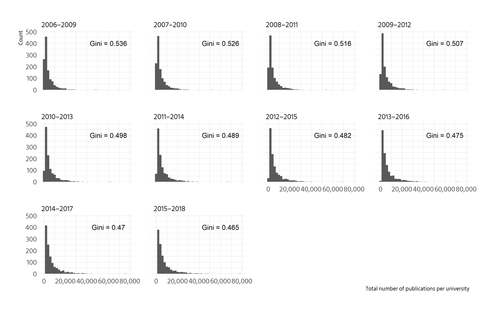
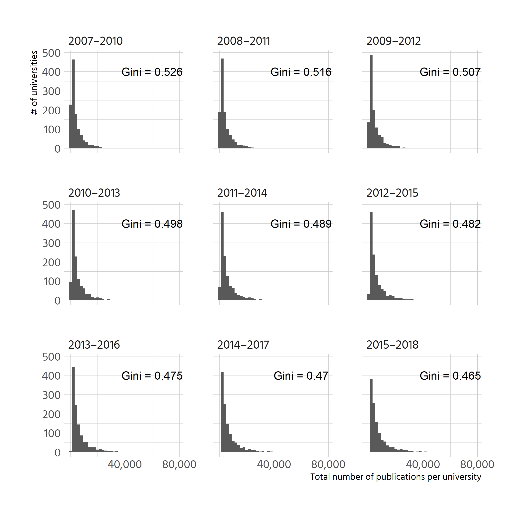
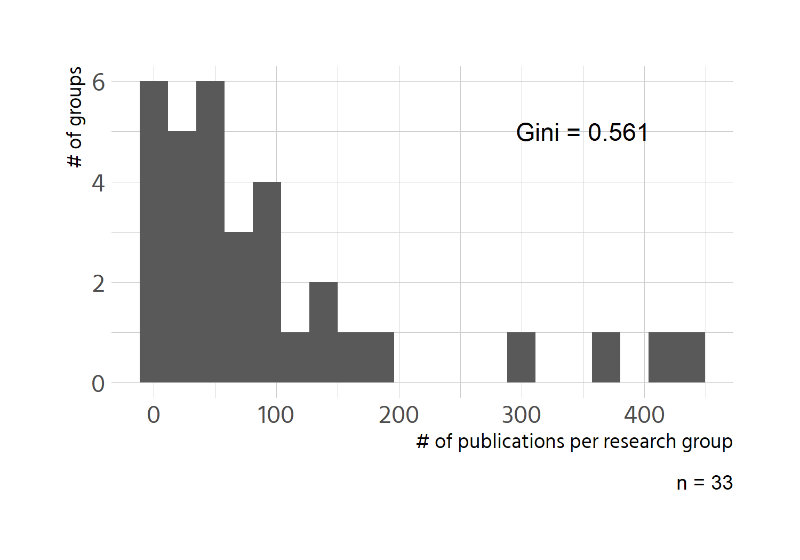

```r
ginis <- leiden %>% 
  group_by(Period) %>% 
  summarise(gini = ineq::Gini(impact_P),
            label = paste0("Gini = ", round(gini, 3)))

leiden %>% 
  ggplot() +
  geom_histogram(aes(impact_P), binwidth = 2000) +
  facet_wrap(vars(Period)) +
  geom_text(aes(x = 60000, y = 400, label = label), data = ginis) +
  scale_x_continuous(labels = scales::comma) +
  labs(x = "Total number of publications per university", 
       y = "# of universities")
```

<!-- -->

Create a version that fits better on the page

```r
gini_reduced <- filter(ginis, Period != "2006–2009")

leiden %>% 
  filter(Period != "2006–2009") %>% 
  ggplot() +
  geom_histogram(aes(impact_P), binwidth = 2000) +
  facet_wrap(vars(Period), nrow = 3) +
  geom_text(aes(x = 60000, y = 400, label = label), data = gini_reduced) +
  scale_x_continuous(labels = scales::comma, breaks = c(4e+4, 8e+4)) +
  labs(x = "Total number of publications per university", 
       y = "# of universities")
```

<!-- -->
# Italian research groups

```r
gini <- italy %>% 
  summarise(gini_pubs = ineq::Gini(n_publications) %>% round(3),
            label = paste0("Gini = ", gini_pubs))

italy %>% 
  ggplot(aes(n_publications)) +
  geom_histogram(bins = 20) +
  annotate("text", label = gini$label, x = 350, y = 5) +
  labs(x = "# of publications per research group",
       y = "# of groups",
       caption = paste0("n = ", nrow(italy)))
```

<!-- -->

