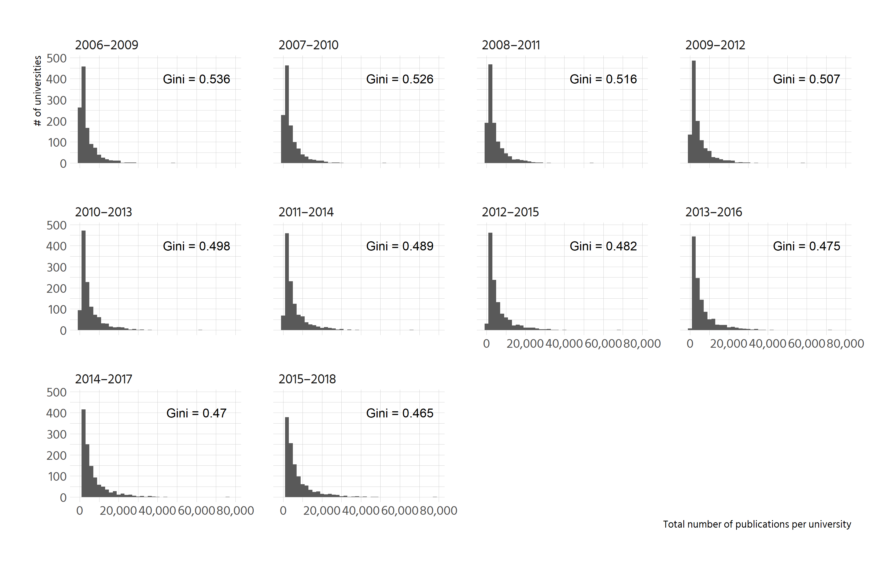

```r
ginis <- leiden %>% 
  group_by(Period) %>% 
  summarise(gini = ineq::Gini(impact_P),
            label = paste0("Gini = ", round(gini, 3)))

leiden %>% 
  ggplot() +
  geom_histogram(aes(impact_P), binwidth = 2000) +
  facet_wrap(vars(Period)) +
  geom_text(aes(x = 60000, y = 400, label = label), data = ginis) +
  scale_x_continuous(labels = scales::comma) +
  labs(x = "Total number of publications per university", y = "Count")
```

<!-- -->

