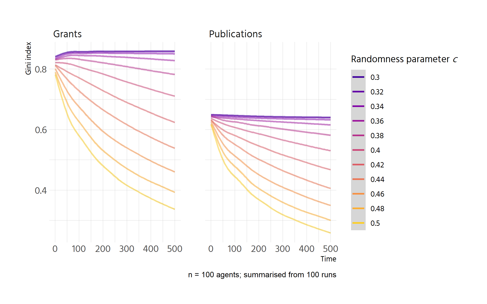

```r
p <- df %>% 
  select(run_number = .run.number., chance_imp = importance.of.chance, 
         step = .step., contains("gini")) %>% 
  pivot_longer(contains("gini")) %>% 
  filter(factor(chance_imp) %in% factor(seq(0, 1, by = .1)),
         !is.na(value)) %>% 
  mutate(name = str_remove(name, "\\..*") %>% str_to_title()) %>% 
  ggplot(aes(step, value, colour = factor(chance_imp))) +
  geom_smooth() +
  facet_wrap(vars(name)) +
  scale_colour_viridis_d(option = "C", alpha = .5,begin = .1, end = .9) +
  labs(y = "Gini index", 
       colour = expression(paste("Randomness parameter ", italic("c"))),
       caption = "n = 100 agents; summarised from 20 runs") 
p
```

```
## `geom_smooth()` using method = 'gam' and formula 'y ~ s(x, bs = "cs")'
```

<!-- -->


```r
plotly::ggplotly(p)
```

```
## `geom_smooth()` using method = 'gam' and formula 'y ~ s(x, bs = "cs")'
```

```{=html}
<div id="htmlwidget-2fd3059e0026a05bac65" style="width:840px;height:600px;" class="plotly html-widget"></div>
<script type="application/json" data-for="htmlwidget-2fd3059e0026a05bac65">{"x":{"data":[{"x":[1,7.31645569620253,13.6329113924051,19.9493670886076,26.2658227848101,32.5822784810127,38.8987341772152,45.2151898734177,51.5316455696203,57.8481012658228,64.1645569620253,70.4810126582279,76.7974683544304,83.1139240506329,89.4303797468354,95.746835443038,102.063291139241,108.379746835443,114.696202531646,121.012658227848,127.329113924051,133.645569620253,139.962025316456,146.278481012658,152.594936708861,158.911392405063,165.227848101266,171.544303797468,177.860759493671,184.177215189873,190.493670886076,196.810126582278,203.126582278481,209.443037974684,215.759493670886,222.075949367089,228.392405063291,234.708860759494,241.025316455696,247.341772151899,253.658227848101,259.974683544304,266.291139240506,272.607594936709,278.924050632911,285.240506329114,291.556962025316,297.873417721519,304.189873417722,310.506329113924,316.822784810127,323.139240506329,329.455696202532,335.772151898734,342.088607594937,348.405063291139,354.721518987342,361.037974683544,367.354430379747,373.670886075949,379.987341772152,386.303797468354,392.620253164557,398.936708860759,405.253164556962,411.569620253165,417.886075949367,424.20253164557,430.518987341772,436.835443037975,443.151898734177,449.46835443038,455.784810126582,462.101265822785,468.417721518987,474.73417721519,481.050632911392,487.367088607595,493.683544303797,500],"y":[0.807001786244821,0.816241016167735,0.825295793930939,0.833981667374726,0.842114184339385,0.849508892665208,0.855981340192486,0.861347074761509,0.865421644212569,0.868021450616929,0.869101601799991,0.868908071233253,0.867723457541153,0.865830359348127,0.863511375278613,0.86104910395705,0.858726144007874,0.856825094055523,0.855622219016667,0.855201694327053,0.855425619793795,0.856143724701018,0.857205738332848,0.858461389973412,0.859760408906837,0.860952524417248,0.861887465788772,0.862426328992878,0.862562347741385,0.862374005901182,0.861941208175072,0.86134385926586,0.86066186387635,0.859975126709348,0.859363552467657,0.858907045854083,0.858671172501421,0.85864126086361,0.858774745422466,0.859029032653806,0.859361529033447,0.859729641037208,0.860090775140906,0.860402337820359,0.860621750479235,0.860721302660759,0.860716052201149,0.860628699996312,0.86048194694216,0.860298493934599,0.860101041869541,0.859912291642892,0.859754944150564,0.859651485700361,0.859611527313906,0.859624723319238,0.85967901133957,0.859762328998117,0.859862613918093,0.85996780372271,0.860065836035185,0.86014464847873,0.860192703655018,0.860207888579026,0.860196242131246,0.86016407198114,0.860117685798174,0.86006339125181,0.860007496011512,0.859956307746744,0.859916134126968,0.859892620912771,0.859886157188976,0.859894625277627,0.859915892062661,0.859947824428013,0.859988289257621,0.86003515343542,0.860086283845346,0.860139547371337],"text":["step:   1.000000<br />value: 0.80700179<br />factor(chance_imp): 0","step:   7.316456<br />value: 0.81624102<br />factor(chance_imp): 0","step:  13.632911<br />value: 0.82529579<br />factor(chance_imp): 0","step:  19.949367<br />value: 0.83398167<br />factor(chance_imp): 0","step:  26.265823<br />value: 0.84211418<br />factor(chance_imp): 0","step:  32.582278<br />value: 0.84950889<br />factor(chance_imp): 0","step:  38.898734<br />value: 0.85598134<br />factor(chance_imp): 0","step:  45.215190<br />value: 0.86134707<br />factor(chance_imp): 0","step:  51.531646<br />value: 0.86542164<br />factor(chance_imp): 0","step:  57.848101<br />value: 0.86802145<br />factor(chance_imp): 0","step:  64.164557<br />value: 0.86910160<br />factor(chance_imp): 0","step:  70.481013<br />value: 0.86890807<br />factor(chance_imp): 0","step:  76.797468<br />value: 0.86772346<br />factor(chance_imp): 0","step:  83.113924<br />value: 0.86583036<br />factor(chance_imp): 0","step:  89.430380<br />value: 0.86351138<br />factor(chance_imp): 0","step:  95.746835<br />value: 0.86104910<br />factor(chance_imp): 0","step: 102.063291<br />value: 0.85872614<br />factor(chance_imp): 0","step: 108.379747<br />value: 0.85682509<br />factor(chance_imp): 0","step: 114.696203<br />value: 0.85562222<br />factor(chance_imp): 0","step: 121.012658<br />value: 0.85520169<br />factor(chance_imp): 0","step: 127.329114<br />value: 0.85542562<br />factor(chance_imp): 0","step: 133.645570<br />value: 0.85614372<br />factor(chance_imp): 0","step: 139.962025<br />value: 0.85720574<br />factor(chance_imp): 0","step: 146.278481<br />value: 0.85846139<br />factor(chance_imp): 0","step: 152.594937<br />value: 0.85976041<br />factor(chance_imp): 0","step: 158.911392<br />value: 0.86095252<br />factor(chance_imp): 0","step: 165.227848<br />value: 0.86188747<br />factor(chance_imp): 0","step: 171.544304<br />value: 0.86242633<br />factor(chance_imp): 0","step: 177.860759<br />value: 0.86256235<br />factor(chance_imp): 0","step: 184.177215<br />value: 0.86237401<br />factor(chance_imp): 0","step: 190.493671<br />value: 0.86194121<br />factor(chance_imp): 0","step: 196.810127<br />value: 0.86134386<br />factor(chance_imp): 0","step: 203.126582<br />value: 0.86066186<br />factor(chance_imp): 0","step: 209.443038<br />value: 0.85997513<br />factor(chance_imp): 0","step: 215.759494<br />value: 0.85936355<br />factor(chance_imp): 0","step: 222.075949<br />value: 0.85890705<br />factor(chance_imp): 0","step: 228.392405<br />value: 0.85867117<br />factor(chance_imp): 0","step: 234.708861<br />value: 0.85864126<br />factor(chance_imp): 0","step: 241.025316<br />value: 0.85877475<br />factor(chance_imp): 0","step: 247.341772<br />value: 0.85902903<br />factor(chance_imp): 0","step: 253.658228<br />value: 0.85936153<br />factor(chance_imp): 0","step: 259.974684<br />value: 0.85972964<br />factor(chance_imp): 0","step: 266.291139<br />value: 0.86009078<br />factor(chance_imp): 0","step: 272.607595<br />value: 0.86040234<br />factor(chance_imp): 0","step: 278.924051<br />value: 0.86062175<br />factor(chance_imp): 0","step: 285.240506<br />value: 0.86072130<br />factor(chance_imp): 0","step: 291.556962<br />value: 0.86071605<br />factor(chance_imp): 0","step: 297.873418<br />value: 0.86062870<br />factor(chance_imp): 0","step: 304.189873<br />value: 0.86048195<br />factor(chance_imp): 0","step: 310.506329<br />value: 0.86029849<br />factor(chance_imp): 0","step: 316.822785<br />value: 0.86010104<br />factor(chance_imp): 0","step: 323.139241<br />value: 0.85991229<br />factor(chance_imp): 0","step: 329.455696<br />value: 0.85975494<br />factor(chance_imp): 0","step: 335.772152<br />value: 0.85965149<br />factor(chance_imp): 0","step: 342.088608<br />value: 0.85961153<br />factor(chance_imp): 0","step: 348.405063<br />value: 0.85962472<br />factor(chance_imp): 0","step: 354.721519<br />value: 0.85967901<br />factor(chance_imp): 0","step: 361.037975<br />value: 0.85976233<br />factor(chance_imp): 0","step: 367.354430<br />value: 0.85986261<br />factor(chance_imp): 0","step: 373.670886<br />value: 0.85996780<br />factor(chance_imp): 0","step: 379.987342<br />value: 0.86006584<br />factor(chance_imp): 0","step: 386.303797<br />value: 0.86014465<br />factor(chance_imp): 0","step: 392.620253<br />value: 0.86019270<br />factor(chance_imp): 0","step: 398.936709<br />value: 0.86020789<br />factor(chance_imp): 0","step: 405.253165<br />value: 0.86019624<br />factor(chance_imp): 0","step: 411.569620<br />value: 0.86016407<br />factor(chance_imp): 0","step: 417.886076<br />value: 0.86011769<br />factor(chance_imp): 0","step: 424.202532<br />value: 0.86006339<br />factor(chance_imp): 0","step: 430.518987<br />value: 0.86000750<br />factor(chance_imp): 0","step: 436.835443<br />value: 0.85995631<br />factor(chance_imp): 0","step: 443.151899<br />value: 0.85991613<br />factor(chance_imp): 0","step: 449.468354<br />value: 0.85989262<br />factor(chance_imp): 0","step: 455.784810<br />value: 0.85988616<br />factor(chance_imp): 0","step: 462.101266<br />value: 0.85989463<br />factor(chance_imp): 0","step: 468.417722<br />value: 0.85991589<br />factor(chance_imp): 0","step: 474.734177<br />value: 0.85994782<br />factor(chance_imp): 0","step: 481.050633<br />value: 0.85998829<br />factor(chance_imp): 0","step: 487.367089<br />value: 0.86003515<br />factor(chance_imp): 0","step: 493.683544<br />value: 0.86008628<br />factor(chance_imp): 0","step: 500.000000<br />value: 0.86013955<br />factor(chance_imp): 0"],"type":"scatter","mode":"lines","name":"0","line":{"width":3.77952755905512,"color":"rgba(66,4,158,0.502)","dash":"solid"},"hoveron":"points","legendgroup":"0","showlegend":true,"xaxis":"x","yaxis":"y","hoverinfo":"text","frame":null},{"x":[1,7.31645569620253,13.6329113924051,19.9493670886076,26.2658227848101,32.5822784810127,38.8987341772152,45.2151898734177,51.5316455696203,57.8481012658228,64.1645569620253,70.4810126582279,76.7974683544304,83.1139240506329,89.4303797468354,95.746835443038,102.063291139241,108.379746835443,114.696202531646,121.012658227848,127.329113924051,133.645569620253,139.962025316456,146.278481012658,152.594936708861,158.911392405063,165.227848101266,171.544303797468,177.860759493671,184.177215189873,190.493670886076,196.810126582278,203.126582278481,209.443037974684,215.759493670886,222.075949367089,228.392405063291,234.708860759494,241.025316455696,247.341772151899,253.658227848101,259.974683544304,266.291139240506,272.607594936709,278.924050632911,285.240506329114,291.556962025316,297.873417721519,304.189873417722,310.506329113924,316.822784810127,323.139240506329,329.455696202532,335.772151898734,342.088607594937,348.405063291139,354.721518987342,361.037974683544,367.354430379747,373.670886075949,379.987341772152,386.303797468354,392.620253164557,398.936708860759,405.253164556962,411.569620253165,417.886075949367,424.20253164557,430.518987341772,436.835443037975,443.151898734177,449.46835443038,455.784810126582,462.101265822785,468.417721518987,474.73417721519,481.050632911392,487.367088607595,493.683544303797,500],"y":[0.569608569938068,0.579746999192121,0.589713561147393,0.599336388505101,0.608443613966464,0.616863370232699,0.624423790005025,0.630953005984659,0.636279150872821,0.64023109772413,0.642757934476929,0.644060839403095,0.644372733426632,0.643926537471548,0.642955172461846,0.641691559321534,0.640368618974617,0.639219272345101,0.638471663128295,0.63820905063047,0.638347192576748,0.638792516167458,0.639451448602924,0.640230417083475,0.641035848809437,0.641774170981136,0.6423518107989,0.642682271651146,0.642761317612856,0.642637784169696,0.642361391330845,0.641981859105481,0.641548907502782,0.641112256531927,0.640721626202093,0.64042673652246,0.640268360459597,0.640237205985802,0.640306576279549,0.640449757044618,0.640640033984792,0.640850692803853,0.641055019205581,0.641226298893761,0.641337827117595,0.641372406368115,0.641340186774736,0.641256205723713,0.641135500601303,0.640993108793763,0.640844067687347,0.640703414668314,0.640586187122919,0.640507272572157,0.64047256662133,0.640474027406417,0.640502414141303,0.640548486039875,0.64060300231602,0.640656722183623,0.640700404856571,0.640724809548749,0.640721123983129,0.640688228477754,0.640631657239722,0.640557163872784,0.64047050198069,0.640377425167189,0.640283687036031,0.640195041190966,0.640117241235744,0.64005542987134,0.640009898197699,0.639978623720878,0.639959569698476,0.639950699388087,0.63994997604731,0.639955362933743,0.63996482330498,0.639976320418621],"text":["step:   1.000000<br />value: 0.56960857<br />factor(chance_imp): 0","step:   7.316456<br />value: 0.57974700<br />factor(chance_imp): 0","step:  13.632911<br />value: 0.58971356<br />factor(chance_imp): 0","step:  19.949367<br />value: 0.59933639<br />factor(chance_imp): 0","step:  26.265823<br />value: 0.60844361<br />factor(chance_imp): 0","step:  32.582278<br />value: 0.61686337<br />factor(chance_imp): 0","step:  38.898734<br />value: 0.62442379<br />factor(chance_imp): 0","step:  45.215190<br />value: 0.63095301<br />factor(chance_imp): 0","step:  51.531646<br />value: 0.63627915<br />factor(chance_imp): 0","step:  57.848101<br />value: 0.64023110<br />factor(chance_imp): 0","step:  64.164557<br />value: 0.64275793<br />factor(chance_imp): 0","step:  70.481013<br />value: 0.64406084<br />factor(chance_imp): 0","step:  76.797468<br />value: 0.64437273<br />factor(chance_imp): 0","step:  83.113924<br />value: 0.64392654<br />factor(chance_imp): 0","step:  89.430380<br />value: 0.64295517<br />factor(chance_imp): 0","step:  95.746835<br />value: 0.64169156<br />factor(chance_imp): 0","step: 102.063291<br />value: 0.64036862<br />factor(chance_imp): 0","step: 108.379747<br />value: 0.63921927<br />factor(chance_imp): 0","step: 114.696203<br />value: 0.63847166<br />factor(chance_imp): 0","step: 121.012658<br />value: 0.63820905<br />factor(chance_imp): 0","step: 127.329114<br />value: 0.63834719<br />factor(chance_imp): 0","step: 133.645570<br />value: 0.63879252<br />factor(chance_imp): 0","step: 139.962025<br />value: 0.63945145<br />factor(chance_imp): 0","step: 146.278481<br />value: 0.64023042<br />factor(chance_imp): 0","step: 152.594937<br />value: 0.64103585<br />factor(chance_imp): 0","step: 158.911392<br />value: 0.64177417<br />factor(chance_imp): 0","step: 165.227848<br />value: 0.64235181<br />factor(chance_imp): 0","step: 171.544304<br />value: 0.64268227<br />factor(chance_imp): 0","step: 177.860759<br />value: 0.64276132<br />factor(chance_imp): 0","step: 184.177215<br />value: 0.64263778<br />factor(chance_imp): 0","step: 190.493671<br />value: 0.64236139<br />factor(chance_imp): 0","step: 196.810127<br />value: 0.64198186<br />factor(chance_imp): 0","step: 203.126582<br />value: 0.64154891<br />factor(chance_imp): 0","step: 209.443038<br />value: 0.64111226<br />factor(chance_imp): 0","step: 215.759494<br />value: 0.64072163<br />factor(chance_imp): 0","step: 222.075949<br />value: 0.64042674<br />factor(chance_imp): 0","step: 228.392405<br />value: 0.64026836<br />factor(chance_imp): 0","step: 234.708861<br />value: 0.64023721<br />factor(chance_imp): 0","step: 241.025316<br />value: 0.64030658<br />factor(chance_imp): 0","step: 247.341772<br />value: 0.64044976<br />factor(chance_imp): 0","step: 253.658228<br />value: 0.64064003<br />factor(chance_imp): 0","step: 259.974684<br />value: 0.64085069<br />factor(chance_imp): 0","step: 266.291139<br />value: 0.64105502<br />factor(chance_imp): 0","step: 272.607595<br />value: 0.64122630<br />factor(chance_imp): 0","step: 278.924051<br />value: 0.64133783<br />factor(chance_imp): 0","step: 285.240506<br />value: 0.64137241<br />factor(chance_imp): 0","step: 291.556962<br />value: 0.64134019<br />factor(chance_imp): 0","step: 297.873418<br />value: 0.64125621<br />factor(chance_imp): 0","step: 304.189873<br />value: 0.64113550<br />factor(chance_imp): 0","step: 310.506329<br />value: 0.64099311<br />factor(chance_imp): 0","step: 316.822785<br />value: 0.64084407<br />factor(chance_imp): 0","step: 323.139241<br />value: 0.64070341<br />factor(chance_imp): 0","step: 329.455696<br />value: 0.64058619<br />factor(chance_imp): 0","step: 335.772152<br />value: 0.64050727<br />factor(chance_imp): 0","step: 342.088608<br />value: 0.64047257<br />factor(chance_imp): 0","step: 348.405063<br />value: 0.64047403<br />factor(chance_imp): 0","step: 354.721519<br />value: 0.64050241<br />factor(chance_imp): 0","step: 361.037975<br />value: 0.64054849<br />factor(chance_imp): 0","step: 367.354430<br />value: 0.64060300<br />factor(chance_imp): 0","step: 373.670886<br />value: 0.64065672<br />factor(chance_imp): 0","step: 379.987342<br />value: 0.64070040<br />factor(chance_imp): 0","step: 386.303797<br />value: 0.64072481<br />factor(chance_imp): 0","step: 392.620253<br />value: 0.64072112<br />factor(chance_imp): 0","step: 398.936709<br />value: 0.64068823<br />factor(chance_imp): 0","step: 405.253165<br />value: 0.64063166<br />factor(chance_imp): 0","step: 411.569620<br />value: 0.64055716<br />factor(chance_imp): 0","step: 417.886076<br />value: 0.64047050<br />factor(chance_imp): 0","step: 424.202532<br />value: 0.64037743<br />factor(chance_imp): 0","step: 430.518987<br />value: 0.64028369<br />factor(chance_imp): 0","step: 436.835443<br />value: 0.64019504<br />factor(chance_imp): 0","step: 443.151899<br />value: 0.64011724<br />factor(chance_imp): 0","step: 449.468354<br />value: 0.64005543<br />factor(chance_imp): 0","step: 455.784810<br />value: 0.64000990<br />factor(chance_imp): 0","step: 462.101266<br />value: 0.63997862<br />factor(chance_imp): 0","step: 468.417722<br />value: 0.63995957<br />factor(chance_imp): 0","step: 474.734177<br />value: 0.63995070<br />factor(chance_imp): 0","step: 481.050633<br />value: 0.63994998<br />factor(chance_imp): 0","step: 487.367089<br />value: 0.63995536<br />factor(chance_imp): 0","step: 493.683544<br />value: 0.63996482<br />factor(chance_imp): 0","step: 500.000000<br />value: 0.63997632<br />factor(chance_imp): 0"],"type":"scatter","mode":"lines","name":"0","line":{"width":3.77952755905512,"color":"rgba(66,4,158,0.502)","dash":"solid"},"hoveron":"points","legendgroup":"0","showlegend":false,"xaxis":"x2","yaxis":"y","hoverinfo":"text","frame":null},{"x":[1,7.31645569620253,13.6329113924051,19.9493670886076,26.2658227848101,32.5822784810127,38.8987341772152,45.2151898734177,51.5316455696203,57.8481012658228,64.1645569620253,70.4810126582279,76.7974683544304,83.1139240506329,89.4303797468354,95.746835443038,102.063291139241,108.379746835443,114.696202531646,121.012658227848,127.329113924051,133.645569620253,139.962025316456,146.278481012658,152.594936708861,158.911392405063,165.227848101266,171.544303797468,177.860759493671,184.177215189873,190.493670886076,196.810126582278,203.126582278481,209.443037974684,215.759493670886,222.075949367089,228.392405063291,234.708860759494,241.025316455696,247.341772151899,253.658227848101,259.974683544304,266.291139240506,272.607594936709,278.924050632911,285.240506329114,291.556962025316,297.873417721519,304.189873417722,310.506329113924,316.822784810127,323.139240506329,329.455696202532,335.772151898734,342.088607594937,348.405063291139,354.721518987342,361.037974683544,367.354430379747,373.670886075949,379.987341772152,386.303797468354,392.620253164557,398.936708860759,405.253164556962,411.569620253165,417.886075949367,424.20253164557,430.518987341772,436.835443037975,443.151898734177,449.46835443038,455.784810126582,462.101265822785,468.417721518987,474.73417721519,481.050632911392,487.367088607595,493.683544303797,500],"y":[0.807269438262067,0.816460015037501,0.825467139449003,0.834107359132637,0.84219722172447,0.849553274860569,0.855992066176999,0.861330143309828,0.865384053895122,0.867971195113267,0.869046908903677,0.86885580704686,0.867678925536066,0.865797300364541,0.863491967525533,0.86104396301229,0.85873432281806,0.856844082936089,0.855647981160269,0.855229742707102,0.855452262178122,0.85616613300424,0.85722194861637,0.858470302445426,0.859761787922318,0.860946998477961,0.861876527543268,0.862412269770481,0.862547496509804,0.862360238271417,0.861929938218166,0.861336039512897,0.860657985318455,0.859975218797687,0.859367183113437,0.858913321428552,0.858678820572427,0.858649093164819,0.858781818801821,0.859034649235123,0.859365236216416,0.859731231497392,0.860090286829741,0.860400053965154,0.860618199497352,0.860717172681838,0.860711945189778,0.860625087811652,0.860479171337935,0.860296766559105,0.860100444265641,0.859912775248018,0.859756330296715,0.859653466841832,0.859613740690855,0.859626865136219,0.859680846587342,0.859763691453643,0.859863406144541,0.859967997069456,0.860065470637805,0.860143833259009,0.860191613332081,0.860206710013251,0.860195127913188,0.860163138901229,0.860117014846717,0.860063027618991,0.86000744908739,0.859956551121255,0.859916605589926,0.859893226207901,0.859886799827326,0.859895220754749,0.859916367946172,0.859948120357595,0.859988356945016,0.860034956664438,0.86008579847186,0.860138761323281],"text":["step:   1.000000<br />value: 0.80726944<br />factor(chance_imp): 0.1","step:   7.316456<br />value: 0.81646002<br />factor(chance_imp): 0.1","step:  13.632911<br />value: 0.82546714<br />factor(chance_imp): 0.1","step:  19.949367<br />value: 0.83410736<br />factor(chance_imp): 0.1","step:  26.265823<br />value: 0.84219722<br />factor(chance_imp): 0.1","step:  32.582278<br />value: 0.84955327<br />factor(chance_imp): 0.1","step:  38.898734<br />value: 0.85599207<br />factor(chance_imp): 0.1","step:  45.215190<br />value: 0.86133014<br />factor(chance_imp): 0.1","step:  51.531646<br />value: 0.86538405<br />factor(chance_imp): 0.1","step:  57.848101<br />value: 0.86797120<br />factor(chance_imp): 0.1","step:  64.164557<br />value: 0.86904691<br />factor(chance_imp): 0.1","step:  70.481013<br />value: 0.86885581<br />factor(chance_imp): 0.1","step:  76.797468<br />value: 0.86767893<br />factor(chance_imp): 0.1","step:  83.113924<br />value: 0.86579730<br />factor(chance_imp): 0.1","step:  89.430380<br />value: 0.86349197<br />factor(chance_imp): 0.1","step:  95.746835<br />value: 0.86104396<br />factor(chance_imp): 0.1","step: 102.063291<br />value: 0.85873432<br />factor(chance_imp): 0.1","step: 108.379747<br />value: 0.85684408<br />factor(chance_imp): 0.1","step: 114.696203<br />value: 0.85564798<br />factor(chance_imp): 0.1","step: 121.012658<br />value: 0.85522974<br />factor(chance_imp): 0.1","step: 127.329114<br />value: 0.85545226<br />factor(chance_imp): 0.1","step: 133.645570<br />value: 0.85616613<br />factor(chance_imp): 0.1","step: 139.962025<br />value: 0.85722195<br />factor(chance_imp): 0.1","step: 146.278481<br />value: 0.85847030<br />factor(chance_imp): 0.1","step: 152.594937<br />value: 0.85976179<br />factor(chance_imp): 0.1","step: 158.911392<br />value: 0.86094700<br />factor(chance_imp): 0.1","step: 165.227848<br />value: 0.86187653<br />factor(chance_imp): 0.1","step: 171.544304<br />value: 0.86241227<br />factor(chance_imp): 0.1","step: 177.860759<br />value: 0.86254750<br />factor(chance_imp): 0.1","step: 184.177215<br />value: 0.86236024<br />factor(chance_imp): 0.1","step: 190.493671<br />value: 0.86192994<br />factor(chance_imp): 0.1","step: 196.810127<br />value: 0.86133604<br />factor(chance_imp): 0.1","step: 203.126582<br />value: 0.86065799<br />factor(chance_imp): 0.1","step: 209.443038<br />value: 0.85997522<br />factor(chance_imp): 0.1","step: 215.759494<br />value: 0.85936718<br />factor(chance_imp): 0.1","step: 222.075949<br />value: 0.85891332<br />factor(chance_imp): 0.1","step: 228.392405<br />value: 0.85867882<br />factor(chance_imp): 0.1","step: 234.708861<br />value: 0.85864909<br />factor(chance_imp): 0.1","step: 241.025316<br />value: 0.85878182<br />factor(chance_imp): 0.1","step: 247.341772<br />value: 0.85903465<br />factor(chance_imp): 0.1","step: 253.658228<br />value: 0.85936524<br />factor(chance_imp): 0.1","step: 259.974684<br />value: 0.85973123<br />factor(chance_imp): 0.1","step: 266.291139<br />value: 0.86009029<br />factor(chance_imp): 0.1","step: 272.607595<br />value: 0.86040005<br />factor(chance_imp): 0.1","step: 278.924051<br />value: 0.86061820<br />factor(chance_imp): 0.1","step: 285.240506<br />value: 0.86071717<br />factor(chance_imp): 0.1","step: 291.556962<br />value: 0.86071195<br />factor(chance_imp): 0.1","step: 297.873418<br />value: 0.86062509<br />factor(chance_imp): 0.1","step: 304.189873<br />value: 0.86047917<br />factor(chance_imp): 0.1","step: 310.506329<br />value: 0.86029677<br />factor(chance_imp): 0.1","step: 316.822785<br />value: 0.86010044<br />factor(chance_imp): 0.1","step: 323.139241<br />value: 0.85991278<br />factor(chance_imp): 0.1","step: 329.455696<br />value: 0.85975633<br />factor(chance_imp): 0.1","step: 335.772152<br />value: 0.85965347<br />factor(chance_imp): 0.1","step: 342.088608<br />value: 0.85961374<br />factor(chance_imp): 0.1","step: 348.405063<br />value: 0.85962687<br />factor(chance_imp): 0.1","step: 354.721519<br />value: 0.85968085<br />factor(chance_imp): 0.1","step: 361.037975<br />value: 0.85976369<br />factor(chance_imp): 0.1","step: 367.354430<br />value: 0.85986341<br />factor(chance_imp): 0.1","step: 373.670886<br />value: 0.85996800<br />factor(chance_imp): 0.1","step: 379.987342<br />value: 0.86006547<br />factor(chance_imp): 0.1","step: 386.303797<br />value: 0.86014383<br />factor(chance_imp): 0.1","step: 392.620253<br />value: 0.86019161<br />factor(chance_imp): 0.1","step: 398.936709<br />value: 0.86020671<br />factor(chance_imp): 0.1","step: 405.253165<br />value: 0.86019513<br />factor(chance_imp): 0.1","step: 411.569620<br />value: 0.86016314<br />factor(chance_imp): 0.1","step: 417.886076<br />value: 0.86011701<br />factor(chance_imp): 0.1","step: 424.202532<br />value: 0.86006303<br />factor(chance_imp): 0.1","step: 430.518987<br />value: 0.86000745<br />factor(chance_imp): 0.1","step: 436.835443<br />value: 0.85995655<br />factor(chance_imp): 0.1","step: 443.151899<br />value: 0.85991661<br />factor(chance_imp): 0.1","step: 449.468354<br />value: 0.85989323<br />factor(chance_imp): 0.1","step: 455.784810<br />value: 0.85988680<br />factor(chance_imp): 0.1","step: 462.101266<br />value: 0.85989522<br />factor(chance_imp): 0.1","step: 468.417722<br />value: 0.85991637<br />factor(chance_imp): 0.1","step: 474.734177<br />value: 0.85994812<br />factor(chance_imp): 0.1","step: 481.050633<br />value: 0.85998836<br />factor(chance_imp): 0.1","step: 487.367089<br />value: 0.86003496<br />factor(chance_imp): 0.1","step: 493.683544<br />value: 0.86008580<br />factor(chance_imp): 0.1","step: 500.000000<br />value: 0.86013876<br />factor(chance_imp): 0.1"],"type":"scatter","mode":"lines","name":"0.1","line":{"width":3.77952755905512,"color":"rgba(99,0,167,0.502)","dash":"solid"},"hoveron":"points","legendgroup":"0.1","showlegend":true,"xaxis":"x","yaxis":"y","hoverinfo":"text","frame":null},{"x":[1,7.31645569620253,13.6329113924051,19.9493670886076,26.2658227848101,32.5822784810127,38.8987341772152,45.2151898734177,51.5316455696203,57.8481012658228,64.1645569620253,70.4810126582279,76.7974683544304,83.1139240506329,89.4303797468354,95.746835443038,102.063291139241,108.379746835443,114.696202531646,121.012658227848,127.329113924051,133.645569620253,139.962025316456,146.278481012658,152.594936708861,158.911392405063,165.227848101266,171.544303797468,177.860759493671,184.177215189873,190.493670886076,196.810126582278,203.126582278481,209.443037974684,215.759493670886,222.075949367089,228.392405063291,234.708860759494,241.025316455696,247.341772151899,253.658227848101,259.974683544304,266.291139240506,272.607594936709,278.924050632911,285.240506329114,291.556962025316,297.873417721519,304.189873417722,310.506329113924,316.822784810127,323.139240506329,329.455696202532,335.772151898734,342.088607594937,348.405063291139,354.721518987342,361.037974683544,367.354430379747,373.670886075949,379.987341772152,386.303797468354,392.620253164557,398.936708860759,405.253164556962,411.569620253165,417.886075949367,424.20253164557,430.518987341772,436.835443037975,443.151898734177,449.46835443038,455.784810126582,462.101265822785,468.417721518987,474.73417721519,481.050632911392,487.367088607595,493.683544303797,500],"y":[0.572198823230699,0.582116135396166,0.591862836938921,0.601268317236251,0.610161965665443,0.618373171603785,0.625731324428563,0.632065813517066,0.637206028246581,0.640982098409137,0.643344378640471,0.644495334795925,0.644669178012894,0.644100119428775,0.643022370180966,0.641670141406863,0.640277644243862,0.639079089829362,0.638303830248816,0.638033851653037,0.638180769684156,0.638646709648483,0.639333796852329,0.640144156602004,0.640979914203819,0.641743194964082,0.642336124189106,0.642668252870037,0.642735455584268,0.642589299545474,0.642282280177937,0.641866892905937,0.641395633153758,0.640920996345679,0.640495477905982,0.640171573258948,0.6399924127639,0.639948722656906,0.640013011196108,0.640157768348501,0.640355484081087,0.640578648360861,0.640799751154823,0.640991282429971,0.641125741646136,0.641185083124393,0.641178458151149,0.641119878343088,0.641023355316895,0.640902900689254,0.64077252607685,0.640646243096367,0.64053806336449,0.640461865014183,0.640423517155229,0.640416474911477,0.640433125537016,0.640465856285939,0.640507054412337,0.640549107170299,0.640584401813918,0.640605325597283,0.64060459815888,0.640580906101809,0.640538097294022,0.640480189784279,0.640411201621342,0.64033515085397,0.640256055530924,0.640177933700964,0.640104803412852,0.64004027916255,0.639984770554418,0.639937158868956,0.639896315974354,0.639861113738802,0.63983042403049,0.639803118717608,0.639778069668346,0.639754148750894],"text":["step:   1.000000<br />value: 0.57219882<br />factor(chance_imp): 0.1","step:   7.316456<br />value: 0.58211614<br />factor(chance_imp): 0.1","step:  13.632911<br />value: 0.59186284<br />factor(chance_imp): 0.1","step:  19.949367<br />value: 0.60126832<br />factor(chance_imp): 0.1","step:  26.265823<br />value: 0.61016197<br />factor(chance_imp): 0.1","step:  32.582278<br />value: 0.61837317<br />factor(chance_imp): 0.1","step:  38.898734<br />value: 0.62573132<br />factor(chance_imp): 0.1","step:  45.215190<br />value: 0.63206581<br />factor(chance_imp): 0.1","step:  51.531646<br />value: 0.63720603<br />factor(chance_imp): 0.1","step:  57.848101<br />value: 0.64098210<br />factor(chance_imp): 0.1","step:  64.164557<br />value: 0.64334438<br />factor(chance_imp): 0.1","step:  70.481013<br />value: 0.64449533<br />factor(chance_imp): 0.1","step:  76.797468<br />value: 0.64466918<br />factor(chance_imp): 0.1","step:  83.113924<br />value: 0.64410012<br />factor(chance_imp): 0.1","step:  89.430380<br />value: 0.64302237<br />factor(chance_imp): 0.1","step:  95.746835<br />value: 0.64167014<br />factor(chance_imp): 0.1","step: 102.063291<br />value: 0.64027764<br />factor(chance_imp): 0.1","step: 108.379747<br />value: 0.63907909<br />factor(chance_imp): 0.1","step: 114.696203<br />value: 0.63830383<br />factor(chance_imp): 0.1","step: 121.012658<br />value: 0.63803385<br />factor(chance_imp): 0.1","step: 127.329114<br />value: 0.63818077<br />factor(chance_imp): 0.1","step: 133.645570<br />value: 0.63864671<br />factor(chance_imp): 0.1","step: 139.962025<br />value: 0.63933380<br />factor(chance_imp): 0.1","step: 146.278481<br />value: 0.64014416<br />factor(chance_imp): 0.1","step: 152.594937<br />value: 0.64097991<br />factor(chance_imp): 0.1","step: 158.911392<br />value: 0.64174319<br />factor(chance_imp): 0.1","step: 165.227848<br />value: 0.64233612<br />factor(chance_imp): 0.1","step: 171.544304<br />value: 0.64266825<br />factor(chance_imp): 0.1","step: 177.860759<br />value: 0.64273546<br />factor(chance_imp): 0.1","step: 184.177215<br />value: 0.64258930<br />factor(chance_imp): 0.1","step: 190.493671<br />value: 0.64228228<br />factor(chance_imp): 0.1","step: 196.810127<br />value: 0.64186689<br />factor(chance_imp): 0.1","step: 203.126582<br />value: 0.64139563<br />factor(chance_imp): 0.1","step: 209.443038<br />value: 0.64092100<br />factor(chance_imp): 0.1","step: 215.759494<br />value: 0.64049548<br />factor(chance_imp): 0.1","step: 222.075949<br />value: 0.64017157<br />factor(chance_imp): 0.1","step: 228.392405<br />value: 0.63999241<br />factor(chance_imp): 0.1","step: 234.708861<br />value: 0.63994872<br />factor(chance_imp): 0.1","step: 241.025316<br />value: 0.64001301<br />factor(chance_imp): 0.1","step: 247.341772<br />value: 0.64015777<br />factor(chance_imp): 0.1","step: 253.658228<br />value: 0.64035548<br />factor(chance_imp): 0.1","step: 259.974684<br />value: 0.64057865<br />factor(chance_imp): 0.1","step: 266.291139<br />value: 0.64079975<br />factor(chance_imp): 0.1","step: 272.607595<br />value: 0.64099128<br />factor(chance_imp): 0.1","step: 278.924051<br />value: 0.64112574<br />factor(chance_imp): 0.1","step: 285.240506<br />value: 0.64118508<br />factor(chance_imp): 0.1","step: 291.556962<br />value: 0.64117846<br />factor(chance_imp): 0.1","step: 297.873418<br />value: 0.64111988<br />factor(chance_imp): 0.1","step: 304.189873<br />value: 0.64102336<br />factor(chance_imp): 0.1","step: 310.506329<br />value: 0.64090290<br />factor(chance_imp): 0.1","step: 316.822785<br />value: 0.64077253<br />factor(chance_imp): 0.1","step: 323.139241<br />value: 0.64064624<br />factor(chance_imp): 0.1","step: 329.455696<br />value: 0.64053806<br />factor(chance_imp): 0.1","step: 335.772152<br />value: 0.64046187<br />factor(chance_imp): 0.1","step: 342.088608<br />value: 0.64042352<br />factor(chance_imp): 0.1","step: 348.405063<br />value: 0.64041647<br />factor(chance_imp): 0.1","step: 354.721519<br />value: 0.64043313<br />factor(chance_imp): 0.1","step: 361.037975<br />value: 0.64046586<br />factor(chance_imp): 0.1","step: 367.354430<br />value: 0.64050705<br />factor(chance_imp): 0.1","step: 373.670886<br />value: 0.64054911<br />factor(chance_imp): 0.1","step: 379.987342<br />value: 0.64058440<br />factor(chance_imp): 0.1","step: 386.303797<br />value: 0.64060533<br />factor(chance_imp): 0.1","step: 392.620253<br />value: 0.64060460<br />factor(chance_imp): 0.1","step: 398.936709<br />value: 0.64058091<br />factor(chance_imp): 0.1","step: 405.253165<br />value: 0.64053810<br />factor(chance_imp): 0.1","step: 411.569620<br />value: 0.64048019<br />factor(chance_imp): 0.1","step: 417.886076<br />value: 0.64041120<br />factor(chance_imp): 0.1","step: 424.202532<br />value: 0.64033515<br />factor(chance_imp): 0.1","step: 430.518987<br />value: 0.64025606<br />factor(chance_imp): 0.1","step: 436.835443<br />value: 0.64017793<br />factor(chance_imp): 0.1","step: 443.151899<br />value: 0.64010480<br />factor(chance_imp): 0.1","step: 449.468354<br />value: 0.64004028<br />factor(chance_imp): 0.1","step: 455.784810<br />value: 0.63998477<br />factor(chance_imp): 0.1","step: 462.101266<br />value: 0.63993716<br />factor(chance_imp): 0.1","step: 468.417722<br />value: 0.63989632<br />factor(chance_imp): 0.1","step: 474.734177<br />value: 0.63986111<br />factor(chance_imp): 0.1","step: 481.050633<br />value: 0.63983042<br />factor(chance_imp): 0.1","step: 487.367089<br />value: 0.63980312<br />factor(chance_imp): 0.1","step: 493.683544<br />value: 0.63977807<br />factor(chance_imp): 0.1","step: 500.000000<br />value: 0.63975415<br />factor(chance_imp): 0.1"],"type":"scatter","mode":"lines","name":"0.1","line":{"width":3.77952755905512,"color":"rgba(99,0,167,0.502)","dash":"solid"},"hoveron":"points","legendgroup":"0.1","showlegend":false,"xaxis":"x2","yaxis":"y","hoverinfo":"text","frame":null},{"x":[1,7.31645569620253,13.6329113924051,19.9493670886076,26.2658227848101,32.5822784810127,38.8987341772152,45.2151898734177,51.5316455696203,57.8481012658228,64.1645569620253,70.4810126582279,76.7974683544304,83.1139240506329,89.4303797468354,95.746835443038,102.063291139241,108.379746835443,114.696202531646,121.012658227848,127.329113924051,133.645569620253,139.962025316456,146.278481012658,152.594936708861,158.911392405063,165.227848101266,171.544303797468,177.860759493671,184.177215189873,190.493670886076,196.810126582278,203.126582278481,209.443037974684,215.759493670886,222.075949367089,228.392405063291,234.708860759494,241.025316455696,247.341772151899,253.658227848101,259.974683544304,266.291139240506,272.607594936709,278.924050632911,285.240506329114,291.556962025316,297.873417721519,304.189873417722,310.506329113924,316.822784810127,323.139240506329,329.455696202532,335.772151898734,342.088607594937,348.405063291139,354.721518987342,361.037974683544,367.354430379747,373.670886075949,379.987341772152,386.303797468354,392.620253164557,398.936708860759,405.253164556962,411.569620253165,417.886075949367,424.20253164557,430.518987341772,436.835443037975,443.151898734177,449.46835443038,455.784810126582,462.101265822785,468.417721518987,474.73417721519,481.050632911392,487.367088607595,493.683544303797,500],"y":[0.807426503122178,0.816569540485392,0.825530364506325,0.834126761842691,0.842176519152211,0.8494974230926,0.855907260321577,0.861223817496858,0.865264881276162,0.867849081514956,0.868931962303465,0.868756176565998,0.867600529330421,0.865743825624602,0.863464870476406,0.8610424689137,0.858755425964352,0.856882546656227,0.855696393458387,0.855280203736128,0.855498335136641,0.856202952809445,0.857246221904064,0.85848030757002,0.859757374956835,0.860929589214031,0.861849115491131,0.862379298487524,0.86251344516983,0.862328709128683,0.861903641398455,0.861316793013512,0.860646715008225,0.859971958416963,0.859371074274095,0.85892261361399,0.858691031189024,0.858661903142365,0.858793383943614,0.859043600530572,0.859370679841042,0.859732748812824,0.860087934383718,0.860394363491525,0.860610177749328,0.860708135349633,0.860703039163716,0.860617205806494,0.860472951892883,0.8602925940378,0.860098448856161,0.859912832962883,0.859758062972883,0.859656244557805,0.859616826792993,0.859629641029528,0.859682831072316,0.859764540726263,0.859862913796275,0.859966094087258,0.860062225404119,0.860139451551764,0.860186432773613,0.860201100417299,0.860189405087706,0.860157561806237,0.860111785594298,0.86005829147329,0.860003294464619,0.859953009589687,0.859913651869899,0.859890783476275,0.859884781843843,0.859893551950932,0.859914983549039,0.859946966389661,0.859987390224295,0.860034144804437,0.860085119881586,0.860138205207237],"text":["step:   1.000000<br />value: 0.80742650<br />factor(chance_imp): 0.2","step:   7.316456<br />value: 0.81656954<br />factor(chance_imp): 0.2","step:  13.632911<br />value: 0.82553036<br />factor(chance_imp): 0.2","step:  19.949367<br />value: 0.83412676<br />factor(chance_imp): 0.2","step:  26.265823<br />value: 0.84217652<br />factor(chance_imp): 0.2","step:  32.582278<br />value: 0.84949742<br />factor(chance_imp): 0.2","step:  38.898734<br />value: 0.85590726<br />factor(chance_imp): 0.2","step:  45.215190<br />value: 0.86122382<br />factor(chance_imp): 0.2","step:  51.531646<br />value: 0.86526488<br />factor(chance_imp): 0.2","step:  57.848101<br />value: 0.86784908<br />factor(chance_imp): 0.2","step:  64.164557<br />value: 0.86893196<br />factor(chance_imp): 0.2","step:  70.481013<br />value: 0.86875618<br />factor(chance_imp): 0.2","step:  76.797468<br />value: 0.86760053<br />factor(chance_imp): 0.2","step:  83.113924<br />value: 0.86574383<br />factor(chance_imp): 0.2","step:  89.430380<br />value: 0.86346487<br />factor(chance_imp): 0.2","step:  95.746835<br />value: 0.86104247<br />factor(chance_imp): 0.2","step: 102.063291<br />value: 0.85875543<br />factor(chance_imp): 0.2","step: 108.379747<br />value: 0.85688255<br />factor(chance_imp): 0.2","step: 114.696203<br />value: 0.85569639<br />factor(chance_imp): 0.2","step: 121.012658<br />value: 0.85528020<br />factor(chance_imp): 0.2","step: 127.329114<br />value: 0.85549834<br />factor(chance_imp): 0.2","step: 133.645570<br />value: 0.85620295<br />factor(chance_imp): 0.2","step: 139.962025<br />value: 0.85724622<br />factor(chance_imp): 0.2","step: 146.278481<br />value: 0.85848031<br />factor(chance_imp): 0.2","step: 152.594937<br />value: 0.85975737<br />factor(chance_imp): 0.2","step: 158.911392<br />value: 0.86092959<br />factor(chance_imp): 0.2","step: 165.227848<br />value: 0.86184912<br />factor(chance_imp): 0.2","step: 171.544304<br />value: 0.86237930<br />factor(chance_imp): 0.2","step: 177.860759<br />value: 0.86251345<br />factor(chance_imp): 0.2","step: 184.177215<br />value: 0.86232871<br />factor(chance_imp): 0.2","step: 190.493671<br />value: 0.86190364<br />factor(chance_imp): 0.2","step: 196.810127<br />value: 0.86131679<br />factor(chance_imp): 0.2","step: 203.126582<br />value: 0.86064672<br />factor(chance_imp): 0.2","step: 209.443038<br />value: 0.85997196<br />factor(chance_imp): 0.2","step: 215.759494<br />value: 0.85937107<br />factor(chance_imp): 0.2","step: 222.075949<br />value: 0.85892261<br />factor(chance_imp): 0.2","step: 228.392405<br />value: 0.85869103<br />factor(chance_imp): 0.2","step: 234.708861<br />value: 0.85866190<br />factor(chance_imp): 0.2","step: 241.025316<br />value: 0.85879338<br />factor(chance_imp): 0.2","step: 247.341772<br />value: 0.85904360<br />factor(chance_imp): 0.2","step: 253.658228<br />value: 0.85937068<br />factor(chance_imp): 0.2","step: 259.974684<br />value: 0.85973275<br />factor(chance_imp): 0.2","step: 266.291139<br />value: 0.86008793<br />factor(chance_imp): 0.2","step: 272.607595<br />value: 0.86039436<br />factor(chance_imp): 0.2","step: 278.924051<br />value: 0.86061018<br />factor(chance_imp): 0.2","step: 285.240506<br />value: 0.86070814<br />factor(chance_imp): 0.2","step: 291.556962<br />value: 0.86070304<br />factor(chance_imp): 0.2","step: 297.873418<br />value: 0.86061721<br />factor(chance_imp): 0.2","step: 304.189873<br />value: 0.86047295<br />factor(chance_imp): 0.2","step: 310.506329<br />value: 0.86029259<br />factor(chance_imp): 0.2","step: 316.822785<br />value: 0.86009845<br />factor(chance_imp): 0.2","step: 323.139241<br />value: 0.85991283<br />factor(chance_imp): 0.2","step: 329.455696<br />value: 0.85975806<br />factor(chance_imp): 0.2","step: 335.772152<br />value: 0.85965624<br />factor(chance_imp): 0.2","step: 342.088608<br />value: 0.85961683<br />factor(chance_imp): 0.2","step: 348.405063<br />value: 0.85962964<br />factor(chance_imp): 0.2","step: 354.721519<br />value: 0.85968283<br />factor(chance_imp): 0.2","step: 361.037975<br />value: 0.85976454<br />factor(chance_imp): 0.2","step: 367.354430<br />value: 0.85986291<br />factor(chance_imp): 0.2","step: 373.670886<br />value: 0.85996609<br />factor(chance_imp): 0.2","step: 379.987342<br />value: 0.86006223<br />factor(chance_imp): 0.2","step: 386.303797<br />value: 0.86013945<br />factor(chance_imp): 0.2","step: 392.620253<br />value: 0.86018643<br />factor(chance_imp): 0.2","step: 398.936709<br />value: 0.86020110<br />factor(chance_imp): 0.2","step: 405.253165<br />value: 0.86018941<br />factor(chance_imp): 0.2","step: 411.569620<br />value: 0.86015756<br />factor(chance_imp): 0.2","step: 417.886076<br />value: 0.86011179<br />factor(chance_imp): 0.2","step: 424.202532<br />value: 0.86005829<br />factor(chance_imp): 0.2","step: 430.518987<br />value: 0.86000329<br />factor(chance_imp): 0.2","step: 436.835443<br />value: 0.85995301<br />factor(chance_imp): 0.2","step: 443.151899<br />value: 0.85991365<br />factor(chance_imp): 0.2","step: 449.468354<br />value: 0.85989078<br />factor(chance_imp): 0.2","step: 455.784810<br />value: 0.85988478<br />factor(chance_imp): 0.2","step: 462.101266<br />value: 0.85989355<br />factor(chance_imp): 0.2","step: 468.417722<br />value: 0.85991498<br />factor(chance_imp): 0.2","step: 474.734177<br />value: 0.85994697<br />factor(chance_imp): 0.2","step: 481.050633<br />value: 0.85998739<br />factor(chance_imp): 0.2","step: 487.367089<br />value: 0.86003414<br />factor(chance_imp): 0.2","step: 493.683544<br />value: 0.86008512<br />factor(chance_imp): 0.2","step: 500.000000<br />value: 0.86013821<br />factor(chance_imp): 0.2"],"type":"scatter","mode":"lines","name":"0.2","line":{"width":3.77952755905512,"color":"rgba(130,4,167,0.502)","dash":"solid"},"hoveron":"points","legendgroup":"0.2","showlegend":true,"xaxis":"x","yaxis":"y","hoverinfo":"text","frame":null},{"x":[1,7.31645569620253,13.6329113924051,19.9493670886076,26.2658227848101,32.5822784810127,38.8987341772152,45.2151898734177,51.5316455696203,57.8481012658228,64.1645569620253,70.4810126582279,76.7974683544304,83.1139240506329,89.4303797468354,95.746835443038,102.063291139241,108.379746835443,114.696202531646,121.012658227848,127.329113924051,133.645569620253,139.962025316456,146.278481012658,152.594936708861,158.911392405063,165.227848101266,171.544303797468,177.860759493671,184.177215189873,190.493670886076,196.810126582278,203.126582278481,209.443037974684,215.759493670886,222.075949367089,228.392405063291,234.708860759494,241.025316455696,247.341772151899,253.658227848101,259.974683544304,266.291139240506,272.607594936709,278.924050632911,285.240506329114,291.556962025316,297.873417721519,304.189873417722,310.506329113924,316.822784810127,323.139240506329,329.455696202532,335.772151898734,342.088607594937,348.405063291139,354.721518987342,361.037974683544,367.354430379747,373.670886075949,379.987341772152,386.303797468354,392.620253164557,398.936708860759,405.253164556962,411.569620253165,417.886075949367,424.20253164557,430.518987341772,436.835443037975,443.151898734177,449.46835443038,455.784810126582,462.101265822785,468.417721518987,474.73417721519,481.050632911392,487.367088607595,493.683544303797,500],"y":[0.568053120724634,0.578703711672165,0.589170443871512,0.59926945857449,0.608816897032916,0.617628900498604,0.62552161022337,0.632311167459031,0.637813713457402,0.641846183825435,0.644354497585481,0.64555505168409,0.645698301044323,0.645034700589237,0.643814705241891,0.642288769925342,0.64070734956265,0.639320899076872,0.638374749166246,0.637958822398094,0.637983373206939,0.638348647775697,0.638954892287285,0.63970235292462,0.640491275870618,0.641221907308197,0.641794493420273,0.642116756688965,0.642183331574607,0.642044924781546,0.641753177551528,0.641359731126298,0.640916226747602,0.640474305657186,0.640085609096797,0.639801778308179,0.639664953072902,0.639664105822125,0.639769725677754,0.639952283204157,0.640182248965702,0.640430093526756,0.640666287451686,0.640861301304862,0.640985616264764,0.641020285168896,0.640976770295607,0.640871968350374,0.640722776038675,0.640546090065986,0.640358807137783,0.640177823959544,0.640020037236746,0.639902186600726,0.639831587234566,0.639800946426538,0.639801714871819,0.639825343265582,0.639863282303002,0.639906982679252,0.639947895089506,0.639977470228939,0.639987510376905,0.639976129451959,0.639946900771804,0.639903577665243,0.639849913461078,0.639789661488113,0.639726575075151,0.639664407550994,0.639606912244447,0.639557465433511,0.639516448975255,0.639482816770508,0.639455513925911,0.639433485548106,0.639415676743734,0.639401032619438,0.639388498281859,0.639377018837639],"text":["step:   1.000000<br />value: 0.56805312<br />factor(chance_imp): 0.2","step:   7.316456<br />value: 0.57870371<br />factor(chance_imp): 0.2","step:  13.632911<br />value: 0.58917044<br />factor(chance_imp): 0.2","step:  19.949367<br />value: 0.59926946<br />factor(chance_imp): 0.2","step:  26.265823<br />value: 0.60881690<br />factor(chance_imp): 0.2","step:  32.582278<br />value: 0.61762890<br />factor(chance_imp): 0.2","step:  38.898734<br />value: 0.62552161<br />factor(chance_imp): 0.2","step:  45.215190<br />value: 0.63231117<br />factor(chance_imp): 0.2","step:  51.531646<br />value: 0.63781371<br />factor(chance_imp): 0.2","step:  57.848101<br />value: 0.64184618<br />factor(chance_imp): 0.2","step:  64.164557<br />value: 0.64435450<br />factor(chance_imp): 0.2","step:  70.481013<br />value: 0.64555505<br />factor(chance_imp): 0.2","step:  76.797468<br />value: 0.64569830<br />factor(chance_imp): 0.2","step:  83.113924<br />value: 0.64503470<br />factor(chance_imp): 0.2","step:  89.430380<br />value: 0.64381471<br />factor(chance_imp): 0.2","step:  95.746835<br />value: 0.64228877<br />factor(chance_imp): 0.2","step: 102.063291<br />value: 0.64070735<br />factor(chance_imp): 0.2","step: 108.379747<br />value: 0.63932090<br />factor(chance_imp): 0.2","step: 114.696203<br />value: 0.63837475<br />factor(chance_imp): 0.2","step: 121.012658<br />value: 0.63795882<br />factor(chance_imp): 0.2","step: 127.329114<br />value: 0.63798337<br />factor(chance_imp): 0.2","step: 133.645570<br />value: 0.63834865<br />factor(chance_imp): 0.2","step: 139.962025<br />value: 0.63895489<br />factor(chance_imp): 0.2","step: 146.278481<br />value: 0.63970235<br />factor(chance_imp): 0.2","step: 152.594937<br />value: 0.64049128<br />factor(chance_imp): 0.2","step: 158.911392<br />value: 0.64122191<br />factor(chance_imp): 0.2","step: 165.227848<br />value: 0.64179449<br />factor(chance_imp): 0.2","step: 171.544304<br />value: 0.64211676<br />factor(chance_imp): 0.2","step: 177.860759<br />value: 0.64218333<br />factor(chance_imp): 0.2","step: 184.177215<br />value: 0.64204492<br />factor(chance_imp): 0.2","step: 190.493671<br />value: 0.64175318<br />factor(chance_imp): 0.2","step: 196.810127<br />value: 0.64135973<br />factor(chance_imp): 0.2","step: 203.126582<br />value: 0.64091623<br />factor(chance_imp): 0.2","step: 209.443038<br />value: 0.64047431<br />factor(chance_imp): 0.2","step: 215.759494<br />value: 0.64008561<br />factor(chance_imp): 0.2","step: 222.075949<br />value: 0.63980178<br />factor(chance_imp): 0.2","step: 228.392405<br />value: 0.63966495<br />factor(chance_imp): 0.2","step: 234.708861<br />value: 0.63966411<br />factor(chance_imp): 0.2","step: 241.025316<br />value: 0.63976973<br />factor(chance_imp): 0.2","step: 247.341772<br />value: 0.63995228<br />factor(chance_imp): 0.2","step: 253.658228<br />value: 0.64018225<br />factor(chance_imp): 0.2","step: 259.974684<br />value: 0.64043009<br />factor(chance_imp): 0.2","step: 266.291139<br />value: 0.64066629<br />factor(chance_imp): 0.2","step: 272.607595<br />value: 0.64086130<br />factor(chance_imp): 0.2","step: 278.924051<br />value: 0.64098562<br />factor(chance_imp): 0.2","step: 285.240506<br />value: 0.64102029<br />factor(chance_imp): 0.2","step: 291.556962<br />value: 0.64097677<br />factor(chance_imp): 0.2","step: 297.873418<br />value: 0.64087197<br />factor(chance_imp): 0.2","step: 304.189873<br />value: 0.64072278<br />factor(chance_imp): 0.2","step: 310.506329<br />value: 0.64054609<br />factor(chance_imp): 0.2","step: 316.822785<br />value: 0.64035881<br />factor(chance_imp): 0.2","step: 323.139241<br />value: 0.64017782<br />factor(chance_imp): 0.2","step: 329.455696<br />value: 0.64002004<br />factor(chance_imp): 0.2","step: 335.772152<br />value: 0.63990219<br />factor(chance_imp): 0.2","step: 342.088608<br />value: 0.63983159<br />factor(chance_imp): 0.2","step: 348.405063<br />value: 0.63980095<br />factor(chance_imp): 0.2","step: 354.721519<br />value: 0.63980171<br />factor(chance_imp): 0.2","step: 361.037975<br />value: 0.63982534<br />factor(chance_imp): 0.2","step: 367.354430<br />value: 0.63986328<br />factor(chance_imp): 0.2","step: 373.670886<br />value: 0.63990698<br />factor(chance_imp): 0.2","step: 379.987342<br />value: 0.63994790<br />factor(chance_imp): 0.2","step: 386.303797<br />value: 0.63997747<br />factor(chance_imp): 0.2","step: 392.620253<br />value: 0.63998751<br />factor(chance_imp): 0.2","step: 398.936709<br />value: 0.63997613<br />factor(chance_imp): 0.2","step: 405.253165<br />value: 0.63994690<br />factor(chance_imp): 0.2","step: 411.569620<br />value: 0.63990358<br />factor(chance_imp): 0.2","step: 417.886076<br />value: 0.63984991<br />factor(chance_imp): 0.2","step: 424.202532<br />value: 0.63978966<br />factor(chance_imp): 0.2","step: 430.518987<br />value: 0.63972658<br />factor(chance_imp): 0.2","step: 436.835443<br />value: 0.63966441<br />factor(chance_imp): 0.2","step: 443.151899<br />value: 0.63960691<br />factor(chance_imp): 0.2","step: 449.468354<br />value: 0.63955747<br />factor(chance_imp): 0.2","step: 455.784810<br />value: 0.63951645<br />factor(chance_imp): 0.2","step: 462.101266<br />value: 0.63948282<br />factor(chance_imp): 0.2","step: 468.417722<br />value: 0.63945551<br />factor(chance_imp): 0.2","step: 474.734177<br />value: 0.63943349<br />factor(chance_imp): 0.2","step: 481.050633<br />value: 0.63941568<br />factor(chance_imp): 0.2","step: 487.367089<br />value: 0.63940103<br />factor(chance_imp): 0.2","step: 493.683544<br />value: 0.63938850<br />factor(chance_imp): 0.2","step: 500.000000<br />value: 0.63937702<br />factor(chance_imp): 0.2"],"type":"scatter","mode":"lines","name":"0.2","line":{"width":3.77952755905512,"color":"rgba(130,4,167,0.502)","dash":"solid"},"hoveron":"points","legendgroup":"0.2","showlegend":false,"xaxis":"x2","yaxis":"y","hoverinfo":"text","frame":null},{"x":[1,7.31645569620253,13.6329113924051,19.9493670886076,26.2658227848101,32.5822784810127,38.8987341772152,45.2151898734177,51.5316455696203,57.8481012658228,64.1645569620253,70.4810126582279,76.7974683544304,83.1139240506329,89.4303797468354,95.746835443038,102.063291139241,108.379746835443,114.696202531646,121.012658227848,127.329113924051,133.645569620253,139.962025316456,146.278481012658,152.594936708861,158.911392405063,165.227848101266,171.544303797468,177.860759493671,184.177215189873,190.493670886076,196.810126582278,203.126582278481,209.443037974684,215.759493670886,222.075949367089,228.392405063291,234.708860759494,241.025316455696,247.341772151899,253.658227848101,259.974683544304,266.291139240506,272.607594936709,278.924050632911,285.240506329114,291.556962025316,297.873417721519,304.189873417722,310.506329113924,316.822784810127,323.139240506329,329.455696202532,335.772151898734,342.088607594937,348.405063291139,354.721518987342,361.037974683544,367.354430379747,373.670886075949,379.987341772152,386.303797468354,392.620253164557,398.936708860759,405.253164556962,411.569620253165,417.886075949367,424.20253164557,430.518987341772,436.835443037975,443.151898734177,449.46835443038,455.784810126582,462.101265822785,468.417721518987,474.73417721519,481.050632911392,487.367088607595,493.683544303797,500],"y":[0.798332896575493,0.808755492017688,0.818974348490905,0.828785727026164,0.837985888654489,0.846371094406898,0.853737605314416,0.859881682408062,0.864599586718859,0.867688513761641,0.869097395860428,0.869093357077671,0.867983587469314,0.866075277091305,0.863675615999589,0.861091794250111,0.858631001898817,0.856600429001653,0.855300457125546,0.854824979131408,0.855029165233941,0.855754887817731,0.856844019267366,0.858138431967432,0.859479998302515,0.860710590657202,0.861672081416081,0.862218324564473,0.862342460196253,0.86212749041081,0.861657915007628,0.861018233786189,0.860292946545976,0.859566553086471,0.858923553207157,0.858448446707518,0.858210462828416,0.858193381298138,0.858351275836407,0.858638190337637,0.859008168696242,0.859415254806636,0.859813492563232,0.860156925860444,0.860399614773736,0.860511735704608,0.860509823763485,0.860418698758513,0.860263180497839,0.860068088789608,0.859858243441968,0.859658464263065,0.859493571061045,0.859388145840517,0.859352502393826,0.859374838784313,0.859441450647015,0.859538633616969,0.859652683329213,0.859769895418786,0.859876565520723,0.859958989270063,0.860004081917288,0.860009882049325,0.859984049641711,0.859934561913091,0.85986939608211,0.859796529367413,0.859723938987644,0.859659602161448,0.85961149610747,0.859586740383917,0.859585643274856,0.85960526495675,0.859642645602318,0.859694825384282,0.859758844475362,0.85983174304828,0.859910561275757,0.859992339330512],"text":["step:   1.000000<br />value: 0.79833290<br />factor(chance_imp): 0.3","step:   7.316456<br />value: 0.80875549<br />factor(chance_imp): 0.3","step:  13.632911<br />value: 0.81897435<br />factor(chance_imp): 0.3","step:  19.949367<br />value: 0.82878573<br />factor(chance_imp): 0.3","step:  26.265823<br />value: 0.83798589<br />factor(chance_imp): 0.3","step:  32.582278<br />value: 0.84637109<br />factor(chance_imp): 0.3","step:  38.898734<br />value: 0.85373761<br />factor(chance_imp): 0.3","step:  45.215190<br />value: 0.85988168<br />factor(chance_imp): 0.3","step:  51.531646<br />value: 0.86459959<br />factor(chance_imp): 0.3","step:  57.848101<br />value: 0.86768851<br />factor(chance_imp): 0.3","step:  64.164557<br />value: 0.86909740<br />factor(chance_imp): 0.3","step:  70.481013<br />value: 0.86909336<br />factor(chance_imp): 0.3","step:  76.797468<br />value: 0.86798359<br />factor(chance_imp): 0.3","step:  83.113924<br />value: 0.86607528<br />factor(chance_imp): 0.3","step:  89.430380<br />value: 0.86367562<br />factor(chance_imp): 0.3","step:  95.746835<br />value: 0.86109179<br />factor(chance_imp): 0.3","step: 102.063291<br />value: 0.85863100<br />factor(chance_imp): 0.3","step: 108.379747<br />value: 0.85660043<br />factor(chance_imp): 0.3","step: 114.696203<br />value: 0.85530046<br />factor(chance_imp): 0.3","step: 121.012658<br />value: 0.85482498<br />factor(chance_imp): 0.3","step: 127.329114<br />value: 0.85502917<br />factor(chance_imp): 0.3","step: 133.645570<br />value: 0.85575489<br />factor(chance_imp): 0.3","step: 139.962025<br />value: 0.85684402<br />factor(chance_imp): 0.3","step: 146.278481<br />value: 0.85813843<br />factor(chance_imp): 0.3","step: 152.594937<br />value: 0.85948000<br />factor(chance_imp): 0.3","step: 158.911392<br />value: 0.86071059<br />factor(chance_imp): 0.3","step: 165.227848<br />value: 0.86167208<br />factor(chance_imp): 0.3","step: 171.544304<br />value: 0.86221832<br />factor(chance_imp): 0.3","step: 177.860759<br />value: 0.86234246<br />factor(chance_imp): 0.3","step: 184.177215<br />value: 0.86212749<br />factor(chance_imp): 0.3","step: 190.493671<br />value: 0.86165792<br />factor(chance_imp): 0.3","step: 196.810127<br />value: 0.86101823<br />factor(chance_imp): 0.3","step: 203.126582<br />value: 0.86029295<br />factor(chance_imp): 0.3","step: 209.443038<br />value: 0.85956655<br />factor(chance_imp): 0.3","step: 215.759494<br />value: 0.85892355<br />factor(chance_imp): 0.3","step: 222.075949<br />value: 0.85844845<br />factor(chance_imp): 0.3","step: 228.392405<br />value: 0.85821046<br />factor(chance_imp): 0.3","step: 234.708861<br />value: 0.85819338<br />factor(chance_imp): 0.3","step: 241.025316<br />value: 0.85835128<br />factor(chance_imp): 0.3","step: 247.341772<br />value: 0.85863819<br />factor(chance_imp): 0.3","step: 253.658228<br />value: 0.85900817<br />factor(chance_imp): 0.3","step: 259.974684<br />value: 0.85941525<br />factor(chance_imp): 0.3","step: 266.291139<br />value: 0.85981349<br />factor(chance_imp): 0.3","step: 272.607595<br />value: 0.86015693<br />factor(chance_imp): 0.3","step: 278.924051<br />value: 0.86039961<br />factor(chance_imp): 0.3","step: 285.240506<br />value: 0.86051174<br />factor(chance_imp): 0.3","step: 291.556962<br />value: 0.86050982<br />factor(chance_imp): 0.3","step: 297.873418<br />value: 0.86041870<br />factor(chance_imp): 0.3","step: 304.189873<br />value: 0.86026318<br />factor(chance_imp): 0.3","step: 310.506329<br />value: 0.86006809<br />factor(chance_imp): 0.3","step: 316.822785<br />value: 0.85985824<br />factor(chance_imp): 0.3","step: 323.139241<br />value: 0.85965846<br />factor(chance_imp): 0.3","step: 329.455696<br />value: 0.85949357<br />factor(chance_imp): 0.3","step: 335.772152<br />value: 0.85938815<br />factor(chance_imp): 0.3","step: 342.088608<br />value: 0.85935250<br />factor(chance_imp): 0.3","step: 348.405063<br />value: 0.85937484<br />factor(chance_imp): 0.3","step: 354.721519<br />value: 0.85944145<br />factor(chance_imp): 0.3","step: 361.037975<br />value: 0.85953863<br />factor(chance_imp): 0.3","step: 367.354430<br />value: 0.85965268<br />factor(chance_imp): 0.3","step: 373.670886<br />value: 0.85976990<br />factor(chance_imp): 0.3","step: 379.987342<br />value: 0.85987657<br />factor(chance_imp): 0.3","step: 386.303797<br />value: 0.85995899<br />factor(chance_imp): 0.3","step: 392.620253<br />value: 0.86000408<br />factor(chance_imp): 0.3","step: 398.936709<br />value: 0.86000988<br />factor(chance_imp): 0.3","step: 405.253165<br />value: 0.85998405<br />factor(chance_imp): 0.3","step: 411.569620<br />value: 0.85993456<br />factor(chance_imp): 0.3","step: 417.886076<br />value: 0.85986940<br />factor(chance_imp): 0.3","step: 424.202532<br />value: 0.85979653<br />factor(chance_imp): 0.3","step: 430.518987<br />value: 0.85972394<br />factor(chance_imp): 0.3","step: 436.835443<br />value: 0.85965960<br />factor(chance_imp): 0.3","step: 443.151899<br />value: 0.85961150<br />factor(chance_imp): 0.3","step: 449.468354<br />value: 0.85958674<br />factor(chance_imp): 0.3","step: 455.784810<br />value: 0.85958564<br />factor(chance_imp): 0.3","step: 462.101266<br />value: 0.85960526<br />factor(chance_imp): 0.3","step: 468.417722<br />value: 0.85964265<br />factor(chance_imp): 0.3","step: 474.734177<br />value: 0.85969483<br />factor(chance_imp): 0.3","step: 481.050633<br />value: 0.85975884<br />factor(chance_imp): 0.3","step: 487.367089<br />value: 0.85983174<br />factor(chance_imp): 0.3","step: 493.683544<br />value: 0.85991056<br />factor(chance_imp): 0.3","step: 500.000000<br />value: 0.85999234<br />factor(chance_imp): 0.3"],"type":"scatter","mode":"lines","name":"0.3","line":{"width":3.77952755905512,"color":"rgba(158,25,157,0.502)","dash":"solid"},"hoveron":"points","legendgroup":"0.3","showlegend":true,"xaxis":"x","yaxis":"y","hoverinfo":"text","frame":null},{"x":[1,7.31645569620253,13.6329113924051,19.9493670886076,26.2658227848101,32.5822784810127,38.8987341772152,45.2151898734177,51.5316455696203,57.8481012658228,64.1645569620253,70.4810126582279,76.7974683544304,83.1139240506329,89.4303797468354,95.746835443038,102.063291139241,108.379746835443,114.696202531646,121.012658227848,127.329113924051,133.645569620253,139.962025316456,146.278481012658,152.594936708861,158.911392405063,165.227848101266,171.544303797468,177.860759493671,184.177215189873,190.493670886076,196.810126582278,203.126582278481,209.443037974684,215.759493670886,222.075949367089,228.392405063291,234.708860759494,241.025316455696,247.341772151899,253.658227848101,259.974683544304,266.291139240506,272.607594936709,278.924050632911,285.240506329114,291.556962025316,297.873417721519,304.189873417722,310.506329113924,316.822784810127,323.139240506329,329.455696202532,335.772151898734,342.088607594937,348.405063291139,354.721518987342,361.037974683544,367.354430379747,373.670886075949,379.987341772152,386.303797468354,392.620253164557,398.936708860759,405.253164556962,411.569620253165,417.886075949367,424.20253164557,430.518987341772,436.835443037975,443.151898734177,449.46835443038,455.784810126582,462.101265822785,468.417721518987,474.73417721519,481.050632911392,487.367088607595,493.683544303797,500],"y":[0.571659888915777,0.580224110067699,0.588646864040737,0.596786683656004,0.604502101734618,0.611651651097693,0.618093864566345,0.623687274961688,0.628290415104838,0.631762423575847,0.63406079906191,0.635349301167754,0.635817661412461,0.635655611315115,0.635052882394797,0.634199206170592,0.633284314161583,0.632497937886851,0.632025936646684,0.631936732605646,0.632162978256713,0.632629763165523,0.633262176897711,0.633985309018916,0.634724249094774,0.635404086690923,0.635949911372998,0.636292444042064,0.636427869873503,0.636394609058392,0.636231785704733,0.635978523920532,0.635673947813792,0.635357181492516,0.635067349064709,0.634843574638375,0.634718080123382,0.634684464777933,0.634722900927921,0.634813547418384,0.634936563094361,0.635072106800889,0.635200337383007,0.635301413685752,0.635355501834839,0.6353500195096,0.63529324352703,0.635197178410404,0.635073828682996,0.634935198868078,0.634793293488924,0.634660117068808,0.634547674131004,0.634467854585897,0.634425671570615,0.634415479223737,0.634430714780739,0.634464815477099,0.634511218548293,0.634563361229798,0.634614680757091,0.63465861436565,0.634688864971247,0.634703904982342,0.63470633229104,0.634698880817758,0.634684284482914,0.634665277206923,0.634644592910204,0.634624965513173,0.634609128936248,0.634599538993935,0.634596442869545,0.634599034511469,0.634606501381661,0.634618030942077,0.634632810654672,0.634650027981402,0.634668870384221,0.634688525325085],"text":["step:   1.000000<br />value: 0.57165989<br />factor(chance_imp): 0.3","step:   7.316456<br />value: 0.58022411<br />factor(chance_imp): 0.3","step:  13.632911<br />value: 0.58864686<br />factor(chance_imp): 0.3","step:  19.949367<br />value: 0.59678668<br />factor(chance_imp): 0.3","step:  26.265823<br />value: 0.60450210<br />factor(chance_imp): 0.3","step:  32.582278<br />value: 0.61165165<br />factor(chance_imp): 0.3","step:  38.898734<br />value: 0.61809386<br />factor(chance_imp): 0.3","step:  45.215190<br />value: 0.62368727<br />factor(chance_imp): 0.3","step:  51.531646<br />value: 0.62829042<br />factor(chance_imp): 0.3","step:  57.848101<br />value: 0.63176242<br />factor(chance_imp): 0.3","step:  64.164557<br />value: 0.63406080<br />factor(chance_imp): 0.3","step:  70.481013<br />value: 0.63534930<br />factor(chance_imp): 0.3","step:  76.797468<br />value: 0.63581766<br />factor(chance_imp): 0.3","step:  83.113924<br />value: 0.63565561<br />factor(chance_imp): 0.3","step:  89.430380<br />value: 0.63505288<br />factor(chance_imp): 0.3","step:  95.746835<br />value: 0.63419921<br />factor(chance_imp): 0.3","step: 102.063291<br />value: 0.63328431<br />factor(chance_imp): 0.3","step: 108.379747<br />value: 0.63249794<br />factor(chance_imp): 0.3","step: 114.696203<br />value: 0.63202594<br />factor(chance_imp): 0.3","step: 121.012658<br />value: 0.63193673<br />factor(chance_imp): 0.3","step: 127.329114<br />value: 0.63216298<br />factor(chance_imp): 0.3","step: 133.645570<br />value: 0.63262976<br />factor(chance_imp): 0.3","step: 139.962025<br />value: 0.63326218<br />factor(chance_imp): 0.3","step: 146.278481<br />value: 0.63398531<br />factor(chance_imp): 0.3","step: 152.594937<br />value: 0.63472425<br />factor(chance_imp): 0.3","step: 158.911392<br />value: 0.63540409<br />factor(chance_imp): 0.3","step: 165.227848<br />value: 0.63594991<br />factor(chance_imp): 0.3","step: 171.544304<br />value: 0.63629244<br />factor(chance_imp): 0.3","step: 177.860759<br />value: 0.63642787<br />factor(chance_imp): 0.3","step: 184.177215<br />value: 0.63639461<br />factor(chance_imp): 0.3","step: 190.493671<br />value: 0.63623179<br />factor(chance_imp): 0.3","step: 196.810127<br />value: 0.63597852<br />factor(chance_imp): 0.3","step: 203.126582<br />value: 0.63567395<br />factor(chance_imp): 0.3","step: 209.443038<br />value: 0.63535718<br />factor(chance_imp): 0.3","step: 215.759494<br />value: 0.63506735<br />factor(chance_imp): 0.3","step: 222.075949<br />value: 0.63484357<br />factor(chance_imp): 0.3","step: 228.392405<br />value: 0.63471808<br />factor(chance_imp): 0.3","step: 234.708861<br />value: 0.63468446<br />factor(chance_imp): 0.3","step: 241.025316<br />value: 0.63472290<br />factor(chance_imp): 0.3","step: 247.341772<br />value: 0.63481355<br />factor(chance_imp): 0.3","step: 253.658228<br />value: 0.63493656<br />factor(chance_imp): 0.3","step: 259.974684<br />value: 0.63507211<br />factor(chance_imp): 0.3","step: 266.291139<br />value: 0.63520034<br />factor(chance_imp): 0.3","step: 272.607595<br />value: 0.63530141<br />factor(chance_imp): 0.3","step: 278.924051<br />value: 0.63535550<br />factor(chance_imp): 0.3","step: 285.240506<br />value: 0.63535002<br />factor(chance_imp): 0.3","step: 291.556962<br />value: 0.63529324<br />factor(chance_imp): 0.3","step: 297.873418<br />value: 0.63519718<br />factor(chance_imp): 0.3","step: 304.189873<br />value: 0.63507383<br />factor(chance_imp): 0.3","step: 310.506329<br />value: 0.63493520<br />factor(chance_imp): 0.3","step: 316.822785<br />value: 0.63479329<br />factor(chance_imp): 0.3","step: 323.139241<br />value: 0.63466012<br />factor(chance_imp): 0.3","step: 329.455696<br />value: 0.63454767<br />factor(chance_imp): 0.3","step: 335.772152<br />value: 0.63446785<br />factor(chance_imp): 0.3","step: 342.088608<br />value: 0.63442567<br />factor(chance_imp): 0.3","step: 348.405063<br />value: 0.63441548<br />factor(chance_imp): 0.3","step: 354.721519<br />value: 0.63443071<br />factor(chance_imp): 0.3","step: 361.037975<br />value: 0.63446482<br />factor(chance_imp): 0.3","step: 367.354430<br />value: 0.63451122<br />factor(chance_imp): 0.3","step: 373.670886<br />value: 0.63456336<br />factor(chance_imp): 0.3","step: 379.987342<br />value: 0.63461468<br />factor(chance_imp): 0.3","step: 386.303797<br />value: 0.63465861<br />factor(chance_imp): 0.3","step: 392.620253<br />value: 0.63468886<br />factor(chance_imp): 0.3","step: 398.936709<br />value: 0.63470390<br />factor(chance_imp): 0.3","step: 405.253165<br />value: 0.63470633<br />factor(chance_imp): 0.3","step: 411.569620<br />value: 0.63469888<br />factor(chance_imp): 0.3","step: 417.886076<br />value: 0.63468428<br />factor(chance_imp): 0.3","step: 424.202532<br />value: 0.63466528<br />factor(chance_imp): 0.3","step: 430.518987<br />value: 0.63464459<br />factor(chance_imp): 0.3","step: 436.835443<br />value: 0.63462497<br />factor(chance_imp): 0.3","step: 443.151899<br />value: 0.63460913<br />factor(chance_imp): 0.3","step: 449.468354<br />value: 0.63459954<br />factor(chance_imp): 0.3","step: 455.784810<br />value: 0.63459644<br />factor(chance_imp): 0.3","step: 462.101266<br />value: 0.63459903<br />factor(chance_imp): 0.3","step: 468.417722<br />value: 0.63460650<br />factor(chance_imp): 0.3","step: 474.734177<br />value: 0.63461803<br />factor(chance_imp): 0.3","step: 481.050633<br />value: 0.63463281<br />factor(chance_imp): 0.3","step: 487.367089<br />value: 0.63465003<br />factor(chance_imp): 0.3","step: 493.683544<br />value: 0.63466887<br />factor(chance_imp): 0.3","step: 500.000000<br />value: 0.63468853<br />factor(chance_imp): 0.3"],"type":"scatter","mode":"lines","name":"0.3","line":{"width":3.77952755905512,"color":"rgba(158,25,157,0.502)","dash":"solid"},"hoveron":"points","legendgroup":"0.3","showlegend":false,"xaxis":"x2","yaxis":"y","hoverinfo":"text","frame":null},{"x":[1,7.31645569620253,13.6329113924051,19.9493670886076,26.2658227848101,32.5822784810127,38.8987341772152,45.2151898734177,51.5316455696203,57.8481012658228,64.1645569620253,70.4810126582279,76.7974683544304,83.1139240506329,89.4303797468354,95.746835443038,102.063291139241,108.379746835443,114.696202531646,121.012658227848,127.329113924051,133.645569620253,139.962025316456,146.278481012658,152.594936708861,158.911392405063,165.227848101266,171.544303797468,177.860759493671,184.177215189873,190.493670886076,196.810126582278,203.126582278481,209.443037974684,215.759493670886,222.075949367089,228.392405063291,234.708860759494,241.025316455696,247.341772151899,253.658227848101,259.974683544304,266.291139240506,272.607594936709,278.924050632911,285.240506329114,291.556962025316,297.873417721519,304.189873417722,310.506329113924,316.822784810127,323.139240506329,329.455696202532,335.772151898734,342.088607594937,348.405063291139,354.721518987342,361.037974683544,367.354430379747,373.670886075949,379.987341772152,386.303797468354,392.620253164557,398.936708860759,405.253164556962,411.569620253165,417.886075949367,424.20253164557,430.518987341772,436.835443037975,443.151898734177,449.46835443038,455.784810126582,462.101265822785,468.417721518987,474.73417721519,481.050632911392,487.367088607595,493.683544303797,500],"y":[0.778294518397363,0.789453342782321,0.800395662844678,0.810904974261832,0.820764772711181,0.829758553870122,0.837669813416055,0.844282047026377,0.849378750378488,0.852744410108904,0.854324419841243,0.854401594779455,0.853301237499758,0.851348650578371,0.84886913659151,0.846187998115394,0.843630537726241,0.841522058000269,0.840180714167286,0.839707895841777,0.839954388804745,0.840757019176239,0.841952613076308,0.843377996624998,0.844869995942357,0.846265437148435,0.847401146363278,0.848125794211895,0.848425743689452,0.848376191578315,0.848053815223968,0.847535291971898,0.846897299167591,0.846216514156531,0.845569614284204,0.845033276896096,0.844671662185059,0.844478888073834,0.844424722711681,0.844478909800295,0.844611193041372,0.844791316136607,0.844989022787696,0.845174056696334,0.845316170853765,0.845394370640782,0.845414275992462,0.845386263092325,0.845320708123889,0.845227987270676,0.845118476716205,0.845002552643995,0.844890591237567,0.844792894145575,0.844715290924784,0.844656679389525,0.844615361075213,0.844589637517262,0.844577810251086,0.844578180812098,0.844589050735713,0.844608721557345,0.844635482544812,0.844667402738083,0.844702360685922,0.844738228656082,0.84477287891632,0.844804183734392,0.844830015378051,0.844848246115054,0.844856748213157,0.844853670937684,0.844839363383069,0.844815223681194,0.844782656424524,0.844743066205524,0.844697857616661,0.844648435250401,0.844596203699209,0.844542567555551],"text":["step:   1.000000<br />value: 0.77829452<br />factor(chance_imp): 0.4","step:   7.316456<br />value: 0.78945334<br />factor(chance_imp): 0.4","step:  13.632911<br />value: 0.80039566<br />factor(chance_imp): 0.4","step:  19.949367<br />value: 0.81090497<br />factor(chance_imp): 0.4","step:  26.265823<br />value: 0.82076477<br />factor(chance_imp): 0.4","step:  32.582278<br />value: 0.82975855<br />factor(chance_imp): 0.4","step:  38.898734<br />value: 0.83766981<br />factor(chance_imp): 0.4","step:  45.215190<br />value: 0.84428205<br />factor(chance_imp): 0.4","step:  51.531646<br />value: 0.84937875<br />factor(chance_imp): 0.4","step:  57.848101<br />value: 0.85274441<br />factor(chance_imp): 0.4","step:  64.164557<br />value: 0.85432442<br />factor(chance_imp): 0.4","step:  70.481013<br />value: 0.85440159<br />factor(chance_imp): 0.4","step:  76.797468<br />value: 0.85330124<br />factor(chance_imp): 0.4","step:  83.113924<br />value: 0.85134865<br />factor(chance_imp): 0.4","step:  89.430380<br />value: 0.84886914<br />factor(chance_imp): 0.4","step:  95.746835<br />value: 0.84618800<br />factor(chance_imp): 0.4","step: 102.063291<br />value: 0.84363054<br />factor(chance_imp): 0.4","step: 108.379747<br />value: 0.84152206<br />factor(chance_imp): 0.4","step: 114.696203<br />value: 0.84018071<br />factor(chance_imp): 0.4","step: 121.012658<br />value: 0.83970790<br />factor(chance_imp): 0.4","step: 127.329114<br />value: 0.83995439<br />factor(chance_imp): 0.4","step: 133.645570<br />value: 0.84075702<br />factor(chance_imp): 0.4","step: 139.962025<br />value: 0.84195261<br />factor(chance_imp): 0.4","step: 146.278481<br />value: 0.84337800<br />factor(chance_imp): 0.4","step: 152.594937<br />value: 0.84487000<br />factor(chance_imp): 0.4","step: 158.911392<br />value: 0.84626544<br />factor(chance_imp): 0.4","step: 165.227848<br />value: 0.84740115<br />factor(chance_imp): 0.4","step: 171.544304<br />value: 0.84812579<br />factor(chance_imp): 0.4","step: 177.860759<br />value: 0.84842574<br />factor(chance_imp): 0.4","step: 184.177215<br />value: 0.84837619<br />factor(chance_imp): 0.4","step: 190.493671<br />value: 0.84805382<br />factor(chance_imp): 0.4","step: 196.810127<br />value: 0.84753529<br />factor(chance_imp): 0.4","step: 203.126582<br />value: 0.84689730<br />factor(chance_imp): 0.4","step: 209.443038<br />value: 0.84621651<br />factor(chance_imp): 0.4","step: 215.759494<br />value: 0.84556961<br />factor(chance_imp): 0.4","step: 222.075949<br />value: 0.84503328<br />factor(chance_imp): 0.4","step: 228.392405<br />value: 0.84467166<br />factor(chance_imp): 0.4","step: 234.708861<br />value: 0.84447889<br />factor(chance_imp): 0.4","step: 241.025316<br />value: 0.84442472<br />factor(chance_imp): 0.4","step: 247.341772<br />value: 0.84447891<br />factor(chance_imp): 0.4","step: 253.658228<br />value: 0.84461119<br />factor(chance_imp): 0.4","step: 259.974684<br />value: 0.84479132<br />factor(chance_imp): 0.4","step: 266.291139<br />value: 0.84498902<br />factor(chance_imp): 0.4","step: 272.607595<br />value: 0.84517406<br />factor(chance_imp): 0.4","step: 278.924051<br />value: 0.84531617<br />factor(chance_imp): 0.4","step: 285.240506<br />value: 0.84539437<br />factor(chance_imp): 0.4","step: 291.556962<br />value: 0.84541428<br />factor(chance_imp): 0.4","step: 297.873418<br />value: 0.84538626<br />factor(chance_imp): 0.4","step: 304.189873<br />value: 0.84532071<br />factor(chance_imp): 0.4","step: 310.506329<br />value: 0.84522799<br />factor(chance_imp): 0.4","step: 316.822785<br />value: 0.84511848<br />factor(chance_imp): 0.4","step: 323.139241<br />value: 0.84500255<br />factor(chance_imp): 0.4","step: 329.455696<br />value: 0.84489059<br />factor(chance_imp): 0.4","step: 335.772152<br />value: 0.84479289<br />factor(chance_imp): 0.4","step: 342.088608<br />value: 0.84471529<br />factor(chance_imp): 0.4","step: 348.405063<br />value: 0.84465668<br />factor(chance_imp): 0.4","step: 354.721519<br />value: 0.84461536<br />factor(chance_imp): 0.4","step: 361.037975<br />value: 0.84458964<br />factor(chance_imp): 0.4","step: 367.354430<br />value: 0.84457781<br />factor(chance_imp): 0.4","step: 373.670886<br />value: 0.84457818<br />factor(chance_imp): 0.4","step: 379.987342<br />value: 0.84458905<br />factor(chance_imp): 0.4","step: 386.303797<br />value: 0.84460872<br />factor(chance_imp): 0.4","step: 392.620253<br />value: 0.84463548<br />factor(chance_imp): 0.4","step: 398.936709<br />value: 0.84466740<br />factor(chance_imp): 0.4","step: 405.253165<br />value: 0.84470236<br />factor(chance_imp): 0.4","step: 411.569620<br />value: 0.84473823<br />factor(chance_imp): 0.4","step: 417.886076<br />value: 0.84477288<br />factor(chance_imp): 0.4","step: 424.202532<br />value: 0.84480418<br />factor(chance_imp): 0.4","step: 430.518987<br />value: 0.84483002<br />factor(chance_imp): 0.4","step: 436.835443<br />value: 0.84484825<br />factor(chance_imp): 0.4","step: 443.151899<br />value: 0.84485675<br />factor(chance_imp): 0.4","step: 449.468354<br />value: 0.84485367<br />factor(chance_imp): 0.4","step: 455.784810<br />value: 0.84483936<br />factor(chance_imp): 0.4","step: 462.101266<br />value: 0.84481522<br />factor(chance_imp): 0.4","step: 468.417722<br />value: 0.84478266<br />factor(chance_imp): 0.4","step: 474.734177<br />value: 0.84474307<br />factor(chance_imp): 0.4","step: 481.050633<br />value: 0.84469786<br />factor(chance_imp): 0.4","step: 487.367089<br />value: 0.84464844<br />factor(chance_imp): 0.4","step: 493.683544<br />value: 0.84459620<br />factor(chance_imp): 0.4","step: 500.000000<br />value: 0.84454257<br />factor(chance_imp): 0.4"],"type":"scatter","mode":"lines","name":"0.4","line":{"width":3.77952755905512,"color":"rgba(182,48,139,0.502)","dash":"solid"},"hoveron":"points","legendgroup":"0.4","showlegend":true,"xaxis":"x","yaxis":"y","hoverinfo":"text","frame":null},{"x":[1,7.31645569620253,13.6329113924051,19.9493670886076,26.2658227848101,32.5822784810127,38.8987341772152,45.2151898734177,51.5316455696203,57.8481012658228,64.1645569620253,70.4810126582279,76.7974683544304,83.1139240506329,89.4303797468354,95.746835443038,102.063291139241,108.379746835443,114.696202531646,121.012658227848,127.329113924051,133.645569620253,139.962025316456,146.278481012658,152.594936708861,158.911392405063,165.227848101266,171.544303797468,177.860759493671,184.177215189873,190.493670886076,196.810126582278,203.126582278481,209.443037974684,215.759493670886,222.075949367089,228.392405063291,234.708860759494,241.025316455696,247.341772151899,253.658227848101,259.974683544304,266.291139240506,272.607594936709,278.924050632911,285.240506329114,291.556962025316,297.873417721519,304.189873417722,310.506329113924,316.822784810127,323.139240506329,329.455696202532,335.772151898734,342.088607594937,348.405063291139,354.721518987342,361.037974683544,367.354430379747,373.670886075949,379.987341772152,386.303797468354,392.620253164557,398.936708860759,405.253164556962,411.569620253165,417.886075949367,424.20253164557,430.518987341772,436.835443037975,443.151898734177,449.46835443038,455.784810126582,462.101265822785,468.417721518987,474.73417721519,481.050632911392,487.367088607595,493.683544303797,500],"y":[0.558081649873333,0.564264027526186,0.57031542885156,0.576104877521975,0.581501397209951,0.586374011588009,0.590591744328668,0.59402361910445,0.596538659587875,0.598006460929246,0.598389411983876,0.597844489792183,0.596553173504526,0.594696942271266,0.592457275242765,0.590015651569383,0.587553550401482,0.585252450889422,0.583290032444885,0.581728735529935,0.580497772269213,0.57951893342275,0.578714009750579,0.578004792012731,0.57731307096924,0.576560637380137,0.575669282005455,0.574566846797295,0.573251518815558,0.571766869060665,0.570157224932042,0.568466913829116,0.566740263151316,0.565021600298068,0.5633552526688,0.561785547662939,0.560348552400927,0.559034111934269,0.557816002490504,0.556667984163815,0.555563817048385,0.554477261238395,0.553382076828029,0.552252023911468,0.551060872140604,0.549791910644687,0.548455811386939,0.547068139877177,0.545644461625218,0.544200342140879,0.542751346933977,0.541313041514329,0.539900991391752,0.538530594809211,0.537207213998604,0.535920655374669,0.534659387217336,0.533411877806537,0.5321665954222,0.530912008344256,0.529636584852635,0.528328793227267,0.526977811429312,0.525585557617371,0.524164969880182,0.522729349663275,0.521291998412178,0.519866217572421,0.518465308589532,0.51710257290904,0.515791311976474,0.514543179068465,0.513356738213593,0.512224311541318,0.511138182739838,0.510090635497356,0.509073953502072,0.508080420442186,0.507102320005898,0.50613193588141],"text":["step:   1.000000<br />value: 0.55808165<br />factor(chance_imp): 0.4","step:   7.316456<br />value: 0.56426403<br />factor(chance_imp): 0.4","step:  13.632911<br />value: 0.57031543<br />factor(chance_imp): 0.4","step:  19.949367<br />value: 0.57610488<br />factor(chance_imp): 0.4","step:  26.265823<br />value: 0.58150140<br />factor(chance_imp): 0.4","step:  32.582278<br />value: 0.58637401<br />factor(chance_imp): 0.4","step:  38.898734<br />value: 0.59059174<br />factor(chance_imp): 0.4","step:  45.215190<br />value: 0.59402362<br />factor(chance_imp): 0.4","step:  51.531646<br />value: 0.59653866<br />factor(chance_imp): 0.4","step:  57.848101<br />value: 0.59800646<br />factor(chance_imp): 0.4","step:  64.164557<br />value: 0.59838941<br />factor(chance_imp): 0.4","step:  70.481013<br />value: 0.59784449<br />factor(chance_imp): 0.4","step:  76.797468<br />value: 0.59655317<br />factor(chance_imp): 0.4","step:  83.113924<br />value: 0.59469694<br />factor(chance_imp): 0.4","step:  89.430380<br />value: 0.59245728<br />factor(chance_imp): 0.4","step:  95.746835<br />value: 0.59001565<br />factor(chance_imp): 0.4","step: 102.063291<br />value: 0.58755355<br />factor(chance_imp): 0.4","step: 108.379747<br />value: 0.58525245<br />factor(chance_imp): 0.4","step: 114.696203<br />value: 0.58329003<br />factor(chance_imp): 0.4","step: 121.012658<br />value: 0.58172874<br />factor(chance_imp): 0.4","step: 127.329114<br />value: 0.58049777<br />factor(chance_imp): 0.4","step: 133.645570<br />value: 0.57951893<br />factor(chance_imp): 0.4","step: 139.962025<br />value: 0.57871401<br />factor(chance_imp): 0.4","step: 146.278481<br />value: 0.57800479<br />factor(chance_imp): 0.4","step: 152.594937<br />value: 0.57731307<br />factor(chance_imp): 0.4","step: 158.911392<br />value: 0.57656064<br />factor(chance_imp): 0.4","step: 165.227848<br />value: 0.57566928<br />factor(chance_imp): 0.4","step: 171.544304<br />value: 0.57456685<br />factor(chance_imp): 0.4","step: 177.860759<br />value: 0.57325152<br />factor(chance_imp): 0.4","step: 184.177215<br />value: 0.57176687<br />factor(chance_imp): 0.4","step: 190.493671<br />value: 0.57015722<br />factor(chance_imp): 0.4","step: 196.810127<br />value: 0.56846691<br />factor(chance_imp): 0.4","step: 203.126582<br />value: 0.56674026<br />factor(chance_imp): 0.4","step: 209.443038<br />value: 0.56502160<br />factor(chance_imp): 0.4","step: 215.759494<br />value: 0.56335525<br />factor(chance_imp): 0.4","step: 222.075949<br />value: 0.56178555<br />factor(chance_imp): 0.4","step: 228.392405<br />value: 0.56034855<br />factor(chance_imp): 0.4","step: 234.708861<br />value: 0.55903411<br />factor(chance_imp): 0.4","step: 241.025316<br />value: 0.55781600<br />factor(chance_imp): 0.4","step: 247.341772<br />value: 0.55666798<br />factor(chance_imp): 0.4","step: 253.658228<br />value: 0.55556382<br />factor(chance_imp): 0.4","step: 259.974684<br />value: 0.55447726<br />factor(chance_imp): 0.4","step: 266.291139<br />value: 0.55338208<br />factor(chance_imp): 0.4","step: 272.607595<br />value: 0.55225202<br />factor(chance_imp): 0.4","step: 278.924051<br />value: 0.55106087<br />factor(chance_imp): 0.4","step: 285.240506<br />value: 0.54979191<br />factor(chance_imp): 0.4","step: 291.556962<br />value: 0.54845581<br />factor(chance_imp): 0.4","step: 297.873418<br />value: 0.54706814<br />factor(chance_imp): 0.4","step: 304.189873<br />value: 0.54564446<br />factor(chance_imp): 0.4","step: 310.506329<br />value: 0.54420034<br />factor(chance_imp): 0.4","step: 316.822785<br />value: 0.54275135<br />factor(chance_imp): 0.4","step: 323.139241<br />value: 0.54131304<br />factor(chance_imp): 0.4","step: 329.455696<br />value: 0.53990099<br />factor(chance_imp): 0.4","step: 335.772152<br />value: 0.53853059<br />factor(chance_imp): 0.4","step: 342.088608<br />value: 0.53720721<br />factor(chance_imp): 0.4","step: 348.405063<br />value: 0.53592066<br />factor(chance_imp): 0.4","step: 354.721519<br />value: 0.53465939<br />factor(chance_imp): 0.4","step: 361.037975<br />value: 0.53341188<br />factor(chance_imp): 0.4","step: 367.354430<br />value: 0.53216660<br />factor(chance_imp): 0.4","step: 373.670886<br />value: 0.53091201<br />factor(chance_imp): 0.4","step: 379.987342<br />value: 0.52963658<br />factor(chance_imp): 0.4","step: 386.303797<br />value: 0.52832879<br />factor(chance_imp): 0.4","step: 392.620253<br />value: 0.52697781<br />factor(chance_imp): 0.4","step: 398.936709<br />value: 0.52558556<br />factor(chance_imp): 0.4","step: 405.253165<br />value: 0.52416497<br />factor(chance_imp): 0.4","step: 411.569620<br />value: 0.52272935<br />factor(chance_imp): 0.4","step: 417.886076<br />value: 0.52129200<br />factor(chance_imp): 0.4","step: 424.202532<br />value: 0.51986622<br />factor(chance_imp): 0.4","step: 430.518987<br />value: 0.51846531<br />factor(chance_imp): 0.4","step: 436.835443<br />value: 0.51710257<br />factor(chance_imp): 0.4","step: 443.151899<br />value: 0.51579131<br />factor(chance_imp): 0.4","step: 449.468354<br />value: 0.51454318<br />factor(chance_imp): 0.4","step: 455.784810<br />value: 0.51335674<br />factor(chance_imp): 0.4","step: 462.101266<br />value: 0.51222431<br />factor(chance_imp): 0.4","step: 468.417722<br />value: 0.51113818<br />factor(chance_imp): 0.4","step: 474.734177<br />value: 0.51009064<br />factor(chance_imp): 0.4","step: 481.050633<br />value: 0.50907395<br />factor(chance_imp): 0.4","step: 487.367089<br />value: 0.50808042<br />factor(chance_imp): 0.4","step: 493.683544<br />value: 0.50710232<br />factor(chance_imp): 0.4","step: 500.000000<br />value: 0.50613194<br />factor(chance_imp): 0.4"],"type":"scatter","mode":"lines","name":"0.4","line":{"width":3.77952755905512,"color":"rgba(182,48,139,0.502)","dash":"solid"},"hoveron":"points","legendgroup":"0.4","showlegend":false,"xaxis":"x2","yaxis":"y","hoverinfo":"text","frame":null},{"x":[1,7.31645569620253,13.6329113924051,19.9493670886076,26.2658227848101,32.5822784810127,38.8987341772152,45.2151898734177,51.5316455696203,57.8481012658228,64.1645569620253,70.4810126582279,76.7974683544304,83.1139240506329,89.4303797468354,95.746835443038,102.063291139241,108.379746835443,114.696202531646,121.012658227848,127.329113924051,133.645569620253,139.962025316456,146.278481012658,152.594936708861,158.911392405063,165.227848101266,171.544303797468,177.860759493671,184.177215189873,190.493670886076,196.810126582278,203.126582278481,209.443037974684,215.759493670886,222.075949367089,228.392405063291,234.708860759494,241.025316455696,247.341772151899,253.658227848101,259.974683544304,266.291139240506,272.607594936709,278.924050632911,285.240506329114,291.556962025316,297.873417721519,304.189873417722,310.506329113924,316.822784810127,323.139240506329,329.455696202532,335.772151898734,342.088607594937,348.405063291139,354.721518987342,361.037974683544,367.354430379747,373.670886075949,379.987341772152,386.303797468354,392.620253164557,398.936708860759,405.253164556962,411.569620253165,417.886075949367,424.20253164557,430.518987341772,436.835443037975,443.151898734177,449.46835443038,455.784810126582,462.101265822785,468.417721518987,474.73417721519,481.050632911392,487.367088607595,493.683544303797,500],"y":[0.744186854210281,0.747024529569798,0.749822276221448,0.752540165457364,0.755138268569679,0.757576656850527,0.759815401592041,0.761814574086354,0.763534245625598,0.764934621564873,0.765997675733173,0.766751030398987,0.767228055780415,0.767462122095557,0.767486599562513,0.767334858399383,0.767040268824269,0.766636201055269,0.766155803384973,0.765625493521326,0.765063907909033,0.764489249544537,0.763919721424279,0.763373526544702,0.762868867902249,0.762423948493361,0.762056971314482,0.76178539813754,0.761618073999507,0.761558284753514,0.761609223599622,0.761774083737899,0.762056058368407,0.762458340691211,0.762984123906377,0.763636601213967,0.764413332840842,0.765280358568086,0.766192760283596,0.767105608873367,0.767973975223395,0.768752930219676,0.769397544748204,0.769862889694974,0.770104057887524,0.770097995927863,0.769884512931928,0.769514652084463,0.76903945657021,0.768509969573913,0.767977234280314,0.767492293874156,0.767106191540183,0.766869415240844,0.76679913960102,0.766860903572355,0.767015804328152,0.767224939041715,0.767449404886345,0.767650299035345,0.767788718662019,0.767825760939669,0.767724487056396,0.767483216193985,0.767130764756023,0.766696954721679,0.766211608070119,0.76570454678051,0.765205592832019,0.764744568203813,0.764351294875059,0.764052325353541,0.763848247015716,0.763727265187527,0.763677508939027,0.763687107340268,0.763744189461301,0.763836884372179,0.763953321142952,0.764081628843674],"text":["step:   1.000000<br />value: 0.74418685<br />factor(chance_imp): 0.5","step:   7.316456<br />value: 0.74702453<br />factor(chance_imp): 0.5","step:  13.632911<br />value: 0.74982228<br />factor(chance_imp): 0.5","step:  19.949367<br />value: 0.75254017<br />factor(chance_imp): 0.5","step:  26.265823<br />value: 0.75513827<br />factor(chance_imp): 0.5","step:  32.582278<br />value: 0.75757666<br />factor(chance_imp): 0.5","step:  38.898734<br />value: 0.75981540<br />factor(chance_imp): 0.5","step:  45.215190<br />value: 0.76181457<br />factor(chance_imp): 0.5","step:  51.531646<br />value: 0.76353425<br />factor(chance_imp): 0.5","step:  57.848101<br />value: 0.76493462<br />factor(chance_imp): 0.5","step:  64.164557<br />value: 0.76599768<br />factor(chance_imp): 0.5","step:  70.481013<br />value: 0.76675103<br />factor(chance_imp): 0.5","step:  76.797468<br />value: 0.76722806<br />factor(chance_imp): 0.5","step:  83.113924<br />value: 0.76746212<br />factor(chance_imp): 0.5","step:  89.430380<br />value: 0.76748660<br />factor(chance_imp): 0.5","step:  95.746835<br />value: 0.76733486<br />factor(chance_imp): 0.5","step: 102.063291<br />value: 0.76704027<br />factor(chance_imp): 0.5","step: 108.379747<br />value: 0.76663620<br />factor(chance_imp): 0.5","step: 114.696203<br />value: 0.76615580<br />factor(chance_imp): 0.5","step: 121.012658<br />value: 0.76562549<br />factor(chance_imp): 0.5","step: 127.329114<br />value: 0.76506391<br />factor(chance_imp): 0.5","step: 133.645570<br />value: 0.76448925<br />factor(chance_imp): 0.5","step: 139.962025<br />value: 0.76391972<br />factor(chance_imp): 0.5","step: 146.278481<br />value: 0.76337353<br />factor(chance_imp): 0.5","step: 152.594937<br />value: 0.76286887<br />factor(chance_imp): 0.5","step: 158.911392<br />value: 0.76242395<br />factor(chance_imp): 0.5","step: 165.227848<br />value: 0.76205697<br />factor(chance_imp): 0.5","step: 171.544304<br />value: 0.76178540<br />factor(chance_imp): 0.5","step: 177.860759<br />value: 0.76161807<br />factor(chance_imp): 0.5","step: 184.177215<br />value: 0.76155828<br />factor(chance_imp): 0.5","step: 190.493671<br />value: 0.76160922<br />factor(chance_imp): 0.5","step: 196.810127<br />value: 0.76177408<br />factor(chance_imp): 0.5","step: 203.126582<br />value: 0.76205606<br />factor(chance_imp): 0.5","step: 209.443038<br />value: 0.76245834<br />factor(chance_imp): 0.5","step: 215.759494<br />value: 0.76298412<br />factor(chance_imp): 0.5","step: 222.075949<br />value: 0.76363660<br />factor(chance_imp): 0.5","step: 228.392405<br />value: 0.76441333<br />factor(chance_imp): 0.5","step: 234.708861<br />value: 0.76528036<br />factor(chance_imp): 0.5","step: 241.025316<br />value: 0.76619276<br />factor(chance_imp): 0.5","step: 247.341772<br />value: 0.76710561<br />factor(chance_imp): 0.5","step: 253.658228<br />value: 0.76797398<br />factor(chance_imp): 0.5","step: 259.974684<br />value: 0.76875293<br />factor(chance_imp): 0.5","step: 266.291139<br />value: 0.76939754<br />factor(chance_imp): 0.5","step: 272.607595<br />value: 0.76986289<br />factor(chance_imp): 0.5","step: 278.924051<br />value: 0.77010406<br />factor(chance_imp): 0.5","step: 285.240506<br />value: 0.77009800<br />factor(chance_imp): 0.5","step: 291.556962<br />value: 0.76988451<br />factor(chance_imp): 0.5","step: 297.873418<br />value: 0.76951465<br />factor(chance_imp): 0.5","step: 304.189873<br />value: 0.76903946<br />factor(chance_imp): 0.5","step: 310.506329<br />value: 0.76850997<br />factor(chance_imp): 0.5","step: 316.822785<br />value: 0.76797723<br />factor(chance_imp): 0.5","step: 323.139241<br />value: 0.76749229<br />factor(chance_imp): 0.5","step: 329.455696<br />value: 0.76710619<br />factor(chance_imp): 0.5","step: 335.772152<br />value: 0.76686942<br />factor(chance_imp): 0.5","step: 342.088608<br />value: 0.76679914<br />factor(chance_imp): 0.5","step: 348.405063<br />value: 0.76686090<br />factor(chance_imp): 0.5","step: 354.721519<br />value: 0.76701580<br />factor(chance_imp): 0.5","step: 361.037975<br />value: 0.76722494<br />factor(chance_imp): 0.5","step: 367.354430<br />value: 0.76744940<br />factor(chance_imp): 0.5","step: 373.670886<br />value: 0.76765030<br />factor(chance_imp): 0.5","step: 379.987342<br />value: 0.76778872<br />factor(chance_imp): 0.5","step: 386.303797<br />value: 0.76782576<br />factor(chance_imp): 0.5","step: 392.620253<br />value: 0.76772449<br />factor(chance_imp): 0.5","step: 398.936709<br />value: 0.76748322<br />factor(chance_imp): 0.5","step: 405.253165<br />value: 0.76713076<br />factor(chance_imp): 0.5","step: 411.569620<br />value: 0.76669695<br />factor(chance_imp): 0.5","step: 417.886076<br />value: 0.76621161<br />factor(chance_imp): 0.5","step: 424.202532<br />value: 0.76570455<br />factor(chance_imp): 0.5","step: 430.518987<br />value: 0.76520559<br />factor(chance_imp): 0.5","step: 436.835443<br />value: 0.76474457<br />factor(chance_imp): 0.5","step: 443.151899<br />value: 0.76435129<br />factor(chance_imp): 0.5","step: 449.468354<br />value: 0.76405233<br />factor(chance_imp): 0.5","step: 455.784810<br />value: 0.76384825<br />factor(chance_imp): 0.5","step: 462.101266<br />value: 0.76372727<br />factor(chance_imp): 0.5","step: 468.417722<br />value: 0.76367751<br />factor(chance_imp): 0.5","step: 474.734177<br />value: 0.76368711<br />factor(chance_imp): 0.5","step: 481.050633<br />value: 0.76374419<br />factor(chance_imp): 0.5","step: 487.367089<br />value: 0.76383688<br />factor(chance_imp): 0.5","step: 493.683544<br />value: 0.76395332<br />factor(chance_imp): 0.5","step: 500.000000<br />value: 0.76408163<br />factor(chance_imp): 0.5"],"type":"scatter","mode":"lines","name":"0.5","line":{"width":3.77952755905512,"color":"rgba(204,70,120,0.502)","dash":"solid"},"hoveron":"points","legendgroup":"0.5","showlegend":true,"xaxis":"x","yaxis":"y","hoverinfo":"text","frame":null},{"x":[1,7.31645569620253,13.6329113924051,19.9493670886076,26.2658227848101,32.5822784810127,38.8987341772152,45.2151898734177,51.5316455696203,57.8481012658228,64.1645569620253,70.4810126582279,76.7974683544304,83.1139240506329,89.4303797468354,95.746835443038,102.063291139241,108.379746835443,114.696202531646,121.012658227848,127.329113924051,133.645569620253,139.962025316456,146.278481012658,152.594936708861,158.911392405063,165.227848101266,171.544303797468,177.860759493671,184.177215189873,190.493670886076,196.810126582278,203.126582278481,209.443037974684,215.759493670886,222.075949367089,228.392405063291,234.708860759494,241.025316455696,247.341772151899,253.658227848101,259.974683544304,266.291139240506,272.607594936709,278.924050632911,285.240506329114,291.556962025316,297.873417721519,304.189873417722,310.506329113924,316.822784810127,323.139240506329,329.455696202532,335.772151898734,342.088607594937,348.405063291139,354.721518987342,361.037974683544,367.354430379747,373.670886075949,379.987341772152,386.303797468354,392.620253164557,398.936708860759,405.253164556962,411.569620253165,417.886075949367,424.20253164557,430.518987341772,436.835443037975,443.151898734177,449.46835443038,455.784810126582,462.101265822785,468.417721518987,474.73417721519,481.050632911392,487.367088607595,493.683544303797,500],"y":[0.550942515548033,0.54284966706597,0.534776355660104,0.526742118406634,0.518766492381758,0.510869014661673,0.503069222322577,0.495386652440669,0.487840842092145,0.480451309761786,0.473234555152821,0.466200747590539,0.459359259293169,0.45271946247894,0.446290729366082,0.440082432172823,0.434103943117393,0.42836463441802,0.422873335862092,0.417622426326654,0.41258526570739,0.407734154464753,0.403041393059191,0.398479281951157,0.394020121601099,0.389636212469469,0.385299855016718,0.380985638338509,0.376694756914884,0.372445569989992,0.368256722887388,0.364146860930625,0.360134629443255,0.356238673748833,0.352477639170911,0.348870171033042,0.345431487989515,0.342157634070694,0.339037987364389,0.336061919265696,0.333218801169711,0.330498004471529,0.327888900566247,0.325380860848959,0.322963257320838,0.320626065633529,0.318360997842913,0.316160076315154,0.314015323416417,0.311918761512867,0.309862412970669,0.307838300155987,0.305838445434987,0.303854936819506,0.301883801061732,0.299927169961396,0.297987700483612,0.296068049593492,0.294170874256147,0.29229883143669,0.290454578100233,0.288640771211888,0.286860019281784,0.285114060956184,0.283403882472363,0.281730445258648,0.280094710743362,0.278497640354831,0.276940195521379,0.275423337671333,0.273948028233015,0.272514771563222,0.271120442097894,0.269760183264466,0.268429127829807,0.267122408560791,0.265835158224288,0.26456250958717,0.263299595416308,0.262041548478576],"text":["step:   1.000000<br />value: 0.55094252<br />factor(chance_imp): 0.5","step:   7.316456<br />value: 0.54284967<br />factor(chance_imp): 0.5","step:  13.632911<br />value: 0.53477636<br />factor(chance_imp): 0.5","step:  19.949367<br />value: 0.52674212<br />factor(chance_imp): 0.5","step:  26.265823<br />value: 0.51876649<br />factor(chance_imp): 0.5","step:  32.582278<br />value: 0.51086901<br />factor(chance_imp): 0.5","step:  38.898734<br />value: 0.50306922<br />factor(chance_imp): 0.5","step:  45.215190<br />value: 0.49538665<br />factor(chance_imp): 0.5","step:  51.531646<br />value: 0.48784084<br />factor(chance_imp): 0.5","step:  57.848101<br />value: 0.48045131<br />factor(chance_imp): 0.5","step:  64.164557<br />value: 0.47323456<br />factor(chance_imp): 0.5","step:  70.481013<br />value: 0.46620075<br />factor(chance_imp): 0.5","step:  76.797468<br />value: 0.45935926<br />factor(chance_imp): 0.5","step:  83.113924<br />value: 0.45271946<br />factor(chance_imp): 0.5","step:  89.430380<br />value: 0.44629073<br />factor(chance_imp): 0.5","step:  95.746835<br />value: 0.44008243<br />factor(chance_imp): 0.5","step: 102.063291<br />value: 0.43410394<br />factor(chance_imp): 0.5","step: 108.379747<br />value: 0.42836463<br />factor(chance_imp): 0.5","step: 114.696203<br />value: 0.42287334<br />factor(chance_imp): 0.5","step: 121.012658<br />value: 0.41762243<br />factor(chance_imp): 0.5","step: 127.329114<br />value: 0.41258527<br />factor(chance_imp): 0.5","step: 133.645570<br />value: 0.40773415<br />factor(chance_imp): 0.5","step: 139.962025<br />value: 0.40304139<br />factor(chance_imp): 0.5","step: 146.278481<br />value: 0.39847928<br />factor(chance_imp): 0.5","step: 152.594937<br />value: 0.39402012<br />factor(chance_imp): 0.5","step: 158.911392<br />value: 0.38963621<br />factor(chance_imp): 0.5","step: 165.227848<br />value: 0.38529986<br />factor(chance_imp): 0.5","step: 171.544304<br />value: 0.38098564<br />factor(chance_imp): 0.5","step: 177.860759<br />value: 0.37669476<br />factor(chance_imp): 0.5","step: 184.177215<br />value: 0.37244557<br />factor(chance_imp): 0.5","step: 190.493671<br />value: 0.36825672<br />factor(chance_imp): 0.5","step: 196.810127<br />value: 0.36414686<br />factor(chance_imp): 0.5","step: 203.126582<br />value: 0.36013463<br />factor(chance_imp): 0.5","step: 209.443038<br />value: 0.35623867<br />factor(chance_imp): 0.5","step: 215.759494<br />value: 0.35247764<br />factor(chance_imp): 0.5","step: 222.075949<br />value: 0.34887017<br />factor(chance_imp): 0.5","step: 228.392405<br />value: 0.34543149<br />factor(chance_imp): 0.5","step: 234.708861<br />value: 0.34215763<br />factor(chance_imp): 0.5","step: 241.025316<br />value: 0.33903799<br />factor(chance_imp): 0.5","step: 247.341772<br />value: 0.33606192<br />factor(chance_imp): 0.5","step: 253.658228<br />value: 0.33321880<br />factor(chance_imp): 0.5","step: 259.974684<br />value: 0.33049800<br />factor(chance_imp): 0.5","step: 266.291139<br />value: 0.32788890<br />factor(chance_imp): 0.5","step: 272.607595<br />value: 0.32538086<br />factor(chance_imp): 0.5","step: 278.924051<br />value: 0.32296326<br />factor(chance_imp): 0.5","step: 285.240506<br />value: 0.32062607<br />factor(chance_imp): 0.5","step: 291.556962<br />value: 0.31836100<br />factor(chance_imp): 0.5","step: 297.873418<br />value: 0.31616008<br />factor(chance_imp): 0.5","step: 304.189873<br />value: 0.31401532<br />factor(chance_imp): 0.5","step: 310.506329<br />value: 0.31191876<br />factor(chance_imp): 0.5","step: 316.822785<br />value: 0.30986241<br />factor(chance_imp): 0.5","step: 323.139241<br />value: 0.30783830<br />factor(chance_imp): 0.5","step: 329.455696<br />value: 0.30583845<br />factor(chance_imp): 0.5","step: 335.772152<br />value: 0.30385494<br />factor(chance_imp): 0.5","step: 342.088608<br />value: 0.30188380<br />factor(chance_imp): 0.5","step: 348.405063<br />value: 0.29992717<br />factor(chance_imp): 0.5","step: 354.721519<br />value: 0.29798770<br />factor(chance_imp): 0.5","step: 361.037975<br />value: 0.29606805<br />factor(chance_imp): 0.5","step: 367.354430<br />value: 0.29417087<br />factor(chance_imp): 0.5","step: 373.670886<br />value: 0.29229883<br />factor(chance_imp): 0.5","step: 379.987342<br />value: 0.29045458<br />factor(chance_imp): 0.5","step: 386.303797<br />value: 0.28864077<br />factor(chance_imp): 0.5","step: 392.620253<br />value: 0.28686002<br />factor(chance_imp): 0.5","step: 398.936709<br />value: 0.28511406<br />factor(chance_imp): 0.5","step: 405.253165<br />value: 0.28340388<br />factor(chance_imp): 0.5","step: 411.569620<br />value: 0.28173045<br />factor(chance_imp): 0.5","step: 417.886076<br />value: 0.28009471<br />factor(chance_imp): 0.5","step: 424.202532<br />value: 0.27849764<br />factor(chance_imp): 0.5","step: 430.518987<br />value: 0.27694020<br />factor(chance_imp): 0.5","step: 436.835443<br />value: 0.27542334<br />factor(chance_imp): 0.5","step: 443.151899<br />value: 0.27394803<br />factor(chance_imp): 0.5","step: 449.468354<br />value: 0.27251477<br />factor(chance_imp): 0.5","step: 455.784810<br />value: 0.27112044<br />factor(chance_imp): 0.5","step: 462.101266<br />value: 0.26976018<br />factor(chance_imp): 0.5","step: 468.417722<br />value: 0.26842913<br />factor(chance_imp): 0.5","step: 474.734177<br />value: 0.26712241<br />factor(chance_imp): 0.5","step: 481.050633<br />value: 0.26583516<br />factor(chance_imp): 0.5","step: 487.367089<br />value: 0.26456251<br />factor(chance_imp): 0.5","step: 493.683544<br />value: 0.26329960<br />factor(chance_imp): 0.5","step: 500.000000<br />value: 0.26204155<br />factor(chance_imp): 0.5"],"type":"scatter","mode":"lines","name":"0.5","line":{"width":3.77952755905512,"color":"rgba(204,70,120,0.502)","dash":"solid"},"hoveron":"points","legendgroup":"0.5","showlegend":false,"xaxis":"x2","yaxis":"y","hoverinfo":"text","frame":null},{"x":[1,7.31645569620253,13.6329113924051,19.9493670886076,26.2658227848101,32.5822784810127,38.8987341772152,45.2151898734177,51.5316455696203,57.8481012658228,64.1645569620253,70.4810126582279,76.7974683544304,83.1139240506329,89.4303797468354,95.746835443038,102.063291139241,108.379746835443,114.696202531646,121.012658227848,127.329113924051,133.645569620253,139.962025316456,146.278481012658,152.594936708861,158.911392405063,165.227848101266,171.544303797468,177.860759493671,184.177215189873,190.493670886076,196.810126582278,203.126582278481,209.443037974684,215.759493670886,222.075949367089,228.392405063291,234.708860759494,241.025316455696,247.341772151899,253.658227848101,259.974683544304,266.291139240506,272.607594936709,278.924050632911,285.240506329114,291.556962025316,297.873417721519,304.189873417722,310.506329113924,316.822784810127,323.139240506329,329.455696202532,335.772151898734,342.088607594937,348.405063291139,354.721518987342,361.037974683544,367.354430379747,373.670886075949,379.987341772152,386.303797468354,392.620253164557,398.936708860759,405.253164556962,411.569620253165,417.886075949367,424.20253164557,430.518987341772,436.835443037975,443.151898734177,449.46835443038,455.784810126582,462.101265822785,468.417721518987,474.73417721519,481.050632911392,487.367088607595,493.683544303797,500],"y":[0.688364826936568,0.686702388350721,0.685087424759931,0.683567411159259,0.68218982254376,0.681002133908495,0.680051820248521,0.679386356558895,0.679053217834678,0.679099609091855,0.679528897494727,0.680252522333856,0.681170347547122,0.682182237072408,0.683188054847595,0.684087664810566,0.684780930899203,0.685167717051388,0.685150762252116,0.684720000274637,0.683966171231633,0.682985630562179,0.681874733705352,0.680729836100228,0.679647293185884,0.678723460401396,0.67805469318584,0.677729714044183,0.677748512622373,0.678053831560537,0.67858745938204,0.679291184610247,0.680106795768521,0.680976081380228,0.681840829968732,0.682642830057397,0.683330773766163,0.683891983691902,0.684327212084198,0.684637224676222,0.684822787201147,0.684884665392143,0.684823624982383,0.684640431705038,0.684335857970309,0.683917326508638,0.683411389736714,0.682848018709741,0.682257184482928,0.68166885811148,0.681113010650603,0.680619613155504,0.680218636681389,0.679939794341825,0.679797322752095,0.679781469955131,0.679880420460766,0.680082358778827,0.680375469419145,0.680747936891551,0.681187945705873,0.681683680371942,0.682223178810919,0.682791847384193,0.683372816224309,0.683949140410415,0.684503875021659,0.68502007513719,0.685480795836155,0.685869092197702,0.686168019300979,0.68636294442845,0.686457597666755,0.686464465814217,0.6863960895981,0.686265009745665,0.686083766984178,0.6858649020409,0.685620955643096,0.685364468518029],"text":["step:   1.000000<br />value: 0.68836483<br />factor(chance_imp): 0.6","step:   7.316456<br />value: 0.68670239<br />factor(chance_imp): 0.6","step:  13.632911<br />value: 0.68508742<br />factor(chance_imp): 0.6","step:  19.949367<br />value: 0.68356741<br />factor(chance_imp): 0.6","step:  26.265823<br />value: 0.68218982<br />factor(chance_imp): 0.6","step:  32.582278<br />value: 0.68100213<br />factor(chance_imp): 0.6","step:  38.898734<br />value: 0.68005182<br />factor(chance_imp): 0.6","step:  45.215190<br />value: 0.67938636<br />factor(chance_imp): 0.6","step:  51.531646<br />value: 0.67905322<br />factor(chance_imp): 0.6","step:  57.848101<br />value: 0.67909961<br />factor(chance_imp): 0.6","step:  64.164557<br />value: 0.67952890<br />factor(chance_imp): 0.6","step:  70.481013<br />value: 0.68025252<br />factor(chance_imp): 0.6","step:  76.797468<br />value: 0.68117035<br />factor(chance_imp): 0.6","step:  83.113924<br />value: 0.68218224<br />factor(chance_imp): 0.6","step:  89.430380<br />value: 0.68318805<br />factor(chance_imp): 0.6","step:  95.746835<br />value: 0.68408766<br />factor(chance_imp): 0.6","step: 102.063291<br />value: 0.68478093<br />factor(chance_imp): 0.6","step: 108.379747<br />value: 0.68516772<br />factor(chance_imp): 0.6","step: 114.696203<br />value: 0.68515076<br />factor(chance_imp): 0.6","step: 121.012658<br />value: 0.68472000<br />factor(chance_imp): 0.6","step: 127.329114<br />value: 0.68396617<br />factor(chance_imp): 0.6","step: 133.645570<br />value: 0.68298563<br />factor(chance_imp): 0.6","step: 139.962025<br />value: 0.68187473<br />factor(chance_imp): 0.6","step: 146.278481<br />value: 0.68072984<br />factor(chance_imp): 0.6","step: 152.594937<br />value: 0.67964729<br />factor(chance_imp): 0.6","step: 158.911392<br />value: 0.67872346<br />factor(chance_imp): 0.6","step: 165.227848<br />value: 0.67805469<br />factor(chance_imp): 0.6","step: 171.544304<br />value: 0.67772971<br />factor(chance_imp): 0.6","step: 177.860759<br />value: 0.67774851<br />factor(chance_imp): 0.6","step: 184.177215<br />value: 0.67805383<br />factor(chance_imp): 0.6","step: 190.493671<br />value: 0.67858746<br />factor(chance_imp): 0.6","step: 196.810127<br />value: 0.67929118<br />factor(chance_imp): 0.6","step: 203.126582<br />value: 0.68010680<br />factor(chance_imp): 0.6","step: 209.443038<br />value: 0.68097608<br />factor(chance_imp): 0.6","step: 215.759494<br />value: 0.68184083<br />factor(chance_imp): 0.6","step: 222.075949<br />value: 0.68264283<br />factor(chance_imp): 0.6","step: 228.392405<br />value: 0.68333077<br />factor(chance_imp): 0.6","step: 234.708861<br />value: 0.68389198<br />factor(chance_imp): 0.6","step: 241.025316<br />value: 0.68432721<br />factor(chance_imp): 0.6","step: 247.341772<br />value: 0.68463722<br />factor(chance_imp): 0.6","step: 253.658228<br />value: 0.68482279<br />factor(chance_imp): 0.6","step: 259.974684<br />value: 0.68488467<br />factor(chance_imp): 0.6","step: 266.291139<br />value: 0.68482362<br />factor(chance_imp): 0.6","step: 272.607595<br />value: 0.68464043<br />factor(chance_imp): 0.6","step: 278.924051<br />value: 0.68433586<br />factor(chance_imp): 0.6","step: 285.240506<br />value: 0.68391733<br />factor(chance_imp): 0.6","step: 291.556962<br />value: 0.68341139<br />factor(chance_imp): 0.6","step: 297.873418<br />value: 0.68284802<br />factor(chance_imp): 0.6","step: 304.189873<br />value: 0.68225718<br />factor(chance_imp): 0.6","step: 310.506329<br />value: 0.68166886<br />factor(chance_imp): 0.6","step: 316.822785<br />value: 0.68111301<br />factor(chance_imp): 0.6","step: 323.139241<br />value: 0.68061961<br />factor(chance_imp): 0.6","step: 329.455696<br />value: 0.68021864<br />factor(chance_imp): 0.6","step: 335.772152<br />value: 0.67993979<br />factor(chance_imp): 0.6","step: 342.088608<br />value: 0.67979732<br />factor(chance_imp): 0.6","step: 348.405063<br />value: 0.67978147<br />factor(chance_imp): 0.6","step: 354.721519<br />value: 0.67988042<br />factor(chance_imp): 0.6","step: 361.037975<br />value: 0.68008236<br />factor(chance_imp): 0.6","step: 367.354430<br />value: 0.68037547<br />factor(chance_imp): 0.6","step: 373.670886<br />value: 0.68074794<br />factor(chance_imp): 0.6","step: 379.987342<br />value: 0.68118795<br />factor(chance_imp): 0.6","step: 386.303797<br />value: 0.68168368<br />factor(chance_imp): 0.6","step: 392.620253<br />value: 0.68222318<br />factor(chance_imp): 0.6","step: 398.936709<br />value: 0.68279185<br />factor(chance_imp): 0.6","step: 405.253165<br />value: 0.68337282<br />factor(chance_imp): 0.6","step: 411.569620<br />value: 0.68394914<br />factor(chance_imp): 0.6","step: 417.886076<br />value: 0.68450388<br />factor(chance_imp): 0.6","step: 424.202532<br />value: 0.68502008<br />factor(chance_imp): 0.6","step: 430.518987<br />value: 0.68548080<br />factor(chance_imp): 0.6","step: 436.835443<br />value: 0.68586909<br />factor(chance_imp): 0.6","step: 443.151899<br />value: 0.68616802<br />factor(chance_imp): 0.6","step: 449.468354<br />value: 0.68636294<br />factor(chance_imp): 0.6","step: 455.784810<br />value: 0.68645760<br />factor(chance_imp): 0.6","step: 462.101266<br />value: 0.68646447<br />factor(chance_imp): 0.6","step: 468.417722<br />value: 0.68639609<br />factor(chance_imp): 0.6","step: 474.734177<br />value: 0.68626501<br />factor(chance_imp): 0.6","step: 481.050633<br />value: 0.68608377<br />factor(chance_imp): 0.6","step: 487.367089<br />value: 0.68586490<br />factor(chance_imp): 0.6","step: 493.683544<br />value: 0.68562096<br />factor(chance_imp): 0.6","step: 500.000000<br />value: 0.68536447<br />factor(chance_imp): 0.6"],"type":"scatter","mode":"lines","name":"0.6","line":{"width":3.77952755905512,"color":"rgba(221,94,102,0.502)","dash":"solid"},"hoveron":"points","legendgroup":"0.6","showlegend":true,"xaxis":"x","yaxis":"y","hoverinfo":"text","frame":null},{"x":[1,7.31645569620253,13.6329113924051,19.9493670886076,26.2658227848101,32.5822784810127,38.8987341772152,45.2151898734177,51.5316455696203,57.8481012658228,64.1645569620253,70.4810126582279,76.7974683544304,83.1139240506329,89.4303797468354,95.746835443038,102.063291139241,108.379746835443,114.696202531646,121.012658227848,127.329113924051,133.645569620253,139.962025316456,146.278481012658,152.594936708861,158.911392405063,165.227848101266,171.544303797468,177.860759493671,184.177215189873,190.493670886076,196.810126582278,203.126582278481,209.443037974684,215.759493670886,222.075949367089,228.392405063291,234.708860759494,241.025316455696,247.341772151899,253.658227848101,259.974683544304,266.291139240506,272.607594936709,278.924050632911,285.240506329114,291.556962025316,297.873417721519,304.189873417722,310.506329113924,316.822784810127,323.139240506329,329.455696202532,335.772151898734,342.088607594937,348.405063291139,354.721518987342,361.037974683544,367.354430379747,373.670886075949,379.987341772152,386.303797468354,392.620253164557,398.936708860759,405.253164556962,411.569620253165,417.886075949367,424.20253164557,430.518987341772,436.835443037975,443.151898734177,449.46835443038,455.784810126582,462.101265822785,468.417721518987,474.73417721519,481.050632911392,487.367088607595,493.683544303797,500],"y":[0.533402666209732,0.511039571229414,0.488914201463966,0.467264282128255,0.446327538437151,0.426341695605522,0.407544478848237,0.390173613380165,0.374466824416176,0.360660907720489,0.34884173950848,0.33877871805013,0.33020139141892,0.322839307688333,0.316422014931848,0.310679061222949,0.305339994635115,0.300134363241828,0.294796979700577,0.289222321630679,0.283489456128188,0.277687732679798,0.271906500772201,0.26623510989209,0.260762909526157,0.255579249161095,0.250773478283597,0.246427530472553,0.242537129378647,0.239042379344043,0.235882457722429,0.232996541867496,0.23032380913293,0.227803436872422,0.225374602439659,0.222976483188331,0.220557151052012,0.218114449392739,0.215663524309983,0.21321953927544,0.210797657760809,0.208413043237785,0.206080859178068,0.203816269053352,0.201634430489279,0.199544678438524,0.197539598899899,0.195608784690938,0.193741828629169,0.191928323532126,0.190157862217337,0.188420037502335,0.18670444220465,0.185000778933933,0.183305337827078,0.181624619688196,0.179966003658369,0.178336868878674,0.17674459449019,0.175196559633998,0.173700143451177,0.172262725082804,0.170891370652206,0.169587526987992,0.16834778037909,0.167168556849336,0.166046282422569,0.164977383122627,0.163958284973347,0.162985413998567,0.162055196222125,0.161163995905376,0.160307686811114,0.15948190879699,0.158682300280125,0.157904499677644,0.157144145406669,0.156396875884325,0.155658329527733,0.154924144754018],"text":["step:   1.000000<br />value: 0.53340267<br />factor(chance_imp): 0.6","step:   7.316456<br />value: 0.51103957<br />factor(chance_imp): 0.6","step:  13.632911<br />value: 0.48891420<br />factor(chance_imp): 0.6","step:  19.949367<br />value: 0.46726428<br />factor(chance_imp): 0.6","step:  26.265823<br />value: 0.44632754<br />factor(chance_imp): 0.6","step:  32.582278<br />value: 0.42634170<br />factor(chance_imp): 0.6","step:  38.898734<br />value: 0.40754448<br />factor(chance_imp): 0.6","step:  45.215190<br />value: 0.39017361<br />factor(chance_imp): 0.6","step:  51.531646<br />value: 0.37446682<br />factor(chance_imp): 0.6","step:  57.848101<br />value: 0.36066091<br />factor(chance_imp): 0.6","step:  64.164557<br />value: 0.34884174<br />factor(chance_imp): 0.6","step:  70.481013<br />value: 0.33877872<br />factor(chance_imp): 0.6","step:  76.797468<br />value: 0.33020139<br />factor(chance_imp): 0.6","step:  83.113924<br />value: 0.32283931<br />factor(chance_imp): 0.6","step:  89.430380<br />value: 0.31642201<br />factor(chance_imp): 0.6","step:  95.746835<br />value: 0.31067906<br />factor(chance_imp): 0.6","step: 102.063291<br />value: 0.30533999<br />factor(chance_imp): 0.6","step: 108.379747<br />value: 0.30013436<br />factor(chance_imp): 0.6","step: 114.696203<br />value: 0.29479698<br />factor(chance_imp): 0.6","step: 121.012658<br />value: 0.28922232<br />factor(chance_imp): 0.6","step: 127.329114<br />value: 0.28348946<br />factor(chance_imp): 0.6","step: 133.645570<br />value: 0.27768773<br />factor(chance_imp): 0.6","step: 139.962025<br />value: 0.27190650<br />factor(chance_imp): 0.6","step: 146.278481<br />value: 0.26623511<br />factor(chance_imp): 0.6","step: 152.594937<br />value: 0.26076291<br />factor(chance_imp): 0.6","step: 158.911392<br />value: 0.25557925<br />factor(chance_imp): 0.6","step: 165.227848<br />value: 0.25077348<br />factor(chance_imp): 0.6","step: 171.544304<br />value: 0.24642753<br />factor(chance_imp): 0.6","step: 177.860759<br />value: 0.24253713<br />factor(chance_imp): 0.6","step: 184.177215<br />value: 0.23904238<br />factor(chance_imp): 0.6","step: 190.493671<br />value: 0.23588246<br />factor(chance_imp): 0.6","step: 196.810127<br />value: 0.23299654<br />factor(chance_imp): 0.6","step: 203.126582<br />value: 0.23032381<br />factor(chance_imp): 0.6","step: 209.443038<br />value: 0.22780344<br />factor(chance_imp): 0.6","step: 215.759494<br />value: 0.22537460<br />factor(chance_imp): 0.6","step: 222.075949<br />value: 0.22297648<br />factor(chance_imp): 0.6","step: 228.392405<br />value: 0.22055715<br />factor(chance_imp): 0.6","step: 234.708861<br />value: 0.21811445<br />factor(chance_imp): 0.6","step: 241.025316<br />value: 0.21566352<br />factor(chance_imp): 0.6","step: 247.341772<br />value: 0.21321954<br />factor(chance_imp): 0.6","step: 253.658228<br />value: 0.21079766<br />factor(chance_imp): 0.6","step: 259.974684<br />value: 0.20841304<br />factor(chance_imp): 0.6","step: 266.291139<br />value: 0.20608086<br />factor(chance_imp): 0.6","step: 272.607595<br />value: 0.20381627<br />factor(chance_imp): 0.6","step: 278.924051<br />value: 0.20163443<br />factor(chance_imp): 0.6","step: 285.240506<br />value: 0.19954468<br />factor(chance_imp): 0.6","step: 291.556962<br />value: 0.19753960<br />factor(chance_imp): 0.6","step: 297.873418<br />value: 0.19560878<br />factor(chance_imp): 0.6","step: 304.189873<br />value: 0.19374183<br />factor(chance_imp): 0.6","step: 310.506329<br />value: 0.19192832<br />factor(chance_imp): 0.6","step: 316.822785<br />value: 0.19015786<br />factor(chance_imp): 0.6","step: 323.139241<br />value: 0.18842004<br />factor(chance_imp): 0.6","step: 329.455696<br />value: 0.18670444<br />factor(chance_imp): 0.6","step: 335.772152<br />value: 0.18500078<br />factor(chance_imp): 0.6","step: 342.088608<br />value: 0.18330534<br />factor(chance_imp): 0.6","step: 348.405063<br />value: 0.18162462<br />factor(chance_imp): 0.6","step: 354.721519<br />value: 0.17996600<br />factor(chance_imp): 0.6","step: 361.037975<br />value: 0.17833687<br />factor(chance_imp): 0.6","step: 367.354430<br />value: 0.17674459<br />factor(chance_imp): 0.6","step: 373.670886<br />value: 0.17519656<br />factor(chance_imp): 0.6","step: 379.987342<br />value: 0.17370014<br />factor(chance_imp): 0.6","step: 386.303797<br />value: 0.17226273<br />factor(chance_imp): 0.6","step: 392.620253<br />value: 0.17089137<br />factor(chance_imp): 0.6","step: 398.936709<br />value: 0.16958753<br />factor(chance_imp): 0.6","step: 405.253165<br />value: 0.16834778<br />factor(chance_imp): 0.6","step: 411.569620<br />value: 0.16716856<br />factor(chance_imp): 0.6","step: 417.886076<br />value: 0.16604628<br />factor(chance_imp): 0.6","step: 424.202532<br />value: 0.16497738<br />factor(chance_imp): 0.6","step: 430.518987<br />value: 0.16395828<br />factor(chance_imp): 0.6","step: 436.835443<br />value: 0.16298541<br />factor(chance_imp): 0.6","step: 443.151899<br />value: 0.16205520<br />factor(chance_imp): 0.6","step: 449.468354<br />value: 0.16116400<br />factor(chance_imp): 0.6","step: 455.784810<br />value: 0.16030769<br />factor(chance_imp): 0.6","step: 462.101266<br />value: 0.15948191<br />factor(chance_imp): 0.6","step: 468.417722<br />value: 0.15868230<br />factor(chance_imp): 0.6","step: 474.734177<br />value: 0.15790450<br />factor(chance_imp): 0.6","step: 481.050633<br />value: 0.15714415<br />factor(chance_imp): 0.6","step: 487.367089<br />value: 0.15639688<br />factor(chance_imp): 0.6","step: 493.683544<br />value: 0.15565833<br />factor(chance_imp): 0.6","step: 500.000000<br />value: 0.15492414<br />factor(chance_imp): 0.6"],"type":"scatter","mode":"lines","name":"0.6","line":{"width":3.77952755905512,"color":"rgba(221,94,102,0.502)","dash":"solid"},"hoveron":"points","legendgroup":"0.6","showlegend":false,"xaxis":"x2","yaxis":"y","hoverinfo":"text","frame":null},{"x":[1,7.31645569620253,13.6329113924051,19.9493670886076,26.2658227848101,32.5822784810127,38.8987341772152,45.2151898734177,51.5316455696203,57.8481012658228,64.1645569620253,70.4810126582279,76.7974683544304,83.1139240506329,89.4303797468354,95.746835443038,102.063291139241,108.379746835443,114.696202531646,121.012658227848,127.329113924051,133.645569620253,139.962025316456,146.278481012658,152.594936708861,158.911392405063,165.227848101266,171.544303797468,177.860759493671,184.177215189873,190.493670886076,196.810126582278,203.126582278481,209.443037974684,215.759493670886,222.075949367089,228.392405063291,234.708860759494,241.025316455696,247.341772151899,253.658227848101,259.974683544304,266.291139240506,272.607594936709,278.924050632911,285.240506329114,291.556962025316,297.873417721519,304.189873417722,310.506329113924,316.822784810127,323.139240506329,329.455696202532,335.772151898734,342.088607594937,348.405063291139,354.721518987342,361.037974683544,367.354430379747,373.670886075949,379.987341772152,386.303797468354,392.620253164557,398.936708860759,405.253164556962,411.569620253165,417.886075949367,424.20253164557,430.518987341772,436.835443037975,443.151898734177,449.46835443038,455.784810126582,462.101265822785,468.417721518987,474.73417721519,481.050632911392,487.367088607595,493.683544303797,500],"y":[0.653562839345514,0.647419664444421,0.641408451149094,0.635661161065299,0.630309755798803,0.625486196955372,0.621322446140771,0.617950464960767,0.615502215021127,0.614109013693984,0.613797570915559,0.614375235070549,0.615621733026699,0.617316791651755,0.619240137813464,0.621171498379571,0.622890600217822,0.624177170195962,0.624816241928706,0.624753792716139,0.624121867673892,0.62306287665777,0.621719229523574,0.620233336127108,0.618747606324174,0.617404449970577,0.616346276922117,0.615704411981081,0.615481316202625,0.615596312740528,0.61596733911688,0.616512332853771,0.617149231473291,0.61779597249753,0.618370493448579,0.618790731848527,0.618990041783711,0.61898804385721,0.618834348707238,0.618578597082487,0.61827042973165,0.617959487403419,0.617695410846485,0.617527840809542,0.617506396097756,0.617658839764724,0.617950066662994,0.618333736559972,0.61876350922306,0.619193044419663,0.619576001917186,0.619866041483033,0.620016822884608,0.619982670149696,0.619757762928934,0.619398057088382,0.618964822577146,0.618519329344332,0.618122847339045,0.617836646510391,0.617721996807477,0.617840168179408,0.618248396489297,0.618931497688483,0.619811646440989,0.620808951958805,0.621843523453925,0.622835470138339,0.623704901224039,0.624371925923019,0.624756653447268,0.624788852156923,0.624475000381625,0.623858157306523,0.622981607403016,0.621888635142506,0.620622524996392,0.619226561436077,0.61774402893296,0.616218211958443],"text":["step:   1.000000<br />value: 0.65356284<br />factor(chance_imp): 0.7","step:   7.316456<br />value: 0.64741966<br />factor(chance_imp): 0.7","step:  13.632911<br />value: 0.64140845<br />factor(chance_imp): 0.7","step:  19.949367<br />value: 0.63566116<br />factor(chance_imp): 0.7","step:  26.265823<br />value: 0.63030976<br />factor(chance_imp): 0.7","step:  32.582278<br />value: 0.62548620<br />factor(chance_imp): 0.7","step:  38.898734<br />value: 0.62132245<br />factor(chance_imp): 0.7","step:  45.215190<br />value: 0.61795046<br />factor(chance_imp): 0.7","step:  51.531646<br />value: 0.61550222<br />factor(chance_imp): 0.7","step:  57.848101<br />value: 0.61410901<br />factor(chance_imp): 0.7","step:  64.164557<br />value: 0.61379757<br />factor(chance_imp): 0.7","step:  70.481013<br />value: 0.61437524<br />factor(chance_imp): 0.7","step:  76.797468<br />value: 0.61562173<br />factor(chance_imp): 0.7","step:  83.113924<br />value: 0.61731679<br />factor(chance_imp): 0.7","step:  89.430380<br />value: 0.61924014<br />factor(chance_imp): 0.7","step:  95.746835<br />value: 0.62117150<br />factor(chance_imp): 0.7","step: 102.063291<br />value: 0.62289060<br />factor(chance_imp): 0.7","step: 108.379747<br />value: 0.62417717<br />factor(chance_imp): 0.7","step: 114.696203<br />value: 0.62481624<br />factor(chance_imp): 0.7","step: 121.012658<br />value: 0.62475379<br />factor(chance_imp): 0.7","step: 127.329114<br />value: 0.62412187<br />factor(chance_imp): 0.7","step: 133.645570<br />value: 0.62306288<br />factor(chance_imp): 0.7","step: 139.962025<br />value: 0.62171923<br />factor(chance_imp): 0.7","step: 146.278481<br />value: 0.62023334<br />factor(chance_imp): 0.7","step: 152.594937<br />value: 0.61874761<br />factor(chance_imp): 0.7","step: 158.911392<br />value: 0.61740445<br />factor(chance_imp): 0.7","step: 165.227848<br />value: 0.61634628<br />factor(chance_imp): 0.7","step: 171.544304<br />value: 0.61570441<br />factor(chance_imp): 0.7","step: 177.860759<br />value: 0.61548132<br />factor(chance_imp): 0.7","step: 184.177215<br />value: 0.61559631<br />factor(chance_imp): 0.7","step: 190.493671<br />value: 0.61596734<br />factor(chance_imp): 0.7","step: 196.810127<br />value: 0.61651233<br />factor(chance_imp): 0.7","step: 203.126582<br />value: 0.61714923<br />factor(chance_imp): 0.7","step: 209.443038<br />value: 0.61779597<br />factor(chance_imp): 0.7","step: 215.759494<br />value: 0.61837049<br />factor(chance_imp): 0.7","step: 222.075949<br />value: 0.61879073<br />factor(chance_imp): 0.7","step: 228.392405<br />value: 0.61899004<br />factor(chance_imp): 0.7","step: 234.708861<br />value: 0.61898804<br />factor(chance_imp): 0.7","step: 241.025316<br />value: 0.61883435<br />factor(chance_imp): 0.7","step: 247.341772<br />value: 0.61857860<br />factor(chance_imp): 0.7","step: 253.658228<br />value: 0.61827043<br />factor(chance_imp): 0.7","step: 259.974684<br />value: 0.61795949<br />factor(chance_imp): 0.7","step: 266.291139<br />value: 0.61769541<br />factor(chance_imp): 0.7","step: 272.607595<br />value: 0.61752784<br />factor(chance_imp): 0.7","step: 278.924051<br />value: 0.61750640<br />factor(chance_imp): 0.7","step: 285.240506<br />value: 0.61765884<br />factor(chance_imp): 0.7","step: 291.556962<br />value: 0.61795007<br />factor(chance_imp): 0.7","step: 297.873418<br />value: 0.61833374<br />factor(chance_imp): 0.7","step: 304.189873<br />value: 0.61876351<br />factor(chance_imp): 0.7","step: 310.506329<br />value: 0.61919304<br />factor(chance_imp): 0.7","step: 316.822785<br />value: 0.61957600<br />factor(chance_imp): 0.7","step: 323.139241<br />value: 0.61986604<br />factor(chance_imp): 0.7","step: 329.455696<br />value: 0.62001682<br />factor(chance_imp): 0.7","step: 335.772152<br />value: 0.61998267<br />factor(chance_imp): 0.7","step: 342.088608<br />value: 0.61975776<br />factor(chance_imp): 0.7","step: 348.405063<br />value: 0.61939806<br />factor(chance_imp): 0.7","step: 354.721519<br />value: 0.61896482<br />factor(chance_imp): 0.7","step: 361.037975<br />value: 0.61851933<br />factor(chance_imp): 0.7","step: 367.354430<br />value: 0.61812285<br />factor(chance_imp): 0.7","step: 373.670886<br />value: 0.61783665<br />factor(chance_imp): 0.7","step: 379.987342<br />value: 0.61772200<br />factor(chance_imp): 0.7","step: 386.303797<br />value: 0.61784017<br />factor(chance_imp): 0.7","step: 392.620253<br />value: 0.61824840<br />factor(chance_imp): 0.7","step: 398.936709<br />value: 0.61893150<br />factor(chance_imp): 0.7","step: 405.253165<br />value: 0.61981165<br />factor(chance_imp): 0.7","step: 411.569620<br />value: 0.62080895<br />factor(chance_imp): 0.7","step: 417.886076<br />value: 0.62184352<br />factor(chance_imp): 0.7","step: 424.202532<br />value: 0.62283547<br />factor(chance_imp): 0.7","step: 430.518987<br />value: 0.62370490<br />factor(chance_imp): 0.7","step: 436.835443<br />value: 0.62437193<br />factor(chance_imp): 0.7","step: 443.151899<br />value: 0.62475665<br />factor(chance_imp): 0.7","step: 449.468354<br />value: 0.62478885<br />factor(chance_imp): 0.7","step: 455.784810<br />value: 0.62447500<br />factor(chance_imp): 0.7","step: 462.101266<br />value: 0.62385816<br />factor(chance_imp): 0.7","step: 468.417722<br />value: 0.62298161<br />factor(chance_imp): 0.7","step: 474.734177<br />value: 0.62188864<br />factor(chance_imp): 0.7","step: 481.050633<br />value: 0.62062252<br />factor(chance_imp): 0.7","step: 487.367089<br />value: 0.61922656<br />factor(chance_imp): 0.7","step: 493.683544<br />value: 0.61774403<br />factor(chance_imp): 0.7","step: 500.000000<br />value: 0.61621821<br />factor(chance_imp): 0.7"],"type":"scatter","mode":"lines","name":"0.7","line":{"width":3.77952755905512,"color":"rgba(235,118,85,0.502)","dash":"solid"},"hoveron":"points","legendgroup":"0.7","showlegend":true,"xaxis":"x","yaxis":"y","hoverinfo":"text","frame":null},{"x":[1,7.31645569620253,13.6329113924051,19.9493670886076,26.2658227848101,32.5822784810127,38.8987341772152,45.2151898734177,51.5316455696203,57.8481012658228,64.1645569620253,70.4810126582279,76.7974683544304,83.1139240506329,89.4303797468354,95.746835443038,102.063291139241,108.379746835443,114.696202531646,121.012658227848,127.329113924051,133.645569620253,139.962025316456,146.278481012658,152.594936708861,158.911392405063,165.227848101266,171.544303797468,177.860759493671,184.177215189873,190.493670886076,196.810126582278,203.126582278481,209.443037974684,215.759493670886,222.075949367089,228.392405063291,234.708860759494,241.025316455696,247.341772151899,253.658227848101,259.974683544304,266.291139240506,272.607594936709,278.924050632911,285.240506329114,291.556962025316,297.873417721519,304.189873417722,310.506329113924,316.822784810127,323.139240506329,329.455696202532,335.772151898734,342.088607594937,348.405063291139,354.721518987342,361.037974683544,367.354430379747,373.670886075949,379.987341772152,386.303797468354,392.620253164557,398.936708860759,405.253164556962,411.569620253165,417.886075949367,424.20253164557,430.518987341772,436.835443037975,443.151898734177,449.46835443038,455.784810126582,462.101265822785,468.417721518987,474.73417721519,481.050632911392,487.367088607595,493.683544303797,500],"y":[0.506823188022193,0.474630939360268,0.442871113750492,0.411976134245014,0.382378423895981,0.354510405755543,0.328804502875847,0.305693138309044,0.28560873510728,0.268981938633282,0.255954741929567,0.246063834789812,0.238769688573648,0.2335327746407,0.229813564350599,0.227072529062971,0.224770140137446,0.222366868933651,0.219333871120953,0.215466337449998,0.210934077281632,0.205927767769155,0.20063808606587,0.195255709325079,0.189971314700084,0.184975579344185,0.180459180410686,0.17659783465759,0.173393344247558,0.170735308378517,0.168511456198979,0.166609516857459,0.164917219502468,0.163322293282521,0.16171246734613,0.159975470841809,0.15801930690552,0.155865425888149,0.153574717381792,0.151208110576176,0.148826534661028,0.146490918826076,0.144262192261046,0.142201284155666,0.140369099811291,0.138802751710158,0.13747091214698,0.136330022569697,0.135336524426247,0.13444685916457,0.133617468232604,0.132804793078288,0.131965275149562,0.13105574678886,0.130056494008435,0.128984156008756,0.127858499146265,0.126699289777407,0.125526294258624,0.124359278946361,0.123218010197062,0.122122254367169,0.12109091501084,0.120127406655585,0.119221746235013,0.11836350892796,0.117542269913263,0.116747604369758,0.115969087476283,0.115196294411673,0.114418800354766,0.113627153802545,0.112819633043929,0.111998202491082,0.111164849257464,0.110321560456538,0.109470323201765,0.108613124606607,0.107751951784526,0.106888791848983],"text":["step:   1.000000<br />value: 0.50682319<br />factor(chance_imp): 0.7","step:   7.316456<br />value: 0.47463094<br />factor(chance_imp): 0.7","step:  13.632911<br />value: 0.44287111<br />factor(chance_imp): 0.7","step:  19.949367<br />value: 0.41197613<br />factor(chance_imp): 0.7","step:  26.265823<br />value: 0.38237842<br />factor(chance_imp): 0.7","step:  32.582278<br />value: 0.35451041<br />factor(chance_imp): 0.7","step:  38.898734<br />value: 0.32880450<br />factor(chance_imp): 0.7","step:  45.215190<br />value: 0.30569314<br />factor(chance_imp): 0.7","step:  51.531646<br />value: 0.28560874<br />factor(chance_imp): 0.7","step:  57.848101<br />value: 0.26898194<br />factor(chance_imp): 0.7","step:  64.164557<br />value: 0.25595474<br />factor(chance_imp): 0.7","step:  70.481013<br />value: 0.24606383<br />factor(chance_imp): 0.7","step:  76.797468<br />value: 0.23876969<br />factor(chance_imp): 0.7","step:  83.113924<br />value: 0.23353277<br />factor(chance_imp): 0.7","step:  89.430380<br />value: 0.22981356<br />factor(chance_imp): 0.7","step:  95.746835<br />value: 0.22707253<br />factor(chance_imp): 0.7","step: 102.063291<br />value: 0.22477014<br />factor(chance_imp): 0.7","step: 108.379747<br />value: 0.22236687<br />factor(chance_imp): 0.7","step: 114.696203<br />value: 0.21933387<br />factor(chance_imp): 0.7","step: 121.012658<br />value: 0.21546634<br />factor(chance_imp): 0.7","step: 127.329114<br />value: 0.21093408<br />factor(chance_imp): 0.7","step: 133.645570<br />value: 0.20592777<br />factor(chance_imp): 0.7","step: 139.962025<br />value: 0.20063809<br />factor(chance_imp): 0.7","step: 146.278481<br />value: 0.19525571<br />factor(chance_imp): 0.7","step: 152.594937<br />value: 0.18997131<br />factor(chance_imp): 0.7","step: 158.911392<br />value: 0.18497558<br />factor(chance_imp): 0.7","step: 165.227848<br />value: 0.18045918<br />factor(chance_imp): 0.7","step: 171.544304<br />value: 0.17659783<br />factor(chance_imp): 0.7","step: 177.860759<br />value: 0.17339334<br />factor(chance_imp): 0.7","step: 184.177215<br />value: 0.17073531<br />factor(chance_imp): 0.7","step: 190.493671<br />value: 0.16851146<br />factor(chance_imp): 0.7","step: 196.810127<br />value: 0.16660952<br />factor(chance_imp): 0.7","step: 203.126582<br />value: 0.16491722<br />factor(chance_imp): 0.7","step: 209.443038<br />value: 0.16332229<br />factor(chance_imp): 0.7","step: 215.759494<br />value: 0.16171247<br />factor(chance_imp): 0.7","step: 222.075949<br />value: 0.15997547<br />factor(chance_imp): 0.7","step: 228.392405<br />value: 0.15801931<br />factor(chance_imp): 0.7","step: 234.708861<br />value: 0.15586543<br />factor(chance_imp): 0.7","step: 241.025316<br />value: 0.15357472<br />factor(chance_imp): 0.7","step: 247.341772<br />value: 0.15120811<br />factor(chance_imp): 0.7","step: 253.658228<br />value: 0.14882653<br />factor(chance_imp): 0.7","step: 259.974684<br />value: 0.14649092<br />factor(chance_imp): 0.7","step: 266.291139<br />value: 0.14426219<br />factor(chance_imp): 0.7","step: 272.607595<br />value: 0.14220128<br />factor(chance_imp): 0.7","step: 278.924051<br />value: 0.14036910<br />factor(chance_imp): 0.7","step: 285.240506<br />value: 0.13880275<br />factor(chance_imp): 0.7","step: 291.556962<br />value: 0.13747091<br />factor(chance_imp): 0.7","step: 297.873418<br />value: 0.13633002<br />factor(chance_imp): 0.7","step: 304.189873<br />value: 0.13533652<br />factor(chance_imp): 0.7","step: 310.506329<br />value: 0.13444686<br />factor(chance_imp): 0.7","step: 316.822785<br />value: 0.13361747<br />factor(chance_imp): 0.7","step: 323.139241<br />value: 0.13280479<br />factor(chance_imp): 0.7","step: 329.455696<br />value: 0.13196528<br />factor(chance_imp): 0.7","step: 335.772152<br />value: 0.13105575<br />factor(chance_imp): 0.7","step: 342.088608<br />value: 0.13005649<br />factor(chance_imp): 0.7","step: 348.405063<br />value: 0.12898416<br />factor(chance_imp): 0.7","step: 354.721519<br />value: 0.12785850<br />factor(chance_imp): 0.7","step: 361.037975<br />value: 0.12669929<br />factor(chance_imp): 0.7","step: 367.354430<br />value: 0.12552629<br />factor(chance_imp): 0.7","step: 373.670886<br />value: 0.12435928<br />factor(chance_imp): 0.7","step: 379.987342<br />value: 0.12321801<br />factor(chance_imp): 0.7","step: 386.303797<br />value: 0.12212225<br />factor(chance_imp): 0.7","step: 392.620253<br />value: 0.12109092<br />factor(chance_imp): 0.7","step: 398.936709<br />value: 0.12012741<br />factor(chance_imp): 0.7","step: 405.253165<br />value: 0.11922175<br />factor(chance_imp): 0.7","step: 411.569620<br />value: 0.11836351<br />factor(chance_imp): 0.7","step: 417.886076<br />value: 0.11754227<br />factor(chance_imp): 0.7","step: 424.202532<br />value: 0.11674760<br />factor(chance_imp): 0.7","step: 430.518987<br />value: 0.11596909<br />factor(chance_imp): 0.7","step: 436.835443<br />value: 0.11519629<br />factor(chance_imp): 0.7","step: 443.151899<br />value: 0.11441880<br />factor(chance_imp): 0.7","step: 449.468354<br />value: 0.11362715<br />factor(chance_imp): 0.7","step: 455.784810<br />value: 0.11281963<br />factor(chance_imp): 0.7","step: 462.101266<br />value: 0.11199820<br />factor(chance_imp): 0.7","step: 468.417722<br />value: 0.11116485<br />factor(chance_imp): 0.7","step: 474.734177<br />value: 0.11032156<br />factor(chance_imp): 0.7","step: 481.050633<br />value: 0.10947032<br />factor(chance_imp): 0.7","step: 487.367089<br />value: 0.10861312<br />factor(chance_imp): 0.7","step: 493.683544<br />value: 0.10775195<br />factor(chance_imp): 0.7","step: 500.000000<br />value: 0.10688879<br />factor(chance_imp): 0.7"],"type":"scatter","mode":"lines","name":"0.7","line":{"width":3.77952755905512,"color":"rgba(235,118,85,0.502)","dash":"solid"},"hoveron":"points","legendgroup":"0.7","showlegend":false,"xaxis":"x2","yaxis":"y","hoverinfo":"text","frame":null},{"x":[1,7.31645569620253,13.6329113924051,19.9493670886076,26.2658227848101,32.5822784810127,38.8987341772152,45.2151898734177,51.5316455696203,57.8481012658228,64.1645569620253,70.4810126582279,76.7974683544304,83.1139240506329,89.4303797468354,95.746835443038,102.063291139241,108.379746835443,114.696202531646,121.012658227848,127.329113924051,133.645569620253,139.962025316456,146.278481012658,152.594936708861,158.911392405063,165.227848101266,171.544303797468,177.860759493671,184.177215189873,190.493670886076,196.810126582278,203.126582278481,209.443037974684,215.759493670886,222.075949367089,228.392405063291,234.708860759494,241.025316455696,247.341772151899,253.658227848101,259.974683544304,266.291139240506,272.607594936709,278.924050632911,285.240506329114,291.556962025316,297.873417721519,304.189873417722,310.506329113924,316.822784810127,323.139240506329,329.455696202532,335.772151898734,342.088607594937,348.405063291139,354.721518987342,361.037974683544,367.354430379747,373.670886075949,379.987341772152,386.303797468354,392.620253164557,398.936708860759,405.253164556962,411.569620253165,417.886075949367,424.20253164557,430.518987341772,436.835443037975,443.151898734177,449.46835443038,455.784810126582,462.101265822785,468.417721518987,474.73417721519,481.050632911392,487.367088607595,493.683544303797,500],"y":[0.614069970038549,0.606867647202328,0.59980357479972,0.59301600326434,0.586643183029801,0.580823364529719,0.575694798197706,0.571395734467377,0.568064423772346,0.565838493871189,0.564754465663385,0.564636839198383,0.565283417333432,0.566492002925779,0.568060398832671,0.569786407911356,0.571467833019082,0.572902477013095,0.573892427957425,0.574369736202981,0.574416702163408,0.574123995796844,0.573582287061424,0.572882245915286,0.572114542316566,0.571369846223403,0.570738827593932,0.570306110279739,0.570086032143751,0.570047585249761,0.57015900589824,0.570388530389662,0.5707043950245,0.571074836103226,0.571468089926315,0.571852392794237,0.572200807484547,0.57251340430766,0.572799642580189,0.573068991045455,0.573330918446781,0.573594893527491,0.573870385030908,0.574166861700353,0.574493783874097,0.574852240456083,0.575219239868999,0.575567487147603,0.575869687326658,0.576098545440923,0.57622676652516,0.576227055614129,0.57607211774259,0.575735144087988,0.575218494388837,0.574569739653304,0.573840340031033,0.573081755671668,0.572345446724851,0.571682873340227,0.571145495667439,0.57078477385613,0.570649378747805,0.570737907524236,0.571005644990396,0.571406447825492,0.571894172708729,0.572422676319315,0.572945815336453,0.573417446439352,0.573791426307215,0.574026606304981,0.574121504048111,0.574093552886072,0.57396030266246,0.573739303220871,0.573448104404899,0.573104256058141,0.572725308024192,0.572328810146648],"text":["step:   1.000000<br />value: 0.61406997<br />factor(chance_imp): 0.8","step:   7.316456<br />value: 0.60686765<br />factor(chance_imp): 0.8","step:  13.632911<br />value: 0.59980357<br />factor(chance_imp): 0.8","step:  19.949367<br />value: 0.59301600<br />factor(chance_imp): 0.8","step:  26.265823<br />value: 0.58664318<br />factor(chance_imp): 0.8","step:  32.582278<br />value: 0.58082336<br />factor(chance_imp): 0.8","step:  38.898734<br />value: 0.57569480<br />factor(chance_imp): 0.8","step:  45.215190<br />value: 0.57139573<br />factor(chance_imp): 0.8","step:  51.531646<br />value: 0.56806442<br />factor(chance_imp): 0.8","step:  57.848101<br />value: 0.56583849<br />factor(chance_imp): 0.8","step:  64.164557<br />value: 0.56475447<br />factor(chance_imp): 0.8","step:  70.481013<br />value: 0.56463684<br />factor(chance_imp): 0.8","step:  76.797468<br />value: 0.56528342<br />factor(chance_imp): 0.8","step:  83.113924<br />value: 0.56649200<br />factor(chance_imp): 0.8","step:  89.430380<br />value: 0.56806040<br />factor(chance_imp): 0.8","step:  95.746835<br />value: 0.56978641<br />factor(chance_imp): 0.8","step: 102.063291<br />value: 0.57146783<br />factor(chance_imp): 0.8","step: 108.379747<br />value: 0.57290248<br />factor(chance_imp): 0.8","step: 114.696203<br />value: 0.57389243<br />factor(chance_imp): 0.8","step: 121.012658<br />value: 0.57436974<br />factor(chance_imp): 0.8","step: 127.329114<br />value: 0.57441670<br />factor(chance_imp): 0.8","step: 133.645570<br />value: 0.57412400<br />factor(chance_imp): 0.8","step: 139.962025<br />value: 0.57358229<br />factor(chance_imp): 0.8","step: 146.278481<br />value: 0.57288225<br />factor(chance_imp): 0.8","step: 152.594937<br />value: 0.57211454<br />factor(chance_imp): 0.8","step: 158.911392<br />value: 0.57136985<br />factor(chance_imp): 0.8","step: 165.227848<br />value: 0.57073883<br />factor(chance_imp): 0.8","step: 171.544304<br />value: 0.57030611<br />factor(chance_imp): 0.8","step: 177.860759<br />value: 0.57008603<br />factor(chance_imp): 0.8","step: 184.177215<br />value: 0.57004759<br />factor(chance_imp): 0.8","step: 190.493671<br />value: 0.57015901<br />factor(chance_imp): 0.8","step: 196.810127<br />value: 0.57038853<br />factor(chance_imp): 0.8","step: 203.126582<br />value: 0.57070440<br />factor(chance_imp): 0.8","step: 209.443038<br />value: 0.57107484<br />factor(chance_imp): 0.8","step: 215.759494<br />value: 0.57146809<br />factor(chance_imp): 0.8","step: 222.075949<br />value: 0.57185239<br />factor(chance_imp): 0.8","step: 228.392405<br />value: 0.57220081<br />factor(chance_imp): 0.8","step: 234.708861<br />value: 0.57251340<br />factor(chance_imp): 0.8","step: 241.025316<br />value: 0.57279964<br />factor(chance_imp): 0.8","step: 247.341772<br />value: 0.57306899<br />factor(chance_imp): 0.8","step: 253.658228<br />value: 0.57333092<br />factor(chance_imp): 0.8","step: 259.974684<br />value: 0.57359489<br />factor(chance_imp): 0.8","step: 266.291139<br />value: 0.57387039<br />factor(chance_imp): 0.8","step: 272.607595<br />value: 0.57416686<br />factor(chance_imp): 0.8","step: 278.924051<br />value: 0.57449378<br />factor(chance_imp): 0.8","step: 285.240506<br />value: 0.57485224<br />factor(chance_imp): 0.8","step: 291.556962<br />value: 0.57521924<br />factor(chance_imp): 0.8","step: 297.873418<br />value: 0.57556749<br />factor(chance_imp): 0.8","step: 304.189873<br />value: 0.57586969<br />factor(chance_imp): 0.8","step: 310.506329<br />value: 0.57609855<br />factor(chance_imp): 0.8","step: 316.822785<br />value: 0.57622677<br />factor(chance_imp): 0.8","step: 323.139241<br />value: 0.57622706<br />factor(chance_imp): 0.8","step: 329.455696<br />value: 0.57607212<br />factor(chance_imp): 0.8","step: 335.772152<br />value: 0.57573514<br />factor(chance_imp): 0.8","step: 342.088608<br />value: 0.57521849<br />factor(chance_imp): 0.8","step: 348.405063<br />value: 0.57456974<br />factor(chance_imp): 0.8","step: 354.721519<br />value: 0.57384034<br />factor(chance_imp): 0.8","step: 361.037975<br />value: 0.57308176<br />factor(chance_imp): 0.8","step: 367.354430<br />value: 0.57234545<br />factor(chance_imp): 0.8","step: 373.670886<br />value: 0.57168287<br />factor(chance_imp): 0.8","step: 379.987342<br />value: 0.57114550<br />factor(chance_imp): 0.8","step: 386.303797<br />value: 0.57078477<br />factor(chance_imp): 0.8","step: 392.620253<br />value: 0.57064938<br />factor(chance_imp): 0.8","step: 398.936709<br />value: 0.57073791<br />factor(chance_imp): 0.8","step: 405.253165<br />value: 0.57100564<br />factor(chance_imp): 0.8","step: 411.569620<br />value: 0.57140645<br />factor(chance_imp): 0.8","step: 417.886076<br />value: 0.57189417<br />factor(chance_imp): 0.8","step: 424.202532<br />value: 0.57242268<br />factor(chance_imp): 0.8","step: 430.518987<br />value: 0.57294582<br />factor(chance_imp): 0.8","step: 436.835443<br />value: 0.57341745<br />factor(chance_imp): 0.8","step: 443.151899<br />value: 0.57379143<br />factor(chance_imp): 0.8","step: 449.468354<br />value: 0.57402661<br />factor(chance_imp): 0.8","step: 455.784810<br />value: 0.57412150<br />factor(chance_imp): 0.8","step: 462.101266<br />value: 0.57409355<br />factor(chance_imp): 0.8","step: 468.417722<br />value: 0.57396030<br />factor(chance_imp): 0.8","step: 474.734177<br />value: 0.57373930<br />factor(chance_imp): 0.8","step: 481.050633<br />value: 0.57344810<br />factor(chance_imp): 0.8","step: 487.367089<br />value: 0.57310426<br />factor(chance_imp): 0.8","step: 493.683544<br />value: 0.57272531<br />factor(chance_imp): 0.8","step: 500.000000<br />value: 0.57232881<br />factor(chance_imp): 0.8"],"type":"scatter","mode":"lines","name":"0.8","line":{"width":3.77952755905512,"color":"rgba(247,145,67,0.502)","dash":"solid"},"hoveron":"points","legendgroup":"0.8","showlegend":true,"xaxis":"x","yaxis":"y","hoverinfo":"text","frame":null},{"x":[1,7.31645569620253,13.6329113924051,19.9493670886076,26.2658227848101,32.5822784810127,38.8987341772152,45.2151898734177,51.5316455696203,57.8481012658228,64.1645569620253,70.4810126582279,76.7974683544304,83.1139240506329,89.4303797468354,95.746835443038,102.063291139241,108.379746835443,114.696202531646,121.012658227848,127.329113924051,133.645569620253,139.962025316456,146.278481012658,152.594936708861,158.911392405063,165.227848101266,171.544303797468,177.860759493671,184.177215189873,190.493670886076,196.810126582278,203.126582278481,209.443037974684,215.759493670886,222.075949367089,228.392405063291,234.708860759494,241.025316455696,247.341772151899,253.658227848101,259.974683544304,266.291139240506,272.607594936709,278.924050632911,285.240506329114,291.556962025316,297.873417721519,304.189873417722,310.506329113924,316.822784810127,323.139240506329,329.455696202532,335.772151898734,342.088607594937,348.405063291139,354.721518987342,361.037974683544,367.354430379747,373.670886075949,379.987341772152,386.303797468354,392.620253164557,398.936708860759,405.253164556962,411.569620253165,417.886075949367,424.20253164557,430.518987341772,436.835443037975,443.151898734177,449.46835443038,455.784810126582,462.101265822785,468.417721518987,474.73417721519,481.050632911392,487.367088607595,493.683544303797,500],"y":[0.485728531200498,0.447150078427475,0.40913646226444,0.37225251932138,0.337063086208282,0.304132999535133,0.274027095911922,0.247310211948636,0.224547184255262,0.206300466285021,0.192745546411234,0.18324644812835,0.17706501708447,0.173463098927696,0.171702539306129,0.171045183867871,0.170752878261024,0.170087468133689,0.16832595703708,0.165205059302734,0.160992963240063,0.15598746243799,0.150486350485442,0.144787420971345,0.139188467484624,0.133987283614204,0.129481662949011,0.125945953262119,0.123381944717321,0.121615583859519,0.120469886506635,0.119767868476588,0.1193325455873,0.118986933656692,0.118554048502685,0.117856905943199,0.116749640518495,0.115260517900668,0.113478339401365,0.111491967110985,0.109390263119928,0.107262089518595,0.105196308397386,0.103281781846701,0.101607340533757,0.100230517636195,0.0991188189143402,0.0982236614591762,0.0974964623616878,0.096888638712859,0.0963516076036743,0.0958367861251178,0.0952955913681737,0.0946798734744654,0.0939674656239492,0.0931764747059989,0.0923284720150989,0.0914450288457341,0.0905477164923889,0.0896581062495482,0.0887977694116964,0.0879882772733183,0.0872503094215176,0.0865885375124934,0.0859937867702329,0.0854564258645436,0.0849668234652333,0.0845153482421098,0.0840923688649807,0.0836882540036539,0.0832933723279369,0.0828988704541892,0.082502073209866,0.0821032516398293,0.0817026949334667,0.0813006922801656,0.0808975328693139,0.0804935058902993,0.0800889005325093,0.0796840059853317],"text":["step:   1.000000<br />value: 0.48572853<br />factor(chance_imp): 0.8","step:   7.316456<br />value: 0.44715008<br />factor(chance_imp): 0.8","step:  13.632911<br />value: 0.40913646<br />factor(chance_imp): 0.8","step:  19.949367<br />value: 0.37225252<br />factor(chance_imp): 0.8","step:  26.265823<br />value: 0.33706309<br />factor(chance_imp): 0.8","step:  32.582278<br />value: 0.30413300<br />factor(chance_imp): 0.8","step:  38.898734<br />value: 0.27402710<br />factor(chance_imp): 0.8","step:  45.215190<br />value: 0.24731021<br />factor(chance_imp): 0.8","step:  51.531646<br />value: 0.22454718<br />factor(chance_imp): 0.8","step:  57.848101<br />value: 0.20630047<br />factor(chance_imp): 0.8","step:  64.164557<br />value: 0.19274555<br />factor(chance_imp): 0.8","step:  70.481013<br />value: 0.18324645<br />factor(chance_imp): 0.8","step:  76.797468<br />value: 0.17706502<br />factor(chance_imp): 0.8","step:  83.113924<br />value: 0.17346310<br />factor(chance_imp): 0.8","step:  89.430380<br />value: 0.17170254<br />factor(chance_imp): 0.8","step:  95.746835<br />value: 0.17104518<br />factor(chance_imp): 0.8","step: 102.063291<br />value: 0.17075288<br />factor(chance_imp): 0.8","step: 108.379747<br />value: 0.17008747<br />factor(chance_imp): 0.8","step: 114.696203<br />value: 0.16832596<br />factor(chance_imp): 0.8","step: 121.012658<br />value: 0.16520506<br />factor(chance_imp): 0.8","step: 127.329114<br />value: 0.16099296<br />factor(chance_imp): 0.8","step: 133.645570<br />value: 0.15598746<br />factor(chance_imp): 0.8","step: 139.962025<br />value: 0.15048635<br />factor(chance_imp): 0.8","step: 146.278481<br />value: 0.14478742<br />factor(chance_imp): 0.8","step: 152.594937<br />value: 0.13918847<br />factor(chance_imp): 0.8","step: 158.911392<br />value: 0.13398728<br />factor(chance_imp): 0.8","step: 165.227848<br />value: 0.12948166<br />factor(chance_imp): 0.8","step: 171.544304<br />value: 0.12594595<br />factor(chance_imp): 0.8","step: 177.860759<br />value: 0.12338194<br />factor(chance_imp): 0.8","step: 184.177215<br />value: 0.12161558<br />factor(chance_imp): 0.8","step: 190.493671<br />value: 0.12046989<br />factor(chance_imp): 0.8","step: 196.810127<br />value: 0.11976787<br />factor(chance_imp): 0.8","step: 203.126582<br />value: 0.11933255<br />factor(chance_imp): 0.8","step: 209.443038<br />value: 0.11898693<br />factor(chance_imp): 0.8","step: 215.759494<br />value: 0.11855405<br />factor(chance_imp): 0.8","step: 222.075949<br />value: 0.11785691<br />factor(chance_imp): 0.8","step: 228.392405<br />value: 0.11674964<br />factor(chance_imp): 0.8","step: 234.708861<br />value: 0.11526052<br />factor(chance_imp): 0.8","step: 241.025316<br />value: 0.11347834<br />factor(chance_imp): 0.8","step: 247.341772<br />value: 0.11149197<br />factor(chance_imp): 0.8","step: 253.658228<br />value: 0.10939026<br />factor(chance_imp): 0.8","step: 259.974684<br />value: 0.10726209<br />factor(chance_imp): 0.8","step: 266.291139<br />value: 0.10519631<br />factor(chance_imp): 0.8","step: 272.607595<br />value: 0.10328178<br />factor(chance_imp): 0.8","step: 278.924051<br />value: 0.10160734<br />factor(chance_imp): 0.8","step: 285.240506<br />value: 0.10023052<br />factor(chance_imp): 0.8","step: 291.556962<br />value: 0.09911882<br />factor(chance_imp): 0.8","step: 297.873418<br />value: 0.09822366<br />factor(chance_imp): 0.8","step: 304.189873<br />value: 0.09749646<br />factor(chance_imp): 0.8","step: 310.506329<br />value: 0.09688864<br />factor(chance_imp): 0.8","step: 316.822785<br />value: 0.09635161<br />factor(chance_imp): 0.8","step: 323.139241<br />value: 0.09583679<br />factor(chance_imp): 0.8","step: 329.455696<br />value: 0.09529559<br />factor(chance_imp): 0.8","step: 335.772152<br />value: 0.09467987<br />factor(chance_imp): 0.8","step: 342.088608<br />value: 0.09396747<br />factor(chance_imp): 0.8","step: 348.405063<br />value: 0.09317647<br />factor(chance_imp): 0.8","step: 354.721519<br />value: 0.09232847<br />factor(chance_imp): 0.8","step: 361.037975<br />value: 0.09144503<br />factor(chance_imp): 0.8","step: 367.354430<br />value: 0.09054772<br />factor(chance_imp): 0.8","step: 373.670886<br />value: 0.08965811<br />factor(chance_imp): 0.8","step: 379.987342<br />value: 0.08879777<br />factor(chance_imp): 0.8","step: 386.303797<br />value: 0.08798828<br />factor(chance_imp): 0.8","step: 392.620253<br />value: 0.08725031<br />factor(chance_imp): 0.8","step: 398.936709<br />value: 0.08658854<br />factor(chance_imp): 0.8","step: 405.253165<br />value: 0.08599379<br />factor(chance_imp): 0.8","step: 411.569620<br />value: 0.08545643<br />factor(chance_imp): 0.8","step: 417.886076<br />value: 0.08496682<br />factor(chance_imp): 0.8","step: 424.202532<br />value: 0.08451535<br />factor(chance_imp): 0.8","step: 430.518987<br />value: 0.08409237<br />factor(chance_imp): 0.8","step: 436.835443<br />value: 0.08368825<br />factor(chance_imp): 0.8","step: 443.151899<br />value: 0.08329337<br />factor(chance_imp): 0.8","step: 449.468354<br />value: 0.08289887<br />factor(chance_imp): 0.8","step: 455.784810<br />value: 0.08250207<br />factor(chance_imp): 0.8","step: 462.101266<br />value: 0.08210325<br />factor(chance_imp): 0.8","step: 468.417722<br />value: 0.08170269<br />factor(chance_imp): 0.8","step: 474.734177<br />value: 0.08130069<br />factor(chance_imp): 0.8","step: 481.050633<br />value: 0.08089753<br />factor(chance_imp): 0.8","step: 487.367089<br />value: 0.08049351<br />factor(chance_imp): 0.8","step: 493.683544<br />value: 0.08008890<br />factor(chance_imp): 0.8","step: 500.000000<br />value: 0.07968401<br />factor(chance_imp): 0.8"],"type":"scatter","mode":"lines","name":"0.8","line":{"width":3.77952755905512,"color":"rgba(247,145,67,0.502)","dash":"solid"},"hoveron":"points","legendgroup":"0.8","showlegend":false,"xaxis":"x2","yaxis":"y","hoverinfo":"text","frame":null},{"x":[1,7.31645569620253,13.6329113924051,19.9493670886076,26.2658227848101,32.5822784810127,38.8987341772152,45.2151898734177,51.5316455696203,57.8481012658228,64.1645569620253,70.4810126582279,76.7974683544304,83.1139240506329,89.4303797468354,95.746835443038,102.063291139241,108.379746835443,114.696202531646,121.012658227848,127.329113924051,133.645569620253,139.962025316456,146.278481012658,152.594936708861,158.911392405063,165.227848101266,171.544303797468,177.860759493671,184.177215189873,190.493670886076,196.810126582278,203.126582278481,209.443037974684,215.759493670886,222.075949367089,228.392405063291,234.708860759494,241.025316455696,247.341772151899,253.658227848101,259.974683544304,266.291139240506,272.607594936709,278.924050632911,285.240506329114,291.556962025316,297.873417721519,304.189873417722,310.506329113924,316.822784810127,323.139240506329,329.455696202532,335.772151898734,342.088607594937,348.405063291139,354.721518987342,361.037974683544,367.354430379747,373.670886075949,379.987341772152,386.303797468354,392.620253164557,398.936708860759,405.253164556962,411.569620253165,417.886075949367,424.20253164557,430.518987341772,436.835443037975,443.151898734177,449.46835443038,455.784810126582,462.101265822785,468.417721518987,474.73417721519,481.050632911392,487.367088607595,493.683544303797,500],"y":[0.591648101039459,0.583139993029221,0.574791864623491,0.566763695426778,0.55921546504359,0.552307153078434,0.546198739135819,0.541050202820253,0.537021523736244,0.534271969634717,0.532845221040848,0.53254257233437,0.533134797172591,0.534392669212816,0.536086962112353,0.537988449528509,0.53986790511859,0.541496102539903,0.542648669996338,0.543248464987384,0.543388557552107,0.54317149926587,0.542699841704035,0.542076136441965,0.54140293505502,0.540782789118566,0.540318250207963,0.540104355957889,0.54014879444257,0.540402899181102,0.540817064449992,0.54134168452575,0.541927153684884,0.542523866203905,0.543082216359321,0.543552598427641,0.543893871948617,0.544112265561992,0.544230475489909,0.544271214488231,0.54425719531282,0.544211130719539,0.544155733464249,0.544113716302813,0.544107783229357,0.544151911549839,0.544234976199119,0.544341366103683,0.544455470190014,0.544561677384598,0.544644376613919,0.544687956804461,0.54467680688271,0.54459548276888,0.544438560006948,0.544216144557732,0.543939678331883,0.543620603240049,0.543270361192882,0.542900394101035,0.542522143875155,0.542147052425896,0.541786513889072,0.541451064746664,0.541150499633019,0.540894588721765,0.540693102186535,0.540555810200956,0.54049248293866,0.540512890573276,0.540626803278436,0.540842283045897,0.541153826014894,0.541549459146091,0.542017169559172,0.542544944373824,0.543120770709732,0.543732635686582,0.544368526424061,0.545016430041854],"text":["step:   1.000000<br />value: 0.59164810<br />factor(chance_imp): 0.9","step:   7.316456<br />value: 0.58313999<br />factor(chance_imp): 0.9","step:  13.632911<br />value: 0.57479186<br />factor(chance_imp): 0.9","step:  19.949367<br />value: 0.56676370<br />factor(chance_imp): 0.9","step:  26.265823<br />value: 0.55921547<br />factor(chance_imp): 0.9","step:  32.582278<br />value: 0.55230715<br />factor(chance_imp): 0.9","step:  38.898734<br />value: 0.54619874<br />factor(chance_imp): 0.9","step:  45.215190<br />value: 0.54105020<br />factor(chance_imp): 0.9","step:  51.531646<br />value: 0.53702152<br />factor(chance_imp): 0.9","step:  57.848101<br />value: 0.53427197<br />factor(chance_imp): 0.9","step:  64.164557<br />value: 0.53284522<br />factor(chance_imp): 0.9","step:  70.481013<br />value: 0.53254257<br />factor(chance_imp): 0.9","step:  76.797468<br />value: 0.53313480<br />factor(chance_imp): 0.9","step:  83.113924<br />value: 0.53439267<br />factor(chance_imp): 0.9","step:  89.430380<br />value: 0.53608696<br />factor(chance_imp): 0.9","step:  95.746835<br />value: 0.53798845<br />factor(chance_imp): 0.9","step: 102.063291<br />value: 0.53986791<br />factor(chance_imp): 0.9","step: 108.379747<br />value: 0.54149610<br />factor(chance_imp): 0.9","step: 114.696203<br />value: 0.54264867<br />factor(chance_imp): 0.9","step: 121.012658<br />value: 0.54324846<br />factor(chance_imp): 0.9","step: 127.329114<br />value: 0.54338856<br />factor(chance_imp): 0.9","step: 133.645570<br />value: 0.54317150<br />factor(chance_imp): 0.9","step: 139.962025<br />value: 0.54269984<br />factor(chance_imp): 0.9","step: 146.278481<br />value: 0.54207614<br />factor(chance_imp): 0.9","step: 152.594937<br />value: 0.54140294<br />factor(chance_imp): 0.9","step: 158.911392<br />value: 0.54078279<br />factor(chance_imp): 0.9","step: 165.227848<br />value: 0.54031825<br />factor(chance_imp): 0.9","step: 171.544304<br />value: 0.54010436<br />factor(chance_imp): 0.9","step: 177.860759<br />value: 0.54014879<br />factor(chance_imp): 0.9","step: 184.177215<br />value: 0.54040290<br />factor(chance_imp): 0.9","step: 190.493671<br />value: 0.54081706<br />factor(chance_imp): 0.9","step: 196.810127<br />value: 0.54134168<br />factor(chance_imp): 0.9","step: 203.126582<br />value: 0.54192715<br />factor(chance_imp): 0.9","step: 209.443038<br />value: 0.54252387<br />factor(chance_imp): 0.9","step: 215.759494<br />value: 0.54308222<br />factor(chance_imp): 0.9","step: 222.075949<br />value: 0.54355260<br />factor(chance_imp): 0.9","step: 228.392405<br />value: 0.54389387<br />factor(chance_imp): 0.9","step: 234.708861<br />value: 0.54411227<br />factor(chance_imp): 0.9","step: 241.025316<br />value: 0.54423048<br />factor(chance_imp): 0.9","step: 247.341772<br />value: 0.54427121<br />factor(chance_imp): 0.9","step: 253.658228<br />value: 0.54425720<br />factor(chance_imp): 0.9","step: 259.974684<br />value: 0.54421113<br />factor(chance_imp): 0.9","step: 266.291139<br />value: 0.54415573<br />factor(chance_imp): 0.9","step: 272.607595<br />value: 0.54411372<br />factor(chance_imp): 0.9","step: 278.924051<br />value: 0.54410778<br />factor(chance_imp): 0.9","step: 285.240506<br />value: 0.54415191<br />factor(chance_imp): 0.9","step: 291.556962<br />value: 0.54423498<br />factor(chance_imp): 0.9","step: 297.873418<br />value: 0.54434137<br />factor(chance_imp): 0.9","step: 304.189873<br />value: 0.54445547<br />factor(chance_imp): 0.9","step: 310.506329<br />value: 0.54456168<br />factor(chance_imp): 0.9","step: 316.822785<br />value: 0.54464438<br />factor(chance_imp): 0.9","step: 323.139241<br />value: 0.54468796<br />factor(chance_imp): 0.9","step: 329.455696<br />value: 0.54467681<br />factor(chance_imp): 0.9","step: 335.772152<br />value: 0.54459548<br />factor(chance_imp): 0.9","step: 342.088608<br />value: 0.54443856<br />factor(chance_imp): 0.9","step: 348.405063<br />value: 0.54421614<br />factor(chance_imp): 0.9","step: 354.721519<br />value: 0.54393968<br />factor(chance_imp): 0.9","step: 361.037975<br />value: 0.54362060<br />factor(chance_imp): 0.9","step: 367.354430<br />value: 0.54327036<br />factor(chance_imp): 0.9","step: 373.670886<br />value: 0.54290039<br />factor(chance_imp): 0.9","step: 379.987342<br />value: 0.54252214<br />factor(chance_imp): 0.9","step: 386.303797<br />value: 0.54214705<br />factor(chance_imp): 0.9","step: 392.620253<br />value: 0.54178651<br />factor(chance_imp): 0.9","step: 398.936709<br />value: 0.54145106<br />factor(chance_imp): 0.9","step: 405.253165<br />value: 0.54115050<br />factor(chance_imp): 0.9","step: 411.569620<br />value: 0.54089459<br />factor(chance_imp): 0.9","step: 417.886076<br />value: 0.54069310<br />factor(chance_imp): 0.9","step: 424.202532<br />value: 0.54055581<br />factor(chance_imp): 0.9","step: 430.518987<br />value: 0.54049248<br />factor(chance_imp): 0.9","step: 436.835443<br />value: 0.54051289<br />factor(chance_imp): 0.9","step: 443.151899<br />value: 0.54062680<br />factor(chance_imp): 0.9","step: 449.468354<br />value: 0.54084228<br />factor(chance_imp): 0.9","step: 455.784810<br />value: 0.54115383<br />factor(chance_imp): 0.9","step: 462.101266<br />value: 0.54154946<br />factor(chance_imp): 0.9","step: 468.417722<br />value: 0.54201717<br />factor(chance_imp): 0.9","step: 474.734177<br />value: 0.54254494<br />factor(chance_imp): 0.9","step: 481.050633<br />value: 0.54312077<br />factor(chance_imp): 0.9","step: 487.367089<br />value: 0.54373264<br />factor(chance_imp): 0.9","step: 493.683544<br />value: 0.54436853<br />factor(chance_imp): 0.9","step: 500.000000<br />value: 0.54501643<br />factor(chance_imp): 0.9"],"type":"scatter","mode":"lines","name":"0.9","line":{"width":3.77952755905512,"color":"rgba(253,174,50,0.502)","dash":"solid"},"hoveron":"points","legendgroup":"0.9","showlegend":true,"xaxis":"x","yaxis":"y","hoverinfo":"text","frame":null},{"x":[1,7.31645569620253,13.6329113924051,19.9493670886076,26.2658227848101,32.5822784810127,38.8987341772152,45.2151898734177,51.5316455696203,57.8481012658228,64.1645569620253,70.4810126582279,76.7974683544304,83.1139240506329,89.4303797468354,95.746835443038,102.063291139241,108.379746835443,114.696202531646,121.012658227848,127.329113924051,133.645569620253,139.962025316456,146.278481012658,152.594936708861,158.911392405063,165.227848101266,171.544303797468,177.860759493671,184.177215189873,190.493670886076,196.810126582278,203.126582278481,209.443037974684,215.759493670886,222.075949367089,228.392405063291,234.708860759494,241.025316455696,247.341772151899,253.658227848101,259.974683544304,266.291139240506,272.607594936709,278.924050632911,285.240506329114,291.556962025316,297.873417721519,304.189873417722,310.506329113924,316.822784810127,323.139240506329,329.455696202532,335.772151898734,342.088607594937,348.405063291139,354.721518987342,361.037974683544,367.354430379747,373.670886075949,379.987341772152,386.303797468354,392.620253164557,398.936708860759,405.253164556962,411.569620253165,417.886075949367,424.20253164557,430.518987341772,436.835443037975,443.151898734177,449.46835443038,455.784810126582,462.101265822785,468.417721518987,474.73417721519,481.050632911392,487.367088607595,493.683544303797,500],"y":[0.46832150039961,0.425478581120713,0.383303570771752,0.342464378282663,0.303628912583381,0.267465082603843,0.234640797273984,0.20582396552374,0.181682496283047,0.1628814332376,0.149620576039599,0.141124108677466,0.136493367792826,0.134829690027305,0.135234412022528,0.136808870420122,0.138654401861711,0.13987234298892,0.139582691811866,0.137471410656871,0.133878776082911,0.129181512634291,0.123756344855316,0.117979997290293,0.112229194483525,0.106880660979319,0.10231112132198,0.0988682033875775,0.0965612862839562,0.0951815241071995,0.0945164338698618,0.0943535325844977,0.0944803372636615,0.0946843649199079,0.0947531325657913,0.0944741572138662,0.0936728852004682,0.0923870040975444,0.0907279858647099,0.0888073765422905,0.0867367221706118,0.0846275687899996,0.0825914624407793,0.0807399491632768,0.079184534939657,0.0779968278240794,0.0771336692404457,0.0765313908344065,0.0761263242516118,0.0758548011377116,0.0756531531383562,0.0754577118991958,0.0752048090658805,0.0748313647769118,0.0743096087418706,0.0736665005055116,0.0729337075553997,0.0721428973790999,0.0713257374641773,0.070513895298197,0.0697390383687238,0.0690328341633229,0.0684254564939433,0.0679202647078732,0.0674974243574335,0.0671363362330302,0.0668164011250687,0.0665170198239548,0.066217593120094,0.0658975218038921,0.0655362066657547,0.0651152572245302,0.0646338240377789,0.0640994224976011,0.063519619511629,0.0629019819874951,0.0622540768328316,0.0615834709552711,0.0608977312624458,0.0602044246619881],"text":["step:   1.000000<br />value: 0.46832150<br />factor(chance_imp): 0.9","step:   7.316456<br />value: 0.42547858<br />factor(chance_imp): 0.9","step:  13.632911<br />value: 0.38330357<br />factor(chance_imp): 0.9","step:  19.949367<br />value: 0.34246438<br />factor(chance_imp): 0.9","step:  26.265823<br />value: 0.30362891<br />factor(chance_imp): 0.9","step:  32.582278<br />value: 0.26746508<br />factor(chance_imp): 0.9","step:  38.898734<br />value: 0.23464080<br />factor(chance_imp): 0.9","step:  45.215190<br />value: 0.20582397<br />factor(chance_imp): 0.9","step:  51.531646<br />value: 0.18168250<br />factor(chance_imp): 0.9","step:  57.848101<br />value: 0.16288143<br />factor(chance_imp): 0.9","step:  64.164557<br />value: 0.14962058<br />factor(chance_imp): 0.9","step:  70.481013<br />value: 0.14112411<br />factor(chance_imp): 0.9","step:  76.797468<br />value: 0.13649337<br />factor(chance_imp): 0.9","step:  83.113924<br />value: 0.13482969<br />factor(chance_imp): 0.9","step:  89.430380<br />value: 0.13523441<br />factor(chance_imp): 0.9","step:  95.746835<br />value: 0.13680887<br />factor(chance_imp): 0.9","step: 102.063291<br />value: 0.13865440<br />factor(chance_imp): 0.9","step: 108.379747<br />value: 0.13987234<br />factor(chance_imp): 0.9","step: 114.696203<br />value: 0.13958269<br />factor(chance_imp): 0.9","step: 121.012658<br />value: 0.13747141<br />factor(chance_imp): 0.9","step: 127.329114<br />value: 0.13387878<br />factor(chance_imp): 0.9","step: 133.645570<br />value: 0.12918151<br />factor(chance_imp): 0.9","step: 139.962025<br />value: 0.12375634<br />factor(chance_imp): 0.9","step: 146.278481<br />value: 0.11798000<br />factor(chance_imp): 0.9","step: 152.594937<br />value: 0.11222919<br />factor(chance_imp): 0.9","step: 158.911392<br />value: 0.10688066<br />factor(chance_imp): 0.9","step: 165.227848<br />value: 0.10231112<br />factor(chance_imp): 0.9","step: 171.544304<br />value: 0.09886820<br />factor(chance_imp): 0.9","step: 177.860759<br />value: 0.09656129<br />factor(chance_imp): 0.9","step: 184.177215<br />value: 0.09518152<br />factor(chance_imp): 0.9","step: 190.493671<br />value: 0.09451643<br />factor(chance_imp): 0.9","step: 196.810127<br />value: 0.09435353<br />factor(chance_imp): 0.9","step: 203.126582<br />value: 0.09448034<br />factor(chance_imp): 0.9","step: 209.443038<br />value: 0.09468436<br />factor(chance_imp): 0.9","step: 215.759494<br />value: 0.09475313<br />factor(chance_imp): 0.9","step: 222.075949<br />value: 0.09447416<br />factor(chance_imp): 0.9","step: 228.392405<br />value: 0.09367289<br />factor(chance_imp): 0.9","step: 234.708861<br />value: 0.09238700<br />factor(chance_imp): 0.9","step: 241.025316<br />value: 0.09072799<br />factor(chance_imp): 0.9","step: 247.341772<br />value: 0.08880738<br />factor(chance_imp): 0.9","step: 253.658228<br />value: 0.08673672<br />factor(chance_imp): 0.9","step: 259.974684<br />value: 0.08462757<br />factor(chance_imp): 0.9","step: 266.291139<br />value: 0.08259146<br />factor(chance_imp): 0.9","step: 272.607595<br />value: 0.08073995<br />factor(chance_imp): 0.9","step: 278.924051<br />value: 0.07918453<br />factor(chance_imp): 0.9","step: 285.240506<br />value: 0.07799683<br />factor(chance_imp): 0.9","step: 291.556962<br />value: 0.07713367<br />factor(chance_imp): 0.9","step: 297.873418<br />value: 0.07653139<br />factor(chance_imp): 0.9","step: 304.189873<br />value: 0.07612632<br />factor(chance_imp): 0.9","step: 310.506329<br />value: 0.07585480<br />factor(chance_imp): 0.9","step: 316.822785<br />value: 0.07565315<br />factor(chance_imp): 0.9","step: 323.139241<br />value: 0.07545771<br />factor(chance_imp): 0.9","step: 329.455696<br />value: 0.07520481<br />factor(chance_imp): 0.9","step: 335.772152<br />value: 0.07483136<br />factor(chance_imp): 0.9","step: 342.088608<br />value: 0.07430961<br />factor(chance_imp): 0.9","step: 348.405063<br />value: 0.07366650<br />factor(chance_imp): 0.9","step: 354.721519<br />value: 0.07293371<br />factor(chance_imp): 0.9","step: 361.037975<br />value: 0.07214290<br />factor(chance_imp): 0.9","step: 367.354430<br />value: 0.07132574<br />factor(chance_imp): 0.9","step: 373.670886<br />value: 0.07051390<br />factor(chance_imp): 0.9","step: 379.987342<br />value: 0.06973904<br />factor(chance_imp): 0.9","step: 386.303797<br />value: 0.06903283<br />factor(chance_imp): 0.9","step: 392.620253<br />value: 0.06842546<br />factor(chance_imp): 0.9","step: 398.936709<br />value: 0.06792026<br />factor(chance_imp): 0.9","step: 405.253165<br />value: 0.06749742<br />factor(chance_imp): 0.9","step: 411.569620<br />value: 0.06713634<br />factor(chance_imp): 0.9","step: 417.886076<br />value: 0.06681640<br />factor(chance_imp): 0.9","step: 424.202532<br />value: 0.06651702<br />factor(chance_imp): 0.9","step: 430.518987<br />value: 0.06621759<br />factor(chance_imp): 0.9","step: 436.835443<br />value: 0.06589752<br />factor(chance_imp): 0.9","step: 443.151899<br />value: 0.06553621<br />factor(chance_imp): 0.9","step: 449.468354<br />value: 0.06511526<br />factor(chance_imp): 0.9","step: 455.784810<br />value: 0.06463382<br />factor(chance_imp): 0.9","step: 462.101266<br />value: 0.06409942<br />factor(chance_imp): 0.9","step: 468.417722<br />value: 0.06351962<br />factor(chance_imp): 0.9","step: 474.734177<br />value: 0.06290198<br />factor(chance_imp): 0.9","step: 481.050633<br />value: 0.06225408<br />factor(chance_imp): 0.9","step: 487.367089<br />value: 0.06158347<br />factor(chance_imp): 0.9","step: 493.683544<br />value: 0.06089773<br />factor(chance_imp): 0.9","step: 500.000000<br />value: 0.06020442<br />factor(chance_imp): 0.9"],"type":"scatter","mode":"lines","name":"0.9","line":{"width":3.77952755905512,"color":"rgba(253,174,50,0.502)","dash":"solid"},"hoveron":"points","legendgroup":"0.9","showlegend":false,"xaxis":"x2","yaxis":"y","hoverinfo":"text","frame":null},{"x":[1,7.31645569620253,13.6329113924051,19.9493670886076,26.2658227848101,32.5822784810127,38.8987341772152,45.2151898734177,51.5316455696203,57.8481012658228,64.1645569620253,70.4810126582279,76.7974683544304,83.1139240506329,89.4303797468354,95.746835443038,102.063291139241,108.379746835443,114.696202531646,121.012658227848,127.329113924051,133.645569620253,139.962025316456,146.278481012658,152.594936708861,158.911392405063,165.227848101266,171.544303797468,177.860759493671,184.177215189873,190.493670886076,196.810126582278,203.126582278481,209.443037974684,215.759493670886,222.075949367089,228.392405063291,234.708860759494,241.025316455696,247.341772151899,253.658227848101,259.974683544304,266.291139240506,272.607594936709,278.924050632911,285.240506329114,291.556962025316,297.873417721519,304.189873417722,310.506329113924,316.822784810127,323.139240506329,329.455696202532,335.772151898734,342.088607594937,348.405063291139,354.721518987342,361.037974683544,367.354430379747,373.670886075949,379.987341772152,386.303797468354,392.620253164557,398.936708860759,405.253164556962,411.569620253165,417.886075949367,424.20253164557,430.518987341772,436.835443037975,443.151898734177,449.46835443038,455.784810126582,462.101265822785,468.417721518987,474.73417721519,481.050632911392,487.367088607595,493.683544303797,500],"y":[0.584207125130468,0.57370555832353,0.563412687734559,0.553537209581524,0.544287820082392,0.535873215455133,0.528502091917713,0.522383145688101,0.517725072984265,0.514735611657511,0.513466884772591,0.513644691546234,0.514953741224585,0.517078743053789,0.519704406279993,0.522515440149342,0.525196553907979,0.527432456802052,0.528914818842126,0.529546416972191,0.529474089938716,0.528858271731177,0.52785939633905,0.526637897751811,0.525354209958936,0.524168766949901,0.523242002714182,0.522722068939771,0.52261433555991,0.522832055246715,0.523286945384612,0.523890723358031,0.524555106551401,0.525191812349148,0.525712558135702,0.526029061295492,0.526071151007088,0.525870004672149,0.525492032791878,0.525003681242073,0.524471395898537,0.523961622637068,0.523540807333468,0.523275395863535,0.523231804741556,0.52344720641225,0.523874652578067,0.524452161845458,0.525117752820872,0.525809444110758,0.526465254321566,0.527023202059746,0.527421305931747,0.527598304221096,0.527536115835938,0.527283589652581,0.526895331963948,0.526425949062961,0.525930047242542,0.525462232795616,0.525077112015104,0.524829291193928,0.524770724205635,0.52490574869108,0.525197515523011,0.525607817535453,0.526098447562429,0.526631198437964,0.527167862996083,0.52767023407081,0.528100104496169,0.528423328113166,0.528638010025245,0.528757635067826,0.528795782793696,0.528766032755639,0.528681964506441,0.528557157598887,0.528405191585762,0.528239646019853],"text":["step:   1.000000<br />value: 0.58420713<br />factor(chance_imp): 1","step:   7.316456<br />value: 0.57370556<br />factor(chance_imp): 1","step:  13.632911<br />value: 0.56341269<br />factor(chance_imp): 1","step:  19.949367<br />value: 0.55353721<br />factor(chance_imp): 1","step:  26.265823<br />value: 0.54428782<br />factor(chance_imp): 1","step:  32.582278<br />value: 0.53587322<br />factor(chance_imp): 1","step:  38.898734<br />value: 0.52850209<br />factor(chance_imp): 1","step:  45.215190<br />value: 0.52238315<br />factor(chance_imp): 1","step:  51.531646<br />value: 0.51772507<br />factor(chance_imp): 1","step:  57.848101<br />value: 0.51473561<br />factor(chance_imp): 1","step:  64.164557<br />value: 0.51346688<br />factor(chance_imp): 1","step:  70.481013<br />value: 0.51364469<br />factor(chance_imp): 1","step:  76.797468<br />value: 0.51495374<br />factor(chance_imp): 1","step:  83.113924<br />value: 0.51707874<br />factor(chance_imp): 1","step:  89.430380<br />value: 0.51970441<br />factor(chance_imp): 1","step:  95.746835<br />value: 0.52251544<br />factor(chance_imp): 1","step: 102.063291<br />value: 0.52519655<br />factor(chance_imp): 1","step: 108.379747<br />value: 0.52743246<br />factor(chance_imp): 1","step: 114.696203<br />value: 0.52891482<br />factor(chance_imp): 1","step: 121.012658<br />value: 0.52954642<br />factor(chance_imp): 1","step: 127.329114<br />value: 0.52947409<br />factor(chance_imp): 1","step: 133.645570<br />value: 0.52885827<br />factor(chance_imp): 1","step: 139.962025<br />value: 0.52785940<br />factor(chance_imp): 1","step: 146.278481<br />value: 0.52663790<br />factor(chance_imp): 1","step: 152.594937<br />value: 0.52535421<br />factor(chance_imp): 1","step: 158.911392<br />value: 0.52416877<br />factor(chance_imp): 1","step: 165.227848<br />value: 0.52324200<br />factor(chance_imp): 1","step: 171.544304<br />value: 0.52272207<br />factor(chance_imp): 1","step: 177.860759<br />value: 0.52261434<br />factor(chance_imp): 1","step: 184.177215<br />value: 0.52283206<br />factor(chance_imp): 1","step: 190.493671<br />value: 0.52328695<br />factor(chance_imp): 1","step: 196.810127<br />value: 0.52389072<br />factor(chance_imp): 1","step: 203.126582<br />value: 0.52455511<br />factor(chance_imp): 1","step: 209.443038<br />value: 0.52519181<br />factor(chance_imp): 1","step: 215.759494<br />value: 0.52571256<br />factor(chance_imp): 1","step: 222.075949<br />value: 0.52602906<br />factor(chance_imp): 1","step: 228.392405<br />value: 0.52607115<br />factor(chance_imp): 1","step: 234.708861<br />value: 0.52587000<br />factor(chance_imp): 1","step: 241.025316<br />value: 0.52549203<br />factor(chance_imp): 1","step: 247.341772<br />value: 0.52500368<br />factor(chance_imp): 1","step: 253.658228<br />value: 0.52447140<br />factor(chance_imp): 1","step: 259.974684<br />value: 0.52396162<br />factor(chance_imp): 1","step: 266.291139<br />value: 0.52354081<br />factor(chance_imp): 1","step: 272.607595<br />value: 0.52327540<br />factor(chance_imp): 1","step: 278.924051<br />value: 0.52323180<br />factor(chance_imp): 1","step: 285.240506<br />value: 0.52344721<br />factor(chance_imp): 1","step: 291.556962<br />value: 0.52387465<br />factor(chance_imp): 1","step: 297.873418<br />value: 0.52445216<br />factor(chance_imp): 1","step: 304.189873<br />value: 0.52511775<br />factor(chance_imp): 1","step: 310.506329<br />value: 0.52580944<br />factor(chance_imp): 1","step: 316.822785<br />value: 0.52646525<br />factor(chance_imp): 1","step: 323.139241<br />value: 0.52702320<br />factor(chance_imp): 1","step: 329.455696<br />value: 0.52742131<br />factor(chance_imp): 1","step: 335.772152<br />value: 0.52759830<br />factor(chance_imp): 1","step: 342.088608<br />value: 0.52753612<br />factor(chance_imp): 1","step: 348.405063<br />value: 0.52728359<br />factor(chance_imp): 1","step: 354.721519<br />value: 0.52689533<br />factor(chance_imp): 1","step: 361.037975<br />value: 0.52642595<br />factor(chance_imp): 1","step: 367.354430<br />value: 0.52593005<br />factor(chance_imp): 1","step: 373.670886<br />value: 0.52546223<br />factor(chance_imp): 1","step: 379.987342<br />value: 0.52507711<br />factor(chance_imp): 1","step: 386.303797<br />value: 0.52482929<br />factor(chance_imp): 1","step: 392.620253<br />value: 0.52477072<br />factor(chance_imp): 1","step: 398.936709<br />value: 0.52490575<br />factor(chance_imp): 1","step: 405.253165<br />value: 0.52519752<br />factor(chance_imp): 1","step: 411.569620<br />value: 0.52560782<br />factor(chance_imp): 1","step: 417.886076<br />value: 0.52609845<br />factor(chance_imp): 1","step: 424.202532<br />value: 0.52663120<br />factor(chance_imp): 1","step: 430.518987<br />value: 0.52716786<br />factor(chance_imp): 1","step: 436.835443<br />value: 0.52767023<br />factor(chance_imp): 1","step: 443.151899<br />value: 0.52810010<br />factor(chance_imp): 1","step: 449.468354<br />value: 0.52842333<br />factor(chance_imp): 1","step: 455.784810<br />value: 0.52863801<br />factor(chance_imp): 1","step: 462.101266<br />value: 0.52875764<br />factor(chance_imp): 1","step: 468.417722<br />value: 0.52879578<br />factor(chance_imp): 1","step: 474.734177<br />value: 0.52876603<br />factor(chance_imp): 1","step: 481.050633<br />value: 0.52868196<br />factor(chance_imp): 1","step: 487.367089<br />value: 0.52855716<br />factor(chance_imp): 1","step: 493.683544<br />value: 0.52840519<br />factor(chance_imp): 1","step: 500.000000<br />value: 0.52823965<br />factor(chance_imp): 1"],"type":"scatter","mode":"lines","name":"1","line":{"width":3.77952755905512,"color":"rgba(252,206,37,0.502)","dash":"solid"},"hoveron":"points","legendgroup":"1","showlegend":true,"xaxis":"x","yaxis":"y","hoverinfo":"text","frame":null},{"x":[1,7.31645569620253,13.6329113924051,19.9493670886076,26.2658227848101,32.5822784810127,38.8987341772152,45.2151898734177,51.5316455696203,57.8481012658228,64.1645569620253,70.4810126582279,76.7974683544304,83.1139240506329,89.4303797468354,95.746835443038,102.063291139241,108.379746835443,114.696202531646,121.012658227848,127.329113924051,133.645569620253,139.962025316456,146.278481012658,152.594936708861,158.911392405063,165.227848101266,171.544303797468,177.860759493671,184.177215189873,190.493670886076,196.810126582278,203.126582278481,209.443037974684,215.759493670886,222.075949367089,228.392405063291,234.708860759494,241.025316455696,247.341772151899,253.658227848101,259.974683544304,266.291139240506,272.607594936709,278.924050632911,285.240506329114,291.556962025316,297.873417721519,304.189873417722,310.506329113924,316.822784810127,323.139240506329,329.455696202532,335.772151898734,342.088607594937,348.405063291139,354.721518987342,361.037974683544,367.354430379747,373.670886075949,379.987341772152,386.303797468354,392.620253164557,398.936708860759,405.253164556962,411.569620253165,417.886075949367,424.20253164557,430.518987341772,436.835443037975,443.151898734177,449.46835443038,455.784810126582,462.101265822785,468.417721518987,474.73417721519,481.050632911392,487.367088607595,493.683544303797,500],"y":[0.451390189555939,0.406076048392739,0.361498641217664,0.318394702018838,0.277500964784386,0.239554163502432,0.205291032161101,0.175448304748518,0.150762715252808,0.131967798032202,0.119277547541306,0.111816484256673,0.108571944523261,0.108531264686026,0.110681781089925,0.114010830079915,0.117505748000954,0.120153871197997,0.120963827403066,0.11958997219645,0.116433190417336,0.111935951645268,0.10654072545979,0.100689981440447,0.0948261891667815,0.0893918182183392,0.0848293381746636,0.0815473354674551,0.0795605049347284,0.078629417805669,0.0785104099159817,0.0789598171013716,0.0797339751975435,0.0805892200402024,0.0812818874650533,0.0815683133078011,0.0812476092398395,0.0803582478099994,0.0790219139349748,0.0773603760780141,0.0754954027023654,0.0735487622712768,0.0716422232479965,0.0698975540957728,0.06843648030189,0.0673379232938345,0.0665576783632269,0.0660295371082976,0.0656872911272771,0.0654647320183957,0.0652956513798837,0.0651138408099716,0.0648530919068898,0.0644478380081644,0.0638710168090619,0.0631552477593466,0.0623382842231484,0.061457879564597,0.060551787147822,0.0596577603369534,0.0588135524961207,0.0580569169894538,0.057423901328775,0.0569199295652814,0.056523937275539,0.0562139866397323,0.0559681398380455,0.0557644590506632,0.0555810064577696,0.0553958442395494,0.0551870345761868,0.0549348107630315,0.0546366484211179,0.054298245558068,0.0539253508197584,0.0535237128520658,0.0530990803008667,0.0526572018120378,0.0522038260314557,0.0517447016049969],"text":["step:   1.000000<br />value: 0.45139019<br />factor(chance_imp): 1","step:   7.316456<br />value: 0.40607605<br />factor(chance_imp): 1","step:  13.632911<br />value: 0.36149864<br />factor(chance_imp): 1","step:  19.949367<br />value: 0.31839470<br />factor(chance_imp): 1","step:  26.265823<br />value: 0.27750096<br />factor(chance_imp): 1","step:  32.582278<br />value: 0.23955416<br />factor(chance_imp): 1","step:  38.898734<br />value: 0.20529103<br />factor(chance_imp): 1","step:  45.215190<br />value: 0.17544830<br />factor(chance_imp): 1","step:  51.531646<br />value: 0.15076272<br />factor(chance_imp): 1","step:  57.848101<br />value: 0.13196780<br />factor(chance_imp): 1","step:  64.164557<br />value: 0.11927755<br />factor(chance_imp): 1","step:  70.481013<br />value: 0.11181648<br />factor(chance_imp): 1","step:  76.797468<br />value: 0.10857194<br />factor(chance_imp): 1","step:  83.113924<br />value: 0.10853126<br />factor(chance_imp): 1","step:  89.430380<br />value: 0.11068178<br />factor(chance_imp): 1","step:  95.746835<br />value: 0.11401083<br />factor(chance_imp): 1","step: 102.063291<br />value: 0.11750575<br />factor(chance_imp): 1","step: 108.379747<br />value: 0.12015387<br />factor(chance_imp): 1","step: 114.696203<br />value: 0.12096383<br />factor(chance_imp): 1","step: 121.012658<br />value: 0.11958997<br />factor(chance_imp): 1","step: 127.329114<br />value: 0.11643319<br />factor(chance_imp): 1","step: 133.645570<br />value: 0.11193595<br />factor(chance_imp): 1","step: 139.962025<br />value: 0.10654073<br />factor(chance_imp): 1","step: 146.278481<br />value: 0.10068998<br />factor(chance_imp): 1","step: 152.594937<br />value: 0.09482619<br />factor(chance_imp): 1","step: 158.911392<br />value: 0.08939182<br />factor(chance_imp): 1","step: 165.227848<br />value: 0.08482934<br />factor(chance_imp): 1","step: 171.544304<br />value: 0.08154734<br />factor(chance_imp): 1","step: 177.860759<br />value: 0.07956050<br />factor(chance_imp): 1","step: 184.177215<br />value: 0.07862942<br />factor(chance_imp): 1","step: 190.493671<br />value: 0.07851041<br />factor(chance_imp): 1","step: 196.810127<br />value: 0.07895982<br />factor(chance_imp): 1","step: 203.126582<br />value: 0.07973398<br />factor(chance_imp): 1","step: 209.443038<br />value: 0.08058922<br />factor(chance_imp): 1","step: 215.759494<br />value: 0.08128189<br />factor(chance_imp): 1","step: 222.075949<br />value: 0.08156831<br />factor(chance_imp): 1","step: 228.392405<br />value: 0.08124761<br />factor(chance_imp): 1","step: 234.708861<br />value: 0.08035825<br />factor(chance_imp): 1","step: 241.025316<br />value: 0.07902191<br />factor(chance_imp): 1","step: 247.341772<br />value: 0.07736038<br />factor(chance_imp): 1","step: 253.658228<br />value: 0.07549540<br />factor(chance_imp): 1","step: 259.974684<br />value: 0.07354876<br />factor(chance_imp): 1","step: 266.291139<br />value: 0.07164222<br />factor(chance_imp): 1","step: 272.607595<br />value: 0.06989755<br />factor(chance_imp): 1","step: 278.924051<br />value: 0.06843648<br />factor(chance_imp): 1","step: 285.240506<br />value: 0.06733792<br />factor(chance_imp): 1","step: 291.556962<br />value: 0.06655768<br />factor(chance_imp): 1","step: 297.873418<br />value: 0.06602954<br />factor(chance_imp): 1","step: 304.189873<br />value: 0.06568729<br />factor(chance_imp): 1","step: 310.506329<br />value: 0.06546473<br />factor(chance_imp): 1","step: 316.822785<br />value: 0.06529565<br />factor(chance_imp): 1","step: 323.139241<br />value: 0.06511384<br />factor(chance_imp): 1","step: 329.455696<br />value: 0.06485309<br />factor(chance_imp): 1","step: 335.772152<br />value: 0.06444784<br />factor(chance_imp): 1","step: 342.088608<br />value: 0.06387102<br />factor(chance_imp): 1","step: 348.405063<br />value: 0.06315525<br />factor(chance_imp): 1","step: 354.721519<br />value: 0.06233828<br />factor(chance_imp): 1","step: 361.037975<br />value: 0.06145788<br />factor(chance_imp): 1","step: 367.354430<br />value: 0.06055179<br />factor(chance_imp): 1","step: 373.670886<br />value: 0.05965776<br />factor(chance_imp): 1","step: 379.987342<br />value: 0.05881355<br />factor(chance_imp): 1","step: 386.303797<br />value: 0.05805692<br />factor(chance_imp): 1","step: 392.620253<br />value: 0.05742390<br />factor(chance_imp): 1","step: 398.936709<br />value: 0.05691993<br />factor(chance_imp): 1","step: 405.253165<br />value: 0.05652394<br />factor(chance_imp): 1","step: 411.569620<br />value: 0.05621399<br />factor(chance_imp): 1","step: 417.886076<br />value: 0.05596814<br />factor(chance_imp): 1","step: 424.202532<br />value: 0.05576446<br />factor(chance_imp): 1","step: 430.518987<br />value: 0.05558101<br />factor(chance_imp): 1","step: 436.835443<br />value: 0.05539584<br />factor(chance_imp): 1","step: 443.151899<br />value: 0.05518703<br />factor(chance_imp): 1","step: 449.468354<br />value: 0.05493481<br />factor(chance_imp): 1","step: 455.784810<br />value: 0.05463665<br />factor(chance_imp): 1","step: 462.101266<br />value: 0.05429825<br />factor(chance_imp): 1","step: 468.417722<br />value: 0.05392535<br />factor(chance_imp): 1","step: 474.734177<br />value: 0.05352371<br />factor(chance_imp): 1","step: 481.050633<br />value: 0.05309908<br />factor(chance_imp): 1","step: 487.367089<br />value: 0.05265720<br />factor(chance_imp): 1","step: 493.683544<br />value: 0.05220383<br />factor(chance_imp): 1","step: 500.000000<br />value: 0.05174470<br />factor(chance_imp): 1"],"type":"scatter","mode":"lines","name":"1","line":{"width":3.77952755905512,"color":"rgba(252,206,37,0.502)","dash":"solid"},"hoveron":"points","legendgroup":"1","showlegend":false,"xaxis":"x2","yaxis":"y","hoverinfo":"text","frame":null},{"x":[1,7.31645569620253,13.6329113924051,19.9493670886076,26.2658227848101,32.5822784810127,38.8987341772152,45.2151898734177,51.5316455696203,57.8481012658228,64.1645569620253,70.4810126582279,76.7974683544304,83.1139240506329,89.4303797468354,95.746835443038,102.063291139241,108.379746835443,114.696202531646,121.012658227848,127.329113924051,133.645569620253,139.962025316456,146.278481012658,152.594936708861,158.911392405063,165.227848101266,171.544303797468,177.860759493671,184.177215189873,190.493670886076,196.810126582278,203.126582278481,209.443037974684,215.759493670886,222.075949367089,228.392405063291,234.708860759494,241.025316455696,247.341772151899,253.658227848101,259.974683544304,266.291139240506,272.607594936709,278.924050632911,285.240506329114,291.556962025316,297.873417721519,304.189873417722,310.506329113924,316.822784810127,323.139240506329,329.455696202532,335.772151898734,342.088607594937,348.405063291139,354.721518987342,361.037974683544,367.354430379747,373.670886075949,379.987341772152,386.303797468354,392.620253164557,398.936708860759,405.253164556962,411.569620253165,417.886075949367,424.20253164557,430.518987341772,436.835443037975,443.151898734177,449.46835443038,455.784810126582,462.101265822785,468.417721518987,474.73417721519,481.050632911392,487.367088607595,493.683544303797,500,500,493.683544303797,487.367088607595,481.050632911392,474.73417721519,468.417721518987,462.101265822785,455.784810126582,449.46835443038,443.151898734177,436.835443037975,430.518987341772,424.20253164557,417.886075949367,411.569620253165,405.253164556962,398.936708860759,392.620253164557,386.303797468354,379.987341772152,373.670886075949,367.354430379747,361.037974683544,354.721518987342,348.405063291139,342.088607594937,335.772151898734,329.455696202532,323.139240506329,316.822784810127,310.506329113924,304.189873417722,297.873417721519,291.556962025316,285.240506329114,278.924050632911,272.607594936709,266.291139240506,259.974683544304,253.658227848101,247.341772151899,241.025316455696,234.708860759494,228.392405063291,222.075949367089,215.759493670886,209.443037974684,203.126582278481,196.810126582278,190.493670886076,184.177215189873,177.860759493671,171.544303797468,165.227848101266,158.911392405063,152.594936708861,146.278481012658,139.962025316456,133.645569620253,127.329113924051,121.012658227848,114.696202531646,108.379746835443,102.063291139241,95.746835443038,89.4303797468354,83.1139240506329,76.7974683544304,70.4810126582279,64.1645569620253,57.8481012658228,51.5316455696203,45.2151898734177,38.8987341772152,32.5822784810127,26.2658227848101,19.9493670886076,13.6329113924051,7.31645569620253,1,1],"y":[0.805691490593361,0.815160364006397,0.82441589887753,0.833255046018042,0.841474927571811,0.84888769513367,0.855331048087151,0.86065371408822,0.864697821091677,0.867295834872361,0.868405083541831,0.868257001831163,0.867114163339406,0.865239938960367,0.862907697595543,0.86040712701889,0.858039310299939,0.856107211383582,0.854903299756458,0.854512485762743,0.854780705347952,0.855537064016577,0.85661263988641,0.857850072939081,0.859108489767303,0.860257107475116,0.861165907551489,0.861710736076179,0.861880997241335,0.861737474148495,0.861339174158228,0.860748868505996,0.860042751198702,0.859313078569707,0.858660139384151,0.858183534444715,0.857960916948835,0.85796925628572,0.858147136186682,0.858431120260734,0.858763616640378,0.859102031801466,0.859418770563179,0.859692082268153,0.859898239070552,0.860017889578298,0.860054004062901,0.8600095873203,0.859886956183977,0.859696459919285,0.859464510118177,0.859230941144071,0.859039351235183,0.858929927464613,0.858916110373397,0.858972804180864,0.859067694305008,0.859169230549147,0.859255953228612,0.859322889270082,0.859376627463692,0.859425729212475,0.85947482097971,0.859521054871429,0.859554265197144,0.859560394304671,0.859527265417421,0.859454097055575,0.859356426613047,0.859259789491459,0.859190518386358,0.859168797798345,0.859192796523913,0.859244333177353,0.859294694522218,0.859308567623391,0.859261667827044,0.859155258271282,0.859005631539744,0.858829251545032,0.861449843197641,0.861166936150949,0.860915048599557,0.860714910688198,0.860587081232635,0.860537089603103,0.8605449173779,0.860579517854039,0.860616444027197,0.860641749867579,0.860652826002029,0.860658565409976,0.860672685448045,0.860708106178927,0.86076774965761,0.860838219065347,0.860894722286623,0.860910586330327,0.860863567744984,0.860755044606678,0.860612718175339,0.860469274607574,0.860355427447088,0.860290328374133,0.860276642457612,0.860306944254414,0.860373043936108,0.860470537065944,0.860593642141714,0.860737573620904,0.860900527949914,0.861076937700342,0.861247812672324,0.861378100339397,0.861424715743221,0.861345261887919,0.861112593372564,0.860762779718632,0.860357250272949,0.859959441426516,0.859626945046878,0.859402354658251,0.859313265441501,0.859381428054007,0.859630557263451,0.860066965551163,0.860637174848989,0.861280976553999,0.861938850025723,0.862543242191916,0.863010537653868,0.863243698241436,0.863141921909576,0.862609024026055,0.861647941359381,0.860412328046371,0.859072707007744,0.857798836779286,0.856750385385458,0.856070534239637,0.855890902891364,0.856341138276876,0.857542976727465,0.859412977715809,0.86169108089521,0.864115052961683,0.866420779735887,0.868332751742899,0.869559140635343,0.869798120058152,0.868747066361497,0.866145467333461,0.862040435434798,0.856631632297822,0.850130090196746,0.842753441106959,0.83470828873141,0.826175688984349,0.817321668329072,0.808312081896281,0.805691490593361],"text":["step:   1.000000<br />value: 0.80700179<br />factor(chance_imp): 0","step:   7.316456<br />value: 0.81624102<br />factor(chance_imp): 0","step:  13.632911<br />value: 0.82529579<br />factor(chance_imp): 0","step:  19.949367<br />value: 0.83398167<br />factor(chance_imp): 0","step:  26.265823<br />value: 0.84211418<br />factor(chance_imp): 0","step:  32.582278<br />value: 0.84950889<br />factor(chance_imp): 0","step:  38.898734<br />value: 0.85598134<br />factor(chance_imp): 0","step:  45.215190<br />value: 0.86134707<br />factor(chance_imp): 0","step:  51.531646<br />value: 0.86542164<br />factor(chance_imp): 0","step:  57.848101<br />value: 0.86802145<br />factor(chance_imp): 0","step:  64.164557<br />value: 0.86910160<br />factor(chance_imp): 0","step:  70.481013<br />value: 0.86890807<br />factor(chance_imp): 0","step:  76.797468<br />value: 0.86772346<br />factor(chance_imp): 0","step:  83.113924<br />value: 0.86583036<br />factor(chance_imp): 0","step:  89.430380<br />value: 0.86351138<br />factor(chance_imp): 0","step:  95.746835<br />value: 0.86104910<br />factor(chance_imp): 0","step: 102.063291<br />value: 0.85872614<br />factor(chance_imp): 0","step: 108.379747<br />value: 0.85682509<br />factor(chance_imp): 0","step: 114.696203<br />value: 0.85562222<br />factor(chance_imp): 0","step: 121.012658<br />value: 0.85520169<br />factor(chance_imp): 0","step: 127.329114<br />value: 0.85542562<br />factor(chance_imp): 0","step: 133.645570<br />value: 0.85614372<br />factor(chance_imp): 0","step: 139.962025<br />value: 0.85720574<br />factor(chance_imp): 0","step: 146.278481<br />value: 0.85846139<br />factor(chance_imp): 0","step: 152.594937<br />value: 0.85976041<br />factor(chance_imp): 0","step: 158.911392<br />value: 0.86095252<br />factor(chance_imp): 0","step: 165.227848<br />value: 0.86188747<br />factor(chance_imp): 0","step: 171.544304<br />value: 0.86242633<br />factor(chance_imp): 0","step: 177.860759<br />value: 0.86256235<br />factor(chance_imp): 0","step: 184.177215<br />value: 0.86237401<br />factor(chance_imp): 0","step: 190.493671<br />value: 0.86194121<br />factor(chance_imp): 0","step: 196.810127<br />value: 0.86134386<br />factor(chance_imp): 0","step: 203.126582<br />value: 0.86066186<br />factor(chance_imp): 0","step: 209.443038<br />value: 0.85997513<br />factor(chance_imp): 0","step: 215.759494<br />value: 0.85936355<br />factor(chance_imp): 0","step: 222.075949<br />value: 0.85890705<br />factor(chance_imp): 0","step: 228.392405<br />value: 0.85867117<br />factor(chance_imp): 0","step: 234.708861<br />value: 0.85864126<br />factor(chance_imp): 0","step: 241.025316<br />value: 0.85877475<br />factor(chance_imp): 0","step: 247.341772<br />value: 0.85902903<br />factor(chance_imp): 0","step: 253.658228<br />value: 0.85936153<br />factor(chance_imp): 0","step: 259.974684<br />value: 0.85972964<br />factor(chance_imp): 0","step: 266.291139<br />value: 0.86009078<br />factor(chance_imp): 0","step: 272.607595<br />value: 0.86040234<br />factor(chance_imp): 0","step: 278.924051<br />value: 0.86062175<br />factor(chance_imp): 0","step: 285.240506<br />value: 0.86072130<br />factor(chance_imp): 0","step: 291.556962<br />value: 0.86071605<br />factor(chance_imp): 0","step: 297.873418<br />value: 0.86062870<br />factor(chance_imp): 0","step: 304.189873<br />value: 0.86048195<br />factor(chance_imp): 0","step: 310.506329<br />value: 0.86029849<br />factor(chance_imp): 0","step: 316.822785<br />value: 0.86010104<br />factor(chance_imp): 0","step: 323.139241<br />value: 0.85991229<br />factor(chance_imp): 0","step: 329.455696<br />value: 0.85975494<br />factor(chance_imp): 0","step: 335.772152<br />value: 0.85965149<br />factor(chance_imp): 0","step: 342.088608<br />value: 0.85961153<br />factor(chance_imp): 0","step: 348.405063<br />value: 0.85962472<br />factor(chance_imp): 0","step: 354.721519<br />value: 0.85967901<br />factor(chance_imp): 0","step: 361.037975<br />value: 0.85976233<br />factor(chance_imp): 0","step: 367.354430<br />value: 0.85986261<br />factor(chance_imp): 0","step: 373.670886<br />value: 0.85996780<br />factor(chance_imp): 0","step: 379.987342<br />value: 0.86006584<br />factor(chance_imp): 0","step: 386.303797<br />value: 0.86014465<br />factor(chance_imp): 0","step: 392.620253<br />value: 0.86019270<br />factor(chance_imp): 0","step: 398.936709<br />value: 0.86020789<br />factor(chance_imp): 0","step: 405.253165<br />value: 0.86019624<br />factor(chance_imp): 0","step: 411.569620<br />value: 0.86016407<br />factor(chance_imp): 0","step: 417.886076<br />value: 0.86011769<br />factor(chance_imp): 0","step: 424.202532<br />value: 0.86006339<br />factor(chance_imp): 0","step: 430.518987<br />value: 0.86000750<br />factor(chance_imp): 0","step: 436.835443<br />value: 0.85995631<br />factor(chance_imp): 0","step: 443.151899<br />value: 0.85991613<br />factor(chance_imp): 0","step: 449.468354<br />value: 0.85989262<br />factor(chance_imp): 0","step: 455.784810<br />value: 0.85988616<br />factor(chance_imp): 0","step: 462.101266<br />value: 0.85989463<br />factor(chance_imp): 0","step: 468.417722<br />value: 0.85991589<br />factor(chance_imp): 0","step: 474.734177<br />value: 0.85994782<br />factor(chance_imp): 0","step: 481.050633<br />value: 0.85998829<br />factor(chance_imp): 0","step: 487.367089<br />value: 0.86003515<br />factor(chance_imp): 0","step: 493.683544<br />value: 0.86008628<br />factor(chance_imp): 0","step: 500.000000<br />value: 0.86013955<br />factor(chance_imp): 0","step: 500.000000<br />value: 0.86013955<br />factor(chance_imp): 0","step: 493.683544<br />value: 0.86008628<br />factor(chance_imp): 0","step: 487.367089<br />value: 0.86003515<br />factor(chance_imp): 0","step: 481.050633<br />value: 0.85998829<br />factor(chance_imp): 0","step: 474.734177<br />value: 0.85994782<br />factor(chance_imp): 0","step: 468.417722<br />value: 0.85991589<br />factor(chance_imp): 0","step: 462.101266<br />value: 0.85989463<br />factor(chance_imp): 0","step: 455.784810<br />value: 0.85988616<br />factor(chance_imp): 0","step: 449.468354<br />value: 0.85989262<br />factor(chance_imp): 0","step: 443.151899<br />value: 0.85991613<br />factor(chance_imp): 0","step: 436.835443<br />value: 0.85995631<br />factor(chance_imp): 0","step: 430.518987<br />value: 0.86000750<br />factor(chance_imp): 0","step: 424.202532<br />value: 0.86006339<br />factor(chance_imp): 0","step: 417.886076<br />value: 0.86011769<br />factor(chance_imp): 0","step: 411.569620<br />value: 0.86016407<br />factor(chance_imp): 0","step: 405.253165<br />value: 0.86019624<br />factor(chance_imp): 0","step: 398.936709<br />value: 0.86020789<br />factor(chance_imp): 0","step: 392.620253<br />value: 0.86019270<br />factor(chance_imp): 0","step: 386.303797<br />value: 0.86014465<br />factor(chance_imp): 0","step: 379.987342<br />value: 0.86006584<br />factor(chance_imp): 0","step: 373.670886<br />value: 0.85996780<br />factor(chance_imp): 0","step: 367.354430<br />value: 0.85986261<br />factor(chance_imp): 0","step: 361.037975<br />value: 0.85976233<br />factor(chance_imp): 0","step: 354.721519<br />value: 0.85967901<br />factor(chance_imp): 0","step: 348.405063<br />value: 0.85962472<br />factor(chance_imp): 0","step: 342.088608<br />value: 0.85961153<br />factor(chance_imp): 0","step: 335.772152<br />value: 0.85965149<br />factor(chance_imp): 0","step: 329.455696<br />value: 0.85975494<br />factor(chance_imp): 0","step: 323.139241<br />value: 0.85991229<br />factor(chance_imp): 0","step: 316.822785<br />value: 0.86010104<br />factor(chance_imp): 0","step: 310.506329<br />value: 0.86029849<br />factor(chance_imp): 0","step: 304.189873<br />value: 0.86048195<br />factor(chance_imp): 0","step: 297.873418<br />value: 0.86062870<br />factor(chance_imp): 0","step: 291.556962<br />value: 0.86071605<br />factor(chance_imp): 0","step: 285.240506<br />value: 0.86072130<br />factor(chance_imp): 0","step: 278.924051<br />value: 0.86062175<br />factor(chance_imp): 0","step: 272.607595<br />value: 0.86040234<br />factor(chance_imp): 0","step: 266.291139<br />value: 0.86009078<br />factor(chance_imp): 0","step: 259.974684<br />value: 0.85972964<br />factor(chance_imp): 0","step: 253.658228<br />value: 0.85936153<br />factor(chance_imp): 0","step: 247.341772<br />value: 0.85902903<br />factor(chance_imp): 0","step: 241.025316<br />value: 0.85877475<br />factor(chance_imp): 0","step: 234.708861<br />value: 0.85864126<br />factor(chance_imp): 0","step: 228.392405<br />value: 0.85867117<br />factor(chance_imp): 0","step: 222.075949<br />value: 0.85890705<br />factor(chance_imp): 0","step: 215.759494<br />value: 0.85936355<br />factor(chance_imp): 0","step: 209.443038<br />value: 0.85997513<br />factor(chance_imp): 0","step: 203.126582<br />value: 0.86066186<br />factor(chance_imp): 0","step: 196.810127<br />value: 0.86134386<br />factor(chance_imp): 0","step: 190.493671<br />value: 0.86194121<br />factor(chance_imp): 0","step: 184.177215<br />value: 0.86237401<br />factor(chance_imp): 0","step: 177.860759<br />value: 0.86256235<br />factor(chance_imp): 0","step: 171.544304<br />value: 0.86242633<br />factor(chance_imp): 0","step: 165.227848<br />value: 0.86188747<br />factor(chance_imp): 0","step: 158.911392<br />value: 0.86095252<br />factor(chance_imp): 0","step: 152.594937<br />value: 0.85976041<br />factor(chance_imp): 0","step: 146.278481<br />value: 0.85846139<br />factor(chance_imp): 0","step: 139.962025<br />value: 0.85720574<br />factor(chance_imp): 0","step: 133.645570<br />value: 0.85614372<br />factor(chance_imp): 0","step: 127.329114<br />value: 0.85542562<br />factor(chance_imp): 0","step: 121.012658<br />value: 0.85520169<br />factor(chance_imp): 0","step: 114.696203<br />value: 0.85562222<br />factor(chance_imp): 0","step: 108.379747<br />value: 0.85682509<br />factor(chance_imp): 0","step: 102.063291<br />value: 0.85872614<br />factor(chance_imp): 0","step:  95.746835<br />value: 0.86104910<br />factor(chance_imp): 0","step:  89.430380<br />value: 0.86351138<br />factor(chance_imp): 0","step:  83.113924<br />value: 0.86583036<br />factor(chance_imp): 0","step:  76.797468<br />value: 0.86772346<br />factor(chance_imp): 0","step:  70.481013<br />value: 0.86890807<br />factor(chance_imp): 0","step:  64.164557<br />value: 0.86910160<br />factor(chance_imp): 0","step:  57.848101<br />value: 0.86802145<br />factor(chance_imp): 0","step:  51.531646<br />value: 0.86542164<br />factor(chance_imp): 0","step:  45.215190<br />value: 0.86134707<br />factor(chance_imp): 0","step:  38.898734<br />value: 0.85598134<br />factor(chance_imp): 0","step:  32.582278<br />value: 0.84950889<br />factor(chance_imp): 0","step:  26.265823<br />value: 0.84211418<br />factor(chance_imp): 0","step:  19.949367<br />value: 0.83398167<br />factor(chance_imp): 0","step:  13.632911<br />value: 0.82529579<br />factor(chance_imp): 0","step:   7.316456<br />value: 0.81624102<br />factor(chance_imp): 0","step:   1.000000<br />value: 0.80700179<br />factor(chance_imp): 0","step:   1.000000<br />value: 0.80700179<br />factor(chance_imp): 0"],"type":"scatter","mode":"lines","line":{"width":3.77952755905512,"color":"transparent","dash":"solid"},"fill":"toself","fillcolor":"rgba(153,153,153,0.4)","hoveron":"points","hoverinfo":"x+y","name":"0","legendgroup":"0","showlegend":false,"xaxis":"x","yaxis":"y","frame":null},{"x":[1,7.31645569620253,13.6329113924051,19.9493670886076,26.2658227848101,32.5822784810127,38.8987341772152,45.2151898734177,51.5316455696203,57.8481012658228,64.1645569620253,70.4810126582279,76.7974683544304,83.1139240506329,89.4303797468354,95.746835443038,102.063291139241,108.379746835443,114.696202531646,121.012658227848,127.329113924051,133.645569620253,139.962025316456,146.278481012658,152.594936708861,158.911392405063,165.227848101266,171.544303797468,177.860759493671,184.177215189873,190.493670886076,196.810126582278,203.126582278481,209.443037974684,215.759493670886,222.075949367089,228.392405063291,234.708860759494,241.025316455696,247.341772151899,253.658227848101,259.974683544304,266.291139240506,272.607594936709,278.924050632911,285.240506329114,291.556962025316,297.873417721519,304.189873417722,310.506329113924,316.822784810127,323.139240506329,329.455696202532,335.772151898734,342.088607594937,348.405063291139,354.721518987342,361.037974683544,367.354430379747,373.670886075949,379.987341772152,386.303797468354,392.620253164557,398.936708860759,405.253164556962,411.569620253165,417.886075949367,424.20253164557,430.518987341772,436.835443037975,443.151898734177,449.46835443038,455.784810126582,462.101265822785,468.417721518987,474.73417721519,481.050632911392,487.367088607595,493.683544303797,500,500,493.683544303797,487.367088607595,481.050632911392,474.73417721519,468.417721518987,462.101265822785,455.784810126582,449.46835443038,443.151898734177,436.835443037975,430.518987341772,424.20253164557,417.886075949367,411.569620253165,405.253164556962,398.936708860759,392.620253164557,386.303797468354,379.987341772152,373.670886075949,367.354430379747,361.037974683544,354.721518987342,348.405063291139,342.088607594937,335.772151898734,329.455696202532,323.139240506329,316.822784810127,310.506329113924,304.189873417722,297.873417721519,291.556962025316,285.240506329114,278.924050632911,272.607594936709,266.291139240506,259.974683544304,253.658227848101,247.341772151899,241.025316455696,234.708860759494,228.392405063291,222.075949367089,215.759493670886,209.443037974684,203.126582278481,196.810126582278,190.493670886076,184.177215189873,177.860759493671,171.544303797468,165.227848101266,158.911392405063,152.594936708861,146.278481012658,139.962025316456,133.645569620253,127.329113924051,121.012658227848,114.696202531646,108.379746835443,102.063291139241,95.746835443038,89.4303797468354,83.1139240506329,76.7974683544304,70.4810126582279,64.1645569620253,57.8481012658228,51.5316455696203,45.2151898734177,38.8987341772152,32.5822784810127,26.2658227848101,19.9493670886076,13.6329113924051,7.31645569620253,1,1],"y":[0.56800411719261,0.578423490260852,0.588635670488581,0.598446079020669,0.607660355946994,0.616102461099835,0.623627521470587,0.630104186561492,0.635393098008758,0.639342795489011,0.6419051073908,0.643263469775709,0.643626366308405,0.643203261437608,0.64221580284883,0.640905522919675,0.639527871606825,0.638340628784755,0.637591735378754,0.637365358615874,0.637557527984353,0.638049509351211,0.63872499212561,0.63948176075642,0.640237684185466,0.640922945992385,0.641468687138041,0.641806421185859,0.641927239145197,0.641858371243606,0.641624047399677,0.641253106762146,0.64079074770311,0.640301736330508,0.639860646388016,0.639541234270544,0.639399030375989,0.639414537981164,0.639538053260724,0.639717443695894,0.639907720636079,0.640082169785135,0.640232351201326,0.640356968811024,0.640452324867234,0.640511426556403,0.640529666576468,0.640498045927744,0.640406748261784,0.640255764866082,0.640064654764292,0.639869336203486,0.639710336660666,0.639624148914815,0.639621341636282,0.639675862785086,0.639753757813737,0.639822029556859,0.639859995488424,0.639867057575957,0.639856712825827,0.639844881785647,0.639842480415284,0.639847481110838,0.639845620847142,0.639817794274785,0.639747225962687,0.639631058061541,0.639486317416993,0.639342214111522,0.639228939009775,0.639169377022091,0.639161078793261,0.639182355197859,0.639198660545187,0.63916744128424,0.639059666394896,0.638877472023396,0.63864131404611,0.638371867276208,0.641580773561035,0.641288332563851,0.641033253844089,0.640840285699725,0.640733957491934,0.640720478851764,0.640774892243897,0.640858717602137,0.640941482720589,0.641005543461712,0.641047868270411,0.641081056655069,0.641123792272837,0.641193777998693,0.641296533470784,0.641417693632302,0.64152897584467,0.641599767550974,0.641604737311852,0.641544096887315,0.641446386791289,0.641346009143616,0.641274942522892,0.64125107046887,0.641272192027748,0.641323791606378,0.641390396229499,0.641462037585172,0.641537493133143,0.641623480610402,0.641730452721443,0.641864252940823,0.642014365519682,0.642150706973004,0.642233386179828,0.642223329367956,0.642095628976498,0.641877687209837,0.64161921582257,0.641372347333505,0.641182070393341,0.641075099298373,0.64105987399044,0.641137690543205,0.641312238774375,0.64158260601617,0.641922776733346,0.642307067302455,0.642710611448815,0.643098735262013,0.643417197095786,0.643595396080515,0.643558122116433,0.643234934459759,0.642625395969888,0.641834013433408,0.640979073410531,0.640177905080239,0.639535522983704,0.639136857169144,0.639052742645065,0.639351590877836,0.640097915905446,0.641209366342409,0.642477595723394,0.643694542074863,0.644649813505488,0.64511910054486,0.644858209030481,0.643610761563058,0.641119399959249,0.637165203736884,0.631801825407826,0.625220058539463,0.617624279365563,0.609226871985934,0.600226697989534,0.590791451806206,0.581070508123391,0.571213022683525,0.56800411719261],"text":["step:   1.000000<br />value: 0.56960857<br />factor(chance_imp): 0","step:   7.316456<br />value: 0.57974700<br />factor(chance_imp): 0","step:  13.632911<br />value: 0.58971356<br />factor(chance_imp): 0","step:  19.949367<br />value: 0.59933639<br />factor(chance_imp): 0","step:  26.265823<br />value: 0.60844361<br />factor(chance_imp): 0","step:  32.582278<br />value: 0.61686337<br />factor(chance_imp): 0","step:  38.898734<br />value: 0.62442379<br />factor(chance_imp): 0","step:  45.215190<br />value: 0.63095301<br />factor(chance_imp): 0","step:  51.531646<br />value: 0.63627915<br />factor(chance_imp): 0","step:  57.848101<br />value: 0.64023110<br />factor(chance_imp): 0","step:  64.164557<br />value: 0.64275793<br />factor(chance_imp): 0","step:  70.481013<br />value: 0.64406084<br />factor(chance_imp): 0","step:  76.797468<br />value: 0.64437273<br />factor(chance_imp): 0","step:  83.113924<br />value: 0.64392654<br />factor(chance_imp): 0","step:  89.430380<br />value: 0.64295517<br />factor(chance_imp): 0","step:  95.746835<br />value: 0.64169156<br />factor(chance_imp): 0","step: 102.063291<br />value: 0.64036862<br />factor(chance_imp): 0","step: 108.379747<br />value: 0.63921927<br />factor(chance_imp): 0","step: 114.696203<br />value: 0.63847166<br />factor(chance_imp): 0","step: 121.012658<br />value: 0.63820905<br />factor(chance_imp): 0","step: 127.329114<br />value: 0.63834719<br />factor(chance_imp): 0","step: 133.645570<br />value: 0.63879252<br />factor(chance_imp): 0","step: 139.962025<br />value: 0.63945145<br />factor(chance_imp): 0","step: 146.278481<br />value: 0.64023042<br />factor(chance_imp): 0","step: 152.594937<br />value: 0.64103585<br />factor(chance_imp): 0","step: 158.911392<br />value: 0.64177417<br />factor(chance_imp): 0","step: 165.227848<br />value: 0.64235181<br />factor(chance_imp): 0","step: 171.544304<br />value: 0.64268227<br />factor(chance_imp): 0","step: 177.860759<br />value: 0.64276132<br />factor(chance_imp): 0","step: 184.177215<br />value: 0.64263778<br />factor(chance_imp): 0","step: 190.493671<br />value: 0.64236139<br />factor(chance_imp): 0","step: 196.810127<br />value: 0.64198186<br />factor(chance_imp): 0","step: 203.126582<br />value: 0.64154891<br />factor(chance_imp): 0","step: 209.443038<br />value: 0.64111226<br />factor(chance_imp): 0","step: 215.759494<br />value: 0.64072163<br />factor(chance_imp): 0","step: 222.075949<br />value: 0.64042674<br />factor(chance_imp): 0","step: 228.392405<br />value: 0.64026836<br />factor(chance_imp): 0","step: 234.708861<br />value: 0.64023721<br />factor(chance_imp): 0","step: 241.025316<br />value: 0.64030658<br />factor(chance_imp): 0","step: 247.341772<br />value: 0.64044976<br />factor(chance_imp): 0","step: 253.658228<br />value: 0.64064003<br />factor(chance_imp): 0","step: 259.974684<br />value: 0.64085069<br />factor(chance_imp): 0","step: 266.291139<br />value: 0.64105502<br />factor(chance_imp): 0","step: 272.607595<br />value: 0.64122630<br />factor(chance_imp): 0","step: 278.924051<br />value: 0.64133783<br />factor(chance_imp): 0","step: 285.240506<br />value: 0.64137241<br />factor(chance_imp): 0","step: 291.556962<br />value: 0.64134019<br />factor(chance_imp): 0","step: 297.873418<br />value: 0.64125621<br />factor(chance_imp): 0","step: 304.189873<br />value: 0.64113550<br />factor(chance_imp): 0","step: 310.506329<br />value: 0.64099311<br />factor(chance_imp): 0","step: 316.822785<br />value: 0.64084407<br />factor(chance_imp): 0","step: 323.139241<br />value: 0.64070341<br />factor(chance_imp): 0","step: 329.455696<br />value: 0.64058619<br />factor(chance_imp): 0","step: 335.772152<br />value: 0.64050727<br />factor(chance_imp): 0","step: 342.088608<br />value: 0.64047257<br />factor(chance_imp): 0","step: 348.405063<br />value: 0.64047403<br />factor(chance_imp): 0","step: 354.721519<br />value: 0.64050241<br />factor(chance_imp): 0","step: 361.037975<br />value: 0.64054849<br />factor(chance_imp): 0","step: 367.354430<br />value: 0.64060300<br />factor(chance_imp): 0","step: 373.670886<br />value: 0.64065672<br />factor(chance_imp): 0","step: 379.987342<br />value: 0.64070040<br />factor(chance_imp): 0","step: 386.303797<br />value: 0.64072481<br />factor(chance_imp): 0","step: 392.620253<br />value: 0.64072112<br />factor(chance_imp): 0","step: 398.936709<br />value: 0.64068823<br />factor(chance_imp): 0","step: 405.253165<br />value: 0.64063166<br />factor(chance_imp): 0","step: 411.569620<br />value: 0.64055716<br />factor(chance_imp): 0","step: 417.886076<br />value: 0.64047050<br />factor(chance_imp): 0","step: 424.202532<br />value: 0.64037743<br />factor(chance_imp): 0","step: 430.518987<br />value: 0.64028369<br />factor(chance_imp): 0","step: 436.835443<br />value: 0.64019504<br />factor(chance_imp): 0","step: 443.151899<br />value: 0.64011724<br />factor(chance_imp): 0","step: 449.468354<br />value: 0.64005543<br />factor(chance_imp): 0","step: 455.784810<br />value: 0.64000990<br />factor(chance_imp): 0","step: 462.101266<br />value: 0.63997862<br />factor(chance_imp): 0","step: 468.417722<br />value: 0.63995957<br />factor(chance_imp): 0","step: 474.734177<br />value: 0.63995070<br />factor(chance_imp): 0","step: 481.050633<br />value: 0.63994998<br />factor(chance_imp): 0","step: 487.367089<br />value: 0.63995536<br />factor(chance_imp): 0","step: 493.683544<br />value: 0.63996482<br />factor(chance_imp): 0","step: 500.000000<br />value: 0.63997632<br />factor(chance_imp): 0","step: 500.000000<br />value: 0.63997632<br />factor(chance_imp): 0","step: 493.683544<br />value: 0.63996482<br />factor(chance_imp): 0","step: 487.367089<br />value: 0.63995536<br />factor(chance_imp): 0","step: 481.050633<br />value: 0.63994998<br />factor(chance_imp): 0","step: 474.734177<br />value: 0.63995070<br />factor(chance_imp): 0","step: 468.417722<br />value: 0.63995957<br />factor(chance_imp): 0","step: 462.101266<br />value: 0.63997862<br />factor(chance_imp): 0","step: 455.784810<br />value: 0.64000990<br />factor(chance_imp): 0","step: 449.468354<br />value: 0.64005543<br />factor(chance_imp): 0","step: 443.151899<br />value: 0.64011724<br />factor(chance_imp): 0","step: 436.835443<br />value: 0.64019504<br />factor(chance_imp): 0","step: 430.518987<br />value: 0.64028369<br />factor(chance_imp): 0","step: 424.202532<br />value: 0.64037743<br />factor(chance_imp): 0","step: 417.886076<br />value: 0.64047050<br />factor(chance_imp): 0","step: 411.569620<br />value: 0.64055716<br />factor(chance_imp): 0","step: 405.253165<br />value: 0.64063166<br />factor(chance_imp): 0","step: 398.936709<br />value: 0.64068823<br />factor(chance_imp): 0","step: 392.620253<br />value: 0.64072112<br />factor(chance_imp): 0","step: 386.303797<br />value: 0.64072481<br />factor(chance_imp): 0","step: 379.987342<br />value: 0.64070040<br />factor(chance_imp): 0","step: 373.670886<br />value: 0.64065672<br />factor(chance_imp): 0","step: 367.354430<br />value: 0.64060300<br />factor(chance_imp): 0","step: 361.037975<br />value: 0.64054849<br />factor(chance_imp): 0","step: 354.721519<br />value: 0.64050241<br />factor(chance_imp): 0","step: 348.405063<br />value: 0.64047403<br />factor(chance_imp): 0","step: 342.088608<br />value: 0.64047257<br />factor(chance_imp): 0","step: 335.772152<br />value: 0.64050727<br />factor(chance_imp): 0","step: 329.455696<br />value: 0.64058619<br />factor(chance_imp): 0","step: 323.139241<br />value: 0.64070341<br />factor(chance_imp): 0","step: 316.822785<br />value: 0.64084407<br />factor(chance_imp): 0","step: 310.506329<br />value: 0.64099311<br />factor(chance_imp): 0","step: 304.189873<br />value: 0.64113550<br />factor(chance_imp): 0","step: 297.873418<br />value: 0.64125621<br />factor(chance_imp): 0","step: 291.556962<br />value: 0.64134019<br />factor(chance_imp): 0","step: 285.240506<br />value: 0.64137241<br />factor(chance_imp): 0","step: 278.924051<br />value: 0.64133783<br />factor(chance_imp): 0","step: 272.607595<br />value: 0.64122630<br />factor(chance_imp): 0","step: 266.291139<br />value: 0.64105502<br />factor(chance_imp): 0","step: 259.974684<br />value: 0.64085069<br />factor(chance_imp): 0","step: 253.658228<br />value: 0.64064003<br />factor(chance_imp): 0","step: 247.341772<br />value: 0.64044976<br />factor(chance_imp): 0","step: 241.025316<br />value: 0.64030658<br />factor(chance_imp): 0","step: 234.708861<br />value: 0.64023721<br />factor(chance_imp): 0","step: 228.392405<br />value: 0.64026836<br />factor(chance_imp): 0","step: 222.075949<br />value: 0.64042674<br />factor(chance_imp): 0","step: 215.759494<br />value: 0.64072163<br />factor(chance_imp): 0","step: 209.443038<br />value: 0.64111226<br />factor(chance_imp): 0","step: 203.126582<br />value: 0.64154891<br />factor(chance_imp): 0","step: 196.810127<br />value: 0.64198186<br />factor(chance_imp): 0","step: 190.493671<br />value: 0.64236139<br />factor(chance_imp): 0","step: 184.177215<br />value: 0.64263778<br />factor(chance_imp): 0","step: 177.860759<br />value: 0.64276132<br />factor(chance_imp): 0","step: 171.544304<br />value: 0.64268227<br />factor(chance_imp): 0","step: 165.227848<br />value: 0.64235181<br />factor(chance_imp): 0","step: 158.911392<br />value: 0.64177417<br />factor(chance_imp): 0","step: 152.594937<br />value: 0.64103585<br />factor(chance_imp): 0","step: 146.278481<br />value: 0.64023042<br />factor(chance_imp): 0","step: 139.962025<br />value: 0.63945145<br />factor(chance_imp): 0","step: 133.645570<br />value: 0.63879252<br />factor(chance_imp): 0","step: 127.329114<br />value: 0.63834719<br />factor(chance_imp): 0","step: 121.012658<br />value: 0.63820905<br />factor(chance_imp): 0","step: 114.696203<br />value: 0.63847166<br />factor(chance_imp): 0","step: 108.379747<br />value: 0.63921927<br />factor(chance_imp): 0","step: 102.063291<br />value: 0.64036862<br />factor(chance_imp): 0","step:  95.746835<br />value: 0.64169156<br />factor(chance_imp): 0","step:  89.430380<br />value: 0.64295517<br />factor(chance_imp): 0","step:  83.113924<br />value: 0.64392654<br />factor(chance_imp): 0","step:  76.797468<br />value: 0.64437273<br />factor(chance_imp): 0","step:  70.481013<br />value: 0.64406084<br />factor(chance_imp): 0","step:  64.164557<br />value: 0.64275793<br />factor(chance_imp): 0","step:  57.848101<br />value: 0.64023110<br />factor(chance_imp): 0","step:  51.531646<br />value: 0.63627915<br />factor(chance_imp): 0","step:  45.215190<br />value: 0.63095301<br />factor(chance_imp): 0","step:  38.898734<br />value: 0.62442379<br />factor(chance_imp): 0","step:  32.582278<br />value: 0.61686337<br />factor(chance_imp): 0","step:  26.265823<br />value: 0.60844361<br />factor(chance_imp): 0","step:  19.949367<br />value: 0.59933639<br />factor(chance_imp): 0","step:  13.632911<br />value: 0.58971356<br />factor(chance_imp): 0","step:   7.316456<br />value: 0.57974700<br />factor(chance_imp): 0","step:   1.000000<br />value: 0.56960857<br />factor(chance_imp): 0","step:   1.000000<br />value: 0.56960857<br />factor(chance_imp): 0"],"type":"scatter","mode":"lines","line":{"width":3.77952755905512,"color":"transparent","dash":"solid"},"fill":"toself","fillcolor":"rgba(153,153,153,0.4)","hoveron":"points","hoverinfo":"x+y","name":"0","legendgroup":"0","showlegend":false,"xaxis":"x2","yaxis":"y","frame":null},{"x":[1,7.31645569620253,13.6329113924051,19.9493670886076,26.2658227848101,32.5822784810127,38.8987341772152,45.2151898734177,51.5316455696203,57.8481012658228,64.1645569620253,70.4810126582279,76.7974683544304,83.1139240506329,89.4303797468354,95.746835443038,102.063291139241,108.379746835443,114.696202531646,121.012658227848,127.329113924051,133.645569620253,139.962025316456,146.278481012658,152.594936708861,158.911392405063,165.227848101266,171.544303797468,177.860759493671,184.177215189873,190.493670886076,196.810126582278,203.126582278481,209.443037974684,215.759493670886,222.075949367089,228.392405063291,234.708860759494,241.025316455696,247.341772151899,253.658227848101,259.974683544304,266.291139240506,272.607594936709,278.924050632911,285.240506329114,291.556962025316,297.873417721519,304.189873417722,310.506329113924,316.822784810127,323.139240506329,329.455696202532,335.772151898734,342.088607594937,348.405063291139,354.721518987342,361.037974683544,367.354430379747,373.670886075949,379.987341772152,386.303797468354,392.620253164557,398.936708860759,405.253164556962,411.569620253165,417.886075949367,424.20253164557,430.518987341772,436.835443037975,443.151898734177,449.46835443038,455.784810126582,462.101265822785,468.417721518987,474.73417721519,481.050632911392,487.367088607595,493.683544303797,500,500,493.683544303797,487.367088607595,481.050632911392,474.73417721519,468.417721518987,462.101265822785,455.784810126582,449.46835443038,443.151898734177,436.835443037975,430.518987341772,424.20253164557,417.886075949367,411.569620253165,405.253164556962,398.936708860759,392.620253164557,386.303797468354,379.987341772152,373.670886075949,367.354430379747,361.037974683544,354.721518987342,348.405063291139,342.088607594937,335.772151898734,329.455696202532,323.139240506329,316.822784810127,310.506329113924,304.189873417722,297.873417721519,291.556962025316,285.240506329114,278.924050632911,272.607594936709,266.291139240506,259.974683544304,253.658227848101,247.341772151899,241.025316455696,234.708860759494,228.392405063291,222.075949367089,215.759493670886,209.443037974684,203.126582278481,196.810126582278,190.493670886076,184.177215189873,177.860759493671,171.544303797468,165.227848101266,158.911392405063,152.594936708861,146.278481012658,139.962025316456,133.645569620253,127.329113924051,121.012658227848,114.696202531646,108.379746835443,102.063291139241,95.746835443038,89.4303797468354,83.1139240506329,76.7974683544304,70.4810126582279,64.1645569620253,57.8481012658228,51.5316455696203,45.2151898734177,38.8987341772152,32.5822784810127,26.2658227848101,19.9493670886076,13.6329113924051,7.31645569620253,1,1],"y":[0.80597306865182,0.815390850711361,0.82459660058673,0.83338846594553,0.841564763877246,0.848938682007968,0.855348685362319,0.860644149844651,0.864667921081601,0.867253289261528,0.868357792799833,0.868211658665309,0.867076109839208,0.865213158079436,0.862894707472684,0.860408808496281,0.858054786162646,0.856133826105641,0.854936698906164,0.854547856799429,0.854814201687262,0.855565921508422,0.85663515576996,0.85786548357366,0.859116796423385,0.860258969493328,0.861162634007855,0.861704278462784,0.861873385230858,0.861730471504998,0.861334304239456,0.860747374255907,0.86004545324257,0.859320205487445,0.858671242614584,0.858197495350912,0.857976110050236,0.857984228805918,0.858160880071081,0.858443093234442,0.858773680215739,0.859110292766695,0.859425422471001,0.859697343443336,0.859902373420383,0.860021232184008,0.860056931880902,0.860012555737369,0.85989050608259,0.859701132581893,0.859470677500518,0.859238663970275,0.859048338990309,0.858939573307923,0.858925711707813,0.858981873638421,0.85907602771535,0.859176898604753,0.859263194643787,0.859329936571951,0.859383584723099,0.859432550998984,0.859481356498335,0.859527173358168,0.859559973401152,0.859565878854844,0.859532872568473,0.859460211927529,0.859363300709388,0.859267435020227,0.85919869974206,0.859177093400711,0.859200806370203,0.859251839945026,0.859301775084854,0.859315662474096,0.859269463685558,0.859164417693746,0.859016634004461,0.858842391541833,0.861435131104728,0.861154962939258,0.86090549563513,0.860707250204475,0.860580578241093,0.860530960807491,0.860538601564472,0.860572793284449,0.860609359015092,0.860634511437792,0.860645667222284,0.860651597465393,0.860665843310452,0.860701157124961,0.860760398947615,0.860830282425223,0.860886246668334,0.860901870165827,0.860855115519034,0.860747356552512,0.86060605756696,0.860463617645296,0.860350484302533,0.860285665459334,0.860271856634017,0.860301769673898,0.860367360375741,0.860464321603122,0.860586886525761,0.860730211030764,0.860892400536318,0.861067836593279,0.861237619885935,0.861366958498655,0.861413113179667,0.861334025574322,0.861102764486973,0.860755151188481,0.860352170228089,0.859956792217094,0.859626205235803,0.85940275753256,0.85931395752372,0.859381531094618,0.859629147506192,0.860063123612289,0.860630232107928,0.861270517394341,0.861924704769888,0.862525572196877,0.862990005037836,0.86322160778875,0.863120261078178,0.86259042107868,0.861635027462594,0.860406779421252,0.859075121317191,0.857808741462781,0.856766344500059,0.856090322668981,0.855911628614775,0.856359263414374,0.857554339766537,0.859413859473473,0.861679117528299,0.864089227578381,0.866381442649645,0.868281741232924,0.869499955428412,0.86973602500752,0.868689100965007,0.866100186708643,0.862016136775006,0.856635446991679,0.85016786771317,0.842829679571694,0.834826252319744,0.826337678311275,0.817529179363642,0.808565807872314,0.80597306865182],"text":["step:   1.000000<br />value: 0.80726944<br />factor(chance_imp): 0.1","step:   7.316456<br />value: 0.81646002<br />factor(chance_imp): 0.1","step:  13.632911<br />value: 0.82546714<br />factor(chance_imp): 0.1","step:  19.949367<br />value: 0.83410736<br />factor(chance_imp): 0.1","step:  26.265823<br />value: 0.84219722<br />factor(chance_imp): 0.1","step:  32.582278<br />value: 0.84955327<br />factor(chance_imp): 0.1","step:  38.898734<br />value: 0.85599207<br />factor(chance_imp): 0.1","step:  45.215190<br />value: 0.86133014<br />factor(chance_imp): 0.1","step:  51.531646<br />value: 0.86538405<br />factor(chance_imp): 0.1","step:  57.848101<br />value: 0.86797120<br />factor(chance_imp): 0.1","step:  64.164557<br />value: 0.86904691<br />factor(chance_imp): 0.1","step:  70.481013<br />value: 0.86885581<br />factor(chance_imp): 0.1","step:  76.797468<br />value: 0.86767893<br />factor(chance_imp): 0.1","step:  83.113924<br />value: 0.86579730<br />factor(chance_imp): 0.1","step:  89.430380<br />value: 0.86349197<br />factor(chance_imp): 0.1","step:  95.746835<br />value: 0.86104396<br />factor(chance_imp): 0.1","step: 102.063291<br />value: 0.85873432<br />factor(chance_imp): 0.1","step: 108.379747<br />value: 0.85684408<br />factor(chance_imp): 0.1","step: 114.696203<br />value: 0.85564798<br />factor(chance_imp): 0.1","step: 121.012658<br />value: 0.85522974<br />factor(chance_imp): 0.1","step: 127.329114<br />value: 0.85545226<br />factor(chance_imp): 0.1","step: 133.645570<br />value: 0.85616613<br />factor(chance_imp): 0.1","step: 139.962025<br />value: 0.85722195<br />factor(chance_imp): 0.1","step: 146.278481<br />value: 0.85847030<br />factor(chance_imp): 0.1","step: 152.594937<br />value: 0.85976179<br />factor(chance_imp): 0.1","step: 158.911392<br />value: 0.86094700<br />factor(chance_imp): 0.1","step: 165.227848<br />value: 0.86187653<br />factor(chance_imp): 0.1","step: 171.544304<br />value: 0.86241227<br />factor(chance_imp): 0.1","step: 177.860759<br />value: 0.86254750<br />factor(chance_imp): 0.1","step: 184.177215<br />value: 0.86236024<br />factor(chance_imp): 0.1","step: 190.493671<br />value: 0.86192994<br />factor(chance_imp): 0.1","step: 196.810127<br />value: 0.86133604<br />factor(chance_imp): 0.1","step: 203.126582<br />value: 0.86065799<br />factor(chance_imp): 0.1","step: 209.443038<br />value: 0.85997522<br />factor(chance_imp): 0.1","step: 215.759494<br />value: 0.85936718<br />factor(chance_imp): 0.1","step: 222.075949<br />value: 0.85891332<br />factor(chance_imp): 0.1","step: 228.392405<br />value: 0.85867882<br />factor(chance_imp): 0.1","step: 234.708861<br />value: 0.85864909<br />factor(chance_imp): 0.1","step: 241.025316<br />value: 0.85878182<br />factor(chance_imp): 0.1","step: 247.341772<br />value: 0.85903465<br />factor(chance_imp): 0.1","step: 253.658228<br />value: 0.85936524<br />factor(chance_imp): 0.1","step: 259.974684<br />value: 0.85973123<br />factor(chance_imp): 0.1","step: 266.291139<br />value: 0.86009029<br />factor(chance_imp): 0.1","step: 272.607595<br />value: 0.86040005<br />factor(chance_imp): 0.1","step: 278.924051<br />value: 0.86061820<br />factor(chance_imp): 0.1","step: 285.240506<br />value: 0.86071717<br />factor(chance_imp): 0.1","step: 291.556962<br />value: 0.86071195<br />factor(chance_imp): 0.1","step: 297.873418<br />value: 0.86062509<br />factor(chance_imp): 0.1","step: 304.189873<br />value: 0.86047917<br />factor(chance_imp): 0.1","step: 310.506329<br />value: 0.86029677<br />factor(chance_imp): 0.1","step: 316.822785<br />value: 0.86010044<br />factor(chance_imp): 0.1","step: 323.139241<br />value: 0.85991278<br />factor(chance_imp): 0.1","step: 329.455696<br />value: 0.85975633<br />factor(chance_imp): 0.1","step: 335.772152<br />value: 0.85965347<br />factor(chance_imp): 0.1","step: 342.088608<br />value: 0.85961374<br />factor(chance_imp): 0.1","step: 348.405063<br />value: 0.85962687<br />factor(chance_imp): 0.1","step: 354.721519<br />value: 0.85968085<br />factor(chance_imp): 0.1","step: 361.037975<br />value: 0.85976369<br />factor(chance_imp): 0.1","step: 367.354430<br />value: 0.85986341<br />factor(chance_imp): 0.1","step: 373.670886<br />value: 0.85996800<br />factor(chance_imp): 0.1","step: 379.987342<br />value: 0.86006547<br />factor(chance_imp): 0.1","step: 386.303797<br />value: 0.86014383<br />factor(chance_imp): 0.1","step: 392.620253<br />value: 0.86019161<br />factor(chance_imp): 0.1","step: 398.936709<br />value: 0.86020671<br />factor(chance_imp): 0.1","step: 405.253165<br />value: 0.86019513<br />factor(chance_imp): 0.1","step: 411.569620<br />value: 0.86016314<br />factor(chance_imp): 0.1","step: 417.886076<br />value: 0.86011701<br />factor(chance_imp): 0.1","step: 424.202532<br />value: 0.86006303<br />factor(chance_imp): 0.1","step: 430.518987<br />value: 0.86000745<br />factor(chance_imp): 0.1","step: 436.835443<br />value: 0.85995655<br />factor(chance_imp): 0.1","step: 443.151899<br />value: 0.85991661<br />factor(chance_imp): 0.1","step: 449.468354<br />value: 0.85989323<br />factor(chance_imp): 0.1","step: 455.784810<br />value: 0.85988680<br />factor(chance_imp): 0.1","step: 462.101266<br />value: 0.85989522<br />factor(chance_imp): 0.1","step: 468.417722<br />value: 0.85991637<br />factor(chance_imp): 0.1","step: 474.734177<br />value: 0.85994812<br />factor(chance_imp): 0.1","step: 481.050633<br />value: 0.85998836<br />factor(chance_imp): 0.1","step: 487.367089<br />value: 0.86003496<br />factor(chance_imp): 0.1","step: 493.683544<br />value: 0.86008580<br />factor(chance_imp): 0.1","step: 500.000000<br />value: 0.86013876<br />factor(chance_imp): 0.1","step: 500.000000<br />value: 0.86013876<br />factor(chance_imp): 0.1","step: 493.683544<br />value: 0.86008580<br />factor(chance_imp): 0.1","step: 487.367089<br />value: 0.86003496<br />factor(chance_imp): 0.1","step: 481.050633<br />value: 0.85998836<br />factor(chance_imp): 0.1","step: 474.734177<br />value: 0.85994812<br />factor(chance_imp): 0.1","step: 468.417722<br />value: 0.85991637<br />factor(chance_imp): 0.1","step: 462.101266<br />value: 0.85989522<br />factor(chance_imp): 0.1","step: 455.784810<br />value: 0.85988680<br />factor(chance_imp): 0.1","step: 449.468354<br />value: 0.85989323<br />factor(chance_imp): 0.1","step: 443.151899<br />value: 0.85991661<br />factor(chance_imp): 0.1","step: 436.835443<br />value: 0.85995655<br />factor(chance_imp): 0.1","step: 430.518987<br />value: 0.86000745<br />factor(chance_imp): 0.1","step: 424.202532<br />value: 0.86006303<br />factor(chance_imp): 0.1","step: 417.886076<br />value: 0.86011701<br />factor(chance_imp): 0.1","step: 411.569620<br />value: 0.86016314<br />factor(chance_imp): 0.1","step: 405.253165<br />value: 0.86019513<br />factor(chance_imp): 0.1","step: 398.936709<br />value: 0.86020671<br />factor(chance_imp): 0.1","step: 392.620253<br />value: 0.86019161<br />factor(chance_imp): 0.1","step: 386.303797<br />value: 0.86014383<br />factor(chance_imp): 0.1","step: 379.987342<br />value: 0.86006547<br />factor(chance_imp): 0.1","step: 373.670886<br />value: 0.85996800<br />factor(chance_imp): 0.1","step: 367.354430<br />value: 0.85986341<br />factor(chance_imp): 0.1","step: 361.037975<br />value: 0.85976369<br />factor(chance_imp): 0.1","step: 354.721519<br />value: 0.85968085<br />factor(chance_imp): 0.1","step: 348.405063<br />value: 0.85962687<br />factor(chance_imp): 0.1","step: 342.088608<br />value: 0.85961374<br />factor(chance_imp): 0.1","step: 335.772152<br />value: 0.85965347<br />factor(chance_imp): 0.1","step: 329.455696<br />value: 0.85975633<br />factor(chance_imp): 0.1","step: 323.139241<br />value: 0.85991278<br />factor(chance_imp): 0.1","step: 316.822785<br />value: 0.86010044<br />factor(chance_imp): 0.1","step: 310.506329<br />value: 0.86029677<br />factor(chance_imp): 0.1","step: 304.189873<br />value: 0.86047917<br />factor(chance_imp): 0.1","step: 297.873418<br />value: 0.86062509<br />factor(chance_imp): 0.1","step: 291.556962<br />value: 0.86071195<br />factor(chance_imp): 0.1","step: 285.240506<br />value: 0.86071717<br />factor(chance_imp): 0.1","step: 278.924051<br />value: 0.86061820<br />factor(chance_imp): 0.1","step: 272.607595<br />value: 0.86040005<br />factor(chance_imp): 0.1","step: 266.291139<br />value: 0.86009029<br />factor(chance_imp): 0.1","step: 259.974684<br />value: 0.85973123<br />factor(chance_imp): 0.1","step: 253.658228<br />value: 0.85936524<br />factor(chance_imp): 0.1","step: 247.341772<br />value: 0.85903465<br />factor(chance_imp): 0.1","step: 241.025316<br />value: 0.85878182<br />factor(chance_imp): 0.1","step: 234.708861<br />value: 0.85864909<br />factor(chance_imp): 0.1","step: 228.392405<br />value: 0.85867882<br />factor(chance_imp): 0.1","step: 222.075949<br />value: 0.85891332<br />factor(chance_imp): 0.1","step: 215.759494<br />value: 0.85936718<br />factor(chance_imp): 0.1","step: 209.443038<br />value: 0.85997522<br />factor(chance_imp): 0.1","step: 203.126582<br />value: 0.86065799<br />factor(chance_imp): 0.1","step: 196.810127<br />value: 0.86133604<br />factor(chance_imp): 0.1","step: 190.493671<br />value: 0.86192994<br />factor(chance_imp): 0.1","step: 184.177215<br />value: 0.86236024<br />factor(chance_imp): 0.1","step: 177.860759<br />value: 0.86254750<br />factor(chance_imp): 0.1","step: 171.544304<br />value: 0.86241227<br />factor(chance_imp): 0.1","step: 165.227848<br />value: 0.86187653<br />factor(chance_imp): 0.1","step: 158.911392<br />value: 0.86094700<br />factor(chance_imp): 0.1","step: 152.594937<br />value: 0.85976179<br />factor(chance_imp): 0.1","step: 146.278481<br />value: 0.85847030<br />factor(chance_imp): 0.1","step: 139.962025<br />value: 0.85722195<br />factor(chance_imp): 0.1","step: 133.645570<br />value: 0.85616613<br />factor(chance_imp): 0.1","step: 127.329114<br />value: 0.85545226<br />factor(chance_imp): 0.1","step: 121.012658<br />value: 0.85522974<br />factor(chance_imp): 0.1","step: 114.696203<br />value: 0.85564798<br />factor(chance_imp): 0.1","step: 108.379747<br />value: 0.85684408<br />factor(chance_imp): 0.1","step: 102.063291<br />value: 0.85873432<br />factor(chance_imp): 0.1","step:  95.746835<br />value: 0.86104396<br />factor(chance_imp): 0.1","step:  89.430380<br />value: 0.86349197<br />factor(chance_imp): 0.1","step:  83.113924<br />value: 0.86579730<br />factor(chance_imp): 0.1","step:  76.797468<br />value: 0.86767893<br />factor(chance_imp): 0.1","step:  70.481013<br />value: 0.86885581<br />factor(chance_imp): 0.1","step:  64.164557<br />value: 0.86904691<br />factor(chance_imp): 0.1","step:  57.848101<br />value: 0.86797120<br />factor(chance_imp): 0.1","step:  51.531646<br />value: 0.86538405<br />factor(chance_imp): 0.1","step:  45.215190<br />value: 0.86133014<br />factor(chance_imp): 0.1","step:  38.898734<br />value: 0.85599207<br />factor(chance_imp): 0.1","step:  32.582278<br />value: 0.84955327<br />factor(chance_imp): 0.1","step:  26.265823<br />value: 0.84219722<br />factor(chance_imp): 0.1","step:  19.949367<br />value: 0.83410736<br />factor(chance_imp): 0.1","step:  13.632911<br />value: 0.82546714<br />factor(chance_imp): 0.1","step:   7.316456<br />value: 0.81646002<br />factor(chance_imp): 0.1","step:   1.000000<br />value: 0.80726944<br />factor(chance_imp): 0.1","step:   1.000000<br />value: 0.80726944<br />factor(chance_imp): 0.1"],"type":"scatter","mode":"lines","line":{"width":3.77952755905512,"color":"transparent","dash":"solid"},"fill":"toself","fillcolor":"rgba(153,153,153,0.4)","hoveron":"points","hoverinfo":"x+y","name":"0.1","legendgroup":"0.1","showlegend":false,"xaxis":"x","yaxis":"y","frame":null},{"x":[1,7.31645569620253,13.6329113924051,19.9493670886076,26.2658227848101,32.5822784810127,38.8987341772152,45.2151898734177,51.5316455696203,57.8481012658228,64.1645569620253,70.4810126582279,76.7974683544304,83.1139240506329,89.4303797468354,95.746835443038,102.063291139241,108.379746835443,114.696202531646,121.012658227848,127.329113924051,133.645569620253,139.962025316456,146.278481012658,152.594936708861,158.911392405063,165.227848101266,171.544303797468,177.860759493671,184.177215189873,190.493670886076,196.810126582278,203.126582278481,209.443037974684,215.759493670886,222.075949367089,228.392405063291,234.708860759494,241.025316455696,247.341772151899,253.658227848101,259.974683544304,266.291139240506,272.607594936709,278.924050632911,285.240506329114,291.556962025316,297.873417721519,304.189873417722,310.506329113924,316.822784810127,323.139240506329,329.455696202532,335.772151898734,342.088607594937,348.405063291139,354.721518987342,361.037974683544,367.354430379747,373.670886075949,379.987341772152,386.303797468354,392.620253164557,398.936708860759,405.253164556962,411.569620253165,417.886075949367,424.20253164557,430.518987341772,436.835443037975,443.151898734177,449.46835443038,455.784810126582,462.101265822785,468.417721518987,474.73417721519,481.050632911392,487.367088607595,493.683544303797,500,500,493.683544303797,487.367088607595,481.050632911392,474.73417721519,468.417721518987,462.101265822785,455.784810126582,449.46835443038,443.151898734177,436.835443037975,430.518987341772,424.20253164557,417.886075949367,411.569620253165,405.253164556962,398.936708860759,392.620253164557,386.303797468354,379.987341772152,373.670886075949,367.354430379747,361.037974683544,354.721518987342,348.405063291139,342.088607594937,335.772151898734,329.455696202532,323.139240506329,316.822784810127,310.506329113924,304.189873417722,297.873417721519,291.556962025316,285.240506329114,278.924050632911,272.607594936709,266.291139240506,259.974683544304,253.658227848101,247.341772151899,241.025316455696,234.708860759494,228.392405063291,222.075949367089,215.759493670886,209.443037974684,203.126582278481,196.810126582278,190.493670886076,184.177215189873,177.860759493671,171.544303797468,165.227848101266,158.911392405063,152.594936708861,146.278481012658,139.962025316456,133.645569620253,127.329113924051,121.012658227848,114.696202531646,108.379746835443,102.063291139241,95.746835443038,89.4303797468354,83.1139240506329,76.7974683544304,70.4810126582279,64.1645569620253,57.8481012658228,51.5316455696203,45.2151898734177,38.8987341772152,32.5822784810127,26.2658227848101,19.9493670886076,13.6329113924051,7.31645569620253,1,1],"y":[0.570655330156513,0.580842946254494,0.590825962166416,0.600411910454598,0.609408533074443,0.617641206983622,0.624965307799988,0.631249217411765,0.636353604176077,0.640127517747674,0.642523946158548,0.64372827898945,0.643951207339388,0.643404365223123,0.64231111499569,0.64091396138568,0.639468802779432,0.638233775355712,0.637457282367374,0.637222182310887,0.637421103458539,0.637931953291869,0.63863496966974,0.639423958379817,0.640212060539131,0.640924269581895,0.64148649707461,0.641825626831823,0.6419330357336,0.641839497256857,0.641572971899679,0.641165854223903,0.640666286830984,0.640141250151439,0.639667163411615,0.639319656172278,0.639156061437049,0.639157284286316,0.63927368988918,0.639453301730022,0.639651017462616,0.639839327054028,0.640008312784576,0.640154931103902,0.640273824560864,0.640356768632155,0.640398711959746,0.640390532023648,0.640322316638294,0.640193592414132,0.64002272379096,0.63984382324824,0.639695437328999,0.639612237902848,0.639604591776371,0.639648621249164,0.639712927314368,0.639767029098215,0.6397922980455,0.639789440930927,0.63977273245722,0.639758777703619,0.639759283678465,0.639772064638153,0.63978191728118,0.639768934612509,0.639715447430024,0.639617180191772,0.639488999731945,0.639357501225036,0.639250222759601,0.639187855105357,0.639168174465959,0.639171142250663,0.639164351335843,0.639107681071926,0.63897401709774,0.638766243718828,0.638504880231957,0.638210655319587,0.6412976421822,0.641051259104735,0.640839993716387,0.64068683096324,0.640614546405678,0.640628280612865,0.640703175487249,0.640801366642876,0.640892703219743,0.640959384066103,0.640998366176893,0.641023111329903,0.641053121516167,0.64110695581266,0.641191444956049,0.641294277306864,0.641389747565465,0.641449912639295,0.641451873490947,0.641396071170615,0.641308773409671,0.641221810779173,0.641164683473664,0.641153323759665,0.641184328573789,0.641242442534088,0.641311492125519,0.641380689399981,0.641448662944494,0.64152232836274,0.641612208964377,0.641724393995497,0.641849224662528,0.641958204342552,0.642013397616631,0.641977658731407,0.64182763375604,0.64159118952507,0.641317969667694,0.641059950699557,0.640862234966981,0.640752332503036,0.640740161027496,0.640828764090752,0.641023490345618,0.641323792400348,0.641700742539919,0.642124979476531,0.642567931587971,0.642991588456195,0.64333910183409,0.643537875434936,0.643510878908252,0.643185751303602,0.64256212034627,0.641747767868506,0.640864354824191,0.640032624034918,0.639361466005097,0.638940435909772,0.638845520995186,0.639150378130259,0.639924404303011,0.641086485708293,0.642426321428046,0.643733625366242,0.644795873634428,0.6453871486864,0.645262390602399,0.644164811122394,0.641836679070599,0.638058452317085,0.632882409622367,0.626497341057138,0.619105136223947,0.610915398256443,0.602124724017904,0.592899711711427,0.583389324537838,0.573742316304885,0.570655330156513],"text":["step:   1.000000<br />value: 0.57219882<br />factor(chance_imp): 0.1","step:   7.316456<br />value: 0.58211614<br />factor(chance_imp): 0.1","step:  13.632911<br />value: 0.59186284<br />factor(chance_imp): 0.1","step:  19.949367<br />value: 0.60126832<br />factor(chance_imp): 0.1","step:  26.265823<br />value: 0.61016197<br />factor(chance_imp): 0.1","step:  32.582278<br />value: 0.61837317<br />factor(chance_imp): 0.1","step:  38.898734<br />value: 0.62573132<br />factor(chance_imp): 0.1","step:  45.215190<br />value: 0.63206581<br />factor(chance_imp): 0.1","step:  51.531646<br />value: 0.63720603<br />factor(chance_imp): 0.1","step:  57.848101<br />value: 0.64098210<br />factor(chance_imp): 0.1","step:  64.164557<br />value: 0.64334438<br />factor(chance_imp): 0.1","step:  70.481013<br />value: 0.64449533<br />factor(chance_imp): 0.1","step:  76.797468<br />value: 0.64466918<br />factor(chance_imp): 0.1","step:  83.113924<br />value: 0.64410012<br />factor(chance_imp): 0.1","step:  89.430380<br />value: 0.64302237<br />factor(chance_imp): 0.1","step:  95.746835<br />value: 0.64167014<br />factor(chance_imp): 0.1","step: 102.063291<br />value: 0.64027764<br />factor(chance_imp): 0.1","step: 108.379747<br />value: 0.63907909<br />factor(chance_imp): 0.1","step: 114.696203<br />value: 0.63830383<br />factor(chance_imp): 0.1","step: 121.012658<br />value: 0.63803385<br />factor(chance_imp): 0.1","step: 127.329114<br />value: 0.63818077<br />factor(chance_imp): 0.1","step: 133.645570<br />value: 0.63864671<br />factor(chance_imp): 0.1","step: 139.962025<br />value: 0.63933380<br />factor(chance_imp): 0.1","step: 146.278481<br />value: 0.64014416<br />factor(chance_imp): 0.1","step: 152.594937<br />value: 0.64097991<br />factor(chance_imp): 0.1","step: 158.911392<br />value: 0.64174319<br />factor(chance_imp): 0.1","step: 165.227848<br />value: 0.64233612<br />factor(chance_imp): 0.1","step: 171.544304<br />value: 0.64266825<br />factor(chance_imp): 0.1","step: 177.860759<br />value: 0.64273546<br />factor(chance_imp): 0.1","step: 184.177215<br />value: 0.64258930<br />factor(chance_imp): 0.1","step: 190.493671<br />value: 0.64228228<br />factor(chance_imp): 0.1","step: 196.810127<br />value: 0.64186689<br />factor(chance_imp): 0.1","step: 203.126582<br />value: 0.64139563<br />factor(chance_imp): 0.1","step: 209.443038<br />value: 0.64092100<br />factor(chance_imp): 0.1","step: 215.759494<br />value: 0.64049548<br />factor(chance_imp): 0.1","step: 222.075949<br />value: 0.64017157<br />factor(chance_imp): 0.1","step: 228.392405<br />value: 0.63999241<br />factor(chance_imp): 0.1","step: 234.708861<br />value: 0.63994872<br />factor(chance_imp): 0.1","step: 241.025316<br />value: 0.64001301<br />factor(chance_imp): 0.1","step: 247.341772<br />value: 0.64015777<br />factor(chance_imp): 0.1","step: 253.658228<br />value: 0.64035548<br />factor(chance_imp): 0.1","step: 259.974684<br />value: 0.64057865<br />factor(chance_imp): 0.1","step: 266.291139<br />value: 0.64079975<br />factor(chance_imp): 0.1","step: 272.607595<br />value: 0.64099128<br />factor(chance_imp): 0.1","step: 278.924051<br />value: 0.64112574<br />factor(chance_imp): 0.1","step: 285.240506<br />value: 0.64118508<br />factor(chance_imp): 0.1","step: 291.556962<br />value: 0.64117846<br />factor(chance_imp): 0.1","step: 297.873418<br />value: 0.64111988<br />factor(chance_imp): 0.1","step: 304.189873<br />value: 0.64102336<br />factor(chance_imp): 0.1","step: 310.506329<br />value: 0.64090290<br />factor(chance_imp): 0.1","step: 316.822785<br />value: 0.64077253<br />factor(chance_imp): 0.1","step: 323.139241<br />value: 0.64064624<br />factor(chance_imp): 0.1","step: 329.455696<br />value: 0.64053806<br />factor(chance_imp): 0.1","step: 335.772152<br />value: 0.64046187<br />factor(chance_imp): 0.1","step: 342.088608<br />value: 0.64042352<br />factor(chance_imp): 0.1","step: 348.405063<br />value: 0.64041647<br />factor(chance_imp): 0.1","step: 354.721519<br />value: 0.64043313<br />factor(chance_imp): 0.1","step: 361.037975<br />value: 0.64046586<br />factor(chance_imp): 0.1","step: 367.354430<br />value: 0.64050705<br />factor(chance_imp): 0.1","step: 373.670886<br />value: 0.64054911<br />factor(chance_imp): 0.1","step: 379.987342<br />value: 0.64058440<br />factor(chance_imp): 0.1","step: 386.303797<br />value: 0.64060533<br />factor(chance_imp): 0.1","step: 392.620253<br />value: 0.64060460<br />factor(chance_imp): 0.1","step: 398.936709<br />value: 0.64058091<br />factor(chance_imp): 0.1","step: 405.253165<br />value: 0.64053810<br />factor(chance_imp): 0.1","step: 411.569620<br />value: 0.64048019<br />factor(chance_imp): 0.1","step: 417.886076<br />value: 0.64041120<br />factor(chance_imp): 0.1","step: 424.202532<br />value: 0.64033515<br />factor(chance_imp): 0.1","step: 430.518987<br />value: 0.64025606<br />factor(chance_imp): 0.1","step: 436.835443<br />value: 0.64017793<br />factor(chance_imp): 0.1","step: 443.151899<br />value: 0.64010480<br />factor(chance_imp): 0.1","step: 449.468354<br />value: 0.64004028<br />factor(chance_imp): 0.1","step: 455.784810<br />value: 0.63998477<br />factor(chance_imp): 0.1","step: 462.101266<br />value: 0.63993716<br />factor(chance_imp): 0.1","step: 468.417722<br />value: 0.63989632<br />factor(chance_imp): 0.1","step: 474.734177<br />value: 0.63986111<br />factor(chance_imp): 0.1","step: 481.050633<br />value: 0.63983042<br />factor(chance_imp): 0.1","step: 487.367089<br />value: 0.63980312<br />factor(chance_imp): 0.1","step: 493.683544<br />value: 0.63977807<br />factor(chance_imp): 0.1","step: 500.000000<br />value: 0.63975415<br />factor(chance_imp): 0.1","step: 500.000000<br />value: 0.63975415<br />factor(chance_imp): 0.1","step: 493.683544<br />value: 0.63977807<br />factor(chance_imp): 0.1","step: 487.367089<br />value: 0.63980312<br />factor(chance_imp): 0.1","step: 481.050633<br />value: 0.63983042<br />factor(chance_imp): 0.1","step: 474.734177<br />value: 0.63986111<br />factor(chance_imp): 0.1","step: 468.417722<br />value: 0.63989632<br />factor(chance_imp): 0.1","step: 462.101266<br />value: 0.63993716<br />factor(chance_imp): 0.1","step: 455.784810<br />value: 0.63998477<br />factor(chance_imp): 0.1","step: 449.468354<br />value: 0.64004028<br />factor(chance_imp): 0.1","step: 443.151899<br />value: 0.64010480<br />factor(chance_imp): 0.1","step: 436.835443<br />value: 0.64017793<br />factor(chance_imp): 0.1","step: 430.518987<br />value: 0.64025606<br />factor(chance_imp): 0.1","step: 424.202532<br />value: 0.64033515<br />factor(chance_imp): 0.1","step: 417.886076<br />value: 0.64041120<br />factor(chance_imp): 0.1","step: 411.569620<br />value: 0.64048019<br />factor(chance_imp): 0.1","step: 405.253165<br />value: 0.64053810<br />factor(chance_imp): 0.1","step: 398.936709<br />value: 0.64058091<br />factor(chance_imp): 0.1","step: 392.620253<br />value: 0.64060460<br />factor(chance_imp): 0.1","step: 386.303797<br />value: 0.64060533<br />factor(chance_imp): 0.1","step: 379.987342<br />value: 0.64058440<br />factor(chance_imp): 0.1","step: 373.670886<br />value: 0.64054911<br />factor(chance_imp): 0.1","step: 367.354430<br />value: 0.64050705<br />factor(chance_imp): 0.1","step: 361.037975<br />value: 0.64046586<br />factor(chance_imp): 0.1","step: 354.721519<br />value: 0.64043313<br />factor(chance_imp): 0.1","step: 348.405063<br />value: 0.64041647<br />factor(chance_imp): 0.1","step: 342.088608<br />value: 0.64042352<br />factor(chance_imp): 0.1","step: 335.772152<br />value: 0.64046187<br />factor(chance_imp): 0.1","step: 329.455696<br />value: 0.64053806<br />factor(chance_imp): 0.1","step: 323.139241<br />value: 0.64064624<br />factor(chance_imp): 0.1","step: 316.822785<br />value: 0.64077253<br />factor(chance_imp): 0.1","step: 310.506329<br />value: 0.64090290<br />factor(chance_imp): 0.1","step: 304.189873<br />value: 0.64102336<br />factor(chance_imp): 0.1","step: 297.873418<br />value: 0.64111988<br />factor(chance_imp): 0.1","step: 291.556962<br />value: 0.64117846<br />factor(chance_imp): 0.1","step: 285.240506<br />value: 0.64118508<br />factor(chance_imp): 0.1","step: 278.924051<br />value: 0.64112574<br />factor(chance_imp): 0.1","step: 272.607595<br />value: 0.64099128<br />factor(chance_imp): 0.1","step: 266.291139<br />value: 0.64079975<br />factor(chance_imp): 0.1","step: 259.974684<br />value: 0.64057865<br />factor(chance_imp): 0.1","step: 253.658228<br />value: 0.64035548<br />factor(chance_imp): 0.1","step: 247.341772<br />value: 0.64015777<br />factor(chance_imp): 0.1","step: 241.025316<br />value: 0.64001301<br />factor(chance_imp): 0.1","step: 234.708861<br />value: 0.63994872<br />factor(chance_imp): 0.1","step: 228.392405<br />value: 0.63999241<br />factor(chance_imp): 0.1","step: 222.075949<br />value: 0.64017157<br />factor(chance_imp): 0.1","step: 215.759494<br />value: 0.64049548<br />factor(chance_imp): 0.1","step: 209.443038<br />value: 0.64092100<br />factor(chance_imp): 0.1","step: 203.126582<br />value: 0.64139563<br />factor(chance_imp): 0.1","step: 196.810127<br />value: 0.64186689<br />factor(chance_imp): 0.1","step: 190.493671<br />value: 0.64228228<br />factor(chance_imp): 0.1","step: 184.177215<br />value: 0.64258930<br />factor(chance_imp): 0.1","step: 177.860759<br />value: 0.64273546<br />factor(chance_imp): 0.1","step: 171.544304<br />value: 0.64266825<br />factor(chance_imp): 0.1","step: 165.227848<br />value: 0.64233612<br />factor(chance_imp): 0.1","step: 158.911392<br />value: 0.64174319<br />factor(chance_imp): 0.1","step: 152.594937<br />value: 0.64097991<br />factor(chance_imp): 0.1","step: 146.278481<br />value: 0.64014416<br />factor(chance_imp): 0.1","step: 139.962025<br />value: 0.63933380<br />factor(chance_imp): 0.1","step: 133.645570<br />value: 0.63864671<br />factor(chance_imp): 0.1","step: 127.329114<br />value: 0.63818077<br />factor(chance_imp): 0.1","step: 121.012658<br />value: 0.63803385<br />factor(chance_imp): 0.1","step: 114.696203<br />value: 0.63830383<br />factor(chance_imp): 0.1","step: 108.379747<br />value: 0.63907909<br />factor(chance_imp): 0.1","step: 102.063291<br />value: 0.64027764<br />factor(chance_imp): 0.1","step:  95.746835<br />value: 0.64167014<br />factor(chance_imp): 0.1","step:  89.430380<br />value: 0.64302237<br />factor(chance_imp): 0.1","step:  83.113924<br />value: 0.64410012<br />factor(chance_imp): 0.1","step:  76.797468<br />value: 0.64466918<br />factor(chance_imp): 0.1","step:  70.481013<br />value: 0.64449533<br />factor(chance_imp): 0.1","step:  64.164557<br />value: 0.64334438<br />factor(chance_imp): 0.1","step:  57.848101<br />value: 0.64098210<br />factor(chance_imp): 0.1","step:  51.531646<br />value: 0.63720603<br />factor(chance_imp): 0.1","step:  45.215190<br />value: 0.63206581<br />factor(chance_imp): 0.1","step:  38.898734<br />value: 0.62573132<br />factor(chance_imp): 0.1","step:  32.582278<br />value: 0.61837317<br />factor(chance_imp): 0.1","step:  26.265823<br />value: 0.61016197<br />factor(chance_imp): 0.1","step:  19.949367<br />value: 0.60126832<br />factor(chance_imp): 0.1","step:  13.632911<br />value: 0.59186284<br />factor(chance_imp): 0.1","step:   7.316456<br />value: 0.58211614<br />factor(chance_imp): 0.1","step:   1.000000<br />value: 0.57219882<br />factor(chance_imp): 0.1","step:   1.000000<br />value: 0.57219882<br />factor(chance_imp): 0.1"],"type":"scatter","mode":"lines","line":{"width":3.77952755905512,"color":"transparent","dash":"solid"},"fill":"toself","fillcolor":"rgba(153,153,153,0.4)","hoveron":"points","hoverinfo":"x+y","name":"0.1","legendgroup":"0.1","showlegend":false,"xaxis":"x2","yaxis":"y","frame":null},{"x":[1,7.31645569620253,13.6329113924051,19.9493670886076,26.2658227848101,32.5822784810127,38.8987341772152,45.2151898734177,51.5316455696203,57.8481012658228,64.1645569620253,70.4810126582279,76.7974683544304,83.1139240506329,89.4303797468354,95.746835443038,102.063291139241,108.379746835443,114.696202531646,121.012658227848,127.329113924051,133.645569620253,139.962025316456,146.278481012658,152.594936708861,158.911392405063,165.227848101266,171.544303797468,177.860759493671,184.177215189873,190.493670886076,196.810126582278,203.126582278481,209.443037974684,215.759493670886,222.075949367089,228.392405063291,234.708860759494,241.025316455696,247.341772151899,253.658227848101,259.974683544304,266.291139240506,272.607594936709,278.924050632911,285.240506329114,291.556962025316,297.873417721519,304.189873417722,310.506329113924,316.822784810127,323.139240506329,329.455696202532,335.772151898734,342.088607594937,348.405063291139,354.721518987342,361.037974683544,367.354430379747,373.670886075949,379.987341772152,386.303797468354,392.620253164557,398.936708860759,405.253164556962,411.569620253165,417.886075949367,424.20253164557,430.518987341772,436.835443037975,443.151898734177,449.46835443038,455.784810126582,462.101265822785,468.417721518987,474.73417721519,481.050632911392,487.367088607595,493.683544303797,500,500,493.683544303797,487.367088607595,481.050632911392,474.73417721519,468.417721518987,462.101265822785,455.784810126582,449.46835443038,443.151898734177,436.835443037975,430.518987341772,424.20253164557,417.886075949367,411.569620253165,405.253164556962,398.936708860759,392.620253164557,386.303797468354,379.987341772152,373.670886075949,367.354430379747,361.037974683544,354.721518987342,348.405063291139,342.088607594937,335.772151898734,329.455696202532,323.139240506329,316.822784810127,310.506329113924,304.189873417722,297.873417721519,291.556962025316,285.240506329114,278.924050632911,272.607594936709,266.291139240506,259.974683544304,253.658227848101,247.341772151899,241.025316455696,234.708860759494,228.392405063291,222.075949367089,215.759493670886,209.443037974684,203.126582278481,196.810126582278,190.493670886076,184.177215189873,177.860759493671,171.544303797468,165.227848101266,158.911392405063,152.594936708861,146.278481012658,139.962025316456,133.645569620253,127.329113924051,121.012658227848,114.696202531646,108.379746835443,102.063291139241,95.746835443038,89.4303797468354,83.1139240506329,76.7974683544304,70.4810126582279,64.1645569620253,57.8481012658228,51.5316455696203,45.2151898734177,38.8987341772152,32.5822784810127,26.2658227848101,19.9493670886076,13.6329113924051,7.31645569620253,1,1],"y":[0.806146614527599,0.81551397121042,0.82467089761375,0.833417013743355,0.841552106781055,0.848890646234108,0.855272058814977,0.86054654321673,0.864557850138828,0.86714030042649,0.868251606503941,0.868120218755101,0.867005380247114,0.865167112750488,0.862875205196974,0.860415388617635,0.858084525602194,0.856181315437277,0.854994150003396,0.85460698436091,0.854868386130224,0.855610373460547,0.856666891176999,0.857883178892643,0.859120582277691,0.860250304160592,0.86114429359226,0.861680304095141,0.861847901666044,0.861706948533754,0.861315581394755,0.860735613466158,0.86004197076206,0.859325270860742,0.858683977921331,0.858215883609783,0.857997250597765,0.858005489336428,0.858180339508914,0.858459566824137,0.85878664613461,0.859119704378165,0.859431520577938,0.859700582900631,0.859903447745775,0.860021038997867,0.860056351608827,0.860012461561893,0.859891772347136,0.859704534035563,0.859476688262497,0.859247289460273,0.85905906858176,0.858951422660402,0.858937541741107,0.858992848351493,0.859085702394717,0.859185209996775,0.859270334442555,0.859336145074351,0.85938900602203,0.85943720809099,0.859485201551442,0.859530200055463,0.859562324795521,0.859567896533117,0.859535072726883,0.859463142395252,0.859367336657187,0.859272653792911,0.859204870785215,0.859183752345123,0.859207507571581,0.859258350449174,0.859308206682035,0.859322553983081,0.8592776420543,0.85917467780598,0.859029550468659,0.858858316445462,0.861418093969012,0.861140689294512,0.860893611802894,0.860697138394289,0.860571378796241,0.860521760416044,0.860528753452691,0.860562056116105,0.860597814607426,0.860622432954583,0.860633365386463,0.86063925227205,0.860653440551328,0.860688498461712,0.860747227079358,0.86081648537989,0.860872000779135,0.860887663995785,0.860841695012537,0.860735444786208,0.860596043100165,0.860455493149994,0.86034387145575,0.860279959749915,0.860266433707563,0.86029611184488,0.860361066455207,0.860457057364006,0.860578376465494,0.860720209449826,0.860880654040037,0.86105413143863,0.861221950051094,0.861349726718605,0.861395231701398,0.86131690775288,0.86108814408242,0.860744348189497,0.860345793247482,0.859954713547475,0.859627634237008,0.859406428378314,0.859318316948301,0.859384811780283,0.859629343618198,0.86005817062686,0.860618645973185,0.86125145925439,0.861897972560866,0.862491701402154,0.862950469723613,0.863178988673615,0.863078292879907,0.862553937390001,0.861608874267471,0.86039416763598,0.859077436247398,0.85782555263113,0.856795532158344,0.856128284143057,0.855953423111347,0.856398636913377,0.857583777875177,0.85942632632651,0.861669549209765,0.864054535755838,0.866320538498716,0.868195678413729,0.869392134376896,0.869612318102989,0.868557862603423,0.865971912413495,0.861901091776986,0.856542461828176,0.850104199951092,0.842800931523366,0.834836509942028,0.826389831398899,0.817625109760365,0.808706391716758,0.806146614527599],"text":["step:   1.000000<br />value: 0.80742650<br />factor(chance_imp): 0.2","step:   7.316456<br />value: 0.81656954<br />factor(chance_imp): 0.2","step:  13.632911<br />value: 0.82553036<br />factor(chance_imp): 0.2","step:  19.949367<br />value: 0.83412676<br />factor(chance_imp): 0.2","step:  26.265823<br />value: 0.84217652<br />factor(chance_imp): 0.2","step:  32.582278<br />value: 0.84949742<br />factor(chance_imp): 0.2","step:  38.898734<br />value: 0.85590726<br />factor(chance_imp): 0.2","step:  45.215190<br />value: 0.86122382<br />factor(chance_imp): 0.2","step:  51.531646<br />value: 0.86526488<br />factor(chance_imp): 0.2","step:  57.848101<br />value: 0.86784908<br />factor(chance_imp): 0.2","step:  64.164557<br />value: 0.86893196<br />factor(chance_imp): 0.2","step:  70.481013<br />value: 0.86875618<br />factor(chance_imp): 0.2","step:  76.797468<br />value: 0.86760053<br />factor(chance_imp): 0.2","step:  83.113924<br />value: 0.86574383<br />factor(chance_imp): 0.2","step:  89.430380<br />value: 0.86346487<br />factor(chance_imp): 0.2","step:  95.746835<br />value: 0.86104247<br />factor(chance_imp): 0.2","step: 102.063291<br />value: 0.85875543<br />factor(chance_imp): 0.2","step: 108.379747<br />value: 0.85688255<br />factor(chance_imp): 0.2","step: 114.696203<br />value: 0.85569639<br />factor(chance_imp): 0.2","step: 121.012658<br />value: 0.85528020<br />factor(chance_imp): 0.2","step: 127.329114<br />value: 0.85549834<br />factor(chance_imp): 0.2","step: 133.645570<br />value: 0.85620295<br />factor(chance_imp): 0.2","step: 139.962025<br />value: 0.85724622<br />factor(chance_imp): 0.2","step: 146.278481<br />value: 0.85848031<br />factor(chance_imp): 0.2","step: 152.594937<br />value: 0.85975737<br />factor(chance_imp): 0.2","step: 158.911392<br />value: 0.86092959<br />factor(chance_imp): 0.2","step: 165.227848<br />value: 0.86184912<br />factor(chance_imp): 0.2","step: 171.544304<br />value: 0.86237930<br />factor(chance_imp): 0.2","step: 177.860759<br />value: 0.86251345<br />factor(chance_imp): 0.2","step: 184.177215<br />value: 0.86232871<br />factor(chance_imp): 0.2","step: 190.493671<br />value: 0.86190364<br />factor(chance_imp): 0.2","step: 196.810127<br />value: 0.86131679<br />factor(chance_imp): 0.2","step: 203.126582<br />value: 0.86064672<br />factor(chance_imp): 0.2","step: 209.443038<br />value: 0.85997196<br />factor(chance_imp): 0.2","step: 215.759494<br />value: 0.85937107<br />factor(chance_imp): 0.2","step: 222.075949<br />value: 0.85892261<br />factor(chance_imp): 0.2","step: 228.392405<br />value: 0.85869103<br />factor(chance_imp): 0.2","step: 234.708861<br />value: 0.85866190<br />factor(chance_imp): 0.2","step: 241.025316<br />value: 0.85879338<br />factor(chance_imp): 0.2","step: 247.341772<br />value: 0.85904360<br />factor(chance_imp): 0.2","step: 253.658228<br />value: 0.85937068<br />factor(chance_imp): 0.2","step: 259.974684<br />value: 0.85973275<br />factor(chance_imp): 0.2","step: 266.291139<br />value: 0.86008793<br />factor(chance_imp): 0.2","step: 272.607595<br />value: 0.86039436<br />factor(chance_imp): 0.2","step: 278.924051<br />value: 0.86061018<br />factor(chance_imp): 0.2","step: 285.240506<br />value: 0.86070814<br />factor(chance_imp): 0.2","step: 291.556962<br />value: 0.86070304<br />factor(chance_imp): 0.2","step: 297.873418<br />value: 0.86061721<br />factor(chance_imp): 0.2","step: 304.189873<br />value: 0.86047295<br />factor(chance_imp): 0.2","step: 310.506329<br />value: 0.86029259<br />factor(chance_imp): 0.2","step: 316.822785<br />value: 0.86009845<br />factor(chance_imp): 0.2","step: 323.139241<br />value: 0.85991283<br />factor(chance_imp): 0.2","step: 329.455696<br />value: 0.85975806<br />factor(chance_imp): 0.2","step: 335.772152<br />value: 0.85965624<br />factor(chance_imp): 0.2","step: 342.088608<br />value: 0.85961683<br />factor(chance_imp): 0.2","step: 348.405063<br />value: 0.85962964<br />factor(chance_imp): 0.2","step: 354.721519<br />value: 0.85968283<br />factor(chance_imp): 0.2","step: 361.037975<br />value: 0.85976454<br />factor(chance_imp): 0.2","step: 367.354430<br />value: 0.85986291<br />factor(chance_imp): 0.2","step: 373.670886<br />value: 0.85996609<br />factor(chance_imp): 0.2","step: 379.987342<br />value: 0.86006223<br />factor(chance_imp): 0.2","step: 386.303797<br />value: 0.86013945<br />factor(chance_imp): 0.2","step: 392.620253<br />value: 0.86018643<br />factor(chance_imp): 0.2","step: 398.936709<br />value: 0.86020110<br />factor(chance_imp): 0.2","step: 405.253165<br />value: 0.86018941<br />factor(chance_imp): 0.2","step: 411.569620<br />value: 0.86015756<br />factor(chance_imp): 0.2","step: 417.886076<br />value: 0.86011179<br />factor(chance_imp): 0.2","step: 424.202532<br />value: 0.86005829<br />factor(chance_imp): 0.2","step: 430.518987<br />value: 0.86000329<br />factor(chance_imp): 0.2","step: 436.835443<br />value: 0.85995301<br />factor(chance_imp): 0.2","step: 443.151899<br />value: 0.85991365<br />factor(chance_imp): 0.2","step: 449.468354<br />value: 0.85989078<br />factor(chance_imp): 0.2","step: 455.784810<br />value: 0.85988478<br />factor(chance_imp): 0.2","step: 462.101266<br />value: 0.85989355<br />factor(chance_imp): 0.2","step: 468.417722<br />value: 0.85991498<br />factor(chance_imp): 0.2","step: 474.734177<br />value: 0.85994697<br />factor(chance_imp): 0.2","step: 481.050633<br />value: 0.85998739<br />factor(chance_imp): 0.2","step: 487.367089<br />value: 0.86003414<br />factor(chance_imp): 0.2","step: 493.683544<br />value: 0.86008512<br />factor(chance_imp): 0.2","step: 500.000000<br />value: 0.86013821<br />factor(chance_imp): 0.2","step: 500.000000<br />value: 0.86013821<br />factor(chance_imp): 0.2","step: 493.683544<br />value: 0.86008512<br />factor(chance_imp): 0.2","step: 487.367089<br />value: 0.86003414<br />factor(chance_imp): 0.2","step: 481.050633<br />value: 0.85998739<br />factor(chance_imp): 0.2","step: 474.734177<br />value: 0.85994697<br />factor(chance_imp): 0.2","step: 468.417722<br />value: 0.85991498<br />factor(chance_imp): 0.2","step: 462.101266<br />value: 0.85989355<br />factor(chance_imp): 0.2","step: 455.784810<br />value: 0.85988478<br />factor(chance_imp): 0.2","step: 449.468354<br />value: 0.85989078<br />factor(chance_imp): 0.2","step: 443.151899<br />value: 0.85991365<br />factor(chance_imp): 0.2","step: 436.835443<br />value: 0.85995301<br />factor(chance_imp): 0.2","step: 430.518987<br />value: 0.86000329<br />factor(chance_imp): 0.2","step: 424.202532<br />value: 0.86005829<br />factor(chance_imp): 0.2","step: 417.886076<br />value: 0.86011179<br />factor(chance_imp): 0.2","step: 411.569620<br />value: 0.86015756<br />factor(chance_imp): 0.2","step: 405.253165<br />value: 0.86018941<br />factor(chance_imp): 0.2","step: 398.936709<br />value: 0.86020110<br />factor(chance_imp): 0.2","step: 392.620253<br />value: 0.86018643<br />factor(chance_imp): 0.2","step: 386.303797<br />value: 0.86013945<br />factor(chance_imp): 0.2","step: 379.987342<br />value: 0.86006223<br />factor(chance_imp): 0.2","step: 373.670886<br />value: 0.85996609<br />factor(chance_imp): 0.2","step: 367.354430<br />value: 0.85986291<br />factor(chance_imp): 0.2","step: 361.037975<br />value: 0.85976454<br />factor(chance_imp): 0.2","step: 354.721519<br />value: 0.85968283<br />factor(chance_imp): 0.2","step: 348.405063<br />value: 0.85962964<br />factor(chance_imp): 0.2","step: 342.088608<br />value: 0.85961683<br />factor(chance_imp): 0.2","step: 335.772152<br />value: 0.85965624<br />factor(chance_imp): 0.2","step: 329.455696<br />value: 0.85975806<br />factor(chance_imp): 0.2","step: 323.139241<br />value: 0.85991283<br />factor(chance_imp): 0.2","step: 316.822785<br />value: 0.86009845<br />factor(chance_imp): 0.2","step: 310.506329<br />value: 0.86029259<br />factor(chance_imp): 0.2","step: 304.189873<br />value: 0.86047295<br />factor(chance_imp): 0.2","step: 297.873418<br />value: 0.86061721<br />factor(chance_imp): 0.2","step: 291.556962<br />value: 0.86070304<br />factor(chance_imp): 0.2","step: 285.240506<br />value: 0.86070814<br />factor(chance_imp): 0.2","step: 278.924051<br />value: 0.86061018<br />factor(chance_imp): 0.2","step: 272.607595<br />value: 0.86039436<br />factor(chance_imp): 0.2","step: 266.291139<br />value: 0.86008793<br />factor(chance_imp): 0.2","step: 259.974684<br />value: 0.85973275<br />factor(chance_imp): 0.2","step: 253.658228<br />value: 0.85937068<br />factor(chance_imp): 0.2","step: 247.341772<br />value: 0.85904360<br />factor(chance_imp): 0.2","step: 241.025316<br />value: 0.85879338<br />factor(chance_imp): 0.2","step: 234.708861<br />value: 0.85866190<br />factor(chance_imp): 0.2","step: 228.392405<br />value: 0.85869103<br />factor(chance_imp): 0.2","step: 222.075949<br />value: 0.85892261<br />factor(chance_imp): 0.2","step: 215.759494<br />value: 0.85937107<br />factor(chance_imp): 0.2","step: 209.443038<br />value: 0.85997196<br />factor(chance_imp): 0.2","step: 203.126582<br />value: 0.86064672<br />factor(chance_imp): 0.2","step: 196.810127<br />value: 0.86131679<br />factor(chance_imp): 0.2","step: 190.493671<br />value: 0.86190364<br />factor(chance_imp): 0.2","step: 184.177215<br />value: 0.86232871<br />factor(chance_imp): 0.2","step: 177.860759<br />value: 0.86251345<br />factor(chance_imp): 0.2","step: 171.544304<br />value: 0.86237930<br />factor(chance_imp): 0.2","step: 165.227848<br />value: 0.86184912<br />factor(chance_imp): 0.2","step: 158.911392<br />value: 0.86092959<br />factor(chance_imp): 0.2","step: 152.594937<br />value: 0.85975737<br />factor(chance_imp): 0.2","step: 146.278481<br />value: 0.85848031<br />factor(chance_imp): 0.2","step: 139.962025<br />value: 0.85724622<br />factor(chance_imp): 0.2","step: 133.645570<br />value: 0.85620295<br />factor(chance_imp): 0.2","step: 127.329114<br />value: 0.85549834<br />factor(chance_imp): 0.2","step: 121.012658<br />value: 0.85528020<br />factor(chance_imp): 0.2","step: 114.696203<br />value: 0.85569639<br />factor(chance_imp): 0.2","step: 108.379747<br />value: 0.85688255<br />factor(chance_imp): 0.2","step: 102.063291<br />value: 0.85875543<br />factor(chance_imp): 0.2","step:  95.746835<br />value: 0.86104247<br />factor(chance_imp): 0.2","step:  89.430380<br />value: 0.86346487<br />factor(chance_imp): 0.2","step:  83.113924<br />value: 0.86574383<br />factor(chance_imp): 0.2","step:  76.797468<br />value: 0.86760053<br />factor(chance_imp): 0.2","step:  70.481013<br />value: 0.86875618<br />factor(chance_imp): 0.2","step:  64.164557<br />value: 0.86893196<br />factor(chance_imp): 0.2","step:  57.848101<br />value: 0.86784908<br />factor(chance_imp): 0.2","step:  51.531646<br />value: 0.86526488<br />factor(chance_imp): 0.2","step:  45.215190<br />value: 0.86122382<br />factor(chance_imp): 0.2","step:  38.898734<br />value: 0.85590726<br />factor(chance_imp): 0.2","step:  32.582278<br />value: 0.84949742<br />factor(chance_imp): 0.2","step:  26.265823<br />value: 0.84217652<br />factor(chance_imp): 0.2","step:  19.949367<br />value: 0.83412676<br />factor(chance_imp): 0.2","step:  13.632911<br />value: 0.82553036<br />factor(chance_imp): 0.2","step:   7.316456<br />value: 0.81656954<br />factor(chance_imp): 0.2","step:   1.000000<br />value: 0.80742650<br />factor(chance_imp): 0.2","step:   1.000000<br />value: 0.80742650<br />factor(chance_imp): 0.2"],"type":"scatter","mode":"lines","line":{"width":3.77952755905512,"color":"transparent","dash":"solid"},"fill":"toself","fillcolor":"rgba(153,153,153,0.4)","hoveron":"points","hoverinfo":"x+y","name":"0.2","legendgroup":"0.2","showlegend":false,"xaxis":"x","yaxis":"y","frame":null},{"x":[1,7.31645569620253,13.6329113924051,19.9493670886076,26.2658227848101,32.5822784810127,38.8987341772152,45.2151898734177,51.5316455696203,57.8481012658228,64.1645569620253,70.4810126582279,76.7974683544304,83.1139240506329,89.4303797468354,95.746835443038,102.063291139241,108.379746835443,114.696202531646,121.012658227848,127.329113924051,133.645569620253,139.962025316456,146.278481012658,152.594936708861,158.911392405063,165.227848101266,171.544303797468,177.860759493671,184.177215189873,190.493670886076,196.810126582278,203.126582278481,209.443037974684,215.759493670886,222.075949367089,228.392405063291,234.708860759494,241.025316455696,247.341772151899,253.658227848101,259.974683544304,266.291139240506,272.607594936709,278.924050632911,285.240506329114,291.556962025316,297.873417721519,304.189873417722,310.506329113924,316.822784810127,323.139240506329,329.455696202532,335.772151898734,342.088607594937,348.405063291139,354.721518987342,361.037974683544,367.354430379747,373.670886075949,379.987341772152,386.303797468354,392.620253164557,398.936708860759,405.253164556962,411.569620253165,417.886075949367,424.20253164557,430.518987341772,436.835443037975,443.151898734177,449.46835443038,455.784810126582,462.101265822785,468.417721518987,474.73417721519,481.050632911392,487.367088607595,493.683544303797,500,500,493.683544303797,487.367088607595,481.050632911392,474.73417721519,468.417721518987,462.101265822785,455.784810126582,449.46835443038,443.151898734177,436.835443037975,430.518987341772,424.20253164557,417.886075949367,411.569620253165,405.253164556962,398.936708860759,392.620253164557,386.303797468354,379.987341772152,373.670886075949,367.354430379747,361.037974683544,354.721518987342,348.405063291139,342.088607594937,335.772151898734,329.455696202532,323.139240506329,316.822784810127,310.506329113924,304.189873417722,297.873417721519,291.556962025316,285.240506329114,278.924050632911,272.607594936709,266.291139240506,259.974683544304,253.658227848101,247.341772151899,241.025316455696,234.708860759494,228.392405063291,222.075949367089,215.759493670886,209.443037974684,203.126582278481,196.810126582278,190.493670886076,184.177215189873,177.860759493671,171.544303797468,165.227848101266,158.911392405063,152.594936708861,146.278481012658,139.962025316456,133.645569620253,127.329113924051,121.012658227848,114.696202531646,108.379746835443,102.063291139241,95.746835443038,89.4303797468354,83.1139240506329,76.7974683544304,70.4810126582279,64.1645569620253,57.8481012658228,51.5316455696203,45.2151898734177,38.8987341772152,32.5822784810127,26.2658227848101,19.9493670886076,13.6329113924051,7.31645569620253,1,1],"y":[0.566465913414703,0.57739450669921,0.588104281293137,0.598388892390895,0.608042208964918,0.616876248599116,0.624733896768902,0.631471410481017,0.636937102332546,0.640967364202262,0.643510819417985,0.644766294802803,0.644960045027238,0.644319293624215,0.643083334649039,0.64151116318684,0.639875553395829,0.638451576086384,0.637504160337157,0.637124124413459,0.637202186745097,0.637613674179585,0.63823630858044,0.638961774551832,0.639701657087029,0.640379736137171,0.640920732182733,0.641250200097563,0.641358146530735,0.64127388382662,0.641023806761493,0.640638869697792,0.640166234040921,0.639672449523878,0.639233776744313,0.638925660042239,0.638804851483789,0.638850218960572,0.639009468583396,0.639227893962732,0.639457859724285,0.639669836432486,0.639852400590456,0.640001199716484,0.640109498000142,0.640168452818417,0.640174914164972,0.640121975646834,0.640001914613402,0.639816719278902,0.63958776618542,0.639352638918059,0.639153480647904,0.639028425366158,0.638989416066673,0.639011327645184,0.639061136498595,0.639106759553895,0.639128308697251,0.639125796204438,0.63911319709115,0.639106881388319,0.639118187380026,0.639144333285852,0.639169294041145,0.639172207085104,0.639134506509548,0.639051405481666,0.638937818200904,0.63882072938912,0.638728092628981,0.63868085432117,0.638676692013092,0.638695103325733,0.638702862009176,0.638658797408702,0.638535110417899,0.638334869828025,0.63807929303141,0.637789811191443,0.640964226483834,0.640697703532309,0.640467195410852,0.64029624306957,0.640208173687509,0.640208165842645,0.640270530215283,0.640356205937418,0.640434076545853,0.640485731859913,0.640508085712868,0.640515331949397,0.64052791749456,0.640565320412607,0.640634948245381,0.640724507502463,0.640807925618067,0.640856833373785,0.640848059069559,0.640782593087862,0.640688169154065,0.640598255908753,0.64054392697727,0.640542293245043,0.640590565207893,0.640673758402458,0.640775947835295,0.640886593825588,0.641003009001029,0.641129848090147,0.64127546085307,0.641443637463948,0.641621961053915,0.641778626426242,0.641872117519374,0.641861734529387,0.641721402893239,0.641480174312917,0.641190350621025,0.640906638207118,0.640676672445582,0.640529982772111,0.640477992683677,0.640525054662016,0.640677896574119,0.64093744144928,0.641276161790494,0.641666219454282,0.642080592554803,0.642482548341562,0.642815965736473,0.643008516618479,0.642983313280366,0.642668254657813,0.642064078479222,0.641280894654208,0.640442931297407,0.63967347599413,0.639083621371809,0.638764559668781,0.638793520382729,0.639245337995335,0.64019022206736,0.641539145729471,0.643066376663845,0.644546075834742,0.64575010755426,0.646436557061409,0.646343808565378,0.645198175752976,0.642725003448608,0.638690324582258,0.633150924437046,0.626309323677838,0.618381552398091,0.609591585100913,0.600150024758085,0.590236606449886,0.580012916645119,0.569640328034564,0.566465913414703],"text":["step:   1.000000<br />value: 0.56805312<br />factor(chance_imp): 0.2","step:   7.316456<br />value: 0.57870371<br />factor(chance_imp): 0.2","step:  13.632911<br />value: 0.58917044<br />factor(chance_imp): 0.2","step:  19.949367<br />value: 0.59926946<br />factor(chance_imp): 0.2","step:  26.265823<br />value: 0.60881690<br />factor(chance_imp): 0.2","step:  32.582278<br />value: 0.61762890<br />factor(chance_imp): 0.2","step:  38.898734<br />value: 0.62552161<br />factor(chance_imp): 0.2","step:  45.215190<br />value: 0.63231117<br />factor(chance_imp): 0.2","step:  51.531646<br />value: 0.63781371<br />factor(chance_imp): 0.2","step:  57.848101<br />value: 0.64184618<br />factor(chance_imp): 0.2","step:  64.164557<br />value: 0.64435450<br />factor(chance_imp): 0.2","step:  70.481013<br />value: 0.64555505<br />factor(chance_imp): 0.2","step:  76.797468<br />value: 0.64569830<br />factor(chance_imp): 0.2","step:  83.113924<br />value: 0.64503470<br />factor(chance_imp): 0.2","step:  89.430380<br />value: 0.64381471<br />factor(chance_imp): 0.2","step:  95.746835<br />value: 0.64228877<br />factor(chance_imp): 0.2","step: 102.063291<br />value: 0.64070735<br />factor(chance_imp): 0.2","step: 108.379747<br />value: 0.63932090<br />factor(chance_imp): 0.2","step: 114.696203<br />value: 0.63837475<br />factor(chance_imp): 0.2","step: 121.012658<br />value: 0.63795882<br />factor(chance_imp): 0.2","step: 127.329114<br />value: 0.63798337<br />factor(chance_imp): 0.2","step: 133.645570<br />value: 0.63834865<br />factor(chance_imp): 0.2","step: 139.962025<br />value: 0.63895489<br />factor(chance_imp): 0.2","step: 146.278481<br />value: 0.63970235<br />factor(chance_imp): 0.2","step: 152.594937<br />value: 0.64049128<br />factor(chance_imp): 0.2","step: 158.911392<br />value: 0.64122191<br />factor(chance_imp): 0.2","step: 165.227848<br />value: 0.64179449<br />factor(chance_imp): 0.2","step: 171.544304<br />value: 0.64211676<br />factor(chance_imp): 0.2","step: 177.860759<br />value: 0.64218333<br />factor(chance_imp): 0.2","step: 184.177215<br />value: 0.64204492<br />factor(chance_imp): 0.2","step: 190.493671<br />value: 0.64175318<br />factor(chance_imp): 0.2","step: 196.810127<br />value: 0.64135973<br />factor(chance_imp): 0.2","step: 203.126582<br />value: 0.64091623<br />factor(chance_imp): 0.2","step: 209.443038<br />value: 0.64047431<br />factor(chance_imp): 0.2","step: 215.759494<br />value: 0.64008561<br />factor(chance_imp): 0.2","step: 222.075949<br />value: 0.63980178<br />factor(chance_imp): 0.2","step: 228.392405<br />value: 0.63966495<br />factor(chance_imp): 0.2","step: 234.708861<br />value: 0.63966411<br />factor(chance_imp): 0.2","step: 241.025316<br />value: 0.63976973<br />factor(chance_imp): 0.2","step: 247.341772<br />value: 0.63995228<br />factor(chance_imp): 0.2","step: 253.658228<br />value: 0.64018225<br />factor(chance_imp): 0.2","step: 259.974684<br />value: 0.64043009<br />factor(chance_imp): 0.2","step: 266.291139<br />value: 0.64066629<br />factor(chance_imp): 0.2","step: 272.607595<br />value: 0.64086130<br />factor(chance_imp): 0.2","step: 278.924051<br />value: 0.64098562<br />factor(chance_imp): 0.2","step: 285.240506<br />value: 0.64102029<br />factor(chance_imp): 0.2","step: 291.556962<br />value: 0.64097677<br />factor(chance_imp): 0.2","step: 297.873418<br />value: 0.64087197<br />factor(chance_imp): 0.2","step: 304.189873<br />value: 0.64072278<br />factor(chance_imp): 0.2","step: 310.506329<br />value: 0.64054609<br />factor(chance_imp): 0.2","step: 316.822785<br />value: 0.64035881<br />factor(chance_imp): 0.2","step: 323.139241<br />value: 0.64017782<br />factor(chance_imp): 0.2","step: 329.455696<br />value: 0.64002004<br />factor(chance_imp): 0.2","step: 335.772152<br />value: 0.63990219<br />factor(chance_imp): 0.2","step: 342.088608<br />value: 0.63983159<br />factor(chance_imp): 0.2","step: 348.405063<br />value: 0.63980095<br />factor(chance_imp): 0.2","step: 354.721519<br />value: 0.63980171<br />factor(chance_imp): 0.2","step: 361.037975<br />value: 0.63982534<br />factor(chance_imp): 0.2","step: 367.354430<br />value: 0.63986328<br />factor(chance_imp): 0.2","step: 373.670886<br />value: 0.63990698<br />factor(chance_imp): 0.2","step: 379.987342<br />value: 0.63994790<br />factor(chance_imp): 0.2","step: 386.303797<br />value: 0.63997747<br />factor(chance_imp): 0.2","step: 392.620253<br />value: 0.63998751<br />factor(chance_imp): 0.2","step: 398.936709<br />value: 0.63997613<br />factor(chance_imp): 0.2","step: 405.253165<br />value: 0.63994690<br />factor(chance_imp): 0.2","step: 411.569620<br />value: 0.63990358<br />factor(chance_imp): 0.2","step: 417.886076<br />value: 0.63984991<br />factor(chance_imp): 0.2","step: 424.202532<br />value: 0.63978966<br />factor(chance_imp): 0.2","step: 430.518987<br />value: 0.63972658<br />factor(chance_imp): 0.2","step: 436.835443<br />value: 0.63966441<br />factor(chance_imp): 0.2","step: 443.151899<br />value: 0.63960691<br />factor(chance_imp): 0.2","step: 449.468354<br />value: 0.63955747<br />factor(chance_imp): 0.2","step: 455.784810<br />value: 0.63951645<br />factor(chance_imp): 0.2","step: 462.101266<br />value: 0.63948282<br />factor(chance_imp): 0.2","step: 468.417722<br />value: 0.63945551<br />factor(chance_imp): 0.2","step: 474.734177<br />value: 0.63943349<br />factor(chance_imp): 0.2","step: 481.050633<br />value: 0.63941568<br />factor(chance_imp): 0.2","step: 487.367089<br />value: 0.63940103<br />factor(chance_imp): 0.2","step: 493.683544<br />value: 0.63938850<br />factor(chance_imp): 0.2","step: 500.000000<br />value: 0.63937702<br />factor(chance_imp): 0.2","step: 500.000000<br />value: 0.63937702<br />factor(chance_imp): 0.2","step: 493.683544<br />value: 0.63938850<br />factor(chance_imp): 0.2","step: 487.367089<br />value: 0.63940103<br />factor(chance_imp): 0.2","step: 481.050633<br />value: 0.63941568<br />factor(chance_imp): 0.2","step: 474.734177<br />value: 0.63943349<br />factor(chance_imp): 0.2","step: 468.417722<br />value: 0.63945551<br />factor(chance_imp): 0.2","step: 462.101266<br />value: 0.63948282<br />factor(chance_imp): 0.2","step: 455.784810<br />value: 0.63951645<br />factor(chance_imp): 0.2","step: 449.468354<br />value: 0.63955747<br />factor(chance_imp): 0.2","step: 443.151899<br />value: 0.63960691<br />factor(chance_imp): 0.2","step: 436.835443<br />value: 0.63966441<br />factor(chance_imp): 0.2","step: 430.518987<br />value: 0.63972658<br />factor(chance_imp): 0.2","step: 424.202532<br />value: 0.63978966<br />factor(chance_imp): 0.2","step: 417.886076<br />value: 0.63984991<br />factor(chance_imp): 0.2","step: 411.569620<br />value: 0.63990358<br />factor(chance_imp): 0.2","step: 405.253165<br />value: 0.63994690<br />factor(chance_imp): 0.2","step: 398.936709<br />value: 0.63997613<br />factor(chance_imp): 0.2","step: 392.620253<br />value: 0.63998751<br />factor(chance_imp): 0.2","step: 386.303797<br />value: 0.63997747<br />factor(chance_imp): 0.2","step: 379.987342<br />value: 0.63994790<br />factor(chance_imp): 0.2","step: 373.670886<br />value: 0.63990698<br />factor(chance_imp): 0.2","step: 367.354430<br />value: 0.63986328<br />factor(chance_imp): 0.2","step: 361.037975<br />value: 0.63982534<br />factor(chance_imp): 0.2","step: 354.721519<br />value: 0.63980171<br />factor(chance_imp): 0.2","step: 348.405063<br />value: 0.63980095<br />factor(chance_imp): 0.2","step: 342.088608<br />value: 0.63983159<br />factor(chance_imp): 0.2","step: 335.772152<br />value: 0.63990219<br />factor(chance_imp): 0.2","step: 329.455696<br />value: 0.64002004<br />factor(chance_imp): 0.2","step: 323.139241<br />value: 0.64017782<br />factor(chance_imp): 0.2","step: 316.822785<br />value: 0.64035881<br />factor(chance_imp): 0.2","step: 310.506329<br />value: 0.64054609<br />factor(chance_imp): 0.2","step: 304.189873<br />value: 0.64072278<br />factor(chance_imp): 0.2","step: 297.873418<br />value: 0.64087197<br />factor(chance_imp): 0.2","step: 291.556962<br />value: 0.64097677<br />factor(chance_imp): 0.2","step: 285.240506<br />value: 0.64102029<br />factor(chance_imp): 0.2","step: 278.924051<br />value: 0.64098562<br />factor(chance_imp): 0.2","step: 272.607595<br />value: 0.64086130<br />factor(chance_imp): 0.2","step: 266.291139<br />value: 0.64066629<br />factor(chance_imp): 0.2","step: 259.974684<br />value: 0.64043009<br />factor(chance_imp): 0.2","step: 253.658228<br />value: 0.64018225<br />factor(chance_imp): 0.2","step: 247.341772<br />value: 0.63995228<br />factor(chance_imp): 0.2","step: 241.025316<br />value: 0.63976973<br />factor(chance_imp): 0.2","step: 234.708861<br />value: 0.63966411<br />factor(chance_imp): 0.2","step: 228.392405<br />value: 0.63966495<br />factor(chance_imp): 0.2","step: 222.075949<br />value: 0.63980178<br />factor(chance_imp): 0.2","step: 215.759494<br />value: 0.64008561<br />factor(chance_imp): 0.2","step: 209.443038<br />value: 0.64047431<br />factor(chance_imp): 0.2","step: 203.126582<br />value: 0.64091623<br />factor(chance_imp): 0.2","step: 196.810127<br />value: 0.64135973<br />factor(chance_imp): 0.2","step: 190.493671<br />value: 0.64175318<br />factor(chance_imp): 0.2","step: 184.177215<br />value: 0.64204492<br />factor(chance_imp): 0.2","step: 177.860759<br />value: 0.64218333<br />factor(chance_imp): 0.2","step: 171.544304<br />value: 0.64211676<br />factor(chance_imp): 0.2","step: 165.227848<br />value: 0.64179449<br />factor(chance_imp): 0.2","step: 158.911392<br />value: 0.64122191<br />factor(chance_imp): 0.2","step: 152.594937<br />value: 0.64049128<br />factor(chance_imp): 0.2","step: 146.278481<br />value: 0.63970235<br />factor(chance_imp): 0.2","step: 139.962025<br />value: 0.63895489<br />factor(chance_imp): 0.2","step: 133.645570<br />value: 0.63834865<br />factor(chance_imp): 0.2","step: 127.329114<br />value: 0.63798337<br />factor(chance_imp): 0.2","step: 121.012658<br />value: 0.63795882<br />factor(chance_imp): 0.2","step: 114.696203<br />value: 0.63837475<br />factor(chance_imp): 0.2","step: 108.379747<br />value: 0.63932090<br />factor(chance_imp): 0.2","step: 102.063291<br />value: 0.64070735<br />factor(chance_imp): 0.2","step:  95.746835<br />value: 0.64228877<br />factor(chance_imp): 0.2","step:  89.430380<br />value: 0.64381471<br />factor(chance_imp): 0.2","step:  83.113924<br />value: 0.64503470<br />factor(chance_imp): 0.2","step:  76.797468<br />value: 0.64569830<br />factor(chance_imp): 0.2","step:  70.481013<br />value: 0.64555505<br />factor(chance_imp): 0.2","step:  64.164557<br />value: 0.64435450<br />factor(chance_imp): 0.2","step:  57.848101<br />value: 0.64184618<br />factor(chance_imp): 0.2","step:  51.531646<br />value: 0.63781371<br />factor(chance_imp): 0.2","step:  45.215190<br />value: 0.63231117<br />factor(chance_imp): 0.2","step:  38.898734<br />value: 0.62552161<br />factor(chance_imp): 0.2","step:  32.582278<br />value: 0.61762890<br />factor(chance_imp): 0.2","step:  26.265823<br />value: 0.60881690<br />factor(chance_imp): 0.2","step:  19.949367<br />value: 0.59926946<br />factor(chance_imp): 0.2","step:  13.632911<br />value: 0.58917044<br />factor(chance_imp): 0.2","step:   7.316456<br />value: 0.57870371<br />factor(chance_imp): 0.2","step:   1.000000<br />value: 0.56805312<br />factor(chance_imp): 0.2","step:   1.000000<br />value: 0.56805312<br />factor(chance_imp): 0.2"],"type":"scatter","mode":"lines","line":{"width":3.77952755905512,"color":"transparent","dash":"solid"},"fill":"toself","fillcolor":"rgba(153,153,153,0.4)","hoveron":"points","hoverinfo":"x+y","name":"0.2","legendgroup":"0.2","showlegend":false,"xaxis":"x2","yaxis":"y","frame":null},{"x":[1,7.31645569620253,13.6329113924051,19.9493670886076,26.2658227848101,32.5822784810127,38.8987341772152,45.2151898734177,51.5316455696203,57.8481012658228,64.1645569620253,70.4810126582279,76.7974683544304,83.1139240506329,89.4303797468354,95.746835443038,102.063291139241,108.379746835443,114.696202531646,121.012658227848,127.329113924051,133.645569620253,139.962025316456,146.278481012658,152.594936708861,158.911392405063,165.227848101266,171.544303797468,177.860759493671,184.177215189873,190.493670886076,196.810126582278,203.126582278481,209.443037974684,215.759493670886,222.075949367089,228.392405063291,234.708860759494,241.025316455696,247.341772151899,253.658227848101,259.974683544304,266.291139240506,272.607594936709,278.924050632911,285.240506329114,291.556962025316,297.873417721519,304.189873417722,310.506329113924,316.822784810127,323.139240506329,329.455696202532,335.772151898734,342.088607594937,348.405063291139,354.721518987342,361.037974683544,367.354430379747,373.670886075949,379.987341772152,386.303797468354,392.620253164557,398.936708860759,405.253164556962,411.569620253165,417.886075949367,424.20253164557,430.518987341772,436.835443037975,443.151898734177,449.46835443038,455.784810126582,462.101265822785,468.417721518987,474.73417721519,481.050632911392,487.367088607595,493.683544303797,500,500,493.683544303797,487.367088607595,481.050632911392,474.73417721519,468.417721518987,462.101265822785,455.784810126582,449.46835443038,443.151898734177,436.835443037975,430.518987341772,424.20253164557,417.886075949367,411.569620253165,405.253164556962,398.936708860759,392.620253164557,386.303797468354,379.987341772152,373.670886075949,367.354430379747,361.037974683544,354.721518987342,348.405063291139,342.088607594937,335.772151898734,329.455696202532,323.139240506329,316.822784810127,310.506329113924,304.189873417722,297.873417721519,291.556962025316,285.240506329114,278.924050632911,272.607594936709,266.291139240506,259.974683544304,253.658227848101,247.341772151899,241.025316455696,234.708860759494,228.392405063291,222.075949367089,215.759493670886,209.443037974684,203.126582278481,196.810126582278,190.493670886076,184.177215189873,177.860759493671,171.544303797468,165.227848101266,158.911392405063,152.594936708861,146.278481012658,139.962025316456,133.645569620253,127.329113924051,121.012658227848,114.696202531646,108.379746835443,102.063291139241,95.746835443038,89.4303797468354,83.1139240506329,76.7974683544304,70.4810126582279,64.1645569620253,57.8481012658228,51.5316455696203,45.2151898734177,38.8987341772152,32.5822784810127,26.2658227848101,19.9493670886076,13.6329113924051,7.31645569620253,1,1],"y":[0.797107930309332,0.807745276555301,0.818151867389859,0.828106563065903,0.837388381760733,0.845790412935801,0.853129658578868,0.859233426178994,0.86392283528625,0.867010099815909,0.868446222461138,0.868484720519541,0.867414042649149,0.8655233817682,0.863111292292188,0.860491608799883,0.857988827856036,0.855929197796772,0.854628260549139,0.854180594041291,0.854426241456374,0.855187771770603,0.856289596109643,0.857566949880848,0.858870506868629,0.860060384339051,0.860997408873696,0.861549236581509,0.861705423448214,0.861532406513564,0.861095124881549,0.860462036304156,0.85971416610365,0.858947580648431,0.858265862519718,0.85777194495398,0.857546368323724,0.857565090054497,0.857764542136937,0.858079257421766,0.858449235780373,0.858828521107193,0.859185201319701,0.85949283135601,0.859723113020664,0.859854045017879,0.859890851326393,0.8598399183173,0.859706983016948,0.859505298664567,0.859263159545618,0.859021427515857,0.858824483078973,0.858713473299171,0.858702296076777,0.858765347351214,0.858869968560273,0.858984210457521,0.859085567278652,0.859166971636596,0.859232180425712,0.859286792689535,0.859332850710106,0.859367708006763,0.859383864194234,0.85937023821017,0.859317500763761,0.859226984550985,0.859115302431966,0.859008428764096,0.85893308216441,0.858909988955688,0.85893738705137,0.858997318224648,0.859061964125192,0.859097318465388,0.859079680464932,0.859009261872038,0.858900345715387,0.858767372945592,0.861217305715433,0.860920776836127,0.860654224224522,0.860438008485793,0.860292332303176,0.860223327079443,0.860213211688851,0.860233899498343,0.860263491812146,0.860289910050529,0.860310775558799,0.860332575543322,0.86036607418384,0.860421291400459,0.860498885616012,0.860584235089189,0.860652056091887,0.86067531312447,0.860631185850592,0.860520950615734,0.860372819200975,0.860219799379774,0.860093056776417,0.860012932733757,0.859984330217412,0.860002708710876,0.860062818381862,0.860162659043118,0.860295501010273,0.860453327338319,0.86063087891465,0.86081937797873,0.860997479199726,0.861128796200577,0.861169426391338,0.861076116526808,0.860821020364878,0.860441783806762,0.860001988506078,0.859567101612112,0.859197123253508,0.858938009535878,0.858821672541779,0.858874557333108,0.859124948461055,0.859581243894597,0.86018552552451,0.860871726988302,0.861574431268222,0.862220705133706,0.862722574308056,0.862979496944291,0.862887412547438,0.862346753958467,0.861360796975354,0.860089489736401,0.858709914054015,0.85739844242509,0.85632200386486,0.855632089011509,0.855469364221525,0.855972653701953,0.857271660206534,0.859273175941598,0.861691979700339,0.86423993970699,0.866627172414411,0.86855313228948,0.8697019936358,0.869748569259718,0.868366927707372,0.865276338151467,0.860529938637131,0.854345552049963,0.846951775877996,0.838583395548244,0.829464890986426,0.819796829591951,0.809765707480075,0.799557862841654,0.797107930309332],"text":["step:   1.000000<br />value: 0.79833290<br />factor(chance_imp): 0.3","step:   7.316456<br />value: 0.80875549<br />factor(chance_imp): 0.3","step:  13.632911<br />value: 0.81897435<br />factor(chance_imp): 0.3","step:  19.949367<br />value: 0.82878573<br />factor(chance_imp): 0.3","step:  26.265823<br />value: 0.83798589<br />factor(chance_imp): 0.3","step:  32.582278<br />value: 0.84637109<br />factor(chance_imp): 0.3","step:  38.898734<br />value: 0.85373761<br />factor(chance_imp): 0.3","step:  45.215190<br />value: 0.85988168<br />factor(chance_imp): 0.3","step:  51.531646<br />value: 0.86459959<br />factor(chance_imp): 0.3","step:  57.848101<br />value: 0.86768851<br />factor(chance_imp): 0.3","step:  64.164557<br />value: 0.86909740<br />factor(chance_imp): 0.3","step:  70.481013<br />value: 0.86909336<br />factor(chance_imp): 0.3","step:  76.797468<br />value: 0.86798359<br />factor(chance_imp): 0.3","step:  83.113924<br />value: 0.86607528<br />factor(chance_imp): 0.3","step:  89.430380<br />value: 0.86367562<br />factor(chance_imp): 0.3","step:  95.746835<br />value: 0.86109179<br />factor(chance_imp): 0.3","step: 102.063291<br />value: 0.85863100<br />factor(chance_imp): 0.3","step: 108.379747<br />value: 0.85660043<br />factor(chance_imp): 0.3","step: 114.696203<br />value: 0.85530046<br />factor(chance_imp): 0.3","step: 121.012658<br />value: 0.85482498<br />factor(chance_imp): 0.3","step: 127.329114<br />value: 0.85502917<br />factor(chance_imp): 0.3","step: 133.645570<br />value: 0.85575489<br />factor(chance_imp): 0.3","step: 139.962025<br />value: 0.85684402<br />factor(chance_imp): 0.3","step: 146.278481<br />value: 0.85813843<br />factor(chance_imp): 0.3","step: 152.594937<br />value: 0.85948000<br />factor(chance_imp): 0.3","step: 158.911392<br />value: 0.86071059<br />factor(chance_imp): 0.3","step: 165.227848<br />value: 0.86167208<br />factor(chance_imp): 0.3","step: 171.544304<br />value: 0.86221832<br />factor(chance_imp): 0.3","step: 177.860759<br />value: 0.86234246<br />factor(chance_imp): 0.3","step: 184.177215<br />value: 0.86212749<br />factor(chance_imp): 0.3","step: 190.493671<br />value: 0.86165792<br />factor(chance_imp): 0.3","step: 196.810127<br />value: 0.86101823<br />factor(chance_imp): 0.3","step: 203.126582<br />value: 0.86029295<br />factor(chance_imp): 0.3","step: 209.443038<br />value: 0.85956655<br />factor(chance_imp): 0.3","step: 215.759494<br />value: 0.85892355<br />factor(chance_imp): 0.3","step: 222.075949<br />value: 0.85844845<br />factor(chance_imp): 0.3","step: 228.392405<br />value: 0.85821046<br />factor(chance_imp): 0.3","step: 234.708861<br />value: 0.85819338<br />factor(chance_imp): 0.3","step: 241.025316<br />value: 0.85835128<br />factor(chance_imp): 0.3","step: 247.341772<br />value: 0.85863819<br />factor(chance_imp): 0.3","step: 253.658228<br />value: 0.85900817<br />factor(chance_imp): 0.3","step: 259.974684<br />value: 0.85941525<br />factor(chance_imp): 0.3","step: 266.291139<br />value: 0.85981349<br />factor(chance_imp): 0.3","step: 272.607595<br />value: 0.86015693<br />factor(chance_imp): 0.3","step: 278.924051<br />value: 0.86039961<br />factor(chance_imp): 0.3","step: 285.240506<br />value: 0.86051174<br />factor(chance_imp): 0.3","step: 291.556962<br />value: 0.86050982<br />factor(chance_imp): 0.3","step: 297.873418<br />value: 0.86041870<br />factor(chance_imp): 0.3","step: 304.189873<br />value: 0.86026318<br />factor(chance_imp): 0.3","step: 310.506329<br />value: 0.86006809<br />factor(chance_imp): 0.3","step: 316.822785<br />value: 0.85985824<br />factor(chance_imp): 0.3","step: 323.139241<br />value: 0.85965846<br />factor(chance_imp): 0.3","step: 329.455696<br />value: 0.85949357<br />factor(chance_imp): 0.3","step: 335.772152<br />value: 0.85938815<br />factor(chance_imp): 0.3","step: 342.088608<br />value: 0.85935250<br />factor(chance_imp): 0.3","step: 348.405063<br />value: 0.85937484<br />factor(chance_imp): 0.3","step: 354.721519<br />value: 0.85944145<br />factor(chance_imp): 0.3","step: 361.037975<br />value: 0.85953863<br />factor(chance_imp): 0.3","step: 367.354430<br />value: 0.85965268<br />factor(chance_imp): 0.3","step: 373.670886<br />value: 0.85976990<br />factor(chance_imp): 0.3","step: 379.987342<br />value: 0.85987657<br />factor(chance_imp): 0.3","step: 386.303797<br />value: 0.85995899<br />factor(chance_imp): 0.3","step: 392.620253<br />value: 0.86000408<br />factor(chance_imp): 0.3","step: 398.936709<br />value: 0.86000988<br />factor(chance_imp): 0.3","step: 405.253165<br />value: 0.85998405<br />factor(chance_imp): 0.3","step: 411.569620<br />value: 0.85993456<br />factor(chance_imp): 0.3","step: 417.886076<br />value: 0.85986940<br />factor(chance_imp): 0.3","step: 424.202532<br />value: 0.85979653<br />factor(chance_imp): 0.3","step: 430.518987<br />value: 0.85972394<br />factor(chance_imp): 0.3","step: 436.835443<br />value: 0.85965960<br />factor(chance_imp): 0.3","step: 443.151899<br />value: 0.85961150<br />factor(chance_imp): 0.3","step: 449.468354<br />value: 0.85958674<br />factor(chance_imp): 0.3","step: 455.784810<br />value: 0.85958564<br />factor(chance_imp): 0.3","step: 462.101266<br />value: 0.85960526<br />factor(chance_imp): 0.3","step: 468.417722<br />value: 0.85964265<br />factor(chance_imp): 0.3","step: 474.734177<br />value: 0.85969483<br />factor(chance_imp): 0.3","step: 481.050633<br />value: 0.85975884<br />factor(chance_imp): 0.3","step: 487.367089<br />value: 0.85983174<br />factor(chance_imp): 0.3","step: 493.683544<br />value: 0.85991056<br />factor(chance_imp): 0.3","step: 500.000000<br />value: 0.85999234<br />factor(chance_imp): 0.3","step: 500.000000<br />value: 0.85999234<br />factor(chance_imp): 0.3","step: 493.683544<br />value: 0.85991056<br />factor(chance_imp): 0.3","step: 487.367089<br />value: 0.85983174<br />factor(chance_imp): 0.3","step: 481.050633<br />value: 0.85975884<br />factor(chance_imp): 0.3","step: 474.734177<br />value: 0.85969483<br />factor(chance_imp): 0.3","step: 468.417722<br />value: 0.85964265<br />factor(chance_imp): 0.3","step: 462.101266<br />value: 0.85960526<br />factor(chance_imp): 0.3","step: 455.784810<br />value: 0.85958564<br />factor(chance_imp): 0.3","step: 449.468354<br />value: 0.85958674<br />factor(chance_imp): 0.3","step: 443.151899<br />value: 0.85961150<br />factor(chance_imp): 0.3","step: 436.835443<br />value: 0.85965960<br />factor(chance_imp): 0.3","step: 430.518987<br />value: 0.85972394<br />factor(chance_imp): 0.3","step: 424.202532<br />value: 0.85979653<br />factor(chance_imp): 0.3","step: 417.886076<br />value: 0.85986940<br />factor(chance_imp): 0.3","step: 411.569620<br />value: 0.85993456<br />factor(chance_imp): 0.3","step: 405.253165<br />value: 0.85998405<br />factor(chance_imp): 0.3","step: 398.936709<br />value: 0.86000988<br />factor(chance_imp): 0.3","step: 392.620253<br />value: 0.86000408<br />factor(chance_imp): 0.3","step: 386.303797<br />value: 0.85995899<br />factor(chance_imp): 0.3","step: 379.987342<br />value: 0.85987657<br />factor(chance_imp): 0.3","step: 373.670886<br />value: 0.85976990<br />factor(chance_imp): 0.3","step: 367.354430<br />value: 0.85965268<br />factor(chance_imp): 0.3","step: 361.037975<br />value: 0.85953863<br />factor(chance_imp): 0.3","step: 354.721519<br />value: 0.85944145<br />factor(chance_imp): 0.3","step: 348.405063<br />value: 0.85937484<br />factor(chance_imp): 0.3","step: 342.088608<br />value: 0.85935250<br />factor(chance_imp): 0.3","step: 335.772152<br />value: 0.85938815<br />factor(chance_imp): 0.3","step: 329.455696<br />value: 0.85949357<br />factor(chance_imp): 0.3","step: 323.139241<br />value: 0.85965846<br />factor(chance_imp): 0.3","step: 316.822785<br />value: 0.85985824<br />factor(chance_imp): 0.3","step: 310.506329<br />value: 0.86006809<br />factor(chance_imp): 0.3","step: 304.189873<br />value: 0.86026318<br />factor(chance_imp): 0.3","step: 297.873418<br />value: 0.86041870<br />factor(chance_imp): 0.3","step: 291.556962<br />value: 0.86050982<br />factor(chance_imp): 0.3","step: 285.240506<br />value: 0.86051174<br />factor(chance_imp): 0.3","step: 278.924051<br />value: 0.86039961<br />factor(chance_imp): 0.3","step: 272.607595<br />value: 0.86015693<br />factor(chance_imp): 0.3","step: 266.291139<br />value: 0.85981349<br />factor(chance_imp): 0.3","step: 259.974684<br />value: 0.85941525<br />factor(chance_imp): 0.3","step: 253.658228<br />value: 0.85900817<br />factor(chance_imp): 0.3","step: 247.341772<br />value: 0.85863819<br />factor(chance_imp): 0.3","step: 241.025316<br />value: 0.85835128<br />factor(chance_imp): 0.3","step: 234.708861<br />value: 0.85819338<br />factor(chance_imp): 0.3","step: 228.392405<br />value: 0.85821046<br />factor(chance_imp): 0.3","step: 222.075949<br />value: 0.85844845<br />factor(chance_imp): 0.3","step: 215.759494<br />value: 0.85892355<br />factor(chance_imp): 0.3","step: 209.443038<br />value: 0.85956655<br />factor(chance_imp): 0.3","step: 203.126582<br />value: 0.86029295<br />factor(chance_imp): 0.3","step: 196.810127<br />value: 0.86101823<br />factor(chance_imp): 0.3","step: 190.493671<br />value: 0.86165792<br />factor(chance_imp): 0.3","step: 184.177215<br />value: 0.86212749<br />factor(chance_imp): 0.3","step: 177.860759<br />value: 0.86234246<br />factor(chance_imp): 0.3","step: 171.544304<br />value: 0.86221832<br />factor(chance_imp): 0.3","step: 165.227848<br />value: 0.86167208<br />factor(chance_imp): 0.3","step: 158.911392<br />value: 0.86071059<br />factor(chance_imp): 0.3","step: 152.594937<br />value: 0.85948000<br />factor(chance_imp): 0.3","step: 146.278481<br />value: 0.85813843<br />factor(chance_imp): 0.3","step: 139.962025<br />value: 0.85684402<br />factor(chance_imp): 0.3","step: 133.645570<br />value: 0.85575489<br />factor(chance_imp): 0.3","step: 127.329114<br />value: 0.85502917<br />factor(chance_imp): 0.3","step: 121.012658<br />value: 0.85482498<br />factor(chance_imp): 0.3","step: 114.696203<br />value: 0.85530046<br />factor(chance_imp): 0.3","step: 108.379747<br />value: 0.85660043<br />factor(chance_imp): 0.3","step: 102.063291<br />value: 0.85863100<br />factor(chance_imp): 0.3","step:  95.746835<br />value: 0.86109179<br />factor(chance_imp): 0.3","step:  89.430380<br />value: 0.86367562<br />factor(chance_imp): 0.3","step:  83.113924<br />value: 0.86607528<br />factor(chance_imp): 0.3","step:  76.797468<br />value: 0.86798359<br />factor(chance_imp): 0.3","step:  70.481013<br />value: 0.86909336<br />factor(chance_imp): 0.3","step:  64.164557<br />value: 0.86909740<br />factor(chance_imp): 0.3","step:  57.848101<br />value: 0.86768851<br />factor(chance_imp): 0.3","step:  51.531646<br />value: 0.86459959<br />factor(chance_imp): 0.3","step:  45.215190<br />value: 0.85988168<br />factor(chance_imp): 0.3","step:  38.898734<br />value: 0.85373761<br />factor(chance_imp): 0.3","step:  32.582278<br />value: 0.84637109<br />factor(chance_imp): 0.3","step:  26.265823<br />value: 0.83798589<br />factor(chance_imp): 0.3","step:  19.949367<br />value: 0.82878573<br />factor(chance_imp): 0.3","step:  13.632911<br />value: 0.81897435<br />factor(chance_imp): 0.3","step:   7.316456<br />value: 0.80875549<br />factor(chance_imp): 0.3","step:   1.000000<br />value: 0.79833290<br />factor(chance_imp): 0.3","step:   1.000000<br />value: 0.79833290<br />factor(chance_imp): 0.3"],"type":"scatter","mode":"lines","line":{"width":3.77952755905512,"color":"transparent","dash":"solid"},"fill":"toself","fillcolor":"rgba(153,153,153,0.4)","hoveron":"points","hoverinfo":"x+y","name":"0.3","legendgroup":"0.3","showlegend":false,"xaxis":"x","yaxis":"y","frame":null},{"x":[1,7.31645569620253,13.6329113924051,19.9493670886076,26.2658227848101,32.5822784810127,38.8987341772152,45.2151898734177,51.5316455696203,57.8481012658228,64.1645569620253,70.4810126582279,76.7974683544304,83.1139240506329,89.4303797468354,95.746835443038,102.063291139241,108.379746835443,114.696202531646,121.012658227848,127.329113924051,133.645569620253,139.962025316456,146.278481012658,152.594936708861,158.911392405063,165.227848101266,171.544303797468,177.860759493671,184.177215189873,190.493670886076,196.810126582278,203.126582278481,209.443037974684,215.759493670886,222.075949367089,228.392405063291,234.708860759494,241.025316455696,247.341772151899,253.658227848101,259.974683544304,266.291139240506,272.607594936709,278.924050632911,285.240506329114,291.556962025316,297.873417721519,304.189873417722,310.506329113924,316.822784810127,323.139240506329,329.455696202532,335.772151898734,342.088607594937,348.405063291139,354.721518987342,361.037974683544,367.354430379747,373.670886075949,379.987341772152,386.303797468354,392.620253164557,398.936708860759,405.253164556962,411.569620253165,417.886075949367,424.20253164557,430.518987341772,436.835443037975,443.151898734177,449.46835443038,455.784810126582,462.101265822785,468.417721518987,474.73417721519,481.050632911392,487.367088607595,493.683544303797,500,500,493.683544303797,487.367088607595,481.050632911392,474.73417721519,468.417721518987,462.101265822785,455.784810126582,449.46835443038,443.151898734177,436.835443037975,430.518987341772,424.20253164557,417.886075949367,411.569620253165,405.253164556962,398.936708860759,392.620253164557,386.303797468354,379.987341772152,373.670886075949,367.354430379747,361.037974683544,354.721518987342,348.405063291139,342.088607594937,335.772151898734,329.455696202532,323.139240506329,316.822784810127,310.506329113924,304.189873417722,297.873417721519,291.556962025316,285.240506329114,278.924050632911,272.607594936709,266.291139240506,259.974683544304,253.658227848101,247.341772151899,241.025316455696,234.708860759494,228.392405063291,222.075949367089,215.759493670886,209.443037974684,203.126582278481,196.810126582278,190.493670886076,184.177215189873,177.860759493671,171.544303797468,165.227848101266,158.911392405063,152.594936708861,146.278481012658,139.962025316456,133.645569620253,127.329113924051,121.012658227848,114.696202531646,108.379746835443,102.063291139241,95.746835443038,89.4303797468354,83.1139240506329,76.7974683544304,70.4810126582279,64.1645569620253,57.8481012658228,51.5316455696203,45.2151898734177,38.8987341772152,32.5822784810127,26.2658227848101,19.9493670886076,13.6329113924051,7.31645569620253,1,1],"y":[0.570140185964215,0.578970341589848,0.587625600976373,0.595943025323862,0.603759889286749,0.610930763881481,0.617339663684117,0.622883423552574,0.627451342382105,0.63092118427672,0.633253058091965,0.634593958679042,0.63511052660738,0.634970334389714,0.634352454857917,0.633454730227134,0.632488161083074,0.631665972555871,0.631192745243676,0.631137766577895,0.631415045748191,0.63192590154887,0.632573953618286,0.633276130648578,0.633968316325539,0.6345980310308,0.635113716064501,0.635463116983228,0.63563800347861,0.635656377817518,0.63553328604072,0.635288140126013,0.63495579607749,0.634589577299528,0.634252078049576,0.634005134980778,0.633894918779455,0.633905383641077,0.633994960526446,0.634119801692557,0.63424281736855,0.634344166399556,0.634421256246641,0.634478252342925,0.634517062179195,0.63453474849743,0.634525639337989,0.634479026678742,0.634383444893264,0.634236699208456,0.634055062251889,0.633870250677505,0.633718347076012,0.633631659281842,0.633619615915156,0.633659546457822,0.633721536409773,0.633776592190555,0.633807356917472,0.633815428702222,0.633815714709207,0.633825422945759,0.633856899630979,0.63390775190503,0.633961856359292,0.633998453299761,0.63399900757755,0.633958142417695,0.633889250432077,0.633817224551758,0.633767889648756,0.63376046628992,0.633792591483992,0.633844833643512,0.633885614139619,0.633875818388032,0.633789152111423,0.633628764601096,0.633415101494985,0.633168821875121,0.636208228775049,0.635922639273457,0.635671291361709,0.635476469197922,0.635360243496122,0.635327388623702,0.635353235379425,0.635400294255098,0.63543861169795,0.63545036822374,0.635432706474588,0.635399935388331,0.635372411996151,0.635369561388277,0.635399308335756,0.635450808222789,0.635500058059654,0.635520830311515,0.635491805785541,0.635413646804976,0.635311293757374,0.635215080179114,0.635153038763643,0.635139893151706,0.635171411989652,0.635231727226074,0.635304049889951,0.635377001185996,0.635449983460111,0.635531524725959,0.635633698527699,0.635764212472727,0.635915330142066,0.636060847716072,0.63616529052177,0.636193941490483,0.63612457502858,0.635979418519373,0.635800047202222,0.635630308820172,0.635507293144212,0.635450841329396,0.635463545914788,0.635541241467309,0.635682014295971,0.635882620079843,0.636124785685504,0.636392099550094,0.636668907715052,0.636930285368747,0.637132840299265,0.637217736268395,0.6371217711009,0.636786106681496,0.636210142351046,0.63548018186401,0.634694487389254,0.633950400177136,0.633333624782175,0.632910910765234,0.632735698633396,0.632859128049692,0.633329903217831,0.634080467240091,0.63494368211405,0.635753309931678,0.636340888240515,0.636524796217543,0.636104643656467,0.634868540031856,0.632603662874974,0.629129487827571,0.624491126370802,0.618848065448573,0.612372538313905,0.605244314182487,0.597630341988147,0.5896681271051,0.581477878545551,0.573179591867339,0.570140185964215],"text":["step:   1.000000<br />value: 0.57165989<br />factor(chance_imp): 0.3","step:   7.316456<br />value: 0.58022411<br />factor(chance_imp): 0.3","step:  13.632911<br />value: 0.58864686<br />factor(chance_imp): 0.3","step:  19.949367<br />value: 0.59678668<br />factor(chance_imp): 0.3","step:  26.265823<br />value: 0.60450210<br />factor(chance_imp): 0.3","step:  32.582278<br />value: 0.61165165<br />factor(chance_imp): 0.3","step:  38.898734<br />value: 0.61809386<br />factor(chance_imp): 0.3","step:  45.215190<br />value: 0.62368727<br />factor(chance_imp): 0.3","step:  51.531646<br />value: 0.62829042<br />factor(chance_imp): 0.3","step:  57.848101<br />value: 0.63176242<br />factor(chance_imp): 0.3","step:  64.164557<br />value: 0.63406080<br />factor(chance_imp): 0.3","step:  70.481013<br />value: 0.63534930<br />factor(chance_imp): 0.3","step:  76.797468<br />value: 0.63581766<br />factor(chance_imp): 0.3","step:  83.113924<br />value: 0.63565561<br />factor(chance_imp): 0.3","step:  89.430380<br />value: 0.63505288<br />factor(chance_imp): 0.3","step:  95.746835<br />value: 0.63419921<br />factor(chance_imp): 0.3","step: 102.063291<br />value: 0.63328431<br />factor(chance_imp): 0.3","step: 108.379747<br />value: 0.63249794<br />factor(chance_imp): 0.3","step: 114.696203<br />value: 0.63202594<br />factor(chance_imp): 0.3","step: 121.012658<br />value: 0.63193673<br />factor(chance_imp): 0.3","step: 127.329114<br />value: 0.63216298<br />factor(chance_imp): 0.3","step: 133.645570<br />value: 0.63262976<br />factor(chance_imp): 0.3","step: 139.962025<br />value: 0.63326218<br />factor(chance_imp): 0.3","step: 146.278481<br />value: 0.63398531<br />factor(chance_imp): 0.3","step: 152.594937<br />value: 0.63472425<br />factor(chance_imp): 0.3","step: 158.911392<br />value: 0.63540409<br />factor(chance_imp): 0.3","step: 165.227848<br />value: 0.63594991<br />factor(chance_imp): 0.3","step: 171.544304<br />value: 0.63629244<br />factor(chance_imp): 0.3","step: 177.860759<br />value: 0.63642787<br />factor(chance_imp): 0.3","step: 184.177215<br />value: 0.63639461<br />factor(chance_imp): 0.3","step: 190.493671<br />value: 0.63623179<br />factor(chance_imp): 0.3","step: 196.810127<br />value: 0.63597852<br />factor(chance_imp): 0.3","step: 203.126582<br />value: 0.63567395<br />factor(chance_imp): 0.3","step: 209.443038<br />value: 0.63535718<br />factor(chance_imp): 0.3","step: 215.759494<br />value: 0.63506735<br />factor(chance_imp): 0.3","step: 222.075949<br />value: 0.63484357<br />factor(chance_imp): 0.3","step: 228.392405<br />value: 0.63471808<br />factor(chance_imp): 0.3","step: 234.708861<br />value: 0.63468446<br />factor(chance_imp): 0.3","step: 241.025316<br />value: 0.63472290<br />factor(chance_imp): 0.3","step: 247.341772<br />value: 0.63481355<br />factor(chance_imp): 0.3","step: 253.658228<br />value: 0.63493656<br />factor(chance_imp): 0.3","step: 259.974684<br />value: 0.63507211<br />factor(chance_imp): 0.3","step: 266.291139<br />value: 0.63520034<br />factor(chance_imp): 0.3","step: 272.607595<br />value: 0.63530141<br />factor(chance_imp): 0.3","step: 278.924051<br />value: 0.63535550<br />factor(chance_imp): 0.3","step: 285.240506<br />value: 0.63535002<br />factor(chance_imp): 0.3","step: 291.556962<br />value: 0.63529324<br />factor(chance_imp): 0.3","step: 297.873418<br />value: 0.63519718<br />factor(chance_imp): 0.3","step: 304.189873<br />value: 0.63507383<br />factor(chance_imp): 0.3","step: 310.506329<br />value: 0.63493520<br />factor(chance_imp): 0.3","step: 316.822785<br />value: 0.63479329<br />factor(chance_imp): 0.3","step: 323.139241<br />value: 0.63466012<br />factor(chance_imp): 0.3","step: 329.455696<br />value: 0.63454767<br />factor(chance_imp): 0.3","step: 335.772152<br />value: 0.63446785<br />factor(chance_imp): 0.3","step: 342.088608<br />value: 0.63442567<br />factor(chance_imp): 0.3","step: 348.405063<br />value: 0.63441548<br />factor(chance_imp): 0.3","step: 354.721519<br />value: 0.63443071<br />factor(chance_imp): 0.3","step: 361.037975<br />value: 0.63446482<br />factor(chance_imp): 0.3","step: 367.354430<br />value: 0.63451122<br />factor(chance_imp): 0.3","step: 373.670886<br />value: 0.63456336<br />factor(chance_imp): 0.3","step: 379.987342<br />value: 0.63461468<br />factor(chance_imp): 0.3","step: 386.303797<br />value: 0.63465861<br />factor(chance_imp): 0.3","step: 392.620253<br />value: 0.63468886<br />factor(chance_imp): 0.3","step: 398.936709<br />value: 0.63470390<br />factor(chance_imp): 0.3","step: 405.253165<br />value: 0.63470633<br />factor(chance_imp): 0.3","step: 411.569620<br />value: 0.63469888<br />factor(chance_imp): 0.3","step: 417.886076<br />value: 0.63468428<br />factor(chance_imp): 0.3","step: 424.202532<br />value: 0.63466528<br />factor(chance_imp): 0.3","step: 430.518987<br />value: 0.63464459<br />factor(chance_imp): 0.3","step: 436.835443<br />value: 0.63462497<br />factor(chance_imp): 0.3","step: 443.151899<br />value: 0.63460913<br />factor(chance_imp): 0.3","step: 449.468354<br />value: 0.63459954<br />factor(chance_imp): 0.3","step: 455.784810<br />value: 0.63459644<br />factor(chance_imp): 0.3","step: 462.101266<br />value: 0.63459903<br />factor(chance_imp): 0.3","step: 468.417722<br />value: 0.63460650<br />factor(chance_imp): 0.3","step: 474.734177<br />value: 0.63461803<br />factor(chance_imp): 0.3","step: 481.050633<br />value: 0.63463281<br />factor(chance_imp): 0.3","step: 487.367089<br />value: 0.63465003<br />factor(chance_imp): 0.3","step: 493.683544<br />value: 0.63466887<br />factor(chance_imp): 0.3","step: 500.000000<br />value: 0.63468853<br />factor(chance_imp): 0.3","step: 500.000000<br />value: 0.63468853<br />factor(chance_imp): 0.3","step: 493.683544<br />value: 0.63466887<br />factor(chance_imp): 0.3","step: 487.367089<br />value: 0.63465003<br />factor(chance_imp): 0.3","step: 481.050633<br />value: 0.63463281<br />factor(chance_imp): 0.3","step: 474.734177<br />value: 0.63461803<br />factor(chance_imp): 0.3","step: 468.417722<br />value: 0.63460650<br />factor(chance_imp): 0.3","step: 462.101266<br />value: 0.63459903<br />factor(chance_imp): 0.3","step: 455.784810<br />value: 0.63459644<br />factor(chance_imp): 0.3","step: 449.468354<br />value: 0.63459954<br />factor(chance_imp): 0.3","step: 443.151899<br />value: 0.63460913<br />factor(chance_imp): 0.3","step: 436.835443<br />value: 0.63462497<br />factor(chance_imp): 0.3","step: 430.518987<br />value: 0.63464459<br />factor(chance_imp): 0.3","step: 424.202532<br />value: 0.63466528<br />factor(chance_imp): 0.3","step: 417.886076<br />value: 0.63468428<br />factor(chance_imp): 0.3","step: 411.569620<br />value: 0.63469888<br />factor(chance_imp): 0.3","step: 405.253165<br />value: 0.63470633<br />factor(chance_imp): 0.3","step: 398.936709<br />value: 0.63470390<br />factor(chance_imp): 0.3","step: 392.620253<br />value: 0.63468886<br />factor(chance_imp): 0.3","step: 386.303797<br />value: 0.63465861<br />factor(chance_imp): 0.3","step: 379.987342<br />value: 0.63461468<br />factor(chance_imp): 0.3","step: 373.670886<br />value: 0.63456336<br />factor(chance_imp): 0.3","step: 367.354430<br />value: 0.63451122<br />factor(chance_imp): 0.3","step: 361.037975<br />value: 0.63446482<br />factor(chance_imp): 0.3","step: 354.721519<br />value: 0.63443071<br />factor(chance_imp): 0.3","step: 348.405063<br />value: 0.63441548<br />factor(chance_imp): 0.3","step: 342.088608<br />value: 0.63442567<br />factor(chance_imp): 0.3","step: 335.772152<br />value: 0.63446785<br />factor(chance_imp): 0.3","step: 329.455696<br />value: 0.63454767<br />factor(chance_imp): 0.3","step: 323.139241<br />value: 0.63466012<br />factor(chance_imp): 0.3","step: 316.822785<br />value: 0.63479329<br />factor(chance_imp): 0.3","step: 310.506329<br />value: 0.63493520<br />factor(chance_imp): 0.3","step: 304.189873<br />value: 0.63507383<br />factor(chance_imp): 0.3","step: 297.873418<br />value: 0.63519718<br />factor(chance_imp): 0.3","step: 291.556962<br />value: 0.63529324<br />factor(chance_imp): 0.3","step: 285.240506<br />value: 0.63535002<br />factor(chance_imp): 0.3","step: 278.924051<br />value: 0.63535550<br />factor(chance_imp): 0.3","step: 272.607595<br />value: 0.63530141<br />factor(chance_imp): 0.3","step: 266.291139<br />value: 0.63520034<br />factor(chance_imp): 0.3","step: 259.974684<br />value: 0.63507211<br />factor(chance_imp): 0.3","step: 253.658228<br />value: 0.63493656<br />factor(chance_imp): 0.3","step: 247.341772<br />value: 0.63481355<br />factor(chance_imp): 0.3","step: 241.025316<br />value: 0.63472290<br />factor(chance_imp): 0.3","step: 234.708861<br />value: 0.63468446<br />factor(chance_imp): 0.3","step: 228.392405<br />value: 0.63471808<br />factor(chance_imp): 0.3","step: 222.075949<br />value: 0.63484357<br />factor(chance_imp): 0.3","step: 215.759494<br />value: 0.63506735<br />factor(chance_imp): 0.3","step: 209.443038<br />value: 0.63535718<br />factor(chance_imp): 0.3","step: 203.126582<br />value: 0.63567395<br />factor(chance_imp): 0.3","step: 196.810127<br />value: 0.63597852<br />factor(chance_imp): 0.3","step: 190.493671<br />value: 0.63623179<br />factor(chance_imp): 0.3","step: 184.177215<br />value: 0.63639461<br />factor(chance_imp): 0.3","step: 177.860759<br />value: 0.63642787<br />factor(chance_imp): 0.3","step: 171.544304<br />value: 0.63629244<br />factor(chance_imp): 0.3","step: 165.227848<br />value: 0.63594991<br />factor(chance_imp): 0.3","step: 158.911392<br />value: 0.63540409<br />factor(chance_imp): 0.3","step: 152.594937<br />value: 0.63472425<br />factor(chance_imp): 0.3","step: 146.278481<br />value: 0.63398531<br />factor(chance_imp): 0.3","step: 139.962025<br />value: 0.63326218<br />factor(chance_imp): 0.3","step: 133.645570<br />value: 0.63262976<br />factor(chance_imp): 0.3","step: 127.329114<br />value: 0.63216298<br />factor(chance_imp): 0.3","step: 121.012658<br />value: 0.63193673<br />factor(chance_imp): 0.3","step: 114.696203<br />value: 0.63202594<br />factor(chance_imp): 0.3","step: 108.379747<br />value: 0.63249794<br />factor(chance_imp): 0.3","step: 102.063291<br />value: 0.63328431<br />factor(chance_imp): 0.3","step:  95.746835<br />value: 0.63419921<br />factor(chance_imp): 0.3","step:  89.430380<br />value: 0.63505288<br />factor(chance_imp): 0.3","step:  83.113924<br />value: 0.63565561<br />factor(chance_imp): 0.3","step:  76.797468<br />value: 0.63581766<br />factor(chance_imp): 0.3","step:  70.481013<br />value: 0.63534930<br />factor(chance_imp): 0.3","step:  64.164557<br />value: 0.63406080<br />factor(chance_imp): 0.3","step:  57.848101<br />value: 0.63176242<br />factor(chance_imp): 0.3","step:  51.531646<br />value: 0.62829042<br />factor(chance_imp): 0.3","step:  45.215190<br />value: 0.62368727<br />factor(chance_imp): 0.3","step:  38.898734<br />value: 0.61809386<br />factor(chance_imp): 0.3","step:  32.582278<br />value: 0.61165165<br />factor(chance_imp): 0.3","step:  26.265823<br />value: 0.60450210<br />factor(chance_imp): 0.3","step:  19.949367<br />value: 0.59678668<br />factor(chance_imp): 0.3","step:  13.632911<br />value: 0.58864686<br />factor(chance_imp): 0.3","step:   7.316456<br />value: 0.58022411<br />factor(chance_imp): 0.3","step:   1.000000<br />value: 0.57165989<br />factor(chance_imp): 0.3","step:   1.000000<br />value: 0.57165989<br />factor(chance_imp): 0.3"],"type":"scatter","mode":"lines","line":{"width":3.77952755905512,"color":"transparent","dash":"solid"},"fill":"toself","fillcolor":"rgba(153,153,153,0.4)","hoveron":"points","hoverinfo":"x+y","name":"0.3","legendgroup":"0.3","showlegend":false,"xaxis":"x2","yaxis":"y","frame":null},{"x":[1,7.31645569620253,13.6329113924051,19.9493670886076,26.2658227848101,32.5822784810127,38.8987341772152,45.2151898734177,51.5316455696203,57.8481012658228,64.1645569620253,70.4810126582279,76.7974683544304,83.1139240506329,89.4303797468354,95.746835443038,102.063291139241,108.379746835443,114.696202531646,121.012658227848,127.329113924051,133.645569620253,139.962025316456,146.278481012658,152.594936708861,158.911392405063,165.227848101266,171.544303797468,177.860759493671,184.177215189873,190.493670886076,196.810126582278,203.126582278481,209.443037974684,215.759493670886,222.075949367089,228.392405063291,234.708860759494,241.025316455696,247.341772151899,253.658227848101,259.974683544304,266.291139240506,272.607594936709,278.924050632911,285.240506329114,291.556962025316,297.873417721519,304.189873417722,310.506329113924,316.822784810127,323.139240506329,329.455696202532,335.772151898734,342.088607594937,348.405063291139,354.721518987342,361.037974683544,367.354430379747,373.670886075949,379.987341772152,386.303797468354,392.620253164557,398.936708860759,405.253164556962,411.569620253165,417.886075949367,424.20253164557,430.518987341772,436.835443037975,443.151898734177,449.46835443038,455.784810126582,462.101265822785,468.417721518987,474.73417721519,481.050632911392,487.367088607595,493.683544303797,500,500,493.683544303797,487.367088607595,481.050632911392,474.73417721519,468.417721518987,462.101265822785,455.784810126582,449.46835443038,443.151898734177,436.835443037975,430.518987341772,424.20253164557,417.886075949367,411.569620253165,405.253164556962,398.936708860759,392.620253164557,386.303797468354,379.987341772152,373.670886075949,367.354430379747,361.037974683544,354.721518987342,348.405063291139,342.088607594937,335.772151898734,329.455696202532,323.139240506329,316.822784810127,310.506329113924,304.189873417722,297.873417721519,291.556962025316,285.240506329114,278.924050632911,272.607594936709,266.291139240506,259.974683544304,253.658227848101,247.341772151899,241.025316455696,234.708860759494,228.392405063291,222.075949367089,215.759493670886,209.443037974684,203.126582278481,196.810126582278,190.493670886076,184.177215189873,177.860759493671,171.544303797468,165.227848101266,158.911392405063,152.594936708861,146.278481012658,139.962025316456,133.645569620253,127.329113924051,121.012658227848,114.696202531646,108.379746835443,102.063291139241,95.746835443038,89.4303797468354,83.1139240506329,76.7974683544304,70.4810126582279,64.1645569620253,57.8481012658228,51.5316455696203,45.2151898734177,38.8987341772152,32.5822784810127,26.2658227848101,19.9493670886076,13.6329113924051,7.31645569620253,1,1],"y":[0.776721482782398,0.788155977507464,0.799339293055587,0.810032604050977,0.819997291570973,0.82901277284423,0.83688912603677,0.843449670524979,0.848509808745854,0.851873311852737,0.853488240778565,0.853619961726472,0.852569743792278,0.850639813617442,0.848144395690777,0.845417297462906,0.84280600367044,0.840660259324172,0.8393176697901,0.838880507627696,0.839180158958324,0.840028698368611,0.841240569285404,0.842644090161023,0.844087363310042,0.845430601471067,0.846534936837284,0.847266743549205,0.847607788540019,0.847612024260712,0.847331048628368,0.846820978202429,0.846154037411547,0.845421725415321,0.844725182126618,0.844164723645783,0.8438190178719,0.843672150091142,0.843671264076882,0.843761089934351,0.843893373175432,0.844037857501864,0.844182284805216,0.844321412383666,0.844447617604333,0.844549938484541,0.844619487253045,0.844643001338387,0.844606394356585,0.844505220677046,0.844354309400307,0.844184597496146,0.844031540576576,0.84392668462156,0.843880455249507,0.843874046758704,0.843881454610942,0.843877593723101,0.843849489436972,0.843803950956946,0.843761662512391,0.843745677172383,0.843773683864386,0.843842868682722,0.843931660038662,0.84401348776385,0.844064041964414,0.844072690034011,0.844048382329741,0.844012067056086,0.843985649962092,0.843984729313382,0.844006986892265,0.844034536308423,0.844036875387156,0.843975585017602,0.843825487310653,0.843592065318731,0.843298838238594,0.84296953171546,0.846115603395641,0.845893569159823,0.845704805182071,0.84557022792267,0.845510547393447,0.845528437461891,0.845595911053965,0.845671739873874,0.845722612561986,0.845727846464221,0.845684425174023,0.845611648426361,0.845535677434772,0.845481715868226,0.845462969548314,0.845473061333181,0.845491936793444,0.845497281225239,0.845471765942306,0.845416438959035,0.84535241066725,0.845306131065199,0.845301681311424,0.845349267539484,0.845439312020346,0.84555012660006,0.84565910366959,0.845749641898558,0.845820507791845,0.845882644032103,0.845950753864307,0.846035021891194,0.846129524846262,0.846209064731879,0.846238802797023,0.846184724103196,0.846026701009003,0.845795760770176,0.84554477477135,0.845329012907312,0.845196729666239,0.84517818134648,0.845285626056526,0.845524306498218,0.84590183014641,0.84641404644179,0.847011302897742,0.847640560923635,0.848249605741368,0.848776581819568,0.849140358895918,0.849243698838885,0.848984844874585,0.848267355889272,0.847100272825803,0.845652628574673,0.844111903088972,0.842664656867211,0.841485339983868,0.840728618651166,0.840535284055857,0.841043758544471,0.842383856676367,0.844455071782043,0.846958698767882,0.849593877492242,0.852057487539299,0.854032731207239,0.855183227832438,0.855160598903921,0.853615508365072,0.850247692011122,0.845114423527776,0.83845050079534,0.830504334896014,0.821532253851388,0.811777344472687,0.80145203263377,0.790750708057179,0.779867554012327,0.776721482782398],"text":["step:   1.000000<br />value: 0.77829452<br />factor(chance_imp): 0.4","step:   7.316456<br />value: 0.78945334<br />factor(chance_imp): 0.4","step:  13.632911<br />value: 0.80039566<br />factor(chance_imp): 0.4","step:  19.949367<br />value: 0.81090497<br />factor(chance_imp): 0.4","step:  26.265823<br />value: 0.82076477<br />factor(chance_imp): 0.4","step:  32.582278<br />value: 0.82975855<br />factor(chance_imp): 0.4","step:  38.898734<br />value: 0.83766981<br />factor(chance_imp): 0.4","step:  45.215190<br />value: 0.84428205<br />factor(chance_imp): 0.4","step:  51.531646<br />value: 0.84937875<br />factor(chance_imp): 0.4","step:  57.848101<br />value: 0.85274441<br />factor(chance_imp): 0.4","step:  64.164557<br />value: 0.85432442<br />factor(chance_imp): 0.4","step:  70.481013<br />value: 0.85440159<br />factor(chance_imp): 0.4","step:  76.797468<br />value: 0.85330124<br />factor(chance_imp): 0.4","step:  83.113924<br />value: 0.85134865<br />factor(chance_imp): 0.4","step:  89.430380<br />value: 0.84886914<br />factor(chance_imp): 0.4","step:  95.746835<br />value: 0.84618800<br />factor(chance_imp): 0.4","step: 102.063291<br />value: 0.84363054<br />factor(chance_imp): 0.4","step: 108.379747<br />value: 0.84152206<br />factor(chance_imp): 0.4","step: 114.696203<br />value: 0.84018071<br />factor(chance_imp): 0.4","step: 121.012658<br />value: 0.83970790<br />factor(chance_imp): 0.4","step: 127.329114<br />value: 0.83995439<br />factor(chance_imp): 0.4","step: 133.645570<br />value: 0.84075702<br />factor(chance_imp): 0.4","step: 139.962025<br />value: 0.84195261<br />factor(chance_imp): 0.4","step: 146.278481<br />value: 0.84337800<br />factor(chance_imp): 0.4","step: 152.594937<br />value: 0.84487000<br />factor(chance_imp): 0.4","step: 158.911392<br />value: 0.84626544<br />factor(chance_imp): 0.4","step: 165.227848<br />value: 0.84740115<br />factor(chance_imp): 0.4","step: 171.544304<br />value: 0.84812579<br />factor(chance_imp): 0.4","step: 177.860759<br />value: 0.84842574<br />factor(chance_imp): 0.4","step: 184.177215<br />value: 0.84837619<br />factor(chance_imp): 0.4","step: 190.493671<br />value: 0.84805382<br />factor(chance_imp): 0.4","step: 196.810127<br />value: 0.84753529<br />factor(chance_imp): 0.4","step: 203.126582<br />value: 0.84689730<br />factor(chance_imp): 0.4","step: 209.443038<br />value: 0.84621651<br />factor(chance_imp): 0.4","step: 215.759494<br />value: 0.84556961<br />factor(chance_imp): 0.4","step: 222.075949<br />value: 0.84503328<br />factor(chance_imp): 0.4","step: 228.392405<br />value: 0.84467166<br />factor(chance_imp): 0.4","step: 234.708861<br />value: 0.84447889<br />factor(chance_imp): 0.4","step: 241.025316<br />value: 0.84442472<br />factor(chance_imp): 0.4","step: 247.341772<br />value: 0.84447891<br />factor(chance_imp): 0.4","step: 253.658228<br />value: 0.84461119<br />factor(chance_imp): 0.4","step: 259.974684<br />value: 0.84479132<br />factor(chance_imp): 0.4","step: 266.291139<br />value: 0.84498902<br />factor(chance_imp): 0.4","step: 272.607595<br />value: 0.84517406<br />factor(chance_imp): 0.4","step: 278.924051<br />value: 0.84531617<br />factor(chance_imp): 0.4","step: 285.240506<br />value: 0.84539437<br />factor(chance_imp): 0.4","step: 291.556962<br />value: 0.84541428<br />factor(chance_imp): 0.4","step: 297.873418<br />value: 0.84538626<br />factor(chance_imp): 0.4","step: 304.189873<br />value: 0.84532071<br />factor(chance_imp): 0.4","step: 310.506329<br />value: 0.84522799<br />factor(chance_imp): 0.4","step: 316.822785<br />value: 0.84511848<br />factor(chance_imp): 0.4","step: 323.139241<br />value: 0.84500255<br />factor(chance_imp): 0.4","step: 329.455696<br />value: 0.84489059<br />factor(chance_imp): 0.4","step: 335.772152<br />value: 0.84479289<br />factor(chance_imp): 0.4","step: 342.088608<br />value: 0.84471529<br />factor(chance_imp): 0.4","step: 348.405063<br />value: 0.84465668<br />factor(chance_imp): 0.4","step: 354.721519<br />value: 0.84461536<br />factor(chance_imp): 0.4","step: 361.037975<br />value: 0.84458964<br />factor(chance_imp): 0.4","step: 367.354430<br />value: 0.84457781<br />factor(chance_imp): 0.4","step: 373.670886<br />value: 0.84457818<br />factor(chance_imp): 0.4","step: 379.987342<br />value: 0.84458905<br />factor(chance_imp): 0.4","step: 386.303797<br />value: 0.84460872<br />factor(chance_imp): 0.4","step: 392.620253<br />value: 0.84463548<br />factor(chance_imp): 0.4","step: 398.936709<br />value: 0.84466740<br />factor(chance_imp): 0.4","step: 405.253165<br />value: 0.84470236<br />factor(chance_imp): 0.4","step: 411.569620<br />value: 0.84473823<br />factor(chance_imp): 0.4","step: 417.886076<br />value: 0.84477288<br />factor(chance_imp): 0.4","step: 424.202532<br />value: 0.84480418<br />factor(chance_imp): 0.4","step: 430.518987<br />value: 0.84483002<br />factor(chance_imp): 0.4","step: 436.835443<br />value: 0.84484825<br />factor(chance_imp): 0.4","step: 443.151899<br />value: 0.84485675<br />factor(chance_imp): 0.4","step: 449.468354<br />value: 0.84485367<br />factor(chance_imp): 0.4","step: 455.784810<br />value: 0.84483936<br />factor(chance_imp): 0.4","step: 462.101266<br />value: 0.84481522<br />factor(chance_imp): 0.4","step: 468.417722<br />value: 0.84478266<br />factor(chance_imp): 0.4","step: 474.734177<br />value: 0.84474307<br />factor(chance_imp): 0.4","step: 481.050633<br />value: 0.84469786<br />factor(chance_imp): 0.4","step: 487.367089<br />value: 0.84464844<br />factor(chance_imp): 0.4","step: 493.683544<br />value: 0.84459620<br />factor(chance_imp): 0.4","step: 500.000000<br />value: 0.84454257<br />factor(chance_imp): 0.4","step: 500.000000<br />value: 0.84454257<br />factor(chance_imp): 0.4","step: 493.683544<br />value: 0.84459620<br />factor(chance_imp): 0.4","step: 487.367089<br />value: 0.84464844<br />factor(chance_imp): 0.4","step: 481.050633<br />value: 0.84469786<br />factor(chance_imp): 0.4","step: 474.734177<br />value: 0.84474307<br />factor(chance_imp): 0.4","step: 468.417722<br />value: 0.84478266<br />factor(chance_imp): 0.4","step: 462.101266<br />value: 0.84481522<br />factor(chance_imp): 0.4","step: 455.784810<br />value: 0.84483936<br />factor(chance_imp): 0.4","step: 449.468354<br />value: 0.84485367<br />factor(chance_imp): 0.4","step: 443.151899<br />value: 0.84485675<br />factor(chance_imp): 0.4","step: 436.835443<br />value: 0.84484825<br />factor(chance_imp): 0.4","step: 430.518987<br />value: 0.84483002<br />factor(chance_imp): 0.4","step: 424.202532<br />value: 0.84480418<br />factor(chance_imp): 0.4","step: 417.886076<br />value: 0.84477288<br />factor(chance_imp): 0.4","step: 411.569620<br />value: 0.84473823<br />factor(chance_imp): 0.4","step: 405.253165<br />value: 0.84470236<br />factor(chance_imp): 0.4","step: 398.936709<br />value: 0.84466740<br />factor(chance_imp): 0.4","step: 392.620253<br />value: 0.84463548<br />factor(chance_imp): 0.4","step: 386.303797<br />value: 0.84460872<br />factor(chance_imp): 0.4","step: 379.987342<br />value: 0.84458905<br />factor(chance_imp): 0.4","step: 373.670886<br />value: 0.84457818<br />factor(chance_imp): 0.4","step: 367.354430<br />value: 0.84457781<br />factor(chance_imp): 0.4","step: 361.037975<br />value: 0.84458964<br />factor(chance_imp): 0.4","step: 354.721519<br />value: 0.84461536<br />factor(chance_imp): 0.4","step: 348.405063<br />value: 0.84465668<br />factor(chance_imp): 0.4","step: 342.088608<br />value: 0.84471529<br />factor(chance_imp): 0.4","step: 335.772152<br />value: 0.84479289<br />factor(chance_imp): 0.4","step: 329.455696<br />value: 0.84489059<br />factor(chance_imp): 0.4","step: 323.139241<br />value: 0.84500255<br />factor(chance_imp): 0.4","step: 316.822785<br />value: 0.84511848<br />factor(chance_imp): 0.4","step: 310.506329<br />value: 0.84522799<br />factor(chance_imp): 0.4","step: 304.189873<br />value: 0.84532071<br />factor(chance_imp): 0.4","step: 297.873418<br />value: 0.84538626<br />factor(chance_imp): 0.4","step: 291.556962<br />value: 0.84541428<br />factor(chance_imp): 0.4","step: 285.240506<br />value: 0.84539437<br />factor(chance_imp): 0.4","step: 278.924051<br />value: 0.84531617<br />factor(chance_imp): 0.4","step: 272.607595<br />value: 0.84517406<br />factor(chance_imp): 0.4","step: 266.291139<br />value: 0.84498902<br />factor(chance_imp): 0.4","step: 259.974684<br />value: 0.84479132<br />factor(chance_imp): 0.4","step: 253.658228<br />value: 0.84461119<br />factor(chance_imp): 0.4","step: 247.341772<br />value: 0.84447891<br />factor(chance_imp): 0.4","step: 241.025316<br />value: 0.84442472<br />factor(chance_imp): 0.4","step: 234.708861<br />value: 0.84447889<br />factor(chance_imp): 0.4","step: 228.392405<br />value: 0.84467166<br />factor(chance_imp): 0.4","step: 222.075949<br />value: 0.84503328<br />factor(chance_imp): 0.4","step: 215.759494<br />value: 0.84556961<br />factor(chance_imp): 0.4","step: 209.443038<br />value: 0.84621651<br />factor(chance_imp): 0.4","step: 203.126582<br />value: 0.84689730<br />factor(chance_imp): 0.4","step: 196.810127<br />value: 0.84753529<br />factor(chance_imp): 0.4","step: 190.493671<br />value: 0.84805382<br />factor(chance_imp): 0.4","step: 184.177215<br />value: 0.84837619<br />factor(chance_imp): 0.4","step: 177.860759<br />value: 0.84842574<br />factor(chance_imp): 0.4","step: 171.544304<br />value: 0.84812579<br />factor(chance_imp): 0.4","step: 165.227848<br />value: 0.84740115<br />factor(chance_imp): 0.4","step: 158.911392<br />value: 0.84626544<br />factor(chance_imp): 0.4","step: 152.594937<br />value: 0.84487000<br />factor(chance_imp): 0.4","step: 146.278481<br />value: 0.84337800<br />factor(chance_imp): 0.4","step: 139.962025<br />value: 0.84195261<br />factor(chance_imp): 0.4","step: 133.645570<br />value: 0.84075702<br />factor(chance_imp): 0.4","step: 127.329114<br />value: 0.83995439<br />factor(chance_imp): 0.4","step: 121.012658<br />value: 0.83970790<br />factor(chance_imp): 0.4","step: 114.696203<br />value: 0.84018071<br />factor(chance_imp): 0.4","step: 108.379747<br />value: 0.84152206<br />factor(chance_imp): 0.4","step: 102.063291<br />value: 0.84363054<br />factor(chance_imp): 0.4","step:  95.746835<br />value: 0.84618800<br />factor(chance_imp): 0.4","step:  89.430380<br />value: 0.84886914<br />factor(chance_imp): 0.4","step:  83.113924<br />value: 0.85134865<br />factor(chance_imp): 0.4","step:  76.797468<br />value: 0.85330124<br />factor(chance_imp): 0.4","step:  70.481013<br />value: 0.85440159<br />factor(chance_imp): 0.4","step:  64.164557<br />value: 0.85432442<br />factor(chance_imp): 0.4","step:  57.848101<br />value: 0.85274441<br />factor(chance_imp): 0.4","step:  51.531646<br />value: 0.84937875<br />factor(chance_imp): 0.4","step:  45.215190<br />value: 0.84428205<br />factor(chance_imp): 0.4","step:  38.898734<br />value: 0.83766981<br />factor(chance_imp): 0.4","step:  32.582278<br />value: 0.82975855<br />factor(chance_imp): 0.4","step:  26.265823<br />value: 0.82076477<br />factor(chance_imp): 0.4","step:  19.949367<br />value: 0.81090497<br />factor(chance_imp): 0.4","step:  13.632911<br />value: 0.80039566<br />factor(chance_imp): 0.4","step:   7.316456<br />value: 0.78945334<br />factor(chance_imp): 0.4","step:   1.000000<br />value: 0.77829452<br />factor(chance_imp): 0.4","step:   1.000000<br />value: 0.77829452<br />factor(chance_imp): 0.4"],"type":"scatter","mode":"lines","line":{"width":3.77952755905512,"color":"transparent","dash":"solid"},"fill":"toself","fillcolor":"rgba(153,153,153,0.4)","hoveron":"points","hoverinfo":"x+y","name":"0.4","legendgroup":"0.4","showlegend":false,"xaxis":"x","yaxis":"y","frame":null},{"x":[1,7.31645569620253,13.6329113924051,19.9493670886076,26.2658227848101,32.5822784810127,38.8987341772152,45.2151898734177,51.5316455696203,57.8481012658228,64.1645569620253,70.4810126582279,76.7974683544304,83.1139240506329,89.4303797468354,95.746835443038,102.063291139241,108.379746835443,114.696202531646,121.012658227848,127.329113924051,133.645569620253,139.962025316456,146.278481012658,152.594936708861,158.911392405063,165.227848101266,171.544303797468,177.860759493671,184.177215189873,190.493670886076,196.810126582278,203.126582278481,209.443037974684,215.759493670886,222.075949367089,228.392405063291,234.708860759494,241.025316455696,247.341772151899,253.658227848101,259.974683544304,266.291139240506,272.607594936709,278.924050632911,285.240506329114,291.556962025316,297.873417721519,304.189873417722,310.506329113924,316.822784810127,323.139240506329,329.455696202532,335.772151898734,342.088607594937,348.405063291139,354.721518987342,361.037974683544,367.354430379747,373.670886075949,379.987341772152,386.303797468354,392.620253164557,398.936708860759,405.253164556962,411.569620253165,417.886075949367,424.20253164557,430.518987341772,436.835443037975,443.151898734177,449.46835443038,455.784810126582,462.101265822785,468.417721518987,474.73417721519,481.050632911392,487.367088607595,493.683544303797,500,500,493.683544303797,487.367088607595,481.050632911392,474.73417721519,468.417721518987,462.101265822785,455.784810126582,449.46835443038,443.151898734177,436.835443037975,430.518987341772,424.20253164557,417.886075949367,411.569620253165,405.253164556962,398.936708860759,392.620253164557,386.303797468354,379.987341772152,373.670886075949,367.354430379747,361.037974683544,354.721518987342,348.405063291139,342.088607594937,335.772151898734,329.455696202532,323.139240506329,316.822784810127,310.506329113924,304.189873417722,297.873417721519,291.556962025316,285.240506329114,278.924050632911,272.607594936709,266.291139240506,259.974683544304,253.658227848101,247.341772151899,241.025316455696,234.708860759494,228.392405063291,222.075949367089,215.759493670886,209.443037974684,203.126582278481,196.810126582278,190.493670886076,184.177215189873,177.860759493671,171.544303797468,165.227848101266,158.911392405063,152.594936708861,146.278481012658,139.962025316456,133.645569620253,127.329113924051,121.012658227848,114.696202531646,108.379746835443,102.063291139241,95.746835443038,89.4303797468354,83.1139240506329,76.7974683544304,70.4810126582279,64.1645569620253,57.8481012658228,51.5316455696203,45.2151898734177,38.8987341772152,32.5822784810127,26.2658227848101,19.9493670886076,13.6329113924051,7.31645569620253,1,1],"y":[0.555854776695623,0.562425396504213,0.568816314964631,0.574865433598578,0.580411017626138,0.585316208364943,0.589486637578732,0.592846819693833,0.595310639974522,0.596774965579195,0.597206132729518,0.596736894022279,0.595515361959591,0.593691039002165,0.591429949003583,0.588925072545699,0.586388465051699,0.584035587787265,0.582071295352541,0.580559339940382,0.579401977193364,0.578486684545726,0.577704354336506,0.576965033153085,0.576205967620232,0.575381222672094,0.57444632866951,0.573353784396518,0.572095396989997,0.570685207626145,0.569132813636187,0.567454209562592,0.565687592255623,0.563897660306449,0.56216253781795,0.560559376081228,0.559144435321707,0.557893601332468,0.556749217154713,0.555650445633832,0.554546278518522,0.553410475903262,0.552241566228147,0.551047906836294,0.54983470056588,0.548599195804307,0.547331871409208,0.546015468997861,0.54463175737577,0.543175930860976,0.54166968551372,0.540156919702303,0.538687929005413,0.53730764148967,0.536027799307498,0.534813552037639,0.533619628355712,0.532402222367894,0.531134346496275,0.529816213202804,0.528467189194064,0.527110056077585,0.525760948296616,0.524420472273849,0.523074390899525,0.521702023492143,0.520286095215232,0.518828406085351,0.517357712859592,0.515919293688003,0.514559816670996,0.513315159524384,0.512179938888056,0.511119204840943,0.51008037942062,0.509000255529345,0.507834508820444,0.506581305423922,0.505263687512986,0.503905060923176,0.508358810839644,0.50894095249881,0.509579535460449,0.510313398183699,0.511181015465368,0.512195986059057,0.513329418241692,0.514533537539131,0.515771198612545,0.517022807281953,0.518285852130077,0.519572904319471,0.520904029059491,0.522297901609125,0.523756675834407,0.525255548860839,0.526750642960893,0.528194674562008,0.529547530376949,0.530805980511206,0.532007803485708,0.533198844348124,0.534421533245179,0.535699146078961,0.537027758711698,0.538386628689709,0.539753548128752,0.541114053778091,0.542469163326355,0.543833008354235,0.545224753420782,0.546657165874666,0.548120810756493,0.54957975136467,0.550984625485068,0.552287043715329,0.553456140986643,0.554522587427911,0.555544046573528,0.556581355578247,0.557685522693798,0.558882787826294,0.56017462253607,0.561552669480148,0.56301171924465,0.56454796751965,0.566145540289687,0.567792934047008,0.56947961809564,0.571181636227896,0.572848530495185,0.57440764064112,0.575779909198071,0.5768922353414,0.57774005208818,0.578420174318248,0.579044550872378,0.579723665164652,0.580551182299774,0.581593567345063,0.582898131119489,0.584508769537228,0.586469313991579,0.588718635751265,0.591106230593068,0.593484601481947,0.595702845540367,0.59759098504946,0.598952085562086,0.599572691238235,0.599237956279296,0.597766679201228,0.595200418515067,0.591696851078604,0.587431814811074,0.582591776793764,0.577344321445372,0.57181454273849,0.566102658548159,0.560308523051042,0.555854776695623],"text":["step:   1.000000<br />value: 0.55808165<br />factor(chance_imp): 0.4","step:   7.316456<br />value: 0.56426403<br />factor(chance_imp): 0.4","step:  13.632911<br />value: 0.57031543<br />factor(chance_imp): 0.4","step:  19.949367<br />value: 0.57610488<br />factor(chance_imp): 0.4","step:  26.265823<br />value: 0.58150140<br />factor(chance_imp): 0.4","step:  32.582278<br />value: 0.58637401<br />factor(chance_imp): 0.4","step:  38.898734<br />value: 0.59059174<br />factor(chance_imp): 0.4","step:  45.215190<br />value: 0.59402362<br />factor(chance_imp): 0.4","step:  51.531646<br />value: 0.59653866<br />factor(chance_imp): 0.4","step:  57.848101<br />value: 0.59800646<br />factor(chance_imp): 0.4","step:  64.164557<br />value: 0.59838941<br />factor(chance_imp): 0.4","step:  70.481013<br />value: 0.59784449<br />factor(chance_imp): 0.4","step:  76.797468<br />value: 0.59655317<br />factor(chance_imp): 0.4","step:  83.113924<br />value: 0.59469694<br />factor(chance_imp): 0.4","step:  89.430380<br />value: 0.59245728<br />factor(chance_imp): 0.4","step:  95.746835<br />value: 0.59001565<br />factor(chance_imp): 0.4","step: 102.063291<br />value: 0.58755355<br />factor(chance_imp): 0.4","step: 108.379747<br />value: 0.58525245<br />factor(chance_imp): 0.4","step: 114.696203<br />value: 0.58329003<br />factor(chance_imp): 0.4","step: 121.012658<br />value: 0.58172874<br />factor(chance_imp): 0.4","step: 127.329114<br />value: 0.58049777<br />factor(chance_imp): 0.4","step: 133.645570<br />value: 0.57951893<br />factor(chance_imp): 0.4","step: 139.962025<br />value: 0.57871401<br />factor(chance_imp): 0.4","step: 146.278481<br />value: 0.57800479<br />factor(chance_imp): 0.4","step: 152.594937<br />value: 0.57731307<br />factor(chance_imp): 0.4","step: 158.911392<br />value: 0.57656064<br />factor(chance_imp): 0.4","step: 165.227848<br />value: 0.57566928<br />factor(chance_imp): 0.4","step: 171.544304<br />value: 0.57456685<br />factor(chance_imp): 0.4","step: 177.860759<br />value: 0.57325152<br />factor(chance_imp): 0.4","step: 184.177215<br />value: 0.57176687<br />factor(chance_imp): 0.4","step: 190.493671<br />value: 0.57015722<br />factor(chance_imp): 0.4","step: 196.810127<br />value: 0.56846691<br />factor(chance_imp): 0.4","step: 203.126582<br />value: 0.56674026<br />factor(chance_imp): 0.4","step: 209.443038<br />value: 0.56502160<br />factor(chance_imp): 0.4","step: 215.759494<br />value: 0.56335525<br />factor(chance_imp): 0.4","step: 222.075949<br />value: 0.56178555<br />factor(chance_imp): 0.4","step: 228.392405<br />value: 0.56034855<br />factor(chance_imp): 0.4","step: 234.708861<br />value: 0.55903411<br />factor(chance_imp): 0.4","step: 241.025316<br />value: 0.55781600<br />factor(chance_imp): 0.4","step: 247.341772<br />value: 0.55666798<br />factor(chance_imp): 0.4","step: 253.658228<br />value: 0.55556382<br />factor(chance_imp): 0.4","step: 259.974684<br />value: 0.55447726<br />factor(chance_imp): 0.4","step: 266.291139<br />value: 0.55338208<br />factor(chance_imp): 0.4","step: 272.607595<br />value: 0.55225202<br />factor(chance_imp): 0.4","step: 278.924051<br />value: 0.55106087<br />factor(chance_imp): 0.4","step: 285.240506<br />value: 0.54979191<br />factor(chance_imp): 0.4","step: 291.556962<br />value: 0.54845581<br />factor(chance_imp): 0.4","step: 297.873418<br />value: 0.54706814<br />factor(chance_imp): 0.4","step: 304.189873<br />value: 0.54564446<br />factor(chance_imp): 0.4","step: 310.506329<br />value: 0.54420034<br />factor(chance_imp): 0.4","step: 316.822785<br />value: 0.54275135<br />factor(chance_imp): 0.4","step: 323.139241<br />value: 0.54131304<br />factor(chance_imp): 0.4","step: 329.455696<br />value: 0.53990099<br />factor(chance_imp): 0.4","step: 335.772152<br />value: 0.53853059<br />factor(chance_imp): 0.4","step: 342.088608<br />value: 0.53720721<br />factor(chance_imp): 0.4","step: 348.405063<br />value: 0.53592066<br />factor(chance_imp): 0.4","step: 354.721519<br />value: 0.53465939<br />factor(chance_imp): 0.4","step: 361.037975<br />value: 0.53341188<br />factor(chance_imp): 0.4","step: 367.354430<br />value: 0.53216660<br />factor(chance_imp): 0.4","step: 373.670886<br />value: 0.53091201<br />factor(chance_imp): 0.4","step: 379.987342<br />value: 0.52963658<br />factor(chance_imp): 0.4","step: 386.303797<br />value: 0.52832879<br />factor(chance_imp): 0.4","step: 392.620253<br />value: 0.52697781<br />factor(chance_imp): 0.4","step: 398.936709<br />value: 0.52558556<br />factor(chance_imp): 0.4","step: 405.253165<br />value: 0.52416497<br />factor(chance_imp): 0.4","step: 411.569620<br />value: 0.52272935<br />factor(chance_imp): 0.4","step: 417.886076<br />value: 0.52129200<br />factor(chance_imp): 0.4","step: 424.202532<br />value: 0.51986622<br />factor(chance_imp): 0.4","step: 430.518987<br />value: 0.51846531<br />factor(chance_imp): 0.4","step: 436.835443<br />value: 0.51710257<br />factor(chance_imp): 0.4","step: 443.151899<br />value: 0.51579131<br />factor(chance_imp): 0.4","step: 449.468354<br />value: 0.51454318<br />factor(chance_imp): 0.4","step: 455.784810<br />value: 0.51335674<br />factor(chance_imp): 0.4","step: 462.101266<br />value: 0.51222431<br />factor(chance_imp): 0.4","step: 468.417722<br />value: 0.51113818<br />factor(chance_imp): 0.4","step: 474.734177<br />value: 0.51009064<br />factor(chance_imp): 0.4","step: 481.050633<br />value: 0.50907395<br />factor(chance_imp): 0.4","step: 487.367089<br />value: 0.50808042<br />factor(chance_imp): 0.4","step: 493.683544<br />value: 0.50710232<br />factor(chance_imp): 0.4","step: 500.000000<br />value: 0.50613194<br />factor(chance_imp): 0.4","step: 500.000000<br />value: 0.50613194<br />factor(chance_imp): 0.4","step: 493.683544<br />value: 0.50710232<br />factor(chance_imp): 0.4","step: 487.367089<br />value: 0.50808042<br />factor(chance_imp): 0.4","step: 481.050633<br />value: 0.50907395<br />factor(chance_imp): 0.4","step: 474.734177<br />value: 0.51009064<br />factor(chance_imp): 0.4","step: 468.417722<br />value: 0.51113818<br />factor(chance_imp): 0.4","step: 462.101266<br />value: 0.51222431<br />factor(chance_imp): 0.4","step: 455.784810<br />value: 0.51335674<br />factor(chance_imp): 0.4","step: 449.468354<br />value: 0.51454318<br />factor(chance_imp): 0.4","step: 443.151899<br />value: 0.51579131<br />factor(chance_imp): 0.4","step: 436.835443<br />value: 0.51710257<br />factor(chance_imp): 0.4","step: 430.518987<br />value: 0.51846531<br />factor(chance_imp): 0.4","step: 424.202532<br />value: 0.51986622<br />factor(chance_imp): 0.4","step: 417.886076<br />value: 0.52129200<br />factor(chance_imp): 0.4","step: 411.569620<br />value: 0.52272935<br />factor(chance_imp): 0.4","step: 405.253165<br />value: 0.52416497<br />factor(chance_imp): 0.4","step: 398.936709<br />value: 0.52558556<br />factor(chance_imp): 0.4","step: 392.620253<br />value: 0.52697781<br />factor(chance_imp): 0.4","step: 386.303797<br />value: 0.52832879<br />factor(chance_imp): 0.4","step: 379.987342<br />value: 0.52963658<br />factor(chance_imp): 0.4","step: 373.670886<br />value: 0.53091201<br />factor(chance_imp): 0.4","step: 367.354430<br />value: 0.53216660<br />factor(chance_imp): 0.4","step: 361.037975<br />value: 0.53341188<br />factor(chance_imp): 0.4","step: 354.721519<br />value: 0.53465939<br />factor(chance_imp): 0.4","step: 348.405063<br />value: 0.53592066<br />factor(chance_imp): 0.4","step: 342.088608<br />value: 0.53720721<br />factor(chance_imp): 0.4","step: 335.772152<br />value: 0.53853059<br />factor(chance_imp): 0.4","step: 329.455696<br />value: 0.53990099<br />factor(chance_imp): 0.4","step: 323.139241<br />value: 0.54131304<br />factor(chance_imp): 0.4","step: 316.822785<br />value: 0.54275135<br />factor(chance_imp): 0.4","step: 310.506329<br />value: 0.54420034<br />factor(chance_imp): 0.4","step: 304.189873<br />value: 0.54564446<br />factor(chance_imp): 0.4","step: 297.873418<br />value: 0.54706814<br />factor(chance_imp): 0.4","step: 291.556962<br />value: 0.54845581<br />factor(chance_imp): 0.4","step: 285.240506<br />value: 0.54979191<br />factor(chance_imp): 0.4","step: 278.924051<br />value: 0.55106087<br />factor(chance_imp): 0.4","step: 272.607595<br />value: 0.55225202<br />factor(chance_imp): 0.4","step: 266.291139<br />value: 0.55338208<br />factor(chance_imp): 0.4","step: 259.974684<br />value: 0.55447726<br />factor(chance_imp): 0.4","step: 253.658228<br />value: 0.55556382<br />factor(chance_imp): 0.4","step: 247.341772<br />value: 0.55666798<br />factor(chance_imp): 0.4","step: 241.025316<br />value: 0.55781600<br />factor(chance_imp): 0.4","step: 234.708861<br />value: 0.55903411<br />factor(chance_imp): 0.4","step: 228.392405<br />value: 0.56034855<br />factor(chance_imp): 0.4","step: 222.075949<br />value: 0.56178555<br />factor(chance_imp): 0.4","step: 215.759494<br />value: 0.56335525<br />factor(chance_imp): 0.4","step: 209.443038<br />value: 0.56502160<br />factor(chance_imp): 0.4","step: 203.126582<br />value: 0.56674026<br />factor(chance_imp): 0.4","step: 196.810127<br />value: 0.56846691<br />factor(chance_imp): 0.4","step: 190.493671<br />value: 0.57015722<br />factor(chance_imp): 0.4","step: 184.177215<br />value: 0.57176687<br />factor(chance_imp): 0.4","step: 177.860759<br />value: 0.57325152<br />factor(chance_imp): 0.4","step: 171.544304<br />value: 0.57456685<br />factor(chance_imp): 0.4","step: 165.227848<br />value: 0.57566928<br />factor(chance_imp): 0.4","step: 158.911392<br />value: 0.57656064<br />factor(chance_imp): 0.4","step: 152.594937<br />value: 0.57731307<br />factor(chance_imp): 0.4","step: 146.278481<br />value: 0.57800479<br />factor(chance_imp): 0.4","step: 139.962025<br />value: 0.57871401<br />factor(chance_imp): 0.4","step: 133.645570<br />value: 0.57951893<br />factor(chance_imp): 0.4","step: 127.329114<br />value: 0.58049777<br />factor(chance_imp): 0.4","step: 121.012658<br />value: 0.58172874<br />factor(chance_imp): 0.4","step: 114.696203<br />value: 0.58329003<br />factor(chance_imp): 0.4","step: 108.379747<br />value: 0.58525245<br />factor(chance_imp): 0.4","step: 102.063291<br />value: 0.58755355<br />factor(chance_imp): 0.4","step:  95.746835<br />value: 0.59001565<br />factor(chance_imp): 0.4","step:  89.430380<br />value: 0.59245728<br />factor(chance_imp): 0.4","step:  83.113924<br />value: 0.59469694<br />factor(chance_imp): 0.4","step:  76.797468<br />value: 0.59655317<br />factor(chance_imp): 0.4","step:  70.481013<br />value: 0.59784449<br />factor(chance_imp): 0.4","step:  64.164557<br />value: 0.59838941<br />factor(chance_imp): 0.4","step:  57.848101<br />value: 0.59800646<br />factor(chance_imp): 0.4","step:  51.531646<br />value: 0.59653866<br />factor(chance_imp): 0.4","step:  45.215190<br />value: 0.59402362<br />factor(chance_imp): 0.4","step:  38.898734<br />value: 0.59059174<br />factor(chance_imp): 0.4","step:  32.582278<br />value: 0.58637401<br />factor(chance_imp): 0.4","step:  26.265823<br />value: 0.58150140<br />factor(chance_imp): 0.4","step:  19.949367<br />value: 0.57610488<br />factor(chance_imp): 0.4","step:  13.632911<br />value: 0.57031543<br />factor(chance_imp): 0.4","step:   7.316456<br />value: 0.56426403<br />factor(chance_imp): 0.4","step:   1.000000<br />value: 0.55808165<br />factor(chance_imp): 0.4","step:   1.000000<br />value: 0.55808165<br />factor(chance_imp): 0.4"],"type":"scatter","mode":"lines","line":{"width":3.77952755905512,"color":"transparent","dash":"solid"},"fill":"toself","fillcolor":"rgba(153,153,153,0.4)","hoveron":"points","hoverinfo":"x+y","name":"0.4","legendgroup":"0.4","showlegend":false,"xaxis":"x2","yaxis":"y","frame":null},{"x":[1,7.31645569620253,13.6329113924051,19.9493670886076,26.2658227848101,32.5822784810127,38.8987341772152,45.2151898734177,51.5316455696203,57.8481012658228,64.1645569620253,70.4810126582279,76.7974683544304,83.1139240506329,89.4303797468354,95.746835443038,102.063291139241,108.379746835443,114.696202531646,121.012658227848,127.329113924051,133.645569620253,139.962025316456,146.278481012658,152.594936708861,158.911392405063,165.227848101266,171.544303797468,177.860759493671,184.177215189873,190.493670886076,196.810126582278,203.126582278481,209.443037974684,215.759493670886,222.075949367089,228.392405063291,234.708860759494,241.025316455696,247.341772151899,253.658227848101,259.974683544304,266.291139240506,272.607594936709,278.924050632911,285.240506329114,291.556962025316,297.873417721519,304.189873417722,310.506329113924,316.822784810127,323.139240506329,329.455696202532,335.772151898734,342.088607594937,348.405063291139,354.721518987342,361.037974683544,367.354430379747,373.670886075949,379.987341772152,386.303797468354,392.620253164557,398.936708860759,405.253164556962,411.569620253165,417.886075949367,424.20253164557,430.518987341772,436.835443037975,443.151898734177,449.46835443038,455.784810126582,462.101265822785,468.417721518987,474.73417721519,481.050632911392,487.367088607595,493.683544303797,500,500,493.683544303797,487.367088607595,481.050632911392,474.73417721519,468.417721518987,462.101265822785,455.784810126582,449.46835443038,443.151898734177,436.835443037975,430.518987341772,424.20253164557,417.886075949367,411.569620253165,405.253164556962,398.936708860759,392.620253164557,386.303797468354,379.987341772152,373.670886075949,367.354430379747,361.037974683544,354.721518987342,348.405063291139,342.088607594937,335.772151898734,329.455696202532,323.139240506329,316.822784810127,310.506329113924,304.189873417722,297.873417721519,291.556962025316,285.240506329114,278.924050632911,272.607594936709,266.291139240506,259.974683544304,253.658227848101,247.341772151899,241.025316455696,234.708860759494,228.392405063291,222.075949367089,215.759493670886,209.443037974684,203.126582278481,196.810126582278,190.493670886076,184.177215189873,177.860759493671,171.544303797468,165.227848101266,158.911392405063,152.594936708861,146.278481012658,139.962025316456,133.645569620253,127.329113924051,121.012658227848,114.696202531646,108.379746835443,102.063291139241,95.746835443038,89.4303797468354,83.1139240506329,76.7974683544304,70.4810126582279,64.1645569620253,57.8481012658228,51.5316455696203,45.2151898734177,38.8987341772152,32.5822784810127,26.2658227848101,19.9493670886076,13.6329113924051,7.31645569620253,1,1],"y":[0.741028453415755,0.744389670536283,0.747646760880233,0.750721729541989,0.75353789613144,0.756046064366837,0.758245747829919,0.760163836510703,0.761819303807944,0.763210334657981,0.764326680091052,0.765167788523943,0.765727972362278,0.766003789867913,0.766009910104161,0.765790197960294,0.765411401761951,0.764946934773286,0.764463488580436,0.763989880051762,0.763512815589742,0.763010687108738,0.762467191210961,0.761887564585582,0.761306434936655,0.76077805052884,0.760360152225182,0.760099942522166,0.759998689132006,0.760024501940112,0.760140561459403,0.760318782133833,0.760555696402312,0.760876567072674,0.761322756755282,0.761936144157962,0.76273859709136,0.763679366949092,0.764676266408101,0.765644902717999,0.766513269076688,0.767236436370747,0.767796553175602,0.768188154015159,0.76840360092932,0.768436628908176,0.768302739482318,0.76801429032453,0.767584155202803,0.767041307689444,0.766443451732634,0.765872909280023,0.765420736207042,0.765172596438075,0.765153241902017,0.765298470797087,0.765529842411702,0.765772408667718,0.765970842094137,0.766099206247522,0.766153104742025,0.766133445849103,0.766035220797801,0.765854349553271,0.765586105121495,0.765220266326575,0.764753276971292,0.76420446440373,0.763622351894387,0.763073573506405,0.762627009070048,0.762337384842788,0.762197510671479,0.762157611737163,0.762146914336888,0.762086728664998,0.761925742313923,0.76166135290829,0.761318441543923,0.76092320343966,0.767240054247689,0.766588200741981,0.766012415836067,0.765562636608679,0.765287486015537,0.765208103541167,0.765296918637892,0.765498983359952,0.765767265864294,0.76607558068007,0.766415562901222,0.766788833769652,0.76720462915729,0.767669939168947,0.768173643116783,0.768675424390552,0.769112082834698,0.769413753314991,0.769518076030234,0.769424332582014,0.769201391823169,0.768927967678553,0.768677469415712,0.768501766244602,0.768423336347622,0.768445037300022,0.768566234043613,0.768791646873324,0.769111678468289,0.769511016827993,0.769978631458381,0.770494757937618,0.771015013844397,0.771466286381539,0.77175936294755,0.771804514845728,0.77153762537479,0.770998536320806,0.770269424068605,0.769434681370103,0.768566315028736,0.767709254159091,0.766881350187079,0.766088068590323,0.765337058269972,0.764645491057472,0.764040114309749,0.763556420334502,0.763229385341964,0.763077885739842,0.763092067566915,0.763237458867009,0.763470853752913,0.763753790403782,0.764069846457883,0.764431300867843,0.764859488503822,0.765372251637597,0.765967811980335,0.766615000228323,0.76726110699089,0.76784811818951,0.768325467337251,0.768669135886586,0.768879518838472,0.768963289020865,0.7689204543232,0.768728139198551,0.768334272274032,0.767668671375294,0.766658908471765,0.765249187443253,0.763465311662004,0.761385055354163,0.759107249334217,0.756738641007918,0.754358601372739,0.751997791562662,0.749659388603313,0.747345255004808,0.741028453415755],"text":["step:   1.000000<br />value: 0.74418685<br />factor(chance_imp): 0.5","step:   7.316456<br />value: 0.74702453<br />factor(chance_imp): 0.5","step:  13.632911<br />value: 0.74982228<br />factor(chance_imp): 0.5","step:  19.949367<br />value: 0.75254017<br />factor(chance_imp): 0.5","step:  26.265823<br />value: 0.75513827<br />factor(chance_imp): 0.5","step:  32.582278<br />value: 0.75757666<br />factor(chance_imp): 0.5","step:  38.898734<br />value: 0.75981540<br />factor(chance_imp): 0.5","step:  45.215190<br />value: 0.76181457<br />factor(chance_imp): 0.5","step:  51.531646<br />value: 0.76353425<br />factor(chance_imp): 0.5","step:  57.848101<br />value: 0.76493462<br />factor(chance_imp): 0.5","step:  64.164557<br />value: 0.76599768<br />factor(chance_imp): 0.5","step:  70.481013<br />value: 0.76675103<br />factor(chance_imp): 0.5","step:  76.797468<br />value: 0.76722806<br />factor(chance_imp): 0.5","step:  83.113924<br />value: 0.76746212<br />factor(chance_imp): 0.5","step:  89.430380<br />value: 0.76748660<br />factor(chance_imp): 0.5","step:  95.746835<br />value: 0.76733486<br />factor(chance_imp): 0.5","step: 102.063291<br />value: 0.76704027<br />factor(chance_imp): 0.5","step: 108.379747<br />value: 0.76663620<br />factor(chance_imp): 0.5","step: 114.696203<br />value: 0.76615580<br />factor(chance_imp): 0.5","step: 121.012658<br />value: 0.76562549<br />factor(chance_imp): 0.5","step: 127.329114<br />value: 0.76506391<br />factor(chance_imp): 0.5","step: 133.645570<br />value: 0.76448925<br />factor(chance_imp): 0.5","step: 139.962025<br />value: 0.76391972<br />factor(chance_imp): 0.5","step: 146.278481<br />value: 0.76337353<br />factor(chance_imp): 0.5","step: 152.594937<br />value: 0.76286887<br />factor(chance_imp): 0.5","step: 158.911392<br />value: 0.76242395<br />factor(chance_imp): 0.5","step: 165.227848<br />value: 0.76205697<br />factor(chance_imp): 0.5","step: 171.544304<br />value: 0.76178540<br />factor(chance_imp): 0.5","step: 177.860759<br />value: 0.76161807<br />factor(chance_imp): 0.5","step: 184.177215<br />value: 0.76155828<br />factor(chance_imp): 0.5","step: 190.493671<br />value: 0.76160922<br />factor(chance_imp): 0.5","step: 196.810127<br />value: 0.76177408<br />factor(chance_imp): 0.5","step: 203.126582<br />value: 0.76205606<br />factor(chance_imp): 0.5","step: 209.443038<br />value: 0.76245834<br />factor(chance_imp): 0.5","step: 215.759494<br />value: 0.76298412<br />factor(chance_imp): 0.5","step: 222.075949<br />value: 0.76363660<br />factor(chance_imp): 0.5","step: 228.392405<br />value: 0.76441333<br />factor(chance_imp): 0.5","step: 234.708861<br />value: 0.76528036<br />factor(chance_imp): 0.5","step: 241.025316<br />value: 0.76619276<br />factor(chance_imp): 0.5","step: 247.341772<br />value: 0.76710561<br />factor(chance_imp): 0.5","step: 253.658228<br />value: 0.76797398<br />factor(chance_imp): 0.5","step: 259.974684<br />value: 0.76875293<br />factor(chance_imp): 0.5","step: 266.291139<br />value: 0.76939754<br />factor(chance_imp): 0.5","step: 272.607595<br />value: 0.76986289<br />factor(chance_imp): 0.5","step: 278.924051<br />value: 0.77010406<br />factor(chance_imp): 0.5","step: 285.240506<br />value: 0.77009800<br />factor(chance_imp): 0.5","step: 291.556962<br />value: 0.76988451<br />factor(chance_imp): 0.5","step: 297.873418<br />value: 0.76951465<br />factor(chance_imp): 0.5","step: 304.189873<br />value: 0.76903946<br />factor(chance_imp): 0.5","step: 310.506329<br />value: 0.76850997<br />factor(chance_imp): 0.5","step: 316.822785<br />value: 0.76797723<br />factor(chance_imp): 0.5","step: 323.139241<br />value: 0.76749229<br />factor(chance_imp): 0.5","step: 329.455696<br />value: 0.76710619<br />factor(chance_imp): 0.5","step: 335.772152<br />value: 0.76686942<br />factor(chance_imp): 0.5","step: 342.088608<br />value: 0.76679914<br />factor(chance_imp): 0.5","step: 348.405063<br />value: 0.76686090<br />factor(chance_imp): 0.5","step: 354.721519<br />value: 0.76701580<br />factor(chance_imp): 0.5","step: 361.037975<br />value: 0.76722494<br />factor(chance_imp): 0.5","step: 367.354430<br />value: 0.76744940<br />factor(chance_imp): 0.5","step: 373.670886<br />value: 0.76765030<br />factor(chance_imp): 0.5","step: 379.987342<br />value: 0.76778872<br />factor(chance_imp): 0.5","step: 386.303797<br />value: 0.76782576<br />factor(chance_imp): 0.5","step: 392.620253<br />value: 0.76772449<br />factor(chance_imp): 0.5","step: 398.936709<br />value: 0.76748322<br />factor(chance_imp): 0.5","step: 405.253165<br />value: 0.76713076<br />factor(chance_imp): 0.5","step: 411.569620<br />value: 0.76669695<br />factor(chance_imp): 0.5","step: 417.886076<br />value: 0.76621161<br />factor(chance_imp): 0.5","step: 424.202532<br />value: 0.76570455<br />factor(chance_imp): 0.5","step: 430.518987<br />value: 0.76520559<br />factor(chance_imp): 0.5","step: 436.835443<br />value: 0.76474457<br />factor(chance_imp): 0.5","step: 443.151899<br />value: 0.76435129<br />factor(chance_imp): 0.5","step: 449.468354<br />value: 0.76405233<br />factor(chance_imp): 0.5","step: 455.784810<br />value: 0.76384825<br />factor(chance_imp): 0.5","step: 462.101266<br />value: 0.76372727<br />factor(chance_imp): 0.5","step: 468.417722<br />value: 0.76367751<br />factor(chance_imp): 0.5","step: 474.734177<br />value: 0.76368711<br />factor(chance_imp): 0.5","step: 481.050633<br />value: 0.76374419<br />factor(chance_imp): 0.5","step: 487.367089<br />value: 0.76383688<br />factor(chance_imp): 0.5","step: 493.683544<br />value: 0.76395332<br />factor(chance_imp): 0.5","step: 500.000000<br />value: 0.76408163<br />factor(chance_imp): 0.5","step: 500.000000<br />value: 0.76408163<br />factor(chance_imp): 0.5","step: 493.683544<br />value: 0.76395332<br />factor(chance_imp): 0.5","step: 487.367089<br />value: 0.76383688<br />factor(chance_imp): 0.5","step: 481.050633<br />value: 0.76374419<br />factor(chance_imp): 0.5","step: 474.734177<br />value: 0.76368711<br />factor(chance_imp): 0.5","step: 468.417722<br />value: 0.76367751<br />factor(chance_imp): 0.5","step: 462.101266<br />value: 0.76372727<br />factor(chance_imp): 0.5","step: 455.784810<br />value: 0.76384825<br />factor(chance_imp): 0.5","step: 449.468354<br />value: 0.76405233<br />factor(chance_imp): 0.5","step: 443.151899<br />value: 0.76435129<br />factor(chance_imp): 0.5","step: 436.835443<br />value: 0.76474457<br />factor(chance_imp): 0.5","step: 430.518987<br />value: 0.76520559<br />factor(chance_imp): 0.5","step: 424.202532<br />value: 0.76570455<br />factor(chance_imp): 0.5","step: 417.886076<br />value: 0.76621161<br />factor(chance_imp): 0.5","step: 411.569620<br />value: 0.76669695<br />factor(chance_imp): 0.5","step: 405.253165<br />value: 0.76713076<br />factor(chance_imp): 0.5","step: 398.936709<br />value: 0.76748322<br />factor(chance_imp): 0.5","step: 392.620253<br />value: 0.76772449<br />factor(chance_imp): 0.5","step: 386.303797<br />value: 0.76782576<br />factor(chance_imp): 0.5","step: 379.987342<br />value: 0.76778872<br />factor(chance_imp): 0.5","step: 373.670886<br />value: 0.76765030<br />factor(chance_imp): 0.5","step: 367.354430<br />value: 0.76744940<br />factor(chance_imp): 0.5","step: 361.037975<br />value: 0.76722494<br />factor(chance_imp): 0.5","step: 354.721519<br />value: 0.76701580<br />factor(chance_imp): 0.5","step: 348.405063<br />value: 0.76686090<br />factor(chance_imp): 0.5","step: 342.088608<br />value: 0.76679914<br />factor(chance_imp): 0.5","step: 335.772152<br />value: 0.76686942<br />factor(chance_imp): 0.5","step: 329.455696<br />value: 0.76710619<br />factor(chance_imp): 0.5","step: 323.139241<br />value: 0.76749229<br />factor(chance_imp): 0.5","step: 316.822785<br />value: 0.76797723<br />factor(chance_imp): 0.5","step: 310.506329<br />value: 0.76850997<br />factor(chance_imp): 0.5","step: 304.189873<br />value: 0.76903946<br />factor(chance_imp): 0.5","step: 297.873418<br />value: 0.76951465<br />factor(chance_imp): 0.5","step: 291.556962<br />value: 0.76988451<br />factor(chance_imp): 0.5","step: 285.240506<br />value: 0.77009800<br />factor(chance_imp): 0.5","step: 278.924051<br />value: 0.77010406<br />factor(chance_imp): 0.5","step: 272.607595<br />value: 0.76986289<br />factor(chance_imp): 0.5","step: 266.291139<br />value: 0.76939754<br />factor(chance_imp): 0.5","step: 259.974684<br />value: 0.76875293<br />factor(chance_imp): 0.5","step: 253.658228<br />value: 0.76797398<br />factor(chance_imp): 0.5","step: 247.341772<br />value: 0.76710561<br />factor(chance_imp): 0.5","step: 241.025316<br />value: 0.76619276<br />factor(chance_imp): 0.5","step: 234.708861<br />value: 0.76528036<br />factor(chance_imp): 0.5","step: 228.392405<br />value: 0.76441333<br />factor(chance_imp): 0.5","step: 222.075949<br />value: 0.76363660<br />factor(chance_imp): 0.5","step: 215.759494<br />value: 0.76298412<br />factor(chance_imp): 0.5","step: 209.443038<br />value: 0.76245834<br />factor(chance_imp): 0.5","step: 203.126582<br />value: 0.76205606<br />factor(chance_imp): 0.5","step: 196.810127<br />value: 0.76177408<br />factor(chance_imp): 0.5","step: 190.493671<br />value: 0.76160922<br />factor(chance_imp): 0.5","step: 184.177215<br />value: 0.76155828<br />factor(chance_imp): 0.5","step: 177.860759<br />value: 0.76161807<br />factor(chance_imp): 0.5","step: 171.544304<br />value: 0.76178540<br />factor(chance_imp): 0.5","step: 165.227848<br />value: 0.76205697<br />factor(chance_imp): 0.5","step: 158.911392<br />value: 0.76242395<br />factor(chance_imp): 0.5","step: 152.594937<br />value: 0.76286887<br />factor(chance_imp): 0.5","step: 146.278481<br />value: 0.76337353<br />factor(chance_imp): 0.5","step: 139.962025<br />value: 0.76391972<br />factor(chance_imp): 0.5","step: 133.645570<br />value: 0.76448925<br />factor(chance_imp): 0.5","step: 127.329114<br />value: 0.76506391<br />factor(chance_imp): 0.5","step: 121.012658<br />value: 0.76562549<br />factor(chance_imp): 0.5","step: 114.696203<br />value: 0.76615580<br />factor(chance_imp): 0.5","step: 108.379747<br />value: 0.76663620<br />factor(chance_imp): 0.5","step: 102.063291<br />value: 0.76704027<br />factor(chance_imp): 0.5","step:  95.746835<br />value: 0.76733486<br />factor(chance_imp): 0.5","step:  89.430380<br />value: 0.76748660<br />factor(chance_imp): 0.5","step:  83.113924<br />value: 0.76746212<br />factor(chance_imp): 0.5","step:  76.797468<br />value: 0.76722806<br />factor(chance_imp): 0.5","step:  70.481013<br />value: 0.76675103<br />factor(chance_imp): 0.5","step:  64.164557<br />value: 0.76599768<br />factor(chance_imp): 0.5","step:  57.848101<br />value: 0.76493462<br />factor(chance_imp): 0.5","step:  51.531646<br />value: 0.76353425<br />factor(chance_imp): 0.5","step:  45.215190<br />value: 0.76181457<br />factor(chance_imp): 0.5","step:  38.898734<br />value: 0.75981540<br />factor(chance_imp): 0.5","step:  32.582278<br />value: 0.75757666<br />factor(chance_imp): 0.5","step:  26.265823<br />value: 0.75513827<br />factor(chance_imp): 0.5","step:  19.949367<br />value: 0.75254017<br />factor(chance_imp): 0.5","step:  13.632911<br />value: 0.74982228<br />factor(chance_imp): 0.5","step:   7.316456<br />value: 0.74702453<br />factor(chance_imp): 0.5","step:   1.000000<br />value: 0.74418685<br />factor(chance_imp): 0.5","step:   1.000000<br />value: 0.74418685<br />factor(chance_imp): 0.5"],"type":"scatter","mode":"lines","line":{"width":3.77952755905512,"color":"transparent","dash":"solid"},"fill":"toself","fillcolor":"rgba(153,153,153,0.4)","hoveron":"points","hoverinfo":"x+y","name":"0.5","legendgroup":"0.5","showlegend":false,"xaxis":"x","yaxis":"y","frame":null},{"x":[1,7.31645569620253,13.6329113924051,19.9493670886076,26.2658227848101,32.5822784810127,38.8987341772152,45.2151898734177,51.5316455696203,57.8481012658228,64.1645569620253,70.4810126582279,76.7974683544304,83.1139240506329,89.4303797468354,95.746835443038,102.063291139241,108.379746835443,114.696202531646,121.012658227848,127.329113924051,133.645569620253,139.962025316456,146.278481012658,152.594936708861,158.911392405063,165.227848101266,171.544303797468,177.860759493671,184.177215189873,190.493670886076,196.810126582278,203.126582278481,209.443037974684,215.759493670886,222.075949367089,228.392405063291,234.708860759494,241.025316455696,247.341772151899,253.658227848101,259.974683544304,266.291139240506,272.607594936709,278.924050632911,285.240506329114,291.556962025316,297.873417721519,304.189873417722,310.506329113924,316.822784810127,323.139240506329,329.455696202532,335.772151898734,342.088607594937,348.405063291139,354.721518987342,361.037974683544,367.354430379747,373.670886075949,379.987341772152,386.303797468354,392.620253164557,398.936708860759,405.253164556962,411.569620253165,417.886075949367,424.20253164557,430.518987341772,436.835443037975,443.151898734177,449.46835443038,455.784810126582,462.101265822785,468.417721518987,474.73417721519,481.050632911392,487.367088607595,493.683544303797,500,500,493.683544303797,487.367088607595,481.050632911392,474.73417721519,468.417721518987,462.101265822785,455.784810126582,449.46835443038,443.151898734177,436.835443037975,430.518987341772,424.20253164557,417.886075949367,411.569620253165,405.253164556962,398.936708860759,392.620253164557,386.303797468354,379.987341772152,373.670886075949,367.354430379747,361.037974683544,354.721518987342,348.405063291139,342.088607594937,335.772151898734,329.455696202532,323.139240506329,316.822784810127,310.506329113924,304.189873417722,297.873417721519,291.556962025316,285.240506329114,278.924050632911,272.607594936709,266.291139240506,259.974683544304,253.658227848101,247.341772151899,241.025316455696,234.708860759494,228.392405063291,222.075949367089,215.759493670886,209.443037974684,203.126582278481,196.810126582278,190.493670886076,184.177215189873,177.860759493671,171.544303797468,165.227848101266,158.911392405063,152.594936708861,146.278481012658,139.962025316456,133.645569620253,127.329113924051,121.012658227848,114.696202531646,108.379746835443,102.063291139241,95.746835443038,89.4303797468354,83.1139240506329,76.7974683544304,70.4810126582279,64.1645569620253,57.8481012658228,51.5316455696203,45.2151898734177,38.8987341772152,32.5822784810127,26.2658227848101,19.9493670886076,13.6329113924051,7.31645569620253,1,1],"y":[0.548437597539839,0.540767980648696,0.533065531202786,0.525317858190439,0.517513403448889,0.509664543470326,0.501825567964,0.494072501465747,0.486473088180493,0.479077231542506,0.471906979502992,0.4649483710039,0.458177452177311,0.451571999116998,0.445125583139549,0.438857395099226,0.432806039074007,0.4270150111016,0.421521241796995,0.416318901777871,0.41135425216706,0.406565552321154,0.4018951872804,0.397304144137335,0.392779174185064,0.388323803347901,0.383944026229841,0.37963952166921,0.3754050753009,0.371229268643789,0.367096466924886,0.362998111364606,0.358947012858298,0.354981125049818,0.351152021981138,0.347511231542208,0.344094478369381,0.340883645180572,0.33783650436368,0.334908500977016,0.3320653828845,0.329296521481984,0.326614911697036,0.324043851262411,0.321604317879616,0.319300448512432,0.317103449232923,0.314972459837687,0.312866573970514,0.310758505675498,0.30864611175022,0.306548618669449,0.304492328898484,0.302499108171002,0.300571392071272,0.298686222637056,0.296812562675916,0.294921843696504,0.293002271869493,0.291067817575616,0.289151053229178,0.287288676908784,0.285510395896855,0.283816157067414,0.282178845770515,0.280565299549975,0.27894724792984,0.277315833722996,0.275687819341167,0.274095762415952,0.272573950491194,0.271147018262497,0.269806291753434,0.26851652914837,0.267224655715525,0.265869316623261,0.264410892417841,0.262851676991584,0.261217898544621,0.259536617906722,0.264546479050429,0.265381292287996,0.266273342182756,0.267259424030735,0.26837550049832,0.26963359994409,0.271003837380561,0.272434592442355,0.273882524863947,0.275322105974837,0.276750912926713,0.278192571701591,0.279679446986665,0.281242173556884,0.28289559096732,0.284628919174212,0.286411964844954,0.288209642666714,0.289992865514992,0.291758102971287,0.293529845297763,0.295339476642801,0.297214255490479,0.299162838291309,0.301168117285736,0.303196210052191,0.305210765468009,0.30718456197149,0.309127981642526,0.311078714191117,0.313079017350236,0.315164072862319,0.31734769279262,0.319618546452902,0.321951682754626,0.324322196762059,0.326717870435508,0.329162889435457,0.331699487461075,0.334372219454922,0.337215337554377,0.340239470365098,0.343431622960816,0.346768497609648,0.350229110523876,0.353803256360683,0.357496222447848,0.361322246028212,0.365295610496643,0.369416978849891,0.373661871336196,0.377984438528868,0.382331755007809,0.386655683803595,0.390948621591037,0.395261069017134,0.399654419764979,0.404187598837983,0.408902756608351,0.41381627924772,0.418925950875436,0.42422542992719,0.429714257734439,0.435401847160779,0.44130746924642,0.447455875592616,0.453866925840883,0.460541066409027,0.467453124177178,0.47456213080265,0.481825387981066,0.489208596003798,0.496700803415591,0.504312876681155,0.51207348585302,0.520019581314627,0.52816637862283,0.536487180117422,0.544931353483244,0.553447433556228,0.548437597539839],"text":["step:   1.000000<br />value: 0.55094252<br />factor(chance_imp): 0.5","step:   7.316456<br />value: 0.54284967<br />factor(chance_imp): 0.5","step:  13.632911<br />value: 0.53477636<br />factor(chance_imp): 0.5","step:  19.949367<br />value: 0.52674212<br />factor(chance_imp): 0.5","step:  26.265823<br />value: 0.51876649<br />factor(chance_imp): 0.5","step:  32.582278<br />value: 0.51086901<br />factor(chance_imp): 0.5","step:  38.898734<br />value: 0.50306922<br />factor(chance_imp): 0.5","step:  45.215190<br />value: 0.49538665<br />factor(chance_imp): 0.5","step:  51.531646<br />value: 0.48784084<br />factor(chance_imp): 0.5","step:  57.848101<br />value: 0.48045131<br />factor(chance_imp): 0.5","step:  64.164557<br />value: 0.47323456<br />factor(chance_imp): 0.5","step:  70.481013<br />value: 0.46620075<br />factor(chance_imp): 0.5","step:  76.797468<br />value: 0.45935926<br />factor(chance_imp): 0.5","step:  83.113924<br />value: 0.45271946<br />factor(chance_imp): 0.5","step:  89.430380<br />value: 0.44629073<br />factor(chance_imp): 0.5","step:  95.746835<br />value: 0.44008243<br />factor(chance_imp): 0.5","step: 102.063291<br />value: 0.43410394<br />factor(chance_imp): 0.5","step: 108.379747<br />value: 0.42836463<br />factor(chance_imp): 0.5","step: 114.696203<br />value: 0.42287334<br />factor(chance_imp): 0.5","step: 121.012658<br />value: 0.41762243<br />factor(chance_imp): 0.5","step: 127.329114<br />value: 0.41258527<br />factor(chance_imp): 0.5","step: 133.645570<br />value: 0.40773415<br />factor(chance_imp): 0.5","step: 139.962025<br />value: 0.40304139<br />factor(chance_imp): 0.5","step: 146.278481<br />value: 0.39847928<br />factor(chance_imp): 0.5","step: 152.594937<br />value: 0.39402012<br />factor(chance_imp): 0.5","step: 158.911392<br />value: 0.38963621<br />factor(chance_imp): 0.5","step: 165.227848<br />value: 0.38529986<br />factor(chance_imp): 0.5","step: 171.544304<br />value: 0.38098564<br />factor(chance_imp): 0.5","step: 177.860759<br />value: 0.37669476<br />factor(chance_imp): 0.5","step: 184.177215<br />value: 0.37244557<br />factor(chance_imp): 0.5","step: 190.493671<br />value: 0.36825672<br />factor(chance_imp): 0.5","step: 196.810127<br />value: 0.36414686<br />factor(chance_imp): 0.5","step: 203.126582<br />value: 0.36013463<br />factor(chance_imp): 0.5","step: 209.443038<br />value: 0.35623867<br />factor(chance_imp): 0.5","step: 215.759494<br />value: 0.35247764<br />factor(chance_imp): 0.5","step: 222.075949<br />value: 0.34887017<br />factor(chance_imp): 0.5","step: 228.392405<br />value: 0.34543149<br />factor(chance_imp): 0.5","step: 234.708861<br />value: 0.34215763<br />factor(chance_imp): 0.5","step: 241.025316<br />value: 0.33903799<br />factor(chance_imp): 0.5","step: 247.341772<br />value: 0.33606192<br />factor(chance_imp): 0.5","step: 253.658228<br />value: 0.33321880<br />factor(chance_imp): 0.5","step: 259.974684<br />value: 0.33049800<br />factor(chance_imp): 0.5","step: 266.291139<br />value: 0.32788890<br />factor(chance_imp): 0.5","step: 272.607595<br />value: 0.32538086<br />factor(chance_imp): 0.5","step: 278.924051<br />value: 0.32296326<br />factor(chance_imp): 0.5","step: 285.240506<br />value: 0.32062607<br />factor(chance_imp): 0.5","step: 291.556962<br />value: 0.31836100<br />factor(chance_imp): 0.5","step: 297.873418<br />value: 0.31616008<br />factor(chance_imp): 0.5","step: 304.189873<br />value: 0.31401532<br />factor(chance_imp): 0.5","step: 310.506329<br />value: 0.31191876<br />factor(chance_imp): 0.5","step: 316.822785<br />value: 0.30986241<br />factor(chance_imp): 0.5","step: 323.139241<br />value: 0.30783830<br />factor(chance_imp): 0.5","step: 329.455696<br />value: 0.30583845<br />factor(chance_imp): 0.5","step: 335.772152<br />value: 0.30385494<br />factor(chance_imp): 0.5","step: 342.088608<br />value: 0.30188380<br />factor(chance_imp): 0.5","step: 348.405063<br />value: 0.29992717<br />factor(chance_imp): 0.5","step: 354.721519<br />value: 0.29798770<br />factor(chance_imp): 0.5","step: 361.037975<br />value: 0.29606805<br />factor(chance_imp): 0.5","step: 367.354430<br />value: 0.29417087<br />factor(chance_imp): 0.5","step: 373.670886<br />value: 0.29229883<br />factor(chance_imp): 0.5","step: 379.987342<br />value: 0.29045458<br />factor(chance_imp): 0.5","step: 386.303797<br />value: 0.28864077<br />factor(chance_imp): 0.5","step: 392.620253<br />value: 0.28686002<br />factor(chance_imp): 0.5","step: 398.936709<br />value: 0.28511406<br />factor(chance_imp): 0.5","step: 405.253165<br />value: 0.28340388<br />factor(chance_imp): 0.5","step: 411.569620<br />value: 0.28173045<br />factor(chance_imp): 0.5","step: 417.886076<br />value: 0.28009471<br />factor(chance_imp): 0.5","step: 424.202532<br />value: 0.27849764<br />factor(chance_imp): 0.5","step: 430.518987<br />value: 0.27694020<br />factor(chance_imp): 0.5","step: 436.835443<br />value: 0.27542334<br />factor(chance_imp): 0.5","step: 443.151899<br />value: 0.27394803<br />factor(chance_imp): 0.5","step: 449.468354<br />value: 0.27251477<br />factor(chance_imp): 0.5","step: 455.784810<br />value: 0.27112044<br />factor(chance_imp): 0.5","step: 462.101266<br />value: 0.26976018<br />factor(chance_imp): 0.5","step: 468.417722<br />value: 0.26842913<br />factor(chance_imp): 0.5","step: 474.734177<br />value: 0.26712241<br />factor(chance_imp): 0.5","step: 481.050633<br />value: 0.26583516<br />factor(chance_imp): 0.5","step: 487.367089<br />value: 0.26456251<br />factor(chance_imp): 0.5","step: 493.683544<br />value: 0.26329960<br />factor(chance_imp): 0.5","step: 500.000000<br />value: 0.26204155<br />factor(chance_imp): 0.5","step: 500.000000<br />value: 0.26204155<br />factor(chance_imp): 0.5","step: 493.683544<br />value: 0.26329960<br />factor(chance_imp): 0.5","step: 487.367089<br />value: 0.26456251<br />factor(chance_imp): 0.5","step: 481.050633<br />value: 0.26583516<br />factor(chance_imp): 0.5","step: 474.734177<br />value: 0.26712241<br />factor(chance_imp): 0.5","step: 468.417722<br />value: 0.26842913<br />factor(chance_imp): 0.5","step: 462.101266<br />value: 0.26976018<br />factor(chance_imp): 0.5","step: 455.784810<br />value: 0.27112044<br />factor(chance_imp): 0.5","step: 449.468354<br />value: 0.27251477<br />factor(chance_imp): 0.5","step: 443.151899<br />value: 0.27394803<br />factor(chance_imp): 0.5","step: 436.835443<br />value: 0.27542334<br />factor(chance_imp): 0.5","step: 430.518987<br />value: 0.27694020<br />factor(chance_imp): 0.5","step: 424.202532<br />value: 0.27849764<br />factor(chance_imp): 0.5","step: 417.886076<br />value: 0.28009471<br />factor(chance_imp): 0.5","step: 411.569620<br />value: 0.28173045<br />factor(chance_imp): 0.5","step: 405.253165<br />value: 0.28340388<br />factor(chance_imp): 0.5","step: 398.936709<br />value: 0.28511406<br />factor(chance_imp): 0.5","step: 392.620253<br />value: 0.28686002<br />factor(chance_imp): 0.5","step: 386.303797<br />value: 0.28864077<br />factor(chance_imp): 0.5","step: 379.987342<br />value: 0.29045458<br />factor(chance_imp): 0.5","step: 373.670886<br />value: 0.29229883<br />factor(chance_imp): 0.5","step: 367.354430<br />value: 0.29417087<br />factor(chance_imp): 0.5","step: 361.037975<br />value: 0.29606805<br />factor(chance_imp): 0.5","step: 354.721519<br />value: 0.29798770<br />factor(chance_imp): 0.5","step: 348.405063<br />value: 0.29992717<br />factor(chance_imp): 0.5","step: 342.088608<br />value: 0.30188380<br />factor(chance_imp): 0.5","step: 335.772152<br />value: 0.30385494<br />factor(chance_imp): 0.5","step: 329.455696<br />value: 0.30583845<br />factor(chance_imp): 0.5","step: 323.139241<br />value: 0.30783830<br />factor(chance_imp): 0.5","step: 316.822785<br />value: 0.30986241<br />factor(chance_imp): 0.5","step: 310.506329<br />value: 0.31191876<br />factor(chance_imp): 0.5","step: 304.189873<br />value: 0.31401532<br />factor(chance_imp): 0.5","step: 297.873418<br />value: 0.31616008<br />factor(chance_imp): 0.5","step: 291.556962<br />value: 0.31836100<br />factor(chance_imp): 0.5","step: 285.240506<br />value: 0.32062607<br />factor(chance_imp): 0.5","step: 278.924051<br />value: 0.32296326<br />factor(chance_imp): 0.5","step: 272.607595<br />value: 0.32538086<br />factor(chance_imp): 0.5","step: 266.291139<br />value: 0.32788890<br />factor(chance_imp): 0.5","step: 259.974684<br />value: 0.33049800<br />factor(chance_imp): 0.5","step: 253.658228<br />value: 0.33321880<br />factor(chance_imp): 0.5","step: 247.341772<br />value: 0.33606192<br />factor(chance_imp): 0.5","step: 241.025316<br />value: 0.33903799<br />factor(chance_imp): 0.5","step: 234.708861<br />value: 0.34215763<br />factor(chance_imp): 0.5","step: 228.392405<br />value: 0.34543149<br />factor(chance_imp): 0.5","step: 222.075949<br />value: 0.34887017<br />factor(chance_imp): 0.5","step: 215.759494<br />value: 0.35247764<br />factor(chance_imp): 0.5","step: 209.443038<br />value: 0.35623867<br />factor(chance_imp): 0.5","step: 203.126582<br />value: 0.36013463<br />factor(chance_imp): 0.5","step: 196.810127<br />value: 0.36414686<br />factor(chance_imp): 0.5","step: 190.493671<br />value: 0.36825672<br />factor(chance_imp): 0.5","step: 184.177215<br />value: 0.37244557<br />factor(chance_imp): 0.5","step: 177.860759<br />value: 0.37669476<br />factor(chance_imp): 0.5","step: 171.544304<br />value: 0.38098564<br />factor(chance_imp): 0.5","step: 165.227848<br />value: 0.38529986<br />factor(chance_imp): 0.5","step: 158.911392<br />value: 0.38963621<br />factor(chance_imp): 0.5","step: 152.594937<br />value: 0.39402012<br />factor(chance_imp): 0.5","step: 146.278481<br />value: 0.39847928<br />factor(chance_imp): 0.5","step: 139.962025<br />value: 0.40304139<br />factor(chance_imp): 0.5","step: 133.645570<br />value: 0.40773415<br />factor(chance_imp): 0.5","step: 127.329114<br />value: 0.41258527<br />factor(chance_imp): 0.5","step: 121.012658<br />value: 0.41762243<br />factor(chance_imp): 0.5","step: 114.696203<br />value: 0.42287334<br />factor(chance_imp): 0.5","step: 108.379747<br />value: 0.42836463<br />factor(chance_imp): 0.5","step: 102.063291<br />value: 0.43410394<br />factor(chance_imp): 0.5","step:  95.746835<br />value: 0.44008243<br />factor(chance_imp): 0.5","step:  89.430380<br />value: 0.44629073<br />factor(chance_imp): 0.5","step:  83.113924<br />value: 0.45271946<br />factor(chance_imp): 0.5","step:  76.797468<br />value: 0.45935926<br />factor(chance_imp): 0.5","step:  70.481013<br />value: 0.46620075<br />factor(chance_imp): 0.5","step:  64.164557<br />value: 0.47323456<br />factor(chance_imp): 0.5","step:  57.848101<br />value: 0.48045131<br />factor(chance_imp): 0.5","step:  51.531646<br />value: 0.48784084<br />factor(chance_imp): 0.5","step:  45.215190<br />value: 0.49538665<br />factor(chance_imp): 0.5","step:  38.898734<br />value: 0.50306922<br />factor(chance_imp): 0.5","step:  32.582278<br />value: 0.51086901<br />factor(chance_imp): 0.5","step:  26.265823<br />value: 0.51876649<br />factor(chance_imp): 0.5","step:  19.949367<br />value: 0.52674212<br />factor(chance_imp): 0.5","step:  13.632911<br />value: 0.53477636<br />factor(chance_imp): 0.5","step:   7.316456<br />value: 0.54284967<br />factor(chance_imp): 0.5","step:   1.000000<br />value: 0.55094252<br />factor(chance_imp): 0.5","step:   1.000000<br />value: 0.55094252<br />factor(chance_imp): 0.5"],"type":"scatter","mode":"lines","line":{"width":3.77952755905512,"color":"transparent","dash":"solid"},"fill":"toself","fillcolor":"rgba(153,153,153,0.4)","hoveron":"points","hoverinfo":"x+y","name":"0.5","legendgroup":"0.5","showlegend":false,"xaxis":"x2","yaxis":"y","frame":null},{"x":[1,7.31645569620253,13.6329113924051,19.9493670886076,26.2658227848101,32.5822784810127,38.8987341772152,45.2151898734177,51.5316455696203,57.8481012658228,64.1645569620253,70.4810126582279,76.7974683544304,83.1139240506329,89.4303797468354,95.746835443038,102.063291139241,108.379746835443,114.696202531646,121.012658227848,127.329113924051,133.645569620253,139.962025316456,146.278481012658,152.594936708861,158.911392405063,165.227848101266,171.544303797468,177.860759493671,184.177215189873,190.493670886076,196.810126582278,203.126582278481,209.443037974684,215.759493670886,222.075949367089,228.392405063291,234.708860759494,241.025316455696,247.341772151899,253.658227848101,259.974683544304,266.291139240506,272.607594936709,278.924050632911,285.240506329114,291.556962025316,297.873417721519,304.189873417722,310.506329113924,316.822784810127,323.139240506329,329.455696202532,335.772151898734,342.088607594937,348.405063291139,354.721518987342,361.037974683544,367.354430379747,373.670886075949,379.987341772152,386.303797468354,392.620253164557,398.936708860759,405.253164556962,411.569620253165,417.886075949367,424.20253164557,430.518987341772,436.835443037975,443.151898734177,449.46835443038,455.784810126582,462.101265822785,468.417721518987,474.73417721519,481.050632911392,487.367088607595,493.683544303797,500,500,493.683544303797,487.367088607595,481.050632911392,474.73417721519,468.417721518987,462.101265822785,455.784810126582,449.46835443038,443.151898734177,436.835443037975,430.518987341772,424.20253164557,417.886075949367,411.569620253165,405.253164556962,398.936708860759,392.620253164557,386.303797468354,379.987341772152,373.670886075949,367.354430379747,361.037974683544,354.721518987342,348.405063291139,342.088607594937,335.772151898734,329.455696202532,323.139240506329,316.822784810127,310.506329113924,304.189873417722,297.873417721519,291.556962025316,285.240506329114,278.924050632911,272.607594936709,266.291139240506,259.974683544304,253.658227848101,247.341772151899,241.025316455696,234.708860759494,228.392405063291,222.075949367089,215.759493670886,209.443037974684,203.126582278481,196.810126582278,190.493670886076,184.177215189873,177.860759493671,171.544303797468,165.227848101266,158.911392405063,152.594936708861,146.278481012658,139.962025316456,133.645569620253,127.329113924051,121.012658227848,114.696202531646,108.379746835443,102.063291139241,95.746835443038,89.4303797468354,83.1139240506329,76.7974683544304,70.4810126582279,64.1645569620253,57.8481012658228,51.5316455696203,45.2151898734177,38.8987341772152,32.5822784810127,26.2658227848101,19.9493670886076,13.6329113924051,7.31645569620253,1,1],"y":[0.684505336254668,0.683484818109379,0.682432933168882,0.681350178339735,0.680238603486225,0.679134400057795,0.678134150193311,0.677367919520375,0.676955575198275,0.676990811437062,0.677486335053145,0.678318680711751,0.679339361748567,0.680402625689322,0.681385221184858,0.682200213542072,0.682788974227181,0.683100930469851,0.683080216598613,0.6827196742207,0.682070557560227,0.681179926284252,0.680101306509716,0.67891493926142,0.677737612715037,0.676710412442437,0.675978623366496,0.675667709941555,0.675768298723867,0.676179653105226,0.676794001916579,0.677514292112408,0.678274030143963,0.67904243656698,0.679808632247374,0.680562257370334,0.681282032106222,0.681934540667857,0.682474454212563,0.682853630299533,0.683039192834036,0.683031907550059,0.682866182010411,0.682591690124023,0.682255285394873,0.681885128937939,0.68147774511739,0.681015253321471,0.680480292255254,0.679875400936448,0.679238832495656,0.678639399565406,0.678156632897628,0.677863724847404,0.677784275095058,0.677871789699473,0.67806552366413,0.678308931384953,0.678569764709803,0.67885232265293,0.679187619101487,0.679613134356205,0.680156392225345,0.680799891170887,0.68148536586037,0.682146307953004,0.68272426491751,0.683189090510082,0.683546955257569,0.683826530802419,0.684059222873835,0.684265303265916,0.684439162038999,0.684546796150427,0.684528353389515,0.684313783629384,0.683866521381616,0.683210392055908,0.682403361910174,0.681504949704187,0.68922398733187,0.688838549376019,0.688519412025892,0.688301012586739,0.688216235861946,0.688263825806684,0.688382135478008,0.688476033294511,0.688460585590984,0.688276815728123,0.687911653592984,0.687414636414741,0.686851059764298,0.686283485125809,0.685751972867825,0.685260266588247,0.684783803597498,0.684289965396493,0.683754226387679,0.683188272310259,0.682643551130171,0.682181174128488,0.681855786172701,0.681695317257401,0.68169115021079,0.681810370409131,0.682015863836246,0.68228064046515,0.682599826745602,0.682987188805551,0.683462315286513,0.684034076710602,0.684680784098012,0.685345034356038,0.685949524079337,0.686416430545745,0.686689173286053,0.686781067954355,0.686737423234227,0.686606381568257,0.686420819052911,0.686179969955833,0.685849426715947,0.685379515426105,0.68472340274446,0.68387302769009,0.682909726193476,0.681939561393079,0.681068077108086,0.680380916847501,0.679928010015848,0.679728726520879,0.679791718146811,0.680130763005184,0.680736508360355,0.681556973656731,0.682544732939037,0.683648160900988,0.684791334840106,0.685861784903038,0.686720326328574,0.687221307905619,0.687234503632924,0.686772887571225,0.685975116079059,0.684990888510331,0.683961848455493,0.683001333345677,0.68218636395596,0.68157145993631,0.681208406746647,0.68115086047108,0.681404793597416,0.68196949030373,0.682869867759195,0.684141041601296,0.685784643978782,0.687741916350981,0.689919958592062,0.692224317618468,0.684505336254668],"text":["step:   1.000000<br />value: 0.68836483<br />factor(chance_imp): 0.6","step:   7.316456<br />value: 0.68670239<br />factor(chance_imp): 0.6","step:  13.632911<br />value: 0.68508742<br />factor(chance_imp): 0.6","step:  19.949367<br />value: 0.68356741<br />factor(chance_imp): 0.6","step:  26.265823<br />value: 0.68218982<br />factor(chance_imp): 0.6","step:  32.582278<br />value: 0.68100213<br />factor(chance_imp): 0.6","step:  38.898734<br />value: 0.68005182<br />factor(chance_imp): 0.6","step:  45.215190<br />value: 0.67938636<br />factor(chance_imp): 0.6","step:  51.531646<br />value: 0.67905322<br />factor(chance_imp): 0.6","step:  57.848101<br />value: 0.67909961<br />factor(chance_imp): 0.6","step:  64.164557<br />value: 0.67952890<br />factor(chance_imp): 0.6","step:  70.481013<br />value: 0.68025252<br />factor(chance_imp): 0.6","step:  76.797468<br />value: 0.68117035<br />factor(chance_imp): 0.6","step:  83.113924<br />value: 0.68218224<br />factor(chance_imp): 0.6","step:  89.430380<br />value: 0.68318805<br />factor(chance_imp): 0.6","step:  95.746835<br />value: 0.68408766<br />factor(chance_imp): 0.6","step: 102.063291<br />value: 0.68478093<br />factor(chance_imp): 0.6","step: 108.379747<br />value: 0.68516772<br />factor(chance_imp): 0.6","step: 114.696203<br />value: 0.68515076<br />factor(chance_imp): 0.6","step: 121.012658<br />value: 0.68472000<br />factor(chance_imp): 0.6","step: 127.329114<br />value: 0.68396617<br />factor(chance_imp): 0.6","step: 133.645570<br />value: 0.68298563<br />factor(chance_imp): 0.6","step: 139.962025<br />value: 0.68187473<br />factor(chance_imp): 0.6","step: 146.278481<br />value: 0.68072984<br />factor(chance_imp): 0.6","step: 152.594937<br />value: 0.67964729<br />factor(chance_imp): 0.6","step: 158.911392<br />value: 0.67872346<br />factor(chance_imp): 0.6","step: 165.227848<br />value: 0.67805469<br />factor(chance_imp): 0.6","step: 171.544304<br />value: 0.67772971<br />factor(chance_imp): 0.6","step: 177.860759<br />value: 0.67774851<br />factor(chance_imp): 0.6","step: 184.177215<br />value: 0.67805383<br />factor(chance_imp): 0.6","step: 190.493671<br />value: 0.67858746<br />factor(chance_imp): 0.6","step: 196.810127<br />value: 0.67929118<br />factor(chance_imp): 0.6","step: 203.126582<br />value: 0.68010680<br />factor(chance_imp): 0.6","step: 209.443038<br />value: 0.68097608<br />factor(chance_imp): 0.6","step: 215.759494<br />value: 0.68184083<br />factor(chance_imp): 0.6","step: 222.075949<br />value: 0.68264283<br />factor(chance_imp): 0.6","step: 228.392405<br />value: 0.68333077<br />factor(chance_imp): 0.6","step: 234.708861<br />value: 0.68389198<br />factor(chance_imp): 0.6","step: 241.025316<br />value: 0.68432721<br />factor(chance_imp): 0.6","step: 247.341772<br />value: 0.68463722<br />factor(chance_imp): 0.6","step: 253.658228<br />value: 0.68482279<br />factor(chance_imp): 0.6","step: 259.974684<br />value: 0.68488467<br />factor(chance_imp): 0.6","step: 266.291139<br />value: 0.68482362<br />factor(chance_imp): 0.6","step: 272.607595<br />value: 0.68464043<br />factor(chance_imp): 0.6","step: 278.924051<br />value: 0.68433586<br />factor(chance_imp): 0.6","step: 285.240506<br />value: 0.68391733<br />factor(chance_imp): 0.6","step: 291.556962<br />value: 0.68341139<br />factor(chance_imp): 0.6","step: 297.873418<br />value: 0.68284802<br />factor(chance_imp): 0.6","step: 304.189873<br />value: 0.68225718<br />factor(chance_imp): 0.6","step: 310.506329<br />value: 0.68166886<br />factor(chance_imp): 0.6","step: 316.822785<br />value: 0.68111301<br />factor(chance_imp): 0.6","step: 323.139241<br />value: 0.68061961<br />factor(chance_imp): 0.6","step: 329.455696<br />value: 0.68021864<br />factor(chance_imp): 0.6","step: 335.772152<br />value: 0.67993979<br />factor(chance_imp): 0.6","step: 342.088608<br />value: 0.67979732<br />factor(chance_imp): 0.6","step: 348.405063<br />value: 0.67978147<br />factor(chance_imp): 0.6","step: 354.721519<br />value: 0.67988042<br />factor(chance_imp): 0.6","step: 361.037975<br />value: 0.68008236<br />factor(chance_imp): 0.6","step: 367.354430<br />value: 0.68037547<br />factor(chance_imp): 0.6","step: 373.670886<br />value: 0.68074794<br />factor(chance_imp): 0.6","step: 379.987342<br />value: 0.68118795<br />factor(chance_imp): 0.6","step: 386.303797<br />value: 0.68168368<br />factor(chance_imp): 0.6","step: 392.620253<br />value: 0.68222318<br />factor(chance_imp): 0.6","step: 398.936709<br />value: 0.68279185<br />factor(chance_imp): 0.6","step: 405.253165<br />value: 0.68337282<br />factor(chance_imp): 0.6","step: 411.569620<br />value: 0.68394914<br />factor(chance_imp): 0.6","step: 417.886076<br />value: 0.68450388<br />factor(chance_imp): 0.6","step: 424.202532<br />value: 0.68502008<br />factor(chance_imp): 0.6","step: 430.518987<br />value: 0.68548080<br />factor(chance_imp): 0.6","step: 436.835443<br />value: 0.68586909<br />factor(chance_imp): 0.6","step: 443.151899<br />value: 0.68616802<br />factor(chance_imp): 0.6","step: 449.468354<br />value: 0.68636294<br />factor(chance_imp): 0.6","step: 455.784810<br />value: 0.68645760<br />factor(chance_imp): 0.6","step: 462.101266<br />value: 0.68646447<br />factor(chance_imp): 0.6","step: 468.417722<br />value: 0.68639609<br />factor(chance_imp): 0.6","step: 474.734177<br />value: 0.68626501<br />factor(chance_imp): 0.6","step: 481.050633<br />value: 0.68608377<br />factor(chance_imp): 0.6","step: 487.367089<br />value: 0.68586490<br />factor(chance_imp): 0.6","step: 493.683544<br />value: 0.68562096<br />factor(chance_imp): 0.6","step: 500.000000<br />value: 0.68536447<br />factor(chance_imp): 0.6","step: 500.000000<br />value: 0.68536447<br />factor(chance_imp): 0.6","step: 493.683544<br />value: 0.68562096<br />factor(chance_imp): 0.6","step: 487.367089<br />value: 0.68586490<br />factor(chance_imp): 0.6","step: 481.050633<br />value: 0.68608377<br />factor(chance_imp): 0.6","step: 474.734177<br />value: 0.68626501<br />factor(chance_imp): 0.6","step: 468.417722<br />value: 0.68639609<br />factor(chance_imp): 0.6","step: 462.101266<br />value: 0.68646447<br />factor(chance_imp): 0.6","step: 455.784810<br />value: 0.68645760<br />factor(chance_imp): 0.6","step: 449.468354<br />value: 0.68636294<br />factor(chance_imp): 0.6","step: 443.151899<br />value: 0.68616802<br />factor(chance_imp): 0.6","step: 436.835443<br />value: 0.68586909<br />factor(chance_imp): 0.6","step: 430.518987<br />value: 0.68548080<br />factor(chance_imp): 0.6","step: 424.202532<br />value: 0.68502008<br />factor(chance_imp): 0.6","step: 417.886076<br />value: 0.68450388<br />factor(chance_imp): 0.6","step: 411.569620<br />value: 0.68394914<br />factor(chance_imp): 0.6","step: 405.253165<br />value: 0.68337282<br />factor(chance_imp): 0.6","step: 398.936709<br />value: 0.68279185<br />factor(chance_imp): 0.6","step: 392.620253<br />value: 0.68222318<br />factor(chance_imp): 0.6","step: 386.303797<br />value: 0.68168368<br />factor(chance_imp): 0.6","step: 379.987342<br />value: 0.68118795<br />factor(chance_imp): 0.6","step: 373.670886<br />value: 0.68074794<br />factor(chance_imp): 0.6","step: 367.354430<br />value: 0.68037547<br />factor(chance_imp): 0.6","step: 361.037975<br />value: 0.68008236<br />factor(chance_imp): 0.6","step: 354.721519<br />value: 0.67988042<br />factor(chance_imp): 0.6","step: 348.405063<br />value: 0.67978147<br />factor(chance_imp): 0.6","step: 342.088608<br />value: 0.67979732<br />factor(chance_imp): 0.6","step: 335.772152<br />value: 0.67993979<br />factor(chance_imp): 0.6","step: 329.455696<br />value: 0.68021864<br />factor(chance_imp): 0.6","step: 323.139241<br />value: 0.68061961<br />factor(chance_imp): 0.6","step: 316.822785<br />value: 0.68111301<br />factor(chance_imp): 0.6","step: 310.506329<br />value: 0.68166886<br />factor(chance_imp): 0.6","step: 304.189873<br />value: 0.68225718<br />factor(chance_imp): 0.6","step: 297.873418<br />value: 0.68284802<br />factor(chance_imp): 0.6","step: 291.556962<br />value: 0.68341139<br />factor(chance_imp): 0.6","step: 285.240506<br />value: 0.68391733<br />factor(chance_imp): 0.6","step: 278.924051<br />value: 0.68433586<br />factor(chance_imp): 0.6","step: 272.607595<br />value: 0.68464043<br />factor(chance_imp): 0.6","step: 266.291139<br />value: 0.68482362<br />factor(chance_imp): 0.6","step: 259.974684<br />value: 0.68488467<br />factor(chance_imp): 0.6","step: 253.658228<br />value: 0.68482279<br />factor(chance_imp): 0.6","step: 247.341772<br />value: 0.68463722<br />factor(chance_imp): 0.6","step: 241.025316<br />value: 0.68432721<br />factor(chance_imp): 0.6","step: 234.708861<br />value: 0.68389198<br />factor(chance_imp): 0.6","step: 228.392405<br />value: 0.68333077<br />factor(chance_imp): 0.6","step: 222.075949<br />value: 0.68264283<br />factor(chance_imp): 0.6","step: 215.759494<br />value: 0.68184083<br />factor(chance_imp): 0.6","step: 209.443038<br />value: 0.68097608<br />factor(chance_imp): 0.6","step: 203.126582<br />value: 0.68010680<br />factor(chance_imp): 0.6","step: 196.810127<br />value: 0.67929118<br />factor(chance_imp): 0.6","step: 190.493671<br />value: 0.67858746<br />factor(chance_imp): 0.6","step: 184.177215<br />value: 0.67805383<br />factor(chance_imp): 0.6","step: 177.860759<br />value: 0.67774851<br />factor(chance_imp): 0.6","step: 171.544304<br />value: 0.67772971<br />factor(chance_imp): 0.6","step: 165.227848<br />value: 0.67805469<br />factor(chance_imp): 0.6","step: 158.911392<br />value: 0.67872346<br />factor(chance_imp): 0.6","step: 152.594937<br />value: 0.67964729<br />factor(chance_imp): 0.6","step: 146.278481<br />value: 0.68072984<br />factor(chance_imp): 0.6","step: 139.962025<br />value: 0.68187473<br />factor(chance_imp): 0.6","step: 133.645570<br />value: 0.68298563<br />factor(chance_imp): 0.6","step: 127.329114<br />value: 0.68396617<br />factor(chance_imp): 0.6","step: 121.012658<br />value: 0.68472000<br />factor(chance_imp): 0.6","step: 114.696203<br />value: 0.68515076<br />factor(chance_imp): 0.6","step: 108.379747<br />value: 0.68516772<br />factor(chance_imp): 0.6","step: 102.063291<br />value: 0.68478093<br />factor(chance_imp): 0.6","step:  95.746835<br />value: 0.68408766<br />factor(chance_imp): 0.6","step:  89.430380<br />value: 0.68318805<br />factor(chance_imp): 0.6","step:  83.113924<br />value: 0.68218224<br />factor(chance_imp): 0.6","step:  76.797468<br />value: 0.68117035<br />factor(chance_imp): 0.6","step:  70.481013<br />value: 0.68025252<br />factor(chance_imp): 0.6","step:  64.164557<br />value: 0.67952890<br />factor(chance_imp): 0.6","step:  57.848101<br />value: 0.67909961<br />factor(chance_imp): 0.6","step:  51.531646<br />value: 0.67905322<br />factor(chance_imp): 0.6","step:  45.215190<br />value: 0.67938636<br />factor(chance_imp): 0.6","step:  38.898734<br />value: 0.68005182<br />factor(chance_imp): 0.6","step:  32.582278<br />value: 0.68100213<br />factor(chance_imp): 0.6","step:  26.265823<br />value: 0.68218982<br />factor(chance_imp): 0.6","step:  19.949367<br />value: 0.68356741<br />factor(chance_imp): 0.6","step:  13.632911<br />value: 0.68508742<br />factor(chance_imp): 0.6","step:   7.316456<br />value: 0.68670239<br />factor(chance_imp): 0.6","step:   1.000000<br />value: 0.68836483<br />factor(chance_imp): 0.6","step:   1.000000<br />value: 0.68836483<br />factor(chance_imp): 0.6"],"type":"scatter","mode":"lines","line":{"width":3.77952755905512,"color":"transparent","dash":"solid"},"fill":"toself","fillcolor":"rgba(153,153,153,0.4)","hoveron":"points","hoverinfo":"x+y","name":"0.6","legendgroup":"0.6","showlegend":false,"xaxis":"x","yaxis":"y","frame":null},{"x":[1,7.31645569620253,13.6329113924051,19.9493670886076,26.2658227848101,32.5822784810127,38.8987341772152,45.2151898734177,51.5316455696203,57.8481012658228,64.1645569620253,70.4810126582279,76.7974683544304,83.1139240506329,89.4303797468354,95.746835443038,102.063291139241,108.379746835443,114.696202531646,121.012658227848,127.329113924051,133.645569620253,139.962025316456,146.278481012658,152.594936708861,158.911392405063,165.227848101266,171.544303797468,177.860759493671,184.177215189873,190.493670886076,196.810126582278,203.126582278481,209.443037974684,215.759493670886,222.075949367089,228.392405063291,234.708860759494,241.025316455696,247.341772151899,253.658227848101,259.974683544304,266.291139240506,272.607594936709,278.924050632911,285.240506329114,291.556962025316,297.873417721519,304.189873417722,310.506329113924,316.822784810127,323.139240506329,329.455696202532,335.772151898734,342.088607594937,348.405063291139,354.721518987342,361.037974683544,367.354430379747,373.670886075949,379.987341772152,386.303797468354,392.620253164557,398.936708860759,405.253164556962,411.569620253165,417.886075949367,424.20253164557,430.518987341772,436.835443037975,443.151898734177,449.46835443038,455.784810126582,462.101265822785,468.417721518987,474.73417721519,481.050632911392,487.367088607595,493.683544303797,500,500,493.683544303797,487.367088607595,481.050632911392,474.73417721519,468.417721518987,462.101265822785,455.784810126582,449.46835443038,443.151898734177,436.835443037975,430.518987341772,424.20253164557,417.886075949367,411.569620253165,405.253164556962,398.936708860759,392.620253164557,386.303797468354,379.987341772152,373.670886075949,367.354430379747,361.037974683544,354.721518987342,348.405063291139,342.088607594937,335.772151898734,329.455696202532,323.139240506329,316.822784810127,310.506329113924,304.189873417722,297.873417721519,291.556962025316,285.240506329114,278.924050632911,272.607594936709,266.291139240506,259.974683544304,253.658227848101,247.341772151899,241.025316455696,234.708860759494,228.392405063291,222.075949367089,215.759493670886,209.443037974684,203.126582278481,196.810126582278,190.493670886076,184.177215189873,177.860759493671,171.544303797468,165.227848101266,158.911392405063,152.594936708861,146.278481012658,139.962025316456,133.645569620253,127.329113924051,121.012658227848,114.696202531646,108.379746835443,102.063291139241,95.746835443038,89.4303797468354,83.1139240506329,76.7974683544304,70.4810126582279,64.1645569620253,57.8481012658228,51.5316455696203,45.2151898734177,38.8987341772152,32.5822784810127,26.2658227848101,19.9493670886076,13.6329113924051,7.31645569620253,1,1],"y":[0.531148972891193,0.509180531677118,0.487400190952791,0.466013767918025,0.445227386370164,0.425272911563827,0.40642599966627,0.388981299344492,0.373222203436338,0.359413132760366,0.347643810659259,0.337658707575904,0.329153037199884,0.32182339041621,0.315383477399112,0.309574949423884,0.304159010804479,0.298900135817117,0.293560949961549,0.28803720534172,0.282380251153825,0.276644084495482,0.270886105861563,0.26518352077207,0.259641757068509,0.254383544594639,0.249532955781106,0.245197227485641,0.241365517672961,0.237947575723112,0.234846764173556,0.231972919880895,0.229258866604302,0.226664924273543,0.224165192007627,0.221732618258907,0.219336008495095,0.21695886886434,0.214584020881571,0.21219091362098,0.209769032106363,0.207333539809518,0.204925278650187,0.202595126497616,0.200390565561965,0.198335268009701,0.196401086305299,0.194543842167336,0.192718206647745,0.190892629987983,0.189063058600522,0.187248425800485,0.18547413922185,0.183760256436212,0.182109633265645,0.18050346723413,0.178914414537654,0.177316473960294,0.175700946290464,0.174087354638901,0.172515027140291,0.171026695325358,0.169657143217304,0.168406543158535,0.16724366859261,0.166130019336973,0.16503036517207,0.163929028920654,0.162838274510437,0.161787485158402,0.160807421274401,0.159919374945627,0.15911537280085,0.158363429630525,0.157613516210736,0.15680434749619,0.15589363096852,0.154882865031849,0.153799289530911,0.152670450896837,0.1571778386112,0.157517369524556,0.1579108867368,0.158394659844818,0.159004651859098,0.159751084349514,0.160600387963455,0.161500000821379,0.162408616865124,0.163302971169849,0.164183342838733,0.165078295436257,0.1660257373246,0.167062199673068,0.168207094361699,0.169451892165569,0.17076851081745,0.172125598087108,0.17349875484025,0.174885259762062,0.176305764629096,0.177788242689917,0.179357263797053,0.181017592779083,0.182745772142262,0.18450104238851,0.186241301431655,0.187934745187449,0.189591649204184,0.191252665834152,0.192964017076268,0.194765450610593,0.196673727214539,0.1986781114945,0.200754088867346,0.202878295416593,0.205037411609088,0.207236439705948,0.209492546666053,0.211826283415254,0.2142481649299,0.216743027738394,0.219270029921138,0.221778293608929,0.224220348117755,0.226584012871691,0.2289419494713,0.231388751661558,0.234020163854096,0.236918151271303,0.240137182964973,0.243708741084333,0.247657833459465,0.252014000786088,0.256774953727551,0.261884061983805,0.267286699012109,0.272926895682838,0.278731380864114,0.284598661102551,0.290407437919637,0.296033009439604,0.301368590666539,0.306520978465751,0.311783173022013,0.317460552464585,0.323855224960455,0.331249745637956,0.339898728524356,0.350039668357701,0.361908682680613,0.375711445396013,0.391365927415839,0.408662958030204,0.427410479647217,0.447427690504137,0.468514796338486,0.490428211975141,0.512898610781711,0.535656359528271,0.531148972891193],"text":["step:   1.000000<br />value: 0.53340267<br />factor(chance_imp): 0.6","step:   7.316456<br />value: 0.51103957<br />factor(chance_imp): 0.6","step:  13.632911<br />value: 0.48891420<br />factor(chance_imp): 0.6","step:  19.949367<br />value: 0.46726428<br />factor(chance_imp): 0.6","step:  26.265823<br />value: 0.44632754<br />factor(chance_imp): 0.6","step:  32.582278<br />value: 0.42634170<br />factor(chance_imp): 0.6","step:  38.898734<br />value: 0.40754448<br />factor(chance_imp): 0.6","step:  45.215190<br />value: 0.39017361<br />factor(chance_imp): 0.6","step:  51.531646<br />value: 0.37446682<br />factor(chance_imp): 0.6","step:  57.848101<br />value: 0.36066091<br />factor(chance_imp): 0.6","step:  64.164557<br />value: 0.34884174<br />factor(chance_imp): 0.6","step:  70.481013<br />value: 0.33877872<br />factor(chance_imp): 0.6","step:  76.797468<br />value: 0.33020139<br />factor(chance_imp): 0.6","step:  83.113924<br />value: 0.32283931<br />factor(chance_imp): 0.6","step:  89.430380<br />value: 0.31642201<br />factor(chance_imp): 0.6","step:  95.746835<br />value: 0.31067906<br />factor(chance_imp): 0.6","step: 102.063291<br />value: 0.30533999<br />factor(chance_imp): 0.6","step: 108.379747<br />value: 0.30013436<br />factor(chance_imp): 0.6","step: 114.696203<br />value: 0.29479698<br />factor(chance_imp): 0.6","step: 121.012658<br />value: 0.28922232<br />factor(chance_imp): 0.6","step: 127.329114<br />value: 0.28348946<br />factor(chance_imp): 0.6","step: 133.645570<br />value: 0.27768773<br />factor(chance_imp): 0.6","step: 139.962025<br />value: 0.27190650<br />factor(chance_imp): 0.6","step: 146.278481<br />value: 0.26623511<br />factor(chance_imp): 0.6","step: 152.594937<br />value: 0.26076291<br />factor(chance_imp): 0.6","step: 158.911392<br />value: 0.25557925<br />factor(chance_imp): 0.6","step: 165.227848<br />value: 0.25077348<br />factor(chance_imp): 0.6","step: 171.544304<br />value: 0.24642753<br />factor(chance_imp): 0.6","step: 177.860759<br />value: 0.24253713<br />factor(chance_imp): 0.6","step: 184.177215<br />value: 0.23904238<br />factor(chance_imp): 0.6","step: 190.493671<br />value: 0.23588246<br />factor(chance_imp): 0.6","step: 196.810127<br />value: 0.23299654<br />factor(chance_imp): 0.6","step: 203.126582<br />value: 0.23032381<br />factor(chance_imp): 0.6","step: 209.443038<br />value: 0.22780344<br />factor(chance_imp): 0.6","step: 215.759494<br />value: 0.22537460<br />factor(chance_imp): 0.6","step: 222.075949<br />value: 0.22297648<br />factor(chance_imp): 0.6","step: 228.392405<br />value: 0.22055715<br />factor(chance_imp): 0.6","step: 234.708861<br />value: 0.21811445<br />factor(chance_imp): 0.6","step: 241.025316<br />value: 0.21566352<br />factor(chance_imp): 0.6","step: 247.341772<br />value: 0.21321954<br />factor(chance_imp): 0.6","step: 253.658228<br />value: 0.21079766<br />factor(chance_imp): 0.6","step: 259.974684<br />value: 0.20841304<br />factor(chance_imp): 0.6","step: 266.291139<br />value: 0.20608086<br />factor(chance_imp): 0.6","step: 272.607595<br />value: 0.20381627<br />factor(chance_imp): 0.6","step: 278.924051<br />value: 0.20163443<br />factor(chance_imp): 0.6","step: 285.240506<br />value: 0.19954468<br />factor(chance_imp): 0.6","step: 291.556962<br />value: 0.19753960<br />factor(chance_imp): 0.6","step: 297.873418<br />value: 0.19560878<br />factor(chance_imp): 0.6","step: 304.189873<br />value: 0.19374183<br />factor(chance_imp): 0.6","step: 310.506329<br />value: 0.19192832<br />factor(chance_imp): 0.6","step: 316.822785<br />value: 0.19015786<br />factor(chance_imp): 0.6","step: 323.139241<br />value: 0.18842004<br />factor(chance_imp): 0.6","step: 329.455696<br />value: 0.18670444<br />factor(chance_imp): 0.6","step: 335.772152<br />value: 0.18500078<br />factor(chance_imp): 0.6","step: 342.088608<br />value: 0.18330534<br />factor(chance_imp): 0.6","step: 348.405063<br />value: 0.18162462<br />factor(chance_imp): 0.6","step: 354.721519<br />value: 0.17996600<br />factor(chance_imp): 0.6","step: 361.037975<br />value: 0.17833687<br />factor(chance_imp): 0.6","step: 367.354430<br />value: 0.17674459<br />factor(chance_imp): 0.6","step: 373.670886<br />value: 0.17519656<br />factor(chance_imp): 0.6","step: 379.987342<br />value: 0.17370014<br />factor(chance_imp): 0.6","step: 386.303797<br />value: 0.17226273<br />factor(chance_imp): 0.6","step: 392.620253<br />value: 0.17089137<br />factor(chance_imp): 0.6","step: 398.936709<br />value: 0.16958753<br />factor(chance_imp): 0.6","step: 405.253165<br />value: 0.16834778<br />factor(chance_imp): 0.6","step: 411.569620<br />value: 0.16716856<br />factor(chance_imp): 0.6","step: 417.886076<br />value: 0.16604628<br />factor(chance_imp): 0.6","step: 424.202532<br />value: 0.16497738<br />factor(chance_imp): 0.6","step: 430.518987<br />value: 0.16395828<br />factor(chance_imp): 0.6","step: 436.835443<br />value: 0.16298541<br />factor(chance_imp): 0.6","step: 443.151899<br />value: 0.16205520<br />factor(chance_imp): 0.6","step: 449.468354<br />value: 0.16116400<br />factor(chance_imp): 0.6","step: 455.784810<br />value: 0.16030769<br />factor(chance_imp): 0.6","step: 462.101266<br />value: 0.15948191<br />factor(chance_imp): 0.6","step: 468.417722<br />value: 0.15868230<br />factor(chance_imp): 0.6","step: 474.734177<br />value: 0.15790450<br />factor(chance_imp): 0.6","step: 481.050633<br />value: 0.15714415<br />factor(chance_imp): 0.6","step: 487.367089<br />value: 0.15639688<br />factor(chance_imp): 0.6","step: 493.683544<br />value: 0.15565833<br />factor(chance_imp): 0.6","step: 500.000000<br />value: 0.15492414<br />factor(chance_imp): 0.6","step: 500.000000<br />value: 0.15492414<br />factor(chance_imp): 0.6","step: 493.683544<br />value: 0.15565833<br />factor(chance_imp): 0.6","step: 487.367089<br />value: 0.15639688<br />factor(chance_imp): 0.6","step: 481.050633<br />value: 0.15714415<br />factor(chance_imp): 0.6","step: 474.734177<br />value: 0.15790450<br />factor(chance_imp): 0.6","step: 468.417722<br />value: 0.15868230<br />factor(chance_imp): 0.6","step: 462.101266<br />value: 0.15948191<br />factor(chance_imp): 0.6","step: 455.784810<br />value: 0.16030769<br />factor(chance_imp): 0.6","step: 449.468354<br />value: 0.16116400<br />factor(chance_imp): 0.6","step: 443.151899<br />value: 0.16205520<br />factor(chance_imp): 0.6","step: 436.835443<br />value: 0.16298541<br />factor(chance_imp): 0.6","step: 430.518987<br />value: 0.16395828<br />factor(chance_imp): 0.6","step: 424.202532<br />value: 0.16497738<br />factor(chance_imp): 0.6","step: 417.886076<br />value: 0.16604628<br />factor(chance_imp): 0.6","step: 411.569620<br />value: 0.16716856<br />factor(chance_imp): 0.6","step: 405.253165<br />value: 0.16834778<br />factor(chance_imp): 0.6","step: 398.936709<br />value: 0.16958753<br />factor(chance_imp): 0.6","step: 392.620253<br />value: 0.17089137<br />factor(chance_imp): 0.6","step: 386.303797<br />value: 0.17226273<br />factor(chance_imp): 0.6","step: 379.987342<br />value: 0.17370014<br />factor(chance_imp): 0.6","step: 373.670886<br />value: 0.17519656<br />factor(chance_imp): 0.6","step: 367.354430<br />value: 0.17674459<br />factor(chance_imp): 0.6","step: 361.037975<br />value: 0.17833687<br />factor(chance_imp): 0.6","step: 354.721519<br />value: 0.17996600<br />factor(chance_imp): 0.6","step: 348.405063<br />value: 0.18162462<br />factor(chance_imp): 0.6","step: 342.088608<br />value: 0.18330534<br />factor(chance_imp): 0.6","step: 335.772152<br />value: 0.18500078<br />factor(chance_imp): 0.6","step: 329.455696<br />value: 0.18670444<br />factor(chance_imp): 0.6","step: 323.139241<br />value: 0.18842004<br />factor(chance_imp): 0.6","step: 316.822785<br />value: 0.19015786<br />factor(chance_imp): 0.6","step: 310.506329<br />value: 0.19192832<br />factor(chance_imp): 0.6","step: 304.189873<br />value: 0.19374183<br />factor(chance_imp): 0.6","step: 297.873418<br />value: 0.19560878<br />factor(chance_imp): 0.6","step: 291.556962<br />value: 0.19753960<br />factor(chance_imp): 0.6","step: 285.240506<br />value: 0.19954468<br />factor(chance_imp): 0.6","step: 278.924051<br />value: 0.20163443<br />factor(chance_imp): 0.6","step: 272.607595<br />value: 0.20381627<br />factor(chance_imp): 0.6","step: 266.291139<br />value: 0.20608086<br />factor(chance_imp): 0.6","step: 259.974684<br />value: 0.20841304<br />factor(chance_imp): 0.6","step: 253.658228<br />value: 0.21079766<br />factor(chance_imp): 0.6","step: 247.341772<br />value: 0.21321954<br />factor(chance_imp): 0.6","step: 241.025316<br />value: 0.21566352<br />factor(chance_imp): 0.6","step: 234.708861<br />value: 0.21811445<br />factor(chance_imp): 0.6","step: 228.392405<br />value: 0.22055715<br />factor(chance_imp): 0.6","step: 222.075949<br />value: 0.22297648<br />factor(chance_imp): 0.6","step: 215.759494<br />value: 0.22537460<br />factor(chance_imp): 0.6","step: 209.443038<br />value: 0.22780344<br />factor(chance_imp): 0.6","step: 203.126582<br />value: 0.23032381<br />factor(chance_imp): 0.6","step: 196.810127<br />value: 0.23299654<br />factor(chance_imp): 0.6","step: 190.493671<br />value: 0.23588246<br />factor(chance_imp): 0.6","step: 184.177215<br />value: 0.23904238<br />factor(chance_imp): 0.6","step: 177.860759<br />value: 0.24253713<br />factor(chance_imp): 0.6","step: 171.544304<br />value: 0.24642753<br />factor(chance_imp): 0.6","step: 165.227848<br />value: 0.25077348<br />factor(chance_imp): 0.6","step: 158.911392<br />value: 0.25557925<br />factor(chance_imp): 0.6","step: 152.594937<br />value: 0.26076291<br />factor(chance_imp): 0.6","step: 146.278481<br />value: 0.26623511<br />factor(chance_imp): 0.6","step: 139.962025<br />value: 0.27190650<br />factor(chance_imp): 0.6","step: 133.645570<br />value: 0.27768773<br />factor(chance_imp): 0.6","step: 127.329114<br />value: 0.28348946<br />factor(chance_imp): 0.6","step: 121.012658<br />value: 0.28922232<br />factor(chance_imp): 0.6","step: 114.696203<br />value: 0.29479698<br />factor(chance_imp): 0.6","step: 108.379747<br />value: 0.30013436<br />factor(chance_imp): 0.6","step: 102.063291<br />value: 0.30533999<br />factor(chance_imp): 0.6","step:  95.746835<br />value: 0.31067906<br />factor(chance_imp): 0.6","step:  89.430380<br />value: 0.31642201<br />factor(chance_imp): 0.6","step:  83.113924<br />value: 0.32283931<br />factor(chance_imp): 0.6","step:  76.797468<br />value: 0.33020139<br />factor(chance_imp): 0.6","step:  70.481013<br />value: 0.33877872<br />factor(chance_imp): 0.6","step:  64.164557<br />value: 0.34884174<br />factor(chance_imp): 0.6","step:  57.848101<br />value: 0.36066091<br />factor(chance_imp): 0.6","step:  51.531646<br />value: 0.37446682<br />factor(chance_imp): 0.6","step:  45.215190<br />value: 0.39017361<br />factor(chance_imp): 0.6","step:  38.898734<br />value: 0.40754448<br />factor(chance_imp): 0.6","step:  32.582278<br />value: 0.42634170<br />factor(chance_imp): 0.6","step:  26.265823<br />value: 0.44632754<br />factor(chance_imp): 0.6","step:  19.949367<br />value: 0.46726428<br />factor(chance_imp): 0.6","step:  13.632911<br />value: 0.48891420<br />factor(chance_imp): 0.6","step:   7.316456<br />value: 0.51103957<br />factor(chance_imp): 0.6","step:   1.000000<br />value: 0.53340267<br />factor(chance_imp): 0.6","step:   1.000000<br />value: 0.53340267<br />factor(chance_imp): 0.6"],"type":"scatter","mode":"lines","line":{"width":3.77952755905512,"color":"transparent","dash":"solid"},"fill":"toself","fillcolor":"rgba(153,153,153,0.4)","hoveron":"points","hoverinfo":"x+y","name":"0.6","legendgroup":"0.6","showlegend":false,"xaxis":"x2","yaxis":"y","frame":null},{"x":[1,7.31645569620253,13.6329113924051,19.9493670886076,26.2658227848101,32.5822784810127,38.8987341772152,45.2151898734177,51.5316455696203,57.8481012658228,64.1645569620253,70.4810126582279,76.7974683544304,83.1139240506329,89.4303797468354,95.746835443038,102.063291139241,108.379746835443,114.696202531646,121.012658227848,127.329113924051,133.645569620253,139.962025316456,146.278481012658,152.594936708861,158.911392405063,165.227848101266,171.544303797468,177.860759493671,184.177215189873,190.493670886076,196.810126582278,203.126582278481,209.443037974684,215.759493670886,222.075949367089,228.392405063291,234.708860759494,241.025316455696,247.341772151899,253.658227848101,259.974683544304,266.291139240506,272.607594936709,278.924050632911,285.240506329114,291.556962025316,297.873417721519,304.189873417722,310.506329113924,316.822784810127,323.139240506329,329.455696202532,335.772151898734,342.088607594937,348.405063291139,354.721518987342,361.037974683544,367.354430379747,373.670886075949,379.987341772152,386.303797468354,392.620253164557,398.936708860759,405.253164556962,411.569620253165,417.886075949367,424.20253164557,430.518987341772,436.835443037975,443.151898734177,449.46835443038,455.784810126582,462.101265822785,468.417721518987,474.73417721519,481.050632911392,487.367088607595,493.683544303797,500,500,493.683544303797,487.367088607595,481.050632911392,474.73417721519,468.417721518987,462.101265822785,455.784810126582,449.46835443038,443.151898734177,436.835443037975,430.518987341772,424.20253164557,417.886075949367,411.569620253165,405.253164556962,398.936708860759,392.620253164557,386.303797468354,379.987341772152,373.670886075949,367.354430379747,361.037974683544,354.721518987342,348.405063291139,342.088607594937,335.772151898734,329.455696202532,323.139240506329,316.822784810127,310.506329113924,304.189873417722,297.873417721519,291.556962025316,285.240506329114,278.924050632911,272.607594936709,266.291139240506,259.974683544304,253.658227848101,247.341772151899,241.025316455696,234.708860759494,228.392405063291,222.075949367089,215.759493670886,209.443037974684,203.126582278481,196.810126582278,190.493670886076,184.177215189873,177.860759493671,171.544303797468,165.227848101266,158.911392405063,152.594936708861,146.278481012658,139.962025316456,133.645569620253,127.329113924051,121.012658227848,114.696202531646,108.379746835443,102.063291139241,95.746835443038,89.4303797468354,83.1139240506329,76.7974683544304,70.4810126582279,64.1645569620253,57.8481012658228,51.5316455696203,45.2151898734177,38.8987341772152,32.5822784810127,26.2658227848101,19.9493670886076,13.6329113924051,7.31645569620253,1,1],"y":[0.649527431555328,0.644081769123225,0.63868086138774,0.633401682935883,0.628322072150756,0.623563037849845,0.619319883791766,0.615822469171449,0.613283094909039,0.611882397423096,0.611654747624319,0.612365014466081,0.6137343959495,0.615486700788359,0.617374343318241,0.619196364005307,0.620785482938204,0.621981153855887,0.622616565786002,0.622640241615454,0.622136868567313,0.621188801010313,0.619884742739562,0.618346702586688,0.616743661206249,0.615274102658486,0.614139607115584,0.613514975892517,0.613391473944866,0.613636510059171,0.614107337128134,0.614672778818227,0.615240166011701,0.615762606821373,0.61621687016625,0.616578496897076,0.616816416550474,0.616925668263563,0.616900645867795,0.616730653699534,0.61642248634977,0.6160257845682,0.615633035262717,0.615354215594943,0.615294161176743,0.615505216526815,0.615916701045301,0.616424671167801,0.616923955261525,0.617333042502704,0.617616199302876,0.617776199290616,0.617827386865189,0.617776000419233,0.617627415692912,0.617394112023676,0.617078189031088,0.616684842462485,0.61624877149638,0.615851647143345,0.615608445435703,0.6156404918169,0.616052380042549,0.616826380455656,0.617836512265619,0.618943157765467,0.620013432910234,0.62094813332521,0.621694680814762,0.62222910280473,0.622530037399489,0.62256973236891,0.622347004969804,0.621855595157175,0.621058447839568,0.619900949775072,0.618363043530612,0.616498966731107,0.614406127205803,0.612182796429631,0.620253627487255,0.621081930660117,0.621954156141046,0.622882006462173,0.623876320509939,0.624904766966464,0.625860719455871,0.626602995793447,0.627007971944935,0.626983269495047,0.626514749041308,0.625715121633317,0.624722806951467,0.623673613997615,0.622674746152143,0.621786780616358,0.62103661492131,0.620444412936044,0.620039844541916,0.61983554817925,0.619821645877437,0.619996923181709,0.620353816226178,0.620851456123205,0.621402002153089,0.621888110164956,0.622189339880159,0.622206258904028,0.62195588367545,0.621535804531497,0.621053046336623,0.620603063184594,0.620242801952142,0.619983432280687,0.619812463002633,0.619718631018769,0.619701466024141,0.619757786430253,0.619893190238637,0.62011837311353,0.62042654046544,0.620768051546681,0.621050419450857,0.621163667016948,0.621002966799977,0.620524116730908,0.619829338173688,0.619058296934881,0.618351886889315,0.617827341105627,0.617556115421886,0.617571158460385,0.617893848069645,0.618552946728649,0.619534797282667,0.6207515514421,0.622119969667528,0.623553716307586,0.624936952305228,0.626106866780472,0.626867343816824,0.62701591807141,0.626373186536037,0.624995717497439,0.623146632753835,0.621105932308688,0.619146882515152,0.617509070103898,0.616385455675016,0.615940394206799,0.616335629964871,0.617721335133214,0.620078460750085,0.623325008489777,0.627409356060899,0.63229743944685,0.637920639194716,0.644136040910447,0.650757559765617,0.657598247135699,0.649527431555328],"text":["step:   1.000000<br />value: 0.65356284<br />factor(chance_imp): 0.7","step:   7.316456<br />value: 0.64741966<br />factor(chance_imp): 0.7","step:  13.632911<br />value: 0.64140845<br />factor(chance_imp): 0.7","step:  19.949367<br />value: 0.63566116<br />factor(chance_imp): 0.7","step:  26.265823<br />value: 0.63030976<br />factor(chance_imp): 0.7","step:  32.582278<br />value: 0.62548620<br />factor(chance_imp): 0.7","step:  38.898734<br />value: 0.62132245<br />factor(chance_imp): 0.7","step:  45.215190<br />value: 0.61795046<br />factor(chance_imp): 0.7","step:  51.531646<br />value: 0.61550222<br />factor(chance_imp): 0.7","step:  57.848101<br />value: 0.61410901<br />factor(chance_imp): 0.7","step:  64.164557<br />value: 0.61379757<br />factor(chance_imp): 0.7","step:  70.481013<br />value: 0.61437524<br />factor(chance_imp): 0.7","step:  76.797468<br />value: 0.61562173<br />factor(chance_imp): 0.7","step:  83.113924<br />value: 0.61731679<br />factor(chance_imp): 0.7","step:  89.430380<br />value: 0.61924014<br />factor(chance_imp): 0.7","step:  95.746835<br />value: 0.62117150<br />factor(chance_imp): 0.7","step: 102.063291<br />value: 0.62289060<br />factor(chance_imp): 0.7","step: 108.379747<br />value: 0.62417717<br />factor(chance_imp): 0.7","step: 114.696203<br />value: 0.62481624<br />factor(chance_imp): 0.7","step: 121.012658<br />value: 0.62475379<br />factor(chance_imp): 0.7","step: 127.329114<br />value: 0.62412187<br />factor(chance_imp): 0.7","step: 133.645570<br />value: 0.62306288<br />factor(chance_imp): 0.7","step: 139.962025<br />value: 0.62171923<br />factor(chance_imp): 0.7","step: 146.278481<br />value: 0.62023334<br />factor(chance_imp): 0.7","step: 152.594937<br />value: 0.61874761<br />factor(chance_imp): 0.7","step: 158.911392<br />value: 0.61740445<br />factor(chance_imp): 0.7","step: 165.227848<br />value: 0.61634628<br />factor(chance_imp): 0.7","step: 171.544304<br />value: 0.61570441<br />factor(chance_imp): 0.7","step: 177.860759<br />value: 0.61548132<br />factor(chance_imp): 0.7","step: 184.177215<br />value: 0.61559631<br />factor(chance_imp): 0.7","step: 190.493671<br />value: 0.61596734<br />factor(chance_imp): 0.7","step: 196.810127<br />value: 0.61651233<br />factor(chance_imp): 0.7","step: 203.126582<br />value: 0.61714923<br />factor(chance_imp): 0.7","step: 209.443038<br />value: 0.61779597<br />factor(chance_imp): 0.7","step: 215.759494<br />value: 0.61837049<br />factor(chance_imp): 0.7","step: 222.075949<br />value: 0.61879073<br />factor(chance_imp): 0.7","step: 228.392405<br />value: 0.61899004<br />factor(chance_imp): 0.7","step: 234.708861<br />value: 0.61898804<br />factor(chance_imp): 0.7","step: 241.025316<br />value: 0.61883435<br />factor(chance_imp): 0.7","step: 247.341772<br />value: 0.61857860<br />factor(chance_imp): 0.7","step: 253.658228<br />value: 0.61827043<br />factor(chance_imp): 0.7","step: 259.974684<br />value: 0.61795949<br />factor(chance_imp): 0.7","step: 266.291139<br />value: 0.61769541<br />factor(chance_imp): 0.7","step: 272.607595<br />value: 0.61752784<br />factor(chance_imp): 0.7","step: 278.924051<br />value: 0.61750640<br />factor(chance_imp): 0.7","step: 285.240506<br />value: 0.61765884<br />factor(chance_imp): 0.7","step: 291.556962<br />value: 0.61795007<br />factor(chance_imp): 0.7","step: 297.873418<br />value: 0.61833374<br />factor(chance_imp): 0.7","step: 304.189873<br />value: 0.61876351<br />factor(chance_imp): 0.7","step: 310.506329<br />value: 0.61919304<br />factor(chance_imp): 0.7","step: 316.822785<br />value: 0.61957600<br />factor(chance_imp): 0.7","step: 323.139241<br />value: 0.61986604<br />factor(chance_imp): 0.7","step: 329.455696<br />value: 0.62001682<br />factor(chance_imp): 0.7","step: 335.772152<br />value: 0.61998267<br />factor(chance_imp): 0.7","step: 342.088608<br />value: 0.61975776<br />factor(chance_imp): 0.7","step: 348.405063<br />value: 0.61939806<br />factor(chance_imp): 0.7","step: 354.721519<br />value: 0.61896482<br />factor(chance_imp): 0.7","step: 361.037975<br />value: 0.61851933<br />factor(chance_imp): 0.7","step: 367.354430<br />value: 0.61812285<br />factor(chance_imp): 0.7","step: 373.670886<br />value: 0.61783665<br />factor(chance_imp): 0.7","step: 379.987342<br />value: 0.61772200<br />factor(chance_imp): 0.7","step: 386.303797<br />value: 0.61784017<br />factor(chance_imp): 0.7","step: 392.620253<br />value: 0.61824840<br />factor(chance_imp): 0.7","step: 398.936709<br />value: 0.61893150<br />factor(chance_imp): 0.7","step: 405.253165<br />value: 0.61981165<br />factor(chance_imp): 0.7","step: 411.569620<br />value: 0.62080895<br />factor(chance_imp): 0.7","step: 417.886076<br />value: 0.62184352<br />factor(chance_imp): 0.7","step: 424.202532<br />value: 0.62283547<br />factor(chance_imp): 0.7","step: 430.518987<br />value: 0.62370490<br />factor(chance_imp): 0.7","step: 436.835443<br />value: 0.62437193<br />factor(chance_imp): 0.7","step: 443.151899<br />value: 0.62475665<br />factor(chance_imp): 0.7","step: 449.468354<br />value: 0.62478885<br />factor(chance_imp): 0.7","step: 455.784810<br />value: 0.62447500<br />factor(chance_imp): 0.7","step: 462.101266<br />value: 0.62385816<br />factor(chance_imp): 0.7","step: 468.417722<br />value: 0.62298161<br />factor(chance_imp): 0.7","step: 474.734177<br />value: 0.62188864<br />factor(chance_imp): 0.7","step: 481.050633<br />value: 0.62062252<br />factor(chance_imp): 0.7","step: 487.367089<br />value: 0.61922656<br />factor(chance_imp): 0.7","step: 493.683544<br />value: 0.61774403<br />factor(chance_imp): 0.7","step: 500.000000<br />value: 0.61621821<br />factor(chance_imp): 0.7","step: 500.000000<br />value: 0.61621821<br />factor(chance_imp): 0.7","step: 493.683544<br />value: 0.61774403<br />factor(chance_imp): 0.7","step: 487.367089<br />value: 0.61922656<br />factor(chance_imp): 0.7","step: 481.050633<br />value: 0.62062252<br />factor(chance_imp): 0.7","step: 474.734177<br />value: 0.62188864<br />factor(chance_imp): 0.7","step: 468.417722<br />value: 0.62298161<br />factor(chance_imp): 0.7","step: 462.101266<br />value: 0.62385816<br />factor(chance_imp): 0.7","step: 455.784810<br />value: 0.62447500<br />factor(chance_imp): 0.7","step: 449.468354<br />value: 0.62478885<br />factor(chance_imp): 0.7","step: 443.151899<br />value: 0.62475665<br />factor(chance_imp): 0.7","step: 436.835443<br />value: 0.62437193<br />factor(chance_imp): 0.7","step: 430.518987<br />value: 0.62370490<br />factor(chance_imp): 0.7","step: 424.202532<br />value: 0.62283547<br />factor(chance_imp): 0.7","step: 417.886076<br />value: 0.62184352<br />factor(chance_imp): 0.7","step: 411.569620<br />value: 0.62080895<br />factor(chance_imp): 0.7","step: 405.253165<br />value: 0.61981165<br />factor(chance_imp): 0.7","step: 398.936709<br />value: 0.61893150<br />factor(chance_imp): 0.7","step: 392.620253<br />value: 0.61824840<br />factor(chance_imp): 0.7","step: 386.303797<br />value: 0.61784017<br />factor(chance_imp): 0.7","step: 379.987342<br />value: 0.61772200<br />factor(chance_imp): 0.7","step: 373.670886<br />value: 0.61783665<br />factor(chance_imp): 0.7","step: 367.354430<br />value: 0.61812285<br />factor(chance_imp): 0.7","step: 361.037975<br />value: 0.61851933<br />factor(chance_imp): 0.7","step: 354.721519<br />value: 0.61896482<br />factor(chance_imp): 0.7","step: 348.405063<br />value: 0.61939806<br />factor(chance_imp): 0.7","step: 342.088608<br />value: 0.61975776<br />factor(chance_imp): 0.7","step: 335.772152<br />value: 0.61998267<br />factor(chance_imp): 0.7","step: 329.455696<br />value: 0.62001682<br />factor(chance_imp): 0.7","step: 323.139241<br />value: 0.61986604<br />factor(chance_imp): 0.7","step: 316.822785<br />value: 0.61957600<br />factor(chance_imp): 0.7","step: 310.506329<br />value: 0.61919304<br />factor(chance_imp): 0.7","step: 304.189873<br />value: 0.61876351<br />factor(chance_imp): 0.7","step: 297.873418<br />value: 0.61833374<br />factor(chance_imp): 0.7","step: 291.556962<br />value: 0.61795007<br />factor(chance_imp): 0.7","step: 285.240506<br />value: 0.61765884<br />factor(chance_imp): 0.7","step: 278.924051<br />value: 0.61750640<br />factor(chance_imp): 0.7","step: 272.607595<br />value: 0.61752784<br />factor(chance_imp): 0.7","step: 266.291139<br />value: 0.61769541<br />factor(chance_imp): 0.7","step: 259.974684<br />value: 0.61795949<br />factor(chance_imp): 0.7","step: 253.658228<br />value: 0.61827043<br />factor(chance_imp): 0.7","step: 247.341772<br />value: 0.61857860<br />factor(chance_imp): 0.7","step: 241.025316<br />value: 0.61883435<br />factor(chance_imp): 0.7","step: 234.708861<br />value: 0.61898804<br />factor(chance_imp): 0.7","step: 228.392405<br />value: 0.61899004<br />factor(chance_imp): 0.7","step: 222.075949<br />value: 0.61879073<br />factor(chance_imp): 0.7","step: 215.759494<br />value: 0.61837049<br />factor(chance_imp): 0.7","step: 209.443038<br />value: 0.61779597<br />factor(chance_imp): 0.7","step: 203.126582<br />value: 0.61714923<br />factor(chance_imp): 0.7","step: 196.810127<br />value: 0.61651233<br />factor(chance_imp): 0.7","step: 190.493671<br />value: 0.61596734<br />factor(chance_imp): 0.7","step: 184.177215<br />value: 0.61559631<br />factor(chance_imp): 0.7","step: 177.860759<br />value: 0.61548132<br />factor(chance_imp): 0.7","step: 171.544304<br />value: 0.61570441<br />factor(chance_imp): 0.7","step: 165.227848<br />value: 0.61634628<br />factor(chance_imp): 0.7","step: 158.911392<br />value: 0.61740445<br />factor(chance_imp): 0.7","step: 152.594937<br />value: 0.61874761<br />factor(chance_imp): 0.7","step: 146.278481<br />value: 0.62023334<br />factor(chance_imp): 0.7","step: 139.962025<br />value: 0.62171923<br />factor(chance_imp): 0.7","step: 133.645570<br />value: 0.62306288<br />factor(chance_imp): 0.7","step: 127.329114<br />value: 0.62412187<br />factor(chance_imp): 0.7","step: 121.012658<br />value: 0.62475379<br />factor(chance_imp): 0.7","step: 114.696203<br />value: 0.62481624<br />factor(chance_imp): 0.7","step: 108.379747<br />value: 0.62417717<br />factor(chance_imp): 0.7","step: 102.063291<br />value: 0.62289060<br />factor(chance_imp): 0.7","step:  95.746835<br />value: 0.62117150<br />factor(chance_imp): 0.7","step:  89.430380<br />value: 0.61924014<br />factor(chance_imp): 0.7","step:  83.113924<br />value: 0.61731679<br />factor(chance_imp): 0.7","step:  76.797468<br />value: 0.61562173<br />factor(chance_imp): 0.7","step:  70.481013<br />value: 0.61437524<br />factor(chance_imp): 0.7","step:  64.164557<br />value: 0.61379757<br />factor(chance_imp): 0.7","step:  57.848101<br />value: 0.61410901<br />factor(chance_imp): 0.7","step:  51.531646<br />value: 0.61550222<br />factor(chance_imp): 0.7","step:  45.215190<br />value: 0.61795046<br />factor(chance_imp): 0.7","step:  38.898734<br />value: 0.62132245<br />factor(chance_imp): 0.7","step:  32.582278<br />value: 0.62548620<br />factor(chance_imp): 0.7","step:  26.265823<br />value: 0.63030976<br />factor(chance_imp): 0.7","step:  19.949367<br />value: 0.63566116<br />factor(chance_imp): 0.7","step:  13.632911<br />value: 0.64140845<br />factor(chance_imp): 0.7","step:   7.316456<br />value: 0.64741966<br />factor(chance_imp): 0.7","step:   1.000000<br />value: 0.65356284<br />factor(chance_imp): 0.7","step:   1.000000<br />value: 0.65356284<br />factor(chance_imp): 0.7"],"type":"scatter","mode":"lines","line":{"width":3.77952755905512,"color":"transparent","dash":"solid"},"fill":"toself","fillcolor":"rgba(153,153,153,0.4)","hoveron":"points","hoverinfo":"x+y","name":"0.7","legendgroup":"0.7","showlegend":false,"xaxis":"x","yaxis":"y","frame":null},{"x":[1,7.31645569620253,13.6329113924051,19.9493670886076,26.2658227848101,32.5822784810127,38.8987341772152,45.2151898734177,51.5316455696203,57.8481012658228,64.1645569620253,70.4810126582279,76.7974683544304,83.1139240506329,89.4303797468354,95.746835443038,102.063291139241,108.379746835443,114.696202531646,121.012658227848,127.329113924051,133.645569620253,139.962025316456,146.278481012658,152.594936708861,158.911392405063,165.227848101266,171.544303797468,177.860759493671,184.177215189873,190.493670886076,196.810126582278,203.126582278481,209.443037974684,215.759493670886,222.075949367089,228.392405063291,234.708860759494,241.025316455696,247.341772151899,253.658227848101,259.974683544304,266.291139240506,272.607594936709,278.924050632911,285.240506329114,291.556962025316,297.873417721519,304.189873417722,310.506329113924,316.822784810127,323.139240506329,329.455696202532,335.772151898734,342.088607594937,348.405063291139,354.721518987342,361.037974683544,367.354430379747,373.670886075949,379.987341772152,386.303797468354,392.620253164557,398.936708860759,405.253164556962,411.569620253165,417.886075949367,424.20253164557,430.518987341772,436.835443037975,443.151898734177,449.46835443038,455.784810126582,462.101265822785,468.417721518987,474.73417721519,481.050632911392,487.367088607595,493.683544303797,500,500,493.683544303797,487.367088607595,481.050632911392,474.73417721519,468.417721518987,462.101265822785,455.784810126582,449.46835443038,443.151898734177,436.835443037975,430.518987341772,424.20253164557,417.886075949367,411.569620253165,405.253164556962,398.936708860759,392.620253164557,386.303797468354,379.987341772152,373.670886075949,367.354430379747,361.037974683544,354.721518987342,348.405063291139,342.088607594937,335.772151898734,329.455696202532,323.139240506329,316.822784810127,310.506329113924,304.189873417722,297.873417721519,291.556962025316,285.240506329114,278.924050632911,272.607594936709,266.291139240506,259.974683544304,253.658227848101,247.341772151899,241.025316455696,234.708860759494,228.392405063291,222.075949367089,215.759493670886,209.443037974684,203.126582278481,196.810126582278,190.493670886076,184.177215189873,177.860759493671,171.544303797468,165.227848101266,158.911392405063,152.594936708861,146.278481012658,139.962025316456,133.645569620253,127.329113924051,121.012658227848,114.696202531646,108.379746835443,102.063291139241,95.746835443038,89.4303797468354,83.1139240506329,76.7974683544304,70.4810126582279,64.1645569620253,57.8481012658228,51.5316455696203,45.2151898734177,38.8987341772152,32.5822784810127,26.2658227848101,19.9493670886076,13.6329113924051,7.31645569620253,1,1],"y":[0.504711317648429,0.472889391109049,0.441453295023306,0.410805432410588,0.381348475412387,0.35350938412632,0.32775638411295,0.304575461421224,0.284441908801467,0.267812264796439,0.254832084383022,0.24501457830626,0.237787878793204,0.232581399634767,0.228840714424689,0.226037773634215,0.223662921468963,0.221209512971554,0.218174856049623,0.214355319752667,0.209894612046685,0.204950098886933,0.199682319331232,0.194270495189711,0.188920499881425,0.183854501671657,0.179295884295634,0.175444177231918,0.172294998006528,0.1697093635359,0.167541246045501,0.165650683817824,0.163919408341663,0.162255116766116,0.160578473944096,0.158809016594612,0.156874263485911,0.154782168533271,0.152563180647387,0.150244555909982,0.147862979994836,0.145479382091704,0.1431789349063,0.141056240736367,0.139202645564652,0.137668758308977,0.136403735631713,0.135332211410228,0.134377691387983,0.133476649012335,0.132591523391059,0.131706446838252,0.130811617724956,0.129892450675053,0.128935416337227,0.127933341191041,0.126873285010706,0.125743523040695,0.124548625372275,0.123319813705857,0.122106992493844,0.120963239290878,0.119933559045968,0.119020187987355,0.118186990809551,0.117390659007423,0.116590894913033,0.115765794593793,0.11491983099566,0.114073636867439,0.113249126521113,0.112460327501974,0.111701956162802,0.110950083732325,0.110163827621028,0.109291611942806,0.108299621307165,0.107195305789211,0.10601040341575,0.104776921332727,0.109000662365238,0.109493500153301,0.110030943424003,0.110641025096364,0.111351508970269,0.1121658708939,0.113046321249838,0.113937309925056,0.114793980103117,0.115588474188418,0.116318951955907,0.117018343956905,0.117729414145723,0.118493644913493,0.119336358848498,0.120256501660476,0.121234625323816,0.122248270975711,0.12328126944346,0.12432902790028,0.125398744186866,0.126503963144974,0.127655056514118,0.128843713281824,0.13003497082647,0.131177571679643,0.132219042902667,0.133118932574167,0.133903139318325,0.134643413074149,0.135417069316805,0.136295357464512,0.137327833729166,0.138538088662247,0.139936745111339,0.141535554057931,0.143346327574966,0.145345449615792,0.147502455560447,0.14979008932722,0.15217166524237,0.154586254116197,0.156948683243026,0.159164350325128,0.161141925089006,0.162846460748164,0.164389469798926,0.165915030663273,0.167568349897093,0.169481666352458,0.171761253221134,0.174491690488588,0.177751492083261,0.181622476525738,0.186096657016714,0.191022129518742,0.196240923460447,0.201593852800509,0.206905436651378,0.211973542516578,0.216577355147329,0.220492886192283,0.223524224895747,0.225877358805929,0.228107284491728,0.230786414276509,0.234484149646634,0.239751498354091,0.247113091273365,0.257077399476111,0.270151612470125,0.286775561413094,0.306810815196863,0.329852621638745,0.355511427384765,0.383408372379575,0.41314683607944,0.444288932477679,0.476372487611487,0.508935058395957,0.504711317648429],"text":["step:   1.000000<br />value: 0.50682319<br />factor(chance_imp): 0.7","step:   7.316456<br />value: 0.47463094<br />factor(chance_imp): 0.7","step:  13.632911<br />value: 0.44287111<br />factor(chance_imp): 0.7","step:  19.949367<br />value: 0.41197613<br />factor(chance_imp): 0.7","step:  26.265823<br />value: 0.38237842<br />factor(chance_imp): 0.7","step:  32.582278<br />value: 0.35451041<br />factor(chance_imp): 0.7","step:  38.898734<br />value: 0.32880450<br />factor(chance_imp): 0.7","step:  45.215190<br />value: 0.30569314<br />factor(chance_imp): 0.7","step:  51.531646<br />value: 0.28560874<br />factor(chance_imp): 0.7","step:  57.848101<br />value: 0.26898194<br />factor(chance_imp): 0.7","step:  64.164557<br />value: 0.25595474<br />factor(chance_imp): 0.7","step:  70.481013<br />value: 0.24606383<br />factor(chance_imp): 0.7","step:  76.797468<br />value: 0.23876969<br />factor(chance_imp): 0.7","step:  83.113924<br />value: 0.23353277<br />factor(chance_imp): 0.7","step:  89.430380<br />value: 0.22981356<br />factor(chance_imp): 0.7","step:  95.746835<br />value: 0.22707253<br />factor(chance_imp): 0.7","step: 102.063291<br />value: 0.22477014<br />factor(chance_imp): 0.7","step: 108.379747<br />value: 0.22236687<br />factor(chance_imp): 0.7","step: 114.696203<br />value: 0.21933387<br />factor(chance_imp): 0.7","step: 121.012658<br />value: 0.21546634<br />factor(chance_imp): 0.7","step: 127.329114<br />value: 0.21093408<br />factor(chance_imp): 0.7","step: 133.645570<br />value: 0.20592777<br />factor(chance_imp): 0.7","step: 139.962025<br />value: 0.20063809<br />factor(chance_imp): 0.7","step: 146.278481<br />value: 0.19525571<br />factor(chance_imp): 0.7","step: 152.594937<br />value: 0.18997131<br />factor(chance_imp): 0.7","step: 158.911392<br />value: 0.18497558<br />factor(chance_imp): 0.7","step: 165.227848<br />value: 0.18045918<br />factor(chance_imp): 0.7","step: 171.544304<br />value: 0.17659783<br />factor(chance_imp): 0.7","step: 177.860759<br />value: 0.17339334<br />factor(chance_imp): 0.7","step: 184.177215<br />value: 0.17073531<br />factor(chance_imp): 0.7","step: 190.493671<br />value: 0.16851146<br />factor(chance_imp): 0.7","step: 196.810127<br />value: 0.16660952<br />factor(chance_imp): 0.7","step: 203.126582<br />value: 0.16491722<br />factor(chance_imp): 0.7","step: 209.443038<br />value: 0.16332229<br />factor(chance_imp): 0.7","step: 215.759494<br />value: 0.16171247<br />factor(chance_imp): 0.7","step: 222.075949<br />value: 0.15997547<br />factor(chance_imp): 0.7","step: 228.392405<br />value: 0.15801931<br />factor(chance_imp): 0.7","step: 234.708861<br />value: 0.15586543<br />factor(chance_imp): 0.7","step: 241.025316<br />value: 0.15357472<br />factor(chance_imp): 0.7","step: 247.341772<br />value: 0.15120811<br />factor(chance_imp): 0.7","step: 253.658228<br />value: 0.14882653<br />factor(chance_imp): 0.7","step: 259.974684<br />value: 0.14649092<br />factor(chance_imp): 0.7","step: 266.291139<br />value: 0.14426219<br />factor(chance_imp): 0.7","step: 272.607595<br />value: 0.14220128<br />factor(chance_imp): 0.7","step: 278.924051<br />value: 0.14036910<br />factor(chance_imp): 0.7","step: 285.240506<br />value: 0.13880275<br />factor(chance_imp): 0.7","step: 291.556962<br />value: 0.13747091<br />factor(chance_imp): 0.7","step: 297.873418<br />value: 0.13633002<br />factor(chance_imp): 0.7","step: 304.189873<br />value: 0.13533652<br />factor(chance_imp): 0.7","step: 310.506329<br />value: 0.13444686<br />factor(chance_imp): 0.7","step: 316.822785<br />value: 0.13361747<br />factor(chance_imp): 0.7","step: 323.139241<br />value: 0.13280479<br />factor(chance_imp): 0.7","step: 329.455696<br />value: 0.13196528<br />factor(chance_imp): 0.7","step: 335.772152<br />value: 0.13105575<br />factor(chance_imp): 0.7","step: 342.088608<br />value: 0.13005649<br />factor(chance_imp): 0.7","step: 348.405063<br />value: 0.12898416<br />factor(chance_imp): 0.7","step: 354.721519<br />value: 0.12785850<br />factor(chance_imp): 0.7","step: 361.037975<br />value: 0.12669929<br />factor(chance_imp): 0.7","step: 367.354430<br />value: 0.12552629<br />factor(chance_imp): 0.7","step: 373.670886<br />value: 0.12435928<br />factor(chance_imp): 0.7","step: 379.987342<br />value: 0.12321801<br />factor(chance_imp): 0.7","step: 386.303797<br />value: 0.12212225<br />factor(chance_imp): 0.7","step: 392.620253<br />value: 0.12109092<br />factor(chance_imp): 0.7","step: 398.936709<br />value: 0.12012741<br />factor(chance_imp): 0.7","step: 405.253165<br />value: 0.11922175<br />factor(chance_imp): 0.7","step: 411.569620<br />value: 0.11836351<br />factor(chance_imp): 0.7","step: 417.886076<br />value: 0.11754227<br />factor(chance_imp): 0.7","step: 424.202532<br />value: 0.11674760<br />factor(chance_imp): 0.7","step: 430.518987<br />value: 0.11596909<br />factor(chance_imp): 0.7","step: 436.835443<br />value: 0.11519629<br />factor(chance_imp): 0.7","step: 443.151899<br />value: 0.11441880<br />factor(chance_imp): 0.7","step: 449.468354<br />value: 0.11362715<br />factor(chance_imp): 0.7","step: 455.784810<br />value: 0.11281963<br />factor(chance_imp): 0.7","step: 462.101266<br />value: 0.11199820<br />factor(chance_imp): 0.7","step: 468.417722<br />value: 0.11116485<br />factor(chance_imp): 0.7","step: 474.734177<br />value: 0.11032156<br />factor(chance_imp): 0.7","step: 481.050633<br />value: 0.10947032<br />factor(chance_imp): 0.7","step: 487.367089<br />value: 0.10861312<br />factor(chance_imp): 0.7","step: 493.683544<br />value: 0.10775195<br />factor(chance_imp): 0.7","step: 500.000000<br />value: 0.10688879<br />factor(chance_imp): 0.7","step: 500.000000<br />value: 0.10688879<br />factor(chance_imp): 0.7","step: 493.683544<br />value: 0.10775195<br />factor(chance_imp): 0.7","step: 487.367089<br />value: 0.10861312<br />factor(chance_imp): 0.7","step: 481.050633<br />value: 0.10947032<br />factor(chance_imp): 0.7","step: 474.734177<br />value: 0.11032156<br />factor(chance_imp): 0.7","step: 468.417722<br />value: 0.11116485<br />factor(chance_imp): 0.7","step: 462.101266<br />value: 0.11199820<br />factor(chance_imp): 0.7","step: 455.784810<br />value: 0.11281963<br />factor(chance_imp): 0.7","step: 449.468354<br />value: 0.11362715<br />factor(chance_imp): 0.7","step: 443.151899<br />value: 0.11441880<br />factor(chance_imp): 0.7","step: 436.835443<br />value: 0.11519629<br />factor(chance_imp): 0.7","step: 430.518987<br />value: 0.11596909<br />factor(chance_imp): 0.7","step: 424.202532<br />value: 0.11674760<br />factor(chance_imp): 0.7","step: 417.886076<br />value: 0.11754227<br />factor(chance_imp): 0.7","step: 411.569620<br />value: 0.11836351<br />factor(chance_imp): 0.7","step: 405.253165<br />value: 0.11922175<br />factor(chance_imp): 0.7","step: 398.936709<br />value: 0.12012741<br />factor(chance_imp): 0.7","step: 392.620253<br />value: 0.12109092<br />factor(chance_imp): 0.7","step: 386.303797<br />value: 0.12212225<br />factor(chance_imp): 0.7","step: 379.987342<br />value: 0.12321801<br />factor(chance_imp): 0.7","step: 373.670886<br />value: 0.12435928<br />factor(chance_imp): 0.7","step: 367.354430<br />value: 0.12552629<br />factor(chance_imp): 0.7","step: 361.037975<br />value: 0.12669929<br />factor(chance_imp): 0.7","step: 354.721519<br />value: 0.12785850<br />factor(chance_imp): 0.7","step: 348.405063<br />value: 0.12898416<br />factor(chance_imp): 0.7","step: 342.088608<br />value: 0.13005649<br />factor(chance_imp): 0.7","step: 335.772152<br />value: 0.13105575<br />factor(chance_imp): 0.7","step: 329.455696<br />value: 0.13196528<br />factor(chance_imp): 0.7","step: 323.139241<br />value: 0.13280479<br />factor(chance_imp): 0.7","step: 316.822785<br />value: 0.13361747<br />factor(chance_imp): 0.7","step: 310.506329<br />value: 0.13444686<br />factor(chance_imp): 0.7","step: 304.189873<br />value: 0.13533652<br />factor(chance_imp): 0.7","step: 297.873418<br />value: 0.13633002<br />factor(chance_imp): 0.7","step: 291.556962<br />value: 0.13747091<br />factor(chance_imp): 0.7","step: 285.240506<br />value: 0.13880275<br />factor(chance_imp): 0.7","step: 278.924051<br />value: 0.14036910<br />factor(chance_imp): 0.7","step: 272.607595<br />value: 0.14220128<br />factor(chance_imp): 0.7","step: 266.291139<br />value: 0.14426219<br />factor(chance_imp): 0.7","step: 259.974684<br />value: 0.14649092<br />factor(chance_imp): 0.7","step: 253.658228<br />value: 0.14882653<br />factor(chance_imp): 0.7","step: 247.341772<br />value: 0.15120811<br />factor(chance_imp): 0.7","step: 241.025316<br />value: 0.15357472<br />factor(chance_imp): 0.7","step: 234.708861<br />value: 0.15586543<br />factor(chance_imp): 0.7","step: 228.392405<br />value: 0.15801931<br />factor(chance_imp): 0.7","step: 222.075949<br />value: 0.15997547<br />factor(chance_imp): 0.7","step: 215.759494<br />value: 0.16171247<br />factor(chance_imp): 0.7","step: 209.443038<br />value: 0.16332229<br />factor(chance_imp): 0.7","step: 203.126582<br />value: 0.16491722<br />factor(chance_imp): 0.7","step: 196.810127<br />value: 0.16660952<br />factor(chance_imp): 0.7","step: 190.493671<br />value: 0.16851146<br />factor(chance_imp): 0.7","step: 184.177215<br />value: 0.17073531<br />factor(chance_imp): 0.7","step: 177.860759<br />value: 0.17339334<br />factor(chance_imp): 0.7","step: 171.544304<br />value: 0.17659783<br />factor(chance_imp): 0.7","step: 165.227848<br />value: 0.18045918<br />factor(chance_imp): 0.7","step: 158.911392<br />value: 0.18497558<br />factor(chance_imp): 0.7","step: 152.594937<br />value: 0.18997131<br />factor(chance_imp): 0.7","step: 146.278481<br />value: 0.19525571<br />factor(chance_imp): 0.7","step: 139.962025<br />value: 0.20063809<br />factor(chance_imp): 0.7","step: 133.645570<br />value: 0.20592777<br />factor(chance_imp): 0.7","step: 127.329114<br />value: 0.21093408<br />factor(chance_imp): 0.7","step: 121.012658<br />value: 0.21546634<br />factor(chance_imp): 0.7","step: 114.696203<br />value: 0.21933387<br />factor(chance_imp): 0.7","step: 108.379747<br />value: 0.22236687<br />factor(chance_imp): 0.7","step: 102.063291<br />value: 0.22477014<br />factor(chance_imp): 0.7","step:  95.746835<br />value: 0.22707253<br />factor(chance_imp): 0.7","step:  89.430380<br />value: 0.22981356<br />factor(chance_imp): 0.7","step:  83.113924<br />value: 0.23353277<br />factor(chance_imp): 0.7","step:  76.797468<br />value: 0.23876969<br />factor(chance_imp): 0.7","step:  70.481013<br />value: 0.24606383<br />factor(chance_imp): 0.7","step:  64.164557<br />value: 0.25595474<br />factor(chance_imp): 0.7","step:  57.848101<br />value: 0.26898194<br />factor(chance_imp): 0.7","step:  51.531646<br />value: 0.28560874<br />factor(chance_imp): 0.7","step:  45.215190<br />value: 0.30569314<br />factor(chance_imp): 0.7","step:  38.898734<br />value: 0.32880450<br />factor(chance_imp): 0.7","step:  32.582278<br />value: 0.35451041<br />factor(chance_imp): 0.7","step:  26.265823<br />value: 0.38237842<br />factor(chance_imp): 0.7","step:  19.949367<br />value: 0.41197613<br />factor(chance_imp): 0.7","step:  13.632911<br />value: 0.44287111<br />factor(chance_imp): 0.7","step:   7.316456<br />value: 0.47463094<br />factor(chance_imp): 0.7","step:   1.000000<br />value: 0.50682319<br />factor(chance_imp): 0.7","step:   1.000000<br />value: 0.50682319<br />factor(chance_imp): 0.7"],"type":"scatter","mode":"lines","line":{"width":3.77952755905512,"color":"transparent","dash":"solid"},"fill":"toself","fillcolor":"rgba(153,153,153,0.4)","hoveron":"points","hoverinfo":"x+y","name":"0.7","legendgroup":"0.7","showlegend":false,"xaxis":"x2","yaxis":"y","frame":null},{"x":[1,7.31645569620253,13.6329113924051,19.9493670886076,26.2658227848101,32.5822784810127,38.8987341772152,45.2151898734177,51.5316455696203,57.8481012658228,64.1645569620253,70.4810126582279,76.7974683544304,83.1139240506329,89.4303797468354,95.746835443038,102.063291139241,108.379746835443,114.696202531646,121.012658227848,127.329113924051,133.645569620253,139.962025316456,146.278481012658,152.594936708861,158.911392405063,165.227848101266,171.544303797468,177.860759493671,184.177215189873,190.493670886076,196.810126582278,203.126582278481,209.443037974684,215.759493670886,222.075949367089,228.392405063291,234.708860759494,241.025316455696,247.341772151899,253.658227848101,259.974683544304,266.291139240506,272.607594936709,278.924050632911,285.240506329114,291.556962025316,297.873417721519,304.189873417722,310.506329113924,316.822784810127,323.139240506329,329.455696202532,335.772151898734,342.088607594937,348.405063291139,354.721518987342,361.037974683544,367.354430379747,373.670886075949,379.987341772152,386.303797468354,392.620253164557,398.936708860759,405.253164556962,411.569620253165,417.886075949367,424.20253164557,430.518987341772,436.835443037975,443.151898734177,449.46835443038,455.784810126582,462.101265822785,468.417721518987,474.73417721519,481.050632911392,487.367088607595,493.683544303797,500,500,493.683544303797,487.367088607595,481.050632911392,474.73417721519,468.417721518987,462.101265822785,455.784810126582,449.46835443038,443.151898734177,436.835443037975,430.518987341772,424.20253164557,417.886075949367,411.569620253165,405.253164556962,398.936708860759,392.620253164557,386.303797468354,379.987341772152,373.670886075949,367.354430379747,361.037974683544,354.721518987342,348.405063291139,342.088607594937,335.772151898734,329.455696202532,323.139240506329,316.822784810127,310.506329113924,304.189873417722,297.873417721519,291.556962025316,285.240506329114,278.924050632911,272.607594936709,266.291139240506,259.974683544304,253.658227848101,247.341772151899,241.025316455696,234.708860759494,228.392405063291,222.075949367089,215.759493670886,209.443037974684,203.126582278481,196.810126582278,190.493670886076,184.177215189873,177.860759493671,171.544303797468,165.227848101266,158.911392405063,152.594936708861,146.278481012658,139.962025316456,133.645569620253,127.329113924051,121.012658227848,114.696202531646,108.379746835443,102.063291139241,95.746835443038,89.4303797468354,83.1139240506329,76.7974683544304,70.4810126582279,64.1645569620253,57.8481012658228,51.5316455696203,45.2151898734177,38.8987341772152,32.5822784810127,26.2658227848101,19.9493670886076,13.6329113924051,7.31645569620253,1,1],"y":[0.610051468515898,0.603542430136881,0.597085036575376,0.590763083476759,0.584661269386401,0.578906879686653,0.573700605622503,0.569277609927648,0.565855933434253,0.56362229146452,0.56262094250385,0.562634389719099,0.56340256562158,0.564668020558511,0.566201511276947,0.567819756643561,0.56937281882408,0.570717577837237,0.571703838005251,0.572266218296482,0.572440177271317,0.572257031830814,0.571754452911459,0.571002982363218,0.570119452044818,0.569249864044045,0.568543390920724,0.568127692166614,0.568006033152876,0.568096048654851,0.568306020137707,0.568555743109886,0.568802997607006,0.569050679825517,0.56932510333144,0.569651467327305,0.570038043848516,0.570460576717404,0.570873910407607,0.571227927082143,0.571489854484798,0.571669161359962,0.571817557452102,0.572004098085515,0.572292858441409,0.572709253910923,0.573195083656621,0.573666089807798,0.574036900130083,0.574245559761688,0.574275230006797,0.574147056698203,0.573893699708653,0.573539707501383,0.573098512295565,0.572574649441694,0.571961076473401,0.571253921413919,0.570478482543535,0.569706348161193,0.569041977463041,0.568596183663838,0.56846447945824,0.56864289338656,0.569038993949163,0.569547560610815,0.57007019070258,0.570541824907566,0.570943366081918,0.571283923481099,0.571575224158474,0.571818116336737,0.572003379934524,0.572099360531265,0.572043817294407,0.571757387631581,0.571195180855081,0.570385712267496,0.569400083751171,0.568310299920791,0.576347320372505,0.576050532297214,0.575822799848787,0.575701027954717,0.575721218810161,0.575876788030513,0.576087745240879,0.576239628161698,0.576235096273225,0.576007628455956,0.575550969397605,0.574948264590988,0.574303527731063,0.573718154714879,0.573265335040169,0.572972296031629,0.572832921661911,0.57283427803737,0.572973364048423,0.573249013871837,0.573659398519261,0.574212410906167,0.574909589929416,0.575719603588665,0.576564829864914,0.577338476482109,0.577930580674593,0.578250535776526,0.578307054530054,0.578178303043522,0.577951531120158,0.577702474523233,0.577468884487409,0.577243396081376,0.576995227001243,0.576694709306784,0.576329625315192,0.575923212609713,0.575520625695021,0.575171982408764,0.574910055008766,0.57472537475277,0.574566231897916,0.574363571120578,0.57405331826117,0.573611076521189,0.573098992380935,0.572605792441994,0.572221317669438,0.572011991658773,0.57199912184467,0.572166031134626,0.572484528392864,0.57293426426714,0.573489828402761,0.574109632588315,0.574761509467353,0.575410121211389,0.575990959762874,0.576393227055499,0.57647325410948,0.576081017909599,0.575087376188954,0.573562847214084,0.571753059179151,0.569919286388395,0.568315985293047,0.567164269045284,0.566639288677668,0.56688798882292,0.568054696277858,0.570272914110439,0.573513859007106,0.57768899077291,0.582739849372785,0.588625096673202,0.595268923051921,0.602522113024063,0.610192864267774,0.618088471561201,0.610051468515898],"text":["step:   1.000000<br />value: 0.61406997<br />factor(chance_imp): 0.8","step:   7.316456<br />value: 0.60686765<br />factor(chance_imp): 0.8","step:  13.632911<br />value: 0.59980357<br />factor(chance_imp): 0.8","step:  19.949367<br />value: 0.59301600<br />factor(chance_imp): 0.8","step:  26.265823<br />value: 0.58664318<br />factor(chance_imp): 0.8","step:  32.582278<br />value: 0.58082336<br />factor(chance_imp): 0.8","step:  38.898734<br />value: 0.57569480<br />factor(chance_imp): 0.8","step:  45.215190<br />value: 0.57139573<br />factor(chance_imp): 0.8","step:  51.531646<br />value: 0.56806442<br />factor(chance_imp): 0.8","step:  57.848101<br />value: 0.56583849<br />factor(chance_imp): 0.8","step:  64.164557<br />value: 0.56475447<br />factor(chance_imp): 0.8","step:  70.481013<br />value: 0.56463684<br />factor(chance_imp): 0.8","step:  76.797468<br />value: 0.56528342<br />factor(chance_imp): 0.8","step:  83.113924<br />value: 0.56649200<br />factor(chance_imp): 0.8","step:  89.430380<br />value: 0.56806040<br />factor(chance_imp): 0.8","step:  95.746835<br />value: 0.56978641<br />factor(chance_imp): 0.8","step: 102.063291<br />value: 0.57146783<br />factor(chance_imp): 0.8","step: 108.379747<br />value: 0.57290248<br />factor(chance_imp): 0.8","step: 114.696203<br />value: 0.57389243<br />factor(chance_imp): 0.8","step: 121.012658<br />value: 0.57436974<br />factor(chance_imp): 0.8","step: 127.329114<br />value: 0.57441670<br />factor(chance_imp): 0.8","step: 133.645570<br />value: 0.57412400<br />factor(chance_imp): 0.8","step: 139.962025<br />value: 0.57358229<br />factor(chance_imp): 0.8","step: 146.278481<br />value: 0.57288225<br />factor(chance_imp): 0.8","step: 152.594937<br />value: 0.57211454<br />factor(chance_imp): 0.8","step: 158.911392<br />value: 0.57136985<br />factor(chance_imp): 0.8","step: 165.227848<br />value: 0.57073883<br />factor(chance_imp): 0.8","step: 171.544304<br />value: 0.57030611<br />factor(chance_imp): 0.8","step: 177.860759<br />value: 0.57008603<br />factor(chance_imp): 0.8","step: 184.177215<br />value: 0.57004759<br />factor(chance_imp): 0.8","step: 190.493671<br />value: 0.57015901<br />factor(chance_imp): 0.8","step: 196.810127<br />value: 0.57038853<br />factor(chance_imp): 0.8","step: 203.126582<br />value: 0.57070440<br />factor(chance_imp): 0.8","step: 209.443038<br />value: 0.57107484<br />factor(chance_imp): 0.8","step: 215.759494<br />value: 0.57146809<br />factor(chance_imp): 0.8","step: 222.075949<br />value: 0.57185239<br />factor(chance_imp): 0.8","step: 228.392405<br />value: 0.57220081<br />factor(chance_imp): 0.8","step: 234.708861<br />value: 0.57251340<br />factor(chance_imp): 0.8","step: 241.025316<br />value: 0.57279964<br />factor(chance_imp): 0.8","step: 247.341772<br />value: 0.57306899<br />factor(chance_imp): 0.8","step: 253.658228<br />value: 0.57333092<br />factor(chance_imp): 0.8","step: 259.974684<br />value: 0.57359489<br />factor(chance_imp): 0.8","step: 266.291139<br />value: 0.57387039<br />factor(chance_imp): 0.8","step: 272.607595<br />value: 0.57416686<br />factor(chance_imp): 0.8","step: 278.924051<br />value: 0.57449378<br />factor(chance_imp): 0.8","step: 285.240506<br />value: 0.57485224<br />factor(chance_imp): 0.8","step: 291.556962<br />value: 0.57521924<br />factor(chance_imp): 0.8","step: 297.873418<br />value: 0.57556749<br />factor(chance_imp): 0.8","step: 304.189873<br />value: 0.57586969<br />factor(chance_imp): 0.8","step: 310.506329<br />value: 0.57609855<br />factor(chance_imp): 0.8","step: 316.822785<br />value: 0.57622677<br />factor(chance_imp): 0.8","step: 323.139241<br />value: 0.57622706<br />factor(chance_imp): 0.8","step: 329.455696<br />value: 0.57607212<br />factor(chance_imp): 0.8","step: 335.772152<br />value: 0.57573514<br />factor(chance_imp): 0.8","step: 342.088608<br />value: 0.57521849<br />factor(chance_imp): 0.8","step: 348.405063<br />value: 0.57456974<br />factor(chance_imp): 0.8","step: 354.721519<br />value: 0.57384034<br />factor(chance_imp): 0.8","step: 361.037975<br />value: 0.57308176<br />factor(chance_imp): 0.8","step: 367.354430<br />value: 0.57234545<br />factor(chance_imp): 0.8","step: 373.670886<br />value: 0.57168287<br />factor(chance_imp): 0.8","step: 379.987342<br />value: 0.57114550<br />factor(chance_imp): 0.8","step: 386.303797<br />value: 0.57078477<br />factor(chance_imp): 0.8","step: 392.620253<br />value: 0.57064938<br />factor(chance_imp): 0.8","step: 398.936709<br />value: 0.57073791<br />factor(chance_imp): 0.8","step: 405.253165<br />value: 0.57100564<br />factor(chance_imp): 0.8","step: 411.569620<br />value: 0.57140645<br />factor(chance_imp): 0.8","step: 417.886076<br />value: 0.57189417<br />factor(chance_imp): 0.8","step: 424.202532<br />value: 0.57242268<br />factor(chance_imp): 0.8","step: 430.518987<br />value: 0.57294582<br />factor(chance_imp): 0.8","step: 436.835443<br />value: 0.57341745<br />factor(chance_imp): 0.8","step: 443.151899<br />value: 0.57379143<br />factor(chance_imp): 0.8","step: 449.468354<br />value: 0.57402661<br />factor(chance_imp): 0.8","step: 455.784810<br />value: 0.57412150<br />factor(chance_imp): 0.8","step: 462.101266<br />value: 0.57409355<br />factor(chance_imp): 0.8","step: 468.417722<br />value: 0.57396030<br />factor(chance_imp): 0.8","step: 474.734177<br />value: 0.57373930<br />factor(chance_imp): 0.8","step: 481.050633<br />value: 0.57344810<br />factor(chance_imp): 0.8","step: 487.367089<br />value: 0.57310426<br />factor(chance_imp): 0.8","step: 493.683544<br />value: 0.57272531<br />factor(chance_imp): 0.8","step: 500.000000<br />value: 0.57232881<br />factor(chance_imp): 0.8","step: 500.000000<br />value: 0.57232881<br />factor(chance_imp): 0.8","step: 493.683544<br />value: 0.57272531<br />factor(chance_imp): 0.8","step: 487.367089<br />value: 0.57310426<br />factor(chance_imp): 0.8","step: 481.050633<br />value: 0.57344810<br />factor(chance_imp): 0.8","step: 474.734177<br />value: 0.57373930<br />factor(chance_imp): 0.8","step: 468.417722<br />value: 0.57396030<br />factor(chance_imp): 0.8","step: 462.101266<br />value: 0.57409355<br />factor(chance_imp): 0.8","step: 455.784810<br />value: 0.57412150<br />factor(chance_imp): 0.8","step: 449.468354<br />value: 0.57402661<br />factor(chance_imp): 0.8","step: 443.151899<br />value: 0.57379143<br />factor(chance_imp): 0.8","step: 436.835443<br />value: 0.57341745<br />factor(chance_imp): 0.8","step: 430.518987<br />value: 0.57294582<br />factor(chance_imp): 0.8","step: 424.202532<br />value: 0.57242268<br />factor(chance_imp): 0.8","step: 417.886076<br />value: 0.57189417<br />factor(chance_imp): 0.8","step: 411.569620<br />value: 0.57140645<br />factor(chance_imp): 0.8","step: 405.253165<br />value: 0.57100564<br />factor(chance_imp): 0.8","step: 398.936709<br />value: 0.57073791<br />factor(chance_imp): 0.8","step: 392.620253<br />value: 0.57064938<br />factor(chance_imp): 0.8","step: 386.303797<br />value: 0.57078477<br />factor(chance_imp): 0.8","step: 379.987342<br />value: 0.57114550<br />factor(chance_imp): 0.8","step: 373.670886<br />value: 0.57168287<br />factor(chance_imp): 0.8","step: 367.354430<br />value: 0.57234545<br />factor(chance_imp): 0.8","step: 361.037975<br />value: 0.57308176<br />factor(chance_imp): 0.8","step: 354.721519<br />value: 0.57384034<br />factor(chance_imp): 0.8","step: 348.405063<br />value: 0.57456974<br />factor(chance_imp): 0.8","step: 342.088608<br />value: 0.57521849<br />factor(chance_imp): 0.8","step: 335.772152<br />value: 0.57573514<br />factor(chance_imp): 0.8","step: 329.455696<br />value: 0.57607212<br />factor(chance_imp): 0.8","step: 323.139241<br />value: 0.57622706<br />factor(chance_imp): 0.8","step: 316.822785<br />value: 0.57622677<br />factor(chance_imp): 0.8","step: 310.506329<br />value: 0.57609855<br />factor(chance_imp): 0.8","step: 304.189873<br />value: 0.57586969<br />factor(chance_imp): 0.8","step: 297.873418<br />value: 0.57556749<br />factor(chance_imp): 0.8","step: 291.556962<br />value: 0.57521924<br />factor(chance_imp): 0.8","step: 285.240506<br />value: 0.57485224<br />factor(chance_imp): 0.8","step: 278.924051<br />value: 0.57449378<br />factor(chance_imp): 0.8","step: 272.607595<br />value: 0.57416686<br />factor(chance_imp): 0.8","step: 266.291139<br />value: 0.57387039<br />factor(chance_imp): 0.8","step: 259.974684<br />value: 0.57359489<br />factor(chance_imp): 0.8","step: 253.658228<br />value: 0.57333092<br />factor(chance_imp): 0.8","step: 247.341772<br />value: 0.57306899<br />factor(chance_imp): 0.8","step: 241.025316<br />value: 0.57279964<br />factor(chance_imp): 0.8","step: 234.708861<br />value: 0.57251340<br />factor(chance_imp): 0.8","step: 228.392405<br />value: 0.57220081<br />factor(chance_imp): 0.8","step: 222.075949<br />value: 0.57185239<br />factor(chance_imp): 0.8","step: 215.759494<br />value: 0.57146809<br />factor(chance_imp): 0.8","step: 209.443038<br />value: 0.57107484<br />factor(chance_imp): 0.8","step: 203.126582<br />value: 0.57070440<br />factor(chance_imp): 0.8","step: 196.810127<br />value: 0.57038853<br />factor(chance_imp): 0.8","step: 190.493671<br />value: 0.57015901<br />factor(chance_imp): 0.8","step: 184.177215<br />value: 0.57004759<br />factor(chance_imp): 0.8","step: 177.860759<br />value: 0.57008603<br />factor(chance_imp): 0.8","step: 171.544304<br />value: 0.57030611<br />factor(chance_imp): 0.8","step: 165.227848<br />value: 0.57073883<br />factor(chance_imp): 0.8","step: 158.911392<br />value: 0.57136985<br />factor(chance_imp): 0.8","step: 152.594937<br />value: 0.57211454<br />factor(chance_imp): 0.8","step: 146.278481<br />value: 0.57288225<br />factor(chance_imp): 0.8","step: 139.962025<br />value: 0.57358229<br />factor(chance_imp): 0.8","step: 133.645570<br />value: 0.57412400<br />factor(chance_imp): 0.8","step: 127.329114<br />value: 0.57441670<br />factor(chance_imp): 0.8","step: 121.012658<br />value: 0.57436974<br />factor(chance_imp): 0.8","step: 114.696203<br />value: 0.57389243<br />factor(chance_imp): 0.8","step: 108.379747<br />value: 0.57290248<br />factor(chance_imp): 0.8","step: 102.063291<br />value: 0.57146783<br />factor(chance_imp): 0.8","step:  95.746835<br />value: 0.56978641<br />factor(chance_imp): 0.8","step:  89.430380<br />value: 0.56806040<br />factor(chance_imp): 0.8","step:  83.113924<br />value: 0.56649200<br />factor(chance_imp): 0.8","step:  76.797468<br />value: 0.56528342<br />factor(chance_imp): 0.8","step:  70.481013<br />value: 0.56463684<br />factor(chance_imp): 0.8","step:  64.164557<br />value: 0.56475447<br />factor(chance_imp): 0.8","step:  57.848101<br />value: 0.56583849<br />factor(chance_imp): 0.8","step:  51.531646<br />value: 0.56806442<br />factor(chance_imp): 0.8","step:  45.215190<br />value: 0.57139573<br />factor(chance_imp): 0.8","step:  38.898734<br />value: 0.57569480<br />factor(chance_imp): 0.8","step:  32.582278<br />value: 0.58082336<br />factor(chance_imp): 0.8","step:  26.265823<br />value: 0.58664318<br />factor(chance_imp): 0.8","step:  19.949367<br />value: 0.59301600<br />factor(chance_imp): 0.8","step:  13.632911<br />value: 0.59980357<br />factor(chance_imp): 0.8","step:   7.316456<br />value: 0.60686765<br />factor(chance_imp): 0.8","step:   1.000000<br />value: 0.61406997<br />factor(chance_imp): 0.8","step:   1.000000<br />value: 0.61406997<br />factor(chance_imp): 0.8"],"type":"scatter","mode":"lines","line":{"width":3.77952755905512,"color":"transparent","dash":"solid"},"fill":"toself","fillcolor":"rgba(153,153,153,0.4)","hoveron":"points","hoverinfo":"x+y","name":"0.8","legendgroup":"0.8","showlegend":false,"xaxis":"x","yaxis":"y","frame":null},{"x":[1,7.31645569620253,13.6329113924051,19.9493670886076,26.2658227848101,32.5822784810127,38.8987341772152,45.2151898734177,51.5316455696203,57.8481012658228,64.1645569620253,70.4810126582279,76.7974683544304,83.1139240506329,89.4303797468354,95.746835443038,102.063291139241,108.379746835443,114.696202531646,121.012658227848,127.329113924051,133.645569620253,139.962025316456,146.278481012658,152.594936708861,158.911392405063,165.227848101266,171.544303797468,177.860759493671,184.177215189873,190.493670886076,196.810126582278,203.126582278481,209.443037974684,215.759493670886,222.075949367089,228.392405063291,234.708860759494,241.025316455696,247.341772151899,253.658227848101,259.974683544304,266.291139240506,272.607594936709,278.924050632911,285.240506329114,291.556962025316,297.873417721519,304.189873417722,310.506329113924,316.822784810127,323.139240506329,329.455696202532,335.772151898734,342.088607594937,348.405063291139,354.721518987342,361.037974683544,367.354430379747,373.670886075949,379.987341772152,386.303797468354,392.620253164557,398.936708860759,405.253164556962,411.569620253165,417.886075949367,424.20253164557,430.518987341772,436.835443037975,443.151898734177,449.46835443038,455.784810126582,462.101265822785,468.417721518987,474.73417721519,481.050632911392,487.367088607595,493.683544303797,500,500,493.683544303797,487.367088607595,481.050632911392,474.73417721519,468.417721518987,462.101265822785,455.784810126582,449.46835443038,443.151898734177,436.835443037975,430.518987341772,424.20253164557,417.886075949367,411.569620253165,405.253164556962,398.936708860759,392.620253164557,386.303797468354,379.987341772152,373.670886075949,367.354430379747,361.037974683544,354.721518987342,348.405063291139,342.088607594937,335.772151898734,329.455696202532,323.139240506329,316.822784810127,310.506329113924,304.189873417722,297.873417721519,291.556962025316,285.240506329114,278.924050632911,272.607594936709,266.291139240506,259.974683544304,253.658227848101,247.341772151899,241.025316455696,234.708860759494,228.392405063291,222.075949367089,215.759493670886,209.443037974684,203.126582278481,196.810126582278,190.493670886076,184.177215189873,177.860759493671,171.544303797468,165.227848101266,158.911392405063,152.594936708861,146.278481012658,139.962025316456,133.645569620253,127.329113924051,121.012658227848,114.696202531646,108.379746835443,102.063291139241,95.746835443038,89.4303797468354,83.1139240506329,76.7974683544304,70.4810126582279,64.1645569620253,57.8481012658228,51.5316455696203,45.2151898734177,38.8987341772152,32.5822784810127,26.2658227848101,19.9493670886076,13.6329113924051,7.31645569620253,1,1],"y":[0.483600699522694,0.445395448839485,0.40770807541701,0.371073149590708,0.336025509908349,0.303124493339362,0.272971051349652,0.246184024072315,0.223371453992345,0.205121884469748,0.191614385781832,0.182189305587396,0.176075879294688,0.172504632099537,0.17072239020437,0.170002587423261,0.169637201739718,0.168921236046765,0.1671580582085,0.164085567160075,0.159945631920453,0.155002453474785,0.14952342725779,0.143794792734888,0.138129675644452,0.132857632878184,0.128309439033782,0.124783450983937,0.122275222315527,0.120581879059509,0.119492393312348,0.118801848900218,0.11832721155555,0.11791164127299,0.117411372714971,0.116681495774452,0.115595822135306,0.114169009106221,0.112459162983233,0.110521184908342,0.108419480917286,0.106242913100483,0.104104799603016,0.102127963463696,0.100431930365345,0.0990878418489933,0.0980435265313207,0.0972183274282276,0.0965304427861401,0.0959111455193167,0.0953179028043051,0.0947300637239159,0.0941330890906284,0.093507649559981,0.0928378148887196,0.0921176828663925,0.091335843778526,0.0904821056168363,0.0895627075267049,0.0886107749265997,0.0876782772655004,0.0868203784417565,0.0860840773329226,0.0854728609913327,0.0849511903275931,0.0844762767660033,0.0840083566404916,0.0835262104550086,0.0830352263257769,0.0825570933756282,0.0821147905145666,0.0817231401944068,0.0813758853375536,0.0810472070800442,0.0806941887333823,0.0802631159621829,0.0797181631025863,0.079065118988806,0.0783342708740612,0.0775561742221197,0.0818118377485437,0.0818435301909574,0.0819218927917926,0.0820769026360415,0.0823382685981483,0.082711201133551,0.0831592961996143,0.0836282610821784,0.0840746007139715,0.0844719541413072,0.0848194146316796,0.0851495114041844,0.0855044860292109,0.0859252902899751,0.0864365749630839,0.0870363832128727,0.0877042140336542,0.0884165415101126,0.0891561761048801,0.0899172615578924,0.0907054375724966,0.0915327254580729,0.0924079520746318,0.0933211002516719,0.0942352665456052,0.0950971163591787,0.0958520973889497,0.0964580936457191,0.0969435085263196,0.0973853124030435,0.0978661319064014,0.0984624819372355,0.0992289954901248,0.10019411129736,0.101373193423397,0.10278275070217,0.104435600229705,0.106287817191755,0.108281265936707,0.110361045322569,0.112462749313627,0.114497515819496,0.116352026695116,0.117903458901684,0.119032316111946,0.119696724290398,0.120062226040394,0.12033787961905,0.120733888052957,0.121447379700921,0.122649288659529,0.124488667119116,0.127108455540302,0.13065388686424,0.135116934350224,0.140247259324796,0.145780049207803,0.151449273713095,0.156972471401196,0.162040294559673,0.166324551445394,0.16949385586566,0.171253700220614,0.171868554782331,0.172087780312482,0.172682688407888,0.174421565755855,0.178054154874251,0.184303590669304,0.193876707040637,0.207479048100295,0.225722914518179,0.248436399824957,0.275083140474193,0.305141505730905,0.338100662508214,0.373431889052051,0.410564849111871,0.448904708015466,0.487856362878303,0.483600699522694],"text":["step:   1.000000<br />value: 0.48572853<br />factor(chance_imp): 0.8","step:   7.316456<br />value: 0.44715008<br />factor(chance_imp): 0.8","step:  13.632911<br />value: 0.40913646<br />factor(chance_imp): 0.8","step:  19.949367<br />value: 0.37225252<br />factor(chance_imp): 0.8","step:  26.265823<br />value: 0.33706309<br />factor(chance_imp): 0.8","step:  32.582278<br />value: 0.30413300<br />factor(chance_imp): 0.8","step:  38.898734<br />value: 0.27402710<br />factor(chance_imp): 0.8","step:  45.215190<br />value: 0.24731021<br />factor(chance_imp): 0.8","step:  51.531646<br />value: 0.22454718<br />factor(chance_imp): 0.8","step:  57.848101<br />value: 0.20630047<br />factor(chance_imp): 0.8","step:  64.164557<br />value: 0.19274555<br />factor(chance_imp): 0.8","step:  70.481013<br />value: 0.18324645<br />factor(chance_imp): 0.8","step:  76.797468<br />value: 0.17706502<br />factor(chance_imp): 0.8","step:  83.113924<br />value: 0.17346310<br />factor(chance_imp): 0.8","step:  89.430380<br />value: 0.17170254<br />factor(chance_imp): 0.8","step:  95.746835<br />value: 0.17104518<br />factor(chance_imp): 0.8","step: 102.063291<br />value: 0.17075288<br />factor(chance_imp): 0.8","step: 108.379747<br />value: 0.17008747<br />factor(chance_imp): 0.8","step: 114.696203<br />value: 0.16832596<br />factor(chance_imp): 0.8","step: 121.012658<br />value: 0.16520506<br />factor(chance_imp): 0.8","step: 127.329114<br />value: 0.16099296<br />factor(chance_imp): 0.8","step: 133.645570<br />value: 0.15598746<br />factor(chance_imp): 0.8","step: 139.962025<br />value: 0.15048635<br />factor(chance_imp): 0.8","step: 146.278481<br />value: 0.14478742<br />factor(chance_imp): 0.8","step: 152.594937<br />value: 0.13918847<br />factor(chance_imp): 0.8","step: 158.911392<br />value: 0.13398728<br />factor(chance_imp): 0.8","step: 165.227848<br />value: 0.12948166<br />factor(chance_imp): 0.8","step: 171.544304<br />value: 0.12594595<br />factor(chance_imp): 0.8","step: 177.860759<br />value: 0.12338194<br />factor(chance_imp): 0.8","step: 184.177215<br />value: 0.12161558<br />factor(chance_imp): 0.8","step: 190.493671<br />value: 0.12046989<br />factor(chance_imp): 0.8","step: 196.810127<br />value: 0.11976787<br />factor(chance_imp): 0.8","step: 203.126582<br />value: 0.11933255<br />factor(chance_imp): 0.8","step: 209.443038<br />value: 0.11898693<br />factor(chance_imp): 0.8","step: 215.759494<br />value: 0.11855405<br />factor(chance_imp): 0.8","step: 222.075949<br />value: 0.11785691<br />factor(chance_imp): 0.8","step: 228.392405<br />value: 0.11674964<br />factor(chance_imp): 0.8","step: 234.708861<br />value: 0.11526052<br />factor(chance_imp): 0.8","step: 241.025316<br />value: 0.11347834<br />factor(chance_imp): 0.8","step: 247.341772<br />value: 0.11149197<br />factor(chance_imp): 0.8","step: 253.658228<br />value: 0.10939026<br />factor(chance_imp): 0.8","step: 259.974684<br />value: 0.10726209<br />factor(chance_imp): 0.8","step: 266.291139<br />value: 0.10519631<br />factor(chance_imp): 0.8","step: 272.607595<br />value: 0.10328178<br />factor(chance_imp): 0.8","step: 278.924051<br />value: 0.10160734<br />factor(chance_imp): 0.8","step: 285.240506<br />value: 0.10023052<br />factor(chance_imp): 0.8","step: 291.556962<br />value: 0.09911882<br />factor(chance_imp): 0.8","step: 297.873418<br />value: 0.09822366<br />factor(chance_imp): 0.8","step: 304.189873<br />value: 0.09749646<br />factor(chance_imp): 0.8","step: 310.506329<br />value: 0.09688864<br />factor(chance_imp): 0.8","step: 316.822785<br />value: 0.09635161<br />factor(chance_imp): 0.8","step: 323.139241<br />value: 0.09583679<br />factor(chance_imp): 0.8","step: 329.455696<br />value: 0.09529559<br />factor(chance_imp): 0.8","step: 335.772152<br />value: 0.09467987<br />factor(chance_imp): 0.8","step: 342.088608<br />value: 0.09396747<br />factor(chance_imp): 0.8","step: 348.405063<br />value: 0.09317647<br />factor(chance_imp): 0.8","step: 354.721519<br />value: 0.09232847<br />factor(chance_imp): 0.8","step: 361.037975<br />value: 0.09144503<br />factor(chance_imp): 0.8","step: 367.354430<br />value: 0.09054772<br />factor(chance_imp): 0.8","step: 373.670886<br />value: 0.08965811<br />factor(chance_imp): 0.8","step: 379.987342<br />value: 0.08879777<br />factor(chance_imp): 0.8","step: 386.303797<br />value: 0.08798828<br />factor(chance_imp): 0.8","step: 392.620253<br />value: 0.08725031<br />factor(chance_imp): 0.8","step: 398.936709<br />value: 0.08658854<br />factor(chance_imp): 0.8","step: 405.253165<br />value: 0.08599379<br />factor(chance_imp): 0.8","step: 411.569620<br />value: 0.08545643<br />factor(chance_imp): 0.8","step: 417.886076<br />value: 0.08496682<br />factor(chance_imp): 0.8","step: 424.202532<br />value: 0.08451535<br />factor(chance_imp): 0.8","step: 430.518987<br />value: 0.08409237<br />factor(chance_imp): 0.8","step: 436.835443<br />value: 0.08368825<br />factor(chance_imp): 0.8","step: 443.151899<br />value: 0.08329337<br />factor(chance_imp): 0.8","step: 449.468354<br />value: 0.08289887<br />factor(chance_imp): 0.8","step: 455.784810<br />value: 0.08250207<br />factor(chance_imp): 0.8","step: 462.101266<br />value: 0.08210325<br />factor(chance_imp): 0.8","step: 468.417722<br />value: 0.08170269<br />factor(chance_imp): 0.8","step: 474.734177<br />value: 0.08130069<br />factor(chance_imp): 0.8","step: 481.050633<br />value: 0.08089753<br />factor(chance_imp): 0.8","step: 487.367089<br />value: 0.08049351<br />factor(chance_imp): 0.8","step: 493.683544<br />value: 0.08008890<br />factor(chance_imp): 0.8","step: 500.000000<br />value: 0.07968401<br />factor(chance_imp): 0.8","step: 500.000000<br />value: 0.07968401<br />factor(chance_imp): 0.8","step: 493.683544<br />value: 0.08008890<br />factor(chance_imp): 0.8","step: 487.367089<br />value: 0.08049351<br />factor(chance_imp): 0.8","step: 481.050633<br />value: 0.08089753<br />factor(chance_imp): 0.8","step: 474.734177<br />value: 0.08130069<br />factor(chance_imp): 0.8","step: 468.417722<br />value: 0.08170269<br />factor(chance_imp): 0.8","step: 462.101266<br />value: 0.08210325<br />factor(chance_imp): 0.8","step: 455.784810<br />value: 0.08250207<br />factor(chance_imp): 0.8","step: 449.468354<br />value: 0.08289887<br />factor(chance_imp): 0.8","step: 443.151899<br />value: 0.08329337<br />factor(chance_imp): 0.8","step: 436.835443<br />value: 0.08368825<br />factor(chance_imp): 0.8","step: 430.518987<br />value: 0.08409237<br />factor(chance_imp): 0.8","step: 424.202532<br />value: 0.08451535<br />factor(chance_imp): 0.8","step: 417.886076<br />value: 0.08496682<br />factor(chance_imp): 0.8","step: 411.569620<br />value: 0.08545643<br />factor(chance_imp): 0.8","step: 405.253165<br />value: 0.08599379<br />factor(chance_imp): 0.8","step: 398.936709<br />value: 0.08658854<br />factor(chance_imp): 0.8","step: 392.620253<br />value: 0.08725031<br />factor(chance_imp): 0.8","step: 386.303797<br />value: 0.08798828<br />factor(chance_imp): 0.8","step: 379.987342<br />value: 0.08879777<br />factor(chance_imp): 0.8","step: 373.670886<br />value: 0.08965811<br />factor(chance_imp): 0.8","step: 367.354430<br />value: 0.09054772<br />factor(chance_imp): 0.8","step: 361.037975<br />value: 0.09144503<br />factor(chance_imp): 0.8","step: 354.721519<br />value: 0.09232847<br />factor(chance_imp): 0.8","step: 348.405063<br />value: 0.09317647<br />factor(chance_imp): 0.8","step: 342.088608<br />value: 0.09396747<br />factor(chance_imp): 0.8","step: 335.772152<br />value: 0.09467987<br />factor(chance_imp): 0.8","step: 329.455696<br />value: 0.09529559<br />factor(chance_imp): 0.8","step: 323.139241<br />value: 0.09583679<br />factor(chance_imp): 0.8","step: 316.822785<br />value: 0.09635161<br />factor(chance_imp): 0.8","step: 310.506329<br />value: 0.09688864<br />factor(chance_imp): 0.8","step: 304.189873<br />value: 0.09749646<br />factor(chance_imp): 0.8","step: 297.873418<br />value: 0.09822366<br />factor(chance_imp): 0.8","step: 291.556962<br />value: 0.09911882<br />factor(chance_imp): 0.8","step: 285.240506<br />value: 0.10023052<br />factor(chance_imp): 0.8","step: 278.924051<br />value: 0.10160734<br />factor(chance_imp): 0.8","step: 272.607595<br />value: 0.10328178<br />factor(chance_imp): 0.8","step: 266.291139<br />value: 0.10519631<br />factor(chance_imp): 0.8","step: 259.974684<br />value: 0.10726209<br />factor(chance_imp): 0.8","step: 253.658228<br />value: 0.10939026<br />factor(chance_imp): 0.8","step: 247.341772<br />value: 0.11149197<br />factor(chance_imp): 0.8","step: 241.025316<br />value: 0.11347834<br />factor(chance_imp): 0.8","step: 234.708861<br />value: 0.11526052<br />factor(chance_imp): 0.8","step: 228.392405<br />value: 0.11674964<br />factor(chance_imp): 0.8","step: 222.075949<br />value: 0.11785691<br />factor(chance_imp): 0.8","step: 215.759494<br />value: 0.11855405<br />factor(chance_imp): 0.8","step: 209.443038<br />value: 0.11898693<br />factor(chance_imp): 0.8","step: 203.126582<br />value: 0.11933255<br />factor(chance_imp): 0.8","step: 196.810127<br />value: 0.11976787<br />factor(chance_imp): 0.8","step: 190.493671<br />value: 0.12046989<br />factor(chance_imp): 0.8","step: 184.177215<br />value: 0.12161558<br />factor(chance_imp): 0.8","step: 177.860759<br />value: 0.12338194<br />factor(chance_imp): 0.8","step: 171.544304<br />value: 0.12594595<br />factor(chance_imp): 0.8","step: 165.227848<br />value: 0.12948166<br />factor(chance_imp): 0.8","step: 158.911392<br />value: 0.13398728<br />factor(chance_imp): 0.8","step: 152.594937<br />value: 0.13918847<br />factor(chance_imp): 0.8","step: 146.278481<br />value: 0.14478742<br />factor(chance_imp): 0.8","step: 139.962025<br />value: 0.15048635<br />factor(chance_imp): 0.8","step: 133.645570<br />value: 0.15598746<br />factor(chance_imp): 0.8","step: 127.329114<br />value: 0.16099296<br />factor(chance_imp): 0.8","step: 121.012658<br />value: 0.16520506<br />factor(chance_imp): 0.8","step: 114.696203<br />value: 0.16832596<br />factor(chance_imp): 0.8","step: 108.379747<br />value: 0.17008747<br />factor(chance_imp): 0.8","step: 102.063291<br />value: 0.17075288<br />factor(chance_imp): 0.8","step:  95.746835<br />value: 0.17104518<br />factor(chance_imp): 0.8","step:  89.430380<br />value: 0.17170254<br />factor(chance_imp): 0.8","step:  83.113924<br />value: 0.17346310<br />factor(chance_imp): 0.8","step:  76.797468<br />value: 0.17706502<br />factor(chance_imp): 0.8","step:  70.481013<br />value: 0.18324645<br />factor(chance_imp): 0.8","step:  64.164557<br />value: 0.19274555<br />factor(chance_imp): 0.8","step:  57.848101<br />value: 0.20630047<br />factor(chance_imp): 0.8","step:  51.531646<br />value: 0.22454718<br />factor(chance_imp): 0.8","step:  45.215190<br />value: 0.24731021<br />factor(chance_imp): 0.8","step:  38.898734<br />value: 0.27402710<br />factor(chance_imp): 0.8","step:  32.582278<br />value: 0.30413300<br />factor(chance_imp): 0.8","step:  26.265823<br />value: 0.33706309<br />factor(chance_imp): 0.8","step:  19.949367<br />value: 0.37225252<br />factor(chance_imp): 0.8","step:  13.632911<br />value: 0.40913646<br />factor(chance_imp): 0.8","step:   7.316456<br />value: 0.44715008<br />factor(chance_imp): 0.8","step:   1.000000<br />value: 0.48572853<br />factor(chance_imp): 0.8","step:   1.000000<br />value: 0.48572853<br />factor(chance_imp): 0.8"],"type":"scatter","mode":"lines","line":{"width":3.77952755905512,"color":"transparent","dash":"solid"},"fill":"toself","fillcolor":"rgba(153,153,153,0.4)","hoveron":"points","hoverinfo":"x+y","name":"0.8","legendgroup":"0.8","showlegend":false,"xaxis":"x2","yaxis":"y","frame":null},{"x":[1,7.31645569620253,13.6329113924051,19.9493670886076,26.2658227848101,32.5822784810127,38.8987341772152,45.2151898734177,51.5316455696203,57.8481012658228,64.1645569620253,70.4810126582279,76.7974683544304,83.1139240506329,89.4303797468354,95.746835443038,102.063291139241,108.379746835443,114.696202531646,121.012658227848,127.329113924051,133.645569620253,139.962025316456,146.278481012658,152.594936708861,158.911392405063,165.227848101266,171.544303797468,177.860759493671,184.177215189873,190.493670886076,196.810126582278,203.126582278481,209.443037974684,215.759493670886,222.075949367089,228.392405063291,234.708860759494,241.025316455696,247.341772151899,253.658227848101,259.974683544304,266.291139240506,272.607594936709,278.924050632911,285.240506329114,291.556962025316,297.873417721519,304.189873417722,310.506329113924,316.822784810127,323.139240506329,329.455696202532,335.772151898734,342.088607594937,348.405063291139,354.721518987342,361.037974683544,367.354430379747,373.670886075949,379.987341772152,386.303797468354,392.620253164557,398.936708860759,405.253164556962,411.569620253165,417.886075949367,424.20253164557,430.518987341772,436.835443037975,443.151898734177,449.46835443038,455.784810126582,462.101265822785,468.417721518987,474.73417721519,481.050632911392,487.367088607595,493.683544303797,500,500,493.683544303797,487.367088607595,481.050632911392,474.73417721519,468.417721518987,462.101265822785,455.784810126582,449.46835443038,443.151898734177,436.835443037975,430.518987341772,424.20253164557,417.886075949367,411.569620253165,405.253164556962,398.936708860759,392.620253164557,386.303797468354,379.987341772152,373.670886075949,367.354430379747,361.037974683544,354.721518987342,348.405063291139,342.088607594937,335.772151898734,329.455696202532,323.139240506329,316.822784810127,310.506329113924,304.189873417722,297.873417721519,291.556962025316,285.240506329114,278.924050632911,272.607594936709,266.291139240506,259.974683544304,253.658227848101,247.341772151899,241.025316455696,234.708860759494,228.392405063291,222.075949367089,215.759493670886,209.443037974684,203.126582278481,196.810126582278,190.493670886076,184.177215189873,177.860759493671,171.544303797468,165.227848101266,158.911392405063,152.594936708861,146.278481012658,139.962025316456,133.645569620253,127.329113924051,121.012658227848,114.696202531646,108.379746835443,102.063291139241,95.746835443038,89.4303797468354,83.1139240506329,76.7974683544304,70.4810126582279,64.1645569620253,57.8481012658228,51.5316455696203,45.2151898734177,38.8987341772152,32.5822784810127,26.2658227848101,19.9493670886076,13.6329113924051,7.31645569620253,1,1],"y":[0.58754346236795,0.579745563316186,0.572018808972909,0.564467079300811,0.55719510875314,0.550351769551314,0.544161827597101,0.538885161197482,0.5347635854307,0.532006546656806,0.530665456850598,0.530498231546934,0.531215879500593,0.532532054592651,0.534189664650418,0.535979307446882,0.537725946834436,0.539261331598842,0.540410203990331,0.541097991502907,0.541369415476924,0.541265688288576,0.540834462671371,0.540157433889836,0.539364348548688,0.53861508017204,0.538072601488036,0.537876317484633,0.538022484825864,0.538409441244066,0.538925587674424,0.539471098422056,0.539985519494246,0.540455224407024,0.540890734137846,0.541301258761272,0.541681965450034,0.542013994286303,0.542263669145161,0.542392051349423,0.542378032174969,0.542244324378642,0.542057462197741,0.541901809821743,0.541856443591762,0.54196042937048,0.542166334457718,0.542399731978867,0.542584884156317,0.542670200676645,0.542650918739742,0.542561647248851,0.542448768474162,0.542349834120382,0.542270851132095,0.542177558101591,0.542020975774072,0.541755224113851,0.541364550029056,0.540881251776806,0.540371670131128,0.539908586208781,0.539551742844252,0.539309106504578,0.53914135773813,0.538997291544579,0.538832487867957,0.538636892777221,0.538448142333376,0.53833312654343,0.538361380508239,0.538584345044276,0.538988784748296,0.539512547798029,0.540061785603635,0.540524586463207,0.540824151433669,0.540959575364547,0.540974090655314,0.540911784053083,0.549121076030626,0.547762962192809,0.546505696008618,0.545417389985795,0.544565302284441,0.543972553514709,0.543586370494152,0.543318867281493,0.543100221047517,0.542892226048632,0.542692654603122,0.542536823543944,0.542474727624691,0.542553716505112,0.542791885898952,0.543159641527908,0.543593022988751,0.544021284933891,0.54438551864301,0.544672617619182,0.544919536425263,0.545176172356709,0.545485982366246,0.545858380889693,0.546254731013874,0.546606268881802,0.546841131417377,0.546904845291259,0.546814266360072,0.546637834488096,0.546453154092551,0.546326056223711,0.546283000228499,0.54630361794052,0.546343393729198,0.546359122866952,0.546325622783883,0.546254004730757,0.546177937060435,0.546136358450671,0.54615037762704,0.546197281834657,0.54621053683768,0.546105778447201,0.545803938094009,0.545273698580796,0.544592508000786,0.543868787875522,0.543212270629444,0.542708541225559,0.542396357118138,0.542275104059276,0.542332394431144,0.542563898927889,0.542950498065091,0.543441521561353,0.543994838994093,0.544565220736699,0.545077310243164,0.545407699627291,0.545398938471861,0.544887136002345,0.543730873480963,0.542009863402744,0.539997591610136,0.537984259574288,0.536253283832981,0.535053714844588,0.534586913121806,0.535024985231097,0.536537392612627,0.539279462041788,0.543215244443023,0.548235650674537,0.554262536605553,0.56123582133404,0.569060311552745,0.577564920274074,0.586534422742256,0.595752739710968,0.58754346236795],"text":["step:   1.000000<br />value: 0.59164810<br />factor(chance_imp): 0.9","step:   7.316456<br />value: 0.58313999<br />factor(chance_imp): 0.9","step:  13.632911<br />value: 0.57479186<br />factor(chance_imp): 0.9","step:  19.949367<br />value: 0.56676370<br />factor(chance_imp): 0.9","step:  26.265823<br />value: 0.55921547<br />factor(chance_imp): 0.9","step:  32.582278<br />value: 0.55230715<br />factor(chance_imp): 0.9","step:  38.898734<br />value: 0.54619874<br />factor(chance_imp): 0.9","step:  45.215190<br />value: 0.54105020<br />factor(chance_imp): 0.9","step:  51.531646<br />value: 0.53702152<br />factor(chance_imp): 0.9","step:  57.848101<br />value: 0.53427197<br />factor(chance_imp): 0.9","step:  64.164557<br />value: 0.53284522<br />factor(chance_imp): 0.9","step:  70.481013<br />value: 0.53254257<br />factor(chance_imp): 0.9","step:  76.797468<br />value: 0.53313480<br />factor(chance_imp): 0.9","step:  83.113924<br />value: 0.53439267<br />factor(chance_imp): 0.9","step:  89.430380<br />value: 0.53608696<br />factor(chance_imp): 0.9","step:  95.746835<br />value: 0.53798845<br />factor(chance_imp): 0.9","step: 102.063291<br />value: 0.53986791<br />factor(chance_imp): 0.9","step: 108.379747<br />value: 0.54149610<br />factor(chance_imp): 0.9","step: 114.696203<br />value: 0.54264867<br />factor(chance_imp): 0.9","step: 121.012658<br />value: 0.54324846<br />factor(chance_imp): 0.9","step: 127.329114<br />value: 0.54338856<br />factor(chance_imp): 0.9","step: 133.645570<br />value: 0.54317150<br />factor(chance_imp): 0.9","step: 139.962025<br />value: 0.54269984<br />factor(chance_imp): 0.9","step: 146.278481<br />value: 0.54207614<br />factor(chance_imp): 0.9","step: 152.594937<br />value: 0.54140294<br />factor(chance_imp): 0.9","step: 158.911392<br />value: 0.54078279<br />factor(chance_imp): 0.9","step: 165.227848<br />value: 0.54031825<br />factor(chance_imp): 0.9","step: 171.544304<br />value: 0.54010436<br />factor(chance_imp): 0.9","step: 177.860759<br />value: 0.54014879<br />factor(chance_imp): 0.9","step: 184.177215<br />value: 0.54040290<br />factor(chance_imp): 0.9","step: 190.493671<br />value: 0.54081706<br />factor(chance_imp): 0.9","step: 196.810127<br />value: 0.54134168<br />factor(chance_imp): 0.9","step: 203.126582<br />value: 0.54192715<br />factor(chance_imp): 0.9","step: 209.443038<br />value: 0.54252387<br />factor(chance_imp): 0.9","step: 215.759494<br />value: 0.54308222<br />factor(chance_imp): 0.9","step: 222.075949<br />value: 0.54355260<br />factor(chance_imp): 0.9","step: 228.392405<br />value: 0.54389387<br />factor(chance_imp): 0.9","step: 234.708861<br />value: 0.54411227<br />factor(chance_imp): 0.9","step: 241.025316<br />value: 0.54423048<br />factor(chance_imp): 0.9","step: 247.341772<br />value: 0.54427121<br />factor(chance_imp): 0.9","step: 253.658228<br />value: 0.54425720<br />factor(chance_imp): 0.9","step: 259.974684<br />value: 0.54421113<br />factor(chance_imp): 0.9","step: 266.291139<br />value: 0.54415573<br />factor(chance_imp): 0.9","step: 272.607595<br />value: 0.54411372<br />factor(chance_imp): 0.9","step: 278.924051<br />value: 0.54410778<br />factor(chance_imp): 0.9","step: 285.240506<br />value: 0.54415191<br />factor(chance_imp): 0.9","step: 291.556962<br />value: 0.54423498<br />factor(chance_imp): 0.9","step: 297.873418<br />value: 0.54434137<br />factor(chance_imp): 0.9","step: 304.189873<br />value: 0.54445547<br />factor(chance_imp): 0.9","step: 310.506329<br />value: 0.54456168<br />factor(chance_imp): 0.9","step: 316.822785<br />value: 0.54464438<br />factor(chance_imp): 0.9","step: 323.139241<br />value: 0.54468796<br />factor(chance_imp): 0.9","step: 329.455696<br />value: 0.54467681<br />factor(chance_imp): 0.9","step: 335.772152<br />value: 0.54459548<br />factor(chance_imp): 0.9","step: 342.088608<br />value: 0.54443856<br />factor(chance_imp): 0.9","step: 348.405063<br />value: 0.54421614<br />factor(chance_imp): 0.9","step: 354.721519<br />value: 0.54393968<br />factor(chance_imp): 0.9","step: 361.037975<br />value: 0.54362060<br />factor(chance_imp): 0.9","step: 367.354430<br />value: 0.54327036<br />factor(chance_imp): 0.9","step: 373.670886<br />value: 0.54290039<br />factor(chance_imp): 0.9","step: 379.987342<br />value: 0.54252214<br />factor(chance_imp): 0.9","step: 386.303797<br />value: 0.54214705<br />factor(chance_imp): 0.9","step: 392.620253<br />value: 0.54178651<br />factor(chance_imp): 0.9","step: 398.936709<br />value: 0.54145106<br />factor(chance_imp): 0.9","step: 405.253165<br />value: 0.54115050<br />factor(chance_imp): 0.9","step: 411.569620<br />value: 0.54089459<br />factor(chance_imp): 0.9","step: 417.886076<br />value: 0.54069310<br />factor(chance_imp): 0.9","step: 424.202532<br />value: 0.54055581<br />factor(chance_imp): 0.9","step: 430.518987<br />value: 0.54049248<br />factor(chance_imp): 0.9","step: 436.835443<br />value: 0.54051289<br />factor(chance_imp): 0.9","step: 443.151899<br />value: 0.54062680<br />factor(chance_imp): 0.9","step: 449.468354<br />value: 0.54084228<br />factor(chance_imp): 0.9","step: 455.784810<br />value: 0.54115383<br />factor(chance_imp): 0.9","step: 462.101266<br />value: 0.54154946<br />factor(chance_imp): 0.9","step: 468.417722<br />value: 0.54201717<br />factor(chance_imp): 0.9","step: 474.734177<br />value: 0.54254494<br />factor(chance_imp): 0.9","step: 481.050633<br />value: 0.54312077<br />factor(chance_imp): 0.9","step: 487.367089<br />value: 0.54373264<br />factor(chance_imp): 0.9","step: 493.683544<br />value: 0.54436853<br />factor(chance_imp): 0.9","step: 500.000000<br />value: 0.54501643<br />factor(chance_imp): 0.9","step: 500.000000<br />value: 0.54501643<br />factor(chance_imp): 0.9","step: 493.683544<br />value: 0.54436853<br />factor(chance_imp): 0.9","step: 487.367089<br />value: 0.54373264<br />factor(chance_imp): 0.9","step: 481.050633<br />value: 0.54312077<br />factor(chance_imp): 0.9","step: 474.734177<br />value: 0.54254494<br />factor(chance_imp): 0.9","step: 468.417722<br />value: 0.54201717<br />factor(chance_imp): 0.9","step: 462.101266<br />value: 0.54154946<br />factor(chance_imp): 0.9","step: 455.784810<br />value: 0.54115383<br />factor(chance_imp): 0.9","step: 449.468354<br />value: 0.54084228<br />factor(chance_imp): 0.9","step: 443.151899<br />value: 0.54062680<br />factor(chance_imp): 0.9","step: 436.835443<br />value: 0.54051289<br />factor(chance_imp): 0.9","step: 430.518987<br />value: 0.54049248<br />factor(chance_imp): 0.9","step: 424.202532<br />value: 0.54055581<br />factor(chance_imp): 0.9","step: 417.886076<br />value: 0.54069310<br />factor(chance_imp): 0.9","step: 411.569620<br />value: 0.54089459<br />factor(chance_imp): 0.9","step: 405.253165<br />value: 0.54115050<br />factor(chance_imp): 0.9","step: 398.936709<br />value: 0.54145106<br />factor(chance_imp): 0.9","step: 392.620253<br />value: 0.54178651<br />factor(chance_imp): 0.9","step: 386.303797<br />value: 0.54214705<br />factor(chance_imp): 0.9","step: 379.987342<br />value: 0.54252214<br />factor(chance_imp): 0.9","step: 373.670886<br />value: 0.54290039<br />factor(chance_imp): 0.9","step: 367.354430<br />value: 0.54327036<br />factor(chance_imp): 0.9","step: 361.037975<br />value: 0.54362060<br />factor(chance_imp): 0.9","step: 354.721519<br />value: 0.54393968<br />factor(chance_imp): 0.9","step: 348.405063<br />value: 0.54421614<br />factor(chance_imp): 0.9","step: 342.088608<br />value: 0.54443856<br />factor(chance_imp): 0.9","step: 335.772152<br />value: 0.54459548<br />factor(chance_imp): 0.9","step: 329.455696<br />value: 0.54467681<br />factor(chance_imp): 0.9","step: 323.139241<br />value: 0.54468796<br />factor(chance_imp): 0.9","step: 316.822785<br />value: 0.54464438<br />factor(chance_imp): 0.9","step: 310.506329<br />value: 0.54456168<br />factor(chance_imp): 0.9","step: 304.189873<br />value: 0.54445547<br />factor(chance_imp): 0.9","step: 297.873418<br />value: 0.54434137<br />factor(chance_imp): 0.9","step: 291.556962<br />value: 0.54423498<br />factor(chance_imp): 0.9","step: 285.240506<br />value: 0.54415191<br />factor(chance_imp): 0.9","step: 278.924051<br />value: 0.54410778<br />factor(chance_imp): 0.9","step: 272.607595<br />value: 0.54411372<br />factor(chance_imp): 0.9","step: 266.291139<br />value: 0.54415573<br />factor(chance_imp): 0.9","step: 259.974684<br />value: 0.54421113<br />factor(chance_imp): 0.9","step: 253.658228<br />value: 0.54425720<br />factor(chance_imp): 0.9","step: 247.341772<br />value: 0.54427121<br />factor(chance_imp): 0.9","step: 241.025316<br />value: 0.54423048<br />factor(chance_imp): 0.9","step: 234.708861<br />value: 0.54411227<br />factor(chance_imp): 0.9","step: 228.392405<br />value: 0.54389387<br />factor(chance_imp): 0.9","step: 222.075949<br />value: 0.54355260<br />factor(chance_imp): 0.9","step: 215.759494<br />value: 0.54308222<br />factor(chance_imp): 0.9","step: 209.443038<br />value: 0.54252387<br />factor(chance_imp): 0.9","step: 203.126582<br />value: 0.54192715<br />factor(chance_imp): 0.9","step: 196.810127<br />value: 0.54134168<br />factor(chance_imp): 0.9","step: 190.493671<br />value: 0.54081706<br />factor(chance_imp): 0.9","step: 184.177215<br />value: 0.54040290<br />factor(chance_imp): 0.9","step: 177.860759<br />value: 0.54014879<br />factor(chance_imp): 0.9","step: 171.544304<br />value: 0.54010436<br />factor(chance_imp): 0.9","step: 165.227848<br />value: 0.54031825<br />factor(chance_imp): 0.9","step: 158.911392<br />value: 0.54078279<br />factor(chance_imp): 0.9","step: 152.594937<br />value: 0.54140294<br />factor(chance_imp): 0.9","step: 146.278481<br />value: 0.54207614<br />factor(chance_imp): 0.9","step: 139.962025<br />value: 0.54269984<br />factor(chance_imp): 0.9","step: 133.645570<br />value: 0.54317150<br />factor(chance_imp): 0.9","step: 127.329114<br />value: 0.54338856<br />factor(chance_imp): 0.9","step: 121.012658<br />value: 0.54324846<br />factor(chance_imp): 0.9","step: 114.696203<br />value: 0.54264867<br />factor(chance_imp): 0.9","step: 108.379747<br />value: 0.54149610<br />factor(chance_imp): 0.9","step: 102.063291<br />value: 0.53986791<br />factor(chance_imp): 0.9","step:  95.746835<br />value: 0.53798845<br />factor(chance_imp): 0.9","step:  89.430380<br />value: 0.53608696<br />factor(chance_imp): 0.9","step:  83.113924<br />value: 0.53439267<br />factor(chance_imp): 0.9","step:  76.797468<br />value: 0.53313480<br />factor(chance_imp): 0.9","step:  70.481013<br />value: 0.53254257<br />factor(chance_imp): 0.9","step:  64.164557<br />value: 0.53284522<br />factor(chance_imp): 0.9","step:  57.848101<br />value: 0.53427197<br />factor(chance_imp): 0.9","step:  51.531646<br />value: 0.53702152<br />factor(chance_imp): 0.9","step:  45.215190<br />value: 0.54105020<br />factor(chance_imp): 0.9","step:  38.898734<br />value: 0.54619874<br />factor(chance_imp): 0.9","step:  32.582278<br />value: 0.55230715<br />factor(chance_imp): 0.9","step:  26.265823<br />value: 0.55921547<br />factor(chance_imp): 0.9","step:  19.949367<br />value: 0.56676370<br />factor(chance_imp): 0.9","step:  13.632911<br />value: 0.57479186<br />factor(chance_imp): 0.9","step:   7.316456<br />value: 0.58313999<br />factor(chance_imp): 0.9","step:   1.000000<br />value: 0.59164810<br />factor(chance_imp): 0.9","step:   1.000000<br />value: 0.59164810<br />factor(chance_imp): 0.9"],"type":"scatter","mode":"lines","line":{"width":3.77952755905512,"color":"transparent","dash":"solid"},"fill":"toself","fillcolor":"rgba(153,153,153,0.4)","hoveron":"points","hoverinfo":"x+y","name":"0.9","legendgroup":"0.9","showlegend":false,"xaxis":"x","yaxis":"y","frame":null},{"x":[1,7.31645569620253,13.6329113924051,19.9493670886076,26.2658227848101,32.5822784810127,38.8987341772152,45.2151898734177,51.5316455696203,57.8481012658228,64.1645569620253,70.4810126582279,76.7974683544304,83.1139240506329,89.4303797468354,95.746835443038,102.063291139241,108.379746835443,114.696202531646,121.012658227848,127.329113924051,133.645569620253,139.962025316456,146.278481012658,152.594936708861,158.911392405063,165.227848101266,171.544303797468,177.860759493671,184.177215189873,190.493670886076,196.810126582278,203.126582278481,209.443037974684,215.759493670886,222.075949367089,228.392405063291,234.708860759494,241.025316455696,247.341772151899,253.658227848101,259.974683544304,266.291139240506,272.607594936709,278.924050632911,285.240506329114,291.556962025316,297.873417721519,304.189873417722,310.506329113924,316.822784810127,323.139240506329,329.455696202532,335.772151898734,342.088607594937,348.405063291139,354.721518987342,361.037974683544,367.354430379747,373.670886075949,379.987341772152,386.303797468354,392.620253164557,398.936708860759,405.253164556962,411.569620253165,417.886075949367,424.20253164557,430.518987341772,436.835443037975,443.151898734177,449.46835443038,455.784810126582,462.101265822785,468.417721518987,474.73417721519,481.050632911392,487.367088607595,493.683544303797,500,500,493.683544303797,487.367088607595,481.050632911392,474.73417721519,468.417721518987,462.101265822785,455.784810126582,449.46835443038,443.151898734177,436.835443037975,430.518987341772,424.20253164557,417.886075949367,411.569620253165,405.253164556962,398.936708860759,392.620253164557,386.303797468354,379.987341772152,373.670886075949,367.354430379747,361.037974683544,354.721518987342,348.405063291139,342.088607594937,335.772151898734,329.455696202532,323.139240506329,316.822784810127,310.506329113924,304.189873417722,297.873417721519,291.556962025316,285.240506329114,278.924050632911,272.607594936709,266.291139240506,259.974683544304,253.658227848101,247.341772151899,241.025316455696,234.708860759494,228.392405063291,222.075949367089,215.759493670886,209.443037974684,203.126582278481,196.810126582278,190.493670886076,184.177215189873,177.860759493671,171.544303797468,165.227848101266,158.911392405063,152.594936708861,146.278481012658,139.962025316456,133.645569620253,127.329113924051,121.012658227848,114.696202531646,108.379746835443,102.063291139241,95.746835443038,89.4303797468354,83.1139240506329,76.7974683544304,70.4810126582279,64.1645569620253,57.8481012658228,51.5316455696203,45.2151898734177,38.8987341772152,32.5822784810127,26.2658227848101,19.9493670886076,13.6329113924051,7.31645569620253,1,1],"y":[0.465819635895288,0.423415522281447,0.381624103378021,0.341077701201769,0.302408953068159,0.266279301627469,0.233399119833736,0.204499813675482,0.180300092987649,0.16149567749908,0.148290578255053,0.139881141245446,0.135330360058063,0.133702744758726,0.13408197222116,0.135583004691632,0.137342608535975,0.13850110657378,0.13820949577397,0.136155131244226,0.132647343394034,0.128023358608325,0.12262415919175,0.116812884317437,0.110984286213864,0.105552436820094,0.100932839688497,0.0975013524792058,0.0952600213436496,0.0939661133043229,0.0933671167571953,0.0932177061515219,0.0932982847776769,0.0934200553102224,0.0934095935557388,0.0930921291561454,0.0923162447504612,0.0911036272494328,0.0895296574931396,0.087665950193975,0.0855952958222974,0.083429240418452,0.0813080855927589,0.0793833087134845,0.0778025068823247,0.0766532888146211,0.0758693596315535,0.0753493383493529,0.0749904978195905,0.0747054840259101,0.0744377423362241,0.0741564469595781,0.0738379581582486,0.0734530831442945,0.0729813845835643,0.0724215922365077,0.07176659458241,0.0710107117140873,0.0701675834353312,0.0692824626054412,0.068422758951969,0.0676596381219623,0.0670542200768613,0.0666084713823065,0.0662715586312334,0.0659838964354015,0.0656894558604598,0.0653540120923064,0.0649746256901079,0.0645675240209462,0.0641504509294457,0.0637328539327746,0.0633096721941785,0.0628577450602406,0.0623338385302447,0.0616820224513017,0.060867399710046,0.0599040034987273,0.0588346723413186,0.0577025600584354,0.0627062892655409,0.0629607901835729,0.0632629384118149,0.0636407539556172,0.0641219415236885,0.0647054004930133,0.0653410999349615,0.0659579758813793,0.0664976605162858,0.0669219624020636,0.0672275195868379,0.0674605605500801,0.0676800275556032,0.0679433463896777,0.0682887760306589,0.0687232900836337,0.0692320580334398,0.0697966929110253,0.0704060302046835,0.0710553177854786,0.0717453279909527,0.0724838914930235,0.0732750830441125,0.0741008205283893,0.0749114087745154,0.0756378329001769,0.076209646409529,0.0765716599735124,0.0767589768388136,0.0768685639404884,0.0770041182495131,0.0772621506836331,0.0777134433194601,0.078397978849338,0.0793403668335376,0.0805665629969894,0.0820965896130692,0.0838748392887998,0.0858258971615473,0.0878781485189263,0.089948802890606,0.0919263142362802,0.0936703809456559,0.0950295256504751,0.0958561852715869,0.0960966715758438,0.0959486745295935,0.0956623897496461,0.0954893590174736,0.0956657509825283,0.0963969349100761,0.0978625512242628,0.100235054295949,0.103689402955462,0.108208885138544,0.113474102753186,0.119147110263148,0.124888530518883,0.130339666660257,0.135110208771788,0.138787690069516,0.140955887849762,0.141243579404061,0.139966195187447,0.138034736148612,0.136386851823897,0.135956635295884,0.137656375527589,0.142367076109485,0.150950573824144,0.16426718897612,0.183064899578444,0.207148117371998,0.235882474714232,0.268650863580217,0.304848872098604,0.343851055363558,0.384983038165484,0.427541639959979,0.470823364903932,0.465819635895288],"text":["step:   1.000000<br />value: 0.46832150<br />factor(chance_imp): 0.9","step:   7.316456<br />value: 0.42547858<br />factor(chance_imp): 0.9","step:  13.632911<br />value: 0.38330357<br />factor(chance_imp): 0.9","step:  19.949367<br />value: 0.34246438<br />factor(chance_imp): 0.9","step:  26.265823<br />value: 0.30362891<br />factor(chance_imp): 0.9","step:  32.582278<br />value: 0.26746508<br />factor(chance_imp): 0.9","step:  38.898734<br />value: 0.23464080<br />factor(chance_imp): 0.9","step:  45.215190<br />value: 0.20582397<br />factor(chance_imp): 0.9","step:  51.531646<br />value: 0.18168250<br />factor(chance_imp): 0.9","step:  57.848101<br />value: 0.16288143<br />factor(chance_imp): 0.9","step:  64.164557<br />value: 0.14962058<br />factor(chance_imp): 0.9","step:  70.481013<br />value: 0.14112411<br />factor(chance_imp): 0.9","step:  76.797468<br />value: 0.13649337<br />factor(chance_imp): 0.9","step:  83.113924<br />value: 0.13482969<br />factor(chance_imp): 0.9","step:  89.430380<br />value: 0.13523441<br />factor(chance_imp): 0.9","step:  95.746835<br />value: 0.13680887<br />factor(chance_imp): 0.9","step: 102.063291<br />value: 0.13865440<br />factor(chance_imp): 0.9","step: 108.379747<br />value: 0.13987234<br />factor(chance_imp): 0.9","step: 114.696203<br />value: 0.13958269<br />factor(chance_imp): 0.9","step: 121.012658<br />value: 0.13747141<br />factor(chance_imp): 0.9","step: 127.329114<br />value: 0.13387878<br />factor(chance_imp): 0.9","step: 133.645570<br />value: 0.12918151<br />factor(chance_imp): 0.9","step: 139.962025<br />value: 0.12375634<br />factor(chance_imp): 0.9","step: 146.278481<br />value: 0.11798000<br />factor(chance_imp): 0.9","step: 152.594937<br />value: 0.11222919<br />factor(chance_imp): 0.9","step: 158.911392<br />value: 0.10688066<br />factor(chance_imp): 0.9","step: 165.227848<br />value: 0.10231112<br />factor(chance_imp): 0.9","step: 171.544304<br />value: 0.09886820<br />factor(chance_imp): 0.9","step: 177.860759<br />value: 0.09656129<br />factor(chance_imp): 0.9","step: 184.177215<br />value: 0.09518152<br />factor(chance_imp): 0.9","step: 190.493671<br />value: 0.09451643<br />factor(chance_imp): 0.9","step: 196.810127<br />value: 0.09435353<br />factor(chance_imp): 0.9","step: 203.126582<br />value: 0.09448034<br />factor(chance_imp): 0.9","step: 209.443038<br />value: 0.09468436<br />factor(chance_imp): 0.9","step: 215.759494<br />value: 0.09475313<br />factor(chance_imp): 0.9","step: 222.075949<br />value: 0.09447416<br />factor(chance_imp): 0.9","step: 228.392405<br />value: 0.09367289<br />factor(chance_imp): 0.9","step: 234.708861<br />value: 0.09238700<br />factor(chance_imp): 0.9","step: 241.025316<br />value: 0.09072799<br />factor(chance_imp): 0.9","step: 247.341772<br />value: 0.08880738<br />factor(chance_imp): 0.9","step: 253.658228<br />value: 0.08673672<br />factor(chance_imp): 0.9","step: 259.974684<br />value: 0.08462757<br />factor(chance_imp): 0.9","step: 266.291139<br />value: 0.08259146<br />factor(chance_imp): 0.9","step: 272.607595<br />value: 0.08073995<br />factor(chance_imp): 0.9","step: 278.924051<br />value: 0.07918453<br />factor(chance_imp): 0.9","step: 285.240506<br />value: 0.07799683<br />factor(chance_imp): 0.9","step: 291.556962<br />value: 0.07713367<br />factor(chance_imp): 0.9","step: 297.873418<br />value: 0.07653139<br />factor(chance_imp): 0.9","step: 304.189873<br />value: 0.07612632<br />factor(chance_imp): 0.9","step: 310.506329<br />value: 0.07585480<br />factor(chance_imp): 0.9","step: 316.822785<br />value: 0.07565315<br />factor(chance_imp): 0.9","step: 323.139241<br />value: 0.07545771<br />factor(chance_imp): 0.9","step: 329.455696<br />value: 0.07520481<br />factor(chance_imp): 0.9","step: 335.772152<br />value: 0.07483136<br />factor(chance_imp): 0.9","step: 342.088608<br />value: 0.07430961<br />factor(chance_imp): 0.9","step: 348.405063<br />value: 0.07366650<br />factor(chance_imp): 0.9","step: 354.721519<br />value: 0.07293371<br />factor(chance_imp): 0.9","step: 361.037975<br />value: 0.07214290<br />factor(chance_imp): 0.9","step: 367.354430<br />value: 0.07132574<br />factor(chance_imp): 0.9","step: 373.670886<br />value: 0.07051390<br />factor(chance_imp): 0.9","step: 379.987342<br />value: 0.06973904<br />factor(chance_imp): 0.9","step: 386.303797<br />value: 0.06903283<br />factor(chance_imp): 0.9","step: 392.620253<br />value: 0.06842546<br />factor(chance_imp): 0.9","step: 398.936709<br />value: 0.06792026<br />factor(chance_imp): 0.9","step: 405.253165<br />value: 0.06749742<br />factor(chance_imp): 0.9","step: 411.569620<br />value: 0.06713634<br />factor(chance_imp): 0.9","step: 417.886076<br />value: 0.06681640<br />factor(chance_imp): 0.9","step: 424.202532<br />value: 0.06651702<br />factor(chance_imp): 0.9","step: 430.518987<br />value: 0.06621759<br />factor(chance_imp): 0.9","step: 436.835443<br />value: 0.06589752<br />factor(chance_imp): 0.9","step: 443.151899<br />value: 0.06553621<br />factor(chance_imp): 0.9","step: 449.468354<br />value: 0.06511526<br />factor(chance_imp): 0.9","step: 455.784810<br />value: 0.06463382<br />factor(chance_imp): 0.9","step: 462.101266<br />value: 0.06409942<br />factor(chance_imp): 0.9","step: 468.417722<br />value: 0.06351962<br />factor(chance_imp): 0.9","step: 474.734177<br />value: 0.06290198<br />factor(chance_imp): 0.9","step: 481.050633<br />value: 0.06225408<br />factor(chance_imp): 0.9","step: 487.367089<br />value: 0.06158347<br />factor(chance_imp): 0.9","step: 493.683544<br />value: 0.06089773<br />factor(chance_imp): 0.9","step: 500.000000<br />value: 0.06020442<br />factor(chance_imp): 0.9","step: 500.000000<br />value: 0.06020442<br />factor(chance_imp): 0.9","step: 493.683544<br />value: 0.06089773<br />factor(chance_imp): 0.9","step: 487.367089<br />value: 0.06158347<br />factor(chance_imp): 0.9","step: 481.050633<br />value: 0.06225408<br />factor(chance_imp): 0.9","step: 474.734177<br />value: 0.06290198<br />factor(chance_imp): 0.9","step: 468.417722<br />value: 0.06351962<br />factor(chance_imp): 0.9","step: 462.101266<br />value: 0.06409942<br />factor(chance_imp): 0.9","step: 455.784810<br />value: 0.06463382<br />factor(chance_imp): 0.9","step: 449.468354<br />value: 0.06511526<br />factor(chance_imp): 0.9","step: 443.151899<br />value: 0.06553621<br />factor(chance_imp): 0.9","step: 436.835443<br />value: 0.06589752<br />factor(chance_imp): 0.9","step: 430.518987<br />value: 0.06621759<br />factor(chance_imp): 0.9","step: 424.202532<br />value: 0.06651702<br />factor(chance_imp): 0.9","step: 417.886076<br />value: 0.06681640<br />factor(chance_imp): 0.9","step: 411.569620<br />value: 0.06713634<br />factor(chance_imp): 0.9","step: 405.253165<br />value: 0.06749742<br />factor(chance_imp): 0.9","step: 398.936709<br />value: 0.06792026<br />factor(chance_imp): 0.9","step: 392.620253<br />value: 0.06842546<br />factor(chance_imp): 0.9","step: 386.303797<br />value: 0.06903283<br />factor(chance_imp): 0.9","step: 379.987342<br />value: 0.06973904<br />factor(chance_imp): 0.9","step: 373.670886<br />value: 0.07051390<br />factor(chance_imp): 0.9","step: 367.354430<br />value: 0.07132574<br />factor(chance_imp): 0.9","step: 361.037975<br />value: 0.07214290<br />factor(chance_imp): 0.9","step: 354.721519<br />value: 0.07293371<br />factor(chance_imp): 0.9","step: 348.405063<br />value: 0.07366650<br />factor(chance_imp): 0.9","step: 342.088608<br />value: 0.07430961<br />factor(chance_imp): 0.9","step: 335.772152<br />value: 0.07483136<br />factor(chance_imp): 0.9","step: 329.455696<br />value: 0.07520481<br />factor(chance_imp): 0.9","step: 323.139241<br />value: 0.07545771<br />factor(chance_imp): 0.9","step: 316.822785<br />value: 0.07565315<br />factor(chance_imp): 0.9","step: 310.506329<br />value: 0.07585480<br />factor(chance_imp): 0.9","step: 304.189873<br />value: 0.07612632<br />factor(chance_imp): 0.9","step: 297.873418<br />value: 0.07653139<br />factor(chance_imp): 0.9","step: 291.556962<br />value: 0.07713367<br />factor(chance_imp): 0.9","step: 285.240506<br />value: 0.07799683<br />factor(chance_imp): 0.9","step: 278.924051<br />value: 0.07918453<br />factor(chance_imp): 0.9","step: 272.607595<br />value: 0.08073995<br />factor(chance_imp): 0.9","step: 266.291139<br />value: 0.08259146<br />factor(chance_imp): 0.9","step: 259.974684<br />value: 0.08462757<br />factor(chance_imp): 0.9","step: 253.658228<br />value: 0.08673672<br />factor(chance_imp): 0.9","step: 247.341772<br />value: 0.08880738<br />factor(chance_imp): 0.9","step: 241.025316<br />value: 0.09072799<br />factor(chance_imp): 0.9","step: 234.708861<br />value: 0.09238700<br />factor(chance_imp): 0.9","step: 228.392405<br />value: 0.09367289<br />factor(chance_imp): 0.9","step: 222.075949<br />value: 0.09447416<br />factor(chance_imp): 0.9","step: 215.759494<br />value: 0.09475313<br />factor(chance_imp): 0.9","step: 209.443038<br />value: 0.09468436<br />factor(chance_imp): 0.9","step: 203.126582<br />value: 0.09448034<br />factor(chance_imp): 0.9","step: 196.810127<br />value: 0.09435353<br />factor(chance_imp): 0.9","step: 190.493671<br />value: 0.09451643<br />factor(chance_imp): 0.9","step: 184.177215<br />value: 0.09518152<br />factor(chance_imp): 0.9","step: 177.860759<br />value: 0.09656129<br />factor(chance_imp): 0.9","step: 171.544304<br />value: 0.09886820<br />factor(chance_imp): 0.9","step: 165.227848<br />value: 0.10231112<br />factor(chance_imp): 0.9","step: 158.911392<br />value: 0.10688066<br />factor(chance_imp): 0.9","step: 152.594937<br />value: 0.11222919<br />factor(chance_imp): 0.9","step: 146.278481<br />value: 0.11798000<br />factor(chance_imp): 0.9","step: 139.962025<br />value: 0.12375634<br />factor(chance_imp): 0.9","step: 133.645570<br />value: 0.12918151<br />factor(chance_imp): 0.9","step: 127.329114<br />value: 0.13387878<br />factor(chance_imp): 0.9","step: 121.012658<br />value: 0.13747141<br />factor(chance_imp): 0.9","step: 114.696203<br />value: 0.13958269<br />factor(chance_imp): 0.9","step: 108.379747<br />value: 0.13987234<br />factor(chance_imp): 0.9","step: 102.063291<br />value: 0.13865440<br />factor(chance_imp): 0.9","step:  95.746835<br />value: 0.13680887<br />factor(chance_imp): 0.9","step:  89.430380<br />value: 0.13523441<br />factor(chance_imp): 0.9","step:  83.113924<br />value: 0.13482969<br />factor(chance_imp): 0.9","step:  76.797468<br />value: 0.13649337<br />factor(chance_imp): 0.9","step:  70.481013<br />value: 0.14112411<br />factor(chance_imp): 0.9","step:  64.164557<br />value: 0.14962058<br />factor(chance_imp): 0.9","step:  57.848101<br />value: 0.16288143<br />factor(chance_imp): 0.9","step:  51.531646<br />value: 0.18168250<br />factor(chance_imp): 0.9","step:  45.215190<br />value: 0.20582397<br />factor(chance_imp): 0.9","step:  38.898734<br />value: 0.23464080<br />factor(chance_imp): 0.9","step:  32.582278<br />value: 0.26746508<br />factor(chance_imp): 0.9","step:  26.265823<br />value: 0.30362891<br />factor(chance_imp): 0.9","step:  19.949367<br />value: 0.34246438<br />factor(chance_imp): 0.9","step:  13.632911<br />value: 0.38330357<br />factor(chance_imp): 0.9","step:   7.316456<br />value: 0.42547858<br />factor(chance_imp): 0.9","step:   1.000000<br />value: 0.46832150<br />factor(chance_imp): 0.9","step:   1.000000<br />value: 0.46832150<br />factor(chance_imp): 0.9"],"type":"scatter","mode":"lines","line":{"width":3.77952755905512,"color":"transparent","dash":"solid"},"fill":"toself","fillcolor":"rgba(153,153,153,0.4)","hoveron":"points","hoverinfo":"x+y","name":"0.9","legendgroup":"0.9","showlegend":false,"xaxis":"x2","yaxis":"y","frame":null},{"x":[1,7.31645569620253,13.6329113924051,19.9493670886076,26.2658227848101,32.5822784810127,38.8987341772152,45.2151898734177,51.5316455696203,57.8481012658228,64.1645569620253,70.4810126582279,76.7974683544304,83.1139240506329,89.4303797468354,95.746835443038,102.063291139241,108.379746835443,114.696202531646,121.012658227848,127.329113924051,133.645569620253,139.962025316456,146.278481012658,152.594936708861,158.911392405063,165.227848101266,171.544303797468,177.860759493671,184.177215189873,190.493670886076,196.810126582278,203.126582278481,209.443037974684,215.759493670886,222.075949367089,228.392405063291,234.708860759494,241.025316455696,247.341772151899,253.658227848101,259.974683544304,266.291139240506,272.607594936709,278.924050632911,285.240506329114,291.556962025316,297.873417721519,304.189873417722,310.506329113924,316.822784810127,323.139240506329,329.455696202532,335.772151898734,342.088607594937,348.405063291139,354.721518987342,361.037974683544,367.354430379747,373.670886075949,379.987341772152,386.303797468354,392.620253164557,398.936708860759,405.253164556962,411.569620253165,417.886075949367,424.20253164557,430.518987341772,436.835443037975,443.151898734177,449.46835443038,455.784810126582,462.101265822785,468.417721518987,474.73417721519,481.050632911392,487.367088607595,493.683544303797,500,500,493.683544303797,487.367088607595,481.050632911392,474.73417721519,468.417721518987,462.101265822785,455.784810126582,449.46835443038,443.151898734177,436.835443037975,430.518987341772,424.20253164557,417.886075949367,411.569620253165,405.253164556962,398.936708860759,392.620253164557,386.303797468354,379.987341772152,373.670886075949,367.354430379747,361.037974683544,354.721518987342,348.405063291139,342.088607594937,335.772151898734,329.455696202532,323.139240506329,316.822784810127,310.506329113924,304.189873417722,297.873417721519,291.556962025316,285.240506329114,278.924050632911,272.607594936709,266.291139240506,259.974683544304,253.658227848101,247.341772151899,241.025316455696,234.708860759494,228.392405063291,222.075949367089,215.759493670886,209.443037974684,203.126582278481,196.810126582278,190.493670886076,184.177215189873,177.860759493671,171.544303797468,165.227848101266,158.911392405063,152.594936708861,146.278481012658,139.962025316456,133.645569620253,127.329113924051,121.012658227848,114.696202531646,108.379746835443,102.063291139241,95.746835443038,89.4303797468354,83.1139240506329,76.7974683544304,70.4810126582279,64.1645569620253,57.8481012658228,51.5316455696203,45.2151898734177,38.8987341772152,32.5822784810127,26.2658227848101,19.9493670886076,13.6329113924051,7.31645569620253,1,1],"y":[0.579990150436854,0.570222346988112,0.560571230356954,0.551186900588293,0.542220196428383,0.533868601103985,0.52640941063832,0.52015576785083,0.515401097844476,0.512404760509097,0.511226475934826,0.511546510377392,0.512986853583762,0.515172150662911,0.517758008071602,0.52045054017649,0.522991773812286,0.525130325936103,0.52660906858196,0.527333304859951,0.527399186065682,0.526902681444434,0.52594626804704,0.524668352708335,0.523258285083167,0.52193703017894,0.520928438946024,0.520427066094255,0.520426288879381,0.520783825774578,0.521346172167977,0.521971935026268,0.522561344462684,0.523064267623897,0.523455835678377,0.523709470403032,0.523792995284915,0.523711325868157,0.523471769616612,0.523075828870709,0.52254354352755,0.521941359463631,0.521382128534469,0.520997240151586,0.520912213866508,0.521190483980849,0.521747107887142,0.522458399797282,0.523198964531603,0.523868670934185,0.524417024885645,0.524835155413824,0.525126303123074,0.525284740494457,0.525304379107505,0.525187664806796,0.524925786915914,0.524512820710911,0.523974456836273,0.523387328762439,0.522863999734781,0.522523540794844,0.522468593267074,0.52270096861357,0.523132615658885,0.52366141949733,0.524191855352026,0.524664310942884,0.525069681929593,0.525429825319746,0.525769253462665,0.526099353148993,0.526410632400974,0.526664953909906,0.526791168197914,0.526698408138325,0.526331653619491,0.525715697400221,0.524921976585284,0.52402266689184,0.532456625147865,0.531888406586241,0.531398617797553,0.531032275393391,0.530833657372954,0.530800397389478,0.530850316225747,0.530865387649516,0.53074730307734,0.530430955529673,0.529910642821873,0.529266044062574,0.528598085933045,0.528005039772832,0.527554215573576,0.527262415387138,0.52711052876859,0.527072855144195,0.527135041593013,0.527290224295426,0.527537136828793,0.527885637648812,0.52833907741501,0.528864877011982,0.529379514498367,0.529767852564372,0.529911867947734,0.52971630874042,0.529211248705668,0.528513483757488,0.527750217287332,0.52703654111014,0.526445923893634,0.526002197268992,0.52570392884365,0.525551395616604,0.525553551575484,0.525699486132466,0.525981885810505,0.526399248269524,0.526931533613437,0.527512295967144,0.528028683476142,0.528349306729261,0.528348652187951,0.527969280593027,0.527319357074399,0.526548868640118,0.525809511689795,0.525227718601248,0.524880284718851,0.52480238224044,0.525017071785286,0.525555566482339,0.526400503720861,0.527450134834705,0.528607442795288,0.52977252463106,0.53081386201792,0.53154899381175,0.531759529084431,0.531220569102292,0.529734587668001,0.527401334003673,0.524580340122193,0.521650804488384,0.518985335444668,0.516920628865407,0.515742872715076,0.515707293610356,0.517066462805925,0.520049048124054,0.524610523525373,0.530594773197106,0.537877829806281,0.546355443736401,0.555887518574754,0.566254145112163,0.577188769658947,0.588424099824083,0.579990150436854],"text":["step:   1.000000<br />value: 0.58420713<br />factor(chance_imp): 1","step:   7.316456<br />value: 0.57370556<br />factor(chance_imp): 1","step:  13.632911<br />value: 0.56341269<br />factor(chance_imp): 1","step:  19.949367<br />value: 0.55353721<br />factor(chance_imp): 1","step:  26.265823<br />value: 0.54428782<br />factor(chance_imp): 1","step:  32.582278<br />value: 0.53587322<br />factor(chance_imp): 1","step:  38.898734<br />value: 0.52850209<br />factor(chance_imp): 1","step:  45.215190<br />value: 0.52238315<br />factor(chance_imp): 1","step:  51.531646<br />value: 0.51772507<br />factor(chance_imp): 1","step:  57.848101<br />value: 0.51473561<br />factor(chance_imp): 1","step:  64.164557<br />value: 0.51346688<br />factor(chance_imp): 1","step:  70.481013<br />value: 0.51364469<br />factor(chance_imp): 1","step:  76.797468<br />value: 0.51495374<br />factor(chance_imp): 1","step:  83.113924<br />value: 0.51707874<br />factor(chance_imp): 1","step:  89.430380<br />value: 0.51970441<br />factor(chance_imp): 1","step:  95.746835<br />value: 0.52251544<br />factor(chance_imp): 1","step: 102.063291<br />value: 0.52519655<br />factor(chance_imp): 1","step: 108.379747<br />value: 0.52743246<br />factor(chance_imp): 1","step: 114.696203<br />value: 0.52891482<br />factor(chance_imp): 1","step: 121.012658<br />value: 0.52954642<br />factor(chance_imp): 1","step: 127.329114<br />value: 0.52947409<br />factor(chance_imp): 1","step: 133.645570<br />value: 0.52885827<br />factor(chance_imp): 1","step: 139.962025<br />value: 0.52785940<br />factor(chance_imp): 1","step: 146.278481<br />value: 0.52663790<br />factor(chance_imp): 1","step: 152.594937<br />value: 0.52535421<br />factor(chance_imp): 1","step: 158.911392<br />value: 0.52416877<br />factor(chance_imp): 1","step: 165.227848<br />value: 0.52324200<br />factor(chance_imp): 1","step: 171.544304<br />value: 0.52272207<br />factor(chance_imp): 1","step: 177.860759<br />value: 0.52261434<br />factor(chance_imp): 1","step: 184.177215<br />value: 0.52283206<br />factor(chance_imp): 1","step: 190.493671<br />value: 0.52328695<br />factor(chance_imp): 1","step: 196.810127<br />value: 0.52389072<br />factor(chance_imp): 1","step: 203.126582<br />value: 0.52455511<br />factor(chance_imp): 1","step: 209.443038<br />value: 0.52519181<br />factor(chance_imp): 1","step: 215.759494<br />value: 0.52571256<br />factor(chance_imp): 1","step: 222.075949<br />value: 0.52602906<br />factor(chance_imp): 1","step: 228.392405<br />value: 0.52607115<br />factor(chance_imp): 1","step: 234.708861<br />value: 0.52587000<br />factor(chance_imp): 1","step: 241.025316<br />value: 0.52549203<br />factor(chance_imp): 1","step: 247.341772<br />value: 0.52500368<br />factor(chance_imp): 1","step: 253.658228<br />value: 0.52447140<br />factor(chance_imp): 1","step: 259.974684<br />value: 0.52396162<br />factor(chance_imp): 1","step: 266.291139<br />value: 0.52354081<br />factor(chance_imp): 1","step: 272.607595<br />value: 0.52327540<br />factor(chance_imp): 1","step: 278.924051<br />value: 0.52323180<br />factor(chance_imp): 1","step: 285.240506<br />value: 0.52344721<br />factor(chance_imp): 1","step: 291.556962<br />value: 0.52387465<br />factor(chance_imp): 1","step: 297.873418<br />value: 0.52445216<br />factor(chance_imp): 1","step: 304.189873<br />value: 0.52511775<br />factor(chance_imp): 1","step: 310.506329<br />value: 0.52580944<br />factor(chance_imp): 1","step: 316.822785<br />value: 0.52646525<br />factor(chance_imp): 1","step: 323.139241<br />value: 0.52702320<br />factor(chance_imp): 1","step: 329.455696<br />value: 0.52742131<br />factor(chance_imp): 1","step: 335.772152<br />value: 0.52759830<br />factor(chance_imp): 1","step: 342.088608<br />value: 0.52753612<br />factor(chance_imp): 1","step: 348.405063<br />value: 0.52728359<br />factor(chance_imp): 1","step: 354.721519<br />value: 0.52689533<br />factor(chance_imp): 1","step: 361.037975<br />value: 0.52642595<br />factor(chance_imp): 1","step: 367.354430<br />value: 0.52593005<br />factor(chance_imp): 1","step: 373.670886<br />value: 0.52546223<br />factor(chance_imp): 1","step: 379.987342<br />value: 0.52507711<br />factor(chance_imp): 1","step: 386.303797<br />value: 0.52482929<br />factor(chance_imp): 1","step: 392.620253<br />value: 0.52477072<br />factor(chance_imp): 1","step: 398.936709<br />value: 0.52490575<br />factor(chance_imp): 1","step: 405.253165<br />value: 0.52519752<br />factor(chance_imp): 1","step: 411.569620<br />value: 0.52560782<br />factor(chance_imp): 1","step: 417.886076<br />value: 0.52609845<br />factor(chance_imp): 1","step: 424.202532<br />value: 0.52663120<br />factor(chance_imp): 1","step: 430.518987<br />value: 0.52716786<br />factor(chance_imp): 1","step: 436.835443<br />value: 0.52767023<br />factor(chance_imp): 1","step: 443.151899<br />value: 0.52810010<br />factor(chance_imp): 1","step: 449.468354<br />value: 0.52842333<br />factor(chance_imp): 1","step: 455.784810<br />value: 0.52863801<br />factor(chance_imp): 1","step: 462.101266<br />value: 0.52875764<br />factor(chance_imp): 1","step: 468.417722<br />value: 0.52879578<br />factor(chance_imp): 1","step: 474.734177<br />value: 0.52876603<br />factor(chance_imp): 1","step: 481.050633<br />value: 0.52868196<br />factor(chance_imp): 1","step: 487.367089<br />value: 0.52855716<br />factor(chance_imp): 1","step: 493.683544<br />value: 0.52840519<br />factor(chance_imp): 1","step: 500.000000<br />value: 0.52823965<br />factor(chance_imp): 1","step: 500.000000<br />value: 0.52823965<br />factor(chance_imp): 1","step: 493.683544<br />value: 0.52840519<br />factor(chance_imp): 1","step: 487.367089<br />value: 0.52855716<br />factor(chance_imp): 1","step: 481.050633<br />value: 0.52868196<br />factor(chance_imp): 1","step: 474.734177<br />value: 0.52876603<br />factor(chance_imp): 1","step: 468.417722<br />value: 0.52879578<br />factor(chance_imp): 1","step: 462.101266<br />value: 0.52875764<br />factor(chance_imp): 1","step: 455.784810<br />value: 0.52863801<br />factor(chance_imp): 1","step: 449.468354<br />value: 0.52842333<br />factor(chance_imp): 1","step: 443.151899<br />value: 0.52810010<br />factor(chance_imp): 1","step: 436.835443<br />value: 0.52767023<br />factor(chance_imp): 1","step: 430.518987<br />value: 0.52716786<br />factor(chance_imp): 1","step: 424.202532<br />value: 0.52663120<br />factor(chance_imp): 1","step: 417.886076<br />value: 0.52609845<br />factor(chance_imp): 1","step: 411.569620<br />value: 0.52560782<br />factor(chance_imp): 1","step: 405.253165<br />value: 0.52519752<br />factor(chance_imp): 1","step: 398.936709<br />value: 0.52490575<br />factor(chance_imp): 1","step: 392.620253<br />value: 0.52477072<br />factor(chance_imp): 1","step: 386.303797<br />value: 0.52482929<br />factor(chance_imp): 1","step: 379.987342<br />value: 0.52507711<br />factor(chance_imp): 1","step: 373.670886<br />value: 0.52546223<br />factor(chance_imp): 1","step: 367.354430<br />value: 0.52593005<br />factor(chance_imp): 1","step: 361.037975<br />value: 0.52642595<br />factor(chance_imp): 1","step: 354.721519<br />value: 0.52689533<br />factor(chance_imp): 1","step: 348.405063<br />value: 0.52728359<br />factor(chance_imp): 1","step: 342.088608<br />value: 0.52753612<br />factor(chance_imp): 1","step: 335.772152<br />value: 0.52759830<br />factor(chance_imp): 1","step: 329.455696<br />value: 0.52742131<br />factor(chance_imp): 1","step: 323.139241<br />value: 0.52702320<br />factor(chance_imp): 1","step: 316.822785<br />value: 0.52646525<br />factor(chance_imp): 1","step: 310.506329<br />value: 0.52580944<br />factor(chance_imp): 1","step: 304.189873<br />value: 0.52511775<br />factor(chance_imp): 1","step: 297.873418<br />value: 0.52445216<br />factor(chance_imp): 1","step: 291.556962<br />value: 0.52387465<br />factor(chance_imp): 1","step: 285.240506<br />value: 0.52344721<br />factor(chance_imp): 1","step: 278.924051<br />value: 0.52323180<br />factor(chance_imp): 1","step: 272.607595<br />value: 0.52327540<br />factor(chance_imp): 1","step: 266.291139<br />value: 0.52354081<br />factor(chance_imp): 1","step: 259.974684<br />value: 0.52396162<br />factor(chance_imp): 1","step: 253.658228<br />value: 0.52447140<br />factor(chance_imp): 1","step: 247.341772<br />value: 0.52500368<br />factor(chance_imp): 1","step: 241.025316<br />value: 0.52549203<br />factor(chance_imp): 1","step: 234.708861<br />value: 0.52587000<br />factor(chance_imp): 1","step: 228.392405<br />value: 0.52607115<br />factor(chance_imp): 1","step: 222.075949<br />value: 0.52602906<br />factor(chance_imp): 1","step: 215.759494<br />value: 0.52571256<br />factor(chance_imp): 1","step: 209.443038<br />value: 0.52519181<br />factor(chance_imp): 1","step: 203.126582<br />value: 0.52455511<br />factor(chance_imp): 1","step: 196.810127<br />value: 0.52389072<br />factor(chance_imp): 1","step: 190.493671<br />value: 0.52328695<br />factor(chance_imp): 1","step: 184.177215<br />value: 0.52283206<br />factor(chance_imp): 1","step: 177.860759<br />value: 0.52261434<br />factor(chance_imp): 1","step: 171.544304<br />value: 0.52272207<br />factor(chance_imp): 1","step: 165.227848<br />value: 0.52324200<br />factor(chance_imp): 1","step: 158.911392<br />value: 0.52416877<br />factor(chance_imp): 1","step: 152.594937<br />value: 0.52535421<br />factor(chance_imp): 1","step: 146.278481<br />value: 0.52663790<br />factor(chance_imp): 1","step: 139.962025<br />value: 0.52785940<br />factor(chance_imp): 1","step: 133.645570<br />value: 0.52885827<br />factor(chance_imp): 1","step: 127.329114<br />value: 0.52947409<br />factor(chance_imp): 1","step: 121.012658<br />value: 0.52954642<br />factor(chance_imp): 1","step: 114.696203<br />value: 0.52891482<br />factor(chance_imp): 1","step: 108.379747<br />value: 0.52743246<br />factor(chance_imp): 1","step: 102.063291<br />value: 0.52519655<br />factor(chance_imp): 1","step:  95.746835<br />value: 0.52251544<br />factor(chance_imp): 1","step:  89.430380<br />value: 0.51970441<br />factor(chance_imp): 1","step:  83.113924<br />value: 0.51707874<br />factor(chance_imp): 1","step:  76.797468<br />value: 0.51495374<br />factor(chance_imp): 1","step:  70.481013<br />value: 0.51364469<br />factor(chance_imp): 1","step:  64.164557<br />value: 0.51346688<br />factor(chance_imp): 1","step:  57.848101<br />value: 0.51473561<br />factor(chance_imp): 1","step:  51.531646<br />value: 0.51772507<br />factor(chance_imp): 1","step:  45.215190<br />value: 0.52238315<br />factor(chance_imp): 1","step:  38.898734<br />value: 0.52850209<br />factor(chance_imp): 1","step:  32.582278<br />value: 0.53587322<br />factor(chance_imp): 1","step:  26.265823<br />value: 0.54428782<br />factor(chance_imp): 1","step:  19.949367<br />value: 0.55353721<br />factor(chance_imp): 1","step:  13.632911<br />value: 0.56341269<br />factor(chance_imp): 1","step:   7.316456<br />value: 0.57370556<br />factor(chance_imp): 1","step:   1.000000<br />value: 0.58420713<br />factor(chance_imp): 1","step:   1.000000<br />value: 0.58420713<br />factor(chance_imp): 1"],"type":"scatter","mode":"lines","line":{"width":3.77952755905512,"color":"transparent","dash":"solid"},"fill":"toself","fillcolor":"rgba(153,153,153,0.4)","hoveron":"points","hoverinfo":"x+y","name":"1","legendgroup":"1","showlegend":false,"xaxis":"x","yaxis":"y","frame":null},{"x":[1,7.31645569620253,13.6329113924051,19.9493670886076,26.2658227848101,32.5822784810127,38.8987341772152,45.2151898734177,51.5316455696203,57.8481012658228,64.1645569620253,70.4810126582279,76.7974683544304,83.1139240506329,89.4303797468354,95.746835443038,102.063291139241,108.379746835443,114.696202531646,121.012658227848,127.329113924051,133.645569620253,139.962025316456,146.278481012658,152.594936708861,158.911392405063,165.227848101266,171.544303797468,177.860759493671,184.177215189873,190.493670886076,196.810126582278,203.126582278481,209.443037974684,215.759493670886,222.075949367089,228.392405063291,234.708860759494,241.025316455696,247.341772151899,253.658227848101,259.974683544304,266.291139240506,272.607594936709,278.924050632911,285.240506329114,291.556962025316,297.873417721519,304.189873417722,310.506329113924,316.822784810127,323.139240506329,329.455696202532,335.772151898734,342.088607594937,348.405063291139,354.721518987342,361.037974683544,367.354430379747,373.670886075949,379.987341772152,386.303797468354,392.620253164557,398.936708860759,405.253164556962,411.569620253165,417.886075949367,424.20253164557,430.518987341772,436.835443037975,443.151898734177,449.46835443038,455.784810126582,462.101265822785,468.417721518987,474.73417721519,481.050632911392,487.367088607595,493.683544303797,500,500,500,493.683544303797,487.367088607595,481.050632911392,474.73417721519,468.417721518987,462.101265822785,455.784810126582,449.46835443038,443.151898734177,436.835443037975,430.518987341772,424.20253164557,417.886075949367,411.569620253165,405.253164556962,398.936708860759,392.620253164557,386.303797468354,379.987341772152,373.670886075949,367.354430379747,361.037974683544,354.721518987342,348.405063291139,342.088607594937,335.772151898734,329.455696202532,323.139240506329,316.822784810127,310.506329113924,304.189873417722,297.873417721519,291.556962025316,285.240506329114,278.924050632911,272.607594936709,266.291139240506,259.974683544304,253.658227848101,247.341772151899,241.025316455696,234.708860759494,228.392405063291,222.075949367089,215.759493670886,209.443037974684,203.126582278481,196.810126582278,190.493670886076,184.177215189873,177.860759493671,171.544303797468,165.227848101266,158.911392405063,152.594936708861,146.278481012658,139.962025316456,133.645569620253,127.329113924051,121.012658227848,114.696202531646,108.379746835443,102.063291139241,95.746835443038,89.4303797468354,83.1139240506329,76.7974683544304,70.4810126582279,64.1645569620253,57.8481012658228,51.5316455696203,45.2151898734177,38.8987341772152,32.5822784810127,26.2658227848101,19.9493670886076,13.6329113924051,7.31645569620253,1,1],"y":[0.44873503496039,0.403886596735701,0.359716293214239,0.316923088303787,0.276206280111546,0.238295740808611,0.203973276115693,0.17404301262817,0.149295599552638,0.130497126967388,0.117866057767766,0.11049736604613,0.107337692015807,0.10733528507553,0.109458738494811,0.112709852233307,0.116113567933953,0.118698600365353,0.119506477579139,0.118193032903796,0.115126306022558,0.110706844084815,0.105339179911677,0.0994513636004223,0.0935049999624316,0.087982199109848,0.0833665894961563,0.0800967193120412,0.0781795004088879,0.0773395375191594,0.0772906808023139,0.0777544067374865,0.0784795005712577,0.0792474386149329,0.079856013498571,0.0801015880560708,0.079807829818356,0.0789962288995026,0.0777501643391925,0.0761490219359956,0.0742840485603479,0.0722770126755165,0.0702802043375888,0.0684577746744992,0.0669697550505396,0.0659120493279335,0.0652158969387336,0.0647750624829227,0.0644818807643258,0.0642450029055739,0.0640057710941021,0.0637328362848047,0.0634024757521994,0.0629850893305032,0.062461397701469,0.0618340585556394,0.0610996663829929,0.0602563340150682,0.0593226795845513,0.0583508759383804,0.0574166131994454,0.0565995671621359,0.0559686304942308,0.0555277494984457,0.0552229594311705,0.0549909440482763,0.0547721602314333,0.0545302065462549,0.0542618882492142,0.053984354467573,0.0537163635135342,0.0534676950664233,0.0532313563053245,0.0529804895154852,0.0526669281210375,0.0522290281587136,0.0516274665448389,0.0508748537471707,0.0500143742943411,0.0490895469123804,0.0490895469123804,0.0543998562976135,0.0543932777685702,0.0544395498769049,0.0545706940568945,0.0548183975454179,0.0551837735184793,0.0556160016006508,0.0560419405369113,0.0564019264596397,0.0566577056388394,0.0568073340115258,0.056900124666325,0.0569987115550715,0.0571641194446577,0.0574370292311882,0.0578249151199075,0.0583121096321171,0.0588791721633192,0.0595142668167718,0.0602104917927959,0.0609646447355263,0.0617808947110927,0.0626594251141257,0.0635769020633039,0.0644764369630539,0.0652806359166548,0.0659105866858257,0.0663037080615803,0.0664948453351385,0.0665855316656653,0.0666844611312174,0.0668927014902284,0.0672840117336726,0.0678994597877203,0.0687637972597355,0.0699032055532404,0.0713373335170463,0.0730042421584042,0.074820511867037,0.0767067568443829,0.0785717302200326,0.0802936635307571,0.0817202667204961,0.0826873886613229,0.0830350385595315,0.0827077614315357,0.0819310014654718,0.0809884498238292,0.0801652274652566,0.0797301390296495,0.0799192980921786,0.0809415094605689,0.082997951622869,0.086292086853171,0.0908014373268304,0.0961473783711315,0.101928599280471,0.107742271007903,0.113165059205721,0.117740074812114,0.120986911489104,0.122421177226994,0.121609142030642,0.118897928067954,0.115311807926523,0.111904823685039,0.109727244296522,0.109806197030715,0.113135602467217,0.120689037314846,0.133438469097017,0.152229830952978,0.176853596868867,0.20660878820651,0.240812586196253,0.278795649457225,0.319866315733889,0.363280989221088,0.408265500049777,0.454045344151487,0.44873503496039],"text":["step:   1.000000<br />value: 0.45139019<br />factor(chance_imp): 1","step:   7.316456<br />value: 0.40607605<br />factor(chance_imp): 1","step:  13.632911<br />value: 0.36149864<br />factor(chance_imp): 1","step:  19.949367<br />value: 0.31839470<br />factor(chance_imp): 1","step:  26.265823<br />value: 0.27750096<br />factor(chance_imp): 1","step:  32.582278<br />value: 0.23955416<br />factor(chance_imp): 1","step:  38.898734<br />value: 0.20529103<br />factor(chance_imp): 1","step:  45.215190<br />value: 0.17544830<br />factor(chance_imp): 1","step:  51.531646<br />value: 0.15076272<br />factor(chance_imp): 1","step:  57.848101<br />value: 0.13196780<br />factor(chance_imp): 1","step:  64.164557<br />value: 0.11927755<br />factor(chance_imp): 1","step:  70.481013<br />value: 0.11181648<br />factor(chance_imp): 1","step:  76.797468<br />value: 0.10857194<br />factor(chance_imp): 1","step:  83.113924<br />value: 0.10853126<br />factor(chance_imp): 1","step:  89.430380<br />value: 0.11068178<br />factor(chance_imp): 1","step:  95.746835<br />value: 0.11401083<br />factor(chance_imp): 1","step: 102.063291<br />value: 0.11750575<br />factor(chance_imp): 1","step: 108.379747<br />value: 0.12015387<br />factor(chance_imp): 1","step: 114.696203<br />value: 0.12096383<br />factor(chance_imp): 1","step: 121.012658<br />value: 0.11958997<br />factor(chance_imp): 1","step: 127.329114<br />value: 0.11643319<br />factor(chance_imp): 1","step: 133.645570<br />value: 0.11193595<br />factor(chance_imp): 1","step: 139.962025<br />value: 0.10654073<br />factor(chance_imp): 1","step: 146.278481<br />value: 0.10068998<br />factor(chance_imp): 1","step: 152.594937<br />value: 0.09482619<br />factor(chance_imp): 1","step: 158.911392<br />value: 0.08939182<br />factor(chance_imp): 1","step: 165.227848<br />value: 0.08482934<br />factor(chance_imp): 1","step: 171.544304<br />value: 0.08154734<br />factor(chance_imp): 1","step: 177.860759<br />value: 0.07956050<br />factor(chance_imp): 1","step: 184.177215<br />value: 0.07862942<br />factor(chance_imp): 1","step: 190.493671<br />value: 0.07851041<br />factor(chance_imp): 1","step: 196.810127<br />value: 0.07895982<br />factor(chance_imp): 1","step: 203.126582<br />value: 0.07973398<br />factor(chance_imp): 1","step: 209.443038<br />value: 0.08058922<br />factor(chance_imp): 1","step: 215.759494<br />value: 0.08128189<br />factor(chance_imp): 1","step: 222.075949<br />value: 0.08156831<br />factor(chance_imp): 1","step: 228.392405<br />value: 0.08124761<br />factor(chance_imp): 1","step: 234.708861<br />value: 0.08035825<br />factor(chance_imp): 1","step: 241.025316<br />value: 0.07902191<br />factor(chance_imp): 1","step: 247.341772<br />value: 0.07736038<br />factor(chance_imp): 1","step: 253.658228<br />value: 0.07549540<br />factor(chance_imp): 1","step: 259.974684<br />value: 0.07354876<br />factor(chance_imp): 1","step: 266.291139<br />value: 0.07164222<br />factor(chance_imp): 1","step: 272.607595<br />value: 0.06989755<br />factor(chance_imp): 1","step: 278.924051<br />value: 0.06843648<br />factor(chance_imp): 1","step: 285.240506<br />value: 0.06733792<br />factor(chance_imp): 1","step: 291.556962<br />value: 0.06655768<br />factor(chance_imp): 1","step: 297.873418<br />value: 0.06602954<br />factor(chance_imp): 1","step: 304.189873<br />value: 0.06568729<br />factor(chance_imp): 1","step: 310.506329<br />value: 0.06546473<br />factor(chance_imp): 1","step: 316.822785<br />value: 0.06529565<br />factor(chance_imp): 1","step: 323.139241<br />value: 0.06511384<br />factor(chance_imp): 1","step: 329.455696<br />value: 0.06485309<br />factor(chance_imp): 1","step: 335.772152<br />value: 0.06444784<br />factor(chance_imp): 1","step: 342.088608<br />value: 0.06387102<br />factor(chance_imp): 1","step: 348.405063<br />value: 0.06315525<br />factor(chance_imp): 1","step: 354.721519<br />value: 0.06233828<br />factor(chance_imp): 1","step: 361.037975<br />value: 0.06145788<br />factor(chance_imp): 1","step: 367.354430<br />value: 0.06055179<br />factor(chance_imp): 1","step: 373.670886<br />value: 0.05965776<br />factor(chance_imp): 1","step: 379.987342<br />value: 0.05881355<br />factor(chance_imp): 1","step: 386.303797<br />value: 0.05805692<br />factor(chance_imp): 1","step: 392.620253<br />value: 0.05742390<br />factor(chance_imp): 1","step: 398.936709<br />value: 0.05691993<br />factor(chance_imp): 1","step: 405.253165<br />value: 0.05652394<br />factor(chance_imp): 1","step: 411.569620<br />value: 0.05621399<br />factor(chance_imp): 1","step: 417.886076<br />value: 0.05596814<br />factor(chance_imp): 1","step: 424.202532<br />value: 0.05576446<br />factor(chance_imp): 1","step: 430.518987<br />value: 0.05558101<br />factor(chance_imp): 1","step: 436.835443<br />value: 0.05539584<br />factor(chance_imp): 1","step: 443.151899<br />value: 0.05518703<br />factor(chance_imp): 1","step: 449.468354<br />value: 0.05493481<br />factor(chance_imp): 1","step: 455.784810<br />value: 0.05463665<br />factor(chance_imp): 1","step: 462.101266<br />value: 0.05429825<br />factor(chance_imp): 1","step: 468.417722<br />value: 0.05392535<br />factor(chance_imp): 1","step: 474.734177<br />value: 0.05352371<br />factor(chance_imp): 1","step: 481.050633<br />value: 0.05309908<br />factor(chance_imp): 1","step: 487.367089<br />value: 0.05265720<br />factor(chance_imp): 1","step: 493.683544<br />value: 0.05220383<br />factor(chance_imp): 1","step: 500.000000<br />value: 0.05174470<br />factor(chance_imp): 1","step: 500.000000<br />value: 0.05174470<br />factor(chance_imp): 1","step: 500.000000<br />value: 0.05174470<br />factor(chance_imp): 1","step: 493.683544<br />value: 0.05220383<br />factor(chance_imp): 1","step: 487.367089<br />value: 0.05265720<br />factor(chance_imp): 1","step: 481.050633<br />value: 0.05309908<br />factor(chance_imp): 1","step: 474.734177<br />value: 0.05352371<br />factor(chance_imp): 1","step: 468.417722<br />value: 0.05392535<br />factor(chance_imp): 1","step: 462.101266<br />value: 0.05429825<br />factor(chance_imp): 1","step: 455.784810<br />value: 0.05463665<br />factor(chance_imp): 1","step: 449.468354<br />value: 0.05493481<br />factor(chance_imp): 1","step: 443.151899<br />value: 0.05518703<br />factor(chance_imp): 1","step: 436.835443<br />value: 0.05539584<br />factor(chance_imp): 1","step: 430.518987<br />value: 0.05558101<br />factor(chance_imp): 1","step: 424.202532<br />value: 0.05576446<br />factor(chance_imp): 1","step: 417.886076<br />value: 0.05596814<br />factor(chance_imp): 1","step: 411.569620<br />value: 0.05621399<br />factor(chance_imp): 1","step: 405.253165<br />value: 0.05652394<br />factor(chance_imp): 1","step: 398.936709<br />value: 0.05691993<br />factor(chance_imp): 1","step: 392.620253<br />value: 0.05742390<br />factor(chance_imp): 1","step: 386.303797<br />value: 0.05805692<br />factor(chance_imp): 1","step: 379.987342<br />value: 0.05881355<br />factor(chance_imp): 1","step: 373.670886<br />value: 0.05965776<br />factor(chance_imp): 1","step: 367.354430<br />value: 0.06055179<br />factor(chance_imp): 1","step: 361.037975<br />value: 0.06145788<br />factor(chance_imp): 1","step: 354.721519<br />value: 0.06233828<br />factor(chance_imp): 1","step: 348.405063<br />value: 0.06315525<br />factor(chance_imp): 1","step: 342.088608<br />value: 0.06387102<br />factor(chance_imp): 1","step: 335.772152<br />value: 0.06444784<br />factor(chance_imp): 1","step: 329.455696<br />value: 0.06485309<br />factor(chance_imp): 1","step: 323.139241<br />value: 0.06511384<br />factor(chance_imp): 1","step: 316.822785<br />value: 0.06529565<br />factor(chance_imp): 1","step: 310.506329<br />value: 0.06546473<br />factor(chance_imp): 1","step: 304.189873<br />value: 0.06568729<br />factor(chance_imp): 1","step: 297.873418<br />value: 0.06602954<br />factor(chance_imp): 1","step: 291.556962<br />value: 0.06655768<br />factor(chance_imp): 1","step: 285.240506<br />value: 0.06733792<br />factor(chance_imp): 1","step: 278.924051<br />value: 0.06843648<br />factor(chance_imp): 1","step: 272.607595<br />value: 0.06989755<br />factor(chance_imp): 1","step: 266.291139<br />value: 0.07164222<br />factor(chance_imp): 1","step: 259.974684<br />value: 0.07354876<br />factor(chance_imp): 1","step: 253.658228<br />value: 0.07549540<br />factor(chance_imp): 1","step: 247.341772<br />value: 0.07736038<br />factor(chance_imp): 1","step: 241.025316<br />value: 0.07902191<br />factor(chance_imp): 1","step: 234.708861<br />value: 0.08035825<br />factor(chance_imp): 1","step: 228.392405<br />value: 0.08124761<br />factor(chance_imp): 1","step: 222.075949<br />value: 0.08156831<br />factor(chance_imp): 1","step: 215.759494<br />value: 0.08128189<br />factor(chance_imp): 1","step: 209.443038<br />value: 0.08058922<br />factor(chance_imp): 1","step: 203.126582<br />value: 0.07973398<br />factor(chance_imp): 1","step: 196.810127<br />value: 0.07895982<br />factor(chance_imp): 1","step: 190.493671<br />value: 0.07851041<br />factor(chance_imp): 1","step: 184.177215<br />value: 0.07862942<br />factor(chance_imp): 1","step: 177.860759<br />value: 0.07956050<br />factor(chance_imp): 1","step: 171.544304<br />value: 0.08154734<br />factor(chance_imp): 1","step: 165.227848<br />value: 0.08482934<br />factor(chance_imp): 1","step: 158.911392<br />value: 0.08939182<br />factor(chance_imp): 1","step: 152.594937<br />value: 0.09482619<br />factor(chance_imp): 1","step: 146.278481<br />value: 0.10068998<br />factor(chance_imp): 1","step: 139.962025<br />value: 0.10654073<br />factor(chance_imp): 1","step: 133.645570<br />value: 0.11193595<br />factor(chance_imp): 1","step: 127.329114<br />value: 0.11643319<br />factor(chance_imp): 1","step: 121.012658<br />value: 0.11958997<br />factor(chance_imp): 1","step: 114.696203<br />value: 0.12096383<br />factor(chance_imp): 1","step: 108.379747<br />value: 0.12015387<br />factor(chance_imp): 1","step: 102.063291<br />value: 0.11750575<br />factor(chance_imp): 1","step:  95.746835<br />value: 0.11401083<br />factor(chance_imp): 1","step:  89.430380<br />value: 0.11068178<br />factor(chance_imp): 1","step:  83.113924<br />value: 0.10853126<br />factor(chance_imp): 1","step:  76.797468<br />value: 0.10857194<br />factor(chance_imp): 1","step:  70.481013<br />value: 0.11181648<br />factor(chance_imp): 1","step:  64.164557<br />value: 0.11927755<br />factor(chance_imp): 1","step:  57.848101<br />value: 0.13196780<br />factor(chance_imp): 1","step:  51.531646<br />value: 0.15076272<br />factor(chance_imp): 1","step:  45.215190<br />value: 0.17544830<br />factor(chance_imp): 1","step:  38.898734<br />value: 0.20529103<br />factor(chance_imp): 1","step:  32.582278<br />value: 0.23955416<br />factor(chance_imp): 1","step:  26.265823<br />value: 0.27750096<br />factor(chance_imp): 1","step:  19.949367<br />value: 0.31839470<br />factor(chance_imp): 1","step:  13.632911<br />value: 0.36149864<br />factor(chance_imp): 1","step:   7.316456<br />value: 0.40607605<br />factor(chance_imp): 1","step:   1.000000<br />value: 0.45139019<br />factor(chance_imp): 1","step:   1.000000<br />value: 0.45139019<br />factor(chance_imp): 1"],"type":"scatter","mode":"lines","line":{"width":3.77952755905512,"color":"transparent","dash":"solid"},"fill":"toself","fillcolor":"rgba(153,153,153,0.4)","hoveron":"points","hoverinfo":"x+y","name":"1","legendgroup":"1","showlegend":false,"xaxis":"x2","yaxis":"y","frame":null}],"layout":{"margin":{"t":87.7310087173101,"r":39.8505603985056,"b":86.8410128684102,"l":86.1768368617684},"font":{"color":"rgba(0,0,0,1)","family":"Hind","size":15.2760481527605},"xaxis":{"domain":[0,0.465714285714286],"automargin":true,"type":"linear","autorange":false,"range":[-23.95,524.95],"tickmode":"array","ticktext":["0","100","200","300","400","500"],"tickvals":[0,100,200,300,400,500],"categoryorder":"array","categoryarray":["0","100","200","300","400","500"],"nticks":null,"ticks":"","tickcolor":null,"ticklen":3.81901203819012,"tickwidth":0,"showticklabels":true,"tickfont":{"color":"rgba(77,77,77,1)","family":"Hind","size":15.2760481527605},"tickangle":-0,"showline":false,"linecolor":null,"linewidth":0,"showgrid":true,"gridcolor":"rgba(204,204,204,1)","gridwidth":0.265670402656704,"zeroline":false,"anchor":"y","title":"","hoverformat":".2f"},"annotations":[{"text":"step","x":0.5,"y":0,"showarrow":false,"ax":0,"ay":0,"font":{"color":"rgba(0,0,0,1)","family":"Hind","size":11.9551681195517},"xref":"paper","yref":"paper","textangle":-0,"xanchor":"center","yanchor":"top","annotationType":"axis","yshift":-22.9140722291407},{"text":"Gini index","x":0,"y":0.5,"showarrow":false,"ax":0,"ay":0,"font":{"color":"rgba(0,0,0,1)","family":"Hind","size":11.9551681195517},"xref":"paper","yref":"paper","textangle":-90,"xanchor":"right","yanchor":"center","annotationType":"axis","xshift":-38.1901203819012},{"text":"Grants","x":0.232857142857143,"y":1,"showarrow":false,"ax":0,"ay":0,"font":{"color":"rgba(26,26,26,1)","family":"Hind","size":15.9402241594022},"xref":"paper","yref":"paper","textangle":-0,"xanchor":"center","yanchor":"bottom"},{"text":"Publications","x":0.767142857142857,"y":1,"showarrow":false,"ax":0,"ay":0,"font":{"color":"rgba(26,26,26,1)","family":"Hind","size":15.9402241594022},"xref":"paper","yref":"paper","textangle":-0,"xanchor":"center","yanchor":"bottom"}],"yaxis":{"domain":[0,1],"automargin":true,"type":"linear","autorange":false,"range":[0.00805411825509182,0.91083354871544],"tickmode":"array","ticktext":["0.25","0.50","0.75"],"tickvals":[0.25,0.5,0.75],"categoryorder":"array","categoryarray":["0.25","0.50","0.75"],"nticks":null,"ticks":"","tickcolor":null,"ticklen":3.81901203819012,"tickwidth":0,"showticklabels":true,"tickfont":{"color":"rgba(77,77,77,1)","family":"Hind","size":15.2760481527605},"tickangle":-0,"showline":false,"linecolor":null,"linewidth":0,"showgrid":true,"gridcolor":"rgba(204,204,204,1)","gridwidth":0.265670402656704,"zeroline":false,"anchor":"x","title":"","hoverformat":".2f"},"shapes":[{"type":"rect","fillcolor":null,"line":{"color":null,"width":0,"linetype":[]},"yref":"paper","xref":"paper","x0":0,"x1":0.465714285714286,"y0":0,"y1":1},{"type":"rect","fillcolor":null,"line":{"color":null,"width":0,"linetype":[]},"yref":"paper","xref":"paper","x0":0,"x1":0.465714285714286,"y0":0,"y1":28.1610626816106,"yanchor":1,"ysizemode":"pixel"},{"type":"rect","fillcolor":null,"line":{"color":null,"width":0,"linetype":[]},"yref":"paper","xref":"paper","x0":0.534285714285714,"x1":1,"y0":0,"y1":1},{"type":"rect","fillcolor":null,"line":{"color":null,"width":0,"linetype":[]},"yref":"paper","xref":"paper","x0":0.534285714285714,"x1":1,"y0":0,"y1":28.1610626816106,"yanchor":1,"ysizemode":"pixel"}],"xaxis2":{"type":"linear","autorange":false,"range":[-23.95,524.95],"tickmode":"array","ticktext":["0","100","200","300","400","500"],"tickvals":[0,100,200,300,400,500],"categoryorder":"array","categoryarray":["0","100","200","300","400","500"],"nticks":null,"ticks":"","tickcolor":null,"ticklen":3.81901203819012,"tickwidth":0,"showticklabels":true,"tickfont":{"color":"rgba(77,77,77,1)","family":"Hind","size":15.2760481527605},"tickangle":-0,"showline":false,"linecolor":null,"linewidth":0,"showgrid":true,"domain":[0.534285714285714,1],"gridcolor":"rgba(204,204,204,1)","gridwidth":0.265670402656704,"zeroline":false,"anchor":"y","title":"","hoverformat":".2f"},"showlegend":true,"legend":{"bgcolor":null,"bordercolor":null,"borderwidth":0,"font":{"color":"rgba(0,0,0,1)","family":"Hind","size":12.2208385222084},"title":{"text":"expression(paste(\"Randomness parameter \", italic(\"c\")))","font":{"color":"rgba(0,0,0,1)","family":"Hind","size":15.2760481527605}}},"hovermode":"closest","barmode":"relative"},"config":{"doubleClick":"reset","modeBarButtonsToAdd":["hoverclosest","hovercompare"],"showSendToCloud":false},"source":"A","attrs":{"394ca774ddb":{"x":{},"y":{},"colour":{},"type":"scatter"}},"cur_data":"394ca774ddb","visdat":{"394ca774ddb":["function (y) ","x"]},"highlight":{"on":"plotly_click","persistent":false,"dynamic":false,"selectize":false,"opacityDim":0.2,"selected":{"opacity":1},"debounce":0},"shinyEvents":["plotly_hover","plotly_click","plotly_selected","plotly_relayout","plotly_brushed","plotly_brushing","plotly_clickannotation","plotly_doubleclick","plotly_deselect","plotly_afterplot","plotly_sunburstclick"],"base_url":"https://plot.ly"},"evals":[],"jsHooks":[]}</script>
```


# Plot of detail

```r
p <- df_detail %>% 
  select(run_number = .run.number., chance_imp = importance.of.chance, 
         step = .step., contains("gini")) %>% 
  pivot_longer(contains("gini")) %>% 
  mutate(name = str_remove(name, "\\..*") %>% str_to_title()) %>% 
  filter(!is.na(value)) %>% 
  # mutate(chance_imp = factor(chance_imp, labels = chance_imp %>% unique() %>%
  #                              as.numeric() %>% scales::percent())) %>%
  ggplot(aes(step, value, colour = factor(chance_imp))) +
  geom_smooth() +
  facet_wrap(vars(name)) +
  scale_colour_viridis_d(option = "C", alpha = .5, begin = .1, end = .9) +
  labs(y = "Gini index", 
       colour = expression(paste("Randomness parameter ", italic("c"))),
       caption = "n = 100 agents; summarised from 20 runs") 
p
```

```
## `geom_smooth()` using method = 'gam' and formula 'y ~ s(x, bs = "cs")'
```

<!-- -->

# Distribution of publications

```r
df_end_selected <- df_end %>% 
  select(run, importance.of.chance, publications.gini, n_publications,
         total_grants)
```


```r
p_density <- df_end_selected %>% 
  ggplot(aes(n_publications, fill = factor(importance.of.chance), group = importance.of.chance)) +
  geom_density(alpha = .5, adjust = .6) +
  scale_fill_viridis_d(option = "C") +
  geom_curve(
    aes(x = 2500, y = .005, xend = 3000, yend = .001), curvature = -.35,
    arrow = arrow(length = unit(0.03, "npc"))
  ) +
  annotate("text", x = 2000, y = .005, 
           label = expression(paste("Bimodal distribution\nfor low values of", 
                                    italic("c")))) +
  labs(x = "# of publications per research group",
       fill = expression(paste("Randomness parameter ", italic("c"))),
       y = "Density") +
  theme(legend.position = "top") +
  guides(fill = guide_legend(byrow = TRUE)) 
p_density
```

<!-- -->


```r
ginis <- df_end_selected %>% 
  distinct(importance.of.chance, publications.gini) 

p_ginis <- ginis %>% 
  ggplot(aes(publications.gini, factor(importance.of.chance),
             fill = factor(importance.of.chance))) +
  geom_boxplot(width = .5, show.legend = FALSE, alpha = .5) +
  geom_jitter(height = .1, width = 0, show.legend = FALSE, alpha = .5) +
  scale_fill_viridis_d(option = "C") +
  labs(x = "Gini index of publication-distribution",
       y = expression(paste("Randomness parameter ", italic("c")))) 

p_density + p_ginis +
  plot_layout(heights = c(3, 2)) +
  plot_annotation(tag_levels = "A")
```

<!-- -->


```r
df_end_selected %>% 
  filter(n_publications < 1500) %>% 
  ggplot(aes(n_publications, fill = factor(importance.of.chance), group = importance.of.chance)) +
  geom_density(alpha = .5, adjust = 1) +
  scale_fill_viridis_d(option = "C") +
  labs(x = "# of publications per research group",
       fill = expression(paste("Randomness parameter ", italic("c"))),
       y = "Density") +
  theme(legend.position = "top") +
  guides(fill = guide_legend(byrow = TRUE)) 
```

<!-- -->


```r
df_end_selected %>% 
  ggplot(aes(n_publications, fill = factor(importance.of.chance),
             group = importance.of.chance)) +
  geom_histogram()
```

```
## `stat_bin()` using `bins = 30`. Pick better value with `binwidth`.
```

<!-- -->


```r
df_end_selected %>% 
  ggplot(aes(x = n_publications, y = factor(importance.of.chance), group = importance.of.chance)) +
  geom_density_ridges(scale = 2)
```

```
## Picking joint bandwidth of 64
```

<!-- -->


```r
p <- df_end_selected %>% 
  filter(n_publications < 1500) %>% 
  ggplot(aes(x = n_publications, y = factor(importance.of.chance), 
             group = importance.of.chance, fill = stat(x))) +
  geom_density_ridges_gradient(scale = 1.7, show.legend = FALSE) +
  scale_x_continuous(expand = c(0, 0)) +
  scale_y_discrete(expand = c(0, 0)) +
  scale_fill_viridis_c(option = "C", direction = -1, end = .9) +
  coord_cartesian(clip = "off") + 
  hrbrthemes::theme_ipsum_rc(base_family = "Hind",
                             grid = FALSE) +
  # theme_ridges(grid = FALSE, center_axis_labels = TRUE, font_family = "Hind") +
  labs(x = "# of publications per research group",
       y = expression(paste("Randomness parameter ", italic("c"))),
       caption = "x-axis is truncated at 1500")
p
```

```
## Picking joint bandwidth of 38.4
```

<!-- -->


