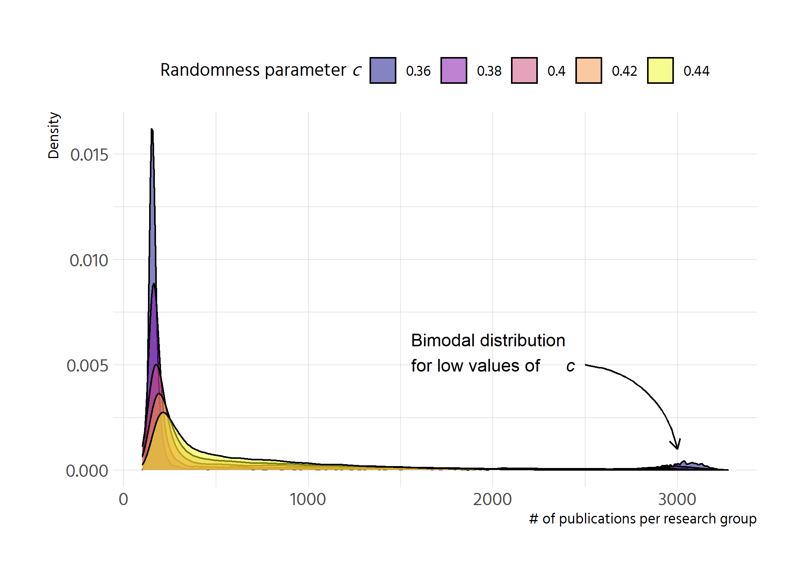

```r
p <- df %>% 
  select(run_number = .run.number., chance_imp = importance.of.chance, 
         step = .step., contains("gini")) %>% 
  pivot_longer(contains("gini")) %>% 
  mutate(chance_imp = factor(chance_imp, labels = chance_imp %>% unique() %>%
                               as.numeric() %>% scales::percent())) %>%
  ggplot(aes(step, value, colour = factor(chance_imp))) +
  geom_smooth() +
  facet_wrap(vars(name)) +
  labs(y = "gini", 
       colour = "importance of chance",
       caption = "n = 100 agents") 
p
```

```
## `geom_smooth()` using method = 'gam' and formula 'y ~ s(x, bs = "cs")'
```

<!-- -->

```r
plotly::ggplotly(p)
```

```
## `geom_smooth()` using method = 'gam' and formula 'y ~ s(x, bs = "cs")'
```

```{=html}
<div id="htmlwidget-2fd3059e0026a05bac65" style="width:840px;height:600px;" class="plotly html-widget"></div>
<script type="application/json" data-for="htmlwidget-2fd3059e0026a05bac65">{"x":{"data":[{"x":[1,7.31645569620253,13.6329113924051,19.9493670886076,26.2658227848101,32.5822784810127,38.8987341772152,45.2151898734177,51.5316455696203,57.8481012658228,64.1645569620253,70.4810126582279,76.7974683544304,83.1139240506329,89.4303797468354,95.746835443038,102.063291139241,108.379746835443,114.696202531646,121.012658227848,127.329113924051,133.645569620253,139.962025316456,146.278481012658,152.594936708861,158.911392405063,165.227848101266,171.544303797468,177.860759493671,184.177215189873,190.493670886076,196.810126582278,203.126582278481,209.443037974684,215.759493670886,222.075949367089,228.392405063291,234.708860759494,241.025316455696,247.341772151899,253.658227848101,259.974683544304,266.291139240506,272.607594936709,278.924050632911,285.240506329114,291.556962025316,297.873417721519,304.189873417722,310.506329113924,316.822784810127,323.139240506329,329.455696202532,335.772151898734,342.088607594937,348.405063291139,354.721518987342,361.037974683544,367.354430379747,373.670886075949,379.987341772152,386.303797468354,392.620253164557,398.936708860759,405.253164556962,411.569620253165,417.886075949367,424.20253164557,430.518987341772,436.835443037975,443.151898734177,449.46835443038,455.784810126582,462.101265822785,468.417721518987,474.73417721519,481.050632911392,487.367088607595,493.683544303797,500],"y":[0.855937698033862,0.86716998737064,0.878177299827776,0.888734658525631,0.898617086584564,0.907599607124935,0.915457243267102,0.921965018131426,0.926897954838266,0.930032119387985,0.931312915421872,0.931040847223144,0.929561132555263,0.92721898918169,0.924359634865888,0.921328287371318,0.918470164461441,0.91613048389972,0.914646723724117,0.914121630610212,0.91438657710829,0.915257819117276,0.91655161253609,0.918084213263657,0.919671877198899,0.921130860240739,0.9222774182881,0.922941676399745,0.923114988617589,0.922892727682359,0.922371999979755,0.921649911895485,0.92082356981525,0.919990080124755,0.919246549209704,0.918690083455802,0.918400407255666,0.918359980528893,0.918517449786656,0.918821427590923,0.919220526503662,0.91966335908684,0.920098537902426,0.920474675512387,0.92074040244193,0.920862240602516,0.920858176585946,0.920755394162496,0.920581077102442,0.920362409176062,0.92012657415363,0.919900755805424,0.919712137901719,0.919587647902011,0.919538834618917,0.91955340996239,0.919617035356135,0.919715372223856,0.919834081989257,0.91995882607604,0.920075265907912,0.920169062908576,0.920226501096364,0.920245041308389,0.92023181203116,0.92019426051964,0.920139834028787,0.920075979813563,0.920010145128928,0.919949777229842,0.919902323371267,0.919874450123669,0.919866624102537,0.919876355336901,0.919901135647403,0.919938456854686,0.919985810779395,0.920040689242174,0.920100584063665,0.920162987064512],"text":["step:   1.000000<br />value: 0.85593770<br />factor(chance_imp): 10.0%","step:   7.316456<br />value: 0.86716999<br />factor(chance_imp): 10.0%","step:  13.632911<br />value: 0.87817730<br />factor(chance_imp): 10.0%","step:  19.949367<br />value: 0.88873466<br />factor(chance_imp): 10.0%","step:  26.265823<br />value: 0.89861709<br />factor(chance_imp): 10.0%","step:  32.582278<br />value: 0.90759961<br />factor(chance_imp): 10.0%","step:  38.898734<br />value: 0.91545724<br />factor(chance_imp): 10.0%","step:  45.215190<br />value: 0.92196502<br />factor(chance_imp): 10.0%","step:  51.531646<br />value: 0.92689795<br />factor(chance_imp): 10.0%","step:  57.848101<br />value: 0.93003212<br />factor(chance_imp): 10.0%","step:  64.164557<br />value: 0.93131292<br />factor(chance_imp): 10.0%","step:  70.481013<br />value: 0.93104085<br />factor(chance_imp): 10.0%","step:  76.797468<br />value: 0.92956113<br />factor(chance_imp): 10.0%","step:  83.113924<br />value: 0.92721899<br />factor(chance_imp): 10.0%","step:  89.430380<br />value: 0.92435963<br />factor(chance_imp): 10.0%","step:  95.746835<br />value: 0.92132829<br />factor(chance_imp): 10.0%","step: 102.063291<br />value: 0.91847016<br />factor(chance_imp): 10.0%","step: 108.379747<br />value: 0.91613048<br />factor(chance_imp): 10.0%","step: 114.696203<br />value: 0.91464672<br />factor(chance_imp): 10.0%","step: 121.012658<br />value: 0.91412163<br />factor(chance_imp): 10.0%","step: 127.329114<br />value: 0.91438658<br />factor(chance_imp): 10.0%","step: 133.645570<br />value: 0.91525782<br />factor(chance_imp): 10.0%","step: 139.962025<br />value: 0.91655161<br />factor(chance_imp): 10.0%","step: 146.278481<br />value: 0.91808421<br />factor(chance_imp): 10.0%","step: 152.594937<br />value: 0.91967188<br />factor(chance_imp): 10.0%","step: 158.911392<br />value: 0.92113086<br />factor(chance_imp): 10.0%","step: 165.227848<br />value: 0.92227742<br />factor(chance_imp): 10.0%","step: 171.544304<br />value: 0.92294168<br />factor(chance_imp): 10.0%","step: 177.860759<br />value: 0.92311499<br />factor(chance_imp): 10.0%","step: 184.177215<br />value: 0.92289273<br />factor(chance_imp): 10.0%","step: 190.493671<br />value: 0.92237200<br />factor(chance_imp): 10.0%","step: 196.810127<br />value: 0.92164991<br />factor(chance_imp): 10.0%","step: 203.126582<br />value: 0.92082357<br />factor(chance_imp): 10.0%","step: 209.443038<br />value: 0.91999008<br />factor(chance_imp): 10.0%","step: 215.759494<br />value: 0.91924655<br />factor(chance_imp): 10.0%","step: 222.075949<br />value: 0.91869008<br />factor(chance_imp): 10.0%","step: 228.392405<br />value: 0.91840041<br />factor(chance_imp): 10.0%","step: 234.708861<br />value: 0.91835998<br />factor(chance_imp): 10.0%","step: 241.025316<br />value: 0.91851745<br />factor(chance_imp): 10.0%","step: 247.341772<br />value: 0.91882143<br />factor(chance_imp): 10.0%","step: 253.658228<br />value: 0.91922053<br />factor(chance_imp): 10.0%","step: 259.974684<br />value: 0.91966336<br />factor(chance_imp): 10.0%","step: 266.291139<br />value: 0.92009854<br />factor(chance_imp): 10.0%","step: 272.607595<br />value: 0.92047468<br />factor(chance_imp): 10.0%","step: 278.924051<br />value: 0.92074040<br />factor(chance_imp): 10.0%","step: 285.240506<br />value: 0.92086224<br />factor(chance_imp): 10.0%","step: 291.556962<br />value: 0.92085818<br />factor(chance_imp): 10.0%","step: 297.873418<br />value: 0.92075539<br />factor(chance_imp): 10.0%","step: 304.189873<br />value: 0.92058108<br />factor(chance_imp): 10.0%","step: 310.506329<br />value: 0.92036241<br />factor(chance_imp): 10.0%","step: 316.822785<br />value: 0.92012657<br />factor(chance_imp): 10.0%","step: 323.139241<br />value: 0.91990076<br />factor(chance_imp): 10.0%","step: 329.455696<br />value: 0.91971214<br />factor(chance_imp): 10.0%","step: 335.772152<br />value: 0.91958765<br />factor(chance_imp): 10.0%","step: 342.088608<br />value: 0.91953883<br />factor(chance_imp): 10.0%","step: 348.405063<br />value: 0.91955341<br />factor(chance_imp): 10.0%","step: 354.721519<br />value: 0.91961704<br />factor(chance_imp): 10.0%","step: 361.037975<br />value: 0.91971537<br />factor(chance_imp): 10.0%","step: 367.354430<br />value: 0.91983408<br />factor(chance_imp): 10.0%","step: 373.670886<br />value: 0.91995883<br />factor(chance_imp): 10.0%","step: 379.987342<br />value: 0.92007527<br />factor(chance_imp): 10.0%","step: 386.303797<br />value: 0.92016906<br />factor(chance_imp): 10.0%","step: 392.620253<br />value: 0.92022650<br />factor(chance_imp): 10.0%","step: 398.936709<br />value: 0.92024504<br />factor(chance_imp): 10.0%","step: 405.253165<br />value: 0.92023181<br />factor(chance_imp): 10.0%","step: 411.569620<br />value: 0.92019426<br />factor(chance_imp): 10.0%","step: 417.886076<br />value: 0.92013983<br />factor(chance_imp): 10.0%","step: 424.202532<br />value: 0.92007598<br />factor(chance_imp): 10.0%","step: 430.518987<br />value: 0.92001015<br />factor(chance_imp): 10.0%","step: 436.835443<br />value: 0.91994978<br />factor(chance_imp): 10.0%","step: 443.151899<br />value: 0.91990232<br />factor(chance_imp): 10.0%","step: 449.468354<br />value: 0.91987445<br />factor(chance_imp): 10.0%","step: 455.784810<br />value: 0.91986662<br />factor(chance_imp): 10.0%","step: 462.101266<br />value: 0.91987636<br />factor(chance_imp): 10.0%","step: 468.417722<br />value: 0.91990114<br />factor(chance_imp): 10.0%","step: 474.734177<br />value: 0.91993846<br />factor(chance_imp): 10.0%","step: 481.050633<br />value: 0.91998581<br />factor(chance_imp): 10.0%","step: 487.367089<br />value: 0.92004069<br />factor(chance_imp): 10.0%","step: 493.683544<br />value: 0.92010058<br />factor(chance_imp): 10.0%","step: 500.000000<br />value: 0.92016299<br />factor(chance_imp): 10.0%"],"type":"scatter","mode":"lines","name":"10.0%","line":{"width":3.77952755905512,"color":"rgba(248,118,109,1)","dash":"solid"},"hoveron":"points","legendgroup":"10.0%","showlegend":true,"xaxis":"x","yaxis":"y","hoverinfo":"text","frame":null},{"x":[1,7.31645569620253,13.6329113924051,19.9493670886076,26.2658227848101,32.5822784810127,38.8987341772152,45.2151898734177,51.5316455696203,57.8481012658228,64.1645569620253,70.4810126582279,76.7974683544304,83.1139240506329,89.4303797468354,95.746835443038,102.063291139241,108.379746835443,114.696202531646,121.012658227848,127.329113924051,133.645569620253,139.962025316456,146.278481012658,152.594936708861,158.911392405063,165.227848101266,171.544303797468,177.860759493671,184.177215189873,190.493670886076,196.810126582278,203.126582278481,209.443037974684,215.759493670886,222.075949367089,228.392405063291,234.708860759494,241.025316455696,247.341772151899,253.658227848101,259.974683544304,266.291139240506,272.607594936709,278.924050632911,285.240506329114,291.556962025316,297.873417721519,304.189873417722,310.506329113924,316.822784810127,323.139240506329,329.455696202532,335.772151898734,342.088607594937,348.405063291139,354.721518987342,361.037974683544,367.354430379747,373.670886075949,379.987341772152,386.303797468354,392.620253164557,398.936708860759,405.253164556962,411.569620253165,417.886075949367,424.20253164557,430.518987341772,436.835443037975,443.151898734177,449.46835443038,455.784810126582,462.101265822785,468.417721518987,474.73417721519,481.050632911392,487.367088607595,493.683544303797,500],"y":[0.599598570398218,0.615371225101392,0.630869120919156,0.645817498966099,0.659941600356812,0.672966666205885,0.684617937627907,0.694620655737469,0.702700061649159,0.708582591513411,0.712188725425636,0.713845853185725,0.71393260175533,0.712827598096104,0.710909469169699,0.708556841937767,0.706148343361961,0.704062600403933,0.702670412538604,0.702105186244847,0.702225876747996,0.702876151213357,0.703899676806241,0.705140120691954,0.706441150035807,0.707646432003107,0.708599633759162,0.70915616572765,0.709307953710782,0.709134997948533,0.708718766588177,0.708140727776984,0.707482349662227,0.706825100391176,0.706250448111106,0.705839860969286,0.705659790180198,0.705692656660569,0.705891668700058,0.706210005258374,0.706600845295228,0.707017367770331,0.707412751643392,0.707740175874122,0.707952836739451,0.708021178466797,0.707965259117063,0.707814003167466,0.707596335095227,0.707341179377561,0.707077460491688,0.706834102914827,0.706640031124194,0.706523888525691,0.70649745424613,0.706546367779743,0.706654020050214,0.706803801981228,0.706979104496471,0.707163318519628,0.707339834974384,0.707492044784423,0.707604016388298,0.707671980971424,0.707702690170049,0.707703242508034,0.707680736509238,0.707642270697521,0.707594943596741,0.707545853730759,0.707502099623434,0.707470097970682,0.707450850601605,0.707442777145597,0.707444281329366,0.707453766879612,0.707469637523042,0.70749029698636,0.707514148996269,0.707539597279474],"text":["step:   1.000000<br />value: 0.59959857<br />factor(chance_imp): 10.0%","step:   7.316456<br />value: 0.61537123<br />factor(chance_imp): 10.0%","step:  13.632911<br />value: 0.63086912<br />factor(chance_imp): 10.0%","step:  19.949367<br />value: 0.64581750<br />factor(chance_imp): 10.0%","step:  26.265823<br />value: 0.65994160<br />factor(chance_imp): 10.0%","step:  32.582278<br />value: 0.67296667<br />factor(chance_imp): 10.0%","step:  38.898734<br />value: 0.68461794<br />factor(chance_imp): 10.0%","step:  45.215190<br />value: 0.69462066<br />factor(chance_imp): 10.0%","step:  51.531646<br />value: 0.70270006<br />factor(chance_imp): 10.0%","step:  57.848101<br />value: 0.70858259<br />factor(chance_imp): 10.0%","step:  64.164557<br />value: 0.71218873<br />factor(chance_imp): 10.0%","step:  70.481013<br />value: 0.71384585<br />factor(chance_imp): 10.0%","step:  76.797468<br />value: 0.71393260<br />factor(chance_imp): 10.0%","step:  83.113924<br />value: 0.71282760<br />factor(chance_imp): 10.0%","step:  89.430380<br />value: 0.71090947<br />factor(chance_imp): 10.0%","step:  95.746835<br />value: 0.70855684<br />factor(chance_imp): 10.0%","step: 102.063291<br />value: 0.70614834<br />factor(chance_imp): 10.0%","step: 108.379747<br />value: 0.70406260<br />factor(chance_imp): 10.0%","step: 114.696203<br />value: 0.70267041<br />factor(chance_imp): 10.0%","step: 121.012658<br />value: 0.70210519<br />factor(chance_imp): 10.0%","step: 127.329114<br />value: 0.70222588<br />factor(chance_imp): 10.0%","step: 133.645570<br />value: 0.70287615<br />factor(chance_imp): 10.0%","step: 139.962025<br />value: 0.70389968<br />factor(chance_imp): 10.0%","step: 146.278481<br />value: 0.70514012<br />factor(chance_imp): 10.0%","step: 152.594937<br />value: 0.70644115<br />factor(chance_imp): 10.0%","step: 158.911392<br />value: 0.70764643<br />factor(chance_imp): 10.0%","step: 165.227848<br />value: 0.70859963<br />factor(chance_imp): 10.0%","step: 171.544304<br />value: 0.70915617<br />factor(chance_imp): 10.0%","step: 177.860759<br />value: 0.70930795<br />factor(chance_imp): 10.0%","step: 184.177215<br />value: 0.70913500<br />factor(chance_imp): 10.0%","step: 190.493671<br />value: 0.70871877<br />factor(chance_imp): 10.0%","step: 196.810127<br />value: 0.70814073<br />factor(chance_imp): 10.0%","step: 203.126582<br />value: 0.70748235<br />factor(chance_imp): 10.0%","step: 209.443038<br />value: 0.70682510<br />factor(chance_imp): 10.0%","step: 215.759494<br />value: 0.70625045<br />factor(chance_imp): 10.0%","step: 222.075949<br />value: 0.70583986<br />factor(chance_imp): 10.0%","step: 228.392405<br />value: 0.70565979<br />factor(chance_imp): 10.0%","step: 234.708861<br />value: 0.70569266<br />factor(chance_imp): 10.0%","step: 241.025316<br />value: 0.70589167<br />factor(chance_imp): 10.0%","step: 247.341772<br />value: 0.70621001<br />factor(chance_imp): 10.0%","step: 253.658228<br />value: 0.70660085<br />factor(chance_imp): 10.0%","step: 259.974684<br />value: 0.70701737<br />factor(chance_imp): 10.0%","step: 266.291139<br />value: 0.70741275<br />factor(chance_imp): 10.0%","step: 272.607595<br />value: 0.70774018<br />factor(chance_imp): 10.0%","step: 278.924051<br />value: 0.70795284<br />factor(chance_imp): 10.0%","step: 285.240506<br />value: 0.70802118<br />factor(chance_imp): 10.0%","step: 291.556962<br />value: 0.70796526<br />factor(chance_imp): 10.0%","step: 297.873418<br />value: 0.70781400<br />factor(chance_imp): 10.0%","step: 304.189873<br />value: 0.70759634<br />factor(chance_imp): 10.0%","step: 310.506329<br />value: 0.70734118<br />factor(chance_imp): 10.0%","step: 316.822785<br />value: 0.70707746<br />factor(chance_imp): 10.0%","step: 323.139241<br />value: 0.70683410<br />factor(chance_imp): 10.0%","step: 329.455696<br />value: 0.70664003<br />factor(chance_imp): 10.0%","step: 335.772152<br />value: 0.70652389<br />factor(chance_imp): 10.0%","step: 342.088608<br />value: 0.70649745<br />factor(chance_imp): 10.0%","step: 348.405063<br />value: 0.70654637<br />factor(chance_imp): 10.0%","step: 354.721519<br />value: 0.70665402<br />factor(chance_imp): 10.0%","step: 361.037975<br />value: 0.70680380<br />factor(chance_imp): 10.0%","step: 367.354430<br />value: 0.70697910<br />factor(chance_imp): 10.0%","step: 373.670886<br />value: 0.70716332<br />factor(chance_imp): 10.0%","step: 379.987342<br />value: 0.70733983<br />factor(chance_imp): 10.0%","step: 386.303797<br />value: 0.70749204<br />factor(chance_imp): 10.0%","step: 392.620253<br />value: 0.70760402<br />factor(chance_imp): 10.0%","step: 398.936709<br />value: 0.70767198<br />factor(chance_imp): 10.0%","step: 405.253165<br />value: 0.70770269<br />factor(chance_imp): 10.0%","step: 411.569620<br />value: 0.70770324<br />factor(chance_imp): 10.0%","step: 417.886076<br />value: 0.70768074<br />factor(chance_imp): 10.0%","step: 424.202532<br />value: 0.70764227<br />factor(chance_imp): 10.0%","step: 430.518987<br />value: 0.70759494<br />factor(chance_imp): 10.0%","step: 436.835443<br />value: 0.70754585<br />factor(chance_imp): 10.0%","step: 443.151899<br />value: 0.70750210<br />factor(chance_imp): 10.0%","step: 449.468354<br />value: 0.70747010<br />factor(chance_imp): 10.0%","step: 455.784810<br />value: 0.70745085<br />factor(chance_imp): 10.0%","step: 462.101266<br />value: 0.70744278<br />factor(chance_imp): 10.0%","step: 468.417722<br />value: 0.70744428<br />factor(chance_imp): 10.0%","step: 474.734177<br />value: 0.70745377<br />factor(chance_imp): 10.0%","step: 481.050633<br />value: 0.70746964<br />factor(chance_imp): 10.0%","step: 487.367089<br />value: 0.70749030<br />factor(chance_imp): 10.0%","step: 493.683544<br />value: 0.70751415<br />factor(chance_imp): 10.0%","step: 500.000000<br />value: 0.70753960<br />factor(chance_imp): 10.0%"],"type":"scatter","mode":"lines","name":"10.0%","line":{"width":3.77952755905512,"color":"rgba(248,118,109,1)","dash":"solid"},"hoveron":"points","legendgroup":"10.0%","showlegend":false,"xaxis":"x2","yaxis":"y","hoverinfo":"text","frame":null},{"x":[1,7.31645569620253,13.6329113924051,19.9493670886076,26.2658227848101,32.5822784810127,38.8987341772152,45.2151898734177,51.5316455696203,57.8481012658228,64.1645569620253,70.4810126582279,76.7974683544304,83.1139240506329,89.4303797468354,95.746835443038,102.063291139241,108.379746835443,114.696202531646,121.012658227848,127.329113924051,133.645569620253,139.962025316456,146.278481012658,152.594936708861,158.911392405063,165.227848101266,171.544303797468,177.860759493671,184.177215189873,190.493670886076,196.810126582278,203.126582278481,209.443037974684,215.759493670886,222.075949367089,228.392405063291,234.708860759494,241.025316455696,247.341772151899,253.658227848101,259.974683544304,266.291139240506,272.607594936709,278.924050632911,285.240506329114,291.556962025316,297.873417721519,304.189873417722,310.506329113924,316.822784810127,323.139240506329,329.455696202532,335.772151898734,342.088607594937,348.405063291139,354.721518987342,361.037974683544,367.354430379747,373.670886075949,379.987341772152,386.303797468354,392.620253164557,398.936708860759,405.253164556962,411.569620253165,417.886075949367,424.20253164557,430.518987341772,436.835443037975,443.151898734177,449.46835443038,455.784810126582,462.101265822785,468.417721518987,474.73417721519,481.050632911392,487.367088607595,493.683544303797,500],"y":[0.856837118645587,0.867900730299848,0.87874290339095,0.889142199355736,0.898877179631046,0.907726405653722,0.915468438860606,0.921881840688538,0.926745172574361,0.929838022108471,0.93110659856475,0.930846516502546,0.929397386814875,0.927098820394752,0.924290428135193,0.921311820929213,0.918502609669829,0.916202405250056,0.914743207436487,0.914226184802161,0.9144856407999,0.915341013401236,0.916611740577698,0.918117260300813,0.919677010542112,0.921110429273124,0.922236954465379,0.922889651944353,0.923060011337667,0.922841731177552,0.922330213477983,0.921620860252932,0.920809073516375,0.919990255282285,0.919259807564636,0.918713132377402,0.918428554980312,0.918388844186004,0.918543549183621,0.918842185809273,0.919234269899069,0.919669317289119,0.920096843815532,0.920466365314417,0.920727415269499,0.920847104190077,0.9208431030054,0.920742118224127,0.92057085635492,0.920356023906438,0.92012432738734,0.919902473306287,0.91971716817194,0.919594866679472,0.919546914714933,0.919561239510228,0.919623753789378,0.919720370276407,0.919837001695335,0.919959560770185,0.920073960224978,0.920166112783736,0.920222542859879,0.920240755914911,0.920227755723313,0.920190859244541,0.920137383438051,0.920074645263296,0.920009961679733,0.919950649646815,0.919904026123998,0.919876641041257,0.919868952817467,0.919878514998922,0.919902863242016,0.919939533203143,0.919986060538696,0.920039980905069,0.920098829958654,0.920160143355846],"text":["step:   1.000000<br />value: 0.85683712<br />factor(chance_imp): 20.0%","step:   7.316456<br />value: 0.86790073<br />factor(chance_imp): 20.0%","step:  13.632911<br />value: 0.87874290<br />factor(chance_imp): 20.0%","step:  19.949367<br />value: 0.88914220<br />factor(chance_imp): 20.0%","step:  26.265823<br />value: 0.89887718<br />factor(chance_imp): 20.0%","step:  32.582278<br />value: 0.90772641<br />factor(chance_imp): 20.0%","step:  38.898734<br />value: 0.91546844<br />factor(chance_imp): 20.0%","step:  45.215190<br />value: 0.92188184<br />factor(chance_imp): 20.0%","step:  51.531646<br />value: 0.92674517<br />factor(chance_imp): 20.0%","step:  57.848101<br />value: 0.92983802<br />factor(chance_imp): 20.0%","step:  64.164557<br />value: 0.93110660<br />factor(chance_imp): 20.0%","step:  70.481013<br />value: 0.93084652<br />factor(chance_imp): 20.0%","step:  76.797468<br />value: 0.92939739<br />factor(chance_imp): 20.0%","step:  83.113924<br />value: 0.92709882<br />factor(chance_imp): 20.0%","step:  89.430380<br />value: 0.92429043<br />factor(chance_imp): 20.0%","step:  95.746835<br />value: 0.92131182<br />factor(chance_imp): 20.0%","step: 102.063291<br />value: 0.91850261<br />factor(chance_imp): 20.0%","step: 108.379747<br />value: 0.91620241<br />factor(chance_imp): 20.0%","step: 114.696203<br />value: 0.91474321<br />factor(chance_imp): 20.0%","step: 121.012658<br />value: 0.91422618<br />factor(chance_imp): 20.0%","step: 127.329114<br />value: 0.91448564<br />factor(chance_imp): 20.0%","step: 133.645570<br />value: 0.91534101<br />factor(chance_imp): 20.0%","step: 139.962025<br />value: 0.91661174<br />factor(chance_imp): 20.0%","step: 146.278481<br />value: 0.91811726<br />factor(chance_imp): 20.0%","step: 152.594937<br />value: 0.91967701<br />factor(chance_imp): 20.0%","step: 158.911392<br />value: 0.92111043<br />factor(chance_imp): 20.0%","step: 165.227848<br />value: 0.92223695<br />factor(chance_imp): 20.0%","step: 171.544304<br />value: 0.92288965<br />factor(chance_imp): 20.0%","step: 177.860759<br />value: 0.92306001<br />factor(chance_imp): 20.0%","step: 184.177215<br />value: 0.92284173<br />factor(chance_imp): 20.0%","step: 190.493671<br />value: 0.92233021<br />factor(chance_imp): 20.0%","step: 196.810127<br />value: 0.92162086<br />factor(chance_imp): 20.0%","step: 203.126582<br />value: 0.92080907<br />factor(chance_imp): 20.0%","step: 209.443038<br />value: 0.91999026<br />factor(chance_imp): 20.0%","step: 215.759494<br />value: 0.91925981<br />factor(chance_imp): 20.0%","step: 222.075949<br />value: 0.91871313<br />factor(chance_imp): 20.0%","step: 228.392405<br />value: 0.91842855<br />factor(chance_imp): 20.0%","step: 234.708861<br />value: 0.91838884<br />factor(chance_imp): 20.0%","step: 241.025316<br />value: 0.91854355<br />factor(chance_imp): 20.0%","step: 247.341772<br />value: 0.91884219<br />factor(chance_imp): 20.0%","step: 253.658228<br />value: 0.91923427<br />factor(chance_imp): 20.0%","step: 259.974684<br />value: 0.91966932<br />factor(chance_imp): 20.0%","step: 266.291139<br />value: 0.92009684<br />factor(chance_imp): 20.0%","step: 272.607595<br />value: 0.92046637<br />factor(chance_imp): 20.0%","step: 278.924051<br />value: 0.92072742<br />factor(chance_imp): 20.0%","step: 285.240506<br />value: 0.92084710<br />factor(chance_imp): 20.0%","step: 291.556962<br />value: 0.92084310<br />factor(chance_imp): 20.0%","step: 297.873418<br />value: 0.92074212<br />factor(chance_imp): 20.0%","step: 304.189873<br />value: 0.92057086<br />factor(chance_imp): 20.0%","step: 310.506329<br />value: 0.92035602<br />factor(chance_imp): 20.0%","step: 316.822785<br />value: 0.92012433<br />factor(chance_imp): 20.0%","step: 323.139241<br />value: 0.91990247<br />factor(chance_imp): 20.0%","step: 329.455696<br />value: 0.91971717<br />factor(chance_imp): 20.0%","step: 335.772152<br />value: 0.91959487<br />factor(chance_imp): 20.0%","step: 342.088608<br />value: 0.91954691<br />factor(chance_imp): 20.0%","step: 348.405063<br />value: 0.91956124<br />factor(chance_imp): 20.0%","step: 354.721519<br />value: 0.91962375<br />factor(chance_imp): 20.0%","step: 361.037975<br />value: 0.91972037<br />factor(chance_imp): 20.0%","step: 367.354430<br />value: 0.91983700<br />factor(chance_imp): 20.0%","step: 373.670886<br />value: 0.91995956<br />factor(chance_imp): 20.0%","step: 379.987342<br />value: 0.92007396<br />factor(chance_imp): 20.0%","step: 386.303797<br />value: 0.92016611<br />factor(chance_imp): 20.0%","step: 392.620253<br />value: 0.92022254<br />factor(chance_imp): 20.0%","step: 398.936709<br />value: 0.92024076<br />factor(chance_imp): 20.0%","step: 405.253165<br />value: 0.92022776<br />factor(chance_imp): 20.0%","step: 411.569620<br />value: 0.92019086<br />factor(chance_imp): 20.0%","step: 417.886076<br />value: 0.92013738<br />factor(chance_imp): 20.0%","step: 424.202532<br />value: 0.92007465<br />factor(chance_imp): 20.0%","step: 430.518987<br />value: 0.92000996<br />factor(chance_imp): 20.0%","step: 436.835443<br />value: 0.91995065<br />factor(chance_imp): 20.0%","step: 443.151899<br />value: 0.91990403<br />factor(chance_imp): 20.0%","step: 449.468354<br />value: 0.91987664<br />factor(chance_imp): 20.0%","step: 455.784810<br />value: 0.91986895<br />factor(chance_imp): 20.0%","step: 462.101266<br />value: 0.91987851<br />factor(chance_imp): 20.0%","step: 468.417722<br />value: 0.91990286<br />factor(chance_imp): 20.0%","step: 474.734177<br />value: 0.91993953<br />factor(chance_imp): 20.0%","step: 481.050633<br />value: 0.91998606<br />factor(chance_imp): 20.0%","step: 487.367089<br />value: 0.92003998<br />factor(chance_imp): 20.0%","step: 493.683544<br />value: 0.92009883<br />factor(chance_imp): 20.0%","step: 500.000000<br />value: 0.92016014<br />factor(chance_imp): 20.0%"],"type":"scatter","mode":"lines","name":"20.0%","line":{"width":3.77952755905512,"color":"rgba(235,131,53,1)","dash":"solid"},"hoveron":"points","legendgroup":"20.0%","showlegend":true,"xaxis":"x","yaxis":"y","hoverinfo":"text","frame":null},{"x":[1,7.31645569620253,13.6329113924051,19.9493670886076,26.2658227848101,32.5822784810127,38.8987341772152,45.2151898734177,51.5316455696203,57.8481012658228,64.1645569620253,70.4810126582279,76.7974683544304,83.1139240506329,89.4303797468354,95.746835443038,102.063291139241,108.379746835443,114.696202531646,121.012658227848,127.329113924051,133.645569620253,139.962025316456,146.278481012658,152.594936708861,158.911392405063,165.227848101266,171.544303797468,177.860759493671,184.177215189873,190.493670886076,196.810126582278,203.126582278481,209.443037974684,215.759493670886,222.075949367089,228.392405063291,234.708860759494,241.025316455696,247.341772151899,253.658227848101,259.974683544304,266.291139240506,272.607594936709,278.924050632911,285.240506329114,291.556962025316,297.873417721519,304.189873417722,310.506329113924,316.822784810127,323.139240506329,329.455696202532,335.772151898734,342.088607594937,348.405063291139,354.721518987342,361.037974683544,367.354430379747,373.670886075949,379.987341772152,386.303797468354,392.620253164557,398.936708860759,405.253164556962,411.569620253165,417.886075949367,424.20253164557,430.518987341772,436.835443037975,443.151898734177,449.46835443038,455.784810126582,462.101265822785,468.417721518987,474.73417721519,481.050632911392,487.367088607595,493.683544303797,500],"y":[0.608055902432052,0.623286280052094,0.63824173464708,0.652647343191958,0.666228182661674,0.678709330031172,0.689815862275399,0.6992728563693,0.706805389287821,0.712139755290136,0.715199905161899,0.71632427496832,0.71590349183587,0.714328182891023,0.71198897526025,0.709276496070026,0.706581372446822,0.704294231517111,0.702797429137356,0.702222469053223,0.702410843605631,0.703187890311253,0.704378946686768,0.705809350248852,0.707304438514181,0.708689548999433,0.709790019221282,0.710444251520716,0.710642526821322,0.710473112229009,0.710025907952725,0.70939081420142,0.708657731184043,0.70791655910954,0.707257198186862,0.706769548624957,0.706527177952193,0.706512260865179,0.706675199892835,0.706966365664311,0.707336128808761,0.707734859955336,0.708112929733188,0.708420708771468,0.708608586105948,0.708645283763951,0.708552258733455,0.708360392190863,0.708100565312582,0.707803659275016,0.707500555254571,0.707222134427652,0.706999277970664,0.706862556553777,0.706823910473014,0.706866402944472,0.706970613134359,0.707117120208886,0.707286503334263,0.707459341676699,0.707616214402405,0.707737700677591,0.707805263114064,0.707816223939013,0.707781623522877,0.707712954560239,0.707621709745683,0.707519381773796,0.707417463339161,0.707327447136362,0.707260825859983,0.707227856480222,0.707228982226062,0.707259966425668,0.707316543585645,0.707394448212598,0.707489414813132,0.707597177893851,0.70771347196136,0.707834031522265],"text":["step:   1.000000<br />value: 0.60805590<br />factor(chance_imp): 20.0%","step:   7.316456<br />value: 0.62328628<br />factor(chance_imp): 20.0%","step:  13.632911<br />value: 0.63824173<br />factor(chance_imp): 20.0%","step:  19.949367<br />value: 0.65264734<br />factor(chance_imp): 20.0%","step:  26.265823<br />value: 0.66622818<br />factor(chance_imp): 20.0%","step:  32.582278<br />value: 0.67870933<br />factor(chance_imp): 20.0%","step:  38.898734<br />value: 0.68981586<br />factor(chance_imp): 20.0%","step:  45.215190<br />value: 0.69927286<br />factor(chance_imp): 20.0%","step:  51.531646<br />value: 0.70680539<br />factor(chance_imp): 20.0%","step:  57.848101<br />value: 0.71213976<br />factor(chance_imp): 20.0%","step:  64.164557<br />value: 0.71519991<br />factor(chance_imp): 20.0%","step:  70.481013<br />value: 0.71632427<br />factor(chance_imp): 20.0%","step:  76.797468<br />value: 0.71590349<br />factor(chance_imp): 20.0%","step:  83.113924<br />value: 0.71432818<br />factor(chance_imp): 20.0%","step:  89.430380<br />value: 0.71198898<br />factor(chance_imp): 20.0%","step:  95.746835<br />value: 0.70927650<br />factor(chance_imp): 20.0%","step: 102.063291<br />value: 0.70658137<br />factor(chance_imp): 20.0%","step: 108.379747<br />value: 0.70429423<br />factor(chance_imp): 20.0%","step: 114.696203<br />value: 0.70279743<br />factor(chance_imp): 20.0%","step: 121.012658<br />value: 0.70222247<br />factor(chance_imp): 20.0%","step: 127.329114<br />value: 0.70241084<br />factor(chance_imp): 20.0%","step: 133.645570<br />value: 0.70318789<br />factor(chance_imp): 20.0%","step: 139.962025<br />value: 0.70437895<br />factor(chance_imp): 20.0%","step: 146.278481<br />value: 0.70580935<br />factor(chance_imp): 20.0%","step: 152.594937<br />value: 0.70730444<br />factor(chance_imp): 20.0%","step: 158.911392<br />value: 0.70868955<br />factor(chance_imp): 20.0%","step: 165.227848<br />value: 0.70979002<br />factor(chance_imp): 20.0%","step: 171.544304<br />value: 0.71044425<br />factor(chance_imp): 20.0%","step: 177.860759<br />value: 0.71064253<br />factor(chance_imp): 20.0%","step: 184.177215<br />value: 0.71047311<br />factor(chance_imp): 20.0%","step: 190.493671<br />value: 0.71002591<br />factor(chance_imp): 20.0%","step: 196.810127<br />value: 0.70939081<br />factor(chance_imp): 20.0%","step: 203.126582<br />value: 0.70865773<br />factor(chance_imp): 20.0%","step: 209.443038<br />value: 0.70791656<br />factor(chance_imp): 20.0%","step: 215.759494<br />value: 0.70725720<br />factor(chance_imp): 20.0%","step: 222.075949<br />value: 0.70676955<br />factor(chance_imp): 20.0%","step: 228.392405<br />value: 0.70652718<br />factor(chance_imp): 20.0%","step: 234.708861<br />value: 0.70651226<br />factor(chance_imp): 20.0%","step: 241.025316<br />value: 0.70667520<br />factor(chance_imp): 20.0%","step: 247.341772<br />value: 0.70696637<br />factor(chance_imp): 20.0%","step: 253.658228<br />value: 0.70733613<br />factor(chance_imp): 20.0%","step: 259.974684<br />value: 0.70773486<br />factor(chance_imp): 20.0%","step: 266.291139<br />value: 0.70811293<br />factor(chance_imp): 20.0%","step: 272.607595<br />value: 0.70842071<br />factor(chance_imp): 20.0%","step: 278.924051<br />value: 0.70860859<br />factor(chance_imp): 20.0%","step: 285.240506<br />value: 0.70864528<br />factor(chance_imp): 20.0%","step: 291.556962<br />value: 0.70855226<br />factor(chance_imp): 20.0%","step: 297.873418<br />value: 0.70836039<br />factor(chance_imp): 20.0%","step: 304.189873<br />value: 0.70810057<br />factor(chance_imp): 20.0%","step: 310.506329<br />value: 0.70780366<br />factor(chance_imp): 20.0%","step: 316.822785<br />value: 0.70750056<br />factor(chance_imp): 20.0%","step: 323.139241<br />value: 0.70722213<br />factor(chance_imp): 20.0%","step: 329.455696<br />value: 0.70699928<br />factor(chance_imp): 20.0%","step: 335.772152<br />value: 0.70686256<br />factor(chance_imp): 20.0%","step: 342.088608<br />value: 0.70682391<br />factor(chance_imp): 20.0%","step: 348.405063<br />value: 0.70686640<br />factor(chance_imp): 20.0%","step: 354.721519<br />value: 0.70697061<br />factor(chance_imp): 20.0%","step: 361.037975<br />value: 0.70711712<br />factor(chance_imp): 20.0%","step: 367.354430<br />value: 0.70728650<br />factor(chance_imp): 20.0%","step: 373.670886<br />value: 0.70745934<br />factor(chance_imp): 20.0%","step: 379.987342<br />value: 0.70761621<br />factor(chance_imp): 20.0%","step: 386.303797<br />value: 0.70773770<br />factor(chance_imp): 20.0%","step: 392.620253<br />value: 0.70780526<br />factor(chance_imp): 20.0%","step: 398.936709<br />value: 0.70781622<br />factor(chance_imp): 20.0%","step: 405.253165<br />value: 0.70778162<br />factor(chance_imp): 20.0%","step: 411.569620<br />value: 0.70771295<br />factor(chance_imp): 20.0%","step: 417.886076<br />value: 0.70762171<br />factor(chance_imp): 20.0%","step: 424.202532<br />value: 0.70751938<br />factor(chance_imp): 20.0%","step: 430.518987<br />value: 0.70741746<br />factor(chance_imp): 20.0%","step: 436.835443<br />value: 0.70732745<br />factor(chance_imp): 20.0%","step: 443.151899<br />value: 0.70726083<br />factor(chance_imp): 20.0%","step: 449.468354<br />value: 0.70722786<br />factor(chance_imp): 20.0%","step: 455.784810<br />value: 0.70722898<br />factor(chance_imp): 20.0%","step: 462.101266<br />value: 0.70725997<br />factor(chance_imp): 20.0%","step: 468.417722<br />value: 0.70731654<br />factor(chance_imp): 20.0%","step: 474.734177<br />value: 0.70739445<br />factor(chance_imp): 20.0%","step: 481.050633<br />value: 0.70748941<br />factor(chance_imp): 20.0%","step: 487.367089<br />value: 0.70759718<br />factor(chance_imp): 20.0%","step: 493.683544<br />value: 0.70771347<br />factor(chance_imp): 20.0%","step: 500.000000<br />value: 0.70783403<br />factor(chance_imp): 20.0%"],"type":"scatter","mode":"lines","name":"20.0%","line":{"width":3.77952755905512,"color":"rgba(235,131,53,1)","dash":"solid"},"hoveron":"points","legendgroup":"20.0%","showlegend":false,"xaxis":"x2","yaxis":"y","hoverinfo":"text","frame":null},{"x":[1,7.31645569620253,13.6329113924051,19.9493670886076,26.2658227848101,32.5822784810127,38.8987341772152,45.2151898734177,51.5316455696203,57.8481012658228,64.1645569620253,70.4810126582279,76.7974683544304,83.1139240506329,89.4303797468354,95.746835443038,102.063291139241,108.379746835443,114.696202531646,121.012658227848,127.329113924051,133.645569620253,139.962025316456,146.278481012658,152.594936708861,158.911392405063,165.227848101266,171.544303797468,177.860759493671,184.177215189873,190.493670886076,196.810126582278,203.126582278481,209.443037974684,215.759493670886,222.075949367089,228.392405063291,234.708860759494,241.025316455696,247.341772151899,253.658227848101,259.974683544304,266.291139240506,272.607594936709,278.924050632911,285.240506329114,291.556962025316,297.873417721519,304.189873417722,310.506329113924,316.822784810127,323.139240506329,329.455696202532,335.772151898734,342.088607594937,348.405063291139,354.721518987342,361.037974683544,367.354430379747,373.670886075949,379.987341772152,386.303797468354,392.620253164557,398.936708860759,405.253164556962,411.569620253165,417.886075949367,424.20253164557,430.518987341772,436.835443037975,443.151898734177,449.46835443038,455.784810126582,462.101265822785,468.417721518987,474.73417721519,481.050632911392,487.367088607595,493.683544303797,500],"y":[0.853113040166458,0.86485328815609,0.876358202838655,0.887392450907087,0.89772069905432,0.907107613973287,0.915317862356923,0.92211611089816,0.927267026289932,0.930536366475735,0.931867081209068,0.931573691059789,0.9300175039656,0.927559827864206,0.924561970693308,0.921385240390612,0.918390944893818,0.915940392140632,0.914386786447779,0.913837564502043,0.914116029779703,0.915029658372319,0.916385926371448,0.91799230986865,0.919656284955483,0.921185327723507,0.922386914264278,0.923083053333093,0.923264695901174,0.923031787917764,0.922486091915069,0.921729370425301,0.920863385980666,0.919989901113375,0.919210678355634,0.918627480239655,0.918323854328063,0.918281422621278,0.918446373311708,0.918764859015645,0.919183032349384,0.919647045929218,0.920103052371441,0.920497204292348,0.920775673130555,0.920903377359735,0.920899161412821,0.920791506752814,0.920608894842714,0.920379807145523,0.920132725124242,0.919896130241871,0.919698503961411,0.919568059211928,0.919516896886313,0.919532144221393,0.919598780182502,0.919701783734977,0.919826133844154,0.919956809475368,0.920078789593954,0.92017705316525,0.920237231353857,0.920256663605616,0.92024281671658,0.920203491408829,0.920146488404441,0.920079608425496,0.920010652194073,0.91994742043225,0.919897713862108,0.919868515483749,0.919860314202068,0.919870502068184,0.919896452060982,0.919935537159348,0.91998513034217,0.920042604588332,0.920105332876723,0.920170688186227],"text":["step:   1.000000<br />value: 0.85311304<br />factor(chance_imp): 15.0%","step:   7.316456<br />value: 0.86485329<br />factor(chance_imp): 15.0%","step:  13.632911<br />value: 0.87635820<br />factor(chance_imp): 15.0%","step:  19.949367<br />value: 0.88739245<br />factor(chance_imp): 15.0%","step:  26.265823<br />value: 0.89772070<br />factor(chance_imp): 15.0%","step:  32.582278<br />value: 0.90710761<br />factor(chance_imp): 15.0%","step:  38.898734<br />value: 0.91531786<br />factor(chance_imp): 15.0%","step:  45.215190<br />value: 0.92211611<br />factor(chance_imp): 15.0%","step:  51.531646<br />value: 0.92726703<br />factor(chance_imp): 15.0%","step:  57.848101<br />value: 0.93053637<br />factor(chance_imp): 15.0%","step:  64.164557<br />value: 0.93186708<br />factor(chance_imp): 15.0%","step:  70.481013<br />value: 0.93157369<br />factor(chance_imp): 15.0%","step:  76.797468<br />value: 0.93001750<br />factor(chance_imp): 15.0%","step:  83.113924<br />value: 0.92755983<br />factor(chance_imp): 15.0%","step:  89.430380<br />value: 0.92456197<br />factor(chance_imp): 15.0%","step:  95.746835<br />value: 0.92138524<br />factor(chance_imp): 15.0%","step: 102.063291<br />value: 0.91839094<br />factor(chance_imp): 15.0%","step: 108.379747<br />value: 0.91594039<br />factor(chance_imp): 15.0%","step: 114.696203<br />value: 0.91438679<br />factor(chance_imp): 15.0%","step: 121.012658<br />value: 0.91383756<br />factor(chance_imp): 15.0%","step: 127.329114<br />value: 0.91411603<br />factor(chance_imp): 15.0%","step: 133.645570<br />value: 0.91502966<br />factor(chance_imp): 15.0%","step: 139.962025<br />value: 0.91638593<br />factor(chance_imp): 15.0%","step: 146.278481<br />value: 0.91799231<br />factor(chance_imp): 15.0%","step: 152.594937<br />value: 0.91965628<br />factor(chance_imp): 15.0%","step: 158.911392<br />value: 0.92118533<br />factor(chance_imp): 15.0%","step: 165.227848<br />value: 0.92238691<br />factor(chance_imp): 15.0%","step: 171.544304<br />value: 0.92308305<br />factor(chance_imp): 15.0%","step: 177.860759<br />value: 0.92326470<br />factor(chance_imp): 15.0%","step: 184.177215<br />value: 0.92303179<br />factor(chance_imp): 15.0%","step: 190.493671<br />value: 0.92248609<br />factor(chance_imp): 15.0%","step: 196.810127<br />value: 0.92172937<br />factor(chance_imp): 15.0%","step: 203.126582<br />value: 0.92086339<br />factor(chance_imp): 15.0%","step: 209.443038<br />value: 0.91998990<br />factor(chance_imp): 15.0%","step: 215.759494<br />value: 0.91921068<br />factor(chance_imp): 15.0%","step: 222.075949<br />value: 0.91862748<br />factor(chance_imp): 15.0%","step: 228.392405<br />value: 0.91832385<br />factor(chance_imp): 15.0%","step: 234.708861<br />value: 0.91828142<br />factor(chance_imp): 15.0%","step: 241.025316<br />value: 0.91844637<br />factor(chance_imp): 15.0%","step: 247.341772<br />value: 0.91876486<br />factor(chance_imp): 15.0%","step: 253.658228<br />value: 0.91918303<br />factor(chance_imp): 15.0%","step: 259.974684<br />value: 0.91964705<br />factor(chance_imp): 15.0%","step: 266.291139<br />value: 0.92010305<br />factor(chance_imp): 15.0%","step: 272.607595<br />value: 0.92049720<br />factor(chance_imp): 15.0%","step: 278.924051<br />value: 0.92077567<br />factor(chance_imp): 15.0%","step: 285.240506<br />value: 0.92090338<br />factor(chance_imp): 15.0%","step: 291.556962<br />value: 0.92089916<br />factor(chance_imp): 15.0%","step: 297.873418<br />value: 0.92079151<br />factor(chance_imp): 15.0%","step: 304.189873<br />value: 0.92060889<br />factor(chance_imp): 15.0%","step: 310.506329<br />value: 0.92037981<br />factor(chance_imp): 15.0%","step: 316.822785<br />value: 0.92013273<br />factor(chance_imp): 15.0%","step: 323.139241<br />value: 0.91989613<br />factor(chance_imp): 15.0%","step: 329.455696<br />value: 0.91969850<br />factor(chance_imp): 15.0%","step: 335.772152<br />value: 0.91956806<br />factor(chance_imp): 15.0%","step: 342.088608<br />value: 0.91951690<br />factor(chance_imp): 15.0%","step: 348.405063<br />value: 0.91953214<br />factor(chance_imp): 15.0%","step: 354.721519<br />value: 0.91959878<br />factor(chance_imp): 15.0%","step: 361.037975<br />value: 0.91970178<br />factor(chance_imp): 15.0%","step: 367.354430<br />value: 0.91982613<br />factor(chance_imp): 15.0%","step: 373.670886<br />value: 0.91995681<br />factor(chance_imp): 15.0%","step: 379.987342<br />value: 0.92007879<br />factor(chance_imp): 15.0%","step: 386.303797<br />value: 0.92017705<br />factor(chance_imp): 15.0%","step: 392.620253<br />value: 0.92023723<br />factor(chance_imp): 15.0%","step: 398.936709<br />value: 0.92025666<br />factor(chance_imp): 15.0%","step: 405.253165<br />value: 0.92024282<br />factor(chance_imp): 15.0%","step: 411.569620<br />value: 0.92020349<br />factor(chance_imp): 15.0%","step: 417.886076<br />value: 0.92014649<br />factor(chance_imp): 15.0%","step: 424.202532<br />value: 0.92007961<br />factor(chance_imp): 15.0%","step: 430.518987<br />value: 0.92001065<br />factor(chance_imp): 15.0%","step: 436.835443<br />value: 0.91994742<br />factor(chance_imp): 15.0%","step: 443.151899<br />value: 0.91989771<br />factor(chance_imp): 15.0%","step: 449.468354<br />value: 0.91986852<br />factor(chance_imp): 15.0%","step: 455.784810<br />value: 0.91986031<br />factor(chance_imp): 15.0%","step: 462.101266<br />value: 0.91987050<br />factor(chance_imp): 15.0%","step: 468.417722<br />value: 0.91989645<br />factor(chance_imp): 15.0%","step: 474.734177<br />value: 0.91993554<br />factor(chance_imp): 15.0%","step: 481.050633<br />value: 0.91998513<br />factor(chance_imp): 15.0%","step: 487.367089<br />value: 0.92004260<br />factor(chance_imp): 15.0%","step: 493.683544<br />value: 0.92010533<br />factor(chance_imp): 15.0%","step: 500.000000<br />value: 0.92017069<br />factor(chance_imp): 15.0%"],"type":"scatter","mode":"lines","name":"15.0%","line":{"width":3.77952755905512,"color":"rgba(218,143,0,1)","dash":"solid"},"hoveron":"points","legendgroup":"15.0%","showlegend":true,"xaxis":"x","yaxis":"y","hoverinfo":"text","frame":null},{"x":[1,7.31645569620253,13.6329113924051,19.9493670886076,26.2658227848101,32.5822784810127,38.8987341772152,45.2151898734177,51.5316455696203,57.8481012658228,64.1645569620253,70.4810126582279,76.7974683544304,83.1139240506329,89.4303797468354,95.746835443038,102.063291139241,108.379746835443,114.696202531646,121.012658227848,127.329113924051,133.645569620253,139.962025316456,146.278481012658,152.594936708861,158.911392405063,165.227848101266,171.544303797468,177.860759493671,184.177215189873,190.493670886076,196.810126582278,203.126582278481,209.443037974684,215.759493670886,222.075949367089,228.392405063291,234.708860759494,241.025316455696,247.341772151899,253.658227848101,259.974683544304,266.291139240506,272.607594936709,278.924050632911,285.240506329114,291.556962025316,297.873417721519,304.189873417722,310.506329113924,316.822784810127,323.139240506329,329.455696202532,335.772151898734,342.088607594937,348.405063291139,354.721518987342,361.037974683544,367.354430379747,373.670886075949,379.987341772152,386.303797468354,392.620253164557,398.936708860759,405.253164556962,411.569620253165,417.886075949367,424.20253164557,430.518987341772,436.835443037975,443.151898734177,449.46835443038,455.784810126582,462.101265822785,468.417721518987,474.73417721519,481.050632911392,487.367088607595,493.683544303797,500],"y":[0.603683387119662,0.61871208609023,0.633471201300408,0.647691148989806,0.661102345398035,0.673435206764706,0.684420149329428,0.693787589331811,0.701267943011467,0.706592828495887,0.709689020457405,0.710892536392186,0.710590924739332,0.709171733937947,0.707022512427134,0.704530808645998,0.702084171033643,0.700070148029171,0.69886789478714,0.698602013879169,0.699102818337416,0.700184228060152,0.701660162945651,0.703344542892184,0.705051287798025,0.706594317561445,0.707787552080718,0.708459258177925,0.708604485664424,0.708325886280139,0.707727905130471,0.706914987320819,0.705991577956584,0.705062122143165,0.704231064985964,0.703602851590379,0.703263493612461,0.703195854598125,0.703346939273848,0.703663716363274,0.70409315459005,0.704582222677819,0.705077889350229,0.705527123330923,0.705876911033426,0.706091857989785,0.706187251232625,0.706187435012124,0.706116753578461,0.705999551181815,0.705860172072366,0.705722960500291,0.705612260715771,0.705552180841457,0.705552661348497,0.705601682848197,0.705685336931663,0.705789715190001,0.705900909214318,0.70600501059572,0.706088110925313,0.706136301794203,0.7061363821833,0.706087850135267,0.706001188041638,0.705887240477525,0.705756852018043,0.705620867238303,0.705490130713418,0.705375487018501,0.705287780728666,0.705236646948207,0.705222115537957,0.705239635884716,0.705284629166056,0.705352516559546,0.705438719242756,0.705538658393257,0.705647755188617,0.705761430806407],"text":["step:   1.000000<br />value: 0.60368339<br />factor(chance_imp): 15.0%","step:   7.316456<br />value: 0.61871209<br />factor(chance_imp): 15.0%","step:  13.632911<br />value: 0.63347120<br />factor(chance_imp): 15.0%","step:  19.949367<br />value: 0.64769115<br />factor(chance_imp): 15.0%","step:  26.265823<br />value: 0.66110235<br />factor(chance_imp): 15.0%","step:  32.582278<br />value: 0.67343521<br />factor(chance_imp): 15.0%","step:  38.898734<br />value: 0.68442015<br />factor(chance_imp): 15.0%","step:  45.215190<br />value: 0.69378759<br />factor(chance_imp): 15.0%","step:  51.531646<br />value: 0.70126794<br />factor(chance_imp): 15.0%","step:  57.848101<br />value: 0.70659283<br />factor(chance_imp): 15.0%","step:  64.164557<br />value: 0.70968902<br />factor(chance_imp): 15.0%","step:  70.481013<br />value: 0.71089254<br />factor(chance_imp): 15.0%","step:  76.797468<br />value: 0.71059092<br />factor(chance_imp): 15.0%","step:  83.113924<br />value: 0.70917173<br />factor(chance_imp): 15.0%","step:  89.430380<br />value: 0.70702251<br />factor(chance_imp): 15.0%","step:  95.746835<br />value: 0.70453081<br />factor(chance_imp): 15.0%","step: 102.063291<br />value: 0.70208417<br />factor(chance_imp): 15.0%","step: 108.379747<br />value: 0.70007015<br />factor(chance_imp): 15.0%","step: 114.696203<br />value: 0.69886789<br />factor(chance_imp): 15.0%","step: 121.012658<br />value: 0.69860201<br />factor(chance_imp): 15.0%","step: 127.329114<br />value: 0.69910282<br />factor(chance_imp): 15.0%","step: 133.645570<br />value: 0.70018423<br />factor(chance_imp): 15.0%","step: 139.962025<br />value: 0.70166016<br />factor(chance_imp): 15.0%","step: 146.278481<br />value: 0.70334454<br />factor(chance_imp): 15.0%","step: 152.594937<br />value: 0.70505129<br />factor(chance_imp): 15.0%","step: 158.911392<br />value: 0.70659432<br />factor(chance_imp): 15.0%","step: 165.227848<br />value: 0.70778755<br />factor(chance_imp): 15.0%","step: 171.544304<br />value: 0.70845926<br />factor(chance_imp): 15.0%","step: 177.860759<br />value: 0.70860449<br />factor(chance_imp): 15.0%","step: 184.177215<br />value: 0.70832589<br />factor(chance_imp): 15.0%","step: 190.493671<br />value: 0.70772791<br />factor(chance_imp): 15.0%","step: 196.810127<br />value: 0.70691499<br />factor(chance_imp): 15.0%","step: 203.126582<br />value: 0.70599158<br />factor(chance_imp): 15.0%","step: 209.443038<br />value: 0.70506212<br />factor(chance_imp): 15.0%","step: 215.759494<br />value: 0.70423106<br />factor(chance_imp): 15.0%","step: 222.075949<br />value: 0.70360285<br />factor(chance_imp): 15.0%","step: 228.392405<br />value: 0.70326349<br />factor(chance_imp): 15.0%","step: 234.708861<br />value: 0.70319585<br />factor(chance_imp): 15.0%","step: 241.025316<br />value: 0.70334694<br />factor(chance_imp): 15.0%","step: 247.341772<br />value: 0.70366372<br />factor(chance_imp): 15.0%","step: 253.658228<br />value: 0.70409315<br />factor(chance_imp): 15.0%","step: 259.974684<br />value: 0.70458222<br />factor(chance_imp): 15.0%","step: 266.291139<br />value: 0.70507789<br />factor(chance_imp): 15.0%","step: 272.607595<br />value: 0.70552712<br />factor(chance_imp): 15.0%","step: 278.924051<br />value: 0.70587691<br />factor(chance_imp): 15.0%","step: 285.240506<br />value: 0.70609186<br />factor(chance_imp): 15.0%","step: 291.556962<br />value: 0.70618725<br />factor(chance_imp): 15.0%","step: 297.873418<br />value: 0.70618744<br />factor(chance_imp): 15.0%","step: 304.189873<br />value: 0.70611675<br />factor(chance_imp): 15.0%","step: 310.506329<br />value: 0.70599955<br />factor(chance_imp): 15.0%","step: 316.822785<br />value: 0.70586017<br />factor(chance_imp): 15.0%","step: 323.139241<br />value: 0.70572296<br />factor(chance_imp): 15.0%","step: 329.455696<br />value: 0.70561226<br />factor(chance_imp): 15.0%","step: 335.772152<br />value: 0.70555218<br />factor(chance_imp): 15.0%","step: 342.088608<br />value: 0.70555266<br />factor(chance_imp): 15.0%","step: 348.405063<br />value: 0.70560168<br />factor(chance_imp): 15.0%","step: 354.721519<br />value: 0.70568534<br />factor(chance_imp): 15.0%","step: 361.037975<br />value: 0.70578972<br />factor(chance_imp): 15.0%","step: 367.354430<br />value: 0.70590091<br />factor(chance_imp): 15.0%","step: 373.670886<br />value: 0.70600501<br />factor(chance_imp): 15.0%","step: 379.987342<br />value: 0.70608811<br />factor(chance_imp): 15.0%","step: 386.303797<br />value: 0.70613630<br />factor(chance_imp): 15.0%","step: 392.620253<br />value: 0.70613638<br />factor(chance_imp): 15.0%","step: 398.936709<br />value: 0.70608785<br />factor(chance_imp): 15.0%","step: 405.253165<br />value: 0.70600119<br />factor(chance_imp): 15.0%","step: 411.569620<br />value: 0.70588724<br />factor(chance_imp): 15.0%","step: 417.886076<br />value: 0.70575685<br />factor(chance_imp): 15.0%","step: 424.202532<br />value: 0.70562087<br />factor(chance_imp): 15.0%","step: 430.518987<br />value: 0.70549013<br />factor(chance_imp): 15.0%","step: 436.835443<br />value: 0.70537549<br />factor(chance_imp): 15.0%","step: 443.151899<br />value: 0.70528778<br />factor(chance_imp): 15.0%","step: 449.468354<br />value: 0.70523665<br />factor(chance_imp): 15.0%","step: 455.784810<br />value: 0.70522212<br />factor(chance_imp): 15.0%","step: 462.101266<br />value: 0.70523964<br />factor(chance_imp): 15.0%","step: 468.417722<br />value: 0.70528463<br />factor(chance_imp): 15.0%","step: 474.734177<br />value: 0.70535252<br />factor(chance_imp): 15.0%","step: 481.050633<br />value: 0.70543872<br />factor(chance_imp): 15.0%","step: 487.367089<br />value: 0.70553866<br />factor(chance_imp): 15.0%","step: 493.683544<br />value: 0.70564776<br />factor(chance_imp): 15.0%","step: 500.000000<br />value: 0.70576143<br />factor(chance_imp): 15.0%"],"type":"scatter","mode":"lines","name":"15.0%","line":{"width":3.77952755905512,"color":"rgba(218,143,0,1)","dash":"solid"},"hoveron":"points","legendgroup":"15.0%","showlegend":false,"xaxis":"x2","yaxis":"y","hoverinfo":"text","frame":null},{"x":[1,7.31645569620253,13.6329113924051,19.9493670886076,26.2658227848101,32.5822784810127,38.8987341772152,45.2151898734177,51.5316455696203,57.8481012658228,64.1645569620253,70.4810126582279,76.7974683544304,83.1139240506329,89.4303797468354,95.746835443038,102.063291139241,108.379746835443,114.696202531646,121.012658227848,127.329113924051,133.645569620253,139.962025316456,146.278481012658,152.594936708861,158.911392405063,165.227848101266,171.544303797468,177.860759493671,184.177215189873,190.493670886076,196.810126582278,203.126582278481,209.443037974684,215.759493670886,222.075949367089,228.392405063291,234.708860759494,241.025316455696,247.341772151899,253.658227848101,259.974683544304,266.291139240506,272.607594936709,278.924050632911,285.240506329114,291.556962025316,297.873417721519,304.189873417722,310.506329113924,316.822784810127,323.139240506329,329.455696202532,335.772151898734,342.088607594937,348.405063291139,354.721518987342,361.037974683544,367.354430379747,373.670886075949,379.987341772152,386.303797468354,392.620253164557,398.936708860759,405.253164556962,411.569620253165,417.886075949367,424.20253164557,430.518987341772,436.835443037975,443.151898734177,449.46835443038,455.784810126582,462.101265822785,468.417721518987,474.73417721519,481.050632911392,487.367088607595,493.683544303797,500],"y":[0.866163000246656,0.875620924142715,0.884889163879472,0.893778035297628,0.902097854237879,0.909658936540925,0.916271598047465,0.921746154598197,0.92589292203382,0.928523095920724,0.92959071728423,0.929349373747148,0.928090371171252,0.926105015418316,0.923684612350113,0.921120467828418,0.918703887715003,0.916726177871643,0.915472109816881,0.915028280690998,0.915252177224783,0.915988523759904,0.917082044638028,0.918377464200825,0.919719506789962,0.920952896747108,0.92192235841393,0.922484334489533,0.922631493578224,0.922444391965083,0.922005050729872,0.921395490952352,0.920697733712283,0.919993800089427,0.919365711163543,0.918895488014394,0.918650474538428,0.918615885471572,0.918748383841593,0.919004604009882,0.919341180337833,0.919714747186837,0.920081938918288,0.920399389893577,0.920623749628067,0.920726760990716,0.920723582973028,0.920637133398879,0.920490330092142,0.920306090876693,0.920107333576407,0.919916976015159,0.919757936016823,0.91965291539011,0.919611655033946,0.919623806437084,0.919677292966969,0.919760037991052,0.919859964876778,0.919964996991598,0.920063057702957,0.920142070378304,0.920190482601946,0.920206152699261,0.920195079035022,0.920163528373038,0.920117767477118,0.92006406311107,0.9200086820387,0.919957891023818,0.919917956830231,0.9198944893772,0.919887882127576,0.919896040960925,0.919916856436822,0.919948219114842,0.919988019554561,0.920034148315553,0.920084495957395,0.920136953039661],"text":["step:   1.000000<br />value: 0.86616300<br />factor(chance_imp): 35.0%","step:   7.316456<br />value: 0.87562092<br />factor(chance_imp): 35.0%","step:  13.632911<br />value: 0.88488916<br />factor(chance_imp): 35.0%","step:  19.949367<br />value: 0.89377804<br />factor(chance_imp): 35.0%","step:  26.265823<br />value: 0.90209785<br />factor(chance_imp): 35.0%","step:  32.582278<br />value: 0.90965894<br />factor(chance_imp): 35.0%","step:  38.898734<br />value: 0.91627160<br />factor(chance_imp): 35.0%","step:  45.215190<br />value: 0.92174615<br />factor(chance_imp): 35.0%","step:  51.531646<br />value: 0.92589292<br />factor(chance_imp): 35.0%","step:  57.848101<br />value: 0.92852310<br />factor(chance_imp): 35.0%","step:  64.164557<br />value: 0.92959072<br />factor(chance_imp): 35.0%","step:  70.481013<br />value: 0.92934937<br />factor(chance_imp): 35.0%","step:  76.797468<br />value: 0.92809037<br />factor(chance_imp): 35.0%","step:  83.113924<br />value: 0.92610502<br />factor(chance_imp): 35.0%","step:  89.430380<br />value: 0.92368461<br />factor(chance_imp): 35.0%","step:  95.746835<br />value: 0.92112047<br />factor(chance_imp): 35.0%","step: 102.063291<br />value: 0.91870389<br />factor(chance_imp): 35.0%","step: 108.379747<br />value: 0.91672618<br />factor(chance_imp): 35.0%","step: 114.696203<br />value: 0.91547211<br />factor(chance_imp): 35.0%","step: 121.012658<br />value: 0.91502828<br />factor(chance_imp): 35.0%","step: 127.329114<br />value: 0.91525218<br />factor(chance_imp): 35.0%","step: 133.645570<br />value: 0.91598852<br />factor(chance_imp): 35.0%","step: 139.962025<br />value: 0.91708204<br />factor(chance_imp): 35.0%","step: 146.278481<br />value: 0.91837746<br />factor(chance_imp): 35.0%","step: 152.594937<br />value: 0.91971951<br />factor(chance_imp): 35.0%","step: 158.911392<br />value: 0.92095290<br />factor(chance_imp): 35.0%","step: 165.227848<br />value: 0.92192236<br />factor(chance_imp): 35.0%","step: 171.544304<br />value: 0.92248433<br />factor(chance_imp): 35.0%","step: 177.860759<br />value: 0.92263149<br />factor(chance_imp): 35.0%","step: 184.177215<br />value: 0.92244439<br />factor(chance_imp): 35.0%","step: 190.493671<br />value: 0.92200505<br />factor(chance_imp): 35.0%","step: 196.810127<br />value: 0.92139549<br />factor(chance_imp): 35.0%","step: 203.126582<br />value: 0.92069773<br />factor(chance_imp): 35.0%","step: 209.443038<br />value: 0.91999380<br />factor(chance_imp): 35.0%","step: 215.759494<br />value: 0.91936571<br />factor(chance_imp): 35.0%","step: 222.075949<br />value: 0.91889549<br />factor(chance_imp): 35.0%","step: 228.392405<br />value: 0.91865047<br />factor(chance_imp): 35.0%","step: 234.708861<br />value: 0.91861589<br />factor(chance_imp): 35.0%","step: 241.025316<br />value: 0.91874838<br />factor(chance_imp): 35.0%","step: 247.341772<br />value: 0.91900460<br />factor(chance_imp): 35.0%","step: 253.658228<br />value: 0.91934118<br />factor(chance_imp): 35.0%","step: 259.974684<br />value: 0.91971475<br />factor(chance_imp): 35.0%","step: 266.291139<br />value: 0.92008194<br />factor(chance_imp): 35.0%","step: 272.607595<br />value: 0.92039939<br />factor(chance_imp): 35.0%","step: 278.924051<br />value: 0.92062375<br />factor(chance_imp): 35.0%","step: 285.240506<br />value: 0.92072676<br />factor(chance_imp): 35.0%","step: 291.556962<br />value: 0.92072358<br />factor(chance_imp): 35.0%","step: 297.873418<br />value: 0.92063713<br />factor(chance_imp): 35.0%","step: 304.189873<br />value: 0.92049033<br />factor(chance_imp): 35.0%","step: 310.506329<br />value: 0.92030609<br />factor(chance_imp): 35.0%","step: 316.822785<br />value: 0.92010733<br />factor(chance_imp): 35.0%","step: 323.139241<br />value: 0.91991698<br />factor(chance_imp): 35.0%","step: 329.455696<br />value: 0.91975794<br />factor(chance_imp): 35.0%","step: 335.772152<br />value: 0.91965292<br />factor(chance_imp): 35.0%","step: 342.088608<br />value: 0.91961166<br />factor(chance_imp): 35.0%","step: 348.405063<br />value: 0.91962381<br />factor(chance_imp): 35.0%","step: 354.721519<br />value: 0.91967729<br />factor(chance_imp): 35.0%","step: 361.037975<br />value: 0.91976004<br />factor(chance_imp): 35.0%","step: 367.354430<br />value: 0.91985996<br />factor(chance_imp): 35.0%","step: 373.670886<br />value: 0.91996500<br />factor(chance_imp): 35.0%","step: 379.987342<br />value: 0.92006306<br />factor(chance_imp): 35.0%","step: 386.303797<br />value: 0.92014207<br />factor(chance_imp): 35.0%","step: 392.620253<br />value: 0.92019048<br />factor(chance_imp): 35.0%","step: 398.936709<br />value: 0.92020615<br />factor(chance_imp): 35.0%","step: 405.253165<br />value: 0.92019508<br />factor(chance_imp): 35.0%","step: 411.569620<br />value: 0.92016353<br />factor(chance_imp): 35.0%","step: 417.886076<br />value: 0.92011777<br />factor(chance_imp): 35.0%","step: 424.202532<br />value: 0.92006406<br />factor(chance_imp): 35.0%","step: 430.518987<br />value: 0.92000868<br />factor(chance_imp): 35.0%","step: 436.835443<br />value: 0.91995789<br />factor(chance_imp): 35.0%","step: 443.151899<br />value: 0.91991796<br />factor(chance_imp): 35.0%","step: 449.468354<br />value: 0.91989449<br />factor(chance_imp): 35.0%","step: 455.784810<br />value: 0.91988788<br />factor(chance_imp): 35.0%","step: 462.101266<br />value: 0.91989604<br />factor(chance_imp): 35.0%","step: 468.417722<br />value: 0.91991686<br />factor(chance_imp): 35.0%","step: 474.734177<br />value: 0.91994822<br />factor(chance_imp): 35.0%","step: 481.050633<br />value: 0.91998802<br />factor(chance_imp): 35.0%","step: 487.367089<br />value: 0.92003415<br />factor(chance_imp): 35.0%","step: 493.683544<br />value: 0.92008450<br />factor(chance_imp): 35.0%","step: 500.000000<br />value: 0.92013695<br />factor(chance_imp): 35.0%"],"type":"scatter","mode":"lines","name":"35.0%","line":{"width":3.77952755905512,"color":"rgba(196,154,0,1)","dash":"solid"},"hoveron":"points","legendgroup":"35.0%","showlegend":true,"xaxis":"x","yaxis":"y","hoverinfo":"text","frame":null},{"x":[1,7.31645569620253,13.6329113924051,19.9493670886076,26.2658227848101,32.5822784810127,38.8987341772152,45.2151898734177,51.5316455696203,57.8481012658228,64.1645569620253,70.4810126582279,76.7974683544304,83.1139240506329,89.4303797468354,95.746835443038,102.063291139241,108.379746835443,114.696202531646,121.012658227848,127.329113924051,133.645569620253,139.962025316456,146.278481012658,152.594936708861,158.911392405063,165.227848101266,171.544303797468,177.860759493671,184.177215189873,190.493670886076,196.810126582278,203.126582278481,209.443037974684,215.759493670886,222.075949367089,228.392405063291,234.708860759494,241.025316455696,247.341772151899,253.658227848101,259.974683544304,266.291139240506,272.607594936709,278.924050632911,285.240506329114,291.556962025316,297.873417721519,304.189873417722,310.506329113924,316.822784810127,323.139240506329,329.455696202532,335.772151898734,342.088607594937,348.405063291139,354.721518987342,361.037974683544,367.354430379747,373.670886075949,379.987341772152,386.303797468354,392.620253164557,398.936708860759,405.253164556962,411.569620253165,417.886075949367,424.20253164557,430.518987341772,436.835443037975,443.151898734177,449.46835443038,455.784810126582,462.101265822785,468.417721518987,474.73417721519,481.050632911392,487.367088607595,493.683544303797,500],"y":[0.627802976042566,0.639543272228536,0.651077806890221,0.662200818503334,0.672706545543589,0.6823892264867,0.691043099808381,0.698462403984346,0.70444137749031,0.708775160760899,0.711405349809277,0.712580657658563,0.712588468820282,0.711716167805956,0.71025113912711,0.708480767295269,0.706692436821955,0.705173532218693,0.704205424633499,0.703887111174237,0.704106745390759,0.704740735982317,0.705665491648162,0.706757421087545,0.707892932999715,0.708948436083925,0.709800339039424,0.7103342288892,0.710542390669658,0.710485946845216,0.710227167170762,0.70982832140118,0.709351679291357,0.708859510596179,0.708414085070531,0.7080776724693,0.707901332860644,0.707873400233679,0.707960402233808,0.708128844612515,0.708345233121285,0.708576073511603,0.708787871534953,0.70894713294282,0.709020376268932,0.708986851162328,0.708862428401921,0.708669523275702,0.708430551071659,0.708167927077783,0.707904066582062,0.707661384872487,0.707462297237046,0.707328985148884,0.707269601190469,0.707270553163718,0.707316378351793,0.707391614037854,0.707480797505062,0.707568466036578,0.707639156915563,0.707677407425178,0.70766849172843,0.707610912455344,0.70751461450621,0.7073899200638,0.707247151310888,0.707096630430244,0.706948679604641,0.706813621016853,0.70670177684965,0.706622339743868,0.706575531867339,0.706557297618284,0.70656355504992,0.706590222215465,0.706633217168137,0.706688457961156,0.706751862647738,0.706819349281102],"text":["step:   1.000000<br />value: 0.62780298<br />factor(chance_imp): 35.0%","step:   7.316456<br />value: 0.63954327<br />factor(chance_imp): 35.0%","step:  13.632911<br />value: 0.65107781<br />factor(chance_imp): 35.0%","step:  19.949367<br />value: 0.66220082<br />factor(chance_imp): 35.0%","step:  26.265823<br />value: 0.67270655<br />factor(chance_imp): 35.0%","step:  32.582278<br />value: 0.68238923<br />factor(chance_imp): 35.0%","step:  38.898734<br />value: 0.69104310<br />factor(chance_imp): 35.0%","step:  45.215190<br />value: 0.69846240<br />factor(chance_imp): 35.0%","step:  51.531646<br />value: 0.70444138<br />factor(chance_imp): 35.0%","step:  57.848101<br />value: 0.70877516<br />factor(chance_imp): 35.0%","step:  64.164557<br />value: 0.71140535<br />factor(chance_imp): 35.0%","step:  70.481013<br />value: 0.71258066<br />factor(chance_imp): 35.0%","step:  76.797468<br />value: 0.71258847<br />factor(chance_imp): 35.0%","step:  83.113924<br />value: 0.71171617<br />factor(chance_imp): 35.0%","step:  89.430380<br />value: 0.71025114<br />factor(chance_imp): 35.0%","step:  95.746835<br />value: 0.70848077<br />factor(chance_imp): 35.0%","step: 102.063291<br />value: 0.70669244<br />factor(chance_imp): 35.0%","step: 108.379747<br />value: 0.70517353<br />factor(chance_imp): 35.0%","step: 114.696203<br />value: 0.70420542<br />factor(chance_imp): 35.0%","step: 121.012658<br />value: 0.70388711<br />factor(chance_imp): 35.0%","step: 127.329114<br />value: 0.70410675<br />factor(chance_imp): 35.0%","step: 133.645570<br />value: 0.70474074<br />factor(chance_imp): 35.0%","step: 139.962025<br />value: 0.70566549<br />factor(chance_imp): 35.0%","step: 146.278481<br />value: 0.70675742<br />factor(chance_imp): 35.0%","step: 152.594937<br />value: 0.70789293<br />factor(chance_imp): 35.0%","step: 158.911392<br />value: 0.70894844<br />factor(chance_imp): 35.0%","step: 165.227848<br />value: 0.70980034<br />factor(chance_imp): 35.0%","step: 171.544304<br />value: 0.71033423<br />factor(chance_imp): 35.0%","step: 177.860759<br />value: 0.71054239<br />factor(chance_imp): 35.0%","step: 184.177215<br />value: 0.71048595<br />factor(chance_imp): 35.0%","step: 190.493671<br />value: 0.71022717<br />factor(chance_imp): 35.0%","step: 196.810127<br />value: 0.70982832<br />factor(chance_imp): 35.0%","step: 203.126582<br />value: 0.70935168<br />factor(chance_imp): 35.0%","step: 209.443038<br />value: 0.70885951<br />factor(chance_imp): 35.0%","step: 215.759494<br />value: 0.70841409<br />factor(chance_imp): 35.0%","step: 222.075949<br />value: 0.70807767<br />factor(chance_imp): 35.0%","step: 228.392405<br />value: 0.70790133<br />factor(chance_imp): 35.0%","step: 234.708861<br />value: 0.70787340<br />factor(chance_imp): 35.0%","step: 241.025316<br />value: 0.70796040<br />factor(chance_imp): 35.0%","step: 247.341772<br />value: 0.70812884<br />factor(chance_imp): 35.0%","step: 253.658228<br />value: 0.70834523<br />factor(chance_imp): 35.0%","step: 259.974684<br />value: 0.70857607<br />factor(chance_imp): 35.0%","step: 266.291139<br />value: 0.70878787<br />factor(chance_imp): 35.0%","step: 272.607595<br />value: 0.70894713<br />factor(chance_imp): 35.0%","step: 278.924051<br />value: 0.70902038<br />factor(chance_imp): 35.0%","step: 285.240506<br />value: 0.70898685<br />factor(chance_imp): 35.0%","step: 291.556962<br />value: 0.70886243<br />factor(chance_imp): 35.0%","step: 297.873418<br />value: 0.70866952<br />factor(chance_imp): 35.0%","step: 304.189873<br />value: 0.70843055<br />factor(chance_imp): 35.0%","step: 310.506329<br />value: 0.70816793<br />factor(chance_imp): 35.0%","step: 316.822785<br />value: 0.70790407<br />factor(chance_imp): 35.0%","step: 323.139241<br />value: 0.70766138<br />factor(chance_imp): 35.0%","step: 329.455696<br />value: 0.70746230<br />factor(chance_imp): 35.0%","step: 335.772152<br />value: 0.70732899<br />factor(chance_imp): 35.0%","step: 342.088608<br />value: 0.70726960<br />factor(chance_imp): 35.0%","step: 348.405063<br />value: 0.70727055<br />factor(chance_imp): 35.0%","step: 354.721519<br />value: 0.70731638<br />factor(chance_imp): 35.0%","step: 361.037975<br />value: 0.70739161<br />factor(chance_imp): 35.0%","step: 367.354430<br />value: 0.70748080<br />factor(chance_imp): 35.0%","step: 373.670886<br />value: 0.70756847<br />factor(chance_imp): 35.0%","step: 379.987342<br />value: 0.70763916<br />factor(chance_imp): 35.0%","step: 386.303797<br />value: 0.70767741<br />factor(chance_imp): 35.0%","step: 392.620253<br />value: 0.70766849<br />factor(chance_imp): 35.0%","step: 398.936709<br />value: 0.70761091<br />factor(chance_imp): 35.0%","step: 405.253165<br />value: 0.70751461<br />factor(chance_imp): 35.0%","step: 411.569620<br />value: 0.70738992<br />factor(chance_imp): 35.0%","step: 417.886076<br />value: 0.70724715<br />factor(chance_imp): 35.0%","step: 424.202532<br />value: 0.70709663<br />factor(chance_imp): 35.0%","step: 430.518987<br />value: 0.70694868<br />factor(chance_imp): 35.0%","step: 436.835443<br />value: 0.70681362<br />factor(chance_imp): 35.0%","step: 443.151899<br />value: 0.70670178<br />factor(chance_imp): 35.0%","step: 449.468354<br />value: 0.70662234<br />factor(chance_imp): 35.0%","step: 455.784810<br />value: 0.70657553<br />factor(chance_imp): 35.0%","step: 462.101266<br />value: 0.70655730<br />factor(chance_imp): 35.0%","step: 468.417722<br />value: 0.70656356<br />factor(chance_imp): 35.0%","step: 474.734177<br />value: 0.70659022<br />factor(chance_imp): 35.0%","step: 481.050633<br />value: 0.70663322<br />factor(chance_imp): 35.0%","step: 487.367089<br />value: 0.70668846<br />factor(chance_imp): 35.0%","step: 493.683544<br />value: 0.70675186<br />factor(chance_imp): 35.0%","step: 500.000000<br />value: 0.70681935<br />factor(chance_imp): 35.0%"],"type":"scatter","mode":"lines","name":"35.0%","line":{"width":3.77952755905512,"color":"rgba(196,154,0,1)","dash":"solid"},"hoveron":"points","legendgroup":"35.0%","showlegend":false,"xaxis":"x2","yaxis":"y","hoverinfo":"text","frame":null},{"x":[1,7.31645569620253,13.6329113924051,19.9493670886076,26.2658227848101,32.5822784810127,38.8987341772152,45.2151898734177,51.5316455696203,57.8481012658228,64.1645569620253,70.4810126582279,76.7974683544304,83.1139240506329,89.4303797468354,95.746835443038,102.063291139241,108.379746835443,114.696202531646,121.012658227848,127.329113924051,133.645569620253,139.962025316456,146.278481012658,152.594936708861,158.911392405063,165.227848101266,171.544303797468,177.860759493671,184.177215189873,190.493670886076,196.810126582278,203.126582278481,209.443037974684,215.759493670886,222.075949367089,228.392405063291,234.708860759494,241.025316455696,247.341772151899,253.658227848101,259.974683544304,266.291139240506,272.607594936709,278.924050632911,285.240506329114,291.556962025316,297.873417721519,304.189873417722,310.506329113924,316.822784810127,323.139240506329,329.455696202532,335.772151898734,342.088607594937,348.405063291139,354.721518987342,361.037974683544,367.354430379747,373.670886075949,379.987341772152,386.303797468354,392.620253164557,398.936708860759,405.253164556962,411.569620253165,417.886075949367,424.20253164557,430.518987341772,436.835443037975,443.151898734177,449.46835443038,455.784810126582,462.101265822785,468.417721518987,474.73417721519,481.050632911392,487.367088607595,493.683544303797,500],"y":[0.85310392091121,0.864805327795335,0.876272778276511,0.887272315951789,0.897569984418219,0.906931827272853,0.915123888112742,0.921912210534936,0.927062838136487,0.93034289813774,0.931695471091599,0.931432611282986,0.929912833345601,0.927494651913145,0.92453658161932,0.921397137097828,0.91843483298237,0.916008183906648,0.914467674942238,0.913920269596883,0.914191394856309,0.915090794967715,0.916428214178298,0.918013396735259,0.919656086885795,0.921166028877106,0.92235296695639,0.923041000681302,0.923221110093538,0.922991940063212,0.922453929874243,0.92170751881055,0.920853146156054,0.919991251194673,0.919222273210328,0.918646651486936,0.918346850433094,0.918304752391359,0.918467272954633,0.918781292608641,0.919193691839105,0.919651351131749,0.920101150972296,0.920489971846471,0.920764712805612,0.92089076425576,0.920886707096134,0.920780627821944,0.9206006129284,0.92037474891071,0.920131122264086,0.919897819483737,0.919702927064871,0.919574266721128,0.919523773271866,0.919538756850312,0.919604409337121,0.919705922612949,0.919828488558453,0.919957299054286,0.920077545981105,0.920174421219566,0.920233759543496,0.920252936944934,0.920239312261086,0.920200573490461,0.920144408631566,0.920078505682912,0.920010552643008,0.919948237510361,0.919899248283481,0.919870467089632,0.919862376075699,0.919872405415545,0.919897966487201,0.919936470668698,0.919985329338069,0.920041953873345,0.920103755652558,0.920168146053739],"text":["step:   1.000000<br />value: 0.85310392<br />factor(chance_imp): 0.0%","step:   7.316456<br />value: 0.86480533<br />factor(chance_imp): 0.0%","step:  13.632911<br />value: 0.87627278<br />factor(chance_imp): 0.0%","step:  19.949367<br />value: 0.88727232<br />factor(chance_imp): 0.0%","step:  26.265823<br />value: 0.89756998<br />factor(chance_imp): 0.0%","step:  32.582278<br />value: 0.90693183<br />factor(chance_imp): 0.0%","step:  38.898734<br />value: 0.91512389<br />factor(chance_imp): 0.0%","step:  45.215190<br />value: 0.92191221<br />factor(chance_imp): 0.0%","step:  51.531646<br />value: 0.92706284<br />factor(chance_imp): 0.0%","step:  57.848101<br />value: 0.93034290<br />factor(chance_imp): 0.0%","step:  64.164557<br />value: 0.93169547<br />factor(chance_imp): 0.0%","step:  70.481013<br />value: 0.93143261<br />factor(chance_imp): 0.0%","step:  76.797468<br />value: 0.92991283<br />factor(chance_imp): 0.0%","step:  83.113924<br />value: 0.92749465<br />factor(chance_imp): 0.0%","step:  89.430380<br />value: 0.92453658<br />factor(chance_imp): 0.0%","step:  95.746835<br />value: 0.92139714<br />factor(chance_imp): 0.0%","step: 102.063291<br />value: 0.91843483<br />factor(chance_imp): 0.0%","step: 108.379747<br />value: 0.91600818<br />factor(chance_imp): 0.0%","step: 114.696203<br />value: 0.91446767<br />factor(chance_imp): 0.0%","step: 121.012658<br />value: 0.91392027<br />factor(chance_imp): 0.0%","step: 127.329114<br />value: 0.91419139<br />factor(chance_imp): 0.0%","step: 133.645570<br />value: 0.91509079<br />factor(chance_imp): 0.0%","step: 139.962025<br />value: 0.91642821<br />factor(chance_imp): 0.0%","step: 146.278481<br />value: 0.91801340<br />factor(chance_imp): 0.0%","step: 152.594937<br />value: 0.91965609<br />factor(chance_imp): 0.0%","step: 158.911392<br />value: 0.92116603<br />factor(chance_imp): 0.0%","step: 165.227848<br />value: 0.92235297<br />factor(chance_imp): 0.0%","step: 171.544304<br />value: 0.92304100<br />factor(chance_imp): 0.0%","step: 177.860759<br />value: 0.92322111<br />factor(chance_imp): 0.0%","step: 184.177215<br />value: 0.92299194<br />factor(chance_imp): 0.0%","step: 190.493671<br />value: 0.92245393<br />factor(chance_imp): 0.0%","step: 196.810127<br />value: 0.92170752<br />factor(chance_imp): 0.0%","step: 203.126582<br />value: 0.92085315<br />factor(chance_imp): 0.0%","step: 209.443038<br />value: 0.91999125<br />factor(chance_imp): 0.0%","step: 215.759494<br />value: 0.91922227<br />factor(chance_imp): 0.0%","step: 222.075949<br />value: 0.91864665<br />factor(chance_imp): 0.0%","step: 228.392405<br />value: 0.91834685<br />factor(chance_imp): 0.0%","step: 234.708861<br />value: 0.91830475<br />factor(chance_imp): 0.0%","step: 241.025316<br />value: 0.91846727<br />factor(chance_imp): 0.0%","step: 247.341772<br />value: 0.91878129<br />factor(chance_imp): 0.0%","step: 253.658228<br />value: 0.91919369<br />factor(chance_imp): 0.0%","step: 259.974684<br />value: 0.91965135<br />factor(chance_imp): 0.0%","step: 266.291139<br />value: 0.92010115<br />factor(chance_imp): 0.0%","step: 272.607595<br />value: 0.92048997<br />factor(chance_imp): 0.0%","step: 278.924051<br />value: 0.92076471<br />factor(chance_imp): 0.0%","step: 285.240506<br />value: 0.92089076<br />factor(chance_imp): 0.0%","step: 291.556962<br />value: 0.92088671<br />factor(chance_imp): 0.0%","step: 297.873418<br />value: 0.92078063<br />factor(chance_imp): 0.0%","step: 304.189873<br />value: 0.92060061<br />factor(chance_imp): 0.0%","step: 310.506329<br />value: 0.92037475<br />factor(chance_imp): 0.0%","step: 316.822785<br />value: 0.92013112<br />factor(chance_imp): 0.0%","step: 323.139241<br />value: 0.91989782<br />factor(chance_imp): 0.0%","step: 329.455696<br />value: 0.91970293<br />factor(chance_imp): 0.0%","step: 335.772152<br />value: 0.91957427<br />factor(chance_imp): 0.0%","step: 342.088608<br />value: 0.91952377<br />factor(chance_imp): 0.0%","step: 348.405063<br />value: 0.91953876<br />factor(chance_imp): 0.0%","step: 354.721519<br />value: 0.91960441<br />factor(chance_imp): 0.0%","step: 361.037975<br />value: 0.91970592<br />factor(chance_imp): 0.0%","step: 367.354430<br />value: 0.91982849<br />factor(chance_imp): 0.0%","step: 373.670886<br />value: 0.91995730<br />factor(chance_imp): 0.0%","step: 379.987342<br />value: 0.92007755<br />factor(chance_imp): 0.0%","step: 386.303797<br />value: 0.92017442<br />factor(chance_imp): 0.0%","step: 392.620253<br />value: 0.92023376<br />factor(chance_imp): 0.0%","step: 398.936709<br />value: 0.92025294<br />factor(chance_imp): 0.0%","step: 405.253165<br />value: 0.92023931<br />factor(chance_imp): 0.0%","step: 411.569620<br />value: 0.92020057<br />factor(chance_imp): 0.0%","step: 417.886076<br />value: 0.92014441<br />factor(chance_imp): 0.0%","step: 424.202532<br />value: 0.92007851<br />factor(chance_imp): 0.0%","step: 430.518987<br />value: 0.92001055<br />factor(chance_imp): 0.0%","step: 436.835443<br />value: 0.91994824<br />factor(chance_imp): 0.0%","step: 443.151899<br />value: 0.91989925<br />factor(chance_imp): 0.0%","step: 449.468354<br />value: 0.91987047<br />factor(chance_imp): 0.0%","step: 455.784810<br />value: 0.91986238<br />factor(chance_imp): 0.0%","step: 462.101266<br />value: 0.91987241<br />factor(chance_imp): 0.0%","step: 468.417722<br />value: 0.91989797<br />factor(chance_imp): 0.0%","step: 474.734177<br />value: 0.91993647<br />factor(chance_imp): 0.0%","step: 481.050633<br />value: 0.91998533<br />factor(chance_imp): 0.0%","step: 487.367089<br />value: 0.92004195<br />factor(chance_imp): 0.0%","step: 493.683544<br />value: 0.92010376<br />factor(chance_imp): 0.0%","step: 500.000000<br />value: 0.92016815<br />factor(chance_imp): 0.0%"],"type":"scatter","mode":"lines","name":"0.0%","line":{"width":3.77952755905512,"color":"rgba(169,164,0,1)","dash":"solid"},"hoveron":"points","legendgroup":"0.0%","showlegend":true,"xaxis":"x","yaxis":"y","hoverinfo":"text","frame":null},{"x":[1,7.31645569620253,13.6329113924051,19.9493670886076,26.2658227848101,32.5822784810127,38.8987341772152,45.2151898734177,51.5316455696203,57.8481012658228,64.1645569620253,70.4810126582279,76.7974683544304,83.1139240506329,89.4303797468354,95.746835443038,102.063291139241,108.379746835443,114.696202531646,121.012658227848,127.329113924051,133.645569620253,139.962025316456,146.278481012658,152.594936708861,158.911392405063,165.227848101266,171.544303797468,177.860759493671,184.177215189873,190.493670886076,196.810126582278,203.126582278481,209.443037974684,215.759493670886,222.075949367089,228.392405063291,234.708860759494,241.025316455696,247.341772151899,253.658227848101,259.974683544304,266.291139240506,272.607594936709,278.924050632911,285.240506329114,291.556962025316,297.873417721519,304.189873417722,310.506329113924,316.822784810127,323.139240506329,329.455696202532,335.772151898734,342.088607594937,348.405063291139,354.721518987342,361.037974683544,367.354430379747,373.670886075949,379.987341772152,386.303797468354,392.620253164557,398.936708860759,405.253164556962,411.569620253165,417.886075949367,424.20253164557,430.518987341772,436.835443037975,443.151898734177,449.46835443038,455.784810126582,462.101265822785,468.417721518987,474.73417721519,481.050632911392,487.367088607595,493.683544303797,500],"y":[0.593992275541539,0.610913348546726,0.627522700433213,0.643508610082301,0.658559356375292,0.672363218193485,0.684608474418182,0.694983403930682,0.703176285612287,0.7088768056305,0.712003158249832,0.712952718686492,0.712183199552589,0.710152313460233,0.707317773021533,0.704137290848597,0.701068579553535,0.698569351748456,0.697087306434553,0.696766448569483,0.697399680878185,0.698760348251782,0.700621795581394,0.702757367758143,0.704940409673151,0.706944266217538,0.708542282282427,0.709524951212962,0.709882117132316,0.70973223756884,0.709195913607638,0.708393746333812,0.707446336832468,0.706474286188708,0.705598195487637,0.704938665814359,0.704595084873888,0.70454813659398,0.704737238248938,0.70510176568068,0.705581094731126,0.706114601242195,0.706641661055806,0.707101650013877,0.707433964535094,0.707598495497602,0.707614086215645,0.707510115307927,0.707315961393151,0.707061003090023,0.706774619017246,0.706486187793525,0.706225088037564,0.706020455238005,0.705886837079781,0.705816170152072,0.705798446003563,0.705823656182939,0.705881792238887,0.705962845720093,0.70605680817524,0.706153671153016,0.706243727245077,0.706322673366493,0.706390881027585,0.706448875872678,0.706497183546094,0.706536329692157,0.706566839955189,0.706589239979515,0.706604055409457,0.706611832688315,0.706613283438416,0.706609198051387,0.706600367403961,0.706587582372871,0.70657163383485,0.70655331266663,0.706533409744943,0.706512715946525],"text":["step:   1.000000<br />value: 0.59399228<br />factor(chance_imp): 0.0%","step:   7.316456<br />value: 0.61091335<br />factor(chance_imp): 0.0%","step:  13.632911<br />value: 0.62752270<br />factor(chance_imp): 0.0%","step:  19.949367<br />value: 0.64350861<br />factor(chance_imp): 0.0%","step:  26.265823<br />value: 0.65855936<br />factor(chance_imp): 0.0%","step:  32.582278<br />value: 0.67236322<br />factor(chance_imp): 0.0%","step:  38.898734<br />value: 0.68460847<br />factor(chance_imp): 0.0%","step:  45.215190<br />value: 0.69498340<br />factor(chance_imp): 0.0%","step:  51.531646<br />value: 0.70317629<br />factor(chance_imp): 0.0%","step:  57.848101<br />value: 0.70887681<br />factor(chance_imp): 0.0%","step:  64.164557<br />value: 0.71200316<br />factor(chance_imp): 0.0%","step:  70.481013<br />value: 0.71295272<br />factor(chance_imp): 0.0%","step:  76.797468<br />value: 0.71218320<br />factor(chance_imp): 0.0%","step:  83.113924<br />value: 0.71015231<br />factor(chance_imp): 0.0%","step:  89.430380<br />value: 0.70731777<br />factor(chance_imp): 0.0%","step:  95.746835<br />value: 0.70413729<br />factor(chance_imp): 0.0%","step: 102.063291<br />value: 0.70106858<br />factor(chance_imp): 0.0%","step: 108.379747<br />value: 0.69856935<br />factor(chance_imp): 0.0%","step: 114.696203<br />value: 0.69708731<br />factor(chance_imp): 0.0%","step: 121.012658<br />value: 0.69676645<br />factor(chance_imp): 0.0%","step: 127.329114<br />value: 0.69739968<br />factor(chance_imp): 0.0%","step: 133.645570<br />value: 0.69876035<br />factor(chance_imp): 0.0%","step: 139.962025<br />value: 0.70062180<br />factor(chance_imp): 0.0%","step: 146.278481<br />value: 0.70275737<br />factor(chance_imp): 0.0%","step: 152.594937<br />value: 0.70494041<br />factor(chance_imp): 0.0%","step: 158.911392<br />value: 0.70694427<br />factor(chance_imp): 0.0%","step: 165.227848<br />value: 0.70854228<br />factor(chance_imp): 0.0%","step: 171.544304<br />value: 0.70952495<br />factor(chance_imp): 0.0%","step: 177.860759<br />value: 0.70988212<br />factor(chance_imp): 0.0%","step: 184.177215<br />value: 0.70973224<br />factor(chance_imp): 0.0%","step: 190.493671<br />value: 0.70919591<br />factor(chance_imp): 0.0%","step: 196.810127<br />value: 0.70839375<br />factor(chance_imp): 0.0%","step: 203.126582<br />value: 0.70744634<br />factor(chance_imp): 0.0%","step: 209.443038<br />value: 0.70647429<br />factor(chance_imp): 0.0%","step: 215.759494<br />value: 0.70559820<br />factor(chance_imp): 0.0%","step: 222.075949<br />value: 0.70493867<br />factor(chance_imp): 0.0%","step: 228.392405<br />value: 0.70459508<br />factor(chance_imp): 0.0%","step: 234.708861<br />value: 0.70454814<br />factor(chance_imp): 0.0%","step: 241.025316<br />value: 0.70473724<br />factor(chance_imp): 0.0%","step: 247.341772<br />value: 0.70510177<br />factor(chance_imp): 0.0%","step: 253.658228<br />value: 0.70558109<br />factor(chance_imp): 0.0%","step: 259.974684<br />value: 0.70611460<br />factor(chance_imp): 0.0%","step: 266.291139<br />value: 0.70664166<br />factor(chance_imp): 0.0%","step: 272.607595<br />value: 0.70710165<br />factor(chance_imp): 0.0%","step: 278.924051<br />value: 0.70743396<br />factor(chance_imp): 0.0%","step: 285.240506<br />value: 0.70759850<br />factor(chance_imp): 0.0%","step: 291.556962<br />value: 0.70761409<br />factor(chance_imp): 0.0%","step: 297.873418<br />value: 0.70751012<br />factor(chance_imp): 0.0%","step: 304.189873<br />value: 0.70731596<br />factor(chance_imp): 0.0%","step: 310.506329<br />value: 0.70706100<br />factor(chance_imp): 0.0%","step: 316.822785<br />value: 0.70677462<br />factor(chance_imp): 0.0%","step: 323.139241<br />value: 0.70648619<br />factor(chance_imp): 0.0%","step: 329.455696<br />value: 0.70622509<br />factor(chance_imp): 0.0%","step: 335.772152<br />value: 0.70602046<br />factor(chance_imp): 0.0%","step: 342.088608<br />value: 0.70588684<br />factor(chance_imp): 0.0%","step: 348.405063<br />value: 0.70581617<br />factor(chance_imp): 0.0%","step: 354.721519<br />value: 0.70579845<br />factor(chance_imp): 0.0%","step: 361.037975<br />value: 0.70582366<br />factor(chance_imp): 0.0%","step: 367.354430<br />value: 0.70588179<br />factor(chance_imp): 0.0%","step: 373.670886<br />value: 0.70596285<br />factor(chance_imp): 0.0%","step: 379.987342<br />value: 0.70605681<br />factor(chance_imp): 0.0%","step: 386.303797<br />value: 0.70615367<br />factor(chance_imp): 0.0%","step: 392.620253<br />value: 0.70624373<br />factor(chance_imp): 0.0%","step: 398.936709<br />value: 0.70632267<br />factor(chance_imp): 0.0%","step: 405.253165<br />value: 0.70639088<br />factor(chance_imp): 0.0%","step: 411.569620<br />value: 0.70644888<br />factor(chance_imp): 0.0%","step: 417.886076<br />value: 0.70649718<br />factor(chance_imp): 0.0%","step: 424.202532<br />value: 0.70653633<br />factor(chance_imp): 0.0%","step: 430.518987<br />value: 0.70656684<br />factor(chance_imp): 0.0%","step: 436.835443<br />value: 0.70658924<br />factor(chance_imp): 0.0%","step: 443.151899<br />value: 0.70660406<br />factor(chance_imp): 0.0%","step: 449.468354<br />value: 0.70661183<br />factor(chance_imp): 0.0%","step: 455.784810<br />value: 0.70661328<br />factor(chance_imp): 0.0%","step: 462.101266<br />value: 0.70660920<br />factor(chance_imp): 0.0%","step: 468.417722<br />value: 0.70660037<br />factor(chance_imp): 0.0%","step: 474.734177<br />value: 0.70658758<br />factor(chance_imp): 0.0%","step: 481.050633<br />value: 0.70657163<br />factor(chance_imp): 0.0%","step: 487.367089<br />value: 0.70655331<br />factor(chance_imp): 0.0%","step: 493.683544<br />value: 0.70653341<br />factor(chance_imp): 0.0%","step: 500.000000<br />value: 0.70651272<br />factor(chance_imp): 0.0%"],"type":"scatter","mode":"lines","name":"0.0%","line":{"width":3.77952755905512,"color":"rgba(169,164,0,1)","dash":"solid"},"hoveron":"points","legendgroup":"0.0%","showlegend":false,"xaxis":"x2","yaxis":"y","hoverinfo":"text","frame":null},{"x":[1,7.31645569620253,13.6329113924051,19.9493670886076,26.2658227848101,32.5822784810127,38.8987341772152,45.2151898734177,51.5316455696203,57.8481012658228,64.1645569620253,70.4810126582279,76.7974683544304,83.1139240506329,89.4303797468354,95.746835443038,102.063291139241,108.379746835443,114.696202531646,121.012658227848,127.329113924051,133.645569620253,139.962025316456,146.278481012658,152.594936708861,158.911392405063,165.227848101266,171.544303797468,177.860759493671,184.177215189873,190.493670886076,196.810126582278,203.126582278481,209.443037974684,215.759493670886,222.075949367089,228.392405063291,234.708860759494,241.025316455696,247.341772151899,253.658227848101,259.974683544304,266.291139240506,272.607594936709,278.924050632911,285.240506329114,291.556962025316,297.873417721519,304.189873417722,310.506329113924,316.822784810127,323.139240506329,329.455696202532,335.772151898734,342.088607594937,348.405063291139,354.721518987342,361.037974683544,367.354430379747,373.670886075949,379.987341772152,386.303797468354,392.620253164557,398.936708860759,405.253164556962,411.569620253165,417.886075949367,424.20253164557,430.518987341772,436.835443037975,443.151898734177,449.46835443038,455.784810126582,462.101265822785,468.417721518987,474.73417721519,481.050632911392,487.367088607595,493.683544303797,500],"y":[0.85291549005197,0.864650882500447,0.876151586451079,0.88718291340602,0.897510174867427,0.906898682337453,0.915113747318253,0.921920681311983,0.927084795820798,0.930372489563199,0.931726698012032,0.931460553806292,0.929933803985853,0.927506195590589,0.924537475660372,0.921387391235078,0.918415689354578,0.915982117058747,0.914438361327823,0.913891662645916,0.914166655656174,0.915072232697769,0.916417286109874,0.918010708231659,0.919661391402298,0.921178227960963,0.922370110246825,0.923060356714452,0.92323998940988,0.923008226244606,0.922466088394554,0.921714597035646,0.920854773343807,0.919987638494958,0.919214213665022,0.918635520029924,0.918334491859969,0.918292854471193,0.91845714849605,0.918773879241006,0.919189552012528,0.919650672117083,0.920103744861137,0.920495275551159,0.920771788198374,0.92089843675629,0.920893964319603,0.920786690820806,0.920604936192394,0.92037702036686,0.920131263276698,0.919895984854402,0.919699505032466,0.919569876649769,0.919519126928308,0.919534443383914,0.919600876783499,0.919703477893975,0.919827297482255,0.919957386315252,0.920078795159879,0.920176574783048,0.920236425218249,0.920255702132585,0.920241843004583,0.920202617737256,0.920145796233621,0.920079148396693,0.920010444129486,0.919947453335015,0.919897945916297,0.919868877181219,0.919860733174933,0.91987091493073,0.919896804482597,0.919935783864522,0.919985235110495,0.920042540254503,0.920105081330535,0.920170240372578],"text":["step:   1.000000<br />value: 0.85291549<br />factor(chance_imp): 25.0%","step:   7.316456<br />value: 0.86465088<br />factor(chance_imp): 25.0%","step:  13.632911<br />value: 0.87615159<br />factor(chance_imp): 25.0%","step:  19.949367<br />value: 0.88718291<br />factor(chance_imp): 25.0%","step:  26.265823<br />value: 0.89751017<br />factor(chance_imp): 25.0%","step:  32.582278<br />value: 0.90689868<br />factor(chance_imp): 25.0%","step:  38.898734<br />value: 0.91511375<br />factor(chance_imp): 25.0%","step:  45.215190<br />value: 0.92192068<br />factor(chance_imp): 25.0%","step:  51.531646<br />value: 0.92708480<br />factor(chance_imp): 25.0%","step:  57.848101<br />value: 0.93037249<br />factor(chance_imp): 25.0%","step:  64.164557<br />value: 0.93172670<br />factor(chance_imp): 25.0%","step:  70.481013<br />value: 0.93146055<br />factor(chance_imp): 25.0%","step:  76.797468<br />value: 0.92993380<br />factor(chance_imp): 25.0%","step:  83.113924<br />value: 0.92750620<br />factor(chance_imp): 25.0%","step:  89.430380<br />value: 0.92453748<br />factor(chance_imp): 25.0%","step:  95.746835<br />value: 0.92138739<br />factor(chance_imp): 25.0%","step: 102.063291<br />value: 0.91841569<br />factor(chance_imp): 25.0%","step: 108.379747<br />value: 0.91598212<br />factor(chance_imp): 25.0%","step: 114.696203<br />value: 0.91443836<br />factor(chance_imp): 25.0%","step: 121.012658<br />value: 0.91389166<br />factor(chance_imp): 25.0%","step: 127.329114<br />value: 0.91416666<br />factor(chance_imp): 25.0%","step: 133.645570<br />value: 0.91507223<br />factor(chance_imp): 25.0%","step: 139.962025<br />value: 0.91641729<br />factor(chance_imp): 25.0%","step: 146.278481<br />value: 0.91801071<br />factor(chance_imp): 25.0%","step: 152.594937<br />value: 0.91966139<br />factor(chance_imp): 25.0%","step: 158.911392<br />value: 0.92117823<br />factor(chance_imp): 25.0%","step: 165.227848<br />value: 0.92237011<br />factor(chance_imp): 25.0%","step: 171.544304<br />value: 0.92306036<br />factor(chance_imp): 25.0%","step: 177.860759<br />value: 0.92323999<br />factor(chance_imp): 25.0%","step: 184.177215<br />value: 0.92300823<br />factor(chance_imp): 25.0%","step: 190.493671<br />value: 0.92246609<br />factor(chance_imp): 25.0%","step: 196.810127<br />value: 0.92171460<br />factor(chance_imp): 25.0%","step: 203.126582<br />value: 0.92085477<br />factor(chance_imp): 25.0%","step: 209.443038<br />value: 0.91998764<br />factor(chance_imp): 25.0%","step: 215.759494<br />value: 0.91921421<br />factor(chance_imp): 25.0%","step: 222.075949<br />value: 0.91863552<br />factor(chance_imp): 25.0%","step: 228.392405<br />value: 0.91833449<br />factor(chance_imp): 25.0%","step: 234.708861<br />value: 0.91829285<br />factor(chance_imp): 25.0%","step: 241.025316<br />value: 0.91845715<br />factor(chance_imp): 25.0%","step: 247.341772<br />value: 0.91877388<br />factor(chance_imp): 25.0%","step: 253.658228<br />value: 0.91918955<br />factor(chance_imp): 25.0%","step: 259.974684<br />value: 0.91965067<br />factor(chance_imp): 25.0%","step: 266.291139<br />value: 0.92010374<br />factor(chance_imp): 25.0%","step: 272.607595<br />value: 0.92049528<br />factor(chance_imp): 25.0%","step: 278.924051<br />value: 0.92077179<br />factor(chance_imp): 25.0%","step: 285.240506<br />value: 0.92089844<br />factor(chance_imp): 25.0%","step: 291.556962<br />value: 0.92089396<br />factor(chance_imp): 25.0%","step: 297.873418<br />value: 0.92078669<br />factor(chance_imp): 25.0%","step: 304.189873<br />value: 0.92060494<br />factor(chance_imp): 25.0%","step: 310.506329<br />value: 0.92037702<br />factor(chance_imp): 25.0%","step: 316.822785<br />value: 0.92013126<br />factor(chance_imp): 25.0%","step: 323.139241<br />value: 0.91989598<br />factor(chance_imp): 25.0%","step: 329.455696<br />value: 0.91969951<br />factor(chance_imp): 25.0%","step: 335.772152<br />value: 0.91956988<br />factor(chance_imp): 25.0%","step: 342.088608<br />value: 0.91951913<br />factor(chance_imp): 25.0%","step: 348.405063<br />value: 0.91953444<br />factor(chance_imp): 25.0%","step: 354.721519<br />value: 0.91960088<br />factor(chance_imp): 25.0%","step: 361.037975<br />value: 0.91970348<br />factor(chance_imp): 25.0%","step: 367.354430<br />value: 0.91982730<br />factor(chance_imp): 25.0%","step: 373.670886<br />value: 0.91995739<br />factor(chance_imp): 25.0%","step: 379.987342<br />value: 0.92007880<br />factor(chance_imp): 25.0%","step: 386.303797<br />value: 0.92017657<br />factor(chance_imp): 25.0%","step: 392.620253<br />value: 0.92023643<br />factor(chance_imp): 25.0%","step: 398.936709<br />value: 0.92025570<br />factor(chance_imp): 25.0%","step: 405.253165<br />value: 0.92024184<br />factor(chance_imp): 25.0%","step: 411.569620<br />value: 0.92020262<br />factor(chance_imp): 25.0%","step: 417.886076<br />value: 0.92014580<br />factor(chance_imp): 25.0%","step: 424.202532<br />value: 0.92007915<br />factor(chance_imp): 25.0%","step: 430.518987<br />value: 0.92001044<br />factor(chance_imp): 25.0%","step: 436.835443<br />value: 0.91994745<br />factor(chance_imp): 25.0%","step: 443.151899<br />value: 0.91989795<br />factor(chance_imp): 25.0%","step: 449.468354<br />value: 0.91986888<br />factor(chance_imp): 25.0%","step: 455.784810<br />value: 0.91986073<br />factor(chance_imp): 25.0%","step: 462.101266<br />value: 0.91987091<br />factor(chance_imp): 25.0%","step: 468.417722<br />value: 0.91989680<br />factor(chance_imp): 25.0%","step: 474.734177<br />value: 0.91993578<br />factor(chance_imp): 25.0%","step: 481.050633<br />value: 0.91998524<br />factor(chance_imp): 25.0%","step: 487.367089<br />value: 0.92004254<br />factor(chance_imp): 25.0%","step: 493.683544<br />value: 0.92010508<br />factor(chance_imp): 25.0%","step: 500.000000<br />value: 0.92017024<br />factor(chance_imp): 25.0%"],"type":"scatter","mode":"lines","name":"25.0%","line":{"width":3.77952755905512,"color":"rgba(134,172,0,1)","dash":"solid"},"hoveron":"points","legendgroup":"25.0%","showlegend":true,"xaxis":"x","yaxis":"y","hoverinfo":"text","frame":null},{"x":[1,7.31645569620253,13.6329113924051,19.9493670886076,26.2658227848101,32.5822784810127,38.8987341772152,45.2151898734177,51.5316455696203,57.8481012658228,64.1645569620253,70.4810126582279,76.7974683544304,83.1139240506329,89.4303797468354,95.746835443038,102.063291139241,108.379746835443,114.696202531646,121.012658227848,127.329113924051,133.645569620253,139.962025316456,146.278481012658,152.594936708861,158.911392405063,165.227848101266,171.544303797468,177.860759493671,184.177215189873,190.493670886076,196.810126582278,203.126582278481,209.443037974684,215.759493670886,222.075949367089,228.392405063291,234.708860759494,241.025316455696,247.341772151899,253.658227848101,259.974683544304,266.291139240506,272.607594936709,278.924050632911,285.240506329114,291.556962025316,297.873417721519,304.189873417722,310.506329113924,316.822784810127,323.139240506329,329.455696202532,335.772151898734,342.088607594937,348.405063291139,354.721518987342,361.037974683544,367.354430379747,373.670886075949,379.987341772152,386.303797468354,392.620253164557,398.936708860759,405.253164556962,411.569620253165,417.886075949367,424.20253164557,430.518987341772,436.835443037975,443.151898734177,449.46835443038,455.784810126582,462.101265822785,468.417721518987,474.73417721519,481.050632911392,487.367088607595,493.683544303797,500],"y":[0.609237979257533,0.623403063785853,0.637319798403082,0.650739833198131,0.663414818259908,0.675096403677323,0.685536239539286,0.694485975934707,0.701697262952495,0.706922851757026,0.710094280641673,0.711518004096407,0.71154768522186,0.710536987118661,0.70883957288744,0.706809105628829,0.704799248443458,0.703163664431956,0.702248376173739,0.702167683565774,0.702767990729948,0.703880778895153,0.705337529290281,0.706969723144226,0.70860884168588,0.710086366144133,0.71123377774788,0.711895607752936,0.712068093978112,0.711845349444147,0.71132311842515,0.710597145195225,0.709763174028481,0.708916949199022,0.708154214980957,0.707570715648391,0.707245045885742,0.707159836364816,0.707264356446229,0.707507841995301,0.707839528877356,0.708208652957717,0.708564450101704,0.708856156174641,0.709033025280377,0.709062477095467,0.708964184675781,0.708767159202921,0.708500411858484,0.708192953824071,0.707873796281283,0.707571950411717,0.707316427396975,0.707135958746712,0.707042495654027,0.70702197982135,0.707058115575569,0.707134607243572,0.70723515915225,0.70734347562849,0.707443260999182,0.707518219591214,0.707552775160563,0.707544266654208,0.707501204314018,0.707432466729553,0.707346932490374,0.707253480186044,0.707160988406124,0.707078335740175,0.70701440077776,0.706977101704872,0.706966729479189,0.706979937844883,0.707013358146044,0.70706362172676,0.70712735993112,0.707201204103212,0.707281785587127,0.707365735726953],"text":["step:   1.000000<br />value: 0.60923798<br />factor(chance_imp): 25.0%","step:   7.316456<br />value: 0.62340306<br />factor(chance_imp): 25.0%","step:  13.632911<br />value: 0.63731980<br />factor(chance_imp): 25.0%","step:  19.949367<br />value: 0.65073983<br />factor(chance_imp): 25.0%","step:  26.265823<br />value: 0.66341482<br />factor(chance_imp): 25.0%","step:  32.582278<br />value: 0.67509640<br />factor(chance_imp): 25.0%","step:  38.898734<br />value: 0.68553624<br />factor(chance_imp): 25.0%","step:  45.215190<br />value: 0.69448598<br />factor(chance_imp): 25.0%","step:  51.531646<br />value: 0.70169726<br />factor(chance_imp): 25.0%","step:  57.848101<br />value: 0.70692285<br />factor(chance_imp): 25.0%","step:  64.164557<br />value: 0.71009428<br />factor(chance_imp): 25.0%","step:  70.481013<br />value: 0.71151800<br />factor(chance_imp): 25.0%","step:  76.797468<br />value: 0.71154769<br />factor(chance_imp): 25.0%","step:  83.113924<br />value: 0.71053699<br />factor(chance_imp): 25.0%","step:  89.430380<br />value: 0.70883957<br />factor(chance_imp): 25.0%","step:  95.746835<br />value: 0.70680911<br />factor(chance_imp): 25.0%","step: 102.063291<br />value: 0.70479925<br />factor(chance_imp): 25.0%","step: 108.379747<br />value: 0.70316366<br />factor(chance_imp): 25.0%","step: 114.696203<br />value: 0.70224838<br />factor(chance_imp): 25.0%","step: 121.012658<br />value: 0.70216768<br />factor(chance_imp): 25.0%","step: 127.329114<br />value: 0.70276799<br />factor(chance_imp): 25.0%","step: 133.645570<br />value: 0.70388078<br />factor(chance_imp): 25.0%","step: 139.962025<br />value: 0.70533753<br />factor(chance_imp): 25.0%","step: 146.278481<br />value: 0.70696972<br />factor(chance_imp): 25.0%","step: 152.594937<br />value: 0.70860884<br />factor(chance_imp): 25.0%","step: 158.911392<br />value: 0.71008637<br />factor(chance_imp): 25.0%","step: 165.227848<br />value: 0.71123378<br />factor(chance_imp): 25.0%","step: 171.544304<br />value: 0.71189561<br />factor(chance_imp): 25.0%","step: 177.860759<br />value: 0.71206809<br />factor(chance_imp): 25.0%","step: 184.177215<br />value: 0.71184535<br />factor(chance_imp): 25.0%","step: 190.493671<br />value: 0.71132312<br />factor(chance_imp): 25.0%","step: 196.810127<br />value: 0.71059715<br />factor(chance_imp): 25.0%","step: 203.126582<br />value: 0.70976317<br />factor(chance_imp): 25.0%","step: 209.443038<br />value: 0.70891695<br />factor(chance_imp): 25.0%","step: 215.759494<br />value: 0.70815421<br />factor(chance_imp): 25.0%","step: 222.075949<br />value: 0.70757072<br />factor(chance_imp): 25.0%","step: 228.392405<br />value: 0.70724505<br />factor(chance_imp): 25.0%","step: 234.708861<br />value: 0.70715984<br />factor(chance_imp): 25.0%","step: 241.025316<br />value: 0.70726436<br />factor(chance_imp): 25.0%","step: 247.341772<br />value: 0.70750784<br />factor(chance_imp): 25.0%","step: 253.658228<br />value: 0.70783953<br />factor(chance_imp): 25.0%","step: 259.974684<br />value: 0.70820865<br />factor(chance_imp): 25.0%","step: 266.291139<br />value: 0.70856445<br />factor(chance_imp): 25.0%","step: 272.607595<br />value: 0.70885616<br />factor(chance_imp): 25.0%","step: 278.924051<br />value: 0.70903303<br />factor(chance_imp): 25.0%","step: 285.240506<br />value: 0.70906248<br />factor(chance_imp): 25.0%","step: 291.556962<br />value: 0.70896418<br />factor(chance_imp): 25.0%","step: 297.873418<br />value: 0.70876716<br />factor(chance_imp): 25.0%","step: 304.189873<br />value: 0.70850041<br />factor(chance_imp): 25.0%","step: 310.506329<br />value: 0.70819295<br />factor(chance_imp): 25.0%","step: 316.822785<br />value: 0.70787380<br />factor(chance_imp): 25.0%","step: 323.139241<br />value: 0.70757195<br />factor(chance_imp): 25.0%","step: 329.455696<br />value: 0.70731643<br />factor(chance_imp): 25.0%","step: 335.772152<br />value: 0.70713596<br />factor(chance_imp): 25.0%","step: 342.088608<br />value: 0.70704250<br />factor(chance_imp): 25.0%","step: 348.405063<br />value: 0.70702198<br />factor(chance_imp): 25.0%","step: 354.721519<br />value: 0.70705812<br />factor(chance_imp): 25.0%","step: 361.037975<br />value: 0.70713461<br />factor(chance_imp): 25.0%","step: 367.354430<br />value: 0.70723516<br />factor(chance_imp): 25.0%","step: 373.670886<br />value: 0.70734348<br />factor(chance_imp): 25.0%","step: 379.987342<br />value: 0.70744326<br />factor(chance_imp): 25.0%","step: 386.303797<br />value: 0.70751822<br />factor(chance_imp): 25.0%","step: 392.620253<br />value: 0.70755278<br />factor(chance_imp): 25.0%","step: 398.936709<br />value: 0.70754427<br />factor(chance_imp): 25.0%","step: 405.253165<br />value: 0.70750120<br />factor(chance_imp): 25.0%","step: 411.569620<br />value: 0.70743247<br />factor(chance_imp): 25.0%","step: 417.886076<br />value: 0.70734693<br />factor(chance_imp): 25.0%","step: 424.202532<br />value: 0.70725348<br />factor(chance_imp): 25.0%","step: 430.518987<br />value: 0.70716099<br />factor(chance_imp): 25.0%","step: 436.835443<br />value: 0.70707834<br />factor(chance_imp): 25.0%","step: 443.151899<br />value: 0.70701440<br />factor(chance_imp): 25.0%","step: 449.468354<br />value: 0.70697710<br />factor(chance_imp): 25.0%","step: 455.784810<br />value: 0.70696673<br />factor(chance_imp): 25.0%","step: 462.101266<br />value: 0.70697994<br />factor(chance_imp): 25.0%","step: 468.417722<br />value: 0.70701336<br />factor(chance_imp): 25.0%","step: 474.734177<br />value: 0.70706362<br />factor(chance_imp): 25.0%","step: 481.050633<br />value: 0.70712736<br />factor(chance_imp): 25.0%","step: 487.367089<br />value: 0.70720120<br />factor(chance_imp): 25.0%","step: 493.683544<br />value: 0.70728179<br />factor(chance_imp): 25.0%","step: 500.000000<br />value: 0.70736574<br />factor(chance_imp): 25.0%"],"type":"scatter","mode":"lines","name":"25.0%","line":{"width":3.77952755905512,"color":"rgba(134,172,0,1)","dash":"solid"},"hoveron":"points","legendgroup":"25.0%","showlegend":false,"xaxis":"x2","yaxis":"y","hoverinfo":"text","frame":null},{"x":[1,7.31645569620253,13.6329113924051,19.9493670886076,26.2658227848101,32.5822784810127,38.8987341772152,45.2151898734177,51.5316455696203,57.8481012658228,64.1645569620253,70.4810126582279,76.7974683544304,83.1139240506329,89.4303797468354,95.746835443038,102.063291139241,108.379746835443,114.696202531646,121.012658227848,127.329113924051,133.645569620253,139.962025316456,146.278481012658,152.594936708861,158.911392405063,165.227848101266,171.544303797468,177.860759493671,184.177215189873,190.493670886076,196.810126582278,203.126582278481,209.443037974684,215.759493670886,222.075949367089,228.392405063291,234.708860759494,241.025316455696,247.341772151899,253.658227848101,259.974683544304,266.291139240506,272.607594936709,278.924050632911,285.240506329114,291.556962025316,297.873417721519,304.189873417722,310.506329113924,316.822784810127,323.139240506329,329.455696202532,335.772151898734,342.088607594937,348.405063291139,354.721518987342,361.037974683544,367.354430379747,373.670886075949,379.987341772152,386.303797468354,392.620253164557,398.936708860759,405.253164556962,411.569620253165,417.886075949367,424.20253164557,430.518987341772,436.835443037975,443.151898734177,449.46835443038,455.784810126582,462.101265822785,468.417721518987,474.73417721519,481.050632911392,487.367088607595,493.683544303797,500],"y":[0.838283508298729,0.852493085414067,0.866419708818625,0.879780424801624,0.892292279652285,0.903672319659828,0.913637591113473,0.921905140302442,0.928192013515954,0.932216565456453,0.933909604423566,0.933647453419553,0.931862533663637,0.92898726637504,0.925454072772984,0.921695374076692,0.918143591505386,0.91523114627829,0.913380791898064,0.912722078151024,0.913045580511545,0.914122992195093,0.915726006417135,0.917626316393136,0.919595615338563,0.92140559646888,0.922827952999555,0.923651608041127,0.923865782234366,0.923588920433096,0.922941621228025,0.92204448320986,0.921018104969309,0.919983085097079,0.919060022183877,0.918369514820412,0.918010565886491,0.91796133507495,0.918157971672265,0.918536582785791,0.91903327552288,0.919584156990885,0.920125334297161,0.92059291454906,0.92092302720033,0.92107405871377,0.921068417972787,0.92093995521484,0.920722520677386,0.920449964597884,0.920156137213791,0.919874888762566,0.919640069481666,0.919485210269118,0.919424681657097,0.919443155610703,0.919522749379593,0.919645580213419,0.919793765361836,0.9199494220745,0.920094667601064,0.920211619191182,0.920283170966257,0.920306163449286,0.920289500427749,0.920242483447463,0.920174414054242,0.920094593793902,0.920012324212258,0.919936906855125,0.919877643268319,0.919842859713876,0.919833137051469,0.919845362573346,0.919876400824607,0.919923116350357,0.919982373695696,0.920051037405728,0.920125972025554,0.920204042100279],"text":["step:   1.000000<br />value: 0.83828351<br />factor(chance_imp): 5.0%","step:   7.316456<br />value: 0.85249309<br />factor(chance_imp): 5.0%","step:  13.632911<br />value: 0.86641971<br />factor(chance_imp): 5.0%","step:  19.949367<br />value: 0.87978042<br />factor(chance_imp): 5.0%","step:  26.265823<br />value: 0.89229228<br />factor(chance_imp): 5.0%","step:  32.582278<br />value: 0.90367232<br />factor(chance_imp): 5.0%","step:  38.898734<br />value: 0.91363759<br />factor(chance_imp): 5.0%","step:  45.215190<br />value: 0.92190514<br />factor(chance_imp): 5.0%","step:  51.531646<br />value: 0.92819201<br />factor(chance_imp): 5.0%","step:  57.848101<br />value: 0.93221657<br />factor(chance_imp): 5.0%","step:  64.164557<br />value: 0.93390960<br />factor(chance_imp): 5.0%","step:  70.481013<br />value: 0.93364745<br />factor(chance_imp): 5.0%","step:  76.797468<br />value: 0.93186253<br />factor(chance_imp): 5.0%","step:  83.113924<br />value: 0.92898727<br />factor(chance_imp): 5.0%","step:  89.430380<br />value: 0.92545407<br />factor(chance_imp): 5.0%","step:  95.746835<br />value: 0.92169537<br />factor(chance_imp): 5.0%","step: 102.063291<br />value: 0.91814359<br />factor(chance_imp): 5.0%","step: 108.379747<br />value: 0.91523115<br />factor(chance_imp): 5.0%","step: 114.696203<br />value: 0.91338079<br />factor(chance_imp): 5.0%","step: 121.012658<br />value: 0.91272208<br />factor(chance_imp): 5.0%","step: 127.329114<br />value: 0.91304558<br />factor(chance_imp): 5.0%","step: 133.645570<br />value: 0.91412299<br />factor(chance_imp): 5.0%","step: 139.962025<br />value: 0.91572601<br />factor(chance_imp): 5.0%","step: 146.278481<br />value: 0.91762632<br />factor(chance_imp): 5.0%","step: 152.594937<br />value: 0.91959562<br />factor(chance_imp): 5.0%","step: 158.911392<br />value: 0.92140560<br />factor(chance_imp): 5.0%","step: 165.227848<br />value: 0.92282795<br />factor(chance_imp): 5.0%","step: 171.544304<br />value: 0.92365161<br />factor(chance_imp): 5.0%","step: 177.860759<br />value: 0.92386578<br />factor(chance_imp): 5.0%","step: 184.177215<br />value: 0.92358892<br />factor(chance_imp): 5.0%","step: 190.493671<br />value: 0.92294162<br />factor(chance_imp): 5.0%","step: 196.810127<br />value: 0.92204448<br />factor(chance_imp): 5.0%","step: 203.126582<br />value: 0.92101810<br />factor(chance_imp): 5.0%","step: 209.443038<br />value: 0.91998309<br />factor(chance_imp): 5.0%","step: 215.759494<br />value: 0.91906002<br />factor(chance_imp): 5.0%","step: 222.075949<br />value: 0.91836951<br />factor(chance_imp): 5.0%","step: 228.392405<br />value: 0.91801057<br />factor(chance_imp): 5.0%","step: 234.708861<br />value: 0.91796134<br />factor(chance_imp): 5.0%","step: 241.025316<br />value: 0.91815797<br />factor(chance_imp): 5.0%","step: 247.341772<br />value: 0.91853658<br />factor(chance_imp): 5.0%","step: 253.658228<br />value: 0.91903328<br />factor(chance_imp): 5.0%","step: 259.974684<br />value: 0.91958416<br />factor(chance_imp): 5.0%","step: 266.291139<br />value: 0.92012533<br />factor(chance_imp): 5.0%","step: 272.607595<br />value: 0.92059291<br />factor(chance_imp): 5.0%","step: 278.924051<br />value: 0.92092303<br />factor(chance_imp): 5.0%","step: 285.240506<br />value: 0.92107406<br />factor(chance_imp): 5.0%","step: 291.556962<br />value: 0.92106842<br />factor(chance_imp): 5.0%","step: 297.873418<br />value: 0.92093996<br />factor(chance_imp): 5.0%","step: 304.189873<br />value: 0.92072252<br />factor(chance_imp): 5.0%","step: 310.506329<br />value: 0.92044996<br />factor(chance_imp): 5.0%","step: 316.822785<br />value: 0.92015614<br />factor(chance_imp): 5.0%","step: 323.139241<br />value: 0.91987489<br />factor(chance_imp): 5.0%","step: 329.455696<br />value: 0.91964007<br />factor(chance_imp): 5.0%","step: 335.772152<br />value: 0.91948521<br />factor(chance_imp): 5.0%","step: 342.088608<br />value: 0.91942468<br />factor(chance_imp): 5.0%","step: 348.405063<br />value: 0.91944316<br />factor(chance_imp): 5.0%","step: 354.721519<br />value: 0.91952275<br />factor(chance_imp): 5.0%","step: 361.037975<br />value: 0.91964558<br />factor(chance_imp): 5.0%","step: 367.354430<br />value: 0.91979377<br />factor(chance_imp): 5.0%","step: 373.670886<br />value: 0.91994942<br />factor(chance_imp): 5.0%","step: 379.987342<br />value: 0.92009467<br />factor(chance_imp): 5.0%","step: 386.303797<br />value: 0.92021162<br />factor(chance_imp): 5.0%","step: 392.620253<br />value: 0.92028317<br />factor(chance_imp): 5.0%","step: 398.936709<br />value: 0.92030616<br />factor(chance_imp): 5.0%","step: 405.253165<br />value: 0.92028950<br />factor(chance_imp): 5.0%","step: 411.569620<br />value: 0.92024248<br />factor(chance_imp): 5.0%","step: 417.886076<br />value: 0.92017441<br />factor(chance_imp): 5.0%","step: 424.202532<br />value: 0.92009459<br />factor(chance_imp): 5.0%","step: 430.518987<br />value: 0.92001232<br />factor(chance_imp): 5.0%","step: 436.835443<br />value: 0.91993691<br />factor(chance_imp): 5.0%","step: 443.151899<br />value: 0.91987764<br />factor(chance_imp): 5.0%","step: 449.468354<br />value: 0.91984286<br />factor(chance_imp): 5.0%","step: 455.784810<br />value: 0.91983314<br />factor(chance_imp): 5.0%","step: 462.101266<br />value: 0.91984536<br />factor(chance_imp): 5.0%","step: 468.417722<br />value: 0.91987640<br />factor(chance_imp): 5.0%","step: 474.734177<br />value: 0.91992312<br />factor(chance_imp): 5.0%","step: 481.050633<br />value: 0.91998237<br />factor(chance_imp): 5.0%","step: 487.367089<br />value: 0.92005104<br />factor(chance_imp): 5.0%","step: 493.683544<br />value: 0.92012597<br />factor(chance_imp): 5.0%","step: 500.000000<br />value: 0.92020404<br />factor(chance_imp): 5.0%"],"type":"scatter","mode":"lines","name":"5.0%","line":{"width":3.77952755905512,"color":"rgba(83,180,0,1)","dash":"solid"},"hoveron":"points","legendgroup":"5.0%","showlegend":true,"xaxis":"x","yaxis":"y","hoverinfo":"text","frame":null},{"x":[1,7.31645569620253,13.6329113924051,19.9493670886076,26.2658227848101,32.5822784810127,38.8987341772152,45.2151898734177,51.5316455696203,57.8481012658228,64.1645569620253,70.4810126582279,76.7974683544304,83.1139240506329,89.4303797468354,95.746835443038,102.063291139241,108.379746835443,114.696202531646,121.012658227848,127.329113924051,133.645569620253,139.962025316456,146.278481012658,152.594936708861,158.911392405063,165.227848101266,171.544303797468,177.860759493671,184.177215189873,190.493670886076,196.810126582278,203.126582278481,209.443037974684,215.759493670886,222.075949367089,228.392405063291,234.708860759494,241.025316455696,247.341772151899,253.658227848101,259.974683544304,266.291139240506,272.607594936709,278.924050632911,285.240506329114,291.556962025316,297.873417721519,304.189873417722,310.506329113924,316.822784810127,323.139240506329,329.455696202532,335.772151898734,342.088607594937,348.405063291139,354.721518987342,361.037974683544,367.354430379747,373.670886075949,379.987341772152,386.303797468354,392.620253164557,398.936708860759,405.253164556962,411.569620253165,417.886075949367,424.20253164557,430.518987341772,436.835443037975,443.151898734177,449.46835443038,455.784810126582,462.101265822785,468.417721518987,474.73417721519,481.050632911392,487.367088607595,493.683544303797,500],"y":[0.580026617479893,0.597162625921743,0.614005930105572,0.630263825773363,0.645643608667093,0.659852574528743,0.672598019100294,0.683587238123725,0.692527527341017,0.699127458788004,0.70330284271522,0.705404067430812,0.705836242341956,0.705004476855831,0.703313880379613,0.701169562320481,0.698976632085611,0.697140199082183,0.696056854621835,0.695864852150025,0.696403779387466,0.697496587149528,0.698966226251583,0.700635647509,0.702327801737149,0.703865639751402,0.705072112367128,0.705783818141054,0.705996010623183,0.705806301423694,0.705314008120437,0.704618448291261,0.703818939514014,0.703014799366546,0.702305345426707,0.701789895272344,0.701549737059429,0.701565271651576,0.701781827052649,0.702144696052799,0.702599171442177,0.703090546010932,0.703564112549214,0.703965163847175,0.704239012632504,0.70435082942425,0.704322905797918,0.704187741350273,0.703977835678078,0.703725688378099,0.7034637990471,0.703224667281846,0.703040792679101,0.702944351291562,0.70294810652784,0.703034732198218,0.703184313760434,0.703376936672224,0.703592686391327,0.70381164837548,0.704013908082421,0.704179550969886,0.704289559111925,0.704341010638604,0.704344906338067,0.704312706066011,0.704255869678133,0.704185857030128,0.704114127977693,0.704052142376525,0.704011360082319,0.70400202773935,0.70402475704171,0.704075565043149,0.704150440500942,0.704245372172363,0.704356348814687,0.704479359185187,0.704610392041139,0.704745436139817],"text":["step:   1.000000<br />value: 0.58002662<br />factor(chance_imp): 5.0%","step:   7.316456<br />value: 0.59716263<br />factor(chance_imp): 5.0%","step:  13.632911<br />value: 0.61400593<br />factor(chance_imp): 5.0%","step:  19.949367<br />value: 0.63026383<br />factor(chance_imp): 5.0%","step:  26.265823<br />value: 0.64564361<br />factor(chance_imp): 5.0%","step:  32.582278<br />value: 0.65985257<br />factor(chance_imp): 5.0%","step:  38.898734<br />value: 0.67259802<br />factor(chance_imp): 5.0%","step:  45.215190<br />value: 0.68358724<br />factor(chance_imp): 5.0%","step:  51.531646<br />value: 0.69252753<br />factor(chance_imp): 5.0%","step:  57.848101<br />value: 0.69912746<br />factor(chance_imp): 5.0%","step:  64.164557<br />value: 0.70330284<br />factor(chance_imp): 5.0%","step:  70.481013<br />value: 0.70540407<br />factor(chance_imp): 5.0%","step:  76.797468<br />value: 0.70583624<br />factor(chance_imp): 5.0%","step:  83.113924<br />value: 0.70500448<br />factor(chance_imp): 5.0%","step:  89.430380<br />value: 0.70331388<br />factor(chance_imp): 5.0%","step:  95.746835<br />value: 0.70116956<br />factor(chance_imp): 5.0%","step: 102.063291<br />value: 0.69897663<br />factor(chance_imp): 5.0%","step: 108.379747<br />value: 0.69714020<br />factor(chance_imp): 5.0%","step: 114.696203<br />value: 0.69605685<br />factor(chance_imp): 5.0%","step: 121.012658<br />value: 0.69586485<br />factor(chance_imp): 5.0%","step: 127.329114<br />value: 0.69640378<br />factor(chance_imp): 5.0%","step: 133.645570<br />value: 0.69749659<br />factor(chance_imp): 5.0%","step: 139.962025<br />value: 0.69896623<br />factor(chance_imp): 5.0%","step: 146.278481<br />value: 0.70063565<br />factor(chance_imp): 5.0%","step: 152.594937<br />value: 0.70232780<br />factor(chance_imp): 5.0%","step: 158.911392<br />value: 0.70386564<br />factor(chance_imp): 5.0%","step: 165.227848<br />value: 0.70507211<br />factor(chance_imp): 5.0%","step: 171.544304<br />value: 0.70578382<br />factor(chance_imp): 5.0%","step: 177.860759<br />value: 0.70599601<br />factor(chance_imp): 5.0%","step: 184.177215<br />value: 0.70580630<br />factor(chance_imp): 5.0%","step: 190.493671<br />value: 0.70531401<br />factor(chance_imp): 5.0%","step: 196.810127<br />value: 0.70461845<br />factor(chance_imp): 5.0%","step: 203.126582<br />value: 0.70381894<br />factor(chance_imp): 5.0%","step: 209.443038<br />value: 0.70301480<br />factor(chance_imp): 5.0%","step: 215.759494<br />value: 0.70230535<br />factor(chance_imp): 5.0%","step: 222.075949<br />value: 0.70178990<br />factor(chance_imp): 5.0%","step: 228.392405<br />value: 0.70154974<br />factor(chance_imp): 5.0%","step: 234.708861<br />value: 0.70156527<br />factor(chance_imp): 5.0%","step: 241.025316<br />value: 0.70178183<br />factor(chance_imp): 5.0%","step: 247.341772<br />value: 0.70214470<br />factor(chance_imp): 5.0%","step: 253.658228<br />value: 0.70259917<br />factor(chance_imp): 5.0%","step: 259.974684<br />value: 0.70309055<br />factor(chance_imp): 5.0%","step: 266.291139<br />value: 0.70356411<br />factor(chance_imp): 5.0%","step: 272.607595<br />value: 0.70396516<br />factor(chance_imp): 5.0%","step: 278.924051<br />value: 0.70423901<br />factor(chance_imp): 5.0%","step: 285.240506<br />value: 0.70435083<br />factor(chance_imp): 5.0%","step: 291.556962<br />value: 0.70432291<br />factor(chance_imp): 5.0%","step: 297.873418<br />value: 0.70418774<br />factor(chance_imp): 5.0%","step: 304.189873<br />value: 0.70397784<br />factor(chance_imp): 5.0%","step: 310.506329<br />value: 0.70372569<br />factor(chance_imp): 5.0%","step: 316.822785<br />value: 0.70346380<br />factor(chance_imp): 5.0%","step: 323.139241<br />value: 0.70322467<br />factor(chance_imp): 5.0%","step: 329.455696<br />value: 0.70304079<br />factor(chance_imp): 5.0%","step: 335.772152<br />value: 0.70294435<br />factor(chance_imp): 5.0%","step: 342.088608<br />value: 0.70294811<br />factor(chance_imp): 5.0%","step: 348.405063<br />value: 0.70303473<br />factor(chance_imp): 5.0%","step: 354.721519<br />value: 0.70318431<br />factor(chance_imp): 5.0%","step: 361.037975<br />value: 0.70337694<br />factor(chance_imp): 5.0%","step: 367.354430<br />value: 0.70359269<br />factor(chance_imp): 5.0%","step: 373.670886<br />value: 0.70381165<br />factor(chance_imp): 5.0%","step: 379.987342<br />value: 0.70401391<br />factor(chance_imp): 5.0%","step: 386.303797<br />value: 0.70417955<br />factor(chance_imp): 5.0%","step: 392.620253<br />value: 0.70428956<br />factor(chance_imp): 5.0%","step: 398.936709<br />value: 0.70434101<br />factor(chance_imp): 5.0%","step: 405.253165<br />value: 0.70434491<br />factor(chance_imp): 5.0%","step: 411.569620<br />value: 0.70431271<br />factor(chance_imp): 5.0%","step: 417.886076<br />value: 0.70425587<br />factor(chance_imp): 5.0%","step: 424.202532<br />value: 0.70418586<br />factor(chance_imp): 5.0%","step: 430.518987<br />value: 0.70411413<br />factor(chance_imp): 5.0%","step: 436.835443<br />value: 0.70405214<br />factor(chance_imp): 5.0%","step: 443.151899<br />value: 0.70401136<br />factor(chance_imp): 5.0%","step: 449.468354<br />value: 0.70400203<br />factor(chance_imp): 5.0%","step: 455.784810<br />value: 0.70402476<br />factor(chance_imp): 5.0%","step: 462.101266<br />value: 0.70407557<br />factor(chance_imp): 5.0%","step: 468.417722<br />value: 0.70415044<br />factor(chance_imp): 5.0%","step: 474.734177<br />value: 0.70424537<br />factor(chance_imp): 5.0%","step: 481.050633<br />value: 0.70435635<br />factor(chance_imp): 5.0%","step: 487.367089<br />value: 0.70447936<br />factor(chance_imp): 5.0%","step: 493.683544<br />value: 0.70461039<br />factor(chance_imp): 5.0%","step: 500.000000<br />value: 0.70474544<br />factor(chance_imp): 5.0%"],"type":"scatter","mode":"lines","name":"5.0%","line":{"width":3.77952755905512,"color":"rgba(83,180,0,1)","dash":"solid"},"hoveron":"points","legendgroup":"5.0%","showlegend":false,"xaxis":"x2","yaxis":"y","hoverinfo":"text","frame":null},{"x":[1,7.31645569620253,13.6329113924051,19.9493670886076,26.2658227848101,32.5822784810127,38.8987341772152,45.2151898734177,51.5316455696203,57.8481012658228,64.1645569620253,70.4810126582279,76.7974683544304,83.1139240506329,89.4303797468354,95.746835443038,102.063291139241,108.379746835443,114.696202531646,121.012658227848,127.329113924051,133.645569620253,139.962025316456,146.278481012658,152.594936708861,158.911392405063,165.227848101266,171.544303797468,177.860759493671,184.177215189873,190.493670886076,196.810126582278,203.126582278481,209.443037974684,215.759493670886,222.075949367089,228.392405063291,234.708860759494,241.025316455696,247.341772151899,253.658227848101,259.974683544304,266.291139240506,272.607594936709,278.924050632911,285.240506329114,291.556962025316,297.873417721519,304.189873417722,310.506329113924,316.822784810127,323.139240506329,329.455696202532,335.772151898734,342.088607594937,348.405063291139,354.721518987342,361.037974683544,367.354430379747,373.670886075949,379.987341772152,386.303797468354,392.620253164557,398.936708860759,405.253164556962,411.569620253165,417.886075949367,424.20253164557,430.518987341772,436.835443037975,443.151898734177,449.46835443038,455.784810126582,462.101265822785,468.417721518987,474.73417721519,481.050632911392,487.367088607595,493.683544303797,500],"y":[0.830591986975816,0.845971417711542,0.861046932212034,0.875514614242056,0.889070547566375,0.901410815949757,0.912231503156967,0.921228692952771,0.928098469101934,0.932538316241118,0.934473185581022,0.934305025212781,0.932495845610048,0.929507657246479,0.925802470595728,0.921842296131449,0.918089144327299,0.91500502565693,0.913041655999496,0.91233853548522,0.912674210024548,0.913807118898038,0.915495701386245,0.917498396769726,0.919573644329038,0.921479883344736,0.922975553097378,0.923837344394081,0.924054122038246,0.923751637282484,0.923057922820229,0.922101011344915,0.921008935549973,0.919909728128838,0.918931421774943,0.918202049181721,0.917826658094933,0.91778167931683,0.917998830743646,0.918409785379139,0.918946216227067,0.919539796291187,0.920122198575259,0.920625096083038,0.920980185713075,0.921142963574719,0.921137384350569,0.920999636855682,0.920765909905117,0.920472392313934,0.92015527289719,0.919850740469944,0.919594983847253,0.919423853060838,0.919352871141994,0.919366054271366,0.919444708362875,0.919570139330442,0.919723653087988,0.919886555549435,0.920040152628704,0.920165750239716,0.920245452889776,0.920275701434606,0.920265337287986,0.920223610743507,0.92015977209476,0.920083071635337,0.920002759658829,0.919928086458827,0.919868302328923,0.919831698156081,0.919818945516321,0.919827082547734,0.919853125011581,0.919894088669124,0.919946989281623,0.920008842610339,0.920076664416533,0.920147470461467],"text":["step:   1.000000<br />value: 0.83059199<br />factor(chance_imp): 30.0%","step:   7.316456<br />value: 0.84597142<br />factor(chance_imp): 30.0%","step:  13.632911<br />value: 0.86104693<br />factor(chance_imp): 30.0%","step:  19.949367<br />value: 0.87551461<br />factor(chance_imp): 30.0%","step:  26.265823<br />value: 0.88907055<br />factor(chance_imp): 30.0%","step:  32.582278<br />value: 0.90141082<br />factor(chance_imp): 30.0%","step:  38.898734<br />value: 0.91223150<br />factor(chance_imp): 30.0%","step:  45.215190<br />value: 0.92122869<br />factor(chance_imp): 30.0%","step:  51.531646<br />value: 0.92809847<br />factor(chance_imp): 30.0%","step:  57.848101<br />value: 0.93253832<br />factor(chance_imp): 30.0%","step:  64.164557<br />value: 0.93447319<br />factor(chance_imp): 30.0%","step:  70.481013<br />value: 0.93430503<br />factor(chance_imp): 30.0%","step:  76.797468<br />value: 0.93249585<br />factor(chance_imp): 30.0%","step:  83.113924<br />value: 0.92950766<br />factor(chance_imp): 30.0%","step:  89.430380<br />value: 0.92580247<br />factor(chance_imp): 30.0%","step:  95.746835<br />value: 0.92184230<br />factor(chance_imp): 30.0%","step: 102.063291<br />value: 0.91808914<br />factor(chance_imp): 30.0%","step: 108.379747<br />value: 0.91500503<br />factor(chance_imp): 30.0%","step: 114.696203<br />value: 0.91304166<br />factor(chance_imp): 30.0%","step: 121.012658<br />value: 0.91233854<br />factor(chance_imp): 30.0%","step: 127.329114<br />value: 0.91267421<br />factor(chance_imp): 30.0%","step: 133.645570<br />value: 0.91380712<br />factor(chance_imp): 30.0%","step: 139.962025<br />value: 0.91549570<br />factor(chance_imp): 30.0%","step: 146.278481<br />value: 0.91749840<br />factor(chance_imp): 30.0%","step: 152.594937<br />value: 0.91957364<br />factor(chance_imp): 30.0%","step: 158.911392<br />value: 0.92147988<br />factor(chance_imp): 30.0%","step: 165.227848<br />value: 0.92297555<br />factor(chance_imp): 30.0%","step: 171.544304<br />value: 0.92383734<br />factor(chance_imp): 30.0%","step: 177.860759<br />value: 0.92405412<br />factor(chance_imp): 30.0%","step: 184.177215<br />value: 0.92375164<br />factor(chance_imp): 30.0%","step: 190.493671<br />value: 0.92305792<br />factor(chance_imp): 30.0%","step: 196.810127<br />value: 0.92210101<br />factor(chance_imp): 30.0%","step: 203.126582<br />value: 0.92100894<br />factor(chance_imp): 30.0%","step: 209.443038<br />value: 0.91990973<br />factor(chance_imp): 30.0%","step: 215.759494<br />value: 0.91893142<br />factor(chance_imp): 30.0%","step: 222.075949<br />value: 0.91820205<br />factor(chance_imp): 30.0%","step: 228.392405<br />value: 0.91782666<br />factor(chance_imp): 30.0%","step: 234.708861<br />value: 0.91778168<br />factor(chance_imp): 30.0%","step: 241.025316<br />value: 0.91799883<br />factor(chance_imp): 30.0%","step: 247.341772<br />value: 0.91840979<br />factor(chance_imp): 30.0%","step: 253.658228<br />value: 0.91894622<br />factor(chance_imp): 30.0%","step: 259.974684<br />value: 0.91953980<br />factor(chance_imp): 30.0%","step: 266.291139<br />value: 0.92012220<br />factor(chance_imp): 30.0%","step: 272.607595<br />value: 0.92062510<br />factor(chance_imp): 30.0%","step: 278.924051<br />value: 0.92098019<br />factor(chance_imp): 30.0%","step: 285.240506<br />value: 0.92114296<br />factor(chance_imp): 30.0%","step: 291.556962<br />value: 0.92113738<br />factor(chance_imp): 30.0%","step: 297.873418<br />value: 0.92099964<br />factor(chance_imp): 30.0%","step: 304.189873<br />value: 0.92076591<br />factor(chance_imp): 30.0%","step: 310.506329<br />value: 0.92047239<br />factor(chance_imp): 30.0%","step: 316.822785<br />value: 0.92015527<br />factor(chance_imp): 30.0%","step: 323.139241<br />value: 0.91985074<br />factor(chance_imp): 30.0%","step: 329.455696<br />value: 0.91959498<br />factor(chance_imp): 30.0%","step: 335.772152<br />value: 0.91942385<br />factor(chance_imp): 30.0%","step: 342.088608<br />value: 0.91935287<br />factor(chance_imp): 30.0%","step: 348.405063<br />value: 0.91936605<br />factor(chance_imp): 30.0%","step: 354.721519<br />value: 0.91944471<br />factor(chance_imp): 30.0%","step: 361.037975<br />value: 0.91957014<br />factor(chance_imp): 30.0%","step: 367.354430<br />value: 0.91972365<br />factor(chance_imp): 30.0%","step: 373.670886<br />value: 0.91988656<br />factor(chance_imp): 30.0%","step: 379.987342<br />value: 0.92004015<br />factor(chance_imp): 30.0%","step: 386.303797<br />value: 0.92016575<br />factor(chance_imp): 30.0%","step: 392.620253<br />value: 0.92024545<br />factor(chance_imp): 30.0%","step: 398.936709<br />value: 0.92027570<br />factor(chance_imp): 30.0%","step: 405.253165<br />value: 0.92026534<br />factor(chance_imp): 30.0%","step: 411.569620<br />value: 0.92022361<br />factor(chance_imp): 30.0%","step: 417.886076<br />value: 0.92015977<br />factor(chance_imp): 30.0%","step: 424.202532<br />value: 0.92008307<br />factor(chance_imp): 30.0%","step: 430.518987<br />value: 0.92000276<br />factor(chance_imp): 30.0%","step: 436.835443<br />value: 0.91992809<br />factor(chance_imp): 30.0%","step: 443.151899<br />value: 0.91986830<br />factor(chance_imp): 30.0%","step: 449.468354<br />value: 0.91983170<br />factor(chance_imp): 30.0%","step: 455.784810<br />value: 0.91981895<br />factor(chance_imp): 30.0%","step: 462.101266<br />value: 0.91982708<br />factor(chance_imp): 30.0%","step: 468.417722<br />value: 0.91985313<br />factor(chance_imp): 30.0%","step: 474.734177<br />value: 0.91989409<br />factor(chance_imp): 30.0%","step: 481.050633<br />value: 0.91994699<br />factor(chance_imp): 30.0%","step: 487.367089<br />value: 0.92000884<br />factor(chance_imp): 30.0%","step: 493.683544<br />value: 0.92007666<br />factor(chance_imp): 30.0%","step: 500.000000<br />value: 0.92014747<br />factor(chance_imp): 30.0%"],"type":"scatter","mode":"lines","name":"30.0%","line":{"width":3.77952755905512,"color":"rgba(0,186,56,1)","dash":"solid"},"hoveron":"points","legendgroup":"30.0%","showlegend":true,"xaxis":"x","yaxis":"y","hoverinfo":"text","frame":null},{"x":[1,7.31645569620253,13.6329113924051,19.9493670886076,26.2658227848101,32.5822784810127,38.8987341772152,45.2151898734177,51.5316455696203,57.8481012658228,64.1645569620253,70.4810126582279,76.7974683544304,83.1139240506329,89.4303797468354,95.746835443038,102.063291139241,108.379746835443,114.696202531646,121.012658227848,127.329113924051,133.645569620253,139.962025316456,146.278481012658,152.594936708861,158.911392405063,165.227848101266,171.544303797468,177.860759493671,184.177215189873,190.493670886076,196.810126582278,203.126582278481,209.443037974684,215.759493670886,222.075949367089,228.392405063291,234.708860759494,241.025316455696,247.341772151899,253.658227848101,259.974683544304,266.291139240506,272.607594936709,278.924050632911,285.240506329114,291.556962025316,297.873417721519,304.189873417722,310.506329113924,316.822784810127,323.139240506329,329.455696202532,335.772151898734,342.088607594937,348.405063291139,354.721518987342,361.037974683544,367.354430379747,373.670886075949,379.987341772152,386.303797468354,392.620253164557,398.936708860759,405.253164556962,411.569620253165,417.886075949367,424.20253164557,430.518987341772,436.835443037975,443.151898734177,449.46835443038,455.784810126582,462.101265822785,468.417721518987,474.73417721519,481.050632911392,487.367088607595,493.683544303797,500],"y":[0.585129271953405,0.601213290491895,0.617024854321704,0.63229150873415,0.646740799020552,0.660100270472229,0.672097468380499,0.682459938036681,0.690915224732095,0.697192059945674,0.701211782370443,0.703299627582554,0.703831688952182,0.703184059849499,0.701732833644679,0.699854103707895,0.69792396340932,0.696318506119128,0.695405968954376,0.695316323605558,0.695904081888257,0.697008411373686,0.698468479633059,0.700123454237591,0.701812502758494,0.703374792766983,0.70464949183427,0.705487934489321,0.705882896144945,0.705918404397081,0.705680007711384,0.705253254553512,0.704723693389119,0.704176872683863,0.7036983409034,0.703373646513385,0.703272847826125,0.703379324854406,0.703646324422075,0.704027063098771,0.704474757454133,0.704942624057803,0.70538387947942,0.705751740288624,0.705999440038512,0.706097127804145,0.706063610261433,0.705926389615646,0.705712968072056,0.705450847835936,0.705167531112557,0.704890520107192,0.704647317025112,0.704465183312663,0.704356934880662,0.704312997059857,0.704321869109589,0.704372050289202,0.704452039858038,0.704550337075439,0.704655441200748,0.704755851493307,0.704840472106888,0.704905475860024,0.704953322771925,0.704986680167743,0.705008215372635,0.705020595711754,0.705026488510255,0.705028561093294,0.705029480786024,0.705031686922666,0.705035808203906,0.705041609889543,0.705048851921808,0.705057294242929,0.705066696795135,0.705076819520654,0.705087422361716,0.705098265260549],"text":["step:   1.000000<br />value: 0.58512927<br />factor(chance_imp): 30.0%","step:   7.316456<br />value: 0.60121329<br />factor(chance_imp): 30.0%","step:  13.632911<br />value: 0.61702485<br />factor(chance_imp): 30.0%","step:  19.949367<br />value: 0.63229151<br />factor(chance_imp): 30.0%","step:  26.265823<br />value: 0.64674080<br />factor(chance_imp): 30.0%","step:  32.582278<br />value: 0.66010027<br />factor(chance_imp): 30.0%","step:  38.898734<br />value: 0.67209747<br />factor(chance_imp): 30.0%","step:  45.215190<br />value: 0.68245994<br />factor(chance_imp): 30.0%","step:  51.531646<br />value: 0.69091522<br />factor(chance_imp): 30.0%","step:  57.848101<br />value: 0.69719206<br />factor(chance_imp): 30.0%","step:  64.164557<br />value: 0.70121178<br />factor(chance_imp): 30.0%","step:  70.481013<br />value: 0.70329963<br />factor(chance_imp): 30.0%","step:  76.797468<br />value: 0.70383169<br />factor(chance_imp): 30.0%","step:  83.113924<br />value: 0.70318406<br />factor(chance_imp): 30.0%","step:  89.430380<br />value: 0.70173283<br />factor(chance_imp): 30.0%","step:  95.746835<br />value: 0.69985410<br />factor(chance_imp): 30.0%","step: 102.063291<br />value: 0.69792396<br />factor(chance_imp): 30.0%","step: 108.379747<br />value: 0.69631851<br />factor(chance_imp): 30.0%","step: 114.696203<br />value: 0.69540597<br />factor(chance_imp): 30.0%","step: 121.012658<br />value: 0.69531632<br />factor(chance_imp): 30.0%","step: 127.329114<br />value: 0.69590408<br />factor(chance_imp): 30.0%","step: 133.645570<br />value: 0.69700841<br />factor(chance_imp): 30.0%","step: 139.962025<br />value: 0.69846848<br />factor(chance_imp): 30.0%","step: 146.278481<br />value: 0.70012345<br />factor(chance_imp): 30.0%","step: 152.594937<br />value: 0.70181250<br />factor(chance_imp): 30.0%","step: 158.911392<br />value: 0.70337479<br />factor(chance_imp): 30.0%","step: 165.227848<br />value: 0.70464949<br />factor(chance_imp): 30.0%","step: 171.544304<br />value: 0.70548793<br />factor(chance_imp): 30.0%","step: 177.860759<br />value: 0.70588290<br />factor(chance_imp): 30.0%","step: 184.177215<br />value: 0.70591840<br />factor(chance_imp): 30.0%","step: 190.493671<br />value: 0.70568001<br />factor(chance_imp): 30.0%","step: 196.810127<br />value: 0.70525325<br />factor(chance_imp): 30.0%","step: 203.126582<br />value: 0.70472369<br />factor(chance_imp): 30.0%","step: 209.443038<br />value: 0.70417687<br />factor(chance_imp): 30.0%","step: 215.759494<br />value: 0.70369834<br />factor(chance_imp): 30.0%","step: 222.075949<br />value: 0.70337365<br />factor(chance_imp): 30.0%","step: 228.392405<br />value: 0.70327285<br />factor(chance_imp): 30.0%","step: 234.708861<br />value: 0.70337932<br />factor(chance_imp): 30.0%","step: 241.025316<br />value: 0.70364632<br />factor(chance_imp): 30.0%","step: 247.341772<br />value: 0.70402706<br />factor(chance_imp): 30.0%","step: 253.658228<br />value: 0.70447476<br />factor(chance_imp): 30.0%","step: 259.974684<br />value: 0.70494262<br />factor(chance_imp): 30.0%","step: 266.291139<br />value: 0.70538388<br />factor(chance_imp): 30.0%","step: 272.607595<br />value: 0.70575174<br />factor(chance_imp): 30.0%","step: 278.924051<br />value: 0.70599944<br />factor(chance_imp): 30.0%","step: 285.240506<br />value: 0.70609713<br />factor(chance_imp): 30.0%","step: 291.556962<br />value: 0.70606361<br />factor(chance_imp): 30.0%","step: 297.873418<br />value: 0.70592639<br />factor(chance_imp): 30.0%","step: 304.189873<br />value: 0.70571297<br />factor(chance_imp): 30.0%","step: 310.506329<br />value: 0.70545085<br />factor(chance_imp): 30.0%","step: 316.822785<br />value: 0.70516753<br />factor(chance_imp): 30.0%","step: 323.139241<br />value: 0.70489052<br />factor(chance_imp): 30.0%","step: 329.455696<br />value: 0.70464732<br />factor(chance_imp): 30.0%","step: 335.772152<br />value: 0.70446518<br />factor(chance_imp): 30.0%","step: 342.088608<br />value: 0.70435693<br />factor(chance_imp): 30.0%","step: 348.405063<br />value: 0.70431300<br />factor(chance_imp): 30.0%","step: 354.721519<br />value: 0.70432187<br />factor(chance_imp): 30.0%","step: 361.037975<br />value: 0.70437205<br />factor(chance_imp): 30.0%","step: 367.354430<br />value: 0.70445204<br />factor(chance_imp): 30.0%","step: 373.670886<br />value: 0.70455034<br />factor(chance_imp): 30.0%","step: 379.987342<br />value: 0.70465544<br />factor(chance_imp): 30.0%","step: 386.303797<br />value: 0.70475585<br />factor(chance_imp): 30.0%","step: 392.620253<br />value: 0.70484047<br />factor(chance_imp): 30.0%","step: 398.936709<br />value: 0.70490548<br />factor(chance_imp): 30.0%","step: 405.253165<br />value: 0.70495332<br />factor(chance_imp): 30.0%","step: 411.569620<br />value: 0.70498668<br />factor(chance_imp): 30.0%","step: 417.886076<br />value: 0.70500822<br />factor(chance_imp): 30.0%","step: 424.202532<br />value: 0.70502060<br />factor(chance_imp): 30.0%","step: 430.518987<br />value: 0.70502649<br />factor(chance_imp): 30.0%","step: 436.835443<br />value: 0.70502856<br />factor(chance_imp): 30.0%","step: 443.151899<br />value: 0.70502948<br />factor(chance_imp): 30.0%","step: 449.468354<br />value: 0.70503169<br />factor(chance_imp): 30.0%","step: 455.784810<br />value: 0.70503581<br />factor(chance_imp): 30.0%","step: 462.101266<br />value: 0.70504161<br />factor(chance_imp): 30.0%","step: 468.417722<br />value: 0.70504885<br />factor(chance_imp): 30.0%","step: 474.734177<br />value: 0.70505729<br />factor(chance_imp): 30.0%","step: 481.050633<br />value: 0.70506670<br />factor(chance_imp): 30.0%","step: 487.367089<br />value: 0.70507682<br />factor(chance_imp): 30.0%","step: 493.683544<br />value: 0.70508742<br />factor(chance_imp): 30.0%","step: 500.000000<br />value: 0.70509827<br />factor(chance_imp): 30.0%"],"type":"scatter","mode":"lines","name":"30.0%","line":{"width":3.77952755905512,"color":"rgba(0,186,56,1)","dash":"solid"},"hoveron":"points","legendgroup":"30.0%","showlegend":false,"xaxis":"x2","yaxis":"y","hoverinfo":"text","frame":null},{"x":[1,7.31645569620253,13.6329113924051,19.9493670886076,26.2658227848101,32.5822784810127,38.8987341772152,45.2151898734177,51.5316455696203,57.8481012658228,64.1645569620253,70.4810126582279,76.7974683544304,83.1139240506329,89.4303797468354,95.746835443038,102.063291139241,108.379746835443,114.696202531646,121.012658227848,127.329113924051,133.645569620253,139.962025316456,146.278481012658,152.594936708861,158.911392405063,165.227848101266,171.544303797468,177.860759493671,184.177215189873,190.493670886076,196.810126582278,203.126582278481,209.443037974684,215.759493670886,222.075949367089,228.392405063291,234.708860759494,241.025316455696,247.341772151899,253.658227848101,259.974683544304,266.291139240506,272.607594936709,278.924050632911,285.240506329114,291.556962025316,297.873417721519,304.189873417722,310.506329113924,316.822784810127,323.139240506329,329.455696202532,335.772151898734,342.088607594937,348.405063291139,354.721518987342,361.037974683544,367.354430379747,373.670886075949,379.987341772152,386.303797468354,392.620253164557,398.936708860759,405.253164556962,411.569620253165,417.886075949367,424.20253164557,430.518987341772,436.835443037975,443.151898734177,449.46835443038,455.784810126582,462.101265822785,468.417721518987,474.73417721519,481.050632911392,487.367088607595,493.683544303797,500],"y":[0.837559160994868,0.850785814432976,0.863756723303209,0.876216143037689,0.887908329068542,0.898577536827892,0.907968021747863,0.915824039260578,0.921889844798162,0.925910869515011,0.927823452469472,0.927964266153578,0.926720392151783,0.924478912048541,0.921626907428306,0.918551459875533,0.915639650974675,0.913278562310187,0.911846591605486,0.91145877136099,0.911925656199519,0.913040840077806,0.914597916952586,0.916390480780592,0.918212125518558,0.919856445123217,0.921117033551304,0.92180350516807,0.921911711587789,0.921557657488622,0.920859350099793,0.919934796650528,0.918902004370052,0.917878980487589,0.916983732232365,0.916334266833604,0.916027092467264,0.916038414989754,0.916302617880424,0.916754042628286,0.917327030722352,0.917955923651633,0.918575062905142,0.91911878997189,0.919521468756362,0.91973978897467,0.919794660674552,0.919718470626192,0.919543605599771,0.919302452365471,0.919027397693476,0.918750828353966,0.918505131117124,0.918322408682209,0.91821771949309,0.918179703397779,0.918194727676905,0.918249159611095,0.918329366480978,0.91842171556718,0.91851257415033,0.918588309511056,0.9186359278031,0.918653904230357,0.918650634418445,0.918634841096018,0.918615246991728,0.918600574834229,0.918599547352172,0.918620887274211,0.918673317329,0.918764503234333,0.918893716254446,0.91905622457164,0.919247271714904,0.919462101213226,0.919695956595595,0.919944081391,0.920201719128427,0.920464113336866],"text":["step:   1.000000<br />value: 0.83755916<br />factor(chance_imp): 40.0%","step:   7.316456<br />value: 0.85078581<br />factor(chance_imp): 40.0%","step:  13.632911<br />value: 0.86375672<br />factor(chance_imp): 40.0%","step:  19.949367<br />value: 0.87621614<br />factor(chance_imp): 40.0%","step:  26.265823<br />value: 0.88790833<br />factor(chance_imp): 40.0%","step:  32.582278<br />value: 0.89857754<br />factor(chance_imp): 40.0%","step:  38.898734<br />value: 0.90796802<br />factor(chance_imp): 40.0%","step:  45.215190<br />value: 0.91582404<br />factor(chance_imp): 40.0%","step:  51.531646<br />value: 0.92188984<br />factor(chance_imp): 40.0%","step:  57.848101<br />value: 0.92591087<br />factor(chance_imp): 40.0%","step:  64.164557<br />value: 0.92782345<br />factor(chance_imp): 40.0%","step:  70.481013<br />value: 0.92796427<br />factor(chance_imp): 40.0%","step:  76.797468<br />value: 0.92672039<br />factor(chance_imp): 40.0%","step:  83.113924<br />value: 0.92447891<br />factor(chance_imp): 40.0%","step:  89.430380<br />value: 0.92162691<br />factor(chance_imp): 40.0%","step:  95.746835<br />value: 0.91855146<br />factor(chance_imp): 40.0%","step: 102.063291<br />value: 0.91563965<br />factor(chance_imp): 40.0%","step: 108.379747<br />value: 0.91327856<br />factor(chance_imp): 40.0%","step: 114.696203<br />value: 0.91184659<br />factor(chance_imp): 40.0%","step: 121.012658<br />value: 0.91145877<br />factor(chance_imp): 40.0%","step: 127.329114<br />value: 0.91192566<br />factor(chance_imp): 40.0%","step: 133.645570<br />value: 0.91304084<br />factor(chance_imp): 40.0%","step: 139.962025<br />value: 0.91459792<br />factor(chance_imp): 40.0%","step: 146.278481<br />value: 0.91639048<br />factor(chance_imp): 40.0%","step: 152.594937<br />value: 0.91821213<br />factor(chance_imp): 40.0%","step: 158.911392<br />value: 0.91985645<br />factor(chance_imp): 40.0%","step: 165.227848<br />value: 0.92111703<br />factor(chance_imp): 40.0%","step: 171.544304<br />value: 0.92180351<br />factor(chance_imp): 40.0%","step: 177.860759<br />value: 0.92191171<br />factor(chance_imp): 40.0%","step: 184.177215<br />value: 0.92155766<br />factor(chance_imp): 40.0%","step: 190.493671<br />value: 0.92085935<br />factor(chance_imp): 40.0%","step: 196.810127<br />value: 0.91993480<br />factor(chance_imp): 40.0%","step: 203.126582<br />value: 0.91890200<br />factor(chance_imp): 40.0%","step: 209.443038<br />value: 0.91787898<br />factor(chance_imp): 40.0%","step: 215.759494<br />value: 0.91698373<br />factor(chance_imp): 40.0%","step: 222.075949<br />value: 0.91633427<br />factor(chance_imp): 40.0%","step: 228.392405<br />value: 0.91602709<br />factor(chance_imp): 40.0%","step: 234.708861<br />value: 0.91603841<br />factor(chance_imp): 40.0%","step: 241.025316<br />value: 0.91630262<br />factor(chance_imp): 40.0%","step: 247.341772<br />value: 0.91675404<br />factor(chance_imp): 40.0%","step: 253.658228<br />value: 0.91732703<br />factor(chance_imp): 40.0%","step: 259.974684<br />value: 0.91795592<br />factor(chance_imp): 40.0%","step: 266.291139<br />value: 0.91857506<br />factor(chance_imp): 40.0%","step: 272.607595<br />value: 0.91911879<br />factor(chance_imp): 40.0%","step: 278.924051<br />value: 0.91952147<br />factor(chance_imp): 40.0%","step: 285.240506<br />value: 0.91973979<br />factor(chance_imp): 40.0%","step: 291.556962<br />value: 0.91979466<br />factor(chance_imp): 40.0%","step: 297.873418<br />value: 0.91971847<br />factor(chance_imp): 40.0%","step: 304.189873<br />value: 0.91954361<br />factor(chance_imp): 40.0%","step: 310.506329<br />value: 0.91930245<br />factor(chance_imp): 40.0%","step: 316.822785<br />value: 0.91902740<br />factor(chance_imp): 40.0%","step: 323.139241<br />value: 0.91875083<br />factor(chance_imp): 40.0%","step: 329.455696<br />value: 0.91850513<br />factor(chance_imp): 40.0%","step: 335.772152<br />value: 0.91832241<br />factor(chance_imp): 40.0%","step: 342.088608<br />value: 0.91821772<br />factor(chance_imp): 40.0%","step: 348.405063<br />value: 0.91817970<br />factor(chance_imp): 40.0%","step: 354.721519<br />value: 0.91819473<br />factor(chance_imp): 40.0%","step: 361.037975<br />value: 0.91824916<br />factor(chance_imp): 40.0%","step: 367.354430<br />value: 0.91832937<br />factor(chance_imp): 40.0%","step: 373.670886<br />value: 0.91842172<br />factor(chance_imp): 40.0%","step: 379.987342<br />value: 0.91851257<br />factor(chance_imp): 40.0%","step: 386.303797<br />value: 0.91858831<br />factor(chance_imp): 40.0%","step: 392.620253<br />value: 0.91863593<br />factor(chance_imp): 40.0%","step: 398.936709<br />value: 0.91865390<br />factor(chance_imp): 40.0%","step: 405.253165<br />value: 0.91865063<br />factor(chance_imp): 40.0%","step: 411.569620<br />value: 0.91863484<br />factor(chance_imp): 40.0%","step: 417.886076<br />value: 0.91861525<br />factor(chance_imp): 40.0%","step: 424.202532<br />value: 0.91860057<br />factor(chance_imp): 40.0%","step: 430.518987<br />value: 0.91859955<br />factor(chance_imp): 40.0%","step: 436.835443<br />value: 0.91862089<br />factor(chance_imp): 40.0%","step: 443.151899<br />value: 0.91867332<br />factor(chance_imp): 40.0%","step: 449.468354<br />value: 0.91876450<br />factor(chance_imp): 40.0%","step: 455.784810<br />value: 0.91889372<br />factor(chance_imp): 40.0%","step: 462.101266<br />value: 0.91905622<br />factor(chance_imp): 40.0%","step: 468.417722<br />value: 0.91924727<br />factor(chance_imp): 40.0%","step: 474.734177<br />value: 0.91946210<br />factor(chance_imp): 40.0%","step: 481.050633<br />value: 0.91969596<br />factor(chance_imp): 40.0%","step: 487.367089<br />value: 0.91994408<br />factor(chance_imp): 40.0%","step: 493.683544<br />value: 0.92020172<br />factor(chance_imp): 40.0%","step: 500.000000<br />value: 0.92046411<br />factor(chance_imp): 40.0%"],"type":"scatter","mode":"lines","name":"40.0%","line":{"width":3.77952755905512,"color":"rgba(0,190,109,1)","dash":"solid"},"hoveron":"points","legendgroup":"40.0%","showlegend":true,"xaxis":"x","yaxis":"y","hoverinfo":"text","frame":null},{"x":[1,7.31645569620253,13.6329113924051,19.9493670886076,26.2658227848101,32.5822784810127,38.8987341772152,45.2151898734177,51.5316455696203,57.8481012658228,64.1645569620253,70.4810126582279,76.7974683544304,83.1139240506329,89.4303797468354,95.746835443038,102.063291139241,108.379746835443,114.696202531646,121.012658227848,127.329113924051,133.645569620253,139.962025316456,146.278481012658,152.594936708861,158.911392405063,165.227848101266,171.544303797468,177.860759493671,184.177215189873,190.493670886076,196.810126582278,203.126582278481,209.443037974684,215.759493670886,222.075949367089,228.392405063291,234.708860759494,241.025316455696,247.341772151899,253.658227848101,259.974683544304,266.291139240506,272.607594936709,278.924050632911,285.240506329114,291.556962025316,297.873417721519,304.189873417722,310.506329113924,316.822784810127,323.139240506329,329.455696202532,335.772151898734,342.088607594937,348.405063291139,354.721518987342,361.037974683544,367.354430379747,373.670886075949,379.987341772152,386.303797468354,392.620253164557,398.936708860759,405.253164556962,411.569620253165,417.886075949367,424.20253164557,430.518987341772,436.835443037975,443.151898734177,449.46835443038,455.784810126582,462.101265822785,468.417721518987,474.73417721519,481.050632911392,487.367088607595,493.683544303797,500],"y":[0.594287776807623,0.607921578533698,0.621308140500642,0.63420022294933,0.64635058612063,0.657511990255415,0.667437195594556,0.675878962378923,0.682590050849388,0.687324326361598,0.690015097283091,0.690971963562917,0.690551906946183,0.689111909177997,0.687008952003465,0.684600017167696,0.682242086415796,0.680292141492872,0.679099536261499,0.678782285209283,0.679190950192492,0.680161194859321,0.681528682857966,0.683129077836621,0.684798043443482,0.686371243326744,0.687684341134601,0.688584978881806,0.689060047094326,0.689186274047303,0.689041885311697,0.688705106458468,0.688254163058576,0.687767280682983,0.687322684902648,0.686998601288531,0.686859748717485,0.686895266615929,0.6870680196694,0.687340846183172,0.68767658446252,0.688038072812719,0.688388149539043,0.688689652946766,0.688905434849135,0.689011800997952,0.689023757480329,0.688963226464245,0.688852130117677,0.688712390608604,0.688565930105003,0.688434670774853,0.688340534786131,0.688305231452722,0.688337698842877,0.688427079594122,0.688560813511229,0.688726340398972,0.688911100062123,0.689102532305456,0.689288076933744,0.689455173751761,0.689591796077323,0.689695494854416,0.689772105417577,0.689827736260018,0.689868495874955,0.689900492755601,0.68992983539517,0.689962632286877,0.690004991923935,0.690062391655281,0.690135296477051,0.690221781133435,0.690319905648062,0.690427730044557,0.690543314346547,0.690664718577658,0.690790002761515,0.690917226921747],"text":["step:   1.000000<br />value: 0.59428778<br />factor(chance_imp): 40.0%","step:   7.316456<br />value: 0.60792158<br />factor(chance_imp): 40.0%","step:  13.632911<br />value: 0.62130814<br />factor(chance_imp): 40.0%","step:  19.949367<br />value: 0.63420022<br />factor(chance_imp): 40.0%","step:  26.265823<br />value: 0.64635059<br />factor(chance_imp): 40.0%","step:  32.582278<br />value: 0.65751199<br />factor(chance_imp): 40.0%","step:  38.898734<br />value: 0.66743720<br />factor(chance_imp): 40.0%","step:  45.215190<br />value: 0.67587896<br />factor(chance_imp): 40.0%","step:  51.531646<br />value: 0.68259005<br />factor(chance_imp): 40.0%","step:  57.848101<br />value: 0.68732433<br />factor(chance_imp): 40.0%","step:  64.164557<br />value: 0.69001510<br />factor(chance_imp): 40.0%","step:  70.481013<br />value: 0.69097196<br />factor(chance_imp): 40.0%","step:  76.797468<br />value: 0.69055191<br />factor(chance_imp): 40.0%","step:  83.113924<br />value: 0.68911191<br />factor(chance_imp): 40.0%","step:  89.430380<br />value: 0.68700895<br />factor(chance_imp): 40.0%","step:  95.746835<br />value: 0.68460002<br />factor(chance_imp): 40.0%","step: 102.063291<br />value: 0.68224209<br />factor(chance_imp): 40.0%","step: 108.379747<br />value: 0.68029214<br />factor(chance_imp): 40.0%","step: 114.696203<br />value: 0.67909954<br />factor(chance_imp): 40.0%","step: 121.012658<br />value: 0.67878229<br />factor(chance_imp): 40.0%","step: 127.329114<br />value: 0.67919095<br />factor(chance_imp): 40.0%","step: 133.645570<br />value: 0.68016119<br />factor(chance_imp): 40.0%","step: 139.962025<br />value: 0.68152868<br />factor(chance_imp): 40.0%","step: 146.278481<br />value: 0.68312908<br />factor(chance_imp): 40.0%","step: 152.594937<br />value: 0.68479804<br />factor(chance_imp): 40.0%","step: 158.911392<br />value: 0.68637124<br />factor(chance_imp): 40.0%","step: 165.227848<br />value: 0.68768434<br />factor(chance_imp): 40.0%","step: 171.544304<br />value: 0.68858498<br />factor(chance_imp): 40.0%","step: 177.860759<br />value: 0.68906005<br />factor(chance_imp): 40.0%","step: 184.177215<br />value: 0.68918627<br />factor(chance_imp): 40.0%","step: 190.493671<br />value: 0.68904189<br />factor(chance_imp): 40.0%","step: 196.810127<br />value: 0.68870511<br />factor(chance_imp): 40.0%","step: 203.126582<br />value: 0.68825416<br />factor(chance_imp): 40.0%","step: 209.443038<br />value: 0.68776728<br />factor(chance_imp): 40.0%","step: 215.759494<br />value: 0.68732268<br />factor(chance_imp): 40.0%","step: 222.075949<br />value: 0.68699860<br />factor(chance_imp): 40.0%","step: 228.392405<br />value: 0.68685975<br />factor(chance_imp): 40.0%","step: 234.708861<br />value: 0.68689527<br />factor(chance_imp): 40.0%","step: 241.025316<br />value: 0.68706802<br />factor(chance_imp): 40.0%","step: 247.341772<br />value: 0.68734085<br />factor(chance_imp): 40.0%","step: 253.658228<br />value: 0.68767658<br />factor(chance_imp): 40.0%","step: 259.974684<br />value: 0.68803807<br />factor(chance_imp): 40.0%","step: 266.291139<br />value: 0.68838815<br />factor(chance_imp): 40.0%","step: 272.607595<br />value: 0.68868965<br />factor(chance_imp): 40.0%","step: 278.924051<br />value: 0.68890543<br />factor(chance_imp): 40.0%","step: 285.240506<br />value: 0.68901180<br />factor(chance_imp): 40.0%","step: 291.556962<br />value: 0.68902376<br />factor(chance_imp): 40.0%","step: 297.873418<br />value: 0.68896323<br />factor(chance_imp): 40.0%","step: 304.189873<br />value: 0.68885213<br />factor(chance_imp): 40.0%","step: 310.506329<br />value: 0.68871239<br />factor(chance_imp): 40.0%","step: 316.822785<br />value: 0.68856593<br />factor(chance_imp): 40.0%","step: 323.139241<br />value: 0.68843467<br />factor(chance_imp): 40.0%","step: 329.455696<br />value: 0.68834053<br />factor(chance_imp): 40.0%","step: 335.772152<br />value: 0.68830523<br />factor(chance_imp): 40.0%","step: 342.088608<br />value: 0.68833770<br />factor(chance_imp): 40.0%","step: 348.405063<br />value: 0.68842708<br />factor(chance_imp): 40.0%","step: 354.721519<br />value: 0.68856081<br />factor(chance_imp): 40.0%","step: 361.037975<br />value: 0.68872634<br />factor(chance_imp): 40.0%","step: 367.354430<br />value: 0.68891110<br />factor(chance_imp): 40.0%","step: 373.670886<br />value: 0.68910253<br />factor(chance_imp): 40.0%","step: 379.987342<br />value: 0.68928808<br />factor(chance_imp): 40.0%","step: 386.303797<br />value: 0.68945517<br />factor(chance_imp): 40.0%","step: 392.620253<br />value: 0.68959180<br />factor(chance_imp): 40.0%","step: 398.936709<br />value: 0.68969549<br />factor(chance_imp): 40.0%","step: 405.253165<br />value: 0.68977211<br />factor(chance_imp): 40.0%","step: 411.569620<br />value: 0.68982774<br />factor(chance_imp): 40.0%","step: 417.886076<br />value: 0.68986850<br />factor(chance_imp): 40.0%","step: 424.202532<br />value: 0.68990049<br />factor(chance_imp): 40.0%","step: 430.518987<br />value: 0.68992984<br />factor(chance_imp): 40.0%","step: 436.835443<br />value: 0.68996263<br />factor(chance_imp): 40.0%","step: 443.151899<br />value: 0.69000499<br />factor(chance_imp): 40.0%","step: 449.468354<br />value: 0.69006239<br />factor(chance_imp): 40.0%","step: 455.784810<br />value: 0.69013530<br />factor(chance_imp): 40.0%","step: 462.101266<br />value: 0.69022178<br />factor(chance_imp): 40.0%","step: 468.417722<br />value: 0.69031991<br />factor(chance_imp): 40.0%","step: 474.734177<br />value: 0.69042773<br />factor(chance_imp): 40.0%","step: 481.050633<br />value: 0.69054331<br />factor(chance_imp): 40.0%","step: 487.367089<br />value: 0.69066472<br />factor(chance_imp): 40.0%","step: 493.683544<br />value: 0.69079000<br />factor(chance_imp): 40.0%","step: 500.000000<br />value: 0.69091723<br />factor(chance_imp): 40.0%"],"type":"scatter","mode":"lines","name":"40.0%","line":{"width":3.77952755905512,"color":"rgba(0,190,109,1)","dash":"solid"},"hoveron":"points","legendgroup":"40.0%","showlegend":false,"xaxis":"x2","yaxis":"y","hoverinfo":"text","frame":null},{"x":[1,7.31645569620253,13.6329113924051,19.9493670886076,26.2658227848101,32.5822784810127,38.8987341772152,45.2151898734177,51.5316455696203,57.8481012658228,64.1645569620253,70.4810126582279,76.7974683544304,83.1139240506329,89.4303797468354,95.746835443038,102.063291139241,108.379746835443,114.696202531646,121.012658227848,127.329113924051,133.645569620253,139.962025316456,146.278481012658,152.594936708861,158.911392405063,165.227848101266,171.544303797468,177.860759493671,184.177215189873,190.493670886076,196.810126582278,203.126582278481,209.443037974684,215.759493670886,222.075949367089,228.392405063291,234.708860759494,241.025316455696,247.341772151899,253.658227848101,259.974683544304,266.291139240506,272.607594936709,278.924050632911,285.240506329114,291.556962025316,297.873417721519,304.189873417722,310.506329113924,316.822784810127,323.139240506329,329.455696202532,335.772151898734,342.088607594937,348.405063291139,354.721518987342,361.037974683544,367.354430379747,373.670886075949,379.987341772152,386.303797468354,392.620253164557,398.936708860759,405.253164556962,411.569620253165,417.886075949367,424.20253164557,430.518987341772,436.835443037975,443.151898734177,449.46835443038,455.784810126582,462.101265822785,468.417721518987,474.73417721519,481.050632911392,487.367088607595,493.683544303797,500],"y":[0.824029558383028,0.835669928933254,0.847082076081987,0.858037776427733,0.868308806569,0.877666943104293,0.88588396263212,0.892731641750987,0.897981757059401,0.901407176257349,0.902957934647703,0.902955587587422,0.901768471409438,0.899764922446682,0.897313277032087,0.894781871498585,0.892539042179107,0.890953125406585,0.890383531069334,0.890918946727481,0.892335076476731,0.894390189950641,0.896842556782771,0.89945044660668,0.901972129055925,0.904165873764066,0.905789950364662,0.906622997378943,0.90668044164734,0.906130476667829,0.905143842049345,0.903891277400824,0.902543522331201,0.901271316449411,0.900245399364391,0.899636510685075,0.899577732175877,0.899991423482933,0.900726687976708,0.901632555477189,0.902558055804361,0.903352218778212,0.903864074218729,0.903942651945897,0.903437064118667,0.902278432502164,0.900633779987724,0.898712287015239,0.896723134024601,0.894875501455701,0.893378569748434,0.892441519342689,0.892273530678361,0.893080803355558,0.894890686587433,0.897453311487357,0.900494962450438,0.903741923871788,0.906920480146516,0.90975691566973,0.91197751483654,0.913308562042057,0.913491292601596,0.912535340750042,0.910682498611257,0.908182213180254,0.905283931452044,0.902237100421638,0.899291167084047,0.896695578434283,0.894699781467356,0.893525580011634,0.89317524440879,0.893546355573474,0.894535849681751,0.896040662909691,0.89795773143336,0.900183991428827,0.902616379072158,0.905151830539422],"text":["step:   1.000000<br />value: 0.82402956<br />factor(chance_imp): 45.0%","step:   7.316456<br />value: 0.83566993<br />factor(chance_imp): 45.0%","step:  13.632911<br />value: 0.84708208<br />factor(chance_imp): 45.0%","step:  19.949367<br />value: 0.85803778<br />factor(chance_imp): 45.0%","step:  26.265823<br />value: 0.86830881<br />factor(chance_imp): 45.0%","step:  32.582278<br />value: 0.87766694<br />factor(chance_imp): 45.0%","step:  38.898734<br />value: 0.88588396<br />factor(chance_imp): 45.0%","step:  45.215190<br />value: 0.89273164<br />factor(chance_imp): 45.0%","step:  51.531646<br />value: 0.89798176<br />factor(chance_imp): 45.0%","step:  57.848101<br />value: 0.90140718<br />factor(chance_imp): 45.0%","step:  64.164557<br />value: 0.90295793<br />factor(chance_imp): 45.0%","step:  70.481013<br />value: 0.90295559<br />factor(chance_imp): 45.0%","step:  76.797468<br />value: 0.90176847<br />factor(chance_imp): 45.0%","step:  83.113924<br />value: 0.89976492<br />factor(chance_imp): 45.0%","step:  89.430380<br />value: 0.89731328<br />factor(chance_imp): 45.0%","step:  95.746835<br />value: 0.89478187<br />factor(chance_imp): 45.0%","step: 102.063291<br />value: 0.89253904<br />factor(chance_imp): 45.0%","step: 108.379747<br />value: 0.89095313<br />factor(chance_imp): 45.0%","step: 114.696203<br />value: 0.89038353<br />factor(chance_imp): 45.0%","step: 121.012658<br />value: 0.89091895<br />factor(chance_imp): 45.0%","step: 127.329114<br />value: 0.89233508<br />factor(chance_imp): 45.0%","step: 133.645570<br />value: 0.89439019<br />factor(chance_imp): 45.0%","step: 139.962025<br />value: 0.89684256<br />factor(chance_imp): 45.0%","step: 146.278481<br />value: 0.89945045<br />factor(chance_imp): 45.0%","step: 152.594937<br />value: 0.90197213<br />factor(chance_imp): 45.0%","step: 158.911392<br />value: 0.90416587<br />factor(chance_imp): 45.0%","step: 165.227848<br />value: 0.90578995<br />factor(chance_imp): 45.0%","step: 171.544304<br />value: 0.90662300<br />factor(chance_imp): 45.0%","step: 177.860759<br />value: 0.90668044<br />factor(chance_imp): 45.0%","step: 184.177215<br />value: 0.90613048<br />factor(chance_imp): 45.0%","step: 190.493671<br />value: 0.90514384<br />factor(chance_imp): 45.0%","step: 196.810127<br />value: 0.90389128<br />factor(chance_imp): 45.0%","step: 203.126582<br />value: 0.90254352<br />factor(chance_imp): 45.0%","step: 209.443038<br />value: 0.90127132<br />factor(chance_imp): 45.0%","step: 215.759494<br />value: 0.90024540<br />factor(chance_imp): 45.0%","step: 222.075949<br />value: 0.89963651<br />factor(chance_imp): 45.0%","step: 228.392405<br />value: 0.89957773<br />factor(chance_imp): 45.0%","step: 234.708861<br />value: 0.89999142<br />factor(chance_imp): 45.0%","step: 241.025316<br />value: 0.90072669<br />factor(chance_imp): 45.0%","step: 247.341772<br />value: 0.90163256<br />factor(chance_imp): 45.0%","step: 253.658228<br />value: 0.90255806<br />factor(chance_imp): 45.0%","step: 259.974684<br />value: 0.90335222<br />factor(chance_imp): 45.0%","step: 266.291139<br />value: 0.90386407<br />factor(chance_imp): 45.0%","step: 272.607595<br />value: 0.90394265<br />factor(chance_imp): 45.0%","step: 278.924051<br />value: 0.90343706<br />factor(chance_imp): 45.0%","step: 285.240506<br />value: 0.90227843<br />factor(chance_imp): 45.0%","step: 291.556962<br />value: 0.90063378<br />factor(chance_imp): 45.0%","step: 297.873418<br />value: 0.89871229<br />factor(chance_imp): 45.0%","step: 304.189873<br />value: 0.89672313<br />factor(chance_imp): 45.0%","step: 310.506329<br />value: 0.89487550<br />factor(chance_imp): 45.0%","step: 316.822785<br />value: 0.89337857<br />factor(chance_imp): 45.0%","step: 323.139241<br />value: 0.89244152<br />factor(chance_imp): 45.0%","step: 329.455696<br />value: 0.89227353<br />factor(chance_imp): 45.0%","step: 335.772152<br />value: 0.89308080<br />factor(chance_imp): 45.0%","step: 342.088608<br />value: 0.89489069<br />factor(chance_imp): 45.0%","step: 348.405063<br />value: 0.89745331<br />factor(chance_imp): 45.0%","step: 354.721519<br />value: 0.90049496<br />factor(chance_imp): 45.0%","step: 361.037975<br />value: 0.90374192<br />factor(chance_imp): 45.0%","step: 367.354430<br />value: 0.90692048<br />factor(chance_imp): 45.0%","step: 373.670886<br />value: 0.90975692<br />factor(chance_imp): 45.0%","step: 379.987342<br />value: 0.91197751<br />factor(chance_imp): 45.0%","step: 386.303797<br />value: 0.91330856<br />factor(chance_imp): 45.0%","step: 392.620253<br />value: 0.91349129<br />factor(chance_imp): 45.0%","step: 398.936709<br />value: 0.91253534<br />factor(chance_imp): 45.0%","step: 405.253165<br />value: 0.91068250<br />factor(chance_imp): 45.0%","step: 411.569620<br />value: 0.90818221<br />factor(chance_imp): 45.0%","step: 417.886076<br />value: 0.90528393<br />factor(chance_imp): 45.0%","step: 424.202532<br />value: 0.90223710<br />factor(chance_imp): 45.0%","step: 430.518987<br />value: 0.89929117<br />factor(chance_imp): 45.0%","step: 436.835443<br />value: 0.89669558<br />factor(chance_imp): 45.0%","step: 443.151899<br />value: 0.89469978<br />factor(chance_imp): 45.0%","step: 449.468354<br />value: 0.89352558<br />factor(chance_imp): 45.0%","step: 455.784810<br />value: 0.89317524<br />factor(chance_imp): 45.0%","step: 462.101266<br />value: 0.89354636<br />factor(chance_imp): 45.0%","step: 468.417722<br />value: 0.89453585<br />factor(chance_imp): 45.0%","step: 474.734177<br />value: 0.89604066<br />factor(chance_imp): 45.0%","step: 481.050633<br />value: 0.89795773<br />factor(chance_imp): 45.0%","step: 487.367089<br />value: 0.90018399<br />factor(chance_imp): 45.0%","step: 493.683544<br />value: 0.90261638<br />factor(chance_imp): 45.0%","step: 500.000000<br />value: 0.90515183<br />factor(chance_imp): 45.0%"],"type":"scatter","mode":"lines","name":"45.0%","line":{"width":3.77952755905512,"color":"rgba(0,192,148,1)","dash":"solid"},"hoveron":"points","legendgroup":"45.0%","showlegend":true,"xaxis":"x","yaxis":"y","hoverinfo":"text","frame":null},{"x":[1,7.31645569620253,13.6329113924051,19.9493670886076,26.2658227848101,32.5822784810127,38.8987341772152,45.2151898734177,51.5316455696203,57.8481012658228,64.1645569620253,70.4810126582279,76.7974683544304,83.1139240506329,89.4303797468354,95.746835443038,102.063291139241,108.379746835443,114.696202531646,121.012658227848,127.329113924051,133.645569620253,139.962025316456,146.278481012658,152.594936708861,158.911392405063,165.227848101266,171.544303797468,177.860759493671,184.177215189873,190.493670886076,196.810126582278,203.126582278481,209.443037974684,215.759493670886,222.075949367089,228.392405063291,234.708860759494,241.025316455696,247.341772151899,253.658227848101,259.974683544304,266.291139240506,272.607594936709,278.924050632911,285.240506329114,291.556962025316,297.873417721519,304.189873417722,310.506329113924,316.822784810127,323.139240506329,329.455696202532,335.772151898734,342.088607594937,348.405063291139,354.721518987342,361.037974683544,367.354430379747,373.670886075949,379.987341772152,386.303797468354,392.620253164557,398.936708860759,405.253164556962,411.569620253165,417.886075949367,424.20253164557,430.518987341772,436.835443037975,443.151898734177,449.46835443038,455.784810126582,462.101265822785,468.417721518987,474.73417721519,481.050632911392,487.367088607595,493.683544303797,500],"y":[0.599857660074249,0.607782741850493,0.61553660966178,0.622948049543155,0.62984584752966,0.63605878965634,0.641415661958237,0.645745250470396,0.648876341227859,0.650638502380967,0.650988298051278,0.650148602618709,0.648375823656498,0.645926368737883,0.643056645436105,0.640023061324401,0.637082023976011,0.634489940964174,0.632497709590511,0.631189110950246,0.630454722240013,0.630174358407195,0.630227834399173,0.63049496516333,0.630855565647047,0.631189450797707,0.631376435562693,0.631305159009444,0.630966840601093,0.630418880701215,0.629719782688393,0.62892804994121,0.628102185838249,0.627300693758093,0.626582077079325,0.626004839180528,0.625614497729699,0.625383906213526,0.625260656853568,0.625192316508674,0.625126452037688,0.625010630299456,0.624792418152825,0.624419382456641,0.623839112889973,0.623021928075995,0.622003526582511,0.620831290932525,0.61955260364904,0.618214847255062,0.616865404273595,0.615551657227642,0.614320988640209,0.613220398905688,0.612273960701744,0.611470208745113,0.610794620723638,0.610232674325158,0.609769847237515,0.609391617148548,0.609083461746098,0.608830858718006,0.608619266589026,0.608433799868155,0.608259275499965,0.608080500617526,0.607882282353908,0.60764942784218,0.607366744215413,0.607019038606676,0.60659111814904,0.606069863873233,0.605458627064285,0.604768613214397,0.60401107618656,0.603197269843765,0.602338448049004,0.601445864665268,0.600530773555549,0.599604428582839],"text":["step:   1.000000<br />value: 0.59985766<br />factor(chance_imp): 45.0%","step:   7.316456<br />value: 0.60778274<br />factor(chance_imp): 45.0%","step:  13.632911<br />value: 0.61553661<br />factor(chance_imp): 45.0%","step:  19.949367<br />value: 0.62294805<br />factor(chance_imp): 45.0%","step:  26.265823<br />value: 0.62984585<br />factor(chance_imp): 45.0%","step:  32.582278<br />value: 0.63605879<br />factor(chance_imp): 45.0%","step:  38.898734<br />value: 0.64141566<br />factor(chance_imp): 45.0%","step:  45.215190<br />value: 0.64574525<br />factor(chance_imp): 45.0%","step:  51.531646<br />value: 0.64887634<br />factor(chance_imp): 45.0%","step:  57.848101<br />value: 0.65063850<br />factor(chance_imp): 45.0%","step:  64.164557<br />value: 0.65098830<br />factor(chance_imp): 45.0%","step:  70.481013<br />value: 0.65014860<br />factor(chance_imp): 45.0%","step:  76.797468<br />value: 0.64837582<br />factor(chance_imp): 45.0%","step:  83.113924<br />value: 0.64592637<br />factor(chance_imp): 45.0%","step:  89.430380<br />value: 0.64305665<br />factor(chance_imp): 45.0%","step:  95.746835<br />value: 0.64002306<br />factor(chance_imp): 45.0%","step: 102.063291<br />value: 0.63708202<br />factor(chance_imp): 45.0%","step: 108.379747<br />value: 0.63448994<br />factor(chance_imp): 45.0%","step: 114.696203<br />value: 0.63249771<br />factor(chance_imp): 45.0%","step: 121.012658<br />value: 0.63118911<br />factor(chance_imp): 45.0%","step: 127.329114<br />value: 0.63045472<br />factor(chance_imp): 45.0%","step: 133.645570<br />value: 0.63017436<br />factor(chance_imp): 45.0%","step: 139.962025<br />value: 0.63022783<br />factor(chance_imp): 45.0%","step: 146.278481<br />value: 0.63049497<br />factor(chance_imp): 45.0%","step: 152.594937<br />value: 0.63085557<br />factor(chance_imp): 45.0%","step: 158.911392<br />value: 0.63118945<br />factor(chance_imp): 45.0%","step: 165.227848<br />value: 0.63137644<br />factor(chance_imp): 45.0%","step: 171.544304<br />value: 0.63130516<br />factor(chance_imp): 45.0%","step: 177.860759<br />value: 0.63096684<br />factor(chance_imp): 45.0%","step: 184.177215<br />value: 0.63041888<br />factor(chance_imp): 45.0%","step: 190.493671<br />value: 0.62971978<br />factor(chance_imp): 45.0%","step: 196.810127<br />value: 0.62892805<br />factor(chance_imp): 45.0%","step: 203.126582<br />value: 0.62810219<br />factor(chance_imp): 45.0%","step: 209.443038<br />value: 0.62730069<br />factor(chance_imp): 45.0%","step: 215.759494<br />value: 0.62658208<br />factor(chance_imp): 45.0%","step: 222.075949<br />value: 0.62600484<br />factor(chance_imp): 45.0%","step: 228.392405<br />value: 0.62561450<br />factor(chance_imp): 45.0%","step: 234.708861<br />value: 0.62538391<br />factor(chance_imp): 45.0%","step: 241.025316<br />value: 0.62526066<br />factor(chance_imp): 45.0%","step: 247.341772<br />value: 0.62519232<br />factor(chance_imp): 45.0%","step: 253.658228<br />value: 0.62512645<br />factor(chance_imp): 45.0%","step: 259.974684<br />value: 0.62501063<br />factor(chance_imp): 45.0%","step: 266.291139<br />value: 0.62479242<br />factor(chance_imp): 45.0%","step: 272.607595<br />value: 0.62441938<br />factor(chance_imp): 45.0%","step: 278.924051<br />value: 0.62383911<br />factor(chance_imp): 45.0%","step: 285.240506<br />value: 0.62302193<br />factor(chance_imp): 45.0%","step: 291.556962<br />value: 0.62200353<br />factor(chance_imp): 45.0%","step: 297.873418<br />value: 0.62083129<br />factor(chance_imp): 45.0%","step: 304.189873<br />value: 0.61955260<br />factor(chance_imp): 45.0%","step: 310.506329<br />value: 0.61821485<br />factor(chance_imp): 45.0%","step: 316.822785<br />value: 0.61686540<br />factor(chance_imp): 45.0%","step: 323.139241<br />value: 0.61555166<br />factor(chance_imp): 45.0%","step: 329.455696<br />value: 0.61432099<br />factor(chance_imp): 45.0%","step: 335.772152<br />value: 0.61322040<br />factor(chance_imp): 45.0%","step: 342.088608<br />value: 0.61227396<br />factor(chance_imp): 45.0%","step: 348.405063<br />value: 0.61147021<br />factor(chance_imp): 45.0%","step: 354.721519<br />value: 0.61079462<br />factor(chance_imp): 45.0%","step: 361.037975<br />value: 0.61023267<br />factor(chance_imp): 45.0%","step: 367.354430<br />value: 0.60976985<br />factor(chance_imp): 45.0%","step: 373.670886<br />value: 0.60939162<br />factor(chance_imp): 45.0%","step: 379.987342<br />value: 0.60908346<br />factor(chance_imp): 45.0%","step: 386.303797<br />value: 0.60883086<br />factor(chance_imp): 45.0%","step: 392.620253<br />value: 0.60861927<br />factor(chance_imp): 45.0%","step: 398.936709<br />value: 0.60843380<br />factor(chance_imp): 45.0%","step: 405.253165<br />value: 0.60825928<br />factor(chance_imp): 45.0%","step: 411.569620<br />value: 0.60808050<br />factor(chance_imp): 45.0%","step: 417.886076<br />value: 0.60788228<br />factor(chance_imp): 45.0%","step: 424.202532<br />value: 0.60764943<br />factor(chance_imp): 45.0%","step: 430.518987<br />value: 0.60736674<br />factor(chance_imp): 45.0%","step: 436.835443<br />value: 0.60701904<br />factor(chance_imp): 45.0%","step: 443.151899<br />value: 0.60659112<br />factor(chance_imp): 45.0%","step: 449.468354<br />value: 0.60606986<br />factor(chance_imp): 45.0%","step: 455.784810<br />value: 0.60545863<br />factor(chance_imp): 45.0%","step: 462.101266<br />value: 0.60476861<br />factor(chance_imp): 45.0%","step: 468.417722<br />value: 0.60401108<br />factor(chance_imp): 45.0%","step: 474.734177<br />value: 0.60319727<br />factor(chance_imp): 45.0%","step: 481.050633<br />value: 0.60233845<br />factor(chance_imp): 45.0%","step: 487.367089<br />value: 0.60144586<br />factor(chance_imp): 45.0%","step: 493.683544<br />value: 0.60053077<br />factor(chance_imp): 45.0%","step: 500.000000<br />value: 0.59960443<br />factor(chance_imp): 45.0%"],"type":"scatter","mode":"lines","name":"45.0%","line":{"width":3.77952755905512,"color":"rgba(0,192,148,1)","dash":"solid"},"hoveron":"points","legendgroup":"45.0%","showlegend":false,"xaxis":"x2","yaxis":"y","hoverinfo":"text","frame":null},{"x":[1,7.31645569620253,13.6329113924051,19.9493670886076,26.2658227848101,32.5822784810127,38.8987341772152,45.2151898734177,51.5316455696203,57.8481012658228,64.1645569620253,70.4810126582279,76.7974683544304,83.1139240506329,89.4303797468354,95.746835443038,102.063291139241,108.379746835443,114.696202531646,121.012658227848,127.329113924051,133.645569620253,139.962025316456,146.278481012658,152.594936708861,158.911392405063,165.227848101266,171.544303797468,177.860759493671,184.177215189873,190.493670886076,196.810126582278,203.126582278481,209.443037974684,215.759493670886,222.075949367089,228.392405063291,234.708860759494,241.025316455696,247.341772151899,253.658227848101,259.974683544304,266.291139240506,272.607594936709,278.924050632911,285.240506329114,291.556962025316,297.873417721519,304.189873417722,310.506329113924,316.822784810127,323.139240506329,329.455696202532,335.772151898734,342.088607594937,348.405063291139,354.721518987342,361.037974683544,367.354430379747,373.670886075949,379.987341772152,386.303797468354,392.620253164557,398.936708860759,405.253164556962,411.569620253165,417.886075949367,424.20253164557,430.518987341772,436.835443037975,443.151898734177,449.46835443038,455.784810126582,462.101265822785,468.417721518987,474.73417721519,481.050632911392,487.367088607595,493.683544303797,500],"y":[0.821566684991504,0.82775469742493,0.833778571886644,0.839474170404932,0.84467735500808,0.849223987724376,0.852949930582107,0.855691045609559,0.85728319483502,0.857563101918234,0.856507397926701,0.854386099438876,0.851506165481916,0.848174555082975,0.84469822726921,0.841384141067776,0.838539255505829,0.836470529610524,0.835476824746799,0.835611415367648,0.836643651644561,0.838327068002507,0.840415198866458,0.842661578661383,0.844819741812254,0.846643222744039,0.84788555588171,0.848321787210329,0.847977034601011,0.847037752625559,0.845693084800783,0.844132174643493,0.842544165670501,0.841118201398619,0.840043425344657,0.839508981025426,0.839661454148091,0.840409289551379,0.841578143834941,0.842993590477703,0.844481202958593,0.845866554756537,0.846975219350464,0.847632770219301,0.847664860586833,0.846976569555476,0.845701445245995,0.844013865146486,0.842088206745041,0.840098847529756,0.838220164988724,0.836626536610038,0.835492339881794,0.834989807903893,0.835162510484689,0.835854589330638,0.836893031042657,0.838104822221661,0.839316949468567,0.840356399384292,0.841050158569751,0.841225213625861,0.840719131919003,0.839559426717162,0.837937909414449,0.83605180875689,0.834098353490511,0.83227477236134,0.830778294115402,0.829806147498725,0.829555561257336,0.830199698142375,0.831720596210919,0.834009151457781,0.836955698571773,0.840450572241707,0.844384107156394,0.848646638004646,0.853128499475275,0.857720026257093],"text":["step:   1.000000<br />value: 0.82156668<br />factor(chance_imp): 50.0%","step:   7.316456<br />value: 0.82775470<br />factor(chance_imp): 50.0%","step:  13.632911<br />value: 0.83377857<br />factor(chance_imp): 50.0%","step:  19.949367<br />value: 0.83947417<br />factor(chance_imp): 50.0%","step:  26.265823<br />value: 0.84467736<br />factor(chance_imp): 50.0%","step:  32.582278<br />value: 0.84922399<br />factor(chance_imp): 50.0%","step:  38.898734<br />value: 0.85294993<br />factor(chance_imp): 50.0%","step:  45.215190<br />value: 0.85569105<br />factor(chance_imp): 50.0%","step:  51.531646<br />value: 0.85728319<br />factor(chance_imp): 50.0%","step:  57.848101<br />value: 0.85756310<br />factor(chance_imp): 50.0%","step:  64.164557<br />value: 0.85650740<br />factor(chance_imp): 50.0%","step:  70.481013<br />value: 0.85438610<br />factor(chance_imp): 50.0%","step:  76.797468<br />value: 0.85150617<br />factor(chance_imp): 50.0%","step:  83.113924<br />value: 0.84817456<br />factor(chance_imp): 50.0%","step:  89.430380<br />value: 0.84469823<br />factor(chance_imp): 50.0%","step:  95.746835<br />value: 0.84138414<br />factor(chance_imp): 50.0%","step: 102.063291<br />value: 0.83853926<br />factor(chance_imp): 50.0%","step: 108.379747<br />value: 0.83647053<br />factor(chance_imp): 50.0%","step: 114.696203<br />value: 0.83547682<br />factor(chance_imp): 50.0%","step: 121.012658<br />value: 0.83561142<br />factor(chance_imp): 50.0%","step: 127.329114<br />value: 0.83664365<br />factor(chance_imp): 50.0%","step: 133.645570<br />value: 0.83832707<br />factor(chance_imp): 50.0%","step: 139.962025<br />value: 0.84041520<br />factor(chance_imp): 50.0%","step: 146.278481<br />value: 0.84266158<br />factor(chance_imp): 50.0%","step: 152.594937<br />value: 0.84481974<br />factor(chance_imp): 50.0%","step: 158.911392<br />value: 0.84664322<br />factor(chance_imp): 50.0%","step: 165.227848<br />value: 0.84788556<br />factor(chance_imp): 50.0%","step: 171.544304<br />value: 0.84832179<br />factor(chance_imp): 50.0%","step: 177.860759<br />value: 0.84797703<br />factor(chance_imp): 50.0%","step: 184.177215<br />value: 0.84703775<br />factor(chance_imp): 50.0%","step: 190.493671<br />value: 0.84569308<br />factor(chance_imp): 50.0%","step: 196.810127<br />value: 0.84413217<br />factor(chance_imp): 50.0%","step: 203.126582<br />value: 0.84254417<br />factor(chance_imp): 50.0%","step: 209.443038<br />value: 0.84111820<br />factor(chance_imp): 50.0%","step: 215.759494<br />value: 0.84004343<br />factor(chance_imp): 50.0%","step: 222.075949<br />value: 0.83950898<br />factor(chance_imp): 50.0%","step: 228.392405<br />value: 0.83966145<br />factor(chance_imp): 50.0%","step: 234.708861<br />value: 0.84040929<br />factor(chance_imp): 50.0%","step: 241.025316<br />value: 0.84157814<br />factor(chance_imp): 50.0%","step: 247.341772<br />value: 0.84299359<br />factor(chance_imp): 50.0%","step: 253.658228<br />value: 0.84448120<br />factor(chance_imp): 50.0%","step: 259.974684<br />value: 0.84586655<br />factor(chance_imp): 50.0%","step: 266.291139<br />value: 0.84697522<br />factor(chance_imp): 50.0%","step: 272.607595<br />value: 0.84763277<br />factor(chance_imp): 50.0%","step: 278.924051<br />value: 0.84766486<br />factor(chance_imp): 50.0%","step: 285.240506<br />value: 0.84697657<br />factor(chance_imp): 50.0%","step: 291.556962<br />value: 0.84570145<br />factor(chance_imp): 50.0%","step: 297.873418<br />value: 0.84401387<br />factor(chance_imp): 50.0%","step: 304.189873<br />value: 0.84208821<br />factor(chance_imp): 50.0%","step: 310.506329<br />value: 0.84009885<br />factor(chance_imp): 50.0%","step: 316.822785<br />value: 0.83822016<br />factor(chance_imp): 50.0%","step: 323.139241<br />value: 0.83662654<br />factor(chance_imp): 50.0%","step: 329.455696<br />value: 0.83549234<br />factor(chance_imp): 50.0%","step: 335.772152<br />value: 0.83498981<br />factor(chance_imp): 50.0%","step: 342.088608<br />value: 0.83516251<br />factor(chance_imp): 50.0%","step: 348.405063<br />value: 0.83585459<br />factor(chance_imp): 50.0%","step: 354.721519<br />value: 0.83689303<br />factor(chance_imp): 50.0%","step: 361.037975<br />value: 0.83810482<br />factor(chance_imp): 50.0%","step: 367.354430<br />value: 0.83931695<br />factor(chance_imp): 50.0%","step: 373.670886<br />value: 0.84035640<br />factor(chance_imp): 50.0%","step: 379.987342<br />value: 0.84105016<br />factor(chance_imp): 50.0%","step: 386.303797<br />value: 0.84122521<br />factor(chance_imp): 50.0%","step: 392.620253<br />value: 0.84071913<br />factor(chance_imp): 50.0%","step: 398.936709<br />value: 0.83955943<br />factor(chance_imp): 50.0%","step: 405.253165<br />value: 0.83793791<br />factor(chance_imp): 50.0%","step: 411.569620<br />value: 0.83605181<br />factor(chance_imp): 50.0%","step: 417.886076<br />value: 0.83409835<br />factor(chance_imp): 50.0%","step: 424.202532<br />value: 0.83227477<br />factor(chance_imp): 50.0%","step: 430.518987<br />value: 0.83077829<br />factor(chance_imp): 50.0%","step: 436.835443<br />value: 0.82980615<br />factor(chance_imp): 50.0%","step: 443.151899<br />value: 0.82955556<br />factor(chance_imp): 50.0%","step: 449.468354<br />value: 0.83019970<br />factor(chance_imp): 50.0%","step: 455.784810<br />value: 0.83172060<br />factor(chance_imp): 50.0%","step: 462.101266<br />value: 0.83400915<br />factor(chance_imp): 50.0%","step: 468.417722<br />value: 0.83695570<br />factor(chance_imp): 50.0%","step: 474.734177<br />value: 0.84045057<br />factor(chance_imp): 50.0%","step: 481.050633<br />value: 0.84438411<br />factor(chance_imp): 50.0%","step: 487.367089<br />value: 0.84864664<br />factor(chance_imp): 50.0%","step: 493.683544<br />value: 0.85312850<br />factor(chance_imp): 50.0%","step: 500.000000<br />value: 0.85772003<br />factor(chance_imp): 50.0%"],"type":"scatter","mode":"lines","name":"50.0%","line":{"width":3.77952755905512,"color":"rgba(0,192,181,1)","dash":"solid"},"hoveron":"points","legendgroup":"50.0%","showlegend":true,"xaxis":"x","yaxis":"y","hoverinfo":"text","frame":null},{"x":[1,7.31645569620253,13.6329113924051,19.9493670886076,26.2658227848101,32.5822784810127,38.8987341772152,45.2151898734177,51.5316455696203,57.8481012658228,64.1645569620253,70.4810126582279,76.7974683544304,83.1139240506329,89.4303797468354,95.746835443038,102.063291139241,108.379746835443,114.696202531646,121.012658227848,127.329113924051,133.645569620253,139.962025316456,146.278481012658,152.594936708861,158.911392405063,165.227848101266,171.544303797468,177.860759493671,184.177215189873,190.493670886076,196.810126582278,203.126582278481,209.443037974684,215.759493670886,222.075949367089,228.392405063291,234.708860759494,241.025316455696,247.341772151899,253.658227848101,259.974683544304,266.291139240506,272.607594936709,278.924050632911,285.240506329114,291.556962025316,297.873417721519,304.189873417722,310.506329113924,316.822784810127,323.139240506329,329.455696202532,335.772151898734,342.088607594937,348.405063291139,354.721518987342,361.037974683544,367.354430379747,373.670886075949,379.987341772152,386.303797468354,392.620253164557,398.936708860759,405.253164556962,411.569620253165,417.886075949367,424.20253164557,430.518987341772,436.835443037975,443.151898734177,449.46835443038,455.784810126582,462.101265822785,468.417721518987,474.73417721519,481.050632911392,487.367088607595,493.683544303797,500],"y":[0.599234706893095,0.603663080288153,0.607912105564719,0.611802434604303,0.615154719288414,0.61778961149856,0.61952776311625,0.620189826022994,0.6195964521003,0.617569145354916,0.614067773629278,0.609342353409716,0.603679436052182,0.597365572912628,0.590687315347006,0.58393121471127,0.577383822361372,0.571331689653264,0.56605515237317,0.561646039731621,0.557978247525523,0.554913531767152,0.552313648468787,0.550040353642703,0.547955403301179,0.545920553456493,0.54379756012092,0.541457477701761,0.538879454448444,0.536112376573061,0.533206292587084,0.530211251001983,0.527177300329229,0.524154489080292,0.521192865766642,0.518342478899751,0.515645965254229,0.51310448772559,0.510704791064986,0.508433605547523,0.506277661448306,0.504223689042441,0.502258418605033,0.500368580411187,0.498540905822446,0.496763208291938,0.495026413915749,0.493322005045883,0.491641464034342,0.489976273233128,0.488317914994244,0.486657871669693,0.484987625611477,0.483298728489827,0.481586891068694,0.479854270707289,0.478103579310657,0.476337528783838,0.474558831031876,0.472770197959812,0.47097434147269,0.469173973475551,0.467371739135328,0.465569085536398,0.463766423453761,0.461964129492507,0.460162580257725,0.458362152354504,0.456563222387932,0.454766166963098,0.45297136268509,0.451179132403235,0.449389372055187,0.447601773996277,0.445816029328058,0.444031829152081,0.442248864569897,0.440466826683058,0.438685406593116,0.436904295401622],"text":["step:   1.000000<br />value: 0.59923471<br />factor(chance_imp): 50.0%","step:   7.316456<br />value: 0.60366308<br />factor(chance_imp): 50.0%","step:  13.632911<br />value: 0.60791211<br />factor(chance_imp): 50.0%","step:  19.949367<br />value: 0.61180243<br />factor(chance_imp): 50.0%","step:  26.265823<br />value: 0.61515472<br />factor(chance_imp): 50.0%","step:  32.582278<br />value: 0.61778961<br />factor(chance_imp): 50.0%","step:  38.898734<br />value: 0.61952776<br />factor(chance_imp): 50.0%","step:  45.215190<br />value: 0.62018983<br />factor(chance_imp): 50.0%","step:  51.531646<br />value: 0.61959645<br />factor(chance_imp): 50.0%","step:  57.848101<br />value: 0.61756915<br />factor(chance_imp): 50.0%","step:  64.164557<br />value: 0.61406777<br />factor(chance_imp): 50.0%","step:  70.481013<br />value: 0.60934235<br />factor(chance_imp): 50.0%","step:  76.797468<br />value: 0.60367944<br />factor(chance_imp): 50.0%","step:  83.113924<br />value: 0.59736557<br />factor(chance_imp): 50.0%","step:  89.430380<br />value: 0.59068732<br />factor(chance_imp): 50.0%","step:  95.746835<br />value: 0.58393121<br />factor(chance_imp): 50.0%","step: 102.063291<br />value: 0.57738382<br />factor(chance_imp): 50.0%","step: 108.379747<br />value: 0.57133169<br />factor(chance_imp): 50.0%","step: 114.696203<br />value: 0.56605515<br />factor(chance_imp): 50.0%","step: 121.012658<br />value: 0.56164604<br />factor(chance_imp): 50.0%","step: 127.329114<br />value: 0.55797825<br />factor(chance_imp): 50.0%","step: 133.645570<br />value: 0.55491353<br />factor(chance_imp): 50.0%","step: 139.962025<br />value: 0.55231365<br />factor(chance_imp): 50.0%","step: 146.278481<br />value: 0.55004035<br />factor(chance_imp): 50.0%","step: 152.594937<br />value: 0.54795540<br />factor(chance_imp): 50.0%","step: 158.911392<br />value: 0.54592055<br />factor(chance_imp): 50.0%","step: 165.227848<br />value: 0.54379756<br />factor(chance_imp): 50.0%","step: 171.544304<br />value: 0.54145748<br />factor(chance_imp): 50.0%","step: 177.860759<br />value: 0.53887945<br />factor(chance_imp): 50.0%","step: 184.177215<br />value: 0.53611238<br />factor(chance_imp): 50.0%","step: 190.493671<br />value: 0.53320629<br />factor(chance_imp): 50.0%","step: 196.810127<br />value: 0.53021125<br />factor(chance_imp): 50.0%","step: 203.126582<br />value: 0.52717730<br />factor(chance_imp): 50.0%","step: 209.443038<br />value: 0.52415449<br />factor(chance_imp): 50.0%","step: 215.759494<br />value: 0.52119287<br />factor(chance_imp): 50.0%","step: 222.075949<br />value: 0.51834248<br />factor(chance_imp): 50.0%","step: 228.392405<br />value: 0.51564597<br />factor(chance_imp): 50.0%","step: 234.708861<br />value: 0.51310449<br />factor(chance_imp): 50.0%","step: 241.025316<br />value: 0.51070479<br />factor(chance_imp): 50.0%","step: 247.341772<br />value: 0.50843361<br />factor(chance_imp): 50.0%","step: 253.658228<br />value: 0.50627766<br />factor(chance_imp): 50.0%","step: 259.974684<br />value: 0.50422369<br />factor(chance_imp): 50.0%","step: 266.291139<br />value: 0.50225842<br />factor(chance_imp): 50.0%","step: 272.607595<br />value: 0.50036858<br />factor(chance_imp): 50.0%","step: 278.924051<br />value: 0.49854091<br />factor(chance_imp): 50.0%","step: 285.240506<br />value: 0.49676321<br />factor(chance_imp): 50.0%","step: 291.556962<br />value: 0.49502641<br />factor(chance_imp): 50.0%","step: 297.873418<br />value: 0.49332201<br />factor(chance_imp): 50.0%","step: 304.189873<br />value: 0.49164146<br />factor(chance_imp): 50.0%","step: 310.506329<br />value: 0.48997627<br />factor(chance_imp): 50.0%","step: 316.822785<br />value: 0.48831791<br />factor(chance_imp): 50.0%","step: 323.139241<br />value: 0.48665787<br />factor(chance_imp): 50.0%","step: 329.455696<br />value: 0.48498763<br />factor(chance_imp): 50.0%","step: 335.772152<br />value: 0.48329873<br />factor(chance_imp): 50.0%","step: 342.088608<br />value: 0.48158689<br />factor(chance_imp): 50.0%","step: 348.405063<br />value: 0.47985427<br />factor(chance_imp): 50.0%","step: 354.721519<br />value: 0.47810358<br />factor(chance_imp): 50.0%","step: 361.037975<br />value: 0.47633753<br />factor(chance_imp): 50.0%","step: 367.354430<br />value: 0.47455883<br />factor(chance_imp): 50.0%","step: 373.670886<br />value: 0.47277020<br />factor(chance_imp): 50.0%","step: 379.987342<br />value: 0.47097434<br />factor(chance_imp): 50.0%","step: 386.303797<br />value: 0.46917397<br />factor(chance_imp): 50.0%","step: 392.620253<br />value: 0.46737174<br />factor(chance_imp): 50.0%","step: 398.936709<br />value: 0.46556909<br />factor(chance_imp): 50.0%","step: 405.253165<br />value: 0.46376642<br />factor(chance_imp): 50.0%","step: 411.569620<br />value: 0.46196413<br />factor(chance_imp): 50.0%","step: 417.886076<br />value: 0.46016258<br />factor(chance_imp): 50.0%","step: 424.202532<br />value: 0.45836215<br />factor(chance_imp): 50.0%","step: 430.518987<br />value: 0.45656322<br />factor(chance_imp): 50.0%","step: 436.835443<br />value: 0.45476617<br />factor(chance_imp): 50.0%","step: 443.151899<br />value: 0.45297136<br />factor(chance_imp): 50.0%","step: 449.468354<br />value: 0.45117913<br />factor(chance_imp): 50.0%","step: 455.784810<br />value: 0.44938937<br />factor(chance_imp): 50.0%","step: 462.101266<br />value: 0.44760177<br />factor(chance_imp): 50.0%","step: 468.417722<br />value: 0.44581603<br />factor(chance_imp): 50.0%","step: 474.734177<br />value: 0.44403183<br />factor(chance_imp): 50.0%","step: 481.050633<br />value: 0.44224886<br />factor(chance_imp): 50.0%","step: 487.367089<br />value: 0.44046683<br />factor(chance_imp): 50.0%","step: 493.683544<br />value: 0.43868541<br />factor(chance_imp): 50.0%","step: 500.000000<br />value: 0.43690430<br />factor(chance_imp): 50.0%"],"type":"scatter","mode":"lines","name":"50.0%","line":{"width":3.77952755905512,"color":"rgba(0,192,181,1)","dash":"solid"},"hoveron":"points","legendgroup":"50.0%","showlegend":false,"xaxis":"x2","yaxis":"y","hoverinfo":"text","frame":null},{"x":[1,7.31645569620253,13.6329113924051,19.9493670886076,26.2658227848101,32.5822784810127,38.8987341772152,45.2151898734177,51.5316455696203,57.8481012658228,64.1645569620253,70.4810126582279,76.7974683544304,83.1139240506329,89.4303797468354,95.746835443038,102.063291139241,108.379746835443,114.696202531646,121.012658227848,127.329113924051,133.645569620253,139.962025316456,146.278481012658,152.594936708861,158.911392405063,165.227848101266,171.544303797468,177.860759493671,184.177215189873,190.493670886076,196.810126582278,203.126582278481,209.443037974684,215.759493670886,222.075949367089,228.392405063291,234.708860759494,241.025316455696,247.341772151899,253.658227848101,259.974683544304,266.291139240506,272.607594936709,278.924050632911,285.240506329114,291.556962025316,297.873417721519,304.189873417722,310.506329113924,316.822784810127,323.139240506329,329.455696202532,335.772151898734,342.088607594937,348.405063291139,354.721518987342,361.037974683544,367.354430379747,373.670886075949,379.987341772152,386.303797468354,392.620253164557,398.936708860759,405.253164556962,411.569620253165,417.886075949367,424.20253164557,430.518987341772,436.835443037975,443.151898734177,449.46835443038,455.784810126582,462.101265822785,468.417721518987,474.73417721519,481.050632911392,487.367088607595,493.683544303797,500],"y":[0.768275305254843,0.774299933831128,0.780208890686529,0.78588650410016,0.791217102351136,0.796085013718573,0.800374566481586,0.80397008891929,0.806755909310801,0.808616870054996,0.809521293747279,0.809612560762368,0.809056094359825,0.808017317799209,0.80666165434008,0.805154527241999,0.803661359764526,0.80234757516722,0.801374910184668,0.800793296161207,0.80052340565925,0.80047871099712,0.80057268449314,0.800718798465629,0.800830525232913,0.800821337113312,0.800604706425148,0.800103198504015,0.799345085011289,0.798426835237882,0.797446055101863,0.796500350521303,0.795687327414274,0.795104591698845,0.794849749293088,0.795020406115073,0.795687918684762,0.796776759683089,0.798160338508731,0.799712013292009,0.801305142163242,0.80281308325275,0.804109194690856,0.805066834607877,0.805559407547864,0.805506546128419,0.804960858299197,0.803998715838831,0.802696490525952,0.801130554139193,0.799377278457186,0.797513035258562,0.795614196321953,0.793756829047705,0.791998738138987,0.790369421118351,0.788895940482054,0.787605358726356,0.786524738347516,0.785681141841795,0.78510163170545,0.784813270434741,0.784840640318096,0.785163798952952,0.785724291269537,0.786462392331671,0.787318377203173,0.788232520947863,0.78914509862956,0.789996385312082,0.79072665605925,0.791282602692628,0.791661876940787,0.79188643189764,0.791978370319085,0.791959794961026,0.791852808579363,0.791679513929996,0.791462013768828,0.791222410851758],"text":["step:   1.000000<br />value: 0.76827531<br />factor(chance_imp): 55.0%","step:   7.316456<br />value: 0.77429993<br />factor(chance_imp): 55.0%","step:  13.632911<br />value: 0.78020889<br />factor(chance_imp): 55.0%","step:  19.949367<br />value: 0.78588650<br />factor(chance_imp): 55.0%","step:  26.265823<br />value: 0.79121710<br />factor(chance_imp): 55.0%","step:  32.582278<br />value: 0.79608501<br />factor(chance_imp): 55.0%","step:  38.898734<br />value: 0.80037457<br />factor(chance_imp): 55.0%","step:  45.215190<br />value: 0.80397009<br />factor(chance_imp): 55.0%","step:  51.531646<br />value: 0.80675591<br />factor(chance_imp): 55.0%","step:  57.848101<br />value: 0.80861687<br />factor(chance_imp): 55.0%","step:  64.164557<br />value: 0.80952129<br />factor(chance_imp): 55.0%","step:  70.481013<br />value: 0.80961256<br />factor(chance_imp): 55.0%","step:  76.797468<br />value: 0.80905609<br />factor(chance_imp): 55.0%","step:  83.113924<br />value: 0.80801732<br />factor(chance_imp): 55.0%","step:  89.430380<br />value: 0.80666165<br />factor(chance_imp): 55.0%","step:  95.746835<br />value: 0.80515453<br />factor(chance_imp): 55.0%","step: 102.063291<br />value: 0.80366136<br />factor(chance_imp): 55.0%","step: 108.379747<br />value: 0.80234758<br />factor(chance_imp): 55.0%","step: 114.696203<br />value: 0.80137491<br />factor(chance_imp): 55.0%","step: 121.012658<br />value: 0.80079330<br />factor(chance_imp): 55.0%","step: 127.329114<br />value: 0.80052341<br />factor(chance_imp): 55.0%","step: 133.645570<br />value: 0.80047871<br />factor(chance_imp): 55.0%","step: 139.962025<br />value: 0.80057268<br />factor(chance_imp): 55.0%","step: 146.278481<br />value: 0.80071880<br />factor(chance_imp): 55.0%","step: 152.594937<br />value: 0.80083053<br />factor(chance_imp): 55.0%","step: 158.911392<br />value: 0.80082134<br />factor(chance_imp): 55.0%","step: 165.227848<br />value: 0.80060471<br />factor(chance_imp): 55.0%","step: 171.544304<br />value: 0.80010320<br />factor(chance_imp): 55.0%","step: 177.860759<br />value: 0.79934509<br />factor(chance_imp): 55.0%","step: 184.177215<br />value: 0.79842684<br />factor(chance_imp): 55.0%","step: 190.493671<br />value: 0.79744606<br />factor(chance_imp): 55.0%","step: 196.810127<br />value: 0.79650035<br />factor(chance_imp): 55.0%","step: 203.126582<br />value: 0.79568733<br />factor(chance_imp): 55.0%","step: 209.443038<br />value: 0.79510459<br />factor(chance_imp): 55.0%","step: 215.759494<br />value: 0.79484975<br />factor(chance_imp): 55.0%","step: 222.075949<br />value: 0.79502041<br />factor(chance_imp): 55.0%","step: 228.392405<br />value: 0.79568792<br />factor(chance_imp): 55.0%","step: 234.708861<br />value: 0.79677676<br />factor(chance_imp): 55.0%","step: 241.025316<br />value: 0.79816034<br />factor(chance_imp): 55.0%","step: 247.341772<br />value: 0.79971201<br />factor(chance_imp): 55.0%","step: 253.658228<br />value: 0.80130514<br />factor(chance_imp): 55.0%","step: 259.974684<br />value: 0.80281308<br />factor(chance_imp): 55.0%","step: 266.291139<br />value: 0.80410919<br />factor(chance_imp): 55.0%","step: 272.607595<br />value: 0.80506683<br />factor(chance_imp): 55.0%","step: 278.924051<br />value: 0.80555941<br />factor(chance_imp): 55.0%","step: 285.240506<br />value: 0.80550655<br />factor(chance_imp): 55.0%","step: 291.556962<br />value: 0.80496086<br />factor(chance_imp): 55.0%","step: 297.873418<br />value: 0.80399872<br />factor(chance_imp): 55.0%","step: 304.189873<br />value: 0.80269649<br />factor(chance_imp): 55.0%","step: 310.506329<br />value: 0.80113055<br />factor(chance_imp): 55.0%","step: 316.822785<br />value: 0.79937728<br />factor(chance_imp): 55.0%","step: 323.139241<br />value: 0.79751304<br />factor(chance_imp): 55.0%","step: 329.455696<br />value: 0.79561420<br />factor(chance_imp): 55.0%","step: 335.772152<br />value: 0.79375683<br />factor(chance_imp): 55.0%","step: 342.088608<br />value: 0.79199874<br />factor(chance_imp): 55.0%","step: 348.405063<br />value: 0.79036942<br />factor(chance_imp): 55.0%","step: 354.721519<br />value: 0.78889594<br />factor(chance_imp): 55.0%","step: 361.037975<br />value: 0.78760536<br />factor(chance_imp): 55.0%","step: 367.354430<br />value: 0.78652474<br />factor(chance_imp): 55.0%","step: 373.670886<br />value: 0.78568114<br />factor(chance_imp): 55.0%","step: 379.987342<br />value: 0.78510163<br />factor(chance_imp): 55.0%","step: 386.303797<br />value: 0.78481327<br />factor(chance_imp): 55.0%","step: 392.620253<br />value: 0.78484064<br />factor(chance_imp): 55.0%","step: 398.936709<br />value: 0.78516380<br />factor(chance_imp): 55.0%","step: 405.253165<br />value: 0.78572429<br />factor(chance_imp): 55.0%","step: 411.569620<br />value: 0.78646239<br />factor(chance_imp): 55.0%","step: 417.886076<br />value: 0.78731838<br />factor(chance_imp): 55.0%","step: 424.202532<br />value: 0.78823252<br />factor(chance_imp): 55.0%","step: 430.518987<br />value: 0.78914510<br />factor(chance_imp): 55.0%","step: 436.835443<br />value: 0.78999639<br />factor(chance_imp): 55.0%","step: 443.151899<br />value: 0.79072666<br />factor(chance_imp): 55.0%","step: 449.468354<br />value: 0.79128260<br />factor(chance_imp): 55.0%","step: 455.784810<br />value: 0.79166188<br />factor(chance_imp): 55.0%","step: 462.101266<br />value: 0.79188643<br />factor(chance_imp): 55.0%","step: 468.417722<br />value: 0.79197837<br />factor(chance_imp): 55.0%","step: 474.734177<br />value: 0.79195979<br />factor(chance_imp): 55.0%","step: 481.050633<br />value: 0.79185281<br />factor(chance_imp): 55.0%","step: 487.367089<br />value: 0.79167951<br />factor(chance_imp): 55.0%","step: 493.683544<br />value: 0.79146201<br />factor(chance_imp): 55.0%","step: 500.000000<br />value: 0.79122241<br />factor(chance_imp): 55.0%"],"type":"scatter","mode":"lines","name":"55.0%","line":{"width":3.77952755905512,"color":"rgba(0,189,210,1)","dash":"solid"},"hoveron":"points","legendgroup":"55.0%","showlegend":true,"xaxis":"x","yaxis":"y","hoverinfo":"text","frame":null},{"x":[1,7.31645569620253,13.6329113924051,19.9493670886076,26.2658227848101,32.5822784810127,38.8987341772152,45.2151898734177,51.5316455696203,57.8481012658228,64.1645569620253,70.4810126582279,76.7974683544304,83.1139240506329,89.4303797468354,95.746835443038,102.063291139241,108.379746835443,114.696202531646,121.012658227848,127.329113924051,133.645569620253,139.962025316456,146.278481012658,152.594936708861,158.911392405063,165.227848101266,171.544303797468,177.860759493671,184.177215189873,190.493670886076,196.810126582278,203.126582278481,209.443037974684,215.759493670886,222.075949367089,228.392405063291,234.708860759494,241.025316455696,247.341772151899,253.658227848101,259.974683544304,266.291139240506,272.607594936709,278.924050632911,285.240506329114,291.556962025316,297.873417721519,304.189873417722,310.506329113924,316.822784810127,323.139240506329,329.455696202532,335.772151898734,342.088607594937,348.405063291139,354.721518987342,361.037974683544,367.354430379747,373.670886075949,379.987341772152,386.303797468354,392.620253164557,398.936708860759,405.253164556962,411.569620253165,417.886075949367,424.20253164557,430.518987341772,436.835443037975,443.151898734177,449.46835443038,455.784810126582,462.101265822785,468.417721518987,474.73417721519,481.050632911392,487.367088607595,493.683544303797,500],"y":[0.568757609200417,0.565807214649727,0.562821525149149,0.559765245748794,0.556603081498775,0.553299737449203,0.54981991865019,0.546128330151847,0.542189677004287,0.537968828350832,0.533457297969959,0.528702473378526,0.523758777589819,0.518680633617121,0.513522464473717,0.508338693172892,0.503183742727931,0.498112036152118,0.493177026158411,0.488402738070168,0.483779176055534,0.479294449164828,0.474936666448372,0.470693936956485,0.466554369739487,0.462506073847698,0.458537158331439,0.454636614339261,0.450803687411674,0.44704423882593,0.443364240121562,0.439769662838103,0.436266478515085,0.43286065869204,0.429558174908502,0.426364998704003,0.42328494239961,0.42030973597088,0.417426909038699,0.414623987006729,0.411888495278633,0.409207959258073,0.406569904348713,0.403961855954214,0.401371343470116,0.398789872200674,0.396220384175522,0.393667865264919,0.391137301339124,0.388633678268395,0.386161981922992,0.383727198173173,0.381334312889198,0.378988247702769,0.376690069932198,0.374434872710039,0.372217235260396,0.370031736807372,0.367872956575069,0.365735473787591,0.36361386766904,0.361502717443521,0.359396988325731,0.357298574833533,0.35521536514675,0.353155445072394,0.351126900417473,0.349137816988996,0.347196280593973,0.345310377039413,0.343488192132324,0.341736520076496,0.340051897562074,0.338425969755633,0.33685035169889,0.335316658433561,0.333816505001364,0.332341506444016,0.330883277803234,0.329433434120735],"text":["step:   1.000000<br />value: 0.56875761<br />factor(chance_imp): 55.0%","step:   7.316456<br />value: 0.56580721<br />factor(chance_imp): 55.0%","step:  13.632911<br />value: 0.56282153<br />factor(chance_imp): 55.0%","step:  19.949367<br />value: 0.55976525<br />factor(chance_imp): 55.0%","step:  26.265823<br />value: 0.55660308<br />factor(chance_imp): 55.0%","step:  32.582278<br />value: 0.55329974<br />factor(chance_imp): 55.0%","step:  38.898734<br />value: 0.54981992<br />factor(chance_imp): 55.0%","step:  45.215190<br />value: 0.54612833<br />factor(chance_imp): 55.0%","step:  51.531646<br />value: 0.54218968<br />factor(chance_imp): 55.0%","step:  57.848101<br />value: 0.53796883<br />factor(chance_imp): 55.0%","step:  64.164557<br />value: 0.53345730<br />factor(chance_imp): 55.0%","step:  70.481013<br />value: 0.52870247<br />factor(chance_imp): 55.0%","step:  76.797468<br />value: 0.52375878<br />factor(chance_imp): 55.0%","step:  83.113924<br />value: 0.51868063<br />factor(chance_imp): 55.0%","step:  89.430380<br />value: 0.51352246<br />factor(chance_imp): 55.0%","step:  95.746835<br />value: 0.50833869<br />factor(chance_imp): 55.0%","step: 102.063291<br />value: 0.50318374<br />factor(chance_imp): 55.0%","step: 108.379747<br />value: 0.49811204<br />factor(chance_imp): 55.0%","step: 114.696203<br />value: 0.49317703<br />factor(chance_imp): 55.0%","step: 121.012658<br />value: 0.48840274<br />factor(chance_imp): 55.0%","step: 127.329114<br />value: 0.48377918<br />factor(chance_imp): 55.0%","step: 133.645570<br />value: 0.47929445<br />factor(chance_imp): 55.0%","step: 139.962025<br />value: 0.47493667<br />factor(chance_imp): 55.0%","step: 146.278481<br />value: 0.47069394<br />factor(chance_imp): 55.0%","step: 152.594937<br />value: 0.46655437<br />factor(chance_imp): 55.0%","step: 158.911392<br />value: 0.46250607<br />factor(chance_imp): 55.0%","step: 165.227848<br />value: 0.45853716<br />factor(chance_imp): 55.0%","step: 171.544304<br />value: 0.45463661<br />factor(chance_imp): 55.0%","step: 177.860759<br />value: 0.45080369<br />factor(chance_imp): 55.0%","step: 184.177215<br />value: 0.44704424<br />factor(chance_imp): 55.0%","step: 190.493671<br />value: 0.44336424<br />factor(chance_imp): 55.0%","step: 196.810127<br />value: 0.43976966<br />factor(chance_imp): 55.0%","step: 203.126582<br />value: 0.43626648<br />factor(chance_imp): 55.0%","step: 209.443038<br />value: 0.43286066<br />factor(chance_imp): 55.0%","step: 215.759494<br />value: 0.42955817<br />factor(chance_imp): 55.0%","step: 222.075949<br />value: 0.42636500<br />factor(chance_imp): 55.0%","step: 228.392405<br />value: 0.42328494<br />factor(chance_imp): 55.0%","step: 234.708861<br />value: 0.42030974<br />factor(chance_imp): 55.0%","step: 241.025316<br />value: 0.41742691<br />factor(chance_imp): 55.0%","step: 247.341772<br />value: 0.41462399<br />factor(chance_imp): 55.0%","step: 253.658228<br />value: 0.41188850<br />factor(chance_imp): 55.0%","step: 259.974684<br />value: 0.40920796<br />factor(chance_imp): 55.0%","step: 266.291139<br />value: 0.40656990<br />factor(chance_imp): 55.0%","step: 272.607595<br />value: 0.40396186<br />factor(chance_imp): 55.0%","step: 278.924051<br />value: 0.40137134<br />factor(chance_imp): 55.0%","step: 285.240506<br />value: 0.39878987<br />factor(chance_imp): 55.0%","step: 291.556962<br />value: 0.39622038<br />factor(chance_imp): 55.0%","step: 297.873418<br />value: 0.39366787<br />factor(chance_imp): 55.0%","step: 304.189873<br />value: 0.39113730<br />factor(chance_imp): 55.0%","step: 310.506329<br />value: 0.38863368<br />factor(chance_imp): 55.0%","step: 316.822785<br />value: 0.38616198<br />factor(chance_imp): 55.0%","step: 323.139241<br />value: 0.38372720<br />factor(chance_imp): 55.0%","step: 329.455696<br />value: 0.38133431<br />factor(chance_imp): 55.0%","step: 335.772152<br />value: 0.37898825<br />factor(chance_imp): 55.0%","step: 342.088608<br />value: 0.37669007<br />factor(chance_imp): 55.0%","step: 348.405063<br />value: 0.37443487<br />factor(chance_imp): 55.0%","step: 354.721519<br />value: 0.37221724<br />factor(chance_imp): 55.0%","step: 361.037975<br />value: 0.37003174<br />factor(chance_imp): 55.0%","step: 367.354430<br />value: 0.36787296<br />factor(chance_imp): 55.0%","step: 373.670886<br />value: 0.36573547<br />factor(chance_imp): 55.0%","step: 379.987342<br />value: 0.36361387<br />factor(chance_imp): 55.0%","step: 386.303797<br />value: 0.36150272<br />factor(chance_imp): 55.0%","step: 392.620253<br />value: 0.35939699<br />factor(chance_imp): 55.0%","step: 398.936709<br />value: 0.35729857<br />factor(chance_imp): 55.0%","step: 405.253165<br />value: 0.35521537<br />factor(chance_imp): 55.0%","step: 411.569620<br />value: 0.35315545<br />factor(chance_imp): 55.0%","step: 417.886076<br />value: 0.35112690<br />factor(chance_imp): 55.0%","step: 424.202532<br />value: 0.34913782<br />factor(chance_imp): 55.0%","step: 430.518987<br />value: 0.34719628<br />factor(chance_imp): 55.0%","step: 436.835443<br />value: 0.34531038<br />factor(chance_imp): 55.0%","step: 443.151899<br />value: 0.34348819<br />factor(chance_imp): 55.0%","step: 449.468354<br />value: 0.34173652<br />factor(chance_imp): 55.0%","step: 455.784810<br />value: 0.34005190<br />factor(chance_imp): 55.0%","step: 462.101266<br />value: 0.33842597<br />factor(chance_imp): 55.0%","step: 468.417722<br />value: 0.33685035<br />factor(chance_imp): 55.0%","step: 474.734177<br />value: 0.33531666<br />factor(chance_imp): 55.0%","step: 481.050633<br />value: 0.33381651<br />factor(chance_imp): 55.0%","step: 487.367089<br />value: 0.33234151<br />factor(chance_imp): 55.0%","step: 493.683544<br />value: 0.33088328<br />factor(chance_imp): 55.0%","step: 500.000000<br />value: 0.32943343<br />factor(chance_imp): 55.0%"],"type":"scatter","mode":"lines","name":"55.0%","line":{"width":3.77952755905512,"color":"rgba(0,189,210,1)","dash":"solid"},"hoveron":"points","legendgroup":"55.0%","showlegend":false,"xaxis":"x2","yaxis":"y","hoverinfo":"text","frame":null},{"x":[1,7.31645569620253,13.6329113924051,19.9493670886076,26.2658227848101,32.5822784810127,38.8987341772152,45.2151898734177,51.5316455696203,57.8481012658228,64.1645569620253,70.4810126582279,76.7974683544304,83.1139240506329,89.4303797468354,95.746835443038,102.063291139241,108.379746835443,114.696202531646,121.012658227848,127.329113924051,133.645569620253,139.962025316456,146.278481012658,152.594936708861,158.911392405063,165.227848101266,171.544303797468,177.860759493671,184.177215189873,190.493670886076,196.810126582278,203.126582278481,209.443037974684,215.759493670886,222.075949367089,228.392405063291,234.708860759494,241.025316455696,247.341772151899,253.658227848101,259.974683544304,266.291139240506,272.607594936709,278.924050632911,285.240506329114,291.556962025316,297.873417721519,304.189873417722,310.506329113924,316.822784810127,323.139240506329,329.455696202532,335.772151898734,342.088607594937,348.405063291139,354.721518987342,361.037974683544,367.354430379747,373.670886075949,379.987341772152,386.303797468354,392.620253164557,398.936708860759,405.253164556962,411.569620253165,417.886075949367,424.20253164557,430.518987341772,436.835443037975,443.151898734177,449.46835443038,455.784810126582,462.101265822785,468.417721518987,474.73417721519,481.050632911392,487.367088607595,493.683544303797,500],"y":[0.76146466615736,0.762635229766839,0.763754301539394,0.764770389638101,0.765632002226037,0.766287647466278,0.766685833521899,0.766775068555978,0.766503860731589,0.765821043161733,0.764728212703116,0.763337611661146,0.76177541456917,0.760167795960533,0.758640930368582,0.757320992326662,0.756334156368121,0.755806597026303,0.755860866639303,0.75650966315482,0.757638681299511,0.759126541199929,0.760851862982629,0.762693266774164,0.764529372701088,0.766238800889955,0.767700171467319,0.768799858497378,0.76951437556944,0.769878390805146,0.769927541568338,0.769697465222862,0.76922379913256,0.768542180661279,0.767688247172862,0.766697636031153,0.765605531882837,0.764444586103772,0.763246569393465,0.762043251567211,0.760866402440305,0.759747791828041,0.758719189545714,0.757812365408619,0.757059085715621,0.756487614403423,0.756116140842861,0.755961053993697,0.756038742815694,0.756365596268615,0.756958003312222,0.757832352906279,0.759005034010547,0.760491697566184,0.76226371339798,0.764223815600358,0.766268834118889,0.768295598899149,0.770200939886709,0.771881687027144,0.773234670266027,0.774156719548931,0.774550027670522,0.774413061292405,0.773827561396912,0.772878014745113,0.771648908098077,0.770224728216876,0.768689961862577,0.767129095796252,0.765626616778969,0.764258942176886,0.763038404715508,0.761946776933777,0.760965643163172,0.760076587735171,0.759261194981254,0.758501049232899,0.757777734821587,0.757072836078795],"text":["step:   1.000000<br />value: 0.76146467<br />factor(chance_imp): 60.0%","step:   7.316456<br />value: 0.76263523<br />factor(chance_imp): 60.0%","step:  13.632911<br />value: 0.76375430<br />factor(chance_imp): 60.0%","step:  19.949367<br />value: 0.76477039<br />factor(chance_imp): 60.0%","step:  26.265823<br />value: 0.76563200<br />factor(chance_imp): 60.0%","step:  32.582278<br />value: 0.76628765<br />factor(chance_imp): 60.0%","step:  38.898734<br />value: 0.76668583<br />factor(chance_imp): 60.0%","step:  45.215190<br />value: 0.76677507<br />factor(chance_imp): 60.0%","step:  51.531646<br />value: 0.76650386<br />factor(chance_imp): 60.0%","step:  57.848101<br />value: 0.76582104<br />factor(chance_imp): 60.0%","step:  64.164557<br />value: 0.76472821<br />factor(chance_imp): 60.0%","step:  70.481013<br />value: 0.76333761<br />factor(chance_imp): 60.0%","step:  76.797468<br />value: 0.76177541<br />factor(chance_imp): 60.0%","step:  83.113924<br />value: 0.76016780<br />factor(chance_imp): 60.0%","step:  89.430380<br />value: 0.75864093<br />factor(chance_imp): 60.0%","step:  95.746835<br />value: 0.75732099<br />factor(chance_imp): 60.0%","step: 102.063291<br />value: 0.75633416<br />factor(chance_imp): 60.0%","step: 108.379747<br />value: 0.75580660<br />factor(chance_imp): 60.0%","step: 114.696203<br />value: 0.75586087<br />factor(chance_imp): 60.0%","step: 121.012658<br />value: 0.75650966<br />factor(chance_imp): 60.0%","step: 127.329114<br />value: 0.75763868<br />factor(chance_imp): 60.0%","step: 133.645570<br />value: 0.75912654<br />factor(chance_imp): 60.0%","step: 139.962025<br />value: 0.76085186<br />factor(chance_imp): 60.0%","step: 146.278481<br />value: 0.76269327<br />factor(chance_imp): 60.0%","step: 152.594937<br />value: 0.76452937<br />factor(chance_imp): 60.0%","step: 158.911392<br />value: 0.76623880<br />factor(chance_imp): 60.0%","step: 165.227848<br />value: 0.76770017<br />factor(chance_imp): 60.0%","step: 171.544304<br />value: 0.76879986<br />factor(chance_imp): 60.0%","step: 177.860759<br />value: 0.76951438<br />factor(chance_imp): 60.0%","step: 184.177215<br />value: 0.76987839<br />factor(chance_imp): 60.0%","step: 190.493671<br />value: 0.76992754<br />factor(chance_imp): 60.0%","step: 196.810127<br />value: 0.76969747<br />factor(chance_imp): 60.0%","step: 203.126582<br />value: 0.76922380<br />factor(chance_imp): 60.0%","step: 209.443038<br />value: 0.76854218<br />factor(chance_imp): 60.0%","step: 215.759494<br />value: 0.76768825<br />factor(chance_imp): 60.0%","step: 222.075949<br />value: 0.76669764<br />factor(chance_imp): 60.0%","step: 228.392405<br />value: 0.76560553<br />factor(chance_imp): 60.0%","step: 234.708861<br />value: 0.76444459<br />factor(chance_imp): 60.0%","step: 241.025316<br />value: 0.76324657<br />factor(chance_imp): 60.0%","step: 247.341772<br />value: 0.76204325<br />factor(chance_imp): 60.0%","step: 253.658228<br />value: 0.76086640<br />factor(chance_imp): 60.0%","step: 259.974684<br />value: 0.75974779<br />factor(chance_imp): 60.0%","step: 266.291139<br />value: 0.75871919<br />factor(chance_imp): 60.0%","step: 272.607595<br />value: 0.75781237<br />factor(chance_imp): 60.0%","step: 278.924051<br />value: 0.75705909<br />factor(chance_imp): 60.0%","step: 285.240506<br />value: 0.75648761<br />factor(chance_imp): 60.0%","step: 291.556962<br />value: 0.75611614<br />factor(chance_imp): 60.0%","step: 297.873418<br />value: 0.75596105<br />factor(chance_imp): 60.0%","step: 304.189873<br />value: 0.75603874<br />factor(chance_imp): 60.0%","step: 310.506329<br />value: 0.75636560<br />factor(chance_imp): 60.0%","step: 316.822785<br />value: 0.75695800<br />factor(chance_imp): 60.0%","step: 323.139241<br />value: 0.75783235<br />factor(chance_imp): 60.0%","step: 329.455696<br />value: 0.75900503<br />factor(chance_imp): 60.0%","step: 335.772152<br />value: 0.76049170<br />factor(chance_imp): 60.0%","step: 342.088608<br />value: 0.76226371<br />factor(chance_imp): 60.0%","step: 348.405063<br />value: 0.76422382<br />factor(chance_imp): 60.0%","step: 354.721519<br />value: 0.76626883<br />factor(chance_imp): 60.0%","step: 361.037975<br />value: 0.76829560<br />factor(chance_imp): 60.0%","step: 367.354430<br />value: 0.77020094<br />factor(chance_imp): 60.0%","step: 373.670886<br />value: 0.77188169<br />factor(chance_imp): 60.0%","step: 379.987342<br />value: 0.77323467<br />factor(chance_imp): 60.0%","step: 386.303797<br />value: 0.77415672<br />factor(chance_imp): 60.0%","step: 392.620253<br />value: 0.77455003<br />factor(chance_imp): 60.0%","step: 398.936709<br />value: 0.77441306<br />factor(chance_imp): 60.0%","step: 405.253165<br />value: 0.77382756<br />factor(chance_imp): 60.0%","step: 411.569620<br />value: 0.77287801<br />factor(chance_imp): 60.0%","step: 417.886076<br />value: 0.77164891<br />factor(chance_imp): 60.0%","step: 424.202532<br />value: 0.77022473<br />factor(chance_imp): 60.0%","step: 430.518987<br />value: 0.76868996<br />factor(chance_imp): 60.0%","step: 436.835443<br />value: 0.76712910<br />factor(chance_imp): 60.0%","step: 443.151899<br />value: 0.76562662<br />factor(chance_imp): 60.0%","step: 449.468354<br />value: 0.76425894<br />factor(chance_imp): 60.0%","step: 455.784810<br />value: 0.76303840<br />factor(chance_imp): 60.0%","step: 462.101266<br />value: 0.76194678<br />factor(chance_imp): 60.0%","step: 468.417722<br />value: 0.76096564<br />factor(chance_imp): 60.0%","step: 474.734177<br />value: 0.76007659<br />factor(chance_imp): 60.0%","step: 481.050633<br />value: 0.75926119<br />factor(chance_imp): 60.0%","step: 487.367089<br />value: 0.75850105<br />factor(chance_imp): 60.0%","step: 493.683544<br />value: 0.75777773<br />factor(chance_imp): 60.0%","step: 500.000000<br />value: 0.75707284<br />factor(chance_imp): 60.0%"],"type":"scatter","mode":"lines","name":"60.0%","line":{"width":3.77952755905512,"color":"rgba(0,182,235,1)","dash":"solid"},"hoveron":"points","legendgroup":"60.0%","showlegend":true,"xaxis":"x","yaxis":"y","hoverinfo":"text","frame":null},{"x":[1,7.31645569620253,13.6329113924051,19.9493670886076,26.2658227848101,32.5822784810127,38.8987341772152,45.2151898734177,51.5316455696203,57.8481012658228,64.1645569620253,70.4810126582279,76.7974683544304,83.1139240506329,89.4303797468354,95.746835443038,102.063291139241,108.379746835443,114.696202531646,121.012658227848,127.329113924051,133.645569620253,139.962025316456,146.278481012658,152.594936708861,158.911392405063,165.227848101266,171.544303797468,177.860759493671,184.177215189873,190.493670886076,196.810126582278,203.126582278481,209.443037974684,215.759493670886,222.075949367089,228.392405063291,234.708860759494,241.025316455696,247.341772151899,253.658227848101,259.974683544304,266.291139240506,272.607594936709,278.924050632911,285.240506329114,291.556962025316,297.873417721519,304.189873417722,310.506329113924,316.822784810127,323.139240506329,329.455696202532,335.772151898734,342.088607594937,348.405063291139,354.721518987342,361.037974683544,367.354430379747,373.670886075949,379.987341772152,386.303797468354,392.620253164557,398.936708860759,405.253164556962,411.569620253165,417.886075949367,424.20253164557,430.518987341772,436.835443037975,443.151898734177,449.46835443038,455.784810126582,462.101265822785,468.417721518987,474.73417721519,481.050632911392,487.367088607595,493.683544303797,500],"y":[0.563236189186619,0.556625912116744,0.549972318450379,0.543232091591034,0.536361914942219,0.529318471907444,0.522058445890219,0.514538520294054,0.506715378522459,0.498546006474272,0.490036507727073,0.481295985517331,0.472446512568666,0.4636101616047,0.454909005349051,0.446465116525342,0.43840056785719,0.430837432068219,0.423895016734255,0.417608767683271,0.411917177748806,0.406753339085119,0.40205034384647,0.397741284187118,0.393759252261323,0.390037340223345,0.386508640227443,0.383109117626798,0.379808138712072,0.376596618765845,0.373465832220564,0.370407053508673,0.367411557062621,0.364470617314853,0.361575508697816,0.358717505643956,0.355887728145012,0.35307643198838,0.350273572526018,0.347469104808242,0.344652983885368,0.341815164807713,0.338945602625592,0.336034252389321,0.333071074813282,0.33005167202073,0.326987873681532,0.323894409466902,0.320786009048055,0.317677402096207,0.314583318282573,0.311518487278367,0.308497638754806,0.305535530590293,0.302648613094616,0.299855959846205,0.297176870081009,0.294630643034975,0.292236577944051,0.290013974044185,0.287982130571325,0.286160346761419,0.284566197818858,0.283186309133534,0.281980535333332,0.280907848341977,0.279927220083197,0.278997622480719,0.278078027458271,0.277127406939579,0.27610473284837,0.274973286132621,0.273730568679234,0.272390401391144,0.270966705673308,0.269473402930684,0.26792441456823,0.266333661990903,0.264715066603661,0.263082549811461],"text":["step:   1.000000<br />value: 0.56323619<br />factor(chance_imp): 60.0%","step:   7.316456<br />value: 0.55662591<br />factor(chance_imp): 60.0%","step:  13.632911<br />value: 0.54997232<br />factor(chance_imp): 60.0%","step:  19.949367<br />value: 0.54323209<br />factor(chance_imp): 60.0%","step:  26.265823<br />value: 0.53636191<br />factor(chance_imp): 60.0%","step:  32.582278<br />value: 0.52931847<br />factor(chance_imp): 60.0%","step:  38.898734<br />value: 0.52205845<br />factor(chance_imp): 60.0%","step:  45.215190<br />value: 0.51453852<br />factor(chance_imp): 60.0%","step:  51.531646<br />value: 0.50671538<br />factor(chance_imp): 60.0%","step:  57.848101<br />value: 0.49854601<br />factor(chance_imp): 60.0%","step:  64.164557<br />value: 0.49003651<br />factor(chance_imp): 60.0%","step:  70.481013<br />value: 0.48129599<br />factor(chance_imp): 60.0%","step:  76.797468<br />value: 0.47244651<br />factor(chance_imp): 60.0%","step:  83.113924<br />value: 0.46361016<br />factor(chance_imp): 60.0%","step:  89.430380<br />value: 0.45490901<br />factor(chance_imp): 60.0%","step:  95.746835<br />value: 0.44646512<br />factor(chance_imp): 60.0%","step: 102.063291<br />value: 0.43840057<br />factor(chance_imp): 60.0%","step: 108.379747<br />value: 0.43083743<br />factor(chance_imp): 60.0%","step: 114.696203<br />value: 0.42389502<br />factor(chance_imp): 60.0%","step: 121.012658<br />value: 0.41760877<br />factor(chance_imp): 60.0%","step: 127.329114<br />value: 0.41191718<br />factor(chance_imp): 60.0%","step: 133.645570<br />value: 0.40675334<br />factor(chance_imp): 60.0%","step: 139.962025<br />value: 0.40205034<br />factor(chance_imp): 60.0%","step: 146.278481<br />value: 0.39774128<br />factor(chance_imp): 60.0%","step: 152.594937<br />value: 0.39375925<br />factor(chance_imp): 60.0%","step: 158.911392<br />value: 0.39003734<br />factor(chance_imp): 60.0%","step: 165.227848<br />value: 0.38650864<br />factor(chance_imp): 60.0%","step: 171.544304<br />value: 0.38310912<br />factor(chance_imp): 60.0%","step: 177.860759<br />value: 0.37980814<br />factor(chance_imp): 60.0%","step: 184.177215<br />value: 0.37659662<br />factor(chance_imp): 60.0%","step: 190.493671<br />value: 0.37346583<br />factor(chance_imp): 60.0%","step: 196.810127<br />value: 0.37040705<br />factor(chance_imp): 60.0%","step: 203.126582<br />value: 0.36741156<br />factor(chance_imp): 60.0%","step: 209.443038<br />value: 0.36447062<br />factor(chance_imp): 60.0%","step: 215.759494<br />value: 0.36157551<br />factor(chance_imp): 60.0%","step: 222.075949<br />value: 0.35871751<br />factor(chance_imp): 60.0%","step: 228.392405<br />value: 0.35588773<br />factor(chance_imp): 60.0%","step: 234.708861<br />value: 0.35307643<br />factor(chance_imp): 60.0%","step: 241.025316<br />value: 0.35027357<br />factor(chance_imp): 60.0%","step: 247.341772<br />value: 0.34746910<br />factor(chance_imp): 60.0%","step: 253.658228<br />value: 0.34465298<br />factor(chance_imp): 60.0%","step: 259.974684<br />value: 0.34181516<br />factor(chance_imp): 60.0%","step: 266.291139<br />value: 0.33894560<br />factor(chance_imp): 60.0%","step: 272.607595<br />value: 0.33603425<br />factor(chance_imp): 60.0%","step: 278.924051<br />value: 0.33307107<br />factor(chance_imp): 60.0%","step: 285.240506<br />value: 0.33005167<br />factor(chance_imp): 60.0%","step: 291.556962<br />value: 0.32698787<br />factor(chance_imp): 60.0%","step: 297.873418<br />value: 0.32389441<br />factor(chance_imp): 60.0%","step: 304.189873<br />value: 0.32078601<br />factor(chance_imp): 60.0%","step: 310.506329<br />value: 0.31767740<br />factor(chance_imp): 60.0%","step: 316.822785<br />value: 0.31458332<br />factor(chance_imp): 60.0%","step: 323.139241<br />value: 0.31151849<br />factor(chance_imp): 60.0%","step: 329.455696<br />value: 0.30849764<br />factor(chance_imp): 60.0%","step: 335.772152<br />value: 0.30553553<br />factor(chance_imp): 60.0%","step: 342.088608<br />value: 0.30264861<br />factor(chance_imp): 60.0%","step: 348.405063<br />value: 0.29985596<br />factor(chance_imp): 60.0%","step: 354.721519<br />value: 0.29717687<br />factor(chance_imp): 60.0%","step: 361.037975<br />value: 0.29463064<br />factor(chance_imp): 60.0%","step: 367.354430<br />value: 0.29223658<br />factor(chance_imp): 60.0%","step: 373.670886<br />value: 0.29001397<br />factor(chance_imp): 60.0%","step: 379.987342<br />value: 0.28798213<br />factor(chance_imp): 60.0%","step: 386.303797<br />value: 0.28616035<br />factor(chance_imp): 60.0%","step: 392.620253<br />value: 0.28456620<br />factor(chance_imp): 60.0%","step: 398.936709<br />value: 0.28318631<br />factor(chance_imp): 60.0%","step: 405.253165<br />value: 0.28198054<br />factor(chance_imp): 60.0%","step: 411.569620<br />value: 0.28090785<br />factor(chance_imp): 60.0%","step: 417.886076<br />value: 0.27992722<br />factor(chance_imp): 60.0%","step: 424.202532<br />value: 0.27899762<br />factor(chance_imp): 60.0%","step: 430.518987<br />value: 0.27807803<br />factor(chance_imp): 60.0%","step: 436.835443<br />value: 0.27712741<br />factor(chance_imp): 60.0%","step: 443.151899<br />value: 0.27610473<br />factor(chance_imp): 60.0%","step: 449.468354<br />value: 0.27497329<br />factor(chance_imp): 60.0%","step: 455.784810<br />value: 0.27373057<br />factor(chance_imp): 60.0%","step: 462.101266<br />value: 0.27239040<br />factor(chance_imp): 60.0%","step: 468.417722<br />value: 0.27096671<br />factor(chance_imp): 60.0%","step: 474.734177<br />value: 0.26947340<br />factor(chance_imp): 60.0%","step: 481.050633<br />value: 0.26792441<br />factor(chance_imp): 60.0%","step: 487.367089<br />value: 0.26633366<br />factor(chance_imp): 60.0%","step: 493.683544<br />value: 0.26471507<br />factor(chance_imp): 60.0%","step: 500.000000<br />value: 0.26308255<br />factor(chance_imp): 60.0%"],"type":"scatter","mode":"lines","name":"60.0%","line":{"width":3.77952755905512,"color":"rgba(0,182,235,1)","dash":"solid"},"hoveron":"points","legendgroup":"60.0%","showlegend":false,"xaxis":"x2","yaxis":"y","hoverinfo":"text","frame":null},{"x":[1,7.31645569620253,13.6329113924051,19.9493670886076,26.2658227848101,32.5822784810127,38.8987341772152,45.2151898734177,51.5316455696203,57.8481012658228,64.1645569620253,70.4810126582279,76.7974683544304,83.1139240506329,89.4303797468354,95.746835443038,102.063291139241,108.379746835443,114.696202531646,121.012658227848,127.329113924051,133.645569620253,139.962025316456,146.278481012658,152.594936708861,158.911392405063,165.227848101266,171.544303797468,177.860759493671,184.177215189873,190.493670886076,196.810126582278,203.126582278481,209.443037974684,215.759493670886,222.075949367089,228.392405063291,234.708860759494,241.025316455696,247.341772151899,253.658227848101,259.974683544304,266.291139240506,272.607594936709,278.924050632911,285.240506329114,291.556962025316,297.873417721519,304.189873417722,310.506329113924,316.822784810127,323.139240506329,329.455696202532,335.772151898734,342.088607594937,348.405063291139,354.721518987342,361.037974683544,367.354430379747,373.670886075949,379.987341772152,386.303797468354,392.620253164557,398.936708860759,405.253164556962,411.569620253165,417.886075949367,424.20253164557,430.518987341772,436.835443037975,443.151898734177,449.46835443038,455.784810126582,462.101265822785,468.417721518987,474.73417721519,481.050632911392,487.367088607595,493.683544303797,500],"y":[0.723926861937411,0.72403760037013,0.724147950266536,0.724257523090318,0.724365930305164,0.724472783374761,0.724577693762796,0.724680272932959,0.724780132348937,0.724876883729972,0.724970180291043,0.725059762263592,0.725145380835979,0.725226787196562,0.725303732533704,0.725375968035762,0.725443244891098,0.725505314288071,0.725561922980137,0.725612683218413,0.725657051755174,0.725694476680774,0.725724406085569,0.725746288059909,0.725759570694151,0.725763702078647,0.725758130303751,0.725742342209827,0.725716275106111,0.72568015692692,0.725634220450319,0.725578698454376,0.725513823717157,0.725439829016729,0.725356947131159,0.725265410838512,0.725165411696842,0.725056910609226,0.724939788292935,0.724813925384729,0.724679202521368,0.724535500339614,0.724382699476227,0.724220680567968,0.724049324366097,0.72386862566433,0.723678907300185,0.723480550735415,0.723273937431771,0.723059448851006,0.72283746645487,0.722608371705117,0.722372546063499,0.722130365572693,0.721881881130995,0.721626639662904,0.721364144740332,0.721093899935195,0.720815408819406,0.72052817496488,0.72023170194353,0.719925493327271,0.719609086635906,0.719282628821764,0.718946793980013,0.71860227358714,0.71824975911963,0.717889942053972,0.717523513866651,0.717151166034156,0.716773590032972,0.716391462272064,0.716005339498781,0.71561572139717,0.71522310729985,0.71482799653944,0.714430888448556,0.714032282359818,0.713632677605844,0.713232573519251],"text":["step:   1.000000<br />value: 0.72392686<br />factor(chance_imp): 65.0%","step:   7.316456<br />value: 0.72403760<br />factor(chance_imp): 65.0%","step:  13.632911<br />value: 0.72414795<br />factor(chance_imp): 65.0%","step:  19.949367<br />value: 0.72425752<br />factor(chance_imp): 65.0%","step:  26.265823<br />value: 0.72436593<br />factor(chance_imp): 65.0%","step:  32.582278<br />value: 0.72447278<br />factor(chance_imp): 65.0%","step:  38.898734<br />value: 0.72457769<br />factor(chance_imp): 65.0%","step:  45.215190<br />value: 0.72468027<br />factor(chance_imp): 65.0%","step:  51.531646<br />value: 0.72478013<br />factor(chance_imp): 65.0%","step:  57.848101<br />value: 0.72487688<br />factor(chance_imp): 65.0%","step:  64.164557<br />value: 0.72497018<br />factor(chance_imp): 65.0%","step:  70.481013<br />value: 0.72505976<br />factor(chance_imp): 65.0%","step:  76.797468<br />value: 0.72514538<br />factor(chance_imp): 65.0%","step:  83.113924<br />value: 0.72522679<br />factor(chance_imp): 65.0%","step:  89.430380<br />value: 0.72530373<br />factor(chance_imp): 65.0%","step:  95.746835<br />value: 0.72537597<br />factor(chance_imp): 65.0%","step: 102.063291<br />value: 0.72544324<br />factor(chance_imp): 65.0%","step: 108.379747<br />value: 0.72550531<br />factor(chance_imp): 65.0%","step: 114.696203<br />value: 0.72556192<br />factor(chance_imp): 65.0%","step: 121.012658<br />value: 0.72561268<br />factor(chance_imp): 65.0%","step: 127.329114<br />value: 0.72565705<br />factor(chance_imp): 65.0%","step: 133.645570<br />value: 0.72569448<br />factor(chance_imp): 65.0%","step: 139.962025<br />value: 0.72572441<br />factor(chance_imp): 65.0%","step: 146.278481<br />value: 0.72574629<br />factor(chance_imp): 65.0%","step: 152.594937<br />value: 0.72575957<br />factor(chance_imp): 65.0%","step: 158.911392<br />value: 0.72576370<br />factor(chance_imp): 65.0%","step: 165.227848<br />value: 0.72575813<br />factor(chance_imp): 65.0%","step: 171.544304<br />value: 0.72574234<br />factor(chance_imp): 65.0%","step: 177.860759<br />value: 0.72571628<br />factor(chance_imp): 65.0%","step: 184.177215<br />value: 0.72568016<br />factor(chance_imp): 65.0%","step: 190.493671<br />value: 0.72563422<br />factor(chance_imp): 65.0%","step: 196.810127<br />value: 0.72557870<br />factor(chance_imp): 65.0%","step: 203.126582<br />value: 0.72551382<br />factor(chance_imp): 65.0%","step: 209.443038<br />value: 0.72543983<br />factor(chance_imp): 65.0%","step: 215.759494<br />value: 0.72535695<br />factor(chance_imp): 65.0%","step: 222.075949<br />value: 0.72526541<br />factor(chance_imp): 65.0%","step: 228.392405<br />value: 0.72516541<br />factor(chance_imp): 65.0%","step: 234.708861<br />value: 0.72505691<br />factor(chance_imp): 65.0%","step: 241.025316<br />value: 0.72493979<br />factor(chance_imp): 65.0%","step: 247.341772<br />value: 0.72481393<br />factor(chance_imp): 65.0%","step: 253.658228<br />value: 0.72467920<br />factor(chance_imp): 65.0%","step: 259.974684<br />value: 0.72453550<br />factor(chance_imp): 65.0%","step: 266.291139<br />value: 0.72438270<br />factor(chance_imp): 65.0%","step: 272.607595<br />value: 0.72422068<br />factor(chance_imp): 65.0%","step: 278.924051<br />value: 0.72404932<br />factor(chance_imp): 65.0%","step: 285.240506<br />value: 0.72386863<br />factor(chance_imp): 65.0%","step: 291.556962<br />value: 0.72367891<br />factor(chance_imp): 65.0%","step: 297.873418<br />value: 0.72348055<br />factor(chance_imp): 65.0%","step: 304.189873<br />value: 0.72327394<br />factor(chance_imp): 65.0%","step: 310.506329<br />value: 0.72305945<br />factor(chance_imp): 65.0%","step: 316.822785<br />value: 0.72283747<br />factor(chance_imp): 65.0%","step: 323.139241<br />value: 0.72260837<br />factor(chance_imp): 65.0%","step: 329.455696<br />value: 0.72237255<br />factor(chance_imp): 65.0%","step: 335.772152<br />value: 0.72213037<br />factor(chance_imp): 65.0%","step: 342.088608<br />value: 0.72188188<br />factor(chance_imp): 65.0%","step: 348.405063<br />value: 0.72162664<br />factor(chance_imp): 65.0%","step: 354.721519<br />value: 0.72136414<br />factor(chance_imp): 65.0%","step: 361.037975<br />value: 0.72109390<br />factor(chance_imp): 65.0%","step: 367.354430<br />value: 0.72081541<br />factor(chance_imp): 65.0%","step: 373.670886<br />value: 0.72052817<br />factor(chance_imp): 65.0%","step: 379.987342<br />value: 0.72023170<br />factor(chance_imp): 65.0%","step: 386.303797<br />value: 0.71992549<br />factor(chance_imp): 65.0%","step: 392.620253<br />value: 0.71960909<br />factor(chance_imp): 65.0%","step: 398.936709<br />value: 0.71928263<br />factor(chance_imp): 65.0%","step: 405.253165<br />value: 0.71894679<br />factor(chance_imp): 65.0%","step: 411.569620<br />value: 0.71860227<br />factor(chance_imp): 65.0%","step: 417.886076<br />value: 0.71824976<br />factor(chance_imp): 65.0%","step: 424.202532<br />value: 0.71788994<br />factor(chance_imp): 65.0%","step: 430.518987<br />value: 0.71752351<br />factor(chance_imp): 65.0%","step: 436.835443<br />value: 0.71715117<br />factor(chance_imp): 65.0%","step: 443.151899<br />value: 0.71677359<br />factor(chance_imp): 65.0%","step: 449.468354<br />value: 0.71639146<br />factor(chance_imp): 65.0%","step: 455.784810<br />value: 0.71600534<br />factor(chance_imp): 65.0%","step: 462.101266<br />value: 0.71561572<br />factor(chance_imp): 65.0%","step: 468.417722<br />value: 0.71522311<br />factor(chance_imp): 65.0%","step: 474.734177<br />value: 0.71482800<br />factor(chance_imp): 65.0%","step: 481.050633<br />value: 0.71443089<br />factor(chance_imp): 65.0%","step: 487.367089<br />value: 0.71403228<br />factor(chance_imp): 65.0%","step: 493.683544<br />value: 0.71363268<br />factor(chance_imp): 65.0%","step: 500.000000<br />value: 0.71323257<br />factor(chance_imp): 65.0%"],"type":"scatter","mode":"lines","name":"65.0%","line":{"width":3.77952755905512,"color":"rgba(0,171,253,1)","dash":"solid"},"hoveron":"points","legendgroup":"65.0%","showlegend":true,"xaxis":"x","yaxis":"y","hoverinfo":"text","frame":null},{"x":[1,7.31645569620253,13.6329113924051,19.9493670886076,26.2658227848101,32.5822784810127,38.8987341772152,45.2151898734177,51.5316455696203,57.8481012658228,64.1645569620253,70.4810126582279,76.7974683544304,83.1139240506329,89.4303797468354,95.746835443038,102.063291139241,108.379746835443,114.696202531646,121.012658227848,127.329113924051,133.645569620253,139.962025316456,146.278481012658,152.594936708861,158.911392405063,165.227848101266,171.544303797468,177.860759493671,184.177215189873,190.493670886076,196.810126582278,203.126582278481,209.443037974684,215.759493670886,222.075949367089,228.392405063291,234.708860759494,241.025316455696,247.341772151899,253.658227848101,259.974683544304,266.291139240506,272.607594936709,278.924050632911,285.240506329114,291.556962025316,297.873417721519,304.189873417722,310.506329113924,316.822784810127,323.139240506329,329.455696202532,335.772151898734,342.088607594937,348.405063291139,354.721518987342,361.037974683544,367.354430379747,373.670886075949,379.987341772152,386.303797468354,392.620253164557,398.936708860759,405.253164556962,411.569620253165,417.886075949367,424.20253164557,430.518987341772,436.835443037975,443.151898734177,449.46835443038,455.784810126582,462.101265822785,468.417721518987,474.73417721519,481.050632911392,487.367088607595,493.683544303797,500],"y":[0.554966117372348,0.53911399918915,0.523404818843122,0.507981514171435,0.492987023011259,0.478564283199765,0.464856232574123,0.452005808971504,0.440155950229077,0.429449052403032,0.419939539862476,0.411497360551883,0.403969233556089,0.397201877959932,0.391042012848248,0.385336357305873,0.379931630417644,0.374674551268397,0.369414465728674,0.364080385154199,0.358693422574445,0.353279821459717,0.347865825280317,0.34247767750655,0.337141621608718,0.331883901057125,0.326730759322073,0.321707851995443,0.316834000582421,0.312123617500011,0.307591041680412,0.303250612055822,0.299116667558441,0.295203547120467,0.291525589674099,0.288097134151538,0.28492687307898,0.281991903370927,0.279258337917707,0.27669227858151,0.274259827224529,0.271927085708954,0.269660155896976,0.267425139650788,0.265188151394972,0.262927817696074,0.260658756372373,0.258402017186613,0.256178649901535,0.254009704279882,0.251916230084397,0.249919277077821,0.248039895022898,0.246298831423387,0.244698698244165,0.24321399736483,0.241816812593131,0.240479227736817,0.239173326603635,0.237871193001334,0.236544910737663,0.23516656362037,0.23370949630392,0.232169688163044,0.230562697000296,0.228904726171747,0.227211979033471,0.225500658941539,0.223786969252024,0.222087113321,0.220417294504537,0.218792000259308,0.217212090899213,0.215671928331967,0.214165834444305,0.212688131122963,0.211233140254677,0.209795183726183,0.208368583424217,0.206947661235515],"text":["step:   1.000000<br />value: 0.55496612<br />factor(chance_imp): 65.0%","step:   7.316456<br />value: 0.53911400<br />factor(chance_imp): 65.0%","step:  13.632911<br />value: 0.52340482<br />factor(chance_imp): 65.0%","step:  19.949367<br />value: 0.50798151<br />factor(chance_imp): 65.0%","step:  26.265823<br />value: 0.49298702<br />factor(chance_imp): 65.0%","step:  32.582278<br />value: 0.47856428<br />factor(chance_imp): 65.0%","step:  38.898734<br />value: 0.46485623<br />factor(chance_imp): 65.0%","step:  45.215190<br />value: 0.45200581<br />factor(chance_imp): 65.0%","step:  51.531646<br />value: 0.44015595<br />factor(chance_imp): 65.0%","step:  57.848101<br />value: 0.42944905<br />factor(chance_imp): 65.0%","step:  64.164557<br />value: 0.41993954<br />factor(chance_imp): 65.0%","step:  70.481013<br />value: 0.41149736<br />factor(chance_imp): 65.0%","step:  76.797468<br />value: 0.40396923<br />factor(chance_imp): 65.0%","step:  83.113924<br />value: 0.39720188<br />factor(chance_imp): 65.0%","step:  89.430380<br />value: 0.39104201<br />factor(chance_imp): 65.0%","step:  95.746835<br />value: 0.38533636<br />factor(chance_imp): 65.0%","step: 102.063291<br />value: 0.37993163<br />factor(chance_imp): 65.0%","step: 108.379747<br />value: 0.37467455<br />factor(chance_imp): 65.0%","step: 114.696203<br />value: 0.36941447<br />factor(chance_imp): 65.0%","step: 121.012658<br />value: 0.36408039<br />factor(chance_imp): 65.0%","step: 127.329114<br />value: 0.35869342<br />factor(chance_imp): 65.0%","step: 133.645570<br />value: 0.35327982<br />factor(chance_imp): 65.0%","step: 139.962025<br />value: 0.34786583<br />factor(chance_imp): 65.0%","step: 146.278481<br />value: 0.34247768<br />factor(chance_imp): 65.0%","step: 152.594937<br />value: 0.33714162<br />factor(chance_imp): 65.0%","step: 158.911392<br />value: 0.33188390<br />factor(chance_imp): 65.0%","step: 165.227848<br />value: 0.32673076<br />factor(chance_imp): 65.0%","step: 171.544304<br />value: 0.32170785<br />factor(chance_imp): 65.0%","step: 177.860759<br />value: 0.31683400<br />factor(chance_imp): 65.0%","step: 184.177215<br />value: 0.31212362<br />factor(chance_imp): 65.0%","step: 190.493671<br />value: 0.30759104<br />factor(chance_imp): 65.0%","step: 196.810127<br />value: 0.30325061<br />factor(chance_imp): 65.0%","step: 203.126582<br />value: 0.29911667<br />factor(chance_imp): 65.0%","step: 209.443038<br />value: 0.29520355<br />factor(chance_imp): 65.0%","step: 215.759494<br />value: 0.29152559<br />factor(chance_imp): 65.0%","step: 222.075949<br />value: 0.28809713<br />factor(chance_imp): 65.0%","step: 228.392405<br />value: 0.28492687<br />factor(chance_imp): 65.0%","step: 234.708861<br />value: 0.28199190<br />factor(chance_imp): 65.0%","step: 241.025316<br />value: 0.27925834<br />factor(chance_imp): 65.0%","step: 247.341772<br />value: 0.27669228<br />factor(chance_imp): 65.0%","step: 253.658228<br />value: 0.27425983<br />factor(chance_imp): 65.0%","step: 259.974684<br />value: 0.27192709<br />factor(chance_imp): 65.0%","step: 266.291139<br />value: 0.26966016<br />factor(chance_imp): 65.0%","step: 272.607595<br />value: 0.26742514<br />factor(chance_imp): 65.0%","step: 278.924051<br />value: 0.26518815<br />factor(chance_imp): 65.0%","step: 285.240506<br />value: 0.26292782<br />factor(chance_imp): 65.0%","step: 291.556962<br />value: 0.26065876<br />factor(chance_imp): 65.0%","step: 297.873418<br />value: 0.25840202<br />factor(chance_imp): 65.0%","step: 304.189873<br />value: 0.25617865<br />factor(chance_imp): 65.0%","step: 310.506329<br />value: 0.25400970<br />factor(chance_imp): 65.0%","step: 316.822785<br />value: 0.25191623<br />factor(chance_imp): 65.0%","step: 323.139241<br />value: 0.24991928<br />factor(chance_imp): 65.0%","step: 329.455696<br />value: 0.24803990<br />factor(chance_imp): 65.0%","step: 335.772152<br />value: 0.24629883<br />factor(chance_imp): 65.0%","step: 342.088608<br />value: 0.24469870<br />factor(chance_imp): 65.0%","step: 348.405063<br />value: 0.24321400<br />factor(chance_imp): 65.0%","step: 354.721519<br />value: 0.24181681<br />factor(chance_imp): 65.0%","step: 361.037975<br />value: 0.24047923<br />factor(chance_imp): 65.0%","step: 367.354430<br />value: 0.23917333<br />factor(chance_imp): 65.0%","step: 373.670886<br />value: 0.23787119<br />factor(chance_imp): 65.0%","step: 379.987342<br />value: 0.23654491<br />factor(chance_imp): 65.0%","step: 386.303797<br />value: 0.23516656<br />factor(chance_imp): 65.0%","step: 392.620253<br />value: 0.23370950<br />factor(chance_imp): 65.0%","step: 398.936709<br />value: 0.23216969<br />factor(chance_imp): 65.0%","step: 405.253165<br />value: 0.23056270<br />factor(chance_imp): 65.0%","step: 411.569620<br />value: 0.22890473<br />factor(chance_imp): 65.0%","step: 417.886076<br />value: 0.22721198<br />factor(chance_imp): 65.0%","step: 424.202532<br />value: 0.22550066<br />factor(chance_imp): 65.0%","step: 430.518987<br />value: 0.22378697<br />factor(chance_imp): 65.0%","step: 436.835443<br />value: 0.22208711<br />factor(chance_imp): 65.0%","step: 443.151899<br />value: 0.22041729<br />factor(chance_imp): 65.0%","step: 449.468354<br />value: 0.21879200<br />factor(chance_imp): 65.0%","step: 455.784810<br />value: 0.21721209<br />factor(chance_imp): 65.0%","step: 462.101266<br />value: 0.21567193<br />factor(chance_imp): 65.0%","step: 468.417722<br />value: 0.21416583<br />factor(chance_imp): 65.0%","step: 474.734177<br />value: 0.21268813<br />factor(chance_imp): 65.0%","step: 481.050633<br />value: 0.21123314<br />factor(chance_imp): 65.0%","step: 487.367089<br />value: 0.20979518<br />factor(chance_imp): 65.0%","step: 493.683544<br />value: 0.20836858<br />factor(chance_imp): 65.0%","step: 500.000000<br />value: 0.20694766<br />factor(chance_imp): 65.0%"],"type":"scatter","mode":"lines","name":"65.0%","line":{"width":3.77952755905512,"color":"rgba(0,171,253,1)","dash":"solid"},"hoveron":"points","legendgroup":"65.0%","showlegend":false,"xaxis":"x2","yaxis":"y","hoverinfo":"text","frame":null},{"x":[1,7.31645569620253,13.6329113924051,19.9493670886076,26.2658227848101,32.5822784810127,38.8987341772152,45.2151898734177,51.5316455696203,57.8481012658228,64.1645569620253,70.4810126582279,76.7974683544304,83.1139240506329,89.4303797468354,95.746835443038,102.063291139241,108.379746835443,114.696202531646,121.012658227848,127.329113924051,133.645569620253,139.962025316456,146.278481012658,152.594936708861,158.911392405063,165.227848101266,171.544303797468,177.860759493671,184.177215189873,190.493670886076,196.810126582278,203.126582278481,209.443037974684,215.759493670886,222.075949367089,228.392405063291,234.708860759494,241.025316455696,247.341772151899,253.658227848101,259.974683544304,266.291139240506,272.607594936709,278.924050632911,285.240506329114,291.556962025316,297.873417721519,304.189873417722,310.506329113924,316.822784810127,323.139240506329,329.455696202532,335.772151898734,342.088607594937,348.405063291139,354.721518987342,361.037974683544,367.354430379747,373.670886075949,379.987341772152,386.303797468354,392.620253164557,398.936708860759,405.253164556962,411.569620253165,417.886075949367,424.20253164557,430.518987341772,436.835443037975,443.151898734177,449.46835443038,455.784810126582,462.101265822785,468.417721518987,474.73417721519,481.050632911392,487.367088607595,493.683544303797,500],"y":[0.69188505656607,0.690888084165743,0.689898129803799,0.688922211518621,0.68796734734859,0.68704055533209,0.686148853507504,0.685299259913213,0.684498792587602,0.683754448835813,0.683069859403414,0.68244159536831,0.681865338870813,0.681336772051235,0.680851577049887,0.68040543600708,0.679994031063127,0.679613044358339,0.679258279140422,0.678929211617307,0.678629564324976,0.678363296337289,0.678134366728109,0.677946734571295,0.677804358940711,0.677711198910217,0.677671213553676,0.677687912448343,0.677759579773439,0.677881128483645,0.678047415346564,0.678253297129804,0.678493630600967,0.67876327252766,0.679057079677487,0.679369908818054,0.679696876887579,0.680034556661798,0.680380027029593,0.680730367387992,0.681082657134025,0.681433975664719,0.681781402377102,0.682122016668203,0.682452897317008,0.682770507532371,0.683069539831954,0.683344370295763,0.683589375003801,0.683798930036073,0.683967411472582,0.684089195393334,0.684158657878334,0.684170274910601,0.684124516654207,0.684031144253842,0.683900718078339,0.683743798496529,0.683570945877245,0.683392720589317,0.683219683001578,0.68306239348286,0.68293139801526,0.682836984310218,0.682789216681963,0.682798152078715,0.682873847448693,0.683026359740118,0.683265745901209,0.683602062880188,0.684045367625274,0.68460386283308,0.685271025306998,0.686033309480633,0.686877126539741,0.687788887670075,0.688755004057391,0.689761886887443,0.690795947345985,0.691843596618773],"text":["step:   1.000000<br />value: 0.69188506<br />factor(chance_imp): 70.0%","step:   7.316456<br />value: 0.69088808<br />factor(chance_imp): 70.0%","step:  13.632911<br />value: 0.68989813<br />factor(chance_imp): 70.0%","step:  19.949367<br />value: 0.68892221<br />factor(chance_imp): 70.0%","step:  26.265823<br />value: 0.68796735<br />factor(chance_imp): 70.0%","step:  32.582278<br />value: 0.68704056<br />factor(chance_imp): 70.0%","step:  38.898734<br />value: 0.68614885<br />factor(chance_imp): 70.0%","step:  45.215190<br />value: 0.68529926<br />factor(chance_imp): 70.0%","step:  51.531646<br />value: 0.68449879<br />factor(chance_imp): 70.0%","step:  57.848101<br />value: 0.68375445<br />factor(chance_imp): 70.0%","step:  64.164557<br />value: 0.68306986<br />factor(chance_imp): 70.0%","step:  70.481013<br />value: 0.68244160<br />factor(chance_imp): 70.0%","step:  76.797468<br />value: 0.68186534<br />factor(chance_imp): 70.0%","step:  83.113924<br />value: 0.68133677<br />factor(chance_imp): 70.0%","step:  89.430380<br />value: 0.68085158<br />factor(chance_imp): 70.0%","step:  95.746835<br />value: 0.68040544<br />factor(chance_imp): 70.0%","step: 102.063291<br />value: 0.67999403<br />factor(chance_imp): 70.0%","step: 108.379747<br />value: 0.67961304<br />factor(chance_imp): 70.0%","step: 114.696203<br />value: 0.67925828<br />factor(chance_imp): 70.0%","step: 121.012658<br />value: 0.67892921<br />factor(chance_imp): 70.0%","step: 127.329114<br />value: 0.67862956<br />factor(chance_imp): 70.0%","step: 133.645570<br />value: 0.67836330<br />factor(chance_imp): 70.0%","step: 139.962025<br />value: 0.67813437<br />factor(chance_imp): 70.0%","step: 146.278481<br />value: 0.67794673<br />factor(chance_imp): 70.0%","step: 152.594937<br />value: 0.67780436<br />factor(chance_imp): 70.0%","step: 158.911392<br />value: 0.67771120<br />factor(chance_imp): 70.0%","step: 165.227848<br />value: 0.67767121<br />factor(chance_imp): 70.0%","step: 171.544304<br />value: 0.67768791<br />factor(chance_imp): 70.0%","step: 177.860759<br />value: 0.67775958<br />factor(chance_imp): 70.0%","step: 184.177215<br />value: 0.67788113<br />factor(chance_imp): 70.0%","step: 190.493671<br />value: 0.67804742<br />factor(chance_imp): 70.0%","step: 196.810127<br />value: 0.67825330<br />factor(chance_imp): 70.0%","step: 203.126582<br />value: 0.67849363<br />factor(chance_imp): 70.0%","step: 209.443038<br />value: 0.67876327<br />factor(chance_imp): 70.0%","step: 215.759494<br />value: 0.67905708<br />factor(chance_imp): 70.0%","step: 222.075949<br />value: 0.67936991<br />factor(chance_imp): 70.0%","step: 228.392405<br />value: 0.67969688<br />factor(chance_imp): 70.0%","step: 234.708861<br />value: 0.68003456<br />factor(chance_imp): 70.0%","step: 241.025316<br />value: 0.68038003<br />factor(chance_imp): 70.0%","step: 247.341772<br />value: 0.68073037<br />factor(chance_imp): 70.0%","step: 253.658228<br />value: 0.68108266<br />factor(chance_imp): 70.0%","step: 259.974684<br />value: 0.68143398<br />factor(chance_imp): 70.0%","step: 266.291139<br />value: 0.68178140<br />factor(chance_imp): 70.0%","step: 272.607595<br />value: 0.68212202<br />factor(chance_imp): 70.0%","step: 278.924051<br />value: 0.68245290<br />factor(chance_imp): 70.0%","step: 285.240506<br />value: 0.68277051<br />factor(chance_imp): 70.0%","step: 291.556962<br />value: 0.68306954<br />factor(chance_imp): 70.0%","step: 297.873418<br />value: 0.68334437<br />factor(chance_imp): 70.0%","step: 304.189873<br />value: 0.68358938<br />factor(chance_imp): 70.0%","step: 310.506329<br />value: 0.68379893<br />factor(chance_imp): 70.0%","step: 316.822785<br />value: 0.68396741<br />factor(chance_imp): 70.0%","step: 323.139241<br />value: 0.68408920<br />factor(chance_imp): 70.0%","step: 329.455696<br />value: 0.68415866<br />factor(chance_imp): 70.0%","step: 335.772152<br />value: 0.68417027<br />factor(chance_imp): 70.0%","step: 342.088608<br />value: 0.68412452<br />factor(chance_imp): 70.0%","step: 348.405063<br />value: 0.68403114<br />factor(chance_imp): 70.0%","step: 354.721519<br />value: 0.68390072<br />factor(chance_imp): 70.0%","step: 361.037975<br />value: 0.68374380<br />factor(chance_imp): 70.0%","step: 367.354430<br />value: 0.68357095<br />factor(chance_imp): 70.0%","step: 373.670886<br />value: 0.68339272<br />factor(chance_imp): 70.0%","step: 379.987342<br />value: 0.68321968<br />factor(chance_imp): 70.0%","step: 386.303797<br />value: 0.68306239<br />factor(chance_imp): 70.0%","step: 392.620253<br />value: 0.68293140<br />factor(chance_imp): 70.0%","step: 398.936709<br />value: 0.68283698<br />factor(chance_imp): 70.0%","step: 405.253165<br />value: 0.68278922<br />factor(chance_imp): 70.0%","step: 411.569620<br />value: 0.68279815<br />factor(chance_imp): 70.0%","step: 417.886076<br />value: 0.68287385<br />factor(chance_imp): 70.0%","step: 424.202532<br />value: 0.68302636<br />factor(chance_imp): 70.0%","step: 430.518987<br />value: 0.68326575<br />factor(chance_imp): 70.0%","step: 436.835443<br />value: 0.68360206<br />factor(chance_imp): 70.0%","step: 443.151899<br />value: 0.68404537<br />factor(chance_imp): 70.0%","step: 449.468354<br />value: 0.68460386<br />factor(chance_imp): 70.0%","step: 455.784810<br />value: 0.68527103<br />factor(chance_imp): 70.0%","step: 462.101266<br />value: 0.68603331<br />factor(chance_imp): 70.0%","step: 468.417722<br />value: 0.68687713<br />factor(chance_imp): 70.0%","step: 474.734177<br />value: 0.68778889<br />factor(chance_imp): 70.0%","step: 481.050633<br />value: 0.68875500<br />factor(chance_imp): 70.0%","step: 487.367089<br />value: 0.68976189<br />factor(chance_imp): 70.0%","step: 493.683544<br />value: 0.69079595<br />factor(chance_imp): 70.0%","step: 500.000000<br />value: 0.69184360<br />factor(chance_imp): 70.0%"],"type":"scatter","mode":"lines","name":"70.0%","line":{"width":3.77952755905512,"color":"rgba(97,156,255,1)","dash":"solid"},"hoveron":"points","legendgroup":"70.0%","showlegend":true,"xaxis":"x","yaxis":"y","hoverinfo":"text","frame":null},{"x":[1,7.31645569620253,13.6329113924051,19.9493670886076,26.2658227848101,32.5822784810127,38.8987341772152,45.2151898734177,51.5316455696203,57.8481012658228,64.1645569620253,70.4810126582279,76.7974683544304,83.1139240506329,89.4303797468354,95.746835443038,102.063291139241,108.379746835443,114.696202531646,121.012658227848,127.329113924051,133.645569620253,139.962025316456,146.278481012658,152.594936708861,158.911392405063,165.227848101266,171.544303797468,177.860759493671,184.177215189873,190.493670886076,196.810126582278,203.126582278481,209.443037974684,215.759493670886,222.075949367089,228.392405063291,234.708860759494,241.025316455696,247.341772151899,253.658227848101,259.974683544304,266.291139240506,272.607594936709,278.924050632911,285.240506329114,291.556962025316,297.873417721519,304.189873417722,310.506329113924,316.822784810127,323.139240506329,329.455696202532,335.772151898734,342.088607594937,348.405063291139,354.721518987342,361.037974683544,367.354430379747,373.670886075949,379.987341772152,386.303797468354,392.620253164557,398.936708860759,405.253164556962,411.569620253165,417.886075949367,424.20253164557,430.518987341772,436.835443037975,443.151898734177,449.46835443038,455.784810126582,462.101265822785,468.417721518987,474.73417721519,481.050632911392,487.367088607595,493.683544303797,500],"y":[0.53081793591557,0.512500905587865,0.494325209895513,0.476432183473871,0.458963160958291,0.442059476984129,0.425862466186739,0.410513463201475,0.396153802663691,0.382924352536727,0.370890204915452,0.359957550073556,0.350012569722077,0.340941445572053,0.332630359334522,0.324965492720522,0.317833027441091,0.311119145207267,0.304711907049947,0.298556370247621,0.292663485731329,0.28704787497871,0.281724159467403,0.276706960675047,0.272010900079282,0.267650599157747,0.263640679388081,0.259991972545903,0.25667125512085,0.25361688083741,0.250766729707316,0.248058681742303,0.245430616954106,0.242820415354459,0.240165956955097,0.237405121767754,0.234488701101072,0.231439734048141,0.228306376209318,0.225136808402334,0.221979211444921,0.218881766154812,0.215892653349739,0.213060053847433,0.210432131605794,0.2080402581892,0.205867501740907,0.203888298169751,0.202077083384567,0.200408293294189,0.198856363807455,0.197395730833199,0.196000830280256,0.194646229428989,0.193314377851395,0.191999942671501,0.190698641985554,0.189406193889798,0.188118316480481,0.186830727853847,0.185539146106143,0.184239289333614,0.182927066180733,0.181601806013739,0.180265797031732,0.178921424994506,0.177571075661856,0.176217134793574,0.174861988149456,0.173508021489294,0.172157620572883,0.17081292616845,0.169474133396913,0.16814050955399,0.166811316221306,0.165485814980488,0.164163267413163,0.162842935100958,0.1615240796255,0.160205962568414],"text":["step:   1.000000<br />value: 0.53081794<br />factor(chance_imp): 70.0%","step:   7.316456<br />value: 0.51250091<br />factor(chance_imp): 70.0%","step:  13.632911<br />value: 0.49432521<br />factor(chance_imp): 70.0%","step:  19.949367<br />value: 0.47643218<br />factor(chance_imp): 70.0%","step:  26.265823<br />value: 0.45896316<br />factor(chance_imp): 70.0%","step:  32.582278<br />value: 0.44205948<br />factor(chance_imp): 70.0%","step:  38.898734<br />value: 0.42586247<br />factor(chance_imp): 70.0%","step:  45.215190<br />value: 0.41051346<br />factor(chance_imp): 70.0%","step:  51.531646<br />value: 0.39615380<br />factor(chance_imp): 70.0%","step:  57.848101<br />value: 0.38292435<br />factor(chance_imp): 70.0%","step:  64.164557<br />value: 0.37089020<br />factor(chance_imp): 70.0%","step:  70.481013<br />value: 0.35995755<br />factor(chance_imp): 70.0%","step:  76.797468<br />value: 0.35001257<br />factor(chance_imp): 70.0%","step:  83.113924<br />value: 0.34094145<br />factor(chance_imp): 70.0%","step:  89.430380<br />value: 0.33263036<br />factor(chance_imp): 70.0%","step:  95.746835<br />value: 0.32496549<br />factor(chance_imp): 70.0%","step: 102.063291<br />value: 0.31783303<br />factor(chance_imp): 70.0%","step: 108.379747<br />value: 0.31111915<br />factor(chance_imp): 70.0%","step: 114.696203<br />value: 0.30471191<br />factor(chance_imp): 70.0%","step: 121.012658<br />value: 0.29855637<br />factor(chance_imp): 70.0%","step: 127.329114<br />value: 0.29266349<br />factor(chance_imp): 70.0%","step: 133.645570<br />value: 0.28704787<br />factor(chance_imp): 70.0%","step: 139.962025<br />value: 0.28172416<br />factor(chance_imp): 70.0%","step: 146.278481<br />value: 0.27670696<br />factor(chance_imp): 70.0%","step: 152.594937<br />value: 0.27201090<br />factor(chance_imp): 70.0%","step: 158.911392<br />value: 0.26765060<br />factor(chance_imp): 70.0%","step: 165.227848<br />value: 0.26364068<br />factor(chance_imp): 70.0%","step: 171.544304<br />value: 0.25999197<br />factor(chance_imp): 70.0%","step: 177.860759<br />value: 0.25667126<br />factor(chance_imp): 70.0%","step: 184.177215<br />value: 0.25361688<br />factor(chance_imp): 70.0%","step: 190.493671<br />value: 0.25076673<br />factor(chance_imp): 70.0%","step: 196.810127<br />value: 0.24805868<br />factor(chance_imp): 70.0%","step: 203.126582<br />value: 0.24543062<br />factor(chance_imp): 70.0%","step: 209.443038<br />value: 0.24282042<br />factor(chance_imp): 70.0%","step: 215.759494<br />value: 0.24016596<br />factor(chance_imp): 70.0%","step: 222.075949<br />value: 0.23740512<br />factor(chance_imp): 70.0%","step: 228.392405<br />value: 0.23448870<br />factor(chance_imp): 70.0%","step: 234.708861<br />value: 0.23143973<br />factor(chance_imp): 70.0%","step: 241.025316<br />value: 0.22830638<br />factor(chance_imp): 70.0%","step: 247.341772<br />value: 0.22513681<br />factor(chance_imp): 70.0%","step: 253.658228<br />value: 0.22197921<br />factor(chance_imp): 70.0%","step: 259.974684<br />value: 0.21888177<br />factor(chance_imp): 70.0%","step: 266.291139<br />value: 0.21589265<br />factor(chance_imp): 70.0%","step: 272.607595<br />value: 0.21306005<br />factor(chance_imp): 70.0%","step: 278.924051<br />value: 0.21043213<br />factor(chance_imp): 70.0%","step: 285.240506<br />value: 0.20804026<br />factor(chance_imp): 70.0%","step: 291.556962<br />value: 0.20586750<br />factor(chance_imp): 70.0%","step: 297.873418<br />value: 0.20388830<br />factor(chance_imp): 70.0%","step: 304.189873<br />value: 0.20207708<br />factor(chance_imp): 70.0%","step: 310.506329<br />value: 0.20040829<br />factor(chance_imp): 70.0%","step: 316.822785<br />value: 0.19885636<br />factor(chance_imp): 70.0%","step: 323.139241<br />value: 0.19739573<br />factor(chance_imp): 70.0%","step: 329.455696<br />value: 0.19600083<br />factor(chance_imp): 70.0%","step: 335.772152<br />value: 0.19464623<br />factor(chance_imp): 70.0%","step: 342.088608<br />value: 0.19331438<br />factor(chance_imp): 70.0%","step: 348.405063<br />value: 0.19199994<br />factor(chance_imp): 70.0%","step: 354.721519<br />value: 0.19069864<br />factor(chance_imp): 70.0%","step: 361.037975<br />value: 0.18940619<br />factor(chance_imp): 70.0%","step: 367.354430<br />value: 0.18811832<br />factor(chance_imp): 70.0%","step: 373.670886<br />value: 0.18683073<br />factor(chance_imp): 70.0%","step: 379.987342<br />value: 0.18553915<br />factor(chance_imp): 70.0%","step: 386.303797<br />value: 0.18423929<br />factor(chance_imp): 70.0%","step: 392.620253<br />value: 0.18292707<br />factor(chance_imp): 70.0%","step: 398.936709<br />value: 0.18160181<br />factor(chance_imp): 70.0%","step: 405.253165<br />value: 0.18026580<br />factor(chance_imp): 70.0%","step: 411.569620<br />value: 0.17892142<br />factor(chance_imp): 70.0%","step: 417.886076<br />value: 0.17757108<br />factor(chance_imp): 70.0%","step: 424.202532<br />value: 0.17621713<br />factor(chance_imp): 70.0%","step: 430.518987<br />value: 0.17486199<br />factor(chance_imp): 70.0%","step: 436.835443<br />value: 0.17350802<br />factor(chance_imp): 70.0%","step: 443.151899<br />value: 0.17215762<br />factor(chance_imp): 70.0%","step: 449.468354<br />value: 0.17081293<br />factor(chance_imp): 70.0%","step: 455.784810<br />value: 0.16947413<br />factor(chance_imp): 70.0%","step: 462.101266<br />value: 0.16814051<br />factor(chance_imp): 70.0%","step: 468.417722<br />value: 0.16681132<br />factor(chance_imp): 70.0%","step: 474.734177<br />value: 0.16548581<br />factor(chance_imp): 70.0%","step: 481.050633<br />value: 0.16416327<br />factor(chance_imp): 70.0%","step: 487.367089<br />value: 0.16284294<br />factor(chance_imp): 70.0%","step: 493.683544<br />value: 0.16152408<br />factor(chance_imp): 70.0%","step: 500.000000<br />value: 0.16020596<br />factor(chance_imp): 70.0%"],"type":"scatter","mode":"lines","name":"70.0%","line":{"width":3.77952755905512,"color":"rgba(97,156,255,1)","dash":"solid"},"hoveron":"points","legendgroup":"70.0%","showlegend":false,"xaxis":"x2","yaxis":"y","hoverinfo":"text","frame":null},{"x":[1,7.31645569620253,13.6329113924051,19.9493670886076,26.2658227848101,32.5822784810127,38.8987341772152,45.2151898734177,51.5316455696203,57.8481012658228,64.1645569620253,70.4810126582279,76.7974683544304,83.1139240506329,89.4303797468354,95.746835443038,102.063291139241,108.379746835443,114.696202531646,121.012658227848,127.329113924051,133.645569620253,139.962025316456,146.278481012658,152.594936708861,158.911392405063,165.227848101266,171.544303797468,177.860759493671,184.177215189873,190.493670886076,196.810126582278,203.126582278481,209.443037974684,215.759493670886,222.075949367089,228.392405063291,234.708860759494,241.025316455696,247.341772151899,253.658227848101,259.974683544304,266.291139240506,272.607594936709,278.924050632911,285.240506329114,291.556962025316,297.873417721519,304.189873417722,310.506329113924,316.822784810127,323.139240506329,329.455696202532,335.772151898734,342.088607594937,348.405063291139,354.721518987342,361.037974683544,367.354430379747,373.670886075949,379.987341772152,386.303797468354,392.620253164557,398.936708860759,405.253164556962,411.569620253165,417.886075949367,424.20253164557,430.518987341772,436.835443037975,443.151898734177,449.46835443038,455.784810126582,462.101265822785,468.417721518987,474.73417721519,481.050632911392,487.367088607595,493.683544303797,500],"y":[0.658402687571939,0.655844803769003,0.653334633362534,0.650919889749001,0.648648286324869,0.646567536486607,0.644725353630682,0.643169451153562,0.641947542451713,0.641107107336383,0.640657697218698,0.64052932774232,0.6406419995846,0.640915713422886,0.641270469934529,0.641626269796877,0.641903113687282,0.642021002283091,0.641902331912087,0.641542154487793,0.64101951941699,0.640418155111204,0.639821789981966,0.639314152440803,0.638978970899244,0.638899973768817,0.639160889461051,0.639836142950989,0.64089200676453,0.64222497765393,0.643730389441887,0.645303575951098,0.646839871004259,0.648234608424067,0.649383122033219,0.650180745654412,0.650543130902283,0.650499621723329,0.65011908651868,0.649470433372655,0.648622570369574,0.647644405593754,0.646604847129513,0.645572803061172,0.644617166535673,0.6437919530743,0.643108382618503,0.642570027173648,0.642180458745104,0.641943249338238,0.641861970958417,0.641940195611008,0.64218149530138,0.642589283899867,0.643157487174911,0.643865324337015,0.64469074951643,0.645611716843405,0.646606180448192,0.647652094461042,0.648727413012205,0.649810090231932,0.650876964429298,0.651884842691646,0.652773205635111,0.653480962575389,0.653947022828174,0.654110295709161,0.653909690534046,0.653284116618522,0.652172483278285,0.650523499782925,0.648363703607307,0.645756746337405,0.642766508129546,0.639456869140055,0.635891709525259,0.632134909441484,0.628250349045057,0.624301908492303],"text":["step:   1.000000<br />value: 0.65840269<br />factor(chance_imp): 75.0%","step:   7.316456<br />value: 0.65584480<br />factor(chance_imp): 75.0%","step:  13.632911<br />value: 0.65333463<br />factor(chance_imp): 75.0%","step:  19.949367<br />value: 0.65091989<br />factor(chance_imp): 75.0%","step:  26.265823<br />value: 0.64864829<br />factor(chance_imp): 75.0%","step:  32.582278<br />value: 0.64656754<br />factor(chance_imp): 75.0%","step:  38.898734<br />value: 0.64472535<br />factor(chance_imp): 75.0%","step:  45.215190<br />value: 0.64316945<br />factor(chance_imp): 75.0%","step:  51.531646<br />value: 0.64194754<br />factor(chance_imp): 75.0%","step:  57.848101<br />value: 0.64110711<br />factor(chance_imp): 75.0%","step:  64.164557<br />value: 0.64065770<br />factor(chance_imp): 75.0%","step:  70.481013<br />value: 0.64052933<br />factor(chance_imp): 75.0%","step:  76.797468<br />value: 0.64064200<br />factor(chance_imp): 75.0%","step:  83.113924<br />value: 0.64091571<br />factor(chance_imp): 75.0%","step:  89.430380<br />value: 0.64127047<br />factor(chance_imp): 75.0%","step:  95.746835<br />value: 0.64162627<br />factor(chance_imp): 75.0%","step: 102.063291<br />value: 0.64190311<br />factor(chance_imp): 75.0%","step: 108.379747<br />value: 0.64202100<br />factor(chance_imp): 75.0%","step: 114.696203<br />value: 0.64190233<br />factor(chance_imp): 75.0%","step: 121.012658<br />value: 0.64154215<br />factor(chance_imp): 75.0%","step: 127.329114<br />value: 0.64101952<br />factor(chance_imp): 75.0%","step: 133.645570<br />value: 0.64041816<br />factor(chance_imp): 75.0%","step: 139.962025<br />value: 0.63982179<br />factor(chance_imp): 75.0%","step: 146.278481<br />value: 0.63931415<br />factor(chance_imp): 75.0%","step: 152.594937<br />value: 0.63897897<br />factor(chance_imp): 75.0%","step: 158.911392<br />value: 0.63889997<br />factor(chance_imp): 75.0%","step: 165.227848<br />value: 0.63916089<br />factor(chance_imp): 75.0%","step: 171.544304<br />value: 0.63983614<br />factor(chance_imp): 75.0%","step: 177.860759<br />value: 0.64089201<br />factor(chance_imp): 75.0%","step: 184.177215<br />value: 0.64222498<br />factor(chance_imp): 75.0%","step: 190.493671<br />value: 0.64373039<br />factor(chance_imp): 75.0%","step: 196.810127<br />value: 0.64530358<br />factor(chance_imp): 75.0%","step: 203.126582<br />value: 0.64683987<br />factor(chance_imp): 75.0%","step: 209.443038<br />value: 0.64823461<br />factor(chance_imp): 75.0%","step: 215.759494<br />value: 0.64938312<br />factor(chance_imp): 75.0%","step: 222.075949<br />value: 0.65018075<br />factor(chance_imp): 75.0%","step: 228.392405<br />value: 0.65054313<br />factor(chance_imp): 75.0%","step: 234.708861<br />value: 0.65049962<br />factor(chance_imp): 75.0%","step: 241.025316<br />value: 0.65011909<br />factor(chance_imp): 75.0%","step: 247.341772<br />value: 0.64947043<br />factor(chance_imp): 75.0%","step: 253.658228<br />value: 0.64862257<br />factor(chance_imp): 75.0%","step: 259.974684<br />value: 0.64764441<br />factor(chance_imp): 75.0%","step: 266.291139<br />value: 0.64660485<br />factor(chance_imp): 75.0%","step: 272.607595<br />value: 0.64557280<br />factor(chance_imp): 75.0%","step: 278.924051<br />value: 0.64461717<br />factor(chance_imp): 75.0%","step: 285.240506<br />value: 0.64379195<br />factor(chance_imp): 75.0%","step: 291.556962<br />value: 0.64310838<br />factor(chance_imp): 75.0%","step: 297.873418<br />value: 0.64257003<br />factor(chance_imp): 75.0%","step: 304.189873<br />value: 0.64218046<br />factor(chance_imp): 75.0%","step: 310.506329<br />value: 0.64194325<br />factor(chance_imp): 75.0%","step: 316.822785<br />value: 0.64186197<br />factor(chance_imp): 75.0%","step: 323.139241<br />value: 0.64194020<br />factor(chance_imp): 75.0%","step: 329.455696<br />value: 0.64218150<br />factor(chance_imp): 75.0%","step: 335.772152<br />value: 0.64258928<br />factor(chance_imp): 75.0%","step: 342.088608<br />value: 0.64315749<br />factor(chance_imp): 75.0%","step: 348.405063<br />value: 0.64386532<br />factor(chance_imp): 75.0%","step: 354.721519<br />value: 0.64469075<br />factor(chance_imp): 75.0%","step: 361.037975<br />value: 0.64561172<br />factor(chance_imp): 75.0%","step: 367.354430<br />value: 0.64660618<br />factor(chance_imp): 75.0%","step: 373.670886<br />value: 0.64765209<br />factor(chance_imp): 75.0%","step: 379.987342<br />value: 0.64872741<br />factor(chance_imp): 75.0%","step: 386.303797<br />value: 0.64981009<br />factor(chance_imp): 75.0%","step: 392.620253<br />value: 0.65087696<br />factor(chance_imp): 75.0%","step: 398.936709<br />value: 0.65188484<br />factor(chance_imp): 75.0%","step: 405.253165<br />value: 0.65277321<br />factor(chance_imp): 75.0%","step: 411.569620<br />value: 0.65348096<br />factor(chance_imp): 75.0%","step: 417.886076<br />value: 0.65394702<br />factor(chance_imp): 75.0%","step: 424.202532<br />value: 0.65411030<br />factor(chance_imp): 75.0%","step: 430.518987<br />value: 0.65390969<br />factor(chance_imp): 75.0%","step: 436.835443<br />value: 0.65328412<br />factor(chance_imp): 75.0%","step: 443.151899<br />value: 0.65217248<br />factor(chance_imp): 75.0%","step: 449.468354<br />value: 0.65052350<br />factor(chance_imp): 75.0%","step: 455.784810<br />value: 0.64836370<br />factor(chance_imp): 75.0%","step: 462.101266<br />value: 0.64575675<br />factor(chance_imp): 75.0%","step: 468.417722<br />value: 0.64276651<br />factor(chance_imp): 75.0%","step: 474.734177<br />value: 0.63945687<br />factor(chance_imp): 75.0%","step: 481.050633<br />value: 0.63589171<br />factor(chance_imp): 75.0%","step: 487.367089<br />value: 0.63213491<br />factor(chance_imp): 75.0%","step: 493.683544<br />value: 0.62825035<br />factor(chance_imp): 75.0%","step: 500.000000<br />value: 0.62430191<br />factor(chance_imp): 75.0%"],"type":"scatter","mode":"lines","name":"75.0%","line":{"width":3.77952755905512,"color":"rgba(165,138,255,1)","dash":"solid"},"hoveron":"points","legendgroup":"75.0%","showlegend":true,"xaxis":"x","yaxis":"y","hoverinfo":"text","frame":null},{"x":[1,7.31645569620253,13.6329113924051,19.9493670886076,26.2658227848101,32.5822784810127,38.8987341772152,45.2151898734177,51.5316455696203,57.8481012658228,64.1645569620253,70.4810126582279,76.7974683544304,83.1139240506329,89.4303797468354,95.746835443038,102.063291139241,108.379746835443,114.696202531646,121.012658227848,127.329113924051,133.645569620253,139.962025316456,146.278481012658,152.594936708861,158.911392405063,165.227848101266,171.544303797468,177.860759493671,184.177215189873,190.493670886076,196.810126582278,203.126582278481,209.443037974684,215.759493670886,222.075949367089,228.392405063291,234.708860759494,241.025316455696,247.341772151899,253.658227848101,259.974683544304,266.291139240506,272.607594936709,278.924050632911,285.240506329114,291.556962025316,297.873417721519,304.189873417722,310.506329113924,316.822784810127,323.139240506329,329.455696202532,335.772151898734,342.088607594937,348.405063291139,354.721518987342,361.037974683544,367.354430379747,373.670886075949,379.987341772152,386.303797468354,392.620253164557,398.936708860759,405.253164556962,411.569620253165,417.886075949367,424.20253164557,430.518987341772,436.835443037975,443.151898734177,449.46835443038,455.784810126582,462.101265822785,468.417721518987,474.73417721519,481.050632911392,487.367088607595,493.683544303797,500],"y":[0.518784673170553,0.495372796221717,0.472190869188868,0.449468841987994,0.427436664535081,0.406324286746115,0.386361658537085,0.367778729823978,0.350805450522779,0.335670916129614,0.322465485715241,0.31098858838684,0.301003019999936,0.292271576410055,0.284557053472721,0.277622247043459,0.271229952977794,0.26514296713125,0.259128552974484,0.253089468368276,0.247085116928914,0.241183628083488,0.235453131259089,0.229961755882807,0.224777631381731,0.219968887182952,0.21560365271356,0.211742671374808,0.208360824017608,0.205377596299099,0.202711550623193,0.200281249393799,0.198005255014829,0.195802129890193,0.193590436423802,0.191288737019567,0.188830900025897,0.186236441312667,0.18355465159491,0.180834851482081,0.178126361583636,0.17547850250903,0.17294059486772,0.17056195926916,0.168391896998782,0.166460462613387,0.164742347338929,0.1632023485007,0.161805263423993,0.160515889434102,0.159299023856318,0.158119464015935,0.156942007238245,0.155731769761604,0.154473002608121,0.153179615714728,0.151868070322854,0.150554827673929,0.149256349009386,0.147989095570654,0.146769528599163,0.145614109336345,0.144538486026655,0.143543711992881,0.142618216340798,0.141750011921736,0.14092711158702,0.140137528187979,0.139369274575938,0.138610363602227,0.137848808118172,0.137073715494739,0.136282885439613,0.13547826279462,0.134661817929742,0.133835521214958,0.133001343020251,0.132161253715602,0.13131722367099,0.130471223256397],"text":["step:   1.000000<br />value: 0.51878467<br />factor(chance_imp): 75.0%","step:   7.316456<br />value: 0.49537280<br />factor(chance_imp): 75.0%","step:  13.632911<br />value: 0.47219087<br />factor(chance_imp): 75.0%","step:  19.949367<br />value: 0.44946884<br />factor(chance_imp): 75.0%","step:  26.265823<br />value: 0.42743666<br />factor(chance_imp): 75.0%","step:  32.582278<br />value: 0.40632429<br />factor(chance_imp): 75.0%","step:  38.898734<br />value: 0.38636166<br />factor(chance_imp): 75.0%","step:  45.215190<br />value: 0.36777873<br />factor(chance_imp): 75.0%","step:  51.531646<br />value: 0.35080545<br />factor(chance_imp): 75.0%","step:  57.848101<br />value: 0.33567092<br />factor(chance_imp): 75.0%","step:  64.164557<br />value: 0.32246549<br />factor(chance_imp): 75.0%","step:  70.481013<br />value: 0.31098859<br />factor(chance_imp): 75.0%","step:  76.797468<br />value: 0.30100302<br />factor(chance_imp): 75.0%","step:  83.113924<br />value: 0.29227158<br />factor(chance_imp): 75.0%","step:  89.430380<br />value: 0.28455705<br />factor(chance_imp): 75.0%","step:  95.746835<br />value: 0.27762225<br />factor(chance_imp): 75.0%","step: 102.063291<br />value: 0.27122995<br />factor(chance_imp): 75.0%","step: 108.379747<br />value: 0.26514297<br />factor(chance_imp): 75.0%","step: 114.696203<br />value: 0.25912855<br />factor(chance_imp): 75.0%","step: 121.012658<br />value: 0.25308947<br />factor(chance_imp): 75.0%","step: 127.329114<br />value: 0.24708512<br />factor(chance_imp): 75.0%","step: 133.645570<br />value: 0.24118363<br />factor(chance_imp): 75.0%","step: 139.962025<br />value: 0.23545313<br />factor(chance_imp): 75.0%","step: 146.278481<br />value: 0.22996176<br />factor(chance_imp): 75.0%","step: 152.594937<br />value: 0.22477763<br />factor(chance_imp): 75.0%","step: 158.911392<br />value: 0.21996889<br />factor(chance_imp): 75.0%","step: 165.227848<br />value: 0.21560365<br />factor(chance_imp): 75.0%","step: 171.544304<br />value: 0.21174267<br />factor(chance_imp): 75.0%","step: 177.860759<br />value: 0.20836082<br />factor(chance_imp): 75.0%","step: 184.177215<br />value: 0.20537760<br />factor(chance_imp): 75.0%","step: 190.493671<br />value: 0.20271155<br />factor(chance_imp): 75.0%","step: 196.810127<br />value: 0.20028125<br />factor(chance_imp): 75.0%","step: 203.126582<br />value: 0.19800526<br />factor(chance_imp): 75.0%","step: 209.443038<br />value: 0.19580213<br />factor(chance_imp): 75.0%","step: 215.759494<br />value: 0.19359044<br />factor(chance_imp): 75.0%","step: 222.075949<br />value: 0.19128874<br />factor(chance_imp): 75.0%","step: 228.392405<br />value: 0.18883090<br />factor(chance_imp): 75.0%","step: 234.708861<br />value: 0.18623644<br />factor(chance_imp): 75.0%","step: 241.025316<br />value: 0.18355465<br />factor(chance_imp): 75.0%","step: 247.341772<br />value: 0.18083485<br />factor(chance_imp): 75.0%","step: 253.658228<br />value: 0.17812636<br />factor(chance_imp): 75.0%","step: 259.974684<br />value: 0.17547850<br />factor(chance_imp): 75.0%","step: 266.291139<br />value: 0.17294059<br />factor(chance_imp): 75.0%","step: 272.607595<br />value: 0.17056196<br />factor(chance_imp): 75.0%","step: 278.924051<br />value: 0.16839190<br />factor(chance_imp): 75.0%","step: 285.240506<br />value: 0.16646046<br />factor(chance_imp): 75.0%","step: 291.556962<br />value: 0.16474235<br />factor(chance_imp): 75.0%","step: 297.873418<br />value: 0.16320235<br />factor(chance_imp): 75.0%","step: 304.189873<br />value: 0.16180526<br />factor(chance_imp): 75.0%","step: 310.506329<br />value: 0.16051589<br />factor(chance_imp): 75.0%","step: 316.822785<br />value: 0.15929902<br />factor(chance_imp): 75.0%","step: 323.139241<br />value: 0.15811946<br />factor(chance_imp): 75.0%","step: 329.455696<br />value: 0.15694201<br />factor(chance_imp): 75.0%","step: 335.772152<br />value: 0.15573177<br />factor(chance_imp): 75.0%","step: 342.088608<br />value: 0.15447300<br />factor(chance_imp): 75.0%","step: 348.405063<br />value: 0.15317962<br />factor(chance_imp): 75.0%","step: 354.721519<br />value: 0.15186807<br />factor(chance_imp): 75.0%","step: 361.037975<br />value: 0.15055483<br />factor(chance_imp): 75.0%","step: 367.354430<br />value: 0.14925635<br />factor(chance_imp): 75.0%","step: 373.670886<br />value: 0.14798910<br />factor(chance_imp): 75.0%","step: 379.987342<br />value: 0.14676953<br />factor(chance_imp): 75.0%","step: 386.303797<br />value: 0.14561411<br />factor(chance_imp): 75.0%","step: 392.620253<br />value: 0.14453849<br />factor(chance_imp): 75.0%","step: 398.936709<br />value: 0.14354371<br />factor(chance_imp): 75.0%","step: 405.253165<br />value: 0.14261822<br />factor(chance_imp): 75.0%","step: 411.569620<br />value: 0.14175001<br />factor(chance_imp): 75.0%","step: 417.886076<br />value: 0.14092711<br />factor(chance_imp): 75.0%","step: 424.202532<br />value: 0.14013753<br />factor(chance_imp): 75.0%","step: 430.518987<br />value: 0.13936927<br />factor(chance_imp): 75.0%","step: 436.835443<br />value: 0.13861036<br />factor(chance_imp): 75.0%","step: 443.151899<br />value: 0.13784881<br />factor(chance_imp): 75.0%","step: 449.468354<br />value: 0.13707372<br />factor(chance_imp): 75.0%","step: 455.784810<br />value: 0.13628289<br />factor(chance_imp): 75.0%","step: 462.101266<br />value: 0.13547826<br />factor(chance_imp): 75.0%","step: 468.417722<br />value: 0.13466182<br />factor(chance_imp): 75.0%","step: 474.734177<br />value: 0.13383552<br />factor(chance_imp): 75.0%","step: 481.050633<br />value: 0.13300134<br />factor(chance_imp): 75.0%","step: 487.367089<br />value: 0.13216125<br />factor(chance_imp): 75.0%","step: 493.683544<br />value: 0.13131722<br />factor(chance_imp): 75.0%","step: 500.000000<br />value: 0.13047122<br />factor(chance_imp): 75.0%"],"type":"scatter","mode":"lines","name":"75.0%","line":{"width":3.77952755905512,"color":"rgba(165,138,255,1)","dash":"solid"},"hoveron":"points","legendgroup":"75.0%","showlegend":false,"xaxis":"x2","yaxis":"y","hoverinfo":"text","frame":null},{"x":[1,7.31645569620253,13.6329113924051,19.9493670886076,26.2658227848101,32.5822784810127,38.8987341772152,45.2151898734177,51.5316455696203,57.8481012658228,64.1645569620253,70.4810126582279,76.7974683544304,83.1139240506329,89.4303797468354,95.746835443038,102.063291139241,108.379746835443,114.696202531646,121.012658227848,127.329113924051,133.645569620253,139.962025316456,146.278481012658,152.594936708861,158.911392405063,165.227848101266,171.544303797468,177.860759493671,184.177215189873,190.493670886076,196.810126582278,203.126582278481,209.443037974684,215.759493670886,222.075949367089,228.392405063291,234.708860759494,241.025316455696,247.341772151899,253.658227848101,259.974683544304,266.291139240506,272.607594936709,278.924050632911,285.240506329114,291.556962025316,297.873417721519,304.189873417722,310.506329113924,316.822784810127,323.139240506329,329.455696202532,335.772151898734,342.088607594937,348.405063291139,354.721518987342,361.037974683544,367.354430379747,373.670886075949,379.987341772152,386.303797468354,392.620253164557,398.936708860759,405.253164556962,411.569620253165,417.886075949367,424.20253164557,430.518987341772,436.835443037975,443.151898734177,449.46835443038,455.784810126582,462.101265822785,468.417721518987,474.73417721519,481.050632911392,487.367088607595,493.683544303797,500],"y":[0.611488872256315,0.611496349720697,0.611504055960112,0.611512219749592,0.611521069864169,0.611530835078876,0.611541744168745,0.611554025908809,0.6115679090741,0.611583622084704,0.61160133572636,0.611621099925707,0.611642949391081,0.611666918830812,0.611693042953236,0.611721356466685,0.611751894079493,0.611784690499993,0.611819779131201,0.61185715378829,0.611896762518734,0.611938550820552,0.611982464191768,0.612028448130404,0.61207644813448,0.61212640970202,0.612178278331045,0.612232002816192,0.612287570275236,0.612344992550559,0.612404281896619,0.612465450567874,0.612528510818785,0.612593474903809,0.612660355077404,0.61272916359403,0.612799915869429,0.612872645008954,0.612947390267646,0.613024190906719,0.613103086187386,0.613184115370861,0.61326731771836,0.613352732491094,0.613440398931018,0.613530337094446,0.613622511850108,0.613716878204233,0.613813391163054,0.613912005732803,0.614012676919711,0.614115359730012,0.614220009169936,0.614326579246002,0.614434963981986,0.614544964428403,0.614656373638072,0.61476898466381,0.614882590558436,0.614996984374767,0.615111959165621,0.615227307983817,0.615342831082588,0.615458457977048,0.615574229990378,0.615690192132374,0.61580638941283,0.615922866841543,0.616039669428307,0.616156842182917,0.616274430115169,0.616392470504756,0.616510939241291,0.616629782939165,0.616748948032469,0.616868380955301,0.616988028141754,0.617107836025923,0.617227751041903,0.617347719623788],"text":["step:   1.000000<br />value: 0.61148887<br />factor(chance_imp): 80.0%","step:   7.316456<br />value: 0.61149635<br />factor(chance_imp): 80.0%","step:  13.632911<br />value: 0.61150406<br />factor(chance_imp): 80.0%","step:  19.949367<br />value: 0.61151222<br />factor(chance_imp): 80.0%","step:  26.265823<br />value: 0.61152107<br />factor(chance_imp): 80.0%","step:  32.582278<br />value: 0.61153084<br />factor(chance_imp): 80.0%","step:  38.898734<br />value: 0.61154174<br />factor(chance_imp): 80.0%","step:  45.215190<br />value: 0.61155403<br />factor(chance_imp): 80.0%","step:  51.531646<br />value: 0.61156791<br />factor(chance_imp): 80.0%","step:  57.848101<br />value: 0.61158362<br />factor(chance_imp): 80.0%","step:  64.164557<br />value: 0.61160134<br />factor(chance_imp): 80.0%","step:  70.481013<br />value: 0.61162110<br />factor(chance_imp): 80.0%","step:  76.797468<br />value: 0.61164295<br />factor(chance_imp): 80.0%","step:  83.113924<br />value: 0.61166692<br />factor(chance_imp): 80.0%","step:  89.430380<br />value: 0.61169304<br />factor(chance_imp): 80.0%","step:  95.746835<br />value: 0.61172136<br />factor(chance_imp): 80.0%","step: 102.063291<br />value: 0.61175189<br />factor(chance_imp): 80.0%","step: 108.379747<br />value: 0.61178469<br />factor(chance_imp): 80.0%","step: 114.696203<br />value: 0.61181978<br />factor(chance_imp): 80.0%","step: 121.012658<br />value: 0.61185715<br />factor(chance_imp): 80.0%","step: 127.329114<br />value: 0.61189676<br />factor(chance_imp): 80.0%","step: 133.645570<br />value: 0.61193855<br />factor(chance_imp): 80.0%","step: 139.962025<br />value: 0.61198246<br />factor(chance_imp): 80.0%","step: 146.278481<br />value: 0.61202845<br />factor(chance_imp): 80.0%","step: 152.594937<br />value: 0.61207645<br />factor(chance_imp): 80.0%","step: 158.911392<br />value: 0.61212641<br />factor(chance_imp): 80.0%","step: 165.227848<br />value: 0.61217828<br />factor(chance_imp): 80.0%","step: 171.544304<br />value: 0.61223200<br />factor(chance_imp): 80.0%","step: 177.860759<br />value: 0.61228757<br />factor(chance_imp): 80.0%","step: 184.177215<br />value: 0.61234499<br />factor(chance_imp): 80.0%","step: 190.493671<br />value: 0.61240428<br />factor(chance_imp): 80.0%","step: 196.810127<br />value: 0.61246545<br />factor(chance_imp): 80.0%","step: 203.126582<br />value: 0.61252851<br />factor(chance_imp): 80.0%","step: 209.443038<br />value: 0.61259347<br />factor(chance_imp): 80.0%","step: 215.759494<br />value: 0.61266036<br />factor(chance_imp): 80.0%","step: 222.075949<br />value: 0.61272916<br />factor(chance_imp): 80.0%","step: 228.392405<br />value: 0.61279992<br />factor(chance_imp): 80.0%","step: 234.708861<br />value: 0.61287265<br />factor(chance_imp): 80.0%","step: 241.025316<br />value: 0.61294739<br />factor(chance_imp): 80.0%","step: 247.341772<br />value: 0.61302419<br />factor(chance_imp): 80.0%","step: 253.658228<br />value: 0.61310309<br />factor(chance_imp): 80.0%","step: 259.974684<br />value: 0.61318412<br />factor(chance_imp): 80.0%","step: 266.291139<br />value: 0.61326732<br />factor(chance_imp): 80.0%","step: 272.607595<br />value: 0.61335273<br />factor(chance_imp): 80.0%","step: 278.924051<br />value: 0.61344040<br />factor(chance_imp): 80.0%","step: 285.240506<br />value: 0.61353034<br />factor(chance_imp): 80.0%","step: 291.556962<br />value: 0.61362251<br />factor(chance_imp): 80.0%","step: 297.873418<br />value: 0.61371688<br />factor(chance_imp): 80.0%","step: 304.189873<br />value: 0.61381339<br />factor(chance_imp): 80.0%","step: 310.506329<br />value: 0.61391201<br />factor(chance_imp): 80.0%","step: 316.822785<br />value: 0.61401268<br />factor(chance_imp): 80.0%","step: 323.139241<br />value: 0.61411536<br />factor(chance_imp): 80.0%","step: 329.455696<br />value: 0.61422001<br />factor(chance_imp): 80.0%","step: 335.772152<br />value: 0.61432658<br />factor(chance_imp): 80.0%","step: 342.088608<br />value: 0.61443496<br />factor(chance_imp): 80.0%","step: 348.405063<br />value: 0.61454496<br />factor(chance_imp): 80.0%","step: 354.721519<br />value: 0.61465637<br />factor(chance_imp): 80.0%","step: 361.037975<br />value: 0.61476898<br />factor(chance_imp): 80.0%","step: 367.354430<br />value: 0.61488259<br />factor(chance_imp): 80.0%","step: 373.670886<br />value: 0.61499698<br />factor(chance_imp): 80.0%","step: 379.987342<br />value: 0.61511196<br />factor(chance_imp): 80.0%","step: 386.303797<br />value: 0.61522731<br />factor(chance_imp): 80.0%","step: 392.620253<br />value: 0.61534283<br />factor(chance_imp): 80.0%","step: 398.936709<br />value: 0.61545846<br />factor(chance_imp): 80.0%","step: 405.253165<br />value: 0.61557423<br />factor(chance_imp): 80.0%","step: 411.569620<br />value: 0.61569019<br />factor(chance_imp): 80.0%","step: 417.886076<br />value: 0.61580639<br />factor(chance_imp): 80.0%","step: 424.202532<br />value: 0.61592287<br />factor(chance_imp): 80.0%","step: 430.518987<br />value: 0.61603967<br />factor(chance_imp): 80.0%","step: 436.835443<br />value: 0.61615684<br />factor(chance_imp): 80.0%","step: 443.151899<br />value: 0.61627443<br />factor(chance_imp): 80.0%","step: 449.468354<br />value: 0.61639247<br />factor(chance_imp): 80.0%","step: 455.784810<br />value: 0.61651094<br />factor(chance_imp): 80.0%","step: 462.101266<br />value: 0.61662978<br />factor(chance_imp): 80.0%","step: 468.417722<br />value: 0.61674895<br />factor(chance_imp): 80.0%","step: 474.734177<br />value: 0.61686838<br />factor(chance_imp): 80.0%","step: 481.050633<br />value: 0.61698803<br />factor(chance_imp): 80.0%","step: 487.367089<br />value: 0.61710784<br />factor(chance_imp): 80.0%","step: 493.683544<br />value: 0.61722775<br />factor(chance_imp): 80.0%","step: 500.000000<br />value: 0.61734772<br />factor(chance_imp): 80.0%"],"type":"scatter","mode":"lines","name":"80.0%","line":{"width":3.77952755905512,"color":"rgba(208,120,255,1)","dash":"solid"},"hoveron":"points","legendgroup":"80.0%","showlegend":true,"xaxis":"x","yaxis":"y","hoverinfo":"text","frame":null},{"x":[1,7.31645569620253,13.6329113924051,19.9493670886076,26.2658227848101,32.5822784810127,38.8987341772152,45.2151898734177,51.5316455696203,57.8481012658228,64.1645569620253,70.4810126582279,76.7974683544304,83.1139240506329,89.4303797468354,95.746835443038,102.063291139241,108.379746835443,114.696202531646,121.012658227848,127.329113924051,133.645569620253,139.962025316456,146.278481012658,152.594936708861,158.911392405063,165.227848101266,171.544303797468,177.860759493671,184.177215189873,190.493670886076,196.810126582278,203.126582278481,209.443037974684,215.759493670886,222.075949367089,228.392405063291,234.708860759494,241.025316455696,247.341772151899,253.658227848101,259.974683544304,266.291139240506,272.607594936709,278.924050632911,285.240506329114,291.556962025316,297.873417721519,304.189873417722,310.506329113924,316.822784810127,323.139240506329,329.455696202532,335.772151898734,342.088607594937,348.405063291139,354.721518987342,361.037974683544,367.354430379747,373.670886075949,379.987341772152,386.303797468354,392.620253164557,398.936708860759,405.253164556962,411.569620253165,417.886075949367,424.20253164557,430.518987341772,436.835443037975,443.151898734177,449.46835443038,455.784810126582,462.101265822785,468.417721518987,474.73417721519,481.050632911392,487.367088607595,493.683544303797,500],"y":[0.497928765429721,0.467097158339767,0.436677081894749,0.407080066739606,0.378717643519272,0.352001342878686,0.327342695462785,0.305153231916504,0.285844482884781,0.269826275982198,0.257231909269613,0.247614798972356,0.240455343889328,0.235233942819434,0.231430994561576,0.228526897914659,0.226002051677584,0.223336854649255,0.220022389114778,0.215873747464269,0.211080611822847,0.205853530499618,0.200403051803693,0.194939724044179,0.189674095530187,0.184816714570823,0.180578129475198,0.177150961486141,0.174519429700991,0.172533300219998,0.171040098260127,0.169887349038341,0.168922577771605,0.167993309676883,0.16694706997114,0.16563138387134,0.163921695623519,0.161849676071942,0.159501307297116,0.156962625908899,0.154319668517153,0.151658471731738,0.149065072162514,0.14662550641934,0.144425780425145,0.14252133591796,0.140879696573848,0.139452674359363,0.138192081241062,0.137049729185502,0.135977430159239,0.134926996128829,0.133850239060829,0.132699438469646,0.131454926740765,0.130140518209841,0.12878376759534,0.127412229615726,0.126053458989465,0.124735010435021,0.123484438670861,0.12232929841545,0.121295621254232,0.12038209548867,0.119563758210689,0.118814866668105,0.118109678108736,0.117422449780399,0.116727438930911,0.115998902808088,0.115211098659749,0.114341112992781,0.113388501415257,0.112363534426016,0.111276548512446,0.110137880161935,0.108957865861872,0.107746842099645,0.106515145362641,0.105273112138249],"text":["step:   1.000000<br />value: 0.49792877<br />factor(chance_imp): 80.0%","step:   7.316456<br />value: 0.46709716<br />factor(chance_imp): 80.0%","step:  13.632911<br />value: 0.43667708<br />factor(chance_imp): 80.0%","step:  19.949367<br />value: 0.40708007<br />factor(chance_imp): 80.0%","step:  26.265823<br />value: 0.37871764<br />factor(chance_imp): 80.0%","step:  32.582278<br />value: 0.35200134<br />factor(chance_imp): 80.0%","step:  38.898734<br />value: 0.32734270<br />factor(chance_imp): 80.0%","step:  45.215190<br />value: 0.30515323<br />factor(chance_imp): 80.0%","step:  51.531646<br />value: 0.28584448<br />factor(chance_imp): 80.0%","step:  57.848101<br />value: 0.26982628<br />factor(chance_imp): 80.0%","step:  64.164557<br />value: 0.25723191<br />factor(chance_imp): 80.0%","step:  70.481013<br />value: 0.24761480<br />factor(chance_imp): 80.0%","step:  76.797468<br />value: 0.24045534<br />factor(chance_imp): 80.0%","step:  83.113924<br />value: 0.23523394<br />factor(chance_imp): 80.0%","step:  89.430380<br />value: 0.23143099<br />factor(chance_imp): 80.0%","step:  95.746835<br />value: 0.22852690<br />factor(chance_imp): 80.0%","step: 102.063291<br />value: 0.22600205<br />factor(chance_imp): 80.0%","step: 108.379747<br />value: 0.22333685<br />factor(chance_imp): 80.0%","step: 114.696203<br />value: 0.22002239<br />factor(chance_imp): 80.0%","step: 121.012658<br />value: 0.21587375<br />factor(chance_imp): 80.0%","step: 127.329114<br />value: 0.21108061<br />factor(chance_imp): 80.0%","step: 133.645570<br />value: 0.20585353<br />factor(chance_imp): 80.0%","step: 139.962025<br />value: 0.20040305<br />factor(chance_imp): 80.0%","step: 146.278481<br />value: 0.19493972<br />factor(chance_imp): 80.0%","step: 152.594937<br />value: 0.18967410<br />factor(chance_imp): 80.0%","step: 158.911392<br />value: 0.18481671<br />factor(chance_imp): 80.0%","step: 165.227848<br />value: 0.18057813<br />factor(chance_imp): 80.0%","step: 171.544304<br />value: 0.17715096<br />factor(chance_imp): 80.0%","step: 177.860759<br />value: 0.17451943<br />factor(chance_imp): 80.0%","step: 184.177215<br />value: 0.17253330<br />factor(chance_imp): 80.0%","step: 190.493671<br />value: 0.17104010<br />factor(chance_imp): 80.0%","step: 196.810127<br />value: 0.16988735<br />factor(chance_imp): 80.0%","step: 203.126582<br />value: 0.16892258<br />factor(chance_imp): 80.0%","step: 209.443038<br />value: 0.16799331<br />factor(chance_imp): 80.0%","step: 215.759494<br />value: 0.16694707<br />factor(chance_imp): 80.0%","step: 222.075949<br />value: 0.16563138<br />factor(chance_imp): 80.0%","step: 228.392405<br />value: 0.16392170<br />factor(chance_imp): 80.0%","step: 234.708861<br />value: 0.16184968<br />factor(chance_imp): 80.0%","step: 241.025316<br />value: 0.15950131<br />factor(chance_imp): 80.0%","step: 247.341772<br />value: 0.15696263<br />factor(chance_imp): 80.0%","step: 253.658228<br />value: 0.15431967<br />factor(chance_imp): 80.0%","step: 259.974684<br />value: 0.15165847<br />factor(chance_imp): 80.0%","step: 266.291139<br />value: 0.14906507<br />factor(chance_imp): 80.0%","step: 272.607595<br />value: 0.14662551<br />factor(chance_imp): 80.0%","step: 278.924051<br />value: 0.14442578<br />factor(chance_imp): 80.0%","step: 285.240506<br />value: 0.14252134<br />factor(chance_imp): 80.0%","step: 291.556962<br />value: 0.14087970<br />factor(chance_imp): 80.0%","step: 297.873418<br />value: 0.13945267<br />factor(chance_imp): 80.0%","step: 304.189873<br />value: 0.13819208<br />factor(chance_imp): 80.0%","step: 310.506329<br />value: 0.13704973<br />factor(chance_imp): 80.0%","step: 316.822785<br />value: 0.13597743<br />factor(chance_imp): 80.0%","step: 323.139241<br />value: 0.13492700<br />factor(chance_imp): 80.0%","step: 329.455696<br />value: 0.13385024<br />factor(chance_imp): 80.0%","step: 335.772152<br />value: 0.13269944<br />factor(chance_imp): 80.0%","step: 342.088608<br />value: 0.13145493<br />factor(chance_imp): 80.0%","step: 348.405063<br />value: 0.13014052<br />factor(chance_imp): 80.0%","step: 354.721519<br />value: 0.12878377<br />factor(chance_imp): 80.0%","step: 361.037975<br />value: 0.12741223<br />factor(chance_imp): 80.0%","step: 367.354430<br />value: 0.12605346<br />factor(chance_imp): 80.0%","step: 373.670886<br />value: 0.12473501<br />factor(chance_imp): 80.0%","step: 379.987342<br />value: 0.12348444<br />factor(chance_imp): 80.0%","step: 386.303797<br />value: 0.12232930<br />factor(chance_imp): 80.0%","step: 392.620253<br />value: 0.12129562<br />factor(chance_imp): 80.0%","step: 398.936709<br />value: 0.12038210<br />factor(chance_imp): 80.0%","step: 405.253165<br />value: 0.11956376<br />factor(chance_imp): 80.0%","step: 411.569620<br />value: 0.11881487<br />factor(chance_imp): 80.0%","step: 417.886076<br />value: 0.11810968<br />factor(chance_imp): 80.0%","step: 424.202532<br />value: 0.11742245<br />factor(chance_imp): 80.0%","step: 430.518987<br />value: 0.11672744<br />factor(chance_imp): 80.0%","step: 436.835443<br />value: 0.11599890<br />factor(chance_imp): 80.0%","step: 443.151899<br />value: 0.11521110<br />factor(chance_imp): 80.0%","step: 449.468354<br />value: 0.11434111<br />factor(chance_imp): 80.0%","step: 455.784810<br />value: 0.11338850<br />factor(chance_imp): 80.0%","step: 462.101266<br />value: 0.11236353<br />factor(chance_imp): 80.0%","step: 468.417722<br />value: 0.11127655<br />factor(chance_imp): 80.0%","step: 474.734177<br />value: 0.11013788<br />factor(chance_imp): 80.0%","step: 481.050633<br />value: 0.10895787<br />factor(chance_imp): 80.0%","step: 487.367089<br />value: 0.10774684<br />factor(chance_imp): 80.0%","step: 493.683544<br />value: 0.10651515<br />factor(chance_imp): 80.0%","step: 500.000000<br />value: 0.10527311<br />factor(chance_imp): 80.0%"],"type":"scatter","mode":"lines","name":"80.0%","line":{"width":3.77952755905512,"color":"rgba(208,120,255,1)","dash":"solid"},"hoveron":"points","legendgroup":"80.0%","showlegend":false,"xaxis":"x2","yaxis":"y","hoverinfo":"text","frame":null},{"x":[1,7.31645569620253,13.6329113924051,19.9493670886076,26.2658227848101,32.5822784810127,38.8987341772152,45.2151898734177,51.5316455696203,57.8481012658228,64.1645569620253,70.4810126582279,76.7974683544304,83.1139240506329,89.4303797468354,95.746835443038,102.063291139241,108.379746835443,114.696202531646,121.012658227848,127.329113924051,133.645569620253,139.962025316456,146.278481012658,152.594936708861,158.911392405063,165.227848101266,171.544303797468,177.860759493671,184.177215189873,190.493670886076,196.810126582278,203.126582278481,209.443037974684,215.759493670886,222.075949367089,228.392405063291,234.708860759494,241.025316455696,247.341772151899,253.658227848101,259.974683544304,266.291139240506,272.607594936709,278.924050632911,285.240506329114,291.556962025316,297.873417721519,304.189873417722,310.506329113924,316.822784810127,323.139240506329,329.455696202532,335.772151898734,342.088607594937,348.405063291139,354.721518987342,361.037974683544,367.354430379747,373.670886075949,379.987341772152,386.303797468354,392.620253164557,398.936708860759,405.253164556962,411.569620253165,417.886075949367,424.20253164557,430.518987341772,436.835443037975,443.151898734177,449.46835443038,455.784810126582,462.101265822785,468.417721518987,474.73417721519,481.050632911392,487.367088607595,493.683544303797,500],"y":[0.620721793805574,0.612563767197841,0.604555668259671,0.596847424660628,0.589588964070275,0.582930214158174,0.57702110259389,0.572011557046986,0.568051505187025,0.565290220244044,0.563770710829967,0.563313148897955,0.563709647306469,0.564752318913973,0.566233276578927,0.567944633159793,0.569678501515035,0.571226994503114,0.572386554526408,0.573084930936406,0.573401677718184,0.573424804997284,0.573242322899246,0.572942241549612,0.572612571073921,0.572341321597714,0.572216503246532,0.572318837231081,0.572644311127119,0.573134245649149,0.573729050397317,0.57436913497177,0.574994908972656,0.575546782000122,0.575965163654316,0.576190463535383,0.576176717022716,0.575954205311201,0.575579715994409,0.575110063278764,0.574602061370686,0.574112524476597,0.57369826680292,0.573416102556077,0.573322820719554,0.573450088234648,0.573757308336945,0.574190970119862,0.574697562676815,0.57522357510122,0.575715496486493,0.576119815926049,0.576383022513306,0.576452175833814,0.576308565001235,0.575986534897802,0.575524994342831,0.574962852155635,0.574339017155529,0.573692398161829,0.573061903993848,0.572486443470902,0.572004151077793,0.571639260446171,0.571403981341385,0.571310127069519,0.571369510936651,0.571593946248864,0.571995246312238,0.572585224432855,0.573375693916795,0.574375621579087,0.575571368282493,0.576938514738526,0.578452575268241,0.58008906419269,0.581823495832927,0.583631384510004,0.585488244544975,0.587369590258893],"text":["step:   1.000000<br />value: 0.62072179<br />factor(chance_imp): 85.0%","step:   7.316456<br />value: 0.61256377<br />factor(chance_imp): 85.0%","step:  13.632911<br />value: 0.60455567<br />factor(chance_imp): 85.0%","step:  19.949367<br />value: 0.59684742<br />factor(chance_imp): 85.0%","step:  26.265823<br />value: 0.58958896<br />factor(chance_imp): 85.0%","step:  32.582278<br />value: 0.58293021<br />factor(chance_imp): 85.0%","step:  38.898734<br />value: 0.57702110<br />factor(chance_imp): 85.0%","step:  45.215190<br />value: 0.57201156<br />factor(chance_imp): 85.0%","step:  51.531646<br />value: 0.56805151<br />factor(chance_imp): 85.0%","step:  57.848101<br />value: 0.56529022<br />factor(chance_imp): 85.0%","step:  64.164557<br />value: 0.56377071<br />factor(chance_imp): 85.0%","step:  70.481013<br />value: 0.56331315<br />factor(chance_imp): 85.0%","step:  76.797468<br />value: 0.56370965<br />factor(chance_imp): 85.0%","step:  83.113924<br />value: 0.56475232<br />factor(chance_imp): 85.0%","step:  89.430380<br />value: 0.56623328<br />factor(chance_imp): 85.0%","step:  95.746835<br />value: 0.56794463<br />factor(chance_imp): 85.0%","step: 102.063291<br />value: 0.56967850<br />factor(chance_imp): 85.0%","step: 108.379747<br />value: 0.57122699<br />factor(chance_imp): 85.0%","step: 114.696203<br />value: 0.57238655<br />factor(chance_imp): 85.0%","step: 121.012658<br />value: 0.57308493<br />factor(chance_imp): 85.0%","step: 127.329114<br />value: 0.57340168<br />factor(chance_imp): 85.0%","step: 133.645570<br />value: 0.57342480<br />factor(chance_imp): 85.0%","step: 139.962025<br />value: 0.57324232<br />factor(chance_imp): 85.0%","step: 146.278481<br />value: 0.57294224<br />factor(chance_imp): 85.0%","step: 152.594937<br />value: 0.57261257<br />factor(chance_imp): 85.0%","step: 158.911392<br />value: 0.57234132<br />factor(chance_imp): 85.0%","step: 165.227848<br />value: 0.57221650<br />factor(chance_imp): 85.0%","step: 171.544304<br />value: 0.57231884<br />factor(chance_imp): 85.0%","step: 177.860759<br />value: 0.57264431<br />factor(chance_imp): 85.0%","step: 184.177215<br />value: 0.57313425<br />factor(chance_imp): 85.0%","step: 190.493671<br />value: 0.57372905<br />factor(chance_imp): 85.0%","step: 196.810127<br />value: 0.57436913<br />factor(chance_imp): 85.0%","step: 203.126582<br />value: 0.57499491<br />factor(chance_imp): 85.0%","step: 209.443038<br />value: 0.57554678<br />factor(chance_imp): 85.0%","step: 215.759494<br />value: 0.57596516<br />factor(chance_imp): 85.0%","step: 222.075949<br />value: 0.57619046<br />factor(chance_imp): 85.0%","step: 228.392405<br />value: 0.57617672<br />factor(chance_imp): 85.0%","step: 234.708861<br />value: 0.57595421<br />factor(chance_imp): 85.0%","step: 241.025316<br />value: 0.57557972<br />factor(chance_imp): 85.0%","step: 247.341772<br />value: 0.57511006<br />factor(chance_imp): 85.0%","step: 253.658228<br />value: 0.57460206<br />factor(chance_imp): 85.0%","step: 259.974684<br />value: 0.57411252<br />factor(chance_imp): 85.0%","step: 266.291139<br />value: 0.57369827<br />factor(chance_imp): 85.0%","step: 272.607595<br />value: 0.57341610<br />factor(chance_imp): 85.0%","step: 278.924051<br />value: 0.57332282<br />factor(chance_imp): 85.0%","step: 285.240506<br />value: 0.57345009<br />factor(chance_imp): 85.0%","step: 291.556962<br />value: 0.57375731<br />factor(chance_imp): 85.0%","step: 297.873418<br />value: 0.57419097<br />factor(chance_imp): 85.0%","step: 304.189873<br />value: 0.57469756<br />factor(chance_imp): 85.0%","step: 310.506329<br />value: 0.57522358<br />factor(chance_imp): 85.0%","step: 316.822785<br />value: 0.57571550<br />factor(chance_imp): 85.0%","step: 323.139241<br />value: 0.57611982<br />factor(chance_imp): 85.0%","step: 329.455696<br />value: 0.57638302<br />factor(chance_imp): 85.0%","step: 335.772152<br />value: 0.57645218<br />factor(chance_imp): 85.0%","step: 342.088608<br />value: 0.57630857<br />factor(chance_imp): 85.0%","step: 348.405063<br />value: 0.57598653<br />factor(chance_imp): 85.0%","step: 354.721519<br />value: 0.57552499<br />factor(chance_imp): 85.0%","step: 361.037975<br />value: 0.57496285<br />factor(chance_imp): 85.0%","step: 367.354430<br />value: 0.57433902<br />factor(chance_imp): 85.0%","step: 373.670886<br />value: 0.57369240<br />factor(chance_imp): 85.0%","step: 379.987342<br />value: 0.57306190<br />factor(chance_imp): 85.0%","step: 386.303797<br />value: 0.57248644<br />factor(chance_imp): 85.0%","step: 392.620253<br />value: 0.57200415<br />factor(chance_imp): 85.0%","step: 398.936709<br />value: 0.57163926<br />factor(chance_imp): 85.0%","step: 405.253165<br />value: 0.57140398<br />factor(chance_imp): 85.0%","step: 411.569620<br />value: 0.57131013<br />factor(chance_imp): 85.0%","step: 417.886076<br />value: 0.57136951<br />factor(chance_imp): 85.0%","step: 424.202532<br />value: 0.57159395<br />factor(chance_imp): 85.0%","step: 430.518987<br />value: 0.57199525<br />factor(chance_imp): 85.0%","step: 436.835443<br />value: 0.57258522<br />factor(chance_imp): 85.0%","step: 443.151899<br />value: 0.57337569<br />factor(chance_imp): 85.0%","step: 449.468354<br />value: 0.57437562<br />factor(chance_imp): 85.0%","step: 455.784810<br />value: 0.57557137<br />factor(chance_imp): 85.0%","step: 462.101266<br />value: 0.57693851<br />factor(chance_imp): 85.0%","step: 468.417722<br />value: 0.57845258<br />factor(chance_imp): 85.0%","step: 474.734177<br />value: 0.58008906<br />factor(chance_imp): 85.0%","step: 481.050633<br />value: 0.58182350<br />factor(chance_imp): 85.0%","step: 487.367089<br />value: 0.58363138<br />factor(chance_imp): 85.0%","step: 493.683544<br />value: 0.58548824<br />factor(chance_imp): 85.0%","step: 500.000000<br />value: 0.58736959<br />factor(chance_imp): 85.0%"],"type":"scatter","mode":"lines","name":"85.0%","line":{"width":3.77952755905512,"color":"rgba(236,105,239,1)","dash":"solid"},"hoveron":"points","legendgroup":"85.0%","showlegend":true,"xaxis":"x","yaxis":"y","hoverinfo":"text","frame":null},{"x":[1,7.31645569620253,13.6329113924051,19.9493670886076,26.2658227848101,32.5822784810127,38.8987341772152,45.2151898734177,51.5316455696203,57.8481012658228,64.1645569620253,70.4810126582279,76.7974683544304,83.1139240506329,89.4303797468354,95.746835443038,102.063291139241,108.379746835443,114.696202531646,121.012658227848,127.329113924051,133.645569620253,139.962025316456,146.278481012658,152.594936708861,158.911392405063,165.227848101266,171.544303797468,177.860759493671,184.177215189873,190.493670886076,196.810126582278,203.126582278481,209.443037974684,215.759493670886,222.075949367089,228.392405063291,234.708860759494,241.025316455696,247.341772151899,253.658227848101,259.974683544304,266.291139240506,272.607594936709,278.924050632911,285.240506329114,291.556962025316,297.873417721519,304.189873417722,310.506329113924,316.822784810127,323.139240506329,329.455696202532,335.772151898734,342.088607594937,348.405063291139,354.721518987342,361.037974683544,367.354430379747,373.670886075949,379.987341772152,386.303797468354,392.620253164557,398.936708860759,405.253164556962,411.569620253165,417.886075949367,424.20253164557,430.518987341772,436.835443037975,443.151898734177,449.46835443038,455.784810126582,462.101265822785,468.417721518987,474.73417721519,481.050632911392,487.367088607595,493.683544303797,500],"y":[0.506016706953316,0.469620826026094,0.433722415180388,0.398818944497715,0.36540788405959,0.333986703947531,0.305052874243054,0.279103865027675,0.25663714638291,0.238148120124627,0.22379635343396,0.213037169038606,0.20523721277657,0.199763130485855,0.195981568004463,0.193259171170397,0.190962585821662,0.188458457796259,0.185126437563197,0.180740581666146,0.175530921523351,0.169752888222985,0.163661912853221,0.157513426502234,0.151562860258196,0.146065645209283,0.141277212443666,0.13743257003711,0.134529308546121,0.132411845934131,0.130922047288024,0.129901777694683,0.12919290224099,0.128637286013828,0.12807679410008,0.127353291586628,0.126334485670168,0.125032688322024,0.123510482492762,0.12183050160582,0.120055379084636,0.118247748352649,0.116470242833295,0.114785495950014,0.113256120163917,0.111923849460777,0.110770360766264,0.109766598295838,0.108883506264953,0.108092028889067,0.107363110383638,0.10666769496412,0.105976726845972,0.105261381658982,0.104506719892884,0.103719323570326,0.102907626028613,0.102080060605055,0.101245060636955,0.100411059461623,0.099586490416364,0.0987797868384853,0.0979990210579174,0.0972457846001693,0.0965160632682093,0.0958056580292292,0.0951103698504206,0.094425999698975,0.093748348542084,0.0930732173469395,0.0923964070807329,0.0917141088394235,0.0910256120010793,0.0903316834285179,0.0896330990837705,0.0889306349288678,0.0882250669258412,0.0875171710367214,0.0868077232235397,0.0860974994483269],"text":["step:   1.000000<br />value: 0.50601671<br />factor(chance_imp): 85.0%","step:   7.316456<br />value: 0.46962083<br />factor(chance_imp): 85.0%","step:  13.632911<br />value: 0.43372242<br />factor(chance_imp): 85.0%","step:  19.949367<br />value: 0.39881894<br />factor(chance_imp): 85.0%","step:  26.265823<br />value: 0.36540788<br />factor(chance_imp): 85.0%","step:  32.582278<br />value: 0.33398670<br />factor(chance_imp): 85.0%","step:  38.898734<br />value: 0.30505287<br />factor(chance_imp): 85.0%","step:  45.215190<br />value: 0.27910387<br />factor(chance_imp): 85.0%","step:  51.531646<br />value: 0.25663715<br />factor(chance_imp): 85.0%","step:  57.848101<br />value: 0.23814812<br />factor(chance_imp): 85.0%","step:  64.164557<br />value: 0.22379635<br />factor(chance_imp): 85.0%","step:  70.481013<br />value: 0.21303717<br />factor(chance_imp): 85.0%","step:  76.797468<br />value: 0.20523721<br />factor(chance_imp): 85.0%","step:  83.113924<br />value: 0.19976313<br />factor(chance_imp): 85.0%","step:  89.430380<br />value: 0.19598157<br />factor(chance_imp): 85.0%","step:  95.746835<br />value: 0.19325917<br />factor(chance_imp): 85.0%","step: 102.063291<br />value: 0.19096259<br />factor(chance_imp): 85.0%","step: 108.379747<br />value: 0.18845846<br />factor(chance_imp): 85.0%","step: 114.696203<br />value: 0.18512644<br />factor(chance_imp): 85.0%","step: 121.012658<br />value: 0.18074058<br />factor(chance_imp): 85.0%","step: 127.329114<br />value: 0.17553092<br />factor(chance_imp): 85.0%","step: 133.645570<br />value: 0.16975289<br />factor(chance_imp): 85.0%","step: 139.962025<br />value: 0.16366191<br />factor(chance_imp): 85.0%","step: 146.278481<br />value: 0.15751343<br />factor(chance_imp): 85.0%","step: 152.594937<br />value: 0.15156286<br />factor(chance_imp): 85.0%","step: 158.911392<br />value: 0.14606565<br />factor(chance_imp): 85.0%","step: 165.227848<br />value: 0.14127721<br />factor(chance_imp): 85.0%","step: 171.544304<br />value: 0.13743257<br />factor(chance_imp): 85.0%","step: 177.860759<br />value: 0.13452931<br />factor(chance_imp): 85.0%","step: 184.177215<br />value: 0.13241185<br />factor(chance_imp): 85.0%","step: 190.493671<br />value: 0.13092205<br />factor(chance_imp): 85.0%","step: 196.810127<br />value: 0.12990178<br />factor(chance_imp): 85.0%","step: 203.126582<br />value: 0.12919290<br />factor(chance_imp): 85.0%","step: 209.443038<br />value: 0.12863729<br />factor(chance_imp): 85.0%","step: 215.759494<br />value: 0.12807679<br />factor(chance_imp): 85.0%","step: 222.075949<br />value: 0.12735329<br />factor(chance_imp): 85.0%","step: 228.392405<br />value: 0.12633449<br />factor(chance_imp): 85.0%","step: 234.708861<br />value: 0.12503269<br />factor(chance_imp): 85.0%","step: 241.025316<br />value: 0.12351048<br />factor(chance_imp): 85.0%","step: 247.341772<br />value: 0.12183050<br />factor(chance_imp): 85.0%","step: 253.658228<br />value: 0.12005538<br />factor(chance_imp): 85.0%","step: 259.974684<br />value: 0.11824775<br />factor(chance_imp): 85.0%","step: 266.291139<br />value: 0.11647024<br />factor(chance_imp): 85.0%","step: 272.607595<br />value: 0.11478550<br />factor(chance_imp): 85.0%","step: 278.924051<br />value: 0.11325612<br />factor(chance_imp): 85.0%","step: 285.240506<br />value: 0.11192385<br />factor(chance_imp): 85.0%","step: 291.556962<br />value: 0.11077036<br />factor(chance_imp): 85.0%","step: 297.873418<br />value: 0.10976660<br />factor(chance_imp): 85.0%","step: 304.189873<br />value: 0.10888351<br />factor(chance_imp): 85.0%","step: 310.506329<br />value: 0.10809203<br />factor(chance_imp): 85.0%","step: 316.822785<br />value: 0.10736311<br />factor(chance_imp): 85.0%","step: 323.139241<br />value: 0.10666769<br />factor(chance_imp): 85.0%","step: 329.455696<br />value: 0.10597673<br />factor(chance_imp): 85.0%","step: 335.772152<br />value: 0.10526138<br />factor(chance_imp): 85.0%","step: 342.088608<br />value: 0.10450672<br />factor(chance_imp): 85.0%","step: 348.405063<br />value: 0.10371932<br />factor(chance_imp): 85.0%","step: 354.721519<br />value: 0.10290763<br />factor(chance_imp): 85.0%","step: 361.037975<br />value: 0.10208006<br />factor(chance_imp): 85.0%","step: 367.354430<br />value: 0.10124506<br />factor(chance_imp): 85.0%","step: 373.670886<br />value: 0.10041106<br />factor(chance_imp): 85.0%","step: 379.987342<br />value: 0.09958649<br />factor(chance_imp): 85.0%","step: 386.303797<br />value: 0.09877979<br />factor(chance_imp): 85.0%","step: 392.620253<br />value: 0.09799902<br />factor(chance_imp): 85.0%","step: 398.936709<br />value: 0.09724578<br />factor(chance_imp): 85.0%","step: 405.253165<br />value: 0.09651606<br />factor(chance_imp): 85.0%","step: 411.569620<br />value: 0.09580566<br />factor(chance_imp): 85.0%","step: 417.886076<br />value: 0.09511037<br />factor(chance_imp): 85.0%","step: 424.202532<br />value: 0.09442600<br />factor(chance_imp): 85.0%","step: 430.518987<br />value: 0.09374835<br />factor(chance_imp): 85.0%","step: 436.835443<br />value: 0.09307322<br />factor(chance_imp): 85.0%","step: 443.151899<br />value: 0.09239641<br />factor(chance_imp): 85.0%","step: 449.468354<br />value: 0.09171411<br />factor(chance_imp): 85.0%","step: 455.784810<br />value: 0.09102561<br />factor(chance_imp): 85.0%","step: 462.101266<br />value: 0.09033168<br />factor(chance_imp): 85.0%","step: 468.417722<br />value: 0.08963310<br />factor(chance_imp): 85.0%","step: 474.734177<br />value: 0.08893063<br />factor(chance_imp): 85.0%","step: 481.050633<br />value: 0.08822507<br />factor(chance_imp): 85.0%","step: 487.367089<br />value: 0.08751717<br />factor(chance_imp): 85.0%","step: 493.683544<br />value: 0.08680772<br />factor(chance_imp): 85.0%","step: 500.000000<br />value: 0.08609750<br />factor(chance_imp): 85.0%"],"type":"scatter","mode":"lines","name":"85.0%","line":{"width":3.77952755905512,"color":"rgba(236,105,239,1)","dash":"solid"},"hoveron":"points","legendgroup":"85.0%","showlegend":false,"xaxis":"x2","yaxis":"y","hoverinfo":"text","frame":null},{"x":[1,7.31645569620253,13.6329113924051,19.9493670886076,26.2658227848101,32.5822784810127,38.8987341772152,45.2151898734177,51.5316455696203,57.8481012658228,64.1645569620253,70.4810126582279,76.7974683544304,83.1139240506329,89.4303797468354,95.746835443038,102.063291139241,108.379746835443,114.696202531646,121.012658227848,127.329113924051,133.645569620253,139.962025316456,146.278481012658,152.594936708861,158.911392405063,165.227848101266,171.544303797468,177.860759493671,184.177215189873,190.493670886076,196.810126582278,203.126582278481,209.443037974684,215.759493670886,222.075949367089,228.392405063291,234.708860759494,241.025316455696,247.341772151899,253.658227848101,259.974683544304,266.291139240506,272.607594936709,278.924050632911,285.240506329114,291.556962025316,297.873417721519,304.189873417722,310.506329113924,316.822784810127,323.139240506329,329.455696202532,335.772151898734,342.088607594937,348.405063291139,354.721518987342,361.037974683544,367.354430379747,373.670886075949,379.987341772152,386.303797468354,392.620253164557,398.936708860759,405.253164556962,411.569620253165,417.886075949367,424.20253164557,430.518987341772,436.835443037975,443.151898734177,449.46835443038,455.784810126582,462.101265822785,468.417721518987,474.73417721519,481.050632911392,487.367088607595,493.683544303797,500],"y":[0.592043671855517,0.583644820209901,0.575436239831433,0.567608201987261,0.560350977944532,0.553854838970397,0.548310056332001,0.543906901296494,0.540835645131023,0.53928561509768,0.53929285563753,0.540571977469946,0.542797117097511,0.545642411022807,0.548781995748415,0.551890007776919,0.5546405836109,0.55670785975294,0.55777403296863,0.557765752687631,0.556892281311355,0.555378623942405,0.553449785683384,0.551330771636894,0.549246586905537,0.547422236591915,0.546082725798631,0.545434745815223,0.545472089854351,0.546051197530689,0.547026219232278,0.548251305347161,0.549580606263378,0.550868272368972,0.551968454051983,0.552735301700454,0.553049832135921,0.552943398765791,0.552499618606382,0.551802161147512,0.550934695879001,0.549980892290669,0.549024419872335,0.548148948113819,0.54743812104175,0.546950221344296,0.546670579666769,0.546571489500572,0.546625244337109,0.546804137667786,0.547080462984005,0.547426513777172,0.54781458353869,0.548217060941714,0.548612045564405,0.548986488887687,0.549328103846484,0.54962460337572,0.549863700410321,0.550033107885208,0.550120538735308,0.550113705895545,0.550001036836088,0.549783786363851,0.549474304589047,0.549085307463938,0.548629510940787,0.548119630971854,0.547568383509402,0.546988484505691,0.546392649912984,0.545792602043671,0.545192172029352,0.544591427916519,0.543990414576388,0.543389176880175,0.542787759699097,0.54218620790437,0.54158456636721,0.540982879958833],"text":["step:   1.000000<br />value: 0.59204367<br />factor(chance_imp): 90.0%","step:   7.316456<br />value: 0.58364482<br />factor(chance_imp): 90.0%","step:  13.632911<br />value: 0.57543624<br />factor(chance_imp): 90.0%","step:  19.949367<br />value: 0.56760820<br />factor(chance_imp): 90.0%","step:  26.265823<br />value: 0.56035098<br />factor(chance_imp): 90.0%","step:  32.582278<br />value: 0.55385484<br />factor(chance_imp): 90.0%","step:  38.898734<br />value: 0.54831006<br />factor(chance_imp): 90.0%","step:  45.215190<br />value: 0.54390690<br />factor(chance_imp): 90.0%","step:  51.531646<br />value: 0.54083565<br />factor(chance_imp): 90.0%","step:  57.848101<br />value: 0.53928562<br />factor(chance_imp): 90.0%","step:  64.164557<br />value: 0.53929286<br />factor(chance_imp): 90.0%","step:  70.481013<br />value: 0.54057198<br />factor(chance_imp): 90.0%","step:  76.797468<br />value: 0.54279712<br />factor(chance_imp): 90.0%","step:  83.113924<br />value: 0.54564241<br />factor(chance_imp): 90.0%","step:  89.430380<br />value: 0.54878200<br />factor(chance_imp): 90.0%","step:  95.746835<br />value: 0.55189001<br />factor(chance_imp): 90.0%","step: 102.063291<br />value: 0.55464058<br />factor(chance_imp): 90.0%","step: 108.379747<br />value: 0.55670786<br />factor(chance_imp): 90.0%","step: 114.696203<br />value: 0.55777403<br />factor(chance_imp): 90.0%","step: 121.012658<br />value: 0.55776575<br />factor(chance_imp): 90.0%","step: 127.329114<br />value: 0.55689228<br />factor(chance_imp): 90.0%","step: 133.645570<br />value: 0.55537862<br />factor(chance_imp): 90.0%","step: 139.962025<br />value: 0.55344979<br />factor(chance_imp): 90.0%","step: 146.278481<br />value: 0.55133077<br />factor(chance_imp): 90.0%","step: 152.594937<br />value: 0.54924659<br />factor(chance_imp): 90.0%","step: 158.911392<br />value: 0.54742224<br />factor(chance_imp): 90.0%","step: 165.227848<br />value: 0.54608273<br />factor(chance_imp): 90.0%","step: 171.544304<br />value: 0.54543475<br />factor(chance_imp): 90.0%","step: 177.860759<br />value: 0.54547209<br />factor(chance_imp): 90.0%","step: 184.177215<br />value: 0.54605120<br />factor(chance_imp): 90.0%","step: 190.493671<br />value: 0.54702622<br />factor(chance_imp): 90.0%","step: 196.810127<br />value: 0.54825131<br />factor(chance_imp): 90.0%","step: 203.126582<br />value: 0.54958061<br />factor(chance_imp): 90.0%","step: 209.443038<br />value: 0.55086827<br />factor(chance_imp): 90.0%","step: 215.759494<br />value: 0.55196845<br />factor(chance_imp): 90.0%","step: 222.075949<br />value: 0.55273530<br />factor(chance_imp): 90.0%","step: 228.392405<br />value: 0.55304983<br />factor(chance_imp): 90.0%","step: 234.708861<br />value: 0.55294340<br />factor(chance_imp): 90.0%","step: 241.025316<br />value: 0.55249962<br />factor(chance_imp): 90.0%","step: 247.341772<br />value: 0.55180216<br />factor(chance_imp): 90.0%","step: 253.658228<br />value: 0.55093470<br />factor(chance_imp): 90.0%","step: 259.974684<br />value: 0.54998089<br />factor(chance_imp): 90.0%","step: 266.291139<br />value: 0.54902442<br />factor(chance_imp): 90.0%","step: 272.607595<br />value: 0.54814895<br />factor(chance_imp): 90.0%","step: 278.924051<br />value: 0.54743812<br />factor(chance_imp): 90.0%","step: 285.240506<br />value: 0.54695022<br />factor(chance_imp): 90.0%","step: 291.556962<br />value: 0.54667058<br />factor(chance_imp): 90.0%","step: 297.873418<br />value: 0.54657149<br />factor(chance_imp): 90.0%","step: 304.189873<br />value: 0.54662524<br />factor(chance_imp): 90.0%","step: 310.506329<br />value: 0.54680414<br />factor(chance_imp): 90.0%","step: 316.822785<br />value: 0.54708046<br />factor(chance_imp): 90.0%","step: 323.139241<br />value: 0.54742651<br />factor(chance_imp): 90.0%","step: 329.455696<br />value: 0.54781458<br />factor(chance_imp): 90.0%","step: 335.772152<br />value: 0.54821706<br />factor(chance_imp): 90.0%","step: 342.088608<br />value: 0.54861205<br />factor(chance_imp): 90.0%","step: 348.405063<br />value: 0.54898649<br />factor(chance_imp): 90.0%","step: 354.721519<br />value: 0.54932810<br />factor(chance_imp): 90.0%","step: 361.037975<br />value: 0.54962460<br />factor(chance_imp): 90.0%","step: 367.354430<br />value: 0.54986370<br />factor(chance_imp): 90.0%","step: 373.670886<br />value: 0.55003311<br />factor(chance_imp): 90.0%","step: 379.987342<br />value: 0.55012054<br />factor(chance_imp): 90.0%","step: 386.303797<br />value: 0.55011371<br />factor(chance_imp): 90.0%","step: 392.620253<br />value: 0.55000104<br />factor(chance_imp): 90.0%","step: 398.936709<br />value: 0.54978379<br />factor(chance_imp): 90.0%","step: 405.253165<br />value: 0.54947430<br />factor(chance_imp): 90.0%","step: 411.569620<br />value: 0.54908531<br />factor(chance_imp): 90.0%","step: 417.886076<br />value: 0.54862951<br />factor(chance_imp): 90.0%","step: 424.202532<br />value: 0.54811963<br />factor(chance_imp): 90.0%","step: 430.518987<br />value: 0.54756838<br />factor(chance_imp): 90.0%","step: 436.835443<br />value: 0.54698848<br />factor(chance_imp): 90.0%","step: 443.151899<br />value: 0.54639265<br />factor(chance_imp): 90.0%","step: 449.468354<br />value: 0.54579260<br />factor(chance_imp): 90.0%","step: 455.784810<br />value: 0.54519217<br />factor(chance_imp): 90.0%","step: 462.101266<br />value: 0.54459143<br />factor(chance_imp): 90.0%","step: 468.417722<br />value: 0.54399041<br />factor(chance_imp): 90.0%","step: 474.734177<br />value: 0.54338918<br />factor(chance_imp): 90.0%","step: 481.050633<br />value: 0.54278776<br />factor(chance_imp): 90.0%","step: 487.367089<br />value: 0.54218621<br />factor(chance_imp): 90.0%","step: 493.683544<br />value: 0.54158457<br />factor(chance_imp): 90.0%","step: 500.000000<br />value: 0.54098288<br />factor(chance_imp): 90.0%"],"type":"scatter","mode":"lines","name":"90.0%","line":{"width":3.77952755905512,"color":"rgba(251,97,215,1)","dash":"solid"},"hoveron":"points","legendgroup":"90.0%","showlegend":true,"xaxis":"x","yaxis":"y","hoverinfo":"text","frame":null},{"x":[1,7.31645569620253,13.6329113924051,19.9493670886076,26.2658227848101,32.5822784810127,38.8987341772152,45.2151898734177,51.5316455696203,57.8481012658228,64.1645569620253,70.4810126582279,76.7974683544304,83.1139240506329,89.4303797468354,95.746835443038,102.063291139241,108.379746835443,114.696202531646,121.012658227848,127.329113924051,133.645569620253,139.962025316456,146.278481012658,152.594936708861,158.911392405063,165.227848101266,171.544303797468,177.860759493671,184.177215189873,190.493670886076,196.810126582278,203.126582278481,209.443037974684,215.759493670886,222.075949367089,228.392405063291,234.708860759494,241.025316455696,247.341772151899,253.658227848101,259.974683544304,266.291139240506,272.607594936709,278.924050632911,285.240506329114,291.556962025316,297.873417721519,304.189873417722,310.506329113924,316.822784810127,323.139240506329,329.455696202532,335.772151898734,342.088607594937,348.405063291139,354.721518987342,361.037974683544,367.354430379747,373.670886075949,379.987341772152,386.303797468354,392.620253164557,398.936708860759,405.253164556962,411.569620253165,417.886075949367,424.20253164557,430.518987341772,436.835443037975,443.151898734177,449.46835443038,455.784810126582,462.101265822785,468.417721518987,474.73417721519,481.050632911392,487.367088607595,493.683544303797,500],"y":[0.4849718087771,0.444667514939737,0.404950255760975,0.366407065899412,0.32962498001365,0.295191032762287,0.263692258803924,0.235715692797162,0.211848369400599,0.192674889761923,0.178384713694388,0.168338690545502,0.161793332882397,0.158005153272205,0.156230664282056,0.155726378479084,0.155748808430418,0.155554466703191,0.154414326055344,0.152037909719235,0.148641751367504,0.144470627232969,0.139769313548445,0.13478258654675,0.129755222460701,0.124931997523114,0.120557687966806,0.116859958405232,0.113867550876769,0.111480870274579,0.109598182539407,0.108117753611995,0.106937849433088,0.10595673594343,0.105072679083762,0.10418394479483,0.10320382927717,0.102129733603017,0.100988297396862,0.0998061896391714,0.098610079310411,0.0974266353910476,0.0962825268615474,0.0952044227023768,0.0942189812007797,0.0933422101942624,0.0925594814375021,0.0918506917551907,0.09119573797202,0.0905745169126819,0.089966925401868,0.0893528602642702,0.0887122183245804,0.0880250937385892,0.0872834205280185,0.0864974845067837,0.0856791501375909,0.0848402818831464,0.0839927442061564,0.0831484015693272,0.0823191184353648,0.0815167592669755,0.080752812230404,0.0800320102178163,0.0793532429899231,0.0787152076436465,0.0781166012759089,0.0775561209836323,0.077032463863739,0.0765443270131514,0.0760904075287915,0.075669213217613,0.0752777486041353,0.0749123013392066,0.0745691546587484,0.0742445917986822,0.0739348959949296,0.0736363504834123,0.0733452385000519,0.0730578432807698],"text":["step:   1.000000<br />value: 0.48497181<br />factor(chance_imp): 90.0%","step:   7.316456<br />value: 0.44466751<br />factor(chance_imp): 90.0%","step:  13.632911<br />value: 0.40495026<br />factor(chance_imp): 90.0%","step:  19.949367<br />value: 0.36640707<br />factor(chance_imp): 90.0%","step:  26.265823<br />value: 0.32962498<br />factor(chance_imp): 90.0%","step:  32.582278<br />value: 0.29519103<br />factor(chance_imp): 90.0%","step:  38.898734<br />value: 0.26369226<br />factor(chance_imp): 90.0%","step:  45.215190<br />value: 0.23571569<br />factor(chance_imp): 90.0%","step:  51.531646<br />value: 0.21184837<br />factor(chance_imp): 90.0%","step:  57.848101<br />value: 0.19267489<br />factor(chance_imp): 90.0%","step:  64.164557<br />value: 0.17838471<br />factor(chance_imp): 90.0%","step:  70.481013<br />value: 0.16833869<br />factor(chance_imp): 90.0%","step:  76.797468<br />value: 0.16179333<br />factor(chance_imp): 90.0%","step:  83.113924<br />value: 0.15800515<br />factor(chance_imp): 90.0%","step:  89.430380<br />value: 0.15623066<br />factor(chance_imp): 90.0%","step:  95.746835<br />value: 0.15572638<br />factor(chance_imp): 90.0%","step: 102.063291<br />value: 0.15574881<br />factor(chance_imp): 90.0%","step: 108.379747<br />value: 0.15555447<br />factor(chance_imp): 90.0%","step: 114.696203<br />value: 0.15441433<br />factor(chance_imp): 90.0%","step: 121.012658<br />value: 0.15203791<br />factor(chance_imp): 90.0%","step: 127.329114<br />value: 0.14864175<br />factor(chance_imp): 90.0%","step: 133.645570<br />value: 0.14447063<br />factor(chance_imp): 90.0%","step: 139.962025<br />value: 0.13976931<br />factor(chance_imp): 90.0%","step: 146.278481<br />value: 0.13478259<br />factor(chance_imp): 90.0%","step: 152.594937<br />value: 0.12975522<br />factor(chance_imp): 90.0%","step: 158.911392<br />value: 0.12493200<br />factor(chance_imp): 90.0%","step: 165.227848<br />value: 0.12055769<br />factor(chance_imp): 90.0%","step: 171.544304<br />value: 0.11685996<br />factor(chance_imp): 90.0%","step: 177.860759<br />value: 0.11386755<br />factor(chance_imp): 90.0%","step: 184.177215<br />value: 0.11148087<br />factor(chance_imp): 90.0%","step: 190.493671<br />value: 0.10959818<br />factor(chance_imp): 90.0%","step: 196.810127<br />value: 0.10811775<br />factor(chance_imp): 90.0%","step: 203.126582<br />value: 0.10693785<br />factor(chance_imp): 90.0%","step: 209.443038<br />value: 0.10595674<br />factor(chance_imp): 90.0%","step: 215.759494<br />value: 0.10507268<br />factor(chance_imp): 90.0%","step: 222.075949<br />value: 0.10418394<br />factor(chance_imp): 90.0%","step: 228.392405<br />value: 0.10320383<br />factor(chance_imp): 90.0%","step: 234.708861<br />value: 0.10212973<br />factor(chance_imp): 90.0%","step: 241.025316<br />value: 0.10098830<br />factor(chance_imp): 90.0%","step: 247.341772<br />value: 0.09980619<br />factor(chance_imp): 90.0%","step: 253.658228<br />value: 0.09861008<br />factor(chance_imp): 90.0%","step: 259.974684<br />value: 0.09742664<br />factor(chance_imp): 90.0%","step: 266.291139<br />value: 0.09628253<br />factor(chance_imp): 90.0%","step: 272.607595<br />value: 0.09520442<br />factor(chance_imp): 90.0%","step: 278.924051<br />value: 0.09421898<br />factor(chance_imp): 90.0%","step: 285.240506<br />value: 0.09334221<br />factor(chance_imp): 90.0%","step: 291.556962<br />value: 0.09255948<br />factor(chance_imp): 90.0%","step: 297.873418<br />value: 0.09185069<br />factor(chance_imp): 90.0%","step: 304.189873<br />value: 0.09119574<br />factor(chance_imp): 90.0%","step: 310.506329<br />value: 0.09057452<br />factor(chance_imp): 90.0%","step: 316.822785<br />value: 0.08996693<br />factor(chance_imp): 90.0%","step: 323.139241<br />value: 0.08935286<br />factor(chance_imp): 90.0%","step: 329.455696<br />value: 0.08871222<br />factor(chance_imp): 90.0%","step: 335.772152<br />value: 0.08802509<br />factor(chance_imp): 90.0%","step: 342.088608<br />value: 0.08728342<br />factor(chance_imp): 90.0%","step: 348.405063<br />value: 0.08649748<br />factor(chance_imp): 90.0%","step: 354.721519<br />value: 0.08567915<br />factor(chance_imp): 90.0%","step: 361.037975<br />value: 0.08484028<br />factor(chance_imp): 90.0%","step: 367.354430<br />value: 0.08399274<br />factor(chance_imp): 90.0%","step: 373.670886<br />value: 0.08314840<br />factor(chance_imp): 90.0%","step: 379.987342<br />value: 0.08231912<br />factor(chance_imp): 90.0%","step: 386.303797<br />value: 0.08151676<br />factor(chance_imp): 90.0%","step: 392.620253<br />value: 0.08075281<br />factor(chance_imp): 90.0%","step: 398.936709<br />value: 0.08003201<br />factor(chance_imp): 90.0%","step: 405.253165<br />value: 0.07935324<br />factor(chance_imp): 90.0%","step: 411.569620<br />value: 0.07871521<br />factor(chance_imp): 90.0%","step: 417.886076<br />value: 0.07811660<br />factor(chance_imp): 90.0%","step: 424.202532<br />value: 0.07755612<br />factor(chance_imp): 90.0%","step: 430.518987<br />value: 0.07703246<br />factor(chance_imp): 90.0%","step: 436.835443<br />value: 0.07654433<br />factor(chance_imp): 90.0%","step: 443.151899<br />value: 0.07609041<br />factor(chance_imp): 90.0%","step: 449.468354<br />value: 0.07566921<br />factor(chance_imp): 90.0%","step: 455.784810<br />value: 0.07527775<br />factor(chance_imp): 90.0%","step: 462.101266<br />value: 0.07491230<br />factor(chance_imp): 90.0%","step: 468.417722<br />value: 0.07456915<br />factor(chance_imp): 90.0%","step: 474.734177<br />value: 0.07424459<br />factor(chance_imp): 90.0%","step: 481.050633<br />value: 0.07393490<br />factor(chance_imp): 90.0%","step: 487.367089<br />value: 0.07363635<br />factor(chance_imp): 90.0%","step: 493.683544<br />value: 0.07334524<br />factor(chance_imp): 90.0%","step: 500.000000<br />value: 0.07305784<br />factor(chance_imp): 90.0%"],"type":"scatter","mode":"lines","name":"90.0%","line":{"width":3.77952755905512,"color":"rgba(251,97,215,1)","dash":"solid"},"hoveron":"points","legendgroup":"90.0%","showlegend":false,"xaxis":"x2","yaxis":"y","hoverinfo":"text","frame":null},{"x":[1,7.31645569620253,13.6329113924051,19.9493670886076,26.2658227848101,32.5822784810127,38.8987341772152,45.2151898734177,51.5316455696203,57.8481012658228,64.1645569620253,70.4810126582279,76.7974683544304,83.1139240506329,89.4303797468354,95.746835443038,102.063291139241,108.379746835443,114.696202531646,121.012658227848,127.329113924051,133.645569620253,139.962025316456,146.278481012658,152.594936708861,158.911392405063,165.227848101266,171.544303797468,177.860759493671,184.177215189873,190.493670886076,196.810126582278,203.126582278481,209.443037974684,215.759493670886,222.075949367089,228.392405063291,234.708860759494,241.025316455696,247.341772151899,253.658227848101,259.974683544304,266.291139240506,272.607594936709,278.924050632911,285.240506329114,291.556962025316,297.873417721519,304.189873417722,310.506329113924,316.822784810127,323.139240506329,329.455696202532,335.772151898734,342.088607594937,348.405063291139,354.721518987342,361.037974683544,367.354430379747,373.670886075949,379.987341772152,386.303797468354,392.620253164557,398.936708860759,405.253164556962,411.569620253165,417.886075949367,424.20253164557,430.518987341772,436.835443037975,443.151898734177,449.46835443038,455.784810126582,462.101265822785,468.417721518987,474.73417721519,481.050632911392,487.367088607595,493.683544303797,500],"y":[0.566435147027123,0.560396020599626,0.554467111565785,0.548758637319256,0.543380815253695,0.538443862762757,0.534057997240099,0.530333436079377,0.527380396674245,0.525308587060589,0.52414500830592,0.523743225156094,0.52393496364245,0.52455194979633,0.525425909649076,0.526388569232029,0.527271654576531,0.527906891713923,0.528130103895182,0.527901375360559,0.527324449113792,0.52651107054072,0.525572985027184,0.524621937959022,0.523769674722074,0.523127940702179,0.522808481285177,0.522913524312338,0.523434656169306,0.524292081657452,0.525404815885073,0.52669187396047,0.528072270991941,0.529465022087786,0.530789142356302,0.53196364690579,0.532916149250413,0.533622377030906,0.534074784474414,0.534265842601842,0.534188022434097,0.533833794992083,0.533195631296708,0.532266002368877,0.531037405080285,0.529528083689176,0.527830344966305,0.526049731286753,0.524291785025604,0.522662048557943,0.521266064258852,0.520209374503415,0.519597521666715,0.519534659305097,0.520041611850549,0.521010043592311,0.522320508269707,0.523853559622062,0.525489751388703,0.527109637308953,0.528593771122138,0.529822706567583,0.530682118230989,0.531149610132233,0.531282302793741,0.531139938611284,0.530782259980635,0.530269009297567,0.529659928957851,0.52901476135726,0.528393248891565,0.527849585429979,0.527393900158473,0.527015309038524,0.526702798619909,0.526445355452405,0.526231966085791,0.526051617069844,0.525893294954341,0.525745986289062],"text":["step:   1.000000<br />value: 0.56643515<br />factor(chance_imp): 95.0%","step:   7.316456<br />value: 0.56039602<br />factor(chance_imp): 95.0%","step:  13.632911<br />value: 0.55446711<br />factor(chance_imp): 95.0%","step:  19.949367<br />value: 0.54875864<br />factor(chance_imp): 95.0%","step:  26.265823<br />value: 0.54338082<br />factor(chance_imp): 95.0%","step:  32.582278<br />value: 0.53844386<br />factor(chance_imp): 95.0%","step:  38.898734<br />value: 0.53405800<br />factor(chance_imp): 95.0%","step:  45.215190<br />value: 0.53033344<br />factor(chance_imp): 95.0%","step:  51.531646<br />value: 0.52738040<br />factor(chance_imp): 95.0%","step:  57.848101<br />value: 0.52530859<br />factor(chance_imp): 95.0%","step:  64.164557<br />value: 0.52414501<br />factor(chance_imp): 95.0%","step:  70.481013<br />value: 0.52374323<br />factor(chance_imp): 95.0%","step:  76.797468<br />value: 0.52393496<br />factor(chance_imp): 95.0%","step:  83.113924<br />value: 0.52455195<br />factor(chance_imp): 95.0%","step:  89.430380<br />value: 0.52542591<br />factor(chance_imp): 95.0%","step:  95.746835<br />value: 0.52638857<br />factor(chance_imp): 95.0%","step: 102.063291<br />value: 0.52727165<br />factor(chance_imp): 95.0%","step: 108.379747<br />value: 0.52790689<br />factor(chance_imp): 95.0%","step: 114.696203<br />value: 0.52813010<br />factor(chance_imp): 95.0%","step: 121.012658<br />value: 0.52790138<br />factor(chance_imp): 95.0%","step: 127.329114<br />value: 0.52732445<br />factor(chance_imp): 95.0%","step: 133.645570<br />value: 0.52651107<br />factor(chance_imp): 95.0%","step: 139.962025<br />value: 0.52557299<br />factor(chance_imp): 95.0%","step: 146.278481<br />value: 0.52462194<br />factor(chance_imp): 95.0%","step: 152.594937<br />value: 0.52376967<br />factor(chance_imp): 95.0%","step: 158.911392<br />value: 0.52312794<br />factor(chance_imp): 95.0%","step: 165.227848<br />value: 0.52280848<br />factor(chance_imp): 95.0%","step: 171.544304<br />value: 0.52291352<br />factor(chance_imp): 95.0%","step: 177.860759<br />value: 0.52343466<br />factor(chance_imp): 95.0%","step: 184.177215<br />value: 0.52429208<br />factor(chance_imp): 95.0%","step: 190.493671<br />value: 0.52540482<br />factor(chance_imp): 95.0%","step: 196.810127<br />value: 0.52669187<br />factor(chance_imp): 95.0%","step: 203.126582<br />value: 0.52807227<br />factor(chance_imp): 95.0%","step: 209.443038<br />value: 0.52946502<br />factor(chance_imp): 95.0%","step: 215.759494<br />value: 0.53078914<br />factor(chance_imp): 95.0%","step: 222.075949<br />value: 0.53196365<br />factor(chance_imp): 95.0%","step: 228.392405<br />value: 0.53291615<br />factor(chance_imp): 95.0%","step: 234.708861<br />value: 0.53362238<br />factor(chance_imp): 95.0%","step: 241.025316<br />value: 0.53407478<br />factor(chance_imp): 95.0%","step: 247.341772<br />value: 0.53426584<br />factor(chance_imp): 95.0%","step: 253.658228<br />value: 0.53418802<br />factor(chance_imp): 95.0%","step: 259.974684<br />value: 0.53383379<br />factor(chance_imp): 95.0%","step: 266.291139<br />value: 0.53319563<br />factor(chance_imp): 95.0%","step: 272.607595<br />value: 0.53226600<br />factor(chance_imp): 95.0%","step: 278.924051<br />value: 0.53103741<br />factor(chance_imp): 95.0%","step: 285.240506<br />value: 0.52952808<br />factor(chance_imp): 95.0%","step: 291.556962<br />value: 0.52783034<br />factor(chance_imp): 95.0%","step: 297.873418<br />value: 0.52604973<br />factor(chance_imp): 95.0%","step: 304.189873<br />value: 0.52429179<br />factor(chance_imp): 95.0%","step: 310.506329<br />value: 0.52266205<br />factor(chance_imp): 95.0%","step: 316.822785<br />value: 0.52126606<br />factor(chance_imp): 95.0%","step: 323.139241<br />value: 0.52020937<br />factor(chance_imp): 95.0%","step: 329.455696<br />value: 0.51959752<br />factor(chance_imp): 95.0%","step: 335.772152<br />value: 0.51953466<br />factor(chance_imp): 95.0%","step: 342.088608<br />value: 0.52004161<br />factor(chance_imp): 95.0%","step: 348.405063<br />value: 0.52101004<br />factor(chance_imp): 95.0%","step: 354.721519<br />value: 0.52232051<br />factor(chance_imp): 95.0%","step: 361.037975<br />value: 0.52385356<br />factor(chance_imp): 95.0%","step: 367.354430<br />value: 0.52548975<br />factor(chance_imp): 95.0%","step: 373.670886<br />value: 0.52710964<br />factor(chance_imp): 95.0%","step: 379.987342<br />value: 0.52859377<br />factor(chance_imp): 95.0%","step: 386.303797<br />value: 0.52982271<br />factor(chance_imp): 95.0%","step: 392.620253<br />value: 0.53068212<br />factor(chance_imp): 95.0%","step: 398.936709<br />value: 0.53114961<br />factor(chance_imp): 95.0%","step: 405.253165<br />value: 0.53128230<br />factor(chance_imp): 95.0%","step: 411.569620<br />value: 0.53113994<br />factor(chance_imp): 95.0%","step: 417.886076<br />value: 0.53078226<br />factor(chance_imp): 95.0%","step: 424.202532<br />value: 0.53026901<br />factor(chance_imp): 95.0%","step: 430.518987<br />value: 0.52965993<br />factor(chance_imp): 95.0%","step: 436.835443<br />value: 0.52901476<br />factor(chance_imp): 95.0%","step: 443.151899<br />value: 0.52839325<br />factor(chance_imp): 95.0%","step: 449.468354<br />value: 0.52784959<br />factor(chance_imp): 95.0%","step: 455.784810<br />value: 0.52739390<br />factor(chance_imp): 95.0%","step: 462.101266<br />value: 0.52701531<br />factor(chance_imp): 95.0%","step: 468.417722<br />value: 0.52670280<br />factor(chance_imp): 95.0%","step: 474.734177<br />value: 0.52644536<br />factor(chance_imp): 95.0%","step: 481.050633<br />value: 0.52623197<br />factor(chance_imp): 95.0%","step: 487.367089<br />value: 0.52605162<br />factor(chance_imp): 95.0%","step: 493.683544<br />value: 0.52589329<br />factor(chance_imp): 95.0%","step: 500.000000<br />value: 0.52574599<br />factor(chance_imp): 95.0%"],"type":"scatter","mode":"lines","name":"95.0%","line":{"width":3.77952755905512,"color":"rgba(255,99,185,1)","dash":"solid"},"hoveron":"points","legendgroup":"95.0%","showlegend":true,"xaxis":"x","yaxis":"y","hoverinfo":"text","frame":null},{"x":[1,7.31645569620253,13.6329113924051,19.9493670886076,26.2658227848101,32.5822784810127,38.8987341772152,45.2151898734177,51.5316455696203,57.8481012658228,64.1645569620253,70.4810126582279,76.7974683544304,83.1139240506329,89.4303797468354,95.746835443038,102.063291139241,108.379746835443,114.696202531646,121.012658227848,127.329113924051,133.645569620253,139.962025316456,146.278481012658,152.594936708861,158.911392405063,165.227848101266,171.544303797468,177.860759493671,184.177215189873,190.493670886076,196.810126582278,203.126582278481,209.443037974684,215.759493670886,222.075949367089,228.392405063291,234.708860759494,241.025316455696,247.341772151899,253.658227848101,259.974683544304,266.291139240506,272.607594936709,278.924050632911,285.240506329114,291.556962025316,297.873417721519,304.189873417722,310.506329113924,316.822784810127,323.139240506329,329.455696202532,335.772151898734,342.088607594937,348.405063291139,354.721518987342,361.037974683544,367.354430379747,373.670886075949,379.987341772152,386.303797468354,392.620253164557,398.936708860759,405.253164556962,411.569620253165,417.886075949367,424.20253164557,430.518987341772,436.835443037975,443.151898734177,449.46835443038,455.784810126582,462.101265822785,468.417721518987,474.73417721519,481.050632911392,487.367088607595,493.683544303797,500],"y":[0.462759135344844,0.419445692159525,0.376830556567622,0.335612036162549,0.296488438537723,0.260158071286558,0.227319242002471,0.198670258278876,0.17490942770919,0.156732019127517,0.14433988282509,0.13690017154827,0.133449751238023,0.133025487835316,0.134664247281116,0.13740289551639,0.140278298482105,0.142327322119228,0.142607075721296,0.140788611509008,0.13725276425255,0.132419906520096,0.126710410879818,0.12054464989989,0.114342996148487,0.108525822193782,0.103513500603948,0.0996948589099859,0.0970920135857595,0.0954904933263343,0.0946718836971294,0.0944177702635637,0.094509738591056,0.0947293742450255,0.0948582627908911,0.0946779897940717,0.0940074119847015,0.0928739444657832,0.0913775064029293,0.089618089756996,0.0876956864888395,0.0857102885593159,0.0837618879292814,0.0819504765595921,0.0803760112141118,0.0791033924521953,0.0780966814497461,0.0773019185225186,0.0766651439862673,0.0761323981567465,0.0756497213497106,0.0751631538809139,0.0746187360661112,0.0739630618988496,0.0731759460402665,0.0722886951862631,0.0713370454550858,0.070356732964981,0.0693834938341951,0.0684530641809747,0.0676011801235659,0.0668635777802155,0.0662741181116709,0.0658329992512593,0.0655113018866653,0.0652791466249339,0.0651066540731101,0.0649639448382388,0.0648211395273651,0.0646483587475341,0.0644157231057905,0.0640965572654248,0.0636896315142498,0.0632058504522138,0.06265619340944,0.0620516397160512,0.0614031687021703,0.0607217596979206,0.0600183920334248,0.0593040450388061],"text":["step:   1.000000<br />value: 0.46275914<br />factor(chance_imp): 95.0%","step:   7.316456<br />value: 0.41944569<br />factor(chance_imp): 95.0%","step:  13.632911<br />value: 0.37683056<br />factor(chance_imp): 95.0%","step:  19.949367<br />value: 0.33561204<br />factor(chance_imp): 95.0%","step:  26.265823<br />value: 0.29648844<br />factor(chance_imp): 95.0%","step:  32.582278<br />value: 0.26015807<br />factor(chance_imp): 95.0%","step:  38.898734<br />value: 0.22731924<br />factor(chance_imp): 95.0%","step:  45.215190<br />value: 0.19867026<br />factor(chance_imp): 95.0%","step:  51.531646<br />value: 0.17490943<br />factor(chance_imp): 95.0%","step:  57.848101<br />value: 0.15673202<br />factor(chance_imp): 95.0%","step:  64.164557<br />value: 0.14433988<br />factor(chance_imp): 95.0%","step:  70.481013<br />value: 0.13690017<br />factor(chance_imp): 95.0%","step:  76.797468<br />value: 0.13344975<br />factor(chance_imp): 95.0%","step:  83.113924<br />value: 0.13302549<br />factor(chance_imp): 95.0%","step:  89.430380<br />value: 0.13466425<br />factor(chance_imp): 95.0%","step:  95.746835<br />value: 0.13740290<br />factor(chance_imp): 95.0%","step: 102.063291<br />value: 0.14027830<br />factor(chance_imp): 95.0%","step: 108.379747<br />value: 0.14232732<br />factor(chance_imp): 95.0%","step: 114.696203<br />value: 0.14260708<br />factor(chance_imp): 95.0%","step: 121.012658<br />value: 0.14078861<br />factor(chance_imp): 95.0%","step: 127.329114<br />value: 0.13725276<br />factor(chance_imp): 95.0%","step: 133.645570<br />value: 0.13241991<br />factor(chance_imp): 95.0%","step: 139.962025<br />value: 0.12671041<br />factor(chance_imp): 95.0%","step: 146.278481<br />value: 0.12054465<br />factor(chance_imp): 95.0%","step: 152.594937<br />value: 0.11434300<br />factor(chance_imp): 95.0%","step: 158.911392<br />value: 0.10852582<br />factor(chance_imp): 95.0%","step: 165.227848<br />value: 0.10351350<br />factor(chance_imp): 95.0%","step: 171.544304<br />value: 0.09969486<br />factor(chance_imp): 95.0%","step: 177.860759<br />value: 0.09709201<br />factor(chance_imp): 95.0%","step: 184.177215<br />value: 0.09549049<br />factor(chance_imp): 95.0%","step: 190.493671<br />value: 0.09467188<br />factor(chance_imp): 95.0%","step: 196.810127<br />value: 0.09441777<br />factor(chance_imp): 95.0%","step: 203.126582<br />value: 0.09450974<br />factor(chance_imp): 95.0%","step: 209.443038<br />value: 0.09472937<br />factor(chance_imp): 95.0%","step: 215.759494<br />value: 0.09485826<br />factor(chance_imp): 95.0%","step: 222.075949<br />value: 0.09467799<br />factor(chance_imp): 95.0%","step: 228.392405<br />value: 0.09400741<br />factor(chance_imp): 95.0%","step: 234.708861<br />value: 0.09287394<br />factor(chance_imp): 95.0%","step: 241.025316<br />value: 0.09137751<br />factor(chance_imp): 95.0%","step: 247.341772<br />value: 0.08961809<br />factor(chance_imp): 95.0%","step: 253.658228<br />value: 0.08769569<br />factor(chance_imp): 95.0%","step: 259.974684<br />value: 0.08571029<br />factor(chance_imp): 95.0%","step: 266.291139<br />value: 0.08376189<br />factor(chance_imp): 95.0%","step: 272.607595<br />value: 0.08195048<br />factor(chance_imp): 95.0%","step: 278.924051<br />value: 0.08037601<br />factor(chance_imp): 95.0%","step: 285.240506<br />value: 0.07910339<br />factor(chance_imp): 95.0%","step: 291.556962<br />value: 0.07809668<br />factor(chance_imp): 95.0%","step: 297.873418<br />value: 0.07730192<br />factor(chance_imp): 95.0%","step: 304.189873<br />value: 0.07666514<br />factor(chance_imp): 95.0%","step: 310.506329<br />value: 0.07613240<br />factor(chance_imp): 95.0%","step: 316.822785<br />value: 0.07564972<br />factor(chance_imp): 95.0%","step: 323.139241<br />value: 0.07516315<br />factor(chance_imp): 95.0%","step: 329.455696<br />value: 0.07461874<br />factor(chance_imp): 95.0%","step: 335.772152<br />value: 0.07396306<br />factor(chance_imp): 95.0%","step: 342.088608<br />value: 0.07317595<br />factor(chance_imp): 95.0%","step: 348.405063<br />value: 0.07228870<br />factor(chance_imp): 95.0%","step: 354.721519<br />value: 0.07133705<br />factor(chance_imp): 95.0%","step: 361.037975<br />value: 0.07035673<br />factor(chance_imp): 95.0%","step: 367.354430<br />value: 0.06938349<br />factor(chance_imp): 95.0%","step: 373.670886<br />value: 0.06845306<br />factor(chance_imp): 95.0%","step: 379.987342<br />value: 0.06760118<br />factor(chance_imp): 95.0%","step: 386.303797<br />value: 0.06686358<br />factor(chance_imp): 95.0%","step: 392.620253<br />value: 0.06627412<br />factor(chance_imp): 95.0%","step: 398.936709<br />value: 0.06583300<br />factor(chance_imp): 95.0%","step: 405.253165<br />value: 0.06551130<br />factor(chance_imp): 95.0%","step: 411.569620<br />value: 0.06527915<br />factor(chance_imp): 95.0%","step: 417.886076<br />value: 0.06510665<br />factor(chance_imp): 95.0%","step: 424.202532<br />value: 0.06496394<br />factor(chance_imp): 95.0%","step: 430.518987<br />value: 0.06482114<br />factor(chance_imp): 95.0%","step: 436.835443<br />value: 0.06464836<br />factor(chance_imp): 95.0%","step: 443.151899<br />value: 0.06441572<br />factor(chance_imp): 95.0%","step: 449.468354<br />value: 0.06409656<br />factor(chance_imp): 95.0%","step: 455.784810<br />value: 0.06368963<br />factor(chance_imp): 95.0%","step: 462.101266<br />value: 0.06320585<br />factor(chance_imp): 95.0%","step: 468.417722<br />value: 0.06265619<br />factor(chance_imp): 95.0%","step: 474.734177<br />value: 0.06205164<br />factor(chance_imp): 95.0%","step: 481.050633<br />value: 0.06140317<br />factor(chance_imp): 95.0%","step: 487.367089<br />value: 0.06072176<br />factor(chance_imp): 95.0%","step: 493.683544<br />value: 0.06001839<br />factor(chance_imp): 95.0%","step: 500.000000<br />value: 0.05930405<br />factor(chance_imp): 95.0%"],"type":"scatter","mode":"lines","name":"95.0%","line":{"width":3.77952755905512,"color":"rgba(255,99,185,1)","dash":"solid"},"hoveron":"points","legendgroup":"95.0%","showlegend":false,"xaxis":"x2","yaxis":"y","hoverinfo":"text","frame":null},{"x":[1,7.31645569620253,13.6329113924051,19.9493670886076,26.2658227848101,32.5822784810127,38.8987341772152,45.2151898734177,51.5316455696203,57.8481012658228,64.1645569620253,70.4810126582279,76.7974683544304,83.1139240506329,89.4303797468354,95.746835443038,102.063291139241,108.379746835443,114.696202531646,121.012658227848,127.329113924051,133.645569620253,139.962025316456,146.278481012658,152.594936708861,158.911392405063,165.227848101266,171.544303797468,177.860759493671,184.177215189873,190.493670886076,196.810126582278,203.126582278481,209.443037974684,215.759493670886,222.075949367089,228.392405063291,234.708860759494,241.025316455696,247.341772151899,253.658227848101,259.974683544304,266.291139240506,272.607594936709,278.924050632911,285.240506329114,291.556962025316,297.873417721519,304.189873417722,310.506329113924,316.822784810127,323.139240506329,329.455696202532,335.772151898734,342.088607594937,348.405063291139,354.721518987342,361.037974683544,367.354430379747,373.670886075949,379.987341772152,386.303797468354,392.620253164557,398.936708860759,405.253164556962,411.569620253165,417.886075949367,424.20253164557,430.518987341772,436.835443037975,443.151898734177,449.46835443038,455.784810126582,462.101265822785,468.417721518987,474.73417721519,481.050632911392,487.367088607595,493.683544303797,500],"y":[0.5804933703709,0.568690465883246,0.557138472451233,0.546088301130501,0.535790862976691,0.526497069045443,0.518457830392398,0.511924058073196,0.507146663143479,0.504375327110787,0.503660083610194,0.504632305149281,0.506870647360913,0.509953765877956,0.513460316333275,0.516968954359735,0.520058335590202,0.52230711565754,0.523304212478217,0.522949779788566,0.521503792643714,0.519246269621449,0.516457229299559,0.51341669025583,0.51040467106805,0.507701190314006,0.505586266571487,0.504318186223881,0.503902598894712,0.504182162749525,0.504996819429564,0.506186510576073,0.507591177830298,0.509050762833482,0.51040520722687,0.511494452651708,0.51218567799499,0.512498473684886,0.512505415104191,0.512279130833444,0.511892249453187,0.51141739954396,0.510927209686304,0.510494308460759,0.510191298879637,0.510065317999974,0.51009024990504,0.510226887745269,0.5104360246711,0.510678453832967,0.510914968381306,0.511106361466555,0.511213426239149,0.511197397041619,0.511045979742129,0.510787911073582,0.510455457305629,0.510080884707922,0.509696459550115,0.509334448101859,0.509027116632806,0.508806731412609,0.508703656022484,0.508714096980824,0.508804715859973,0.508941200055797,0.50908923696416,0.509214513980926,0.509282718501959,0.509259537923125,0.509110659640288,0.508805959374172,0.508348575227184,0.507757507208417,0.507051853013837,0.506250710339415,0.505373176881118,0.504438350334916,0.503465328396776,0.502473208762668],"text":["step:   1.000000<br />value: 0.58049337<br />factor(chance_imp): 100.0%","step:   7.316456<br />value: 0.56869047<br />factor(chance_imp): 100.0%","step:  13.632911<br />value: 0.55713847<br />factor(chance_imp): 100.0%","step:  19.949367<br />value: 0.54608830<br />factor(chance_imp): 100.0%","step:  26.265823<br />value: 0.53579086<br />factor(chance_imp): 100.0%","step:  32.582278<br />value: 0.52649707<br />factor(chance_imp): 100.0%","step:  38.898734<br />value: 0.51845783<br />factor(chance_imp): 100.0%","step:  45.215190<br />value: 0.51192406<br />factor(chance_imp): 100.0%","step:  51.531646<br />value: 0.50714666<br />factor(chance_imp): 100.0%","step:  57.848101<br />value: 0.50437533<br />factor(chance_imp): 100.0%","step:  64.164557<br />value: 0.50366008<br />factor(chance_imp): 100.0%","step:  70.481013<br />value: 0.50463231<br />factor(chance_imp): 100.0%","step:  76.797468<br />value: 0.50687065<br />factor(chance_imp): 100.0%","step:  83.113924<br />value: 0.50995377<br />factor(chance_imp): 100.0%","step:  89.430380<br />value: 0.51346032<br />factor(chance_imp): 100.0%","step:  95.746835<br />value: 0.51696895<br />factor(chance_imp): 100.0%","step: 102.063291<br />value: 0.52005834<br />factor(chance_imp): 100.0%","step: 108.379747<br />value: 0.52230712<br />factor(chance_imp): 100.0%","step: 114.696203<br />value: 0.52330421<br />factor(chance_imp): 100.0%","step: 121.012658<br />value: 0.52294978<br />factor(chance_imp): 100.0%","step: 127.329114<br />value: 0.52150379<br />factor(chance_imp): 100.0%","step: 133.645570<br />value: 0.51924627<br />factor(chance_imp): 100.0%","step: 139.962025<br />value: 0.51645723<br />factor(chance_imp): 100.0%","step: 146.278481<br />value: 0.51341669<br />factor(chance_imp): 100.0%","step: 152.594937<br />value: 0.51040467<br />factor(chance_imp): 100.0%","step: 158.911392<br />value: 0.50770119<br />factor(chance_imp): 100.0%","step: 165.227848<br />value: 0.50558627<br />factor(chance_imp): 100.0%","step: 171.544304<br />value: 0.50431819<br />factor(chance_imp): 100.0%","step: 177.860759<br />value: 0.50390260<br />factor(chance_imp): 100.0%","step: 184.177215<br />value: 0.50418216<br />factor(chance_imp): 100.0%","step: 190.493671<br />value: 0.50499682<br />factor(chance_imp): 100.0%","step: 196.810127<br />value: 0.50618651<br />factor(chance_imp): 100.0%","step: 203.126582<br />value: 0.50759118<br />factor(chance_imp): 100.0%","step: 209.443038<br />value: 0.50905076<br />factor(chance_imp): 100.0%","step: 215.759494<br />value: 0.51040521<br />factor(chance_imp): 100.0%","step: 222.075949<br />value: 0.51149445<br />factor(chance_imp): 100.0%","step: 228.392405<br />value: 0.51218568<br />factor(chance_imp): 100.0%","step: 234.708861<br />value: 0.51249847<br />factor(chance_imp): 100.0%","step: 241.025316<br />value: 0.51250542<br />factor(chance_imp): 100.0%","step: 247.341772<br />value: 0.51227913<br />factor(chance_imp): 100.0%","step: 253.658228<br />value: 0.51189225<br />factor(chance_imp): 100.0%","step: 259.974684<br />value: 0.51141740<br />factor(chance_imp): 100.0%","step: 266.291139<br />value: 0.51092721<br />factor(chance_imp): 100.0%","step: 272.607595<br />value: 0.51049431<br />factor(chance_imp): 100.0%","step: 278.924051<br />value: 0.51019130<br />factor(chance_imp): 100.0%","step: 285.240506<br />value: 0.51006532<br />factor(chance_imp): 100.0%","step: 291.556962<br />value: 0.51009025<br />factor(chance_imp): 100.0%","step: 297.873418<br />value: 0.51022689<br />factor(chance_imp): 100.0%","step: 304.189873<br />value: 0.51043602<br />factor(chance_imp): 100.0%","step: 310.506329<br />value: 0.51067845<br />factor(chance_imp): 100.0%","step: 316.822785<br />value: 0.51091497<br />factor(chance_imp): 100.0%","step: 323.139241<br />value: 0.51110636<br />factor(chance_imp): 100.0%","step: 329.455696<br />value: 0.51121343<br />factor(chance_imp): 100.0%","step: 335.772152<br />value: 0.51119740<br />factor(chance_imp): 100.0%","step: 342.088608<br />value: 0.51104598<br />factor(chance_imp): 100.0%","step: 348.405063<br />value: 0.51078791<br />factor(chance_imp): 100.0%","step: 354.721519<br />value: 0.51045546<br />factor(chance_imp): 100.0%","step: 361.037975<br />value: 0.51008088<br />factor(chance_imp): 100.0%","step: 367.354430<br />value: 0.50969646<br />factor(chance_imp): 100.0%","step: 373.670886<br />value: 0.50933445<br />factor(chance_imp): 100.0%","step: 379.987342<br />value: 0.50902712<br />factor(chance_imp): 100.0%","step: 386.303797<br />value: 0.50880673<br />factor(chance_imp): 100.0%","step: 392.620253<br />value: 0.50870366<br />factor(chance_imp): 100.0%","step: 398.936709<br />value: 0.50871410<br />factor(chance_imp): 100.0%","step: 405.253165<br />value: 0.50880472<br />factor(chance_imp): 100.0%","step: 411.569620<br />value: 0.50894120<br />factor(chance_imp): 100.0%","step: 417.886076<br />value: 0.50908924<br />factor(chance_imp): 100.0%","step: 424.202532<br />value: 0.50921451<br />factor(chance_imp): 100.0%","step: 430.518987<br />value: 0.50928272<br />factor(chance_imp): 100.0%","step: 436.835443<br />value: 0.50925954<br />factor(chance_imp): 100.0%","step: 443.151899<br />value: 0.50911066<br />factor(chance_imp): 100.0%","step: 449.468354<br />value: 0.50880596<br />factor(chance_imp): 100.0%","step: 455.784810<br />value: 0.50834858<br />factor(chance_imp): 100.0%","step: 462.101266<br />value: 0.50775751<br />factor(chance_imp): 100.0%","step: 468.417722<br />value: 0.50705185<br />factor(chance_imp): 100.0%","step: 474.734177<br />value: 0.50625071<br />factor(chance_imp): 100.0%","step: 481.050633<br />value: 0.50537318<br />factor(chance_imp): 100.0%","step: 487.367089<br />value: 0.50443835<br />factor(chance_imp): 100.0%","step: 493.683544<br />value: 0.50346533<br />factor(chance_imp): 100.0%","step: 500.000000<br />value: 0.50247321<br />factor(chance_imp): 100.0%"],"type":"scatter","mode":"lines","name":"100.0%","line":{"width":3.77952755905512,"color":"rgba(255,107,150,1)","dash":"solid"},"hoveron":"points","legendgroup":"100.0%","showlegend":true,"xaxis":"x","yaxis":"y","hoverinfo":"text","frame":null},{"x":[1,7.31645569620253,13.6329113924051,19.9493670886076,26.2658227848101,32.5822784810127,38.8987341772152,45.2151898734177,51.5316455696203,57.8481012658228,64.1645569620253,70.4810126582279,76.7974683544304,83.1139240506329,89.4303797468354,95.746835443038,102.063291139241,108.379746835443,114.696202531646,121.012658227848,127.329113924051,133.645569620253,139.962025316456,146.278481012658,152.594936708861,158.911392405063,165.227848101266,171.544303797468,177.860759493671,184.177215189873,190.493670886076,196.810126582278,203.126582278481,209.443037974684,215.759493670886,222.075949367089,228.392405063291,234.708860759494,241.025316455696,247.341772151899,253.658227848101,259.974683544304,266.291139240506,272.607594936709,278.924050632911,285.240506329114,291.556962025316,297.873417721519,304.189873417722,310.506329113924,316.822784810127,323.139240506329,329.455696202532,335.772151898734,342.088607594937,348.405063291139,354.721518987342,361.037974683544,367.354430379747,373.670886075949,379.987341772152,386.303797468354,392.620253164557,398.936708860759,405.253164556962,411.569620253165,417.886075949367,424.20253164557,430.518987341772,436.835443037975,443.151898734177,449.46835443038,455.784810126582,462.101265822785,468.417721518987,474.73417721519,481.050632911392,487.367088607595,493.683544303797,500],"y":[0.465476469677518,0.418058872681696,0.371417131976425,0.326327103852258,0.283564644599746,0.243905610509441,0.208125857871894,0.177001242977658,0.151307622117285,0.131817472436843,0.118754582497192,0.111192142163178,0.108058460479999,0.10828184649285,0.110790609246926,0.114513057787425,0.118377501159541,0.121312248408471,0.122268214917175,0.120881923906145,0.117582533313755,0.112843354081829,0.107137697152189,0.100938873466658,0.0947201939670592,0.0889549695952153,0.0841165112929491,0.0806421585662664,0.0785510829797971,0.077592670329542,0.0775118099820245,0.0780533913037682,0.0789623036612966,0.0799834364211331,0.0808616789498014,0.0813419206138249,0.0812128851768008,0.0805085806750138,0.0793482867453062,0.0778513686385767,0.0761371916057244,0.0743251208976482,0.072534521765247,0.0708847594594196,0.0694951573558285,0.0684433310944157,0.0676869237620733,0.0671621383245199,0.0668051777474744,0.0665522449966552,0.066339543037781,0.0661032748365707,0.0657796433587427,0.065305483597835,0.064655552216536,0.0638633844647174,0.0629675718148044,0.0620067057392221,0.0610193777103959,0.0600441792007508,0.0591197016827119,0.0582845366287046,0.0575755019944333,0.0569975775634327,0.056528203951599,0.0561439137342673,0.0558212394867726,0.0555367137844499,0.0552668692026342,0.0549882383166609,0.0546773537018647,0.0543131325847137,0.0538934303540232,0.053425133482636,0.0529151840620805,0.0523705241838845,0.0517980959395761,0.0512048414206834,0.0505977027187346,0.0499836219252577],"text":["step:   1.000000<br />value: 0.46547647<br />factor(chance_imp): 100.0%","step:   7.316456<br />value: 0.41805887<br />factor(chance_imp): 100.0%","step:  13.632911<br />value: 0.37141713<br />factor(chance_imp): 100.0%","step:  19.949367<br />value: 0.32632710<br />factor(chance_imp): 100.0%","step:  26.265823<br />value: 0.28356464<br />factor(chance_imp): 100.0%","step:  32.582278<br />value: 0.24390561<br />factor(chance_imp): 100.0%","step:  38.898734<br />value: 0.20812586<br />factor(chance_imp): 100.0%","step:  45.215190<br />value: 0.17700124<br />factor(chance_imp): 100.0%","step:  51.531646<br />value: 0.15130762<br />factor(chance_imp): 100.0%","step:  57.848101<br />value: 0.13181747<br />factor(chance_imp): 100.0%","step:  64.164557<br />value: 0.11875458<br />factor(chance_imp): 100.0%","step:  70.481013<br />value: 0.11119214<br />factor(chance_imp): 100.0%","step:  76.797468<br />value: 0.10805846<br />factor(chance_imp): 100.0%","step:  83.113924<br />value: 0.10828185<br />factor(chance_imp): 100.0%","step:  89.430380<br />value: 0.11079061<br />factor(chance_imp): 100.0%","step:  95.746835<br />value: 0.11451306<br />factor(chance_imp): 100.0%","step: 102.063291<br />value: 0.11837750<br />factor(chance_imp): 100.0%","step: 108.379747<br />value: 0.12131225<br />factor(chance_imp): 100.0%","step: 114.696203<br />value: 0.12226821<br />factor(chance_imp): 100.0%","step: 121.012658<br />value: 0.12088192<br />factor(chance_imp): 100.0%","step: 127.329114<br />value: 0.11758253<br />factor(chance_imp): 100.0%","step: 133.645570<br />value: 0.11284335<br />factor(chance_imp): 100.0%","step: 139.962025<br />value: 0.10713770<br />factor(chance_imp): 100.0%","step: 146.278481<br />value: 0.10093887<br />factor(chance_imp): 100.0%","step: 152.594937<br />value: 0.09472019<br />factor(chance_imp): 100.0%","step: 158.911392<br />value: 0.08895497<br />factor(chance_imp): 100.0%","step: 165.227848<br />value: 0.08411651<br />factor(chance_imp): 100.0%","step: 171.544304<br />value: 0.08064216<br />factor(chance_imp): 100.0%","step: 177.860759<br />value: 0.07855108<br />factor(chance_imp): 100.0%","step: 184.177215<br />value: 0.07759267<br />factor(chance_imp): 100.0%","step: 190.493671<br />value: 0.07751181<br />factor(chance_imp): 100.0%","step: 196.810127<br />value: 0.07805339<br />factor(chance_imp): 100.0%","step: 203.126582<br />value: 0.07896230<br />factor(chance_imp): 100.0%","step: 209.443038<br />value: 0.07998344<br />factor(chance_imp): 100.0%","step: 215.759494<br />value: 0.08086168<br />factor(chance_imp): 100.0%","step: 222.075949<br />value: 0.08134192<br />factor(chance_imp): 100.0%","step: 228.392405<br />value: 0.08121289<br />factor(chance_imp): 100.0%","step: 234.708861<br />value: 0.08050858<br />factor(chance_imp): 100.0%","step: 241.025316<br />value: 0.07934829<br />factor(chance_imp): 100.0%","step: 247.341772<br />value: 0.07785137<br />factor(chance_imp): 100.0%","step: 253.658228<br />value: 0.07613719<br />factor(chance_imp): 100.0%","step: 259.974684<br />value: 0.07432512<br />factor(chance_imp): 100.0%","step: 266.291139<br />value: 0.07253452<br />factor(chance_imp): 100.0%","step: 272.607595<br />value: 0.07088476<br />factor(chance_imp): 100.0%","step: 278.924051<br />value: 0.06949516<br />factor(chance_imp): 100.0%","step: 285.240506<br />value: 0.06844333<br />factor(chance_imp): 100.0%","step: 291.556962<br />value: 0.06768692<br />factor(chance_imp): 100.0%","step: 297.873418<br />value: 0.06716214<br />factor(chance_imp): 100.0%","step: 304.189873<br />value: 0.06680518<br />factor(chance_imp): 100.0%","step: 310.506329<br />value: 0.06655224<br />factor(chance_imp): 100.0%","step: 316.822785<br />value: 0.06633954<br />factor(chance_imp): 100.0%","step: 323.139241<br />value: 0.06610327<br />factor(chance_imp): 100.0%","step: 329.455696<br />value: 0.06577964<br />factor(chance_imp): 100.0%","step: 335.772152<br />value: 0.06530548<br />factor(chance_imp): 100.0%","step: 342.088608<br />value: 0.06465555<br />factor(chance_imp): 100.0%","step: 348.405063<br />value: 0.06386338<br />factor(chance_imp): 100.0%","step: 354.721519<br />value: 0.06296757<br />factor(chance_imp): 100.0%","step: 361.037975<br />value: 0.06200671<br />factor(chance_imp): 100.0%","step: 367.354430<br />value: 0.06101938<br />factor(chance_imp): 100.0%","step: 373.670886<br />value: 0.06004418<br />factor(chance_imp): 100.0%","step: 379.987342<br />value: 0.05911970<br />factor(chance_imp): 100.0%","step: 386.303797<br />value: 0.05828454<br />factor(chance_imp): 100.0%","step: 392.620253<br />value: 0.05757550<br />factor(chance_imp): 100.0%","step: 398.936709<br />value: 0.05699758<br />factor(chance_imp): 100.0%","step: 405.253165<br />value: 0.05652820<br />factor(chance_imp): 100.0%","step: 411.569620<br />value: 0.05614391<br />factor(chance_imp): 100.0%","step: 417.886076<br />value: 0.05582124<br />factor(chance_imp): 100.0%","step: 424.202532<br />value: 0.05553671<br />factor(chance_imp): 100.0%","step: 430.518987<br />value: 0.05526687<br />factor(chance_imp): 100.0%","step: 436.835443<br />value: 0.05498824<br />factor(chance_imp): 100.0%","step: 443.151899<br />value: 0.05467735<br />factor(chance_imp): 100.0%","step: 449.468354<br />value: 0.05431313<br />factor(chance_imp): 100.0%","step: 455.784810<br />value: 0.05389343<br />factor(chance_imp): 100.0%","step: 462.101266<br />value: 0.05342513<br />factor(chance_imp): 100.0%","step: 468.417722<br />value: 0.05291518<br />factor(chance_imp): 100.0%","step: 474.734177<br />value: 0.05237052<br />factor(chance_imp): 100.0%","step: 481.050633<br />value: 0.05179810<br />factor(chance_imp): 100.0%","step: 487.367089<br />value: 0.05120484<br />factor(chance_imp): 100.0%","step: 493.683544<br />value: 0.05059770<br />factor(chance_imp): 100.0%","step: 500.000000<br />value: 0.04998362<br />factor(chance_imp): 100.0%"],"type":"scatter","mode":"lines","name":"100.0%","line":{"width":3.77952755905512,"color":"rgba(255,107,150,1)","dash":"solid"},"hoveron":"points","legendgroup":"100.0%","showlegend":false,"xaxis":"x2","yaxis":"y","hoverinfo":"text","frame":null},{"x":[1,7.31645569620253,13.6329113924051,19.9493670886076,26.2658227848101,32.5822784810127,38.8987341772152,45.2151898734177,51.5316455696203,57.8481012658228,64.1645569620253,70.4810126582279,76.7974683544304,83.1139240506329,89.4303797468354,95.746835443038,102.063291139241,108.379746835443,114.696202531646,121.012658227848,127.329113924051,133.645569620253,139.962025316456,146.278481012658,152.594936708861,158.911392405063,165.227848101266,171.544303797468,177.860759493671,184.177215189873,190.493670886076,196.810126582278,203.126582278481,209.443037974684,215.759493670886,222.075949367089,228.392405063291,234.708860759494,241.025316455696,247.341772151899,253.658227848101,259.974683544304,266.291139240506,272.607594936709,278.924050632911,285.240506329114,291.556962025316,297.873417721519,304.189873417722,310.506329113924,316.822784810127,323.139240506329,329.455696202532,335.772151898734,342.088607594937,348.405063291139,354.721518987342,361.037974683544,367.354430379747,373.670886075949,379.987341772152,386.303797468354,392.620253164557,398.936708860759,405.253164556962,411.569620253165,417.886075949367,424.20253164557,430.518987341772,436.835443037975,443.151898734177,449.46835443038,455.784810126582,462.101265822785,468.417721518987,474.73417721519,481.050632911392,487.367088607595,493.683544303797,500,500,493.683544303797,487.367088607595,481.050632911392,474.73417721519,468.417721518987,462.101265822785,455.784810126582,449.46835443038,443.151898734177,436.835443037975,430.518987341772,424.20253164557,417.886075949367,411.569620253165,405.253164556962,398.936708860759,392.620253164557,386.303797468354,379.987341772152,373.670886075949,367.354430379747,361.037974683544,354.721518987342,348.405063291139,342.088607594937,335.772151898734,329.455696202532,323.139240506329,316.822784810127,310.506329113924,304.189873417722,297.873417721519,291.556962025316,285.240506329114,278.924050632911,272.607594936709,266.291139240506,259.974683544304,253.658227848101,247.341772151899,241.025316455696,234.708860759494,228.392405063291,222.075949367089,215.759493670886,209.443037974684,203.126582278481,196.810126582278,190.493670886076,184.177215189873,177.860759493671,171.544303797468,165.227848101266,158.911392405063,152.594936708861,146.278481012658,139.962025316456,133.645569620253,127.329113924051,121.012658227848,114.696202531646,108.379746835443,102.063291139241,95.746835443038,89.4303797468354,83.1139240506329,76.7974683544304,70.4810126582279,64.1645569620253,57.8481012658228,51.5316455696203,45.2151898734177,38.8987341772152,32.5822784810127,26.2658227848101,19.9493670886076,13.6329113924051,7.31645569620253,1,1],"y":[0.852907502419618,0.864669426219974,0.876139829855103,0.887051071089463,0.897135955495757,0.906161572680066,0.913953437361862,0.920362670367661,0.925225545628798,0.92835525872122,0.929702470915304,0.929534406472984,0.928150444707673,0.925851833914648,0.922962609395255,0.91984399371524,0.916883357636983,0.914472571787553,0.912986332137935,0.912529129917504,0.912895321175714,0.913853989625795,0.915178825937923,0.91666990666878,0.918164852780769,0.919524387190327,0.920611120196297,0.921288997449718,0.92154060806928,0.921420781657185,0.920978854505405,0.920272868625488,0.91939147383416,0.918459899045136,0.91762178982816,0.917019341390945,0.91675998425797,0.916807022188374,0.917065935301775,0.917437720952132,0.917836819864935,0.91821184460241,0.918545579563371,0.918834252517911,0.919069660382739,0.919237481229535,0.919327995517716,0.919323298194809,0.919204033846323,0.918969263714516,0.918654628139732,0.91832637526771,0.918059458963026,0.917921349823234,0.917932361582103,0.91804638555392,0.918202728759502,0.918342585605265,0.91843025245713,0.918467570088843,0.918482765157568,0.918508671274202,0.918568588957945,0.918658234487914,0.918747518409349,0.918797235103919,0.91877267882,0.918665292012265,0.91850370441002,0.918339332748751,0.918225462739024,0.918202040969111,0.918264276407342,0.918372549472688,0.918463101126633,0.918457325456706,0.918302222729963,0.918003218352573,0.917600021719637,0.917132790004883,0.923193184124142,0.922601146407693,0.922078160131775,0.921669398828828,0.921419588252666,0.921339170168172,0.921380161201113,0.921468971797733,0.921546859278227,0.92157918400351,0.921560221710933,0.921516585847835,0.921486667614861,0.921506989237574,0.92159128593536,0.921716105652971,0.921831848128863,0.921884413234783,0.921829454542949,0.921667766658257,0.921450082063237,0.921237911521384,0.921088158842447,0.921031341952768,0.921060434370861,0.921145307655731,0.921253945980789,0.921364816840412,0.921475136343137,0.921598520167528,0.921755554637607,0.921958120358561,0.922187490130183,0.922388357654176,0.922486999975497,0.92241114450112,0.922115098506862,0.921651496241481,0.921114873571271,0.920604233142389,0.920205134229714,0.919968964271538,0.919912938869412,0.920040830253361,0.920360825520658,0.920871308591249,0.921520261204375,0.92225566579634,0.923026955165482,0.923765145454106,0.924364673707532,0.924689369165899,0.924594355349772,0.923943716379902,0.922737333291152,0.92117890161703,0.919498519858534,0.917924399134258,0.916661648608756,0.915877833040866,0.91571413130292,0.9163071153103,0.917788396011887,0.9200569712859,0.922812581027396,0.925756660336521,0.928586144448732,0.930971820402852,0.932547287973303,0.932923359928439,0.93170898005475,0.928570364047733,0.923567365895192,0.916961049172343,0.909037641569804,0.900098217673372,0.890418245961799,0.880214769800449,0.869670548521306,0.858967893648106,0.852907502419618],"text":["step:   1.000000<br />value: 0.85593770<br />factor(chance_imp): 10.0%","step:   7.316456<br />value: 0.86716999<br />factor(chance_imp): 10.0%","step:  13.632911<br />value: 0.87817730<br />factor(chance_imp): 10.0%","step:  19.949367<br />value: 0.88873466<br />factor(chance_imp): 10.0%","step:  26.265823<br />value: 0.89861709<br />factor(chance_imp): 10.0%","step:  32.582278<br />value: 0.90759961<br />factor(chance_imp): 10.0%","step:  38.898734<br />value: 0.91545724<br />factor(chance_imp): 10.0%","step:  45.215190<br />value: 0.92196502<br />factor(chance_imp): 10.0%","step:  51.531646<br />value: 0.92689795<br />factor(chance_imp): 10.0%","step:  57.848101<br />value: 0.93003212<br />factor(chance_imp): 10.0%","step:  64.164557<br />value: 0.93131292<br />factor(chance_imp): 10.0%","step:  70.481013<br />value: 0.93104085<br />factor(chance_imp): 10.0%","step:  76.797468<br />value: 0.92956113<br />factor(chance_imp): 10.0%","step:  83.113924<br />value: 0.92721899<br />factor(chance_imp): 10.0%","step:  89.430380<br />value: 0.92435963<br />factor(chance_imp): 10.0%","step:  95.746835<br />value: 0.92132829<br />factor(chance_imp): 10.0%","step: 102.063291<br />value: 0.91847016<br />factor(chance_imp): 10.0%","step: 108.379747<br />value: 0.91613048<br />factor(chance_imp): 10.0%","step: 114.696203<br />value: 0.91464672<br />factor(chance_imp): 10.0%","step: 121.012658<br />value: 0.91412163<br />factor(chance_imp): 10.0%","step: 127.329114<br />value: 0.91438658<br />factor(chance_imp): 10.0%","step: 133.645570<br />value: 0.91525782<br />factor(chance_imp): 10.0%","step: 139.962025<br />value: 0.91655161<br />factor(chance_imp): 10.0%","step: 146.278481<br />value: 0.91808421<br />factor(chance_imp): 10.0%","step: 152.594937<br />value: 0.91967188<br />factor(chance_imp): 10.0%","step: 158.911392<br />value: 0.92113086<br />factor(chance_imp): 10.0%","step: 165.227848<br />value: 0.92227742<br />factor(chance_imp): 10.0%","step: 171.544304<br />value: 0.92294168<br />factor(chance_imp): 10.0%","step: 177.860759<br />value: 0.92311499<br />factor(chance_imp): 10.0%","step: 184.177215<br />value: 0.92289273<br />factor(chance_imp): 10.0%","step: 190.493671<br />value: 0.92237200<br />factor(chance_imp): 10.0%","step: 196.810127<br />value: 0.92164991<br />factor(chance_imp): 10.0%","step: 203.126582<br />value: 0.92082357<br />factor(chance_imp): 10.0%","step: 209.443038<br />value: 0.91999008<br />factor(chance_imp): 10.0%","step: 215.759494<br />value: 0.91924655<br />factor(chance_imp): 10.0%","step: 222.075949<br />value: 0.91869008<br />factor(chance_imp): 10.0%","step: 228.392405<br />value: 0.91840041<br />factor(chance_imp): 10.0%","step: 234.708861<br />value: 0.91835998<br />factor(chance_imp): 10.0%","step: 241.025316<br />value: 0.91851745<br />factor(chance_imp): 10.0%","step: 247.341772<br />value: 0.91882143<br />factor(chance_imp): 10.0%","step: 253.658228<br />value: 0.91922053<br />factor(chance_imp): 10.0%","step: 259.974684<br />value: 0.91966336<br />factor(chance_imp): 10.0%","step: 266.291139<br />value: 0.92009854<br />factor(chance_imp): 10.0%","step: 272.607595<br />value: 0.92047468<br />factor(chance_imp): 10.0%","step: 278.924051<br />value: 0.92074040<br />factor(chance_imp): 10.0%","step: 285.240506<br />value: 0.92086224<br />factor(chance_imp): 10.0%","step: 291.556962<br />value: 0.92085818<br />factor(chance_imp): 10.0%","step: 297.873418<br />value: 0.92075539<br />factor(chance_imp): 10.0%","step: 304.189873<br />value: 0.92058108<br />factor(chance_imp): 10.0%","step: 310.506329<br />value: 0.92036241<br />factor(chance_imp): 10.0%","step: 316.822785<br />value: 0.92012657<br />factor(chance_imp): 10.0%","step: 323.139241<br />value: 0.91990076<br />factor(chance_imp): 10.0%","step: 329.455696<br />value: 0.91971214<br />factor(chance_imp): 10.0%","step: 335.772152<br />value: 0.91958765<br />factor(chance_imp): 10.0%","step: 342.088608<br />value: 0.91953883<br />factor(chance_imp): 10.0%","step: 348.405063<br />value: 0.91955341<br />factor(chance_imp): 10.0%","step: 354.721519<br />value: 0.91961704<br />factor(chance_imp): 10.0%","step: 361.037975<br />value: 0.91971537<br />factor(chance_imp): 10.0%","step: 367.354430<br />value: 0.91983408<br />factor(chance_imp): 10.0%","step: 373.670886<br />value: 0.91995883<br />factor(chance_imp): 10.0%","step: 379.987342<br />value: 0.92007527<br />factor(chance_imp): 10.0%","step: 386.303797<br />value: 0.92016906<br />factor(chance_imp): 10.0%","step: 392.620253<br />value: 0.92022650<br />factor(chance_imp): 10.0%","step: 398.936709<br />value: 0.92024504<br />factor(chance_imp): 10.0%","step: 405.253165<br />value: 0.92023181<br />factor(chance_imp): 10.0%","step: 411.569620<br />value: 0.92019426<br />factor(chance_imp): 10.0%","step: 417.886076<br />value: 0.92013983<br />factor(chance_imp): 10.0%","step: 424.202532<br />value: 0.92007598<br />factor(chance_imp): 10.0%","step: 430.518987<br />value: 0.92001015<br />factor(chance_imp): 10.0%","step: 436.835443<br />value: 0.91994978<br />factor(chance_imp): 10.0%","step: 443.151899<br />value: 0.91990232<br />factor(chance_imp): 10.0%","step: 449.468354<br />value: 0.91987445<br />factor(chance_imp): 10.0%","step: 455.784810<br />value: 0.91986662<br />factor(chance_imp): 10.0%","step: 462.101266<br />value: 0.91987636<br />factor(chance_imp): 10.0%","step: 468.417722<br />value: 0.91990114<br />factor(chance_imp): 10.0%","step: 474.734177<br />value: 0.91993846<br />factor(chance_imp): 10.0%","step: 481.050633<br />value: 0.91998581<br />factor(chance_imp): 10.0%","step: 487.367089<br />value: 0.92004069<br />factor(chance_imp): 10.0%","step: 493.683544<br />value: 0.92010058<br />factor(chance_imp): 10.0%","step: 500.000000<br />value: 0.92016299<br />factor(chance_imp): 10.0%","step: 500.000000<br />value: 0.92016299<br />factor(chance_imp): 10.0%","step: 493.683544<br />value: 0.92010058<br />factor(chance_imp): 10.0%","step: 487.367089<br />value: 0.92004069<br />factor(chance_imp): 10.0%","step: 481.050633<br />value: 0.91998581<br />factor(chance_imp): 10.0%","step: 474.734177<br />value: 0.91993846<br />factor(chance_imp): 10.0%","step: 468.417722<br />value: 0.91990114<br />factor(chance_imp): 10.0%","step: 462.101266<br />value: 0.91987636<br />factor(chance_imp): 10.0%","step: 455.784810<br />value: 0.91986662<br />factor(chance_imp): 10.0%","step: 449.468354<br />value: 0.91987445<br />factor(chance_imp): 10.0%","step: 443.151899<br />value: 0.91990232<br />factor(chance_imp): 10.0%","step: 436.835443<br />value: 0.91994978<br />factor(chance_imp): 10.0%","step: 430.518987<br />value: 0.92001015<br />factor(chance_imp): 10.0%","step: 424.202532<br />value: 0.92007598<br />factor(chance_imp): 10.0%","step: 417.886076<br />value: 0.92013983<br />factor(chance_imp): 10.0%","step: 411.569620<br />value: 0.92019426<br />factor(chance_imp): 10.0%","step: 405.253165<br />value: 0.92023181<br />factor(chance_imp): 10.0%","step: 398.936709<br />value: 0.92024504<br />factor(chance_imp): 10.0%","step: 392.620253<br />value: 0.92022650<br />factor(chance_imp): 10.0%","step: 386.303797<br />value: 0.92016906<br />factor(chance_imp): 10.0%","step: 379.987342<br />value: 0.92007527<br />factor(chance_imp): 10.0%","step: 373.670886<br />value: 0.91995883<br />factor(chance_imp): 10.0%","step: 367.354430<br />value: 0.91983408<br />factor(chance_imp): 10.0%","step: 361.037975<br />value: 0.91971537<br />factor(chance_imp): 10.0%","step: 354.721519<br />value: 0.91961704<br />factor(chance_imp): 10.0%","step: 348.405063<br />value: 0.91955341<br />factor(chance_imp): 10.0%","step: 342.088608<br />value: 0.91953883<br />factor(chance_imp): 10.0%","step: 335.772152<br />value: 0.91958765<br />factor(chance_imp): 10.0%","step: 329.455696<br />value: 0.91971214<br />factor(chance_imp): 10.0%","step: 323.139241<br />value: 0.91990076<br />factor(chance_imp): 10.0%","step: 316.822785<br />value: 0.92012657<br />factor(chance_imp): 10.0%","step: 310.506329<br />value: 0.92036241<br />factor(chance_imp): 10.0%","step: 304.189873<br />value: 0.92058108<br />factor(chance_imp): 10.0%","step: 297.873418<br />value: 0.92075539<br />factor(chance_imp): 10.0%","step: 291.556962<br />value: 0.92085818<br />factor(chance_imp): 10.0%","step: 285.240506<br />value: 0.92086224<br />factor(chance_imp): 10.0%","step: 278.924051<br />value: 0.92074040<br />factor(chance_imp): 10.0%","step: 272.607595<br />value: 0.92047468<br />factor(chance_imp): 10.0%","step: 266.291139<br />value: 0.92009854<br />factor(chance_imp): 10.0%","step: 259.974684<br />value: 0.91966336<br />factor(chance_imp): 10.0%","step: 253.658228<br />value: 0.91922053<br />factor(chance_imp): 10.0%","step: 247.341772<br />value: 0.91882143<br />factor(chance_imp): 10.0%","step: 241.025316<br />value: 0.91851745<br />factor(chance_imp): 10.0%","step: 234.708861<br />value: 0.91835998<br />factor(chance_imp): 10.0%","step: 228.392405<br />value: 0.91840041<br />factor(chance_imp): 10.0%","step: 222.075949<br />value: 0.91869008<br />factor(chance_imp): 10.0%","step: 215.759494<br />value: 0.91924655<br />factor(chance_imp): 10.0%","step: 209.443038<br />value: 0.91999008<br />factor(chance_imp): 10.0%","step: 203.126582<br />value: 0.92082357<br />factor(chance_imp): 10.0%","step: 196.810127<br />value: 0.92164991<br />factor(chance_imp): 10.0%","step: 190.493671<br />value: 0.92237200<br />factor(chance_imp): 10.0%","step: 184.177215<br />value: 0.92289273<br />factor(chance_imp): 10.0%","step: 177.860759<br />value: 0.92311499<br />factor(chance_imp): 10.0%","step: 171.544304<br />value: 0.92294168<br />factor(chance_imp): 10.0%","step: 165.227848<br />value: 0.92227742<br />factor(chance_imp): 10.0%","step: 158.911392<br />value: 0.92113086<br />factor(chance_imp): 10.0%","step: 152.594937<br />value: 0.91967188<br />factor(chance_imp): 10.0%","step: 146.278481<br />value: 0.91808421<br />factor(chance_imp): 10.0%","step: 139.962025<br />value: 0.91655161<br />factor(chance_imp): 10.0%","step: 133.645570<br />value: 0.91525782<br />factor(chance_imp): 10.0%","step: 127.329114<br />value: 0.91438658<br />factor(chance_imp): 10.0%","step: 121.012658<br />value: 0.91412163<br />factor(chance_imp): 10.0%","step: 114.696203<br />value: 0.91464672<br />factor(chance_imp): 10.0%","step: 108.379747<br />value: 0.91613048<br />factor(chance_imp): 10.0%","step: 102.063291<br />value: 0.91847016<br />factor(chance_imp): 10.0%","step:  95.746835<br />value: 0.92132829<br />factor(chance_imp): 10.0%","step:  89.430380<br />value: 0.92435963<br />factor(chance_imp): 10.0%","step:  83.113924<br />value: 0.92721899<br />factor(chance_imp): 10.0%","step:  76.797468<br />value: 0.92956113<br />factor(chance_imp): 10.0%","step:  70.481013<br />value: 0.93104085<br />factor(chance_imp): 10.0%","step:  64.164557<br />value: 0.93131292<br />factor(chance_imp): 10.0%","step:  57.848101<br />value: 0.93003212<br />factor(chance_imp): 10.0%","step:  51.531646<br />value: 0.92689795<br />factor(chance_imp): 10.0%","step:  45.215190<br />value: 0.92196502<br />factor(chance_imp): 10.0%","step:  38.898734<br />value: 0.91545724<br />factor(chance_imp): 10.0%","step:  32.582278<br />value: 0.90759961<br />factor(chance_imp): 10.0%","step:  26.265823<br />value: 0.89861709<br />factor(chance_imp): 10.0%","step:  19.949367<br />value: 0.88873466<br />factor(chance_imp): 10.0%","step:  13.632911<br />value: 0.87817730<br />factor(chance_imp): 10.0%","step:   7.316456<br />value: 0.86716999<br />factor(chance_imp): 10.0%","step:   1.000000<br />value: 0.85593770<br />factor(chance_imp): 10.0%","step:   1.000000<br />value: 0.85593770<br />factor(chance_imp): 10.0%"],"type":"scatter","mode":"lines","line":{"width":3.77952755905512,"color":"transparent","dash":"solid"},"fill":"toself","fillcolor":"rgba(153,153,153,0.4)","hoveron":"points","hoverinfo":"x+y","name":"10.0%","legendgroup":"10.0%","showlegend":false,"xaxis":"x","yaxis":"y","frame":null},{"x":[1,7.31645569620253,13.6329113924051,19.9493670886076,26.2658227848101,32.5822784810127,38.8987341772152,45.2151898734177,51.5316455696203,57.8481012658228,64.1645569620253,70.4810126582279,76.7974683544304,83.1139240506329,89.4303797468354,95.746835443038,102.063291139241,108.379746835443,114.696202531646,121.012658227848,127.329113924051,133.645569620253,139.962025316456,146.278481012658,152.594936708861,158.911392405063,165.227848101266,171.544303797468,177.860759493671,184.177215189873,190.493670886076,196.810126582278,203.126582278481,209.443037974684,215.759493670886,222.075949367089,228.392405063291,234.708860759494,241.025316455696,247.341772151899,253.658227848101,259.974683544304,266.291139240506,272.607594936709,278.924050632911,285.240506329114,291.556962025316,297.873417721519,304.189873417722,310.506329113924,316.822784810127,323.139240506329,329.455696202532,335.772151898734,342.088607594937,348.405063291139,354.721518987342,361.037974683544,367.354430379747,373.670886075949,379.987341772152,386.303797468354,392.620253164557,398.936708860759,405.253164556962,411.569620253165,417.886075949367,424.20253164557,430.518987341772,436.835443037975,443.151898734177,449.46835443038,455.784810126582,462.101265822785,468.417721518987,474.73417721519,481.050632911392,487.367088607595,493.683544303797,500,500,493.683544303797,487.367088607595,481.050632911392,474.73417721519,468.417721518987,462.101265822785,455.784810126582,449.46835443038,443.151898734177,436.835443037975,430.518987341772,424.20253164557,417.886075949367,411.569620253165,405.253164556962,398.936708860759,392.620253164557,386.303797468354,379.987341772152,373.670886075949,367.354430379747,361.037974683544,354.721518987342,348.405063291139,342.088607594937,335.772151898734,329.455696202532,323.139240506329,316.822784810127,310.506329113924,304.189873417722,297.873417721519,291.556962025316,285.240506329114,278.924050632911,272.607594936709,266.291139240506,259.974683544304,253.658227848101,247.341772151899,241.025316455696,234.708860759494,228.392405063291,222.075949367089,215.759493670886,209.443037974684,203.126582278481,196.810126582278,190.493670886076,184.177215189873,177.860759493671,171.544303797468,165.227848101266,158.911392405063,152.594936708861,146.278481012658,139.962025316456,133.645569620253,127.329113924051,121.012658227848,114.696202531646,108.379746835443,102.063291139241,95.746835443038,89.4303797468354,83.1139240506329,76.7974683544304,70.4810126582279,64.1645569620253,57.8481012658228,51.5316455696203,45.2151898734177,38.8987341772152,32.5822784810127,26.2658227848101,19.9493670886076,13.6329113924051,7.31645569620253,1,1],"y":[0.596374392090815,0.612710981047822,0.628701936876254,0.644027010513493,0.658366415338948,0.67143697247962,0.683017847844187,0.692915425452245,0.700920178460907,0.706798054982552,0.710475095694269,0.712243186275856,0.712432052011685,0.711373400035898,0.709423274257566,0.70697743685053,0.70445952840057,0.702297936858411,0.700903132648961,0.700410366323059,0.700639107497224,0.701382688791502,0.7024393325909,0.703635432148763,0.704837487123813,0.705936641941794,0.706826016975062,0.707397087801824,0.707632429354904,0.707568796378218,0.707236676941576,0.70667582200613,0.70595866777348,0.705196725352215,0.704521145095474,0.704061496093962,0.703913776998184,0.704039978467051,0.704347262234311,0.704737984181956,0.705128824218857,0.705472961304954,0.705760073451119,0.705994162694881,0.706174471869031,0.706291875458597,0.706336884087992,0.706290321290353,0.706131429336395,0.705859089742013,0.705511258931063,0.705158578568028,0.704880953208088,0.704750271752798,0.704787664196555,0.704942704876099,0.705149331505467,0.705343457748087,0.70548564203919,0.70557654922123,0.705645015002297,0.705724764852653,0.705839352819691,0.705983166013218,0.706123285112326,0.706217047643374,0.706226538499402,0.706141720993798,0.705992276713649,0.705832224021073,0.705717563122067,0.705690214829657,0.705745620375635,0.705842687397591,0.705914587537887,0.705878581594671,0.705679148539921,0.705323112149799,0.704853903909483,0.704315417720446,0.710763776838501,0.710174394083056,0.709657481822921,0.709260126506164,0.709028952164554,0.708973975120844,0.709042866893604,0.709156080827574,0.709249981111707,0.709286636124801,0.709259483440445,0.709197610479833,0.709142820401243,0.709134934519075,0.709189437372695,0.709282095227772,0.709360795929629,0.709368679956905,0.709259324716193,0.70903465494647,0.708750087818026,0.708472566953752,0.708264146214369,0.708158708594961,0.708150030683387,0.708207244295705,0.708297505298583,0.7083991090403,0.708509627261625,0.708643662052313,0.708823269013109,0.709061240854058,0.70933768504458,0.709593634146133,0.709750481474996,0.709731201609871,0.709486189053364,0.709065429835666,0.708561774235708,0.7080728663716,0.707682026334793,0.707436075165805,0.707345334854087,0.707405803362212,0.707618225844611,0.707979751126737,0.708453475430138,0.709006031550973,0.709605633547838,0.710200856234777,0.710701199518848,0.71098347806666,0.710915243653475,0.710373250543261,0.709356222064419,0.708044812947801,0.706644809235145,0.705360021021582,0.704369613635213,0.703812645998767,0.703800006166635,0.704437692428246,0.705827263949455,0.707837158323353,0.710136247025004,0.712395664081833,0.714281796156311,0.715433151498976,0.715448520095594,0.713902355157004,0.710367128044271,0.704479944837411,0.696325886022692,0.686218027411628,0.67449635993215,0.661516785374677,0.647607987418706,0.633036304962057,0.618031469154962,0.602822748705621,0.596374392090815],"text":["step:   1.000000<br />value: 0.59959857<br />factor(chance_imp): 10.0%","step:   7.316456<br />value: 0.61537123<br />factor(chance_imp): 10.0%","step:  13.632911<br />value: 0.63086912<br />factor(chance_imp): 10.0%","step:  19.949367<br />value: 0.64581750<br />factor(chance_imp): 10.0%","step:  26.265823<br />value: 0.65994160<br />factor(chance_imp): 10.0%","step:  32.582278<br />value: 0.67296667<br />factor(chance_imp): 10.0%","step:  38.898734<br />value: 0.68461794<br />factor(chance_imp): 10.0%","step:  45.215190<br />value: 0.69462066<br />factor(chance_imp): 10.0%","step:  51.531646<br />value: 0.70270006<br />factor(chance_imp): 10.0%","step:  57.848101<br />value: 0.70858259<br />factor(chance_imp): 10.0%","step:  64.164557<br />value: 0.71218873<br />factor(chance_imp): 10.0%","step:  70.481013<br />value: 0.71384585<br />factor(chance_imp): 10.0%","step:  76.797468<br />value: 0.71393260<br />factor(chance_imp): 10.0%","step:  83.113924<br />value: 0.71282760<br />factor(chance_imp): 10.0%","step:  89.430380<br />value: 0.71090947<br />factor(chance_imp): 10.0%","step:  95.746835<br />value: 0.70855684<br />factor(chance_imp): 10.0%","step: 102.063291<br />value: 0.70614834<br />factor(chance_imp): 10.0%","step: 108.379747<br />value: 0.70406260<br />factor(chance_imp): 10.0%","step: 114.696203<br />value: 0.70267041<br />factor(chance_imp): 10.0%","step: 121.012658<br />value: 0.70210519<br />factor(chance_imp): 10.0%","step: 127.329114<br />value: 0.70222588<br />factor(chance_imp): 10.0%","step: 133.645570<br />value: 0.70287615<br />factor(chance_imp): 10.0%","step: 139.962025<br />value: 0.70389968<br />factor(chance_imp): 10.0%","step: 146.278481<br />value: 0.70514012<br />factor(chance_imp): 10.0%","step: 152.594937<br />value: 0.70644115<br />factor(chance_imp): 10.0%","step: 158.911392<br />value: 0.70764643<br />factor(chance_imp): 10.0%","step: 165.227848<br />value: 0.70859963<br />factor(chance_imp): 10.0%","step: 171.544304<br />value: 0.70915617<br />factor(chance_imp): 10.0%","step: 177.860759<br />value: 0.70930795<br />factor(chance_imp): 10.0%","step: 184.177215<br />value: 0.70913500<br />factor(chance_imp): 10.0%","step: 190.493671<br />value: 0.70871877<br />factor(chance_imp): 10.0%","step: 196.810127<br />value: 0.70814073<br />factor(chance_imp): 10.0%","step: 203.126582<br />value: 0.70748235<br />factor(chance_imp): 10.0%","step: 209.443038<br />value: 0.70682510<br />factor(chance_imp): 10.0%","step: 215.759494<br />value: 0.70625045<br />factor(chance_imp): 10.0%","step: 222.075949<br />value: 0.70583986<br />factor(chance_imp): 10.0%","step: 228.392405<br />value: 0.70565979<br />factor(chance_imp): 10.0%","step: 234.708861<br />value: 0.70569266<br />factor(chance_imp): 10.0%","step: 241.025316<br />value: 0.70589167<br />factor(chance_imp): 10.0%","step: 247.341772<br />value: 0.70621001<br />factor(chance_imp): 10.0%","step: 253.658228<br />value: 0.70660085<br />factor(chance_imp): 10.0%","step: 259.974684<br />value: 0.70701737<br />factor(chance_imp): 10.0%","step: 266.291139<br />value: 0.70741275<br />factor(chance_imp): 10.0%","step: 272.607595<br />value: 0.70774018<br />factor(chance_imp): 10.0%","step: 278.924051<br />value: 0.70795284<br />factor(chance_imp): 10.0%","step: 285.240506<br />value: 0.70802118<br />factor(chance_imp): 10.0%","step: 291.556962<br />value: 0.70796526<br />factor(chance_imp): 10.0%","step: 297.873418<br />value: 0.70781400<br />factor(chance_imp): 10.0%","step: 304.189873<br />value: 0.70759634<br />factor(chance_imp): 10.0%","step: 310.506329<br />value: 0.70734118<br />factor(chance_imp): 10.0%","step: 316.822785<br />value: 0.70707746<br />factor(chance_imp): 10.0%","step: 323.139241<br />value: 0.70683410<br />factor(chance_imp): 10.0%","step: 329.455696<br />value: 0.70664003<br />factor(chance_imp): 10.0%","step: 335.772152<br />value: 0.70652389<br />factor(chance_imp): 10.0%","step: 342.088608<br />value: 0.70649745<br />factor(chance_imp): 10.0%","step: 348.405063<br />value: 0.70654637<br />factor(chance_imp): 10.0%","step: 354.721519<br />value: 0.70665402<br />factor(chance_imp): 10.0%","step: 361.037975<br />value: 0.70680380<br />factor(chance_imp): 10.0%","step: 367.354430<br />value: 0.70697910<br />factor(chance_imp): 10.0%","step: 373.670886<br />value: 0.70716332<br />factor(chance_imp): 10.0%","step: 379.987342<br />value: 0.70733983<br />factor(chance_imp): 10.0%","step: 386.303797<br />value: 0.70749204<br />factor(chance_imp): 10.0%","step: 392.620253<br />value: 0.70760402<br />factor(chance_imp): 10.0%","step: 398.936709<br />value: 0.70767198<br />factor(chance_imp): 10.0%","step: 405.253165<br />value: 0.70770269<br />factor(chance_imp): 10.0%","step: 411.569620<br />value: 0.70770324<br />factor(chance_imp): 10.0%","step: 417.886076<br />value: 0.70768074<br />factor(chance_imp): 10.0%","step: 424.202532<br />value: 0.70764227<br />factor(chance_imp): 10.0%","step: 430.518987<br />value: 0.70759494<br />factor(chance_imp): 10.0%","step: 436.835443<br />value: 0.70754585<br />factor(chance_imp): 10.0%","step: 443.151899<br />value: 0.70750210<br />factor(chance_imp): 10.0%","step: 449.468354<br />value: 0.70747010<br />factor(chance_imp): 10.0%","step: 455.784810<br />value: 0.70745085<br />factor(chance_imp): 10.0%","step: 462.101266<br />value: 0.70744278<br />factor(chance_imp): 10.0%","step: 468.417722<br />value: 0.70744428<br />factor(chance_imp): 10.0%","step: 474.734177<br />value: 0.70745377<br />factor(chance_imp): 10.0%","step: 481.050633<br />value: 0.70746964<br />factor(chance_imp): 10.0%","step: 487.367089<br />value: 0.70749030<br />factor(chance_imp): 10.0%","step: 493.683544<br />value: 0.70751415<br />factor(chance_imp): 10.0%","step: 500.000000<br />value: 0.70753960<br />factor(chance_imp): 10.0%","step: 500.000000<br />value: 0.70753960<br />factor(chance_imp): 10.0%","step: 493.683544<br />value: 0.70751415<br />factor(chance_imp): 10.0%","step: 487.367089<br />value: 0.70749030<br />factor(chance_imp): 10.0%","step: 481.050633<br />value: 0.70746964<br />factor(chance_imp): 10.0%","step: 474.734177<br />value: 0.70745377<br />factor(chance_imp): 10.0%","step: 468.417722<br />value: 0.70744428<br />factor(chance_imp): 10.0%","step: 462.101266<br />value: 0.70744278<br />factor(chance_imp): 10.0%","step: 455.784810<br />value: 0.70745085<br />factor(chance_imp): 10.0%","step: 449.468354<br />value: 0.70747010<br />factor(chance_imp): 10.0%","step: 443.151899<br />value: 0.70750210<br />factor(chance_imp): 10.0%","step: 436.835443<br />value: 0.70754585<br />factor(chance_imp): 10.0%","step: 430.518987<br />value: 0.70759494<br />factor(chance_imp): 10.0%","step: 424.202532<br />value: 0.70764227<br />factor(chance_imp): 10.0%","step: 417.886076<br />value: 0.70768074<br />factor(chance_imp): 10.0%","step: 411.569620<br />value: 0.70770324<br />factor(chance_imp): 10.0%","step: 405.253165<br />value: 0.70770269<br />factor(chance_imp): 10.0%","step: 398.936709<br />value: 0.70767198<br />factor(chance_imp): 10.0%","step: 392.620253<br />value: 0.70760402<br />factor(chance_imp): 10.0%","step: 386.303797<br />value: 0.70749204<br />factor(chance_imp): 10.0%","step: 379.987342<br />value: 0.70733983<br />factor(chance_imp): 10.0%","step: 373.670886<br />value: 0.70716332<br />factor(chance_imp): 10.0%","step: 367.354430<br />value: 0.70697910<br />factor(chance_imp): 10.0%","step: 361.037975<br />value: 0.70680380<br />factor(chance_imp): 10.0%","step: 354.721519<br />value: 0.70665402<br />factor(chance_imp): 10.0%","step: 348.405063<br />value: 0.70654637<br />factor(chance_imp): 10.0%","step: 342.088608<br />value: 0.70649745<br />factor(chance_imp): 10.0%","step: 335.772152<br />value: 0.70652389<br />factor(chance_imp): 10.0%","step: 329.455696<br />value: 0.70664003<br />factor(chance_imp): 10.0%","step: 323.139241<br />value: 0.70683410<br />factor(chance_imp): 10.0%","step: 316.822785<br />value: 0.70707746<br />factor(chance_imp): 10.0%","step: 310.506329<br />value: 0.70734118<br />factor(chance_imp): 10.0%","step: 304.189873<br />value: 0.70759634<br />factor(chance_imp): 10.0%","step: 297.873418<br />value: 0.70781400<br />factor(chance_imp): 10.0%","step: 291.556962<br />value: 0.70796526<br />factor(chance_imp): 10.0%","step: 285.240506<br />value: 0.70802118<br />factor(chance_imp): 10.0%","step: 278.924051<br />value: 0.70795284<br />factor(chance_imp): 10.0%","step: 272.607595<br />value: 0.70774018<br />factor(chance_imp): 10.0%","step: 266.291139<br />value: 0.70741275<br />factor(chance_imp): 10.0%","step: 259.974684<br />value: 0.70701737<br />factor(chance_imp): 10.0%","step: 253.658228<br />value: 0.70660085<br />factor(chance_imp): 10.0%","step: 247.341772<br />value: 0.70621001<br />factor(chance_imp): 10.0%","step: 241.025316<br />value: 0.70589167<br />factor(chance_imp): 10.0%","step: 234.708861<br />value: 0.70569266<br />factor(chance_imp): 10.0%","step: 228.392405<br />value: 0.70565979<br />factor(chance_imp): 10.0%","step: 222.075949<br />value: 0.70583986<br />factor(chance_imp): 10.0%","step: 215.759494<br />value: 0.70625045<br />factor(chance_imp): 10.0%","step: 209.443038<br />value: 0.70682510<br />factor(chance_imp): 10.0%","step: 203.126582<br />value: 0.70748235<br />factor(chance_imp): 10.0%","step: 196.810127<br />value: 0.70814073<br />factor(chance_imp): 10.0%","step: 190.493671<br />value: 0.70871877<br />factor(chance_imp): 10.0%","step: 184.177215<br />value: 0.70913500<br />factor(chance_imp): 10.0%","step: 177.860759<br />value: 0.70930795<br />factor(chance_imp): 10.0%","step: 171.544304<br />value: 0.70915617<br />factor(chance_imp): 10.0%","step: 165.227848<br />value: 0.70859963<br />factor(chance_imp): 10.0%","step: 158.911392<br />value: 0.70764643<br />factor(chance_imp): 10.0%","step: 152.594937<br />value: 0.70644115<br />factor(chance_imp): 10.0%","step: 146.278481<br />value: 0.70514012<br />factor(chance_imp): 10.0%","step: 139.962025<br />value: 0.70389968<br />factor(chance_imp): 10.0%","step: 133.645570<br />value: 0.70287615<br />factor(chance_imp): 10.0%","step: 127.329114<br />value: 0.70222588<br />factor(chance_imp): 10.0%","step: 121.012658<br />value: 0.70210519<br />factor(chance_imp): 10.0%","step: 114.696203<br />value: 0.70267041<br />factor(chance_imp): 10.0%","step: 108.379747<br />value: 0.70406260<br />factor(chance_imp): 10.0%","step: 102.063291<br />value: 0.70614834<br />factor(chance_imp): 10.0%","step:  95.746835<br />value: 0.70855684<br />factor(chance_imp): 10.0%","step:  89.430380<br />value: 0.71090947<br />factor(chance_imp): 10.0%","step:  83.113924<br />value: 0.71282760<br />factor(chance_imp): 10.0%","step:  76.797468<br />value: 0.71393260<br />factor(chance_imp): 10.0%","step:  70.481013<br />value: 0.71384585<br />factor(chance_imp): 10.0%","step:  64.164557<br />value: 0.71218873<br />factor(chance_imp): 10.0%","step:  57.848101<br />value: 0.70858259<br />factor(chance_imp): 10.0%","step:  51.531646<br />value: 0.70270006<br />factor(chance_imp): 10.0%","step:  45.215190<br />value: 0.69462066<br />factor(chance_imp): 10.0%","step:  38.898734<br />value: 0.68461794<br />factor(chance_imp): 10.0%","step:  32.582278<br />value: 0.67296667<br />factor(chance_imp): 10.0%","step:  26.265823<br />value: 0.65994160<br />factor(chance_imp): 10.0%","step:  19.949367<br />value: 0.64581750<br />factor(chance_imp): 10.0%","step:  13.632911<br />value: 0.63086912<br />factor(chance_imp): 10.0%","step:   7.316456<br />value: 0.61537123<br />factor(chance_imp): 10.0%","step:   1.000000<br />value: 0.59959857<br />factor(chance_imp): 10.0%","step:   1.000000<br />value: 0.59959857<br />factor(chance_imp): 10.0%"],"type":"scatter","mode":"lines","line":{"width":3.77952755905512,"color":"transparent","dash":"solid"},"fill":"toself","fillcolor":"rgba(153,153,153,0.4)","hoveron":"points","hoverinfo":"x+y","name":"10.0%","legendgroup":"10.0%","showlegend":false,"xaxis":"x2","yaxis":"y","frame":null},{"x":[1,7.31645569620253,13.6329113924051,19.9493670886076,26.2658227848101,32.5822784810127,38.8987341772152,45.2151898734177,51.5316455696203,57.8481012658228,64.1645569620253,70.4810126582279,76.7974683544304,83.1139240506329,89.4303797468354,95.746835443038,102.063291139241,108.379746835443,114.696202531646,121.012658227848,127.329113924051,133.645569620253,139.962025316456,146.278481012658,152.594936708861,158.911392405063,165.227848101266,171.544303797468,177.860759493671,184.177215189873,190.493670886076,196.810126582278,203.126582278481,209.443037974684,215.759493670886,222.075949367089,228.392405063291,234.708860759494,241.025316455696,247.341772151899,253.658227848101,259.974683544304,266.291139240506,272.607594936709,278.924050632911,285.240506329114,291.556962025316,297.873417721519,304.189873417722,310.506329113924,316.822784810127,323.139240506329,329.455696202532,335.772151898734,342.088607594937,348.405063291139,354.721518987342,361.037974683544,367.354430379747,373.670886075949,379.987341772152,386.303797468354,392.620253164557,398.936708860759,405.253164556962,411.569620253165,417.886075949367,424.20253164557,430.518987341772,436.835443037975,443.151898734177,449.46835443038,455.784810126582,462.101265822785,468.417721518987,474.73417721519,481.050632911392,487.367088607595,493.683544303797,500,500,493.683544303797,487.367088607595,481.050632911392,474.73417721519,468.417721518987,462.101265822785,455.784810126582,449.46835443038,443.151898734177,436.835443037975,430.518987341772,424.20253164557,417.886075949367,411.569620253165,405.253164556962,398.936708860759,392.620253164557,386.303797468354,379.987341772152,373.670886075949,367.354430379747,361.037974683544,354.721518987342,348.405063291139,342.088607594937,335.772151898734,329.455696202532,323.139240506329,316.822784810127,310.506329113924,304.189873417722,297.873417721519,291.556962025316,285.240506329114,278.924050632911,272.607594936709,266.291139240506,259.974683544304,253.658227848101,247.341772151899,241.025316455696,234.708860759494,228.392405063291,222.075949367089,215.759493670886,209.443037974684,203.126582278481,196.810126582278,190.493670886076,184.177215189873,177.860759493671,171.544303797468,165.227848101266,158.911392405063,152.594936708861,146.278481012658,139.962025316456,133.645569620253,127.329113924051,121.012658227848,114.696202531646,108.379746835443,102.063291139241,95.746835443038,89.4303797468354,83.1139240506329,76.7974683544304,70.4810126582279,64.1645569620253,57.8481012658228,51.5316455696203,45.2151898734177,38.8987341772152,32.5822784810127,26.2658227848101,19.9493670886076,13.6329113924051,7.31645569620253,1,1],"y":[0.853860370226591,0.865444281124252,0.876741382691239,0.887488321989687,0.897422185757922,0.90631374220654,0.913991157137137,0.920307750363101,0.925102254783543,0.928190732757868,0.929524557893507,0.929366650167388,0.928011588383775,0.925755787250901,0.922918048076217,0.919853706019449,0.916943784170233,0.914573725439961,0.913112092246593,0.912661766744254,0.913020687132498,0.913961948854948,0.915263172853023,0.916727902150376,0.91819656459899,0.919532283593714,0.920600036086627,0.921266113286233,0.92151339408081,0.921395747190737,0.920961644585077,0.920268110398258,0.919402238667527,0.918487059902532,0.917663697159872,0.917071848083805,0.916817056507041,0.916863272165832,0.91711763728943,0.917482889693388,0.917874973783247,0.918243405395369,0.918571271796793,0.918854866844298,0.91908613098145,0.919250993793697,0.919339907636799,0.919335283388402,0.919218106513833,0.918987455026067,0.918678343411563,0.918355856059803,0.918093629524915,0.917957948313471,0.917968769048835,0.918080793576562,0.918234395637221,0.918371802531734,0.918457937109247,0.9184946070493,0.918509542110634,0.918534997546652,0.918593863024074,0.91868193041921,0.918769640847094,0.918818479239326,0.918794350351233,0.918688846877514,0.918530095375166,0.918368609000506,0.918256736807186,0.918233723304192,0.91829486255916,0.918401233315626,0.918490199720533,0.918484539027336,0.918332182572239,0.918038459307643,0.917642379614696,0.917183393521741,0.923136893189952,0.922555280302613,0.922041502502495,0.921639938505154,0.92139452737895,0.921315526763499,0.921355796682219,0.921443043075773,0.921519558778322,0.921551315440811,0.921532690293123,0.921489827984299,0.921460443649078,0.921480416524869,0.921563239249756,0.921685870599531,0.921799581410611,0.921851222695684,0.92179722802082,0.921638378339322,0.92142451449107,0.921216066281424,0.92106893802108,0.921013111941536,0.921041685443893,0.921125060381031,0.921231785045473,0.921340706818965,0.921449090552772,0.921570311363117,0.921724592786808,0.921923606196007,0.922148953059852,0.922346298374001,0.922443214586456,0.922368699557548,0.922077863784536,0.921622415834272,0.92109522918287,0.920593566014892,0.920201481925158,0.919969461077812,0.919914416206176,0.920040053453584,0.920354416670998,0.9208559179694,0.921493450662037,0.922215908365223,0.922973610107607,0.923698782370889,0.924287715164367,0.924606628594524,0.924513190602473,0.92387387284413,0.922688574952535,0.921157456485235,0.91950661845125,0.917960308302372,0.916720077947525,0.915950594467302,0.915790602860067,0.916374322626382,0.917831085060152,0.920061435169425,0.922769935838978,0.925662808194168,0.928441853538603,0.930783185245975,0.932326382837704,0.932688639235993,0.931485311459073,0.928388090365179,0.923455931013976,0.916945720584075,0.909139069100904,0.90033217350417,0.890796076721786,0.880744424090662,0.870357179475444,0.859813867064582,0.853860370226591],"text":["step:   1.000000<br />value: 0.85683712<br />factor(chance_imp): 20.0%","step:   7.316456<br />value: 0.86790073<br />factor(chance_imp): 20.0%","step:  13.632911<br />value: 0.87874290<br />factor(chance_imp): 20.0%","step:  19.949367<br />value: 0.88914220<br />factor(chance_imp): 20.0%","step:  26.265823<br />value: 0.89887718<br />factor(chance_imp): 20.0%","step:  32.582278<br />value: 0.90772641<br />factor(chance_imp): 20.0%","step:  38.898734<br />value: 0.91546844<br />factor(chance_imp): 20.0%","step:  45.215190<br />value: 0.92188184<br />factor(chance_imp): 20.0%","step:  51.531646<br />value: 0.92674517<br />factor(chance_imp): 20.0%","step:  57.848101<br />value: 0.92983802<br />factor(chance_imp): 20.0%","step:  64.164557<br />value: 0.93110660<br />factor(chance_imp): 20.0%","step:  70.481013<br />value: 0.93084652<br />factor(chance_imp): 20.0%","step:  76.797468<br />value: 0.92939739<br />factor(chance_imp): 20.0%","step:  83.113924<br />value: 0.92709882<br />factor(chance_imp): 20.0%","step:  89.430380<br />value: 0.92429043<br />factor(chance_imp): 20.0%","step:  95.746835<br />value: 0.92131182<br />factor(chance_imp): 20.0%","step: 102.063291<br />value: 0.91850261<br />factor(chance_imp): 20.0%","step: 108.379747<br />value: 0.91620241<br />factor(chance_imp): 20.0%","step: 114.696203<br />value: 0.91474321<br />factor(chance_imp): 20.0%","step: 121.012658<br />value: 0.91422618<br />factor(chance_imp): 20.0%","step: 127.329114<br />value: 0.91448564<br />factor(chance_imp): 20.0%","step: 133.645570<br />value: 0.91534101<br />factor(chance_imp): 20.0%","step: 139.962025<br />value: 0.91661174<br />factor(chance_imp): 20.0%","step: 146.278481<br />value: 0.91811726<br />factor(chance_imp): 20.0%","step: 152.594937<br />value: 0.91967701<br />factor(chance_imp): 20.0%","step: 158.911392<br />value: 0.92111043<br />factor(chance_imp): 20.0%","step: 165.227848<br />value: 0.92223695<br />factor(chance_imp): 20.0%","step: 171.544304<br />value: 0.92288965<br />factor(chance_imp): 20.0%","step: 177.860759<br />value: 0.92306001<br />factor(chance_imp): 20.0%","step: 184.177215<br />value: 0.92284173<br />factor(chance_imp): 20.0%","step: 190.493671<br />value: 0.92233021<br />factor(chance_imp): 20.0%","step: 196.810127<br />value: 0.92162086<br />factor(chance_imp): 20.0%","step: 203.126582<br />value: 0.92080907<br />factor(chance_imp): 20.0%","step: 209.443038<br />value: 0.91999026<br />factor(chance_imp): 20.0%","step: 215.759494<br />value: 0.91925981<br />factor(chance_imp): 20.0%","step: 222.075949<br />value: 0.91871313<br />factor(chance_imp): 20.0%","step: 228.392405<br />value: 0.91842855<br />factor(chance_imp): 20.0%","step: 234.708861<br />value: 0.91838884<br />factor(chance_imp): 20.0%","step: 241.025316<br />value: 0.91854355<br />factor(chance_imp): 20.0%","step: 247.341772<br />value: 0.91884219<br />factor(chance_imp): 20.0%","step: 253.658228<br />value: 0.91923427<br />factor(chance_imp): 20.0%","step: 259.974684<br />value: 0.91966932<br />factor(chance_imp): 20.0%","step: 266.291139<br />value: 0.92009684<br />factor(chance_imp): 20.0%","step: 272.607595<br />value: 0.92046637<br />factor(chance_imp): 20.0%","step: 278.924051<br />value: 0.92072742<br />factor(chance_imp): 20.0%","step: 285.240506<br />value: 0.92084710<br />factor(chance_imp): 20.0%","step: 291.556962<br />value: 0.92084310<br />factor(chance_imp): 20.0%","step: 297.873418<br />value: 0.92074212<br />factor(chance_imp): 20.0%","step: 304.189873<br />value: 0.92057086<br />factor(chance_imp): 20.0%","step: 310.506329<br />value: 0.92035602<br />factor(chance_imp): 20.0%","step: 316.822785<br />value: 0.92012433<br />factor(chance_imp): 20.0%","step: 323.139241<br />value: 0.91990247<br />factor(chance_imp): 20.0%","step: 329.455696<br />value: 0.91971717<br />factor(chance_imp): 20.0%","step: 335.772152<br />value: 0.91959487<br />factor(chance_imp): 20.0%","step: 342.088608<br />value: 0.91954691<br />factor(chance_imp): 20.0%","step: 348.405063<br />value: 0.91956124<br />factor(chance_imp): 20.0%","step: 354.721519<br />value: 0.91962375<br />factor(chance_imp): 20.0%","step: 361.037975<br />value: 0.91972037<br />factor(chance_imp): 20.0%","step: 367.354430<br />value: 0.91983700<br />factor(chance_imp): 20.0%","step: 373.670886<br />value: 0.91995956<br />factor(chance_imp): 20.0%","step: 379.987342<br />value: 0.92007396<br />factor(chance_imp): 20.0%","step: 386.303797<br />value: 0.92016611<br />factor(chance_imp): 20.0%","step: 392.620253<br />value: 0.92022254<br />factor(chance_imp): 20.0%","step: 398.936709<br />value: 0.92024076<br />factor(chance_imp): 20.0%","step: 405.253165<br />value: 0.92022776<br />factor(chance_imp): 20.0%","step: 411.569620<br />value: 0.92019086<br />factor(chance_imp): 20.0%","step: 417.886076<br />value: 0.92013738<br />factor(chance_imp): 20.0%","step: 424.202532<br />value: 0.92007465<br />factor(chance_imp): 20.0%","step: 430.518987<br />value: 0.92000996<br />factor(chance_imp): 20.0%","step: 436.835443<br />value: 0.91995065<br />factor(chance_imp): 20.0%","step: 443.151899<br />value: 0.91990403<br />factor(chance_imp): 20.0%","step: 449.468354<br />value: 0.91987664<br />factor(chance_imp): 20.0%","step: 455.784810<br />value: 0.91986895<br />factor(chance_imp): 20.0%","step: 462.101266<br />value: 0.91987851<br />factor(chance_imp): 20.0%","step: 468.417722<br />value: 0.91990286<br />factor(chance_imp): 20.0%","step: 474.734177<br />value: 0.91993953<br />factor(chance_imp): 20.0%","step: 481.050633<br />value: 0.91998606<br />factor(chance_imp): 20.0%","step: 487.367089<br />value: 0.92003998<br />factor(chance_imp): 20.0%","step: 493.683544<br />value: 0.92009883<br />factor(chance_imp): 20.0%","step: 500.000000<br />value: 0.92016014<br />factor(chance_imp): 20.0%","step: 500.000000<br />value: 0.92016014<br />factor(chance_imp): 20.0%","step: 493.683544<br />value: 0.92009883<br />factor(chance_imp): 20.0%","step: 487.367089<br />value: 0.92003998<br />factor(chance_imp): 20.0%","step: 481.050633<br />value: 0.91998606<br />factor(chance_imp): 20.0%","step: 474.734177<br />value: 0.91993953<br />factor(chance_imp): 20.0%","step: 468.417722<br />value: 0.91990286<br />factor(chance_imp): 20.0%","step: 462.101266<br />value: 0.91987851<br />factor(chance_imp): 20.0%","step: 455.784810<br />value: 0.91986895<br />factor(chance_imp): 20.0%","step: 449.468354<br />value: 0.91987664<br />factor(chance_imp): 20.0%","step: 443.151899<br />value: 0.91990403<br />factor(chance_imp): 20.0%","step: 436.835443<br />value: 0.91995065<br />factor(chance_imp): 20.0%","step: 430.518987<br />value: 0.92000996<br />factor(chance_imp): 20.0%","step: 424.202532<br />value: 0.92007465<br />factor(chance_imp): 20.0%","step: 417.886076<br />value: 0.92013738<br />factor(chance_imp): 20.0%","step: 411.569620<br />value: 0.92019086<br />factor(chance_imp): 20.0%","step: 405.253165<br />value: 0.92022776<br />factor(chance_imp): 20.0%","step: 398.936709<br />value: 0.92024076<br />factor(chance_imp): 20.0%","step: 392.620253<br />value: 0.92022254<br />factor(chance_imp): 20.0%","step: 386.303797<br />value: 0.92016611<br />factor(chance_imp): 20.0%","step: 379.987342<br />value: 0.92007396<br />factor(chance_imp): 20.0%","step: 373.670886<br />value: 0.91995956<br />factor(chance_imp): 20.0%","step: 367.354430<br />value: 0.91983700<br />factor(chance_imp): 20.0%","step: 361.037975<br />value: 0.91972037<br />factor(chance_imp): 20.0%","step: 354.721519<br />value: 0.91962375<br />factor(chance_imp): 20.0%","step: 348.405063<br />value: 0.91956124<br />factor(chance_imp): 20.0%","step: 342.088608<br />value: 0.91954691<br />factor(chance_imp): 20.0%","step: 335.772152<br />value: 0.91959487<br />factor(chance_imp): 20.0%","step: 329.455696<br />value: 0.91971717<br />factor(chance_imp): 20.0%","step: 323.139241<br />value: 0.91990247<br />factor(chance_imp): 20.0%","step: 316.822785<br />value: 0.92012433<br />factor(chance_imp): 20.0%","step: 310.506329<br />value: 0.92035602<br />factor(chance_imp): 20.0%","step: 304.189873<br />value: 0.92057086<br />factor(chance_imp): 20.0%","step: 297.873418<br />value: 0.92074212<br />factor(chance_imp): 20.0%","step: 291.556962<br />value: 0.92084310<br />factor(chance_imp): 20.0%","step: 285.240506<br />value: 0.92084710<br />factor(chance_imp): 20.0%","step: 278.924051<br />value: 0.92072742<br />factor(chance_imp): 20.0%","step: 272.607595<br />value: 0.92046637<br />factor(chance_imp): 20.0%","step: 266.291139<br />value: 0.92009684<br />factor(chance_imp): 20.0%","step: 259.974684<br />value: 0.91966932<br />factor(chance_imp): 20.0%","step: 253.658228<br />value: 0.91923427<br />factor(chance_imp): 20.0%","step: 247.341772<br />value: 0.91884219<br />factor(chance_imp): 20.0%","step: 241.025316<br />value: 0.91854355<br />factor(chance_imp): 20.0%","step: 234.708861<br />value: 0.91838884<br />factor(chance_imp): 20.0%","step: 228.392405<br />value: 0.91842855<br />factor(chance_imp): 20.0%","step: 222.075949<br />value: 0.91871313<br />factor(chance_imp): 20.0%","step: 215.759494<br />value: 0.91925981<br />factor(chance_imp): 20.0%","step: 209.443038<br />value: 0.91999026<br />factor(chance_imp): 20.0%","step: 203.126582<br />value: 0.92080907<br />factor(chance_imp): 20.0%","step: 196.810127<br />value: 0.92162086<br />factor(chance_imp): 20.0%","step: 190.493671<br />value: 0.92233021<br />factor(chance_imp): 20.0%","step: 184.177215<br />value: 0.92284173<br />factor(chance_imp): 20.0%","step: 177.860759<br />value: 0.92306001<br />factor(chance_imp): 20.0%","step: 171.544304<br />value: 0.92288965<br />factor(chance_imp): 20.0%","step: 165.227848<br />value: 0.92223695<br />factor(chance_imp): 20.0%","step: 158.911392<br />value: 0.92111043<br />factor(chance_imp): 20.0%","step: 152.594937<br />value: 0.91967701<br />factor(chance_imp): 20.0%","step: 146.278481<br />value: 0.91811726<br />factor(chance_imp): 20.0%","step: 139.962025<br />value: 0.91661174<br />factor(chance_imp): 20.0%","step: 133.645570<br />value: 0.91534101<br />factor(chance_imp): 20.0%","step: 127.329114<br />value: 0.91448564<br />factor(chance_imp): 20.0%","step: 121.012658<br />value: 0.91422618<br />factor(chance_imp): 20.0%","step: 114.696203<br />value: 0.91474321<br />factor(chance_imp): 20.0%","step: 108.379747<br />value: 0.91620241<br />factor(chance_imp): 20.0%","step: 102.063291<br />value: 0.91850261<br />factor(chance_imp): 20.0%","step:  95.746835<br />value: 0.92131182<br />factor(chance_imp): 20.0%","step:  89.430380<br />value: 0.92429043<br />factor(chance_imp): 20.0%","step:  83.113924<br />value: 0.92709882<br />factor(chance_imp): 20.0%","step:  76.797468<br />value: 0.92939739<br />factor(chance_imp): 20.0%","step:  70.481013<br />value: 0.93084652<br />factor(chance_imp): 20.0%","step:  64.164557<br />value: 0.93110660<br />factor(chance_imp): 20.0%","step:  57.848101<br />value: 0.92983802<br />factor(chance_imp): 20.0%","step:  51.531646<br />value: 0.92674517<br />factor(chance_imp): 20.0%","step:  45.215190<br />value: 0.92188184<br />factor(chance_imp): 20.0%","step:  38.898734<br />value: 0.91546844<br />factor(chance_imp): 20.0%","step:  32.582278<br />value: 0.90772641<br />factor(chance_imp): 20.0%","step:  26.265823<br />value: 0.89887718<br />factor(chance_imp): 20.0%","step:  19.949367<br />value: 0.88914220<br />factor(chance_imp): 20.0%","step:  13.632911<br />value: 0.87874290<br />factor(chance_imp): 20.0%","step:   7.316456<br />value: 0.86790073<br />factor(chance_imp): 20.0%","step:   1.000000<br />value: 0.85683712<br />factor(chance_imp): 20.0%","step:   1.000000<br />value: 0.85683712<br />factor(chance_imp): 20.0%"],"type":"scatter","mode":"lines","line":{"width":3.77952755905512,"color":"transparent","dash":"solid"},"fill":"toself","fillcolor":"rgba(153,153,153,0.4)","hoveron":"points","hoverinfo":"x+y","name":"20.0%","legendgroup":"20.0%","showlegend":false,"xaxis":"x","yaxis":"y","frame":null},{"x":[1,7.31645569620253,13.6329113924051,19.9493670886076,26.2658227848101,32.5822784810127,38.8987341772152,45.2151898734177,51.5316455696203,57.8481012658228,64.1645569620253,70.4810126582279,76.7974683544304,83.1139240506329,89.4303797468354,95.746835443038,102.063291139241,108.379746835443,114.696202531646,121.012658227848,127.329113924051,133.645569620253,139.962025316456,146.278481012658,152.594936708861,158.911392405063,165.227848101266,171.544303797468,177.860759493671,184.177215189873,190.493670886076,196.810126582278,203.126582278481,209.443037974684,215.759493670886,222.075949367089,228.392405063291,234.708860759494,241.025316455696,247.341772151899,253.658227848101,259.974683544304,266.291139240506,272.607594936709,278.924050632911,285.240506329114,291.556962025316,297.873417721519,304.189873417722,310.506329113924,316.822784810127,323.139240506329,329.455696202532,335.772151898734,342.088607594937,348.405063291139,354.721518987342,361.037974683544,367.354430379747,373.670886075949,379.987341772152,386.303797468354,392.620253164557,398.936708860759,405.253164556962,411.569620253165,417.886075949367,424.20253164557,430.518987341772,436.835443037975,443.151898734177,449.46835443038,455.784810126582,462.101265822785,468.417721518987,474.73417721519,481.050632911392,487.367088607595,493.683544303797,500,500,493.683544303797,487.367088607595,481.050632911392,474.73417721519,468.417721518987,462.101265822785,455.784810126582,449.46835443038,443.151898734177,436.835443037975,430.518987341772,424.20253164557,417.886075949367,411.569620253165,405.253164556962,398.936708860759,392.620253164557,386.303797468354,379.987341772152,373.670886075949,367.354430379747,361.037974683544,354.721518987342,348.405063291139,342.088607594937,335.772151898734,329.455696202532,323.139240506329,316.822784810127,310.506329113924,304.189873417722,297.873417721519,291.556962025316,285.240506329114,278.924050632911,272.607594936709,266.291139240506,259.974683544304,253.658227848101,247.341772151899,241.025316455696,234.708860759494,228.392405063291,222.075949367089,215.759493670886,209.443037974684,203.126582278481,196.810126582278,190.493670886076,184.177215189873,177.860759493671,171.544303797468,165.227848101266,158.911392405063,152.594936708861,146.278481012658,139.962025316456,133.645569620253,127.329113924051,121.012658227848,114.696202531646,108.379746835443,102.063291139241,95.746835443038,89.4303797468354,83.1139240506329,76.7974683544304,70.4810126582279,64.1645569620253,57.8481012658228,51.5316455696203,45.2151898734177,38.8987341772152,32.5822784810127,26.2658227848101,19.9493670886076,13.6329113924051,7.31645569620253,1,1],"y":[0.605078283294138,0.620829723693057,0.636240741001397,0.650994340509662,0.664773945525245,0.677296870817116,0.688338123902168,0.697697831204328,0.705161351892249,0.710491474093463,0.713617262299128,0.71484430325666,0.714517979052963,0.712985497667525,0.710616601531739,0.707817811017892,0.705021429105979,0.702664116800871,0.701164912464518,0.700657015011048,0.700945386650638,0.701808787646169,0.703030486216809,0.704419829038204,0.705823304527923,0.707110202347244,0.708151616058313,0.708819306342754,0.709094902300032,0.709026663700365,0.708657311257456,0.708038120047567,0.707250627084213,0.70641255569429,0.705659794643918,0.705126747711437,0.704914313886048,0.704985769154879,0.70524891548684,0.705607083948672,0.705976847093154,0.706308575549617,0.706586438023841,0.706807844707468,0.706965785196238,0.707047880226788,0.707048255325903,0.706953288100085,0.706747871168069,0.706435062588314,0.706054106733414,0.705674509913363,0.7053743328002,0.705224153399474,0.705244563829922,0.705385268964691,0.705581091922483,0.705768659725038,0.705907400641538,0.705993884684533,0.706050760320951,0.706105183971814,0.706175148379702,0.706256280600502,0.706322938493582,0.706340580868561,0.706279024561271,0.706133869021812,0.705937491648146,0.705744804290227,0.705612544686002,0.70558381912116,0.705653957107049,0.705782228080278,0.70590408432121,0.705940210869063,0.705836411719039,0.705596183631866,0.705256914799844,0.704856411412127,0.710811651632404,0.710170029122877,0.709598172155836,0.709142417907225,0.708848685556133,0.70872900285008,0.708737704771058,0.708804007345075,0.708871893839284,0.708909107033965,0.708910089982496,0.708897435030175,0.70890489452578,0.708964394930095,0.709085328251916,0.709240308552171,0.709376167277525,0.709435377848427,0.709370217383367,0.70918166848386,0.708924798668865,0.708665606026988,0.708465580692733,0.708360134346235,0.708347536924253,0.708403257116106,0.708500959708081,0.708624223141128,0.708769758941941,0.708947003775728,0.709172255961719,0.709453259457095,0.709767496281642,0.710056262141007,0.710242687301115,0.710251387015658,0.710033572835468,0.709639421442534,0.709161144361055,0.708695410524368,0.70832564737995,0.708101484298829,0.708038752575479,0.708140042018337,0.708412349538476,0.708854601729807,0.709420562524791,0.710064835283872,0.710743508355274,0.711394504647994,0.711919560757652,0.712190151342612,0.712069196698678,0.711428422384251,0.710268895651622,0.70878557250044,0.707198871459501,0.705727407156728,0.704566992976337,0.703876300560624,0.703787923095398,0.704429945810194,0.705924346233351,0.708141315787664,0.710735181122159,0.713361348988762,0.71567086811452,0.717289004618777,0.717804246679979,0.71678254802467,0.713788036486808,0.708449426683393,0.700847881534272,0.69129360064863,0.680121789245228,0.667682419798102,0.654300345874255,0.640242728292764,0.62574283641113,0.611033521569966,0.605078283294138],"text":["step:   1.000000<br />value: 0.60805590<br />factor(chance_imp): 20.0%","step:   7.316456<br />value: 0.62328628<br />factor(chance_imp): 20.0%","step:  13.632911<br />value: 0.63824173<br />factor(chance_imp): 20.0%","step:  19.949367<br />value: 0.65264734<br />factor(chance_imp): 20.0%","step:  26.265823<br />value: 0.66622818<br />factor(chance_imp): 20.0%","step:  32.582278<br />value: 0.67870933<br />factor(chance_imp): 20.0%","step:  38.898734<br />value: 0.68981586<br />factor(chance_imp): 20.0%","step:  45.215190<br />value: 0.69927286<br />factor(chance_imp): 20.0%","step:  51.531646<br />value: 0.70680539<br />factor(chance_imp): 20.0%","step:  57.848101<br />value: 0.71213976<br />factor(chance_imp): 20.0%","step:  64.164557<br />value: 0.71519991<br />factor(chance_imp): 20.0%","step:  70.481013<br />value: 0.71632427<br />factor(chance_imp): 20.0%","step:  76.797468<br />value: 0.71590349<br />factor(chance_imp): 20.0%","step:  83.113924<br />value: 0.71432818<br />factor(chance_imp): 20.0%","step:  89.430380<br />value: 0.71198898<br />factor(chance_imp): 20.0%","step:  95.746835<br />value: 0.70927650<br />factor(chance_imp): 20.0%","step: 102.063291<br />value: 0.70658137<br />factor(chance_imp): 20.0%","step: 108.379747<br />value: 0.70429423<br />factor(chance_imp): 20.0%","step: 114.696203<br />value: 0.70279743<br />factor(chance_imp): 20.0%","step: 121.012658<br />value: 0.70222247<br />factor(chance_imp): 20.0%","step: 127.329114<br />value: 0.70241084<br />factor(chance_imp): 20.0%","step: 133.645570<br />value: 0.70318789<br />factor(chance_imp): 20.0%","step: 139.962025<br />value: 0.70437895<br />factor(chance_imp): 20.0%","step: 146.278481<br />value: 0.70580935<br />factor(chance_imp): 20.0%","step: 152.594937<br />value: 0.70730444<br />factor(chance_imp): 20.0%","step: 158.911392<br />value: 0.70868955<br />factor(chance_imp): 20.0%","step: 165.227848<br />value: 0.70979002<br />factor(chance_imp): 20.0%","step: 171.544304<br />value: 0.71044425<br />factor(chance_imp): 20.0%","step: 177.860759<br />value: 0.71064253<br />factor(chance_imp): 20.0%","step: 184.177215<br />value: 0.71047311<br />factor(chance_imp): 20.0%","step: 190.493671<br />value: 0.71002591<br />factor(chance_imp): 20.0%","step: 196.810127<br />value: 0.70939081<br />factor(chance_imp): 20.0%","step: 203.126582<br />value: 0.70865773<br />factor(chance_imp): 20.0%","step: 209.443038<br />value: 0.70791656<br />factor(chance_imp): 20.0%","step: 215.759494<br />value: 0.70725720<br />factor(chance_imp): 20.0%","step: 222.075949<br />value: 0.70676955<br />factor(chance_imp): 20.0%","step: 228.392405<br />value: 0.70652718<br />factor(chance_imp): 20.0%","step: 234.708861<br />value: 0.70651226<br />factor(chance_imp): 20.0%","step: 241.025316<br />value: 0.70667520<br />factor(chance_imp): 20.0%","step: 247.341772<br />value: 0.70696637<br />factor(chance_imp): 20.0%","step: 253.658228<br />value: 0.70733613<br />factor(chance_imp): 20.0%","step: 259.974684<br />value: 0.70773486<br />factor(chance_imp): 20.0%","step: 266.291139<br />value: 0.70811293<br />factor(chance_imp): 20.0%","step: 272.607595<br />value: 0.70842071<br />factor(chance_imp): 20.0%","step: 278.924051<br />value: 0.70860859<br />factor(chance_imp): 20.0%","step: 285.240506<br />value: 0.70864528<br />factor(chance_imp): 20.0%","step: 291.556962<br />value: 0.70855226<br />factor(chance_imp): 20.0%","step: 297.873418<br />value: 0.70836039<br />factor(chance_imp): 20.0%","step: 304.189873<br />value: 0.70810057<br />factor(chance_imp): 20.0%","step: 310.506329<br />value: 0.70780366<br />factor(chance_imp): 20.0%","step: 316.822785<br />value: 0.70750056<br />factor(chance_imp): 20.0%","step: 323.139241<br />value: 0.70722213<br />factor(chance_imp): 20.0%","step: 329.455696<br />value: 0.70699928<br />factor(chance_imp): 20.0%","step: 335.772152<br />value: 0.70686256<br />factor(chance_imp): 20.0%","step: 342.088608<br />value: 0.70682391<br />factor(chance_imp): 20.0%","step: 348.405063<br />value: 0.70686640<br />factor(chance_imp): 20.0%","step: 354.721519<br />value: 0.70697061<br />factor(chance_imp): 20.0%","step: 361.037975<br />value: 0.70711712<br />factor(chance_imp): 20.0%","step: 367.354430<br />value: 0.70728650<br />factor(chance_imp): 20.0%","step: 373.670886<br />value: 0.70745934<br />factor(chance_imp): 20.0%","step: 379.987342<br />value: 0.70761621<br />factor(chance_imp): 20.0%","step: 386.303797<br />value: 0.70773770<br />factor(chance_imp): 20.0%","step: 392.620253<br />value: 0.70780526<br />factor(chance_imp): 20.0%","step: 398.936709<br />value: 0.70781622<br />factor(chance_imp): 20.0%","step: 405.253165<br />value: 0.70778162<br />factor(chance_imp): 20.0%","step: 411.569620<br />value: 0.70771295<br />factor(chance_imp): 20.0%","step: 417.886076<br />value: 0.70762171<br />factor(chance_imp): 20.0%","step: 424.202532<br />value: 0.70751938<br />factor(chance_imp): 20.0%","step: 430.518987<br />value: 0.70741746<br />factor(chance_imp): 20.0%","step: 436.835443<br />value: 0.70732745<br />factor(chance_imp): 20.0%","step: 443.151899<br />value: 0.70726083<br />factor(chance_imp): 20.0%","step: 449.468354<br />value: 0.70722786<br />factor(chance_imp): 20.0%","step: 455.784810<br />value: 0.70722898<br />factor(chance_imp): 20.0%","step: 462.101266<br />value: 0.70725997<br />factor(chance_imp): 20.0%","step: 468.417722<br />value: 0.70731654<br />factor(chance_imp): 20.0%","step: 474.734177<br />value: 0.70739445<br />factor(chance_imp): 20.0%","step: 481.050633<br />value: 0.70748941<br />factor(chance_imp): 20.0%","step: 487.367089<br />value: 0.70759718<br />factor(chance_imp): 20.0%","step: 493.683544<br />value: 0.70771347<br />factor(chance_imp): 20.0%","step: 500.000000<br />value: 0.70783403<br />factor(chance_imp): 20.0%","step: 500.000000<br />value: 0.70783403<br />factor(chance_imp): 20.0%","step: 493.683544<br />value: 0.70771347<br />factor(chance_imp): 20.0%","step: 487.367089<br />value: 0.70759718<br />factor(chance_imp): 20.0%","step: 481.050633<br />value: 0.70748941<br />factor(chance_imp): 20.0%","step: 474.734177<br />value: 0.70739445<br />factor(chance_imp): 20.0%","step: 468.417722<br />value: 0.70731654<br />factor(chance_imp): 20.0%","step: 462.101266<br />value: 0.70725997<br />factor(chance_imp): 20.0%","step: 455.784810<br />value: 0.70722898<br />factor(chance_imp): 20.0%","step: 449.468354<br />value: 0.70722786<br />factor(chance_imp): 20.0%","step: 443.151899<br />value: 0.70726083<br />factor(chance_imp): 20.0%","step: 436.835443<br />value: 0.70732745<br />factor(chance_imp): 20.0%","step: 430.518987<br />value: 0.70741746<br />factor(chance_imp): 20.0%","step: 424.202532<br />value: 0.70751938<br />factor(chance_imp): 20.0%","step: 417.886076<br />value: 0.70762171<br />factor(chance_imp): 20.0%","step: 411.569620<br />value: 0.70771295<br />factor(chance_imp): 20.0%","step: 405.253165<br />value: 0.70778162<br />factor(chance_imp): 20.0%","step: 398.936709<br />value: 0.70781622<br />factor(chance_imp): 20.0%","step: 392.620253<br />value: 0.70780526<br />factor(chance_imp): 20.0%","step: 386.303797<br />value: 0.70773770<br />factor(chance_imp): 20.0%","step: 379.987342<br />value: 0.70761621<br />factor(chance_imp): 20.0%","step: 373.670886<br />value: 0.70745934<br />factor(chance_imp): 20.0%","step: 367.354430<br />value: 0.70728650<br />factor(chance_imp): 20.0%","step: 361.037975<br />value: 0.70711712<br />factor(chance_imp): 20.0%","step: 354.721519<br />value: 0.70697061<br />factor(chance_imp): 20.0%","step: 348.405063<br />value: 0.70686640<br />factor(chance_imp): 20.0%","step: 342.088608<br />value: 0.70682391<br />factor(chance_imp): 20.0%","step: 335.772152<br />value: 0.70686256<br />factor(chance_imp): 20.0%","step: 329.455696<br />value: 0.70699928<br />factor(chance_imp): 20.0%","step: 323.139241<br />value: 0.70722213<br />factor(chance_imp): 20.0%","step: 316.822785<br />value: 0.70750056<br />factor(chance_imp): 20.0%","step: 310.506329<br />value: 0.70780366<br />factor(chance_imp): 20.0%","step: 304.189873<br />value: 0.70810057<br />factor(chance_imp): 20.0%","step: 297.873418<br />value: 0.70836039<br />factor(chance_imp): 20.0%","step: 291.556962<br />value: 0.70855226<br />factor(chance_imp): 20.0%","step: 285.240506<br />value: 0.70864528<br />factor(chance_imp): 20.0%","step: 278.924051<br />value: 0.70860859<br />factor(chance_imp): 20.0%","step: 272.607595<br />value: 0.70842071<br />factor(chance_imp): 20.0%","step: 266.291139<br />value: 0.70811293<br />factor(chance_imp): 20.0%","step: 259.974684<br />value: 0.70773486<br />factor(chance_imp): 20.0%","step: 253.658228<br />value: 0.70733613<br />factor(chance_imp): 20.0%","step: 247.341772<br />value: 0.70696637<br />factor(chance_imp): 20.0%","step: 241.025316<br />value: 0.70667520<br />factor(chance_imp): 20.0%","step: 234.708861<br />value: 0.70651226<br />factor(chance_imp): 20.0%","step: 228.392405<br />value: 0.70652718<br />factor(chance_imp): 20.0%","step: 222.075949<br />value: 0.70676955<br />factor(chance_imp): 20.0%","step: 215.759494<br />value: 0.70725720<br />factor(chance_imp): 20.0%","step: 209.443038<br />value: 0.70791656<br />factor(chance_imp): 20.0%","step: 203.126582<br />value: 0.70865773<br />factor(chance_imp): 20.0%","step: 196.810127<br />value: 0.70939081<br />factor(chance_imp): 20.0%","step: 190.493671<br />value: 0.71002591<br />factor(chance_imp): 20.0%","step: 184.177215<br />value: 0.71047311<br />factor(chance_imp): 20.0%","step: 177.860759<br />value: 0.71064253<br />factor(chance_imp): 20.0%","step: 171.544304<br />value: 0.71044425<br />factor(chance_imp): 20.0%","step: 165.227848<br />value: 0.70979002<br />factor(chance_imp): 20.0%","step: 158.911392<br />value: 0.70868955<br />factor(chance_imp): 20.0%","step: 152.594937<br />value: 0.70730444<br />factor(chance_imp): 20.0%","step: 146.278481<br />value: 0.70580935<br />factor(chance_imp): 20.0%","step: 139.962025<br />value: 0.70437895<br />factor(chance_imp): 20.0%","step: 133.645570<br />value: 0.70318789<br />factor(chance_imp): 20.0%","step: 127.329114<br />value: 0.70241084<br />factor(chance_imp): 20.0%","step: 121.012658<br />value: 0.70222247<br />factor(chance_imp): 20.0%","step: 114.696203<br />value: 0.70279743<br />factor(chance_imp): 20.0%","step: 108.379747<br />value: 0.70429423<br />factor(chance_imp): 20.0%","step: 102.063291<br />value: 0.70658137<br />factor(chance_imp): 20.0%","step:  95.746835<br />value: 0.70927650<br />factor(chance_imp): 20.0%","step:  89.430380<br />value: 0.71198898<br />factor(chance_imp): 20.0%","step:  83.113924<br />value: 0.71432818<br />factor(chance_imp): 20.0%","step:  76.797468<br />value: 0.71590349<br />factor(chance_imp): 20.0%","step:  70.481013<br />value: 0.71632427<br />factor(chance_imp): 20.0%","step:  64.164557<br />value: 0.71519991<br />factor(chance_imp): 20.0%","step:  57.848101<br />value: 0.71213976<br />factor(chance_imp): 20.0%","step:  51.531646<br />value: 0.70680539<br />factor(chance_imp): 20.0%","step:  45.215190<br />value: 0.69927286<br />factor(chance_imp): 20.0%","step:  38.898734<br />value: 0.68981586<br />factor(chance_imp): 20.0%","step:  32.582278<br />value: 0.67870933<br />factor(chance_imp): 20.0%","step:  26.265823<br />value: 0.66622818<br />factor(chance_imp): 20.0%","step:  19.949367<br />value: 0.65264734<br />factor(chance_imp): 20.0%","step:  13.632911<br />value: 0.63824173<br />factor(chance_imp): 20.0%","step:   7.316456<br />value: 0.62328628<br />factor(chance_imp): 20.0%","step:   1.000000<br />value: 0.60805590<br />factor(chance_imp): 20.0%","step:   1.000000<br />value: 0.60805590<br />factor(chance_imp): 20.0%"],"type":"scatter","mode":"lines","line":{"width":3.77952755905512,"color":"transparent","dash":"solid"},"fill":"toself","fillcolor":"rgba(153,153,153,0.4)","hoveron":"points","hoverinfo":"x+y","name":"20.0%","legendgroup":"20.0%","showlegend":false,"xaxis":"x2","yaxis":"y","frame":null},{"x":[1,7.31645569620253,13.6329113924051,19.9493670886076,26.2658227848101,32.5822784810127,38.8987341772152,45.2151898734177,51.5316455696203,57.8481012658228,64.1645569620253,70.4810126582279,76.7974683544304,83.1139240506329,89.4303797468354,95.746835443038,102.063291139241,108.379746835443,114.696202531646,121.012658227848,127.329113924051,133.645569620253,139.962025316456,146.278481012658,152.594936708861,158.911392405063,165.227848101266,171.544303797468,177.860759493671,184.177215189873,190.493670886076,196.810126582278,203.126582278481,209.443037974684,215.759493670886,222.075949367089,228.392405063291,234.708860759494,241.025316455696,247.341772151899,253.658227848101,259.974683544304,266.291139240506,272.607594936709,278.924050632911,285.240506329114,291.556962025316,297.873417721519,304.189873417722,310.506329113924,316.822784810127,323.139240506329,329.455696202532,335.772151898734,342.088607594937,348.405063291139,354.721518987342,361.037974683544,367.354430379747,373.670886075949,379.987341772152,386.303797468354,392.620253164557,398.936708860759,405.253164556962,411.569620253165,417.886075949367,424.20253164557,430.518987341772,436.835443037975,443.151898734177,449.46835443038,455.784810126582,462.101265822785,468.417721518987,474.73417721519,481.050632911392,487.367088607595,493.683544303797,500,500,493.683544303797,487.367088607595,481.050632911392,474.73417721519,468.417721518987,462.101265822785,455.784810126582,449.46835443038,443.151898734177,436.835443037975,430.518987341772,424.20253164557,417.886075949367,411.569620253165,405.253164556962,398.936708860759,392.620253164557,386.303797468354,379.987341772152,373.670886075949,367.354430379747,361.037974683544,354.721518987342,348.405063291139,342.088607594937,335.772151898734,329.455696202532,323.139240506329,316.822784810127,310.506329113924,304.189873417722,297.873417721519,291.556962025316,285.240506329114,278.924050632911,272.607594936709,266.291139240506,259.974683544304,253.658227848101,247.341772151899,241.025316455696,234.708860759494,228.392405063291,222.075949367089,215.759493670886,209.443037974684,203.126582278481,196.810126582278,190.493670886076,184.177215189873,177.860759493671,171.544303797468,165.227848101266,158.911392405063,152.594936708861,146.278481012658,139.962025316456,133.645569620253,127.329113924051,121.012658227848,114.696202531646,108.379746835443,102.063291139241,95.746835443038,89.4303797468354,83.1139240506329,76.7974683544304,70.4810126582279,64.1645569620253,57.8481012658228,51.5316455696203,45.2151898734177,38.8987341772152,32.5822784810127,26.2658227848101,19.9493670886076,13.6329113924051,7.31645569620253,1,1],"y":[0.849920934515041,0.862219088044383,0.874211814556609,0.885618842428914,0.896160372784276,0.905592713360427,0.913733705849215,0.920428168184011,0.925505286284245,0.928769931184447,0.930170593618578,0.929986742662973,0.92853140784193,0.926119588011564,0.92309028004086,0.919821644227348,0.916719382151685,0.914193938609357,0.912637719399358,0.912159999850905,0.912545096234198,0.913550802214217,0.914939765440679,0.916502422405144,0.918068748672453,0.919493051538962,0.920631628844693,0.921342111312994,0.921606218451794,0.921481194468736,0.921018490284066,0.920278727707151,0.919354763298347,0.918377976122109,0.917499142793481,0.916867514803179,0.91659582136794,0.916645508215944,0.916917299090274,0.917307198716757,0.917725372050565,0.918117971708267,0.918467137967672,0.918769171335665,0.919015707700129,0.919191841806724,0.919287236433715,0.919282884084804,0.919158252139382,0.918912205528195,0.918582131687261,0.918237652803814,0.917957561953422,0.917812773806256,0.917824620716292,0.917944607948678,0.918108892717124,0.918255622782411,0.918347277642672,0.918385875871571,0.91840122488131,0.918427986065408,0.918490777794583,0.91858510086776,0.918679220589919,0.918731800815021,0.918706248614007,0.918593512351268,0.918423703830653,0.918250932868997,0.918131278607716,0.91810677553672,0.918172371561146,0.918286345604266,0.918381551367032,0.918375210559128,0.918211521209137,0.917896215327207,0.917471131490791,0.916978580991503,0.92336279538095,0.922739534262654,0.922188993849457,0.921758739475202,0.921495863759568,0.921411352754932,0.921454658532101,0.921548256842991,0.921630255430779,0.9216641491165,0.921643907995504,0.921597600557494,0.921565704499725,0.921586728194875,0.921675182002637,0.921806412843241,0.921928226343471,0.921983684913131,0.921926120265092,0.921756354306598,0.921527743079164,0.921304990045635,0.921147944687543,0.92108866764788,0.921119680494108,0.921209173056335,0.921323344617599,0.9214394459694,0.921554607679928,0.921683318561223,0.921847408762851,0.922059537546046,0.922300129420824,0.922511086391928,0.922614912912747,0.922535638560981,0.92222523724903,0.92173896677521,0.921176120150168,0.920640692648202,0.920222519314532,0.919975447533141,0.919917337026613,0.920051887288185,0.920387445676131,0.920922213917788,0.92160182610464,0.922372008662985,0.923180013143451,0.923953693546073,0.924582381366791,0.924923173350554,0.924823995353192,0.924142199683864,0.922877603908051,0.921243821238514,0.919482197332156,0.917832087302217,0.91650851453042,0.915686963325208,0.91551512915318,0.9161358534962,0.917686845671907,0.920062507635952,0.922948836553875,0.926033661345756,0.929000067716848,0.931503600089271,0.933160639456604,0.933563568799558,0.932302801767023,0.92902876629562,0.923804053612309,0.916902018864631,0.908622514586148,0.899281025324364,0.88916605938526,0.878504591120701,0.867487488267797,0.856305145817875,0.849920934515041],"text":["step:   1.000000<br />value: 0.85311304<br />factor(chance_imp): 15.0%","step:   7.316456<br />value: 0.86485329<br />factor(chance_imp): 15.0%","step:  13.632911<br />value: 0.87635820<br />factor(chance_imp): 15.0%","step:  19.949367<br />value: 0.88739245<br />factor(chance_imp): 15.0%","step:  26.265823<br />value: 0.89772070<br />factor(chance_imp): 15.0%","step:  32.582278<br />value: 0.90710761<br />factor(chance_imp): 15.0%","step:  38.898734<br />value: 0.91531786<br />factor(chance_imp): 15.0%","step:  45.215190<br />value: 0.92211611<br />factor(chance_imp): 15.0%","step:  51.531646<br />value: 0.92726703<br />factor(chance_imp): 15.0%","step:  57.848101<br />value: 0.93053637<br />factor(chance_imp): 15.0%","step:  64.164557<br />value: 0.93186708<br />factor(chance_imp): 15.0%","step:  70.481013<br />value: 0.93157369<br />factor(chance_imp): 15.0%","step:  76.797468<br />value: 0.93001750<br />factor(chance_imp): 15.0%","step:  83.113924<br />value: 0.92755983<br />factor(chance_imp): 15.0%","step:  89.430380<br />value: 0.92456197<br />factor(chance_imp): 15.0%","step:  95.746835<br />value: 0.92138524<br />factor(chance_imp): 15.0%","step: 102.063291<br />value: 0.91839094<br />factor(chance_imp): 15.0%","step: 108.379747<br />value: 0.91594039<br />factor(chance_imp): 15.0%","step: 114.696203<br />value: 0.91438679<br />factor(chance_imp): 15.0%","step: 121.012658<br />value: 0.91383756<br />factor(chance_imp): 15.0%","step: 127.329114<br />value: 0.91411603<br />factor(chance_imp): 15.0%","step: 133.645570<br />value: 0.91502966<br />factor(chance_imp): 15.0%","step: 139.962025<br />value: 0.91638593<br />factor(chance_imp): 15.0%","step: 146.278481<br />value: 0.91799231<br />factor(chance_imp): 15.0%","step: 152.594937<br />value: 0.91965628<br />factor(chance_imp): 15.0%","step: 158.911392<br />value: 0.92118533<br />factor(chance_imp): 15.0%","step: 165.227848<br />value: 0.92238691<br />factor(chance_imp): 15.0%","step: 171.544304<br />value: 0.92308305<br />factor(chance_imp): 15.0%","step: 177.860759<br />value: 0.92326470<br />factor(chance_imp): 15.0%","step: 184.177215<br />value: 0.92303179<br />factor(chance_imp): 15.0%","step: 190.493671<br />value: 0.92248609<br />factor(chance_imp): 15.0%","step: 196.810127<br />value: 0.92172937<br />factor(chance_imp): 15.0%","step: 203.126582<br />value: 0.92086339<br />factor(chance_imp): 15.0%","step: 209.443038<br />value: 0.91998990<br />factor(chance_imp): 15.0%","step: 215.759494<br />value: 0.91921068<br />factor(chance_imp): 15.0%","step: 222.075949<br />value: 0.91862748<br />factor(chance_imp): 15.0%","step: 228.392405<br />value: 0.91832385<br />factor(chance_imp): 15.0%","step: 234.708861<br />value: 0.91828142<br />factor(chance_imp): 15.0%","step: 241.025316<br />value: 0.91844637<br />factor(chance_imp): 15.0%","step: 247.341772<br />value: 0.91876486<br />factor(chance_imp): 15.0%","step: 253.658228<br />value: 0.91918303<br />factor(chance_imp): 15.0%","step: 259.974684<br />value: 0.91964705<br />factor(chance_imp): 15.0%","step: 266.291139<br />value: 0.92010305<br />factor(chance_imp): 15.0%","step: 272.607595<br />value: 0.92049720<br />factor(chance_imp): 15.0%","step: 278.924051<br />value: 0.92077567<br />factor(chance_imp): 15.0%","step: 285.240506<br />value: 0.92090338<br />factor(chance_imp): 15.0%","step: 291.556962<br />value: 0.92089916<br />factor(chance_imp): 15.0%","step: 297.873418<br />value: 0.92079151<br />factor(chance_imp): 15.0%","step: 304.189873<br />value: 0.92060889<br />factor(chance_imp): 15.0%","step: 310.506329<br />value: 0.92037981<br />factor(chance_imp): 15.0%","step: 316.822785<br />value: 0.92013273<br />factor(chance_imp): 15.0%","step: 323.139241<br />value: 0.91989613<br />factor(chance_imp): 15.0%","step: 329.455696<br />value: 0.91969850<br />factor(chance_imp): 15.0%","step: 335.772152<br />value: 0.91956806<br />factor(chance_imp): 15.0%","step: 342.088608<br />value: 0.91951690<br />factor(chance_imp): 15.0%","step: 348.405063<br />value: 0.91953214<br />factor(chance_imp): 15.0%","step: 354.721519<br />value: 0.91959878<br />factor(chance_imp): 15.0%","step: 361.037975<br />value: 0.91970178<br />factor(chance_imp): 15.0%","step: 367.354430<br />value: 0.91982613<br />factor(chance_imp): 15.0%","step: 373.670886<br />value: 0.91995681<br />factor(chance_imp): 15.0%","step: 379.987342<br />value: 0.92007879<br />factor(chance_imp): 15.0%","step: 386.303797<br />value: 0.92017705<br />factor(chance_imp): 15.0%","step: 392.620253<br />value: 0.92023723<br />factor(chance_imp): 15.0%","step: 398.936709<br />value: 0.92025666<br />factor(chance_imp): 15.0%","step: 405.253165<br />value: 0.92024282<br />factor(chance_imp): 15.0%","step: 411.569620<br />value: 0.92020349<br />factor(chance_imp): 15.0%","step: 417.886076<br />value: 0.92014649<br />factor(chance_imp): 15.0%","step: 424.202532<br />value: 0.92007961<br />factor(chance_imp): 15.0%","step: 430.518987<br />value: 0.92001065<br />factor(chance_imp): 15.0%","step: 436.835443<br />value: 0.91994742<br />factor(chance_imp): 15.0%","step: 443.151899<br />value: 0.91989771<br />factor(chance_imp): 15.0%","step: 449.468354<br />value: 0.91986852<br />factor(chance_imp): 15.0%","step: 455.784810<br />value: 0.91986031<br />factor(chance_imp): 15.0%","step: 462.101266<br />value: 0.91987050<br />factor(chance_imp): 15.0%","step: 468.417722<br />value: 0.91989645<br />factor(chance_imp): 15.0%","step: 474.734177<br />value: 0.91993554<br />factor(chance_imp): 15.0%","step: 481.050633<br />value: 0.91998513<br />factor(chance_imp): 15.0%","step: 487.367089<br />value: 0.92004260<br />factor(chance_imp): 15.0%","step: 493.683544<br />value: 0.92010533<br />factor(chance_imp): 15.0%","step: 500.000000<br />value: 0.92017069<br />factor(chance_imp): 15.0%","step: 500.000000<br />value: 0.92017069<br />factor(chance_imp): 15.0%","step: 493.683544<br />value: 0.92010533<br />factor(chance_imp): 15.0%","step: 487.367089<br />value: 0.92004260<br />factor(chance_imp): 15.0%","step: 481.050633<br />value: 0.91998513<br />factor(chance_imp): 15.0%","step: 474.734177<br />value: 0.91993554<br />factor(chance_imp): 15.0%","step: 468.417722<br />value: 0.91989645<br />factor(chance_imp): 15.0%","step: 462.101266<br />value: 0.91987050<br />factor(chance_imp): 15.0%","step: 455.784810<br />value: 0.91986031<br />factor(chance_imp): 15.0%","step: 449.468354<br />value: 0.91986852<br />factor(chance_imp): 15.0%","step: 443.151899<br />value: 0.91989771<br />factor(chance_imp): 15.0%","step: 436.835443<br />value: 0.91994742<br />factor(chance_imp): 15.0%","step: 430.518987<br />value: 0.92001065<br />factor(chance_imp): 15.0%","step: 424.202532<br />value: 0.92007961<br />factor(chance_imp): 15.0%","step: 417.886076<br />value: 0.92014649<br />factor(chance_imp): 15.0%","step: 411.569620<br />value: 0.92020349<br />factor(chance_imp): 15.0%","step: 405.253165<br />value: 0.92024282<br />factor(chance_imp): 15.0%","step: 398.936709<br />value: 0.92025666<br />factor(chance_imp): 15.0%","step: 392.620253<br />value: 0.92023723<br />factor(chance_imp): 15.0%","step: 386.303797<br />value: 0.92017705<br />factor(chance_imp): 15.0%","step: 379.987342<br />value: 0.92007879<br />factor(chance_imp): 15.0%","step: 373.670886<br />value: 0.91995681<br />factor(chance_imp): 15.0%","step: 367.354430<br />value: 0.91982613<br />factor(chance_imp): 15.0%","step: 361.037975<br />value: 0.91970178<br />factor(chance_imp): 15.0%","step: 354.721519<br />value: 0.91959878<br />factor(chance_imp): 15.0%","step: 348.405063<br />value: 0.91953214<br />factor(chance_imp): 15.0%","step: 342.088608<br />value: 0.91951690<br />factor(chance_imp): 15.0%","step: 335.772152<br />value: 0.91956806<br />factor(chance_imp): 15.0%","step: 329.455696<br />value: 0.91969850<br />factor(chance_imp): 15.0%","step: 323.139241<br />value: 0.91989613<br />factor(chance_imp): 15.0%","step: 316.822785<br />value: 0.92013273<br />factor(chance_imp): 15.0%","step: 310.506329<br />value: 0.92037981<br />factor(chance_imp): 15.0%","step: 304.189873<br />value: 0.92060889<br />factor(chance_imp): 15.0%","step: 297.873418<br />value: 0.92079151<br />factor(chance_imp): 15.0%","step: 291.556962<br />value: 0.92089916<br />factor(chance_imp): 15.0%","step: 285.240506<br />value: 0.92090338<br />factor(chance_imp): 15.0%","step: 278.924051<br />value: 0.92077567<br />factor(chance_imp): 15.0%","step: 272.607595<br />value: 0.92049720<br />factor(chance_imp): 15.0%","step: 266.291139<br />value: 0.92010305<br />factor(chance_imp): 15.0%","step: 259.974684<br />value: 0.91964705<br />factor(chance_imp): 15.0%","step: 253.658228<br />value: 0.91918303<br />factor(chance_imp): 15.0%","step: 247.341772<br />value: 0.91876486<br />factor(chance_imp): 15.0%","step: 241.025316<br />value: 0.91844637<br />factor(chance_imp): 15.0%","step: 234.708861<br />value: 0.91828142<br />factor(chance_imp): 15.0%","step: 228.392405<br />value: 0.91832385<br />factor(chance_imp): 15.0%","step: 222.075949<br />value: 0.91862748<br />factor(chance_imp): 15.0%","step: 215.759494<br />value: 0.91921068<br />factor(chance_imp): 15.0%","step: 209.443038<br />value: 0.91998990<br />factor(chance_imp): 15.0%","step: 203.126582<br />value: 0.92086339<br />factor(chance_imp): 15.0%","step: 196.810127<br />value: 0.92172937<br />factor(chance_imp): 15.0%","step: 190.493671<br />value: 0.92248609<br />factor(chance_imp): 15.0%","step: 184.177215<br />value: 0.92303179<br />factor(chance_imp): 15.0%","step: 177.860759<br />value: 0.92326470<br />factor(chance_imp): 15.0%","step: 171.544304<br />value: 0.92308305<br />factor(chance_imp): 15.0%","step: 165.227848<br />value: 0.92238691<br />factor(chance_imp): 15.0%","step: 158.911392<br />value: 0.92118533<br />factor(chance_imp): 15.0%","step: 152.594937<br />value: 0.91965628<br />factor(chance_imp): 15.0%","step: 146.278481<br />value: 0.91799231<br />factor(chance_imp): 15.0%","step: 139.962025<br />value: 0.91638593<br />factor(chance_imp): 15.0%","step: 133.645570<br />value: 0.91502966<br />factor(chance_imp): 15.0%","step: 127.329114<br />value: 0.91411603<br />factor(chance_imp): 15.0%","step: 121.012658<br />value: 0.91383756<br />factor(chance_imp): 15.0%","step: 114.696203<br />value: 0.91438679<br />factor(chance_imp): 15.0%","step: 108.379747<br />value: 0.91594039<br />factor(chance_imp): 15.0%","step: 102.063291<br />value: 0.91839094<br />factor(chance_imp): 15.0%","step:  95.746835<br />value: 0.92138524<br />factor(chance_imp): 15.0%","step:  89.430380<br />value: 0.92456197<br />factor(chance_imp): 15.0%","step:  83.113924<br />value: 0.92755983<br />factor(chance_imp): 15.0%","step:  76.797468<br />value: 0.93001750<br />factor(chance_imp): 15.0%","step:  70.481013<br />value: 0.93157369<br />factor(chance_imp): 15.0%","step:  64.164557<br />value: 0.93186708<br />factor(chance_imp): 15.0%","step:  57.848101<br />value: 0.93053637<br />factor(chance_imp): 15.0%","step:  51.531646<br />value: 0.92726703<br />factor(chance_imp): 15.0%","step:  45.215190<br />value: 0.92211611<br />factor(chance_imp): 15.0%","step:  38.898734<br />value: 0.91531786<br />factor(chance_imp): 15.0%","step:  32.582278<br />value: 0.90710761<br />factor(chance_imp): 15.0%","step:  26.265823<br />value: 0.89772070<br />factor(chance_imp): 15.0%","step:  19.949367<br />value: 0.88739245<br />factor(chance_imp): 15.0%","step:  13.632911<br />value: 0.87635820<br />factor(chance_imp): 15.0%","step:   7.316456<br />value: 0.86485329<br />factor(chance_imp): 15.0%","step:   1.000000<br />value: 0.85311304<br />factor(chance_imp): 15.0%","step:   1.000000<br />value: 0.85311304<br />factor(chance_imp): 15.0%"],"type":"scatter","mode":"lines","line":{"width":3.77952755905512,"color":"transparent","dash":"solid"},"fill":"toself","fillcolor":"rgba(153,153,153,0.4)","hoveron":"points","hoverinfo":"x+y","name":"15.0%","legendgroup":"15.0%","showlegend":false,"xaxis":"x","yaxis":"y","frame":null},{"x":[1,7.31645569620253,13.6329113924051,19.9493670886076,26.2658227848101,32.5822784810127,38.8987341772152,45.2151898734177,51.5316455696203,57.8481012658228,64.1645569620253,70.4810126582279,76.7974683544304,83.1139240506329,89.4303797468354,95.746835443038,102.063291139241,108.379746835443,114.696202531646,121.012658227848,127.329113924051,133.645569620253,139.962025316456,146.278481012658,152.594936708861,158.911392405063,165.227848101266,171.544303797468,177.860759493671,184.177215189873,190.493670886076,196.810126582278,203.126582278481,209.443037974684,215.759493670886,222.075949367089,228.392405063291,234.708860759494,241.025316455696,247.341772151899,253.658227848101,259.974683544304,266.291139240506,272.607594936709,278.924050632911,285.240506329114,291.556962025316,297.873417721519,304.189873417722,310.506329113924,316.822784810127,323.139240506329,329.455696202532,335.772151898734,342.088607594937,348.405063291139,354.721518987342,361.037974683544,367.354430379747,373.670886075949,379.987341772152,386.303797468354,392.620253164557,398.936708860759,405.253164556962,411.569620253165,417.886075949367,424.20253164557,430.518987341772,436.835443037975,443.151898734177,449.46835443038,455.784810126582,462.101265822785,468.417721518987,474.73417721519,481.050632911392,487.367088607595,493.683544303797,500,500,493.683544303797,487.367088607595,481.050632911392,474.73417721519,468.417721518987,462.101265822785,455.784810126582,449.46835443038,443.151898734177,436.835443037975,430.518987341772,424.20253164557,417.886075949367,411.569620253165,405.253164556962,398.936708860759,392.620253164557,386.303797468354,379.987341772152,373.670886075949,367.354430379747,361.037974683544,354.721518987342,348.405063291139,342.088607594937,335.772151898734,329.455696202532,323.139240506329,316.822784810127,310.506329113924,304.189873417722,297.873417721519,291.556962025316,285.240506329114,278.924050632911,272.607594936709,266.291139240506,259.974683544304,253.658227848101,247.341772151899,241.025316455696,234.708860759494,228.392405063291,222.075949367089,215.759493670886,209.443037974684,203.126582278481,196.810126582278,190.493670886076,184.177215189873,177.860759493671,171.544303797468,165.227848101266,158.911392405063,152.594936708861,146.278481012658,139.962025316456,133.645569620253,127.329113924051,121.012658227848,114.696202531646,108.379746835443,102.063291139241,95.746835443038,89.4303797468354,83.1139240506329,76.7974683544304,70.4810126582279,64.1645569620253,57.8481012658228,51.5316455696203,45.2151898734177,38.8987341772152,32.5822784810127,26.2658227848101,19.9493670886076,13.6329113924051,7.31645569620253,1,1],"y":[0.600725663452696,0.616271925646963,0.63148354490608,0.646049151166584,0.659657790232254,0.672032167013177,0.682952285483893,0.69222310195807,0.69963490935186,0.704955575577228,0.70811695637935,0.709422443699158,0.709214649134453,0.707837998288798,0.705659296478164,0.703081874335908,0.700534670274497,0.698450953482712,0.697246313311697,0.697047036735596,0.697647155283095,0.698814329332877,0.700320697660222,0.701964298856674,0.70358005781965,0.705025545424985,0.706160125886286,0.706845197848702,0.707067218246367,0.706889103688509,0.706368441975818,0.705571318129096,0.704593871495663,0.703568178882899,0.702644359173701,0.701971057937583,0.701661432580484,0.701679576398615,0.701930183542348,0.702313504788458,0.702742943015266,0.703165466946598,0.703561611151679,0.703925062301106,0.704245117384465,0.704505152183341,0.704693307980108,0.704789728560313,0.704773084396141,0.704640088035787,0.704423389488275,0.704185693089285,0.703998200394099,0.703924754655752,0.703983889221196,0.704130452876343,0.704305092894919,0.704450249890596,0.704531010459226,0.70454934750399,0.704533133742212,0.704514720285617,0.70451718761861,0.704538349378478,0.704552253754546,0.704524024565638,0.704423116408244,0.70424459166456,0.704020038041184,0.703803422957208,0.703650527832867,0.703603613325367,0.703657628210487,0.703771772067202,0.70388158936379,0.703907961185245,0.703796721004957,0.703551001378484,0.703207593937486,0.702803706160701,0.708719155452114,0.708087916439748,0.707526315408029,0.707080717480556,0.706797071933847,0.706687668968321,0.70670749970223,0.706786602865426,0.706869680571048,0.706925033624466,0.706947551079794,0.706960223385652,0.706997142812045,0.707090587627841,0.707250456389412,0.707450122328729,0.707637350892056,0.70775557674799,0.707757883302789,0.707643088108414,0.70746067368745,0.70727080796941,0.707129180489406,0.707065580968407,0.70707291282005,0.707121433475798,0.707179607027163,0.707226321037442,0.707260227911298,0.707296954656457,0.707359014327844,0.707460422760781,0.707585141463935,0.707681194485142,0.707678563796229,0.707508704682386,0.707129184360741,0.706594167548778,0.70599897840904,0.705443366164833,0.70501392793809,0.704763695005347,0.704712132797636,0.704865554644438,0.705234645243175,0.705817770798227,0.706556065403431,0.707389284417505,0.708258656512543,0.709087368285124,0.70976266887177,0.710141753082482,0.710073318507148,0.70941497827515,0.708163089697906,0.706522517776399,0.704724786927693,0.702999628231079,0.701554126787427,0.700558481391737,0.700156991022743,0.700489476262583,0.701689342575631,0.703633671792789,0.705979742956088,0.708385728376104,0.710505469587096,0.711967200344211,0.712362629085215,0.711261084535461,0.708230081414545,0.702900976671074,0.695352076705552,0.685888013174962,0.674838246516235,0.662546900563817,0.649333146813029,0.635458857694736,0.621152246533497,0.606641110786628,0.600725663452696],"text":["step:   1.000000<br />value: 0.60368339<br />factor(chance_imp): 15.0%","step:   7.316456<br />value: 0.61871209<br />factor(chance_imp): 15.0%","step:  13.632911<br />value: 0.63347120<br />factor(chance_imp): 15.0%","step:  19.949367<br />value: 0.64769115<br />factor(chance_imp): 15.0%","step:  26.265823<br />value: 0.66110235<br />factor(chance_imp): 15.0%","step:  32.582278<br />value: 0.67343521<br />factor(chance_imp): 15.0%","step:  38.898734<br />value: 0.68442015<br />factor(chance_imp): 15.0%","step:  45.215190<br />value: 0.69378759<br />factor(chance_imp): 15.0%","step:  51.531646<br />value: 0.70126794<br />factor(chance_imp): 15.0%","step:  57.848101<br />value: 0.70659283<br />factor(chance_imp): 15.0%","step:  64.164557<br />value: 0.70968902<br />factor(chance_imp): 15.0%","step:  70.481013<br />value: 0.71089254<br />factor(chance_imp): 15.0%","step:  76.797468<br />value: 0.71059092<br />factor(chance_imp): 15.0%","step:  83.113924<br />value: 0.70917173<br />factor(chance_imp): 15.0%","step:  89.430380<br />value: 0.70702251<br />factor(chance_imp): 15.0%","step:  95.746835<br />value: 0.70453081<br />factor(chance_imp): 15.0%","step: 102.063291<br />value: 0.70208417<br />factor(chance_imp): 15.0%","step: 108.379747<br />value: 0.70007015<br />factor(chance_imp): 15.0%","step: 114.696203<br />value: 0.69886789<br />factor(chance_imp): 15.0%","step: 121.012658<br />value: 0.69860201<br />factor(chance_imp): 15.0%","step: 127.329114<br />value: 0.69910282<br />factor(chance_imp): 15.0%","step: 133.645570<br />value: 0.70018423<br />factor(chance_imp): 15.0%","step: 139.962025<br />value: 0.70166016<br />factor(chance_imp): 15.0%","step: 146.278481<br />value: 0.70334454<br />factor(chance_imp): 15.0%","step: 152.594937<br />value: 0.70505129<br />factor(chance_imp): 15.0%","step: 158.911392<br />value: 0.70659432<br />factor(chance_imp): 15.0%","step: 165.227848<br />value: 0.70778755<br />factor(chance_imp): 15.0%","step: 171.544304<br />value: 0.70845926<br />factor(chance_imp): 15.0%","step: 177.860759<br />value: 0.70860449<br />factor(chance_imp): 15.0%","step: 184.177215<br />value: 0.70832589<br />factor(chance_imp): 15.0%","step: 190.493671<br />value: 0.70772791<br />factor(chance_imp): 15.0%","step: 196.810127<br />value: 0.70691499<br />factor(chance_imp): 15.0%","step: 203.126582<br />value: 0.70599158<br />factor(chance_imp): 15.0%","step: 209.443038<br />value: 0.70506212<br />factor(chance_imp): 15.0%","step: 215.759494<br />value: 0.70423106<br />factor(chance_imp): 15.0%","step: 222.075949<br />value: 0.70360285<br />factor(chance_imp): 15.0%","step: 228.392405<br />value: 0.70326349<br />factor(chance_imp): 15.0%","step: 234.708861<br />value: 0.70319585<br />factor(chance_imp): 15.0%","step: 241.025316<br />value: 0.70334694<br />factor(chance_imp): 15.0%","step: 247.341772<br />value: 0.70366372<br />factor(chance_imp): 15.0%","step: 253.658228<br />value: 0.70409315<br />factor(chance_imp): 15.0%","step: 259.974684<br />value: 0.70458222<br />factor(chance_imp): 15.0%","step: 266.291139<br />value: 0.70507789<br />factor(chance_imp): 15.0%","step: 272.607595<br />value: 0.70552712<br />factor(chance_imp): 15.0%","step: 278.924051<br />value: 0.70587691<br />factor(chance_imp): 15.0%","step: 285.240506<br />value: 0.70609186<br />factor(chance_imp): 15.0%","step: 291.556962<br />value: 0.70618725<br />factor(chance_imp): 15.0%","step: 297.873418<br />value: 0.70618744<br />factor(chance_imp): 15.0%","step: 304.189873<br />value: 0.70611675<br />factor(chance_imp): 15.0%","step: 310.506329<br />value: 0.70599955<br />factor(chance_imp): 15.0%","step: 316.822785<br />value: 0.70586017<br />factor(chance_imp): 15.0%","step: 323.139241<br />value: 0.70572296<br />factor(chance_imp): 15.0%","step: 329.455696<br />value: 0.70561226<br />factor(chance_imp): 15.0%","step: 335.772152<br />value: 0.70555218<br />factor(chance_imp): 15.0%","step: 342.088608<br />value: 0.70555266<br />factor(chance_imp): 15.0%","step: 348.405063<br />value: 0.70560168<br />factor(chance_imp): 15.0%","step: 354.721519<br />value: 0.70568534<br />factor(chance_imp): 15.0%","step: 361.037975<br />value: 0.70578972<br />factor(chance_imp): 15.0%","step: 367.354430<br />value: 0.70590091<br />factor(chance_imp): 15.0%","step: 373.670886<br />value: 0.70600501<br />factor(chance_imp): 15.0%","step: 379.987342<br />value: 0.70608811<br />factor(chance_imp): 15.0%","step: 386.303797<br />value: 0.70613630<br />factor(chance_imp): 15.0%","step: 392.620253<br />value: 0.70613638<br />factor(chance_imp): 15.0%","step: 398.936709<br />value: 0.70608785<br />factor(chance_imp): 15.0%","step: 405.253165<br />value: 0.70600119<br />factor(chance_imp): 15.0%","step: 411.569620<br />value: 0.70588724<br />factor(chance_imp): 15.0%","step: 417.886076<br />value: 0.70575685<br />factor(chance_imp): 15.0%","step: 424.202532<br />value: 0.70562087<br />factor(chance_imp): 15.0%","step: 430.518987<br />value: 0.70549013<br />factor(chance_imp): 15.0%","step: 436.835443<br />value: 0.70537549<br />factor(chance_imp): 15.0%","step: 443.151899<br />value: 0.70528778<br />factor(chance_imp): 15.0%","step: 449.468354<br />value: 0.70523665<br />factor(chance_imp): 15.0%","step: 455.784810<br />value: 0.70522212<br />factor(chance_imp): 15.0%","step: 462.101266<br />value: 0.70523964<br />factor(chance_imp): 15.0%","step: 468.417722<br />value: 0.70528463<br />factor(chance_imp): 15.0%","step: 474.734177<br />value: 0.70535252<br />factor(chance_imp): 15.0%","step: 481.050633<br />value: 0.70543872<br />factor(chance_imp): 15.0%","step: 487.367089<br />value: 0.70553866<br />factor(chance_imp): 15.0%","step: 493.683544<br />value: 0.70564776<br />factor(chance_imp): 15.0%","step: 500.000000<br />value: 0.70576143<br />factor(chance_imp): 15.0%","step: 500.000000<br />value: 0.70576143<br />factor(chance_imp): 15.0%","step: 493.683544<br />value: 0.70564776<br />factor(chance_imp): 15.0%","step: 487.367089<br />value: 0.70553866<br />factor(chance_imp): 15.0%","step: 481.050633<br />value: 0.70543872<br />factor(chance_imp): 15.0%","step: 474.734177<br />value: 0.70535252<br />factor(chance_imp): 15.0%","step: 468.417722<br />value: 0.70528463<br />factor(chance_imp): 15.0%","step: 462.101266<br />value: 0.70523964<br />factor(chance_imp): 15.0%","step: 455.784810<br />value: 0.70522212<br />factor(chance_imp): 15.0%","step: 449.468354<br />value: 0.70523665<br />factor(chance_imp): 15.0%","step: 443.151899<br />value: 0.70528778<br />factor(chance_imp): 15.0%","step: 436.835443<br />value: 0.70537549<br />factor(chance_imp): 15.0%","step: 430.518987<br />value: 0.70549013<br />factor(chance_imp): 15.0%","step: 424.202532<br />value: 0.70562087<br />factor(chance_imp): 15.0%","step: 417.886076<br />value: 0.70575685<br />factor(chance_imp): 15.0%","step: 411.569620<br />value: 0.70588724<br />factor(chance_imp): 15.0%","step: 405.253165<br />value: 0.70600119<br />factor(chance_imp): 15.0%","step: 398.936709<br />value: 0.70608785<br />factor(chance_imp): 15.0%","step: 392.620253<br />value: 0.70613638<br />factor(chance_imp): 15.0%","step: 386.303797<br />value: 0.70613630<br />factor(chance_imp): 15.0%","step: 379.987342<br />value: 0.70608811<br />factor(chance_imp): 15.0%","step: 373.670886<br />value: 0.70600501<br />factor(chance_imp): 15.0%","step: 367.354430<br />value: 0.70590091<br />factor(chance_imp): 15.0%","step: 361.037975<br />value: 0.70578972<br />factor(chance_imp): 15.0%","step: 354.721519<br />value: 0.70568534<br />factor(chance_imp): 15.0%","step: 348.405063<br />value: 0.70560168<br />factor(chance_imp): 15.0%","step: 342.088608<br />value: 0.70555266<br />factor(chance_imp): 15.0%","step: 335.772152<br />value: 0.70555218<br />factor(chance_imp): 15.0%","step: 329.455696<br />value: 0.70561226<br />factor(chance_imp): 15.0%","step: 323.139241<br />value: 0.70572296<br />factor(chance_imp): 15.0%","step: 316.822785<br />value: 0.70586017<br />factor(chance_imp): 15.0%","step: 310.506329<br />value: 0.70599955<br />factor(chance_imp): 15.0%","step: 304.189873<br />value: 0.70611675<br />factor(chance_imp): 15.0%","step: 297.873418<br />value: 0.70618744<br />factor(chance_imp): 15.0%","step: 291.556962<br />value: 0.70618725<br />factor(chance_imp): 15.0%","step: 285.240506<br />value: 0.70609186<br />factor(chance_imp): 15.0%","step: 278.924051<br />value: 0.70587691<br />factor(chance_imp): 15.0%","step: 272.607595<br />value: 0.70552712<br />factor(chance_imp): 15.0%","step: 266.291139<br />value: 0.70507789<br />factor(chance_imp): 15.0%","step: 259.974684<br />value: 0.70458222<br />factor(chance_imp): 15.0%","step: 253.658228<br />value: 0.70409315<br />factor(chance_imp): 15.0%","step: 247.341772<br />value: 0.70366372<br />factor(chance_imp): 15.0%","step: 241.025316<br />value: 0.70334694<br />factor(chance_imp): 15.0%","step: 234.708861<br />value: 0.70319585<br />factor(chance_imp): 15.0%","step: 228.392405<br />value: 0.70326349<br />factor(chance_imp): 15.0%","step: 222.075949<br />value: 0.70360285<br />factor(chance_imp): 15.0%","step: 215.759494<br />value: 0.70423106<br />factor(chance_imp): 15.0%","step: 209.443038<br />value: 0.70506212<br />factor(chance_imp): 15.0%","step: 203.126582<br />value: 0.70599158<br />factor(chance_imp): 15.0%","step: 196.810127<br />value: 0.70691499<br />factor(chance_imp): 15.0%","step: 190.493671<br />value: 0.70772791<br />factor(chance_imp): 15.0%","step: 184.177215<br />value: 0.70832589<br />factor(chance_imp): 15.0%","step: 177.860759<br />value: 0.70860449<br />factor(chance_imp): 15.0%","step: 171.544304<br />value: 0.70845926<br />factor(chance_imp): 15.0%","step: 165.227848<br />value: 0.70778755<br />factor(chance_imp): 15.0%","step: 158.911392<br />value: 0.70659432<br />factor(chance_imp): 15.0%","step: 152.594937<br />value: 0.70505129<br />factor(chance_imp): 15.0%","step: 146.278481<br />value: 0.70334454<br />factor(chance_imp): 15.0%","step: 139.962025<br />value: 0.70166016<br />factor(chance_imp): 15.0%","step: 133.645570<br />value: 0.70018423<br />factor(chance_imp): 15.0%","step: 127.329114<br />value: 0.69910282<br />factor(chance_imp): 15.0%","step: 121.012658<br />value: 0.69860201<br />factor(chance_imp): 15.0%","step: 114.696203<br />value: 0.69886789<br />factor(chance_imp): 15.0%","step: 108.379747<br />value: 0.70007015<br />factor(chance_imp): 15.0%","step: 102.063291<br />value: 0.70208417<br />factor(chance_imp): 15.0%","step:  95.746835<br />value: 0.70453081<br />factor(chance_imp): 15.0%","step:  89.430380<br />value: 0.70702251<br />factor(chance_imp): 15.0%","step:  83.113924<br />value: 0.70917173<br />factor(chance_imp): 15.0%","step:  76.797468<br />value: 0.71059092<br />factor(chance_imp): 15.0%","step:  70.481013<br />value: 0.71089254<br />factor(chance_imp): 15.0%","step:  64.164557<br />value: 0.70968902<br />factor(chance_imp): 15.0%","step:  57.848101<br />value: 0.70659283<br />factor(chance_imp): 15.0%","step:  51.531646<br />value: 0.70126794<br />factor(chance_imp): 15.0%","step:  45.215190<br />value: 0.69378759<br />factor(chance_imp): 15.0%","step:  38.898734<br />value: 0.68442015<br />factor(chance_imp): 15.0%","step:  32.582278<br />value: 0.67343521<br />factor(chance_imp): 15.0%","step:  26.265823<br />value: 0.66110235<br />factor(chance_imp): 15.0%","step:  19.949367<br />value: 0.64769115<br />factor(chance_imp): 15.0%","step:  13.632911<br />value: 0.63347120<br />factor(chance_imp): 15.0%","step:   7.316456<br />value: 0.61871209<br />factor(chance_imp): 15.0%","step:   1.000000<br />value: 0.60368339<br />factor(chance_imp): 15.0%","step:   1.000000<br />value: 0.60368339<br />factor(chance_imp): 15.0%"],"type":"scatter","mode":"lines","line":{"width":3.77952755905512,"color":"transparent","dash":"solid"},"fill":"toself","fillcolor":"rgba(153,153,153,0.4)","hoveron":"points","hoverinfo":"x+y","name":"15.0%","legendgroup":"15.0%","showlegend":false,"xaxis":"x2","yaxis":"y","frame":null},{"x":[1,7.31645569620253,13.6329113924051,19.9493670886076,26.2658227848101,32.5822784810127,38.8987341772152,45.2151898734177,51.5316455696203,57.8481012658228,64.1645569620253,70.4810126582279,76.7974683544304,83.1139240506329,89.4303797468354,95.746835443038,102.063291139241,108.379746835443,114.696202531646,121.012658227848,127.329113924051,133.645569620253,139.962025316456,146.278481012658,152.594936708861,158.911392405063,165.227848101266,171.544303797468,177.860759493671,184.177215189873,190.493670886076,196.810126582278,203.126582278481,209.443037974684,215.759493670886,222.075949367089,228.392405063291,234.708860759494,241.025316455696,247.341772151899,253.658227848101,259.974683544304,266.291139240506,272.607594936709,278.924050632911,285.240506329114,291.556962025316,297.873417721519,304.189873417722,310.506329113924,316.822784810127,323.139240506329,329.455696202532,335.772151898734,342.088607594937,348.405063291139,354.721518987342,361.037974683544,367.354430379747,373.670886075949,379.987341772152,386.303797468354,392.620253164557,398.936708860759,405.253164556962,411.569620253165,417.886075949367,424.20253164557,430.518987341772,436.835443037975,443.151898734177,449.46835443038,455.784810126582,462.101265822785,468.417721518987,474.73417721519,481.050632911392,487.367088607595,493.683544303797,500,500,493.683544303797,487.367088607595,481.050632911392,474.73417721519,468.417721518987,462.101265822785,455.784810126582,449.46835443038,443.151898734177,436.835443037975,430.518987341772,424.20253164557,417.886075949367,411.569620253165,405.253164556962,398.936708860759,392.620253164557,386.303797468354,379.987341772152,373.670886075949,367.354430379747,361.037974683544,354.721518987342,348.405063291139,342.088607594937,335.772151898734,329.455696202532,323.139240506329,316.822784810127,310.506329113924,304.189873417722,297.873417721519,291.556962025316,285.240506329114,278.924050632911,272.607594936709,266.291139240506,259.974683544304,253.658227848101,247.341772151899,241.025316455696,234.708860759494,228.392405063291,222.075949367089,215.759493670886,209.443037974684,203.126582278481,196.810126582278,190.493670886076,184.177215189873,177.860759493671,171.544303797468,165.227848101266,158.911392405063,152.594936708861,146.278481012658,139.962025316456,133.645569620253,127.329113924051,121.012658227848,114.696202531646,108.379746835443,102.063291139241,95.746835443038,89.4303797468354,83.1139240506329,76.7974683544304,70.4810126582279,64.1645569620253,57.8481012658228,51.5316455696203,45.2151898734177,38.8987341772152,32.5822784810127,26.2658227848101,19.9493670886076,13.6329113924051,7.31645569620253,1,1],"y":[0.86348640662039,0.873411991762614,0.883089144988872,0.89229053548399,0.900789233966043,0.908388539464277,0.914943281650664,0.920330919727698,0.924415847012323,0.927042053513109,0.928168238723922,0.928018633799584,0.926844110186014,0.924897193088293,0.922450496834452,0.919809419369531,0.917302431393768,0.915261995596053,0.914005728205334,0.913621772504091,0.91393496074746,0.914748410599162,0.915869314210183,0.917128129712766,0.918388410906136,0.919534090384988,0.920450781565789,0.921024767147175,0.921240984208352,0.921144222639277,0.92077437266688,0.92017901434994,0.919432713531768,0.918642280946569,0.917930776234272,0.917419994092671,0.917201722546171,0.91724427595922,0.917466238040538,0.917782252421339,0.918118828749357,0.918432601386231,0.918710329407366,0.918950637904446,0.919148255711831,0.919291826069726,0.919372063841181,0.919372113231325,0.919273853503165,0.919075412826118,0.918807164261561,0.918526466655602,0.918298368685493,0.918181338554622,0.918192848685014,0.918292710562618,0.91842795847723,0.918547307543498,0.918619851676813,0.918647780461579,0.918656549460468,0.918675688720326,0.918726300301142,0.918804696382036,0.918884030609404,0.918929412910589,0.918909945203541,0.918817802170744,0.91867794212156,0.918535412488394,0.91843691445627,0.918417414409051,0.918472647323537,0.91856772460374,0.91864645928639,0.918639598543289,0.918500519146845,0.918234128536976,0.917875562421776,0.917460358013965,0.922813548065358,0.922293429493015,0.92183416809413,0.921475519962276,0.921256839686394,0.921187253587255,0.921224357318111,0.921303116931615,0.921371564345349,0.921398999204191,0.921380369559241,0.92133942195584,0.921310324051395,0.921325589750695,0.921397643835487,0.92150612746064,0.921607609016486,0.921654664902751,0.921608452036282,0.921469565945445,0.921282213521616,0.921100078076744,0.920972768438606,0.920926627456708,0.920954902311549,0.921030461382879,0.921124492225599,0.921217503348152,0.921307485374716,0.921407502891254,0.921536768927268,0.921706806681119,0.921902153566433,0.922075102104875,0.922161695911706,0.922099243544302,0.921848141882707,0.92145354842921,0.920996892987444,0.920563531926309,0.920226955598425,0.920030529642648,0.919987494983925,0.920099226530685,0.920370981936117,0.920800646092815,0.921345319232285,0.921962753892799,0.922611967554764,0.923235728792865,0.923744561290889,0.924022002948095,0.92394390183189,0.92339393526207,0.922371703109227,0.921050602673789,0.919626798688884,0.918294775065874,0.917228636920646,0.916569393702106,0.916434788877905,0.916938491428428,0.918190360147233,0.920105344036238,0.922431516287304,0.924918727865774,0.927312837748339,0.929336632156491,0.930680113694711,0.931013195844537,0.930004138328339,0.927369997055318,0.923161389468696,0.917599914444266,0.910929333617573,0.903406474509715,0.895265535111266,0.886689182770072,0.877829856522816,0.868839593872922,0.86348640662039],"text":["step:   1.000000<br />value: 0.86616300<br />factor(chance_imp): 35.0%","step:   7.316456<br />value: 0.87562092<br />factor(chance_imp): 35.0%","step:  13.632911<br />value: 0.88488916<br />factor(chance_imp): 35.0%","step:  19.949367<br />value: 0.89377804<br />factor(chance_imp): 35.0%","step:  26.265823<br />value: 0.90209785<br />factor(chance_imp): 35.0%","step:  32.582278<br />value: 0.90965894<br />factor(chance_imp): 35.0%","step:  38.898734<br />value: 0.91627160<br />factor(chance_imp): 35.0%","step:  45.215190<br />value: 0.92174615<br />factor(chance_imp): 35.0%","step:  51.531646<br />value: 0.92589292<br />factor(chance_imp): 35.0%","step:  57.848101<br />value: 0.92852310<br />factor(chance_imp): 35.0%","step:  64.164557<br />value: 0.92959072<br />factor(chance_imp): 35.0%","step:  70.481013<br />value: 0.92934937<br />factor(chance_imp): 35.0%","step:  76.797468<br />value: 0.92809037<br />factor(chance_imp): 35.0%","step:  83.113924<br />value: 0.92610502<br />factor(chance_imp): 35.0%","step:  89.430380<br />value: 0.92368461<br />factor(chance_imp): 35.0%","step:  95.746835<br />value: 0.92112047<br />factor(chance_imp): 35.0%","step: 102.063291<br />value: 0.91870389<br />factor(chance_imp): 35.0%","step: 108.379747<br />value: 0.91672618<br />factor(chance_imp): 35.0%","step: 114.696203<br />value: 0.91547211<br />factor(chance_imp): 35.0%","step: 121.012658<br />value: 0.91502828<br />factor(chance_imp): 35.0%","step: 127.329114<br />value: 0.91525218<br />factor(chance_imp): 35.0%","step: 133.645570<br />value: 0.91598852<br />factor(chance_imp): 35.0%","step: 139.962025<br />value: 0.91708204<br />factor(chance_imp): 35.0%","step: 146.278481<br />value: 0.91837746<br />factor(chance_imp): 35.0%","step: 152.594937<br />value: 0.91971951<br />factor(chance_imp): 35.0%","step: 158.911392<br />value: 0.92095290<br />factor(chance_imp): 35.0%","step: 165.227848<br />value: 0.92192236<br />factor(chance_imp): 35.0%","step: 171.544304<br />value: 0.92248433<br />factor(chance_imp): 35.0%","step: 177.860759<br />value: 0.92263149<br />factor(chance_imp): 35.0%","step: 184.177215<br />value: 0.92244439<br />factor(chance_imp): 35.0%","step: 190.493671<br />value: 0.92200505<br />factor(chance_imp): 35.0%","step: 196.810127<br />value: 0.92139549<br />factor(chance_imp): 35.0%","step: 203.126582<br />value: 0.92069773<br />factor(chance_imp): 35.0%","step: 209.443038<br />value: 0.91999380<br />factor(chance_imp): 35.0%","step: 215.759494<br />value: 0.91936571<br />factor(chance_imp): 35.0%","step: 222.075949<br />value: 0.91889549<br />factor(chance_imp): 35.0%","step: 228.392405<br />value: 0.91865047<br />factor(chance_imp): 35.0%","step: 234.708861<br />value: 0.91861589<br />factor(chance_imp): 35.0%","step: 241.025316<br />value: 0.91874838<br />factor(chance_imp): 35.0%","step: 247.341772<br />value: 0.91900460<br />factor(chance_imp): 35.0%","step: 253.658228<br />value: 0.91934118<br />factor(chance_imp): 35.0%","step: 259.974684<br />value: 0.91971475<br />factor(chance_imp): 35.0%","step: 266.291139<br />value: 0.92008194<br />factor(chance_imp): 35.0%","step: 272.607595<br />value: 0.92039939<br />factor(chance_imp): 35.0%","step: 278.924051<br />value: 0.92062375<br />factor(chance_imp): 35.0%","step: 285.240506<br />value: 0.92072676<br />factor(chance_imp): 35.0%","step: 291.556962<br />value: 0.92072358<br />factor(chance_imp): 35.0%","step: 297.873418<br />value: 0.92063713<br />factor(chance_imp): 35.0%","step: 304.189873<br />value: 0.92049033<br />factor(chance_imp): 35.0%","step: 310.506329<br />value: 0.92030609<br />factor(chance_imp): 35.0%","step: 316.822785<br />value: 0.92010733<br />factor(chance_imp): 35.0%","step: 323.139241<br />value: 0.91991698<br />factor(chance_imp): 35.0%","step: 329.455696<br />value: 0.91975794<br />factor(chance_imp): 35.0%","step: 335.772152<br />value: 0.91965292<br />factor(chance_imp): 35.0%","step: 342.088608<br />value: 0.91961166<br />factor(chance_imp): 35.0%","step: 348.405063<br />value: 0.91962381<br />factor(chance_imp): 35.0%","step: 354.721519<br />value: 0.91967729<br />factor(chance_imp): 35.0%","step: 361.037975<br />value: 0.91976004<br />factor(chance_imp): 35.0%","step: 367.354430<br />value: 0.91985996<br />factor(chance_imp): 35.0%","step: 373.670886<br />value: 0.91996500<br />factor(chance_imp): 35.0%","step: 379.987342<br />value: 0.92006306<br />factor(chance_imp): 35.0%","step: 386.303797<br />value: 0.92014207<br />factor(chance_imp): 35.0%","step: 392.620253<br />value: 0.92019048<br />factor(chance_imp): 35.0%","step: 398.936709<br />value: 0.92020615<br />factor(chance_imp): 35.0%","step: 405.253165<br />value: 0.92019508<br />factor(chance_imp): 35.0%","step: 411.569620<br />value: 0.92016353<br />factor(chance_imp): 35.0%","step: 417.886076<br />value: 0.92011777<br />factor(chance_imp): 35.0%","step: 424.202532<br />value: 0.92006406<br />factor(chance_imp): 35.0%","step: 430.518987<br />value: 0.92000868<br />factor(chance_imp): 35.0%","step: 436.835443<br />value: 0.91995789<br />factor(chance_imp): 35.0%","step: 443.151899<br />value: 0.91991796<br />factor(chance_imp): 35.0%","step: 449.468354<br />value: 0.91989449<br />factor(chance_imp): 35.0%","step: 455.784810<br />value: 0.91988788<br />factor(chance_imp): 35.0%","step: 462.101266<br />value: 0.91989604<br />factor(chance_imp): 35.0%","step: 468.417722<br />value: 0.91991686<br />factor(chance_imp): 35.0%","step: 474.734177<br />value: 0.91994822<br />factor(chance_imp): 35.0%","step: 481.050633<br />value: 0.91998802<br />factor(chance_imp): 35.0%","step: 487.367089<br />value: 0.92003415<br />factor(chance_imp): 35.0%","step: 493.683544<br />value: 0.92008450<br />factor(chance_imp): 35.0%","step: 500.000000<br />value: 0.92013695<br />factor(chance_imp): 35.0%","step: 500.000000<br />value: 0.92013695<br />factor(chance_imp): 35.0%","step: 493.683544<br />value: 0.92008450<br />factor(chance_imp): 35.0%","step: 487.367089<br />value: 0.92003415<br />factor(chance_imp): 35.0%","step: 481.050633<br />value: 0.91998802<br />factor(chance_imp): 35.0%","step: 474.734177<br />value: 0.91994822<br />factor(chance_imp): 35.0%","step: 468.417722<br />value: 0.91991686<br />factor(chance_imp): 35.0%","step: 462.101266<br />value: 0.91989604<br />factor(chance_imp): 35.0%","step: 455.784810<br />value: 0.91988788<br />factor(chance_imp): 35.0%","step: 449.468354<br />value: 0.91989449<br />factor(chance_imp): 35.0%","step: 443.151899<br />value: 0.91991796<br />factor(chance_imp): 35.0%","step: 436.835443<br />value: 0.91995789<br />factor(chance_imp): 35.0%","step: 430.518987<br />value: 0.92000868<br />factor(chance_imp): 35.0%","step: 424.202532<br />value: 0.92006406<br />factor(chance_imp): 35.0%","step: 417.886076<br />value: 0.92011777<br />factor(chance_imp): 35.0%","step: 411.569620<br />value: 0.92016353<br />factor(chance_imp): 35.0%","step: 405.253165<br />value: 0.92019508<br />factor(chance_imp): 35.0%","step: 398.936709<br />value: 0.92020615<br />factor(chance_imp): 35.0%","step: 392.620253<br />value: 0.92019048<br />factor(chance_imp): 35.0%","step: 386.303797<br />value: 0.92014207<br />factor(chance_imp): 35.0%","step: 379.987342<br />value: 0.92006306<br />factor(chance_imp): 35.0%","step: 373.670886<br />value: 0.91996500<br />factor(chance_imp): 35.0%","step: 367.354430<br />value: 0.91985996<br />factor(chance_imp): 35.0%","step: 361.037975<br />value: 0.91976004<br />factor(chance_imp): 35.0%","step: 354.721519<br />value: 0.91967729<br />factor(chance_imp): 35.0%","step: 348.405063<br />value: 0.91962381<br />factor(chance_imp): 35.0%","step: 342.088608<br />value: 0.91961166<br />factor(chance_imp): 35.0%","step: 335.772152<br />value: 0.91965292<br />factor(chance_imp): 35.0%","step: 329.455696<br />value: 0.91975794<br />factor(chance_imp): 35.0%","step: 323.139241<br />value: 0.91991698<br />factor(chance_imp): 35.0%","step: 316.822785<br />value: 0.92010733<br />factor(chance_imp): 35.0%","step: 310.506329<br />value: 0.92030609<br />factor(chance_imp): 35.0%","step: 304.189873<br />value: 0.92049033<br />factor(chance_imp): 35.0%","step: 297.873418<br />value: 0.92063713<br />factor(chance_imp): 35.0%","step: 291.556962<br />value: 0.92072358<br />factor(chance_imp): 35.0%","step: 285.240506<br />value: 0.92072676<br />factor(chance_imp): 35.0%","step: 278.924051<br />value: 0.92062375<br />factor(chance_imp): 35.0%","step: 272.607595<br />value: 0.92039939<br />factor(chance_imp): 35.0%","step: 266.291139<br />value: 0.92008194<br />factor(chance_imp): 35.0%","step: 259.974684<br />value: 0.91971475<br />factor(chance_imp): 35.0%","step: 253.658228<br />value: 0.91934118<br />factor(chance_imp): 35.0%","step: 247.341772<br />value: 0.91900460<br />factor(chance_imp): 35.0%","step: 241.025316<br />value: 0.91874838<br />factor(chance_imp): 35.0%","step: 234.708861<br />value: 0.91861589<br />factor(chance_imp): 35.0%","step: 228.392405<br />value: 0.91865047<br />factor(chance_imp): 35.0%","step: 222.075949<br />value: 0.91889549<br />factor(chance_imp): 35.0%","step: 215.759494<br />value: 0.91936571<br />factor(chance_imp): 35.0%","step: 209.443038<br />value: 0.91999380<br />factor(chance_imp): 35.0%","step: 203.126582<br />value: 0.92069773<br />factor(chance_imp): 35.0%","step: 196.810127<br />value: 0.92139549<br />factor(chance_imp): 35.0%","step: 190.493671<br />value: 0.92200505<br />factor(chance_imp): 35.0%","step: 184.177215<br />value: 0.92244439<br />factor(chance_imp): 35.0%","step: 177.860759<br />value: 0.92263149<br />factor(chance_imp): 35.0%","step: 171.544304<br />value: 0.92248433<br />factor(chance_imp): 35.0%","step: 165.227848<br />value: 0.92192236<br />factor(chance_imp): 35.0%","step: 158.911392<br />value: 0.92095290<br />factor(chance_imp): 35.0%","step: 152.594937<br />value: 0.91971951<br />factor(chance_imp): 35.0%","step: 146.278481<br />value: 0.91837746<br />factor(chance_imp): 35.0%","step: 139.962025<br />value: 0.91708204<br />factor(chance_imp): 35.0%","step: 133.645570<br />value: 0.91598852<br />factor(chance_imp): 35.0%","step: 127.329114<br />value: 0.91525218<br />factor(chance_imp): 35.0%","step: 121.012658<br />value: 0.91502828<br />factor(chance_imp): 35.0%","step: 114.696203<br />value: 0.91547211<br />factor(chance_imp): 35.0%","step: 108.379747<br />value: 0.91672618<br />factor(chance_imp): 35.0%","step: 102.063291<br />value: 0.91870389<br />factor(chance_imp): 35.0%","step:  95.746835<br />value: 0.92112047<br />factor(chance_imp): 35.0%","step:  89.430380<br />value: 0.92368461<br />factor(chance_imp): 35.0%","step:  83.113924<br />value: 0.92610502<br />factor(chance_imp): 35.0%","step:  76.797468<br />value: 0.92809037<br />factor(chance_imp): 35.0%","step:  70.481013<br />value: 0.92934937<br />factor(chance_imp): 35.0%","step:  64.164557<br />value: 0.92959072<br />factor(chance_imp): 35.0%","step:  57.848101<br />value: 0.92852310<br />factor(chance_imp): 35.0%","step:  51.531646<br />value: 0.92589292<br />factor(chance_imp): 35.0%","step:  45.215190<br />value: 0.92174615<br />factor(chance_imp): 35.0%","step:  38.898734<br />value: 0.91627160<br />factor(chance_imp): 35.0%","step:  32.582278<br />value: 0.90965894<br />factor(chance_imp): 35.0%","step:  26.265823<br />value: 0.90209785<br />factor(chance_imp): 35.0%","step:  19.949367<br />value: 0.89377804<br />factor(chance_imp): 35.0%","step:  13.632911<br />value: 0.88488916<br />factor(chance_imp): 35.0%","step:   7.316456<br />value: 0.87562092<br />factor(chance_imp): 35.0%","step:   1.000000<br />value: 0.86616300<br />factor(chance_imp): 35.0%","step:   1.000000<br />value: 0.86616300<br />factor(chance_imp): 35.0%"],"type":"scatter","mode":"lines","line":{"width":3.77952755905512,"color":"transparent","dash":"solid"},"fill":"toself","fillcolor":"rgba(153,153,153,0.4)","hoveron":"points","hoverinfo":"x+y","name":"35.0%","legendgroup":"35.0%","showlegend":false,"xaxis":"x","yaxis":"y","frame":null},{"x":[1,7.31645569620253,13.6329113924051,19.9493670886076,26.2658227848101,32.5822784810127,38.8987341772152,45.2151898734177,51.5316455696203,57.8481012658228,64.1645569620253,70.4810126582279,76.7974683544304,83.1139240506329,89.4303797468354,95.746835443038,102.063291139241,108.379746835443,114.696202531646,121.012658227848,127.329113924051,133.645569620253,139.962025316456,146.278481012658,152.594936708861,158.911392405063,165.227848101266,171.544303797468,177.860759493671,184.177215189873,190.493670886076,196.810126582278,203.126582278481,209.443037974684,215.759493670886,222.075949367089,228.392405063291,234.708860759494,241.025316455696,247.341772151899,253.658227848101,259.974683544304,266.291139240506,272.607594936709,278.924050632911,285.240506329114,291.556962025316,297.873417721519,304.189873417722,310.506329113924,316.822784810127,323.139240506329,329.455696202532,335.772151898734,342.088607594937,348.405063291139,354.721518987342,361.037974683544,367.354430379747,373.670886075949,379.987341772152,386.303797468354,392.620253164557,398.936708860759,405.253164556962,411.569620253165,417.886075949367,424.20253164557,430.518987341772,436.835443037975,443.151898734177,449.46835443038,455.784810126582,462.101265822785,468.417721518987,474.73417721519,481.050632911392,487.367088607595,493.683544303797,500,500,493.683544303797,487.367088607595,481.050632911392,474.73417721519,468.417721518987,462.101265822785,455.784810126582,449.46835443038,443.151898734177,436.835443037975,430.518987341772,424.20253164557,417.886075949367,411.569620253165,405.253164556962,398.936708860759,392.620253164557,386.303797468354,379.987341772152,373.670886075949,367.354430379747,361.037974683544,354.721518987342,348.405063291139,342.088607594937,335.772151898734,329.455696202532,323.139240506329,316.822784810127,310.506329113924,304.189873417722,297.873417721519,291.556962025316,285.240506329114,278.924050632911,272.607594936709,266.291139240506,259.974683544304,253.658227848101,247.341772151899,241.025316455696,234.708860759494,228.392405063291,222.075949367089,215.759493670886,209.443037974684,203.126582278481,196.810126582278,190.493670886076,184.177215189873,177.860759493671,171.544303797468,165.227848101266,158.911392405063,152.594936708861,146.278481012658,139.962025316456,133.645569620253,127.329113924051,121.012658227848,114.696202531646,108.379746835443,102.063291139241,95.746835443038,89.4303797468354,83.1139240506329,76.7974683544304,70.4810126582279,64.1645569620253,57.8481012658228,51.5316455696203,45.2151898734177,38.8987341772152,32.5822784810127,26.2658227848101,19.9493670886076,13.6329113924051,7.31645569620253,1,1],"y":[0.62491997890768,0.637163895596008,0.649138791477713,0.660598379921787,0.671296810477953,0.681020758134973,0.689612354985567,0.696938114735771,0.702850507533673,0.707179995694618,0.70987320179498,0.711147243268639,0.711245986065065,0.710415079186462,0.708921786014101,0.707068642094491,0.705183020056643,0.70359660294539,0.702626120797458,0.702372239267605,0.702687965486797,0.70340493051829,0.704359157261317,0.705411703564846,0.706459233470159,0.707420344449704,0.708215452818552,0.708762265732982,0.709044747020385,0.709085522793207,0.708901523006513,0.708517960430025,0.707989083619364,0.707403832107286,0.70686863583979,0.706488572221436,0.706341012620129,0.706396099971968,0.706579376884444,0.706812162271905,0.707028550780754,0.707195048162754,0.707310571274869,0.707386812705848,0.707431276027277,0.70744140194095,0.707406749925474,0.707306927618362,0.707120190115701,0.706842282927596,0.706503642542479,0.706163741234918,0.705890334093339,0.70574409894235,0.70574150957118,0.705836853644758,0.705970660827207,0.706085279628755,0.706144991996747,0.706149686073126,0.706124284946198,0.706098103536758,0.706091562426733,0.706101495694667,0.706102489343128,0.706060567011019,0.705946062755278,0.705754147725898,0.705515265249241,0.705281473030848,0.705106611821591,0.705031469847702,0.705051242693995,0.705126552840216,0.70519508661453,0.705180486810523,0.705030777914321,0.704749441543964,0.704372484707928,0.703936350563065,0.709702347999139,0.709131240587548,0.708627474378348,0.708235656421954,0.707999957620406,0.707932023485309,0.707988042396351,0.708099821040684,0.708213209640034,0.70829694187771,0.708345769002858,0.708382093960042,0.70843911313459,0.708548239866497,0.708719273116582,0.708926739669292,0.709120329216021,0.709245421030127,0.709256711313598,0.709154028884929,0.708987246000031,0.708816603013377,0.708697948446953,0.708662095876379,0.708704252682678,0.708797692809757,0.708913871355417,0.709034260380753,0.709159028510055,0.709304490621645,0.70949357122797,0.709740912027617,0.710032118933041,0.710318106878367,0.710532300383705,0.710609476510588,0.710507453179792,0.710265171795037,0.709957098860452,0.709661915461817,0.709445526953125,0.709341427583171,0.70935070049539,0.70946165310116,0.709666772717163,0.709959534301272,0.710315189085071,0.71071427496335,0.711138682372335,0.71155281133501,0.711886370897225,0.71204003431893,0.711906192045418,0.711385225260297,0.710476527718146,0.709326632529271,0.708103138610243,0.706971826035007,0.706076541446345,0.705525525294721,0.705401983080868,0.70578472846954,0.706750461491996,0.708201853587267,0.709892892496046,0.711580492240119,0.71301725642545,0.713930951575498,0.714014072048488,0.712937497823575,0.71037032582718,0.706032247446947,0.699986693232921,0.692473844631195,0.683757694838426,0.674116280609224,0.66380325708488,0.653016822302729,0.641922648861065,0.630685973177451,0.62491997890768],"text":["step:   1.000000<br />value: 0.62780298<br />factor(chance_imp): 35.0%","step:   7.316456<br />value: 0.63954327<br />factor(chance_imp): 35.0%","step:  13.632911<br />value: 0.65107781<br />factor(chance_imp): 35.0%","step:  19.949367<br />value: 0.66220082<br />factor(chance_imp): 35.0%","step:  26.265823<br />value: 0.67270655<br />factor(chance_imp): 35.0%","step:  32.582278<br />value: 0.68238923<br />factor(chance_imp): 35.0%","step:  38.898734<br />value: 0.69104310<br />factor(chance_imp): 35.0%","step:  45.215190<br />value: 0.69846240<br />factor(chance_imp): 35.0%","step:  51.531646<br />value: 0.70444138<br />factor(chance_imp): 35.0%","step:  57.848101<br />value: 0.70877516<br />factor(chance_imp): 35.0%","step:  64.164557<br />value: 0.71140535<br />factor(chance_imp): 35.0%","step:  70.481013<br />value: 0.71258066<br />factor(chance_imp): 35.0%","step:  76.797468<br />value: 0.71258847<br />factor(chance_imp): 35.0%","step:  83.113924<br />value: 0.71171617<br />factor(chance_imp): 35.0%","step:  89.430380<br />value: 0.71025114<br />factor(chance_imp): 35.0%","step:  95.746835<br />value: 0.70848077<br />factor(chance_imp): 35.0%","step: 102.063291<br />value: 0.70669244<br />factor(chance_imp): 35.0%","step: 108.379747<br />value: 0.70517353<br />factor(chance_imp): 35.0%","step: 114.696203<br />value: 0.70420542<br />factor(chance_imp): 35.0%","step: 121.012658<br />value: 0.70388711<br />factor(chance_imp): 35.0%","step: 127.329114<br />value: 0.70410675<br />factor(chance_imp): 35.0%","step: 133.645570<br />value: 0.70474074<br />factor(chance_imp): 35.0%","step: 139.962025<br />value: 0.70566549<br />factor(chance_imp): 35.0%","step: 146.278481<br />value: 0.70675742<br />factor(chance_imp): 35.0%","step: 152.594937<br />value: 0.70789293<br />factor(chance_imp): 35.0%","step: 158.911392<br />value: 0.70894844<br />factor(chance_imp): 35.0%","step: 165.227848<br />value: 0.70980034<br />factor(chance_imp): 35.0%","step: 171.544304<br />value: 0.71033423<br />factor(chance_imp): 35.0%","step: 177.860759<br />value: 0.71054239<br />factor(chance_imp): 35.0%","step: 184.177215<br />value: 0.71048595<br />factor(chance_imp): 35.0%","step: 190.493671<br />value: 0.71022717<br />factor(chance_imp): 35.0%","step: 196.810127<br />value: 0.70982832<br />factor(chance_imp): 35.0%","step: 203.126582<br />value: 0.70935168<br />factor(chance_imp): 35.0%","step: 209.443038<br />value: 0.70885951<br />factor(chance_imp): 35.0%","step: 215.759494<br />value: 0.70841409<br />factor(chance_imp): 35.0%","step: 222.075949<br />value: 0.70807767<br />factor(chance_imp): 35.0%","step: 228.392405<br />value: 0.70790133<br />factor(chance_imp): 35.0%","step: 234.708861<br />value: 0.70787340<br />factor(chance_imp): 35.0%","step: 241.025316<br />value: 0.70796040<br />factor(chance_imp): 35.0%","step: 247.341772<br />value: 0.70812884<br />factor(chance_imp): 35.0%","step: 253.658228<br />value: 0.70834523<br />factor(chance_imp): 35.0%","step: 259.974684<br />value: 0.70857607<br />factor(chance_imp): 35.0%","step: 266.291139<br />value: 0.70878787<br />factor(chance_imp): 35.0%","step: 272.607595<br />value: 0.70894713<br />factor(chance_imp): 35.0%","step: 278.924051<br />value: 0.70902038<br />factor(chance_imp): 35.0%","step: 285.240506<br />value: 0.70898685<br />factor(chance_imp): 35.0%","step: 291.556962<br />value: 0.70886243<br />factor(chance_imp): 35.0%","step: 297.873418<br />value: 0.70866952<br />factor(chance_imp): 35.0%","step: 304.189873<br />value: 0.70843055<br />factor(chance_imp): 35.0%","step: 310.506329<br />value: 0.70816793<br />factor(chance_imp): 35.0%","step: 316.822785<br />value: 0.70790407<br />factor(chance_imp): 35.0%","step: 323.139241<br />value: 0.70766138<br />factor(chance_imp): 35.0%","step: 329.455696<br />value: 0.70746230<br />factor(chance_imp): 35.0%","step: 335.772152<br />value: 0.70732899<br />factor(chance_imp): 35.0%","step: 342.088608<br />value: 0.70726960<br />factor(chance_imp): 35.0%","step: 348.405063<br />value: 0.70727055<br />factor(chance_imp): 35.0%","step: 354.721519<br />value: 0.70731638<br />factor(chance_imp): 35.0%","step: 361.037975<br />value: 0.70739161<br />factor(chance_imp): 35.0%","step: 367.354430<br />value: 0.70748080<br />factor(chance_imp): 35.0%","step: 373.670886<br />value: 0.70756847<br />factor(chance_imp): 35.0%","step: 379.987342<br />value: 0.70763916<br />factor(chance_imp): 35.0%","step: 386.303797<br />value: 0.70767741<br />factor(chance_imp): 35.0%","step: 392.620253<br />value: 0.70766849<br />factor(chance_imp): 35.0%","step: 398.936709<br />value: 0.70761091<br />factor(chance_imp): 35.0%","step: 405.253165<br />value: 0.70751461<br />factor(chance_imp): 35.0%","step: 411.569620<br />value: 0.70738992<br />factor(chance_imp): 35.0%","step: 417.886076<br />value: 0.70724715<br />factor(chance_imp): 35.0%","step: 424.202532<br />value: 0.70709663<br />factor(chance_imp): 35.0%","step: 430.518987<br />value: 0.70694868<br />factor(chance_imp): 35.0%","step: 436.835443<br />value: 0.70681362<br />factor(chance_imp): 35.0%","step: 443.151899<br />value: 0.70670178<br />factor(chance_imp): 35.0%","step: 449.468354<br />value: 0.70662234<br />factor(chance_imp): 35.0%","step: 455.784810<br />value: 0.70657553<br />factor(chance_imp): 35.0%","step: 462.101266<br />value: 0.70655730<br />factor(chance_imp): 35.0%","step: 468.417722<br />value: 0.70656356<br />factor(chance_imp): 35.0%","step: 474.734177<br />value: 0.70659022<br />factor(chance_imp): 35.0%","step: 481.050633<br />value: 0.70663322<br />factor(chance_imp): 35.0%","step: 487.367089<br />value: 0.70668846<br />factor(chance_imp): 35.0%","step: 493.683544<br />value: 0.70675186<br />factor(chance_imp): 35.0%","step: 500.000000<br />value: 0.70681935<br />factor(chance_imp): 35.0%","step: 500.000000<br />value: 0.70681935<br />factor(chance_imp): 35.0%","step: 493.683544<br />value: 0.70675186<br />factor(chance_imp): 35.0%","step: 487.367089<br />value: 0.70668846<br />factor(chance_imp): 35.0%","step: 481.050633<br />value: 0.70663322<br />factor(chance_imp): 35.0%","step: 474.734177<br />value: 0.70659022<br />factor(chance_imp): 35.0%","step: 468.417722<br />value: 0.70656356<br />factor(chance_imp): 35.0%","step: 462.101266<br />value: 0.70655730<br />factor(chance_imp): 35.0%","step: 455.784810<br />value: 0.70657553<br />factor(chance_imp): 35.0%","step: 449.468354<br />value: 0.70662234<br />factor(chance_imp): 35.0%","step: 443.151899<br />value: 0.70670178<br />factor(chance_imp): 35.0%","step: 436.835443<br />value: 0.70681362<br />factor(chance_imp): 35.0%","step: 430.518987<br />value: 0.70694868<br />factor(chance_imp): 35.0%","step: 424.202532<br />value: 0.70709663<br />factor(chance_imp): 35.0%","step: 417.886076<br />value: 0.70724715<br />factor(chance_imp): 35.0%","step: 411.569620<br />value: 0.70738992<br />factor(chance_imp): 35.0%","step: 405.253165<br />value: 0.70751461<br />factor(chance_imp): 35.0%","step: 398.936709<br />value: 0.70761091<br />factor(chance_imp): 35.0%","step: 392.620253<br />value: 0.70766849<br />factor(chance_imp): 35.0%","step: 386.303797<br />value: 0.70767741<br />factor(chance_imp): 35.0%","step: 379.987342<br />value: 0.70763916<br />factor(chance_imp): 35.0%","step: 373.670886<br />value: 0.70756847<br />factor(chance_imp): 35.0%","step: 367.354430<br />value: 0.70748080<br />factor(chance_imp): 35.0%","step: 361.037975<br />value: 0.70739161<br />factor(chance_imp): 35.0%","step: 354.721519<br />value: 0.70731638<br />factor(chance_imp): 35.0%","step: 348.405063<br />value: 0.70727055<br />factor(chance_imp): 35.0%","step: 342.088608<br />value: 0.70726960<br />factor(chance_imp): 35.0%","step: 335.772152<br />value: 0.70732899<br />factor(chance_imp): 35.0%","step: 329.455696<br />value: 0.70746230<br />factor(chance_imp): 35.0%","step: 323.139241<br />value: 0.70766138<br />factor(chance_imp): 35.0%","step: 316.822785<br />value: 0.70790407<br />factor(chance_imp): 35.0%","step: 310.506329<br />value: 0.70816793<br />factor(chance_imp): 35.0%","step: 304.189873<br />value: 0.70843055<br />factor(chance_imp): 35.0%","step: 297.873418<br />value: 0.70866952<br />factor(chance_imp): 35.0%","step: 291.556962<br />value: 0.70886243<br />factor(chance_imp): 35.0%","step: 285.240506<br />value: 0.70898685<br />factor(chance_imp): 35.0%","step: 278.924051<br />value: 0.70902038<br />factor(chance_imp): 35.0%","step: 272.607595<br />value: 0.70894713<br />factor(chance_imp): 35.0%","step: 266.291139<br />value: 0.70878787<br />factor(chance_imp): 35.0%","step: 259.974684<br />value: 0.70857607<br />factor(chance_imp): 35.0%","step: 253.658228<br />value: 0.70834523<br />factor(chance_imp): 35.0%","step: 247.341772<br />value: 0.70812884<br />factor(chance_imp): 35.0%","step: 241.025316<br />value: 0.70796040<br />factor(chance_imp): 35.0%","step: 234.708861<br />value: 0.70787340<br />factor(chance_imp): 35.0%","step: 228.392405<br />value: 0.70790133<br />factor(chance_imp): 35.0%","step: 222.075949<br />value: 0.70807767<br />factor(chance_imp): 35.0%","step: 215.759494<br />value: 0.70841409<br />factor(chance_imp): 35.0%","step: 209.443038<br />value: 0.70885951<br />factor(chance_imp): 35.0%","step: 203.126582<br />value: 0.70935168<br />factor(chance_imp): 35.0%","step: 196.810127<br />value: 0.70982832<br />factor(chance_imp): 35.0%","step: 190.493671<br />value: 0.71022717<br />factor(chance_imp): 35.0%","step: 184.177215<br />value: 0.71048595<br />factor(chance_imp): 35.0%","step: 177.860759<br />value: 0.71054239<br />factor(chance_imp): 35.0%","step: 171.544304<br />value: 0.71033423<br />factor(chance_imp): 35.0%","step: 165.227848<br />value: 0.70980034<br />factor(chance_imp): 35.0%","step: 158.911392<br />value: 0.70894844<br />factor(chance_imp): 35.0%","step: 152.594937<br />value: 0.70789293<br />factor(chance_imp): 35.0%","step: 146.278481<br />value: 0.70675742<br />factor(chance_imp): 35.0%","step: 139.962025<br />value: 0.70566549<br />factor(chance_imp): 35.0%","step: 133.645570<br />value: 0.70474074<br />factor(chance_imp): 35.0%","step: 127.329114<br />value: 0.70410675<br />factor(chance_imp): 35.0%","step: 121.012658<br />value: 0.70388711<br />factor(chance_imp): 35.0%","step: 114.696203<br />value: 0.70420542<br />factor(chance_imp): 35.0%","step: 108.379747<br />value: 0.70517353<br />factor(chance_imp): 35.0%","step: 102.063291<br />value: 0.70669244<br />factor(chance_imp): 35.0%","step:  95.746835<br />value: 0.70848077<br />factor(chance_imp): 35.0%","step:  89.430380<br />value: 0.71025114<br />factor(chance_imp): 35.0%","step:  83.113924<br />value: 0.71171617<br />factor(chance_imp): 35.0%","step:  76.797468<br />value: 0.71258847<br />factor(chance_imp): 35.0%","step:  70.481013<br />value: 0.71258066<br />factor(chance_imp): 35.0%","step:  64.164557<br />value: 0.71140535<br />factor(chance_imp): 35.0%","step:  57.848101<br />value: 0.70877516<br />factor(chance_imp): 35.0%","step:  51.531646<br />value: 0.70444138<br />factor(chance_imp): 35.0%","step:  45.215190<br />value: 0.69846240<br />factor(chance_imp): 35.0%","step:  38.898734<br />value: 0.69104310<br />factor(chance_imp): 35.0%","step:  32.582278<br />value: 0.68238923<br />factor(chance_imp): 35.0%","step:  26.265823<br />value: 0.67270655<br />factor(chance_imp): 35.0%","step:  19.949367<br />value: 0.66220082<br />factor(chance_imp): 35.0%","step:  13.632911<br />value: 0.65107781<br />factor(chance_imp): 35.0%","step:   7.316456<br />value: 0.63954327<br />factor(chance_imp): 35.0%","step:   1.000000<br />value: 0.62780298<br />factor(chance_imp): 35.0%","step:   1.000000<br />value: 0.62780298<br />factor(chance_imp): 35.0%"],"type":"scatter","mode":"lines","line":{"width":3.77952755905512,"color":"transparent","dash":"solid"},"fill":"toself","fillcolor":"rgba(153,153,153,0.4)","hoveron":"points","hoverinfo":"x+y","name":"35.0%","legendgroup":"35.0%","showlegend":false,"xaxis":"x2","yaxis":"y","frame":null},{"x":[1,7.31645569620253,13.6329113924051,19.9493670886076,26.2658227848101,32.5822784810127,38.8987341772152,45.2151898734177,51.5316455696203,57.8481012658228,64.1645569620253,70.4810126582279,76.7974683544304,83.1139240506329,89.4303797468354,95.746835443038,102.063291139241,108.379746835443,114.696202531646,121.012658227848,127.329113924051,133.645569620253,139.962025316456,146.278481012658,152.594936708861,158.911392405063,165.227848101266,171.544303797468,177.860759493671,184.177215189873,190.493670886076,196.810126582278,203.126582278481,209.443037974684,215.759493670886,222.075949367089,228.392405063291,234.708860759494,241.025316455696,247.341772151899,253.658227848101,259.974683544304,266.291139240506,272.607594936709,278.924050632911,285.240506329114,291.556962025316,297.873417721519,304.189873417722,310.506329113924,316.822784810127,323.139240506329,329.455696202532,335.772151898734,342.088607594937,348.405063291139,354.721518987342,361.037974683544,367.354430379747,373.670886075949,379.987341772152,386.303797468354,392.620253164557,398.936708860759,405.253164556962,411.569620253165,417.886075949367,424.20253164557,430.518987341772,436.835443037975,443.151898734177,449.46835443038,455.784810126582,462.101265822785,468.417721518987,474.73417721519,481.050632911392,487.367088607595,493.683544303797,500,500,493.683544303797,487.367088607595,481.050632911392,474.73417721519,468.417721518987,462.101265822785,455.784810126582,449.46835443038,443.151898734177,436.835443037975,430.518987341772,424.20253164557,417.886075949367,411.569620253165,405.253164556962,398.936708860759,392.620253164557,386.303797468354,379.987341772152,373.670886075949,367.354430379747,361.037974683544,354.721518987342,348.405063291139,342.088607594937,335.772151898734,329.455696202532,323.139240506329,316.822784810127,310.506329113924,304.189873417722,297.873417721519,291.556962025316,285.240506329114,278.924050632911,272.607594936709,266.291139240506,259.974683544304,253.658227848101,247.341772151899,241.025316455696,234.708860759494,228.392405063291,222.075949367089,215.759493670886,209.443037974684,203.126582278481,196.810126582278,190.493670886076,184.177215189873,177.860759493671,171.544303797468,165.227848101266,158.911392405063,152.594936708861,146.278481012658,139.962025316456,133.645569620253,127.329113924051,121.012658227848,114.696202531646,108.379746835443,102.063291139241,95.746835443038,89.4303797468354,83.1139240506329,76.7974683544304,70.4810126582279,64.1645569620253,57.8481012658228,51.5316455696203,45.2151898734177,38.8987341772152,32.5822784810127,26.2658227848101,19.9493670886076,13.6329113924051,7.31645569620253,1,1],"y":[0.849887378858806,0.862150900137364,0.874109845903085,0.885484992125409,0.895997593339883,0.905405266853929,0.913527606774041,0.920211394187051,0.925287676338234,0.928562992086377,0.929986010668396,0.929833481269234,0.928415290768609,0.926043311512361,0.923053583288846,0.919821585509374,0.916750540828218,0.914248457768299,0.91270531188795,0.912229921314677,0.91260844299643,0.913600580814479,0.914970931682833,0.916512079049173,0.918056423244756,0.919460872544906,0.920584346046317,0.921286825471084,0.92154999262752,0.92142948054926,0.920975055611575,0.920245725289652,0.919332960058459,0.918367023619381,0.917497718853627,0.916873317797758,0.91660567927491,0.916656362408347,0.91692648864836,0.917312431766183,0.917724830996721,0.91811056682598,0.918452760990912,0.918748800691856,0.918991379122708,0.919166209908536,0.919262479533443,0.919260441739181,0.919138819422865,0.918895874662229,0.91856866276264,0.918226702029478,0.917948751867229,0.917805645825496,0.917818616954732,0.917939093219971,0.918103091649102,0.918248640094905,0.918338274360283,0.918374347134031,0.918387197635201,0.918412058112041,0.918474033376187,0.918568644795272,0.918663760710618,0.918717575220807,0.918693068295301,0.91858096315722,0.91841142266394,0.918238777115475,0.918119342270457,0.918095305352266,0.918161559803767,0.918276124122213,0.918371405984092,0.918364079247873,0.918198004832558,0.917879020484645,0.917449326673313,0.916951602401086,0.923384689706393,0.922758184631803,0.922204887262046,0.92177265384358,0.921508862089524,0.92142452699031,0.921468686708877,0.921563192347631,0.921645628826998,0.921679154296505,0.921657697905247,0.921609682622075,0.921576048208605,0.921595748967832,0.921683571760115,0.921814863811555,0.921937229094597,0.921993485710806,0.921936784327091,0.921767894327009,0.921540250974541,0.921318702756623,0.921163205130993,0.921105727025141,0.921138420480652,0.921228929588999,0.921342887616759,0.921457102262513,0.921568936937995,0.921693581765533,0.921853623159192,0.922062406433935,0.922300813904708,0.922510934658825,0.922615318602985,0.922538046488517,0.922231143001085,0.921749540953681,0.921192135437517,0.920662552681488,0.920250153451098,0.920008057260907,0.919953142374371,0.920088021591278,0.920419985176115,0.920946827567029,0.921615478769965,0.922373332253649,0.923169312331449,0.923932804136911,0.924554399577164,0.924892227559557,0.92479517589152,0.924121587866463,0.922871185209306,0.921255750526835,0.919514714421345,0.917885496673764,0.91658100912095,0.915774346716188,0.915610617879089,0.916230037996525,0.917767910044997,0.920119125136522,0.922972688686282,0.926019579949794,0.928945992313929,0.931410375922592,0.933031741296739,0.933404931514803,0.932122804189102,0.928837999934739,0.923613026882821,0.916720169451442,0.908458387691777,0.899142375496555,0.889059639778169,0.878435710649937,0.867459755453306,0.856320462963614,0.849887378858806],"text":["step:   1.000000<br />value: 0.85310392<br />factor(chance_imp): 0.0%","step:   7.316456<br />value: 0.86480533<br />factor(chance_imp): 0.0%","step:  13.632911<br />value: 0.87627278<br />factor(chance_imp): 0.0%","step:  19.949367<br />value: 0.88727232<br />factor(chance_imp): 0.0%","step:  26.265823<br />value: 0.89756998<br />factor(chance_imp): 0.0%","step:  32.582278<br />value: 0.90693183<br />factor(chance_imp): 0.0%","step:  38.898734<br />value: 0.91512389<br />factor(chance_imp): 0.0%","step:  45.215190<br />value: 0.92191221<br />factor(chance_imp): 0.0%","step:  51.531646<br />value: 0.92706284<br />factor(chance_imp): 0.0%","step:  57.848101<br />value: 0.93034290<br />factor(chance_imp): 0.0%","step:  64.164557<br />value: 0.93169547<br />factor(chance_imp): 0.0%","step:  70.481013<br />value: 0.93143261<br />factor(chance_imp): 0.0%","step:  76.797468<br />value: 0.92991283<br />factor(chance_imp): 0.0%","step:  83.113924<br />value: 0.92749465<br />factor(chance_imp): 0.0%","step:  89.430380<br />value: 0.92453658<br />factor(chance_imp): 0.0%","step:  95.746835<br />value: 0.92139714<br />factor(chance_imp): 0.0%","step: 102.063291<br />value: 0.91843483<br />factor(chance_imp): 0.0%","step: 108.379747<br />value: 0.91600818<br />factor(chance_imp): 0.0%","step: 114.696203<br />value: 0.91446767<br />factor(chance_imp): 0.0%","step: 121.012658<br />value: 0.91392027<br />factor(chance_imp): 0.0%","step: 127.329114<br />value: 0.91419139<br />factor(chance_imp): 0.0%","step: 133.645570<br />value: 0.91509079<br />factor(chance_imp): 0.0%","step: 139.962025<br />value: 0.91642821<br />factor(chance_imp): 0.0%","step: 146.278481<br />value: 0.91801340<br />factor(chance_imp): 0.0%","step: 152.594937<br />value: 0.91965609<br />factor(chance_imp): 0.0%","step: 158.911392<br />value: 0.92116603<br />factor(chance_imp): 0.0%","step: 165.227848<br />value: 0.92235297<br />factor(chance_imp): 0.0%","step: 171.544304<br />value: 0.92304100<br />factor(chance_imp): 0.0%","step: 177.860759<br />value: 0.92322111<br />factor(chance_imp): 0.0%","step: 184.177215<br />value: 0.92299194<br />factor(chance_imp): 0.0%","step: 190.493671<br />value: 0.92245393<br />factor(chance_imp): 0.0%","step: 196.810127<br />value: 0.92170752<br />factor(chance_imp): 0.0%","step: 203.126582<br />value: 0.92085315<br />factor(chance_imp): 0.0%","step: 209.443038<br />value: 0.91999125<br />factor(chance_imp): 0.0%","step: 215.759494<br />value: 0.91922227<br />factor(chance_imp): 0.0%","step: 222.075949<br />value: 0.91864665<br />factor(chance_imp): 0.0%","step: 228.392405<br />value: 0.91834685<br />factor(chance_imp): 0.0%","step: 234.708861<br />value: 0.91830475<br />factor(chance_imp): 0.0%","step: 241.025316<br />value: 0.91846727<br />factor(chance_imp): 0.0%","step: 247.341772<br />value: 0.91878129<br />factor(chance_imp): 0.0%","step: 253.658228<br />value: 0.91919369<br />factor(chance_imp): 0.0%","step: 259.974684<br />value: 0.91965135<br />factor(chance_imp): 0.0%","step: 266.291139<br />value: 0.92010115<br />factor(chance_imp): 0.0%","step: 272.607595<br />value: 0.92048997<br />factor(chance_imp): 0.0%","step: 278.924051<br />value: 0.92076471<br />factor(chance_imp): 0.0%","step: 285.240506<br />value: 0.92089076<br />factor(chance_imp): 0.0%","step: 291.556962<br />value: 0.92088671<br />factor(chance_imp): 0.0%","step: 297.873418<br />value: 0.92078063<br />factor(chance_imp): 0.0%","step: 304.189873<br />value: 0.92060061<br />factor(chance_imp): 0.0%","step: 310.506329<br />value: 0.92037475<br />factor(chance_imp): 0.0%","step: 316.822785<br />value: 0.92013112<br />factor(chance_imp): 0.0%","step: 323.139241<br />value: 0.91989782<br />factor(chance_imp): 0.0%","step: 329.455696<br />value: 0.91970293<br />factor(chance_imp): 0.0%","step: 335.772152<br />value: 0.91957427<br />factor(chance_imp): 0.0%","step: 342.088608<br />value: 0.91952377<br />factor(chance_imp): 0.0%","step: 348.405063<br />value: 0.91953876<br />factor(chance_imp): 0.0%","step: 354.721519<br />value: 0.91960441<br />factor(chance_imp): 0.0%","step: 361.037975<br />value: 0.91970592<br />factor(chance_imp): 0.0%","step: 367.354430<br />value: 0.91982849<br />factor(chance_imp): 0.0%","step: 373.670886<br />value: 0.91995730<br />factor(chance_imp): 0.0%","step: 379.987342<br />value: 0.92007755<br />factor(chance_imp): 0.0%","step: 386.303797<br />value: 0.92017442<br />factor(chance_imp): 0.0%","step: 392.620253<br />value: 0.92023376<br />factor(chance_imp): 0.0%","step: 398.936709<br />value: 0.92025294<br />factor(chance_imp): 0.0%","step: 405.253165<br />value: 0.92023931<br />factor(chance_imp): 0.0%","step: 411.569620<br />value: 0.92020057<br />factor(chance_imp): 0.0%","step: 417.886076<br />value: 0.92014441<br />factor(chance_imp): 0.0%","step: 424.202532<br />value: 0.92007851<br />factor(chance_imp): 0.0%","step: 430.518987<br />value: 0.92001055<br />factor(chance_imp): 0.0%","step: 436.835443<br />value: 0.91994824<br />factor(chance_imp): 0.0%","step: 443.151899<br />value: 0.91989925<br />factor(chance_imp): 0.0%","step: 449.468354<br />value: 0.91987047<br />factor(chance_imp): 0.0%","step: 455.784810<br />value: 0.91986238<br />factor(chance_imp): 0.0%","step: 462.101266<br />value: 0.91987241<br />factor(chance_imp): 0.0%","step: 468.417722<br />value: 0.91989797<br />factor(chance_imp): 0.0%","step: 474.734177<br />value: 0.91993647<br />factor(chance_imp): 0.0%","step: 481.050633<br />value: 0.91998533<br />factor(chance_imp): 0.0%","step: 487.367089<br />value: 0.92004195<br />factor(chance_imp): 0.0%","step: 493.683544<br />value: 0.92010376<br />factor(chance_imp): 0.0%","step: 500.000000<br />value: 0.92016815<br />factor(chance_imp): 0.0%","step: 500.000000<br />value: 0.92016815<br />factor(chance_imp): 0.0%","step: 493.683544<br />value: 0.92010376<br />factor(chance_imp): 0.0%","step: 487.367089<br />value: 0.92004195<br />factor(chance_imp): 0.0%","step: 481.050633<br />value: 0.91998533<br />factor(chance_imp): 0.0%","step: 474.734177<br />value: 0.91993647<br />factor(chance_imp): 0.0%","step: 468.417722<br />value: 0.91989797<br />factor(chance_imp): 0.0%","step: 462.101266<br />value: 0.91987241<br />factor(chance_imp): 0.0%","step: 455.784810<br />value: 0.91986238<br />factor(chance_imp): 0.0%","step: 449.468354<br />value: 0.91987047<br />factor(chance_imp): 0.0%","step: 443.151899<br />value: 0.91989925<br />factor(chance_imp): 0.0%","step: 436.835443<br />value: 0.91994824<br />factor(chance_imp): 0.0%","step: 430.518987<br />value: 0.92001055<br />factor(chance_imp): 0.0%","step: 424.202532<br />value: 0.92007851<br />factor(chance_imp): 0.0%","step: 417.886076<br />value: 0.92014441<br />factor(chance_imp): 0.0%","step: 411.569620<br />value: 0.92020057<br />factor(chance_imp): 0.0%","step: 405.253165<br />value: 0.92023931<br />factor(chance_imp): 0.0%","step: 398.936709<br />value: 0.92025294<br />factor(chance_imp): 0.0%","step: 392.620253<br />value: 0.92023376<br />factor(chance_imp): 0.0%","step: 386.303797<br />value: 0.92017442<br />factor(chance_imp): 0.0%","step: 379.987342<br />value: 0.92007755<br />factor(chance_imp): 0.0%","step: 373.670886<br />value: 0.91995730<br />factor(chance_imp): 0.0%","step: 367.354430<br />value: 0.91982849<br />factor(chance_imp): 0.0%","step: 361.037975<br />value: 0.91970592<br />factor(chance_imp): 0.0%","step: 354.721519<br />value: 0.91960441<br />factor(chance_imp): 0.0%","step: 348.405063<br />value: 0.91953876<br />factor(chance_imp): 0.0%","step: 342.088608<br />value: 0.91952377<br />factor(chance_imp): 0.0%","step: 335.772152<br />value: 0.91957427<br />factor(chance_imp): 0.0%","step: 329.455696<br />value: 0.91970293<br />factor(chance_imp): 0.0%","step: 323.139241<br />value: 0.91989782<br />factor(chance_imp): 0.0%","step: 316.822785<br />value: 0.92013112<br />factor(chance_imp): 0.0%","step: 310.506329<br />value: 0.92037475<br />factor(chance_imp): 0.0%","step: 304.189873<br />value: 0.92060061<br />factor(chance_imp): 0.0%","step: 297.873418<br />value: 0.92078063<br />factor(chance_imp): 0.0%","step: 291.556962<br />value: 0.92088671<br />factor(chance_imp): 0.0%","step: 285.240506<br />value: 0.92089076<br />factor(chance_imp): 0.0%","step: 278.924051<br />value: 0.92076471<br />factor(chance_imp): 0.0%","step: 272.607595<br />value: 0.92048997<br />factor(chance_imp): 0.0%","step: 266.291139<br />value: 0.92010115<br />factor(chance_imp): 0.0%","step: 259.974684<br />value: 0.91965135<br />factor(chance_imp): 0.0%","step: 253.658228<br />value: 0.91919369<br />factor(chance_imp): 0.0%","step: 247.341772<br />value: 0.91878129<br />factor(chance_imp): 0.0%","step: 241.025316<br />value: 0.91846727<br />factor(chance_imp): 0.0%","step: 234.708861<br />value: 0.91830475<br />factor(chance_imp): 0.0%","step: 228.392405<br />value: 0.91834685<br />factor(chance_imp): 0.0%","step: 222.075949<br />value: 0.91864665<br />factor(chance_imp): 0.0%","step: 215.759494<br />value: 0.91922227<br />factor(chance_imp): 0.0%","step: 209.443038<br />value: 0.91999125<br />factor(chance_imp): 0.0%","step: 203.126582<br />value: 0.92085315<br />factor(chance_imp): 0.0%","step: 196.810127<br />value: 0.92170752<br />factor(chance_imp): 0.0%","step: 190.493671<br />value: 0.92245393<br />factor(chance_imp): 0.0%","step: 184.177215<br />value: 0.92299194<br />factor(chance_imp): 0.0%","step: 177.860759<br />value: 0.92322111<br />factor(chance_imp): 0.0%","step: 171.544304<br />value: 0.92304100<br />factor(chance_imp): 0.0%","step: 165.227848<br />value: 0.92235297<br />factor(chance_imp): 0.0%","step: 158.911392<br />value: 0.92116603<br />factor(chance_imp): 0.0%","step: 152.594937<br />value: 0.91965609<br />factor(chance_imp): 0.0%","step: 146.278481<br />value: 0.91801340<br />factor(chance_imp): 0.0%","step: 139.962025<br />value: 0.91642821<br />factor(chance_imp): 0.0%","step: 133.645570<br />value: 0.91509079<br />factor(chance_imp): 0.0%","step: 127.329114<br />value: 0.91419139<br />factor(chance_imp): 0.0%","step: 121.012658<br />value: 0.91392027<br />factor(chance_imp): 0.0%","step: 114.696203<br />value: 0.91446767<br />factor(chance_imp): 0.0%","step: 108.379747<br />value: 0.91600818<br />factor(chance_imp): 0.0%","step: 102.063291<br />value: 0.91843483<br />factor(chance_imp): 0.0%","step:  95.746835<br />value: 0.92139714<br />factor(chance_imp): 0.0%","step:  89.430380<br />value: 0.92453658<br />factor(chance_imp): 0.0%","step:  83.113924<br />value: 0.92749465<br />factor(chance_imp): 0.0%","step:  76.797468<br />value: 0.92991283<br />factor(chance_imp): 0.0%","step:  70.481013<br />value: 0.93143261<br />factor(chance_imp): 0.0%","step:  64.164557<br />value: 0.93169547<br />factor(chance_imp): 0.0%","step:  57.848101<br />value: 0.93034290<br />factor(chance_imp): 0.0%","step:  51.531646<br />value: 0.92706284<br />factor(chance_imp): 0.0%","step:  45.215190<br />value: 0.92191221<br />factor(chance_imp): 0.0%","step:  38.898734<br />value: 0.91512389<br />factor(chance_imp): 0.0%","step:  32.582278<br />value: 0.90693183<br />factor(chance_imp): 0.0%","step:  26.265823<br />value: 0.89756998<br />factor(chance_imp): 0.0%","step:  19.949367<br />value: 0.88727232<br />factor(chance_imp): 0.0%","step:  13.632911<br />value: 0.87627278<br />factor(chance_imp): 0.0%","step:   7.316456<br />value: 0.86480533<br />factor(chance_imp): 0.0%","step:   1.000000<br />value: 0.85310392<br />factor(chance_imp): 0.0%","step:   1.000000<br />value: 0.85310392<br />factor(chance_imp): 0.0%"],"type":"scatter","mode":"lines","line":{"width":3.77952755905512,"color":"transparent","dash":"solid"},"fill":"toself","fillcolor":"rgba(153,153,153,0.4)","hoveron":"points","hoverinfo":"x+y","name":"0.0%","legendgroup":"0.0%","showlegend":false,"xaxis":"x","yaxis":"y","frame":null},{"x":[1,7.31645569620253,13.6329113924051,19.9493670886076,26.2658227848101,32.5822784810127,38.8987341772152,45.2151898734177,51.5316455696203,57.8481012658228,64.1645569620253,70.4810126582279,76.7974683544304,83.1139240506329,89.4303797468354,95.746835443038,102.063291139241,108.379746835443,114.696202531646,121.012658227848,127.329113924051,133.645569620253,139.962025316456,146.278481012658,152.594936708861,158.911392405063,165.227848101266,171.544303797468,177.860759493671,184.177215189873,190.493670886076,196.810126582278,203.126582278481,209.443037974684,215.759493670886,222.075949367089,228.392405063291,234.708860759494,241.025316455696,247.341772151899,253.658227848101,259.974683544304,266.291139240506,272.607594936709,278.924050632911,285.240506329114,291.556962025316,297.873417721519,304.189873417722,310.506329113924,316.822784810127,323.139240506329,329.455696202532,335.772151898734,342.088607594937,348.405063291139,354.721518987342,361.037974683544,367.354430379747,373.670886075949,379.987341772152,386.303797468354,392.620253164557,398.936708860759,405.253164556962,411.569620253165,417.886075949367,424.20253164557,430.518987341772,436.835443037975,443.151898734177,449.46835443038,455.784810126582,462.101265822785,468.417721518987,474.73417721519,481.050632911392,487.367088607595,493.683544303797,500,500,493.683544303797,487.367088607595,481.050632911392,474.73417721519,468.417721518987,462.101265822785,455.784810126582,449.46835443038,443.151898734177,436.835443037975,430.518987341772,424.20253164557,417.886075949367,411.569620253165,405.253164556962,398.936708860759,392.620253164557,386.303797468354,379.987341772152,373.670886075949,367.354430379747,361.037974683544,354.721518987342,348.405063291139,342.088607594937,335.772151898734,329.455696202532,323.139240506329,316.822784810127,310.506329113924,304.189873417722,297.873417721519,291.556962025316,285.240506329114,278.924050632911,272.607594936709,266.291139240506,259.974683544304,253.658227848101,247.341772151899,241.025316455696,234.708860759494,228.392405063291,222.075949367089,215.759493670886,209.443037974684,203.126582278481,196.810126582278,190.493670886076,184.177215189873,177.860759493671,171.544303797468,165.227848101266,158.911392405063,152.594936708861,146.278481012658,139.962025316456,133.645569620253,127.329113924051,121.012658227848,114.696202531646,108.379746835443,102.063291139241,95.746835443038,89.4303797468354,83.1139240506329,76.7974683544304,70.4810126582279,64.1645569620253,57.8481012658228,51.5316455696203,45.2151898734177,38.8987341772152,32.5822784810127,26.2658227848101,19.9493670886076,13.6329113924051,7.31645569620253,1,1],"y":[0.590656164584173,0.608161101639584,0.625280919404929,0.64165674375822,0.656930166499298,0.67078077349145,0.68295282015108,0.693218700221456,0.701334242754095,0.707030022396474,0.710229957006817,0.711294601488969,0.710630953965302,0.708648057099973,0.705780216760411,0.702502970571685,0.69932075249691,0.696742872165182,0.695258139562472,0.695012456793753,0.695757781284749,0.697215248439757,0.699111042242754,0.701200581398999,0.703280925412653,0.705174691166916,0.706706511013883,0.707704266486131,0.708148103957214,0.708111638515466,0.707662585381495,0.706878243985429,0.705869839464114,0.704789166547658,0.703808379923329,0.703097963905264,0.702787939877266,0.702837809515195,0.703139240515767,0.703578878280369,0.704058207330849,0.704516603509317,0.704931333978039,0.705294505019548,0.705593262630074,0.705808679939482,0.705928966582836,0.705933617949261,0.705800459054763,0.705527674873041,0.705154019971872,0.7047521746259,0.704404403318742,0.704184683978724,0.704117262038889,0.704156685898503,0.704241659643101,0.704312902829423,0.704336692397254,0.704320946086834,0.704302816357426,0.704324504245636,0.704417247642363,0.704574846312326,0.70475656077509,0.704911319650959,0.704992927227647,0.704984084137936,0.704908722779717,0.704816038754249,0.704757272199656,0.704769789869144,0.704848579778351,0.704953543814103,0.705017922648089,0.704958392275352,0.704719767070201,0.704311530978922,0.703781161979132,0.70317660394883,0.70984882794422,0.709285657510755,0.708795094354337,0.708423500599499,0.70821677247039,0.708182812159833,0.708264852288672,0.708377987098481,0.708453875507485,0.708450838619258,0.708362441204781,0.708224957130661,0.708088575246377,0.708001439864541,0.707986432094396,0.70802520128008,0.70807050042066,0.708070206847792,0.707982838060397,0.707810799993055,0.707604745353351,0.70742689208052,0.707334409536455,0.707355232364025,0.707475654405641,0.707656412120674,0.707856226497287,0.708045772756385,0.70822020096115,0.70839521806262,0.708594331307004,0.708831463731539,0.709086612666592,0.709299205848454,0.709388311055723,0.709274666440113,0.708908795008205,0.708351988133573,0.707712598975073,0.707103982131404,0.706624653080991,0.706335235982108,0.706258463672764,0.706402229870509,0.706779367723455,0.707388011051946,0.708159405829759,0.709022834200822,0.709909248682196,0.710729241833781,0.711352836622214,0.711616130307419,0.711345635939793,0.71037805355097,0.708713841268159,0.706599893933648,0.704314154117287,0.702132548920034,0.700305448063807,0.699041580471622,0.698520440345213,0.698916473306634,0.700395831331729,0.702816406610159,0.705771611125509,0.708855329282655,0.711656569820494,0.713735445139877,0.714610835884016,0.713776359492848,0.710723588864526,0.70501832847048,0.696748107639908,0.686264128685283,0.673945662895519,0.660188546251285,0.645360476406382,0.629764481461496,0.613665595453867,0.597328386498906,0.590656164584173],"text":["step:   1.000000<br />value: 0.59399228<br />factor(chance_imp): 0.0%","step:   7.316456<br />value: 0.61091335<br />factor(chance_imp): 0.0%","step:  13.632911<br />value: 0.62752270<br />factor(chance_imp): 0.0%","step:  19.949367<br />value: 0.64350861<br />factor(chance_imp): 0.0%","step:  26.265823<br />value: 0.65855936<br />factor(chance_imp): 0.0%","step:  32.582278<br />value: 0.67236322<br />factor(chance_imp): 0.0%","step:  38.898734<br />value: 0.68460847<br />factor(chance_imp): 0.0%","step:  45.215190<br />value: 0.69498340<br />factor(chance_imp): 0.0%","step:  51.531646<br />value: 0.70317629<br />factor(chance_imp): 0.0%","step:  57.848101<br />value: 0.70887681<br />factor(chance_imp): 0.0%","step:  64.164557<br />value: 0.71200316<br />factor(chance_imp): 0.0%","step:  70.481013<br />value: 0.71295272<br />factor(chance_imp): 0.0%","step:  76.797468<br />value: 0.71218320<br />factor(chance_imp): 0.0%","step:  83.113924<br />value: 0.71015231<br />factor(chance_imp): 0.0%","step:  89.430380<br />value: 0.70731777<br />factor(chance_imp): 0.0%","step:  95.746835<br />value: 0.70413729<br />factor(chance_imp): 0.0%","step: 102.063291<br />value: 0.70106858<br />factor(chance_imp): 0.0%","step: 108.379747<br />value: 0.69856935<br />factor(chance_imp): 0.0%","step: 114.696203<br />value: 0.69708731<br />factor(chance_imp): 0.0%","step: 121.012658<br />value: 0.69676645<br />factor(chance_imp): 0.0%","step: 127.329114<br />value: 0.69739968<br />factor(chance_imp): 0.0%","step: 133.645570<br />value: 0.69876035<br />factor(chance_imp): 0.0%","step: 139.962025<br />value: 0.70062180<br />factor(chance_imp): 0.0%","step: 146.278481<br />value: 0.70275737<br />factor(chance_imp): 0.0%","step: 152.594937<br />value: 0.70494041<br />factor(chance_imp): 0.0%","step: 158.911392<br />value: 0.70694427<br />factor(chance_imp): 0.0%","step: 165.227848<br />value: 0.70854228<br />factor(chance_imp): 0.0%","step: 171.544304<br />value: 0.70952495<br />factor(chance_imp): 0.0%","step: 177.860759<br />value: 0.70988212<br />factor(chance_imp): 0.0%","step: 184.177215<br />value: 0.70973224<br />factor(chance_imp): 0.0%","step: 190.493671<br />value: 0.70919591<br />factor(chance_imp): 0.0%","step: 196.810127<br />value: 0.70839375<br />factor(chance_imp): 0.0%","step: 203.126582<br />value: 0.70744634<br />factor(chance_imp): 0.0%","step: 209.443038<br />value: 0.70647429<br />factor(chance_imp): 0.0%","step: 215.759494<br />value: 0.70559820<br />factor(chance_imp): 0.0%","step: 222.075949<br />value: 0.70493867<br />factor(chance_imp): 0.0%","step: 228.392405<br />value: 0.70459508<br />factor(chance_imp): 0.0%","step: 234.708861<br />value: 0.70454814<br />factor(chance_imp): 0.0%","step: 241.025316<br />value: 0.70473724<br />factor(chance_imp): 0.0%","step: 247.341772<br />value: 0.70510177<br />factor(chance_imp): 0.0%","step: 253.658228<br />value: 0.70558109<br />factor(chance_imp): 0.0%","step: 259.974684<br />value: 0.70611460<br />factor(chance_imp): 0.0%","step: 266.291139<br />value: 0.70664166<br />factor(chance_imp): 0.0%","step: 272.607595<br />value: 0.70710165<br />factor(chance_imp): 0.0%","step: 278.924051<br />value: 0.70743396<br />factor(chance_imp): 0.0%","step: 285.240506<br />value: 0.70759850<br />factor(chance_imp): 0.0%","step: 291.556962<br />value: 0.70761409<br />factor(chance_imp): 0.0%","step: 297.873418<br />value: 0.70751012<br />factor(chance_imp): 0.0%","step: 304.189873<br />value: 0.70731596<br />factor(chance_imp): 0.0%","step: 310.506329<br />value: 0.70706100<br />factor(chance_imp): 0.0%","step: 316.822785<br />value: 0.70677462<br />factor(chance_imp): 0.0%","step: 323.139241<br />value: 0.70648619<br />factor(chance_imp): 0.0%","step: 329.455696<br />value: 0.70622509<br />factor(chance_imp): 0.0%","step: 335.772152<br />value: 0.70602046<br />factor(chance_imp): 0.0%","step: 342.088608<br />value: 0.70588684<br />factor(chance_imp): 0.0%","step: 348.405063<br />value: 0.70581617<br />factor(chance_imp): 0.0%","step: 354.721519<br />value: 0.70579845<br />factor(chance_imp): 0.0%","step: 361.037975<br />value: 0.70582366<br />factor(chance_imp): 0.0%","step: 367.354430<br />value: 0.70588179<br />factor(chance_imp): 0.0%","step: 373.670886<br />value: 0.70596285<br />factor(chance_imp): 0.0%","step: 379.987342<br />value: 0.70605681<br />factor(chance_imp): 0.0%","step: 386.303797<br />value: 0.70615367<br />factor(chance_imp): 0.0%","step: 392.620253<br />value: 0.70624373<br />factor(chance_imp): 0.0%","step: 398.936709<br />value: 0.70632267<br />factor(chance_imp): 0.0%","step: 405.253165<br />value: 0.70639088<br />factor(chance_imp): 0.0%","step: 411.569620<br />value: 0.70644888<br />factor(chance_imp): 0.0%","step: 417.886076<br />value: 0.70649718<br />factor(chance_imp): 0.0%","step: 424.202532<br />value: 0.70653633<br />factor(chance_imp): 0.0%","step: 430.518987<br />value: 0.70656684<br />factor(chance_imp): 0.0%","step: 436.835443<br />value: 0.70658924<br />factor(chance_imp): 0.0%","step: 443.151899<br />value: 0.70660406<br />factor(chance_imp): 0.0%","step: 449.468354<br />value: 0.70661183<br />factor(chance_imp): 0.0%","step: 455.784810<br />value: 0.70661328<br />factor(chance_imp): 0.0%","step: 462.101266<br />value: 0.70660920<br />factor(chance_imp): 0.0%","step: 468.417722<br />value: 0.70660037<br />factor(chance_imp): 0.0%","step: 474.734177<br />value: 0.70658758<br />factor(chance_imp): 0.0%","step: 481.050633<br />value: 0.70657163<br />factor(chance_imp): 0.0%","step: 487.367089<br />value: 0.70655331<br />factor(chance_imp): 0.0%","step: 493.683544<br />value: 0.70653341<br />factor(chance_imp): 0.0%","step: 500.000000<br />value: 0.70651272<br />factor(chance_imp): 0.0%","step: 500.000000<br />value: 0.70651272<br />factor(chance_imp): 0.0%","step: 493.683544<br />value: 0.70653341<br />factor(chance_imp): 0.0%","step: 487.367089<br />value: 0.70655331<br />factor(chance_imp): 0.0%","step: 481.050633<br />value: 0.70657163<br />factor(chance_imp): 0.0%","step: 474.734177<br />value: 0.70658758<br />factor(chance_imp): 0.0%","step: 468.417722<br />value: 0.70660037<br />factor(chance_imp): 0.0%","step: 462.101266<br />value: 0.70660920<br />factor(chance_imp): 0.0%","step: 455.784810<br />value: 0.70661328<br />factor(chance_imp): 0.0%","step: 449.468354<br />value: 0.70661183<br />factor(chance_imp): 0.0%","step: 443.151899<br />value: 0.70660406<br />factor(chance_imp): 0.0%","step: 436.835443<br />value: 0.70658924<br />factor(chance_imp): 0.0%","step: 430.518987<br />value: 0.70656684<br />factor(chance_imp): 0.0%","step: 424.202532<br />value: 0.70653633<br />factor(chance_imp): 0.0%","step: 417.886076<br />value: 0.70649718<br />factor(chance_imp): 0.0%","step: 411.569620<br />value: 0.70644888<br />factor(chance_imp): 0.0%","step: 405.253165<br />value: 0.70639088<br />factor(chance_imp): 0.0%","step: 398.936709<br />value: 0.70632267<br />factor(chance_imp): 0.0%","step: 392.620253<br />value: 0.70624373<br />factor(chance_imp): 0.0%","step: 386.303797<br />value: 0.70615367<br />factor(chance_imp): 0.0%","step: 379.987342<br />value: 0.70605681<br />factor(chance_imp): 0.0%","step: 373.670886<br />value: 0.70596285<br />factor(chance_imp): 0.0%","step: 367.354430<br />value: 0.70588179<br />factor(chance_imp): 0.0%","step: 361.037975<br />value: 0.70582366<br />factor(chance_imp): 0.0%","step: 354.721519<br />value: 0.70579845<br />factor(chance_imp): 0.0%","step: 348.405063<br />value: 0.70581617<br />factor(chance_imp): 0.0%","step: 342.088608<br />value: 0.70588684<br />factor(chance_imp): 0.0%","step: 335.772152<br />value: 0.70602046<br />factor(chance_imp): 0.0%","step: 329.455696<br />value: 0.70622509<br />factor(chance_imp): 0.0%","step: 323.139241<br />value: 0.70648619<br />factor(chance_imp): 0.0%","step: 316.822785<br />value: 0.70677462<br />factor(chance_imp): 0.0%","step: 310.506329<br />value: 0.70706100<br />factor(chance_imp): 0.0%","step: 304.189873<br />value: 0.70731596<br />factor(chance_imp): 0.0%","step: 297.873418<br />value: 0.70751012<br />factor(chance_imp): 0.0%","step: 291.556962<br />value: 0.70761409<br />factor(chance_imp): 0.0%","step: 285.240506<br />value: 0.70759850<br />factor(chance_imp): 0.0%","step: 278.924051<br />value: 0.70743396<br />factor(chance_imp): 0.0%","step: 272.607595<br />value: 0.70710165<br />factor(chance_imp): 0.0%","step: 266.291139<br />value: 0.70664166<br />factor(chance_imp): 0.0%","step: 259.974684<br />value: 0.70611460<br />factor(chance_imp): 0.0%","step: 253.658228<br />value: 0.70558109<br />factor(chance_imp): 0.0%","step: 247.341772<br />value: 0.70510177<br />factor(chance_imp): 0.0%","step: 241.025316<br />value: 0.70473724<br />factor(chance_imp): 0.0%","step: 234.708861<br />value: 0.70454814<br />factor(chance_imp): 0.0%","step: 228.392405<br />value: 0.70459508<br />factor(chance_imp): 0.0%","step: 222.075949<br />value: 0.70493867<br />factor(chance_imp): 0.0%","step: 215.759494<br />value: 0.70559820<br />factor(chance_imp): 0.0%","step: 209.443038<br />value: 0.70647429<br />factor(chance_imp): 0.0%","step: 203.126582<br />value: 0.70744634<br />factor(chance_imp): 0.0%","step: 196.810127<br />value: 0.70839375<br />factor(chance_imp): 0.0%","step: 190.493671<br />value: 0.70919591<br />factor(chance_imp): 0.0%","step: 184.177215<br />value: 0.70973224<br />factor(chance_imp): 0.0%","step: 177.860759<br />value: 0.70988212<br />factor(chance_imp): 0.0%","step: 171.544304<br />value: 0.70952495<br />factor(chance_imp): 0.0%","step: 165.227848<br />value: 0.70854228<br />factor(chance_imp): 0.0%","step: 158.911392<br />value: 0.70694427<br />factor(chance_imp): 0.0%","step: 152.594937<br />value: 0.70494041<br />factor(chance_imp): 0.0%","step: 146.278481<br />value: 0.70275737<br />factor(chance_imp): 0.0%","step: 139.962025<br />value: 0.70062180<br />factor(chance_imp): 0.0%","step: 133.645570<br />value: 0.69876035<br />factor(chance_imp): 0.0%","step: 127.329114<br />value: 0.69739968<br />factor(chance_imp): 0.0%","step: 121.012658<br />value: 0.69676645<br />factor(chance_imp): 0.0%","step: 114.696203<br />value: 0.69708731<br />factor(chance_imp): 0.0%","step: 108.379747<br />value: 0.69856935<br />factor(chance_imp): 0.0%","step: 102.063291<br />value: 0.70106858<br />factor(chance_imp): 0.0%","step:  95.746835<br />value: 0.70413729<br />factor(chance_imp): 0.0%","step:  89.430380<br />value: 0.70731777<br />factor(chance_imp): 0.0%","step:  83.113924<br />value: 0.71015231<br />factor(chance_imp): 0.0%","step:  76.797468<br />value: 0.71218320<br />factor(chance_imp): 0.0%","step:  70.481013<br />value: 0.71295272<br />factor(chance_imp): 0.0%","step:  64.164557<br />value: 0.71200316<br />factor(chance_imp): 0.0%","step:  57.848101<br />value: 0.70887681<br />factor(chance_imp): 0.0%","step:  51.531646<br />value: 0.70317629<br />factor(chance_imp): 0.0%","step:  45.215190<br />value: 0.69498340<br />factor(chance_imp): 0.0%","step:  38.898734<br />value: 0.68460847<br />factor(chance_imp): 0.0%","step:  32.582278<br />value: 0.67236322<br />factor(chance_imp): 0.0%","step:  26.265823<br />value: 0.65855936<br />factor(chance_imp): 0.0%","step:  19.949367<br />value: 0.64350861<br />factor(chance_imp): 0.0%","step:  13.632911<br />value: 0.62752270<br />factor(chance_imp): 0.0%","step:   7.316456<br />value: 0.61091335<br />factor(chance_imp): 0.0%","step:   1.000000<br />value: 0.59399228<br />factor(chance_imp): 0.0%","step:   1.000000<br />value: 0.59399228<br />factor(chance_imp): 0.0%"],"type":"scatter","mode":"lines","line":{"width":3.77952755905512,"color":"transparent","dash":"solid"},"fill":"toself","fillcolor":"rgba(153,153,153,0.4)","hoveron":"points","hoverinfo":"x+y","name":"0.0%","legendgroup":"0.0%","showlegend":false,"xaxis":"x2","yaxis":"y","frame":null},{"x":[1,7.31645569620253,13.6329113924051,19.9493670886076,26.2658227848101,32.5822784810127,38.8987341772152,45.2151898734177,51.5316455696203,57.8481012658228,64.1645569620253,70.4810126582279,76.7974683544304,83.1139240506329,89.4303797468354,95.746835443038,102.063291139241,108.379746835443,114.696202531646,121.012658227848,127.329113924051,133.645569620253,139.962025316456,146.278481012658,152.594936708861,158.911392405063,165.227848101266,171.544303797468,177.860759493671,184.177215189873,190.493670886076,196.810126582278,203.126582278481,209.443037974684,215.759493670886,222.075949367089,228.392405063291,234.708860759494,241.025316455696,247.341772151899,253.658227848101,259.974683544304,266.291139240506,272.607594936709,278.924050632911,285.240506329114,291.556962025316,297.873417721519,304.189873417722,310.506329113924,316.822784810127,323.139240506329,329.455696202532,335.772151898734,342.088607594937,348.405063291139,354.721518987342,361.037974683544,367.354430379747,373.670886075949,379.987341772152,386.303797468354,392.620253164557,398.936708860759,405.253164556962,411.569620253165,417.886075949367,424.20253164557,430.518987341772,436.835443037975,443.151898734177,449.46835443038,455.784810126582,462.101265822785,468.417721518987,474.73417721519,481.050632911392,487.367088607595,493.683544303797,500,500,493.683544303797,487.367088607595,481.050632911392,474.73417721519,468.417721518987,462.101265822785,455.784810126582,449.46835443038,443.151898734177,436.835443037975,430.518987341772,424.20253164557,417.886075949367,411.569620253165,405.253164556962,398.936708860759,392.620253164557,386.303797468354,379.987341772152,373.670886075949,367.354430379747,361.037974683544,354.721518987342,348.405063291139,342.088607594937,335.772151898734,329.455696202532,323.139240506329,316.822784810127,310.506329113924,304.189873417722,297.873417721519,291.556962025316,285.240506329114,278.924050632911,272.607594936709,266.291139240506,259.974683544304,253.658227848101,247.341772151899,241.025316455696,234.708860759494,228.392405063291,222.075949367089,215.759493670886,209.443037974684,203.126582278481,196.810126582278,190.493670886076,184.177215189873,177.860759493671,171.544303797468,165.227848101266,158.911392405063,152.594936708861,146.278481012658,139.962025316456,133.645569620253,127.329113924051,121.012658227848,114.696202531646,108.379746835443,102.063291139241,95.746835443038,89.4303797468354,83.1139240506329,76.7974683544304,70.4810126582279,64.1645569620253,57.8481012658228,51.5316455696203,45.2151898734177,38.8987341772152,32.5822784810127,26.2658227848101,19.9493670886076,13.6329113924051,7.31645569620253,1,1],"y":[0.849877560725416,0.862144089096842,0.874109188867066,0.88549536180205,0.896025553299302,0.905457129197552,0.9136060976662,0.920314128063175,0.925407961891139,0.928691224299231,0.930112109049739,0.929950348292835,0.928519684759941,0.926135732370254,0.923136984713791,0.919899274588203,0.916824671113853,0.91431973940544,0.912773506116825,0.912294956134476,0.912671575402469,0.913664909607841,0.915041118572517,0.916592851684611,0.918150458658592,0.919567474380456,0.920699313730086,0.921403232235847,0.921661455230362,0.921532513451781,0.921069478454191,0.920334149695896,0.919419057301389,0.9184534622781,0.917585105851219,0.916960260773332,0.916689663826292,0.916735817148006,0.917001940504103,0.917386741907923,0.917802414679502,0.918195464125545,0.918546707539297,0.918850447520461,0.919096528947036,0.919269328950434,0.919359788113319,0.919350974790828,0.919224488865514,0.918980410438356,0.918655550494297,0.91831745068467,0.918042380564329,0.917899080145077,0.917908373360395,0.918023510649159,0.918183020234806,0.91832731033763,0.918419974354537,0.918462306010756,0.918482088594826,0.918511719527192,0.918574047540448,0.918664683895441,0.918753726389415,0.918802126841562,0.918775333067273,0.918665029213636,0.918500238644886,0.918332864396183,0.918216680684167,0.91819204330234,0.918254179989657,0.918363265316802,0.918455251272535,0.918451162009982,0.918297682938076,0.918000141820372,0.917598286820396,0.917132309705716,0.92320817103944,0.922611875840673,0.922084938688634,0.921672787282914,0.921420405719063,0.921338357692659,0.921378564544657,0.92146728636021,0.921545711060099,0.921579211148427,0.921562042273848,0.921520649614085,0.921493267579749,0.921516259399969,0.921603108632951,0.921729959619751,0.921846720369729,0.921898802896051,0.921841430038904,0.921675501724933,0.921452466619749,0.921234620609974,0.92107964545032,0.921018733332191,0.921045376118669,0.921129880496222,0.921240673154461,0.921356629500603,0.921474519024135,0.921606976059099,0.921773630295364,0.921985383519273,0.922222406850784,0.922428140525887,0.922527544562146,0.922447047449713,0.922140103581856,0.921660782182978,0.921105880108621,0.920576689345554,0.920161016574088,0.919912356487997,0.919849891794381,0.919979319893646,0.920310779286516,0.920843321478826,0.921521814711815,0.922290489386225,0.923095044375397,0.923862698334916,0.924483939037431,0.924818523589397,0.924717481193058,0.924040906763564,0.92278898154147,0.921172324146005,0.919428564778708,0.91779345364723,0.916479555787698,0.91566173590988,0.915488369157356,0.91610321653882,0.917644494712054,0.920006707595302,0.922875507881952,0.925937966606954,0.928876658810924,0.931347923211765,0.932970759319748,0.933341286974325,0.932053754827168,0.928761629750457,0.923527234560792,0.916621396970307,0.908340235477353,0.898994796435551,0.888870465009991,0.878193984035092,0.867157675904052,0.855953419378524,0.849877560725416],"text":["step:   1.000000<br />value: 0.85291549<br />factor(chance_imp): 25.0%","step:   7.316456<br />value: 0.86465088<br />factor(chance_imp): 25.0%","step:  13.632911<br />value: 0.87615159<br />factor(chance_imp): 25.0%","step:  19.949367<br />value: 0.88718291<br />factor(chance_imp): 25.0%","step:  26.265823<br />value: 0.89751017<br />factor(chance_imp): 25.0%","step:  32.582278<br />value: 0.90689868<br />factor(chance_imp): 25.0%","step:  38.898734<br />value: 0.91511375<br />factor(chance_imp): 25.0%","step:  45.215190<br />value: 0.92192068<br />factor(chance_imp): 25.0%","step:  51.531646<br />value: 0.92708480<br />factor(chance_imp): 25.0%","step:  57.848101<br />value: 0.93037249<br />factor(chance_imp): 25.0%","step:  64.164557<br />value: 0.93172670<br />factor(chance_imp): 25.0%","step:  70.481013<br />value: 0.93146055<br />factor(chance_imp): 25.0%","step:  76.797468<br />value: 0.92993380<br />factor(chance_imp): 25.0%","step:  83.113924<br />value: 0.92750620<br />factor(chance_imp): 25.0%","step:  89.430380<br />value: 0.92453748<br />factor(chance_imp): 25.0%","step:  95.746835<br />value: 0.92138739<br />factor(chance_imp): 25.0%","step: 102.063291<br />value: 0.91841569<br />factor(chance_imp): 25.0%","step: 108.379747<br />value: 0.91598212<br />factor(chance_imp): 25.0%","step: 114.696203<br />value: 0.91443836<br />factor(chance_imp): 25.0%","step: 121.012658<br />value: 0.91389166<br />factor(chance_imp): 25.0%","step: 127.329114<br />value: 0.91416666<br />factor(chance_imp): 25.0%","step: 133.645570<br />value: 0.91507223<br />factor(chance_imp): 25.0%","step: 139.962025<br />value: 0.91641729<br />factor(chance_imp): 25.0%","step: 146.278481<br />value: 0.91801071<br />factor(chance_imp): 25.0%","step: 152.594937<br />value: 0.91966139<br />factor(chance_imp): 25.0%","step: 158.911392<br />value: 0.92117823<br />factor(chance_imp): 25.0%","step: 165.227848<br />value: 0.92237011<br />factor(chance_imp): 25.0%","step: 171.544304<br />value: 0.92306036<br />factor(chance_imp): 25.0%","step: 177.860759<br />value: 0.92323999<br />factor(chance_imp): 25.0%","step: 184.177215<br />value: 0.92300823<br />factor(chance_imp): 25.0%","step: 190.493671<br />value: 0.92246609<br />factor(chance_imp): 25.0%","step: 196.810127<br />value: 0.92171460<br />factor(chance_imp): 25.0%","step: 203.126582<br />value: 0.92085477<br />factor(chance_imp): 25.0%","step: 209.443038<br />value: 0.91998764<br />factor(chance_imp): 25.0%","step: 215.759494<br />value: 0.91921421<br />factor(chance_imp): 25.0%","step: 222.075949<br />value: 0.91863552<br />factor(chance_imp): 25.0%","step: 228.392405<br />value: 0.91833449<br />factor(chance_imp): 25.0%","step: 234.708861<br />value: 0.91829285<br />factor(chance_imp): 25.0%","step: 241.025316<br />value: 0.91845715<br />factor(chance_imp): 25.0%","step: 247.341772<br />value: 0.91877388<br />factor(chance_imp): 25.0%","step: 253.658228<br />value: 0.91918955<br />factor(chance_imp): 25.0%","step: 259.974684<br />value: 0.91965067<br />factor(chance_imp): 25.0%","step: 266.291139<br />value: 0.92010374<br />factor(chance_imp): 25.0%","step: 272.607595<br />value: 0.92049528<br />factor(chance_imp): 25.0%","step: 278.924051<br />value: 0.92077179<br />factor(chance_imp): 25.0%","step: 285.240506<br />value: 0.92089844<br />factor(chance_imp): 25.0%","step: 291.556962<br />value: 0.92089396<br />factor(chance_imp): 25.0%","step: 297.873418<br />value: 0.92078669<br />factor(chance_imp): 25.0%","step: 304.189873<br />value: 0.92060494<br />factor(chance_imp): 25.0%","step: 310.506329<br />value: 0.92037702<br />factor(chance_imp): 25.0%","step: 316.822785<br />value: 0.92013126<br />factor(chance_imp): 25.0%","step: 323.139241<br />value: 0.91989598<br />factor(chance_imp): 25.0%","step: 329.455696<br />value: 0.91969951<br />factor(chance_imp): 25.0%","step: 335.772152<br />value: 0.91956988<br />factor(chance_imp): 25.0%","step: 342.088608<br />value: 0.91951913<br />factor(chance_imp): 25.0%","step: 348.405063<br />value: 0.91953444<br />factor(chance_imp): 25.0%","step: 354.721519<br />value: 0.91960088<br />factor(chance_imp): 25.0%","step: 361.037975<br />value: 0.91970348<br />factor(chance_imp): 25.0%","step: 367.354430<br />value: 0.91982730<br />factor(chance_imp): 25.0%","step: 373.670886<br />value: 0.91995739<br />factor(chance_imp): 25.0%","step: 379.987342<br />value: 0.92007880<br />factor(chance_imp): 25.0%","step: 386.303797<br />value: 0.92017657<br />factor(chance_imp): 25.0%","step: 392.620253<br />value: 0.92023643<br />factor(chance_imp): 25.0%","step: 398.936709<br />value: 0.92025570<br />factor(chance_imp): 25.0%","step: 405.253165<br />value: 0.92024184<br />factor(chance_imp): 25.0%","step: 411.569620<br />value: 0.92020262<br />factor(chance_imp): 25.0%","step: 417.886076<br />value: 0.92014580<br />factor(chance_imp): 25.0%","step: 424.202532<br />value: 0.92007915<br />factor(chance_imp): 25.0%","step: 430.518987<br />value: 0.92001044<br />factor(chance_imp): 25.0%","step: 436.835443<br />value: 0.91994745<br />factor(chance_imp): 25.0%","step: 443.151899<br />value: 0.91989795<br />factor(chance_imp): 25.0%","step: 449.468354<br />value: 0.91986888<br />factor(chance_imp): 25.0%","step: 455.784810<br />value: 0.91986073<br />factor(chance_imp): 25.0%","step: 462.101266<br />value: 0.91987091<br />factor(chance_imp): 25.0%","step: 468.417722<br />value: 0.91989680<br />factor(chance_imp): 25.0%","step: 474.734177<br />value: 0.91993578<br />factor(chance_imp): 25.0%","step: 481.050633<br />value: 0.91998524<br />factor(chance_imp): 25.0%","step: 487.367089<br />value: 0.92004254<br />factor(chance_imp): 25.0%","step: 493.683544<br />value: 0.92010508<br />factor(chance_imp): 25.0%","step: 500.000000<br />value: 0.92017024<br />factor(chance_imp): 25.0%","step: 500.000000<br />value: 0.92017024<br />factor(chance_imp): 25.0%","step: 493.683544<br />value: 0.92010508<br />factor(chance_imp): 25.0%","step: 487.367089<br />value: 0.92004254<br />factor(chance_imp): 25.0%","step: 481.050633<br />value: 0.91998524<br />factor(chance_imp): 25.0%","step: 474.734177<br />value: 0.91993578<br />factor(chance_imp): 25.0%","step: 468.417722<br />value: 0.91989680<br />factor(chance_imp): 25.0%","step: 462.101266<br />value: 0.91987091<br />factor(chance_imp): 25.0%","step: 455.784810<br />value: 0.91986073<br />factor(chance_imp): 25.0%","step: 449.468354<br />value: 0.91986888<br />factor(chance_imp): 25.0%","step: 443.151899<br />value: 0.91989795<br />factor(chance_imp): 25.0%","step: 436.835443<br />value: 0.91994745<br />factor(chance_imp): 25.0%","step: 430.518987<br />value: 0.92001044<br />factor(chance_imp): 25.0%","step: 424.202532<br />value: 0.92007915<br />factor(chance_imp): 25.0%","step: 417.886076<br />value: 0.92014580<br />factor(chance_imp): 25.0%","step: 411.569620<br />value: 0.92020262<br />factor(chance_imp): 25.0%","step: 405.253165<br />value: 0.92024184<br />factor(chance_imp): 25.0%","step: 398.936709<br />value: 0.92025570<br />factor(chance_imp): 25.0%","step: 392.620253<br />value: 0.92023643<br />factor(chance_imp): 25.0%","step: 386.303797<br />value: 0.92017657<br />factor(chance_imp): 25.0%","step: 379.987342<br />value: 0.92007880<br />factor(chance_imp): 25.0%","step: 373.670886<br />value: 0.91995739<br />factor(chance_imp): 25.0%","step: 367.354430<br />value: 0.91982730<br />factor(chance_imp): 25.0%","step: 361.037975<br />value: 0.91970348<br />factor(chance_imp): 25.0%","step: 354.721519<br />value: 0.91960088<br />factor(chance_imp): 25.0%","step: 348.405063<br />value: 0.91953444<br />factor(chance_imp): 25.0%","step: 342.088608<br />value: 0.91951913<br />factor(chance_imp): 25.0%","step: 335.772152<br />value: 0.91956988<br />factor(chance_imp): 25.0%","step: 329.455696<br />value: 0.91969951<br />factor(chance_imp): 25.0%","step: 323.139241<br />value: 0.91989598<br />factor(chance_imp): 25.0%","step: 316.822785<br />value: 0.92013126<br />factor(chance_imp): 25.0%","step: 310.506329<br />value: 0.92037702<br />factor(chance_imp): 25.0%","step: 304.189873<br />value: 0.92060494<br />factor(chance_imp): 25.0%","step: 297.873418<br />value: 0.92078669<br />factor(chance_imp): 25.0%","step: 291.556962<br />value: 0.92089396<br />factor(chance_imp): 25.0%","step: 285.240506<br />value: 0.92089844<br />factor(chance_imp): 25.0%","step: 278.924051<br />value: 0.92077179<br />factor(chance_imp): 25.0%","step: 272.607595<br />value: 0.92049528<br />factor(chance_imp): 25.0%","step: 266.291139<br />value: 0.92010374<br />factor(chance_imp): 25.0%","step: 259.974684<br />value: 0.91965067<br />factor(chance_imp): 25.0%","step: 253.658228<br />value: 0.91918955<br />factor(chance_imp): 25.0%","step: 247.341772<br />value: 0.91877388<br />factor(chance_imp): 25.0%","step: 241.025316<br />value: 0.91845715<br />factor(chance_imp): 25.0%","step: 234.708861<br />value: 0.91829285<br />factor(chance_imp): 25.0%","step: 228.392405<br />value: 0.91833449<br />factor(chance_imp): 25.0%","step: 222.075949<br />value: 0.91863552<br />factor(chance_imp): 25.0%","step: 215.759494<br />value: 0.91921421<br />factor(chance_imp): 25.0%","step: 209.443038<br />value: 0.91998764<br />factor(chance_imp): 25.0%","step: 203.126582<br />value: 0.92085477<br />factor(chance_imp): 25.0%","step: 196.810127<br />value: 0.92171460<br />factor(chance_imp): 25.0%","step: 190.493671<br />value: 0.92246609<br />factor(chance_imp): 25.0%","step: 184.177215<br />value: 0.92300823<br />factor(chance_imp): 25.0%","step: 177.860759<br />value: 0.92323999<br />factor(chance_imp): 25.0%","step: 171.544304<br />value: 0.92306036<br />factor(chance_imp): 25.0%","step: 165.227848<br />value: 0.92237011<br />factor(chance_imp): 25.0%","step: 158.911392<br />value: 0.92117823<br />factor(chance_imp): 25.0%","step: 152.594937<br />value: 0.91966139<br />factor(chance_imp): 25.0%","step: 146.278481<br />value: 0.91801071<br />factor(chance_imp): 25.0%","step: 139.962025<br />value: 0.91641729<br />factor(chance_imp): 25.0%","step: 133.645570<br />value: 0.91507223<br />factor(chance_imp): 25.0%","step: 127.329114<br />value: 0.91416666<br />factor(chance_imp): 25.0%","step: 121.012658<br />value: 0.91389166<br />factor(chance_imp): 25.0%","step: 114.696203<br />value: 0.91443836<br />factor(chance_imp): 25.0%","step: 108.379747<br />value: 0.91598212<br />factor(chance_imp): 25.0%","step: 102.063291<br />value: 0.91841569<br />factor(chance_imp): 25.0%","step:  95.746835<br />value: 0.92138739<br />factor(chance_imp): 25.0%","step:  89.430380<br />value: 0.92453748<br />factor(chance_imp): 25.0%","step:  83.113924<br />value: 0.92750620<br />factor(chance_imp): 25.0%","step:  76.797468<br />value: 0.92993380<br />factor(chance_imp): 25.0%","step:  70.481013<br />value: 0.93146055<br />factor(chance_imp): 25.0%","step:  64.164557<br />value: 0.93172670<br />factor(chance_imp): 25.0%","step:  57.848101<br />value: 0.93037249<br />factor(chance_imp): 25.0%","step:  51.531646<br />value: 0.92708480<br />factor(chance_imp): 25.0%","step:  45.215190<br />value: 0.92192068<br />factor(chance_imp): 25.0%","step:  38.898734<br />value: 0.91511375<br />factor(chance_imp): 25.0%","step:  32.582278<br />value: 0.90689868<br />factor(chance_imp): 25.0%","step:  26.265823<br />value: 0.89751017<br />factor(chance_imp): 25.0%","step:  19.949367<br />value: 0.88718291<br />factor(chance_imp): 25.0%","step:  13.632911<br />value: 0.87615159<br />factor(chance_imp): 25.0%","step:   7.316456<br />value: 0.86465088<br />factor(chance_imp): 25.0%","step:   1.000000<br />value: 0.85291549<br />factor(chance_imp): 25.0%","step:   1.000000<br />value: 0.85291549<br />factor(chance_imp): 25.0%"],"type":"scatter","mode":"lines","line":{"width":3.77952755905512,"color":"transparent","dash":"solid"},"fill":"toself","fillcolor":"rgba(153,153,153,0.4)","hoveron":"points","hoverinfo":"x+y","name":"25.0%","legendgroup":"25.0%","showlegend":false,"xaxis":"x","yaxis":"y","frame":null},{"x":[1,7.31645569620253,13.6329113924051,19.9493670886076,26.2658227848101,32.5822784810127,38.8987341772152,45.2151898734177,51.5316455696203,57.8481012658228,64.1645569620253,70.4810126582279,76.7974683544304,83.1139240506329,89.4303797468354,95.746835443038,102.063291139241,108.379746835443,114.696202531646,121.012658227848,127.329113924051,133.645569620253,139.962025316456,146.278481012658,152.594936708861,158.911392405063,165.227848101266,171.544303797468,177.860759493671,184.177215189873,190.493670886076,196.810126582278,203.126582278481,209.443037974684,215.759493670886,222.075949367089,228.392405063291,234.708860759494,241.025316455696,247.341772151899,253.658227848101,259.974683544304,266.291139240506,272.607594936709,278.924050632911,285.240506329114,291.556962025316,297.873417721519,304.189873417722,310.506329113924,316.822784810127,323.139240506329,329.455696202532,335.772151898734,342.088607594937,348.405063291139,354.721518987342,361.037974683544,367.354430379747,373.670886075949,379.987341772152,386.303797468354,392.620253164557,398.936708860759,405.253164556962,411.569620253165,417.886075949367,424.20253164557,430.518987341772,436.835443037975,443.151898734177,449.46835443038,455.784810126582,462.101265822785,468.417721518987,474.73417721519,481.050632911392,487.367088607595,493.683544303797,500,500,493.683544303797,487.367088607595,481.050632911392,474.73417721519,468.417721518987,462.101265822785,455.784810126582,449.46835443038,443.151898734177,436.835443037975,430.518987341772,424.20253164557,417.886075949367,411.569620253165,405.253164556962,398.936708860759,392.620253164557,386.303797468354,379.987341772152,373.670886075949,367.354430379747,361.037974683544,354.721518987342,348.405063291139,342.088607594937,335.772151898734,329.455696202532,323.139240506329,316.822784810127,310.506329113924,304.189873417722,297.873417721519,291.556962025316,285.240506329114,278.924050632911,272.607594936709,266.291139240506,259.974683544304,253.658227848101,247.341772151899,241.025316455696,234.708860759494,228.392405063291,222.075949367089,215.759493670886,209.443037974684,203.126582278481,196.810126582278,190.493670886076,184.177215189873,177.860759493671,171.544303797468,165.227848101266,158.911392405063,152.594936708861,146.278481012658,139.962025316456,133.645569620253,127.329113924051,121.012658227848,114.696202531646,108.379746835443,102.063291139241,95.746835443038,89.4303797468354,83.1139240506329,76.7974683544304,70.4810126582279,64.1645569620253,57.8481012658228,51.5316455696203,45.2151898734177,38.8987341772152,32.5822784810127,26.2658227848101,19.9493670886076,13.6329113924051,7.31645569620253,1,1],"y":[0.606141529384307,0.620848040120078,0.635238164599515,0.649019904562321,0.66190171183173,0.673627140966544,0.683999545283805,0.692848429549447,0.699988066175837,0.705209150679766,0.708448575919099,0.709978738520935,0.710106391863022,0.70914019554499,0.707412143156322,0.705292309211231,0.703177518345933,0.701469171746711,0.700551361464989,0.700540163588562,0.701244103096263,0.70244638124095,0.703934900486769,0.705524577441514,0.707068778926266,0.708444513092299,0.709530699487037,0.710206472040378,0.710459098696836,0.710341205580186,0.709899641009046,0.709190149314312,0.70829981507751,0.707353184319619,0.706493645777898,0.705863085752126,0.70556844710105,0.705572759886329,0.705781120671049,0.70609402346426,0.706425710346369,0.706725417182937,0.706977373624543,0.707179557392888,0.7073253953893,0.707401907900258,0.707400419806823,0.707303800264238,0.70709341599028,0.706769476419671,0.706369652427602,0.705962955140087,0.705627291694738,0.705432880497752,0.705400642614621,0.705481917070572,0.705612969871228,0.705731978421292,0.705800761460697,0.705819587944601,0.705815740968968,0.705821204838105,0.705858282451075,0.705922536560175,0.705984407927701,0.706005037048667,0.705950140969998,0.705812186869494,0.705621722859098,0.705432631040704,0.705300699731871,0.7052679049783,0.705329183156639,0.705443243627078,0.705544095366072,0.705550515015884,0.705407430734119,0.705119569460306,0.704726760828801,0.704269284530323,0.710462186923584,0.709836810345453,0.709282838746119,0.70884728912812,0.708576728437635,0.708482620926016,0.708516632062689,0.708604275801739,0.708686298431443,0.708728101823648,0.708724040439647,0.708700253953151,0.708694773502594,0.708743724010751,0.708859896410438,0.709018000700335,0.709165996748241,0.709247267870052,0.709215234344323,0.709070781029395,0.70886736331238,0.708669556843803,0.708537236065853,0.708503261279909,0.708562042572128,0.708684348693433,0.708839036995672,0.709005563099212,0.709180945683347,0.709377940134964,0.709616431228472,0.709907407726688,0.710230518141603,0.71052794954474,0.710723046290675,0.710740655171455,0.710532754956394,0.710151526578865,0.709691888732496,0.709253347408344,0.708921660526342,0.708747592221409,0.708746912843304,0.708921644670434,0.709278345544656,0.709814784184015,0.710480714078426,0.711226532979451,0.712004141076139,0.712746595841254,0.713349493308109,0.713677089259387,0.713584743465494,0.712936856008724,0.711728219195968,0.710148904445493,0.708414868846938,0.706740158093794,0.705315176549355,0.704291878363632,0.703795203542986,0.70394539088249,0.7048581571172,0.706420978540983,0.708325902046427,0.710267002618558,0.711933778692331,0.712988978580698,0.71305726967188,0.711739985364246,0.708636552834286,0.703406459729152,0.696123522319967,0.687072933794768,0.676565666388103,0.664927924688086,0.65245976183394,0.63940143220665,0.625958087451628,0.612334429130758,0.606141529384307],"text":["step:   1.000000<br />value: 0.60923798<br />factor(chance_imp): 25.0%","step:   7.316456<br />value: 0.62340306<br />factor(chance_imp): 25.0%","step:  13.632911<br />value: 0.63731980<br />factor(chance_imp): 25.0%","step:  19.949367<br />value: 0.65073983<br />factor(chance_imp): 25.0%","step:  26.265823<br />value: 0.66341482<br />factor(chance_imp): 25.0%","step:  32.582278<br />value: 0.67509640<br />factor(chance_imp): 25.0%","step:  38.898734<br />value: 0.68553624<br />factor(chance_imp): 25.0%","step:  45.215190<br />value: 0.69448598<br />factor(chance_imp): 25.0%","step:  51.531646<br />value: 0.70169726<br />factor(chance_imp): 25.0%","step:  57.848101<br />value: 0.70692285<br />factor(chance_imp): 25.0%","step:  64.164557<br />value: 0.71009428<br />factor(chance_imp): 25.0%","step:  70.481013<br />value: 0.71151800<br />factor(chance_imp): 25.0%","step:  76.797468<br />value: 0.71154769<br />factor(chance_imp): 25.0%","step:  83.113924<br />value: 0.71053699<br />factor(chance_imp): 25.0%","step:  89.430380<br />value: 0.70883957<br />factor(chance_imp): 25.0%","step:  95.746835<br />value: 0.70680911<br />factor(chance_imp): 25.0%","step: 102.063291<br />value: 0.70479925<br />factor(chance_imp): 25.0%","step: 108.379747<br />value: 0.70316366<br />factor(chance_imp): 25.0%","step: 114.696203<br />value: 0.70224838<br />factor(chance_imp): 25.0%","step: 121.012658<br />value: 0.70216768<br />factor(chance_imp): 25.0%","step: 127.329114<br />value: 0.70276799<br />factor(chance_imp): 25.0%","step: 133.645570<br />value: 0.70388078<br />factor(chance_imp): 25.0%","step: 139.962025<br />value: 0.70533753<br />factor(chance_imp): 25.0%","step: 146.278481<br />value: 0.70696972<br />factor(chance_imp): 25.0%","step: 152.594937<br />value: 0.70860884<br />factor(chance_imp): 25.0%","step: 158.911392<br />value: 0.71008637<br />factor(chance_imp): 25.0%","step: 165.227848<br />value: 0.71123378<br />factor(chance_imp): 25.0%","step: 171.544304<br />value: 0.71189561<br />factor(chance_imp): 25.0%","step: 177.860759<br />value: 0.71206809<br />factor(chance_imp): 25.0%","step: 184.177215<br />value: 0.71184535<br />factor(chance_imp): 25.0%","step: 190.493671<br />value: 0.71132312<br />factor(chance_imp): 25.0%","step: 196.810127<br />value: 0.71059715<br />factor(chance_imp): 25.0%","step: 203.126582<br />value: 0.70976317<br />factor(chance_imp): 25.0%","step: 209.443038<br />value: 0.70891695<br />factor(chance_imp): 25.0%","step: 215.759494<br />value: 0.70815421<br />factor(chance_imp): 25.0%","step: 222.075949<br />value: 0.70757072<br />factor(chance_imp): 25.0%","step: 228.392405<br />value: 0.70724505<br />factor(chance_imp): 25.0%","step: 234.708861<br />value: 0.70715984<br />factor(chance_imp): 25.0%","step: 241.025316<br />value: 0.70726436<br />factor(chance_imp): 25.0%","step: 247.341772<br />value: 0.70750784<br />factor(chance_imp): 25.0%","step: 253.658228<br />value: 0.70783953<br />factor(chance_imp): 25.0%","step: 259.974684<br />value: 0.70820865<br />factor(chance_imp): 25.0%","step: 266.291139<br />value: 0.70856445<br />factor(chance_imp): 25.0%","step: 272.607595<br />value: 0.70885616<br />factor(chance_imp): 25.0%","step: 278.924051<br />value: 0.70903303<br />factor(chance_imp): 25.0%","step: 285.240506<br />value: 0.70906248<br />factor(chance_imp): 25.0%","step: 291.556962<br />value: 0.70896418<br />factor(chance_imp): 25.0%","step: 297.873418<br />value: 0.70876716<br />factor(chance_imp): 25.0%","step: 304.189873<br />value: 0.70850041<br />factor(chance_imp): 25.0%","step: 310.506329<br />value: 0.70819295<br />factor(chance_imp): 25.0%","step: 316.822785<br />value: 0.70787380<br />factor(chance_imp): 25.0%","step: 323.139241<br />value: 0.70757195<br />factor(chance_imp): 25.0%","step: 329.455696<br />value: 0.70731643<br />factor(chance_imp): 25.0%","step: 335.772152<br />value: 0.70713596<br />factor(chance_imp): 25.0%","step: 342.088608<br />value: 0.70704250<br />factor(chance_imp): 25.0%","step: 348.405063<br />value: 0.70702198<br />factor(chance_imp): 25.0%","step: 354.721519<br />value: 0.70705812<br />factor(chance_imp): 25.0%","step: 361.037975<br />value: 0.70713461<br />factor(chance_imp): 25.0%","step: 367.354430<br />value: 0.70723516<br />factor(chance_imp): 25.0%","step: 373.670886<br />value: 0.70734348<br />factor(chance_imp): 25.0%","step: 379.987342<br />value: 0.70744326<br />factor(chance_imp): 25.0%","step: 386.303797<br />value: 0.70751822<br />factor(chance_imp): 25.0%","step: 392.620253<br />value: 0.70755278<br />factor(chance_imp): 25.0%","step: 398.936709<br />value: 0.70754427<br />factor(chance_imp): 25.0%","step: 405.253165<br />value: 0.70750120<br />factor(chance_imp): 25.0%","step: 411.569620<br />value: 0.70743247<br />factor(chance_imp): 25.0%","step: 417.886076<br />value: 0.70734693<br />factor(chance_imp): 25.0%","step: 424.202532<br />value: 0.70725348<br />factor(chance_imp): 25.0%","step: 430.518987<br />value: 0.70716099<br />factor(chance_imp): 25.0%","step: 436.835443<br />value: 0.70707834<br />factor(chance_imp): 25.0%","step: 443.151899<br />value: 0.70701440<br />factor(chance_imp): 25.0%","step: 449.468354<br />value: 0.70697710<br />factor(chance_imp): 25.0%","step: 455.784810<br />value: 0.70696673<br />factor(chance_imp): 25.0%","step: 462.101266<br />value: 0.70697994<br />factor(chance_imp): 25.0%","step: 468.417722<br />value: 0.70701336<br />factor(chance_imp): 25.0%","step: 474.734177<br />value: 0.70706362<br />factor(chance_imp): 25.0%","step: 481.050633<br />value: 0.70712736<br />factor(chance_imp): 25.0%","step: 487.367089<br />value: 0.70720120<br />factor(chance_imp): 25.0%","step: 493.683544<br />value: 0.70728179<br />factor(chance_imp): 25.0%","step: 500.000000<br />value: 0.70736574<br />factor(chance_imp): 25.0%","step: 500.000000<br />value: 0.70736574<br />factor(chance_imp): 25.0%","step: 493.683544<br />value: 0.70728179<br />factor(chance_imp): 25.0%","step: 487.367089<br />value: 0.70720120<br />factor(chance_imp): 25.0%","step: 481.050633<br />value: 0.70712736<br />factor(chance_imp): 25.0%","step: 474.734177<br />value: 0.70706362<br />factor(chance_imp): 25.0%","step: 468.417722<br />value: 0.70701336<br />factor(chance_imp): 25.0%","step: 462.101266<br />value: 0.70697994<br />factor(chance_imp): 25.0%","step: 455.784810<br />value: 0.70696673<br />factor(chance_imp): 25.0%","step: 449.468354<br />value: 0.70697710<br />factor(chance_imp): 25.0%","step: 443.151899<br />value: 0.70701440<br />factor(chance_imp): 25.0%","step: 436.835443<br />value: 0.70707834<br />factor(chance_imp): 25.0%","step: 430.518987<br />value: 0.70716099<br />factor(chance_imp): 25.0%","step: 424.202532<br />value: 0.70725348<br />factor(chance_imp): 25.0%","step: 417.886076<br />value: 0.70734693<br />factor(chance_imp): 25.0%","step: 411.569620<br />value: 0.70743247<br />factor(chance_imp): 25.0%","step: 405.253165<br />value: 0.70750120<br />factor(chance_imp): 25.0%","step: 398.936709<br />value: 0.70754427<br />factor(chance_imp): 25.0%","step: 392.620253<br />value: 0.70755278<br />factor(chance_imp): 25.0%","step: 386.303797<br />value: 0.70751822<br />factor(chance_imp): 25.0%","step: 379.987342<br />value: 0.70744326<br />factor(chance_imp): 25.0%","step: 373.670886<br />value: 0.70734348<br />factor(chance_imp): 25.0%","step: 367.354430<br />value: 0.70723516<br />factor(chance_imp): 25.0%","step: 361.037975<br />value: 0.70713461<br />factor(chance_imp): 25.0%","step: 354.721519<br />value: 0.70705812<br />factor(chance_imp): 25.0%","step: 348.405063<br />value: 0.70702198<br />factor(chance_imp): 25.0%","step: 342.088608<br />value: 0.70704250<br />factor(chance_imp): 25.0%","step: 335.772152<br />value: 0.70713596<br />factor(chance_imp): 25.0%","step: 329.455696<br />value: 0.70731643<br />factor(chance_imp): 25.0%","step: 323.139241<br />value: 0.70757195<br />factor(chance_imp): 25.0%","step: 316.822785<br />value: 0.70787380<br />factor(chance_imp): 25.0%","step: 310.506329<br />value: 0.70819295<br />factor(chance_imp): 25.0%","step: 304.189873<br />value: 0.70850041<br />factor(chance_imp): 25.0%","step: 297.873418<br />value: 0.70876716<br />factor(chance_imp): 25.0%","step: 291.556962<br />value: 0.70896418<br />factor(chance_imp): 25.0%","step: 285.240506<br />value: 0.70906248<br />factor(chance_imp): 25.0%","step: 278.924051<br />value: 0.70903303<br />factor(chance_imp): 25.0%","step: 272.607595<br />value: 0.70885616<br />factor(chance_imp): 25.0%","step: 266.291139<br />value: 0.70856445<br />factor(chance_imp): 25.0%","step: 259.974684<br />value: 0.70820865<br />factor(chance_imp): 25.0%","step: 253.658228<br />value: 0.70783953<br />factor(chance_imp): 25.0%","step: 247.341772<br />value: 0.70750784<br />factor(chance_imp): 25.0%","step: 241.025316<br />value: 0.70726436<br />factor(chance_imp): 25.0%","step: 234.708861<br />value: 0.70715984<br />factor(chance_imp): 25.0%","step: 228.392405<br />value: 0.70724505<br />factor(chance_imp): 25.0%","step: 222.075949<br />value: 0.70757072<br />factor(chance_imp): 25.0%","step: 215.759494<br />value: 0.70815421<br />factor(chance_imp): 25.0%","step: 209.443038<br />value: 0.70891695<br />factor(chance_imp): 25.0%","step: 203.126582<br />value: 0.70976317<br />factor(chance_imp): 25.0%","step: 196.810127<br />value: 0.71059715<br />factor(chance_imp): 25.0%","step: 190.493671<br />value: 0.71132312<br />factor(chance_imp): 25.0%","step: 184.177215<br />value: 0.71184535<br />factor(chance_imp): 25.0%","step: 177.860759<br />value: 0.71206809<br />factor(chance_imp): 25.0%","step: 171.544304<br />value: 0.71189561<br />factor(chance_imp): 25.0%","step: 165.227848<br />value: 0.71123378<br />factor(chance_imp): 25.0%","step: 158.911392<br />value: 0.71008637<br />factor(chance_imp): 25.0%","step: 152.594937<br />value: 0.70860884<br />factor(chance_imp): 25.0%","step: 146.278481<br />value: 0.70696972<br />factor(chance_imp): 25.0%","step: 139.962025<br />value: 0.70533753<br />factor(chance_imp): 25.0%","step: 133.645570<br />value: 0.70388078<br />factor(chance_imp): 25.0%","step: 127.329114<br />value: 0.70276799<br />factor(chance_imp): 25.0%","step: 121.012658<br />value: 0.70216768<br />factor(chance_imp): 25.0%","step: 114.696203<br />value: 0.70224838<br />factor(chance_imp): 25.0%","step: 108.379747<br />value: 0.70316366<br />factor(chance_imp): 25.0%","step: 102.063291<br />value: 0.70479925<br />factor(chance_imp): 25.0%","step:  95.746835<br />value: 0.70680911<br />factor(chance_imp): 25.0%","step:  89.430380<br />value: 0.70883957<br />factor(chance_imp): 25.0%","step:  83.113924<br />value: 0.71053699<br />factor(chance_imp): 25.0%","step:  76.797468<br />value: 0.71154769<br />factor(chance_imp): 25.0%","step:  70.481013<br />value: 0.71151800<br />factor(chance_imp): 25.0%","step:  64.164557<br />value: 0.71009428<br />factor(chance_imp): 25.0%","step:  57.848101<br />value: 0.70692285<br />factor(chance_imp): 25.0%","step:  51.531646<br />value: 0.70169726<br />factor(chance_imp): 25.0%","step:  45.215190<br />value: 0.69448598<br />factor(chance_imp): 25.0%","step:  38.898734<br />value: 0.68553624<br />factor(chance_imp): 25.0%","step:  32.582278<br />value: 0.67509640<br />factor(chance_imp): 25.0%","step:  26.265823<br />value: 0.66341482<br />factor(chance_imp): 25.0%","step:  19.949367<br />value: 0.65073983<br />factor(chance_imp): 25.0%","step:  13.632911<br />value: 0.63731980<br />factor(chance_imp): 25.0%","step:   7.316456<br />value: 0.62340306<br />factor(chance_imp): 25.0%","step:   1.000000<br />value: 0.60923798<br />factor(chance_imp): 25.0%","step:   1.000000<br />value: 0.60923798<br />factor(chance_imp): 25.0%"],"type":"scatter","mode":"lines","line":{"width":3.77952755905512,"color":"transparent","dash":"solid"},"fill":"toself","fillcolor":"rgba(153,153,153,0.4)","hoveron":"points","hoverinfo":"x+y","name":"25.0%","legendgroup":"25.0%","showlegend":false,"xaxis":"x2","yaxis":"y","frame":null},{"x":[1,7.31645569620253,13.6329113924051,19.9493670886076,26.2658227848101,32.5822784810127,38.8987341772152,45.2151898734177,51.5316455696203,57.8481012658228,64.1645569620253,70.4810126582279,76.7974683544304,83.1139240506329,89.4303797468354,95.746835443038,102.063291139241,108.379746835443,114.696202531646,121.012658227848,127.329113924051,133.645569620253,139.962025316456,146.278481012658,152.594936708861,158.911392405063,165.227848101266,171.544303797468,177.860759493671,184.177215189873,190.493670886076,196.810126582278,203.126582278481,209.443037974684,215.759493670886,222.075949367089,228.392405063291,234.708860759494,241.025316455696,247.341772151899,253.658227848101,259.974683544304,266.291139240506,272.607594936709,278.924050632911,285.240506329114,291.556962025316,297.873417721519,304.189873417722,310.506329113924,316.822784810127,323.139240506329,329.455696202532,335.772151898734,342.088607594937,348.405063291139,354.721518987342,361.037974683544,367.354430379747,373.670886075949,379.987341772152,386.303797468354,392.620253164557,398.936708860759,405.253164556962,411.569620253165,417.886075949367,424.20253164557,430.518987341772,436.835443037975,443.151898734177,449.46835443038,455.784810126582,462.101265822785,468.417721518987,474.73417721519,481.050632911392,487.367088607595,493.683544303797,500,500,493.683544303797,487.367088607595,481.050632911392,474.73417721519,468.417721518987,462.101265822785,455.784810126582,449.46835443038,443.151898734177,436.835443037975,430.518987341772,424.20253164557,417.886075949367,411.569620253165,405.253164556962,398.936708860759,392.620253164557,386.303797468354,379.987341772152,373.670886075949,367.354430379747,361.037974683544,354.721518987342,348.405063291139,342.088607594937,335.772151898734,329.455696202532,323.139240506329,316.822784810127,310.506329113924,304.189873417722,297.873417721519,291.556962025316,285.240506329114,278.924050632911,272.607594936709,266.291139240506,259.974683544304,253.658227848101,247.341772151899,241.025316455696,234.708860759494,228.392405063291,222.075949367089,215.759493670886,209.443037974684,203.126582278481,196.810126582278,190.493670886076,184.177215189873,177.860759493671,171.544303797468,165.227848101266,158.911392405063,152.594936708861,146.278481012658,139.962025316456,133.645569620253,127.329113924051,121.012658227848,114.696202531646,108.379746835443,102.063291139241,95.746835443038,89.4303797468354,83.1139240506329,76.7974683544304,70.4810126582279,64.1645569620253,57.8481012658228,51.5316455696203,45.2151898734177,38.8987341772152,32.5822784810127,26.2658227848101,19.9493670886076,13.6329113924051,7.31645569620253,1,1],"y":[0.834787835392177,0.84960876105081,0.864069903753956,0.877839006221837,0.890584315133026,0.90201374383873,0.911902767359888,0.920056375776391,0.926262329332451,0.930281820834623,0.932051693560795,0.93190979389956,0.930235547202828,0.927410528803211,0.923842683400244,0.919982990874157,0.916312646740943,0.913318001098577,0.911464806023104,0.910884612891216,0.911325204883368,0.912503728353874,0.914142633400271,0.91599489554827,0.917856944822717,0.919551919539157,0.920905106283132,0.921744515648349,0.922049234568037,0.921890840486,0.921334686963321,0.920456170479532,0.919366103378006,0.918217634947607,0.917185199470385,0.916441523810284,0.91611763394597,0.91616954772879,0.916483511921194,0.916940560256256,0.9174372529934,0.917909697240234,0.918333546952406,0.918699982611664,0.918995036195726,0.919199236008643,0.919302967834448,0.919287953636632,0.919134207960595,0.918843030345633,0.91845805727762,0.91805834110648,0.917732977099851,0.917562363565328,0.917571004740598,0.917704485104262,0.917891328532981,0.918062207176532,0.918174501480769,0.918229046392755,0.918257202284691,0.91829563326886,0.918370025760616,0.91847521868848,0.918577117258479,0.918631094128196,0.918597676539148,0.918467607378081,0.918274664722472,0.918078996016841,0.917942898679775,0.917913175583614,0.917984372592165,0.918110538859942,0.918217824929977,0.918215151530228,0.918040954518413,0.917701231447282,0.917241646498798,0.916708367784319,0.923699716416239,0.92301029755231,0.922400843364173,0.921923792872979,0.921631081170485,0.921534976719238,0.92158018628675,0.921681901510773,0.921772543844137,0.921812387856862,0.921794817693409,0.921749983702045,0.921721580209724,0.921751151569337,0.921853872766729,0.92200188359702,0.922137108210091,0.922196316171898,0.922127605113505,0.921932132917436,0.921669797756245,0.921413029242904,0.921228953250305,0.921154170226204,0.921181826117144,0.921278358573595,0.921408056972907,0.92154716186348,0.921691436418651,0.921854217149962,0.922056898850135,0.922310833394178,0.922591956793048,0.922833868111127,0.922948881418896,0.922851018204934,0.922485846486455,0.921917121641915,0.921258616741536,0.920629298052359,0.920132605315325,0.919832431423336,0.91975312242111,0.919903497827011,0.92029750583054,0.920934844897369,0.92174853524655,0.922670106560611,0.923632795940188,0.92454855549273,0.925287000380193,0.925682329900694,0.925558700433904,0.924750799715978,0.923259273398603,0.921334285854409,0.919257737238002,0.917309379433999,0.915742256036313,0.914765956139721,0.914559543410831,0.915296777773024,0.917144291458003,0.91997453626983,0.923407757279227,0.927065462145723,0.930564003946868,0.933489520124445,0.935385112939547,0.935767515286338,0.934151310078284,0.930121697699457,0.923753904828493,0.915372414867058,0.905330895480927,0.894000244171545,0.881721843381412,0.868769513883294,0.855377409777324,0.841779181205281,0.834787835392177],"text":["step:   1.000000<br />value: 0.83828351<br />factor(chance_imp): 5.0%","step:   7.316456<br />value: 0.85249309<br />factor(chance_imp): 5.0%","step:  13.632911<br />value: 0.86641971<br />factor(chance_imp): 5.0%","step:  19.949367<br />value: 0.87978042<br />factor(chance_imp): 5.0%","step:  26.265823<br />value: 0.89229228<br />factor(chance_imp): 5.0%","step:  32.582278<br />value: 0.90367232<br />factor(chance_imp): 5.0%","step:  38.898734<br />value: 0.91363759<br />factor(chance_imp): 5.0%","step:  45.215190<br />value: 0.92190514<br />factor(chance_imp): 5.0%","step:  51.531646<br />value: 0.92819201<br />factor(chance_imp): 5.0%","step:  57.848101<br />value: 0.93221657<br />factor(chance_imp): 5.0%","step:  64.164557<br />value: 0.93390960<br />factor(chance_imp): 5.0%","step:  70.481013<br />value: 0.93364745<br />factor(chance_imp): 5.0%","step:  76.797468<br />value: 0.93186253<br />factor(chance_imp): 5.0%","step:  83.113924<br />value: 0.92898727<br />factor(chance_imp): 5.0%","step:  89.430380<br />value: 0.92545407<br />factor(chance_imp): 5.0%","step:  95.746835<br />value: 0.92169537<br />factor(chance_imp): 5.0%","step: 102.063291<br />value: 0.91814359<br />factor(chance_imp): 5.0%","step: 108.379747<br />value: 0.91523115<br />factor(chance_imp): 5.0%","step: 114.696203<br />value: 0.91338079<br />factor(chance_imp): 5.0%","step: 121.012658<br />value: 0.91272208<br />factor(chance_imp): 5.0%","step: 127.329114<br />value: 0.91304558<br />factor(chance_imp): 5.0%","step: 133.645570<br />value: 0.91412299<br />factor(chance_imp): 5.0%","step: 139.962025<br />value: 0.91572601<br />factor(chance_imp): 5.0%","step: 146.278481<br />value: 0.91762632<br />factor(chance_imp): 5.0%","step: 152.594937<br />value: 0.91959562<br />factor(chance_imp): 5.0%","step: 158.911392<br />value: 0.92140560<br />factor(chance_imp): 5.0%","step: 165.227848<br />value: 0.92282795<br />factor(chance_imp): 5.0%","step: 171.544304<br />value: 0.92365161<br />factor(chance_imp): 5.0%","step: 177.860759<br />value: 0.92386578<br />factor(chance_imp): 5.0%","step: 184.177215<br />value: 0.92358892<br />factor(chance_imp): 5.0%","step: 190.493671<br />value: 0.92294162<br />factor(chance_imp): 5.0%","step: 196.810127<br />value: 0.92204448<br />factor(chance_imp): 5.0%","step: 203.126582<br />value: 0.92101810<br />factor(chance_imp): 5.0%","step: 209.443038<br />value: 0.91998309<br />factor(chance_imp): 5.0%","step: 215.759494<br />value: 0.91906002<br />factor(chance_imp): 5.0%","step: 222.075949<br />value: 0.91836951<br />factor(chance_imp): 5.0%","step: 228.392405<br />value: 0.91801057<br />factor(chance_imp): 5.0%","step: 234.708861<br />value: 0.91796134<br />factor(chance_imp): 5.0%","step: 241.025316<br />value: 0.91815797<br />factor(chance_imp): 5.0%","step: 247.341772<br />value: 0.91853658<br />factor(chance_imp): 5.0%","step: 253.658228<br />value: 0.91903328<br />factor(chance_imp): 5.0%","step: 259.974684<br />value: 0.91958416<br />factor(chance_imp): 5.0%","step: 266.291139<br />value: 0.92012533<br />factor(chance_imp): 5.0%","step: 272.607595<br />value: 0.92059291<br />factor(chance_imp): 5.0%","step: 278.924051<br />value: 0.92092303<br />factor(chance_imp): 5.0%","step: 285.240506<br />value: 0.92107406<br />factor(chance_imp): 5.0%","step: 291.556962<br />value: 0.92106842<br />factor(chance_imp): 5.0%","step: 297.873418<br />value: 0.92093996<br />factor(chance_imp): 5.0%","step: 304.189873<br />value: 0.92072252<br />factor(chance_imp): 5.0%","step: 310.506329<br />value: 0.92044996<br />factor(chance_imp): 5.0%","step: 316.822785<br />value: 0.92015614<br />factor(chance_imp): 5.0%","step: 323.139241<br />value: 0.91987489<br />factor(chance_imp): 5.0%","step: 329.455696<br />value: 0.91964007<br />factor(chance_imp): 5.0%","step: 335.772152<br />value: 0.91948521<br />factor(chance_imp): 5.0%","step: 342.088608<br />value: 0.91942468<br />factor(chance_imp): 5.0%","step: 348.405063<br />value: 0.91944316<br />factor(chance_imp): 5.0%","step: 354.721519<br />value: 0.91952275<br />factor(chance_imp): 5.0%","step: 361.037975<br />value: 0.91964558<br />factor(chance_imp): 5.0%","step: 367.354430<br />value: 0.91979377<br />factor(chance_imp): 5.0%","step: 373.670886<br />value: 0.91994942<br />factor(chance_imp): 5.0%","step: 379.987342<br />value: 0.92009467<br />factor(chance_imp): 5.0%","step: 386.303797<br />value: 0.92021162<br />factor(chance_imp): 5.0%","step: 392.620253<br />value: 0.92028317<br />factor(chance_imp): 5.0%","step: 398.936709<br />value: 0.92030616<br />factor(chance_imp): 5.0%","step: 405.253165<br />value: 0.92028950<br />factor(chance_imp): 5.0%","step: 411.569620<br />value: 0.92024248<br />factor(chance_imp): 5.0%","step: 417.886076<br />value: 0.92017441<br />factor(chance_imp): 5.0%","step: 424.202532<br />value: 0.92009459<br />factor(chance_imp): 5.0%","step: 430.518987<br />value: 0.92001232<br />factor(chance_imp): 5.0%","step: 436.835443<br />value: 0.91993691<br />factor(chance_imp): 5.0%","step: 443.151899<br />value: 0.91987764<br />factor(chance_imp): 5.0%","step: 449.468354<br />value: 0.91984286<br />factor(chance_imp): 5.0%","step: 455.784810<br />value: 0.91983314<br />factor(chance_imp): 5.0%","step: 462.101266<br />value: 0.91984536<br />factor(chance_imp): 5.0%","step: 468.417722<br />value: 0.91987640<br />factor(chance_imp): 5.0%","step: 474.734177<br />value: 0.91992312<br />factor(chance_imp): 5.0%","step: 481.050633<br />value: 0.91998237<br />factor(chance_imp): 5.0%","step: 487.367089<br />value: 0.92005104<br />factor(chance_imp): 5.0%","step: 493.683544<br />value: 0.92012597<br />factor(chance_imp): 5.0%","step: 500.000000<br />value: 0.92020404<br />factor(chance_imp): 5.0%","step: 500.000000<br />value: 0.92020404<br />factor(chance_imp): 5.0%","step: 493.683544<br />value: 0.92012597<br />factor(chance_imp): 5.0%","step: 487.367089<br />value: 0.92005104<br />factor(chance_imp): 5.0%","step: 481.050633<br />value: 0.91998237<br />factor(chance_imp): 5.0%","step: 474.734177<br />value: 0.91992312<br />factor(chance_imp): 5.0%","step: 468.417722<br />value: 0.91987640<br />factor(chance_imp): 5.0%","step: 462.101266<br />value: 0.91984536<br />factor(chance_imp): 5.0%","step: 455.784810<br />value: 0.91983314<br />factor(chance_imp): 5.0%","step: 449.468354<br />value: 0.91984286<br />factor(chance_imp): 5.0%","step: 443.151899<br />value: 0.91987764<br />factor(chance_imp): 5.0%","step: 436.835443<br />value: 0.91993691<br />factor(chance_imp): 5.0%","step: 430.518987<br />value: 0.92001232<br />factor(chance_imp): 5.0%","step: 424.202532<br />value: 0.92009459<br />factor(chance_imp): 5.0%","step: 417.886076<br />value: 0.92017441<br />factor(chance_imp): 5.0%","step: 411.569620<br />value: 0.92024248<br />factor(chance_imp): 5.0%","step: 405.253165<br />value: 0.92028950<br />factor(chance_imp): 5.0%","step: 398.936709<br />value: 0.92030616<br />factor(chance_imp): 5.0%","step: 392.620253<br />value: 0.92028317<br />factor(chance_imp): 5.0%","step: 386.303797<br />value: 0.92021162<br />factor(chance_imp): 5.0%","step: 379.987342<br />value: 0.92009467<br />factor(chance_imp): 5.0%","step: 373.670886<br />value: 0.91994942<br />factor(chance_imp): 5.0%","step: 367.354430<br />value: 0.91979377<br />factor(chance_imp): 5.0%","step: 361.037975<br />value: 0.91964558<br />factor(chance_imp): 5.0%","step: 354.721519<br />value: 0.91952275<br />factor(chance_imp): 5.0%","step: 348.405063<br />value: 0.91944316<br />factor(chance_imp): 5.0%","step: 342.088608<br />value: 0.91942468<br />factor(chance_imp): 5.0%","step: 335.772152<br />value: 0.91948521<br />factor(chance_imp): 5.0%","step: 329.455696<br />value: 0.91964007<br />factor(chance_imp): 5.0%","step: 323.139241<br />value: 0.91987489<br />factor(chance_imp): 5.0%","step: 316.822785<br />value: 0.92015614<br />factor(chance_imp): 5.0%","step: 310.506329<br />value: 0.92044996<br />factor(chance_imp): 5.0%","step: 304.189873<br />value: 0.92072252<br />factor(chance_imp): 5.0%","step: 297.873418<br />value: 0.92093996<br />factor(chance_imp): 5.0%","step: 291.556962<br />value: 0.92106842<br />factor(chance_imp): 5.0%","step: 285.240506<br />value: 0.92107406<br />factor(chance_imp): 5.0%","step: 278.924051<br />value: 0.92092303<br />factor(chance_imp): 5.0%","step: 272.607595<br />value: 0.92059291<br />factor(chance_imp): 5.0%","step: 266.291139<br />value: 0.92012533<br />factor(chance_imp): 5.0%","step: 259.974684<br />value: 0.91958416<br />factor(chance_imp): 5.0%","step: 253.658228<br />value: 0.91903328<br />factor(chance_imp): 5.0%","step: 247.341772<br />value: 0.91853658<br />factor(chance_imp): 5.0%","step: 241.025316<br />value: 0.91815797<br />factor(chance_imp): 5.0%","step: 234.708861<br />value: 0.91796134<br />factor(chance_imp): 5.0%","step: 228.392405<br />value: 0.91801057<br />factor(chance_imp): 5.0%","step: 222.075949<br />value: 0.91836951<br />factor(chance_imp): 5.0%","step: 215.759494<br />value: 0.91906002<br />factor(chance_imp): 5.0%","step: 209.443038<br />value: 0.91998309<br />factor(chance_imp): 5.0%","step: 203.126582<br />value: 0.92101810<br />factor(chance_imp): 5.0%","step: 196.810127<br />value: 0.92204448<br />factor(chance_imp): 5.0%","step: 190.493671<br />value: 0.92294162<br />factor(chance_imp): 5.0%","step: 184.177215<br />value: 0.92358892<br />factor(chance_imp): 5.0%","step: 177.860759<br />value: 0.92386578<br />factor(chance_imp): 5.0%","step: 171.544304<br />value: 0.92365161<br />factor(chance_imp): 5.0%","step: 165.227848<br />value: 0.92282795<br />factor(chance_imp): 5.0%","step: 158.911392<br />value: 0.92140560<br />factor(chance_imp): 5.0%","step: 152.594937<br />value: 0.91959562<br />factor(chance_imp): 5.0%","step: 146.278481<br />value: 0.91762632<br />factor(chance_imp): 5.0%","step: 139.962025<br />value: 0.91572601<br />factor(chance_imp): 5.0%","step: 133.645570<br />value: 0.91412299<br />factor(chance_imp): 5.0%","step: 127.329114<br />value: 0.91304558<br />factor(chance_imp): 5.0%","step: 121.012658<br />value: 0.91272208<br />factor(chance_imp): 5.0%","step: 114.696203<br />value: 0.91338079<br />factor(chance_imp): 5.0%","step: 108.379747<br />value: 0.91523115<br />factor(chance_imp): 5.0%","step: 102.063291<br />value: 0.91814359<br />factor(chance_imp): 5.0%","step:  95.746835<br />value: 0.92169537<br />factor(chance_imp): 5.0%","step:  89.430380<br />value: 0.92545407<br />factor(chance_imp): 5.0%","step:  83.113924<br />value: 0.92898727<br />factor(chance_imp): 5.0%","step:  76.797468<br />value: 0.93186253<br />factor(chance_imp): 5.0%","step:  70.481013<br />value: 0.93364745<br />factor(chance_imp): 5.0%","step:  64.164557<br />value: 0.93390960<br />factor(chance_imp): 5.0%","step:  57.848101<br />value: 0.93221657<br />factor(chance_imp): 5.0%","step:  51.531646<br />value: 0.92819201<br />factor(chance_imp): 5.0%","step:  45.215190<br />value: 0.92190514<br />factor(chance_imp): 5.0%","step:  38.898734<br />value: 0.91363759<br />factor(chance_imp): 5.0%","step:  32.582278<br />value: 0.90367232<br />factor(chance_imp): 5.0%","step:  26.265823<br />value: 0.89229228<br />factor(chance_imp): 5.0%","step:  19.949367<br />value: 0.87978042<br />factor(chance_imp): 5.0%","step:  13.632911<br />value: 0.86641971<br />factor(chance_imp): 5.0%","step:   7.316456<br />value: 0.85249309<br />factor(chance_imp): 5.0%","step:   1.000000<br />value: 0.83828351<br />factor(chance_imp): 5.0%","step:   1.000000<br />value: 0.83828351<br />factor(chance_imp): 5.0%"],"type":"scatter","mode":"lines","line":{"width":3.77952755905512,"color":"transparent","dash":"solid"},"fill":"toself","fillcolor":"rgba(153,153,153,0.4)","hoveron":"points","hoverinfo":"x+y","name":"5.0%","legendgroup":"5.0%","showlegend":false,"xaxis":"x","yaxis":"y","frame":null},{"x":[1,7.31645569620253,13.6329113924051,19.9493670886076,26.2658227848101,32.5822784810127,38.8987341772152,45.2151898734177,51.5316455696203,57.8481012658228,64.1645569620253,70.4810126582279,76.7974683544304,83.1139240506329,89.4303797468354,95.746835443038,102.063291139241,108.379746835443,114.696202531646,121.012658227848,127.329113924051,133.645569620253,139.962025316456,146.278481012658,152.594936708861,158.911392405063,165.227848101266,171.544303797468,177.860759493671,184.177215189873,190.493670886076,196.810126582278,203.126582278481,209.443037974684,215.759493670886,222.075949367089,228.392405063291,234.708860759494,241.025316455696,247.341772151899,253.658227848101,259.974683544304,266.291139240506,272.607594936709,278.924050632911,285.240506329114,291.556962025316,297.873417721519,304.189873417722,310.506329113924,316.822784810127,323.139240506329,329.455696202532,335.772151898734,342.088607594937,348.405063291139,354.721518987342,361.037974683544,367.354430379747,373.670886075949,379.987341772152,386.303797468354,392.620253164557,398.936708860759,405.253164556962,411.569620253165,417.886075949367,424.20253164557,430.518987341772,436.835443037975,443.151898734177,449.46835443038,455.784810126582,462.101265822785,468.417721518987,474.73417721519,481.050632911392,487.367088607595,493.683544303797,500,500,493.683544303797,487.367088607595,481.050632911392,474.73417721519,468.417721518987,462.101265822785,455.784810126582,449.46835443038,443.151898734177,436.835443037975,430.518987341772,424.20253164557,417.886075949367,411.569620253165,405.253164556962,398.936708860759,392.620253164557,386.303797468354,379.987341772152,373.670886075949,367.354430379747,361.037974683544,354.721518987342,348.405063291139,342.088607594937,335.772151898734,329.455696202532,323.139240506329,316.822784810127,310.506329113924,304.189873417722,297.873417721519,291.556962025316,285.240506329114,278.924050632911,272.607594936709,266.291139240506,259.974683544304,253.658227848101,247.341772151899,241.025316455696,234.708860759494,228.392405063291,222.075949367089,215.759493670886,209.443037974684,203.126582278481,196.810126582278,190.493670886076,184.177215189873,177.860759493671,171.544303797468,165.227848101266,158.911392405063,152.594936708861,146.278481012658,139.962025316456,133.645569620253,127.329113924051,121.012658227848,114.696202531646,108.379746835443,102.063291139241,95.746835443038,89.4303797468354,83.1139240506329,76.7974683544304,70.4810126582279,64.1645569620253,57.8481012658228,51.5316455696203,45.2151898734177,38.8987341772152,32.5822784810127,26.2658227848101,19.9493670886076,13.6329113924051,7.31645569620253,1,1],"y":[0.576748735284028,0.594458240094791,0.611802955445511,0.628443889099182,0.64404251293487,0.658297571691585,0.670971270282097,0.68185347328364,0.690717820718135,0.697313057030708,0.701560631264617,0.703774796112655,0.704310889546012,0.703526261470959,0.701803043031134,0.699563809759937,0.697259504014537,0.695345877105715,0.694259882221682,0.694141642353925,0.694790559279799,0.695978349713475,0.697481696345209,0.699105963129744,0.700697356562029,0.702127165770227,0.70326867482106,0.70399518220361,0.704292424176044,0.704214000669468,0.703807334838694,0.703129266909691,0.702269917473161,0.701359199107397,0.700547009430746,0.699981622070407,0.69977439378137,0.699884934376548,0.700211708227629,0.70064826995203,0.701102745341448,0.701520427186244,0.701883775275321,0.702189820571657,0.702430739435073,0.702592493435124,0.702667305547869,0.70263871932012,0.702488654307558,0.7022190151065,0.701871498301749,0.701521080843013,0.701252156750551,0.701140913755764,0.701209632557436,0.701404287030764,0.701654629379735,0.70189240674945,0.702074448922633,0.702198428223922,0.702290698239951,0.702382578530868,0.702495237114108,0.702623882570354,0.702739153804582,0.702801868761126,0.702777654339518,0.702660504270808,0.702484856684032,0.702309930945698,0.702196958351969,0.702192321159741,0.702290992256026,0.702448816257842,0.702595437604057,0.702644276194971,0.702536411653217,0.702276383795956,0.701906005264816,0.701467552793815,0.708023319485818,0.707314778817463,0.706682334574419,0.706176285976157,0.705846468149756,0.705705443397828,0.705702313828457,0.705758521827395,0.705811734318959,0.705825761812669,0.705794353807351,0.705743399271355,0.705711209789449,0.705734085016748,0.705823543370897,0.705950658871552,0.706058138706854,0.706083881109743,0.705976523408905,0.70573711792489,0.705424868527039,0.705110923860021,0.704861466594998,0.704713998141133,0.704665177365672,0.704686580498243,0.704747788827359,0.704829428607651,0.704928253720679,0.705056099792451,0.705232361649699,0.705467017048599,0.705736763380425,0.705978506047967,0.706109165413376,0.706047285829935,0.705740507122692,0.705244449823108,0.70466066483562,0.704095597542906,0.703641122153569,0.703351945877669,0.703245608926604,0.703325080337488,0.703598168474282,0.704063681422667,0.704670399625695,0.705367961554867,0.70610762967283,0.70682068140218,0.707398602177921,0.707699597070322,0.707572454078498,0.706875549913195,0.705604113732577,0.70395824691227,0.702165331888256,0.700450756157956,0.699014824585581,0.698016999495132,0.697588061946124,0.697853827021989,0.69893452105865,0.700693760156686,0.702775314881025,0.704824717728093,0.706482692240702,0.707361595137899,0.707033338748968,0.705045054165823,0.700941860545299,0.694337233963898,0.685321002963811,0.674224767918492,0.661407577365902,0.647244704399315,0.632083762447544,0.616208904765634,0.599867011748694,0.583304499675758,0.576748735284028],"text":["step:   1.000000<br />value: 0.58002662<br />factor(chance_imp): 5.0%","step:   7.316456<br />value: 0.59716263<br />factor(chance_imp): 5.0%","step:  13.632911<br />value: 0.61400593<br />factor(chance_imp): 5.0%","step:  19.949367<br />value: 0.63026383<br />factor(chance_imp): 5.0%","step:  26.265823<br />value: 0.64564361<br />factor(chance_imp): 5.0%","step:  32.582278<br />value: 0.65985257<br />factor(chance_imp): 5.0%","step:  38.898734<br />value: 0.67259802<br />factor(chance_imp): 5.0%","step:  45.215190<br />value: 0.68358724<br />factor(chance_imp): 5.0%","step:  51.531646<br />value: 0.69252753<br />factor(chance_imp): 5.0%","step:  57.848101<br />value: 0.69912746<br />factor(chance_imp): 5.0%","step:  64.164557<br />value: 0.70330284<br />factor(chance_imp): 5.0%","step:  70.481013<br />value: 0.70540407<br />factor(chance_imp): 5.0%","step:  76.797468<br />value: 0.70583624<br />factor(chance_imp): 5.0%","step:  83.113924<br />value: 0.70500448<br />factor(chance_imp): 5.0%","step:  89.430380<br />value: 0.70331388<br />factor(chance_imp): 5.0%","step:  95.746835<br />value: 0.70116956<br />factor(chance_imp): 5.0%","step: 102.063291<br />value: 0.69897663<br />factor(chance_imp): 5.0%","step: 108.379747<br />value: 0.69714020<br />factor(chance_imp): 5.0%","step: 114.696203<br />value: 0.69605685<br />factor(chance_imp): 5.0%","step: 121.012658<br />value: 0.69586485<br />factor(chance_imp): 5.0%","step: 127.329114<br />value: 0.69640378<br />factor(chance_imp): 5.0%","step: 133.645570<br />value: 0.69749659<br />factor(chance_imp): 5.0%","step: 139.962025<br />value: 0.69896623<br />factor(chance_imp): 5.0%","step: 146.278481<br />value: 0.70063565<br />factor(chance_imp): 5.0%","step: 152.594937<br />value: 0.70232780<br />factor(chance_imp): 5.0%","step: 158.911392<br />value: 0.70386564<br />factor(chance_imp): 5.0%","step: 165.227848<br />value: 0.70507211<br />factor(chance_imp): 5.0%","step: 171.544304<br />value: 0.70578382<br />factor(chance_imp): 5.0%","step: 177.860759<br />value: 0.70599601<br />factor(chance_imp): 5.0%","step: 184.177215<br />value: 0.70580630<br />factor(chance_imp): 5.0%","step: 190.493671<br />value: 0.70531401<br />factor(chance_imp): 5.0%","step: 196.810127<br />value: 0.70461845<br />factor(chance_imp): 5.0%","step: 203.126582<br />value: 0.70381894<br />factor(chance_imp): 5.0%","step: 209.443038<br />value: 0.70301480<br />factor(chance_imp): 5.0%","step: 215.759494<br />value: 0.70230535<br />factor(chance_imp): 5.0%","step: 222.075949<br />value: 0.70178990<br />factor(chance_imp): 5.0%","step: 228.392405<br />value: 0.70154974<br />factor(chance_imp): 5.0%","step: 234.708861<br />value: 0.70156527<br />factor(chance_imp): 5.0%","step: 241.025316<br />value: 0.70178183<br />factor(chance_imp): 5.0%","step: 247.341772<br />value: 0.70214470<br />factor(chance_imp): 5.0%","step: 253.658228<br />value: 0.70259917<br />factor(chance_imp): 5.0%","step: 259.974684<br />value: 0.70309055<br />factor(chance_imp): 5.0%","step: 266.291139<br />value: 0.70356411<br />factor(chance_imp): 5.0%","step: 272.607595<br />value: 0.70396516<br />factor(chance_imp): 5.0%","step: 278.924051<br />value: 0.70423901<br />factor(chance_imp): 5.0%","step: 285.240506<br />value: 0.70435083<br />factor(chance_imp): 5.0%","step: 291.556962<br />value: 0.70432291<br />factor(chance_imp): 5.0%","step: 297.873418<br />value: 0.70418774<br />factor(chance_imp): 5.0%","step: 304.189873<br />value: 0.70397784<br />factor(chance_imp): 5.0%","step: 310.506329<br />value: 0.70372569<br />factor(chance_imp): 5.0%","step: 316.822785<br />value: 0.70346380<br />factor(chance_imp): 5.0%","step: 323.139241<br />value: 0.70322467<br />factor(chance_imp): 5.0%","step: 329.455696<br />value: 0.70304079<br />factor(chance_imp): 5.0%","step: 335.772152<br />value: 0.70294435<br />factor(chance_imp): 5.0%","step: 342.088608<br />value: 0.70294811<br />factor(chance_imp): 5.0%","step: 348.405063<br />value: 0.70303473<br />factor(chance_imp): 5.0%","step: 354.721519<br />value: 0.70318431<br />factor(chance_imp): 5.0%","step: 361.037975<br />value: 0.70337694<br />factor(chance_imp): 5.0%","step: 367.354430<br />value: 0.70359269<br />factor(chance_imp): 5.0%","step: 373.670886<br />value: 0.70381165<br />factor(chance_imp): 5.0%","step: 379.987342<br />value: 0.70401391<br />factor(chance_imp): 5.0%","step: 386.303797<br />value: 0.70417955<br />factor(chance_imp): 5.0%","step: 392.620253<br />value: 0.70428956<br />factor(chance_imp): 5.0%","step: 398.936709<br />value: 0.70434101<br />factor(chance_imp): 5.0%","step: 405.253165<br />value: 0.70434491<br />factor(chance_imp): 5.0%","step: 411.569620<br />value: 0.70431271<br />factor(chance_imp): 5.0%","step: 417.886076<br />value: 0.70425587<br />factor(chance_imp): 5.0%","step: 424.202532<br />value: 0.70418586<br />factor(chance_imp): 5.0%","step: 430.518987<br />value: 0.70411413<br />factor(chance_imp): 5.0%","step: 436.835443<br />value: 0.70405214<br />factor(chance_imp): 5.0%","step: 443.151899<br />value: 0.70401136<br />factor(chance_imp): 5.0%","step: 449.468354<br />value: 0.70400203<br />factor(chance_imp): 5.0%","step: 455.784810<br />value: 0.70402476<br />factor(chance_imp): 5.0%","step: 462.101266<br />value: 0.70407557<br />factor(chance_imp): 5.0%","step: 468.417722<br />value: 0.70415044<br />factor(chance_imp): 5.0%","step: 474.734177<br />value: 0.70424537<br />factor(chance_imp): 5.0%","step: 481.050633<br />value: 0.70435635<br />factor(chance_imp): 5.0%","step: 487.367089<br />value: 0.70447936<br />factor(chance_imp): 5.0%","step: 493.683544<br />value: 0.70461039<br />factor(chance_imp): 5.0%","step: 500.000000<br />value: 0.70474544<br />factor(chance_imp): 5.0%","step: 500.000000<br />value: 0.70474544<br />factor(chance_imp): 5.0%","step: 493.683544<br />value: 0.70461039<br />factor(chance_imp): 5.0%","step: 487.367089<br />value: 0.70447936<br />factor(chance_imp): 5.0%","step: 481.050633<br />value: 0.70435635<br />factor(chance_imp): 5.0%","step: 474.734177<br />value: 0.70424537<br />factor(chance_imp): 5.0%","step: 468.417722<br />value: 0.70415044<br />factor(chance_imp): 5.0%","step: 462.101266<br />value: 0.70407557<br />factor(chance_imp): 5.0%","step: 455.784810<br />value: 0.70402476<br />factor(chance_imp): 5.0%","step: 449.468354<br />value: 0.70400203<br />factor(chance_imp): 5.0%","step: 443.151899<br />value: 0.70401136<br />factor(chance_imp): 5.0%","step: 436.835443<br />value: 0.70405214<br />factor(chance_imp): 5.0%","step: 430.518987<br />value: 0.70411413<br />factor(chance_imp): 5.0%","step: 424.202532<br />value: 0.70418586<br />factor(chance_imp): 5.0%","step: 417.886076<br />value: 0.70425587<br />factor(chance_imp): 5.0%","step: 411.569620<br />value: 0.70431271<br />factor(chance_imp): 5.0%","step: 405.253165<br />value: 0.70434491<br />factor(chance_imp): 5.0%","step: 398.936709<br />value: 0.70434101<br />factor(chance_imp): 5.0%","step: 392.620253<br />value: 0.70428956<br />factor(chance_imp): 5.0%","step: 386.303797<br />value: 0.70417955<br />factor(chance_imp): 5.0%","step: 379.987342<br />value: 0.70401391<br />factor(chance_imp): 5.0%","step: 373.670886<br />value: 0.70381165<br />factor(chance_imp): 5.0%","step: 367.354430<br />value: 0.70359269<br />factor(chance_imp): 5.0%","step: 361.037975<br />value: 0.70337694<br />factor(chance_imp): 5.0%","step: 354.721519<br />value: 0.70318431<br />factor(chance_imp): 5.0%","step: 348.405063<br />value: 0.70303473<br />factor(chance_imp): 5.0%","step: 342.088608<br />value: 0.70294811<br />factor(chance_imp): 5.0%","step: 335.772152<br />value: 0.70294435<br />factor(chance_imp): 5.0%","step: 329.455696<br />value: 0.70304079<br />factor(chance_imp): 5.0%","step: 323.139241<br />value: 0.70322467<br />factor(chance_imp): 5.0%","step: 316.822785<br />value: 0.70346380<br />factor(chance_imp): 5.0%","step: 310.506329<br />value: 0.70372569<br />factor(chance_imp): 5.0%","step: 304.189873<br />value: 0.70397784<br />factor(chance_imp): 5.0%","step: 297.873418<br />value: 0.70418774<br />factor(chance_imp): 5.0%","step: 291.556962<br />value: 0.70432291<br />factor(chance_imp): 5.0%","step: 285.240506<br />value: 0.70435083<br />factor(chance_imp): 5.0%","step: 278.924051<br />value: 0.70423901<br />factor(chance_imp): 5.0%","step: 272.607595<br />value: 0.70396516<br />factor(chance_imp): 5.0%","step: 266.291139<br />value: 0.70356411<br />factor(chance_imp): 5.0%","step: 259.974684<br />value: 0.70309055<br />factor(chance_imp): 5.0%","step: 253.658228<br />value: 0.70259917<br />factor(chance_imp): 5.0%","step: 247.341772<br />value: 0.70214470<br />factor(chance_imp): 5.0%","step: 241.025316<br />value: 0.70178183<br />factor(chance_imp): 5.0%","step: 234.708861<br />value: 0.70156527<br />factor(chance_imp): 5.0%","step: 228.392405<br />value: 0.70154974<br />factor(chance_imp): 5.0%","step: 222.075949<br />value: 0.70178990<br />factor(chance_imp): 5.0%","step: 215.759494<br />value: 0.70230535<br />factor(chance_imp): 5.0%","step: 209.443038<br />value: 0.70301480<br />factor(chance_imp): 5.0%","step: 203.126582<br />value: 0.70381894<br />factor(chance_imp): 5.0%","step: 196.810127<br />value: 0.70461845<br />factor(chance_imp): 5.0%","step: 190.493671<br />value: 0.70531401<br />factor(chance_imp): 5.0%","step: 184.177215<br />value: 0.70580630<br />factor(chance_imp): 5.0%","step: 177.860759<br />value: 0.70599601<br />factor(chance_imp): 5.0%","step: 171.544304<br />value: 0.70578382<br />factor(chance_imp): 5.0%","step: 165.227848<br />value: 0.70507211<br />factor(chance_imp): 5.0%","step: 158.911392<br />value: 0.70386564<br />factor(chance_imp): 5.0%","step: 152.594937<br />value: 0.70232780<br />factor(chance_imp): 5.0%","step: 146.278481<br />value: 0.70063565<br />factor(chance_imp): 5.0%","step: 139.962025<br />value: 0.69896623<br />factor(chance_imp): 5.0%","step: 133.645570<br />value: 0.69749659<br />factor(chance_imp): 5.0%","step: 127.329114<br />value: 0.69640378<br />factor(chance_imp): 5.0%","step: 121.012658<br />value: 0.69586485<br />factor(chance_imp): 5.0%","step: 114.696203<br />value: 0.69605685<br />factor(chance_imp): 5.0%","step: 108.379747<br />value: 0.69714020<br />factor(chance_imp): 5.0%","step: 102.063291<br />value: 0.69897663<br />factor(chance_imp): 5.0%","step:  95.746835<br />value: 0.70116956<br />factor(chance_imp): 5.0%","step:  89.430380<br />value: 0.70331388<br />factor(chance_imp): 5.0%","step:  83.113924<br />value: 0.70500448<br />factor(chance_imp): 5.0%","step:  76.797468<br />value: 0.70583624<br />factor(chance_imp): 5.0%","step:  70.481013<br />value: 0.70540407<br />factor(chance_imp): 5.0%","step:  64.164557<br />value: 0.70330284<br />factor(chance_imp): 5.0%","step:  57.848101<br />value: 0.69912746<br />factor(chance_imp): 5.0%","step:  51.531646<br />value: 0.69252753<br />factor(chance_imp): 5.0%","step:  45.215190<br />value: 0.68358724<br />factor(chance_imp): 5.0%","step:  38.898734<br />value: 0.67259802<br />factor(chance_imp): 5.0%","step:  32.582278<br />value: 0.65985257<br />factor(chance_imp): 5.0%","step:  26.265823<br />value: 0.64564361<br />factor(chance_imp): 5.0%","step:  19.949367<br />value: 0.63026383<br />factor(chance_imp): 5.0%","step:  13.632911<br />value: 0.61400593<br />factor(chance_imp): 5.0%","step:   7.316456<br />value: 0.59716263<br />factor(chance_imp): 5.0%","step:   1.000000<br />value: 0.58002662<br />factor(chance_imp): 5.0%","step:   1.000000<br />value: 0.58002662<br />factor(chance_imp): 5.0%"],"type":"scatter","mode":"lines","line":{"width":3.77952755905512,"color":"transparent","dash":"solid"},"fill":"toself","fillcolor":"rgba(153,153,153,0.4)","hoveron":"points","hoverinfo":"x+y","name":"5.0%","legendgroup":"5.0%","showlegend":false,"xaxis":"x2","yaxis":"y","frame":null},{"x":[1,7.31645569620253,13.6329113924051,19.9493670886076,26.2658227848101,32.5822784810127,38.8987341772152,45.2151898734177,51.5316455696203,57.8481012658228,64.1645569620253,70.4810126582279,76.7974683544304,83.1139240506329,89.4303797468354,95.746835443038,102.063291139241,108.379746835443,114.696202531646,121.012658227848,127.329113924051,133.645569620253,139.962025316456,146.278481012658,152.594936708861,158.911392405063,165.227848101266,171.544303797468,177.860759493671,184.177215189873,190.493670886076,196.810126582278,203.126582278481,209.443037974684,215.759493670886,222.075949367089,228.392405063291,234.708860759494,241.025316455696,247.341772151899,253.658227848101,259.974683544304,266.291139240506,272.607594936709,278.924050632911,285.240506329114,291.556962025316,297.873417721519,304.189873417722,310.506329113924,316.822784810127,323.139240506329,329.455696202532,335.772151898734,342.088607594937,348.405063291139,354.721518987342,361.037974683544,367.354430379747,373.670886075949,379.987341772152,386.303797468354,392.620253164557,398.936708860759,405.253164556962,411.569620253165,417.886075949367,424.20253164557,430.518987341772,436.835443037975,443.151898734177,449.46835443038,455.784810126582,462.101265822785,468.417721518987,474.73417721519,481.050632911392,487.367088607595,493.683544303797,500,500,493.683544303797,487.367088607595,481.050632911392,474.73417721519,468.417721518987,462.101265822785,455.784810126582,449.46835443038,443.151898734177,436.835443037975,430.518987341772,424.20253164557,417.886075949367,411.569620253165,405.253164556962,398.936708860759,392.620253164557,386.303797468354,379.987341772152,373.670886075949,367.354430379747,361.037974683544,354.721518987342,348.405063291139,342.088607594937,335.772151898734,329.455696202532,323.139240506329,316.822784810127,310.506329113924,304.189873417722,297.873417721519,291.556962025316,285.240506329114,278.924050632911,272.607594936709,266.291139240506,259.974683544304,253.658227848101,247.341772151899,241.025316455696,234.708860759494,228.392405063291,222.075949367089,215.759493670886,209.443037974684,203.126582278481,196.810126582278,190.493670886076,184.177215189873,177.860759493671,171.544303797468,165.227848101266,158.911392405063,152.594936708861,146.278481012658,139.962025316456,133.645569620253,127.329113924051,121.012658227848,114.696202531646,108.379746835443,102.063291139241,95.746835443038,89.4303797468354,83.1139240506329,76.7974683544304,70.4810126582279,64.1645569620253,57.8481012658228,51.5316455696203,45.2151898734177,38.8987341772152,32.5822784810127,26.2658227848101,19.9493670886076,13.6329113924051,7.31645569620253,1,1],"y":[0.827241631767639,0.843207368852383,0.85879548726531,0.873654728468168,0.887434303646424,0.899821563644571,0.910568781891425,0.919456493864868,0.926248614233805,0.930683690012383,0.9326924247667,0.932639801098421,0.930936915029659,0.927996916736955,0.924258315715266,0.920201009871447,0.916333909631596,0.913170827177615,0.911204755873861,0.910577102678393,0.911025306176783,0.912255391606487,0.913978455922763,0.915934943252501,0.917907095844145,0.919702814241151,0.921132027262125,0.922008963322859,0.92231275127678,0.922124122241037,0.921518016819486,0.920579000792284,0.919425695258089,0.918217444217166,0.917134032960773,0.916353574213471,0.916011871492294,0.916064089058327,0.916394006394691,0.916880361517994,0.917416792365958,0.917934971942538,0.918404608317816,0.918810309482785,0.919131710749062,0.91934557476698,0.91944510044746,0.919416396573866,0.919243899362876,0.918932486322718,0.918527757864067,0.918109369716261,0.917766602784367,0.917580327235221,0.917575802048526,0.917699505793677,0.917881254844283,0.918052893851508,0.918171925765685,0.918237651660311,0.918278719778173,0.918328850077431,0.91841125439029,0.918520466741486,0.918624051053382,0.918679455904012,0.918649031628708,0.918524141089337,0.918337535567421,0.918147325662995,0.918013676125412,0.917981843328549,0.918046746479532,0.918164361313165,0.918263872650378,0.918257844518835,0.91808710304972,0.917757396978127,0.917312614664795,0.9167971141719,0.923497826751034,0.922840714168272,0.922260288242551,0.921806875513525,0.921530332819414,0.921442377372784,0.921489803782303,0.921591144553109,0.921681552983613,0.921722928532434,0.921708847254659,0.921667983750236,0.921642002181337,0.921670512560812,0.921767765583002,0.92190662352259,0.922030936127727,0.922079651389262,0.922002650402001,0.921801585479235,0.921535459438559,0.921275380410291,0.921087384809375,0.921008161881467,0.921032602749055,0.921129940235462,0.921267378886455,0.92142336491014,0.921592111223626,0.921782787930312,0.92201229830515,0.922287920447359,0.922582877137498,0.922829668253677,0.922940352382459,0.922828660677088,0.922439882683292,0.921839788832701,0.921144620639836,0.920475640088176,0.919939209240284,0.919603655092601,0.919499269575333,0.919641444697571,0.92005052414997,0.920728810589114,0.921602012040511,0.922592175841858,0.923623021897546,0.924597828820972,0.925379152323931,0.925795492799711,0.925665725465304,0.924819078932631,0.923256952448321,0.921240192813931,0.919061850286951,0.917012946849727,0.915358846189589,0.914323113872313,0.914099968292046,0.914878556125131,0.916839224136246,0.919844379023002,0.923483582391451,0.927346625476189,0.931018397756002,0.934054776190437,0.93597024932714,0.936253946395345,0.934392942469853,0.929948323970063,0.923000892040674,0.91389422442251,0.903000068254943,0.890706791486327,0.877374500015944,0.863298377158757,0.848735466570702,0.833942342183994,0.827241631767639],"text":["step:   1.000000<br />value: 0.83059199<br />factor(chance_imp): 30.0%","step:   7.316456<br />value: 0.84597142<br />factor(chance_imp): 30.0%","step:  13.632911<br />value: 0.86104693<br />factor(chance_imp): 30.0%","step:  19.949367<br />value: 0.87551461<br />factor(chance_imp): 30.0%","step:  26.265823<br />value: 0.88907055<br />factor(chance_imp): 30.0%","step:  32.582278<br />value: 0.90141082<br />factor(chance_imp): 30.0%","step:  38.898734<br />value: 0.91223150<br />factor(chance_imp): 30.0%","step:  45.215190<br />value: 0.92122869<br />factor(chance_imp): 30.0%","step:  51.531646<br />value: 0.92809847<br />factor(chance_imp): 30.0%","step:  57.848101<br />value: 0.93253832<br />factor(chance_imp): 30.0%","step:  64.164557<br />value: 0.93447319<br />factor(chance_imp): 30.0%","step:  70.481013<br />value: 0.93430503<br />factor(chance_imp): 30.0%","step:  76.797468<br />value: 0.93249585<br />factor(chance_imp): 30.0%","step:  83.113924<br />value: 0.92950766<br />factor(chance_imp): 30.0%","step:  89.430380<br />value: 0.92580247<br />factor(chance_imp): 30.0%","step:  95.746835<br />value: 0.92184230<br />factor(chance_imp): 30.0%","step: 102.063291<br />value: 0.91808914<br />factor(chance_imp): 30.0%","step: 108.379747<br />value: 0.91500503<br />factor(chance_imp): 30.0%","step: 114.696203<br />value: 0.91304166<br />factor(chance_imp): 30.0%","step: 121.012658<br />value: 0.91233854<br />factor(chance_imp): 30.0%","step: 127.329114<br />value: 0.91267421<br />factor(chance_imp): 30.0%","step: 133.645570<br />value: 0.91380712<br />factor(chance_imp): 30.0%","step: 139.962025<br />value: 0.91549570<br />factor(chance_imp): 30.0%","step: 146.278481<br />value: 0.91749840<br />factor(chance_imp): 30.0%","step: 152.594937<br />value: 0.91957364<br />factor(chance_imp): 30.0%","step: 158.911392<br />value: 0.92147988<br />factor(chance_imp): 30.0%","step: 165.227848<br />value: 0.92297555<br />factor(chance_imp): 30.0%","step: 171.544304<br />value: 0.92383734<br />factor(chance_imp): 30.0%","step: 177.860759<br />value: 0.92405412<br />factor(chance_imp): 30.0%","step: 184.177215<br />value: 0.92375164<br />factor(chance_imp): 30.0%","step: 190.493671<br />value: 0.92305792<br />factor(chance_imp): 30.0%","step: 196.810127<br />value: 0.92210101<br />factor(chance_imp): 30.0%","step: 203.126582<br />value: 0.92100894<br />factor(chance_imp): 30.0%","step: 209.443038<br />value: 0.91990973<br />factor(chance_imp): 30.0%","step: 215.759494<br />value: 0.91893142<br />factor(chance_imp): 30.0%","step: 222.075949<br />value: 0.91820205<br />factor(chance_imp): 30.0%","step: 228.392405<br />value: 0.91782666<br />factor(chance_imp): 30.0%","step: 234.708861<br />value: 0.91778168<br />factor(chance_imp): 30.0%","step: 241.025316<br />value: 0.91799883<br />factor(chance_imp): 30.0%","step: 247.341772<br />value: 0.91840979<br />factor(chance_imp): 30.0%","step: 253.658228<br />value: 0.91894622<br />factor(chance_imp): 30.0%","step: 259.974684<br />value: 0.91953980<br />factor(chance_imp): 30.0%","step: 266.291139<br />value: 0.92012220<br />factor(chance_imp): 30.0%","step: 272.607595<br />value: 0.92062510<br />factor(chance_imp): 30.0%","step: 278.924051<br />value: 0.92098019<br />factor(chance_imp): 30.0%","step: 285.240506<br />value: 0.92114296<br />factor(chance_imp): 30.0%","step: 291.556962<br />value: 0.92113738<br />factor(chance_imp): 30.0%","step: 297.873418<br />value: 0.92099964<br />factor(chance_imp): 30.0%","step: 304.189873<br />value: 0.92076591<br />factor(chance_imp): 30.0%","step: 310.506329<br />value: 0.92047239<br />factor(chance_imp): 30.0%","step: 316.822785<br />value: 0.92015527<br />factor(chance_imp): 30.0%","step: 323.139241<br />value: 0.91985074<br />factor(chance_imp): 30.0%","step: 329.455696<br />value: 0.91959498<br />factor(chance_imp): 30.0%","step: 335.772152<br />value: 0.91942385<br />factor(chance_imp): 30.0%","step: 342.088608<br />value: 0.91935287<br />factor(chance_imp): 30.0%","step: 348.405063<br />value: 0.91936605<br />factor(chance_imp): 30.0%","step: 354.721519<br />value: 0.91944471<br />factor(chance_imp): 30.0%","step: 361.037975<br />value: 0.91957014<br />factor(chance_imp): 30.0%","step: 367.354430<br />value: 0.91972365<br />factor(chance_imp): 30.0%","step: 373.670886<br />value: 0.91988656<br />factor(chance_imp): 30.0%","step: 379.987342<br />value: 0.92004015<br />factor(chance_imp): 30.0%","step: 386.303797<br />value: 0.92016575<br />factor(chance_imp): 30.0%","step: 392.620253<br />value: 0.92024545<br />factor(chance_imp): 30.0%","step: 398.936709<br />value: 0.92027570<br />factor(chance_imp): 30.0%","step: 405.253165<br />value: 0.92026534<br />factor(chance_imp): 30.0%","step: 411.569620<br />value: 0.92022361<br />factor(chance_imp): 30.0%","step: 417.886076<br />value: 0.92015977<br />factor(chance_imp): 30.0%","step: 424.202532<br />value: 0.92008307<br />factor(chance_imp): 30.0%","step: 430.518987<br />value: 0.92000276<br />factor(chance_imp): 30.0%","step: 436.835443<br />value: 0.91992809<br />factor(chance_imp): 30.0%","step: 443.151899<br />value: 0.91986830<br />factor(chance_imp): 30.0%","step: 449.468354<br />value: 0.91983170<br />factor(chance_imp): 30.0%","step: 455.784810<br />value: 0.91981895<br />factor(chance_imp): 30.0%","step: 462.101266<br />value: 0.91982708<br />factor(chance_imp): 30.0%","step: 468.417722<br />value: 0.91985313<br />factor(chance_imp): 30.0%","step: 474.734177<br />value: 0.91989409<br />factor(chance_imp): 30.0%","step: 481.050633<br />value: 0.91994699<br />factor(chance_imp): 30.0%","step: 487.367089<br />value: 0.92000884<br />factor(chance_imp): 30.0%","step: 493.683544<br />value: 0.92007666<br />factor(chance_imp): 30.0%","step: 500.000000<br />value: 0.92014747<br />factor(chance_imp): 30.0%","step: 500.000000<br />value: 0.92014747<br />factor(chance_imp): 30.0%","step: 493.683544<br />value: 0.92007666<br />factor(chance_imp): 30.0%","step: 487.367089<br />value: 0.92000884<br />factor(chance_imp): 30.0%","step: 481.050633<br />value: 0.91994699<br />factor(chance_imp): 30.0%","step: 474.734177<br />value: 0.91989409<br />factor(chance_imp): 30.0%","step: 468.417722<br />value: 0.91985313<br />factor(chance_imp): 30.0%","step: 462.101266<br />value: 0.91982708<br />factor(chance_imp): 30.0%","step: 455.784810<br />value: 0.91981895<br />factor(chance_imp): 30.0%","step: 449.468354<br />value: 0.91983170<br />factor(chance_imp): 30.0%","step: 443.151899<br />value: 0.91986830<br />factor(chance_imp): 30.0%","step: 436.835443<br />value: 0.91992809<br />factor(chance_imp): 30.0%","step: 430.518987<br />value: 0.92000276<br />factor(chance_imp): 30.0%","step: 424.202532<br />value: 0.92008307<br />factor(chance_imp): 30.0%","step: 417.886076<br />value: 0.92015977<br />factor(chance_imp): 30.0%","step: 411.569620<br />value: 0.92022361<br />factor(chance_imp): 30.0%","step: 405.253165<br />value: 0.92026534<br />factor(chance_imp): 30.0%","step: 398.936709<br />value: 0.92027570<br />factor(chance_imp): 30.0%","step: 392.620253<br />value: 0.92024545<br />factor(chance_imp): 30.0%","step: 386.303797<br />value: 0.92016575<br />factor(chance_imp): 30.0%","step: 379.987342<br />value: 0.92004015<br />factor(chance_imp): 30.0%","step: 373.670886<br />value: 0.91988656<br />factor(chance_imp): 30.0%","step: 367.354430<br />value: 0.91972365<br />factor(chance_imp): 30.0%","step: 361.037975<br />value: 0.91957014<br />factor(chance_imp): 30.0%","step: 354.721519<br />value: 0.91944471<br />factor(chance_imp): 30.0%","step: 348.405063<br />value: 0.91936605<br />factor(chance_imp): 30.0%","step: 342.088608<br />value: 0.91935287<br />factor(chance_imp): 30.0%","step: 335.772152<br />value: 0.91942385<br />factor(chance_imp): 30.0%","step: 329.455696<br />value: 0.91959498<br />factor(chance_imp): 30.0%","step: 323.139241<br />value: 0.91985074<br />factor(chance_imp): 30.0%","step: 316.822785<br />value: 0.92015527<br />factor(chance_imp): 30.0%","step: 310.506329<br />value: 0.92047239<br />factor(chance_imp): 30.0%","step: 304.189873<br />value: 0.92076591<br />factor(chance_imp): 30.0%","step: 297.873418<br />value: 0.92099964<br />factor(chance_imp): 30.0%","step: 291.556962<br />value: 0.92113738<br />factor(chance_imp): 30.0%","step: 285.240506<br />value: 0.92114296<br />factor(chance_imp): 30.0%","step: 278.924051<br />value: 0.92098019<br />factor(chance_imp): 30.0%","step: 272.607595<br />value: 0.92062510<br />factor(chance_imp): 30.0%","step: 266.291139<br />value: 0.92012220<br />factor(chance_imp): 30.0%","step: 259.974684<br />value: 0.91953980<br />factor(chance_imp): 30.0%","step: 253.658228<br />value: 0.91894622<br />factor(chance_imp): 30.0%","step: 247.341772<br />value: 0.91840979<br />factor(chance_imp): 30.0%","step: 241.025316<br />value: 0.91799883<br />factor(chance_imp): 30.0%","step: 234.708861<br />value: 0.91778168<br />factor(chance_imp): 30.0%","step: 228.392405<br />value: 0.91782666<br />factor(chance_imp): 30.0%","step: 222.075949<br />value: 0.91820205<br />factor(chance_imp): 30.0%","step: 215.759494<br />value: 0.91893142<br />factor(chance_imp): 30.0%","step: 209.443038<br />value: 0.91990973<br />factor(chance_imp): 30.0%","step: 203.126582<br />value: 0.92100894<br />factor(chance_imp): 30.0%","step: 196.810127<br />value: 0.92210101<br />factor(chance_imp): 30.0%","step: 190.493671<br />value: 0.92305792<br />factor(chance_imp): 30.0%","step: 184.177215<br />value: 0.92375164<br />factor(chance_imp): 30.0%","step: 177.860759<br />value: 0.92405412<br />factor(chance_imp): 30.0%","step: 171.544304<br />value: 0.92383734<br />factor(chance_imp): 30.0%","step: 165.227848<br />value: 0.92297555<br />factor(chance_imp): 30.0%","step: 158.911392<br />value: 0.92147988<br />factor(chance_imp): 30.0%","step: 152.594937<br />value: 0.91957364<br />factor(chance_imp): 30.0%","step: 146.278481<br />value: 0.91749840<br />factor(chance_imp): 30.0%","step: 139.962025<br />value: 0.91549570<br />factor(chance_imp): 30.0%","step: 133.645570<br />value: 0.91380712<br />factor(chance_imp): 30.0%","step: 127.329114<br />value: 0.91267421<br />factor(chance_imp): 30.0%","step: 121.012658<br />value: 0.91233854<br />factor(chance_imp): 30.0%","step: 114.696203<br />value: 0.91304166<br />factor(chance_imp): 30.0%","step: 108.379747<br />value: 0.91500503<br />factor(chance_imp): 30.0%","step: 102.063291<br />value: 0.91808914<br />factor(chance_imp): 30.0%","step:  95.746835<br />value: 0.92184230<br />factor(chance_imp): 30.0%","step:  89.430380<br />value: 0.92580247<br />factor(chance_imp): 30.0%","step:  83.113924<br />value: 0.92950766<br />factor(chance_imp): 30.0%","step:  76.797468<br />value: 0.93249585<br />factor(chance_imp): 30.0%","step:  70.481013<br />value: 0.93430503<br />factor(chance_imp): 30.0%","step:  64.164557<br />value: 0.93447319<br />factor(chance_imp): 30.0%","step:  57.848101<br />value: 0.93253832<br />factor(chance_imp): 30.0%","step:  51.531646<br />value: 0.92809847<br />factor(chance_imp): 30.0%","step:  45.215190<br />value: 0.92122869<br />factor(chance_imp): 30.0%","step:  38.898734<br />value: 0.91223150<br />factor(chance_imp): 30.0%","step:  32.582278<br />value: 0.90141082<br />factor(chance_imp): 30.0%","step:  26.265823<br />value: 0.88907055<br />factor(chance_imp): 30.0%","step:  19.949367<br />value: 0.87551461<br />factor(chance_imp): 30.0%","step:  13.632911<br />value: 0.86104693<br />factor(chance_imp): 30.0%","step:   7.316456<br />value: 0.84597142<br />factor(chance_imp): 30.0%","step:   1.000000<br />value: 0.83059199<br />factor(chance_imp): 30.0%","step:   1.000000<br />value: 0.83059199<br />factor(chance_imp): 30.0%"],"type":"scatter","mode":"lines","line":{"width":3.77952755905512,"color":"transparent","dash":"solid"},"fill":"toself","fillcolor":"rgba(153,153,153,0.4)","hoveron":"points","hoverinfo":"x+y","name":"30.0%","legendgroup":"30.0%","showlegend":false,"xaxis":"x","yaxis":"y","frame":null},{"x":[1,7.31645569620253,13.6329113924051,19.9493670886076,26.2658227848101,32.5822784810127,38.8987341772152,45.2151898734177,51.5316455696203,57.8481012658228,64.1645569620253,70.4810126582279,76.7974683544304,83.1139240506329,89.4303797468354,95.746835443038,102.063291139241,108.379746835443,114.696202531646,121.012658227848,127.329113924051,133.645569620253,139.962025316456,146.278481012658,152.594936708861,158.911392405063,165.227848101266,171.544303797468,177.860759493671,184.177215189873,190.493670886076,196.810126582278,203.126582278481,209.443037974684,215.759493670886,222.075949367089,228.392405063291,234.708860759494,241.025316455696,247.341772151899,253.658227848101,259.974683544304,266.291139240506,272.607594936709,278.924050632911,285.240506329114,291.556962025316,297.873417721519,304.189873417722,310.506329113924,316.822784810127,323.139240506329,329.455696202532,335.772151898734,342.088607594937,348.405063291139,354.721518987342,361.037974683544,367.354430379747,373.670886075949,379.987341772152,386.303797468354,392.620253164557,398.936708860759,405.253164556962,411.569620253165,417.886075949367,424.20253164557,430.518987341772,436.835443037975,443.151898734177,449.46835443038,455.784810126582,462.101265822785,468.417721518987,474.73417721519,481.050632911392,487.367088607595,493.683544303797,500,500,493.683544303797,487.367088607595,481.050632911392,474.73417721519,468.417721518987,462.101265822785,455.784810126582,449.46835443038,443.151898734177,436.835443037975,430.518987341772,424.20253164557,417.886075949367,411.569620253165,405.253164556962,398.936708860759,392.620253164557,386.303797468354,379.987341772152,373.670886075949,367.354430379747,361.037974683544,354.721518987342,348.405063291139,342.088607594937,335.772151898734,329.455696202532,323.139240506329,316.822784810127,310.506329113924,304.189873417722,297.873417721519,291.556962025316,285.240506329114,278.924050632911,272.607594936709,266.291139240506,259.974683544304,253.658227848101,247.341772151899,241.025316455696,234.708860759494,228.392405063291,222.075949367089,215.759493670886,209.443037974684,203.126582278481,196.810126582278,190.493670886076,184.177215189873,177.860759493671,171.544303797468,165.227848101266,158.911392405063,152.594936708861,146.278481012658,139.962025316456,133.645569620253,127.329113924051,121.012658227848,114.696202531646,108.379746835443,102.063291139241,95.746835443038,89.4303797468354,83.1139240506329,76.7974683544304,70.4810126582279,64.1645569620253,57.8481012658228,51.5316455696203,45.2151898734177,38.8987341772152,32.5822784810127,26.2658227848101,19.9493670886076,13.6329113924051,7.31645569620253,1,1],"y":[0.582123575679966,0.598733505792733,0.615004875130087,0.630622775910756,0.645272724619106,0.65867442760598,0.670605798570418,0.680870111518533,0.689255752560445,0.695528290282557,0.699614230809388,0.701805665980112,0.702433038601019,0.701828635710586,0.700347476326352,0.698381679508977,0.69634938086532,0.694673121825172,0.693758156395811,0.693736169430265,0.694424814456327,0.695616265979585,0.697107250979705,0.698720805045809,0.700317429674438,0.701780632152726,0.702995746018935,0.703847765678868,0.704320737221458,0.704458321195962,0.704298466631773,0.703887757635359,0.703303306201416,0.702658726508015,0.702085962329954,0.701715464733249,0.701644870124023,0.701838489437663,0.702206586394843,0.702654920671645,0.703102615027043,0.703502886030866,0.703843044063689,0.704123762588793,0.704341258262403,0.704484749236811,0.704545464093721,0.70450600243751,0.70434747116378,0.704069306765388,0.703707447919366,0.703328361191121,0.7030071482226,0.702811437506501,0.702762774276031,0.702817923982652,0.702919219916514,0.703010821621179,0.703059894434741,0.703071069604247,0.703075286983975,0.703108038899969,0.703195087793818,0.703330893318527,0.703480898597181,0.703601322888378,0.703652791275064,0.703621945393314,0.703532526929685,0.703431009549886,0.70336571114696,0.70337221478967,0.703445981734374,0.703549940108876,0.703623009002213,0.703589219622387,0.703397963536214,0.703056839677285,0.702607636813955,0.70209256795904,0.708103962562057,0.707567207909477,0.707096799364023,0.706735430054056,0.706525368863472,0.706474694841403,0.706533279670211,0.706625634673437,0.706691159055663,0.706693250425088,0.706626112636702,0.706520450090825,0.706419246030194,0.706363639470206,0.706372037447109,0.706425746946668,0.706480058401521,0.706485856419957,0.706403664086645,0.706235595417521,0.70602960454663,0.705844185281334,0.705733278957226,0.705724518302664,0.705808070137061,0.705951095485294,0.706118929118824,0.706287485827623,0.706452679023263,0.706627614305749,0.706832388906485,0.707078464980332,0.707346776793781,0.707581756429145,0.70770950637148,0.70765762181462,0.707379717988456,0.706924714895151,0.70638236208474,0.705846899881224,0.705399205525896,0.705086062449306,0.704920160271149,0.704900825528227,0.705031828293522,0.705310719476845,0.705695018859711,0.706144080576821,0.706618751471664,0.707061548790996,0.7073784875982,0.707445055068433,0.707128103299774,0.706303237649606,0.704968953381239,0.70330757584255,0.701526103429373,0.699829708286414,0.698400556767787,0.697383349320187,0.696896477780851,0.697053781512942,0.697963890413085,0.699498545953321,0.701326527906812,0.703118190963005,0.704539483988411,0.705230339303344,0.704793589184996,0.702809333931497,0.69885582960879,0.692574696903745,0.68404976455483,0.67358913819058,0.661526113338477,0.648208873421998,0.633960241557543,0.619044833513321,0.603693075191057,0.588134968226844,0.582123575679966],"text":["step:   1.000000<br />value: 0.58512927<br />factor(chance_imp): 30.0%","step:   7.316456<br />value: 0.60121329<br />factor(chance_imp): 30.0%","step:  13.632911<br />value: 0.61702485<br />factor(chance_imp): 30.0%","step:  19.949367<br />value: 0.63229151<br />factor(chance_imp): 30.0%","step:  26.265823<br />value: 0.64674080<br />factor(chance_imp): 30.0%","step:  32.582278<br />value: 0.66010027<br />factor(chance_imp): 30.0%","step:  38.898734<br />value: 0.67209747<br />factor(chance_imp): 30.0%","step:  45.215190<br />value: 0.68245994<br />factor(chance_imp): 30.0%","step:  51.531646<br />value: 0.69091522<br />factor(chance_imp): 30.0%","step:  57.848101<br />value: 0.69719206<br />factor(chance_imp): 30.0%","step:  64.164557<br />value: 0.70121178<br />factor(chance_imp): 30.0%","step:  70.481013<br />value: 0.70329963<br />factor(chance_imp): 30.0%","step:  76.797468<br />value: 0.70383169<br />factor(chance_imp): 30.0%","step:  83.113924<br />value: 0.70318406<br />factor(chance_imp): 30.0%","step:  89.430380<br />value: 0.70173283<br />factor(chance_imp): 30.0%","step:  95.746835<br />value: 0.69985410<br />factor(chance_imp): 30.0%","step: 102.063291<br />value: 0.69792396<br />factor(chance_imp): 30.0%","step: 108.379747<br />value: 0.69631851<br />factor(chance_imp): 30.0%","step: 114.696203<br />value: 0.69540597<br />factor(chance_imp): 30.0%","step: 121.012658<br />value: 0.69531632<br />factor(chance_imp): 30.0%","step: 127.329114<br />value: 0.69590408<br />factor(chance_imp): 30.0%","step: 133.645570<br />value: 0.69700841<br />factor(chance_imp): 30.0%","step: 139.962025<br />value: 0.69846848<br />factor(chance_imp): 30.0%","step: 146.278481<br />value: 0.70012345<br />factor(chance_imp): 30.0%","step: 152.594937<br />value: 0.70181250<br />factor(chance_imp): 30.0%","step: 158.911392<br />value: 0.70337479<br />factor(chance_imp): 30.0%","step: 165.227848<br />value: 0.70464949<br />factor(chance_imp): 30.0%","step: 171.544304<br />value: 0.70548793<br />factor(chance_imp): 30.0%","step: 177.860759<br />value: 0.70588290<br />factor(chance_imp): 30.0%","step: 184.177215<br />value: 0.70591840<br />factor(chance_imp): 30.0%","step: 190.493671<br />value: 0.70568001<br />factor(chance_imp): 30.0%","step: 196.810127<br />value: 0.70525325<br />factor(chance_imp): 30.0%","step: 203.126582<br />value: 0.70472369<br />factor(chance_imp): 30.0%","step: 209.443038<br />value: 0.70417687<br />factor(chance_imp): 30.0%","step: 215.759494<br />value: 0.70369834<br />factor(chance_imp): 30.0%","step: 222.075949<br />value: 0.70337365<br />factor(chance_imp): 30.0%","step: 228.392405<br />value: 0.70327285<br />factor(chance_imp): 30.0%","step: 234.708861<br />value: 0.70337932<br />factor(chance_imp): 30.0%","step: 241.025316<br />value: 0.70364632<br />factor(chance_imp): 30.0%","step: 247.341772<br />value: 0.70402706<br />factor(chance_imp): 30.0%","step: 253.658228<br />value: 0.70447476<br />factor(chance_imp): 30.0%","step: 259.974684<br />value: 0.70494262<br />factor(chance_imp): 30.0%","step: 266.291139<br />value: 0.70538388<br />factor(chance_imp): 30.0%","step: 272.607595<br />value: 0.70575174<br />factor(chance_imp): 30.0%","step: 278.924051<br />value: 0.70599944<br />factor(chance_imp): 30.0%","step: 285.240506<br />value: 0.70609713<br />factor(chance_imp): 30.0%","step: 291.556962<br />value: 0.70606361<br />factor(chance_imp): 30.0%","step: 297.873418<br />value: 0.70592639<br />factor(chance_imp): 30.0%","step: 304.189873<br />value: 0.70571297<br />factor(chance_imp): 30.0%","step: 310.506329<br />value: 0.70545085<br />factor(chance_imp): 30.0%","step: 316.822785<br />value: 0.70516753<br />factor(chance_imp): 30.0%","step: 323.139241<br />value: 0.70489052<br />factor(chance_imp): 30.0%","step: 329.455696<br />value: 0.70464732<br />factor(chance_imp): 30.0%","step: 335.772152<br />value: 0.70446518<br />factor(chance_imp): 30.0%","step: 342.088608<br />value: 0.70435693<br />factor(chance_imp): 30.0%","step: 348.405063<br />value: 0.70431300<br />factor(chance_imp): 30.0%","step: 354.721519<br />value: 0.70432187<br />factor(chance_imp): 30.0%","step: 361.037975<br />value: 0.70437205<br />factor(chance_imp): 30.0%","step: 367.354430<br />value: 0.70445204<br />factor(chance_imp): 30.0%","step: 373.670886<br />value: 0.70455034<br />factor(chance_imp): 30.0%","step: 379.987342<br />value: 0.70465544<br />factor(chance_imp): 30.0%","step: 386.303797<br />value: 0.70475585<br />factor(chance_imp): 30.0%","step: 392.620253<br />value: 0.70484047<br />factor(chance_imp): 30.0%","step: 398.936709<br />value: 0.70490548<br />factor(chance_imp): 30.0%","step: 405.253165<br />value: 0.70495332<br />factor(chance_imp): 30.0%","step: 411.569620<br />value: 0.70498668<br />factor(chance_imp): 30.0%","step: 417.886076<br />value: 0.70500822<br />factor(chance_imp): 30.0%","step: 424.202532<br />value: 0.70502060<br />factor(chance_imp): 30.0%","step: 430.518987<br />value: 0.70502649<br />factor(chance_imp): 30.0%","step: 436.835443<br />value: 0.70502856<br />factor(chance_imp): 30.0%","step: 443.151899<br />value: 0.70502948<br />factor(chance_imp): 30.0%","step: 449.468354<br />value: 0.70503169<br />factor(chance_imp): 30.0%","step: 455.784810<br />value: 0.70503581<br />factor(chance_imp): 30.0%","step: 462.101266<br />value: 0.70504161<br />factor(chance_imp): 30.0%","step: 468.417722<br />value: 0.70504885<br />factor(chance_imp): 30.0%","step: 474.734177<br />value: 0.70505729<br />factor(chance_imp): 30.0%","step: 481.050633<br />value: 0.70506670<br />factor(chance_imp): 30.0%","step: 487.367089<br />value: 0.70507682<br />factor(chance_imp): 30.0%","step: 493.683544<br />value: 0.70508742<br />factor(chance_imp): 30.0%","step: 500.000000<br />value: 0.70509827<br />factor(chance_imp): 30.0%","step: 500.000000<br />value: 0.70509827<br />factor(chance_imp): 30.0%","step: 493.683544<br />value: 0.70508742<br />factor(chance_imp): 30.0%","step: 487.367089<br />value: 0.70507682<br />factor(chance_imp): 30.0%","step: 481.050633<br />value: 0.70506670<br />factor(chance_imp): 30.0%","step: 474.734177<br />value: 0.70505729<br />factor(chance_imp): 30.0%","step: 468.417722<br />value: 0.70504885<br />factor(chance_imp): 30.0%","step: 462.101266<br />value: 0.70504161<br />factor(chance_imp): 30.0%","step: 455.784810<br />value: 0.70503581<br />factor(chance_imp): 30.0%","step: 449.468354<br />value: 0.70503169<br />factor(chance_imp): 30.0%","step: 443.151899<br />value: 0.70502948<br />factor(chance_imp): 30.0%","step: 436.835443<br />value: 0.70502856<br />factor(chance_imp): 30.0%","step: 430.518987<br />value: 0.70502649<br />factor(chance_imp): 30.0%","step: 424.202532<br />value: 0.70502060<br />factor(chance_imp): 30.0%","step: 417.886076<br />value: 0.70500822<br />factor(chance_imp): 30.0%","step: 411.569620<br />value: 0.70498668<br />factor(chance_imp): 30.0%","step: 405.253165<br />value: 0.70495332<br />factor(chance_imp): 30.0%","step: 398.936709<br />value: 0.70490548<br />factor(chance_imp): 30.0%","step: 392.620253<br />value: 0.70484047<br />factor(chance_imp): 30.0%","step: 386.303797<br />value: 0.70475585<br />factor(chance_imp): 30.0%","step: 379.987342<br />value: 0.70465544<br />factor(chance_imp): 30.0%","step: 373.670886<br />value: 0.70455034<br />factor(chance_imp): 30.0%","step: 367.354430<br />value: 0.70445204<br />factor(chance_imp): 30.0%","step: 361.037975<br />value: 0.70437205<br />factor(chance_imp): 30.0%","step: 354.721519<br />value: 0.70432187<br />factor(chance_imp): 30.0%","step: 348.405063<br />value: 0.70431300<br />factor(chance_imp): 30.0%","step: 342.088608<br />value: 0.70435693<br />factor(chance_imp): 30.0%","step: 335.772152<br />value: 0.70446518<br />factor(chance_imp): 30.0%","step: 329.455696<br />value: 0.70464732<br />factor(chance_imp): 30.0%","step: 323.139241<br />value: 0.70489052<br />factor(chance_imp): 30.0%","step: 316.822785<br />value: 0.70516753<br />factor(chance_imp): 30.0%","step: 310.506329<br />value: 0.70545085<br />factor(chance_imp): 30.0%","step: 304.189873<br />value: 0.70571297<br />factor(chance_imp): 30.0%","step: 297.873418<br />value: 0.70592639<br />factor(chance_imp): 30.0%","step: 291.556962<br />value: 0.70606361<br />factor(chance_imp): 30.0%","step: 285.240506<br />value: 0.70609713<br />factor(chance_imp): 30.0%","step: 278.924051<br />value: 0.70599944<br />factor(chance_imp): 30.0%","step: 272.607595<br />value: 0.70575174<br />factor(chance_imp): 30.0%","step: 266.291139<br />value: 0.70538388<br />factor(chance_imp): 30.0%","step: 259.974684<br />value: 0.70494262<br />factor(chance_imp): 30.0%","step: 253.658228<br />value: 0.70447476<br />factor(chance_imp): 30.0%","step: 247.341772<br />value: 0.70402706<br />factor(chance_imp): 30.0%","step: 241.025316<br />value: 0.70364632<br />factor(chance_imp): 30.0%","step: 234.708861<br />value: 0.70337932<br />factor(chance_imp): 30.0%","step: 228.392405<br />value: 0.70327285<br />factor(chance_imp): 30.0%","step: 222.075949<br />value: 0.70337365<br />factor(chance_imp): 30.0%","step: 215.759494<br />value: 0.70369834<br />factor(chance_imp): 30.0%","step: 209.443038<br />value: 0.70417687<br />factor(chance_imp): 30.0%","step: 203.126582<br />value: 0.70472369<br />factor(chance_imp): 30.0%","step: 196.810127<br />value: 0.70525325<br />factor(chance_imp): 30.0%","step: 190.493671<br />value: 0.70568001<br />factor(chance_imp): 30.0%","step: 184.177215<br />value: 0.70591840<br />factor(chance_imp): 30.0%","step: 177.860759<br />value: 0.70588290<br />factor(chance_imp): 30.0%","step: 171.544304<br />value: 0.70548793<br />factor(chance_imp): 30.0%","step: 165.227848<br />value: 0.70464949<br />factor(chance_imp): 30.0%","step: 158.911392<br />value: 0.70337479<br />factor(chance_imp): 30.0%","step: 152.594937<br />value: 0.70181250<br />factor(chance_imp): 30.0%","step: 146.278481<br />value: 0.70012345<br />factor(chance_imp): 30.0%","step: 139.962025<br />value: 0.69846848<br />factor(chance_imp): 30.0%","step: 133.645570<br />value: 0.69700841<br />factor(chance_imp): 30.0%","step: 127.329114<br />value: 0.69590408<br />factor(chance_imp): 30.0%","step: 121.012658<br />value: 0.69531632<br />factor(chance_imp): 30.0%","step: 114.696203<br />value: 0.69540597<br />factor(chance_imp): 30.0%","step: 108.379747<br />value: 0.69631851<br />factor(chance_imp): 30.0%","step: 102.063291<br />value: 0.69792396<br />factor(chance_imp): 30.0%","step:  95.746835<br />value: 0.69985410<br />factor(chance_imp): 30.0%","step:  89.430380<br />value: 0.70173283<br />factor(chance_imp): 30.0%","step:  83.113924<br />value: 0.70318406<br />factor(chance_imp): 30.0%","step:  76.797468<br />value: 0.70383169<br />factor(chance_imp): 30.0%","step:  70.481013<br />value: 0.70329963<br />factor(chance_imp): 30.0%","step:  64.164557<br />value: 0.70121178<br />factor(chance_imp): 30.0%","step:  57.848101<br />value: 0.69719206<br />factor(chance_imp): 30.0%","step:  51.531646<br />value: 0.69091522<br />factor(chance_imp): 30.0%","step:  45.215190<br />value: 0.68245994<br />factor(chance_imp): 30.0%","step:  38.898734<br />value: 0.67209747<br />factor(chance_imp): 30.0%","step:  32.582278<br />value: 0.66010027<br />factor(chance_imp): 30.0%","step:  26.265823<br />value: 0.64674080<br />factor(chance_imp): 30.0%","step:  19.949367<br />value: 0.63229151<br />factor(chance_imp): 30.0%","step:  13.632911<br />value: 0.61702485<br />factor(chance_imp): 30.0%","step:   7.316456<br />value: 0.60121329<br />factor(chance_imp): 30.0%","step:   1.000000<br />value: 0.58512927<br />factor(chance_imp): 30.0%","step:   1.000000<br />value: 0.58512927<br />factor(chance_imp): 30.0%"],"type":"scatter","mode":"lines","line":{"width":3.77952755905512,"color":"transparent","dash":"solid"},"fill":"toself","fillcolor":"rgba(153,153,153,0.4)","hoveron":"points","hoverinfo":"x+y","name":"30.0%","legendgroup":"30.0%","showlegend":false,"xaxis":"x2","yaxis":"y","frame":null},{"x":[1,7.31645569620253,13.6329113924051,19.9493670886076,26.2658227848101,32.5822784810127,38.8987341772152,45.2151898734177,51.5316455696203,57.8481012658228,64.1645569620253,70.4810126582279,76.7974683544304,83.1139240506329,89.4303797468354,95.746835443038,102.063291139241,108.379746835443,114.696202531646,121.012658227848,127.329113924051,133.645569620253,139.962025316456,146.278481012658,152.594936708861,158.911392405063,165.227848101266,171.544303797468,177.860759493671,184.177215189873,190.493670886076,196.810126582278,203.126582278481,209.443037974684,215.759493670886,222.075949367089,228.392405063291,234.708860759494,241.025316455696,247.341772151899,253.658227848101,259.974683544304,266.291139240506,272.607594936709,278.924050632911,285.240506329114,291.556962025316,297.873417721519,304.189873417722,310.506329113924,316.822784810127,323.139240506329,329.455696202532,335.772151898734,342.088607594937,348.405063291139,354.721518987342,361.037974683544,367.354430379747,373.670886075949,379.987341772152,386.303797468354,392.620253164557,398.936708860759,405.253164556962,411.569620253165,417.886075949367,424.20253164557,430.518987341772,436.835443037975,443.151898734177,449.46835443038,455.784810126582,462.101265822785,468.417721518987,474.73417721519,481.050632911392,487.367088607595,493.683544303797,500,500,493.683544303797,487.367088607595,481.050632911392,474.73417721519,468.417721518987,462.101265822785,455.784810126582,449.46835443038,443.151898734177,436.835443037975,430.518987341772,424.20253164557,417.886075949367,411.569620253165,405.253164556962,398.936708860759,392.620253164557,386.303797468354,379.987341772152,373.670886075949,367.354430379747,361.037974683544,354.721518987342,348.405063291139,342.088607594937,335.772151898734,329.455696202532,323.139240506329,316.822784810127,310.506329113924,304.189873417722,297.873417721519,291.556962025316,285.240506329114,278.924050632911,272.607594936709,266.291139240506,259.974683544304,253.658227848101,247.341772151899,241.025316455696,234.708860759494,228.392405063291,222.075949367089,215.759493670886,209.443037974684,203.126582278481,196.810126582278,190.493670886076,184.177215189873,177.860759493671,171.544303797468,165.227848101266,158.911392405063,152.594936708861,146.278481012658,139.962025316456,133.645569620253,127.329113924051,121.012658227848,114.696202531646,108.379746835443,102.063291139241,95.746835443038,89.4303797468354,83.1139240506329,76.7974683544304,70.4810126582279,64.1645569620253,57.8481012658228,51.5316455696203,45.2151898734177,38.8987341772152,32.5822784810127,26.2658227848101,19.9493670886076,13.6329113924051,7.31645569620253,1,1],"y":[0.83463964332993,0.848377120824941,0.861794644631571,0.874595236381258,0.886482330117843,0.897192566611754,0.90651912110634,0.914279802639437,0.920277961725525,0.924294810323242,0.926271707506145,0.926513134387268,0.925361833717518,0.923162339753929,0.920281264948786,0.9171212547428,0.914110223943946,0.911680367764384,0.910246037924924,0.909923931240091,0.910488803036276,0.911688604733458,0.913275709969207,0.915028044551595,0.916759922467391,0.918308002466482,0.919510717907999,0.920210376190087,0.920394350438863,0.920139438045881,0.919517414927557,0.918608444501178,0.917522340166873,0.916404367507449,0.915417595198144,0.914723642851019,0.914445804527447,0.914541764807669,0.914904159053501,0.915421236070866,0.915994224164967,0.916557464824998,0.917078412724047,0.917537502034292,0.917910844777715,0.918173651946422,0.918320047702364,0.918338806432363,0.918217253460074,0.917960517202095,0.917609178258485,0.917233467212291,0.916912002146907,0.916716093047874,0.916669276845764,0.91672750035331,0.916832291446645,0.916926952613379,0.916977131108097,0.916984862365568,0.916977733988894,0.916987755796512,0.917037733238622,0.91712447720208,0.917220429309345,0.917289198654582,0.917298674737527,0.917242016431952,0.917148415607246,0.917069142328141,0.917057258160748,0.917152620199484,0.917349479680828,0.917607323958865,0.917862301446612,0.918036102048357,0.918075049513444,0.917982002082295,0.91779302469092,0.917544594667034,0.923383632006698,0.922610413565934,0.921906160699704,0.921316863677747,0.920888100378096,0.920632241983196,0.920505125184415,0.920437952828063,0.920376386269182,0.920289376497251,0.920172632220282,0.920050679097098,0.919959133236505,0.919931819245929,0.919980483537454,0.920080839527546,0.920183331258633,0.920234122367577,0.9201888632256,0.920047414311767,0.919858568768792,0.919681601853859,0.919571366608811,0.919557163907166,0.919631906442249,0.919766162140416,0.919928724316545,0.920098260087342,0.920268189495641,0.920445617128467,0.920644387528848,0.920869957739468,0.92109813482002,0.92126927364674,0.921305926002918,0.92113209273501,0.920700077909487,0.920071713086237,0.919354382478267,0.918659837279737,0.918086849185705,0.917701076707347,0.917535065171838,0.917608380407081,0.917944890816189,0.918549869266585,0.91935359346773,0.920281668573232,0.921261148799879,0.92220128527203,0.922975876931363,0.923429072736715,0.923396634146052,0.922723349194608,0.921404887779952,0.919664328569725,0.917752917009589,0.915920123935966,0.914393075422154,0.913362509362761,0.912993611481889,0.913447145286049,0.91487675685599,0.917169078005403,0.919981665008265,0.922972549907825,0.925795484343153,0.928078950586048,0.929415397919888,0.9293751974328,0.927526928706781,0.923501727870799,0.917368275881718,0.909416922389385,0.89996250704403,0.889334328019242,0.877837049694121,0.865718801974846,0.853194508041011,0.840478678659806,0.83463964332993],"text":["step:   1.000000<br />value: 0.83755916<br />factor(chance_imp): 40.0%","step:   7.316456<br />value: 0.85078581<br />factor(chance_imp): 40.0%","step:  13.632911<br />value: 0.86375672<br />factor(chance_imp): 40.0%","step:  19.949367<br />value: 0.87621614<br />factor(chance_imp): 40.0%","step:  26.265823<br />value: 0.88790833<br />factor(chance_imp): 40.0%","step:  32.582278<br />value: 0.89857754<br />factor(chance_imp): 40.0%","step:  38.898734<br />value: 0.90796802<br />factor(chance_imp): 40.0%","step:  45.215190<br />value: 0.91582404<br />factor(chance_imp): 40.0%","step:  51.531646<br />value: 0.92188984<br />factor(chance_imp): 40.0%","step:  57.848101<br />value: 0.92591087<br />factor(chance_imp): 40.0%","step:  64.164557<br />value: 0.92782345<br />factor(chance_imp): 40.0%","step:  70.481013<br />value: 0.92796427<br />factor(chance_imp): 40.0%","step:  76.797468<br />value: 0.92672039<br />factor(chance_imp): 40.0%","step:  83.113924<br />value: 0.92447891<br />factor(chance_imp): 40.0%","step:  89.430380<br />value: 0.92162691<br />factor(chance_imp): 40.0%","step:  95.746835<br />value: 0.91855146<br />factor(chance_imp): 40.0%","step: 102.063291<br />value: 0.91563965<br />factor(chance_imp): 40.0%","step: 108.379747<br />value: 0.91327856<br />factor(chance_imp): 40.0%","step: 114.696203<br />value: 0.91184659<br />factor(chance_imp): 40.0%","step: 121.012658<br />value: 0.91145877<br />factor(chance_imp): 40.0%","step: 127.329114<br />value: 0.91192566<br />factor(chance_imp): 40.0%","step: 133.645570<br />value: 0.91304084<br />factor(chance_imp): 40.0%","step: 139.962025<br />value: 0.91459792<br />factor(chance_imp): 40.0%","step: 146.278481<br />value: 0.91639048<br />factor(chance_imp): 40.0%","step: 152.594937<br />value: 0.91821213<br />factor(chance_imp): 40.0%","step: 158.911392<br />value: 0.91985645<br />factor(chance_imp): 40.0%","step: 165.227848<br />value: 0.92111703<br />factor(chance_imp): 40.0%","step: 171.544304<br />value: 0.92180351<br />factor(chance_imp): 40.0%","step: 177.860759<br />value: 0.92191171<br />factor(chance_imp): 40.0%","step: 184.177215<br />value: 0.92155766<br />factor(chance_imp): 40.0%","step: 190.493671<br />value: 0.92085935<br />factor(chance_imp): 40.0%","step: 196.810127<br />value: 0.91993480<br />factor(chance_imp): 40.0%","step: 203.126582<br />value: 0.91890200<br />factor(chance_imp): 40.0%","step: 209.443038<br />value: 0.91787898<br />factor(chance_imp): 40.0%","step: 215.759494<br />value: 0.91698373<br />factor(chance_imp): 40.0%","step: 222.075949<br />value: 0.91633427<br />factor(chance_imp): 40.0%","step: 228.392405<br />value: 0.91602709<br />factor(chance_imp): 40.0%","step: 234.708861<br />value: 0.91603841<br />factor(chance_imp): 40.0%","step: 241.025316<br />value: 0.91630262<br />factor(chance_imp): 40.0%","step: 247.341772<br />value: 0.91675404<br />factor(chance_imp): 40.0%","step: 253.658228<br />value: 0.91732703<br />factor(chance_imp): 40.0%","step: 259.974684<br />value: 0.91795592<br />factor(chance_imp): 40.0%","step: 266.291139<br />value: 0.91857506<br />factor(chance_imp): 40.0%","step: 272.607595<br />value: 0.91911879<br />factor(chance_imp): 40.0%","step: 278.924051<br />value: 0.91952147<br />factor(chance_imp): 40.0%","step: 285.240506<br />value: 0.91973979<br />factor(chance_imp): 40.0%","step: 291.556962<br />value: 0.91979466<br />factor(chance_imp): 40.0%","step: 297.873418<br />value: 0.91971847<br />factor(chance_imp): 40.0%","step: 304.189873<br />value: 0.91954361<br />factor(chance_imp): 40.0%","step: 310.506329<br />value: 0.91930245<br />factor(chance_imp): 40.0%","step: 316.822785<br />value: 0.91902740<br />factor(chance_imp): 40.0%","step: 323.139241<br />value: 0.91875083<br />factor(chance_imp): 40.0%","step: 329.455696<br />value: 0.91850513<br />factor(chance_imp): 40.0%","step: 335.772152<br />value: 0.91832241<br />factor(chance_imp): 40.0%","step: 342.088608<br />value: 0.91821772<br />factor(chance_imp): 40.0%","step: 348.405063<br />value: 0.91817970<br />factor(chance_imp): 40.0%","step: 354.721519<br />value: 0.91819473<br />factor(chance_imp): 40.0%","step: 361.037975<br />value: 0.91824916<br />factor(chance_imp): 40.0%","step: 367.354430<br />value: 0.91832937<br />factor(chance_imp): 40.0%","step: 373.670886<br />value: 0.91842172<br />factor(chance_imp): 40.0%","step: 379.987342<br />value: 0.91851257<br />factor(chance_imp): 40.0%","step: 386.303797<br />value: 0.91858831<br />factor(chance_imp): 40.0%","step: 392.620253<br />value: 0.91863593<br />factor(chance_imp): 40.0%","step: 398.936709<br />value: 0.91865390<br />factor(chance_imp): 40.0%","step: 405.253165<br />value: 0.91865063<br />factor(chance_imp): 40.0%","step: 411.569620<br />value: 0.91863484<br />factor(chance_imp): 40.0%","step: 417.886076<br />value: 0.91861525<br />factor(chance_imp): 40.0%","step: 424.202532<br />value: 0.91860057<br />factor(chance_imp): 40.0%","step: 430.518987<br />value: 0.91859955<br />factor(chance_imp): 40.0%","step: 436.835443<br />value: 0.91862089<br />factor(chance_imp): 40.0%","step: 443.151899<br />value: 0.91867332<br />factor(chance_imp): 40.0%","step: 449.468354<br />value: 0.91876450<br />factor(chance_imp): 40.0%","step: 455.784810<br />value: 0.91889372<br />factor(chance_imp): 40.0%","step: 462.101266<br />value: 0.91905622<br />factor(chance_imp): 40.0%","step: 468.417722<br />value: 0.91924727<br />factor(chance_imp): 40.0%","step: 474.734177<br />value: 0.91946210<br />factor(chance_imp): 40.0%","step: 481.050633<br />value: 0.91969596<br />factor(chance_imp): 40.0%","step: 487.367089<br />value: 0.91994408<br />factor(chance_imp): 40.0%","step: 493.683544<br />value: 0.92020172<br />factor(chance_imp): 40.0%","step: 500.000000<br />value: 0.92046411<br />factor(chance_imp): 40.0%","step: 500.000000<br />value: 0.92046411<br />factor(chance_imp): 40.0%","step: 493.683544<br />value: 0.92020172<br />factor(chance_imp): 40.0%","step: 487.367089<br />value: 0.91994408<br />factor(chance_imp): 40.0%","step: 481.050633<br />value: 0.91969596<br />factor(chance_imp): 40.0%","step: 474.734177<br />value: 0.91946210<br />factor(chance_imp): 40.0%","step: 468.417722<br />value: 0.91924727<br />factor(chance_imp): 40.0%","step: 462.101266<br />value: 0.91905622<br />factor(chance_imp): 40.0%","step: 455.784810<br />value: 0.91889372<br />factor(chance_imp): 40.0%","step: 449.468354<br />value: 0.91876450<br />factor(chance_imp): 40.0%","step: 443.151899<br />value: 0.91867332<br />factor(chance_imp): 40.0%","step: 436.835443<br />value: 0.91862089<br />factor(chance_imp): 40.0%","step: 430.518987<br />value: 0.91859955<br />factor(chance_imp): 40.0%","step: 424.202532<br />value: 0.91860057<br />factor(chance_imp): 40.0%","step: 417.886076<br />value: 0.91861525<br />factor(chance_imp): 40.0%","step: 411.569620<br />value: 0.91863484<br />factor(chance_imp): 40.0%","step: 405.253165<br />value: 0.91865063<br />factor(chance_imp): 40.0%","step: 398.936709<br />value: 0.91865390<br />factor(chance_imp): 40.0%","step: 392.620253<br />value: 0.91863593<br />factor(chance_imp): 40.0%","step: 386.303797<br />value: 0.91858831<br />factor(chance_imp): 40.0%","step: 379.987342<br />value: 0.91851257<br />factor(chance_imp): 40.0%","step: 373.670886<br />value: 0.91842172<br />factor(chance_imp): 40.0%","step: 367.354430<br />value: 0.91832937<br />factor(chance_imp): 40.0%","step: 361.037975<br />value: 0.91824916<br />factor(chance_imp): 40.0%","step: 354.721519<br />value: 0.91819473<br />factor(chance_imp): 40.0%","step: 348.405063<br />value: 0.91817970<br />factor(chance_imp): 40.0%","step: 342.088608<br />value: 0.91821772<br />factor(chance_imp): 40.0%","step: 335.772152<br />value: 0.91832241<br />factor(chance_imp): 40.0%","step: 329.455696<br />value: 0.91850513<br />factor(chance_imp): 40.0%","step: 323.139241<br />value: 0.91875083<br />factor(chance_imp): 40.0%","step: 316.822785<br />value: 0.91902740<br />factor(chance_imp): 40.0%","step: 310.506329<br />value: 0.91930245<br />factor(chance_imp): 40.0%","step: 304.189873<br />value: 0.91954361<br />factor(chance_imp): 40.0%","step: 297.873418<br />value: 0.91971847<br />factor(chance_imp): 40.0%","step: 291.556962<br />value: 0.91979466<br />factor(chance_imp): 40.0%","step: 285.240506<br />value: 0.91973979<br />factor(chance_imp): 40.0%","step: 278.924051<br />value: 0.91952147<br />factor(chance_imp): 40.0%","step: 272.607595<br />value: 0.91911879<br />factor(chance_imp): 40.0%","step: 266.291139<br />value: 0.91857506<br />factor(chance_imp): 40.0%","step: 259.974684<br />value: 0.91795592<br />factor(chance_imp): 40.0%","step: 253.658228<br />value: 0.91732703<br />factor(chance_imp): 40.0%","step: 247.341772<br />value: 0.91675404<br />factor(chance_imp): 40.0%","step: 241.025316<br />value: 0.91630262<br />factor(chance_imp): 40.0%","step: 234.708861<br />value: 0.91603841<br />factor(chance_imp): 40.0%","step: 228.392405<br />value: 0.91602709<br />factor(chance_imp): 40.0%","step: 222.075949<br />value: 0.91633427<br />factor(chance_imp): 40.0%","step: 215.759494<br />value: 0.91698373<br />factor(chance_imp): 40.0%","step: 209.443038<br />value: 0.91787898<br />factor(chance_imp): 40.0%","step: 203.126582<br />value: 0.91890200<br />factor(chance_imp): 40.0%","step: 196.810127<br />value: 0.91993480<br />factor(chance_imp): 40.0%","step: 190.493671<br />value: 0.92085935<br />factor(chance_imp): 40.0%","step: 184.177215<br />value: 0.92155766<br />factor(chance_imp): 40.0%","step: 177.860759<br />value: 0.92191171<br />factor(chance_imp): 40.0%","step: 171.544304<br />value: 0.92180351<br />factor(chance_imp): 40.0%","step: 165.227848<br />value: 0.92111703<br />factor(chance_imp): 40.0%","step: 158.911392<br />value: 0.91985645<br />factor(chance_imp): 40.0%","step: 152.594937<br />value: 0.91821213<br />factor(chance_imp): 40.0%","step: 146.278481<br />value: 0.91639048<br />factor(chance_imp): 40.0%","step: 139.962025<br />value: 0.91459792<br />factor(chance_imp): 40.0%","step: 133.645570<br />value: 0.91304084<br />factor(chance_imp): 40.0%","step: 127.329114<br />value: 0.91192566<br />factor(chance_imp): 40.0%","step: 121.012658<br />value: 0.91145877<br />factor(chance_imp): 40.0%","step: 114.696203<br />value: 0.91184659<br />factor(chance_imp): 40.0%","step: 108.379747<br />value: 0.91327856<br />factor(chance_imp): 40.0%","step: 102.063291<br />value: 0.91563965<br />factor(chance_imp): 40.0%","step:  95.746835<br />value: 0.91855146<br />factor(chance_imp): 40.0%","step:  89.430380<br />value: 0.92162691<br />factor(chance_imp): 40.0%","step:  83.113924<br />value: 0.92447891<br />factor(chance_imp): 40.0%","step:  76.797468<br />value: 0.92672039<br />factor(chance_imp): 40.0%","step:  70.481013<br />value: 0.92796427<br />factor(chance_imp): 40.0%","step:  64.164557<br />value: 0.92782345<br />factor(chance_imp): 40.0%","step:  57.848101<br />value: 0.92591087<br />factor(chance_imp): 40.0%","step:  51.531646<br />value: 0.92188984<br />factor(chance_imp): 40.0%","step:  45.215190<br />value: 0.91582404<br />factor(chance_imp): 40.0%","step:  38.898734<br />value: 0.90796802<br />factor(chance_imp): 40.0%","step:  32.582278<br />value: 0.89857754<br />factor(chance_imp): 40.0%","step:  26.265823<br />value: 0.88790833<br />factor(chance_imp): 40.0%","step:  19.949367<br />value: 0.87621614<br />factor(chance_imp): 40.0%","step:  13.632911<br />value: 0.86375672<br />factor(chance_imp): 40.0%","step:   7.316456<br />value: 0.85078581<br />factor(chance_imp): 40.0%","step:   1.000000<br />value: 0.83755916<br />factor(chance_imp): 40.0%","step:   1.000000<br />value: 0.83755916<br />factor(chance_imp): 40.0%"],"type":"scatter","mode":"lines","line":{"width":3.77952755905512,"color":"transparent","dash":"solid"},"fill":"toself","fillcolor":"rgba(153,153,153,0.4)","hoveron":"points","hoverinfo":"x+y","name":"40.0%","legendgroup":"40.0%","showlegend":false,"xaxis":"x","yaxis":"y","frame":null},{"x":[1,7.31645569620253,13.6329113924051,19.9493670886076,26.2658227848101,32.5822784810127,38.8987341772152,45.2151898734177,51.5316455696203,57.8481012658228,64.1645569620253,70.4810126582279,76.7974683544304,83.1139240506329,89.4303797468354,95.746835443038,102.063291139241,108.379746835443,114.696202531646,121.012658227848,127.329113924051,133.645569620253,139.962025316456,146.278481012658,152.594936708861,158.911392405063,165.227848101266,171.544303797468,177.860759493671,184.177215189873,190.493670886076,196.810126582278,203.126582278481,209.443037974684,215.759493670886,222.075949367089,228.392405063291,234.708860759494,241.025316455696,247.341772151899,253.658227848101,259.974683544304,266.291139240506,272.607594936709,278.924050632911,285.240506329114,291.556962025316,297.873417721519,304.189873417722,310.506329113924,316.822784810127,323.139240506329,329.455696202532,335.772151898734,342.088607594937,348.405063291139,354.721518987342,361.037974683544,367.354430379747,373.670886075949,379.987341772152,386.303797468354,392.620253164557,398.936708860759,405.253164556962,411.569620253165,417.886075949367,424.20253164557,430.518987341772,436.835443037975,443.151898734177,449.46835443038,455.784810126582,462.101265822785,468.417721518987,474.73417721519,481.050632911392,487.367088607595,493.683544303797,500,500,493.683544303797,487.367088607595,481.050632911392,474.73417721519,468.417721518987,462.101265822785,455.784810126582,449.46835443038,443.151898734177,436.835443037975,430.518987341772,424.20253164557,417.886075949367,411.569620253165,405.253164556962,398.936708860759,392.620253164557,386.303797468354,379.987341772152,373.670886075949,367.354430379747,361.037974683544,354.721518987342,348.405063291139,342.088607594937,335.772151898734,329.455696202532,323.139240506329,316.822784810127,310.506329113924,304.189873417722,297.873417721519,291.556962025316,285.240506329114,278.924050632911,272.607594936709,266.291139240506,259.974683544304,253.658227848101,247.341772151899,241.025316455696,234.708860759494,228.392405063291,222.075949367089,215.759493670886,209.443037974684,203.126582278481,196.810126582278,190.493670886076,184.177215189873,177.860759493671,171.544303797468,165.227848101266,158.911392405063,152.594936708861,146.278481012658,139.962025316456,133.645569620253,127.329113924051,121.012658227848,114.696202531646,108.379746835443,102.063291139241,95.746835443038,89.4303797468354,83.1139240506329,76.7974683544304,70.4810126582279,64.1645569620253,57.8481012658228,51.5316455696203,45.2151898734177,38.8987341772152,32.5822784810127,26.2658227848101,19.9493670886076,13.6329113924051,7.31645569620253,1,1],"y":[0.590587664329683,0.604867477172771,0.618818924471436,0.632142837913215,0.644540621288215,0.655755309097324,0.665600952791461,0.673922919074041,0.68054865072912,0.685277341113388,0.688048779447257,0.689132097645317,0.68882853803731,0.687441637240018,0.685302592511735,0.682787738237774,0.680305235369786,0.678268812212245,0.677073140791913,0.676838387625284,0.677370094283072,0.678446581006902,0.679851815092705,0.681401810287209,0.682958139272934,0.684410468245468,0.685650825715773,0.686568007403618,0.687138245978917,0.687388956575417,0.687340307949766,0.687023099117592,0.686505290909697,0.685899232402788,0.685339681778116,0.684959694468321,0.684857698368026,0.684999528082974,0.685295549793076,0.685650748077698,0.685986486357171,0.686265602937166,0.686492411008469,0.686687602602446,0.68686652803789,0.687028797886918,0.687155709218067,0.687214354336487,0.687170122798739,0.687010813267025,0.686768612651161,0.686512869676477,0.686323563326139,0.686271716054698,0.686376923783214,0.686587175438896,0.686833545959142,0.68704947260174,0.687196486146077,0.687281676310598,0.687344179259706,0.687428778207098,0.68756846675619,0.68775864381547,0.687959826542308,0.688121376855362,0.688198224029328,0.688177123920411,0.688089969527821,0.687996314492426,0.687958006731475,0.688020991622777,0.688179253280965,0.688385538394685,0.688563224368444,0.688617764721299,0.688485928338974,0.688175501097281,0.687735899512747,0.687217112157871,0.694617341685623,0.693844106010284,0.693153936058034,0.69260070035412,0.692237695367816,0.692076586927681,0.692058023872186,0.692091339673137,0.692103791687786,0.692051977116394,0.691928950081328,0.691769701262519,0.691623861590791,0.691538767720582,0.691534095664675,0.691584384292845,0.691632345893362,0.691615125398455,0.691481569296423,0.691231974607782,0.690923388300313,0.690625713978169,0.690403208196203,0.690288081063316,0.690266983749348,0.690298473902541,0.690338746850746,0.690357506246123,0.69035647187323,0.690363247558845,0.690413967950183,0.690534137436616,0.690712098592002,0.690891805742591,0.690994804108985,0.69094434166038,0.690691703291087,0.690283888069616,0.689810542688272,0.689366682567869,0.689030944288646,0.688840489545724,0.688791005148884,0.688861799066944,0.689037508108741,0.689305688027179,0.689635328963177,0.690003035207455,0.690387113799343,0.690743462673628,0.690983591519189,0.690981848209736,0.690601950359993,0.68971785655343,0.68833201840802,0.68663794761403,0.684856345386033,0.683205550623226,0.68187580871174,0.681011806101911,0.680726182793282,0.681125931731086,0.6823154707735,0.684178937461805,0.686412296097617,0.688715311495195,0.690782181115975,0.692275275855055,0.692811829480516,0.691981415118925,0.689371311609807,0.684631450969655,0.677835005683804,0.66927343839765,0.659268671413506,0.648160550953045,0.636257607985445,0.623797356529848,0.610975679894624,0.597987889285564,0.590587664329683],"text":["step:   1.000000<br />value: 0.59428778<br />factor(chance_imp): 40.0%","step:   7.316456<br />value: 0.60792158<br />factor(chance_imp): 40.0%","step:  13.632911<br />value: 0.62130814<br />factor(chance_imp): 40.0%","step:  19.949367<br />value: 0.63420022<br />factor(chance_imp): 40.0%","step:  26.265823<br />value: 0.64635059<br />factor(chance_imp): 40.0%","step:  32.582278<br />value: 0.65751199<br />factor(chance_imp): 40.0%","step:  38.898734<br />value: 0.66743720<br />factor(chance_imp): 40.0%","step:  45.215190<br />value: 0.67587896<br />factor(chance_imp): 40.0%","step:  51.531646<br />value: 0.68259005<br />factor(chance_imp): 40.0%","step:  57.848101<br />value: 0.68732433<br />factor(chance_imp): 40.0%","step:  64.164557<br />value: 0.69001510<br />factor(chance_imp): 40.0%","step:  70.481013<br />value: 0.69097196<br />factor(chance_imp): 40.0%","step:  76.797468<br />value: 0.69055191<br />factor(chance_imp): 40.0%","step:  83.113924<br />value: 0.68911191<br />factor(chance_imp): 40.0%","step:  89.430380<br />value: 0.68700895<br />factor(chance_imp): 40.0%","step:  95.746835<br />value: 0.68460002<br />factor(chance_imp): 40.0%","step: 102.063291<br />value: 0.68224209<br />factor(chance_imp): 40.0%","step: 108.379747<br />value: 0.68029214<br />factor(chance_imp): 40.0%","step: 114.696203<br />value: 0.67909954<br />factor(chance_imp): 40.0%","step: 121.012658<br />value: 0.67878229<br />factor(chance_imp): 40.0%","step: 127.329114<br />value: 0.67919095<br />factor(chance_imp): 40.0%","step: 133.645570<br />value: 0.68016119<br />factor(chance_imp): 40.0%","step: 139.962025<br />value: 0.68152868<br />factor(chance_imp): 40.0%","step: 146.278481<br />value: 0.68312908<br />factor(chance_imp): 40.0%","step: 152.594937<br />value: 0.68479804<br />factor(chance_imp): 40.0%","step: 158.911392<br />value: 0.68637124<br />factor(chance_imp): 40.0%","step: 165.227848<br />value: 0.68768434<br />factor(chance_imp): 40.0%","step: 171.544304<br />value: 0.68858498<br />factor(chance_imp): 40.0%","step: 177.860759<br />value: 0.68906005<br />factor(chance_imp): 40.0%","step: 184.177215<br />value: 0.68918627<br />factor(chance_imp): 40.0%","step: 190.493671<br />value: 0.68904189<br />factor(chance_imp): 40.0%","step: 196.810127<br />value: 0.68870511<br />factor(chance_imp): 40.0%","step: 203.126582<br />value: 0.68825416<br />factor(chance_imp): 40.0%","step: 209.443038<br />value: 0.68776728<br />factor(chance_imp): 40.0%","step: 215.759494<br />value: 0.68732268<br />factor(chance_imp): 40.0%","step: 222.075949<br />value: 0.68699860<br />factor(chance_imp): 40.0%","step: 228.392405<br />value: 0.68685975<br />factor(chance_imp): 40.0%","step: 234.708861<br />value: 0.68689527<br />factor(chance_imp): 40.0%","step: 241.025316<br />value: 0.68706802<br />factor(chance_imp): 40.0%","step: 247.341772<br />value: 0.68734085<br />factor(chance_imp): 40.0%","step: 253.658228<br />value: 0.68767658<br />factor(chance_imp): 40.0%","step: 259.974684<br />value: 0.68803807<br />factor(chance_imp): 40.0%","step: 266.291139<br />value: 0.68838815<br />factor(chance_imp): 40.0%","step: 272.607595<br />value: 0.68868965<br />factor(chance_imp): 40.0%","step: 278.924051<br />value: 0.68890543<br />factor(chance_imp): 40.0%","step: 285.240506<br />value: 0.68901180<br />factor(chance_imp): 40.0%","step: 291.556962<br />value: 0.68902376<br />factor(chance_imp): 40.0%","step: 297.873418<br />value: 0.68896323<br />factor(chance_imp): 40.0%","step: 304.189873<br />value: 0.68885213<br />factor(chance_imp): 40.0%","step: 310.506329<br />value: 0.68871239<br />factor(chance_imp): 40.0%","step: 316.822785<br />value: 0.68856593<br />factor(chance_imp): 40.0%","step: 323.139241<br />value: 0.68843467<br />factor(chance_imp): 40.0%","step: 329.455696<br />value: 0.68834053<br />factor(chance_imp): 40.0%","step: 335.772152<br />value: 0.68830523<br />factor(chance_imp): 40.0%","step: 342.088608<br />value: 0.68833770<br />factor(chance_imp): 40.0%","step: 348.405063<br />value: 0.68842708<br />factor(chance_imp): 40.0%","step: 354.721519<br />value: 0.68856081<br />factor(chance_imp): 40.0%","step: 361.037975<br />value: 0.68872634<br />factor(chance_imp): 40.0%","step: 367.354430<br />value: 0.68891110<br />factor(chance_imp): 40.0%","step: 373.670886<br />value: 0.68910253<br />factor(chance_imp): 40.0%","step: 379.987342<br />value: 0.68928808<br />factor(chance_imp): 40.0%","step: 386.303797<br />value: 0.68945517<br />factor(chance_imp): 40.0%","step: 392.620253<br />value: 0.68959180<br />factor(chance_imp): 40.0%","step: 398.936709<br />value: 0.68969549<br />factor(chance_imp): 40.0%","step: 405.253165<br />value: 0.68977211<br />factor(chance_imp): 40.0%","step: 411.569620<br />value: 0.68982774<br />factor(chance_imp): 40.0%","step: 417.886076<br />value: 0.68986850<br />factor(chance_imp): 40.0%","step: 424.202532<br />value: 0.68990049<br />factor(chance_imp): 40.0%","step: 430.518987<br />value: 0.68992984<br />factor(chance_imp): 40.0%","step: 436.835443<br />value: 0.68996263<br />factor(chance_imp): 40.0%","step: 443.151899<br />value: 0.69000499<br />factor(chance_imp): 40.0%","step: 449.468354<br />value: 0.69006239<br />factor(chance_imp): 40.0%","step: 455.784810<br />value: 0.69013530<br />factor(chance_imp): 40.0%","step: 462.101266<br />value: 0.69022178<br />factor(chance_imp): 40.0%","step: 468.417722<br />value: 0.69031991<br />factor(chance_imp): 40.0%","step: 474.734177<br />value: 0.69042773<br />factor(chance_imp): 40.0%","step: 481.050633<br />value: 0.69054331<br />factor(chance_imp): 40.0%","step: 487.367089<br />value: 0.69066472<br />factor(chance_imp): 40.0%","step: 493.683544<br />value: 0.69079000<br />factor(chance_imp): 40.0%","step: 500.000000<br />value: 0.69091723<br />factor(chance_imp): 40.0%","step: 500.000000<br />value: 0.69091723<br />factor(chance_imp): 40.0%","step: 493.683544<br />value: 0.69079000<br />factor(chance_imp): 40.0%","step: 487.367089<br />value: 0.69066472<br />factor(chance_imp): 40.0%","step: 481.050633<br />value: 0.69054331<br />factor(chance_imp): 40.0%","step: 474.734177<br />value: 0.69042773<br />factor(chance_imp): 40.0%","step: 468.417722<br />value: 0.69031991<br />factor(chance_imp): 40.0%","step: 462.101266<br />value: 0.69022178<br />factor(chance_imp): 40.0%","step: 455.784810<br />value: 0.69013530<br />factor(chance_imp): 40.0%","step: 449.468354<br />value: 0.69006239<br />factor(chance_imp): 40.0%","step: 443.151899<br />value: 0.69000499<br />factor(chance_imp): 40.0%","step: 436.835443<br />value: 0.68996263<br />factor(chance_imp): 40.0%","step: 430.518987<br />value: 0.68992984<br />factor(chance_imp): 40.0%","step: 424.202532<br />value: 0.68990049<br />factor(chance_imp): 40.0%","step: 417.886076<br />value: 0.68986850<br />factor(chance_imp): 40.0%","step: 411.569620<br />value: 0.68982774<br />factor(chance_imp): 40.0%","step: 405.253165<br />value: 0.68977211<br />factor(chance_imp): 40.0%","step: 398.936709<br />value: 0.68969549<br />factor(chance_imp): 40.0%","step: 392.620253<br />value: 0.68959180<br />factor(chance_imp): 40.0%","step: 386.303797<br />value: 0.68945517<br />factor(chance_imp): 40.0%","step: 379.987342<br />value: 0.68928808<br />factor(chance_imp): 40.0%","step: 373.670886<br />value: 0.68910253<br />factor(chance_imp): 40.0%","step: 367.354430<br />value: 0.68891110<br />factor(chance_imp): 40.0%","step: 361.037975<br />value: 0.68872634<br />factor(chance_imp): 40.0%","step: 354.721519<br />value: 0.68856081<br />factor(chance_imp): 40.0%","step: 348.405063<br />value: 0.68842708<br />factor(chance_imp): 40.0%","step: 342.088608<br />value: 0.68833770<br />factor(chance_imp): 40.0%","step: 335.772152<br />value: 0.68830523<br />factor(chance_imp): 40.0%","step: 329.455696<br />value: 0.68834053<br />factor(chance_imp): 40.0%","step: 323.139241<br />value: 0.68843467<br />factor(chance_imp): 40.0%","step: 316.822785<br />value: 0.68856593<br />factor(chance_imp): 40.0%","step: 310.506329<br />value: 0.68871239<br />factor(chance_imp): 40.0%","step: 304.189873<br />value: 0.68885213<br />factor(chance_imp): 40.0%","step: 297.873418<br />value: 0.68896323<br />factor(chance_imp): 40.0%","step: 291.556962<br />value: 0.68902376<br />factor(chance_imp): 40.0%","step: 285.240506<br />value: 0.68901180<br />factor(chance_imp): 40.0%","step: 278.924051<br />value: 0.68890543<br />factor(chance_imp): 40.0%","step: 272.607595<br />value: 0.68868965<br />factor(chance_imp): 40.0%","step: 266.291139<br />value: 0.68838815<br />factor(chance_imp): 40.0%","step: 259.974684<br />value: 0.68803807<br />factor(chance_imp): 40.0%","step: 253.658228<br />value: 0.68767658<br />factor(chance_imp): 40.0%","step: 247.341772<br />value: 0.68734085<br />factor(chance_imp): 40.0%","step: 241.025316<br />value: 0.68706802<br />factor(chance_imp): 40.0%","step: 234.708861<br />value: 0.68689527<br />factor(chance_imp): 40.0%","step: 228.392405<br />value: 0.68685975<br />factor(chance_imp): 40.0%","step: 222.075949<br />value: 0.68699860<br />factor(chance_imp): 40.0%","step: 215.759494<br />value: 0.68732268<br />factor(chance_imp): 40.0%","step: 209.443038<br />value: 0.68776728<br />factor(chance_imp): 40.0%","step: 203.126582<br />value: 0.68825416<br />factor(chance_imp): 40.0%","step: 196.810127<br />value: 0.68870511<br />factor(chance_imp): 40.0%","step: 190.493671<br />value: 0.68904189<br />factor(chance_imp): 40.0%","step: 184.177215<br />value: 0.68918627<br />factor(chance_imp): 40.0%","step: 177.860759<br />value: 0.68906005<br />factor(chance_imp): 40.0%","step: 171.544304<br />value: 0.68858498<br />factor(chance_imp): 40.0%","step: 165.227848<br />value: 0.68768434<br />factor(chance_imp): 40.0%","step: 158.911392<br />value: 0.68637124<br />factor(chance_imp): 40.0%","step: 152.594937<br />value: 0.68479804<br />factor(chance_imp): 40.0%","step: 146.278481<br />value: 0.68312908<br />factor(chance_imp): 40.0%","step: 139.962025<br />value: 0.68152868<br />factor(chance_imp): 40.0%","step: 133.645570<br />value: 0.68016119<br />factor(chance_imp): 40.0%","step: 127.329114<br />value: 0.67919095<br />factor(chance_imp): 40.0%","step: 121.012658<br />value: 0.67878229<br />factor(chance_imp): 40.0%","step: 114.696203<br />value: 0.67909954<br />factor(chance_imp): 40.0%","step: 108.379747<br />value: 0.68029214<br />factor(chance_imp): 40.0%","step: 102.063291<br />value: 0.68224209<br />factor(chance_imp): 40.0%","step:  95.746835<br />value: 0.68460002<br />factor(chance_imp): 40.0%","step:  89.430380<br />value: 0.68700895<br />factor(chance_imp): 40.0%","step:  83.113924<br />value: 0.68911191<br />factor(chance_imp): 40.0%","step:  76.797468<br />value: 0.69055191<br />factor(chance_imp): 40.0%","step:  70.481013<br />value: 0.69097196<br />factor(chance_imp): 40.0%","step:  64.164557<br />value: 0.69001510<br />factor(chance_imp): 40.0%","step:  57.848101<br />value: 0.68732433<br />factor(chance_imp): 40.0%","step:  51.531646<br />value: 0.68259005<br />factor(chance_imp): 40.0%","step:  45.215190<br />value: 0.67587896<br />factor(chance_imp): 40.0%","step:  38.898734<br />value: 0.66743720<br />factor(chance_imp): 40.0%","step:  32.582278<br />value: 0.65751199<br />factor(chance_imp): 40.0%","step:  26.265823<br />value: 0.64635059<br />factor(chance_imp): 40.0%","step:  19.949367<br />value: 0.63420022<br />factor(chance_imp): 40.0%","step:  13.632911<br />value: 0.62130814<br />factor(chance_imp): 40.0%","step:   7.316456<br />value: 0.60792158<br />factor(chance_imp): 40.0%","step:   1.000000<br />value: 0.59428778<br />factor(chance_imp): 40.0%","step:   1.000000<br />value: 0.59428778<br />factor(chance_imp): 40.0%"],"type":"scatter","mode":"lines","line":{"width":3.77952755905512,"color":"transparent","dash":"solid"},"fill":"toself","fillcolor":"rgba(153,153,153,0.4)","hoveron":"points","hoverinfo":"x+y","name":"40.0%","legendgroup":"40.0%","showlegend":false,"xaxis":"x2","yaxis":"y","frame":null},{"x":[1,7.31645569620253,13.6329113924051,19.9493670886076,26.2658227848101,32.5822784810127,38.8987341772152,45.2151898734177,51.5316455696203,57.8481012658228,64.1645569620253,70.4810126582279,76.7974683544304,83.1139240506329,89.4303797468354,95.746835443038,102.063291139241,108.379746835443,114.696202531646,121.012658227848,127.329113924051,133.645569620253,139.962025316456,146.278481012658,152.594936708861,158.911392405063,165.227848101266,171.544303797468,177.860759493671,184.177215189873,190.493670886076,196.810126582278,203.126582278481,209.443037974684,215.759493670886,222.075949367089,228.392405063291,234.708860759494,241.025316455696,247.341772151899,253.658227848101,259.974683544304,266.291139240506,272.607594936709,278.924050632911,285.240506329114,291.556962025316,297.873417721519,304.189873417722,310.506329113924,316.822784810127,323.139240506329,329.455696202532,335.772151898734,342.088607594937,348.405063291139,354.721518987342,361.037974683544,367.354430379747,373.670886075949,379.987341772152,386.303797468354,392.620253164557,398.936708860759,405.253164556962,411.569620253165,417.886075949367,424.20253164557,430.518987341772,436.835443037975,443.151898734177,449.46835443038,455.784810126582,462.101265822785,468.417721518987,474.73417721519,481.050632911392,487.367088607595,493.683544303797,500,500,493.683544303797,487.367088607595,481.050632911392,474.73417721519,468.417721518987,462.101265822785,455.784810126582,449.46835443038,443.151898734177,436.835443037975,430.518987341772,424.20253164557,417.886075949367,411.569620253165,405.253164556962,398.936708860759,392.620253164557,386.303797468354,379.987341772152,373.670886075949,367.354430379747,361.037974683544,354.721518987342,348.405063291139,342.088607594937,335.772151898734,329.455696202532,323.139240506329,316.822784810127,310.506329113924,304.189873417722,297.873417721519,291.556962025316,285.240506329114,278.924050632911,272.607594936709,266.291139240506,259.974683544304,253.658227848101,247.341772151899,241.025316455696,234.708860759494,228.392405063291,222.075949367089,215.759493670886,209.443037974684,203.126582278481,196.810126582278,190.493670886076,184.177215189873,177.860759493671,171.544303797468,165.227848101266,158.911392405063,152.594936708861,146.278481012658,139.962025316456,133.645569620253,127.329113924051,121.012658227848,114.696202531646,108.379746835443,102.063291139241,95.746835443038,89.4303797468354,83.1139240506329,76.7974683544304,70.4810126582279,64.1645569620253,57.8481012658228,51.5316455696203,45.2151898734177,38.8987341772152,32.5822784810127,26.2658227848101,19.9493670886076,13.6329113924051,7.31645569620253,1,1],"y":[0.820117678658251,0.832441897672906,0.844451968634455,0.855864562936414,0.866396926229648,0.875810599070143,0.883942596129005,0.890662981272806,0.89582262036984,0.899242315659221,0.900878880633214,0.901010881561892,0.899947443536494,0.898000102586785,0.895509836955679,0.892865673642031,0.890490411562455,0.888812647704005,0.888239858404769,0.888862980055785,0.890409902412167,0.89257795829583,0.895070424643401,0.897624667960951,0.900026566781612,0.902091841029802,0.903638638352716,0.904489280335,0.904647871784126,0.904230237037008,0.903345404456131,0.902113641171698,0.900694760317203,0.899295839662506,0.898147744238205,0.897479456287487,0.89745984382233,0.897986523420839,0.898852840052174,0.899846310107584,0.900771810434833,0.901478370854229,0.901859174158436,0.901824763596326,0.901280009728084,0.900180777386571,0.89865830321491,0.896863525017823,0.894945497812636,0.893077063878309,0.891478330131531,0.890408949492546,0.890139813648401,0.890929491359694,0.892816653869971,0.895507749224982,0.898669183802527,0.901969791707126,0.905108248441371,0.907831741537521,0.909921548093451,0.911164889317776,0.911350814866442,0.910486710138232,0.908766300797023,0.906378773171721,0.903519111664155,0.900416072605881,0.897346461097068,0.894616524451172,0.892534920911784,0.891366443389864,0.891106584015356,0.89160498912115,0.892679505553916,0.894128782188259,0.895784517183915,0.897553882847629,0.899388346336275,0.901239949027428,0.909063712051416,0.905844411808041,0.902814100010025,0.900130945682806,0.897952543631123,0.896392193809587,0.895487722025797,0.895243904802224,0.895684716633403,0.896864642022927,0.898774632417394,0.901235873071027,0.904058128237396,0.907048751239934,0.909985653188788,0.912598696425492,0.914583971361851,0.915631770336751,0.915452234766338,0.91403348157963,0.911682089801938,0.90873271185166,0.90551405603645,0.90232074109835,0.899398873749731,0.896964719304894,0.895232115351421,0.89440724770832,0.894474089192832,0.895278809365336,0.896673939033094,0.898500770236565,0.900561049012654,0.902609256760537,0.904376087617756,0.905594118509249,0.906060540295468,0.905868974279021,0.905226066702195,0.904344301173889,0.903418800846793,0.902600535901242,0.901996323545028,0.901695620529424,0.901793565082664,0.902343054490577,0.903246793236317,0.904392284345198,0.90566891362995,0.906942279642559,0.90803071629865,0.908713011510555,0.908756714422886,0.907941262376607,0.90623990649833,0.903917691330238,0.901276225252408,0.898614688922142,0.896202421605453,0.894260250541295,0.892974913399178,0.892527203733899,0.893093603109165,0.894587672795758,0.896698069355139,0.899116717108495,0.90152974230658,0.903589499282382,0.904900293612953,0.905036988662192,0.903572036855477,0.900140893748962,0.894800302229168,0.887825329135234,0.879523287138443,0.870220686908351,0.860210989919053,0.849712183529519,0.838897960193602,0.827941438107806,0.820117678658251],"text":["step:   1.000000<br />value: 0.82402956<br />factor(chance_imp): 45.0%","step:   7.316456<br />value: 0.83566993<br />factor(chance_imp): 45.0%","step:  13.632911<br />value: 0.84708208<br />factor(chance_imp): 45.0%","step:  19.949367<br />value: 0.85803778<br />factor(chance_imp): 45.0%","step:  26.265823<br />value: 0.86830881<br />factor(chance_imp): 45.0%","step:  32.582278<br />value: 0.87766694<br />factor(chance_imp): 45.0%","step:  38.898734<br />value: 0.88588396<br />factor(chance_imp): 45.0%","step:  45.215190<br />value: 0.89273164<br />factor(chance_imp): 45.0%","step:  51.531646<br />value: 0.89798176<br />factor(chance_imp): 45.0%","step:  57.848101<br />value: 0.90140718<br />factor(chance_imp): 45.0%","step:  64.164557<br />value: 0.90295793<br />factor(chance_imp): 45.0%","step:  70.481013<br />value: 0.90295559<br />factor(chance_imp): 45.0%","step:  76.797468<br />value: 0.90176847<br />factor(chance_imp): 45.0%","step:  83.113924<br />value: 0.89976492<br />factor(chance_imp): 45.0%","step:  89.430380<br />value: 0.89731328<br />factor(chance_imp): 45.0%","step:  95.746835<br />value: 0.89478187<br />factor(chance_imp): 45.0%","step: 102.063291<br />value: 0.89253904<br />factor(chance_imp): 45.0%","step: 108.379747<br />value: 0.89095313<br />factor(chance_imp): 45.0%","step: 114.696203<br />value: 0.89038353<br />factor(chance_imp): 45.0%","step: 121.012658<br />value: 0.89091895<br />factor(chance_imp): 45.0%","step: 127.329114<br />value: 0.89233508<br />factor(chance_imp): 45.0%","step: 133.645570<br />value: 0.89439019<br />factor(chance_imp): 45.0%","step: 139.962025<br />value: 0.89684256<br />factor(chance_imp): 45.0%","step: 146.278481<br />value: 0.89945045<br />factor(chance_imp): 45.0%","step: 152.594937<br />value: 0.90197213<br />factor(chance_imp): 45.0%","step: 158.911392<br />value: 0.90416587<br />factor(chance_imp): 45.0%","step: 165.227848<br />value: 0.90578995<br />factor(chance_imp): 45.0%","step: 171.544304<br />value: 0.90662300<br />factor(chance_imp): 45.0%","step: 177.860759<br />value: 0.90668044<br />factor(chance_imp): 45.0%","step: 184.177215<br />value: 0.90613048<br />factor(chance_imp): 45.0%","step: 190.493671<br />value: 0.90514384<br />factor(chance_imp): 45.0%","step: 196.810127<br />value: 0.90389128<br />factor(chance_imp): 45.0%","step: 203.126582<br />value: 0.90254352<br />factor(chance_imp): 45.0%","step: 209.443038<br />value: 0.90127132<br />factor(chance_imp): 45.0%","step: 215.759494<br />value: 0.90024540<br />factor(chance_imp): 45.0%","step: 222.075949<br />value: 0.89963651<br />factor(chance_imp): 45.0%","step: 228.392405<br />value: 0.89957773<br />factor(chance_imp): 45.0%","step: 234.708861<br />value: 0.89999142<br />factor(chance_imp): 45.0%","step: 241.025316<br />value: 0.90072669<br />factor(chance_imp): 45.0%","step: 247.341772<br />value: 0.90163256<br />factor(chance_imp): 45.0%","step: 253.658228<br />value: 0.90255806<br />factor(chance_imp): 45.0%","step: 259.974684<br />value: 0.90335222<br />factor(chance_imp): 45.0%","step: 266.291139<br />value: 0.90386407<br />factor(chance_imp): 45.0%","step: 272.607595<br />value: 0.90394265<br />factor(chance_imp): 45.0%","step: 278.924051<br />value: 0.90343706<br />factor(chance_imp): 45.0%","step: 285.240506<br />value: 0.90227843<br />factor(chance_imp): 45.0%","step: 291.556962<br />value: 0.90063378<br />factor(chance_imp): 45.0%","step: 297.873418<br />value: 0.89871229<br />factor(chance_imp): 45.0%","step: 304.189873<br />value: 0.89672313<br />factor(chance_imp): 45.0%","step: 310.506329<br />value: 0.89487550<br />factor(chance_imp): 45.0%","step: 316.822785<br />value: 0.89337857<br />factor(chance_imp): 45.0%","step: 323.139241<br />value: 0.89244152<br />factor(chance_imp): 45.0%","step: 329.455696<br />value: 0.89227353<br />factor(chance_imp): 45.0%","step: 335.772152<br />value: 0.89308080<br />factor(chance_imp): 45.0%","step: 342.088608<br />value: 0.89489069<br />factor(chance_imp): 45.0%","step: 348.405063<br />value: 0.89745331<br />factor(chance_imp): 45.0%","step: 354.721519<br />value: 0.90049496<br />factor(chance_imp): 45.0%","step: 361.037975<br />value: 0.90374192<br />factor(chance_imp): 45.0%","step: 367.354430<br />value: 0.90692048<br />factor(chance_imp): 45.0%","step: 373.670886<br />value: 0.90975692<br />factor(chance_imp): 45.0%","step: 379.987342<br />value: 0.91197751<br />factor(chance_imp): 45.0%","step: 386.303797<br />value: 0.91330856<br />factor(chance_imp): 45.0%","step: 392.620253<br />value: 0.91349129<br />factor(chance_imp): 45.0%","step: 398.936709<br />value: 0.91253534<br />factor(chance_imp): 45.0%","step: 405.253165<br />value: 0.91068250<br />factor(chance_imp): 45.0%","step: 411.569620<br />value: 0.90818221<br />factor(chance_imp): 45.0%","step: 417.886076<br />value: 0.90528393<br />factor(chance_imp): 45.0%","step: 424.202532<br />value: 0.90223710<br />factor(chance_imp): 45.0%","step: 430.518987<br />value: 0.89929117<br />factor(chance_imp): 45.0%","step: 436.835443<br />value: 0.89669558<br />factor(chance_imp): 45.0%","step: 443.151899<br />value: 0.89469978<br />factor(chance_imp): 45.0%","step: 449.468354<br />value: 0.89352558<br />factor(chance_imp): 45.0%","step: 455.784810<br />value: 0.89317524<br />factor(chance_imp): 45.0%","step: 462.101266<br />value: 0.89354636<br />factor(chance_imp): 45.0%","step: 468.417722<br />value: 0.89453585<br />factor(chance_imp): 45.0%","step: 474.734177<br />value: 0.89604066<br />factor(chance_imp): 45.0%","step: 481.050633<br />value: 0.89795773<br />factor(chance_imp): 45.0%","step: 487.367089<br />value: 0.90018399<br />factor(chance_imp): 45.0%","step: 493.683544<br />value: 0.90261638<br />factor(chance_imp): 45.0%","step: 500.000000<br />value: 0.90515183<br />factor(chance_imp): 45.0%","step: 500.000000<br />value: 0.90515183<br />factor(chance_imp): 45.0%","step: 493.683544<br />value: 0.90261638<br />factor(chance_imp): 45.0%","step: 487.367089<br />value: 0.90018399<br />factor(chance_imp): 45.0%","step: 481.050633<br />value: 0.89795773<br />factor(chance_imp): 45.0%","step: 474.734177<br />value: 0.89604066<br />factor(chance_imp): 45.0%","step: 468.417722<br />value: 0.89453585<br />factor(chance_imp): 45.0%","step: 462.101266<br />value: 0.89354636<br />factor(chance_imp): 45.0%","step: 455.784810<br />value: 0.89317524<br />factor(chance_imp): 45.0%","step: 449.468354<br />value: 0.89352558<br />factor(chance_imp): 45.0%","step: 443.151899<br />value: 0.89469978<br />factor(chance_imp): 45.0%","step: 436.835443<br />value: 0.89669558<br />factor(chance_imp): 45.0%","step: 430.518987<br />value: 0.89929117<br />factor(chance_imp): 45.0%","step: 424.202532<br />value: 0.90223710<br />factor(chance_imp): 45.0%","step: 417.886076<br />value: 0.90528393<br />factor(chance_imp): 45.0%","step: 411.569620<br />value: 0.90818221<br />factor(chance_imp): 45.0%","step: 405.253165<br />value: 0.91068250<br />factor(chance_imp): 45.0%","step: 398.936709<br />value: 0.91253534<br />factor(chance_imp): 45.0%","step: 392.620253<br />value: 0.91349129<br />factor(chance_imp): 45.0%","step: 386.303797<br />value: 0.91330856<br />factor(chance_imp): 45.0%","step: 379.987342<br />value: 0.91197751<br />factor(chance_imp): 45.0%","step: 373.670886<br />value: 0.90975692<br />factor(chance_imp): 45.0%","step: 367.354430<br />value: 0.90692048<br />factor(chance_imp): 45.0%","step: 361.037975<br />value: 0.90374192<br />factor(chance_imp): 45.0%","step: 354.721519<br />value: 0.90049496<br />factor(chance_imp): 45.0%","step: 348.405063<br />value: 0.89745331<br />factor(chance_imp): 45.0%","step: 342.088608<br />value: 0.89489069<br />factor(chance_imp): 45.0%","step: 335.772152<br />value: 0.89308080<br />factor(chance_imp): 45.0%","step: 329.455696<br />value: 0.89227353<br />factor(chance_imp): 45.0%","step: 323.139241<br />value: 0.89244152<br />factor(chance_imp): 45.0%","step: 316.822785<br />value: 0.89337857<br />factor(chance_imp): 45.0%","step: 310.506329<br />value: 0.89487550<br />factor(chance_imp): 45.0%","step: 304.189873<br />value: 0.89672313<br />factor(chance_imp): 45.0%","step: 297.873418<br />value: 0.89871229<br />factor(chance_imp): 45.0%","step: 291.556962<br />value: 0.90063378<br />factor(chance_imp): 45.0%","step: 285.240506<br />value: 0.90227843<br />factor(chance_imp): 45.0%","step: 278.924051<br />value: 0.90343706<br />factor(chance_imp): 45.0%","step: 272.607595<br />value: 0.90394265<br />factor(chance_imp): 45.0%","step: 266.291139<br />value: 0.90386407<br />factor(chance_imp): 45.0%","step: 259.974684<br />value: 0.90335222<br />factor(chance_imp): 45.0%","step: 253.658228<br />value: 0.90255806<br />factor(chance_imp): 45.0%","step: 247.341772<br />value: 0.90163256<br />factor(chance_imp): 45.0%","step: 241.025316<br />value: 0.90072669<br />factor(chance_imp): 45.0%","step: 234.708861<br />value: 0.89999142<br />factor(chance_imp): 45.0%","step: 228.392405<br />value: 0.89957773<br />factor(chance_imp): 45.0%","step: 222.075949<br />value: 0.89963651<br />factor(chance_imp): 45.0%","step: 215.759494<br />value: 0.90024540<br />factor(chance_imp): 45.0%","step: 209.443038<br />value: 0.90127132<br />factor(chance_imp): 45.0%","step: 203.126582<br />value: 0.90254352<br />factor(chance_imp): 45.0%","step: 196.810127<br />value: 0.90389128<br />factor(chance_imp): 45.0%","step: 190.493671<br />value: 0.90514384<br />factor(chance_imp): 45.0%","step: 184.177215<br />value: 0.90613048<br />factor(chance_imp): 45.0%","step: 177.860759<br />value: 0.90668044<br />factor(chance_imp): 45.0%","step: 171.544304<br />value: 0.90662300<br />factor(chance_imp): 45.0%","step: 165.227848<br />value: 0.90578995<br />factor(chance_imp): 45.0%","step: 158.911392<br />value: 0.90416587<br />factor(chance_imp): 45.0%","step: 152.594937<br />value: 0.90197213<br />factor(chance_imp): 45.0%","step: 146.278481<br />value: 0.89945045<br />factor(chance_imp): 45.0%","step: 139.962025<br />value: 0.89684256<br />factor(chance_imp): 45.0%","step: 133.645570<br />value: 0.89439019<br />factor(chance_imp): 45.0%","step: 127.329114<br />value: 0.89233508<br />factor(chance_imp): 45.0%","step: 121.012658<br />value: 0.89091895<br />factor(chance_imp): 45.0%","step: 114.696203<br />value: 0.89038353<br />factor(chance_imp): 45.0%","step: 108.379747<br />value: 0.89095313<br />factor(chance_imp): 45.0%","step: 102.063291<br />value: 0.89253904<br />factor(chance_imp): 45.0%","step:  95.746835<br />value: 0.89478187<br />factor(chance_imp): 45.0%","step:  89.430380<br />value: 0.89731328<br />factor(chance_imp): 45.0%","step:  83.113924<br />value: 0.89976492<br />factor(chance_imp): 45.0%","step:  76.797468<br />value: 0.90176847<br />factor(chance_imp): 45.0%","step:  70.481013<br />value: 0.90295559<br />factor(chance_imp): 45.0%","step:  64.164557<br />value: 0.90295793<br />factor(chance_imp): 45.0%","step:  57.848101<br />value: 0.90140718<br />factor(chance_imp): 45.0%","step:  51.531646<br />value: 0.89798176<br />factor(chance_imp): 45.0%","step:  45.215190<br />value: 0.89273164<br />factor(chance_imp): 45.0%","step:  38.898734<br />value: 0.88588396<br />factor(chance_imp): 45.0%","step:  32.582278<br />value: 0.87766694<br />factor(chance_imp): 45.0%","step:  26.265823<br />value: 0.86830881<br />factor(chance_imp): 45.0%","step:  19.949367<br />value: 0.85803778<br />factor(chance_imp): 45.0%","step:  13.632911<br />value: 0.84708208<br />factor(chance_imp): 45.0%","step:   7.316456<br />value: 0.83566993<br />factor(chance_imp): 45.0%","step:   1.000000<br />value: 0.82402956<br />factor(chance_imp): 45.0%","step:   1.000000<br />value: 0.82402956<br />factor(chance_imp): 45.0%"],"type":"scatter","mode":"lines","line":{"width":3.77952755905512,"color":"transparent","dash":"solid"},"fill":"toself","fillcolor":"rgba(153,153,153,0.4)","hoveron":"points","hoverinfo":"x+y","name":"45.0%","legendgroup":"45.0%","showlegend":false,"xaxis":"x","yaxis":"y","frame":null},{"x":[1,7.31645569620253,13.6329113924051,19.9493670886076,26.2658227848101,32.5822784810127,38.8987341772152,45.2151898734177,51.5316455696203,57.8481012658228,64.1645569620253,70.4810126582279,76.7974683544304,83.1139240506329,89.4303797468354,95.746835443038,102.063291139241,108.379746835443,114.696202531646,121.012658227848,127.329113924051,133.645569620253,139.962025316456,146.278481012658,152.594936708861,158.911392405063,165.227848101266,171.544303797468,177.860759493671,184.177215189873,190.493670886076,196.810126582278,203.126582278481,209.443037974684,215.759493670886,222.075949367089,228.392405063291,234.708860759494,241.025316455696,247.341772151899,253.658227848101,259.974683544304,266.291139240506,272.607594936709,278.924050632911,285.240506329114,291.556962025316,297.873417721519,304.189873417722,310.506329113924,316.822784810127,323.139240506329,329.455696202532,335.772151898734,342.088607594937,348.405063291139,354.721518987342,361.037974683544,367.354430379747,373.670886075949,379.987341772152,386.303797468354,392.620253164557,398.936708860759,405.253164556962,411.569620253165,417.886075949367,424.20253164557,430.518987341772,436.835443037975,443.151898734177,449.46835443038,455.784810126582,462.101265822785,468.417721518987,474.73417721519,481.050632911392,487.367088607595,493.683544303797,500,500,493.683544303797,487.367088607595,481.050632911392,474.73417721519,468.417721518987,462.101265822785,455.784810126582,449.46835443038,443.151898734177,436.835443037975,430.518987341772,424.20253164557,417.886075949367,411.569620253165,405.253164556962,398.936708860759,392.620253164557,386.303797468354,379.987341772152,373.670886075949,367.354430379747,361.037974683544,354.721518987342,348.405063291139,342.088607594937,335.772151898734,329.455696202532,323.139240506329,316.822784810127,310.506329113924,304.189873417722,297.873417721519,291.556962025316,285.240506329114,278.924050632911,272.607594936709,266.291139240506,259.974683544304,253.658227848101,247.341772151899,241.025316455696,234.708860759494,228.392405063291,222.075949367089,215.759493670886,209.443037974684,203.126582278481,196.810126582278,190.493670886076,184.177215189873,177.860759493671,171.544303797468,165.227848101266,158.911392405063,152.594936708861,146.278481012658,139.962025316456,133.645569620253,127.329113924051,121.012658227848,114.696202531646,108.379746835443,102.063291139241,95.746835443038,89.4303797468354,83.1139240506329,76.7974683544304,70.4810126582279,64.1645569620253,57.8481012658228,51.5316455696203,45.2151898734177,38.8987341772152,32.5822784810127,26.2658227848101,19.9493670886076,13.6329113924051,7.31645569620253,1,1],"y":[0.595560521296323,0.604229943093837,0.612635001100704,0.620545559371496,0.62773234911278,0.634012566302955,0.639283226428573,0.643478062091483,0.646511664995129,0.648266149990277,0.648706106332349,0.648008802382156,0.646367815624394,0.643979480786088,0.641070937392863,0.637919550743153,0.634838786063708,0.632149138092905,0.630153070779264,0.628937033656811,0.628340785955107,0.62817963974137,0.628275628716268,0.628486614218131,0.628721073256019,0.62891915518557,0.629024196476922,0.628971448078322,0.628740112871116,0.628331894042872,0.627740090925816,0.626970332541452,0.62606969757188,0.625134589328335,0.624286782161344,0.623646607464447,0.623297731130581,0.623186644843024,0.623201688944048,0.623225570111411,0.623159705641286,0.622951662393491,0.622595156790984,0.622102615874251,0.621480881201561,0.620726633198644,0.619837422206326,0.61879880272966,0.617594886316627,0.616235155557243,0.614778417675146,0.613324929555702,0.611987277770615,0.610868159888094,0.610003665158274,0.609335716402227,0.608786269772617,0.608280468551231,0.607775128390252,0.607277680621235,0.60683138419967,0.606486219700305,0.606278463614946,0.606190561994053,0.606155765096952,0.606094792847444,0.605935394691464,0.605641420047389,0.605226944151563,0.604736847038777,0.604218765954756,0.60370518793021,0.603191439027128,0.602636177870025,0.601964852425821,0.601083769874334,0.599935954852219,0.598544251614083,0.596977968975751,0.595307282766858,0.603901574398821,0.604083578135348,0.604347477716453,0.604740941245789,0.605310769813196,0.606057299947299,0.606901048558769,0.607725815101443,0.608434539816257,0.608963470343324,0.609301230174576,0.609506544279264,0.609657435636972,0.609829170016352,0.610066208387608,0.610362785902978,0.610677037742256,0.610960069563106,0.611175497735707,0.611335539292525,0.61150555367586,0.611764566084777,0.612184880099086,0.61280297167466,0.613604701088,0.614544256245214,0.615572637923283,0.616654699509804,0.617778384899582,0.618952390872044,0.620194538952881,0.621510320981453,0.62286377913539,0.624169630958696,0.625317222953347,0.626197344578386,0.62673614903903,0.626989679514667,0.627069598205422,0.62709319843409,0.627159062905936,0.627319624763088,0.627581167584027,0.627931264328818,0.628363070896609,0.628877371997306,0.629466798187851,0.630134674104618,0.630885767340968,0.63169947445097,0.632505867359558,0.633193568331071,0.633638869940566,0.633728674648463,0.633459746409845,0.632990058038074,0.632503316108528,0.632180040082078,0.632169077073019,0.63256865852492,0.633441188243682,0.634842348401759,0.636830743835443,0.639325261888314,0.642126571905648,0.645042353479346,0.647873256689679,0.650383831688602,0.652288402855262,0.653270489770208,0.653010854771656,0.651241017460588,0.648012438849308,0.643548097487901,0.638105013009724,0.631959345946541,0.625350539714814,0.618438218222857,0.611335540607149,0.604154798852175,0.595560521296323],"text":["step:   1.000000<br />value: 0.59985766<br />factor(chance_imp): 45.0%","step:   7.316456<br />value: 0.60778274<br />factor(chance_imp): 45.0%","step:  13.632911<br />value: 0.61553661<br />factor(chance_imp): 45.0%","step:  19.949367<br />value: 0.62294805<br />factor(chance_imp): 45.0%","step:  26.265823<br />value: 0.62984585<br />factor(chance_imp): 45.0%","step:  32.582278<br />value: 0.63605879<br />factor(chance_imp): 45.0%","step:  38.898734<br />value: 0.64141566<br />factor(chance_imp): 45.0%","step:  45.215190<br />value: 0.64574525<br />factor(chance_imp): 45.0%","step:  51.531646<br />value: 0.64887634<br />factor(chance_imp): 45.0%","step:  57.848101<br />value: 0.65063850<br />factor(chance_imp): 45.0%","step:  64.164557<br />value: 0.65098830<br />factor(chance_imp): 45.0%","step:  70.481013<br />value: 0.65014860<br />factor(chance_imp): 45.0%","step:  76.797468<br />value: 0.64837582<br />factor(chance_imp): 45.0%","step:  83.113924<br />value: 0.64592637<br />factor(chance_imp): 45.0%","step:  89.430380<br />value: 0.64305665<br />factor(chance_imp): 45.0%","step:  95.746835<br />value: 0.64002306<br />factor(chance_imp): 45.0%","step: 102.063291<br />value: 0.63708202<br />factor(chance_imp): 45.0%","step: 108.379747<br />value: 0.63448994<br />factor(chance_imp): 45.0%","step: 114.696203<br />value: 0.63249771<br />factor(chance_imp): 45.0%","step: 121.012658<br />value: 0.63118911<br />factor(chance_imp): 45.0%","step: 127.329114<br />value: 0.63045472<br />factor(chance_imp): 45.0%","step: 133.645570<br />value: 0.63017436<br />factor(chance_imp): 45.0%","step: 139.962025<br />value: 0.63022783<br />factor(chance_imp): 45.0%","step: 146.278481<br />value: 0.63049497<br />factor(chance_imp): 45.0%","step: 152.594937<br />value: 0.63085557<br />factor(chance_imp): 45.0%","step: 158.911392<br />value: 0.63118945<br />factor(chance_imp): 45.0%","step: 165.227848<br />value: 0.63137644<br />factor(chance_imp): 45.0%","step: 171.544304<br />value: 0.63130516<br />factor(chance_imp): 45.0%","step: 177.860759<br />value: 0.63096684<br />factor(chance_imp): 45.0%","step: 184.177215<br />value: 0.63041888<br />factor(chance_imp): 45.0%","step: 190.493671<br />value: 0.62971978<br />factor(chance_imp): 45.0%","step: 196.810127<br />value: 0.62892805<br />factor(chance_imp): 45.0%","step: 203.126582<br />value: 0.62810219<br />factor(chance_imp): 45.0%","step: 209.443038<br />value: 0.62730069<br />factor(chance_imp): 45.0%","step: 215.759494<br />value: 0.62658208<br />factor(chance_imp): 45.0%","step: 222.075949<br />value: 0.62600484<br />factor(chance_imp): 45.0%","step: 228.392405<br />value: 0.62561450<br />factor(chance_imp): 45.0%","step: 234.708861<br />value: 0.62538391<br />factor(chance_imp): 45.0%","step: 241.025316<br />value: 0.62526066<br />factor(chance_imp): 45.0%","step: 247.341772<br />value: 0.62519232<br />factor(chance_imp): 45.0%","step: 253.658228<br />value: 0.62512645<br />factor(chance_imp): 45.0%","step: 259.974684<br />value: 0.62501063<br />factor(chance_imp): 45.0%","step: 266.291139<br />value: 0.62479242<br />factor(chance_imp): 45.0%","step: 272.607595<br />value: 0.62441938<br />factor(chance_imp): 45.0%","step: 278.924051<br />value: 0.62383911<br />factor(chance_imp): 45.0%","step: 285.240506<br />value: 0.62302193<br />factor(chance_imp): 45.0%","step: 291.556962<br />value: 0.62200353<br />factor(chance_imp): 45.0%","step: 297.873418<br />value: 0.62083129<br />factor(chance_imp): 45.0%","step: 304.189873<br />value: 0.61955260<br />factor(chance_imp): 45.0%","step: 310.506329<br />value: 0.61821485<br />factor(chance_imp): 45.0%","step: 316.822785<br />value: 0.61686540<br />factor(chance_imp): 45.0%","step: 323.139241<br />value: 0.61555166<br />factor(chance_imp): 45.0%","step: 329.455696<br />value: 0.61432099<br />factor(chance_imp): 45.0%","step: 335.772152<br />value: 0.61322040<br />factor(chance_imp): 45.0%","step: 342.088608<br />value: 0.61227396<br />factor(chance_imp): 45.0%","step: 348.405063<br />value: 0.61147021<br />factor(chance_imp): 45.0%","step: 354.721519<br />value: 0.61079462<br />factor(chance_imp): 45.0%","step: 361.037975<br />value: 0.61023267<br />factor(chance_imp): 45.0%","step: 367.354430<br />value: 0.60976985<br />factor(chance_imp): 45.0%","step: 373.670886<br />value: 0.60939162<br />factor(chance_imp): 45.0%","step: 379.987342<br />value: 0.60908346<br />factor(chance_imp): 45.0%","step: 386.303797<br />value: 0.60883086<br />factor(chance_imp): 45.0%","step: 392.620253<br />value: 0.60861927<br />factor(chance_imp): 45.0%","step: 398.936709<br />value: 0.60843380<br />factor(chance_imp): 45.0%","step: 405.253165<br />value: 0.60825928<br />factor(chance_imp): 45.0%","step: 411.569620<br />value: 0.60808050<br />factor(chance_imp): 45.0%","step: 417.886076<br />value: 0.60788228<br />factor(chance_imp): 45.0%","step: 424.202532<br />value: 0.60764943<br />factor(chance_imp): 45.0%","step: 430.518987<br />value: 0.60736674<br />factor(chance_imp): 45.0%","step: 436.835443<br />value: 0.60701904<br />factor(chance_imp): 45.0%","step: 443.151899<br />value: 0.60659112<br />factor(chance_imp): 45.0%","step: 449.468354<br />value: 0.60606986<br />factor(chance_imp): 45.0%","step: 455.784810<br />value: 0.60545863<br />factor(chance_imp): 45.0%","step: 462.101266<br />value: 0.60476861<br />factor(chance_imp): 45.0%","step: 468.417722<br />value: 0.60401108<br />factor(chance_imp): 45.0%","step: 474.734177<br />value: 0.60319727<br />factor(chance_imp): 45.0%","step: 481.050633<br />value: 0.60233845<br />factor(chance_imp): 45.0%","step: 487.367089<br />value: 0.60144586<br />factor(chance_imp): 45.0%","step: 493.683544<br />value: 0.60053077<br />factor(chance_imp): 45.0%","step: 500.000000<br />value: 0.59960443<br />factor(chance_imp): 45.0%","step: 500.000000<br />value: 0.59960443<br />factor(chance_imp): 45.0%","step: 493.683544<br />value: 0.60053077<br />factor(chance_imp): 45.0%","step: 487.367089<br />value: 0.60144586<br />factor(chance_imp): 45.0%","step: 481.050633<br />value: 0.60233845<br />factor(chance_imp): 45.0%","step: 474.734177<br />value: 0.60319727<br />factor(chance_imp): 45.0%","step: 468.417722<br />value: 0.60401108<br />factor(chance_imp): 45.0%","step: 462.101266<br />value: 0.60476861<br />factor(chance_imp): 45.0%","step: 455.784810<br />value: 0.60545863<br />factor(chance_imp): 45.0%","step: 449.468354<br />value: 0.60606986<br />factor(chance_imp): 45.0%","step: 443.151899<br />value: 0.60659112<br />factor(chance_imp): 45.0%","step: 436.835443<br />value: 0.60701904<br />factor(chance_imp): 45.0%","step: 430.518987<br />value: 0.60736674<br />factor(chance_imp): 45.0%","step: 424.202532<br />value: 0.60764943<br />factor(chance_imp): 45.0%","step: 417.886076<br />value: 0.60788228<br />factor(chance_imp): 45.0%","step: 411.569620<br />value: 0.60808050<br />factor(chance_imp): 45.0%","step: 405.253165<br />value: 0.60825928<br />factor(chance_imp): 45.0%","step: 398.936709<br />value: 0.60843380<br />factor(chance_imp): 45.0%","step: 392.620253<br />value: 0.60861927<br />factor(chance_imp): 45.0%","step: 386.303797<br />value: 0.60883086<br />factor(chance_imp): 45.0%","step: 379.987342<br />value: 0.60908346<br />factor(chance_imp): 45.0%","step: 373.670886<br />value: 0.60939162<br />factor(chance_imp): 45.0%","step: 367.354430<br />value: 0.60976985<br />factor(chance_imp): 45.0%","step: 361.037975<br />value: 0.61023267<br />factor(chance_imp): 45.0%","step: 354.721519<br />value: 0.61079462<br />factor(chance_imp): 45.0%","step: 348.405063<br />value: 0.61147021<br />factor(chance_imp): 45.0%","step: 342.088608<br />value: 0.61227396<br />factor(chance_imp): 45.0%","step: 335.772152<br />value: 0.61322040<br />factor(chance_imp): 45.0%","step: 329.455696<br />value: 0.61432099<br />factor(chance_imp): 45.0%","step: 323.139241<br />value: 0.61555166<br />factor(chance_imp): 45.0%","step: 316.822785<br />value: 0.61686540<br />factor(chance_imp): 45.0%","step: 310.506329<br />value: 0.61821485<br />factor(chance_imp): 45.0%","step: 304.189873<br />value: 0.61955260<br />factor(chance_imp): 45.0%","step: 297.873418<br />value: 0.62083129<br />factor(chance_imp): 45.0%","step: 291.556962<br />value: 0.62200353<br />factor(chance_imp): 45.0%","step: 285.240506<br />value: 0.62302193<br />factor(chance_imp): 45.0%","step: 278.924051<br />value: 0.62383911<br />factor(chance_imp): 45.0%","step: 272.607595<br />value: 0.62441938<br />factor(chance_imp): 45.0%","step: 266.291139<br />value: 0.62479242<br />factor(chance_imp): 45.0%","step: 259.974684<br />value: 0.62501063<br />factor(chance_imp): 45.0%","step: 253.658228<br />value: 0.62512645<br />factor(chance_imp): 45.0%","step: 247.341772<br />value: 0.62519232<br />factor(chance_imp): 45.0%","step: 241.025316<br />value: 0.62526066<br />factor(chance_imp): 45.0%","step: 234.708861<br />value: 0.62538391<br />factor(chance_imp): 45.0%","step: 228.392405<br />value: 0.62561450<br />factor(chance_imp): 45.0%","step: 222.075949<br />value: 0.62600484<br />factor(chance_imp): 45.0%","step: 215.759494<br />value: 0.62658208<br />factor(chance_imp): 45.0%","step: 209.443038<br />value: 0.62730069<br />factor(chance_imp): 45.0%","step: 203.126582<br />value: 0.62810219<br />factor(chance_imp): 45.0%","step: 196.810127<br />value: 0.62892805<br />factor(chance_imp): 45.0%","step: 190.493671<br />value: 0.62971978<br />factor(chance_imp): 45.0%","step: 184.177215<br />value: 0.63041888<br />factor(chance_imp): 45.0%","step: 177.860759<br />value: 0.63096684<br />factor(chance_imp): 45.0%","step: 171.544304<br />value: 0.63130516<br />factor(chance_imp): 45.0%","step: 165.227848<br />value: 0.63137644<br />factor(chance_imp): 45.0%","step: 158.911392<br />value: 0.63118945<br />factor(chance_imp): 45.0%","step: 152.594937<br />value: 0.63085557<br />factor(chance_imp): 45.0%","step: 146.278481<br />value: 0.63049497<br />factor(chance_imp): 45.0%","step: 139.962025<br />value: 0.63022783<br />factor(chance_imp): 45.0%","step: 133.645570<br />value: 0.63017436<br />factor(chance_imp): 45.0%","step: 127.329114<br />value: 0.63045472<br />factor(chance_imp): 45.0%","step: 121.012658<br />value: 0.63118911<br />factor(chance_imp): 45.0%","step: 114.696203<br />value: 0.63249771<br />factor(chance_imp): 45.0%","step: 108.379747<br />value: 0.63448994<br />factor(chance_imp): 45.0%","step: 102.063291<br />value: 0.63708202<br />factor(chance_imp): 45.0%","step:  95.746835<br />value: 0.64002306<br />factor(chance_imp): 45.0%","step:  89.430380<br />value: 0.64305665<br />factor(chance_imp): 45.0%","step:  83.113924<br />value: 0.64592637<br />factor(chance_imp): 45.0%","step:  76.797468<br />value: 0.64837582<br />factor(chance_imp): 45.0%","step:  70.481013<br />value: 0.65014860<br />factor(chance_imp): 45.0%","step:  64.164557<br />value: 0.65098830<br />factor(chance_imp): 45.0%","step:  57.848101<br />value: 0.65063850<br />factor(chance_imp): 45.0%","step:  51.531646<br />value: 0.64887634<br />factor(chance_imp): 45.0%","step:  45.215190<br />value: 0.64574525<br />factor(chance_imp): 45.0%","step:  38.898734<br />value: 0.64141566<br />factor(chance_imp): 45.0%","step:  32.582278<br />value: 0.63605879<br />factor(chance_imp): 45.0%","step:  26.265823<br />value: 0.62984585<br />factor(chance_imp): 45.0%","step:  19.949367<br />value: 0.62294805<br />factor(chance_imp): 45.0%","step:  13.632911<br />value: 0.61553661<br />factor(chance_imp): 45.0%","step:   7.316456<br />value: 0.60778274<br />factor(chance_imp): 45.0%","step:   1.000000<br />value: 0.59985766<br />factor(chance_imp): 45.0%","step:   1.000000<br />value: 0.59985766<br />factor(chance_imp): 45.0%"],"type":"scatter","mode":"lines","line":{"width":3.77952755905512,"color":"transparent","dash":"solid"},"fill":"toself","fillcolor":"rgba(153,153,153,0.4)","hoveron":"points","hoverinfo":"x+y","name":"45.0%","legendgroup":"45.0%","showlegend":false,"xaxis":"x2","yaxis":"y","frame":null},{"x":[1,7.31645569620253,13.6329113924051,19.9493670886076,26.2658227848101,32.5822784810127,38.8987341772152,45.2151898734177,51.5316455696203,57.8481012658228,64.1645569620253,70.4810126582279,76.7974683544304,83.1139240506329,89.4303797468354,95.746835443038,102.063291139241,108.379746835443,114.696202531646,121.012658227848,127.329113924051,133.645569620253,139.962025316456,146.278481012658,152.594936708861,158.911392405063,165.227848101266,171.544303797468,177.860759493671,184.177215189873,190.493670886076,196.810126582278,203.126582278481,209.443037974684,215.759493670886,222.075949367089,228.392405063291,234.708860759494,241.025316455696,247.341772151899,253.658227848101,259.974683544304,266.291139240506,272.607594936709,278.924050632911,285.240506329114,291.556962025316,297.873417721519,304.189873417722,310.506329113924,316.822784810127,323.139240506329,329.455696202532,335.772151898734,342.088607594937,348.405063291139,354.721518987342,361.037974683544,367.354430379747,373.670886075949,379.987341772152,386.303797468354,392.620253164557,398.936708860759,405.253164556962,411.569620253165,417.886075949367,424.20253164557,430.518987341772,436.835443037975,443.151898734177,449.46835443038,455.784810126582,462.101265822785,468.417721518987,474.73417721519,481.050632911392,487.367088607595,493.683544303797,500,500,493.683544303797,487.367088607595,481.050632911392,474.73417721519,468.417721518987,462.101265822785,455.784810126582,449.46835443038,443.151898734177,436.835443037975,430.518987341772,424.20253164557,417.886075949367,411.569620253165,405.253164556962,398.936708860759,392.620253164557,386.303797468354,379.987341772152,373.670886075949,367.354430379747,361.037974683544,354.721518987342,348.405063291139,342.088607594937,335.772151898734,329.455696202532,323.139240506329,316.822784810127,310.506329113924,304.189873417722,297.873417721519,291.556962025316,285.240506329114,278.924050632911,272.607594936709,266.291139240506,259.974683544304,253.658227848101,247.341772151899,241.025316455696,234.708860759494,228.392405063291,222.075949367089,215.759493670886,209.443037974684,203.126582278481,196.810126582278,190.493670886076,184.177215189873,177.860759493671,171.544303797468,165.227848101266,158.911392405063,152.594936708861,146.278481012658,139.962025316456,133.645569620253,127.329113924051,121.012658227848,114.696202531646,108.379746835443,102.063291139241,95.746835443038,89.4303797468354,83.1139240506329,76.7974683544304,70.4810126582279,64.1645569620253,57.8481012658228,51.5316455696203,45.2151898734177,38.8987341772152,32.5822784810127,26.2658227848101,19.9493670886076,13.6329113924051,7.31645569620253,1,1],"y":[0.814553049713699,0.821951336041306,0.829034281587798,0.835542646573018,0.841218758635902,0.845879353504582,0.849469399447428,0.851994017346859,0.853428372668224,0.853694868395991,0.852783618710528,0.850891281041745,0.848223729224651,0.844991402563298,0.841454025268846,0.837951633684212,0.834882498319784,0.832656767064175,0.83165662943043,0.831939836359898,0.833193920260699,0.835068735182903,0.837225219009756,0.839381738691031,0.841337548710424,0.842942857024771,0.844053388010277,0.844519350673916,0.844346522490863,0.843631654988741,0.842459156165119,0.84093353163835,0.839225654257868,0.837585232508436,0.836302874729274,0.835667222955513,0.835886357956334,0.836826236539912,0.838217120583348,0.839780486554696,0.841268099037851,0.842505531513589,0.843392166358655,0.843857674064003,0.843823102575904,0.843236019025772,0.842168476468425,0.840695353867743,0.838889563883217,0.836864919034018,0.834814067483535,0.832996024628706,0.831689903481507,0.831157640181429,0.8314621449136,0.83237239633234,0.833613191062566,0.834914842178861,0.8360586162773,0.836906667505001,0.837378579047507,0.837405017894505,0.836905369175571,0.835902669628941,0.834505402420572,0.832807607343673,0.830915201592548,0.828992336620386,0.827283476104375,0.826082368627932,0.825687328178,0.826344876611591,0.828023568681939,0.830528620703555,0.833611063449663,0.836991972520157,0.840452576846047,0.843902338119201,0.847325125677325,0.850706375988145,0.86473367652604,0.858931873273225,0.853390937890092,0.848315637466741,0.843909171963257,0.840300333693884,0.837489682212007,0.835417623739899,0.83405451967316,0.833423794336671,0.833529926369518,0.83427311212643,0.835557208102293,0.837281505388474,0.839296010170107,0.841370416408327,0.843216183805384,0.844532894662435,0.845045409357218,0.844721738091995,0.843806131263583,0.842575282659834,0.841294802264461,0.840172871022747,0.839336782328937,0.838862876055778,0.838821975626357,0.839294776282081,0.84025704859137,0.841626262493912,0.843332776025494,0.845286849606866,0.847332376425229,0.849234414023565,0.85071712008518,0.851506618597762,0.851407866374599,0.850558272342274,0.849227577999486,0.847694306879334,0.84620669440071,0.844939167086534,0.843992342562847,0.843436550339848,0.843350739095339,0.84378397596004,0.844651170288803,0.845862677083135,0.847330817648636,0.848927013436446,0.850443850262377,0.85160754671116,0.852124223746741,0.851717723753144,0.850343588463308,0.848301934914084,0.845941418631736,0.843605178723161,0.841585400822112,0.840093383028423,0.839282994375399,0.839297020063168,0.840284292156873,0.842196012691874,0.844816648451341,0.847942429269574,0.851357707602652,0.85478860173918,0.857880917836006,0.860231177142874,0.861431335440477,0.861138017001817,0.859388073872259,0.856430461716786,0.85256862194417,0.848135951380258,0.843405694236845,0.83852286218549,0.833558058808555,0.828580320269309,0.814553049713699],"text":["step:   1.000000<br />value: 0.82156668<br />factor(chance_imp): 50.0%","step:   7.316456<br />value: 0.82775470<br />factor(chance_imp): 50.0%","step:  13.632911<br />value: 0.83377857<br />factor(chance_imp): 50.0%","step:  19.949367<br />value: 0.83947417<br />factor(chance_imp): 50.0%","step:  26.265823<br />value: 0.84467736<br />factor(chance_imp): 50.0%","step:  32.582278<br />value: 0.84922399<br />factor(chance_imp): 50.0%","step:  38.898734<br />value: 0.85294993<br />factor(chance_imp): 50.0%","step:  45.215190<br />value: 0.85569105<br />factor(chance_imp): 50.0%","step:  51.531646<br />value: 0.85728319<br />factor(chance_imp): 50.0%","step:  57.848101<br />value: 0.85756310<br />factor(chance_imp): 50.0%","step:  64.164557<br />value: 0.85650740<br />factor(chance_imp): 50.0%","step:  70.481013<br />value: 0.85438610<br />factor(chance_imp): 50.0%","step:  76.797468<br />value: 0.85150617<br />factor(chance_imp): 50.0%","step:  83.113924<br />value: 0.84817456<br />factor(chance_imp): 50.0%","step:  89.430380<br />value: 0.84469823<br />factor(chance_imp): 50.0%","step:  95.746835<br />value: 0.84138414<br />factor(chance_imp): 50.0%","step: 102.063291<br />value: 0.83853926<br />factor(chance_imp): 50.0%","step: 108.379747<br />value: 0.83647053<br />factor(chance_imp): 50.0%","step: 114.696203<br />value: 0.83547682<br />factor(chance_imp): 50.0%","step: 121.012658<br />value: 0.83561142<br />factor(chance_imp): 50.0%","step: 127.329114<br />value: 0.83664365<br />factor(chance_imp): 50.0%","step: 133.645570<br />value: 0.83832707<br />factor(chance_imp): 50.0%","step: 139.962025<br />value: 0.84041520<br />factor(chance_imp): 50.0%","step: 146.278481<br />value: 0.84266158<br />factor(chance_imp): 50.0%","step: 152.594937<br />value: 0.84481974<br />factor(chance_imp): 50.0%","step: 158.911392<br />value: 0.84664322<br />factor(chance_imp): 50.0%","step: 165.227848<br />value: 0.84788556<br />factor(chance_imp): 50.0%","step: 171.544304<br />value: 0.84832179<br />factor(chance_imp): 50.0%","step: 177.860759<br />value: 0.84797703<br />factor(chance_imp): 50.0%","step: 184.177215<br />value: 0.84703775<br />factor(chance_imp): 50.0%","step: 190.493671<br />value: 0.84569308<br />factor(chance_imp): 50.0%","step: 196.810127<br />value: 0.84413217<br />factor(chance_imp): 50.0%","step: 203.126582<br />value: 0.84254417<br />factor(chance_imp): 50.0%","step: 209.443038<br />value: 0.84111820<br />factor(chance_imp): 50.0%","step: 215.759494<br />value: 0.84004343<br />factor(chance_imp): 50.0%","step: 222.075949<br />value: 0.83950898<br />factor(chance_imp): 50.0%","step: 228.392405<br />value: 0.83966145<br />factor(chance_imp): 50.0%","step: 234.708861<br />value: 0.84040929<br />factor(chance_imp): 50.0%","step: 241.025316<br />value: 0.84157814<br />factor(chance_imp): 50.0%","step: 247.341772<br />value: 0.84299359<br />factor(chance_imp): 50.0%","step: 253.658228<br />value: 0.84448120<br />factor(chance_imp): 50.0%","step: 259.974684<br />value: 0.84586655<br />factor(chance_imp): 50.0%","step: 266.291139<br />value: 0.84697522<br />factor(chance_imp): 50.0%","step: 272.607595<br />value: 0.84763277<br />factor(chance_imp): 50.0%","step: 278.924051<br />value: 0.84766486<br />factor(chance_imp): 50.0%","step: 285.240506<br />value: 0.84697657<br />factor(chance_imp): 50.0%","step: 291.556962<br />value: 0.84570145<br />factor(chance_imp): 50.0%","step: 297.873418<br />value: 0.84401387<br />factor(chance_imp): 50.0%","step: 304.189873<br />value: 0.84208821<br />factor(chance_imp): 50.0%","step: 310.506329<br />value: 0.84009885<br />factor(chance_imp): 50.0%","step: 316.822785<br />value: 0.83822016<br />factor(chance_imp): 50.0%","step: 323.139241<br />value: 0.83662654<br />factor(chance_imp): 50.0%","step: 329.455696<br />value: 0.83549234<br />factor(chance_imp): 50.0%","step: 335.772152<br />value: 0.83498981<br />factor(chance_imp): 50.0%","step: 342.088608<br />value: 0.83516251<br />factor(chance_imp): 50.0%","step: 348.405063<br />value: 0.83585459<br />factor(chance_imp): 50.0%","step: 354.721519<br />value: 0.83689303<br />factor(chance_imp): 50.0%","step: 361.037975<br />value: 0.83810482<br />factor(chance_imp): 50.0%","step: 367.354430<br />value: 0.83931695<br />factor(chance_imp): 50.0%","step: 373.670886<br />value: 0.84035640<br />factor(chance_imp): 50.0%","step: 379.987342<br />value: 0.84105016<br />factor(chance_imp): 50.0%","step: 386.303797<br />value: 0.84122521<br />factor(chance_imp): 50.0%","step: 392.620253<br />value: 0.84071913<br />factor(chance_imp): 50.0%","step: 398.936709<br />value: 0.83955943<br />factor(chance_imp): 50.0%","step: 405.253165<br />value: 0.83793791<br />factor(chance_imp): 50.0%","step: 411.569620<br />value: 0.83605181<br />factor(chance_imp): 50.0%","step: 417.886076<br />value: 0.83409835<br />factor(chance_imp): 50.0%","step: 424.202532<br />value: 0.83227477<br />factor(chance_imp): 50.0%","step: 430.518987<br />value: 0.83077829<br />factor(chance_imp): 50.0%","step: 436.835443<br />value: 0.82980615<br />factor(chance_imp): 50.0%","step: 443.151899<br />value: 0.82955556<br />factor(chance_imp): 50.0%","step: 449.468354<br />value: 0.83019970<br />factor(chance_imp): 50.0%","step: 455.784810<br />value: 0.83172060<br />factor(chance_imp): 50.0%","step: 462.101266<br />value: 0.83400915<br />factor(chance_imp): 50.0%","step: 468.417722<br />value: 0.83695570<br />factor(chance_imp): 50.0%","step: 474.734177<br />value: 0.84045057<br />factor(chance_imp): 50.0%","step: 481.050633<br />value: 0.84438411<br />factor(chance_imp): 50.0%","step: 487.367089<br />value: 0.84864664<br />factor(chance_imp): 50.0%","step: 493.683544<br />value: 0.85312850<br />factor(chance_imp): 50.0%","step: 500.000000<br />value: 0.85772003<br />factor(chance_imp): 50.0%","step: 500.000000<br />value: 0.85772003<br />factor(chance_imp): 50.0%","step: 493.683544<br />value: 0.85312850<br />factor(chance_imp): 50.0%","step: 487.367089<br />value: 0.84864664<br />factor(chance_imp): 50.0%","step: 481.050633<br />value: 0.84438411<br />factor(chance_imp): 50.0%","step: 474.734177<br />value: 0.84045057<br />factor(chance_imp): 50.0%","step: 468.417722<br />value: 0.83695570<br />factor(chance_imp): 50.0%","step: 462.101266<br />value: 0.83400915<br />factor(chance_imp): 50.0%","step: 455.784810<br />value: 0.83172060<br />factor(chance_imp): 50.0%","step: 449.468354<br />value: 0.83019970<br />factor(chance_imp): 50.0%","step: 443.151899<br />value: 0.82955556<br />factor(chance_imp): 50.0%","step: 436.835443<br />value: 0.82980615<br />factor(chance_imp): 50.0%","step: 430.518987<br />value: 0.83077829<br />factor(chance_imp): 50.0%","step: 424.202532<br />value: 0.83227477<br />factor(chance_imp): 50.0%","step: 417.886076<br />value: 0.83409835<br />factor(chance_imp): 50.0%","step: 411.569620<br />value: 0.83605181<br />factor(chance_imp): 50.0%","step: 405.253165<br />value: 0.83793791<br />factor(chance_imp): 50.0%","step: 398.936709<br />value: 0.83955943<br />factor(chance_imp): 50.0%","step: 392.620253<br />value: 0.84071913<br />factor(chance_imp): 50.0%","step: 386.303797<br />value: 0.84122521<br />factor(chance_imp): 50.0%","step: 379.987342<br />value: 0.84105016<br />factor(chance_imp): 50.0%","step: 373.670886<br />value: 0.84035640<br />factor(chance_imp): 50.0%","step: 367.354430<br />value: 0.83931695<br />factor(chance_imp): 50.0%","step: 361.037975<br />value: 0.83810482<br />factor(chance_imp): 50.0%","step: 354.721519<br />value: 0.83689303<br />factor(chance_imp): 50.0%","step: 348.405063<br />value: 0.83585459<br />factor(chance_imp): 50.0%","step: 342.088608<br />value: 0.83516251<br />factor(chance_imp): 50.0%","step: 335.772152<br />value: 0.83498981<br />factor(chance_imp): 50.0%","step: 329.455696<br />value: 0.83549234<br />factor(chance_imp): 50.0%","step: 323.139241<br />value: 0.83662654<br />factor(chance_imp): 50.0%","step: 316.822785<br />value: 0.83822016<br />factor(chance_imp): 50.0%","step: 310.506329<br />value: 0.84009885<br />factor(chance_imp): 50.0%","step: 304.189873<br />value: 0.84208821<br />factor(chance_imp): 50.0%","step: 297.873418<br />value: 0.84401387<br />factor(chance_imp): 50.0%","step: 291.556962<br />value: 0.84570145<br />factor(chance_imp): 50.0%","step: 285.240506<br />value: 0.84697657<br />factor(chance_imp): 50.0%","step: 278.924051<br />value: 0.84766486<br />factor(chance_imp): 50.0%","step: 272.607595<br />value: 0.84763277<br />factor(chance_imp): 50.0%","step: 266.291139<br />value: 0.84697522<br />factor(chance_imp): 50.0%","step: 259.974684<br />value: 0.84586655<br />factor(chance_imp): 50.0%","step: 253.658228<br />value: 0.84448120<br />factor(chance_imp): 50.0%","step: 247.341772<br />value: 0.84299359<br />factor(chance_imp): 50.0%","step: 241.025316<br />value: 0.84157814<br />factor(chance_imp): 50.0%","step: 234.708861<br />value: 0.84040929<br />factor(chance_imp): 50.0%","step: 228.392405<br />value: 0.83966145<br />factor(chance_imp): 50.0%","step: 222.075949<br />value: 0.83950898<br />factor(chance_imp): 50.0%","step: 215.759494<br />value: 0.84004343<br />factor(chance_imp): 50.0%","step: 209.443038<br />value: 0.84111820<br />factor(chance_imp): 50.0%","step: 203.126582<br />value: 0.84254417<br />factor(chance_imp): 50.0%","step: 196.810127<br />value: 0.84413217<br />factor(chance_imp): 50.0%","step: 190.493671<br />value: 0.84569308<br />factor(chance_imp): 50.0%","step: 184.177215<br />value: 0.84703775<br />factor(chance_imp): 50.0%","step: 177.860759<br />value: 0.84797703<br />factor(chance_imp): 50.0%","step: 171.544304<br />value: 0.84832179<br />factor(chance_imp): 50.0%","step: 165.227848<br />value: 0.84788556<br />factor(chance_imp): 50.0%","step: 158.911392<br />value: 0.84664322<br />factor(chance_imp): 50.0%","step: 152.594937<br />value: 0.84481974<br />factor(chance_imp): 50.0%","step: 146.278481<br />value: 0.84266158<br />factor(chance_imp): 50.0%","step: 139.962025<br />value: 0.84041520<br />factor(chance_imp): 50.0%","step: 133.645570<br />value: 0.83832707<br />factor(chance_imp): 50.0%","step: 127.329114<br />value: 0.83664365<br />factor(chance_imp): 50.0%","step: 121.012658<br />value: 0.83561142<br />factor(chance_imp): 50.0%","step: 114.696203<br />value: 0.83547682<br />factor(chance_imp): 50.0%","step: 108.379747<br />value: 0.83647053<br />factor(chance_imp): 50.0%","step: 102.063291<br />value: 0.83853926<br />factor(chance_imp): 50.0%","step:  95.746835<br />value: 0.84138414<br />factor(chance_imp): 50.0%","step:  89.430380<br />value: 0.84469823<br />factor(chance_imp): 50.0%","step:  83.113924<br />value: 0.84817456<br />factor(chance_imp): 50.0%","step:  76.797468<br />value: 0.85150617<br />factor(chance_imp): 50.0%","step:  70.481013<br />value: 0.85438610<br />factor(chance_imp): 50.0%","step:  64.164557<br />value: 0.85650740<br />factor(chance_imp): 50.0%","step:  57.848101<br />value: 0.85756310<br />factor(chance_imp): 50.0%","step:  51.531646<br />value: 0.85728319<br />factor(chance_imp): 50.0%","step:  45.215190<br />value: 0.85569105<br />factor(chance_imp): 50.0%","step:  38.898734<br />value: 0.85294993<br />factor(chance_imp): 50.0%","step:  32.582278<br />value: 0.84922399<br />factor(chance_imp): 50.0%","step:  26.265823<br />value: 0.84467736<br />factor(chance_imp): 50.0%","step:  19.949367<br />value: 0.83947417<br />factor(chance_imp): 50.0%","step:  13.632911<br />value: 0.83377857<br />factor(chance_imp): 50.0%","step:   7.316456<br />value: 0.82775470<br />factor(chance_imp): 50.0%","step:   1.000000<br />value: 0.82156668<br />factor(chance_imp): 50.0%","step:   1.000000<br />value: 0.82156668<br />factor(chance_imp): 50.0%"],"type":"scatter","mode":"lines","line":{"width":3.77952755905512,"color":"transparent","dash":"solid"},"fill":"toself","fillcolor":"rgba(153,153,153,0.4)","hoveron":"points","hoverinfo":"x+y","name":"50.0%","legendgroup":"50.0%","showlegend":false,"xaxis":"x","yaxis":"y","frame":null},{"x":[1,7.31645569620253,13.6329113924051,19.9493670886076,26.2658227848101,32.5822784810127,38.8987341772152,45.2151898734177,51.5316455696203,57.8481012658228,64.1645569620253,70.4810126582279,76.7974683544304,83.1139240506329,89.4303797468354,95.746835443038,102.063291139241,108.379746835443,114.696202531646,121.012658227848,127.329113924051,133.645569620253,139.962025316456,146.278481012658,152.594936708861,158.911392405063,165.227848101266,171.544303797468,177.860759493671,184.177215189873,190.493670886076,196.810126582278,203.126582278481,209.443037974684,215.759493670886,222.075949367089,228.392405063291,234.708860759494,241.025316455696,247.341772151899,253.658227848101,259.974683544304,266.291139240506,272.607594936709,278.924050632911,285.240506329114,291.556962025316,297.873417721519,304.189873417722,310.506329113924,316.822784810127,323.139240506329,329.455696202532,335.772151898734,342.088607594937,348.405063291139,354.721518987342,361.037974683544,367.354430379747,373.670886075949,379.987341772152,386.303797468354,392.620253164557,398.936708860759,405.253164556962,411.569620253165,417.886075949367,424.20253164557,430.518987341772,436.835443037975,443.151898734177,449.46835443038,455.784810126582,462.101265822785,468.417721518987,474.73417721519,481.050632911392,487.367088607595,493.683544303797,500,500,493.683544303797,487.367088607595,481.050632911392,474.73417721519,468.417721518987,462.101265822785,455.784810126582,449.46835443038,443.151898734177,436.835443037975,430.518987341772,424.20253164557,417.886075949367,411.569620253165,405.253164556962,398.936708860759,392.620253164557,386.303797468354,379.987341772152,373.670886075949,367.354430379747,361.037974683544,354.721518987342,348.405063291139,342.088607594937,335.772151898734,329.455696202532,323.139240506329,316.822784810127,310.506329113924,304.189873417722,297.873417721519,291.556962025316,285.240506329114,278.924050632911,272.607594936709,266.291139240506,259.974683544304,253.658227848101,247.341772151899,241.025316455696,234.708860759494,228.392405063291,222.075949367089,215.759493670886,209.443037974684,203.126582278481,196.810126582278,190.493670886076,184.177215189873,177.860759493671,171.544303797468,165.227848101266,158.911392405063,152.594936708861,146.278481012658,139.962025316456,133.645569620253,127.329113924051,121.012658227848,114.696202531646,108.379746835443,102.063291139241,95.746835443038,89.4303797468354,83.1139240506329,76.7974683544304,70.4810126582279,64.1645569620253,57.8481012658228,51.5316455696203,45.2151898734177,38.8987341772152,32.5822784810127,26.2658227848101,19.9493670886076,13.6329113924051,7.31645569620253,1,1],"y":[0.595826753035272,0.600848738155849,0.605616905813031,0.609904407612671,0.613484970715195,0.616170216688944,0.617836547334645,0.618389296260226,0.617717685858382,0.615684948260149,0.612257038429195,0.60764702907225,0.602090584460222,0.595825504884206,0.589114751396785,0.582262334556385,0.575601377724328,0.569470270010836,0.564190837641033,0.559856933326689,0.556301335369481,0.553333482005962,0.550768053253627,0.548448912582426,0.546261335361581,0.544116247162729,0.541926858487784,0.539601848637942,0.537110635859445,0.534457060691482,0.531638228277522,0.52866103305255,0.525566187720199,0.522434754464118,0.51936828124222,0.516466877762132,0.513803991151875,0.511359486692427,0.509072164056096,0.506876023678023,0.504720079579043,0.502591062034769,0.500513417575311,0.498526606315985,0.496665304697097,0.494938623785846,0.493306679323869,0.491710892465522,0.490091246114874,0.48840820895168,0.486662599137933,0.484889053104755,0.483131996573298,0.481428026885711,0.47978258480478,0.47816020278877,0.476512138247027,0.474791933525924,0.472978781185584,0.471093285689673,0.469185234947851,0.467309658644037,0.465510319440426,0.4637866409112,0.462097543374929,0.460391565662009,0.458622512356228,0.456773300864664,0.454867898121554,0.452955431822738,0.45108716566986,0.44930036628395,0.447588842442149,0.445910558301037,0.444196634347944,0.442362079902263,0.440350836245407,0.438171624944136,0.435871061877981,0.433496338418037,0.440312252385206,0.441499751308251,0.44276202842198,0.444146892894387,0.445701578401899,0.447435424308173,0.449292989691518,0.451189901668224,0.453057898522519,0.45485555970032,0.456576902103457,0.458258546654309,0.459951003844343,0.461702648159223,0.463536693323005,0.465435303532593,0.467351530161595,0.46923315883023,0.471038288307066,0.472763447997529,0.474447110229952,0.476138880878168,0.477883124041752,0.479695020374286,0.481548338625809,0.483391197332607,0.485169430093943,0.486843254649655,0.488426690234631,0.489973230850554,0.491544337514575,0.493191681953809,0.494933117626244,0.496746148507629,0.49858779279803,0.500416506947796,0.502210554506389,0.504003419634755,0.505856316050112,0.507835243317569,0.509991187417023,0.512337418073876,0.514849488758752,0.517487939356584,0.520218080037369,0.523017450291064,0.525874223696465,0.528788412938259,0.531761468951417,0.534774356896647,0.53776769245464,0.540648273037442,0.54331310676558,0.545668261754055,0.547724859750256,0.549649471240778,0.551631794702981,0.553859243683946,0.556493581528343,0.559655159681565,0.563435146136554,0.567919467105306,0.573193109295692,0.579166266998416,0.585600094866155,0.592259879297228,0.598905640941049,0.605268287644141,0.611037677747182,0.615878508829361,0.619453342449683,0.621475218342218,0.621990355785762,0.621218978897856,0.619409006308176,0.616824467861632,0.613700461595935,0.610207305316407,0.606477422420456,0.602642660750918,0.595826753035272],"text":["step:   1.000000<br />value: 0.59923471<br />factor(chance_imp): 50.0%","step:   7.316456<br />value: 0.60366308<br />factor(chance_imp): 50.0%","step:  13.632911<br />value: 0.60791211<br />factor(chance_imp): 50.0%","step:  19.949367<br />value: 0.61180243<br />factor(chance_imp): 50.0%","step:  26.265823<br />value: 0.61515472<br />factor(chance_imp): 50.0%","step:  32.582278<br />value: 0.61778961<br />factor(chance_imp): 50.0%","step:  38.898734<br />value: 0.61952776<br />factor(chance_imp): 50.0%","step:  45.215190<br />value: 0.62018983<br />factor(chance_imp): 50.0%","step:  51.531646<br />value: 0.61959645<br />factor(chance_imp): 50.0%","step:  57.848101<br />value: 0.61756915<br />factor(chance_imp): 50.0%","step:  64.164557<br />value: 0.61406777<br />factor(chance_imp): 50.0%","step:  70.481013<br />value: 0.60934235<br />factor(chance_imp): 50.0%","step:  76.797468<br />value: 0.60367944<br />factor(chance_imp): 50.0%","step:  83.113924<br />value: 0.59736557<br />factor(chance_imp): 50.0%","step:  89.430380<br />value: 0.59068732<br />factor(chance_imp): 50.0%","step:  95.746835<br />value: 0.58393121<br />factor(chance_imp): 50.0%","step: 102.063291<br />value: 0.57738382<br />factor(chance_imp): 50.0%","step: 108.379747<br />value: 0.57133169<br />factor(chance_imp): 50.0%","step: 114.696203<br />value: 0.56605515<br />factor(chance_imp): 50.0%","step: 121.012658<br />value: 0.56164604<br />factor(chance_imp): 50.0%","step: 127.329114<br />value: 0.55797825<br />factor(chance_imp): 50.0%","step: 133.645570<br />value: 0.55491353<br />factor(chance_imp): 50.0%","step: 139.962025<br />value: 0.55231365<br />factor(chance_imp): 50.0%","step: 146.278481<br />value: 0.55004035<br />factor(chance_imp): 50.0%","step: 152.594937<br />value: 0.54795540<br />factor(chance_imp): 50.0%","step: 158.911392<br />value: 0.54592055<br />factor(chance_imp): 50.0%","step: 165.227848<br />value: 0.54379756<br />factor(chance_imp): 50.0%","step: 171.544304<br />value: 0.54145748<br />factor(chance_imp): 50.0%","step: 177.860759<br />value: 0.53887945<br />factor(chance_imp): 50.0%","step: 184.177215<br />value: 0.53611238<br />factor(chance_imp): 50.0%","step: 190.493671<br />value: 0.53320629<br />factor(chance_imp): 50.0%","step: 196.810127<br />value: 0.53021125<br />factor(chance_imp): 50.0%","step: 203.126582<br />value: 0.52717730<br />factor(chance_imp): 50.0%","step: 209.443038<br />value: 0.52415449<br />factor(chance_imp): 50.0%","step: 215.759494<br />value: 0.52119287<br />factor(chance_imp): 50.0%","step: 222.075949<br />value: 0.51834248<br />factor(chance_imp): 50.0%","step: 228.392405<br />value: 0.51564597<br />factor(chance_imp): 50.0%","step: 234.708861<br />value: 0.51310449<br />factor(chance_imp): 50.0%","step: 241.025316<br />value: 0.51070479<br />factor(chance_imp): 50.0%","step: 247.341772<br />value: 0.50843361<br />factor(chance_imp): 50.0%","step: 253.658228<br />value: 0.50627766<br />factor(chance_imp): 50.0%","step: 259.974684<br />value: 0.50422369<br />factor(chance_imp): 50.0%","step: 266.291139<br />value: 0.50225842<br />factor(chance_imp): 50.0%","step: 272.607595<br />value: 0.50036858<br />factor(chance_imp): 50.0%","step: 278.924051<br />value: 0.49854091<br />factor(chance_imp): 50.0%","step: 285.240506<br />value: 0.49676321<br />factor(chance_imp): 50.0%","step: 291.556962<br />value: 0.49502641<br />factor(chance_imp): 50.0%","step: 297.873418<br />value: 0.49332201<br />factor(chance_imp): 50.0%","step: 304.189873<br />value: 0.49164146<br />factor(chance_imp): 50.0%","step: 310.506329<br />value: 0.48997627<br />factor(chance_imp): 50.0%","step: 316.822785<br />value: 0.48831791<br />factor(chance_imp): 50.0%","step: 323.139241<br />value: 0.48665787<br />factor(chance_imp): 50.0%","step: 329.455696<br />value: 0.48498763<br />factor(chance_imp): 50.0%","step: 335.772152<br />value: 0.48329873<br />factor(chance_imp): 50.0%","step: 342.088608<br />value: 0.48158689<br />factor(chance_imp): 50.0%","step: 348.405063<br />value: 0.47985427<br />factor(chance_imp): 50.0%","step: 354.721519<br />value: 0.47810358<br />factor(chance_imp): 50.0%","step: 361.037975<br />value: 0.47633753<br />factor(chance_imp): 50.0%","step: 367.354430<br />value: 0.47455883<br />factor(chance_imp): 50.0%","step: 373.670886<br />value: 0.47277020<br />factor(chance_imp): 50.0%","step: 379.987342<br />value: 0.47097434<br />factor(chance_imp): 50.0%","step: 386.303797<br />value: 0.46917397<br />factor(chance_imp): 50.0%","step: 392.620253<br />value: 0.46737174<br />factor(chance_imp): 50.0%","step: 398.936709<br />value: 0.46556909<br />factor(chance_imp): 50.0%","step: 405.253165<br />value: 0.46376642<br />factor(chance_imp): 50.0%","step: 411.569620<br />value: 0.46196413<br />factor(chance_imp): 50.0%","step: 417.886076<br />value: 0.46016258<br />factor(chance_imp): 50.0%","step: 424.202532<br />value: 0.45836215<br />factor(chance_imp): 50.0%","step: 430.518987<br />value: 0.45656322<br />factor(chance_imp): 50.0%","step: 436.835443<br />value: 0.45476617<br />factor(chance_imp): 50.0%","step: 443.151899<br />value: 0.45297136<br />factor(chance_imp): 50.0%","step: 449.468354<br />value: 0.45117913<br />factor(chance_imp): 50.0%","step: 455.784810<br />value: 0.44938937<br />factor(chance_imp): 50.0%","step: 462.101266<br />value: 0.44760177<br />factor(chance_imp): 50.0%","step: 468.417722<br />value: 0.44581603<br />factor(chance_imp): 50.0%","step: 474.734177<br />value: 0.44403183<br />factor(chance_imp): 50.0%","step: 481.050633<br />value: 0.44224886<br />factor(chance_imp): 50.0%","step: 487.367089<br />value: 0.44046683<br />factor(chance_imp): 50.0%","step: 493.683544<br />value: 0.43868541<br />factor(chance_imp): 50.0%","step: 500.000000<br />value: 0.43690430<br />factor(chance_imp): 50.0%","step: 500.000000<br />value: 0.43690430<br />factor(chance_imp): 50.0%","step: 493.683544<br />value: 0.43868541<br />factor(chance_imp): 50.0%","step: 487.367089<br />value: 0.44046683<br />factor(chance_imp): 50.0%","step: 481.050633<br />value: 0.44224886<br />factor(chance_imp): 50.0%","step: 474.734177<br />value: 0.44403183<br />factor(chance_imp): 50.0%","step: 468.417722<br />value: 0.44581603<br />factor(chance_imp): 50.0%","step: 462.101266<br />value: 0.44760177<br />factor(chance_imp): 50.0%","step: 455.784810<br />value: 0.44938937<br />factor(chance_imp): 50.0%","step: 449.468354<br />value: 0.45117913<br />factor(chance_imp): 50.0%","step: 443.151899<br />value: 0.45297136<br />factor(chance_imp): 50.0%","step: 436.835443<br />value: 0.45476617<br />factor(chance_imp): 50.0%","step: 430.518987<br />value: 0.45656322<br />factor(chance_imp): 50.0%","step: 424.202532<br />value: 0.45836215<br />factor(chance_imp): 50.0%","step: 417.886076<br />value: 0.46016258<br />factor(chance_imp): 50.0%","step: 411.569620<br />value: 0.46196413<br />factor(chance_imp): 50.0%","step: 405.253165<br />value: 0.46376642<br />factor(chance_imp): 50.0%","step: 398.936709<br />value: 0.46556909<br />factor(chance_imp): 50.0%","step: 392.620253<br />value: 0.46737174<br />factor(chance_imp): 50.0%","step: 386.303797<br />value: 0.46917397<br />factor(chance_imp): 50.0%","step: 379.987342<br />value: 0.47097434<br />factor(chance_imp): 50.0%","step: 373.670886<br />value: 0.47277020<br />factor(chance_imp): 50.0%","step: 367.354430<br />value: 0.47455883<br />factor(chance_imp): 50.0%","step: 361.037975<br />value: 0.47633753<br />factor(chance_imp): 50.0%","step: 354.721519<br />value: 0.47810358<br />factor(chance_imp): 50.0%","step: 348.405063<br />value: 0.47985427<br />factor(chance_imp): 50.0%","step: 342.088608<br />value: 0.48158689<br />factor(chance_imp): 50.0%","step: 335.772152<br />value: 0.48329873<br />factor(chance_imp): 50.0%","step: 329.455696<br />value: 0.48498763<br />factor(chance_imp): 50.0%","step: 323.139241<br />value: 0.48665787<br />factor(chance_imp): 50.0%","step: 316.822785<br />value: 0.48831791<br />factor(chance_imp): 50.0%","step: 310.506329<br />value: 0.48997627<br />factor(chance_imp): 50.0%","step: 304.189873<br />value: 0.49164146<br />factor(chance_imp): 50.0%","step: 297.873418<br />value: 0.49332201<br />factor(chance_imp): 50.0%","step: 291.556962<br />value: 0.49502641<br />factor(chance_imp): 50.0%","step: 285.240506<br />value: 0.49676321<br />factor(chance_imp): 50.0%","step: 278.924051<br />value: 0.49854091<br />factor(chance_imp): 50.0%","step: 272.607595<br />value: 0.50036858<br />factor(chance_imp): 50.0%","step: 266.291139<br />value: 0.50225842<br />factor(chance_imp): 50.0%","step: 259.974684<br />value: 0.50422369<br />factor(chance_imp): 50.0%","step: 253.658228<br />value: 0.50627766<br />factor(chance_imp): 50.0%","step: 247.341772<br />value: 0.50843361<br />factor(chance_imp): 50.0%","step: 241.025316<br />value: 0.51070479<br />factor(chance_imp): 50.0%","step: 234.708861<br />value: 0.51310449<br />factor(chance_imp): 50.0%","step: 228.392405<br />value: 0.51564597<br />factor(chance_imp): 50.0%","step: 222.075949<br />value: 0.51834248<br />factor(chance_imp): 50.0%","step: 215.759494<br />value: 0.52119287<br />factor(chance_imp): 50.0%","step: 209.443038<br />value: 0.52415449<br />factor(chance_imp): 50.0%","step: 203.126582<br />value: 0.52717730<br />factor(chance_imp): 50.0%","step: 196.810127<br />value: 0.53021125<br />factor(chance_imp): 50.0%","step: 190.493671<br />value: 0.53320629<br />factor(chance_imp): 50.0%","step: 184.177215<br />value: 0.53611238<br />factor(chance_imp): 50.0%","step: 177.860759<br />value: 0.53887945<br />factor(chance_imp): 50.0%","step: 171.544304<br />value: 0.54145748<br />factor(chance_imp): 50.0%","step: 165.227848<br />value: 0.54379756<br />factor(chance_imp): 50.0%","step: 158.911392<br />value: 0.54592055<br />factor(chance_imp): 50.0%","step: 152.594937<br />value: 0.54795540<br />factor(chance_imp): 50.0%","step: 146.278481<br />value: 0.55004035<br />factor(chance_imp): 50.0%","step: 139.962025<br />value: 0.55231365<br />factor(chance_imp): 50.0%","step: 133.645570<br />value: 0.55491353<br />factor(chance_imp): 50.0%","step: 127.329114<br />value: 0.55797825<br />factor(chance_imp): 50.0%","step: 121.012658<br />value: 0.56164604<br />factor(chance_imp): 50.0%","step: 114.696203<br />value: 0.56605515<br />factor(chance_imp): 50.0%","step: 108.379747<br />value: 0.57133169<br />factor(chance_imp): 50.0%","step: 102.063291<br />value: 0.57738382<br />factor(chance_imp): 50.0%","step:  95.746835<br />value: 0.58393121<br />factor(chance_imp): 50.0%","step:  89.430380<br />value: 0.59068732<br />factor(chance_imp): 50.0%","step:  83.113924<br />value: 0.59736557<br />factor(chance_imp): 50.0%","step:  76.797468<br />value: 0.60367944<br />factor(chance_imp): 50.0%","step:  70.481013<br />value: 0.60934235<br />factor(chance_imp): 50.0%","step:  64.164557<br />value: 0.61406777<br />factor(chance_imp): 50.0%","step:  57.848101<br />value: 0.61756915<br />factor(chance_imp): 50.0%","step:  51.531646<br />value: 0.61959645<br />factor(chance_imp): 50.0%","step:  45.215190<br />value: 0.62018983<br />factor(chance_imp): 50.0%","step:  38.898734<br />value: 0.61952776<br />factor(chance_imp): 50.0%","step:  32.582278<br />value: 0.61778961<br />factor(chance_imp): 50.0%","step:  26.265823<br />value: 0.61515472<br />factor(chance_imp): 50.0%","step:  19.949367<br />value: 0.61180243<br />factor(chance_imp): 50.0%","step:  13.632911<br />value: 0.60791211<br />factor(chance_imp): 50.0%","step:   7.316456<br />value: 0.60366308<br />factor(chance_imp): 50.0%","step:   1.000000<br />value: 0.59923471<br />factor(chance_imp): 50.0%","step:   1.000000<br />value: 0.59923471<br />factor(chance_imp): 50.0%"],"type":"scatter","mode":"lines","line":{"width":3.77952755905512,"color":"transparent","dash":"solid"},"fill":"toself","fillcolor":"rgba(153,153,153,0.4)","hoveron":"points","hoverinfo":"x+y","name":"50.0%","legendgroup":"50.0%","showlegend":false,"xaxis":"x2","yaxis":"y","frame":null},{"x":[1,7.31645569620253,13.6329113924051,19.9493670886076,26.2658227848101,32.5822784810127,38.8987341772152,45.2151898734177,51.5316455696203,57.8481012658228,64.1645569620253,70.4810126582279,76.7974683544304,83.1139240506329,89.4303797468354,95.746835443038,102.063291139241,108.379746835443,114.696202531646,121.012658227848,127.329113924051,133.645569620253,139.962025316456,146.278481012658,152.594936708861,158.911392405063,165.227848101266,171.544303797468,177.860759493671,184.177215189873,190.493670886076,196.810126582278,203.126582278481,209.443037974684,215.759493670886,222.075949367089,228.392405063291,234.708860759494,241.025316455696,247.341772151899,253.658227848101,259.974683544304,266.291139240506,272.607594936709,278.924050632911,285.240506329114,291.556962025316,297.873417721519,304.189873417722,310.506329113924,316.822784810127,323.139240506329,329.455696202532,335.772151898734,342.088607594937,348.405063291139,354.721518987342,361.037974683544,367.354430379747,373.670886075949,379.987341772152,386.303797468354,392.620253164557,398.936708860759,405.253164556962,411.569620253165,417.886075949367,424.20253164557,430.518987341772,436.835443037975,443.151898734177,449.46835443038,455.784810126582,462.101265822785,468.417721518987,474.73417721519,481.050632911392,487.367088607595,493.683544303797,500,500,493.683544303797,487.367088607595,481.050632911392,474.73417721519,468.417721518987,462.101265822785,455.784810126582,449.46835443038,443.151898734177,436.835443037975,430.518987341772,424.20253164557,417.886075949367,411.569620253165,405.253164556962,398.936708860759,392.620253164557,386.303797468354,379.987341772152,373.670886075949,367.354430379747,361.037974683544,354.721518987342,348.405063291139,342.088607594937,335.772151898734,329.455696202532,323.139240506329,316.822784810127,310.506329113924,304.189873417722,297.873417721519,291.556962025316,285.240506329114,278.924050632911,272.607594936709,266.291139240506,259.974683544304,253.658227848101,247.341772151899,241.025316455696,234.708860759494,228.392405063291,222.075949367089,215.759493670886,209.443037974684,203.126582278481,196.810126582278,190.493670886076,184.177215189873,177.860759493671,171.544303797468,165.227848101266,158.911392405063,152.594936708861,146.278481012658,139.962025316456,133.645569620253,127.329113924051,121.012658227848,114.696202531646,108.379746835443,102.063291139241,95.746835443038,89.4303797468354,83.1139240506329,76.7974683544304,70.4810126582279,64.1645569620253,57.8481012658228,51.5316455696203,45.2151898734177,38.8987341772152,32.5822784810127,26.2658227848101,19.9493670886076,13.6329113924051,7.31645569620253,1,1],"y":[0.76048692248364,0.767804551026066,0.774847839578652,0.781406825135337,0.787274737623478,0.792313088928231,0.796504300024906,0.799898330214058,0.802525137909452,0.8043632936701,0.805400148226012,0.805709170757027,0.805358901046122,0.80442340802265,0.803021758167435,0.801345596812535,0.799643312807936,0.798179650814002,0.797199435398679,0.796758492800435,0.796698330496676,0.796833657921708,0.796992251665483,0.797055363551517,0.796977297724585,0.796761035242835,0.796418108113267,0.795944785634645,0.795350559616479,0.794644705497228,0.793825553435176,0.792913013006759,0.791988134946493,0.791203369676796,0.79075107602012,0.790824784555052,0.791556089504973,0.7928278603973,0.794421110846552,0.796111259609867,0.797704388501528,0.799073855653388,0.800160295515199,0.800935005594155,0.801363786221747,0.801407873170359,0.801059636682201,0.800299523865031,0.79910915357746,0.797510053082799,0.795595149349327,0.793518510514201,0.791455784124557,0.789570231419153,0.787938436902483,0.786516194063252,0.785232505663734,0.784024925500247,0.782879684396266,0.781856065527817,0.781066827232897,0.78063779493073,0.780672715991673,0.78114575298338,0.781915362751275,0.782822498694123,0.783724470117343,0.784535330108449,0.785241710841125,0.785875242019968,0.786473082281337,0.787051834400288,0.787590121185992,0.788016166220693,0.788206440519344,0.788017415373446,0.787373102786081,0.786318424269234,0.784966581759556,0.783433969180914,0.799010852522603,0.797957445778099,0.797040603590759,0.796332514372645,0.795902174548606,0.795750300118826,0.795756697574586,0.795733632695583,0.795513370984969,0.794980229837162,0.794117528604196,0.793048486417994,0.791929711787277,0.790912284289004,0.790102285969219,0.7895332197878,0.789181844922524,0.78900856464452,0.788988745938752,0.789136436178003,0.789506218155772,0.790169792298767,0.791185791952465,0.792559375300373,0.794222648173449,0.796059039375492,0.797943426676256,0.799772608519348,0.801507560002922,0.803159407565045,0.804751055195588,0.806283827474444,0.807697907812631,0.808862079916192,0.809605219086478,0.809755028873982,0.809198663621599,0.808058093866513,0.806552310852113,0.804905895824955,0.803312766974151,0.801899566170911,0.800725658968879,0.799819747864551,0.799216027675095,0.798948422566056,0.799005813720894,0.799386519882054,0.800087688035847,0.801066556768549,0.802208964978535,0.8033396104061,0.804261611373386,0.804791304737028,0.804881638983788,0.804683752741241,0.804382233379741,0.804153117320796,0.804123764072532,0.804348480821824,0.804828099521979,0.805550384970656,0.806515499520438,0.807679406721115,0.808963457671464,0.810301550512725,0.811611227575768,0.812753287673528,0.813515950767709,0.813642439268546,0.812870446439892,0.81098668071215,0.808041847624523,0.804244832938267,0.799856938508915,0.795159467078794,0.790366183064982,0.785569941794406,0.78079531663619,0.776063688026047,0.76048692248364],"text":["step:   1.000000<br />value: 0.76827531<br />factor(chance_imp): 55.0%","step:   7.316456<br />value: 0.77429993<br />factor(chance_imp): 55.0%","step:  13.632911<br />value: 0.78020889<br />factor(chance_imp): 55.0%","step:  19.949367<br />value: 0.78588650<br />factor(chance_imp): 55.0%","step:  26.265823<br />value: 0.79121710<br />factor(chance_imp): 55.0%","step:  32.582278<br />value: 0.79608501<br />factor(chance_imp): 55.0%","step:  38.898734<br />value: 0.80037457<br />factor(chance_imp): 55.0%","step:  45.215190<br />value: 0.80397009<br />factor(chance_imp): 55.0%","step:  51.531646<br />value: 0.80675591<br />factor(chance_imp): 55.0%","step:  57.848101<br />value: 0.80861687<br />factor(chance_imp): 55.0%","step:  64.164557<br />value: 0.80952129<br />factor(chance_imp): 55.0%","step:  70.481013<br />value: 0.80961256<br />factor(chance_imp): 55.0%","step:  76.797468<br />value: 0.80905609<br />factor(chance_imp): 55.0%","step:  83.113924<br />value: 0.80801732<br />factor(chance_imp): 55.0%","step:  89.430380<br />value: 0.80666165<br />factor(chance_imp): 55.0%","step:  95.746835<br />value: 0.80515453<br />factor(chance_imp): 55.0%","step: 102.063291<br />value: 0.80366136<br />factor(chance_imp): 55.0%","step: 108.379747<br />value: 0.80234758<br />factor(chance_imp): 55.0%","step: 114.696203<br />value: 0.80137491<br />factor(chance_imp): 55.0%","step: 121.012658<br />value: 0.80079330<br />factor(chance_imp): 55.0%","step: 127.329114<br />value: 0.80052341<br />factor(chance_imp): 55.0%","step: 133.645570<br />value: 0.80047871<br />factor(chance_imp): 55.0%","step: 139.962025<br />value: 0.80057268<br />factor(chance_imp): 55.0%","step: 146.278481<br />value: 0.80071880<br />factor(chance_imp): 55.0%","step: 152.594937<br />value: 0.80083053<br />factor(chance_imp): 55.0%","step: 158.911392<br />value: 0.80082134<br />factor(chance_imp): 55.0%","step: 165.227848<br />value: 0.80060471<br />factor(chance_imp): 55.0%","step: 171.544304<br />value: 0.80010320<br />factor(chance_imp): 55.0%","step: 177.860759<br />value: 0.79934509<br />factor(chance_imp): 55.0%","step: 184.177215<br />value: 0.79842684<br />factor(chance_imp): 55.0%","step: 190.493671<br />value: 0.79744606<br />factor(chance_imp): 55.0%","step: 196.810127<br />value: 0.79650035<br />factor(chance_imp): 55.0%","step: 203.126582<br />value: 0.79568733<br />factor(chance_imp): 55.0%","step: 209.443038<br />value: 0.79510459<br />factor(chance_imp): 55.0%","step: 215.759494<br />value: 0.79484975<br />factor(chance_imp): 55.0%","step: 222.075949<br />value: 0.79502041<br />factor(chance_imp): 55.0%","step: 228.392405<br />value: 0.79568792<br />factor(chance_imp): 55.0%","step: 234.708861<br />value: 0.79677676<br />factor(chance_imp): 55.0%","step: 241.025316<br />value: 0.79816034<br />factor(chance_imp): 55.0%","step: 247.341772<br />value: 0.79971201<br />factor(chance_imp): 55.0%","step: 253.658228<br />value: 0.80130514<br />factor(chance_imp): 55.0%","step: 259.974684<br />value: 0.80281308<br />factor(chance_imp): 55.0%","step: 266.291139<br />value: 0.80410919<br />factor(chance_imp): 55.0%","step: 272.607595<br />value: 0.80506683<br />factor(chance_imp): 55.0%","step: 278.924051<br />value: 0.80555941<br />factor(chance_imp): 55.0%","step: 285.240506<br />value: 0.80550655<br />factor(chance_imp): 55.0%","step: 291.556962<br />value: 0.80496086<br />factor(chance_imp): 55.0%","step: 297.873418<br />value: 0.80399872<br />factor(chance_imp): 55.0%","step: 304.189873<br />value: 0.80269649<br />factor(chance_imp): 55.0%","step: 310.506329<br />value: 0.80113055<br />factor(chance_imp): 55.0%","step: 316.822785<br />value: 0.79937728<br />factor(chance_imp): 55.0%","step: 323.139241<br />value: 0.79751304<br />factor(chance_imp): 55.0%","step: 329.455696<br />value: 0.79561420<br />factor(chance_imp): 55.0%","step: 335.772152<br />value: 0.79375683<br />factor(chance_imp): 55.0%","step: 342.088608<br />value: 0.79199874<br />factor(chance_imp): 55.0%","step: 348.405063<br />value: 0.79036942<br />factor(chance_imp): 55.0%","step: 354.721519<br />value: 0.78889594<br />factor(chance_imp): 55.0%","step: 361.037975<br />value: 0.78760536<br />factor(chance_imp): 55.0%","step: 367.354430<br />value: 0.78652474<br />factor(chance_imp): 55.0%","step: 373.670886<br />value: 0.78568114<br />factor(chance_imp): 55.0%","step: 379.987342<br />value: 0.78510163<br />factor(chance_imp): 55.0%","step: 386.303797<br />value: 0.78481327<br />factor(chance_imp): 55.0%","step: 392.620253<br />value: 0.78484064<br />factor(chance_imp): 55.0%","step: 398.936709<br />value: 0.78516380<br />factor(chance_imp): 55.0%","step: 405.253165<br />value: 0.78572429<br />factor(chance_imp): 55.0%","step: 411.569620<br />value: 0.78646239<br />factor(chance_imp): 55.0%","step: 417.886076<br />value: 0.78731838<br />factor(chance_imp): 55.0%","step: 424.202532<br />value: 0.78823252<br />factor(chance_imp): 55.0%","step: 430.518987<br />value: 0.78914510<br />factor(chance_imp): 55.0%","step: 436.835443<br />value: 0.78999639<br />factor(chance_imp): 55.0%","step: 443.151899<br />value: 0.79072666<br />factor(chance_imp): 55.0%","step: 449.468354<br />value: 0.79128260<br />factor(chance_imp): 55.0%","step: 455.784810<br />value: 0.79166188<br />factor(chance_imp): 55.0%","step: 462.101266<br />value: 0.79188643<br />factor(chance_imp): 55.0%","step: 468.417722<br />value: 0.79197837<br />factor(chance_imp): 55.0%","step: 474.734177<br />value: 0.79195979<br />factor(chance_imp): 55.0%","step: 481.050633<br />value: 0.79185281<br />factor(chance_imp): 55.0%","step: 487.367089<br />value: 0.79167951<br />factor(chance_imp): 55.0%","step: 493.683544<br />value: 0.79146201<br />factor(chance_imp): 55.0%","step: 500.000000<br />value: 0.79122241<br />factor(chance_imp): 55.0%","step: 500.000000<br />value: 0.79122241<br />factor(chance_imp): 55.0%","step: 493.683544<br />value: 0.79146201<br />factor(chance_imp): 55.0%","step: 487.367089<br />value: 0.79167951<br />factor(chance_imp): 55.0%","step: 481.050633<br />value: 0.79185281<br />factor(chance_imp): 55.0%","step: 474.734177<br />value: 0.79195979<br />factor(chance_imp): 55.0%","step: 468.417722<br />value: 0.79197837<br />factor(chance_imp): 55.0%","step: 462.101266<br />value: 0.79188643<br />factor(chance_imp): 55.0%","step: 455.784810<br />value: 0.79166188<br />factor(chance_imp): 55.0%","step: 449.468354<br />value: 0.79128260<br />factor(chance_imp): 55.0%","step: 443.151899<br />value: 0.79072666<br />factor(chance_imp): 55.0%","step: 436.835443<br />value: 0.78999639<br />factor(chance_imp): 55.0%","step: 430.518987<br />value: 0.78914510<br />factor(chance_imp): 55.0%","step: 424.202532<br />value: 0.78823252<br />factor(chance_imp): 55.0%","step: 417.886076<br />value: 0.78731838<br />factor(chance_imp): 55.0%","step: 411.569620<br />value: 0.78646239<br />factor(chance_imp): 55.0%","step: 405.253165<br />value: 0.78572429<br />factor(chance_imp): 55.0%","step: 398.936709<br />value: 0.78516380<br />factor(chance_imp): 55.0%","step: 392.620253<br />value: 0.78484064<br />factor(chance_imp): 55.0%","step: 386.303797<br />value: 0.78481327<br />factor(chance_imp): 55.0%","step: 379.987342<br />value: 0.78510163<br />factor(chance_imp): 55.0%","step: 373.670886<br />value: 0.78568114<br />factor(chance_imp): 55.0%","step: 367.354430<br />value: 0.78652474<br />factor(chance_imp): 55.0%","step: 361.037975<br />value: 0.78760536<br />factor(chance_imp): 55.0%","step: 354.721519<br />value: 0.78889594<br />factor(chance_imp): 55.0%","step: 348.405063<br />value: 0.79036942<br />factor(chance_imp): 55.0%","step: 342.088608<br />value: 0.79199874<br />factor(chance_imp): 55.0%","step: 335.772152<br />value: 0.79375683<br />factor(chance_imp): 55.0%","step: 329.455696<br />value: 0.79561420<br />factor(chance_imp): 55.0%","step: 323.139241<br />value: 0.79751304<br />factor(chance_imp): 55.0%","step: 316.822785<br />value: 0.79937728<br />factor(chance_imp): 55.0%","step: 310.506329<br />value: 0.80113055<br />factor(chance_imp): 55.0%","step: 304.189873<br />value: 0.80269649<br />factor(chance_imp): 55.0%","step: 297.873418<br />value: 0.80399872<br />factor(chance_imp): 55.0%","step: 291.556962<br />value: 0.80496086<br />factor(chance_imp): 55.0%","step: 285.240506<br />value: 0.80550655<br />factor(chance_imp): 55.0%","step: 278.924051<br />value: 0.80555941<br />factor(chance_imp): 55.0%","step: 272.607595<br />value: 0.80506683<br />factor(chance_imp): 55.0%","step: 266.291139<br />value: 0.80410919<br />factor(chance_imp): 55.0%","step: 259.974684<br />value: 0.80281308<br />factor(chance_imp): 55.0%","step: 253.658228<br />value: 0.80130514<br />factor(chance_imp): 55.0%","step: 247.341772<br />value: 0.79971201<br />factor(chance_imp): 55.0%","step: 241.025316<br />value: 0.79816034<br />factor(chance_imp): 55.0%","step: 234.708861<br />value: 0.79677676<br />factor(chance_imp): 55.0%","step: 228.392405<br />value: 0.79568792<br />factor(chance_imp): 55.0%","step: 222.075949<br />value: 0.79502041<br />factor(chance_imp): 55.0%","step: 215.759494<br />value: 0.79484975<br />factor(chance_imp): 55.0%","step: 209.443038<br />value: 0.79510459<br />factor(chance_imp): 55.0%","step: 203.126582<br />value: 0.79568733<br />factor(chance_imp): 55.0%","step: 196.810127<br />value: 0.79650035<br />factor(chance_imp): 55.0%","step: 190.493671<br />value: 0.79744606<br />factor(chance_imp): 55.0%","step: 184.177215<br />value: 0.79842684<br />factor(chance_imp): 55.0%","step: 177.860759<br />value: 0.79934509<br />factor(chance_imp): 55.0%","step: 171.544304<br />value: 0.80010320<br />factor(chance_imp): 55.0%","step: 165.227848<br />value: 0.80060471<br />factor(chance_imp): 55.0%","step: 158.911392<br />value: 0.80082134<br />factor(chance_imp): 55.0%","step: 152.594937<br />value: 0.80083053<br />factor(chance_imp): 55.0%","step: 146.278481<br />value: 0.80071880<br />factor(chance_imp): 55.0%","step: 139.962025<br />value: 0.80057268<br />factor(chance_imp): 55.0%","step: 133.645570<br />value: 0.80047871<br />factor(chance_imp): 55.0%","step: 127.329114<br />value: 0.80052341<br />factor(chance_imp): 55.0%","step: 121.012658<br />value: 0.80079330<br />factor(chance_imp): 55.0%","step: 114.696203<br />value: 0.80137491<br />factor(chance_imp): 55.0%","step: 108.379747<br />value: 0.80234758<br />factor(chance_imp): 55.0%","step: 102.063291<br />value: 0.80366136<br />factor(chance_imp): 55.0%","step:  95.746835<br />value: 0.80515453<br />factor(chance_imp): 55.0%","step:  89.430380<br />value: 0.80666165<br />factor(chance_imp): 55.0%","step:  83.113924<br />value: 0.80801732<br />factor(chance_imp): 55.0%","step:  76.797468<br />value: 0.80905609<br />factor(chance_imp): 55.0%","step:  70.481013<br />value: 0.80961256<br />factor(chance_imp): 55.0%","step:  64.164557<br />value: 0.80952129<br />factor(chance_imp): 55.0%","step:  57.848101<br />value: 0.80861687<br />factor(chance_imp): 55.0%","step:  51.531646<br />value: 0.80675591<br />factor(chance_imp): 55.0%","step:  45.215190<br />value: 0.80397009<br />factor(chance_imp): 55.0%","step:  38.898734<br />value: 0.80037457<br />factor(chance_imp): 55.0%","step:  32.582278<br />value: 0.79608501<br />factor(chance_imp): 55.0%","step:  26.265823<br />value: 0.79121710<br />factor(chance_imp): 55.0%","step:  19.949367<br />value: 0.78588650<br />factor(chance_imp): 55.0%","step:  13.632911<br />value: 0.78020889<br />factor(chance_imp): 55.0%","step:   7.316456<br />value: 0.77429993<br />factor(chance_imp): 55.0%","step:   1.000000<br />value: 0.76827531<br />factor(chance_imp): 55.0%","step:   1.000000<br />value: 0.76827531<br />factor(chance_imp): 55.0%"],"type":"scatter","mode":"lines","line":{"width":3.77952755905512,"color":"transparent","dash":"solid"},"fill":"toself","fillcolor":"rgba(153,153,153,0.4)","hoveron":"points","hoverinfo":"x+y","name":"55.0%","legendgroup":"55.0%","showlegend":false,"xaxis":"x","yaxis":"y","frame":null},{"x":[1,7.31645569620253,13.6329113924051,19.9493670886076,26.2658227848101,32.5822784810127,38.8987341772152,45.2151898734177,51.5316455696203,57.8481012658228,64.1645569620253,70.4810126582279,76.7974683544304,83.1139240506329,89.4303797468354,95.746835443038,102.063291139241,108.379746835443,114.696202531646,121.012658227848,127.329113924051,133.645569620253,139.962025316456,146.278481012658,152.594936708861,158.911392405063,165.227848101266,171.544303797468,177.860759493671,184.177215189873,190.493670886076,196.810126582278,203.126582278481,209.443037974684,215.759493670886,222.075949367089,228.392405063291,234.708860759494,241.025316455696,247.341772151899,253.658227848101,259.974683544304,266.291139240506,272.607594936709,278.924050632911,285.240506329114,291.556962025316,297.873417721519,304.189873417722,310.506329113924,316.822784810127,323.139240506329,329.455696202532,335.772151898734,342.088607594937,348.405063291139,354.721518987342,361.037974683544,367.354430379747,373.670886075949,379.987341772152,386.303797468354,392.620253164557,398.936708860759,405.253164556962,411.569620253165,417.886075949367,424.20253164557,430.518987341772,436.835443037975,443.151898734177,449.46835443038,455.784810126582,462.101265822785,468.417721518987,474.73417721519,481.050632911392,487.367088607595,493.683544303797,500,500,493.683544303797,487.367088607595,481.050632911392,474.73417721519,468.417721518987,462.101265822785,455.784810126582,449.46835443038,443.151898734177,436.835443037975,430.518987341772,424.20253164557,417.886075949367,411.569620253165,405.253164556962,398.936708860759,392.620253164557,386.303797468354,379.987341772152,373.670886075949,367.354430379747,361.037974683544,354.721518987342,348.405063291139,342.088607594937,335.772151898734,329.455696202532,323.139240506329,316.822784810127,310.506329113924,304.189873417722,297.873417721519,291.556962025316,285.240506329114,278.924050632911,272.607594936709,266.291139240506,259.974683544304,253.658227848101,247.341772151899,241.025316455696,234.708860759494,228.392405063291,222.075949367089,215.759493670886,209.443037974684,203.126582278481,196.810126582278,190.493670886076,184.177215189873,177.860759493671,171.544303797468,165.227848101266,158.911392405063,152.594936708861,146.278481012658,139.962025316456,133.645569620253,127.329113924051,121.012658227848,114.696202531646,108.379746835443,102.063291139241,95.746835443038,89.4303797468354,83.1139240506329,76.7974683544304,70.4810126582279,64.1645569620253,57.8481012658228,51.5316455696203,45.2151898734177,38.8987341772152,32.5822784810127,26.2658227848101,19.9493670886076,13.6329113924051,7.31645569620253,1,1],"y":[0.562175447793098,0.560171676804828,0.558025050593856,0.555647794440075,0.552956857298786,0.549898933468337,0.546474942479259,0.542731168561243,0.538722043893739,0.534481379849877,0.530025082622827,0.52537015317392,0.520525086178474,0.515502218739745,0.510333788364126,0.505082059304982,0.499836113674436,0.494697998751357,0.489765029011701,0.48506518112781,0.480547086767123,0.476149782371505,0.471822149166822,0.467538642937105,0.463305709003025,0.459153561899819,0.45512017071557,0.451234039787034,0.447484108708112,0.443829933708195,0.440228292849671,0.436649638275664,0.433092705376629,0.42958786807061,0.426186330730266,0.422943643699178,0.419896180495669,0.417013111487336,0.414233546473849,0.411497401644663,0.408761910057244,0.406014597107248,0.403273280536156,0.400573094969061,0.397949989643059,0.395418029494421,0.392947595362848,0.390494094299164,0.388017279301973,0.385497733817821,0.382947679844026,0.380407622659963,0.377931741643133,0.375571263497334,0.373337561490119,0.371186215557328,0.36906194489171,0.366917223273729,0.364728293743058,0.362503388903879,0.360276315914691,0.358090726698254,0.35598295902824,0.353950955908513,0.351958743417284,0.349966782791688,0.34794850056979,0.345904141366695,0.343863976666372,0.341878178172396,0.340000759438068,0.338268899554804,0.336654739808133,0.33508097952089,0.333449504492658,0.331670352962853,0.329698931601236,0.32754487109382,0.325247544063281,0.322851044919201,0.33601582332227,0.336519011543188,0.337138141794212,0.337934078401492,0.338962963904269,0.340251198905122,0.341770959990376,0.343449055316015,0.345204140598188,0.346975624826581,0.348742575906429,0.350528584521573,0.352371492611297,0.354305300265156,0.3563441073531,0.358471986876217,0.360646193758552,0.362811017623221,0.364914708188788,0.36695141942339,0.368967558671303,0.371017619407079,0.373146250341014,0.375372525629082,0.377683529862751,0.380042578374277,0.382405231908205,0.384736884135264,0.387046773686383,0.389376284001958,0.391769622718969,0.394257323376274,0.396841636230674,0.399493172988196,0.402161714906927,0.404792697297173,0.407350616939368,0.40986652816127,0.412401321408899,0.415015080500022,0.417750572368795,0.420620271603549,0.423606360454425,0.426673704303552,0.429786353708827,0.432930019086738,0.436133449313471,0.43944025165354,0.442889687400542,0.446500187393453,0.450258543943664,0.454123266115235,0.458039188891489,0.461954145947308,0.465858585795578,0.469803030475949,0.473849230975865,0.478051183729922,0.482439115958152,0.487011265343944,0.491740295012525,0.496589023305122,0.501526073552878,0.506531371781426,0.511595327040802,0.516711140583307,0.521859048494496,0.526992469001163,0.532034793583133,0.536889513317092,0.541456276851787,0.545657310114835,0.549525491742451,0.553164894821121,0.556700541430069,0.560249305698763,0.563882697057513,0.567617999704441,0.571442752494625,0.575339770607736,0.562175447793098],"text":["step:   1.000000<br />value: 0.56875761<br />factor(chance_imp): 55.0%","step:   7.316456<br />value: 0.56580721<br />factor(chance_imp): 55.0%","step:  13.632911<br />value: 0.56282153<br />factor(chance_imp): 55.0%","step:  19.949367<br />value: 0.55976525<br />factor(chance_imp): 55.0%","step:  26.265823<br />value: 0.55660308<br />factor(chance_imp): 55.0%","step:  32.582278<br />value: 0.55329974<br />factor(chance_imp): 55.0%","step:  38.898734<br />value: 0.54981992<br />factor(chance_imp): 55.0%","step:  45.215190<br />value: 0.54612833<br />factor(chance_imp): 55.0%","step:  51.531646<br />value: 0.54218968<br />factor(chance_imp): 55.0%","step:  57.848101<br />value: 0.53796883<br />factor(chance_imp): 55.0%","step:  64.164557<br />value: 0.53345730<br />factor(chance_imp): 55.0%","step:  70.481013<br />value: 0.52870247<br />factor(chance_imp): 55.0%","step:  76.797468<br />value: 0.52375878<br />factor(chance_imp): 55.0%","step:  83.113924<br />value: 0.51868063<br />factor(chance_imp): 55.0%","step:  89.430380<br />value: 0.51352246<br />factor(chance_imp): 55.0%","step:  95.746835<br />value: 0.50833869<br />factor(chance_imp): 55.0%","step: 102.063291<br />value: 0.50318374<br />factor(chance_imp): 55.0%","step: 108.379747<br />value: 0.49811204<br />factor(chance_imp): 55.0%","step: 114.696203<br />value: 0.49317703<br />factor(chance_imp): 55.0%","step: 121.012658<br />value: 0.48840274<br />factor(chance_imp): 55.0%","step: 127.329114<br />value: 0.48377918<br />factor(chance_imp): 55.0%","step: 133.645570<br />value: 0.47929445<br />factor(chance_imp): 55.0%","step: 139.962025<br />value: 0.47493667<br />factor(chance_imp): 55.0%","step: 146.278481<br />value: 0.47069394<br />factor(chance_imp): 55.0%","step: 152.594937<br />value: 0.46655437<br />factor(chance_imp): 55.0%","step: 158.911392<br />value: 0.46250607<br />factor(chance_imp): 55.0%","step: 165.227848<br />value: 0.45853716<br />factor(chance_imp): 55.0%","step: 171.544304<br />value: 0.45463661<br />factor(chance_imp): 55.0%","step: 177.860759<br />value: 0.45080369<br />factor(chance_imp): 55.0%","step: 184.177215<br />value: 0.44704424<br />factor(chance_imp): 55.0%","step: 190.493671<br />value: 0.44336424<br />factor(chance_imp): 55.0%","step: 196.810127<br />value: 0.43976966<br />factor(chance_imp): 55.0%","step: 203.126582<br />value: 0.43626648<br />factor(chance_imp): 55.0%","step: 209.443038<br />value: 0.43286066<br />factor(chance_imp): 55.0%","step: 215.759494<br />value: 0.42955817<br />factor(chance_imp): 55.0%","step: 222.075949<br />value: 0.42636500<br />factor(chance_imp): 55.0%","step: 228.392405<br />value: 0.42328494<br />factor(chance_imp): 55.0%","step: 234.708861<br />value: 0.42030974<br />factor(chance_imp): 55.0%","step: 241.025316<br />value: 0.41742691<br />factor(chance_imp): 55.0%","step: 247.341772<br />value: 0.41462399<br />factor(chance_imp): 55.0%","step: 253.658228<br />value: 0.41188850<br />factor(chance_imp): 55.0%","step: 259.974684<br />value: 0.40920796<br />factor(chance_imp): 55.0%","step: 266.291139<br />value: 0.40656990<br />factor(chance_imp): 55.0%","step: 272.607595<br />value: 0.40396186<br />factor(chance_imp): 55.0%","step: 278.924051<br />value: 0.40137134<br />factor(chance_imp): 55.0%","step: 285.240506<br />value: 0.39878987<br />factor(chance_imp): 55.0%","step: 291.556962<br />value: 0.39622038<br />factor(chance_imp): 55.0%","step: 297.873418<br />value: 0.39366787<br />factor(chance_imp): 55.0%","step: 304.189873<br />value: 0.39113730<br />factor(chance_imp): 55.0%","step: 310.506329<br />value: 0.38863368<br />factor(chance_imp): 55.0%","step: 316.822785<br />value: 0.38616198<br />factor(chance_imp): 55.0%","step: 323.139241<br />value: 0.38372720<br />factor(chance_imp): 55.0%","step: 329.455696<br />value: 0.38133431<br />factor(chance_imp): 55.0%","step: 335.772152<br />value: 0.37898825<br />factor(chance_imp): 55.0%","step: 342.088608<br />value: 0.37669007<br />factor(chance_imp): 55.0%","step: 348.405063<br />value: 0.37443487<br />factor(chance_imp): 55.0%","step: 354.721519<br />value: 0.37221724<br />factor(chance_imp): 55.0%","step: 361.037975<br />value: 0.37003174<br />factor(chance_imp): 55.0%","step: 367.354430<br />value: 0.36787296<br />factor(chance_imp): 55.0%","step: 373.670886<br />value: 0.36573547<br />factor(chance_imp): 55.0%","step: 379.987342<br />value: 0.36361387<br />factor(chance_imp): 55.0%","step: 386.303797<br />value: 0.36150272<br />factor(chance_imp): 55.0%","step: 392.620253<br />value: 0.35939699<br />factor(chance_imp): 55.0%","step: 398.936709<br />value: 0.35729857<br />factor(chance_imp): 55.0%","step: 405.253165<br />value: 0.35521537<br />factor(chance_imp): 55.0%","step: 411.569620<br />value: 0.35315545<br />factor(chance_imp): 55.0%","step: 417.886076<br />value: 0.35112690<br />factor(chance_imp): 55.0%","step: 424.202532<br />value: 0.34913782<br />factor(chance_imp): 55.0%","step: 430.518987<br />value: 0.34719628<br />factor(chance_imp): 55.0%","step: 436.835443<br />value: 0.34531038<br />factor(chance_imp): 55.0%","step: 443.151899<br />value: 0.34348819<br />factor(chance_imp): 55.0%","step: 449.468354<br />value: 0.34173652<br />factor(chance_imp): 55.0%","step: 455.784810<br />value: 0.34005190<br />factor(chance_imp): 55.0%","step: 462.101266<br />value: 0.33842597<br />factor(chance_imp): 55.0%","step: 468.417722<br />value: 0.33685035<br />factor(chance_imp): 55.0%","step: 474.734177<br />value: 0.33531666<br />factor(chance_imp): 55.0%","step: 481.050633<br />value: 0.33381651<br />factor(chance_imp): 55.0%","step: 487.367089<br />value: 0.33234151<br />factor(chance_imp): 55.0%","step: 493.683544<br />value: 0.33088328<br />factor(chance_imp): 55.0%","step: 500.000000<br />value: 0.32943343<br />factor(chance_imp): 55.0%","step: 500.000000<br />value: 0.32943343<br />factor(chance_imp): 55.0%","step: 493.683544<br />value: 0.33088328<br />factor(chance_imp): 55.0%","step: 487.367089<br />value: 0.33234151<br />factor(chance_imp): 55.0%","step: 481.050633<br />value: 0.33381651<br />factor(chance_imp): 55.0%","step: 474.734177<br />value: 0.33531666<br />factor(chance_imp): 55.0%","step: 468.417722<br />value: 0.33685035<br />factor(chance_imp): 55.0%","step: 462.101266<br />value: 0.33842597<br />factor(chance_imp): 55.0%","step: 455.784810<br />value: 0.34005190<br />factor(chance_imp): 55.0%","step: 449.468354<br />value: 0.34173652<br />factor(chance_imp): 55.0%","step: 443.151899<br />value: 0.34348819<br />factor(chance_imp): 55.0%","step: 436.835443<br />value: 0.34531038<br />factor(chance_imp): 55.0%","step: 430.518987<br />value: 0.34719628<br />factor(chance_imp): 55.0%","step: 424.202532<br />value: 0.34913782<br />factor(chance_imp): 55.0%","step: 417.886076<br />value: 0.35112690<br />factor(chance_imp): 55.0%","step: 411.569620<br />value: 0.35315545<br />factor(chance_imp): 55.0%","step: 405.253165<br />value: 0.35521537<br />factor(chance_imp): 55.0%","step: 398.936709<br />value: 0.35729857<br />factor(chance_imp): 55.0%","step: 392.620253<br />value: 0.35939699<br />factor(chance_imp): 55.0%","step: 386.303797<br />value: 0.36150272<br />factor(chance_imp): 55.0%","step: 379.987342<br />value: 0.36361387<br />factor(chance_imp): 55.0%","step: 373.670886<br />value: 0.36573547<br />factor(chance_imp): 55.0%","step: 367.354430<br />value: 0.36787296<br />factor(chance_imp): 55.0%","step: 361.037975<br />value: 0.37003174<br />factor(chance_imp): 55.0%","step: 354.721519<br />value: 0.37221724<br />factor(chance_imp): 55.0%","step: 348.405063<br />value: 0.37443487<br />factor(chance_imp): 55.0%","step: 342.088608<br />value: 0.37669007<br />factor(chance_imp): 55.0%","step: 335.772152<br />value: 0.37898825<br />factor(chance_imp): 55.0%","step: 329.455696<br />value: 0.38133431<br />factor(chance_imp): 55.0%","step: 323.139241<br />value: 0.38372720<br />factor(chance_imp): 55.0%","step: 316.822785<br />value: 0.38616198<br />factor(chance_imp): 55.0%","step: 310.506329<br />value: 0.38863368<br />factor(chance_imp): 55.0%","step: 304.189873<br />value: 0.39113730<br />factor(chance_imp): 55.0%","step: 297.873418<br />value: 0.39366787<br />factor(chance_imp): 55.0%","step: 291.556962<br />value: 0.39622038<br />factor(chance_imp): 55.0%","step: 285.240506<br />value: 0.39878987<br />factor(chance_imp): 55.0%","step: 278.924051<br />value: 0.40137134<br />factor(chance_imp): 55.0%","step: 272.607595<br />value: 0.40396186<br />factor(chance_imp): 55.0%","step: 266.291139<br />value: 0.40656990<br />factor(chance_imp): 55.0%","step: 259.974684<br />value: 0.40920796<br />factor(chance_imp): 55.0%","step: 253.658228<br />value: 0.41188850<br />factor(chance_imp): 55.0%","step: 247.341772<br />value: 0.41462399<br />factor(chance_imp): 55.0%","step: 241.025316<br />value: 0.41742691<br />factor(chance_imp): 55.0%","step: 234.708861<br />value: 0.42030974<br />factor(chance_imp): 55.0%","step: 228.392405<br />value: 0.42328494<br />factor(chance_imp): 55.0%","step: 222.075949<br />value: 0.42636500<br />factor(chance_imp): 55.0%","step: 215.759494<br />value: 0.42955817<br />factor(chance_imp): 55.0%","step: 209.443038<br />value: 0.43286066<br />factor(chance_imp): 55.0%","step: 203.126582<br />value: 0.43626648<br />factor(chance_imp): 55.0%","step: 196.810127<br />value: 0.43976966<br />factor(chance_imp): 55.0%","step: 190.493671<br />value: 0.44336424<br />factor(chance_imp): 55.0%","step: 184.177215<br />value: 0.44704424<br />factor(chance_imp): 55.0%","step: 177.860759<br />value: 0.45080369<br />factor(chance_imp): 55.0%","step: 171.544304<br />value: 0.45463661<br />factor(chance_imp): 55.0%","step: 165.227848<br />value: 0.45853716<br />factor(chance_imp): 55.0%","step: 158.911392<br />value: 0.46250607<br />factor(chance_imp): 55.0%","step: 152.594937<br />value: 0.46655437<br />factor(chance_imp): 55.0%","step: 146.278481<br />value: 0.47069394<br />factor(chance_imp): 55.0%","step: 139.962025<br />value: 0.47493667<br />factor(chance_imp): 55.0%","step: 133.645570<br />value: 0.47929445<br />factor(chance_imp): 55.0%","step: 127.329114<br />value: 0.48377918<br />factor(chance_imp): 55.0%","step: 121.012658<br />value: 0.48840274<br />factor(chance_imp): 55.0%","step: 114.696203<br />value: 0.49317703<br />factor(chance_imp): 55.0%","step: 108.379747<br />value: 0.49811204<br />factor(chance_imp): 55.0%","step: 102.063291<br />value: 0.50318374<br />factor(chance_imp): 55.0%","step:  95.746835<br />value: 0.50833869<br />factor(chance_imp): 55.0%","step:  89.430380<br />value: 0.51352246<br />factor(chance_imp): 55.0%","step:  83.113924<br />value: 0.51868063<br />factor(chance_imp): 55.0%","step:  76.797468<br />value: 0.52375878<br />factor(chance_imp): 55.0%","step:  70.481013<br />value: 0.52870247<br />factor(chance_imp): 55.0%","step:  64.164557<br />value: 0.53345730<br />factor(chance_imp): 55.0%","step:  57.848101<br />value: 0.53796883<br />factor(chance_imp): 55.0%","step:  51.531646<br />value: 0.54218968<br />factor(chance_imp): 55.0%","step:  45.215190<br />value: 0.54612833<br />factor(chance_imp): 55.0%","step:  38.898734<br />value: 0.54981992<br />factor(chance_imp): 55.0%","step:  32.582278<br />value: 0.55329974<br />factor(chance_imp): 55.0%","step:  26.265823<br />value: 0.55660308<br />factor(chance_imp): 55.0%","step:  19.949367<br />value: 0.55976525<br />factor(chance_imp): 55.0%","step:  13.632911<br />value: 0.56282153<br />factor(chance_imp): 55.0%","step:   7.316456<br />value: 0.56580721<br />factor(chance_imp): 55.0%","step:   1.000000<br />value: 0.56875761<br />factor(chance_imp): 55.0%","step:   1.000000<br />value: 0.56875761<br />factor(chance_imp): 55.0%"],"type":"scatter","mode":"lines","line":{"width":3.77952755905512,"color":"transparent","dash":"solid"},"fill":"toself","fillcolor":"rgba(153,153,153,0.4)","hoveron":"points","hoverinfo":"x+y","name":"55.0%","legendgroup":"55.0%","showlegend":false,"xaxis":"x2","yaxis":"y","frame":null},{"x":[1,7.31645569620253,13.6329113924051,19.9493670886076,26.2658227848101,32.5822784810127,38.8987341772152,45.2151898734177,51.5316455696203,57.8481012658228,64.1645569620253,70.4810126582279,76.7974683544304,83.1139240506329,89.4303797468354,95.746835443038,102.063291139241,108.379746835443,114.696202531646,121.012658227848,127.329113924051,133.645569620253,139.962025316456,146.278481012658,152.594936708861,158.911392405063,165.227848101266,171.544303797468,177.860759493671,184.177215189873,190.493670886076,196.810126582278,203.126582278481,209.443037974684,215.759493670886,222.075949367089,228.392405063291,234.708860759494,241.025316455696,247.341772151899,253.658227848101,259.974683544304,266.291139240506,272.607594936709,278.924050632911,285.240506329114,291.556962025316,297.873417721519,304.189873417722,310.506329113924,316.822784810127,323.139240506329,329.455696202532,335.772151898734,342.088607594937,348.405063291139,354.721518987342,361.037974683544,367.354430379747,373.670886075949,379.987341772152,386.303797468354,392.620253164557,398.936708860759,405.253164556962,411.569620253165,417.886075949367,424.20253164557,430.518987341772,436.835443037975,443.151898734177,449.46835443038,455.784810126582,462.101265822785,468.417721518987,474.73417721519,481.050632911392,487.367088607595,493.683544303797,500,500,493.683544303797,487.367088607595,481.050632911392,474.73417721519,468.417721518987,462.101265822785,455.784810126582,449.46835443038,443.151898734177,436.835443037975,430.518987341772,424.20253164557,417.886075949367,411.569620253165,405.253164556962,398.936708860759,392.620253164557,386.303797468354,379.987341772152,373.670886075949,367.354430379747,361.037974683544,354.721518987342,348.405063291139,342.088607594937,335.772151898734,329.455696202532,323.139240506329,316.822784810127,310.506329113924,304.189873417722,297.873417721519,291.556962025316,285.240506329114,278.924050632911,272.607594936709,266.291139240506,259.974683544304,253.658227848101,247.341772151899,241.025316455696,234.708860759494,228.392405063291,222.075949367089,215.759493670886,209.443037974684,203.126582278481,196.810126582278,190.493670886076,184.177215189873,177.860759493671,171.544303797468,165.227848101266,158.911392405063,152.594936708861,146.278481012658,139.962025316456,133.645569620253,127.329113924051,121.012658227848,114.696202531646,108.379746835443,102.063291139241,95.746835443038,89.4303797468354,83.1139240506329,76.7974683544304,70.4810126582279,64.1645569620253,57.8481012658228,51.5316455696203,45.2151898734177,38.8987341772152,32.5822784810127,26.2658227848101,19.9493670886076,13.6329113924051,7.31645569620253,1,1],"y":[0.753566749875463,0.756010403331856,0.758248592678977,0.760142102170139,0.761555790732373,0.762414597076003,0.762751393840168,0.762666300728491,0.762247828236519,0.7615381980131,0.760561058366637,0.759365960495137,0.757991420305134,0.75648163127585,0.754920389534496,0.753454616874125,0.752282758023764,0.751620883564606,0.751668638672203,0.752444932158375,0.75376304996788,0.755412265277153,0.757195203453032,0.758962285516371,0.760627803827199,0.762149988097063,0.763496596321062,0.764621939777826,0.765485199206042,0.766040939727914,0.766235144400663,0.766034743558625,0.76546090445316,0.764597411756693,0.763564658423618,0.762485860035702,0.76145179300251,0.760456689019107,0.759447671782113,0.758368483123652,0.7571916340376,0.755948894338597,0.754731292664407,0.753658626818612,0.752847310110425,0.752364026164203,0.752171372588077,0.752198160113896,0.752376022089553,0.752673200144023,0.753120553345175,0.753803177695365,0.754827116470087,0.756288123593786,0.758174901685159,0.760322247551782,0.762537853235867,0.764638939164326,0.766486663237322,0.768006054722464,0.769169938461146,0.769964491400107,0.77036431511291,0.77036166521061,0.769961189499759,0.769157478358368,0.767962748162433,0.766440738555547,0.764718315118514,0.762961946032426,0.761343776737341,0.760002915230299,0.758929641477922,0.758012337371567,0.757092582654281,0.756000349900039,0.754632862098556,0.752995276438115,0.751152827640255,0.749174823756666,0.764970848400924,0.764402642002918,0.764006822027683,0.763889527863952,0.764152825570303,0.764838703672063,0.765881216495988,0.767147167953095,0.768514969123473,0.769909456820597,0.771296245560077,0.77266160860664,0.774008717878204,0.775335068033721,0.776598551131857,0.777693933294064,0.7784644573742,0.778735740228134,0.778348947697754,0.777299402070907,0.775757319331824,0.773915216536097,0.771952258633971,0.769999815001912,0.768125383648934,0.766352525110802,0.764695271538582,0.763182951551007,0.761861528117192,0.760795453279269,0.760057992393208,0.759701463541835,0.759723947873499,0.760060909097646,0.760611202642644,0.761270861320817,0.761966103998625,0.762707086427021,0.763546689317485,0.76454117084301,0.765718020010771,0.767045467004817,0.768432483188436,0.769759270763164,0.770909412026604,0.771811835922106,0.772486949565865,0.772986693811961,0.773360186887098,0.773619938736013,0.773715841882378,0.773543551932839,0.772977777216929,0.771903746613576,0.770327613682846,0.768430941574977,0.766424248031956,0.764508522512225,0.762840817122705,0.761514312631141,0.760574394151266,0.760053094606403,0.759992310488001,0.760385554712477,0.7611873677792,0.762361471202668,0.763853960645216,0.765559408833206,0.767309262827156,0.768895367039595,0.770103888310366,0.770759893226658,0.770883836383464,0.77062027320363,0.770160697856553,0.769708213719701,0.769398677106063,0.76926001039981,0.769260056201822,0.769362582439257,0.753566749875463],"text":["step:   1.000000<br />value: 0.76146467<br />factor(chance_imp): 60.0%","step:   7.316456<br />value: 0.76263523<br />factor(chance_imp): 60.0%","step:  13.632911<br />value: 0.76375430<br />factor(chance_imp): 60.0%","step:  19.949367<br />value: 0.76477039<br />factor(chance_imp): 60.0%","step:  26.265823<br />value: 0.76563200<br />factor(chance_imp): 60.0%","step:  32.582278<br />value: 0.76628765<br />factor(chance_imp): 60.0%","step:  38.898734<br />value: 0.76668583<br />factor(chance_imp): 60.0%","step:  45.215190<br />value: 0.76677507<br />factor(chance_imp): 60.0%","step:  51.531646<br />value: 0.76650386<br />factor(chance_imp): 60.0%","step:  57.848101<br />value: 0.76582104<br />factor(chance_imp): 60.0%","step:  64.164557<br />value: 0.76472821<br />factor(chance_imp): 60.0%","step:  70.481013<br />value: 0.76333761<br />factor(chance_imp): 60.0%","step:  76.797468<br />value: 0.76177541<br />factor(chance_imp): 60.0%","step:  83.113924<br />value: 0.76016780<br />factor(chance_imp): 60.0%","step:  89.430380<br />value: 0.75864093<br />factor(chance_imp): 60.0%","step:  95.746835<br />value: 0.75732099<br />factor(chance_imp): 60.0%","step: 102.063291<br />value: 0.75633416<br />factor(chance_imp): 60.0%","step: 108.379747<br />value: 0.75580660<br />factor(chance_imp): 60.0%","step: 114.696203<br />value: 0.75586087<br />factor(chance_imp): 60.0%","step: 121.012658<br />value: 0.75650966<br />factor(chance_imp): 60.0%","step: 127.329114<br />value: 0.75763868<br />factor(chance_imp): 60.0%","step: 133.645570<br />value: 0.75912654<br />factor(chance_imp): 60.0%","step: 139.962025<br />value: 0.76085186<br />factor(chance_imp): 60.0%","step: 146.278481<br />value: 0.76269327<br />factor(chance_imp): 60.0%","step: 152.594937<br />value: 0.76452937<br />factor(chance_imp): 60.0%","step: 158.911392<br />value: 0.76623880<br />factor(chance_imp): 60.0%","step: 165.227848<br />value: 0.76770017<br />factor(chance_imp): 60.0%","step: 171.544304<br />value: 0.76879986<br />factor(chance_imp): 60.0%","step: 177.860759<br />value: 0.76951438<br />factor(chance_imp): 60.0%","step: 184.177215<br />value: 0.76987839<br />factor(chance_imp): 60.0%","step: 190.493671<br />value: 0.76992754<br />factor(chance_imp): 60.0%","step: 196.810127<br />value: 0.76969747<br />factor(chance_imp): 60.0%","step: 203.126582<br />value: 0.76922380<br />factor(chance_imp): 60.0%","step: 209.443038<br />value: 0.76854218<br />factor(chance_imp): 60.0%","step: 215.759494<br />value: 0.76768825<br />factor(chance_imp): 60.0%","step: 222.075949<br />value: 0.76669764<br />factor(chance_imp): 60.0%","step: 228.392405<br />value: 0.76560553<br />factor(chance_imp): 60.0%","step: 234.708861<br />value: 0.76444459<br />factor(chance_imp): 60.0%","step: 241.025316<br />value: 0.76324657<br />factor(chance_imp): 60.0%","step: 247.341772<br />value: 0.76204325<br />factor(chance_imp): 60.0%","step: 253.658228<br />value: 0.76086640<br />factor(chance_imp): 60.0%","step: 259.974684<br />value: 0.75974779<br />factor(chance_imp): 60.0%","step: 266.291139<br />value: 0.75871919<br />factor(chance_imp): 60.0%","step: 272.607595<br />value: 0.75781237<br />factor(chance_imp): 60.0%","step: 278.924051<br />value: 0.75705909<br />factor(chance_imp): 60.0%","step: 285.240506<br />value: 0.75648761<br />factor(chance_imp): 60.0%","step: 291.556962<br />value: 0.75611614<br />factor(chance_imp): 60.0%","step: 297.873418<br />value: 0.75596105<br />factor(chance_imp): 60.0%","step: 304.189873<br />value: 0.75603874<br />factor(chance_imp): 60.0%","step: 310.506329<br />value: 0.75636560<br />factor(chance_imp): 60.0%","step: 316.822785<br />value: 0.75695800<br />factor(chance_imp): 60.0%","step: 323.139241<br />value: 0.75783235<br />factor(chance_imp): 60.0%","step: 329.455696<br />value: 0.75900503<br />factor(chance_imp): 60.0%","step: 335.772152<br />value: 0.76049170<br />factor(chance_imp): 60.0%","step: 342.088608<br />value: 0.76226371<br />factor(chance_imp): 60.0%","step: 348.405063<br />value: 0.76422382<br />factor(chance_imp): 60.0%","step: 354.721519<br />value: 0.76626883<br />factor(chance_imp): 60.0%","step: 361.037975<br />value: 0.76829560<br />factor(chance_imp): 60.0%","step: 367.354430<br />value: 0.77020094<br />factor(chance_imp): 60.0%","step: 373.670886<br />value: 0.77188169<br />factor(chance_imp): 60.0%","step: 379.987342<br />value: 0.77323467<br />factor(chance_imp): 60.0%","step: 386.303797<br />value: 0.77415672<br />factor(chance_imp): 60.0%","step: 392.620253<br />value: 0.77455003<br />factor(chance_imp): 60.0%","step: 398.936709<br />value: 0.77441306<br />factor(chance_imp): 60.0%","step: 405.253165<br />value: 0.77382756<br />factor(chance_imp): 60.0%","step: 411.569620<br />value: 0.77287801<br />factor(chance_imp): 60.0%","step: 417.886076<br />value: 0.77164891<br />factor(chance_imp): 60.0%","step: 424.202532<br />value: 0.77022473<br />factor(chance_imp): 60.0%","step: 430.518987<br />value: 0.76868996<br />factor(chance_imp): 60.0%","step: 436.835443<br />value: 0.76712910<br />factor(chance_imp): 60.0%","step: 443.151899<br />value: 0.76562662<br />factor(chance_imp): 60.0%","step: 449.468354<br />value: 0.76425894<br />factor(chance_imp): 60.0%","step: 455.784810<br />value: 0.76303840<br />factor(chance_imp): 60.0%","step: 462.101266<br />value: 0.76194678<br />factor(chance_imp): 60.0%","step: 468.417722<br />value: 0.76096564<br />factor(chance_imp): 60.0%","step: 474.734177<br />value: 0.76007659<br />factor(chance_imp): 60.0%","step: 481.050633<br />value: 0.75926119<br />factor(chance_imp): 60.0%","step: 487.367089<br />value: 0.75850105<br />factor(chance_imp): 60.0%","step: 493.683544<br />value: 0.75777773<br />factor(chance_imp): 60.0%","step: 500.000000<br />value: 0.75707284<br />factor(chance_imp): 60.0%","step: 500.000000<br />value: 0.75707284<br />factor(chance_imp): 60.0%","step: 493.683544<br />value: 0.75777773<br />factor(chance_imp): 60.0%","step: 487.367089<br />value: 0.75850105<br />factor(chance_imp): 60.0%","step: 481.050633<br />value: 0.75926119<br />factor(chance_imp): 60.0%","step: 474.734177<br />value: 0.76007659<br />factor(chance_imp): 60.0%","step: 468.417722<br />value: 0.76096564<br />factor(chance_imp): 60.0%","step: 462.101266<br />value: 0.76194678<br />factor(chance_imp): 60.0%","step: 455.784810<br />value: 0.76303840<br />factor(chance_imp): 60.0%","step: 449.468354<br />value: 0.76425894<br />factor(chance_imp): 60.0%","step: 443.151899<br />value: 0.76562662<br />factor(chance_imp): 60.0%","step: 436.835443<br />value: 0.76712910<br />factor(chance_imp): 60.0%","step: 430.518987<br />value: 0.76868996<br />factor(chance_imp): 60.0%","step: 424.202532<br />value: 0.77022473<br />factor(chance_imp): 60.0%","step: 417.886076<br />value: 0.77164891<br />factor(chance_imp): 60.0%","step: 411.569620<br />value: 0.77287801<br />factor(chance_imp): 60.0%","step: 405.253165<br />value: 0.77382756<br />factor(chance_imp): 60.0%","step: 398.936709<br />value: 0.77441306<br />factor(chance_imp): 60.0%","step: 392.620253<br />value: 0.77455003<br />factor(chance_imp): 60.0%","step: 386.303797<br />value: 0.77415672<br />factor(chance_imp): 60.0%","step: 379.987342<br />value: 0.77323467<br />factor(chance_imp): 60.0%","step: 373.670886<br />value: 0.77188169<br />factor(chance_imp): 60.0%","step: 367.354430<br />value: 0.77020094<br />factor(chance_imp): 60.0%","step: 361.037975<br />value: 0.76829560<br />factor(chance_imp): 60.0%","step: 354.721519<br />value: 0.76626883<br />factor(chance_imp): 60.0%","step: 348.405063<br />value: 0.76422382<br />factor(chance_imp): 60.0%","step: 342.088608<br />value: 0.76226371<br />factor(chance_imp): 60.0%","step: 335.772152<br />value: 0.76049170<br />factor(chance_imp): 60.0%","step: 329.455696<br />value: 0.75900503<br />factor(chance_imp): 60.0%","step: 323.139241<br />value: 0.75783235<br />factor(chance_imp): 60.0%","step: 316.822785<br />value: 0.75695800<br />factor(chance_imp): 60.0%","step: 310.506329<br />value: 0.75636560<br />factor(chance_imp): 60.0%","step: 304.189873<br />value: 0.75603874<br />factor(chance_imp): 60.0%","step: 297.873418<br />value: 0.75596105<br />factor(chance_imp): 60.0%","step: 291.556962<br />value: 0.75611614<br />factor(chance_imp): 60.0%","step: 285.240506<br />value: 0.75648761<br />factor(chance_imp): 60.0%","step: 278.924051<br />value: 0.75705909<br />factor(chance_imp): 60.0%","step: 272.607595<br />value: 0.75781237<br />factor(chance_imp): 60.0%","step: 266.291139<br />value: 0.75871919<br />factor(chance_imp): 60.0%","step: 259.974684<br />value: 0.75974779<br />factor(chance_imp): 60.0%","step: 253.658228<br />value: 0.76086640<br />factor(chance_imp): 60.0%","step: 247.341772<br />value: 0.76204325<br />factor(chance_imp): 60.0%","step: 241.025316<br />value: 0.76324657<br />factor(chance_imp): 60.0%","step: 234.708861<br />value: 0.76444459<br />factor(chance_imp): 60.0%","step: 228.392405<br />value: 0.76560553<br />factor(chance_imp): 60.0%","step: 222.075949<br />value: 0.76669764<br />factor(chance_imp): 60.0%","step: 215.759494<br />value: 0.76768825<br />factor(chance_imp): 60.0%","step: 209.443038<br />value: 0.76854218<br />factor(chance_imp): 60.0%","step: 203.126582<br />value: 0.76922380<br />factor(chance_imp): 60.0%","step: 196.810127<br />value: 0.76969747<br />factor(chance_imp): 60.0%","step: 190.493671<br />value: 0.76992754<br />factor(chance_imp): 60.0%","step: 184.177215<br />value: 0.76987839<br />factor(chance_imp): 60.0%","step: 177.860759<br />value: 0.76951438<br />factor(chance_imp): 60.0%","step: 171.544304<br />value: 0.76879986<br />factor(chance_imp): 60.0%","step: 165.227848<br />value: 0.76770017<br />factor(chance_imp): 60.0%","step: 158.911392<br />value: 0.76623880<br />factor(chance_imp): 60.0%","step: 152.594937<br />value: 0.76452937<br />factor(chance_imp): 60.0%","step: 146.278481<br />value: 0.76269327<br />factor(chance_imp): 60.0%","step: 139.962025<br />value: 0.76085186<br />factor(chance_imp): 60.0%","step: 133.645570<br />value: 0.75912654<br />factor(chance_imp): 60.0%","step: 127.329114<br />value: 0.75763868<br />factor(chance_imp): 60.0%","step: 121.012658<br />value: 0.75650966<br />factor(chance_imp): 60.0%","step: 114.696203<br />value: 0.75586087<br />factor(chance_imp): 60.0%","step: 108.379747<br />value: 0.75580660<br />factor(chance_imp): 60.0%","step: 102.063291<br />value: 0.75633416<br />factor(chance_imp): 60.0%","step:  95.746835<br />value: 0.75732099<br />factor(chance_imp): 60.0%","step:  89.430380<br />value: 0.75864093<br />factor(chance_imp): 60.0%","step:  83.113924<br />value: 0.76016780<br />factor(chance_imp): 60.0%","step:  76.797468<br />value: 0.76177541<br />factor(chance_imp): 60.0%","step:  70.481013<br />value: 0.76333761<br />factor(chance_imp): 60.0%","step:  64.164557<br />value: 0.76472821<br />factor(chance_imp): 60.0%","step:  57.848101<br />value: 0.76582104<br />factor(chance_imp): 60.0%","step:  51.531646<br />value: 0.76650386<br />factor(chance_imp): 60.0%","step:  45.215190<br />value: 0.76677507<br />factor(chance_imp): 60.0%","step:  38.898734<br />value: 0.76668583<br />factor(chance_imp): 60.0%","step:  32.582278<br />value: 0.76628765<br />factor(chance_imp): 60.0%","step:  26.265823<br />value: 0.76563200<br />factor(chance_imp): 60.0%","step:  19.949367<br />value: 0.76477039<br />factor(chance_imp): 60.0%","step:  13.632911<br />value: 0.76375430<br />factor(chance_imp): 60.0%","step:   7.316456<br />value: 0.76263523<br />factor(chance_imp): 60.0%","step:   1.000000<br />value: 0.76146467<br />factor(chance_imp): 60.0%","step:   1.000000<br />value: 0.76146467<br />factor(chance_imp): 60.0%"],"type":"scatter","mode":"lines","line":{"width":3.77952755905512,"color":"transparent","dash":"solid"},"fill":"toself","fillcolor":"rgba(153,153,153,0.4)","hoveron":"points","hoverinfo":"x+y","name":"60.0%","legendgroup":"60.0%","showlegend":false,"xaxis":"x","yaxis":"y","frame":null},{"x":[1,7.31645569620253,13.6329113924051,19.9493670886076,26.2658227848101,32.5822784810127,38.8987341772152,45.2151898734177,51.5316455696203,57.8481012658228,64.1645569620253,70.4810126582279,76.7974683544304,83.1139240506329,89.4303797468354,95.746835443038,102.063291139241,108.379746835443,114.696202531646,121.012658227848,127.329113924051,133.645569620253,139.962025316456,146.278481012658,152.594936708861,158.911392405063,165.227848101266,171.544303797468,177.860759493671,184.177215189873,190.493670886076,196.810126582278,203.126582278481,209.443037974684,215.759493670886,222.075949367089,228.392405063291,234.708860759494,241.025316455696,247.341772151899,253.658227848101,259.974683544304,266.291139240506,272.607594936709,278.924050632911,285.240506329114,291.556962025316,297.873417721519,304.189873417722,310.506329113924,316.822784810127,323.139240506329,329.455696202532,335.772151898734,342.088607594937,348.405063291139,354.721518987342,361.037974683544,367.354430379747,373.670886075949,379.987341772152,386.303797468354,392.620253164557,398.936708860759,405.253164556962,411.569620253165,417.886075949367,424.20253164557,430.518987341772,436.835443037975,443.151898734177,449.46835443038,455.784810126582,462.101265822785,468.417721518987,474.73417721519,481.050632911392,487.367088607595,493.683544303797,500,500,493.683544303797,487.367088607595,481.050632911392,474.73417721519,468.417721518987,462.101265822785,455.784810126582,449.46835443038,443.151898734177,436.835443037975,430.518987341772,424.20253164557,417.886075949367,411.569620253165,405.253164556962,398.936708860759,392.620253164557,386.303797468354,379.987341772152,373.670886075949,367.354430379747,361.037974683544,354.721518987342,348.405063291139,342.088607594937,335.772151898734,329.455696202532,323.139240506329,316.822784810127,310.506329113924,304.189873417722,297.873417721519,291.556962025316,285.240506329114,278.924050632911,272.607594936709,266.291139240506,259.974683544304,253.658227848101,247.341772151899,241.025316455696,234.708860759494,228.392405063291,222.075949367089,215.759493670886,209.443037974684,203.126582278481,196.810126582278,190.493670886076,184.177215189873,177.860759493671,171.544303797468,165.227848101266,158.911392405063,152.594936708861,146.278481012658,139.962025316456,133.645569620253,127.329113924051,121.012658227848,114.696202531646,108.379746835443,102.063291139241,95.746835443038,89.4303797468354,83.1139240506329,76.7974683544304,70.4810126582279,64.1645569620253,57.8481012658228,51.5316455696203,45.2151898734177,38.8987341772152,32.5822784810127,26.2658227848101,19.9493670886076,13.6329113924051,7.31645569620253,1,1],"y":[0.558601135006359,0.552768767309155,0.546797127991199,0.540584970079768,0.534032730918154,0.527083701060639,0.51975654973816,0.5121101954926,0.504189572335283,0.496007732698886,0.487581457808149,0.478976376986279,0.47025445354787,0.46148089236102,0.452749158636346,0.444198465141794,0.436003124770598,0.42834679406636,0.421399803441434,0.415200998319559,0.409639909190328,0.404588286096982,0.399925578538066,0.395564632704403,0.391464306022821,0.387613691404853,0.384006671743611,0.380624645101093,0.377425387631373,0.374345966260456,0.371315930272292,0.36827783509424,0.365212531543723,0.362145796346027,0.359128047005327,0.356209935905776,0.353419712217246,0.350721990777278,0.348049608380485,0.345331508106697,0.342515387192291,0.33959120068884,0.336591161462923,0.333566236537188,0.330563505184559,0.327604210477989,0.324663052906193,0.321695384182602,0.318656790898591,0.315527500428108,0.312332666062671,0.30913573648888,0.306013166531467,0.303033562418194,0.300224964568625,0.297561013813585,0.295000218623248,0.292505877493764,0.290071524468022,0.287736704843213,0.285574360570596,0.283665133017166,0.28207555972989,0.280788866435508,0.279713884799145,0.278748002788824,0.277797952068326,0.276805564562607,0.275758419878869,0.274672357959063,0.273566460193001,0.272447481337909,0.271302245268751,0.270088505712048,0.268731932672788,0.267144212149899,0.265277280632162,0.263158453534273,0.260857898734272,0.258447467958288,0.267717631664635,0.26857223447305,0.269508870447533,0.270571548504298,0.27180259371147,0.273201478673828,0.274692297070239,0.276158892089717,0.277499090927333,0.27864300550374,0.279582455920095,0.280397635037673,0.281189680398832,0.282056488098068,0.28306769389513,0.284247185867518,0.285583751831561,0.287056835907826,0.288655560505672,0.290389900572054,0.292291243245157,0.29440163142008,0.296755408576186,0.29935352153877,0.302150905878826,0.305072261620607,0.308037498762391,0.310982110978144,0.313901238067854,0.316833970502475,0.319827303764306,0.322915227197519,0.326093434751202,0.329312694456871,0.332499133563472,0.335578644442005,0.338502268241454,0.341300043788261,0.344039128926585,0.346790580578445,0.349606701509787,0.352497536671551,0.355430873199482,0.358355744072778,0.361225075382136,0.364022970390305,0.366795438283679,0.369610582581519,0.372536271923107,0.375615734168835,0.378847271271234,0.382190889792771,0.385593590152504,0.389010608711274,0.392460989041838,0.396054198499826,0.399917935669833,0.404175109154873,0.408918392073255,0.414194446307283,0.420016537046982,0.426390230027076,0.433328070070077,0.440798010943783,0.448731767908889,0.457068852061757,0.46573943084838,0.474638571589463,0.483615594048382,0.492491557645997,0.501084280249659,0.509241184709636,0.516966845095508,0.524360342042277,0.531553242754248,0.538691098966283,0.545879213102299,0.553147508909559,0.560483056924333,0.56787124336688,0.558601135006359],"text":["step:   1.000000<br />value: 0.56323619<br />factor(chance_imp): 60.0%","step:   7.316456<br />value: 0.55662591<br />factor(chance_imp): 60.0%","step:  13.632911<br />value: 0.54997232<br />factor(chance_imp): 60.0%","step:  19.949367<br />value: 0.54323209<br />factor(chance_imp): 60.0%","step:  26.265823<br />value: 0.53636191<br />factor(chance_imp): 60.0%","step:  32.582278<br />value: 0.52931847<br />factor(chance_imp): 60.0%","step:  38.898734<br />value: 0.52205845<br />factor(chance_imp): 60.0%","step:  45.215190<br />value: 0.51453852<br />factor(chance_imp): 60.0%","step:  51.531646<br />value: 0.50671538<br />factor(chance_imp): 60.0%","step:  57.848101<br />value: 0.49854601<br />factor(chance_imp): 60.0%","step:  64.164557<br />value: 0.49003651<br />factor(chance_imp): 60.0%","step:  70.481013<br />value: 0.48129599<br />factor(chance_imp): 60.0%","step:  76.797468<br />value: 0.47244651<br />factor(chance_imp): 60.0%","step:  83.113924<br />value: 0.46361016<br />factor(chance_imp): 60.0%","step:  89.430380<br />value: 0.45490901<br />factor(chance_imp): 60.0%","step:  95.746835<br />value: 0.44646512<br />factor(chance_imp): 60.0%","step: 102.063291<br />value: 0.43840057<br />factor(chance_imp): 60.0%","step: 108.379747<br />value: 0.43083743<br />factor(chance_imp): 60.0%","step: 114.696203<br />value: 0.42389502<br />factor(chance_imp): 60.0%","step: 121.012658<br />value: 0.41760877<br />factor(chance_imp): 60.0%","step: 127.329114<br />value: 0.41191718<br />factor(chance_imp): 60.0%","step: 133.645570<br />value: 0.40675334<br />factor(chance_imp): 60.0%","step: 139.962025<br />value: 0.40205034<br />factor(chance_imp): 60.0%","step: 146.278481<br />value: 0.39774128<br />factor(chance_imp): 60.0%","step: 152.594937<br />value: 0.39375925<br />factor(chance_imp): 60.0%","step: 158.911392<br />value: 0.39003734<br />factor(chance_imp): 60.0%","step: 165.227848<br />value: 0.38650864<br />factor(chance_imp): 60.0%","step: 171.544304<br />value: 0.38310912<br />factor(chance_imp): 60.0%","step: 177.860759<br />value: 0.37980814<br />factor(chance_imp): 60.0%","step: 184.177215<br />value: 0.37659662<br />factor(chance_imp): 60.0%","step: 190.493671<br />value: 0.37346583<br />factor(chance_imp): 60.0%","step: 196.810127<br />value: 0.37040705<br />factor(chance_imp): 60.0%","step: 203.126582<br />value: 0.36741156<br />factor(chance_imp): 60.0%","step: 209.443038<br />value: 0.36447062<br />factor(chance_imp): 60.0%","step: 215.759494<br />value: 0.36157551<br />factor(chance_imp): 60.0%","step: 222.075949<br />value: 0.35871751<br />factor(chance_imp): 60.0%","step: 228.392405<br />value: 0.35588773<br />factor(chance_imp): 60.0%","step: 234.708861<br />value: 0.35307643<br />factor(chance_imp): 60.0%","step: 241.025316<br />value: 0.35027357<br />factor(chance_imp): 60.0%","step: 247.341772<br />value: 0.34746910<br />factor(chance_imp): 60.0%","step: 253.658228<br />value: 0.34465298<br />factor(chance_imp): 60.0%","step: 259.974684<br />value: 0.34181516<br />factor(chance_imp): 60.0%","step: 266.291139<br />value: 0.33894560<br />factor(chance_imp): 60.0%","step: 272.607595<br />value: 0.33603425<br />factor(chance_imp): 60.0%","step: 278.924051<br />value: 0.33307107<br />factor(chance_imp): 60.0%","step: 285.240506<br />value: 0.33005167<br />factor(chance_imp): 60.0%","step: 291.556962<br />value: 0.32698787<br />factor(chance_imp): 60.0%","step: 297.873418<br />value: 0.32389441<br />factor(chance_imp): 60.0%","step: 304.189873<br />value: 0.32078601<br />factor(chance_imp): 60.0%","step: 310.506329<br />value: 0.31767740<br />factor(chance_imp): 60.0%","step: 316.822785<br />value: 0.31458332<br />factor(chance_imp): 60.0%","step: 323.139241<br />value: 0.31151849<br />factor(chance_imp): 60.0%","step: 329.455696<br />value: 0.30849764<br />factor(chance_imp): 60.0%","step: 335.772152<br />value: 0.30553553<br />factor(chance_imp): 60.0%","step: 342.088608<br />value: 0.30264861<br />factor(chance_imp): 60.0%","step: 348.405063<br />value: 0.29985596<br />factor(chance_imp): 60.0%","step: 354.721519<br />value: 0.29717687<br />factor(chance_imp): 60.0%","step: 361.037975<br />value: 0.29463064<br />factor(chance_imp): 60.0%","step: 367.354430<br />value: 0.29223658<br />factor(chance_imp): 60.0%","step: 373.670886<br />value: 0.29001397<br />factor(chance_imp): 60.0%","step: 379.987342<br />value: 0.28798213<br />factor(chance_imp): 60.0%","step: 386.303797<br />value: 0.28616035<br />factor(chance_imp): 60.0%","step: 392.620253<br />value: 0.28456620<br />factor(chance_imp): 60.0%","step: 398.936709<br />value: 0.28318631<br />factor(chance_imp): 60.0%","step: 405.253165<br />value: 0.28198054<br />factor(chance_imp): 60.0%","step: 411.569620<br />value: 0.28090785<br />factor(chance_imp): 60.0%","step: 417.886076<br />value: 0.27992722<br />factor(chance_imp): 60.0%","step: 424.202532<br />value: 0.27899762<br />factor(chance_imp): 60.0%","step: 430.518987<br />value: 0.27807803<br />factor(chance_imp): 60.0%","step: 436.835443<br />value: 0.27712741<br />factor(chance_imp): 60.0%","step: 443.151899<br />value: 0.27610473<br />factor(chance_imp): 60.0%","step: 449.468354<br />value: 0.27497329<br />factor(chance_imp): 60.0%","step: 455.784810<br />value: 0.27373057<br />factor(chance_imp): 60.0%","step: 462.101266<br />value: 0.27239040<br />factor(chance_imp): 60.0%","step: 468.417722<br />value: 0.27096671<br />factor(chance_imp): 60.0%","step: 474.734177<br />value: 0.26947340<br />factor(chance_imp): 60.0%","step: 481.050633<br />value: 0.26792441<br />factor(chance_imp): 60.0%","step: 487.367089<br />value: 0.26633366<br />factor(chance_imp): 60.0%","step: 493.683544<br />value: 0.26471507<br />factor(chance_imp): 60.0%","step: 500.000000<br />value: 0.26308255<br />factor(chance_imp): 60.0%","step: 500.000000<br />value: 0.26308255<br />factor(chance_imp): 60.0%","step: 493.683544<br />value: 0.26471507<br />factor(chance_imp): 60.0%","step: 487.367089<br />value: 0.26633366<br />factor(chance_imp): 60.0%","step: 481.050633<br />value: 0.26792441<br />factor(chance_imp): 60.0%","step: 474.734177<br />value: 0.26947340<br />factor(chance_imp): 60.0%","step: 468.417722<br />value: 0.27096671<br />factor(chance_imp): 60.0%","step: 462.101266<br />value: 0.27239040<br />factor(chance_imp): 60.0%","step: 455.784810<br />value: 0.27373057<br />factor(chance_imp): 60.0%","step: 449.468354<br />value: 0.27497329<br />factor(chance_imp): 60.0%","step: 443.151899<br />value: 0.27610473<br />factor(chance_imp): 60.0%","step: 436.835443<br />value: 0.27712741<br />factor(chance_imp): 60.0%","step: 430.518987<br />value: 0.27807803<br />factor(chance_imp): 60.0%","step: 424.202532<br />value: 0.27899762<br />factor(chance_imp): 60.0%","step: 417.886076<br />value: 0.27992722<br />factor(chance_imp): 60.0%","step: 411.569620<br />value: 0.28090785<br />factor(chance_imp): 60.0%","step: 405.253165<br />value: 0.28198054<br />factor(chance_imp): 60.0%","step: 398.936709<br />value: 0.28318631<br />factor(chance_imp): 60.0%","step: 392.620253<br />value: 0.28456620<br />factor(chance_imp): 60.0%","step: 386.303797<br />value: 0.28616035<br />factor(chance_imp): 60.0%","step: 379.987342<br />value: 0.28798213<br />factor(chance_imp): 60.0%","step: 373.670886<br />value: 0.29001397<br />factor(chance_imp): 60.0%","step: 367.354430<br />value: 0.29223658<br />factor(chance_imp): 60.0%","step: 361.037975<br />value: 0.29463064<br />factor(chance_imp): 60.0%","step: 354.721519<br />value: 0.29717687<br />factor(chance_imp): 60.0%","step: 348.405063<br />value: 0.29985596<br />factor(chance_imp): 60.0%","step: 342.088608<br />value: 0.30264861<br />factor(chance_imp): 60.0%","step: 335.772152<br />value: 0.30553553<br />factor(chance_imp): 60.0%","step: 329.455696<br />value: 0.30849764<br />factor(chance_imp): 60.0%","step: 323.139241<br />value: 0.31151849<br />factor(chance_imp): 60.0%","step: 316.822785<br />value: 0.31458332<br />factor(chance_imp): 60.0%","step: 310.506329<br />value: 0.31767740<br />factor(chance_imp): 60.0%","step: 304.189873<br />value: 0.32078601<br />factor(chance_imp): 60.0%","step: 297.873418<br />value: 0.32389441<br />factor(chance_imp): 60.0%","step: 291.556962<br />value: 0.32698787<br />factor(chance_imp): 60.0%","step: 285.240506<br />value: 0.33005167<br />factor(chance_imp): 60.0%","step: 278.924051<br />value: 0.33307107<br />factor(chance_imp): 60.0%","step: 272.607595<br />value: 0.33603425<br />factor(chance_imp): 60.0%","step: 266.291139<br />value: 0.33894560<br />factor(chance_imp): 60.0%","step: 259.974684<br />value: 0.34181516<br />factor(chance_imp): 60.0%","step: 253.658228<br />value: 0.34465298<br />factor(chance_imp): 60.0%","step: 247.341772<br />value: 0.34746910<br />factor(chance_imp): 60.0%","step: 241.025316<br />value: 0.35027357<br />factor(chance_imp): 60.0%","step: 234.708861<br />value: 0.35307643<br />factor(chance_imp): 60.0%","step: 228.392405<br />value: 0.35588773<br />factor(chance_imp): 60.0%","step: 222.075949<br />value: 0.35871751<br />factor(chance_imp): 60.0%","step: 215.759494<br />value: 0.36157551<br />factor(chance_imp): 60.0%","step: 209.443038<br />value: 0.36447062<br />factor(chance_imp): 60.0%","step: 203.126582<br />value: 0.36741156<br />factor(chance_imp): 60.0%","step: 196.810127<br />value: 0.37040705<br />factor(chance_imp): 60.0%","step: 190.493671<br />value: 0.37346583<br />factor(chance_imp): 60.0%","step: 184.177215<br />value: 0.37659662<br />factor(chance_imp): 60.0%","step: 177.860759<br />value: 0.37980814<br />factor(chance_imp): 60.0%","step: 171.544304<br />value: 0.38310912<br />factor(chance_imp): 60.0%","step: 165.227848<br />value: 0.38650864<br />factor(chance_imp): 60.0%","step: 158.911392<br />value: 0.39003734<br />factor(chance_imp): 60.0%","step: 152.594937<br />value: 0.39375925<br />factor(chance_imp): 60.0%","step: 146.278481<br />value: 0.39774128<br />factor(chance_imp): 60.0%","step: 139.962025<br />value: 0.40205034<br />factor(chance_imp): 60.0%","step: 133.645570<br />value: 0.40675334<br />factor(chance_imp): 60.0%","step: 127.329114<br />value: 0.41191718<br />factor(chance_imp): 60.0%","step: 121.012658<br />value: 0.41760877<br />factor(chance_imp): 60.0%","step: 114.696203<br />value: 0.42389502<br />factor(chance_imp): 60.0%","step: 108.379747<br />value: 0.43083743<br />factor(chance_imp): 60.0%","step: 102.063291<br />value: 0.43840057<br />factor(chance_imp): 60.0%","step:  95.746835<br />value: 0.44646512<br />factor(chance_imp): 60.0%","step:  89.430380<br />value: 0.45490901<br />factor(chance_imp): 60.0%","step:  83.113924<br />value: 0.46361016<br />factor(chance_imp): 60.0%","step:  76.797468<br />value: 0.47244651<br />factor(chance_imp): 60.0%","step:  70.481013<br />value: 0.48129599<br />factor(chance_imp): 60.0%","step:  64.164557<br />value: 0.49003651<br />factor(chance_imp): 60.0%","step:  57.848101<br />value: 0.49854601<br />factor(chance_imp): 60.0%","step:  51.531646<br />value: 0.50671538<br />factor(chance_imp): 60.0%","step:  45.215190<br />value: 0.51453852<br />factor(chance_imp): 60.0%","step:  38.898734<br />value: 0.52205845<br />factor(chance_imp): 60.0%","step:  32.582278<br />value: 0.52931847<br />factor(chance_imp): 60.0%","step:  26.265823<br />value: 0.53636191<br />factor(chance_imp): 60.0%","step:  19.949367<br />value: 0.54323209<br />factor(chance_imp): 60.0%","step:  13.632911<br />value: 0.54997232<br />factor(chance_imp): 60.0%","step:   7.316456<br />value: 0.55662591<br />factor(chance_imp): 60.0%","step:   1.000000<br />value: 0.56323619<br />factor(chance_imp): 60.0%","step:   1.000000<br />value: 0.56323619<br />factor(chance_imp): 60.0%"],"type":"scatter","mode":"lines","line":{"width":3.77952755905512,"color":"transparent","dash":"solid"},"fill":"toself","fillcolor":"rgba(153,153,153,0.4)","hoveron":"points","hoverinfo":"x+y","name":"60.0%","legendgroup":"60.0%","showlegend":false,"xaxis":"x2","yaxis":"y","frame":null},{"x":[1,7.31645569620253,13.6329113924051,19.9493670886076,26.2658227848101,32.5822784810127,38.8987341772152,45.2151898734177,51.5316455696203,57.8481012658228,64.1645569620253,70.4810126582279,76.7974683544304,83.1139240506329,89.4303797468354,95.746835443038,102.063291139241,108.379746835443,114.696202531646,121.012658227848,127.329113924051,133.645569620253,139.962025316456,146.278481012658,152.594936708861,158.911392405063,165.227848101266,171.544303797468,177.860759493671,184.177215189873,190.493670886076,196.810126582278,203.126582278481,209.443037974684,215.759493670886,222.075949367089,228.392405063291,234.708860759494,241.025316455696,247.341772151899,253.658227848101,259.974683544304,266.291139240506,272.607594936709,278.924050632911,285.240506329114,291.556962025316,297.873417721519,304.189873417722,310.506329113924,316.822784810127,323.139240506329,329.455696202532,335.772151898734,342.088607594937,348.405063291139,354.721518987342,361.037974683544,367.354430379747,373.670886075949,379.987341772152,386.303797468354,392.620253164557,398.936708860759,405.253164556962,411.569620253165,417.886075949367,424.20253164557,430.518987341772,436.835443037975,443.151898734177,449.46835443038,455.784810126582,462.101265822785,468.417721518987,474.73417721519,481.050632911392,487.367088607595,493.683544303797,500,500,493.683544303797,487.367088607595,481.050632911392,474.73417721519,468.417721518987,462.101265822785,455.784810126582,449.46835443038,443.151898734177,436.835443037975,430.518987341772,424.20253164557,417.886075949367,411.569620253165,405.253164556962,398.936708860759,392.620253164557,386.303797468354,379.987341772152,373.670886075949,367.354430379747,361.037974683544,354.721518987342,348.405063291139,342.088607594937,335.772151898734,329.455696202532,323.139240506329,316.822784810127,310.506329113924,304.189873417722,297.873417721519,291.556962025316,285.240506329114,278.924050632911,272.607594936709,266.291139240506,259.974683544304,253.658227848101,247.341772151899,241.025316455696,234.708860759494,228.392405063291,222.075949367089,215.759493670886,209.443037974684,203.126582278481,196.810126582278,190.493670886076,184.177215189873,177.860759493671,171.544303797468,165.227848101266,158.911392405063,152.594936708861,146.278481012658,139.962025316456,133.645569620253,127.329113924051,121.012658227848,114.696202531646,108.379746835443,102.063291139241,95.746835443038,89.4303797468354,83.1139240506329,76.7974683544304,70.4810126582279,64.1645569620253,57.8481012658228,51.5316455696203,45.2151898734177,38.8987341772152,32.5822784810127,26.2658227848101,19.9493670886076,13.6329113924051,7.31645569620253,1,1],"y":[0.719289861313694,0.719655110896708,0.720006437340376,0.720341153685318,0.720657170717424,0.720953136660199,0.721228524260391,0.721483623614945,0.721719399590403,0.721937179773548,0.722137795000721,0.722320833091304,0.722485642161668,0.722631915597933,0.722760064510826,0.72287140284225,0.722968097237565,0.723052869842926,0.723128433700096,0.723195689840398,0.723253430617139,0.723300216917754,0.723334991849394,0.723357414860592,0.723367972723742,0.723367862965528,0.723358662551539,0.72334172034981,0.723316753320122,0.723282346795936,0.723237170852317,0.723180464485607,0.723112303833993,0.723033653843963,0.722946201936615,0.72285198444217,0.722752501709091,0.722646779139862,0.722532873331857,0.722409095021067,0.722274431323414,0.722128762340092,0.721972861266851,0.721808177962946,0.721636416956526,0.721458508247284,0.721273464927867,0.72107986340333,0.720876628677,0.720663408173256,0.720440738308602,0.720209992947891,0.719973115123434,0.719732122317348,0.719487283663605,0.719236280483207,0.718976483445152,0.718705642713763,0.718422219602002,0.71812550326808,0.717815499605611,0.717492596805503,0.717156993949445,0.716807546146867,0.716441959127085,0.716057953326927,0.715653806860907,0.715228652309761,0.714782526035704,0.714316182235945,0.713830720002801,0.713326972879555,0.712804328733163,0.712261582444244,0.711697890570728,0.711113082823715,0.710507803844942,0.709883520091272,0.709242432935151,0.708587339471238,0.717877807567264,0.718022922276536,0.718181044628365,0.718353973052171,0.718542910255164,0.718748324028973,0.718969860350096,0.719206350264398,0.719455951664572,0.719716460063143,0.719986149832367,0.720264501697599,0.720551231798183,0.720845711378353,0.721146593847352,0.721451628832942,0.721757711496662,0.722061179322367,0.722358389849038,0.722647904281449,0.722930846661679,0.723208598036811,0.723482157156627,0.723751806035512,0.7240169988426,0.724276478598385,0.724528608828038,0.724771977003563,0.725006750462344,0.725234194601139,0.725455489528756,0.725671246186543,0.725881238067501,0.726084349672504,0.726278743081376,0.726462231775668,0.726633183172989,0.726792537685603,0.726942238339137,0.727083973719323,0.727218755748391,0.727346703254012,0.72746704207859,0.727578321684592,0.727678837234854,0.727767692325702,0.727846004189495,0.727915343600321,0.727976932423145,0.728031270048321,0.728077967057904,0.728115796892101,0.728142964069843,0.728157598055962,0.728159541191765,0.72815116866456,0.728135161259227,0.728113820321743,0.728088736443795,0.728060672893208,0.728029676596427,0.727995412260178,0.727957758733217,0.727918392544632,0.727880533229275,0.727847400556582,0.727821658795192,0.727805119510289,0.72779869143588,0.727802565581366,0.727816587686396,0.72784086510747,0.727876922250974,0.727926863265202,0.727992430089323,0.728074689892903,0.728173892495319,0.728289463192696,0.728420089843551,0.728563862561128,0.719289861313694],"text":["step:   1.000000<br />value: 0.72392686<br />factor(chance_imp): 65.0%","step:   7.316456<br />value: 0.72403760<br />factor(chance_imp): 65.0%","step:  13.632911<br />value: 0.72414795<br />factor(chance_imp): 65.0%","step:  19.949367<br />value: 0.72425752<br />factor(chance_imp): 65.0%","step:  26.265823<br />value: 0.72436593<br />factor(chance_imp): 65.0%","step:  32.582278<br />value: 0.72447278<br />factor(chance_imp): 65.0%","step:  38.898734<br />value: 0.72457769<br />factor(chance_imp): 65.0%","step:  45.215190<br />value: 0.72468027<br />factor(chance_imp): 65.0%","step:  51.531646<br />value: 0.72478013<br />factor(chance_imp): 65.0%","step:  57.848101<br />value: 0.72487688<br />factor(chance_imp): 65.0%","step:  64.164557<br />value: 0.72497018<br />factor(chance_imp): 65.0%","step:  70.481013<br />value: 0.72505976<br />factor(chance_imp): 65.0%","step:  76.797468<br />value: 0.72514538<br />factor(chance_imp): 65.0%","step:  83.113924<br />value: 0.72522679<br />factor(chance_imp): 65.0%","step:  89.430380<br />value: 0.72530373<br />factor(chance_imp): 65.0%","step:  95.746835<br />value: 0.72537597<br />factor(chance_imp): 65.0%","step: 102.063291<br />value: 0.72544324<br />factor(chance_imp): 65.0%","step: 108.379747<br />value: 0.72550531<br />factor(chance_imp): 65.0%","step: 114.696203<br />value: 0.72556192<br />factor(chance_imp): 65.0%","step: 121.012658<br />value: 0.72561268<br />factor(chance_imp): 65.0%","step: 127.329114<br />value: 0.72565705<br />factor(chance_imp): 65.0%","step: 133.645570<br />value: 0.72569448<br />factor(chance_imp): 65.0%","step: 139.962025<br />value: 0.72572441<br />factor(chance_imp): 65.0%","step: 146.278481<br />value: 0.72574629<br />factor(chance_imp): 65.0%","step: 152.594937<br />value: 0.72575957<br />factor(chance_imp): 65.0%","step: 158.911392<br />value: 0.72576370<br />factor(chance_imp): 65.0%","step: 165.227848<br />value: 0.72575813<br />factor(chance_imp): 65.0%","step: 171.544304<br />value: 0.72574234<br />factor(chance_imp): 65.0%","step: 177.860759<br />value: 0.72571628<br />factor(chance_imp): 65.0%","step: 184.177215<br />value: 0.72568016<br />factor(chance_imp): 65.0%","step: 190.493671<br />value: 0.72563422<br />factor(chance_imp): 65.0%","step: 196.810127<br />value: 0.72557870<br />factor(chance_imp): 65.0%","step: 203.126582<br />value: 0.72551382<br />factor(chance_imp): 65.0%","step: 209.443038<br />value: 0.72543983<br />factor(chance_imp): 65.0%","step: 215.759494<br />value: 0.72535695<br />factor(chance_imp): 65.0%","step: 222.075949<br />value: 0.72526541<br />factor(chance_imp): 65.0%","step: 228.392405<br />value: 0.72516541<br />factor(chance_imp): 65.0%","step: 234.708861<br />value: 0.72505691<br />factor(chance_imp): 65.0%","step: 241.025316<br />value: 0.72493979<br />factor(chance_imp): 65.0%","step: 247.341772<br />value: 0.72481393<br />factor(chance_imp): 65.0%","step: 253.658228<br />value: 0.72467920<br />factor(chance_imp): 65.0%","step: 259.974684<br />value: 0.72453550<br />factor(chance_imp): 65.0%","step: 266.291139<br />value: 0.72438270<br />factor(chance_imp): 65.0%","step: 272.607595<br />value: 0.72422068<br />factor(chance_imp): 65.0%","step: 278.924051<br />value: 0.72404932<br />factor(chance_imp): 65.0%","step: 285.240506<br />value: 0.72386863<br />factor(chance_imp): 65.0%","step: 291.556962<br />value: 0.72367891<br />factor(chance_imp): 65.0%","step: 297.873418<br />value: 0.72348055<br />factor(chance_imp): 65.0%","step: 304.189873<br />value: 0.72327394<br />factor(chance_imp): 65.0%","step: 310.506329<br />value: 0.72305945<br />factor(chance_imp): 65.0%","step: 316.822785<br />value: 0.72283747<br />factor(chance_imp): 65.0%","step: 323.139241<br />value: 0.72260837<br />factor(chance_imp): 65.0%","step: 329.455696<br />value: 0.72237255<br />factor(chance_imp): 65.0%","step: 335.772152<br />value: 0.72213037<br />factor(chance_imp): 65.0%","step: 342.088608<br />value: 0.72188188<br />factor(chance_imp): 65.0%","step: 348.405063<br />value: 0.72162664<br />factor(chance_imp): 65.0%","step: 354.721519<br />value: 0.72136414<br />factor(chance_imp): 65.0%","step: 361.037975<br />value: 0.72109390<br />factor(chance_imp): 65.0%","step: 367.354430<br />value: 0.72081541<br />factor(chance_imp): 65.0%","step: 373.670886<br />value: 0.72052817<br />factor(chance_imp): 65.0%","step: 379.987342<br />value: 0.72023170<br />factor(chance_imp): 65.0%","step: 386.303797<br />value: 0.71992549<br />factor(chance_imp): 65.0%","step: 392.620253<br />value: 0.71960909<br />factor(chance_imp): 65.0%","step: 398.936709<br />value: 0.71928263<br />factor(chance_imp): 65.0%","step: 405.253165<br />value: 0.71894679<br />factor(chance_imp): 65.0%","step: 411.569620<br />value: 0.71860227<br />factor(chance_imp): 65.0%","step: 417.886076<br />value: 0.71824976<br />factor(chance_imp): 65.0%","step: 424.202532<br />value: 0.71788994<br />factor(chance_imp): 65.0%","step: 430.518987<br />value: 0.71752351<br />factor(chance_imp): 65.0%","step: 436.835443<br />value: 0.71715117<br />factor(chance_imp): 65.0%","step: 443.151899<br />value: 0.71677359<br />factor(chance_imp): 65.0%","step: 449.468354<br />value: 0.71639146<br />factor(chance_imp): 65.0%","step: 455.784810<br />value: 0.71600534<br />factor(chance_imp): 65.0%","step: 462.101266<br />value: 0.71561572<br />factor(chance_imp): 65.0%","step: 468.417722<br />value: 0.71522311<br />factor(chance_imp): 65.0%","step: 474.734177<br />value: 0.71482800<br />factor(chance_imp): 65.0%","step: 481.050633<br />value: 0.71443089<br />factor(chance_imp): 65.0%","step: 487.367089<br />value: 0.71403228<br />factor(chance_imp): 65.0%","step: 493.683544<br />value: 0.71363268<br />factor(chance_imp): 65.0%","step: 500.000000<br />value: 0.71323257<br />factor(chance_imp): 65.0%","step: 500.000000<br />value: 0.71323257<br />factor(chance_imp): 65.0%","step: 493.683544<br />value: 0.71363268<br />factor(chance_imp): 65.0%","step: 487.367089<br />value: 0.71403228<br />factor(chance_imp): 65.0%","step: 481.050633<br />value: 0.71443089<br />factor(chance_imp): 65.0%","step: 474.734177<br />value: 0.71482800<br />factor(chance_imp): 65.0%","step: 468.417722<br />value: 0.71522311<br />factor(chance_imp): 65.0%","step: 462.101266<br />value: 0.71561572<br />factor(chance_imp): 65.0%","step: 455.784810<br />value: 0.71600534<br />factor(chance_imp): 65.0%","step: 449.468354<br />value: 0.71639146<br />factor(chance_imp): 65.0%","step: 443.151899<br />value: 0.71677359<br />factor(chance_imp): 65.0%","step: 436.835443<br />value: 0.71715117<br />factor(chance_imp): 65.0%","step: 430.518987<br />value: 0.71752351<br />factor(chance_imp): 65.0%","step: 424.202532<br />value: 0.71788994<br />factor(chance_imp): 65.0%","step: 417.886076<br />value: 0.71824976<br />factor(chance_imp): 65.0%","step: 411.569620<br />value: 0.71860227<br />factor(chance_imp): 65.0%","step: 405.253165<br />value: 0.71894679<br />factor(chance_imp): 65.0%","step: 398.936709<br />value: 0.71928263<br />factor(chance_imp): 65.0%","step: 392.620253<br />value: 0.71960909<br />factor(chance_imp): 65.0%","step: 386.303797<br />value: 0.71992549<br />factor(chance_imp): 65.0%","step: 379.987342<br />value: 0.72023170<br />factor(chance_imp): 65.0%","step: 373.670886<br />value: 0.72052817<br />factor(chance_imp): 65.0%","step: 367.354430<br />value: 0.72081541<br />factor(chance_imp): 65.0%","step: 361.037975<br />value: 0.72109390<br />factor(chance_imp): 65.0%","step: 354.721519<br />value: 0.72136414<br />factor(chance_imp): 65.0%","step: 348.405063<br />value: 0.72162664<br />factor(chance_imp): 65.0%","step: 342.088608<br />value: 0.72188188<br />factor(chance_imp): 65.0%","step: 335.772152<br />value: 0.72213037<br />factor(chance_imp): 65.0%","step: 329.455696<br />value: 0.72237255<br />factor(chance_imp): 65.0%","step: 323.139241<br />value: 0.72260837<br />factor(chance_imp): 65.0%","step: 316.822785<br />value: 0.72283747<br />factor(chance_imp): 65.0%","step: 310.506329<br />value: 0.72305945<br />factor(chance_imp): 65.0%","step: 304.189873<br />value: 0.72327394<br />factor(chance_imp): 65.0%","step: 297.873418<br />value: 0.72348055<br />factor(chance_imp): 65.0%","step: 291.556962<br />value: 0.72367891<br />factor(chance_imp): 65.0%","step: 285.240506<br />value: 0.72386863<br />factor(chance_imp): 65.0%","step: 278.924051<br />value: 0.72404932<br />factor(chance_imp): 65.0%","step: 272.607595<br />value: 0.72422068<br />factor(chance_imp): 65.0%","step: 266.291139<br />value: 0.72438270<br />factor(chance_imp): 65.0%","step: 259.974684<br />value: 0.72453550<br />factor(chance_imp): 65.0%","step: 253.658228<br />value: 0.72467920<br />factor(chance_imp): 65.0%","step: 247.341772<br />value: 0.72481393<br />factor(chance_imp): 65.0%","step: 241.025316<br />value: 0.72493979<br />factor(chance_imp): 65.0%","step: 234.708861<br />value: 0.72505691<br />factor(chance_imp): 65.0%","step: 228.392405<br />value: 0.72516541<br />factor(chance_imp): 65.0%","step: 222.075949<br />value: 0.72526541<br />factor(chance_imp): 65.0%","step: 215.759494<br />value: 0.72535695<br />factor(chance_imp): 65.0%","step: 209.443038<br />value: 0.72543983<br />factor(chance_imp): 65.0%","step: 203.126582<br />value: 0.72551382<br />factor(chance_imp): 65.0%","step: 196.810127<br />value: 0.72557870<br />factor(chance_imp): 65.0%","step: 190.493671<br />value: 0.72563422<br />factor(chance_imp): 65.0%","step: 184.177215<br />value: 0.72568016<br />factor(chance_imp): 65.0%","step: 177.860759<br />value: 0.72571628<br />factor(chance_imp): 65.0%","step: 171.544304<br />value: 0.72574234<br />factor(chance_imp): 65.0%","step: 165.227848<br />value: 0.72575813<br />factor(chance_imp): 65.0%","step: 158.911392<br />value: 0.72576370<br />factor(chance_imp): 65.0%","step: 152.594937<br />value: 0.72575957<br />factor(chance_imp): 65.0%","step: 146.278481<br />value: 0.72574629<br />factor(chance_imp): 65.0%","step: 139.962025<br />value: 0.72572441<br />factor(chance_imp): 65.0%","step: 133.645570<br />value: 0.72569448<br />factor(chance_imp): 65.0%","step: 127.329114<br />value: 0.72565705<br />factor(chance_imp): 65.0%","step: 121.012658<br />value: 0.72561268<br />factor(chance_imp): 65.0%","step: 114.696203<br />value: 0.72556192<br />factor(chance_imp): 65.0%","step: 108.379747<br />value: 0.72550531<br />factor(chance_imp): 65.0%","step: 102.063291<br />value: 0.72544324<br />factor(chance_imp): 65.0%","step:  95.746835<br />value: 0.72537597<br />factor(chance_imp): 65.0%","step:  89.430380<br />value: 0.72530373<br />factor(chance_imp): 65.0%","step:  83.113924<br />value: 0.72522679<br />factor(chance_imp): 65.0%","step:  76.797468<br />value: 0.72514538<br />factor(chance_imp): 65.0%","step:  70.481013<br />value: 0.72505976<br />factor(chance_imp): 65.0%","step:  64.164557<br />value: 0.72497018<br />factor(chance_imp): 65.0%","step:  57.848101<br />value: 0.72487688<br />factor(chance_imp): 65.0%","step:  51.531646<br />value: 0.72478013<br />factor(chance_imp): 65.0%","step:  45.215190<br />value: 0.72468027<br />factor(chance_imp): 65.0%","step:  38.898734<br />value: 0.72457769<br />factor(chance_imp): 65.0%","step:  32.582278<br />value: 0.72447278<br />factor(chance_imp): 65.0%","step:  26.265823<br />value: 0.72436593<br />factor(chance_imp): 65.0%","step:  19.949367<br />value: 0.72425752<br />factor(chance_imp): 65.0%","step:  13.632911<br />value: 0.72414795<br />factor(chance_imp): 65.0%","step:   7.316456<br />value: 0.72403760<br />factor(chance_imp): 65.0%","step:   1.000000<br />value: 0.72392686<br />factor(chance_imp): 65.0%","step:   1.000000<br />value: 0.72392686<br />factor(chance_imp): 65.0%"],"type":"scatter","mode":"lines","line":{"width":3.77952755905512,"color":"transparent","dash":"solid"},"fill":"toself","fillcolor":"rgba(153,153,153,0.4)","hoveron":"points","hoverinfo":"x+y","name":"65.0%","legendgroup":"65.0%","showlegend":false,"xaxis":"x","yaxis":"y","frame":null},{"x":[1,7.31645569620253,13.6329113924051,19.9493670886076,26.2658227848101,32.5822784810127,38.8987341772152,45.2151898734177,51.5316455696203,57.8481012658228,64.1645569620253,70.4810126582279,76.7974683544304,83.1139240506329,89.4303797468354,95.746835443038,102.063291139241,108.379746835443,114.696202531646,121.012658227848,127.329113924051,133.645569620253,139.962025316456,146.278481012658,152.594936708861,158.911392405063,165.227848101266,171.544303797468,177.860759493671,184.177215189873,190.493670886076,196.810126582278,203.126582278481,209.443037974684,215.759493670886,222.075949367089,228.392405063291,234.708860759494,241.025316455696,247.341772151899,253.658227848101,259.974683544304,266.291139240506,272.607594936709,278.924050632911,285.240506329114,291.556962025316,297.873417721519,304.189873417722,310.506329113924,316.822784810127,323.139240506329,329.455696202532,335.772151898734,342.088607594937,348.405063291139,354.721518987342,361.037974683544,367.354430379747,373.670886075949,379.987341772152,386.303797468354,392.620253164557,398.936708860759,405.253164556962,411.569620253165,417.886075949367,424.20253164557,430.518987341772,436.835443037975,443.151898734177,449.46835443038,455.784810126582,462.101265822785,468.417721518987,474.73417721519,481.050632911392,487.367088607595,493.683544303797,500,500,493.683544303797,487.367088607595,481.050632911392,474.73417721519,468.417721518987,462.101265822785,455.784810126582,449.46835443038,443.151898734177,436.835443037975,430.518987341772,424.20253164557,417.886075949367,411.569620253165,405.253164556962,398.936708860759,392.620253164557,386.303797468354,379.987341772152,373.670886075949,367.354430379747,361.037974683544,354.721518987342,348.405063291139,342.088607594937,335.772151898734,329.455696202532,323.139240506329,316.822784810127,310.506329113924,304.189873417722,297.873417721519,291.556962025316,285.240506329114,278.924050632911,272.607594936709,266.291139240506,259.974683544304,253.658227848101,247.341772151899,241.025316455696,234.708860759494,228.392405063291,222.075949367089,215.759493670886,209.443037974684,203.126582278481,196.810126582278,190.493670886076,184.177215189873,177.860759493671,171.544303797468,165.227848101266,158.911392405063,152.594936708861,146.278481012658,139.962025316456,133.645569620253,127.329113924051,121.012658227848,114.696202531646,108.379746835443,102.063291139241,95.746835443038,89.4303797468354,83.1139240506329,76.7974683544304,70.4810126582279,64.1645569620253,57.8481012658228,51.5316455696203,45.2151898734177,38.8987341772152,32.5822784810127,26.2658227848101,19.9493670886076,13.6329113924051,7.31645569620253,1,1],"y":[0.55079184248213,0.535660638344882,0.520582272800536,0.505642943605887,0.490929761783789,0.476574308459806,0.462784749933656,0.449805025625455,0.437861079803614,0.427146313429693,0.417723125591737,0.409417663361718,0.402016293437983,0.395308091471046,0.389111594052823,0.383293352029536,0.377754665099848,0.372403850510073,0.367139957418893,0.361894646010952,0.356640188233074,0.35134091344117,0.345967733449446,0.340525875127247,0.335068929470928,0.329680909590922,0.324449071823261,0.31944392515333,0.314672745129632,0.310096399972205,0.305666675206141,0.301347321658614,0.297141755538963,0.293100528715319,0.289298601608654,0.285809714619516,0.282679259819753,0.279858976868772,0.277258032706014,0.274780345963689,0.272347894607935,0.269926780502011,0.267527229405773,0.265177526412044,0.262900731896243,0.260700829679101,0.25855573803098,0.256427105242886,0.25427535958525,0.252085337884363,0.249889012630411,0.247758021697127,0.245775968257023,0.244017144008224,0.242495706861386,0.241141305285364,0.239865010207996,0.238581135799917,0.23723441837344,0.235817958377697,0.234359171300962,0.232892055073265,0.231438795431641,0.229992722898451,0.228519691942715,0.226974307707129,0.225318192894891,0.223547719113566,0.221707272277578,0.219870699242327,0.218114555778223,0.216497130190587,0.2150113079667,0.213600445908074,0.21217585919926,0.210630868009893,0.208894566036114,0.206972632274385,0.204915215572936,0.202773377882216,0.211121944588813,0.211821951275498,0.212617735177981,0.213571714473239,0.214745394236032,0.21615580968935,0.21774341075586,0.219412873831727,0.221086870328029,0.222720033230851,0.224303527399673,0.225866666226471,0.227453598769512,0.229105765172051,0.230835144636365,0.232605702057877,0.234346653427638,0.2359801971762,0.237441072167475,0.238730650174364,0.239924427624972,0.24111223483383,0.242377319673716,0.243768614978267,0.245286689444296,0.246901689626944,0.248580518838551,0.250303821788772,0.252080532458515,0.253943447538383,0.255934070675401,0.25808194021782,0.26037692913034,0.262761774713767,0.265154805713047,0.267475570893701,0.269672752889532,0.27179308238818,0.273927390915896,0.276171759841123,0.278604211199331,0.2812586431294,0.284124829873083,0.287174486338208,0.290384553683559,0.293752577739545,0.297306565525615,0.301091579577918,0.30515390245303,0.309515408154683,0.314150835027818,0.318995256035211,0.323971778837555,0.329012446820886,0.334086892523327,0.339214313746508,0.344429479885852,0.349763917111189,0.355218729478263,0.360746656915816,0.366266124297445,0.371688974038456,0.376945252026722,0.382108595735439,0.387379362582209,0.392972431643672,0.399095664448819,0.405922173674196,0.413577057742048,0.422155954133215,0.43175179137637,0.442450820654541,0.454206592317552,0.46692771521459,0.480554257939723,0.495044284238729,0.510320084736983,0.526227364885708,0.542567360033418,0.559140392262566,0.55079184248213],"text":["step:   1.000000<br />value: 0.55496612<br />factor(chance_imp): 65.0%","step:   7.316456<br />value: 0.53911400<br />factor(chance_imp): 65.0%","step:  13.632911<br />value: 0.52340482<br />factor(chance_imp): 65.0%","step:  19.949367<br />value: 0.50798151<br />factor(chance_imp): 65.0%","step:  26.265823<br />value: 0.49298702<br />factor(chance_imp): 65.0%","step:  32.582278<br />value: 0.47856428<br />factor(chance_imp): 65.0%","step:  38.898734<br />value: 0.46485623<br />factor(chance_imp): 65.0%","step:  45.215190<br />value: 0.45200581<br />factor(chance_imp): 65.0%","step:  51.531646<br />value: 0.44015595<br />factor(chance_imp): 65.0%","step:  57.848101<br />value: 0.42944905<br />factor(chance_imp): 65.0%","step:  64.164557<br />value: 0.41993954<br />factor(chance_imp): 65.0%","step:  70.481013<br />value: 0.41149736<br />factor(chance_imp): 65.0%","step:  76.797468<br />value: 0.40396923<br />factor(chance_imp): 65.0%","step:  83.113924<br />value: 0.39720188<br />factor(chance_imp): 65.0%","step:  89.430380<br />value: 0.39104201<br />factor(chance_imp): 65.0%","step:  95.746835<br />value: 0.38533636<br />factor(chance_imp): 65.0%","step: 102.063291<br />value: 0.37993163<br />factor(chance_imp): 65.0%","step: 108.379747<br />value: 0.37467455<br />factor(chance_imp): 65.0%","step: 114.696203<br />value: 0.36941447<br />factor(chance_imp): 65.0%","step: 121.012658<br />value: 0.36408039<br />factor(chance_imp): 65.0%","step: 127.329114<br />value: 0.35869342<br />factor(chance_imp): 65.0%","step: 133.645570<br />value: 0.35327982<br />factor(chance_imp): 65.0%","step: 139.962025<br />value: 0.34786583<br />factor(chance_imp): 65.0%","step: 146.278481<br />value: 0.34247768<br />factor(chance_imp): 65.0%","step: 152.594937<br />value: 0.33714162<br />factor(chance_imp): 65.0%","step: 158.911392<br />value: 0.33188390<br />factor(chance_imp): 65.0%","step: 165.227848<br />value: 0.32673076<br />factor(chance_imp): 65.0%","step: 171.544304<br />value: 0.32170785<br />factor(chance_imp): 65.0%","step: 177.860759<br />value: 0.31683400<br />factor(chance_imp): 65.0%","step: 184.177215<br />value: 0.31212362<br />factor(chance_imp): 65.0%","step: 190.493671<br />value: 0.30759104<br />factor(chance_imp): 65.0%","step: 196.810127<br />value: 0.30325061<br />factor(chance_imp): 65.0%","step: 203.126582<br />value: 0.29911667<br />factor(chance_imp): 65.0%","step: 209.443038<br />value: 0.29520355<br />factor(chance_imp): 65.0%","step: 215.759494<br />value: 0.29152559<br />factor(chance_imp): 65.0%","step: 222.075949<br />value: 0.28809713<br />factor(chance_imp): 65.0%","step: 228.392405<br />value: 0.28492687<br />factor(chance_imp): 65.0%","step: 234.708861<br />value: 0.28199190<br />factor(chance_imp): 65.0%","step: 241.025316<br />value: 0.27925834<br />factor(chance_imp): 65.0%","step: 247.341772<br />value: 0.27669228<br />factor(chance_imp): 65.0%","step: 253.658228<br />value: 0.27425983<br />factor(chance_imp): 65.0%","step: 259.974684<br />value: 0.27192709<br />factor(chance_imp): 65.0%","step: 266.291139<br />value: 0.26966016<br />factor(chance_imp): 65.0%","step: 272.607595<br />value: 0.26742514<br />factor(chance_imp): 65.0%","step: 278.924051<br />value: 0.26518815<br />factor(chance_imp): 65.0%","step: 285.240506<br />value: 0.26292782<br />factor(chance_imp): 65.0%","step: 291.556962<br />value: 0.26065876<br />factor(chance_imp): 65.0%","step: 297.873418<br />value: 0.25840202<br />factor(chance_imp): 65.0%","step: 304.189873<br />value: 0.25617865<br />factor(chance_imp): 65.0%","step: 310.506329<br />value: 0.25400970<br />factor(chance_imp): 65.0%","step: 316.822785<br />value: 0.25191623<br />factor(chance_imp): 65.0%","step: 323.139241<br />value: 0.24991928<br />factor(chance_imp): 65.0%","step: 329.455696<br />value: 0.24803990<br />factor(chance_imp): 65.0%","step: 335.772152<br />value: 0.24629883<br />factor(chance_imp): 65.0%","step: 342.088608<br />value: 0.24469870<br />factor(chance_imp): 65.0%","step: 348.405063<br />value: 0.24321400<br />factor(chance_imp): 65.0%","step: 354.721519<br />value: 0.24181681<br />factor(chance_imp): 65.0%","step: 361.037975<br />value: 0.24047923<br />factor(chance_imp): 65.0%","step: 367.354430<br />value: 0.23917333<br />factor(chance_imp): 65.0%","step: 373.670886<br />value: 0.23787119<br />factor(chance_imp): 65.0%","step: 379.987342<br />value: 0.23654491<br />factor(chance_imp): 65.0%","step: 386.303797<br />value: 0.23516656<br />factor(chance_imp): 65.0%","step: 392.620253<br />value: 0.23370950<br />factor(chance_imp): 65.0%","step: 398.936709<br />value: 0.23216969<br />factor(chance_imp): 65.0%","step: 405.253165<br />value: 0.23056270<br />factor(chance_imp): 65.0%","step: 411.569620<br />value: 0.22890473<br />factor(chance_imp): 65.0%","step: 417.886076<br />value: 0.22721198<br />factor(chance_imp): 65.0%","step: 424.202532<br />value: 0.22550066<br />factor(chance_imp): 65.0%","step: 430.518987<br />value: 0.22378697<br />factor(chance_imp): 65.0%","step: 436.835443<br />value: 0.22208711<br />factor(chance_imp): 65.0%","step: 443.151899<br />value: 0.22041729<br />factor(chance_imp): 65.0%","step: 449.468354<br />value: 0.21879200<br />factor(chance_imp): 65.0%","step: 455.784810<br />value: 0.21721209<br />factor(chance_imp): 65.0%","step: 462.101266<br />value: 0.21567193<br />factor(chance_imp): 65.0%","step: 468.417722<br />value: 0.21416583<br />factor(chance_imp): 65.0%","step: 474.734177<br />value: 0.21268813<br />factor(chance_imp): 65.0%","step: 481.050633<br />value: 0.21123314<br />factor(chance_imp): 65.0%","step: 487.367089<br />value: 0.20979518<br />factor(chance_imp): 65.0%","step: 493.683544<br />value: 0.20836858<br />factor(chance_imp): 65.0%","step: 500.000000<br />value: 0.20694766<br />factor(chance_imp): 65.0%","step: 500.000000<br />value: 0.20694766<br />factor(chance_imp): 65.0%","step: 493.683544<br />value: 0.20836858<br />factor(chance_imp): 65.0%","step: 487.367089<br />value: 0.20979518<br />factor(chance_imp): 65.0%","step: 481.050633<br />value: 0.21123314<br />factor(chance_imp): 65.0%","step: 474.734177<br />value: 0.21268813<br />factor(chance_imp): 65.0%","step: 468.417722<br />value: 0.21416583<br />factor(chance_imp): 65.0%","step: 462.101266<br />value: 0.21567193<br />factor(chance_imp): 65.0%","step: 455.784810<br />value: 0.21721209<br />factor(chance_imp): 65.0%","step: 449.468354<br />value: 0.21879200<br />factor(chance_imp): 65.0%","step: 443.151899<br />value: 0.22041729<br />factor(chance_imp): 65.0%","step: 436.835443<br />value: 0.22208711<br />factor(chance_imp): 65.0%","step: 430.518987<br />value: 0.22378697<br />factor(chance_imp): 65.0%","step: 424.202532<br />value: 0.22550066<br />factor(chance_imp): 65.0%","step: 417.886076<br />value: 0.22721198<br />factor(chance_imp): 65.0%","step: 411.569620<br />value: 0.22890473<br />factor(chance_imp): 65.0%","step: 405.253165<br />value: 0.23056270<br />factor(chance_imp): 65.0%","step: 398.936709<br />value: 0.23216969<br />factor(chance_imp): 65.0%","step: 392.620253<br />value: 0.23370950<br />factor(chance_imp): 65.0%","step: 386.303797<br />value: 0.23516656<br />factor(chance_imp): 65.0%","step: 379.987342<br />value: 0.23654491<br />factor(chance_imp): 65.0%","step: 373.670886<br />value: 0.23787119<br />factor(chance_imp): 65.0%","step: 367.354430<br />value: 0.23917333<br />factor(chance_imp): 65.0%","step: 361.037975<br />value: 0.24047923<br />factor(chance_imp): 65.0%","step: 354.721519<br />value: 0.24181681<br />factor(chance_imp): 65.0%","step: 348.405063<br />value: 0.24321400<br />factor(chance_imp): 65.0%","step: 342.088608<br />value: 0.24469870<br />factor(chance_imp): 65.0%","step: 335.772152<br />value: 0.24629883<br />factor(chance_imp): 65.0%","step: 329.455696<br />value: 0.24803990<br />factor(chance_imp): 65.0%","step: 323.139241<br />value: 0.24991928<br />factor(chance_imp): 65.0%","step: 316.822785<br />value: 0.25191623<br />factor(chance_imp): 65.0%","step: 310.506329<br />value: 0.25400970<br />factor(chance_imp): 65.0%","step: 304.189873<br />value: 0.25617865<br />factor(chance_imp): 65.0%","step: 297.873418<br />value: 0.25840202<br />factor(chance_imp): 65.0%","step: 291.556962<br />value: 0.26065876<br />factor(chance_imp): 65.0%","step: 285.240506<br />value: 0.26292782<br />factor(chance_imp): 65.0%","step: 278.924051<br />value: 0.26518815<br />factor(chance_imp): 65.0%","step: 272.607595<br />value: 0.26742514<br />factor(chance_imp): 65.0%","step: 266.291139<br />value: 0.26966016<br />factor(chance_imp): 65.0%","step: 259.974684<br />value: 0.27192709<br />factor(chance_imp): 65.0%","step: 253.658228<br />value: 0.27425983<br />factor(chance_imp): 65.0%","step: 247.341772<br />value: 0.27669228<br />factor(chance_imp): 65.0%","step: 241.025316<br />value: 0.27925834<br />factor(chance_imp): 65.0%","step: 234.708861<br />value: 0.28199190<br />factor(chance_imp): 65.0%","step: 228.392405<br />value: 0.28492687<br />factor(chance_imp): 65.0%","step: 222.075949<br />value: 0.28809713<br />factor(chance_imp): 65.0%","step: 215.759494<br />value: 0.29152559<br />factor(chance_imp): 65.0%","step: 209.443038<br />value: 0.29520355<br />factor(chance_imp): 65.0%","step: 203.126582<br />value: 0.29911667<br />factor(chance_imp): 65.0%","step: 196.810127<br />value: 0.30325061<br />factor(chance_imp): 65.0%","step: 190.493671<br />value: 0.30759104<br />factor(chance_imp): 65.0%","step: 184.177215<br />value: 0.31212362<br />factor(chance_imp): 65.0%","step: 177.860759<br />value: 0.31683400<br />factor(chance_imp): 65.0%","step: 171.544304<br />value: 0.32170785<br />factor(chance_imp): 65.0%","step: 165.227848<br />value: 0.32673076<br />factor(chance_imp): 65.0%","step: 158.911392<br />value: 0.33188390<br />factor(chance_imp): 65.0%","step: 152.594937<br />value: 0.33714162<br />factor(chance_imp): 65.0%","step: 146.278481<br />value: 0.34247768<br />factor(chance_imp): 65.0%","step: 139.962025<br />value: 0.34786583<br />factor(chance_imp): 65.0%","step: 133.645570<br />value: 0.35327982<br />factor(chance_imp): 65.0%","step: 127.329114<br />value: 0.35869342<br />factor(chance_imp): 65.0%","step: 121.012658<br />value: 0.36408039<br />factor(chance_imp): 65.0%","step: 114.696203<br />value: 0.36941447<br />factor(chance_imp): 65.0%","step: 108.379747<br />value: 0.37467455<br />factor(chance_imp): 65.0%","step: 102.063291<br />value: 0.37993163<br />factor(chance_imp): 65.0%","step:  95.746835<br />value: 0.38533636<br />factor(chance_imp): 65.0%","step:  89.430380<br />value: 0.39104201<br />factor(chance_imp): 65.0%","step:  83.113924<br />value: 0.39720188<br />factor(chance_imp): 65.0%","step:  76.797468<br />value: 0.40396923<br />factor(chance_imp): 65.0%","step:  70.481013<br />value: 0.41149736<br />factor(chance_imp): 65.0%","step:  64.164557<br />value: 0.41993954<br />factor(chance_imp): 65.0%","step:  57.848101<br />value: 0.42944905<br />factor(chance_imp): 65.0%","step:  51.531646<br />value: 0.44015595<br />factor(chance_imp): 65.0%","step:  45.215190<br />value: 0.45200581<br />factor(chance_imp): 65.0%","step:  38.898734<br />value: 0.46485623<br />factor(chance_imp): 65.0%","step:  32.582278<br />value: 0.47856428<br />factor(chance_imp): 65.0%","step:  26.265823<br />value: 0.49298702<br />factor(chance_imp): 65.0%","step:  19.949367<br />value: 0.50798151<br />factor(chance_imp): 65.0%","step:  13.632911<br />value: 0.52340482<br />factor(chance_imp): 65.0%","step:   7.316456<br />value: 0.53911400<br />factor(chance_imp): 65.0%","step:   1.000000<br />value: 0.55496612<br />factor(chance_imp): 65.0%","step:   1.000000<br />value: 0.55496612<br />factor(chance_imp): 65.0%"],"type":"scatter","mode":"lines","line":{"width":3.77952755905512,"color":"transparent","dash":"solid"},"fill":"toself","fillcolor":"rgba(153,153,153,0.4)","hoveron":"points","hoverinfo":"x+y","name":"65.0%","legendgroup":"65.0%","showlegend":false,"xaxis":"x2","yaxis":"y","frame":null},{"x":[1,7.31645569620253,13.6329113924051,19.9493670886076,26.2658227848101,32.5822784810127,38.8987341772152,45.2151898734177,51.5316455696203,57.8481012658228,64.1645569620253,70.4810126582279,76.7974683544304,83.1139240506329,89.4303797468354,95.746835443038,102.063291139241,108.379746835443,114.696202531646,121.012658227848,127.329113924051,133.645569620253,139.962025316456,146.278481012658,152.594936708861,158.911392405063,165.227848101266,171.544303797468,177.860759493671,184.177215189873,190.493670886076,196.810126582278,203.126582278481,209.443037974684,215.759493670886,222.075949367089,228.392405063291,234.708860759494,241.025316455696,247.341772151899,253.658227848101,259.974683544304,266.291139240506,272.607594936709,278.924050632911,285.240506329114,291.556962025316,297.873417721519,304.189873417722,310.506329113924,316.822784810127,323.139240506329,329.455696202532,335.772151898734,342.088607594937,348.405063291139,354.721518987342,361.037974683544,367.354430379747,373.670886075949,379.987341772152,386.303797468354,392.620253164557,398.936708860759,405.253164556962,411.569620253165,417.886075949367,424.20253164557,430.518987341772,436.835443037975,443.151898734177,449.46835443038,455.784810126582,462.101265822785,468.417721518987,474.73417721519,481.050632911392,487.367088607595,493.683544303797,500,500,493.683544303797,487.367088607595,481.050632911392,474.73417721519,468.417721518987,462.101265822785,455.784810126582,449.46835443038,443.151898734177,436.835443037975,430.518987341772,424.20253164557,417.886075949367,411.569620253165,405.253164556962,398.936708860759,392.620253164557,386.303797468354,379.987341772152,373.670886075949,367.354430379747,361.037974683544,354.721518987342,348.405063291139,342.088607594937,335.772151898734,329.455696202532,323.139240506329,316.822784810127,310.506329113924,304.189873417722,297.873417721519,291.556962025316,285.240506329114,278.924050632911,272.607594936709,266.291139240506,259.974683544304,253.658227848101,247.341772151899,241.025316455696,234.708860759494,228.392405063291,222.075949367089,215.759493670886,209.443037974684,203.126582278481,196.810126582278,190.493670886076,184.177215189873,177.860759493671,171.544303797468,165.227848101266,158.911392405063,152.594936708861,146.278481012658,139.962025316456,133.645569620253,127.329113924051,121.012658227848,114.696202531646,108.379746835443,102.063291139241,95.746835443038,89.4303797468354,83.1139240506329,76.7974683544304,70.4810126582279,64.1645569620253,57.8481012658228,51.5316455696203,45.2151898734177,38.8987341772152,32.5822784810127,26.2658227848101,19.9493670886076,13.6329113924051,7.31645569620253,1,1],"y":[0.685151062172424,0.684861431947549,0.684513796698305,0.684093463024475,0.683589552354095,0.683000021306762,0.682336772876798,0.681627201754393,0.680909621413851,0.68022418062512,0.679594908200427,0.67901662312452,0.678476048339768,0.677960810034526,0.677464375767163,0.676988350198382,0.676541714024868,0.676137521451973,0.675787762030599,0.675492399751127,0.675238170647761,0.675010439412161,0.674799297543794,0.674603792736433,0.674433488122247,0.674306709116606,0.674246126632594,0.674271245710607,0.674376382605481,0.674538385908995,0.674734239235373,0.674946830064567,0.675168699931676,0.675402810679434,0.675660019479272,0.675954193598905,0.676293684383691,0.676665921465261,0.677049190192533,0.677423490034913,0.677775781017273,0.678103142527542,0.678412773335441,0.678718832812161,0.679037193375302,0.679373461496181,0.679709095334419,0.680019460440665,0.680282932400591,0.680485782114068,0.680624700843579,0.680706034014127,0.680742031030622,0.680745232489391,0.680720076623417,0.680660328967867,0.680557837746102,0.680408796612117,0.680218161577733,0.680001404300919,0.679782952874902,0.679591962360408,0.679455965543803,0.679384762040244,0.679372228757111,0.679411048999313,0.679497979194468,0.679637151526772,0.679840834977599,0.680127139291889,0.680515076342873,0.681014595445293,0.681598771928712,0.682220910348777,0.68283613384601,0.68341048801934,0.683925509148744,0.684376675570457,0.684768296521288,0.685108493605778,0.698578699631769,0.696823598170683,0.695147098204429,0.693584498966038,0.69216728732081,0.690918119233472,0.68984570861249,0.688943278685284,0.688193130220866,0.687575658907674,0.687076986468487,0.68669065682482,0.686415567953463,0.686249715702917,0.686185255158116,0.686206204606815,0.686289206580192,0.686406830486717,0.686532824605312,0.686656413128254,0.686784036877715,0.686923730176756,0.687078800380941,0.687243598410576,0.687401959539817,0.687528956684996,0.687595317331811,0.687575284726045,0.687472356772542,0.687310122101586,0.687112077958077,0.686895817607011,0.68666928015086,0.68642998432949,0.686167553568561,0.685868601258713,0.685525200524244,0.685150031418762,0.684764808801895,0.684389533250776,0.684037244741071,0.683710863866653,0.683403191858335,0.683100069391467,0.682785624037204,0.682454139875703,0.682123734375886,0.681818561270258,0.68155976419504,0.681360591457756,0.681223871058294,0.681142776941398,0.681104579186079,0.681096300474758,0.681115688703829,0.681175229759175,0.681289676406158,0.681469435912423,0.681716153262418,0.682020958002192,0.682366023483488,0.682728796250244,0.683088567264704,0.683446348101386,0.683822521815779,0.684238778332611,0.684712734067944,0.685254629401858,0.6858665676121,0.6865448106064,0.687284717046506,0.688087963761353,0.688971318072034,0.689960934138209,0.691081089357419,0.692345142343084,0.693750960012766,0.695282462909294,0.696914736383938,0.698619050959716,0.685151062172424],"text":["step:   1.000000<br />value: 0.69188506<br />factor(chance_imp): 70.0%","step:   7.316456<br />value: 0.69088808<br />factor(chance_imp): 70.0%","step:  13.632911<br />value: 0.68989813<br />factor(chance_imp): 70.0%","step:  19.949367<br />value: 0.68892221<br />factor(chance_imp): 70.0%","step:  26.265823<br />value: 0.68796735<br />factor(chance_imp): 70.0%","step:  32.582278<br />value: 0.68704056<br />factor(chance_imp): 70.0%","step:  38.898734<br />value: 0.68614885<br />factor(chance_imp): 70.0%","step:  45.215190<br />value: 0.68529926<br />factor(chance_imp): 70.0%","step:  51.531646<br />value: 0.68449879<br />factor(chance_imp): 70.0%","step:  57.848101<br />value: 0.68375445<br />factor(chance_imp): 70.0%","step:  64.164557<br />value: 0.68306986<br />factor(chance_imp): 70.0%","step:  70.481013<br />value: 0.68244160<br />factor(chance_imp): 70.0%","step:  76.797468<br />value: 0.68186534<br />factor(chance_imp): 70.0%","step:  83.113924<br />value: 0.68133677<br />factor(chance_imp): 70.0%","step:  89.430380<br />value: 0.68085158<br />factor(chance_imp): 70.0%","step:  95.746835<br />value: 0.68040544<br />factor(chance_imp): 70.0%","step: 102.063291<br />value: 0.67999403<br />factor(chance_imp): 70.0%","step: 108.379747<br />value: 0.67961304<br />factor(chance_imp): 70.0%","step: 114.696203<br />value: 0.67925828<br />factor(chance_imp): 70.0%","step: 121.012658<br />value: 0.67892921<br />factor(chance_imp): 70.0%","step: 127.329114<br />value: 0.67862956<br />factor(chance_imp): 70.0%","step: 133.645570<br />value: 0.67836330<br />factor(chance_imp): 70.0%","step: 139.962025<br />value: 0.67813437<br />factor(chance_imp): 70.0%","step: 146.278481<br />value: 0.67794673<br />factor(chance_imp): 70.0%","step: 152.594937<br />value: 0.67780436<br />factor(chance_imp): 70.0%","step: 158.911392<br />value: 0.67771120<br />factor(chance_imp): 70.0%","step: 165.227848<br />value: 0.67767121<br />factor(chance_imp): 70.0%","step: 171.544304<br />value: 0.67768791<br />factor(chance_imp): 70.0%","step: 177.860759<br />value: 0.67775958<br />factor(chance_imp): 70.0%","step: 184.177215<br />value: 0.67788113<br />factor(chance_imp): 70.0%","step: 190.493671<br />value: 0.67804742<br />factor(chance_imp): 70.0%","step: 196.810127<br />value: 0.67825330<br />factor(chance_imp): 70.0%","step: 203.126582<br />value: 0.67849363<br />factor(chance_imp): 70.0%","step: 209.443038<br />value: 0.67876327<br />factor(chance_imp): 70.0%","step: 215.759494<br />value: 0.67905708<br />factor(chance_imp): 70.0%","step: 222.075949<br />value: 0.67936991<br />factor(chance_imp): 70.0%","step: 228.392405<br />value: 0.67969688<br />factor(chance_imp): 70.0%","step: 234.708861<br />value: 0.68003456<br />factor(chance_imp): 70.0%","step: 241.025316<br />value: 0.68038003<br />factor(chance_imp): 70.0%","step: 247.341772<br />value: 0.68073037<br />factor(chance_imp): 70.0%","step: 253.658228<br />value: 0.68108266<br />factor(chance_imp): 70.0%","step: 259.974684<br />value: 0.68143398<br />factor(chance_imp): 70.0%","step: 266.291139<br />value: 0.68178140<br />factor(chance_imp): 70.0%","step: 272.607595<br />value: 0.68212202<br />factor(chance_imp): 70.0%","step: 278.924051<br />value: 0.68245290<br />factor(chance_imp): 70.0%","step: 285.240506<br />value: 0.68277051<br />factor(chance_imp): 70.0%","step: 291.556962<br />value: 0.68306954<br />factor(chance_imp): 70.0%","step: 297.873418<br />value: 0.68334437<br />factor(chance_imp): 70.0%","step: 304.189873<br />value: 0.68358938<br />factor(chance_imp): 70.0%","step: 310.506329<br />value: 0.68379893<br />factor(chance_imp): 70.0%","step: 316.822785<br />value: 0.68396741<br />factor(chance_imp): 70.0%","step: 323.139241<br />value: 0.68408920<br />factor(chance_imp): 70.0%","step: 329.455696<br />value: 0.68415866<br />factor(chance_imp): 70.0%","step: 335.772152<br />value: 0.68417027<br />factor(chance_imp): 70.0%","step: 342.088608<br />value: 0.68412452<br />factor(chance_imp): 70.0%","step: 348.405063<br />value: 0.68403114<br />factor(chance_imp): 70.0%","step: 354.721519<br />value: 0.68390072<br />factor(chance_imp): 70.0%","step: 361.037975<br />value: 0.68374380<br />factor(chance_imp): 70.0%","step: 367.354430<br />value: 0.68357095<br />factor(chance_imp): 70.0%","step: 373.670886<br />value: 0.68339272<br />factor(chance_imp): 70.0%","step: 379.987342<br />value: 0.68321968<br />factor(chance_imp): 70.0%","step: 386.303797<br />value: 0.68306239<br />factor(chance_imp): 70.0%","step: 392.620253<br />value: 0.68293140<br />factor(chance_imp): 70.0%","step: 398.936709<br />value: 0.68283698<br />factor(chance_imp): 70.0%","step: 405.253165<br />value: 0.68278922<br />factor(chance_imp): 70.0%","step: 411.569620<br />value: 0.68279815<br />factor(chance_imp): 70.0%","step: 417.886076<br />value: 0.68287385<br />factor(chance_imp): 70.0%","step: 424.202532<br />value: 0.68302636<br />factor(chance_imp): 70.0%","step: 430.518987<br />value: 0.68326575<br />factor(chance_imp): 70.0%","step: 436.835443<br />value: 0.68360206<br />factor(chance_imp): 70.0%","step: 443.151899<br />value: 0.68404537<br />factor(chance_imp): 70.0%","step: 449.468354<br />value: 0.68460386<br />factor(chance_imp): 70.0%","step: 455.784810<br />value: 0.68527103<br />factor(chance_imp): 70.0%","step: 462.101266<br />value: 0.68603331<br />factor(chance_imp): 70.0%","step: 468.417722<br />value: 0.68687713<br />factor(chance_imp): 70.0%","step: 474.734177<br />value: 0.68778889<br />factor(chance_imp): 70.0%","step: 481.050633<br />value: 0.68875500<br />factor(chance_imp): 70.0%","step: 487.367089<br />value: 0.68976189<br />factor(chance_imp): 70.0%","step: 493.683544<br />value: 0.69079595<br />factor(chance_imp): 70.0%","step: 500.000000<br />value: 0.69184360<br />factor(chance_imp): 70.0%","step: 500.000000<br />value: 0.69184360<br />factor(chance_imp): 70.0%","step: 493.683544<br />value: 0.69079595<br />factor(chance_imp): 70.0%","step: 487.367089<br />value: 0.68976189<br />factor(chance_imp): 70.0%","step: 481.050633<br />value: 0.68875500<br />factor(chance_imp): 70.0%","step: 474.734177<br />value: 0.68778889<br />factor(chance_imp): 70.0%","step: 468.417722<br />value: 0.68687713<br />factor(chance_imp): 70.0%","step: 462.101266<br />value: 0.68603331<br />factor(chance_imp): 70.0%","step: 455.784810<br />value: 0.68527103<br />factor(chance_imp): 70.0%","step: 449.468354<br />value: 0.68460386<br />factor(chance_imp): 70.0%","step: 443.151899<br />value: 0.68404537<br />factor(chance_imp): 70.0%","step: 436.835443<br />value: 0.68360206<br />factor(chance_imp): 70.0%","step: 430.518987<br />value: 0.68326575<br />factor(chance_imp): 70.0%","step: 424.202532<br />value: 0.68302636<br />factor(chance_imp): 70.0%","step: 417.886076<br />value: 0.68287385<br />factor(chance_imp): 70.0%","step: 411.569620<br />value: 0.68279815<br />factor(chance_imp): 70.0%","step: 405.253165<br />value: 0.68278922<br />factor(chance_imp): 70.0%","step: 398.936709<br />value: 0.68283698<br />factor(chance_imp): 70.0%","step: 392.620253<br />value: 0.68293140<br />factor(chance_imp): 70.0%","step: 386.303797<br />value: 0.68306239<br />factor(chance_imp): 70.0%","step: 379.987342<br />value: 0.68321968<br />factor(chance_imp): 70.0%","step: 373.670886<br />value: 0.68339272<br />factor(chance_imp): 70.0%","step: 367.354430<br />value: 0.68357095<br />factor(chance_imp): 70.0%","step: 361.037975<br />value: 0.68374380<br />factor(chance_imp): 70.0%","step: 354.721519<br />value: 0.68390072<br />factor(chance_imp): 70.0%","step: 348.405063<br />value: 0.68403114<br />factor(chance_imp): 70.0%","step: 342.088608<br />value: 0.68412452<br />factor(chance_imp): 70.0%","step: 335.772152<br />value: 0.68417027<br />factor(chance_imp): 70.0%","step: 329.455696<br />value: 0.68415866<br />factor(chance_imp): 70.0%","step: 323.139241<br />value: 0.68408920<br />factor(chance_imp): 70.0%","step: 316.822785<br />value: 0.68396741<br />factor(chance_imp): 70.0%","step: 310.506329<br />value: 0.68379893<br />factor(chance_imp): 70.0%","step: 304.189873<br />value: 0.68358938<br />factor(chance_imp): 70.0%","step: 297.873418<br />value: 0.68334437<br />factor(chance_imp): 70.0%","step: 291.556962<br />value: 0.68306954<br />factor(chance_imp): 70.0%","step: 285.240506<br />value: 0.68277051<br />factor(chance_imp): 70.0%","step: 278.924051<br />value: 0.68245290<br />factor(chance_imp): 70.0%","step: 272.607595<br />value: 0.68212202<br />factor(chance_imp): 70.0%","step: 266.291139<br />value: 0.68178140<br />factor(chance_imp): 70.0%","step: 259.974684<br />value: 0.68143398<br />factor(chance_imp): 70.0%","step: 253.658228<br />value: 0.68108266<br />factor(chance_imp): 70.0%","step: 247.341772<br />value: 0.68073037<br />factor(chance_imp): 70.0%","step: 241.025316<br />value: 0.68038003<br />factor(chance_imp): 70.0%","step: 234.708861<br />value: 0.68003456<br />factor(chance_imp): 70.0%","step: 228.392405<br />value: 0.67969688<br />factor(chance_imp): 70.0%","step: 222.075949<br />value: 0.67936991<br />factor(chance_imp): 70.0%","step: 215.759494<br />value: 0.67905708<br />factor(chance_imp): 70.0%","step: 209.443038<br />value: 0.67876327<br />factor(chance_imp): 70.0%","step: 203.126582<br />value: 0.67849363<br />factor(chance_imp): 70.0%","step: 196.810127<br />value: 0.67825330<br />factor(chance_imp): 70.0%","step: 190.493671<br />value: 0.67804742<br />factor(chance_imp): 70.0%","step: 184.177215<br />value: 0.67788113<br />factor(chance_imp): 70.0%","step: 177.860759<br />value: 0.67775958<br />factor(chance_imp): 70.0%","step: 171.544304<br />value: 0.67768791<br />factor(chance_imp): 70.0%","step: 165.227848<br />value: 0.67767121<br />factor(chance_imp): 70.0%","step: 158.911392<br />value: 0.67771120<br />factor(chance_imp): 70.0%","step: 152.594937<br />value: 0.67780436<br />factor(chance_imp): 70.0%","step: 146.278481<br />value: 0.67794673<br />factor(chance_imp): 70.0%","step: 139.962025<br />value: 0.67813437<br />factor(chance_imp): 70.0%","step: 133.645570<br />value: 0.67836330<br />factor(chance_imp): 70.0%","step: 127.329114<br />value: 0.67862956<br />factor(chance_imp): 70.0%","step: 121.012658<br />value: 0.67892921<br />factor(chance_imp): 70.0%","step: 114.696203<br />value: 0.67925828<br />factor(chance_imp): 70.0%","step: 108.379747<br />value: 0.67961304<br />factor(chance_imp): 70.0%","step: 102.063291<br />value: 0.67999403<br />factor(chance_imp): 70.0%","step:  95.746835<br />value: 0.68040544<br />factor(chance_imp): 70.0%","step:  89.430380<br />value: 0.68085158<br />factor(chance_imp): 70.0%","step:  83.113924<br />value: 0.68133677<br />factor(chance_imp): 70.0%","step:  76.797468<br />value: 0.68186534<br />factor(chance_imp): 70.0%","step:  70.481013<br />value: 0.68244160<br />factor(chance_imp): 70.0%","step:  64.164557<br />value: 0.68306986<br />factor(chance_imp): 70.0%","step:  57.848101<br />value: 0.68375445<br />factor(chance_imp): 70.0%","step:  51.531646<br />value: 0.68449879<br />factor(chance_imp): 70.0%","step:  45.215190<br />value: 0.68529926<br />factor(chance_imp): 70.0%","step:  38.898734<br />value: 0.68614885<br />factor(chance_imp): 70.0%","step:  32.582278<br />value: 0.68704056<br />factor(chance_imp): 70.0%","step:  26.265823<br />value: 0.68796735<br />factor(chance_imp): 70.0%","step:  19.949367<br />value: 0.68892221<br />factor(chance_imp): 70.0%","step:  13.632911<br />value: 0.68989813<br />factor(chance_imp): 70.0%","step:   7.316456<br />value: 0.69088808<br />factor(chance_imp): 70.0%","step:   1.000000<br />value: 0.69188506<br />factor(chance_imp): 70.0%","step:   1.000000<br />value: 0.69188506<br />factor(chance_imp): 70.0%"],"type":"scatter","mode":"lines","line":{"width":3.77952755905512,"color":"transparent","dash":"solid"},"fill":"toself","fillcolor":"rgba(153,153,153,0.4)","hoveron":"points","hoverinfo":"x+y","name":"70.0%","legendgroup":"70.0%","showlegend":false,"xaxis":"x","yaxis":"y","frame":null},{"x":[1,7.31645569620253,13.6329113924051,19.9493670886076,26.2658227848101,32.5822784810127,38.8987341772152,45.2151898734177,51.5316455696203,57.8481012658228,64.1645569620253,70.4810126582279,76.7974683544304,83.1139240506329,89.4303797468354,95.746835443038,102.063291139241,108.379746835443,114.696202531646,121.012658227848,127.329113924051,133.645569620253,139.962025316456,146.278481012658,152.594936708861,158.911392405063,165.227848101266,171.544303797468,177.860759493671,184.177215189873,190.493670886076,196.810126582278,203.126582278481,209.443037974684,215.759493670886,222.075949367089,228.392405063291,234.708860759494,241.025316455696,247.341772151899,253.658227848101,259.974683544304,266.291139240506,272.607594936709,278.924050632911,285.240506329114,291.556962025316,297.873417721519,304.189873417722,310.506329113924,316.822784810127,323.139240506329,329.455696202532,335.772151898734,342.088607594937,348.405063291139,354.721518987342,361.037974683544,367.354430379747,373.670886075949,379.987341772152,386.303797468354,392.620253164557,398.936708860759,405.253164556962,411.569620253165,417.886075949367,424.20253164557,430.518987341772,436.835443037975,443.151898734177,449.46835443038,455.784810126582,462.101265822785,468.417721518987,474.73417721519,481.050632911392,487.367088607595,493.683544303797,500,500,493.683544303797,487.367088607595,481.050632911392,474.73417721519,468.417721518987,462.101265822785,455.784810126582,449.46835443038,443.151898734177,436.835443037975,430.518987341772,424.20253164557,417.886075949367,411.569620253165,405.253164556962,398.936708860759,392.620253164557,386.303797468354,379.987341772152,373.670886075949,367.354430379747,361.037974683544,354.721518987342,348.405063291139,342.088607594937,335.772151898734,329.455696202532,323.139240506329,316.822784810127,310.506329113924,304.189873417722,297.873417721519,291.556962025316,285.240506329114,278.924050632911,272.607594936709,266.291139240506,259.974683544304,253.658227848101,247.341772151899,241.025316455696,234.708860759494,228.392405063291,222.075949367089,215.759493670886,209.443037974684,203.126582278481,196.810126582278,190.493670886076,184.177215189873,177.860759493671,171.544303797468,165.227848101266,158.911392405063,152.594936708861,146.278481012658,139.962025316456,133.645569620253,127.329113924051,121.012658227848,114.696202531646,108.379746835443,102.063291139241,95.746835443038,89.4303797468354,83.1139240506329,76.7974683544304,70.4810126582279,64.1645569620253,57.8481012658228,51.5316455696203,45.2151898734177,38.8987341772152,32.5822784810127,26.2658227848101,19.9493670886076,13.6329113924051,7.31645569620253,1,1],"y":[0.526474318198978,0.508908453679621,0.491389987718302,0.474000980196427,0.456824408235629,0.439989834404095,0.423706959140244,0.408222659055552,0.393764805533363,0.380527359435557,0.368583627251051,0.357793986645122,0.347981499649098,0.338972033031656,0.330622325831368,0.322839441484956,0.315566751959145,0.308754843870599,0.302343680555212,0.296281049317951,0.290526833453002,0.285030880409262,0.279749862695447,0.274676387872477,0.269853765019065,0.265357121026983,0.261264889455535,0.25763477456738,0.254421479174316,0.251507378424269,0.248764893750779,0.246078903272721,0.243375839263214,0.240631545126837,0.237847374202551,0.23502332593022,0.232148547552133,0.229219574868503,0.226225021158313,0.223147977108043,0.219990380151715,0.21680041110812,0.21367249418028,0.210719900317801,0.208050335799884,0.205721675482872,0.203678631574142,0.20183352055109,0.200097304991895,0.198406457412103,0.196746861463692,0.19514595495419,0.193643632373217,0.192270439575217,0.191020899799536,0.189842807666512,0.188668069176935,0.187431897015629,0.186101321707141,0.184694075303383,0.183263824893049,0.181871062608718,0.18056276473166,0.179335530579237,0.178139746002117,0.176913391804658,0.175601663453275,0.174186064994213,0.172698424922539,0.171201444002914,0.169760627701789,0.168423929373511,0.167183329642827,0.16598500271597,0.164741673167926,0.163347060474271,0.161732060671455,0.159907707788542,0.157931621061725,0.155862336810762,0.164549588326066,0.165116538189274,0.165778162413374,0.166594474154871,0.167624569486706,0.168880959274686,0.17029601639201,0.171764937151,0.173201922963388,0.174554613443977,0.175814598975675,0.177025551376372,0.178248204592935,0.179540487870436,0.180929458184354,0.182391848061346,0.18386808144824,0.185291367629806,0.18660751605851,0.187814467319236,0.188967380404311,0.19013531125382,0.191380490763967,0.192729214794173,0.19415707767649,0.195607855903254,0.197022019282761,0.198358028187294,0.199645506712207,0.200965866151218,0.202410129176276,0.204056861777238,0.205943075788412,0.208056371907673,0.210358840895529,0.212813927411704,0.215400207377065,0.218112812519198,0.220963121201505,0.223968042738128,0.227125639696625,0.230387731260323,0.233659893227779,0.236828854650011,0.239786917605288,0.242484539707643,0.245009285582081,0.247485394644998,0.250038460211885,0.252768565663853,0.25572638325055,0.258921031067384,0.262349170524427,0.266016469320627,0.269944077288511,0.2741680351395,0.278737533477618,0.283698456239358,0.289064869548158,0.294800138009656,0.300831691177292,0.307080133544682,0.313483446543936,0.320099302923037,0.327091543956088,0.334638392837675,0.342910858112449,0.352043639795055,0.362121113501989,0.373196782579852,0.385321345637897,0.398542799794019,0.412804267347398,0.428017973233234,0.444129119564164,0.461101913680953,0.478863386751314,0.497260432072725,0.516093357496108,0.535161553632162,0.526474318198978],"text":["step:   1.000000<br />value: 0.53081794<br />factor(chance_imp): 70.0%","step:   7.316456<br />value: 0.51250091<br />factor(chance_imp): 70.0%","step:  13.632911<br />value: 0.49432521<br />factor(chance_imp): 70.0%","step:  19.949367<br />value: 0.47643218<br />factor(chance_imp): 70.0%","step:  26.265823<br />value: 0.45896316<br />factor(chance_imp): 70.0%","step:  32.582278<br />value: 0.44205948<br />factor(chance_imp): 70.0%","step:  38.898734<br />value: 0.42586247<br />factor(chance_imp): 70.0%","step:  45.215190<br />value: 0.41051346<br />factor(chance_imp): 70.0%","step:  51.531646<br />value: 0.39615380<br />factor(chance_imp): 70.0%","step:  57.848101<br />value: 0.38292435<br />factor(chance_imp): 70.0%","step:  64.164557<br />value: 0.37089020<br />factor(chance_imp): 70.0%","step:  70.481013<br />value: 0.35995755<br />factor(chance_imp): 70.0%","step:  76.797468<br />value: 0.35001257<br />factor(chance_imp): 70.0%","step:  83.113924<br />value: 0.34094145<br />factor(chance_imp): 70.0%","step:  89.430380<br />value: 0.33263036<br />factor(chance_imp): 70.0%","step:  95.746835<br />value: 0.32496549<br />factor(chance_imp): 70.0%","step: 102.063291<br />value: 0.31783303<br />factor(chance_imp): 70.0%","step: 108.379747<br />value: 0.31111915<br />factor(chance_imp): 70.0%","step: 114.696203<br />value: 0.30471191<br />factor(chance_imp): 70.0%","step: 121.012658<br />value: 0.29855637<br />factor(chance_imp): 70.0%","step: 127.329114<br />value: 0.29266349<br />factor(chance_imp): 70.0%","step: 133.645570<br />value: 0.28704787<br />factor(chance_imp): 70.0%","step: 139.962025<br />value: 0.28172416<br />factor(chance_imp): 70.0%","step: 146.278481<br />value: 0.27670696<br />factor(chance_imp): 70.0%","step: 152.594937<br />value: 0.27201090<br />factor(chance_imp): 70.0%","step: 158.911392<br />value: 0.26765060<br />factor(chance_imp): 70.0%","step: 165.227848<br />value: 0.26364068<br />factor(chance_imp): 70.0%","step: 171.544304<br />value: 0.25999197<br />factor(chance_imp): 70.0%","step: 177.860759<br />value: 0.25667126<br />factor(chance_imp): 70.0%","step: 184.177215<br />value: 0.25361688<br />factor(chance_imp): 70.0%","step: 190.493671<br />value: 0.25076673<br />factor(chance_imp): 70.0%","step: 196.810127<br />value: 0.24805868<br />factor(chance_imp): 70.0%","step: 203.126582<br />value: 0.24543062<br />factor(chance_imp): 70.0%","step: 209.443038<br />value: 0.24282042<br />factor(chance_imp): 70.0%","step: 215.759494<br />value: 0.24016596<br />factor(chance_imp): 70.0%","step: 222.075949<br />value: 0.23740512<br />factor(chance_imp): 70.0%","step: 228.392405<br />value: 0.23448870<br />factor(chance_imp): 70.0%","step: 234.708861<br />value: 0.23143973<br />factor(chance_imp): 70.0%","step: 241.025316<br />value: 0.22830638<br />factor(chance_imp): 70.0%","step: 247.341772<br />value: 0.22513681<br />factor(chance_imp): 70.0%","step: 253.658228<br />value: 0.22197921<br />factor(chance_imp): 70.0%","step: 259.974684<br />value: 0.21888177<br />factor(chance_imp): 70.0%","step: 266.291139<br />value: 0.21589265<br />factor(chance_imp): 70.0%","step: 272.607595<br />value: 0.21306005<br />factor(chance_imp): 70.0%","step: 278.924051<br />value: 0.21043213<br />factor(chance_imp): 70.0%","step: 285.240506<br />value: 0.20804026<br />factor(chance_imp): 70.0%","step: 291.556962<br />value: 0.20586750<br />factor(chance_imp): 70.0%","step: 297.873418<br />value: 0.20388830<br />factor(chance_imp): 70.0%","step: 304.189873<br />value: 0.20207708<br />factor(chance_imp): 70.0%","step: 310.506329<br />value: 0.20040829<br />factor(chance_imp): 70.0%","step: 316.822785<br />value: 0.19885636<br />factor(chance_imp): 70.0%","step: 323.139241<br />value: 0.19739573<br />factor(chance_imp): 70.0%","step: 329.455696<br />value: 0.19600083<br />factor(chance_imp): 70.0%","step: 335.772152<br />value: 0.19464623<br />factor(chance_imp): 70.0%","step: 342.088608<br />value: 0.19331438<br />factor(chance_imp): 70.0%","step: 348.405063<br />value: 0.19199994<br />factor(chance_imp): 70.0%","step: 354.721519<br />value: 0.19069864<br />factor(chance_imp): 70.0%","step: 361.037975<br />value: 0.18940619<br />factor(chance_imp): 70.0%","step: 367.354430<br />value: 0.18811832<br />factor(chance_imp): 70.0%","step: 373.670886<br />value: 0.18683073<br />factor(chance_imp): 70.0%","step: 379.987342<br />value: 0.18553915<br />factor(chance_imp): 70.0%","step: 386.303797<br />value: 0.18423929<br />factor(chance_imp): 70.0%","step: 392.620253<br />value: 0.18292707<br />factor(chance_imp): 70.0%","step: 398.936709<br />value: 0.18160181<br />factor(chance_imp): 70.0%","step: 405.253165<br />value: 0.18026580<br />factor(chance_imp): 70.0%","step: 411.569620<br />value: 0.17892142<br />factor(chance_imp): 70.0%","step: 417.886076<br />value: 0.17757108<br />factor(chance_imp): 70.0%","step: 424.202532<br />value: 0.17621713<br />factor(chance_imp): 70.0%","step: 430.518987<br />value: 0.17486199<br />factor(chance_imp): 70.0%","step: 436.835443<br />value: 0.17350802<br />factor(chance_imp): 70.0%","step: 443.151899<br />value: 0.17215762<br />factor(chance_imp): 70.0%","step: 449.468354<br />value: 0.17081293<br />factor(chance_imp): 70.0%","step: 455.784810<br />value: 0.16947413<br />factor(chance_imp): 70.0%","step: 462.101266<br />value: 0.16814051<br />factor(chance_imp): 70.0%","step: 468.417722<br />value: 0.16681132<br />factor(chance_imp): 70.0%","step: 474.734177<br />value: 0.16548581<br />factor(chance_imp): 70.0%","step: 481.050633<br />value: 0.16416327<br />factor(chance_imp): 70.0%","step: 487.367089<br />value: 0.16284294<br />factor(chance_imp): 70.0%","step: 493.683544<br />value: 0.16152408<br />factor(chance_imp): 70.0%","step: 500.000000<br />value: 0.16020596<br />factor(chance_imp): 70.0%","step: 500.000000<br />value: 0.16020596<br />factor(chance_imp): 70.0%","step: 493.683544<br />value: 0.16152408<br />factor(chance_imp): 70.0%","step: 487.367089<br />value: 0.16284294<br />factor(chance_imp): 70.0%","step: 481.050633<br />value: 0.16416327<br />factor(chance_imp): 70.0%","step: 474.734177<br />value: 0.16548581<br />factor(chance_imp): 70.0%","step: 468.417722<br />value: 0.16681132<br />factor(chance_imp): 70.0%","step: 462.101266<br />value: 0.16814051<br />factor(chance_imp): 70.0%","step: 455.784810<br />value: 0.16947413<br />factor(chance_imp): 70.0%","step: 449.468354<br />value: 0.17081293<br />factor(chance_imp): 70.0%","step: 443.151899<br />value: 0.17215762<br />factor(chance_imp): 70.0%","step: 436.835443<br />value: 0.17350802<br />factor(chance_imp): 70.0%","step: 430.518987<br />value: 0.17486199<br />factor(chance_imp): 70.0%","step: 424.202532<br />value: 0.17621713<br />factor(chance_imp): 70.0%","step: 417.886076<br />value: 0.17757108<br />factor(chance_imp): 70.0%","step: 411.569620<br />value: 0.17892142<br />factor(chance_imp): 70.0%","step: 405.253165<br />value: 0.18026580<br />factor(chance_imp): 70.0%","step: 398.936709<br />value: 0.18160181<br />factor(chance_imp): 70.0%","step: 392.620253<br />value: 0.18292707<br />factor(chance_imp): 70.0%","step: 386.303797<br />value: 0.18423929<br />factor(chance_imp): 70.0%","step: 379.987342<br />value: 0.18553915<br />factor(chance_imp): 70.0%","step: 373.670886<br />value: 0.18683073<br />factor(chance_imp): 70.0%","step: 367.354430<br />value: 0.18811832<br />factor(chance_imp): 70.0%","step: 361.037975<br />value: 0.18940619<br />factor(chance_imp): 70.0%","step: 354.721519<br />value: 0.19069864<br />factor(chance_imp): 70.0%","step: 348.405063<br />value: 0.19199994<br />factor(chance_imp): 70.0%","step: 342.088608<br />value: 0.19331438<br />factor(chance_imp): 70.0%","step: 335.772152<br />value: 0.19464623<br />factor(chance_imp): 70.0%","step: 329.455696<br />value: 0.19600083<br />factor(chance_imp): 70.0%","step: 323.139241<br />value: 0.19739573<br />factor(chance_imp): 70.0%","step: 316.822785<br />value: 0.19885636<br />factor(chance_imp): 70.0%","step: 310.506329<br />value: 0.20040829<br />factor(chance_imp): 70.0%","step: 304.189873<br />value: 0.20207708<br />factor(chance_imp): 70.0%","step: 297.873418<br />value: 0.20388830<br />factor(chance_imp): 70.0%","step: 291.556962<br />value: 0.20586750<br />factor(chance_imp): 70.0%","step: 285.240506<br />value: 0.20804026<br />factor(chance_imp): 70.0%","step: 278.924051<br />value: 0.21043213<br />factor(chance_imp): 70.0%","step: 272.607595<br />value: 0.21306005<br />factor(chance_imp): 70.0%","step: 266.291139<br />value: 0.21589265<br />factor(chance_imp): 70.0%","step: 259.974684<br />value: 0.21888177<br />factor(chance_imp): 70.0%","step: 253.658228<br />value: 0.22197921<br />factor(chance_imp): 70.0%","step: 247.341772<br />value: 0.22513681<br />factor(chance_imp): 70.0%","step: 241.025316<br />value: 0.22830638<br />factor(chance_imp): 70.0%","step: 234.708861<br />value: 0.23143973<br />factor(chance_imp): 70.0%","step: 228.392405<br />value: 0.23448870<br />factor(chance_imp): 70.0%","step: 222.075949<br />value: 0.23740512<br />factor(chance_imp): 70.0%","step: 215.759494<br />value: 0.24016596<br />factor(chance_imp): 70.0%","step: 209.443038<br />value: 0.24282042<br />factor(chance_imp): 70.0%","step: 203.126582<br />value: 0.24543062<br />factor(chance_imp): 70.0%","step: 196.810127<br />value: 0.24805868<br />factor(chance_imp): 70.0%","step: 190.493671<br />value: 0.25076673<br />factor(chance_imp): 70.0%","step: 184.177215<br />value: 0.25361688<br />factor(chance_imp): 70.0%","step: 177.860759<br />value: 0.25667126<br />factor(chance_imp): 70.0%","step: 171.544304<br />value: 0.25999197<br />factor(chance_imp): 70.0%","step: 165.227848<br />value: 0.26364068<br />factor(chance_imp): 70.0%","step: 158.911392<br />value: 0.26765060<br />factor(chance_imp): 70.0%","step: 152.594937<br />value: 0.27201090<br />factor(chance_imp): 70.0%","step: 146.278481<br />value: 0.27670696<br />factor(chance_imp): 70.0%","step: 139.962025<br />value: 0.28172416<br />factor(chance_imp): 70.0%","step: 133.645570<br />value: 0.28704787<br />factor(chance_imp): 70.0%","step: 127.329114<br />value: 0.29266349<br />factor(chance_imp): 70.0%","step: 121.012658<br />value: 0.29855637<br />factor(chance_imp): 70.0%","step: 114.696203<br />value: 0.30471191<br />factor(chance_imp): 70.0%","step: 108.379747<br />value: 0.31111915<br />factor(chance_imp): 70.0%","step: 102.063291<br />value: 0.31783303<br />factor(chance_imp): 70.0%","step:  95.746835<br />value: 0.32496549<br />factor(chance_imp): 70.0%","step:  89.430380<br />value: 0.33263036<br />factor(chance_imp): 70.0%","step:  83.113924<br />value: 0.34094145<br />factor(chance_imp): 70.0%","step:  76.797468<br />value: 0.35001257<br />factor(chance_imp): 70.0%","step:  70.481013<br />value: 0.35995755<br />factor(chance_imp): 70.0%","step:  64.164557<br />value: 0.37089020<br />factor(chance_imp): 70.0%","step:  57.848101<br />value: 0.38292435<br />factor(chance_imp): 70.0%","step:  51.531646<br />value: 0.39615380<br />factor(chance_imp): 70.0%","step:  45.215190<br />value: 0.41051346<br />factor(chance_imp): 70.0%","step:  38.898734<br />value: 0.42586247<br />factor(chance_imp): 70.0%","step:  32.582278<br />value: 0.44205948<br />factor(chance_imp): 70.0%","step:  26.265823<br />value: 0.45896316<br />factor(chance_imp): 70.0%","step:  19.949367<br />value: 0.47643218<br />factor(chance_imp): 70.0%","step:  13.632911<br />value: 0.49432521<br />factor(chance_imp): 70.0%","step:   7.316456<br />value: 0.51250091<br />factor(chance_imp): 70.0%","step:   1.000000<br />value: 0.53081794<br />factor(chance_imp): 70.0%","step:   1.000000<br />value: 0.53081794<br />factor(chance_imp): 70.0%"],"type":"scatter","mode":"lines","line":{"width":3.77952755905512,"color":"transparent","dash":"solid"},"fill":"toself","fillcolor":"rgba(153,153,153,0.4)","hoveron":"points","hoverinfo":"x+y","name":"70.0%","legendgroup":"70.0%","showlegend":false,"xaxis":"x2","yaxis":"y","frame":null},{"x":[1,7.31645569620253,13.6329113924051,19.9493670886076,26.2658227848101,32.5822784810127,38.8987341772152,45.2151898734177,51.5316455696203,57.8481012658228,64.1645569620253,70.4810126582279,76.7974683544304,83.1139240506329,89.4303797468354,95.746835443038,102.063291139241,108.379746835443,114.696202531646,121.012658227848,127.329113924051,133.645569620253,139.962025316456,146.278481012658,152.594936708861,158.911392405063,165.227848101266,171.544303797468,177.860759493671,184.177215189873,190.493670886076,196.810126582278,203.126582278481,209.443037974684,215.759493670886,222.075949367089,228.392405063291,234.708860759494,241.025316455696,247.341772151899,253.658227848101,259.974683544304,266.291139240506,272.607594936709,278.924050632911,285.240506329114,291.556962025316,297.873417721519,304.189873417722,310.506329113924,316.822784810127,323.139240506329,329.455696202532,335.772151898734,342.088607594937,348.405063291139,354.721518987342,361.037974683544,367.354430379747,373.670886075949,379.987341772152,386.303797468354,392.620253164557,398.936708860759,405.253164556962,411.569620253165,417.886075949367,424.20253164557,430.518987341772,436.835443037975,443.151898734177,449.46835443038,455.784810126582,462.101265822785,468.417721518987,474.73417721519,481.050632911392,487.367088607595,493.683544303797,500,500,493.683544303797,487.367088607595,481.050632911392,474.73417721519,468.417721518987,462.101265822785,455.784810126582,449.46835443038,443.151898734177,436.835443037975,430.518987341772,424.20253164557,417.886075949367,411.569620253165,405.253164556962,398.936708860759,392.620253164557,386.303797468354,379.987341772152,373.670886075949,367.354430379747,361.037974683544,354.721518987342,348.405063291139,342.088607594937,335.772151898734,329.455696202532,323.139240506329,316.822784810127,310.506329113924,304.189873417722,297.873417721519,291.556962025316,285.240506329114,278.924050632911,272.607594936709,266.291139240506,259.974683544304,253.658227848101,247.341772151899,241.025316455696,234.708860759494,228.392405063291,222.075949367089,215.759493670886,209.443037974684,203.126582278481,196.810126582278,190.493670886076,184.177215189873,177.860759493671,171.544303797468,165.227848101266,158.911392405063,152.594936708861,146.278481012658,139.962025316456,133.645569620253,127.329113924051,121.012658227848,114.696202531646,108.379746835443,102.063291139241,95.746835443038,89.4303797468354,83.1139240506329,76.7974683544304,70.4810126582279,64.1645569620253,57.8481012658228,51.5316455696203,45.2151898734177,38.8987341772152,32.5822784810127,26.2658227848101,19.9493670886076,13.6329113924051,7.31645569620253,1,1],"y":[0.650002337407441,0.648771312895591,0.647429188342093,0.645935737343016,0.644255551661912,0.642411276244588,0.640530593918118,0.638811075171132,0.637443451754731,0.636573021450907,0.636234591429997,0.636297132374266,0.636594549651832,0.636966721672071,0.637291855280252,0.637508684433293,0.637606535839061,0.637593686915207,0.637469438899088,0.637235412374702,0.636898839136007,0.636455472624247,0.635915162368334,0.63533451729848,0.634831756051937,0.634568249514442,0.63471577957991,0.635416450817433,0.636619208186609,0.638140855658279,0.639788494004975,0.641390708959237,0.642828885407891,0.644044939433546,0.645017129356611,0.645727558777686,0.646147336377304,0.646267456814803,0.646072737965599,0.645545711344715,0.644697848402429,0.643598057220592,0.642372682516615,0.641177008950418,0.640163980205874,0.639425961103296,0.638918714521578,0.638559042677562,0.638267593051768,0.63800135535777,0.637777850524301,0.637667398657636,0.637761804824088,0.638144175660323,0.638825764444163,0.639718110723452,0.640711115122026,0.641705089379266,0.642643497605219,0.643531413643392,0.644420670656996,0.645377197808259,0.646449651019442,0.647588268485534,0.648655625513106,0.649502354295381,0.649998037916091,0.650062852582244,0.649677501901176,0.648861017840822,0.647638405008486,0.646019416914869,0.644005333480149,0.641561985550352,0.6386102321989,0.635064096604272,0.630907493682813,0.62622937629536,0.621176747641757,0.61590142742335,0.632702389561255,0.635323950448356,0.638040442587608,0.640875925367705,0.643849641675838,0.646922784060192,0.649951507124459,0.652722073734465,0.65502758265098,0.656706561548084,0.657707215396222,0.658141879166915,0.658157738836079,0.657896007740257,0.657459570855397,0.656890785757116,0.656181416897757,0.655304277839155,0.654242982655605,0.653034155367415,0.651772775278693,0.650568863291165,0.649518344307545,0.648670383910833,0.648012537950578,0.647489209905659,0.647034392139411,0.646601185778672,0.64621299256438,0.645946091392533,0.645885143318706,0.646093324438441,0.646581011669735,0.647298050715427,0.648157945045304,0.649070352865472,0.649968597171927,0.650837011742412,0.651690753966915,0.652547292336718,0.653395155400596,0.654165435071761,0.654731786631855,0.654938925427262,0.654633932531138,0.653749114709828,0.652424277414588,0.650850856600627,0.649216442942958,0.6476722848788,0.646309099649581,0.64516480534245,0.644255835084546,0.643605999342193,0.643231698023193,0.643126185746551,0.643293787583126,0.643728417595598,0.644380837598162,0.645140199697973,0.645848896600884,0.646335224925086,0.646448317650976,0.646199691535502,0.645743855160462,0.645249084588805,0.644864705173701,0.644689449517367,0.644761523110374,0.645080803007399,0.64564119322186,0.646451633148695,0.647527827135992,0.648920113343247,0.650723796728626,0.653041020987827,0.655904042154985,0.659240078382976,0.662918294642414,0.666803037736436,0.650002337407441],"text":["step:   1.000000<br />value: 0.65840269<br />factor(chance_imp): 75.0%","step:   7.316456<br />value: 0.65584480<br />factor(chance_imp): 75.0%","step:  13.632911<br />value: 0.65333463<br />factor(chance_imp): 75.0%","step:  19.949367<br />value: 0.65091989<br />factor(chance_imp): 75.0%","step:  26.265823<br />value: 0.64864829<br />factor(chance_imp): 75.0%","step:  32.582278<br />value: 0.64656754<br />factor(chance_imp): 75.0%","step:  38.898734<br />value: 0.64472535<br />factor(chance_imp): 75.0%","step:  45.215190<br />value: 0.64316945<br />factor(chance_imp): 75.0%","step:  51.531646<br />value: 0.64194754<br />factor(chance_imp): 75.0%","step:  57.848101<br />value: 0.64110711<br />factor(chance_imp): 75.0%","step:  64.164557<br />value: 0.64065770<br />factor(chance_imp): 75.0%","step:  70.481013<br />value: 0.64052933<br />factor(chance_imp): 75.0%","step:  76.797468<br />value: 0.64064200<br />factor(chance_imp): 75.0%","step:  83.113924<br />value: 0.64091571<br />factor(chance_imp): 75.0%","step:  89.430380<br />value: 0.64127047<br />factor(chance_imp): 75.0%","step:  95.746835<br />value: 0.64162627<br />factor(chance_imp): 75.0%","step: 102.063291<br />value: 0.64190311<br />factor(chance_imp): 75.0%","step: 108.379747<br />value: 0.64202100<br />factor(chance_imp): 75.0%","step: 114.696203<br />value: 0.64190233<br />factor(chance_imp): 75.0%","step: 121.012658<br />value: 0.64154215<br />factor(chance_imp): 75.0%","step: 127.329114<br />value: 0.64101952<br />factor(chance_imp): 75.0%","step: 133.645570<br />value: 0.64041816<br />factor(chance_imp): 75.0%","step: 139.962025<br />value: 0.63982179<br />factor(chance_imp): 75.0%","step: 146.278481<br />value: 0.63931415<br />factor(chance_imp): 75.0%","step: 152.594937<br />value: 0.63897897<br />factor(chance_imp): 75.0%","step: 158.911392<br />value: 0.63889997<br />factor(chance_imp): 75.0%","step: 165.227848<br />value: 0.63916089<br />factor(chance_imp): 75.0%","step: 171.544304<br />value: 0.63983614<br />factor(chance_imp): 75.0%","step: 177.860759<br />value: 0.64089201<br />factor(chance_imp): 75.0%","step: 184.177215<br />value: 0.64222498<br />factor(chance_imp): 75.0%","step: 190.493671<br />value: 0.64373039<br />factor(chance_imp): 75.0%","step: 196.810127<br />value: 0.64530358<br />factor(chance_imp): 75.0%","step: 203.126582<br />value: 0.64683987<br />factor(chance_imp): 75.0%","step: 209.443038<br />value: 0.64823461<br />factor(chance_imp): 75.0%","step: 215.759494<br />value: 0.64938312<br />factor(chance_imp): 75.0%","step: 222.075949<br />value: 0.65018075<br />factor(chance_imp): 75.0%","step: 228.392405<br />value: 0.65054313<br />factor(chance_imp): 75.0%","step: 234.708861<br />value: 0.65049962<br />factor(chance_imp): 75.0%","step: 241.025316<br />value: 0.65011909<br />factor(chance_imp): 75.0%","step: 247.341772<br />value: 0.64947043<br />factor(chance_imp): 75.0%","step: 253.658228<br />value: 0.64862257<br />factor(chance_imp): 75.0%","step: 259.974684<br />value: 0.64764441<br />factor(chance_imp): 75.0%","step: 266.291139<br />value: 0.64660485<br />factor(chance_imp): 75.0%","step: 272.607595<br />value: 0.64557280<br />factor(chance_imp): 75.0%","step: 278.924051<br />value: 0.64461717<br />factor(chance_imp): 75.0%","step: 285.240506<br />value: 0.64379195<br />factor(chance_imp): 75.0%","step: 291.556962<br />value: 0.64310838<br />factor(chance_imp): 75.0%","step: 297.873418<br />value: 0.64257003<br />factor(chance_imp): 75.0%","step: 304.189873<br />value: 0.64218046<br />factor(chance_imp): 75.0%","step: 310.506329<br />value: 0.64194325<br />factor(chance_imp): 75.0%","step: 316.822785<br />value: 0.64186197<br />factor(chance_imp): 75.0%","step: 323.139241<br />value: 0.64194020<br />factor(chance_imp): 75.0%","step: 329.455696<br />value: 0.64218150<br />factor(chance_imp): 75.0%","step: 335.772152<br />value: 0.64258928<br />factor(chance_imp): 75.0%","step: 342.088608<br />value: 0.64315749<br />factor(chance_imp): 75.0%","step: 348.405063<br />value: 0.64386532<br />factor(chance_imp): 75.0%","step: 354.721519<br />value: 0.64469075<br />factor(chance_imp): 75.0%","step: 361.037975<br />value: 0.64561172<br />factor(chance_imp): 75.0%","step: 367.354430<br />value: 0.64660618<br />factor(chance_imp): 75.0%","step: 373.670886<br />value: 0.64765209<br />factor(chance_imp): 75.0%","step: 379.987342<br />value: 0.64872741<br />factor(chance_imp): 75.0%","step: 386.303797<br />value: 0.64981009<br />factor(chance_imp): 75.0%","step: 392.620253<br />value: 0.65087696<br />factor(chance_imp): 75.0%","step: 398.936709<br />value: 0.65188484<br />factor(chance_imp): 75.0%","step: 405.253165<br />value: 0.65277321<br />factor(chance_imp): 75.0%","step: 411.569620<br />value: 0.65348096<br />factor(chance_imp): 75.0%","step: 417.886076<br />value: 0.65394702<br />factor(chance_imp): 75.0%","step: 424.202532<br />value: 0.65411030<br />factor(chance_imp): 75.0%","step: 430.518987<br />value: 0.65390969<br />factor(chance_imp): 75.0%","step: 436.835443<br />value: 0.65328412<br />factor(chance_imp): 75.0%","step: 443.151899<br />value: 0.65217248<br />factor(chance_imp): 75.0%","step: 449.468354<br />value: 0.65052350<br />factor(chance_imp): 75.0%","step: 455.784810<br />value: 0.64836370<br />factor(chance_imp): 75.0%","step: 462.101266<br />value: 0.64575675<br />factor(chance_imp): 75.0%","step: 468.417722<br />value: 0.64276651<br />factor(chance_imp): 75.0%","step: 474.734177<br />value: 0.63945687<br />factor(chance_imp): 75.0%","step: 481.050633<br />value: 0.63589171<br />factor(chance_imp): 75.0%","step: 487.367089<br />value: 0.63213491<br />factor(chance_imp): 75.0%","step: 493.683544<br />value: 0.62825035<br />factor(chance_imp): 75.0%","step: 500.000000<br />value: 0.62430191<br />factor(chance_imp): 75.0%","step: 500.000000<br />value: 0.62430191<br />factor(chance_imp): 75.0%","step: 493.683544<br />value: 0.62825035<br />factor(chance_imp): 75.0%","step: 487.367089<br />value: 0.63213491<br />factor(chance_imp): 75.0%","step: 481.050633<br />value: 0.63589171<br />factor(chance_imp): 75.0%","step: 474.734177<br />value: 0.63945687<br />factor(chance_imp): 75.0%","step: 468.417722<br />value: 0.64276651<br />factor(chance_imp): 75.0%","step: 462.101266<br />value: 0.64575675<br />factor(chance_imp): 75.0%","step: 455.784810<br />value: 0.64836370<br />factor(chance_imp): 75.0%","step: 449.468354<br />value: 0.65052350<br />factor(chance_imp): 75.0%","step: 443.151899<br />value: 0.65217248<br />factor(chance_imp): 75.0%","step: 436.835443<br />value: 0.65328412<br />factor(chance_imp): 75.0%","step: 430.518987<br />value: 0.65390969<br />factor(chance_imp): 75.0%","step: 424.202532<br />value: 0.65411030<br />factor(chance_imp): 75.0%","step: 417.886076<br />value: 0.65394702<br />factor(chance_imp): 75.0%","step: 411.569620<br />value: 0.65348096<br />factor(chance_imp): 75.0%","step: 405.253165<br />value: 0.65277321<br />factor(chance_imp): 75.0%","step: 398.936709<br />value: 0.65188484<br />factor(chance_imp): 75.0%","step: 392.620253<br />value: 0.65087696<br />factor(chance_imp): 75.0%","step: 386.303797<br />value: 0.64981009<br />factor(chance_imp): 75.0%","step: 379.987342<br />value: 0.64872741<br />factor(chance_imp): 75.0%","step: 373.670886<br />value: 0.64765209<br />factor(chance_imp): 75.0%","step: 367.354430<br />value: 0.64660618<br />factor(chance_imp): 75.0%","step: 361.037975<br />value: 0.64561172<br />factor(chance_imp): 75.0%","step: 354.721519<br />value: 0.64469075<br />factor(chance_imp): 75.0%","step: 348.405063<br />value: 0.64386532<br />factor(chance_imp): 75.0%","step: 342.088608<br />value: 0.64315749<br />factor(chance_imp): 75.0%","step: 335.772152<br />value: 0.64258928<br />factor(chance_imp): 75.0%","step: 329.455696<br />value: 0.64218150<br />factor(chance_imp): 75.0%","step: 323.139241<br />value: 0.64194020<br />factor(chance_imp): 75.0%","step: 316.822785<br />value: 0.64186197<br />factor(chance_imp): 75.0%","step: 310.506329<br />value: 0.64194325<br />factor(chance_imp): 75.0%","step: 304.189873<br />value: 0.64218046<br />factor(chance_imp): 75.0%","step: 297.873418<br />value: 0.64257003<br />factor(chance_imp): 75.0%","step: 291.556962<br />value: 0.64310838<br />factor(chance_imp): 75.0%","step: 285.240506<br />value: 0.64379195<br />factor(chance_imp): 75.0%","step: 278.924051<br />value: 0.64461717<br />factor(chance_imp): 75.0%","step: 272.607595<br />value: 0.64557280<br />factor(chance_imp): 75.0%","step: 266.291139<br />value: 0.64660485<br />factor(chance_imp): 75.0%","step: 259.974684<br />value: 0.64764441<br />factor(chance_imp): 75.0%","step: 253.658228<br />value: 0.64862257<br />factor(chance_imp): 75.0%","step: 247.341772<br />value: 0.64947043<br />factor(chance_imp): 75.0%","step: 241.025316<br />value: 0.65011909<br />factor(chance_imp): 75.0%","step: 234.708861<br />value: 0.65049962<br />factor(chance_imp): 75.0%","step: 228.392405<br />value: 0.65054313<br />factor(chance_imp): 75.0%","step: 222.075949<br />value: 0.65018075<br />factor(chance_imp): 75.0%","step: 215.759494<br />value: 0.64938312<br />factor(chance_imp): 75.0%","step: 209.443038<br />value: 0.64823461<br />factor(chance_imp): 75.0%","step: 203.126582<br />value: 0.64683987<br />factor(chance_imp): 75.0%","step: 196.810127<br />value: 0.64530358<br />factor(chance_imp): 75.0%","step: 190.493671<br />value: 0.64373039<br />factor(chance_imp): 75.0%","step: 184.177215<br />value: 0.64222498<br />factor(chance_imp): 75.0%","step: 177.860759<br />value: 0.64089201<br />factor(chance_imp): 75.0%","step: 171.544304<br />value: 0.63983614<br />factor(chance_imp): 75.0%","step: 165.227848<br />value: 0.63916089<br />factor(chance_imp): 75.0%","step: 158.911392<br />value: 0.63889997<br />factor(chance_imp): 75.0%","step: 152.594937<br />value: 0.63897897<br />factor(chance_imp): 75.0%","step: 146.278481<br />value: 0.63931415<br />factor(chance_imp): 75.0%","step: 139.962025<br />value: 0.63982179<br />factor(chance_imp): 75.0%","step: 133.645570<br />value: 0.64041816<br />factor(chance_imp): 75.0%","step: 127.329114<br />value: 0.64101952<br />factor(chance_imp): 75.0%","step: 121.012658<br />value: 0.64154215<br />factor(chance_imp): 75.0%","step: 114.696203<br />value: 0.64190233<br />factor(chance_imp): 75.0%","step: 108.379747<br />value: 0.64202100<br />factor(chance_imp): 75.0%","step: 102.063291<br />value: 0.64190311<br />factor(chance_imp): 75.0%","step:  95.746835<br />value: 0.64162627<br />factor(chance_imp): 75.0%","step:  89.430380<br />value: 0.64127047<br />factor(chance_imp): 75.0%","step:  83.113924<br />value: 0.64091571<br />factor(chance_imp): 75.0%","step:  76.797468<br />value: 0.64064200<br />factor(chance_imp): 75.0%","step:  70.481013<br />value: 0.64052933<br />factor(chance_imp): 75.0%","step:  64.164557<br />value: 0.64065770<br />factor(chance_imp): 75.0%","step:  57.848101<br />value: 0.64110711<br />factor(chance_imp): 75.0%","step:  51.531646<br />value: 0.64194754<br />factor(chance_imp): 75.0%","step:  45.215190<br />value: 0.64316945<br />factor(chance_imp): 75.0%","step:  38.898734<br />value: 0.64472535<br />factor(chance_imp): 75.0%","step:  32.582278<br />value: 0.64656754<br />factor(chance_imp): 75.0%","step:  26.265823<br />value: 0.64864829<br />factor(chance_imp): 75.0%","step:  19.949367<br />value: 0.65091989<br />factor(chance_imp): 75.0%","step:  13.632911<br />value: 0.65333463<br />factor(chance_imp): 75.0%","step:   7.316456<br />value: 0.65584480<br />factor(chance_imp): 75.0%","step:   1.000000<br />value: 0.65840269<br />factor(chance_imp): 75.0%","step:   1.000000<br />value: 0.65840269<br />factor(chance_imp): 75.0%"],"type":"scatter","mode":"lines","line":{"width":3.77952755905512,"color":"transparent","dash":"solid"},"fill":"toself","fillcolor":"rgba(153,153,153,0.4)","hoveron":"points","hoverinfo":"x+y","name":"75.0%","legendgroup":"75.0%","showlegend":false,"xaxis":"x","yaxis":"y","frame":null},{"x":[1,7.31645569620253,13.6329113924051,19.9493670886076,26.2658227848101,32.5822784810127,38.8987341772152,45.2151898734177,51.5316455696203,57.8481012658228,64.1645569620253,70.4810126582279,76.7974683544304,83.1139240506329,89.4303797468354,95.746835443038,102.063291139241,108.379746835443,114.696202531646,121.012658227848,127.329113924051,133.645569620253,139.962025316456,146.278481012658,152.594936708861,158.911392405063,165.227848101266,171.544303797468,177.860759493671,184.177215189873,190.493670886076,196.810126582278,203.126582278481,209.443037974684,215.759493670886,222.075949367089,228.392405063291,234.708860759494,241.025316455696,247.341772151899,253.658227848101,259.974683544304,266.291139240506,272.607594936709,278.924050632911,285.240506329114,291.556962025316,297.873417721519,304.189873417722,310.506329113924,316.822784810127,323.139240506329,329.455696202532,335.772151898734,342.088607594937,348.405063291139,354.721518987342,361.037974683544,367.354430379747,373.670886075949,379.987341772152,386.303797468354,392.620253164557,398.936708860759,405.253164556962,411.569620253165,417.886075949367,424.20253164557,430.518987341772,436.835443037975,443.151898734177,449.46835443038,455.784810126582,462.101265822785,468.417721518987,474.73417721519,481.050632911392,487.367088607595,493.683544303797,500,500,493.683544303797,487.367088607595,481.050632911392,474.73417721519,468.417721518987,462.101265822785,455.784810126582,449.46835443038,443.151898734177,436.835443037975,430.518987341772,424.20253164557,417.886075949367,411.569620253165,405.253164556962,398.936708860759,392.620253164557,386.303797468354,379.987341772152,373.670886075949,367.354430379747,361.037974683544,354.721518987342,348.405063291139,342.088607594937,335.772151898734,329.455696202532,323.139240506329,316.822784810127,310.506329113924,304.189873417722,297.873417721519,291.556962025316,285.240506329114,278.924050632911,272.607594936709,266.291139240506,259.974683544304,253.658227848101,247.341772151899,241.025316455696,234.708860759494,228.392405063291,222.075949367089,215.759493670886,209.443037974684,203.126582278481,196.810126582278,190.493670886076,184.177215189873,177.860759493671,171.544303797468,165.227848101266,158.911392405063,152.594936708861,146.278481012658,139.962025316456,133.645569620253,127.329113924051,121.012658227848,114.696202531646,108.379746835443,102.063291139241,95.746835443038,89.4303797468354,83.1139240506329,76.7974683544304,70.4810126582279,64.1645569620253,57.8481012658228,51.5316455696203,45.2151898734177,38.8987341772152,32.5822784810127,26.2658227848101,19.9493670886076,13.6329113924051,7.31645569620253,1,1],"y":[0.514730906087244,0.492025947528677,0.469462210262838,0.447212950263967,0.42545207970559,0.404398849097662,0.384349933966667,0.365636372821394,0.348569806980244,0.333428980024464,0.320311422494236,0.308972425928044,0.299113991512481,0.290440647934021,0.282687037318802,0.275636936671076,0.269108870834002,0.262927547948726,0.256909730952563,0.250960560567519,0.245090327179713,0.2393046366023,0.233615306194747,0.228069061598939,0.222762209390976,0.21782169915071,0.213377134935932,0.209534178838566,0.206256087367044,0.203408545370109,0.200846829209601,0.198437860843799,0.196089028409705,0.19375602789401,0.19141901349184,0.189056352812776,0.18663870207447,0.184160145733868,0.181612704684452,0.178982652082478,0.176274162184237,0.173536555599708,0.170864299292263,0.168369761324806,0.166159512804224,0.164289039699771,0.162696245367089,0.161286121924275,0.159961874903899,0.158651168048415,0.157329972952242,0.156014727388995,0.154733514727208,0.153505252012644,0.152325814605509,0.151164193744935,0.149975376035491,0.148717002566466,0.147377357442375,0.145994305706301,0.144640620677224,0.143395287213686,0.14232306679036,0.141422629859831,0.140632906043627,0.139879995886911,0.13909618323727,0.138248499801711,0.137353112186882,0.136456300439253,0.135606872090736,0.13483807207324,0.134140528585913,0.133466538311152,0.132736380113354,0.131850935713254,0.130745449968955,0.129432592808805,0.127970372402355,0.126417453055241,0.134524993457554,0.134664074939625,0.134889914622399,0.135257236071548,0.135820106716663,0.136587255746129,0.137489987278088,0.138425242293312,0.139309358916237,0.140090744145608,0.140764426765202,0.141385436964995,0.142026556574247,0.142758039936771,0.14362002795656,0.14460352663797,0.14566479412593,0.146753905262951,0.147832931459003,0.148898436521101,0.149983885435006,0.151135340576397,0.152392652781393,0.153760764610216,0.15519503768452,0.156620190610733,0.157958287510563,0.159150499749281,0.160224200642875,0.161268074760394,0.162380610819789,0.163648651944088,0.165118575077125,0.166788449310769,0.168631885527004,0.17062428119334,0.172754157213515,0.175016890443177,0.177420449418353,0.179978560983034,0.182687050881684,0.185496598505368,0.188312736891466,0.191023097977324,0.193521121226358,0.195761859355764,0.197848231886375,0.199921481619953,0.202124637943798,0.204576272036784,0.207346647228089,0.210465560668172,0.21395116391105,0.217830170491187,0.222116075215193,0.226793053372486,0.231854450166674,0.237290956323431,0.243062619564677,0.249079906678115,0.255218376169033,0.261347374996405,0.267358386313775,0.273351035121585,0.279607557415841,0.28642706962664,0.294102504886089,0.302892048487391,0.313004750845636,0.324619548936246,0.337912852234763,0.353041094065314,0.369921086826561,0.388373383107504,0.408249724394569,0.429421249364571,0.45172473371202,0.474919528114899,0.498719644914757,0.522838440253861,0.514730906087244],"text":["step:   1.000000<br />value: 0.51878467<br />factor(chance_imp): 75.0%","step:   7.316456<br />value: 0.49537280<br />factor(chance_imp): 75.0%","step:  13.632911<br />value: 0.47219087<br />factor(chance_imp): 75.0%","step:  19.949367<br />value: 0.44946884<br />factor(chance_imp): 75.0%","step:  26.265823<br />value: 0.42743666<br />factor(chance_imp): 75.0%","step:  32.582278<br />value: 0.40632429<br />factor(chance_imp): 75.0%","step:  38.898734<br />value: 0.38636166<br />factor(chance_imp): 75.0%","step:  45.215190<br />value: 0.36777873<br />factor(chance_imp): 75.0%","step:  51.531646<br />value: 0.35080545<br />factor(chance_imp): 75.0%","step:  57.848101<br />value: 0.33567092<br />factor(chance_imp): 75.0%","step:  64.164557<br />value: 0.32246549<br />factor(chance_imp): 75.0%","step:  70.481013<br />value: 0.31098859<br />factor(chance_imp): 75.0%","step:  76.797468<br />value: 0.30100302<br />factor(chance_imp): 75.0%","step:  83.113924<br />value: 0.29227158<br />factor(chance_imp): 75.0%","step:  89.430380<br />value: 0.28455705<br />factor(chance_imp): 75.0%","step:  95.746835<br />value: 0.27762225<br />factor(chance_imp): 75.0%","step: 102.063291<br />value: 0.27122995<br />factor(chance_imp): 75.0%","step: 108.379747<br />value: 0.26514297<br />factor(chance_imp): 75.0%","step: 114.696203<br />value: 0.25912855<br />factor(chance_imp): 75.0%","step: 121.012658<br />value: 0.25308947<br />factor(chance_imp): 75.0%","step: 127.329114<br />value: 0.24708512<br />factor(chance_imp): 75.0%","step: 133.645570<br />value: 0.24118363<br />factor(chance_imp): 75.0%","step: 139.962025<br />value: 0.23545313<br />factor(chance_imp): 75.0%","step: 146.278481<br />value: 0.22996176<br />factor(chance_imp): 75.0%","step: 152.594937<br />value: 0.22477763<br />factor(chance_imp): 75.0%","step: 158.911392<br />value: 0.21996889<br />factor(chance_imp): 75.0%","step: 165.227848<br />value: 0.21560365<br />factor(chance_imp): 75.0%","step: 171.544304<br />value: 0.21174267<br />factor(chance_imp): 75.0%","step: 177.860759<br />value: 0.20836082<br />factor(chance_imp): 75.0%","step: 184.177215<br />value: 0.20537760<br />factor(chance_imp): 75.0%","step: 190.493671<br />value: 0.20271155<br />factor(chance_imp): 75.0%","step: 196.810127<br />value: 0.20028125<br />factor(chance_imp): 75.0%","step: 203.126582<br />value: 0.19800526<br />factor(chance_imp): 75.0%","step: 209.443038<br />value: 0.19580213<br />factor(chance_imp): 75.0%","step: 215.759494<br />value: 0.19359044<br />factor(chance_imp): 75.0%","step: 222.075949<br />value: 0.19128874<br />factor(chance_imp): 75.0%","step: 228.392405<br />value: 0.18883090<br />factor(chance_imp): 75.0%","step: 234.708861<br />value: 0.18623644<br />factor(chance_imp): 75.0%","step: 241.025316<br />value: 0.18355465<br />factor(chance_imp): 75.0%","step: 247.341772<br />value: 0.18083485<br />factor(chance_imp): 75.0%","step: 253.658228<br />value: 0.17812636<br />factor(chance_imp): 75.0%","step: 259.974684<br />value: 0.17547850<br />factor(chance_imp): 75.0%","step: 266.291139<br />value: 0.17294059<br />factor(chance_imp): 75.0%","step: 272.607595<br />value: 0.17056196<br />factor(chance_imp): 75.0%","step: 278.924051<br />value: 0.16839190<br />factor(chance_imp): 75.0%","step: 285.240506<br />value: 0.16646046<br />factor(chance_imp): 75.0%","step: 291.556962<br />value: 0.16474235<br />factor(chance_imp): 75.0%","step: 297.873418<br />value: 0.16320235<br />factor(chance_imp): 75.0%","step: 304.189873<br />value: 0.16180526<br />factor(chance_imp): 75.0%","step: 310.506329<br />value: 0.16051589<br />factor(chance_imp): 75.0%","step: 316.822785<br />value: 0.15929902<br />factor(chance_imp): 75.0%","step: 323.139241<br />value: 0.15811946<br />factor(chance_imp): 75.0%","step: 329.455696<br />value: 0.15694201<br />factor(chance_imp): 75.0%","step: 335.772152<br />value: 0.15573177<br />factor(chance_imp): 75.0%","step: 342.088608<br />value: 0.15447300<br />factor(chance_imp): 75.0%","step: 348.405063<br />value: 0.15317962<br />factor(chance_imp): 75.0%","step: 354.721519<br />value: 0.15186807<br />factor(chance_imp): 75.0%","step: 361.037975<br />value: 0.15055483<br />factor(chance_imp): 75.0%","step: 367.354430<br />value: 0.14925635<br />factor(chance_imp): 75.0%","step: 373.670886<br />value: 0.14798910<br />factor(chance_imp): 75.0%","step: 379.987342<br />value: 0.14676953<br />factor(chance_imp): 75.0%","step: 386.303797<br />value: 0.14561411<br />factor(chance_imp): 75.0%","step: 392.620253<br />value: 0.14453849<br />factor(chance_imp): 75.0%","step: 398.936709<br />value: 0.14354371<br />factor(chance_imp): 75.0%","step: 405.253165<br />value: 0.14261822<br />factor(chance_imp): 75.0%","step: 411.569620<br />value: 0.14175001<br />factor(chance_imp): 75.0%","step: 417.886076<br />value: 0.14092711<br />factor(chance_imp): 75.0%","step: 424.202532<br />value: 0.14013753<br />factor(chance_imp): 75.0%","step: 430.518987<br />value: 0.13936927<br />factor(chance_imp): 75.0%","step: 436.835443<br />value: 0.13861036<br />factor(chance_imp): 75.0%","step: 443.151899<br />value: 0.13784881<br />factor(chance_imp): 75.0%","step: 449.468354<br />value: 0.13707372<br />factor(chance_imp): 75.0%","step: 455.784810<br />value: 0.13628289<br />factor(chance_imp): 75.0%","step: 462.101266<br />value: 0.13547826<br />factor(chance_imp): 75.0%","step: 468.417722<br />value: 0.13466182<br />factor(chance_imp): 75.0%","step: 474.734177<br />value: 0.13383552<br />factor(chance_imp): 75.0%","step: 481.050633<br />value: 0.13300134<br />factor(chance_imp): 75.0%","step: 487.367089<br />value: 0.13216125<br />factor(chance_imp): 75.0%","step: 493.683544<br />value: 0.13131722<br />factor(chance_imp): 75.0%","step: 500.000000<br />value: 0.13047122<br />factor(chance_imp): 75.0%","step: 500.000000<br />value: 0.13047122<br />factor(chance_imp): 75.0%","step: 493.683544<br />value: 0.13131722<br />factor(chance_imp): 75.0%","step: 487.367089<br />value: 0.13216125<br />factor(chance_imp): 75.0%","step: 481.050633<br />value: 0.13300134<br />factor(chance_imp): 75.0%","step: 474.734177<br />value: 0.13383552<br />factor(chance_imp): 75.0%","step: 468.417722<br />value: 0.13466182<br />factor(chance_imp): 75.0%","step: 462.101266<br />value: 0.13547826<br />factor(chance_imp): 75.0%","step: 455.784810<br />value: 0.13628289<br />factor(chance_imp): 75.0%","step: 449.468354<br />value: 0.13707372<br />factor(chance_imp): 75.0%","step: 443.151899<br />value: 0.13784881<br />factor(chance_imp): 75.0%","step: 436.835443<br />value: 0.13861036<br />factor(chance_imp): 75.0%","step: 430.518987<br />value: 0.13936927<br />factor(chance_imp): 75.0%","step: 424.202532<br />value: 0.14013753<br />factor(chance_imp): 75.0%","step: 417.886076<br />value: 0.14092711<br />factor(chance_imp): 75.0%","step: 411.569620<br />value: 0.14175001<br />factor(chance_imp): 75.0%","step: 405.253165<br />value: 0.14261822<br />factor(chance_imp): 75.0%","step: 398.936709<br />value: 0.14354371<br />factor(chance_imp): 75.0%","step: 392.620253<br />value: 0.14453849<br />factor(chance_imp): 75.0%","step: 386.303797<br />value: 0.14561411<br />factor(chance_imp): 75.0%","step: 379.987342<br />value: 0.14676953<br />factor(chance_imp): 75.0%","step: 373.670886<br />value: 0.14798910<br />factor(chance_imp): 75.0%","step: 367.354430<br />value: 0.14925635<br />factor(chance_imp): 75.0%","step: 361.037975<br />value: 0.15055483<br />factor(chance_imp): 75.0%","step: 354.721519<br />value: 0.15186807<br />factor(chance_imp): 75.0%","step: 348.405063<br />value: 0.15317962<br />factor(chance_imp): 75.0%","step: 342.088608<br />value: 0.15447300<br />factor(chance_imp): 75.0%","step: 335.772152<br />value: 0.15573177<br />factor(chance_imp): 75.0%","step: 329.455696<br />value: 0.15694201<br />factor(chance_imp): 75.0%","step: 323.139241<br />value: 0.15811946<br />factor(chance_imp): 75.0%","step: 316.822785<br />value: 0.15929902<br />factor(chance_imp): 75.0%","step: 310.506329<br />value: 0.16051589<br />factor(chance_imp): 75.0%","step: 304.189873<br />value: 0.16180526<br />factor(chance_imp): 75.0%","step: 297.873418<br />value: 0.16320235<br />factor(chance_imp): 75.0%","step: 291.556962<br />value: 0.16474235<br />factor(chance_imp): 75.0%","step: 285.240506<br />value: 0.16646046<br />factor(chance_imp): 75.0%","step: 278.924051<br />value: 0.16839190<br />factor(chance_imp): 75.0%","step: 272.607595<br />value: 0.17056196<br />factor(chance_imp): 75.0%","step: 266.291139<br />value: 0.17294059<br />factor(chance_imp): 75.0%","step: 259.974684<br />value: 0.17547850<br />factor(chance_imp): 75.0%","step: 253.658228<br />value: 0.17812636<br />factor(chance_imp): 75.0%","step: 247.341772<br />value: 0.18083485<br />factor(chance_imp): 75.0%","step: 241.025316<br />value: 0.18355465<br />factor(chance_imp): 75.0%","step: 234.708861<br />value: 0.18623644<br />factor(chance_imp): 75.0%","step: 228.392405<br />value: 0.18883090<br />factor(chance_imp): 75.0%","step: 222.075949<br />value: 0.19128874<br />factor(chance_imp): 75.0%","step: 215.759494<br />value: 0.19359044<br />factor(chance_imp): 75.0%","step: 209.443038<br />value: 0.19580213<br />factor(chance_imp): 75.0%","step: 203.126582<br />value: 0.19800526<br />factor(chance_imp): 75.0%","step: 196.810127<br />value: 0.20028125<br />factor(chance_imp): 75.0%","step: 190.493671<br />value: 0.20271155<br />factor(chance_imp): 75.0%","step: 184.177215<br />value: 0.20537760<br />factor(chance_imp): 75.0%","step: 177.860759<br />value: 0.20836082<br />factor(chance_imp): 75.0%","step: 171.544304<br />value: 0.21174267<br />factor(chance_imp): 75.0%","step: 165.227848<br />value: 0.21560365<br />factor(chance_imp): 75.0%","step: 158.911392<br />value: 0.21996889<br />factor(chance_imp): 75.0%","step: 152.594937<br />value: 0.22477763<br />factor(chance_imp): 75.0%","step: 146.278481<br />value: 0.22996176<br />factor(chance_imp): 75.0%","step: 139.962025<br />value: 0.23545313<br />factor(chance_imp): 75.0%","step: 133.645570<br />value: 0.24118363<br />factor(chance_imp): 75.0%","step: 127.329114<br />value: 0.24708512<br />factor(chance_imp): 75.0%","step: 121.012658<br />value: 0.25308947<br />factor(chance_imp): 75.0%","step: 114.696203<br />value: 0.25912855<br />factor(chance_imp): 75.0%","step: 108.379747<br />value: 0.26514297<br />factor(chance_imp): 75.0%","step: 102.063291<br />value: 0.27122995<br />factor(chance_imp): 75.0%","step:  95.746835<br />value: 0.27762225<br />factor(chance_imp): 75.0%","step:  89.430380<br />value: 0.28455705<br />factor(chance_imp): 75.0%","step:  83.113924<br />value: 0.29227158<br />factor(chance_imp): 75.0%","step:  76.797468<br />value: 0.30100302<br />factor(chance_imp): 75.0%","step:  70.481013<br />value: 0.31098859<br />factor(chance_imp): 75.0%","step:  64.164557<br />value: 0.32246549<br />factor(chance_imp): 75.0%","step:  57.848101<br />value: 0.33567092<br />factor(chance_imp): 75.0%","step:  51.531646<br />value: 0.35080545<br />factor(chance_imp): 75.0%","step:  45.215190<br />value: 0.36777873<br />factor(chance_imp): 75.0%","step:  38.898734<br />value: 0.38636166<br />factor(chance_imp): 75.0%","step:  32.582278<br />value: 0.40632429<br />factor(chance_imp): 75.0%","step:  26.265823<br />value: 0.42743666<br />factor(chance_imp): 75.0%","step:  19.949367<br />value: 0.44946884<br />factor(chance_imp): 75.0%","step:  13.632911<br />value: 0.47219087<br />factor(chance_imp): 75.0%","step:   7.316456<br />value: 0.49537280<br />factor(chance_imp): 75.0%","step:   1.000000<br />value: 0.51878467<br />factor(chance_imp): 75.0%","step:   1.000000<br />value: 0.51878467<br />factor(chance_imp): 75.0%"],"type":"scatter","mode":"lines","line":{"width":3.77952755905512,"color":"transparent","dash":"solid"},"fill":"toself","fillcolor":"rgba(153,153,153,0.4)","hoveron":"points","hoverinfo":"x+y","name":"75.0%","legendgroup":"75.0%","showlegend":false,"xaxis":"x2","yaxis":"y","frame":null},{"x":[1,7.31645569620253,13.6329113924051,19.9493670886076,26.2658227848101,32.5822784810127,38.8987341772152,45.2151898734177,51.5316455696203,57.8481012658228,64.1645569620253,70.4810126582279,76.7974683544304,83.1139240506329,89.4303797468354,95.746835443038,102.063291139241,108.379746835443,114.696202531646,121.012658227848,127.329113924051,133.645569620253,139.962025316456,146.278481012658,152.594936708861,158.911392405063,165.227848101266,171.544303797468,177.860759493671,184.177215189873,190.493670886076,196.810126582278,203.126582278481,209.443037974684,215.759493670886,222.075949367089,228.392405063291,234.708860759494,241.025316455696,247.341772151899,253.658227848101,259.974683544304,266.291139240506,272.607594936709,278.924050632911,285.240506329114,291.556962025316,297.873417721519,304.189873417722,310.506329113924,316.822784810127,323.139240506329,329.455696202532,335.772151898734,342.088607594937,348.405063291139,354.721518987342,361.037974683544,367.354430379747,373.670886075949,379.987341772152,386.303797468354,392.620253164557,398.936708860759,405.253164556962,411.569620253165,417.886075949367,424.20253164557,430.518987341772,436.835443037975,443.151898734177,449.46835443038,455.784810126582,462.101265822785,468.417721518987,474.73417721519,481.050632911392,487.367088607595,493.683544303797,500,500,493.683544303797,487.367088607595,481.050632911392,474.73417721519,468.417721518987,462.101265822785,455.784810126582,449.46835443038,443.151898734177,436.835443037975,430.518987341772,424.20253164557,417.886075949367,411.569620253165,405.253164556962,398.936708860759,392.620253164557,386.303797468354,379.987341772152,373.670886075949,367.354430379747,361.037974683544,354.721518987342,348.405063291139,342.088607594937,335.772151898734,329.455696202532,323.139240506329,316.822784810127,310.506329113924,304.189873417722,297.873417721519,291.556962025316,285.240506329114,278.924050632911,272.607594936709,266.291139240506,259.974683544304,253.658227848101,247.341772151899,241.025316455696,234.708860759494,228.392405063291,222.075949367089,215.759493670886,209.443037974684,203.126582278481,196.810126582278,190.493670886076,184.177215189873,177.860759493671,171.544303797468,165.227848101266,158.911392405063,152.594936708861,146.278481012658,139.962025316456,133.645569620253,127.329113924051,121.012658227848,114.696202531646,108.379746835443,102.063291139241,95.746835443038,89.4303797468354,83.1139240506329,76.7974683544304,70.4810126582279,64.1645569620253,57.8481012658228,51.5316455696203,45.2151898734177,38.8987341772152,32.5822784810127,26.2658227848101,19.9493670886076,13.6329113924051,7.31645569620253,1,1],"y":[0.608037870422797,0.60816750613857,0.608292786586926,0.608413440402395,0.608529340365255,0.608640513592065,0.608747139921988,0.608849534906791,0.608948113889593,0.609043333080235,0.609135470458026,0.609224432130058,0.60931007509475,0.609392328930767,0.609471260816216,0.609547112712146,0.609620303520566,0.609691390481229,0.609760978162792,0.609829368744725,0.609896485918711,0.609962229861929,0.610026589194341,0.610089703712845,0.610151887842837,0.610213611565146,0.610275437759076,0.610337894879051,0.610401129457205,0.6104650148696,0.610529429833912,0.610594354124973,0.610659921258313,0.610726429306762,0.610794309448924,0.610864052885726,0.610936040253028,0.611010181877476,0.611086193830956,0.611163829591792,0.611242963109913,0.611323630675202,0.611406031025208,0.61149048364621,0.611577345721257,0.611666754852028,0.611758304777821,0.611851465140991,0.611945765401689,0.612040868231423,0.612136601235416,0.612232946284383,0.612329986808522,0.612427810472031,0.61252614679064,0.612624211732425,0.612721176248493,0.612816305410419,0.612909021329364,0.612998922246118,0.613085758887543,0.613169371434488,0.613249587068363,0.613326030510839,0.61339817706119,0.613465555888038,0.613527835671684,0.61358486263539,0.613636657783168,0.613683379241311,0.613725257012999,0.613762479161675,0.613794923515253,0.613822319142616,0.613844435734182,0.613861141849616,0.613872440422197,0.613878485487604,0.613879583675909,0.613876184052671,0.620819255194904,0.620575918407896,0.620337186564242,0.620103615861311,0.619875620060986,0.619653460330756,0.619437246735713,0.61922695496733,0.619022461847836,0.618823603217339,0.618630305124523,0.618442681073445,0.618260871047695,0.618084943153976,0.617914828376709,0.617750282919565,0.617590885443256,0.617436075096813,0.617285244533145,0.6171381594437,0.616995046503416,0.616856159787508,0.616721663917201,0.61659157102765,0.61646571712438,0.616343781173332,0.616225348019974,0.616110031531349,0.615997773175641,0.615888752604007,0.615783143234183,0.615681016924419,0.615582291267474,0.615486718922395,0.615393919336865,0.615303452140778,0.615214981335979,0.615128604411511,0.61504460006652,0.614963209264858,0.614884552221646,0.614808586704337,0.614735108140433,0.61466379148583,0.614594274302334,0.614526400705885,0.614460520500856,0.614397100379257,0.614336547010776,0.614279133959325,0.614224970231517,0.614174011093267,0.614126110753334,0.614081118903015,0.614039207838895,0.614001008426123,0.613967192547962,0.613938339189196,0.613914871779176,0.613897039118756,0.613884938831855,0.613878580099609,0.613877990518757,0.613883484638421,0.613895600221225,0.613914825090256,0.613941508730858,0.613975823687411,0.614017767721357,0.614067200994693,0.614123911089174,0.614187704258607,0.614258516910827,0.614336348415503,0.614421156565687,0.614512799363084,0.61461099909679,0.614715325333299,0.614825193302824,0.614939874089833,0.608037870422797],"text":["step:   1.000000<br />value: 0.61148887<br />factor(chance_imp): 80.0%","step:   7.316456<br />value: 0.61149635<br />factor(chance_imp): 80.0%","step:  13.632911<br />value: 0.61150406<br />factor(chance_imp): 80.0%","step:  19.949367<br />value: 0.61151222<br />factor(chance_imp): 80.0%","step:  26.265823<br />value: 0.61152107<br />factor(chance_imp): 80.0%","step:  32.582278<br />value: 0.61153084<br />factor(chance_imp): 80.0%","step:  38.898734<br />value: 0.61154174<br />factor(chance_imp): 80.0%","step:  45.215190<br />value: 0.61155403<br />factor(chance_imp): 80.0%","step:  51.531646<br />value: 0.61156791<br />factor(chance_imp): 80.0%","step:  57.848101<br />value: 0.61158362<br />factor(chance_imp): 80.0%","step:  64.164557<br />value: 0.61160134<br />factor(chance_imp): 80.0%","step:  70.481013<br />value: 0.61162110<br />factor(chance_imp): 80.0%","step:  76.797468<br />value: 0.61164295<br />factor(chance_imp): 80.0%","step:  83.113924<br />value: 0.61166692<br />factor(chance_imp): 80.0%","step:  89.430380<br />value: 0.61169304<br />factor(chance_imp): 80.0%","step:  95.746835<br />value: 0.61172136<br />factor(chance_imp): 80.0%","step: 102.063291<br />value: 0.61175189<br />factor(chance_imp): 80.0%","step: 108.379747<br />value: 0.61178469<br />factor(chance_imp): 80.0%","step: 114.696203<br />value: 0.61181978<br />factor(chance_imp): 80.0%","step: 121.012658<br />value: 0.61185715<br />factor(chance_imp): 80.0%","step: 127.329114<br />value: 0.61189676<br />factor(chance_imp): 80.0%","step: 133.645570<br />value: 0.61193855<br />factor(chance_imp): 80.0%","step: 139.962025<br />value: 0.61198246<br />factor(chance_imp): 80.0%","step: 146.278481<br />value: 0.61202845<br />factor(chance_imp): 80.0%","step: 152.594937<br />value: 0.61207645<br />factor(chance_imp): 80.0%","step: 158.911392<br />value: 0.61212641<br />factor(chance_imp): 80.0%","step: 165.227848<br />value: 0.61217828<br />factor(chance_imp): 80.0%","step: 171.544304<br />value: 0.61223200<br />factor(chance_imp): 80.0%","step: 177.860759<br />value: 0.61228757<br />factor(chance_imp): 80.0%","step: 184.177215<br />value: 0.61234499<br />factor(chance_imp): 80.0%","step: 190.493671<br />value: 0.61240428<br />factor(chance_imp): 80.0%","step: 196.810127<br />value: 0.61246545<br />factor(chance_imp): 80.0%","step: 203.126582<br />value: 0.61252851<br />factor(chance_imp): 80.0%","step: 209.443038<br />value: 0.61259347<br />factor(chance_imp): 80.0%","step: 215.759494<br />value: 0.61266036<br />factor(chance_imp): 80.0%","step: 222.075949<br />value: 0.61272916<br />factor(chance_imp): 80.0%","step: 228.392405<br />value: 0.61279992<br />factor(chance_imp): 80.0%","step: 234.708861<br />value: 0.61287265<br />factor(chance_imp): 80.0%","step: 241.025316<br />value: 0.61294739<br />factor(chance_imp): 80.0%","step: 247.341772<br />value: 0.61302419<br />factor(chance_imp): 80.0%","step: 253.658228<br />value: 0.61310309<br />factor(chance_imp): 80.0%","step: 259.974684<br />value: 0.61318412<br />factor(chance_imp): 80.0%","step: 266.291139<br />value: 0.61326732<br />factor(chance_imp): 80.0%","step: 272.607595<br />value: 0.61335273<br />factor(chance_imp): 80.0%","step: 278.924051<br />value: 0.61344040<br />factor(chance_imp): 80.0%","step: 285.240506<br />value: 0.61353034<br />factor(chance_imp): 80.0%","step: 291.556962<br />value: 0.61362251<br />factor(chance_imp): 80.0%","step: 297.873418<br />value: 0.61371688<br />factor(chance_imp): 80.0%","step: 304.189873<br />value: 0.61381339<br />factor(chance_imp): 80.0%","step: 310.506329<br />value: 0.61391201<br />factor(chance_imp): 80.0%","step: 316.822785<br />value: 0.61401268<br />factor(chance_imp): 80.0%","step: 323.139241<br />value: 0.61411536<br />factor(chance_imp): 80.0%","step: 329.455696<br />value: 0.61422001<br />factor(chance_imp): 80.0%","step: 335.772152<br />value: 0.61432658<br />factor(chance_imp): 80.0%","step: 342.088608<br />value: 0.61443496<br />factor(chance_imp): 80.0%","step: 348.405063<br />value: 0.61454496<br />factor(chance_imp): 80.0%","step: 354.721519<br />value: 0.61465637<br />factor(chance_imp): 80.0%","step: 361.037975<br />value: 0.61476898<br />factor(chance_imp): 80.0%","step: 367.354430<br />value: 0.61488259<br />factor(chance_imp): 80.0%","step: 373.670886<br />value: 0.61499698<br />factor(chance_imp): 80.0%","step: 379.987342<br />value: 0.61511196<br />factor(chance_imp): 80.0%","step: 386.303797<br />value: 0.61522731<br />factor(chance_imp): 80.0%","step: 392.620253<br />value: 0.61534283<br />factor(chance_imp): 80.0%","step: 398.936709<br />value: 0.61545846<br />factor(chance_imp): 80.0%","step: 405.253165<br />value: 0.61557423<br />factor(chance_imp): 80.0%","step: 411.569620<br />value: 0.61569019<br />factor(chance_imp): 80.0%","step: 417.886076<br />value: 0.61580639<br />factor(chance_imp): 80.0%","step: 424.202532<br />value: 0.61592287<br />factor(chance_imp): 80.0%","step: 430.518987<br />value: 0.61603967<br />factor(chance_imp): 80.0%","step: 436.835443<br />value: 0.61615684<br />factor(chance_imp): 80.0%","step: 443.151899<br />value: 0.61627443<br />factor(chance_imp): 80.0%","step: 449.468354<br />value: 0.61639247<br />factor(chance_imp): 80.0%","step: 455.784810<br />value: 0.61651094<br />factor(chance_imp): 80.0%","step: 462.101266<br />value: 0.61662978<br />factor(chance_imp): 80.0%","step: 468.417722<br />value: 0.61674895<br />factor(chance_imp): 80.0%","step: 474.734177<br />value: 0.61686838<br />factor(chance_imp): 80.0%","step: 481.050633<br />value: 0.61698803<br />factor(chance_imp): 80.0%","step: 487.367089<br />value: 0.61710784<br />factor(chance_imp): 80.0%","step: 493.683544<br />value: 0.61722775<br />factor(chance_imp): 80.0%","step: 500.000000<br />value: 0.61734772<br />factor(chance_imp): 80.0%","step: 500.000000<br />value: 0.61734772<br />factor(chance_imp): 80.0%","step: 493.683544<br />value: 0.61722775<br />factor(chance_imp): 80.0%","step: 487.367089<br />value: 0.61710784<br />factor(chance_imp): 80.0%","step: 481.050633<br />value: 0.61698803<br />factor(chance_imp): 80.0%","step: 474.734177<br />value: 0.61686838<br />factor(chance_imp): 80.0%","step: 468.417722<br />value: 0.61674895<br />factor(chance_imp): 80.0%","step: 462.101266<br />value: 0.61662978<br />factor(chance_imp): 80.0%","step: 455.784810<br />value: 0.61651094<br />factor(chance_imp): 80.0%","step: 449.468354<br />value: 0.61639247<br />factor(chance_imp): 80.0%","step: 443.151899<br />value: 0.61627443<br />factor(chance_imp): 80.0%","step: 436.835443<br />value: 0.61615684<br />factor(chance_imp): 80.0%","step: 430.518987<br />value: 0.61603967<br />factor(chance_imp): 80.0%","step: 424.202532<br />value: 0.61592287<br />factor(chance_imp): 80.0%","step: 417.886076<br />value: 0.61580639<br />factor(chance_imp): 80.0%","step: 411.569620<br />value: 0.61569019<br />factor(chance_imp): 80.0%","step: 405.253165<br />value: 0.61557423<br />factor(chance_imp): 80.0%","step: 398.936709<br />value: 0.61545846<br />factor(chance_imp): 80.0%","step: 392.620253<br />value: 0.61534283<br />factor(chance_imp): 80.0%","step: 386.303797<br />value: 0.61522731<br />factor(chance_imp): 80.0%","step: 379.987342<br />value: 0.61511196<br />factor(chance_imp): 80.0%","step: 373.670886<br />value: 0.61499698<br />factor(chance_imp): 80.0%","step: 367.354430<br />value: 0.61488259<br />factor(chance_imp): 80.0%","step: 361.037975<br />value: 0.61476898<br />factor(chance_imp): 80.0%","step: 354.721519<br />value: 0.61465637<br />factor(chance_imp): 80.0%","step: 348.405063<br />value: 0.61454496<br />factor(chance_imp): 80.0%","step: 342.088608<br />value: 0.61443496<br />factor(chance_imp): 80.0%","step: 335.772152<br />value: 0.61432658<br />factor(chance_imp): 80.0%","step: 329.455696<br />value: 0.61422001<br />factor(chance_imp): 80.0%","step: 323.139241<br />value: 0.61411536<br />factor(chance_imp): 80.0%","step: 316.822785<br />value: 0.61401268<br />factor(chance_imp): 80.0%","step: 310.506329<br />value: 0.61391201<br />factor(chance_imp): 80.0%","step: 304.189873<br />value: 0.61381339<br />factor(chance_imp): 80.0%","step: 297.873418<br />value: 0.61371688<br />factor(chance_imp): 80.0%","step: 291.556962<br />value: 0.61362251<br />factor(chance_imp): 80.0%","step: 285.240506<br />value: 0.61353034<br />factor(chance_imp): 80.0%","step: 278.924051<br />value: 0.61344040<br />factor(chance_imp): 80.0%","step: 272.607595<br />value: 0.61335273<br />factor(chance_imp): 80.0%","step: 266.291139<br />value: 0.61326732<br />factor(chance_imp): 80.0%","step: 259.974684<br />value: 0.61318412<br />factor(chance_imp): 80.0%","step: 253.658228<br />value: 0.61310309<br />factor(chance_imp): 80.0%","step: 247.341772<br />value: 0.61302419<br />factor(chance_imp): 80.0%","step: 241.025316<br />value: 0.61294739<br />factor(chance_imp): 80.0%","step: 234.708861<br />value: 0.61287265<br />factor(chance_imp): 80.0%","step: 228.392405<br />value: 0.61279992<br />factor(chance_imp): 80.0%","step: 222.075949<br />value: 0.61272916<br />factor(chance_imp): 80.0%","step: 215.759494<br />value: 0.61266036<br />factor(chance_imp): 80.0%","step: 209.443038<br />value: 0.61259347<br />factor(chance_imp): 80.0%","step: 203.126582<br />value: 0.61252851<br />factor(chance_imp): 80.0%","step: 196.810127<br />value: 0.61246545<br />factor(chance_imp): 80.0%","step: 190.493671<br />value: 0.61240428<br />factor(chance_imp): 80.0%","step: 184.177215<br />value: 0.61234499<br />factor(chance_imp): 80.0%","step: 177.860759<br />value: 0.61228757<br />factor(chance_imp): 80.0%","step: 171.544304<br />value: 0.61223200<br />factor(chance_imp): 80.0%","step: 165.227848<br />value: 0.61217828<br />factor(chance_imp): 80.0%","step: 158.911392<br />value: 0.61212641<br />factor(chance_imp): 80.0%","step: 152.594937<br />value: 0.61207645<br />factor(chance_imp): 80.0%","step: 146.278481<br />value: 0.61202845<br />factor(chance_imp): 80.0%","step: 139.962025<br />value: 0.61198246<br />factor(chance_imp): 80.0%","step: 133.645570<br />value: 0.61193855<br />factor(chance_imp): 80.0%","step: 127.329114<br />value: 0.61189676<br />factor(chance_imp): 80.0%","step: 121.012658<br />value: 0.61185715<br />factor(chance_imp): 80.0%","step: 114.696203<br />value: 0.61181978<br />factor(chance_imp): 80.0%","step: 108.379747<br />value: 0.61178469<br />factor(chance_imp): 80.0%","step: 102.063291<br />value: 0.61175189<br />factor(chance_imp): 80.0%","step:  95.746835<br />value: 0.61172136<br />factor(chance_imp): 80.0%","step:  89.430380<br />value: 0.61169304<br />factor(chance_imp): 80.0%","step:  83.113924<br />value: 0.61166692<br />factor(chance_imp): 80.0%","step:  76.797468<br />value: 0.61164295<br />factor(chance_imp): 80.0%","step:  70.481013<br />value: 0.61162110<br />factor(chance_imp): 80.0%","step:  64.164557<br />value: 0.61160134<br />factor(chance_imp): 80.0%","step:  57.848101<br />value: 0.61158362<br />factor(chance_imp): 80.0%","step:  51.531646<br />value: 0.61156791<br />factor(chance_imp): 80.0%","step:  45.215190<br />value: 0.61155403<br />factor(chance_imp): 80.0%","step:  38.898734<br />value: 0.61154174<br />factor(chance_imp): 80.0%","step:  32.582278<br />value: 0.61153084<br />factor(chance_imp): 80.0%","step:  26.265823<br />value: 0.61152107<br />factor(chance_imp): 80.0%","step:  19.949367<br />value: 0.61151222<br />factor(chance_imp): 80.0%","step:  13.632911<br />value: 0.61150406<br />factor(chance_imp): 80.0%","step:   7.316456<br />value: 0.61149635<br />factor(chance_imp): 80.0%","step:   1.000000<br />value: 0.61148887<br />factor(chance_imp): 80.0%","step:   1.000000<br />value: 0.61148887<br />factor(chance_imp): 80.0%"],"type":"scatter","mode":"lines","line":{"width":3.77952755905512,"color":"transparent","dash":"solid"},"fill":"toself","fillcolor":"rgba(153,153,153,0.4)","hoveron":"points","hoverinfo":"x+y","name":"80.0%","legendgroup":"80.0%","showlegend":false,"xaxis":"x","yaxis":"y","frame":null},{"x":[1,7.31645569620253,13.6329113924051,19.9493670886076,26.2658227848101,32.5822784810127,38.8987341772152,45.2151898734177,51.5316455696203,57.8481012658228,64.1645569620253,70.4810126582279,76.7974683544304,83.1139240506329,89.4303797468354,95.746835443038,102.063291139241,108.379746835443,114.696202531646,121.012658227848,127.329113924051,133.645569620253,139.962025316456,146.278481012658,152.594936708861,158.911392405063,165.227848101266,171.544303797468,177.860759493671,184.177215189873,190.493670886076,196.810126582278,203.126582278481,209.443037974684,215.759493670886,222.075949367089,228.392405063291,234.708860759494,241.025316455696,247.341772151899,253.658227848101,259.974683544304,266.291139240506,272.607594936709,278.924050632911,285.240506329114,291.556962025316,297.873417721519,304.189873417722,310.506329113924,316.822784810127,323.139240506329,329.455696202532,335.772151898734,342.088607594937,348.405063291139,354.721518987342,361.037974683544,367.354430379747,373.670886075949,379.987341772152,386.303797468354,392.620253164557,398.936708860759,405.253164556962,411.569620253165,417.886075949367,424.20253164557,430.518987341772,436.835443037975,443.151898734177,449.46835443038,455.784810126582,462.101265822785,468.417721518987,474.73417721519,481.050632911392,487.367088607595,493.683544303797,500,500,493.683544303797,487.367088607595,481.050632911392,474.73417721519,468.417721518987,462.101265822785,455.784810126582,449.46835443038,443.151898734177,436.835443037975,430.518987341772,424.20253164557,417.886075949367,411.569620253165,405.253164556962,398.936708860759,392.620253164557,386.303797468354,379.987341772152,373.670886075949,367.354430379747,361.037974683544,354.721518987342,348.405063291139,342.088607594937,335.772151898734,329.455696202532,323.139240506329,316.822784810127,310.506329113924,304.189873417722,297.873417721519,291.556962025316,285.240506329114,278.924050632911,272.607594936709,266.291139240506,259.974683544304,253.658227848101,247.341772151899,241.025316455696,234.708860759494,228.392405063291,222.075949367089,215.759493670886,209.443037974684,203.126582278481,196.810126582278,190.493670886076,184.177215189873,177.860759493671,171.544303797468,165.227848101266,158.911392405063,152.594936708861,146.278481012658,139.962025316456,133.645569620253,127.329113924051,121.012658227848,114.696202531646,108.379746835443,102.063291139241,95.746835443038,89.4303797468354,83.1139240506329,76.7974683544304,70.4810126582279,64.1645569620253,57.8481012658228,51.5316455696203,45.2151898734177,38.8987341772152,32.5822784810127,26.2658227848101,19.9493670886076,13.6329113924051,7.31645569620253,1,1],"y":[0.493466391391984,0.463415678469529,0.433678333567395,0.404602834827669,0.376538286507272,0.349884587036278,0.325128099754312,0.302792831483672,0.283380655521057,0.267356090718575,0.254860097917592,0.245396861831293,0.238378972188421,0.23322175490409,0.229374309098509,0.226340854374175,0.223664250492881,0.220893887327122,0.217575822670632,0.213527689060473,0.208884420758746,0.203786760160534,0.198382205159145,0.192857338151057,0.1874544074238,0.182449833627555,0.178122740016933,0.17471574184535,0.17220009165154,0.170365596417696,0.168989072675275,0.167860156842881,0.166813839906665,0.165739346796587,0.164553126919716,0.163169403294061,0.161504581778676,0.159562009729478,0.157363823564025,0.154925560724389,0.152282603332691,0.149520987999058,0.146777405821471,0.144208392577695,0.141963799853547,0.140127392875159,0.138625733705034,0.137343936507923,0.136164889059534,0.134998703613426,0.133809726368101,0.132607658089817,0.131415019431219,0.130244049024304,0.129088045811064,0.127920830113115,0.126701381700386,0.125391382950461,0.123986688609149,0.122538819315469,0.12113838020847,0.119882731922168,0.118852653905062,0.118044294307439,0.117377714704268,0.116758181259975,0.116097490251689,0.115346078125611,0.114509501820635,0.113627091480873,0.112740913429962,0.111877285683506,0.111028101050971,0.110148938759073,0.109159792594905,0.10795852284104,0.106480633335735,0.104748092853059,0.102833664295475,0.100810736650398,0.1097354876261,0.110196626429807,0.11074559134623,0.11143509838801,0.112317237482831,0.113393304429986,0.114578130092958,0.115748901779542,0.116804940302055,0.117681283889536,0.118370714135304,0.118945376041186,0.119498821435187,0.120121865965784,0.120871552076235,0.12174980171711,0.122719896669901,0.123738588603402,0.124775864908732,0.125830497133253,0.126931201554574,0.12812022936978,0.12943307628099,0.130866153490293,0.132360206306567,0.133821807670465,0.135154827914987,0.136285458690438,0.137246334167841,0.138145133950376,0.139100754757578,0.14021927342259,0.141561412210802,0.143133659442661,0.144915278960761,0.146887760996742,0.149042620260985,0.151352738503556,0.153795955464418,0.156356733701616,0.15899969109341,0.161638791030207,0.164137342414407,0.166338809468363,0.168093364448619,0.169341013022564,0.17024727255718,0.171031315636545,0.171914541233801,0.173091123844979,0.174701004022301,0.176838767750442,0.179586181126931,0.183033518933463,0.187183595514091,0.191893783636574,0.197022109937302,0.202423898448241,0.207920300838702,0.213276802886948,0.218219805868065,0.222468955558924,0.225779821971387,0.228339852862286,0.230712941455142,0.233487680024643,0.237246130734778,0.242531715590235,0.249832736113418,0.259603720621635,0.272296461245822,0.288308310248504,0.307513632349336,0.329557291171257,0.354118098721095,0.380897000531273,0.409557298651542,0.439675830222103,0.470778638210005,0.502391139467458,0.493466391391984],"text":["step:   1.000000<br />value: 0.49792877<br />factor(chance_imp): 80.0%","step:   7.316456<br />value: 0.46709716<br />factor(chance_imp): 80.0%","step:  13.632911<br />value: 0.43667708<br />factor(chance_imp): 80.0%","step:  19.949367<br />value: 0.40708007<br />factor(chance_imp): 80.0%","step:  26.265823<br />value: 0.37871764<br />factor(chance_imp): 80.0%","step:  32.582278<br />value: 0.35200134<br />factor(chance_imp): 80.0%","step:  38.898734<br />value: 0.32734270<br />factor(chance_imp): 80.0%","step:  45.215190<br />value: 0.30515323<br />factor(chance_imp): 80.0%","step:  51.531646<br />value: 0.28584448<br />factor(chance_imp): 80.0%","step:  57.848101<br />value: 0.26982628<br />factor(chance_imp): 80.0%","step:  64.164557<br />value: 0.25723191<br />factor(chance_imp): 80.0%","step:  70.481013<br />value: 0.24761480<br />factor(chance_imp): 80.0%","step:  76.797468<br />value: 0.24045534<br />factor(chance_imp): 80.0%","step:  83.113924<br />value: 0.23523394<br />factor(chance_imp): 80.0%","step:  89.430380<br />value: 0.23143099<br />factor(chance_imp): 80.0%","step:  95.746835<br />value: 0.22852690<br />factor(chance_imp): 80.0%","step: 102.063291<br />value: 0.22600205<br />factor(chance_imp): 80.0%","step: 108.379747<br />value: 0.22333685<br />factor(chance_imp): 80.0%","step: 114.696203<br />value: 0.22002239<br />factor(chance_imp): 80.0%","step: 121.012658<br />value: 0.21587375<br />factor(chance_imp): 80.0%","step: 127.329114<br />value: 0.21108061<br />factor(chance_imp): 80.0%","step: 133.645570<br />value: 0.20585353<br />factor(chance_imp): 80.0%","step: 139.962025<br />value: 0.20040305<br />factor(chance_imp): 80.0%","step: 146.278481<br />value: 0.19493972<br />factor(chance_imp): 80.0%","step: 152.594937<br />value: 0.18967410<br />factor(chance_imp): 80.0%","step: 158.911392<br />value: 0.18481671<br />factor(chance_imp): 80.0%","step: 165.227848<br />value: 0.18057813<br />factor(chance_imp): 80.0%","step: 171.544304<br />value: 0.17715096<br />factor(chance_imp): 80.0%","step: 177.860759<br />value: 0.17451943<br />factor(chance_imp): 80.0%","step: 184.177215<br />value: 0.17253330<br />factor(chance_imp): 80.0%","step: 190.493671<br />value: 0.17104010<br />factor(chance_imp): 80.0%","step: 196.810127<br />value: 0.16988735<br />factor(chance_imp): 80.0%","step: 203.126582<br />value: 0.16892258<br />factor(chance_imp): 80.0%","step: 209.443038<br />value: 0.16799331<br />factor(chance_imp): 80.0%","step: 215.759494<br />value: 0.16694707<br />factor(chance_imp): 80.0%","step: 222.075949<br />value: 0.16563138<br />factor(chance_imp): 80.0%","step: 228.392405<br />value: 0.16392170<br />factor(chance_imp): 80.0%","step: 234.708861<br />value: 0.16184968<br />factor(chance_imp): 80.0%","step: 241.025316<br />value: 0.15950131<br />factor(chance_imp): 80.0%","step: 247.341772<br />value: 0.15696263<br />factor(chance_imp): 80.0%","step: 253.658228<br />value: 0.15431967<br />factor(chance_imp): 80.0%","step: 259.974684<br />value: 0.15165847<br />factor(chance_imp): 80.0%","step: 266.291139<br />value: 0.14906507<br />factor(chance_imp): 80.0%","step: 272.607595<br />value: 0.14662551<br />factor(chance_imp): 80.0%","step: 278.924051<br />value: 0.14442578<br />factor(chance_imp): 80.0%","step: 285.240506<br />value: 0.14252134<br />factor(chance_imp): 80.0%","step: 291.556962<br />value: 0.14087970<br />factor(chance_imp): 80.0%","step: 297.873418<br />value: 0.13945267<br />factor(chance_imp): 80.0%","step: 304.189873<br />value: 0.13819208<br />factor(chance_imp): 80.0%","step: 310.506329<br />value: 0.13704973<br />factor(chance_imp): 80.0%","step: 316.822785<br />value: 0.13597743<br />factor(chance_imp): 80.0%","step: 323.139241<br />value: 0.13492700<br />factor(chance_imp): 80.0%","step: 329.455696<br />value: 0.13385024<br />factor(chance_imp): 80.0%","step: 335.772152<br />value: 0.13269944<br />factor(chance_imp): 80.0%","step: 342.088608<br />value: 0.13145493<br />factor(chance_imp): 80.0%","step: 348.405063<br />value: 0.13014052<br />factor(chance_imp): 80.0%","step: 354.721519<br />value: 0.12878377<br />factor(chance_imp): 80.0%","step: 361.037975<br />value: 0.12741223<br />factor(chance_imp): 80.0%","step: 367.354430<br />value: 0.12605346<br />factor(chance_imp): 80.0%","step: 373.670886<br />value: 0.12473501<br />factor(chance_imp): 80.0%","step: 379.987342<br />value: 0.12348444<br />factor(chance_imp): 80.0%","step: 386.303797<br />value: 0.12232930<br />factor(chance_imp): 80.0%","step: 392.620253<br />value: 0.12129562<br />factor(chance_imp): 80.0%","step: 398.936709<br />value: 0.12038210<br />factor(chance_imp): 80.0%","step: 405.253165<br />value: 0.11956376<br />factor(chance_imp): 80.0%","step: 411.569620<br />value: 0.11881487<br />factor(chance_imp): 80.0%","step: 417.886076<br />value: 0.11810968<br />factor(chance_imp): 80.0%","step: 424.202532<br />value: 0.11742245<br />factor(chance_imp): 80.0%","step: 430.518987<br />value: 0.11672744<br />factor(chance_imp): 80.0%","step: 436.835443<br />value: 0.11599890<br />factor(chance_imp): 80.0%","step: 443.151899<br />value: 0.11521110<br />factor(chance_imp): 80.0%","step: 449.468354<br />value: 0.11434111<br />factor(chance_imp): 80.0%","step: 455.784810<br />value: 0.11338850<br />factor(chance_imp): 80.0%","step: 462.101266<br />value: 0.11236353<br />factor(chance_imp): 80.0%","step: 468.417722<br />value: 0.11127655<br />factor(chance_imp): 80.0%","step: 474.734177<br />value: 0.11013788<br />factor(chance_imp): 80.0%","step: 481.050633<br />value: 0.10895787<br />factor(chance_imp): 80.0%","step: 487.367089<br />value: 0.10774684<br />factor(chance_imp): 80.0%","step: 493.683544<br />value: 0.10651515<br />factor(chance_imp): 80.0%","step: 500.000000<br />value: 0.10527311<br />factor(chance_imp): 80.0%","step: 500.000000<br />value: 0.10527311<br />factor(chance_imp): 80.0%","step: 493.683544<br />value: 0.10651515<br />factor(chance_imp): 80.0%","step: 487.367089<br />value: 0.10774684<br />factor(chance_imp): 80.0%","step: 481.050633<br />value: 0.10895787<br />factor(chance_imp): 80.0%","step: 474.734177<br />value: 0.11013788<br />factor(chance_imp): 80.0%","step: 468.417722<br />value: 0.11127655<br />factor(chance_imp): 80.0%","step: 462.101266<br />value: 0.11236353<br />factor(chance_imp): 80.0%","step: 455.784810<br />value: 0.11338850<br />factor(chance_imp): 80.0%","step: 449.468354<br />value: 0.11434111<br />factor(chance_imp): 80.0%","step: 443.151899<br />value: 0.11521110<br />factor(chance_imp): 80.0%","step: 436.835443<br />value: 0.11599890<br />factor(chance_imp): 80.0%","step: 430.518987<br />value: 0.11672744<br />factor(chance_imp): 80.0%","step: 424.202532<br />value: 0.11742245<br />factor(chance_imp): 80.0%","step: 417.886076<br />value: 0.11810968<br />factor(chance_imp): 80.0%","step: 411.569620<br />value: 0.11881487<br />factor(chance_imp): 80.0%","step: 405.253165<br />value: 0.11956376<br />factor(chance_imp): 80.0%","step: 398.936709<br />value: 0.12038210<br />factor(chance_imp): 80.0%","step: 392.620253<br />value: 0.12129562<br />factor(chance_imp): 80.0%","step: 386.303797<br />value: 0.12232930<br />factor(chance_imp): 80.0%","step: 379.987342<br />value: 0.12348444<br />factor(chance_imp): 80.0%","step: 373.670886<br />value: 0.12473501<br />factor(chance_imp): 80.0%","step: 367.354430<br />value: 0.12605346<br />factor(chance_imp): 80.0%","step: 361.037975<br />value: 0.12741223<br />factor(chance_imp): 80.0%","step: 354.721519<br />value: 0.12878377<br />factor(chance_imp): 80.0%","step: 348.405063<br />value: 0.13014052<br />factor(chance_imp): 80.0%","step: 342.088608<br />value: 0.13145493<br />factor(chance_imp): 80.0%","step: 335.772152<br />value: 0.13269944<br />factor(chance_imp): 80.0%","step: 329.455696<br />value: 0.13385024<br />factor(chance_imp): 80.0%","step: 323.139241<br />value: 0.13492700<br />factor(chance_imp): 80.0%","step: 316.822785<br />value: 0.13597743<br />factor(chance_imp): 80.0%","step: 310.506329<br />value: 0.13704973<br />factor(chance_imp): 80.0%","step: 304.189873<br />value: 0.13819208<br />factor(chance_imp): 80.0%","step: 297.873418<br />value: 0.13945267<br />factor(chance_imp): 80.0%","step: 291.556962<br />value: 0.14087970<br />factor(chance_imp): 80.0%","step: 285.240506<br />value: 0.14252134<br />factor(chance_imp): 80.0%","step: 278.924051<br />value: 0.14442578<br />factor(chance_imp): 80.0%","step: 272.607595<br />value: 0.14662551<br />factor(chance_imp): 80.0%","step: 266.291139<br />value: 0.14906507<br />factor(chance_imp): 80.0%","step: 259.974684<br />value: 0.15165847<br />factor(chance_imp): 80.0%","step: 253.658228<br />value: 0.15431967<br />factor(chance_imp): 80.0%","step: 247.341772<br />value: 0.15696263<br />factor(chance_imp): 80.0%","step: 241.025316<br />value: 0.15950131<br />factor(chance_imp): 80.0%","step: 234.708861<br />value: 0.16184968<br />factor(chance_imp): 80.0%","step: 228.392405<br />value: 0.16392170<br />factor(chance_imp): 80.0%","step: 222.075949<br />value: 0.16563138<br />factor(chance_imp): 80.0%","step: 215.759494<br />value: 0.16694707<br />factor(chance_imp): 80.0%","step: 209.443038<br />value: 0.16799331<br />factor(chance_imp): 80.0%","step: 203.126582<br />value: 0.16892258<br />factor(chance_imp): 80.0%","step: 196.810127<br />value: 0.16988735<br />factor(chance_imp): 80.0%","step: 190.493671<br />value: 0.17104010<br />factor(chance_imp): 80.0%","step: 184.177215<br />value: 0.17253330<br />factor(chance_imp): 80.0%","step: 177.860759<br />value: 0.17451943<br />factor(chance_imp): 80.0%","step: 171.544304<br />value: 0.17715096<br />factor(chance_imp): 80.0%","step: 165.227848<br />value: 0.18057813<br />factor(chance_imp): 80.0%","step: 158.911392<br />value: 0.18481671<br />factor(chance_imp): 80.0%","step: 152.594937<br />value: 0.18967410<br />factor(chance_imp): 80.0%","step: 146.278481<br />value: 0.19493972<br />factor(chance_imp): 80.0%","step: 139.962025<br />value: 0.20040305<br />factor(chance_imp): 80.0%","step: 133.645570<br />value: 0.20585353<br />factor(chance_imp): 80.0%","step: 127.329114<br />value: 0.21108061<br />factor(chance_imp): 80.0%","step: 121.012658<br />value: 0.21587375<br />factor(chance_imp): 80.0%","step: 114.696203<br />value: 0.22002239<br />factor(chance_imp): 80.0%","step: 108.379747<br />value: 0.22333685<br />factor(chance_imp): 80.0%","step: 102.063291<br />value: 0.22600205<br />factor(chance_imp): 80.0%","step:  95.746835<br />value: 0.22852690<br />factor(chance_imp): 80.0%","step:  89.430380<br />value: 0.23143099<br />factor(chance_imp): 80.0%","step:  83.113924<br />value: 0.23523394<br />factor(chance_imp): 80.0%","step:  76.797468<br />value: 0.24045534<br />factor(chance_imp): 80.0%","step:  70.481013<br />value: 0.24761480<br />factor(chance_imp): 80.0%","step:  64.164557<br />value: 0.25723191<br />factor(chance_imp): 80.0%","step:  57.848101<br />value: 0.26982628<br />factor(chance_imp): 80.0%","step:  51.531646<br />value: 0.28584448<br />factor(chance_imp): 80.0%","step:  45.215190<br />value: 0.30515323<br />factor(chance_imp): 80.0%","step:  38.898734<br />value: 0.32734270<br />factor(chance_imp): 80.0%","step:  32.582278<br />value: 0.35200134<br />factor(chance_imp): 80.0%","step:  26.265823<br />value: 0.37871764<br />factor(chance_imp): 80.0%","step:  19.949367<br />value: 0.40708007<br />factor(chance_imp): 80.0%","step:  13.632911<br />value: 0.43667708<br />factor(chance_imp): 80.0%","step:   7.316456<br />value: 0.46709716<br />factor(chance_imp): 80.0%","step:   1.000000<br />value: 0.49792877<br />factor(chance_imp): 80.0%","step:   1.000000<br />value: 0.49792877<br />factor(chance_imp): 80.0%"],"type":"scatter","mode":"lines","line":{"width":3.77952755905512,"color":"transparent","dash":"solid"},"fill":"toself","fillcolor":"rgba(153,153,153,0.4)","hoveron":"points","hoverinfo":"x+y","name":"80.0%","legendgroup":"80.0%","showlegend":false,"xaxis":"x2","yaxis":"y","frame":null},{"x":[1,7.31645569620253,13.6329113924051,19.9493670886076,26.2658227848101,32.5822784810127,38.8987341772152,45.2151898734177,51.5316455696203,57.8481012658228,64.1645569620253,70.4810126582279,76.7974683544304,83.1139240506329,89.4303797468354,95.746835443038,102.063291139241,108.379746835443,114.696202531646,121.012658227848,127.329113924051,133.645569620253,139.962025316456,146.278481012658,152.594936708861,158.911392405063,165.227848101266,171.544303797468,177.860759493671,184.177215189873,190.493670886076,196.810126582278,203.126582278481,209.443037974684,215.759493670886,222.075949367089,228.392405063291,234.708860759494,241.025316455696,247.341772151899,253.658227848101,259.974683544304,266.291139240506,272.607594936709,278.924050632911,285.240506329114,291.556962025316,297.873417721519,304.189873417722,310.506329113924,316.822784810127,323.139240506329,329.455696202532,335.772151898734,342.088607594937,348.405063291139,354.721518987342,361.037974683544,367.354430379747,373.670886075949,379.987341772152,386.303797468354,392.620253164557,398.936708860759,405.253164556962,411.569620253165,417.886075949367,424.20253164557,430.518987341772,436.835443037975,443.151898734177,449.46835443038,455.784810126582,462.101265822785,468.417721518987,474.73417721519,481.050632911392,487.367088607595,493.683544303797,500,500,493.683544303797,487.367088607595,481.050632911392,474.73417721519,468.417721518987,462.101265822785,455.784810126582,449.46835443038,443.151898734177,436.835443037975,430.518987341772,424.20253164557,417.886075949367,411.569620253165,405.253164556962,398.936708860759,392.620253164557,386.303797468354,379.987341772152,373.670886075949,367.354430379747,361.037974683544,354.721518987342,348.405063291139,342.088607594937,335.772151898734,329.455696202532,323.139240506329,316.822784810127,310.506329113924,304.189873417722,297.873417721519,291.556962025316,285.240506329114,278.924050632911,272.607594936709,266.291139240506,259.974683544304,253.658227848101,247.341772151899,241.025316455696,234.708860759494,228.392405063291,222.075949367089,215.759493670886,209.443037974684,203.126582278481,196.810126582278,190.493670886076,184.177215189873,177.860759493671,171.544303797468,165.227848101266,158.911392405063,152.594936708861,146.278481012658,139.962025316456,133.645569620253,127.329113924051,121.012658227848,114.696202531646,108.379746835443,102.063291139241,95.746835443038,89.4303797468354,83.1139240506329,76.7974683544304,70.4810126582279,64.1645569620253,57.8481012658228,51.5316455696203,45.2151898734177,38.8987341772152,32.5822784810127,26.2658227848101,19.9493670886076,13.6329113924051,7.31645569620253,1,1],"y":[0.612583735415862,0.605781660782566,0.598962831774446,0.59217760191436,0.585479538720965,0.578994826926635,0.572977963103503,0.56775407167615,0.563626182986794,0.560841681698676,0.559463086131867,0.559236436212104,0.559851196089447,0.561002582553798,0.562433675640402,0.563964853521882,0.565476561842728,0.566866127619879,0.568017730423446,0.568865222261773,0.569404372728801,0.56961852027717,0.569504618715819,0.56911639619499,0.568585357826969,0.568094602046313,0.567836001309503,0.567968197262785,0.568467317715545,0.569182448279143,0.569948749556675,0.570624031057366,0.571131077800089,0.571468666297443,0.571677788147871,0.571800402041473,0.571854223918435,0.571825555889849,0.571673414838043,0.5713507172518,0.570842715362831,0.570206223379382,0.569569617486346,0.569093609611444,0.568932759452376,0.569162713034976,0.569679193029413,0.57032713942833,0.570952459311194,0.571443274848778,0.571763699723217,0.571942823136754,0.5720323831889,0.572071674554276,0.572061846061781,0.571959322085786,0.571699149067006,0.571225147553762,0.57053273153276,0.569695091985437,0.568842194161969,0.568117618593522,0.567643284153057,0.56743732168115,0.567424203525791,0.567510528570251,0.567619777163982,0.567735497392716,0.567918535717277,0.568277601825118,0.568927157832007,0.569950302352439,0.571313885781717,0.572895376080536,0.574517183311881,0.575979624571497,0.577153647164079,0.578038510675606,0.57870609039863,0.579231474687096,0.59550770583069,0.59227039869132,0.589224258344402,0.586493344501774,0.584198503813883,0.5823879672246,0.580981653396516,0.579828850783268,0.578800940805735,0.577824230001583,0.576892847040591,0.576071956907199,0.575452395105011,0.57511924470932,0.575109725568786,0.57538375915698,0.575841199211191,0.57636501800253,0.576855268348282,0.577281613825728,0.577689704338221,0.578145302778299,0.578700556757508,0.579350839618656,0.580013747709819,0.580555283940689,0.580832677113352,0.580733661837712,0.580296808715345,0.579667293249769,0.579003875353662,0.578442666042436,0.578054800811394,0.577835423644477,0.577737463434319,0.577712881986732,0.57773859550071,0.577826916119494,0.578018825573812,0.578361407378541,0.578869409305728,0.579486017150776,0.580082854732553,0.580499210126997,0.580580525029293,0.58025253916076,0.579624897702802,0.578858740145224,0.578114238886175,0.577509351237958,0.577086043019155,0.576821304538694,0.576669477199377,0.57659700518356,0.576588041149114,0.576639784320873,0.576768086904234,0.576980027082674,0.577231089717399,0.577398982707567,0.577304639611038,0.57675537862937,0.575587861386349,0.573880441187343,0.571924412797705,0.570032877517451,0.568502055274148,0.567568098523491,0.567389861583805,0.568078335528067,0.569738758789411,0.572476827387257,0.576269042417823,0.581064242084278,0.586865601389714,0.593698389419585,0.601517247406896,0.610148504744897,0.619345873613116,0.628859852195287,0.612583735415862],"text":["step:   1.000000<br />value: 0.62072179<br />factor(chance_imp): 85.0%","step:   7.316456<br />value: 0.61256377<br />factor(chance_imp): 85.0%","step:  13.632911<br />value: 0.60455567<br />factor(chance_imp): 85.0%","step:  19.949367<br />value: 0.59684742<br />factor(chance_imp): 85.0%","step:  26.265823<br />value: 0.58958896<br />factor(chance_imp): 85.0%","step:  32.582278<br />value: 0.58293021<br />factor(chance_imp): 85.0%","step:  38.898734<br />value: 0.57702110<br />factor(chance_imp): 85.0%","step:  45.215190<br />value: 0.57201156<br />factor(chance_imp): 85.0%","step:  51.531646<br />value: 0.56805151<br />factor(chance_imp): 85.0%","step:  57.848101<br />value: 0.56529022<br />factor(chance_imp): 85.0%","step:  64.164557<br />value: 0.56377071<br />factor(chance_imp): 85.0%","step:  70.481013<br />value: 0.56331315<br />factor(chance_imp): 85.0%","step:  76.797468<br />value: 0.56370965<br />factor(chance_imp): 85.0%","step:  83.113924<br />value: 0.56475232<br />factor(chance_imp): 85.0%","step:  89.430380<br />value: 0.56623328<br />factor(chance_imp): 85.0%","step:  95.746835<br />value: 0.56794463<br />factor(chance_imp): 85.0%","step: 102.063291<br />value: 0.56967850<br />factor(chance_imp): 85.0%","step: 108.379747<br />value: 0.57122699<br />factor(chance_imp): 85.0%","step: 114.696203<br />value: 0.57238655<br />factor(chance_imp): 85.0%","step: 121.012658<br />value: 0.57308493<br />factor(chance_imp): 85.0%","step: 127.329114<br />value: 0.57340168<br />factor(chance_imp): 85.0%","step: 133.645570<br />value: 0.57342480<br />factor(chance_imp): 85.0%","step: 139.962025<br />value: 0.57324232<br />factor(chance_imp): 85.0%","step: 146.278481<br />value: 0.57294224<br />factor(chance_imp): 85.0%","step: 152.594937<br />value: 0.57261257<br />factor(chance_imp): 85.0%","step: 158.911392<br />value: 0.57234132<br />factor(chance_imp): 85.0%","step: 165.227848<br />value: 0.57221650<br />factor(chance_imp): 85.0%","step: 171.544304<br />value: 0.57231884<br />factor(chance_imp): 85.0%","step: 177.860759<br />value: 0.57264431<br />factor(chance_imp): 85.0%","step: 184.177215<br />value: 0.57313425<br />factor(chance_imp): 85.0%","step: 190.493671<br />value: 0.57372905<br />factor(chance_imp): 85.0%","step: 196.810127<br />value: 0.57436913<br />factor(chance_imp): 85.0%","step: 203.126582<br />value: 0.57499491<br />factor(chance_imp): 85.0%","step: 209.443038<br />value: 0.57554678<br />factor(chance_imp): 85.0%","step: 215.759494<br />value: 0.57596516<br />factor(chance_imp): 85.0%","step: 222.075949<br />value: 0.57619046<br />factor(chance_imp): 85.0%","step: 228.392405<br />value: 0.57617672<br />factor(chance_imp): 85.0%","step: 234.708861<br />value: 0.57595421<br />factor(chance_imp): 85.0%","step: 241.025316<br />value: 0.57557972<br />factor(chance_imp): 85.0%","step: 247.341772<br />value: 0.57511006<br />factor(chance_imp): 85.0%","step: 253.658228<br />value: 0.57460206<br />factor(chance_imp): 85.0%","step: 259.974684<br />value: 0.57411252<br />factor(chance_imp): 85.0%","step: 266.291139<br />value: 0.57369827<br />factor(chance_imp): 85.0%","step: 272.607595<br />value: 0.57341610<br />factor(chance_imp): 85.0%","step: 278.924051<br />value: 0.57332282<br />factor(chance_imp): 85.0%","step: 285.240506<br />value: 0.57345009<br />factor(chance_imp): 85.0%","step: 291.556962<br />value: 0.57375731<br />factor(chance_imp): 85.0%","step: 297.873418<br />value: 0.57419097<br />factor(chance_imp): 85.0%","step: 304.189873<br />value: 0.57469756<br />factor(chance_imp): 85.0%","step: 310.506329<br />value: 0.57522358<br />factor(chance_imp): 85.0%","step: 316.822785<br />value: 0.57571550<br />factor(chance_imp): 85.0%","step: 323.139241<br />value: 0.57611982<br />factor(chance_imp): 85.0%","step: 329.455696<br />value: 0.57638302<br />factor(chance_imp): 85.0%","step: 335.772152<br />value: 0.57645218<br />factor(chance_imp): 85.0%","step: 342.088608<br />value: 0.57630857<br />factor(chance_imp): 85.0%","step: 348.405063<br />value: 0.57598653<br />factor(chance_imp): 85.0%","step: 354.721519<br />value: 0.57552499<br />factor(chance_imp): 85.0%","step: 361.037975<br />value: 0.57496285<br />factor(chance_imp): 85.0%","step: 367.354430<br />value: 0.57433902<br />factor(chance_imp): 85.0%","step: 373.670886<br />value: 0.57369240<br />factor(chance_imp): 85.0%","step: 379.987342<br />value: 0.57306190<br />factor(chance_imp): 85.0%","step: 386.303797<br />value: 0.57248644<br />factor(chance_imp): 85.0%","step: 392.620253<br />value: 0.57200415<br />factor(chance_imp): 85.0%","step: 398.936709<br />value: 0.57163926<br />factor(chance_imp): 85.0%","step: 405.253165<br />value: 0.57140398<br />factor(chance_imp): 85.0%","step: 411.569620<br />value: 0.57131013<br />factor(chance_imp): 85.0%","step: 417.886076<br />value: 0.57136951<br />factor(chance_imp): 85.0%","step: 424.202532<br />value: 0.57159395<br />factor(chance_imp): 85.0%","step: 430.518987<br />value: 0.57199525<br />factor(chance_imp): 85.0%","step: 436.835443<br />value: 0.57258522<br />factor(chance_imp): 85.0%","step: 443.151899<br />value: 0.57337569<br />factor(chance_imp): 85.0%","step: 449.468354<br />value: 0.57437562<br />factor(chance_imp): 85.0%","step: 455.784810<br />value: 0.57557137<br />factor(chance_imp): 85.0%","step: 462.101266<br />value: 0.57693851<br />factor(chance_imp): 85.0%","step: 468.417722<br />value: 0.57845258<br />factor(chance_imp): 85.0%","step: 474.734177<br />value: 0.58008906<br />factor(chance_imp): 85.0%","step: 481.050633<br />value: 0.58182350<br />factor(chance_imp): 85.0%","step: 487.367089<br />value: 0.58363138<br />factor(chance_imp): 85.0%","step: 493.683544<br />value: 0.58548824<br />factor(chance_imp): 85.0%","step: 500.000000<br />value: 0.58736959<br />factor(chance_imp): 85.0%","step: 500.000000<br />value: 0.58736959<br />factor(chance_imp): 85.0%","step: 493.683544<br />value: 0.58548824<br />factor(chance_imp): 85.0%","step: 487.367089<br />value: 0.58363138<br />factor(chance_imp): 85.0%","step: 481.050633<br />value: 0.58182350<br />factor(chance_imp): 85.0%","step: 474.734177<br />value: 0.58008906<br />factor(chance_imp): 85.0%","step: 468.417722<br />value: 0.57845258<br />factor(chance_imp): 85.0%","step: 462.101266<br />value: 0.57693851<br />factor(chance_imp): 85.0%","step: 455.784810<br />value: 0.57557137<br />factor(chance_imp): 85.0%","step: 449.468354<br />value: 0.57437562<br />factor(chance_imp): 85.0%","step: 443.151899<br />value: 0.57337569<br />factor(chance_imp): 85.0%","step: 436.835443<br />value: 0.57258522<br />factor(chance_imp): 85.0%","step: 430.518987<br />value: 0.57199525<br />factor(chance_imp): 85.0%","step: 424.202532<br />value: 0.57159395<br />factor(chance_imp): 85.0%","step: 417.886076<br />value: 0.57136951<br />factor(chance_imp): 85.0%","step: 411.569620<br />value: 0.57131013<br />factor(chance_imp): 85.0%","step: 405.253165<br />value: 0.57140398<br />factor(chance_imp): 85.0%","step: 398.936709<br />value: 0.57163926<br />factor(chance_imp): 85.0%","step: 392.620253<br />value: 0.57200415<br />factor(chance_imp): 85.0%","step: 386.303797<br />value: 0.57248644<br />factor(chance_imp): 85.0%","step: 379.987342<br />value: 0.57306190<br />factor(chance_imp): 85.0%","step: 373.670886<br />value: 0.57369240<br />factor(chance_imp): 85.0%","step: 367.354430<br />value: 0.57433902<br />factor(chance_imp): 85.0%","step: 361.037975<br />value: 0.57496285<br />factor(chance_imp): 85.0%","step: 354.721519<br />value: 0.57552499<br />factor(chance_imp): 85.0%","step: 348.405063<br />value: 0.57598653<br />factor(chance_imp): 85.0%","step: 342.088608<br />value: 0.57630857<br />factor(chance_imp): 85.0%","step: 335.772152<br />value: 0.57645218<br />factor(chance_imp): 85.0%","step: 329.455696<br />value: 0.57638302<br />factor(chance_imp): 85.0%","step: 323.139241<br />value: 0.57611982<br />factor(chance_imp): 85.0%","step: 316.822785<br />value: 0.57571550<br />factor(chance_imp): 85.0%","step: 310.506329<br />value: 0.57522358<br />factor(chance_imp): 85.0%","step: 304.189873<br />value: 0.57469756<br />factor(chance_imp): 85.0%","step: 297.873418<br />value: 0.57419097<br />factor(chance_imp): 85.0%","step: 291.556962<br />value: 0.57375731<br />factor(chance_imp): 85.0%","step: 285.240506<br />value: 0.57345009<br />factor(chance_imp): 85.0%","step: 278.924051<br />value: 0.57332282<br />factor(chance_imp): 85.0%","step: 272.607595<br />value: 0.57341610<br />factor(chance_imp): 85.0%","step: 266.291139<br />value: 0.57369827<br />factor(chance_imp): 85.0%","step: 259.974684<br />value: 0.57411252<br />factor(chance_imp): 85.0%","step: 253.658228<br />value: 0.57460206<br />factor(chance_imp): 85.0%","step: 247.341772<br />value: 0.57511006<br />factor(chance_imp): 85.0%","step: 241.025316<br />value: 0.57557972<br />factor(chance_imp): 85.0%","step: 234.708861<br />value: 0.57595421<br />factor(chance_imp): 85.0%","step: 228.392405<br />value: 0.57617672<br />factor(chance_imp): 85.0%","step: 222.075949<br />value: 0.57619046<br />factor(chance_imp): 85.0%","step: 215.759494<br />value: 0.57596516<br />factor(chance_imp): 85.0%","step: 209.443038<br />value: 0.57554678<br />factor(chance_imp): 85.0%","step: 203.126582<br />value: 0.57499491<br />factor(chance_imp): 85.0%","step: 196.810127<br />value: 0.57436913<br />factor(chance_imp): 85.0%","step: 190.493671<br />value: 0.57372905<br />factor(chance_imp): 85.0%","step: 184.177215<br />value: 0.57313425<br />factor(chance_imp): 85.0%","step: 177.860759<br />value: 0.57264431<br />factor(chance_imp): 85.0%","step: 171.544304<br />value: 0.57231884<br />factor(chance_imp): 85.0%","step: 165.227848<br />value: 0.57221650<br />factor(chance_imp): 85.0%","step: 158.911392<br />value: 0.57234132<br />factor(chance_imp): 85.0%","step: 152.594937<br />value: 0.57261257<br />factor(chance_imp): 85.0%","step: 146.278481<br />value: 0.57294224<br />factor(chance_imp): 85.0%","step: 139.962025<br />value: 0.57324232<br />factor(chance_imp): 85.0%","step: 133.645570<br />value: 0.57342480<br />factor(chance_imp): 85.0%","step: 127.329114<br />value: 0.57340168<br />factor(chance_imp): 85.0%","step: 121.012658<br />value: 0.57308493<br />factor(chance_imp): 85.0%","step: 114.696203<br />value: 0.57238655<br />factor(chance_imp): 85.0%","step: 108.379747<br />value: 0.57122699<br />factor(chance_imp): 85.0%","step: 102.063291<br />value: 0.56967850<br />factor(chance_imp): 85.0%","step:  95.746835<br />value: 0.56794463<br />factor(chance_imp): 85.0%","step:  89.430380<br />value: 0.56623328<br />factor(chance_imp): 85.0%","step:  83.113924<br />value: 0.56475232<br />factor(chance_imp): 85.0%","step:  76.797468<br />value: 0.56370965<br />factor(chance_imp): 85.0%","step:  70.481013<br />value: 0.56331315<br />factor(chance_imp): 85.0%","step:  64.164557<br />value: 0.56377071<br />factor(chance_imp): 85.0%","step:  57.848101<br />value: 0.56529022<br />factor(chance_imp): 85.0%","step:  51.531646<br />value: 0.56805151<br />factor(chance_imp): 85.0%","step:  45.215190<br />value: 0.57201156<br />factor(chance_imp): 85.0%","step:  38.898734<br />value: 0.57702110<br />factor(chance_imp): 85.0%","step:  32.582278<br />value: 0.58293021<br />factor(chance_imp): 85.0%","step:  26.265823<br />value: 0.58958896<br />factor(chance_imp): 85.0%","step:  19.949367<br />value: 0.59684742<br />factor(chance_imp): 85.0%","step:  13.632911<br />value: 0.60455567<br />factor(chance_imp): 85.0%","step:   7.316456<br />value: 0.61256377<br />factor(chance_imp): 85.0%","step:   1.000000<br />value: 0.62072179<br />factor(chance_imp): 85.0%","step:   1.000000<br />value: 0.62072179<br />factor(chance_imp): 85.0%"],"type":"scatter","mode":"lines","line":{"width":3.77952755905512,"color":"transparent","dash":"solid"},"fill":"toself","fillcolor":"rgba(153,153,153,0.4)","hoveron":"points","hoverinfo":"x+y","name":"85.0%","legendgroup":"85.0%","showlegend":false,"xaxis":"x","yaxis":"y","frame":null},{"x":[1,7.31645569620253,13.6329113924051,19.9493670886076,26.2658227848101,32.5822784810127,38.8987341772152,45.2151898734177,51.5316455696203,57.8481012658228,64.1645569620253,70.4810126582279,76.7974683544304,83.1139240506329,89.4303797468354,95.746835443038,102.063291139241,108.379746835443,114.696202531646,121.012658227848,127.329113924051,133.645569620253,139.962025316456,146.278481012658,152.594936708861,158.911392405063,165.227848101266,171.544303797468,177.860759493671,184.177215189873,190.493670886076,196.810126582278,203.126582278481,209.443037974684,215.759493670886,222.075949367089,228.392405063291,234.708860759494,241.025316455696,247.341772151899,253.658227848101,259.974683544304,266.291139240506,272.607594936709,278.924050632911,285.240506329114,291.556962025316,297.873417721519,304.189873417722,310.506329113924,316.822784810127,323.139240506329,329.455696202532,335.772151898734,342.088607594937,348.405063291139,354.721518987342,361.037974683544,367.354430379747,373.670886075949,379.987341772152,386.303797468354,392.620253164557,398.936708860759,405.253164556962,411.569620253165,417.886075949367,424.20253164557,430.518987341772,436.835443037975,443.151898734177,449.46835443038,455.784810126582,462.101265822785,468.417721518987,474.73417721519,481.050632911392,487.367088607595,493.683544303797,500,500,493.683544303797,487.367088607595,481.050632911392,474.73417721519,468.417721518987,462.101265822785,455.784810126582,449.46835443038,443.151898734177,436.835443037975,430.518987341772,424.20253164557,417.886075949367,411.569620253165,405.253164556962,398.936708860759,392.620253164557,386.303797468354,379.987341772152,373.670886075949,367.354430379747,361.037974683544,354.721518987342,348.405063291139,342.088607594937,335.772151898734,329.455696202532,323.139240506329,316.822784810127,310.506329113924,304.189873417722,297.873417721519,291.556962025316,285.240506329114,278.924050632911,272.607594936709,266.291139240506,259.974683544304,253.658227848101,247.341772151899,241.025316455696,234.708860759494,228.392405063291,222.075949367089,215.759493670886,209.443037974684,203.126582278481,196.810126582278,190.493670886076,184.177215189873,177.860759493671,171.544303797468,165.227848101266,158.911392405063,152.594936708861,146.278481012658,139.962025316456,133.645569620253,127.329113924051,121.012658227848,114.696202531646,108.379746835443,102.063291139241,95.746835443038,89.4303797468354,83.1139240506329,76.7974683544304,70.4810126582279,64.1645569620253,57.8481012658228,51.5316455696203,45.2151898734177,38.8987341772152,32.5822784810127,26.2658227848101,19.9493670886076,13.6329113924051,7.31645569620253,1,1],"y":[0.502237938304059,0.466504177824837,0.431184608791398,0.396723104864974,0.363564039218207,0.332195079083853,0.303177500663744,0.277104395610336,0.254549865990744,0.236055637878977,0.221787694359062,0.21115946544177,0.20347989583788,0.198060232246946,0.194240519656664,0.191407807451232,0.188981986829376,0.186388389118899,0.183053370600848,0.178753111977639,0.173671067590238,0.168003246037649,0.161951349543578,0.155750386782916,0.149682851234061,0.144060312193119,0.139196556046179,0.135369098545813,0.132564495824519,0.130576159388735,0.12918574659443,0.128185769709654,0.127407405571108,0.126728093854198,0.126048422477382,0.125267010169819,0.124286397711812,0.123094808586416,0.121700506620673,0.120106077667131,0.11833095514596,0.116437772480715,0.114532363098266,0.112737407992992,0.111169838749504,0.109895477841732,0.108861168611506,0.107981101631678,0.107167498285807,0.106355728200832,0.105527423842884,0.104702882246835,0.103913255359304,0.103180725266881,0.10250138688241,0.101839314550252,0.101144586308492,0.100369497286569,0.0994954184340168,0.0985512055048161,0.0975990207027823,0.0967067198550439,0.0959289523688293,0.0952651856091077,0.0946646995632724,0.0940646097045403,0.0934074716360431,0.0926686827795984,0.09187064495798,0.091064558282165,0.0903039248489953,0.0896268284699376,0.0890261426125478,0.0884563098668945,0.0878414741888506,0.0870867899577334,0.0861292270344299,0.084979364260186,0.083691074517402,0.082318730187206,0.0898762687094478,0.0899243719296774,0.0900549778132568,0.0903209068172524,0.0907744799000022,0.0914247239786904,0.0922070569901414,0.0930250813896107,0.0938013892089094,0.0944888893124704,0.095081876411714,0.095626052126188,0.0961833166183515,0.0968132680647981,0.0975467063539182,0.0983674269731461,0.0992263835912309,0.100069089747005,0.100852853821927,0.101573960129946,0.10227091341843,0.102994702839894,0.10379062392354,0.104670665748735,0.105599332590399,0.106512052903358,0.107342038051083,0.108040198332639,0.108632507681405,0.109198796924391,0.109828329577303,0.1105995142441,0.111552094959997,0.112679552921023,0.113952221079821,0.115342401578331,0.116833583907036,0.118408122568325,0.120057724224583,0.121779803023312,0.123554925544508,0.12532045836485,0.126970568057632,0.128382573628525,0.129439573003438,0.130105165722778,0.130546478173458,0.130978398910871,0.131617785679712,0.132658347981618,0.134247532479527,0.136494121267722,0.139496041528407,0.143357868841153,0.148070978225446,0.153442869282332,0.159276466221552,0.165372476162864,0.171502530408321,0.177390775456463,0.182728051354653,0.187199504525547,0.19052852647362,0.192943184813948,0.195110534889562,0.197722616352262,0.201466028724763,0.20699452971526,0.214914872635442,0.225805012508857,0.240240602370277,0.258724426775076,0.281103334445013,0.306928247822364,0.33577832881121,0.367251728900974,0.400914784130455,0.436260221569377,0.472737474227351,0.509795475602574,0.502237938304059],"text":["step:   1.000000<br />value: 0.50601671<br />factor(chance_imp): 85.0%","step:   7.316456<br />value: 0.46962083<br />factor(chance_imp): 85.0%","step:  13.632911<br />value: 0.43372242<br />factor(chance_imp): 85.0%","step:  19.949367<br />value: 0.39881894<br />factor(chance_imp): 85.0%","step:  26.265823<br />value: 0.36540788<br />factor(chance_imp): 85.0%","step:  32.582278<br />value: 0.33398670<br />factor(chance_imp): 85.0%","step:  38.898734<br />value: 0.30505287<br />factor(chance_imp): 85.0%","step:  45.215190<br />value: 0.27910387<br />factor(chance_imp): 85.0%","step:  51.531646<br />value: 0.25663715<br />factor(chance_imp): 85.0%","step:  57.848101<br />value: 0.23814812<br />factor(chance_imp): 85.0%","step:  64.164557<br />value: 0.22379635<br />factor(chance_imp): 85.0%","step:  70.481013<br />value: 0.21303717<br />factor(chance_imp): 85.0%","step:  76.797468<br />value: 0.20523721<br />factor(chance_imp): 85.0%","step:  83.113924<br />value: 0.19976313<br />factor(chance_imp): 85.0%","step:  89.430380<br />value: 0.19598157<br />factor(chance_imp): 85.0%","step:  95.746835<br />value: 0.19325917<br />factor(chance_imp): 85.0%","step: 102.063291<br />value: 0.19096259<br />factor(chance_imp): 85.0%","step: 108.379747<br />value: 0.18845846<br />factor(chance_imp): 85.0%","step: 114.696203<br />value: 0.18512644<br />factor(chance_imp): 85.0%","step: 121.012658<br />value: 0.18074058<br />factor(chance_imp): 85.0%","step: 127.329114<br />value: 0.17553092<br />factor(chance_imp): 85.0%","step: 133.645570<br />value: 0.16975289<br />factor(chance_imp): 85.0%","step: 139.962025<br />value: 0.16366191<br />factor(chance_imp): 85.0%","step: 146.278481<br />value: 0.15751343<br />factor(chance_imp): 85.0%","step: 152.594937<br />value: 0.15156286<br />factor(chance_imp): 85.0%","step: 158.911392<br />value: 0.14606565<br />factor(chance_imp): 85.0%","step: 165.227848<br />value: 0.14127721<br />factor(chance_imp): 85.0%","step: 171.544304<br />value: 0.13743257<br />factor(chance_imp): 85.0%","step: 177.860759<br />value: 0.13452931<br />factor(chance_imp): 85.0%","step: 184.177215<br />value: 0.13241185<br />factor(chance_imp): 85.0%","step: 190.493671<br />value: 0.13092205<br />factor(chance_imp): 85.0%","step: 196.810127<br />value: 0.12990178<br />factor(chance_imp): 85.0%","step: 203.126582<br />value: 0.12919290<br />factor(chance_imp): 85.0%","step: 209.443038<br />value: 0.12863729<br />factor(chance_imp): 85.0%","step: 215.759494<br />value: 0.12807679<br />factor(chance_imp): 85.0%","step: 222.075949<br />value: 0.12735329<br />factor(chance_imp): 85.0%","step: 228.392405<br />value: 0.12633449<br />factor(chance_imp): 85.0%","step: 234.708861<br />value: 0.12503269<br />factor(chance_imp): 85.0%","step: 241.025316<br />value: 0.12351048<br />factor(chance_imp): 85.0%","step: 247.341772<br />value: 0.12183050<br />factor(chance_imp): 85.0%","step: 253.658228<br />value: 0.12005538<br />factor(chance_imp): 85.0%","step: 259.974684<br />value: 0.11824775<br />factor(chance_imp): 85.0%","step: 266.291139<br />value: 0.11647024<br />factor(chance_imp): 85.0%","step: 272.607595<br />value: 0.11478550<br />factor(chance_imp): 85.0%","step: 278.924051<br />value: 0.11325612<br />factor(chance_imp): 85.0%","step: 285.240506<br />value: 0.11192385<br />factor(chance_imp): 85.0%","step: 291.556962<br />value: 0.11077036<br />factor(chance_imp): 85.0%","step: 297.873418<br />value: 0.10976660<br />factor(chance_imp): 85.0%","step: 304.189873<br />value: 0.10888351<br />factor(chance_imp): 85.0%","step: 310.506329<br />value: 0.10809203<br />factor(chance_imp): 85.0%","step: 316.822785<br />value: 0.10736311<br />factor(chance_imp): 85.0%","step: 323.139241<br />value: 0.10666769<br />factor(chance_imp): 85.0%","step: 329.455696<br />value: 0.10597673<br />factor(chance_imp): 85.0%","step: 335.772152<br />value: 0.10526138<br />factor(chance_imp): 85.0%","step: 342.088608<br />value: 0.10450672<br />factor(chance_imp): 85.0%","step: 348.405063<br />value: 0.10371932<br />factor(chance_imp): 85.0%","step: 354.721519<br />value: 0.10290763<br />factor(chance_imp): 85.0%","step: 361.037975<br />value: 0.10208006<br />factor(chance_imp): 85.0%","step: 367.354430<br />value: 0.10124506<br />factor(chance_imp): 85.0%","step: 373.670886<br />value: 0.10041106<br />factor(chance_imp): 85.0%","step: 379.987342<br />value: 0.09958649<br />factor(chance_imp): 85.0%","step: 386.303797<br />value: 0.09877979<br />factor(chance_imp): 85.0%","step: 392.620253<br />value: 0.09799902<br />factor(chance_imp): 85.0%","step: 398.936709<br />value: 0.09724578<br />factor(chance_imp): 85.0%","step: 405.253165<br />value: 0.09651606<br />factor(chance_imp): 85.0%","step: 411.569620<br />value: 0.09580566<br />factor(chance_imp): 85.0%","step: 417.886076<br />value: 0.09511037<br />factor(chance_imp): 85.0%","step: 424.202532<br />value: 0.09442600<br />factor(chance_imp): 85.0%","step: 430.518987<br />value: 0.09374835<br />factor(chance_imp): 85.0%","step: 436.835443<br />value: 0.09307322<br />factor(chance_imp): 85.0%","step: 443.151899<br />value: 0.09239641<br />factor(chance_imp): 85.0%","step: 449.468354<br />value: 0.09171411<br />factor(chance_imp): 85.0%","step: 455.784810<br />value: 0.09102561<br />factor(chance_imp): 85.0%","step: 462.101266<br />value: 0.09033168<br />factor(chance_imp): 85.0%","step: 468.417722<br />value: 0.08963310<br />factor(chance_imp): 85.0%","step: 474.734177<br />value: 0.08893063<br />factor(chance_imp): 85.0%","step: 481.050633<br />value: 0.08822507<br />factor(chance_imp): 85.0%","step: 487.367089<br />value: 0.08751717<br />factor(chance_imp): 85.0%","step: 493.683544<br />value: 0.08680772<br />factor(chance_imp): 85.0%","step: 500.000000<br />value: 0.08609750<br />factor(chance_imp): 85.0%","step: 500.000000<br />value: 0.08609750<br />factor(chance_imp): 85.0%","step: 493.683544<br />value: 0.08680772<br />factor(chance_imp): 85.0%","step: 487.367089<br />value: 0.08751717<br />factor(chance_imp): 85.0%","step: 481.050633<br />value: 0.08822507<br />factor(chance_imp): 85.0%","step: 474.734177<br />value: 0.08893063<br />factor(chance_imp): 85.0%","step: 468.417722<br />value: 0.08963310<br />factor(chance_imp): 85.0%","step: 462.101266<br />value: 0.09033168<br />factor(chance_imp): 85.0%","step: 455.784810<br />value: 0.09102561<br />factor(chance_imp): 85.0%","step: 449.468354<br />value: 0.09171411<br />factor(chance_imp): 85.0%","step: 443.151899<br />value: 0.09239641<br />factor(chance_imp): 85.0%","step: 436.835443<br />value: 0.09307322<br />factor(chance_imp): 85.0%","step: 430.518987<br />value: 0.09374835<br />factor(chance_imp): 85.0%","step: 424.202532<br />value: 0.09442600<br />factor(chance_imp): 85.0%","step: 417.886076<br />value: 0.09511037<br />factor(chance_imp): 85.0%","step: 411.569620<br />value: 0.09580566<br />factor(chance_imp): 85.0%","step: 405.253165<br />value: 0.09651606<br />factor(chance_imp): 85.0%","step: 398.936709<br />value: 0.09724578<br />factor(chance_imp): 85.0%","step: 392.620253<br />value: 0.09799902<br />factor(chance_imp): 85.0%","step: 386.303797<br />value: 0.09877979<br />factor(chance_imp): 85.0%","step: 379.987342<br />value: 0.09958649<br />factor(chance_imp): 85.0%","step: 373.670886<br />value: 0.10041106<br />factor(chance_imp): 85.0%","step: 367.354430<br />value: 0.10124506<br />factor(chance_imp): 85.0%","step: 361.037975<br />value: 0.10208006<br />factor(chance_imp): 85.0%","step: 354.721519<br />value: 0.10290763<br />factor(chance_imp): 85.0%","step: 348.405063<br />value: 0.10371932<br />factor(chance_imp): 85.0%","step: 342.088608<br />value: 0.10450672<br />factor(chance_imp): 85.0%","step: 335.772152<br />value: 0.10526138<br />factor(chance_imp): 85.0%","step: 329.455696<br />value: 0.10597673<br />factor(chance_imp): 85.0%","step: 323.139241<br />value: 0.10666769<br />factor(chance_imp): 85.0%","step: 316.822785<br />value: 0.10736311<br />factor(chance_imp): 85.0%","step: 310.506329<br />value: 0.10809203<br />factor(chance_imp): 85.0%","step: 304.189873<br />value: 0.10888351<br />factor(chance_imp): 85.0%","step: 297.873418<br />value: 0.10976660<br />factor(chance_imp): 85.0%","step: 291.556962<br />value: 0.11077036<br />factor(chance_imp): 85.0%","step: 285.240506<br />value: 0.11192385<br />factor(chance_imp): 85.0%","step: 278.924051<br />value: 0.11325612<br />factor(chance_imp): 85.0%","step: 272.607595<br />value: 0.11478550<br />factor(chance_imp): 85.0%","step: 266.291139<br />value: 0.11647024<br />factor(chance_imp): 85.0%","step: 259.974684<br />value: 0.11824775<br />factor(chance_imp): 85.0%","step: 253.658228<br />value: 0.12005538<br />factor(chance_imp): 85.0%","step: 247.341772<br />value: 0.12183050<br />factor(chance_imp): 85.0%","step: 241.025316<br />value: 0.12351048<br />factor(chance_imp): 85.0%","step: 234.708861<br />value: 0.12503269<br />factor(chance_imp): 85.0%","step: 228.392405<br />value: 0.12633449<br />factor(chance_imp): 85.0%","step: 222.075949<br />value: 0.12735329<br />factor(chance_imp): 85.0%","step: 215.759494<br />value: 0.12807679<br />factor(chance_imp): 85.0%","step: 209.443038<br />value: 0.12863729<br />factor(chance_imp): 85.0%","step: 203.126582<br />value: 0.12919290<br />factor(chance_imp): 85.0%","step: 196.810127<br />value: 0.12990178<br />factor(chance_imp): 85.0%","step: 190.493671<br />value: 0.13092205<br />factor(chance_imp): 85.0%","step: 184.177215<br />value: 0.13241185<br />factor(chance_imp): 85.0%","step: 177.860759<br />value: 0.13452931<br />factor(chance_imp): 85.0%","step: 171.544304<br />value: 0.13743257<br />factor(chance_imp): 85.0%","step: 165.227848<br />value: 0.14127721<br />factor(chance_imp): 85.0%","step: 158.911392<br />value: 0.14606565<br />factor(chance_imp): 85.0%","step: 152.594937<br />value: 0.15156286<br />factor(chance_imp): 85.0%","step: 146.278481<br />value: 0.15751343<br />factor(chance_imp): 85.0%","step: 139.962025<br />value: 0.16366191<br />factor(chance_imp): 85.0%","step: 133.645570<br />value: 0.16975289<br />factor(chance_imp): 85.0%","step: 127.329114<br />value: 0.17553092<br />factor(chance_imp): 85.0%","step: 121.012658<br />value: 0.18074058<br />factor(chance_imp): 85.0%","step: 114.696203<br />value: 0.18512644<br />factor(chance_imp): 85.0%","step: 108.379747<br />value: 0.18845846<br />factor(chance_imp): 85.0%","step: 102.063291<br />value: 0.19096259<br />factor(chance_imp): 85.0%","step:  95.746835<br />value: 0.19325917<br />factor(chance_imp): 85.0%","step:  89.430380<br />value: 0.19598157<br />factor(chance_imp): 85.0%","step:  83.113924<br />value: 0.19976313<br />factor(chance_imp): 85.0%","step:  76.797468<br />value: 0.20523721<br />factor(chance_imp): 85.0%","step:  70.481013<br />value: 0.21303717<br />factor(chance_imp): 85.0%","step:  64.164557<br />value: 0.22379635<br />factor(chance_imp): 85.0%","step:  57.848101<br />value: 0.23814812<br />factor(chance_imp): 85.0%","step:  51.531646<br />value: 0.25663715<br />factor(chance_imp): 85.0%","step:  45.215190<br />value: 0.27910387<br />factor(chance_imp): 85.0%","step:  38.898734<br />value: 0.30505287<br />factor(chance_imp): 85.0%","step:  32.582278<br />value: 0.33398670<br />factor(chance_imp): 85.0%","step:  26.265823<br />value: 0.36540788<br />factor(chance_imp): 85.0%","step:  19.949367<br />value: 0.39881894<br />factor(chance_imp): 85.0%","step:  13.632911<br />value: 0.43372242<br />factor(chance_imp): 85.0%","step:   7.316456<br />value: 0.46962083<br />factor(chance_imp): 85.0%","step:   1.000000<br />value: 0.50601671<br />factor(chance_imp): 85.0%","step:   1.000000<br />value: 0.50601671<br />factor(chance_imp): 85.0%"],"type":"scatter","mode":"lines","line":{"width":3.77952755905512,"color":"transparent","dash":"solid"},"fill":"toself","fillcolor":"rgba(153,153,153,0.4)","hoveron":"points","hoverinfo":"x+y","name":"85.0%","legendgroup":"85.0%","showlegend":false,"xaxis":"x2","yaxis":"y","frame":null},{"x":[1,7.31645569620253,13.6329113924051,19.9493670886076,26.2658227848101,32.5822784810127,38.8987341772152,45.2151898734177,51.5316455696203,57.8481012658228,64.1645569620253,70.4810126582279,76.7974683544304,83.1139240506329,89.4303797468354,95.746835443038,102.063291139241,108.379746835443,114.696202531646,121.012658227848,127.329113924051,133.645569620253,139.962025316456,146.278481012658,152.594936708861,158.911392405063,165.227848101266,171.544303797468,177.860759493671,184.177215189873,190.493670886076,196.810126582278,203.126582278481,209.443037974684,215.759493670886,222.075949367089,228.392405063291,234.708860759494,241.025316455696,247.341772151899,253.658227848101,259.974683544304,266.291139240506,272.607594936709,278.924050632911,285.240506329114,291.556962025316,297.873417721519,304.189873417722,310.506329113924,316.822784810127,323.139240506329,329.455696202532,335.772151898734,342.088607594937,348.405063291139,354.721518987342,361.037974683544,367.354430379747,373.670886075949,379.987341772152,386.303797468354,392.620253164557,398.936708860759,405.253164556962,411.569620253165,417.886075949367,424.20253164557,430.518987341772,436.835443037975,443.151898734177,449.46835443038,455.784810126582,462.101265822785,468.417721518987,474.73417721519,481.050632911392,487.367088607595,493.683544303797,500,500,493.683544303797,487.367088607595,481.050632911392,474.73417721519,468.417721518987,462.101265822785,455.784810126582,449.46835443038,443.151898734177,436.835443037975,430.518987341772,424.20253164557,417.886075949367,411.569620253165,405.253164556962,398.936708860759,392.620253164557,386.303797468354,379.987341772152,373.670886075949,367.354430379747,361.037974683544,354.721518987342,348.405063291139,342.088607594937,335.772151898734,329.455696202532,323.139240506329,316.822784810127,310.506329113924,304.189873417722,297.873417721519,291.556962025316,285.240506329114,278.924050632911,272.607594936709,266.291139240506,259.974683544304,253.658227848101,247.341772151899,241.025316455696,234.708860759494,228.392405063291,222.075949367089,215.759493670886,209.443037974684,203.126582278481,196.810126582278,190.493670886076,184.177215189873,177.860759493671,171.544303797468,165.227848101266,158.911392405063,152.594936708861,146.278481012658,139.962025316456,133.645569620253,127.329113924051,121.012658227848,114.696202531646,108.379746835443,102.063291139241,95.746835443038,89.4303797468354,83.1139240506329,76.7974683544304,70.4810126582279,64.1645569620253,57.8481012658228,51.5316455696203,45.2151898734177,38.8987341772152,32.5822784810127,26.2658227848101,19.9493670886076,13.6329113924051,7.31645569620253,1,1],"y":[0.58395268422694,0.57693290893713,0.569932070609585,0.563034629553922,0.556327388063798,0.549977876726653,0.544294108631834,0.539654086767097,0.536405910112455,0.534837370265611,0.535001469513178,0.536532141842152,0.538992234049712,0.541950066385601,0.545027300420766,0.547932309988528,0.550438043872498,0.552332475889435,0.553390795802499,0.553545212032853,0.552914679384481,0.551610355321858,0.549756534652964,0.547540053419996,0.545234973139095,0.543171415651901,0.541686885098659,0.54107142833836,0.541297495087614,0.542122390914237,0.543285485614443,0.544549171375824,0.545747861617848,0.546801038475608,0.547673485360539,0.548329027239029,0.548716827108115,0.548821172082449,0.548620374565881,0.548084314229411,0.547216848967987,0.546101648273973,0.544902193236162,0.543815943165424,0.543031846701471,0.542655252823549,0.542603345995797,0.542738745121941,0.542923110659257,0.543063404348654,0.543151656661024,0.543251919304511,0.543451266369855,0.54382122056821,0.544361224938864,0.544974875340262,0.545537385629109,0.54593135201712,0.546095431126078,0.546055505079321,0.545899997183948,0.54573046803846,0.545625652709398,0.545581246931699,0.545516607664692,0.54533061337607,0.544937167615913,0.54431474905525,0.543528548792442,0.542697099241929,0.541944406144612,0.541362868445132,0.540939359031673,0.540575480891998,0.540113450247535,0.53936557985193,0.538214173756514,0.536682018883974,0.534872629577028,0.532891861603503,0.549073898314164,0.548296503157392,0.547690396924765,0.54736134564168,0.54741277390842,0.547867378905242,0.54860737494104,0.549444985027031,0.550222335642209,0.550840893681356,0.551279869769453,0.551608218226361,0.551924512888458,0.55232185426566,0.552840001551806,0.553432001513401,0.553986325796002,0.554376420962779,0.55449694375263,0.554341080286668,0.554010710691096,0.553631969694563,0.553317854734321,0.553118822063859,0.552998102435113,0.552862866189946,0.552612901315218,0.552177900707526,0.551601108249834,0.551009269306986,0.550544870986918,0.550327378014961,0.550404233879203,0.550737813337741,0.551245189865044,0.55184439538203,0.552481953062215,0.553146646508509,0.553860136307365,0.554652542790014,0.555520008065612,0.556378862646882,0.557065625449133,0.557382837163726,0.557141576161879,0.556263422743428,0.554935506262336,0.553413350908909,0.551953439318497,0.550766952850114,0.54998000414714,0.549646684621087,0.549798063292086,0.550478566498603,0.551673057531928,0.553258200671978,0.555121489853792,0.557143036713804,0.559146892562952,0.560869883238229,0.561986293342408,0.56215727013476,0.561083243616445,0.558843123349301,0.55584770556531,0.552536691076065,0.549334755660012,0.54660200014531,0.54461181309774,0.543584241761881,0.543733859929748,0.545265380149591,0.548159715825891,0.552326004032168,0.55773180121414,0.564374567825267,0.572181774420599,0.580940409053281,0.590356731482672,0.600134659484095,0.58395268422694],"text":["step:   1.000000<br />value: 0.59204367<br />factor(chance_imp): 90.0%","step:   7.316456<br />value: 0.58364482<br />factor(chance_imp): 90.0%","step:  13.632911<br />value: 0.57543624<br />factor(chance_imp): 90.0%","step:  19.949367<br />value: 0.56760820<br />factor(chance_imp): 90.0%","step:  26.265823<br />value: 0.56035098<br />factor(chance_imp): 90.0%","step:  32.582278<br />value: 0.55385484<br />factor(chance_imp): 90.0%","step:  38.898734<br />value: 0.54831006<br />factor(chance_imp): 90.0%","step:  45.215190<br />value: 0.54390690<br />factor(chance_imp): 90.0%","step:  51.531646<br />value: 0.54083565<br />factor(chance_imp): 90.0%","step:  57.848101<br />value: 0.53928562<br />factor(chance_imp): 90.0%","step:  64.164557<br />value: 0.53929286<br />factor(chance_imp): 90.0%","step:  70.481013<br />value: 0.54057198<br />factor(chance_imp): 90.0%","step:  76.797468<br />value: 0.54279712<br />factor(chance_imp): 90.0%","step:  83.113924<br />value: 0.54564241<br />factor(chance_imp): 90.0%","step:  89.430380<br />value: 0.54878200<br />factor(chance_imp): 90.0%","step:  95.746835<br />value: 0.55189001<br />factor(chance_imp): 90.0%","step: 102.063291<br />value: 0.55464058<br />factor(chance_imp): 90.0%","step: 108.379747<br />value: 0.55670786<br />factor(chance_imp): 90.0%","step: 114.696203<br />value: 0.55777403<br />factor(chance_imp): 90.0%","step: 121.012658<br />value: 0.55776575<br />factor(chance_imp): 90.0%","step: 127.329114<br />value: 0.55689228<br />factor(chance_imp): 90.0%","step: 133.645570<br />value: 0.55537862<br />factor(chance_imp): 90.0%","step: 139.962025<br />value: 0.55344979<br />factor(chance_imp): 90.0%","step: 146.278481<br />value: 0.55133077<br />factor(chance_imp): 90.0%","step: 152.594937<br />value: 0.54924659<br />factor(chance_imp): 90.0%","step: 158.911392<br />value: 0.54742224<br />factor(chance_imp): 90.0%","step: 165.227848<br />value: 0.54608273<br />factor(chance_imp): 90.0%","step: 171.544304<br />value: 0.54543475<br />factor(chance_imp): 90.0%","step: 177.860759<br />value: 0.54547209<br />factor(chance_imp): 90.0%","step: 184.177215<br />value: 0.54605120<br />factor(chance_imp): 90.0%","step: 190.493671<br />value: 0.54702622<br />factor(chance_imp): 90.0%","step: 196.810127<br />value: 0.54825131<br />factor(chance_imp): 90.0%","step: 203.126582<br />value: 0.54958061<br />factor(chance_imp): 90.0%","step: 209.443038<br />value: 0.55086827<br />factor(chance_imp): 90.0%","step: 215.759494<br />value: 0.55196845<br />factor(chance_imp): 90.0%","step: 222.075949<br />value: 0.55273530<br />factor(chance_imp): 90.0%","step: 228.392405<br />value: 0.55304983<br />factor(chance_imp): 90.0%","step: 234.708861<br />value: 0.55294340<br />factor(chance_imp): 90.0%","step: 241.025316<br />value: 0.55249962<br />factor(chance_imp): 90.0%","step: 247.341772<br />value: 0.55180216<br />factor(chance_imp): 90.0%","step: 253.658228<br />value: 0.55093470<br />factor(chance_imp): 90.0%","step: 259.974684<br />value: 0.54998089<br />factor(chance_imp): 90.0%","step: 266.291139<br />value: 0.54902442<br />factor(chance_imp): 90.0%","step: 272.607595<br />value: 0.54814895<br />factor(chance_imp): 90.0%","step: 278.924051<br />value: 0.54743812<br />factor(chance_imp): 90.0%","step: 285.240506<br />value: 0.54695022<br />factor(chance_imp): 90.0%","step: 291.556962<br />value: 0.54667058<br />factor(chance_imp): 90.0%","step: 297.873418<br />value: 0.54657149<br />factor(chance_imp): 90.0%","step: 304.189873<br />value: 0.54662524<br />factor(chance_imp): 90.0%","step: 310.506329<br />value: 0.54680414<br />factor(chance_imp): 90.0%","step: 316.822785<br />value: 0.54708046<br />factor(chance_imp): 90.0%","step: 323.139241<br />value: 0.54742651<br />factor(chance_imp): 90.0%","step: 329.455696<br />value: 0.54781458<br />factor(chance_imp): 90.0%","step: 335.772152<br />value: 0.54821706<br />factor(chance_imp): 90.0%","step: 342.088608<br />value: 0.54861205<br />factor(chance_imp): 90.0%","step: 348.405063<br />value: 0.54898649<br />factor(chance_imp): 90.0%","step: 354.721519<br />value: 0.54932810<br />factor(chance_imp): 90.0%","step: 361.037975<br />value: 0.54962460<br />factor(chance_imp): 90.0%","step: 367.354430<br />value: 0.54986370<br />factor(chance_imp): 90.0%","step: 373.670886<br />value: 0.55003311<br />factor(chance_imp): 90.0%","step: 379.987342<br />value: 0.55012054<br />factor(chance_imp): 90.0%","step: 386.303797<br />value: 0.55011371<br />factor(chance_imp): 90.0%","step: 392.620253<br />value: 0.55000104<br />factor(chance_imp): 90.0%","step: 398.936709<br />value: 0.54978379<br />factor(chance_imp): 90.0%","step: 405.253165<br />value: 0.54947430<br />factor(chance_imp): 90.0%","step: 411.569620<br />value: 0.54908531<br />factor(chance_imp): 90.0%","step: 417.886076<br />value: 0.54862951<br />factor(chance_imp): 90.0%","step: 424.202532<br />value: 0.54811963<br />factor(chance_imp): 90.0%","step: 430.518987<br />value: 0.54756838<br />factor(chance_imp): 90.0%","step: 436.835443<br />value: 0.54698848<br />factor(chance_imp): 90.0%","step: 443.151899<br />value: 0.54639265<br />factor(chance_imp): 90.0%","step: 449.468354<br />value: 0.54579260<br />factor(chance_imp): 90.0%","step: 455.784810<br />value: 0.54519217<br />factor(chance_imp): 90.0%","step: 462.101266<br />value: 0.54459143<br />factor(chance_imp): 90.0%","step: 468.417722<br />value: 0.54399041<br />factor(chance_imp): 90.0%","step: 474.734177<br />value: 0.54338918<br />factor(chance_imp): 90.0%","step: 481.050633<br />value: 0.54278776<br />factor(chance_imp): 90.0%","step: 487.367089<br />value: 0.54218621<br />factor(chance_imp): 90.0%","step: 493.683544<br />value: 0.54158457<br />factor(chance_imp): 90.0%","step: 500.000000<br />value: 0.54098288<br />factor(chance_imp): 90.0%","step: 500.000000<br />value: 0.54098288<br />factor(chance_imp): 90.0%","step: 493.683544<br />value: 0.54158457<br />factor(chance_imp): 90.0%","step: 487.367089<br />value: 0.54218621<br />factor(chance_imp): 90.0%","step: 481.050633<br />value: 0.54278776<br />factor(chance_imp): 90.0%","step: 474.734177<br />value: 0.54338918<br />factor(chance_imp): 90.0%","step: 468.417722<br />value: 0.54399041<br />factor(chance_imp): 90.0%","step: 462.101266<br />value: 0.54459143<br />factor(chance_imp): 90.0%","step: 455.784810<br />value: 0.54519217<br />factor(chance_imp): 90.0%","step: 449.468354<br />value: 0.54579260<br />factor(chance_imp): 90.0%","step: 443.151899<br />value: 0.54639265<br />factor(chance_imp): 90.0%","step: 436.835443<br />value: 0.54698848<br />factor(chance_imp): 90.0%","step: 430.518987<br />value: 0.54756838<br />factor(chance_imp): 90.0%","step: 424.202532<br />value: 0.54811963<br />factor(chance_imp): 90.0%","step: 417.886076<br />value: 0.54862951<br />factor(chance_imp): 90.0%","step: 411.569620<br />value: 0.54908531<br />factor(chance_imp): 90.0%","step: 405.253165<br />value: 0.54947430<br />factor(chance_imp): 90.0%","step: 398.936709<br />value: 0.54978379<br />factor(chance_imp): 90.0%","step: 392.620253<br />value: 0.55000104<br />factor(chance_imp): 90.0%","step: 386.303797<br />value: 0.55011371<br />factor(chance_imp): 90.0%","step: 379.987342<br />value: 0.55012054<br />factor(chance_imp): 90.0%","step: 373.670886<br />value: 0.55003311<br />factor(chance_imp): 90.0%","step: 367.354430<br />value: 0.54986370<br />factor(chance_imp): 90.0%","step: 361.037975<br />value: 0.54962460<br />factor(chance_imp): 90.0%","step: 354.721519<br />value: 0.54932810<br />factor(chance_imp): 90.0%","step: 348.405063<br />value: 0.54898649<br />factor(chance_imp): 90.0%","step: 342.088608<br />value: 0.54861205<br />factor(chance_imp): 90.0%","step: 335.772152<br />value: 0.54821706<br />factor(chance_imp): 90.0%","step: 329.455696<br />value: 0.54781458<br />factor(chance_imp): 90.0%","step: 323.139241<br />value: 0.54742651<br />factor(chance_imp): 90.0%","step: 316.822785<br />value: 0.54708046<br />factor(chance_imp): 90.0%","step: 310.506329<br />value: 0.54680414<br />factor(chance_imp): 90.0%","step: 304.189873<br />value: 0.54662524<br />factor(chance_imp): 90.0%","step: 297.873418<br />value: 0.54657149<br />factor(chance_imp): 90.0%","step: 291.556962<br />value: 0.54667058<br />factor(chance_imp): 90.0%","step: 285.240506<br />value: 0.54695022<br />factor(chance_imp): 90.0%","step: 278.924051<br />value: 0.54743812<br />factor(chance_imp): 90.0%","step: 272.607595<br />value: 0.54814895<br />factor(chance_imp): 90.0%","step: 266.291139<br />value: 0.54902442<br />factor(chance_imp): 90.0%","step: 259.974684<br />value: 0.54998089<br />factor(chance_imp): 90.0%","step: 253.658228<br />value: 0.55093470<br />factor(chance_imp): 90.0%","step: 247.341772<br />value: 0.55180216<br />factor(chance_imp): 90.0%","step: 241.025316<br />value: 0.55249962<br />factor(chance_imp): 90.0%","step: 234.708861<br />value: 0.55294340<br />factor(chance_imp): 90.0%","step: 228.392405<br />value: 0.55304983<br />factor(chance_imp): 90.0%","step: 222.075949<br />value: 0.55273530<br />factor(chance_imp): 90.0%","step: 215.759494<br />value: 0.55196845<br />factor(chance_imp): 90.0%","step: 209.443038<br />value: 0.55086827<br />factor(chance_imp): 90.0%","step: 203.126582<br />value: 0.54958061<br />factor(chance_imp): 90.0%","step: 196.810127<br />value: 0.54825131<br />factor(chance_imp): 90.0%","step: 190.493671<br />value: 0.54702622<br />factor(chance_imp): 90.0%","step: 184.177215<br />value: 0.54605120<br />factor(chance_imp): 90.0%","step: 177.860759<br />value: 0.54547209<br />factor(chance_imp): 90.0%","step: 171.544304<br />value: 0.54543475<br />factor(chance_imp): 90.0%","step: 165.227848<br />value: 0.54608273<br />factor(chance_imp): 90.0%","step: 158.911392<br />value: 0.54742224<br />factor(chance_imp): 90.0%","step: 152.594937<br />value: 0.54924659<br />factor(chance_imp): 90.0%","step: 146.278481<br />value: 0.55133077<br />factor(chance_imp): 90.0%","step: 139.962025<br />value: 0.55344979<br />factor(chance_imp): 90.0%","step: 133.645570<br />value: 0.55537862<br />factor(chance_imp): 90.0%","step: 127.329114<br />value: 0.55689228<br />factor(chance_imp): 90.0%","step: 121.012658<br />value: 0.55776575<br />factor(chance_imp): 90.0%","step: 114.696203<br />value: 0.55777403<br />factor(chance_imp): 90.0%","step: 108.379747<br />value: 0.55670786<br />factor(chance_imp): 90.0%","step: 102.063291<br />value: 0.55464058<br />factor(chance_imp): 90.0%","step:  95.746835<br />value: 0.55189001<br />factor(chance_imp): 90.0%","step:  89.430380<br />value: 0.54878200<br />factor(chance_imp): 90.0%","step:  83.113924<br />value: 0.54564241<br />factor(chance_imp): 90.0%","step:  76.797468<br />value: 0.54279712<br />factor(chance_imp): 90.0%","step:  70.481013<br />value: 0.54057198<br />factor(chance_imp): 90.0%","step:  64.164557<br />value: 0.53929286<br />factor(chance_imp): 90.0%","step:  57.848101<br />value: 0.53928562<br />factor(chance_imp): 90.0%","step:  51.531646<br />value: 0.54083565<br />factor(chance_imp): 90.0%","step:  45.215190<br />value: 0.54390690<br />factor(chance_imp): 90.0%","step:  38.898734<br />value: 0.54831006<br />factor(chance_imp): 90.0%","step:  32.582278<br />value: 0.55385484<br />factor(chance_imp): 90.0%","step:  26.265823<br />value: 0.56035098<br />factor(chance_imp): 90.0%","step:  19.949367<br />value: 0.56760820<br />factor(chance_imp): 90.0%","step:  13.632911<br />value: 0.57543624<br />factor(chance_imp): 90.0%","step:   7.316456<br />value: 0.58364482<br />factor(chance_imp): 90.0%","step:   1.000000<br />value: 0.59204367<br />factor(chance_imp): 90.0%","step:   1.000000<br />value: 0.59204367<br />factor(chance_imp): 90.0%"],"type":"scatter","mode":"lines","line":{"width":3.77952755905512,"color":"transparent","dash":"solid"},"fill":"toself","fillcolor":"rgba(153,153,153,0.4)","hoveron":"points","hoverinfo":"x+y","name":"90.0%","legendgroup":"90.0%","showlegend":false,"xaxis":"x","yaxis":"y","frame":null},{"x":[1,7.31645569620253,13.6329113924051,19.9493670886076,26.2658227848101,32.5822784810127,38.8987341772152,45.2151898734177,51.5316455696203,57.8481012658228,64.1645569620253,70.4810126582279,76.7974683544304,83.1139240506329,89.4303797468354,95.746835443038,102.063291139241,108.379746835443,114.696202531646,121.012658227848,127.329113924051,133.645569620253,139.962025316456,146.278481012658,152.594936708861,158.911392405063,165.227848101266,171.544303797468,177.860759493671,184.177215189873,190.493670886076,196.810126582278,203.126582278481,209.443037974684,215.759493670886,222.075949367089,228.392405063291,234.708860759494,241.025316455696,247.341772151899,253.658227848101,259.974683544304,266.291139240506,272.607594936709,278.924050632911,285.240506329114,291.556962025316,297.873417721519,304.189873417722,310.506329113924,316.822784810127,323.139240506329,329.455696202532,335.772151898734,342.088607594937,348.405063291139,354.721518987342,361.037974683544,367.354430379747,373.670886075949,379.987341772152,386.303797468354,392.620253164557,398.936708860759,405.253164556962,411.569620253165,417.886075949367,424.20253164557,430.518987341772,436.835443037975,443.151898734177,449.46835443038,455.784810126582,462.101265822785,468.417721518987,474.73417721519,481.050632911392,487.367088607595,493.683544303797,500,500,493.683544303797,487.367088607595,481.050632911392,474.73417721519,468.417721518987,462.101265822785,455.784810126582,449.46835443038,443.151898734177,436.835443037975,430.518987341772,424.20253164557,417.886075949367,411.569620253165,405.253164556962,398.936708860759,392.620253164557,386.303797468354,379.987341772152,373.670886075949,367.354430379747,361.037974683544,354.721518987342,348.405063291139,342.088607594937,335.772151898734,329.455696202532,323.139240506329,316.822784810127,310.506329113924,304.189873417722,297.873417721519,291.556962025316,285.240506329114,278.924050632911,272.607594936709,266.291139240506,259.974683544304,253.658227848101,247.341772151899,241.025316455696,234.708860759494,228.392405063291,222.075949367089,215.759493670886,209.443037974684,203.126582278481,196.810126582278,190.493670886076,184.177215189873,177.860759493671,171.544303797468,165.227848101266,158.911392405063,152.594936708861,146.278481012658,139.962025316456,133.645569620253,127.329113924051,121.012658227848,114.696202531646,108.379746835443,102.063291139241,95.746835443038,89.4303797468354,83.1139240506329,76.7974683544304,70.4810126582279,64.1645569620253,57.8481012658228,51.5316455696203,45.2151898734177,38.8987341772152,32.5822784810127,26.2658227848101,19.9493670886076,13.6329113924051,7.31645569620253,1,1],"y":[0.480572651958313,0.441039188242712,0.401995807274317,0.36396714690148,0.327478426329927,0.293105268216188,0.261508991168972,0.233387952294793,0.209418400151967,0.190238865598266,0.176046277310379,0.166152713012195,0.159747509447798,0.156022683204351,0.154203778236369,0.153571061686289,0.153443035029076,0.153144532538089,0.152000901620632,0.14972413826374,0.146476551020203,0.142433736167341,0.137777918227345,0.132730097446632,0.127566556638472,0.12259742875413,0.118135427450017,0.114457704723283,0.111580156298841,0.109343805279206,0.10757682337826,0.106120019345192,0.104859215709801,0.10373409493585,0.102711288644431,0.101755135525467,0.10081948502441,0.0998736943920732,0.0988811648172641,0.097798657416387,0.096602547087641,0.0953195028116282,0.0940264876512738,0.0928200784511641,0.0917901719341936,0.0909808197591646,0.0903368404355682,0.0897720580385343,0.0891980037120335,0.0885531577577447,0.0878298604118749,0.0870654656913435,0.0863099646479954,0.0856028332280419,0.0849488517656286,0.0843088186892617,0.0836266610365404,0.0828488865517974,0.0819558531201285,0.0809832011945656,0.0800053469508097,0.0791033348078183,0.0783428780517096,0.0777262368178922,0.0771979262136158,0.0766883216247406,0.0761341312364827,0.0755102975714141,0.0748464863451851,0.0742058906408717,0.0736543833812547,0.0732392439952638,0.0729500081351495,0.0727290337247522,0.0724833900764473,0.0720980379645966,0.0714949766972309,0.0706819015476359,0.0697169112179309,0.0686586857529053,0.0774570008086343,0.0769735657821728,0.0765907994191887,0.0763748152926283,0.0763911456327678,0.0766549192410494,0.0770955689536611,0.0776054890731211,0.0780991824399622,0.0785264316763283,0.0788827633854312,0.079218441382293,0.0796019443958505,0.0800990713153351,0.0807420936625524,0.0815085597662303,0.0823377836177405,0.0831627464090983,0.0839301837261327,0.0846328899199199,0.0853136019440888,0.0860296352921843,0.0868316772144954,0.0877316392386414,0.0886861503243056,0.0896179892904084,0.0904473542491365,0.0911144720011655,0.091640254837197,0.0921039903918612,0.0925958760676191,0.0931934722320066,0.0939293254718471,0.0947821224394359,0.0957036006293601,0.0966477904673657,0.0975887669535895,0.0985385660718209,0.099533767970467,0.100617611533181,0.101813721861956,0.10309542997646,0.104385772813961,0.105588173529929,0.106612754064192,0.107434069523094,0.108179376951009,0.109016483156375,0.110115487878799,0.111619541700553,0.113617935269952,0.116154945454697,0.119262212087182,0.122979948483595,0.127266566292098,0.131943888282931,0.136835075646869,0.141760708869545,0.146507518298596,0.150806951714805,0.154351681174729,0.156827750490056,0.157964400868292,0.15805458183176,0.157881695271879,0.158257550327744,0.159987623340059,0.163839156316996,0.170524668078809,0.180723150078397,0.195110913925581,0.21427833864923,0.238043433299531,0.265875526438876,0.297276797308386,0.331771533697372,0.368846984897345,0.407904704247633,0.448295841636762,0.489370965595887,0.480572651958313],"text":["step:   1.000000<br />value: 0.48497181<br />factor(chance_imp): 90.0%","step:   7.316456<br />value: 0.44466751<br />factor(chance_imp): 90.0%","step:  13.632911<br />value: 0.40495026<br />factor(chance_imp): 90.0%","step:  19.949367<br />value: 0.36640707<br />factor(chance_imp): 90.0%","step:  26.265823<br />value: 0.32962498<br />factor(chance_imp): 90.0%","step:  32.582278<br />value: 0.29519103<br />factor(chance_imp): 90.0%","step:  38.898734<br />value: 0.26369226<br />factor(chance_imp): 90.0%","step:  45.215190<br />value: 0.23571569<br />factor(chance_imp): 90.0%","step:  51.531646<br />value: 0.21184837<br />factor(chance_imp): 90.0%","step:  57.848101<br />value: 0.19267489<br />factor(chance_imp): 90.0%","step:  64.164557<br />value: 0.17838471<br />factor(chance_imp): 90.0%","step:  70.481013<br />value: 0.16833869<br />factor(chance_imp): 90.0%","step:  76.797468<br />value: 0.16179333<br />factor(chance_imp): 90.0%","step:  83.113924<br />value: 0.15800515<br />factor(chance_imp): 90.0%","step:  89.430380<br />value: 0.15623066<br />factor(chance_imp): 90.0%","step:  95.746835<br />value: 0.15572638<br />factor(chance_imp): 90.0%","step: 102.063291<br />value: 0.15574881<br />factor(chance_imp): 90.0%","step: 108.379747<br />value: 0.15555447<br />factor(chance_imp): 90.0%","step: 114.696203<br />value: 0.15441433<br />factor(chance_imp): 90.0%","step: 121.012658<br />value: 0.15203791<br />factor(chance_imp): 90.0%","step: 127.329114<br />value: 0.14864175<br />factor(chance_imp): 90.0%","step: 133.645570<br />value: 0.14447063<br />factor(chance_imp): 90.0%","step: 139.962025<br />value: 0.13976931<br />factor(chance_imp): 90.0%","step: 146.278481<br />value: 0.13478259<br />factor(chance_imp): 90.0%","step: 152.594937<br />value: 0.12975522<br />factor(chance_imp): 90.0%","step: 158.911392<br />value: 0.12493200<br />factor(chance_imp): 90.0%","step: 165.227848<br />value: 0.12055769<br />factor(chance_imp): 90.0%","step: 171.544304<br />value: 0.11685996<br />factor(chance_imp): 90.0%","step: 177.860759<br />value: 0.11386755<br />factor(chance_imp): 90.0%","step: 184.177215<br />value: 0.11148087<br />factor(chance_imp): 90.0%","step: 190.493671<br />value: 0.10959818<br />factor(chance_imp): 90.0%","step: 196.810127<br />value: 0.10811775<br />factor(chance_imp): 90.0%","step: 203.126582<br />value: 0.10693785<br />factor(chance_imp): 90.0%","step: 209.443038<br />value: 0.10595674<br />factor(chance_imp): 90.0%","step: 215.759494<br />value: 0.10507268<br />factor(chance_imp): 90.0%","step: 222.075949<br />value: 0.10418394<br />factor(chance_imp): 90.0%","step: 228.392405<br />value: 0.10320383<br />factor(chance_imp): 90.0%","step: 234.708861<br />value: 0.10212973<br />factor(chance_imp): 90.0%","step: 241.025316<br />value: 0.10098830<br />factor(chance_imp): 90.0%","step: 247.341772<br />value: 0.09980619<br />factor(chance_imp): 90.0%","step: 253.658228<br />value: 0.09861008<br />factor(chance_imp): 90.0%","step: 259.974684<br />value: 0.09742664<br />factor(chance_imp): 90.0%","step: 266.291139<br />value: 0.09628253<br />factor(chance_imp): 90.0%","step: 272.607595<br />value: 0.09520442<br />factor(chance_imp): 90.0%","step: 278.924051<br />value: 0.09421898<br />factor(chance_imp): 90.0%","step: 285.240506<br />value: 0.09334221<br />factor(chance_imp): 90.0%","step: 291.556962<br />value: 0.09255948<br />factor(chance_imp): 90.0%","step: 297.873418<br />value: 0.09185069<br />factor(chance_imp): 90.0%","step: 304.189873<br />value: 0.09119574<br />factor(chance_imp): 90.0%","step: 310.506329<br />value: 0.09057452<br />factor(chance_imp): 90.0%","step: 316.822785<br />value: 0.08996693<br />factor(chance_imp): 90.0%","step: 323.139241<br />value: 0.08935286<br />factor(chance_imp): 90.0%","step: 329.455696<br />value: 0.08871222<br />factor(chance_imp): 90.0%","step: 335.772152<br />value: 0.08802509<br />factor(chance_imp): 90.0%","step: 342.088608<br />value: 0.08728342<br />factor(chance_imp): 90.0%","step: 348.405063<br />value: 0.08649748<br />factor(chance_imp): 90.0%","step: 354.721519<br />value: 0.08567915<br />factor(chance_imp): 90.0%","step: 361.037975<br />value: 0.08484028<br />factor(chance_imp): 90.0%","step: 367.354430<br />value: 0.08399274<br />factor(chance_imp): 90.0%","step: 373.670886<br />value: 0.08314840<br />factor(chance_imp): 90.0%","step: 379.987342<br />value: 0.08231912<br />factor(chance_imp): 90.0%","step: 386.303797<br />value: 0.08151676<br />factor(chance_imp): 90.0%","step: 392.620253<br />value: 0.08075281<br />factor(chance_imp): 90.0%","step: 398.936709<br />value: 0.08003201<br />factor(chance_imp): 90.0%","step: 405.253165<br />value: 0.07935324<br />factor(chance_imp): 90.0%","step: 411.569620<br />value: 0.07871521<br />factor(chance_imp): 90.0%","step: 417.886076<br />value: 0.07811660<br />factor(chance_imp): 90.0%","step: 424.202532<br />value: 0.07755612<br />factor(chance_imp): 90.0%","step: 430.518987<br />value: 0.07703246<br />factor(chance_imp): 90.0%","step: 436.835443<br />value: 0.07654433<br />factor(chance_imp): 90.0%","step: 443.151899<br />value: 0.07609041<br />factor(chance_imp): 90.0%","step: 449.468354<br />value: 0.07566921<br />factor(chance_imp): 90.0%","step: 455.784810<br />value: 0.07527775<br />factor(chance_imp): 90.0%","step: 462.101266<br />value: 0.07491230<br />factor(chance_imp): 90.0%","step: 468.417722<br />value: 0.07456915<br />factor(chance_imp): 90.0%","step: 474.734177<br />value: 0.07424459<br />factor(chance_imp): 90.0%","step: 481.050633<br />value: 0.07393490<br />factor(chance_imp): 90.0%","step: 487.367089<br />value: 0.07363635<br />factor(chance_imp): 90.0%","step: 493.683544<br />value: 0.07334524<br />factor(chance_imp): 90.0%","step: 500.000000<br />value: 0.07305784<br />factor(chance_imp): 90.0%","step: 500.000000<br />value: 0.07305784<br />factor(chance_imp): 90.0%","step: 493.683544<br />value: 0.07334524<br />factor(chance_imp): 90.0%","step: 487.367089<br />value: 0.07363635<br />factor(chance_imp): 90.0%","step: 481.050633<br />value: 0.07393490<br />factor(chance_imp): 90.0%","step: 474.734177<br />value: 0.07424459<br />factor(chance_imp): 90.0%","step: 468.417722<br />value: 0.07456915<br />factor(chance_imp): 90.0%","step: 462.101266<br />value: 0.07491230<br />factor(chance_imp): 90.0%","step: 455.784810<br />value: 0.07527775<br />factor(chance_imp): 90.0%","step: 449.468354<br />value: 0.07566921<br />factor(chance_imp): 90.0%","step: 443.151899<br />value: 0.07609041<br />factor(chance_imp): 90.0%","step: 436.835443<br />value: 0.07654433<br />factor(chance_imp): 90.0%","step: 430.518987<br />value: 0.07703246<br />factor(chance_imp): 90.0%","step: 424.202532<br />value: 0.07755612<br />factor(chance_imp): 90.0%","step: 417.886076<br />value: 0.07811660<br />factor(chance_imp): 90.0%","step: 411.569620<br />value: 0.07871521<br />factor(chance_imp): 90.0%","step: 405.253165<br />value: 0.07935324<br />factor(chance_imp): 90.0%","step: 398.936709<br />value: 0.08003201<br />factor(chance_imp): 90.0%","step: 392.620253<br />value: 0.08075281<br />factor(chance_imp): 90.0%","step: 386.303797<br />value: 0.08151676<br />factor(chance_imp): 90.0%","step: 379.987342<br />value: 0.08231912<br />factor(chance_imp): 90.0%","step: 373.670886<br />value: 0.08314840<br />factor(chance_imp): 90.0%","step: 367.354430<br />value: 0.08399274<br />factor(chance_imp): 90.0%","step: 361.037975<br />value: 0.08484028<br />factor(chance_imp): 90.0%","step: 354.721519<br />value: 0.08567915<br />factor(chance_imp): 90.0%","step: 348.405063<br />value: 0.08649748<br />factor(chance_imp): 90.0%","step: 342.088608<br />value: 0.08728342<br />factor(chance_imp): 90.0%","step: 335.772152<br />value: 0.08802509<br />factor(chance_imp): 90.0%","step: 329.455696<br />value: 0.08871222<br />factor(chance_imp): 90.0%","step: 323.139241<br />value: 0.08935286<br />factor(chance_imp): 90.0%","step: 316.822785<br />value: 0.08996693<br />factor(chance_imp): 90.0%","step: 310.506329<br />value: 0.09057452<br />factor(chance_imp): 90.0%","step: 304.189873<br />value: 0.09119574<br />factor(chance_imp): 90.0%","step: 297.873418<br />value: 0.09185069<br />factor(chance_imp): 90.0%","step: 291.556962<br />value: 0.09255948<br />factor(chance_imp): 90.0%","step: 285.240506<br />value: 0.09334221<br />factor(chance_imp): 90.0%","step: 278.924051<br />value: 0.09421898<br />factor(chance_imp): 90.0%","step: 272.607595<br />value: 0.09520442<br />factor(chance_imp): 90.0%","step: 266.291139<br />value: 0.09628253<br />factor(chance_imp): 90.0%","step: 259.974684<br />value: 0.09742664<br />factor(chance_imp): 90.0%","step: 253.658228<br />value: 0.09861008<br />factor(chance_imp): 90.0%","step: 247.341772<br />value: 0.09980619<br />factor(chance_imp): 90.0%","step: 241.025316<br />value: 0.10098830<br />factor(chance_imp): 90.0%","step: 234.708861<br />value: 0.10212973<br />factor(chance_imp): 90.0%","step: 228.392405<br />value: 0.10320383<br />factor(chance_imp): 90.0%","step: 222.075949<br />value: 0.10418394<br />factor(chance_imp): 90.0%","step: 215.759494<br />value: 0.10507268<br />factor(chance_imp): 90.0%","step: 209.443038<br />value: 0.10595674<br />factor(chance_imp): 90.0%","step: 203.126582<br />value: 0.10693785<br />factor(chance_imp): 90.0%","step: 196.810127<br />value: 0.10811775<br />factor(chance_imp): 90.0%","step: 190.493671<br />value: 0.10959818<br />factor(chance_imp): 90.0%","step: 184.177215<br />value: 0.11148087<br />factor(chance_imp): 90.0%","step: 177.860759<br />value: 0.11386755<br />factor(chance_imp): 90.0%","step: 171.544304<br />value: 0.11685996<br />factor(chance_imp): 90.0%","step: 165.227848<br />value: 0.12055769<br />factor(chance_imp): 90.0%","step: 158.911392<br />value: 0.12493200<br />factor(chance_imp): 90.0%","step: 152.594937<br />value: 0.12975522<br />factor(chance_imp): 90.0%","step: 146.278481<br />value: 0.13478259<br />factor(chance_imp): 90.0%","step: 139.962025<br />value: 0.13976931<br />factor(chance_imp): 90.0%","step: 133.645570<br />value: 0.14447063<br />factor(chance_imp): 90.0%","step: 127.329114<br />value: 0.14864175<br />factor(chance_imp): 90.0%","step: 121.012658<br />value: 0.15203791<br />factor(chance_imp): 90.0%","step: 114.696203<br />value: 0.15441433<br />factor(chance_imp): 90.0%","step: 108.379747<br />value: 0.15555447<br />factor(chance_imp): 90.0%","step: 102.063291<br />value: 0.15574881<br />factor(chance_imp): 90.0%","step:  95.746835<br />value: 0.15572638<br />factor(chance_imp): 90.0%","step:  89.430380<br />value: 0.15623066<br />factor(chance_imp): 90.0%","step:  83.113924<br />value: 0.15800515<br />factor(chance_imp): 90.0%","step:  76.797468<br />value: 0.16179333<br />factor(chance_imp): 90.0%","step:  70.481013<br />value: 0.16833869<br />factor(chance_imp): 90.0%","step:  64.164557<br />value: 0.17838471<br />factor(chance_imp): 90.0%","step:  57.848101<br />value: 0.19267489<br />factor(chance_imp): 90.0%","step:  51.531646<br />value: 0.21184837<br />factor(chance_imp): 90.0%","step:  45.215190<br />value: 0.23571569<br />factor(chance_imp): 90.0%","step:  38.898734<br />value: 0.26369226<br />factor(chance_imp): 90.0%","step:  32.582278<br />value: 0.29519103<br />factor(chance_imp): 90.0%","step:  26.265823<br />value: 0.32962498<br />factor(chance_imp): 90.0%","step:  19.949367<br />value: 0.36640707<br />factor(chance_imp): 90.0%","step:  13.632911<br />value: 0.40495026<br />factor(chance_imp): 90.0%","step:   7.316456<br />value: 0.44466751<br />factor(chance_imp): 90.0%","step:   1.000000<br />value: 0.48497181<br />factor(chance_imp): 90.0%","step:   1.000000<br />value: 0.48497181<br />factor(chance_imp): 90.0%"],"type":"scatter","mode":"lines","line":{"width":3.77952755905512,"color":"transparent","dash":"solid"},"fill":"toself","fillcolor":"rgba(153,153,153,0.4)","hoveron":"points","hoverinfo":"x+y","name":"90.0%","legendgroup":"90.0%","showlegend":false,"xaxis":"x2","yaxis":"y","frame":null},{"x":[1,7.31645569620253,13.6329113924051,19.9493670886076,26.2658227848101,32.5822784810127,38.8987341772152,45.2151898734177,51.5316455696203,57.8481012658228,64.1645569620253,70.4810126582279,76.7974683544304,83.1139240506329,89.4303797468354,95.746835443038,102.063291139241,108.379746835443,114.696202531646,121.012658227848,127.329113924051,133.645569620253,139.962025316456,146.278481012658,152.594936708861,158.911392405063,165.227848101266,171.544303797468,177.860759493671,184.177215189873,190.493670886076,196.810126582278,203.126582278481,209.443037974684,215.759493670886,222.075949367089,228.392405063291,234.708860759494,241.025316455696,247.341772151899,253.658227848101,259.974683544304,266.291139240506,272.607594936709,278.924050632911,285.240506329114,291.556962025316,297.873417721519,304.189873417722,310.506329113924,316.822784810127,323.139240506329,329.455696202532,335.772151898734,342.088607594937,348.405063291139,354.721518987342,361.037974683544,367.354430379747,373.670886075949,379.987341772152,386.303797468354,392.620253164557,398.936708860759,405.253164556962,411.569620253165,417.886075949367,424.20253164557,430.518987341772,436.835443037975,443.151898734177,449.46835443038,455.784810126582,462.101265822785,468.417721518987,474.73417721519,481.050632911392,487.367088607595,493.683544303797,500,500,493.683544303797,487.367088607595,481.050632911392,474.73417721519,468.417721518987,462.101265822785,455.784810126582,449.46835443038,443.151898734177,436.835443037975,430.518987341772,424.20253164557,417.886075949367,411.569620253165,405.253164556962,398.936708860759,392.620253164557,386.303797468354,379.987341772152,373.670886075949,367.354430379747,361.037974683544,354.721518987342,348.405063291139,342.088607594937,335.772151898734,329.455696202532,323.139240506329,316.822784810127,310.506329113924,304.189873417722,297.873417721519,291.556962025316,285.240506329114,278.924050632911,272.607594936709,266.291139240506,259.974683544304,253.658227848101,247.341772151899,241.025316455696,234.708860759494,228.392405063291,222.075949367089,215.759493670886,209.443037974684,203.126582278481,196.810126582278,190.493670886076,184.177215189873,177.860759493671,171.544303797468,165.227848101266,158.911392405063,152.594936708861,146.278481012658,139.962025316456,133.645569620253,127.329113924051,121.012658227848,114.696202531646,108.379746835443,102.063291139241,95.746835443038,89.4303797468354,83.1139240506329,76.7974683544304,70.4810126582279,64.1645569620253,57.8481012658228,51.5316455696203,45.2151898734177,38.8987341772152,32.5822784810127,26.2658227848101,19.9493670886076,13.6329113924051,7.31645569620253,1,1],"y":[0.558465032070649,0.553745667896908,0.548974769758748,0.544166788987287,0.539339527415616,0.534579791509949,0.530096756198037,0.526168656547139,0.523054081156546,0.520958526510934,0.519928722786698,0.519747441342922,0.520148241366168,0.520870355245939,0.521698484674061,0.52249060325966,0.523162211777931,0.523645683119018,0.523861227241766,0.523774996721462,0.523410456002927,0.522779297263982,0.521906607861295,0.520871583365278,0.519827189732196,0.518975701370506,0.518528247626085,0.51866185306712,0.519349048302831,0.520421585522938,0.52169792845164,0.523018550827674,0.524285749299567,0.525473940030387,0.526598022885139,0.527674268982353,0.528691425797842,0.529582997246864,0.530247730439385,0.530578942440226,0.53050112229499,0.530006741025985,0.529156251632726,0.528041279096117,0.526748027408727,0.525336964555995,0.523839263343222,0.522263210124675,0.520618462502257,0.518955161784135,0.517395568810595,0.516123767343332,0.515345851150482,0.515254426385296,0.515889373203436,0.517067559094051,0.518570153790468,0.520187182052738,0.521757977211177,0.523195643013899,0.524467391348118,0.525553829202203,0.526420909717478,0.527040168434885,0.52738433890287,0.527412516380227,0.527100668343944,0.526482289715023,0.525664147577072,0.524798478292964,0.524043191200119,0.523523273289899,0.523229123793387,0.523054068774201,0.522838721869506,0.522404051510346,0.521640088802424,0.520559233736469,0.519242889302162,0.51777580798579,0.533716164592333,0.532543700606521,0.531544000403219,0.530823843369158,0.530486659394464,0.530566875370312,0.530976549302846,0.531558676523559,0.532175897570058,0.532743306583011,0.533231044421555,0.53365571033863,0.534055728880111,0.534463851617326,0.534867360842341,0.535180266684611,0.535259051829581,0.534943326744501,0.534091583932962,0.532720150896158,0.531023631604007,0.529221525566229,0.527519937191387,0.526070862748945,0.52495252809057,0.524193850497661,0.523814892224897,0.523849192182948,0.524294981663498,0.52513655970711,0.526368935331751,0.527965107548952,0.529836252448831,0.531821426589388,0.533719202822358,0.535326782751842,0.536490725641636,0.53723501096069,0.537660848958182,0.537874922573203,0.537952742763458,0.537901838509443,0.537661756814949,0.537140872702985,0.536253024829227,0.534980261827465,0.533456104145184,0.531858792684316,0.530365197093266,0.529111703318507,0.528162577791965,0.527520264035781,0.527165195557556,0.527088714944269,0.527280180033852,0.527712159711951,0.528372292552765,0.529239362193072,0.530242843817458,0.531238442224657,0.532027753999656,0.532398980548597,0.532168100308827,0.531381097375131,0.530286535204398,0.529153334624091,0.528233544346721,0.527721685918731,0.527739008969265,0.528361293825143,0.529658647610243,0.531706712191944,0.534498215611614,0.538019238282162,0.542307934015566,0.547422103091774,0.553350485651226,0.559959453372823,0.567046373302344,0.574405261983597,0.558465032070649],"text":["step:   1.000000<br />value: 0.56643515<br />factor(chance_imp): 95.0%","step:   7.316456<br />value: 0.56039602<br />factor(chance_imp): 95.0%","step:  13.632911<br />value: 0.55446711<br />factor(chance_imp): 95.0%","step:  19.949367<br />value: 0.54875864<br />factor(chance_imp): 95.0%","step:  26.265823<br />value: 0.54338082<br />factor(chance_imp): 95.0%","step:  32.582278<br />value: 0.53844386<br />factor(chance_imp): 95.0%","step:  38.898734<br />value: 0.53405800<br />factor(chance_imp): 95.0%","step:  45.215190<br />value: 0.53033344<br />factor(chance_imp): 95.0%","step:  51.531646<br />value: 0.52738040<br />factor(chance_imp): 95.0%","step:  57.848101<br />value: 0.52530859<br />factor(chance_imp): 95.0%","step:  64.164557<br />value: 0.52414501<br />factor(chance_imp): 95.0%","step:  70.481013<br />value: 0.52374323<br />factor(chance_imp): 95.0%","step:  76.797468<br />value: 0.52393496<br />factor(chance_imp): 95.0%","step:  83.113924<br />value: 0.52455195<br />factor(chance_imp): 95.0%","step:  89.430380<br />value: 0.52542591<br />factor(chance_imp): 95.0%","step:  95.746835<br />value: 0.52638857<br />factor(chance_imp): 95.0%","step: 102.063291<br />value: 0.52727165<br />factor(chance_imp): 95.0%","step: 108.379747<br />value: 0.52790689<br />factor(chance_imp): 95.0%","step: 114.696203<br />value: 0.52813010<br />factor(chance_imp): 95.0%","step: 121.012658<br />value: 0.52790138<br />factor(chance_imp): 95.0%","step: 127.329114<br />value: 0.52732445<br />factor(chance_imp): 95.0%","step: 133.645570<br />value: 0.52651107<br />factor(chance_imp): 95.0%","step: 139.962025<br />value: 0.52557299<br />factor(chance_imp): 95.0%","step: 146.278481<br />value: 0.52462194<br />factor(chance_imp): 95.0%","step: 152.594937<br />value: 0.52376967<br />factor(chance_imp): 95.0%","step: 158.911392<br />value: 0.52312794<br />factor(chance_imp): 95.0%","step: 165.227848<br />value: 0.52280848<br />factor(chance_imp): 95.0%","step: 171.544304<br />value: 0.52291352<br />factor(chance_imp): 95.0%","step: 177.860759<br />value: 0.52343466<br />factor(chance_imp): 95.0%","step: 184.177215<br />value: 0.52429208<br />factor(chance_imp): 95.0%","step: 190.493671<br />value: 0.52540482<br />factor(chance_imp): 95.0%","step: 196.810127<br />value: 0.52669187<br />factor(chance_imp): 95.0%","step: 203.126582<br />value: 0.52807227<br />factor(chance_imp): 95.0%","step: 209.443038<br />value: 0.52946502<br />factor(chance_imp): 95.0%","step: 215.759494<br />value: 0.53078914<br />factor(chance_imp): 95.0%","step: 222.075949<br />value: 0.53196365<br />factor(chance_imp): 95.0%","step: 228.392405<br />value: 0.53291615<br />factor(chance_imp): 95.0%","step: 234.708861<br />value: 0.53362238<br />factor(chance_imp): 95.0%","step: 241.025316<br />value: 0.53407478<br />factor(chance_imp): 95.0%","step: 247.341772<br />value: 0.53426584<br />factor(chance_imp): 95.0%","step: 253.658228<br />value: 0.53418802<br />factor(chance_imp): 95.0%","step: 259.974684<br />value: 0.53383379<br />factor(chance_imp): 95.0%","step: 266.291139<br />value: 0.53319563<br />factor(chance_imp): 95.0%","step: 272.607595<br />value: 0.53226600<br />factor(chance_imp): 95.0%","step: 278.924051<br />value: 0.53103741<br />factor(chance_imp): 95.0%","step: 285.240506<br />value: 0.52952808<br />factor(chance_imp): 95.0%","step: 291.556962<br />value: 0.52783034<br />factor(chance_imp): 95.0%","step: 297.873418<br />value: 0.52604973<br />factor(chance_imp): 95.0%","step: 304.189873<br />value: 0.52429179<br />factor(chance_imp): 95.0%","step: 310.506329<br />value: 0.52266205<br />factor(chance_imp): 95.0%","step: 316.822785<br />value: 0.52126606<br />factor(chance_imp): 95.0%","step: 323.139241<br />value: 0.52020937<br />factor(chance_imp): 95.0%","step: 329.455696<br />value: 0.51959752<br />factor(chance_imp): 95.0%","step: 335.772152<br />value: 0.51953466<br />factor(chance_imp): 95.0%","step: 342.088608<br />value: 0.52004161<br />factor(chance_imp): 95.0%","step: 348.405063<br />value: 0.52101004<br />factor(chance_imp): 95.0%","step: 354.721519<br />value: 0.52232051<br />factor(chance_imp): 95.0%","step: 361.037975<br />value: 0.52385356<br />factor(chance_imp): 95.0%","step: 367.354430<br />value: 0.52548975<br />factor(chance_imp): 95.0%","step: 373.670886<br />value: 0.52710964<br />factor(chance_imp): 95.0%","step: 379.987342<br />value: 0.52859377<br />factor(chance_imp): 95.0%","step: 386.303797<br />value: 0.52982271<br />factor(chance_imp): 95.0%","step: 392.620253<br />value: 0.53068212<br />factor(chance_imp): 95.0%","step: 398.936709<br />value: 0.53114961<br />factor(chance_imp): 95.0%","step: 405.253165<br />value: 0.53128230<br />factor(chance_imp): 95.0%","step: 411.569620<br />value: 0.53113994<br />factor(chance_imp): 95.0%","step: 417.886076<br />value: 0.53078226<br />factor(chance_imp): 95.0%","step: 424.202532<br />value: 0.53026901<br />factor(chance_imp): 95.0%","step: 430.518987<br />value: 0.52965993<br />factor(chance_imp): 95.0%","step: 436.835443<br />value: 0.52901476<br />factor(chance_imp): 95.0%","step: 443.151899<br />value: 0.52839325<br />factor(chance_imp): 95.0%","step: 449.468354<br />value: 0.52784959<br />factor(chance_imp): 95.0%","step: 455.784810<br />value: 0.52739390<br />factor(chance_imp): 95.0%","step: 462.101266<br />value: 0.52701531<br />factor(chance_imp): 95.0%","step: 468.417722<br />value: 0.52670280<br />factor(chance_imp): 95.0%","step: 474.734177<br />value: 0.52644536<br />factor(chance_imp): 95.0%","step: 481.050633<br />value: 0.52623197<br />factor(chance_imp): 95.0%","step: 487.367089<br />value: 0.52605162<br />factor(chance_imp): 95.0%","step: 493.683544<br />value: 0.52589329<br />factor(chance_imp): 95.0%","step: 500.000000<br />value: 0.52574599<br />factor(chance_imp): 95.0%","step: 500.000000<br />value: 0.52574599<br />factor(chance_imp): 95.0%","step: 493.683544<br />value: 0.52589329<br />factor(chance_imp): 95.0%","step: 487.367089<br />value: 0.52605162<br />factor(chance_imp): 95.0%","step: 481.050633<br />value: 0.52623197<br />factor(chance_imp): 95.0%","step: 474.734177<br />value: 0.52644536<br />factor(chance_imp): 95.0%","step: 468.417722<br />value: 0.52670280<br />factor(chance_imp): 95.0%","step: 462.101266<br />value: 0.52701531<br />factor(chance_imp): 95.0%","step: 455.784810<br />value: 0.52739390<br />factor(chance_imp): 95.0%","step: 449.468354<br />value: 0.52784959<br />factor(chance_imp): 95.0%","step: 443.151899<br />value: 0.52839325<br />factor(chance_imp): 95.0%","step: 436.835443<br />value: 0.52901476<br />factor(chance_imp): 95.0%","step: 430.518987<br />value: 0.52965993<br />factor(chance_imp): 95.0%","step: 424.202532<br />value: 0.53026901<br />factor(chance_imp): 95.0%","step: 417.886076<br />value: 0.53078226<br />factor(chance_imp): 95.0%","step: 411.569620<br />value: 0.53113994<br />factor(chance_imp): 95.0%","step: 405.253165<br />value: 0.53128230<br />factor(chance_imp): 95.0%","step: 398.936709<br />value: 0.53114961<br />factor(chance_imp): 95.0%","step: 392.620253<br />value: 0.53068212<br />factor(chance_imp): 95.0%","step: 386.303797<br />value: 0.52982271<br />factor(chance_imp): 95.0%","step: 379.987342<br />value: 0.52859377<br />factor(chance_imp): 95.0%","step: 373.670886<br />value: 0.52710964<br />factor(chance_imp): 95.0%","step: 367.354430<br />value: 0.52548975<br />factor(chance_imp): 95.0%","step: 361.037975<br />value: 0.52385356<br />factor(chance_imp): 95.0%","step: 354.721519<br />value: 0.52232051<br />factor(chance_imp): 95.0%","step: 348.405063<br />value: 0.52101004<br />factor(chance_imp): 95.0%","step: 342.088608<br />value: 0.52004161<br />factor(chance_imp): 95.0%","step: 335.772152<br />value: 0.51953466<br />factor(chance_imp): 95.0%","step: 329.455696<br />value: 0.51959752<br />factor(chance_imp): 95.0%","step: 323.139241<br />value: 0.52020937<br />factor(chance_imp): 95.0%","step: 316.822785<br />value: 0.52126606<br />factor(chance_imp): 95.0%","step: 310.506329<br />value: 0.52266205<br />factor(chance_imp): 95.0%","step: 304.189873<br />value: 0.52429179<br />factor(chance_imp): 95.0%","step: 297.873418<br />value: 0.52604973<br />factor(chance_imp): 95.0%","step: 291.556962<br />value: 0.52783034<br />factor(chance_imp): 95.0%","step: 285.240506<br />value: 0.52952808<br />factor(chance_imp): 95.0%","step: 278.924051<br />value: 0.53103741<br />factor(chance_imp): 95.0%","step: 272.607595<br />value: 0.53226600<br />factor(chance_imp): 95.0%","step: 266.291139<br />value: 0.53319563<br />factor(chance_imp): 95.0%","step: 259.974684<br />value: 0.53383379<br />factor(chance_imp): 95.0%","step: 253.658228<br />value: 0.53418802<br />factor(chance_imp): 95.0%","step: 247.341772<br />value: 0.53426584<br />factor(chance_imp): 95.0%","step: 241.025316<br />value: 0.53407478<br />factor(chance_imp): 95.0%","step: 234.708861<br />value: 0.53362238<br />factor(chance_imp): 95.0%","step: 228.392405<br />value: 0.53291615<br />factor(chance_imp): 95.0%","step: 222.075949<br />value: 0.53196365<br />factor(chance_imp): 95.0%","step: 215.759494<br />value: 0.53078914<br />factor(chance_imp): 95.0%","step: 209.443038<br />value: 0.52946502<br />factor(chance_imp): 95.0%","step: 203.126582<br />value: 0.52807227<br />factor(chance_imp): 95.0%","step: 196.810127<br />value: 0.52669187<br />factor(chance_imp): 95.0%","step: 190.493671<br />value: 0.52540482<br />factor(chance_imp): 95.0%","step: 184.177215<br />value: 0.52429208<br />factor(chance_imp): 95.0%","step: 177.860759<br />value: 0.52343466<br />factor(chance_imp): 95.0%","step: 171.544304<br />value: 0.52291352<br />factor(chance_imp): 95.0%","step: 165.227848<br />value: 0.52280848<br />factor(chance_imp): 95.0%","step: 158.911392<br />value: 0.52312794<br />factor(chance_imp): 95.0%","step: 152.594937<br />value: 0.52376967<br />factor(chance_imp): 95.0%","step: 146.278481<br />value: 0.52462194<br />factor(chance_imp): 95.0%","step: 139.962025<br />value: 0.52557299<br />factor(chance_imp): 95.0%","step: 133.645570<br />value: 0.52651107<br />factor(chance_imp): 95.0%","step: 127.329114<br />value: 0.52732445<br />factor(chance_imp): 95.0%","step: 121.012658<br />value: 0.52790138<br />factor(chance_imp): 95.0%","step: 114.696203<br />value: 0.52813010<br />factor(chance_imp): 95.0%","step: 108.379747<br />value: 0.52790689<br />factor(chance_imp): 95.0%","step: 102.063291<br />value: 0.52727165<br />factor(chance_imp): 95.0%","step:  95.746835<br />value: 0.52638857<br />factor(chance_imp): 95.0%","step:  89.430380<br />value: 0.52542591<br />factor(chance_imp): 95.0%","step:  83.113924<br />value: 0.52455195<br />factor(chance_imp): 95.0%","step:  76.797468<br />value: 0.52393496<br />factor(chance_imp): 95.0%","step:  70.481013<br />value: 0.52374323<br />factor(chance_imp): 95.0%","step:  64.164557<br />value: 0.52414501<br />factor(chance_imp): 95.0%","step:  57.848101<br />value: 0.52530859<br />factor(chance_imp): 95.0%","step:  51.531646<br />value: 0.52738040<br />factor(chance_imp): 95.0%","step:  45.215190<br />value: 0.53033344<br />factor(chance_imp): 95.0%","step:  38.898734<br />value: 0.53405800<br />factor(chance_imp): 95.0%","step:  32.582278<br />value: 0.53844386<br />factor(chance_imp): 95.0%","step:  26.265823<br />value: 0.54338082<br />factor(chance_imp): 95.0%","step:  19.949367<br />value: 0.54875864<br />factor(chance_imp): 95.0%","step:  13.632911<br />value: 0.55446711<br />factor(chance_imp): 95.0%","step:   7.316456<br />value: 0.56039602<br />factor(chance_imp): 95.0%","step:   1.000000<br />value: 0.56643515<br />factor(chance_imp): 95.0%","step:   1.000000<br />value: 0.56643515<br />factor(chance_imp): 95.0%"],"type":"scatter","mode":"lines","line":{"width":3.77952755905512,"color":"transparent","dash":"solid"},"fill":"toself","fillcolor":"rgba(153,153,153,0.4)","hoveron":"points","hoverinfo":"x+y","name":"95.0%","legendgroup":"95.0%","showlegend":false,"xaxis":"x","yaxis":"y","frame":null},{"x":[1,7.31645569620253,13.6329113924051,19.9493670886076,26.2658227848101,32.5822784810127,38.8987341772152,45.2151898734177,51.5316455696203,57.8481012658228,64.1645569620253,70.4810126582279,76.7974683544304,83.1139240506329,89.4303797468354,95.746835443038,102.063291139241,108.379746835443,114.696202531646,121.012658227848,127.329113924051,133.645569620253,139.962025316456,146.278481012658,152.594936708861,158.911392405063,165.227848101266,171.544303797468,177.860759493671,184.177215189873,190.493670886076,196.810126582278,203.126582278481,209.443037974684,215.759493670886,222.075949367089,228.392405063291,234.708860759494,241.025316455696,247.341772151899,253.658227848101,259.974683544304,266.291139240506,272.607594936709,278.924050632911,285.240506329114,291.556962025316,297.873417721519,304.189873417722,310.506329113924,316.822784810127,323.139240506329,329.455696202532,335.772151898734,342.088607594937,348.405063291139,354.721518987342,361.037974683544,367.354430379747,373.670886075949,379.987341772152,386.303797468354,392.620253164557,398.936708860759,405.253164556962,411.569620253165,417.886075949367,424.20253164557,430.518987341772,436.835443037975,443.151898734177,449.46835443038,455.784810126582,462.101265822785,468.417721518987,474.73417721519,481.050632911392,487.367088607595,493.683544303797,500,500,493.683544303797,487.367088607595,481.050632911392,474.73417721519,468.417721518987,462.101265822785,455.784810126582,449.46835443038,443.151898734177,436.835443037975,430.518987341772,424.20253164557,417.886075949367,411.569620253165,405.253164556962,398.936708860759,392.620253164557,386.303797468354,379.987341772152,373.670886075949,367.354430379747,361.037974683544,354.721518987342,348.405063291139,342.088607594937,335.772151898734,329.455696202532,323.139240506329,316.822784810127,310.506329113924,304.189873417722,297.873417721519,291.556962025316,285.240506329114,278.924050632911,272.607594936709,266.291139240506,259.974683544304,253.658227848101,247.341772151899,241.025316455696,234.708860759494,228.392405063291,222.075949367089,215.759493670886,209.443037974684,203.126582278481,196.810126582278,190.493670886076,184.177215189873,177.860759493671,171.544303797468,165.227848101266,158.911392405063,152.594936708861,146.278481012658,139.962025316456,133.645569620253,127.329113924051,121.012658227848,114.696202531646,108.379746835443,102.063291139241,95.746835443038,89.4303797468354,83.1139240506329,76.7974683544304,70.4810126582279,64.1645569620253,57.8481012658228,51.5316455696203,45.2151898734177,38.8987341772152,32.5822784810127,26.2658227848101,19.9493670886076,13.6329113924051,7.31645569620253,1,1],"y":[0.457832197249029,0.415382207361013,0.373521915547705,0.332879712299763,0.294084634007113,0.257822215213291,0.224874033561602,0.196063138274772,0.172187775855278,0.154003616844374,0.141720864123146,0.134452013195848,0.131158647530706,0.130805349381165,0.132394284487115,0.134988962662499,0.137695735518761,0.139628031956187,0.139903885081317,0.138197111957275,0.134827780093701,0.130138729821922,0.124480220313614,0.118245974028415,0.111891687199935,0.105910990684174,0.100800393451009,0.0970041767088656,0.0945300602068135,0.0930970272478056,0.0924081036506221,0.0921804681341788,0.0921817574102372,0.0922399870812732,0.0922133710100605,0.0919575407561315,0.0913367964614901,0.0903471273061396,0.0890175840813887,0.0873698047779102,0.0854474015097665,0.0833503662379465,0.0812350707702874,0.0792798610378846,0.0776555621788751,0.0764585006754892,0.075607294291495,0.0749739373481599,0.0744278418635212,0.0738686181162809,0.0732562552764101,0.0726012005068246,0.0719280538702016,0.0712499547519788,0.0705611145370742,0.0698373862422929,0.0690383695826988,0.0681265423887826,0.067102317116127,0.0660280799953426,0.0650096805434842,0.0641603871163809,0.0635748279353471,0.0632504362892607,0.0630973690488079,0.0630091838570017,0.062886515646631,0.0626728411526939,0.0623729811892712,0.0620293400569606,0.0616873208382917,0.0613749054370617,0.0610825115426344,0.060760642031328,0.060320337300988,0.0596478350391126,0.0586708445475628,0.0574131182407274,0.0559549066652059,0.0543771062525362,0.0642309838250759,0.0640818774016436,0.0640304011551137,0.0641354928567779,0.0644554443929898,0.0649920495178921,0.0656510588730997,0.0662967514858653,0.0668182090937879,0.0671441253732894,0.0672673774381077,0.067269297865459,0.0672550485237837,0.0673267924995893,0.0675491093928661,0.0679252347245227,0.0684155622132579,0.0689734082879946,0.06956676844405,0.0701926797036477,0.0708780483666067,0.0716646705522632,0.0725869235411794,0.0736357213274729,0.0747400041302333,0.0757907775434589,0.0766761690457204,0.0773094182620207,0.0777251072550033,0.078043187423011,0.078396178197212,0.0789024461090134,0.0796298996968772,0.0805860686079972,0.0817482842289013,0.0830964602493485,0.0846210920812996,0.0862887050882754,0.0880702108806853,0.0899439714679125,0.0918663747360818,0.0937374287244699,0.0954007616254267,0.0966780275079129,0.0973984388320119,0.0975031545717217,0.0972187614087778,0.0968377197718748,0.0966550723929485,0.0969356637436367,0.0978839594048631,0.0996539669647055,0.102385541111106,0.106226607756886,0.11114065370339,0.116794305097039,0.122843325771366,0.128940601446022,0.134701083218269,0.1396777484114,0.143380111060742,0.145310266361275,0.145026612282269,0.142860861445449,0.139816828370281,0.136934210075116,0.135245626289466,0.13574085494534,0.139348329900692,0.146958901527035,0.15946042141066,0.177631079563101,0.201277378282981,0.22976445044334,0.262493927359826,0.298892243068333,0.338344360025335,0.380139197587539,0.423509176958037,0.467686073440659,0.457832197249029],"text":["step:   1.000000<br />value: 0.46275914<br />factor(chance_imp): 95.0%","step:   7.316456<br />value: 0.41944569<br />factor(chance_imp): 95.0%","step:  13.632911<br />value: 0.37683056<br />factor(chance_imp): 95.0%","step:  19.949367<br />value: 0.33561204<br />factor(chance_imp): 95.0%","step:  26.265823<br />value: 0.29648844<br />factor(chance_imp): 95.0%","step:  32.582278<br />value: 0.26015807<br />factor(chance_imp): 95.0%","step:  38.898734<br />value: 0.22731924<br />factor(chance_imp): 95.0%","step:  45.215190<br />value: 0.19867026<br />factor(chance_imp): 95.0%","step:  51.531646<br />value: 0.17490943<br />factor(chance_imp): 95.0%","step:  57.848101<br />value: 0.15673202<br />factor(chance_imp): 95.0%","step:  64.164557<br />value: 0.14433988<br />factor(chance_imp): 95.0%","step:  70.481013<br />value: 0.13690017<br />factor(chance_imp): 95.0%","step:  76.797468<br />value: 0.13344975<br />factor(chance_imp): 95.0%","step:  83.113924<br />value: 0.13302549<br />factor(chance_imp): 95.0%","step:  89.430380<br />value: 0.13466425<br />factor(chance_imp): 95.0%","step:  95.746835<br />value: 0.13740290<br />factor(chance_imp): 95.0%","step: 102.063291<br />value: 0.14027830<br />factor(chance_imp): 95.0%","step: 108.379747<br />value: 0.14232732<br />factor(chance_imp): 95.0%","step: 114.696203<br />value: 0.14260708<br />factor(chance_imp): 95.0%","step: 121.012658<br />value: 0.14078861<br />factor(chance_imp): 95.0%","step: 127.329114<br />value: 0.13725276<br />factor(chance_imp): 95.0%","step: 133.645570<br />value: 0.13241991<br />factor(chance_imp): 95.0%","step: 139.962025<br />value: 0.12671041<br />factor(chance_imp): 95.0%","step: 146.278481<br />value: 0.12054465<br />factor(chance_imp): 95.0%","step: 152.594937<br />value: 0.11434300<br />factor(chance_imp): 95.0%","step: 158.911392<br />value: 0.10852582<br />factor(chance_imp): 95.0%","step: 165.227848<br />value: 0.10351350<br />factor(chance_imp): 95.0%","step: 171.544304<br />value: 0.09969486<br />factor(chance_imp): 95.0%","step: 177.860759<br />value: 0.09709201<br />factor(chance_imp): 95.0%","step: 184.177215<br />value: 0.09549049<br />factor(chance_imp): 95.0%","step: 190.493671<br />value: 0.09467188<br />factor(chance_imp): 95.0%","step: 196.810127<br />value: 0.09441777<br />factor(chance_imp): 95.0%","step: 203.126582<br />value: 0.09450974<br />factor(chance_imp): 95.0%","step: 209.443038<br />value: 0.09472937<br />factor(chance_imp): 95.0%","step: 215.759494<br />value: 0.09485826<br />factor(chance_imp): 95.0%","step: 222.075949<br />value: 0.09467799<br />factor(chance_imp): 95.0%","step: 228.392405<br />value: 0.09400741<br />factor(chance_imp): 95.0%","step: 234.708861<br />value: 0.09287394<br />factor(chance_imp): 95.0%","step: 241.025316<br />value: 0.09137751<br />factor(chance_imp): 95.0%","step: 247.341772<br />value: 0.08961809<br />factor(chance_imp): 95.0%","step: 253.658228<br />value: 0.08769569<br />factor(chance_imp): 95.0%","step: 259.974684<br />value: 0.08571029<br />factor(chance_imp): 95.0%","step: 266.291139<br />value: 0.08376189<br />factor(chance_imp): 95.0%","step: 272.607595<br />value: 0.08195048<br />factor(chance_imp): 95.0%","step: 278.924051<br />value: 0.08037601<br />factor(chance_imp): 95.0%","step: 285.240506<br />value: 0.07910339<br />factor(chance_imp): 95.0%","step: 291.556962<br />value: 0.07809668<br />factor(chance_imp): 95.0%","step: 297.873418<br />value: 0.07730192<br />factor(chance_imp): 95.0%","step: 304.189873<br />value: 0.07666514<br />factor(chance_imp): 95.0%","step: 310.506329<br />value: 0.07613240<br />factor(chance_imp): 95.0%","step: 316.822785<br />value: 0.07564972<br />factor(chance_imp): 95.0%","step: 323.139241<br />value: 0.07516315<br />factor(chance_imp): 95.0%","step: 329.455696<br />value: 0.07461874<br />factor(chance_imp): 95.0%","step: 335.772152<br />value: 0.07396306<br />factor(chance_imp): 95.0%","step: 342.088608<br />value: 0.07317595<br />factor(chance_imp): 95.0%","step: 348.405063<br />value: 0.07228870<br />factor(chance_imp): 95.0%","step: 354.721519<br />value: 0.07133705<br />factor(chance_imp): 95.0%","step: 361.037975<br />value: 0.07035673<br />factor(chance_imp): 95.0%","step: 367.354430<br />value: 0.06938349<br />factor(chance_imp): 95.0%","step: 373.670886<br />value: 0.06845306<br />factor(chance_imp): 95.0%","step: 379.987342<br />value: 0.06760118<br />factor(chance_imp): 95.0%","step: 386.303797<br />value: 0.06686358<br />factor(chance_imp): 95.0%","step: 392.620253<br />value: 0.06627412<br />factor(chance_imp): 95.0%","step: 398.936709<br />value: 0.06583300<br />factor(chance_imp): 95.0%","step: 405.253165<br />value: 0.06551130<br />factor(chance_imp): 95.0%","step: 411.569620<br />value: 0.06527915<br />factor(chance_imp): 95.0%","step: 417.886076<br />value: 0.06510665<br />factor(chance_imp): 95.0%","step: 424.202532<br />value: 0.06496394<br />factor(chance_imp): 95.0%","step: 430.518987<br />value: 0.06482114<br />factor(chance_imp): 95.0%","step: 436.835443<br />value: 0.06464836<br />factor(chance_imp): 95.0%","step: 443.151899<br />value: 0.06441572<br />factor(chance_imp): 95.0%","step: 449.468354<br />value: 0.06409656<br />factor(chance_imp): 95.0%","step: 455.784810<br />value: 0.06368963<br />factor(chance_imp): 95.0%","step: 462.101266<br />value: 0.06320585<br />factor(chance_imp): 95.0%","step: 468.417722<br />value: 0.06265619<br />factor(chance_imp): 95.0%","step: 474.734177<br />value: 0.06205164<br />factor(chance_imp): 95.0%","step: 481.050633<br />value: 0.06140317<br />factor(chance_imp): 95.0%","step: 487.367089<br />value: 0.06072176<br />factor(chance_imp): 95.0%","step: 493.683544<br />value: 0.06001839<br />factor(chance_imp): 95.0%","step: 500.000000<br />value: 0.05930405<br />factor(chance_imp): 95.0%","step: 500.000000<br />value: 0.05930405<br />factor(chance_imp): 95.0%","step: 493.683544<br />value: 0.06001839<br />factor(chance_imp): 95.0%","step: 487.367089<br />value: 0.06072176<br />factor(chance_imp): 95.0%","step: 481.050633<br />value: 0.06140317<br />factor(chance_imp): 95.0%","step: 474.734177<br />value: 0.06205164<br />factor(chance_imp): 95.0%","step: 468.417722<br />value: 0.06265619<br />factor(chance_imp): 95.0%","step: 462.101266<br />value: 0.06320585<br />factor(chance_imp): 95.0%","step: 455.784810<br />value: 0.06368963<br />factor(chance_imp): 95.0%","step: 449.468354<br />value: 0.06409656<br />factor(chance_imp): 95.0%","step: 443.151899<br />value: 0.06441572<br />factor(chance_imp): 95.0%","step: 436.835443<br />value: 0.06464836<br />factor(chance_imp): 95.0%","step: 430.518987<br />value: 0.06482114<br />factor(chance_imp): 95.0%","step: 424.202532<br />value: 0.06496394<br />factor(chance_imp): 95.0%","step: 417.886076<br />value: 0.06510665<br />factor(chance_imp): 95.0%","step: 411.569620<br />value: 0.06527915<br />factor(chance_imp): 95.0%","step: 405.253165<br />value: 0.06551130<br />factor(chance_imp): 95.0%","step: 398.936709<br />value: 0.06583300<br />factor(chance_imp): 95.0%","step: 392.620253<br />value: 0.06627412<br />factor(chance_imp): 95.0%","step: 386.303797<br />value: 0.06686358<br />factor(chance_imp): 95.0%","step: 379.987342<br />value: 0.06760118<br />factor(chance_imp): 95.0%","step: 373.670886<br />value: 0.06845306<br />factor(chance_imp): 95.0%","step: 367.354430<br />value: 0.06938349<br />factor(chance_imp): 95.0%","step: 361.037975<br />value: 0.07035673<br />factor(chance_imp): 95.0%","step: 354.721519<br />value: 0.07133705<br />factor(chance_imp): 95.0%","step: 348.405063<br />value: 0.07228870<br />factor(chance_imp): 95.0%","step: 342.088608<br />value: 0.07317595<br />factor(chance_imp): 95.0%","step: 335.772152<br />value: 0.07396306<br />factor(chance_imp): 95.0%","step: 329.455696<br />value: 0.07461874<br />factor(chance_imp): 95.0%","step: 323.139241<br />value: 0.07516315<br />factor(chance_imp): 95.0%","step: 316.822785<br />value: 0.07564972<br />factor(chance_imp): 95.0%","step: 310.506329<br />value: 0.07613240<br />factor(chance_imp): 95.0%","step: 304.189873<br />value: 0.07666514<br />factor(chance_imp): 95.0%","step: 297.873418<br />value: 0.07730192<br />factor(chance_imp): 95.0%","step: 291.556962<br />value: 0.07809668<br />factor(chance_imp): 95.0%","step: 285.240506<br />value: 0.07910339<br />factor(chance_imp): 95.0%","step: 278.924051<br />value: 0.08037601<br />factor(chance_imp): 95.0%","step: 272.607595<br />value: 0.08195048<br />factor(chance_imp): 95.0%","step: 266.291139<br />value: 0.08376189<br />factor(chance_imp): 95.0%","step: 259.974684<br />value: 0.08571029<br />factor(chance_imp): 95.0%","step: 253.658228<br />value: 0.08769569<br />factor(chance_imp): 95.0%","step: 247.341772<br />value: 0.08961809<br />factor(chance_imp): 95.0%","step: 241.025316<br />value: 0.09137751<br />factor(chance_imp): 95.0%","step: 234.708861<br />value: 0.09287394<br />factor(chance_imp): 95.0%","step: 228.392405<br />value: 0.09400741<br />factor(chance_imp): 95.0%","step: 222.075949<br />value: 0.09467799<br />factor(chance_imp): 95.0%","step: 215.759494<br />value: 0.09485826<br />factor(chance_imp): 95.0%","step: 209.443038<br />value: 0.09472937<br />factor(chance_imp): 95.0%","step: 203.126582<br />value: 0.09450974<br />factor(chance_imp): 95.0%","step: 196.810127<br />value: 0.09441777<br />factor(chance_imp): 95.0%","step: 190.493671<br />value: 0.09467188<br />factor(chance_imp): 95.0%","step: 184.177215<br />value: 0.09549049<br />factor(chance_imp): 95.0%","step: 177.860759<br />value: 0.09709201<br />factor(chance_imp): 95.0%","step: 171.544304<br />value: 0.09969486<br />factor(chance_imp): 95.0%","step: 165.227848<br />value: 0.10351350<br />factor(chance_imp): 95.0%","step: 158.911392<br />value: 0.10852582<br />factor(chance_imp): 95.0%","step: 152.594937<br />value: 0.11434300<br />factor(chance_imp): 95.0%","step: 146.278481<br />value: 0.12054465<br />factor(chance_imp): 95.0%","step: 139.962025<br />value: 0.12671041<br />factor(chance_imp): 95.0%","step: 133.645570<br />value: 0.13241991<br />factor(chance_imp): 95.0%","step: 127.329114<br />value: 0.13725276<br />factor(chance_imp): 95.0%","step: 121.012658<br />value: 0.14078861<br />factor(chance_imp): 95.0%","step: 114.696203<br />value: 0.14260708<br />factor(chance_imp): 95.0%","step: 108.379747<br />value: 0.14232732<br />factor(chance_imp): 95.0%","step: 102.063291<br />value: 0.14027830<br />factor(chance_imp): 95.0%","step:  95.746835<br />value: 0.13740290<br />factor(chance_imp): 95.0%","step:  89.430380<br />value: 0.13466425<br />factor(chance_imp): 95.0%","step:  83.113924<br />value: 0.13302549<br />factor(chance_imp): 95.0%","step:  76.797468<br />value: 0.13344975<br />factor(chance_imp): 95.0%","step:  70.481013<br />value: 0.13690017<br />factor(chance_imp): 95.0%","step:  64.164557<br />value: 0.14433988<br />factor(chance_imp): 95.0%","step:  57.848101<br />value: 0.15673202<br />factor(chance_imp): 95.0%","step:  51.531646<br />value: 0.17490943<br />factor(chance_imp): 95.0%","step:  45.215190<br />value: 0.19867026<br />factor(chance_imp): 95.0%","step:  38.898734<br />value: 0.22731924<br />factor(chance_imp): 95.0%","step:  32.582278<br />value: 0.26015807<br />factor(chance_imp): 95.0%","step:  26.265823<br />value: 0.29648844<br />factor(chance_imp): 95.0%","step:  19.949367<br />value: 0.33561204<br />factor(chance_imp): 95.0%","step:  13.632911<br />value: 0.37683056<br />factor(chance_imp): 95.0%","step:   7.316456<br />value: 0.41944569<br />factor(chance_imp): 95.0%","step:   1.000000<br />value: 0.46275914<br />factor(chance_imp): 95.0%","step:   1.000000<br />value: 0.46275914<br />factor(chance_imp): 95.0%"],"type":"scatter","mode":"lines","line":{"width":3.77952755905512,"color":"transparent","dash":"solid"},"fill":"toself","fillcolor":"rgba(153,153,153,0.4)","hoveron":"points","hoverinfo":"x+y","name":"95.0%","legendgroup":"95.0%","showlegend":false,"xaxis":"x2","yaxis":"y","frame":null},{"x":[1,7.31645569620253,13.6329113924051,19.9493670886076,26.2658227848101,32.5822784810127,38.8987341772152,45.2151898734177,51.5316455696203,57.8481012658228,64.1645569620253,70.4810126582279,76.7974683544304,83.1139240506329,89.4303797468354,95.746835443038,102.063291139241,108.379746835443,114.696202531646,121.012658227848,127.329113924051,133.645569620253,139.962025316456,146.278481012658,152.594936708861,158.911392405063,165.227848101266,171.544303797468,177.860759493671,184.177215189873,190.493670886076,196.810126582278,203.126582278481,209.443037974684,215.759493670886,222.075949367089,228.392405063291,234.708860759494,241.025316455696,247.341772151899,253.658227848101,259.974683544304,266.291139240506,272.607594936709,278.924050632911,285.240506329114,291.556962025316,297.873417721519,304.189873417722,310.506329113924,316.822784810127,323.139240506329,329.455696202532,335.772151898734,342.088607594937,348.405063291139,354.721518987342,361.037974683544,367.354430379747,373.670886075949,379.987341772152,386.303797468354,392.620253164557,398.936708860759,405.253164556962,411.569620253165,417.886075949367,424.20253164557,430.518987341772,436.835443037975,443.151898734177,449.46835443038,455.784810126582,462.101265822785,468.417721518987,474.73417721519,481.050632911392,487.367088607595,493.683544303797,500,500,493.683544303797,487.367088607595,481.050632911392,474.73417721519,468.417721518987,462.101265822785,455.784810126582,449.46835443038,443.151898734177,436.835443037975,430.518987341772,424.20253164557,417.886075949367,411.569620253165,405.253164556962,398.936708860759,392.620253164557,386.303797468354,379.987341772152,373.670886075949,367.354430379747,361.037974683544,354.721518987342,348.405063291139,342.088607594937,335.772151898734,329.455696202532,323.139240506329,316.822784810127,310.506329113924,304.189873417722,297.873417721519,291.556962025316,285.240506329114,278.924050632911,272.607594936709,266.291139240506,259.974683544304,253.658227848101,247.341772151899,241.025316455696,234.708860759494,228.392405063291,222.075949367089,215.759493670886,209.443037974684,203.126582278481,196.810126582278,190.493670886076,184.177215189873,177.860759493671,171.544303797468,165.227848101266,158.911392405063,152.594936708861,146.278481012658,139.962025316456,133.645569620253,127.329113924051,121.012658227848,114.696202531646,108.379746835443,102.063291139241,95.746835443038,89.4303797468354,83.1139240506329,76.7974683544304,70.4810126582279,64.1645569620253,57.8481012658228,51.5316455696203,45.2151898734177,38.8987341772152,32.5822784810127,26.2658227848101,19.9493670886076,13.6329113924051,7.31645569620253,1,1],"y":[0.571923082028406,0.561593747996205,0.551331524900016,0.54127233788815,0.531554198467635,0.522404419436184,0.514204666754597,0.507410334268682,0.502441678718749,0.499652970189422,0.499111158538939,0.500359211695562,0.502853937838448,0.506057794010579,0.509492339665553,0.512775385555132,0.515595100270025,0.517654606516106,0.518643674554604,0.518468060068269,0.517289045678196,0.515261777735873,0.512555066779896,0.509406716012387,0.506151424073569,0.503185300840844,0.500911537925834,0.499679216889285,0.499470662565192,0.500020292622313,0.501041983186547,0.502274128515019,0.50353477058651,0.504736404230395,0.50584091463523,0.506808213291613,0.507579743791586,0.508123792703018,0.508397865162344,0.508349388780742,0.507962507404441,0.507309849616456,0.506552528735431,0.505888374312972,0.505505059607822,0.505501025535341,0.505775891468417,0.506170480699956,0.506523642824284,0.506723617801923,0.506753098456387,0.506674425336614,0.506574457114867,0.506522668623708,0.506530090493105,0.506534664235372,0.506445483051574,0.506178721921103,0.505711967129608,0.505119700424721,0.504545396177148,0.50414619290292,0.504051146616851,0.504250861829927,0.504611147652315,0.504973224273897,0.505193266034536,0.505197805246153,0.505009625651417,0.504710613401561,0.504388303415467,0.504100975926631,0.503834852527237,0.50350434411854,0.502959202005338,0.502014040760547,0.500557203899707,0.498631388413159,0.496368591926269,0.493902897998067,0.511043519527269,0.510562064867283,0.510245312256673,0.51018914986253,0.510487379918283,0.511144504022336,0.512010670298294,0.512862297927132,0.513510942821713,0.513833015865109,0.51380846244469,0.513555811352502,0.513231222715698,0.512985207893783,0.512909175837698,0.512998284067632,0.513177332131721,0.513356165428116,0.513467269922299,0.513508837088464,0.513549195778996,0.513680951970622,0.513983047494742,0.514465431559684,0.515041157911792,0.515561868991154,0.51587212545953,0.515852395363432,0.515538297596497,0.515076838306226,0.51463328986401,0.514348406517916,0.514283294790583,0.514404608341663,0.514629610464608,0.514877538151452,0.515100242608546,0.515301890637176,0.515524949471464,0.515821991501932,0.516208872886146,0.516612965046038,0.516873154666755,0.516791612198394,0.516180692011803,0.51496949981851,0.513365121436569,0.511647585074086,0.510098892637128,0.508951655672581,0.508344032876737,0.508334535224233,0.508957155558477,0.510260995217139,0.512217079787168,0.514657918062531,0.517426664499272,0.520359391819222,0.523230761507026,0.525718539609233,0.527431499508863,0.527964750401829,0.526959624798974,0.524521570910378,0.521162523164338,0.517428293000997,0.513849737745333,0.510887356883378,0.508905398603,0.508209008681448,0.509097684032153,0.511851647568209,0.516437781877711,0.522710994030199,0.530589718654703,0.540027527485747,0.550904264372852,0.562945420002451,0.575787183770287,0.589063658713394,0.571923082028406],"text":["step:   1.000000<br />value: 0.58049337<br />factor(chance_imp): 100.0%","step:   7.316456<br />value: 0.56869047<br />factor(chance_imp): 100.0%","step:  13.632911<br />value: 0.55713847<br />factor(chance_imp): 100.0%","step:  19.949367<br />value: 0.54608830<br />factor(chance_imp): 100.0%","step:  26.265823<br />value: 0.53579086<br />factor(chance_imp): 100.0%","step:  32.582278<br />value: 0.52649707<br />factor(chance_imp): 100.0%","step:  38.898734<br />value: 0.51845783<br />factor(chance_imp): 100.0%","step:  45.215190<br />value: 0.51192406<br />factor(chance_imp): 100.0%","step:  51.531646<br />value: 0.50714666<br />factor(chance_imp): 100.0%","step:  57.848101<br />value: 0.50437533<br />factor(chance_imp): 100.0%","step:  64.164557<br />value: 0.50366008<br />factor(chance_imp): 100.0%","step:  70.481013<br />value: 0.50463231<br />factor(chance_imp): 100.0%","step:  76.797468<br />value: 0.50687065<br />factor(chance_imp): 100.0%","step:  83.113924<br />value: 0.50995377<br />factor(chance_imp): 100.0%","step:  89.430380<br />value: 0.51346032<br />factor(chance_imp): 100.0%","step:  95.746835<br />value: 0.51696895<br />factor(chance_imp): 100.0%","step: 102.063291<br />value: 0.52005834<br />factor(chance_imp): 100.0%","step: 108.379747<br />value: 0.52230712<br />factor(chance_imp): 100.0%","step: 114.696203<br />value: 0.52330421<br />factor(chance_imp): 100.0%","step: 121.012658<br />value: 0.52294978<br />factor(chance_imp): 100.0%","step: 127.329114<br />value: 0.52150379<br />factor(chance_imp): 100.0%","step: 133.645570<br />value: 0.51924627<br />factor(chance_imp): 100.0%","step: 139.962025<br />value: 0.51645723<br />factor(chance_imp): 100.0%","step: 146.278481<br />value: 0.51341669<br />factor(chance_imp): 100.0%","step: 152.594937<br />value: 0.51040467<br />factor(chance_imp): 100.0%","step: 158.911392<br />value: 0.50770119<br />factor(chance_imp): 100.0%","step: 165.227848<br />value: 0.50558627<br />factor(chance_imp): 100.0%","step: 171.544304<br />value: 0.50431819<br />factor(chance_imp): 100.0%","step: 177.860759<br />value: 0.50390260<br />factor(chance_imp): 100.0%","step: 184.177215<br />value: 0.50418216<br />factor(chance_imp): 100.0%","step: 190.493671<br />value: 0.50499682<br />factor(chance_imp): 100.0%","step: 196.810127<br />value: 0.50618651<br />factor(chance_imp): 100.0%","step: 203.126582<br />value: 0.50759118<br />factor(chance_imp): 100.0%","step: 209.443038<br />value: 0.50905076<br />factor(chance_imp): 100.0%","step: 215.759494<br />value: 0.51040521<br />factor(chance_imp): 100.0%","step: 222.075949<br />value: 0.51149445<br />factor(chance_imp): 100.0%","step: 228.392405<br />value: 0.51218568<br />factor(chance_imp): 100.0%","step: 234.708861<br />value: 0.51249847<br />factor(chance_imp): 100.0%","step: 241.025316<br />value: 0.51250542<br />factor(chance_imp): 100.0%","step: 247.341772<br />value: 0.51227913<br />factor(chance_imp): 100.0%","step: 253.658228<br />value: 0.51189225<br />factor(chance_imp): 100.0%","step: 259.974684<br />value: 0.51141740<br />factor(chance_imp): 100.0%","step: 266.291139<br />value: 0.51092721<br />factor(chance_imp): 100.0%","step: 272.607595<br />value: 0.51049431<br />factor(chance_imp): 100.0%","step: 278.924051<br />value: 0.51019130<br />factor(chance_imp): 100.0%","step: 285.240506<br />value: 0.51006532<br />factor(chance_imp): 100.0%","step: 291.556962<br />value: 0.51009025<br />factor(chance_imp): 100.0%","step: 297.873418<br />value: 0.51022689<br />factor(chance_imp): 100.0%","step: 304.189873<br />value: 0.51043602<br />factor(chance_imp): 100.0%","step: 310.506329<br />value: 0.51067845<br />factor(chance_imp): 100.0%","step: 316.822785<br />value: 0.51091497<br />factor(chance_imp): 100.0%","step: 323.139241<br />value: 0.51110636<br />factor(chance_imp): 100.0%","step: 329.455696<br />value: 0.51121343<br />factor(chance_imp): 100.0%","step: 335.772152<br />value: 0.51119740<br />factor(chance_imp): 100.0%","step: 342.088608<br />value: 0.51104598<br />factor(chance_imp): 100.0%","step: 348.405063<br />value: 0.51078791<br />factor(chance_imp): 100.0%","step: 354.721519<br />value: 0.51045546<br />factor(chance_imp): 100.0%","step: 361.037975<br />value: 0.51008088<br />factor(chance_imp): 100.0%","step: 367.354430<br />value: 0.50969646<br />factor(chance_imp): 100.0%","step: 373.670886<br />value: 0.50933445<br />factor(chance_imp): 100.0%","step: 379.987342<br />value: 0.50902712<br />factor(chance_imp): 100.0%","step: 386.303797<br />value: 0.50880673<br />factor(chance_imp): 100.0%","step: 392.620253<br />value: 0.50870366<br />factor(chance_imp): 100.0%","step: 398.936709<br />value: 0.50871410<br />factor(chance_imp): 100.0%","step: 405.253165<br />value: 0.50880472<br />factor(chance_imp): 100.0%","step: 411.569620<br />value: 0.50894120<br />factor(chance_imp): 100.0%","step: 417.886076<br />value: 0.50908924<br />factor(chance_imp): 100.0%","step: 424.202532<br />value: 0.50921451<br />factor(chance_imp): 100.0%","step: 430.518987<br />value: 0.50928272<br />factor(chance_imp): 100.0%","step: 436.835443<br />value: 0.50925954<br />factor(chance_imp): 100.0%","step: 443.151899<br />value: 0.50911066<br />factor(chance_imp): 100.0%","step: 449.468354<br />value: 0.50880596<br />factor(chance_imp): 100.0%","step: 455.784810<br />value: 0.50834858<br />factor(chance_imp): 100.0%","step: 462.101266<br />value: 0.50775751<br />factor(chance_imp): 100.0%","step: 468.417722<br />value: 0.50705185<br />factor(chance_imp): 100.0%","step: 474.734177<br />value: 0.50625071<br />factor(chance_imp): 100.0%","step: 481.050633<br />value: 0.50537318<br />factor(chance_imp): 100.0%","step: 487.367089<br />value: 0.50443835<br />factor(chance_imp): 100.0%","step: 493.683544<br />value: 0.50346533<br />factor(chance_imp): 100.0%","step: 500.000000<br />value: 0.50247321<br />factor(chance_imp): 100.0%","step: 500.000000<br />value: 0.50247321<br />factor(chance_imp): 100.0%","step: 493.683544<br />value: 0.50346533<br />factor(chance_imp): 100.0%","step: 487.367089<br />value: 0.50443835<br />factor(chance_imp): 100.0%","step: 481.050633<br />value: 0.50537318<br />factor(chance_imp): 100.0%","step: 474.734177<br />value: 0.50625071<br />factor(chance_imp): 100.0%","step: 468.417722<br />value: 0.50705185<br />factor(chance_imp): 100.0%","step: 462.101266<br />value: 0.50775751<br />factor(chance_imp): 100.0%","step: 455.784810<br />value: 0.50834858<br />factor(chance_imp): 100.0%","step: 449.468354<br />value: 0.50880596<br />factor(chance_imp): 100.0%","step: 443.151899<br />value: 0.50911066<br />factor(chance_imp): 100.0%","step: 436.835443<br />value: 0.50925954<br />factor(chance_imp): 100.0%","step: 430.518987<br />value: 0.50928272<br />factor(chance_imp): 100.0%","step: 424.202532<br />value: 0.50921451<br />factor(chance_imp): 100.0%","step: 417.886076<br />value: 0.50908924<br />factor(chance_imp): 100.0%","step: 411.569620<br />value: 0.50894120<br />factor(chance_imp): 100.0%","step: 405.253165<br />value: 0.50880472<br />factor(chance_imp): 100.0%","step: 398.936709<br />value: 0.50871410<br />factor(chance_imp): 100.0%","step: 392.620253<br />value: 0.50870366<br />factor(chance_imp): 100.0%","step: 386.303797<br />value: 0.50880673<br />factor(chance_imp): 100.0%","step: 379.987342<br />value: 0.50902712<br />factor(chance_imp): 100.0%","step: 373.670886<br />value: 0.50933445<br />factor(chance_imp): 100.0%","step: 367.354430<br />value: 0.50969646<br />factor(chance_imp): 100.0%","step: 361.037975<br />value: 0.51008088<br />factor(chance_imp): 100.0%","step: 354.721519<br />value: 0.51045546<br />factor(chance_imp): 100.0%","step: 348.405063<br />value: 0.51078791<br />factor(chance_imp): 100.0%","step: 342.088608<br />value: 0.51104598<br />factor(chance_imp): 100.0%","step: 335.772152<br />value: 0.51119740<br />factor(chance_imp): 100.0%","step: 329.455696<br />value: 0.51121343<br />factor(chance_imp): 100.0%","step: 323.139241<br />value: 0.51110636<br />factor(chance_imp): 100.0%","step: 316.822785<br />value: 0.51091497<br />factor(chance_imp): 100.0%","step: 310.506329<br />value: 0.51067845<br />factor(chance_imp): 100.0%","step: 304.189873<br />value: 0.51043602<br />factor(chance_imp): 100.0%","step: 297.873418<br />value: 0.51022689<br />factor(chance_imp): 100.0%","step: 291.556962<br />value: 0.51009025<br />factor(chance_imp): 100.0%","step: 285.240506<br />value: 0.51006532<br />factor(chance_imp): 100.0%","step: 278.924051<br />value: 0.51019130<br />factor(chance_imp): 100.0%","step: 272.607595<br />value: 0.51049431<br />factor(chance_imp): 100.0%","step: 266.291139<br />value: 0.51092721<br />factor(chance_imp): 100.0%","step: 259.974684<br />value: 0.51141740<br />factor(chance_imp): 100.0%","step: 253.658228<br />value: 0.51189225<br />factor(chance_imp): 100.0%","step: 247.341772<br />value: 0.51227913<br />factor(chance_imp): 100.0%","step: 241.025316<br />value: 0.51250542<br />factor(chance_imp): 100.0%","step: 234.708861<br />value: 0.51249847<br />factor(chance_imp): 100.0%","step: 228.392405<br />value: 0.51218568<br />factor(chance_imp): 100.0%","step: 222.075949<br />value: 0.51149445<br />factor(chance_imp): 100.0%","step: 215.759494<br />value: 0.51040521<br />factor(chance_imp): 100.0%","step: 209.443038<br />value: 0.50905076<br />factor(chance_imp): 100.0%","step: 203.126582<br />value: 0.50759118<br />factor(chance_imp): 100.0%","step: 196.810127<br />value: 0.50618651<br />factor(chance_imp): 100.0%","step: 190.493671<br />value: 0.50499682<br />factor(chance_imp): 100.0%","step: 184.177215<br />value: 0.50418216<br />factor(chance_imp): 100.0%","step: 177.860759<br />value: 0.50390260<br />factor(chance_imp): 100.0%","step: 171.544304<br />value: 0.50431819<br />factor(chance_imp): 100.0%","step: 165.227848<br />value: 0.50558627<br />factor(chance_imp): 100.0%","step: 158.911392<br />value: 0.50770119<br />factor(chance_imp): 100.0%","step: 152.594937<br />value: 0.51040467<br />factor(chance_imp): 100.0%","step: 146.278481<br />value: 0.51341669<br />factor(chance_imp): 100.0%","step: 139.962025<br />value: 0.51645723<br />factor(chance_imp): 100.0%","step: 133.645570<br />value: 0.51924627<br />factor(chance_imp): 100.0%","step: 127.329114<br />value: 0.52150379<br />factor(chance_imp): 100.0%","step: 121.012658<br />value: 0.52294978<br />factor(chance_imp): 100.0%","step: 114.696203<br />value: 0.52330421<br />factor(chance_imp): 100.0%","step: 108.379747<br />value: 0.52230712<br />factor(chance_imp): 100.0%","step: 102.063291<br />value: 0.52005834<br />factor(chance_imp): 100.0%","step:  95.746835<br />value: 0.51696895<br />factor(chance_imp): 100.0%","step:  89.430380<br />value: 0.51346032<br />factor(chance_imp): 100.0%","step:  83.113924<br />value: 0.50995377<br />factor(chance_imp): 100.0%","step:  76.797468<br />value: 0.50687065<br />factor(chance_imp): 100.0%","step:  70.481013<br />value: 0.50463231<br />factor(chance_imp): 100.0%","step:  64.164557<br />value: 0.50366008<br />factor(chance_imp): 100.0%","step:  57.848101<br />value: 0.50437533<br />factor(chance_imp): 100.0%","step:  51.531646<br />value: 0.50714666<br />factor(chance_imp): 100.0%","step:  45.215190<br />value: 0.51192406<br />factor(chance_imp): 100.0%","step:  38.898734<br />value: 0.51845783<br />factor(chance_imp): 100.0%","step:  32.582278<br />value: 0.52649707<br />factor(chance_imp): 100.0%","step:  26.265823<br />value: 0.53579086<br />factor(chance_imp): 100.0%","step:  19.949367<br />value: 0.54608830<br />factor(chance_imp): 100.0%","step:  13.632911<br />value: 0.55713847<br />factor(chance_imp): 100.0%","step:   7.316456<br />value: 0.56869047<br />factor(chance_imp): 100.0%","step:   1.000000<br />value: 0.58049337<br />factor(chance_imp): 100.0%","step:   1.000000<br />value: 0.58049337<br />factor(chance_imp): 100.0%"],"type":"scatter","mode":"lines","line":{"width":3.77952755905512,"color":"transparent","dash":"solid"},"fill":"toself","fillcolor":"rgba(153,153,153,0.4)","hoveron":"points","hoverinfo":"x+y","name":"100.0%","legendgroup":"100.0%","showlegend":false,"xaxis":"x","yaxis":"y","frame":null},{"x":[1,7.31645569620253,13.6329113924051,19.9493670886076,26.2658227848101,32.5822784810127,38.8987341772152,45.2151898734177,51.5316455696203,57.8481012658228,64.1645569620253,70.4810126582279,76.7974683544304,83.1139240506329,89.4303797468354,95.746835443038,102.063291139241,108.379746835443,114.696202531646,121.012658227848,127.329113924051,133.645569620253,139.962025316456,146.278481012658,152.594936708861,158.911392405063,165.227848101266,171.544303797468,177.860759493671,184.177215189873,190.493670886076,196.810126582278,203.126582278481,209.443037974684,215.759493670886,222.075949367089,228.392405063291,234.708860759494,241.025316455696,247.341772151899,253.658227848101,259.974683544304,266.291139240506,272.607594936709,278.924050632911,285.240506329114,291.556962025316,297.873417721519,304.189873417722,310.506329113924,316.822784810127,323.139240506329,329.455696202532,335.772151898734,342.088607594937,348.405063291139,354.721518987342,361.037974683544,367.354430379747,373.670886075949,379.987341772152,386.303797468354,392.620253164557,398.936708860759,405.253164556962,411.569620253165,417.886075949367,424.20253164557,430.518987341772,436.835443037975,443.151898734177,449.46835443038,455.784810126582,462.101265822785,468.417721518987,474.73417721519,481.050632911392,487.367088607595,493.683544303797,500,500,500,493.683544303797,487.367088607595,481.050632911392,474.73417721519,468.417721518987,462.101265822785,455.784810126582,449.46835443038,443.151898734177,436.835443037975,430.518987341772,424.20253164557,417.886075949367,411.569620253165,405.253164556962,398.936708860759,392.620253164557,386.303797468354,379.987341772152,373.670886075949,367.354430379747,361.037974683544,354.721518987342,348.405063291139,342.088607594937,335.772151898734,329.455696202532,323.139240506329,316.822784810127,310.506329113924,304.189873417722,297.873417721519,291.556962025316,285.240506329114,278.924050632911,272.607594936709,266.291139240506,259.974683544304,253.658227848101,247.341772151899,241.025316455696,234.708860759494,228.392405063291,222.075949367089,215.759493670886,209.443037974684,203.126582278481,196.810126582278,190.493670886076,184.177215189873,177.860759493671,171.544303797468,165.227848101266,158.911392405063,152.594936708861,146.278481012658,139.962025316456,133.645569620253,127.329113924051,121.012658227848,114.696202531646,108.379746835443,102.063291139241,95.746835443038,89.4303797468354,83.1139240506329,76.7974683544304,70.4810126582279,64.1645569620253,57.8481012658228,51.5316455696203,45.2151898734177,38.8987341772152,32.5822784810127,26.2658227848101,19.9493670886076,13.6329113924051,7.31645569620253,1,1],"y":[0.459931752545154,0.413485850386586,0.367693581199724,0.323252123400528,0.280859383201332,0.241276840842106,0.205374050808085,0.174067241048019,0.148244734113142,0.128746982181232,0.115807175871632,0.108437000436022,0.105480051192316,0.105783298704066,0.108236003649874,0.111796452891981,0.115471143384559,0.118274539446941,0.119226114913305,0.117965505324327,0.114853488256787,0.110276129974378,0.104627846621837,0.0983519612059902,0.0919615310123137,0.0860123004161964,0.0810632549210504,0.0776141358521276,0.0756679144784167,0.0748990940830151,0.0749641636275784,0.0755355396213659,0.0763424157522322,0.077181925398449,0.0778851839192476,0.0782804030757551,0.0782074437626752,0.0776649507304429,0.0766924567066695,0.0753211586303216,0.0736069815974843,0.0716692908592091,0.0696908918214247,0.0678793180470263,0.0664336398208721,0.0654668360686113,0.0648854127457237,0.0645422504228944,0.0642873260727172,0.0640045986491675,0.0636459667972769,0.0632201063407856,0.0627516206506069,0.0622522272329256,0.0617128830449059,0.0611047215152487,0.0603806595530873,0.0594968551973636,0.0584521535800397,0.0573151341129469,0.0562032830682572,0.0552424365973711,0.0545377930176151,0.0540912197900065,0.0538115990746239,0.0535893081672364,0.0533226917298577,0.0529583045218434,0.0525117274919852,0.0520408317042053,0.0516068634642789,0.0512502446100005,0.0509594284618011,0.0506733264418343,0.0502864143542156,0.0496652626169443,0.0487231151517726,0.0474812901404085,0.0460246797675499,0.0444389039977691,0.0444389039977691,0.0555283398527464,0.0551707256699194,0.0549283927009583,0.0548730767273795,0.0550757857508246,0.0555439537699454,0.0561769405234377,0.0568274322462453,0.0573760205594268,0.0577478439394505,0.0579356449291165,0.0580220109132833,0.0581151230470564,0.0583197872436874,0.0586985193012982,0.0592448088285742,0.0599039353368589,0.0606132109712514,0.0613266366600381,0.0620361202971666,0.0627732242885546,0.063586601840752,0.0645165562810806,0.0655544840765214,0.0666220474141861,0.0675982213881661,0.0683587399627443,0.0688076660668785,0.0689864433323558,0.0690331192782851,0.0690998913441429,0.0693230294222316,0.0697820262261455,0.0704884347784229,0.0714198261202201,0.0725566748907849,0.073890200871813,0.0753781517090692,0.0769809509360872,0.0786674016139645,0.0803815786468318,0.0820041167839428,0.0833522106195847,0.0842183265909264,0.0844034381518947,0.0838381739803553,0.0827849474438173,0.081582191570361,0.0805712429861705,0.0800594563364706,0.0802862465760688,0.0814342514811775,0.0836701812804052,0.0871697676648478,0.0918976387742342,0.0974788569218048,0.103525785727326,0.109647547682541,0.11541057818928,0.120311578370724,0.123798342487963,0.125310314921046,0.124349957370001,0.121283858934522,0.117229662682868,0.113345214843979,0.110780394281633,0.110636869767682,0.113947283890334,0.121701989122751,0.134887962692454,0.154370510121427,0.179935244907298,0.210877664935704,0.246534380176775,0.28626990599816,0.329402084303988,0.375140682753126,0.422631894976805,0.471021186809882,0.459931752545154],"text":["step:   1.000000<br />value: 0.46547647<br />factor(chance_imp): 100.0%","step:   7.316456<br />value: 0.41805887<br />factor(chance_imp): 100.0%","step:  13.632911<br />value: 0.37141713<br />factor(chance_imp): 100.0%","step:  19.949367<br />value: 0.32632710<br />factor(chance_imp): 100.0%","step:  26.265823<br />value: 0.28356464<br />factor(chance_imp): 100.0%","step:  32.582278<br />value: 0.24390561<br />factor(chance_imp): 100.0%","step:  38.898734<br />value: 0.20812586<br />factor(chance_imp): 100.0%","step:  45.215190<br />value: 0.17700124<br />factor(chance_imp): 100.0%","step:  51.531646<br />value: 0.15130762<br />factor(chance_imp): 100.0%","step:  57.848101<br />value: 0.13181747<br />factor(chance_imp): 100.0%","step:  64.164557<br />value: 0.11875458<br />factor(chance_imp): 100.0%","step:  70.481013<br />value: 0.11119214<br />factor(chance_imp): 100.0%","step:  76.797468<br />value: 0.10805846<br />factor(chance_imp): 100.0%","step:  83.113924<br />value: 0.10828185<br />factor(chance_imp): 100.0%","step:  89.430380<br />value: 0.11079061<br />factor(chance_imp): 100.0%","step:  95.746835<br />value: 0.11451306<br />factor(chance_imp): 100.0%","step: 102.063291<br />value: 0.11837750<br />factor(chance_imp): 100.0%","step: 108.379747<br />value: 0.12131225<br />factor(chance_imp): 100.0%","step: 114.696203<br />value: 0.12226821<br />factor(chance_imp): 100.0%","step: 121.012658<br />value: 0.12088192<br />factor(chance_imp): 100.0%","step: 127.329114<br />value: 0.11758253<br />factor(chance_imp): 100.0%","step: 133.645570<br />value: 0.11284335<br />factor(chance_imp): 100.0%","step: 139.962025<br />value: 0.10713770<br />factor(chance_imp): 100.0%","step: 146.278481<br />value: 0.10093887<br />factor(chance_imp): 100.0%","step: 152.594937<br />value: 0.09472019<br />factor(chance_imp): 100.0%","step: 158.911392<br />value: 0.08895497<br />factor(chance_imp): 100.0%","step: 165.227848<br />value: 0.08411651<br />factor(chance_imp): 100.0%","step: 171.544304<br />value: 0.08064216<br />factor(chance_imp): 100.0%","step: 177.860759<br />value: 0.07855108<br />factor(chance_imp): 100.0%","step: 184.177215<br />value: 0.07759267<br />factor(chance_imp): 100.0%","step: 190.493671<br />value: 0.07751181<br />factor(chance_imp): 100.0%","step: 196.810127<br />value: 0.07805339<br />factor(chance_imp): 100.0%","step: 203.126582<br />value: 0.07896230<br />factor(chance_imp): 100.0%","step: 209.443038<br />value: 0.07998344<br />factor(chance_imp): 100.0%","step: 215.759494<br />value: 0.08086168<br />factor(chance_imp): 100.0%","step: 222.075949<br />value: 0.08134192<br />factor(chance_imp): 100.0%","step: 228.392405<br />value: 0.08121289<br />factor(chance_imp): 100.0%","step: 234.708861<br />value: 0.08050858<br />factor(chance_imp): 100.0%","step: 241.025316<br />value: 0.07934829<br />factor(chance_imp): 100.0%","step: 247.341772<br />value: 0.07785137<br />factor(chance_imp): 100.0%","step: 253.658228<br />value: 0.07613719<br />factor(chance_imp): 100.0%","step: 259.974684<br />value: 0.07432512<br />factor(chance_imp): 100.0%","step: 266.291139<br />value: 0.07253452<br />factor(chance_imp): 100.0%","step: 272.607595<br />value: 0.07088476<br />factor(chance_imp): 100.0%","step: 278.924051<br />value: 0.06949516<br />factor(chance_imp): 100.0%","step: 285.240506<br />value: 0.06844333<br />factor(chance_imp): 100.0%","step: 291.556962<br />value: 0.06768692<br />factor(chance_imp): 100.0%","step: 297.873418<br />value: 0.06716214<br />factor(chance_imp): 100.0%","step: 304.189873<br />value: 0.06680518<br />factor(chance_imp): 100.0%","step: 310.506329<br />value: 0.06655224<br />factor(chance_imp): 100.0%","step: 316.822785<br />value: 0.06633954<br />factor(chance_imp): 100.0%","step: 323.139241<br />value: 0.06610327<br />factor(chance_imp): 100.0%","step: 329.455696<br />value: 0.06577964<br />factor(chance_imp): 100.0%","step: 335.772152<br />value: 0.06530548<br />factor(chance_imp): 100.0%","step: 342.088608<br />value: 0.06465555<br />factor(chance_imp): 100.0%","step: 348.405063<br />value: 0.06386338<br />factor(chance_imp): 100.0%","step: 354.721519<br />value: 0.06296757<br />factor(chance_imp): 100.0%","step: 361.037975<br />value: 0.06200671<br />factor(chance_imp): 100.0%","step: 367.354430<br />value: 0.06101938<br />factor(chance_imp): 100.0%","step: 373.670886<br />value: 0.06004418<br />factor(chance_imp): 100.0%","step: 379.987342<br />value: 0.05911970<br />factor(chance_imp): 100.0%","step: 386.303797<br />value: 0.05828454<br />factor(chance_imp): 100.0%","step: 392.620253<br />value: 0.05757550<br />factor(chance_imp): 100.0%","step: 398.936709<br />value: 0.05699758<br />factor(chance_imp): 100.0%","step: 405.253165<br />value: 0.05652820<br />factor(chance_imp): 100.0%","step: 411.569620<br />value: 0.05614391<br />factor(chance_imp): 100.0%","step: 417.886076<br />value: 0.05582124<br />factor(chance_imp): 100.0%","step: 424.202532<br />value: 0.05553671<br />factor(chance_imp): 100.0%","step: 430.518987<br />value: 0.05526687<br />factor(chance_imp): 100.0%","step: 436.835443<br />value: 0.05498824<br />factor(chance_imp): 100.0%","step: 443.151899<br />value: 0.05467735<br />factor(chance_imp): 100.0%","step: 449.468354<br />value: 0.05431313<br />factor(chance_imp): 100.0%","step: 455.784810<br />value: 0.05389343<br />factor(chance_imp): 100.0%","step: 462.101266<br />value: 0.05342513<br />factor(chance_imp): 100.0%","step: 468.417722<br />value: 0.05291518<br />factor(chance_imp): 100.0%","step: 474.734177<br />value: 0.05237052<br />factor(chance_imp): 100.0%","step: 481.050633<br />value: 0.05179810<br />factor(chance_imp): 100.0%","step: 487.367089<br />value: 0.05120484<br />factor(chance_imp): 100.0%","step: 493.683544<br />value: 0.05059770<br />factor(chance_imp): 100.0%","step: 500.000000<br />value: 0.04998362<br />factor(chance_imp): 100.0%","step: 500.000000<br />value: 0.04998362<br />factor(chance_imp): 100.0%","step: 500.000000<br />value: 0.04998362<br />factor(chance_imp): 100.0%","step: 493.683544<br />value: 0.05059770<br />factor(chance_imp): 100.0%","step: 487.367089<br />value: 0.05120484<br />factor(chance_imp): 100.0%","step: 481.050633<br />value: 0.05179810<br />factor(chance_imp): 100.0%","step: 474.734177<br />value: 0.05237052<br />factor(chance_imp): 100.0%","step: 468.417722<br />value: 0.05291518<br />factor(chance_imp): 100.0%","step: 462.101266<br />value: 0.05342513<br />factor(chance_imp): 100.0%","step: 455.784810<br />value: 0.05389343<br />factor(chance_imp): 100.0%","step: 449.468354<br />value: 0.05431313<br />factor(chance_imp): 100.0%","step: 443.151899<br />value: 0.05467735<br />factor(chance_imp): 100.0%","step: 436.835443<br />value: 0.05498824<br />factor(chance_imp): 100.0%","step: 430.518987<br />value: 0.05526687<br />factor(chance_imp): 100.0%","step: 424.202532<br />value: 0.05553671<br />factor(chance_imp): 100.0%","step: 417.886076<br />value: 0.05582124<br />factor(chance_imp): 100.0%","step: 411.569620<br />value: 0.05614391<br />factor(chance_imp): 100.0%","step: 405.253165<br />value: 0.05652820<br />factor(chance_imp): 100.0%","step: 398.936709<br />value: 0.05699758<br />factor(chance_imp): 100.0%","step: 392.620253<br />value: 0.05757550<br />factor(chance_imp): 100.0%","step: 386.303797<br />value: 0.05828454<br />factor(chance_imp): 100.0%","step: 379.987342<br />value: 0.05911970<br />factor(chance_imp): 100.0%","step: 373.670886<br />value: 0.06004418<br />factor(chance_imp): 100.0%","step: 367.354430<br />value: 0.06101938<br />factor(chance_imp): 100.0%","step: 361.037975<br />value: 0.06200671<br />factor(chance_imp): 100.0%","step: 354.721519<br />value: 0.06296757<br />factor(chance_imp): 100.0%","step: 348.405063<br />value: 0.06386338<br />factor(chance_imp): 100.0%","step: 342.088608<br />value: 0.06465555<br />factor(chance_imp): 100.0%","step: 335.772152<br />value: 0.06530548<br />factor(chance_imp): 100.0%","step: 329.455696<br />value: 0.06577964<br />factor(chance_imp): 100.0%","step: 323.139241<br />value: 0.06610327<br />factor(chance_imp): 100.0%","step: 316.822785<br />value: 0.06633954<br />factor(chance_imp): 100.0%","step: 310.506329<br />value: 0.06655224<br />factor(chance_imp): 100.0%","step: 304.189873<br />value: 0.06680518<br />factor(chance_imp): 100.0%","step: 297.873418<br />value: 0.06716214<br />factor(chance_imp): 100.0%","step: 291.556962<br />value: 0.06768692<br />factor(chance_imp): 100.0%","step: 285.240506<br />value: 0.06844333<br />factor(chance_imp): 100.0%","step: 278.924051<br />value: 0.06949516<br />factor(chance_imp): 100.0%","step: 272.607595<br />value: 0.07088476<br />factor(chance_imp): 100.0%","step: 266.291139<br />value: 0.07253452<br />factor(chance_imp): 100.0%","step: 259.974684<br />value: 0.07432512<br />factor(chance_imp): 100.0%","step: 253.658228<br />value: 0.07613719<br />factor(chance_imp): 100.0%","step: 247.341772<br />value: 0.07785137<br />factor(chance_imp): 100.0%","step: 241.025316<br />value: 0.07934829<br />factor(chance_imp): 100.0%","step: 234.708861<br />value: 0.08050858<br />factor(chance_imp): 100.0%","step: 228.392405<br />value: 0.08121289<br />factor(chance_imp): 100.0%","step: 222.075949<br />value: 0.08134192<br />factor(chance_imp): 100.0%","step: 215.759494<br />value: 0.08086168<br />factor(chance_imp): 100.0%","step: 209.443038<br />value: 0.07998344<br />factor(chance_imp): 100.0%","step: 203.126582<br />value: 0.07896230<br />factor(chance_imp): 100.0%","step: 196.810127<br />value: 0.07805339<br />factor(chance_imp): 100.0%","step: 190.493671<br />value: 0.07751181<br />factor(chance_imp): 100.0%","step: 184.177215<br />value: 0.07759267<br />factor(chance_imp): 100.0%","step: 177.860759<br />value: 0.07855108<br />factor(chance_imp): 100.0%","step: 171.544304<br />value: 0.08064216<br />factor(chance_imp): 100.0%","step: 165.227848<br />value: 0.08411651<br />factor(chance_imp): 100.0%","step: 158.911392<br />value: 0.08895497<br />factor(chance_imp): 100.0%","step: 152.594937<br />value: 0.09472019<br />factor(chance_imp): 100.0%","step: 146.278481<br />value: 0.10093887<br />factor(chance_imp): 100.0%","step: 139.962025<br />value: 0.10713770<br />factor(chance_imp): 100.0%","step: 133.645570<br />value: 0.11284335<br />factor(chance_imp): 100.0%","step: 127.329114<br />value: 0.11758253<br />factor(chance_imp): 100.0%","step: 121.012658<br />value: 0.12088192<br />factor(chance_imp): 100.0%","step: 114.696203<br />value: 0.12226821<br />factor(chance_imp): 100.0%","step: 108.379747<br />value: 0.12131225<br />factor(chance_imp): 100.0%","step: 102.063291<br />value: 0.11837750<br />factor(chance_imp): 100.0%","step:  95.746835<br />value: 0.11451306<br />factor(chance_imp): 100.0%","step:  89.430380<br />value: 0.11079061<br />factor(chance_imp): 100.0%","step:  83.113924<br />value: 0.10828185<br />factor(chance_imp): 100.0%","step:  76.797468<br />value: 0.10805846<br />factor(chance_imp): 100.0%","step:  70.481013<br />value: 0.11119214<br />factor(chance_imp): 100.0%","step:  64.164557<br />value: 0.11875458<br />factor(chance_imp): 100.0%","step:  57.848101<br />value: 0.13181747<br />factor(chance_imp): 100.0%","step:  51.531646<br />value: 0.15130762<br />factor(chance_imp): 100.0%","step:  45.215190<br />value: 0.17700124<br />factor(chance_imp): 100.0%","step:  38.898734<br />value: 0.20812586<br />factor(chance_imp): 100.0%","step:  32.582278<br />value: 0.24390561<br />factor(chance_imp): 100.0%","step:  26.265823<br />value: 0.28356464<br />factor(chance_imp): 100.0%","step:  19.949367<br />value: 0.32632710<br />factor(chance_imp): 100.0%","step:  13.632911<br />value: 0.37141713<br />factor(chance_imp): 100.0%","step:   7.316456<br />value: 0.41805887<br />factor(chance_imp): 100.0%","step:   1.000000<br />value: 0.46547647<br />factor(chance_imp): 100.0%","step:   1.000000<br />value: 0.46547647<br />factor(chance_imp): 100.0%"],"type":"scatter","mode":"lines","line":{"width":3.77952755905512,"color":"transparent","dash":"solid"},"fill":"toself","fillcolor":"rgba(153,153,153,0.4)","hoveron":"points","hoverinfo":"x+y","name":"100.0%","legendgroup":"100.0%","showlegend":false,"xaxis":"x2","yaxis":"y","frame":null}],"layout":{"margin":{"t":87.7310087173101,"r":39.8505603985056,"b":86.8410128684102,"l":86.1768368617684},"font":{"color":"rgba(0,0,0,1)","family":"Hind","size":15.2760481527605},"xaxis":{"domain":[0,0.465714285714286],"automargin":true,"type":"linear","autorange":false,"range":[-23.95,524.95],"tickmode":"array","ticktext":["0","100","200","300","400","500"],"tickvals":[0,100,200,300,400,500],"categoryorder":"array","categoryarray":["0","100","200","300","400","500"],"nticks":null,"ticks":"","tickcolor":null,"ticklen":3.81901203819012,"tickwidth":0,"showticklabels":true,"tickfont":{"color":"rgba(77,77,77,1)","family":"Hind","size":15.2760481527605},"tickangle":-0,"showline":false,"linecolor":null,"linewidth":0,"showgrid":true,"gridcolor":"rgba(204,204,204,1)","gridwidth":0.265670402656704,"zeroline":false,"anchor":"y","title":"","hoverformat":".2f"},"annotations":[{"text":"step","x":0.5,"y":0,"showarrow":false,"ax":0,"ay":0,"font":{"color":"rgba(0,0,0,1)","family":"Hind","size":11.9551681195517},"xref":"paper","yref":"paper","textangle":-0,"xanchor":"center","yanchor":"top","annotationType":"axis","yshift":-22.9140722291407},{"text":"gini","x":0,"y":0.5,"showarrow":false,"ax":0,"ay":0,"font":{"color":"rgba(0,0,0,1)","family":"Hind","size":11.9551681195517},"xref":"paper","yref":"paper","textangle":-90,"xanchor":"right","yanchor":"center","annotationType":"axis","xshift":-38.1901203819012},{"text":"grants.gini","x":0.232857142857143,"y":1,"showarrow":false,"ax":0,"ay":0,"font":{"color":"rgba(26,26,26,1)","family":"Hind","size":15.9402241594022},"xref":"paper","yref":"paper","textangle":-0,"xanchor":"center","yanchor":"bottom"},{"text":"publications.gini","x":0.767142857142857,"y":1,"showarrow":false,"ax":0,"ay":0,"font":{"color":"rgba(26,26,26,1)","family":"Hind","size":15.9402241594022},"xref":"paper","yref":"paper","textangle":-0,"xanchor":"center","yanchor":"bottom"}],"yaxis":{"domain":[0,1],"automargin":true,"type":"linear","autorange":false,"range":[-0.000151848122109721,0.980844698515223],"tickmode":"array","ticktext":["0.00","0.25","0.50","0.75"],"tickvals":[0,0.25,0.5,0.75],"categoryorder":"array","categoryarray":["0.00","0.25","0.50","0.75"],"nticks":null,"ticks":"","tickcolor":null,"ticklen":3.81901203819012,"tickwidth":0,"showticklabels":true,"tickfont":{"color":"rgba(77,77,77,1)","family":"Hind","size":15.2760481527605},"tickangle":-0,"showline":false,"linecolor":null,"linewidth":0,"showgrid":true,"gridcolor":"rgba(204,204,204,1)","gridwidth":0.265670402656704,"zeroline":false,"anchor":"x","title":"","hoverformat":".2f"},"shapes":[{"type":"rect","fillcolor":null,"line":{"color":null,"width":0,"linetype":[]},"yref":"paper","xref":"paper","x0":0,"x1":0.465714285714286,"y0":0,"y1":1},{"type":"rect","fillcolor":null,"line":{"color":null,"width":0,"linetype":[]},"yref":"paper","xref":"paper","x0":0,"x1":0.465714285714286,"y0":0,"y1":28.1610626816106,"yanchor":1,"ysizemode":"pixel"},{"type":"rect","fillcolor":null,"line":{"color":null,"width":0,"linetype":[]},"yref":"paper","xref":"paper","x0":0.534285714285714,"x1":1,"y0":0,"y1":1},{"type":"rect","fillcolor":null,"line":{"color":null,"width":0,"linetype":[]},"yref":"paper","xref":"paper","x0":0.534285714285714,"x1":1,"y0":0,"y1":28.1610626816106,"yanchor":1,"ysizemode":"pixel"}],"xaxis2":{"type":"linear","autorange":false,"range":[-23.95,524.95],"tickmode":"array","ticktext":["0","100","200","300","400","500"],"tickvals":[0,100,200,300,400,500],"categoryorder":"array","categoryarray":["0","100","200","300","400","500"],"nticks":null,"ticks":"","tickcolor":null,"ticklen":3.81901203819012,"tickwidth":0,"showticklabels":true,"tickfont":{"color":"rgba(77,77,77,1)","family":"Hind","size":15.2760481527605},"tickangle":-0,"showline":false,"linecolor":null,"linewidth":0,"showgrid":true,"domain":[0.534285714285714,1],"gridcolor":"rgba(204,204,204,1)","gridwidth":0.265670402656704,"zeroline":false,"anchor":"y","title":"","hoverformat":".2f"},"showlegend":true,"legend":{"bgcolor":null,"bordercolor":null,"borderwidth":0,"font":{"color":"rgba(0,0,0,1)","family":"Hind","size":12.2208385222084},"title":{"text":"importance of chance","font":{"color":"rgba(0,0,0,1)","family":"Hind","size":15.2760481527605}}},"hovermode":"closest","barmode":"relative"},"config":{"doubleClick":"reset","modeBarButtonsToAdd":["hoverclosest","hovercompare"],"showSendToCloud":false},"source":"A","attrs":{"9284d0f8aa":{"x":{},"y":{},"colour":{},"type":"scatter"}},"cur_data":"9284d0f8aa","visdat":{"9284d0f8aa":["function (y) ","x"]},"highlight":{"on":"plotly_click","persistent":false,"dynamic":false,"selectize":false,"opacityDim":0.2,"selected":{"opacity":1},"debounce":0},"shinyEvents":["plotly_hover","plotly_click","plotly_selected","plotly_relayout","plotly_brushed","plotly_brushing","plotly_clickannotation","plotly_doubleclick","plotly_deselect","plotly_afterplot","plotly_sunburstclick"],"base_url":"https://plot.ly"},"evals":[],"jsHooks":[]}</script>
```


# Plot of detail

```r
p <- df_detail %>% 
  select(run_number = .run.number., chance_imp = importance.of.chance, 
         step = .step., contains("gini")) %>% 
  pivot_longer(contains("gini")) %>% 
  # mutate(chance_imp = factor(chance_imp, labels = chance_imp %>% unique() %>%
  #                              as.numeric() %>% scales::percent())) %>%
  ggplot(aes(step, value, colour = factor(chance_imp))) +
  geom_smooth() +
  facet_wrap(vars(name)) +
  labs(y = "gini", 
       colour = "importance of chance",
       caption = "n = 100 agents") 
p
```

```
## `geom_smooth()` using method = 'gam' and formula 'y ~ s(x, bs = "cs")'
```

<!-- -->

# Distribution of publications

```r
df_end_selected <- df_end %>% 
  select(run, importance.of.chance, publications.gini, n_publications,
         total_grants)
```


```r
p_density <- df_end_selected %>% 
  ggplot(aes(n_publications, fill = factor(importance.of.chance), group = importance.of.chance)) +
  geom_density(alpha = .5, adjust = .5) +
  scale_fill_viridis_d(option = "C") +
  geom_curve(
    aes(x = 5000, y = .015, xend = 5975, yend = .002), curvature = -.5,
    arrow = arrow(length = unit(0.03, "npc"))
  ) +
  annotate("text", x = 4000, y = .015, 
           label = expression(paste("Bimodal distribution\nfor low values of", 
                                    italic("c")))) +
  labs(x = "# of publications per research group",
       fill = expression(paste("Randomness parameter ", italic("c"))),
       y = "Density") +
  theme(legend.position = "top") +
  guides(fill = guide_legend(byrow = TRUE)) 
p_density
```

<!-- -->


```r
ginis <- df_end_selected %>% 
  distinct(importance.of.chance, publications.gini) 

p_ginis <- ginis %>% 
  ggplot(aes(publications.gini, factor(importance.of.chance),
             fill = factor(importance.of.chance))) +
  geom_boxplot(width = .5, show.legend = FALSE, alpha = .5) +
  geom_jitter(height = .1, width = 0, show.legend = FALSE, alpha = .5) +
  scale_fill_viridis_d(option = "C") +
  labs(x = "Gini index of publication-distribution",
       y = expression(paste("Randomness parameter ", italic("c")))) 

p_density + p_ginis +
  plot_layout(heights = c(3, 2)) +
  plot_annotation(tag_levels = "A")
```

<!-- -->


```r
df_end_selected %>% 
  filter(n_publications < 1500) %>% 
  ggplot(aes(n_publications, fill = factor(importance.of.chance), group = importance.of.chance)) +
  geom_density(alpha = .5, adjust = 1) +
  scale_fill_viridis_d(option = "C") +
  labs(x = "# of publications per research group",
       fill = expression(paste("Randomness parameter ", italic("c"))),
       y = "Density") +
  theme(legend.position = "top") +
  guides(fill = guide_legend(byrow = TRUE)) 
```

<!-- -->


```r
df_end_selected %>% 
  ggplot(aes(n_publications, fill = factor(importance.of.chance),
             group = importance.of.chance)) +
  geom_histogram()
```

```
## `stat_bin()` using `bins = 30`. Pick better value with `binwidth`.
```

<!-- -->


```r
df_end_selected %>% 
  ggplot(aes(x = n_publications, y = factor(importance.of.chance), group = importance.of.chance)) +
  geom_density_ridges(scale = 2)
```

```
## Picking joint bandwidth of 27
```

<!-- -->


```r
p <- df_end_selected %>% 
  filter(n_publications < 1500) %>% 
  ggplot(aes(x = n_publications, y = factor(importance.of.chance), 
             group = importance.of.chance, fill = stat(x))) +
  geom_density_ridges_gradient(scale = 1.7, show.legend = FALSE) +
  scale_x_continuous(expand = c(0, 0)) +
  scale_y_discrete(expand = c(0, 0)) +
  scale_fill_viridis_c(option = "C", direction = -1, end = .9) +
  coord_cartesian(clip = "off") + 
  hrbrthemes::theme_ipsum_rc(base_family = "Hind",
                             grid = FALSE) +
  # theme_ridges(grid = FALSE, center_axis_labels = TRUE, font_family = "Hind") +
  labs(x = "# of publications per research group",
       y = expression(paste("Randomness parameter ", italic("c"))),
       caption = "x-axis is truncated at 1500")
p
```

```
## Picking joint bandwidth of 18.7
```

<!-- -->


