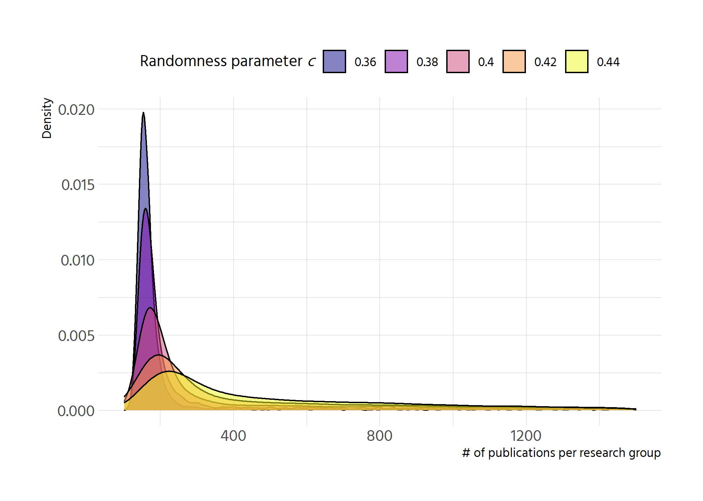
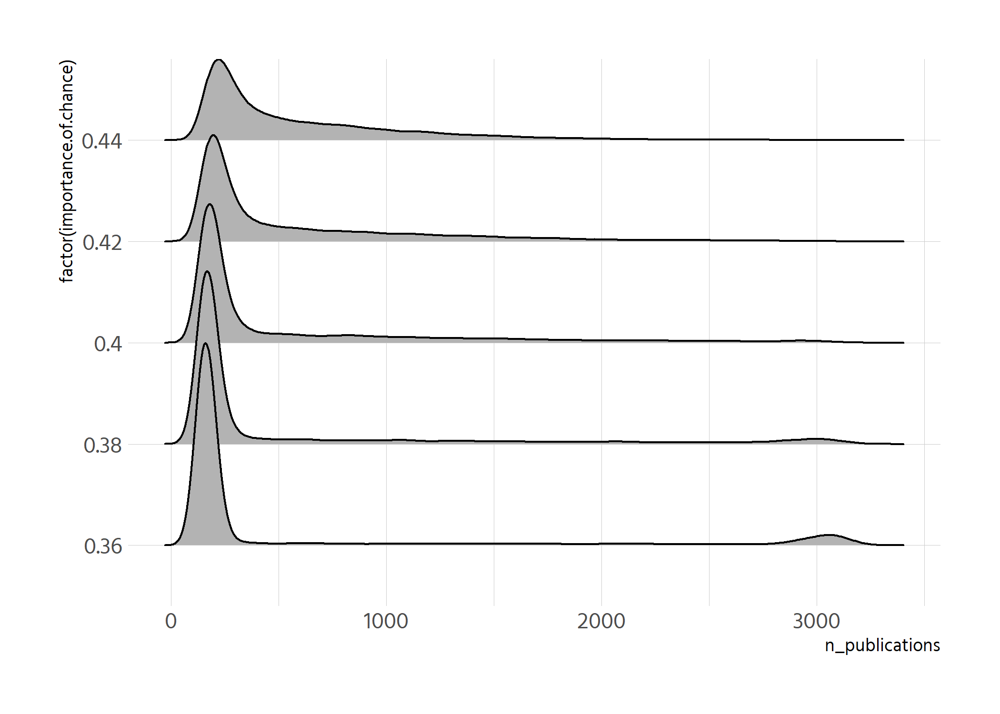

```r
p <- df %>% 
  select(run_number = .run.number., chance_imp = importance.of.chance, 
         step = .step., contains("gini")) %>% 
  pivot_longer(contains("gini")) %>% 
  filter(factor(chance_imp) %in% factor(seq(0, 1, by = .1)),
         !is.na(value)) %>% 
  mutate(name = str_remove(name, "gini_") %>% str_to_title()) %>% 
  ggplot(aes(step, value, colour = factor(chance_imp))) +
  geom_smooth() +
  facet_wrap(vars(name)) +
  scale_colour_viridis_d(option = "C", alpha = .5,begin = .1, end = .9) +
  labs(y = "Gini index", x = "Time",
       colour = expression(paste("Randomness parameter ", italic("c"))),
       caption = "n = 100 agents; summarised from 100 runs") 
p
```

```
## `geom_smooth()` using method = 'gam' and formula 'y ~ s(x, bs = "cs")'
```

<!-- -->


```r
plotly::ggplotly(p)
```

```
## `geom_smooth()` using method = 'gam' and formula 'y ~ s(x, bs = "cs")'
```

```{=html}
<div id="htmlwidget-2fd3059e0026a05bac65" style="width:840px;height:600px;" class="plotly html-widget"></div>
<script type="application/json" data-for="htmlwidget-2fd3059e0026a05bac65">{"x":{"data":[{"x":[1,7.31645569620253,13.6329113924051,19.9493670886076,26.2658227848101,32.5822784810127,38.8987341772152,45.2151898734177,51.5316455696203,57.8481012658228,64.1645569620253,70.4810126582279,76.7974683544304,83.1139240506329,89.4303797468354,95.746835443038,102.063291139241,108.379746835443,114.696202531646,121.012658227848,127.329113924051,133.645569620253,139.962025316456,146.278481012658,152.594936708861,158.911392405063,165.227848101266,171.544303797468,177.860759493671,184.177215189873,190.493670886076,196.810126582278,203.126582278481,209.443037974684,215.759493670886,222.075949367089,228.392405063291,234.708860759494,241.025316455696,247.341772151899,253.658227848101,259.974683544304,266.291139240506,272.607594936709,278.924050632911,285.240506329114,291.556962025316,297.873417721519,304.189873417722,310.506329113924,316.822784810127,323.139240506329,329.455696202532,335.772151898734,342.088607594937,348.405063291139,354.721518987342,361.037974683544,367.354430379747,373.670886075949,379.987341772152,386.303797468354,392.620253164557,398.936708860759,405.253164556962,411.569620253165,417.886075949367,424.20253164557,430.518987341772,436.835443037975,443.151898734177,449.46835443038,455.784810126582,462.101265822785,468.417721518987,474.73417721519,481.050632911392,487.367088607595,493.683544303797,500],"y":[0.856368524239878,0.857007800670748,0.857634220060605,0.858234925368439,0.858797059553236,0.859307765573985,0.859754186389673,0.860123464959288,0.860402744241818,0.860579226941744,0.860649816938116,0.860631761450644,0.860544869287088,0.860408949255208,0.860243810162763,0.860069260817516,0.859905110027224,0.859771166599649,0.859686793463706,0.859657830878967,0.859674485478004,0.859726093036272,0.859801989329225,0.859891510132315,0.859983991220998,0.860068768370726,0.860135177356954,0.860173361888143,0.860182857893965,0.86016926080165,0.860138267030052,0.860095572998025,0.860046875124424,0.859997869828104,0.859954253527919,0.859921722642723,0.859904950478845,0.85990288530864,0.859912485130878,0.859930705946061,0.859954503754691,0.859980834557269,0.860006654354298,0.86002891914628,0.860044586001285,0.860051675286458,0.860051265955133,0.860044983556149,0.860034453638346,0.860021301750565,0.860007153441647,0.859993634260431,0.859982369755758,0.859974970100712,0.859972122923017,0.859973085905091,0.8599769937233,0.859982981054016,0.859990182573604,0.859997732958435,0.860004766884876,0.860010419029296,0.860013861749968,0.860014943870713,0.860014099339963,0.860011781399285,0.860008443290247,0.860004538254416,0.860000519533359,0.859996840368644,0.859993954001838,0.859992266100714,0.859991804516673,0.859992416930973,0.85999394991528,0.859996250041259,0.859999163880576,0.860002538004897,0.860006218985886,0.86001005339521],"text":["step:   1.000000<br />value: 0.85636852<br />factor(chance_imp): 0","step:   7.316456<br />value: 0.85700780<br />factor(chance_imp): 0","step:  13.632911<br />value: 0.85763422<br />factor(chance_imp): 0","step:  19.949367<br />value: 0.85823493<br />factor(chance_imp): 0","step:  26.265823<br />value: 0.85879706<br />factor(chance_imp): 0","step:  32.582278<br />value: 0.85930777<br />factor(chance_imp): 0","step:  38.898734<br />value: 0.85975419<br />factor(chance_imp): 0","step:  45.215190<br />value: 0.86012346<br />factor(chance_imp): 0","step:  51.531646<br />value: 0.86040274<br />factor(chance_imp): 0","step:  57.848101<br />value: 0.86057923<br />factor(chance_imp): 0","step:  64.164557<br />value: 0.86064982<br />factor(chance_imp): 0","step:  70.481013<br />value: 0.86063176<br />factor(chance_imp): 0","step:  76.797468<br />value: 0.86054487<br />factor(chance_imp): 0","step:  83.113924<br />value: 0.86040895<br />factor(chance_imp): 0","step:  89.430380<br />value: 0.86024381<br />factor(chance_imp): 0","step:  95.746835<br />value: 0.86006926<br />factor(chance_imp): 0","step: 102.063291<br />value: 0.85990511<br />factor(chance_imp): 0","step: 108.379747<br />value: 0.85977117<br />factor(chance_imp): 0","step: 114.696203<br />value: 0.85968679<br />factor(chance_imp): 0","step: 121.012658<br />value: 0.85965783<br />factor(chance_imp): 0","step: 127.329114<br />value: 0.85967449<br />factor(chance_imp): 0","step: 133.645570<br />value: 0.85972609<br />factor(chance_imp): 0","step: 139.962025<br />value: 0.85980199<br />factor(chance_imp): 0","step: 146.278481<br />value: 0.85989151<br />factor(chance_imp): 0","step: 152.594937<br />value: 0.85998399<br />factor(chance_imp): 0","step: 158.911392<br />value: 0.86006877<br />factor(chance_imp): 0","step: 165.227848<br />value: 0.86013518<br />factor(chance_imp): 0","step: 171.544304<br />value: 0.86017336<br />factor(chance_imp): 0","step: 177.860759<br />value: 0.86018286<br />factor(chance_imp): 0","step: 184.177215<br />value: 0.86016926<br />factor(chance_imp): 0","step: 190.493671<br />value: 0.86013827<br />factor(chance_imp): 0","step: 196.810127<br />value: 0.86009557<br />factor(chance_imp): 0","step: 203.126582<br />value: 0.86004688<br />factor(chance_imp): 0","step: 209.443038<br />value: 0.85999787<br />factor(chance_imp): 0","step: 215.759494<br />value: 0.85995425<br />factor(chance_imp): 0","step: 222.075949<br />value: 0.85992172<br />factor(chance_imp): 0","step: 228.392405<br />value: 0.85990495<br />factor(chance_imp): 0","step: 234.708861<br />value: 0.85990289<br />factor(chance_imp): 0","step: 241.025316<br />value: 0.85991249<br />factor(chance_imp): 0","step: 247.341772<br />value: 0.85993071<br />factor(chance_imp): 0","step: 253.658228<br />value: 0.85995450<br />factor(chance_imp): 0","step: 259.974684<br />value: 0.85998083<br />factor(chance_imp): 0","step: 266.291139<br />value: 0.86000665<br />factor(chance_imp): 0","step: 272.607595<br />value: 0.86002892<br />factor(chance_imp): 0","step: 278.924051<br />value: 0.86004459<br />factor(chance_imp): 0","step: 285.240506<br />value: 0.86005168<br />factor(chance_imp): 0","step: 291.556962<br />value: 0.86005127<br />factor(chance_imp): 0","step: 297.873418<br />value: 0.86004498<br />factor(chance_imp): 0","step: 304.189873<br />value: 0.86003445<br />factor(chance_imp): 0","step: 310.506329<br />value: 0.86002130<br />factor(chance_imp): 0","step: 316.822785<br />value: 0.86000715<br />factor(chance_imp): 0","step: 323.139241<br />value: 0.85999363<br />factor(chance_imp): 0","step: 329.455696<br />value: 0.85998237<br />factor(chance_imp): 0","step: 335.772152<br />value: 0.85997497<br />factor(chance_imp): 0","step: 342.088608<br />value: 0.85997212<br />factor(chance_imp): 0","step: 348.405063<br />value: 0.85997309<br />factor(chance_imp): 0","step: 354.721519<br />value: 0.85997699<br />factor(chance_imp): 0","step: 361.037975<br />value: 0.85998298<br />factor(chance_imp): 0","step: 367.354430<br />value: 0.85999018<br />factor(chance_imp): 0","step: 373.670886<br />value: 0.85999773<br />factor(chance_imp): 0","step: 379.987342<br />value: 0.86000477<br />factor(chance_imp): 0","step: 386.303797<br />value: 0.86001042<br />factor(chance_imp): 0","step: 392.620253<br />value: 0.86001386<br />factor(chance_imp): 0","step: 398.936709<br />value: 0.86001494<br />factor(chance_imp): 0","step: 405.253165<br />value: 0.86001410<br />factor(chance_imp): 0","step: 411.569620<br />value: 0.86001178<br />factor(chance_imp): 0","step: 417.886076<br />value: 0.86000844<br />factor(chance_imp): 0","step: 424.202532<br />value: 0.86000454<br />factor(chance_imp): 0","step: 430.518987<br />value: 0.86000052<br />factor(chance_imp): 0","step: 436.835443<br />value: 0.85999684<br />factor(chance_imp): 0","step: 443.151899<br />value: 0.85999395<br />factor(chance_imp): 0","step: 449.468354<br />value: 0.85999227<br />factor(chance_imp): 0","step: 455.784810<br />value: 0.85999180<br />factor(chance_imp): 0","step: 462.101266<br />value: 0.85999242<br />factor(chance_imp): 0","step: 468.417722<br />value: 0.85999395<br />factor(chance_imp): 0","step: 474.734177<br />value: 0.85999625<br />factor(chance_imp): 0","step: 481.050633<br />value: 0.85999916<br />factor(chance_imp): 0","step: 487.367089<br />value: 0.86000254<br />factor(chance_imp): 0","step: 493.683544<br />value: 0.86000622<br />factor(chance_imp): 0","step: 500.000000<br />value: 0.86001005<br />factor(chance_imp): 0"],"type":"scatter","mode":"lines","name":"0","line":{"width":3.77952755905512,"color":"rgba(66,4,158,0.502)","dash":"solid"},"hoveron":"points","legendgroup":"0","showlegend":true,"xaxis":"x","yaxis":"y","hoverinfo":"text","frame":null},{"x":[1,7.31645569620253,13.6329113924051,19.9493670886076,26.2658227848101,32.5822784810127,38.8987341772152,45.2151898734177,51.5316455696203,57.8481012658228,64.1645569620253,70.4810126582279,76.7974683544304,83.1139240506329,89.4303797468354,95.746835443038,102.063291139241,108.379746835443,114.696202531646,121.012658227848,127.329113924051,133.645569620253,139.962025316456,146.278481012658,152.594936708861,158.911392405063,165.227848101266,171.544303797468,177.860759493671,184.177215189873,190.493670886076,196.810126582278,203.126582278481,209.443037974684,215.759493670886,222.075949367089,228.392405063291,234.708860759494,241.025316455696,247.341772151899,253.658227848101,259.974683544304,266.291139240506,272.607594936709,278.924050632911,285.240506329114,291.556962025316,297.873417721519,304.189873417722,310.506329113924,316.822784810127,323.139240506329,329.455696202532,335.772151898734,342.088607594937,348.405063291139,354.721518987342,361.037974683544,367.354430379747,373.670886075949,379.987341772152,386.303797468354,392.620253164557,398.936708860759,405.253164556962,411.569620253165,417.886075949367,424.20253164557,430.518987341772,436.835443037975,443.151898734177,449.46835443038,455.784810126582,462.101265822785,468.417721518987,474.73417721519,481.050632911392,487.367088607595,493.683544303797,500],"y":[0.659444963120467,0.658778255092436,0.658114783712068,0.657457785627029,0.656810497484982,0.656176155933591,0.65555799762052,0.654959259193433,0.654383177299994,0.653832978325909,0.653310222371439,0.652812975340114,0.652338863154009,0.651885511735202,0.65145054700577,0.651031594887788,0.650626281303334,0.650232232174483,0.649847131166145,0.649470413175046,0.649103537705946,0.648748077042578,0.648405603468671,0.648077689267956,0.647765906724162,0.647471828121021,0.647197025742263,0.646942897537958,0.646708814829371,0.646492841435317,0.6462930193829,0.646107390699225,0.645933997411397,0.645770881546521,0.645616085131703,0.645467650194047,0.645323841722243,0.645184172331813,0.645048588368238,0.644917036612467,0.644789463845453,0.644665816848146,0.644546042401499,0.644430087286461,0.644317898283689,0.644209421878758,0.644104603708445,0.644003389257842,0.643905724012038,0.643811553456125,0.643720823075193,0.643633478354333,0.643549464778635,0.643468724584187,0.643391005066884,0.643315751365329,0.643242382626097,0.643170317995763,0.643098976620902,0.643027777648091,0.642956140223903,0.642883483494916,0.642809264306109,0.642733616264211,0.642657258356771,0.642580928872921,0.642505366101791,0.642431308332513,0.64235949385422,0.642290660956041,0.64222554792711,0.642164793867962,0.642108250153977,0.642055392516266,0.642005694372504,0.641958629140367,0.64191367023753,0.641870291081667,0.641827965090453,0.641786165681565],"text":["step:   1.000000<br />value: 0.65944496<br />factor(chance_imp): 0","step:   7.316456<br />value: 0.65877826<br />factor(chance_imp): 0","step:  13.632911<br />value: 0.65811478<br />factor(chance_imp): 0","step:  19.949367<br />value: 0.65745779<br />factor(chance_imp): 0","step:  26.265823<br />value: 0.65681050<br />factor(chance_imp): 0","step:  32.582278<br />value: 0.65617616<br />factor(chance_imp): 0","step:  38.898734<br />value: 0.65555800<br />factor(chance_imp): 0","step:  45.215190<br />value: 0.65495926<br />factor(chance_imp): 0","step:  51.531646<br />value: 0.65438318<br />factor(chance_imp): 0","step:  57.848101<br />value: 0.65383298<br />factor(chance_imp): 0","step:  64.164557<br />value: 0.65331022<br />factor(chance_imp): 0","step:  70.481013<br />value: 0.65281298<br />factor(chance_imp): 0","step:  76.797468<br />value: 0.65233886<br />factor(chance_imp): 0","step:  83.113924<br />value: 0.65188551<br />factor(chance_imp): 0","step:  89.430380<br />value: 0.65145055<br />factor(chance_imp): 0","step:  95.746835<br />value: 0.65103159<br />factor(chance_imp): 0","step: 102.063291<br />value: 0.65062628<br />factor(chance_imp): 0","step: 108.379747<br />value: 0.65023223<br />factor(chance_imp): 0","step: 114.696203<br />value: 0.64984713<br />factor(chance_imp): 0","step: 121.012658<br />value: 0.64947041<br />factor(chance_imp): 0","step: 127.329114<br />value: 0.64910354<br />factor(chance_imp): 0","step: 133.645570<br />value: 0.64874808<br />factor(chance_imp): 0","step: 139.962025<br />value: 0.64840560<br />factor(chance_imp): 0","step: 146.278481<br />value: 0.64807769<br />factor(chance_imp): 0","step: 152.594937<br />value: 0.64776591<br />factor(chance_imp): 0","step: 158.911392<br />value: 0.64747183<br />factor(chance_imp): 0","step: 165.227848<br />value: 0.64719703<br />factor(chance_imp): 0","step: 171.544304<br />value: 0.64694290<br />factor(chance_imp): 0","step: 177.860759<br />value: 0.64670881<br />factor(chance_imp): 0","step: 184.177215<br />value: 0.64649284<br />factor(chance_imp): 0","step: 190.493671<br />value: 0.64629302<br />factor(chance_imp): 0","step: 196.810127<br />value: 0.64610739<br />factor(chance_imp): 0","step: 203.126582<br />value: 0.64593400<br />factor(chance_imp): 0","step: 209.443038<br />value: 0.64577088<br />factor(chance_imp): 0","step: 215.759494<br />value: 0.64561609<br />factor(chance_imp): 0","step: 222.075949<br />value: 0.64546765<br />factor(chance_imp): 0","step: 228.392405<br />value: 0.64532384<br />factor(chance_imp): 0","step: 234.708861<br />value: 0.64518417<br />factor(chance_imp): 0","step: 241.025316<br />value: 0.64504859<br />factor(chance_imp): 0","step: 247.341772<br />value: 0.64491704<br />factor(chance_imp): 0","step: 253.658228<br />value: 0.64478946<br />factor(chance_imp): 0","step: 259.974684<br />value: 0.64466582<br />factor(chance_imp): 0","step: 266.291139<br />value: 0.64454604<br />factor(chance_imp): 0","step: 272.607595<br />value: 0.64443009<br />factor(chance_imp): 0","step: 278.924051<br />value: 0.64431790<br />factor(chance_imp): 0","step: 285.240506<br />value: 0.64420942<br />factor(chance_imp): 0","step: 291.556962<br />value: 0.64410460<br />factor(chance_imp): 0","step: 297.873418<br />value: 0.64400339<br />factor(chance_imp): 0","step: 304.189873<br />value: 0.64390572<br />factor(chance_imp): 0","step: 310.506329<br />value: 0.64381155<br />factor(chance_imp): 0","step: 316.822785<br />value: 0.64372082<br />factor(chance_imp): 0","step: 323.139241<br />value: 0.64363348<br />factor(chance_imp): 0","step: 329.455696<br />value: 0.64354946<br />factor(chance_imp): 0","step: 335.772152<br />value: 0.64346872<br />factor(chance_imp): 0","step: 342.088608<br />value: 0.64339101<br />factor(chance_imp): 0","step: 348.405063<br />value: 0.64331575<br />factor(chance_imp): 0","step: 354.721519<br />value: 0.64324238<br />factor(chance_imp): 0","step: 361.037975<br />value: 0.64317032<br />factor(chance_imp): 0","step: 367.354430<br />value: 0.64309898<br />factor(chance_imp): 0","step: 373.670886<br />value: 0.64302778<br />factor(chance_imp): 0","step: 379.987342<br />value: 0.64295614<br />factor(chance_imp): 0","step: 386.303797<br />value: 0.64288348<br />factor(chance_imp): 0","step: 392.620253<br />value: 0.64280926<br />factor(chance_imp): 0","step: 398.936709<br />value: 0.64273362<br />factor(chance_imp): 0","step: 405.253165<br />value: 0.64265726<br />factor(chance_imp): 0","step: 411.569620<br />value: 0.64258093<br />factor(chance_imp): 0","step: 417.886076<br />value: 0.64250537<br />factor(chance_imp): 0","step: 424.202532<br />value: 0.64243131<br />factor(chance_imp): 0","step: 430.518987<br />value: 0.64235949<br />factor(chance_imp): 0","step: 436.835443<br />value: 0.64229066<br />factor(chance_imp): 0","step: 443.151899<br />value: 0.64222555<br />factor(chance_imp): 0","step: 449.468354<br />value: 0.64216479<br />factor(chance_imp): 0","step: 455.784810<br />value: 0.64210825<br />factor(chance_imp): 0","step: 462.101266<br />value: 0.64205539<br />factor(chance_imp): 0","step: 468.417722<br />value: 0.64200569<br />factor(chance_imp): 0","step: 474.734177<br />value: 0.64195863<br />factor(chance_imp): 0","step: 481.050633<br />value: 0.64191367<br />factor(chance_imp): 0","step: 487.367089<br />value: 0.64187029<br />factor(chance_imp): 0","step: 493.683544<br />value: 0.64182797<br />factor(chance_imp): 0","step: 500.000000<br />value: 0.64178617<br />factor(chance_imp): 0"],"type":"scatter","mode":"lines","name":"0","line":{"width":3.77952755905512,"color":"rgba(66,4,158,0.502)","dash":"solid"},"hoveron":"points","legendgroup":"0","showlegend":false,"xaxis":"x2","yaxis":"y","hoverinfo":"text","frame":null},{"x":[1,7.31645569620253,13.6329113924051,19.9493670886076,26.2658227848101,32.5822784810127,38.8987341772152,45.2151898734177,51.5316455696203,57.8481012658228,64.1645569620253,70.4810126582279,76.7974683544304,83.1139240506329,89.4303797468354,95.746835443038,102.063291139241,108.379746835443,114.696202531646,121.012658227848,127.329113924051,133.645569620253,139.962025316456,146.278481012658,152.594936708861,158.911392405063,165.227848101266,171.544303797468,177.860759493671,184.177215189873,190.493670886076,196.810126582278,203.126582278481,209.443037974684,215.759493670886,222.075949367089,228.392405063291,234.708860759494,241.025316455696,247.341772151899,253.658227848101,259.974683544304,266.291139240506,272.607594936709,278.924050632911,285.240506329114,291.556962025316,297.873417721519,304.189873417722,310.506329113924,316.822784810127,323.139240506329,329.455696202532,335.772151898734,342.088607594937,348.405063291139,354.721518987342,361.037974683544,367.354430379747,373.670886075949,379.987341772152,386.303797468354,392.620253164557,398.936708860759,405.253164556962,411.569620253165,417.886075949367,424.20253164557,430.518987341772,436.835443037975,443.151898734177,449.46835443038,455.784810126582,462.101265822785,468.417721518987,474.73417721519,481.050632911392,487.367088607595,493.683544303797,500],"y":[0.856468532429598,0.857089622357064,0.857698229295547,0.858281870256062,0.858828062249626,0.859324322287257,0.859758167379969,0.86011711453878,0.860388680774706,0.860560441089691,0.860629386762598,0.860612254983236,0.860528269302452,0.860396653271089,0.860236630439993,0.860067424360007,0.859908258581977,0.859778356656748,0.859696509570661,0.859668389439747,0.859684501587155,0.859734506483492,0.859808064599363,0.859894836405373,0.85998448237213,0.860066662970237,0.860131038670302,0.860168053248826,0.860177256413346,0.86016407266562,0.86013402442064,0.8600926340934,0.860045424098893,0.859997916852113,0.859955634768051,0.859924100261703,0.859907843855996,0.859905845740332,0.859915156564081,0.859932825039324,0.859955899878142,0.859981429792616,0.860006463494825,0.860028049696852,0.86004323814588,0.860050109551601,0.860049710193583,0.860043616324085,0.860033404195369,0.860020650059697,0.860006930169328,0.859993820776525,0.859982898133548,0.859975723582456,0.859972963853144,0.859973899026654,0.859977689902407,0.859983497279823,0.859990481958323,0.859997804737326,0.860004626416254,0.860010107794527,0.86001344621756,0.860014495104469,0.860013675360579,0.860011426602765,0.860008188447902,0.860004400512862,0.860000502414521,0.859996933769753,0.859994134195432,0.859992497163801,0.859992049680684,0.859992643994244,0.859994131276385,0.85999636269901,0.859999189434022,0.860002462653324,0.86000603352882,0.860009753232413],"text":["step:   1.000000<br />value: 0.85646853<br />factor(chance_imp): 0.1","step:   7.316456<br />value: 0.85708962<br />factor(chance_imp): 0.1","step:  13.632911<br />value: 0.85769823<br />factor(chance_imp): 0.1","step:  19.949367<br />value: 0.85828187<br />factor(chance_imp): 0.1","step:  26.265823<br />value: 0.85882806<br />factor(chance_imp): 0.1","step:  32.582278<br />value: 0.85932432<br />factor(chance_imp): 0.1","step:  38.898734<br />value: 0.85975817<br />factor(chance_imp): 0.1","step:  45.215190<br />value: 0.86011711<br />factor(chance_imp): 0.1","step:  51.531646<br />value: 0.86038868<br />factor(chance_imp): 0.1","step:  57.848101<br />value: 0.86056044<br />factor(chance_imp): 0.1","step:  64.164557<br />value: 0.86062939<br />factor(chance_imp): 0.1","step:  70.481013<br />value: 0.86061225<br />factor(chance_imp): 0.1","step:  76.797468<br />value: 0.86052827<br />factor(chance_imp): 0.1","step:  83.113924<br />value: 0.86039665<br />factor(chance_imp): 0.1","step:  89.430380<br />value: 0.86023663<br />factor(chance_imp): 0.1","step:  95.746835<br />value: 0.86006742<br />factor(chance_imp): 0.1","step: 102.063291<br />value: 0.85990826<br />factor(chance_imp): 0.1","step: 108.379747<br />value: 0.85977836<br />factor(chance_imp): 0.1","step: 114.696203<br />value: 0.85969651<br />factor(chance_imp): 0.1","step: 121.012658<br />value: 0.85966839<br />factor(chance_imp): 0.1","step: 127.329114<br />value: 0.85968450<br />factor(chance_imp): 0.1","step: 133.645570<br />value: 0.85973451<br />factor(chance_imp): 0.1","step: 139.962025<br />value: 0.85980806<br />factor(chance_imp): 0.1","step: 146.278481<br />value: 0.85989484<br />factor(chance_imp): 0.1","step: 152.594937<br />value: 0.85998448<br />factor(chance_imp): 0.1","step: 158.911392<br />value: 0.86006666<br />factor(chance_imp): 0.1","step: 165.227848<br />value: 0.86013104<br />factor(chance_imp): 0.1","step: 171.544304<br />value: 0.86016805<br />factor(chance_imp): 0.1","step: 177.860759<br />value: 0.86017726<br />factor(chance_imp): 0.1","step: 184.177215<br />value: 0.86016407<br />factor(chance_imp): 0.1","step: 190.493671<br />value: 0.86013402<br />factor(chance_imp): 0.1","step: 196.810127<br />value: 0.86009263<br />factor(chance_imp): 0.1","step: 203.126582<br />value: 0.86004542<br />factor(chance_imp): 0.1","step: 209.443038<br />value: 0.85999792<br />factor(chance_imp): 0.1","step: 215.759494<br />value: 0.85995563<br />factor(chance_imp): 0.1","step: 222.075949<br />value: 0.85992410<br />factor(chance_imp): 0.1","step: 228.392405<br />value: 0.85990784<br />factor(chance_imp): 0.1","step: 234.708861<br />value: 0.85990585<br />factor(chance_imp): 0.1","step: 241.025316<br />value: 0.85991516<br />factor(chance_imp): 0.1","step: 247.341772<br />value: 0.85993283<br />factor(chance_imp): 0.1","step: 253.658228<br />value: 0.85995590<br />factor(chance_imp): 0.1","step: 259.974684<br />value: 0.85998143<br />factor(chance_imp): 0.1","step: 266.291139<br />value: 0.86000646<br />factor(chance_imp): 0.1","step: 272.607595<br />value: 0.86002805<br />factor(chance_imp): 0.1","step: 278.924051<br />value: 0.86004324<br />factor(chance_imp): 0.1","step: 285.240506<br />value: 0.86005011<br />factor(chance_imp): 0.1","step: 291.556962<br />value: 0.86004971<br />factor(chance_imp): 0.1","step: 297.873418<br />value: 0.86004362<br />factor(chance_imp): 0.1","step: 304.189873<br />value: 0.86003340<br />factor(chance_imp): 0.1","step: 310.506329<br />value: 0.86002065<br />factor(chance_imp): 0.1","step: 316.822785<br />value: 0.86000693<br />factor(chance_imp): 0.1","step: 323.139241<br />value: 0.85999382<br />factor(chance_imp): 0.1","step: 329.455696<br />value: 0.85998290<br />factor(chance_imp): 0.1","step: 335.772152<br />value: 0.85997572<br />factor(chance_imp): 0.1","step: 342.088608<br />value: 0.85997296<br />factor(chance_imp): 0.1","step: 348.405063<br />value: 0.85997390<br />factor(chance_imp): 0.1","step: 354.721519<br />value: 0.85997769<br />factor(chance_imp): 0.1","step: 361.037975<br />value: 0.85998350<br />factor(chance_imp): 0.1","step: 367.354430<br />value: 0.85999048<br />factor(chance_imp): 0.1","step: 373.670886<br />value: 0.85999780<br />factor(chance_imp): 0.1","step: 379.987342<br />value: 0.86000463<br />factor(chance_imp): 0.1","step: 386.303797<br />value: 0.86001011<br />factor(chance_imp): 0.1","step: 392.620253<br />value: 0.86001345<br />factor(chance_imp): 0.1","step: 398.936709<br />value: 0.86001450<br />factor(chance_imp): 0.1","step: 405.253165<br />value: 0.86001368<br />factor(chance_imp): 0.1","step: 411.569620<br />value: 0.86001143<br />factor(chance_imp): 0.1","step: 417.886076<br />value: 0.86000819<br />factor(chance_imp): 0.1","step: 424.202532<br />value: 0.86000440<br />factor(chance_imp): 0.1","step: 430.518987<br />value: 0.86000050<br />factor(chance_imp): 0.1","step: 436.835443<br />value: 0.85999693<br />factor(chance_imp): 0.1","step: 443.151899<br />value: 0.85999413<br />factor(chance_imp): 0.1","step: 449.468354<br />value: 0.85999250<br />factor(chance_imp): 0.1","step: 455.784810<br />value: 0.85999205<br />factor(chance_imp): 0.1","step: 462.101266<br />value: 0.85999264<br />factor(chance_imp): 0.1","step: 468.417722<br />value: 0.85999413<br />factor(chance_imp): 0.1","step: 474.734177<br />value: 0.85999636<br />factor(chance_imp): 0.1","step: 481.050633<br />value: 0.85999919<br />factor(chance_imp): 0.1","step: 487.367089<br />value: 0.86000246<br />factor(chance_imp): 0.1","step: 493.683544<br />value: 0.86000603<br />factor(chance_imp): 0.1","step: 500.000000<br />value: 0.86000975<br />factor(chance_imp): 0.1"],"type":"scatter","mode":"lines","name":"0.1","line":{"width":3.77952755905512,"color":"rgba(99,0,167,0.502)","dash":"solid"},"hoveron":"points","legendgroup":"0.1","showlegend":true,"xaxis":"x","yaxis":"y","hoverinfo":"text","frame":null},{"x":[1,7.31645569620253,13.6329113924051,19.9493670886076,26.2658227848101,32.5822784810127,38.8987341772152,45.2151898734177,51.5316455696203,57.8481012658228,64.1645569620253,70.4810126582279,76.7974683544304,83.1139240506329,89.4303797468354,95.746835443038,102.063291139241,108.379746835443,114.696202531646,121.012658227848,127.329113924051,133.645569620253,139.962025316456,146.278481012658,152.594936708861,158.911392405063,165.227848101266,171.544303797468,177.860759493671,184.177215189873,190.493670886076,196.810126582278,203.126582278481,209.443037974684,215.759493670886,222.075949367089,228.392405063291,234.708860759494,241.025316455696,247.341772151899,253.658227848101,259.974683544304,266.291139240506,272.607594936709,278.924050632911,285.240506329114,291.556962025316,297.873417721519,304.189873417722,310.506329113924,316.822784810127,323.139240506329,329.455696202532,335.772151898734,342.088607594937,348.405063291139,354.721518987342,361.037974683544,367.354430379747,373.670886075949,379.987341772152,386.303797468354,392.620253164557,398.936708860759,405.253164556962,411.569620253165,417.886075949367,424.20253164557,430.518987341772,436.835443037975,443.151898734177,449.46835443038,455.784810126582,462.101265822785,468.417721518987,474.73417721519,481.050632911392,487.367088607595,493.683544303797,500],"y":[0.660584873355067,0.65976487056736,0.658948918385498,0.658141067415329,0.657345368262697,0.656565871533448,0.655806627833428,0.655071687768483,0.654365101944459,0.653690912864019,0.653051847275501,0.652447872793468,0.651878609608514,0.651343677911233,0.65084269789222,0.65037528974207,0.649941073651378,0.649539669810737,0.649170669057325,0.648832771994238,0.648523650020401,0.648240917203851,0.647982187612624,0.647745075314756,0.647527194378283,0.647326158871242,0.647139582861668,0.646965131529014,0.64680106422295,0.646646023628771,0.646498658820698,0.646357618872954,0.64622155285976,0.646089109855338,0.645958938933909,0.645829689169695,0.645700212813909,0.645570499035891,0.64544093224772,0.645311897258306,0.645183778876561,0.645056961911393,0.644931831171713,0.644808771466431,0.644688167541144,0.644570341081088,0.644455432377993,0.644343549307017,0.644234799743319,0.644129291562059,0.644027132638395,0.643928430847485,0.64383329406449,0.643741828554488,0.64365404397788,0.643569800257802,0.643488944436768,0.643411323557294,0.643336784661894,0.64326517479308,0.643196340993368,0.643130130305272,0.643066385931946,0.643004882152353,0.642945333627872,0.642887453054132,0.642830953126761,0.642775546541387,0.642720945993637,0.642666864179139,0.642613013793521,0.642559131131774,0.642505139907722,0.642451053210036,0.642396884677804,0.642342647950119,0.64228835666607,0.642234024464749,0.642179664985247,0.642125291866653],"text":["step:   1.000000<br />value: 0.66058487<br />factor(chance_imp): 0.1","step:   7.316456<br />value: 0.65976487<br />factor(chance_imp): 0.1","step:  13.632911<br />value: 0.65894892<br />factor(chance_imp): 0.1","step:  19.949367<br />value: 0.65814107<br />factor(chance_imp): 0.1","step:  26.265823<br />value: 0.65734537<br />factor(chance_imp): 0.1","step:  32.582278<br />value: 0.65656587<br />factor(chance_imp): 0.1","step:  38.898734<br />value: 0.65580663<br />factor(chance_imp): 0.1","step:  45.215190<br />value: 0.65507169<br />factor(chance_imp): 0.1","step:  51.531646<br />value: 0.65436510<br />factor(chance_imp): 0.1","step:  57.848101<br />value: 0.65369091<br />factor(chance_imp): 0.1","step:  64.164557<br />value: 0.65305185<br />factor(chance_imp): 0.1","step:  70.481013<br />value: 0.65244787<br />factor(chance_imp): 0.1","step:  76.797468<br />value: 0.65187861<br />factor(chance_imp): 0.1","step:  83.113924<br />value: 0.65134368<br />factor(chance_imp): 0.1","step:  89.430380<br />value: 0.65084270<br />factor(chance_imp): 0.1","step:  95.746835<br />value: 0.65037529<br />factor(chance_imp): 0.1","step: 102.063291<br />value: 0.64994107<br />factor(chance_imp): 0.1","step: 108.379747<br />value: 0.64953967<br />factor(chance_imp): 0.1","step: 114.696203<br />value: 0.64917067<br />factor(chance_imp): 0.1","step: 121.012658<br />value: 0.64883277<br />factor(chance_imp): 0.1","step: 127.329114<br />value: 0.64852365<br />factor(chance_imp): 0.1","step: 133.645570<br />value: 0.64824092<br />factor(chance_imp): 0.1","step: 139.962025<br />value: 0.64798219<br />factor(chance_imp): 0.1","step: 146.278481<br />value: 0.64774508<br />factor(chance_imp): 0.1","step: 152.594937<br />value: 0.64752719<br />factor(chance_imp): 0.1","step: 158.911392<br />value: 0.64732616<br />factor(chance_imp): 0.1","step: 165.227848<br />value: 0.64713958<br />factor(chance_imp): 0.1","step: 171.544304<br />value: 0.64696513<br />factor(chance_imp): 0.1","step: 177.860759<br />value: 0.64680106<br />factor(chance_imp): 0.1","step: 184.177215<br />value: 0.64664602<br />factor(chance_imp): 0.1","step: 190.493671<br />value: 0.64649866<br />factor(chance_imp): 0.1","step: 196.810127<br />value: 0.64635762<br />factor(chance_imp): 0.1","step: 203.126582<br />value: 0.64622155<br />factor(chance_imp): 0.1","step: 209.443038<br />value: 0.64608911<br />factor(chance_imp): 0.1","step: 215.759494<br />value: 0.64595894<br />factor(chance_imp): 0.1","step: 222.075949<br />value: 0.64582969<br />factor(chance_imp): 0.1","step: 228.392405<br />value: 0.64570021<br />factor(chance_imp): 0.1","step: 234.708861<br />value: 0.64557050<br />factor(chance_imp): 0.1","step: 241.025316<br />value: 0.64544093<br />factor(chance_imp): 0.1","step: 247.341772<br />value: 0.64531190<br />factor(chance_imp): 0.1","step: 253.658228<br />value: 0.64518378<br />factor(chance_imp): 0.1","step: 259.974684<br />value: 0.64505696<br />factor(chance_imp): 0.1","step: 266.291139<br />value: 0.64493183<br />factor(chance_imp): 0.1","step: 272.607595<br />value: 0.64480877<br />factor(chance_imp): 0.1","step: 278.924051<br />value: 0.64468817<br />factor(chance_imp): 0.1","step: 285.240506<br />value: 0.64457034<br />factor(chance_imp): 0.1","step: 291.556962<br />value: 0.64445543<br />factor(chance_imp): 0.1","step: 297.873418<br />value: 0.64434355<br />factor(chance_imp): 0.1","step: 304.189873<br />value: 0.64423480<br />factor(chance_imp): 0.1","step: 310.506329<br />value: 0.64412929<br />factor(chance_imp): 0.1","step: 316.822785<br />value: 0.64402713<br />factor(chance_imp): 0.1","step: 323.139241<br />value: 0.64392843<br />factor(chance_imp): 0.1","step: 329.455696<br />value: 0.64383329<br />factor(chance_imp): 0.1","step: 335.772152<br />value: 0.64374183<br />factor(chance_imp): 0.1","step: 342.088608<br />value: 0.64365404<br />factor(chance_imp): 0.1","step: 348.405063<br />value: 0.64356980<br />factor(chance_imp): 0.1","step: 354.721519<br />value: 0.64348894<br />factor(chance_imp): 0.1","step: 361.037975<br />value: 0.64341132<br />factor(chance_imp): 0.1","step: 367.354430<br />value: 0.64333678<br />factor(chance_imp): 0.1","step: 373.670886<br />value: 0.64326517<br />factor(chance_imp): 0.1","step: 379.987342<br />value: 0.64319634<br />factor(chance_imp): 0.1","step: 386.303797<br />value: 0.64313013<br />factor(chance_imp): 0.1","step: 392.620253<br />value: 0.64306639<br />factor(chance_imp): 0.1","step: 398.936709<br />value: 0.64300488<br />factor(chance_imp): 0.1","step: 405.253165<br />value: 0.64294533<br />factor(chance_imp): 0.1","step: 411.569620<br />value: 0.64288745<br />factor(chance_imp): 0.1","step: 417.886076<br />value: 0.64283095<br />factor(chance_imp): 0.1","step: 424.202532<br />value: 0.64277555<br />factor(chance_imp): 0.1","step: 430.518987<br />value: 0.64272095<br />factor(chance_imp): 0.1","step: 436.835443<br />value: 0.64266686<br />factor(chance_imp): 0.1","step: 443.151899<br />value: 0.64261301<br />factor(chance_imp): 0.1","step: 449.468354<br />value: 0.64255913<br />factor(chance_imp): 0.1","step: 455.784810<br />value: 0.64250514<br />factor(chance_imp): 0.1","step: 462.101266<br />value: 0.64245105<br />factor(chance_imp): 0.1","step: 468.417722<br />value: 0.64239688<br />factor(chance_imp): 0.1","step: 474.734177<br />value: 0.64234265<br />factor(chance_imp): 0.1","step: 481.050633<br />value: 0.64228836<br />factor(chance_imp): 0.1","step: 487.367089<br />value: 0.64223402<br />factor(chance_imp): 0.1","step: 493.683544<br />value: 0.64217966<br />factor(chance_imp): 0.1","step: 500.000000<br />value: 0.64212529<br />factor(chance_imp): 0.1"],"type":"scatter","mode":"lines","name":"0.1","line":{"width":3.77952755905512,"color":"rgba(99,0,167,0.502)","dash":"solid"},"hoveron":"points","legendgroup":"0.1","showlegend":false,"xaxis":"x2","yaxis":"y","hoverinfo":"text","frame":null},{"x":[1,7.31645569620253,13.6329113924051,19.9493670886076,26.2658227848101,32.5822784810127,38.8987341772152,45.2151898734177,51.5316455696203,57.8481012658228,64.1645569620253,70.4810126582279,76.7974683544304,83.1139240506329,89.4303797468354,95.746835443038,102.063291139241,108.379746835443,114.696202531646,121.012658227848,127.329113924051,133.645569620253,139.962025316456,146.278481012658,152.594936708861,158.911392405063,165.227848101266,171.544303797468,177.860759493671,184.177215189873,190.493670886076,196.810126582278,203.126582278481,209.443037974684,215.759493670886,222.075949367089,228.392405063291,234.708860759494,241.025316455696,247.341772151899,253.658227848101,259.974683544304,266.291139240506,272.607594936709,278.924050632911,285.240506329114,291.556962025316,297.873417721519,304.189873417722,310.506329113924,316.822784810127,323.139240506329,329.455696202532,335.772151898734,342.088607594937,348.405063291139,354.721518987342,361.037974683544,367.354430379747,373.670886075949,379.987341772152,386.303797468354,392.620253164557,398.936708860759,405.253164556962,411.569620253165,417.886075949367,424.20253164557,430.518987341772,436.835443037975,443.151898734177,449.46835443038,455.784810126582,462.101265822785,468.417721518987,474.73417721519,481.050632911392,487.367088607595,493.683544303797,500],"y":[0.854866831578261,0.8557609010745,0.856637126156937,0.857477662411767,0.85826466542519,0.858980290783401,0.859606694072599,0.860126030878979,0.860520456788741,0.860772210034728,0.860876948599162,0.860858471647719,0.860744121821084,0.860561241759939,0.86033717410497,0.86009926149686,0.859874846576293,0.859691271983954,0.859575267326376,0.859534970033786,0.859557023026548,0.859626871892703,0.859729962220294,0.859851739597362,0.859977649611948,0.860093137852096,0.860183649905845,0.860235733145678,0.860248743188184,0.860230299033247,0.860188157403809,0.860130075022809,0.860063808613187,0.859997114897883,0.859937750599837,0.859893472441989,0.859870644150493,0.859867834655027,0.859880903071207,0.859905705793953,0.859938099218184,0.859973939738821,0.860009083750782,0.860039387648988,0.860060709281655,0.860070353981173,0.860069790776875,0.860061232786342,0.860046893127158,0.860028984916904,0.860009721273162,0.859991315313515,0.859975980155545,0.859965907981423,0.859962034848639,0.85996334982143,0.859968674480743,0.859976830407521,0.859986639182712,0.859996922387261,0.860006501602114,0.860014198408217,0.860018885707428,0.860020357714623,0.860019205555803,0.860016046633279,0.860011498349358,0.860006178106351,0.860000703306567,0.859995691352313,0.859991759645901,0.859989460782248,0.859988832676012,0.859989667805115,0.859991757135937,0.859994891634858,0.859998862268258,0.860003460002518,0.860008475804017,0.860013700639137],"text":["step:   1.000000<br />value: 0.85486683<br />factor(chance_imp): 0.2","step:   7.316456<br />value: 0.85576090<br />factor(chance_imp): 0.2","step:  13.632911<br />value: 0.85663713<br />factor(chance_imp): 0.2","step:  19.949367<br />value: 0.85747766<br />factor(chance_imp): 0.2","step:  26.265823<br />value: 0.85826467<br />factor(chance_imp): 0.2","step:  32.582278<br />value: 0.85898029<br />factor(chance_imp): 0.2","step:  38.898734<br />value: 0.85960669<br />factor(chance_imp): 0.2","step:  45.215190<br />value: 0.86012603<br />factor(chance_imp): 0.2","step:  51.531646<br />value: 0.86052046<br />factor(chance_imp): 0.2","step:  57.848101<br />value: 0.86077221<br />factor(chance_imp): 0.2","step:  64.164557<br />value: 0.86087695<br />factor(chance_imp): 0.2","step:  70.481013<br />value: 0.86085847<br />factor(chance_imp): 0.2","step:  76.797468<br />value: 0.86074412<br />factor(chance_imp): 0.2","step:  83.113924<br />value: 0.86056124<br />factor(chance_imp): 0.2","step:  89.430380<br />value: 0.86033717<br />factor(chance_imp): 0.2","step:  95.746835<br />value: 0.86009926<br />factor(chance_imp): 0.2","step: 102.063291<br />value: 0.85987485<br />factor(chance_imp): 0.2","step: 108.379747<br />value: 0.85969127<br />factor(chance_imp): 0.2","step: 114.696203<br />value: 0.85957527<br />factor(chance_imp): 0.2","step: 121.012658<br />value: 0.85953497<br />factor(chance_imp): 0.2","step: 127.329114<br />value: 0.85955702<br />factor(chance_imp): 0.2","step: 133.645570<br />value: 0.85962687<br />factor(chance_imp): 0.2","step: 139.962025<br />value: 0.85972996<br />factor(chance_imp): 0.2","step: 146.278481<br />value: 0.85985174<br />factor(chance_imp): 0.2","step: 152.594937<br />value: 0.85997765<br />factor(chance_imp): 0.2","step: 158.911392<br />value: 0.86009314<br />factor(chance_imp): 0.2","step: 165.227848<br />value: 0.86018365<br />factor(chance_imp): 0.2","step: 171.544304<br />value: 0.86023573<br />factor(chance_imp): 0.2","step: 177.860759<br />value: 0.86024874<br />factor(chance_imp): 0.2","step: 184.177215<br />value: 0.86023030<br />factor(chance_imp): 0.2","step: 190.493671<br />value: 0.86018816<br />factor(chance_imp): 0.2","step: 196.810127<br />value: 0.86013008<br />factor(chance_imp): 0.2","step: 203.126582<br />value: 0.86006381<br />factor(chance_imp): 0.2","step: 209.443038<br />value: 0.85999711<br />factor(chance_imp): 0.2","step: 215.759494<br />value: 0.85993775<br />factor(chance_imp): 0.2","step: 222.075949<br />value: 0.85989347<br />factor(chance_imp): 0.2","step: 228.392405<br />value: 0.85987064<br />factor(chance_imp): 0.2","step: 234.708861<br />value: 0.85986783<br />factor(chance_imp): 0.2","step: 241.025316<br />value: 0.85988090<br />factor(chance_imp): 0.2","step: 247.341772<br />value: 0.85990571<br />factor(chance_imp): 0.2","step: 253.658228<br />value: 0.85993810<br />factor(chance_imp): 0.2","step: 259.974684<br />value: 0.85997394<br />factor(chance_imp): 0.2","step: 266.291139<br />value: 0.86000908<br />factor(chance_imp): 0.2","step: 272.607595<br />value: 0.86003939<br />factor(chance_imp): 0.2","step: 278.924051<br />value: 0.86006071<br />factor(chance_imp): 0.2","step: 285.240506<br />value: 0.86007035<br />factor(chance_imp): 0.2","step: 291.556962<br />value: 0.86006979<br />factor(chance_imp): 0.2","step: 297.873418<br />value: 0.86006123<br />factor(chance_imp): 0.2","step: 304.189873<br />value: 0.86004689<br />factor(chance_imp): 0.2","step: 310.506329<br />value: 0.86002898<br />factor(chance_imp): 0.2","step: 316.822785<br />value: 0.86000972<br />factor(chance_imp): 0.2","step: 323.139241<br />value: 0.85999132<br />factor(chance_imp): 0.2","step: 329.455696<br />value: 0.85997598<br />factor(chance_imp): 0.2","step: 335.772152<br />value: 0.85996591<br />factor(chance_imp): 0.2","step: 342.088608<br />value: 0.85996203<br />factor(chance_imp): 0.2","step: 348.405063<br />value: 0.85996335<br />factor(chance_imp): 0.2","step: 354.721519<br />value: 0.85996867<br />factor(chance_imp): 0.2","step: 361.037975<br />value: 0.85997683<br />factor(chance_imp): 0.2","step: 367.354430<br />value: 0.85998664<br />factor(chance_imp): 0.2","step: 373.670886<br />value: 0.85999692<br />factor(chance_imp): 0.2","step: 379.987342<br />value: 0.86000650<br />factor(chance_imp): 0.2","step: 386.303797<br />value: 0.86001420<br />factor(chance_imp): 0.2","step: 392.620253<br />value: 0.86001889<br />factor(chance_imp): 0.2","step: 398.936709<br />value: 0.86002036<br />factor(chance_imp): 0.2","step: 405.253165<br />value: 0.86001921<br />factor(chance_imp): 0.2","step: 411.569620<br />value: 0.86001605<br />factor(chance_imp): 0.2","step: 417.886076<br />value: 0.86001150<br />factor(chance_imp): 0.2","step: 424.202532<br />value: 0.86000618<br />factor(chance_imp): 0.2","step: 430.518987<br />value: 0.86000070<br />factor(chance_imp): 0.2","step: 436.835443<br />value: 0.85999569<br />factor(chance_imp): 0.2","step: 443.151899<br />value: 0.85999176<br />factor(chance_imp): 0.2","step: 449.468354<br />value: 0.85998946<br />factor(chance_imp): 0.2","step: 455.784810<br />value: 0.85998883<br />factor(chance_imp): 0.2","step: 462.101266<br />value: 0.85998967<br />factor(chance_imp): 0.2","step: 468.417722<br />value: 0.85999176<br />factor(chance_imp): 0.2","step: 474.734177<br />value: 0.85999489<br />factor(chance_imp): 0.2","step: 481.050633<br />value: 0.85999886<br />factor(chance_imp): 0.2","step: 487.367089<br />value: 0.86000346<br />factor(chance_imp): 0.2","step: 493.683544<br />value: 0.86000848<br />factor(chance_imp): 0.2","step: 500.000000<br />value: 0.86001370<br />factor(chance_imp): 0.2"],"type":"scatter","mode":"lines","name":"0.2","line":{"width":3.77952755905512,"color":"rgba(130,4,167,0.502)","dash":"solid"},"hoveron":"points","legendgroup":"0.2","showlegend":true,"xaxis":"x","yaxis":"y","hoverinfo":"text","frame":null},{"x":[1,7.31645569620253,13.6329113924051,19.9493670886076,26.2658227848101,32.5822784810127,38.8987341772152,45.2151898734177,51.5316455696203,57.8481012658228,64.1645569620253,70.4810126582279,76.7974683544304,83.1139240506329,89.4303797468354,95.746835443038,102.063291139241,108.379746835443,114.696202531646,121.012658227848,127.329113924051,133.645569620253,139.962025316456,146.278481012658,152.594936708861,158.911392405063,165.227848101266,171.544303797468,177.860759493671,184.177215189873,190.493670886076,196.810126582278,203.126582278481,209.443037974684,215.759493670886,222.075949367089,228.392405063291,234.708860759494,241.025316455696,247.341772151899,253.658227848101,259.974683544304,266.291139240506,272.607594936709,278.924050632911,285.240506329114,291.556962025316,297.873417721519,304.189873417722,310.506329113924,316.822784810127,323.139240506329,329.455696202532,335.772151898734,342.088607594937,348.405063291139,354.721518987342,361.037974683544,367.354430379747,373.670886075949,379.987341772152,386.303797468354,392.620253164557,398.936708860759,405.253164556962,411.569620253165,417.886075949367,424.20253164557,430.518987341772,436.835443037975,443.151898734177,449.46835443038,455.784810126582,462.101265822785,468.417721518987,474.73417721519,481.050632911392,487.367088607595,493.683544303797,500],"y":[0.655969659082598,0.655563772865221,0.65515740058581,0.654750056182329,0.654341253592746,0.653930506755024,0.653517329607131,0.653101236087031,0.652681740132689,0.652258362513264,0.651831733212615,0.651404808235271,0.650980836473094,0.650563066817947,0.650154748161689,0.649759129396182,0.649379459413287,0.649018987104866,0.648680885403412,0.648366023536218,0.648072607405245,0.647798694554311,0.647542342527237,0.647301608867844,0.64707455111995,0.646859226827378,0.646653693533945,0.6464561005724,0.646265664321767,0.646082289578026,0.645905892610771,0.645736389689597,0.645573697084099,0.645417731063872,0.64526840789851,0.645125643857608,0.644989333005515,0.644859245152617,0.644735106913156,0.644616644858005,0.644503585558038,0.644395655584129,0.64429258150715,0.644194089897975,0.644099907307328,0.644009740217947,0.643923237386884,0.643840037255114,0.643759778263615,0.643682098853363,0.643606637465337,0.643533032540513,0.643460922519867,0.643389948263449,0.643319895775558,0.643250776034087,0.643182619369496,0.643115456112245,0.643049316592794,0.642984231141601,0.642920230089127,0.642857343765831,0.642795605572393,0.642735104026052,0.642675975318404,0.642618357212996,0.642562387473375,0.642508203863088,0.642455944145681,0.642405746084701,0.642357747443696,0.642312054029916,0.642268517863587,0.642226869940948,0.6421868405129,0.642148159830345,0.642110558144184,0.642073765705318,0.64203751276465,0.64200152957308],"text":["step:   1.000000<br />value: 0.65596966<br />factor(chance_imp): 0.2","step:   7.316456<br />value: 0.65556377<br />factor(chance_imp): 0.2","step:  13.632911<br />value: 0.65515740<br />factor(chance_imp): 0.2","step:  19.949367<br />value: 0.65475006<br />factor(chance_imp): 0.2","step:  26.265823<br />value: 0.65434125<br />factor(chance_imp): 0.2","step:  32.582278<br />value: 0.65393051<br />factor(chance_imp): 0.2","step:  38.898734<br />value: 0.65351733<br />factor(chance_imp): 0.2","step:  45.215190<br />value: 0.65310124<br />factor(chance_imp): 0.2","step:  51.531646<br />value: 0.65268174<br />factor(chance_imp): 0.2","step:  57.848101<br />value: 0.65225836<br />factor(chance_imp): 0.2","step:  64.164557<br />value: 0.65183173<br />factor(chance_imp): 0.2","step:  70.481013<br />value: 0.65140481<br />factor(chance_imp): 0.2","step:  76.797468<br />value: 0.65098084<br />factor(chance_imp): 0.2","step:  83.113924<br />value: 0.65056307<br />factor(chance_imp): 0.2","step:  89.430380<br />value: 0.65015475<br />factor(chance_imp): 0.2","step:  95.746835<br />value: 0.64975913<br />factor(chance_imp): 0.2","step: 102.063291<br />value: 0.64937946<br />factor(chance_imp): 0.2","step: 108.379747<br />value: 0.64901899<br />factor(chance_imp): 0.2","step: 114.696203<br />value: 0.64868089<br />factor(chance_imp): 0.2","step: 121.012658<br />value: 0.64836602<br />factor(chance_imp): 0.2","step: 127.329114<br />value: 0.64807261<br />factor(chance_imp): 0.2","step: 133.645570<br />value: 0.64779869<br />factor(chance_imp): 0.2","step: 139.962025<br />value: 0.64754234<br />factor(chance_imp): 0.2","step: 146.278481<br />value: 0.64730161<br />factor(chance_imp): 0.2","step: 152.594937<br />value: 0.64707455<br />factor(chance_imp): 0.2","step: 158.911392<br />value: 0.64685923<br />factor(chance_imp): 0.2","step: 165.227848<br />value: 0.64665369<br />factor(chance_imp): 0.2","step: 171.544304<br />value: 0.64645610<br />factor(chance_imp): 0.2","step: 177.860759<br />value: 0.64626566<br />factor(chance_imp): 0.2","step: 184.177215<br />value: 0.64608229<br />factor(chance_imp): 0.2","step: 190.493671<br />value: 0.64590589<br />factor(chance_imp): 0.2","step: 196.810127<br />value: 0.64573639<br />factor(chance_imp): 0.2","step: 203.126582<br />value: 0.64557370<br />factor(chance_imp): 0.2","step: 209.443038<br />value: 0.64541773<br />factor(chance_imp): 0.2","step: 215.759494<br />value: 0.64526841<br />factor(chance_imp): 0.2","step: 222.075949<br />value: 0.64512564<br />factor(chance_imp): 0.2","step: 228.392405<br />value: 0.64498933<br />factor(chance_imp): 0.2","step: 234.708861<br />value: 0.64485925<br />factor(chance_imp): 0.2","step: 241.025316<br />value: 0.64473511<br />factor(chance_imp): 0.2","step: 247.341772<br />value: 0.64461664<br />factor(chance_imp): 0.2","step: 253.658228<br />value: 0.64450359<br />factor(chance_imp): 0.2","step: 259.974684<br />value: 0.64439566<br />factor(chance_imp): 0.2","step: 266.291139<br />value: 0.64429258<br />factor(chance_imp): 0.2","step: 272.607595<br />value: 0.64419409<br />factor(chance_imp): 0.2","step: 278.924051<br />value: 0.64409991<br />factor(chance_imp): 0.2","step: 285.240506<br />value: 0.64400974<br />factor(chance_imp): 0.2","step: 291.556962<br />value: 0.64392324<br />factor(chance_imp): 0.2","step: 297.873418<br />value: 0.64384004<br />factor(chance_imp): 0.2","step: 304.189873<br />value: 0.64375978<br />factor(chance_imp): 0.2","step: 310.506329<br />value: 0.64368210<br />factor(chance_imp): 0.2","step: 316.822785<br />value: 0.64360664<br />factor(chance_imp): 0.2","step: 323.139241<br />value: 0.64353303<br />factor(chance_imp): 0.2","step: 329.455696<br />value: 0.64346092<br />factor(chance_imp): 0.2","step: 335.772152<br />value: 0.64338995<br />factor(chance_imp): 0.2","step: 342.088608<br />value: 0.64331990<br />factor(chance_imp): 0.2","step: 348.405063<br />value: 0.64325078<br />factor(chance_imp): 0.2","step: 354.721519<br />value: 0.64318262<br />factor(chance_imp): 0.2","step: 361.037975<br />value: 0.64311546<br />factor(chance_imp): 0.2","step: 367.354430<br />value: 0.64304932<br />factor(chance_imp): 0.2","step: 373.670886<br />value: 0.64298423<br />factor(chance_imp): 0.2","step: 379.987342<br />value: 0.64292023<br />factor(chance_imp): 0.2","step: 386.303797<br />value: 0.64285734<br />factor(chance_imp): 0.2","step: 392.620253<br />value: 0.64279561<br />factor(chance_imp): 0.2","step: 398.936709<br />value: 0.64273510<br />factor(chance_imp): 0.2","step: 405.253165<br />value: 0.64267598<br />factor(chance_imp): 0.2","step: 411.569620<br />value: 0.64261836<br />factor(chance_imp): 0.2","step: 417.886076<br />value: 0.64256239<br />factor(chance_imp): 0.2","step: 424.202532<br />value: 0.64250820<br />factor(chance_imp): 0.2","step: 430.518987<br />value: 0.64245594<br />factor(chance_imp): 0.2","step: 436.835443<br />value: 0.64240575<br />factor(chance_imp): 0.2","step: 443.151899<br />value: 0.64235775<br />factor(chance_imp): 0.2","step: 449.468354<br />value: 0.64231205<br />factor(chance_imp): 0.2","step: 455.784810<br />value: 0.64226852<br />factor(chance_imp): 0.2","step: 462.101266<br />value: 0.64222687<br />factor(chance_imp): 0.2","step: 468.417722<br />value: 0.64218684<br />factor(chance_imp): 0.2","step: 474.734177<br />value: 0.64214816<br />factor(chance_imp): 0.2","step: 481.050633<br />value: 0.64211056<br />factor(chance_imp): 0.2","step: 487.367089<br />value: 0.64207377<br />factor(chance_imp): 0.2","step: 493.683544<br />value: 0.64203751<br />factor(chance_imp): 0.2","step: 500.000000<br />value: 0.64200153<br />factor(chance_imp): 0.2"],"type":"scatter","mode":"lines","name":"0.2","line":{"width":3.77952755905512,"color":"rgba(130,4,167,0.502)","dash":"solid"},"hoveron":"points","legendgroup":"0.2","showlegend":false,"xaxis":"x2","yaxis":"y","hoverinfo":"text","frame":null},{"x":[1,7.31645569620253,13.6329113924051,19.9493670886076,26.2658227848101,32.5822784810127,38.8987341772152,45.2151898734177,51.5316455696203,57.8481012658228,64.1645569620253,70.4810126582279,76.7974683544304,83.1139240506329,89.4303797468354,95.746835443038,102.063291139241,108.379746835443,114.696202531646,121.012658227848,127.329113924051,133.645569620253,139.962025316456,146.278481012658,152.594936708861,158.911392405063,165.227848101266,171.544303797468,177.860759493671,184.177215189873,190.493670886076,196.810126582278,203.126582278481,209.443037974684,215.759493670886,222.075949367089,228.392405063291,234.708860759494,241.025316455696,247.341772151899,253.658227848101,259.974683544304,266.291139240506,272.607594936709,278.924050632911,285.240506329114,291.556962025316,297.873417721519,304.189873417722,310.506329113924,316.822784810127,323.139240506329,329.455696202532,335.772151898734,342.088607594937,348.405063291139,354.721518987342,361.037974683544,367.354430379747,373.670886075949,379.987341772152,386.303797468354,392.620253164557,398.936708860759,405.253164556962,411.569620253165,417.886075949367,424.20253164557,430.518987341772,436.835443037975,443.151898734177,449.46835443038,455.784810126582,462.101265822785,468.417721518987,474.73417721519,481.050632911392,487.367088607595,493.683544303797,500],"y":[0.849015824796992,0.850867882057629,0.852683728203104,0.854427152118253,0.856061942687913,0.857551888796922,0.858860779330117,0.859952403172334,0.860790549208411,0.861339172496919,0.861589210556508,0.861588183062295,0.86139073438825,0.861051508908341,0.860625150996537,0.860166305026807,0.85972961537312,0.859369726409444,0.859140070708419,0.859057329180506,0.859095693952071,0.85922699035001,0.859423043701218,0.85965567933259,0.859896722571021,0.860117998743407,0.860291333176644,0.860390685052415,0.860414819614319,0.86037850601687,0.86029678014643,0.86018467788936,0.860057235132023,0.859929487760779,0.859816471661991,0.859733222722021,0.859692051087426,0.859690014474031,0.85971886818195,0.859770362187586,0.85983624646734,0.859908270997617,0.859978185754819,0.860037740715348,0.860078688800085,0.860095715628758,0.860091942747004,0.860071999272555,0.860040514323148,0.860002117016517,0.859961436470397,0.859923101802523,0.859891742130629,0.859871942063794,0.85986561569172,0.859870537799075,0.859884127101275,0.85990380231374,0.859926982151885,0.85995108533113,0.85997353056689,0.859991736574585,0.860003234355263,0.860007570661642,0.860006035817732,0.85999997763779,0.85999074393607,0.859979682526827,0.859968141224317,0.859957467842795,0.859949010196516,0.859943975895534,0.85994245909147,0.85994402295852,0.859948227400809,0.859954632322466,0.859962797627616,0.859972283220386,0.859982649004902,0.859993454885292],"text":["step:   1.000000<br />value: 0.84901582<br />factor(chance_imp): 0.3","step:   7.316456<br />value: 0.85086788<br />factor(chance_imp): 0.3","step:  13.632911<br />value: 0.85268373<br />factor(chance_imp): 0.3","step:  19.949367<br />value: 0.85442715<br />factor(chance_imp): 0.3","step:  26.265823<br />value: 0.85606194<br />factor(chance_imp): 0.3","step:  32.582278<br />value: 0.85755189<br />factor(chance_imp): 0.3","step:  38.898734<br />value: 0.85886078<br />factor(chance_imp): 0.3","step:  45.215190<br />value: 0.85995240<br />factor(chance_imp): 0.3","step:  51.531646<br />value: 0.86079055<br />factor(chance_imp): 0.3","step:  57.848101<br />value: 0.86133917<br />factor(chance_imp): 0.3","step:  64.164557<br />value: 0.86158921<br />factor(chance_imp): 0.3","step:  70.481013<br />value: 0.86158818<br />factor(chance_imp): 0.3","step:  76.797468<br />value: 0.86139073<br />factor(chance_imp): 0.3","step:  83.113924<br />value: 0.86105151<br />factor(chance_imp): 0.3","step:  89.430380<br />value: 0.86062515<br />factor(chance_imp): 0.3","step:  95.746835<br />value: 0.86016631<br />factor(chance_imp): 0.3","step: 102.063291<br />value: 0.85972962<br />factor(chance_imp): 0.3","step: 108.379747<br />value: 0.85936973<br />factor(chance_imp): 0.3","step: 114.696203<br />value: 0.85914007<br />factor(chance_imp): 0.3","step: 121.012658<br />value: 0.85905733<br />factor(chance_imp): 0.3","step: 127.329114<br />value: 0.85909569<br />factor(chance_imp): 0.3","step: 133.645570<br />value: 0.85922699<br />factor(chance_imp): 0.3","step: 139.962025<br />value: 0.85942304<br />factor(chance_imp): 0.3","step: 146.278481<br />value: 0.85965568<br />factor(chance_imp): 0.3","step: 152.594937<br />value: 0.85989672<br />factor(chance_imp): 0.3","step: 158.911392<br />value: 0.86011800<br />factor(chance_imp): 0.3","step: 165.227848<br />value: 0.86029133<br />factor(chance_imp): 0.3","step: 171.544304<br />value: 0.86039069<br />factor(chance_imp): 0.3","step: 177.860759<br />value: 0.86041482<br />factor(chance_imp): 0.3","step: 184.177215<br />value: 0.86037851<br />factor(chance_imp): 0.3","step: 190.493671<br />value: 0.86029678<br />factor(chance_imp): 0.3","step: 196.810127<br />value: 0.86018468<br />factor(chance_imp): 0.3","step: 203.126582<br />value: 0.86005724<br />factor(chance_imp): 0.3","step: 209.443038<br />value: 0.85992949<br />factor(chance_imp): 0.3","step: 215.759494<br />value: 0.85981647<br />factor(chance_imp): 0.3","step: 222.075949<br />value: 0.85973322<br />factor(chance_imp): 0.3","step: 228.392405<br />value: 0.85969205<br />factor(chance_imp): 0.3","step: 234.708861<br />value: 0.85969001<br />factor(chance_imp): 0.3","step: 241.025316<br />value: 0.85971887<br />factor(chance_imp): 0.3","step: 247.341772<br />value: 0.85977036<br />factor(chance_imp): 0.3","step: 253.658228<br />value: 0.85983625<br />factor(chance_imp): 0.3","step: 259.974684<br />value: 0.85990827<br />factor(chance_imp): 0.3","step: 266.291139<br />value: 0.85997819<br />factor(chance_imp): 0.3","step: 272.607595<br />value: 0.86003774<br />factor(chance_imp): 0.3","step: 278.924051<br />value: 0.86007869<br />factor(chance_imp): 0.3","step: 285.240506<br />value: 0.86009572<br />factor(chance_imp): 0.3","step: 291.556962<br />value: 0.86009194<br />factor(chance_imp): 0.3","step: 297.873418<br />value: 0.86007200<br />factor(chance_imp): 0.3","step: 304.189873<br />value: 0.86004051<br />factor(chance_imp): 0.3","step: 310.506329<br />value: 0.86000212<br />factor(chance_imp): 0.3","step: 316.822785<br />value: 0.85996144<br />factor(chance_imp): 0.3","step: 323.139241<br />value: 0.85992310<br />factor(chance_imp): 0.3","step: 329.455696<br />value: 0.85989174<br />factor(chance_imp): 0.3","step: 335.772152<br />value: 0.85987194<br />factor(chance_imp): 0.3","step: 342.088608<br />value: 0.85986562<br />factor(chance_imp): 0.3","step: 348.405063<br />value: 0.85987054<br />factor(chance_imp): 0.3","step: 354.721519<br />value: 0.85988413<br />factor(chance_imp): 0.3","step: 361.037975<br />value: 0.85990380<br />factor(chance_imp): 0.3","step: 367.354430<br />value: 0.85992698<br />factor(chance_imp): 0.3","step: 373.670886<br />value: 0.85995109<br />factor(chance_imp): 0.3","step: 379.987342<br />value: 0.85997353<br />factor(chance_imp): 0.3","step: 386.303797<br />value: 0.85999174<br />factor(chance_imp): 0.3","step: 392.620253<br />value: 0.86000323<br />factor(chance_imp): 0.3","step: 398.936709<br />value: 0.86000757<br />factor(chance_imp): 0.3","step: 405.253165<br />value: 0.86000604<br />factor(chance_imp): 0.3","step: 411.569620<br />value: 0.85999998<br />factor(chance_imp): 0.3","step: 417.886076<br />value: 0.85999074<br />factor(chance_imp): 0.3","step: 424.202532<br />value: 0.85997968<br />factor(chance_imp): 0.3","step: 430.518987<br />value: 0.85996814<br />factor(chance_imp): 0.3","step: 436.835443<br />value: 0.85995747<br />factor(chance_imp): 0.3","step: 443.151899<br />value: 0.85994901<br />factor(chance_imp): 0.3","step: 449.468354<br />value: 0.85994398<br />factor(chance_imp): 0.3","step: 455.784810<br />value: 0.85994246<br />factor(chance_imp): 0.3","step: 462.101266<br />value: 0.85994402<br />factor(chance_imp): 0.3","step: 468.417722<br />value: 0.85994823<br />factor(chance_imp): 0.3","step: 474.734177<br />value: 0.85995463<br />factor(chance_imp): 0.3","step: 481.050633<br />value: 0.85996280<br />factor(chance_imp): 0.3","step: 487.367089<br />value: 0.85997228<br />factor(chance_imp): 0.3","step: 493.683544<br />value: 0.85998265<br />factor(chance_imp): 0.3","step: 500.000000<br />value: 0.85999345<br />factor(chance_imp): 0.3"],"type":"scatter","mode":"lines","name":"0.3","line":{"width":3.77952755905512,"color":"rgba(158,25,157,0.502)","dash":"solid"},"hoveron":"points","legendgroup":"0.3","showlegend":true,"xaxis":"x","yaxis":"y","hoverinfo":"text","frame":null},{"x":[1,7.31645569620253,13.6329113924051,19.9493670886076,26.2658227848101,32.5822784810127,38.8987341772152,45.2151898734177,51.5316455696203,57.8481012658228,64.1645569620253,70.4810126582279,76.7974683544304,83.1139240506329,89.4303797468354,95.746835443038,102.063291139241,108.379746835443,114.696202531646,121.012658227848,127.329113924051,133.645569620253,139.962025316456,146.278481012658,152.594936708861,158.911392405063,165.227848101266,171.544303797468,177.860759493671,184.177215189873,190.493670886076,196.810126582278,203.126582278481,209.443037974684,215.759493670886,222.075949367089,228.392405063291,234.708860759494,241.025316455696,247.341772151899,253.658227848101,259.974683544304,266.291139240506,272.607594936709,278.924050632911,285.240506329114,291.556962025316,297.873417721519,304.189873417722,310.506329113924,316.822784810127,323.139240506329,329.455696202532,335.772151898734,342.088607594937,348.405063291139,354.721518987342,361.037974683544,367.354430379747,373.670886075949,379.987341772152,386.303797468354,392.620253164557,398.936708860759,405.253164556962,411.569620253165,417.886075949367,424.20253164557,430.518987341772,436.835443037975,443.151898734177,449.46835443038,455.784810126582,462.101265822785,468.417721518987,474.73417721519,481.050632911392,487.367088607595,493.683544303797,500],"y":[0.650369879033141,0.650164037961127,0.64995746456675,0.649749426527647,0.649539191521453,0.649326027225805,0.64910920131834,0.648887981476694,0.648661635378504,0.648429434793937,0.648191316017743,0.647948608851188,0.64770281856277,0.647455450420985,0.64720800969433,0.646962001651304,0.646718931560401,0.64648030469012,0.646247612766189,0.646021936787589,0.645803882910009,0.64559403083842,0.645392960277795,0.645201250933105,0.645019482509321,0.644848234711415,0.644688087244359,0.644539532962074,0.644402055075023,0.644274485410792,0.644155644940585,0.644044354635608,0.643939435467066,0.643839708406163,0.643743994424105,0.643651114492095,0.643560022683653,0.64347041787332,0.643382257861232,0.643295500707491,0.643210104472196,0.643126027215448,0.643043226997349,0.642961661877999,0.642881289921514,0.642802073190405,0.642723985248597,0.642647001715415,0.642571098210185,0.642496250352231,0.642422433760879,0.642349624055454,0.642277796855282,0.642206929082933,0.642137075855724,0.642068413492832,0.642001128739395,0.641935408340555,0.641871439041452,0.641809407587228,0.641749500723023,0.641691905193977,0.641636793131747,0.641584074326717,0.641533431651081,0.641484540494933,0.641437076248364,0.641390714301468,0.641345130044335,0.641299998867058,0.64125499615973,0.641209825164367,0.641164410314363,0.641118781523143,0.641072969353735,0.641027004369174,0.640980917132488,0.640934738206708,0.640888498154867,0.640842227539995],"text":["step:   1.000000<br />value: 0.65036988<br />factor(chance_imp): 0.3","step:   7.316456<br />value: 0.65016404<br />factor(chance_imp): 0.3","step:  13.632911<br />value: 0.64995746<br />factor(chance_imp): 0.3","step:  19.949367<br />value: 0.64974943<br />factor(chance_imp): 0.3","step:  26.265823<br />value: 0.64953919<br />factor(chance_imp): 0.3","step:  32.582278<br />value: 0.64932603<br />factor(chance_imp): 0.3","step:  38.898734<br />value: 0.64910920<br />factor(chance_imp): 0.3","step:  45.215190<br />value: 0.64888798<br />factor(chance_imp): 0.3","step:  51.531646<br />value: 0.64866164<br />factor(chance_imp): 0.3","step:  57.848101<br />value: 0.64842943<br />factor(chance_imp): 0.3","step:  64.164557<br />value: 0.64819132<br />factor(chance_imp): 0.3","step:  70.481013<br />value: 0.64794861<br />factor(chance_imp): 0.3","step:  76.797468<br />value: 0.64770282<br />factor(chance_imp): 0.3","step:  83.113924<br />value: 0.64745545<br />factor(chance_imp): 0.3","step:  89.430380<br />value: 0.64720801<br />factor(chance_imp): 0.3","step:  95.746835<br />value: 0.64696200<br />factor(chance_imp): 0.3","step: 102.063291<br />value: 0.64671893<br />factor(chance_imp): 0.3","step: 108.379747<br />value: 0.64648030<br />factor(chance_imp): 0.3","step: 114.696203<br />value: 0.64624761<br />factor(chance_imp): 0.3","step: 121.012658<br />value: 0.64602194<br />factor(chance_imp): 0.3","step: 127.329114<br />value: 0.64580388<br />factor(chance_imp): 0.3","step: 133.645570<br />value: 0.64559403<br />factor(chance_imp): 0.3","step: 139.962025<br />value: 0.64539296<br />factor(chance_imp): 0.3","step: 146.278481<br />value: 0.64520125<br />factor(chance_imp): 0.3","step: 152.594937<br />value: 0.64501948<br />factor(chance_imp): 0.3","step: 158.911392<br />value: 0.64484823<br />factor(chance_imp): 0.3","step: 165.227848<br />value: 0.64468809<br />factor(chance_imp): 0.3","step: 171.544304<br />value: 0.64453953<br />factor(chance_imp): 0.3","step: 177.860759<br />value: 0.64440206<br />factor(chance_imp): 0.3","step: 184.177215<br />value: 0.64427449<br />factor(chance_imp): 0.3","step: 190.493671<br />value: 0.64415564<br />factor(chance_imp): 0.3","step: 196.810127<br />value: 0.64404435<br />factor(chance_imp): 0.3","step: 203.126582<br />value: 0.64393944<br />factor(chance_imp): 0.3","step: 209.443038<br />value: 0.64383971<br />factor(chance_imp): 0.3","step: 215.759494<br />value: 0.64374399<br />factor(chance_imp): 0.3","step: 222.075949<br />value: 0.64365111<br />factor(chance_imp): 0.3","step: 228.392405<br />value: 0.64356002<br />factor(chance_imp): 0.3","step: 234.708861<br />value: 0.64347042<br />factor(chance_imp): 0.3","step: 241.025316<br />value: 0.64338226<br />factor(chance_imp): 0.3","step: 247.341772<br />value: 0.64329550<br />factor(chance_imp): 0.3","step: 253.658228<br />value: 0.64321010<br />factor(chance_imp): 0.3","step: 259.974684<br />value: 0.64312603<br />factor(chance_imp): 0.3","step: 266.291139<br />value: 0.64304323<br />factor(chance_imp): 0.3","step: 272.607595<br />value: 0.64296166<br />factor(chance_imp): 0.3","step: 278.924051<br />value: 0.64288129<br />factor(chance_imp): 0.3","step: 285.240506<br />value: 0.64280207<br />factor(chance_imp): 0.3","step: 291.556962<br />value: 0.64272399<br />factor(chance_imp): 0.3","step: 297.873418<br />value: 0.64264700<br />factor(chance_imp): 0.3","step: 304.189873<br />value: 0.64257110<br />factor(chance_imp): 0.3","step: 310.506329<br />value: 0.64249625<br />factor(chance_imp): 0.3","step: 316.822785<br />value: 0.64242243<br />factor(chance_imp): 0.3","step: 323.139241<br />value: 0.64234962<br />factor(chance_imp): 0.3","step: 329.455696<br />value: 0.64227780<br />factor(chance_imp): 0.3","step: 335.772152<br />value: 0.64220693<br />factor(chance_imp): 0.3","step: 342.088608<br />value: 0.64213708<br />factor(chance_imp): 0.3","step: 348.405063<br />value: 0.64206841<br />factor(chance_imp): 0.3","step: 354.721519<br />value: 0.64200113<br />factor(chance_imp): 0.3","step: 361.037975<br />value: 0.64193541<br />factor(chance_imp): 0.3","step: 367.354430<br />value: 0.64187144<br />factor(chance_imp): 0.3","step: 373.670886<br />value: 0.64180941<br />factor(chance_imp): 0.3","step: 379.987342<br />value: 0.64174950<br />factor(chance_imp): 0.3","step: 386.303797<br />value: 0.64169191<br />factor(chance_imp): 0.3","step: 392.620253<br />value: 0.64163679<br />factor(chance_imp): 0.3","step: 398.936709<br />value: 0.64158407<br />factor(chance_imp): 0.3","step: 405.253165<br />value: 0.64153343<br />factor(chance_imp): 0.3","step: 411.569620<br />value: 0.64148454<br />factor(chance_imp): 0.3","step: 417.886076<br />value: 0.64143708<br />factor(chance_imp): 0.3","step: 424.202532<br />value: 0.64139071<br />factor(chance_imp): 0.3","step: 430.518987<br />value: 0.64134513<br />factor(chance_imp): 0.3","step: 436.835443<br />value: 0.64130000<br />factor(chance_imp): 0.3","step: 443.151899<br />value: 0.64125500<br />factor(chance_imp): 0.3","step: 449.468354<br />value: 0.64120983<br />factor(chance_imp): 0.3","step: 455.784810<br />value: 0.64116441<br />factor(chance_imp): 0.3","step: 462.101266<br />value: 0.64111878<br />factor(chance_imp): 0.3","step: 468.417722<br />value: 0.64107297<br />factor(chance_imp): 0.3","step: 474.734177<br />value: 0.64102700<br />factor(chance_imp): 0.3","step: 481.050633<br />value: 0.64098092<br />factor(chance_imp): 0.3","step: 487.367089<br />value: 0.64093474<br />factor(chance_imp): 0.3","step: 493.683544<br />value: 0.64088850<br />factor(chance_imp): 0.3","step: 500.000000<br />value: 0.64084223<br />factor(chance_imp): 0.3"],"type":"scatter","mode":"lines","name":"0.3","line":{"width":3.77952755905512,"color":"rgba(158,25,157,0.502)","dash":"solid"},"hoveron":"points","legendgroup":"0.3","showlegend":false,"xaxis":"x2","yaxis":"y","hoverinfo":"text","frame":null},{"x":[1,7.31645569620253,13.6329113924051,19.9493670886076,26.2658227848101,32.5822784810127,38.8987341772152,45.2151898734177,51.5316455696203,57.8481012658228,64.1645569620253,70.4810126582279,76.7974683544304,83.1139240506329,89.4303797468354,95.746835443038,102.063291139241,108.379746835443,114.696202531646,121.012658227848,127.329113924051,133.645569620253,139.962025316456,146.278481012658,152.594936708861,158.911392405063,165.227848101266,171.544303797468,177.860759493671,184.177215189873,190.493670886076,196.810126582278,203.126582278481,209.443037974684,215.759493670886,222.075949367089,228.392405063291,234.708860759494,241.025316455696,247.341772151899,253.658227848101,259.974683544304,266.291139240506,272.607594936709,278.924050632911,285.240506329114,291.556962025316,297.873417721519,304.189873417722,310.506329113924,316.822784810127,323.139240506329,329.455696202532,335.772151898734,342.088607594937,348.405063291139,354.721518987342,361.037974683544,367.354430379747,373.670886075949,379.987341772152,386.303797468354,392.620253164557,398.936708860759,405.253164556962,411.569620253165,417.886075949367,424.20253164557,430.518987341772,436.835443037975,443.151898734177,449.46835443038,455.784810126582,462.101265822785,468.417721518987,474.73417721519,481.050632911392,487.367088607595,493.683544303797,500],"y":[0.830530033360578,0.833397599386625,0.836212896410447,0.838923655429817,0.841477607442512,0.843822483446305,0.845906014438971,0.847675931418285,0.849079965382021,0.850066081177421,0.850620214958834,0.850807928623925,0.85070481036623,0.850386448379287,0.849928430856631,0.8494063459918,0.84889578197833,0.848472327009758,0.848209912505792,0.848132223042353,0.848204852562983,0.848390159124837,0.84865050078507,0.848948235600837,0.849245721629295,0.849505316927597,0.8496893795529,0.849763369133179,0.849728801057185,0.849610452494818,0.849433488312329,0.849223073375968,0.849004372551987,0.848802550706638,0.848642772706171,0.848550203416839,0.848544690214107,0.84861632537365,0.84874485698985,0.848910022771367,0.849091560426858,0.849269207664983,0.849422702194401,0.849531781723771,0.849576192463746,0.8495441486124,0.849448222584631,0.849305339816979,0.849132425745986,0.848946405808195,0.848764205440147,0.848602750078384,0.848478965159448,0.848409588132965,0.848400077233601,0.848438407912838,0.848511051726827,0.848604480231722,0.848705164983675,0.848799577538839,0.848874189453366,0.848915472283409,0.848910660139865,0.848860676516376,0.848778285856636,0.848676643032369,0.848568902915297,0.848468220377142,0.848387750289627,0.848340647524475,0.848340066953408,0.848397572618264,0.848512094681568,0.848676538559428,0.848883772564052,0.849126665007645,0.849398084202414,0.849690898460564,0.849997976094302,0.850312185415834],"text":["step:   1.000000<br />value: 0.83053003<br />factor(chance_imp): 0.4","step:   7.316456<br />value: 0.83339760<br />factor(chance_imp): 0.4","step:  13.632911<br />value: 0.83621290<br />factor(chance_imp): 0.4","step:  19.949367<br />value: 0.83892366<br />factor(chance_imp): 0.4","step:  26.265823<br />value: 0.84147761<br />factor(chance_imp): 0.4","step:  32.582278<br />value: 0.84382248<br />factor(chance_imp): 0.4","step:  38.898734<br />value: 0.84590601<br />factor(chance_imp): 0.4","step:  45.215190<br />value: 0.84767593<br />factor(chance_imp): 0.4","step:  51.531646<br />value: 0.84907997<br />factor(chance_imp): 0.4","step:  57.848101<br />value: 0.85006608<br />factor(chance_imp): 0.4","step:  64.164557<br />value: 0.85062021<br />factor(chance_imp): 0.4","step:  70.481013<br />value: 0.85080793<br />factor(chance_imp): 0.4","step:  76.797468<br />value: 0.85070481<br />factor(chance_imp): 0.4","step:  83.113924<br />value: 0.85038645<br />factor(chance_imp): 0.4","step:  89.430380<br />value: 0.84992843<br />factor(chance_imp): 0.4","step:  95.746835<br />value: 0.84940635<br />factor(chance_imp): 0.4","step: 102.063291<br />value: 0.84889578<br />factor(chance_imp): 0.4","step: 108.379747<br />value: 0.84847233<br />factor(chance_imp): 0.4","step: 114.696203<br />value: 0.84820991<br />factor(chance_imp): 0.4","step: 121.012658<br />value: 0.84813222<br />factor(chance_imp): 0.4","step: 127.329114<br />value: 0.84820485<br />factor(chance_imp): 0.4","step: 133.645570<br />value: 0.84839016<br />factor(chance_imp): 0.4","step: 139.962025<br />value: 0.84865050<br />factor(chance_imp): 0.4","step: 146.278481<br />value: 0.84894824<br />factor(chance_imp): 0.4","step: 152.594937<br />value: 0.84924572<br />factor(chance_imp): 0.4","step: 158.911392<br />value: 0.84950532<br />factor(chance_imp): 0.4","step: 165.227848<br />value: 0.84968938<br />factor(chance_imp): 0.4","step: 171.544304<br />value: 0.84976337<br />factor(chance_imp): 0.4","step: 177.860759<br />value: 0.84972880<br />factor(chance_imp): 0.4","step: 184.177215<br />value: 0.84961045<br />factor(chance_imp): 0.4","step: 190.493671<br />value: 0.84943349<br />factor(chance_imp): 0.4","step: 196.810127<br />value: 0.84922307<br />factor(chance_imp): 0.4","step: 203.126582<br />value: 0.84900437<br />factor(chance_imp): 0.4","step: 209.443038<br />value: 0.84880255<br />factor(chance_imp): 0.4","step: 215.759494<br />value: 0.84864277<br />factor(chance_imp): 0.4","step: 222.075949<br />value: 0.84855020<br />factor(chance_imp): 0.4","step: 228.392405<br />value: 0.84854469<br />factor(chance_imp): 0.4","step: 234.708861<br />value: 0.84861633<br />factor(chance_imp): 0.4","step: 241.025316<br />value: 0.84874486<br />factor(chance_imp): 0.4","step: 247.341772<br />value: 0.84891002<br />factor(chance_imp): 0.4","step: 253.658228<br />value: 0.84909156<br />factor(chance_imp): 0.4","step: 259.974684<br />value: 0.84926921<br />factor(chance_imp): 0.4","step: 266.291139<br />value: 0.84942270<br />factor(chance_imp): 0.4","step: 272.607595<br />value: 0.84953178<br />factor(chance_imp): 0.4","step: 278.924051<br />value: 0.84957619<br />factor(chance_imp): 0.4","step: 285.240506<br />value: 0.84954415<br />factor(chance_imp): 0.4","step: 291.556962<br />value: 0.84944822<br />factor(chance_imp): 0.4","step: 297.873418<br />value: 0.84930534<br />factor(chance_imp): 0.4","step: 304.189873<br />value: 0.84913243<br />factor(chance_imp): 0.4","step: 310.506329<br />value: 0.84894641<br />factor(chance_imp): 0.4","step: 316.822785<br />value: 0.84876421<br />factor(chance_imp): 0.4","step: 323.139241<br />value: 0.84860275<br />factor(chance_imp): 0.4","step: 329.455696<br />value: 0.84847897<br />factor(chance_imp): 0.4","step: 335.772152<br />value: 0.84840959<br />factor(chance_imp): 0.4","step: 342.088608<br />value: 0.84840008<br />factor(chance_imp): 0.4","step: 348.405063<br />value: 0.84843841<br />factor(chance_imp): 0.4","step: 354.721519<br />value: 0.84851105<br />factor(chance_imp): 0.4","step: 361.037975<br />value: 0.84860448<br />factor(chance_imp): 0.4","step: 367.354430<br />value: 0.84870516<br />factor(chance_imp): 0.4","step: 373.670886<br />value: 0.84879958<br />factor(chance_imp): 0.4","step: 379.987342<br />value: 0.84887419<br />factor(chance_imp): 0.4","step: 386.303797<br />value: 0.84891547<br />factor(chance_imp): 0.4","step: 392.620253<br />value: 0.84891066<br />factor(chance_imp): 0.4","step: 398.936709<br />value: 0.84886068<br />factor(chance_imp): 0.4","step: 405.253165<br />value: 0.84877829<br />factor(chance_imp): 0.4","step: 411.569620<br />value: 0.84867664<br />factor(chance_imp): 0.4","step: 417.886076<br />value: 0.84856890<br />factor(chance_imp): 0.4","step: 424.202532<br />value: 0.84846822<br />factor(chance_imp): 0.4","step: 430.518987<br />value: 0.84838775<br />factor(chance_imp): 0.4","step: 436.835443<br />value: 0.84834065<br />factor(chance_imp): 0.4","step: 443.151899<br />value: 0.84834007<br />factor(chance_imp): 0.4","step: 449.468354<br />value: 0.84839757<br />factor(chance_imp): 0.4","step: 455.784810<br />value: 0.84851209<br />factor(chance_imp): 0.4","step: 462.101266<br />value: 0.84867654<br />factor(chance_imp): 0.4","step: 468.417722<br />value: 0.84888377<br />factor(chance_imp): 0.4","step: 474.734177<br />value: 0.84912667<br />factor(chance_imp): 0.4","step: 481.050633<br />value: 0.84939808<br />factor(chance_imp): 0.4","step: 487.367089<br />value: 0.84969090<br />factor(chance_imp): 0.4","step: 493.683544<br />value: 0.84999798<br />factor(chance_imp): 0.4","step: 500.000000<br />value: 0.85031219<br />factor(chance_imp): 0.4"],"type":"scatter","mode":"lines","name":"0.4","line":{"width":3.77952755905512,"color":"rgba(182,48,139,0.502)","dash":"solid"},"hoveron":"points","legendgroup":"0.4","showlegend":true,"xaxis":"x","yaxis":"y","hoverinfo":"text","frame":null},{"x":[1,7.31645569620253,13.6329113924051,19.9493670886076,26.2658227848101,32.5822784810127,38.8987341772152,45.2151898734177,51.5316455696203,57.8481012658228,64.1645569620253,70.4810126582279,76.7974683544304,83.1139240506329,89.4303797468354,95.746835443038,102.063291139241,108.379746835443,114.696202531646,121.012658227848,127.329113924051,133.645569620253,139.962025316456,146.278481012658,152.594936708861,158.911392405063,165.227848101266,171.544303797468,177.860759493671,184.177215189873,190.493670886076,196.810126582278,203.126582278481,209.443037974684,215.759493670886,222.075949367089,228.392405063291,234.708860759494,241.025316455696,247.341772151899,253.658227848101,259.974683544304,266.291139240506,272.607594936709,278.924050632911,285.240506329114,291.556962025316,297.873417721519,304.189873417722,310.506329113924,316.822784810127,323.139240506329,329.455696202532,335.772151898734,342.088607594937,348.405063291139,354.721518987342,361.037974683544,367.354430379747,373.670886075949,379.987341772152,386.303797468354,392.620253164557,398.936708860759,405.253164556962,411.569620253165,417.886075949367,424.20253164557,430.518987341772,436.835443037975,443.151898734177,449.46835443038,455.784810126582,462.101265822785,468.417721518987,474.73417721519,481.050632911392,487.367088607595,493.683544303797,500],"y":[0.639756542548697,0.636901035527672,0.634070990818421,0.63129187073272,0.628589137582343,0.625988253679064,0.623514681334658,0.621193882860901,0.619051320569566,0.617112343634088,0.61538393038996,0.613834535567939,0.612427763092456,0.611127216887946,0.609896500878841,0.608699218989573,0.607498975144575,0.60625937326828,0.604944816323551,0.603543940610636,0.60207339871473,0.600551403842967,0.598996169202477,0.597425908000392,0.595858833443844,0.594313158739963,0.592807097095882,0.591357652403057,0.589967770258227,0.588631326390573,0.587342045364815,0.586093651745672,0.584879870097866,0.583694424986116,0.582531040975144,0.58138344262967,0.580245897251675,0.579115709139733,0.577991238385998,0.576870846142657,0.575752893561897,0.574635741795905,0.573517751996867,0.572397285316972,0.571272703352149,0.570142809667503,0.569007679155125,0.567867613904109,0.566722916003549,0.565573887542543,0.564420830610183,0.563264047295566,0.562103839687786,0.560940524088853,0.559775269575699,0.55861056702638,0.557449021022279,0.556293236144775,0.55514581697525,0.554009368095082,0.552886494085655,0.551779799528347,0.550691713040577,0.549621504334708,0.548565710754689,0.547520779550925,0.546483157973818,0.54544929327377,0.544415632701185,0.543378623506463,0.542334712940009,0.541280727298472,0.540216503146659,0.539143312562719,0.538062436465524,0.536975155773952,0.535882751406878,0.534786504283178,0.533687695321726,0.532587605441399],"text":["step:   1.000000<br />value: 0.63975654<br />factor(chance_imp): 0.4","step:   7.316456<br />value: 0.63690104<br />factor(chance_imp): 0.4","step:  13.632911<br />value: 0.63407099<br />factor(chance_imp): 0.4","step:  19.949367<br />value: 0.63129187<br />factor(chance_imp): 0.4","step:  26.265823<br />value: 0.62858914<br />factor(chance_imp): 0.4","step:  32.582278<br />value: 0.62598825<br />factor(chance_imp): 0.4","step:  38.898734<br />value: 0.62351468<br />factor(chance_imp): 0.4","step:  45.215190<br />value: 0.62119388<br />factor(chance_imp): 0.4","step:  51.531646<br />value: 0.61905132<br />factor(chance_imp): 0.4","step:  57.848101<br />value: 0.61711234<br />factor(chance_imp): 0.4","step:  64.164557<br />value: 0.61538393<br />factor(chance_imp): 0.4","step:  70.481013<br />value: 0.61383454<br />factor(chance_imp): 0.4","step:  76.797468<br />value: 0.61242776<br />factor(chance_imp): 0.4","step:  83.113924<br />value: 0.61112722<br />factor(chance_imp): 0.4","step:  89.430380<br />value: 0.60989650<br />factor(chance_imp): 0.4","step:  95.746835<br />value: 0.60869922<br />factor(chance_imp): 0.4","step: 102.063291<br />value: 0.60749898<br />factor(chance_imp): 0.4","step: 108.379747<br />value: 0.60625937<br />factor(chance_imp): 0.4","step: 114.696203<br />value: 0.60494482<br />factor(chance_imp): 0.4","step: 121.012658<br />value: 0.60354394<br />factor(chance_imp): 0.4","step: 127.329114<br />value: 0.60207340<br />factor(chance_imp): 0.4","step: 133.645570<br />value: 0.60055140<br />factor(chance_imp): 0.4","step: 139.962025<br />value: 0.59899617<br />factor(chance_imp): 0.4","step: 146.278481<br />value: 0.59742591<br />factor(chance_imp): 0.4","step: 152.594937<br />value: 0.59585883<br />factor(chance_imp): 0.4","step: 158.911392<br />value: 0.59431316<br />factor(chance_imp): 0.4","step: 165.227848<br />value: 0.59280710<br />factor(chance_imp): 0.4","step: 171.544304<br />value: 0.59135765<br />factor(chance_imp): 0.4","step: 177.860759<br />value: 0.58996777<br />factor(chance_imp): 0.4","step: 184.177215<br />value: 0.58863133<br />factor(chance_imp): 0.4","step: 190.493671<br />value: 0.58734205<br />factor(chance_imp): 0.4","step: 196.810127<br />value: 0.58609365<br />factor(chance_imp): 0.4","step: 203.126582<br />value: 0.58487987<br />factor(chance_imp): 0.4","step: 209.443038<br />value: 0.58369442<br />factor(chance_imp): 0.4","step: 215.759494<br />value: 0.58253104<br />factor(chance_imp): 0.4","step: 222.075949<br />value: 0.58138344<br />factor(chance_imp): 0.4","step: 228.392405<br />value: 0.58024590<br />factor(chance_imp): 0.4","step: 234.708861<br />value: 0.57911571<br />factor(chance_imp): 0.4","step: 241.025316<br />value: 0.57799124<br />factor(chance_imp): 0.4","step: 247.341772<br />value: 0.57687085<br />factor(chance_imp): 0.4","step: 253.658228<br />value: 0.57575289<br />factor(chance_imp): 0.4","step: 259.974684<br />value: 0.57463574<br />factor(chance_imp): 0.4","step: 266.291139<br />value: 0.57351775<br />factor(chance_imp): 0.4","step: 272.607595<br />value: 0.57239729<br />factor(chance_imp): 0.4","step: 278.924051<br />value: 0.57127270<br />factor(chance_imp): 0.4","step: 285.240506<br />value: 0.57014281<br />factor(chance_imp): 0.4","step: 291.556962<br />value: 0.56900768<br />factor(chance_imp): 0.4","step: 297.873418<br />value: 0.56786761<br />factor(chance_imp): 0.4","step: 304.189873<br />value: 0.56672292<br />factor(chance_imp): 0.4","step: 310.506329<br />value: 0.56557389<br />factor(chance_imp): 0.4","step: 316.822785<br />value: 0.56442083<br />factor(chance_imp): 0.4","step: 323.139241<br />value: 0.56326405<br />factor(chance_imp): 0.4","step: 329.455696<br />value: 0.56210384<br />factor(chance_imp): 0.4","step: 335.772152<br />value: 0.56094052<br />factor(chance_imp): 0.4","step: 342.088608<br />value: 0.55977527<br />factor(chance_imp): 0.4","step: 348.405063<br />value: 0.55861057<br />factor(chance_imp): 0.4","step: 354.721519<br />value: 0.55744902<br />factor(chance_imp): 0.4","step: 361.037975<br />value: 0.55629324<br />factor(chance_imp): 0.4","step: 367.354430<br />value: 0.55514582<br />factor(chance_imp): 0.4","step: 373.670886<br />value: 0.55400937<br />factor(chance_imp): 0.4","step: 379.987342<br />value: 0.55288649<br />factor(chance_imp): 0.4","step: 386.303797<br />value: 0.55177980<br />factor(chance_imp): 0.4","step: 392.620253<br />value: 0.55069171<br />factor(chance_imp): 0.4","step: 398.936709<br />value: 0.54962150<br />factor(chance_imp): 0.4","step: 405.253165<br />value: 0.54856571<br />factor(chance_imp): 0.4","step: 411.569620<br />value: 0.54752078<br />factor(chance_imp): 0.4","step: 417.886076<br />value: 0.54648316<br />factor(chance_imp): 0.4","step: 424.202532<br />value: 0.54544929<br />factor(chance_imp): 0.4","step: 430.518987<br />value: 0.54441563<br />factor(chance_imp): 0.4","step: 436.835443<br />value: 0.54337862<br />factor(chance_imp): 0.4","step: 443.151899<br />value: 0.54233471<br />factor(chance_imp): 0.4","step: 449.468354<br />value: 0.54128073<br />factor(chance_imp): 0.4","step: 455.784810<br />value: 0.54021650<br />factor(chance_imp): 0.4","step: 462.101266<br />value: 0.53914331<br />factor(chance_imp): 0.4","step: 468.417722<br />value: 0.53806244<br />factor(chance_imp): 0.4","step: 474.734177<br />value: 0.53697516<br />factor(chance_imp): 0.4","step: 481.050633<br />value: 0.53588275<br />factor(chance_imp): 0.4","step: 487.367089<br />value: 0.53478650<br />factor(chance_imp): 0.4","step: 493.683544<br />value: 0.53368770<br />factor(chance_imp): 0.4","step: 500.000000<br />value: 0.53258761<br />factor(chance_imp): 0.4"],"type":"scatter","mode":"lines","name":"0.4","line":{"width":3.77952755905512,"color":"rgba(182,48,139,0.502)","dash":"solid"},"hoveron":"points","legendgroup":"0.4","showlegend":false,"xaxis":"x2","yaxis":"y","hoverinfo":"text","frame":null},{"x":[1,7.31645569620253,13.6329113924051,19.9493670886076,26.2658227848101,32.5822784810127,38.8987341772152,45.2151898734177,51.5316455696203,57.8481012658228,64.1645569620253,70.4810126582279,76.7974683544304,83.1139240506329,89.4303797468354,95.746835443038,102.063291139241,108.379746835443,114.696202531646,121.012658227848,127.329113924051,133.645569620253,139.962025316456,146.278481012658,152.594936708861,158.911392405063,165.227848101266,171.544303797468,177.860759493671,184.177215189873,190.493670886076,196.810126582278,203.126582278481,209.443037974684,215.759493670886,222.075949367089,228.392405063291,234.708860759494,241.025316455696,247.341772151899,253.658227848101,259.974683544304,266.291139240506,272.607594936709,278.924050632911,285.240506329114,291.556962025316,297.873417721519,304.189873417722,310.506329113924,316.822784810127,323.139240506329,329.455696202532,335.772151898734,342.088607594937,348.405063291139,354.721518987342,361.037974683544,367.354430379747,373.670886075949,379.987341772152,386.303797468354,392.620253164557,398.936708860759,405.253164556962,411.569620253165,417.886075949367,424.20253164557,430.518987341772,436.835443037975,443.151898734177,449.46835443038,455.784810126582,462.101265822785,468.417721518987,474.73417721519,481.050632911392,487.367088607595,493.683544303797,500],"y":[0.776113546099261,0.773739333129243,0.771409493995776,0.76916840253541,0.767060432584697,0.765129957980186,0.763421352558428,0.761978990155975,0.760847244609377,0.760070286900319,0.759659349451543,0.759556592603771,0.75969547929532,0.76000947246451,0.760432035049661,0.760896629989092,0.761336720221123,0.761685768684073,0.761878761234479,0.761896870982917,0.761774668359937,0.761549698245731,0.761259505520492,0.76094163506441,0.760633631757679,0.760373040480489,0.760197406113034,0.760141247473383,0.760203905407453,0.760362025295254,0.76059187425903,0.760869719421026,0.761171827903487,0.761474466828657,0.761753903318781,0.761986404496103,0.762151966852385,0.762251455324044,0.762292989636637,0.762284696799642,0.76223470382254,0.762151137714811,0.762042125485936,0.761915794145394,0.761780269523688,0.76164250319007,0.761506068944222,0.761373936949522,0.761249077369347,0.761134460367076,0.761033056106084,0.76094783474975,0.760881766461451,0.760837809081105,0.760818181041152,0.760823954692428,0.760856103798112,0.760915602121379,0.761003423425403,0.761120541473361,0.761267930028428,0.76144656285378,0.761656838330824,0.761888825587455,0.762123659223465,0.76234217924318,0.762525225650926,0.76265363845103,0.762708257647817,0.762669923245613,0.762519475248745,0.762240466943514,0.761837999663154,0.761327450406456,0.760724259455753,0.76004386709338,0.75930171360167,0.758513239262958,0.757693884359578,0.756859089173864],"text":["step:   1.000000<br />value: 0.77611355<br />factor(chance_imp): 0.5","step:   7.316456<br />value: 0.77373933<br />factor(chance_imp): 0.5","step:  13.632911<br />value: 0.77140949<br />factor(chance_imp): 0.5","step:  19.949367<br />value: 0.76916840<br />factor(chance_imp): 0.5","step:  26.265823<br />value: 0.76706043<br />factor(chance_imp): 0.5","step:  32.582278<br />value: 0.76512996<br />factor(chance_imp): 0.5","step:  38.898734<br />value: 0.76342135<br />factor(chance_imp): 0.5","step:  45.215190<br />value: 0.76197899<br />factor(chance_imp): 0.5","step:  51.531646<br />value: 0.76084724<br />factor(chance_imp): 0.5","step:  57.848101<br />value: 0.76007029<br />factor(chance_imp): 0.5","step:  64.164557<br />value: 0.75965935<br />factor(chance_imp): 0.5","step:  70.481013<br />value: 0.75955659<br />factor(chance_imp): 0.5","step:  76.797468<br />value: 0.75969548<br />factor(chance_imp): 0.5","step:  83.113924<br />value: 0.76000947<br />factor(chance_imp): 0.5","step:  89.430380<br />value: 0.76043204<br />factor(chance_imp): 0.5","step:  95.746835<br />value: 0.76089663<br />factor(chance_imp): 0.5","step: 102.063291<br />value: 0.76133672<br />factor(chance_imp): 0.5","step: 108.379747<br />value: 0.76168577<br />factor(chance_imp): 0.5","step: 114.696203<br />value: 0.76187876<br />factor(chance_imp): 0.5","step: 121.012658<br />value: 0.76189687<br />factor(chance_imp): 0.5","step: 127.329114<br />value: 0.76177467<br />factor(chance_imp): 0.5","step: 133.645570<br />value: 0.76154970<br />factor(chance_imp): 0.5","step: 139.962025<br />value: 0.76125951<br />factor(chance_imp): 0.5","step: 146.278481<br />value: 0.76094164<br />factor(chance_imp): 0.5","step: 152.594937<br />value: 0.76063363<br />factor(chance_imp): 0.5","step: 158.911392<br />value: 0.76037304<br />factor(chance_imp): 0.5","step: 165.227848<br />value: 0.76019741<br />factor(chance_imp): 0.5","step: 171.544304<br />value: 0.76014125<br />factor(chance_imp): 0.5","step: 177.860759<br />value: 0.76020391<br />factor(chance_imp): 0.5","step: 184.177215<br />value: 0.76036203<br />factor(chance_imp): 0.5","step: 190.493671<br />value: 0.76059187<br />factor(chance_imp): 0.5","step: 196.810127<br />value: 0.76086972<br />factor(chance_imp): 0.5","step: 203.126582<br />value: 0.76117183<br />factor(chance_imp): 0.5","step: 209.443038<br />value: 0.76147447<br />factor(chance_imp): 0.5","step: 215.759494<br />value: 0.76175390<br />factor(chance_imp): 0.5","step: 222.075949<br />value: 0.76198640<br />factor(chance_imp): 0.5","step: 228.392405<br />value: 0.76215197<br />factor(chance_imp): 0.5","step: 234.708861<br />value: 0.76225146<br />factor(chance_imp): 0.5","step: 241.025316<br />value: 0.76229299<br />factor(chance_imp): 0.5","step: 247.341772<br />value: 0.76228470<br />factor(chance_imp): 0.5","step: 253.658228<br />value: 0.76223470<br />factor(chance_imp): 0.5","step: 259.974684<br />value: 0.76215114<br />factor(chance_imp): 0.5","step: 266.291139<br />value: 0.76204213<br />factor(chance_imp): 0.5","step: 272.607595<br />value: 0.76191579<br />factor(chance_imp): 0.5","step: 278.924051<br />value: 0.76178027<br />factor(chance_imp): 0.5","step: 285.240506<br />value: 0.76164250<br />factor(chance_imp): 0.5","step: 291.556962<br />value: 0.76150607<br />factor(chance_imp): 0.5","step: 297.873418<br />value: 0.76137394<br />factor(chance_imp): 0.5","step: 304.189873<br />value: 0.76124908<br />factor(chance_imp): 0.5","step: 310.506329<br />value: 0.76113446<br />factor(chance_imp): 0.5","step: 316.822785<br />value: 0.76103306<br />factor(chance_imp): 0.5","step: 323.139241<br />value: 0.76094783<br />factor(chance_imp): 0.5","step: 329.455696<br />value: 0.76088177<br />factor(chance_imp): 0.5","step: 335.772152<br />value: 0.76083781<br />factor(chance_imp): 0.5","step: 342.088608<br />value: 0.76081818<br />factor(chance_imp): 0.5","step: 348.405063<br />value: 0.76082395<br />factor(chance_imp): 0.5","step: 354.721519<br />value: 0.76085610<br />factor(chance_imp): 0.5","step: 361.037975<br />value: 0.76091560<br />factor(chance_imp): 0.5","step: 367.354430<br />value: 0.76100342<br />factor(chance_imp): 0.5","step: 373.670886<br />value: 0.76112054<br />factor(chance_imp): 0.5","step: 379.987342<br />value: 0.76126793<br />factor(chance_imp): 0.5","step: 386.303797<br />value: 0.76144656<br />factor(chance_imp): 0.5","step: 392.620253<br />value: 0.76165684<br />factor(chance_imp): 0.5","step: 398.936709<br />value: 0.76188883<br />factor(chance_imp): 0.5","step: 405.253165<br />value: 0.76212366<br />factor(chance_imp): 0.5","step: 411.569620<br />value: 0.76234218<br />factor(chance_imp): 0.5","step: 417.886076<br />value: 0.76252523<br />factor(chance_imp): 0.5","step: 424.202532<br />value: 0.76265364<br />factor(chance_imp): 0.5","step: 430.518987<br />value: 0.76270826<br />factor(chance_imp): 0.5","step: 436.835443<br />value: 0.76266992<br />factor(chance_imp): 0.5","step: 443.151899<br />value: 0.76251948<br />factor(chance_imp): 0.5","step: 449.468354<br />value: 0.76224047<br />factor(chance_imp): 0.5","step: 455.784810<br />value: 0.76183800<br />factor(chance_imp): 0.5","step: 462.101266<br />value: 0.76132745<br />factor(chance_imp): 0.5","step: 468.417722<br />value: 0.76072426<br />factor(chance_imp): 0.5","step: 474.734177<br />value: 0.76004387<br />factor(chance_imp): 0.5","step: 481.050633<br />value: 0.75930171<br />factor(chance_imp): 0.5","step: 487.367089<br />value: 0.75851324<br />factor(chance_imp): 0.5","step: 493.683544<br />value: 0.75769388<br />factor(chance_imp): 0.5","step: 500.000000<br />value: 0.75685909<br />factor(chance_imp): 0.5"],"type":"scatter","mode":"lines","name":"0.5","line":{"width":3.77952755905512,"color":"rgba(204,70,120,0.502)","dash":"solid"},"hoveron":"points","legendgroup":"0.5","showlegend":true,"xaxis":"x","yaxis":"y","hoverinfo":"text","frame":null},{"x":[1,7.31645569620253,13.6329113924051,19.9493670886076,26.2658227848101,32.5822784810127,38.8987341772152,45.2151898734177,51.5316455696203,57.8481012658228,64.1645569620253,70.4810126582279,76.7974683544304,83.1139240506329,89.4303797468354,95.746835443038,102.063291139241,108.379746835443,114.696202531646,121.012658227848,127.329113924051,133.645569620253,139.962025316456,146.278481012658,152.594936708861,158.911392405063,165.227848101266,171.544303797468,177.860759493671,184.177215189873,190.493670886076,196.810126582278,203.126582278481,209.443037974684,215.759493670886,222.075949367089,228.392405063291,234.708860759494,241.025316455696,247.341772151899,253.658227848101,259.974683544304,266.291139240506,272.607594936709,278.924050632911,285.240506329114,291.556962025316,297.873417721519,304.189873417722,310.506329113924,316.822784810127,323.139240506329,329.455696202532,335.772151898734,342.088607594937,348.405063291139,354.721518987342,361.037974683544,367.354430379747,373.670886075949,379.987341772152,386.303797468354,392.620253164557,398.936708860759,405.253164556962,411.569620253165,417.886075949367,424.20253164557,430.518987341772,436.835443037975,443.151898734177,449.46835443038,455.784810126582,462.101265822785,468.417721518987,474.73417721519,481.050632911392,487.367088607595,493.683544303797,500],"y":[0.616069925620416,0.599670193915103,0.583430809068205,0.567512117938137,0.552074467383316,0.537278204262155,0.52328367543307,0.510251227754477,0.49834120808479,0.487713312287989,0.478421531006655,0.470298191278209,0.46314770875367,0.456774499084055,0.450982977920383,0.44557756091367,0.440362663714936,0.435142701975198,0.429726240978624,0.424047696602255,0.418186981235454,0.412232112019827,0.406271106096982,0.400391980608524,0.394682752696062,0.389231439501202,0.384126058165551,0.379447309787085,0.375190846456563,0.371297449937507,0.367706987487985,0.364359326366066,0.361194333829818,0.35815187713731,0.35517182354661,0.352194040315787,0.349168210798428,0.346098946304495,0.343009953517265,0.339924958292077,0.336867686484268,0.333861863949178,0.330931216542144,0.328099470118505,0.325390341405379,0.322818455422252,0.320372284836833,0.318035628667931,0.315792285934353,0.313626055654905,0.311520736848394,0.309460128533629,0.307428029729417,0.305408364791168,0.303392578270574,0.301383771023552,0.29938604659886,0.297403508545254,0.295440260411491,0.293500405746327,0.291588048098519,0.289707291016824,0.287862043438692,0.286052720639417,0.284276715969938,0.282531323140208,0.280813835860178,0.2791215478398,0.277451752789025,0.275801744417805,0.274168816436092,0.272550351734471,0.270944441448564,0.269349514456394,0.267764001715998,0.266186334185413,0.264614942822679,0.263048258585831,0.261484712432909,0.259922735321949],"text":["step:   1.000000<br />value: 0.61606993<br />factor(chance_imp): 0.5","step:   7.316456<br />value: 0.59967019<br />factor(chance_imp): 0.5","step:  13.632911<br />value: 0.58343081<br />factor(chance_imp): 0.5","step:  19.949367<br />value: 0.56751212<br />factor(chance_imp): 0.5","step:  26.265823<br />value: 0.55207447<br />factor(chance_imp): 0.5","step:  32.582278<br />value: 0.53727820<br />factor(chance_imp): 0.5","step:  38.898734<br />value: 0.52328368<br />factor(chance_imp): 0.5","step:  45.215190<br />value: 0.51025123<br />factor(chance_imp): 0.5","step:  51.531646<br />value: 0.49834121<br />factor(chance_imp): 0.5","step:  57.848101<br />value: 0.48771331<br />factor(chance_imp): 0.5","step:  64.164557<br />value: 0.47842153<br />factor(chance_imp): 0.5","step:  70.481013<br />value: 0.47029819<br />factor(chance_imp): 0.5","step:  76.797468<br />value: 0.46314771<br />factor(chance_imp): 0.5","step:  83.113924<br />value: 0.45677450<br />factor(chance_imp): 0.5","step:  89.430380<br />value: 0.45098298<br />factor(chance_imp): 0.5","step:  95.746835<br />value: 0.44557756<br />factor(chance_imp): 0.5","step: 102.063291<br />value: 0.44036266<br />factor(chance_imp): 0.5","step: 108.379747<br />value: 0.43514270<br />factor(chance_imp): 0.5","step: 114.696203<br />value: 0.42972624<br />factor(chance_imp): 0.5","step: 121.012658<br />value: 0.42404770<br />factor(chance_imp): 0.5","step: 127.329114<br />value: 0.41818698<br />factor(chance_imp): 0.5","step: 133.645570<br />value: 0.41223211<br />factor(chance_imp): 0.5","step: 139.962025<br />value: 0.40627111<br />factor(chance_imp): 0.5","step: 146.278481<br />value: 0.40039198<br />factor(chance_imp): 0.5","step: 152.594937<br />value: 0.39468275<br />factor(chance_imp): 0.5","step: 158.911392<br />value: 0.38923144<br />factor(chance_imp): 0.5","step: 165.227848<br />value: 0.38412606<br />factor(chance_imp): 0.5","step: 171.544304<br />value: 0.37944731<br />factor(chance_imp): 0.5","step: 177.860759<br />value: 0.37519085<br />factor(chance_imp): 0.5","step: 184.177215<br />value: 0.37129745<br />factor(chance_imp): 0.5","step: 190.493671<br />value: 0.36770699<br />factor(chance_imp): 0.5","step: 196.810127<br />value: 0.36435933<br />factor(chance_imp): 0.5","step: 203.126582<br />value: 0.36119433<br />factor(chance_imp): 0.5","step: 209.443038<br />value: 0.35815188<br />factor(chance_imp): 0.5","step: 215.759494<br />value: 0.35517182<br />factor(chance_imp): 0.5","step: 222.075949<br />value: 0.35219404<br />factor(chance_imp): 0.5","step: 228.392405<br />value: 0.34916821<br />factor(chance_imp): 0.5","step: 234.708861<br />value: 0.34609895<br />factor(chance_imp): 0.5","step: 241.025316<br />value: 0.34300995<br />factor(chance_imp): 0.5","step: 247.341772<br />value: 0.33992496<br />factor(chance_imp): 0.5","step: 253.658228<br />value: 0.33686769<br />factor(chance_imp): 0.5","step: 259.974684<br />value: 0.33386186<br />factor(chance_imp): 0.5","step: 266.291139<br />value: 0.33093122<br />factor(chance_imp): 0.5","step: 272.607595<br />value: 0.32809947<br />factor(chance_imp): 0.5","step: 278.924051<br />value: 0.32539034<br />factor(chance_imp): 0.5","step: 285.240506<br />value: 0.32281846<br />factor(chance_imp): 0.5","step: 291.556962<br />value: 0.32037228<br />factor(chance_imp): 0.5","step: 297.873418<br />value: 0.31803563<br />factor(chance_imp): 0.5","step: 304.189873<br />value: 0.31579229<br />factor(chance_imp): 0.5","step: 310.506329<br />value: 0.31362606<br />factor(chance_imp): 0.5","step: 316.822785<br />value: 0.31152074<br />factor(chance_imp): 0.5","step: 323.139241<br />value: 0.30946013<br />factor(chance_imp): 0.5","step: 329.455696<br />value: 0.30742803<br />factor(chance_imp): 0.5","step: 335.772152<br />value: 0.30540836<br />factor(chance_imp): 0.5","step: 342.088608<br />value: 0.30339258<br />factor(chance_imp): 0.5","step: 348.405063<br />value: 0.30138377<br />factor(chance_imp): 0.5","step: 354.721519<br />value: 0.29938605<br />factor(chance_imp): 0.5","step: 361.037975<br />value: 0.29740351<br />factor(chance_imp): 0.5","step: 367.354430<br />value: 0.29544026<br />factor(chance_imp): 0.5","step: 373.670886<br />value: 0.29350041<br />factor(chance_imp): 0.5","step: 379.987342<br />value: 0.29158805<br />factor(chance_imp): 0.5","step: 386.303797<br />value: 0.28970729<br />factor(chance_imp): 0.5","step: 392.620253<br />value: 0.28786204<br />factor(chance_imp): 0.5","step: 398.936709<br />value: 0.28605272<br />factor(chance_imp): 0.5","step: 405.253165<br />value: 0.28427672<br />factor(chance_imp): 0.5","step: 411.569620<br />value: 0.28253132<br />factor(chance_imp): 0.5","step: 417.886076<br />value: 0.28081384<br />factor(chance_imp): 0.5","step: 424.202532<br />value: 0.27912155<br />factor(chance_imp): 0.5","step: 430.518987<br />value: 0.27745175<br />factor(chance_imp): 0.5","step: 436.835443<br />value: 0.27580174<br />factor(chance_imp): 0.5","step: 443.151899<br />value: 0.27416882<br />factor(chance_imp): 0.5","step: 449.468354<br />value: 0.27255035<br />factor(chance_imp): 0.5","step: 455.784810<br />value: 0.27094444<br />factor(chance_imp): 0.5","step: 462.101266<br />value: 0.26934951<br />factor(chance_imp): 0.5","step: 468.417722<br />value: 0.26776400<br />factor(chance_imp): 0.5","step: 474.734177<br />value: 0.26618633<br />factor(chance_imp): 0.5","step: 481.050633<br />value: 0.26461494<br />factor(chance_imp): 0.5","step: 487.367089<br />value: 0.26304826<br />factor(chance_imp): 0.5","step: 493.683544<br />value: 0.26148471<br />factor(chance_imp): 0.5","step: 500.000000<br />value: 0.25992274<br />factor(chance_imp): 0.5"],"type":"scatter","mode":"lines","name":"0.5","line":{"width":3.77952755905512,"color":"rgba(204,70,120,0.502)","dash":"solid"},"hoveron":"points","legendgroup":"0.5","showlegend":false,"xaxis":"x2","yaxis":"y","hoverinfo":"text","frame":null},{"x":[1,7.31645569620253,13.6329113924051,19.9493670886076,26.2658227848101,32.5822784810127,38.8987341772152,45.2151898734177,51.5316455696203,57.8481012658228,64.1645569620253,70.4810126582279,76.7974683544304,83.1139240506329,89.4303797468354,95.746835443038,102.063291139241,108.379746835443,114.696202531646,121.012658227848,127.329113924051,133.645569620253,139.962025316456,146.278481012658,152.594936708861,158.911392405063,165.227848101266,171.544303797468,177.860759493671,184.177215189873,190.493670886076,196.810126582278,203.126582278481,209.443037974684,215.759493670886,222.075949367089,228.392405063291,234.708860759494,241.025316455696,247.341772151899,253.658227848101,259.974683544304,266.291139240506,272.607594936709,278.924050632911,285.240506329114,291.556962025316,297.873417721519,304.189873417722,310.506329113924,316.822784810127,323.139240506329,329.455696202532,335.772151898734,342.088607594937,348.405063291139,354.721518987342,361.037974683544,367.354430379747,373.670886075949,379.987341772152,386.303797468354,392.620253164557,398.936708860759,405.253164556962,411.569620253165,417.886075949367,424.20253164557,430.518987341772,436.835443037975,443.151898734177,449.46835443038,455.784810126582,462.101265822785,468.417721518987,474.73417721519,481.050632911392,487.367088607595,493.683544303797,500],"y":[0.710582748614553,0.704521508196069,0.698593372341908,0.692931445616392,0.687668832583842,0.68293863780858,0.678873965854929,0.675607921287211,0.673273608669748,0.672003488596981,0.671825457054019,0.672548138281678,0.673952546312155,0.675819695177646,0.677930598910347,0.680066271542452,0.682007727106158,0.683535979633661,0.684437177527614,0.684653185019759,0.684305890206061,0.683527209249791,0.682449058314221,0.681203353562619,0.679922011158257,0.678736947264404,0.677780078044332,0.677173488960418,0.676924983577155,0.676968635202339,0.677237288306152,0.677663787358778,0.678180976830402,0.678721701191205,0.679218804911371,0.679605132461085,0.679825379467075,0.679890557109797,0.679834730772674,0.67969198898592,0.679496420279751,0.67928211318438,0.679083156230022,0.67893363794689,0.678867633017572,0.678905423887817,0.679027619551021,0.679207739015379,0.679419301289085,0.679635825380335,0.679830830297323,0.679977835048244,0.680050358641293,0.680022248228632,0.679887039600547,0.67966878593641,0.679394165567343,0.679089856824467,0.678782538038904,0.678498887541776,0.678265583664205,0.678109304737313,0.678055331932272,0.678103864604854,0.678233407011143,0.678421748061332,0.678646676665613,0.678885981734176,0.679117452177215,0.679318876904919,0.679468044827481,0.679545195970429,0.679550036359799,0.679491554817028,0.679378797332421,0.679220809896284,0.679026638498923,0.678805329130644,0.678565927781754,0.678317480442557],"text":["step:   1.000000<br />value: 0.71058275<br />factor(chance_imp): 0.6","step:   7.316456<br />value: 0.70452151<br />factor(chance_imp): 0.6","step:  13.632911<br />value: 0.69859337<br />factor(chance_imp): 0.6","step:  19.949367<br />value: 0.69293145<br />factor(chance_imp): 0.6","step:  26.265823<br />value: 0.68766883<br />factor(chance_imp): 0.6","step:  32.582278<br />value: 0.68293864<br />factor(chance_imp): 0.6","step:  38.898734<br />value: 0.67887397<br />factor(chance_imp): 0.6","step:  45.215190<br />value: 0.67560792<br />factor(chance_imp): 0.6","step:  51.531646<br />value: 0.67327361<br />factor(chance_imp): 0.6","step:  57.848101<br />value: 0.67200349<br />factor(chance_imp): 0.6","step:  64.164557<br />value: 0.67182546<br />factor(chance_imp): 0.6","step:  70.481013<br />value: 0.67254814<br />factor(chance_imp): 0.6","step:  76.797468<br />value: 0.67395255<br />factor(chance_imp): 0.6","step:  83.113924<br />value: 0.67581970<br />factor(chance_imp): 0.6","step:  89.430380<br />value: 0.67793060<br />factor(chance_imp): 0.6","step:  95.746835<br />value: 0.68006627<br />factor(chance_imp): 0.6","step: 102.063291<br />value: 0.68200773<br />factor(chance_imp): 0.6","step: 108.379747<br />value: 0.68353598<br />factor(chance_imp): 0.6","step: 114.696203<br />value: 0.68443718<br />factor(chance_imp): 0.6","step: 121.012658<br />value: 0.68465319<br />factor(chance_imp): 0.6","step: 127.329114<br />value: 0.68430589<br />factor(chance_imp): 0.6","step: 133.645570<br />value: 0.68352721<br />factor(chance_imp): 0.6","step: 139.962025<br />value: 0.68244906<br />factor(chance_imp): 0.6","step: 146.278481<br />value: 0.68120335<br />factor(chance_imp): 0.6","step: 152.594937<br />value: 0.67992201<br />factor(chance_imp): 0.6","step: 158.911392<br />value: 0.67873695<br />factor(chance_imp): 0.6","step: 165.227848<br />value: 0.67778008<br />factor(chance_imp): 0.6","step: 171.544304<br />value: 0.67717349<br />factor(chance_imp): 0.6","step: 177.860759<br />value: 0.67692498<br />factor(chance_imp): 0.6","step: 184.177215<br />value: 0.67696864<br />factor(chance_imp): 0.6","step: 190.493671<br />value: 0.67723729<br />factor(chance_imp): 0.6","step: 196.810127<br />value: 0.67766379<br />factor(chance_imp): 0.6","step: 203.126582<br />value: 0.67818098<br />factor(chance_imp): 0.6","step: 209.443038<br />value: 0.67872170<br />factor(chance_imp): 0.6","step: 215.759494<br />value: 0.67921880<br />factor(chance_imp): 0.6","step: 222.075949<br />value: 0.67960513<br />factor(chance_imp): 0.6","step: 228.392405<br />value: 0.67982538<br />factor(chance_imp): 0.6","step: 234.708861<br />value: 0.67989056<br />factor(chance_imp): 0.6","step: 241.025316<br />value: 0.67983473<br />factor(chance_imp): 0.6","step: 247.341772<br />value: 0.67969199<br />factor(chance_imp): 0.6","step: 253.658228<br />value: 0.67949642<br />factor(chance_imp): 0.6","step: 259.974684<br />value: 0.67928211<br />factor(chance_imp): 0.6","step: 266.291139<br />value: 0.67908316<br />factor(chance_imp): 0.6","step: 272.607595<br />value: 0.67893364<br />factor(chance_imp): 0.6","step: 278.924051<br />value: 0.67886763<br />factor(chance_imp): 0.6","step: 285.240506<br />value: 0.67890542<br />factor(chance_imp): 0.6","step: 291.556962<br />value: 0.67902762<br />factor(chance_imp): 0.6","step: 297.873418<br />value: 0.67920774<br />factor(chance_imp): 0.6","step: 304.189873<br />value: 0.67941930<br />factor(chance_imp): 0.6","step: 310.506329<br />value: 0.67963583<br />factor(chance_imp): 0.6","step: 316.822785<br />value: 0.67983083<br />factor(chance_imp): 0.6","step: 323.139241<br />value: 0.67997784<br />factor(chance_imp): 0.6","step: 329.455696<br />value: 0.68005036<br />factor(chance_imp): 0.6","step: 335.772152<br />value: 0.68002225<br />factor(chance_imp): 0.6","step: 342.088608<br />value: 0.67988704<br />factor(chance_imp): 0.6","step: 348.405063<br />value: 0.67966879<br />factor(chance_imp): 0.6","step: 354.721519<br />value: 0.67939417<br />factor(chance_imp): 0.6","step: 361.037975<br />value: 0.67908986<br />factor(chance_imp): 0.6","step: 367.354430<br />value: 0.67878254<br />factor(chance_imp): 0.6","step: 373.670886<br />value: 0.67849889<br />factor(chance_imp): 0.6","step: 379.987342<br />value: 0.67826558<br />factor(chance_imp): 0.6","step: 386.303797<br />value: 0.67810930<br />factor(chance_imp): 0.6","step: 392.620253<br />value: 0.67805533<br />factor(chance_imp): 0.6","step: 398.936709<br />value: 0.67810386<br />factor(chance_imp): 0.6","step: 405.253165<br />value: 0.67823341<br />factor(chance_imp): 0.6","step: 411.569620<br />value: 0.67842175<br />factor(chance_imp): 0.6","step: 417.886076<br />value: 0.67864668<br />factor(chance_imp): 0.6","step: 424.202532<br />value: 0.67888598<br />factor(chance_imp): 0.6","step: 430.518987<br />value: 0.67911745<br />factor(chance_imp): 0.6","step: 436.835443<br />value: 0.67931888<br />factor(chance_imp): 0.6","step: 443.151899<br />value: 0.67946804<br />factor(chance_imp): 0.6","step: 449.468354<br />value: 0.67954520<br />factor(chance_imp): 0.6","step: 455.784810<br />value: 0.67955004<br />factor(chance_imp): 0.6","step: 462.101266<br />value: 0.67949155<br />factor(chance_imp): 0.6","step: 468.417722<br />value: 0.67937880<br />factor(chance_imp): 0.6","step: 474.734177<br />value: 0.67922081<br />factor(chance_imp): 0.6","step: 481.050633<br />value: 0.67902664<br />factor(chance_imp): 0.6","step: 487.367089<br />value: 0.67880533<br />factor(chance_imp): 0.6","step: 493.683544<br />value: 0.67856593<br />factor(chance_imp): 0.6","step: 500.000000<br />value: 0.67831748<br />factor(chance_imp): 0.6"],"type":"scatter","mode":"lines","name":"0.6","line":{"width":3.77952755905512,"color":"rgba(221,94,102,0.502)","dash":"solid"},"hoveron":"points","legendgroup":"0.6","showlegend":true,"xaxis":"x","yaxis":"y","hoverinfo":"text","frame":null},{"x":[1,7.31645569620253,13.6329113924051,19.9493670886076,26.2658227848101,32.5822784810127,38.8987341772152,45.2151898734177,51.5316455696203,57.8481012658228,64.1645569620253,70.4810126582279,76.7974683544304,83.1139240506329,89.4303797468354,95.746835443038,102.063291139241,108.379746835443,114.696202531646,121.012658227848,127.329113924051,133.645569620253,139.962025316456,146.278481012658,152.594936708861,158.911392405063,165.227848101266,171.544303797468,177.860759493671,184.177215189873,190.493670886076,196.810126582278,203.126582278481,209.443037974684,215.759493670886,222.075949367089,228.392405063291,234.708860759494,241.025316455696,247.341772151899,253.658227848101,259.974683544304,266.291139240506,272.607594936709,278.924050632911,285.240506329114,291.556962025316,297.873417721519,304.189873417722,310.506329113924,316.822784810127,323.139240506329,329.455696202532,335.772151898734,342.088607594937,348.405063291139,354.721518987342,361.037974683544,367.354430379747,373.670886075949,379.987341772152,386.303797468354,392.620253164557,398.936708860759,405.253164556962,411.569620253165,417.886075949367,424.20253164557,430.518987341772,436.835443037975,443.151898734177,449.46835443038,455.784810126582,462.101265822785,468.417721518987,474.73417721519,481.050632911392,487.367088607595,493.683544303797,500],"y":[0.575125903358849,0.546561220682975,0.518348145884081,0.490838286839148,0.464383251425154,0.43933464751908,0.416044082997906,0.394863165738613,0.376143503618179,0.360235271793034,0.347256007420245,0.336835406309478,0.328541736376806,0.321943265538301,0.316608261710033,0.312104992808076,0.3080017267485,0.303866731447377,0.299276941440388,0.294072133586051,0.288395958092933,0.282408992161024,0.276271812990315,0.270144997780797,0.264189123732462,0.258564768045301,0.253432507919304,0.248939837611768,0.245082162171164,0.241756764575756,0.238859292435969,0.236285393362229,0.233930714964962,0.231690904854592,0.229461610641548,0.227138479936252,0.224635167459089,0.221966090371897,0.2191806952926,0.216328464009263,0.213458878309947,0.210621419982714,0.207865570815628,0.20524081259675,0.202796609459884,0.200564841897689,0.198526810953141,0.196654778689026,0.194921007168133,0.193297758453248,0.191757294607161,0.190271877692659,0.18881376977253,0.187355438284758,0.185881673179212,0.184396364299172,0.182905044489506,0.18141324659508,0.179926503460758,0.178450347931409,0.176990312851898,0.175551931067091,0.174140584347384,0.172758942374279,0.171407328944898,0.170085990506238,0.168795173505293,0.167535124389058,0.166306089604528,0.165108315598697,0.163942048818561,0.162807232218599,0.161701398509532,0.160620931023724,0.159562206014993,0.15852159973716,0.157495488444047,0.156480248389472,0.155472255827257,0.154467887011221],"text":["step:   1.000000<br />value: 0.57512590<br />factor(chance_imp): 0.6","step:   7.316456<br />value: 0.54656122<br />factor(chance_imp): 0.6","step:  13.632911<br />value: 0.51834815<br />factor(chance_imp): 0.6","step:  19.949367<br />value: 0.49083829<br />factor(chance_imp): 0.6","step:  26.265823<br />value: 0.46438325<br />factor(chance_imp): 0.6","step:  32.582278<br />value: 0.43933465<br />factor(chance_imp): 0.6","step:  38.898734<br />value: 0.41604408<br />factor(chance_imp): 0.6","step:  45.215190<br />value: 0.39486317<br />factor(chance_imp): 0.6","step:  51.531646<br />value: 0.37614350<br />factor(chance_imp): 0.6","step:  57.848101<br />value: 0.36023527<br />factor(chance_imp): 0.6","step:  64.164557<br />value: 0.34725601<br />factor(chance_imp): 0.6","step:  70.481013<br />value: 0.33683541<br />factor(chance_imp): 0.6","step:  76.797468<br />value: 0.32854174<br />factor(chance_imp): 0.6","step:  83.113924<br />value: 0.32194327<br />factor(chance_imp): 0.6","step:  89.430380<br />value: 0.31660826<br />factor(chance_imp): 0.6","step:  95.746835<br />value: 0.31210499<br />factor(chance_imp): 0.6","step: 102.063291<br />value: 0.30800173<br />factor(chance_imp): 0.6","step: 108.379747<br />value: 0.30386673<br />factor(chance_imp): 0.6","step: 114.696203<br />value: 0.29927694<br />factor(chance_imp): 0.6","step: 121.012658<br />value: 0.29407213<br />factor(chance_imp): 0.6","step: 127.329114<br />value: 0.28839596<br />factor(chance_imp): 0.6","step: 133.645570<br />value: 0.28240899<br />factor(chance_imp): 0.6","step: 139.962025<br />value: 0.27627181<br />factor(chance_imp): 0.6","step: 146.278481<br />value: 0.27014500<br />factor(chance_imp): 0.6","step: 152.594937<br />value: 0.26418912<br />factor(chance_imp): 0.6","step: 158.911392<br />value: 0.25856477<br />factor(chance_imp): 0.6","step: 165.227848<br />value: 0.25343251<br />factor(chance_imp): 0.6","step: 171.544304<br />value: 0.24893984<br />factor(chance_imp): 0.6","step: 177.860759<br />value: 0.24508216<br />factor(chance_imp): 0.6","step: 184.177215<br />value: 0.24175676<br />factor(chance_imp): 0.6","step: 190.493671<br />value: 0.23885929<br />factor(chance_imp): 0.6","step: 196.810127<br />value: 0.23628539<br />factor(chance_imp): 0.6","step: 203.126582<br />value: 0.23393071<br />factor(chance_imp): 0.6","step: 209.443038<br />value: 0.23169090<br />factor(chance_imp): 0.6","step: 215.759494<br />value: 0.22946161<br />factor(chance_imp): 0.6","step: 222.075949<br />value: 0.22713848<br />factor(chance_imp): 0.6","step: 228.392405<br />value: 0.22463517<br />factor(chance_imp): 0.6","step: 234.708861<br />value: 0.22196609<br />factor(chance_imp): 0.6","step: 241.025316<br />value: 0.21918070<br />factor(chance_imp): 0.6","step: 247.341772<br />value: 0.21632846<br />factor(chance_imp): 0.6","step: 253.658228<br />value: 0.21345888<br />factor(chance_imp): 0.6","step: 259.974684<br />value: 0.21062142<br />factor(chance_imp): 0.6","step: 266.291139<br />value: 0.20786557<br />factor(chance_imp): 0.6","step: 272.607595<br />value: 0.20524081<br />factor(chance_imp): 0.6","step: 278.924051<br />value: 0.20279661<br />factor(chance_imp): 0.6","step: 285.240506<br />value: 0.20056484<br />factor(chance_imp): 0.6","step: 291.556962<br />value: 0.19852681<br />factor(chance_imp): 0.6","step: 297.873418<br />value: 0.19665478<br />factor(chance_imp): 0.6","step: 304.189873<br />value: 0.19492101<br />factor(chance_imp): 0.6","step: 310.506329<br />value: 0.19329776<br />factor(chance_imp): 0.6","step: 316.822785<br />value: 0.19175729<br />factor(chance_imp): 0.6","step: 323.139241<br />value: 0.19027188<br />factor(chance_imp): 0.6","step: 329.455696<br />value: 0.18881377<br />factor(chance_imp): 0.6","step: 335.772152<br />value: 0.18735544<br />factor(chance_imp): 0.6","step: 342.088608<br />value: 0.18588167<br />factor(chance_imp): 0.6","step: 348.405063<br />value: 0.18439636<br />factor(chance_imp): 0.6","step: 354.721519<br />value: 0.18290504<br />factor(chance_imp): 0.6","step: 361.037975<br />value: 0.18141325<br />factor(chance_imp): 0.6","step: 367.354430<br />value: 0.17992650<br />factor(chance_imp): 0.6","step: 373.670886<br />value: 0.17845035<br />factor(chance_imp): 0.6","step: 379.987342<br />value: 0.17699031<br />factor(chance_imp): 0.6","step: 386.303797<br />value: 0.17555193<br />factor(chance_imp): 0.6","step: 392.620253<br />value: 0.17414058<br />factor(chance_imp): 0.6","step: 398.936709<br />value: 0.17275894<br />factor(chance_imp): 0.6","step: 405.253165<br />value: 0.17140733<br />factor(chance_imp): 0.6","step: 411.569620<br />value: 0.17008599<br />factor(chance_imp): 0.6","step: 417.886076<br />value: 0.16879517<br />factor(chance_imp): 0.6","step: 424.202532<br />value: 0.16753512<br />factor(chance_imp): 0.6","step: 430.518987<br />value: 0.16630609<br />factor(chance_imp): 0.6","step: 436.835443<br />value: 0.16510832<br />factor(chance_imp): 0.6","step: 443.151899<br />value: 0.16394205<br />factor(chance_imp): 0.6","step: 449.468354<br />value: 0.16280723<br />factor(chance_imp): 0.6","step: 455.784810<br />value: 0.16170140<br />factor(chance_imp): 0.6","step: 462.101266<br />value: 0.16062093<br />factor(chance_imp): 0.6","step: 468.417722<br />value: 0.15956221<br />factor(chance_imp): 0.6","step: 474.734177<br />value: 0.15852160<br />factor(chance_imp): 0.6","step: 481.050633<br />value: 0.15749549<br />factor(chance_imp): 0.6","step: 487.367089<br />value: 0.15648025<br />factor(chance_imp): 0.6","step: 493.683544<br />value: 0.15547226<br />factor(chance_imp): 0.6","step: 500.000000<br />value: 0.15446789<br />factor(chance_imp): 0.6"],"type":"scatter","mode":"lines","name":"0.6","line":{"width":3.77952755905512,"color":"rgba(221,94,102,0.502)","dash":"solid"},"hoveron":"points","legendgroup":"0.6","showlegend":false,"xaxis":"x2","yaxis":"y","hoverinfo":"text","frame":null},{"x":[1,7.31645569620253,13.6329113924051,19.9493670886076,26.2658227848101,32.5822784810127,38.8987341772152,45.2151898734177,51.5316455696203,57.8481012658228,64.1645569620253,70.4810126582279,76.7974683544304,83.1139240506329,89.4303797468354,95.746835443038,102.063291139241,108.379746835443,114.696202531646,121.012658227848,127.329113924051,133.645569620253,139.962025316456,146.278481012658,152.594936708861,158.911392405063,165.227848101266,171.544303797468,177.860759493671,184.177215189873,190.493670886076,196.810126582278,203.126582278481,209.443037974684,215.759493670886,222.075949367089,228.392405063291,234.708860759494,241.025316455696,247.341772151899,253.658227848101,259.974683544304,266.291139240506,272.607594936709,278.924050632911,285.240506329114,291.556962025316,297.873417721519,304.189873417722,310.506329113924,316.822784810127,323.139240506329,329.455696202532,335.772151898734,342.088607594937,348.405063291139,354.721518987342,361.037974683544,367.354430379747,373.670886075949,379.987341772152,386.303797468354,392.620253164557,398.936708860759,405.253164556962,411.569620253165,417.886075949367,424.20253164557,430.518987341772,436.835443037975,443.151898734177,449.46835443038,455.784810126582,462.101265822785,468.417721518987,474.73417721519,481.050632911392,487.367088607595,493.683544303797,500],"y":[0.662825806227252,0.654702203401284,0.646738438236041,0.639094348392249,0.631929771530632,0.625404545311917,0.619678507396828,0.61491149544609,0.611263347120429,0.608893167443459,0.607841099487828,0.607897823389748,0.608822607469279,0.610374720046482,0.612313429441417,0.614398003974145,0.616387711964725,0.618041821733217,0.619124930093457,0.619563237084501,0.619469773058339,0.618967975581363,0.618181282219963,0.617233130540531,0.616246958109458,0.615346202493136,0.614654301257956,0.614285353149355,0.614244893119185,0.614468414962147,0.614890245120321,0.61544471003579,0.616066136150634,0.616688849906933,0.61724717774677,0.617675446112225,0.617919524717126,0.617989875997091,0.617919417658557,0.617741089953415,0.617487833133554,0.617192587450867,0.616888293157244,0.616607890504574,0.616384309242887,0.616240019267262,0.616167402637017,0.616153464457919,0.616185209835736,0.616249643876238,0.616333771685194,0.616424598368371,0.616509129031538,0.616574471831004,0.616613917955514,0.616630342294083,0.616627444140054,0.616608922786767,0.616578477527566,0.61653980765579,0.616496612464781,0.616452591247882,0.616411376219591,0.616375395395021,0.616346035189013,0.616324647672045,0.616312584914588,0.616311198987119,0.616321841960113,0.616345865904044,0.616384622889387,0.616439212576476,0.616508730062315,0.616591314523287,0.616685099248658,0.616788217527697,0.616898802649668,0.617014987903839,0.617134906579477,0.617256691965848],"text":["step:   1.000000<br />value: 0.66282581<br />factor(chance_imp): 0.7","step:   7.316456<br />value: 0.65470220<br />factor(chance_imp): 0.7","step:  13.632911<br />value: 0.64673844<br />factor(chance_imp): 0.7","step:  19.949367<br />value: 0.63909435<br />factor(chance_imp): 0.7","step:  26.265823<br />value: 0.63192977<br />factor(chance_imp): 0.7","step:  32.582278<br />value: 0.62540455<br />factor(chance_imp): 0.7","step:  38.898734<br />value: 0.61967851<br />factor(chance_imp): 0.7","step:  45.215190<br />value: 0.61491150<br />factor(chance_imp): 0.7","step:  51.531646<br />value: 0.61126335<br />factor(chance_imp): 0.7","step:  57.848101<br />value: 0.60889317<br />factor(chance_imp): 0.7","step:  64.164557<br />value: 0.60784110<br />factor(chance_imp): 0.7","step:  70.481013<br />value: 0.60789782<br />factor(chance_imp): 0.7","step:  76.797468<br />value: 0.60882261<br />factor(chance_imp): 0.7","step:  83.113924<br />value: 0.61037472<br />factor(chance_imp): 0.7","step:  89.430380<br />value: 0.61231343<br />factor(chance_imp): 0.7","step:  95.746835<br />value: 0.61439800<br />factor(chance_imp): 0.7","step: 102.063291<br />value: 0.61638771<br />factor(chance_imp): 0.7","step: 108.379747<br />value: 0.61804182<br />factor(chance_imp): 0.7","step: 114.696203<br />value: 0.61912493<br />factor(chance_imp): 0.7","step: 121.012658<br />value: 0.61956324<br />factor(chance_imp): 0.7","step: 127.329114<br />value: 0.61946977<br />factor(chance_imp): 0.7","step: 133.645570<br />value: 0.61896798<br />factor(chance_imp): 0.7","step: 139.962025<br />value: 0.61818128<br />factor(chance_imp): 0.7","step: 146.278481<br />value: 0.61723313<br />factor(chance_imp): 0.7","step: 152.594937<br />value: 0.61624696<br />factor(chance_imp): 0.7","step: 158.911392<br />value: 0.61534620<br />factor(chance_imp): 0.7","step: 165.227848<br />value: 0.61465430<br />factor(chance_imp): 0.7","step: 171.544304<br />value: 0.61428535<br />factor(chance_imp): 0.7","step: 177.860759<br />value: 0.61424489<br />factor(chance_imp): 0.7","step: 184.177215<br />value: 0.61446841<br />factor(chance_imp): 0.7","step: 190.493671<br />value: 0.61489025<br />factor(chance_imp): 0.7","step: 196.810127<br />value: 0.61544471<br />factor(chance_imp): 0.7","step: 203.126582<br />value: 0.61606614<br />factor(chance_imp): 0.7","step: 209.443038<br />value: 0.61668885<br />factor(chance_imp): 0.7","step: 215.759494<br />value: 0.61724718<br />factor(chance_imp): 0.7","step: 222.075949<br />value: 0.61767545<br />factor(chance_imp): 0.7","step: 228.392405<br />value: 0.61791952<br />factor(chance_imp): 0.7","step: 234.708861<br />value: 0.61798988<br />factor(chance_imp): 0.7","step: 241.025316<br />value: 0.61791942<br />factor(chance_imp): 0.7","step: 247.341772<br />value: 0.61774109<br />factor(chance_imp): 0.7","step: 253.658228<br />value: 0.61748783<br />factor(chance_imp): 0.7","step: 259.974684<br />value: 0.61719259<br />factor(chance_imp): 0.7","step: 266.291139<br />value: 0.61688829<br />factor(chance_imp): 0.7","step: 272.607595<br />value: 0.61660789<br />factor(chance_imp): 0.7","step: 278.924051<br />value: 0.61638431<br />factor(chance_imp): 0.7","step: 285.240506<br />value: 0.61624002<br />factor(chance_imp): 0.7","step: 291.556962<br />value: 0.61616740<br />factor(chance_imp): 0.7","step: 297.873418<br />value: 0.61615346<br />factor(chance_imp): 0.7","step: 304.189873<br />value: 0.61618521<br />factor(chance_imp): 0.7","step: 310.506329<br />value: 0.61624964<br />factor(chance_imp): 0.7","step: 316.822785<br />value: 0.61633377<br />factor(chance_imp): 0.7","step: 323.139241<br />value: 0.61642460<br />factor(chance_imp): 0.7","step: 329.455696<br />value: 0.61650913<br />factor(chance_imp): 0.7","step: 335.772152<br />value: 0.61657447<br />factor(chance_imp): 0.7","step: 342.088608<br />value: 0.61661392<br />factor(chance_imp): 0.7","step: 348.405063<br />value: 0.61663034<br />factor(chance_imp): 0.7","step: 354.721519<br />value: 0.61662744<br />factor(chance_imp): 0.7","step: 361.037975<br />value: 0.61660892<br />factor(chance_imp): 0.7","step: 367.354430<br />value: 0.61657848<br />factor(chance_imp): 0.7","step: 373.670886<br />value: 0.61653981<br />factor(chance_imp): 0.7","step: 379.987342<br />value: 0.61649661<br />factor(chance_imp): 0.7","step: 386.303797<br />value: 0.61645259<br />factor(chance_imp): 0.7","step: 392.620253<br />value: 0.61641138<br />factor(chance_imp): 0.7","step: 398.936709<br />value: 0.61637540<br />factor(chance_imp): 0.7","step: 405.253165<br />value: 0.61634604<br />factor(chance_imp): 0.7","step: 411.569620<br />value: 0.61632465<br />factor(chance_imp): 0.7","step: 417.886076<br />value: 0.61631258<br />factor(chance_imp): 0.7","step: 424.202532<br />value: 0.61631120<br />factor(chance_imp): 0.7","step: 430.518987<br />value: 0.61632184<br />factor(chance_imp): 0.7","step: 436.835443<br />value: 0.61634587<br />factor(chance_imp): 0.7","step: 443.151899<br />value: 0.61638462<br />factor(chance_imp): 0.7","step: 449.468354<br />value: 0.61643921<br />factor(chance_imp): 0.7","step: 455.784810<br />value: 0.61650873<br />factor(chance_imp): 0.7","step: 462.101266<br />value: 0.61659131<br />factor(chance_imp): 0.7","step: 468.417722<br />value: 0.61668510<br />factor(chance_imp): 0.7","step: 474.734177<br />value: 0.61678822<br />factor(chance_imp): 0.7","step: 481.050633<br />value: 0.61689880<br />factor(chance_imp): 0.7","step: 487.367089<br />value: 0.61701499<br />factor(chance_imp): 0.7","step: 493.683544<br />value: 0.61713491<br />factor(chance_imp): 0.7","step: 500.000000<br />value: 0.61725669<br />factor(chance_imp): 0.7"],"type":"scatter","mode":"lines","name":"0.7","line":{"width":3.77952755905512,"color":"rgba(235,118,85,0.502)","dash":"solid"},"hoveron":"points","legendgroup":"0.7","showlegend":true,"xaxis":"x","yaxis":"y","hoverinfo":"text","frame":null},{"x":[1,7.31645569620253,13.6329113924051,19.9493670886076,26.2658227848101,32.5822784810127,38.8987341772152,45.2151898734177,51.5316455696203,57.8481012658228,64.1645569620253,70.4810126582279,76.7974683544304,83.1139240506329,89.4303797468354,95.746835443038,102.063291139241,108.379746835443,114.696202531646,121.012658227848,127.329113924051,133.645569620253,139.962025316456,146.278481012658,152.594936708861,158.911392405063,165.227848101266,171.544303797468,177.860759493671,184.177215189873,190.493670886076,196.810126582278,203.126582278481,209.443037974684,215.759493670886,222.075949367089,228.392405063291,234.708860759494,241.025316455696,247.341772151899,253.658227848101,259.974683544304,266.291139240506,272.607594936709,278.924050632911,285.240506329114,291.556962025316,297.873417721519,304.189873417722,310.506329113924,316.822784810127,323.139240506329,329.455696202532,335.772151898734,342.088607594937,348.405063291139,354.721518987342,361.037974683544,367.354430379747,373.670886075949,379.987341772152,386.303797468354,392.620253164557,398.936708860759,405.253164556962,411.569620253165,417.886075949367,424.20253164557,430.518987341772,436.835443037975,443.151898734177,449.46835443038,455.784810126582,462.101265822785,468.417721518987,474.73417721519,481.050632911392,487.367088607595,493.683544303797,500],"y":[0.538357364801781,0.502530862221098,0.467185734683961,0.432803357233916,0.399865104914507,0.368852352769281,0.340246475841783,0.314528849175559,0.292180847814155,0.273681864468765,0.259189410634944,0.248186013642431,0.24006920832138,0.23423652950194,0.230085512014265,0.227013690688506,0.224418600354814,0.221697775843342,0.218260877016542,0.213885293232112,0.208773547792795,0.203151845705045,0.197246391975318,0.191283391610067,0.185489049615749,0.180089570998816,0.175311160765726,0.171361821657736,0.168237955083211,0.165799445461552,0.163903901929009,0.162408933621833,0.161172149676274,0.160051159228584,0.158903571415012,0.157586995371809,0.155983362162572,0.154110701135757,0.152034355389109,0.149819715524137,0.147532172142352,0.145237115845264,0.142999937234383,0.140886026911219,0.138960752614596,0.137266710848016,0.135780996519404,0.134468998841418,0.133296107026715,0.132227710287953,0.131229197837792,0.130265958888889,0.129303382653903,0.128307157447579,0.127260917709913,0.126176114375041,0.125066591193796,0.123946191917016,0.122828760295533,0.121728140080184,0.120658175021803,0.119632708871225,0.118664923580193,0.117756120483154,0.116897324498256,0.116079221702513,0.115292498172939,0.114527839986547,0.113775933220349,0.113027463951361,0.112273118256596,0.111504466787997,0.11072010521824,0.109921979257421,0.109112055247119,0.108292299528916,0.107464678444391,0.106631158335125,0.105793705542698,0.104954286408691],"text":["step:   1.000000<br />value: 0.53835736<br />factor(chance_imp): 0.7","step:   7.316456<br />value: 0.50253086<br />factor(chance_imp): 0.7","step:  13.632911<br />value: 0.46718573<br />factor(chance_imp): 0.7","step:  19.949367<br />value: 0.43280336<br />factor(chance_imp): 0.7","step:  26.265823<br />value: 0.39986510<br />factor(chance_imp): 0.7","step:  32.582278<br />value: 0.36885235<br />factor(chance_imp): 0.7","step:  38.898734<br />value: 0.34024648<br />factor(chance_imp): 0.7","step:  45.215190<br />value: 0.31452885<br />factor(chance_imp): 0.7","step:  51.531646<br />value: 0.29218085<br />factor(chance_imp): 0.7","step:  57.848101<br />value: 0.27368186<br />factor(chance_imp): 0.7","step:  64.164557<br />value: 0.25918941<br />factor(chance_imp): 0.7","step:  70.481013<br />value: 0.24818601<br />factor(chance_imp): 0.7","step:  76.797468<br />value: 0.24006921<br />factor(chance_imp): 0.7","step:  83.113924<br />value: 0.23423653<br />factor(chance_imp): 0.7","step:  89.430380<br />value: 0.23008551<br />factor(chance_imp): 0.7","step:  95.746835<br />value: 0.22701369<br />factor(chance_imp): 0.7","step: 102.063291<br />value: 0.22441860<br />factor(chance_imp): 0.7","step: 108.379747<br />value: 0.22169778<br />factor(chance_imp): 0.7","step: 114.696203<br />value: 0.21826088<br />factor(chance_imp): 0.7","step: 121.012658<br />value: 0.21388529<br />factor(chance_imp): 0.7","step: 127.329114<br />value: 0.20877355<br />factor(chance_imp): 0.7","step: 133.645570<br />value: 0.20315185<br />factor(chance_imp): 0.7","step: 139.962025<br />value: 0.19724639<br />factor(chance_imp): 0.7","step: 146.278481<br />value: 0.19128339<br />factor(chance_imp): 0.7","step: 152.594937<br />value: 0.18548905<br />factor(chance_imp): 0.7","step: 158.911392<br />value: 0.18008957<br />factor(chance_imp): 0.7","step: 165.227848<br />value: 0.17531116<br />factor(chance_imp): 0.7","step: 171.544304<br />value: 0.17136182<br />factor(chance_imp): 0.7","step: 177.860759<br />value: 0.16823796<br />factor(chance_imp): 0.7","step: 184.177215<br />value: 0.16579945<br />factor(chance_imp): 0.7","step: 190.493671<br />value: 0.16390390<br />factor(chance_imp): 0.7","step: 196.810127<br />value: 0.16240893<br />factor(chance_imp): 0.7","step: 203.126582<br />value: 0.16117215<br />factor(chance_imp): 0.7","step: 209.443038<br />value: 0.16005116<br />factor(chance_imp): 0.7","step: 215.759494<br />value: 0.15890357<br />factor(chance_imp): 0.7","step: 222.075949<br />value: 0.15758700<br />factor(chance_imp): 0.7","step: 228.392405<br />value: 0.15598336<br />factor(chance_imp): 0.7","step: 234.708861<br />value: 0.15411070<br />factor(chance_imp): 0.7","step: 241.025316<br />value: 0.15203436<br />factor(chance_imp): 0.7","step: 247.341772<br />value: 0.14981972<br />factor(chance_imp): 0.7","step: 253.658228<br />value: 0.14753217<br />factor(chance_imp): 0.7","step: 259.974684<br />value: 0.14523712<br />factor(chance_imp): 0.7","step: 266.291139<br />value: 0.14299994<br />factor(chance_imp): 0.7","step: 272.607595<br />value: 0.14088603<br />factor(chance_imp): 0.7","step: 278.924051<br />value: 0.13896075<br />factor(chance_imp): 0.7","step: 285.240506<br />value: 0.13726671<br />factor(chance_imp): 0.7","step: 291.556962<br />value: 0.13578100<br />factor(chance_imp): 0.7","step: 297.873418<br />value: 0.13446900<br />factor(chance_imp): 0.7","step: 304.189873<br />value: 0.13329611<br />factor(chance_imp): 0.7","step: 310.506329<br />value: 0.13222771<br />factor(chance_imp): 0.7","step: 316.822785<br />value: 0.13122920<br />factor(chance_imp): 0.7","step: 323.139241<br />value: 0.13026596<br />factor(chance_imp): 0.7","step: 329.455696<br />value: 0.12930338<br />factor(chance_imp): 0.7","step: 335.772152<br />value: 0.12830716<br />factor(chance_imp): 0.7","step: 342.088608<br />value: 0.12726092<br />factor(chance_imp): 0.7","step: 348.405063<br />value: 0.12617611<br />factor(chance_imp): 0.7","step: 354.721519<br />value: 0.12506659<br />factor(chance_imp): 0.7","step: 361.037975<br />value: 0.12394619<br />factor(chance_imp): 0.7","step: 367.354430<br />value: 0.12282876<br />factor(chance_imp): 0.7","step: 373.670886<br />value: 0.12172814<br />factor(chance_imp): 0.7","step: 379.987342<br />value: 0.12065818<br />factor(chance_imp): 0.7","step: 386.303797<br />value: 0.11963271<br />factor(chance_imp): 0.7","step: 392.620253<br />value: 0.11866492<br />factor(chance_imp): 0.7","step: 398.936709<br />value: 0.11775612<br />factor(chance_imp): 0.7","step: 405.253165<br />value: 0.11689732<br />factor(chance_imp): 0.7","step: 411.569620<br />value: 0.11607922<br />factor(chance_imp): 0.7","step: 417.886076<br />value: 0.11529250<br />factor(chance_imp): 0.7","step: 424.202532<br />value: 0.11452784<br />factor(chance_imp): 0.7","step: 430.518987<br />value: 0.11377593<br />factor(chance_imp): 0.7","step: 436.835443<br />value: 0.11302746<br />factor(chance_imp): 0.7","step: 443.151899<br />value: 0.11227312<br />factor(chance_imp): 0.7","step: 449.468354<br />value: 0.11150447<br />factor(chance_imp): 0.7","step: 455.784810<br />value: 0.11072011<br />factor(chance_imp): 0.7","step: 462.101266<br />value: 0.10992198<br />factor(chance_imp): 0.7","step: 468.417722<br />value: 0.10911206<br />factor(chance_imp): 0.7","step: 474.734177<br />value: 0.10829230<br />factor(chance_imp): 0.7","step: 481.050633<br />value: 0.10746468<br />factor(chance_imp): 0.7","step: 487.367089<br />value: 0.10663116<br />factor(chance_imp): 0.7","step: 493.683544<br />value: 0.10579371<br />factor(chance_imp): 0.7","step: 500.000000<br />value: 0.10495429<br />factor(chance_imp): 0.7"],"type":"scatter","mode":"lines","name":"0.7","line":{"width":3.77952755905512,"color":"rgba(235,118,85,0.502)","dash":"solid"},"hoveron":"points","legendgroup":"0.7","showlegend":false,"xaxis":"x2","yaxis":"y","hoverinfo":"text","frame":null},{"x":[1,7.31645569620253,13.6329113924051,19.9493670886076,26.2658227848101,32.5822784810127,38.8987341772152,45.2151898734177,51.5316455696203,57.8481012658228,64.1645569620253,70.4810126582279,76.7974683544304,83.1139240506329,89.4303797468354,95.746835443038,102.063291139241,108.379746835443,114.696202531646,121.012658227848,127.329113924051,133.645569620253,139.962025316456,146.278481012658,152.594936708861,158.911392405063,165.227848101266,171.544303797468,177.860759493671,184.177215189873,190.493670886076,196.810126582278,203.126582278481,209.443037974684,215.759493670886,222.075949367089,228.392405063291,234.708860759494,241.025316455696,247.341772151899,253.658227848101,259.974683544304,266.291139240506,272.607594936709,278.924050632911,285.240506329114,291.556962025316,297.873417721519,304.189873417722,310.506329113924,316.822784810127,323.139240506329,329.455696202532,335.772151898734,342.088607594937,348.405063291139,354.721518987342,361.037974683544,367.354430379747,373.670886075949,379.987341772152,386.303797468354,392.620253164557,398.936708860759,405.253164556962,411.569620253165,417.886075949367,424.20253164557,430.518987341772,436.835443037975,443.151898734177,449.46835443038,455.784810126582,462.101265822785,468.417721518987,474.73417721519,481.050632911392,487.367088607595,493.683544303797,500],"y":[0.627289257469636,0.617441523095565,0.607796270077999,0.598555979773446,0.589923133538411,0.582100212729401,0.575289698702921,0.569694072815478,0.565515816423577,0.562956444966829,0.562060633128818,0.56254416088996,0.564081394543745,0.566346700383663,0.569014444703206,0.571758993795863,0.574254713955124,0.576175971474481,0.577204929576232,0.577260217714214,0.576533845158629,0.575233049556259,0.573565068553888,0.571737139798299,0.569956500936274,0.568430389614596,0.567366043480048,0.566953423421197,0.567181648012341,0.567910260141155,0.568996643100538,0.570298180183388,0.571672254682603,0.57297624989108,0.574067549101719,0.574803535607417,0.575069588186102,0.574907740038774,0.574414484333405,0.573686368916649,0.572819941635161,0.571911750335594,0.571058342864603,0.570356267068842,0.569902034452596,0.569755959520267,0.569874235888044,0.570194449879006,0.570654187816228,0.571191036022788,0.571742580821764,0.572246408536231,0.572640105489268,0.572861882551272,0.572887423431881,0.572750494741558,0.572489859469329,0.572144280604222,0.571752521135263,0.57135334405148,0.570985512341899,0.570687788995548,0.570497277953462,0.570421299927115,0.570441413930756,0.570538329546062,0.57069275635471,0.570885403938377,0.571096981878739,0.571308199757473,0.571499767156256,0.571654292553713,0.571769464881213,0.571850164519499,0.57190131613846,0.571927844407984,0.571934673997957,0.571926729578268,0.571908935818803,0.571886217389451],"text":["step:   1.000000<br />value: 0.62728926<br />factor(chance_imp): 0.8","step:   7.316456<br />value: 0.61744152<br />factor(chance_imp): 0.8","step:  13.632911<br />value: 0.60779627<br />factor(chance_imp): 0.8","step:  19.949367<br />value: 0.59855598<br />factor(chance_imp): 0.8","step:  26.265823<br />value: 0.58992313<br />factor(chance_imp): 0.8","step:  32.582278<br />value: 0.58210021<br />factor(chance_imp): 0.8","step:  38.898734<br />value: 0.57528970<br />factor(chance_imp): 0.8","step:  45.215190<br />value: 0.56969407<br />factor(chance_imp): 0.8","step:  51.531646<br />value: 0.56551582<br />factor(chance_imp): 0.8","step:  57.848101<br />value: 0.56295644<br />factor(chance_imp): 0.8","step:  64.164557<br />value: 0.56206063<br />factor(chance_imp): 0.8","step:  70.481013<br />value: 0.56254416<br />factor(chance_imp): 0.8","step:  76.797468<br />value: 0.56408139<br />factor(chance_imp): 0.8","step:  83.113924<br />value: 0.56634670<br />factor(chance_imp): 0.8","step:  89.430380<br />value: 0.56901444<br />factor(chance_imp): 0.8","step:  95.746835<br />value: 0.57175899<br />factor(chance_imp): 0.8","step: 102.063291<br />value: 0.57425471<br />factor(chance_imp): 0.8","step: 108.379747<br />value: 0.57617597<br />factor(chance_imp): 0.8","step: 114.696203<br />value: 0.57720493<br />factor(chance_imp): 0.8","step: 121.012658<br />value: 0.57726022<br />factor(chance_imp): 0.8","step: 127.329114<br />value: 0.57653385<br />factor(chance_imp): 0.8","step: 133.645570<br />value: 0.57523305<br />factor(chance_imp): 0.8","step: 139.962025<br />value: 0.57356507<br />factor(chance_imp): 0.8","step: 146.278481<br />value: 0.57173714<br />factor(chance_imp): 0.8","step: 152.594937<br />value: 0.56995650<br />factor(chance_imp): 0.8","step: 158.911392<br />value: 0.56843039<br />factor(chance_imp): 0.8","step: 165.227848<br />value: 0.56736604<br />factor(chance_imp): 0.8","step: 171.544304<br />value: 0.56695342<br />factor(chance_imp): 0.8","step: 177.860759<br />value: 0.56718165<br />factor(chance_imp): 0.8","step: 184.177215<br />value: 0.56791026<br />factor(chance_imp): 0.8","step: 190.493671<br />value: 0.56899664<br />factor(chance_imp): 0.8","step: 196.810127<br />value: 0.57029818<br />factor(chance_imp): 0.8","step: 203.126582<br />value: 0.57167225<br />factor(chance_imp): 0.8","step: 209.443038<br />value: 0.57297625<br />factor(chance_imp): 0.8","step: 215.759494<br />value: 0.57406755<br />factor(chance_imp): 0.8","step: 222.075949<br />value: 0.57480354<br />factor(chance_imp): 0.8","step: 228.392405<br />value: 0.57506959<br />factor(chance_imp): 0.8","step: 234.708861<br />value: 0.57490774<br />factor(chance_imp): 0.8","step: 241.025316<br />value: 0.57441448<br />factor(chance_imp): 0.8","step: 247.341772<br />value: 0.57368637<br />factor(chance_imp): 0.8","step: 253.658228<br />value: 0.57281994<br />factor(chance_imp): 0.8","step: 259.974684<br />value: 0.57191175<br />factor(chance_imp): 0.8","step: 266.291139<br />value: 0.57105834<br />factor(chance_imp): 0.8","step: 272.607595<br />value: 0.57035627<br />factor(chance_imp): 0.8","step: 278.924051<br />value: 0.56990203<br />factor(chance_imp): 0.8","step: 285.240506<br />value: 0.56975596<br />factor(chance_imp): 0.8","step: 291.556962<br />value: 0.56987424<br />factor(chance_imp): 0.8","step: 297.873418<br />value: 0.57019445<br />factor(chance_imp): 0.8","step: 304.189873<br />value: 0.57065419<br />factor(chance_imp): 0.8","step: 310.506329<br />value: 0.57119104<br />factor(chance_imp): 0.8","step: 316.822785<br />value: 0.57174258<br />factor(chance_imp): 0.8","step: 323.139241<br />value: 0.57224641<br />factor(chance_imp): 0.8","step: 329.455696<br />value: 0.57264011<br />factor(chance_imp): 0.8","step: 335.772152<br />value: 0.57286188<br />factor(chance_imp): 0.8","step: 342.088608<br />value: 0.57288742<br />factor(chance_imp): 0.8","step: 348.405063<br />value: 0.57275049<br />factor(chance_imp): 0.8","step: 354.721519<br />value: 0.57248986<br />factor(chance_imp): 0.8","step: 361.037975<br />value: 0.57214428<br />factor(chance_imp): 0.8","step: 367.354430<br />value: 0.57175252<br />factor(chance_imp): 0.8","step: 373.670886<br />value: 0.57135334<br />factor(chance_imp): 0.8","step: 379.987342<br />value: 0.57098551<br />factor(chance_imp): 0.8","step: 386.303797<br />value: 0.57068779<br />factor(chance_imp): 0.8","step: 392.620253<br />value: 0.57049728<br />factor(chance_imp): 0.8","step: 398.936709<br />value: 0.57042130<br />factor(chance_imp): 0.8","step: 405.253165<br />value: 0.57044141<br />factor(chance_imp): 0.8","step: 411.569620<br />value: 0.57053833<br />factor(chance_imp): 0.8","step: 417.886076<br />value: 0.57069276<br />factor(chance_imp): 0.8","step: 424.202532<br />value: 0.57088540<br />factor(chance_imp): 0.8","step: 430.518987<br />value: 0.57109698<br />factor(chance_imp): 0.8","step: 436.835443<br />value: 0.57130820<br />factor(chance_imp): 0.8","step: 443.151899<br />value: 0.57149977<br />factor(chance_imp): 0.8","step: 449.468354<br />value: 0.57165429<br />factor(chance_imp): 0.8","step: 455.784810<br />value: 0.57176946<br />factor(chance_imp): 0.8","step: 462.101266<br />value: 0.57185016<br />factor(chance_imp): 0.8","step: 468.417722<br />value: 0.57190132<br />factor(chance_imp): 0.8","step: 474.734177<br />value: 0.57192784<br />factor(chance_imp): 0.8","step: 481.050633<br />value: 0.57193467<br />factor(chance_imp): 0.8","step: 487.367089<br />value: 0.57192673<br />factor(chance_imp): 0.8","step: 493.683544<br />value: 0.57190894<br />factor(chance_imp): 0.8","step: 500.000000<br />value: 0.57188622<br />factor(chance_imp): 0.8"],"type":"scatter","mode":"lines","name":"0.8","line":{"width":3.77952755905512,"color":"rgba(247,145,67,0.502)","dash":"solid"},"hoveron":"points","legendgroup":"0.8","showlegend":true,"xaxis":"x","yaxis":"y","hoverinfo":"text","frame":null},{"x":[1,7.31645569620253,13.6329113924051,19.9493670886076,26.2658227848101,32.5822784810127,38.8987341772152,45.2151898734177,51.5316455696203,57.8481012658228,64.1645569620253,70.4810126582279,76.7974683544304,83.1139240506329,89.4303797468354,95.746835443038,102.063291139241,108.379746835443,114.696202531646,121.012658227848,127.329113924051,133.645569620253,139.962025316456,146.278481012658,152.594936708861,158.911392405063,165.227848101266,171.544303797468,177.860759493671,184.177215189873,190.493670886076,196.810126582278,203.126582278481,209.443037974684,215.759493670886,222.075949367089,228.392405063291,234.708860759494,241.025316455696,247.341772151899,253.658227848101,259.974683544304,266.291139240506,272.607594936709,278.924050632911,285.240506329114,291.556962025316,297.873417721519,304.189873417722,310.506329113924,316.822784810127,323.139240506329,329.455696202532,335.772151898734,342.088607594937,348.405063291139,354.721518987342,361.037974683544,367.354430379747,373.670886075949,379.987341772152,386.303797468354,392.620253164557,398.936708860759,405.253164556962,411.569620253165,417.886075949367,424.20253164557,430.518987341772,436.835443037975,443.151898734177,449.46835443038,455.784810126582,462.101265822785,468.417721518987,474.73417721519,481.050632911392,487.367088607595,493.683544303797,500],"y":[0.5028179498219,0.461615193889559,0.421028903857473,0.381675545625897,0.344171585095088,0.3091334881653,0.277177720736789,0.24892074870981,0.224979037984618,0.205966423220485,0.192069491321987,0.182578891638817,0.176672459063499,0.173528028488559,0.172323434806522,0.172236512909913,0.172445097691258,0.172127024043081,0.170477316376544,0.167212324972683,0.162651107609706,0.157146295344402,0.151050519233564,0.144716410333983,0.13849659970245,0.132743718395757,0.127810397470694,0.12402150211808,0.121379119336793,0.119677092130911,0.118705792771266,0.118255593528688,0.11811686667401,0.118079984478062,0.117935319211677,0.117473243145686,0.116520844701147,0.115110664975685,0.113346669452914,0.111332895327677,0.10917337979482,0.106972160049186,0.104833273285621,0.102860756698969,0.101158610332325,0.0997938310868155,0.0987269761027854,0.0978995808251083,0.0972531806986586,0.0967293111683102,0.0962695076789373,0.0958153056754141,0.0953082406026146,0.0946903913907668,0.0939364460913247,0.0930716368936431,0.0921255438699071,0.0911277470923013,0.0901078266330108,0.0890953625642205,0.0881199349581153,0.0872111238868802,0.0863971975014959,0.0856828723434894,0.0850524934419315,0.0844897341222371,0.0839782677098207,0.0835017675300968,0.08304390690848,0.0825883591703851,0.0821187976412266,0.0816204794153456,0.0810912393904526,0.0805349104696092,0.079955362495094,0.0793564653091857,0.0787420887541629,0.0781161026723043,0.0774823769058883,0.0768447812971938],"text":["step:   1.000000<br />value: 0.50281795<br />factor(chance_imp): 0.8","step:   7.316456<br />value: 0.46161519<br />factor(chance_imp): 0.8","step:  13.632911<br />value: 0.42102890<br />factor(chance_imp): 0.8","step:  19.949367<br />value: 0.38167555<br />factor(chance_imp): 0.8","step:  26.265823<br />value: 0.34417159<br />factor(chance_imp): 0.8","step:  32.582278<br />value: 0.30913349<br />factor(chance_imp): 0.8","step:  38.898734<br />value: 0.27717772<br />factor(chance_imp): 0.8","step:  45.215190<br />value: 0.24892075<br />factor(chance_imp): 0.8","step:  51.531646<br />value: 0.22497904<br />factor(chance_imp): 0.8","step:  57.848101<br />value: 0.20596642<br />factor(chance_imp): 0.8","step:  64.164557<br />value: 0.19206949<br />factor(chance_imp): 0.8","step:  70.481013<br />value: 0.18257889<br />factor(chance_imp): 0.8","step:  76.797468<br />value: 0.17667246<br />factor(chance_imp): 0.8","step:  83.113924<br />value: 0.17352803<br />factor(chance_imp): 0.8","step:  89.430380<br />value: 0.17232343<br />factor(chance_imp): 0.8","step:  95.746835<br />value: 0.17223651<br />factor(chance_imp): 0.8","step: 102.063291<br />value: 0.17244510<br />factor(chance_imp): 0.8","step: 108.379747<br />value: 0.17212702<br />factor(chance_imp): 0.8","step: 114.696203<br />value: 0.17047732<br />factor(chance_imp): 0.8","step: 121.012658<br />value: 0.16721232<br />factor(chance_imp): 0.8","step: 127.329114<br />value: 0.16265111<br />factor(chance_imp): 0.8","step: 133.645570<br />value: 0.15714630<br />factor(chance_imp): 0.8","step: 139.962025<br />value: 0.15105052<br />factor(chance_imp): 0.8","step: 146.278481<br />value: 0.14471641<br />factor(chance_imp): 0.8","step: 152.594937<br />value: 0.13849660<br />factor(chance_imp): 0.8","step: 158.911392<br />value: 0.13274372<br />factor(chance_imp): 0.8","step: 165.227848<br />value: 0.12781040<br />factor(chance_imp): 0.8","step: 171.544304<br />value: 0.12402150<br />factor(chance_imp): 0.8","step: 177.860759<br />value: 0.12137912<br />factor(chance_imp): 0.8","step: 184.177215<br />value: 0.11967709<br />factor(chance_imp): 0.8","step: 190.493671<br />value: 0.11870579<br />factor(chance_imp): 0.8","step: 196.810127<br />value: 0.11825559<br />factor(chance_imp): 0.8","step: 203.126582<br />value: 0.11811687<br />factor(chance_imp): 0.8","step: 209.443038<br />value: 0.11807998<br />factor(chance_imp): 0.8","step: 215.759494<br />value: 0.11793532<br />factor(chance_imp): 0.8","step: 222.075949<br />value: 0.11747324<br />factor(chance_imp): 0.8","step: 228.392405<br />value: 0.11652084<br />factor(chance_imp): 0.8","step: 234.708861<br />value: 0.11511066<br />factor(chance_imp): 0.8","step: 241.025316<br />value: 0.11334667<br />factor(chance_imp): 0.8","step: 247.341772<br />value: 0.11133290<br />factor(chance_imp): 0.8","step: 253.658228<br />value: 0.10917338<br />factor(chance_imp): 0.8","step: 259.974684<br />value: 0.10697216<br />factor(chance_imp): 0.8","step: 266.291139<br />value: 0.10483327<br />factor(chance_imp): 0.8","step: 272.607595<br />value: 0.10286076<br />factor(chance_imp): 0.8","step: 278.924051<br />value: 0.10115861<br />factor(chance_imp): 0.8","step: 285.240506<br />value: 0.09979383<br />factor(chance_imp): 0.8","step: 291.556962<br />value: 0.09872698<br />factor(chance_imp): 0.8","step: 297.873418<br />value: 0.09789958<br />factor(chance_imp): 0.8","step: 304.189873<br />value: 0.09725318<br />factor(chance_imp): 0.8","step: 310.506329<br />value: 0.09672931<br />factor(chance_imp): 0.8","step: 316.822785<br />value: 0.09626951<br />factor(chance_imp): 0.8","step: 323.139241<br />value: 0.09581531<br />factor(chance_imp): 0.8","step: 329.455696<br />value: 0.09530824<br />factor(chance_imp): 0.8","step: 335.772152<br />value: 0.09469039<br />factor(chance_imp): 0.8","step: 342.088608<br />value: 0.09393645<br />factor(chance_imp): 0.8","step: 348.405063<br />value: 0.09307164<br />factor(chance_imp): 0.8","step: 354.721519<br />value: 0.09212554<br />factor(chance_imp): 0.8","step: 361.037975<br />value: 0.09112775<br />factor(chance_imp): 0.8","step: 367.354430<br />value: 0.09010783<br />factor(chance_imp): 0.8","step: 373.670886<br />value: 0.08909536<br />factor(chance_imp): 0.8","step: 379.987342<br />value: 0.08811993<br />factor(chance_imp): 0.8","step: 386.303797<br />value: 0.08721112<br />factor(chance_imp): 0.8","step: 392.620253<br />value: 0.08639720<br />factor(chance_imp): 0.8","step: 398.936709<br />value: 0.08568287<br />factor(chance_imp): 0.8","step: 405.253165<br />value: 0.08505249<br />factor(chance_imp): 0.8","step: 411.569620<br />value: 0.08448973<br />factor(chance_imp): 0.8","step: 417.886076<br />value: 0.08397827<br />factor(chance_imp): 0.8","step: 424.202532<br />value: 0.08350177<br />factor(chance_imp): 0.8","step: 430.518987<br />value: 0.08304391<br />factor(chance_imp): 0.8","step: 436.835443<br />value: 0.08258836<br />factor(chance_imp): 0.8","step: 443.151899<br />value: 0.08211880<br />factor(chance_imp): 0.8","step: 449.468354<br />value: 0.08162048<br />factor(chance_imp): 0.8","step: 455.784810<br />value: 0.08109124<br />factor(chance_imp): 0.8","step: 462.101266<br />value: 0.08053491<br />factor(chance_imp): 0.8","step: 468.417722<br />value: 0.07995536<br />factor(chance_imp): 0.8","step: 474.734177<br />value: 0.07935647<br />factor(chance_imp): 0.8","step: 481.050633<br />value: 0.07874209<br />factor(chance_imp): 0.8","step: 487.367089<br />value: 0.07811610<br />factor(chance_imp): 0.8","step: 493.683544<br />value: 0.07748238<br />factor(chance_imp): 0.8","step: 500.000000<br />value: 0.07684478<br />factor(chance_imp): 0.8"],"type":"scatter","mode":"lines","name":"0.8","line":{"width":3.77952755905512,"color":"rgba(247,145,67,0.502)","dash":"solid"},"hoveron":"points","legendgroup":"0.8","showlegend":false,"xaxis":"x2","yaxis":"y","hoverinfo":"text","frame":null},{"x":[1,7.31645569620253,13.6329113924051,19.9493670886076,26.2658227848101,32.5822784810127,38.8987341772152,45.2151898734177,51.5316455696203,57.8481012658228,64.1645569620253,70.4810126582279,76.7974683544304,83.1139240506329,89.4303797468354,95.746835443038,102.063291139241,108.379746835443,114.696202531646,121.012658227848,127.329113924051,133.645569620253,139.962025316456,146.278481012658,152.594936708861,158.911392405063,165.227848101266,171.544303797468,177.860759493671,184.177215189873,190.493670886076,196.810126582278,203.126582278481,209.443037974684,215.759493670886,222.075949367089,228.392405063291,234.708860759494,241.025316455696,247.341772151899,253.658227848101,259.974683544304,266.291139240506,272.607594936709,278.924050632911,285.240506329114,291.556962025316,297.873417721519,304.189873417722,310.506329113924,316.822784810127,323.139240506329,329.455696202532,335.772151898734,342.088607594937,348.405063291139,354.721518987342,361.037974683544,367.354430379747,373.670886075949,379.987341772152,386.303797468354,392.620253164557,398.936708860759,405.253164556962,411.569620253165,417.886075949367,424.20253164557,430.518987341772,436.835443037975,443.151898734177,449.46835443038,455.784810126582,462.101265822785,468.417721518987,474.73417721519,481.050632911392,487.367088607595,493.683544303797,500],"y":[0.603072574257393,0.592273054988503,0.581694506834957,0.571557900912101,0.562084208335279,0.553494400219836,0.546009447681116,0.539850321834465,0.535237993795227,0.532392403049579,0.531365978297483,0.531859878507076,0.533531031545899,0.536036365281494,0.539032807581403,0.542177286313168,0.545126729344331,0.547538064542434,0.549075953348584,0.54963960198966,0.549399375115661,0.548540742012454,0.547249171965907,0.545710134261887,0.544109098186261,0.542631533024897,0.541462908063663,0.540774541437019,0.54057324414432,0.540759693549368,0.54123279812204,0.541891466332213,0.542634606649763,0.543361127544568,0.543969937486504,0.544359944945447,0.544449603233527,0.54426673279774,0.543877174911027,0.543346809019847,0.542741514570661,0.542127171009928,0.54156965778411,0.541134854339666,0.540888614510554,0.5408712820781,0.541049821003558,0.541378081646831,0.541809914367821,0.54229916952643,0.542799697482561,0.543265348596115,0.543649973226995,0.543907850045205,0.544018956326918,0.544003102187863,0.543883524224593,0.543683459033661,0.543426143211618,0.543134813355016,0.542832706060409,0.542543057924348,0.542288307582026,0.542076568666301,0.541903564066034,0.541764608113868,0.541655015142448,0.541570099484418,0.541505175472422,0.541455557439104,0.541416559717108,0.541383820363418,0.541355548353667,0.541331178663244,0.541310153817959,0.541291916343623,0.541275908766045,0.541261573611037,0.541248353404408,0.541235690671969],"text":["step:   1.000000<br />value: 0.60307257<br />factor(chance_imp): 0.9","step:   7.316456<br />value: 0.59227305<br />factor(chance_imp): 0.9","step:  13.632911<br />value: 0.58169451<br />factor(chance_imp): 0.9","step:  19.949367<br />value: 0.57155790<br />factor(chance_imp): 0.9","step:  26.265823<br />value: 0.56208421<br />factor(chance_imp): 0.9","step:  32.582278<br />value: 0.55349440<br />factor(chance_imp): 0.9","step:  38.898734<br />value: 0.54600945<br />factor(chance_imp): 0.9","step:  45.215190<br />value: 0.53985032<br />factor(chance_imp): 0.9","step:  51.531646<br />value: 0.53523799<br />factor(chance_imp): 0.9","step:  57.848101<br />value: 0.53239240<br />factor(chance_imp): 0.9","step:  64.164557<br />value: 0.53136598<br />factor(chance_imp): 0.9","step:  70.481013<br />value: 0.53185988<br />factor(chance_imp): 0.9","step:  76.797468<br />value: 0.53353103<br />factor(chance_imp): 0.9","step:  83.113924<br />value: 0.53603637<br />factor(chance_imp): 0.9","step:  89.430380<br />value: 0.53903281<br />factor(chance_imp): 0.9","step:  95.746835<br />value: 0.54217729<br />factor(chance_imp): 0.9","step: 102.063291<br />value: 0.54512673<br />factor(chance_imp): 0.9","step: 108.379747<br />value: 0.54753806<br />factor(chance_imp): 0.9","step: 114.696203<br />value: 0.54907595<br />factor(chance_imp): 0.9","step: 121.012658<br />value: 0.54963960<br />factor(chance_imp): 0.9","step: 127.329114<br />value: 0.54939938<br />factor(chance_imp): 0.9","step: 133.645570<br />value: 0.54854074<br />factor(chance_imp): 0.9","step: 139.962025<br />value: 0.54724917<br />factor(chance_imp): 0.9","step: 146.278481<br />value: 0.54571013<br />factor(chance_imp): 0.9","step: 152.594937<br />value: 0.54410910<br />factor(chance_imp): 0.9","step: 158.911392<br />value: 0.54263153<br />factor(chance_imp): 0.9","step: 165.227848<br />value: 0.54146291<br />factor(chance_imp): 0.9","step: 171.544304<br />value: 0.54077454<br />factor(chance_imp): 0.9","step: 177.860759<br />value: 0.54057324<br />factor(chance_imp): 0.9","step: 184.177215<br />value: 0.54075969<br />factor(chance_imp): 0.9","step: 190.493671<br />value: 0.54123280<br />factor(chance_imp): 0.9","step: 196.810127<br />value: 0.54189147<br />factor(chance_imp): 0.9","step: 203.126582<br />value: 0.54263461<br />factor(chance_imp): 0.9","step: 209.443038<br />value: 0.54336113<br />factor(chance_imp): 0.9","step: 215.759494<br />value: 0.54396994<br />factor(chance_imp): 0.9","step: 222.075949<br />value: 0.54435994<br />factor(chance_imp): 0.9","step: 228.392405<br />value: 0.54444960<br />factor(chance_imp): 0.9","step: 234.708861<br />value: 0.54426673<br />factor(chance_imp): 0.9","step: 241.025316<br />value: 0.54387717<br />factor(chance_imp): 0.9","step: 247.341772<br />value: 0.54334681<br />factor(chance_imp): 0.9","step: 253.658228<br />value: 0.54274151<br />factor(chance_imp): 0.9","step: 259.974684<br />value: 0.54212717<br />factor(chance_imp): 0.9","step: 266.291139<br />value: 0.54156966<br />factor(chance_imp): 0.9","step: 272.607595<br />value: 0.54113485<br />factor(chance_imp): 0.9","step: 278.924051<br />value: 0.54088861<br />factor(chance_imp): 0.9","step: 285.240506<br />value: 0.54087128<br />factor(chance_imp): 0.9","step: 291.556962<br />value: 0.54104982<br />factor(chance_imp): 0.9","step: 297.873418<br />value: 0.54137808<br />factor(chance_imp): 0.9","step: 304.189873<br />value: 0.54180991<br />factor(chance_imp): 0.9","step: 310.506329<br />value: 0.54229917<br />factor(chance_imp): 0.9","step: 316.822785<br />value: 0.54279970<br />factor(chance_imp): 0.9","step: 323.139241<br />value: 0.54326535<br />factor(chance_imp): 0.9","step: 329.455696<br />value: 0.54364997<br />factor(chance_imp): 0.9","step: 335.772152<br />value: 0.54390785<br />factor(chance_imp): 0.9","step: 342.088608<br />value: 0.54401896<br />factor(chance_imp): 0.9","step: 348.405063<br />value: 0.54400310<br />factor(chance_imp): 0.9","step: 354.721519<br />value: 0.54388352<br />factor(chance_imp): 0.9","step: 361.037975<br />value: 0.54368346<br />factor(chance_imp): 0.9","step: 367.354430<br />value: 0.54342614<br />factor(chance_imp): 0.9","step: 373.670886<br />value: 0.54313481<br />factor(chance_imp): 0.9","step: 379.987342<br />value: 0.54283271<br />factor(chance_imp): 0.9","step: 386.303797<br />value: 0.54254306<br />factor(chance_imp): 0.9","step: 392.620253<br />value: 0.54228831<br />factor(chance_imp): 0.9","step: 398.936709<br />value: 0.54207657<br />factor(chance_imp): 0.9","step: 405.253165<br />value: 0.54190356<br />factor(chance_imp): 0.9","step: 411.569620<br />value: 0.54176461<br />factor(chance_imp): 0.9","step: 417.886076<br />value: 0.54165502<br />factor(chance_imp): 0.9","step: 424.202532<br />value: 0.54157010<br />factor(chance_imp): 0.9","step: 430.518987<br />value: 0.54150518<br />factor(chance_imp): 0.9","step: 436.835443<br />value: 0.54145556<br />factor(chance_imp): 0.9","step: 443.151899<br />value: 0.54141656<br />factor(chance_imp): 0.9","step: 449.468354<br />value: 0.54138382<br />factor(chance_imp): 0.9","step: 455.784810<br />value: 0.54135555<br />factor(chance_imp): 0.9","step: 462.101266<br />value: 0.54133118<br />factor(chance_imp): 0.9","step: 468.417722<br />value: 0.54131015<br />factor(chance_imp): 0.9","step: 474.734177<br />value: 0.54129192<br />factor(chance_imp): 0.9","step: 481.050633<br />value: 0.54127591<br />factor(chance_imp): 0.9","step: 487.367089<br />value: 0.54126157<br />factor(chance_imp): 0.9","step: 493.683544<br />value: 0.54124835<br />factor(chance_imp): 0.9","step: 500.000000<br />value: 0.54123569<br />factor(chance_imp): 0.9"],"type":"scatter","mode":"lines","name":"0.9","line":{"width":3.77952755905512,"color":"rgba(253,174,50,0.502)","dash":"solid"},"hoveron":"points","legendgroup":"0.9","showlegend":true,"xaxis":"x","yaxis":"y","hoverinfo":"text","frame":null},{"x":[1,7.31645569620253,13.6329113924051,19.9493670886076,26.2658227848101,32.5822784810127,38.8987341772152,45.2151898734177,51.5316455696203,57.8481012658228,64.1645569620253,70.4810126582279,76.7974683544304,83.1139240506329,89.4303797468354,95.746835443038,102.063291139241,108.379746835443,114.696202531646,121.012658227848,127.329113924051,133.645569620253,139.962025316456,146.278481012658,152.594936708861,158.911392405063,165.227848101266,171.544303797468,177.860759493671,184.177215189873,190.493670886076,196.810126582278,203.126582278481,209.443037974684,215.759493670886,222.075949367089,228.392405063291,234.708860759494,241.025316455696,247.341772151899,253.658227848101,259.974683544304,266.291139240506,272.607594936709,278.924050632911,285.240506329114,291.556962025316,297.873417721519,304.189873417722,310.506329113924,316.822784810127,323.139240506329,329.455696202532,335.772151898734,342.088607594937,348.405063291139,354.721518987342,361.037974683544,367.354430379747,373.670886075949,379.987341772152,386.303797468354,392.620253164557,398.936708860759,405.253164556962,411.569620253165,417.886075949367,424.20253164557,430.518987341772,436.835443037975,443.151898734177,449.46835443038,455.784810126582,462.101265822785,468.417721518987,474.73417721519,481.050632911392,487.367088607595,493.683544303797,500],"y":[0.476350220549716,0.431837741991486,0.38802721995357,0.345620610956278,0.305319871519924,0.267826958164821,0.23384382741128,0.204072435779615,0.179214739790137,0.159969671213723,0.14654501813146,0.13811864144123,0.133738715908814,0.132453416299995,0.133310917380553,0.135359393916271,0.137647020672931,0.139221972416314,0.139152326262233,0.137109760285993,0.133463778710819,0.128622757537336,0.12299507276617,0.116989100397946,0.111013216433289,0.105475796872827,0.100785217717183,0.0973183164870204,0.0950852958734236,0.0938598199677504,0.0934116105513634,0.0935103894056248,0.0939258783118969,0.0944277990515421,0.0947858734059228,0.0947698231564012,0.09418998765,0.0930839900728358,0.0915684674692236,0.0897601362146612,0.0877757126846466,0.0857319132546775,0.0837454543002519,0.0819330521968677,0.080411381615125,0.0792555791475062,0.0784212968545582,0.0778428338892014,0.0774544894043561,0.0771905625529423,0.0769853524878804,0.0767731583620904,0.0764882793284928,0.0760656379840772,0.0754775635699999,0.0747543656258758,0.0739313412438751,0.0730437875161682,0.0721270015349254,0.0712162803923172,0.0703469211805138,0.0695542209916856,0.0688718898986699,0.068305147803238,0.0678345713709582,0.0674399247135005,0.0671009719425346,0.0667974771697306,0.0665092045067581,0.0662159180652873,0.0658973819569878,0.0655353936772014,0.0651278992259983,0.0646805453771798,0.0641990263304053,0.063689036285334,0.0631562694416252,0.0626064199989385,0.0620451821569329,0.0614782501152681],"text":["step:   1.000000<br />value: 0.47635022<br />factor(chance_imp): 0.9","step:   7.316456<br />value: 0.43183774<br />factor(chance_imp): 0.9","step:  13.632911<br />value: 0.38802722<br />factor(chance_imp): 0.9","step:  19.949367<br />value: 0.34562061<br />factor(chance_imp): 0.9","step:  26.265823<br />value: 0.30531987<br />factor(chance_imp): 0.9","step:  32.582278<br />value: 0.26782696<br />factor(chance_imp): 0.9","step:  38.898734<br />value: 0.23384383<br />factor(chance_imp): 0.9","step:  45.215190<br />value: 0.20407244<br />factor(chance_imp): 0.9","step:  51.531646<br />value: 0.17921474<br />factor(chance_imp): 0.9","step:  57.848101<br />value: 0.15996967<br />factor(chance_imp): 0.9","step:  64.164557<br />value: 0.14654502<br />factor(chance_imp): 0.9","step:  70.481013<br />value: 0.13811864<br />factor(chance_imp): 0.9","step:  76.797468<br />value: 0.13373872<br />factor(chance_imp): 0.9","step:  83.113924<br />value: 0.13245342<br />factor(chance_imp): 0.9","step:  89.430380<br />value: 0.13331092<br />factor(chance_imp): 0.9","step:  95.746835<br />value: 0.13535939<br />factor(chance_imp): 0.9","step: 102.063291<br />value: 0.13764702<br />factor(chance_imp): 0.9","step: 108.379747<br />value: 0.13922197<br />factor(chance_imp): 0.9","step: 114.696203<br />value: 0.13915233<br />factor(chance_imp): 0.9","step: 121.012658<br />value: 0.13710976<br />factor(chance_imp): 0.9","step: 127.329114<br />value: 0.13346378<br />factor(chance_imp): 0.9","step: 133.645570<br />value: 0.12862276<br />factor(chance_imp): 0.9","step: 139.962025<br />value: 0.12299507<br />factor(chance_imp): 0.9","step: 146.278481<br />value: 0.11698910<br />factor(chance_imp): 0.9","step: 152.594937<br />value: 0.11101322<br />factor(chance_imp): 0.9","step: 158.911392<br />value: 0.10547580<br />factor(chance_imp): 0.9","step: 165.227848<br />value: 0.10078522<br />factor(chance_imp): 0.9","step: 171.544304<br />value: 0.09731832<br />factor(chance_imp): 0.9","step: 177.860759<br />value: 0.09508530<br />factor(chance_imp): 0.9","step: 184.177215<br />value: 0.09385982<br />factor(chance_imp): 0.9","step: 190.493671<br />value: 0.09341161<br />factor(chance_imp): 0.9","step: 196.810127<br />value: 0.09351039<br />factor(chance_imp): 0.9","step: 203.126582<br />value: 0.09392588<br />factor(chance_imp): 0.9","step: 209.443038<br />value: 0.09442780<br />factor(chance_imp): 0.9","step: 215.759494<br />value: 0.09478587<br />factor(chance_imp): 0.9","step: 222.075949<br />value: 0.09476982<br />factor(chance_imp): 0.9","step: 228.392405<br />value: 0.09418999<br />factor(chance_imp): 0.9","step: 234.708861<br />value: 0.09308399<br />factor(chance_imp): 0.9","step: 241.025316<br />value: 0.09156847<br />factor(chance_imp): 0.9","step: 247.341772<br />value: 0.08976014<br />factor(chance_imp): 0.9","step: 253.658228<br />value: 0.08777571<br />factor(chance_imp): 0.9","step: 259.974684<br />value: 0.08573191<br />factor(chance_imp): 0.9","step: 266.291139<br />value: 0.08374545<br />factor(chance_imp): 0.9","step: 272.607595<br />value: 0.08193305<br />factor(chance_imp): 0.9","step: 278.924051<br />value: 0.08041138<br />factor(chance_imp): 0.9","step: 285.240506<br />value: 0.07925558<br />factor(chance_imp): 0.9","step: 291.556962<br />value: 0.07842130<br />factor(chance_imp): 0.9","step: 297.873418<br />value: 0.07784283<br />factor(chance_imp): 0.9","step: 304.189873<br />value: 0.07745449<br />factor(chance_imp): 0.9","step: 310.506329<br />value: 0.07719056<br />factor(chance_imp): 0.9","step: 316.822785<br />value: 0.07698535<br />factor(chance_imp): 0.9","step: 323.139241<br />value: 0.07677316<br />factor(chance_imp): 0.9","step: 329.455696<br />value: 0.07648828<br />factor(chance_imp): 0.9","step: 335.772152<br />value: 0.07606564<br />factor(chance_imp): 0.9","step: 342.088608<br />value: 0.07547756<br />factor(chance_imp): 0.9","step: 348.405063<br />value: 0.07475437<br />factor(chance_imp): 0.9","step: 354.721519<br />value: 0.07393134<br />factor(chance_imp): 0.9","step: 361.037975<br />value: 0.07304379<br />factor(chance_imp): 0.9","step: 367.354430<br />value: 0.07212700<br />factor(chance_imp): 0.9","step: 373.670886<br />value: 0.07121628<br />factor(chance_imp): 0.9","step: 379.987342<br />value: 0.07034692<br />factor(chance_imp): 0.9","step: 386.303797<br />value: 0.06955422<br />factor(chance_imp): 0.9","step: 392.620253<br />value: 0.06887189<br />factor(chance_imp): 0.9","step: 398.936709<br />value: 0.06830515<br />factor(chance_imp): 0.9","step: 405.253165<br />value: 0.06783457<br />factor(chance_imp): 0.9","step: 411.569620<br />value: 0.06743992<br />factor(chance_imp): 0.9","step: 417.886076<br />value: 0.06710097<br />factor(chance_imp): 0.9","step: 424.202532<br />value: 0.06679748<br />factor(chance_imp): 0.9","step: 430.518987<br />value: 0.06650920<br />factor(chance_imp): 0.9","step: 436.835443<br />value: 0.06621592<br />factor(chance_imp): 0.9","step: 443.151899<br />value: 0.06589738<br />factor(chance_imp): 0.9","step: 449.468354<br />value: 0.06553539<br />factor(chance_imp): 0.9","step: 455.784810<br />value: 0.06512790<br />factor(chance_imp): 0.9","step: 462.101266<br />value: 0.06468055<br />factor(chance_imp): 0.9","step: 468.417722<br />value: 0.06419903<br />factor(chance_imp): 0.9","step: 474.734177<br />value: 0.06368904<br />factor(chance_imp): 0.9","step: 481.050633<br />value: 0.06315627<br />factor(chance_imp): 0.9","step: 487.367089<br />value: 0.06260642<br />factor(chance_imp): 0.9","step: 493.683544<br />value: 0.06204518<br />factor(chance_imp): 0.9","step: 500.000000<br />value: 0.06147825<br />factor(chance_imp): 0.9"],"type":"scatter","mode":"lines","name":"0.9","line":{"width":3.77952755905512,"color":"rgba(253,174,50,0.502)","dash":"solid"},"hoveron":"points","legendgroup":"0.9","showlegend":false,"xaxis":"x2","yaxis":"y","hoverinfo":"text","frame":null},{"x":[1,7.31645569620253,13.6329113924051,19.9493670886076,26.2658227848101,32.5822784810127,38.8987341772152,45.2151898734177,51.5316455696203,57.8481012658228,64.1645569620253,70.4810126582279,76.7974683544304,83.1139240506329,89.4303797468354,95.746835443038,102.063291139241,108.379746835443,114.696202531646,121.012658227848,127.329113924051,133.645569620253,139.962025316456,146.278481012658,152.594936708861,158.911392405063,165.227848101266,171.544303797468,177.860759493671,184.177215189873,190.493670886076,196.810126582278,203.126582278481,209.443037974684,215.759493670886,222.075949367089,228.392405063291,234.708860759494,241.025316455696,247.341772151899,253.658227848101,259.974683544304,266.291139240506,272.607594936709,278.924050632911,285.240506329114,291.556962025316,297.873417721519,304.189873417722,310.506329113924,316.822784810127,323.139240506329,329.455696202532,335.772151898734,342.088607594937,348.405063291139,354.721518987342,361.037974683544,367.354430379747,373.670886075949,379.987341772152,386.303797468354,392.620253164557,398.936708860759,405.253164556962,411.569620253165,417.886075949367,424.20253164557,430.518987341772,436.835443037975,443.151898734177,449.46835443038,455.784810126582,462.101265822785,468.417721518987,474.73417721519,481.050632911392,487.367088607595,493.683544303797,500],"y":[0.582054030251004,0.572452974240109,0.563042148981557,0.554011785227687,0.54555211373084,0.53785336524336,0.531105770517585,0.525499560305859,0.521224965360522,0.518471340701433,0.517285844286407,0.517417447162563,0.518577573346781,0.52047764685594,0.522829091706919,0.525343331916599,0.527731791501858,0.529705894479576,0.530983477767057,0.531476869527314,0.531323250244517,0.53067232559898,0.529673801271016,0.528477382940939,0.527232776289061,0.526089686995696,0.525197820741158,0.524695399822527,0.524587152206804,0.524791680486742,0.525226151832193,0.525807733413006,0.526453592399033,0.527080895960123,0.527606811266128,0.527948505486897,0.528039315867058,0.527903062589191,0.527595021684468,0.527170500766235,0.526684807447841,0.526193249342631,0.525751134063953,0.525413769225155,0.525236440148392,0.525252230129588,0.525430358202455,0.525728630310917,0.526104852398895,0.526516830410314,0.526922370289095,0.527279277979162,0.527545359424436,0.527678872511484,0.527665191685457,0.527531722057311,0.527309484279148,0.527029499003071,0.52672278688118,0.526420368565577,0.526153264708365,0.525952495961644,0.525847661025433,0.525842831715938,0.525919999777404,0.52606042891461,0.526245382832335,0.526456125235358,0.526673919828458,0.526880030316413,0.527055720404003,0.527184199404432,0.527264128051765,0.527301535433844,0.527302496017133,0.527273084268098,0.527219374653204,0.527147441638915,0.527063359691696,0.526973203278013],"text":["step:   1.000000<br />value: 0.58205403<br />factor(chance_imp): 1","step:   7.316456<br />value: 0.57245297<br />factor(chance_imp): 1","step:  13.632911<br />value: 0.56304215<br />factor(chance_imp): 1","step:  19.949367<br />value: 0.55401179<br />factor(chance_imp): 1","step:  26.265823<br />value: 0.54555211<br />factor(chance_imp): 1","step:  32.582278<br />value: 0.53785337<br />factor(chance_imp): 1","step:  38.898734<br />value: 0.53110577<br />factor(chance_imp): 1","step:  45.215190<br />value: 0.52549956<br />factor(chance_imp): 1","step:  51.531646<br />value: 0.52122497<br />factor(chance_imp): 1","step:  57.848101<br />value: 0.51847134<br />factor(chance_imp): 1","step:  64.164557<br />value: 0.51728584<br />factor(chance_imp): 1","step:  70.481013<br />value: 0.51741745<br />factor(chance_imp): 1","step:  76.797468<br />value: 0.51857757<br />factor(chance_imp): 1","step:  83.113924<br />value: 0.52047765<br />factor(chance_imp): 1","step:  89.430380<br />value: 0.52282909<br />factor(chance_imp): 1","step:  95.746835<br />value: 0.52534333<br />factor(chance_imp): 1","step: 102.063291<br />value: 0.52773179<br />factor(chance_imp): 1","step: 108.379747<br />value: 0.52970589<br />factor(chance_imp): 1","step: 114.696203<br />value: 0.53098348<br />factor(chance_imp): 1","step: 121.012658<br />value: 0.53147687<br />factor(chance_imp): 1","step: 127.329114<br />value: 0.53132325<br />factor(chance_imp): 1","step: 133.645570<br />value: 0.53067233<br />factor(chance_imp): 1","step: 139.962025<br />value: 0.52967380<br />factor(chance_imp): 1","step: 146.278481<br />value: 0.52847738<br />factor(chance_imp): 1","step: 152.594937<br />value: 0.52723278<br />factor(chance_imp): 1","step: 158.911392<br />value: 0.52608969<br />factor(chance_imp): 1","step: 165.227848<br />value: 0.52519782<br />factor(chance_imp): 1","step: 171.544304<br />value: 0.52469540<br />factor(chance_imp): 1","step: 177.860759<br />value: 0.52458715<br />factor(chance_imp): 1","step: 184.177215<br />value: 0.52479168<br />factor(chance_imp): 1","step: 190.493671<br />value: 0.52522615<br />factor(chance_imp): 1","step: 196.810127<br />value: 0.52580773<br />factor(chance_imp): 1","step: 203.126582<br />value: 0.52645359<br />factor(chance_imp): 1","step: 209.443038<br />value: 0.52708090<br />factor(chance_imp): 1","step: 215.759494<br />value: 0.52760681<br />factor(chance_imp): 1","step: 222.075949<br />value: 0.52794851<br />factor(chance_imp): 1","step: 228.392405<br />value: 0.52803932<br />factor(chance_imp): 1","step: 234.708861<br />value: 0.52790306<br />factor(chance_imp): 1","step: 241.025316<br />value: 0.52759502<br />factor(chance_imp): 1","step: 247.341772<br />value: 0.52717050<br />factor(chance_imp): 1","step: 253.658228<br />value: 0.52668481<br />factor(chance_imp): 1","step: 259.974684<br />value: 0.52619325<br />factor(chance_imp): 1","step: 266.291139<br />value: 0.52575113<br />factor(chance_imp): 1","step: 272.607595<br />value: 0.52541377<br />factor(chance_imp): 1","step: 278.924051<br />value: 0.52523644<br />factor(chance_imp): 1","step: 285.240506<br />value: 0.52525223<br />factor(chance_imp): 1","step: 291.556962<br />value: 0.52543036<br />factor(chance_imp): 1","step: 297.873418<br />value: 0.52572863<br />factor(chance_imp): 1","step: 304.189873<br />value: 0.52610485<br />factor(chance_imp): 1","step: 310.506329<br />value: 0.52651683<br />factor(chance_imp): 1","step: 316.822785<br />value: 0.52692237<br />factor(chance_imp): 1","step: 323.139241<br />value: 0.52727928<br />factor(chance_imp): 1","step: 329.455696<br />value: 0.52754536<br />factor(chance_imp): 1","step: 335.772152<br />value: 0.52767887<br />factor(chance_imp): 1","step: 342.088608<br />value: 0.52766519<br />factor(chance_imp): 1","step: 348.405063<br />value: 0.52753172<br />factor(chance_imp): 1","step: 354.721519<br />value: 0.52730948<br />factor(chance_imp): 1","step: 361.037975<br />value: 0.52702950<br />factor(chance_imp): 1","step: 367.354430<br />value: 0.52672279<br />factor(chance_imp): 1","step: 373.670886<br />value: 0.52642037<br />factor(chance_imp): 1","step: 379.987342<br />value: 0.52615326<br />factor(chance_imp): 1","step: 386.303797<br />value: 0.52595250<br />factor(chance_imp): 1","step: 392.620253<br />value: 0.52584766<br />factor(chance_imp): 1","step: 398.936709<br />value: 0.52584283<br />factor(chance_imp): 1","step: 405.253165<br />value: 0.52592000<br />factor(chance_imp): 1","step: 411.569620<br />value: 0.52606043<br />factor(chance_imp): 1","step: 417.886076<br />value: 0.52624538<br />factor(chance_imp): 1","step: 424.202532<br />value: 0.52645613<br />factor(chance_imp): 1","step: 430.518987<br />value: 0.52667392<br />factor(chance_imp): 1","step: 436.835443<br />value: 0.52688003<br />factor(chance_imp): 1","step: 443.151899<br />value: 0.52705572<br />factor(chance_imp): 1","step: 449.468354<br />value: 0.52718420<br />factor(chance_imp): 1","step: 455.784810<br />value: 0.52726413<br />factor(chance_imp): 1","step: 462.101266<br />value: 0.52730154<br />factor(chance_imp): 1","step: 468.417722<br />value: 0.52730250<br />factor(chance_imp): 1","step: 474.734177<br />value: 0.52727308<br />factor(chance_imp): 1","step: 481.050633<br />value: 0.52721937<br />factor(chance_imp): 1","step: 487.367089<br />value: 0.52714744<br />factor(chance_imp): 1","step: 493.683544<br />value: 0.52706336<br />factor(chance_imp): 1","step: 500.000000<br />value: 0.52697320<br />factor(chance_imp): 1"],"type":"scatter","mode":"lines","name":"1","line":{"width":3.77952755905512,"color":"rgba(252,206,37,0.502)","dash":"solid"},"hoveron":"points","legendgroup":"1","showlegend":true,"xaxis":"x","yaxis":"y","hoverinfo":"text","frame":null},{"x":[1,7.31645569620253,13.6329113924051,19.9493670886076,26.2658227848101,32.5822784810127,38.8987341772152,45.2151898734177,51.5316455696203,57.8481012658228,64.1645569620253,70.4810126582279,76.7974683544304,83.1139240506329,89.4303797468354,95.746835443038,102.063291139241,108.379746835443,114.696202531646,121.012658227848,127.329113924051,133.645569620253,139.962025316456,146.278481012658,152.594936708861,158.911392405063,165.227848101266,171.544303797468,177.860759493671,184.177215189873,190.493670886076,196.810126582278,203.126582278481,209.443037974684,215.759493670886,222.075949367089,228.392405063291,234.708860759494,241.025316455696,247.341772151899,253.658227848101,259.974683544304,266.291139240506,272.607594936709,278.924050632911,285.240506329114,291.556962025316,297.873417721519,304.189873417722,310.506329113924,316.822784810127,323.139240506329,329.455696202532,335.772151898734,342.088607594937,348.405063291139,354.721518987342,361.037974683544,367.354430379747,373.670886075949,379.987341772152,386.303797468354,392.620253164557,398.936708860759,405.253164556962,411.569620253165,417.886075949367,424.20253164557,430.518987341772,436.835443037975,443.151898734177,449.46835443038,455.784810126582,462.101265822785,468.417721518987,474.73417721519,481.050632911392,487.367088607595,493.683544303797,500],"y":[0.452784769600078,0.406954018375051,0.361880385488638,0.318320989279452,0.277032948086109,0.238773380247222,0.204299404101404,0.17436813798727,0.149736700243434,0.131158888371361,0.118849278940503,0.111891703471193,0.109227612591015,0.109798456927552,0.112545687108389,0.116410753761111,0.120335107513301,0.123260198992543,0.12415006249459,0.122653652626367,0.119211763859958,0.114309299394336,0.108431162428476,0.102062256161354,0.0956874837919425,0.0897917485192175,0.0848599535421532,0.0813396753636237,0.0792445676443372,0.0783083338242491,0.0782600115063024,0.0788286382934402,0.0797432517886054,0.0807328895947408,0.0815265893147898,0.081853388551695,0.0814904480255369,0.0804842111333449,0.0789747357734546,0.0771021738346649,0.0750066772057744,0.0728283977755819,0.0707074874328861,0.0687840980664858,0.0671983319712916,0.066040895929711,0.0652604102348721,0.0647801031092189,0.0645232027751951,0.0644129374552445,0.064372535371811,0.0643252247473383,0.0641942338042703,0.0639035077587965,0.0634200114518468,0.0627773901426991,0.0620150250405965,0.0611722973547821,0.0602885882944989,0.0594032790689904,0.0585557508874994,0.0577853849592694,0.0571298295919589,0.0565956240439859,0.0561623990779671,0.0558088982109082,0.055513864959815,0.0552560428416932,0.0550141753735483,0.0547670060723863,0.0544932784552127,0.0541738722905065,0.0538066327957642,0.0533974955402713,0.0529524459184209,0.0524774693246059,0.0519785511532192,0.0514616767986537,0.0509328316553024,0.0503980011175582],"text":["step:   1.000000<br />value: 0.45278477<br />factor(chance_imp): 1","step:   7.316456<br />value: 0.40695402<br />factor(chance_imp): 1","step:  13.632911<br />value: 0.36188039<br />factor(chance_imp): 1","step:  19.949367<br />value: 0.31832099<br />factor(chance_imp): 1","step:  26.265823<br />value: 0.27703295<br />factor(chance_imp): 1","step:  32.582278<br />value: 0.23877338<br />factor(chance_imp): 1","step:  38.898734<br />value: 0.20429940<br />factor(chance_imp): 1","step:  45.215190<br />value: 0.17436814<br />factor(chance_imp): 1","step:  51.531646<br />value: 0.14973670<br />factor(chance_imp): 1","step:  57.848101<br />value: 0.13115889<br />factor(chance_imp): 1","step:  64.164557<br />value: 0.11884928<br />factor(chance_imp): 1","step:  70.481013<br />value: 0.11189170<br />factor(chance_imp): 1","step:  76.797468<br />value: 0.10922761<br />factor(chance_imp): 1","step:  83.113924<br />value: 0.10979846<br />factor(chance_imp): 1","step:  89.430380<br />value: 0.11254569<br />factor(chance_imp): 1","step:  95.746835<br />value: 0.11641075<br />factor(chance_imp): 1","step: 102.063291<br />value: 0.12033511<br />factor(chance_imp): 1","step: 108.379747<br />value: 0.12326020<br />factor(chance_imp): 1","step: 114.696203<br />value: 0.12415006<br />factor(chance_imp): 1","step: 121.012658<br />value: 0.12265365<br />factor(chance_imp): 1","step: 127.329114<br />value: 0.11921176<br />factor(chance_imp): 1","step: 133.645570<br />value: 0.11430930<br />factor(chance_imp): 1","step: 139.962025<br />value: 0.10843116<br />factor(chance_imp): 1","step: 146.278481<br />value: 0.10206226<br />factor(chance_imp): 1","step: 152.594937<br />value: 0.09568748<br />factor(chance_imp): 1","step: 158.911392<br />value: 0.08979175<br />factor(chance_imp): 1","step: 165.227848<br />value: 0.08485995<br />factor(chance_imp): 1","step: 171.544304<br />value: 0.08133968<br />factor(chance_imp): 1","step: 177.860759<br />value: 0.07924457<br />factor(chance_imp): 1","step: 184.177215<br />value: 0.07830833<br />factor(chance_imp): 1","step: 190.493671<br />value: 0.07826001<br />factor(chance_imp): 1","step: 196.810127<br />value: 0.07882864<br />factor(chance_imp): 1","step: 203.126582<br />value: 0.07974325<br />factor(chance_imp): 1","step: 209.443038<br />value: 0.08073289<br />factor(chance_imp): 1","step: 215.759494<br />value: 0.08152659<br />factor(chance_imp): 1","step: 222.075949<br />value: 0.08185339<br />factor(chance_imp): 1","step: 228.392405<br />value: 0.08149045<br />factor(chance_imp): 1","step: 234.708861<br />value: 0.08048421<br />factor(chance_imp): 1","step: 241.025316<br />value: 0.07897474<br />factor(chance_imp): 1","step: 247.341772<br />value: 0.07710217<br />factor(chance_imp): 1","step: 253.658228<br />value: 0.07500668<br />factor(chance_imp): 1","step: 259.974684<br />value: 0.07282840<br />factor(chance_imp): 1","step: 266.291139<br />value: 0.07070749<br />factor(chance_imp): 1","step: 272.607595<br />value: 0.06878410<br />factor(chance_imp): 1","step: 278.924051<br />value: 0.06719833<br />factor(chance_imp): 1","step: 285.240506<br />value: 0.06604090<br />factor(chance_imp): 1","step: 291.556962<br />value: 0.06526041<br />factor(chance_imp): 1","step: 297.873418<br />value: 0.06478010<br />factor(chance_imp): 1","step: 304.189873<br />value: 0.06452320<br />factor(chance_imp): 1","step: 310.506329<br />value: 0.06441294<br />factor(chance_imp): 1","step: 316.822785<br />value: 0.06437254<br />factor(chance_imp): 1","step: 323.139241<br />value: 0.06432522<br />factor(chance_imp): 1","step: 329.455696<br />value: 0.06419423<br />factor(chance_imp): 1","step: 335.772152<br />value: 0.06390351<br />factor(chance_imp): 1","step: 342.088608<br />value: 0.06342001<br />factor(chance_imp): 1","step: 348.405063<br />value: 0.06277739<br />factor(chance_imp): 1","step: 354.721519<br />value: 0.06201503<br />factor(chance_imp): 1","step: 361.037975<br />value: 0.06117230<br />factor(chance_imp): 1","step: 367.354430<br />value: 0.06028859<br />factor(chance_imp): 1","step: 373.670886<br />value: 0.05940328<br />factor(chance_imp): 1","step: 379.987342<br />value: 0.05855575<br />factor(chance_imp): 1","step: 386.303797<br />value: 0.05778538<br />factor(chance_imp): 1","step: 392.620253<br />value: 0.05712983<br />factor(chance_imp): 1","step: 398.936709<br />value: 0.05659562<br />factor(chance_imp): 1","step: 405.253165<br />value: 0.05616240<br />factor(chance_imp): 1","step: 411.569620<br />value: 0.05580890<br />factor(chance_imp): 1","step: 417.886076<br />value: 0.05551386<br />factor(chance_imp): 1","step: 424.202532<br />value: 0.05525604<br />factor(chance_imp): 1","step: 430.518987<br />value: 0.05501418<br />factor(chance_imp): 1","step: 436.835443<br />value: 0.05476701<br />factor(chance_imp): 1","step: 443.151899<br />value: 0.05449328<br />factor(chance_imp): 1","step: 449.468354<br />value: 0.05417387<br />factor(chance_imp): 1","step: 455.784810<br />value: 0.05380663<br />factor(chance_imp): 1","step: 462.101266<br />value: 0.05339750<br />factor(chance_imp): 1","step: 468.417722<br />value: 0.05295245<br />factor(chance_imp): 1","step: 474.734177<br />value: 0.05247747<br />factor(chance_imp): 1","step: 481.050633<br />value: 0.05197855<br />factor(chance_imp): 1","step: 487.367089<br />value: 0.05146168<br />factor(chance_imp): 1","step: 493.683544<br />value: 0.05093283<br />factor(chance_imp): 1","step: 500.000000<br />value: 0.05039800<br />factor(chance_imp): 1"],"type":"scatter","mode":"lines","name":"1","line":{"width":3.77952755905512,"color":"rgba(252,206,37,0.502)","dash":"solid"},"hoveron":"points","legendgroup":"1","showlegend":false,"xaxis":"x2","yaxis":"y","hoverinfo":"text","frame":null},{"x":[1,7.31645569620253,13.6329113924051,19.9493670886076,26.2658227848101,32.5822784810127,38.8987341772152,45.2151898734177,51.5316455696203,57.8481012658228,64.1645569620253,70.4810126582279,76.7974683544304,83.1139240506329,89.4303797468354,95.746835443038,102.063291139241,108.379746835443,114.696202531646,121.012658227848,127.329113924051,133.645569620253,139.962025316456,146.278481012658,152.594936708861,158.911392405063,165.227848101266,171.544303797468,177.860759493671,184.177215189873,190.493670886076,196.810126582278,203.126582278481,209.443037974684,215.759493670886,222.075949367089,228.392405063291,234.708860759494,241.025316455696,247.341772151899,253.658227848101,259.974683544304,266.291139240506,272.607594936709,278.924050632911,285.240506329114,291.556962025316,297.873417721519,304.189873417722,310.506329113924,316.822784810127,323.139240506329,329.455696202532,335.772151898734,342.088607594937,348.405063291139,354.721518987342,361.037974683544,367.354430379747,373.670886075949,379.987341772152,386.303797468354,392.620253164557,398.936708860759,405.253164556962,411.569620253165,417.886075949367,424.20253164557,430.518987341772,436.835443037975,443.151898734177,449.46835443038,455.784810126582,462.101265822785,468.417721518987,474.73417721519,481.050632911392,487.367088607595,493.683544303797,500,500,493.683544303797,487.367088607595,481.050632911392,474.73417721519,468.417721518987,462.101265822785,455.784810126582,449.46835443038,443.151898734177,436.835443037975,430.518987341772,424.20253164557,417.886075949367,411.569620253165,405.253164556962,398.936708860759,392.620253164557,386.303797468354,379.987341772152,373.670886075949,367.354430379747,361.037974683544,354.721518987342,348.405063291139,342.088607594937,335.772151898734,329.455696202532,323.139240506329,316.822784810127,310.506329113924,304.189873417722,297.873417721519,291.556962025316,285.240506329114,278.924050632911,272.607594936709,266.291139240506,259.974683544304,253.658227848101,247.341772151899,241.025316455696,234.708860759494,228.392405063291,222.075949367089,215.759493670886,209.443037974684,203.126582278481,196.810126582278,190.493670886076,184.177215189873,177.860759493671,171.544303797468,165.227848101266,158.911392405063,152.594936708861,146.278481012658,139.962025316456,133.645569620253,127.329113924051,121.012658227848,114.696202531646,108.379746835443,102.063291139241,95.746835443038,89.4303797468354,83.1139240506329,76.7974683544304,70.4810126582279,64.1645569620253,57.8481012658228,51.5316455696203,45.2151898734177,38.8987341772152,32.5822784810127,26.2658227848101,19.9493670886076,13.6329113924051,7.31645569620253,1,1],"y":[0.856313118329116,0.856962111649227,0.857597025312875,0.858204214375774,0.858770040906488,0.859281504615372,0.859726688433638,0.860094141149254,0.860372130625173,0.860548538902305,0.860620363196076,0.860604234429003,0.860519112544,0.860383991082723,0.860218287855814,0.86004211319214,0.859876060173889,0.859740800733326,0.859656384149304,0.859628681552494,0.859647214458922,0.85970044422879,0.859776915427465,0.859865663096368,0.85995642203285,0.86003935475035,0.860104655538166,0.860143093108512,0.860154041050005,0.8601423445604,0.860112813916715,0.860070418539041,0.860020697379835,0.859969871137066,0.859924500867641,0.859891117899988,0.859874907769302,0.859874464501821,0.85988594707753,0.859905427526886,0.859929225335516,0.859954296503922,0.859978233547482,0.859998876436743,0.86001398125856,0.860021922626198,0.860023267264117,0.860018805811585,0.860009299179389,0.859995848637253,0.859980237200417,0.85996481741649,0.859952100976148,0.859944448281948,0.859942709302667,0.859945516716962,0.85995114668735,0.859957907152216,0.859964533766041,0.859970461939244,0.859975617558288,0.859980009714797,0.85998349588359,0.859985894017383,0.859986951714652,0.859986259092441,0.859983485117874,0.859978781511415,0.859972992511776,0.859967386626649,0.859963265962462,0.859961652484172,0.859962480706771,0.85996491897502,0.859967688956526,0.859969231393921,0.859968452886731,0.859965343255396,0.859960529962059,0.859954647481653,0.860065459308767,0.860051908009714,0.860039732754397,0.860029874874422,0.860023268688598,0.860020210874034,0.860019914886927,0.860021128326576,0.860022879717256,0.860024642041215,0.86002629411064,0.860028046554942,0.860030294997416,0.86003340146262,0.860037303706129,0.860041246965274,0.860043993724044,0.860044227616346,0.860040828343795,0.860033916211464,0.860025003977626,0.860015831381167,0.860008054955816,0.860002840759251,0.86000065509322,0.860001536543367,0.860005491919475,0.860012638535367,0.860022451104371,0.860034069682876,0.860046754863877,0.860059608097303,0.860071161300712,0.860079264646148,0.860081427946719,0.86007519074401,0.860058961855816,0.860035075161114,0.860007372610616,0.859979782173865,0.859955984365235,0.859939023184226,0.859931306115458,0.859934993188387,0.859952327385459,0.859984006188196,0.860025868519142,0.860073052869014,0.860120727457009,0.860163720143388,0.860196177042901,0.860211674737925,0.860203630667773,0.860165699175742,0.860098181991102,0.860011560409145,0.859917357168262,0.859827063230984,0.859751741843754,0.859701756497086,0.859686980205439,0.859717202778108,0.859801532465973,0.859934159880559,0.860096408442891,0.860269332469713,0.860433907427692,0.860570626030176,0.860659288472285,0.860679270680157,0.860609914981184,0.860433357858462,0.860152788769321,0.859781684345707,0.859334026532598,0.858824078199984,0.858265636361104,0.857671414808336,0.857053489692269,0.856423930150639,0.856313118329116],"text":["step:   1.000000<br />value: 0.85636852<br />factor(chance_imp): 0","step:   7.316456<br />value: 0.85700780<br />factor(chance_imp): 0","step:  13.632911<br />value: 0.85763422<br />factor(chance_imp): 0","step:  19.949367<br />value: 0.85823493<br />factor(chance_imp): 0","step:  26.265823<br />value: 0.85879706<br />factor(chance_imp): 0","step:  32.582278<br />value: 0.85930777<br />factor(chance_imp): 0","step:  38.898734<br />value: 0.85975419<br />factor(chance_imp): 0","step:  45.215190<br />value: 0.86012346<br />factor(chance_imp): 0","step:  51.531646<br />value: 0.86040274<br />factor(chance_imp): 0","step:  57.848101<br />value: 0.86057923<br />factor(chance_imp): 0","step:  64.164557<br />value: 0.86064982<br />factor(chance_imp): 0","step:  70.481013<br />value: 0.86063176<br />factor(chance_imp): 0","step:  76.797468<br />value: 0.86054487<br />factor(chance_imp): 0","step:  83.113924<br />value: 0.86040895<br />factor(chance_imp): 0","step:  89.430380<br />value: 0.86024381<br />factor(chance_imp): 0","step:  95.746835<br />value: 0.86006926<br />factor(chance_imp): 0","step: 102.063291<br />value: 0.85990511<br />factor(chance_imp): 0","step: 108.379747<br />value: 0.85977117<br />factor(chance_imp): 0","step: 114.696203<br />value: 0.85968679<br />factor(chance_imp): 0","step: 121.012658<br />value: 0.85965783<br />factor(chance_imp): 0","step: 127.329114<br />value: 0.85967449<br />factor(chance_imp): 0","step: 133.645570<br />value: 0.85972609<br />factor(chance_imp): 0","step: 139.962025<br />value: 0.85980199<br />factor(chance_imp): 0","step: 146.278481<br />value: 0.85989151<br />factor(chance_imp): 0","step: 152.594937<br />value: 0.85998399<br />factor(chance_imp): 0","step: 158.911392<br />value: 0.86006877<br />factor(chance_imp): 0","step: 165.227848<br />value: 0.86013518<br />factor(chance_imp): 0","step: 171.544304<br />value: 0.86017336<br />factor(chance_imp): 0","step: 177.860759<br />value: 0.86018286<br />factor(chance_imp): 0","step: 184.177215<br />value: 0.86016926<br />factor(chance_imp): 0","step: 190.493671<br />value: 0.86013827<br />factor(chance_imp): 0","step: 196.810127<br />value: 0.86009557<br />factor(chance_imp): 0","step: 203.126582<br />value: 0.86004688<br />factor(chance_imp): 0","step: 209.443038<br />value: 0.85999787<br />factor(chance_imp): 0","step: 215.759494<br />value: 0.85995425<br />factor(chance_imp): 0","step: 222.075949<br />value: 0.85992172<br />factor(chance_imp): 0","step: 228.392405<br />value: 0.85990495<br />factor(chance_imp): 0","step: 234.708861<br />value: 0.85990289<br />factor(chance_imp): 0","step: 241.025316<br />value: 0.85991249<br />factor(chance_imp): 0","step: 247.341772<br />value: 0.85993071<br />factor(chance_imp): 0","step: 253.658228<br />value: 0.85995450<br />factor(chance_imp): 0","step: 259.974684<br />value: 0.85998083<br />factor(chance_imp): 0","step: 266.291139<br />value: 0.86000665<br />factor(chance_imp): 0","step: 272.607595<br />value: 0.86002892<br />factor(chance_imp): 0","step: 278.924051<br />value: 0.86004459<br />factor(chance_imp): 0","step: 285.240506<br />value: 0.86005168<br />factor(chance_imp): 0","step: 291.556962<br />value: 0.86005127<br />factor(chance_imp): 0","step: 297.873418<br />value: 0.86004498<br />factor(chance_imp): 0","step: 304.189873<br />value: 0.86003445<br />factor(chance_imp): 0","step: 310.506329<br />value: 0.86002130<br />factor(chance_imp): 0","step: 316.822785<br />value: 0.86000715<br />factor(chance_imp): 0","step: 323.139241<br />value: 0.85999363<br />factor(chance_imp): 0","step: 329.455696<br />value: 0.85998237<br />factor(chance_imp): 0","step: 335.772152<br />value: 0.85997497<br />factor(chance_imp): 0","step: 342.088608<br />value: 0.85997212<br />factor(chance_imp): 0","step: 348.405063<br />value: 0.85997309<br />factor(chance_imp): 0","step: 354.721519<br />value: 0.85997699<br />factor(chance_imp): 0","step: 361.037975<br />value: 0.85998298<br />factor(chance_imp): 0","step: 367.354430<br />value: 0.85999018<br />factor(chance_imp): 0","step: 373.670886<br />value: 0.85999773<br />factor(chance_imp): 0","step: 379.987342<br />value: 0.86000477<br />factor(chance_imp): 0","step: 386.303797<br />value: 0.86001042<br />factor(chance_imp): 0","step: 392.620253<br />value: 0.86001386<br />factor(chance_imp): 0","step: 398.936709<br />value: 0.86001494<br />factor(chance_imp): 0","step: 405.253165<br />value: 0.86001410<br />factor(chance_imp): 0","step: 411.569620<br />value: 0.86001178<br />factor(chance_imp): 0","step: 417.886076<br />value: 0.86000844<br />factor(chance_imp): 0","step: 424.202532<br />value: 0.86000454<br />factor(chance_imp): 0","step: 430.518987<br />value: 0.86000052<br />factor(chance_imp): 0","step: 436.835443<br />value: 0.85999684<br />factor(chance_imp): 0","step: 443.151899<br />value: 0.85999395<br />factor(chance_imp): 0","step: 449.468354<br />value: 0.85999227<br />factor(chance_imp): 0","step: 455.784810<br />value: 0.85999180<br />factor(chance_imp): 0","step: 462.101266<br />value: 0.85999242<br />factor(chance_imp): 0","step: 468.417722<br />value: 0.85999395<br />factor(chance_imp): 0","step: 474.734177<br />value: 0.85999625<br />factor(chance_imp): 0","step: 481.050633<br />value: 0.85999916<br />factor(chance_imp): 0","step: 487.367089<br />value: 0.86000254<br />factor(chance_imp): 0","step: 493.683544<br />value: 0.86000622<br />factor(chance_imp): 0","step: 500.000000<br />value: 0.86001005<br />factor(chance_imp): 0","step: 500.000000<br />value: 0.86001005<br />factor(chance_imp): 0","step: 493.683544<br />value: 0.86000622<br />factor(chance_imp): 0","step: 487.367089<br />value: 0.86000254<br />factor(chance_imp): 0","step: 481.050633<br />value: 0.85999916<br />factor(chance_imp): 0","step: 474.734177<br />value: 0.85999625<br />factor(chance_imp): 0","step: 468.417722<br />value: 0.85999395<br />factor(chance_imp): 0","step: 462.101266<br />value: 0.85999242<br />factor(chance_imp): 0","step: 455.784810<br />value: 0.85999180<br />factor(chance_imp): 0","step: 449.468354<br />value: 0.85999227<br />factor(chance_imp): 0","step: 443.151899<br />value: 0.85999395<br />factor(chance_imp): 0","step: 436.835443<br />value: 0.85999684<br />factor(chance_imp): 0","step: 430.518987<br />value: 0.86000052<br />factor(chance_imp): 0","step: 424.202532<br />value: 0.86000454<br />factor(chance_imp): 0","step: 417.886076<br />value: 0.86000844<br />factor(chance_imp): 0","step: 411.569620<br />value: 0.86001178<br />factor(chance_imp): 0","step: 405.253165<br />value: 0.86001410<br />factor(chance_imp): 0","step: 398.936709<br />value: 0.86001494<br />factor(chance_imp): 0","step: 392.620253<br />value: 0.86001386<br />factor(chance_imp): 0","step: 386.303797<br />value: 0.86001042<br />factor(chance_imp): 0","step: 379.987342<br />value: 0.86000477<br />factor(chance_imp): 0","step: 373.670886<br />value: 0.85999773<br />factor(chance_imp): 0","step: 367.354430<br />value: 0.85999018<br />factor(chance_imp): 0","step: 361.037975<br />value: 0.85998298<br />factor(chance_imp): 0","step: 354.721519<br />value: 0.85997699<br />factor(chance_imp): 0","step: 348.405063<br />value: 0.85997309<br />factor(chance_imp): 0","step: 342.088608<br />value: 0.85997212<br />factor(chance_imp): 0","step: 335.772152<br />value: 0.85997497<br />factor(chance_imp): 0","step: 329.455696<br />value: 0.85998237<br />factor(chance_imp): 0","step: 323.139241<br />value: 0.85999363<br />factor(chance_imp): 0","step: 316.822785<br />value: 0.86000715<br />factor(chance_imp): 0","step: 310.506329<br />value: 0.86002130<br />factor(chance_imp): 0","step: 304.189873<br />value: 0.86003445<br />factor(chance_imp): 0","step: 297.873418<br />value: 0.86004498<br />factor(chance_imp): 0","step: 291.556962<br />value: 0.86005127<br />factor(chance_imp): 0","step: 285.240506<br />value: 0.86005168<br />factor(chance_imp): 0","step: 278.924051<br />value: 0.86004459<br />factor(chance_imp): 0","step: 272.607595<br />value: 0.86002892<br />factor(chance_imp): 0","step: 266.291139<br />value: 0.86000665<br />factor(chance_imp): 0","step: 259.974684<br />value: 0.85998083<br />factor(chance_imp): 0","step: 253.658228<br />value: 0.85995450<br />factor(chance_imp): 0","step: 247.341772<br />value: 0.85993071<br />factor(chance_imp): 0","step: 241.025316<br />value: 0.85991249<br />factor(chance_imp): 0","step: 234.708861<br />value: 0.85990289<br />factor(chance_imp): 0","step: 228.392405<br />value: 0.85990495<br />factor(chance_imp): 0","step: 222.075949<br />value: 0.85992172<br />factor(chance_imp): 0","step: 215.759494<br />value: 0.85995425<br />factor(chance_imp): 0","step: 209.443038<br />value: 0.85999787<br />factor(chance_imp): 0","step: 203.126582<br />value: 0.86004688<br />factor(chance_imp): 0","step: 196.810127<br />value: 0.86009557<br />factor(chance_imp): 0","step: 190.493671<br />value: 0.86013827<br />factor(chance_imp): 0","step: 184.177215<br />value: 0.86016926<br />factor(chance_imp): 0","step: 177.860759<br />value: 0.86018286<br />factor(chance_imp): 0","step: 171.544304<br />value: 0.86017336<br />factor(chance_imp): 0","step: 165.227848<br />value: 0.86013518<br />factor(chance_imp): 0","step: 158.911392<br />value: 0.86006877<br />factor(chance_imp): 0","step: 152.594937<br />value: 0.85998399<br />factor(chance_imp): 0","step: 146.278481<br />value: 0.85989151<br />factor(chance_imp): 0","step: 139.962025<br />value: 0.85980199<br />factor(chance_imp): 0","step: 133.645570<br />value: 0.85972609<br />factor(chance_imp): 0","step: 127.329114<br />value: 0.85967449<br />factor(chance_imp): 0","step: 121.012658<br />value: 0.85965783<br />factor(chance_imp): 0","step: 114.696203<br />value: 0.85968679<br />factor(chance_imp): 0","step: 108.379747<br />value: 0.85977117<br />factor(chance_imp): 0","step: 102.063291<br />value: 0.85990511<br />factor(chance_imp): 0","step:  95.746835<br />value: 0.86006926<br />factor(chance_imp): 0","step:  89.430380<br />value: 0.86024381<br />factor(chance_imp): 0","step:  83.113924<br />value: 0.86040895<br />factor(chance_imp): 0","step:  76.797468<br />value: 0.86054487<br />factor(chance_imp): 0","step:  70.481013<br />value: 0.86063176<br />factor(chance_imp): 0","step:  64.164557<br />value: 0.86064982<br />factor(chance_imp): 0","step:  57.848101<br />value: 0.86057923<br />factor(chance_imp): 0","step:  51.531646<br />value: 0.86040274<br />factor(chance_imp): 0","step:  45.215190<br />value: 0.86012346<br />factor(chance_imp): 0","step:  38.898734<br />value: 0.85975419<br />factor(chance_imp): 0","step:  32.582278<br />value: 0.85930777<br />factor(chance_imp): 0","step:  26.265823<br />value: 0.85879706<br />factor(chance_imp): 0","step:  19.949367<br />value: 0.85823493<br />factor(chance_imp): 0","step:  13.632911<br />value: 0.85763422<br />factor(chance_imp): 0","step:   7.316456<br />value: 0.85700780<br />factor(chance_imp): 0","step:   1.000000<br />value: 0.85636852<br />factor(chance_imp): 0","step:   1.000000<br />value: 0.85636852<br />factor(chance_imp): 0"],"type":"scatter","mode":"lines","line":{"width":3.77952755905512,"color":"transparent","dash":"solid"},"fill":"toself","fillcolor":"rgba(153,153,153,0.4)","hoveron":"points","hoverinfo":"x+y","name":"0","legendgroup":"0","showlegend":false,"xaxis":"x","yaxis":"y","frame":null},{"x":[1,7.31645569620253,13.6329113924051,19.9493670886076,26.2658227848101,32.5822784810127,38.8987341772152,45.2151898734177,51.5316455696203,57.8481012658228,64.1645569620253,70.4810126582279,76.7974683544304,83.1139240506329,89.4303797468354,95.746835443038,102.063291139241,108.379746835443,114.696202531646,121.012658227848,127.329113924051,133.645569620253,139.962025316456,146.278481012658,152.594936708861,158.911392405063,165.227848101266,171.544303797468,177.860759493671,184.177215189873,190.493670886076,196.810126582278,203.126582278481,209.443037974684,215.759493670886,222.075949367089,228.392405063291,234.708860759494,241.025316455696,247.341772151899,253.658227848101,259.974683544304,266.291139240506,272.607594936709,278.924050632911,285.240506329114,291.556962025316,297.873417721519,304.189873417722,310.506329113924,316.822784810127,323.139240506329,329.455696202532,335.772151898734,342.088607594937,348.405063291139,354.721518987342,361.037974683544,367.354430379747,373.670886075949,379.987341772152,386.303797468354,392.620253164557,398.936708860759,405.253164556962,411.569620253165,417.886075949367,424.20253164557,430.518987341772,436.835443037975,443.151898734177,449.46835443038,455.784810126582,462.101265822785,468.417721518987,474.73417721519,481.050632911392,487.367088607595,493.683544303797,500,500,493.683544303797,487.367088607595,481.050632911392,474.73417721519,468.417721518987,462.101265822785,455.784810126582,449.46835443038,443.151898734177,436.835443037975,430.518987341772,424.20253164557,417.886075949367,411.569620253165,405.253164556962,398.936708860759,392.620253164557,386.303797468354,379.987341772152,373.670886075949,367.354430379747,361.037974683544,354.721518987342,348.405063291139,342.088607594937,335.772151898734,329.455696202532,323.139240506329,316.822784810127,310.506329113924,304.189873417722,297.873417721519,291.556962025316,285.240506329114,278.924050632911,272.607594936709,266.291139240506,259.974683544304,253.658227848101,247.341772151899,241.025316455696,234.708860759494,228.392405063291,222.075949367089,215.759493670886,209.443037974684,203.126582278481,196.810126582278,190.493670886076,184.177215189873,177.860759493671,171.544303797468,165.227848101266,158.911392405063,152.594936708861,146.278481012658,139.962025316456,133.645569620253,127.329113924051,121.012658227848,114.696202531646,108.379746835443,102.063291139241,95.746835443038,89.4303797468354,83.1139240506329,76.7974683544304,70.4810126582279,64.1645569620253,57.8481012658228,51.5316455696203,45.2151898734177,38.8987341772152,32.5822784810127,26.2658227848101,19.9493670886076,13.6329113924051,7.31645569620253,1,1],"y":[0.659054645438144,0.658450055938757,0.657841238959212,0.657227254257283,0.656607377629726,0.655983679711657,0.655363275899343,0.654756559895783,0.65417351626034,0.653621943816021,0.65310454605469,0.652616456855759,0.652151181135238,0.65170250293034,0.651266050210746,0.650840373171817,0.650426444302709,0.650026115210173,0.64964072994743,0.649270030076671,0.648912050824241,0.648564158545754,0.648224377044518,0.647892970632631,0.647573170902675,0.647270274556175,0.646990058498921,0.646737142640261,0.646510074613035,0.646303122734659,0.646110110189864,0.645925872518979,0.64574777977007,0.64557611500881,0.645412893678436,0.645260296651908,0.64511922758271,0.644987374820299,0.644860678774098,0.644734951711631,0.64460737894713,0.644477907261464,0.644349244902292,0.644225473164272,0.644110544764582,0.644006230455332,0.643909837208612,0.643817171663165,0.643724205886769,0.643628644324607,0.643531104440357,0.643434738206436,0.643343709950783,0.643261757410128,0.643189451566065,0.643123015594552,0.64305766401876,0.642989091571153,0.642915058098984,0.642836290731271,0.642755757101937,0.642677082288414,0.642603147414032,0.6425337794101,0.642466036857876,0.642396432344413,0.642322357582367,0.642243626595256,0.64216297564578,0.642084984926046,0.642014513731871,0.641955133158316,0.641905551112842,0.641860670769485,0.641813217512514,0.641755507702913,0.641683136189722,0.641596742590337,0.641499761235908,0.641395842423069,0.642176488940061,0.642156168944999,0.642143839572997,0.642144204285338,0.642161750577822,0.642198171232495,0.642250114263047,0.642310949195111,0.642374454577608,0.642436582122349,0.642496336986037,0.64255601206266,0.64261899006977,0.642688374621215,0.642765425401428,0.642848479855667,0.642933453118322,0.643015381198186,0.643089884701419,0.643156523345869,0.64321926456491,0.64328289514282,0.643351544420372,0.643427101233434,0.643508487136107,0.643592558567704,0.643675691758245,0.643755219606488,0.64383221850223,0.643910541710029,0.643994462587643,0.644087242137307,0.644189606852518,0.644299370208278,0.644412613302183,0.644525251802796,0.64463470140865,0.644742839900706,0.644853726434829,0.644971548743775,0.645099121513303,0.645236497962377,0.645380969843327,0.645528455861776,0.645675003736186,0.64581927658497,0.645965648084232,0.646120215052723,0.646288908879471,0.646475928575936,0.646682560135975,0.646907555045708,0.647148652435654,0.647403992985605,0.647673381685867,0.647958642545649,0.64826240790328,0.648586829892824,0.648931995539402,0.649295024587652,0.649670796273421,0.65005353238486,0.650438349138794,0.650826118303958,0.651222816603759,0.651635043800793,0.652068520540065,0.652526545172781,0.653009493824468,0.653515898688188,0.654044012835797,0.654592838339648,0.655161958491083,0.655752719341697,0.656368632155525,0.657013617340237,0.657688316996776,0.658388328464925,0.659106454246114,0.65983528080279,0.659054645438144],"text":["step:   1.000000<br />value: 0.65944496<br />factor(chance_imp): 0","step:   7.316456<br />value: 0.65877826<br />factor(chance_imp): 0","step:  13.632911<br />value: 0.65811478<br />factor(chance_imp): 0","step:  19.949367<br />value: 0.65745779<br />factor(chance_imp): 0","step:  26.265823<br />value: 0.65681050<br />factor(chance_imp): 0","step:  32.582278<br />value: 0.65617616<br />factor(chance_imp): 0","step:  38.898734<br />value: 0.65555800<br />factor(chance_imp): 0","step:  45.215190<br />value: 0.65495926<br />factor(chance_imp): 0","step:  51.531646<br />value: 0.65438318<br />factor(chance_imp): 0","step:  57.848101<br />value: 0.65383298<br />factor(chance_imp): 0","step:  64.164557<br />value: 0.65331022<br />factor(chance_imp): 0","step:  70.481013<br />value: 0.65281298<br />factor(chance_imp): 0","step:  76.797468<br />value: 0.65233886<br />factor(chance_imp): 0","step:  83.113924<br />value: 0.65188551<br />factor(chance_imp): 0","step:  89.430380<br />value: 0.65145055<br />factor(chance_imp): 0","step:  95.746835<br />value: 0.65103159<br />factor(chance_imp): 0","step: 102.063291<br />value: 0.65062628<br />factor(chance_imp): 0","step: 108.379747<br />value: 0.65023223<br />factor(chance_imp): 0","step: 114.696203<br />value: 0.64984713<br />factor(chance_imp): 0","step: 121.012658<br />value: 0.64947041<br />factor(chance_imp): 0","step: 127.329114<br />value: 0.64910354<br />factor(chance_imp): 0","step: 133.645570<br />value: 0.64874808<br />factor(chance_imp): 0","step: 139.962025<br />value: 0.64840560<br />factor(chance_imp): 0","step: 146.278481<br />value: 0.64807769<br />factor(chance_imp): 0","step: 152.594937<br />value: 0.64776591<br />factor(chance_imp): 0","step: 158.911392<br />value: 0.64747183<br />factor(chance_imp): 0","step: 165.227848<br />value: 0.64719703<br />factor(chance_imp): 0","step: 171.544304<br />value: 0.64694290<br />factor(chance_imp): 0","step: 177.860759<br />value: 0.64670881<br />factor(chance_imp): 0","step: 184.177215<br />value: 0.64649284<br />factor(chance_imp): 0","step: 190.493671<br />value: 0.64629302<br />factor(chance_imp): 0","step: 196.810127<br />value: 0.64610739<br />factor(chance_imp): 0","step: 203.126582<br />value: 0.64593400<br />factor(chance_imp): 0","step: 209.443038<br />value: 0.64577088<br />factor(chance_imp): 0","step: 215.759494<br />value: 0.64561609<br />factor(chance_imp): 0","step: 222.075949<br />value: 0.64546765<br />factor(chance_imp): 0","step: 228.392405<br />value: 0.64532384<br />factor(chance_imp): 0","step: 234.708861<br />value: 0.64518417<br />factor(chance_imp): 0","step: 241.025316<br />value: 0.64504859<br />factor(chance_imp): 0","step: 247.341772<br />value: 0.64491704<br />factor(chance_imp): 0","step: 253.658228<br />value: 0.64478946<br />factor(chance_imp): 0","step: 259.974684<br />value: 0.64466582<br />factor(chance_imp): 0","step: 266.291139<br />value: 0.64454604<br />factor(chance_imp): 0","step: 272.607595<br />value: 0.64443009<br />factor(chance_imp): 0","step: 278.924051<br />value: 0.64431790<br />factor(chance_imp): 0","step: 285.240506<br />value: 0.64420942<br />factor(chance_imp): 0","step: 291.556962<br />value: 0.64410460<br />factor(chance_imp): 0","step: 297.873418<br />value: 0.64400339<br />factor(chance_imp): 0","step: 304.189873<br />value: 0.64390572<br />factor(chance_imp): 0","step: 310.506329<br />value: 0.64381155<br />factor(chance_imp): 0","step: 316.822785<br />value: 0.64372082<br />factor(chance_imp): 0","step: 323.139241<br />value: 0.64363348<br />factor(chance_imp): 0","step: 329.455696<br />value: 0.64354946<br />factor(chance_imp): 0","step: 335.772152<br />value: 0.64346872<br />factor(chance_imp): 0","step: 342.088608<br />value: 0.64339101<br />factor(chance_imp): 0","step: 348.405063<br />value: 0.64331575<br />factor(chance_imp): 0","step: 354.721519<br />value: 0.64324238<br />factor(chance_imp): 0","step: 361.037975<br />value: 0.64317032<br />factor(chance_imp): 0","step: 367.354430<br />value: 0.64309898<br />factor(chance_imp): 0","step: 373.670886<br />value: 0.64302778<br />factor(chance_imp): 0","step: 379.987342<br />value: 0.64295614<br />factor(chance_imp): 0","step: 386.303797<br />value: 0.64288348<br />factor(chance_imp): 0","step: 392.620253<br />value: 0.64280926<br />factor(chance_imp): 0","step: 398.936709<br />value: 0.64273362<br />factor(chance_imp): 0","step: 405.253165<br />value: 0.64265726<br />factor(chance_imp): 0","step: 411.569620<br />value: 0.64258093<br />factor(chance_imp): 0","step: 417.886076<br />value: 0.64250537<br />factor(chance_imp): 0","step: 424.202532<br />value: 0.64243131<br />factor(chance_imp): 0","step: 430.518987<br />value: 0.64235949<br />factor(chance_imp): 0","step: 436.835443<br />value: 0.64229066<br />factor(chance_imp): 0","step: 443.151899<br />value: 0.64222555<br />factor(chance_imp): 0","step: 449.468354<br />value: 0.64216479<br />factor(chance_imp): 0","step: 455.784810<br />value: 0.64210825<br />factor(chance_imp): 0","step: 462.101266<br />value: 0.64205539<br />factor(chance_imp): 0","step: 468.417722<br />value: 0.64200569<br />factor(chance_imp): 0","step: 474.734177<br />value: 0.64195863<br />factor(chance_imp): 0","step: 481.050633<br />value: 0.64191367<br />factor(chance_imp): 0","step: 487.367089<br />value: 0.64187029<br />factor(chance_imp): 0","step: 493.683544<br />value: 0.64182797<br />factor(chance_imp): 0","step: 500.000000<br />value: 0.64178617<br />factor(chance_imp): 0","step: 500.000000<br />value: 0.64178617<br />factor(chance_imp): 0","step: 493.683544<br />value: 0.64182797<br />factor(chance_imp): 0","step: 487.367089<br />value: 0.64187029<br />factor(chance_imp): 0","step: 481.050633<br />value: 0.64191367<br />factor(chance_imp): 0","step: 474.734177<br />value: 0.64195863<br />factor(chance_imp): 0","step: 468.417722<br />value: 0.64200569<br />factor(chance_imp): 0","step: 462.101266<br />value: 0.64205539<br />factor(chance_imp): 0","step: 455.784810<br />value: 0.64210825<br />factor(chance_imp): 0","step: 449.468354<br />value: 0.64216479<br />factor(chance_imp): 0","step: 443.151899<br />value: 0.64222555<br />factor(chance_imp): 0","step: 436.835443<br />value: 0.64229066<br />factor(chance_imp): 0","step: 430.518987<br />value: 0.64235949<br />factor(chance_imp): 0","step: 424.202532<br />value: 0.64243131<br />factor(chance_imp): 0","step: 417.886076<br />value: 0.64250537<br />factor(chance_imp): 0","step: 411.569620<br />value: 0.64258093<br />factor(chance_imp): 0","step: 405.253165<br />value: 0.64265726<br />factor(chance_imp): 0","step: 398.936709<br />value: 0.64273362<br />factor(chance_imp): 0","step: 392.620253<br />value: 0.64280926<br />factor(chance_imp): 0","step: 386.303797<br />value: 0.64288348<br />factor(chance_imp): 0","step: 379.987342<br />value: 0.64295614<br />factor(chance_imp): 0","step: 373.670886<br />value: 0.64302778<br />factor(chance_imp): 0","step: 367.354430<br />value: 0.64309898<br />factor(chance_imp): 0","step: 361.037975<br />value: 0.64317032<br />factor(chance_imp): 0","step: 354.721519<br />value: 0.64324238<br />factor(chance_imp): 0","step: 348.405063<br />value: 0.64331575<br />factor(chance_imp): 0","step: 342.088608<br />value: 0.64339101<br />factor(chance_imp): 0","step: 335.772152<br />value: 0.64346872<br />factor(chance_imp): 0","step: 329.455696<br />value: 0.64354946<br />factor(chance_imp): 0","step: 323.139241<br />value: 0.64363348<br />factor(chance_imp): 0","step: 316.822785<br />value: 0.64372082<br />factor(chance_imp): 0","step: 310.506329<br />value: 0.64381155<br />factor(chance_imp): 0","step: 304.189873<br />value: 0.64390572<br />factor(chance_imp): 0","step: 297.873418<br />value: 0.64400339<br />factor(chance_imp): 0","step: 291.556962<br />value: 0.64410460<br />factor(chance_imp): 0","step: 285.240506<br />value: 0.64420942<br />factor(chance_imp): 0","step: 278.924051<br />value: 0.64431790<br />factor(chance_imp): 0","step: 272.607595<br />value: 0.64443009<br />factor(chance_imp): 0","step: 266.291139<br />value: 0.64454604<br />factor(chance_imp): 0","step: 259.974684<br />value: 0.64466582<br />factor(chance_imp): 0","step: 253.658228<br />value: 0.64478946<br />factor(chance_imp): 0","step: 247.341772<br />value: 0.64491704<br />factor(chance_imp): 0","step: 241.025316<br />value: 0.64504859<br />factor(chance_imp): 0","step: 234.708861<br />value: 0.64518417<br />factor(chance_imp): 0","step: 228.392405<br />value: 0.64532384<br />factor(chance_imp): 0","step: 222.075949<br />value: 0.64546765<br />factor(chance_imp): 0","step: 215.759494<br />value: 0.64561609<br />factor(chance_imp): 0","step: 209.443038<br />value: 0.64577088<br />factor(chance_imp): 0","step: 203.126582<br />value: 0.64593400<br />factor(chance_imp): 0","step: 196.810127<br />value: 0.64610739<br />factor(chance_imp): 0","step: 190.493671<br />value: 0.64629302<br />factor(chance_imp): 0","step: 184.177215<br />value: 0.64649284<br />factor(chance_imp): 0","step: 177.860759<br />value: 0.64670881<br />factor(chance_imp): 0","step: 171.544304<br />value: 0.64694290<br />factor(chance_imp): 0","step: 165.227848<br />value: 0.64719703<br />factor(chance_imp): 0","step: 158.911392<br />value: 0.64747183<br />factor(chance_imp): 0","step: 152.594937<br />value: 0.64776591<br />factor(chance_imp): 0","step: 146.278481<br />value: 0.64807769<br />factor(chance_imp): 0","step: 139.962025<br />value: 0.64840560<br />factor(chance_imp): 0","step: 133.645570<br />value: 0.64874808<br />factor(chance_imp): 0","step: 127.329114<br />value: 0.64910354<br />factor(chance_imp): 0","step: 121.012658<br />value: 0.64947041<br />factor(chance_imp): 0","step: 114.696203<br />value: 0.64984713<br />factor(chance_imp): 0","step: 108.379747<br />value: 0.65023223<br />factor(chance_imp): 0","step: 102.063291<br />value: 0.65062628<br />factor(chance_imp): 0","step:  95.746835<br />value: 0.65103159<br />factor(chance_imp): 0","step:  89.430380<br />value: 0.65145055<br />factor(chance_imp): 0","step:  83.113924<br />value: 0.65188551<br />factor(chance_imp): 0","step:  76.797468<br />value: 0.65233886<br />factor(chance_imp): 0","step:  70.481013<br />value: 0.65281298<br />factor(chance_imp): 0","step:  64.164557<br />value: 0.65331022<br />factor(chance_imp): 0","step:  57.848101<br />value: 0.65383298<br />factor(chance_imp): 0","step:  51.531646<br />value: 0.65438318<br />factor(chance_imp): 0","step:  45.215190<br />value: 0.65495926<br />factor(chance_imp): 0","step:  38.898734<br />value: 0.65555800<br />factor(chance_imp): 0","step:  32.582278<br />value: 0.65617616<br />factor(chance_imp): 0","step:  26.265823<br />value: 0.65681050<br />factor(chance_imp): 0","step:  19.949367<br />value: 0.65745779<br />factor(chance_imp): 0","step:  13.632911<br />value: 0.65811478<br />factor(chance_imp): 0","step:   7.316456<br />value: 0.65877826<br />factor(chance_imp): 0","step:   1.000000<br />value: 0.65944496<br />factor(chance_imp): 0","step:   1.000000<br />value: 0.65944496<br />factor(chance_imp): 0"],"type":"scatter","mode":"lines","line":{"width":3.77952755905512,"color":"transparent","dash":"solid"},"fill":"toself","fillcolor":"rgba(153,153,153,0.4)","hoveron":"points","hoverinfo":"x+y","name":"0","legendgroup":"0","showlegend":false,"xaxis":"x2","yaxis":"y","frame":null},{"x":[1,7.31645569620253,13.6329113924051,19.9493670886076,26.2658227848101,32.5822784810127,38.8987341772152,45.2151898734177,51.5316455696203,57.8481012658228,64.1645569620253,70.4810126582279,76.7974683544304,83.1139240506329,89.4303797468354,95.746835443038,102.063291139241,108.379746835443,114.696202531646,121.012658227848,127.329113924051,133.645569620253,139.962025316456,146.278481012658,152.594936708861,158.911392405063,165.227848101266,171.544303797468,177.860759493671,184.177215189873,190.493670886076,196.810126582278,203.126582278481,209.443037974684,215.759493670886,222.075949367089,228.392405063291,234.708860759494,241.025316455696,247.341772151899,253.658227848101,259.974683544304,266.291139240506,272.607594936709,278.924050632911,285.240506329114,291.556962025316,297.873417721519,304.189873417722,310.506329113924,316.822784810127,323.139240506329,329.455696202532,335.772151898734,342.088607594937,348.405063291139,354.721518987342,361.037974683544,367.354430379747,373.670886075949,379.987341772152,386.303797468354,392.620253164557,398.936708860759,405.253164556962,411.569620253165,417.886075949367,424.20253164557,430.518987341772,436.835443037975,443.151898734177,449.46835443038,455.784810126582,462.101265822785,468.417721518987,474.73417721519,481.050632911392,487.367088607595,493.683544303797,500,500,493.683544303797,487.367088607595,481.050632911392,474.73417721519,468.417721518987,462.101265822785,455.784810126582,449.46835443038,443.151898734177,436.835443037975,430.518987341772,424.20253164557,417.886075949367,411.569620253165,405.253164556962,398.936708860759,392.620253164557,386.303797468354,379.987341772152,373.670886075949,367.354430379747,361.037974683544,354.721518987342,348.405063291139,342.088607594937,335.772151898734,329.455696202532,323.139240506329,316.822784810127,310.506329113924,304.189873417722,297.873417721519,291.556962025316,285.240506329114,278.924050632911,272.607594936709,266.291139240506,259.974683544304,253.658227848101,247.341772151899,241.025316455696,234.708860759494,228.392405063291,222.075949367089,215.759493670886,209.443037974684,203.126582278481,196.810126582278,190.493670886076,184.177215189873,177.860759493671,171.544303797468,165.227848101266,158.911392405063,152.594936708861,146.278481012658,139.962025316456,133.645569620253,127.329113924051,121.012658227848,114.696202531646,108.379746835443,102.063291139241,95.746835443038,89.4303797468354,83.1139240506329,76.7974683544304,70.4810126582279,64.1645569620253,57.8481012658228,51.5316455696203,45.2151898734177,38.8987341772152,32.5822784810127,26.2658227848101,19.9493670886076,13.6329113924051,7.31645569620253,1,1],"y":[0.856418858025275,0.857048660137221,0.857664883035147,0.858254337220794,0.858803839466375,0.859300778379211,0.859733513946459,0.860090823786284,0.860361233517066,0.86053292720861,0.860602979780944,0.860587575768875,0.860505177516425,0.860374277482305,0.860213748615031,0.860043084923684,0.859882213297495,0.859751131269122,0.859669245257724,0.859642255041985,0.859660051582349,0.859711511218298,0.859785584872098,0.859871663319837,0.859959764897836,0.860040291488695,0.860103673423805,0.860140914923736,0.860151420118579,0.860139940760986,0.860111204609668,0.860070082102711,0.860021954437145,0.859972814217878,0.859928959251539,0.859896660644923,0.859880908242486,0.859880364575723,0.859891363790813,0.859910161881046,0.859933236719864,0.859957637019349,0.859980982330218,0.860001114083347,0.860015798529108,0.860023434035102,0.860024607559366,0.860020146662357,0.860010852204702,0.859997830248744,0.859982798264711,0.859967984481773,0.859955759808475,0.859948358335978,0.859946592371622,0.859949181552375,0.859954516816868,0.859961017552527,0.859967486693066,0.859973354732435,0.859978492018403,0.859982843481514,0.859986220829892,0.859988449819991,0.859989335924307,0.859988544777886,0.859985812659205,0.859981308726903,0.859975823200204,0.859970526788134,0.8599666203144,0.85996504990624,0.859965758928289,0.859967990560797,0.85997058736823,0.859972139915299,0.859971656397837,0.85996911639155,0.859965071307184,0.859960078825917,0.860059427638908,0.860046995750456,0.860035808915099,0.860026722470207,0.860020585482721,0.860017675184541,0.860017297427691,0.860018340433078,0.860019944421361,0.860021648076465,0.860023340751372,0.860025181628838,0.86002749229882,0.860030564236598,0.860034308427645,0.860038014796852,0.860040540388947,0.860040671605228,0.86003737210754,0.860030760814105,0.860022254742217,0.860013477223579,0.860005977007119,0.860000862987947,0.859998616500933,0.859999335334667,0.860003088828935,0.860010036458622,0.860019657071277,0.860031062073945,0.86004346987065,0.860055956186037,0.860067085985813,0.8600748128278,0.860076785068101,0.860070677762651,0.860054985310357,0.860031944659433,0.860005222565883,0.859978563036421,0.859955488197603,0.859938949337349,0.859931326904941,0.859934779469506,0.859951539878484,0.859982310284564,0.860023019486348,0.860068893760642,0.860115186084089,0.860156844231612,0.860188204570253,0.860203092708113,0.860195191573915,0.8601584039168,0.86009303445178,0.860009199846423,0.85991800949091,0.859830544326627,0.859757501748685,0.859708951591961,0.859694523837508,0.859723773883598,0.859805582044374,0.859934303866459,0.86009176379633,0.860259512264954,0.860419029059872,0.860551361088479,0.860636934197598,0.860655793744252,0.860587954970772,0.860416128032346,0.860143405291277,0.859782820813479,0.859347866195303,0.858852285032878,0.85830940329133,0.857731575555946,0.857130584576908,0.856518206833922,0.856418858025275],"text":["step:   1.000000<br />value: 0.85646853<br />factor(chance_imp): 0.1","step:   7.316456<br />value: 0.85708962<br />factor(chance_imp): 0.1","step:  13.632911<br />value: 0.85769823<br />factor(chance_imp): 0.1","step:  19.949367<br />value: 0.85828187<br />factor(chance_imp): 0.1","step:  26.265823<br />value: 0.85882806<br />factor(chance_imp): 0.1","step:  32.582278<br />value: 0.85932432<br />factor(chance_imp): 0.1","step:  38.898734<br />value: 0.85975817<br />factor(chance_imp): 0.1","step:  45.215190<br />value: 0.86011711<br />factor(chance_imp): 0.1","step:  51.531646<br />value: 0.86038868<br />factor(chance_imp): 0.1","step:  57.848101<br />value: 0.86056044<br />factor(chance_imp): 0.1","step:  64.164557<br />value: 0.86062939<br />factor(chance_imp): 0.1","step:  70.481013<br />value: 0.86061225<br />factor(chance_imp): 0.1","step:  76.797468<br />value: 0.86052827<br />factor(chance_imp): 0.1","step:  83.113924<br />value: 0.86039665<br />factor(chance_imp): 0.1","step:  89.430380<br />value: 0.86023663<br />factor(chance_imp): 0.1","step:  95.746835<br />value: 0.86006742<br />factor(chance_imp): 0.1","step: 102.063291<br />value: 0.85990826<br />factor(chance_imp): 0.1","step: 108.379747<br />value: 0.85977836<br />factor(chance_imp): 0.1","step: 114.696203<br />value: 0.85969651<br />factor(chance_imp): 0.1","step: 121.012658<br />value: 0.85966839<br />factor(chance_imp): 0.1","step: 127.329114<br />value: 0.85968450<br />factor(chance_imp): 0.1","step: 133.645570<br />value: 0.85973451<br />factor(chance_imp): 0.1","step: 139.962025<br />value: 0.85980806<br />factor(chance_imp): 0.1","step: 146.278481<br />value: 0.85989484<br />factor(chance_imp): 0.1","step: 152.594937<br />value: 0.85998448<br />factor(chance_imp): 0.1","step: 158.911392<br />value: 0.86006666<br />factor(chance_imp): 0.1","step: 165.227848<br />value: 0.86013104<br />factor(chance_imp): 0.1","step: 171.544304<br />value: 0.86016805<br />factor(chance_imp): 0.1","step: 177.860759<br />value: 0.86017726<br />factor(chance_imp): 0.1","step: 184.177215<br />value: 0.86016407<br />factor(chance_imp): 0.1","step: 190.493671<br />value: 0.86013402<br />factor(chance_imp): 0.1","step: 196.810127<br />value: 0.86009263<br />factor(chance_imp): 0.1","step: 203.126582<br />value: 0.86004542<br />factor(chance_imp): 0.1","step: 209.443038<br />value: 0.85999792<br />factor(chance_imp): 0.1","step: 215.759494<br />value: 0.85995563<br />factor(chance_imp): 0.1","step: 222.075949<br />value: 0.85992410<br />factor(chance_imp): 0.1","step: 228.392405<br />value: 0.85990784<br />factor(chance_imp): 0.1","step: 234.708861<br />value: 0.85990585<br />factor(chance_imp): 0.1","step: 241.025316<br />value: 0.85991516<br />factor(chance_imp): 0.1","step: 247.341772<br />value: 0.85993283<br />factor(chance_imp): 0.1","step: 253.658228<br />value: 0.85995590<br />factor(chance_imp): 0.1","step: 259.974684<br />value: 0.85998143<br />factor(chance_imp): 0.1","step: 266.291139<br />value: 0.86000646<br />factor(chance_imp): 0.1","step: 272.607595<br />value: 0.86002805<br />factor(chance_imp): 0.1","step: 278.924051<br />value: 0.86004324<br />factor(chance_imp): 0.1","step: 285.240506<br />value: 0.86005011<br />factor(chance_imp): 0.1","step: 291.556962<br />value: 0.86004971<br />factor(chance_imp): 0.1","step: 297.873418<br />value: 0.86004362<br />factor(chance_imp): 0.1","step: 304.189873<br />value: 0.86003340<br />factor(chance_imp): 0.1","step: 310.506329<br />value: 0.86002065<br />factor(chance_imp): 0.1","step: 316.822785<br />value: 0.86000693<br />factor(chance_imp): 0.1","step: 323.139241<br />value: 0.85999382<br />factor(chance_imp): 0.1","step: 329.455696<br />value: 0.85998290<br />factor(chance_imp): 0.1","step: 335.772152<br />value: 0.85997572<br />factor(chance_imp): 0.1","step: 342.088608<br />value: 0.85997296<br />factor(chance_imp): 0.1","step: 348.405063<br />value: 0.85997390<br />factor(chance_imp): 0.1","step: 354.721519<br />value: 0.85997769<br />factor(chance_imp): 0.1","step: 361.037975<br />value: 0.85998350<br />factor(chance_imp): 0.1","step: 367.354430<br />value: 0.85999048<br />factor(chance_imp): 0.1","step: 373.670886<br />value: 0.85999780<br />factor(chance_imp): 0.1","step: 379.987342<br />value: 0.86000463<br />factor(chance_imp): 0.1","step: 386.303797<br />value: 0.86001011<br />factor(chance_imp): 0.1","step: 392.620253<br />value: 0.86001345<br />factor(chance_imp): 0.1","step: 398.936709<br />value: 0.86001450<br />factor(chance_imp): 0.1","step: 405.253165<br />value: 0.86001368<br />factor(chance_imp): 0.1","step: 411.569620<br />value: 0.86001143<br />factor(chance_imp): 0.1","step: 417.886076<br />value: 0.86000819<br />factor(chance_imp): 0.1","step: 424.202532<br />value: 0.86000440<br />factor(chance_imp): 0.1","step: 430.518987<br />value: 0.86000050<br />factor(chance_imp): 0.1","step: 436.835443<br />value: 0.85999693<br />factor(chance_imp): 0.1","step: 443.151899<br />value: 0.85999413<br />factor(chance_imp): 0.1","step: 449.468354<br />value: 0.85999250<br />factor(chance_imp): 0.1","step: 455.784810<br />value: 0.85999205<br />factor(chance_imp): 0.1","step: 462.101266<br />value: 0.85999264<br />factor(chance_imp): 0.1","step: 468.417722<br />value: 0.85999413<br />factor(chance_imp): 0.1","step: 474.734177<br />value: 0.85999636<br />factor(chance_imp): 0.1","step: 481.050633<br />value: 0.85999919<br />factor(chance_imp): 0.1","step: 487.367089<br />value: 0.86000246<br />factor(chance_imp): 0.1","step: 493.683544<br />value: 0.86000603<br />factor(chance_imp): 0.1","step: 500.000000<br />value: 0.86000975<br />factor(chance_imp): 0.1","step: 500.000000<br />value: 0.86000975<br />factor(chance_imp): 0.1","step: 493.683544<br />value: 0.86000603<br />factor(chance_imp): 0.1","step: 487.367089<br />value: 0.86000246<br />factor(chance_imp): 0.1","step: 481.050633<br />value: 0.85999919<br />factor(chance_imp): 0.1","step: 474.734177<br />value: 0.85999636<br />factor(chance_imp): 0.1","step: 468.417722<br />value: 0.85999413<br />factor(chance_imp): 0.1","step: 462.101266<br />value: 0.85999264<br />factor(chance_imp): 0.1","step: 455.784810<br />value: 0.85999205<br />factor(chance_imp): 0.1","step: 449.468354<br />value: 0.85999250<br />factor(chance_imp): 0.1","step: 443.151899<br />value: 0.85999413<br />factor(chance_imp): 0.1","step: 436.835443<br />value: 0.85999693<br />factor(chance_imp): 0.1","step: 430.518987<br />value: 0.86000050<br />factor(chance_imp): 0.1","step: 424.202532<br />value: 0.86000440<br />factor(chance_imp): 0.1","step: 417.886076<br />value: 0.86000819<br />factor(chance_imp): 0.1","step: 411.569620<br />value: 0.86001143<br />factor(chance_imp): 0.1","step: 405.253165<br />value: 0.86001368<br />factor(chance_imp): 0.1","step: 398.936709<br />value: 0.86001450<br />factor(chance_imp): 0.1","step: 392.620253<br />value: 0.86001345<br />factor(chance_imp): 0.1","step: 386.303797<br />value: 0.86001011<br />factor(chance_imp): 0.1","step: 379.987342<br />value: 0.86000463<br />factor(chance_imp): 0.1","step: 373.670886<br />value: 0.85999780<br />factor(chance_imp): 0.1","step: 367.354430<br />value: 0.85999048<br />factor(chance_imp): 0.1","step: 361.037975<br />value: 0.85998350<br />factor(chance_imp): 0.1","step: 354.721519<br />value: 0.85997769<br />factor(chance_imp): 0.1","step: 348.405063<br />value: 0.85997390<br />factor(chance_imp): 0.1","step: 342.088608<br />value: 0.85997296<br />factor(chance_imp): 0.1","step: 335.772152<br />value: 0.85997572<br />factor(chance_imp): 0.1","step: 329.455696<br />value: 0.85998290<br />factor(chance_imp): 0.1","step: 323.139241<br />value: 0.85999382<br />factor(chance_imp): 0.1","step: 316.822785<br />value: 0.86000693<br />factor(chance_imp): 0.1","step: 310.506329<br />value: 0.86002065<br />factor(chance_imp): 0.1","step: 304.189873<br />value: 0.86003340<br />factor(chance_imp): 0.1","step: 297.873418<br />value: 0.86004362<br />factor(chance_imp): 0.1","step: 291.556962<br />value: 0.86004971<br />factor(chance_imp): 0.1","step: 285.240506<br />value: 0.86005011<br />factor(chance_imp): 0.1","step: 278.924051<br />value: 0.86004324<br />factor(chance_imp): 0.1","step: 272.607595<br />value: 0.86002805<br />factor(chance_imp): 0.1","step: 266.291139<br />value: 0.86000646<br />factor(chance_imp): 0.1","step: 259.974684<br />value: 0.85998143<br />factor(chance_imp): 0.1","step: 253.658228<br />value: 0.85995590<br />factor(chance_imp): 0.1","step: 247.341772<br />value: 0.85993283<br />factor(chance_imp): 0.1","step: 241.025316<br />value: 0.85991516<br />factor(chance_imp): 0.1","step: 234.708861<br />value: 0.85990585<br />factor(chance_imp): 0.1","step: 228.392405<br />value: 0.85990784<br />factor(chance_imp): 0.1","step: 222.075949<br />value: 0.85992410<br />factor(chance_imp): 0.1","step: 215.759494<br />value: 0.85995563<br />factor(chance_imp): 0.1","step: 209.443038<br />value: 0.85999792<br />factor(chance_imp): 0.1","step: 203.126582<br />value: 0.86004542<br />factor(chance_imp): 0.1","step: 196.810127<br />value: 0.86009263<br />factor(chance_imp): 0.1","step: 190.493671<br />value: 0.86013402<br />factor(chance_imp): 0.1","step: 184.177215<br />value: 0.86016407<br />factor(chance_imp): 0.1","step: 177.860759<br />value: 0.86017726<br />factor(chance_imp): 0.1","step: 171.544304<br />value: 0.86016805<br />factor(chance_imp): 0.1","step: 165.227848<br />value: 0.86013104<br />factor(chance_imp): 0.1","step: 158.911392<br />value: 0.86006666<br />factor(chance_imp): 0.1","step: 152.594937<br />value: 0.85998448<br />factor(chance_imp): 0.1","step: 146.278481<br />value: 0.85989484<br />factor(chance_imp): 0.1","step: 139.962025<br />value: 0.85980806<br />factor(chance_imp): 0.1","step: 133.645570<br />value: 0.85973451<br />factor(chance_imp): 0.1","step: 127.329114<br />value: 0.85968450<br />factor(chance_imp): 0.1","step: 121.012658<br />value: 0.85966839<br />factor(chance_imp): 0.1","step: 114.696203<br />value: 0.85969651<br />factor(chance_imp): 0.1","step: 108.379747<br />value: 0.85977836<br />factor(chance_imp): 0.1","step: 102.063291<br />value: 0.85990826<br />factor(chance_imp): 0.1","step:  95.746835<br />value: 0.86006742<br />factor(chance_imp): 0.1","step:  89.430380<br />value: 0.86023663<br />factor(chance_imp): 0.1","step:  83.113924<br />value: 0.86039665<br />factor(chance_imp): 0.1","step:  76.797468<br />value: 0.86052827<br />factor(chance_imp): 0.1","step:  70.481013<br />value: 0.86061225<br />factor(chance_imp): 0.1","step:  64.164557<br />value: 0.86062939<br />factor(chance_imp): 0.1","step:  57.848101<br />value: 0.86056044<br />factor(chance_imp): 0.1","step:  51.531646<br />value: 0.86038868<br />factor(chance_imp): 0.1","step:  45.215190<br />value: 0.86011711<br />factor(chance_imp): 0.1","step:  38.898734<br />value: 0.85975817<br />factor(chance_imp): 0.1","step:  32.582278<br />value: 0.85932432<br />factor(chance_imp): 0.1","step:  26.265823<br />value: 0.85882806<br />factor(chance_imp): 0.1","step:  19.949367<br />value: 0.85828187<br />factor(chance_imp): 0.1","step:  13.632911<br />value: 0.85769823<br />factor(chance_imp): 0.1","step:   7.316456<br />value: 0.85708962<br />factor(chance_imp): 0.1","step:   1.000000<br />value: 0.85646853<br />factor(chance_imp): 0.1","step:   1.000000<br />value: 0.85646853<br />factor(chance_imp): 0.1"],"type":"scatter","mode":"lines","line":{"width":3.77952755905512,"color":"transparent","dash":"solid"},"fill":"toself","fillcolor":"rgba(153,153,153,0.4)","hoveron":"points","hoverinfo":"x+y","name":"0.1","legendgroup":"0.1","showlegend":false,"xaxis":"x","yaxis":"y","frame":null},{"x":[1,7.31645569620253,13.6329113924051,19.9493670886076,26.2658227848101,32.5822784810127,38.8987341772152,45.2151898734177,51.5316455696203,57.8481012658228,64.1645569620253,70.4810126582279,76.7974683544304,83.1139240506329,89.4303797468354,95.746835443038,102.063291139241,108.379746835443,114.696202531646,121.012658227848,127.329113924051,133.645569620253,139.962025316456,146.278481012658,152.594936708861,158.911392405063,165.227848101266,171.544303797468,177.860759493671,184.177215189873,190.493670886076,196.810126582278,203.126582278481,209.443037974684,215.759493670886,222.075949367089,228.392405063291,234.708860759494,241.025316455696,247.341772151899,253.658227848101,259.974683544304,266.291139240506,272.607594936709,278.924050632911,285.240506329114,291.556962025316,297.873417721519,304.189873417722,310.506329113924,316.822784810127,323.139240506329,329.455696202532,335.772151898734,342.088607594937,348.405063291139,354.721518987342,361.037974683544,367.354430379747,373.670886075949,379.987341772152,386.303797468354,392.620253164557,398.936708860759,405.253164556962,411.569620253165,417.886075949367,424.20253164557,430.518987341772,436.835443037975,443.151898734177,449.46835443038,455.784810126582,462.101265822785,468.417721518987,474.73417721519,481.050632911392,487.367088607595,493.683544303797,500,500,493.683544303797,487.367088607595,481.050632911392,474.73417721519,468.417721518987,462.101265822785,455.784810126582,449.46835443038,443.151898734177,436.835443037975,430.518987341772,424.20253164557,417.886075949367,411.569620253165,405.253164556962,398.936708860759,392.620253164557,386.303797468354,379.987341772152,373.670886075949,367.354430379747,361.037974683544,354.721518987342,348.405063291139,342.088607594937,335.772151898734,329.455696202532,323.139240506329,316.822784810127,310.506329113924,304.189873417722,297.873417721519,291.556962025316,285.240506329114,278.924050632911,272.607594936709,266.291139240506,259.974683544304,253.658227848101,247.341772151899,241.025316455696,234.708860759494,228.392405063291,222.075949367089,215.759493670886,209.443037974684,203.126582278481,196.810126582278,190.493670886076,184.177215189873,177.860759493671,171.544303797468,165.227848101266,158.911392405063,152.594936708861,146.278481012658,139.962025316456,133.645569620253,127.329113924051,121.012658227848,114.696202531646,108.379746835443,102.063291139241,95.746835443038,89.4303797468354,83.1139240506329,76.7974683544304,70.4810126582279,64.1645569620253,57.8481012658228,51.5316455696203,45.2151898734177,38.8987341772152,32.5822784810127,26.2658227848101,19.9493670886076,13.6329113924051,7.31645569620253,1,1],"y":[0.660184003538715,0.659430061456488,0.65867209238658,0.657909397588428,0.657141454393074,0.656371130743515,0.655607323149656,0.65486239499846,0.654147797198487,0.653472377678048,0.652839879275966,0.652246778632504,0.651687849115732,0.651158150607214,0.65065497690873,0.650179215248958,0.649734595708779,0.649325708436013,0.648956328706249,0.648625465293261,0.648326819725447,0.648053067355621,0.647797559040262,0.647556310654498,0.647328958174238,0.647117570917975,0.646924672562786,0.646751632110721,0.646595765396183,0.646451337972097,0.646312037411303,0.646172651182523,0.646031007924802,0.645888477060156,0.645748431163297,0.645614327158677,0.645488044948677,0.645367482404929,0.645248388869527,0.645126260569141,0.644998142188683,0.644864418537117,0.6447288145475,0.644596603611191,0.644472805543993,0.644359833328976,0.644254799606543,0.644153004401093,0.644049832086424,0.643942670189198,0.643832447019944,0.643723132060153,0.643619794686816,0.643526918296612,0.643445456062471,0.643371564081196,0.643300179784007,0.643226694965373,0.64314893476841,0.643068344438605,0.642989034236231,0.642915789921192,0.642852424566995,0.642798404274228,0.642749259251687,0.642699732223105,0.64264542598478,0.642584786199855,0.642519851971111,0.642454896320186,0.642394478769913,0.642341826574542,0.642295847310776,0.642251748562562,0.642202143574678,0.642138733183808,0.642056685239664,0.64195719617946,0.641844852964138,0.641724418572284,0.642526165161023,0.642514477006356,0.642510852750038,0.642520028092476,0.642546562716429,0.642591625780929,0.64265035785751,0.642714432504668,0.642776435689006,0.64283154881713,0.642878832038091,0.642922040016163,0.642966306882919,0.643016480268742,0.643075173885159,0.643141408004057,0.643211360030477,0.643280347296897,0.643344470689353,0.643403647750506,0.643462005147555,0.643524634555377,0.643595952149216,0.64367770908953,0.643768036434407,0.643862631893289,0.643956738812364,0.644046793442163,0.644133729634817,0.644221818256845,0.644315912934919,0.644419767400214,0.64453409421294,0.644656065149443,0.6447808488332,0.644903529538295,0.645020939321671,0.645134847795926,0.645249505285668,0.645369415564438,0.645497533947472,0.645633475625912,0.645773515666853,0.645912380679141,0.646045051180712,0.64616944670452,0.646289742650519,0.646412097794718,0.646542586563385,0.646685280230093,0.646840709285445,0.647006363049716,0.647178630947306,0.647354493160549,0.647534746824509,0.647725430582329,0.647933839975014,0.648166816184985,0.64842876705208,0.648720480315354,0.649040078695214,0.649385009408402,0.64975363118546,0.650147551593977,0.650571364235183,0.651030418875711,0.651529205215252,0.652069370101296,0.652648966954432,0.653263815275036,0.65390944804999,0.654582406690432,0.655280980538507,0.656005932517201,0.656760612323381,0.657549282132319,0.65837273724223,0.659225744384417,0.660099679678232,0.660985743171418,0.660184003538715],"text":["step:   1.000000<br />value: 0.66058487<br />factor(chance_imp): 0.1","step:   7.316456<br />value: 0.65976487<br />factor(chance_imp): 0.1","step:  13.632911<br />value: 0.65894892<br />factor(chance_imp): 0.1","step:  19.949367<br />value: 0.65814107<br />factor(chance_imp): 0.1","step:  26.265823<br />value: 0.65734537<br />factor(chance_imp): 0.1","step:  32.582278<br />value: 0.65656587<br />factor(chance_imp): 0.1","step:  38.898734<br />value: 0.65580663<br />factor(chance_imp): 0.1","step:  45.215190<br />value: 0.65507169<br />factor(chance_imp): 0.1","step:  51.531646<br />value: 0.65436510<br />factor(chance_imp): 0.1","step:  57.848101<br />value: 0.65369091<br />factor(chance_imp): 0.1","step:  64.164557<br />value: 0.65305185<br />factor(chance_imp): 0.1","step:  70.481013<br />value: 0.65244787<br />factor(chance_imp): 0.1","step:  76.797468<br />value: 0.65187861<br />factor(chance_imp): 0.1","step:  83.113924<br />value: 0.65134368<br />factor(chance_imp): 0.1","step:  89.430380<br />value: 0.65084270<br />factor(chance_imp): 0.1","step:  95.746835<br />value: 0.65037529<br />factor(chance_imp): 0.1","step: 102.063291<br />value: 0.64994107<br />factor(chance_imp): 0.1","step: 108.379747<br />value: 0.64953967<br />factor(chance_imp): 0.1","step: 114.696203<br />value: 0.64917067<br />factor(chance_imp): 0.1","step: 121.012658<br />value: 0.64883277<br />factor(chance_imp): 0.1","step: 127.329114<br />value: 0.64852365<br />factor(chance_imp): 0.1","step: 133.645570<br />value: 0.64824092<br />factor(chance_imp): 0.1","step: 139.962025<br />value: 0.64798219<br />factor(chance_imp): 0.1","step: 146.278481<br />value: 0.64774508<br />factor(chance_imp): 0.1","step: 152.594937<br />value: 0.64752719<br />factor(chance_imp): 0.1","step: 158.911392<br />value: 0.64732616<br />factor(chance_imp): 0.1","step: 165.227848<br />value: 0.64713958<br />factor(chance_imp): 0.1","step: 171.544304<br />value: 0.64696513<br />factor(chance_imp): 0.1","step: 177.860759<br />value: 0.64680106<br />factor(chance_imp): 0.1","step: 184.177215<br />value: 0.64664602<br />factor(chance_imp): 0.1","step: 190.493671<br />value: 0.64649866<br />factor(chance_imp): 0.1","step: 196.810127<br />value: 0.64635762<br />factor(chance_imp): 0.1","step: 203.126582<br />value: 0.64622155<br />factor(chance_imp): 0.1","step: 209.443038<br />value: 0.64608911<br />factor(chance_imp): 0.1","step: 215.759494<br />value: 0.64595894<br />factor(chance_imp): 0.1","step: 222.075949<br />value: 0.64582969<br />factor(chance_imp): 0.1","step: 228.392405<br />value: 0.64570021<br />factor(chance_imp): 0.1","step: 234.708861<br />value: 0.64557050<br />factor(chance_imp): 0.1","step: 241.025316<br />value: 0.64544093<br />factor(chance_imp): 0.1","step: 247.341772<br />value: 0.64531190<br />factor(chance_imp): 0.1","step: 253.658228<br />value: 0.64518378<br />factor(chance_imp): 0.1","step: 259.974684<br />value: 0.64505696<br />factor(chance_imp): 0.1","step: 266.291139<br />value: 0.64493183<br />factor(chance_imp): 0.1","step: 272.607595<br />value: 0.64480877<br />factor(chance_imp): 0.1","step: 278.924051<br />value: 0.64468817<br />factor(chance_imp): 0.1","step: 285.240506<br />value: 0.64457034<br />factor(chance_imp): 0.1","step: 291.556962<br />value: 0.64445543<br />factor(chance_imp): 0.1","step: 297.873418<br />value: 0.64434355<br />factor(chance_imp): 0.1","step: 304.189873<br />value: 0.64423480<br />factor(chance_imp): 0.1","step: 310.506329<br />value: 0.64412929<br />factor(chance_imp): 0.1","step: 316.822785<br />value: 0.64402713<br />factor(chance_imp): 0.1","step: 323.139241<br />value: 0.64392843<br />factor(chance_imp): 0.1","step: 329.455696<br />value: 0.64383329<br />factor(chance_imp): 0.1","step: 335.772152<br />value: 0.64374183<br />factor(chance_imp): 0.1","step: 342.088608<br />value: 0.64365404<br />factor(chance_imp): 0.1","step: 348.405063<br />value: 0.64356980<br />factor(chance_imp): 0.1","step: 354.721519<br />value: 0.64348894<br />factor(chance_imp): 0.1","step: 361.037975<br />value: 0.64341132<br />factor(chance_imp): 0.1","step: 367.354430<br />value: 0.64333678<br />factor(chance_imp): 0.1","step: 373.670886<br />value: 0.64326517<br />factor(chance_imp): 0.1","step: 379.987342<br />value: 0.64319634<br />factor(chance_imp): 0.1","step: 386.303797<br />value: 0.64313013<br />factor(chance_imp): 0.1","step: 392.620253<br />value: 0.64306639<br />factor(chance_imp): 0.1","step: 398.936709<br />value: 0.64300488<br />factor(chance_imp): 0.1","step: 405.253165<br />value: 0.64294533<br />factor(chance_imp): 0.1","step: 411.569620<br />value: 0.64288745<br />factor(chance_imp): 0.1","step: 417.886076<br />value: 0.64283095<br />factor(chance_imp): 0.1","step: 424.202532<br />value: 0.64277555<br />factor(chance_imp): 0.1","step: 430.518987<br />value: 0.64272095<br />factor(chance_imp): 0.1","step: 436.835443<br />value: 0.64266686<br />factor(chance_imp): 0.1","step: 443.151899<br />value: 0.64261301<br />factor(chance_imp): 0.1","step: 449.468354<br />value: 0.64255913<br />factor(chance_imp): 0.1","step: 455.784810<br />value: 0.64250514<br />factor(chance_imp): 0.1","step: 462.101266<br />value: 0.64245105<br />factor(chance_imp): 0.1","step: 468.417722<br />value: 0.64239688<br />factor(chance_imp): 0.1","step: 474.734177<br />value: 0.64234265<br />factor(chance_imp): 0.1","step: 481.050633<br />value: 0.64228836<br />factor(chance_imp): 0.1","step: 487.367089<br />value: 0.64223402<br />factor(chance_imp): 0.1","step: 493.683544<br />value: 0.64217966<br />factor(chance_imp): 0.1","step: 500.000000<br />value: 0.64212529<br />factor(chance_imp): 0.1","step: 500.000000<br />value: 0.64212529<br />factor(chance_imp): 0.1","step: 493.683544<br />value: 0.64217966<br />factor(chance_imp): 0.1","step: 487.367089<br />value: 0.64223402<br />factor(chance_imp): 0.1","step: 481.050633<br />value: 0.64228836<br />factor(chance_imp): 0.1","step: 474.734177<br />value: 0.64234265<br />factor(chance_imp): 0.1","step: 468.417722<br />value: 0.64239688<br />factor(chance_imp): 0.1","step: 462.101266<br />value: 0.64245105<br />factor(chance_imp): 0.1","step: 455.784810<br />value: 0.64250514<br />factor(chance_imp): 0.1","step: 449.468354<br />value: 0.64255913<br />factor(chance_imp): 0.1","step: 443.151899<br />value: 0.64261301<br />factor(chance_imp): 0.1","step: 436.835443<br />value: 0.64266686<br />factor(chance_imp): 0.1","step: 430.518987<br />value: 0.64272095<br />factor(chance_imp): 0.1","step: 424.202532<br />value: 0.64277555<br />factor(chance_imp): 0.1","step: 417.886076<br />value: 0.64283095<br />factor(chance_imp): 0.1","step: 411.569620<br />value: 0.64288745<br />factor(chance_imp): 0.1","step: 405.253165<br />value: 0.64294533<br />factor(chance_imp): 0.1","step: 398.936709<br />value: 0.64300488<br />factor(chance_imp): 0.1","step: 392.620253<br />value: 0.64306639<br />factor(chance_imp): 0.1","step: 386.303797<br />value: 0.64313013<br />factor(chance_imp): 0.1","step: 379.987342<br />value: 0.64319634<br />factor(chance_imp): 0.1","step: 373.670886<br />value: 0.64326517<br />factor(chance_imp): 0.1","step: 367.354430<br />value: 0.64333678<br />factor(chance_imp): 0.1","step: 361.037975<br />value: 0.64341132<br />factor(chance_imp): 0.1","step: 354.721519<br />value: 0.64348894<br />factor(chance_imp): 0.1","step: 348.405063<br />value: 0.64356980<br />factor(chance_imp): 0.1","step: 342.088608<br />value: 0.64365404<br />factor(chance_imp): 0.1","step: 335.772152<br />value: 0.64374183<br />factor(chance_imp): 0.1","step: 329.455696<br />value: 0.64383329<br />factor(chance_imp): 0.1","step: 323.139241<br />value: 0.64392843<br />factor(chance_imp): 0.1","step: 316.822785<br />value: 0.64402713<br />factor(chance_imp): 0.1","step: 310.506329<br />value: 0.64412929<br />factor(chance_imp): 0.1","step: 304.189873<br />value: 0.64423480<br />factor(chance_imp): 0.1","step: 297.873418<br />value: 0.64434355<br />factor(chance_imp): 0.1","step: 291.556962<br />value: 0.64445543<br />factor(chance_imp): 0.1","step: 285.240506<br />value: 0.64457034<br />factor(chance_imp): 0.1","step: 278.924051<br />value: 0.64468817<br />factor(chance_imp): 0.1","step: 272.607595<br />value: 0.64480877<br />factor(chance_imp): 0.1","step: 266.291139<br />value: 0.64493183<br />factor(chance_imp): 0.1","step: 259.974684<br />value: 0.64505696<br />factor(chance_imp): 0.1","step: 253.658228<br />value: 0.64518378<br />factor(chance_imp): 0.1","step: 247.341772<br />value: 0.64531190<br />factor(chance_imp): 0.1","step: 241.025316<br />value: 0.64544093<br />factor(chance_imp): 0.1","step: 234.708861<br />value: 0.64557050<br />factor(chance_imp): 0.1","step: 228.392405<br />value: 0.64570021<br />factor(chance_imp): 0.1","step: 222.075949<br />value: 0.64582969<br />factor(chance_imp): 0.1","step: 215.759494<br />value: 0.64595894<br />factor(chance_imp): 0.1","step: 209.443038<br />value: 0.64608911<br />factor(chance_imp): 0.1","step: 203.126582<br />value: 0.64622155<br />factor(chance_imp): 0.1","step: 196.810127<br />value: 0.64635762<br />factor(chance_imp): 0.1","step: 190.493671<br />value: 0.64649866<br />factor(chance_imp): 0.1","step: 184.177215<br />value: 0.64664602<br />factor(chance_imp): 0.1","step: 177.860759<br />value: 0.64680106<br />factor(chance_imp): 0.1","step: 171.544304<br />value: 0.64696513<br />factor(chance_imp): 0.1","step: 165.227848<br />value: 0.64713958<br />factor(chance_imp): 0.1","step: 158.911392<br />value: 0.64732616<br />factor(chance_imp): 0.1","step: 152.594937<br />value: 0.64752719<br />factor(chance_imp): 0.1","step: 146.278481<br />value: 0.64774508<br />factor(chance_imp): 0.1","step: 139.962025<br />value: 0.64798219<br />factor(chance_imp): 0.1","step: 133.645570<br />value: 0.64824092<br />factor(chance_imp): 0.1","step: 127.329114<br />value: 0.64852365<br />factor(chance_imp): 0.1","step: 121.012658<br />value: 0.64883277<br />factor(chance_imp): 0.1","step: 114.696203<br />value: 0.64917067<br />factor(chance_imp): 0.1","step: 108.379747<br />value: 0.64953967<br />factor(chance_imp): 0.1","step: 102.063291<br />value: 0.64994107<br />factor(chance_imp): 0.1","step:  95.746835<br />value: 0.65037529<br />factor(chance_imp): 0.1","step:  89.430380<br />value: 0.65084270<br />factor(chance_imp): 0.1","step:  83.113924<br />value: 0.65134368<br />factor(chance_imp): 0.1","step:  76.797468<br />value: 0.65187861<br />factor(chance_imp): 0.1","step:  70.481013<br />value: 0.65244787<br />factor(chance_imp): 0.1","step:  64.164557<br />value: 0.65305185<br />factor(chance_imp): 0.1","step:  57.848101<br />value: 0.65369091<br />factor(chance_imp): 0.1","step:  51.531646<br />value: 0.65436510<br />factor(chance_imp): 0.1","step:  45.215190<br />value: 0.65507169<br />factor(chance_imp): 0.1","step:  38.898734<br />value: 0.65580663<br />factor(chance_imp): 0.1","step:  32.582278<br />value: 0.65656587<br />factor(chance_imp): 0.1","step:  26.265823<br />value: 0.65734537<br />factor(chance_imp): 0.1","step:  19.949367<br />value: 0.65814107<br />factor(chance_imp): 0.1","step:  13.632911<br />value: 0.65894892<br />factor(chance_imp): 0.1","step:   7.316456<br />value: 0.65976487<br />factor(chance_imp): 0.1","step:   1.000000<br />value: 0.66058487<br />factor(chance_imp): 0.1","step:   1.000000<br />value: 0.66058487<br />factor(chance_imp): 0.1"],"type":"scatter","mode":"lines","line":{"width":3.77952755905512,"color":"transparent","dash":"solid"},"fill":"toself","fillcolor":"rgba(153,153,153,0.4)","hoveron":"points","hoverinfo":"x+y","name":"0.1","legendgroup":"0.1","showlegend":false,"xaxis":"x2","yaxis":"y","frame":null},{"x":[1,7.31645569620253,13.6329113924051,19.9493670886076,26.2658227848101,32.5822784810127,38.8987341772152,45.2151898734177,51.5316455696203,57.8481012658228,64.1645569620253,70.4810126582279,76.7974683544304,83.1139240506329,89.4303797468354,95.746835443038,102.063291139241,108.379746835443,114.696202531646,121.012658227848,127.329113924051,133.645569620253,139.962025316456,146.278481012658,152.594936708861,158.911392405063,165.227848101266,171.544303797468,177.860759493671,184.177215189873,190.493670886076,196.810126582278,203.126582278481,209.443037974684,215.759493670886,222.075949367089,228.392405063291,234.708860759494,241.025316455696,247.341772151899,253.658227848101,259.974683544304,266.291139240506,272.607594936709,278.924050632911,285.240506329114,291.556962025316,297.873417721519,304.189873417722,310.506329113924,316.822784810127,323.139240506329,329.455696202532,335.772151898734,342.088607594937,348.405063291139,354.721518987342,361.037974683544,367.354430379747,373.670886075949,379.987341772152,386.303797468354,392.620253164557,398.936708860759,405.253164556962,411.569620253165,417.886075949367,424.20253164557,430.518987341772,436.835443037975,443.151898734177,449.46835443038,455.784810126582,462.101265822785,468.417721518987,474.73417721519,481.050632911392,487.367088607595,493.683544303797,500,500,493.683544303797,487.367088607595,481.050632911392,474.73417721519,468.417721518987,462.101265822785,455.784810126582,449.46835443038,443.151898734177,436.835443037975,430.518987341772,424.20253164557,417.886075949367,411.569620253165,405.253164556962,398.936708860759,392.620253164557,386.303797468354,379.987341772152,373.670886075949,367.354430379747,361.037974683544,354.721518987342,348.405063291139,342.088607594937,335.772151898734,329.455696202532,323.139240506329,316.822784810127,310.506329113924,304.189873417722,297.873417721519,291.556962025316,285.240506329114,278.924050632911,272.607594936709,266.291139240506,259.974683544304,253.658227848101,247.341772151899,241.025316455696,234.708860759494,228.392405063291,222.075949367089,215.759493670886,209.443037974684,203.126582278481,196.810126582278,190.493670886076,184.177215189873,177.860759493671,171.544303797468,165.227848101266,158.911392405063,152.594936708861,146.278481012658,139.962025316456,133.645569620253,127.329113924051,121.012658227848,114.696202531646,108.379746835443,102.063291139241,95.746835443038,89.4303797468354,83.1139240506329,76.7974683544304,70.4810126582279,64.1645569620253,57.8481012658228,51.5316455696203,45.2151898734177,38.8987341772152,32.5822784810127,26.2658227848101,19.9493670886076,13.6329113924051,7.31645569620253,1,1],"y":[0.854800724963508,0.855706389297745,0.856592750241726,0.857441022998617,0.858232431091718,0.858948959266298,0.859573885288649,0.860091042657018,0.8604839293122,0.860735594042095,0.860841806080388,0.860825628958902,0.86071339208258,0.860531464920708,0.860306723457136,0.860066870444287,0.859840184806062,0.859655039405894,0.859538982987682,0.859500189773318,0.859524484918007,0.85959627024174,0.859700046797103,0.859820901161186,0.859944755344938,0.86005804189189,0.860147231147043,0.86019961645793,0.860214359663483,0.860198184284648,0.860157789252512,0.860100063374145,0.860032575380565,0.859963707933793,0.859902249932577,0.859856954675756,0.859834797270879,0.859833923826106,0.859849239733071,0.859875546159237,0.859907939583468,0.859942276400686,0.859975172921864,0.860003540769379,0.860024191515431,0.860034853313927,0.860036383812804,0.860029999553743,0.860016881478518,0.859998616765627,0.859977606524581,0.859956931788832,0.859939863467815,0.859929489222642,0.859926938888456,0.859930455554435,0.859937836044563,0.859946914984295,0.859956037531679,0.859964384278626,0.859971721341547,0.85997791406944,0.859982653129322,0.859985695944396,0.859986814503287,0.859985595985536,0.859981721510224,0.859975448367923,0.859967860617799,0.859960548833578,0.859955143653321,0.859952933305796,0.859953844454164,0.859956859021235,0.859960425618712,0.859962657300877,0.859962222854092,0.859959084085785,0.859953964025277,0.859947594021978,0.860079807256295,0.860062987582757,0.860047835919251,0.860035501682423,0.860027125968838,0.860023088653161,0.860022476588995,0.86002382089786,0.860025988258701,0.86002837563848,0.860030833871049,0.860033545995335,0.86003690784478,0.860041275188493,0.860046497281022,0.86005159660832,0.86005501948485,0.860055118285535,0.860050482746995,0.860041281862682,0.860029460495896,0.860017240833746,0.860006745830748,0.859999512916922,0.859996244088425,0.859997130808823,0.860002326740204,0.860012096843276,0.860025698838199,0.860041836021744,0.86005935306818,0.860076904775798,0.860092466018941,0.860103197740945,0.860105854648418,0.860097227047879,0.860075234528597,0.860042994579701,0.860005603076956,0.8599682588529,0.859935865428669,0.859912566409342,0.859901745483947,0.859906491030108,0.859929990208222,0.859973251267097,0.860030521861972,0.860095041845808,0.860160086671472,0.860218525555106,0.860262413781847,0.860283126712884,0.860271849833426,0.860220068664647,0.860128233812302,0.860010543878959,0.859882578033538,0.859759877643485,0.859657473543667,0.859589561135089,0.859569750294254,0.85961155166507,0.859727504562013,0.859909508346524,0.860131652549432,0.860367624752803,0.86059101859917,0.860774851559588,0.860891314336537,0.860912091117936,0.860808826027361,0.860556984265281,0.86016101910094,0.859639502856549,0.859011622300504,0.858296899758662,0.857514301824917,0.856681502072147,0.855815412851256,0.854932938193015,0.854800724963508],"text":["step:   1.000000<br />value: 0.85486683<br />factor(chance_imp): 0.2","step:   7.316456<br />value: 0.85576090<br />factor(chance_imp): 0.2","step:  13.632911<br />value: 0.85663713<br />factor(chance_imp): 0.2","step:  19.949367<br />value: 0.85747766<br />factor(chance_imp): 0.2","step:  26.265823<br />value: 0.85826467<br />factor(chance_imp): 0.2","step:  32.582278<br />value: 0.85898029<br />factor(chance_imp): 0.2","step:  38.898734<br />value: 0.85960669<br />factor(chance_imp): 0.2","step:  45.215190<br />value: 0.86012603<br />factor(chance_imp): 0.2","step:  51.531646<br />value: 0.86052046<br />factor(chance_imp): 0.2","step:  57.848101<br />value: 0.86077221<br />factor(chance_imp): 0.2","step:  64.164557<br />value: 0.86087695<br />factor(chance_imp): 0.2","step:  70.481013<br />value: 0.86085847<br />factor(chance_imp): 0.2","step:  76.797468<br />value: 0.86074412<br />factor(chance_imp): 0.2","step:  83.113924<br />value: 0.86056124<br />factor(chance_imp): 0.2","step:  89.430380<br />value: 0.86033717<br />factor(chance_imp): 0.2","step:  95.746835<br />value: 0.86009926<br />factor(chance_imp): 0.2","step: 102.063291<br />value: 0.85987485<br />factor(chance_imp): 0.2","step: 108.379747<br />value: 0.85969127<br />factor(chance_imp): 0.2","step: 114.696203<br />value: 0.85957527<br />factor(chance_imp): 0.2","step: 121.012658<br />value: 0.85953497<br />factor(chance_imp): 0.2","step: 127.329114<br />value: 0.85955702<br />factor(chance_imp): 0.2","step: 133.645570<br />value: 0.85962687<br />factor(chance_imp): 0.2","step: 139.962025<br />value: 0.85972996<br />factor(chance_imp): 0.2","step: 146.278481<br />value: 0.85985174<br />factor(chance_imp): 0.2","step: 152.594937<br />value: 0.85997765<br />factor(chance_imp): 0.2","step: 158.911392<br />value: 0.86009314<br />factor(chance_imp): 0.2","step: 165.227848<br />value: 0.86018365<br />factor(chance_imp): 0.2","step: 171.544304<br />value: 0.86023573<br />factor(chance_imp): 0.2","step: 177.860759<br />value: 0.86024874<br />factor(chance_imp): 0.2","step: 184.177215<br />value: 0.86023030<br />factor(chance_imp): 0.2","step: 190.493671<br />value: 0.86018816<br />factor(chance_imp): 0.2","step: 196.810127<br />value: 0.86013008<br />factor(chance_imp): 0.2","step: 203.126582<br />value: 0.86006381<br />factor(chance_imp): 0.2","step: 209.443038<br />value: 0.85999711<br />factor(chance_imp): 0.2","step: 215.759494<br />value: 0.85993775<br />factor(chance_imp): 0.2","step: 222.075949<br />value: 0.85989347<br />factor(chance_imp): 0.2","step: 228.392405<br />value: 0.85987064<br />factor(chance_imp): 0.2","step: 234.708861<br />value: 0.85986783<br />factor(chance_imp): 0.2","step: 241.025316<br />value: 0.85988090<br />factor(chance_imp): 0.2","step: 247.341772<br />value: 0.85990571<br />factor(chance_imp): 0.2","step: 253.658228<br />value: 0.85993810<br />factor(chance_imp): 0.2","step: 259.974684<br />value: 0.85997394<br />factor(chance_imp): 0.2","step: 266.291139<br />value: 0.86000908<br />factor(chance_imp): 0.2","step: 272.607595<br />value: 0.86003939<br />factor(chance_imp): 0.2","step: 278.924051<br />value: 0.86006071<br />factor(chance_imp): 0.2","step: 285.240506<br />value: 0.86007035<br />factor(chance_imp): 0.2","step: 291.556962<br />value: 0.86006979<br />factor(chance_imp): 0.2","step: 297.873418<br />value: 0.86006123<br />factor(chance_imp): 0.2","step: 304.189873<br />value: 0.86004689<br />factor(chance_imp): 0.2","step: 310.506329<br />value: 0.86002898<br />factor(chance_imp): 0.2","step: 316.822785<br />value: 0.86000972<br />factor(chance_imp): 0.2","step: 323.139241<br />value: 0.85999132<br />factor(chance_imp): 0.2","step: 329.455696<br />value: 0.85997598<br />factor(chance_imp): 0.2","step: 335.772152<br />value: 0.85996591<br />factor(chance_imp): 0.2","step: 342.088608<br />value: 0.85996203<br />factor(chance_imp): 0.2","step: 348.405063<br />value: 0.85996335<br />factor(chance_imp): 0.2","step: 354.721519<br />value: 0.85996867<br />factor(chance_imp): 0.2","step: 361.037975<br />value: 0.85997683<br />factor(chance_imp): 0.2","step: 367.354430<br />value: 0.85998664<br />factor(chance_imp): 0.2","step: 373.670886<br />value: 0.85999692<br />factor(chance_imp): 0.2","step: 379.987342<br />value: 0.86000650<br />factor(chance_imp): 0.2","step: 386.303797<br />value: 0.86001420<br />factor(chance_imp): 0.2","step: 392.620253<br />value: 0.86001889<br />factor(chance_imp): 0.2","step: 398.936709<br />value: 0.86002036<br />factor(chance_imp): 0.2","step: 405.253165<br />value: 0.86001921<br />factor(chance_imp): 0.2","step: 411.569620<br />value: 0.86001605<br />factor(chance_imp): 0.2","step: 417.886076<br />value: 0.86001150<br />factor(chance_imp): 0.2","step: 424.202532<br />value: 0.86000618<br />factor(chance_imp): 0.2","step: 430.518987<br />value: 0.86000070<br />factor(chance_imp): 0.2","step: 436.835443<br />value: 0.85999569<br />factor(chance_imp): 0.2","step: 443.151899<br />value: 0.85999176<br />factor(chance_imp): 0.2","step: 449.468354<br />value: 0.85998946<br />factor(chance_imp): 0.2","step: 455.784810<br />value: 0.85998883<br />factor(chance_imp): 0.2","step: 462.101266<br />value: 0.85998967<br />factor(chance_imp): 0.2","step: 468.417722<br />value: 0.85999176<br />factor(chance_imp): 0.2","step: 474.734177<br />value: 0.85999489<br />factor(chance_imp): 0.2","step: 481.050633<br />value: 0.85999886<br />factor(chance_imp): 0.2","step: 487.367089<br />value: 0.86000346<br />factor(chance_imp): 0.2","step: 493.683544<br />value: 0.86000848<br />factor(chance_imp): 0.2","step: 500.000000<br />value: 0.86001370<br />factor(chance_imp): 0.2","step: 500.000000<br />value: 0.86001370<br />factor(chance_imp): 0.2","step: 493.683544<br />value: 0.86000848<br />factor(chance_imp): 0.2","step: 487.367089<br />value: 0.86000346<br />factor(chance_imp): 0.2","step: 481.050633<br />value: 0.85999886<br />factor(chance_imp): 0.2","step: 474.734177<br />value: 0.85999489<br />factor(chance_imp): 0.2","step: 468.417722<br />value: 0.85999176<br />factor(chance_imp): 0.2","step: 462.101266<br />value: 0.85998967<br />factor(chance_imp): 0.2","step: 455.784810<br />value: 0.85998883<br />factor(chance_imp): 0.2","step: 449.468354<br />value: 0.85998946<br />factor(chance_imp): 0.2","step: 443.151899<br />value: 0.85999176<br />factor(chance_imp): 0.2","step: 436.835443<br />value: 0.85999569<br />factor(chance_imp): 0.2","step: 430.518987<br />value: 0.86000070<br />factor(chance_imp): 0.2","step: 424.202532<br />value: 0.86000618<br />factor(chance_imp): 0.2","step: 417.886076<br />value: 0.86001150<br />factor(chance_imp): 0.2","step: 411.569620<br />value: 0.86001605<br />factor(chance_imp): 0.2","step: 405.253165<br />value: 0.86001921<br />factor(chance_imp): 0.2","step: 398.936709<br />value: 0.86002036<br />factor(chance_imp): 0.2","step: 392.620253<br />value: 0.86001889<br />factor(chance_imp): 0.2","step: 386.303797<br />value: 0.86001420<br />factor(chance_imp): 0.2","step: 379.987342<br />value: 0.86000650<br />factor(chance_imp): 0.2","step: 373.670886<br />value: 0.85999692<br />factor(chance_imp): 0.2","step: 367.354430<br />value: 0.85998664<br />factor(chance_imp): 0.2","step: 361.037975<br />value: 0.85997683<br />factor(chance_imp): 0.2","step: 354.721519<br />value: 0.85996867<br />factor(chance_imp): 0.2","step: 348.405063<br />value: 0.85996335<br />factor(chance_imp): 0.2","step: 342.088608<br />value: 0.85996203<br />factor(chance_imp): 0.2","step: 335.772152<br />value: 0.85996591<br />factor(chance_imp): 0.2","step: 329.455696<br />value: 0.85997598<br />factor(chance_imp): 0.2","step: 323.139241<br />value: 0.85999132<br />factor(chance_imp): 0.2","step: 316.822785<br />value: 0.86000972<br />factor(chance_imp): 0.2","step: 310.506329<br />value: 0.86002898<br />factor(chance_imp): 0.2","step: 304.189873<br />value: 0.86004689<br />factor(chance_imp): 0.2","step: 297.873418<br />value: 0.86006123<br />factor(chance_imp): 0.2","step: 291.556962<br />value: 0.86006979<br />factor(chance_imp): 0.2","step: 285.240506<br />value: 0.86007035<br />factor(chance_imp): 0.2","step: 278.924051<br />value: 0.86006071<br />factor(chance_imp): 0.2","step: 272.607595<br />value: 0.86003939<br />factor(chance_imp): 0.2","step: 266.291139<br />value: 0.86000908<br />factor(chance_imp): 0.2","step: 259.974684<br />value: 0.85997394<br />factor(chance_imp): 0.2","step: 253.658228<br />value: 0.85993810<br />factor(chance_imp): 0.2","step: 247.341772<br />value: 0.85990571<br />factor(chance_imp): 0.2","step: 241.025316<br />value: 0.85988090<br />factor(chance_imp): 0.2","step: 234.708861<br />value: 0.85986783<br />factor(chance_imp): 0.2","step: 228.392405<br />value: 0.85987064<br />factor(chance_imp): 0.2","step: 222.075949<br />value: 0.85989347<br />factor(chance_imp): 0.2","step: 215.759494<br />value: 0.85993775<br />factor(chance_imp): 0.2","step: 209.443038<br />value: 0.85999711<br />factor(chance_imp): 0.2","step: 203.126582<br />value: 0.86006381<br />factor(chance_imp): 0.2","step: 196.810127<br />value: 0.86013008<br />factor(chance_imp): 0.2","step: 190.493671<br />value: 0.86018816<br />factor(chance_imp): 0.2","step: 184.177215<br />value: 0.86023030<br />factor(chance_imp): 0.2","step: 177.860759<br />value: 0.86024874<br />factor(chance_imp): 0.2","step: 171.544304<br />value: 0.86023573<br />factor(chance_imp): 0.2","step: 165.227848<br />value: 0.86018365<br />factor(chance_imp): 0.2","step: 158.911392<br />value: 0.86009314<br />factor(chance_imp): 0.2","step: 152.594937<br />value: 0.85997765<br />factor(chance_imp): 0.2","step: 146.278481<br />value: 0.85985174<br />factor(chance_imp): 0.2","step: 139.962025<br />value: 0.85972996<br />factor(chance_imp): 0.2","step: 133.645570<br />value: 0.85962687<br />factor(chance_imp): 0.2","step: 127.329114<br />value: 0.85955702<br />factor(chance_imp): 0.2","step: 121.012658<br />value: 0.85953497<br />factor(chance_imp): 0.2","step: 114.696203<br />value: 0.85957527<br />factor(chance_imp): 0.2","step: 108.379747<br />value: 0.85969127<br />factor(chance_imp): 0.2","step: 102.063291<br />value: 0.85987485<br />factor(chance_imp): 0.2","step:  95.746835<br />value: 0.86009926<br />factor(chance_imp): 0.2","step:  89.430380<br />value: 0.86033717<br />factor(chance_imp): 0.2","step:  83.113924<br />value: 0.86056124<br />factor(chance_imp): 0.2","step:  76.797468<br />value: 0.86074412<br />factor(chance_imp): 0.2","step:  70.481013<br />value: 0.86085847<br />factor(chance_imp): 0.2","step:  64.164557<br />value: 0.86087695<br />factor(chance_imp): 0.2","step:  57.848101<br />value: 0.86077221<br />factor(chance_imp): 0.2","step:  51.531646<br />value: 0.86052046<br />factor(chance_imp): 0.2","step:  45.215190<br />value: 0.86012603<br />factor(chance_imp): 0.2","step:  38.898734<br />value: 0.85960669<br />factor(chance_imp): 0.2","step:  32.582278<br />value: 0.85898029<br />factor(chance_imp): 0.2","step:  26.265823<br />value: 0.85826467<br />factor(chance_imp): 0.2","step:  19.949367<br />value: 0.85747766<br />factor(chance_imp): 0.2","step:  13.632911<br />value: 0.85663713<br />factor(chance_imp): 0.2","step:   7.316456<br />value: 0.85576090<br />factor(chance_imp): 0.2","step:   1.000000<br />value: 0.85486683<br />factor(chance_imp): 0.2","step:   1.000000<br />value: 0.85486683<br />factor(chance_imp): 0.2"],"type":"scatter","mode":"lines","line":{"width":3.77952755905512,"color":"transparent","dash":"solid"},"fill":"toself","fillcolor":"rgba(153,153,153,0.4)","hoveron":"points","hoverinfo":"x+y","name":"0.2","legendgroup":"0.2","showlegend":false,"xaxis":"x","yaxis":"y","frame":null},{"x":[1,7.31645569620253,13.6329113924051,19.9493670886076,26.2658227848101,32.5822784810127,38.8987341772152,45.2151898734177,51.5316455696203,57.8481012658228,64.1645569620253,70.4810126582279,76.7974683544304,83.1139240506329,89.4303797468354,95.746835443038,102.063291139241,108.379746835443,114.696202531646,121.012658227848,127.329113924051,133.645569620253,139.962025316456,146.278481012658,152.594936708861,158.911392405063,165.227848101266,171.544303797468,177.860759493671,184.177215189873,190.493670886076,196.810126582278,203.126582278481,209.443037974684,215.759493670886,222.075949367089,228.392405063291,234.708860759494,241.025316455696,247.341772151899,253.658227848101,259.974683544304,266.291139240506,272.607594936709,278.924050632911,285.240506329114,291.556962025316,297.873417721519,304.189873417722,310.506329113924,316.822784810127,323.139240506329,329.455696202532,335.772151898734,342.088607594937,348.405063291139,354.721518987342,361.037974683544,367.354430379747,373.670886075949,379.987341772152,386.303797468354,392.620253164557,398.936708860759,405.253164556962,411.569620253165,417.886075949367,424.20253164557,430.518987341772,436.835443037975,443.151898734177,449.46835443038,455.784810126582,462.101265822785,468.417721518987,474.73417721519,481.050632911392,487.367088607595,493.683544303797,500,500,493.683544303797,487.367088607595,481.050632911392,474.73417721519,468.417721518987,462.101265822785,455.784810126582,449.46835443038,443.151898734177,436.835443037975,430.518987341772,424.20253164557,417.886075949367,411.569620253165,405.253164556962,398.936708860759,392.620253164557,386.303797468354,379.987341772152,373.670886075949,367.354430379747,361.037974683544,354.721518987342,348.405063291139,342.088607594937,335.772151898734,329.455696202532,323.139240506329,316.822784810127,310.506329113924,304.189873417722,297.873417721519,291.556962025316,285.240506329114,278.924050632911,272.607594936709,266.291139240506,259.974683544304,253.658227848101,247.341772151899,241.025316455696,234.708860759494,228.392405063291,222.075949367089,215.759493670886,209.443037974684,203.126582278481,196.810126582278,190.493670886076,184.177215189873,177.860759493671,171.544303797468,165.227848101266,158.911392405063,152.594936708861,146.278481012658,139.962025316456,133.645569620253,127.329113924051,121.012658227848,114.696202531646,108.379746835443,102.063291139241,95.746835443038,89.4303797468354,83.1139240506329,76.7974683544304,70.4810126582279,64.1645569620253,57.8481012658228,51.5316455696203,45.2151898734177,38.8987341772152,32.5822784810127,26.2658227848101,19.9493670886076,13.6329113924051,7.31645569620253,1,1],"y":[0.655593714583986,0.655244640975722,0.654888440962959,0.654521167983186,0.654139124831381,0.653740732752887,0.653328278013388,0.652906950469315,0.652482068839114,0.652057348563423,0.651634696711895,0.651214840887888,0.650797803628811,0.650383857512462,0.649974681928139,0.649574130139721,0.649187944404217,0.648822686243039,0.648484501992477,0.648174531744846,0.647888210300177,0.647620252511178,0.647365978625826,0.647122466857151,0.646889049306609,0.646666687367659,0.646456808277525,0.646260192612993,0.646075376240676,0.645899171569717,0.645728142818719,0.64555973160496,0.645393344405032,0.645230611128942,0.645074563267294,0.64492845576288,0.64479434580115,0.644670505664748,0.644553414208925,0.6444395355231,0.644326476227947,0.644213962894063,0.644103842042273,0.64399910272526,0.643902719253562,0.643815895638617,0.643736117516725,0.643659684655068,0.643583120271915,0.643504349165724,0.643423519569376,0.643342744576554,0.643265014680074,0.643193063126809,0.64312735643192,0.643065274327479,0.643003477450603,0.642939092286013,0.642870874614535,0.642799834106486,0.642728738394791,0.642660960504635,0.642599304939631,0.642543589341304,0.6424909764778,0.642438291465394,0.642383178693811,0.642325171561896,0.642265977354058,0.642208710159881,0.642156734084563,0.642112383278182,0.642074232552695,0.642037818063325,0.641997065144585,0.641946028185748,0.641881665378113,0.641804799905379,0.641718373237653,0.641625576109486,0.642377483036673,0.642356652291646,0.642342731505258,0.642339450910255,0.642350291474943,0.642376615881215,0.642415921818572,0.642462803174479,0.642511724781649,0.642558760802829,0.642602782009522,0.642645910937305,0.64269123616428,0.64274159625294,0.642798422960598,0.642860974159008,0.6429266187108,0.642991906205154,0.643053727027028,0.643111721783463,0.643168628176715,0.643227758571052,0.643291819938478,0.64336176128839,0.643436277740696,0.643512435119196,0.643586833400089,0.64365683035966,0.643723320504471,0.643789755361298,0.643859848541002,0.643936436255314,0.64402038985516,0.644110357257042,0.644203584797278,0.644297095361094,0.644389077070689,0.644481320972026,0.644577348274195,0.64468069488813,0.64479375419291,0.644916799617386,0.645047984640486,0.645184320209881,0.645322831952337,0.645462252529725,0.645604850998802,0.645754049763166,0.645913047774234,0.646083642402823,0.646265407586334,0.646455952402858,0.646652008531806,0.646850578790365,0.647051766287097,0.647260052933292,0.647480750878537,0.647718706428649,0.647977136597444,0.648257004510313,0.648557515327591,0.648877268814348,0.649215287966694,0.649570974422358,0.649944128652643,0.650334814395239,0.650742276123431,0.651163869317378,0.651594775582654,0.652028769713335,0.652459376463104,0.652881411426265,0.653295521704746,0.653706381200874,0.654120280757161,0.65454338235411,0.654978944381472,0.655426360208661,0.65588290475472,0.656345603581211,0.655593714583986],"text":["step:   1.000000<br />value: 0.65596966<br />factor(chance_imp): 0.2","step:   7.316456<br />value: 0.65556377<br />factor(chance_imp): 0.2","step:  13.632911<br />value: 0.65515740<br />factor(chance_imp): 0.2","step:  19.949367<br />value: 0.65475006<br />factor(chance_imp): 0.2","step:  26.265823<br />value: 0.65434125<br />factor(chance_imp): 0.2","step:  32.582278<br />value: 0.65393051<br />factor(chance_imp): 0.2","step:  38.898734<br />value: 0.65351733<br />factor(chance_imp): 0.2","step:  45.215190<br />value: 0.65310124<br />factor(chance_imp): 0.2","step:  51.531646<br />value: 0.65268174<br />factor(chance_imp): 0.2","step:  57.848101<br />value: 0.65225836<br />factor(chance_imp): 0.2","step:  64.164557<br />value: 0.65183173<br />factor(chance_imp): 0.2","step:  70.481013<br />value: 0.65140481<br />factor(chance_imp): 0.2","step:  76.797468<br />value: 0.65098084<br />factor(chance_imp): 0.2","step:  83.113924<br />value: 0.65056307<br />factor(chance_imp): 0.2","step:  89.430380<br />value: 0.65015475<br />factor(chance_imp): 0.2","step:  95.746835<br />value: 0.64975913<br />factor(chance_imp): 0.2","step: 102.063291<br />value: 0.64937946<br />factor(chance_imp): 0.2","step: 108.379747<br />value: 0.64901899<br />factor(chance_imp): 0.2","step: 114.696203<br />value: 0.64868089<br />factor(chance_imp): 0.2","step: 121.012658<br />value: 0.64836602<br />factor(chance_imp): 0.2","step: 127.329114<br />value: 0.64807261<br />factor(chance_imp): 0.2","step: 133.645570<br />value: 0.64779869<br />factor(chance_imp): 0.2","step: 139.962025<br />value: 0.64754234<br />factor(chance_imp): 0.2","step: 146.278481<br />value: 0.64730161<br />factor(chance_imp): 0.2","step: 152.594937<br />value: 0.64707455<br />factor(chance_imp): 0.2","step: 158.911392<br />value: 0.64685923<br />factor(chance_imp): 0.2","step: 165.227848<br />value: 0.64665369<br />factor(chance_imp): 0.2","step: 171.544304<br />value: 0.64645610<br />factor(chance_imp): 0.2","step: 177.860759<br />value: 0.64626566<br />factor(chance_imp): 0.2","step: 184.177215<br />value: 0.64608229<br />factor(chance_imp): 0.2","step: 190.493671<br />value: 0.64590589<br />factor(chance_imp): 0.2","step: 196.810127<br />value: 0.64573639<br />factor(chance_imp): 0.2","step: 203.126582<br />value: 0.64557370<br />factor(chance_imp): 0.2","step: 209.443038<br />value: 0.64541773<br />factor(chance_imp): 0.2","step: 215.759494<br />value: 0.64526841<br />factor(chance_imp): 0.2","step: 222.075949<br />value: 0.64512564<br />factor(chance_imp): 0.2","step: 228.392405<br />value: 0.64498933<br />factor(chance_imp): 0.2","step: 234.708861<br />value: 0.64485925<br />factor(chance_imp): 0.2","step: 241.025316<br />value: 0.64473511<br />factor(chance_imp): 0.2","step: 247.341772<br />value: 0.64461664<br />factor(chance_imp): 0.2","step: 253.658228<br />value: 0.64450359<br />factor(chance_imp): 0.2","step: 259.974684<br />value: 0.64439566<br />factor(chance_imp): 0.2","step: 266.291139<br />value: 0.64429258<br />factor(chance_imp): 0.2","step: 272.607595<br />value: 0.64419409<br />factor(chance_imp): 0.2","step: 278.924051<br />value: 0.64409991<br />factor(chance_imp): 0.2","step: 285.240506<br />value: 0.64400974<br />factor(chance_imp): 0.2","step: 291.556962<br />value: 0.64392324<br />factor(chance_imp): 0.2","step: 297.873418<br />value: 0.64384004<br />factor(chance_imp): 0.2","step: 304.189873<br />value: 0.64375978<br />factor(chance_imp): 0.2","step: 310.506329<br />value: 0.64368210<br />factor(chance_imp): 0.2","step: 316.822785<br />value: 0.64360664<br />factor(chance_imp): 0.2","step: 323.139241<br />value: 0.64353303<br />factor(chance_imp): 0.2","step: 329.455696<br />value: 0.64346092<br />factor(chance_imp): 0.2","step: 335.772152<br />value: 0.64338995<br />factor(chance_imp): 0.2","step: 342.088608<br />value: 0.64331990<br />factor(chance_imp): 0.2","step: 348.405063<br />value: 0.64325078<br />factor(chance_imp): 0.2","step: 354.721519<br />value: 0.64318262<br />factor(chance_imp): 0.2","step: 361.037975<br />value: 0.64311546<br />factor(chance_imp): 0.2","step: 367.354430<br />value: 0.64304932<br />factor(chance_imp): 0.2","step: 373.670886<br />value: 0.64298423<br />factor(chance_imp): 0.2","step: 379.987342<br />value: 0.64292023<br />factor(chance_imp): 0.2","step: 386.303797<br />value: 0.64285734<br />factor(chance_imp): 0.2","step: 392.620253<br />value: 0.64279561<br />factor(chance_imp): 0.2","step: 398.936709<br />value: 0.64273510<br />factor(chance_imp): 0.2","step: 405.253165<br />value: 0.64267598<br />factor(chance_imp): 0.2","step: 411.569620<br />value: 0.64261836<br />factor(chance_imp): 0.2","step: 417.886076<br />value: 0.64256239<br />factor(chance_imp): 0.2","step: 424.202532<br />value: 0.64250820<br />factor(chance_imp): 0.2","step: 430.518987<br />value: 0.64245594<br />factor(chance_imp): 0.2","step: 436.835443<br />value: 0.64240575<br />factor(chance_imp): 0.2","step: 443.151899<br />value: 0.64235775<br />factor(chance_imp): 0.2","step: 449.468354<br />value: 0.64231205<br />factor(chance_imp): 0.2","step: 455.784810<br />value: 0.64226852<br />factor(chance_imp): 0.2","step: 462.101266<br />value: 0.64222687<br />factor(chance_imp): 0.2","step: 468.417722<br />value: 0.64218684<br />factor(chance_imp): 0.2","step: 474.734177<br />value: 0.64214816<br />factor(chance_imp): 0.2","step: 481.050633<br />value: 0.64211056<br />factor(chance_imp): 0.2","step: 487.367089<br />value: 0.64207377<br />factor(chance_imp): 0.2","step: 493.683544<br />value: 0.64203751<br />factor(chance_imp): 0.2","step: 500.000000<br />value: 0.64200153<br />factor(chance_imp): 0.2","step: 500.000000<br />value: 0.64200153<br />factor(chance_imp): 0.2","step: 493.683544<br />value: 0.64203751<br />factor(chance_imp): 0.2","step: 487.367089<br />value: 0.64207377<br />factor(chance_imp): 0.2","step: 481.050633<br />value: 0.64211056<br />factor(chance_imp): 0.2","step: 474.734177<br />value: 0.64214816<br />factor(chance_imp): 0.2","step: 468.417722<br />value: 0.64218684<br />factor(chance_imp): 0.2","step: 462.101266<br />value: 0.64222687<br />factor(chance_imp): 0.2","step: 455.784810<br />value: 0.64226852<br />factor(chance_imp): 0.2","step: 449.468354<br />value: 0.64231205<br />factor(chance_imp): 0.2","step: 443.151899<br />value: 0.64235775<br />factor(chance_imp): 0.2","step: 436.835443<br />value: 0.64240575<br />factor(chance_imp): 0.2","step: 430.518987<br />value: 0.64245594<br />factor(chance_imp): 0.2","step: 424.202532<br />value: 0.64250820<br />factor(chance_imp): 0.2","step: 417.886076<br />value: 0.64256239<br />factor(chance_imp): 0.2","step: 411.569620<br />value: 0.64261836<br />factor(chance_imp): 0.2","step: 405.253165<br />value: 0.64267598<br />factor(chance_imp): 0.2","step: 398.936709<br />value: 0.64273510<br />factor(chance_imp): 0.2","step: 392.620253<br />value: 0.64279561<br />factor(chance_imp): 0.2","step: 386.303797<br />value: 0.64285734<br />factor(chance_imp): 0.2","step: 379.987342<br />value: 0.64292023<br />factor(chance_imp): 0.2","step: 373.670886<br />value: 0.64298423<br />factor(chance_imp): 0.2","step: 367.354430<br />value: 0.64304932<br />factor(chance_imp): 0.2","step: 361.037975<br />value: 0.64311546<br />factor(chance_imp): 0.2","step: 354.721519<br />value: 0.64318262<br />factor(chance_imp): 0.2","step: 348.405063<br />value: 0.64325078<br />factor(chance_imp): 0.2","step: 342.088608<br />value: 0.64331990<br />factor(chance_imp): 0.2","step: 335.772152<br />value: 0.64338995<br />factor(chance_imp): 0.2","step: 329.455696<br />value: 0.64346092<br />factor(chance_imp): 0.2","step: 323.139241<br />value: 0.64353303<br />factor(chance_imp): 0.2","step: 316.822785<br />value: 0.64360664<br />factor(chance_imp): 0.2","step: 310.506329<br />value: 0.64368210<br />factor(chance_imp): 0.2","step: 304.189873<br />value: 0.64375978<br />factor(chance_imp): 0.2","step: 297.873418<br />value: 0.64384004<br />factor(chance_imp): 0.2","step: 291.556962<br />value: 0.64392324<br />factor(chance_imp): 0.2","step: 285.240506<br />value: 0.64400974<br />factor(chance_imp): 0.2","step: 278.924051<br />value: 0.64409991<br />factor(chance_imp): 0.2","step: 272.607595<br />value: 0.64419409<br />factor(chance_imp): 0.2","step: 266.291139<br />value: 0.64429258<br />factor(chance_imp): 0.2","step: 259.974684<br />value: 0.64439566<br />factor(chance_imp): 0.2","step: 253.658228<br />value: 0.64450359<br />factor(chance_imp): 0.2","step: 247.341772<br />value: 0.64461664<br />factor(chance_imp): 0.2","step: 241.025316<br />value: 0.64473511<br />factor(chance_imp): 0.2","step: 234.708861<br />value: 0.64485925<br />factor(chance_imp): 0.2","step: 228.392405<br />value: 0.64498933<br />factor(chance_imp): 0.2","step: 222.075949<br />value: 0.64512564<br />factor(chance_imp): 0.2","step: 215.759494<br />value: 0.64526841<br />factor(chance_imp): 0.2","step: 209.443038<br />value: 0.64541773<br />factor(chance_imp): 0.2","step: 203.126582<br />value: 0.64557370<br />factor(chance_imp): 0.2","step: 196.810127<br />value: 0.64573639<br />factor(chance_imp): 0.2","step: 190.493671<br />value: 0.64590589<br />factor(chance_imp): 0.2","step: 184.177215<br />value: 0.64608229<br />factor(chance_imp): 0.2","step: 177.860759<br />value: 0.64626566<br />factor(chance_imp): 0.2","step: 171.544304<br />value: 0.64645610<br />factor(chance_imp): 0.2","step: 165.227848<br />value: 0.64665369<br />factor(chance_imp): 0.2","step: 158.911392<br />value: 0.64685923<br />factor(chance_imp): 0.2","step: 152.594937<br />value: 0.64707455<br />factor(chance_imp): 0.2","step: 146.278481<br />value: 0.64730161<br />factor(chance_imp): 0.2","step: 139.962025<br />value: 0.64754234<br />factor(chance_imp): 0.2","step: 133.645570<br />value: 0.64779869<br />factor(chance_imp): 0.2","step: 127.329114<br />value: 0.64807261<br />factor(chance_imp): 0.2","step: 121.012658<br />value: 0.64836602<br />factor(chance_imp): 0.2","step: 114.696203<br />value: 0.64868089<br />factor(chance_imp): 0.2","step: 108.379747<br />value: 0.64901899<br />factor(chance_imp): 0.2","step: 102.063291<br />value: 0.64937946<br />factor(chance_imp): 0.2","step:  95.746835<br />value: 0.64975913<br />factor(chance_imp): 0.2","step:  89.430380<br />value: 0.65015475<br />factor(chance_imp): 0.2","step:  83.113924<br />value: 0.65056307<br />factor(chance_imp): 0.2","step:  76.797468<br />value: 0.65098084<br />factor(chance_imp): 0.2","step:  70.481013<br />value: 0.65140481<br />factor(chance_imp): 0.2","step:  64.164557<br />value: 0.65183173<br />factor(chance_imp): 0.2","step:  57.848101<br />value: 0.65225836<br />factor(chance_imp): 0.2","step:  51.531646<br />value: 0.65268174<br />factor(chance_imp): 0.2","step:  45.215190<br />value: 0.65310124<br />factor(chance_imp): 0.2","step:  38.898734<br />value: 0.65351733<br />factor(chance_imp): 0.2","step:  32.582278<br />value: 0.65393051<br />factor(chance_imp): 0.2","step:  26.265823<br />value: 0.65434125<br />factor(chance_imp): 0.2","step:  19.949367<br />value: 0.65475006<br />factor(chance_imp): 0.2","step:  13.632911<br />value: 0.65515740<br />factor(chance_imp): 0.2","step:   7.316456<br />value: 0.65556377<br />factor(chance_imp): 0.2","step:   1.000000<br />value: 0.65596966<br />factor(chance_imp): 0.2","step:   1.000000<br />value: 0.65596966<br />factor(chance_imp): 0.2"],"type":"scatter","mode":"lines","line":{"width":3.77952755905512,"color":"transparent","dash":"solid"},"fill":"toself","fillcolor":"rgba(153,153,153,0.4)","hoveron":"points","hoverinfo":"x+y","name":"0.2","legendgroup":"0.2","showlegend":false,"xaxis":"x2","yaxis":"y","frame":null},{"x":[1,7.31645569620253,13.6329113924051,19.9493670886076,26.2658227848101,32.5822784810127,38.8987341772152,45.2151898734177,51.5316455696203,57.8481012658228,64.1645569620253,70.4810126582279,76.7974683544304,83.1139240506329,89.4303797468354,95.746835443038,102.063291139241,108.379746835443,114.696202531646,121.012658227848,127.329113924051,133.645569620253,139.962025316456,146.278481012658,152.594936708861,158.911392405063,165.227848101266,171.544303797468,177.860759493671,184.177215189873,190.493670886076,196.810126582278,203.126582278481,209.443037974684,215.759493670886,222.075949367089,228.392405063291,234.708860759494,241.025316455696,247.341772151899,253.658227848101,259.974683544304,266.291139240506,272.607594936709,278.924050632911,285.240506329114,291.556962025316,297.873417721519,304.189873417722,310.506329113924,316.822784810127,323.139240506329,329.455696202532,335.772151898734,342.088607594937,348.405063291139,354.721518987342,361.037974683544,367.354430379747,373.670886075949,379.987341772152,386.303797468354,392.620253164557,398.936708860759,405.253164556962,411.569620253165,417.886075949367,424.20253164557,430.518987341772,436.835443037975,443.151898734177,449.46835443038,455.784810126582,462.101265822785,468.417721518987,474.73417721519,481.050632911392,487.367088607595,493.683544303797,500,500,493.683544303797,487.367088607595,481.050632911392,474.73417721519,468.417721518987,462.101265822785,455.784810126582,449.46835443038,443.151898734177,436.835443037975,430.518987341772,424.20253164557,417.886075949367,411.569620253165,405.253164556962,398.936708860759,392.620253164557,386.303797468354,379.987341772152,373.670886075949,367.354430379747,361.037974683544,354.721518987342,348.405063291139,342.088607594937,335.772151898734,329.455696202532,323.139240506329,316.822784810127,310.506329113924,304.189873417722,297.873417721519,291.556962025316,285.240506329114,278.924050632911,272.607594936709,266.291139240506,259.974683544304,253.658227848101,247.341772151899,241.025316455696,234.708860759494,228.392405063291,222.075949367089,215.759493670886,209.443037974684,203.126582278481,196.810126582278,190.493670886076,184.177215189873,177.860759493671,171.544303797468,165.227848101266,158.911392405063,152.594936708861,146.278481012658,139.962025316456,133.645569620253,127.329113924051,121.012658227848,114.696202531646,108.379746835443,102.063291139241,95.746835443038,89.4303797468354,83.1139240506329,76.7974683544304,70.4810126582279,64.1645569620253,57.8481012658228,51.5316455696203,45.2151898734177,38.8987341772152,32.5822784810127,26.2658227848101,19.9493670886076,13.6329113924051,7.31645569620253,1,1],"y":[0.848908490346838,0.850779375547941,0.852611680414086,0.854367666516461,0.856009608866117,0.857501019069193,0.858807509026469,0.859895592813909,0.860731239124808,0.861279719104912,0.861532150743861,0.861534858845999,0.861340842011505,0.861003163856876,0.860575710852488,0.860113712594259,0.859673334450521,0.859310894110861,0.859081154484118,0.859000856156604,0.859042863000468,0.859177304925363,0.859374472898552,0.859605609049842,0.859843312747805,0.860061012599378,0.860232198424506,0.8603320409974,0.860358990811149,0.860326362548236,0.860247473860286,0.860135950688037,0.8600065235168,0.859875245136843,0.859758828137584,0.85967392711566,0.859633845220213,0.859634953417024,0.859667457915924,0.859721394582844,0.859787278862599,0.859856860731591,0.859923124697814,0.859979534848142,0.860019393193735,0.860038072104367,0.860037700123088,0.860021287657357,0.859991787121849,0.859952810730396,0.859909293001782,0.859867272999371,0.859833098075634,0.859812807311678,0.859808629547715,0.859817127975875,0.859834056818524,0.859855231511037,0.859877296727165,0.859898254379426,0.859917057542883,0.859932820350196,0.859944402056631,0.859951289739047,0.859953443385243,0.859950537493836,0.859942398884707,0.859929790150162,0.859914817008073,0.859900408030189,0.859889556804566,0.859884665812024,0.859885648733164,0.859890752654947,0.859897357672953,0.859902298500133,0.859903312024751,0.859900235429759,0.859894142493117,0.859886120432598,0.860100789337987,0.860071155516687,0.860044331011013,0.860022283230481,0.860006966144799,0.859999097128666,0.859997293262093,0.859999269449776,0.860003285979044,0.860008463588466,0.860014527655401,0.860021465440561,0.860029574903493,0.860039088987433,0.860049417781744,0.860058628250222,0.860063851584237,0.860062066653896,0.860050652798975,0.860030003590898,0.860003916282833,0.859976667576606,0.859952373116442,0.859934197384027,0.859923947622275,0.859922601835726,0.859931076815911,0.859950386185625,0.859978930605675,0.860013579939013,0.860051423302639,0.860089241524447,0.860122710887754,0.860146185370919,0.86015335915315,0.860137984406436,0.860095946582555,0.860033246811823,0.859959681263643,0.859885214072082,0.859819329792327,0.859770278447977,0.859745075531038,0.859750256954638,0.859792518328381,0.859874115186398,0.859983730384715,0.860107946747245,0.860233405090684,0.860346086432574,0.860430649485504,0.860470648417488,0.860449329107429,0.860350467928783,0.860174984887437,0.859950132394238,0.859705749615338,0.859471614503883,0.859276675774657,0.859148524903675,0.859113802204408,0.859198986932719,0.859428558708027,0.859785896295719,0.860218897459356,0.860674591140587,0.861099853959806,0.861440626764995,0.861641507278591,0.861646270369154,0.861398625888925,0.860849859292014,0.860009213530759,0.858914049633764,0.85760275852465,0.85611427650971,0.854486637720045,0.852755775992122,0.850956388567318,0.849123159247145,0.848908490346838],"text":["step:   1.000000<br />value: 0.84901582<br />factor(chance_imp): 0.3","step:   7.316456<br />value: 0.85086788<br />factor(chance_imp): 0.3","step:  13.632911<br />value: 0.85268373<br />factor(chance_imp): 0.3","step:  19.949367<br />value: 0.85442715<br />factor(chance_imp): 0.3","step:  26.265823<br />value: 0.85606194<br />factor(chance_imp): 0.3","step:  32.582278<br />value: 0.85755189<br />factor(chance_imp): 0.3","step:  38.898734<br />value: 0.85886078<br />factor(chance_imp): 0.3","step:  45.215190<br />value: 0.85995240<br />factor(chance_imp): 0.3","step:  51.531646<br />value: 0.86079055<br />factor(chance_imp): 0.3","step:  57.848101<br />value: 0.86133917<br />factor(chance_imp): 0.3","step:  64.164557<br />value: 0.86158921<br />factor(chance_imp): 0.3","step:  70.481013<br />value: 0.86158818<br />factor(chance_imp): 0.3","step:  76.797468<br />value: 0.86139073<br />factor(chance_imp): 0.3","step:  83.113924<br />value: 0.86105151<br />factor(chance_imp): 0.3","step:  89.430380<br />value: 0.86062515<br />factor(chance_imp): 0.3","step:  95.746835<br />value: 0.86016631<br />factor(chance_imp): 0.3","step: 102.063291<br />value: 0.85972962<br />factor(chance_imp): 0.3","step: 108.379747<br />value: 0.85936973<br />factor(chance_imp): 0.3","step: 114.696203<br />value: 0.85914007<br />factor(chance_imp): 0.3","step: 121.012658<br />value: 0.85905733<br />factor(chance_imp): 0.3","step: 127.329114<br />value: 0.85909569<br />factor(chance_imp): 0.3","step: 133.645570<br />value: 0.85922699<br />factor(chance_imp): 0.3","step: 139.962025<br />value: 0.85942304<br />factor(chance_imp): 0.3","step: 146.278481<br />value: 0.85965568<br />factor(chance_imp): 0.3","step: 152.594937<br />value: 0.85989672<br />factor(chance_imp): 0.3","step: 158.911392<br />value: 0.86011800<br />factor(chance_imp): 0.3","step: 165.227848<br />value: 0.86029133<br />factor(chance_imp): 0.3","step: 171.544304<br />value: 0.86039069<br />factor(chance_imp): 0.3","step: 177.860759<br />value: 0.86041482<br />factor(chance_imp): 0.3","step: 184.177215<br />value: 0.86037851<br />factor(chance_imp): 0.3","step: 190.493671<br />value: 0.86029678<br />factor(chance_imp): 0.3","step: 196.810127<br />value: 0.86018468<br />factor(chance_imp): 0.3","step: 203.126582<br />value: 0.86005724<br />factor(chance_imp): 0.3","step: 209.443038<br />value: 0.85992949<br />factor(chance_imp): 0.3","step: 215.759494<br />value: 0.85981647<br />factor(chance_imp): 0.3","step: 222.075949<br />value: 0.85973322<br />factor(chance_imp): 0.3","step: 228.392405<br />value: 0.85969205<br />factor(chance_imp): 0.3","step: 234.708861<br />value: 0.85969001<br />factor(chance_imp): 0.3","step: 241.025316<br />value: 0.85971887<br />factor(chance_imp): 0.3","step: 247.341772<br />value: 0.85977036<br />factor(chance_imp): 0.3","step: 253.658228<br />value: 0.85983625<br />factor(chance_imp): 0.3","step: 259.974684<br />value: 0.85990827<br />factor(chance_imp): 0.3","step: 266.291139<br />value: 0.85997819<br />factor(chance_imp): 0.3","step: 272.607595<br />value: 0.86003774<br />factor(chance_imp): 0.3","step: 278.924051<br />value: 0.86007869<br />factor(chance_imp): 0.3","step: 285.240506<br />value: 0.86009572<br />factor(chance_imp): 0.3","step: 291.556962<br />value: 0.86009194<br />factor(chance_imp): 0.3","step: 297.873418<br />value: 0.86007200<br />factor(chance_imp): 0.3","step: 304.189873<br />value: 0.86004051<br />factor(chance_imp): 0.3","step: 310.506329<br />value: 0.86000212<br />factor(chance_imp): 0.3","step: 316.822785<br />value: 0.85996144<br />factor(chance_imp): 0.3","step: 323.139241<br />value: 0.85992310<br />factor(chance_imp): 0.3","step: 329.455696<br />value: 0.85989174<br />factor(chance_imp): 0.3","step: 335.772152<br />value: 0.85987194<br />factor(chance_imp): 0.3","step: 342.088608<br />value: 0.85986562<br />factor(chance_imp): 0.3","step: 348.405063<br />value: 0.85987054<br />factor(chance_imp): 0.3","step: 354.721519<br />value: 0.85988413<br />factor(chance_imp): 0.3","step: 361.037975<br />value: 0.85990380<br />factor(chance_imp): 0.3","step: 367.354430<br />value: 0.85992698<br />factor(chance_imp): 0.3","step: 373.670886<br />value: 0.85995109<br />factor(chance_imp): 0.3","step: 379.987342<br />value: 0.85997353<br />factor(chance_imp): 0.3","step: 386.303797<br />value: 0.85999174<br />factor(chance_imp): 0.3","step: 392.620253<br />value: 0.86000323<br />factor(chance_imp): 0.3","step: 398.936709<br />value: 0.86000757<br />factor(chance_imp): 0.3","step: 405.253165<br />value: 0.86000604<br />factor(chance_imp): 0.3","step: 411.569620<br />value: 0.85999998<br />factor(chance_imp): 0.3","step: 417.886076<br />value: 0.85999074<br />factor(chance_imp): 0.3","step: 424.202532<br />value: 0.85997968<br />factor(chance_imp): 0.3","step: 430.518987<br />value: 0.85996814<br />factor(chance_imp): 0.3","step: 436.835443<br />value: 0.85995747<br />factor(chance_imp): 0.3","step: 443.151899<br />value: 0.85994901<br />factor(chance_imp): 0.3","step: 449.468354<br />value: 0.85994398<br />factor(chance_imp): 0.3","step: 455.784810<br />value: 0.85994246<br />factor(chance_imp): 0.3","step: 462.101266<br />value: 0.85994402<br />factor(chance_imp): 0.3","step: 468.417722<br />value: 0.85994823<br />factor(chance_imp): 0.3","step: 474.734177<br />value: 0.85995463<br />factor(chance_imp): 0.3","step: 481.050633<br />value: 0.85996280<br />factor(chance_imp): 0.3","step: 487.367089<br />value: 0.85997228<br />factor(chance_imp): 0.3","step: 493.683544<br />value: 0.85998265<br />factor(chance_imp): 0.3","step: 500.000000<br />value: 0.85999345<br />factor(chance_imp): 0.3","step: 500.000000<br />value: 0.85999345<br />factor(chance_imp): 0.3","step: 493.683544<br />value: 0.85998265<br />factor(chance_imp): 0.3","step: 487.367089<br />value: 0.85997228<br />factor(chance_imp): 0.3","step: 481.050633<br />value: 0.85996280<br />factor(chance_imp): 0.3","step: 474.734177<br />value: 0.85995463<br />factor(chance_imp): 0.3","step: 468.417722<br />value: 0.85994823<br />factor(chance_imp): 0.3","step: 462.101266<br />value: 0.85994402<br />factor(chance_imp): 0.3","step: 455.784810<br />value: 0.85994246<br />factor(chance_imp): 0.3","step: 449.468354<br />value: 0.85994398<br />factor(chance_imp): 0.3","step: 443.151899<br />value: 0.85994901<br />factor(chance_imp): 0.3","step: 436.835443<br />value: 0.85995747<br />factor(chance_imp): 0.3","step: 430.518987<br />value: 0.85996814<br />factor(chance_imp): 0.3","step: 424.202532<br />value: 0.85997968<br />factor(chance_imp): 0.3","step: 417.886076<br />value: 0.85999074<br />factor(chance_imp): 0.3","step: 411.569620<br />value: 0.85999998<br />factor(chance_imp): 0.3","step: 405.253165<br />value: 0.86000604<br />factor(chance_imp): 0.3","step: 398.936709<br />value: 0.86000757<br />factor(chance_imp): 0.3","step: 392.620253<br />value: 0.86000323<br />factor(chance_imp): 0.3","step: 386.303797<br />value: 0.85999174<br />factor(chance_imp): 0.3","step: 379.987342<br />value: 0.85997353<br />factor(chance_imp): 0.3","step: 373.670886<br />value: 0.85995109<br />factor(chance_imp): 0.3","step: 367.354430<br />value: 0.85992698<br />factor(chance_imp): 0.3","step: 361.037975<br />value: 0.85990380<br />factor(chance_imp): 0.3","step: 354.721519<br />value: 0.85988413<br />factor(chance_imp): 0.3","step: 348.405063<br />value: 0.85987054<br />factor(chance_imp): 0.3","step: 342.088608<br />value: 0.85986562<br />factor(chance_imp): 0.3","step: 335.772152<br />value: 0.85987194<br />factor(chance_imp): 0.3","step: 329.455696<br />value: 0.85989174<br />factor(chance_imp): 0.3","step: 323.139241<br />value: 0.85992310<br />factor(chance_imp): 0.3","step: 316.822785<br />value: 0.85996144<br />factor(chance_imp): 0.3","step: 310.506329<br />value: 0.86000212<br />factor(chance_imp): 0.3","step: 304.189873<br />value: 0.86004051<br />factor(chance_imp): 0.3","step: 297.873418<br />value: 0.86007200<br />factor(chance_imp): 0.3","step: 291.556962<br />value: 0.86009194<br />factor(chance_imp): 0.3","step: 285.240506<br />value: 0.86009572<br />factor(chance_imp): 0.3","step: 278.924051<br />value: 0.86007869<br />factor(chance_imp): 0.3","step: 272.607595<br />value: 0.86003774<br />factor(chance_imp): 0.3","step: 266.291139<br />value: 0.85997819<br />factor(chance_imp): 0.3","step: 259.974684<br />value: 0.85990827<br />factor(chance_imp): 0.3","step: 253.658228<br />value: 0.85983625<br />factor(chance_imp): 0.3","step: 247.341772<br />value: 0.85977036<br />factor(chance_imp): 0.3","step: 241.025316<br />value: 0.85971887<br />factor(chance_imp): 0.3","step: 234.708861<br />value: 0.85969001<br />factor(chance_imp): 0.3","step: 228.392405<br />value: 0.85969205<br />factor(chance_imp): 0.3","step: 222.075949<br />value: 0.85973322<br />factor(chance_imp): 0.3","step: 215.759494<br />value: 0.85981647<br />factor(chance_imp): 0.3","step: 209.443038<br />value: 0.85992949<br />factor(chance_imp): 0.3","step: 203.126582<br />value: 0.86005724<br />factor(chance_imp): 0.3","step: 196.810127<br />value: 0.86018468<br />factor(chance_imp): 0.3","step: 190.493671<br />value: 0.86029678<br />factor(chance_imp): 0.3","step: 184.177215<br />value: 0.86037851<br />factor(chance_imp): 0.3","step: 177.860759<br />value: 0.86041482<br />factor(chance_imp): 0.3","step: 171.544304<br />value: 0.86039069<br />factor(chance_imp): 0.3","step: 165.227848<br />value: 0.86029133<br />factor(chance_imp): 0.3","step: 158.911392<br />value: 0.86011800<br />factor(chance_imp): 0.3","step: 152.594937<br />value: 0.85989672<br />factor(chance_imp): 0.3","step: 146.278481<br />value: 0.85965568<br />factor(chance_imp): 0.3","step: 139.962025<br />value: 0.85942304<br />factor(chance_imp): 0.3","step: 133.645570<br />value: 0.85922699<br />factor(chance_imp): 0.3","step: 127.329114<br />value: 0.85909569<br />factor(chance_imp): 0.3","step: 121.012658<br />value: 0.85905733<br />factor(chance_imp): 0.3","step: 114.696203<br />value: 0.85914007<br />factor(chance_imp): 0.3","step: 108.379747<br />value: 0.85936973<br />factor(chance_imp): 0.3","step: 102.063291<br />value: 0.85972962<br />factor(chance_imp): 0.3","step:  95.746835<br />value: 0.86016631<br />factor(chance_imp): 0.3","step:  89.430380<br />value: 0.86062515<br />factor(chance_imp): 0.3","step:  83.113924<br />value: 0.86105151<br />factor(chance_imp): 0.3","step:  76.797468<br />value: 0.86139073<br />factor(chance_imp): 0.3","step:  70.481013<br />value: 0.86158818<br />factor(chance_imp): 0.3","step:  64.164557<br />value: 0.86158921<br />factor(chance_imp): 0.3","step:  57.848101<br />value: 0.86133917<br />factor(chance_imp): 0.3","step:  51.531646<br />value: 0.86079055<br />factor(chance_imp): 0.3","step:  45.215190<br />value: 0.85995240<br />factor(chance_imp): 0.3","step:  38.898734<br />value: 0.85886078<br />factor(chance_imp): 0.3","step:  32.582278<br />value: 0.85755189<br />factor(chance_imp): 0.3","step:  26.265823<br />value: 0.85606194<br />factor(chance_imp): 0.3","step:  19.949367<br />value: 0.85442715<br />factor(chance_imp): 0.3","step:  13.632911<br />value: 0.85268373<br />factor(chance_imp): 0.3","step:   7.316456<br />value: 0.85086788<br />factor(chance_imp): 0.3","step:   1.000000<br />value: 0.84901582<br />factor(chance_imp): 0.3","step:   1.000000<br />value: 0.84901582<br />factor(chance_imp): 0.3"],"type":"scatter","mode":"lines","line":{"width":3.77952755905512,"color":"transparent","dash":"solid"},"fill":"toself","fillcolor":"rgba(153,153,153,0.4)","hoveron":"points","hoverinfo":"x+y","name":"0.3","legendgroup":"0.3","showlegend":false,"xaxis":"x","yaxis":"y","frame":null},{"x":[1,7.31645569620253,13.6329113924051,19.9493670886076,26.2658227848101,32.5822784810127,38.8987341772152,45.2151898734177,51.5316455696203,57.8481012658228,64.1645569620253,70.4810126582279,76.7974683544304,83.1139240506329,89.4303797468354,95.746835443038,102.063291139241,108.379746835443,114.696202531646,121.012658227848,127.329113924051,133.645569620253,139.962025316456,146.278481012658,152.594936708861,158.911392405063,165.227848101266,171.544303797468,177.860759493671,184.177215189873,190.493670886076,196.810126582278,203.126582278481,209.443037974684,215.759493670886,222.075949367089,228.392405063291,234.708860759494,241.025316455696,247.341772151899,253.658227848101,259.974683544304,266.291139240506,272.607594936709,278.924050632911,285.240506329114,291.556962025316,297.873417721519,304.189873417722,310.506329113924,316.822784810127,323.139240506329,329.455696202532,335.772151898734,342.088607594937,348.405063291139,354.721518987342,361.037974683544,367.354430379747,373.670886075949,379.987341772152,386.303797468354,392.620253164557,398.936708860759,405.253164556962,411.569620253165,417.886075949367,424.20253164557,430.518987341772,436.835443037975,443.151898734177,449.46835443038,455.784810126582,462.101265822785,468.417721518987,474.73417721519,481.050632911392,487.367088607595,493.683544303797,500,500,493.683544303797,487.367088607595,481.050632911392,474.73417721519,468.417721518987,462.101265822785,455.784810126582,449.46835443038,443.151898734177,436.835443037975,430.518987341772,424.20253164557,417.886075949367,411.569620253165,405.253164556962,398.936708860759,392.620253164557,386.303797468354,379.987341772152,373.670886075949,367.354430379747,361.037974683544,354.721518987342,348.405063291139,342.088607594937,335.772151898734,329.455696202532,323.139240506329,316.822784810127,310.506329113924,304.189873417722,297.873417721519,291.556962025316,285.240506329114,278.924050632911,272.607594936709,266.291139240506,259.974683544304,253.658227848101,247.341772151899,241.025316455696,234.708860759494,228.392405063291,222.075949367089,215.759493670886,209.443037974684,203.126582278481,196.810126582278,190.493670886076,184.177215189873,177.860759493671,171.544303797468,165.227848101266,158.911392405063,152.594936708861,146.278481012658,139.962025316456,133.645569620253,127.329113924051,121.012658227848,114.696202531646,108.379746835443,102.063291139241,95.746835443038,89.4303797468354,83.1139240506329,76.7974683544304,70.4810126582279,64.1645569620253,57.8481012658228,51.5316455696203,45.2151898734177,38.8987341772152,32.5822784810127,26.2658227848101,19.9493670886076,13.6329113924051,7.31645569620253,1,1],"y":[0.650008806126874,0.649851574142998,0.649688304006205,0.6495158850988,0.649331472749655,0.649133453126506,0.648922424036102,0.648701043868141,0.648472655009909,0.64823991861702,0.648004181805407,0.647765632271082,0.647523895851756,0.647278763223955,0.647030854123337,0.646782005628107,0.646535163046199,0.646293856343178,0.646061482696544,0.645839273475134,0.645625979913693,0.64542002895595,0.645220323027383,0.645026873042005,0.644841043465269,0.644665235256791,0.64450223360496,0.644354309783044,0.644220483788969,0.644097518792689,0.643982085408222,0.64387148768967,0.64376424058303,0.643660197742572,0.64356013480783,0.64346506834383,0.643375417337058,0.643289864933022,0.64320621500363,0.643122356646935,0.643036960425183,0.642949984397821,0.64286267412206,0.642777056620512,0.642695243887075,0.642618213715146,0.642544474756145,0.642471807034413,0.642398231498372,0.642322691081521,0.642245467427358,0.642168053073841,0.642092574000752,0.642021075792051,0.641954076780038,0.641889974864532,0.64182675130606,0.641762771593508,0.64169743771133,0.641631505198659,0.64156683808641,0.641505775889074,0.641450345667099,0.64140030683544,0.641353436796923,0.641307386226347,0.641260390458805,0.641211793064457,0.641162154956278,0.641112866089786,0.641065481216147,0.641020845535462,0.640977472440864,0.640932002247039,0.640880390755643,0.640819278064704,0.640747365026344,0.640665564012056,0.640576018019795,0.640481135878048,0.641203319201943,0.641200978289939,0.641203912401361,0.641214469238632,0.641234730673644,0.641265547951828,0.641305560799246,0.641351348187862,0.641398804793272,0.641444511103313,0.64148713164433,0.641528105132391,0.641569635538479,0.641613762037924,0.641661694763519,0.641713426505239,0.641767841817994,0.641823240596396,0.64187803449888,0.641932163359636,0.641987309975798,0.642045440371575,0.642108045087602,0.64217550617273,0.642246852121131,0.642320074931411,0.642392782373815,0.642463019709812,0.642531195037067,0.6425994000944,0.642669809622941,0.642743964921998,0.642822196396417,0.642903495741049,0.642985932665664,0.643067335955953,0.643146267135487,0.643223779872639,0.643302070033076,0.643383248519209,0.643468644768047,0.643558300718835,0.643650970813618,0.643744628030248,0.643837160640361,0.643927854040379,0.644019219069753,0.644114630351101,0.644217221581547,0.644329204472948,0.644451452028894,0.644583626361077,0.644724756141105,0.644873940883759,0.645031234166039,0.645197921553373,0.645375628824205,0.645565597528207,0.645768032720891,0.645981785906324,0.646204600100043,0.646433742835834,0.646666753037062,0.646902700074603,0.647141997674501,0.647385165265324,0.647632137618015,0.647881741273784,0.648131585431294,0.648378450230079,0.648618950970855,0.6488506157471,0.649074919085247,0.649295978600577,0.649518601325103,0.64974691029325,0.649982967956493,0.650226625127296,0.650476501779257,0.650730951939408,0.650008806126874],"text":["step:   1.000000<br />value: 0.65036988<br />factor(chance_imp): 0.3","step:   7.316456<br />value: 0.65016404<br />factor(chance_imp): 0.3","step:  13.632911<br />value: 0.64995746<br />factor(chance_imp): 0.3","step:  19.949367<br />value: 0.64974943<br />factor(chance_imp): 0.3","step:  26.265823<br />value: 0.64953919<br />factor(chance_imp): 0.3","step:  32.582278<br />value: 0.64932603<br />factor(chance_imp): 0.3","step:  38.898734<br />value: 0.64910920<br />factor(chance_imp): 0.3","step:  45.215190<br />value: 0.64888798<br />factor(chance_imp): 0.3","step:  51.531646<br />value: 0.64866164<br />factor(chance_imp): 0.3","step:  57.848101<br />value: 0.64842943<br />factor(chance_imp): 0.3","step:  64.164557<br />value: 0.64819132<br />factor(chance_imp): 0.3","step:  70.481013<br />value: 0.64794861<br />factor(chance_imp): 0.3","step:  76.797468<br />value: 0.64770282<br />factor(chance_imp): 0.3","step:  83.113924<br />value: 0.64745545<br />factor(chance_imp): 0.3","step:  89.430380<br />value: 0.64720801<br />factor(chance_imp): 0.3","step:  95.746835<br />value: 0.64696200<br />factor(chance_imp): 0.3","step: 102.063291<br />value: 0.64671893<br />factor(chance_imp): 0.3","step: 108.379747<br />value: 0.64648030<br />factor(chance_imp): 0.3","step: 114.696203<br />value: 0.64624761<br />factor(chance_imp): 0.3","step: 121.012658<br />value: 0.64602194<br />factor(chance_imp): 0.3","step: 127.329114<br />value: 0.64580388<br />factor(chance_imp): 0.3","step: 133.645570<br />value: 0.64559403<br />factor(chance_imp): 0.3","step: 139.962025<br />value: 0.64539296<br />factor(chance_imp): 0.3","step: 146.278481<br />value: 0.64520125<br />factor(chance_imp): 0.3","step: 152.594937<br />value: 0.64501948<br />factor(chance_imp): 0.3","step: 158.911392<br />value: 0.64484823<br />factor(chance_imp): 0.3","step: 165.227848<br />value: 0.64468809<br />factor(chance_imp): 0.3","step: 171.544304<br />value: 0.64453953<br />factor(chance_imp): 0.3","step: 177.860759<br />value: 0.64440206<br />factor(chance_imp): 0.3","step: 184.177215<br />value: 0.64427449<br />factor(chance_imp): 0.3","step: 190.493671<br />value: 0.64415564<br />factor(chance_imp): 0.3","step: 196.810127<br />value: 0.64404435<br />factor(chance_imp): 0.3","step: 203.126582<br />value: 0.64393944<br />factor(chance_imp): 0.3","step: 209.443038<br />value: 0.64383971<br />factor(chance_imp): 0.3","step: 215.759494<br />value: 0.64374399<br />factor(chance_imp): 0.3","step: 222.075949<br />value: 0.64365111<br />factor(chance_imp): 0.3","step: 228.392405<br />value: 0.64356002<br />factor(chance_imp): 0.3","step: 234.708861<br />value: 0.64347042<br />factor(chance_imp): 0.3","step: 241.025316<br />value: 0.64338226<br />factor(chance_imp): 0.3","step: 247.341772<br />value: 0.64329550<br />factor(chance_imp): 0.3","step: 253.658228<br />value: 0.64321010<br />factor(chance_imp): 0.3","step: 259.974684<br />value: 0.64312603<br />factor(chance_imp): 0.3","step: 266.291139<br />value: 0.64304323<br />factor(chance_imp): 0.3","step: 272.607595<br />value: 0.64296166<br />factor(chance_imp): 0.3","step: 278.924051<br />value: 0.64288129<br />factor(chance_imp): 0.3","step: 285.240506<br />value: 0.64280207<br />factor(chance_imp): 0.3","step: 291.556962<br />value: 0.64272399<br />factor(chance_imp): 0.3","step: 297.873418<br />value: 0.64264700<br />factor(chance_imp): 0.3","step: 304.189873<br />value: 0.64257110<br />factor(chance_imp): 0.3","step: 310.506329<br />value: 0.64249625<br />factor(chance_imp): 0.3","step: 316.822785<br />value: 0.64242243<br />factor(chance_imp): 0.3","step: 323.139241<br />value: 0.64234962<br />factor(chance_imp): 0.3","step: 329.455696<br />value: 0.64227780<br />factor(chance_imp): 0.3","step: 335.772152<br />value: 0.64220693<br />factor(chance_imp): 0.3","step: 342.088608<br />value: 0.64213708<br />factor(chance_imp): 0.3","step: 348.405063<br />value: 0.64206841<br />factor(chance_imp): 0.3","step: 354.721519<br />value: 0.64200113<br />factor(chance_imp): 0.3","step: 361.037975<br />value: 0.64193541<br />factor(chance_imp): 0.3","step: 367.354430<br />value: 0.64187144<br />factor(chance_imp): 0.3","step: 373.670886<br />value: 0.64180941<br />factor(chance_imp): 0.3","step: 379.987342<br />value: 0.64174950<br />factor(chance_imp): 0.3","step: 386.303797<br />value: 0.64169191<br />factor(chance_imp): 0.3","step: 392.620253<br />value: 0.64163679<br />factor(chance_imp): 0.3","step: 398.936709<br />value: 0.64158407<br />factor(chance_imp): 0.3","step: 405.253165<br />value: 0.64153343<br />factor(chance_imp): 0.3","step: 411.569620<br />value: 0.64148454<br />factor(chance_imp): 0.3","step: 417.886076<br />value: 0.64143708<br />factor(chance_imp): 0.3","step: 424.202532<br />value: 0.64139071<br />factor(chance_imp): 0.3","step: 430.518987<br />value: 0.64134513<br />factor(chance_imp): 0.3","step: 436.835443<br />value: 0.64130000<br />factor(chance_imp): 0.3","step: 443.151899<br />value: 0.64125500<br />factor(chance_imp): 0.3","step: 449.468354<br />value: 0.64120983<br />factor(chance_imp): 0.3","step: 455.784810<br />value: 0.64116441<br />factor(chance_imp): 0.3","step: 462.101266<br />value: 0.64111878<br />factor(chance_imp): 0.3","step: 468.417722<br />value: 0.64107297<br />factor(chance_imp): 0.3","step: 474.734177<br />value: 0.64102700<br />factor(chance_imp): 0.3","step: 481.050633<br />value: 0.64098092<br />factor(chance_imp): 0.3","step: 487.367089<br />value: 0.64093474<br />factor(chance_imp): 0.3","step: 493.683544<br />value: 0.64088850<br />factor(chance_imp): 0.3","step: 500.000000<br />value: 0.64084223<br />factor(chance_imp): 0.3","step: 500.000000<br />value: 0.64084223<br />factor(chance_imp): 0.3","step: 493.683544<br />value: 0.64088850<br />factor(chance_imp): 0.3","step: 487.367089<br />value: 0.64093474<br />factor(chance_imp): 0.3","step: 481.050633<br />value: 0.64098092<br />factor(chance_imp): 0.3","step: 474.734177<br />value: 0.64102700<br />factor(chance_imp): 0.3","step: 468.417722<br />value: 0.64107297<br />factor(chance_imp): 0.3","step: 462.101266<br />value: 0.64111878<br />factor(chance_imp): 0.3","step: 455.784810<br />value: 0.64116441<br />factor(chance_imp): 0.3","step: 449.468354<br />value: 0.64120983<br />factor(chance_imp): 0.3","step: 443.151899<br />value: 0.64125500<br />factor(chance_imp): 0.3","step: 436.835443<br />value: 0.64130000<br />factor(chance_imp): 0.3","step: 430.518987<br />value: 0.64134513<br />factor(chance_imp): 0.3","step: 424.202532<br />value: 0.64139071<br />factor(chance_imp): 0.3","step: 417.886076<br />value: 0.64143708<br />factor(chance_imp): 0.3","step: 411.569620<br />value: 0.64148454<br />factor(chance_imp): 0.3","step: 405.253165<br />value: 0.64153343<br />factor(chance_imp): 0.3","step: 398.936709<br />value: 0.64158407<br />factor(chance_imp): 0.3","step: 392.620253<br />value: 0.64163679<br />factor(chance_imp): 0.3","step: 386.303797<br />value: 0.64169191<br />factor(chance_imp): 0.3","step: 379.987342<br />value: 0.64174950<br />factor(chance_imp): 0.3","step: 373.670886<br />value: 0.64180941<br />factor(chance_imp): 0.3","step: 367.354430<br />value: 0.64187144<br />factor(chance_imp): 0.3","step: 361.037975<br />value: 0.64193541<br />factor(chance_imp): 0.3","step: 354.721519<br />value: 0.64200113<br />factor(chance_imp): 0.3","step: 348.405063<br />value: 0.64206841<br />factor(chance_imp): 0.3","step: 342.088608<br />value: 0.64213708<br />factor(chance_imp): 0.3","step: 335.772152<br />value: 0.64220693<br />factor(chance_imp): 0.3","step: 329.455696<br />value: 0.64227780<br />factor(chance_imp): 0.3","step: 323.139241<br />value: 0.64234962<br />factor(chance_imp): 0.3","step: 316.822785<br />value: 0.64242243<br />factor(chance_imp): 0.3","step: 310.506329<br />value: 0.64249625<br />factor(chance_imp): 0.3","step: 304.189873<br />value: 0.64257110<br />factor(chance_imp): 0.3","step: 297.873418<br />value: 0.64264700<br />factor(chance_imp): 0.3","step: 291.556962<br />value: 0.64272399<br />factor(chance_imp): 0.3","step: 285.240506<br />value: 0.64280207<br />factor(chance_imp): 0.3","step: 278.924051<br />value: 0.64288129<br />factor(chance_imp): 0.3","step: 272.607595<br />value: 0.64296166<br />factor(chance_imp): 0.3","step: 266.291139<br />value: 0.64304323<br />factor(chance_imp): 0.3","step: 259.974684<br />value: 0.64312603<br />factor(chance_imp): 0.3","step: 253.658228<br />value: 0.64321010<br />factor(chance_imp): 0.3","step: 247.341772<br />value: 0.64329550<br />factor(chance_imp): 0.3","step: 241.025316<br />value: 0.64338226<br />factor(chance_imp): 0.3","step: 234.708861<br />value: 0.64347042<br />factor(chance_imp): 0.3","step: 228.392405<br />value: 0.64356002<br />factor(chance_imp): 0.3","step: 222.075949<br />value: 0.64365111<br />factor(chance_imp): 0.3","step: 215.759494<br />value: 0.64374399<br />factor(chance_imp): 0.3","step: 209.443038<br />value: 0.64383971<br />factor(chance_imp): 0.3","step: 203.126582<br />value: 0.64393944<br />factor(chance_imp): 0.3","step: 196.810127<br />value: 0.64404435<br />factor(chance_imp): 0.3","step: 190.493671<br />value: 0.64415564<br />factor(chance_imp): 0.3","step: 184.177215<br />value: 0.64427449<br />factor(chance_imp): 0.3","step: 177.860759<br />value: 0.64440206<br />factor(chance_imp): 0.3","step: 171.544304<br />value: 0.64453953<br />factor(chance_imp): 0.3","step: 165.227848<br />value: 0.64468809<br />factor(chance_imp): 0.3","step: 158.911392<br />value: 0.64484823<br />factor(chance_imp): 0.3","step: 152.594937<br />value: 0.64501948<br />factor(chance_imp): 0.3","step: 146.278481<br />value: 0.64520125<br />factor(chance_imp): 0.3","step: 139.962025<br />value: 0.64539296<br />factor(chance_imp): 0.3","step: 133.645570<br />value: 0.64559403<br />factor(chance_imp): 0.3","step: 127.329114<br />value: 0.64580388<br />factor(chance_imp): 0.3","step: 121.012658<br />value: 0.64602194<br />factor(chance_imp): 0.3","step: 114.696203<br />value: 0.64624761<br />factor(chance_imp): 0.3","step: 108.379747<br />value: 0.64648030<br />factor(chance_imp): 0.3","step: 102.063291<br />value: 0.64671893<br />factor(chance_imp): 0.3","step:  95.746835<br />value: 0.64696200<br />factor(chance_imp): 0.3","step:  89.430380<br />value: 0.64720801<br />factor(chance_imp): 0.3","step:  83.113924<br />value: 0.64745545<br />factor(chance_imp): 0.3","step:  76.797468<br />value: 0.64770282<br />factor(chance_imp): 0.3","step:  70.481013<br />value: 0.64794861<br />factor(chance_imp): 0.3","step:  64.164557<br />value: 0.64819132<br />factor(chance_imp): 0.3","step:  57.848101<br />value: 0.64842943<br />factor(chance_imp): 0.3","step:  51.531646<br />value: 0.64866164<br />factor(chance_imp): 0.3","step:  45.215190<br />value: 0.64888798<br />factor(chance_imp): 0.3","step:  38.898734<br />value: 0.64910920<br />factor(chance_imp): 0.3","step:  32.582278<br />value: 0.64932603<br />factor(chance_imp): 0.3","step:  26.265823<br />value: 0.64953919<br />factor(chance_imp): 0.3","step:  19.949367<br />value: 0.64974943<br />factor(chance_imp): 0.3","step:  13.632911<br />value: 0.64995746<br />factor(chance_imp): 0.3","step:   7.316456<br />value: 0.65016404<br />factor(chance_imp): 0.3","step:   1.000000<br />value: 0.65036988<br />factor(chance_imp): 0.3","step:   1.000000<br />value: 0.65036988<br />factor(chance_imp): 0.3"],"type":"scatter","mode":"lines","line":{"width":3.77952755905512,"color":"transparent","dash":"solid"},"fill":"toself","fillcolor":"rgba(153,153,153,0.4)","hoveron":"points","hoverinfo":"x+y","name":"0.3","legendgroup":"0.3","showlegend":false,"xaxis":"x2","yaxis":"y","frame":null},{"x":[1,7.31645569620253,13.6329113924051,19.9493670886076,26.2658227848101,32.5822784810127,38.8987341772152,45.2151898734177,51.5316455696203,57.8481012658228,64.1645569620253,70.4810126582279,76.7974683544304,83.1139240506329,89.4303797468354,95.746835443038,102.063291139241,108.379746835443,114.696202531646,121.012658227848,127.329113924051,133.645569620253,139.962025316456,146.278481012658,152.594936708861,158.911392405063,165.227848101266,171.544303797468,177.860759493671,184.177215189873,190.493670886076,196.810126582278,203.126582278481,209.443037974684,215.759493670886,222.075949367089,228.392405063291,234.708860759494,241.025316455696,247.341772151899,253.658227848101,259.974683544304,266.291139240506,272.607594936709,278.924050632911,285.240506329114,291.556962025316,297.873417721519,304.189873417722,310.506329113924,316.822784810127,323.139240506329,329.455696202532,335.772151898734,342.088607594937,348.405063291139,354.721518987342,361.037974683544,367.354430379747,373.670886075949,379.987341772152,386.303797468354,392.620253164557,398.936708860759,405.253164556962,411.569620253165,417.886075949367,424.20253164557,430.518987341772,436.835443037975,443.151898734177,449.46835443038,455.784810126582,462.101265822785,468.417721518987,474.73417721519,481.050632911392,487.367088607595,493.683544303797,500,500,493.683544303797,487.367088607595,481.050632911392,474.73417721519,468.417721518987,462.101265822785,455.784810126582,449.46835443038,443.151898734177,436.835443037975,430.518987341772,424.20253164557,417.886075949367,411.569620253165,405.253164556962,398.936708860759,392.620253164557,386.303797468354,379.987341772152,373.670886075949,367.354430379747,361.037974683544,354.721518987342,348.405063291139,342.088607594937,335.772151898734,329.455696202532,323.139240506329,316.822784810127,310.506329113924,304.189873417722,297.873417721519,291.556962025316,285.240506329114,278.924050632911,272.607594936709,266.291139240506,259.974683544304,253.658227848101,247.341772151899,241.025316455696,234.708860759494,228.392405063291,222.075949367089,215.759493670886,209.443037974684,203.126582278481,196.810126582278,190.493670886076,184.177215189873,177.860759493671,171.544303797468,165.227848101266,158.911392405063,152.594936708861,146.278481012658,139.962025316456,133.645569620253,127.329113924051,121.012658227848,114.696202531646,108.379746835443,102.063291139241,95.746835443038,89.4303797468354,83.1139240506329,76.7974683544304,70.4810126582279,64.1645569620253,57.8481012658228,51.5316455696203,45.2151898734177,38.8987341772152,32.5822784810127,26.2658227848101,19.9493670886076,13.6329113924051,7.31645569620253,1,1],"y":[0.830120665519604,0.833059962160857,0.835937967797337,0.838696606967673,0.841277858299739,0.843628390851099,0.845702848320773,0.847459321042137,0.848853841939506,0.849839394345487,0.850402609414214,0.850604510489301,0.850514434565605,0.8502019680087,0.849739817167916,0.849205780814166,0.848681215688918,0.848248067810422,0.847985328531603,0.84791691252461,0.848003367694394,0.848200614393423,0.848465189763529,0.848757239324544,0.849042053077306,0.849288071023187,0.849463973291261,0.849539824659784,0.849515945074395,0.849411585802234,0.849245388919952,0.849037172455451,0.848810943318184,0.848595720511226,0.848423030847038,0.848324187740975,0.848322812335937,0.848406387230126,0.848548775724617,0.848723210075251,0.848904747730744,0.849073126399767,0.849212764050939,0.849309903845744,0.84935017678814,0.849324406753659,0.849241392389743,0.849111910583791,0.848946524826102,0.848758306416395,0.848565338748063,0.848389894096058,0.848255420686551,0.848184181871905,0.848182831329803,0.848234739361285,0.848320055450448,0.84841916920923,0.848515620250368,0.848598092667701,0.848658878932926,0.848690888306953,0.848686400939268,0.848646110227095,0.848577720680532,0.848488029346139,0.848384422547347,0.848277844578593,0.848184332156372,0.848123041980942,0.848113380122969,0.848171449178187,0.848295484308517,0.848473372443133,0.848689679965487,0.848926915850921,0.849171035712455,0.849415969805781,0.849660338814244,0.849902817509066,0.850721553322602,0.85033561337436,0.849965827115347,0.849625132692372,0.849326414164369,0.849077865162617,0.848879704675723,0.848728705054618,0.848623696058341,0.848566753783846,0.848558253068007,0.848591168422882,0.84865859617569,0.848753383283246,0.848865256718599,0.84897885103274,0.849075242805656,0.849134919340462,0.849140056259866,0.849089499973806,0.849001062409976,0.848894709716981,0.848789791254213,0.848702048003206,0.84864207646439,0.848617323137399,0.848634994394025,0.848702509632345,0.84881560606071,0.848963072132232,0.849134505199995,0.84931832666587,0.849498769050167,0.849655052779518,0.849763890471141,0.849802208139352,0.849753659601798,0.849632640337863,0.849465288930199,0.849278373122972,0.849096835467482,0.848940938255083,0.848826263517174,0.848766568092278,0.848776219092702,0.848862514565305,0.84900938090205,0.849197801785791,0.849408974296484,0.849621587704705,0.849809319187402,0.849941657039975,0.849986913606573,0.849914785814539,0.849722562832007,0.849449390181284,0.84913923187713,0.84883581180661,0.848579703856251,0.848406337431573,0.848347533560097,0.84843449647998,0.848696586209094,0.849110348267742,0.849606911169434,0.850117044545346,0.850570928749874,0.850895186166856,0.851011346758549,0.850837820503454,0.850292768009355,0.849306088824537,0.847892541794433,0.846109180557168,0.844016576041511,0.841677356585284,0.839150703891961,0.836487825023556,0.833735236612393,0.830939401201553,0.830120665519604],"text":["step:   1.000000<br />value: 0.83053003<br />factor(chance_imp): 0.4","step:   7.316456<br />value: 0.83339760<br />factor(chance_imp): 0.4","step:  13.632911<br />value: 0.83621290<br />factor(chance_imp): 0.4","step:  19.949367<br />value: 0.83892366<br />factor(chance_imp): 0.4","step:  26.265823<br />value: 0.84147761<br />factor(chance_imp): 0.4","step:  32.582278<br />value: 0.84382248<br />factor(chance_imp): 0.4","step:  38.898734<br />value: 0.84590601<br />factor(chance_imp): 0.4","step:  45.215190<br />value: 0.84767593<br />factor(chance_imp): 0.4","step:  51.531646<br />value: 0.84907997<br />factor(chance_imp): 0.4","step:  57.848101<br />value: 0.85006608<br />factor(chance_imp): 0.4","step:  64.164557<br />value: 0.85062021<br />factor(chance_imp): 0.4","step:  70.481013<br />value: 0.85080793<br />factor(chance_imp): 0.4","step:  76.797468<br />value: 0.85070481<br />factor(chance_imp): 0.4","step:  83.113924<br />value: 0.85038645<br />factor(chance_imp): 0.4","step:  89.430380<br />value: 0.84992843<br />factor(chance_imp): 0.4","step:  95.746835<br />value: 0.84940635<br />factor(chance_imp): 0.4","step: 102.063291<br />value: 0.84889578<br />factor(chance_imp): 0.4","step: 108.379747<br />value: 0.84847233<br />factor(chance_imp): 0.4","step: 114.696203<br />value: 0.84820991<br />factor(chance_imp): 0.4","step: 121.012658<br />value: 0.84813222<br />factor(chance_imp): 0.4","step: 127.329114<br />value: 0.84820485<br />factor(chance_imp): 0.4","step: 133.645570<br />value: 0.84839016<br />factor(chance_imp): 0.4","step: 139.962025<br />value: 0.84865050<br />factor(chance_imp): 0.4","step: 146.278481<br />value: 0.84894824<br />factor(chance_imp): 0.4","step: 152.594937<br />value: 0.84924572<br />factor(chance_imp): 0.4","step: 158.911392<br />value: 0.84950532<br />factor(chance_imp): 0.4","step: 165.227848<br />value: 0.84968938<br />factor(chance_imp): 0.4","step: 171.544304<br />value: 0.84976337<br />factor(chance_imp): 0.4","step: 177.860759<br />value: 0.84972880<br />factor(chance_imp): 0.4","step: 184.177215<br />value: 0.84961045<br />factor(chance_imp): 0.4","step: 190.493671<br />value: 0.84943349<br />factor(chance_imp): 0.4","step: 196.810127<br />value: 0.84922307<br />factor(chance_imp): 0.4","step: 203.126582<br />value: 0.84900437<br />factor(chance_imp): 0.4","step: 209.443038<br />value: 0.84880255<br />factor(chance_imp): 0.4","step: 215.759494<br />value: 0.84864277<br />factor(chance_imp): 0.4","step: 222.075949<br />value: 0.84855020<br />factor(chance_imp): 0.4","step: 228.392405<br />value: 0.84854469<br />factor(chance_imp): 0.4","step: 234.708861<br />value: 0.84861633<br />factor(chance_imp): 0.4","step: 241.025316<br />value: 0.84874486<br />factor(chance_imp): 0.4","step: 247.341772<br />value: 0.84891002<br />factor(chance_imp): 0.4","step: 253.658228<br />value: 0.84909156<br />factor(chance_imp): 0.4","step: 259.974684<br />value: 0.84926921<br />factor(chance_imp): 0.4","step: 266.291139<br />value: 0.84942270<br />factor(chance_imp): 0.4","step: 272.607595<br />value: 0.84953178<br />factor(chance_imp): 0.4","step: 278.924051<br />value: 0.84957619<br />factor(chance_imp): 0.4","step: 285.240506<br />value: 0.84954415<br />factor(chance_imp): 0.4","step: 291.556962<br />value: 0.84944822<br />factor(chance_imp): 0.4","step: 297.873418<br />value: 0.84930534<br />factor(chance_imp): 0.4","step: 304.189873<br />value: 0.84913243<br />factor(chance_imp): 0.4","step: 310.506329<br />value: 0.84894641<br />factor(chance_imp): 0.4","step: 316.822785<br />value: 0.84876421<br />factor(chance_imp): 0.4","step: 323.139241<br />value: 0.84860275<br />factor(chance_imp): 0.4","step: 329.455696<br />value: 0.84847897<br />factor(chance_imp): 0.4","step: 335.772152<br />value: 0.84840959<br />factor(chance_imp): 0.4","step: 342.088608<br />value: 0.84840008<br />factor(chance_imp): 0.4","step: 348.405063<br />value: 0.84843841<br />factor(chance_imp): 0.4","step: 354.721519<br />value: 0.84851105<br />factor(chance_imp): 0.4","step: 361.037975<br />value: 0.84860448<br />factor(chance_imp): 0.4","step: 367.354430<br />value: 0.84870516<br />factor(chance_imp): 0.4","step: 373.670886<br />value: 0.84879958<br />factor(chance_imp): 0.4","step: 379.987342<br />value: 0.84887419<br />factor(chance_imp): 0.4","step: 386.303797<br />value: 0.84891547<br />factor(chance_imp): 0.4","step: 392.620253<br />value: 0.84891066<br />factor(chance_imp): 0.4","step: 398.936709<br />value: 0.84886068<br />factor(chance_imp): 0.4","step: 405.253165<br />value: 0.84877829<br />factor(chance_imp): 0.4","step: 411.569620<br />value: 0.84867664<br />factor(chance_imp): 0.4","step: 417.886076<br />value: 0.84856890<br />factor(chance_imp): 0.4","step: 424.202532<br />value: 0.84846822<br />factor(chance_imp): 0.4","step: 430.518987<br />value: 0.84838775<br />factor(chance_imp): 0.4","step: 436.835443<br />value: 0.84834065<br />factor(chance_imp): 0.4","step: 443.151899<br />value: 0.84834007<br />factor(chance_imp): 0.4","step: 449.468354<br />value: 0.84839757<br />factor(chance_imp): 0.4","step: 455.784810<br />value: 0.84851209<br />factor(chance_imp): 0.4","step: 462.101266<br />value: 0.84867654<br />factor(chance_imp): 0.4","step: 468.417722<br />value: 0.84888377<br />factor(chance_imp): 0.4","step: 474.734177<br />value: 0.84912667<br />factor(chance_imp): 0.4","step: 481.050633<br />value: 0.84939808<br />factor(chance_imp): 0.4","step: 487.367089<br />value: 0.84969090<br />factor(chance_imp): 0.4","step: 493.683544<br />value: 0.84999798<br />factor(chance_imp): 0.4","step: 500.000000<br />value: 0.85031219<br />factor(chance_imp): 0.4","step: 500.000000<br />value: 0.85031219<br />factor(chance_imp): 0.4","step: 493.683544<br />value: 0.84999798<br />factor(chance_imp): 0.4","step: 487.367089<br />value: 0.84969090<br />factor(chance_imp): 0.4","step: 481.050633<br />value: 0.84939808<br />factor(chance_imp): 0.4","step: 474.734177<br />value: 0.84912667<br />factor(chance_imp): 0.4","step: 468.417722<br />value: 0.84888377<br />factor(chance_imp): 0.4","step: 462.101266<br />value: 0.84867654<br />factor(chance_imp): 0.4","step: 455.784810<br />value: 0.84851209<br />factor(chance_imp): 0.4","step: 449.468354<br />value: 0.84839757<br />factor(chance_imp): 0.4","step: 443.151899<br />value: 0.84834007<br />factor(chance_imp): 0.4","step: 436.835443<br />value: 0.84834065<br />factor(chance_imp): 0.4","step: 430.518987<br />value: 0.84838775<br />factor(chance_imp): 0.4","step: 424.202532<br />value: 0.84846822<br />factor(chance_imp): 0.4","step: 417.886076<br />value: 0.84856890<br />factor(chance_imp): 0.4","step: 411.569620<br />value: 0.84867664<br />factor(chance_imp): 0.4","step: 405.253165<br />value: 0.84877829<br />factor(chance_imp): 0.4","step: 398.936709<br />value: 0.84886068<br />factor(chance_imp): 0.4","step: 392.620253<br />value: 0.84891066<br />factor(chance_imp): 0.4","step: 386.303797<br />value: 0.84891547<br />factor(chance_imp): 0.4","step: 379.987342<br />value: 0.84887419<br />factor(chance_imp): 0.4","step: 373.670886<br />value: 0.84879958<br />factor(chance_imp): 0.4","step: 367.354430<br />value: 0.84870516<br />factor(chance_imp): 0.4","step: 361.037975<br />value: 0.84860448<br />factor(chance_imp): 0.4","step: 354.721519<br />value: 0.84851105<br />factor(chance_imp): 0.4","step: 348.405063<br />value: 0.84843841<br />factor(chance_imp): 0.4","step: 342.088608<br />value: 0.84840008<br />factor(chance_imp): 0.4","step: 335.772152<br />value: 0.84840959<br />factor(chance_imp): 0.4","step: 329.455696<br />value: 0.84847897<br />factor(chance_imp): 0.4","step: 323.139241<br />value: 0.84860275<br />factor(chance_imp): 0.4","step: 316.822785<br />value: 0.84876421<br />factor(chance_imp): 0.4","step: 310.506329<br />value: 0.84894641<br />factor(chance_imp): 0.4","step: 304.189873<br />value: 0.84913243<br />factor(chance_imp): 0.4","step: 297.873418<br />value: 0.84930534<br />factor(chance_imp): 0.4","step: 291.556962<br />value: 0.84944822<br />factor(chance_imp): 0.4","step: 285.240506<br />value: 0.84954415<br />factor(chance_imp): 0.4","step: 278.924051<br />value: 0.84957619<br />factor(chance_imp): 0.4","step: 272.607595<br />value: 0.84953178<br />factor(chance_imp): 0.4","step: 266.291139<br />value: 0.84942270<br />factor(chance_imp): 0.4","step: 259.974684<br />value: 0.84926921<br />factor(chance_imp): 0.4","step: 253.658228<br />value: 0.84909156<br />factor(chance_imp): 0.4","step: 247.341772<br />value: 0.84891002<br />factor(chance_imp): 0.4","step: 241.025316<br />value: 0.84874486<br />factor(chance_imp): 0.4","step: 234.708861<br />value: 0.84861633<br />factor(chance_imp): 0.4","step: 228.392405<br />value: 0.84854469<br />factor(chance_imp): 0.4","step: 222.075949<br />value: 0.84855020<br />factor(chance_imp): 0.4","step: 215.759494<br />value: 0.84864277<br />factor(chance_imp): 0.4","step: 209.443038<br />value: 0.84880255<br />factor(chance_imp): 0.4","step: 203.126582<br />value: 0.84900437<br />factor(chance_imp): 0.4","step: 196.810127<br />value: 0.84922307<br />factor(chance_imp): 0.4","step: 190.493671<br />value: 0.84943349<br />factor(chance_imp): 0.4","step: 184.177215<br />value: 0.84961045<br />factor(chance_imp): 0.4","step: 177.860759<br />value: 0.84972880<br />factor(chance_imp): 0.4","step: 171.544304<br />value: 0.84976337<br />factor(chance_imp): 0.4","step: 165.227848<br />value: 0.84968938<br />factor(chance_imp): 0.4","step: 158.911392<br />value: 0.84950532<br />factor(chance_imp): 0.4","step: 152.594937<br />value: 0.84924572<br />factor(chance_imp): 0.4","step: 146.278481<br />value: 0.84894824<br />factor(chance_imp): 0.4","step: 139.962025<br />value: 0.84865050<br />factor(chance_imp): 0.4","step: 133.645570<br />value: 0.84839016<br />factor(chance_imp): 0.4","step: 127.329114<br />value: 0.84820485<br />factor(chance_imp): 0.4","step: 121.012658<br />value: 0.84813222<br />factor(chance_imp): 0.4","step: 114.696203<br />value: 0.84820991<br />factor(chance_imp): 0.4","step: 108.379747<br />value: 0.84847233<br />factor(chance_imp): 0.4","step: 102.063291<br />value: 0.84889578<br />factor(chance_imp): 0.4","step:  95.746835<br />value: 0.84940635<br />factor(chance_imp): 0.4","step:  89.430380<br />value: 0.84992843<br />factor(chance_imp): 0.4","step:  83.113924<br />value: 0.85038645<br />factor(chance_imp): 0.4","step:  76.797468<br />value: 0.85070481<br />factor(chance_imp): 0.4","step:  70.481013<br />value: 0.85080793<br />factor(chance_imp): 0.4","step:  64.164557<br />value: 0.85062021<br />factor(chance_imp): 0.4","step:  57.848101<br />value: 0.85006608<br />factor(chance_imp): 0.4","step:  51.531646<br />value: 0.84907997<br />factor(chance_imp): 0.4","step:  45.215190<br />value: 0.84767593<br />factor(chance_imp): 0.4","step:  38.898734<br />value: 0.84590601<br />factor(chance_imp): 0.4","step:  32.582278<br />value: 0.84382248<br />factor(chance_imp): 0.4","step:  26.265823<br />value: 0.84147761<br />factor(chance_imp): 0.4","step:  19.949367<br />value: 0.83892366<br />factor(chance_imp): 0.4","step:  13.632911<br />value: 0.83621290<br />factor(chance_imp): 0.4","step:   7.316456<br />value: 0.83339760<br />factor(chance_imp): 0.4","step:   1.000000<br />value: 0.83053003<br />factor(chance_imp): 0.4","step:   1.000000<br />value: 0.83053003<br />factor(chance_imp): 0.4"],"type":"scatter","mode":"lines","line":{"width":3.77952755905512,"color":"transparent","dash":"solid"},"fill":"toself","fillcolor":"rgba(153,153,153,0.4)","hoveron":"points","hoverinfo":"x+y","name":"0.4","legendgroup":"0.4","showlegend":false,"xaxis":"x","yaxis":"y","frame":null},{"x":[1,7.31645569620253,13.6329113924051,19.9493670886076,26.2658227848101,32.5822784810127,38.8987341772152,45.2151898734177,51.5316455696203,57.8481012658228,64.1645569620253,70.4810126582279,76.7974683544304,83.1139240506329,89.4303797468354,95.746835443038,102.063291139241,108.379746835443,114.696202531646,121.012658227848,127.329113924051,133.645569620253,139.962025316456,146.278481012658,152.594936708861,158.911392405063,165.227848101266,171.544303797468,177.860759493671,184.177215189873,190.493670886076,196.810126582278,203.126582278481,209.443037974684,215.759493670886,222.075949367089,228.392405063291,234.708860759494,241.025316455696,247.341772151899,253.658227848101,259.974683544304,266.291139240506,272.607594936709,278.924050632911,285.240506329114,291.556962025316,297.873417721519,304.189873417722,310.506329113924,316.822784810127,323.139240506329,329.455696202532,335.772151898734,342.088607594937,348.405063291139,354.721518987342,361.037974683544,367.354430379747,373.670886075949,379.987341772152,386.303797468354,392.620253164557,398.936708860759,405.253164556962,411.569620253165,417.886075949367,424.20253164557,430.518987341772,436.835443037975,443.151898734177,449.46835443038,455.784810126582,462.101265822785,468.417721518987,474.73417721519,481.050632911392,487.367088607595,493.683544303797,500,500,493.683544303797,487.367088607595,481.050632911392,474.73417721519,468.417721518987,462.101265822785,455.784810126582,449.46835443038,443.151898734177,436.835443037975,430.518987341772,424.20253164557,417.886075949367,411.569620253165,405.253164556962,398.936708860759,392.620253164557,386.303797468354,379.987341772152,373.670886075949,367.354430379747,361.037974683544,354.721518987342,348.405063291139,342.088607594937,335.772151898734,329.455696202532,323.139240506329,316.822784810127,310.506329113924,304.189873417722,297.873417721519,291.556962025316,285.240506329114,278.924050632911,272.607594936709,266.291139240506,259.974683544304,253.658227848101,247.341772151899,241.025316455696,234.708860759494,228.392405063291,222.075949367089,215.759493670886,209.443037974684,203.126582278481,196.810126582278,190.493670886076,184.177215189873,177.860759493671,171.544303797468,165.227848101266,158.911392405063,152.594936708861,146.278481012658,139.962025316456,133.645569620253,127.329113924051,121.012658227848,114.696202531646,108.379746835443,102.063291139241,95.746835443038,89.4303797468354,83.1139240506329,76.7974683544304,70.4810126582279,64.1645569620253,57.8481012658228,51.5316455696203,45.2151898734177,38.8987341772152,32.5822784810127,26.2658227848101,19.9493670886076,13.6329113924051,7.31645569620253,1,1],"y":[0.638969238546054,0.636249640223794,0.633538521902682,0.630850658527401,0.628200999314869,0.625612861854398,0.623123980986875,0.620778841538679,0.618618551479592,0.616678078764093,0.614965910977045,0.613442256057422,0.612059354528657,0.610769958699494,0.609532364237862,0.608313900519852,0.607088441600004,0.605831190418573,0.60451591315466,0.603131747293759,0.601686148618045,0.600185674152096,0.598638123903291,0.597057756045165,0.595467927677991,0.593897723845529,0.592376845420776,0.590930743773583,0.589560190465875,0.588248978414908,0.586979056595649,0.585734630346719,0.584507369129839,0.583297810379956,0.582111088357393,0.580952112351942,0.579822061229322,0.578713463890959,0.577613957487472,0.576510198416482,0.575392245835966,0.574258460898315,0.573115506750235,0.571973449298607,0.570841373080887,0.569722857059154,0.568611064561326,0.567495112950775,0.566363894620309,0.565210898788696,0.564038482648905,0.56285646751728,0.561676931073182,0.560510272430039,0.559359834697489,0.558219661271867,0.557080869065955,0.555935190825102,0.554780087243473,0.553622117943856,0.55247430071211,0.551350896313692,0.550263530169027,0.549210970800683,0.54818039232758,0.547156642974257,0.546125899853464,0.545080884766456,0.544023353232798,0.542960604131155,0.541900448118305,0.54084795827802,0.539801461904816,0.538752612256803,0.537687044542318,0.536587017139752,0.535441538491713,0.534254034316712,0.533036298656993,0.531800299795288,0.53337491108751,0.534339091986458,0.535318974249643,0.536323964322043,0.537363294408152,0.538437828388731,0.539534012868635,0.540631544388503,0.541713496318924,0.542768977761714,0.543796642881771,0.544807912169572,0.545817701781085,0.546840416094172,0.547884916127594,0.548951029181798,0.550032037868733,0.551119895912128,0.552208702743001,0.5532986874592,0.554396618246308,0.555511546707026,0.556651281464448,0.557817172978603,0.559001472780894,0.560190704453908,0.561370775747667,0.56253074830239,0.563671627073852,0.564803178571462,0.565936876296389,0.56708193738679,0.568240114857442,0.569404293748924,0.570562762275853,0.571704033623411,0.572821121335336,0.573919997243499,0.575013022693494,0.576113541287828,0.577231493868832,0.578368519284524,0.579517954388507,0.580669733274027,0.581814772907397,0.582950993592896,0.584091039592277,0.585252371065892,0.586452673144626,0.58770503413398,0.589013674366239,0.59037535005058,0.591784561032531,0.593237348770988,0.594728593634397,0.596249739209696,0.597794059955619,0.599354214501663,0.600917133533837,0.602460648811416,0.603956133927512,0.605373719492443,0.606687556117988,0.607909508689146,0.609084537459294,0.61026063751982,0.611484475076398,0.612796171656255,0.614226815078455,0.615801949802875,0.617546608504082,0.61948408965954,0.621608924183122,0.623905381682442,0.62636364550373,0.628977275849816,0.631733082938039,0.634603459734161,0.63755243083155,0.64054384655134,0.638969238546054],"text":["step:   1.000000<br />value: 0.63975654<br />factor(chance_imp): 0.4","step:   7.316456<br />value: 0.63690104<br />factor(chance_imp): 0.4","step:  13.632911<br />value: 0.63407099<br />factor(chance_imp): 0.4","step:  19.949367<br />value: 0.63129187<br />factor(chance_imp): 0.4","step:  26.265823<br />value: 0.62858914<br />factor(chance_imp): 0.4","step:  32.582278<br />value: 0.62598825<br />factor(chance_imp): 0.4","step:  38.898734<br />value: 0.62351468<br />factor(chance_imp): 0.4","step:  45.215190<br />value: 0.62119388<br />factor(chance_imp): 0.4","step:  51.531646<br />value: 0.61905132<br />factor(chance_imp): 0.4","step:  57.848101<br />value: 0.61711234<br />factor(chance_imp): 0.4","step:  64.164557<br />value: 0.61538393<br />factor(chance_imp): 0.4","step:  70.481013<br />value: 0.61383454<br />factor(chance_imp): 0.4","step:  76.797468<br />value: 0.61242776<br />factor(chance_imp): 0.4","step:  83.113924<br />value: 0.61112722<br />factor(chance_imp): 0.4","step:  89.430380<br />value: 0.60989650<br />factor(chance_imp): 0.4","step:  95.746835<br />value: 0.60869922<br />factor(chance_imp): 0.4","step: 102.063291<br />value: 0.60749898<br />factor(chance_imp): 0.4","step: 108.379747<br />value: 0.60625937<br />factor(chance_imp): 0.4","step: 114.696203<br />value: 0.60494482<br />factor(chance_imp): 0.4","step: 121.012658<br />value: 0.60354394<br />factor(chance_imp): 0.4","step: 127.329114<br />value: 0.60207340<br />factor(chance_imp): 0.4","step: 133.645570<br />value: 0.60055140<br />factor(chance_imp): 0.4","step: 139.962025<br />value: 0.59899617<br />factor(chance_imp): 0.4","step: 146.278481<br />value: 0.59742591<br />factor(chance_imp): 0.4","step: 152.594937<br />value: 0.59585883<br />factor(chance_imp): 0.4","step: 158.911392<br />value: 0.59431316<br />factor(chance_imp): 0.4","step: 165.227848<br />value: 0.59280710<br />factor(chance_imp): 0.4","step: 171.544304<br />value: 0.59135765<br />factor(chance_imp): 0.4","step: 177.860759<br />value: 0.58996777<br />factor(chance_imp): 0.4","step: 184.177215<br />value: 0.58863133<br />factor(chance_imp): 0.4","step: 190.493671<br />value: 0.58734205<br />factor(chance_imp): 0.4","step: 196.810127<br />value: 0.58609365<br />factor(chance_imp): 0.4","step: 203.126582<br />value: 0.58487987<br />factor(chance_imp): 0.4","step: 209.443038<br />value: 0.58369442<br />factor(chance_imp): 0.4","step: 215.759494<br />value: 0.58253104<br />factor(chance_imp): 0.4","step: 222.075949<br />value: 0.58138344<br />factor(chance_imp): 0.4","step: 228.392405<br />value: 0.58024590<br />factor(chance_imp): 0.4","step: 234.708861<br />value: 0.57911571<br />factor(chance_imp): 0.4","step: 241.025316<br />value: 0.57799124<br />factor(chance_imp): 0.4","step: 247.341772<br />value: 0.57687085<br />factor(chance_imp): 0.4","step: 253.658228<br />value: 0.57575289<br />factor(chance_imp): 0.4","step: 259.974684<br />value: 0.57463574<br />factor(chance_imp): 0.4","step: 266.291139<br />value: 0.57351775<br />factor(chance_imp): 0.4","step: 272.607595<br />value: 0.57239729<br />factor(chance_imp): 0.4","step: 278.924051<br />value: 0.57127270<br />factor(chance_imp): 0.4","step: 285.240506<br />value: 0.57014281<br />factor(chance_imp): 0.4","step: 291.556962<br />value: 0.56900768<br />factor(chance_imp): 0.4","step: 297.873418<br />value: 0.56786761<br />factor(chance_imp): 0.4","step: 304.189873<br />value: 0.56672292<br />factor(chance_imp): 0.4","step: 310.506329<br />value: 0.56557389<br />factor(chance_imp): 0.4","step: 316.822785<br />value: 0.56442083<br />factor(chance_imp): 0.4","step: 323.139241<br />value: 0.56326405<br />factor(chance_imp): 0.4","step: 329.455696<br />value: 0.56210384<br />factor(chance_imp): 0.4","step: 335.772152<br />value: 0.56094052<br />factor(chance_imp): 0.4","step: 342.088608<br />value: 0.55977527<br />factor(chance_imp): 0.4","step: 348.405063<br />value: 0.55861057<br />factor(chance_imp): 0.4","step: 354.721519<br />value: 0.55744902<br />factor(chance_imp): 0.4","step: 361.037975<br />value: 0.55629324<br />factor(chance_imp): 0.4","step: 367.354430<br />value: 0.55514582<br />factor(chance_imp): 0.4","step: 373.670886<br />value: 0.55400937<br />factor(chance_imp): 0.4","step: 379.987342<br />value: 0.55288649<br />factor(chance_imp): 0.4","step: 386.303797<br />value: 0.55177980<br />factor(chance_imp): 0.4","step: 392.620253<br />value: 0.55069171<br />factor(chance_imp): 0.4","step: 398.936709<br />value: 0.54962150<br />factor(chance_imp): 0.4","step: 405.253165<br />value: 0.54856571<br />factor(chance_imp): 0.4","step: 411.569620<br />value: 0.54752078<br />factor(chance_imp): 0.4","step: 417.886076<br />value: 0.54648316<br />factor(chance_imp): 0.4","step: 424.202532<br />value: 0.54544929<br />factor(chance_imp): 0.4","step: 430.518987<br />value: 0.54441563<br />factor(chance_imp): 0.4","step: 436.835443<br />value: 0.54337862<br />factor(chance_imp): 0.4","step: 443.151899<br />value: 0.54233471<br />factor(chance_imp): 0.4","step: 449.468354<br />value: 0.54128073<br />factor(chance_imp): 0.4","step: 455.784810<br />value: 0.54021650<br />factor(chance_imp): 0.4","step: 462.101266<br />value: 0.53914331<br />factor(chance_imp): 0.4","step: 468.417722<br />value: 0.53806244<br />factor(chance_imp): 0.4","step: 474.734177<br />value: 0.53697516<br />factor(chance_imp): 0.4","step: 481.050633<br />value: 0.53588275<br />factor(chance_imp): 0.4","step: 487.367089<br />value: 0.53478650<br />factor(chance_imp): 0.4","step: 493.683544<br />value: 0.53368770<br />factor(chance_imp): 0.4","step: 500.000000<br />value: 0.53258761<br />factor(chance_imp): 0.4","step: 500.000000<br />value: 0.53258761<br />factor(chance_imp): 0.4","step: 493.683544<br />value: 0.53368770<br />factor(chance_imp): 0.4","step: 487.367089<br />value: 0.53478650<br />factor(chance_imp): 0.4","step: 481.050633<br />value: 0.53588275<br />factor(chance_imp): 0.4","step: 474.734177<br />value: 0.53697516<br />factor(chance_imp): 0.4","step: 468.417722<br />value: 0.53806244<br />factor(chance_imp): 0.4","step: 462.101266<br />value: 0.53914331<br />factor(chance_imp): 0.4","step: 455.784810<br />value: 0.54021650<br />factor(chance_imp): 0.4","step: 449.468354<br />value: 0.54128073<br />factor(chance_imp): 0.4","step: 443.151899<br />value: 0.54233471<br />factor(chance_imp): 0.4","step: 436.835443<br />value: 0.54337862<br />factor(chance_imp): 0.4","step: 430.518987<br />value: 0.54441563<br />factor(chance_imp): 0.4","step: 424.202532<br />value: 0.54544929<br />factor(chance_imp): 0.4","step: 417.886076<br />value: 0.54648316<br />factor(chance_imp): 0.4","step: 411.569620<br />value: 0.54752078<br />factor(chance_imp): 0.4","step: 405.253165<br />value: 0.54856571<br />factor(chance_imp): 0.4","step: 398.936709<br />value: 0.54962150<br />factor(chance_imp): 0.4","step: 392.620253<br />value: 0.55069171<br />factor(chance_imp): 0.4","step: 386.303797<br />value: 0.55177980<br />factor(chance_imp): 0.4","step: 379.987342<br />value: 0.55288649<br />factor(chance_imp): 0.4","step: 373.670886<br />value: 0.55400937<br />factor(chance_imp): 0.4","step: 367.354430<br />value: 0.55514582<br />factor(chance_imp): 0.4","step: 361.037975<br />value: 0.55629324<br />factor(chance_imp): 0.4","step: 354.721519<br />value: 0.55744902<br />factor(chance_imp): 0.4","step: 348.405063<br />value: 0.55861057<br />factor(chance_imp): 0.4","step: 342.088608<br />value: 0.55977527<br />factor(chance_imp): 0.4","step: 335.772152<br />value: 0.56094052<br />factor(chance_imp): 0.4","step: 329.455696<br />value: 0.56210384<br />factor(chance_imp): 0.4","step: 323.139241<br />value: 0.56326405<br />factor(chance_imp): 0.4","step: 316.822785<br />value: 0.56442083<br />factor(chance_imp): 0.4","step: 310.506329<br />value: 0.56557389<br />factor(chance_imp): 0.4","step: 304.189873<br />value: 0.56672292<br />factor(chance_imp): 0.4","step: 297.873418<br />value: 0.56786761<br />factor(chance_imp): 0.4","step: 291.556962<br />value: 0.56900768<br />factor(chance_imp): 0.4","step: 285.240506<br />value: 0.57014281<br />factor(chance_imp): 0.4","step: 278.924051<br />value: 0.57127270<br />factor(chance_imp): 0.4","step: 272.607595<br />value: 0.57239729<br />factor(chance_imp): 0.4","step: 266.291139<br />value: 0.57351775<br />factor(chance_imp): 0.4","step: 259.974684<br />value: 0.57463574<br />factor(chance_imp): 0.4","step: 253.658228<br />value: 0.57575289<br />factor(chance_imp): 0.4","step: 247.341772<br />value: 0.57687085<br />factor(chance_imp): 0.4","step: 241.025316<br />value: 0.57799124<br />factor(chance_imp): 0.4","step: 234.708861<br />value: 0.57911571<br />factor(chance_imp): 0.4","step: 228.392405<br />value: 0.58024590<br />factor(chance_imp): 0.4","step: 222.075949<br />value: 0.58138344<br />factor(chance_imp): 0.4","step: 215.759494<br />value: 0.58253104<br />factor(chance_imp): 0.4","step: 209.443038<br />value: 0.58369442<br />factor(chance_imp): 0.4","step: 203.126582<br />value: 0.58487987<br />factor(chance_imp): 0.4","step: 196.810127<br />value: 0.58609365<br />factor(chance_imp): 0.4","step: 190.493671<br />value: 0.58734205<br />factor(chance_imp): 0.4","step: 184.177215<br />value: 0.58863133<br />factor(chance_imp): 0.4","step: 177.860759<br />value: 0.58996777<br />factor(chance_imp): 0.4","step: 171.544304<br />value: 0.59135765<br />factor(chance_imp): 0.4","step: 165.227848<br />value: 0.59280710<br />factor(chance_imp): 0.4","step: 158.911392<br />value: 0.59431316<br />factor(chance_imp): 0.4","step: 152.594937<br />value: 0.59585883<br />factor(chance_imp): 0.4","step: 146.278481<br />value: 0.59742591<br />factor(chance_imp): 0.4","step: 139.962025<br />value: 0.59899617<br />factor(chance_imp): 0.4","step: 133.645570<br />value: 0.60055140<br />factor(chance_imp): 0.4","step: 127.329114<br />value: 0.60207340<br />factor(chance_imp): 0.4","step: 121.012658<br />value: 0.60354394<br />factor(chance_imp): 0.4","step: 114.696203<br />value: 0.60494482<br />factor(chance_imp): 0.4","step: 108.379747<br />value: 0.60625937<br />factor(chance_imp): 0.4","step: 102.063291<br />value: 0.60749898<br />factor(chance_imp): 0.4","step:  95.746835<br />value: 0.60869922<br />factor(chance_imp): 0.4","step:  89.430380<br />value: 0.60989650<br />factor(chance_imp): 0.4","step:  83.113924<br />value: 0.61112722<br />factor(chance_imp): 0.4","step:  76.797468<br />value: 0.61242776<br />factor(chance_imp): 0.4","step:  70.481013<br />value: 0.61383454<br />factor(chance_imp): 0.4","step:  64.164557<br />value: 0.61538393<br />factor(chance_imp): 0.4","step:  57.848101<br />value: 0.61711234<br />factor(chance_imp): 0.4","step:  51.531646<br />value: 0.61905132<br />factor(chance_imp): 0.4","step:  45.215190<br />value: 0.62119388<br />factor(chance_imp): 0.4","step:  38.898734<br />value: 0.62351468<br />factor(chance_imp): 0.4","step:  32.582278<br />value: 0.62598825<br />factor(chance_imp): 0.4","step:  26.265823<br />value: 0.62858914<br />factor(chance_imp): 0.4","step:  19.949367<br />value: 0.63129187<br />factor(chance_imp): 0.4","step:  13.632911<br />value: 0.63407099<br />factor(chance_imp): 0.4","step:   7.316456<br />value: 0.63690104<br />factor(chance_imp): 0.4","step:   1.000000<br />value: 0.63975654<br />factor(chance_imp): 0.4","step:   1.000000<br />value: 0.63975654<br />factor(chance_imp): 0.4"],"type":"scatter","mode":"lines","line":{"width":3.77952755905512,"color":"transparent","dash":"solid"},"fill":"toself","fillcolor":"rgba(153,153,153,0.4)","hoveron":"points","hoverinfo":"x+y","name":"0.4","legendgroup":"0.4","showlegend":false,"xaxis":"x2","yaxis":"y","frame":null},{"x":[1,7.31645569620253,13.6329113924051,19.9493670886076,26.2658227848101,32.5822784810127,38.8987341772152,45.2151898734177,51.5316455696203,57.8481012658228,64.1645569620253,70.4810126582279,76.7974683544304,83.1139240506329,89.4303797468354,95.746835443038,102.063291139241,108.379746835443,114.696202531646,121.012658227848,127.329113924051,133.645569620253,139.962025316456,146.278481012658,152.594936708861,158.911392405063,165.227848101266,171.544303797468,177.860759493671,184.177215189873,190.493670886076,196.810126582278,203.126582278481,209.443037974684,215.759493670886,222.075949367089,228.392405063291,234.708860759494,241.025316455696,247.341772151899,253.658227848101,259.974683544304,266.291139240506,272.607594936709,278.924050632911,285.240506329114,291.556962025316,297.873417721519,304.189873417722,310.506329113924,316.822784810127,323.139240506329,329.455696202532,335.772151898734,342.088607594937,348.405063291139,354.721518987342,361.037974683544,367.354430379747,373.670886075949,379.987341772152,386.303797468354,392.620253164557,398.936708860759,405.253164556962,411.569620253165,417.886075949367,424.20253164557,430.518987341772,436.835443037975,443.151898734177,449.46835443038,455.784810126582,462.101265822785,468.417721518987,474.73417721519,481.050632911392,487.367088607595,493.683544303797,500,500,493.683544303797,487.367088607595,481.050632911392,474.73417721519,468.417721518987,462.101265822785,455.784810126582,449.46835443038,443.151898734177,436.835443037975,430.518987341772,424.20253164557,417.886075949367,411.569620253165,405.253164556962,398.936708860759,392.620253164557,386.303797468354,379.987341772152,373.670886075949,367.354430379747,361.037974683544,354.721518987342,348.405063291139,342.088607594937,335.772151898734,329.455696202532,323.139240506329,316.822784810127,310.506329113924,304.189873417722,297.873417721519,291.556962025316,285.240506329114,278.924050632911,272.607594936709,266.291139240506,259.974683544304,253.658227848101,247.341772151899,241.025316455696,234.708860759494,228.392405063291,222.075949367089,215.759493670886,209.443037974684,203.126582278481,196.810126582278,190.493670886076,184.177215189873,177.860759493671,171.544303797468,165.227848101266,158.911392405063,152.594936708861,146.278481012658,139.962025316456,133.645569620253,127.329113924051,121.012658227848,114.696202531646,108.379746835443,102.063291139241,95.746835443038,89.4303797468354,83.1139240506329,76.7974683544304,70.4810126582279,64.1645569620253,57.8481012658228,51.5316455696203,45.2151898734177,38.8987341772152,32.5822784810127,26.2658227848101,19.9493670886076,13.6329113924051,7.31645569620253,1,1],"y":[0.774663392068143,0.772538879852504,0.770427575709188,0.768354313944021,0.766344270332512,0.764437840878358,0.762701698131881,0.761214975308161,0.760050760657986,0.759270929746372,0.758889547419437,0.758833731301789,0.759016213280663,0.759350676399648,0.759760880075461,0.760186997820448,0.760581162897298,0.760898009421839,0.761089654314207,0.761138209749957,0.761061459535631,0.760875695907269,0.760599515183282,0.760263267727214,0.759913830788021,0.759608530694704,0.759405869271445,0.759355799884724,0.759453695809145,0.759657794315412,0.759922901565529,0.760207975277466,0.760485548147162,0.760744262031327,0.760981155922978,0.761192906027598,0.761372134621991,0.761510983995267,0.761598001638531,0.761619994241569,0.761570001265052,0.761456149718866,0.761301654161916,0.761135961923648,0.760986771069012,0.760869755814239,0.760775864173097,0.760687657224407,0.760587333259364,0.760465487706623,0.760328825157604,0.760197625182287,0.760096318905332,0.760046272274899,0.760053671290333,0.760104153747168,0.760177736459001,0.760255611741599,0.760329421001798,0.760407332535699,0.760509268678093,0.760657455839498,0.760869079025271,0.761133268288712,0.761414027147472,0.7616710244073,0.761866429732505,0.761974372558824,0.761985396438732,0.76190012129756,0.761720118201805,0.761443983143624,0.761073984987987,0.760607796067115,0.760032142137815,0.759327704050582,0.758487623487334,0.757531318726599,0.756493428171887,0.755408931629325,0.758309246718404,0.75889434054727,0.759495159799317,0.760115803716007,0.760760030136177,0.761416376773691,0.762047104745797,0.762602014338321,0.763036950743403,0.763318832295685,0.763439725193667,0.763431118856902,0.763332904343236,0.763184021569347,0.76301333407906,0.762833291299458,0.762644382886197,0.762444597636377,0.762235669868062,0.762026591378763,0.761833750411024,0.761677425849008,0.761575592501159,0.761534471137224,0.761543755637689,0.76158269079197,0.761629345887312,0.761667214017569,0.761698044317213,0.761737287054564,0.761803433027528,0.761910821479331,0.762060216674637,0.762236273715346,0.7624152505659,0.762573767978364,0.76269562636714,0.762782596809955,0.762846125710756,0.762899406380028,0.762949399357714,0.762987977634742,0.762991926652822,0.762931799082779,0.762779902964608,0.762526650714583,0.762204671625987,0.761858107659811,0.761531463564586,0.76126084695253,0.761066256275096,0.760954115005761,0.760926695062041,0.760988942954622,0.761137550266274,0.761353432727336,0.761620002401606,0.761919495857701,0.762223700584193,0.762487877184242,0.762655532215876,0.76266786815475,0.762473527946307,0.762092277544948,0.761606262157736,0.761103190023861,0.760668268529371,0.760374745309976,0.760279453905752,0.76042915148365,0.760869644054265,0.761643728560769,0.76274300500379,0.764141006984976,0.765822075082014,0.767776594836882,0.7699824911268,0.772391412282365,0.774939786405983,0.777563700130379,0.774663392068143],"text":["step:   1.000000<br />value: 0.77611355<br />factor(chance_imp): 0.5","step:   7.316456<br />value: 0.77373933<br />factor(chance_imp): 0.5","step:  13.632911<br />value: 0.77140949<br />factor(chance_imp): 0.5","step:  19.949367<br />value: 0.76916840<br />factor(chance_imp): 0.5","step:  26.265823<br />value: 0.76706043<br />factor(chance_imp): 0.5","step:  32.582278<br />value: 0.76512996<br />factor(chance_imp): 0.5","step:  38.898734<br />value: 0.76342135<br />factor(chance_imp): 0.5","step:  45.215190<br />value: 0.76197899<br />factor(chance_imp): 0.5","step:  51.531646<br />value: 0.76084724<br />factor(chance_imp): 0.5","step:  57.848101<br />value: 0.76007029<br />factor(chance_imp): 0.5","step:  64.164557<br />value: 0.75965935<br />factor(chance_imp): 0.5","step:  70.481013<br />value: 0.75955659<br />factor(chance_imp): 0.5","step:  76.797468<br />value: 0.75969548<br />factor(chance_imp): 0.5","step:  83.113924<br />value: 0.76000947<br />factor(chance_imp): 0.5","step:  89.430380<br />value: 0.76043204<br />factor(chance_imp): 0.5","step:  95.746835<br />value: 0.76089663<br />factor(chance_imp): 0.5","step: 102.063291<br />value: 0.76133672<br />factor(chance_imp): 0.5","step: 108.379747<br />value: 0.76168577<br />factor(chance_imp): 0.5","step: 114.696203<br />value: 0.76187876<br />factor(chance_imp): 0.5","step: 121.012658<br />value: 0.76189687<br />factor(chance_imp): 0.5","step: 127.329114<br />value: 0.76177467<br />factor(chance_imp): 0.5","step: 133.645570<br />value: 0.76154970<br />factor(chance_imp): 0.5","step: 139.962025<br />value: 0.76125951<br />factor(chance_imp): 0.5","step: 146.278481<br />value: 0.76094164<br />factor(chance_imp): 0.5","step: 152.594937<br />value: 0.76063363<br />factor(chance_imp): 0.5","step: 158.911392<br />value: 0.76037304<br />factor(chance_imp): 0.5","step: 165.227848<br />value: 0.76019741<br />factor(chance_imp): 0.5","step: 171.544304<br />value: 0.76014125<br />factor(chance_imp): 0.5","step: 177.860759<br />value: 0.76020391<br />factor(chance_imp): 0.5","step: 184.177215<br />value: 0.76036203<br />factor(chance_imp): 0.5","step: 190.493671<br />value: 0.76059187<br />factor(chance_imp): 0.5","step: 196.810127<br />value: 0.76086972<br />factor(chance_imp): 0.5","step: 203.126582<br />value: 0.76117183<br />factor(chance_imp): 0.5","step: 209.443038<br />value: 0.76147447<br />factor(chance_imp): 0.5","step: 215.759494<br />value: 0.76175390<br />factor(chance_imp): 0.5","step: 222.075949<br />value: 0.76198640<br />factor(chance_imp): 0.5","step: 228.392405<br />value: 0.76215197<br />factor(chance_imp): 0.5","step: 234.708861<br />value: 0.76225146<br />factor(chance_imp): 0.5","step: 241.025316<br />value: 0.76229299<br />factor(chance_imp): 0.5","step: 247.341772<br />value: 0.76228470<br />factor(chance_imp): 0.5","step: 253.658228<br />value: 0.76223470<br />factor(chance_imp): 0.5","step: 259.974684<br />value: 0.76215114<br />factor(chance_imp): 0.5","step: 266.291139<br />value: 0.76204213<br />factor(chance_imp): 0.5","step: 272.607595<br />value: 0.76191579<br />factor(chance_imp): 0.5","step: 278.924051<br />value: 0.76178027<br />factor(chance_imp): 0.5","step: 285.240506<br />value: 0.76164250<br />factor(chance_imp): 0.5","step: 291.556962<br />value: 0.76150607<br />factor(chance_imp): 0.5","step: 297.873418<br />value: 0.76137394<br />factor(chance_imp): 0.5","step: 304.189873<br />value: 0.76124908<br />factor(chance_imp): 0.5","step: 310.506329<br />value: 0.76113446<br />factor(chance_imp): 0.5","step: 316.822785<br />value: 0.76103306<br />factor(chance_imp): 0.5","step: 323.139241<br />value: 0.76094783<br />factor(chance_imp): 0.5","step: 329.455696<br />value: 0.76088177<br />factor(chance_imp): 0.5","step: 335.772152<br />value: 0.76083781<br />factor(chance_imp): 0.5","step: 342.088608<br />value: 0.76081818<br />factor(chance_imp): 0.5","step: 348.405063<br />value: 0.76082395<br />factor(chance_imp): 0.5","step: 354.721519<br />value: 0.76085610<br />factor(chance_imp): 0.5","step: 361.037975<br />value: 0.76091560<br />factor(chance_imp): 0.5","step: 367.354430<br />value: 0.76100342<br />factor(chance_imp): 0.5","step: 373.670886<br />value: 0.76112054<br />factor(chance_imp): 0.5","step: 379.987342<br />value: 0.76126793<br />factor(chance_imp): 0.5","step: 386.303797<br />value: 0.76144656<br />factor(chance_imp): 0.5","step: 392.620253<br />value: 0.76165684<br />factor(chance_imp): 0.5","step: 398.936709<br />value: 0.76188883<br />factor(chance_imp): 0.5","step: 405.253165<br />value: 0.76212366<br />factor(chance_imp): 0.5","step: 411.569620<br />value: 0.76234218<br />factor(chance_imp): 0.5","step: 417.886076<br />value: 0.76252523<br />factor(chance_imp): 0.5","step: 424.202532<br />value: 0.76265364<br />factor(chance_imp): 0.5","step: 430.518987<br />value: 0.76270826<br />factor(chance_imp): 0.5","step: 436.835443<br />value: 0.76266992<br />factor(chance_imp): 0.5","step: 443.151899<br />value: 0.76251948<br />factor(chance_imp): 0.5","step: 449.468354<br />value: 0.76224047<br />factor(chance_imp): 0.5","step: 455.784810<br />value: 0.76183800<br />factor(chance_imp): 0.5","step: 462.101266<br />value: 0.76132745<br />factor(chance_imp): 0.5","step: 468.417722<br />value: 0.76072426<br />factor(chance_imp): 0.5","step: 474.734177<br />value: 0.76004387<br />factor(chance_imp): 0.5","step: 481.050633<br />value: 0.75930171<br />factor(chance_imp): 0.5","step: 487.367089<br />value: 0.75851324<br />factor(chance_imp): 0.5","step: 493.683544<br />value: 0.75769388<br />factor(chance_imp): 0.5","step: 500.000000<br />value: 0.75685909<br />factor(chance_imp): 0.5","step: 500.000000<br />value: 0.75685909<br />factor(chance_imp): 0.5","step: 493.683544<br />value: 0.75769388<br />factor(chance_imp): 0.5","step: 487.367089<br />value: 0.75851324<br />factor(chance_imp): 0.5","step: 481.050633<br />value: 0.75930171<br />factor(chance_imp): 0.5","step: 474.734177<br />value: 0.76004387<br />factor(chance_imp): 0.5","step: 468.417722<br />value: 0.76072426<br />factor(chance_imp): 0.5","step: 462.101266<br />value: 0.76132745<br />factor(chance_imp): 0.5","step: 455.784810<br />value: 0.76183800<br />factor(chance_imp): 0.5","step: 449.468354<br />value: 0.76224047<br />factor(chance_imp): 0.5","step: 443.151899<br />value: 0.76251948<br />factor(chance_imp): 0.5","step: 436.835443<br />value: 0.76266992<br />factor(chance_imp): 0.5","step: 430.518987<br />value: 0.76270826<br />factor(chance_imp): 0.5","step: 424.202532<br />value: 0.76265364<br />factor(chance_imp): 0.5","step: 417.886076<br />value: 0.76252523<br />factor(chance_imp): 0.5","step: 411.569620<br />value: 0.76234218<br />factor(chance_imp): 0.5","step: 405.253165<br />value: 0.76212366<br />factor(chance_imp): 0.5","step: 398.936709<br />value: 0.76188883<br />factor(chance_imp): 0.5","step: 392.620253<br />value: 0.76165684<br />factor(chance_imp): 0.5","step: 386.303797<br />value: 0.76144656<br />factor(chance_imp): 0.5","step: 379.987342<br />value: 0.76126793<br />factor(chance_imp): 0.5","step: 373.670886<br />value: 0.76112054<br />factor(chance_imp): 0.5","step: 367.354430<br />value: 0.76100342<br />factor(chance_imp): 0.5","step: 361.037975<br />value: 0.76091560<br />factor(chance_imp): 0.5","step: 354.721519<br />value: 0.76085610<br />factor(chance_imp): 0.5","step: 348.405063<br />value: 0.76082395<br />factor(chance_imp): 0.5","step: 342.088608<br />value: 0.76081818<br />factor(chance_imp): 0.5","step: 335.772152<br />value: 0.76083781<br />factor(chance_imp): 0.5","step: 329.455696<br />value: 0.76088177<br />factor(chance_imp): 0.5","step: 323.139241<br />value: 0.76094783<br />factor(chance_imp): 0.5","step: 316.822785<br />value: 0.76103306<br />factor(chance_imp): 0.5","step: 310.506329<br />value: 0.76113446<br />factor(chance_imp): 0.5","step: 304.189873<br />value: 0.76124908<br />factor(chance_imp): 0.5","step: 297.873418<br />value: 0.76137394<br />factor(chance_imp): 0.5","step: 291.556962<br />value: 0.76150607<br />factor(chance_imp): 0.5","step: 285.240506<br />value: 0.76164250<br />factor(chance_imp): 0.5","step: 278.924051<br />value: 0.76178027<br />factor(chance_imp): 0.5","step: 272.607595<br />value: 0.76191579<br />factor(chance_imp): 0.5","step: 266.291139<br />value: 0.76204213<br />factor(chance_imp): 0.5","step: 259.974684<br />value: 0.76215114<br />factor(chance_imp): 0.5","step: 253.658228<br />value: 0.76223470<br />factor(chance_imp): 0.5","step: 247.341772<br />value: 0.76228470<br />factor(chance_imp): 0.5","step: 241.025316<br />value: 0.76229299<br />factor(chance_imp): 0.5","step: 234.708861<br />value: 0.76225146<br />factor(chance_imp): 0.5","step: 228.392405<br />value: 0.76215197<br />factor(chance_imp): 0.5","step: 222.075949<br />value: 0.76198640<br />factor(chance_imp): 0.5","step: 215.759494<br />value: 0.76175390<br />factor(chance_imp): 0.5","step: 209.443038<br />value: 0.76147447<br />factor(chance_imp): 0.5","step: 203.126582<br />value: 0.76117183<br />factor(chance_imp): 0.5","step: 196.810127<br />value: 0.76086972<br />factor(chance_imp): 0.5","step: 190.493671<br />value: 0.76059187<br />factor(chance_imp): 0.5","step: 184.177215<br />value: 0.76036203<br />factor(chance_imp): 0.5","step: 177.860759<br />value: 0.76020391<br />factor(chance_imp): 0.5","step: 171.544304<br />value: 0.76014125<br />factor(chance_imp): 0.5","step: 165.227848<br />value: 0.76019741<br />factor(chance_imp): 0.5","step: 158.911392<br />value: 0.76037304<br />factor(chance_imp): 0.5","step: 152.594937<br />value: 0.76063363<br />factor(chance_imp): 0.5","step: 146.278481<br />value: 0.76094164<br />factor(chance_imp): 0.5","step: 139.962025<br />value: 0.76125951<br />factor(chance_imp): 0.5","step: 133.645570<br />value: 0.76154970<br />factor(chance_imp): 0.5","step: 127.329114<br />value: 0.76177467<br />factor(chance_imp): 0.5","step: 121.012658<br />value: 0.76189687<br />factor(chance_imp): 0.5","step: 114.696203<br />value: 0.76187876<br />factor(chance_imp): 0.5","step: 108.379747<br />value: 0.76168577<br />factor(chance_imp): 0.5","step: 102.063291<br />value: 0.76133672<br />factor(chance_imp): 0.5","step:  95.746835<br />value: 0.76089663<br />factor(chance_imp): 0.5","step:  89.430380<br />value: 0.76043204<br />factor(chance_imp): 0.5","step:  83.113924<br />value: 0.76000947<br />factor(chance_imp): 0.5","step:  76.797468<br />value: 0.75969548<br />factor(chance_imp): 0.5","step:  70.481013<br />value: 0.75955659<br />factor(chance_imp): 0.5","step:  64.164557<br />value: 0.75965935<br />factor(chance_imp): 0.5","step:  57.848101<br />value: 0.76007029<br />factor(chance_imp): 0.5","step:  51.531646<br />value: 0.76084724<br />factor(chance_imp): 0.5","step:  45.215190<br />value: 0.76197899<br />factor(chance_imp): 0.5","step:  38.898734<br />value: 0.76342135<br />factor(chance_imp): 0.5","step:  32.582278<br />value: 0.76512996<br />factor(chance_imp): 0.5","step:  26.265823<br />value: 0.76706043<br />factor(chance_imp): 0.5","step:  19.949367<br />value: 0.76916840<br />factor(chance_imp): 0.5","step:  13.632911<br />value: 0.77140949<br />factor(chance_imp): 0.5","step:   7.316456<br />value: 0.77373933<br />factor(chance_imp): 0.5","step:   1.000000<br />value: 0.77611355<br />factor(chance_imp): 0.5","step:   1.000000<br />value: 0.77611355<br />factor(chance_imp): 0.5"],"type":"scatter","mode":"lines","line":{"width":3.77952755905512,"color":"transparent","dash":"solid"},"fill":"toself","fillcolor":"rgba(153,153,153,0.4)","hoveron":"points","hoverinfo":"x+y","name":"0.5","legendgroup":"0.5","showlegend":false,"xaxis":"x","yaxis":"y","frame":null},{"x":[1,7.31645569620253,13.6329113924051,19.9493670886076,26.2658227848101,32.5822784810127,38.8987341772152,45.2151898734177,51.5316455696203,57.8481012658228,64.1645569620253,70.4810126582279,76.7974683544304,83.1139240506329,89.4303797468354,95.746835443038,102.063291139241,108.379746835443,114.696202531646,121.012658227848,127.329113924051,133.645569620253,139.962025316456,146.278481012658,152.594936708861,158.911392405063,165.227848101266,171.544303797468,177.860759493671,184.177215189873,190.493670886076,196.810126582278,203.126582278481,209.443037974684,215.759493670886,222.075949367089,228.392405063291,234.708860759494,241.025316455696,247.341772151899,253.658227848101,259.974683544304,266.291139240506,272.607594936709,278.924050632911,285.240506329114,291.556962025316,297.873417721519,304.189873417722,310.506329113924,316.822784810127,323.139240506329,329.455696202532,335.772151898734,342.088607594937,348.405063291139,354.721518987342,361.037974683544,367.354430379747,373.670886075949,379.987341772152,386.303797468354,392.620253164557,398.936708860759,405.253164556962,411.569620253165,417.886075949367,424.20253164557,430.518987341772,436.835443037975,443.151898734177,449.46835443038,455.784810126582,462.101265822785,468.417721518987,474.73417721519,481.050632911392,487.367088607595,493.683544303797,500,500,493.683544303797,487.367088607595,481.050632911392,474.73417721519,468.417721518987,462.101265822785,455.784810126582,449.46835443038,443.151898734177,436.835443037975,430.518987341772,424.20253164557,417.886075949367,411.569620253165,405.253164556962,398.936708860759,392.620253164557,386.303797468354,379.987341772152,373.670886075949,367.354430379747,361.037974683544,354.721518987342,348.405063291139,342.088607594937,335.772151898734,329.455696202532,323.139240506329,316.822784810127,310.506329113924,304.189873417722,297.873417721519,291.556962025316,285.240506329114,278.924050632911,272.607594936709,266.291139240506,259.974683544304,253.658227848101,247.341772151899,241.025316455696,234.708860759494,228.392405063291,222.075949367089,215.759493670886,209.443037974684,203.126582278481,196.810126582278,190.493670886076,184.177215189873,177.860759493671,171.544303797468,165.227848101266,158.911392405063,152.594936708861,146.278481012658,139.962025316456,133.645569620253,127.329113924051,121.012658227848,114.696202531646,108.379746835443,102.063291139241,95.746835443038,89.4303797468354,83.1139240506329,76.7974683544304,70.4810126582279,64.1645569620253,57.8481012658228,51.5316455696203,45.2151898734177,38.8987341772152,32.5822784810127,26.2658227848101,19.9493670886076,13.6329113924051,7.31645569620253,1,1],"y":[0.614978360068717,0.598769960920192,0.582697840003466,0.566906845892684,0.551541969030161,0.536760728314308,0.522741936618715,0.509673592362687,0.497738189046384,0.487108805001698,0.477841278476091,0.469755819056956,0.462640152336778,0.456282667682196,0.450480089076735,0.445042744451272,0.439790458165352,0.434544618938266,0.429127295814649,0.42347351614013,0.417649720643039,0.411726736741197,0.405777034405976,0.399882721319882,0.394139649385941,0.388652080462988,0.383524911165953,0.378851135265248,0.374623213075387,0.370767173888826,0.367205466753363,0.363863676238091,0.360678576254743,0.357600331217579,0.354585799741729,0.35159126495101,0.348576484084779,0.345539101866049,0.342487113887022,0.339426872685209,0.336369600877402,0.333339024318965,0.330371372103817,0.327507743405136,0.324787566041105,0.322232431618139,0.319820738918126,0.317519871094059,0.315296635807613,0.313124534921406,0.310990460800685,0.308892495153355,0.306831855208547,0.304807217792698,0.302813219233553,0.300840667714283,0.298876787310046,0.296909436852385,0.294934885129153,0.292963145148919,0.291013867631108,0.2891083458484,0.287263960399279,0.285480515090076,0.283741899510519,0.28202843430141,0.280322004463467,0.278613991426956,0.276909380570431,0.275221491889347,0.273564309152701,0.271947332700811,0.270366806062817,0.268807775645762,0.267246525761616,0.265653835805044,0.264009670722933,0.262315289439726,0.260584479331982,0.258831169641758,0.261014301002139,0.262384945533836,0.263781227731937,0.265220214922425,0.266718832565783,0.268281477670379,0.269891253267025,0.271522076834311,0.273153370768131,0.274773323719483,0.276381996946263,0.277994125007619,0.279629104252644,0.28130566725689,0.283034211979006,0.284811532429357,0.286624926188757,0.288460126478105,0.290306236185248,0.29216222856593,0.294037666343735,0.295945635693829,0.297897580238122,0.299895305887673,0.30192687433282,0.303971937307595,0.306009511789639,0.308024204250287,0.310027761913904,0.312051012896104,0.314127576388404,0.316287936061092,0.318551386241804,0.320923830755541,0.323404479226365,0.325993116769653,0.328691196831874,0.33149106098047,0.33438470357939,0.337365772091134,0.340423043898945,0.343532793147509,0.346658790742942,0.349759937512077,0.352796815680564,0.355757847351492,0.358703423057042,0.361710091404894,0.364854976494041,0.368208508222607,0.371827725986187,0.375758479837739,0.380043484308923,0.384727205165149,0.389810798539416,0.395225856006182,0.400901239897167,0.406765177787987,0.412737487298457,0.41872424182787,0.424621877064381,0.430325186142598,0.43574078501213,0.44093486926452,0.446112377376069,0.45148586676403,0.457266330485914,0.463655265170561,0.470840563499462,0.479001783537219,0.488317819574281,0.498944227123195,0.510828863146266,0.523825414247425,0.537795680210002,0.552606965736471,0.568117389983591,0.584163778132944,0.600570426910014,0.617161491172115,0.614978360068717],"text":["step:   1.000000<br />value: 0.61606993<br />factor(chance_imp): 0.5","step:   7.316456<br />value: 0.59967019<br />factor(chance_imp): 0.5","step:  13.632911<br />value: 0.58343081<br />factor(chance_imp): 0.5","step:  19.949367<br />value: 0.56751212<br />factor(chance_imp): 0.5","step:  26.265823<br />value: 0.55207447<br />factor(chance_imp): 0.5","step:  32.582278<br />value: 0.53727820<br />factor(chance_imp): 0.5","step:  38.898734<br />value: 0.52328368<br />factor(chance_imp): 0.5","step:  45.215190<br />value: 0.51025123<br />factor(chance_imp): 0.5","step:  51.531646<br />value: 0.49834121<br />factor(chance_imp): 0.5","step:  57.848101<br />value: 0.48771331<br />factor(chance_imp): 0.5","step:  64.164557<br />value: 0.47842153<br />factor(chance_imp): 0.5","step:  70.481013<br />value: 0.47029819<br />factor(chance_imp): 0.5","step:  76.797468<br />value: 0.46314771<br />factor(chance_imp): 0.5","step:  83.113924<br />value: 0.45677450<br />factor(chance_imp): 0.5","step:  89.430380<br />value: 0.45098298<br />factor(chance_imp): 0.5","step:  95.746835<br />value: 0.44557756<br />factor(chance_imp): 0.5","step: 102.063291<br />value: 0.44036266<br />factor(chance_imp): 0.5","step: 108.379747<br />value: 0.43514270<br />factor(chance_imp): 0.5","step: 114.696203<br />value: 0.42972624<br />factor(chance_imp): 0.5","step: 121.012658<br />value: 0.42404770<br />factor(chance_imp): 0.5","step: 127.329114<br />value: 0.41818698<br />factor(chance_imp): 0.5","step: 133.645570<br />value: 0.41223211<br />factor(chance_imp): 0.5","step: 139.962025<br />value: 0.40627111<br />factor(chance_imp): 0.5","step: 146.278481<br />value: 0.40039198<br />factor(chance_imp): 0.5","step: 152.594937<br />value: 0.39468275<br />factor(chance_imp): 0.5","step: 158.911392<br />value: 0.38923144<br />factor(chance_imp): 0.5","step: 165.227848<br />value: 0.38412606<br />factor(chance_imp): 0.5","step: 171.544304<br />value: 0.37944731<br />factor(chance_imp): 0.5","step: 177.860759<br />value: 0.37519085<br />factor(chance_imp): 0.5","step: 184.177215<br />value: 0.37129745<br />factor(chance_imp): 0.5","step: 190.493671<br />value: 0.36770699<br />factor(chance_imp): 0.5","step: 196.810127<br />value: 0.36435933<br />factor(chance_imp): 0.5","step: 203.126582<br />value: 0.36119433<br />factor(chance_imp): 0.5","step: 209.443038<br />value: 0.35815188<br />factor(chance_imp): 0.5","step: 215.759494<br />value: 0.35517182<br />factor(chance_imp): 0.5","step: 222.075949<br />value: 0.35219404<br />factor(chance_imp): 0.5","step: 228.392405<br />value: 0.34916821<br />factor(chance_imp): 0.5","step: 234.708861<br />value: 0.34609895<br />factor(chance_imp): 0.5","step: 241.025316<br />value: 0.34300995<br />factor(chance_imp): 0.5","step: 247.341772<br />value: 0.33992496<br />factor(chance_imp): 0.5","step: 253.658228<br />value: 0.33686769<br />factor(chance_imp): 0.5","step: 259.974684<br />value: 0.33386186<br />factor(chance_imp): 0.5","step: 266.291139<br />value: 0.33093122<br />factor(chance_imp): 0.5","step: 272.607595<br />value: 0.32809947<br />factor(chance_imp): 0.5","step: 278.924051<br />value: 0.32539034<br />factor(chance_imp): 0.5","step: 285.240506<br />value: 0.32281846<br />factor(chance_imp): 0.5","step: 291.556962<br />value: 0.32037228<br />factor(chance_imp): 0.5","step: 297.873418<br />value: 0.31803563<br />factor(chance_imp): 0.5","step: 304.189873<br />value: 0.31579229<br />factor(chance_imp): 0.5","step: 310.506329<br />value: 0.31362606<br />factor(chance_imp): 0.5","step: 316.822785<br />value: 0.31152074<br />factor(chance_imp): 0.5","step: 323.139241<br />value: 0.30946013<br />factor(chance_imp): 0.5","step: 329.455696<br />value: 0.30742803<br />factor(chance_imp): 0.5","step: 335.772152<br />value: 0.30540836<br />factor(chance_imp): 0.5","step: 342.088608<br />value: 0.30339258<br />factor(chance_imp): 0.5","step: 348.405063<br />value: 0.30138377<br />factor(chance_imp): 0.5","step: 354.721519<br />value: 0.29938605<br />factor(chance_imp): 0.5","step: 361.037975<br />value: 0.29740351<br />factor(chance_imp): 0.5","step: 367.354430<br />value: 0.29544026<br />factor(chance_imp): 0.5","step: 373.670886<br />value: 0.29350041<br />factor(chance_imp): 0.5","step: 379.987342<br />value: 0.29158805<br />factor(chance_imp): 0.5","step: 386.303797<br />value: 0.28970729<br />factor(chance_imp): 0.5","step: 392.620253<br />value: 0.28786204<br />factor(chance_imp): 0.5","step: 398.936709<br />value: 0.28605272<br />factor(chance_imp): 0.5","step: 405.253165<br />value: 0.28427672<br />factor(chance_imp): 0.5","step: 411.569620<br />value: 0.28253132<br />factor(chance_imp): 0.5","step: 417.886076<br />value: 0.28081384<br />factor(chance_imp): 0.5","step: 424.202532<br />value: 0.27912155<br />factor(chance_imp): 0.5","step: 430.518987<br />value: 0.27745175<br />factor(chance_imp): 0.5","step: 436.835443<br />value: 0.27580174<br />factor(chance_imp): 0.5","step: 443.151899<br />value: 0.27416882<br />factor(chance_imp): 0.5","step: 449.468354<br />value: 0.27255035<br />factor(chance_imp): 0.5","step: 455.784810<br />value: 0.27094444<br />factor(chance_imp): 0.5","step: 462.101266<br />value: 0.26934951<br />factor(chance_imp): 0.5","step: 468.417722<br />value: 0.26776400<br />factor(chance_imp): 0.5","step: 474.734177<br />value: 0.26618633<br />factor(chance_imp): 0.5","step: 481.050633<br />value: 0.26461494<br />factor(chance_imp): 0.5","step: 487.367089<br />value: 0.26304826<br />factor(chance_imp): 0.5","step: 493.683544<br />value: 0.26148471<br />factor(chance_imp): 0.5","step: 500.000000<br />value: 0.25992274<br />factor(chance_imp): 0.5","step: 500.000000<br />value: 0.25992274<br />factor(chance_imp): 0.5","step: 493.683544<br />value: 0.26148471<br />factor(chance_imp): 0.5","step: 487.367089<br />value: 0.26304826<br />factor(chance_imp): 0.5","step: 481.050633<br />value: 0.26461494<br />factor(chance_imp): 0.5","step: 474.734177<br />value: 0.26618633<br />factor(chance_imp): 0.5","step: 468.417722<br />value: 0.26776400<br />factor(chance_imp): 0.5","step: 462.101266<br />value: 0.26934951<br />factor(chance_imp): 0.5","step: 455.784810<br />value: 0.27094444<br />factor(chance_imp): 0.5","step: 449.468354<br />value: 0.27255035<br />factor(chance_imp): 0.5","step: 443.151899<br />value: 0.27416882<br />factor(chance_imp): 0.5","step: 436.835443<br />value: 0.27580174<br />factor(chance_imp): 0.5","step: 430.518987<br />value: 0.27745175<br />factor(chance_imp): 0.5","step: 424.202532<br />value: 0.27912155<br />factor(chance_imp): 0.5","step: 417.886076<br />value: 0.28081384<br />factor(chance_imp): 0.5","step: 411.569620<br />value: 0.28253132<br />factor(chance_imp): 0.5","step: 405.253165<br />value: 0.28427672<br />factor(chance_imp): 0.5","step: 398.936709<br />value: 0.28605272<br />factor(chance_imp): 0.5","step: 392.620253<br />value: 0.28786204<br />factor(chance_imp): 0.5","step: 386.303797<br />value: 0.28970729<br />factor(chance_imp): 0.5","step: 379.987342<br />value: 0.29158805<br />factor(chance_imp): 0.5","step: 373.670886<br />value: 0.29350041<br />factor(chance_imp): 0.5","step: 367.354430<br />value: 0.29544026<br />factor(chance_imp): 0.5","step: 361.037975<br />value: 0.29740351<br />factor(chance_imp): 0.5","step: 354.721519<br />value: 0.29938605<br />factor(chance_imp): 0.5","step: 348.405063<br />value: 0.30138377<br />factor(chance_imp): 0.5","step: 342.088608<br />value: 0.30339258<br />factor(chance_imp): 0.5","step: 335.772152<br />value: 0.30540836<br />factor(chance_imp): 0.5","step: 329.455696<br />value: 0.30742803<br />factor(chance_imp): 0.5","step: 323.139241<br />value: 0.30946013<br />factor(chance_imp): 0.5","step: 316.822785<br />value: 0.31152074<br />factor(chance_imp): 0.5","step: 310.506329<br />value: 0.31362606<br />factor(chance_imp): 0.5","step: 304.189873<br />value: 0.31579229<br />factor(chance_imp): 0.5","step: 297.873418<br />value: 0.31803563<br />factor(chance_imp): 0.5","step: 291.556962<br />value: 0.32037228<br />factor(chance_imp): 0.5","step: 285.240506<br />value: 0.32281846<br />factor(chance_imp): 0.5","step: 278.924051<br />value: 0.32539034<br />factor(chance_imp): 0.5","step: 272.607595<br />value: 0.32809947<br />factor(chance_imp): 0.5","step: 266.291139<br />value: 0.33093122<br />factor(chance_imp): 0.5","step: 259.974684<br />value: 0.33386186<br />factor(chance_imp): 0.5","step: 253.658228<br />value: 0.33686769<br />factor(chance_imp): 0.5","step: 247.341772<br />value: 0.33992496<br />factor(chance_imp): 0.5","step: 241.025316<br />value: 0.34300995<br />factor(chance_imp): 0.5","step: 234.708861<br />value: 0.34609895<br />factor(chance_imp): 0.5","step: 228.392405<br />value: 0.34916821<br />factor(chance_imp): 0.5","step: 222.075949<br />value: 0.35219404<br />factor(chance_imp): 0.5","step: 215.759494<br />value: 0.35517182<br />factor(chance_imp): 0.5","step: 209.443038<br />value: 0.35815188<br />factor(chance_imp): 0.5","step: 203.126582<br />value: 0.36119433<br />factor(chance_imp): 0.5","step: 196.810127<br />value: 0.36435933<br />factor(chance_imp): 0.5","step: 190.493671<br />value: 0.36770699<br />factor(chance_imp): 0.5","step: 184.177215<br />value: 0.37129745<br />factor(chance_imp): 0.5","step: 177.860759<br />value: 0.37519085<br />factor(chance_imp): 0.5","step: 171.544304<br />value: 0.37944731<br />factor(chance_imp): 0.5","step: 165.227848<br />value: 0.38412606<br />factor(chance_imp): 0.5","step: 158.911392<br />value: 0.38923144<br />factor(chance_imp): 0.5","step: 152.594937<br />value: 0.39468275<br />factor(chance_imp): 0.5","step: 146.278481<br />value: 0.40039198<br />factor(chance_imp): 0.5","step: 139.962025<br />value: 0.40627111<br />factor(chance_imp): 0.5","step: 133.645570<br />value: 0.41223211<br />factor(chance_imp): 0.5","step: 127.329114<br />value: 0.41818698<br />factor(chance_imp): 0.5","step: 121.012658<br />value: 0.42404770<br />factor(chance_imp): 0.5","step: 114.696203<br />value: 0.42972624<br />factor(chance_imp): 0.5","step: 108.379747<br />value: 0.43514270<br />factor(chance_imp): 0.5","step: 102.063291<br />value: 0.44036266<br />factor(chance_imp): 0.5","step:  95.746835<br />value: 0.44557756<br />factor(chance_imp): 0.5","step:  89.430380<br />value: 0.45098298<br />factor(chance_imp): 0.5","step:  83.113924<br />value: 0.45677450<br />factor(chance_imp): 0.5","step:  76.797468<br />value: 0.46314771<br />factor(chance_imp): 0.5","step:  70.481013<br />value: 0.47029819<br />factor(chance_imp): 0.5","step:  64.164557<br />value: 0.47842153<br />factor(chance_imp): 0.5","step:  57.848101<br />value: 0.48771331<br />factor(chance_imp): 0.5","step:  51.531646<br />value: 0.49834121<br />factor(chance_imp): 0.5","step:  45.215190<br />value: 0.51025123<br />factor(chance_imp): 0.5","step:  38.898734<br />value: 0.52328368<br />factor(chance_imp): 0.5","step:  32.582278<br />value: 0.53727820<br />factor(chance_imp): 0.5","step:  26.265823<br />value: 0.55207447<br />factor(chance_imp): 0.5","step:  19.949367<br />value: 0.56751212<br />factor(chance_imp): 0.5","step:  13.632911<br />value: 0.58343081<br />factor(chance_imp): 0.5","step:   7.316456<br />value: 0.59967019<br />factor(chance_imp): 0.5","step:   1.000000<br />value: 0.61606993<br />factor(chance_imp): 0.5","step:   1.000000<br />value: 0.61606993<br />factor(chance_imp): 0.5"],"type":"scatter","mode":"lines","line":{"width":3.77952755905512,"color":"transparent","dash":"solid"},"fill":"toself","fillcolor":"rgba(153,153,153,0.4)","hoveron":"points","hoverinfo":"x+y","name":"0.5","legendgroup":"0.5","showlegend":false,"xaxis":"x2","yaxis":"y","frame":null},{"x":[1,7.31645569620253,13.6329113924051,19.9493670886076,26.2658227848101,32.5822784810127,38.8987341772152,45.2151898734177,51.5316455696203,57.8481012658228,64.1645569620253,70.4810126582279,76.7974683544304,83.1139240506329,89.4303797468354,95.746835443038,102.063291139241,108.379746835443,114.696202531646,121.012658227848,127.329113924051,133.645569620253,139.962025316456,146.278481012658,152.594936708861,158.911392405063,165.227848101266,171.544303797468,177.860759493671,184.177215189873,190.493670886076,196.810126582278,203.126582278481,209.443037974684,215.759493670886,222.075949367089,228.392405063291,234.708860759494,241.025316455696,247.341772151899,253.658227848101,259.974683544304,266.291139240506,272.607594936709,278.924050632911,285.240506329114,291.556962025316,297.873417721519,304.189873417722,310.506329113924,316.822784810127,323.139240506329,329.455696202532,335.772151898734,342.088607594937,348.405063291139,354.721518987342,361.037974683544,367.354430379747,373.670886075949,379.987341772152,386.303797468354,392.620253164557,398.936708860759,405.253164556962,411.569620253165,417.886075949367,424.20253164557,430.518987341772,436.835443037975,443.151898734177,449.46835443038,455.784810126582,462.101265822785,468.417721518987,474.73417721519,481.050632911392,487.367088607595,493.683544303797,500,500,493.683544303797,487.367088607595,481.050632911392,474.73417721519,468.417721518987,462.101265822785,455.784810126582,449.46835443038,443.151898734177,436.835443037975,430.518987341772,424.20253164557,417.886075949367,411.569620253165,405.253164556962,398.936708860759,392.620253164557,386.303797468354,379.987341772152,373.670886075949,367.354430379747,361.037974683544,354.721518987342,348.405063291139,342.088607594937,335.772151898734,329.455696202532,323.139240506329,316.822784810127,310.506329113924,304.189873417722,297.873417721519,291.556962025316,285.240506329114,278.924050632911,272.607594936709,266.291139240506,259.974683544304,253.658227848101,247.341772151899,241.025316455696,234.708860759494,228.392405063291,222.075949367089,215.759493670886,209.443037974684,203.126582278481,196.810126582278,190.493670886076,184.177215189873,177.860759493671,171.544303797468,165.227848101266,158.911392405063,152.594936708861,146.278481012658,139.962025316456,133.645569620253,127.329113924051,121.012658227848,114.696202531646,108.379746835443,102.063291139241,95.746835443038,89.4303797468354,83.1139240506329,76.7974683544304,70.4810126582279,64.1645569620253,57.8481012658228,51.5316455696203,45.2151898734177,38.8987341772152,32.5822784810127,26.2658227848101,19.9493670886076,13.6329113924051,7.31645569620253,1,1],"y":[0.708803503780825,0.703053357757292,0.697397224490909,0.691943131040581,0.686799363564671,0.68209437414229,0.677990969585042,0.674666984462944,0.672291504579331,0.671018793470231,0.670879825041119,0.671663656800628,0.67312435246532,0.675017071312922,0.677110377418596,0.679194711339753,0.681075882550921,0.682562331630407,0.683462079604875,0.683718011733712,0.683430253840588,0.682702984883063,0.681643085584851,0.680372955948578,0.679037084378053,0.677793541598398,0.676801497736937,0.676202918522637,0.676000454204615,0.676104343029098,0.676419338632236,0.676855306374765,0.677340115956631,0.67782315747121,0.678264646702087,0.678623937416208,0.678862012024162,0.678978620666359,0.678982450660991,0.678879588516574,0.678684019810437,0.678429833072931,0.678171219787356,0.677970270505688,0.677886437975714,0.677951265683101,0.678129075837103,0.678366878148758,0.678610820312468,0.678817875713232,0.678966538130068,0.679053305681321,0.679079788209522,0.679043667928155,0.678943633941775,0.678783859161349,0.678563767952355,0.67828388408418,0.677958313650447,0.677623251147098,0.677330410347328,0.677134206788774,0.677081683914923,0.677172020051659,0.677361846826654,0.677601526598819,0.677844052831907,0.678057787911958,0.678232970712731,0.678373244905479,0.678483349719003,0.678563091909173,0.678609099572033,0.67860855856906,0.678534533625843,0.678351340712567,0.678038323596493,0.677609180791159,0.677097776707135,0.676538234838643,0.680096726046471,0.680034078856372,0.680001477470129,0.680014953401353,0.680090279080001,0.680223061038999,0.680374551064996,0.680490973147566,0.680527300031684,0.680452739935959,0.68026450890436,0.680001933641699,0.679714175556395,0.679449300499319,0.679241969523846,0.679104967195632,0.679035709158048,0.679028979949622,0.679084402685852,0.679200756981083,0.679374523936455,0.679606762427362,0.679895829564754,0.680224563182331,0.680553712711472,0.680830445259319,0.681000828529109,0.681020929073064,0.680902364415167,0.680695122464578,0.680453775047439,0.680227782265703,0.680048599881999,0.679926163264938,0.679859582092533,0.679848828059431,0.679897005388092,0.679995092672687,0.680134393295829,0.680308820749066,0.680504389455266,0.680687010884356,0.680802493553235,0.680788746909989,0.680586327505963,0.680172963120656,0.6796202449112,0.679021837704172,0.678472268342792,0.678055237980068,0.677832927375579,0.677849512949695,0.678144059398199,0.678758658351728,0.679680352930411,0.680806937938461,0.682033751176661,0.68325503104359,0.68435143361652,0.685181526571535,0.685588358305806,0.685412275450354,0.684509627636914,0.682939571661395,0.680937831745152,0.678750820402097,0.676622319042371,0.674780740158991,0.673432619762728,0.672771089066919,0.672988183723732,0.674255712760164,0.676548858111477,0.679756962124816,0.68378290147487,0.688538301603012,0.693919760192203,0.699789520192907,0.705989658634847,0.71236199344828,0.708803503780825],"text":["step:   1.000000<br />value: 0.71058275<br />factor(chance_imp): 0.6","step:   7.316456<br />value: 0.70452151<br />factor(chance_imp): 0.6","step:  13.632911<br />value: 0.69859337<br />factor(chance_imp): 0.6","step:  19.949367<br />value: 0.69293145<br />factor(chance_imp): 0.6","step:  26.265823<br />value: 0.68766883<br />factor(chance_imp): 0.6","step:  32.582278<br />value: 0.68293864<br />factor(chance_imp): 0.6","step:  38.898734<br />value: 0.67887397<br />factor(chance_imp): 0.6","step:  45.215190<br />value: 0.67560792<br />factor(chance_imp): 0.6","step:  51.531646<br />value: 0.67327361<br />factor(chance_imp): 0.6","step:  57.848101<br />value: 0.67200349<br />factor(chance_imp): 0.6","step:  64.164557<br />value: 0.67182546<br />factor(chance_imp): 0.6","step:  70.481013<br />value: 0.67254814<br />factor(chance_imp): 0.6","step:  76.797468<br />value: 0.67395255<br />factor(chance_imp): 0.6","step:  83.113924<br />value: 0.67581970<br />factor(chance_imp): 0.6","step:  89.430380<br />value: 0.67793060<br />factor(chance_imp): 0.6","step:  95.746835<br />value: 0.68006627<br />factor(chance_imp): 0.6","step: 102.063291<br />value: 0.68200773<br />factor(chance_imp): 0.6","step: 108.379747<br />value: 0.68353598<br />factor(chance_imp): 0.6","step: 114.696203<br />value: 0.68443718<br />factor(chance_imp): 0.6","step: 121.012658<br />value: 0.68465319<br />factor(chance_imp): 0.6","step: 127.329114<br />value: 0.68430589<br />factor(chance_imp): 0.6","step: 133.645570<br />value: 0.68352721<br />factor(chance_imp): 0.6","step: 139.962025<br />value: 0.68244906<br />factor(chance_imp): 0.6","step: 146.278481<br />value: 0.68120335<br />factor(chance_imp): 0.6","step: 152.594937<br />value: 0.67992201<br />factor(chance_imp): 0.6","step: 158.911392<br />value: 0.67873695<br />factor(chance_imp): 0.6","step: 165.227848<br />value: 0.67778008<br />factor(chance_imp): 0.6","step: 171.544304<br />value: 0.67717349<br />factor(chance_imp): 0.6","step: 177.860759<br />value: 0.67692498<br />factor(chance_imp): 0.6","step: 184.177215<br />value: 0.67696864<br />factor(chance_imp): 0.6","step: 190.493671<br />value: 0.67723729<br />factor(chance_imp): 0.6","step: 196.810127<br />value: 0.67766379<br />factor(chance_imp): 0.6","step: 203.126582<br />value: 0.67818098<br />factor(chance_imp): 0.6","step: 209.443038<br />value: 0.67872170<br />factor(chance_imp): 0.6","step: 215.759494<br />value: 0.67921880<br />factor(chance_imp): 0.6","step: 222.075949<br />value: 0.67960513<br />factor(chance_imp): 0.6","step: 228.392405<br />value: 0.67982538<br />factor(chance_imp): 0.6","step: 234.708861<br />value: 0.67989056<br />factor(chance_imp): 0.6","step: 241.025316<br />value: 0.67983473<br />factor(chance_imp): 0.6","step: 247.341772<br />value: 0.67969199<br />factor(chance_imp): 0.6","step: 253.658228<br />value: 0.67949642<br />factor(chance_imp): 0.6","step: 259.974684<br />value: 0.67928211<br />factor(chance_imp): 0.6","step: 266.291139<br />value: 0.67908316<br />factor(chance_imp): 0.6","step: 272.607595<br />value: 0.67893364<br />factor(chance_imp): 0.6","step: 278.924051<br />value: 0.67886763<br />factor(chance_imp): 0.6","step: 285.240506<br />value: 0.67890542<br />factor(chance_imp): 0.6","step: 291.556962<br />value: 0.67902762<br />factor(chance_imp): 0.6","step: 297.873418<br />value: 0.67920774<br />factor(chance_imp): 0.6","step: 304.189873<br />value: 0.67941930<br />factor(chance_imp): 0.6","step: 310.506329<br />value: 0.67963583<br />factor(chance_imp): 0.6","step: 316.822785<br />value: 0.67983083<br />factor(chance_imp): 0.6","step: 323.139241<br />value: 0.67997784<br />factor(chance_imp): 0.6","step: 329.455696<br />value: 0.68005036<br />factor(chance_imp): 0.6","step: 335.772152<br />value: 0.68002225<br />factor(chance_imp): 0.6","step: 342.088608<br />value: 0.67988704<br />factor(chance_imp): 0.6","step: 348.405063<br />value: 0.67966879<br />factor(chance_imp): 0.6","step: 354.721519<br />value: 0.67939417<br />factor(chance_imp): 0.6","step: 361.037975<br />value: 0.67908986<br />factor(chance_imp): 0.6","step: 367.354430<br />value: 0.67878254<br />factor(chance_imp): 0.6","step: 373.670886<br />value: 0.67849889<br />factor(chance_imp): 0.6","step: 379.987342<br />value: 0.67826558<br />factor(chance_imp): 0.6","step: 386.303797<br />value: 0.67810930<br />factor(chance_imp): 0.6","step: 392.620253<br />value: 0.67805533<br />factor(chance_imp): 0.6","step: 398.936709<br />value: 0.67810386<br />factor(chance_imp): 0.6","step: 405.253165<br />value: 0.67823341<br />factor(chance_imp): 0.6","step: 411.569620<br />value: 0.67842175<br />factor(chance_imp): 0.6","step: 417.886076<br />value: 0.67864668<br />factor(chance_imp): 0.6","step: 424.202532<br />value: 0.67888598<br />factor(chance_imp): 0.6","step: 430.518987<br />value: 0.67911745<br />factor(chance_imp): 0.6","step: 436.835443<br />value: 0.67931888<br />factor(chance_imp): 0.6","step: 443.151899<br />value: 0.67946804<br />factor(chance_imp): 0.6","step: 449.468354<br />value: 0.67954520<br />factor(chance_imp): 0.6","step: 455.784810<br />value: 0.67955004<br />factor(chance_imp): 0.6","step: 462.101266<br />value: 0.67949155<br />factor(chance_imp): 0.6","step: 468.417722<br />value: 0.67937880<br />factor(chance_imp): 0.6","step: 474.734177<br />value: 0.67922081<br />factor(chance_imp): 0.6","step: 481.050633<br />value: 0.67902664<br />factor(chance_imp): 0.6","step: 487.367089<br />value: 0.67880533<br />factor(chance_imp): 0.6","step: 493.683544<br />value: 0.67856593<br />factor(chance_imp): 0.6","step: 500.000000<br />value: 0.67831748<br />factor(chance_imp): 0.6","step: 500.000000<br />value: 0.67831748<br />factor(chance_imp): 0.6","step: 493.683544<br />value: 0.67856593<br />factor(chance_imp): 0.6","step: 487.367089<br />value: 0.67880533<br />factor(chance_imp): 0.6","step: 481.050633<br />value: 0.67902664<br />factor(chance_imp): 0.6","step: 474.734177<br />value: 0.67922081<br />factor(chance_imp): 0.6","step: 468.417722<br />value: 0.67937880<br />factor(chance_imp): 0.6","step: 462.101266<br />value: 0.67949155<br />factor(chance_imp): 0.6","step: 455.784810<br />value: 0.67955004<br />factor(chance_imp): 0.6","step: 449.468354<br />value: 0.67954520<br />factor(chance_imp): 0.6","step: 443.151899<br />value: 0.67946804<br />factor(chance_imp): 0.6","step: 436.835443<br />value: 0.67931888<br />factor(chance_imp): 0.6","step: 430.518987<br />value: 0.67911745<br />factor(chance_imp): 0.6","step: 424.202532<br />value: 0.67888598<br />factor(chance_imp): 0.6","step: 417.886076<br />value: 0.67864668<br />factor(chance_imp): 0.6","step: 411.569620<br />value: 0.67842175<br />factor(chance_imp): 0.6","step: 405.253165<br />value: 0.67823341<br />factor(chance_imp): 0.6","step: 398.936709<br />value: 0.67810386<br />factor(chance_imp): 0.6","step: 392.620253<br />value: 0.67805533<br />factor(chance_imp): 0.6","step: 386.303797<br />value: 0.67810930<br />factor(chance_imp): 0.6","step: 379.987342<br />value: 0.67826558<br />factor(chance_imp): 0.6","step: 373.670886<br />value: 0.67849889<br />factor(chance_imp): 0.6","step: 367.354430<br />value: 0.67878254<br />factor(chance_imp): 0.6","step: 361.037975<br />value: 0.67908986<br />factor(chance_imp): 0.6","step: 354.721519<br />value: 0.67939417<br />factor(chance_imp): 0.6","step: 348.405063<br />value: 0.67966879<br />factor(chance_imp): 0.6","step: 342.088608<br />value: 0.67988704<br />factor(chance_imp): 0.6","step: 335.772152<br />value: 0.68002225<br />factor(chance_imp): 0.6","step: 329.455696<br />value: 0.68005036<br />factor(chance_imp): 0.6","step: 323.139241<br />value: 0.67997784<br />factor(chance_imp): 0.6","step: 316.822785<br />value: 0.67983083<br />factor(chance_imp): 0.6","step: 310.506329<br />value: 0.67963583<br />factor(chance_imp): 0.6","step: 304.189873<br />value: 0.67941930<br />factor(chance_imp): 0.6","step: 297.873418<br />value: 0.67920774<br />factor(chance_imp): 0.6","step: 291.556962<br />value: 0.67902762<br />factor(chance_imp): 0.6","step: 285.240506<br />value: 0.67890542<br />factor(chance_imp): 0.6","step: 278.924051<br />value: 0.67886763<br />factor(chance_imp): 0.6","step: 272.607595<br />value: 0.67893364<br />factor(chance_imp): 0.6","step: 266.291139<br />value: 0.67908316<br />factor(chance_imp): 0.6","step: 259.974684<br />value: 0.67928211<br />factor(chance_imp): 0.6","step: 253.658228<br />value: 0.67949642<br />factor(chance_imp): 0.6","step: 247.341772<br />value: 0.67969199<br />factor(chance_imp): 0.6","step: 241.025316<br />value: 0.67983473<br />factor(chance_imp): 0.6","step: 234.708861<br />value: 0.67989056<br />factor(chance_imp): 0.6","step: 228.392405<br />value: 0.67982538<br />factor(chance_imp): 0.6","step: 222.075949<br />value: 0.67960513<br />factor(chance_imp): 0.6","step: 215.759494<br />value: 0.67921880<br />factor(chance_imp): 0.6","step: 209.443038<br />value: 0.67872170<br />factor(chance_imp): 0.6","step: 203.126582<br />value: 0.67818098<br />factor(chance_imp): 0.6","step: 196.810127<br />value: 0.67766379<br />factor(chance_imp): 0.6","step: 190.493671<br />value: 0.67723729<br />factor(chance_imp): 0.6","step: 184.177215<br />value: 0.67696864<br />factor(chance_imp): 0.6","step: 177.860759<br />value: 0.67692498<br />factor(chance_imp): 0.6","step: 171.544304<br />value: 0.67717349<br />factor(chance_imp): 0.6","step: 165.227848<br />value: 0.67778008<br />factor(chance_imp): 0.6","step: 158.911392<br />value: 0.67873695<br />factor(chance_imp): 0.6","step: 152.594937<br />value: 0.67992201<br />factor(chance_imp): 0.6","step: 146.278481<br />value: 0.68120335<br />factor(chance_imp): 0.6","step: 139.962025<br />value: 0.68244906<br />factor(chance_imp): 0.6","step: 133.645570<br />value: 0.68352721<br />factor(chance_imp): 0.6","step: 127.329114<br />value: 0.68430589<br />factor(chance_imp): 0.6","step: 121.012658<br />value: 0.68465319<br />factor(chance_imp): 0.6","step: 114.696203<br />value: 0.68443718<br />factor(chance_imp): 0.6","step: 108.379747<br />value: 0.68353598<br />factor(chance_imp): 0.6","step: 102.063291<br />value: 0.68200773<br />factor(chance_imp): 0.6","step:  95.746835<br />value: 0.68006627<br />factor(chance_imp): 0.6","step:  89.430380<br />value: 0.67793060<br />factor(chance_imp): 0.6","step:  83.113924<br />value: 0.67581970<br />factor(chance_imp): 0.6","step:  76.797468<br />value: 0.67395255<br />factor(chance_imp): 0.6","step:  70.481013<br />value: 0.67254814<br />factor(chance_imp): 0.6","step:  64.164557<br />value: 0.67182546<br />factor(chance_imp): 0.6","step:  57.848101<br />value: 0.67200349<br />factor(chance_imp): 0.6","step:  51.531646<br />value: 0.67327361<br />factor(chance_imp): 0.6","step:  45.215190<br />value: 0.67560792<br />factor(chance_imp): 0.6","step:  38.898734<br />value: 0.67887397<br />factor(chance_imp): 0.6","step:  32.582278<br />value: 0.68293864<br />factor(chance_imp): 0.6","step:  26.265823<br />value: 0.68766883<br />factor(chance_imp): 0.6","step:  19.949367<br />value: 0.69293145<br />factor(chance_imp): 0.6","step:  13.632911<br />value: 0.69859337<br />factor(chance_imp): 0.6","step:   7.316456<br />value: 0.70452151<br />factor(chance_imp): 0.6","step:   1.000000<br />value: 0.71058275<br />factor(chance_imp): 0.6","step:   1.000000<br />value: 0.71058275<br />factor(chance_imp): 0.6"],"type":"scatter","mode":"lines","line":{"width":3.77952755905512,"color":"transparent","dash":"solid"},"fill":"toself","fillcolor":"rgba(153,153,153,0.4)","hoveron":"points","hoverinfo":"x+y","name":"0.6","legendgroup":"0.6","showlegend":false,"xaxis":"x","yaxis":"y","frame":null},{"x":[1,7.31645569620253,13.6329113924051,19.9493670886076,26.2658227848101,32.5822784810127,38.8987341772152,45.2151898734177,51.5316455696203,57.8481012658228,64.1645569620253,70.4810126582279,76.7974683544304,83.1139240506329,89.4303797468354,95.746835443038,102.063291139241,108.379746835443,114.696202531646,121.012658227848,127.329113924051,133.645569620253,139.962025316456,146.278481012658,152.594936708861,158.911392405063,165.227848101266,171.544303797468,177.860759493671,184.177215189873,190.493670886076,196.810126582278,203.126582278481,209.443037974684,215.759493670886,222.075949367089,228.392405063291,234.708860759494,241.025316455696,247.341772151899,253.658227848101,259.974683544304,266.291139240506,272.607594936709,278.924050632911,285.240506329114,291.556962025316,297.873417721519,304.189873417722,310.506329113924,316.822784810127,323.139240506329,329.455696202532,335.772151898734,342.088607594937,348.405063291139,354.721518987342,361.037974683544,367.354430379747,373.670886075949,379.987341772152,386.303797468354,392.620253164557,398.936708860759,405.253164556962,411.569620253165,417.886075949367,424.20253164557,430.518987341772,436.835443037975,443.151898734177,449.46835443038,455.784810126582,462.101265822785,468.417721518987,474.73417721519,481.050632911392,487.367088607595,493.683544303797,500,500,493.683544303797,487.367088607595,481.050632911392,474.73417721519,468.417721518987,462.101265822785,455.784810126582,449.46835443038,443.151898734177,436.835443037975,430.518987341772,424.20253164557,417.886075949367,411.569620253165,405.253164556962,398.936708860759,392.620253164557,386.303797468354,379.987341772152,373.670886075949,367.354430379747,361.037974683544,354.721518987342,348.405063291139,342.088607594937,335.772151898734,329.455696202532,323.139240506329,316.822784810127,310.506329113924,304.189873417722,297.873417721519,291.556962025316,285.240506329114,278.924050632911,272.607594936709,266.291139240506,259.974683544304,253.658227848101,247.341772151899,241.025316455696,234.708860759494,228.392405063291,222.075949367089,215.759493670886,209.443037974684,203.126582278481,196.810126582278,190.493670886076,184.177215189873,177.860759493671,171.544303797468,165.227848101266,158.911392405063,152.594936708861,146.278481012658,139.962025316456,133.645569620253,127.329113924051,121.012658227848,114.696202531646,108.379746835443,102.063291139241,95.746835443038,89.4303797468354,83.1139240506329,76.7974683544304,70.4810126582279,64.1645569620253,57.8481012658228,51.5316455696203,45.2151898734177,38.8987341772152,32.5822784810127,26.2658227848101,19.9493670886076,13.6329113924051,7.31645569620253,1,1],"y":[0.574160724380843,0.545765351030852,0.517700280268009,0.490303385102394,0.463912659266355,0.438877217483012,0.415565062534812,0.39435230952184,0.375610168265301,0.359700648561785,0.346742910097524,0.336355903228123,0.32809309544876,0.321508538832166,0.316163685622645,0.311632067206105,0.307495630186842,0.303337690489735,0.298747146023095,0.293564310148822,0.287920888144933,0.281962210250803,0.275835054858324,0.269694754360796,0.263708847286778,0.258052329480258,0.252900746914907,0.248412489536739,0.244580131842877,0.241287876826539,0.238415919865459,0.235847228543963,0.233474703908575,0.23120313896793,0.228943260216516,0.226605272297467,0.224111759895647,0.221470964293792,0.218718401200668,0.215888137182566,0.21301855148325,0.210159125890786,0.207370444737542,0.204717405033351,0.202263401821178,0.200046491472779,0.19803904506664,0.196198767632829,0.194482842350061,0.192854385882914,0.191288406858096,0.189769847364512,0.188286421697652,0.186823677280537,0.185369234614356,0.183916087853622,0.182454801069477,0.180976488462793,0.17947972154995,0.177975277982617,0.176482489413829,0.17502213564909,0.173611543389345,0.172252845812654,0.170934403343394,0.169641414419613,0.168360446799968,0.167086483461647,0.165826586523586,0.164595218276301,0.163407425587761,0.162273896866463,0.161190542293709,0.160141910561219,0.159104775977904,0.158051007574085,0.15696058669875,0.155832382760588,0.154676386158436,0.153502708012973,0.155433066009468,0.156268125496077,0.157128114018356,0.158030390189343,0.158992191900235,0.160019636052081,0.161099951486229,0.162212254725356,0.163340567570735,0.16447667204936,0.165621412921092,0.166785592685469,0.167983765316469,0.169229900210619,0.170530566592864,0.171880254546403,0.173265038935903,0.174669625305423,0.176081726485093,0.177498136289967,0.178925417880202,0.180373285371567,0.181850004727366,0.183355287909536,0.184876640744723,0.186394111744067,0.187887199288979,0.189341117847408,0.190773908020806,0.192226182356227,0.193741131023582,0.195359171986204,0.197110789745223,0.199014576839642,0.2010831923226,0.20332981709859,0.205764220160148,0.208360696893714,0.211083714074642,0.213899205136643,0.21676879083596,0.219642989384533,0.222461216450001,0.225158575022531,0.227671687575037,0.229979961066579,0.232178670741255,0.234386726021348,0.236723558180496,0.23930266500648,0.242225652324973,0.245584192499451,0.249467185686796,0.253964268923701,0.259077206610344,0.264669400178147,0.270595241200799,0.276708571122306,0.282855774071244,0.288871028040933,0.294579957023281,0.299806736857682,0.304395772405019,0.308507823310158,0.312577918410047,0.317052837797421,0.322377992244436,0.328990377304852,0.337314909390833,0.347769104742965,0.360769895024284,0.376676838971057,0.395374021955386,0.416523103461001,0.439792077555148,0.464853843583953,0.491373188575901,0.518996011500154,0.547357090335098,0.576091082336854,0.574160724380843],"text":["step:   1.000000<br />value: 0.57512590<br />factor(chance_imp): 0.6","step:   7.316456<br />value: 0.54656122<br />factor(chance_imp): 0.6","step:  13.632911<br />value: 0.51834815<br />factor(chance_imp): 0.6","step:  19.949367<br />value: 0.49083829<br />factor(chance_imp): 0.6","step:  26.265823<br />value: 0.46438325<br />factor(chance_imp): 0.6","step:  32.582278<br />value: 0.43933465<br />factor(chance_imp): 0.6","step:  38.898734<br />value: 0.41604408<br />factor(chance_imp): 0.6","step:  45.215190<br />value: 0.39486317<br />factor(chance_imp): 0.6","step:  51.531646<br />value: 0.37614350<br />factor(chance_imp): 0.6","step:  57.848101<br />value: 0.36023527<br />factor(chance_imp): 0.6","step:  64.164557<br />value: 0.34725601<br />factor(chance_imp): 0.6","step:  70.481013<br />value: 0.33683541<br />factor(chance_imp): 0.6","step:  76.797468<br />value: 0.32854174<br />factor(chance_imp): 0.6","step:  83.113924<br />value: 0.32194327<br />factor(chance_imp): 0.6","step:  89.430380<br />value: 0.31660826<br />factor(chance_imp): 0.6","step:  95.746835<br />value: 0.31210499<br />factor(chance_imp): 0.6","step: 102.063291<br />value: 0.30800173<br />factor(chance_imp): 0.6","step: 108.379747<br />value: 0.30386673<br />factor(chance_imp): 0.6","step: 114.696203<br />value: 0.29927694<br />factor(chance_imp): 0.6","step: 121.012658<br />value: 0.29407213<br />factor(chance_imp): 0.6","step: 127.329114<br />value: 0.28839596<br />factor(chance_imp): 0.6","step: 133.645570<br />value: 0.28240899<br />factor(chance_imp): 0.6","step: 139.962025<br />value: 0.27627181<br />factor(chance_imp): 0.6","step: 146.278481<br />value: 0.27014500<br />factor(chance_imp): 0.6","step: 152.594937<br />value: 0.26418912<br />factor(chance_imp): 0.6","step: 158.911392<br />value: 0.25856477<br />factor(chance_imp): 0.6","step: 165.227848<br />value: 0.25343251<br />factor(chance_imp): 0.6","step: 171.544304<br />value: 0.24893984<br />factor(chance_imp): 0.6","step: 177.860759<br />value: 0.24508216<br />factor(chance_imp): 0.6","step: 184.177215<br />value: 0.24175676<br />factor(chance_imp): 0.6","step: 190.493671<br />value: 0.23885929<br />factor(chance_imp): 0.6","step: 196.810127<br />value: 0.23628539<br />factor(chance_imp): 0.6","step: 203.126582<br />value: 0.23393071<br />factor(chance_imp): 0.6","step: 209.443038<br />value: 0.23169090<br />factor(chance_imp): 0.6","step: 215.759494<br />value: 0.22946161<br />factor(chance_imp): 0.6","step: 222.075949<br />value: 0.22713848<br />factor(chance_imp): 0.6","step: 228.392405<br />value: 0.22463517<br />factor(chance_imp): 0.6","step: 234.708861<br />value: 0.22196609<br />factor(chance_imp): 0.6","step: 241.025316<br />value: 0.21918070<br />factor(chance_imp): 0.6","step: 247.341772<br />value: 0.21632846<br />factor(chance_imp): 0.6","step: 253.658228<br />value: 0.21345888<br />factor(chance_imp): 0.6","step: 259.974684<br />value: 0.21062142<br />factor(chance_imp): 0.6","step: 266.291139<br />value: 0.20786557<br />factor(chance_imp): 0.6","step: 272.607595<br />value: 0.20524081<br />factor(chance_imp): 0.6","step: 278.924051<br />value: 0.20279661<br />factor(chance_imp): 0.6","step: 285.240506<br />value: 0.20056484<br />factor(chance_imp): 0.6","step: 291.556962<br />value: 0.19852681<br />factor(chance_imp): 0.6","step: 297.873418<br />value: 0.19665478<br />factor(chance_imp): 0.6","step: 304.189873<br />value: 0.19492101<br />factor(chance_imp): 0.6","step: 310.506329<br />value: 0.19329776<br />factor(chance_imp): 0.6","step: 316.822785<br />value: 0.19175729<br />factor(chance_imp): 0.6","step: 323.139241<br />value: 0.19027188<br />factor(chance_imp): 0.6","step: 329.455696<br />value: 0.18881377<br />factor(chance_imp): 0.6","step: 335.772152<br />value: 0.18735544<br />factor(chance_imp): 0.6","step: 342.088608<br />value: 0.18588167<br />factor(chance_imp): 0.6","step: 348.405063<br />value: 0.18439636<br />factor(chance_imp): 0.6","step: 354.721519<br />value: 0.18290504<br />factor(chance_imp): 0.6","step: 361.037975<br />value: 0.18141325<br />factor(chance_imp): 0.6","step: 367.354430<br />value: 0.17992650<br />factor(chance_imp): 0.6","step: 373.670886<br />value: 0.17845035<br />factor(chance_imp): 0.6","step: 379.987342<br />value: 0.17699031<br />factor(chance_imp): 0.6","step: 386.303797<br />value: 0.17555193<br />factor(chance_imp): 0.6","step: 392.620253<br />value: 0.17414058<br />factor(chance_imp): 0.6","step: 398.936709<br />value: 0.17275894<br />factor(chance_imp): 0.6","step: 405.253165<br />value: 0.17140733<br />factor(chance_imp): 0.6","step: 411.569620<br />value: 0.17008599<br />factor(chance_imp): 0.6","step: 417.886076<br />value: 0.16879517<br />factor(chance_imp): 0.6","step: 424.202532<br />value: 0.16753512<br />factor(chance_imp): 0.6","step: 430.518987<br />value: 0.16630609<br />factor(chance_imp): 0.6","step: 436.835443<br />value: 0.16510832<br />factor(chance_imp): 0.6","step: 443.151899<br />value: 0.16394205<br />factor(chance_imp): 0.6","step: 449.468354<br />value: 0.16280723<br />factor(chance_imp): 0.6","step: 455.784810<br />value: 0.16170140<br />factor(chance_imp): 0.6","step: 462.101266<br />value: 0.16062093<br />factor(chance_imp): 0.6","step: 468.417722<br />value: 0.15956221<br />factor(chance_imp): 0.6","step: 474.734177<br />value: 0.15852160<br />factor(chance_imp): 0.6","step: 481.050633<br />value: 0.15749549<br />factor(chance_imp): 0.6","step: 487.367089<br />value: 0.15648025<br />factor(chance_imp): 0.6","step: 493.683544<br />value: 0.15547226<br />factor(chance_imp): 0.6","step: 500.000000<br />value: 0.15446789<br />factor(chance_imp): 0.6","step: 500.000000<br />value: 0.15446789<br />factor(chance_imp): 0.6","step: 493.683544<br />value: 0.15547226<br />factor(chance_imp): 0.6","step: 487.367089<br />value: 0.15648025<br />factor(chance_imp): 0.6","step: 481.050633<br />value: 0.15749549<br />factor(chance_imp): 0.6","step: 474.734177<br />value: 0.15852160<br />factor(chance_imp): 0.6","step: 468.417722<br />value: 0.15956221<br />factor(chance_imp): 0.6","step: 462.101266<br />value: 0.16062093<br />factor(chance_imp): 0.6","step: 455.784810<br />value: 0.16170140<br />factor(chance_imp): 0.6","step: 449.468354<br />value: 0.16280723<br />factor(chance_imp): 0.6","step: 443.151899<br />value: 0.16394205<br />factor(chance_imp): 0.6","step: 436.835443<br />value: 0.16510832<br />factor(chance_imp): 0.6","step: 430.518987<br />value: 0.16630609<br />factor(chance_imp): 0.6","step: 424.202532<br />value: 0.16753512<br />factor(chance_imp): 0.6","step: 417.886076<br />value: 0.16879517<br />factor(chance_imp): 0.6","step: 411.569620<br />value: 0.17008599<br />factor(chance_imp): 0.6","step: 405.253165<br />value: 0.17140733<br />factor(chance_imp): 0.6","step: 398.936709<br />value: 0.17275894<br />factor(chance_imp): 0.6","step: 392.620253<br />value: 0.17414058<br />factor(chance_imp): 0.6","step: 386.303797<br />value: 0.17555193<br />factor(chance_imp): 0.6","step: 379.987342<br />value: 0.17699031<br />factor(chance_imp): 0.6","step: 373.670886<br />value: 0.17845035<br />factor(chance_imp): 0.6","step: 367.354430<br />value: 0.17992650<br />factor(chance_imp): 0.6","step: 361.037975<br />value: 0.18141325<br />factor(chance_imp): 0.6","step: 354.721519<br />value: 0.18290504<br />factor(chance_imp): 0.6","step: 348.405063<br />value: 0.18439636<br />factor(chance_imp): 0.6","step: 342.088608<br />value: 0.18588167<br />factor(chance_imp): 0.6","step: 335.772152<br />value: 0.18735544<br />factor(chance_imp): 0.6","step: 329.455696<br />value: 0.18881377<br />factor(chance_imp): 0.6","step: 323.139241<br />value: 0.19027188<br />factor(chance_imp): 0.6","step: 316.822785<br />value: 0.19175729<br />factor(chance_imp): 0.6","step: 310.506329<br />value: 0.19329776<br />factor(chance_imp): 0.6","step: 304.189873<br />value: 0.19492101<br />factor(chance_imp): 0.6","step: 297.873418<br />value: 0.19665478<br />factor(chance_imp): 0.6","step: 291.556962<br />value: 0.19852681<br />factor(chance_imp): 0.6","step: 285.240506<br />value: 0.20056484<br />factor(chance_imp): 0.6","step: 278.924051<br />value: 0.20279661<br />factor(chance_imp): 0.6","step: 272.607595<br />value: 0.20524081<br />factor(chance_imp): 0.6","step: 266.291139<br />value: 0.20786557<br />factor(chance_imp): 0.6","step: 259.974684<br />value: 0.21062142<br />factor(chance_imp): 0.6","step: 253.658228<br />value: 0.21345888<br />factor(chance_imp): 0.6","step: 247.341772<br />value: 0.21632846<br />factor(chance_imp): 0.6","step: 241.025316<br />value: 0.21918070<br />factor(chance_imp): 0.6","step: 234.708861<br />value: 0.22196609<br />factor(chance_imp): 0.6","step: 228.392405<br />value: 0.22463517<br />factor(chance_imp): 0.6","step: 222.075949<br />value: 0.22713848<br />factor(chance_imp): 0.6","step: 215.759494<br />value: 0.22946161<br />factor(chance_imp): 0.6","step: 209.443038<br />value: 0.23169090<br />factor(chance_imp): 0.6","step: 203.126582<br />value: 0.23393071<br />factor(chance_imp): 0.6","step: 196.810127<br />value: 0.23628539<br />factor(chance_imp): 0.6","step: 190.493671<br />value: 0.23885929<br />factor(chance_imp): 0.6","step: 184.177215<br />value: 0.24175676<br />factor(chance_imp): 0.6","step: 177.860759<br />value: 0.24508216<br />factor(chance_imp): 0.6","step: 171.544304<br />value: 0.24893984<br />factor(chance_imp): 0.6","step: 165.227848<br />value: 0.25343251<br />factor(chance_imp): 0.6","step: 158.911392<br />value: 0.25856477<br />factor(chance_imp): 0.6","step: 152.594937<br />value: 0.26418912<br />factor(chance_imp): 0.6","step: 146.278481<br />value: 0.27014500<br />factor(chance_imp): 0.6","step: 139.962025<br />value: 0.27627181<br />factor(chance_imp): 0.6","step: 133.645570<br />value: 0.28240899<br />factor(chance_imp): 0.6","step: 127.329114<br />value: 0.28839596<br />factor(chance_imp): 0.6","step: 121.012658<br />value: 0.29407213<br />factor(chance_imp): 0.6","step: 114.696203<br />value: 0.29927694<br />factor(chance_imp): 0.6","step: 108.379747<br />value: 0.30386673<br />factor(chance_imp): 0.6","step: 102.063291<br />value: 0.30800173<br />factor(chance_imp): 0.6","step:  95.746835<br />value: 0.31210499<br />factor(chance_imp): 0.6","step:  89.430380<br />value: 0.31660826<br />factor(chance_imp): 0.6","step:  83.113924<br />value: 0.32194327<br />factor(chance_imp): 0.6","step:  76.797468<br />value: 0.32854174<br />factor(chance_imp): 0.6","step:  70.481013<br />value: 0.33683541<br />factor(chance_imp): 0.6","step:  64.164557<br />value: 0.34725601<br />factor(chance_imp): 0.6","step:  57.848101<br />value: 0.36023527<br />factor(chance_imp): 0.6","step:  51.531646<br />value: 0.37614350<br />factor(chance_imp): 0.6","step:  45.215190<br />value: 0.39486317<br />factor(chance_imp): 0.6","step:  38.898734<br />value: 0.41604408<br />factor(chance_imp): 0.6","step:  32.582278<br />value: 0.43933465<br />factor(chance_imp): 0.6","step:  26.265823<br />value: 0.46438325<br />factor(chance_imp): 0.6","step:  19.949367<br />value: 0.49083829<br />factor(chance_imp): 0.6","step:  13.632911<br />value: 0.51834815<br />factor(chance_imp): 0.6","step:   7.316456<br />value: 0.54656122<br />factor(chance_imp): 0.6","step:   1.000000<br />value: 0.57512590<br />factor(chance_imp): 0.6","step:   1.000000<br />value: 0.57512590<br />factor(chance_imp): 0.6"],"type":"scatter","mode":"lines","line":{"width":3.77952755905512,"color":"transparent","dash":"solid"},"fill":"toself","fillcolor":"rgba(153,153,153,0.4)","hoveron":"points","hoverinfo":"x+y","name":"0.6","legendgroup":"0.6","showlegend":false,"xaxis":"x2","yaxis":"y","frame":null},{"x":[1,7.31645569620253,13.6329113924051,19.9493670886076,26.2658227848101,32.5822784810127,38.8987341772152,45.2151898734177,51.5316455696203,57.8481012658228,64.1645569620253,70.4810126582279,76.7974683544304,83.1139240506329,89.4303797468354,95.746835443038,102.063291139241,108.379746835443,114.696202531646,121.012658227848,127.329113924051,133.645569620253,139.962025316456,146.278481012658,152.594936708861,158.911392405063,165.227848101266,171.544303797468,177.860759493671,184.177215189873,190.493670886076,196.810126582278,203.126582278481,209.443037974684,215.759493670886,222.075949367089,228.392405063291,234.708860759494,241.025316455696,247.341772151899,253.658227848101,259.974683544304,266.291139240506,272.607594936709,278.924050632911,285.240506329114,291.556962025316,297.873417721519,304.189873417722,310.506329113924,316.822784810127,323.139240506329,329.455696202532,335.772151898734,342.088607594937,348.405063291139,354.721518987342,361.037974683544,367.354430379747,373.670886075949,379.987341772152,386.303797468354,392.620253164557,398.936708860759,405.253164556962,411.569620253165,417.886075949367,424.20253164557,430.518987341772,436.835443037975,443.151898734177,449.46835443038,455.784810126582,462.101265822785,468.417721518987,474.73417721519,481.050632911392,487.367088607595,493.683544303797,500,500,493.683544303797,487.367088607595,481.050632911392,474.73417721519,468.417721518987,462.101265822785,455.784810126582,449.46835443038,443.151898734177,436.835443037975,430.518987341772,424.20253164557,417.886075949367,411.569620253165,405.253164556962,398.936708860759,392.620253164557,386.303797468354,379.987341772152,373.670886075949,367.354430379747,361.037974683544,354.721518987342,348.405063291139,342.088607594937,335.772151898734,329.455696202532,323.139240506329,316.822784810127,310.506329113924,304.189873417722,297.873417721519,291.556962025316,285.240506329114,278.924050632911,272.607594936709,266.291139240506,259.974683544304,253.658227848101,247.341772151899,241.025316455696,234.708860759494,228.392405063291,222.075949367089,215.759493670886,209.443037974684,203.126582278481,196.810126582278,190.493670886076,184.177215189873,177.860759493671,171.544303797468,165.227848101266,158.911392405063,152.594936708861,146.278481012658,139.962025316456,133.645569620253,127.329113924051,121.012658227848,114.696202531646,108.379746835443,102.063291139241,95.746835443038,89.4303797468354,83.1139240506329,76.7974683544304,70.4810126582279,64.1645569620253,57.8481012658228,51.5316455696203,45.2151898734177,38.8987341772152,32.5822784810127,26.2658227848101,19.9493670886076,13.6329113924051,7.31645569620253,1,1],"y":[0.661031153208254,0.653221560448255,0.645532335071299,0.638097967472583,0.631053201487365,0.624553194089968,0.618787855425699,0.613962238104142,0.610272506361755,0.607899760023127,0.606887227832744,0.607005801116645,0.607987492054276,0.609565414043839,0.611486252619315,0.61351884389367,0.61544755757309,0.617059394352282,0.618141052648054,0.618619755503942,0.618586526612556,0.618136745929555,0.617368511722444,0.616395629902662,0.615354275342632,0.614394358768906,0.613666881605939,0.613306039706582,0.613312156091983,0.61359662293685,0.614065347097455,0.614629391298574,0.615218044986145,0.615782391179418,0.616284456841274,0.616685377982903,0.616947490188985,0.617069870455339,0.617059772945841,0.616921803502419,0.61666854668258,0.616332942738329,0.615968287616099,0.615635855977795,0.61539424111598,0.615277298365429,0.615260943914378,0.615305373299164,0.61536989110444,0.615424745858805,0.615461979664649,0.615491861345615,0.615529815593527,0.615587052184487,0.615662074237054,0.615737659531364,0.61578994350141,0.615796152280457,0.61574724785826,0.615656561186476,0.615553130859361,0.615468713781639,0.615428948827202,0.615435241004888,0.61546687512303,0.615497470873296,0.615503278936726,0.615476083591731,0.615429819700122,0.61539199425954,0.615391215483475,0.615448371840974,0.615559472749509,0.615700662569788,0.615833747994729,0.615911647353097,0.615902421468941,0.615808884348431,0.615654263117793,0.61546203833062,0.619051345601076,0.618615550041161,0.618221091459248,0.617895183830396,0.617664787702296,0.617536450502588,0.617481966476786,0.617457987375121,0.617430053311979,0.6173780302953,0.617299737548548,0.617213864220104,0.617146314382508,0.61712189089245,0.617151824470793,0.617225195254997,0.617315549785153,0.61739380361198,0.617436468714125,0.617440094070201,0.617423054125104,0.617409707196871,0.617421693293078,0.617464944778697,0.617523025056802,0.617565761673974,0.617561891477521,0.617488442469549,0.617357335391127,0.617205563705739,0.617074541893672,0.617000528567032,0.617001555616673,0.617073861359655,0.617202740169095,0.617374377369794,0.617579925031354,0.617808298698389,0.618052232163406,0.618307119584528,0.61856037640441,0.618779062371272,0.618909881538842,0.618891559245266,0.618665514241546,0.618209898652266,0.617595308634449,0.616914227315122,0.616260028773007,0.615715143143188,0.615340206987443,0.615177630146387,0.615264666592127,0.615641720909972,0.616298046217366,0.617139640876284,0.6180706311784,0.618994052717482,0.61979920523317,0.620353019504122,0.620506718665061,0.62010880753886,0.619024249114153,0.61732786635636,0.61527716405462,0.61314060626352,0.611184026049125,0.609657722884283,0.608789845662851,0.608794971142913,0.609886574863792,0.612254187879103,0.615860752788038,0.620569159367956,0.626255896533866,0.632806341573899,0.640090729311915,0.647944541400783,0.656182846354312,0.66462045924625,0.661031153208254],"text":["step:   1.000000<br />value: 0.66282581<br />factor(chance_imp): 0.7","step:   7.316456<br />value: 0.65470220<br />factor(chance_imp): 0.7","step:  13.632911<br />value: 0.64673844<br />factor(chance_imp): 0.7","step:  19.949367<br />value: 0.63909435<br />factor(chance_imp): 0.7","step:  26.265823<br />value: 0.63192977<br />factor(chance_imp): 0.7","step:  32.582278<br />value: 0.62540455<br />factor(chance_imp): 0.7","step:  38.898734<br />value: 0.61967851<br />factor(chance_imp): 0.7","step:  45.215190<br />value: 0.61491150<br />factor(chance_imp): 0.7","step:  51.531646<br />value: 0.61126335<br />factor(chance_imp): 0.7","step:  57.848101<br />value: 0.60889317<br />factor(chance_imp): 0.7","step:  64.164557<br />value: 0.60784110<br />factor(chance_imp): 0.7","step:  70.481013<br />value: 0.60789782<br />factor(chance_imp): 0.7","step:  76.797468<br />value: 0.60882261<br />factor(chance_imp): 0.7","step:  83.113924<br />value: 0.61037472<br />factor(chance_imp): 0.7","step:  89.430380<br />value: 0.61231343<br />factor(chance_imp): 0.7","step:  95.746835<br />value: 0.61439800<br />factor(chance_imp): 0.7","step: 102.063291<br />value: 0.61638771<br />factor(chance_imp): 0.7","step: 108.379747<br />value: 0.61804182<br />factor(chance_imp): 0.7","step: 114.696203<br />value: 0.61912493<br />factor(chance_imp): 0.7","step: 121.012658<br />value: 0.61956324<br />factor(chance_imp): 0.7","step: 127.329114<br />value: 0.61946977<br />factor(chance_imp): 0.7","step: 133.645570<br />value: 0.61896798<br />factor(chance_imp): 0.7","step: 139.962025<br />value: 0.61818128<br />factor(chance_imp): 0.7","step: 146.278481<br />value: 0.61723313<br />factor(chance_imp): 0.7","step: 152.594937<br />value: 0.61624696<br />factor(chance_imp): 0.7","step: 158.911392<br />value: 0.61534620<br />factor(chance_imp): 0.7","step: 165.227848<br />value: 0.61465430<br />factor(chance_imp): 0.7","step: 171.544304<br />value: 0.61428535<br />factor(chance_imp): 0.7","step: 177.860759<br />value: 0.61424489<br />factor(chance_imp): 0.7","step: 184.177215<br />value: 0.61446841<br />factor(chance_imp): 0.7","step: 190.493671<br />value: 0.61489025<br />factor(chance_imp): 0.7","step: 196.810127<br />value: 0.61544471<br />factor(chance_imp): 0.7","step: 203.126582<br />value: 0.61606614<br />factor(chance_imp): 0.7","step: 209.443038<br />value: 0.61668885<br />factor(chance_imp): 0.7","step: 215.759494<br />value: 0.61724718<br />factor(chance_imp): 0.7","step: 222.075949<br />value: 0.61767545<br />factor(chance_imp): 0.7","step: 228.392405<br />value: 0.61791952<br />factor(chance_imp): 0.7","step: 234.708861<br />value: 0.61798988<br />factor(chance_imp): 0.7","step: 241.025316<br />value: 0.61791942<br />factor(chance_imp): 0.7","step: 247.341772<br />value: 0.61774109<br />factor(chance_imp): 0.7","step: 253.658228<br />value: 0.61748783<br />factor(chance_imp): 0.7","step: 259.974684<br />value: 0.61719259<br />factor(chance_imp): 0.7","step: 266.291139<br />value: 0.61688829<br />factor(chance_imp): 0.7","step: 272.607595<br />value: 0.61660789<br />factor(chance_imp): 0.7","step: 278.924051<br />value: 0.61638431<br />factor(chance_imp): 0.7","step: 285.240506<br />value: 0.61624002<br />factor(chance_imp): 0.7","step: 291.556962<br />value: 0.61616740<br />factor(chance_imp): 0.7","step: 297.873418<br />value: 0.61615346<br />factor(chance_imp): 0.7","step: 304.189873<br />value: 0.61618521<br />factor(chance_imp): 0.7","step: 310.506329<br />value: 0.61624964<br />factor(chance_imp): 0.7","step: 316.822785<br />value: 0.61633377<br />factor(chance_imp): 0.7","step: 323.139241<br />value: 0.61642460<br />factor(chance_imp): 0.7","step: 329.455696<br />value: 0.61650913<br />factor(chance_imp): 0.7","step: 335.772152<br />value: 0.61657447<br />factor(chance_imp): 0.7","step: 342.088608<br />value: 0.61661392<br />factor(chance_imp): 0.7","step: 348.405063<br />value: 0.61663034<br />factor(chance_imp): 0.7","step: 354.721519<br />value: 0.61662744<br />factor(chance_imp): 0.7","step: 361.037975<br />value: 0.61660892<br />factor(chance_imp): 0.7","step: 367.354430<br />value: 0.61657848<br />factor(chance_imp): 0.7","step: 373.670886<br />value: 0.61653981<br />factor(chance_imp): 0.7","step: 379.987342<br />value: 0.61649661<br />factor(chance_imp): 0.7","step: 386.303797<br />value: 0.61645259<br />factor(chance_imp): 0.7","step: 392.620253<br />value: 0.61641138<br />factor(chance_imp): 0.7","step: 398.936709<br />value: 0.61637540<br />factor(chance_imp): 0.7","step: 405.253165<br />value: 0.61634604<br />factor(chance_imp): 0.7","step: 411.569620<br />value: 0.61632465<br />factor(chance_imp): 0.7","step: 417.886076<br />value: 0.61631258<br />factor(chance_imp): 0.7","step: 424.202532<br />value: 0.61631120<br />factor(chance_imp): 0.7","step: 430.518987<br />value: 0.61632184<br />factor(chance_imp): 0.7","step: 436.835443<br />value: 0.61634587<br />factor(chance_imp): 0.7","step: 443.151899<br />value: 0.61638462<br />factor(chance_imp): 0.7","step: 449.468354<br />value: 0.61643921<br />factor(chance_imp): 0.7","step: 455.784810<br />value: 0.61650873<br />factor(chance_imp): 0.7","step: 462.101266<br />value: 0.61659131<br />factor(chance_imp): 0.7","step: 468.417722<br />value: 0.61668510<br />factor(chance_imp): 0.7","step: 474.734177<br />value: 0.61678822<br />factor(chance_imp): 0.7","step: 481.050633<br />value: 0.61689880<br />factor(chance_imp): 0.7","step: 487.367089<br />value: 0.61701499<br />factor(chance_imp): 0.7","step: 493.683544<br />value: 0.61713491<br />factor(chance_imp): 0.7","step: 500.000000<br />value: 0.61725669<br />factor(chance_imp): 0.7","step: 500.000000<br />value: 0.61725669<br />factor(chance_imp): 0.7","step: 493.683544<br />value: 0.61713491<br />factor(chance_imp): 0.7","step: 487.367089<br />value: 0.61701499<br />factor(chance_imp): 0.7","step: 481.050633<br />value: 0.61689880<br />factor(chance_imp): 0.7","step: 474.734177<br />value: 0.61678822<br />factor(chance_imp): 0.7","step: 468.417722<br />value: 0.61668510<br />factor(chance_imp): 0.7","step: 462.101266<br />value: 0.61659131<br />factor(chance_imp): 0.7","step: 455.784810<br />value: 0.61650873<br />factor(chance_imp): 0.7","step: 449.468354<br />value: 0.61643921<br />factor(chance_imp): 0.7","step: 443.151899<br />value: 0.61638462<br />factor(chance_imp): 0.7","step: 436.835443<br />value: 0.61634587<br />factor(chance_imp): 0.7","step: 430.518987<br />value: 0.61632184<br />factor(chance_imp): 0.7","step: 424.202532<br />value: 0.61631120<br />factor(chance_imp): 0.7","step: 417.886076<br />value: 0.61631258<br />factor(chance_imp): 0.7","step: 411.569620<br />value: 0.61632465<br />factor(chance_imp): 0.7","step: 405.253165<br />value: 0.61634604<br />factor(chance_imp): 0.7","step: 398.936709<br />value: 0.61637540<br />factor(chance_imp): 0.7","step: 392.620253<br />value: 0.61641138<br />factor(chance_imp): 0.7","step: 386.303797<br />value: 0.61645259<br />factor(chance_imp): 0.7","step: 379.987342<br />value: 0.61649661<br />factor(chance_imp): 0.7","step: 373.670886<br />value: 0.61653981<br />factor(chance_imp): 0.7","step: 367.354430<br />value: 0.61657848<br />factor(chance_imp): 0.7","step: 361.037975<br />value: 0.61660892<br />factor(chance_imp): 0.7","step: 354.721519<br />value: 0.61662744<br />factor(chance_imp): 0.7","step: 348.405063<br />value: 0.61663034<br />factor(chance_imp): 0.7","step: 342.088608<br />value: 0.61661392<br />factor(chance_imp): 0.7","step: 335.772152<br />value: 0.61657447<br />factor(chance_imp): 0.7","step: 329.455696<br />value: 0.61650913<br />factor(chance_imp): 0.7","step: 323.139241<br />value: 0.61642460<br />factor(chance_imp): 0.7","step: 316.822785<br />value: 0.61633377<br />factor(chance_imp): 0.7","step: 310.506329<br />value: 0.61624964<br />factor(chance_imp): 0.7","step: 304.189873<br />value: 0.61618521<br />factor(chance_imp): 0.7","step: 297.873418<br />value: 0.61615346<br />factor(chance_imp): 0.7","step: 291.556962<br />value: 0.61616740<br />factor(chance_imp): 0.7","step: 285.240506<br />value: 0.61624002<br />factor(chance_imp): 0.7","step: 278.924051<br />value: 0.61638431<br />factor(chance_imp): 0.7","step: 272.607595<br />value: 0.61660789<br />factor(chance_imp): 0.7","step: 266.291139<br />value: 0.61688829<br />factor(chance_imp): 0.7","step: 259.974684<br />value: 0.61719259<br />factor(chance_imp): 0.7","step: 253.658228<br />value: 0.61748783<br />factor(chance_imp): 0.7","step: 247.341772<br />value: 0.61774109<br />factor(chance_imp): 0.7","step: 241.025316<br />value: 0.61791942<br />factor(chance_imp): 0.7","step: 234.708861<br />value: 0.61798988<br />factor(chance_imp): 0.7","step: 228.392405<br />value: 0.61791952<br />factor(chance_imp): 0.7","step: 222.075949<br />value: 0.61767545<br />factor(chance_imp): 0.7","step: 215.759494<br />value: 0.61724718<br />factor(chance_imp): 0.7","step: 209.443038<br />value: 0.61668885<br />factor(chance_imp): 0.7","step: 203.126582<br />value: 0.61606614<br />factor(chance_imp): 0.7","step: 196.810127<br />value: 0.61544471<br />factor(chance_imp): 0.7","step: 190.493671<br />value: 0.61489025<br />factor(chance_imp): 0.7","step: 184.177215<br />value: 0.61446841<br />factor(chance_imp): 0.7","step: 177.860759<br />value: 0.61424489<br />factor(chance_imp): 0.7","step: 171.544304<br />value: 0.61428535<br />factor(chance_imp): 0.7","step: 165.227848<br />value: 0.61465430<br />factor(chance_imp): 0.7","step: 158.911392<br />value: 0.61534620<br />factor(chance_imp): 0.7","step: 152.594937<br />value: 0.61624696<br />factor(chance_imp): 0.7","step: 146.278481<br />value: 0.61723313<br />factor(chance_imp): 0.7","step: 139.962025<br />value: 0.61818128<br />factor(chance_imp): 0.7","step: 133.645570<br />value: 0.61896798<br />factor(chance_imp): 0.7","step: 127.329114<br />value: 0.61946977<br />factor(chance_imp): 0.7","step: 121.012658<br />value: 0.61956324<br />factor(chance_imp): 0.7","step: 114.696203<br />value: 0.61912493<br />factor(chance_imp): 0.7","step: 108.379747<br />value: 0.61804182<br />factor(chance_imp): 0.7","step: 102.063291<br />value: 0.61638771<br />factor(chance_imp): 0.7","step:  95.746835<br />value: 0.61439800<br />factor(chance_imp): 0.7","step:  89.430380<br />value: 0.61231343<br />factor(chance_imp): 0.7","step:  83.113924<br />value: 0.61037472<br />factor(chance_imp): 0.7","step:  76.797468<br />value: 0.60882261<br />factor(chance_imp): 0.7","step:  70.481013<br />value: 0.60789782<br />factor(chance_imp): 0.7","step:  64.164557<br />value: 0.60784110<br />factor(chance_imp): 0.7","step:  57.848101<br />value: 0.60889317<br />factor(chance_imp): 0.7","step:  51.531646<br />value: 0.61126335<br />factor(chance_imp): 0.7","step:  45.215190<br />value: 0.61491150<br />factor(chance_imp): 0.7","step:  38.898734<br />value: 0.61967851<br />factor(chance_imp): 0.7","step:  32.582278<br />value: 0.62540455<br />factor(chance_imp): 0.7","step:  26.265823<br />value: 0.63192977<br />factor(chance_imp): 0.7","step:  19.949367<br />value: 0.63909435<br />factor(chance_imp): 0.7","step:  13.632911<br />value: 0.64673844<br />factor(chance_imp): 0.7","step:   7.316456<br />value: 0.65470220<br />factor(chance_imp): 0.7","step:   1.000000<br />value: 0.66282581<br />factor(chance_imp): 0.7","step:   1.000000<br />value: 0.66282581<br />factor(chance_imp): 0.7"],"type":"scatter","mode":"lines","line":{"width":3.77952755905512,"color":"transparent","dash":"solid"},"fill":"toself","fillcolor":"rgba(153,153,153,0.4)","hoveron":"points","hoverinfo":"x+y","name":"0.7","legendgroup":"0.7","showlegend":false,"xaxis":"x","yaxis":"y","frame":null},{"x":[1,7.31645569620253,13.6329113924051,19.9493670886076,26.2658227848101,32.5822784810127,38.8987341772152,45.2151898734177,51.5316455696203,57.8481012658228,64.1645569620253,70.4810126582279,76.7974683544304,83.1139240506329,89.4303797468354,95.746835443038,102.063291139241,108.379746835443,114.696202531646,121.012658227848,127.329113924051,133.645569620253,139.962025316456,146.278481012658,152.594936708861,158.911392405063,165.227848101266,171.544303797468,177.860759493671,184.177215189873,190.493670886076,196.810126582278,203.126582278481,209.443037974684,215.759493670886,222.075949367089,228.392405063291,234.708860759494,241.025316455696,247.341772151899,253.658227848101,259.974683544304,266.291139240506,272.607594936709,278.924050632911,285.240506329114,291.556962025316,297.873417721519,304.189873417722,310.506329113924,316.822784810127,323.139240506329,329.455696202532,335.772151898734,342.088607594937,348.405063291139,354.721518987342,361.037974683544,367.354430379747,373.670886075949,379.987341772152,386.303797468354,392.620253164557,398.936708860759,405.253164556962,411.569620253165,417.886075949367,424.20253164557,430.518987341772,436.835443037975,443.151898734177,449.46835443038,455.784810126582,462.101265822785,468.417721518987,474.73417721519,481.050632911392,487.367088607595,493.683544303797,500,500,493.683544303797,487.367088607595,481.050632911392,474.73417721519,468.417721518987,462.101265822785,455.784810126582,449.46835443038,443.151898734177,436.835443037975,430.518987341772,424.20253164557,417.886075949367,411.569620253165,405.253164556962,398.936708860759,392.620253164557,386.303797468354,379.987341772152,373.670886075949,367.354430379747,361.037974683544,354.721518987342,348.405063291139,342.088607594937,335.772151898734,329.455696202532,323.139240506329,316.822784810127,310.506329113924,304.189873417722,297.873417721519,291.556962025316,285.240506329114,278.924050632911,272.607594936709,266.291139240506,259.974683544304,253.658227848101,247.341772151899,241.025316455696,234.708860759494,228.392405063291,222.075949367089,215.759493670886,209.443037974684,203.126582278481,196.810126582278,190.493670886076,184.177215189873,177.860759493671,171.544303797468,165.227848101266,158.911392405063,152.594936708861,146.278481012658,139.962025316456,133.645569620253,127.329113924051,121.012658227848,114.696202531646,108.379746835443,102.063291139241,95.746835443038,89.4303797468354,83.1139240506329,76.7974683544304,70.4810126582279,64.1645569620253,57.8481012658228,51.5316455696203,45.2151898734177,38.8987341772152,32.5822784810127,26.2658227848101,19.9493670886076,13.6329113924051,7.31645569620253,1,1],"y":[0.537361457693239,0.501709666739265,0.466517265078779,0.432251452738947,0.399379553874498,0.368380371687884,0.339752204296764,0.314001719500134,0.291630520152333,0.273130210532183,0.258659975287395,0.247691251320597,0.239606297876645,0.233787977170779,0.2296267900247,0.226525705629649,0.223896378001582,0.221151872776931,0.217714196205919,0.213361290842376,0.20828335170519,0.202690847019187,0.196795738872603,0.190818818673827,0.184993477515534,0.179560803175926,0.17476245004013,0.170817665858636,0.167719930599694,0.165315628971584,0.163446421219525,0.161956828025265,0.160701623464083,0.159547856990179,0.158368701776234,0.157036791320806,0.1554432730358,0.15359980229551,0.151557344166029,0.14936537829714,0.147077834915355,0.144760104622187,0.142489038394147,0.140345937784473,0.138410548563641,0.136731841209313,0.135277694281098,0.133998472629341,0.132844001430264,0.131770229578576,0.130745381347916,0.129747934405457,0.128759226854894,0.12775844672209,0.126732149887135,0.125680542274907,0.12460201825754,0.123495538814122,0.122367761609319,0.121237943992098,0.120134172631558,0.119086028060173,0.118119020513542,0.117233898129942,0.116409339439682,0.11562049971341,0.114843945842268,0.114064929542196,0.113281170898765,0.112498028604009,0.111721464320286,0.110954139126623,0.11019297554339,0.109427707712759,0.108640074165105,0.107806748486318,0.106912773944249,0.105962688722185,0.104972510050754,0.103958379287891,0.105950193529491,0.106614901034643,0.107299627948065,0.108016582944532,0.108777850571513,0.109584036329133,0.110416250802083,0.11124723489309,0.11205479444937,0.112824772192906,0.113556899298714,0.114270695541934,0.114990750430897,0.11574105050361,0.116537943691616,0.11738530955683,0.118278342836366,0.119210826646844,0.120179389682276,0.121182177412047,0.122218336168269,0.123289758981747,0.124396845019909,0.125531164130053,0.126671686475174,0.127789685532691,0.128855868173067,0.129847538452912,0.130783983372322,0.131713014327669,0.132685190997331,0.133748212623165,0.134939525053494,0.136284298757711,0.13780158048672,0.139510956665551,0.141426116037965,0.143510836074619,0.14571412706834,0.147986509369349,0.150274052751134,0.152511366612188,0.154621599976005,0.156523451289345,0.158137199422812,0.159438441053789,0.160554461466988,0.161642675888466,0.162861039218402,0.164361382638493,0.16628326195152,0.168755979566729,0.171905977456836,0.175859871491321,0.180618338821707,0.185984621715964,0.191747964546307,0.197697045078032,0.203612844390903,0.2092637438804,0.214409295621848,0.218807557827164,0.222243678909752,0.224940822708046,0.227501675747362,0.23054423400383,0.234685081833101,0.240532118766114,0.248680775964266,0.259718845982492,0.274233518405347,0.292731175475977,0.315055978850985,0.340740747386802,0.369324333850677,0.400350655954516,0.433355261728884,0.467854204289144,0.503352057702931,0.539353271910324,0.537361457693239],"text":["step:   1.000000<br />value: 0.53835736<br />factor(chance_imp): 0.7","step:   7.316456<br />value: 0.50253086<br />factor(chance_imp): 0.7","step:  13.632911<br />value: 0.46718573<br />factor(chance_imp): 0.7","step:  19.949367<br />value: 0.43280336<br />factor(chance_imp): 0.7","step:  26.265823<br />value: 0.39986510<br />factor(chance_imp): 0.7","step:  32.582278<br />value: 0.36885235<br />factor(chance_imp): 0.7","step:  38.898734<br />value: 0.34024648<br />factor(chance_imp): 0.7","step:  45.215190<br />value: 0.31452885<br />factor(chance_imp): 0.7","step:  51.531646<br />value: 0.29218085<br />factor(chance_imp): 0.7","step:  57.848101<br />value: 0.27368186<br />factor(chance_imp): 0.7","step:  64.164557<br />value: 0.25918941<br />factor(chance_imp): 0.7","step:  70.481013<br />value: 0.24818601<br />factor(chance_imp): 0.7","step:  76.797468<br />value: 0.24006921<br />factor(chance_imp): 0.7","step:  83.113924<br />value: 0.23423653<br />factor(chance_imp): 0.7","step:  89.430380<br />value: 0.23008551<br />factor(chance_imp): 0.7","step:  95.746835<br />value: 0.22701369<br />factor(chance_imp): 0.7","step: 102.063291<br />value: 0.22441860<br />factor(chance_imp): 0.7","step: 108.379747<br />value: 0.22169778<br />factor(chance_imp): 0.7","step: 114.696203<br />value: 0.21826088<br />factor(chance_imp): 0.7","step: 121.012658<br />value: 0.21388529<br />factor(chance_imp): 0.7","step: 127.329114<br />value: 0.20877355<br />factor(chance_imp): 0.7","step: 133.645570<br />value: 0.20315185<br />factor(chance_imp): 0.7","step: 139.962025<br />value: 0.19724639<br />factor(chance_imp): 0.7","step: 146.278481<br />value: 0.19128339<br />factor(chance_imp): 0.7","step: 152.594937<br />value: 0.18548905<br />factor(chance_imp): 0.7","step: 158.911392<br />value: 0.18008957<br />factor(chance_imp): 0.7","step: 165.227848<br />value: 0.17531116<br />factor(chance_imp): 0.7","step: 171.544304<br />value: 0.17136182<br />factor(chance_imp): 0.7","step: 177.860759<br />value: 0.16823796<br />factor(chance_imp): 0.7","step: 184.177215<br />value: 0.16579945<br />factor(chance_imp): 0.7","step: 190.493671<br />value: 0.16390390<br />factor(chance_imp): 0.7","step: 196.810127<br />value: 0.16240893<br />factor(chance_imp): 0.7","step: 203.126582<br />value: 0.16117215<br />factor(chance_imp): 0.7","step: 209.443038<br />value: 0.16005116<br />factor(chance_imp): 0.7","step: 215.759494<br />value: 0.15890357<br />factor(chance_imp): 0.7","step: 222.075949<br />value: 0.15758700<br />factor(chance_imp): 0.7","step: 228.392405<br />value: 0.15598336<br />factor(chance_imp): 0.7","step: 234.708861<br />value: 0.15411070<br />factor(chance_imp): 0.7","step: 241.025316<br />value: 0.15203436<br />factor(chance_imp): 0.7","step: 247.341772<br />value: 0.14981972<br />factor(chance_imp): 0.7","step: 253.658228<br />value: 0.14753217<br />factor(chance_imp): 0.7","step: 259.974684<br />value: 0.14523712<br />factor(chance_imp): 0.7","step: 266.291139<br />value: 0.14299994<br />factor(chance_imp): 0.7","step: 272.607595<br />value: 0.14088603<br />factor(chance_imp): 0.7","step: 278.924051<br />value: 0.13896075<br />factor(chance_imp): 0.7","step: 285.240506<br />value: 0.13726671<br />factor(chance_imp): 0.7","step: 291.556962<br />value: 0.13578100<br />factor(chance_imp): 0.7","step: 297.873418<br />value: 0.13446900<br />factor(chance_imp): 0.7","step: 304.189873<br />value: 0.13329611<br />factor(chance_imp): 0.7","step: 310.506329<br />value: 0.13222771<br />factor(chance_imp): 0.7","step: 316.822785<br />value: 0.13122920<br />factor(chance_imp): 0.7","step: 323.139241<br />value: 0.13026596<br />factor(chance_imp): 0.7","step: 329.455696<br />value: 0.12930338<br />factor(chance_imp): 0.7","step: 335.772152<br />value: 0.12830716<br />factor(chance_imp): 0.7","step: 342.088608<br />value: 0.12726092<br />factor(chance_imp): 0.7","step: 348.405063<br />value: 0.12617611<br />factor(chance_imp): 0.7","step: 354.721519<br />value: 0.12506659<br />factor(chance_imp): 0.7","step: 361.037975<br />value: 0.12394619<br />factor(chance_imp): 0.7","step: 367.354430<br />value: 0.12282876<br />factor(chance_imp): 0.7","step: 373.670886<br />value: 0.12172814<br />factor(chance_imp): 0.7","step: 379.987342<br />value: 0.12065818<br />factor(chance_imp): 0.7","step: 386.303797<br />value: 0.11963271<br />factor(chance_imp): 0.7","step: 392.620253<br />value: 0.11866492<br />factor(chance_imp): 0.7","step: 398.936709<br />value: 0.11775612<br />factor(chance_imp): 0.7","step: 405.253165<br />value: 0.11689732<br />factor(chance_imp): 0.7","step: 411.569620<br />value: 0.11607922<br />factor(chance_imp): 0.7","step: 417.886076<br />value: 0.11529250<br />factor(chance_imp): 0.7","step: 424.202532<br />value: 0.11452784<br />factor(chance_imp): 0.7","step: 430.518987<br />value: 0.11377593<br />factor(chance_imp): 0.7","step: 436.835443<br />value: 0.11302746<br />factor(chance_imp): 0.7","step: 443.151899<br />value: 0.11227312<br />factor(chance_imp): 0.7","step: 449.468354<br />value: 0.11150447<br />factor(chance_imp): 0.7","step: 455.784810<br />value: 0.11072011<br />factor(chance_imp): 0.7","step: 462.101266<br />value: 0.10992198<br />factor(chance_imp): 0.7","step: 468.417722<br />value: 0.10911206<br />factor(chance_imp): 0.7","step: 474.734177<br />value: 0.10829230<br />factor(chance_imp): 0.7","step: 481.050633<br />value: 0.10746468<br />factor(chance_imp): 0.7","step: 487.367089<br />value: 0.10663116<br />factor(chance_imp): 0.7","step: 493.683544<br />value: 0.10579371<br />factor(chance_imp): 0.7","step: 500.000000<br />value: 0.10495429<br />factor(chance_imp): 0.7","step: 500.000000<br />value: 0.10495429<br />factor(chance_imp): 0.7","step: 493.683544<br />value: 0.10579371<br />factor(chance_imp): 0.7","step: 487.367089<br />value: 0.10663116<br />factor(chance_imp): 0.7","step: 481.050633<br />value: 0.10746468<br />factor(chance_imp): 0.7","step: 474.734177<br />value: 0.10829230<br />factor(chance_imp): 0.7","step: 468.417722<br />value: 0.10911206<br />factor(chance_imp): 0.7","step: 462.101266<br />value: 0.10992198<br />factor(chance_imp): 0.7","step: 455.784810<br />value: 0.11072011<br />factor(chance_imp): 0.7","step: 449.468354<br />value: 0.11150447<br />factor(chance_imp): 0.7","step: 443.151899<br />value: 0.11227312<br />factor(chance_imp): 0.7","step: 436.835443<br />value: 0.11302746<br />factor(chance_imp): 0.7","step: 430.518987<br />value: 0.11377593<br />factor(chance_imp): 0.7","step: 424.202532<br />value: 0.11452784<br />factor(chance_imp): 0.7","step: 417.886076<br />value: 0.11529250<br />factor(chance_imp): 0.7","step: 411.569620<br />value: 0.11607922<br />factor(chance_imp): 0.7","step: 405.253165<br />value: 0.11689732<br />factor(chance_imp): 0.7","step: 398.936709<br />value: 0.11775612<br />factor(chance_imp): 0.7","step: 392.620253<br />value: 0.11866492<br />factor(chance_imp): 0.7","step: 386.303797<br />value: 0.11963271<br />factor(chance_imp): 0.7","step: 379.987342<br />value: 0.12065818<br />factor(chance_imp): 0.7","step: 373.670886<br />value: 0.12172814<br />factor(chance_imp): 0.7","step: 367.354430<br />value: 0.12282876<br />factor(chance_imp): 0.7","step: 361.037975<br />value: 0.12394619<br />factor(chance_imp): 0.7","step: 354.721519<br />value: 0.12506659<br />factor(chance_imp): 0.7","step: 348.405063<br />value: 0.12617611<br />factor(chance_imp): 0.7","step: 342.088608<br />value: 0.12726092<br />factor(chance_imp): 0.7","step: 335.772152<br />value: 0.12830716<br />factor(chance_imp): 0.7","step: 329.455696<br />value: 0.12930338<br />factor(chance_imp): 0.7","step: 323.139241<br />value: 0.13026596<br />factor(chance_imp): 0.7","step: 316.822785<br />value: 0.13122920<br />factor(chance_imp): 0.7","step: 310.506329<br />value: 0.13222771<br />factor(chance_imp): 0.7","step: 304.189873<br />value: 0.13329611<br />factor(chance_imp): 0.7","step: 297.873418<br />value: 0.13446900<br />factor(chance_imp): 0.7","step: 291.556962<br />value: 0.13578100<br />factor(chance_imp): 0.7","step: 285.240506<br />value: 0.13726671<br />factor(chance_imp): 0.7","step: 278.924051<br />value: 0.13896075<br />factor(chance_imp): 0.7","step: 272.607595<br />value: 0.14088603<br />factor(chance_imp): 0.7","step: 266.291139<br />value: 0.14299994<br />factor(chance_imp): 0.7","step: 259.974684<br />value: 0.14523712<br />factor(chance_imp): 0.7","step: 253.658228<br />value: 0.14753217<br />factor(chance_imp): 0.7","step: 247.341772<br />value: 0.14981972<br />factor(chance_imp): 0.7","step: 241.025316<br />value: 0.15203436<br />factor(chance_imp): 0.7","step: 234.708861<br />value: 0.15411070<br />factor(chance_imp): 0.7","step: 228.392405<br />value: 0.15598336<br />factor(chance_imp): 0.7","step: 222.075949<br />value: 0.15758700<br />factor(chance_imp): 0.7","step: 215.759494<br />value: 0.15890357<br />factor(chance_imp): 0.7","step: 209.443038<br />value: 0.16005116<br />factor(chance_imp): 0.7","step: 203.126582<br />value: 0.16117215<br />factor(chance_imp): 0.7","step: 196.810127<br />value: 0.16240893<br />factor(chance_imp): 0.7","step: 190.493671<br />value: 0.16390390<br />factor(chance_imp): 0.7","step: 184.177215<br />value: 0.16579945<br />factor(chance_imp): 0.7","step: 177.860759<br />value: 0.16823796<br />factor(chance_imp): 0.7","step: 171.544304<br />value: 0.17136182<br />factor(chance_imp): 0.7","step: 165.227848<br />value: 0.17531116<br />factor(chance_imp): 0.7","step: 158.911392<br />value: 0.18008957<br />factor(chance_imp): 0.7","step: 152.594937<br />value: 0.18548905<br />factor(chance_imp): 0.7","step: 146.278481<br />value: 0.19128339<br />factor(chance_imp): 0.7","step: 139.962025<br />value: 0.19724639<br />factor(chance_imp): 0.7","step: 133.645570<br />value: 0.20315185<br />factor(chance_imp): 0.7","step: 127.329114<br />value: 0.20877355<br />factor(chance_imp): 0.7","step: 121.012658<br />value: 0.21388529<br />factor(chance_imp): 0.7","step: 114.696203<br />value: 0.21826088<br />factor(chance_imp): 0.7","step: 108.379747<br />value: 0.22169778<br />factor(chance_imp): 0.7","step: 102.063291<br />value: 0.22441860<br />factor(chance_imp): 0.7","step:  95.746835<br />value: 0.22701369<br />factor(chance_imp): 0.7","step:  89.430380<br />value: 0.23008551<br />factor(chance_imp): 0.7","step:  83.113924<br />value: 0.23423653<br />factor(chance_imp): 0.7","step:  76.797468<br />value: 0.24006921<br />factor(chance_imp): 0.7","step:  70.481013<br />value: 0.24818601<br />factor(chance_imp): 0.7","step:  64.164557<br />value: 0.25918941<br />factor(chance_imp): 0.7","step:  57.848101<br />value: 0.27368186<br />factor(chance_imp): 0.7","step:  51.531646<br />value: 0.29218085<br />factor(chance_imp): 0.7","step:  45.215190<br />value: 0.31452885<br />factor(chance_imp): 0.7","step:  38.898734<br />value: 0.34024648<br />factor(chance_imp): 0.7","step:  32.582278<br />value: 0.36885235<br />factor(chance_imp): 0.7","step:  26.265823<br />value: 0.39986510<br />factor(chance_imp): 0.7","step:  19.949367<br />value: 0.43280336<br />factor(chance_imp): 0.7","step:  13.632911<br />value: 0.46718573<br />factor(chance_imp): 0.7","step:   7.316456<br />value: 0.50253086<br />factor(chance_imp): 0.7","step:   1.000000<br />value: 0.53835736<br />factor(chance_imp): 0.7","step:   1.000000<br />value: 0.53835736<br />factor(chance_imp): 0.7"],"type":"scatter","mode":"lines","line":{"width":3.77952755905512,"color":"transparent","dash":"solid"},"fill":"toself","fillcolor":"rgba(153,153,153,0.4)","hoveron":"points","hoverinfo":"x+y","name":"0.7","legendgroup":"0.7","showlegend":false,"xaxis":"x2","yaxis":"y","frame":null},{"x":[1,7.31645569620253,13.6329113924051,19.9493670886076,26.2658227848101,32.5822784810127,38.8987341772152,45.2151898734177,51.5316455696203,57.8481012658228,64.1645569620253,70.4810126582279,76.7974683544304,83.1139240506329,89.4303797468354,95.746835443038,102.063291139241,108.379746835443,114.696202531646,121.012658227848,127.329113924051,133.645569620253,139.962025316456,146.278481012658,152.594936708861,158.911392405063,165.227848101266,171.544303797468,177.860759493671,184.177215189873,190.493670886076,196.810126582278,203.126582278481,209.443037974684,215.759493670886,222.075949367089,228.392405063291,234.708860759494,241.025316455696,247.341772151899,253.658227848101,259.974683544304,266.291139240506,272.607594936709,278.924050632911,285.240506329114,291.556962025316,297.873417721519,304.189873417722,310.506329113924,316.822784810127,323.139240506329,329.455696202532,335.772151898734,342.088607594937,348.405063291139,354.721518987342,361.037974683544,367.354430379747,373.670886075949,379.987341772152,386.303797468354,392.620253164557,398.936708860759,405.253164556962,411.569620253165,417.886075949367,424.20253164557,430.518987341772,436.835443037975,443.151898734177,449.46835443038,455.784810126582,462.101265822785,468.417721518987,474.73417721519,481.050632911392,487.367088607595,493.683544303797,500,500,493.683544303797,487.367088607595,481.050632911392,474.73417721519,468.417721518987,462.101265822785,455.784810126582,449.46835443038,443.151898734177,436.835443037975,430.518987341772,424.20253164557,417.886075949367,411.569620253165,405.253164556962,398.936708860759,392.620253164557,386.303797468354,379.987341772152,373.670886075949,367.354430379747,361.037974683544,354.721518987342,348.405063291139,342.088607594937,335.772151898734,329.455696202532,323.139240506329,316.822784810127,310.506329113924,304.189873417722,297.873417721519,291.556962025316,285.240506329114,278.924050632911,272.607594936709,266.291139240506,259.974683544304,253.658227848101,247.341772151899,241.025316455696,234.708860759494,228.392405063291,222.075949367089,215.759493670886,209.443037974684,203.126582278481,196.810126582278,190.493670886076,184.177215189873,177.860759493671,171.544303797468,165.227848101266,158.911392405063,152.594936708861,146.278481012658,139.962025316456,133.645569620253,127.329113924051,121.012658227848,114.696202531646,108.379746835443,102.063291139241,95.746835443038,89.4303797468354,83.1139240506329,76.7974683544304,70.4810126582279,64.1645569620253,57.8481012658228,51.5316455696203,45.2151898734177,38.8987341772152,32.5822784810127,26.2658227848101,19.9493670886076,13.6329113924051,7.31645569620253,1,1],"y":[0.625478901094951,0.615948311560374,0.606580317979008,0.597551740591147,0.589039641398832,0.581241801543344,0.574391236128063,0.568736207554977,0.564515900256139,0.561954022100688,0.561098327362218,0.561644541983832,0.563239410764002,0.565530782560032,0.568180287200924,0.570872047488989,0.573305910673073,0.575184337481696,0.576211855143719,0.576308112922135,0.575642822892447,0.574394778966865,0.57274550496549,0.570892464639423,0.56905584336487,0.567469745318422,0.566369342595687,0.565964947191976,0.56624039557409,0.56703081269724,0.568164763590521,0.569476013828925,0.570816832033714,0.572061623767934,0.573095877087638,0.573804143359344,0.574088477930952,0.573979381832679,0.573547344964024,0.572860175023729,0.571993747742249,0.571044610966301,0.570129984658834,0.569375156814441,0.568902642205863,0.568784287508227,0.568959609767619,0.569339027233314,0.569832021465053,0.57035915651577,0.57086313338045,0.571305156100401,0.571651629262643,0.571865181669928,0.571926779138892,0.571849837172426,0.571645184310006,0.571324717010888,0.570914250536046,0.570462321772078,0.570033407535833,0.569694714551276,0.569505643954149,0.56947249664577,0.569554467631851,0.569704172056707,0.5698768385448,0.570043420169446,0.570197362979754,0.570345893996564,0.570497344297927,0.570654376398983,0.570811599636829,0.570951701954515,0.571042904934894,0.571044352195805,0.570930434670989,0.570710777262568,0.570415724001317,0.57007586067267,0.573696574106232,0.573402147636289,0.573142681893967,0.572938913324925,0.572811336620162,0.572759727342027,0.572748627084483,0.572727330125596,0.572654208708444,0.572502190014584,0.572270505518381,0.571996600777723,0.571727387707308,0.57150867416462,0.571372487035417,0.571328360229661,0.571370103208459,0.571488911952775,0.571680863439821,0.571937617147965,0.572244366330881,0.57259079173448,0.572963844197555,0.573334534628652,0.57365115231069,0.573848067724871,0.573858583432615,0.573628581715892,0.57318766097206,0.572622028263077,0.572022915529806,0.571476354167402,0.571049872524698,0.570788862008469,0.570727631532306,0.570901426699328,0.571337377323244,0.571986701070373,0.572778889704887,0.573646135528073,0.574512562809569,0.575281623702786,0.575836098244868,0.576050698441251,0.575802927855489,0.575039221115799,0.573890876014227,0.572527677331491,0.571120346537851,0.569828522610555,0.568789707585071,0.568122900450592,0.567941899650418,0.568362744364409,0.56939103391077,0.570857158507679,0.572581814957175,0.574384632142287,0.576071320145654,0.57742486742481,0.578212322506293,0.578198004008746,0.577167605467267,0.575203517237176,0.572645940102736,0.569848602205488,0.567162618207295,0.564923378323487,0.563443779796087,0.563022938895418,0.56395886783297,0.566515732591016,0.570651938075978,0.576188161277778,0.582958623915458,0.590806625677991,0.599560218955746,0.609012222176991,0.618934734630755,0.629099613844322,0.625478901094951],"text":["step:   1.000000<br />value: 0.62728926<br />factor(chance_imp): 0.8","step:   7.316456<br />value: 0.61744152<br />factor(chance_imp): 0.8","step:  13.632911<br />value: 0.60779627<br />factor(chance_imp): 0.8","step:  19.949367<br />value: 0.59855598<br />factor(chance_imp): 0.8","step:  26.265823<br />value: 0.58992313<br />factor(chance_imp): 0.8","step:  32.582278<br />value: 0.58210021<br />factor(chance_imp): 0.8","step:  38.898734<br />value: 0.57528970<br />factor(chance_imp): 0.8","step:  45.215190<br />value: 0.56969407<br />factor(chance_imp): 0.8","step:  51.531646<br />value: 0.56551582<br />factor(chance_imp): 0.8","step:  57.848101<br />value: 0.56295644<br />factor(chance_imp): 0.8","step:  64.164557<br />value: 0.56206063<br />factor(chance_imp): 0.8","step:  70.481013<br />value: 0.56254416<br />factor(chance_imp): 0.8","step:  76.797468<br />value: 0.56408139<br />factor(chance_imp): 0.8","step:  83.113924<br />value: 0.56634670<br />factor(chance_imp): 0.8","step:  89.430380<br />value: 0.56901444<br />factor(chance_imp): 0.8","step:  95.746835<br />value: 0.57175899<br />factor(chance_imp): 0.8","step: 102.063291<br />value: 0.57425471<br />factor(chance_imp): 0.8","step: 108.379747<br />value: 0.57617597<br />factor(chance_imp): 0.8","step: 114.696203<br />value: 0.57720493<br />factor(chance_imp): 0.8","step: 121.012658<br />value: 0.57726022<br />factor(chance_imp): 0.8","step: 127.329114<br />value: 0.57653385<br />factor(chance_imp): 0.8","step: 133.645570<br />value: 0.57523305<br />factor(chance_imp): 0.8","step: 139.962025<br />value: 0.57356507<br />factor(chance_imp): 0.8","step: 146.278481<br />value: 0.57173714<br />factor(chance_imp): 0.8","step: 152.594937<br />value: 0.56995650<br />factor(chance_imp): 0.8","step: 158.911392<br />value: 0.56843039<br />factor(chance_imp): 0.8","step: 165.227848<br />value: 0.56736604<br />factor(chance_imp): 0.8","step: 171.544304<br />value: 0.56695342<br />factor(chance_imp): 0.8","step: 177.860759<br />value: 0.56718165<br />factor(chance_imp): 0.8","step: 184.177215<br />value: 0.56791026<br />factor(chance_imp): 0.8","step: 190.493671<br />value: 0.56899664<br />factor(chance_imp): 0.8","step: 196.810127<br />value: 0.57029818<br />factor(chance_imp): 0.8","step: 203.126582<br />value: 0.57167225<br />factor(chance_imp): 0.8","step: 209.443038<br />value: 0.57297625<br />factor(chance_imp): 0.8","step: 215.759494<br />value: 0.57406755<br />factor(chance_imp): 0.8","step: 222.075949<br />value: 0.57480354<br />factor(chance_imp): 0.8","step: 228.392405<br />value: 0.57506959<br />factor(chance_imp): 0.8","step: 234.708861<br />value: 0.57490774<br />factor(chance_imp): 0.8","step: 241.025316<br />value: 0.57441448<br />factor(chance_imp): 0.8","step: 247.341772<br />value: 0.57368637<br />factor(chance_imp): 0.8","step: 253.658228<br />value: 0.57281994<br />factor(chance_imp): 0.8","step: 259.974684<br />value: 0.57191175<br />factor(chance_imp): 0.8","step: 266.291139<br />value: 0.57105834<br />factor(chance_imp): 0.8","step: 272.607595<br />value: 0.57035627<br />factor(chance_imp): 0.8","step: 278.924051<br />value: 0.56990203<br />factor(chance_imp): 0.8","step: 285.240506<br />value: 0.56975596<br />factor(chance_imp): 0.8","step: 291.556962<br />value: 0.56987424<br />factor(chance_imp): 0.8","step: 297.873418<br />value: 0.57019445<br />factor(chance_imp): 0.8","step: 304.189873<br />value: 0.57065419<br />factor(chance_imp): 0.8","step: 310.506329<br />value: 0.57119104<br />factor(chance_imp): 0.8","step: 316.822785<br />value: 0.57174258<br />factor(chance_imp): 0.8","step: 323.139241<br />value: 0.57224641<br />factor(chance_imp): 0.8","step: 329.455696<br />value: 0.57264011<br />factor(chance_imp): 0.8","step: 335.772152<br />value: 0.57286188<br />factor(chance_imp): 0.8","step: 342.088608<br />value: 0.57288742<br />factor(chance_imp): 0.8","step: 348.405063<br />value: 0.57275049<br />factor(chance_imp): 0.8","step: 354.721519<br />value: 0.57248986<br />factor(chance_imp): 0.8","step: 361.037975<br />value: 0.57214428<br />factor(chance_imp): 0.8","step: 367.354430<br />value: 0.57175252<br />factor(chance_imp): 0.8","step: 373.670886<br />value: 0.57135334<br />factor(chance_imp): 0.8","step: 379.987342<br />value: 0.57098551<br />factor(chance_imp): 0.8","step: 386.303797<br />value: 0.57068779<br />factor(chance_imp): 0.8","step: 392.620253<br />value: 0.57049728<br />factor(chance_imp): 0.8","step: 398.936709<br />value: 0.57042130<br />factor(chance_imp): 0.8","step: 405.253165<br />value: 0.57044141<br />factor(chance_imp): 0.8","step: 411.569620<br />value: 0.57053833<br />factor(chance_imp): 0.8","step: 417.886076<br />value: 0.57069276<br />factor(chance_imp): 0.8","step: 424.202532<br />value: 0.57088540<br />factor(chance_imp): 0.8","step: 430.518987<br />value: 0.57109698<br />factor(chance_imp): 0.8","step: 436.835443<br />value: 0.57130820<br />factor(chance_imp): 0.8","step: 443.151899<br />value: 0.57149977<br />factor(chance_imp): 0.8","step: 449.468354<br />value: 0.57165429<br />factor(chance_imp): 0.8","step: 455.784810<br />value: 0.57176946<br />factor(chance_imp): 0.8","step: 462.101266<br />value: 0.57185016<br />factor(chance_imp): 0.8","step: 468.417722<br />value: 0.57190132<br />factor(chance_imp): 0.8","step: 474.734177<br />value: 0.57192784<br />factor(chance_imp): 0.8","step: 481.050633<br />value: 0.57193467<br />factor(chance_imp): 0.8","step: 487.367089<br />value: 0.57192673<br />factor(chance_imp): 0.8","step: 493.683544<br />value: 0.57190894<br />factor(chance_imp): 0.8","step: 500.000000<br />value: 0.57188622<br />factor(chance_imp): 0.8","step: 500.000000<br />value: 0.57188622<br />factor(chance_imp): 0.8","step: 493.683544<br />value: 0.57190894<br />factor(chance_imp): 0.8","step: 487.367089<br />value: 0.57192673<br />factor(chance_imp): 0.8","step: 481.050633<br />value: 0.57193467<br />factor(chance_imp): 0.8","step: 474.734177<br />value: 0.57192784<br />factor(chance_imp): 0.8","step: 468.417722<br />value: 0.57190132<br />factor(chance_imp): 0.8","step: 462.101266<br />value: 0.57185016<br />factor(chance_imp): 0.8","step: 455.784810<br />value: 0.57176946<br />factor(chance_imp): 0.8","step: 449.468354<br />value: 0.57165429<br />factor(chance_imp): 0.8","step: 443.151899<br />value: 0.57149977<br />factor(chance_imp): 0.8","step: 436.835443<br />value: 0.57130820<br />factor(chance_imp): 0.8","step: 430.518987<br />value: 0.57109698<br />factor(chance_imp): 0.8","step: 424.202532<br />value: 0.57088540<br />factor(chance_imp): 0.8","step: 417.886076<br />value: 0.57069276<br />factor(chance_imp): 0.8","step: 411.569620<br />value: 0.57053833<br />factor(chance_imp): 0.8","step: 405.253165<br />value: 0.57044141<br />factor(chance_imp): 0.8","step: 398.936709<br />value: 0.57042130<br />factor(chance_imp): 0.8","step: 392.620253<br />value: 0.57049728<br />factor(chance_imp): 0.8","step: 386.303797<br />value: 0.57068779<br />factor(chance_imp): 0.8","step: 379.987342<br />value: 0.57098551<br />factor(chance_imp): 0.8","step: 373.670886<br />value: 0.57135334<br />factor(chance_imp): 0.8","step: 367.354430<br />value: 0.57175252<br />factor(chance_imp): 0.8","step: 361.037975<br />value: 0.57214428<br />factor(chance_imp): 0.8","step: 354.721519<br />value: 0.57248986<br />factor(chance_imp): 0.8","step: 348.405063<br />value: 0.57275049<br />factor(chance_imp): 0.8","step: 342.088608<br />value: 0.57288742<br />factor(chance_imp): 0.8","step: 335.772152<br />value: 0.57286188<br />factor(chance_imp): 0.8","step: 329.455696<br />value: 0.57264011<br />factor(chance_imp): 0.8","step: 323.139241<br />value: 0.57224641<br />factor(chance_imp): 0.8","step: 316.822785<br />value: 0.57174258<br />factor(chance_imp): 0.8","step: 310.506329<br />value: 0.57119104<br />factor(chance_imp): 0.8","step: 304.189873<br />value: 0.57065419<br />factor(chance_imp): 0.8","step: 297.873418<br />value: 0.57019445<br />factor(chance_imp): 0.8","step: 291.556962<br />value: 0.56987424<br />factor(chance_imp): 0.8","step: 285.240506<br />value: 0.56975596<br />factor(chance_imp): 0.8","step: 278.924051<br />value: 0.56990203<br />factor(chance_imp): 0.8","step: 272.607595<br />value: 0.57035627<br />factor(chance_imp): 0.8","step: 266.291139<br />value: 0.57105834<br />factor(chance_imp): 0.8","step: 259.974684<br />value: 0.57191175<br />factor(chance_imp): 0.8","step: 253.658228<br />value: 0.57281994<br />factor(chance_imp): 0.8","step: 247.341772<br />value: 0.57368637<br />factor(chance_imp): 0.8","step: 241.025316<br />value: 0.57441448<br />factor(chance_imp): 0.8","step: 234.708861<br />value: 0.57490774<br />factor(chance_imp): 0.8","step: 228.392405<br />value: 0.57506959<br />factor(chance_imp): 0.8","step: 222.075949<br />value: 0.57480354<br />factor(chance_imp): 0.8","step: 215.759494<br />value: 0.57406755<br />factor(chance_imp): 0.8","step: 209.443038<br />value: 0.57297625<br />factor(chance_imp): 0.8","step: 203.126582<br />value: 0.57167225<br />factor(chance_imp): 0.8","step: 196.810127<br />value: 0.57029818<br />factor(chance_imp): 0.8","step: 190.493671<br />value: 0.56899664<br />factor(chance_imp): 0.8","step: 184.177215<br />value: 0.56791026<br />factor(chance_imp): 0.8","step: 177.860759<br />value: 0.56718165<br />factor(chance_imp): 0.8","step: 171.544304<br />value: 0.56695342<br />factor(chance_imp): 0.8","step: 165.227848<br />value: 0.56736604<br />factor(chance_imp): 0.8","step: 158.911392<br />value: 0.56843039<br />factor(chance_imp): 0.8","step: 152.594937<br />value: 0.56995650<br />factor(chance_imp): 0.8","step: 146.278481<br />value: 0.57173714<br />factor(chance_imp): 0.8","step: 139.962025<br />value: 0.57356507<br />factor(chance_imp): 0.8","step: 133.645570<br />value: 0.57523305<br />factor(chance_imp): 0.8","step: 127.329114<br />value: 0.57653385<br />factor(chance_imp): 0.8","step: 121.012658<br />value: 0.57726022<br />factor(chance_imp): 0.8","step: 114.696203<br />value: 0.57720493<br />factor(chance_imp): 0.8","step: 108.379747<br />value: 0.57617597<br />factor(chance_imp): 0.8","step: 102.063291<br />value: 0.57425471<br />factor(chance_imp): 0.8","step:  95.746835<br />value: 0.57175899<br />factor(chance_imp): 0.8","step:  89.430380<br />value: 0.56901444<br />factor(chance_imp): 0.8","step:  83.113924<br />value: 0.56634670<br />factor(chance_imp): 0.8","step:  76.797468<br />value: 0.56408139<br />factor(chance_imp): 0.8","step:  70.481013<br />value: 0.56254416<br />factor(chance_imp): 0.8","step:  64.164557<br />value: 0.56206063<br />factor(chance_imp): 0.8","step:  57.848101<br />value: 0.56295644<br />factor(chance_imp): 0.8","step:  51.531646<br />value: 0.56551582<br />factor(chance_imp): 0.8","step:  45.215190<br />value: 0.56969407<br />factor(chance_imp): 0.8","step:  38.898734<br />value: 0.57528970<br />factor(chance_imp): 0.8","step:  32.582278<br />value: 0.58210021<br />factor(chance_imp): 0.8","step:  26.265823<br />value: 0.58992313<br />factor(chance_imp): 0.8","step:  19.949367<br />value: 0.59855598<br />factor(chance_imp): 0.8","step:  13.632911<br />value: 0.60779627<br />factor(chance_imp): 0.8","step:   7.316456<br />value: 0.61744152<br />factor(chance_imp): 0.8","step:   1.000000<br />value: 0.62728926<br />factor(chance_imp): 0.8","step:   1.000000<br />value: 0.62728926<br />factor(chance_imp): 0.8"],"type":"scatter","mode":"lines","line":{"width":3.77952755905512,"color":"transparent","dash":"solid"},"fill":"toself","fillcolor":"rgba(153,153,153,0.4)","hoveron":"points","hoverinfo":"x+y","name":"0.8","legendgroup":"0.8","showlegend":false,"xaxis":"x","yaxis":"y","frame":null},{"x":[1,7.31645569620253,13.6329113924051,19.9493670886076,26.2658227848101,32.5822784810127,38.8987341772152,45.2151898734177,51.5316455696203,57.8481012658228,64.1645569620253,70.4810126582279,76.7974683544304,83.1139240506329,89.4303797468354,95.746835443038,102.063291139241,108.379746835443,114.696202531646,121.012658227848,127.329113924051,133.645569620253,139.962025316456,146.278481012658,152.594936708861,158.911392405063,165.227848101266,171.544303797468,177.860759493671,184.177215189873,190.493670886076,196.810126582278,203.126582278481,209.443037974684,215.759493670886,222.075949367089,228.392405063291,234.708860759494,241.025316455696,247.341772151899,253.658227848101,259.974683544304,266.291139240506,272.607594936709,278.924050632911,285.240506329114,291.556962025316,297.873417721519,304.189873417722,310.506329113924,316.822784810127,323.139240506329,329.455696202532,335.772151898734,342.088607594937,348.405063291139,354.721518987342,361.037974683544,367.354430379747,373.670886075949,379.987341772152,386.303797468354,392.620253164557,398.936708860759,405.253164556962,411.569620253165,417.886075949367,424.20253164557,430.518987341772,436.835443037975,443.151898734177,449.46835443038,455.784810126582,462.101265822785,468.417721518987,474.73417721519,481.050632911392,487.367088607595,493.683544303797,500,500,493.683544303797,487.367088607595,481.050632911392,474.73417721519,468.417721518987,462.101265822785,455.784810126582,449.46835443038,443.151898734177,436.835443037975,430.518987341772,424.20253164557,417.886075949367,411.569620253165,405.253164556962,398.936708860759,392.620253164557,386.303797468354,379.987341772152,373.670886075949,367.354430379747,361.037974683544,354.721518987342,348.405063291139,342.088607594937,335.772151898734,329.455696202532,323.139240506329,316.822784810127,310.506329113924,304.189873417722,297.873417721519,291.556962025316,285.240506329114,278.924050632911,272.607594936709,266.291139240506,259.974683544304,253.658227848101,247.341772151899,241.025316455696,234.708860759494,228.392405063291,222.075949367089,215.759493670886,209.443037974684,203.126582278481,196.810126582278,190.493670886076,184.177215189873,177.860759493671,171.544303797468,165.227848101266,158.911392405063,152.594936708861,146.278481012658,139.962025316456,133.645569620253,127.329113924051,121.012658227848,114.696202531646,108.379746835443,102.063291139241,95.746835443038,89.4303797468354,83.1139240506329,76.7974683544304,70.4810126582279,64.1645569620253,57.8481012658228,51.5316455696203,45.2151898734177,38.8987341772152,32.5822784810127,26.2658227848101,19.9493670886076,13.6329113924051,7.31645569620253,1,1],"y":[0.501771646717447,0.460752449480985,0.420326618745656,0.381095726634672,0.343661475457507,0.308637629479079,0.276658437187202,0.24836693982234,0.224400855601961,0.205386848772993,0.191513263534264,0.182059096139242,0.176186130888084,0.173056785452614,0.17184150408978,0.171723832735147,0.1718964424878,0.171553486841769,0.169902962448487,0.16666180058154,0.162136105328712,0.156661972396409,0.150577066748552,0.144228330977737,0.137975947456268,0.132188185710255,0.127233910017768,0.123449800849116,0.120834875536325,0.119168792567841,0.118225165867748,0.117780614529225,0.117622531763135,0.117551209777864,0.117373375054771,0.116895186477742,0.115953416249919,0.114573908202565,0.112845520382073,0.11085557136869,0.108696055835833,0.106471010978348,0.104296516512509,0.102293328247759,0.100580553664414,0.0992318869299605,0.0981982014026556,0.0974052459143137,0.0967782016992772,0.0962486842648667,0.0957612081159303,0.095271061875005,0.0947365393337133,0.094113903937914,0.0933809134059018,0.0925509846475173,0.0916374645136489,0.0906542946071649,0.0896235036847703,0.0885803602828943,0.0875694105666189,0.0866367699585255,0.0858236603000167,0.0851342171400453,0.0845398132673607,0.0840078034058152,0.0835070246742158,0.0830154393549486,0.0825241114090794,0.082032131382798,0.0815392231939225,0.0810422970330003,0.0805374305033814,0.08001562692027,0.0794595038084451,0.0788463556698104,0.0781622697593517,0.0774138175551095,0.0766196324903057,0.0757984781842434,0.0778910844101441,0.078345121321471,0.0788183877894991,0.0793219077489741,0.0798665749485611,0.0804512211817429,0.0810541940189484,0.0816450482775239,0.082198661797691,0.0826983720885307,0.0831445869579722,0.0835637024078806,0.083988095705245,0.0844495107454256,0.084971664838659,0.0855651736165024,0.0862315275469335,0.0869707347029751,0.0877854778152349,0.0886704593496117,0.0896103648455468,0.0905921495812514,0.0916011995774377,0.0926136232261652,0.093592289139769,0.0944919787767475,0.0952668788436196,0.0958799418715159,0.0963595494758231,0.0967778072419443,0.0972099380717538,0.09772815969804,0.0983939157359029,0.0992557508029151,0.100355775243671,0.101736667000235,0.103428185150179,0.105370030058734,0.107473309120025,0.109650703753807,0.111810219286665,0.113847818523754,0.115647421748805,0.117088273152375,0.11805129981363,0.118497263368583,0.11860875917826,0.118611201584884,0.118730572528151,0.119186419674783,0.120185391693982,0.121923363137261,0.124593203387045,0.128386884923621,0.133299251081258,0.139017251948632,0.14520448969023,0.151523971718577,0.157630618292396,0.163166109890699,0.167762849363827,0.171051670304601,0.172700561244393,0.172993752894716,0.17274919308468,0.172805365523264,0.173999271524504,0.177158787238913,0.183098687138391,0.19262571910971,0.206545997667977,0.225557220367274,0.249474557597279,0.277697004286376,0.309629346851521,0.344681694732669,0.382255364617123,0.42173118896929,0.462477938298132,0.503864252926353,0.501771646717447],"text":["step:   1.000000<br />value: 0.50281795<br />factor(chance_imp): 0.8","step:   7.316456<br />value: 0.46161519<br />factor(chance_imp): 0.8","step:  13.632911<br />value: 0.42102890<br />factor(chance_imp): 0.8","step:  19.949367<br />value: 0.38167555<br />factor(chance_imp): 0.8","step:  26.265823<br />value: 0.34417159<br />factor(chance_imp): 0.8","step:  32.582278<br />value: 0.30913349<br />factor(chance_imp): 0.8","step:  38.898734<br />value: 0.27717772<br />factor(chance_imp): 0.8","step:  45.215190<br />value: 0.24892075<br />factor(chance_imp): 0.8","step:  51.531646<br />value: 0.22497904<br />factor(chance_imp): 0.8","step:  57.848101<br />value: 0.20596642<br />factor(chance_imp): 0.8","step:  64.164557<br />value: 0.19206949<br />factor(chance_imp): 0.8","step:  70.481013<br />value: 0.18257889<br />factor(chance_imp): 0.8","step:  76.797468<br />value: 0.17667246<br />factor(chance_imp): 0.8","step:  83.113924<br />value: 0.17352803<br />factor(chance_imp): 0.8","step:  89.430380<br />value: 0.17232343<br />factor(chance_imp): 0.8","step:  95.746835<br />value: 0.17223651<br />factor(chance_imp): 0.8","step: 102.063291<br />value: 0.17244510<br />factor(chance_imp): 0.8","step: 108.379747<br />value: 0.17212702<br />factor(chance_imp): 0.8","step: 114.696203<br />value: 0.17047732<br />factor(chance_imp): 0.8","step: 121.012658<br />value: 0.16721232<br />factor(chance_imp): 0.8","step: 127.329114<br />value: 0.16265111<br />factor(chance_imp): 0.8","step: 133.645570<br />value: 0.15714630<br />factor(chance_imp): 0.8","step: 139.962025<br />value: 0.15105052<br />factor(chance_imp): 0.8","step: 146.278481<br />value: 0.14471641<br />factor(chance_imp): 0.8","step: 152.594937<br />value: 0.13849660<br />factor(chance_imp): 0.8","step: 158.911392<br />value: 0.13274372<br />factor(chance_imp): 0.8","step: 165.227848<br />value: 0.12781040<br />factor(chance_imp): 0.8","step: 171.544304<br />value: 0.12402150<br />factor(chance_imp): 0.8","step: 177.860759<br />value: 0.12137912<br />factor(chance_imp): 0.8","step: 184.177215<br />value: 0.11967709<br />factor(chance_imp): 0.8","step: 190.493671<br />value: 0.11870579<br />factor(chance_imp): 0.8","step: 196.810127<br />value: 0.11825559<br />factor(chance_imp): 0.8","step: 203.126582<br />value: 0.11811687<br />factor(chance_imp): 0.8","step: 209.443038<br />value: 0.11807998<br />factor(chance_imp): 0.8","step: 215.759494<br />value: 0.11793532<br />factor(chance_imp): 0.8","step: 222.075949<br />value: 0.11747324<br />factor(chance_imp): 0.8","step: 228.392405<br />value: 0.11652084<br />factor(chance_imp): 0.8","step: 234.708861<br />value: 0.11511066<br />factor(chance_imp): 0.8","step: 241.025316<br />value: 0.11334667<br />factor(chance_imp): 0.8","step: 247.341772<br />value: 0.11133290<br />factor(chance_imp): 0.8","step: 253.658228<br />value: 0.10917338<br />factor(chance_imp): 0.8","step: 259.974684<br />value: 0.10697216<br />factor(chance_imp): 0.8","step: 266.291139<br />value: 0.10483327<br />factor(chance_imp): 0.8","step: 272.607595<br />value: 0.10286076<br />factor(chance_imp): 0.8","step: 278.924051<br />value: 0.10115861<br />factor(chance_imp): 0.8","step: 285.240506<br />value: 0.09979383<br />factor(chance_imp): 0.8","step: 291.556962<br />value: 0.09872698<br />factor(chance_imp): 0.8","step: 297.873418<br />value: 0.09789958<br />factor(chance_imp): 0.8","step: 304.189873<br />value: 0.09725318<br />factor(chance_imp): 0.8","step: 310.506329<br />value: 0.09672931<br />factor(chance_imp): 0.8","step: 316.822785<br />value: 0.09626951<br />factor(chance_imp): 0.8","step: 323.139241<br />value: 0.09581531<br />factor(chance_imp): 0.8","step: 329.455696<br />value: 0.09530824<br />factor(chance_imp): 0.8","step: 335.772152<br />value: 0.09469039<br />factor(chance_imp): 0.8","step: 342.088608<br />value: 0.09393645<br />factor(chance_imp): 0.8","step: 348.405063<br />value: 0.09307164<br />factor(chance_imp): 0.8","step: 354.721519<br />value: 0.09212554<br />factor(chance_imp): 0.8","step: 361.037975<br />value: 0.09112775<br />factor(chance_imp): 0.8","step: 367.354430<br />value: 0.09010783<br />factor(chance_imp): 0.8","step: 373.670886<br />value: 0.08909536<br />factor(chance_imp): 0.8","step: 379.987342<br />value: 0.08811993<br />factor(chance_imp): 0.8","step: 386.303797<br />value: 0.08721112<br />factor(chance_imp): 0.8","step: 392.620253<br />value: 0.08639720<br />factor(chance_imp): 0.8","step: 398.936709<br />value: 0.08568287<br />factor(chance_imp): 0.8","step: 405.253165<br />value: 0.08505249<br />factor(chance_imp): 0.8","step: 411.569620<br />value: 0.08448973<br />factor(chance_imp): 0.8","step: 417.886076<br />value: 0.08397827<br />factor(chance_imp): 0.8","step: 424.202532<br />value: 0.08350177<br />factor(chance_imp): 0.8","step: 430.518987<br />value: 0.08304391<br />factor(chance_imp): 0.8","step: 436.835443<br />value: 0.08258836<br />factor(chance_imp): 0.8","step: 443.151899<br />value: 0.08211880<br />factor(chance_imp): 0.8","step: 449.468354<br />value: 0.08162048<br />factor(chance_imp): 0.8","step: 455.784810<br />value: 0.08109124<br />factor(chance_imp): 0.8","step: 462.101266<br />value: 0.08053491<br />factor(chance_imp): 0.8","step: 468.417722<br />value: 0.07995536<br />factor(chance_imp): 0.8","step: 474.734177<br />value: 0.07935647<br />factor(chance_imp): 0.8","step: 481.050633<br />value: 0.07874209<br />factor(chance_imp): 0.8","step: 487.367089<br />value: 0.07811610<br />factor(chance_imp): 0.8","step: 493.683544<br />value: 0.07748238<br />factor(chance_imp): 0.8","step: 500.000000<br />value: 0.07684478<br />factor(chance_imp): 0.8","step: 500.000000<br />value: 0.07684478<br />factor(chance_imp): 0.8","step: 493.683544<br />value: 0.07748238<br />factor(chance_imp): 0.8","step: 487.367089<br />value: 0.07811610<br />factor(chance_imp): 0.8","step: 481.050633<br />value: 0.07874209<br />factor(chance_imp): 0.8","step: 474.734177<br />value: 0.07935647<br />factor(chance_imp): 0.8","step: 468.417722<br />value: 0.07995536<br />factor(chance_imp): 0.8","step: 462.101266<br />value: 0.08053491<br />factor(chance_imp): 0.8","step: 455.784810<br />value: 0.08109124<br />factor(chance_imp): 0.8","step: 449.468354<br />value: 0.08162048<br />factor(chance_imp): 0.8","step: 443.151899<br />value: 0.08211880<br />factor(chance_imp): 0.8","step: 436.835443<br />value: 0.08258836<br />factor(chance_imp): 0.8","step: 430.518987<br />value: 0.08304391<br />factor(chance_imp): 0.8","step: 424.202532<br />value: 0.08350177<br />factor(chance_imp): 0.8","step: 417.886076<br />value: 0.08397827<br />factor(chance_imp): 0.8","step: 411.569620<br />value: 0.08448973<br />factor(chance_imp): 0.8","step: 405.253165<br />value: 0.08505249<br />factor(chance_imp): 0.8","step: 398.936709<br />value: 0.08568287<br />factor(chance_imp): 0.8","step: 392.620253<br />value: 0.08639720<br />factor(chance_imp): 0.8","step: 386.303797<br />value: 0.08721112<br />factor(chance_imp): 0.8","step: 379.987342<br />value: 0.08811993<br />factor(chance_imp): 0.8","step: 373.670886<br />value: 0.08909536<br />factor(chance_imp): 0.8","step: 367.354430<br />value: 0.09010783<br />factor(chance_imp): 0.8","step: 361.037975<br />value: 0.09112775<br />factor(chance_imp): 0.8","step: 354.721519<br />value: 0.09212554<br />factor(chance_imp): 0.8","step: 348.405063<br />value: 0.09307164<br />factor(chance_imp): 0.8","step: 342.088608<br />value: 0.09393645<br />factor(chance_imp): 0.8","step: 335.772152<br />value: 0.09469039<br />factor(chance_imp): 0.8","step: 329.455696<br />value: 0.09530824<br />factor(chance_imp): 0.8","step: 323.139241<br />value: 0.09581531<br />factor(chance_imp): 0.8","step: 316.822785<br />value: 0.09626951<br />factor(chance_imp): 0.8","step: 310.506329<br />value: 0.09672931<br />factor(chance_imp): 0.8","step: 304.189873<br />value: 0.09725318<br />factor(chance_imp): 0.8","step: 297.873418<br />value: 0.09789958<br />factor(chance_imp): 0.8","step: 291.556962<br />value: 0.09872698<br />factor(chance_imp): 0.8","step: 285.240506<br />value: 0.09979383<br />factor(chance_imp): 0.8","step: 278.924051<br />value: 0.10115861<br />factor(chance_imp): 0.8","step: 272.607595<br />value: 0.10286076<br />factor(chance_imp): 0.8","step: 266.291139<br />value: 0.10483327<br />factor(chance_imp): 0.8","step: 259.974684<br />value: 0.10697216<br />factor(chance_imp): 0.8","step: 253.658228<br />value: 0.10917338<br />factor(chance_imp): 0.8","step: 247.341772<br />value: 0.11133290<br />factor(chance_imp): 0.8","step: 241.025316<br />value: 0.11334667<br />factor(chance_imp): 0.8","step: 234.708861<br />value: 0.11511066<br />factor(chance_imp): 0.8","step: 228.392405<br />value: 0.11652084<br />factor(chance_imp): 0.8","step: 222.075949<br />value: 0.11747324<br />factor(chance_imp): 0.8","step: 215.759494<br />value: 0.11793532<br />factor(chance_imp): 0.8","step: 209.443038<br />value: 0.11807998<br />factor(chance_imp): 0.8","step: 203.126582<br />value: 0.11811687<br />factor(chance_imp): 0.8","step: 196.810127<br />value: 0.11825559<br />factor(chance_imp): 0.8","step: 190.493671<br />value: 0.11870579<br />factor(chance_imp): 0.8","step: 184.177215<br />value: 0.11967709<br />factor(chance_imp): 0.8","step: 177.860759<br />value: 0.12137912<br />factor(chance_imp): 0.8","step: 171.544304<br />value: 0.12402150<br />factor(chance_imp): 0.8","step: 165.227848<br />value: 0.12781040<br />factor(chance_imp): 0.8","step: 158.911392<br />value: 0.13274372<br />factor(chance_imp): 0.8","step: 152.594937<br />value: 0.13849660<br />factor(chance_imp): 0.8","step: 146.278481<br />value: 0.14471641<br />factor(chance_imp): 0.8","step: 139.962025<br />value: 0.15105052<br />factor(chance_imp): 0.8","step: 133.645570<br />value: 0.15714630<br />factor(chance_imp): 0.8","step: 127.329114<br />value: 0.16265111<br />factor(chance_imp): 0.8","step: 121.012658<br />value: 0.16721232<br />factor(chance_imp): 0.8","step: 114.696203<br />value: 0.17047732<br />factor(chance_imp): 0.8","step: 108.379747<br />value: 0.17212702<br />factor(chance_imp): 0.8","step: 102.063291<br />value: 0.17244510<br />factor(chance_imp): 0.8","step:  95.746835<br />value: 0.17223651<br />factor(chance_imp): 0.8","step:  89.430380<br />value: 0.17232343<br />factor(chance_imp): 0.8","step:  83.113924<br />value: 0.17352803<br />factor(chance_imp): 0.8","step:  76.797468<br />value: 0.17667246<br />factor(chance_imp): 0.8","step:  70.481013<br />value: 0.18257889<br />factor(chance_imp): 0.8","step:  64.164557<br />value: 0.19206949<br />factor(chance_imp): 0.8","step:  57.848101<br />value: 0.20596642<br />factor(chance_imp): 0.8","step:  51.531646<br />value: 0.22497904<br />factor(chance_imp): 0.8","step:  45.215190<br />value: 0.24892075<br />factor(chance_imp): 0.8","step:  38.898734<br />value: 0.27717772<br />factor(chance_imp): 0.8","step:  32.582278<br />value: 0.30913349<br />factor(chance_imp): 0.8","step:  26.265823<br />value: 0.34417159<br />factor(chance_imp): 0.8","step:  19.949367<br />value: 0.38167555<br />factor(chance_imp): 0.8","step:  13.632911<br />value: 0.42102890<br />factor(chance_imp): 0.8","step:   7.316456<br />value: 0.46161519<br />factor(chance_imp): 0.8","step:   1.000000<br />value: 0.50281795<br />factor(chance_imp): 0.8","step:   1.000000<br />value: 0.50281795<br />factor(chance_imp): 0.8"],"type":"scatter","mode":"lines","line":{"width":3.77952755905512,"color":"transparent","dash":"solid"},"fill":"toself","fillcolor":"rgba(153,153,153,0.4)","hoveron":"points","hoverinfo":"x+y","name":"0.8","legendgroup":"0.8","showlegend":false,"xaxis":"x2","yaxis":"y","frame":null},{"x":[1,7.31645569620253,13.6329113924051,19.9493670886076,26.2658227848101,32.5822784810127,38.8987341772152,45.2151898734177,51.5316455696203,57.8481012658228,64.1645569620253,70.4810126582279,76.7974683544304,83.1139240506329,89.4303797468354,95.746835443038,102.063291139241,108.379746835443,114.696202531646,121.012658227848,127.329113924051,133.645569620253,139.962025316456,146.278481012658,152.594936708861,158.911392405063,165.227848101266,171.544303797468,177.860759493671,184.177215189873,190.493670886076,196.810126582278,203.126582278481,209.443037974684,215.759493670886,222.075949367089,228.392405063291,234.708860759494,241.025316455696,247.341772151899,253.658227848101,259.974683544304,266.291139240506,272.607594936709,278.924050632911,285.240506329114,291.556962025316,297.873417721519,304.189873417722,310.506329113924,316.822784810127,323.139240506329,329.455696202532,335.772151898734,342.088607594937,348.405063291139,354.721518987342,361.037974683544,367.354430379747,373.670886075949,379.987341772152,386.303797468354,392.620253164557,398.936708860759,405.253164556962,411.569620253165,417.886075949367,424.20253164557,430.518987341772,436.835443037975,443.151898734177,449.46835443038,455.784810126582,462.101265822785,468.417721518987,474.73417721519,481.050632911392,487.367088607595,493.683544303797,500,500,493.683544303797,487.367088607595,481.050632911392,474.73417721519,468.417721518987,462.101265822785,455.784810126582,449.46835443038,443.151898734177,436.835443037975,430.518987341772,424.20253164557,417.886075949367,411.569620253165,405.253164556962,398.936708860759,392.620253164557,386.303797468354,379.987341772152,373.670886075949,367.354430379747,361.037974683544,354.721518987342,348.405063291139,342.088607594937,335.772151898734,329.455696202532,323.139240506329,316.822784810127,310.506329113924,304.189873417722,297.873417721519,291.556962025316,285.240506329114,278.924050632911,272.607594936709,266.291139240506,259.974683544304,253.658227848101,247.341772151899,241.025316455696,234.708860759494,228.392405063291,222.075949367089,215.759493670886,209.443037974684,203.126582278481,196.810126582278,190.493670886076,184.177215189873,177.860759493671,171.544303797468,165.227848101266,158.911392405063,152.594936708861,146.278481012658,139.962025316456,133.645569620253,127.329113924051,121.012658227848,114.696202531646,108.379746835443,102.063291139241,95.746835443038,89.4303797468354,83.1139240506329,76.7974683544304,70.4810126582279,64.1645569620253,57.8481012658228,51.5316455696203,45.2151898734177,38.8987341772152,32.5822784810127,26.2658227848101,19.9493670886076,13.6329113924051,7.31645569620253,1,1],"y":[0.601202965910072,0.590730980100715,0.580438773018923,0.570520812731727,0.561171816669127,0.552607902378591,0.545081578507994,0.538861099411839,0.534205341857216,0.531357164219193,0.530372174841691,0.530930820240598,0.532661499915439,0.53519375340659,0.538171354288519,0.541261308618558,0.54414686277589,0.546513961244757,0.548050362973638,0.548656327102986,0.548479189122018,0.547675040487729,0.546402791638084,0.544837816772697,0.543178958900096,0.54163943678514,0.540433571335508,0.539753699618906,0.5396011770962,0.539851461654785,0.540373696936494,0.541042397327093,0.541751188472057,0.542416560911537,0.542966451357542,0.543327828321876,0.543436368991183,0.543307983146261,0.542981655142311,0.542493580094502,0.541888285645323,0.541231651241302,0.540610908132961,0.540121620098081,0.539856497888343,0.539867795951209,0.540105254373288,0.540494663472368,0.540960845366038,0.541440068343927,0.541891465590617,0.54229328155045,0.542629131411514,0.54287851332011,0.543026860090391,0.543072962904004,0.543011206734951,0.54283707870083,0.542560441676924,0.542214627347958,0.541849431159541,0.541517467537467,0.541264204277723,0.541096702098575,0.540987586379507,0.540903154834098,0.540812403281464,0.540700567864926,0.540576117213188,0.540461753989083,0.540381320894645,0.540351168438296,0.54036632594739,0.540403309500141,0.540423655958956,0.540379524603824,0.540238820438905,0.540005839575149,0.539706278230224,0.53936608197758,0.543105299366358,0.542790428578593,0.542517307646925,0.542312997093186,0.542204308083421,0.542196651676962,0.542259047826347,0.542344770759943,0.54241647228854,0.542451798539572,0.542449360889125,0.542434233731656,0.54243963110391,0.542497627003432,0.542626061393638,0.542819541752561,0.543056435234028,0.543312410886329,0.543568648311229,0.543815980961277,0.544054999362074,0.544291844746311,0.544529839366491,0.544755841714236,0.544933241471722,0.545011052563445,0.544937186770299,0.544670815042475,0.54423741564178,0.543707929374504,0.543158270708934,0.542658983369604,0.542261499821294,0.541994387633827,0.541874768204991,0.541920731132766,0.542148088581252,0.542528407435259,0.543022690778555,0.543594743495998,0.544200037945192,0.544772694679743,0.545225482449219,0.545462837475871,0.545392061569018,0.544973423615466,0.544305694177599,0.54351802482747,0.542740535337332,0.542091899307586,0.541667925443951,0.54154531119244,0.541795383255133,0.542492244791819,0.543623629264654,0.545039237472426,0.546582451751076,0.548095552293729,0.549406443537179,0.550319561109304,0.550622876876334,0.550101543723531,0.548562167840111,0.546106595912772,0.543093264007778,0.539894260874287,0.536878977156398,0.534400563176358,0.532788936773553,0.532359781753274,0.533427641879964,0.536270645733239,0.540839544257091,0.546937316854238,0.55438089806108,0.56299660000143,0.572594989092475,0.582950240650991,0.593815129876291,0.604942182604715,0.601202965910072],"text":["step:   1.000000<br />value: 0.60307257<br />factor(chance_imp): 0.9","step:   7.316456<br />value: 0.59227305<br />factor(chance_imp): 0.9","step:  13.632911<br />value: 0.58169451<br />factor(chance_imp): 0.9","step:  19.949367<br />value: 0.57155790<br />factor(chance_imp): 0.9","step:  26.265823<br />value: 0.56208421<br />factor(chance_imp): 0.9","step:  32.582278<br />value: 0.55349440<br />factor(chance_imp): 0.9","step:  38.898734<br />value: 0.54600945<br />factor(chance_imp): 0.9","step:  45.215190<br />value: 0.53985032<br />factor(chance_imp): 0.9","step:  51.531646<br />value: 0.53523799<br />factor(chance_imp): 0.9","step:  57.848101<br />value: 0.53239240<br />factor(chance_imp): 0.9","step:  64.164557<br />value: 0.53136598<br />factor(chance_imp): 0.9","step:  70.481013<br />value: 0.53185988<br />factor(chance_imp): 0.9","step:  76.797468<br />value: 0.53353103<br />factor(chance_imp): 0.9","step:  83.113924<br />value: 0.53603637<br />factor(chance_imp): 0.9","step:  89.430380<br />value: 0.53903281<br />factor(chance_imp): 0.9","step:  95.746835<br />value: 0.54217729<br />factor(chance_imp): 0.9","step: 102.063291<br />value: 0.54512673<br />factor(chance_imp): 0.9","step: 108.379747<br />value: 0.54753806<br />factor(chance_imp): 0.9","step: 114.696203<br />value: 0.54907595<br />factor(chance_imp): 0.9","step: 121.012658<br />value: 0.54963960<br />factor(chance_imp): 0.9","step: 127.329114<br />value: 0.54939938<br />factor(chance_imp): 0.9","step: 133.645570<br />value: 0.54854074<br />factor(chance_imp): 0.9","step: 139.962025<br />value: 0.54724917<br />factor(chance_imp): 0.9","step: 146.278481<br />value: 0.54571013<br />factor(chance_imp): 0.9","step: 152.594937<br />value: 0.54410910<br />factor(chance_imp): 0.9","step: 158.911392<br />value: 0.54263153<br />factor(chance_imp): 0.9","step: 165.227848<br />value: 0.54146291<br />factor(chance_imp): 0.9","step: 171.544304<br />value: 0.54077454<br />factor(chance_imp): 0.9","step: 177.860759<br />value: 0.54057324<br />factor(chance_imp): 0.9","step: 184.177215<br />value: 0.54075969<br />factor(chance_imp): 0.9","step: 190.493671<br />value: 0.54123280<br />factor(chance_imp): 0.9","step: 196.810127<br />value: 0.54189147<br />factor(chance_imp): 0.9","step: 203.126582<br />value: 0.54263461<br />factor(chance_imp): 0.9","step: 209.443038<br />value: 0.54336113<br />factor(chance_imp): 0.9","step: 215.759494<br />value: 0.54396994<br />factor(chance_imp): 0.9","step: 222.075949<br />value: 0.54435994<br />factor(chance_imp): 0.9","step: 228.392405<br />value: 0.54444960<br />factor(chance_imp): 0.9","step: 234.708861<br />value: 0.54426673<br />factor(chance_imp): 0.9","step: 241.025316<br />value: 0.54387717<br />factor(chance_imp): 0.9","step: 247.341772<br />value: 0.54334681<br />factor(chance_imp): 0.9","step: 253.658228<br />value: 0.54274151<br />factor(chance_imp): 0.9","step: 259.974684<br />value: 0.54212717<br />factor(chance_imp): 0.9","step: 266.291139<br />value: 0.54156966<br />factor(chance_imp): 0.9","step: 272.607595<br />value: 0.54113485<br />factor(chance_imp): 0.9","step: 278.924051<br />value: 0.54088861<br />factor(chance_imp): 0.9","step: 285.240506<br />value: 0.54087128<br />factor(chance_imp): 0.9","step: 291.556962<br />value: 0.54104982<br />factor(chance_imp): 0.9","step: 297.873418<br />value: 0.54137808<br />factor(chance_imp): 0.9","step: 304.189873<br />value: 0.54180991<br />factor(chance_imp): 0.9","step: 310.506329<br />value: 0.54229917<br />factor(chance_imp): 0.9","step: 316.822785<br />value: 0.54279970<br />factor(chance_imp): 0.9","step: 323.139241<br />value: 0.54326535<br />factor(chance_imp): 0.9","step: 329.455696<br />value: 0.54364997<br />factor(chance_imp): 0.9","step: 335.772152<br />value: 0.54390785<br />factor(chance_imp): 0.9","step: 342.088608<br />value: 0.54401896<br />factor(chance_imp): 0.9","step: 348.405063<br />value: 0.54400310<br />factor(chance_imp): 0.9","step: 354.721519<br />value: 0.54388352<br />factor(chance_imp): 0.9","step: 361.037975<br />value: 0.54368346<br />factor(chance_imp): 0.9","step: 367.354430<br />value: 0.54342614<br />factor(chance_imp): 0.9","step: 373.670886<br />value: 0.54313481<br />factor(chance_imp): 0.9","step: 379.987342<br />value: 0.54283271<br />factor(chance_imp): 0.9","step: 386.303797<br />value: 0.54254306<br />factor(chance_imp): 0.9","step: 392.620253<br />value: 0.54228831<br />factor(chance_imp): 0.9","step: 398.936709<br />value: 0.54207657<br />factor(chance_imp): 0.9","step: 405.253165<br />value: 0.54190356<br />factor(chance_imp): 0.9","step: 411.569620<br />value: 0.54176461<br />factor(chance_imp): 0.9","step: 417.886076<br />value: 0.54165502<br />factor(chance_imp): 0.9","step: 424.202532<br />value: 0.54157010<br />factor(chance_imp): 0.9","step: 430.518987<br />value: 0.54150518<br />factor(chance_imp): 0.9","step: 436.835443<br />value: 0.54145556<br />factor(chance_imp): 0.9","step: 443.151899<br />value: 0.54141656<br />factor(chance_imp): 0.9","step: 449.468354<br />value: 0.54138382<br />factor(chance_imp): 0.9","step: 455.784810<br />value: 0.54135555<br />factor(chance_imp): 0.9","step: 462.101266<br />value: 0.54133118<br />factor(chance_imp): 0.9","step: 468.417722<br />value: 0.54131015<br />factor(chance_imp): 0.9","step: 474.734177<br />value: 0.54129192<br />factor(chance_imp): 0.9","step: 481.050633<br />value: 0.54127591<br />factor(chance_imp): 0.9","step: 487.367089<br />value: 0.54126157<br />factor(chance_imp): 0.9","step: 493.683544<br />value: 0.54124835<br />factor(chance_imp): 0.9","step: 500.000000<br />value: 0.54123569<br />factor(chance_imp): 0.9","step: 500.000000<br />value: 0.54123569<br />factor(chance_imp): 0.9","step: 493.683544<br />value: 0.54124835<br />factor(chance_imp): 0.9","step: 487.367089<br />value: 0.54126157<br />factor(chance_imp): 0.9","step: 481.050633<br />value: 0.54127591<br />factor(chance_imp): 0.9","step: 474.734177<br />value: 0.54129192<br />factor(chance_imp): 0.9","step: 468.417722<br />value: 0.54131015<br />factor(chance_imp): 0.9","step: 462.101266<br />value: 0.54133118<br />factor(chance_imp): 0.9","step: 455.784810<br />value: 0.54135555<br />factor(chance_imp): 0.9","step: 449.468354<br />value: 0.54138382<br />factor(chance_imp): 0.9","step: 443.151899<br />value: 0.54141656<br />factor(chance_imp): 0.9","step: 436.835443<br />value: 0.54145556<br />factor(chance_imp): 0.9","step: 430.518987<br />value: 0.54150518<br />factor(chance_imp): 0.9","step: 424.202532<br />value: 0.54157010<br />factor(chance_imp): 0.9","step: 417.886076<br />value: 0.54165502<br />factor(chance_imp): 0.9","step: 411.569620<br />value: 0.54176461<br />factor(chance_imp): 0.9","step: 405.253165<br />value: 0.54190356<br />factor(chance_imp): 0.9","step: 398.936709<br />value: 0.54207657<br />factor(chance_imp): 0.9","step: 392.620253<br />value: 0.54228831<br />factor(chance_imp): 0.9","step: 386.303797<br />value: 0.54254306<br />factor(chance_imp): 0.9","step: 379.987342<br />value: 0.54283271<br />factor(chance_imp): 0.9","step: 373.670886<br />value: 0.54313481<br />factor(chance_imp): 0.9","step: 367.354430<br />value: 0.54342614<br />factor(chance_imp): 0.9","step: 361.037975<br />value: 0.54368346<br />factor(chance_imp): 0.9","step: 354.721519<br />value: 0.54388352<br />factor(chance_imp): 0.9","step: 348.405063<br />value: 0.54400310<br />factor(chance_imp): 0.9","step: 342.088608<br />value: 0.54401896<br />factor(chance_imp): 0.9","step: 335.772152<br />value: 0.54390785<br />factor(chance_imp): 0.9","step: 329.455696<br />value: 0.54364997<br />factor(chance_imp): 0.9","step: 323.139241<br />value: 0.54326535<br />factor(chance_imp): 0.9","step: 316.822785<br />value: 0.54279970<br />factor(chance_imp): 0.9","step: 310.506329<br />value: 0.54229917<br />factor(chance_imp): 0.9","step: 304.189873<br />value: 0.54180991<br />factor(chance_imp): 0.9","step: 297.873418<br />value: 0.54137808<br />factor(chance_imp): 0.9","step: 291.556962<br />value: 0.54104982<br />factor(chance_imp): 0.9","step: 285.240506<br />value: 0.54087128<br />factor(chance_imp): 0.9","step: 278.924051<br />value: 0.54088861<br />factor(chance_imp): 0.9","step: 272.607595<br />value: 0.54113485<br />factor(chance_imp): 0.9","step: 266.291139<br />value: 0.54156966<br />factor(chance_imp): 0.9","step: 259.974684<br />value: 0.54212717<br />factor(chance_imp): 0.9","step: 253.658228<br />value: 0.54274151<br />factor(chance_imp): 0.9","step: 247.341772<br />value: 0.54334681<br />factor(chance_imp): 0.9","step: 241.025316<br />value: 0.54387717<br />factor(chance_imp): 0.9","step: 234.708861<br />value: 0.54426673<br />factor(chance_imp): 0.9","step: 228.392405<br />value: 0.54444960<br />factor(chance_imp): 0.9","step: 222.075949<br />value: 0.54435994<br />factor(chance_imp): 0.9","step: 215.759494<br />value: 0.54396994<br />factor(chance_imp): 0.9","step: 209.443038<br />value: 0.54336113<br />factor(chance_imp): 0.9","step: 203.126582<br />value: 0.54263461<br />factor(chance_imp): 0.9","step: 196.810127<br />value: 0.54189147<br />factor(chance_imp): 0.9","step: 190.493671<br />value: 0.54123280<br />factor(chance_imp): 0.9","step: 184.177215<br />value: 0.54075969<br />factor(chance_imp): 0.9","step: 177.860759<br />value: 0.54057324<br />factor(chance_imp): 0.9","step: 171.544304<br />value: 0.54077454<br />factor(chance_imp): 0.9","step: 165.227848<br />value: 0.54146291<br />factor(chance_imp): 0.9","step: 158.911392<br />value: 0.54263153<br />factor(chance_imp): 0.9","step: 152.594937<br />value: 0.54410910<br />factor(chance_imp): 0.9","step: 146.278481<br />value: 0.54571013<br />factor(chance_imp): 0.9","step: 139.962025<br />value: 0.54724917<br />factor(chance_imp): 0.9","step: 133.645570<br />value: 0.54854074<br />factor(chance_imp): 0.9","step: 127.329114<br />value: 0.54939938<br />factor(chance_imp): 0.9","step: 121.012658<br />value: 0.54963960<br />factor(chance_imp): 0.9","step: 114.696203<br />value: 0.54907595<br />factor(chance_imp): 0.9","step: 108.379747<br />value: 0.54753806<br />factor(chance_imp): 0.9","step: 102.063291<br />value: 0.54512673<br />factor(chance_imp): 0.9","step:  95.746835<br />value: 0.54217729<br />factor(chance_imp): 0.9","step:  89.430380<br />value: 0.53903281<br />factor(chance_imp): 0.9","step:  83.113924<br />value: 0.53603637<br />factor(chance_imp): 0.9","step:  76.797468<br />value: 0.53353103<br />factor(chance_imp): 0.9","step:  70.481013<br />value: 0.53185988<br />factor(chance_imp): 0.9","step:  64.164557<br />value: 0.53136598<br />factor(chance_imp): 0.9","step:  57.848101<br />value: 0.53239240<br />factor(chance_imp): 0.9","step:  51.531646<br />value: 0.53523799<br />factor(chance_imp): 0.9","step:  45.215190<br />value: 0.53985032<br />factor(chance_imp): 0.9","step:  38.898734<br />value: 0.54600945<br />factor(chance_imp): 0.9","step:  32.582278<br />value: 0.55349440<br />factor(chance_imp): 0.9","step:  26.265823<br />value: 0.56208421<br />factor(chance_imp): 0.9","step:  19.949367<br />value: 0.57155790<br />factor(chance_imp): 0.9","step:  13.632911<br />value: 0.58169451<br />factor(chance_imp): 0.9","step:   7.316456<br />value: 0.59227305<br />factor(chance_imp): 0.9","step:   1.000000<br />value: 0.60307257<br />factor(chance_imp): 0.9","step:   1.000000<br />value: 0.60307257<br />factor(chance_imp): 0.9"],"type":"scatter","mode":"lines","line":{"width":3.77952755905512,"color":"transparent","dash":"solid"},"fill":"toself","fillcolor":"rgba(153,153,153,0.4)","hoveron":"points","hoverinfo":"x+y","name":"0.9","legendgroup":"0.9","showlegend":false,"xaxis":"x","yaxis":"y","frame":null},{"x":[1,7.31645569620253,13.6329113924051,19.9493670886076,26.2658227848101,32.5822784810127,38.8987341772152,45.2151898734177,51.5316455696203,57.8481012658228,64.1645569620253,70.4810126582279,76.7974683544304,83.1139240506329,89.4303797468354,95.746835443038,102.063291139241,108.379746835443,114.696202531646,121.012658227848,127.329113924051,133.645569620253,139.962025316456,146.278481012658,152.594936708861,158.911392405063,165.227848101266,171.544303797468,177.860759493671,184.177215189873,190.493670886076,196.810126582278,203.126582278481,209.443037974684,215.759493670886,222.075949367089,228.392405063291,234.708860759494,241.025316455696,247.341772151899,253.658227848101,259.974683544304,266.291139240506,272.607594936709,278.924050632911,285.240506329114,291.556962025316,297.873417721519,304.189873417722,310.506329113924,316.822784810127,323.139240506329,329.455696202532,335.772151898734,342.088607594937,348.405063291139,354.721518987342,361.037974683544,367.354430379747,373.670886075949,379.987341772152,386.303797468354,392.620253164557,398.936708860759,405.253164556962,411.569620253165,417.886075949367,424.20253164557,430.518987341772,436.835443037975,443.151898734177,449.46835443038,455.784810126582,462.101265822785,468.417721518987,474.73417721519,481.050632911392,487.367088607595,493.683544303797,500,500,493.683544303797,487.367088607595,481.050632911392,474.73417721519,468.417721518987,462.101265822785,455.784810126582,449.46835443038,443.151898734177,436.835443037975,430.518987341772,424.20253164557,417.886075949367,411.569620253165,405.253164556962,398.936708860759,392.620253164557,386.303797468354,379.987341772152,373.670886075949,367.354430379747,361.037974683544,354.721518987342,348.405063291139,342.088607594937,335.772151898734,329.455696202532,323.139240506329,316.822784810127,310.506329113924,304.189873417722,297.873417721519,291.556962025316,285.240506329114,278.924050632911,272.607594936709,266.291139240506,259.974683544304,253.658227848101,247.341772151899,241.025316455696,234.708860759494,228.392405063291,222.075949367089,215.759493670886,209.443037974684,203.126582278481,196.810126582278,190.493670886076,184.177215189873,177.860759493671,171.544303797468,165.227848101266,158.911392405063,152.594936708861,146.278481012658,139.962025316456,133.645569620253,127.329113924051,121.012658227848,114.696202531646,108.379746835443,102.063291139241,95.746835443038,89.4303797468354,83.1139240506329,76.7974683544304,70.4810126582279,64.1645569620253,57.8481012658228,51.5316455696203,45.2151898734177,38.8987341772152,32.5822784810127,26.2658227848101,19.9493670886076,13.6329113924051,7.31645569620253,1,1],"y":[0.475227169169973,0.430911714999163,0.387273423327936,0.344998264098069,0.304772346938965,0.267294728640962,0.233286453378374,0.203478002943438,0.178594145268352,0.159347582802273,0.145947989708108,0.137560718696357,0.133216716164762,0.131947608317783,0.132793637021071,0.134809107363092,0.137058119129049,0.138606363093473,0.138535840384934,0.136518852645637,0.132910999895052,0.12810290940155,0.122486892755785,0.11646522003593,0.110454372804586,0.104879513200019,0.100166441624833,0.0967046778190423,0.0945011295563303,0.0933142355898529,0.092895729582008,0.0930005707958878,0.0933952833175894,0.0938602369242049,0.094182707777418,0.0941493626745245,0.0935809352963656,0.0925078601440424,0.0910305582705459,0.0892478005515635,0.0872633770215489,0.0851940040560017,0.0831693243714659,0.0813239998432509,0.0797909211332802,0.0786524135190504,0.0778537347272865,0.0773122388949707,0.0769446707946978,0.0766746815836581,0.0764397681100439,0.0761889920450537,0.0758746406605755,0.0754468618917978,0.0748812798972676,0.074195521997226,0.0734074608818487,0.0725356075056643,0.0716071533989019,0.0706635015762301,0.0697560135398181,0.0689377351141008,0.0682562805756674,0.0677162462593698,0.0672842848179674,0.0669226443543264,0.0665951639606504,0.0662754774259344,0.0659512817620515,0.065618889642066,0.0652752935457187,0.0649147991557157,0.0645334663902052,0.0641231713445124,0.0636667968061352,0.0631415117026487,0.0625339225799658,0.0618526233681305,0.0611191551578663,0.0603551987273503,0.0626013015031859,0.0629712091559995,0.0633602166297464,0.0637786163032846,0.0642365608680192,0.0647312558546754,0.0652379194098473,0.0657223320617914,0.066155988198687,0.0665194703682569,0.0668129464885086,0.0670671272514647,0.0673194769135267,0.0676067799244189,0.0679572050726746,0.068384857923949,0.0688940493471062,0.0694874992216724,0.0701707068692704,0.0709378288212096,0.0717690592084044,0.072646849670949,0.0735519675266722,0.0744552216059015,0.0753132092545256,0.0760738472427323,0.0766844140763566,0.0771019179964102,0.0773573246791271,0.0775309368657168,0.0777064435222265,0.0779643080140144,0.0783734288834321,0.0789888589818299,0.079858744775962,0.0810318420969697,0.0825421045504845,0.0843215842290379,0.0862698224533534,0.0882880483477442,0.0902724718777589,0.0921063766679013,0.0936601200016293,0.0947990400036345,0.095390283638278,0.0953890390344276,0.0949953611788792,0.0944564733062043,0.0940202080153617,0.0939274915207188,0.094405404345648,0.0956694621905168,0.0979319551549984,0.101403993809534,0.106072080545635,0.111572060061993,0.117512980759961,0.123503252776554,0.129142605673122,0.134016557526586,0.137700667926349,0.139768812139531,0.139837581739156,0.138235922216812,0.13590968046945,0.133828197740035,0.132959224282206,0.134260715652867,0.138676564186104,0.147142046554813,0.160591759625174,0.179835334311922,0.204666868615791,0.234401201444186,0.268359187688679,0.305867396100883,0.346242957814488,0.388781016579204,0.432763768983809,0.477473271929459,0.475227169169973],"text":["step:   1.000000<br />value: 0.47635022<br />factor(chance_imp): 0.9","step:   7.316456<br />value: 0.43183774<br />factor(chance_imp): 0.9","step:  13.632911<br />value: 0.38802722<br />factor(chance_imp): 0.9","step:  19.949367<br />value: 0.34562061<br />factor(chance_imp): 0.9","step:  26.265823<br />value: 0.30531987<br />factor(chance_imp): 0.9","step:  32.582278<br />value: 0.26782696<br />factor(chance_imp): 0.9","step:  38.898734<br />value: 0.23384383<br />factor(chance_imp): 0.9","step:  45.215190<br />value: 0.20407244<br />factor(chance_imp): 0.9","step:  51.531646<br />value: 0.17921474<br />factor(chance_imp): 0.9","step:  57.848101<br />value: 0.15996967<br />factor(chance_imp): 0.9","step:  64.164557<br />value: 0.14654502<br />factor(chance_imp): 0.9","step:  70.481013<br />value: 0.13811864<br />factor(chance_imp): 0.9","step:  76.797468<br />value: 0.13373872<br />factor(chance_imp): 0.9","step:  83.113924<br />value: 0.13245342<br />factor(chance_imp): 0.9","step:  89.430380<br />value: 0.13331092<br />factor(chance_imp): 0.9","step:  95.746835<br />value: 0.13535939<br />factor(chance_imp): 0.9","step: 102.063291<br />value: 0.13764702<br />factor(chance_imp): 0.9","step: 108.379747<br />value: 0.13922197<br />factor(chance_imp): 0.9","step: 114.696203<br />value: 0.13915233<br />factor(chance_imp): 0.9","step: 121.012658<br />value: 0.13710976<br />factor(chance_imp): 0.9","step: 127.329114<br />value: 0.13346378<br />factor(chance_imp): 0.9","step: 133.645570<br />value: 0.12862276<br />factor(chance_imp): 0.9","step: 139.962025<br />value: 0.12299507<br />factor(chance_imp): 0.9","step: 146.278481<br />value: 0.11698910<br />factor(chance_imp): 0.9","step: 152.594937<br />value: 0.11101322<br />factor(chance_imp): 0.9","step: 158.911392<br />value: 0.10547580<br />factor(chance_imp): 0.9","step: 165.227848<br />value: 0.10078522<br />factor(chance_imp): 0.9","step: 171.544304<br />value: 0.09731832<br />factor(chance_imp): 0.9","step: 177.860759<br />value: 0.09508530<br />factor(chance_imp): 0.9","step: 184.177215<br />value: 0.09385982<br />factor(chance_imp): 0.9","step: 190.493671<br />value: 0.09341161<br />factor(chance_imp): 0.9","step: 196.810127<br />value: 0.09351039<br />factor(chance_imp): 0.9","step: 203.126582<br />value: 0.09392588<br />factor(chance_imp): 0.9","step: 209.443038<br />value: 0.09442780<br />factor(chance_imp): 0.9","step: 215.759494<br />value: 0.09478587<br />factor(chance_imp): 0.9","step: 222.075949<br />value: 0.09476982<br />factor(chance_imp): 0.9","step: 228.392405<br />value: 0.09418999<br />factor(chance_imp): 0.9","step: 234.708861<br />value: 0.09308399<br />factor(chance_imp): 0.9","step: 241.025316<br />value: 0.09156847<br />factor(chance_imp): 0.9","step: 247.341772<br />value: 0.08976014<br />factor(chance_imp): 0.9","step: 253.658228<br />value: 0.08777571<br />factor(chance_imp): 0.9","step: 259.974684<br />value: 0.08573191<br />factor(chance_imp): 0.9","step: 266.291139<br />value: 0.08374545<br />factor(chance_imp): 0.9","step: 272.607595<br />value: 0.08193305<br />factor(chance_imp): 0.9","step: 278.924051<br />value: 0.08041138<br />factor(chance_imp): 0.9","step: 285.240506<br />value: 0.07925558<br />factor(chance_imp): 0.9","step: 291.556962<br />value: 0.07842130<br />factor(chance_imp): 0.9","step: 297.873418<br />value: 0.07784283<br />factor(chance_imp): 0.9","step: 304.189873<br />value: 0.07745449<br />factor(chance_imp): 0.9","step: 310.506329<br />value: 0.07719056<br />factor(chance_imp): 0.9","step: 316.822785<br />value: 0.07698535<br />factor(chance_imp): 0.9","step: 323.139241<br />value: 0.07677316<br />factor(chance_imp): 0.9","step: 329.455696<br />value: 0.07648828<br />factor(chance_imp): 0.9","step: 335.772152<br />value: 0.07606564<br />factor(chance_imp): 0.9","step: 342.088608<br />value: 0.07547756<br />factor(chance_imp): 0.9","step: 348.405063<br />value: 0.07475437<br />factor(chance_imp): 0.9","step: 354.721519<br />value: 0.07393134<br />factor(chance_imp): 0.9","step: 361.037975<br />value: 0.07304379<br />factor(chance_imp): 0.9","step: 367.354430<br />value: 0.07212700<br />factor(chance_imp): 0.9","step: 373.670886<br />value: 0.07121628<br />factor(chance_imp): 0.9","step: 379.987342<br />value: 0.07034692<br />factor(chance_imp): 0.9","step: 386.303797<br />value: 0.06955422<br />factor(chance_imp): 0.9","step: 392.620253<br />value: 0.06887189<br />factor(chance_imp): 0.9","step: 398.936709<br />value: 0.06830515<br />factor(chance_imp): 0.9","step: 405.253165<br />value: 0.06783457<br />factor(chance_imp): 0.9","step: 411.569620<br />value: 0.06743992<br />factor(chance_imp): 0.9","step: 417.886076<br />value: 0.06710097<br />factor(chance_imp): 0.9","step: 424.202532<br />value: 0.06679748<br />factor(chance_imp): 0.9","step: 430.518987<br />value: 0.06650920<br />factor(chance_imp): 0.9","step: 436.835443<br />value: 0.06621592<br />factor(chance_imp): 0.9","step: 443.151899<br />value: 0.06589738<br />factor(chance_imp): 0.9","step: 449.468354<br />value: 0.06553539<br />factor(chance_imp): 0.9","step: 455.784810<br />value: 0.06512790<br />factor(chance_imp): 0.9","step: 462.101266<br />value: 0.06468055<br />factor(chance_imp): 0.9","step: 468.417722<br />value: 0.06419903<br />factor(chance_imp): 0.9","step: 474.734177<br />value: 0.06368904<br />factor(chance_imp): 0.9","step: 481.050633<br />value: 0.06315627<br />factor(chance_imp): 0.9","step: 487.367089<br />value: 0.06260642<br />factor(chance_imp): 0.9","step: 493.683544<br />value: 0.06204518<br />factor(chance_imp): 0.9","step: 500.000000<br />value: 0.06147825<br />factor(chance_imp): 0.9","step: 500.000000<br />value: 0.06147825<br />factor(chance_imp): 0.9","step: 493.683544<br />value: 0.06204518<br />factor(chance_imp): 0.9","step: 487.367089<br />value: 0.06260642<br />factor(chance_imp): 0.9","step: 481.050633<br />value: 0.06315627<br />factor(chance_imp): 0.9","step: 474.734177<br />value: 0.06368904<br />factor(chance_imp): 0.9","step: 468.417722<br />value: 0.06419903<br />factor(chance_imp): 0.9","step: 462.101266<br />value: 0.06468055<br />factor(chance_imp): 0.9","step: 455.784810<br />value: 0.06512790<br />factor(chance_imp): 0.9","step: 449.468354<br />value: 0.06553539<br />factor(chance_imp): 0.9","step: 443.151899<br />value: 0.06589738<br />factor(chance_imp): 0.9","step: 436.835443<br />value: 0.06621592<br />factor(chance_imp): 0.9","step: 430.518987<br />value: 0.06650920<br />factor(chance_imp): 0.9","step: 424.202532<br />value: 0.06679748<br />factor(chance_imp): 0.9","step: 417.886076<br />value: 0.06710097<br />factor(chance_imp): 0.9","step: 411.569620<br />value: 0.06743992<br />factor(chance_imp): 0.9","step: 405.253165<br />value: 0.06783457<br />factor(chance_imp): 0.9","step: 398.936709<br />value: 0.06830515<br />factor(chance_imp): 0.9","step: 392.620253<br />value: 0.06887189<br />factor(chance_imp): 0.9","step: 386.303797<br />value: 0.06955422<br />factor(chance_imp): 0.9","step: 379.987342<br />value: 0.07034692<br />factor(chance_imp): 0.9","step: 373.670886<br />value: 0.07121628<br />factor(chance_imp): 0.9","step: 367.354430<br />value: 0.07212700<br />factor(chance_imp): 0.9","step: 361.037975<br />value: 0.07304379<br />factor(chance_imp): 0.9","step: 354.721519<br />value: 0.07393134<br />factor(chance_imp): 0.9","step: 348.405063<br />value: 0.07475437<br />factor(chance_imp): 0.9","step: 342.088608<br />value: 0.07547756<br />factor(chance_imp): 0.9","step: 335.772152<br />value: 0.07606564<br />factor(chance_imp): 0.9","step: 329.455696<br />value: 0.07648828<br />factor(chance_imp): 0.9","step: 323.139241<br />value: 0.07677316<br />factor(chance_imp): 0.9","step: 316.822785<br />value: 0.07698535<br />factor(chance_imp): 0.9","step: 310.506329<br />value: 0.07719056<br />factor(chance_imp): 0.9","step: 304.189873<br />value: 0.07745449<br />factor(chance_imp): 0.9","step: 297.873418<br />value: 0.07784283<br />factor(chance_imp): 0.9","step: 291.556962<br />value: 0.07842130<br />factor(chance_imp): 0.9","step: 285.240506<br />value: 0.07925558<br />factor(chance_imp): 0.9","step: 278.924051<br />value: 0.08041138<br />factor(chance_imp): 0.9","step: 272.607595<br />value: 0.08193305<br />factor(chance_imp): 0.9","step: 266.291139<br />value: 0.08374545<br />factor(chance_imp): 0.9","step: 259.974684<br />value: 0.08573191<br />factor(chance_imp): 0.9","step: 253.658228<br />value: 0.08777571<br />factor(chance_imp): 0.9","step: 247.341772<br />value: 0.08976014<br />factor(chance_imp): 0.9","step: 241.025316<br />value: 0.09156847<br />factor(chance_imp): 0.9","step: 234.708861<br />value: 0.09308399<br />factor(chance_imp): 0.9","step: 228.392405<br />value: 0.09418999<br />factor(chance_imp): 0.9","step: 222.075949<br />value: 0.09476982<br />factor(chance_imp): 0.9","step: 215.759494<br />value: 0.09478587<br />factor(chance_imp): 0.9","step: 209.443038<br />value: 0.09442780<br />factor(chance_imp): 0.9","step: 203.126582<br />value: 0.09392588<br />factor(chance_imp): 0.9","step: 196.810127<br />value: 0.09351039<br />factor(chance_imp): 0.9","step: 190.493671<br />value: 0.09341161<br />factor(chance_imp): 0.9","step: 184.177215<br />value: 0.09385982<br />factor(chance_imp): 0.9","step: 177.860759<br />value: 0.09508530<br />factor(chance_imp): 0.9","step: 171.544304<br />value: 0.09731832<br />factor(chance_imp): 0.9","step: 165.227848<br />value: 0.10078522<br />factor(chance_imp): 0.9","step: 158.911392<br />value: 0.10547580<br />factor(chance_imp): 0.9","step: 152.594937<br />value: 0.11101322<br />factor(chance_imp): 0.9","step: 146.278481<br />value: 0.11698910<br />factor(chance_imp): 0.9","step: 139.962025<br />value: 0.12299507<br />factor(chance_imp): 0.9","step: 133.645570<br />value: 0.12862276<br />factor(chance_imp): 0.9","step: 127.329114<br />value: 0.13346378<br />factor(chance_imp): 0.9","step: 121.012658<br />value: 0.13710976<br />factor(chance_imp): 0.9","step: 114.696203<br />value: 0.13915233<br />factor(chance_imp): 0.9","step: 108.379747<br />value: 0.13922197<br />factor(chance_imp): 0.9","step: 102.063291<br />value: 0.13764702<br />factor(chance_imp): 0.9","step:  95.746835<br />value: 0.13535939<br />factor(chance_imp): 0.9","step:  89.430380<br />value: 0.13331092<br />factor(chance_imp): 0.9","step:  83.113924<br />value: 0.13245342<br />factor(chance_imp): 0.9","step:  76.797468<br />value: 0.13373872<br />factor(chance_imp): 0.9","step:  70.481013<br />value: 0.13811864<br />factor(chance_imp): 0.9","step:  64.164557<br />value: 0.14654502<br />factor(chance_imp): 0.9","step:  57.848101<br />value: 0.15996967<br />factor(chance_imp): 0.9","step:  51.531646<br />value: 0.17921474<br />factor(chance_imp): 0.9","step:  45.215190<br />value: 0.20407244<br />factor(chance_imp): 0.9","step:  38.898734<br />value: 0.23384383<br />factor(chance_imp): 0.9","step:  32.582278<br />value: 0.26782696<br />factor(chance_imp): 0.9","step:  26.265823<br />value: 0.30531987<br />factor(chance_imp): 0.9","step:  19.949367<br />value: 0.34562061<br />factor(chance_imp): 0.9","step:  13.632911<br />value: 0.38802722<br />factor(chance_imp): 0.9","step:   7.316456<br />value: 0.43183774<br />factor(chance_imp): 0.9","step:   1.000000<br />value: 0.47635022<br />factor(chance_imp): 0.9","step:   1.000000<br />value: 0.47635022<br />factor(chance_imp): 0.9"],"type":"scatter","mode":"lines","line":{"width":3.77952755905512,"color":"transparent","dash":"solid"},"fill":"toself","fillcolor":"rgba(153,153,153,0.4)","hoveron":"points","hoverinfo":"x+y","name":"0.9","legendgroup":"0.9","showlegend":false,"xaxis":"x2","yaxis":"y","frame":null},{"x":[1,7.31645569620253,13.6329113924051,19.9493670886076,26.2658227848101,32.5822784810127,38.8987341772152,45.2151898734177,51.5316455696203,57.8481012658228,64.1645569620253,70.4810126582279,76.7974683544304,83.1139240506329,89.4303797468354,95.746835443038,102.063291139241,108.379746835443,114.696202531646,121.012658227848,127.329113924051,133.645569620253,139.962025316456,146.278481012658,152.594936708861,158.911392405063,165.227848101266,171.544303797468,177.860759493671,184.177215189873,190.493670886076,196.810126582278,203.126582278481,209.443037974684,215.759493670886,222.075949367089,228.392405063291,234.708860759494,241.025316455696,247.341772151899,253.658227848101,259.974683544304,266.291139240506,272.607594936709,278.924050632911,285.240506329114,291.556962025316,297.873417721519,304.189873417722,310.506329113924,316.822784810127,323.139240506329,329.455696202532,335.772151898734,342.088607594937,348.405063291139,354.721518987342,361.037974683544,367.354430379747,373.670886075949,379.987341772152,386.303797468354,392.620253164557,398.936708860759,405.253164556962,411.569620253165,417.886075949367,424.20253164557,430.518987341772,436.835443037975,443.151898734177,449.46835443038,455.784810126582,462.101265822785,468.417721518987,474.73417721519,481.050632911392,487.367088607595,493.683544303797,500,500,493.683544303797,487.367088607595,481.050632911392,474.73417721519,468.417721518987,462.101265822785,455.784810126582,449.46835443038,443.151898734177,436.835443037975,430.518987341772,424.20253164557,417.886075949367,411.569620253165,405.253164556962,398.936708860759,392.620253164557,386.303797468354,379.987341772152,373.670886075949,367.354430379747,361.037974683544,354.721518987342,348.405063291139,342.088607594937,335.772151898734,329.455696202532,323.139240506329,316.822784810127,310.506329113924,304.189873417722,297.873417721519,291.556962025316,285.240506329114,278.924050632911,272.607594936709,266.291139240506,259.974683544304,253.658227848101,247.341772151899,241.025316455696,234.708860759494,228.392405063291,222.075949367089,215.759493670886,209.443037974684,203.126582278481,196.810126582278,190.493670886076,184.177215189873,177.860759493671,171.544303797468,165.227848101266,158.911392405063,152.594936708861,146.278481012658,139.962025316456,133.645569620253,127.329113924051,121.012658227848,114.696202531646,108.379746835443,102.063291139241,95.746835443038,89.4303797468354,83.1139240506329,76.7974683544304,70.4810126582279,64.1645569620253,57.8481012658228,51.5316455696203,45.2151898734177,38.8987341772152,32.5822784810127,26.2658227848101,19.9493670886076,13.6329113924051,7.31645569620253,1,1],"y":[0.580149369813656,0.570881769136301,0.561762473961267,0.552954767173586,0.544622193567116,0.536950027162205,0.530160515407989,0.52449196243013,0.520173182211628,0.517416875456444,0.516273458089005,0.516470852446353,0.517691491081282,0.51961897182156,0.521951342379721,0.524410234415216,0.526733793382392,0.528662936429991,0.529938992033177,0.530475367902508,0.530385839031128,0.529790262058635,0.528811372386829,0.527588624136083,0.526285291355611,0.525079257896931,0.52414954877578,0.523655755103579,0.523597060940095,0.523866436228526,0.524350810177298,0.52494258371871,0.525553561174991,0.526118753961942,0.526584810081738,0.526897412709497,0.52700740819797,0.526926509412133,0.526682697109145,0.526301127378506,0.525815434060126,0.525280924767448,0.52477458088739,0.524381861557191,0.524185347372995,0.524230228948243,0.524468216208331,0.524828599091643,0.525239702709513,0.525641488759915,0.525997126034796,0.526289186716108,0.526505714709405,0.526630600550645,0.526654762591466,0.526584237127264,0.526420725473638,0.526167070111548,0.525840723326235,0.525482957332548,0.525151763062794,0.524908010210332,0.524804702966221,0.524844833597627,0.524986902287991,0.525182679606764,0.525386707818494,0.52557004298608,0.52572732512303,0.525867644127661,0.526001255170842,0.526132416274654,0.526256530200175,0.52635628033894,0.526399157909617,0.526343163995612,0.526162356382648,0.525867766294553,0.525492154165839,0.525068542329287,0.528877864226738,0.528634565217553,0.528427116983277,0.528276392923759,0.528203004540584,0.528205834124649,0.528246790528747,0.528271725903354,0.52823598253421,0.528110185637164,0.527892416505166,0.527620514533886,0.527342207484636,0.527104057846177,0.526938178222456,0.526853097266817,0.526840829834249,0.526890619084645,0.526996981712956,0.527154766353935,0.527357779798607,0.527604850436124,0.527891927894593,0.528198243084659,0.528479206987358,0.528675620779447,0.528727144472324,0.528585004139467,0.528269369242215,0.527847614543394,0.527392172060712,0.526970002088277,0.52662866153019,0.526392500196579,0.526274231310933,0.526287532923789,0.526445676893118,0.526727687240516,0.527105573917814,0.527554180835555,0.528039874153965,0.528507346259791,0.52887961576625,0.529071223536145,0.528999598264297,0.528628812450518,0.528043037958304,0.527353623623075,0.526672883107303,0.526101493487087,0.525716924744958,0.525577243473513,0.525735044541476,0.526246092706536,0.527100116094461,0.528180261222511,0.529366141745794,0.530536230155204,0.531554389139325,0.532260661457906,0.53247837115212,0.532027963500937,0.53074885252916,0.528729789621323,0.526276429417982,0.523706841034118,0.52133632189032,0.51946365561228,0.518364041878773,0.518298230483808,0.519525805946421,0.522276748509417,0.526507158181588,0.532051025627181,0.538756703324514,0.546482033894565,0.555068803281787,0.564321824001846,0.574024179343918,0.583958690688352,0.580149369813656],"text":["step:   1.000000<br />value: 0.58205403<br />factor(chance_imp): 1","step:   7.316456<br />value: 0.57245297<br />factor(chance_imp): 1","step:  13.632911<br />value: 0.56304215<br />factor(chance_imp): 1","step:  19.949367<br />value: 0.55401179<br />factor(chance_imp): 1","step:  26.265823<br />value: 0.54555211<br />factor(chance_imp): 1","step:  32.582278<br />value: 0.53785337<br />factor(chance_imp): 1","step:  38.898734<br />value: 0.53110577<br />factor(chance_imp): 1","step:  45.215190<br />value: 0.52549956<br />factor(chance_imp): 1","step:  51.531646<br />value: 0.52122497<br />factor(chance_imp): 1","step:  57.848101<br />value: 0.51847134<br />factor(chance_imp): 1","step:  64.164557<br />value: 0.51728584<br />factor(chance_imp): 1","step:  70.481013<br />value: 0.51741745<br />factor(chance_imp): 1","step:  76.797468<br />value: 0.51857757<br />factor(chance_imp): 1","step:  83.113924<br />value: 0.52047765<br />factor(chance_imp): 1","step:  89.430380<br />value: 0.52282909<br />factor(chance_imp): 1","step:  95.746835<br />value: 0.52534333<br />factor(chance_imp): 1","step: 102.063291<br />value: 0.52773179<br />factor(chance_imp): 1","step: 108.379747<br />value: 0.52970589<br />factor(chance_imp): 1","step: 114.696203<br />value: 0.53098348<br />factor(chance_imp): 1","step: 121.012658<br />value: 0.53147687<br />factor(chance_imp): 1","step: 127.329114<br />value: 0.53132325<br />factor(chance_imp): 1","step: 133.645570<br />value: 0.53067233<br />factor(chance_imp): 1","step: 139.962025<br />value: 0.52967380<br />factor(chance_imp): 1","step: 146.278481<br />value: 0.52847738<br />factor(chance_imp): 1","step: 152.594937<br />value: 0.52723278<br />factor(chance_imp): 1","step: 158.911392<br />value: 0.52608969<br />factor(chance_imp): 1","step: 165.227848<br />value: 0.52519782<br />factor(chance_imp): 1","step: 171.544304<br />value: 0.52469540<br />factor(chance_imp): 1","step: 177.860759<br />value: 0.52458715<br />factor(chance_imp): 1","step: 184.177215<br />value: 0.52479168<br />factor(chance_imp): 1","step: 190.493671<br />value: 0.52522615<br />factor(chance_imp): 1","step: 196.810127<br />value: 0.52580773<br />factor(chance_imp): 1","step: 203.126582<br />value: 0.52645359<br />factor(chance_imp): 1","step: 209.443038<br />value: 0.52708090<br />factor(chance_imp): 1","step: 215.759494<br />value: 0.52760681<br />factor(chance_imp): 1","step: 222.075949<br />value: 0.52794851<br />factor(chance_imp): 1","step: 228.392405<br />value: 0.52803932<br />factor(chance_imp): 1","step: 234.708861<br />value: 0.52790306<br />factor(chance_imp): 1","step: 241.025316<br />value: 0.52759502<br />factor(chance_imp): 1","step: 247.341772<br />value: 0.52717050<br />factor(chance_imp): 1","step: 253.658228<br />value: 0.52668481<br />factor(chance_imp): 1","step: 259.974684<br />value: 0.52619325<br />factor(chance_imp): 1","step: 266.291139<br />value: 0.52575113<br />factor(chance_imp): 1","step: 272.607595<br />value: 0.52541377<br />factor(chance_imp): 1","step: 278.924051<br />value: 0.52523644<br />factor(chance_imp): 1","step: 285.240506<br />value: 0.52525223<br />factor(chance_imp): 1","step: 291.556962<br />value: 0.52543036<br />factor(chance_imp): 1","step: 297.873418<br />value: 0.52572863<br />factor(chance_imp): 1","step: 304.189873<br />value: 0.52610485<br />factor(chance_imp): 1","step: 310.506329<br />value: 0.52651683<br />factor(chance_imp): 1","step: 316.822785<br />value: 0.52692237<br />factor(chance_imp): 1","step: 323.139241<br />value: 0.52727928<br />factor(chance_imp): 1","step: 329.455696<br />value: 0.52754536<br />factor(chance_imp): 1","step: 335.772152<br />value: 0.52767887<br />factor(chance_imp): 1","step: 342.088608<br />value: 0.52766519<br />factor(chance_imp): 1","step: 348.405063<br />value: 0.52753172<br />factor(chance_imp): 1","step: 354.721519<br />value: 0.52730948<br />factor(chance_imp): 1","step: 361.037975<br />value: 0.52702950<br />factor(chance_imp): 1","step: 367.354430<br />value: 0.52672279<br />factor(chance_imp): 1","step: 373.670886<br />value: 0.52642037<br />factor(chance_imp): 1","step: 379.987342<br />value: 0.52615326<br />factor(chance_imp): 1","step: 386.303797<br />value: 0.52595250<br />factor(chance_imp): 1","step: 392.620253<br />value: 0.52584766<br />factor(chance_imp): 1","step: 398.936709<br />value: 0.52584283<br />factor(chance_imp): 1","step: 405.253165<br />value: 0.52592000<br />factor(chance_imp): 1","step: 411.569620<br />value: 0.52606043<br />factor(chance_imp): 1","step: 417.886076<br />value: 0.52624538<br />factor(chance_imp): 1","step: 424.202532<br />value: 0.52645613<br />factor(chance_imp): 1","step: 430.518987<br />value: 0.52667392<br />factor(chance_imp): 1","step: 436.835443<br />value: 0.52688003<br />factor(chance_imp): 1","step: 443.151899<br />value: 0.52705572<br />factor(chance_imp): 1","step: 449.468354<br />value: 0.52718420<br />factor(chance_imp): 1","step: 455.784810<br />value: 0.52726413<br />factor(chance_imp): 1","step: 462.101266<br />value: 0.52730154<br />factor(chance_imp): 1","step: 468.417722<br />value: 0.52730250<br />factor(chance_imp): 1","step: 474.734177<br />value: 0.52727308<br />factor(chance_imp): 1","step: 481.050633<br />value: 0.52721937<br />factor(chance_imp): 1","step: 487.367089<br />value: 0.52714744<br />factor(chance_imp): 1","step: 493.683544<br />value: 0.52706336<br />factor(chance_imp): 1","step: 500.000000<br />value: 0.52697320<br />factor(chance_imp): 1","step: 500.000000<br />value: 0.52697320<br />factor(chance_imp): 1","step: 493.683544<br />value: 0.52706336<br />factor(chance_imp): 1","step: 487.367089<br />value: 0.52714744<br />factor(chance_imp): 1","step: 481.050633<br />value: 0.52721937<br />factor(chance_imp): 1","step: 474.734177<br />value: 0.52727308<br />factor(chance_imp): 1","step: 468.417722<br />value: 0.52730250<br />factor(chance_imp): 1","step: 462.101266<br />value: 0.52730154<br />factor(chance_imp): 1","step: 455.784810<br />value: 0.52726413<br />factor(chance_imp): 1","step: 449.468354<br />value: 0.52718420<br />factor(chance_imp): 1","step: 443.151899<br />value: 0.52705572<br />factor(chance_imp): 1","step: 436.835443<br />value: 0.52688003<br />factor(chance_imp): 1","step: 430.518987<br />value: 0.52667392<br />factor(chance_imp): 1","step: 424.202532<br />value: 0.52645613<br />factor(chance_imp): 1","step: 417.886076<br />value: 0.52624538<br />factor(chance_imp): 1","step: 411.569620<br />value: 0.52606043<br />factor(chance_imp): 1","step: 405.253165<br />value: 0.52592000<br />factor(chance_imp): 1","step: 398.936709<br />value: 0.52584283<br />factor(chance_imp): 1","step: 392.620253<br />value: 0.52584766<br />factor(chance_imp): 1","step: 386.303797<br />value: 0.52595250<br />factor(chance_imp): 1","step: 379.987342<br />value: 0.52615326<br />factor(chance_imp): 1","step: 373.670886<br />value: 0.52642037<br />factor(chance_imp): 1","step: 367.354430<br />value: 0.52672279<br />factor(chance_imp): 1","step: 361.037975<br />value: 0.52702950<br />factor(chance_imp): 1","step: 354.721519<br />value: 0.52730948<br />factor(chance_imp): 1","step: 348.405063<br />value: 0.52753172<br />factor(chance_imp): 1","step: 342.088608<br />value: 0.52766519<br />factor(chance_imp): 1","step: 335.772152<br />value: 0.52767887<br />factor(chance_imp): 1","step: 329.455696<br />value: 0.52754536<br />factor(chance_imp): 1","step: 323.139241<br />value: 0.52727928<br />factor(chance_imp): 1","step: 316.822785<br />value: 0.52692237<br />factor(chance_imp): 1","step: 310.506329<br />value: 0.52651683<br />factor(chance_imp): 1","step: 304.189873<br />value: 0.52610485<br />factor(chance_imp): 1","step: 297.873418<br />value: 0.52572863<br />factor(chance_imp): 1","step: 291.556962<br />value: 0.52543036<br />factor(chance_imp): 1","step: 285.240506<br />value: 0.52525223<br />factor(chance_imp): 1","step: 278.924051<br />value: 0.52523644<br />factor(chance_imp): 1","step: 272.607595<br />value: 0.52541377<br />factor(chance_imp): 1","step: 266.291139<br />value: 0.52575113<br />factor(chance_imp): 1","step: 259.974684<br />value: 0.52619325<br />factor(chance_imp): 1","step: 253.658228<br />value: 0.52668481<br />factor(chance_imp): 1","step: 247.341772<br />value: 0.52717050<br />factor(chance_imp): 1","step: 241.025316<br />value: 0.52759502<br />factor(chance_imp): 1","step: 234.708861<br />value: 0.52790306<br />factor(chance_imp): 1","step: 228.392405<br />value: 0.52803932<br />factor(chance_imp): 1","step: 222.075949<br />value: 0.52794851<br />factor(chance_imp): 1","step: 215.759494<br />value: 0.52760681<br />factor(chance_imp): 1","step: 209.443038<br />value: 0.52708090<br />factor(chance_imp): 1","step: 203.126582<br />value: 0.52645359<br />factor(chance_imp): 1","step: 196.810127<br />value: 0.52580773<br />factor(chance_imp): 1","step: 190.493671<br />value: 0.52522615<br />factor(chance_imp): 1","step: 184.177215<br />value: 0.52479168<br />factor(chance_imp): 1","step: 177.860759<br />value: 0.52458715<br />factor(chance_imp): 1","step: 171.544304<br />value: 0.52469540<br />factor(chance_imp): 1","step: 165.227848<br />value: 0.52519782<br />factor(chance_imp): 1","step: 158.911392<br />value: 0.52608969<br />factor(chance_imp): 1","step: 152.594937<br />value: 0.52723278<br />factor(chance_imp): 1","step: 146.278481<br />value: 0.52847738<br />factor(chance_imp): 1","step: 139.962025<br />value: 0.52967380<br />factor(chance_imp): 1","step: 133.645570<br />value: 0.53067233<br />factor(chance_imp): 1","step: 127.329114<br />value: 0.53132325<br />factor(chance_imp): 1","step: 121.012658<br />value: 0.53147687<br />factor(chance_imp): 1","step: 114.696203<br />value: 0.53098348<br />factor(chance_imp): 1","step: 108.379747<br />value: 0.52970589<br />factor(chance_imp): 1","step: 102.063291<br />value: 0.52773179<br />factor(chance_imp): 1","step:  95.746835<br />value: 0.52534333<br />factor(chance_imp): 1","step:  89.430380<br />value: 0.52282909<br />factor(chance_imp): 1","step:  83.113924<br />value: 0.52047765<br />factor(chance_imp): 1","step:  76.797468<br />value: 0.51857757<br />factor(chance_imp): 1","step:  70.481013<br />value: 0.51741745<br />factor(chance_imp): 1","step:  64.164557<br />value: 0.51728584<br />factor(chance_imp): 1","step:  57.848101<br />value: 0.51847134<br />factor(chance_imp): 1","step:  51.531646<br />value: 0.52122497<br />factor(chance_imp): 1","step:  45.215190<br />value: 0.52549956<br />factor(chance_imp): 1","step:  38.898734<br />value: 0.53110577<br />factor(chance_imp): 1","step:  32.582278<br />value: 0.53785337<br />factor(chance_imp): 1","step:  26.265823<br />value: 0.54555211<br />factor(chance_imp): 1","step:  19.949367<br />value: 0.55401179<br />factor(chance_imp): 1","step:  13.632911<br />value: 0.56304215<br />factor(chance_imp): 1","step:   7.316456<br />value: 0.57245297<br />factor(chance_imp): 1","step:   1.000000<br />value: 0.58205403<br />factor(chance_imp): 1","step:   1.000000<br />value: 0.58205403<br />factor(chance_imp): 1"],"type":"scatter","mode":"lines","line":{"width":3.77952755905512,"color":"transparent","dash":"solid"},"fill":"toself","fillcolor":"rgba(153,153,153,0.4)","hoveron":"points","hoverinfo":"x+y","name":"1","legendgroup":"1","showlegend":false,"xaxis":"x","yaxis":"y","frame":null},{"x":[1,7.31645569620253,13.6329113924051,19.9493670886076,26.2658227848101,32.5822784810127,38.8987341772152,45.2151898734177,51.5316455696203,57.8481012658228,64.1645569620253,70.4810126582279,76.7974683544304,83.1139240506329,89.4303797468354,95.746835443038,102.063291139241,108.379746835443,114.696202531646,121.012658227848,127.329113924051,133.645569620253,139.962025316456,146.278481012658,152.594936708861,158.911392405063,165.227848101266,171.544303797468,177.860759493671,184.177215189873,190.493670886076,196.810126582278,203.126582278481,209.443037974684,215.759493670886,222.075949367089,228.392405063291,234.708860759494,241.025316455696,247.341772151899,253.658227848101,259.974683544304,266.291139240506,272.607594936709,278.924050632911,285.240506329114,291.556962025316,297.873417721519,304.189873417722,310.506329113924,316.822784810127,323.139240506329,329.455696202532,335.772151898734,342.088607594937,348.405063291139,354.721518987342,361.037974683544,367.354430379747,373.670886075949,379.987341772152,386.303797468354,392.620253164557,398.936708860759,405.253164556962,411.569620253165,417.886075949367,424.20253164557,430.518987341772,436.835443037975,443.151898734177,449.46835443038,455.784810126582,462.101265822785,468.417721518987,474.73417721519,481.050632911392,487.367088607595,493.683544303797,500,500,500,493.683544303797,487.367088607595,481.050632911392,474.73417721519,468.417721518987,462.101265822785,455.784810126582,449.46835443038,443.151898734177,436.835443037975,430.518987341772,424.20253164557,417.886075949367,411.569620253165,405.253164556962,398.936708860759,392.620253164557,386.303797468354,379.987341772152,373.670886075949,367.354430379747,361.037974683544,354.721518987342,348.405063291139,342.088607594937,335.772151898734,329.455696202532,323.139240506329,316.822784810127,310.506329113924,304.189873417722,297.873417721519,291.556962025316,285.240506329114,278.924050632911,272.607594936709,266.291139240506,259.974683544304,253.658227848101,247.341772151899,241.025316455696,234.708860759494,228.392405063291,222.075949367089,215.759493670886,209.443037974684,203.126582278481,196.810126582278,190.493670886076,184.177215189873,177.860759493671,171.544303797468,165.227848101266,158.911392405063,152.594936708861,146.278481012658,139.962025316456,133.645569620253,127.329113924051,121.012658227848,114.696202531646,108.379746835443,102.063291139241,95.746835443038,89.4303797468354,83.1139240506329,76.7974683544304,70.4810126582279,64.1645569620253,57.8481012658228,51.5316455696203,45.2151898734177,38.8987341772152,32.5822784810127,26.2658227848101,19.9493670886076,13.6329113924051,7.31645569620253,1,1],"y":[0.451550901621402,0.405936615818741,0.361052207841646,0.31763723204358,0.276431396258684,0.238188632951218,0.203687031445875,0.173715049957596,0.149054869104017,0.13047541587723,0.118193339059048,0.111278727804438,0.108654104456807,0.109242738250606,0.111977364166897,0.115806167991297,0.119688096657071,0.122583845104898,0.123472745543002,0.122004437683753,0.118604439870361,0.113738155316187,0.10787283776512,0.101486682033555,0.0950734966276984,0.0891366271393158,0.0841801204273212,0.0806654865738341,0.0786027592143019,0.0777089141680949,0.0776932260509704,0.0782685133647193,0.0791603005085913,0.0801093236865048,0.0808639069427784,0.0811717048546365,0.0808212980874057,0.079851232044563,0.0783837486050647,0.0765392835004925,0.0744437868716021,0.072237410607194,0.0700745083441125,0.0681149481283744,0.066516648274269,0.0653782135577545,0.0646368443267095,0.0641971518292909,0.0639630778465624,0.0638461519999923,0.0637731157157253,0.0636834163173664,0.0635200450145488,0.0632236746440443,0.0627648900720299,0.0621634029785157,0.0614394509127857,0.0606139726912917,0.0597174442160837,0.0587959550790348,0.0579065359445045,0.0571080680073606,0.0564534757041334,0.0559486131877714,0.0555578133083639,0.0552405752697614,0.0549581462832353,0.0546825347077725,0.0544011997069805,0.0541110661910772,0.0538098059612844,0.0534920411514253,0.0531535447665201,0.0527851228850093,0.0523676986219558,0.0518759174952454,0.0512947939134784,0.0506334991458603,0.0499154290914301,0.0491641331297143,0.0491641331297143,0.051631869105402,0.0519502342191747,0.0522898544514472,0.05266230839296,0.0530790211539664,0.053537193214886,0.0540098681955334,0.0544597208250082,0.0548557034295877,0.055176750949141,0.0554229459536954,0.0556271510401161,0.0558295509756138,0.0560695836363947,0.0563772211520551,0.0567669848475702,0.0572426349002004,0.0578061834797844,0.0584627019111781,0.0592049658304944,0.0600106030589459,0.0608597323729141,0.0617306220182725,0.0625905991684072,0.0633913773068826,0.0640751328316638,0.0645833408735488,0.0648684225939919,0.0649670331773102,0.0649719550278966,0.0649797229104967,0.0650833277038278,0.0653630543891469,0.0658839761430348,0.0667035783016674,0.0678800156683142,0.0694532480045972,0.0713404665216596,0.0734193849439698,0.0755695675399467,0.0776650641688373,0.0795657229418446,0.0811171902221268,0.0821595979636681,0.0825350722487536,0.0821892716868012,0.0813564555029769,0.0803262030686195,0.0793887632221611,0.0788267969616345,0.0789077534804033,0.0798863760743725,0.0820138641534134,0.0855397866569851,0.0904468698991192,0.0963014709561866,0.102637830289152,0.108989487091833,0.114880443472484,0.119819087849554,0.123302867568982,0.124827379446178,0.123936552880188,0.12098211836953,0.117015339530925,0.113114010049882,0.110354175604498,0.109801120725223,0.112504679137948,0.119505218821959,0.131842360865493,0.150418531382851,0.175021226016944,0.204911776756933,0.239358127543225,0.277634499913534,0.319004746515325,0.362708563135629,0.407971420931361,0.454018637578755,0.451550901621402],"text":["step:   1.000000<br />value: 0.45278477<br />factor(chance_imp): 1","step:   7.316456<br />value: 0.40695402<br />factor(chance_imp): 1","step:  13.632911<br />value: 0.36188039<br />factor(chance_imp): 1","step:  19.949367<br />value: 0.31832099<br />factor(chance_imp): 1","step:  26.265823<br />value: 0.27703295<br />factor(chance_imp): 1","step:  32.582278<br />value: 0.23877338<br />factor(chance_imp): 1","step:  38.898734<br />value: 0.20429940<br />factor(chance_imp): 1","step:  45.215190<br />value: 0.17436814<br />factor(chance_imp): 1","step:  51.531646<br />value: 0.14973670<br />factor(chance_imp): 1","step:  57.848101<br />value: 0.13115889<br />factor(chance_imp): 1","step:  64.164557<br />value: 0.11884928<br />factor(chance_imp): 1","step:  70.481013<br />value: 0.11189170<br />factor(chance_imp): 1","step:  76.797468<br />value: 0.10922761<br />factor(chance_imp): 1","step:  83.113924<br />value: 0.10979846<br />factor(chance_imp): 1","step:  89.430380<br />value: 0.11254569<br />factor(chance_imp): 1","step:  95.746835<br />value: 0.11641075<br />factor(chance_imp): 1","step: 102.063291<br />value: 0.12033511<br />factor(chance_imp): 1","step: 108.379747<br />value: 0.12326020<br />factor(chance_imp): 1","step: 114.696203<br />value: 0.12415006<br />factor(chance_imp): 1","step: 121.012658<br />value: 0.12265365<br />factor(chance_imp): 1","step: 127.329114<br />value: 0.11921176<br />factor(chance_imp): 1","step: 133.645570<br />value: 0.11430930<br />factor(chance_imp): 1","step: 139.962025<br />value: 0.10843116<br />factor(chance_imp): 1","step: 146.278481<br />value: 0.10206226<br />factor(chance_imp): 1","step: 152.594937<br />value: 0.09568748<br />factor(chance_imp): 1","step: 158.911392<br />value: 0.08979175<br />factor(chance_imp): 1","step: 165.227848<br />value: 0.08485995<br />factor(chance_imp): 1","step: 171.544304<br />value: 0.08133968<br />factor(chance_imp): 1","step: 177.860759<br />value: 0.07924457<br />factor(chance_imp): 1","step: 184.177215<br />value: 0.07830833<br />factor(chance_imp): 1","step: 190.493671<br />value: 0.07826001<br />factor(chance_imp): 1","step: 196.810127<br />value: 0.07882864<br />factor(chance_imp): 1","step: 203.126582<br />value: 0.07974325<br />factor(chance_imp): 1","step: 209.443038<br />value: 0.08073289<br />factor(chance_imp): 1","step: 215.759494<br />value: 0.08152659<br />factor(chance_imp): 1","step: 222.075949<br />value: 0.08185339<br />factor(chance_imp): 1","step: 228.392405<br />value: 0.08149045<br />factor(chance_imp): 1","step: 234.708861<br />value: 0.08048421<br />factor(chance_imp): 1","step: 241.025316<br />value: 0.07897474<br />factor(chance_imp): 1","step: 247.341772<br />value: 0.07710217<br />factor(chance_imp): 1","step: 253.658228<br />value: 0.07500668<br />factor(chance_imp): 1","step: 259.974684<br />value: 0.07282840<br />factor(chance_imp): 1","step: 266.291139<br />value: 0.07070749<br />factor(chance_imp): 1","step: 272.607595<br />value: 0.06878410<br />factor(chance_imp): 1","step: 278.924051<br />value: 0.06719833<br />factor(chance_imp): 1","step: 285.240506<br />value: 0.06604090<br />factor(chance_imp): 1","step: 291.556962<br />value: 0.06526041<br />factor(chance_imp): 1","step: 297.873418<br />value: 0.06478010<br />factor(chance_imp): 1","step: 304.189873<br />value: 0.06452320<br />factor(chance_imp): 1","step: 310.506329<br />value: 0.06441294<br />factor(chance_imp): 1","step: 316.822785<br />value: 0.06437254<br />factor(chance_imp): 1","step: 323.139241<br />value: 0.06432522<br />factor(chance_imp): 1","step: 329.455696<br />value: 0.06419423<br />factor(chance_imp): 1","step: 335.772152<br />value: 0.06390351<br />factor(chance_imp): 1","step: 342.088608<br />value: 0.06342001<br />factor(chance_imp): 1","step: 348.405063<br />value: 0.06277739<br />factor(chance_imp): 1","step: 354.721519<br />value: 0.06201503<br />factor(chance_imp): 1","step: 361.037975<br />value: 0.06117230<br />factor(chance_imp): 1","step: 367.354430<br />value: 0.06028859<br />factor(chance_imp): 1","step: 373.670886<br />value: 0.05940328<br />factor(chance_imp): 1","step: 379.987342<br />value: 0.05855575<br />factor(chance_imp): 1","step: 386.303797<br />value: 0.05778538<br />factor(chance_imp): 1","step: 392.620253<br />value: 0.05712983<br />factor(chance_imp): 1","step: 398.936709<br />value: 0.05659562<br />factor(chance_imp): 1","step: 405.253165<br />value: 0.05616240<br />factor(chance_imp): 1","step: 411.569620<br />value: 0.05580890<br />factor(chance_imp): 1","step: 417.886076<br />value: 0.05551386<br />factor(chance_imp): 1","step: 424.202532<br />value: 0.05525604<br />factor(chance_imp): 1","step: 430.518987<br />value: 0.05501418<br />factor(chance_imp): 1","step: 436.835443<br />value: 0.05476701<br />factor(chance_imp): 1","step: 443.151899<br />value: 0.05449328<br />factor(chance_imp): 1","step: 449.468354<br />value: 0.05417387<br />factor(chance_imp): 1","step: 455.784810<br />value: 0.05380663<br />factor(chance_imp): 1","step: 462.101266<br />value: 0.05339750<br />factor(chance_imp): 1","step: 468.417722<br />value: 0.05295245<br />factor(chance_imp): 1","step: 474.734177<br />value: 0.05247747<br />factor(chance_imp): 1","step: 481.050633<br />value: 0.05197855<br />factor(chance_imp): 1","step: 487.367089<br />value: 0.05146168<br />factor(chance_imp): 1","step: 493.683544<br />value: 0.05093283<br />factor(chance_imp): 1","step: 500.000000<br />value: 0.05039800<br />factor(chance_imp): 1","step: 500.000000<br />value: 0.05039800<br />factor(chance_imp): 1","step: 500.000000<br />value: 0.05039800<br />factor(chance_imp): 1","step: 493.683544<br />value: 0.05093283<br />factor(chance_imp): 1","step: 487.367089<br />value: 0.05146168<br />factor(chance_imp): 1","step: 481.050633<br />value: 0.05197855<br />factor(chance_imp): 1","step: 474.734177<br />value: 0.05247747<br />factor(chance_imp): 1","step: 468.417722<br />value: 0.05295245<br />factor(chance_imp): 1","step: 462.101266<br />value: 0.05339750<br />factor(chance_imp): 1","step: 455.784810<br />value: 0.05380663<br />factor(chance_imp): 1","step: 449.468354<br />value: 0.05417387<br />factor(chance_imp): 1","step: 443.151899<br />value: 0.05449328<br />factor(chance_imp): 1","step: 436.835443<br />value: 0.05476701<br />factor(chance_imp): 1","step: 430.518987<br />value: 0.05501418<br />factor(chance_imp): 1","step: 424.202532<br />value: 0.05525604<br />factor(chance_imp): 1","step: 417.886076<br />value: 0.05551386<br />factor(chance_imp): 1","step: 411.569620<br />value: 0.05580890<br />factor(chance_imp): 1","step: 405.253165<br />value: 0.05616240<br />factor(chance_imp): 1","step: 398.936709<br />value: 0.05659562<br />factor(chance_imp): 1","step: 392.620253<br />value: 0.05712983<br />factor(chance_imp): 1","step: 386.303797<br />value: 0.05778538<br />factor(chance_imp): 1","step: 379.987342<br />value: 0.05855575<br />factor(chance_imp): 1","step: 373.670886<br />value: 0.05940328<br />factor(chance_imp): 1","step: 367.354430<br />value: 0.06028859<br />factor(chance_imp): 1","step: 361.037975<br />value: 0.06117230<br />factor(chance_imp): 1","step: 354.721519<br />value: 0.06201503<br />factor(chance_imp): 1","step: 348.405063<br />value: 0.06277739<br />factor(chance_imp): 1","step: 342.088608<br />value: 0.06342001<br />factor(chance_imp): 1","step: 335.772152<br />value: 0.06390351<br />factor(chance_imp): 1","step: 329.455696<br />value: 0.06419423<br />factor(chance_imp): 1","step: 323.139241<br />value: 0.06432522<br />factor(chance_imp): 1","step: 316.822785<br />value: 0.06437254<br />factor(chance_imp): 1","step: 310.506329<br />value: 0.06441294<br />factor(chance_imp): 1","step: 304.189873<br />value: 0.06452320<br />factor(chance_imp): 1","step: 297.873418<br />value: 0.06478010<br />factor(chance_imp): 1","step: 291.556962<br />value: 0.06526041<br />factor(chance_imp): 1","step: 285.240506<br />value: 0.06604090<br />factor(chance_imp): 1","step: 278.924051<br />value: 0.06719833<br />factor(chance_imp): 1","step: 272.607595<br />value: 0.06878410<br />factor(chance_imp): 1","step: 266.291139<br />value: 0.07070749<br />factor(chance_imp): 1","step: 259.974684<br />value: 0.07282840<br />factor(chance_imp): 1","step: 253.658228<br />value: 0.07500668<br />factor(chance_imp): 1","step: 247.341772<br />value: 0.07710217<br />factor(chance_imp): 1","step: 241.025316<br />value: 0.07897474<br />factor(chance_imp): 1","step: 234.708861<br />value: 0.08048421<br />factor(chance_imp): 1","step: 228.392405<br />value: 0.08149045<br />factor(chance_imp): 1","step: 222.075949<br />value: 0.08185339<br />factor(chance_imp): 1","step: 215.759494<br />value: 0.08152659<br />factor(chance_imp): 1","step: 209.443038<br />value: 0.08073289<br />factor(chance_imp): 1","step: 203.126582<br />value: 0.07974325<br />factor(chance_imp): 1","step: 196.810127<br />value: 0.07882864<br />factor(chance_imp): 1","step: 190.493671<br />value: 0.07826001<br />factor(chance_imp): 1","step: 184.177215<br />value: 0.07830833<br />factor(chance_imp): 1","step: 177.860759<br />value: 0.07924457<br />factor(chance_imp): 1","step: 171.544304<br />value: 0.08133968<br />factor(chance_imp): 1","step: 165.227848<br />value: 0.08485995<br />factor(chance_imp): 1","step: 158.911392<br />value: 0.08979175<br />factor(chance_imp): 1","step: 152.594937<br />value: 0.09568748<br />factor(chance_imp): 1","step: 146.278481<br />value: 0.10206226<br />factor(chance_imp): 1","step: 139.962025<br />value: 0.10843116<br />factor(chance_imp): 1","step: 133.645570<br />value: 0.11430930<br />factor(chance_imp): 1","step: 127.329114<br />value: 0.11921176<br />factor(chance_imp): 1","step: 121.012658<br />value: 0.12265365<br />factor(chance_imp): 1","step: 114.696203<br />value: 0.12415006<br />factor(chance_imp): 1","step: 108.379747<br />value: 0.12326020<br />factor(chance_imp): 1","step: 102.063291<br />value: 0.12033511<br />factor(chance_imp): 1","step:  95.746835<br />value: 0.11641075<br />factor(chance_imp): 1","step:  89.430380<br />value: 0.11254569<br />factor(chance_imp): 1","step:  83.113924<br />value: 0.10979846<br />factor(chance_imp): 1","step:  76.797468<br />value: 0.10922761<br />factor(chance_imp): 1","step:  70.481013<br />value: 0.11189170<br />factor(chance_imp): 1","step:  64.164557<br />value: 0.11884928<br />factor(chance_imp): 1","step:  57.848101<br />value: 0.13115889<br />factor(chance_imp): 1","step:  51.531646<br />value: 0.14973670<br />factor(chance_imp): 1","step:  45.215190<br />value: 0.17436814<br />factor(chance_imp): 1","step:  38.898734<br />value: 0.20429940<br />factor(chance_imp): 1","step:  32.582278<br />value: 0.23877338<br />factor(chance_imp): 1","step:  26.265823<br />value: 0.27703295<br />factor(chance_imp): 1","step:  19.949367<br />value: 0.31832099<br />factor(chance_imp): 1","step:  13.632911<br />value: 0.36188039<br />factor(chance_imp): 1","step:   7.316456<br />value: 0.40695402<br />factor(chance_imp): 1","step:   1.000000<br />value: 0.45278477<br />factor(chance_imp): 1","step:   1.000000<br />value: 0.45278477<br />factor(chance_imp): 1"],"type":"scatter","mode":"lines","line":{"width":3.77952755905512,"color":"transparent","dash":"solid"},"fill":"toself","fillcolor":"rgba(153,153,153,0.4)","hoveron":"points","hoverinfo":"x+y","name":"1","legendgroup":"1","showlegend":false,"xaxis":"x2","yaxis":"y","frame":null}],"layout":{"margin":{"t":87.7310087173101,"r":39.8505603985056,"b":86.8410128684102,"l":86.1768368617684},"font":{"color":"rgba(0,0,0,1)","family":"Hind","size":15.2760481527605},"xaxis":{"domain":[0,0.465714285714286],"automargin":true,"type":"linear","autorange":false,"range":[-23.95,524.95],"tickmode":"array","ticktext":["0","100","200","300","400","500"],"tickvals":[0,100,200,300,400,500],"categoryorder":"array","categoryarray":["0","100","200","300","400","500"],"nticks":null,"ticks":"","tickcolor":null,"ticklen":3.81901203819012,"tickwidth":0,"showticklabels":true,"tickfont":{"color":"rgba(77,77,77,1)","family":"Hind","size":15.2760481527605},"tickangle":-0,"showline":false,"linecolor":null,"linewidth":0,"showgrid":true,"gridcolor":"rgba(204,204,204,1)","gridwidth":0.265670402656704,"zeroline":false,"anchor":"y","title":"","hoverformat":".2f"},"annotations":[{"text":"Time","x":0.5,"y":0,"showarrow":false,"ax":0,"ay":0,"font":{"color":"rgba(0,0,0,1)","family":"Hind","size":11.9551681195517},"xref":"paper","yref":"paper","textangle":-0,"xanchor":"center","yanchor":"top","annotationType":"axis","yshift":-22.9140722291407},{"text":"Gini index","x":0,"y":0.5,"showarrow":false,"ax":0,"ay":0,"font":{"color":"rgba(0,0,0,1)","family":"Hind","size":11.9551681195517},"xref":"paper","yref":"paper","textangle":-90,"xanchor":"right","yanchor":"center","annotationType":"axis","xshift":-38.1901203819012},{"text":"Grants","x":0.232857142857143,"y":1,"showarrow":false,"ax":0,"ay":0,"font":{"color":"rgba(26,26,26,1)","family":"Hind","size":15.9402241594022},"xref":"paper","yref":"paper","textangle":-0,"xanchor":"center","yanchor":"bottom"},{"text":"Publications","x":0.767142857142857,"y":1,"showarrow":false,"ax":0,"ay":0,"font":{"color":"rgba(26,26,26,1)","family":"Hind","size":15.9402241594022},"xref":"paper","yref":"paper","textangle":-0,"xanchor":"center","yanchor":"bottom"}],"yaxis":{"domain":[0,1],"automargin":true,"type":"linear","autorange":false,"range":[0.0085400262677423,0.902270377231126],"tickmode":"array","ticktext":["0.25","0.50","0.75"],"tickvals":[0.25,0.5,0.75],"categoryorder":"array","categoryarray":["0.25","0.50","0.75"],"nticks":null,"ticks":"","tickcolor":null,"ticklen":3.81901203819012,"tickwidth":0,"showticklabels":true,"tickfont":{"color":"rgba(77,77,77,1)","family":"Hind","size":15.2760481527605},"tickangle":-0,"showline":false,"linecolor":null,"linewidth":0,"showgrid":true,"gridcolor":"rgba(204,204,204,1)","gridwidth":0.265670402656704,"zeroline":false,"anchor":"x","title":"","hoverformat":".2f"},"shapes":[{"type":"rect","fillcolor":null,"line":{"color":null,"width":0,"linetype":[]},"yref":"paper","xref":"paper","x0":0,"x1":0.465714285714286,"y0":0,"y1":1},{"type":"rect","fillcolor":null,"line":{"color":null,"width":0,"linetype":[]},"yref":"paper","xref":"paper","x0":0,"x1":0.465714285714286,"y0":0,"y1":28.1610626816106,"yanchor":1,"ysizemode":"pixel"},{"type":"rect","fillcolor":null,"line":{"color":null,"width":0,"linetype":[]},"yref":"paper","xref":"paper","x0":0.534285714285714,"x1":1,"y0":0,"y1":1},{"type":"rect","fillcolor":null,"line":{"color":null,"width":0,"linetype":[]},"yref":"paper","xref":"paper","x0":0.534285714285714,"x1":1,"y0":0,"y1":28.1610626816106,"yanchor":1,"ysizemode":"pixel"}],"xaxis2":{"type":"linear","autorange":false,"range":[-23.95,524.95],"tickmode":"array","ticktext":["0","100","200","300","400","500"],"tickvals":[0,100,200,300,400,500],"categoryorder":"array","categoryarray":["0","100","200","300","400","500"],"nticks":null,"ticks":"","tickcolor":null,"ticklen":3.81901203819012,"tickwidth":0,"showticklabels":true,"tickfont":{"color":"rgba(77,77,77,1)","family":"Hind","size":15.2760481527605},"tickangle":-0,"showline":false,"linecolor":null,"linewidth":0,"showgrid":true,"domain":[0.534285714285714,1],"gridcolor":"rgba(204,204,204,1)","gridwidth":0.265670402656704,"zeroline":false,"anchor":"y","title":"","hoverformat":".2f"},"showlegend":true,"legend":{"bgcolor":null,"bordercolor":null,"borderwidth":0,"font":{"color":"rgba(0,0,0,1)","family":"Hind","size":12.2208385222084},"title":{"text":"expression(paste(\"Randomness parameter \", italic(\"c\")))","font":{"color":"rgba(0,0,0,1)","family":"Hind","size":15.2760481527605}}},"hovermode":"closest","barmode":"relative"},"config":{"doubleClick":"reset","modeBarButtonsToAdd":["hoverclosest","hovercompare"],"showSendToCloud":false},"source":"A","attrs":{"3107ca3964":{"x":{},"y":{},"colour":{},"type":"scatter"}},"cur_data":"3107ca3964","visdat":{"3107ca3964":["function (y) ","x"]},"highlight":{"on":"plotly_click","persistent":false,"dynamic":false,"selectize":false,"opacityDim":0.2,"selected":{"opacity":1},"debounce":0},"shinyEvents":["plotly_hover","plotly_click","plotly_selected","plotly_relayout","plotly_brushed","plotly_brushing","plotly_clickannotation","plotly_doubleclick","plotly_deselect","plotly_afterplot","plotly_sunburstclick"],"base_url":"https://plot.ly"},"evals":[],"jsHooks":[]}</script>
```


# Plot of detail

```r
p <- df_detail %>% 
  select(run_number = .run.number., chance_imp = importance.of.chance, 
         step = .step., contains("gini")) %>% 
  pivot_longer(contains("gini")) %>% 
  mutate(name = str_remove(name, "gini_") %>% str_to_title()) %>% 
  filter(!is.na(value)) %>% 
  # mutate(chance_imp = factor(chance_imp, labels = chance_imp %>% unique() %>%
  #                              as.numeric() %>% scales::percent())) %>%
  ggplot(aes(step, value, colour = factor(chance_imp))) +
  geom_smooth() +
  facet_wrap(vars(name)) +
  scale_colour_viridis_d(option = "C", alpha = .5, begin = .1, end = .9) +
  labs(y = "Gini index", x = "Time",
       colour = expression(paste("Randomness parameter ", italic("c"))),
       caption = "n = 100 agents; summarised from 100 runs") 
p
```

```
## `geom_smooth()` using method = 'gam' and formula 'y ~ s(x, bs = "cs")'
```

<!-- -->

# Distribution of publications

```r
df_end_selected <- df_end %>% 
  select(run, importance.of.chance, gini_publications, n_publications,
         total_grants)
```


```r
p_density <- df_end_selected %>% 
  ggplot(aes(n_publications, fill = factor(importance.of.chance), group = importance.of.chance)) +
  geom_density(alpha = .5, adjust = .6) +
  scale_fill_viridis_d(option = "C") +
  geom_curve(
    aes(x = 2500, y = .005, xend = 3000, yend = .001), curvature = -.35,
    arrow = arrow(length = unit(0.03, "npc"))
  ) +
  annotate("text", x = 2000, y = .005, 
           label = expression(paste("Bimodal distribution\nfor low values of", 
                                    italic("c")))) +
  labs(x = "# of publications per research group",
       fill = expression(paste("Randomness parameter ", italic("c"))),
       y = "Density") +
  theme(legend.position = "top") +
  guides(fill = guide_legend(byrow = TRUE)) 
p_density
```

<!-- -->


```r
ginis <- df_end_selected %>% 
  distinct(importance.of.chance, gini_publications) 

p_ginis <- ginis %>% 
  ggplot(aes(gini_publications, factor(importance.of.chance),
             fill = factor(importance.of.chance))) +
  geom_boxplot(width = .5, show.legend = FALSE, alpha = .5) +
  geom_jitter(height = .1, width = 0, show.legend = FALSE, alpha = .5) +
  scale_fill_viridis_d(option = "C") +
  labs(x = "Gini index of publication-distribution",
       y = expression(paste("Randomness parameter ", italic("c")))) 

p_density + p_ginis +
  plot_layout(heights = c(3, 2)) +
  plot_annotation(tag_levels = "A")
```

<!-- -->


```r
df_end_selected %>% 
  filter(n_publications < 1500) %>% 
  ggplot(aes(n_publications, fill = factor(importance.of.chance), group = importance.of.chance)) +
  geom_density(alpha = .5, adjust = 1) +
  scale_fill_viridis_d(option = "C") +
  labs(x = "# of publications per research group",
       fill = expression(paste("Randomness parameter ", italic("c"))),
       y = "Density") +
  theme(legend.position = "top") +
  guides(fill = guide_legend(byrow = TRUE)) 
```

<!-- -->


```r
df_end_selected %>% 
  ggplot(aes(n_publications, fill = factor(importance.of.chance),
             group = importance.of.chance)) +
  geom_histogram()
```

```
## `stat_bin()` using `bins = 30`. Pick better value with `binwidth`.
```

<!-- -->


```r
df_end_selected %>% 
  ggplot(aes(x = n_publications, y = factor(importance.of.chance), group = importance.of.chance)) +
  geom_density_ridges(scale = 2)
```

```
## Picking joint bandwidth of 43.2
```

<!-- -->


```r
p <- df_end_selected %>% 
  filter(n_publications < 1500) %>% 
  ggplot(aes(x = n_publications, y = factor(importance.of.chance), 
             group = importance.of.chance, fill = stat(x))) +
  geom_density_ridges_gradient(scale = 1.7, show.legend = FALSE) +
  scale_x_continuous(expand = c(0, 0)) +
  scale_y_discrete(expand = c(0, 0)) +
  scale_fill_viridis_c(option = "C", direction = -1, end = .9) +
  coord_cartesian(clip = "off") + 
  hrbrthemes::theme_ipsum_rc(base_family = "Hind",
                             grid = FALSE) +
  # theme_ridges(grid = FALSE, center_axis_labels = TRUE, font_family = "Hind") +
  labs(x = "# of publications per research group",
       y = expression(paste("Randomness parameter ", italic("c"))),
       caption = "x-axis is truncated at 1500")
p
```

```
## Picking joint bandwidth of 25.4
```

<!-- -->


