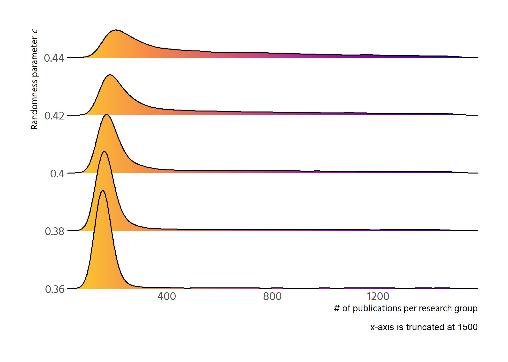

```r
p <- df %>% 
  select(run_number = .run.number., chance_imp = importance.of.chance, 
         step = .step., contains("gini")) %>% 
  pivot_longer(contains("gini")) %>% 
  mutate(chance_imp = factor(chance_imp, labels = chance_imp %>% unique() %>%
                               as.numeric() %>% scales::percent())) %>%
  ggplot(aes(step, value, colour = factor(chance_imp))) +
  geom_smooth() +
  facet_wrap(vars(name)) +
  labs(y = "gini", 
       colour = "importance of chance",
       caption = "n = 100 agents") 
p
```

```
## `geom_smooth()` using method = 'gam' and formula 'y ~ s(x, bs = "cs")'
```

<!-- -->

```r
plotly::ggplotly(p)
```

```
## `geom_smooth()` using method = 'gam' and formula 'y ~ s(x, bs = "cs")'
```

```{=html}
<div id="htmlwidget-9ec7c4d67c8ed8947a17" style="width:840px;height:600px;" class="plotly html-widget"></div>
<script type="application/json" data-for="htmlwidget-9ec7c4d67c8ed8947a17">{"x":{"data":[{"x":[1,7.31645569620253,13.6329113924051,19.9493670886076,26.2658227848101,32.5822784810127,38.8987341772152,45.2151898734177,51.5316455696203,57.8481012658228,64.1645569620253,70.4810126582279,76.7974683544304,83.1139240506329,89.4303797468354,95.746835443038,102.063291139241,108.379746835443,114.696202531646,121.012658227848,127.329113924051,133.645569620253,139.962025316456,146.278481012658,152.594936708861,158.911392405063,165.227848101266,171.544303797468,177.860759493671,184.177215189873,190.493670886076,196.810126582278,203.126582278481,209.443037974684,215.759493670886,222.075949367089,228.392405063291,234.708860759494,241.025316455696,247.341772151899,253.658227848101,259.974683544304,266.291139240506,272.607594936709,278.924050632911,285.240506329114,291.556962025316,297.873417721519,304.189873417722,310.506329113924,316.822784810127,323.139240506329,329.455696202532,335.772151898734,342.088607594937,348.405063291139,354.721518987342,361.037974683544,367.354430379747,373.670886075949,379.987341772152,386.303797468354,392.620253164557,398.936708860759,405.253164556962,411.569620253165,417.886075949367,424.20253164557,430.518987341772,436.835443037975,443.151898734177,449.46835443038,455.784810126582,462.101265822785,468.417721518987,474.73417721519,481.050632911392,487.367088607595,493.683544303797,500],"y":[0.858923895953666,0.86964798068073,0.880157067357405,0.890236157933305,0.899670254358041,0.908244358581226,0.915743472552471,0.921952598221389,0.926656737537592,0.929641889420498,0.93085593576168,0.930586226671466,0.929162857340587,0.926915922959778,0.924175518719773,0.921271739811304,0.918534681425104,0.916294438751908,0.914873703905346,0.91437064755129,0.914623869964694,0.915457512285548,0.916695715653839,0.918162621209556,0.919682370092687,0.921079103443222,0.922176962401147,0.922813359560543,0.922979988169292,0.922768077380959,0.92227051528087,0.921580189954348,0.920789989486721,0.919992801963313,0.919281515469449,0.918749018090455,0.91847157583478,0.918432442503356,0.918582536763191,0.918872744816301,0.919253952864701,0.919677047110405,0.920092913755429,0.920452439001788,0.920706526214608,0.920823173217691,0.920819550148199,0.920721614656188,0.920555324391713,0.92034663700483,0.920121510145596,0.919905901464065,0.919725768610293,0.919606824559888,0.91956010182156,0.919573878180327,0.919634474025622,0.919728209746878,0.919841405733527,0.919960382375001,0.920071460060734,0.920160959180158,0.920215793936587,0.920233538680147,0.920220988502928,0.920185242529724,0.920133399885331,0.920072559694545,0.920009821082161,0.919952283172974,0.919907045091781,0.919880461866929,0.919872979142722,0.919882224542222,0.919905808333471,0.919941340784511,0.919986432163382,0.920038692738129,0.920095732776792,0.920155162547413],"text":["step:   1.000000<br />value: 0.85892390<br />factor(chance_imp): 25.0%","step:   7.316456<br />value: 0.86964798<br />factor(chance_imp): 25.0%","step:  13.632911<br />value: 0.88015707<br />factor(chance_imp): 25.0%","step:  19.949367<br />value: 0.89023616<br />factor(chance_imp): 25.0%","step:  26.265823<br />value: 0.89967025<br />factor(chance_imp): 25.0%","step:  32.582278<br />value: 0.90824436<br />factor(chance_imp): 25.0%","step:  38.898734<br />value: 0.91574347<br />factor(chance_imp): 25.0%","step:  45.215190<br />value: 0.92195260<br />factor(chance_imp): 25.0%","step:  51.531646<br />value: 0.92665674<br />factor(chance_imp): 25.0%","step:  57.848101<br />value: 0.92964189<br />factor(chance_imp): 25.0%","step:  64.164557<br />value: 0.93085594<br />factor(chance_imp): 25.0%","step:  70.481013<br />value: 0.93058623<br />factor(chance_imp): 25.0%","step:  76.797468<br />value: 0.92916286<br />factor(chance_imp): 25.0%","step:  83.113924<br />value: 0.92691592<br />factor(chance_imp): 25.0%","step:  89.430380<br />value: 0.92417552<br />factor(chance_imp): 25.0%","step:  95.746835<br />value: 0.92127174<br />factor(chance_imp): 25.0%","step: 102.063291<br />value: 0.91853468<br />factor(chance_imp): 25.0%","step: 108.379747<br />value: 0.91629444<br />factor(chance_imp): 25.0%","step: 114.696203<br />value: 0.91487370<br />factor(chance_imp): 25.0%","step: 121.012658<br />value: 0.91437065<br />factor(chance_imp): 25.0%","step: 127.329114<br />value: 0.91462387<br />factor(chance_imp): 25.0%","step: 133.645570<br />value: 0.91545751<br />factor(chance_imp): 25.0%","step: 139.962025<br />value: 0.91669572<br />factor(chance_imp): 25.0%","step: 146.278481<br />value: 0.91816262<br />factor(chance_imp): 25.0%","step: 152.594937<br />value: 0.91968237<br />factor(chance_imp): 25.0%","step: 158.911392<br />value: 0.92107910<br />factor(chance_imp): 25.0%","step: 165.227848<br />value: 0.92217696<br />factor(chance_imp): 25.0%","step: 171.544304<br />value: 0.92281336<br />factor(chance_imp): 25.0%","step: 177.860759<br />value: 0.92297999<br />factor(chance_imp): 25.0%","step: 184.177215<br />value: 0.92276808<br />factor(chance_imp): 25.0%","step: 190.493671<br />value: 0.92227052<br />factor(chance_imp): 25.0%","step: 196.810127<br />value: 0.92158019<br />factor(chance_imp): 25.0%","step: 203.126582<br />value: 0.92078999<br />factor(chance_imp): 25.0%","step: 209.443038<br />value: 0.91999280<br />factor(chance_imp): 25.0%","step: 215.759494<br />value: 0.91928152<br />factor(chance_imp): 25.0%","step: 222.075949<br />value: 0.91874902<br />factor(chance_imp): 25.0%","step: 228.392405<br />value: 0.91847158<br />factor(chance_imp): 25.0%","step: 234.708861<br />value: 0.91843244<br />factor(chance_imp): 25.0%","step: 241.025316<br />value: 0.91858254<br />factor(chance_imp): 25.0%","step: 247.341772<br />value: 0.91887274<br />factor(chance_imp): 25.0%","step: 253.658228<br />value: 0.91925395<br />factor(chance_imp): 25.0%","step: 259.974684<br />value: 0.91967705<br />factor(chance_imp): 25.0%","step: 266.291139<br />value: 0.92009291<br />factor(chance_imp): 25.0%","step: 272.607595<br />value: 0.92045244<br />factor(chance_imp): 25.0%","step: 278.924051<br />value: 0.92070653<br />factor(chance_imp): 25.0%","step: 285.240506<br />value: 0.92082317<br />factor(chance_imp): 25.0%","step: 291.556962<br />value: 0.92081955<br />factor(chance_imp): 25.0%","step: 297.873418<br />value: 0.92072161<br />factor(chance_imp): 25.0%","step: 304.189873<br />value: 0.92055532<br />factor(chance_imp): 25.0%","step: 310.506329<br />value: 0.92034664<br />factor(chance_imp): 25.0%","step: 316.822785<br />value: 0.92012151<br />factor(chance_imp): 25.0%","step: 323.139241<br />value: 0.91990590<br />factor(chance_imp): 25.0%","step: 329.455696<br />value: 0.91972577<br />factor(chance_imp): 25.0%","step: 335.772152<br />value: 0.91960682<br />factor(chance_imp): 25.0%","step: 342.088608<br />value: 0.91956010<br />factor(chance_imp): 25.0%","step: 348.405063<br />value: 0.91957388<br />factor(chance_imp): 25.0%","step: 354.721519<br />value: 0.91963447<br />factor(chance_imp): 25.0%","step: 361.037975<br />value: 0.91972821<br />factor(chance_imp): 25.0%","step: 367.354430<br />value: 0.91984141<br />factor(chance_imp): 25.0%","step: 373.670886<br />value: 0.91996038<br />factor(chance_imp): 25.0%","step: 379.987342<br />value: 0.92007146<br />factor(chance_imp): 25.0%","step: 386.303797<br />value: 0.92016096<br />factor(chance_imp): 25.0%","step: 392.620253<br />value: 0.92021579<br />factor(chance_imp): 25.0%","step: 398.936709<br />value: 0.92023354<br />factor(chance_imp): 25.0%","step: 405.253165<br />value: 0.92022099<br />factor(chance_imp): 25.0%","step: 411.569620<br />value: 0.92018524<br />factor(chance_imp): 25.0%","step: 417.886076<br />value: 0.92013340<br />factor(chance_imp): 25.0%","step: 424.202532<br />value: 0.92007256<br />factor(chance_imp): 25.0%","step: 430.518987<br />value: 0.92000982<br />factor(chance_imp): 25.0%","step: 436.835443<br />value: 0.91995228<br />factor(chance_imp): 25.0%","step: 443.151899<br />value: 0.91990705<br />factor(chance_imp): 25.0%","step: 449.468354<br />value: 0.91988046<br />factor(chance_imp): 25.0%","step: 455.784810<br />value: 0.91987298<br />factor(chance_imp): 25.0%","step: 462.101266<br />value: 0.91988222<br />factor(chance_imp): 25.0%","step: 468.417722<br />value: 0.91990581<br />factor(chance_imp): 25.0%","step: 474.734177<br />value: 0.91994134<br />factor(chance_imp): 25.0%","step: 481.050633<br />value: 0.91998643<br />factor(chance_imp): 25.0%","step: 487.367089<br />value: 0.92003869<br />factor(chance_imp): 25.0%","step: 493.683544<br />value: 0.92009573<br />factor(chance_imp): 25.0%","step: 500.000000<br />value: 0.92015516<br />factor(chance_imp): 25.0%"],"type":"scatter","mode":"lines","name":"25.0%","line":{"width":3.77952755905512,"color":"rgba(248,118,109,1)","dash":"solid"},"hoveron":"points","legendgroup":"25.0%","showlegend":true,"xaxis":"x","yaxis":"y","hoverinfo":"text","frame":null},{"x":[1,7.31645569620253,13.6329113924051,19.9493670886076,26.2658227848101,32.5822784810127,38.8987341772152,45.2151898734177,51.5316455696203,57.8481012658228,64.1645569620253,70.4810126582279,76.7974683544304,83.1139240506329,89.4303797468354,95.746835443038,102.063291139241,108.379746835443,114.696202531646,121.012658227848,127.329113924051,133.645569620253,139.962025316456,146.278481012658,152.594936708861,158.911392405063,165.227848101266,171.544303797468,177.860759493671,184.177215189873,190.493670886076,196.810126582278,203.126582278481,209.443037974684,215.759493670886,222.075949367089,228.392405063291,234.708860759494,241.025316455696,247.341772151899,253.658227848101,259.974683544304,266.291139240506,272.607594936709,278.924050632911,285.240506329114,291.556962025316,297.873417721519,304.189873417722,310.506329113924,316.822784810127,323.139240506329,329.455696202532,335.772151898734,342.088607594937,348.405063291139,354.721518987342,361.037974683544,367.354430379747,373.670886075949,379.987341772152,386.303797468354,392.620253164557,398.936708860759,405.253164556962,411.569620253165,417.886075949367,424.20253164557,430.518987341772,436.835443037975,443.151898734177,449.46835443038,455.784810126582,462.101265822785,468.417721518987,474.73417721519,481.050632911392,487.367088607595,493.683544303797,500],"y":[0.605392809883007,0.620881785182401,0.636092796668609,0.650747880528446,0.664569072948725,0.677278410116261,0.688597928217867,0.698249663440358,0.705955651970549,0.711439165186689,0.714624038676546,0.715854690712044,0.715528498397953,0.714042838839042,0.711795089140078,0.709182626405832,0.706602827741071,0.704453070250565,0.703122205790468,0.70274053141128,0.703139427633937,0.704133624103174,0.705537850463725,0.707166836360324,0.708835311437707,0.710358005340607,0.71154964771376,0.712239025226921,0.712418337465724,0.712185211703467,0.711639032341575,0.710879183781472,0.710005050424584,0.709116016672334,0.708311466926148,0.707690785587452,0.70733573017965,0.70722942344974,0.707320698358574,0.707558353439507,0.707891187225894,0.708267998251091,0.708637585048453,0.708948746151336,0.709150298154035,0.709209046346093,0.709143540607306,0.708981578018239,0.708750955659459,0.708479470611532,0.708194919955023,0.707925100770499,0.707697810138526,0.707540573536091,0.707464620225514,0.707455920336379,0.707498271169643,0.707575470026268,0.707671314207213,0.707769601013438,0.707854127745904,0.70790869170557,0.707917814744428,0.707879025854594,0.707801104856608,0.707693202541137,0.70756446969885,0.707424057120414,0.707281115596498,0.707144795917767,0.707024248874892,0.706927666847691,0.706855630813217,0.706805092081785,0.706772979610102,0.706756222354877,0.706751749272819,0.706756489320636,0.706767371455036,0.706781324632727],"text":["step:   1.000000<br />value: 0.60539281<br />factor(chance_imp): 25.0%","step:   7.316456<br />value: 0.62088179<br />factor(chance_imp): 25.0%","step:  13.632911<br />value: 0.63609280<br />factor(chance_imp): 25.0%","step:  19.949367<br />value: 0.65074788<br />factor(chance_imp): 25.0%","step:  26.265823<br />value: 0.66456907<br />factor(chance_imp): 25.0%","step:  32.582278<br />value: 0.67727841<br />factor(chance_imp): 25.0%","step:  38.898734<br />value: 0.68859793<br />factor(chance_imp): 25.0%","step:  45.215190<br />value: 0.69824966<br />factor(chance_imp): 25.0%","step:  51.531646<br />value: 0.70595565<br />factor(chance_imp): 25.0%","step:  57.848101<br />value: 0.71143917<br />factor(chance_imp): 25.0%","step:  64.164557<br />value: 0.71462404<br />factor(chance_imp): 25.0%","step:  70.481013<br />value: 0.71585469<br />factor(chance_imp): 25.0%","step:  76.797468<br />value: 0.71552850<br />factor(chance_imp): 25.0%","step:  83.113924<br />value: 0.71404284<br />factor(chance_imp): 25.0%","step:  89.430380<br />value: 0.71179509<br />factor(chance_imp): 25.0%","step:  95.746835<br />value: 0.70918263<br />factor(chance_imp): 25.0%","step: 102.063291<br />value: 0.70660283<br />factor(chance_imp): 25.0%","step: 108.379747<br />value: 0.70445307<br />factor(chance_imp): 25.0%","step: 114.696203<br />value: 0.70312221<br />factor(chance_imp): 25.0%","step: 121.012658<br />value: 0.70274053<br />factor(chance_imp): 25.0%","step: 127.329114<br />value: 0.70313943<br />factor(chance_imp): 25.0%","step: 133.645570<br />value: 0.70413362<br />factor(chance_imp): 25.0%","step: 139.962025<br />value: 0.70553785<br />factor(chance_imp): 25.0%","step: 146.278481<br />value: 0.70716684<br />factor(chance_imp): 25.0%","step: 152.594937<br />value: 0.70883531<br />factor(chance_imp): 25.0%","step: 158.911392<br />value: 0.71035801<br />factor(chance_imp): 25.0%","step: 165.227848<br />value: 0.71154965<br />factor(chance_imp): 25.0%","step: 171.544304<br />value: 0.71223903<br />factor(chance_imp): 25.0%","step: 177.860759<br />value: 0.71241834<br />factor(chance_imp): 25.0%","step: 184.177215<br />value: 0.71218521<br />factor(chance_imp): 25.0%","step: 190.493671<br />value: 0.71163903<br />factor(chance_imp): 25.0%","step: 196.810127<br />value: 0.71087918<br />factor(chance_imp): 25.0%","step: 203.126582<br />value: 0.71000505<br />factor(chance_imp): 25.0%","step: 209.443038<br />value: 0.70911602<br />factor(chance_imp): 25.0%","step: 215.759494<br />value: 0.70831147<br />factor(chance_imp): 25.0%","step: 222.075949<br />value: 0.70769079<br />factor(chance_imp): 25.0%","step: 228.392405<br />value: 0.70733573<br />factor(chance_imp): 25.0%","step: 234.708861<br />value: 0.70722942<br />factor(chance_imp): 25.0%","step: 241.025316<br />value: 0.70732070<br />factor(chance_imp): 25.0%","step: 247.341772<br />value: 0.70755835<br />factor(chance_imp): 25.0%","step: 253.658228<br />value: 0.70789119<br />factor(chance_imp): 25.0%","step: 259.974684<br />value: 0.70826800<br />factor(chance_imp): 25.0%","step: 266.291139<br />value: 0.70863759<br />factor(chance_imp): 25.0%","step: 272.607595<br />value: 0.70894875<br />factor(chance_imp): 25.0%","step: 278.924051<br />value: 0.70915030<br />factor(chance_imp): 25.0%","step: 285.240506<br />value: 0.70920905<br />factor(chance_imp): 25.0%","step: 291.556962<br />value: 0.70914354<br />factor(chance_imp): 25.0%","step: 297.873418<br />value: 0.70898158<br />factor(chance_imp): 25.0%","step: 304.189873<br />value: 0.70875096<br />factor(chance_imp): 25.0%","step: 310.506329<br />value: 0.70847947<br />factor(chance_imp): 25.0%","step: 316.822785<br />value: 0.70819492<br />factor(chance_imp): 25.0%","step: 323.139241<br />value: 0.70792510<br />factor(chance_imp): 25.0%","step: 329.455696<br />value: 0.70769781<br />factor(chance_imp): 25.0%","step: 335.772152<br />value: 0.70754057<br />factor(chance_imp): 25.0%","step: 342.088608<br />value: 0.70746462<br />factor(chance_imp): 25.0%","step: 348.405063<br />value: 0.70745592<br />factor(chance_imp): 25.0%","step: 354.721519<br />value: 0.70749827<br />factor(chance_imp): 25.0%","step: 361.037975<br />value: 0.70757547<br />factor(chance_imp): 25.0%","step: 367.354430<br />value: 0.70767131<br />factor(chance_imp): 25.0%","step: 373.670886<br />value: 0.70776960<br />factor(chance_imp): 25.0%","step: 379.987342<br />value: 0.70785413<br />factor(chance_imp): 25.0%","step: 386.303797<br />value: 0.70790869<br />factor(chance_imp): 25.0%","step: 392.620253<br />value: 0.70791781<br />factor(chance_imp): 25.0%","step: 398.936709<br />value: 0.70787903<br />factor(chance_imp): 25.0%","step: 405.253165<br />value: 0.70780110<br />factor(chance_imp): 25.0%","step: 411.569620<br />value: 0.70769320<br />factor(chance_imp): 25.0%","step: 417.886076<br />value: 0.70756447<br />factor(chance_imp): 25.0%","step: 424.202532<br />value: 0.70742406<br />factor(chance_imp): 25.0%","step: 430.518987<br />value: 0.70728112<br />factor(chance_imp): 25.0%","step: 436.835443<br />value: 0.70714480<br />factor(chance_imp): 25.0%","step: 443.151899<br />value: 0.70702425<br />factor(chance_imp): 25.0%","step: 449.468354<br />value: 0.70692767<br />factor(chance_imp): 25.0%","step: 455.784810<br />value: 0.70685563<br />factor(chance_imp): 25.0%","step: 462.101266<br />value: 0.70680509<br />factor(chance_imp): 25.0%","step: 468.417722<br />value: 0.70677298<br />factor(chance_imp): 25.0%","step: 474.734177<br />value: 0.70675622<br />factor(chance_imp): 25.0%","step: 481.050633<br />value: 0.70675175<br />factor(chance_imp): 25.0%","step: 487.367089<br />value: 0.70675649<br />factor(chance_imp): 25.0%","step: 493.683544<br />value: 0.70676737<br />factor(chance_imp): 25.0%","step: 500.000000<br />value: 0.70678132<br />factor(chance_imp): 25.0%"],"type":"scatter","mode":"lines","name":"25.0%","line":{"width":3.77952755905512,"color":"rgba(248,118,109,1)","dash":"solid"},"hoveron":"points","legendgroup":"25.0%","showlegend":false,"xaxis":"x2","yaxis":"y","hoverinfo":"text","frame":null},{"x":[1,7.31645569620253,13.6329113924051,19.9493670886076,26.2658227848101,32.5822784810127,38.8987341772152,45.2151898734177,51.5316455696203,57.8481012658228,64.1645569620253,70.4810126582279,76.7974683544304,83.1139240506329,89.4303797468354,95.746835443038,102.063291139241,108.379746835443,114.696202531646,121.012658227848,127.329113924051,133.645569620253,139.962025316456,146.278481012658,152.594936708861,158.911392405063,165.227848101266,171.544303797468,177.860759493671,184.177215189873,190.493670886076,196.810126582278,203.126582278481,209.443037974684,215.759493670886,222.075949367089,228.392405063291,234.708860759494,241.025316455696,247.341772151899,253.658227848101,259.974683544304,266.291139240506,272.607594936709,278.924050632911,285.240506329114,291.556962025316,297.873417721519,304.189873417722,310.506329113924,316.822784810127,323.139240506329,329.455696202532,335.772151898734,342.088607594937,348.405063291139,354.721518987342,361.037974683544,367.354430379747,373.670886075949,379.987341772152,386.303797468354,392.620253164557,398.936708860759,405.253164556962,411.569620253165,417.886075949367,424.20253164557,430.518987341772,436.835443037975,443.151898734177,449.46835443038,455.784810126582,462.101265822785,468.417721518987,474.73417721519,481.050632911392,487.367088607595,493.683544303797,500],"y":[0.853440043803373,0.865116896563443,0.876559801852674,0.887534812200225,0.897807980135259,0.907145358186936,0.915312998884416,0.922076954756859,0.927203278333428,0.930459106663219,0.931787675720106,0.931501500516524,0.929959594857208,0.927520972546894,0.924544647390317,0.921389633192212,0.918414943757314,0.915979592890358,0.91443454575728,0.913886667400401,0.914160617464113,0.915065335595148,0.916409761440241,0.918002834646124,0.919653494859531,0.921170681727197,0.922363334895854,0.923054810787895,0.923236060842761,0.923006162317338,0.922465994565473,0.921716436941009,0.920858368797793,0.919992669489671,0.919220218370485,0.918641894794084,0.918340527236351,0.918297936818956,0.918460830065037,0.91877587824211,0.919189752617692,0.9196491244593,0.92010066503445,0.920491045610658,0.920766956090508,0.920893646903982,0.920889757949933,0.920783470281858,0.920602964953256,0.920376423017625,0.920132025528463,0.919897953539269,0.91970238810354,0.919573244655479,0.919522501471565,0.9195374342338,0.919603193669825,0.91970493050728,0.919827795473804,0.919956939297039,0.920077512704625,0.920174666424201,0.920234195742912,0.920253467080124,0.920239855575186,0.920201066381914,0.920144804654123,0.92007877554563,0.920010684210248,0.919948235801794,0.919899135474084,0.919870280778982,0.919862155543243,0.919872185066119,0.919897775810666,0.919936334239938,0.919985266816991,0.920041980004878,0.920103880266656,0.920168374065378],"text":["step:   1.000000<br />value: 0.85344004<br />factor(chance_imp): 0.0%","step:   7.316456<br />value: 0.86511690<br />factor(chance_imp): 0.0%","step:  13.632911<br />value: 0.87655980<br />factor(chance_imp): 0.0%","step:  19.949367<br />value: 0.88753481<br />factor(chance_imp): 0.0%","step:  26.265823<br />value: 0.89780798<br />factor(chance_imp): 0.0%","step:  32.582278<br />value: 0.90714536<br />factor(chance_imp): 0.0%","step:  38.898734<br />value: 0.91531300<br />factor(chance_imp): 0.0%","step:  45.215190<br />value: 0.92207695<br />factor(chance_imp): 0.0%","step:  51.531646<br />value: 0.92720328<br />factor(chance_imp): 0.0%","step:  57.848101<br />value: 0.93045911<br />factor(chance_imp): 0.0%","step:  64.164557<br />value: 0.93178768<br />factor(chance_imp): 0.0%","step:  70.481013<br />value: 0.93150150<br />factor(chance_imp): 0.0%","step:  76.797468<br />value: 0.92995959<br />factor(chance_imp): 0.0%","step:  83.113924<br />value: 0.92752097<br />factor(chance_imp): 0.0%","step:  89.430380<br />value: 0.92454465<br />factor(chance_imp): 0.0%","step:  95.746835<br />value: 0.92138963<br />factor(chance_imp): 0.0%","step: 102.063291<br />value: 0.91841494<br />factor(chance_imp): 0.0%","step: 108.379747<br />value: 0.91597959<br />factor(chance_imp): 0.0%","step: 114.696203<br />value: 0.91443455<br />factor(chance_imp): 0.0%","step: 121.012658<br />value: 0.91388667<br />factor(chance_imp): 0.0%","step: 127.329114<br />value: 0.91416062<br />factor(chance_imp): 0.0%","step: 133.645570<br />value: 0.91506534<br />factor(chance_imp): 0.0%","step: 139.962025<br />value: 0.91640976<br />factor(chance_imp): 0.0%","step: 146.278481<br />value: 0.91800283<br />factor(chance_imp): 0.0%","step: 152.594937<br />value: 0.91965349<br />factor(chance_imp): 0.0%","step: 158.911392<br />value: 0.92117068<br />factor(chance_imp): 0.0%","step: 165.227848<br />value: 0.92236333<br />factor(chance_imp): 0.0%","step: 171.544304<br />value: 0.92305481<br />factor(chance_imp): 0.0%","step: 177.860759<br />value: 0.92323606<br />factor(chance_imp): 0.0%","step: 184.177215<br />value: 0.92300616<br />factor(chance_imp): 0.0%","step: 190.493671<br />value: 0.92246599<br />factor(chance_imp): 0.0%","step: 196.810127<br />value: 0.92171644<br />factor(chance_imp): 0.0%","step: 203.126582<br />value: 0.92085837<br />factor(chance_imp): 0.0%","step: 209.443038<br />value: 0.91999267<br />factor(chance_imp): 0.0%","step: 215.759494<br />value: 0.91922022<br />factor(chance_imp): 0.0%","step: 222.075949<br />value: 0.91864189<br />factor(chance_imp): 0.0%","step: 228.392405<br />value: 0.91834053<br />factor(chance_imp): 0.0%","step: 234.708861<br />value: 0.91829794<br />factor(chance_imp): 0.0%","step: 241.025316<br />value: 0.91846083<br />factor(chance_imp): 0.0%","step: 247.341772<br />value: 0.91877588<br />factor(chance_imp): 0.0%","step: 253.658228<br />value: 0.91918975<br />factor(chance_imp): 0.0%","step: 259.974684<br />value: 0.91964912<br />factor(chance_imp): 0.0%","step: 266.291139<br />value: 0.92010067<br />factor(chance_imp): 0.0%","step: 272.607595<br />value: 0.92049105<br />factor(chance_imp): 0.0%","step: 278.924051<br />value: 0.92076696<br />factor(chance_imp): 0.0%","step: 285.240506<br />value: 0.92089365<br />factor(chance_imp): 0.0%","step: 291.556962<br />value: 0.92088976<br />factor(chance_imp): 0.0%","step: 297.873418<br />value: 0.92078347<br />factor(chance_imp): 0.0%","step: 304.189873<br />value: 0.92060296<br />factor(chance_imp): 0.0%","step: 310.506329<br />value: 0.92037642<br />factor(chance_imp): 0.0%","step: 316.822785<br />value: 0.92013203<br />factor(chance_imp): 0.0%","step: 323.139241<br />value: 0.91989795<br />factor(chance_imp): 0.0%","step: 329.455696<br />value: 0.91970239<br />factor(chance_imp): 0.0%","step: 335.772152<br />value: 0.91957324<br />factor(chance_imp): 0.0%","step: 342.088608<br />value: 0.91952250<br />factor(chance_imp): 0.0%","step: 348.405063<br />value: 0.91953743<br />factor(chance_imp): 0.0%","step: 354.721519<br />value: 0.91960319<br />factor(chance_imp): 0.0%","step: 361.037975<br />value: 0.91970493<br />factor(chance_imp): 0.0%","step: 367.354430<br />value: 0.91982780<br />factor(chance_imp): 0.0%","step: 373.670886<br />value: 0.91995694<br />factor(chance_imp): 0.0%","step: 379.987342<br />value: 0.92007751<br />factor(chance_imp): 0.0%","step: 386.303797<br />value: 0.92017467<br />factor(chance_imp): 0.0%","step: 392.620253<br />value: 0.92023420<br />factor(chance_imp): 0.0%","step: 398.936709<br />value: 0.92025347<br />factor(chance_imp): 0.0%","step: 405.253165<br />value: 0.92023986<br />factor(chance_imp): 0.0%","step: 411.569620<br />value: 0.92020107<br />factor(chance_imp): 0.0%","step: 417.886076<br />value: 0.92014480<br />factor(chance_imp): 0.0%","step: 424.202532<br />value: 0.92007878<br />factor(chance_imp): 0.0%","step: 430.518987<br />value: 0.92001068<br />factor(chance_imp): 0.0%","step: 436.835443<br />value: 0.91994824<br />factor(chance_imp): 0.0%","step: 443.151899<br />value: 0.91989914<br />factor(chance_imp): 0.0%","step: 449.468354<br />value: 0.91987028<br />factor(chance_imp): 0.0%","step: 455.784810<br />value: 0.91986216<br />factor(chance_imp): 0.0%","step: 462.101266<br />value: 0.91987219<br />factor(chance_imp): 0.0%","step: 468.417722<br />value: 0.91989778<br />factor(chance_imp): 0.0%","step: 474.734177<br />value: 0.91993633<br />factor(chance_imp): 0.0%","step: 481.050633<br />value: 0.91998527<br />factor(chance_imp): 0.0%","step: 487.367089<br />value: 0.92004198<br />factor(chance_imp): 0.0%","step: 493.683544<br />value: 0.92010388<br />factor(chance_imp): 0.0%","step: 500.000000<br />value: 0.92016837<br />factor(chance_imp): 0.0%"],"type":"scatter","mode":"lines","name":"0.0%","line":{"width":3.77952755905512,"color":"rgba(235,131,53,1)","dash":"solid"},"hoveron":"points","legendgroup":"0.0%","showlegend":true,"xaxis":"x","yaxis":"y","hoverinfo":"text","frame":null},{"x":[1,7.31645569620253,13.6329113924051,19.9493670886076,26.2658227848101,32.5822784810127,38.8987341772152,45.2151898734177,51.5316455696203,57.8481012658228,64.1645569620253,70.4810126582279,76.7974683544304,83.1139240506329,89.4303797468354,95.746835443038,102.063291139241,108.379746835443,114.696202531646,121.012658227848,127.329113924051,133.645569620253,139.962025316456,146.278481012658,152.594936708861,158.911392405063,165.227848101266,171.544303797468,177.860759493671,184.177215189873,190.493670886076,196.810126582278,203.126582278481,209.443037974684,215.759493670886,222.075949367089,228.392405063291,234.708860759494,241.025316455696,247.341772151899,253.658227848101,259.974683544304,266.291139240506,272.607594936709,278.924050632911,285.240506329114,291.556962025316,297.873417721519,304.189873417722,310.506329113924,316.822784810127,323.139240506329,329.455696202532,335.772151898734,342.088607594937,348.405063291139,354.721518987342,361.037974683544,367.354430379747,373.670886075949,379.987341772152,386.303797468354,392.620253164557,398.936708860759,405.253164556962,411.569620253165,417.886075949367,424.20253164557,430.518987341772,436.835443037975,443.151898734177,449.46835443038,455.784810126582,462.101265822785,468.417721518987,474.73417721519,481.050632911392,487.367088607595,493.683544303797,500],"y":[0.608619868620271,0.623026209931565,0.637180597547217,0.650831077771587,0.663725696909033,0.675612501263914,0.68623953714059,0.695354850843418,0.702706488676757,0.708043601111263,0.71129462761998,0.712763976299899,0.712803396377973,0.711764637081153,0.709999447636392,0.707859577270643,0.705696775210857,0.703862790683987,0.702701958268845,0.702333740168601,0.702617622485995,0.703398609589116,0.704521705846055,0.7058319156249,0.707174243293741,0.708393693220667,0.709335269773769,0.709855858223801,0.709950459334982,0.709703180641516,0.709199614790437,0.708525354428778,0.707765992203574,0.707007120761859,0.706334332750669,0.705833220817037,0.705574161872692,0.705542390091759,0.705693540288277,0.705983217558052,0.706367026996889,0.706800573700594,0.707239462764972,0.707639299285829,0.707955702847513,0.708158723624142,0.708259921468225,0.708278274366771,0.70823276030679,0.708142357275291,0.708026043259282,0.707902796245772,0.707791594221772,0.707711255736492,0.70767103307133,0.707665350792571,0.707687357964125,0.7077302036499,0.707787036913807,0.707851006819754,0.707915262431652,0.707972952813409,0.708017486507447,0.70804693021442,0.708063379817305,0.708069064052077,0.708066211654711,0.708057051361183,0.708043811907466,0.708028722029537,0.70801401046337,0.708001703456912,0.707992219160773,0.707985208868572,0.707980319151174,0.707977196579446,0.707975487724254,0.707974839156464,0.707974897446942,0.707975309166554],"text":["step:   1.000000<br />value: 0.60861987<br />factor(chance_imp): 0.0%","step:   7.316456<br />value: 0.62302621<br />factor(chance_imp): 0.0%","step:  13.632911<br />value: 0.63718060<br />factor(chance_imp): 0.0%","step:  19.949367<br />value: 0.65083108<br />factor(chance_imp): 0.0%","step:  26.265823<br />value: 0.66372570<br />factor(chance_imp): 0.0%","step:  32.582278<br />value: 0.67561250<br />factor(chance_imp): 0.0%","step:  38.898734<br />value: 0.68623954<br />factor(chance_imp): 0.0%","step:  45.215190<br />value: 0.69535485<br />factor(chance_imp): 0.0%","step:  51.531646<br />value: 0.70270649<br />factor(chance_imp): 0.0%","step:  57.848101<br />value: 0.70804360<br />factor(chance_imp): 0.0%","step:  64.164557<br />value: 0.71129463<br />factor(chance_imp): 0.0%","step:  70.481013<br />value: 0.71276398<br />factor(chance_imp): 0.0%","step:  76.797468<br />value: 0.71280340<br />factor(chance_imp): 0.0%","step:  83.113924<br />value: 0.71176464<br />factor(chance_imp): 0.0%","step:  89.430380<br />value: 0.70999945<br />factor(chance_imp): 0.0%","step:  95.746835<br />value: 0.70785958<br />factor(chance_imp): 0.0%","step: 102.063291<br />value: 0.70569678<br />factor(chance_imp): 0.0%","step: 108.379747<br />value: 0.70386279<br />factor(chance_imp): 0.0%","step: 114.696203<br />value: 0.70270196<br />factor(chance_imp): 0.0%","step: 121.012658<br />value: 0.70233374<br />factor(chance_imp): 0.0%","step: 127.329114<br />value: 0.70261762<br />factor(chance_imp): 0.0%","step: 133.645570<br />value: 0.70339861<br />factor(chance_imp): 0.0%","step: 139.962025<br />value: 0.70452171<br />factor(chance_imp): 0.0%","step: 146.278481<br />value: 0.70583192<br />factor(chance_imp): 0.0%","step: 152.594937<br />value: 0.70717424<br />factor(chance_imp): 0.0%","step: 158.911392<br />value: 0.70839369<br />factor(chance_imp): 0.0%","step: 165.227848<br />value: 0.70933527<br />factor(chance_imp): 0.0%","step: 171.544304<br />value: 0.70985586<br />factor(chance_imp): 0.0%","step: 177.860759<br />value: 0.70995046<br />factor(chance_imp): 0.0%","step: 184.177215<br />value: 0.70970318<br />factor(chance_imp): 0.0%","step: 190.493671<br />value: 0.70919961<br />factor(chance_imp): 0.0%","step: 196.810127<br />value: 0.70852535<br />factor(chance_imp): 0.0%","step: 203.126582<br />value: 0.70776599<br />factor(chance_imp): 0.0%","step: 209.443038<br />value: 0.70700712<br />factor(chance_imp): 0.0%","step: 215.759494<br />value: 0.70633433<br />factor(chance_imp): 0.0%","step: 222.075949<br />value: 0.70583322<br />factor(chance_imp): 0.0%","step: 228.392405<br />value: 0.70557416<br />factor(chance_imp): 0.0%","step: 234.708861<br />value: 0.70554239<br />factor(chance_imp): 0.0%","step: 241.025316<br />value: 0.70569354<br />factor(chance_imp): 0.0%","step: 247.341772<br />value: 0.70598322<br />factor(chance_imp): 0.0%","step: 253.658228<br />value: 0.70636703<br />factor(chance_imp): 0.0%","step: 259.974684<br />value: 0.70680057<br />factor(chance_imp): 0.0%","step: 266.291139<br />value: 0.70723946<br />factor(chance_imp): 0.0%","step: 272.607595<br />value: 0.70763930<br />factor(chance_imp): 0.0%","step: 278.924051<br />value: 0.70795570<br />factor(chance_imp): 0.0%","step: 285.240506<br />value: 0.70815872<br />factor(chance_imp): 0.0%","step: 291.556962<br />value: 0.70825992<br />factor(chance_imp): 0.0%","step: 297.873418<br />value: 0.70827827<br />factor(chance_imp): 0.0%","step: 304.189873<br />value: 0.70823276<br />factor(chance_imp): 0.0%","step: 310.506329<br />value: 0.70814236<br />factor(chance_imp): 0.0%","step: 316.822785<br />value: 0.70802604<br />factor(chance_imp): 0.0%","step: 323.139241<br />value: 0.70790280<br />factor(chance_imp): 0.0%","step: 329.455696<br />value: 0.70779159<br />factor(chance_imp): 0.0%","step: 335.772152<br />value: 0.70771126<br />factor(chance_imp): 0.0%","step: 342.088608<br />value: 0.70767103<br />factor(chance_imp): 0.0%","step: 348.405063<br />value: 0.70766535<br />factor(chance_imp): 0.0%","step: 354.721519<br />value: 0.70768736<br />factor(chance_imp): 0.0%","step: 361.037975<br />value: 0.70773020<br />factor(chance_imp): 0.0%","step: 367.354430<br />value: 0.70778704<br />factor(chance_imp): 0.0%","step: 373.670886<br />value: 0.70785101<br />factor(chance_imp): 0.0%","step: 379.987342<br />value: 0.70791526<br />factor(chance_imp): 0.0%","step: 386.303797<br />value: 0.70797295<br />factor(chance_imp): 0.0%","step: 392.620253<br />value: 0.70801749<br />factor(chance_imp): 0.0%","step: 398.936709<br />value: 0.70804693<br />factor(chance_imp): 0.0%","step: 405.253165<br />value: 0.70806338<br />factor(chance_imp): 0.0%","step: 411.569620<br />value: 0.70806906<br />factor(chance_imp): 0.0%","step: 417.886076<br />value: 0.70806621<br />factor(chance_imp): 0.0%","step: 424.202532<br />value: 0.70805705<br />factor(chance_imp): 0.0%","step: 430.518987<br />value: 0.70804381<br />factor(chance_imp): 0.0%","step: 436.835443<br />value: 0.70802872<br />factor(chance_imp): 0.0%","step: 443.151899<br />value: 0.70801401<br />factor(chance_imp): 0.0%","step: 449.468354<br />value: 0.70800170<br />factor(chance_imp): 0.0%","step: 455.784810<br />value: 0.70799222<br />factor(chance_imp): 0.0%","step: 462.101266<br />value: 0.70798521<br />factor(chance_imp): 0.0%","step: 468.417722<br />value: 0.70798032<br />factor(chance_imp): 0.0%","step: 474.734177<br />value: 0.70797720<br />factor(chance_imp): 0.0%","step: 481.050633<br />value: 0.70797549<br />factor(chance_imp): 0.0%","step: 487.367089<br />value: 0.70797484<br />factor(chance_imp): 0.0%","step: 493.683544<br />value: 0.70797490<br />factor(chance_imp): 0.0%","step: 500.000000<br />value: 0.70797531<br />factor(chance_imp): 0.0%"],"type":"scatter","mode":"lines","name":"0.0%","line":{"width":3.77952755905512,"color":"rgba(235,131,53,1)","dash":"solid"},"hoveron":"points","legendgroup":"0.0%","showlegend":false,"xaxis":"x2","yaxis":"y","hoverinfo":"text","frame":null},{"x":[1,7.31645569620253,13.6329113924051,19.9493670886076,26.2658227848101,32.5822784810127,38.8987341772152,45.2151898734177,51.5316455696203,57.8481012658228,64.1645569620253,70.4810126582279,76.7974683544304,83.1139240506329,89.4303797468354,95.746835443038,102.063291139241,108.379746835443,114.696202531646,121.012658227848,127.329113924051,133.645569620253,139.962025316456,146.278481012658,152.594936708861,158.911392405063,165.227848101266,171.544303797468,177.860759493671,184.177215189873,190.493670886076,196.810126582278,203.126582278481,209.443037974684,215.759493670886,222.075949367089,228.392405063291,234.708860759494,241.025316455696,247.341772151899,253.658227848101,259.974683544304,266.291139240506,272.607594936709,278.924050632911,285.240506329114,291.556962025316,297.873417721519,304.189873417722,310.506329113924,316.822784810127,323.139240506329,329.455696202532,335.772151898734,342.088607594937,348.405063291139,354.721518987342,361.037974683544,367.354430379747,373.670886075949,379.987341772152,386.303797468354,392.620253164557,398.936708860759,405.253164556962,411.569620253165,417.886075949367,424.20253164557,430.518987341772,436.835443037975,443.151898734177,449.46835443038,455.784810126582,462.101265822785,468.417721518987,474.73417721519,481.050632911392,487.367088607595,493.683544303797,500],"y":[0.849191600809269,0.861601457290277,0.873762846528013,0.885427301279204,0.896346354300578,0.906271538348861,0.914954386180782,0.922146430553069,0.927599204222448,0.931065391471452,0.932484655585139,0.932188754385044,0.930558817361573,0.927975974005135,0.924821353806137,0.921476086254987,0.918321300842091,0.915738127057858,0.914099152277128,0.913517897526103,0.913808375903959,0.914767916690406,0.916193849165158,0.917883502607926,0.919634206298423,0.921243289516361,0.92250808154145,0.923241205495424,0.923433075413487,0.923188809145988,0.922615436273531,0.921819986376717,0.920909489036148,0.919990973832426,0.919171470346154,0.918558008157934,0.918238462891845,0.918193530317605,0.918366645773882,0.918701207189276,0.919140612492384,0.919628259611805,0.920107546476137,0.920521871013979,0.920814650935782,0.920949006678673,0.920944733691737,0.920831755733356,0.92063999656191,0.920399379935779,0.920139829613344,0.919891269352985,0.919683622913084,0.919546531964832,0.919492712948125,0.919508648194352,0.919578563337395,0.919686684011134,0.919817235849453,0.919954444486233,0.920082535555355,0.920185734690702,0.920248952334844,0.920269392615926,0.920254893371408,0.920213643060798,0.920153830143604,0.920083643079335,0.920011270327499,0.919944900347603,0.919892721599156,0.919862064230251,0.919853441944966,0.919864117874407,0.919891335130757,0.919932336826197,0.91998436607291,0.920044665983078,0.920110479668881,0.920179050242503],"text":["step:   1.000000<br />value: 0.84919160<br />factor(chance_imp): 35.0%","step:   7.316456<br />value: 0.86160146<br />factor(chance_imp): 35.0%","step:  13.632911<br />value: 0.87376285<br />factor(chance_imp): 35.0%","step:  19.949367<br />value: 0.88542730<br />factor(chance_imp): 35.0%","step:  26.265823<br />value: 0.89634635<br />factor(chance_imp): 35.0%","step:  32.582278<br />value: 0.90627154<br />factor(chance_imp): 35.0%","step:  38.898734<br />value: 0.91495439<br />factor(chance_imp): 35.0%","step:  45.215190<br />value: 0.92214643<br />factor(chance_imp): 35.0%","step:  51.531646<br />value: 0.92759920<br />factor(chance_imp): 35.0%","step:  57.848101<br />value: 0.93106539<br />factor(chance_imp): 35.0%","step:  64.164557<br />value: 0.93248466<br />factor(chance_imp): 35.0%","step:  70.481013<br />value: 0.93218875<br />factor(chance_imp): 35.0%","step:  76.797468<br />value: 0.93055882<br />factor(chance_imp): 35.0%","step:  83.113924<br />value: 0.92797597<br />factor(chance_imp): 35.0%","step:  89.430380<br />value: 0.92482135<br />factor(chance_imp): 35.0%","step:  95.746835<br />value: 0.92147609<br />factor(chance_imp): 35.0%","step: 102.063291<br />value: 0.91832130<br />factor(chance_imp): 35.0%","step: 108.379747<br />value: 0.91573813<br />factor(chance_imp): 35.0%","step: 114.696203<br />value: 0.91409915<br />factor(chance_imp): 35.0%","step: 121.012658<br />value: 0.91351790<br />factor(chance_imp): 35.0%","step: 127.329114<br />value: 0.91380838<br />factor(chance_imp): 35.0%","step: 133.645570<br />value: 0.91476792<br />factor(chance_imp): 35.0%","step: 139.962025<br />value: 0.91619385<br />factor(chance_imp): 35.0%","step: 146.278481<br />value: 0.91788350<br />factor(chance_imp): 35.0%","step: 152.594937<br />value: 0.91963421<br />factor(chance_imp): 35.0%","step: 158.911392<br />value: 0.92124329<br />factor(chance_imp): 35.0%","step: 165.227848<br />value: 0.92250808<br />factor(chance_imp): 35.0%","step: 171.544304<br />value: 0.92324121<br />factor(chance_imp): 35.0%","step: 177.860759<br />value: 0.92343308<br />factor(chance_imp): 35.0%","step: 184.177215<br />value: 0.92318881<br />factor(chance_imp): 35.0%","step: 190.493671<br />value: 0.92261544<br />factor(chance_imp): 35.0%","step: 196.810127<br />value: 0.92181999<br />factor(chance_imp): 35.0%","step: 203.126582<br />value: 0.92090949<br />factor(chance_imp): 35.0%","step: 209.443038<br />value: 0.91999097<br />factor(chance_imp): 35.0%","step: 215.759494<br />value: 0.91917147<br />factor(chance_imp): 35.0%","step: 222.075949<br />value: 0.91855801<br />factor(chance_imp): 35.0%","step: 228.392405<br />value: 0.91823846<br />factor(chance_imp): 35.0%","step: 234.708861<br />value: 0.91819353<br />factor(chance_imp): 35.0%","step: 241.025316<br />value: 0.91836665<br />factor(chance_imp): 35.0%","step: 247.341772<br />value: 0.91870121<br />factor(chance_imp): 35.0%","step: 253.658228<br />value: 0.91914061<br />factor(chance_imp): 35.0%","step: 259.974684<br />value: 0.91962826<br />factor(chance_imp): 35.0%","step: 266.291139<br />value: 0.92010755<br />factor(chance_imp): 35.0%","step: 272.607595<br />value: 0.92052187<br />factor(chance_imp): 35.0%","step: 278.924051<br />value: 0.92081465<br />factor(chance_imp): 35.0%","step: 285.240506<br />value: 0.92094901<br />factor(chance_imp): 35.0%","step: 291.556962<br />value: 0.92094473<br />factor(chance_imp): 35.0%","step: 297.873418<br />value: 0.92083176<br />factor(chance_imp): 35.0%","step: 304.189873<br />value: 0.92064000<br />factor(chance_imp): 35.0%","step: 310.506329<br />value: 0.92039938<br />factor(chance_imp): 35.0%","step: 316.822785<br />value: 0.92013983<br />factor(chance_imp): 35.0%","step: 323.139241<br />value: 0.91989127<br />factor(chance_imp): 35.0%","step: 329.455696<br />value: 0.91968362<br />factor(chance_imp): 35.0%","step: 335.772152<br />value: 0.91954653<br />factor(chance_imp): 35.0%","step: 342.088608<br />value: 0.91949271<br />factor(chance_imp): 35.0%","step: 348.405063<br />value: 0.91950865<br />factor(chance_imp): 35.0%","step: 354.721519<br />value: 0.91957856<br />factor(chance_imp): 35.0%","step: 361.037975<br />value: 0.91968668<br />factor(chance_imp): 35.0%","step: 367.354430<br />value: 0.91981724<br />factor(chance_imp): 35.0%","step: 373.670886<br />value: 0.91995444<br />factor(chance_imp): 35.0%","step: 379.987342<br />value: 0.92008254<br />factor(chance_imp): 35.0%","step: 386.303797<br />value: 0.92018573<br />factor(chance_imp): 35.0%","step: 392.620253<br />value: 0.92024895<br />factor(chance_imp): 35.0%","step: 398.936709<br />value: 0.92026939<br />factor(chance_imp): 35.0%","step: 405.253165<br />value: 0.92025489<br />factor(chance_imp): 35.0%","step: 411.569620<br />value: 0.92021364<br />factor(chance_imp): 35.0%","step: 417.886076<br />value: 0.92015383<br />factor(chance_imp): 35.0%","step: 424.202532<br />value: 0.92008364<br />factor(chance_imp): 35.0%","step: 430.518987<br />value: 0.92001127<br />factor(chance_imp): 35.0%","step: 436.835443<br />value: 0.91994490<br />factor(chance_imp): 35.0%","step: 443.151899<br />value: 0.91989272<br />factor(chance_imp): 35.0%","step: 449.468354<br />value: 0.91986206<br />factor(chance_imp): 35.0%","step: 455.784810<br />value: 0.91985344<br />factor(chance_imp): 35.0%","step: 462.101266<br />value: 0.91986412<br />factor(chance_imp): 35.0%","step: 468.417722<br />value: 0.91989134<br />factor(chance_imp): 35.0%","step: 474.734177<br />value: 0.91993234<br />factor(chance_imp): 35.0%","step: 481.050633<br />value: 0.91998437<br />factor(chance_imp): 35.0%","step: 487.367089<br />value: 0.92004467<br />factor(chance_imp): 35.0%","step: 493.683544<br />value: 0.92011048<br />factor(chance_imp): 35.0%","step: 500.000000<br />value: 0.92017905<br />factor(chance_imp): 35.0%"],"type":"scatter","mode":"lines","name":"35.0%","line":{"width":3.77952755905512,"color":"rgba(218,143,0,1)","dash":"solid"},"hoveron":"points","legendgroup":"35.0%","showlegend":true,"xaxis":"x","yaxis":"y","hoverinfo":"text","frame":null},{"x":[1,7.31645569620253,13.6329113924051,19.9493670886076,26.2658227848101,32.5822784810127,38.8987341772152,45.2151898734177,51.5316455696203,57.8481012658228,64.1645569620253,70.4810126582279,76.7974683544304,83.1139240506329,89.4303797468354,95.746835443038,102.063291139241,108.379746835443,114.696202531646,121.012658227848,127.329113924051,133.645569620253,139.962025316456,146.278481012658,152.594936708861,158.911392405063,165.227848101266,171.544303797468,177.860759493671,184.177215189873,190.493670886076,196.810126582278,203.126582278481,209.443037974684,215.759493670886,222.075949367089,228.392405063291,234.708860759494,241.025316455696,247.341772151899,253.658227848101,259.974683544304,266.291139240506,272.607594936709,278.924050632911,285.240506329114,291.556962025316,297.873417721519,304.189873417722,310.506329113924,316.822784810127,323.139240506329,329.455696202532,335.772151898734,342.088607594937,348.405063291139,354.721518987342,361.037974683544,367.354430379747,373.670886075949,379.987341772152,386.303797468354,392.620253164557,398.936708860759,405.253164556962,411.569620253165,417.886075949367,424.20253164557,430.518987341772,436.835443037975,443.151898734177,449.46835443038,455.784810126582,462.101265822785,468.417721518987,474.73417721519,481.050632911392,487.367088607595,493.683544303797,500],"y":[0.60290078130298,0.618081167684896,0.632987813646992,0.647346978769447,0.660884922632443,0.673327904816159,0.684402184900774,0.69383402246647,0.701349677093425,0.706676634081641,0.709741404987011,0.710887858964388,0.71051241790594,0.709011503703834,0.706781538250238,0.704218943437319,0.701720141157246,0.699681553302185,0.698490963071065,0.698274158294385,0.69885403262091,0.700036607251669,0.701627903387692,0.703433942230007,0.705260744979645,0.706914332837633,0.708200727005003,0.70894098352184,0.709130938432262,0.708879189073314,0.708296212136922,0.707492484315012,0.706578482299511,0.705664682782343,0.704861562455435,0.704279598010713,0.704009219654174,0.704028683407856,0.704277248614136,0.7046941354621,0.705218564140834,0.705789754839423,0.706346927746953,0.706829303052509,0.707176122253234,0.707347849671578,0.707365997214831,0.707262986515742,0.707071239207061,0.706823176921536,0.706551221291918,0.706287793950955,0.706065316531396,0.705915909925868,0.705853650619619,0.705864646266462,0.705932598599226,0.706041209350739,0.70617418025383,0.706315213041329,0.706448009446065,0.706556271200865,0.706624377526153,0.706648869899627,0.706636809826335,0.706595605684973,0.706532665854238,0.706455398712825,0.706371212639432,0.706287516012752,0.706211717211484,0.706150492216213,0.706104700528071,0.706072427930569,0.706051743125043,0.70604071481283,0.706037411695269,0.706039902473696,0.706046255849448,0.706054540523863],"text":["step:   1.000000<br />value: 0.60290078<br />factor(chance_imp): 35.0%","step:   7.316456<br />value: 0.61808117<br />factor(chance_imp): 35.0%","step:  13.632911<br />value: 0.63298781<br />factor(chance_imp): 35.0%","step:  19.949367<br />value: 0.64734698<br />factor(chance_imp): 35.0%","step:  26.265823<br />value: 0.66088492<br />factor(chance_imp): 35.0%","step:  32.582278<br />value: 0.67332790<br />factor(chance_imp): 35.0%","step:  38.898734<br />value: 0.68440218<br />factor(chance_imp): 35.0%","step:  45.215190<br />value: 0.69383402<br />factor(chance_imp): 35.0%","step:  51.531646<br />value: 0.70134968<br />factor(chance_imp): 35.0%","step:  57.848101<br />value: 0.70667663<br />factor(chance_imp): 35.0%","step:  64.164557<br />value: 0.70974140<br />factor(chance_imp): 35.0%","step:  70.481013<br />value: 0.71088786<br />factor(chance_imp): 35.0%","step:  76.797468<br />value: 0.71051242<br />factor(chance_imp): 35.0%","step:  83.113924<br />value: 0.70901150<br />factor(chance_imp): 35.0%","step:  89.430380<br />value: 0.70678154<br />factor(chance_imp): 35.0%","step:  95.746835<br />value: 0.70421894<br />factor(chance_imp): 35.0%","step: 102.063291<br />value: 0.70172014<br />factor(chance_imp): 35.0%","step: 108.379747<br />value: 0.69968155<br />factor(chance_imp): 35.0%","step: 114.696203<br />value: 0.69849096<br />factor(chance_imp): 35.0%","step: 121.012658<br />value: 0.69827416<br />factor(chance_imp): 35.0%","step: 127.329114<br />value: 0.69885403<br />factor(chance_imp): 35.0%","step: 133.645570<br />value: 0.70003661<br />factor(chance_imp): 35.0%","step: 139.962025<br />value: 0.70162790<br />factor(chance_imp): 35.0%","step: 146.278481<br />value: 0.70343394<br />factor(chance_imp): 35.0%","step: 152.594937<br />value: 0.70526074<br />factor(chance_imp): 35.0%","step: 158.911392<br />value: 0.70691433<br />factor(chance_imp): 35.0%","step: 165.227848<br />value: 0.70820073<br />factor(chance_imp): 35.0%","step: 171.544304<br />value: 0.70894098<br />factor(chance_imp): 35.0%","step: 177.860759<br />value: 0.70913094<br />factor(chance_imp): 35.0%","step: 184.177215<br />value: 0.70887919<br />factor(chance_imp): 35.0%","step: 190.493671<br />value: 0.70829621<br />factor(chance_imp): 35.0%","step: 196.810127<br />value: 0.70749248<br />factor(chance_imp): 35.0%","step: 203.126582<br />value: 0.70657848<br />factor(chance_imp): 35.0%","step: 209.443038<br />value: 0.70566468<br />factor(chance_imp): 35.0%","step: 215.759494<br />value: 0.70486156<br />factor(chance_imp): 35.0%","step: 222.075949<br />value: 0.70427960<br />factor(chance_imp): 35.0%","step: 228.392405<br />value: 0.70400922<br />factor(chance_imp): 35.0%","step: 234.708861<br />value: 0.70402868<br />factor(chance_imp): 35.0%","step: 241.025316<br />value: 0.70427725<br />factor(chance_imp): 35.0%","step: 247.341772<br />value: 0.70469414<br />factor(chance_imp): 35.0%","step: 253.658228<br />value: 0.70521856<br />factor(chance_imp): 35.0%","step: 259.974684<br />value: 0.70578975<br />factor(chance_imp): 35.0%","step: 266.291139<br />value: 0.70634693<br />factor(chance_imp): 35.0%","step: 272.607595<br />value: 0.70682930<br />factor(chance_imp): 35.0%","step: 278.924051<br />value: 0.70717612<br />factor(chance_imp): 35.0%","step: 285.240506<br />value: 0.70734785<br />factor(chance_imp): 35.0%","step: 291.556962<br />value: 0.70736600<br />factor(chance_imp): 35.0%","step: 297.873418<br />value: 0.70726299<br />factor(chance_imp): 35.0%","step: 304.189873<br />value: 0.70707124<br />factor(chance_imp): 35.0%","step: 310.506329<br />value: 0.70682318<br />factor(chance_imp): 35.0%","step: 316.822785<br />value: 0.70655122<br />factor(chance_imp): 35.0%","step: 323.139241<br />value: 0.70628779<br />factor(chance_imp): 35.0%","step: 329.455696<br />value: 0.70606532<br />factor(chance_imp): 35.0%","step: 335.772152<br />value: 0.70591591<br />factor(chance_imp): 35.0%","step: 342.088608<br />value: 0.70585365<br />factor(chance_imp): 35.0%","step: 348.405063<br />value: 0.70586465<br />factor(chance_imp): 35.0%","step: 354.721519<br />value: 0.70593260<br />factor(chance_imp): 35.0%","step: 361.037975<br />value: 0.70604121<br />factor(chance_imp): 35.0%","step: 367.354430<br />value: 0.70617418<br />factor(chance_imp): 35.0%","step: 373.670886<br />value: 0.70631521<br />factor(chance_imp): 35.0%","step: 379.987342<br />value: 0.70644801<br />factor(chance_imp): 35.0%","step: 386.303797<br />value: 0.70655627<br />factor(chance_imp): 35.0%","step: 392.620253<br />value: 0.70662438<br />factor(chance_imp): 35.0%","step: 398.936709<br />value: 0.70664887<br />factor(chance_imp): 35.0%","step: 405.253165<br />value: 0.70663681<br />factor(chance_imp): 35.0%","step: 411.569620<br />value: 0.70659561<br />factor(chance_imp): 35.0%","step: 417.886076<br />value: 0.70653267<br />factor(chance_imp): 35.0%","step: 424.202532<br />value: 0.70645540<br />factor(chance_imp): 35.0%","step: 430.518987<br />value: 0.70637121<br />factor(chance_imp): 35.0%","step: 436.835443<br />value: 0.70628752<br />factor(chance_imp): 35.0%","step: 443.151899<br />value: 0.70621172<br />factor(chance_imp): 35.0%","step: 449.468354<br />value: 0.70615049<br />factor(chance_imp): 35.0%","step: 455.784810<br />value: 0.70610470<br />factor(chance_imp): 35.0%","step: 462.101266<br />value: 0.70607243<br />factor(chance_imp): 35.0%","step: 468.417722<br />value: 0.70605174<br />factor(chance_imp): 35.0%","step: 474.734177<br />value: 0.70604071<br />factor(chance_imp): 35.0%","step: 481.050633<br />value: 0.70603741<br />factor(chance_imp): 35.0%","step: 487.367089<br />value: 0.70603990<br />factor(chance_imp): 35.0%","step: 493.683544<br />value: 0.70604626<br />factor(chance_imp): 35.0%","step: 500.000000<br />value: 0.70605454<br />factor(chance_imp): 35.0%"],"type":"scatter","mode":"lines","name":"35.0%","line":{"width":3.77952755905512,"color":"rgba(218,143,0,1)","dash":"solid"},"hoveron":"points","legendgroup":"35.0%","showlegend":false,"xaxis":"x2","yaxis":"y","hoverinfo":"text","frame":null},{"x":[1,7.31645569620253,13.6329113924051,19.9493670886076,26.2658227848101,32.5822784810127,38.8987341772152,45.2151898734177,51.5316455696203,57.8481012658228,64.1645569620253,70.4810126582279,76.7974683544304,83.1139240506329,89.4303797468354,95.746835443038,102.063291139241,108.379746835443,114.696202531646,121.012658227848,127.329113924051,133.645569620253,139.962025316456,146.278481012658,152.594936708861,158.911392405063,165.227848101266,171.544303797468,177.860759493671,184.177215189873,190.493670886076,196.810126582278,203.126582278481,209.443037974684,215.759493670886,222.075949367089,228.392405063291,234.708860759494,241.025316455696,247.341772151899,253.658227848101,259.974683544304,266.291139240506,272.607594936709,278.924050632911,285.240506329114,291.556962025316,297.873417721519,304.189873417722,310.506329113924,316.822784810127,323.139240506329,329.455696202532,335.772151898734,342.088607594937,348.405063291139,354.721518987342,361.037974683544,367.354430379747,373.670886075949,379.987341772152,386.303797468354,392.620253164557,398.936708860759,405.253164556962,411.569620253165,417.886075949367,424.20253164557,430.518987341772,436.835443037975,443.151898734177,449.46835443038,455.784810126582,462.101265822785,468.417721518987,474.73417721519,481.050632911392,487.367088607595,493.683544303797,500],"y":[0.857411936610318,0.86837598009873,0.879120549431137,0.889426170451534,0.899073369003915,0.907842670932276,0.915514602080612,0.921869688292917,0.926688455413186,0.929752446424543,0.931008362276145,0.930749239790492,0.92931172563023,0.927032466458008,0.92424810893647,0.921295299728264,0.918510685496036,0.916230912902433,0.914785082770546,0.914273444758206,0.91453167252384,0.915380701757994,0.916641468151212,0.918134907394041,0.919681955177026,0.921103547190712,0.922220619125646,0.922867623686015,0.923036148859621,0.922819160236592,0.922311313033764,0.92160726246797,0.920801663756045,0.919989172114825,0.919264442761143,0.918722130911835,0.918439946125005,0.918400775083242,0.91855453986739,0.918851129461299,0.919240432848822,0.91967233901381,0.920096736940115,0.920463515611589,0.920722581531859,0.920841290900725,0.920837194074147,0.920736811533026,0.920566663758262,0.920353271230755,0.920123154431407,0.919902833841117,0.919718829940786,0.919597413115839,0.919549848023157,0.919564140440381,0.919626295381346,0.919722317859885,0.919838212889833,0.919959985485025,0.920073640659295,0.920165183426478,0.920221226562309,0.92023929338418,0.920226344536289,0.920189651836928,0.920136487104388,0.920074122156961,0.920009828812938,0.91995087889061,0.91990454420827,0.91987733424207,0.919869704182494,0.919879222099218,0.919903438281341,0.919939903017963,0.919986166598185,0.920039779311107,0.920098291445829,0.92015925329145],"text":["step:   1.000000<br />value: 0.85741194<br />factor(chance_imp): 5.0%","step:   7.316456<br />value: 0.86837598<br />factor(chance_imp): 5.0%","step:  13.632911<br />value: 0.87912055<br />factor(chance_imp): 5.0%","step:  19.949367<br />value: 0.88942617<br />factor(chance_imp): 5.0%","step:  26.265823<br />value: 0.89907337<br />factor(chance_imp): 5.0%","step:  32.582278<br />value: 0.90784267<br />factor(chance_imp): 5.0%","step:  38.898734<br />value: 0.91551460<br />factor(chance_imp): 5.0%","step:  45.215190<br />value: 0.92186969<br />factor(chance_imp): 5.0%","step:  51.531646<br />value: 0.92668846<br />factor(chance_imp): 5.0%","step:  57.848101<br />value: 0.92975245<br />factor(chance_imp): 5.0%","step:  64.164557<br />value: 0.93100836<br />factor(chance_imp): 5.0%","step:  70.481013<br />value: 0.93074924<br />factor(chance_imp): 5.0%","step:  76.797468<br />value: 0.92931173<br />factor(chance_imp): 5.0%","step:  83.113924<br />value: 0.92703247<br />factor(chance_imp): 5.0%","step:  89.430380<br />value: 0.92424811<br />factor(chance_imp): 5.0%","step:  95.746835<br />value: 0.92129530<br />factor(chance_imp): 5.0%","step: 102.063291<br />value: 0.91851069<br />factor(chance_imp): 5.0%","step: 108.379747<br />value: 0.91623091<br />factor(chance_imp): 5.0%","step: 114.696203<br />value: 0.91478508<br />factor(chance_imp): 5.0%","step: 121.012658<br />value: 0.91427344<br />factor(chance_imp): 5.0%","step: 127.329114<br />value: 0.91453167<br />factor(chance_imp): 5.0%","step: 133.645570<br />value: 0.91538070<br />factor(chance_imp): 5.0%","step: 139.962025<br />value: 0.91664147<br />factor(chance_imp): 5.0%","step: 146.278481<br />value: 0.91813491<br />factor(chance_imp): 5.0%","step: 152.594937<br />value: 0.91968196<br />factor(chance_imp): 5.0%","step: 158.911392<br />value: 0.92110355<br />factor(chance_imp): 5.0%","step: 165.227848<br />value: 0.92222062<br />factor(chance_imp): 5.0%","step: 171.544304<br />value: 0.92286762<br />factor(chance_imp): 5.0%","step: 177.860759<br />value: 0.92303615<br />factor(chance_imp): 5.0%","step: 184.177215<br />value: 0.92281916<br />factor(chance_imp): 5.0%","step: 190.493671<br />value: 0.92231131<br />factor(chance_imp): 5.0%","step: 196.810127<br />value: 0.92160726<br />factor(chance_imp): 5.0%","step: 203.126582<br />value: 0.92080166<br />factor(chance_imp): 5.0%","step: 209.443038<br />value: 0.91998917<br />factor(chance_imp): 5.0%","step: 215.759494<br />value: 0.91926444<br />factor(chance_imp): 5.0%","step: 222.075949<br />value: 0.91872213<br />factor(chance_imp): 5.0%","step: 228.392405<br />value: 0.91843995<br />factor(chance_imp): 5.0%","step: 234.708861<br />value: 0.91840078<br />factor(chance_imp): 5.0%","step: 241.025316<br />value: 0.91855454<br />factor(chance_imp): 5.0%","step: 247.341772<br />value: 0.91885113<br />factor(chance_imp): 5.0%","step: 253.658228<br />value: 0.91924043<br />factor(chance_imp): 5.0%","step: 259.974684<br />value: 0.91967234<br />factor(chance_imp): 5.0%","step: 266.291139<br />value: 0.92009674<br />factor(chance_imp): 5.0%","step: 272.607595<br />value: 0.92046352<br />factor(chance_imp): 5.0%","step: 278.924051<br />value: 0.92072258<br />factor(chance_imp): 5.0%","step: 285.240506<br />value: 0.92084129<br />factor(chance_imp): 5.0%","step: 291.556962<br />value: 0.92083719<br />factor(chance_imp): 5.0%","step: 297.873418<br />value: 0.92073681<br />factor(chance_imp): 5.0%","step: 304.189873<br />value: 0.92056666<br />factor(chance_imp): 5.0%","step: 310.506329<br />value: 0.92035327<br />factor(chance_imp): 5.0%","step: 316.822785<br />value: 0.92012315<br />factor(chance_imp): 5.0%","step: 323.139241<br />value: 0.91990283<br />factor(chance_imp): 5.0%","step: 329.455696<br />value: 0.91971883<br />factor(chance_imp): 5.0%","step: 335.772152<br />value: 0.91959741<br />factor(chance_imp): 5.0%","step: 342.088608<br />value: 0.91954985<br />factor(chance_imp): 5.0%","step: 348.405063<br />value: 0.91956414<br />factor(chance_imp): 5.0%","step: 354.721519<br />value: 0.91962630<br />factor(chance_imp): 5.0%","step: 361.037975<br />value: 0.91972232<br />factor(chance_imp): 5.0%","step: 367.354430<br />value: 0.91983821<br />factor(chance_imp): 5.0%","step: 373.670886<br />value: 0.91995999<br />factor(chance_imp): 5.0%","step: 379.987342<br />value: 0.92007364<br />factor(chance_imp): 5.0%","step: 386.303797<br />value: 0.92016518<br />factor(chance_imp): 5.0%","step: 392.620253<br />value: 0.92022123<br />factor(chance_imp): 5.0%","step: 398.936709<br />value: 0.92023929<br />factor(chance_imp): 5.0%","step: 405.253165<br />value: 0.92022634<br />factor(chance_imp): 5.0%","step: 411.569620<br />value: 0.92018965<br />factor(chance_imp): 5.0%","step: 417.886076<br />value: 0.92013649<br />factor(chance_imp): 5.0%","step: 424.202532<br />value: 0.92007412<br />factor(chance_imp): 5.0%","step: 430.518987<br />value: 0.92000983<br />factor(chance_imp): 5.0%","step: 436.835443<br />value: 0.91995088<br />factor(chance_imp): 5.0%","step: 443.151899<br />value: 0.91990454<br />factor(chance_imp): 5.0%","step: 449.468354<br />value: 0.91987733<br />factor(chance_imp): 5.0%","step: 455.784810<br />value: 0.91986970<br />factor(chance_imp): 5.0%","step: 462.101266<br />value: 0.91987922<br />factor(chance_imp): 5.0%","step: 468.417722<br />value: 0.91990344<br />factor(chance_imp): 5.0%","step: 474.734177<br />value: 0.91993990<br />factor(chance_imp): 5.0%","step: 481.050633<br />value: 0.91998617<br />factor(chance_imp): 5.0%","step: 487.367089<br />value: 0.92003978<br />factor(chance_imp): 5.0%","step: 493.683544<br />value: 0.92009829<br />factor(chance_imp): 5.0%","step: 500.000000<br />value: 0.92015925<br />factor(chance_imp): 5.0%"],"type":"scatter","mode":"lines","name":"5.0%","line":{"width":3.77952755905512,"color":"rgba(196,154,0,1)","dash":"solid"},"hoveron":"points","legendgroup":"5.0%","showlegend":true,"xaxis":"x","yaxis":"y","hoverinfo":"text","frame":null},{"x":[1,7.31645569620253,13.6329113924051,19.9493670886076,26.2658227848101,32.5822784810127,38.8987341772152,45.2151898734177,51.5316455696203,57.8481012658228,64.1645569620253,70.4810126582279,76.7974683544304,83.1139240506329,89.4303797468354,95.746835443038,102.063291139241,108.379746835443,114.696202531646,121.012658227848,127.329113924051,133.645569620253,139.962025316456,146.278481012658,152.594936708861,158.911392405063,165.227848101266,171.544303797468,177.860759493671,184.177215189873,190.493670886076,196.810126582278,203.126582278481,209.443037974684,215.759493670886,222.075949367089,228.392405063291,234.708860759494,241.025316455696,247.341772151899,253.658227848101,259.974683544304,266.291139240506,272.607594936709,278.924050632911,285.240506329114,291.556962025316,297.873417721519,304.189873417722,310.506329113924,316.822784810127,323.139240506329,329.455696202532,335.772151898734,342.088607594937,348.405063291139,354.721518987342,361.037974683544,367.354430379747,373.670886075949,379.987341772152,386.303797468354,392.620253164557,398.936708860759,405.253164556962,411.569620253165,417.886075949367,424.20253164557,430.518987341772,436.835443037975,443.151898734177,449.46835443038,455.784810126582,462.101265822785,468.417721518987,474.73417721519,481.050632911392,487.367088607595,493.683544303797,500],"y":[0.607692607746915,0.622744059284484,0.637521192277077,0.651749688179716,0.665155228447425,0.677463494535227,0.688400167898145,0.697690929991202,0.705061462269421,0.710238672864813,0.713148651585022,0.714135171751499,0.713594600461477,0.711923304812191,0.709517651900873,0.706774008824759,0.704088742681082,0.701858220567076,0.700470251938784,0.7000531090405,0.700435011822256,0.701427466091134,0.702841977654214,0.704490052318576,0.706183195891303,0.707732914179473,0.708950712990169,0.709662385772494,0.709859819814064,0.709642059717667,0.709109936041341,0.708364279343127,0.707505920181064,0.706635689113192,0.70585441669755,0.705262933492179,0.704944115445838,0.704880369844043,0.705019176646447,0.705307980745106,0.705694227032077,0.706125360399416,0.70654882573918,0.706912067943424,0.707162550520652,0.707266278958004,0.707242594855887,0.707120371434248,0.706928481913036,0.706695799512199,0.706451197451685,0.706223548951442,0.706041727231417,0.705934318967232,0.705912718174812,0.705961670247555,0.706063628224235,0.706201045143625,0.7063563740445,0.706512067965631,0.706650579945792,0.706754363023757,0.706806662018021,0.706804935776648,0.706758937903227,0.706678827392561,0.706574763239456,0.706456904438717,0.70633540998515,0.706220438873559,0.706122150098749,0.706049646047887,0.7060036378568,0.705980835106438,0.705977922733839,0.705991585676044,0.706018508870091,0.70605537725302,0.706098875761871,0.706145689333682],"text":["step:   1.000000<br />value: 0.60769261<br />factor(chance_imp): 5.0%","step:   7.316456<br />value: 0.62274406<br />factor(chance_imp): 5.0%","step:  13.632911<br />value: 0.63752119<br />factor(chance_imp): 5.0%","step:  19.949367<br />value: 0.65174969<br />factor(chance_imp): 5.0%","step:  26.265823<br />value: 0.66515523<br />factor(chance_imp): 5.0%","step:  32.582278<br />value: 0.67746349<br />factor(chance_imp): 5.0%","step:  38.898734<br />value: 0.68840017<br />factor(chance_imp): 5.0%","step:  45.215190<br />value: 0.69769093<br />factor(chance_imp): 5.0%","step:  51.531646<br />value: 0.70506146<br />factor(chance_imp): 5.0%","step:  57.848101<br />value: 0.71023867<br />factor(chance_imp): 5.0%","step:  64.164557<br />value: 0.71314865<br />factor(chance_imp): 5.0%","step:  70.481013<br />value: 0.71413517<br />factor(chance_imp): 5.0%","step:  76.797468<br />value: 0.71359460<br />factor(chance_imp): 5.0%","step:  83.113924<br />value: 0.71192330<br />factor(chance_imp): 5.0%","step:  89.430380<br />value: 0.70951765<br />factor(chance_imp): 5.0%","step:  95.746835<br />value: 0.70677401<br />factor(chance_imp): 5.0%","step: 102.063291<br />value: 0.70408874<br />factor(chance_imp): 5.0%","step: 108.379747<br />value: 0.70185822<br />factor(chance_imp): 5.0%","step: 114.696203<br />value: 0.70047025<br />factor(chance_imp): 5.0%","step: 121.012658<br />value: 0.70005311<br />factor(chance_imp): 5.0%","step: 127.329114<br />value: 0.70043501<br />factor(chance_imp): 5.0%","step: 133.645570<br />value: 0.70142747<br />factor(chance_imp): 5.0%","step: 139.962025<br />value: 0.70284198<br />factor(chance_imp): 5.0%","step: 146.278481<br />value: 0.70449005<br />factor(chance_imp): 5.0%","step: 152.594937<br />value: 0.70618320<br />factor(chance_imp): 5.0%","step: 158.911392<br />value: 0.70773291<br />factor(chance_imp): 5.0%","step: 165.227848<br />value: 0.70895071<br />factor(chance_imp): 5.0%","step: 171.544304<br />value: 0.70966239<br />factor(chance_imp): 5.0%","step: 177.860759<br />value: 0.70985982<br />factor(chance_imp): 5.0%","step: 184.177215<br />value: 0.70964206<br />factor(chance_imp): 5.0%","step: 190.493671<br />value: 0.70910994<br />factor(chance_imp): 5.0%","step: 196.810127<br />value: 0.70836428<br />factor(chance_imp): 5.0%","step: 203.126582<br />value: 0.70750592<br />factor(chance_imp): 5.0%","step: 209.443038<br />value: 0.70663569<br />factor(chance_imp): 5.0%","step: 215.759494<br />value: 0.70585442<br />factor(chance_imp): 5.0%","step: 222.075949<br />value: 0.70526293<br />factor(chance_imp): 5.0%","step: 228.392405<br />value: 0.70494412<br />factor(chance_imp): 5.0%","step: 234.708861<br />value: 0.70488037<br />factor(chance_imp): 5.0%","step: 241.025316<br />value: 0.70501918<br />factor(chance_imp): 5.0%","step: 247.341772<br />value: 0.70530798<br />factor(chance_imp): 5.0%","step: 253.658228<br />value: 0.70569423<br />factor(chance_imp): 5.0%","step: 259.974684<br />value: 0.70612536<br />factor(chance_imp): 5.0%","step: 266.291139<br />value: 0.70654883<br />factor(chance_imp): 5.0%","step: 272.607595<br />value: 0.70691207<br />factor(chance_imp): 5.0%","step: 278.924051<br />value: 0.70716255<br />factor(chance_imp): 5.0%","step: 285.240506<br />value: 0.70726628<br />factor(chance_imp): 5.0%","step: 291.556962<br />value: 0.70724259<br />factor(chance_imp): 5.0%","step: 297.873418<br />value: 0.70712037<br />factor(chance_imp): 5.0%","step: 304.189873<br />value: 0.70692848<br />factor(chance_imp): 5.0%","step: 310.506329<br />value: 0.70669580<br />factor(chance_imp): 5.0%","step: 316.822785<br />value: 0.70645120<br />factor(chance_imp): 5.0%","step: 323.139241<br />value: 0.70622355<br />factor(chance_imp): 5.0%","step: 329.455696<br />value: 0.70604173<br />factor(chance_imp): 5.0%","step: 335.772152<br />value: 0.70593432<br />factor(chance_imp): 5.0%","step: 342.088608<br />value: 0.70591272<br />factor(chance_imp): 5.0%","step: 348.405063<br />value: 0.70596167<br />factor(chance_imp): 5.0%","step: 354.721519<br />value: 0.70606363<br />factor(chance_imp): 5.0%","step: 361.037975<br />value: 0.70620105<br />factor(chance_imp): 5.0%","step: 367.354430<br />value: 0.70635637<br />factor(chance_imp): 5.0%","step: 373.670886<br />value: 0.70651207<br />factor(chance_imp): 5.0%","step: 379.987342<br />value: 0.70665058<br />factor(chance_imp): 5.0%","step: 386.303797<br />value: 0.70675436<br />factor(chance_imp): 5.0%","step: 392.620253<br />value: 0.70680666<br />factor(chance_imp): 5.0%","step: 398.936709<br />value: 0.70680494<br />factor(chance_imp): 5.0%","step: 405.253165<br />value: 0.70675894<br />factor(chance_imp): 5.0%","step: 411.569620<br />value: 0.70667883<br />factor(chance_imp): 5.0%","step: 417.886076<br />value: 0.70657476<br />factor(chance_imp): 5.0%","step: 424.202532<br />value: 0.70645690<br />factor(chance_imp): 5.0%","step: 430.518987<br />value: 0.70633541<br />factor(chance_imp): 5.0%","step: 436.835443<br />value: 0.70622044<br />factor(chance_imp): 5.0%","step: 443.151899<br />value: 0.70612215<br />factor(chance_imp): 5.0%","step: 449.468354<br />value: 0.70604965<br />factor(chance_imp): 5.0%","step: 455.784810<br />value: 0.70600364<br />factor(chance_imp): 5.0%","step: 462.101266<br />value: 0.70598084<br />factor(chance_imp): 5.0%","step: 468.417722<br />value: 0.70597792<br />factor(chance_imp): 5.0%","step: 474.734177<br />value: 0.70599159<br />factor(chance_imp): 5.0%","step: 481.050633<br />value: 0.70601851<br />factor(chance_imp): 5.0%","step: 487.367089<br />value: 0.70605538<br />factor(chance_imp): 5.0%","step: 493.683544<br />value: 0.70609888<br />factor(chance_imp): 5.0%","step: 500.000000<br />value: 0.70614569<br />factor(chance_imp): 5.0%"],"type":"scatter","mode":"lines","name":"5.0%","line":{"width":3.77952755905512,"color":"rgba(196,154,0,1)","dash":"solid"},"hoveron":"points","legendgroup":"5.0%","showlegend":false,"xaxis":"x2","yaxis":"y","hoverinfo":"text","frame":null},{"x":[1,7.31645569620253,13.6329113924051,19.9493670886076,26.2658227848101,32.5822784810127,38.8987341772152,45.2151898734177,51.5316455696203,57.8481012658228,64.1645569620253,70.4810126582279,76.7974683544304,83.1139240506329,89.4303797468354,95.746835443038,102.063291139241,108.379746835443,114.696202531646,121.012658227848,127.329113924051,133.645569620253,139.962025316456,146.278481012658,152.594936708861,158.911392405063,165.227848101266,171.544303797468,177.860759493671,184.177215189873,190.493670886076,196.810126582278,203.126582278481,209.443037974684,215.759493670886,222.075949367089,228.392405063291,234.708860759494,241.025316455696,247.341772151899,253.658227848101,259.974683544304,266.291139240506,272.607594936709,278.924050632911,285.240506329114,291.556962025316,297.873417721519,304.189873417722,310.506329113924,316.822784810127,323.139240506329,329.455696202532,335.772151898734,342.088607594937,348.405063291139,354.721518987342,361.037974683544,367.354430379747,373.670886075949,379.987341772152,386.303797468354,392.620253164557,398.936708860759,405.253164556962,411.569620253165,417.886075949367,424.20253164557,430.518987341772,436.835443037975,443.151898734177,449.46835443038,455.784810126582,462.101265822785,468.417721518987,474.73417721519,481.050632911392,487.367088607595,493.683544303797,500],"y":[0.857266629564124,0.868225253436114,0.878964951280379,0.889266797069191,0.898911864774826,0.907681228369556,0.915355961825657,0.921717139115401,0.926545834211064,0.929624134814513,0.930898732970606,0.930661495651297,0.929247753484926,0.926992837099833,0.924232077124356,0.921300804186836,0.918534348915613,0.916268041939026,0.914829705029948,0.914319430454016,0.914574031232031,0.915415654651458,0.916666447999762,0.918148558564408,0.919684133632861,0.921095320492584,0.922204266431044,0.922846542677646,0.923013773786861,0.922798263877719,0.922293995061992,0.921594949451451,0.920795109157869,0.919988456293018,0.91926897296867,0.918730641296597,0.91845061689875,0.918411899355413,0.91856475546589,0.918859419165247,0.919246124388551,0.919675105070869,0.920096595147266,0.92046082855281,0.920718056623889,0.920835862412515,0.920831683755109,0.920731867964399,0.920562762353112,0.920350714233974,0.920122070919712,0.919903179723053,0.919720387956724,0.91959979443866,0.91955258829932,0.919566848653572,0.919628666657954,0.919724133469004,0.91983934024326,0.91996037813726,0.920073338307542,0.920164311910645,0.920219994197028,0.920237925111252,0.920225024968305,0.920188523379266,0.920135649955212,0.920073634307221,0.920009706046372,0.919951094783741,0.919905030130408,0.919877983739097,0.919870407791536,0.919879883950793,0.91990397620161,0.919940248528727,0.919986264916883,0.920039589350818,0.920097785815273,0.920158418294988],"text":["step:   1.000000<br />value: 0.85726663<br />factor(chance_imp): 10.0%","step:   7.316456<br />value: 0.86822525<br />factor(chance_imp): 10.0%","step:  13.632911<br />value: 0.87896495<br />factor(chance_imp): 10.0%","step:  19.949367<br />value: 0.88926680<br />factor(chance_imp): 10.0%","step:  26.265823<br />value: 0.89891186<br />factor(chance_imp): 10.0%","step:  32.582278<br />value: 0.90768123<br />factor(chance_imp): 10.0%","step:  38.898734<br />value: 0.91535596<br />factor(chance_imp): 10.0%","step:  45.215190<br />value: 0.92171714<br />factor(chance_imp): 10.0%","step:  51.531646<br />value: 0.92654583<br />factor(chance_imp): 10.0%","step:  57.848101<br />value: 0.92962413<br />factor(chance_imp): 10.0%","step:  64.164557<br />value: 0.93089873<br />factor(chance_imp): 10.0%","step:  70.481013<br />value: 0.93066150<br />factor(chance_imp): 10.0%","step:  76.797468<br />value: 0.92924775<br />factor(chance_imp): 10.0%","step:  83.113924<br />value: 0.92699284<br />factor(chance_imp): 10.0%","step:  89.430380<br />value: 0.92423208<br />factor(chance_imp): 10.0%","step:  95.746835<br />value: 0.92130080<br />factor(chance_imp): 10.0%","step: 102.063291<br />value: 0.91853435<br />factor(chance_imp): 10.0%","step: 108.379747<br />value: 0.91626804<br />factor(chance_imp): 10.0%","step: 114.696203<br />value: 0.91482971<br />factor(chance_imp): 10.0%","step: 121.012658<br />value: 0.91431943<br />factor(chance_imp): 10.0%","step: 127.329114<br />value: 0.91457403<br />factor(chance_imp): 10.0%","step: 133.645570<br />value: 0.91541565<br />factor(chance_imp): 10.0%","step: 139.962025<br />value: 0.91666645<br />factor(chance_imp): 10.0%","step: 146.278481<br />value: 0.91814856<br />factor(chance_imp): 10.0%","step: 152.594937<br />value: 0.91968413<br />factor(chance_imp): 10.0%","step: 158.911392<br />value: 0.92109532<br />factor(chance_imp): 10.0%","step: 165.227848<br />value: 0.92220427<br />factor(chance_imp): 10.0%","step: 171.544304<br />value: 0.92284654<br />factor(chance_imp): 10.0%","step: 177.860759<br />value: 0.92301377<br />factor(chance_imp): 10.0%","step: 184.177215<br />value: 0.92279826<br />factor(chance_imp): 10.0%","step: 190.493671<br />value: 0.92229400<br />factor(chance_imp): 10.0%","step: 196.810127<br />value: 0.92159495<br />factor(chance_imp): 10.0%","step: 203.126582<br />value: 0.92079511<br />factor(chance_imp): 10.0%","step: 209.443038<br />value: 0.91998846<br />factor(chance_imp): 10.0%","step: 215.759494<br />value: 0.91926897<br />factor(chance_imp): 10.0%","step: 222.075949<br />value: 0.91873064<br />factor(chance_imp): 10.0%","step: 228.392405<br />value: 0.91845062<br />factor(chance_imp): 10.0%","step: 234.708861<br />value: 0.91841190<br />factor(chance_imp): 10.0%","step: 241.025316<br />value: 0.91856476<br />factor(chance_imp): 10.0%","step: 247.341772<br />value: 0.91885942<br />factor(chance_imp): 10.0%","step: 253.658228<br />value: 0.91924612<br />factor(chance_imp): 10.0%","step: 259.974684<br />value: 0.91967511<br />factor(chance_imp): 10.0%","step: 266.291139<br />value: 0.92009660<br />factor(chance_imp): 10.0%","step: 272.607595<br />value: 0.92046083<br />factor(chance_imp): 10.0%","step: 278.924051<br />value: 0.92071806<br />factor(chance_imp): 10.0%","step: 285.240506<br />value: 0.92083586<br />factor(chance_imp): 10.0%","step: 291.556962<br />value: 0.92083168<br />factor(chance_imp): 10.0%","step: 297.873418<br />value: 0.92073187<br />factor(chance_imp): 10.0%","step: 304.189873<br />value: 0.92056276<br />factor(chance_imp): 10.0%","step: 310.506329<br />value: 0.92035071<br />factor(chance_imp): 10.0%","step: 316.822785<br />value: 0.92012207<br />factor(chance_imp): 10.0%","step: 323.139241<br />value: 0.91990318<br />factor(chance_imp): 10.0%","step: 329.455696<br />value: 0.91972039<br />factor(chance_imp): 10.0%","step: 335.772152<br />value: 0.91959979<br />factor(chance_imp): 10.0%","step: 342.088608<br />value: 0.91955259<br />factor(chance_imp): 10.0%","step: 348.405063<br />value: 0.91956685<br />factor(chance_imp): 10.0%","step: 354.721519<br />value: 0.91962867<br />factor(chance_imp): 10.0%","step: 361.037975<br />value: 0.91972413<br />factor(chance_imp): 10.0%","step: 367.354430<br />value: 0.91983934<br />factor(chance_imp): 10.0%","step: 373.670886<br />value: 0.91996038<br />factor(chance_imp): 10.0%","step: 379.987342<br />value: 0.92007334<br />factor(chance_imp): 10.0%","step: 386.303797<br />value: 0.92016431<br />factor(chance_imp): 10.0%","step: 392.620253<br />value: 0.92021999<br />factor(chance_imp): 10.0%","step: 398.936709<br />value: 0.92023793<br />factor(chance_imp): 10.0%","step: 405.253165<br />value: 0.92022502<br />factor(chance_imp): 10.0%","step: 411.569620<br />value: 0.92018852<br />factor(chance_imp): 10.0%","step: 417.886076<br />value: 0.92013565<br />factor(chance_imp): 10.0%","step: 424.202532<br />value: 0.92007363<br />factor(chance_imp): 10.0%","step: 430.518987<br />value: 0.92000971<br />factor(chance_imp): 10.0%","step: 436.835443<br />value: 0.91995109<br />factor(chance_imp): 10.0%","step: 443.151899<br />value: 0.91990503<br />factor(chance_imp): 10.0%","step: 449.468354<br />value: 0.91987798<br />factor(chance_imp): 10.0%","step: 455.784810<br />value: 0.91987041<br />factor(chance_imp): 10.0%","step: 462.101266<br />value: 0.91987988<br />factor(chance_imp): 10.0%","step: 468.417722<br />value: 0.91990398<br />factor(chance_imp): 10.0%","step: 474.734177<br />value: 0.91994025<br />factor(chance_imp): 10.0%","step: 481.050633<br />value: 0.91998626<br />factor(chance_imp): 10.0%","step: 487.367089<br />value: 0.92003959<br />factor(chance_imp): 10.0%","step: 493.683544<br />value: 0.92009779<br />factor(chance_imp): 10.0%","step: 500.000000<br />value: 0.92015842<br />factor(chance_imp): 10.0%"],"type":"scatter","mode":"lines","name":"10.0%","line":{"width":3.77952755905512,"color":"rgba(169,164,0,1)","dash":"solid"},"hoveron":"points","legendgroup":"10.0%","showlegend":true,"xaxis":"x","yaxis":"y","hoverinfo":"text","frame":null},{"x":[1,7.31645569620253,13.6329113924051,19.9493670886076,26.2658227848101,32.5822784810127,38.8987341772152,45.2151898734177,51.5316455696203,57.8481012658228,64.1645569620253,70.4810126582279,76.7974683544304,83.1139240506329,89.4303797468354,95.746835443038,102.063291139241,108.379746835443,114.696202531646,121.012658227848,127.329113924051,133.645569620253,139.962025316456,146.278481012658,152.594936708861,158.911392405063,165.227848101266,171.544303797468,177.860759493671,184.177215189873,190.493670886076,196.810126582278,203.126582278481,209.443037974684,215.759493670886,222.075949367089,228.392405063291,234.708860759494,241.025316455696,247.341772151899,253.658227848101,259.974683544304,266.291139240506,272.607594936709,278.924050632911,285.240506329114,291.556962025316,297.873417721519,304.189873417722,310.506329113924,316.822784810127,323.139240506329,329.455696202532,335.772151898734,342.088607594937,348.405063291139,354.721518987342,361.037974683544,367.354430379747,373.670886075949,379.987341772152,386.303797468354,392.620253164557,398.936708860759,405.253164556962,411.569620253165,417.886075949367,424.20253164557,430.518987341772,436.835443037975,443.151898734177,449.46835443038,455.784810126582,462.101265822785,468.417721518987,474.73417721519,481.050632911392,487.367088607595,493.683544303797,500],"y":[0.606035442071583,0.62011235931648,0.633943718328087,0.647283960873114,0.65988752871827,0.671508863630267,0.681902407375813,0.69082260172162,0.698023888434396,0.703261785246665,0.706466519839959,0.707934686255391,0.708009010568337,0.707032218854176,0.705347037188284,0.703296191646039,0.701222408302818,0.699468413233999,0.69836974694381,0.698044025036458,0.698356919027722,0.69916006611473,0.700305103494607,0.701643668364482,0.70302739792148,0.704307929362729,0.705336899885356,0.705977022256367,0.706219762742636,0.70613965438514,0.705812614671093,0.705314561087708,0.704721411122199,0.704109082261778,0.703553491993659,0.703130557805055,0.70290283652034,0.70285812266108,0.702958220084412,0.703164906552427,0.703439959827216,0.703745157670872,0.704042277845484,0.704293098113146,0.704459410086926,0.704516800953754,0.704480540951879,0.704372992020168,0.70421651609749,0.704033475122712,0.703846231034701,0.703677145772326,0.703548581274454,0.703482667940501,0.703487643802815,0.703550213724784,0.703655230254189,0.703787545938809,0.703932013326424,0.704073484964814,0.704196813401759,0.704286851185037,0.70432916541126,0.704322150757634,0.704275297415599,0.704198461425595,0.704101498828064,0.703994265663446,0.703886617972182,0.703788411794713,0.703709503171479,0.703658695236744,0.703636429269287,0.703639159011082,0.703663313646519,0.703705322359992,0.703761614335894,0.703828618758618,0.703902764812556,0.703980481682101],"text":["step:   1.000000<br />value: 0.60603544<br />factor(chance_imp): 10.0%","step:   7.316456<br />value: 0.62011236<br />factor(chance_imp): 10.0%","step:  13.632911<br />value: 0.63394372<br />factor(chance_imp): 10.0%","step:  19.949367<br />value: 0.64728396<br />factor(chance_imp): 10.0%","step:  26.265823<br />value: 0.65988753<br />factor(chance_imp): 10.0%","step:  32.582278<br />value: 0.67150886<br />factor(chance_imp): 10.0%","step:  38.898734<br />value: 0.68190241<br />factor(chance_imp): 10.0%","step:  45.215190<br />value: 0.69082260<br />factor(chance_imp): 10.0%","step:  51.531646<br />value: 0.69802389<br />factor(chance_imp): 10.0%","step:  57.848101<br />value: 0.70326179<br />factor(chance_imp): 10.0%","step:  64.164557<br />value: 0.70646652<br />factor(chance_imp): 10.0%","step:  70.481013<br />value: 0.70793469<br />factor(chance_imp): 10.0%","step:  76.797468<br />value: 0.70800901<br />factor(chance_imp): 10.0%","step:  83.113924<br />value: 0.70703222<br />factor(chance_imp): 10.0%","step:  89.430380<br />value: 0.70534704<br />factor(chance_imp): 10.0%","step:  95.746835<br />value: 0.70329619<br />factor(chance_imp): 10.0%","step: 102.063291<br />value: 0.70122241<br />factor(chance_imp): 10.0%","step: 108.379747<br />value: 0.69946841<br />factor(chance_imp): 10.0%","step: 114.696203<br />value: 0.69836975<br />factor(chance_imp): 10.0%","step: 121.012658<br />value: 0.69804403<br />factor(chance_imp): 10.0%","step: 127.329114<br />value: 0.69835692<br />factor(chance_imp): 10.0%","step: 133.645570<br />value: 0.69916007<br />factor(chance_imp): 10.0%","step: 139.962025<br />value: 0.70030510<br />factor(chance_imp): 10.0%","step: 146.278481<br />value: 0.70164367<br />factor(chance_imp): 10.0%","step: 152.594937<br />value: 0.70302740<br />factor(chance_imp): 10.0%","step: 158.911392<br />value: 0.70430793<br />factor(chance_imp): 10.0%","step: 165.227848<br />value: 0.70533690<br />factor(chance_imp): 10.0%","step: 171.544304<br />value: 0.70597702<br />factor(chance_imp): 10.0%","step: 177.860759<br />value: 0.70621976<br />factor(chance_imp): 10.0%","step: 184.177215<br />value: 0.70613965<br />factor(chance_imp): 10.0%","step: 190.493671<br />value: 0.70581261<br />factor(chance_imp): 10.0%","step: 196.810127<br />value: 0.70531456<br />factor(chance_imp): 10.0%","step: 203.126582<br />value: 0.70472141<br />factor(chance_imp): 10.0%","step: 209.443038<br />value: 0.70410908<br />factor(chance_imp): 10.0%","step: 215.759494<br />value: 0.70355349<br />factor(chance_imp): 10.0%","step: 222.075949<br />value: 0.70313056<br />factor(chance_imp): 10.0%","step: 228.392405<br />value: 0.70290284<br />factor(chance_imp): 10.0%","step: 234.708861<br />value: 0.70285812<br />factor(chance_imp): 10.0%","step: 241.025316<br />value: 0.70295822<br />factor(chance_imp): 10.0%","step: 247.341772<br />value: 0.70316491<br />factor(chance_imp): 10.0%","step: 253.658228<br />value: 0.70343996<br />factor(chance_imp): 10.0%","step: 259.974684<br />value: 0.70374516<br />factor(chance_imp): 10.0%","step: 266.291139<br />value: 0.70404228<br />factor(chance_imp): 10.0%","step: 272.607595<br />value: 0.70429310<br />factor(chance_imp): 10.0%","step: 278.924051<br />value: 0.70445941<br />factor(chance_imp): 10.0%","step: 285.240506<br />value: 0.70451680<br />factor(chance_imp): 10.0%","step: 291.556962<br />value: 0.70448054<br />factor(chance_imp): 10.0%","step: 297.873418<br />value: 0.70437299<br />factor(chance_imp): 10.0%","step: 304.189873<br />value: 0.70421652<br />factor(chance_imp): 10.0%","step: 310.506329<br />value: 0.70403348<br />factor(chance_imp): 10.0%","step: 316.822785<br />value: 0.70384623<br />factor(chance_imp): 10.0%","step: 323.139241<br />value: 0.70367715<br />factor(chance_imp): 10.0%","step: 329.455696<br />value: 0.70354858<br />factor(chance_imp): 10.0%","step: 335.772152<br />value: 0.70348267<br />factor(chance_imp): 10.0%","step: 342.088608<br />value: 0.70348764<br />factor(chance_imp): 10.0%","step: 348.405063<br />value: 0.70355021<br />factor(chance_imp): 10.0%","step: 354.721519<br />value: 0.70365523<br />factor(chance_imp): 10.0%","step: 361.037975<br />value: 0.70378755<br />factor(chance_imp): 10.0%","step: 367.354430<br />value: 0.70393201<br />factor(chance_imp): 10.0%","step: 373.670886<br />value: 0.70407348<br />factor(chance_imp): 10.0%","step: 379.987342<br />value: 0.70419681<br />factor(chance_imp): 10.0%","step: 386.303797<br />value: 0.70428685<br />factor(chance_imp): 10.0%","step: 392.620253<br />value: 0.70432917<br />factor(chance_imp): 10.0%","step: 398.936709<br />value: 0.70432215<br />factor(chance_imp): 10.0%","step: 405.253165<br />value: 0.70427530<br />factor(chance_imp): 10.0%","step: 411.569620<br />value: 0.70419846<br />factor(chance_imp): 10.0%","step: 417.886076<br />value: 0.70410150<br />factor(chance_imp): 10.0%","step: 424.202532<br />value: 0.70399427<br />factor(chance_imp): 10.0%","step: 430.518987<br />value: 0.70388662<br />factor(chance_imp): 10.0%","step: 436.835443<br />value: 0.70378841<br />factor(chance_imp): 10.0%","step: 443.151899<br />value: 0.70370950<br />factor(chance_imp): 10.0%","step: 449.468354<br />value: 0.70365870<br />factor(chance_imp): 10.0%","step: 455.784810<br />value: 0.70363643<br />factor(chance_imp): 10.0%","step: 462.101266<br />value: 0.70363916<br />factor(chance_imp): 10.0%","step: 468.417722<br />value: 0.70366331<br />factor(chance_imp): 10.0%","step: 474.734177<br />value: 0.70370532<br />factor(chance_imp): 10.0%","step: 481.050633<br />value: 0.70376161<br />factor(chance_imp): 10.0%","step: 487.367089<br />value: 0.70382862<br />factor(chance_imp): 10.0%","step: 493.683544<br />value: 0.70390276<br />factor(chance_imp): 10.0%","step: 500.000000<br />value: 0.70398048<br />factor(chance_imp): 10.0%"],"type":"scatter","mode":"lines","name":"10.0%","line":{"width":3.77952755905512,"color":"rgba(169,164,0,1)","dash":"solid"},"hoveron":"points","legendgroup":"10.0%","showlegend":false,"xaxis":"x2","yaxis":"y","hoverinfo":"text","frame":null},{"x":[1,7.31645569620253,13.6329113924051,19.9493670886076,26.2658227848101,32.5822784810127,38.8987341772152,45.2151898734177,51.5316455696203,57.8481012658228,64.1645569620253,70.4810126582279,76.7974683544304,83.1139240506329,89.4303797468354,95.746835443038,102.063291139241,108.379746835443,114.696202531646,121.012658227848,127.329113924051,133.645569620253,139.962025316456,146.278481012658,152.594936708861,158.911392405063,165.227848101266,171.544303797468,177.860759493671,184.177215189873,190.493670886076,196.810126582278,203.126582278481,209.443037974684,215.759493670886,222.075949367089,228.392405063291,234.708860759494,241.025316455696,247.341772151899,253.658227848101,259.974683544304,266.291139240506,272.607594936709,278.924050632911,285.240506329114,291.556962025316,297.873417721519,304.189873417722,310.506329113924,316.822784810127,323.139240506329,329.455696202532,335.772151898734,342.088607594937,348.405063291139,354.721518987342,361.037974683544,367.354430379747,373.670886075949,379.987341772152,386.303797468354,392.620253164557,398.936708860759,405.253164556962,411.569620253165,417.886075949367,424.20253164557,430.518987341772,436.835443037975,443.151898734177,449.46835443038,455.784810126582,462.101265822785,468.417721518987,474.73417721519,481.050632911392,487.367088607595,493.683544303797,500],"y":[0.854664461803852,0.866084135159146,0.877275576291759,0.888010552979012,0.898060832998224,0.907198184126717,0.915194374141809,0.921821170820821,0.926850341941072,0.930054712298109,0.931378740021873,0.931126797948153,0.929648578569168,0.927293774377132,0.924412077864263,0.921353181522776,0.918466777844888,0.916102559322815,0.914602386218713,0.914070581942414,0.914336852337236,0.915215605922154,0.916521251216148,0.918068196738194,0.919670851007271,0.921143622542357,0.922300919862428,0.922971160330905,0.92314561412784,0.922920617766598,0.922394258866099,0.921664625045262,0.920829803923007,0.919987883118254,0.919236950249923,0.918675092936934,0.918382837015759,0.918342437801951,0.918501987456146,0.918809543838622,0.919213164809659,0.919660908229536,0.920100831958533,0.920480993856928,0.92074946994729,0.920872425890708,0.92086806230246,0.920763878889114,0.920587375357235,0.920366051413392,0.92012740676415,0.919898941116078,0.919708154175742,0.919582286285618,0.919533015942754,0.919547900783782,0.919612423532611,0.919712066913148,0.919832313649302,0.91995864646498,0.920076548084092,0.920171501230546,0.920229619148656,0.920248334185099,0.920234869407435,0.92019677070968,0.920141583985843,0.920076855129939,0.920010130035979,0.919948954597976,0.919900874709941,0.919872645147742,0.919864737871414,0.919874628740491,0.919899775162772,0.919937634546056,0.919985664298144,0.920041321826833,0.920102064539925,0.920165349845216],"text":["step:   1.000000<br />value: 0.85466446<br />factor(chance_imp): 30.0%","step:   7.316456<br />value: 0.86608414<br />factor(chance_imp): 30.0%","step:  13.632911<br />value: 0.87727558<br />factor(chance_imp): 30.0%","step:  19.949367<br />value: 0.88801055<br />factor(chance_imp): 30.0%","step:  26.265823<br />value: 0.89806083<br />factor(chance_imp): 30.0%","step:  32.582278<br />value: 0.90719818<br />factor(chance_imp): 30.0%","step:  38.898734<br />value: 0.91519437<br />factor(chance_imp): 30.0%","step:  45.215190<br />value: 0.92182117<br />factor(chance_imp): 30.0%","step:  51.531646<br />value: 0.92685034<br />factor(chance_imp): 30.0%","step:  57.848101<br />value: 0.93005471<br />factor(chance_imp): 30.0%","step:  64.164557<br />value: 0.93137874<br />factor(chance_imp): 30.0%","step:  70.481013<br />value: 0.93112680<br />factor(chance_imp): 30.0%","step:  76.797468<br />value: 0.92964858<br />factor(chance_imp): 30.0%","step:  83.113924<br />value: 0.92729377<br />factor(chance_imp): 30.0%","step:  89.430380<br />value: 0.92441208<br />factor(chance_imp): 30.0%","step:  95.746835<br />value: 0.92135318<br />factor(chance_imp): 30.0%","step: 102.063291<br />value: 0.91846678<br />factor(chance_imp): 30.0%","step: 108.379747<br />value: 0.91610256<br />factor(chance_imp): 30.0%","step: 114.696203<br />value: 0.91460239<br />factor(chance_imp): 30.0%","step: 121.012658<br />value: 0.91407058<br />factor(chance_imp): 30.0%","step: 127.329114<br />value: 0.91433685<br />factor(chance_imp): 30.0%","step: 133.645570<br />value: 0.91521561<br />factor(chance_imp): 30.0%","step: 139.962025<br />value: 0.91652125<br />factor(chance_imp): 30.0%","step: 146.278481<br />value: 0.91806820<br />factor(chance_imp): 30.0%","step: 152.594937<br />value: 0.91967085<br />factor(chance_imp): 30.0%","step: 158.911392<br />value: 0.92114362<br />factor(chance_imp): 30.0%","step: 165.227848<br />value: 0.92230092<br />factor(chance_imp): 30.0%","step: 171.544304<br />value: 0.92297116<br />factor(chance_imp): 30.0%","step: 177.860759<br />value: 0.92314561<br />factor(chance_imp): 30.0%","step: 184.177215<br />value: 0.92292062<br />factor(chance_imp): 30.0%","step: 190.493671<br />value: 0.92239426<br />factor(chance_imp): 30.0%","step: 196.810127<br />value: 0.92166463<br />factor(chance_imp): 30.0%","step: 203.126582<br />value: 0.92082980<br />factor(chance_imp): 30.0%","step: 209.443038<br />value: 0.91998788<br />factor(chance_imp): 30.0%","step: 215.759494<br />value: 0.91923695<br />factor(chance_imp): 30.0%","step: 222.075949<br />value: 0.91867509<br />factor(chance_imp): 30.0%","step: 228.392405<br />value: 0.91838284<br />factor(chance_imp): 30.0%","step: 234.708861<br />value: 0.91834244<br />factor(chance_imp): 30.0%","step: 241.025316<br />value: 0.91850199<br />factor(chance_imp): 30.0%","step: 247.341772<br />value: 0.91880954<br />factor(chance_imp): 30.0%","step: 253.658228<br />value: 0.91921316<br />factor(chance_imp): 30.0%","step: 259.974684<br />value: 0.91966091<br />factor(chance_imp): 30.0%","step: 266.291139<br />value: 0.92010083<br />factor(chance_imp): 30.0%","step: 272.607595<br />value: 0.92048099<br />factor(chance_imp): 30.0%","step: 278.924051<br />value: 0.92074947<br />factor(chance_imp): 30.0%","step: 285.240506<br />value: 0.92087243<br />factor(chance_imp): 30.0%","step: 291.556962<br />value: 0.92086806<br />factor(chance_imp): 30.0%","step: 297.873418<br />value: 0.92076388<br />factor(chance_imp): 30.0%","step: 304.189873<br />value: 0.92058738<br />factor(chance_imp): 30.0%","step: 310.506329<br />value: 0.92036605<br />factor(chance_imp): 30.0%","step: 316.822785<br />value: 0.92012741<br />factor(chance_imp): 30.0%","step: 323.139241<br />value: 0.91989894<br />factor(chance_imp): 30.0%","step: 329.455696<br />value: 0.91970815<br />factor(chance_imp): 30.0%","step: 335.772152<br />value: 0.91958229<br />factor(chance_imp): 30.0%","step: 342.088608<br />value: 0.91953302<br />factor(chance_imp): 30.0%","step: 348.405063<br />value: 0.91954790<br />factor(chance_imp): 30.0%","step: 354.721519<br />value: 0.91961242<br />factor(chance_imp): 30.0%","step: 361.037975<br />value: 0.91971207<br />factor(chance_imp): 30.0%","step: 367.354430<br />value: 0.91983231<br />factor(chance_imp): 30.0%","step: 373.670886<br />value: 0.91995865<br />factor(chance_imp): 30.0%","step: 379.987342<br />value: 0.92007655<br />factor(chance_imp): 30.0%","step: 386.303797<br />value: 0.92017150<br />factor(chance_imp): 30.0%","step: 392.620253<br />value: 0.92022962<br />factor(chance_imp): 30.0%","step: 398.936709<br />value: 0.92024833<br />factor(chance_imp): 30.0%","step: 405.253165<br />value: 0.92023487<br />factor(chance_imp): 30.0%","step: 411.569620<br />value: 0.92019677<br />factor(chance_imp): 30.0%","step: 417.886076<br />value: 0.92014158<br />factor(chance_imp): 30.0%","step: 424.202532<br />value: 0.92007686<br />factor(chance_imp): 30.0%","step: 430.518987<br />value: 0.92001013<br />factor(chance_imp): 30.0%","step: 436.835443<br />value: 0.91994895<br />factor(chance_imp): 30.0%","step: 443.151899<br />value: 0.91990087<br />factor(chance_imp): 30.0%","step: 449.468354<br />value: 0.91987265<br />factor(chance_imp): 30.0%","step: 455.784810<br />value: 0.91986474<br />factor(chance_imp): 30.0%","step: 462.101266<br />value: 0.91987463<br />factor(chance_imp): 30.0%","step: 468.417722<br />value: 0.91989978<br />factor(chance_imp): 30.0%","step: 474.734177<br />value: 0.91993763<br />factor(chance_imp): 30.0%","step: 481.050633<br />value: 0.91998566<br />factor(chance_imp): 30.0%","step: 487.367089<br />value: 0.92004132<br />factor(chance_imp): 30.0%","step: 493.683544<br />value: 0.92010206<br />factor(chance_imp): 30.0%","step: 500.000000<br />value: 0.92016535<br />factor(chance_imp): 30.0%"],"type":"scatter","mode":"lines","name":"30.0%","line":{"width":3.77952755905512,"color":"rgba(134,172,0,1)","dash":"solid"},"hoveron":"points","legendgroup":"30.0%","showlegend":true,"xaxis":"x","yaxis":"y","hoverinfo":"text","frame":null},{"x":[1,7.31645569620253,13.6329113924051,19.9493670886076,26.2658227848101,32.5822784810127,38.8987341772152,45.2151898734177,51.5316455696203,57.8481012658228,64.1645569620253,70.4810126582279,76.7974683544304,83.1139240506329,89.4303797468354,95.746835443038,102.063291139241,108.379746835443,114.696202531646,121.012658227848,127.329113924051,133.645569620253,139.962025316456,146.278481012658,152.594936708861,158.911392405063,165.227848101266,171.544303797468,177.860759493671,184.177215189873,190.493670886076,196.810126582278,203.126582278481,209.443037974684,215.759493670886,222.075949367089,228.392405063291,234.708860759494,241.025316455696,247.341772151899,253.658227848101,259.974683544304,266.291139240506,272.607594936709,278.924050632911,285.240506329114,291.556962025316,297.873417721519,304.189873417722,310.506329113924,316.822784810127,323.139240506329,329.455696202532,335.772151898734,342.088607594937,348.405063291139,354.721518987342,361.037974683544,367.354430379747,373.670886075949,379.987341772152,386.303797468354,392.620253164557,398.936708860759,405.253164556962,411.569620253165,417.886075949367,424.20253164557,430.518987341772,436.835443037975,443.151898734177,449.46835443038,455.784810126582,462.101265822785,468.417721518987,474.73417721519,481.050632911392,487.367088607595,493.683544303797,500],"y":[0.603990384849007,0.618853235718691,0.63345424908566,0.6475315874472,0.660823413300597,0.673067889143136,0.684003177472103,0.693367440784783,0.700898841578461,0.706336696567826,0.709607738518255,0.711031711220587,0.710977845536785,0.709815372328811,0.707913522458626,0.705641526788191,0.703368616179469,0.701464021494422,0.700289131381397,0.699967494854016,0.700347693311098,0.701262991328,0.702546653480078,0.704031944342688,0.705552128491187,0.706940470500931,0.708030234947278,0.708667375604819,0.708845358189271,0.708652817410622,0.708179974128766,0.707517049203596,0.706754263495006,0.705981837862888,0.705289993167136,0.704768950267643,0.704493066623468,0.704447932812046,0.704588280138873,0.704868808926244,0.705244219496451,0.705669212171788,0.706098487274548,0.706486745127024,0.706788701240856,0.706974199716479,0.707056602131134,0.707057047007308,0.706996672867487,0.706896618234158,0.706778021629806,0.706662021576917,0.706569756597979,0.70652216699323,0.706528299728105,0.706578767099084,0.706662595624678,0.706768811823395,0.706886442213745,0.707004513314235,0.707112051643376,0.707198083719675,0.707252114870975,0.707272246010278,0.707264013001919,0.707233196860612,0.707185578601073,0.707126939238015,0.707063059786152,0.7069997212602,0.706942704674871,0.706897218108847,0.706863919559881,0.706841297218413,0.706827825911943,0.706821980467972,0.706822235713999,0.706827066477526,0.706834947586052,0.706844353867077],"text":["step:   1.000000<br />value: 0.60399038<br />factor(chance_imp): 30.0%","step:   7.316456<br />value: 0.61885324<br />factor(chance_imp): 30.0%","step:  13.632911<br />value: 0.63345425<br />factor(chance_imp): 30.0%","step:  19.949367<br />value: 0.64753159<br />factor(chance_imp): 30.0%","step:  26.265823<br />value: 0.66082341<br />factor(chance_imp): 30.0%","step:  32.582278<br />value: 0.67306789<br />factor(chance_imp): 30.0%","step:  38.898734<br />value: 0.68400318<br />factor(chance_imp): 30.0%","step:  45.215190<br />value: 0.69336744<br />factor(chance_imp): 30.0%","step:  51.531646<br />value: 0.70089884<br />factor(chance_imp): 30.0%","step:  57.848101<br />value: 0.70633670<br />factor(chance_imp): 30.0%","step:  64.164557<br />value: 0.70960774<br />factor(chance_imp): 30.0%","step:  70.481013<br />value: 0.71103171<br />factor(chance_imp): 30.0%","step:  76.797468<br />value: 0.71097785<br />factor(chance_imp): 30.0%","step:  83.113924<br />value: 0.70981537<br />factor(chance_imp): 30.0%","step:  89.430380<br />value: 0.70791352<br />factor(chance_imp): 30.0%","step:  95.746835<br />value: 0.70564153<br />factor(chance_imp): 30.0%","step: 102.063291<br />value: 0.70336862<br />factor(chance_imp): 30.0%","step: 108.379747<br />value: 0.70146402<br />factor(chance_imp): 30.0%","step: 114.696203<br />value: 0.70028913<br />factor(chance_imp): 30.0%","step: 121.012658<br />value: 0.69996749<br />factor(chance_imp): 30.0%","step: 127.329114<br />value: 0.70034769<br />factor(chance_imp): 30.0%","step: 133.645570<br />value: 0.70126299<br />factor(chance_imp): 30.0%","step: 139.962025<br />value: 0.70254665<br />factor(chance_imp): 30.0%","step: 146.278481<br />value: 0.70403194<br />factor(chance_imp): 30.0%","step: 152.594937<br />value: 0.70555213<br />factor(chance_imp): 30.0%","step: 158.911392<br />value: 0.70694047<br />factor(chance_imp): 30.0%","step: 165.227848<br />value: 0.70803023<br />factor(chance_imp): 30.0%","step: 171.544304<br />value: 0.70866738<br />factor(chance_imp): 30.0%","step: 177.860759<br />value: 0.70884536<br />factor(chance_imp): 30.0%","step: 184.177215<br />value: 0.70865282<br />factor(chance_imp): 30.0%","step: 190.493671<br />value: 0.70817997<br />factor(chance_imp): 30.0%","step: 196.810127<br />value: 0.70751705<br />factor(chance_imp): 30.0%","step: 203.126582<br />value: 0.70675426<br />factor(chance_imp): 30.0%","step: 209.443038<br />value: 0.70598184<br />factor(chance_imp): 30.0%","step: 215.759494<br />value: 0.70528999<br />factor(chance_imp): 30.0%","step: 222.075949<br />value: 0.70476895<br />factor(chance_imp): 30.0%","step: 228.392405<br />value: 0.70449307<br />factor(chance_imp): 30.0%","step: 234.708861<br />value: 0.70444793<br />factor(chance_imp): 30.0%","step: 241.025316<br />value: 0.70458828<br />factor(chance_imp): 30.0%","step: 247.341772<br />value: 0.70486881<br />factor(chance_imp): 30.0%","step: 253.658228<br />value: 0.70524422<br />factor(chance_imp): 30.0%","step: 259.974684<br />value: 0.70566921<br />factor(chance_imp): 30.0%","step: 266.291139<br />value: 0.70609849<br />factor(chance_imp): 30.0%","step: 272.607595<br />value: 0.70648675<br />factor(chance_imp): 30.0%","step: 278.924051<br />value: 0.70678870<br />factor(chance_imp): 30.0%","step: 285.240506<br />value: 0.70697420<br />factor(chance_imp): 30.0%","step: 291.556962<br />value: 0.70705660<br />factor(chance_imp): 30.0%","step: 297.873418<br />value: 0.70705705<br />factor(chance_imp): 30.0%","step: 304.189873<br />value: 0.70699667<br />factor(chance_imp): 30.0%","step: 310.506329<br />value: 0.70689662<br />factor(chance_imp): 30.0%","step: 316.822785<br />value: 0.70677802<br />factor(chance_imp): 30.0%","step: 323.139241<br />value: 0.70666202<br />factor(chance_imp): 30.0%","step: 329.455696<br />value: 0.70656976<br />factor(chance_imp): 30.0%","step: 335.772152<br />value: 0.70652217<br />factor(chance_imp): 30.0%","step: 342.088608<br />value: 0.70652830<br />factor(chance_imp): 30.0%","step: 348.405063<br />value: 0.70657877<br />factor(chance_imp): 30.0%","step: 354.721519<br />value: 0.70666260<br />factor(chance_imp): 30.0%","step: 361.037975<br />value: 0.70676881<br />factor(chance_imp): 30.0%","step: 367.354430<br />value: 0.70688644<br />factor(chance_imp): 30.0%","step: 373.670886<br />value: 0.70700451<br />factor(chance_imp): 30.0%","step: 379.987342<br />value: 0.70711205<br />factor(chance_imp): 30.0%","step: 386.303797<br />value: 0.70719808<br />factor(chance_imp): 30.0%","step: 392.620253<br />value: 0.70725211<br />factor(chance_imp): 30.0%","step: 398.936709<br />value: 0.70727225<br />factor(chance_imp): 30.0%","step: 405.253165<br />value: 0.70726401<br />factor(chance_imp): 30.0%","step: 411.569620<br />value: 0.70723320<br />factor(chance_imp): 30.0%","step: 417.886076<br />value: 0.70718558<br />factor(chance_imp): 30.0%","step: 424.202532<br />value: 0.70712694<br />factor(chance_imp): 30.0%","step: 430.518987<br />value: 0.70706306<br />factor(chance_imp): 30.0%","step: 436.835443<br />value: 0.70699972<br />factor(chance_imp): 30.0%","step: 443.151899<br />value: 0.70694270<br />factor(chance_imp): 30.0%","step: 449.468354<br />value: 0.70689722<br />factor(chance_imp): 30.0%","step: 455.784810<br />value: 0.70686392<br />factor(chance_imp): 30.0%","step: 462.101266<br />value: 0.70684130<br />factor(chance_imp): 30.0%","step: 468.417722<br />value: 0.70682783<br />factor(chance_imp): 30.0%","step: 474.734177<br />value: 0.70682198<br />factor(chance_imp): 30.0%","step: 481.050633<br />value: 0.70682224<br />factor(chance_imp): 30.0%","step: 487.367089<br />value: 0.70682707<br />factor(chance_imp): 30.0%","step: 493.683544<br />value: 0.70683495<br />factor(chance_imp): 30.0%","step: 500.000000<br />value: 0.70684435<br />factor(chance_imp): 30.0%"],"type":"scatter","mode":"lines","name":"30.0%","line":{"width":3.77952755905512,"color":"rgba(134,172,0,1)","dash":"solid"},"hoveron":"points","legendgroup":"30.0%","showlegend":false,"xaxis":"x2","yaxis":"y","hoverinfo":"text","frame":null},{"x":[1,7.31645569620253,13.6329113924051,19.9493670886076,26.2658227848101,32.5822784810127,38.8987341772152,45.2151898734177,51.5316455696203,57.8481012658228,64.1645569620253,70.4810126582279,76.7974683544304,83.1139240506329,89.4303797468354,95.746835443038,102.063291139241,108.379746835443,114.696202531646,121.012658227848,127.329113924051,133.645569620253,139.962025316456,146.278481012658,152.594936708861,158.911392405063,165.227848101266,171.544303797468,177.860759493671,184.177215189873,190.493670886076,196.810126582278,203.126582278481,209.443037974684,215.759493670886,222.075949367089,228.392405063291,234.708860759494,241.025316455696,247.341772151899,253.658227848101,259.974683544304,266.291139240506,272.607594936709,278.924050632911,285.240506329114,291.556962025316,297.873417721519,304.189873417722,310.506329113924,316.822784810127,323.139240506329,329.455696202532,335.772151898734,342.088607594937,348.405063291139,354.721518987342,361.037974683544,367.354430379747,373.670886075949,379.987341772152,386.303797468354,392.620253164557,398.936708860759,405.253164556962,411.569620253165,417.886075949367,424.20253164557,430.518987341772,436.835443037975,443.151898734177,449.46835443038,455.784810126582,462.101265822785,468.417721518987,474.73417721519,481.050632911392,487.367088607595,493.683544303797,500],"y":[0.847416364171329,0.859976868767802,0.872288124065514,0.884100880765708,0.895165889569622,0.905233901178497,0.914055666293573,0.921381935616091,0.92696345984729,0.930552140546595,0.932086749871043,0.9318979271893,0.930365654914662,0.927869915460429,0.9247906912399,0.921507964666374,0.918401718153149,0.915851934113525,0.914230114088463,0.913650550662599,0.91393017583427,0.914869357398034,0.916268463148448,0.917927860880066,0.919647918387448,0.921229003465148,0.922471483907723,0.923190791522663,0.923377477267782,0.923135072197883,0.922568990369384,0.921784645838705,0.920887452662262,0.919982824896475,0.919176176597763,0.918572921822543,0.918259593590188,0.918217072242059,0.918389508602138,0.918721016617382,0.919155710234747,0.919637703401189,0.920111110063665,0.92052004416913,0.920808639216704,0.920940502660471,0.920935258903281,0.920822543055755,0.920631990228516,0.920393235532186,0.920135914077385,0.919889660974737,0.919684111334864,0.919548620603342,0.91949576432297,0.919512109187249,0.919581984569309,0.919689719842278,0.919819644379286,0.919956087553463,0.920083378737938,0.92018584730584,0.920248503605678,0.920268582855942,0.920253894460789,0.920212596483771,0.920152846988439,0.920082804038345,0.92001062569704,0.919944470028074,0.919892495095001,0.919862003459198,0.919853503548178,0.919864263855571,0.919891532921603,0.919932559286502,0.919984591490494,0.920044878073806,0.920110667576664,0.920179208539296],"text":["step:   1.000000<br />value: 0.84741636<br />factor(chance_imp): 20.0%","step:   7.316456<br />value: 0.85997687<br />factor(chance_imp): 20.0%","step:  13.632911<br />value: 0.87228812<br />factor(chance_imp): 20.0%","step:  19.949367<br />value: 0.88410088<br />factor(chance_imp): 20.0%","step:  26.265823<br />value: 0.89516589<br />factor(chance_imp): 20.0%","step:  32.582278<br />value: 0.90523390<br />factor(chance_imp): 20.0%","step:  38.898734<br />value: 0.91405567<br />factor(chance_imp): 20.0%","step:  45.215190<br />value: 0.92138194<br />factor(chance_imp): 20.0%","step:  51.531646<br />value: 0.92696346<br />factor(chance_imp): 20.0%","step:  57.848101<br />value: 0.93055214<br />factor(chance_imp): 20.0%","step:  64.164557<br />value: 0.93208675<br />factor(chance_imp): 20.0%","step:  70.481013<br />value: 0.93189793<br />factor(chance_imp): 20.0%","step:  76.797468<br />value: 0.93036565<br />factor(chance_imp): 20.0%","step:  83.113924<br />value: 0.92786992<br />factor(chance_imp): 20.0%","step:  89.430380<br />value: 0.92479069<br />factor(chance_imp): 20.0%","step:  95.746835<br />value: 0.92150796<br />factor(chance_imp): 20.0%","step: 102.063291<br />value: 0.91840172<br />factor(chance_imp): 20.0%","step: 108.379747<br />value: 0.91585193<br />factor(chance_imp): 20.0%","step: 114.696203<br />value: 0.91423011<br />factor(chance_imp): 20.0%","step: 121.012658<br />value: 0.91365055<br />factor(chance_imp): 20.0%","step: 127.329114<br />value: 0.91393018<br />factor(chance_imp): 20.0%","step: 133.645570<br />value: 0.91486936<br />factor(chance_imp): 20.0%","step: 139.962025<br />value: 0.91626846<br />factor(chance_imp): 20.0%","step: 146.278481<br />value: 0.91792786<br />factor(chance_imp): 20.0%","step: 152.594937<br />value: 0.91964792<br />factor(chance_imp): 20.0%","step: 158.911392<br />value: 0.92122900<br />factor(chance_imp): 20.0%","step: 165.227848<br />value: 0.92247148<br />factor(chance_imp): 20.0%","step: 171.544304<br />value: 0.92319079<br />factor(chance_imp): 20.0%","step: 177.860759<br />value: 0.92337748<br />factor(chance_imp): 20.0%","step: 184.177215<br />value: 0.92313507<br />factor(chance_imp): 20.0%","step: 190.493671<br />value: 0.92256899<br />factor(chance_imp): 20.0%","step: 196.810127<br />value: 0.92178465<br />factor(chance_imp): 20.0%","step: 203.126582<br />value: 0.92088745<br />factor(chance_imp): 20.0%","step: 209.443038<br />value: 0.91998282<br />factor(chance_imp): 20.0%","step: 215.759494<br />value: 0.91917618<br />factor(chance_imp): 20.0%","step: 222.075949<br />value: 0.91857292<br />factor(chance_imp): 20.0%","step: 228.392405<br />value: 0.91825959<br />factor(chance_imp): 20.0%","step: 234.708861<br />value: 0.91821707<br />factor(chance_imp): 20.0%","step: 241.025316<br />value: 0.91838951<br />factor(chance_imp): 20.0%","step: 247.341772<br />value: 0.91872102<br />factor(chance_imp): 20.0%","step: 253.658228<br />value: 0.91915571<br />factor(chance_imp): 20.0%","step: 259.974684<br />value: 0.91963770<br />factor(chance_imp): 20.0%","step: 266.291139<br />value: 0.92011111<br />factor(chance_imp): 20.0%","step: 272.607595<br />value: 0.92052004<br />factor(chance_imp): 20.0%","step: 278.924051<br />value: 0.92080864<br />factor(chance_imp): 20.0%","step: 285.240506<br />value: 0.92094050<br />factor(chance_imp): 20.0%","step: 291.556962<br />value: 0.92093526<br />factor(chance_imp): 20.0%","step: 297.873418<br />value: 0.92082254<br />factor(chance_imp): 20.0%","step: 304.189873<br />value: 0.92063199<br />factor(chance_imp): 20.0%","step: 310.506329<br />value: 0.92039324<br />factor(chance_imp): 20.0%","step: 316.822785<br />value: 0.92013591<br />factor(chance_imp): 20.0%","step: 323.139241<br />value: 0.91988966<br />factor(chance_imp): 20.0%","step: 329.455696<br />value: 0.91968411<br />factor(chance_imp): 20.0%","step: 335.772152<br />value: 0.91954862<br />factor(chance_imp): 20.0%","step: 342.088608<br />value: 0.91949576<br />factor(chance_imp): 20.0%","step: 348.405063<br />value: 0.91951211<br />factor(chance_imp): 20.0%","step: 354.721519<br />value: 0.91958198<br />factor(chance_imp): 20.0%","step: 361.037975<br />value: 0.91968972<br />factor(chance_imp): 20.0%","step: 367.354430<br />value: 0.91981964<br />factor(chance_imp): 20.0%","step: 373.670886<br />value: 0.91995609<br />factor(chance_imp): 20.0%","step: 379.987342<br />value: 0.92008338<br />factor(chance_imp): 20.0%","step: 386.303797<br />value: 0.92018585<br />factor(chance_imp): 20.0%","step: 392.620253<br />value: 0.92024850<br />factor(chance_imp): 20.0%","step: 398.936709<br />value: 0.92026858<br />factor(chance_imp): 20.0%","step: 405.253165<br />value: 0.92025389<br />factor(chance_imp): 20.0%","step: 411.569620<br />value: 0.92021260<br />factor(chance_imp): 20.0%","step: 417.886076<br />value: 0.92015285<br />factor(chance_imp): 20.0%","step: 424.202532<br />value: 0.92008280<br />factor(chance_imp): 20.0%","step: 430.518987<br />value: 0.92001063<br />factor(chance_imp): 20.0%","step: 436.835443<br />value: 0.91994447<br />factor(chance_imp): 20.0%","step: 443.151899<br />value: 0.91989250<br />factor(chance_imp): 20.0%","step: 449.468354<br />value: 0.91986200<br />factor(chance_imp): 20.0%","step: 455.784810<br />value: 0.91985350<br />factor(chance_imp): 20.0%","step: 462.101266<br />value: 0.91986426<br />factor(chance_imp): 20.0%","step: 468.417722<br />value: 0.91989153<br />factor(chance_imp): 20.0%","step: 474.734177<br />value: 0.91993256<br />factor(chance_imp): 20.0%","step: 481.050633<br />value: 0.91998459<br />factor(chance_imp): 20.0%","step: 487.367089<br />value: 0.92004488<br />factor(chance_imp): 20.0%","step: 493.683544<br />value: 0.92011067<br />factor(chance_imp): 20.0%","step: 500.000000<br />value: 0.92017921<br />factor(chance_imp): 20.0%"],"type":"scatter","mode":"lines","name":"20.0%","line":{"width":3.77952755905512,"color":"rgba(83,180,0,1)","dash":"solid"},"hoveron":"points","legendgroup":"20.0%","showlegend":true,"xaxis":"x","yaxis":"y","hoverinfo":"text","frame":null},{"x":[1,7.31645569620253,13.6329113924051,19.9493670886076,26.2658227848101,32.5822784810127,38.8987341772152,45.2151898734177,51.5316455696203,57.8481012658228,64.1645569620253,70.4810126582279,76.7974683544304,83.1139240506329,89.4303797468354,95.746835443038,102.063291139241,108.379746835443,114.696202531646,121.012658227848,127.329113924051,133.645569620253,139.962025316456,146.278481012658,152.594936708861,158.911392405063,165.227848101266,171.544303797468,177.860759493671,184.177215189873,190.493670886076,196.810126582278,203.126582278481,209.443037974684,215.759493670886,222.075949367089,228.392405063291,234.708860759494,241.025316455696,247.341772151899,253.658227848101,259.974683544304,266.291139240506,272.607594936709,278.924050632911,285.240506329114,291.556962025316,297.873417721519,304.189873417722,310.506329113924,316.822784810127,323.139240506329,329.455696202532,335.772151898734,342.088607594937,348.405063291139,354.721518987342,361.037974683544,367.354430379747,373.670886075949,379.987341772152,386.303797468354,392.620253164557,398.936708860759,405.253164556962,411.569620253165,417.886075949367,424.20253164557,430.518987341772,436.835443037975,443.151898734177,449.46835443038,455.784810126582,462.101265822785,468.417721518987,474.73417721519,481.050632911392,487.367088607595,493.683544303797,500],"y":[0.601259539964291,0.615698870161548,0.62988937022648,0.643582210026763,0.656528559430073,0.668479588304085,0.679186466516476,0.68840036393492,0.695872450427093,0.701354982638919,0.704776682834449,0.706436321271401,0.706679263824904,0.705850876370086,0.704296524782079,0.702361574936011,0.700391392707012,0.69873134397021,0.697719587800139,0.697475714521987,0.697866626015021,0.698745148376093,0.699964107702058,0.701376330089768,0.702834641636075,0.704191868437831,0.705300836591891,0.70602528334604,0.706355788077671,0.706364763796184,0.706125987404841,0.705713235806909,0.705200285905652,0.704660914604333,0.704168898806219,0.703798015414574,0.70360912149206,0.703590778508916,0.703706414807956,0.703919433497936,0.704193237687607,0.704491230485722,0.704776815001036,0.705013394342301,0.705164384977081,0.705206508747707,0.705154760487183,0.705030974739239,0.704856986047604,0.704654628956007,0.704445738008176,0.704252147747841,0.704095692718732,0.703997988651435,0.703967522488105,0.703992431548819,0.704059102648529,0.704153922602187,0.704263278224747,0.704373556331161,0.704471143736381,0.704542427255361,0.70457442215345,0.704565425637523,0.70452349349222,0.704457003268785,0.704374332518459,0.704283858792487,0.70419395964211,0.704113012618573,0.704049395273117,0.704010581914804,0.703996873582418,0.704005150581233,0.704032272149648,0.704075097526064,0.704130485948881,0.704195296656498,0.704266388887315,0.704340621879732],"text":["step:   1.000000<br />value: 0.60125954<br />factor(chance_imp): 20.0%","step:   7.316456<br />value: 0.61569887<br />factor(chance_imp): 20.0%","step:  13.632911<br />value: 0.62988937<br />factor(chance_imp): 20.0%","step:  19.949367<br />value: 0.64358221<br />factor(chance_imp): 20.0%","step:  26.265823<br />value: 0.65652856<br />factor(chance_imp): 20.0%","step:  32.582278<br />value: 0.66847959<br />factor(chance_imp): 20.0%","step:  38.898734<br />value: 0.67918647<br />factor(chance_imp): 20.0%","step:  45.215190<br />value: 0.68840036<br />factor(chance_imp): 20.0%","step:  51.531646<br />value: 0.69587245<br />factor(chance_imp): 20.0%","step:  57.848101<br />value: 0.70135498<br />factor(chance_imp): 20.0%","step:  64.164557<br />value: 0.70477668<br />factor(chance_imp): 20.0%","step:  70.481013<br />value: 0.70643632<br />factor(chance_imp): 20.0%","step:  76.797468<br />value: 0.70667926<br />factor(chance_imp): 20.0%","step:  83.113924<br />value: 0.70585088<br />factor(chance_imp): 20.0%","step:  89.430380<br />value: 0.70429652<br />factor(chance_imp): 20.0%","step:  95.746835<br />value: 0.70236157<br />factor(chance_imp): 20.0%","step: 102.063291<br />value: 0.70039139<br />factor(chance_imp): 20.0%","step: 108.379747<br />value: 0.69873134<br />factor(chance_imp): 20.0%","step: 114.696203<br />value: 0.69771959<br />factor(chance_imp): 20.0%","step: 121.012658<br />value: 0.69747571<br />factor(chance_imp): 20.0%","step: 127.329114<br />value: 0.69786663<br />factor(chance_imp): 20.0%","step: 133.645570<br />value: 0.69874515<br />factor(chance_imp): 20.0%","step: 139.962025<br />value: 0.69996411<br />factor(chance_imp): 20.0%","step: 146.278481<br />value: 0.70137633<br />factor(chance_imp): 20.0%","step: 152.594937<br />value: 0.70283464<br />factor(chance_imp): 20.0%","step: 158.911392<br />value: 0.70419187<br />factor(chance_imp): 20.0%","step: 165.227848<br />value: 0.70530084<br />factor(chance_imp): 20.0%","step: 171.544304<br />value: 0.70602528<br />factor(chance_imp): 20.0%","step: 177.860759<br />value: 0.70635579<br />factor(chance_imp): 20.0%","step: 184.177215<br />value: 0.70636476<br />factor(chance_imp): 20.0%","step: 190.493671<br />value: 0.70612599<br />factor(chance_imp): 20.0%","step: 196.810127<br />value: 0.70571324<br />factor(chance_imp): 20.0%","step: 203.126582<br />value: 0.70520029<br />factor(chance_imp): 20.0%","step: 209.443038<br />value: 0.70466091<br />factor(chance_imp): 20.0%","step: 215.759494<br />value: 0.70416890<br />factor(chance_imp): 20.0%","step: 222.075949<br />value: 0.70379802<br />factor(chance_imp): 20.0%","step: 228.392405<br />value: 0.70360912<br />factor(chance_imp): 20.0%","step: 234.708861<br />value: 0.70359078<br />factor(chance_imp): 20.0%","step: 241.025316<br />value: 0.70370641<br />factor(chance_imp): 20.0%","step: 247.341772<br />value: 0.70391943<br />factor(chance_imp): 20.0%","step: 253.658228<br />value: 0.70419324<br />factor(chance_imp): 20.0%","step: 259.974684<br />value: 0.70449123<br />factor(chance_imp): 20.0%","step: 266.291139<br />value: 0.70477682<br />factor(chance_imp): 20.0%","step: 272.607595<br />value: 0.70501339<br />factor(chance_imp): 20.0%","step: 278.924051<br />value: 0.70516438<br />factor(chance_imp): 20.0%","step: 285.240506<br />value: 0.70520651<br />factor(chance_imp): 20.0%","step: 291.556962<br />value: 0.70515476<br />factor(chance_imp): 20.0%","step: 297.873418<br />value: 0.70503097<br />factor(chance_imp): 20.0%","step: 304.189873<br />value: 0.70485699<br />factor(chance_imp): 20.0%","step: 310.506329<br />value: 0.70465463<br />factor(chance_imp): 20.0%","step: 316.822785<br />value: 0.70444574<br />factor(chance_imp): 20.0%","step: 323.139241<br />value: 0.70425215<br />factor(chance_imp): 20.0%","step: 329.455696<br />value: 0.70409569<br />factor(chance_imp): 20.0%","step: 335.772152<br />value: 0.70399799<br />factor(chance_imp): 20.0%","step: 342.088608<br />value: 0.70396752<br />factor(chance_imp): 20.0%","step: 348.405063<br />value: 0.70399243<br />factor(chance_imp): 20.0%","step: 354.721519<br />value: 0.70405910<br />factor(chance_imp): 20.0%","step: 361.037975<br />value: 0.70415392<br />factor(chance_imp): 20.0%","step: 367.354430<br />value: 0.70426328<br />factor(chance_imp): 20.0%","step: 373.670886<br />value: 0.70437356<br />factor(chance_imp): 20.0%","step: 379.987342<br />value: 0.70447114<br />factor(chance_imp): 20.0%","step: 386.303797<br />value: 0.70454243<br />factor(chance_imp): 20.0%","step: 392.620253<br />value: 0.70457442<br />factor(chance_imp): 20.0%","step: 398.936709<br />value: 0.70456543<br />factor(chance_imp): 20.0%","step: 405.253165<br />value: 0.70452349<br />factor(chance_imp): 20.0%","step: 411.569620<br />value: 0.70445700<br />factor(chance_imp): 20.0%","step: 417.886076<br />value: 0.70437433<br />factor(chance_imp): 20.0%","step: 424.202532<br />value: 0.70428386<br />factor(chance_imp): 20.0%","step: 430.518987<br />value: 0.70419396<br />factor(chance_imp): 20.0%","step: 436.835443<br />value: 0.70411301<br />factor(chance_imp): 20.0%","step: 443.151899<br />value: 0.70404940<br />factor(chance_imp): 20.0%","step: 449.468354<br />value: 0.70401058<br />factor(chance_imp): 20.0%","step: 455.784810<br />value: 0.70399687<br />factor(chance_imp): 20.0%","step: 462.101266<br />value: 0.70400515<br />factor(chance_imp): 20.0%","step: 468.417722<br />value: 0.70403227<br />factor(chance_imp): 20.0%","step: 474.734177<br />value: 0.70407510<br />factor(chance_imp): 20.0%","step: 481.050633<br />value: 0.70413049<br />factor(chance_imp): 20.0%","step: 487.367089<br />value: 0.70419530<br />factor(chance_imp): 20.0%","step: 493.683544<br />value: 0.70426639<br />factor(chance_imp): 20.0%","step: 500.000000<br />value: 0.70434062<br />factor(chance_imp): 20.0%"],"type":"scatter","mode":"lines","name":"20.0%","line":{"width":3.77952755905512,"color":"rgba(83,180,0,1)","dash":"solid"},"hoveron":"points","legendgroup":"20.0%","showlegend":false,"xaxis":"x2","yaxis":"y","hoverinfo":"text","frame":null},{"x":[1,7.31645569620253,13.6329113924051,19.9493670886076,26.2658227848101,32.5822784810127,38.8987341772152,45.2151898734177,51.5316455696203,57.8481012658228,64.1645569620253,70.4810126582279,76.7974683544304,83.1139240506329,89.4303797468354,95.746835443038,102.063291139241,108.379746835443,114.696202531646,121.012658227848,127.329113924051,133.645569620253,139.962025316456,146.278481012658,152.594936708861,158.911392405063,165.227848101266,171.544303797468,177.860759493671,184.177215189873,190.493670886076,196.810126582278,203.126582278481,209.443037974684,215.759493670886,222.075949367089,228.392405063291,234.708860759494,241.025316455696,247.341772151899,253.658227848101,259.974683544304,266.291139240506,272.607594936709,278.924050632911,285.240506329114,291.556962025316,297.873417721519,304.189873417722,310.506329113924,316.822784810127,323.139240506329,329.455696202532,335.772151898734,342.088607594937,348.405063291139,354.721518987342,361.037974683544,367.354430379747,373.670886075949,379.987341772152,386.303797468354,392.620253164557,398.936708860759,405.253164556962,411.569620253165,417.886075949367,424.20253164557,430.518987341772,436.835443037975,443.151898734177,449.46835443038,455.784810126582,462.101265822785,468.417721518987,474.73417721519,481.050632911392,487.367088607595,493.683544303797,500],"y":[0.84779189748588,0.860193799260896,0.872350926167321,0.884018503336561,0.894951755900026,0.904905908989122,0.913636187735258,0.920897817269842,0.926446022724281,0.93003715670939,0.931610646304348,0.931489825325705,0.930046368269492,0.927651949631741,0.924678243908484,0.921496925595753,0.918479669189581,0.915998149185998,0.914415769490132,0.913845102492278,0.914108732989081,0.915013092279321,0.916364611661779,0.917969722435236,0.919634855898473,0.92116644335027,0.922370916089407,0.923069299702183,0.923252278367264,0.923019993419688,0.922474410480432,0.921717495170471,0.920851213110783,0.919977529922343,0.919198411226129,0.918615822643117,0.918313467028084,0.918272854217915,0.918439967262125,0.918760753540761,0.919181160433871,0.919647135321504,0.920104625583708,0.920499578600531,0.92077796067646,0.920904586856241,0.920898490699529,0.920788395078241,0.920603022864294,0.920371096929604,0.920121340146089,0.919882475385665,0.919683225520251,0.919552042183937,0.919501102741385,0.919517359439631,0.919585594623121,0.919690590636303,0.919817129823622,0.919949994529524,0.920073967098456,0.920173829874864,0.92023502529682,0.920254845803166,0.920240833766564,0.920200869527614,0.920142833426914,0.920074605805063,0.920004067002661,0.919939097360306,0.919887577218597,0.91985656275949,0.919846564951684,0.919854973533333,0.919879159020228,0.91991649192816,0.919964342772924,0.92002008207031,0.920081080336112,0.920144708086121],"text":["step:   1.000000<br />value: 0.84779190<br />factor(chance_imp): 15.0%","step:   7.316456<br />value: 0.86019380<br />factor(chance_imp): 15.0%","step:  13.632911<br />value: 0.87235093<br />factor(chance_imp): 15.0%","step:  19.949367<br />value: 0.88401850<br />factor(chance_imp): 15.0%","step:  26.265823<br />value: 0.89495176<br />factor(chance_imp): 15.0%","step:  32.582278<br />value: 0.90490591<br />factor(chance_imp): 15.0%","step:  38.898734<br />value: 0.91363619<br />factor(chance_imp): 15.0%","step:  45.215190<br />value: 0.92089782<br />factor(chance_imp): 15.0%","step:  51.531646<br />value: 0.92644602<br />factor(chance_imp): 15.0%","step:  57.848101<br />value: 0.93003716<br />factor(chance_imp): 15.0%","step:  64.164557<br />value: 0.93161065<br />factor(chance_imp): 15.0%","step:  70.481013<br />value: 0.93148983<br />factor(chance_imp): 15.0%","step:  76.797468<br />value: 0.93004637<br />factor(chance_imp): 15.0%","step:  83.113924<br />value: 0.92765195<br />factor(chance_imp): 15.0%","step:  89.430380<br />value: 0.92467824<br />factor(chance_imp): 15.0%","step:  95.746835<br />value: 0.92149693<br />factor(chance_imp): 15.0%","step: 102.063291<br />value: 0.91847967<br />factor(chance_imp): 15.0%","step: 108.379747<br />value: 0.91599815<br />factor(chance_imp): 15.0%","step: 114.696203<br />value: 0.91441577<br />factor(chance_imp): 15.0%","step: 121.012658<br />value: 0.91384510<br />factor(chance_imp): 15.0%","step: 127.329114<br />value: 0.91410873<br />factor(chance_imp): 15.0%","step: 133.645570<br />value: 0.91501309<br />factor(chance_imp): 15.0%","step: 139.962025<br />value: 0.91636461<br />factor(chance_imp): 15.0%","step: 146.278481<br />value: 0.91796972<br />factor(chance_imp): 15.0%","step: 152.594937<br />value: 0.91963486<br />factor(chance_imp): 15.0%","step: 158.911392<br />value: 0.92116644<br />factor(chance_imp): 15.0%","step: 165.227848<br />value: 0.92237092<br />factor(chance_imp): 15.0%","step: 171.544304<br />value: 0.92306930<br />factor(chance_imp): 15.0%","step: 177.860759<br />value: 0.92325228<br />factor(chance_imp): 15.0%","step: 184.177215<br />value: 0.92301999<br />factor(chance_imp): 15.0%","step: 190.493671<br />value: 0.92247441<br />factor(chance_imp): 15.0%","step: 196.810127<br />value: 0.92171750<br />factor(chance_imp): 15.0%","step: 203.126582<br />value: 0.92085121<br />factor(chance_imp): 15.0%","step: 209.443038<br />value: 0.91997753<br />factor(chance_imp): 15.0%","step: 215.759494<br />value: 0.91919841<br />factor(chance_imp): 15.0%","step: 222.075949<br />value: 0.91861582<br />factor(chance_imp): 15.0%","step: 228.392405<br />value: 0.91831347<br />factor(chance_imp): 15.0%","step: 234.708861<br />value: 0.91827285<br />factor(chance_imp): 15.0%","step: 241.025316<br />value: 0.91843997<br />factor(chance_imp): 15.0%","step: 247.341772<br />value: 0.91876075<br />factor(chance_imp): 15.0%","step: 253.658228<br />value: 0.91918116<br />factor(chance_imp): 15.0%","step: 259.974684<br />value: 0.91964714<br />factor(chance_imp): 15.0%","step: 266.291139<br />value: 0.92010463<br />factor(chance_imp): 15.0%","step: 272.607595<br />value: 0.92049958<br />factor(chance_imp): 15.0%","step: 278.924051<br />value: 0.92077796<br />factor(chance_imp): 15.0%","step: 285.240506<br />value: 0.92090459<br />factor(chance_imp): 15.0%","step: 291.556962<br />value: 0.92089849<br />factor(chance_imp): 15.0%","step: 297.873418<br />value: 0.92078840<br />factor(chance_imp): 15.0%","step: 304.189873<br />value: 0.92060302<br />factor(chance_imp): 15.0%","step: 310.506329<br />value: 0.92037110<br />factor(chance_imp): 15.0%","step: 316.822785<br />value: 0.92012134<br />factor(chance_imp): 15.0%","step: 323.139241<br />value: 0.91988248<br />factor(chance_imp): 15.0%","step: 329.455696<br />value: 0.91968323<br />factor(chance_imp): 15.0%","step: 335.772152<br />value: 0.91955204<br />factor(chance_imp): 15.0%","step: 342.088608<br />value: 0.91950110<br />factor(chance_imp): 15.0%","step: 348.405063<br />value: 0.91951736<br />factor(chance_imp): 15.0%","step: 354.721519<br />value: 0.91958559<br />factor(chance_imp): 15.0%","step: 361.037975<br />value: 0.91969059<br />factor(chance_imp): 15.0%","step: 367.354430<br />value: 0.91981713<br />factor(chance_imp): 15.0%","step: 373.670886<br />value: 0.91994999<br />factor(chance_imp): 15.0%","step: 379.987342<br />value: 0.92007397<br />factor(chance_imp): 15.0%","step: 386.303797<br />value: 0.92017383<br />factor(chance_imp): 15.0%","step: 392.620253<br />value: 0.92023503<br />factor(chance_imp): 15.0%","step: 398.936709<br />value: 0.92025485<br />factor(chance_imp): 15.0%","step: 405.253165<br />value: 0.92024083<br />factor(chance_imp): 15.0%","step: 411.569620<br />value: 0.92020087<br />factor(chance_imp): 15.0%","step: 417.886076<br />value: 0.92014283<br />factor(chance_imp): 15.0%","step: 424.202532<br />value: 0.92007461<br />factor(chance_imp): 15.0%","step: 430.518987<br />value: 0.92000407<br />factor(chance_imp): 15.0%","step: 436.835443<br />value: 0.91993910<br />factor(chance_imp): 15.0%","step: 443.151899<br />value: 0.91988758<br />factor(chance_imp): 15.0%","step: 449.468354<br />value: 0.91985656<br />factor(chance_imp): 15.0%","step: 455.784810<br />value: 0.91984656<br />factor(chance_imp): 15.0%","step: 462.101266<br />value: 0.91985497<br />factor(chance_imp): 15.0%","step: 468.417722<br />value: 0.91987916<br />factor(chance_imp): 15.0%","step: 474.734177<br />value: 0.91991649<br />factor(chance_imp): 15.0%","step: 481.050633<br />value: 0.91996434<br />factor(chance_imp): 15.0%","step: 487.367089<br />value: 0.92002008<br />factor(chance_imp): 15.0%","step: 493.683544<br />value: 0.92008108<br />factor(chance_imp): 15.0%","step: 500.000000<br />value: 0.92014471<br />factor(chance_imp): 15.0%"],"type":"scatter","mode":"lines","name":"15.0%","line":{"width":3.77952755905512,"color":"rgba(0,186,56,1)","dash":"solid"},"hoveron":"points","legendgroup":"15.0%","showlegend":true,"xaxis":"x","yaxis":"y","hoverinfo":"text","frame":null},{"x":[1,7.31645569620253,13.6329113924051,19.9493670886076,26.2658227848101,32.5822784810127,38.8987341772152,45.2151898734177,51.5316455696203,57.8481012658228,64.1645569620253,70.4810126582279,76.7974683544304,83.1139240506329,89.4303797468354,95.746835443038,102.063291139241,108.379746835443,114.696202531646,121.012658227848,127.329113924051,133.645569620253,139.962025316456,146.278481012658,152.594936708861,158.911392405063,165.227848101266,171.544303797468,177.860759493671,184.177215189873,190.493670886076,196.810126582278,203.126582278481,209.443037974684,215.759493670886,222.075949367089,228.392405063291,234.708860759494,241.025316455696,247.341772151899,253.658227848101,259.974683544304,266.291139240506,272.607594936709,278.924050632911,285.240506329114,291.556962025316,297.873417721519,304.189873417722,310.506329113924,316.822784810127,323.139240506329,329.455696202532,335.772151898734,342.088607594937,348.405063291139,354.721518987342,361.037974683544,367.354430379747,373.670886075949,379.987341772152,386.303797468354,392.620253164557,398.936708860759,405.253164556962,411.569620253165,417.886075949367,424.20253164557,430.518987341772,436.835443037975,443.151898734177,449.46835443038,455.784810126582,462.101265822785,468.417721518987,474.73417721519,481.050632911392,487.367088607595,493.683544303797,500],"y":[0.59769125194872,0.6126647732417,0.627379912338051,0.641578287041142,0.655001515154345,0.66739121448103,0.678489002824567,0.688036497988327,0.695775317775679,0.701448211616741,0.704981676834472,0.706687529658766,0.70692610481624,0.706057737033511,0.704442761037199,0.702441511553921,0.700414323310293,0.698721531032936,0.697715855323784,0.697519094659664,0.697986077270753,0.698956760049959,0.700271099890192,0.701769053684358,0.703290578325367,0.704675630706127,0.705764167719546,0.706408463367679,0.70660397804642,0.706438550470264,0.706001558992352,0.705382381965824,0.704670397743819,0.703954984679479,0.703325521125943,0.702871385436351,0.702665630225161,0.702689954119873,0.702894297084456,0.70322856719667,0.703642672534277,0.704086521175037,0.704510021196712,0.704863080677063,0.70509562599352,0.705175809993789,0.705124214077129,0.704970789073302,0.704745485812068,0.70447825512319,0.704199047836429,0.703937814781547,0.703724506788306,0.703588790592598,0.703543287298206,0.703574197279138,0.703665448158455,0.703800967559219,0.703964683104488,0.704140522417326,0.704312413120791,0.704464282837945,0.704580678868234,0.704657272941544,0.704699359122656,0.704712548750655,0.704702453164629,0.704674683703664,0.704634851706848,0.704588568513268,0.70454144546201,0.704498600095685,0.704461228377897,0.70442865618006,0.704400197856464,0.704375167761404,0.704352880249172,0.704332649674061,0.704313790390364,0.704295616752374],"text":["step:   1.000000<br />value: 0.59769125<br />factor(chance_imp): 15.0%","step:   7.316456<br />value: 0.61266477<br />factor(chance_imp): 15.0%","step:  13.632911<br />value: 0.62737991<br />factor(chance_imp): 15.0%","step:  19.949367<br />value: 0.64157829<br />factor(chance_imp): 15.0%","step:  26.265823<br />value: 0.65500152<br />factor(chance_imp): 15.0%","step:  32.582278<br />value: 0.66739121<br />factor(chance_imp): 15.0%","step:  38.898734<br />value: 0.67848900<br />factor(chance_imp): 15.0%","step:  45.215190<br />value: 0.68803650<br />factor(chance_imp): 15.0%","step:  51.531646<br />value: 0.69577532<br />factor(chance_imp): 15.0%","step:  57.848101<br />value: 0.70144821<br />factor(chance_imp): 15.0%","step:  64.164557<br />value: 0.70498168<br />factor(chance_imp): 15.0%","step:  70.481013<br />value: 0.70668753<br />factor(chance_imp): 15.0%","step:  76.797468<br />value: 0.70692610<br />factor(chance_imp): 15.0%","step:  83.113924<br />value: 0.70605774<br />factor(chance_imp): 15.0%","step:  89.430380<br />value: 0.70444276<br />factor(chance_imp): 15.0%","step:  95.746835<br />value: 0.70244151<br />factor(chance_imp): 15.0%","step: 102.063291<br />value: 0.70041432<br />factor(chance_imp): 15.0%","step: 108.379747<br />value: 0.69872153<br />factor(chance_imp): 15.0%","step: 114.696203<br />value: 0.69771586<br />factor(chance_imp): 15.0%","step: 121.012658<br />value: 0.69751909<br />factor(chance_imp): 15.0%","step: 127.329114<br />value: 0.69798608<br />factor(chance_imp): 15.0%","step: 133.645570<br />value: 0.69895676<br />factor(chance_imp): 15.0%","step: 139.962025<br />value: 0.70027110<br />factor(chance_imp): 15.0%","step: 146.278481<br />value: 0.70176905<br />factor(chance_imp): 15.0%","step: 152.594937<br />value: 0.70329058<br />factor(chance_imp): 15.0%","step: 158.911392<br />value: 0.70467563<br />factor(chance_imp): 15.0%","step: 165.227848<br />value: 0.70576417<br />factor(chance_imp): 15.0%","step: 171.544304<br />value: 0.70640846<br />factor(chance_imp): 15.0%","step: 177.860759<br />value: 0.70660398<br />factor(chance_imp): 15.0%","step: 184.177215<br />value: 0.70643855<br />factor(chance_imp): 15.0%","step: 190.493671<br />value: 0.70600156<br />factor(chance_imp): 15.0%","step: 196.810127<br />value: 0.70538238<br />factor(chance_imp): 15.0%","step: 203.126582<br />value: 0.70467040<br />factor(chance_imp): 15.0%","step: 209.443038<br />value: 0.70395498<br />factor(chance_imp): 15.0%","step: 215.759494<br />value: 0.70332552<br />factor(chance_imp): 15.0%","step: 222.075949<br />value: 0.70287139<br />factor(chance_imp): 15.0%","step: 228.392405<br />value: 0.70266563<br />factor(chance_imp): 15.0%","step: 234.708861<br />value: 0.70268995<br />factor(chance_imp): 15.0%","step: 241.025316<br />value: 0.70289430<br />factor(chance_imp): 15.0%","step: 247.341772<br />value: 0.70322857<br />factor(chance_imp): 15.0%","step: 253.658228<br />value: 0.70364267<br />factor(chance_imp): 15.0%","step: 259.974684<br />value: 0.70408652<br />factor(chance_imp): 15.0%","step: 266.291139<br />value: 0.70451002<br />factor(chance_imp): 15.0%","step: 272.607595<br />value: 0.70486308<br />factor(chance_imp): 15.0%","step: 278.924051<br />value: 0.70509563<br />factor(chance_imp): 15.0%","step: 285.240506<br />value: 0.70517581<br />factor(chance_imp): 15.0%","step: 291.556962<br />value: 0.70512421<br />factor(chance_imp): 15.0%","step: 297.873418<br />value: 0.70497079<br />factor(chance_imp): 15.0%","step: 304.189873<br />value: 0.70474549<br />factor(chance_imp): 15.0%","step: 310.506329<br />value: 0.70447826<br />factor(chance_imp): 15.0%","step: 316.822785<br />value: 0.70419905<br />factor(chance_imp): 15.0%","step: 323.139241<br />value: 0.70393781<br />factor(chance_imp): 15.0%","step: 329.455696<br />value: 0.70372451<br />factor(chance_imp): 15.0%","step: 335.772152<br />value: 0.70358879<br />factor(chance_imp): 15.0%","step: 342.088608<br />value: 0.70354329<br />factor(chance_imp): 15.0%","step: 348.405063<br />value: 0.70357420<br />factor(chance_imp): 15.0%","step: 354.721519<br />value: 0.70366545<br />factor(chance_imp): 15.0%","step: 361.037975<br />value: 0.70380097<br />factor(chance_imp): 15.0%","step: 367.354430<br />value: 0.70396468<br />factor(chance_imp): 15.0%","step: 373.670886<br />value: 0.70414052<br />factor(chance_imp): 15.0%","step: 379.987342<br />value: 0.70431241<br />factor(chance_imp): 15.0%","step: 386.303797<br />value: 0.70446428<br />factor(chance_imp): 15.0%","step: 392.620253<br />value: 0.70458068<br />factor(chance_imp): 15.0%","step: 398.936709<br />value: 0.70465727<br />factor(chance_imp): 15.0%","step: 405.253165<br />value: 0.70469936<br />factor(chance_imp): 15.0%","step: 411.569620<br />value: 0.70471255<br />factor(chance_imp): 15.0%","step: 417.886076<br />value: 0.70470245<br />factor(chance_imp): 15.0%","step: 424.202532<br />value: 0.70467468<br />factor(chance_imp): 15.0%","step: 430.518987<br />value: 0.70463485<br />factor(chance_imp): 15.0%","step: 436.835443<br />value: 0.70458857<br />factor(chance_imp): 15.0%","step: 443.151899<br />value: 0.70454145<br />factor(chance_imp): 15.0%","step: 449.468354<br />value: 0.70449860<br />factor(chance_imp): 15.0%","step: 455.784810<br />value: 0.70446123<br />factor(chance_imp): 15.0%","step: 462.101266<br />value: 0.70442866<br />factor(chance_imp): 15.0%","step: 468.417722<br />value: 0.70440020<br />factor(chance_imp): 15.0%","step: 474.734177<br />value: 0.70437517<br />factor(chance_imp): 15.0%","step: 481.050633<br />value: 0.70435288<br />factor(chance_imp): 15.0%","step: 487.367089<br />value: 0.70433265<br />factor(chance_imp): 15.0%","step: 493.683544<br />value: 0.70431379<br />factor(chance_imp): 15.0%","step: 500.000000<br />value: 0.70429562<br />factor(chance_imp): 15.0%"],"type":"scatter","mode":"lines","name":"15.0%","line":{"width":3.77952755905512,"color":"rgba(0,186,56,1)","dash":"solid"},"hoveron":"points","legendgroup":"15.0%","showlegend":false,"xaxis":"x2","yaxis":"y","hoverinfo":"text","frame":null},{"x":[1,7.31645569620253,13.6329113924051,19.9493670886076,26.2658227848101,32.5822784810127,38.8987341772152,45.2151898734177,51.5316455696203,57.8481012658228,64.1645569620253,70.4810126582279,76.7974683544304,83.1139240506329,89.4303797468354,95.746835443038,102.063291139241,108.379746835443,114.696202531646,121.012658227848,127.329113924051,133.645569620253,139.962025316456,146.278481012658,152.594936708861,158.911392405063,165.227848101266,171.544303797468,177.860759493671,184.177215189873,190.493670886076,196.810126582278,203.126582278481,209.443037974684,215.759493670886,222.075949367089,228.392405063291,234.708860759494,241.025316455696,247.341772151899,253.658227848101,259.974683544304,266.291139240506,272.607594936709,278.924050632911,285.240506329114,291.556962025316,297.873417721519,304.189873417722,310.506329113924,316.822784810127,323.139240506329,329.455696202532,335.772151898734,342.088607594937,348.405063291139,354.721518987342,361.037974683544,367.354430379747,373.670886075949,379.987341772152,386.303797468354,392.620253164557,398.936708860759,405.253164556962,411.569620253165,417.886075949367,424.20253164557,430.518987341772,436.835443037975,443.151898734177,449.46835443038,455.784810126582,462.101265822785,468.417721518987,474.73417721519,481.050632911392,487.367088607595,493.683544303797,500],"y":[0.835131963616361,0.849174886847824,0.862947023649754,0.876177587592616,0.888595792246878,0.899930851183005,0.909911977971464,0.918268386182721,0.924729289387243,0.92902513656882,0.931086976949685,0.931266517988809,0.929968435491417,0.927597405262737,0.924558103107993,0.921255204832412,0.91809338624122,0.915477323139642,0.913802779579004,0.913195242824354,0.913467731769592,0.914415859539277,0.915835239257971,0.917521484050234,0.919270207040627,0.920877021353711,0.922137540114046,0.922862779427593,0.9230428150591,0.922783245133819,0.922191593149678,0.921375382604605,0.920442136996529,0.919499379823377,0.918654634583076,0.918015424773556,0.917670356517038,0.917602179917391,0.917756844871053,0.918080264326467,0.918518351232073,0.91901701853631,0.919522179187621,0.919979746134445,0.920335649443899,0.92055286938332,0.920643431223695,0.920628124997573,0.920527740737501,0.920363068476028,0.920154898245702,0.919924020079069,0.919691224008679,0.919477163302316,0.91929428534201,0.919142318386873,0.919019896577911,0.918925654056136,0.918858224962555,0.918816243438179,0.918798343624016,0.918803159661076,0.918829254209229,0.918873906698966,0.918933286601672,0.919003526790388,0.919080760138157,0.919161119518022,0.919240737803025,0.919315747866208,0.919382282580614,0.919436896012442,0.919479487213787,0.91951155036768,0.919534589480899,0.919550108560225,0.919559611612435,0.919564602644308,0.919566585662624,0.919567064674161],"text":["step:   1.000000<br />value: 0.83513196<br />factor(chance_imp): 40.0%","step:   7.316456<br />value: 0.84917489<br />factor(chance_imp): 40.0%","step:  13.632911<br />value: 0.86294702<br />factor(chance_imp): 40.0%","step:  19.949367<br />value: 0.87617759<br />factor(chance_imp): 40.0%","step:  26.265823<br />value: 0.88859579<br />factor(chance_imp): 40.0%","step:  32.582278<br />value: 0.89993085<br />factor(chance_imp): 40.0%","step:  38.898734<br />value: 0.90991198<br />factor(chance_imp): 40.0%","step:  45.215190<br />value: 0.91826839<br />factor(chance_imp): 40.0%","step:  51.531646<br />value: 0.92472929<br />factor(chance_imp): 40.0%","step:  57.848101<br />value: 0.92902514<br />factor(chance_imp): 40.0%","step:  64.164557<br />value: 0.93108698<br />factor(chance_imp): 40.0%","step:  70.481013<br />value: 0.93126652<br />factor(chance_imp): 40.0%","step:  76.797468<br />value: 0.92996844<br />factor(chance_imp): 40.0%","step:  83.113924<br />value: 0.92759741<br />factor(chance_imp): 40.0%","step:  89.430380<br />value: 0.92455810<br />factor(chance_imp): 40.0%","step:  95.746835<br />value: 0.92125520<br />factor(chance_imp): 40.0%","step: 102.063291<br />value: 0.91809339<br />factor(chance_imp): 40.0%","step: 108.379747<br />value: 0.91547732<br />factor(chance_imp): 40.0%","step: 114.696203<br />value: 0.91380278<br />factor(chance_imp): 40.0%","step: 121.012658<br />value: 0.91319524<br />factor(chance_imp): 40.0%","step: 127.329114<br />value: 0.91346773<br />factor(chance_imp): 40.0%","step: 133.645570<br />value: 0.91441586<br />factor(chance_imp): 40.0%","step: 139.962025<br />value: 0.91583524<br />factor(chance_imp): 40.0%","step: 146.278481<br />value: 0.91752148<br />factor(chance_imp): 40.0%","step: 152.594937<br />value: 0.91927021<br />factor(chance_imp): 40.0%","step: 158.911392<br />value: 0.92087702<br />factor(chance_imp): 40.0%","step: 165.227848<br />value: 0.92213754<br />factor(chance_imp): 40.0%","step: 171.544304<br />value: 0.92286278<br />factor(chance_imp): 40.0%","step: 177.860759<br />value: 0.92304282<br />factor(chance_imp): 40.0%","step: 184.177215<br />value: 0.92278325<br />factor(chance_imp): 40.0%","step: 190.493671<br />value: 0.92219159<br />factor(chance_imp): 40.0%","step: 196.810127<br />value: 0.92137538<br />factor(chance_imp): 40.0%","step: 203.126582<br />value: 0.92044214<br />factor(chance_imp): 40.0%","step: 209.443038<br />value: 0.91949938<br />factor(chance_imp): 40.0%","step: 215.759494<br />value: 0.91865463<br />factor(chance_imp): 40.0%","step: 222.075949<br />value: 0.91801542<br />factor(chance_imp): 40.0%","step: 228.392405<br />value: 0.91767036<br />factor(chance_imp): 40.0%","step: 234.708861<br />value: 0.91760218<br />factor(chance_imp): 40.0%","step: 241.025316<br />value: 0.91775684<br />factor(chance_imp): 40.0%","step: 247.341772<br />value: 0.91808026<br />factor(chance_imp): 40.0%","step: 253.658228<br />value: 0.91851835<br />factor(chance_imp): 40.0%","step: 259.974684<br />value: 0.91901702<br />factor(chance_imp): 40.0%","step: 266.291139<br />value: 0.91952218<br />factor(chance_imp): 40.0%","step: 272.607595<br />value: 0.91997975<br />factor(chance_imp): 40.0%","step: 278.924051<br />value: 0.92033565<br />factor(chance_imp): 40.0%","step: 285.240506<br />value: 0.92055287<br />factor(chance_imp): 40.0%","step: 291.556962<br />value: 0.92064343<br />factor(chance_imp): 40.0%","step: 297.873418<br />value: 0.92062812<br />factor(chance_imp): 40.0%","step: 304.189873<br />value: 0.92052774<br />factor(chance_imp): 40.0%","step: 310.506329<br />value: 0.92036307<br />factor(chance_imp): 40.0%","step: 316.822785<br />value: 0.92015490<br />factor(chance_imp): 40.0%","step: 323.139241<br />value: 0.91992402<br />factor(chance_imp): 40.0%","step: 329.455696<br />value: 0.91969122<br />factor(chance_imp): 40.0%","step: 335.772152<br />value: 0.91947716<br />factor(chance_imp): 40.0%","step: 342.088608<br />value: 0.91929429<br />factor(chance_imp): 40.0%","step: 348.405063<br />value: 0.91914232<br />factor(chance_imp): 40.0%","step: 354.721519<br />value: 0.91901990<br />factor(chance_imp): 40.0%","step: 361.037975<br />value: 0.91892565<br />factor(chance_imp): 40.0%","step: 367.354430<br />value: 0.91885822<br />factor(chance_imp): 40.0%","step: 373.670886<br />value: 0.91881624<br />factor(chance_imp): 40.0%","step: 379.987342<br />value: 0.91879834<br />factor(chance_imp): 40.0%","step: 386.303797<br />value: 0.91880316<br />factor(chance_imp): 40.0%","step: 392.620253<br />value: 0.91882925<br />factor(chance_imp): 40.0%","step: 398.936709<br />value: 0.91887391<br />factor(chance_imp): 40.0%","step: 405.253165<br />value: 0.91893329<br />factor(chance_imp): 40.0%","step: 411.569620<br />value: 0.91900353<br />factor(chance_imp): 40.0%","step: 417.886076<br />value: 0.91908076<br />factor(chance_imp): 40.0%","step: 424.202532<br />value: 0.91916112<br />factor(chance_imp): 40.0%","step: 430.518987<br />value: 0.91924074<br />factor(chance_imp): 40.0%","step: 436.835443<br />value: 0.91931575<br />factor(chance_imp): 40.0%","step: 443.151899<br />value: 0.91938228<br />factor(chance_imp): 40.0%","step: 449.468354<br />value: 0.91943690<br />factor(chance_imp): 40.0%","step: 455.784810<br />value: 0.91947949<br />factor(chance_imp): 40.0%","step: 462.101266<br />value: 0.91951155<br />factor(chance_imp): 40.0%","step: 468.417722<br />value: 0.91953459<br />factor(chance_imp): 40.0%","step: 474.734177<br />value: 0.91955011<br />factor(chance_imp): 40.0%","step: 481.050633<br />value: 0.91955961<br />factor(chance_imp): 40.0%","step: 487.367089<br />value: 0.91956460<br />factor(chance_imp): 40.0%","step: 493.683544<br />value: 0.91956659<br />factor(chance_imp): 40.0%","step: 500.000000<br />value: 0.91956706<br />factor(chance_imp): 40.0%"],"type":"scatter","mode":"lines","name":"40.0%","line":{"width":3.77952755905512,"color":"rgba(0,190,109,1)","dash":"solid"},"hoveron":"points","legendgroup":"40.0%","showlegend":true,"xaxis":"x","yaxis":"y","hoverinfo":"text","frame":null},{"x":[1,7.31645569620253,13.6329113924051,19.9493670886076,26.2658227848101,32.5822784810127,38.8987341772152,45.2151898734177,51.5316455696203,57.8481012658228,64.1645569620253,70.4810126582279,76.7974683544304,83.1139240506329,89.4303797468354,95.746835443038,102.063291139241,108.379746835443,114.696202531646,121.012658227848,127.329113924051,133.645569620253,139.962025316456,146.278481012658,152.594936708861,158.911392405063,165.227848101266,171.544303797468,177.860759493671,184.177215189873,190.493670886076,196.810126582278,203.126582278481,209.443037974684,215.759493670886,222.075949367089,228.392405063291,234.708860759494,241.025316455696,247.341772151899,253.658227848101,259.974683544304,266.291139240506,272.607594936709,278.924050632911,285.240506329114,291.556962025316,297.873417721519,304.189873417722,310.506329113924,316.822784810127,323.139240506329,329.455696202532,335.772151898734,342.088607594937,348.405063291139,354.721518987342,361.037974683544,367.354430379747,373.670886075949,379.987341772152,386.303797468354,392.620253164557,398.936708860759,405.253164556962,411.569620253165,417.886075949367,424.20253164557,430.518987341772,436.835443037975,443.151898734177,449.46835443038,455.784810126582,462.101265822785,468.417721518987,474.73417721519,481.050632911392,487.367088607595,493.683544303797,500],"y":[0.589976541898726,0.604231773726992,0.618248124652745,0.631786713773472,0.644608660186658,0.656475082989792,0.667147101280358,0.676385834155845,0.683952400713738,0.689608963539534,0.69328712158425,0.695273781466091,0.695900589351666,0.695499191407581,0.694401233800445,0.692938362696865,0.691442224263448,0.690244464666802,0.689669711077263,0.689829717668847,0.690590135058777,0.691802904887178,0.69331996879418,0.694993268419908,0.696674745404493,0.69821634138806,0.699469998010737,0.700298828620902,0.700695817675347,0.700737737442741,0.700502756655286,0.700069044045183,0.699514768344635,0.698918098285842,0.698357202601006,0.697910250022329,0.697642799508766,0.697549849471722,0.697601868373083,0.697769300046273,0.698022588324716,0.698332177041837,0.698668510031057,0.699002031125802,0.699303192417509,0.699550670979348,0.699746803093993,0.699898153147172,0.700011285524619,0.700092764612065,0.70014915479524,0.700187020459877,0.700212925991707,0.70023338113697,0.700251617272442,0.700265784302228,0.700273595014505,0.70027276219745,0.700260998639239,0.70023601712805,0.700195530452058,0.700137251399441,0.700059099457889,0.699962704784758,0.699852907167447,0.699734652223508,0.699612885570491,0.699492552825949,0.699378599607431,0.699275971532489,0.699189614218675,0.699123886099622,0.699078482375769,0.699050874481061,0.69903852015419,0.699038877133852,0.69904940315874,0.699067555967547,0.699090793298966,0.699116572891692],"text":["step:   1.000000<br />value: 0.58997654<br />factor(chance_imp): 40.0%","step:   7.316456<br />value: 0.60423177<br />factor(chance_imp): 40.0%","step:  13.632911<br />value: 0.61824812<br />factor(chance_imp): 40.0%","step:  19.949367<br />value: 0.63178671<br />factor(chance_imp): 40.0%","step:  26.265823<br />value: 0.64460866<br />factor(chance_imp): 40.0%","step:  32.582278<br />value: 0.65647508<br />factor(chance_imp): 40.0%","step:  38.898734<br />value: 0.66714710<br />factor(chance_imp): 40.0%","step:  45.215190<br />value: 0.67638583<br />factor(chance_imp): 40.0%","step:  51.531646<br />value: 0.68395240<br />factor(chance_imp): 40.0%","step:  57.848101<br />value: 0.68960896<br />factor(chance_imp): 40.0%","step:  64.164557<br />value: 0.69328712<br />factor(chance_imp): 40.0%","step:  70.481013<br />value: 0.69527378<br />factor(chance_imp): 40.0%","step:  76.797468<br />value: 0.69590059<br />factor(chance_imp): 40.0%","step:  83.113924<br />value: 0.69549919<br />factor(chance_imp): 40.0%","step:  89.430380<br />value: 0.69440123<br />factor(chance_imp): 40.0%","step:  95.746835<br />value: 0.69293836<br />factor(chance_imp): 40.0%","step: 102.063291<br />value: 0.69144222<br />factor(chance_imp): 40.0%","step: 108.379747<br />value: 0.69024446<br />factor(chance_imp): 40.0%","step: 114.696203<br />value: 0.68966971<br />factor(chance_imp): 40.0%","step: 121.012658<br />value: 0.68982972<br />factor(chance_imp): 40.0%","step: 127.329114<br />value: 0.69059014<br />factor(chance_imp): 40.0%","step: 133.645570<br />value: 0.69180290<br />factor(chance_imp): 40.0%","step: 139.962025<br />value: 0.69331997<br />factor(chance_imp): 40.0%","step: 146.278481<br />value: 0.69499327<br />factor(chance_imp): 40.0%","step: 152.594937<br />value: 0.69667475<br />factor(chance_imp): 40.0%","step: 158.911392<br />value: 0.69821634<br />factor(chance_imp): 40.0%","step: 165.227848<br />value: 0.69947000<br />factor(chance_imp): 40.0%","step: 171.544304<br />value: 0.70029883<br />factor(chance_imp): 40.0%","step: 177.860759<br />value: 0.70069582<br />factor(chance_imp): 40.0%","step: 184.177215<br />value: 0.70073774<br />factor(chance_imp): 40.0%","step: 190.493671<br />value: 0.70050276<br />factor(chance_imp): 40.0%","step: 196.810127<br />value: 0.70006904<br />factor(chance_imp): 40.0%","step: 203.126582<br />value: 0.69951477<br />factor(chance_imp): 40.0%","step: 209.443038<br />value: 0.69891810<br />factor(chance_imp): 40.0%","step: 215.759494<br />value: 0.69835720<br />factor(chance_imp): 40.0%","step: 222.075949<br />value: 0.69791025<br />factor(chance_imp): 40.0%","step: 228.392405<br />value: 0.69764280<br />factor(chance_imp): 40.0%","step: 234.708861<br />value: 0.69754985<br />factor(chance_imp): 40.0%","step: 241.025316<br />value: 0.69760187<br />factor(chance_imp): 40.0%","step: 247.341772<br />value: 0.69776930<br />factor(chance_imp): 40.0%","step: 253.658228<br />value: 0.69802259<br />factor(chance_imp): 40.0%","step: 259.974684<br />value: 0.69833218<br />factor(chance_imp): 40.0%","step: 266.291139<br />value: 0.69866851<br />factor(chance_imp): 40.0%","step: 272.607595<br />value: 0.69900203<br />factor(chance_imp): 40.0%","step: 278.924051<br />value: 0.69930319<br />factor(chance_imp): 40.0%","step: 285.240506<br />value: 0.69955067<br />factor(chance_imp): 40.0%","step: 291.556962<br />value: 0.69974680<br />factor(chance_imp): 40.0%","step: 297.873418<br />value: 0.69989815<br />factor(chance_imp): 40.0%","step: 304.189873<br />value: 0.70001129<br />factor(chance_imp): 40.0%","step: 310.506329<br />value: 0.70009276<br />factor(chance_imp): 40.0%","step: 316.822785<br />value: 0.70014915<br />factor(chance_imp): 40.0%","step: 323.139241<br />value: 0.70018702<br />factor(chance_imp): 40.0%","step: 329.455696<br />value: 0.70021293<br />factor(chance_imp): 40.0%","step: 335.772152<br />value: 0.70023338<br />factor(chance_imp): 40.0%","step: 342.088608<br />value: 0.70025162<br />factor(chance_imp): 40.0%","step: 348.405063<br />value: 0.70026578<br />factor(chance_imp): 40.0%","step: 354.721519<br />value: 0.70027360<br />factor(chance_imp): 40.0%","step: 361.037975<br />value: 0.70027276<br />factor(chance_imp): 40.0%","step: 367.354430<br />value: 0.70026100<br />factor(chance_imp): 40.0%","step: 373.670886<br />value: 0.70023602<br />factor(chance_imp): 40.0%","step: 379.987342<br />value: 0.70019553<br />factor(chance_imp): 40.0%","step: 386.303797<br />value: 0.70013725<br />factor(chance_imp): 40.0%","step: 392.620253<br />value: 0.70005910<br />factor(chance_imp): 40.0%","step: 398.936709<br />value: 0.69996270<br />factor(chance_imp): 40.0%","step: 405.253165<br />value: 0.69985291<br />factor(chance_imp): 40.0%","step: 411.569620<br />value: 0.69973465<br />factor(chance_imp): 40.0%","step: 417.886076<br />value: 0.69961289<br />factor(chance_imp): 40.0%","step: 424.202532<br />value: 0.69949255<br />factor(chance_imp): 40.0%","step: 430.518987<br />value: 0.69937860<br />factor(chance_imp): 40.0%","step: 436.835443<br />value: 0.69927597<br />factor(chance_imp): 40.0%","step: 443.151899<br />value: 0.69918961<br />factor(chance_imp): 40.0%","step: 449.468354<br />value: 0.69912389<br />factor(chance_imp): 40.0%","step: 455.784810<br />value: 0.69907848<br />factor(chance_imp): 40.0%","step: 462.101266<br />value: 0.69905087<br />factor(chance_imp): 40.0%","step: 468.417722<br />value: 0.69903852<br />factor(chance_imp): 40.0%","step: 474.734177<br />value: 0.69903888<br />factor(chance_imp): 40.0%","step: 481.050633<br />value: 0.69904940<br />factor(chance_imp): 40.0%","step: 487.367089<br />value: 0.69906756<br />factor(chance_imp): 40.0%","step: 493.683544<br />value: 0.69909079<br />factor(chance_imp): 40.0%","step: 500.000000<br />value: 0.69911657<br />factor(chance_imp): 40.0%"],"type":"scatter","mode":"lines","name":"40.0%","line":{"width":3.77952755905512,"color":"rgba(0,190,109,1)","dash":"solid"},"hoveron":"points","legendgroup":"40.0%","showlegend":false,"xaxis":"x2","yaxis":"y","hoverinfo":"text","frame":null},{"x":[1,7.31645569620253,13.6329113924051,19.9493670886076,26.2658227848101,32.5822784810127,38.8987341772152,45.2151898734177,51.5316455696203,57.8481012658228,64.1645569620253,70.4810126582279,76.7974683544304,83.1139240506329,89.4303797468354,95.746835443038,102.063291139241,108.379746835443,114.696202531646,121.012658227848,127.329113924051,133.645569620253,139.962025316456,146.278481012658,152.594936708861,158.911392405063,165.227848101266,171.544303797468,177.860759493671,184.177215189873,190.493670886076,196.810126582278,203.126582278481,209.443037974684,215.759493670886,222.075949367089,228.392405063291,234.708860759494,241.025316455696,247.341772151899,253.658227848101,259.974683544304,266.291139240506,272.607594936709,278.924050632911,285.240506329114,291.556962025316,297.873417721519,304.189873417722,310.506329113924,316.822784810127,323.139240506329,329.455696202532,335.772151898734,342.088607594937,348.405063291139,354.721518987342,361.037974683544,367.354430379747,373.670886075949,379.987341772152,386.303797468354,392.620253164557,398.936708860759,405.253164556962,411.569620253165,417.886075949367,424.20253164557,430.518987341772,436.835443037975,443.151898734177,449.46835443038,455.784810126582,462.101265822785,468.417721518987,474.73417721519,481.050632911392,487.367088607595,493.683544303797,500],"y":[0.819919358711459,0.832371406711265,0.844589226454074,0.856338589682886,0.867385268140702,0.877495033570525,0.886433657715357,0.893966912318198,0.899860569122051,0.903881457628144,0.905968160829744,0.906419428396266,0.90557936138109,0.903792060837595,0.90140162781916,0.898752163379164,0.896187768570986,0.894052544448006,0.89268324592918,0.892193833450437,0.892440693609524,0.89326586508539,0.894511386556989,0.896019296703271,0.897631634203188,0.899190437735692,0.900537745979734,0.901525798986684,0.902125427762257,0.9023839736053,0.90235005298621,0.902072282375383,0.901599278243218,0.900979657060112,0.900262035296461,0.899495029422663,0.898724709439753,0.897982896062201,0.897296456325792,0.896692252292743,0.896197146025268,0.895837999585582,0.895641675035898,0.895635034438433,0.895844915145274,0.896273543222298,0.896852350222343,0.897500116113364,0.898135620863319,0.898677644440165,0.899044966811857,0.899156367946354,0.898930627811611,0.89828781027402,0.897225013105954,0.895858736634063,0.894315752372463,0.892722831835269,0.891206746536596,0.889894267990558,0.888912167711272,0.888387217212851,0.888439472173971,0.889068425595481,0.890169286985511,0.891633827344447,0.893353817672675,0.895221028970581,0.897127232238549,0.898964198476965,0.900623698686216,0.902008758133412,0.903111779994008,0.903967789287418,0.904612073523238,0.905079920211068,0.905406616860505,0.905627450981148,0.905777710082594,0.905892681674443],"text":["step:   1.000000<br />value: 0.81991936<br />factor(chance_imp): 45.0%","step:   7.316456<br />value: 0.83237141<br />factor(chance_imp): 45.0%","step:  13.632911<br />value: 0.84458923<br />factor(chance_imp): 45.0%","step:  19.949367<br />value: 0.85633859<br />factor(chance_imp): 45.0%","step:  26.265823<br />value: 0.86738527<br />factor(chance_imp): 45.0%","step:  32.582278<br />value: 0.87749503<br />factor(chance_imp): 45.0%","step:  38.898734<br />value: 0.88643366<br />factor(chance_imp): 45.0%","step:  45.215190<br />value: 0.89396691<br />factor(chance_imp): 45.0%","step:  51.531646<br />value: 0.89986057<br />factor(chance_imp): 45.0%","step:  57.848101<br />value: 0.90388146<br />factor(chance_imp): 45.0%","step:  64.164557<br />value: 0.90596816<br />factor(chance_imp): 45.0%","step:  70.481013<br />value: 0.90641943<br />factor(chance_imp): 45.0%","step:  76.797468<br />value: 0.90557936<br />factor(chance_imp): 45.0%","step:  83.113924<br />value: 0.90379206<br />factor(chance_imp): 45.0%","step:  89.430380<br />value: 0.90140163<br />factor(chance_imp): 45.0%","step:  95.746835<br />value: 0.89875216<br />factor(chance_imp): 45.0%","step: 102.063291<br />value: 0.89618777<br />factor(chance_imp): 45.0%","step: 108.379747<br />value: 0.89405254<br />factor(chance_imp): 45.0%","step: 114.696203<br />value: 0.89268325<br />factor(chance_imp): 45.0%","step: 121.012658<br />value: 0.89219383<br />factor(chance_imp): 45.0%","step: 127.329114<br />value: 0.89244069<br />factor(chance_imp): 45.0%","step: 133.645570<br />value: 0.89326587<br />factor(chance_imp): 45.0%","step: 139.962025<br />value: 0.89451139<br />factor(chance_imp): 45.0%","step: 146.278481<br />value: 0.89601930<br />factor(chance_imp): 45.0%","step: 152.594937<br />value: 0.89763163<br />factor(chance_imp): 45.0%","step: 158.911392<br />value: 0.89919044<br />factor(chance_imp): 45.0%","step: 165.227848<br />value: 0.90053775<br />factor(chance_imp): 45.0%","step: 171.544304<br />value: 0.90152580<br />factor(chance_imp): 45.0%","step: 177.860759<br />value: 0.90212543<br />factor(chance_imp): 45.0%","step: 184.177215<br />value: 0.90238397<br />factor(chance_imp): 45.0%","step: 190.493671<br />value: 0.90235005<br />factor(chance_imp): 45.0%","step: 196.810127<br />value: 0.90207228<br />factor(chance_imp): 45.0%","step: 203.126582<br />value: 0.90159928<br />factor(chance_imp): 45.0%","step: 209.443038<br />value: 0.90097966<br />factor(chance_imp): 45.0%","step: 215.759494<br />value: 0.90026204<br />factor(chance_imp): 45.0%","step: 222.075949<br />value: 0.89949503<br />factor(chance_imp): 45.0%","step: 228.392405<br />value: 0.89872471<br />factor(chance_imp): 45.0%","step: 234.708861<br />value: 0.89798290<br />factor(chance_imp): 45.0%","step: 241.025316<br />value: 0.89729646<br />factor(chance_imp): 45.0%","step: 247.341772<br />value: 0.89669225<br />factor(chance_imp): 45.0%","step: 253.658228<br />value: 0.89619715<br />factor(chance_imp): 45.0%","step: 259.974684<br />value: 0.89583800<br />factor(chance_imp): 45.0%","step: 266.291139<br />value: 0.89564168<br />factor(chance_imp): 45.0%","step: 272.607595<br />value: 0.89563503<br />factor(chance_imp): 45.0%","step: 278.924051<br />value: 0.89584492<br />factor(chance_imp): 45.0%","step: 285.240506<br />value: 0.89627354<br />factor(chance_imp): 45.0%","step: 291.556962<br />value: 0.89685235<br />factor(chance_imp): 45.0%","step: 297.873418<br />value: 0.89750012<br />factor(chance_imp): 45.0%","step: 304.189873<br />value: 0.89813562<br />factor(chance_imp): 45.0%","step: 310.506329<br />value: 0.89867764<br />factor(chance_imp): 45.0%","step: 316.822785<br />value: 0.89904497<br />factor(chance_imp): 45.0%","step: 323.139241<br />value: 0.89915637<br />factor(chance_imp): 45.0%","step: 329.455696<br />value: 0.89893063<br />factor(chance_imp): 45.0%","step: 335.772152<br />value: 0.89828781<br />factor(chance_imp): 45.0%","step: 342.088608<br />value: 0.89722501<br />factor(chance_imp): 45.0%","step: 348.405063<br />value: 0.89585874<br />factor(chance_imp): 45.0%","step: 354.721519<br />value: 0.89431575<br />factor(chance_imp): 45.0%","step: 361.037975<br />value: 0.89272283<br />factor(chance_imp): 45.0%","step: 367.354430<br />value: 0.89120675<br />factor(chance_imp): 45.0%","step: 373.670886<br />value: 0.88989427<br />factor(chance_imp): 45.0%","step: 379.987342<br />value: 0.88891217<br />factor(chance_imp): 45.0%","step: 386.303797<br />value: 0.88838722<br />factor(chance_imp): 45.0%","step: 392.620253<br />value: 0.88843947<br />factor(chance_imp): 45.0%","step: 398.936709<br />value: 0.88906843<br />factor(chance_imp): 45.0%","step: 405.253165<br />value: 0.89016929<br />factor(chance_imp): 45.0%","step: 411.569620<br />value: 0.89163383<br />factor(chance_imp): 45.0%","step: 417.886076<br />value: 0.89335382<br />factor(chance_imp): 45.0%","step: 424.202532<br />value: 0.89522103<br />factor(chance_imp): 45.0%","step: 430.518987<br />value: 0.89712723<br />factor(chance_imp): 45.0%","step: 436.835443<br />value: 0.89896420<br />factor(chance_imp): 45.0%","step: 443.151899<br />value: 0.90062370<br />factor(chance_imp): 45.0%","step: 449.468354<br />value: 0.90200876<br />factor(chance_imp): 45.0%","step: 455.784810<br />value: 0.90311178<br />factor(chance_imp): 45.0%","step: 462.101266<br />value: 0.90396779<br />factor(chance_imp): 45.0%","step: 468.417722<br />value: 0.90461207<br />factor(chance_imp): 45.0%","step: 474.734177<br />value: 0.90507992<br />factor(chance_imp): 45.0%","step: 481.050633<br />value: 0.90540662<br />factor(chance_imp): 45.0%","step: 487.367089<br />value: 0.90562745<br />factor(chance_imp): 45.0%","step: 493.683544<br />value: 0.90577771<br />factor(chance_imp): 45.0%","step: 500.000000<br />value: 0.90589268<br />factor(chance_imp): 45.0%"],"type":"scatter","mode":"lines","name":"45.0%","line":{"width":3.77952755905512,"color":"rgba(0,192,148,1)","dash":"solid"},"hoveron":"points","legendgroup":"45.0%","showlegend":true,"xaxis":"x","yaxis":"y","hoverinfo":"text","frame":null},{"x":[1,7.31645569620253,13.6329113924051,19.9493670886076,26.2658227848101,32.5822784810127,38.8987341772152,45.2151898734177,51.5316455696203,57.8481012658228,64.1645569620253,70.4810126582279,76.7974683544304,83.1139240506329,89.4303797468354,95.746835443038,102.063291139241,108.379746835443,114.696202531646,121.012658227848,127.329113924051,133.645569620253,139.962025316456,146.278481012658,152.594936708861,158.911392405063,165.227848101266,171.544303797468,177.860759493671,184.177215189873,190.493670886076,196.810126582278,203.126582278481,209.443037974684,215.759493670886,222.075949367089,228.392405063291,234.708860759494,241.025316455696,247.341772151899,253.658227848101,259.974683544304,266.291139240506,272.607594936709,278.924050632911,285.240506329114,291.556962025316,297.873417721519,304.189873417722,310.506329113924,316.822784810127,323.139240506329,329.455696202532,335.772151898734,342.088607594937,348.405063291139,354.721518987342,361.037974683544,367.354430379747,373.670886075949,379.987341772152,386.303797468354,392.620253164557,398.936708860759,405.253164556962,411.569620253165,417.886075949367,424.20253164557,430.518987341772,436.835443037975,443.151898734177,449.46835443038,455.784810126582,462.101265822785,468.417721518987,474.73417721519,481.050632911392,487.367088607595,493.683544303797,500],"y":[0.576969028817681,0.588260854016064,0.599323535778892,0.609927930670612,0.61984489525567,0.628845286098511,0.636699959763582,0.643179772815329,0.648055581818198,0.651099272249228,0.652249799267795,0.651796462771294,0.650072677284558,0.64741185733242,0.644147417439712,0.640612772131267,0.637141335931919,0.634066523366499,0.631714782500315,0.63020128174338,0.629396928018593,0.629159021882596,0.629344863892029,0.629811754603532,0.630416994573746,0.631017884359311,0.631471724516868,0.63164530390823,0.631515712942844,0.631131204318957,0.630541216772959,0.629795189041243,0.628942559860198,0.628032767966218,0.627115252095694,0.626239450985017,0.62544689908872,0.624734900846645,0.624085384400332,0.62348026245327,0.622901447708947,0.622330852870853,0.621750390642477,0.621141973727309,0.620487522207862,0.619776305676257,0.619018734633269,0.618228997640836,0.617421283260894,0.616609780055381,0.615808676586235,0.615032161415393,0.614294423104792,0.613609441275471,0.612978659094562,0.612384088225639,0.611806068805089,0.6112249409693,0.610621044854658,0.609974720597551,0.609266308334365,0.608476148201487,0.607585982274898,0.606602720250157,0.605555041140825,0.604472341753539,0.603384018894931,0.602319469371637,0.601308089990291,0.600379277557528,0.599562428879983,0.598883314296226,0.598338903856194,0.597912433551472,0.597587054791302,0.597345918984926,0.597172177541584,0.597048981870519,0.596959483380971,0.596886833482181],"text":["step:   1.000000<br />value: 0.57696903<br />factor(chance_imp): 45.0%","step:   7.316456<br />value: 0.58826085<br />factor(chance_imp): 45.0%","step:  13.632911<br />value: 0.59932354<br />factor(chance_imp): 45.0%","step:  19.949367<br />value: 0.60992793<br />factor(chance_imp): 45.0%","step:  26.265823<br />value: 0.61984490<br />factor(chance_imp): 45.0%","step:  32.582278<br />value: 0.62884529<br />factor(chance_imp): 45.0%","step:  38.898734<br />value: 0.63669996<br />factor(chance_imp): 45.0%","step:  45.215190<br />value: 0.64317977<br />factor(chance_imp): 45.0%","step:  51.531646<br />value: 0.64805558<br />factor(chance_imp): 45.0%","step:  57.848101<br />value: 0.65109927<br />factor(chance_imp): 45.0%","step:  64.164557<br />value: 0.65224980<br />factor(chance_imp): 45.0%","step:  70.481013<br />value: 0.65179646<br />factor(chance_imp): 45.0%","step:  76.797468<br />value: 0.65007268<br />factor(chance_imp): 45.0%","step:  83.113924<br />value: 0.64741186<br />factor(chance_imp): 45.0%","step:  89.430380<br />value: 0.64414742<br />factor(chance_imp): 45.0%","step:  95.746835<br />value: 0.64061277<br />factor(chance_imp): 45.0%","step: 102.063291<br />value: 0.63714134<br />factor(chance_imp): 45.0%","step: 108.379747<br />value: 0.63406652<br />factor(chance_imp): 45.0%","step: 114.696203<br />value: 0.63171478<br />factor(chance_imp): 45.0%","step: 121.012658<br />value: 0.63020128<br />factor(chance_imp): 45.0%","step: 127.329114<br />value: 0.62939693<br />factor(chance_imp): 45.0%","step: 133.645570<br />value: 0.62915902<br />factor(chance_imp): 45.0%","step: 139.962025<br />value: 0.62934486<br />factor(chance_imp): 45.0%","step: 146.278481<br />value: 0.62981175<br />factor(chance_imp): 45.0%","step: 152.594937<br />value: 0.63041699<br />factor(chance_imp): 45.0%","step: 158.911392<br />value: 0.63101788<br />factor(chance_imp): 45.0%","step: 165.227848<br />value: 0.63147172<br />factor(chance_imp): 45.0%","step: 171.544304<br />value: 0.63164530<br />factor(chance_imp): 45.0%","step: 177.860759<br />value: 0.63151571<br />factor(chance_imp): 45.0%","step: 184.177215<br />value: 0.63113120<br />factor(chance_imp): 45.0%","step: 190.493671<br />value: 0.63054122<br />factor(chance_imp): 45.0%","step: 196.810127<br />value: 0.62979519<br />factor(chance_imp): 45.0%","step: 203.126582<br />value: 0.62894256<br />factor(chance_imp): 45.0%","step: 209.443038<br />value: 0.62803277<br />factor(chance_imp): 45.0%","step: 215.759494<br />value: 0.62711525<br />factor(chance_imp): 45.0%","step: 222.075949<br />value: 0.62623945<br />factor(chance_imp): 45.0%","step: 228.392405<br />value: 0.62544690<br />factor(chance_imp): 45.0%","step: 234.708861<br />value: 0.62473490<br />factor(chance_imp): 45.0%","step: 241.025316<br />value: 0.62408538<br />factor(chance_imp): 45.0%","step: 247.341772<br />value: 0.62348026<br />factor(chance_imp): 45.0%","step: 253.658228<br />value: 0.62290145<br />factor(chance_imp): 45.0%","step: 259.974684<br />value: 0.62233085<br />factor(chance_imp): 45.0%","step: 266.291139<br />value: 0.62175039<br />factor(chance_imp): 45.0%","step: 272.607595<br />value: 0.62114197<br />factor(chance_imp): 45.0%","step: 278.924051<br />value: 0.62048752<br />factor(chance_imp): 45.0%","step: 285.240506<br />value: 0.61977631<br />factor(chance_imp): 45.0%","step: 291.556962<br />value: 0.61901873<br />factor(chance_imp): 45.0%","step: 297.873418<br />value: 0.61822900<br />factor(chance_imp): 45.0%","step: 304.189873<br />value: 0.61742128<br />factor(chance_imp): 45.0%","step: 310.506329<br />value: 0.61660978<br />factor(chance_imp): 45.0%","step: 316.822785<br />value: 0.61580868<br />factor(chance_imp): 45.0%","step: 323.139241<br />value: 0.61503216<br />factor(chance_imp): 45.0%","step: 329.455696<br />value: 0.61429442<br />factor(chance_imp): 45.0%","step: 335.772152<br />value: 0.61360944<br />factor(chance_imp): 45.0%","step: 342.088608<br />value: 0.61297866<br />factor(chance_imp): 45.0%","step: 348.405063<br />value: 0.61238409<br />factor(chance_imp): 45.0%","step: 354.721519<br />value: 0.61180607<br />factor(chance_imp): 45.0%","step: 361.037975<br />value: 0.61122494<br />factor(chance_imp): 45.0%","step: 367.354430<br />value: 0.61062104<br />factor(chance_imp): 45.0%","step: 373.670886<br />value: 0.60997472<br />factor(chance_imp): 45.0%","step: 379.987342<br />value: 0.60926631<br />factor(chance_imp): 45.0%","step: 386.303797<br />value: 0.60847615<br />factor(chance_imp): 45.0%","step: 392.620253<br />value: 0.60758598<br />factor(chance_imp): 45.0%","step: 398.936709<br />value: 0.60660272<br />factor(chance_imp): 45.0%","step: 405.253165<br />value: 0.60555504<br />factor(chance_imp): 45.0%","step: 411.569620<br />value: 0.60447234<br />factor(chance_imp): 45.0%","step: 417.886076<br />value: 0.60338402<br />factor(chance_imp): 45.0%","step: 424.202532<br />value: 0.60231947<br />factor(chance_imp): 45.0%","step: 430.518987<br />value: 0.60130809<br />factor(chance_imp): 45.0%","step: 436.835443<br />value: 0.60037928<br />factor(chance_imp): 45.0%","step: 443.151899<br />value: 0.59956243<br />factor(chance_imp): 45.0%","step: 449.468354<br />value: 0.59888331<br />factor(chance_imp): 45.0%","step: 455.784810<br />value: 0.59833890<br />factor(chance_imp): 45.0%","step: 462.101266<br />value: 0.59791243<br />factor(chance_imp): 45.0%","step: 468.417722<br />value: 0.59758705<br />factor(chance_imp): 45.0%","step: 474.734177<br />value: 0.59734592<br />factor(chance_imp): 45.0%","step: 481.050633<br />value: 0.59717218<br />factor(chance_imp): 45.0%","step: 487.367089<br />value: 0.59704898<br />factor(chance_imp): 45.0%","step: 493.683544<br />value: 0.59695948<br />factor(chance_imp): 45.0%","step: 500.000000<br />value: 0.59688683<br />factor(chance_imp): 45.0%"],"type":"scatter","mode":"lines","name":"45.0%","line":{"width":3.77952755905512,"color":"rgba(0,192,148,1)","dash":"solid"},"hoveron":"points","legendgroup":"45.0%","showlegend":false,"xaxis":"x2","yaxis":"y","hoverinfo":"text","frame":null},{"x":[1,7.31645569620253,13.6329113924051,19.9493670886076,26.2658227848101,32.5822784810127,38.8987341772152,45.2151898734177,51.5316455696203,57.8481012658228,64.1645569620253,70.4810126582279,76.7974683544304,83.1139240506329,89.4303797468354,95.746835443038,102.063291139241,108.379746835443,114.696202531646,121.012658227848,127.329113924051,133.645569620253,139.962025316456,146.278481012658,152.594936708861,158.911392405063,165.227848101266,171.544303797468,177.860759493671,184.177215189873,190.493670886076,196.810126582278,203.126582278481,209.443037974684,215.759493670886,222.075949367089,228.392405063291,234.708860759494,241.025316455696,247.341772151899,253.658227848101,259.974683544304,266.291139240506,272.607594936709,278.924050632911,285.240506329114,291.556962025316,297.873417721519,304.189873417722,310.506329113924,316.822784810127,323.139240506329,329.455696202532,335.772151898734,342.088607594937,348.405063291139,354.721518987342,361.037974683544,367.354430379747,373.670886075949,379.987341772152,386.303797468354,392.620253164557,398.936708860759,405.253164556962,411.569620253165,417.886075949367,424.20253164557,430.518987341772,436.835443037975,443.151898734177,449.46835443038,455.784810126582,462.101265822785,468.417721518987,474.73417721519,481.050632911392,487.367088607595,493.683544303797,500],"y":[0.803128082589412,0.81052808349157,0.817773100779569,0.824708150839249,0.83117825005645,0.837028414817013,0.842103661506777,0.846249006511584,0.849309466217274,0.851130794206035,0.851678446316914,0.851168893745153,0.849850214979371,0.847970488508191,0.845777792820233,0.84352020640412,0.841445807748472,0.839802675341911,0.838832865769041,0.838595802556702,0.838939766222136,0.839701275751303,0.840716850130163,0.841823008344677,0.842856269380804,0.843653152224504,0.844050175861736,0.843898718089016,0.843222890375541,0.842158245269662,0.840842192671051,0.839412142479377,0.83800550459431,0.836759688915521,0.835812105342681,0.835300163775459,0.835332467291464,0.835856424544063,0.836763405915582,0.837944725525022,0.839291697491383,0.840695635933666,0.842047854970871,0.843239668721999,0.844162428284045,0.844744314837036,0.845019451516703,0.845040894192222,0.84486169873277,0.844534921007524,0.84411361688566,0.843650842236356,0.843199652928786,0.842812631123388,0.842513936456094,0.842283673649863,0.842098157757719,0.841933703832688,0.841766626927792,0.841573242096058,0.84132986439051,0.841012808864172,0.840600272622138,0.840104239368258,0.83956591731092,0.839027478269172,0.838531094062061,0.838118936508634,0.83783317742794,0.837715988639025,0.837809541960937,0.838150359010001,0.838730089238643,0.839518983809674,0.840487162102753,0.841604743497538,0.84284184737369,0.844168593110865,0.845555100088724,0.846971487686923],"text":["step:   1.000000<br />value: 0.80312808<br />factor(chance_imp): 50.0%","step:   7.316456<br />value: 0.81052808<br />factor(chance_imp): 50.0%","step:  13.632911<br />value: 0.81777310<br />factor(chance_imp): 50.0%","step:  19.949367<br />value: 0.82470815<br />factor(chance_imp): 50.0%","step:  26.265823<br />value: 0.83117825<br />factor(chance_imp): 50.0%","step:  32.582278<br />value: 0.83702841<br />factor(chance_imp): 50.0%","step:  38.898734<br />value: 0.84210366<br />factor(chance_imp): 50.0%","step:  45.215190<br />value: 0.84624901<br />factor(chance_imp): 50.0%","step:  51.531646<br />value: 0.84930947<br />factor(chance_imp): 50.0%","step:  57.848101<br />value: 0.85113079<br />factor(chance_imp): 50.0%","step:  64.164557<br />value: 0.85167845<br />factor(chance_imp): 50.0%","step:  70.481013<br />value: 0.85116889<br />factor(chance_imp): 50.0%","step:  76.797468<br />value: 0.84985021<br />factor(chance_imp): 50.0%","step:  83.113924<br />value: 0.84797049<br />factor(chance_imp): 50.0%","step:  89.430380<br />value: 0.84577779<br />factor(chance_imp): 50.0%","step:  95.746835<br />value: 0.84352021<br />factor(chance_imp): 50.0%","step: 102.063291<br />value: 0.84144581<br />factor(chance_imp): 50.0%","step: 108.379747<br />value: 0.83980268<br />factor(chance_imp): 50.0%","step: 114.696203<br />value: 0.83883287<br />factor(chance_imp): 50.0%","step: 121.012658<br />value: 0.83859580<br />factor(chance_imp): 50.0%","step: 127.329114<br />value: 0.83893977<br />factor(chance_imp): 50.0%","step: 133.645570<br />value: 0.83970128<br />factor(chance_imp): 50.0%","step: 139.962025<br />value: 0.84071685<br />factor(chance_imp): 50.0%","step: 146.278481<br />value: 0.84182301<br />factor(chance_imp): 50.0%","step: 152.594937<br />value: 0.84285627<br />factor(chance_imp): 50.0%","step: 158.911392<br />value: 0.84365315<br />factor(chance_imp): 50.0%","step: 165.227848<br />value: 0.84405018<br />factor(chance_imp): 50.0%","step: 171.544304<br />value: 0.84389872<br />factor(chance_imp): 50.0%","step: 177.860759<br />value: 0.84322289<br />factor(chance_imp): 50.0%","step: 184.177215<br />value: 0.84215825<br />factor(chance_imp): 50.0%","step: 190.493671<br />value: 0.84084219<br />factor(chance_imp): 50.0%","step: 196.810127<br />value: 0.83941214<br />factor(chance_imp): 50.0%","step: 203.126582<br />value: 0.83800550<br />factor(chance_imp): 50.0%","step: 209.443038<br />value: 0.83675969<br />factor(chance_imp): 50.0%","step: 215.759494<br />value: 0.83581211<br />factor(chance_imp): 50.0%","step: 222.075949<br />value: 0.83530016<br />factor(chance_imp): 50.0%","step: 228.392405<br />value: 0.83533247<br />factor(chance_imp): 50.0%","step: 234.708861<br />value: 0.83585642<br />factor(chance_imp): 50.0%","step: 241.025316<br />value: 0.83676341<br />factor(chance_imp): 50.0%","step: 247.341772<br />value: 0.83794473<br />factor(chance_imp): 50.0%","step: 253.658228<br />value: 0.83929170<br />factor(chance_imp): 50.0%","step: 259.974684<br />value: 0.84069564<br />factor(chance_imp): 50.0%","step: 266.291139<br />value: 0.84204785<br />factor(chance_imp): 50.0%","step: 272.607595<br />value: 0.84323967<br />factor(chance_imp): 50.0%","step: 278.924051<br />value: 0.84416243<br />factor(chance_imp): 50.0%","step: 285.240506<br />value: 0.84474431<br />factor(chance_imp): 50.0%","step: 291.556962<br />value: 0.84501945<br />factor(chance_imp): 50.0%","step: 297.873418<br />value: 0.84504089<br />factor(chance_imp): 50.0%","step: 304.189873<br />value: 0.84486170<br />factor(chance_imp): 50.0%","step: 310.506329<br />value: 0.84453492<br />factor(chance_imp): 50.0%","step: 316.822785<br />value: 0.84411362<br />factor(chance_imp): 50.0%","step: 323.139241<br />value: 0.84365084<br />factor(chance_imp): 50.0%","step: 329.455696<br />value: 0.84319965<br />factor(chance_imp): 50.0%","step: 335.772152<br />value: 0.84281263<br />factor(chance_imp): 50.0%","step: 342.088608<br />value: 0.84251394<br />factor(chance_imp): 50.0%","step: 348.405063<br />value: 0.84228367<br />factor(chance_imp): 50.0%","step: 354.721519<br />value: 0.84209816<br />factor(chance_imp): 50.0%","step: 361.037975<br />value: 0.84193370<br />factor(chance_imp): 50.0%","step: 367.354430<br />value: 0.84176663<br />factor(chance_imp): 50.0%","step: 373.670886<br />value: 0.84157324<br />factor(chance_imp): 50.0%","step: 379.987342<br />value: 0.84132986<br />factor(chance_imp): 50.0%","step: 386.303797<br />value: 0.84101281<br />factor(chance_imp): 50.0%","step: 392.620253<br />value: 0.84060027<br />factor(chance_imp): 50.0%","step: 398.936709<br />value: 0.84010424<br />factor(chance_imp): 50.0%","step: 405.253165<br />value: 0.83956592<br />factor(chance_imp): 50.0%","step: 411.569620<br />value: 0.83902748<br />factor(chance_imp): 50.0%","step: 417.886076<br />value: 0.83853109<br />factor(chance_imp): 50.0%","step: 424.202532<br />value: 0.83811894<br />factor(chance_imp): 50.0%","step: 430.518987<br />value: 0.83783318<br />factor(chance_imp): 50.0%","step: 436.835443<br />value: 0.83771599<br />factor(chance_imp): 50.0%","step: 443.151899<br />value: 0.83780954<br />factor(chance_imp): 50.0%","step: 449.468354<br />value: 0.83815036<br />factor(chance_imp): 50.0%","step: 455.784810<br />value: 0.83873009<br />factor(chance_imp): 50.0%","step: 462.101266<br />value: 0.83951898<br />factor(chance_imp): 50.0%","step: 468.417722<br />value: 0.84048716<br />factor(chance_imp): 50.0%","step: 474.734177<br />value: 0.84160474<br />factor(chance_imp): 50.0%","step: 481.050633<br />value: 0.84284185<br />factor(chance_imp): 50.0%","step: 487.367089<br />value: 0.84416859<br />factor(chance_imp): 50.0%","step: 493.683544<br />value: 0.84555510<br />factor(chance_imp): 50.0%","step: 500.000000<br />value: 0.84697149<br />factor(chance_imp): 50.0%"],"type":"scatter","mode":"lines","name":"50.0%","line":{"width":3.77952755905512,"color":"rgba(0,192,181,1)","dash":"solid"},"hoveron":"points","legendgroup":"50.0%","showlegend":true,"xaxis":"x","yaxis":"y","hoverinfo":"text","frame":null},{"x":[1,7.31645569620253,13.6329113924051,19.9493670886076,26.2658227848101,32.5822784810127,38.8987341772152,45.2151898734177,51.5316455696203,57.8481012658228,64.1645569620253,70.4810126582279,76.7974683544304,83.1139240506329,89.4303797468354,95.746835443038,102.063291139241,108.379746835443,114.696202531646,121.012658227848,127.329113924051,133.645569620253,139.962025316456,146.278481012658,152.594936708861,158.911392405063,165.227848101266,171.544303797468,177.860759493671,184.177215189873,190.493670886076,196.810126582278,203.126582278481,209.443037974684,215.759493670886,222.075949367089,228.392405063291,234.708860759494,241.025316455696,247.341772151899,253.658227848101,259.974683544304,266.291139240506,272.607594936709,278.924050632911,285.240506329114,291.556962025316,297.873417721519,304.189873417722,310.506329113924,316.822784810127,323.139240506329,329.455696202532,335.772151898734,342.088607594937,348.405063291139,354.721518987342,361.037974683544,367.354430379747,373.670886075949,379.987341772152,386.303797468354,392.620253164557,398.936708860759,405.253164556962,411.569620253165,417.886075949367,424.20253164557,430.518987341772,436.835443037975,443.151898734177,449.46835443038,455.784810126582,462.101265822785,468.417721518987,474.73417721519,481.050632911392,487.367088607595,493.683544303797,500],"y":[0.586863807760624,0.588607211099986,0.590239045785487,0.591647743163269,0.592721734579471,0.593349451380234,0.593419324911697,0.592819786520001,0.591439267551287,0.589166707971481,0.585973634884686,0.582004760433012,0.577426603832008,0.572405684297221,0.567108521044198,0.561701633288488,0.556351540245638,0.551224761131195,0.546484522722884,0.542194198332541,0.538301720170794,0.534748589905645,0.531476309205096,0.528426379737148,0.525540303169803,0.522759581171065,0.520025715408933,0.517283647689647,0.514518311426433,0.511740441069284,0.508961201085474,0.506191755942277,0.503443270106965,0.500726908046813,0.498053834229093,0.495435213121079,0.492880873139371,0.490393166557648,0.487971846613512,0.485616663935092,0.483327369150519,0.481103712887921,0.478945445775428,0.476852318441168,0.4748240795565,0.472858528846905,0.470947859883318,0.469083264368917,0.467255934006878,0.465457060500378,0.463677835552594,0.461909450866703,0.460143098145882,0.458370073956151,0.456587966634091,0.454804116760659,0.453026703819551,0.451263907294464,0.449523906669095,0.447814881427141,0.446145011052299,0.444522475028265,0.442955076930153,0.441443872022193,0.439984078460136,0.438570721934536,0.43719882813595,0.435863422754935,0.434559531482045,0.433282180007837,0.432026394022867,0.430787450947611,0.429562627363785,0.428350153197614,0.427148264246576,0.42595519630815,0.424769185179812,0.423588466659041,0.422411276543315,0.421235850630111],"text":["step:   1.000000<br />value: 0.58686381<br />factor(chance_imp): 50.0%","step:   7.316456<br />value: 0.58860721<br />factor(chance_imp): 50.0%","step:  13.632911<br />value: 0.59023905<br />factor(chance_imp): 50.0%","step:  19.949367<br />value: 0.59164774<br />factor(chance_imp): 50.0%","step:  26.265823<br />value: 0.59272173<br />factor(chance_imp): 50.0%","step:  32.582278<br />value: 0.59334945<br />factor(chance_imp): 50.0%","step:  38.898734<br />value: 0.59341932<br />factor(chance_imp): 50.0%","step:  45.215190<br />value: 0.59281979<br />factor(chance_imp): 50.0%","step:  51.531646<br />value: 0.59143927<br />factor(chance_imp): 50.0%","step:  57.848101<br />value: 0.58916671<br />factor(chance_imp): 50.0%","step:  64.164557<br />value: 0.58597363<br />factor(chance_imp): 50.0%","step:  70.481013<br />value: 0.58200476<br />factor(chance_imp): 50.0%","step:  76.797468<br />value: 0.57742660<br />factor(chance_imp): 50.0%","step:  83.113924<br />value: 0.57240568<br />factor(chance_imp): 50.0%","step:  89.430380<br />value: 0.56710852<br />factor(chance_imp): 50.0%","step:  95.746835<br />value: 0.56170163<br />factor(chance_imp): 50.0%","step: 102.063291<br />value: 0.55635154<br />factor(chance_imp): 50.0%","step: 108.379747<br />value: 0.55122476<br />factor(chance_imp): 50.0%","step: 114.696203<br />value: 0.54648452<br />factor(chance_imp): 50.0%","step: 121.012658<br />value: 0.54219420<br />factor(chance_imp): 50.0%","step: 127.329114<br />value: 0.53830172<br />factor(chance_imp): 50.0%","step: 133.645570<br />value: 0.53474859<br />factor(chance_imp): 50.0%","step: 139.962025<br />value: 0.53147631<br />factor(chance_imp): 50.0%","step: 146.278481<br />value: 0.52842638<br />factor(chance_imp): 50.0%","step: 152.594937<br />value: 0.52554030<br />factor(chance_imp): 50.0%","step: 158.911392<br />value: 0.52275958<br />factor(chance_imp): 50.0%","step: 165.227848<br />value: 0.52002572<br />factor(chance_imp): 50.0%","step: 171.544304<br />value: 0.51728365<br />factor(chance_imp): 50.0%","step: 177.860759<br />value: 0.51451831<br />factor(chance_imp): 50.0%","step: 184.177215<br />value: 0.51174044<br />factor(chance_imp): 50.0%","step: 190.493671<br />value: 0.50896120<br />factor(chance_imp): 50.0%","step: 196.810127<br />value: 0.50619176<br />factor(chance_imp): 50.0%","step: 203.126582<br />value: 0.50344327<br />factor(chance_imp): 50.0%","step: 209.443038<br />value: 0.50072691<br />factor(chance_imp): 50.0%","step: 215.759494<br />value: 0.49805383<br />factor(chance_imp): 50.0%","step: 222.075949<br />value: 0.49543521<br />factor(chance_imp): 50.0%","step: 228.392405<br />value: 0.49288087<br />factor(chance_imp): 50.0%","step: 234.708861<br />value: 0.49039317<br />factor(chance_imp): 50.0%","step: 241.025316<br />value: 0.48797185<br />factor(chance_imp): 50.0%","step: 247.341772<br />value: 0.48561666<br />factor(chance_imp): 50.0%","step: 253.658228<br />value: 0.48332737<br />factor(chance_imp): 50.0%","step: 259.974684<br />value: 0.48110371<br />factor(chance_imp): 50.0%","step: 266.291139<br />value: 0.47894545<br />factor(chance_imp): 50.0%","step: 272.607595<br />value: 0.47685232<br />factor(chance_imp): 50.0%","step: 278.924051<br />value: 0.47482408<br />factor(chance_imp): 50.0%","step: 285.240506<br />value: 0.47285853<br />factor(chance_imp): 50.0%","step: 291.556962<br />value: 0.47094786<br />factor(chance_imp): 50.0%","step: 297.873418<br />value: 0.46908326<br />factor(chance_imp): 50.0%","step: 304.189873<br />value: 0.46725593<br />factor(chance_imp): 50.0%","step: 310.506329<br />value: 0.46545706<br />factor(chance_imp): 50.0%","step: 316.822785<br />value: 0.46367784<br />factor(chance_imp): 50.0%","step: 323.139241<br />value: 0.46190945<br />factor(chance_imp): 50.0%","step: 329.455696<br />value: 0.46014310<br />factor(chance_imp): 50.0%","step: 335.772152<br />value: 0.45837007<br />factor(chance_imp): 50.0%","step: 342.088608<br />value: 0.45658797<br />factor(chance_imp): 50.0%","step: 348.405063<br />value: 0.45480412<br />factor(chance_imp): 50.0%","step: 354.721519<br />value: 0.45302670<br />factor(chance_imp): 50.0%","step: 361.037975<br />value: 0.45126391<br />factor(chance_imp): 50.0%","step: 367.354430<br />value: 0.44952391<br />factor(chance_imp): 50.0%","step: 373.670886<br />value: 0.44781488<br />factor(chance_imp): 50.0%","step: 379.987342<br />value: 0.44614501<br />factor(chance_imp): 50.0%","step: 386.303797<br />value: 0.44452248<br />factor(chance_imp): 50.0%","step: 392.620253<br />value: 0.44295508<br />factor(chance_imp): 50.0%","step: 398.936709<br />value: 0.44144387<br />factor(chance_imp): 50.0%","step: 405.253165<br />value: 0.43998408<br />factor(chance_imp): 50.0%","step: 411.569620<br />value: 0.43857072<br />factor(chance_imp): 50.0%","step: 417.886076<br />value: 0.43719883<br />factor(chance_imp): 50.0%","step: 424.202532<br />value: 0.43586342<br />factor(chance_imp): 50.0%","step: 430.518987<br />value: 0.43455953<br />factor(chance_imp): 50.0%","step: 436.835443<br />value: 0.43328218<br />factor(chance_imp): 50.0%","step: 443.151899<br />value: 0.43202639<br />factor(chance_imp): 50.0%","step: 449.468354<br />value: 0.43078745<br />factor(chance_imp): 50.0%","step: 455.784810<br />value: 0.42956263<br />factor(chance_imp): 50.0%","step: 462.101266<br />value: 0.42835015<br />factor(chance_imp): 50.0%","step: 468.417722<br />value: 0.42714826<br />factor(chance_imp): 50.0%","step: 474.734177<br />value: 0.42595520<br />factor(chance_imp): 50.0%","step: 481.050633<br />value: 0.42476919<br />factor(chance_imp): 50.0%","step: 487.367089<br />value: 0.42358847<br />factor(chance_imp): 50.0%","step: 493.683544<br />value: 0.42241128<br />factor(chance_imp): 50.0%","step: 500.000000<br />value: 0.42123585<br />factor(chance_imp): 50.0%"],"type":"scatter","mode":"lines","name":"50.0%","line":{"width":3.77952755905512,"color":"rgba(0,192,181,1)","dash":"solid"},"hoveron":"points","legendgroup":"50.0%","showlegend":false,"xaxis":"x2","yaxis":"y","hoverinfo":"text","frame":null},{"x":[1,7.31645569620253,13.6329113924051,19.9493670886076,26.2658227848101,32.5822784810127,38.8987341772152,45.2151898734177,51.5316455696203,57.8481012658228,64.1645569620253,70.4810126582279,76.7974683544304,83.1139240506329,89.4303797468354,95.746835443038,102.063291139241,108.379746835443,114.696202531646,121.012658227848,127.329113924051,133.645569620253,139.962025316456,146.278481012658,152.594936708861,158.911392405063,165.227848101266,171.544303797468,177.860759493671,184.177215189873,190.493670886076,196.810126582278,203.126582278481,209.443037974684,215.759493670886,222.075949367089,228.392405063291,234.708860759494,241.025316455696,247.341772151899,253.658227848101,259.974683544304,266.291139240506,272.607594936709,278.924050632911,285.240506329114,291.556962025316,297.873417721519,304.189873417722,310.506329113924,316.822784810127,323.139240506329,329.455696202532,335.772151898734,342.088607594937,348.405063291139,354.721518987342,361.037974683544,367.354430379747,373.670886075949,379.987341772152,386.303797468354,392.620253164557,398.936708860759,405.253164556962,411.569620253165,417.886075949367,424.20253164557,430.518987341772,436.835443037975,443.151898734177,449.46835443038,455.784810126582,462.101265822785,468.417721518987,474.73417721519,481.050632911392,487.367088607595,493.683544303797,500],"y":[0.798709019870147,0.799872216497641,0.801017882395589,0.802128486834444,0.803186499084659,0.804174388416689,0.805074624100986,0.805869675408004,0.806542011608196,0.807074147446874,0.807455981649317,0.807692897129745,0.807792226536891,0.807761302519485,0.807607457726259,0.807338024805944,0.806960336407272,0.806481725178974,0.80590979623734,0.805260418128841,0.804559012793731,0.80383153433546,0.803103936857482,0.802402174463249,0.801752201256215,0.801179971339831,0.800711438817549,0.800370251635044,0.800153248653808,0.800039972551988,0.80000967773801,0.800041618620301,0.800115049607287,0.800209225107394,0.800303399529047,0.800376827280674,0.800412486496539,0.800414192175228,0.800393003125749,0.800359985430012,0.800326205169927,0.800302728427403,0.800300621284352,0.800330949822682,0.800404774902308,0.800527956275291,0.800691392675624,0.800883309175429,0.80109193084683,0.80130548276195,0.801512189992913,0.801700277611842,0.801857970690861,0.801973615358041,0.802042821098366,0.802072455600032,0.80207035499882,0.802044355430515,0.8020022930309,0.801952003935758,0.801901324280873,0.801858090202028,0.801830018141835,0.801822675811105,0.801839772325093,0.801884955516149,0.801961873216625,0.802074173258871,0.802225503475239,0.80241951169808,0.802659845759744,0.802949413746068,0.80328524890468,0.803661582935912,0.804072630286531,0.804512605403306,0.804975722733007,0.805456196722402,0.80594824181826,0.806446072467349],"text":["step:   1.000000<br />value: 0.79870902<br />factor(chance_imp): 55.0%","step:   7.316456<br />value: 0.79987222<br />factor(chance_imp): 55.0%","step:  13.632911<br />value: 0.80101788<br />factor(chance_imp): 55.0%","step:  19.949367<br />value: 0.80212849<br />factor(chance_imp): 55.0%","step:  26.265823<br />value: 0.80318650<br />factor(chance_imp): 55.0%","step:  32.582278<br />value: 0.80417439<br />factor(chance_imp): 55.0%","step:  38.898734<br />value: 0.80507462<br />factor(chance_imp): 55.0%","step:  45.215190<br />value: 0.80586968<br />factor(chance_imp): 55.0%","step:  51.531646<br />value: 0.80654201<br />factor(chance_imp): 55.0%","step:  57.848101<br />value: 0.80707415<br />factor(chance_imp): 55.0%","step:  64.164557<br />value: 0.80745598<br />factor(chance_imp): 55.0%","step:  70.481013<br />value: 0.80769290<br />factor(chance_imp): 55.0%","step:  76.797468<br />value: 0.80779223<br />factor(chance_imp): 55.0%","step:  83.113924<br />value: 0.80776130<br />factor(chance_imp): 55.0%","step:  89.430380<br />value: 0.80760746<br />factor(chance_imp): 55.0%","step:  95.746835<br />value: 0.80733802<br />factor(chance_imp): 55.0%","step: 102.063291<br />value: 0.80696034<br />factor(chance_imp): 55.0%","step: 108.379747<br />value: 0.80648173<br />factor(chance_imp): 55.0%","step: 114.696203<br />value: 0.80590980<br />factor(chance_imp): 55.0%","step: 121.012658<br />value: 0.80526042<br />factor(chance_imp): 55.0%","step: 127.329114<br />value: 0.80455901<br />factor(chance_imp): 55.0%","step: 133.645570<br />value: 0.80383153<br />factor(chance_imp): 55.0%","step: 139.962025<br />value: 0.80310394<br />factor(chance_imp): 55.0%","step: 146.278481<br />value: 0.80240217<br />factor(chance_imp): 55.0%","step: 152.594937<br />value: 0.80175220<br />factor(chance_imp): 55.0%","step: 158.911392<br />value: 0.80117997<br />factor(chance_imp): 55.0%","step: 165.227848<br />value: 0.80071144<br />factor(chance_imp): 55.0%","step: 171.544304<br />value: 0.80037025<br />factor(chance_imp): 55.0%","step: 177.860759<br />value: 0.80015325<br />factor(chance_imp): 55.0%","step: 184.177215<br />value: 0.80003997<br />factor(chance_imp): 55.0%","step: 190.493671<br />value: 0.80000968<br />factor(chance_imp): 55.0%","step: 196.810127<br />value: 0.80004162<br />factor(chance_imp): 55.0%","step: 203.126582<br />value: 0.80011505<br />factor(chance_imp): 55.0%","step: 209.443038<br />value: 0.80020923<br />factor(chance_imp): 55.0%","step: 215.759494<br />value: 0.80030340<br />factor(chance_imp): 55.0%","step: 222.075949<br />value: 0.80037683<br />factor(chance_imp): 55.0%","step: 228.392405<br />value: 0.80041249<br />factor(chance_imp): 55.0%","step: 234.708861<br />value: 0.80041419<br />factor(chance_imp): 55.0%","step: 241.025316<br />value: 0.80039300<br />factor(chance_imp): 55.0%","step: 247.341772<br />value: 0.80035999<br />factor(chance_imp): 55.0%","step: 253.658228<br />value: 0.80032621<br />factor(chance_imp): 55.0%","step: 259.974684<br />value: 0.80030273<br />factor(chance_imp): 55.0%","step: 266.291139<br />value: 0.80030062<br />factor(chance_imp): 55.0%","step: 272.607595<br />value: 0.80033095<br />factor(chance_imp): 55.0%","step: 278.924051<br />value: 0.80040477<br />factor(chance_imp): 55.0%","step: 285.240506<br />value: 0.80052796<br />factor(chance_imp): 55.0%","step: 291.556962<br />value: 0.80069139<br />factor(chance_imp): 55.0%","step: 297.873418<br />value: 0.80088331<br />factor(chance_imp): 55.0%","step: 304.189873<br />value: 0.80109193<br />factor(chance_imp): 55.0%","step: 310.506329<br />value: 0.80130548<br />factor(chance_imp): 55.0%","step: 316.822785<br />value: 0.80151219<br />factor(chance_imp): 55.0%","step: 323.139241<br />value: 0.80170028<br />factor(chance_imp): 55.0%","step: 329.455696<br />value: 0.80185797<br />factor(chance_imp): 55.0%","step: 335.772152<br />value: 0.80197362<br />factor(chance_imp): 55.0%","step: 342.088608<br />value: 0.80204282<br />factor(chance_imp): 55.0%","step: 348.405063<br />value: 0.80207246<br />factor(chance_imp): 55.0%","step: 354.721519<br />value: 0.80207035<br />factor(chance_imp): 55.0%","step: 361.037975<br />value: 0.80204436<br />factor(chance_imp): 55.0%","step: 367.354430<br />value: 0.80200229<br />factor(chance_imp): 55.0%","step: 373.670886<br />value: 0.80195200<br />factor(chance_imp): 55.0%","step: 379.987342<br />value: 0.80190132<br />factor(chance_imp): 55.0%","step: 386.303797<br />value: 0.80185809<br />factor(chance_imp): 55.0%","step: 392.620253<br />value: 0.80183002<br />factor(chance_imp): 55.0%","step: 398.936709<br />value: 0.80182268<br />factor(chance_imp): 55.0%","step: 405.253165<br />value: 0.80183977<br />factor(chance_imp): 55.0%","step: 411.569620<br />value: 0.80188496<br />factor(chance_imp): 55.0%","step: 417.886076<br />value: 0.80196187<br />factor(chance_imp): 55.0%","step: 424.202532<br />value: 0.80207417<br />factor(chance_imp): 55.0%","step: 430.518987<br />value: 0.80222550<br />factor(chance_imp): 55.0%","step: 436.835443<br />value: 0.80241951<br />factor(chance_imp): 55.0%","step: 443.151899<br />value: 0.80265985<br />factor(chance_imp): 55.0%","step: 449.468354<br />value: 0.80294941<br />factor(chance_imp): 55.0%","step: 455.784810<br />value: 0.80328525<br />factor(chance_imp): 55.0%","step: 462.101266<br />value: 0.80366158<br />factor(chance_imp): 55.0%","step: 468.417722<br />value: 0.80407263<br />factor(chance_imp): 55.0%","step: 474.734177<br />value: 0.80451261<br />factor(chance_imp): 55.0%","step: 481.050633<br />value: 0.80497572<br />factor(chance_imp): 55.0%","step: 487.367089<br />value: 0.80545620<br />factor(chance_imp): 55.0%","step: 493.683544<br />value: 0.80594824<br />factor(chance_imp): 55.0%","step: 500.000000<br />value: 0.80644607<br />factor(chance_imp): 55.0%"],"type":"scatter","mode":"lines","name":"55.0%","line":{"width":3.77952755905512,"color":"rgba(0,189,210,1)","dash":"solid"},"hoveron":"points","legendgroup":"55.0%","showlegend":true,"xaxis":"x","yaxis":"y","hoverinfo":"text","frame":null},{"x":[1,7.31645569620253,13.6329113924051,19.9493670886076,26.2658227848101,32.5822784810127,38.8987341772152,45.2151898734177,51.5316455696203,57.8481012658228,64.1645569620253,70.4810126582279,76.7974683544304,83.1139240506329,89.4303797468354,95.746835443038,102.063291139241,108.379746835443,114.696202531646,121.012658227848,127.329113924051,133.645569620253,139.962025316456,146.278481012658,152.594936708861,158.911392405063,165.227848101266,171.544303797468,177.860759493671,184.177215189873,190.493670886076,196.810126582278,203.126582278481,209.443037974684,215.759493670886,222.075949367089,228.392405063291,234.708860759494,241.025316455696,247.341772151899,253.658227848101,259.974683544304,266.291139240506,272.607594936709,278.924050632911,285.240506329114,291.556962025316,297.873417721519,304.189873417722,310.506329113924,316.822784810127,323.139240506329,329.455696202532,335.772151898734,342.088607594937,348.405063291139,354.721518987342,361.037974683544,367.354430379747,373.670886075949,379.987341772152,386.303797468354,392.620253164557,398.936708860759,405.253164556962,411.569620253165,417.886075949367,424.20253164557,430.518987341772,436.835443037975,443.151898734177,449.46835443038,455.784810126582,462.101265822785,468.417721518987,474.73417721519,481.050632911392,487.367088607595,493.683544303797,500],"y":[0.594833301216656,0.590443058765901,0.586030032923355,0.581571440297224,0.577044497495716,0.57242642112704,0.567694427799402,0.562825734121011,0.557797556700074,0.55258726177429,0.547196511669838,0.541677917554335,0.536090505959793,0.530493303418222,0.524945336461635,0.519505631622042,0.514233215431456,0.509187114421888,0.504424992795279,0.499963197836928,0.495770310134064,0.491812249473001,0.488054935640053,0.484464288421531,0.48100622760375,0.477646672973023,0.474351544315662,0.471088364127526,0.46784328640295,0.46461448545786,0.461400335946881,0.458199212524632,0.455009489845738,0.451829542564819,0.448657745336498,0.445492472815397,0.442333517823943,0.439188608830579,0.436068233083306,0.432982880599984,0.429943041398474,0.426959205496634,0.424041862912327,0.42120150366341,0.418448613066337,0.415788993834587,0.413214979145982,0.410716495057139,0.408283467624676,0.405905822905209,0.403573486955354,0.401276385831729,0.39900444559095,0.396747641995512,0.394498933160558,0.392255899847841,0.390016520466131,0.387778773424201,0.385540637130821,0.383300089994765,0.381055110424802,0.378803676829705,0.376544045127629,0.37427945308517,0.372017447634627,0.369765717793098,0.367531952577685,0.365323841005488,0.363149072093608,0.361015334859146,0.358930318319202,0.35690058932265,0.354923802805105,0.352993363858085,0.351102651400085,0.349245044349601,0.347413921625132,0.345602662145173,0.34380464482822,0.342013248592771],"text":["step:   1.000000<br />value: 0.59483330<br />factor(chance_imp): 55.0%","step:   7.316456<br />value: 0.59044306<br />factor(chance_imp): 55.0%","step:  13.632911<br />value: 0.58603003<br />factor(chance_imp): 55.0%","step:  19.949367<br />value: 0.58157144<br />factor(chance_imp): 55.0%","step:  26.265823<br />value: 0.57704450<br />factor(chance_imp): 55.0%","step:  32.582278<br />value: 0.57242642<br />factor(chance_imp): 55.0%","step:  38.898734<br />value: 0.56769443<br />factor(chance_imp): 55.0%","step:  45.215190<br />value: 0.56282573<br />factor(chance_imp): 55.0%","step:  51.531646<br />value: 0.55779756<br />factor(chance_imp): 55.0%","step:  57.848101<br />value: 0.55258726<br />factor(chance_imp): 55.0%","step:  64.164557<br />value: 0.54719651<br />factor(chance_imp): 55.0%","step:  70.481013<br />value: 0.54167792<br />factor(chance_imp): 55.0%","step:  76.797468<br />value: 0.53609051<br />factor(chance_imp): 55.0%","step:  83.113924<br />value: 0.53049330<br />factor(chance_imp): 55.0%","step:  89.430380<br />value: 0.52494534<br />factor(chance_imp): 55.0%","step:  95.746835<br />value: 0.51950563<br />factor(chance_imp): 55.0%","step: 102.063291<br />value: 0.51423322<br />factor(chance_imp): 55.0%","step: 108.379747<br />value: 0.50918711<br />factor(chance_imp): 55.0%","step: 114.696203<br />value: 0.50442499<br />factor(chance_imp): 55.0%","step: 121.012658<br />value: 0.49996320<br />factor(chance_imp): 55.0%","step: 127.329114<br />value: 0.49577031<br />factor(chance_imp): 55.0%","step: 133.645570<br />value: 0.49181225<br />factor(chance_imp): 55.0%","step: 139.962025<br />value: 0.48805494<br />factor(chance_imp): 55.0%","step: 146.278481<br />value: 0.48446429<br />factor(chance_imp): 55.0%","step: 152.594937<br />value: 0.48100623<br />factor(chance_imp): 55.0%","step: 158.911392<br />value: 0.47764667<br />factor(chance_imp): 55.0%","step: 165.227848<br />value: 0.47435154<br />factor(chance_imp): 55.0%","step: 171.544304<br />value: 0.47108836<br />factor(chance_imp): 55.0%","step: 177.860759<br />value: 0.46784329<br />factor(chance_imp): 55.0%","step: 184.177215<br />value: 0.46461449<br />factor(chance_imp): 55.0%","step: 190.493671<br />value: 0.46140034<br />factor(chance_imp): 55.0%","step: 196.810127<br />value: 0.45819921<br />factor(chance_imp): 55.0%","step: 203.126582<br />value: 0.45500949<br />factor(chance_imp): 55.0%","step: 209.443038<br />value: 0.45182954<br />factor(chance_imp): 55.0%","step: 215.759494<br />value: 0.44865775<br />factor(chance_imp): 55.0%","step: 222.075949<br />value: 0.44549247<br />factor(chance_imp): 55.0%","step: 228.392405<br />value: 0.44233352<br />factor(chance_imp): 55.0%","step: 234.708861<br />value: 0.43918861<br />factor(chance_imp): 55.0%","step: 241.025316<br />value: 0.43606823<br />factor(chance_imp): 55.0%","step: 247.341772<br />value: 0.43298288<br />factor(chance_imp): 55.0%","step: 253.658228<br />value: 0.42994304<br />factor(chance_imp): 55.0%","step: 259.974684<br />value: 0.42695921<br />factor(chance_imp): 55.0%","step: 266.291139<br />value: 0.42404186<br />factor(chance_imp): 55.0%","step: 272.607595<br />value: 0.42120150<br />factor(chance_imp): 55.0%","step: 278.924051<br />value: 0.41844861<br />factor(chance_imp): 55.0%","step: 285.240506<br />value: 0.41578899<br />factor(chance_imp): 55.0%","step: 291.556962<br />value: 0.41321498<br />factor(chance_imp): 55.0%","step: 297.873418<br />value: 0.41071650<br />factor(chance_imp): 55.0%","step: 304.189873<br />value: 0.40828347<br />factor(chance_imp): 55.0%","step: 310.506329<br />value: 0.40590582<br />factor(chance_imp): 55.0%","step: 316.822785<br />value: 0.40357349<br />factor(chance_imp): 55.0%","step: 323.139241<br />value: 0.40127639<br />factor(chance_imp): 55.0%","step: 329.455696<br />value: 0.39900445<br />factor(chance_imp): 55.0%","step: 335.772152<br />value: 0.39674764<br />factor(chance_imp): 55.0%","step: 342.088608<br />value: 0.39449893<br />factor(chance_imp): 55.0%","step: 348.405063<br />value: 0.39225590<br />factor(chance_imp): 55.0%","step: 354.721519<br />value: 0.39001652<br />factor(chance_imp): 55.0%","step: 361.037975<br />value: 0.38777877<br />factor(chance_imp): 55.0%","step: 367.354430<br />value: 0.38554064<br />factor(chance_imp): 55.0%","step: 373.670886<br />value: 0.38330009<br />factor(chance_imp): 55.0%","step: 379.987342<br />value: 0.38105511<br />factor(chance_imp): 55.0%","step: 386.303797<br />value: 0.37880368<br />factor(chance_imp): 55.0%","step: 392.620253<br />value: 0.37654405<br />factor(chance_imp): 55.0%","step: 398.936709<br />value: 0.37427945<br />factor(chance_imp): 55.0%","step: 405.253165<br />value: 0.37201745<br />factor(chance_imp): 55.0%","step: 411.569620<br />value: 0.36976572<br />factor(chance_imp): 55.0%","step: 417.886076<br />value: 0.36753195<br />factor(chance_imp): 55.0%","step: 424.202532<br />value: 0.36532384<br />factor(chance_imp): 55.0%","step: 430.518987<br />value: 0.36314907<br />factor(chance_imp): 55.0%","step: 436.835443<br />value: 0.36101533<br />factor(chance_imp): 55.0%","step: 443.151899<br />value: 0.35893032<br />factor(chance_imp): 55.0%","step: 449.468354<br />value: 0.35690059<br />factor(chance_imp): 55.0%","step: 455.784810<br />value: 0.35492380<br />factor(chance_imp): 55.0%","step: 462.101266<br />value: 0.35299336<br />factor(chance_imp): 55.0%","step: 468.417722<br />value: 0.35110265<br />factor(chance_imp): 55.0%","step: 474.734177<br />value: 0.34924504<br />factor(chance_imp): 55.0%","step: 481.050633<br />value: 0.34741392<br />factor(chance_imp): 55.0%","step: 487.367089<br />value: 0.34560266<br />factor(chance_imp): 55.0%","step: 493.683544<br />value: 0.34380464<br />factor(chance_imp): 55.0%","step: 500.000000<br />value: 0.34201325<br />factor(chance_imp): 55.0%"],"type":"scatter","mode":"lines","name":"55.0%","line":{"width":3.77952755905512,"color":"rgba(0,189,210,1)","dash":"solid"},"hoveron":"points","legendgroup":"55.0%","showlegend":false,"xaxis":"x2","yaxis":"y","hoverinfo":"text","frame":null},{"x":[1,7.31645569620253,13.6329113924051,19.9493670886076,26.2658227848101,32.5822784810127,38.8987341772152,45.2151898734177,51.5316455696203,57.8481012658228,64.1645569620253,70.4810126582279,76.7974683544304,83.1139240506329,89.4303797468354,95.746835443038,102.063291139241,108.379746835443,114.696202531646,121.012658227848,127.329113924051,133.645569620253,139.962025316456,146.278481012658,152.594936708861,158.911392405063,165.227848101266,171.544303797468,177.860759493671,184.177215189873,190.493670886076,196.810126582278,203.126582278481,209.443037974684,215.759493670886,222.075949367089,228.392405063291,234.708860759494,241.025316455696,247.341772151899,253.658227848101,259.974683544304,266.291139240506,272.607594936709,278.924050632911,285.240506329114,291.556962025316,297.873417721519,304.189873417722,310.506329113924,316.822784810127,323.139240506329,329.455696202532,335.772151898734,342.088607594937,348.405063291139,354.721518987342,361.037974683544,367.354430379747,373.670886075949,379.987341772152,386.303797468354,392.620253164557,398.936708860759,405.253164556962,411.569620253165,417.886075949367,424.20253164557,430.518987341772,436.835443037975,443.151898734177,449.46835443038,455.784810126582,462.101265822785,468.417721518987,474.73417721519,481.050632911392,487.367088607595,493.683544303797,500],"y":[0.76342606803542,0.763369047905361,0.763310699822984,0.763249695835971,0.763184707992005,0.763114408338767,0.763037468923941,0.762952561795208,0.76285835900025,0.762753524064651,0.762635336738326,0.762498174996805,0.762336051430665,0.762142978630482,0.761912969186832,0.761640035690293,0.76131819073144,0.760941446900852,0.760504101589512,0.760009089650794,0.759469331752394,0.758898304812806,0.758309485750524,0.757716351484043,0.757132378931855,0.756571045012455,0.756045826644337,0.755569675315209,0.755149434379906,0.754788006462373,0.754488228507709,0.754252937461012,0.754084970267381,0.753987163871913,0.753962355219707,0.754013381255861,0.754142033895465,0.754344257375919,0.754613963024687,0.754945060128156,0.755331457972714,0.755767065844748,0.756245793030648,0.756761548816801,0.757308242706942,0.757880000682527,0.758471571424474,0.759077814895423,0.759693591058015,0.760313759874889,0.760933181308683,0.761546715322038,0.762149221877593,0.76273557823632,0.763301699559138,0.763845109751888,0.764363471107066,0.764854445917174,0.765315696474708,0.765744885072168,0.766139674002053,0.76649772555686,0.766817008363176,0.7671009903571,0.767357896230424,0.76759610751799,0.767824005754642,0.768049972475221,0.768282389214572,0.768529637507538,0.768800098888961,0.769101198735069,0.769432768905863,0.769791020124198,0.770172140811853,0.770572319390609,0.770987744282245,0.771414603908541,0.771849086691278,0.772287381052235],"text":["step:   1.000000<br />value: 0.76342607<br />factor(chance_imp): 60.0%","step:   7.316456<br />value: 0.76336905<br />factor(chance_imp): 60.0%","step:  13.632911<br />value: 0.76331070<br />factor(chance_imp): 60.0%","step:  19.949367<br />value: 0.76324970<br />factor(chance_imp): 60.0%","step:  26.265823<br />value: 0.76318471<br />factor(chance_imp): 60.0%","step:  32.582278<br />value: 0.76311441<br />factor(chance_imp): 60.0%","step:  38.898734<br />value: 0.76303747<br />factor(chance_imp): 60.0%","step:  45.215190<br />value: 0.76295256<br />factor(chance_imp): 60.0%","step:  51.531646<br />value: 0.76285836<br />factor(chance_imp): 60.0%","step:  57.848101<br />value: 0.76275352<br />factor(chance_imp): 60.0%","step:  64.164557<br />value: 0.76263534<br />factor(chance_imp): 60.0%","step:  70.481013<br />value: 0.76249817<br />factor(chance_imp): 60.0%","step:  76.797468<br />value: 0.76233605<br />factor(chance_imp): 60.0%","step:  83.113924<br />value: 0.76214298<br />factor(chance_imp): 60.0%","step:  89.430380<br />value: 0.76191297<br />factor(chance_imp): 60.0%","step:  95.746835<br />value: 0.76164004<br />factor(chance_imp): 60.0%","step: 102.063291<br />value: 0.76131819<br />factor(chance_imp): 60.0%","step: 108.379747<br />value: 0.76094145<br />factor(chance_imp): 60.0%","step: 114.696203<br />value: 0.76050410<br />factor(chance_imp): 60.0%","step: 121.012658<br />value: 0.76000909<br />factor(chance_imp): 60.0%","step: 127.329114<br />value: 0.75946933<br />factor(chance_imp): 60.0%","step: 133.645570<br />value: 0.75889830<br />factor(chance_imp): 60.0%","step: 139.962025<br />value: 0.75830949<br />factor(chance_imp): 60.0%","step: 146.278481<br />value: 0.75771635<br />factor(chance_imp): 60.0%","step: 152.594937<br />value: 0.75713238<br />factor(chance_imp): 60.0%","step: 158.911392<br />value: 0.75657105<br />factor(chance_imp): 60.0%","step: 165.227848<br />value: 0.75604583<br />factor(chance_imp): 60.0%","step: 171.544304<br />value: 0.75556968<br />factor(chance_imp): 60.0%","step: 177.860759<br />value: 0.75514943<br />factor(chance_imp): 60.0%","step: 184.177215<br />value: 0.75478801<br />factor(chance_imp): 60.0%","step: 190.493671<br />value: 0.75448823<br />factor(chance_imp): 60.0%","step: 196.810127<br />value: 0.75425294<br />factor(chance_imp): 60.0%","step: 203.126582<br />value: 0.75408497<br />factor(chance_imp): 60.0%","step: 209.443038<br />value: 0.75398716<br />factor(chance_imp): 60.0%","step: 215.759494<br />value: 0.75396236<br />factor(chance_imp): 60.0%","step: 222.075949<br />value: 0.75401338<br />factor(chance_imp): 60.0%","step: 228.392405<br />value: 0.75414203<br />factor(chance_imp): 60.0%","step: 234.708861<br />value: 0.75434426<br />factor(chance_imp): 60.0%","step: 241.025316<br />value: 0.75461396<br />factor(chance_imp): 60.0%","step: 247.341772<br />value: 0.75494506<br />factor(chance_imp): 60.0%","step: 253.658228<br />value: 0.75533146<br />factor(chance_imp): 60.0%","step: 259.974684<br />value: 0.75576707<br />factor(chance_imp): 60.0%","step: 266.291139<br />value: 0.75624579<br />factor(chance_imp): 60.0%","step: 272.607595<br />value: 0.75676155<br />factor(chance_imp): 60.0%","step: 278.924051<br />value: 0.75730824<br />factor(chance_imp): 60.0%","step: 285.240506<br />value: 0.75788000<br />factor(chance_imp): 60.0%","step: 291.556962<br />value: 0.75847157<br />factor(chance_imp): 60.0%","step: 297.873418<br />value: 0.75907781<br />factor(chance_imp): 60.0%","step: 304.189873<br />value: 0.75969359<br />factor(chance_imp): 60.0%","step: 310.506329<br />value: 0.76031376<br />factor(chance_imp): 60.0%","step: 316.822785<br />value: 0.76093318<br />factor(chance_imp): 60.0%","step: 323.139241<br />value: 0.76154672<br />factor(chance_imp): 60.0%","step: 329.455696<br />value: 0.76214922<br />factor(chance_imp): 60.0%","step: 335.772152<br />value: 0.76273558<br />factor(chance_imp): 60.0%","step: 342.088608<br />value: 0.76330170<br />factor(chance_imp): 60.0%","step: 348.405063<br />value: 0.76384511<br />factor(chance_imp): 60.0%","step: 354.721519<br />value: 0.76436347<br />factor(chance_imp): 60.0%","step: 361.037975<br />value: 0.76485445<br />factor(chance_imp): 60.0%","step: 367.354430<br />value: 0.76531570<br />factor(chance_imp): 60.0%","step: 373.670886<br />value: 0.76574489<br />factor(chance_imp): 60.0%","step: 379.987342<br />value: 0.76613967<br />factor(chance_imp): 60.0%","step: 386.303797<br />value: 0.76649773<br />factor(chance_imp): 60.0%","step: 392.620253<br />value: 0.76681701<br />factor(chance_imp): 60.0%","step: 398.936709<br />value: 0.76710099<br />factor(chance_imp): 60.0%","step: 405.253165<br />value: 0.76735790<br />factor(chance_imp): 60.0%","step: 411.569620<br />value: 0.76759611<br />factor(chance_imp): 60.0%","step: 417.886076<br />value: 0.76782401<br />factor(chance_imp): 60.0%","step: 424.202532<br />value: 0.76804997<br />factor(chance_imp): 60.0%","step: 430.518987<br />value: 0.76828239<br />factor(chance_imp): 60.0%","step: 436.835443<br />value: 0.76852964<br />factor(chance_imp): 60.0%","step: 443.151899<br />value: 0.76880010<br />factor(chance_imp): 60.0%","step: 449.468354<br />value: 0.76910120<br />factor(chance_imp): 60.0%","step: 455.784810<br />value: 0.76943277<br />factor(chance_imp): 60.0%","step: 462.101266<br />value: 0.76979102<br />factor(chance_imp): 60.0%","step: 468.417722<br />value: 0.77017214<br />factor(chance_imp): 60.0%","step: 474.734177<br />value: 0.77057232<br />factor(chance_imp): 60.0%","step: 481.050633<br />value: 0.77098774<br />factor(chance_imp): 60.0%","step: 487.367089<br />value: 0.77141460<br />factor(chance_imp): 60.0%","step: 493.683544<br />value: 0.77184909<br />factor(chance_imp): 60.0%","step: 500.000000<br />value: 0.77228738<br />factor(chance_imp): 60.0%"],"type":"scatter","mode":"lines","name":"60.0%","line":{"width":3.77952755905512,"color":"rgba(0,182,235,1)","dash":"solid"},"hoveron":"points","legendgroup":"60.0%","showlegend":true,"xaxis":"x","yaxis":"y","hoverinfo":"text","frame":null},{"x":[1,7.31645569620253,13.6329113924051,19.9493670886076,26.2658227848101,32.5822784810127,38.8987341772152,45.2151898734177,51.5316455696203,57.8481012658228,64.1645569620253,70.4810126582279,76.7974683544304,83.1139240506329,89.4303797468354,95.746835443038,102.063291139241,108.379746835443,114.696202531646,121.012658227848,127.329113924051,133.645569620253,139.962025316456,146.278481012658,152.594936708861,158.911392405063,165.227848101266,171.544303797468,177.860759493671,184.177215189873,190.493670886076,196.810126582278,203.126582278481,209.443037974684,215.759493670886,222.075949367089,228.392405063291,234.708860759494,241.025316455696,247.341772151899,253.658227848101,259.974683544304,266.291139240506,272.607594936709,278.924050632911,285.240506329114,291.556962025316,297.873417721519,304.189873417722,310.506329113924,316.822784810127,323.139240506329,329.455696202532,335.772151898734,342.088607594937,348.405063291139,354.721518987342,361.037974683544,367.354430379747,373.670886075949,379.987341772152,386.303797468354,392.620253164557,398.936708860759,405.253164556962,411.569620253165,417.886075949367,424.20253164557,430.518987341772,436.835443037975,443.151898734177,449.46835443038,455.784810126582,462.101265822785,468.417721518987,474.73417721519,481.050632911392,487.367088607595,493.683544303797,500],"y":[0.575218027709575,0.566243997807119,0.557283394424328,0.548349644080867,0.539456173296401,0.530616408590594,0.521843776483112,0.513151703493619,0.50455361614178,0.496063011838095,0.487704898892359,0.479528423943607,0.471585773075413,0.463929132371353,0.456610687915001,0.449682625789932,0.443197132079721,0.437206392867943,0.431760144215136,0.426833817576914,0.42231694047615,0.418094255234473,0.414050504173512,0.410070429614896,0.406038773880254,0.401840279291215,0.397359688169407,0.392492849581341,0.387264728502761,0.381783590496018,0.376159089466571,0.37050087931988,0.364918613961405,0.359521947296605,0.35442053323094,0.34972402566987,0.345522133387668,0.341792958125697,0.338475802112311,0.335509928620526,0.33283460092336,0.330389082293832,0.328112636004959,0.32594452532976,0.323824031275398,0.321708098059253,0.319604478229295,0.317530004216657,0.315501508452471,0.313535823367868,0.31164978139398,0.309860214961941,0.308183956502883,0.306637580689707,0.305222196701507,0.303914942201972,0.302690892788953,0.301525124060297,0.300392711613853,0.29926873104747,0.298128257958997,0.296946367946283,0.295699201699494,0.29438202044606,0.293006624166904,0.291585358170215,0.290130567764183,0.288654598256995,0.28716979495684,0.285688503171907,0.284223068210385,0.282784590829295,0.281374287944901,0.279988663144121,0.278624190986436,0.277277346031333,0.275944602838293,0.274622435966802,0.273307319976344,0.271995729426401],"text":["step:   1.000000<br />value: 0.57521803<br />factor(chance_imp): 60.0%","step:   7.316456<br />value: 0.56624400<br />factor(chance_imp): 60.0%","step:  13.632911<br />value: 0.55728339<br />factor(chance_imp): 60.0%","step:  19.949367<br />value: 0.54834964<br />factor(chance_imp): 60.0%","step:  26.265823<br />value: 0.53945617<br />factor(chance_imp): 60.0%","step:  32.582278<br />value: 0.53061641<br />factor(chance_imp): 60.0%","step:  38.898734<br />value: 0.52184378<br />factor(chance_imp): 60.0%","step:  45.215190<br />value: 0.51315170<br />factor(chance_imp): 60.0%","step:  51.531646<br />value: 0.50455362<br />factor(chance_imp): 60.0%","step:  57.848101<br />value: 0.49606301<br />factor(chance_imp): 60.0%","step:  64.164557<br />value: 0.48770490<br />factor(chance_imp): 60.0%","step:  70.481013<br />value: 0.47952842<br />factor(chance_imp): 60.0%","step:  76.797468<br />value: 0.47158577<br />factor(chance_imp): 60.0%","step:  83.113924<br />value: 0.46392913<br />factor(chance_imp): 60.0%","step:  89.430380<br />value: 0.45661069<br />factor(chance_imp): 60.0%","step:  95.746835<br />value: 0.44968263<br />factor(chance_imp): 60.0%","step: 102.063291<br />value: 0.44319713<br />factor(chance_imp): 60.0%","step: 108.379747<br />value: 0.43720639<br />factor(chance_imp): 60.0%","step: 114.696203<br />value: 0.43176014<br />factor(chance_imp): 60.0%","step: 121.012658<br />value: 0.42683382<br />factor(chance_imp): 60.0%","step: 127.329114<br />value: 0.42231694<br />factor(chance_imp): 60.0%","step: 133.645570<br />value: 0.41809426<br />factor(chance_imp): 60.0%","step: 139.962025<br />value: 0.41405050<br />factor(chance_imp): 60.0%","step: 146.278481<br />value: 0.41007043<br />factor(chance_imp): 60.0%","step: 152.594937<br />value: 0.40603877<br />factor(chance_imp): 60.0%","step: 158.911392<br />value: 0.40184028<br />factor(chance_imp): 60.0%","step: 165.227848<br />value: 0.39735969<br />factor(chance_imp): 60.0%","step: 171.544304<br />value: 0.39249285<br />factor(chance_imp): 60.0%","step: 177.860759<br />value: 0.38726473<br />factor(chance_imp): 60.0%","step: 184.177215<br />value: 0.38178359<br />factor(chance_imp): 60.0%","step: 190.493671<br />value: 0.37615909<br />factor(chance_imp): 60.0%","step: 196.810127<br />value: 0.37050088<br />factor(chance_imp): 60.0%","step: 203.126582<br />value: 0.36491861<br />factor(chance_imp): 60.0%","step: 209.443038<br />value: 0.35952195<br />factor(chance_imp): 60.0%","step: 215.759494<br />value: 0.35442053<br />factor(chance_imp): 60.0%","step: 222.075949<br />value: 0.34972403<br />factor(chance_imp): 60.0%","step: 228.392405<br />value: 0.34552213<br />factor(chance_imp): 60.0%","step: 234.708861<br />value: 0.34179296<br />factor(chance_imp): 60.0%","step: 241.025316<br />value: 0.33847580<br />factor(chance_imp): 60.0%","step: 247.341772<br />value: 0.33550993<br />factor(chance_imp): 60.0%","step: 253.658228<br />value: 0.33283460<br />factor(chance_imp): 60.0%","step: 259.974684<br />value: 0.33038908<br />factor(chance_imp): 60.0%","step: 266.291139<br />value: 0.32811264<br />factor(chance_imp): 60.0%","step: 272.607595<br />value: 0.32594453<br />factor(chance_imp): 60.0%","step: 278.924051<br />value: 0.32382403<br />factor(chance_imp): 60.0%","step: 285.240506<br />value: 0.32170810<br />factor(chance_imp): 60.0%","step: 291.556962<br />value: 0.31960448<br />factor(chance_imp): 60.0%","step: 297.873418<br />value: 0.31753000<br />factor(chance_imp): 60.0%","step: 304.189873<br />value: 0.31550151<br />factor(chance_imp): 60.0%","step: 310.506329<br />value: 0.31353582<br />factor(chance_imp): 60.0%","step: 316.822785<br />value: 0.31164978<br />factor(chance_imp): 60.0%","step: 323.139241<br />value: 0.30986021<br />factor(chance_imp): 60.0%","step: 329.455696<br />value: 0.30818396<br />factor(chance_imp): 60.0%","step: 335.772152<br />value: 0.30663758<br />factor(chance_imp): 60.0%","step: 342.088608<br />value: 0.30522220<br />factor(chance_imp): 60.0%","step: 348.405063<br />value: 0.30391494<br />factor(chance_imp): 60.0%","step: 354.721519<br />value: 0.30269089<br />factor(chance_imp): 60.0%","step: 361.037975<br />value: 0.30152512<br />factor(chance_imp): 60.0%","step: 367.354430<br />value: 0.30039271<br />factor(chance_imp): 60.0%","step: 373.670886<br />value: 0.29926873<br />factor(chance_imp): 60.0%","step: 379.987342<br />value: 0.29812826<br />factor(chance_imp): 60.0%","step: 386.303797<br />value: 0.29694637<br />factor(chance_imp): 60.0%","step: 392.620253<br />value: 0.29569920<br />factor(chance_imp): 60.0%","step: 398.936709<br />value: 0.29438202<br />factor(chance_imp): 60.0%","step: 405.253165<br />value: 0.29300662<br />factor(chance_imp): 60.0%","step: 411.569620<br />value: 0.29158536<br />factor(chance_imp): 60.0%","step: 417.886076<br />value: 0.29013057<br />factor(chance_imp): 60.0%","step: 424.202532<br />value: 0.28865460<br />factor(chance_imp): 60.0%","step: 430.518987<br />value: 0.28716979<br />factor(chance_imp): 60.0%","step: 436.835443<br />value: 0.28568850<br />factor(chance_imp): 60.0%","step: 443.151899<br />value: 0.28422307<br />factor(chance_imp): 60.0%","step: 449.468354<br />value: 0.28278459<br />factor(chance_imp): 60.0%","step: 455.784810<br />value: 0.28137429<br />factor(chance_imp): 60.0%","step: 462.101266<br />value: 0.27998866<br />factor(chance_imp): 60.0%","step: 468.417722<br />value: 0.27862419<br />factor(chance_imp): 60.0%","step: 474.734177<br />value: 0.27727735<br />factor(chance_imp): 60.0%","step: 481.050633<br />value: 0.27594460<br />factor(chance_imp): 60.0%","step: 487.367089<br />value: 0.27462244<br />factor(chance_imp): 60.0%","step: 493.683544<br />value: 0.27330732<br />factor(chance_imp): 60.0%","step: 500.000000<br />value: 0.27199573<br />factor(chance_imp): 60.0%"],"type":"scatter","mode":"lines","name":"60.0%","line":{"width":3.77952755905512,"color":"rgba(0,182,235,1)","dash":"solid"},"hoveron":"points","legendgroup":"60.0%","showlegend":false,"xaxis":"x2","yaxis":"y","hoverinfo":"text","frame":null},{"x":[1,7.31645569620253,13.6329113924051,19.9493670886076,26.2658227848101,32.5822784810127,38.8987341772152,45.2151898734177,51.5316455696203,57.8481012658228,64.1645569620253,70.4810126582279,76.7974683544304,83.1139240506329,89.4303797468354,95.746835443038,102.063291139241,108.379746835443,114.696202531646,121.012658227848,127.329113924051,133.645569620253,139.962025316456,146.278481012658,152.594936708861,158.911392405063,165.227848101266,171.544303797468,177.860759493671,184.177215189873,190.493670886076,196.810126582278,203.126582278481,209.443037974684,215.759493670886,222.075949367089,228.392405063291,234.708860759494,241.025316455696,247.341772151899,253.658227848101,259.974683544304,266.291139240506,272.607594936709,278.924050632911,285.240506329114,291.556962025316,297.873417721519,304.189873417722,310.506329113924,316.822784810127,323.139240506329,329.455696202532,335.772151898734,342.088607594937,348.405063291139,354.721518987342,361.037974683544,367.354430379747,373.670886075949,379.987341772152,386.303797468354,392.620253164557,398.936708860759,405.253164556962,411.569620253165,417.886075949367,424.20253164557,430.518987341772,436.835443037975,443.151898734177,449.46835443038,455.784810126582,462.101265822785,468.417721518987,474.73417721519,481.050632911392,487.367088607595,493.683544303797,500],"y":[0.74011347415281,0.737425631244423,0.734807122827565,0.732327283393767,0.730055447434558,0.728060949441467,0.726413123906024,0.725181305319759,0.724434828174202,0.724242632216929,0.724609560646195,0.725406046344351,0.72648559754678,0.72770172248886,0.728907929405972,0.729957726533495,0.73070462210681,0.731002124361297,0.730708452021303,0.729824684109396,0.728517061167568,0.726961023911576,0.725332013057176,0.723805469320126,0.722556833416184,0.721761546061105,0.721595047970646,0.722213291522353,0.723545677162039,0.725375442798921,0.727483390299936,0.729650321532025,0.731657038362126,0.733284342657179,0.734313036284121,0.734523921109893,0.73374617802649,0.732079702587599,0.72971850266909,0.726856680637113,0.72368833885782,0.720407579697363,0.717208505521893,0.714285218697562,0.711831773863748,0.709994689794503,0.7087837480609,0.708184294126534,0.708181673455001,0.708761231509896,0.709908313754814,0.711608265653351,0.713846432669102,0.716607102660869,0.719811107199865,0.72328092061154,0.726830556382999,0.730274028001346,0.733425348953686,0.736098532727124,0.738107592808764,0.739266542685711,0.739401140796346,0.738547990944347,0.736926072536805,0.734760378395858,0.732275901343648,0.729697634202317,0.727250569794004,0.725159700940852,0.723650020465002,0.722921228877467,0.722972162970588,0.723705873203896,0.725024820128793,0.726831464296683,0.729028266258964,0.731517686567041,0.734202185772314,0.736984224426185],"text":["step:   1.000000<br />value: 0.74011347<br />factor(chance_imp): 65.0%","step:   7.316456<br />value: 0.73742563<br />factor(chance_imp): 65.0%","step:  13.632911<br />value: 0.73480712<br />factor(chance_imp): 65.0%","step:  19.949367<br />value: 0.73232728<br />factor(chance_imp): 65.0%","step:  26.265823<br />value: 0.73005545<br />factor(chance_imp): 65.0%","step:  32.582278<br />value: 0.72806095<br />factor(chance_imp): 65.0%","step:  38.898734<br />value: 0.72641312<br />factor(chance_imp): 65.0%","step:  45.215190<br />value: 0.72518131<br />factor(chance_imp): 65.0%","step:  51.531646<br />value: 0.72443483<br />factor(chance_imp): 65.0%","step:  57.848101<br />value: 0.72424263<br />factor(chance_imp): 65.0%","step:  64.164557<br />value: 0.72460956<br />factor(chance_imp): 65.0%","step:  70.481013<br />value: 0.72540605<br />factor(chance_imp): 65.0%","step:  76.797468<br />value: 0.72648560<br />factor(chance_imp): 65.0%","step:  83.113924<br />value: 0.72770172<br />factor(chance_imp): 65.0%","step:  89.430380<br />value: 0.72890793<br />factor(chance_imp): 65.0%","step:  95.746835<br />value: 0.72995773<br />factor(chance_imp): 65.0%","step: 102.063291<br />value: 0.73070462<br />factor(chance_imp): 65.0%","step: 108.379747<br />value: 0.73100212<br />factor(chance_imp): 65.0%","step: 114.696203<br />value: 0.73070845<br />factor(chance_imp): 65.0%","step: 121.012658<br />value: 0.72982468<br />factor(chance_imp): 65.0%","step: 127.329114<br />value: 0.72851706<br />factor(chance_imp): 65.0%","step: 133.645570<br />value: 0.72696102<br />factor(chance_imp): 65.0%","step: 139.962025<br />value: 0.72533201<br />factor(chance_imp): 65.0%","step: 146.278481<br />value: 0.72380547<br />factor(chance_imp): 65.0%","step: 152.594937<br />value: 0.72255683<br />factor(chance_imp): 65.0%","step: 158.911392<br />value: 0.72176155<br />factor(chance_imp): 65.0%","step: 165.227848<br />value: 0.72159505<br />factor(chance_imp): 65.0%","step: 171.544304<br />value: 0.72221329<br />factor(chance_imp): 65.0%","step: 177.860759<br />value: 0.72354568<br />factor(chance_imp): 65.0%","step: 184.177215<br />value: 0.72537544<br />factor(chance_imp): 65.0%","step: 190.493671<br />value: 0.72748339<br />factor(chance_imp): 65.0%","step: 196.810127<br />value: 0.72965032<br />factor(chance_imp): 65.0%","step: 203.126582<br />value: 0.73165704<br />factor(chance_imp): 65.0%","step: 209.443038<br />value: 0.73328434<br />factor(chance_imp): 65.0%","step: 215.759494<br />value: 0.73431304<br />factor(chance_imp): 65.0%","step: 222.075949<br />value: 0.73452392<br />factor(chance_imp): 65.0%","step: 228.392405<br />value: 0.73374618<br />factor(chance_imp): 65.0%","step: 234.708861<br />value: 0.73207970<br />factor(chance_imp): 65.0%","step: 241.025316<br />value: 0.72971850<br />factor(chance_imp): 65.0%","step: 247.341772<br />value: 0.72685668<br />factor(chance_imp): 65.0%","step: 253.658228<br />value: 0.72368834<br />factor(chance_imp): 65.0%","step: 259.974684<br />value: 0.72040758<br />factor(chance_imp): 65.0%","step: 266.291139<br />value: 0.71720851<br />factor(chance_imp): 65.0%","step: 272.607595<br />value: 0.71428522<br />factor(chance_imp): 65.0%","step: 278.924051<br />value: 0.71183177<br />factor(chance_imp): 65.0%","step: 285.240506<br />value: 0.70999469<br />factor(chance_imp): 65.0%","step: 291.556962<br />value: 0.70878375<br />factor(chance_imp): 65.0%","step: 297.873418<br />value: 0.70818429<br />factor(chance_imp): 65.0%","step: 304.189873<br />value: 0.70818167<br />factor(chance_imp): 65.0%","step: 310.506329<br />value: 0.70876123<br />factor(chance_imp): 65.0%","step: 316.822785<br />value: 0.70990831<br />factor(chance_imp): 65.0%","step: 323.139241<br />value: 0.71160827<br />factor(chance_imp): 65.0%","step: 329.455696<br />value: 0.71384643<br />factor(chance_imp): 65.0%","step: 335.772152<br />value: 0.71660710<br />factor(chance_imp): 65.0%","step: 342.088608<br />value: 0.71981111<br />factor(chance_imp): 65.0%","step: 348.405063<br />value: 0.72328092<br />factor(chance_imp): 65.0%","step: 354.721519<br />value: 0.72683056<br />factor(chance_imp): 65.0%","step: 361.037975<br />value: 0.73027403<br />factor(chance_imp): 65.0%","step: 367.354430<br />value: 0.73342535<br />factor(chance_imp): 65.0%","step: 373.670886<br />value: 0.73609853<br />factor(chance_imp): 65.0%","step: 379.987342<br />value: 0.73810759<br />factor(chance_imp): 65.0%","step: 386.303797<br />value: 0.73926654<br />factor(chance_imp): 65.0%","step: 392.620253<br />value: 0.73940114<br />factor(chance_imp): 65.0%","step: 398.936709<br />value: 0.73854799<br />factor(chance_imp): 65.0%","step: 405.253165<br />value: 0.73692607<br />factor(chance_imp): 65.0%","step: 411.569620<br />value: 0.73476038<br />factor(chance_imp): 65.0%","step: 417.886076<br />value: 0.73227590<br />factor(chance_imp): 65.0%","step: 424.202532<br />value: 0.72969763<br />factor(chance_imp): 65.0%","step: 430.518987<br />value: 0.72725057<br />factor(chance_imp): 65.0%","step: 436.835443<br />value: 0.72515970<br />factor(chance_imp): 65.0%","step: 443.151899<br />value: 0.72365002<br />factor(chance_imp): 65.0%","step: 449.468354<br />value: 0.72292123<br />factor(chance_imp): 65.0%","step: 455.784810<br />value: 0.72297216<br />factor(chance_imp): 65.0%","step: 462.101266<br />value: 0.72370587<br />factor(chance_imp): 65.0%","step: 468.417722<br />value: 0.72502482<br />factor(chance_imp): 65.0%","step: 474.734177<br />value: 0.72683146<br />factor(chance_imp): 65.0%","step: 481.050633<br />value: 0.72902827<br />factor(chance_imp): 65.0%","step: 487.367089<br />value: 0.73151769<br />factor(chance_imp): 65.0%","step: 493.683544<br />value: 0.73420219<br />factor(chance_imp): 65.0%","step: 500.000000<br />value: 0.73698422<br />factor(chance_imp): 65.0%"],"type":"scatter","mode":"lines","name":"65.0%","line":{"width":3.77952755905512,"color":"rgba(0,171,253,1)","dash":"solid"},"hoveron":"points","legendgroup":"65.0%","showlegend":true,"xaxis":"x","yaxis":"y","hoverinfo":"text","frame":null},{"x":[1,7.31645569620253,13.6329113924051,19.9493670886076,26.2658227848101,32.5822784810127,38.8987341772152,45.2151898734177,51.5316455696203,57.8481012658228,64.1645569620253,70.4810126582279,76.7974683544304,83.1139240506329,89.4303797468354,95.746835443038,102.063291139241,108.379746835443,114.696202531646,121.012658227848,127.329113924051,133.645569620253,139.962025316456,146.278481012658,152.594936708861,158.911392405063,165.227848101266,171.544303797468,177.860759493671,184.177215189873,190.493670886076,196.810126582278,203.126582278481,209.443037974684,215.759493670886,222.075949367089,228.392405063291,234.708860759494,241.025316455696,247.341772151899,253.658227848101,259.974683544304,266.291139240506,272.607594936709,278.924050632911,285.240506329114,291.556962025316,297.873417721519,304.189873417722,310.506329113924,316.822784810127,323.139240506329,329.455696202532,335.772151898734,342.088607594937,348.405063291139,354.721518987342,361.037974683544,367.354430379747,373.670886075949,379.987341772152,386.303797468354,392.620253164557,398.936708860759,405.253164556962,411.569620253165,417.886075949367,424.20253164557,430.518987341772,436.835443037975,443.151898734177,449.46835443038,455.784810126582,462.101265822785,468.417721518987,474.73417721519,481.050632911392,487.367088607595,493.683544303797,500],"y":[0.559956220198272,0.5478577551546,0.535797016769381,0.523811731701064,0.511939626608104,0.500218428148952,0.488685862982059,0.477379657765877,0.466337539158859,0.455597214070416,0.445193182659483,0.435153220536654,0.425504256572405,0.416273219637213,0.407487038601553,0.399172642335901,0.391356959710734,0.384066919596528,0.377328097796861,0.371125034133327,0.365394826519442,0.360071930159941,0.355090800259557,0.350385892023024,0.345891660655074,0.341542561360443,0.337273049343863,0.333021586748235,0.328773216372651,0.324543033052458,0.320346632490272,0.316199610388709,0.312117562450386,0.308116084377919,0.304210771873925,0.30041722064102,0.296748813757684,0.293206553114605,0.28978713635708,0.286487256808877,0.283303607793759,0.280232882635495,0.277271774657849,0.274416977184589,0.271665182576561,0.269012124128237,0.266450776373871,0.263973620833678,0.261573139027872,0.259241812476668,0.256972122700278,0.254756551218918,0.252587579552801,0.250457771373329,0.24836461942312,0.24631325650518,0.244309472632011,0.242359057816116,0.240467802069996,0.238641495406154,0.23688592783709,0.235206889375307,0.23360955660293,0.232088093799933,0.230627139899384,0.229211019757994,0.227824058232475,0.226450580179538,0.225074910455897,0.223681373918263,0.222254295423347,0.220779699849555,0.219257113122192,0.217692499441133,0.216091862656909,0.214461206620045,0.21280653518107,0.211133852190511,0.209449161498897,0.207758466956755],"text":["step:   1.000000<br />value: 0.55995622<br />factor(chance_imp): 65.0%","step:   7.316456<br />value: 0.54785776<br />factor(chance_imp): 65.0%","step:  13.632911<br />value: 0.53579702<br />factor(chance_imp): 65.0%","step:  19.949367<br />value: 0.52381173<br />factor(chance_imp): 65.0%","step:  26.265823<br />value: 0.51193963<br />factor(chance_imp): 65.0%","step:  32.582278<br />value: 0.50021843<br />factor(chance_imp): 65.0%","step:  38.898734<br />value: 0.48868586<br />factor(chance_imp): 65.0%","step:  45.215190<br />value: 0.47737966<br />factor(chance_imp): 65.0%","step:  51.531646<br />value: 0.46633754<br />factor(chance_imp): 65.0%","step:  57.848101<br />value: 0.45559721<br />factor(chance_imp): 65.0%","step:  64.164557<br />value: 0.44519318<br />factor(chance_imp): 65.0%","step:  70.481013<br />value: 0.43515322<br />factor(chance_imp): 65.0%","step:  76.797468<br />value: 0.42550426<br />factor(chance_imp): 65.0%","step:  83.113924<br />value: 0.41627322<br />factor(chance_imp): 65.0%","step:  89.430380<br />value: 0.40748704<br />factor(chance_imp): 65.0%","step:  95.746835<br />value: 0.39917264<br />factor(chance_imp): 65.0%","step: 102.063291<br />value: 0.39135696<br />factor(chance_imp): 65.0%","step: 108.379747<br />value: 0.38406692<br />factor(chance_imp): 65.0%","step: 114.696203<br />value: 0.37732810<br />factor(chance_imp): 65.0%","step: 121.012658<br />value: 0.37112503<br />factor(chance_imp): 65.0%","step: 127.329114<br />value: 0.36539483<br />factor(chance_imp): 65.0%","step: 133.645570<br />value: 0.36007193<br />factor(chance_imp): 65.0%","step: 139.962025<br />value: 0.35509080<br />factor(chance_imp): 65.0%","step: 146.278481<br />value: 0.35038589<br />factor(chance_imp): 65.0%","step: 152.594937<br />value: 0.34589166<br />factor(chance_imp): 65.0%","step: 158.911392<br />value: 0.34154256<br />factor(chance_imp): 65.0%","step: 165.227848<br />value: 0.33727305<br />factor(chance_imp): 65.0%","step: 171.544304<br />value: 0.33302159<br />factor(chance_imp): 65.0%","step: 177.860759<br />value: 0.32877322<br />factor(chance_imp): 65.0%","step: 184.177215<br />value: 0.32454303<br />factor(chance_imp): 65.0%","step: 190.493671<br />value: 0.32034663<br />factor(chance_imp): 65.0%","step: 196.810127<br />value: 0.31619961<br />factor(chance_imp): 65.0%","step: 203.126582<br />value: 0.31211756<br />factor(chance_imp): 65.0%","step: 209.443038<br />value: 0.30811608<br />factor(chance_imp): 65.0%","step: 215.759494<br />value: 0.30421077<br />factor(chance_imp): 65.0%","step: 222.075949<br />value: 0.30041722<br />factor(chance_imp): 65.0%","step: 228.392405<br />value: 0.29674881<br />factor(chance_imp): 65.0%","step: 234.708861<br />value: 0.29320655<br />factor(chance_imp): 65.0%","step: 241.025316<br />value: 0.28978714<br />factor(chance_imp): 65.0%","step: 247.341772<br />value: 0.28648726<br />factor(chance_imp): 65.0%","step: 253.658228<br />value: 0.28330361<br />factor(chance_imp): 65.0%","step: 259.974684<br />value: 0.28023288<br />factor(chance_imp): 65.0%","step: 266.291139<br />value: 0.27727177<br />factor(chance_imp): 65.0%","step: 272.607595<br />value: 0.27441698<br />factor(chance_imp): 65.0%","step: 278.924051<br />value: 0.27166518<br />factor(chance_imp): 65.0%","step: 285.240506<br />value: 0.26901212<br />factor(chance_imp): 65.0%","step: 291.556962<br />value: 0.26645078<br />factor(chance_imp): 65.0%","step: 297.873418<br />value: 0.26397362<br />factor(chance_imp): 65.0%","step: 304.189873<br />value: 0.26157314<br />factor(chance_imp): 65.0%","step: 310.506329<br />value: 0.25924181<br />factor(chance_imp): 65.0%","step: 316.822785<br />value: 0.25697212<br />factor(chance_imp): 65.0%","step: 323.139241<br />value: 0.25475655<br />factor(chance_imp): 65.0%","step: 329.455696<br />value: 0.25258758<br />factor(chance_imp): 65.0%","step: 335.772152<br />value: 0.25045777<br />factor(chance_imp): 65.0%","step: 342.088608<br />value: 0.24836462<br />factor(chance_imp): 65.0%","step: 348.405063<br />value: 0.24631326<br />factor(chance_imp): 65.0%","step: 354.721519<br />value: 0.24430947<br />factor(chance_imp): 65.0%","step: 361.037975<br />value: 0.24235906<br />factor(chance_imp): 65.0%","step: 367.354430<br />value: 0.24046780<br />factor(chance_imp): 65.0%","step: 373.670886<br />value: 0.23864150<br />factor(chance_imp): 65.0%","step: 379.987342<br />value: 0.23688593<br />factor(chance_imp): 65.0%","step: 386.303797<br />value: 0.23520689<br />factor(chance_imp): 65.0%","step: 392.620253<br />value: 0.23360956<br />factor(chance_imp): 65.0%","step: 398.936709<br />value: 0.23208809<br />factor(chance_imp): 65.0%","step: 405.253165<br />value: 0.23062714<br />factor(chance_imp): 65.0%","step: 411.569620<br />value: 0.22921102<br />factor(chance_imp): 65.0%","step: 417.886076<br />value: 0.22782406<br />factor(chance_imp): 65.0%","step: 424.202532<br />value: 0.22645058<br />factor(chance_imp): 65.0%","step: 430.518987<br />value: 0.22507491<br />factor(chance_imp): 65.0%","step: 436.835443<br />value: 0.22368137<br />factor(chance_imp): 65.0%","step: 443.151899<br />value: 0.22225430<br />factor(chance_imp): 65.0%","step: 449.468354<br />value: 0.22077970<br />factor(chance_imp): 65.0%","step: 455.784810<br />value: 0.21925711<br />factor(chance_imp): 65.0%","step: 462.101266<br />value: 0.21769250<br />factor(chance_imp): 65.0%","step: 468.417722<br />value: 0.21609186<br />factor(chance_imp): 65.0%","step: 474.734177<br />value: 0.21446121<br />factor(chance_imp): 65.0%","step: 481.050633<br />value: 0.21280654<br />factor(chance_imp): 65.0%","step: 487.367089<br />value: 0.21113385<br />factor(chance_imp): 65.0%","step: 493.683544<br />value: 0.20944916<br />factor(chance_imp): 65.0%","step: 500.000000<br />value: 0.20775847<br />factor(chance_imp): 65.0%"],"type":"scatter","mode":"lines","name":"65.0%","line":{"width":3.77952755905512,"color":"rgba(0,171,253,1)","dash":"solid"},"hoveron":"points","legendgroup":"65.0%","showlegend":false,"xaxis":"x2","yaxis":"y","hoverinfo":"text","frame":null},{"x":[1,7.31645569620253,13.6329113924051,19.9493670886076,26.2658227848101,32.5822784810127,38.8987341772152,45.2151898734177,51.5316455696203,57.8481012658228,64.1645569620253,70.4810126582279,76.7974683544304,83.1139240506329,89.4303797468354,95.746835443038,102.063291139241,108.379746835443,114.696202531646,121.012658227848,127.329113924051,133.645569620253,139.962025316456,146.278481012658,152.594936708861,158.911392405063,165.227848101266,171.544303797468,177.860759493671,184.177215189873,190.493670886076,196.810126582278,203.126582278481,209.443037974684,215.759493670886,222.075949367089,228.392405063291,234.708860759494,241.025316455696,247.341772151899,253.658227848101,259.974683544304,266.291139240506,272.607594936709,278.924050632911,285.240506329114,291.556962025316,297.873417721519,304.189873417722,310.506329113924,316.822784810127,323.139240506329,329.455696202532,335.772151898734,342.088607594937,348.405063291139,354.721518987342,361.037974683544,367.354430379747,373.670886075949,379.987341772152,386.303797468354,392.620253164557,398.936708860759,405.253164556962,411.569620253165,417.886075949367,424.20253164557,430.518987341772,436.835443037975,443.151898734177,449.46835443038,455.784810126582,462.101265822785,468.417721518987,474.73417721519,481.050632911392,487.367088607595,493.683544303797,500],"y":[0.693909720888112,0.692266820356872,0.690655495016181,0.689107320056588,0.687653870668642,0.686326722042892,0.685157449369887,0.684177627840175,0.683418832644307,0.682912506793048,0.682668630604817,0.682652177181758,0.682822452417794,0.68313876220685,0.683560412442851,0.68404670901972,0.684556957831383,0.685050464771764,0.685487193554953,0.685847058347288,0.686133038134703,0.686349396708144,0.686500397858559,0.686590305376895,0.686623383054099,0.686603894681118,0.6865361040489,0.686425222755971,0.686287480663974,0.6861462161914,0.686024886232688,0.685946947682274,0.6859358574346,0.686015072384102,0.686208049425219,0.68653824545239,0.687020804947031,0.687624358595035,0.688301366841338,0.689004273895696,0.689685523967862,0.690297561267591,0.690792830004637,0.691123774388755,0.691242856676051,0.691120513287787,0.690778883439585,0.690249346078554,0.689563280151802,0.688752064606438,0.68784707838957,0.686879700448307,0.685881309729757,0.684883185565587,0.68391063036096,0.682979682284958,0.682105582583129,0.681303572501021,0.680588893284182,0.67997678617816,0.679482492428504,0.679121253280762,0.678907232452976,0.678835249889408,0.678883393687217,0.679029200249474,0.679250205979254,0.67952394727963,0.679827960553676,0.680139782204465,0.680436948635072,0.680699134001291,0.680922989830383,0.681113263686882,0.681274752995443,0.681412255180725,0.681530567667381,0.681634487880069,0.681728813243445,0.681818341182165],"text":["step:   1.000000<br />value: 0.69390972<br />factor(chance_imp): 75.0%","step:   7.316456<br />value: 0.69226682<br />factor(chance_imp): 75.0%","step:  13.632911<br />value: 0.69065550<br />factor(chance_imp): 75.0%","step:  19.949367<br />value: 0.68910732<br />factor(chance_imp): 75.0%","step:  26.265823<br />value: 0.68765387<br />factor(chance_imp): 75.0%","step:  32.582278<br />value: 0.68632672<br />factor(chance_imp): 75.0%","step:  38.898734<br />value: 0.68515745<br />factor(chance_imp): 75.0%","step:  45.215190<br />value: 0.68417763<br />factor(chance_imp): 75.0%","step:  51.531646<br />value: 0.68341883<br />factor(chance_imp): 75.0%","step:  57.848101<br />value: 0.68291251<br />factor(chance_imp): 75.0%","step:  64.164557<br />value: 0.68266863<br />factor(chance_imp): 75.0%","step:  70.481013<br />value: 0.68265218<br />factor(chance_imp): 75.0%","step:  76.797468<br />value: 0.68282245<br />factor(chance_imp): 75.0%","step:  83.113924<br />value: 0.68313876<br />factor(chance_imp): 75.0%","step:  89.430380<br />value: 0.68356041<br />factor(chance_imp): 75.0%","step:  95.746835<br />value: 0.68404671<br />factor(chance_imp): 75.0%","step: 102.063291<br />value: 0.68455696<br />factor(chance_imp): 75.0%","step: 108.379747<br />value: 0.68505046<br />factor(chance_imp): 75.0%","step: 114.696203<br />value: 0.68548719<br />factor(chance_imp): 75.0%","step: 121.012658<br />value: 0.68584706<br />factor(chance_imp): 75.0%","step: 127.329114<br />value: 0.68613304<br />factor(chance_imp): 75.0%","step: 133.645570<br />value: 0.68634940<br />factor(chance_imp): 75.0%","step: 139.962025<br />value: 0.68650040<br />factor(chance_imp): 75.0%","step: 146.278481<br />value: 0.68659031<br />factor(chance_imp): 75.0%","step: 152.594937<br />value: 0.68662338<br />factor(chance_imp): 75.0%","step: 158.911392<br />value: 0.68660389<br />factor(chance_imp): 75.0%","step: 165.227848<br />value: 0.68653610<br />factor(chance_imp): 75.0%","step: 171.544304<br />value: 0.68642522<br />factor(chance_imp): 75.0%","step: 177.860759<br />value: 0.68628748<br />factor(chance_imp): 75.0%","step: 184.177215<br />value: 0.68614622<br />factor(chance_imp): 75.0%","step: 190.493671<br />value: 0.68602489<br />factor(chance_imp): 75.0%","step: 196.810127<br />value: 0.68594695<br />factor(chance_imp): 75.0%","step: 203.126582<br />value: 0.68593586<br />factor(chance_imp): 75.0%","step: 209.443038<br />value: 0.68601507<br />factor(chance_imp): 75.0%","step: 215.759494<br />value: 0.68620805<br />factor(chance_imp): 75.0%","step: 222.075949<br />value: 0.68653825<br />factor(chance_imp): 75.0%","step: 228.392405<br />value: 0.68702080<br />factor(chance_imp): 75.0%","step: 234.708861<br />value: 0.68762436<br />factor(chance_imp): 75.0%","step: 241.025316<br />value: 0.68830137<br />factor(chance_imp): 75.0%","step: 247.341772<br />value: 0.68900427<br />factor(chance_imp): 75.0%","step: 253.658228<br />value: 0.68968552<br />factor(chance_imp): 75.0%","step: 259.974684<br />value: 0.69029756<br />factor(chance_imp): 75.0%","step: 266.291139<br />value: 0.69079283<br />factor(chance_imp): 75.0%","step: 272.607595<br />value: 0.69112377<br />factor(chance_imp): 75.0%","step: 278.924051<br />value: 0.69124286<br />factor(chance_imp): 75.0%","step: 285.240506<br />value: 0.69112051<br />factor(chance_imp): 75.0%","step: 291.556962<br />value: 0.69077888<br />factor(chance_imp): 75.0%","step: 297.873418<br />value: 0.69024935<br />factor(chance_imp): 75.0%","step: 304.189873<br />value: 0.68956328<br />factor(chance_imp): 75.0%","step: 310.506329<br />value: 0.68875206<br />factor(chance_imp): 75.0%","step: 316.822785<br />value: 0.68784708<br />factor(chance_imp): 75.0%","step: 323.139241<br />value: 0.68687970<br />factor(chance_imp): 75.0%","step: 329.455696<br />value: 0.68588131<br />factor(chance_imp): 75.0%","step: 335.772152<br />value: 0.68488319<br />factor(chance_imp): 75.0%","step: 342.088608<br />value: 0.68391063<br />factor(chance_imp): 75.0%","step: 348.405063<br />value: 0.68297968<br />factor(chance_imp): 75.0%","step: 354.721519<br />value: 0.68210558<br />factor(chance_imp): 75.0%","step: 361.037975<br />value: 0.68130357<br />factor(chance_imp): 75.0%","step: 367.354430<br />value: 0.68058889<br />factor(chance_imp): 75.0%","step: 373.670886<br />value: 0.67997679<br />factor(chance_imp): 75.0%","step: 379.987342<br />value: 0.67948249<br />factor(chance_imp): 75.0%","step: 386.303797<br />value: 0.67912125<br />factor(chance_imp): 75.0%","step: 392.620253<br />value: 0.67890723<br />factor(chance_imp): 75.0%","step: 398.936709<br />value: 0.67883525<br />factor(chance_imp): 75.0%","step: 405.253165<br />value: 0.67888339<br />factor(chance_imp): 75.0%","step: 411.569620<br />value: 0.67902920<br />factor(chance_imp): 75.0%","step: 417.886076<br />value: 0.67925021<br />factor(chance_imp): 75.0%","step: 424.202532<br />value: 0.67952395<br />factor(chance_imp): 75.0%","step: 430.518987<br />value: 0.67982796<br />factor(chance_imp): 75.0%","step: 436.835443<br />value: 0.68013978<br />factor(chance_imp): 75.0%","step: 443.151899<br />value: 0.68043695<br />factor(chance_imp): 75.0%","step: 449.468354<br />value: 0.68069913<br />factor(chance_imp): 75.0%","step: 455.784810<br />value: 0.68092299<br />factor(chance_imp): 75.0%","step: 462.101266<br />value: 0.68111326<br />factor(chance_imp): 75.0%","step: 468.417722<br />value: 0.68127475<br />factor(chance_imp): 75.0%","step: 474.734177<br />value: 0.68141226<br />factor(chance_imp): 75.0%","step: 481.050633<br />value: 0.68153057<br />factor(chance_imp): 75.0%","step: 487.367089<br />value: 0.68163449<br />factor(chance_imp): 75.0%","step: 493.683544<br />value: 0.68172881<br />factor(chance_imp): 75.0%","step: 500.000000<br />value: 0.68181834<br />factor(chance_imp): 75.0%"],"type":"scatter","mode":"lines","name":"75.0%","line":{"width":3.77952755905512,"color":"rgba(97,156,255,1)","dash":"solid"},"hoveron":"points","legendgroup":"75.0%","showlegend":true,"xaxis":"x","yaxis":"y","hoverinfo":"text","frame":null},{"x":[1,7.31645569620253,13.6329113924051,19.9493670886076,26.2658227848101,32.5822784810127,38.8987341772152,45.2151898734177,51.5316455696203,57.8481012658228,64.1645569620253,70.4810126582279,76.7974683544304,83.1139240506329,89.4303797468354,95.746835443038,102.063291139241,108.379746835443,114.696202531646,121.012658227848,127.329113924051,133.645569620253,139.962025316456,146.278481012658,152.594936708861,158.911392405063,165.227848101266,171.544303797468,177.860759493671,184.177215189873,190.493670886076,196.810126582278,203.126582278481,209.443037974684,215.759493670886,222.075949367089,228.392405063291,234.708860759494,241.025316455696,247.341772151899,253.658227848101,259.974683544304,266.291139240506,272.607594936709,278.924050632911,285.240506329114,291.556962025316,297.873417721519,304.189873417722,310.506329113924,316.822784810127,323.139240506329,329.455696202532,335.772151898734,342.088607594937,348.405063291139,354.721518987342,361.037974683544,367.354430379747,373.670886075949,379.987341772152,386.303797468354,392.620253164557,398.936708860759,405.253164556962,411.569620253165,417.886075949367,424.20253164557,430.518987341772,436.835443037975,443.151898734177,449.46835443038,455.784810126582,462.101265822785,468.417721518987,474.73417721519,481.050632911392,487.367088607595,493.683544303797,500],"y":[0.535103858299817,0.515566816312752,0.496174814357108,0.477072892464305,0.458406090665763,0.440319448992904,0.422958007477148,0.406466806149915,0.390990885042626,0.376674908358158,0.363602515139727,0.351729374811669,0.340995043149543,0.331339075928906,0.322701028925317,0.315020457914334,0.308236918671515,0.302289966972417,0.297118151504762,0.292629477870472,0.288696640654191,0.285190367472133,0.281981385940511,0.27894042367554,0.275938208293432,0.272845467410402,0.269532928642662,0.265882828680906,0.261911197206636,0.257720381959947,0.253414169315239,0.249096345646916,0.24487069732938,0.240841010737032,0.237111072244277,0.233784668225515,0.230943941639992,0.22854992532112,0.226521548896261,0.224777699720484,0.223237265148856,0.221819132536446,0.22044218923832,0.219025322609547,0.217487448338278,0.215775701862977,0.213918392903889,0.211958337719572,0.209938352568585,0.207901253709486,0.205889857400834,0.203946979901187,0.202115437469104,0.200437575245854,0.198927471335381,0.197555389933774,0.19628782629881,0.195091275688267,0.193932233359924,0.192777194571559,0.19159265458095,0.190345108645876,0.189002586984815,0.187560675430772,0.186038794686529,0.184457151354752,0.182835952038103,0.181195403339245,0.179555711860843,0.17793708420556,0.176359726976059,0.174841672883167,0.173383690260559,0.171978314539588,0.170618030448593,0.16929532271591,0.168002676069877,0.166732575238831,0.165477504951111,0.164229949935053],"text":["step:   1.000000<br />value: 0.53510386<br />factor(chance_imp): 75.0%","step:   7.316456<br />value: 0.51556682<br />factor(chance_imp): 75.0%","step:  13.632911<br />value: 0.49617481<br />factor(chance_imp): 75.0%","step:  19.949367<br />value: 0.47707289<br />factor(chance_imp): 75.0%","step:  26.265823<br />value: 0.45840609<br />factor(chance_imp): 75.0%","step:  32.582278<br />value: 0.44031945<br />factor(chance_imp): 75.0%","step:  38.898734<br />value: 0.42295801<br />factor(chance_imp): 75.0%","step:  45.215190<br />value: 0.40646681<br />factor(chance_imp): 75.0%","step:  51.531646<br />value: 0.39099089<br />factor(chance_imp): 75.0%","step:  57.848101<br />value: 0.37667491<br />factor(chance_imp): 75.0%","step:  64.164557<br />value: 0.36360252<br />factor(chance_imp): 75.0%","step:  70.481013<br />value: 0.35172937<br />factor(chance_imp): 75.0%","step:  76.797468<br />value: 0.34099504<br />factor(chance_imp): 75.0%","step:  83.113924<br />value: 0.33133908<br />factor(chance_imp): 75.0%","step:  89.430380<br />value: 0.32270103<br />factor(chance_imp): 75.0%","step:  95.746835<br />value: 0.31502046<br />factor(chance_imp): 75.0%","step: 102.063291<br />value: 0.30823692<br />factor(chance_imp): 75.0%","step: 108.379747<br />value: 0.30228997<br />factor(chance_imp): 75.0%","step: 114.696203<br />value: 0.29711815<br />factor(chance_imp): 75.0%","step: 121.012658<br />value: 0.29262948<br />factor(chance_imp): 75.0%","step: 127.329114<br />value: 0.28869664<br />factor(chance_imp): 75.0%","step: 133.645570<br />value: 0.28519037<br />factor(chance_imp): 75.0%","step: 139.962025<br />value: 0.28198139<br />factor(chance_imp): 75.0%","step: 146.278481<br />value: 0.27894042<br />factor(chance_imp): 75.0%","step: 152.594937<br />value: 0.27593821<br />factor(chance_imp): 75.0%","step: 158.911392<br />value: 0.27284547<br />factor(chance_imp): 75.0%","step: 165.227848<br />value: 0.26953293<br />factor(chance_imp): 75.0%","step: 171.544304<br />value: 0.26588283<br />factor(chance_imp): 75.0%","step: 177.860759<br />value: 0.26191120<br />factor(chance_imp): 75.0%","step: 184.177215<br />value: 0.25772038<br />factor(chance_imp): 75.0%","step: 190.493671<br />value: 0.25341417<br />factor(chance_imp): 75.0%","step: 196.810127<br />value: 0.24909635<br />factor(chance_imp): 75.0%","step: 203.126582<br />value: 0.24487070<br />factor(chance_imp): 75.0%","step: 209.443038<br />value: 0.24084101<br />factor(chance_imp): 75.0%","step: 215.759494<br />value: 0.23711107<br />factor(chance_imp): 75.0%","step: 222.075949<br />value: 0.23378467<br />factor(chance_imp): 75.0%","step: 228.392405<br />value: 0.23094394<br />factor(chance_imp): 75.0%","step: 234.708861<br />value: 0.22854993<br />factor(chance_imp): 75.0%","step: 241.025316<br />value: 0.22652155<br />factor(chance_imp): 75.0%","step: 247.341772<br />value: 0.22477770<br />factor(chance_imp): 75.0%","step: 253.658228<br />value: 0.22323727<br />factor(chance_imp): 75.0%","step: 259.974684<br />value: 0.22181913<br />factor(chance_imp): 75.0%","step: 266.291139<br />value: 0.22044219<br />factor(chance_imp): 75.0%","step: 272.607595<br />value: 0.21902532<br />factor(chance_imp): 75.0%","step: 278.924051<br />value: 0.21748745<br />factor(chance_imp): 75.0%","step: 285.240506<br />value: 0.21577570<br />factor(chance_imp): 75.0%","step: 291.556962<br />value: 0.21391839<br />factor(chance_imp): 75.0%","step: 297.873418<br />value: 0.21195834<br />factor(chance_imp): 75.0%","step: 304.189873<br />value: 0.20993835<br />factor(chance_imp): 75.0%","step: 310.506329<br />value: 0.20790125<br />factor(chance_imp): 75.0%","step: 316.822785<br />value: 0.20588986<br />factor(chance_imp): 75.0%","step: 323.139241<br />value: 0.20394698<br />factor(chance_imp): 75.0%","step: 329.455696<br />value: 0.20211544<br />factor(chance_imp): 75.0%","step: 335.772152<br />value: 0.20043758<br />factor(chance_imp): 75.0%","step: 342.088608<br />value: 0.19892747<br />factor(chance_imp): 75.0%","step: 348.405063<br />value: 0.19755539<br />factor(chance_imp): 75.0%","step: 354.721519<br />value: 0.19628783<br />factor(chance_imp): 75.0%","step: 361.037975<br />value: 0.19509128<br />factor(chance_imp): 75.0%","step: 367.354430<br />value: 0.19393223<br />factor(chance_imp): 75.0%","step: 373.670886<br />value: 0.19277719<br />factor(chance_imp): 75.0%","step: 379.987342<br />value: 0.19159265<br />factor(chance_imp): 75.0%","step: 386.303797<br />value: 0.19034511<br />factor(chance_imp): 75.0%","step: 392.620253<br />value: 0.18900259<br />factor(chance_imp): 75.0%","step: 398.936709<br />value: 0.18756068<br />factor(chance_imp): 75.0%","step: 405.253165<br />value: 0.18603879<br />factor(chance_imp): 75.0%","step: 411.569620<br />value: 0.18445715<br />factor(chance_imp): 75.0%","step: 417.886076<br />value: 0.18283595<br />factor(chance_imp): 75.0%","step: 424.202532<br />value: 0.18119540<br />factor(chance_imp): 75.0%","step: 430.518987<br />value: 0.17955571<br />factor(chance_imp): 75.0%","step: 436.835443<br />value: 0.17793708<br />factor(chance_imp): 75.0%","step: 443.151899<br />value: 0.17635973<br />factor(chance_imp): 75.0%","step: 449.468354<br />value: 0.17484167<br />factor(chance_imp): 75.0%","step: 455.784810<br />value: 0.17338369<br />factor(chance_imp): 75.0%","step: 462.101266<br />value: 0.17197831<br />factor(chance_imp): 75.0%","step: 468.417722<br />value: 0.17061803<br />factor(chance_imp): 75.0%","step: 474.734177<br />value: 0.16929532<br />factor(chance_imp): 75.0%","step: 481.050633<br />value: 0.16800268<br />factor(chance_imp): 75.0%","step: 487.367089<br />value: 0.16673258<br />factor(chance_imp): 75.0%","step: 493.683544<br />value: 0.16547750<br />factor(chance_imp): 75.0%","step: 500.000000<br />value: 0.16422995<br />factor(chance_imp): 75.0%"],"type":"scatter","mode":"lines","name":"75.0%","line":{"width":3.77952755905512,"color":"rgba(97,156,255,1)","dash":"solid"},"hoveron":"points","legendgroup":"75.0%","showlegend":false,"xaxis":"x2","yaxis":"y","hoverinfo":"text","frame":null},{"x":[1,7.31645569620253,13.6329113924051,19.9493670886076,26.2658227848101,32.5822784810127,38.8987341772152,45.2151898734177,51.5316455696203,57.8481012658228,64.1645569620253,70.4810126582279,76.7974683544304,83.1139240506329,89.4303797468354,95.746835443038,102.063291139241,108.379746835443,114.696202531646,121.012658227848,127.329113924051,133.645569620253,139.962025316456,146.278481012658,152.594936708861,158.911392405063,165.227848101266,171.544303797468,177.860759493671,184.177215189873,190.493670886076,196.810126582278,203.126582278481,209.443037974684,215.759493670886,222.075949367089,228.392405063291,234.708860759494,241.025316455696,247.341772151899,253.658227848101,259.974683544304,266.291139240506,272.607594936709,278.924050632911,285.240506329114,291.556962025316,297.873417721519,304.189873417722,310.506329113924,316.822784810127,323.139240506329,329.455696202532,335.772151898734,342.088607594937,348.405063291139,354.721518987342,361.037974683544,367.354430379747,373.670886075949,379.987341772152,386.303797468354,392.620253164557,398.936708860759,405.253164556962,411.569620253165,417.886075949367,424.20253164557,430.518987341772,436.835443037975,443.151898734177,449.46835443038,455.784810126582,462.101265822785,468.417721518987,474.73417721519,481.050632911392,487.367088607595,493.683544303797,500],"y":[0.657797174711878,0.655568690486879,0.653382129626626,0.651279415495864,0.649302471459341,0.647493220881802,0.645893587127992,0.644545493562659,0.643490863550548,0.642771453422853,0.642401897437893,0.642339954929799,0.642536223669196,0.642941301426707,0.643505785972957,0.64418027507857,0.64491536651417,0.645661658050381,0.646370400389227,0.647012646417827,0.647582342430494,0.648074709978176,0.648484970611827,0.648808345882395,0.649040057340831,0.649175326538086,0.649209375025111,0.649138477977418,0.648971158956053,0.648723843706275,0.648413089676415,0.648055454314804,0.647667495069771,0.647265769389646,0.646866834722762,0.646487248517446,0.646142471945111,0.645841831736985,0.645592522023101,0.645401734792326,0.645276662033528,0.645224495735575,0.645252427887335,0.645367650477674,0.645577347778218,0.645881017686512,0.646256048198762,0.646675876082732,0.647113938106184,0.647543671036883,0.647938511642593,0.648271896691076,0.648517262950096,0.648648356884774,0.64865750680171,0.648565842861792,0.648396972804772,0.648174504370401,0.647922045298433,0.647663203328617,0.647421586200708,0.647220801654456,0.647083510030277,0.647015363955685,0.647007304841289,0.647049789029237,0.647133272861677,0.647248212680756,0.647385064828623,0.647534285647425,0.64768633147931,0.647832486029216,0.647970603661667,0.648101672106393,0.648226698390211,0.648346689539938,0.648462652582393,0.648575594544393,0.648686522452758,0.648796443334304],"text":["step:   1.000000<br />value: 0.65779717<br />factor(chance_imp): 70.0%","step:   7.316456<br />value: 0.65556869<br />factor(chance_imp): 70.0%","step:  13.632911<br />value: 0.65338213<br />factor(chance_imp): 70.0%","step:  19.949367<br />value: 0.65127942<br />factor(chance_imp): 70.0%","step:  26.265823<br />value: 0.64930247<br />factor(chance_imp): 70.0%","step:  32.582278<br />value: 0.64749322<br />factor(chance_imp): 70.0%","step:  38.898734<br />value: 0.64589359<br />factor(chance_imp): 70.0%","step:  45.215190<br />value: 0.64454549<br />factor(chance_imp): 70.0%","step:  51.531646<br />value: 0.64349086<br />factor(chance_imp): 70.0%","step:  57.848101<br />value: 0.64277145<br />factor(chance_imp): 70.0%","step:  64.164557<br />value: 0.64240190<br />factor(chance_imp): 70.0%","step:  70.481013<br />value: 0.64233995<br />factor(chance_imp): 70.0%","step:  76.797468<br />value: 0.64253622<br />factor(chance_imp): 70.0%","step:  83.113924<br />value: 0.64294130<br />factor(chance_imp): 70.0%","step:  89.430380<br />value: 0.64350579<br />factor(chance_imp): 70.0%","step:  95.746835<br />value: 0.64418028<br />factor(chance_imp): 70.0%","step: 102.063291<br />value: 0.64491537<br />factor(chance_imp): 70.0%","step: 108.379747<br />value: 0.64566166<br />factor(chance_imp): 70.0%","step: 114.696203<br />value: 0.64637040<br />factor(chance_imp): 70.0%","step: 121.012658<br />value: 0.64701265<br />factor(chance_imp): 70.0%","step: 127.329114<br />value: 0.64758234<br />factor(chance_imp): 70.0%","step: 133.645570<br />value: 0.64807471<br />factor(chance_imp): 70.0%","step: 139.962025<br />value: 0.64848497<br />factor(chance_imp): 70.0%","step: 146.278481<br />value: 0.64880835<br />factor(chance_imp): 70.0%","step: 152.594937<br />value: 0.64904006<br />factor(chance_imp): 70.0%","step: 158.911392<br />value: 0.64917533<br />factor(chance_imp): 70.0%","step: 165.227848<br />value: 0.64920938<br />factor(chance_imp): 70.0%","step: 171.544304<br />value: 0.64913848<br />factor(chance_imp): 70.0%","step: 177.860759<br />value: 0.64897116<br />factor(chance_imp): 70.0%","step: 184.177215<br />value: 0.64872384<br />factor(chance_imp): 70.0%","step: 190.493671<br />value: 0.64841309<br />factor(chance_imp): 70.0%","step: 196.810127<br />value: 0.64805545<br />factor(chance_imp): 70.0%","step: 203.126582<br />value: 0.64766750<br />factor(chance_imp): 70.0%","step: 209.443038<br />value: 0.64726577<br />factor(chance_imp): 70.0%","step: 215.759494<br />value: 0.64686683<br />factor(chance_imp): 70.0%","step: 222.075949<br />value: 0.64648725<br />factor(chance_imp): 70.0%","step: 228.392405<br />value: 0.64614247<br />factor(chance_imp): 70.0%","step: 234.708861<br />value: 0.64584183<br />factor(chance_imp): 70.0%","step: 241.025316<br />value: 0.64559252<br />factor(chance_imp): 70.0%","step: 247.341772<br />value: 0.64540173<br />factor(chance_imp): 70.0%","step: 253.658228<br />value: 0.64527666<br />factor(chance_imp): 70.0%","step: 259.974684<br />value: 0.64522450<br />factor(chance_imp): 70.0%","step: 266.291139<br />value: 0.64525243<br />factor(chance_imp): 70.0%","step: 272.607595<br />value: 0.64536765<br />factor(chance_imp): 70.0%","step: 278.924051<br />value: 0.64557735<br />factor(chance_imp): 70.0%","step: 285.240506<br />value: 0.64588102<br />factor(chance_imp): 70.0%","step: 291.556962<br />value: 0.64625605<br />factor(chance_imp): 70.0%","step: 297.873418<br />value: 0.64667588<br />factor(chance_imp): 70.0%","step: 304.189873<br />value: 0.64711394<br />factor(chance_imp): 70.0%","step: 310.506329<br />value: 0.64754367<br />factor(chance_imp): 70.0%","step: 316.822785<br />value: 0.64793851<br />factor(chance_imp): 70.0%","step: 323.139241<br />value: 0.64827190<br />factor(chance_imp): 70.0%","step: 329.455696<br />value: 0.64851726<br />factor(chance_imp): 70.0%","step: 335.772152<br />value: 0.64864836<br />factor(chance_imp): 70.0%","step: 342.088608<br />value: 0.64865751<br />factor(chance_imp): 70.0%","step: 348.405063<br />value: 0.64856584<br />factor(chance_imp): 70.0%","step: 354.721519<br />value: 0.64839697<br />factor(chance_imp): 70.0%","step: 361.037975<br />value: 0.64817450<br />factor(chance_imp): 70.0%","step: 367.354430<br />value: 0.64792205<br />factor(chance_imp): 70.0%","step: 373.670886<br />value: 0.64766320<br />factor(chance_imp): 70.0%","step: 379.987342<br />value: 0.64742159<br />factor(chance_imp): 70.0%","step: 386.303797<br />value: 0.64722080<br />factor(chance_imp): 70.0%","step: 392.620253<br />value: 0.64708351<br />factor(chance_imp): 70.0%","step: 398.936709<br />value: 0.64701536<br />factor(chance_imp): 70.0%","step: 405.253165<br />value: 0.64700730<br />factor(chance_imp): 70.0%","step: 411.569620<br />value: 0.64704979<br />factor(chance_imp): 70.0%","step: 417.886076<br />value: 0.64713327<br />factor(chance_imp): 70.0%","step: 424.202532<br />value: 0.64724821<br />factor(chance_imp): 70.0%","step: 430.518987<br />value: 0.64738506<br />factor(chance_imp): 70.0%","step: 436.835443<br />value: 0.64753429<br />factor(chance_imp): 70.0%","step: 443.151899<br />value: 0.64768633<br />factor(chance_imp): 70.0%","step: 449.468354<br />value: 0.64783249<br />factor(chance_imp): 70.0%","step: 455.784810<br />value: 0.64797060<br />factor(chance_imp): 70.0%","step: 462.101266<br />value: 0.64810167<br />factor(chance_imp): 70.0%","step: 468.417722<br />value: 0.64822670<br />factor(chance_imp): 70.0%","step: 474.734177<br />value: 0.64834669<br />factor(chance_imp): 70.0%","step: 481.050633<br />value: 0.64846265<br />factor(chance_imp): 70.0%","step: 487.367089<br />value: 0.64857559<br />factor(chance_imp): 70.0%","step: 493.683544<br />value: 0.64868652<br />factor(chance_imp): 70.0%","step: 500.000000<br />value: 0.64879644<br />factor(chance_imp): 70.0%"],"type":"scatter","mode":"lines","name":"70.0%","line":{"width":3.77952755905512,"color":"rgba(165,138,255,1)","dash":"solid"},"hoveron":"points","legendgroup":"70.0%","showlegend":true,"xaxis":"x","yaxis":"y","hoverinfo":"text","frame":null},{"x":[1,7.31645569620253,13.6329113924051,19.9493670886076,26.2658227848101,32.5822784810127,38.8987341772152,45.2151898734177,51.5316455696203,57.8481012658228,64.1645569620253,70.4810126582279,76.7974683544304,83.1139240506329,89.4303797468354,95.746835443038,102.063291139241,108.379746835443,114.696202531646,121.012658227848,127.329113924051,133.645569620253,139.962025316456,146.278481012658,152.594936708861,158.911392405063,165.227848101266,171.544303797468,177.860759493671,184.177215189873,190.493670886076,196.810126582278,203.126582278481,209.443037974684,215.759493670886,222.075949367089,228.392405063291,234.708860759494,241.025316455696,247.341772151899,253.658227848101,259.974683544304,266.291139240506,272.607594936709,278.924050632911,285.240506329114,291.556962025316,297.873417721519,304.189873417722,310.506329113924,316.822784810127,323.139240506329,329.455696202532,335.772151898734,342.088607594937,348.405063291139,354.721518987342,361.037974683544,367.354430379747,373.670886075949,379.987341772152,386.303797468354,392.620253164557,398.936708860759,405.253164556962,411.569620253165,417.886075949367,424.20253164557,430.518987341772,436.835443037975,443.151898734177,449.46835443038,455.784810126582,462.101265822785,468.417721518987,474.73417721519,481.050632911392,487.367088607595,493.683544303797,500],"y":[0.517629755174728,0.493606335001504,0.46985905141562,0.446664041004414,0.424297440355224,0.40303538605539,0.38315401469225,0.364929462853143,0.348637867125408,0.334554228406335,0.322769139921361,0.312986492433938,0.30486148399663,0.298049312661999,0.292205176482608,0.286984273511019,0.282041801799796,0.277032959401503,0.271620427669818,0.265693842450145,0.259405222833336,0.252921203732741,0.246408420061709,0.24003350673359,0.233963098661732,0.228363830759487,0.223402337940202,0.219230204709913,0.21582405458963,0.213047633045505,0.210762804242778,0.208831432346688,0.207115381522474,0.205476515935375,0.203776699750631,0.201877797133479,0.199666355814795,0.197167045430807,0.194452552866515,0.191595613217011,0.188668961577385,0.185745333042728,0.182897462708131,0.180198085668684,0.177719911490875,0.175510223254002,0.173543164593774,0.171779808501884,0.170181227970023,0.168708495989885,0.16732268555316,0.165984869651542,0.164656121276721,0.16329789483483,0.161894529598359,0.160465836382659,0.159034677318592,0.157623914537022,0.156256410168814,0.154955026344831,0.153742625195937,0.152642068852996,0.151674767037673,0.150836055821697,0.150098718266759,0.149434793801042,0.148816321852727,0.148215341849995,0.147603893221028,0.146954015394008,0.146237747797116,0.14543022087412,0.144531112959329,0.143551808594766,0.142503764416114,0.141398437059054,0.140247283159267,0.139061759352436,0.137853322274241,0.136633428560364],"text":["step:   1.000000<br />value: 0.51762976<br />factor(chance_imp): 70.0%","step:   7.316456<br />value: 0.49360634<br />factor(chance_imp): 70.0%","step:  13.632911<br />value: 0.46985905<br />factor(chance_imp): 70.0%","step:  19.949367<br />value: 0.44666404<br />factor(chance_imp): 70.0%","step:  26.265823<br />value: 0.42429744<br />factor(chance_imp): 70.0%","step:  32.582278<br />value: 0.40303539<br />factor(chance_imp): 70.0%","step:  38.898734<br />value: 0.38315401<br />factor(chance_imp): 70.0%","step:  45.215190<br />value: 0.36492946<br />factor(chance_imp): 70.0%","step:  51.531646<br />value: 0.34863787<br />factor(chance_imp): 70.0%","step:  57.848101<br />value: 0.33455423<br />factor(chance_imp): 70.0%","step:  64.164557<br />value: 0.32276914<br />factor(chance_imp): 70.0%","step:  70.481013<br />value: 0.31298649<br />factor(chance_imp): 70.0%","step:  76.797468<br />value: 0.30486148<br />factor(chance_imp): 70.0%","step:  83.113924<br />value: 0.29804931<br />factor(chance_imp): 70.0%","step:  89.430380<br />value: 0.29220518<br />factor(chance_imp): 70.0%","step:  95.746835<br />value: 0.28698427<br />factor(chance_imp): 70.0%","step: 102.063291<br />value: 0.28204180<br />factor(chance_imp): 70.0%","step: 108.379747<br />value: 0.27703296<br />factor(chance_imp): 70.0%","step: 114.696203<br />value: 0.27162043<br />factor(chance_imp): 70.0%","step: 121.012658<br />value: 0.26569384<br />factor(chance_imp): 70.0%","step: 127.329114<br />value: 0.25940522<br />factor(chance_imp): 70.0%","step: 133.645570<br />value: 0.25292120<br />factor(chance_imp): 70.0%","step: 139.962025<br />value: 0.24640842<br />factor(chance_imp): 70.0%","step: 146.278481<br />value: 0.24003351<br />factor(chance_imp): 70.0%","step: 152.594937<br />value: 0.23396310<br />factor(chance_imp): 70.0%","step: 158.911392<br />value: 0.22836383<br />factor(chance_imp): 70.0%","step: 165.227848<br />value: 0.22340234<br />factor(chance_imp): 70.0%","step: 171.544304<br />value: 0.21923020<br />factor(chance_imp): 70.0%","step: 177.860759<br />value: 0.21582405<br />factor(chance_imp): 70.0%","step: 184.177215<br />value: 0.21304763<br />factor(chance_imp): 70.0%","step: 190.493671<br />value: 0.21076280<br />factor(chance_imp): 70.0%","step: 196.810127<br />value: 0.20883143<br />factor(chance_imp): 70.0%","step: 203.126582<br />value: 0.20711538<br />factor(chance_imp): 70.0%","step: 209.443038<br />value: 0.20547652<br />factor(chance_imp): 70.0%","step: 215.759494<br />value: 0.20377670<br />factor(chance_imp): 70.0%","step: 222.075949<br />value: 0.20187780<br />factor(chance_imp): 70.0%","step: 228.392405<br />value: 0.19966636<br />factor(chance_imp): 70.0%","step: 234.708861<br />value: 0.19716705<br />factor(chance_imp): 70.0%","step: 241.025316<br />value: 0.19445255<br />factor(chance_imp): 70.0%","step: 247.341772<br />value: 0.19159561<br />factor(chance_imp): 70.0%","step: 253.658228<br />value: 0.18866896<br />factor(chance_imp): 70.0%","step: 259.974684<br />value: 0.18574533<br />factor(chance_imp): 70.0%","step: 266.291139<br />value: 0.18289746<br />factor(chance_imp): 70.0%","step: 272.607595<br />value: 0.18019809<br />factor(chance_imp): 70.0%","step: 278.924051<br />value: 0.17771991<br />factor(chance_imp): 70.0%","step: 285.240506<br />value: 0.17551022<br />factor(chance_imp): 70.0%","step: 291.556962<br />value: 0.17354316<br />factor(chance_imp): 70.0%","step: 297.873418<br />value: 0.17177981<br />factor(chance_imp): 70.0%","step: 304.189873<br />value: 0.17018123<br />factor(chance_imp): 70.0%","step: 310.506329<br />value: 0.16870850<br />factor(chance_imp): 70.0%","step: 316.822785<br />value: 0.16732269<br />factor(chance_imp): 70.0%","step: 323.139241<br />value: 0.16598487<br />factor(chance_imp): 70.0%","step: 329.455696<br />value: 0.16465612<br />factor(chance_imp): 70.0%","step: 335.772152<br />value: 0.16329789<br />factor(chance_imp): 70.0%","step: 342.088608<br />value: 0.16189453<br />factor(chance_imp): 70.0%","step: 348.405063<br />value: 0.16046584<br />factor(chance_imp): 70.0%","step: 354.721519<br />value: 0.15903468<br />factor(chance_imp): 70.0%","step: 361.037975<br />value: 0.15762391<br />factor(chance_imp): 70.0%","step: 367.354430<br />value: 0.15625641<br />factor(chance_imp): 70.0%","step: 373.670886<br />value: 0.15495503<br />factor(chance_imp): 70.0%","step: 379.987342<br />value: 0.15374263<br />factor(chance_imp): 70.0%","step: 386.303797<br />value: 0.15264207<br />factor(chance_imp): 70.0%","step: 392.620253<br />value: 0.15167477<br />factor(chance_imp): 70.0%","step: 398.936709<br />value: 0.15083606<br />factor(chance_imp): 70.0%","step: 405.253165<br />value: 0.15009872<br />factor(chance_imp): 70.0%","step: 411.569620<br />value: 0.14943479<br />factor(chance_imp): 70.0%","step: 417.886076<br />value: 0.14881632<br />factor(chance_imp): 70.0%","step: 424.202532<br />value: 0.14821534<br />factor(chance_imp): 70.0%","step: 430.518987<br />value: 0.14760389<br />factor(chance_imp): 70.0%","step: 436.835443<br />value: 0.14695402<br />factor(chance_imp): 70.0%","step: 443.151899<br />value: 0.14623775<br />factor(chance_imp): 70.0%","step: 449.468354<br />value: 0.14543022<br />factor(chance_imp): 70.0%","step: 455.784810<br />value: 0.14453111<br />factor(chance_imp): 70.0%","step: 462.101266<br />value: 0.14355181<br />factor(chance_imp): 70.0%","step: 468.417722<br />value: 0.14250376<br />factor(chance_imp): 70.0%","step: 474.734177<br />value: 0.14139844<br />factor(chance_imp): 70.0%","step: 481.050633<br />value: 0.14024728<br />factor(chance_imp): 70.0%","step: 487.367089<br />value: 0.13906176<br />factor(chance_imp): 70.0%","step: 493.683544<br />value: 0.13785332<br />factor(chance_imp): 70.0%","step: 500.000000<br />value: 0.13663343<br />factor(chance_imp): 70.0%"],"type":"scatter","mode":"lines","name":"70.0%","line":{"width":3.77952755905512,"color":"rgba(165,138,255,1)","dash":"solid"},"hoveron":"points","legendgroup":"70.0%","showlegend":false,"xaxis":"x2","yaxis":"y","hoverinfo":"text","frame":null},{"x":[1,7.31645569620253,13.6329113924051,19.9493670886076,26.2658227848101,32.5822784810127,38.8987341772152,45.2151898734177,51.5316455696203,57.8481012658228,64.1645569620253,70.4810126582279,76.7974683544304,83.1139240506329,89.4303797468354,95.746835443038,102.063291139241,108.379746835443,114.696202531646,121.012658227848,127.329113924051,133.645569620253,139.962025316456,146.278481012658,152.594936708861,158.911392405063,165.227848101266,171.544303797468,177.860759493671,184.177215189873,190.493670886076,196.810126582278,203.126582278481,209.443037974684,215.759493670886,222.075949367089,228.392405063291,234.708860759494,241.025316455696,247.341772151899,253.658227848101,259.974683544304,266.291139240506,272.607594936709,278.924050632911,285.240506329114,291.556962025316,297.873417721519,304.189873417722,310.506329113924,316.822784810127,323.139240506329,329.455696202532,335.772151898734,342.088607594937,348.405063291139,354.721518987342,361.037974683544,367.354430379747,373.670886075949,379.987341772152,386.303797468354,392.620253164557,398.936708860759,405.253164556962,411.569620253165,417.886075949367,424.20253164557,430.518987341772,436.835443037975,443.151898734177,449.46835443038,455.784810126582,462.101265822785,468.417721518987,474.73417721519,481.050632911392,487.367088607595,493.683544303797,500],"y":[0.637769956125533,0.633498502564615,0.629290200414412,0.625208201085639,0.621315655989009,0.617675716535239,0.614351534135043,0.611406260199136,0.608903046138232,0.606904845186418,0.605442431647782,0.604479100684515,0.60396965063588,0.603868879841135,0.604131586639543,0.604712569370363,0.605566626372855,0.60664855598628,0.607912661246656,0.609298223571299,0.610727157807536,0.612120411413543,0.613398931847497,0.614483666567574,0.615295563031952,0.615755568698807,0.615784631026315,0.615312774701922,0.614375547203319,0.613076575227712,0.611520620125965,0.60981244324894,0.608056805947504,0.606358469572517,0.604822195474846,0.603552745005354,0.602638483840408,0.602076032329361,0.601830116111024,0.601865428801404,0.602146664016508,0.602638515372345,0.603305676484924,0.60411284097025,0.605024701571151,0.606005081340162,0.607015301660468,0.60801623684555,0.608968761208886,0.609833749063954,0.610572074724235,0.611144612503208,0.611512236714351,0.611636315795136,0.611507865622644,0.611163855605346,0.61064520814366,0.609992845638004,0.609247690488797,0.608450665096457,0.607642691861403,0.606864693184054,0.606156836946072,0.605545745908434,0.605046326664891,0.604673099495591,0.60444058468068,0.604363302500308,0.604455773234622,0.60473251716377,0.6052080545679,0.605893832571907,0.606776892251376,0.607832636114329,0.609036394991698,0.610363499714413,0.611789281113404,0.613289070019603,0.61483819726394,0.616411993677347],"text":["step:   1.000000<br />value: 0.63776996<br />factor(chance_imp): 80.0%","step:   7.316456<br />value: 0.63349850<br />factor(chance_imp): 80.0%","step:  13.632911<br />value: 0.62929020<br />factor(chance_imp): 80.0%","step:  19.949367<br />value: 0.62520820<br />factor(chance_imp): 80.0%","step:  26.265823<br />value: 0.62131566<br />factor(chance_imp): 80.0%","step:  32.582278<br />value: 0.61767572<br />factor(chance_imp): 80.0%","step:  38.898734<br />value: 0.61435153<br />factor(chance_imp): 80.0%","step:  45.215190<br />value: 0.61140626<br />factor(chance_imp): 80.0%","step:  51.531646<br />value: 0.60890305<br />factor(chance_imp): 80.0%","step:  57.848101<br />value: 0.60690485<br />factor(chance_imp): 80.0%","step:  64.164557<br />value: 0.60544243<br />factor(chance_imp): 80.0%","step:  70.481013<br />value: 0.60447910<br />factor(chance_imp): 80.0%","step:  76.797468<br />value: 0.60396965<br />factor(chance_imp): 80.0%","step:  83.113924<br />value: 0.60386888<br />factor(chance_imp): 80.0%","step:  89.430380<br />value: 0.60413159<br />factor(chance_imp): 80.0%","step:  95.746835<br />value: 0.60471257<br />factor(chance_imp): 80.0%","step: 102.063291<br />value: 0.60556663<br />factor(chance_imp): 80.0%","step: 108.379747<br />value: 0.60664856<br />factor(chance_imp): 80.0%","step: 114.696203<br />value: 0.60791266<br />factor(chance_imp): 80.0%","step: 121.012658<br />value: 0.60929822<br />factor(chance_imp): 80.0%","step: 127.329114<br />value: 0.61072716<br />factor(chance_imp): 80.0%","step: 133.645570<br />value: 0.61212041<br />factor(chance_imp): 80.0%","step: 139.962025<br />value: 0.61339893<br />factor(chance_imp): 80.0%","step: 146.278481<br />value: 0.61448367<br />factor(chance_imp): 80.0%","step: 152.594937<br />value: 0.61529556<br />factor(chance_imp): 80.0%","step: 158.911392<br />value: 0.61575557<br />factor(chance_imp): 80.0%","step: 165.227848<br />value: 0.61578463<br />factor(chance_imp): 80.0%","step: 171.544304<br />value: 0.61531277<br />factor(chance_imp): 80.0%","step: 177.860759<br />value: 0.61437555<br />factor(chance_imp): 80.0%","step: 184.177215<br />value: 0.61307658<br />factor(chance_imp): 80.0%","step: 190.493671<br />value: 0.61152062<br />factor(chance_imp): 80.0%","step: 196.810127<br />value: 0.60981244<br />factor(chance_imp): 80.0%","step: 203.126582<br />value: 0.60805681<br />factor(chance_imp): 80.0%","step: 209.443038<br />value: 0.60635847<br />factor(chance_imp): 80.0%","step: 215.759494<br />value: 0.60482220<br />factor(chance_imp): 80.0%","step: 222.075949<br />value: 0.60355275<br />factor(chance_imp): 80.0%","step: 228.392405<br />value: 0.60263848<br />factor(chance_imp): 80.0%","step: 234.708861<br />value: 0.60207603<br />factor(chance_imp): 80.0%","step: 241.025316<br />value: 0.60183012<br />factor(chance_imp): 80.0%","step: 247.341772<br />value: 0.60186543<br />factor(chance_imp): 80.0%","step: 253.658228<br />value: 0.60214666<br />factor(chance_imp): 80.0%","step: 259.974684<br />value: 0.60263852<br />factor(chance_imp): 80.0%","step: 266.291139<br />value: 0.60330568<br />factor(chance_imp): 80.0%","step: 272.607595<br />value: 0.60411284<br />factor(chance_imp): 80.0%","step: 278.924051<br />value: 0.60502470<br />factor(chance_imp): 80.0%","step: 285.240506<br />value: 0.60600508<br />factor(chance_imp): 80.0%","step: 291.556962<br />value: 0.60701530<br />factor(chance_imp): 80.0%","step: 297.873418<br />value: 0.60801624<br />factor(chance_imp): 80.0%","step: 304.189873<br />value: 0.60896876<br />factor(chance_imp): 80.0%","step: 310.506329<br />value: 0.60983375<br />factor(chance_imp): 80.0%","step: 316.822785<br />value: 0.61057207<br />factor(chance_imp): 80.0%","step: 323.139241<br />value: 0.61114461<br />factor(chance_imp): 80.0%","step: 329.455696<br />value: 0.61151224<br />factor(chance_imp): 80.0%","step: 335.772152<br />value: 0.61163632<br />factor(chance_imp): 80.0%","step: 342.088608<br />value: 0.61150787<br />factor(chance_imp): 80.0%","step: 348.405063<br />value: 0.61116386<br />factor(chance_imp): 80.0%","step: 354.721519<br />value: 0.61064521<br />factor(chance_imp): 80.0%","step: 361.037975<br />value: 0.60999285<br />factor(chance_imp): 80.0%","step: 367.354430<br />value: 0.60924769<br />factor(chance_imp): 80.0%","step: 373.670886<br />value: 0.60845067<br />factor(chance_imp): 80.0%","step: 379.987342<br />value: 0.60764269<br />factor(chance_imp): 80.0%","step: 386.303797<br />value: 0.60686469<br />factor(chance_imp): 80.0%","step: 392.620253<br />value: 0.60615684<br />factor(chance_imp): 80.0%","step: 398.936709<br />value: 0.60554575<br />factor(chance_imp): 80.0%","step: 405.253165<br />value: 0.60504633<br />factor(chance_imp): 80.0%","step: 411.569620<br />value: 0.60467310<br />factor(chance_imp): 80.0%","step: 417.886076<br />value: 0.60444058<br />factor(chance_imp): 80.0%","step: 424.202532<br />value: 0.60436330<br />factor(chance_imp): 80.0%","step: 430.518987<br />value: 0.60445577<br />factor(chance_imp): 80.0%","step: 436.835443<br />value: 0.60473252<br />factor(chance_imp): 80.0%","step: 443.151899<br />value: 0.60520805<br />factor(chance_imp): 80.0%","step: 449.468354<br />value: 0.60589383<br />factor(chance_imp): 80.0%","step: 455.784810<br />value: 0.60677689<br />factor(chance_imp): 80.0%","step: 462.101266<br />value: 0.60783264<br />factor(chance_imp): 80.0%","step: 468.417722<br />value: 0.60903639<br />factor(chance_imp): 80.0%","step: 474.734177<br />value: 0.61036350<br />factor(chance_imp): 80.0%","step: 481.050633<br />value: 0.61178928<br />factor(chance_imp): 80.0%","step: 487.367089<br />value: 0.61328907<br />factor(chance_imp): 80.0%","step: 493.683544<br />value: 0.61483820<br />factor(chance_imp): 80.0%","step: 500.000000<br />value: 0.61641199<br />factor(chance_imp): 80.0%"],"type":"scatter","mode":"lines","name":"80.0%","line":{"width":3.77952755905512,"color":"rgba(208,120,255,1)","dash":"solid"},"hoveron":"points","legendgroup":"80.0%","showlegend":true,"xaxis":"x","yaxis":"y","hoverinfo":"text","frame":null},{"x":[1,7.31645569620253,13.6329113924051,19.9493670886076,26.2658227848101,32.5822784810127,38.8987341772152,45.2151898734177,51.5316455696203,57.8481012658228,64.1645569620253,70.4810126582279,76.7974683544304,83.1139240506329,89.4303797468354,95.746835443038,102.063291139241,108.379746835443,114.696202531646,121.012658227848,127.329113924051,133.645569620253,139.962025316456,146.278481012658,152.594936708861,158.911392405063,165.227848101266,171.544303797468,177.860759493671,184.177215189873,190.493670886076,196.810126582278,203.126582278481,209.443037974684,215.759493670886,222.075949367089,228.392405063291,234.708860759494,241.025316455696,247.341772151899,253.658227848101,259.974683544304,266.291139240506,272.607594936709,278.924050632911,285.240506329114,291.556962025316,297.873417721519,304.189873417722,310.506329113924,316.822784810127,323.139240506329,329.455696202532,335.772151898734,342.088607594937,348.405063291139,354.721518987342,361.037974683544,367.354430379747,373.670886075949,379.987341772152,386.303797468354,392.620253164557,398.936708860759,405.253164556962,411.569620253165,417.886075949367,424.20253164557,430.518987341772,436.835443037975,443.151898734177,449.46835443038,455.784810126582,462.101265822785,468.417721518987,474.73417721519,481.050632911392,487.367088607595,493.683544303797,500],"y":[0.50417178628938,0.474993221430344,0.446163363639068,0.418030919983312,0.390944597530836,0.3652531033494,0.341305144506765,0.319449428070691,0.300034661108937,0.283408161834113,0.269691733103721,0.258534272596425,0.2495251308263,0.242253658307419,0.236309205553856,0.231281123079687,0.226758761398985,0.222331471025825,0.217596949829923,0.21240605532635,0.206902324187401,0.201245596514362,0.195595712408516,0.190112511971148,0.184955835303544,0.180285522506989,0.176261413682766,0.173027977918172,0.170550996262871,0.168680967161606,0.16726646768237,0.166156074893158,0.165198365861963,0.164241917656778,0.163135307345598,0.161727111996417,0.159895220191655,0.157681539046607,0.15518499573198,0.15250457466753,0.149739260273012,0.146988036968184,0.144349889172802,0.141923801306622,0.139808719070744,0.138065024384517,0.13664217021677,0.135469785584269,0.134477499503777,0.133594940992061,0.132751739065883,0.13187752274201,0.130901921037205,0.129755286574794,0.12841138837172,0.126911290855038,0.125301847304284,0.123629910998994,0.121942335218705,0.120285973242952,0.118707678351272,0.117254303823201,0.11597063419891,0.114864316009459,0.113910872401027,0.113084767325238,0.112360464733714,0.111712428578078,0.111115122809953,0.110543011380962,0.109970558242728,0.109374511710372,0.108749761807978,0.108099849837135,0.107428370379052,0.106738918014935,0.10603508732599,0.105320472893425,0.104598669298446,0.10387327112226],"text":["step:   1.000000<br />value: 0.50417179<br />factor(chance_imp): 80.0%","step:   7.316456<br />value: 0.47499322<br />factor(chance_imp): 80.0%","step:  13.632911<br />value: 0.44616336<br />factor(chance_imp): 80.0%","step:  19.949367<br />value: 0.41803092<br />factor(chance_imp): 80.0%","step:  26.265823<br />value: 0.39094460<br />factor(chance_imp): 80.0%","step:  32.582278<br />value: 0.36525310<br />factor(chance_imp): 80.0%","step:  38.898734<br />value: 0.34130514<br />factor(chance_imp): 80.0%","step:  45.215190<br />value: 0.31944943<br />factor(chance_imp): 80.0%","step:  51.531646<br />value: 0.30003466<br />factor(chance_imp): 80.0%","step:  57.848101<br />value: 0.28340816<br />factor(chance_imp): 80.0%","step:  64.164557<br />value: 0.26969173<br />factor(chance_imp): 80.0%","step:  70.481013<br />value: 0.25853427<br />factor(chance_imp): 80.0%","step:  76.797468<br />value: 0.24952513<br />factor(chance_imp): 80.0%","step:  83.113924<br />value: 0.24225366<br />factor(chance_imp): 80.0%","step:  89.430380<br />value: 0.23630921<br />factor(chance_imp): 80.0%","step:  95.746835<br />value: 0.23128112<br />factor(chance_imp): 80.0%","step: 102.063291<br />value: 0.22675876<br />factor(chance_imp): 80.0%","step: 108.379747<br />value: 0.22233147<br />factor(chance_imp): 80.0%","step: 114.696203<br />value: 0.21759695<br />factor(chance_imp): 80.0%","step: 121.012658<br />value: 0.21240606<br />factor(chance_imp): 80.0%","step: 127.329114<br />value: 0.20690232<br />factor(chance_imp): 80.0%","step: 133.645570<br />value: 0.20124560<br />factor(chance_imp): 80.0%","step: 139.962025<br />value: 0.19559571<br />factor(chance_imp): 80.0%","step: 146.278481<br />value: 0.19011251<br />factor(chance_imp): 80.0%","step: 152.594937<br />value: 0.18495584<br />factor(chance_imp): 80.0%","step: 158.911392<br />value: 0.18028552<br />factor(chance_imp): 80.0%","step: 165.227848<br />value: 0.17626141<br />factor(chance_imp): 80.0%","step: 171.544304<br />value: 0.17302798<br />factor(chance_imp): 80.0%","step: 177.860759<br />value: 0.17055100<br />factor(chance_imp): 80.0%","step: 184.177215<br />value: 0.16868097<br />factor(chance_imp): 80.0%","step: 190.493671<br />value: 0.16726647<br />factor(chance_imp): 80.0%","step: 196.810127<br />value: 0.16615607<br />factor(chance_imp): 80.0%","step: 203.126582<br />value: 0.16519837<br />factor(chance_imp): 80.0%","step: 209.443038<br />value: 0.16424192<br />factor(chance_imp): 80.0%","step: 215.759494<br />value: 0.16313531<br />factor(chance_imp): 80.0%","step: 222.075949<br />value: 0.16172711<br />factor(chance_imp): 80.0%","step: 228.392405<br />value: 0.15989522<br />factor(chance_imp): 80.0%","step: 234.708861<br />value: 0.15768154<br />factor(chance_imp): 80.0%","step: 241.025316<br />value: 0.15518500<br />factor(chance_imp): 80.0%","step: 247.341772<br />value: 0.15250457<br />factor(chance_imp): 80.0%","step: 253.658228<br />value: 0.14973926<br />factor(chance_imp): 80.0%","step: 259.974684<br />value: 0.14698804<br />factor(chance_imp): 80.0%","step: 266.291139<br />value: 0.14434989<br />factor(chance_imp): 80.0%","step: 272.607595<br />value: 0.14192380<br />factor(chance_imp): 80.0%","step: 278.924051<br />value: 0.13980872<br />factor(chance_imp): 80.0%","step: 285.240506<br />value: 0.13806502<br />factor(chance_imp): 80.0%","step: 291.556962<br />value: 0.13664217<br />factor(chance_imp): 80.0%","step: 297.873418<br />value: 0.13546979<br />factor(chance_imp): 80.0%","step: 304.189873<br />value: 0.13447750<br />factor(chance_imp): 80.0%","step: 310.506329<br />value: 0.13359494<br />factor(chance_imp): 80.0%","step: 316.822785<br />value: 0.13275174<br />factor(chance_imp): 80.0%","step: 323.139241<br />value: 0.13187752<br />factor(chance_imp): 80.0%","step: 329.455696<br />value: 0.13090192<br />factor(chance_imp): 80.0%","step: 335.772152<br />value: 0.12975529<br />factor(chance_imp): 80.0%","step: 342.088608<br />value: 0.12841139<br />factor(chance_imp): 80.0%","step: 348.405063<br />value: 0.12691129<br />factor(chance_imp): 80.0%","step: 354.721519<br />value: 0.12530185<br />factor(chance_imp): 80.0%","step: 361.037975<br />value: 0.12362991<br />factor(chance_imp): 80.0%","step: 367.354430<br />value: 0.12194234<br />factor(chance_imp): 80.0%","step: 373.670886<br />value: 0.12028597<br />factor(chance_imp): 80.0%","step: 379.987342<br />value: 0.11870768<br />factor(chance_imp): 80.0%","step: 386.303797<br />value: 0.11725430<br />factor(chance_imp): 80.0%","step: 392.620253<br />value: 0.11597063<br />factor(chance_imp): 80.0%","step: 398.936709<br />value: 0.11486432<br />factor(chance_imp): 80.0%","step: 405.253165<br />value: 0.11391087<br />factor(chance_imp): 80.0%","step: 411.569620<br />value: 0.11308477<br />factor(chance_imp): 80.0%","step: 417.886076<br />value: 0.11236046<br />factor(chance_imp): 80.0%","step: 424.202532<br />value: 0.11171243<br />factor(chance_imp): 80.0%","step: 430.518987<br />value: 0.11111512<br />factor(chance_imp): 80.0%","step: 436.835443<br />value: 0.11054301<br />factor(chance_imp): 80.0%","step: 443.151899<br />value: 0.10997056<br />factor(chance_imp): 80.0%","step: 449.468354<br />value: 0.10937451<br />factor(chance_imp): 80.0%","step: 455.784810<br />value: 0.10874976<br />factor(chance_imp): 80.0%","step: 462.101266<br />value: 0.10809985<br />factor(chance_imp): 80.0%","step: 468.417722<br />value: 0.10742837<br />factor(chance_imp): 80.0%","step: 474.734177<br />value: 0.10673892<br />factor(chance_imp): 80.0%","step: 481.050633<br />value: 0.10603509<br />factor(chance_imp): 80.0%","step: 487.367089<br />value: 0.10532047<br />factor(chance_imp): 80.0%","step: 493.683544<br />value: 0.10459867<br />factor(chance_imp): 80.0%","step: 500.000000<br />value: 0.10387327<br />factor(chance_imp): 80.0%"],"type":"scatter","mode":"lines","name":"80.0%","line":{"width":3.77952755905512,"color":"rgba(208,120,255,1)","dash":"solid"},"hoveron":"points","legendgroup":"80.0%","showlegend":false,"xaxis":"x2","yaxis":"y","hoverinfo":"text","frame":null},{"x":[1,7.31645569620253,13.6329113924051,19.9493670886076,26.2658227848101,32.5822784810127,38.8987341772152,45.2151898734177,51.5316455696203,57.8481012658228,64.1645569620253,70.4810126582279,76.7974683544304,83.1139240506329,89.4303797468354,95.746835443038,102.063291139241,108.379746835443,114.696202531646,121.012658227848,127.329113924051,133.645569620253,139.962025316456,146.278481012658,152.594936708861,158.911392405063,165.227848101266,171.544303797468,177.860759493671,184.177215189873,190.493670886076,196.810126582278,203.126582278481,209.443037974684,215.759493670886,222.075949367089,228.392405063291,234.708860759494,241.025316455696,247.341772151899,253.658227848101,259.974683544304,266.291139240506,272.607594936709,278.924050632911,285.240506329114,291.556962025316,297.873417721519,304.189873417722,310.506329113924,316.822784810127,323.139240506329,329.455696202532,335.772151898734,342.088607594937,348.405063291139,354.721518987342,361.037974683544,367.354430379747,373.670886075949,379.987341772152,386.303797468354,392.620253164557,398.936708860759,405.253164556962,411.569620253165,417.886075949367,424.20253164557,430.518987341772,436.835443037975,443.151898734177,449.46835443038,455.784810126582,462.101265822785,468.417721518987,474.73417721519,481.050632911392,487.367088607595,493.683544303797,500],"y":[0.600451391201254,0.597241149001792,0.594078340722206,0.591010400282375,0.588084761602174,0.585348858601481,0.582850125200173,0.580635995318126,0.578753902875218,0.577251089012076,0.576143492338703,0.57538141013068,0.574906874253264,0.574661916571716,0.574588568951296,0.574628863257264,0.574724831354878,0.5748185051094,0.574853182224975,0.574810550925728,0.574716682911744,0.57460012222468,0.574489412906195,0.574413098997948,0.574399724541595,0.574477833578798,0.574675970151212,0.575019511105108,0.57549701464036,0.576073284991423,0.576712730493329,0.577379759481113,0.578038780289806,0.578654201254441,0.579190430710051,0.579611876991668,0.579888627824947,0.58002255111939,0.580026562974071,0.579913590580621,0.579696561130671,0.579388401815854,0.579002039827801,0.578550402358145,0.578046418442409,0.577504853633079,0.576945756234746,0.576390118624972,0.575858933181325,0.57537319228137,0.574953888302672,0.574622013622796,0.574398560619306,0.574304293411242,0.574346280605977,0.574510362767805,0.574780554392799,0.57514086997703,0.575575324016572,0.576067931007497,0.576602705445878,0.577163661827786,0.577734671266724,0.578297030872276,0.578829811309458,0.579312009831412,0.579722623691281,0.580040650142205,0.580245086437326,0.580314929829786,0.580229177572727,0.579970093281989,0.579545881016551,0.578977115112785,0.578284446090453,0.577488524469316,0.576610000769135,0.575669525509671,0.574687749210686,0.573685322391939],"text":["step:   1.000000<br />value: 0.60045139<br />factor(chance_imp): 85.0%","step:   7.316456<br />value: 0.59724115<br />factor(chance_imp): 85.0%","step:  13.632911<br />value: 0.59407834<br />factor(chance_imp): 85.0%","step:  19.949367<br />value: 0.59101040<br />factor(chance_imp): 85.0%","step:  26.265823<br />value: 0.58808476<br />factor(chance_imp): 85.0%","step:  32.582278<br />value: 0.58534886<br />factor(chance_imp): 85.0%","step:  38.898734<br />value: 0.58285013<br />factor(chance_imp): 85.0%","step:  45.215190<br />value: 0.58063600<br />factor(chance_imp): 85.0%","step:  51.531646<br />value: 0.57875390<br />factor(chance_imp): 85.0%","step:  57.848101<br />value: 0.57725109<br />factor(chance_imp): 85.0%","step:  64.164557<br />value: 0.57614349<br />factor(chance_imp): 85.0%","step:  70.481013<br />value: 0.57538141<br />factor(chance_imp): 85.0%","step:  76.797468<br />value: 0.57490687<br />factor(chance_imp): 85.0%","step:  83.113924<br />value: 0.57466192<br />factor(chance_imp): 85.0%","step:  89.430380<br />value: 0.57458857<br />factor(chance_imp): 85.0%","step:  95.746835<br />value: 0.57462886<br />factor(chance_imp): 85.0%","step: 102.063291<br />value: 0.57472483<br />factor(chance_imp): 85.0%","step: 108.379747<br />value: 0.57481851<br />factor(chance_imp): 85.0%","step: 114.696203<br />value: 0.57485318<br />factor(chance_imp): 85.0%","step: 121.012658<br />value: 0.57481055<br />factor(chance_imp): 85.0%","step: 127.329114<br />value: 0.57471668<br />factor(chance_imp): 85.0%","step: 133.645570<br />value: 0.57460012<br />factor(chance_imp): 85.0%","step: 139.962025<br />value: 0.57448941<br />factor(chance_imp): 85.0%","step: 146.278481<br />value: 0.57441310<br />factor(chance_imp): 85.0%","step: 152.594937<br />value: 0.57439972<br />factor(chance_imp): 85.0%","step: 158.911392<br />value: 0.57447783<br />factor(chance_imp): 85.0%","step: 165.227848<br />value: 0.57467597<br />factor(chance_imp): 85.0%","step: 171.544304<br />value: 0.57501951<br />factor(chance_imp): 85.0%","step: 177.860759<br />value: 0.57549701<br />factor(chance_imp): 85.0%","step: 184.177215<br />value: 0.57607328<br />factor(chance_imp): 85.0%","step: 190.493671<br />value: 0.57671273<br />factor(chance_imp): 85.0%","step: 196.810127<br />value: 0.57737976<br />factor(chance_imp): 85.0%","step: 203.126582<br />value: 0.57803878<br />factor(chance_imp): 85.0%","step: 209.443038<br />value: 0.57865420<br />factor(chance_imp): 85.0%","step: 215.759494<br />value: 0.57919043<br />factor(chance_imp): 85.0%","step: 222.075949<br />value: 0.57961188<br />factor(chance_imp): 85.0%","step: 228.392405<br />value: 0.57988863<br />factor(chance_imp): 85.0%","step: 234.708861<br />value: 0.58002255<br />factor(chance_imp): 85.0%","step: 241.025316<br />value: 0.58002656<br />factor(chance_imp): 85.0%","step: 247.341772<br />value: 0.57991359<br />factor(chance_imp): 85.0%","step: 253.658228<br />value: 0.57969656<br />factor(chance_imp): 85.0%","step: 259.974684<br />value: 0.57938840<br />factor(chance_imp): 85.0%","step: 266.291139<br />value: 0.57900204<br />factor(chance_imp): 85.0%","step: 272.607595<br />value: 0.57855040<br />factor(chance_imp): 85.0%","step: 278.924051<br />value: 0.57804642<br />factor(chance_imp): 85.0%","step: 285.240506<br />value: 0.57750485<br />factor(chance_imp): 85.0%","step: 291.556962<br />value: 0.57694576<br />factor(chance_imp): 85.0%","step: 297.873418<br />value: 0.57639012<br />factor(chance_imp): 85.0%","step: 304.189873<br />value: 0.57585893<br />factor(chance_imp): 85.0%","step: 310.506329<br />value: 0.57537319<br />factor(chance_imp): 85.0%","step: 316.822785<br />value: 0.57495389<br />factor(chance_imp): 85.0%","step: 323.139241<br />value: 0.57462201<br />factor(chance_imp): 85.0%","step: 329.455696<br />value: 0.57439856<br />factor(chance_imp): 85.0%","step: 335.772152<br />value: 0.57430429<br />factor(chance_imp): 85.0%","step: 342.088608<br />value: 0.57434628<br />factor(chance_imp): 85.0%","step: 348.405063<br />value: 0.57451036<br />factor(chance_imp): 85.0%","step: 354.721519<br />value: 0.57478055<br />factor(chance_imp): 85.0%","step: 361.037975<br />value: 0.57514087<br />factor(chance_imp): 85.0%","step: 367.354430<br />value: 0.57557532<br />factor(chance_imp): 85.0%","step: 373.670886<br />value: 0.57606793<br />factor(chance_imp): 85.0%","step: 379.987342<br />value: 0.57660271<br />factor(chance_imp): 85.0%","step: 386.303797<br />value: 0.57716366<br />factor(chance_imp): 85.0%","step: 392.620253<br />value: 0.57773467<br />factor(chance_imp): 85.0%","step: 398.936709<br />value: 0.57829703<br />factor(chance_imp): 85.0%","step: 405.253165<br />value: 0.57882981<br />factor(chance_imp): 85.0%","step: 411.569620<br />value: 0.57931201<br />factor(chance_imp): 85.0%","step: 417.886076<br />value: 0.57972262<br />factor(chance_imp): 85.0%","step: 424.202532<br />value: 0.58004065<br />factor(chance_imp): 85.0%","step: 430.518987<br />value: 0.58024509<br />factor(chance_imp): 85.0%","step: 436.835443<br />value: 0.58031493<br />factor(chance_imp): 85.0%","step: 443.151899<br />value: 0.58022918<br />factor(chance_imp): 85.0%","step: 449.468354<br />value: 0.57997009<br />factor(chance_imp): 85.0%","step: 455.784810<br />value: 0.57954588<br />factor(chance_imp): 85.0%","step: 462.101266<br />value: 0.57897712<br />factor(chance_imp): 85.0%","step: 468.417722<br />value: 0.57828445<br />factor(chance_imp): 85.0%","step: 474.734177<br />value: 0.57748852<br />factor(chance_imp): 85.0%","step: 481.050633<br />value: 0.57661000<br />factor(chance_imp): 85.0%","step: 487.367089<br />value: 0.57566953<br />factor(chance_imp): 85.0%","step: 493.683544<br />value: 0.57468775<br />factor(chance_imp): 85.0%","step: 500.000000<br />value: 0.57368532<br />factor(chance_imp): 85.0%"],"type":"scatter","mode":"lines","name":"85.0%","line":{"width":3.77952755905512,"color":"rgba(236,105,239,1)","dash":"solid"},"hoveron":"points","legendgroup":"85.0%","showlegend":true,"xaxis":"x","yaxis":"y","hoverinfo":"text","frame":null},{"x":[1,7.31645569620253,13.6329113924051,19.9493670886076,26.2658227848101,32.5822784810127,38.8987341772152,45.2151898734177,51.5316455696203,57.8481012658228,64.1645569620253,70.4810126582279,76.7974683544304,83.1139240506329,89.4303797468354,95.746835443038,102.063291139241,108.379746835443,114.696202531646,121.012658227848,127.329113924051,133.645569620253,139.962025316456,146.278481012658,152.594936708861,158.911392405063,165.227848101266,171.544303797468,177.860759493671,184.177215189873,190.493670886076,196.810126582278,203.126582278481,209.443037974684,215.759493670886,222.075949367089,228.392405063291,234.708860759494,241.025316455696,247.341772151899,253.658227848101,259.974683544304,266.291139240506,272.607594936709,278.924050632911,285.240506329114,291.556962025316,297.873417721519,304.189873417722,310.506329113924,316.822784810127,323.139240506329,329.455696202532,335.772151898734,342.088607594937,348.405063291139,354.721518987342,361.037974683544,367.354430379747,373.670886075949,379.987341772152,386.303797468354,392.620253164557,398.936708860759,405.253164556962,411.569620253165,417.886075949367,424.20253164557,430.518987341772,436.835443037975,443.151898734177,449.46835443038,455.784810126582,462.101265822785,468.417721518987,474.73417721519,481.050632911392,487.367088607595,493.683544303797,500],"y":[0.50023522878714,0.462366112575677,0.425056181539798,0.388864620855086,0.354350615697125,0.322073351241498,0.292592012663789,0.266465785139582,0.244253853844459,0.226513017034775,0.21341249695695,0.204308769859669,0.19845597282964,0.195108242953571,0.19351971731817,0.192944533010146,0.192636827116206,0.191850736723059,0.189855938045309,0.18639337991073,0.181748851818901,0.176238493128565,0.170178443198468,0.163884841387355,0.15767382705397,0.15186153955706,0.146764118255368,0.14267370649886,0.139603494035416,0.137386700547061,0.135853546214721,0.134834251219321,0.134159035741786,0.133658119963043,0.133161724064018,0.132500068225635,0.131530420484332,0.13026140064615,0.128754245048554,0.127070242856851,0.125270683236349,0.123416855352354,0.121570048370176,0.11979155145512,0.118142633866222,0.116664738215156,0.115342275643024,0.114149465279432,0.113060526253987,0.112049677696296,0.111091138735966,0.110159128502603,0.109227866125815,0.108271761688925,0.107276682498236,0.106246254555671,0.105185631492884,0.104099966941528,0.102994414533258,0.101874127899727,0.10074426067259,0.0996099664834986,0.0984765388562163,0.09735178265763,0.0962456749992823,0.0951682646174755,0.0941296002485114,0.0931397306286923,0.09220870449432,0.0913465705816967,0.0905633776271245,0.0898675714103463,0.0892548675254876,0.0887149108944578,0.0882373090524241,0.0878116695345538,0.087427599876014,0.0870747076119726,0.0867426002775964,0.0864208854080529],"text":["step:   1.000000<br />value: 0.50023523<br />factor(chance_imp): 85.0%","step:   7.316456<br />value: 0.46236611<br />factor(chance_imp): 85.0%","step:  13.632911<br />value: 0.42505618<br />factor(chance_imp): 85.0%","step:  19.949367<br />value: 0.38886462<br />factor(chance_imp): 85.0%","step:  26.265823<br />value: 0.35435062<br />factor(chance_imp): 85.0%","step:  32.582278<br />value: 0.32207335<br />factor(chance_imp): 85.0%","step:  38.898734<br />value: 0.29259201<br />factor(chance_imp): 85.0%","step:  45.215190<br />value: 0.26646579<br />factor(chance_imp): 85.0%","step:  51.531646<br />value: 0.24425385<br />factor(chance_imp): 85.0%","step:  57.848101<br />value: 0.22651302<br />factor(chance_imp): 85.0%","step:  64.164557<br />value: 0.21341250<br />factor(chance_imp): 85.0%","step:  70.481013<br />value: 0.20430877<br />factor(chance_imp): 85.0%","step:  76.797468<br />value: 0.19845597<br />factor(chance_imp): 85.0%","step:  83.113924<br />value: 0.19510824<br />factor(chance_imp): 85.0%","step:  89.430380<br />value: 0.19351972<br />factor(chance_imp): 85.0%","step:  95.746835<br />value: 0.19294453<br />factor(chance_imp): 85.0%","step: 102.063291<br />value: 0.19263683<br />factor(chance_imp): 85.0%","step: 108.379747<br />value: 0.19185074<br />factor(chance_imp): 85.0%","step: 114.696203<br />value: 0.18985594<br />factor(chance_imp): 85.0%","step: 121.012658<br />value: 0.18639338<br />factor(chance_imp): 85.0%","step: 127.329114<br />value: 0.18174885<br />factor(chance_imp): 85.0%","step: 133.645570<br />value: 0.17623849<br />factor(chance_imp): 85.0%","step: 139.962025<br />value: 0.17017844<br />factor(chance_imp): 85.0%","step: 146.278481<br />value: 0.16388484<br />factor(chance_imp): 85.0%","step: 152.594937<br />value: 0.15767383<br />factor(chance_imp): 85.0%","step: 158.911392<br />value: 0.15186154<br />factor(chance_imp): 85.0%","step: 165.227848<br />value: 0.14676412<br />factor(chance_imp): 85.0%","step: 171.544304<br />value: 0.14267371<br />factor(chance_imp): 85.0%","step: 177.860759<br />value: 0.13960349<br />factor(chance_imp): 85.0%","step: 184.177215<br />value: 0.13738670<br />factor(chance_imp): 85.0%","step: 190.493671<br />value: 0.13585355<br />factor(chance_imp): 85.0%","step: 196.810127<br />value: 0.13483425<br />factor(chance_imp): 85.0%","step: 203.126582<br />value: 0.13415904<br />factor(chance_imp): 85.0%","step: 209.443038<br />value: 0.13365812<br />factor(chance_imp): 85.0%","step: 215.759494<br />value: 0.13316172<br />factor(chance_imp): 85.0%","step: 222.075949<br />value: 0.13250007<br />factor(chance_imp): 85.0%","step: 228.392405<br />value: 0.13153042<br />factor(chance_imp): 85.0%","step: 234.708861<br />value: 0.13026140<br />factor(chance_imp): 85.0%","step: 241.025316<br />value: 0.12875425<br />factor(chance_imp): 85.0%","step: 247.341772<br />value: 0.12707024<br />factor(chance_imp): 85.0%","step: 253.658228<br />value: 0.12527068<br />factor(chance_imp): 85.0%","step: 259.974684<br />value: 0.12341686<br />factor(chance_imp): 85.0%","step: 266.291139<br />value: 0.12157005<br />factor(chance_imp): 85.0%","step: 272.607595<br />value: 0.11979155<br />factor(chance_imp): 85.0%","step: 278.924051<br />value: 0.11814263<br />factor(chance_imp): 85.0%","step: 285.240506<br />value: 0.11666474<br />factor(chance_imp): 85.0%","step: 291.556962<br />value: 0.11534228<br />factor(chance_imp): 85.0%","step: 297.873418<br />value: 0.11414947<br />factor(chance_imp): 85.0%","step: 304.189873<br />value: 0.11306053<br />factor(chance_imp): 85.0%","step: 310.506329<br />value: 0.11204968<br />factor(chance_imp): 85.0%","step: 316.822785<br />value: 0.11109114<br />factor(chance_imp): 85.0%","step: 323.139241<br />value: 0.11015913<br />factor(chance_imp): 85.0%","step: 329.455696<br />value: 0.10922787<br />factor(chance_imp): 85.0%","step: 335.772152<br />value: 0.10827176<br />factor(chance_imp): 85.0%","step: 342.088608<br />value: 0.10727668<br />factor(chance_imp): 85.0%","step: 348.405063<br />value: 0.10624625<br />factor(chance_imp): 85.0%","step: 354.721519<br />value: 0.10518563<br />factor(chance_imp): 85.0%","step: 361.037975<br />value: 0.10409997<br />factor(chance_imp): 85.0%","step: 367.354430<br />value: 0.10299441<br />factor(chance_imp): 85.0%","step: 373.670886<br />value: 0.10187413<br />factor(chance_imp): 85.0%","step: 379.987342<br />value: 0.10074426<br />factor(chance_imp): 85.0%","step: 386.303797<br />value: 0.09960997<br />factor(chance_imp): 85.0%","step: 392.620253<br />value: 0.09847654<br />factor(chance_imp): 85.0%","step: 398.936709<br />value: 0.09735178<br />factor(chance_imp): 85.0%","step: 405.253165<br />value: 0.09624567<br />factor(chance_imp): 85.0%","step: 411.569620<br />value: 0.09516826<br />factor(chance_imp): 85.0%","step: 417.886076<br />value: 0.09412960<br />factor(chance_imp): 85.0%","step: 424.202532<br />value: 0.09313973<br />factor(chance_imp): 85.0%","step: 430.518987<br />value: 0.09220870<br />factor(chance_imp): 85.0%","step: 436.835443<br />value: 0.09134657<br />factor(chance_imp): 85.0%","step: 443.151899<br />value: 0.09056338<br />factor(chance_imp): 85.0%","step: 449.468354<br />value: 0.08986757<br />factor(chance_imp): 85.0%","step: 455.784810<br />value: 0.08925487<br />factor(chance_imp): 85.0%","step: 462.101266<br />value: 0.08871491<br />factor(chance_imp): 85.0%","step: 468.417722<br />value: 0.08823731<br />factor(chance_imp): 85.0%","step: 474.734177<br />value: 0.08781167<br />factor(chance_imp): 85.0%","step: 481.050633<br />value: 0.08742760<br />factor(chance_imp): 85.0%","step: 487.367089<br />value: 0.08707471<br />factor(chance_imp): 85.0%","step: 493.683544<br />value: 0.08674260<br />factor(chance_imp): 85.0%","step: 500.000000<br />value: 0.08642089<br />factor(chance_imp): 85.0%"],"type":"scatter","mode":"lines","name":"85.0%","line":{"width":3.77952755905512,"color":"rgba(236,105,239,1)","dash":"solid"},"hoveron":"points","legendgroup":"85.0%","showlegend":false,"xaxis":"x2","yaxis":"y","hoverinfo":"text","frame":null},{"x":[1,7.31645569620253,13.6329113924051,19.9493670886076,26.2658227848101,32.5822784810127,38.8987341772152,45.2151898734177,51.5316455696203,57.8481012658228,64.1645569620253,70.4810126582279,76.7974683544304,83.1139240506329,89.4303797468354,95.746835443038,102.063291139241,108.379746835443,114.696202531646,121.012658227848,127.329113924051,133.645569620253,139.962025316456,146.278481012658,152.594936708861,158.911392405063,165.227848101266,171.544303797468,177.860759493671,184.177215189873,190.493670886076,196.810126582278,203.126582278481,209.443037974684,215.759493670886,222.075949367089,228.392405063291,234.708860759494,241.025316455696,247.341772151899,253.658227848101,259.974683544304,266.291139240506,272.607594936709,278.924050632911,285.240506329114,291.556962025316,297.873417721519,304.189873417722,310.506329113924,316.822784810127,323.139240506329,329.455696202532,335.772151898734,342.088607594937,348.405063291139,354.721518987342,361.037974683544,367.354430379747,373.670886075949,379.987341772152,386.303797468354,392.620253164557,398.936708860759,405.253164556962,411.569620253165,417.886075949367,424.20253164557,430.518987341772,436.835443037975,443.151898734177,449.46835443038,455.784810126582,462.101265822785,468.417721518987,474.73417721519,481.050632911392,487.367088607595,493.683544303797,500],"y":[0.596954762754221,0.587432833230321,0.578092704121366,0.569116175842304,0.560685048808079,0.552981123433638,0.546186200133926,0.54048207932389,0.536050561418475,0.533072666534504,0.531602713880851,0.531429331155046,0.532307690772531,0.533992965148754,0.536240326699158,0.538804947839189,0.541442000984291,0.543906658549909,0.54595876892274,0.547499993930062,0.548595946641134,0.549321372881559,0.549751018476942,0.549959629252888,0.550021951035002,0.550012729648889,0.550006710920154,0.550074110506453,0.550232480863049,0.550465398185597,0.550755872398757,0.55108691342719,0.551441531195556,0.551802735628515,0.552153536650729,0.552476944186857,0.552757291078497,0.552986312817685,0.553158318383309,0.553267619338079,0.553308527244707,0.553275353665904,0.553162410164381,0.552964008302847,0.552674470042962,0.552298474697557,0.551870494562507,0.55143032619453,0.551017766150346,0.550672610986675,0.550434657260235,0.550343701527747,0.550439540345928,0.55076134116341,0.551310524943486,0.552030005597179,0.552857664170799,0.553731381710658,0.554589039263066,0.555368517874334,0.556007698590772,0.556444462458693,0.556619734000359,0.556529074218367,0.556215303209926,0.555722799331934,0.555095940941292,0.554379106394897,0.553616674049649,0.552853022262446,0.552132529390188,0.551495223597765,0.550946585169505,0.550475619464317,0.550071230378906,0.549722321809975,0.549417797654228,0.549146561808369,0.548897518169103,0.548659570633132],"text":["step:   1.000000<br />value: 0.59695476<br />factor(chance_imp): 90.0%","step:   7.316456<br />value: 0.58743283<br />factor(chance_imp): 90.0%","step:  13.632911<br />value: 0.57809270<br />factor(chance_imp): 90.0%","step:  19.949367<br />value: 0.56911618<br />factor(chance_imp): 90.0%","step:  26.265823<br />value: 0.56068505<br />factor(chance_imp): 90.0%","step:  32.582278<br />value: 0.55298112<br />factor(chance_imp): 90.0%","step:  38.898734<br />value: 0.54618620<br />factor(chance_imp): 90.0%","step:  45.215190<br />value: 0.54048208<br />factor(chance_imp): 90.0%","step:  51.531646<br />value: 0.53605056<br />factor(chance_imp): 90.0%","step:  57.848101<br />value: 0.53307267<br />factor(chance_imp): 90.0%","step:  64.164557<br />value: 0.53160271<br />factor(chance_imp): 90.0%","step:  70.481013<br />value: 0.53142933<br />factor(chance_imp): 90.0%","step:  76.797468<br />value: 0.53230769<br />factor(chance_imp): 90.0%","step:  83.113924<br />value: 0.53399297<br />factor(chance_imp): 90.0%","step:  89.430380<br />value: 0.53624033<br />factor(chance_imp): 90.0%","step:  95.746835<br />value: 0.53880495<br />factor(chance_imp): 90.0%","step: 102.063291<br />value: 0.54144200<br />factor(chance_imp): 90.0%","step: 108.379747<br />value: 0.54390666<br />factor(chance_imp): 90.0%","step: 114.696203<br />value: 0.54595877<br />factor(chance_imp): 90.0%","step: 121.012658<br />value: 0.54749999<br />factor(chance_imp): 90.0%","step: 127.329114<br />value: 0.54859595<br />factor(chance_imp): 90.0%","step: 133.645570<br />value: 0.54932137<br />factor(chance_imp): 90.0%","step: 139.962025<br />value: 0.54975102<br />factor(chance_imp): 90.0%","step: 146.278481<br />value: 0.54995963<br />factor(chance_imp): 90.0%","step: 152.594937<br />value: 0.55002195<br />factor(chance_imp): 90.0%","step: 158.911392<br />value: 0.55001273<br />factor(chance_imp): 90.0%","step: 165.227848<br />value: 0.55000671<br />factor(chance_imp): 90.0%","step: 171.544304<br />value: 0.55007411<br />factor(chance_imp): 90.0%","step: 177.860759<br />value: 0.55023248<br />factor(chance_imp): 90.0%","step: 184.177215<br />value: 0.55046540<br />factor(chance_imp): 90.0%","step: 190.493671<br />value: 0.55075587<br />factor(chance_imp): 90.0%","step: 196.810127<br />value: 0.55108691<br />factor(chance_imp): 90.0%","step: 203.126582<br />value: 0.55144153<br />factor(chance_imp): 90.0%","step: 209.443038<br />value: 0.55180274<br />factor(chance_imp): 90.0%","step: 215.759494<br />value: 0.55215354<br />factor(chance_imp): 90.0%","step: 222.075949<br />value: 0.55247694<br />factor(chance_imp): 90.0%","step: 228.392405<br />value: 0.55275729<br />factor(chance_imp): 90.0%","step: 234.708861<br />value: 0.55298631<br />factor(chance_imp): 90.0%","step: 241.025316<br />value: 0.55315832<br />factor(chance_imp): 90.0%","step: 247.341772<br />value: 0.55326762<br />factor(chance_imp): 90.0%","step: 253.658228<br />value: 0.55330853<br />factor(chance_imp): 90.0%","step: 259.974684<br />value: 0.55327535<br />factor(chance_imp): 90.0%","step: 266.291139<br />value: 0.55316241<br />factor(chance_imp): 90.0%","step: 272.607595<br />value: 0.55296401<br />factor(chance_imp): 90.0%","step: 278.924051<br />value: 0.55267447<br />factor(chance_imp): 90.0%","step: 285.240506<br />value: 0.55229847<br />factor(chance_imp): 90.0%","step: 291.556962<br />value: 0.55187049<br />factor(chance_imp): 90.0%","step: 297.873418<br />value: 0.55143033<br />factor(chance_imp): 90.0%","step: 304.189873<br />value: 0.55101777<br />factor(chance_imp): 90.0%","step: 310.506329<br />value: 0.55067261<br />factor(chance_imp): 90.0%","step: 316.822785<br />value: 0.55043466<br />factor(chance_imp): 90.0%","step: 323.139241<br />value: 0.55034370<br />factor(chance_imp): 90.0%","step: 329.455696<br />value: 0.55043954<br />factor(chance_imp): 90.0%","step: 335.772152<br />value: 0.55076134<br />factor(chance_imp): 90.0%","step: 342.088608<br />value: 0.55131052<br />factor(chance_imp): 90.0%","step: 348.405063<br />value: 0.55203001<br />factor(chance_imp): 90.0%","step: 354.721519<br />value: 0.55285766<br />factor(chance_imp): 90.0%","step: 361.037975<br />value: 0.55373138<br />factor(chance_imp): 90.0%","step: 367.354430<br />value: 0.55458904<br />factor(chance_imp): 90.0%","step: 373.670886<br />value: 0.55536852<br />factor(chance_imp): 90.0%","step: 379.987342<br />value: 0.55600770<br />factor(chance_imp): 90.0%","step: 386.303797<br />value: 0.55644446<br />factor(chance_imp): 90.0%","step: 392.620253<br />value: 0.55661973<br />factor(chance_imp): 90.0%","step: 398.936709<br />value: 0.55652907<br />factor(chance_imp): 90.0%","step: 405.253165<br />value: 0.55621530<br />factor(chance_imp): 90.0%","step: 411.569620<br />value: 0.55572280<br />factor(chance_imp): 90.0%","step: 417.886076<br />value: 0.55509594<br />factor(chance_imp): 90.0%","step: 424.202532<br />value: 0.55437911<br />factor(chance_imp): 90.0%","step: 430.518987<br />value: 0.55361667<br />factor(chance_imp): 90.0%","step: 436.835443<br />value: 0.55285302<br />factor(chance_imp): 90.0%","step: 443.151899<br />value: 0.55213253<br />factor(chance_imp): 90.0%","step: 449.468354<br />value: 0.55149522<br />factor(chance_imp): 90.0%","step: 455.784810<br />value: 0.55094659<br />factor(chance_imp): 90.0%","step: 462.101266<br />value: 0.55047562<br />factor(chance_imp): 90.0%","step: 468.417722<br />value: 0.55007123<br />factor(chance_imp): 90.0%","step: 474.734177<br />value: 0.54972232<br />factor(chance_imp): 90.0%","step: 481.050633<br />value: 0.54941780<br />factor(chance_imp): 90.0%","step: 487.367089<br />value: 0.54914656<br />factor(chance_imp): 90.0%","step: 493.683544<br />value: 0.54889752<br />factor(chance_imp): 90.0%","step: 500.000000<br />value: 0.54865957<br />factor(chance_imp): 90.0%"],"type":"scatter","mode":"lines","name":"90.0%","line":{"width":3.77952755905512,"color":"rgba(251,97,215,1)","dash":"solid"},"hoveron":"points","legendgroup":"90.0%","showlegend":true,"xaxis":"x","yaxis":"y","hoverinfo":"text","frame":null},{"x":[1,7.31645569620253,13.6329113924051,19.9493670886076,26.2658227848101,32.5822784810127,38.8987341772152,45.2151898734177,51.5316455696203,57.8481012658228,64.1645569620253,70.4810126582279,76.7974683544304,83.1139240506329,89.4303797468354,95.746835443038,102.063291139241,108.379746835443,114.696202531646,121.012658227848,127.329113924051,133.645569620253,139.962025316456,146.278481012658,152.594936708861,158.911392405063,165.227848101266,171.544303797468,177.860759493671,184.177215189873,190.493670886076,196.810126582278,203.126582278481,209.443037974684,215.759493670886,222.075949367089,228.392405063291,234.708860759494,241.025316455696,247.341772151899,253.658227848101,259.974683544304,266.291139240506,272.607594936709,278.924050632911,285.240506329114,291.556962025316,297.873417721519,304.189873417722,310.506329113924,316.822784810127,323.139240506329,329.455696202532,335.772151898734,342.088607594937,348.405063291139,354.721518987342,361.037974683544,367.354430379747,373.670886075949,379.987341772152,386.303797468354,392.620253164557,398.936708860759,405.253164556962,411.569620253165,417.886075949367,424.20253164557,430.518987341772,436.835443037975,443.151898734177,449.46835443038,455.784810126582,462.101265822785,468.417721518987,474.73417721519,481.050632911392,487.367088607595,493.683544303797,500],"y":[0.481899395163917,0.441069462439304,0.400833999285677,0.36178747527402,0.324524359975319,0.289639122960558,0.257726233800722,0.229380162066797,0.205195377329769,0.185763887678498,0.171278018042193,0.161091958687316,0.154454363834326,0.15061388770368,0.148819184515834,0.148318908491248,0.148361713850379,0.148196254813683,0.147086086536074,0.14474668157523,0.141415976503157,0.137361011279468,0.132848825863775,0.128146460215691,0.12352095429483,0.119239348060802,0.115568681473223,0.112754871108856,0.110798274218871,0.109540822683084,0.108821807958454,0.108480521501943,0.108356254770509,0.108288299221113,0.108115946310715,0.107678487496275,0.106843911036699,0.105640783975215,0.10415349760259,0.102466499258027,0.100664236280733,0.0988311560099127,0.0970517057847726,0.095410332944518,0.0939914538151174,0.0928485955382469,0.0919464323308872,0.091233759632552,0.0906593728827546,0.0901720675210081,0.0897206389868264,0.0892538827197224,0.0887205941592099,0.0880701096129895,0.0872842174800144,0.0863950069006787,0.0854388939608764,0.084452294746502,0.0834716253434495,0.0825333018376134,0.0816737403148877,0.0809293568611668,0.0803347283758011,0.079891414681305,0.0795724167115398,0.0793497937368563,0.079195605027605,0.0790819098541367,0.0789807674868022,0.0788642371959521,0.0787043782519372,0.0784761331472453,0.0781773420335522,0.0778167643207151,0.0774032266657546,0.0769455557256911,0.0764525781575453,0.0759331206183378,0.0753960097650891,0.0748500722548198],"text":["step:   1.000000<br />value: 0.48189940<br />factor(chance_imp): 90.0%","step:   7.316456<br />value: 0.44106946<br />factor(chance_imp): 90.0%","step:  13.632911<br />value: 0.40083400<br />factor(chance_imp): 90.0%","step:  19.949367<br />value: 0.36178748<br />factor(chance_imp): 90.0%","step:  26.265823<br />value: 0.32452436<br />factor(chance_imp): 90.0%","step:  32.582278<br />value: 0.28963912<br />factor(chance_imp): 90.0%","step:  38.898734<br />value: 0.25772623<br />factor(chance_imp): 90.0%","step:  45.215190<br />value: 0.22938016<br />factor(chance_imp): 90.0%","step:  51.531646<br />value: 0.20519538<br />factor(chance_imp): 90.0%","step:  57.848101<br />value: 0.18576389<br />factor(chance_imp): 90.0%","step:  64.164557<br />value: 0.17127802<br />factor(chance_imp): 90.0%","step:  70.481013<br />value: 0.16109196<br />factor(chance_imp): 90.0%","step:  76.797468<br />value: 0.15445436<br />factor(chance_imp): 90.0%","step:  83.113924<br />value: 0.15061389<br />factor(chance_imp): 90.0%","step:  89.430380<br />value: 0.14881918<br />factor(chance_imp): 90.0%","step:  95.746835<br />value: 0.14831891<br />factor(chance_imp): 90.0%","step: 102.063291<br />value: 0.14836171<br />factor(chance_imp): 90.0%","step: 108.379747<br />value: 0.14819625<br />factor(chance_imp): 90.0%","step: 114.696203<br />value: 0.14708609<br />factor(chance_imp): 90.0%","step: 121.012658<br />value: 0.14474668<br />factor(chance_imp): 90.0%","step: 127.329114<br />value: 0.14141598<br />factor(chance_imp): 90.0%","step: 133.645570<br />value: 0.13736101<br />factor(chance_imp): 90.0%","step: 139.962025<br />value: 0.13284883<br />factor(chance_imp): 90.0%","step: 146.278481<br />value: 0.12814646<br />factor(chance_imp): 90.0%","step: 152.594937<br />value: 0.12352095<br />factor(chance_imp): 90.0%","step: 158.911392<br />value: 0.11923935<br />factor(chance_imp): 90.0%","step: 165.227848<br />value: 0.11556868<br />factor(chance_imp): 90.0%","step: 171.544304<br />value: 0.11275487<br />factor(chance_imp): 90.0%","step: 177.860759<br />value: 0.11079827<br />factor(chance_imp): 90.0%","step: 184.177215<br />value: 0.10954082<br />factor(chance_imp): 90.0%","step: 190.493671<br />value: 0.10882181<br />factor(chance_imp): 90.0%","step: 196.810127<br />value: 0.10848052<br />factor(chance_imp): 90.0%","step: 203.126582<br />value: 0.10835625<br />factor(chance_imp): 90.0%","step: 209.443038<br />value: 0.10828830<br />factor(chance_imp): 90.0%","step: 215.759494<br />value: 0.10811595<br />factor(chance_imp): 90.0%","step: 222.075949<br />value: 0.10767849<br />factor(chance_imp): 90.0%","step: 228.392405<br />value: 0.10684391<br />factor(chance_imp): 90.0%","step: 234.708861<br />value: 0.10564078<br />factor(chance_imp): 90.0%","step: 241.025316<br />value: 0.10415350<br />factor(chance_imp): 90.0%","step: 247.341772<br />value: 0.10246650<br />factor(chance_imp): 90.0%","step: 253.658228<br />value: 0.10066424<br />factor(chance_imp): 90.0%","step: 259.974684<br />value: 0.09883116<br />factor(chance_imp): 90.0%","step: 266.291139<br />value: 0.09705171<br />factor(chance_imp): 90.0%","step: 272.607595<br />value: 0.09541033<br />factor(chance_imp): 90.0%","step: 278.924051<br />value: 0.09399145<br />factor(chance_imp): 90.0%","step: 285.240506<br />value: 0.09284860<br />factor(chance_imp): 90.0%","step: 291.556962<br />value: 0.09194643<br />factor(chance_imp): 90.0%","step: 297.873418<br />value: 0.09123376<br />factor(chance_imp): 90.0%","step: 304.189873<br />value: 0.09065937<br />factor(chance_imp): 90.0%","step: 310.506329<br />value: 0.09017207<br />factor(chance_imp): 90.0%","step: 316.822785<br />value: 0.08972064<br />factor(chance_imp): 90.0%","step: 323.139241<br />value: 0.08925388<br />factor(chance_imp): 90.0%","step: 329.455696<br />value: 0.08872059<br />factor(chance_imp): 90.0%","step: 335.772152<br />value: 0.08807011<br />factor(chance_imp): 90.0%","step: 342.088608<br />value: 0.08728422<br />factor(chance_imp): 90.0%","step: 348.405063<br />value: 0.08639501<br />factor(chance_imp): 90.0%","step: 354.721519<br />value: 0.08543889<br />factor(chance_imp): 90.0%","step: 361.037975<br />value: 0.08445229<br />factor(chance_imp): 90.0%","step: 367.354430<br />value: 0.08347163<br />factor(chance_imp): 90.0%","step: 373.670886<br />value: 0.08253330<br />factor(chance_imp): 90.0%","step: 379.987342<br />value: 0.08167374<br />factor(chance_imp): 90.0%","step: 386.303797<br />value: 0.08092936<br />factor(chance_imp): 90.0%","step: 392.620253<br />value: 0.08033473<br />factor(chance_imp): 90.0%","step: 398.936709<br />value: 0.07989141<br />factor(chance_imp): 90.0%","step: 405.253165<br />value: 0.07957242<br />factor(chance_imp): 90.0%","step: 411.569620<br />value: 0.07934979<br />factor(chance_imp): 90.0%","step: 417.886076<br />value: 0.07919561<br />factor(chance_imp): 90.0%","step: 424.202532<br />value: 0.07908191<br />factor(chance_imp): 90.0%","step: 430.518987<br />value: 0.07898077<br />factor(chance_imp): 90.0%","step: 436.835443<br />value: 0.07886424<br />factor(chance_imp): 90.0%","step: 443.151899<br />value: 0.07870438<br />factor(chance_imp): 90.0%","step: 449.468354<br />value: 0.07847613<br />factor(chance_imp): 90.0%","step: 455.784810<br />value: 0.07817734<br />factor(chance_imp): 90.0%","step: 462.101266<br />value: 0.07781676<br />factor(chance_imp): 90.0%","step: 468.417722<br />value: 0.07740323<br />factor(chance_imp): 90.0%","step: 474.734177<br />value: 0.07694556<br />factor(chance_imp): 90.0%","step: 481.050633<br />value: 0.07645258<br />factor(chance_imp): 90.0%","step: 487.367089<br />value: 0.07593312<br />factor(chance_imp): 90.0%","step: 493.683544<br />value: 0.07539601<br />factor(chance_imp): 90.0%","step: 500.000000<br />value: 0.07485007<br />factor(chance_imp): 90.0%"],"type":"scatter","mode":"lines","name":"90.0%","line":{"width":3.77952755905512,"color":"rgba(251,97,215,1)","dash":"solid"},"hoveron":"points","legendgroup":"90.0%","showlegend":false,"xaxis":"x2","yaxis":"y","hoverinfo":"text","frame":null},{"x":[1,7.31645569620253,13.6329113924051,19.9493670886076,26.2658227848101,32.5822784810127,38.8987341772152,45.2151898734177,51.5316455696203,57.8481012658228,64.1645569620253,70.4810126582279,76.7974683544304,83.1139240506329,89.4303797468354,95.746835443038,102.063291139241,108.379746835443,114.696202531646,121.012658227848,127.329113924051,133.645569620253,139.962025316456,146.278481012658,152.594936708861,158.911392405063,165.227848101266,171.544303797468,177.860759493671,184.177215189873,190.493670886076,196.810126582278,203.126582278481,209.443037974684,215.759493670886,222.075949367089,228.392405063291,234.708860759494,241.025316455696,247.341772151899,253.658227848101,259.974683544304,266.291139240506,272.607594936709,278.924050632911,285.240506329114,291.556962025316,297.873417721519,304.189873417722,310.506329113924,316.822784810127,323.139240506329,329.455696202532,335.772151898734,342.088607594937,348.405063291139,354.721518987342,361.037974683544,367.354430379747,373.670886075949,379.987341772152,386.303797468354,392.620253164557,398.936708860759,405.253164556962,411.569620253165,417.886075949367,424.20253164557,430.518987341772,436.835443037975,443.151898734177,449.46835443038,455.784810126582,462.101265822785,468.417721518987,474.73417721519,481.050632911392,487.367088607595,493.683544303797,500],"y":[0.56108348489593,0.556323341442858,0.551636484693085,0.547096201349909,0.54277577811663,0.538748501696546,0.535087658792956,0.531866536109159,0.529158420348453,0.527036284781821,0.525522209107706,0.524531549320479,0.523966223003902,0.523728147741738,0.52371924111775,0.523841420715699,0.523996604119349,0.524086708912461,0.524016000177688,0.523759938237461,0.523376292594047,0.522927417708483,0.522475668041805,0.522083398055052,0.521812962209258,0.521726714965462,0.5218870107847,0.522349555709262,0.523092767913511,0.524045202431207,0.525134583243771,0.526288634332622,0.527435079679178,0.528501643264858,0.529416049071081,0.530106021079268,0.5305122628527,0.530648107841461,0.530552138838481,0.530262963987434,0.529819191431995,0.529259429315839,0.52862228578264,0.527946368976075,0.527270278888186,0.526624496486367,0.526016148314704,0.525448187282116,0.524923566297527,0.524445238269858,0.524016156108031,0.523639272720968,0.523317541017592,0.523053905453022,0.522850803254238,0.522709885444605,0.522632735417069,0.522620936564574,0.522676072280068,0.522799725956496,0.522993480986803,0.523258920763935,0.523596896848499,0.523995122946939,0.52442994887313,0.52487734974279,0.525313300671636,0.525713776775385,0.526054753169753,0.52631220497046,0.52646210729322,0.526483542375283,0.526380268252868,0.526167810165892,0.525861765823577,0.525477732935147,0.525031309209826,0.524538092356834,0.524013680085397,0.523473670104737],"text":["step:   1.000000<br />value: 0.56108348<br />factor(chance_imp): 95.0%","step:   7.316456<br />value: 0.55632334<br />factor(chance_imp): 95.0%","step:  13.632911<br />value: 0.55163648<br />factor(chance_imp): 95.0%","step:  19.949367<br />value: 0.54709620<br />factor(chance_imp): 95.0%","step:  26.265823<br />value: 0.54277578<br />factor(chance_imp): 95.0%","step:  32.582278<br />value: 0.53874850<br />factor(chance_imp): 95.0%","step:  38.898734<br />value: 0.53508766<br />factor(chance_imp): 95.0%","step:  45.215190<br />value: 0.53186654<br />factor(chance_imp): 95.0%","step:  51.531646<br />value: 0.52915842<br />factor(chance_imp): 95.0%","step:  57.848101<br />value: 0.52703628<br />factor(chance_imp): 95.0%","step:  64.164557<br />value: 0.52552221<br />factor(chance_imp): 95.0%","step:  70.481013<br />value: 0.52453155<br />factor(chance_imp): 95.0%","step:  76.797468<br />value: 0.52396622<br />factor(chance_imp): 95.0%","step:  83.113924<br />value: 0.52372815<br />factor(chance_imp): 95.0%","step:  89.430380<br />value: 0.52371924<br />factor(chance_imp): 95.0%","step:  95.746835<br />value: 0.52384142<br />factor(chance_imp): 95.0%","step: 102.063291<br />value: 0.52399660<br />factor(chance_imp): 95.0%","step: 108.379747<br />value: 0.52408671<br />factor(chance_imp): 95.0%","step: 114.696203<br />value: 0.52401600<br />factor(chance_imp): 95.0%","step: 121.012658<br />value: 0.52375994<br />factor(chance_imp): 95.0%","step: 127.329114<br />value: 0.52337629<br />factor(chance_imp): 95.0%","step: 133.645570<br />value: 0.52292742<br />factor(chance_imp): 95.0%","step: 139.962025<br />value: 0.52247567<br />factor(chance_imp): 95.0%","step: 146.278481<br />value: 0.52208340<br />factor(chance_imp): 95.0%","step: 152.594937<br />value: 0.52181296<br />factor(chance_imp): 95.0%","step: 158.911392<br />value: 0.52172671<br />factor(chance_imp): 95.0%","step: 165.227848<br />value: 0.52188701<br />factor(chance_imp): 95.0%","step: 171.544304<br />value: 0.52234956<br />factor(chance_imp): 95.0%","step: 177.860759<br />value: 0.52309277<br />factor(chance_imp): 95.0%","step: 184.177215<br />value: 0.52404520<br />factor(chance_imp): 95.0%","step: 190.493671<br />value: 0.52513458<br />factor(chance_imp): 95.0%","step: 196.810127<br />value: 0.52628863<br />factor(chance_imp): 95.0%","step: 203.126582<br />value: 0.52743508<br />factor(chance_imp): 95.0%","step: 209.443038<br />value: 0.52850164<br />factor(chance_imp): 95.0%","step: 215.759494<br />value: 0.52941605<br />factor(chance_imp): 95.0%","step: 222.075949<br />value: 0.53010602<br />factor(chance_imp): 95.0%","step: 228.392405<br />value: 0.53051226<br />factor(chance_imp): 95.0%","step: 234.708861<br />value: 0.53064811<br />factor(chance_imp): 95.0%","step: 241.025316<br />value: 0.53055214<br />factor(chance_imp): 95.0%","step: 247.341772<br />value: 0.53026296<br />factor(chance_imp): 95.0%","step: 253.658228<br />value: 0.52981919<br />factor(chance_imp): 95.0%","step: 259.974684<br />value: 0.52925943<br />factor(chance_imp): 95.0%","step: 266.291139<br />value: 0.52862229<br />factor(chance_imp): 95.0%","step: 272.607595<br />value: 0.52794637<br />factor(chance_imp): 95.0%","step: 278.924051<br />value: 0.52727028<br />factor(chance_imp): 95.0%","step: 285.240506<br />value: 0.52662450<br />factor(chance_imp): 95.0%","step: 291.556962<br />value: 0.52601615<br />factor(chance_imp): 95.0%","step: 297.873418<br />value: 0.52544819<br />factor(chance_imp): 95.0%","step: 304.189873<br />value: 0.52492357<br />factor(chance_imp): 95.0%","step: 310.506329<br />value: 0.52444524<br />factor(chance_imp): 95.0%","step: 316.822785<br />value: 0.52401616<br />factor(chance_imp): 95.0%","step: 323.139241<br />value: 0.52363927<br />factor(chance_imp): 95.0%","step: 329.455696<br />value: 0.52331754<br />factor(chance_imp): 95.0%","step: 335.772152<br />value: 0.52305391<br />factor(chance_imp): 95.0%","step: 342.088608<br />value: 0.52285080<br />factor(chance_imp): 95.0%","step: 348.405063<br />value: 0.52270989<br />factor(chance_imp): 95.0%","step: 354.721519<br />value: 0.52263274<br />factor(chance_imp): 95.0%","step: 361.037975<br />value: 0.52262094<br />factor(chance_imp): 95.0%","step: 367.354430<br />value: 0.52267607<br />factor(chance_imp): 95.0%","step: 373.670886<br />value: 0.52279973<br />factor(chance_imp): 95.0%","step: 379.987342<br />value: 0.52299348<br />factor(chance_imp): 95.0%","step: 386.303797<br />value: 0.52325892<br />factor(chance_imp): 95.0%","step: 392.620253<br />value: 0.52359690<br />factor(chance_imp): 95.0%","step: 398.936709<br />value: 0.52399512<br />factor(chance_imp): 95.0%","step: 405.253165<br />value: 0.52442995<br />factor(chance_imp): 95.0%","step: 411.569620<br />value: 0.52487735<br />factor(chance_imp): 95.0%","step: 417.886076<br />value: 0.52531330<br />factor(chance_imp): 95.0%","step: 424.202532<br />value: 0.52571378<br />factor(chance_imp): 95.0%","step: 430.518987<br />value: 0.52605475<br />factor(chance_imp): 95.0%","step: 436.835443<br />value: 0.52631220<br />factor(chance_imp): 95.0%","step: 443.151899<br />value: 0.52646211<br />factor(chance_imp): 95.0%","step: 449.468354<br />value: 0.52648354<br />factor(chance_imp): 95.0%","step: 455.784810<br />value: 0.52638027<br />factor(chance_imp): 95.0%","step: 462.101266<br />value: 0.52616781<br />factor(chance_imp): 95.0%","step: 468.417722<br />value: 0.52586177<br />factor(chance_imp): 95.0%","step: 474.734177<br />value: 0.52547773<br />factor(chance_imp): 95.0%","step: 481.050633<br />value: 0.52503131<br />factor(chance_imp): 95.0%","step: 487.367089<br />value: 0.52453809<br />factor(chance_imp): 95.0%","step: 493.683544<br />value: 0.52401368<br />factor(chance_imp): 95.0%","step: 500.000000<br />value: 0.52347367<br />factor(chance_imp): 95.0%"],"type":"scatter","mode":"lines","name":"95.0%","line":{"width":3.77952755905512,"color":"rgba(255,99,185,1)","dash":"solid"},"hoveron":"points","legendgroup":"95.0%","showlegend":true,"xaxis":"x","yaxis":"y","hoverinfo":"text","frame":null},{"x":[1,7.31645569620253,13.6329113924051,19.9493670886076,26.2658227848101,32.5822784810127,38.8987341772152,45.2151898734177,51.5316455696203,57.8481012658228,64.1645569620253,70.4810126582279,76.7974683544304,83.1139240506329,89.4303797468354,95.746835443038,102.063291139241,108.379746835443,114.696202531646,121.012658227848,127.329113924051,133.645569620253,139.962025316456,146.278481012658,152.594936708861,158.911392405063,165.227848101266,171.544303797468,177.860759493671,184.177215189873,190.493670886076,196.810126582278,203.126582278481,209.443037974684,215.759493670886,222.075949367089,228.392405063291,234.708860759494,241.025316455696,247.341772151899,253.658227848101,259.974683544304,266.291139240506,272.607594936709,278.924050632911,285.240506329114,291.556962025316,297.873417721519,304.189873417722,310.506329113924,316.822784810127,323.139240506329,329.455696202532,335.772151898734,342.088607594937,348.405063291139,354.721518987342,361.037974683544,367.354430379747,373.670886075949,379.987341772152,386.303797468354,392.620253164557,398.936708860759,405.253164556962,411.569620253165,417.886075949367,424.20253164557,430.518987341772,436.835443037975,443.151898734177,449.46835443038,455.784810126582,462.101265822785,468.417721518987,474.73417721519,481.050632911392,487.367088607595,493.683544303797,500],"y":[0.44565127112954,0.403605784706308,0.362233064020512,0.322205874809587,0.28419698281097,0.248879153762098,0.216925153400404,0.189007747463327,0.165799701688302,0.147970871877362,0.135718613071767,0.128249447308649,0.124645133144812,0.123987429137063,0.125358093842205,0.127838885817043,0.130511563618382,0.132457885803027,0.132778741620264,0.131155218352298,0.127939173186468,0.123519827943867,0.118286404445588,0.112628124512723,0.106934209966365,0.101593882627607,0.0969963643175419,0.0935018296812944,0.0911327799433722,0.0896938625085288,0.0889860938845214,0.0888104905791078,0.0889680691000453,0.0892598459550914,0.0894868376520038,0.0894500606985398,0.0889840399979722,0.0881108034870718,0.0869175634032602,0.0854915974300437,0.0839201832509289,0.0822905985494223,0.0806901210090303,0.0792060283132594,0.0779255678533927,0.0769058159661138,0.0761170617677974,0.0755140847563902,0.0750516644298384,0.0746845802860884,0.0743676118230866,0.0740555385387794,0.073703139931113,0.0732656148948477,0.0727233261335606,0.0720956402544962,0.0714052790394078,0.0706749642700488,0.0699274177281724,0.0691853611955321,0.0684715164538811,0.0678086052849728,0.0672182758642963,0.0667029029876865,0.0662481904929076,0.065839292531317,0.0654613632542721,0.0650995568131299,0.0647390273592478,0.0643649290439831,0.0639624160186929,0.0635182225646087,0.0630316318661012,0.0625079113311747,0.0619523652221751,0.0613702978014476,0.0607670133313379,0.0601478160741915,0.0595180102923541,0.0588829002481711],"text":["step:   1.000000<br />value: 0.44565127<br />factor(chance_imp): 95.0%","step:   7.316456<br />value: 0.40360578<br />factor(chance_imp): 95.0%","step:  13.632911<br />value: 0.36223306<br />factor(chance_imp): 95.0%","step:  19.949367<br />value: 0.32220587<br />factor(chance_imp): 95.0%","step:  26.265823<br />value: 0.28419698<br />factor(chance_imp): 95.0%","step:  32.582278<br />value: 0.24887915<br />factor(chance_imp): 95.0%","step:  38.898734<br />value: 0.21692515<br />factor(chance_imp): 95.0%","step:  45.215190<br />value: 0.18900775<br />factor(chance_imp): 95.0%","step:  51.531646<br />value: 0.16579970<br />factor(chance_imp): 95.0%","step:  57.848101<br />value: 0.14797087<br />factor(chance_imp): 95.0%","step:  64.164557<br />value: 0.13571861<br />factor(chance_imp): 95.0%","step:  70.481013<br />value: 0.12824945<br />factor(chance_imp): 95.0%","step:  76.797468<br />value: 0.12464513<br />factor(chance_imp): 95.0%","step:  83.113924<br />value: 0.12398743<br />factor(chance_imp): 95.0%","step:  89.430380<br />value: 0.12535809<br />factor(chance_imp): 95.0%","step:  95.746835<br />value: 0.12783889<br />factor(chance_imp): 95.0%","step: 102.063291<br />value: 0.13051156<br />factor(chance_imp): 95.0%","step: 108.379747<br />value: 0.13245789<br />factor(chance_imp): 95.0%","step: 114.696203<br />value: 0.13277874<br />factor(chance_imp): 95.0%","step: 121.012658<br />value: 0.13115522<br />factor(chance_imp): 95.0%","step: 127.329114<br />value: 0.12793917<br />factor(chance_imp): 95.0%","step: 133.645570<br />value: 0.12351983<br />factor(chance_imp): 95.0%","step: 139.962025<br />value: 0.11828640<br />factor(chance_imp): 95.0%","step: 146.278481<br />value: 0.11262812<br />factor(chance_imp): 95.0%","step: 152.594937<br />value: 0.10693421<br />factor(chance_imp): 95.0%","step: 158.911392<br />value: 0.10159388<br />factor(chance_imp): 95.0%","step: 165.227848<br />value: 0.09699636<br />factor(chance_imp): 95.0%","step: 171.544304<br />value: 0.09350183<br />factor(chance_imp): 95.0%","step: 177.860759<br />value: 0.09113278<br />factor(chance_imp): 95.0%","step: 184.177215<br />value: 0.08969386<br />factor(chance_imp): 95.0%","step: 190.493671<br />value: 0.08898609<br />factor(chance_imp): 95.0%","step: 196.810127<br />value: 0.08881049<br />factor(chance_imp): 95.0%","step: 203.126582<br />value: 0.08896807<br />factor(chance_imp): 95.0%","step: 209.443038<br />value: 0.08925985<br />factor(chance_imp): 95.0%","step: 215.759494<br />value: 0.08948684<br />factor(chance_imp): 95.0%","step: 222.075949<br />value: 0.08945006<br />factor(chance_imp): 95.0%","step: 228.392405<br />value: 0.08898404<br />factor(chance_imp): 95.0%","step: 234.708861<br />value: 0.08811080<br />factor(chance_imp): 95.0%","step: 241.025316<br />value: 0.08691756<br />factor(chance_imp): 95.0%","step: 247.341772<br />value: 0.08549160<br />factor(chance_imp): 95.0%","step: 253.658228<br />value: 0.08392018<br />factor(chance_imp): 95.0%","step: 259.974684<br />value: 0.08229060<br />factor(chance_imp): 95.0%","step: 266.291139<br />value: 0.08069012<br />factor(chance_imp): 95.0%","step: 272.607595<br />value: 0.07920603<br />factor(chance_imp): 95.0%","step: 278.924051<br />value: 0.07792557<br />factor(chance_imp): 95.0%","step: 285.240506<br />value: 0.07690582<br />factor(chance_imp): 95.0%","step: 291.556962<br />value: 0.07611706<br />factor(chance_imp): 95.0%","step: 297.873418<br />value: 0.07551408<br />factor(chance_imp): 95.0%","step: 304.189873<br />value: 0.07505166<br />factor(chance_imp): 95.0%","step: 310.506329<br />value: 0.07468458<br />factor(chance_imp): 95.0%","step: 316.822785<br />value: 0.07436761<br />factor(chance_imp): 95.0%","step: 323.139241<br />value: 0.07405554<br />factor(chance_imp): 95.0%","step: 329.455696<br />value: 0.07370314<br />factor(chance_imp): 95.0%","step: 335.772152<br />value: 0.07326561<br />factor(chance_imp): 95.0%","step: 342.088608<br />value: 0.07272333<br />factor(chance_imp): 95.0%","step: 348.405063<br />value: 0.07209564<br />factor(chance_imp): 95.0%","step: 354.721519<br />value: 0.07140528<br />factor(chance_imp): 95.0%","step: 361.037975<br />value: 0.07067496<br />factor(chance_imp): 95.0%","step: 367.354430<br />value: 0.06992742<br />factor(chance_imp): 95.0%","step: 373.670886<br />value: 0.06918536<br />factor(chance_imp): 95.0%","step: 379.987342<br />value: 0.06847152<br />factor(chance_imp): 95.0%","step: 386.303797<br />value: 0.06780861<br />factor(chance_imp): 95.0%","step: 392.620253<br />value: 0.06721828<br />factor(chance_imp): 95.0%","step: 398.936709<br />value: 0.06670290<br />factor(chance_imp): 95.0%","step: 405.253165<br />value: 0.06624819<br />factor(chance_imp): 95.0%","step: 411.569620<br />value: 0.06583929<br />factor(chance_imp): 95.0%","step: 417.886076<br />value: 0.06546136<br />factor(chance_imp): 95.0%","step: 424.202532<br />value: 0.06509956<br />factor(chance_imp): 95.0%","step: 430.518987<br />value: 0.06473903<br />factor(chance_imp): 95.0%","step: 436.835443<br />value: 0.06436493<br />factor(chance_imp): 95.0%","step: 443.151899<br />value: 0.06396242<br />factor(chance_imp): 95.0%","step: 449.468354<br />value: 0.06351822<br />factor(chance_imp): 95.0%","step: 455.784810<br />value: 0.06303163<br />factor(chance_imp): 95.0%","step: 462.101266<br />value: 0.06250791<br />factor(chance_imp): 95.0%","step: 468.417722<br />value: 0.06195237<br />factor(chance_imp): 95.0%","step: 474.734177<br />value: 0.06137030<br />factor(chance_imp): 95.0%","step: 481.050633<br />value: 0.06076701<br />factor(chance_imp): 95.0%","step: 487.367089<br />value: 0.06014782<br />factor(chance_imp): 95.0%","step: 493.683544<br />value: 0.05951801<br />factor(chance_imp): 95.0%","step: 500.000000<br />value: 0.05888290<br />factor(chance_imp): 95.0%"],"type":"scatter","mode":"lines","name":"95.0%","line":{"width":3.77952755905512,"color":"rgba(255,99,185,1)","dash":"solid"},"hoveron":"points","legendgroup":"95.0%","showlegend":false,"xaxis":"x2","yaxis":"y","hoverinfo":"text","frame":null},{"x":[1,7.31645569620253,13.6329113924051,19.9493670886076,26.2658227848101,32.5822784810127,38.8987341772152,45.2151898734177,51.5316455696203,57.8481012658228,64.1645569620253,70.4810126582279,76.7974683544304,83.1139240506329,89.4303797468354,95.746835443038,102.063291139241,108.379746835443,114.696202531646,121.012658227848,127.329113924051,133.645569620253,139.962025316456,146.278481012658,152.594936708861,158.911392405063,165.227848101266,171.544303797468,177.860759493671,184.177215189873,190.493670886076,196.810126582278,203.126582278481,209.443037974684,215.759493670886,222.075949367089,228.392405063291,234.708860759494,241.025316455696,247.341772151899,253.658227848101,259.974683544304,266.291139240506,272.607594936709,278.924050632911,285.240506329114,291.556962025316,297.873417721519,304.189873417722,310.506329113924,316.822784810127,323.139240506329,329.455696202532,335.772151898734,342.088607594937,348.405063291139,354.721518987342,361.037974683544,367.354430379747,373.670886075949,379.987341772152,386.303797468354,392.620253164557,398.936708860759,405.253164556962,411.569620253165,417.886075949367,424.20253164557,430.518987341772,436.835443037975,443.151898734177,449.46835443038,455.784810126582,462.101265822785,468.417721518987,474.73417721519,481.050632911392,487.367088607595,493.683544303797,500],"y":[0.562355869519778,0.554349359398776,0.546480356986974,0.538886369993569,0.531704906127763,0.525073473098754,0.51912957861574,0.514010730387922,0.509854436124498,0.506797633378545,0.504884680602812,0.503965798090464,0.50386676069093,0.504413343253641,0.505431320628025,0.506746467663513,0.508184559209534,0.509571370115519,0.510736061115873,0.511610480487842,0.512245194100695,0.5126973808803,0.513024219752526,0.51328288964324,0.513530569478309,0.513824438183601,0.514221674684984,0.51477363941152,0.515464052766903,0.516232996428785,0.517019824762716,0.517763892134246,0.518404552908927,0.518881161452308,0.51913307212994,0.519099639307373,0.518735695029706,0.518082679841847,0.517212143212199,0.516195664839007,0.515104824420518,0.514011201654978,0.512986376240632,0.512101927875727,0.511429413154678,0.511017377257479,0.510848172891915,0.510892323604943,0.511120352943518,0.511502784454599,0.512010141685141,0.512612948182103,0.513281727492439,0.51398700722949,0.514699558989464,0.515390532542023,0.516031110187878,0.516592474227739,0.517045806962319,0.517362290692327,0.517513107718476,0.517469440341475,0.517204758981994,0.516733610390192,0.516106071242937,0.515373389734516,0.514586814059216,0.513797592411325,0.51305697298513,0.512416203974918,0.511926533574977,0.511633281758263,0.511534688395981,0.511606542165434,0.511824493476376,0.512164192738558,0.512601290361732,0.51311143675565,0.513670282330064,0.514253477494726],"text":["step:   1.000000<br />value: 0.56235587<br />factor(chance_imp): 100.0%","step:   7.316456<br />value: 0.55434936<br />factor(chance_imp): 100.0%","step:  13.632911<br />value: 0.54648036<br />factor(chance_imp): 100.0%","step:  19.949367<br />value: 0.53888637<br />factor(chance_imp): 100.0%","step:  26.265823<br />value: 0.53170491<br />factor(chance_imp): 100.0%","step:  32.582278<br />value: 0.52507347<br />factor(chance_imp): 100.0%","step:  38.898734<br />value: 0.51912958<br />factor(chance_imp): 100.0%","step:  45.215190<br />value: 0.51401073<br />factor(chance_imp): 100.0%","step:  51.531646<br />value: 0.50985444<br />factor(chance_imp): 100.0%","step:  57.848101<br />value: 0.50679763<br />factor(chance_imp): 100.0%","step:  64.164557<br />value: 0.50488468<br />factor(chance_imp): 100.0%","step:  70.481013<br />value: 0.50396580<br />factor(chance_imp): 100.0%","step:  76.797468<br />value: 0.50386676<br />factor(chance_imp): 100.0%","step:  83.113924<br />value: 0.50441334<br />factor(chance_imp): 100.0%","step:  89.430380<br />value: 0.50543132<br />factor(chance_imp): 100.0%","step:  95.746835<br />value: 0.50674647<br />factor(chance_imp): 100.0%","step: 102.063291<br />value: 0.50818456<br />factor(chance_imp): 100.0%","step: 108.379747<br />value: 0.50957137<br />factor(chance_imp): 100.0%","step: 114.696203<br />value: 0.51073606<br />factor(chance_imp): 100.0%","step: 121.012658<br />value: 0.51161048<br />factor(chance_imp): 100.0%","step: 127.329114<br />value: 0.51224519<br />factor(chance_imp): 100.0%","step: 133.645570<br />value: 0.51269738<br />factor(chance_imp): 100.0%","step: 139.962025<br />value: 0.51302422<br />factor(chance_imp): 100.0%","step: 146.278481<br />value: 0.51328289<br />factor(chance_imp): 100.0%","step: 152.594937<br />value: 0.51353057<br />factor(chance_imp): 100.0%","step: 158.911392<br />value: 0.51382444<br />factor(chance_imp): 100.0%","step: 165.227848<br />value: 0.51422167<br />factor(chance_imp): 100.0%","step: 171.544304<br />value: 0.51477364<br />factor(chance_imp): 100.0%","step: 177.860759<br />value: 0.51546405<br />factor(chance_imp): 100.0%","step: 184.177215<br />value: 0.51623300<br />factor(chance_imp): 100.0%","step: 190.493671<br />value: 0.51701982<br />factor(chance_imp): 100.0%","step: 196.810127<br />value: 0.51776389<br />factor(chance_imp): 100.0%","step: 203.126582<br />value: 0.51840455<br />factor(chance_imp): 100.0%","step: 209.443038<br />value: 0.51888116<br />factor(chance_imp): 100.0%","step: 215.759494<br />value: 0.51913307<br />factor(chance_imp): 100.0%","step: 222.075949<br />value: 0.51909964<br />factor(chance_imp): 100.0%","step: 228.392405<br />value: 0.51873570<br />factor(chance_imp): 100.0%","step: 234.708861<br />value: 0.51808268<br />factor(chance_imp): 100.0%","step: 241.025316<br />value: 0.51721214<br />factor(chance_imp): 100.0%","step: 247.341772<br />value: 0.51619566<br />factor(chance_imp): 100.0%","step: 253.658228<br />value: 0.51510482<br />factor(chance_imp): 100.0%","step: 259.974684<br />value: 0.51401120<br />factor(chance_imp): 100.0%","step: 266.291139<br />value: 0.51298638<br />factor(chance_imp): 100.0%","step: 272.607595<br />value: 0.51210193<br />factor(chance_imp): 100.0%","step: 278.924051<br />value: 0.51142941<br />factor(chance_imp): 100.0%","step: 285.240506<br />value: 0.51101738<br />factor(chance_imp): 100.0%","step: 291.556962<br />value: 0.51084817<br />factor(chance_imp): 100.0%","step: 297.873418<br />value: 0.51089232<br />factor(chance_imp): 100.0%","step: 304.189873<br />value: 0.51112035<br />factor(chance_imp): 100.0%","step: 310.506329<br />value: 0.51150278<br />factor(chance_imp): 100.0%","step: 316.822785<br />value: 0.51201014<br />factor(chance_imp): 100.0%","step: 323.139241<br />value: 0.51261295<br />factor(chance_imp): 100.0%","step: 329.455696<br />value: 0.51328173<br />factor(chance_imp): 100.0%","step: 335.772152<br />value: 0.51398701<br />factor(chance_imp): 100.0%","step: 342.088608<br />value: 0.51469956<br />factor(chance_imp): 100.0%","step: 348.405063<br />value: 0.51539053<br />factor(chance_imp): 100.0%","step: 354.721519<br />value: 0.51603111<br />factor(chance_imp): 100.0%","step: 361.037975<br />value: 0.51659247<br />factor(chance_imp): 100.0%","step: 367.354430<br />value: 0.51704581<br />factor(chance_imp): 100.0%","step: 373.670886<br />value: 0.51736229<br />factor(chance_imp): 100.0%","step: 379.987342<br />value: 0.51751311<br />factor(chance_imp): 100.0%","step: 386.303797<br />value: 0.51746944<br />factor(chance_imp): 100.0%","step: 392.620253<br />value: 0.51720476<br />factor(chance_imp): 100.0%","step: 398.936709<br />value: 0.51673361<br />factor(chance_imp): 100.0%","step: 405.253165<br />value: 0.51610607<br />factor(chance_imp): 100.0%","step: 411.569620<br />value: 0.51537339<br />factor(chance_imp): 100.0%","step: 417.886076<br />value: 0.51458681<br />factor(chance_imp): 100.0%","step: 424.202532<br />value: 0.51379759<br />factor(chance_imp): 100.0%","step: 430.518987<br />value: 0.51305697<br />factor(chance_imp): 100.0%","step: 436.835443<br />value: 0.51241620<br />factor(chance_imp): 100.0%","step: 443.151899<br />value: 0.51192653<br />factor(chance_imp): 100.0%","step: 449.468354<br />value: 0.51163328<br />factor(chance_imp): 100.0%","step: 455.784810<br />value: 0.51153469<br />factor(chance_imp): 100.0%","step: 462.101266<br />value: 0.51160654<br />factor(chance_imp): 100.0%","step: 468.417722<br />value: 0.51182449<br />factor(chance_imp): 100.0%","step: 474.734177<br />value: 0.51216419<br />factor(chance_imp): 100.0%","step: 481.050633<br />value: 0.51260129<br />factor(chance_imp): 100.0%","step: 487.367089<br />value: 0.51311144<br />factor(chance_imp): 100.0%","step: 493.683544<br />value: 0.51367028<br />factor(chance_imp): 100.0%","step: 500.000000<br />value: 0.51425348<br />factor(chance_imp): 100.0%"],"type":"scatter","mode":"lines","name":"100.0%","line":{"width":3.77952755905512,"color":"rgba(255,107,150,1)","dash":"solid"},"hoveron":"points","legendgroup":"100.0%","showlegend":true,"xaxis":"x","yaxis":"y","hoverinfo":"text","frame":null},{"x":[1,7.31645569620253,13.6329113924051,19.9493670886076,26.2658227848101,32.5822784810127,38.8987341772152,45.2151898734177,51.5316455696203,57.8481012658228,64.1645569620253,70.4810126582279,76.7974683544304,83.1139240506329,89.4303797468354,95.746835443038,102.063291139241,108.379746835443,114.696202531646,121.012658227848,127.329113924051,133.645569620253,139.962025316456,146.278481012658,152.594936708861,158.911392405063,165.227848101266,171.544303797468,177.860759493671,184.177215189873,190.493670886076,196.810126582278,203.126582278481,209.443037974684,215.759493670886,222.075949367089,228.392405063291,234.708860759494,241.025316455696,247.341772151899,253.658227848101,259.974683544304,266.291139240506,272.607594936709,278.924050632911,285.240506329114,291.556962025316,297.873417721519,304.189873417722,310.506329113924,316.822784810127,323.139240506329,329.455696202532,335.772151898734,342.088607594937,348.405063291139,354.721518987342,361.037974683544,367.354430379747,373.670886075949,379.987341772152,386.303797468354,392.620253164557,398.936708860759,405.253164556962,411.569620253165,417.886075949367,424.20253164557,430.518987341772,436.835443037975,443.151898734177,449.46835443038,455.784810126582,462.101265822785,468.417721518987,474.73417721519,481.050632911392,487.367088607595,493.683544303797,500],"y":[0.445869835928598,0.401592326850734,0.358036277820986,0.315923148887472,0.275974400098308,0.238911491501611,0.205455883145497,0.176329035078082,0.152252407347485,0.133944312344575,0.121611961615033,0.114390789412543,0.111281274186401,0.111283894385902,0.113399128460341,0.116627454859014,0.119969352031217,0.122425298426245,0.123016973204562,0.121409033345013,0.118009485761763,0.113267745007973,0.107633225636806,0.101555342201427,0.0954835092549959,0.0898671413506773,0.0851556530416337,0.0817639483825799,0.0797057468837771,0.0787359393171284,0.0786051026422309,0.079063813818682,0.0798626498060789,0.0807521875640188,0.0814830040520991,0.0818056762299169,0.0815148780205584,0.0806520368635071,0.0793443625725336,0.0777191510882902,0.0759036983514291,0.0740253003026028,0.0722112528824635,0.0705888520316635,0.069285347923511,0.0683824064564786,0.0678305700878705,0.0675569483947544,0.067488650954198,0.0675527873432689,0.0676764671390346,0.0677867999185627,0.0678108952589211,0.067676536422106,0.0673519277658465,0.0668679263462568,0.0662607786988819,0.0655667313592674,0.0648220308629582,0.0640629237454996,0.0633256565424368,0.0626464757893151,0.0620600064355291,0.0615717627158994,0.0611620788755013,0.060810458907301,0.0604964068042648,0.0601994265593589,0.0598990221655495,0.0595746976158029,0.0592059569030854,0.0587745318697151,0.0582798472490752,0.0577297650232609,0.0571321991358686,0.0564950635304946,0.0558262721507353,0.055133738940187,0.054425377842446,0.0537091028011088],"text":["step:   1.000000<br />value: 0.44586984<br />factor(chance_imp): 100.0%","step:   7.316456<br />value: 0.40159233<br />factor(chance_imp): 100.0%","step:  13.632911<br />value: 0.35803628<br />factor(chance_imp): 100.0%","step:  19.949367<br />value: 0.31592315<br />factor(chance_imp): 100.0%","step:  26.265823<br />value: 0.27597440<br />factor(chance_imp): 100.0%","step:  32.582278<br />value: 0.23891149<br />factor(chance_imp): 100.0%","step:  38.898734<br />value: 0.20545588<br />factor(chance_imp): 100.0%","step:  45.215190<br />value: 0.17632904<br />factor(chance_imp): 100.0%","step:  51.531646<br />value: 0.15225241<br />factor(chance_imp): 100.0%","step:  57.848101<br />value: 0.13394431<br />factor(chance_imp): 100.0%","step:  64.164557<br />value: 0.12161196<br />factor(chance_imp): 100.0%","step:  70.481013<br />value: 0.11439079<br />factor(chance_imp): 100.0%","step:  76.797468<br />value: 0.11128127<br />factor(chance_imp): 100.0%","step:  83.113924<br />value: 0.11128389<br />factor(chance_imp): 100.0%","step:  89.430380<br />value: 0.11339913<br />factor(chance_imp): 100.0%","step:  95.746835<br />value: 0.11662745<br />factor(chance_imp): 100.0%","step: 102.063291<br />value: 0.11996935<br />factor(chance_imp): 100.0%","step: 108.379747<br />value: 0.12242530<br />factor(chance_imp): 100.0%","step: 114.696203<br />value: 0.12301697<br />factor(chance_imp): 100.0%","step: 121.012658<br />value: 0.12140903<br />factor(chance_imp): 100.0%","step: 127.329114<br />value: 0.11800949<br />factor(chance_imp): 100.0%","step: 133.645570<br />value: 0.11326775<br />factor(chance_imp): 100.0%","step: 139.962025<br />value: 0.10763323<br />factor(chance_imp): 100.0%","step: 146.278481<br />value: 0.10155534<br />factor(chance_imp): 100.0%","step: 152.594937<br />value: 0.09548351<br />factor(chance_imp): 100.0%","step: 158.911392<br />value: 0.08986714<br />factor(chance_imp): 100.0%","step: 165.227848<br />value: 0.08515565<br />factor(chance_imp): 100.0%","step: 171.544304<br />value: 0.08176395<br />factor(chance_imp): 100.0%","step: 177.860759<br />value: 0.07970575<br />factor(chance_imp): 100.0%","step: 184.177215<br />value: 0.07873594<br />factor(chance_imp): 100.0%","step: 190.493671<br />value: 0.07860510<br />factor(chance_imp): 100.0%","step: 196.810127<br />value: 0.07906381<br />factor(chance_imp): 100.0%","step: 203.126582<br />value: 0.07986265<br />factor(chance_imp): 100.0%","step: 209.443038<br />value: 0.08075219<br />factor(chance_imp): 100.0%","step: 215.759494<br />value: 0.08148300<br />factor(chance_imp): 100.0%","step: 222.075949<br />value: 0.08180568<br />factor(chance_imp): 100.0%","step: 228.392405<br />value: 0.08151488<br />factor(chance_imp): 100.0%","step: 234.708861<br />value: 0.08065204<br />factor(chance_imp): 100.0%","step: 241.025316<br />value: 0.07934436<br />factor(chance_imp): 100.0%","step: 247.341772<br />value: 0.07771915<br />factor(chance_imp): 100.0%","step: 253.658228<br />value: 0.07590370<br />factor(chance_imp): 100.0%","step: 259.974684<br />value: 0.07402530<br />factor(chance_imp): 100.0%","step: 266.291139<br />value: 0.07221125<br />factor(chance_imp): 100.0%","step: 272.607595<br />value: 0.07058885<br />factor(chance_imp): 100.0%","step: 278.924051<br />value: 0.06928535<br />factor(chance_imp): 100.0%","step: 285.240506<br />value: 0.06838241<br />factor(chance_imp): 100.0%","step: 291.556962<br />value: 0.06783057<br />factor(chance_imp): 100.0%","step: 297.873418<br />value: 0.06755695<br />factor(chance_imp): 100.0%","step: 304.189873<br />value: 0.06748865<br />factor(chance_imp): 100.0%","step: 310.506329<br />value: 0.06755279<br />factor(chance_imp): 100.0%","step: 316.822785<br />value: 0.06767647<br />factor(chance_imp): 100.0%","step: 323.139241<br />value: 0.06778680<br />factor(chance_imp): 100.0%","step: 329.455696<br />value: 0.06781090<br />factor(chance_imp): 100.0%","step: 335.772152<br />value: 0.06767654<br />factor(chance_imp): 100.0%","step: 342.088608<br />value: 0.06735193<br />factor(chance_imp): 100.0%","step: 348.405063<br />value: 0.06686793<br />factor(chance_imp): 100.0%","step: 354.721519<br />value: 0.06626078<br />factor(chance_imp): 100.0%","step: 361.037975<br />value: 0.06556673<br />factor(chance_imp): 100.0%","step: 367.354430<br />value: 0.06482203<br />factor(chance_imp): 100.0%","step: 373.670886<br />value: 0.06406292<br />factor(chance_imp): 100.0%","step: 379.987342<br />value: 0.06332566<br />factor(chance_imp): 100.0%","step: 386.303797<br />value: 0.06264648<br />factor(chance_imp): 100.0%","step: 392.620253<br />value: 0.06206001<br />factor(chance_imp): 100.0%","step: 398.936709<br />value: 0.06157176<br />factor(chance_imp): 100.0%","step: 405.253165<br />value: 0.06116208<br />factor(chance_imp): 100.0%","step: 411.569620<br />value: 0.06081046<br />factor(chance_imp): 100.0%","step: 417.886076<br />value: 0.06049641<br />factor(chance_imp): 100.0%","step: 424.202532<br />value: 0.06019943<br />factor(chance_imp): 100.0%","step: 430.518987<br />value: 0.05989902<br />factor(chance_imp): 100.0%","step: 436.835443<br />value: 0.05957470<br />factor(chance_imp): 100.0%","step: 443.151899<br />value: 0.05920596<br />factor(chance_imp): 100.0%","step: 449.468354<br />value: 0.05877453<br />factor(chance_imp): 100.0%","step: 455.784810<br />value: 0.05827985<br />factor(chance_imp): 100.0%","step: 462.101266<br />value: 0.05772977<br />factor(chance_imp): 100.0%","step: 468.417722<br />value: 0.05713220<br />factor(chance_imp): 100.0%","step: 474.734177<br />value: 0.05649506<br />factor(chance_imp): 100.0%","step: 481.050633<br />value: 0.05582627<br />factor(chance_imp): 100.0%","step: 487.367089<br />value: 0.05513374<br />factor(chance_imp): 100.0%","step: 493.683544<br />value: 0.05442538<br />factor(chance_imp): 100.0%","step: 500.000000<br />value: 0.05370910<br />factor(chance_imp): 100.0%"],"type":"scatter","mode":"lines","name":"100.0%","line":{"width":3.77952755905512,"color":"rgba(255,107,150,1)","dash":"solid"},"hoveron":"points","legendgroup":"100.0%","showlegend":false,"xaxis":"x2","yaxis":"y","hoverinfo":"text","frame":null},{"x":[1,7.31645569620253,13.6329113924051,19.9493670886076,26.2658227848101,32.5822784810127,38.8987341772152,45.2151898734177,51.5316455696203,57.8481012658228,64.1645569620253,70.4810126582279,76.7974683544304,83.1139240506329,89.4303797468354,95.746835443038,102.063291139241,108.379746835443,114.696202531646,121.012658227848,127.329113924051,133.645569620253,139.962025316456,146.278481012658,152.594936708861,158.911392405063,165.227848101266,171.544303797468,177.860759493671,184.177215189873,190.493670886076,196.810126582278,203.126582278481,209.443037974684,215.759493670886,222.075949367089,228.392405063291,234.708860759494,241.025316455696,247.341772151899,253.658227848101,259.974683544304,266.291139240506,272.607594936709,278.924050632911,285.240506329114,291.556962025316,297.873417721519,304.189873417722,310.506329113924,316.822784810127,323.139240506329,329.455696202532,335.772151898734,342.088607594937,348.405063291139,354.721518987342,361.037974683544,367.354430379747,373.670886075949,379.987341772152,386.303797468354,392.620253164557,398.936708860759,405.253164556962,411.569620253165,417.886075949367,424.20253164557,430.518987341772,436.835443037975,443.151898734177,449.46835443038,455.784810126582,462.101265822785,468.417721518987,474.73417721519,481.050632911392,487.367088607595,493.683544303797,500,500,493.683544303797,487.367088607595,481.050632911392,474.73417721519,468.417721518987,462.101265822785,455.784810126582,449.46835443038,443.151898734177,436.835443037975,430.518987341772,424.20253164557,417.886075949367,411.569620253165,405.253164556962,398.936708860759,392.620253164557,386.303797468354,379.987341772152,373.670886075949,367.354430379747,361.037974683544,354.721518987342,348.405063291139,342.088607594937,335.772151898734,329.455696202532,323.139240506329,316.822784810127,310.506329113924,304.189873417722,297.873417721519,291.556962025316,285.240506329114,278.924050632911,272.607594936709,266.291139240506,259.974683544304,253.658227848101,247.341772151899,241.025316455696,234.708860759494,228.392405063291,222.075949367089,215.759493670886,209.443037974684,203.126582278481,196.810126582278,190.493670886076,184.177215189873,177.860759493671,171.544303797468,165.227848101266,158.911392405063,152.594936708861,146.278481012658,139.962025316456,133.645569620253,127.329113924051,121.012658227848,114.696202531646,108.379746835443,102.063291139241,95.746835443038,89.4303797468354,83.1139240506329,76.7974683544304,70.4810126582279,64.1645569620253,57.8481012658228,51.5316455696203,45.2151898734177,38.8987341772152,32.5822784810127,26.2658227848101,19.9493670886076,13.6329113924051,7.31645569620253,1,1],"y":[0.855901997114156,0.867154092041386,0.878124859213225,0.888556793286839,0.898192841675119,0.906810085160863,0.914243790525656,0.920354772392566,0.924989089182873,0.927969765274767,0.929249940621733,0.929083817734411,0.927755835646082,0.92555230022156,0.922782201887211,0.919791550288014,0.916952406762699,0.914641337976235,0.913218120946123,0.912782671447521,0.913136718438123,0.914057422841519,0.915326545219408,0.916752117596683,0.91817954385323,0.919477238364813,0.920515511847755,0.921165469822109,0.921410075546928,0.921300173164625,0.920881078363016,0.920206788721745,0.919361773890262,0.918466914655731,0.917661438777907,0.917083144320893,0.916835897738103,0.916883870179209,0.917134983579511,0.917492709623168,0.917873917671642,0.918229493927226,0.918544341432885,0.918816760908614,0.919040652451193,0.91920309653543,0.919293662852956,0.919293399074253,0.919181923174163,0.918957200100889,0.918653605941537,0.918335988853253,0.918077878884211,0.917945374020668,0.917958236757926,0.918071051951358,0.918223970410864,0.918359039290356,0.918441316245535,0.918473230789367,0.918483483894664,0.918505376168887,0.918562693132641,0.918651264022222,0.918740799016908,0.918791925756782,0.918769777210357,0.918665538050356,0.918507412179179,0.918346288060888,0.918234920983738,0.918212813571968,0.91827515338836,0.918382542559807,0.918471534830461,0.918463927765791,0.91830706685128,0.918006483598986,0.917601842842693,0.917133262139833,0.923177062954992,0.922589622710891,0.922070901877273,0.921665797475485,0.92141875380323,0.921340081836481,0.921381906524637,0.921470804897083,0.921548110161889,0.921579169199824,0.92155827828506,0.921512229985142,0.921479581338733,0.921497022560305,0.921578559302666,0.921701177988948,0.921815813338073,0.921868894740533,0.921816542191429,0.921659436226804,0.921447533960635,0.921241495221518,0.921097380203399,0.92104497764038,0.921076704409295,0.921161966885194,0.921268275099108,0.921373658336375,0.921475814074877,0.921589414349655,0.921736073908772,0.921928725609262,0.922149830238122,0.922345437443441,0.922443249899952,0.922372399978022,0.922088117094962,0.921641486077974,0.921124600293584,0.920633988057759,0.920252780009434,0.920030089946871,0.919981014827502,0.920107253931457,0.920414891860017,0.920901592160991,0.921518689270895,0.922218205083181,0.922953591186951,0.923659952198723,0.924235981597294,0.924549900791656,0.924461249298976,0.92383841295454,0.92268096852163,0.921185196332145,0.919573124822429,0.91806488608827,0.916857601729577,0.916111021491265,0.915958623655059,0.916529286864569,0.917947539527582,0.920116956087509,0.922751929334593,0.925568835552335,0.928279545697997,0.930569879035093,0.93208863560852,0.932461930901628,0.931314013566228,0.928324385892312,0.923550424050213,0.917243154579286,0.909678632001589,0.901147667040963,0.89191552257977,0.882189275501585,0.872141869320073,0.861945794793176,0.855901997114156],"text":["step:   1.000000<br />value: 0.85892390<br />factor(chance_imp): 25.0%","step:   7.316456<br />value: 0.86964798<br />factor(chance_imp): 25.0%","step:  13.632911<br />value: 0.88015707<br />factor(chance_imp): 25.0%","step:  19.949367<br />value: 0.89023616<br />factor(chance_imp): 25.0%","step:  26.265823<br />value: 0.89967025<br />factor(chance_imp): 25.0%","step:  32.582278<br />value: 0.90824436<br />factor(chance_imp): 25.0%","step:  38.898734<br />value: 0.91574347<br />factor(chance_imp): 25.0%","step:  45.215190<br />value: 0.92195260<br />factor(chance_imp): 25.0%","step:  51.531646<br />value: 0.92665674<br />factor(chance_imp): 25.0%","step:  57.848101<br />value: 0.92964189<br />factor(chance_imp): 25.0%","step:  64.164557<br />value: 0.93085594<br />factor(chance_imp): 25.0%","step:  70.481013<br />value: 0.93058623<br />factor(chance_imp): 25.0%","step:  76.797468<br />value: 0.92916286<br />factor(chance_imp): 25.0%","step:  83.113924<br />value: 0.92691592<br />factor(chance_imp): 25.0%","step:  89.430380<br />value: 0.92417552<br />factor(chance_imp): 25.0%","step:  95.746835<br />value: 0.92127174<br />factor(chance_imp): 25.0%","step: 102.063291<br />value: 0.91853468<br />factor(chance_imp): 25.0%","step: 108.379747<br />value: 0.91629444<br />factor(chance_imp): 25.0%","step: 114.696203<br />value: 0.91487370<br />factor(chance_imp): 25.0%","step: 121.012658<br />value: 0.91437065<br />factor(chance_imp): 25.0%","step: 127.329114<br />value: 0.91462387<br />factor(chance_imp): 25.0%","step: 133.645570<br />value: 0.91545751<br />factor(chance_imp): 25.0%","step: 139.962025<br />value: 0.91669572<br />factor(chance_imp): 25.0%","step: 146.278481<br />value: 0.91816262<br />factor(chance_imp): 25.0%","step: 152.594937<br />value: 0.91968237<br />factor(chance_imp): 25.0%","step: 158.911392<br />value: 0.92107910<br />factor(chance_imp): 25.0%","step: 165.227848<br />value: 0.92217696<br />factor(chance_imp): 25.0%","step: 171.544304<br />value: 0.92281336<br />factor(chance_imp): 25.0%","step: 177.860759<br />value: 0.92297999<br />factor(chance_imp): 25.0%","step: 184.177215<br />value: 0.92276808<br />factor(chance_imp): 25.0%","step: 190.493671<br />value: 0.92227052<br />factor(chance_imp): 25.0%","step: 196.810127<br />value: 0.92158019<br />factor(chance_imp): 25.0%","step: 203.126582<br />value: 0.92078999<br />factor(chance_imp): 25.0%","step: 209.443038<br />value: 0.91999280<br />factor(chance_imp): 25.0%","step: 215.759494<br />value: 0.91928152<br />factor(chance_imp): 25.0%","step: 222.075949<br />value: 0.91874902<br />factor(chance_imp): 25.0%","step: 228.392405<br />value: 0.91847158<br />factor(chance_imp): 25.0%","step: 234.708861<br />value: 0.91843244<br />factor(chance_imp): 25.0%","step: 241.025316<br />value: 0.91858254<br />factor(chance_imp): 25.0%","step: 247.341772<br />value: 0.91887274<br />factor(chance_imp): 25.0%","step: 253.658228<br />value: 0.91925395<br />factor(chance_imp): 25.0%","step: 259.974684<br />value: 0.91967705<br />factor(chance_imp): 25.0%","step: 266.291139<br />value: 0.92009291<br />factor(chance_imp): 25.0%","step: 272.607595<br />value: 0.92045244<br />factor(chance_imp): 25.0%","step: 278.924051<br />value: 0.92070653<br />factor(chance_imp): 25.0%","step: 285.240506<br />value: 0.92082317<br />factor(chance_imp): 25.0%","step: 291.556962<br />value: 0.92081955<br />factor(chance_imp): 25.0%","step: 297.873418<br />value: 0.92072161<br />factor(chance_imp): 25.0%","step: 304.189873<br />value: 0.92055532<br />factor(chance_imp): 25.0%","step: 310.506329<br />value: 0.92034664<br />factor(chance_imp): 25.0%","step: 316.822785<br />value: 0.92012151<br />factor(chance_imp): 25.0%","step: 323.139241<br />value: 0.91990590<br />factor(chance_imp): 25.0%","step: 329.455696<br />value: 0.91972577<br />factor(chance_imp): 25.0%","step: 335.772152<br />value: 0.91960682<br />factor(chance_imp): 25.0%","step: 342.088608<br />value: 0.91956010<br />factor(chance_imp): 25.0%","step: 348.405063<br />value: 0.91957388<br />factor(chance_imp): 25.0%","step: 354.721519<br />value: 0.91963447<br />factor(chance_imp): 25.0%","step: 361.037975<br />value: 0.91972821<br />factor(chance_imp): 25.0%","step: 367.354430<br />value: 0.91984141<br />factor(chance_imp): 25.0%","step: 373.670886<br />value: 0.91996038<br />factor(chance_imp): 25.0%","step: 379.987342<br />value: 0.92007146<br />factor(chance_imp): 25.0%","step: 386.303797<br />value: 0.92016096<br />factor(chance_imp): 25.0%","step: 392.620253<br />value: 0.92021579<br />factor(chance_imp): 25.0%","step: 398.936709<br />value: 0.92023354<br />factor(chance_imp): 25.0%","step: 405.253165<br />value: 0.92022099<br />factor(chance_imp): 25.0%","step: 411.569620<br />value: 0.92018524<br />factor(chance_imp): 25.0%","step: 417.886076<br />value: 0.92013340<br />factor(chance_imp): 25.0%","step: 424.202532<br />value: 0.92007256<br />factor(chance_imp): 25.0%","step: 430.518987<br />value: 0.92000982<br />factor(chance_imp): 25.0%","step: 436.835443<br />value: 0.91995228<br />factor(chance_imp): 25.0%","step: 443.151899<br />value: 0.91990705<br />factor(chance_imp): 25.0%","step: 449.468354<br />value: 0.91988046<br />factor(chance_imp): 25.0%","step: 455.784810<br />value: 0.91987298<br />factor(chance_imp): 25.0%","step: 462.101266<br />value: 0.91988222<br />factor(chance_imp): 25.0%","step: 468.417722<br />value: 0.91990581<br />factor(chance_imp): 25.0%","step: 474.734177<br />value: 0.91994134<br />factor(chance_imp): 25.0%","step: 481.050633<br />value: 0.91998643<br />factor(chance_imp): 25.0%","step: 487.367089<br />value: 0.92003869<br />factor(chance_imp): 25.0%","step: 493.683544<br />value: 0.92009573<br />factor(chance_imp): 25.0%","step: 500.000000<br />value: 0.92015516<br />factor(chance_imp): 25.0%","step: 500.000000<br />value: 0.92015516<br />factor(chance_imp): 25.0%","step: 493.683544<br />value: 0.92009573<br />factor(chance_imp): 25.0%","step: 487.367089<br />value: 0.92003869<br />factor(chance_imp): 25.0%","step: 481.050633<br />value: 0.91998643<br />factor(chance_imp): 25.0%","step: 474.734177<br />value: 0.91994134<br />factor(chance_imp): 25.0%","step: 468.417722<br />value: 0.91990581<br />factor(chance_imp): 25.0%","step: 462.101266<br />value: 0.91988222<br />factor(chance_imp): 25.0%","step: 455.784810<br />value: 0.91987298<br />factor(chance_imp): 25.0%","step: 449.468354<br />value: 0.91988046<br />factor(chance_imp): 25.0%","step: 443.151899<br />value: 0.91990705<br />factor(chance_imp): 25.0%","step: 436.835443<br />value: 0.91995228<br />factor(chance_imp): 25.0%","step: 430.518987<br />value: 0.92000982<br />factor(chance_imp): 25.0%","step: 424.202532<br />value: 0.92007256<br />factor(chance_imp): 25.0%","step: 417.886076<br />value: 0.92013340<br />factor(chance_imp): 25.0%","step: 411.569620<br />value: 0.92018524<br />factor(chance_imp): 25.0%","step: 405.253165<br />value: 0.92022099<br />factor(chance_imp): 25.0%","step: 398.936709<br />value: 0.92023354<br />factor(chance_imp): 25.0%","step: 392.620253<br />value: 0.92021579<br />factor(chance_imp): 25.0%","step: 386.303797<br />value: 0.92016096<br />factor(chance_imp): 25.0%","step: 379.987342<br />value: 0.92007146<br />factor(chance_imp): 25.0%","step: 373.670886<br />value: 0.91996038<br />factor(chance_imp): 25.0%","step: 367.354430<br />value: 0.91984141<br />factor(chance_imp): 25.0%","step: 361.037975<br />value: 0.91972821<br />factor(chance_imp): 25.0%","step: 354.721519<br />value: 0.91963447<br />factor(chance_imp): 25.0%","step: 348.405063<br />value: 0.91957388<br />factor(chance_imp): 25.0%","step: 342.088608<br />value: 0.91956010<br />factor(chance_imp): 25.0%","step: 335.772152<br />value: 0.91960682<br />factor(chance_imp): 25.0%","step: 329.455696<br />value: 0.91972577<br />factor(chance_imp): 25.0%","step: 323.139241<br />value: 0.91990590<br />factor(chance_imp): 25.0%","step: 316.822785<br />value: 0.92012151<br />factor(chance_imp): 25.0%","step: 310.506329<br />value: 0.92034664<br />factor(chance_imp): 25.0%","step: 304.189873<br />value: 0.92055532<br />factor(chance_imp): 25.0%","step: 297.873418<br />value: 0.92072161<br />factor(chance_imp): 25.0%","step: 291.556962<br />value: 0.92081955<br />factor(chance_imp): 25.0%","step: 285.240506<br />value: 0.92082317<br />factor(chance_imp): 25.0%","step: 278.924051<br />value: 0.92070653<br />factor(chance_imp): 25.0%","step: 272.607595<br />value: 0.92045244<br />factor(chance_imp): 25.0%","step: 266.291139<br />value: 0.92009291<br />factor(chance_imp): 25.0%","step: 259.974684<br />value: 0.91967705<br />factor(chance_imp): 25.0%","step: 253.658228<br />value: 0.91925395<br />factor(chance_imp): 25.0%","step: 247.341772<br />value: 0.91887274<br />factor(chance_imp): 25.0%","step: 241.025316<br />value: 0.91858254<br />factor(chance_imp): 25.0%","step: 234.708861<br />value: 0.91843244<br />factor(chance_imp): 25.0%","step: 228.392405<br />value: 0.91847158<br />factor(chance_imp): 25.0%","step: 222.075949<br />value: 0.91874902<br />factor(chance_imp): 25.0%","step: 215.759494<br />value: 0.91928152<br />factor(chance_imp): 25.0%","step: 209.443038<br />value: 0.91999280<br />factor(chance_imp): 25.0%","step: 203.126582<br />value: 0.92078999<br />factor(chance_imp): 25.0%","step: 196.810127<br />value: 0.92158019<br />factor(chance_imp): 25.0%","step: 190.493671<br />value: 0.92227052<br />factor(chance_imp): 25.0%","step: 184.177215<br />value: 0.92276808<br />factor(chance_imp): 25.0%","step: 177.860759<br />value: 0.92297999<br />factor(chance_imp): 25.0%","step: 171.544304<br />value: 0.92281336<br />factor(chance_imp): 25.0%","step: 165.227848<br />value: 0.92217696<br />factor(chance_imp): 25.0%","step: 158.911392<br />value: 0.92107910<br />factor(chance_imp): 25.0%","step: 152.594937<br />value: 0.91968237<br />factor(chance_imp): 25.0%","step: 146.278481<br />value: 0.91816262<br />factor(chance_imp): 25.0%","step: 139.962025<br />value: 0.91669572<br />factor(chance_imp): 25.0%","step: 133.645570<br />value: 0.91545751<br />factor(chance_imp): 25.0%","step: 127.329114<br />value: 0.91462387<br />factor(chance_imp): 25.0%","step: 121.012658<br />value: 0.91437065<br />factor(chance_imp): 25.0%","step: 114.696203<br />value: 0.91487370<br />factor(chance_imp): 25.0%","step: 108.379747<br />value: 0.91629444<br />factor(chance_imp): 25.0%","step: 102.063291<br />value: 0.91853468<br />factor(chance_imp): 25.0%","step:  95.746835<br />value: 0.92127174<br />factor(chance_imp): 25.0%","step:  89.430380<br />value: 0.92417552<br />factor(chance_imp): 25.0%","step:  83.113924<br />value: 0.92691592<br />factor(chance_imp): 25.0%","step:  76.797468<br />value: 0.92916286<br />factor(chance_imp): 25.0%","step:  70.481013<br />value: 0.93058623<br />factor(chance_imp): 25.0%","step:  64.164557<br />value: 0.93085594<br />factor(chance_imp): 25.0%","step:  57.848101<br />value: 0.92964189<br />factor(chance_imp): 25.0%","step:  51.531646<br />value: 0.92665674<br />factor(chance_imp): 25.0%","step:  45.215190<br />value: 0.92195260<br />factor(chance_imp): 25.0%","step:  38.898734<br />value: 0.91574347<br />factor(chance_imp): 25.0%","step:  32.582278<br />value: 0.90824436<br />factor(chance_imp): 25.0%","step:  26.265823<br />value: 0.89967025<br />factor(chance_imp): 25.0%","step:  19.949367<br />value: 0.89023616<br />factor(chance_imp): 25.0%","step:  13.632911<br />value: 0.88015707<br />factor(chance_imp): 25.0%","step:   7.316456<br />value: 0.86964798<br />factor(chance_imp): 25.0%","step:   1.000000<br />value: 0.85892390<br />factor(chance_imp): 25.0%","step:   1.000000<br />value: 0.85892390<br />factor(chance_imp): 25.0%"],"type":"scatter","mode":"lines","line":{"width":3.77952755905512,"color":"transparent","dash":"solid"},"fill":"toself","fillcolor":"rgba(153,153,153,0.4)","hoveron":"points","hoverinfo":"x+y","name":"25.0%","legendgroup":"25.0%","showlegend":false,"xaxis":"x","yaxis":"y","frame":null},{"x":[1,7.31645569620253,13.6329113924051,19.9493670886076,26.2658227848101,32.5822784810127,38.8987341772152,45.2151898734177,51.5316455696203,57.8481012658228,64.1645569620253,70.4810126582279,76.7974683544304,83.1139240506329,89.4303797468354,95.746835443038,102.063291139241,108.379746835443,114.696202531646,121.012658227848,127.329113924051,133.645569620253,139.962025316456,146.278481012658,152.594936708861,158.911392405063,165.227848101266,171.544303797468,177.860759493671,184.177215189873,190.493670886076,196.810126582278,203.126582278481,209.443037974684,215.759493670886,222.075949367089,228.392405063291,234.708860759494,241.025316455696,247.341772151899,253.658227848101,259.974683544304,266.291139240506,272.607594936709,278.924050632911,285.240506329114,291.556962025316,297.873417721519,304.189873417722,310.506329113924,316.822784810127,323.139240506329,329.455696202532,335.772151898734,342.088607594937,348.405063291139,354.721518987342,361.037974683544,367.354430379747,373.670886075949,379.987341772152,386.303797468354,392.620253164557,398.936708860759,405.253164556962,411.569620253165,417.886075949367,424.20253164557,430.518987341772,436.835443037975,443.151898734177,449.46835443038,455.784810126582,462.101265822785,468.417721518987,474.73417721519,481.050632911392,487.367088607595,493.683544303797,500,500,493.683544303797,487.367088607595,481.050632911392,474.73417721519,468.417721518987,462.101265822785,455.784810126582,449.46835443038,443.151898734177,436.835443037975,430.518987341772,424.20253164557,417.886075949367,411.569620253165,405.253164556962,398.936708860759,392.620253164557,386.303797468354,379.987341772152,373.670886075949,367.354430379747,361.037974683544,354.721518987342,348.405063291139,342.088607594937,335.772151898734,329.455696202532,323.139240506329,316.822784810127,310.506329113924,304.189873417722,297.873417721519,291.556962025316,285.240506329114,278.924050632911,272.607594936709,266.291139240506,259.974683544304,253.658227848101,247.341772151899,241.025316455696,234.708860759494,228.392405063291,222.075949367089,215.759493670886,209.443037974684,203.126582278481,196.810126582278,190.493670886076,184.177215189873,177.860759493671,171.544303797468,165.227848101266,158.911392405063,152.594936708861,146.278481012658,139.962025316456,133.645569620253,127.329113924051,121.012658227848,114.696202531646,108.379746835443,102.063291139241,95.746835443038,89.4303797468354,83.1139240506329,76.7974683544304,70.4810126582279,64.1645569620253,57.8481012658228,51.5316455696203,45.2151898734177,38.8987341772152,32.5822784810127,26.2658227848101,19.9493670886076,13.6329113924051,7.31645569620253,1,1],"y":[0.6022758058859,0.618310144257888,0.633997969053036,0.649017296998282,0.663046585662556,0.67579974067183,0.687051019522155,0.696600980866673,0.704234751106896,0.70971380256054,0.712967331673674,0.714305391342874,0.714078025481107,0.712637190950077,0.710358412799336,0.707655680762747,0.704969961128989,0.702746791679094,0.701413407661284,0.70110188348381,0.701605382546261,0.702689909936008,0.704126192555789,0.705712234280352,0.707284882570545,0.708704838712979,0.709834699876074,0.710538154227572,0.710798350292831,0.710671059990082,0.710206314917837,0.709463101546436,0.708532057478427,0.707541664757392,0.706639411135102,0.705971238729827,0.705647500280728,0.705631546224401,0.705827641839195,0.706135381160334,0.706468214946758,0.706774941732023,0.707039707824181,0.707260516254808,0.707430751300656,0.707536990561487,0.707569188700939,0.707508585082166,0.707334873434833,0.707046753197349,0.706680768249997,0.706305113605428,0.705996939147554,0.705825625708079,0.705811453608034,0.70590549147644,0.70604366908831,0.706163812102876,0.706227600009285,0.706235555884397,0.706215479774732,0.706199893539755,0.706211536152829,0.706246159245165,0.706274159239013,0.706256526241467,0.706158821853466,0.705973584238069,0.705731816250398,0.705488088933517,0.705298886274118,0.705206766024799,0.705206948290784,0.705258183417067,0.705294310109412,0.70523373483773,0.705021165283551,0.704661661018053,0.704195729636033,0.703664319551966,0.709898329713488,0.709339013274038,0.708851317623219,0.708482333262088,0.708278709872025,0.708251649110792,0.708352000746503,0.708504313335651,0.708648567670582,0.708749611475665,0.708801502902017,0.708830414942597,0.70887453000276,0.708970117544234,0.709129878840808,0.709328050474203,0.709511892464022,0.709624093336026,0.709617489871385,0.709492775717076,0.70930364614248,0.709115028405141,0.70898712794966,0.708952873250976,0.709006349196317,0.709117786842995,0.709255521364103,0.709398681129498,0.70954508793557,0.709709071660049,0.709912188025715,0.710167037884086,0.710454570954313,0.710717892513673,0.710881102130699,0.710869845007413,0.710636976047865,0.710235462272724,0.709761054770158,0.709314159505029,0.70898132571868,0.708813754877953,0.70882730067508,0.709023960078572,0.709410332445076,0.709983522717195,0.710690368587276,0.71147804337074,0.712295266016509,0.713071749765314,0.713699363416853,0.714038324638618,0.713939896226269,0.713264595551446,0.712011171968235,0.710385740304868,0.708621438440296,0.706949508371661,0.70557733827034,0.704673472721613,0.70437917933875,0.704831003919652,0.706159348822037,0.708235694353153,0.710709572048916,0.71323176548082,0.715448486728006,0.7169789713148,0.717403990081214,0.716280745679418,0.713164527812838,0.707676552834201,0.699898346014044,0.690144836913579,0.678757079560692,0.666091560234894,0.652478464058609,0.638187624284182,0.623453426106914,0.608509813880113,0.6022758058859],"text":["step:   1.000000<br />value: 0.60539281<br />factor(chance_imp): 25.0%","step:   7.316456<br />value: 0.62088179<br />factor(chance_imp): 25.0%","step:  13.632911<br />value: 0.63609280<br />factor(chance_imp): 25.0%","step:  19.949367<br />value: 0.65074788<br />factor(chance_imp): 25.0%","step:  26.265823<br />value: 0.66456907<br />factor(chance_imp): 25.0%","step:  32.582278<br />value: 0.67727841<br />factor(chance_imp): 25.0%","step:  38.898734<br />value: 0.68859793<br />factor(chance_imp): 25.0%","step:  45.215190<br />value: 0.69824966<br />factor(chance_imp): 25.0%","step:  51.531646<br />value: 0.70595565<br />factor(chance_imp): 25.0%","step:  57.848101<br />value: 0.71143917<br />factor(chance_imp): 25.0%","step:  64.164557<br />value: 0.71462404<br />factor(chance_imp): 25.0%","step:  70.481013<br />value: 0.71585469<br />factor(chance_imp): 25.0%","step:  76.797468<br />value: 0.71552850<br />factor(chance_imp): 25.0%","step:  83.113924<br />value: 0.71404284<br />factor(chance_imp): 25.0%","step:  89.430380<br />value: 0.71179509<br />factor(chance_imp): 25.0%","step:  95.746835<br />value: 0.70918263<br />factor(chance_imp): 25.0%","step: 102.063291<br />value: 0.70660283<br />factor(chance_imp): 25.0%","step: 108.379747<br />value: 0.70445307<br />factor(chance_imp): 25.0%","step: 114.696203<br />value: 0.70312221<br />factor(chance_imp): 25.0%","step: 121.012658<br />value: 0.70274053<br />factor(chance_imp): 25.0%","step: 127.329114<br />value: 0.70313943<br />factor(chance_imp): 25.0%","step: 133.645570<br />value: 0.70413362<br />factor(chance_imp): 25.0%","step: 139.962025<br />value: 0.70553785<br />factor(chance_imp): 25.0%","step: 146.278481<br />value: 0.70716684<br />factor(chance_imp): 25.0%","step: 152.594937<br />value: 0.70883531<br />factor(chance_imp): 25.0%","step: 158.911392<br />value: 0.71035801<br />factor(chance_imp): 25.0%","step: 165.227848<br />value: 0.71154965<br />factor(chance_imp): 25.0%","step: 171.544304<br />value: 0.71223903<br />factor(chance_imp): 25.0%","step: 177.860759<br />value: 0.71241834<br />factor(chance_imp): 25.0%","step: 184.177215<br />value: 0.71218521<br />factor(chance_imp): 25.0%","step: 190.493671<br />value: 0.71163903<br />factor(chance_imp): 25.0%","step: 196.810127<br />value: 0.71087918<br />factor(chance_imp): 25.0%","step: 203.126582<br />value: 0.71000505<br />factor(chance_imp): 25.0%","step: 209.443038<br />value: 0.70911602<br />factor(chance_imp): 25.0%","step: 215.759494<br />value: 0.70831147<br />factor(chance_imp): 25.0%","step: 222.075949<br />value: 0.70769079<br />factor(chance_imp): 25.0%","step: 228.392405<br />value: 0.70733573<br />factor(chance_imp): 25.0%","step: 234.708861<br />value: 0.70722942<br />factor(chance_imp): 25.0%","step: 241.025316<br />value: 0.70732070<br />factor(chance_imp): 25.0%","step: 247.341772<br />value: 0.70755835<br />factor(chance_imp): 25.0%","step: 253.658228<br />value: 0.70789119<br />factor(chance_imp): 25.0%","step: 259.974684<br />value: 0.70826800<br />factor(chance_imp): 25.0%","step: 266.291139<br />value: 0.70863759<br />factor(chance_imp): 25.0%","step: 272.607595<br />value: 0.70894875<br />factor(chance_imp): 25.0%","step: 278.924051<br />value: 0.70915030<br />factor(chance_imp): 25.0%","step: 285.240506<br />value: 0.70920905<br />factor(chance_imp): 25.0%","step: 291.556962<br />value: 0.70914354<br />factor(chance_imp): 25.0%","step: 297.873418<br />value: 0.70898158<br />factor(chance_imp): 25.0%","step: 304.189873<br />value: 0.70875096<br />factor(chance_imp): 25.0%","step: 310.506329<br />value: 0.70847947<br />factor(chance_imp): 25.0%","step: 316.822785<br />value: 0.70819492<br />factor(chance_imp): 25.0%","step: 323.139241<br />value: 0.70792510<br />factor(chance_imp): 25.0%","step: 329.455696<br />value: 0.70769781<br />factor(chance_imp): 25.0%","step: 335.772152<br />value: 0.70754057<br />factor(chance_imp): 25.0%","step: 342.088608<br />value: 0.70746462<br />factor(chance_imp): 25.0%","step: 348.405063<br />value: 0.70745592<br />factor(chance_imp): 25.0%","step: 354.721519<br />value: 0.70749827<br />factor(chance_imp): 25.0%","step: 361.037975<br />value: 0.70757547<br />factor(chance_imp): 25.0%","step: 367.354430<br />value: 0.70767131<br />factor(chance_imp): 25.0%","step: 373.670886<br />value: 0.70776960<br />factor(chance_imp): 25.0%","step: 379.987342<br />value: 0.70785413<br />factor(chance_imp): 25.0%","step: 386.303797<br />value: 0.70790869<br />factor(chance_imp): 25.0%","step: 392.620253<br />value: 0.70791781<br />factor(chance_imp): 25.0%","step: 398.936709<br />value: 0.70787903<br />factor(chance_imp): 25.0%","step: 405.253165<br />value: 0.70780110<br />factor(chance_imp): 25.0%","step: 411.569620<br />value: 0.70769320<br />factor(chance_imp): 25.0%","step: 417.886076<br />value: 0.70756447<br />factor(chance_imp): 25.0%","step: 424.202532<br />value: 0.70742406<br />factor(chance_imp): 25.0%","step: 430.518987<br />value: 0.70728112<br />factor(chance_imp): 25.0%","step: 436.835443<br />value: 0.70714480<br />factor(chance_imp): 25.0%","step: 443.151899<br />value: 0.70702425<br />factor(chance_imp): 25.0%","step: 449.468354<br />value: 0.70692767<br />factor(chance_imp): 25.0%","step: 455.784810<br />value: 0.70685563<br />factor(chance_imp): 25.0%","step: 462.101266<br />value: 0.70680509<br />factor(chance_imp): 25.0%","step: 468.417722<br />value: 0.70677298<br />factor(chance_imp): 25.0%","step: 474.734177<br />value: 0.70675622<br />factor(chance_imp): 25.0%","step: 481.050633<br />value: 0.70675175<br />factor(chance_imp): 25.0%","step: 487.367089<br />value: 0.70675649<br />factor(chance_imp): 25.0%","step: 493.683544<br />value: 0.70676737<br />factor(chance_imp): 25.0%","step: 500.000000<br />value: 0.70678132<br />factor(chance_imp): 25.0%","step: 500.000000<br />value: 0.70678132<br />factor(chance_imp): 25.0%","step: 493.683544<br />value: 0.70676737<br />factor(chance_imp): 25.0%","step: 487.367089<br />value: 0.70675649<br />factor(chance_imp): 25.0%","step: 481.050633<br />value: 0.70675175<br />factor(chance_imp): 25.0%","step: 474.734177<br />value: 0.70675622<br />factor(chance_imp): 25.0%","step: 468.417722<br />value: 0.70677298<br />factor(chance_imp): 25.0%","step: 462.101266<br />value: 0.70680509<br />factor(chance_imp): 25.0%","step: 455.784810<br />value: 0.70685563<br />factor(chance_imp): 25.0%","step: 449.468354<br />value: 0.70692767<br />factor(chance_imp): 25.0%","step: 443.151899<br />value: 0.70702425<br />factor(chance_imp): 25.0%","step: 436.835443<br />value: 0.70714480<br />factor(chance_imp): 25.0%","step: 430.518987<br />value: 0.70728112<br />factor(chance_imp): 25.0%","step: 424.202532<br />value: 0.70742406<br />factor(chance_imp): 25.0%","step: 417.886076<br />value: 0.70756447<br />factor(chance_imp): 25.0%","step: 411.569620<br />value: 0.70769320<br />factor(chance_imp): 25.0%","step: 405.253165<br />value: 0.70780110<br />factor(chance_imp): 25.0%","step: 398.936709<br />value: 0.70787903<br />factor(chance_imp): 25.0%","step: 392.620253<br />value: 0.70791781<br />factor(chance_imp): 25.0%","step: 386.303797<br />value: 0.70790869<br />factor(chance_imp): 25.0%","step: 379.987342<br />value: 0.70785413<br />factor(chance_imp): 25.0%","step: 373.670886<br />value: 0.70776960<br />factor(chance_imp): 25.0%","step: 367.354430<br />value: 0.70767131<br />factor(chance_imp): 25.0%","step: 361.037975<br />value: 0.70757547<br />factor(chance_imp): 25.0%","step: 354.721519<br />value: 0.70749827<br />factor(chance_imp): 25.0%","step: 348.405063<br />value: 0.70745592<br />factor(chance_imp): 25.0%","step: 342.088608<br />value: 0.70746462<br />factor(chance_imp): 25.0%","step: 335.772152<br />value: 0.70754057<br />factor(chance_imp): 25.0%","step: 329.455696<br />value: 0.70769781<br />factor(chance_imp): 25.0%","step: 323.139241<br />value: 0.70792510<br />factor(chance_imp): 25.0%","step: 316.822785<br />value: 0.70819492<br />factor(chance_imp): 25.0%","step: 310.506329<br />value: 0.70847947<br />factor(chance_imp): 25.0%","step: 304.189873<br />value: 0.70875096<br />factor(chance_imp): 25.0%","step: 297.873418<br />value: 0.70898158<br />factor(chance_imp): 25.0%","step: 291.556962<br />value: 0.70914354<br />factor(chance_imp): 25.0%","step: 285.240506<br />value: 0.70920905<br />factor(chance_imp): 25.0%","step: 278.924051<br />value: 0.70915030<br />factor(chance_imp): 25.0%","step: 272.607595<br />value: 0.70894875<br />factor(chance_imp): 25.0%","step: 266.291139<br />value: 0.70863759<br />factor(chance_imp): 25.0%","step: 259.974684<br />value: 0.70826800<br />factor(chance_imp): 25.0%","step: 253.658228<br />value: 0.70789119<br />factor(chance_imp): 25.0%","step: 247.341772<br />value: 0.70755835<br />factor(chance_imp): 25.0%","step: 241.025316<br />value: 0.70732070<br />factor(chance_imp): 25.0%","step: 234.708861<br />value: 0.70722942<br />factor(chance_imp): 25.0%","step: 228.392405<br />value: 0.70733573<br />factor(chance_imp): 25.0%","step: 222.075949<br />value: 0.70769079<br />factor(chance_imp): 25.0%","step: 215.759494<br />value: 0.70831147<br />factor(chance_imp): 25.0%","step: 209.443038<br />value: 0.70911602<br />factor(chance_imp): 25.0%","step: 203.126582<br />value: 0.71000505<br />factor(chance_imp): 25.0%","step: 196.810127<br />value: 0.71087918<br />factor(chance_imp): 25.0%","step: 190.493671<br />value: 0.71163903<br />factor(chance_imp): 25.0%","step: 184.177215<br />value: 0.71218521<br />factor(chance_imp): 25.0%","step: 177.860759<br />value: 0.71241834<br />factor(chance_imp): 25.0%","step: 171.544304<br />value: 0.71223903<br />factor(chance_imp): 25.0%","step: 165.227848<br />value: 0.71154965<br />factor(chance_imp): 25.0%","step: 158.911392<br />value: 0.71035801<br />factor(chance_imp): 25.0%","step: 152.594937<br />value: 0.70883531<br />factor(chance_imp): 25.0%","step: 146.278481<br />value: 0.70716684<br />factor(chance_imp): 25.0%","step: 139.962025<br />value: 0.70553785<br />factor(chance_imp): 25.0%","step: 133.645570<br />value: 0.70413362<br />factor(chance_imp): 25.0%","step: 127.329114<br />value: 0.70313943<br />factor(chance_imp): 25.0%","step: 121.012658<br />value: 0.70274053<br />factor(chance_imp): 25.0%","step: 114.696203<br />value: 0.70312221<br />factor(chance_imp): 25.0%","step: 108.379747<br />value: 0.70445307<br />factor(chance_imp): 25.0%","step: 102.063291<br />value: 0.70660283<br />factor(chance_imp): 25.0%","step:  95.746835<br />value: 0.70918263<br />factor(chance_imp): 25.0%","step:  89.430380<br />value: 0.71179509<br />factor(chance_imp): 25.0%","step:  83.113924<br />value: 0.71404284<br />factor(chance_imp): 25.0%","step:  76.797468<br />value: 0.71552850<br />factor(chance_imp): 25.0%","step:  70.481013<br />value: 0.71585469<br />factor(chance_imp): 25.0%","step:  64.164557<br />value: 0.71462404<br />factor(chance_imp): 25.0%","step:  57.848101<br />value: 0.71143917<br />factor(chance_imp): 25.0%","step:  51.531646<br />value: 0.70595565<br />factor(chance_imp): 25.0%","step:  45.215190<br />value: 0.69824966<br />factor(chance_imp): 25.0%","step:  38.898734<br />value: 0.68859793<br />factor(chance_imp): 25.0%","step:  32.582278<br />value: 0.67727841<br />factor(chance_imp): 25.0%","step:  26.265823<br />value: 0.66456907<br />factor(chance_imp): 25.0%","step:  19.949367<br />value: 0.65074788<br />factor(chance_imp): 25.0%","step:  13.632911<br />value: 0.63609280<br />factor(chance_imp): 25.0%","step:   7.316456<br />value: 0.62088179<br />factor(chance_imp): 25.0%","step:   1.000000<br />value: 0.60539281<br />factor(chance_imp): 25.0%","step:   1.000000<br />value: 0.60539281<br />factor(chance_imp): 25.0%"],"type":"scatter","mode":"lines","line":{"width":3.77952755905512,"color":"transparent","dash":"solid"},"fill":"toself","fillcolor":"rgba(153,153,153,0.4)","hoveron":"points","hoverinfo":"x+y","name":"25.0%","legendgroup":"25.0%","showlegend":false,"xaxis":"x2","yaxis":"y","frame":null},{"x":[1,7.31645569620253,13.6329113924051,19.9493670886076,26.2658227848101,32.5822784810127,38.8987341772152,45.2151898734177,51.5316455696203,57.8481012658228,64.1645569620253,70.4810126582279,76.7974683544304,83.1139240506329,89.4303797468354,95.746835443038,102.063291139241,108.379746835443,114.696202531646,121.012658227848,127.329113924051,133.645569620253,139.962025316456,146.278481012658,152.594936708861,158.911392405063,165.227848101266,171.544303797468,177.860759493671,184.177215189873,190.493670886076,196.810126582278,203.126582278481,209.443037974684,215.759493670886,222.075949367089,228.392405063291,234.708860759494,241.025316455696,247.341772151899,253.658227848101,259.974683544304,266.291139240506,272.607594936709,278.924050632911,285.240506329114,291.556962025316,297.873417721519,304.189873417722,310.506329113924,316.822784810127,323.139240506329,329.455696202532,335.772151898734,342.088607594937,348.405063291139,354.721518987342,361.037974683544,367.354430379747,373.670886075949,379.987341772152,386.303797468354,392.620253164557,398.936708860759,405.253164556962,411.569620253165,417.886075949367,424.20253164557,430.518987341772,436.835443037975,443.151898734177,449.46835443038,455.784810126582,462.101265822785,468.417721518987,474.73417721519,481.050632911392,487.367088607595,493.683544303797,500,500,493.683544303797,487.367088607595,481.050632911392,474.73417721519,468.417721518987,462.101265822785,455.784810126582,449.46835443038,443.151898734177,436.835443037975,430.518987341772,424.20253164557,417.886075949367,411.569620253165,405.253164556962,398.936708860759,392.620253164557,386.303797468354,379.987341772152,373.670886075949,367.354430379747,361.037974683544,354.721518987342,348.405063291139,342.088607594937,335.772151898734,329.455696202532,323.139240506329,316.822784810127,310.506329113924,304.189873417722,297.873417721519,291.556962025316,285.240506329114,278.924050632911,272.607594936709,266.291139240506,259.974683544304,253.658227848101,247.341772151899,241.025316455696,234.708860759494,228.392405063291,222.075949367089,215.759493670886,209.443037974684,203.126582278481,196.810126582278,190.493670886076,184.177215189873,177.860759493671,171.544303797468,165.227848101266,158.911392405063,152.594936708861,146.278481012658,139.962025316456,133.645569620253,127.329113924051,121.012658227848,114.696202531646,108.379746835443,102.063291139241,95.746835443038,89.4303797468354,83.1139240506329,76.7974683544304,70.4810126582279,64.1645569620253,57.8481012658228,51.5316455696203,45.2151898734177,38.8987341772152,32.5822784810127,26.2658227848101,19.9493670886076,13.6329113924051,7.31645569620253,1,1],"y":[0.850132328930159,0.862387103009519,0.874335331558418,0.885696546256691,0.896190775386836,0.905575399561214,0.913671475569865,0.92032802635814,0.925377931315699,0.928628854467472,0.930029789628367,0.92985697591906,0.928419462185874,0.926028341166084,0.923019529052841,0.919769451600204,0.916683046124441,0.914170184336311,0.912622418681601,0.91214852525095,0.912532812302771,0.913532806233209,0.914911068994382,0.916458911798026,0.918008540823918,0.919417344430905,0.920544789017645,0.921251104838117,0.921517689461843,0.921399423280338,0.920945124883683,0.920213115899296,0.919295063502754,0.91832247857852,0.917446951069355,0.916818508767465,0.916550186133986,0.916602920268844,0.916876362810792,0.917265297642153,0.917679172017818,0.918064657205613,0.918405648486115,0.918700704512175,0.9189435700707,0.919120379613133,0.919219567052452,0.919220165002911,0.919099643928223,0.918855553351254,0.918525286505072,0.91817958217116,0.917898682167456,0.917754698792981,0.917769164191647,0.917892480209809,0.918059270819643,0.918206238036956,0.918295266063177,0.918329134070288,0.918339370486182,0.918362539290891,0.918424787157574,0.91852156945224,0.918619674024489,0.918675948110505,0.918652173343396,0.918538642930063,0.918366159650567,0.918190349740964,0.918068883320136,0.918044933827499,0.918113227227041,0.918230661800746,0.918327817093319,0.918319129119382,0.918147000135869,0.917817508608156,0.91737408527811,0.916860657454723,0.923476090676033,0.922833675255201,0.9222664514016,0.921823533498112,0.921553539360494,0.921467734528013,0.921513708331493,0.921611083859445,0.921695627730464,0.921729387628032,0.921706121862625,0.92165520876993,0.921618908161197,0.921637435964851,0.921726184653323,0.921860037125883,0.921985364708008,0.922043604328249,0.92198679355751,0.921815654923067,0.921584744523791,0.921360324884432,0.921203622977603,0.921147116520007,0.921182388257791,0.921275838751483,0.921391790517977,0.921506094039623,0.921616324907377,0.921738764551854,0.921897292683996,0.92210628597829,0.922346775560806,0.922559948847414,0.922666914194831,0.922590342110315,0.92228138670914,0.921795681582785,0.921233591712988,0.920700333217567,0.920286458842068,0.920045297319282,0.919992953369068,0.920130868338715,0.920465280820704,0.920993485671616,0.921662860400821,0.922421674092832,0.923219757982722,0.923986864247262,0.924612901354339,0.924954432223679,0.924858516737674,0.924181880774062,0.922924019023489,0.921298448895145,0.919546757494221,0.917908453886099,0.916597864957087,0.915788422625454,0.915624809549852,0.916246672832959,0.917789001444405,0.920146841390187,0.923009814784219,0.926069765727794,0.929013603927705,0.931499727528543,0.933146025113988,0.933545561811845,0.932289358858965,0.929028625351156,0.923825883155578,0.916954522198966,0.908715316812658,0.899425184883683,0.88937307814376,0.878784272146929,0.867846690117366,0.856747758676588,0.850132328930159],"text":["step:   1.000000<br />value: 0.85344004<br />factor(chance_imp): 0.0%","step:   7.316456<br />value: 0.86511690<br />factor(chance_imp): 0.0%","step:  13.632911<br />value: 0.87655980<br />factor(chance_imp): 0.0%","step:  19.949367<br />value: 0.88753481<br />factor(chance_imp): 0.0%","step:  26.265823<br />value: 0.89780798<br />factor(chance_imp): 0.0%","step:  32.582278<br />value: 0.90714536<br />factor(chance_imp): 0.0%","step:  38.898734<br />value: 0.91531300<br />factor(chance_imp): 0.0%","step:  45.215190<br />value: 0.92207695<br />factor(chance_imp): 0.0%","step:  51.531646<br />value: 0.92720328<br />factor(chance_imp): 0.0%","step:  57.848101<br />value: 0.93045911<br />factor(chance_imp): 0.0%","step:  64.164557<br />value: 0.93178768<br />factor(chance_imp): 0.0%","step:  70.481013<br />value: 0.93150150<br />factor(chance_imp): 0.0%","step:  76.797468<br />value: 0.92995959<br />factor(chance_imp): 0.0%","step:  83.113924<br />value: 0.92752097<br />factor(chance_imp): 0.0%","step:  89.430380<br />value: 0.92454465<br />factor(chance_imp): 0.0%","step:  95.746835<br />value: 0.92138963<br />factor(chance_imp): 0.0%","step: 102.063291<br />value: 0.91841494<br />factor(chance_imp): 0.0%","step: 108.379747<br />value: 0.91597959<br />factor(chance_imp): 0.0%","step: 114.696203<br />value: 0.91443455<br />factor(chance_imp): 0.0%","step: 121.012658<br />value: 0.91388667<br />factor(chance_imp): 0.0%","step: 127.329114<br />value: 0.91416062<br />factor(chance_imp): 0.0%","step: 133.645570<br />value: 0.91506534<br />factor(chance_imp): 0.0%","step: 139.962025<br />value: 0.91640976<br />factor(chance_imp): 0.0%","step: 146.278481<br />value: 0.91800283<br />factor(chance_imp): 0.0%","step: 152.594937<br />value: 0.91965349<br />factor(chance_imp): 0.0%","step: 158.911392<br />value: 0.92117068<br />factor(chance_imp): 0.0%","step: 165.227848<br />value: 0.92236333<br />factor(chance_imp): 0.0%","step: 171.544304<br />value: 0.92305481<br />factor(chance_imp): 0.0%","step: 177.860759<br />value: 0.92323606<br />factor(chance_imp): 0.0%","step: 184.177215<br />value: 0.92300616<br />factor(chance_imp): 0.0%","step: 190.493671<br />value: 0.92246599<br />factor(chance_imp): 0.0%","step: 196.810127<br />value: 0.92171644<br />factor(chance_imp): 0.0%","step: 203.126582<br />value: 0.92085837<br />factor(chance_imp): 0.0%","step: 209.443038<br />value: 0.91999267<br />factor(chance_imp): 0.0%","step: 215.759494<br />value: 0.91922022<br />factor(chance_imp): 0.0%","step: 222.075949<br />value: 0.91864189<br />factor(chance_imp): 0.0%","step: 228.392405<br />value: 0.91834053<br />factor(chance_imp): 0.0%","step: 234.708861<br />value: 0.91829794<br />factor(chance_imp): 0.0%","step: 241.025316<br />value: 0.91846083<br />factor(chance_imp): 0.0%","step: 247.341772<br />value: 0.91877588<br />factor(chance_imp): 0.0%","step: 253.658228<br />value: 0.91918975<br />factor(chance_imp): 0.0%","step: 259.974684<br />value: 0.91964912<br />factor(chance_imp): 0.0%","step: 266.291139<br />value: 0.92010067<br />factor(chance_imp): 0.0%","step: 272.607595<br />value: 0.92049105<br />factor(chance_imp): 0.0%","step: 278.924051<br />value: 0.92076696<br />factor(chance_imp): 0.0%","step: 285.240506<br />value: 0.92089365<br />factor(chance_imp): 0.0%","step: 291.556962<br />value: 0.92088976<br />factor(chance_imp): 0.0%","step: 297.873418<br />value: 0.92078347<br />factor(chance_imp): 0.0%","step: 304.189873<br />value: 0.92060296<br />factor(chance_imp): 0.0%","step: 310.506329<br />value: 0.92037642<br />factor(chance_imp): 0.0%","step: 316.822785<br />value: 0.92013203<br />factor(chance_imp): 0.0%","step: 323.139241<br />value: 0.91989795<br />factor(chance_imp): 0.0%","step: 329.455696<br />value: 0.91970239<br />factor(chance_imp): 0.0%","step: 335.772152<br />value: 0.91957324<br />factor(chance_imp): 0.0%","step: 342.088608<br />value: 0.91952250<br />factor(chance_imp): 0.0%","step: 348.405063<br />value: 0.91953743<br />factor(chance_imp): 0.0%","step: 354.721519<br />value: 0.91960319<br />factor(chance_imp): 0.0%","step: 361.037975<br />value: 0.91970493<br />factor(chance_imp): 0.0%","step: 367.354430<br />value: 0.91982780<br />factor(chance_imp): 0.0%","step: 373.670886<br />value: 0.91995694<br />factor(chance_imp): 0.0%","step: 379.987342<br />value: 0.92007751<br />factor(chance_imp): 0.0%","step: 386.303797<br />value: 0.92017467<br />factor(chance_imp): 0.0%","step: 392.620253<br />value: 0.92023420<br />factor(chance_imp): 0.0%","step: 398.936709<br />value: 0.92025347<br />factor(chance_imp): 0.0%","step: 405.253165<br />value: 0.92023986<br />factor(chance_imp): 0.0%","step: 411.569620<br />value: 0.92020107<br />factor(chance_imp): 0.0%","step: 417.886076<br />value: 0.92014480<br />factor(chance_imp): 0.0%","step: 424.202532<br />value: 0.92007878<br />factor(chance_imp): 0.0%","step: 430.518987<br />value: 0.92001068<br />factor(chance_imp): 0.0%","step: 436.835443<br />value: 0.91994824<br />factor(chance_imp): 0.0%","step: 443.151899<br />value: 0.91989914<br />factor(chance_imp): 0.0%","step: 449.468354<br />value: 0.91987028<br />factor(chance_imp): 0.0%","step: 455.784810<br />value: 0.91986216<br />factor(chance_imp): 0.0%","step: 462.101266<br />value: 0.91987219<br />factor(chance_imp): 0.0%","step: 468.417722<br />value: 0.91989778<br />factor(chance_imp): 0.0%","step: 474.734177<br />value: 0.91993633<br />factor(chance_imp): 0.0%","step: 481.050633<br />value: 0.91998527<br />factor(chance_imp): 0.0%","step: 487.367089<br />value: 0.92004198<br />factor(chance_imp): 0.0%","step: 493.683544<br />value: 0.92010388<br />factor(chance_imp): 0.0%","step: 500.000000<br />value: 0.92016837<br />factor(chance_imp): 0.0%","step: 500.000000<br />value: 0.92016837<br />factor(chance_imp): 0.0%","step: 493.683544<br />value: 0.92010388<br />factor(chance_imp): 0.0%","step: 487.367089<br />value: 0.92004198<br />factor(chance_imp): 0.0%","step: 481.050633<br />value: 0.91998527<br />factor(chance_imp): 0.0%","step: 474.734177<br />value: 0.91993633<br />factor(chance_imp): 0.0%","step: 468.417722<br />value: 0.91989778<br />factor(chance_imp): 0.0%","step: 462.101266<br />value: 0.91987219<br />factor(chance_imp): 0.0%","step: 455.784810<br />value: 0.91986216<br />factor(chance_imp): 0.0%","step: 449.468354<br />value: 0.91987028<br />factor(chance_imp): 0.0%","step: 443.151899<br />value: 0.91989914<br />factor(chance_imp): 0.0%","step: 436.835443<br />value: 0.91994824<br />factor(chance_imp): 0.0%","step: 430.518987<br />value: 0.92001068<br />factor(chance_imp): 0.0%","step: 424.202532<br />value: 0.92007878<br />factor(chance_imp): 0.0%","step: 417.886076<br />value: 0.92014480<br />factor(chance_imp): 0.0%","step: 411.569620<br />value: 0.92020107<br />factor(chance_imp): 0.0%","step: 405.253165<br />value: 0.92023986<br />factor(chance_imp): 0.0%","step: 398.936709<br />value: 0.92025347<br />factor(chance_imp): 0.0%","step: 392.620253<br />value: 0.92023420<br />factor(chance_imp): 0.0%","step: 386.303797<br />value: 0.92017467<br />factor(chance_imp): 0.0%","step: 379.987342<br />value: 0.92007751<br />factor(chance_imp): 0.0%","step: 373.670886<br />value: 0.91995694<br />factor(chance_imp): 0.0%","step: 367.354430<br />value: 0.91982780<br />factor(chance_imp): 0.0%","step: 361.037975<br />value: 0.91970493<br />factor(chance_imp): 0.0%","step: 354.721519<br />value: 0.91960319<br />factor(chance_imp): 0.0%","step: 348.405063<br />value: 0.91953743<br />factor(chance_imp): 0.0%","step: 342.088608<br />value: 0.91952250<br />factor(chance_imp): 0.0%","step: 335.772152<br />value: 0.91957324<br />factor(chance_imp): 0.0%","step: 329.455696<br />value: 0.91970239<br />factor(chance_imp): 0.0%","step: 323.139241<br />value: 0.91989795<br />factor(chance_imp): 0.0%","step: 316.822785<br />value: 0.92013203<br />factor(chance_imp): 0.0%","step: 310.506329<br />value: 0.92037642<br />factor(chance_imp): 0.0%","step: 304.189873<br />value: 0.92060296<br />factor(chance_imp): 0.0%","step: 297.873418<br />value: 0.92078347<br />factor(chance_imp): 0.0%","step: 291.556962<br />value: 0.92088976<br />factor(chance_imp): 0.0%","step: 285.240506<br />value: 0.92089365<br />factor(chance_imp): 0.0%","step: 278.924051<br />value: 0.92076696<br />factor(chance_imp): 0.0%","step: 272.607595<br />value: 0.92049105<br />factor(chance_imp): 0.0%","step: 266.291139<br />value: 0.92010067<br />factor(chance_imp): 0.0%","step: 259.974684<br />value: 0.91964912<br />factor(chance_imp): 0.0%","step: 253.658228<br />value: 0.91918975<br />factor(chance_imp): 0.0%","step: 247.341772<br />value: 0.91877588<br />factor(chance_imp): 0.0%","step: 241.025316<br />value: 0.91846083<br />factor(chance_imp): 0.0%","step: 234.708861<br />value: 0.91829794<br />factor(chance_imp): 0.0%","step: 228.392405<br />value: 0.91834053<br />factor(chance_imp): 0.0%","step: 222.075949<br />value: 0.91864189<br />factor(chance_imp): 0.0%","step: 215.759494<br />value: 0.91922022<br />factor(chance_imp): 0.0%","step: 209.443038<br />value: 0.91999267<br />factor(chance_imp): 0.0%","step: 203.126582<br />value: 0.92085837<br />factor(chance_imp): 0.0%","step: 196.810127<br />value: 0.92171644<br />factor(chance_imp): 0.0%","step: 190.493671<br />value: 0.92246599<br />factor(chance_imp): 0.0%","step: 184.177215<br />value: 0.92300616<br />factor(chance_imp): 0.0%","step: 177.860759<br />value: 0.92323606<br />factor(chance_imp): 0.0%","step: 171.544304<br />value: 0.92305481<br />factor(chance_imp): 0.0%","step: 165.227848<br />value: 0.92236333<br />factor(chance_imp): 0.0%","step: 158.911392<br />value: 0.92117068<br />factor(chance_imp): 0.0%","step: 152.594937<br />value: 0.91965349<br />factor(chance_imp): 0.0%","step: 146.278481<br />value: 0.91800283<br />factor(chance_imp): 0.0%","step: 139.962025<br />value: 0.91640976<br />factor(chance_imp): 0.0%","step: 133.645570<br />value: 0.91506534<br />factor(chance_imp): 0.0%","step: 127.329114<br />value: 0.91416062<br />factor(chance_imp): 0.0%","step: 121.012658<br />value: 0.91388667<br />factor(chance_imp): 0.0%","step: 114.696203<br />value: 0.91443455<br />factor(chance_imp): 0.0%","step: 108.379747<br />value: 0.91597959<br />factor(chance_imp): 0.0%","step: 102.063291<br />value: 0.91841494<br />factor(chance_imp): 0.0%","step:  95.746835<br />value: 0.92138963<br />factor(chance_imp): 0.0%","step:  89.430380<br />value: 0.92454465<br />factor(chance_imp): 0.0%","step:  83.113924<br />value: 0.92752097<br />factor(chance_imp): 0.0%","step:  76.797468<br />value: 0.92995959<br />factor(chance_imp): 0.0%","step:  70.481013<br />value: 0.93150150<br />factor(chance_imp): 0.0%","step:  64.164557<br />value: 0.93178768<br />factor(chance_imp): 0.0%","step:  57.848101<br />value: 0.93045911<br />factor(chance_imp): 0.0%","step:  51.531646<br />value: 0.92720328<br />factor(chance_imp): 0.0%","step:  45.215190<br />value: 0.92207695<br />factor(chance_imp): 0.0%","step:  38.898734<br />value: 0.91531300<br />factor(chance_imp): 0.0%","step:  32.582278<br />value: 0.90714536<br />factor(chance_imp): 0.0%","step:  26.265823<br />value: 0.89780798<br />factor(chance_imp): 0.0%","step:  19.949367<br />value: 0.88753481<br />factor(chance_imp): 0.0%","step:  13.632911<br />value: 0.87655980<br />factor(chance_imp): 0.0%","step:   7.316456<br />value: 0.86511690<br />factor(chance_imp): 0.0%","step:   1.000000<br />value: 0.85344004<br />factor(chance_imp): 0.0%","step:   1.000000<br />value: 0.85344004<br />factor(chance_imp): 0.0%"],"type":"scatter","mode":"lines","line":{"width":3.77952755905512,"color":"transparent","dash":"solid"},"fill":"toself","fillcolor":"rgba(153,153,153,0.4)","hoveron":"points","hoverinfo":"x+y","name":"0.0%","legendgroup":"0.0%","showlegend":false,"xaxis":"x","yaxis":"y","frame":null},{"x":[1,7.31645569620253,13.6329113924051,19.9493670886076,26.2658227848101,32.5822784810127,38.8987341772152,45.2151898734177,51.5316455696203,57.8481012658228,64.1645569620253,70.4810126582279,76.7974683544304,83.1139240506329,89.4303797468354,95.746835443038,102.063291139241,108.379746835443,114.696202531646,121.012658227848,127.329113924051,133.645569620253,139.962025316456,146.278481012658,152.594936708861,158.911392405063,165.227848101266,171.544303797468,177.860759493671,184.177215189873,190.493670886076,196.810126582278,203.126582278481,209.443037974684,215.759493670886,222.075949367089,228.392405063291,234.708860759494,241.025316455696,247.341772151899,253.658227848101,259.974683544304,266.291139240506,272.607594936709,278.924050632911,285.240506329114,291.556962025316,297.873417721519,304.189873417722,310.506329113924,316.822784810127,323.139240506329,329.455696202532,335.772151898734,342.088607594937,348.405063291139,354.721518987342,361.037974683544,367.354430379747,373.670886075949,379.987341772152,386.303797468354,392.620253164557,398.936708860759,405.253164556962,411.569620253165,417.886075949367,424.20253164557,430.518987341772,436.835443037975,443.151898734177,449.46835443038,455.784810126582,462.101265822785,468.417721518987,474.73417721519,481.050632911392,487.367088607595,493.683544303797,500,500,493.683544303797,487.367088607595,481.050632911392,474.73417721519,468.417721518987,462.101265822785,455.784810126582,449.46835443038,443.151898734177,436.835443037975,430.518987341772,424.20253164557,417.886075949367,411.569620253165,405.253164556962,398.936708860759,392.620253164557,386.303797468354,379.987341772152,373.670886075949,367.354430379747,361.037974683544,354.721518987342,348.405063291139,342.088607594937,335.772151898734,329.455696202532,323.139240506329,316.822784810127,310.506329113924,304.189873417722,297.873417721519,291.556962025316,285.240506329114,278.924050632911,272.607594936709,266.291139240506,259.974683544304,253.658227848101,247.341772151899,241.025316455696,234.708860759494,228.392405063291,222.075949367089,215.759493670886,209.443037974684,203.126582278481,196.810126582278,190.493670886076,184.177215189873,177.860759493671,171.544303797468,165.227848101266,158.911392405063,152.594936708861,146.278481012658,139.962025316456,133.645569620253,127.329113924051,121.012658227848,114.696202531646,108.379746835443,102.063291139241,95.746835443038,89.4303797468354,83.1139240506329,76.7974683544304,70.4810126582279,64.1645569620253,57.8481012658228,51.5316455696203,45.2151898734177,38.8987341772152,32.5822784810127,26.2658227848101,19.9493670886076,13.6329113924051,7.31645569620253,1,1],"y":[0.605253954373546,0.620248510784009,0.63491721549989,0.648960745780472,0.662080279788112,0.674015046059655,0.684569126608099,0.6935750531729,0.700848893907582,0.706181041103582,0.709505782720757,0.711090582987009,0.711236306202116,0.710245894388826,0.708447578585428,0.706210859768307,0.703934270062634,0.702021350037339,0.70085775807739,0.700564897229501,0.700961160709084,0.701839189855403,0.702996746363674,0.704260877350751,0.705500294587185,0.706609355389875,0.707484521535569,0.708020226140811,0.708201740138177,0.708068162671532,0.707652061516702,0.706995674694727,0.706175209817459,0.705307467991577,0.704529696526341,0.703977541101307,0.703752137536923,0.703817453388405,0.704081203646087,0.704446142509112,0.704829951948027,0.705188237058934,0.705514526063324,0.705817274953801,0.706100023138357,0.706354087409743,0.706560268711147,0.706687491996198,0.706703080588839,0.706594804016423,0.706391025302403,0.706154077061291,0.705955962151961,0.705860507513426,0.705886695256326,0.705991402097227,0.70611631968795,0.706205244143861,0.70622761713301,0.70619454497958,0.706146419425808,0.706128752566171,0.706176045830455,0.706284425070904,0.706414662354775,0.706517195064845,0.706547469029993,0.706489961239084,0.706370418630925,0.706239877159991,0.706151450495867,0.706144108751543,0.706212421569846,0.706314798383621,0.706382863858693,0.706331779099628,0.706105155021481,0.705711456045241,0.705197196914839,0.704609393242948,0.711341225090159,0.710752597979045,0.710238222267688,0.709845820427028,0.709622614059264,0.709577774443655,0.709655619353522,0.709772016751699,0.70985929816228,0.709876570430872,0.709817566899083,0.709717205184008,0.709624141483282,0.709584954279429,0.709620933039309,0.709712097279835,0.709809435357935,0.709858927184439,0.709817153060647,0.709684105437496,0.709507468659929,0.709346456694604,0.709255163155939,0.7092583962403,0.709339299487915,0.709455370886335,0.709562003959558,0.709627226291582,0.709651515430254,0.709661061216161,0.709689910534158,0.709762440024741,0.709869056737345,0.709959574225303,0.70996335983854,0.70981138255667,0.709461323617856,0.70896439946662,0.708412910342254,0.707904102045752,0.707520292606992,0.707305876930467,0.707267326795112,0.70739618620846,0.707688900532767,0.708138968974998,0.708706773532142,0.709356774589689,0.710055034162828,0.710747168064171,0.7113381986115,0.711699178531788,0.71169149030679,0.71118601801197,0.71017803105146,0.708848192000297,0.707402953899048,0.706046665328435,0.704958029322829,0.704274084262905,0.7041025831077,0.704546158460299,0.705704231330635,0.70745928035908,0.709508294772978,0.711551316687356,0.71328337977348,0.714370486553829,0.714437369612789,0.713083472519203,0.709906161118944,0.704564083445931,0.697134648513935,0.68790994767308,0.677209956468173,0.665371114029954,0.652701409762702,0.639443979594544,0.625803909079121,0.611985782866997,0.605253954373546],"text":["step:   1.000000<br />value: 0.60861987<br />factor(chance_imp): 0.0%","step:   7.316456<br />value: 0.62302621<br />factor(chance_imp): 0.0%","step:  13.632911<br />value: 0.63718060<br />factor(chance_imp): 0.0%","step:  19.949367<br />value: 0.65083108<br />factor(chance_imp): 0.0%","step:  26.265823<br />value: 0.66372570<br />factor(chance_imp): 0.0%","step:  32.582278<br />value: 0.67561250<br />factor(chance_imp): 0.0%","step:  38.898734<br />value: 0.68623954<br />factor(chance_imp): 0.0%","step:  45.215190<br />value: 0.69535485<br />factor(chance_imp): 0.0%","step:  51.531646<br />value: 0.70270649<br />factor(chance_imp): 0.0%","step:  57.848101<br />value: 0.70804360<br />factor(chance_imp): 0.0%","step:  64.164557<br />value: 0.71129463<br />factor(chance_imp): 0.0%","step:  70.481013<br />value: 0.71276398<br />factor(chance_imp): 0.0%","step:  76.797468<br />value: 0.71280340<br />factor(chance_imp): 0.0%","step:  83.113924<br />value: 0.71176464<br />factor(chance_imp): 0.0%","step:  89.430380<br />value: 0.70999945<br />factor(chance_imp): 0.0%","step:  95.746835<br />value: 0.70785958<br />factor(chance_imp): 0.0%","step: 102.063291<br />value: 0.70569678<br />factor(chance_imp): 0.0%","step: 108.379747<br />value: 0.70386279<br />factor(chance_imp): 0.0%","step: 114.696203<br />value: 0.70270196<br />factor(chance_imp): 0.0%","step: 121.012658<br />value: 0.70233374<br />factor(chance_imp): 0.0%","step: 127.329114<br />value: 0.70261762<br />factor(chance_imp): 0.0%","step: 133.645570<br />value: 0.70339861<br />factor(chance_imp): 0.0%","step: 139.962025<br />value: 0.70452171<br />factor(chance_imp): 0.0%","step: 146.278481<br />value: 0.70583192<br />factor(chance_imp): 0.0%","step: 152.594937<br />value: 0.70717424<br />factor(chance_imp): 0.0%","step: 158.911392<br />value: 0.70839369<br />factor(chance_imp): 0.0%","step: 165.227848<br />value: 0.70933527<br />factor(chance_imp): 0.0%","step: 171.544304<br />value: 0.70985586<br />factor(chance_imp): 0.0%","step: 177.860759<br />value: 0.70995046<br />factor(chance_imp): 0.0%","step: 184.177215<br />value: 0.70970318<br />factor(chance_imp): 0.0%","step: 190.493671<br />value: 0.70919961<br />factor(chance_imp): 0.0%","step: 196.810127<br />value: 0.70852535<br />factor(chance_imp): 0.0%","step: 203.126582<br />value: 0.70776599<br />factor(chance_imp): 0.0%","step: 209.443038<br />value: 0.70700712<br />factor(chance_imp): 0.0%","step: 215.759494<br />value: 0.70633433<br />factor(chance_imp): 0.0%","step: 222.075949<br />value: 0.70583322<br />factor(chance_imp): 0.0%","step: 228.392405<br />value: 0.70557416<br />factor(chance_imp): 0.0%","step: 234.708861<br />value: 0.70554239<br />factor(chance_imp): 0.0%","step: 241.025316<br />value: 0.70569354<br />factor(chance_imp): 0.0%","step: 247.341772<br />value: 0.70598322<br />factor(chance_imp): 0.0%","step: 253.658228<br />value: 0.70636703<br />factor(chance_imp): 0.0%","step: 259.974684<br />value: 0.70680057<br />factor(chance_imp): 0.0%","step: 266.291139<br />value: 0.70723946<br />factor(chance_imp): 0.0%","step: 272.607595<br />value: 0.70763930<br />factor(chance_imp): 0.0%","step: 278.924051<br />value: 0.70795570<br />factor(chance_imp): 0.0%","step: 285.240506<br />value: 0.70815872<br />factor(chance_imp): 0.0%","step: 291.556962<br />value: 0.70825992<br />factor(chance_imp): 0.0%","step: 297.873418<br />value: 0.70827827<br />factor(chance_imp): 0.0%","step: 304.189873<br />value: 0.70823276<br />factor(chance_imp): 0.0%","step: 310.506329<br />value: 0.70814236<br />factor(chance_imp): 0.0%","step: 316.822785<br />value: 0.70802604<br />factor(chance_imp): 0.0%","step: 323.139241<br />value: 0.70790280<br />factor(chance_imp): 0.0%","step: 329.455696<br />value: 0.70779159<br />factor(chance_imp): 0.0%","step: 335.772152<br />value: 0.70771126<br />factor(chance_imp): 0.0%","step: 342.088608<br />value: 0.70767103<br />factor(chance_imp): 0.0%","step: 348.405063<br />value: 0.70766535<br />factor(chance_imp): 0.0%","step: 354.721519<br />value: 0.70768736<br />factor(chance_imp): 0.0%","step: 361.037975<br />value: 0.70773020<br />factor(chance_imp): 0.0%","step: 367.354430<br />value: 0.70778704<br />factor(chance_imp): 0.0%","step: 373.670886<br />value: 0.70785101<br />factor(chance_imp): 0.0%","step: 379.987342<br />value: 0.70791526<br />factor(chance_imp): 0.0%","step: 386.303797<br />value: 0.70797295<br />factor(chance_imp): 0.0%","step: 392.620253<br />value: 0.70801749<br />factor(chance_imp): 0.0%","step: 398.936709<br />value: 0.70804693<br />factor(chance_imp): 0.0%","step: 405.253165<br />value: 0.70806338<br />factor(chance_imp): 0.0%","step: 411.569620<br />value: 0.70806906<br />factor(chance_imp): 0.0%","step: 417.886076<br />value: 0.70806621<br />factor(chance_imp): 0.0%","step: 424.202532<br />value: 0.70805705<br />factor(chance_imp): 0.0%","step: 430.518987<br />value: 0.70804381<br />factor(chance_imp): 0.0%","step: 436.835443<br />value: 0.70802872<br />factor(chance_imp): 0.0%","step: 443.151899<br />value: 0.70801401<br />factor(chance_imp): 0.0%","step: 449.468354<br />value: 0.70800170<br />factor(chance_imp): 0.0%","step: 455.784810<br />value: 0.70799222<br />factor(chance_imp): 0.0%","step: 462.101266<br />value: 0.70798521<br />factor(chance_imp): 0.0%","step: 468.417722<br />value: 0.70798032<br />factor(chance_imp): 0.0%","step: 474.734177<br />value: 0.70797720<br />factor(chance_imp): 0.0%","step: 481.050633<br />value: 0.70797549<br />factor(chance_imp): 0.0%","step: 487.367089<br />value: 0.70797484<br />factor(chance_imp): 0.0%","step: 493.683544<br />value: 0.70797490<br />factor(chance_imp): 0.0%","step: 500.000000<br />value: 0.70797531<br />factor(chance_imp): 0.0%","step: 500.000000<br />value: 0.70797531<br />factor(chance_imp): 0.0%","step: 493.683544<br />value: 0.70797490<br />factor(chance_imp): 0.0%","step: 487.367089<br />value: 0.70797484<br />factor(chance_imp): 0.0%","step: 481.050633<br />value: 0.70797549<br />factor(chance_imp): 0.0%","step: 474.734177<br />value: 0.70797720<br />factor(chance_imp): 0.0%","step: 468.417722<br />value: 0.70798032<br />factor(chance_imp): 0.0%","step: 462.101266<br />value: 0.70798521<br />factor(chance_imp): 0.0%","step: 455.784810<br />value: 0.70799222<br />factor(chance_imp): 0.0%","step: 449.468354<br />value: 0.70800170<br />factor(chance_imp): 0.0%","step: 443.151899<br />value: 0.70801401<br />factor(chance_imp): 0.0%","step: 436.835443<br />value: 0.70802872<br />factor(chance_imp): 0.0%","step: 430.518987<br />value: 0.70804381<br />factor(chance_imp): 0.0%","step: 424.202532<br />value: 0.70805705<br />factor(chance_imp): 0.0%","step: 417.886076<br />value: 0.70806621<br />factor(chance_imp): 0.0%","step: 411.569620<br />value: 0.70806906<br />factor(chance_imp): 0.0%","step: 405.253165<br />value: 0.70806338<br />factor(chance_imp): 0.0%","step: 398.936709<br />value: 0.70804693<br />factor(chance_imp): 0.0%","step: 392.620253<br />value: 0.70801749<br />factor(chance_imp): 0.0%","step: 386.303797<br />value: 0.70797295<br />factor(chance_imp): 0.0%","step: 379.987342<br />value: 0.70791526<br />factor(chance_imp): 0.0%","step: 373.670886<br />value: 0.70785101<br />factor(chance_imp): 0.0%","step: 367.354430<br />value: 0.70778704<br />factor(chance_imp): 0.0%","step: 361.037975<br />value: 0.70773020<br />factor(chance_imp): 0.0%","step: 354.721519<br />value: 0.70768736<br />factor(chance_imp): 0.0%","step: 348.405063<br />value: 0.70766535<br />factor(chance_imp): 0.0%","step: 342.088608<br />value: 0.70767103<br />factor(chance_imp): 0.0%","step: 335.772152<br />value: 0.70771126<br />factor(chance_imp): 0.0%","step: 329.455696<br />value: 0.70779159<br />factor(chance_imp): 0.0%","step: 323.139241<br />value: 0.70790280<br />factor(chance_imp): 0.0%","step: 316.822785<br />value: 0.70802604<br />factor(chance_imp): 0.0%","step: 310.506329<br />value: 0.70814236<br />factor(chance_imp): 0.0%","step: 304.189873<br />value: 0.70823276<br />factor(chance_imp): 0.0%","step: 297.873418<br />value: 0.70827827<br />factor(chance_imp): 0.0%","step: 291.556962<br />value: 0.70825992<br />factor(chance_imp): 0.0%","step: 285.240506<br />value: 0.70815872<br />factor(chance_imp): 0.0%","step: 278.924051<br />value: 0.70795570<br />factor(chance_imp): 0.0%","step: 272.607595<br />value: 0.70763930<br />factor(chance_imp): 0.0%","step: 266.291139<br />value: 0.70723946<br />factor(chance_imp): 0.0%","step: 259.974684<br />value: 0.70680057<br />factor(chance_imp): 0.0%","step: 253.658228<br />value: 0.70636703<br />factor(chance_imp): 0.0%","step: 247.341772<br />value: 0.70598322<br />factor(chance_imp): 0.0%","step: 241.025316<br />value: 0.70569354<br />factor(chance_imp): 0.0%","step: 234.708861<br />value: 0.70554239<br />factor(chance_imp): 0.0%","step: 228.392405<br />value: 0.70557416<br />factor(chance_imp): 0.0%","step: 222.075949<br />value: 0.70583322<br />factor(chance_imp): 0.0%","step: 215.759494<br />value: 0.70633433<br />factor(chance_imp): 0.0%","step: 209.443038<br />value: 0.70700712<br />factor(chance_imp): 0.0%","step: 203.126582<br />value: 0.70776599<br />factor(chance_imp): 0.0%","step: 196.810127<br />value: 0.70852535<br />factor(chance_imp): 0.0%","step: 190.493671<br />value: 0.70919961<br />factor(chance_imp): 0.0%","step: 184.177215<br />value: 0.70970318<br />factor(chance_imp): 0.0%","step: 177.860759<br />value: 0.70995046<br />factor(chance_imp): 0.0%","step: 171.544304<br />value: 0.70985586<br />factor(chance_imp): 0.0%","step: 165.227848<br />value: 0.70933527<br />factor(chance_imp): 0.0%","step: 158.911392<br />value: 0.70839369<br />factor(chance_imp): 0.0%","step: 152.594937<br />value: 0.70717424<br />factor(chance_imp): 0.0%","step: 146.278481<br />value: 0.70583192<br />factor(chance_imp): 0.0%","step: 139.962025<br />value: 0.70452171<br />factor(chance_imp): 0.0%","step: 133.645570<br />value: 0.70339861<br />factor(chance_imp): 0.0%","step: 127.329114<br />value: 0.70261762<br />factor(chance_imp): 0.0%","step: 121.012658<br />value: 0.70233374<br />factor(chance_imp): 0.0%","step: 114.696203<br />value: 0.70270196<br />factor(chance_imp): 0.0%","step: 108.379747<br />value: 0.70386279<br />factor(chance_imp): 0.0%","step: 102.063291<br />value: 0.70569678<br />factor(chance_imp): 0.0%","step:  95.746835<br />value: 0.70785958<br />factor(chance_imp): 0.0%","step:  89.430380<br />value: 0.70999945<br />factor(chance_imp): 0.0%","step:  83.113924<br />value: 0.71176464<br />factor(chance_imp): 0.0%","step:  76.797468<br />value: 0.71280340<br />factor(chance_imp): 0.0%","step:  70.481013<br />value: 0.71276398<br />factor(chance_imp): 0.0%","step:  64.164557<br />value: 0.71129463<br />factor(chance_imp): 0.0%","step:  57.848101<br />value: 0.70804360<br />factor(chance_imp): 0.0%","step:  51.531646<br />value: 0.70270649<br />factor(chance_imp): 0.0%","step:  45.215190<br />value: 0.69535485<br />factor(chance_imp): 0.0%","step:  38.898734<br />value: 0.68623954<br />factor(chance_imp): 0.0%","step:  32.582278<br />value: 0.67561250<br />factor(chance_imp): 0.0%","step:  26.265823<br />value: 0.66372570<br />factor(chance_imp): 0.0%","step:  19.949367<br />value: 0.65083108<br />factor(chance_imp): 0.0%","step:  13.632911<br />value: 0.63718060<br />factor(chance_imp): 0.0%","step:   7.316456<br />value: 0.62302621<br />factor(chance_imp): 0.0%","step:   1.000000<br />value: 0.60861987<br />factor(chance_imp): 0.0%","step:   1.000000<br />value: 0.60861987<br />factor(chance_imp): 0.0%"],"type":"scatter","mode":"lines","line":{"width":3.77952755905512,"color":"transparent","dash":"solid"},"fill":"toself","fillcolor":"rgba(153,153,153,0.4)","hoveron":"points","hoverinfo":"x+y","name":"0.0%","legendgroup":"0.0%","showlegend":false,"xaxis":"x2","yaxis":"y","frame":null},{"x":[1,7.31645569620253,13.6329113924051,19.9493670886076,26.2658227848101,32.5822784810127,38.8987341772152,45.2151898734177,51.5316455696203,57.8481012658228,64.1645569620253,70.4810126582279,76.7974683544304,83.1139240506329,89.4303797468354,95.746835443038,102.063291139241,108.379746835443,114.696202531646,121.012658227848,127.329113924051,133.645569620253,139.962025316456,146.278481012658,152.594936708861,158.911392405063,165.227848101266,171.544303797468,177.860759493671,184.177215189873,190.493670886076,196.810126582278,203.126582278481,209.443037974684,215.759493670886,222.075949367089,228.392405063291,234.708860759494,241.025316455696,247.341772151899,253.658227848101,259.974683544304,266.291139240506,272.607594936709,278.924050632911,285.240506329114,291.556962025316,297.873417721519,304.189873417722,310.506329113924,316.822784810127,323.139240506329,329.455696202532,335.772151898734,342.088607594937,348.405063291139,354.721518987342,361.037974683544,367.354430379747,373.670886075949,379.987341772152,386.303797468354,392.620253164557,398.936708860759,405.253164556962,411.569620253165,417.886075949367,424.20253164557,430.518987341772,436.835443037975,443.151898734177,449.46835443038,455.784810126582,462.101265822785,468.417721518987,474.73417721519,481.050632911392,487.367088607595,493.683544303797,500,500,493.683544303797,487.367088607595,481.050632911392,474.73417721519,468.417721518987,462.101265822785,455.784810126582,449.46835443038,443.151898734177,436.835443037975,430.518987341772,424.20253164557,417.886075949367,411.569620253165,405.253164556962,398.936708860759,392.620253164557,386.303797468354,379.987341772152,373.670886075949,367.354430379747,361.037974683544,354.721518987342,348.405063291139,342.088607594937,335.772151898734,329.455696202532,323.139240506329,316.822784810127,310.506329113924,304.189873417722,297.873417721519,291.556962025316,285.240506329114,278.924050632911,272.607594936709,266.291139240506,259.974683544304,253.658227848101,247.341772151899,241.025316455696,234.708860759494,228.392405063291,222.075949367089,215.759493670886,209.443037974684,203.126582278481,196.810126582278,190.493670886076,184.177215189873,177.860759493671,171.544303797468,165.227848101266,158.911392405063,152.594936708861,146.278481012658,139.962025316456,133.645569620253,127.329113924051,121.012658227848,114.696202531646,108.379746835443,102.063291139241,95.746835443038,89.4303797468354,83.1139240506329,76.7974683544304,70.4810126582279,64.1645569620253,57.8481012658228,51.5316455696203,45.2151898734177,38.8987341772152,32.5822784810127,26.2658227848101,19.9493670886076,13.6329113924051,7.31645569620253,1,1],"y":[0.845748391863623,0.858759939287321,0.871447430228753,0.883513948175571,0.894663090152157,0.90463736693997,0.913245617588438,0.920325786360222,0.925698985031302,0.9291600863301,0.930654739049663,0.930476916332002,0.928955704625011,0.926422316355658,0.923233826364824,0.919789515019856,0.916518355942451,0.913854449468643,0.91221265003422,0.911708465054975,0.912113879117922,0.913172667519002,0.914633844463399,0.916276374360296,0.917921830279581,0.919418014592958,0.920614885045753,0.921363468428021,0.921644227511301,0.921516246817568,0.921032325651741,0.920255155632095,0.919282168530644,0.918252309380286,0.917325435413549,0.91665976851146,0.916374644088371,0.916429006787617,0.916717281125028,0.917128813349212,0.917568218652401,0.917978894963502,0.91834302294792,0.918658052214384,0.918916411296125,0.919102971756361,0.919206069253284,0.919204435243963,0.919075165833979,0.918816269329406,0.918467267298519,0.918102421463587,0.917805885859355,0.917653335484832,0.917667438041095,0.917796272187136,0.917971435087667,0.918126679284858,0.918221986629256,0.918259947634639,0.918273103015067,0.918299232389999,0.918365274714206,0.918466447721195,0.918568322177564,0.918626115685571,0.918600172564233,0.918480530398526,0.918299432312174,0.918114983842936,0.917987416499504,0.917961845105293,0.918032797834652,0.918155349331332,0.918257163630343,0.918249072305604,0.918071012231371,0.91772924858073,0.917268960230405,0.916735839558263,0.923622260926743,0.922951999107358,0.922360083385425,0.921897719914449,0.921615601346791,0.92152550663117,0.921572886417482,0.921674086055279,0.921762283355209,0.921798026698809,0.92177481685227,0.921723108342824,0.921686755760145,0.921707487722976,0.921801170436025,0.921941464565251,0.922072337510657,0.922132629955482,0.922072236991405,0.921891968095644,0.921648941337827,0.92141248506965,0.92124668873741,0.921185691587122,0.921221024201568,0.921317987855155,0.921439728444831,0.921561359966813,0.921680117242384,0.921812391928169,0.921982490542152,0.92220482728984,0.922459076222749,0.92268339813019,0.922795041600985,0.92271289057544,0.922385689813573,0.921872070004354,0.921277624260108,0.920713006332367,0.920273601029339,0.920016010422737,0.919958053847593,0.92010228169532,0.920456247804407,0.92101750527876,0.921729638284566,0.922536809541652,0.923384817121339,0.924198546895322,0.924861371474408,0.925221923315673,0.925118942562827,0.924401278037148,0.923068564439763,0.921346582317265,0.919490630855556,0.917753853866917,0.91636316586181,0.915502872689995,0.915327329997232,0.915985654520037,0.917621804647072,0.92012424574173,0.923162657490117,0.926408881247451,0.929529631654612,0.932161930098136,0.933900592438085,0.934314572120615,0.932970696612804,0.929499423413594,0.923967074745916,0.916663154773127,0.907905709757752,0.898029618448998,0.887340654382837,0.876078262827273,0.864442975293233,0.852634809754915,0.845748391863623],"text":["step:   1.000000<br />value: 0.84919160<br />factor(chance_imp): 35.0%","step:   7.316456<br />value: 0.86160146<br />factor(chance_imp): 35.0%","step:  13.632911<br />value: 0.87376285<br />factor(chance_imp): 35.0%","step:  19.949367<br />value: 0.88542730<br />factor(chance_imp): 35.0%","step:  26.265823<br />value: 0.89634635<br />factor(chance_imp): 35.0%","step:  32.582278<br />value: 0.90627154<br />factor(chance_imp): 35.0%","step:  38.898734<br />value: 0.91495439<br />factor(chance_imp): 35.0%","step:  45.215190<br />value: 0.92214643<br />factor(chance_imp): 35.0%","step:  51.531646<br />value: 0.92759920<br />factor(chance_imp): 35.0%","step:  57.848101<br />value: 0.93106539<br />factor(chance_imp): 35.0%","step:  64.164557<br />value: 0.93248466<br />factor(chance_imp): 35.0%","step:  70.481013<br />value: 0.93218875<br />factor(chance_imp): 35.0%","step:  76.797468<br />value: 0.93055882<br />factor(chance_imp): 35.0%","step:  83.113924<br />value: 0.92797597<br />factor(chance_imp): 35.0%","step:  89.430380<br />value: 0.92482135<br />factor(chance_imp): 35.0%","step:  95.746835<br />value: 0.92147609<br />factor(chance_imp): 35.0%","step: 102.063291<br />value: 0.91832130<br />factor(chance_imp): 35.0%","step: 108.379747<br />value: 0.91573813<br />factor(chance_imp): 35.0%","step: 114.696203<br />value: 0.91409915<br />factor(chance_imp): 35.0%","step: 121.012658<br />value: 0.91351790<br />factor(chance_imp): 35.0%","step: 127.329114<br />value: 0.91380838<br />factor(chance_imp): 35.0%","step: 133.645570<br />value: 0.91476792<br />factor(chance_imp): 35.0%","step: 139.962025<br />value: 0.91619385<br />factor(chance_imp): 35.0%","step: 146.278481<br />value: 0.91788350<br />factor(chance_imp): 35.0%","step: 152.594937<br />value: 0.91963421<br />factor(chance_imp): 35.0%","step: 158.911392<br />value: 0.92124329<br />factor(chance_imp): 35.0%","step: 165.227848<br />value: 0.92250808<br />factor(chance_imp): 35.0%","step: 171.544304<br />value: 0.92324121<br />factor(chance_imp): 35.0%","step: 177.860759<br />value: 0.92343308<br />factor(chance_imp): 35.0%","step: 184.177215<br />value: 0.92318881<br />factor(chance_imp): 35.0%","step: 190.493671<br />value: 0.92261544<br />factor(chance_imp): 35.0%","step: 196.810127<br />value: 0.92181999<br />factor(chance_imp): 35.0%","step: 203.126582<br />value: 0.92090949<br />factor(chance_imp): 35.0%","step: 209.443038<br />value: 0.91999097<br />factor(chance_imp): 35.0%","step: 215.759494<br />value: 0.91917147<br />factor(chance_imp): 35.0%","step: 222.075949<br />value: 0.91855801<br />factor(chance_imp): 35.0%","step: 228.392405<br />value: 0.91823846<br />factor(chance_imp): 35.0%","step: 234.708861<br />value: 0.91819353<br />factor(chance_imp): 35.0%","step: 241.025316<br />value: 0.91836665<br />factor(chance_imp): 35.0%","step: 247.341772<br />value: 0.91870121<br />factor(chance_imp): 35.0%","step: 253.658228<br />value: 0.91914061<br />factor(chance_imp): 35.0%","step: 259.974684<br />value: 0.91962826<br />factor(chance_imp): 35.0%","step: 266.291139<br />value: 0.92010755<br />factor(chance_imp): 35.0%","step: 272.607595<br />value: 0.92052187<br />factor(chance_imp): 35.0%","step: 278.924051<br />value: 0.92081465<br />factor(chance_imp): 35.0%","step: 285.240506<br />value: 0.92094901<br />factor(chance_imp): 35.0%","step: 291.556962<br />value: 0.92094473<br />factor(chance_imp): 35.0%","step: 297.873418<br />value: 0.92083176<br />factor(chance_imp): 35.0%","step: 304.189873<br />value: 0.92064000<br />factor(chance_imp): 35.0%","step: 310.506329<br />value: 0.92039938<br />factor(chance_imp): 35.0%","step: 316.822785<br />value: 0.92013983<br />factor(chance_imp): 35.0%","step: 323.139241<br />value: 0.91989127<br />factor(chance_imp): 35.0%","step: 329.455696<br />value: 0.91968362<br />factor(chance_imp): 35.0%","step: 335.772152<br />value: 0.91954653<br />factor(chance_imp): 35.0%","step: 342.088608<br />value: 0.91949271<br />factor(chance_imp): 35.0%","step: 348.405063<br />value: 0.91950865<br />factor(chance_imp): 35.0%","step: 354.721519<br />value: 0.91957856<br />factor(chance_imp): 35.0%","step: 361.037975<br />value: 0.91968668<br />factor(chance_imp): 35.0%","step: 367.354430<br />value: 0.91981724<br />factor(chance_imp): 35.0%","step: 373.670886<br />value: 0.91995444<br />factor(chance_imp): 35.0%","step: 379.987342<br />value: 0.92008254<br />factor(chance_imp): 35.0%","step: 386.303797<br />value: 0.92018573<br />factor(chance_imp): 35.0%","step: 392.620253<br />value: 0.92024895<br />factor(chance_imp): 35.0%","step: 398.936709<br />value: 0.92026939<br />factor(chance_imp): 35.0%","step: 405.253165<br />value: 0.92025489<br />factor(chance_imp): 35.0%","step: 411.569620<br />value: 0.92021364<br />factor(chance_imp): 35.0%","step: 417.886076<br />value: 0.92015383<br />factor(chance_imp): 35.0%","step: 424.202532<br />value: 0.92008364<br />factor(chance_imp): 35.0%","step: 430.518987<br />value: 0.92001127<br />factor(chance_imp): 35.0%","step: 436.835443<br />value: 0.91994490<br />factor(chance_imp): 35.0%","step: 443.151899<br />value: 0.91989272<br />factor(chance_imp): 35.0%","step: 449.468354<br />value: 0.91986206<br />factor(chance_imp): 35.0%","step: 455.784810<br />value: 0.91985344<br />factor(chance_imp): 35.0%","step: 462.101266<br />value: 0.91986412<br />factor(chance_imp): 35.0%","step: 468.417722<br />value: 0.91989134<br />factor(chance_imp): 35.0%","step: 474.734177<br />value: 0.91993234<br />factor(chance_imp): 35.0%","step: 481.050633<br />value: 0.91998437<br />factor(chance_imp): 35.0%","step: 487.367089<br />value: 0.92004467<br />factor(chance_imp): 35.0%","step: 493.683544<br />value: 0.92011048<br />factor(chance_imp): 35.0%","step: 500.000000<br />value: 0.92017905<br />factor(chance_imp): 35.0%","step: 500.000000<br />value: 0.92017905<br />factor(chance_imp): 35.0%","step: 493.683544<br />value: 0.92011048<br />factor(chance_imp): 35.0%","step: 487.367089<br />value: 0.92004467<br />factor(chance_imp): 35.0%","step: 481.050633<br />value: 0.91998437<br />factor(chance_imp): 35.0%","step: 474.734177<br />value: 0.91993234<br />factor(chance_imp): 35.0%","step: 468.417722<br />value: 0.91989134<br />factor(chance_imp): 35.0%","step: 462.101266<br />value: 0.91986412<br />factor(chance_imp): 35.0%","step: 455.784810<br />value: 0.91985344<br />factor(chance_imp): 35.0%","step: 449.468354<br />value: 0.91986206<br />factor(chance_imp): 35.0%","step: 443.151899<br />value: 0.91989272<br />factor(chance_imp): 35.0%","step: 436.835443<br />value: 0.91994490<br />factor(chance_imp): 35.0%","step: 430.518987<br />value: 0.92001127<br />factor(chance_imp): 35.0%","step: 424.202532<br />value: 0.92008364<br />factor(chance_imp): 35.0%","step: 417.886076<br />value: 0.92015383<br />factor(chance_imp): 35.0%","step: 411.569620<br />value: 0.92021364<br />factor(chance_imp): 35.0%","step: 405.253165<br />value: 0.92025489<br />factor(chance_imp): 35.0%","step: 398.936709<br />value: 0.92026939<br />factor(chance_imp): 35.0%","step: 392.620253<br />value: 0.92024895<br />factor(chance_imp): 35.0%","step: 386.303797<br />value: 0.92018573<br />factor(chance_imp): 35.0%","step: 379.987342<br />value: 0.92008254<br />factor(chance_imp): 35.0%","step: 373.670886<br />value: 0.91995444<br />factor(chance_imp): 35.0%","step: 367.354430<br />value: 0.91981724<br />factor(chance_imp): 35.0%","step: 361.037975<br />value: 0.91968668<br />factor(chance_imp): 35.0%","step: 354.721519<br />value: 0.91957856<br />factor(chance_imp): 35.0%","step: 348.405063<br />value: 0.91950865<br />factor(chance_imp): 35.0%","step: 342.088608<br />value: 0.91949271<br />factor(chance_imp): 35.0%","step: 335.772152<br />value: 0.91954653<br />factor(chance_imp): 35.0%","step: 329.455696<br />value: 0.91968362<br />factor(chance_imp): 35.0%","step: 323.139241<br />value: 0.91989127<br />factor(chance_imp): 35.0%","step: 316.822785<br />value: 0.92013983<br />factor(chance_imp): 35.0%","step: 310.506329<br />value: 0.92039938<br />factor(chance_imp): 35.0%","step: 304.189873<br />value: 0.92064000<br />factor(chance_imp): 35.0%","step: 297.873418<br />value: 0.92083176<br />factor(chance_imp): 35.0%","step: 291.556962<br />value: 0.92094473<br />factor(chance_imp): 35.0%","step: 285.240506<br />value: 0.92094901<br />factor(chance_imp): 35.0%","step: 278.924051<br />value: 0.92081465<br />factor(chance_imp): 35.0%","step: 272.607595<br />value: 0.92052187<br />factor(chance_imp): 35.0%","step: 266.291139<br />value: 0.92010755<br />factor(chance_imp): 35.0%","step: 259.974684<br />value: 0.91962826<br />factor(chance_imp): 35.0%","step: 253.658228<br />value: 0.91914061<br />factor(chance_imp): 35.0%","step: 247.341772<br />value: 0.91870121<br />factor(chance_imp): 35.0%","step: 241.025316<br />value: 0.91836665<br />factor(chance_imp): 35.0%","step: 234.708861<br />value: 0.91819353<br />factor(chance_imp): 35.0%","step: 228.392405<br />value: 0.91823846<br />factor(chance_imp): 35.0%","step: 222.075949<br />value: 0.91855801<br />factor(chance_imp): 35.0%","step: 215.759494<br />value: 0.91917147<br />factor(chance_imp): 35.0%","step: 209.443038<br />value: 0.91999097<br />factor(chance_imp): 35.0%","step: 203.126582<br />value: 0.92090949<br />factor(chance_imp): 35.0%","step: 196.810127<br />value: 0.92181999<br />factor(chance_imp): 35.0%","step: 190.493671<br />value: 0.92261544<br />factor(chance_imp): 35.0%","step: 184.177215<br />value: 0.92318881<br />factor(chance_imp): 35.0%","step: 177.860759<br />value: 0.92343308<br />factor(chance_imp): 35.0%","step: 171.544304<br />value: 0.92324121<br />factor(chance_imp): 35.0%","step: 165.227848<br />value: 0.92250808<br />factor(chance_imp): 35.0%","step: 158.911392<br />value: 0.92124329<br />factor(chance_imp): 35.0%","step: 152.594937<br />value: 0.91963421<br />factor(chance_imp): 35.0%","step: 146.278481<br />value: 0.91788350<br />factor(chance_imp): 35.0%","step: 139.962025<br />value: 0.91619385<br />factor(chance_imp): 35.0%","step: 133.645570<br />value: 0.91476792<br />factor(chance_imp): 35.0%","step: 127.329114<br />value: 0.91380838<br />factor(chance_imp): 35.0%","step: 121.012658<br />value: 0.91351790<br />factor(chance_imp): 35.0%","step: 114.696203<br />value: 0.91409915<br />factor(chance_imp): 35.0%","step: 108.379747<br />value: 0.91573813<br />factor(chance_imp): 35.0%","step: 102.063291<br />value: 0.91832130<br />factor(chance_imp): 35.0%","step:  95.746835<br />value: 0.92147609<br />factor(chance_imp): 35.0%","step:  89.430380<br />value: 0.92482135<br />factor(chance_imp): 35.0%","step:  83.113924<br />value: 0.92797597<br />factor(chance_imp): 35.0%","step:  76.797468<br />value: 0.93055882<br />factor(chance_imp): 35.0%","step:  70.481013<br />value: 0.93218875<br />factor(chance_imp): 35.0%","step:  64.164557<br />value: 0.93248466<br />factor(chance_imp): 35.0%","step:  57.848101<br />value: 0.93106539<br />factor(chance_imp): 35.0%","step:  51.531646<br />value: 0.92759920<br />factor(chance_imp): 35.0%","step:  45.215190<br />value: 0.92214643<br />factor(chance_imp): 35.0%","step:  38.898734<br />value: 0.91495439<br />factor(chance_imp): 35.0%","step:  32.582278<br />value: 0.90627154<br />factor(chance_imp): 35.0%","step:  26.265823<br />value: 0.89634635<br />factor(chance_imp): 35.0%","step:  19.949367<br />value: 0.88542730<br />factor(chance_imp): 35.0%","step:  13.632911<br />value: 0.87376285<br />factor(chance_imp): 35.0%","step:   7.316456<br />value: 0.86160146<br />factor(chance_imp): 35.0%","step:   1.000000<br />value: 0.84919160<br />factor(chance_imp): 35.0%","step:   1.000000<br />value: 0.84919160<br />factor(chance_imp): 35.0%"],"type":"scatter","mode":"lines","line":{"width":3.77952755905512,"color":"transparent","dash":"solid"},"fill":"toself","fillcolor":"rgba(153,153,153,0.4)","hoveron":"points","hoverinfo":"x+y","name":"35.0%","legendgroup":"35.0%","showlegend":false,"xaxis":"x","yaxis":"y","frame":null},{"x":[1,7.31645569620253,13.6329113924051,19.9493670886076,26.2658227848101,32.5822784810127,38.8987341772152,45.2151898734177,51.5316455696203,57.8481012658228,64.1645569620253,70.4810126582279,76.7974683544304,83.1139240506329,89.4303797468354,95.746835443038,102.063291139241,108.379746835443,114.696202531646,121.012658227848,127.329113924051,133.645569620253,139.962025316456,146.278481012658,152.594936708861,158.911392405063,165.227848101266,171.544303797468,177.860759493671,184.177215189873,190.493670886076,196.810126582278,203.126582278481,209.443037974684,215.759493670886,222.075949367089,228.392405063291,234.708860759494,241.025316455696,247.341772151899,253.658227848101,259.974683544304,266.291139240506,272.607594936709,278.924050632911,285.240506329114,291.556962025316,297.873417721519,304.189873417722,310.506329113924,316.822784810127,323.139240506329,329.455696202532,335.772151898734,342.088607594937,348.405063291139,354.721518987342,361.037974683544,367.354430379747,373.670886075949,379.987341772152,386.303797468354,392.620253164557,398.936708860759,405.253164556962,411.569620253165,417.886075949367,424.20253164557,430.518987341772,436.835443037975,443.151898734177,449.46835443038,455.784810126582,462.101265822785,468.417721518987,474.73417721519,481.050632911392,487.367088607595,493.683544303797,500,500,493.683544303797,487.367088607595,481.050632911392,474.73417721519,468.417721518987,462.101265822785,455.784810126582,449.46835443038,443.151898734177,436.835443037975,430.518987341772,424.20253164557,417.886075949367,411.569620253165,405.253164556962,398.936708860759,392.620253164557,386.303797468354,379.987341772152,373.670886075949,367.354430379747,361.037974683544,354.721518987342,348.405063291139,342.088607594937,335.772151898734,329.455696202532,323.139240506329,316.822784810127,310.506329113924,304.189873417722,297.873417721519,291.556962025316,285.240506329114,278.924050632911,272.607594936709,266.291139240506,259.974683544304,253.658227848101,247.341772151899,241.025316455696,234.708860759494,228.392405063291,222.075949367089,215.759493670886,209.443037974684,203.126582278481,196.810126582278,190.493670886076,184.177215189873,177.860759493671,171.544303797468,165.227848101266,158.911392405063,152.594936708861,146.278481012658,139.962025316456,133.645569620253,127.329113924051,121.012658227848,114.696202531646,108.379746835443,102.063291139241,95.746835443038,89.4303797468354,83.1139240506329,76.7974683544304,70.4810126582279,64.1645569620253,57.8481012658228,51.5316455696203,45.2151898734177,38.8987341772152,32.5822784810127,26.2658227848101,19.9493670886076,13.6329113924051,7.31645569620253,1,1],"y":[0.599548435190215,0.615315078020124,0.630734305975278,0.64548510275735,0.65924693629232,0.67173730626466,0.682738492049405,0.692061079736368,0.699499139531239,0.704821238064418,0.707959676651891,0.709221431612534,0.708952110383829,0.707499382681683,0.705236200389019,0.702576776124219,0.699964295546375,0.697846890241363,0.696653574333059,0.696512055980842,0.697204197651626,0.6984837196022,0.700109429176578,0.701869401224298,0.703593372914509,0.705136690410726,0.706356762204056,0.707112123928879,0.707388895060171,0.707250734217547,0.706755148226101,0.70596927506998,0.704994208692325,0.703971633913163,0.703063644952643,0.702430701140469,0.702193938321978,0.702310381680505,0.702671441823609,0.703163534208016,0.703687962886804,0.704183948049307,0.704628626020971,0.705014021723353,0.705327225388362,0.705549932176919,0.705672948356474,0.705678712921287,0.705548029975191,0.705282113022827,0.70492276644678,0.70454575058883,0.704236456949102,0.70407194513721,0.704076008205574,0.704197274210473,0.704368057591822,0.704522735120163,0.704621292565628,0.704665378019977,0.704685907077545,0.704718882416831,0.704789714440142,0.704893024292311,0.704994642545592,0.705050267875757,0.705020544887262,0.704895091234472,0.704704785316971,0.70450578770147,0.704356321226656,0.704299954705822,0.704331757862884,0.70440873511826,0.704461144502006,0.704402728180093,0.704175535102122,0.703786393932838,0.703280165053262,0.702702193040571,0.709406888007155,0.708812346645634,0.708293411014554,0.707899288288417,0.707678701445568,0.70764234174808,0.707736120742878,0.707877643193259,0.708001029726604,0.708067113196312,0.708069244324035,0.708037639961893,0.708015706191179,0.708044786821214,0.708140943494189,0.708278977107077,0.708404715506942,0.708459040612164,0.708393659984899,0.708210111814585,0.707965048062681,0.707727067942032,0.707559683581315,0.707497139606629,0.707532018322451,0.707631293033664,0.707759874714526,0.70789417611369,0.708029837313079,0.708179676137055,0.708364240820246,0.708594448438931,0.708847260110197,0.709059046073187,0.709145767166237,0.709025019118107,0.708644584381665,0.708065229472935,0.707395561629539,0.706749165394863,0.706224736716183,0.705883055404662,0.705746985135206,0.70582450098637,0.706128494880957,0.706659479958227,0.707357731651522,0.708162755906697,0.709015693560045,0.709837276047744,0.710507643929081,0.710872981804354,0.7107698431148,0.710044691805951,0.708691975264541,0.70692811704478,0.704998483235716,0.703146377598806,0.701589494901138,0.700503867590194,0.700036260607927,0.700328351809071,0.701516216363008,0.703475986768117,0.70586111075042,0.708326876111457,0.710523624725985,0.712072725428051,0.712554286316243,0.711523133322132,0.708532030098865,0.703200214655612,0.695606965196572,0.686065877752143,0.674918503367657,0.662522908972566,0.649208854781545,0.635241321318705,0.620847257349668,0.606253127415745,0.599548435190215],"text":["step:   1.000000<br />value: 0.60290078<br />factor(chance_imp): 35.0%","step:   7.316456<br />value: 0.61808117<br />factor(chance_imp): 35.0%","step:  13.632911<br />value: 0.63298781<br />factor(chance_imp): 35.0%","step:  19.949367<br />value: 0.64734698<br />factor(chance_imp): 35.0%","step:  26.265823<br />value: 0.66088492<br />factor(chance_imp): 35.0%","step:  32.582278<br />value: 0.67332790<br />factor(chance_imp): 35.0%","step:  38.898734<br />value: 0.68440218<br />factor(chance_imp): 35.0%","step:  45.215190<br />value: 0.69383402<br />factor(chance_imp): 35.0%","step:  51.531646<br />value: 0.70134968<br />factor(chance_imp): 35.0%","step:  57.848101<br />value: 0.70667663<br />factor(chance_imp): 35.0%","step:  64.164557<br />value: 0.70974140<br />factor(chance_imp): 35.0%","step:  70.481013<br />value: 0.71088786<br />factor(chance_imp): 35.0%","step:  76.797468<br />value: 0.71051242<br />factor(chance_imp): 35.0%","step:  83.113924<br />value: 0.70901150<br />factor(chance_imp): 35.0%","step:  89.430380<br />value: 0.70678154<br />factor(chance_imp): 35.0%","step:  95.746835<br />value: 0.70421894<br />factor(chance_imp): 35.0%","step: 102.063291<br />value: 0.70172014<br />factor(chance_imp): 35.0%","step: 108.379747<br />value: 0.69968155<br />factor(chance_imp): 35.0%","step: 114.696203<br />value: 0.69849096<br />factor(chance_imp): 35.0%","step: 121.012658<br />value: 0.69827416<br />factor(chance_imp): 35.0%","step: 127.329114<br />value: 0.69885403<br />factor(chance_imp): 35.0%","step: 133.645570<br />value: 0.70003661<br />factor(chance_imp): 35.0%","step: 139.962025<br />value: 0.70162790<br />factor(chance_imp): 35.0%","step: 146.278481<br />value: 0.70343394<br />factor(chance_imp): 35.0%","step: 152.594937<br />value: 0.70526074<br />factor(chance_imp): 35.0%","step: 158.911392<br />value: 0.70691433<br />factor(chance_imp): 35.0%","step: 165.227848<br />value: 0.70820073<br />factor(chance_imp): 35.0%","step: 171.544304<br />value: 0.70894098<br />factor(chance_imp): 35.0%","step: 177.860759<br />value: 0.70913094<br />factor(chance_imp): 35.0%","step: 184.177215<br />value: 0.70887919<br />factor(chance_imp): 35.0%","step: 190.493671<br />value: 0.70829621<br />factor(chance_imp): 35.0%","step: 196.810127<br />value: 0.70749248<br />factor(chance_imp): 35.0%","step: 203.126582<br />value: 0.70657848<br />factor(chance_imp): 35.0%","step: 209.443038<br />value: 0.70566468<br />factor(chance_imp): 35.0%","step: 215.759494<br />value: 0.70486156<br />factor(chance_imp): 35.0%","step: 222.075949<br />value: 0.70427960<br />factor(chance_imp): 35.0%","step: 228.392405<br />value: 0.70400922<br />factor(chance_imp): 35.0%","step: 234.708861<br />value: 0.70402868<br />factor(chance_imp): 35.0%","step: 241.025316<br />value: 0.70427725<br />factor(chance_imp): 35.0%","step: 247.341772<br />value: 0.70469414<br />factor(chance_imp): 35.0%","step: 253.658228<br />value: 0.70521856<br />factor(chance_imp): 35.0%","step: 259.974684<br />value: 0.70578975<br />factor(chance_imp): 35.0%","step: 266.291139<br />value: 0.70634693<br />factor(chance_imp): 35.0%","step: 272.607595<br />value: 0.70682930<br />factor(chance_imp): 35.0%","step: 278.924051<br />value: 0.70717612<br />factor(chance_imp): 35.0%","step: 285.240506<br />value: 0.70734785<br />factor(chance_imp): 35.0%","step: 291.556962<br />value: 0.70736600<br />factor(chance_imp): 35.0%","step: 297.873418<br />value: 0.70726299<br />factor(chance_imp): 35.0%","step: 304.189873<br />value: 0.70707124<br />factor(chance_imp): 35.0%","step: 310.506329<br />value: 0.70682318<br />factor(chance_imp): 35.0%","step: 316.822785<br />value: 0.70655122<br />factor(chance_imp): 35.0%","step: 323.139241<br />value: 0.70628779<br />factor(chance_imp): 35.0%","step: 329.455696<br />value: 0.70606532<br />factor(chance_imp): 35.0%","step: 335.772152<br />value: 0.70591591<br />factor(chance_imp): 35.0%","step: 342.088608<br />value: 0.70585365<br />factor(chance_imp): 35.0%","step: 348.405063<br />value: 0.70586465<br />factor(chance_imp): 35.0%","step: 354.721519<br />value: 0.70593260<br />factor(chance_imp): 35.0%","step: 361.037975<br />value: 0.70604121<br />factor(chance_imp): 35.0%","step: 367.354430<br />value: 0.70617418<br />factor(chance_imp): 35.0%","step: 373.670886<br />value: 0.70631521<br />factor(chance_imp): 35.0%","step: 379.987342<br />value: 0.70644801<br />factor(chance_imp): 35.0%","step: 386.303797<br />value: 0.70655627<br />factor(chance_imp): 35.0%","step: 392.620253<br />value: 0.70662438<br />factor(chance_imp): 35.0%","step: 398.936709<br />value: 0.70664887<br />factor(chance_imp): 35.0%","step: 405.253165<br />value: 0.70663681<br />factor(chance_imp): 35.0%","step: 411.569620<br />value: 0.70659561<br />factor(chance_imp): 35.0%","step: 417.886076<br />value: 0.70653267<br />factor(chance_imp): 35.0%","step: 424.202532<br />value: 0.70645540<br />factor(chance_imp): 35.0%","step: 430.518987<br />value: 0.70637121<br />factor(chance_imp): 35.0%","step: 436.835443<br />value: 0.70628752<br />factor(chance_imp): 35.0%","step: 443.151899<br />value: 0.70621172<br />factor(chance_imp): 35.0%","step: 449.468354<br />value: 0.70615049<br />factor(chance_imp): 35.0%","step: 455.784810<br />value: 0.70610470<br />factor(chance_imp): 35.0%","step: 462.101266<br />value: 0.70607243<br />factor(chance_imp): 35.0%","step: 468.417722<br />value: 0.70605174<br />factor(chance_imp): 35.0%","step: 474.734177<br />value: 0.70604071<br />factor(chance_imp): 35.0%","step: 481.050633<br />value: 0.70603741<br />factor(chance_imp): 35.0%","step: 487.367089<br />value: 0.70603990<br />factor(chance_imp): 35.0%","step: 493.683544<br />value: 0.70604626<br />factor(chance_imp): 35.0%","step: 500.000000<br />value: 0.70605454<br />factor(chance_imp): 35.0%","step: 500.000000<br />value: 0.70605454<br />factor(chance_imp): 35.0%","step: 493.683544<br />value: 0.70604626<br />factor(chance_imp): 35.0%","step: 487.367089<br />value: 0.70603990<br />factor(chance_imp): 35.0%","step: 481.050633<br />value: 0.70603741<br />factor(chance_imp): 35.0%","step: 474.734177<br />value: 0.70604071<br />factor(chance_imp): 35.0%","step: 468.417722<br />value: 0.70605174<br />factor(chance_imp): 35.0%","step: 462.101266<br />value: 0.70607243<br />factor(chance_imp): 35.0%","step: 455.784810<br />value: 0.70610470<br />factor(chance_imp): 35.0%","step: 449.468354<br />value: 0.70615049<br />factor(chance_imp): 35.0%","step: 443.151899<br />value: 0.70621172<br />factor(chance_imp): 35.0%","step: 436.835443<br />value: 0.70628752<br />factor(chance_imp): 35.0%","step: 430.518987<br />value: 0.70637121<br />factor(chance_imp): 35.0%","step: 424.202532<br />value: 0.70645540<br />factor(chance_imp): 35.0%","step: 417.886076<br />value: 0.70653267<br />factor(chance_imp): 35.0%","step: 411.569620<br />value: 0.70659561<br />factor(chance_imp): 35.0%","step: 405.253165<br />value: 0.70663681<br />factor(chance_imp): 35.0%","step: 398.936709<br />value: 0.70664887<br />factor(chance_imp): 35.0%","step: 392.620253<br />value: 0.70662438<br />factor(chance_imp): 35.0%","step: 386.303797<br />value: 0.70655627<br />factor(chance_imp): 35.0%","step: 379.987342<br />value: 0.70644801<br />factor(chance_imp): 35.0%","step: 373.670886<br />value: 0.70631521<br />factor(chance_imp): 35.0%","step: 367.354430<br />value: 0.70617418<br />factor(chance_imp): 35.0%","step: 361.037975<br />value: 0.70604121<br />factor(chance_imp): 35.0%","step: 354.721519<br />value: 0.70593260<br />factor(chance_imp): 35.0%","step: 348.405063<br />value: 0.70586465<br />factor(chance_imp): 35.0%","step: 342.088608<br />value: 0.70585365<br />factor(chance_imp): 35.0%","step: 335.772152<br />value: 0.70591591<br />factor(chance_imp): 35.0%","step: 329.455696<br />value: 0.70606532<br />factor(chance_imp): 35.0%","step: 323.139241<br />value: 0.70628779<br />factor(chance_imp): 35.0%","step: 316.822785<br />value: 0.70655122<br />factor(chance_imp): 35.0%","step: 310.506329<br />value: 0.70682318<br />factor(chance_imp): 35.0%","step: 304.189873<br />value: 0.70707124<br />factor(chance_imp): 35.0%","step: 297.873418<br />value: 0.70726299<br />factor(chance_imp): 35.0%","step: 291.556962<br />value: 0.70736600<br />factor(chance_imp): 35.0%","step: 285.240506<br />value: 0.70734785<br />factor(chance_imp): 35.0%","step: 278.924051<br />value: 0.70717612<br />factor(chance_imp): 35.0%","step: 272.607595<br />value: 0.70682930<br />factor(chance_imp): 35.0%","step: 266.291139<br />value: 0.70634693<br />factor(chance_imp): 35.0%","step: 259.974684<br />value: 0.70578975<br />factor(chance_imp): 35.0%","step: 253.658228<br />value: 0.70521856<br />factor(chance_imp): 35.0%","step: 247.341772<br />value: 0.70469414<br />factor(chance_imp): 35.0%","step: 241.025316<br />value: 0.70427725<br />factor(chance_imp): 35.0%","step: 234.708861<br />value: 0.70402868<br />factor(chance_imp): 35.0%","step: 228.392405<br />value: 0.70400922<br />factor(chance_imp): 35.0%","step: 222.075949<br />value: 0.70427960<br />factor(chance_imp): 35.0%","step: 215.759494<br />value: 0.70486156<br />factor(chance_imp): 35.0%","step: 209.443038<br />value: 0.70566468<br />factor(chance_imp): 35.0%","step: 203.126582<br />value: 0.70657848<br />factor(chance_imp): 35.0%","step: 196.810127<br />value: 0.70749248<br />factor(chance_imp): 35.0%","step: 190.493671<br />value: 0.70829621<br />factor(chance_imp): 35.0%","step: 184.177215<br />value: 0.70887919<br />factor(chance_imp): 35.0%","step: 177.860759<br />value: 0.70913094<br />factor(chance_imp): 35.0%","step: 171.544304<br />value: 0.70894098<br />factor(chance_imp): 35.0%","step: 165.227848<br />value: 0.70820073<br />factor(chance_imp): 35.0%","step: 158.911392<br />value: 0.70691433<br />factor(chance_imp): 35.0%","step: 152.594937<br />value: 0.70526074<br />factor(chance_imp): 35.0%","step: 146.278481<br />value: 0.70343394<br />factor(chance_imp): 35.0%","step: 139.962025<br />value: 0.70162790<br />factor(chance_imp): 35.0%","step: 133.645570<br />value: 0.70003661<br />factor(chance_imp): 35.0%","step: 127.329114<br />value: 0.69885403<br />factor(chance_imp): 35.0%","step: 121.012658<br />value: 0.69827416<br />factor(chance_imp): 35.0%","step: 114.696203<br />value: 0.69849096<br />factor(chance_imp): 35.0%","step: 108.379747<br />value: 0.69968155<br />factor(chance_imp): 35.0%","step: 102.063291<br />value: 0.70172014<br />factor(chance_imp): 35.0%","step:  95.746835<br />value: 0.70421894<br />factor(chance_imp): 35.0%","step:  89.430380<br />value: 0.70678154<br />factor(chance_imp): 35.0%","step:  83.113924<br />value: 0.70901150<br />factor(chance_imp): 35.0%","step:  76.797468<br />value: 0.71051242<br />factor(chance_imp): 35.0%","step:  70.481013<br />value: 0.71088786<br />factor(chance_imp): 35.0%","step:  64.164557<br />value: 0.70974140<br />factor(chance_imp): 35.0%","step:  57.848101<br />value: 0.70667663<br />factor(chance_imp): 35.0%","step:  51.531646<br />value: 0.70134968<br />factor(chance_imp): 35.0%","step:  45.215190<br />value: 0.69383402<br />factor(chance_imp): 35.0%","step:  38.898734<br />value: 0.68440218<br />factor(chance_imp): 35.0%","step:  32.582278<br />value: 0.67332790<br />factor(chance_imp): 35.0%","step:  26.265823<br />value: 0.66088492<br />factor(chance_imp): 35.0%","step:  19.949367<br />value: 0.64734698<br />factor(chance_imp): 35.0%","step:  13.632911<br />value: 0.63298781<br />factor(chance_imp): 35.0%","step:   7.316456<br />value: 0.61808117<br />factor(chance_imp): 35.0%","step:   1.000000<br />value: 0.60290078<br />factor(chance_imp): 35.0%","step:   1.000000<br />value: 0.60290078<br />factor(chance_imp): 35.0%"],"type":"scatter","mode":"lines","line":{"width":3.77952755905512,"color":"transparent","dash":"solid"},"fill":"toself","fillcolor":"rgba(153,153,153,0.4)","hoveron":"points","hoverinfo":"x+y","name":"35.0%","legendgroup":"35.0%","showlegend":false,"xaxis":"x2","yaxis":"y","frame":null},{"x":[1,7.31645569620253,13.6329113924051,19.9493670886076,26.2658227848101,32.5822784810127,38.8987341772152,45.2151898734177,51.5316455696203,57.8481012658228,64.1645569620253,70.4810126582279,76.7974683544304,83.1139240506329,89.4303797468354,95.746835443038,102.063291139241,108.379746835443,114.696202531646,121.012658227848,127.329113924051,133.645569620253,139.962025316456,146.278481012658,152.594936708861,158.911392405063,165.227848101266,171.544303797468,177.860759493671,184.177215189873,190.493670886076,196.810126582278,203.126582278481,209.443037974684,215.759493670886,222.075949367089,228.392405063291,234.708860759494,241.025316455696,247.341772151899,253.658227848101,259.974683544304,266.291139240506,272.607594936709,278.924050632911,285.240506329114,291.556962025316,297.873417721519,304.189873417722,310.506329113924,316.822784810127,323.139240506329,329.455696202532,335.772151898734,342.088607594937,348.405063291139,354.721518987342,361.037974683544,367.354430379747,373.670886075949,379.987341772152,386.303797468354,392.620253164557,398.936708860759,405.253164556962,411.569620253165,417.886075949367,424.20253164557,430.518987341772,436.835443037975,443.151898734177,449.46835443038,455.784810126582,462.101265822785,468.417721518987,474.73417721519,481.050632911392,487.367088607595,493.683544303797,500,500,493.683544303797,487.367088607595,481.050632911392,474.73417721519,468.417721518987,462.101265822785,455.784810126582,449.46835443038,443.151898734177,436.835443037975,430.518987341772,424.20253164557,417.886075949367,411.569620253165,405.253164556962,398.936708860759,392.620253164557,386.303797468354,379.987341772152,373.670886075949,367.354430379747,361.037974683544,354.721518987342,348.405063291139,342.088607594937,335.772151898734,329.455696202532,323.139240506329,316.822784810127,310.506329113924,304.189873417722,297.873417721519,291.556962025316,285.240506329114,278.924050632911,272.607594936709,266.291139240506,259.974683544304,253.658227848101,247.341772151899,241.025316455696,234.708860759494,228.392405063291,222.075949367089,215.759493670886,209.443037974684,203.126582278481,196.810126582278,190.493670886076,184.177215189873,177.860759493671,171.544303797468,165.227848101266,158.911392405063,152.594936708861,146.278481012658,139.962025316456,133.645569620253,127.329113924051,121.012658227848,114.696202531646,108.379746835443,102.063291139241,95.746835443038,89.4303797468354,83.1139240506329,76.7974683544304,70.4810126582279,64.1645569620253,57.8481012658228,51.5316455696203,45.2151898734177,38.8987341772152,32.5822784810127,26.2658227848101,19.9493670886076,13.6329113924051,7.31645569620253,1,1],"y":[0.854522708733941,0.865991831270165,0.877178016937113,0.887821091217684,0.897661303597382,0.906471620005249,0.914080751562259,0.920341818541097,0.925093760935478,0.92815352517089,0.929472818102748,0.929312924888422,0.927966758871629,0.925729013998742,0.922916130434709,0.919880037499599,0.916997608232597,0.914649997620837,0.913201807964063,0.912754949743357,0.913109781072175,0.914042229725977,0.915332613558961,0.916786429123637,0.918245004365082,0.919571708018258,0.920631701579465,0.921291701841448,0.921534934356502,0.921415685010159,0.920983029036535,0.920294342374215,0.919436209868781,0.918530126422003,0.917715156088765,0.917128971983453,0.916875715228286,0.916919997375905,0.917170557492293,0.917531850609561,0.91792115399714,0.918288356639119,0.918615959234106,0.918899284717802,0.91912942260864,0.919292004236155,0.919378148391712,0.919371357657984,0.919253743677157,0.919024987245188,0.918719679215231,0.918401619347632,0.918142908106524,0.918008495581511,0.918018008863088,0.918127189637238,0.918277817109332,0.918413463248991,0.918499740820714,0.918538093983497,0.918555145591819,0.918581908575975,0.918640311256699,0.918726216124307,0.918811082338815,0.918857673385195,0.918833034698197,0.918729155440509,0.918573513939279,0.918415334740338,0.918305622985979,0.918282639814326,0.918341834493138,0.918445371618304,0.918532387285266,0.918527837329814,0.918381086805543,0.918097245981487,0.917714141529682,0.917270024097756,0.923048482485144,0.922482441361975,0.921982312640727,0.921591246390827,0.921351968706113,0.921274489277416,0.921313072580131,0.921397573871851,0.921472028669813,0.92150346543056,0.921486423040882,0.921446143686596,0.921419088873413,0.92143993951058,0.921521630288662,0.921641606733763,0.921752370644054,0.921802141867919,0.92174845827698,0.921592135726771,0.921381876986553,0.921176684958952,0.921031172470779,0.92097477365336,0.921001091243525,0.921081687183227,0.921186330650167,0.921294751775048,0.921404048334602,0.921526629647582,0.921681555216323,0.921879583839367,0.922102265408068,0.922296239756582,0.922390577565295,0.922315740455078,0.922027746505376,0.921577514646124,0.921056321388501,0.920559711700504,0.920170408313037,0.919938522242487,0.91988155279058,0.920004177021723,0.920315289840218,0.920813729433522,0.921448217807647,0.92216711764331,0.922920182561724,0.923639597030993,0.924222635463026,0.92453736336274,0.924443545530583,0.923809536671827,0.922635386363166,0.92111890598897,0.919483385664446,0.917950322743463,0.916719173790011,0.915953563975506,0.915791939773056,0.916368357577029,0.91781182818403,0.920023762759476,0.922710561956929,0.925580087438231,0.928335918917274,0.930656692388832,0.932185554692562,0.932543906449541,0.931351367678196,0.928283149890894,0.923397558044737,0.916948452598965,0.909213721859304,0.900485434410449,0.891031249685384,0.88106308192516,0.870760128927294,0.860301164486694,0.854522708733941],"text":["step:   1.000000<br />value: 0.85741194<br />factor(chance_imp): 5.0%","step:   7.316456<br />value: 0.86837598<br />factor(chance_imp): 5.0%","step:  13.632911<br />value: 0.87912055<br />factor(chance_imp): 5.0%","step:  19.949367<br />value: 0.88942617<br />factor(chance_imp): 5.0%","step:  26.265823<br />value: 0.89907337<br />factor(chance_imp): 5.0%","step:  32.582278<br />value: 0.90784267<br />factor(chance_imp): 5.0%","step:  38.898734<br />value: 0.91551460<br />factor(chance_imp): 5.0%","step:  45.215190<br />value: 0.92186969<br />factor(chance_imp): 5.0%","step:  51.531646<br />value: 0.92668846<br />factor(chance_imp): 5.0%","step:  57.848101<br />value: 0.92975245<br />factor(chance_imp): 5.0%","step:  64.164557<br />value: 0.93100836<br />factor(chance_imp): 5.0%","step:  70.481013<br />value: 0.93074924<br />factor(chance_imp): 5.0%","step:  76.797468<br />value: 0.92931173<br />factor(chance_imp): 5.0%","step:  83.113924<br />value: 0.92703247<br />factor(chance_imp): 5.0%","step:  89.430380<br />value: 0.92424811<br />factor(chance_imp): 5.0%","step:  95.746835<br />value: 0.92129530<br />factor(chance_imp): 5.0%","step: 102.063291<br />value: 0.91851069<br />factor(chance_imp): 5.0%","step: 108.379747<br />value: 0.91623091<br />factor(chance_imp): 5.0%","step: 114.696203<br />value: 0.91478508<br />factor(chance_imp): 5.0%","step: 121.012658<br />value: 0.91427344<br />factor(chance_imp): 5.0%","step: 127.329114<br />value: 0.91453167<br />factor(chance_imp): 5.0%","step: 133.645570<br />value: 0.91538070<br />factor(chance_imp): 5.0%","step: 139.962025<br />value: 0.91664147<br />factor(chance_imp): 5.0%","step: 146.278481<br />value: 0.91813491<br />factor(chance_imp): 5.0%","step: 152.594937<br />value: 0.91968196<br />factor(chance_imp): 5.0%","step: 158.911392<br />value: 0.92110355<br />factor(chance_imp): 5.0%","step: 165.227848<br />value: 0.92222062<br />factor(chance_imp): 5.0%","step: 171.544304<br />value: 0.92286762<br />factor(chance_imp): 5.0%","step: 177.860759<br />value: 0.92303615<br />factor(chance_imp): 5.0%","step: 184.177215<br />value: 0.92281916<br />factor(chance_imp): 5.0%","step: 190.493671<br />value: 0.92231131<br />factor(chance_imp): 5.0%","step: 196.810127<br />value: 0.92160726<br />factor(chance_imp): 5.0%","step: 203.126582<br />value: 0.92080166<br />factor(chance_imp): 5.0%","step: 209.443038<br />value: 0.91998917<br />factor(chance_imp): 5.0%","step: 215.759494<br />value: 0.91926444<br />factor(chance_imp): 5.0%","step: 222.075949<br />value: 0.91872213<br />factor(chance_imp): 5.0%","step: 228.392405<br />value: 0.91843995<br />factor(chance_imp): 5.0%","step: 234.708861<br />value: 0.91840078<br />factor(chance_imp): 5.0%","step: 241.025316<br />value: 0.91855454<br />factor(chance_imp): 5.0%","step: 247.341772<br />value: 0.91885113<br />factor(chance_imp): 5.0%","step: 253.658228<br />value: 0.91924043<br />factor(chance_imp): 5.0%","step: 259.974684<br />value: 0.91967234<br />factor(chance_imp): 5.0%","step: 266.291139<br />value: 0.92009674<br />factor(chance_imp): 5.0%","step: 272.607595<br />value: 0.92046352<br />factor(chance_imp): 5.0%","step: 278.924051<br />value: 0.92072258<br />factor(chance_imp): 5.0%","step: 285.240506<br />value: 0.92084129<br />factor(chance_imp): 5.0%","step: 291.556962<br />value: 0.92083719<br />factor(chance_imp): 5.0%","step: 297.873418<br />value: 0.92073681<br />factor(chance_imp): 5.0%","step: 304.189873<br />value: 0.92056666<br />factor(chance_imp): 5.0%","step: 310.506329<br />value: 0.92035327<br />factor(chance_imp): 5.0%","step: 316.822785<br />value: 0.92012315<br />factor(chance_imp): 5.0%","step: 323.139241<br />value: 0.91990283<br />factor(chance_imp): 5.0%","step: 329.455696<br />value: 0.91971883<br />factor(chance_imp): 5.0%","step: 335.772152<br />value: 0.91959741<br />factor(chance_imp): 5.0%","step: 342.088608<br />value: 0.91954985<br />factor(chance_imp): 5.0%","step: 348.405063<br />value: 0.91956414<br />factor(chance_imp): 5.0%","step: 354.721519<br />value: 0.91962630<br />factor(chance_imp): 5.0%","step: 361.037975<br />value: 0.91972232<br />factor(chance_imp): 5.0%","step: 367.354430<br />value: 0.91983821<br />factor(chance_imp): 5.0%","step: 373.670886<br />value: 0.91995999<br />factor(chance_imp): 5.0%","step: 379.987342<br />value: 0.92007364<br />factor(chance_imp): 5.0%","step: 386.303797<br />value: 0.92016518<br />factor(chance_imp): 5.0%","step: 392.620253<br />value: 0.92022123<br />factor(chance_imp): 5.0%","step: 398.936709<br />value: 0.92023929<br />factor(chance_imp): 5.0%","step: 405.253165<br />value: 0.92022634<br />factor(chance_imp): 5.0%","step: 411.569620<br />value: 0.92018965<br />factor(chance_imp): 5.0%","step: 417.886076<br />value: 0.92013649<br />factor(chance_imp): 5.0%","step: 424.202532<br />value: 0.92007412<br />factor(chance_imp): 5.0%","step: 430.518987<br />value: 0.92000983<br />factor(chance_imp): 5.0%","step: 436.835443<br />value: 0.91995088<br />factor(chance_imp): 5.0%","step: 443.151899<br />value: 0.91990454<br />factor(chance_imp): 5.0%","step: 449.468354<br />value: 0.91987733<br />factor(chance_imp): 5.0%","step: 455.784810<br />value: 0.91986970<br />factor(chance_imp): 5.0%","step: 462.101266<br />value: 0.91987922<br />factor(chance_imp): 5.0%","step: 468.417722<br />value: 0.91990344<br />factor(chance_imp): 5.0%","step: 474.734177<br />value: 0.91993990<br />factor(chance_imp): 5.0%","step: 481.050633<br />value: 0.91998617<br />factor(chance_imp): 5.0%","step: 487.367089<br />value: 0.92003978<br />factor(chance_imp): 5.0%","step: 493.683544<br />value: 0.92009829<br />factor(chance_imp): 5.0%","step: 500.000000<br />value: 0.92015925<br />factor(chance_imp): 5.0%","step: 500.000000<br />value: 0.92015925<br />factor(chance_imp): 5.0%","step: 493.683544<br />value: 0.92009829<br />factor(chance_imp): 5.0%","step: 487.367089<br />value: 0.92003978<br />factor(chance_imp): 5.0%","step: 481.050633<br />value: 0.91998617<br />factor(chance_imp): 5.0%","step: 474.734177<br />value: 0.91993990<br />factor(chance_imp): 5.0%","step: 468.417722<br />value: 0.91990344<br />factor(chance_imp): 5.0%","step: 462.101266<br />value: 0.91987922<br />factor(chance_imp): 5.0%","step: 455.784810<br />value: 0.91986970<br />factor(chance_imp): 5.0%","step: 449.468354<br />value: 0.91987733<br />factor(chance_imp): 5.0%","step: 443.151899<br />value: 0.91990454<br />factor(chance_imp): 5.0%","step: 436.835443<br />value: 0.91995088<br />factor(chance_imp): 5.0%","step: 430.518987<br />value: 0.92000983<br />factor(chance_imp): 5.0%","step: 424.202532<br />value: 0.92007412<br />factor(chance_imp): 5.0%","step: 417.886076<br />value: 0.92013649<br />factor(chance_imp): 5.0%","step: 411.569620<br />value: 0.92018965<br />factor(chance_imp): 5.0%","step: 405.253165<br />value: 0.92022634<br />factor(chance_imp): 5.0%","step: 398.936709<br />value: 0.92023929<br />factor(chance_imp): 5.0%","step: 392.620253<br />value: 0.92022123<br />factor(chance_imp): 5.0%","step: 386.303797<br />value: 0.92016518<br />factor(chance_imp): 5.0%","step: 379.987342<br />value: 0.92007364<br />factor(chance_imp): 5.0%","step: 373.670886<br />value: 0.91995999<br />factor(chance_imp): 5.0%","step: 367.354430<br />value: 0.91983821<br />factor(chance_imp): 5.0%","step: 361.037975<br />value: 0.91972232<br />factor(chance_imp): 5.0%","step: 354.721519<br />value: 0.91962630<br />factor(chance_imp): 5.0%","step: 348.405063<br />value: 0.91956414<br />factor(chance_imp): 5.0%","step: 342.088608<br />value: 0.91954985<br />factor(chance_imp): 5.0%","step: 335.772152<br />value: 0.91959741<br />factor(chance_imp): 5.0%","step: 329.455696<br />value: 0.91971883<br />factor(chance_imp): 5.0%","step: 323.139241<br />value: 0.91990283<br />factor(chance_imp): 5.0%","step: 316.822785<br />value: 0.92012315<br />factor(chance_imp): 5.0%","step: 310.506329<br />value: 0.92035327<br />factor(chance_imp): 5.0%","step: 304.189873<br />value: 0.92056666<br />factor(chance_imp): 5.0%","step: 297.873418<br />value: 0.92073681<br />factor(chance_imp): 5.0%","step: 291.556962<br />value: 0.92083719<br />factor(chance_imp): 5.0%","step: 285.240506<br />value: 0.92084129<br />factor(chance_imp): 5.0%","step: 278.924051<br />value: 0.92072258<br />factor(chance_imp): 5.0%","step: 272.607595<br />value: 0.92046352<br />factor(chance_imp): 5.0%","step: 266.291139<br />value: 0.92009674<br />factor(chance_imp): 5.0%","step: 259.974684<br />value: 0.91967234<br />factor(chance_imp): 5.0%","step: 253.658228<br />value: 0.91924043<br />factor(chance_imp): 5.0%","step: 247.341772<br />value: 0.91885113<br />factor(chance_imp): 5.0%","step: 241.025316<br />value: 0.91855454<br />factor(chance_imp): 5.0%","step: 234.708861<br />value: 0.91840078<br />factor(chance_imp): 5.0%","step: 228.392405<br />value: 0.91843995<br />factor(chance_imp): 5.0%","step: 222.075949<br />value: 0.91872213<br />factor(chance_imp): 5.0%","step: 215.759494<br />value: 0.91926444<br />factor(chance_imp): 5.0%","step: 209.443038<br />value: 0.91998917<br />factor(chance_imp): 5.0%","step: 203.126582<br />value: 0.92080166<br />factor(chance_imp): 5.0%","step: 196.810127<br />value: 0.92160726<br />factor(chance_imp): 5.0%","step: 190.493671<br />value: 0.92231131<br />factor(chance_imp): 5.0%","step: 184.177215<br />value: 0.92281916<br />factor(chance_imp): 5.0%","step: 177.860759<br />value: 0.92303615<br />factor(chance_imp): 5.0%","step: 171.544304<br />value: 0.92286762<br />factor(chance_imp): 5.0%","step: 165.227848<br />value: 0.92222062<br />factor(chance_imp): 5.0%","step: 158.911392<br />value: 0.92110355<br />factor(chance_imp): 5.0%","step: 152.594937<br />value: 0.91968196<br />factor(chance_imp): 5.0%","step: 146.278481<br />value: 0.91813491<br />factor(chance_imp): 5.0%","step: 139.962025<br />value: 0.91664147<br />factor(chance_imp): 5.0%","step: 133.645570<br />value: 0.91538070<br />factor(chance_imp): 5.0%","step: 127.329114<br />value: 0.91453167<br />factor(chance_imp): 5.0%","step: 121.012658<br />value: 0.91427344<br />factor(chance_imp): 5.0%","step: 114.696203<br />value: 0.91478508<br />factor(chance_imp): 5.0%","step: 108.379747<br />value: 0.91623091<br />factor(chance_imp): 5.0%","step: 102.063291<br />value: 0.91851069<br />factor(chance_imp): 5.0%","step:  95.746835<br />value: 0.92129530<br />factor(chance_imp): 5.0%","step:  89.430380<br />value: 0.92424811<br />factor(chance_imp): 5.0%","step:  83.113924<br />value: 0.92703247<br />factor(chance_imp): 5.0%","step:  76.797468<br />value: 0.92931173<br />factor(chance_imp): 5.0%","step:  70.481013<br />value: 0.93074924<br />factor(chance_imp): 5.0%","step:  64.164557<br />value: 0.93100836<br />factor(chance_imp): 5.0%","step:  57.848101<br />value: 0.92975245<br />factor(chance_imp): 5.0%","step:  51.531646<br />value: 0.92668846<br />factor(chance_imp): 5.0%","step:  45.215190<br />value: 0.92186969<br />factor(chance_imp): 5.0%","step:  38.898734<br />value: 0.91551460<br />factor(chance_imp): 5.0%","step:  32.582278<br />value: 0.90784267<br />factor(chance_imp): 5.0%","step:  26.265823<br />value: 0.89907337<br />factor(chance_imp): 5.0%","step:  19.949367<br />value: 0.88942617<br />factor(chance_imp): 5.0%","step:  13.632911<br />value: 0.87912055<br />factor(chance_imp): 5.0%","step:   7.316456<br />value: 0.86837598<br />factor(chance_imp): 5.0%","step:   1.000000<br />value: 0.85741194<br />factor(chance_imp): 5.0%","step:   1.000000<br />value: 0.85741194<br />factor(chance_imp): 5.0%"],"type":"scatter","mode":"lines","line":{"width":3.77952755905512,"color":"transparent","dash":"solid"},"fill":"toself","fillcolor":"rgba(153,153,153,0.4)","hoveron":"points","hoverinfo":"x+y","name":"5.0%","legendgroup":"5.0%","showlegend":false,"xaxis":"x","yaxis":"y","frame":null},{"x":[1,7.31645569620253,13.6329113924051,19.9493670886076,26.2658227848101,32.5822784810127,38.8987341772152,45.2151898734177,51.5316455696203,57.8481012658228,64.1645569620253,70.4810126582279,76.7974683544304,83.1139240506329,89.4303797468354,95.746835443038,102.063291139241,108.379746835443,114.696202531646,121.012658227848,127.329113924051,133.645569620253,139.962025316456,146.278481012658,152.594936708861,158.911392405063,165.227848101266,171.544303797468,177.860759493671,184.177215189873,190.493670886076,196.810126582278,203.126582278481,209.443037974684,215.759493670886,222.075949367089,228.392405063291,234.708860759494,241.025316455696,247.341772151899,253.658227848101,259.974683544304,266.291139240506,272.607594936709,278.924050632911,285.240506329114,291.556962025316,297.873417721519,304.189873417722,310.506329113924,316.822784810127,323.139240506329,329.455696202532,335.772151898734,342.088607594937,348.405063291139,354.721518987342,361.037974683544,367.354430379747,373.670886075949,379.987341772152,386.303797468354,392.620253164557,398.936708860759,405.253164556962,411.569620253165,417.886075949367,424.20253164557,430.518987341772,436.835443037975,443.151898734177,449.46835443038,455.784810126582,462.101265822785,468.417721518987,474.73417721519,481.050632911392,487.367088607595,493.683544303797,500,500,493.683544303797,487.367088607595,481.050632911392,474.73417721519,468.417721518987,462.101265822785,455.784810126582,449.46835443038,443.151898734177,436.835443037975,430.518987341772,424.20253164557,417.886075949367,411.569620253165,405.253164556962,398.936708860759,392.620253164557,386.303797468354,379.987341772152,373.670886075949,367.354430379747,361.037974683544,354.721518987342,348.405063291139,342.088607594937,335.772151898734,329.455696202532,323.139240506329,316.822784810127,310.506329113924,304.189873417722,297.873417721519,291.556962025316,285.240506329114,278.924050632911,272.607594936709,266.291139240506,259.974683544304,253.658227848101,247.341772151899,241.025316455696,234.708860759494,228.392405063291,222.075949367089,215.759493670886,209.443037974684,203.126582278481,196.810126582278,190.493670886076,184.177215189873,177.860759493671,171.544303797468,165.227848101266,158.911392405063,152.594936708861,146.278481012658,139.962025316456,133.645569620253,127.329113924051,121.012658227848,114.696202531646,108.379746835443,102.063291139241,95.746835443038,89.4303797468354,83.1139240506329,76.7974683544304,70.4810126582279,64.1645569620253,57.8481012658228,51.5316455696203,45.2151898734177,38.8987341772152,32.5822784810127,26.2658227848101,19.9493670886076,13.6329113924051,7.31645569620253,1,1],"y":[0.604593185369811,0.620186909993434,0.635438155460583,0.650028835346481,0.663641302076275,0.675993151646603,0.686861985199673,0.696051557653471,0.703350282710686,0.708523053779898,0.711501292469923,0.712594603854483,0.712152293351127,0.710525568776404,0.708089069990545,0.705255679282403,0.7024651013636,0.700161588088311,0.698771113331842,0.698423717101397,0.698909621286689,0.699991886984699,0.70143827090446,0.703043649493458,0.704641518100305,0.706089089107977,0.707245461230967,0.707971129761668,0.708248982855381,0.708136449606898,0.707685291493992,0.706956174366054,0.706041232516264,0.705070225782829,0.70419181097957,0.703553109350624,0.703265428390279,0.703291516280551,0.703534540792103,0.703893025481319,0.704279271768327,0.704640724545385,0.70495997217676,0.705233380890268,0.705452726383359,0.705603673246487,0.705677131534129,0.705655683779566,0.705520376946412,0.705271154974441,0.704945587349309,0.704612712000613,0.704350471229001,0.704229067217742,0.704268893113501,0.704419992463806,0.704617225397752,0.704797338378364,0.7049207949072,0.70498667738856,0.705021187962842,0.705055224380066,0.705110029519068,0.705181294461837,0.705240608386457,0.705250245523454,0.705177027247409,0.705014597362996,0.704794842111296,0.70457307977716,0.704406531039313,0.704338466530069,0.70436426557051,0.704442652439066,0.704507579788737,0.704477659073063,0.704297655576079,0.703972339747029,0.703541725573102,0.703046265869018,0.709245112798345,0.70865602595064,0.708138414759011,0.707739362164103,0.707505512279024,0.707448265678941,0.70751901777381,0.70764301014309,0.707760825565705,0.707837769158186,0.707867797969957,0.707875977859003,0.707899211514437,0.707972499231502,0.708107409261667,0.708277267419996,0.70842857709146,0.708503294516974,0.708453501667449,0.708279971928742,0.708037458542702,0.707791953181799,0.707604751908887,0.707510031050718,0.707503348031304,0.707556543236123,0.707639570716723,0.707732983233834,0.707834385902271,0.707956807554061,0.708120444049958,0.708336586879661,0.708585059088931,0.708808058177645,0.708928884669521,0.708872374657945,0.708590754996581,0.7081376793016,0.707609996253447,0.707109182295827,0.706722936008894,0.706503812500792,0.706469223407536,0.706622802501398,0.706972757633733,0.70751702241553,0.708201152443555,0.708970607845865,0.709772384320199,0.710534580588691,0.711147669828435,0.711470656772747,0.71135364178332,0.710655964749371,0.70937673925097,0.707724873682301,0.705936455143694,0.704245684403967,0.702863045197568,0.701960402357823,0.701682500979603,0.702169390545725,0.703554853045841,0.705712383998564,0.708292338367115,0.710946233811202,0.713321040847978,0.715036907571828,0.715675739648515,0.714796010700122,0.711954291949729,0.706772641828157,0.699330302328933,0.689938350596616,0.678933837423851,0.666669154818574,0.653470541012951,0.639604229093571,0.625301208575535,0.610792030124018,0.604593185369811],"text":["step:   1.000000<br />value: 0.60769261<br />factor(chance_imp): 5.0%","step:   7.316456<br />value: 0.62274406<br />factor(chance_imp): 5.0%","step:  13.632911<br />value: 0.63752119<br />factor(chance_imp): 5.0%","step:  19.949367<br />value: 0.65174969<br />factor(chance_imp): 5.0%","step:  26.265823<br />value: 0.66515523<br />factor(chance_imp): 5.0%","step:  32.582278<br />value: 0.67746349<br />factor(chance_imp): 5.0%","step:  38.898734<br />value: 0.68840017<br />factor(chance_imp): 5.0%","step:  45.215190<br />value: 0.69769093<br />factor(chance_imp): 5.0%","step:  51.531646<br />value: 0.70506146<br />factor(chance_imp): 5.0%","step:  57.848101<br />value: 0.71023867<br />factor(chance_imp): 5.0%","step:  64.164557<br />value: 0.71314865<br />factor(chance_imp): 5.0%","step:  70.481013<br />value: 0.71413517<br />factor(chance_imp): 5.0%","step:  76.797468<br />value: 0.71359460<br />factor(chance_imp): 5.0%","step:  83.113924<br />value: 0.71192330<br />factor(chance_imp): 5.0%","step:  89.430380<br />value: 0.70951765<br />factor(chance_imp): 5.0%","step:  95.746835<br />value: 0.70677401<br />factor(chance_imp): 5.0%","step: 102.063291<br />value: 0.70408874<br />factor(chance_imp): 5.0%","step: 108.379747<br />value: 0.70185822<br />factor(chance_imp): 5.0%","step: 114.696203<br />value: 0.70047025<br />factor(chance_imp): 5.0%","step: 121.012658<br />value: 0.70005311<br />factor(chance_imp): 5.0%","step: 127.329114<br />value: 0.70043501<br />factor(chance_imp): 5.0%","step: 133.645570<br />value: 0.70142747<br />factor(chance_imp): 5.0%","step: 139.962025<br />value: 0.70284198<br />factor(chance_imp): 5.0%","step: 146.278481<br />value: 0.70449005<br />factor(chance_imp): 5.0%","step: 152.594937<br />value: 0.70618320<br />factor(chance_imp): 5.0%","step: 158.911392<br />value: 0.70773291<br />factor(chance_imp): 5.0%","step: 165.227848<br />value: 0.70895071<br />factor(chance_imp): 5.0%","step: 171.544304<br />value: 0.70966239<br />factor(chance_imp): 5.0%","step: 177.860759<br />value: 0.70985982<br />factor(chance_imp): 5.0%","step: 184.177215<br />value: 0.70964206<br />factor(chance_imp): 5.0%","step: 190.493671<br />value: 0.70910994<br />factor(chance_imp): 5.0%","step: 196.810127<br />value: 0.70836428<br />factor(chance_imp): 5.0%","step: 203.126582<br />value: 0.70750592<br />factor(chance_imp): 5.0%","step: 209.443038<br />value: 0.70663569<br />factor(chance_imp): 5.0%","step: 215.759494<br />value: 0.70585442<br />factor(chance_imp): 5.0%","step: 222.075949<br />value: 0.70526293<br />factor(chance_imp): 5.0%","step: 228.392405<br />value: 0.70494412<br />factor(chance_imp): 5.0%","step: 234.708861<br />value: 0.70488037<br />factor(chance_imp): 5.0%","step: 241.025316<br />value: 0.70501918<br />factor(chance_imp): 5.0%","step: 247.341772<br />value: 0.70530798<br />factor(chance_imp): 5.0%","step: 253.658228<br />value: 0.70569423<br />factor(chance_imp): 5.0%","step: 259.974684<br />value: 0.70612536<br />factor(chance_imp): 5.0%","step: 266.291139<br />value: 0.70654883<br />factor(chance_imp): 5.0%","step: 272.607595<br />value: 0.70691207<br />factor(chance_imp): 5.0%","step: 278.924051<br />value: 0.70716255<br />factor(chance_imp): 5.0%","step: 285.240506<br />value: 0.70726628<br />factor(chance_imp): 5.0%","step: 291.556962<br />value: 0.70724259<br />factor(chance_imp): 5.0%","step: 297.873418<br />value: 0.70712037<br />factor(chance_imp): 5.0%","step: 304.189873<br />value: 0.70692848<br />factor(chance_imp): 5.0%","step: 310.506329<br />value: 0.70669580<br />factor(chance_imp): 5.0%","step: 316.822785<br />value: 0.70645120<br />factor(chance_imp): 5.0%","step: 323.139241<br />value: 0.70622355<br />factor(chance_imp): 5.0%","step: 329.455696<br />value: 0.70604173<br />factor(chance_imp): 5.0%","step: 335.772152<br />value: 0.70593432<br />factor(chance_imp): 5.0%","step: 342.088608<br />value: 0.70591272<br />factor(chance_imp): 5.0%","step: 348.405063<br />value: 0.70596167<br />factor(chance_imp): 5.0%","step: 354.721519<br />value: 0.70606363<br />factor(chance_imp): 5.0%","step: 361.037975<br />value: 0.70620105<br />factor(chance_imp): 5.0%","step: 367.354430<br />value: 0.70635637<br />factor(chance_imp): 5.0%","step: 373.670886<br />value: 0.70651207<br />factor(chance_imp): 5.0%","step: 379.987342<br />value: 0.70665058<br />factor(chance_imp): 5.0%","step: 386.303797<br />value: 0.70675436<br />factor(chance_imp): 5.0%","step: 392.620253<br />value: 0.70680666<br />factor(chance_imp): 5.0%","step: 398.936709<br />value: 0.70680494<br />factor(chance_imp): 5.0%","step: 405.253165<br />value: 0.70675894<br />factor(chance_imp): 5.0%","step: 411.569620<br />value: 0.70667883<br />factor(chance_imp): 5.0%","step: 417.886076<br />value: 0.70657476<br />factor(chance_imp): 5.0%","step: 424.202532<br />value: 0.70645690<br />factor(chance_imp): 5.0%","step: 430.518987<br />value: 0.70633541<br />factor(chance_imp): 5.0%","step: 436.835443<br />value: 0.70622044<br />factor(chance_imp): 5.0%","step: 443.151899<br />value: 0.70612215<br />factor(chance_imp): 5.0%","step: 449.468354<br />value: 0.70604965<br />factor(chance_imp): 5.0%","step: 455.784810<br />value: 0.70600364<br />factor(chance_imp): 5.0%","step: 462.101266<br />value: 0.70598084<br />factor(chance_imp): 5.0%","step: 468.417722<br />value: 0.70597792<br />factor(chance_imp): 5.0%","step: 474.734177<br />value: 0.70599159<br />factor(chance_imp): 5.0%","step: 481.050633<br />value: 0.70601851<br />factor(chance_imp): 5.0%","step: 487.367089<br />value: 0.70605538<br />factor(chance_imp): 5.0%","step: 493.683544<br />value: 0.70609888<br />factor(chance_imp): 5.0%","step: 500.000000<br />value: 0.70614569<br />factor(chance_imp): 5.0%","step: 500.000000<br />value: 0.70614569<br />factor(chance_imp): 5.0%","step: 493.683544<br />value: 0.70609888<br />factor(chance_imp): 5.0%","step: 487.367089<br />value: 0.70605538<br />factor(chance_imp): 5.0%","step: 481.050633<br />value: 0.70601851<br />factor(chance_imp): 5.0%","step: 474.734177<br />value: 0.70599159<br />factor(chance_imp): 5.0%","step: 468.417722<br />value: 0.70597792<br />factor(chance_imp): 5.0%","step: 462.101266<br />value: 0.70598084<br />factor(chance_imp): 5.0%","step: 455.784810<br />value: 0.70600364<br />factor(chance_imp): 5.0%","step: 449.468354<br />value: 0.70604965<br />factor(chance_imp): 5.0%","step: 443.151899<br />value: 0.70612215<br />factor(chance_imp): 5.0%","step: 436.835443<br />value: 0.70622044<br />factor(chance_imp): 5.0%","step: 430.518987<br />value: 0.70633541<br />factor(chance_imp): 5.0%","step: 424.202532<br />value: 0.70645690<br />factor(chance_imp): 5.0%","step: 417.886076<br />value: 0.70657476<br />factor(chance_imp): 5.0%","step: 411.569620<br />value: 0.70667883<br />factor(chance_imp): 5.0%","step: 405.253165<br />value: 0.70675894<br />factor(chance_imp): 5.0%","step: 398.936709<br />value: 0.70680494<br />factor(chance_imp): 5.0%","step: 392.620253<br />value: 0.70680666<br />factor(chance_imp): 5.0%","step: 386.303797<br />value: 0.70675436<br />factor(chance_imp): 5.0%","step: 379.987342<br />value: 0.70665058<br />factor(chance_imp): 5.0%","step: 373.670886<br />value: 0.70651207<br />factor(chance_imp): 5.0%","step: 367.354430<br />value: 0.70635637<br />factor(chance_imp): 5.0%","step: 361.037975<br />value: 0.70620105<br />factor(chance_imp): 5.0%","step: 354.721519<br />value: 0.70606363<br />factor(chance_imp): 5.0%","step: 348.405063<br />value: 0.70596167<br />factor(chance_imp): 5.0%","step: 342.088608<br />value: 0.70591272<br />factor(chance_imp): 5.0%","step: 335.772152<br />value: 0.70593432<br />factor(chance_imp): 5.0%","step: 329.455696<br />value: 0.70604173<br />factor(chance_imp): 5.0%","step: 323.139241<br />value: 0.70622355<br />factor(chance_imp): 5.0%","step: 316.822785<br />value: 0.70645120<br />factor(chance_imp): 5.0%","step: 310.506329<br />value: 0.70669580<br />factor(chance_imp): 5.0%","step: 304.189873<br />value: 0.70692848<br />factor(chance_imp): 5.0%","step: 297.873418<br />value: 0.70712037<br />factor(chance_imp): 5.0%","step: 291.556962<br />value: 0.70724259<br />factor(chance_imp): 5.0%","step: 285.240506<br />value: 0.70726628<br />factor(chance_imp): 5.0%","step: 278.924051<br />value: 0.70716255<br />factor(chance_imp): 5.0%","step: 272.607595<br />value: 0.70691207<br />factor(chance_imp): 5.0%","step: 266.291139<br />value: 0.70654883<br />factor(chance_imp): 5.0%","step: 259.974684<br />value: 0.70612536<br />factor(chance_imp): 5.0%","step: 253.658228<br />value: 0.70569423<br />factor(chance_imp): 5.0%","step: 247.341772<br />value: 0.70530798<br />factor(chance_imp): 5.0%","step: 241.025316<br />value: 0.70501918<br />factor(chance_imp): 5.0%","step: 234.708861<br />value: 0.70488037<br />factor(chance_imp): 5.0%","step: 228.392405<br />value: 0.70494412<br />factor(chance_imp): 5.0%","step: 222.075949<br />value: 0.70526293<br />factor(chance_imp): 5.0%","step: 215.759494<br />value: 0.70585442<br />factor(chance_imp): 5.0%","step: 209.443038<br />value: 0.70663569<br />factor(chance_imp): 5.0%","step: 203.126582<br />value: 0.70750592<br />factor(chance_imp): 5.0%","step: 196.810127<br />value: 0.70836428<br />factor(chance_imp): 5.0%","step: 190.493671<br />value: 0.70910994<br />factor(chance_imp): 5.0%","step: 184.177215<br />value: 0.70964206<br />factor(chance_imp): 5.0%","step: 177.860759<br />value: 0.70985982<br />factor(chance_imp): 5.0%","step: 171.544304<br />value: 0.70966239<br />factor(chance_imp): 5.0%","step: 165.227848<br />value: 0.70895071<br />factor(chance_imp): 5.0%","step: 158.911392<br />value: 0.70773291<br />factor(chance_imp): 5.0%","step: 152.594937<br />value: 0.70618320<br />factor(chance_imp): 5.0%","step: 146.278481<br />value: 0.70449005<br />factor(chance_imp): 5.0%","step: 139.962025<br />value: 0.70284198<br />factor(chance_imp): 5.0%","step: 133.645570<br />value: 0.70142747<br />factor(chance_imp): 5.0%","step: 127.329114<br />value: 0.70043501<br />factor(chance_imp): 5.0%","step: 121.012658<br />value: 0.70005311<br />factor(chance_imp): 5.0%","step: 114.696203<br />value: 0.70047025<br />factor(chance_imp): 5.0%","step: 108.379747<br />value: 0.70185822<br />factor(chance_imp): 5.0%","step: 102.063291<br />value: 0.70408874<br />factor(chance_imp): 5.0%","step:  95.746835<br />value: 0.70677401<br />factor(chance_imp): 5.0%","step:  89.430380<br />value: 0.70951765<br />factor(chance_imp): 5.0%","step:  83.113924<br />value: 0.71192330<br />factor(chance_imp): 5.0%","step:  76.797468<br />value: 0.71359460<br />factor(chance_imp): 5.0%","step:  70.481013<br />value: 0.71413517<br />factor(chance_imp): 5.0%","step:  64.164557<br />value: 0.71314865<br />factor(chance_imp): 5.0%","step:  57.848101<br />value: 0.71023867<br />factor(chance_imp): 5.0%","step:  51.531646<br />value: 0.70506146<br />factor(chance_imp): 5.0%","step:  45.215190<br />value: 0.69769093<br />factor(chance_imp): 5.0%","step:  38.898734<br />value: 0.68840017<br />factor(chance_imp): 5.0%","step:  32.582278<br />value: 0.67746349<br />factor(chance_imp): 5.0%","step:  26.265823<br />value: 0.66515523<br />factor(chance_imp): 5.0%","step:  19.949367<br />value: 0.65174969<br />factor(chance_imp): 5.0%","step:  13.632911<br />value: 0.63752119<br />factor(chance_imp): 5.0%","step:   7.316456<br />value: 0.62274406<br />factor(chance_imp): 5.0%","step:   1.000000<br />value: 0.60769261<br />factor(chance_imp): 5.0%","step:   1.000000<br />value: 0.60769261<br />factor(chance_imp): 5.0%"],"type":"scatter","mode":"lines","line":{"width":3.77952755905512,"color":"transparent","dash":"solid"},"fill":"toself","fillcolor":"rgba(153,153,153,0.4)","hoveron":"points","hoverinfo":"x+y","name":"5.0%","legendgroup":"5.0%","showlegend":false,"xaxis":"x2","yaxis":"y","frame":null},{"x":[1,7.31645569620253,13.6329113924051,19.9493670886076,26.2658227848101,32.5822784810127,38.8987341772152,45.2151898734177,51.5316455696203,57.8481012658228,64.1645569620253,70.4810126582279,76.7974683544304,83.1139240506329,89.4303797468354,95.746835443038,102.063291139241,108.379746835443,114.696202531646,121.012658227848,127.329113924051,133.645569620253,139.962025316456,146.278481012658,152.594936708861,158.911392405063,165.227848101266,171.544303797468,177.860759493671,184.177215189873,190.493670886076,196.810126582278,203.126582278481,209.443037974684,215.759493670886,222.075949367089,228.392405063291,234.708860759494,241.025316455696,247.341772151899,253.658227848101,259.974683544304,266.291139240506,272.607594936709,278.924050632911,285.240506329114,291.556962025316,297.873417721519,304.189873417722,310.506329113924,316.822784810127,323.139240506329,329.455696202532,335.772151898734,342.088607594937,348.405063291139,354.721518987342,361.037974683544,367.354430379747,373.670886075949,379.987341772152,386.303797468354,392.620253164557,398.936708860759,405.253164556962,411.569620253165,417.886075949367,424.20253164557,430.518987341772,436.835443037975,443.151898734177,449.46835443038,455.784810126582,462.101265822785,468.417721518987,474.73417721519,481.050632911392,487.367088607595,493.683544303797,500,500,493.683544303797,487.367088607595,481.050632911392,474.73417721519,468.417721518987,462.101265822785,455.784810126582,449.46835443038,443.151898734177,436.835443037975,430.518987341772,424.20253164557,417.886075949367,411.569620253165,405.253164556962,398.936708860759,392.620253164557,386.303797468354,379.987341772152,373.670886075949,367.354430379747,361.037974683544,354.721518987342,348.405063291139,342.088607594937,335.772151898734,329.455696202532,323.139240506329,316.822784810127,310.506329113924,304.189873417722,297.873417721519,291.556962025316,285.240506329114,278.924050632911,272.607594936709,266.291139240506,259.974683544304,253.658227848101,247.341772151899,241.025316455696,234.708860759494,228.392405063291,222.075949367089,215.759493670886,209.443037974684,203.126582278481,196.810126582278,190.493670886076,184.177215189873,177.860759493671,171.544303797468,165.227848101266,158.911392405063,152.594936708861,146.278481012658,139.962025316456,133.645569620253,127.329113924051,121.012658227848,114.696202531646,108.379746835443,102.063291139241,95.746835443038,89.4303797468354,83.1139240506329,76.7974683544304,70.4810126582279,64.1645569620253,57.8481012658228,51.5316455696203,45.2151898734177,38.8987341772152,32.5822784810127,26.2658227848101,19.9493670886076,13.6329113924051,7.31645569620253,1,1],"y":[0.854444210731848,0.86589630435765,0.877067464124011,0.887698988204724,0.897532586486637,0.906341951625286,0.913955264246597,0.920224544895767,0.924987941624612,0.92806212790022,0.929398679962234,0.929258430737027,0.927933965980392,0.925719609678046,0.922930945305609,0.91991825149985,0.917056183812881,0.914723573553137,0.913282935539902,0.912835982305878,0.91318501032874,0.914108174467378,0.915387916003325,0.916831289671468,0.918280381127756,0.919598818482837,0.920651975446892,0.921306955363709,0.921547209320605,0.92142723719975,0.920996468191487,0.92031244022945,0.919461245644235,0.918563106876162,0.917755416988752,0.91717420353372,0.916922454493202,0.916965308436855,0.91721278075288,0.917570693728886,0.917957398952242,0.918323130358236,0.91865000422995,0.918932666150009,0.919161618865857,0.919322306439926,0.919406334348005,0.919398004462239,0.91928025314298,0.919053187374404,0.918751044251354,0.918436615265817,0.918180800652438,0.918047503465615,0.918056086301186,0.918163096156722,0.918311397763496,0.91844560145505,0.91853186002432,0.918571357187114,0.918589890109945,0.918617542379214,0.918675525788536,0.918759760011813,0.918842472310554,0.918887391607446,0.918862422583212,0.918759846842204,0.918606641158704,0.918451041796992,0.918343023245463,0.918320091199464,0.918377813630488,0.918479186406901,0.918564699392652,0.918560969976415,0.918418455528184,0.918142101410444,0.917768835716317,0.917335998226617,0.92298083836336,0.92242673591423,0.921937077291192,0.921554074305581,0.921319527081038,0.921243253010569,0.921280581494685,0.921363001952583,0.92143587627873,0.921467037015352,0.921451147770491,0.921412770934039,0.921387421772238,0.921408877327212,0.921489655151085,0.921607577626056,0.921716090210691,0.921764462605521,0.921711081442076,0.921556786505139,0.921349399087405,0.921146820462199,0.921002665482957,0.920945935552411,0.920970601150422,0.921049090297453,0.921152085411704,0.921259975261009,0.921369744180288,0.92149309758807,0.921648241093543,0.921845271563243,0.922065731466559,0.922257033162213,0.922349418385103,0.92227449438192,0.921988990955612,0.921543186064582,0.921027079783502,0.92053484982486,0.920148144601608,0.919916730178899,0.919858490273971,0.919978779304299,0.920287079059473,0.920782528948589,0.921413805709875,0.922128972671503,0.922877458673453,0.923591521932497,0.924169290555688,0.924480338253117,0.924386129991584,0.923756557415196,0.922591822502331,0.921087886137965,0.919465827457349,0.917944979996199,0.916723134835538,0.915963052135322,0.915802878602153,0.916376474519993,0.917812510324916,0.920012514018345,0.922683356873823,0.925533208943103,0.928266064521619,0.930561540989461,0.932064560565568,0.932398785978978,0.931186141728806,0.928103726797516,0.923209733335036,0.916756659404717,0.909020505113827,0.900291143063014,0.890834605933659,0.880862438436747,0.870554202514579,0.860089048396399,0.854444210731848],"text":["step:   1.000000<br />value: 0.85726663<br />factor(chance_imp): 10.0%","step:   7.316456<br />value: 0.86822525<br />factor(chance_imp): 10.0%","step:  13.632911<br />value: 0.87896495<br />factor(chance_imp): 10.0%","step:  19.949367<br />value: 0.88926680<br />factor(chance_imp): 10.0%","step:  26.265823<br />value: 0.89891186<br />factor(chance_imp): 10.0%","step:  32.582278<br />value: 0.90768123<br />factor(chance_imp): 10.0%","step:  38.898734<br />value: 0.91535596<br />factor(chance_imp): 10.0%","step:  45.215190<br />value: 0.92171714<br />factor(chance_imp): 10.0%","step:  51.531646<br />value: 0.92654583<br />factor(chance_imp): 10.0%","step:  57.848101<br />value: 0.92962413<br />factor(chance_imp): 10.0%","step:  64.164557<br />value: 0.93089873<br />factor(chance_imp): 10.0%","step:  70.481013<br />value: 0.93066150<br />factor(chance_imp): 10.0%","step:  76.797468<br />value: 0.92924775<br />factor(chance_imp): 10.0%","step:  83.113924<br />value: 0.92699284<br />factor(chance_imp): 10.0%","step:  89.430380<br />value: 0.92423208<br />factor(chance_imp): 10.0%","step:  95.746835<br />value: 0.92130080<br />factor(chance_imp): 10.0%","step: 102.063291<br />value: 0.91853435<br />factor(chance_imp): 10.0%","step: 108.379747<br />value: 0.91626804<br />factor(chance_imp): 10.0%","step: 114.696203<br />value: 0.91482971<br />factor(chance_imp): 10.0%","step: 121.012658<br />value: 0.91431943<br />factor(chance_imp): 10.0%","step: 127.329114<br />value: 0.91457403<br />factor(chance_imp): 10.0%","step: 133.645570<br />value: 0.91541565<br />factor(chance_imp): 10.0%","step: 139.962025<br />value: 0.91666645<br />factor(chance_imp): 10.0%","step: 146.278481<br />value: 0.91814856<br />factor(chance_imp): 10.0%","step: 152.594937<br />value: 0.91968413<br />factor(chance_imp): 10.0%","step: 158.911392<br />value: 0.92109532<br />factor(chance_imp): 10.0%","step: 165.227848<br />value: 0.92220427<br />factor(chance_imp): 10.0%","step: 171.544304<br />value: 0.92284654<br />factor(chance_imp): 10.0%","step: 177.860759<br />value: 0.92301377<br />factor(chance_imp): 10.0%","step: 184.177215<br />value: 0.92279826<br />factor(chance_imp): 10.0%","step: 190.493671<br />value: 0.92229400<br />factor(chance_imp): 10.0%","step: 196.810127<br />value: 0.92159495<br />factor(chance_imp): 10.0%","step: 203.126582<br />value: 0.92079511<br />factor(chance_imp): 10.0%","step: 209.443038<br />value: 0.91998846<br />factor(chance_imp): 10.0%","step: 215.759494<br />value: 0.91926897<br />factor(chance_imp): 10.0%","step: 222.075949<br />value: 0.91873064<br />factor(chance_imp): 10.0%","step: 228.392405<br />value: 0.91845062<br />factor(chance_imp): 10.0%","step: 234.708861<br />value: 0.91841190<br />factor(chance_imp): 10.0%","step: 241.025316<br />value: 0.91856476<br />factor(chance_imp): 10.0%","step: 247.341772<br />value: 0.91885942<br />factor(chance_imp): 10.0%","step: 253.658228<br />value: 0.91924612<br />factor(chance_imp): 10.0%","step: 259.974684<br />value: 0.91967511<br />factor(chance_imp): 10.0%","step: 266.291139<br />value: 0.92009660<br />factor(chance_imp): 10.0%","step: 272.607595<br />value: 0.92046083<br />factor(chance_imp): 10.0%","step: 278.924051<br />value: 0.92071806<br />factor(chance_imp): 10.0%","step: 285.240506<br />value: 0.92083586<br />factor(chance_imp): 10.0%","step: 291.556962<br />value: 0.92083168<br />factor(chance_imp): 10.0%","step: 297.873418<br />value: 0.92073187<br />factor(chance_imp): 10.0%","step: 304.189873<br />value: 0.92056276<br />factor(chance_imp): 10.0%","step: 310.506329<br />value: 0.92035071<br />factor(chance_imp): 10.0%","step: 316.822785<br />value: 0.92012207<br />factor(chance_imp): 10.0%","step: 323.139241<br />value: 0.91990318<br />factor(chance_imp): 10.0%","step: 329.455696<br />value: 0.91972039<br />factor(chance_imp): 10.0%","step: 335.772152<br />value: 0.91959979<br />factor(chance_imp): 10.0%","step: 342.088608<br />value: 0.91955259<br />factor(chance_imp): 10.0%","step: 348.405063<br />value: 0.91956685<br />factor(chance_imp): 10.0%","step: 354.721519<br />value: 0.91962867<br />factor(chance_imp): 10.0%","step: 361.037975<br />value: 0.91972413<br />factor(chance_imp): 10.0%","step: 367.354430<br />value: 0.91983934<br />factor(chance_imp): 10.0%","step: 373.670886<br />value: 0.91996038<br />factor(chance_imp): 10.0%","step: 379.987342<br />value: 0.92007334<br />factor(chance_imp): 10.0%","step: 386.303797<br />value: 0.92016431<br />factor(chance_imp): 10.0%","step: 392.620253<br />value: 0.92021999<br />factor(chance_imp): 10.0%","step: 398.936709<br />value: 0.92023793<br />factor(chance_imp): 10.0%","step: 405.253165<br />value: 0.92022502<br />factor(chance_imp): 10.0%","step: 411.569620<br />value: 0.92018852<br />factor(chance_imp): 10.0%","step: 417.886076<br />value: 0.92013565<br />factor(chance_imp): 10.0%","step: 424.202532<br />value: 0.92007363<br />factor(chance_imp): 10.0%","step: 430.518987<br />value: 0.92000971<br />factor(chance_imp): 10.0%","step: 436.835443<br />value: 0.91995109<br />factor(chance_imp): 10.0%","step: 443.151899<br />value: 0.91990503<br />factor(chance_imp): 10.0%","step: 449.468354<br />value: 0.91987798<br />factor(chance_imp): 10.0%","step: 455.784810<br />value: 0.91987041<br />factor(chance_imp): 10.0%","step: 462.101266<br />value: 0.91987988<br />factor(chance_imp): 10.0%","step: 468.417722<br />value: 0.91990398<br />factor(chance_imp): 10.0%","step: 474.734177<br />value: 0.91994025<br />factor(chance_imp): 10.0%","step: 481.050633<br />value: 0.91998626<br />factor(chance_imp): 10.0%","step: 487.367089<br />value: 0.92003959<br />factor(chance_imp): 10.0%","step: 493.683544<br />value: 0.92009779<br />factor(chance_imp): 10.0%","step: 500.000000<br />value: 0.92015842<br />factor(chance_imp): 10.0%","step: 500.000000<br />value: 0.92015842<br />factor(chance_imp): 10.0%","step: 493.683544<br />value: 0.92009779<br />factor(chance_imp): 10.0%","step: 487.367089<br />value: 0.92003959<br />factor(chance_imp): 10.0%","step: 481.050633<br />value: 0.91998626<br />factor(chance_imp): 10.0%","step: 474.734177<br />value: 0.91994025<br />factor(chance_imp): 10.0%","step: 468.417722<br />value: 0.91990398<br />factor(chance_imp): 10.0%","step: 462.101266<br />value: 0.91987988<br />factor(chance_imp): 10.0%","step: 455.784810<br />value: 0.91987041<br />factor(chance_imp): 10.0%","step: 449.468354<br />value: 0.91987798<br />factor(chance_imp): 10.0%","step: 443.151899<br />value: 0.91990503<br />factor(chance_imp): 10.0%","step: 436.835443<br />value: 0.91995109<br />factor(chance_imp): 10.0%","step: 430.518987<br />value: 0.92000971<br />factor(chance_imp): 10.0%","step: 424.202532<br />value: 0.92007363<br />factor(chance_imp): 10.0%","step: 417.886076<br />value: 0.92013565<br />factor(chance_imp): 10.0%","step: 411.569620<br />value: 0.92018852<br />factor(chance_imp): 10.0%","step: 405.253165<br />value: 0.92022502<br />factor(chance_imp): 10.0%","step: 398.936709<br />value: 0.92023793<br />factor(chance_imp): 10.0%","step: 392.620253<br />value: 0.92021999<br />factor(chance_imp): 10.0%","step: 386.303797<br />value: 0.92016431<br />factor(chance_imp): 10.0%","step: 379.987342<br />value: 0.92007334<br />factor(chance_imp): 10.0%","step: 373.670886<br />value: 0.91996038<br />factor(chance_imp): 10.0%","step: 367.354430<br />value: 0.91983934<br />factor(chance_imp): 10.0%","step: 361.037975<br />value: 0.91972413<br />factor(chance_imp): 10.0%","step: 354.721519<br />value: 0.91962867<br />factor(chance_imp): 10.0%","step: 348.405063<br />value: 0.91956685<br />factor(chance_imp): 10.0%","step: 342.088608<br />value: 0.91955259<br />factor(chance_imp): 10.0%","step: 335.772152<br />value: 0.91959979<br />factor(chance_imp): 10.0%","step: 329.455696<br />value: 0.91972039<br />factor(chance_imp): 10.0%","step: 323.139241<br />value: 0.91990318<br />factor(chance_imp): 10.0%","step: 316.822785<br />value: 0.92012207<br />factor(chance_imp): 10.0%","step: 310.506329<br />value: 0.92035071<br />factor(chance_imp): 10.0%","step: 304.189873<br />value: 0.92056276<br />factor(chance_imp): 10.0%","step: 297.873418<br />value: 0.92073187<br />factor(chance_imp): 10.0%","step: 291.556962<br />value: 0.92083168<br />factor(chance_imp): 10.0%","step: 285.240506<br />value: 0.92083586<br />factor(chance_imp): 10.0%","step: 278.924051<br />value: 0.92071806<br />factor(chance_imp): 10.0%","step: 272.607595<br />value: 0.92046083<br />factor(chance_imp): 10.0%","step: 266.291139<br />value: 0.92009660<br />factor(chance_imp): 10.0%","step: 259.974684<br />value: 0.91967511<br />factor(chance_imp): 10.0%","step: 253.658228<br />value: 0.91924612<br />factor(chance_imp): 10.0%","step: 247.341772<br />value: 0.91885942<br />factor(chance_imp): 10.0%","step: 241.025316<br />value: 0.91856476<br />factor(chance_imp): 10.0%","step: 234.708861<br />value: 0.91841190<br />factor(chance_imp): 10.0%","step: 228.392405<br />value: 0.91845062<br />factor(chance_imp): 10.0%","step: 222.075949<br />value: 0.91873064<br />factor(chance_imp): 10.0%","step: 215.759494<br />value: 0.91926897<br />factor(chance_imp): 10.0%","step: 209.443038<br />value: 0.91998846<br />factor(chance_imp): 10.0%","step: 203.126582<br />value: 0.92079511<br />factor(chance_imp): 10.0%","step: 196.810127<br />value: 0.92159495<br />factor(chance_imp): 10.0%","step: 190.493671<br />value: 0.92229400<br />factor(chance_imp): 10.0%","step: 184.177215<br />value: 0.92279826<br />factor(chance_imp): 10.0%","step: 177.860759<br />value: 0.92301377<br />factor(chance_imp): 10.0%","step: 171.544304<br />value: 0.92284654<br />factor(chance_imp): 10.0%","step: 165.227848<br />value: 0.92220427<br />factor(chance_imp): 10.0%","step: 158.911392<br />value: 0.92109532<br />factor(chance_imp): 10.0%","step: 152.594937<br />value: 0.91968413<br />factor(chance_imp): 10.0%","step: 146.278481<br />value: 0.91814856<br />factor(chance_imp): 10.0%","step: 139.962025<br />value: 0.91666645<br />factor(chance_imp): 10.0%","step: 133.645570<br />value: 0.91541565<br />factor(chance_imp): 10.0%","step: 127.329114<br />value: 0.91457403<br />factor(chance_imp): 10.0%","step: 121.012658<br />value: 0.91431943<br />factor(chance_imp): 10.0%","step: 114.696203<br />value: 0.91482971<br />factor(chance_imp): 10.0%","step: 108.379747<br />value: 0.91626804<br />factor(chance_imp): 10.0%","step: 102.063291<br />value: 0.91853435<br />factor(chance_imp): 10.0%","step:  95.746835<br />value: 0.92130080<br />factor(chance_imp): 10.0%","step:  89.430380<br />value: 0.92423208<br />factor(chance_imp): 10.0%","step:  83.113924<br />value: 0.92699284<br />factor(chance_imp): 10.0%","step:  76.797468<br />value: 0.92924775<br />factor(chance_imp): 10.0%","step:  70.481013<br />value: 0.93066150<br />factor(chance_imp): 10.0%","step:  64.164557<br />value: 0.93089873<br />factor(chance_imp): 10.0%","step:  57.848101<br />value: 0.92962413<br />factor(chance_imp): 10.0%","step:  51.531646<br />value: 0.92654583<br />factor(chance_imp): 10.0%","step:  45.215190<br />value: 0.92171714<br />factor(chance_imp): 10.0%","step:  38.898734<br />value: 0.91535596<br />factor(chance_imp): 10.0%","step:  32.582278<br />value: 0.90768123<br />factor(chance_imp): 10.0%","step:  26.265823<br />value: 0.89891186<br />factor(chance_imp): 10.0%","step:  19.949367<br />value: 0.88926680<br />factor(chance_imp): 10.0%","step:  13.632911<br />value: 0.87896495<br />factor(chance_imp): 10.0%","step:   7.316456<br />value: 0.86822525<br />factor(chance_imp): 10.0%","step:   1.000000<br />value: 0.85726663<br />factor(chance_imp): 10.0%","step:   1.000000<br />value: 0.85726663<br />factor(chance_imp): 10.0%"],"type":"scatter","mode":"lines","line":{"width":3.77952755905512,"color":"transparent","dash":"solid"},"fill":"toself","fillcolor":"rgba(153,153,153,0.4)","hoveron":"points","hoverinfo":"x+y","name":"10.0%","legendgroup":"10.0%","showlegend":false,"xaxis":"x","yaxis":"y","frame":null},{"x":[1,7.31645569620253,13.6329113924051,19.9493670886076,26.2658227848101,32.5822784810127,38.8987341772152,45.2151898734177,51.5316455696203,57.8481012658228,64.1645569620253,70.4810126582279,76.7974683544304,83.1139240506329,89.4303797468354,95.746835443038,102.063291139241,108.379746835443,114.696202531646,121.012658227848,127.329113924051,133.645569620253,139.962025316456,146.278481012658,152.594936708861,158.911392405063,165.227848101266,171.544303797468,177.860759493671,184.177215189873,190.493670886076,196.810126582278,203.126582278481,209.443037974684,215.759493670886,222.075949367089,228.392405063291,234.708860759494,241.025316455696,247.341772151899,253.658227848101,259.974683544304,266.291139240506,272.607594936709,278.924050632911,285.240506329114,291.556962025316,297.873417721519,304.189873417722,310.506329113924,316.822784810127,323.139240506329,329.455696202532,335.772151898734,342.088607594937,348.405063291139,354.721518987342,361.037974683544,367.354430379747,373.670886075949,379.987341772152,386.303797468354,392.620253164557,398.936708860759,405.253164556962,411.569620253165,417.886075949367,424.20253164557,430.518987341772,436.835443037975,443.151898734177,449.46835443038,455.784810126582,462.101265822785,468.417721518987,474.73417721519,481.050632911392,487.367088607595,493.683544303797,500,500,493.683544303797,487.367088607595,481.050632911392,474.73417721519,468.417721518987,462.101265822785,455.784810126582,449.46835443038,443.151898734177,436.835443037975,430.518987341772,424.20253164557,417.886075949367,411.569620253165,405.253164556962,398.936708860759,392.620253164557,386.303797468354,379.987341772152,373.670886075949,367.354430379747,361.037974683544,354.721518987342,348.405063291139,342.088607594937,335.772151898734,329.455696202532,323.139240506329,316.822784810127,310.506329113924,304.189873417722,297.873417721519,291.556962025316,285.240506329114,278.924050632911,272.607594936709,266.291139240506,259.974683544304,253.658227848101,247.341772151899,241.025316455696,234.708860759494,228.392405063291,222.075949367089,215.759493670886,209.443037974684,203.126582278481,196.810126582278,190.493670886076,184.177215189873,177.860759493671,171.544303797468,165.227848101266,158.911392405063,152.594936708861,146.278481012658,139.962025316456,133.645569620253,127.329113924051,121.012658227848,114.696202531646,108.379746835443,102.063291139241,95.746835443038,89.4303797468354,83.1139240506329,76.7974683544304,70.4810126582279,64.1645569620253,57.8481012658228,51.5316455696203,45.2151898734177,38.8987341772152,32.5822784810127,26.2658227848101,19.9493670886076,13.6329113924051,7.31645569620253,1,1],"y":[0.603000477501753,0.617608067007727,0.631903413454442,0.645598177684351,0.658404461793161,0.670068772604966,0.680396226928438,0.689217573946886,0.696348633819116,0.701582115138427,0.704853494082907,0.706425983820947,0.706596333158838,0.705663159325104,0.703947949508496,0.701809514515014,0.699632883674589,0.697807572301105,0.696706433899841,0.696448825089206,0.696863291154439,0.697754149083928,0.698930323819086,0.70022721730285,0.701517916989058,0.70269868173603,0.703667644090029,0.704321431791544,0.704642719534597,0.704665378070875,0.704417401001963,0.703935501297321,0.703287108963688,0.702576370412121,0.701925900283445,0.701456840904407,0.701259533856979,0.701302562620167,0.701504436269619,0.701779159780557,0.702054213055399,0.702291373856471,0.702486717805874,0.70264979545267,0.70278569319137,0.702889209251246,0.702947829112476,0.702938689873721,0.702837456319581,0.702638261465073,0.70237195473053,0.702100102573759,0.701892990819765,0.701813412156843,0.701878396188319,0.702040732801037,0.702238779190958,0.702412766244863,0.702526096258954,0.702579857042243,0.702601613402474,0.702623538097521,0.702668324454566,0.702732626132835,0.702788620315286,0.702799373795125,0.702732439351317,0.702581588295466,0.702377915565669,0.702175386060346,0.702029833094046,0.70198344067064,0.702031401556124,0.702132978600694,0.702223222553281,0.702222255157328,0.702075830596154,0.701788313060915,0.701398471431146,0.700945515812964,0.707015447551238,0.706407058193966,0.70586892445632,0.705447398075634,0.705188389562656,0.705103404739756,0.705145339421469,0.705241456982451,0.705333949802847,0.705389173248913,0.70540143752908,0.705395320378695,0.705406943031426,0.705470558304811,0.705597549056065,0.705761974515911,0.705911675382433,0.705990006367954,0.705950164272553,0.705792013401043,0.705567112887385,0.705337930393894,0.705162325632756,0.70507168131742,0.705059694648531,0.705096891417311,0.70515192372416,0.705204171729143,0.705254188970894,0.705320507338872,0.705428688780351,0.7055955758754,0.705807294166616,0.706013252791282,0.706144392656261,0.706133126982482,0.705936400773622,0.705597837885095,0.705198941485272,0.704825706599034,0.704550653324297,0.704412003899206,0.704413682701994,0.704546139183702,0.704804274705704,0.705181083703874,0.705641794111436,0.70615571328071,0.706693620878096,0.707207828340223,0.707613930699405,0.707796805950674,0.70763261272119,0.707006155680682,0.705917176989427,0.704536878853902,0.703060119426114,0.701679883170129,0.700565983145531,0.699850546901005,0.699639224983709,0.700033059987778,0.701129254166894,0.702811932931048,0.704782868777064,0.706746124868072,0.708401278383247,0.709421687977837,0.709443388689834,0.708079545597011,0.704941455354902,0.699699143049675,0.692427629496353,0.683408587823189,0.672948954655568,0.66137059564338,0.648969744061877,0.635984023201731,0.622616651625233,0.609070406641413,0.603000477501753],"text":["step:   1.000000<br />value: 0.60603544<br />factor(chance_imp): 10.0%","step:   7.316456<br />value: 0.62011236<br />factor(chance_imp): 10.0%","step:  13.632911<br />value: 0.63394372<br />factor(chance_imp): 10.0%","step:  19.949367<br />value: 0.64728396<br />factor(chance_imp): 10.0%","step:  26.265823<br />value: 0.65988753<br />factor(chance_imp): 10.0%","step:  32.582278<br />value: 0.67150886<br />factor(chance_imp): 10.0%","step:  38.898734<br />value: 0.68190241<br />factor(chance_imp): 10.0%","step:  45.215190<br />value: 0.69082260<br />factor(chance_imp): 10.0%","step:  51.531646<br />value: 0.69802389<br />factor(chance_imp): 10.0%","step:  57.848101<br />value: 0.70326179<br />factor(chance_imp): 10.0%","step:  64.164557<br />value: 0.70646652<br />factor(chance_imp): 10.0%","step:  70.481013<br />value: 0.70793469<br />factor(chance_imp): 10.0%","step:  76.797468<br />value: 0.70800901<br />factor(chance_imp): 10.0%","step:  83.113924<br />value: 0.70703222<br />factor(chance_imp): 10.0%","step:  89.430380<br />value: 0.70534704<br />factor(chance_imp): 10.0%","step:  95.746835<br />value: 0.70329619<br />factor(chance_imp): 10.0%","step: 102.063291<br />value: 0.70122241<br />factor(chance_imp): 10.0%","step: 108.379747<br />value: 0.69946841<br />factor(chance_imp): 10.0%","step: 114.696203<br />value: 0.69836975<br />factor(chance_imp): 10.0%","step: 121.012658<br />value: 0.69804403<br />factor(chance_imp): 10.0%","step: 127.329114<br />value: 0.69835692<br />factor(chance_imp): 10.0%","step: 133.645570<br />value: 0.69916007<br />factor(chance_imp): 10.0%","step: 139.962025<br />value: 0.70030510<br />factor(chance_imp): 10.0%","step: 146.278481<br />value: 0.70164367<br />factor(chance_imp): 10.0%","step: 152.594937<br />value: 0.70302740<br />factor(chance_imp): 10.0%","step: 158.911392<br />value: 0.70430793<br />factor(chance_imp): 10.0%","step: 165.227848<br />value: 0.70533690<br />factor(chance_imp): 10.0%","step: 171.544304<br />value: 0.70597702<br />factor(chance_imp): 10.0%","step: 177.860759<br />value: 0.70621976<br />factor(chance_imp): 10.0%","step: 184.177215<br />value: 0.70613965<br />factor(chance_imp): 10.0%","step: 190.493671<br />value: 0.70581261<br />factor(chance_imp): 10.0%","step: 196.810127<br />value: 0.70531456<br />factor(chance_imp): 10.0%","step: 203.126582<br />value: 0.70472141<br />factor(chance_imp): 10.0%","step: 209.443038<br />value: 0.70410908<br />factor(chance_imp): 10.0%","step: 215.759494<br />value: 0.70355349<br />factor(chance_imp): 10.0%","step: 222.075949<br />value: 0.70313056<br />factor(chance_imp): 10.0%","step: 228.392405<br />value: 0.70290284<br />factor(chance_imp): 10.0%","step: 234.708861<br />value: 0.70285812<br />factor(chance_imp): 10.0%","step: 241.025316<br />value: 0.70295822<br />factor(chance_imp): 10.0%","step: 247.341772<br />value: 0.70316491<br />factor(chance_imp): 10.0%","step: 253.658228<br />value: 0.70343996<br />factor(chance_imp): 10.0%","step: 259.974684<br />value: 0.70374516<br />factor(chance_imp): 10.0%","step: 266.291139<br />value: 0.70404228<br />factor(chance_imp): 10.0%","step: 272.607595<br />value: 0.70429310<br />factor(chance_imp): 10.0%","step: 278.924051<br />value: 0.70445941<br />factor(chance_imp): 10.0%","step: 285.240506<br />value: 0.70451680<br />factor(chance_imp): 10.0%","step: 291.556962<br />value: 0.70448054<br />factor(chance_imp): 10.0%","step: 297.873418<br />value: 0.70437299<br />factor(chance_imp): 10.0%","step: 304.189873<br />value: 0.70421652<br />factor(chance_imp): 10.0%","step: 310.506329<br />value: 0.70403348<br />factor(chance_imp): 10.0%","step: 316.822785<br />value: 0.70384623<br />factor(chance_imp): 10.0%","step: 323.139241<br />value: 0.70367715<br />factor(chance_imp): 10.0%","step: 329.455696<br />value: 0.70354858<br />factor(chance_imp): 10.0%","step: 335.772152<br />value: 0.70348267<br />factor(chance_imp): 10.0%","step: 342.088608<br />value: 0.70348764<br />factor(chance_imp): 10.0%","step: 348.405063<br />value: 0.70355021<br />factor(chance_imp): 10.0%","step: 354.721519<br />value: 0.70365523<br />factor(chance_imp): 10.0%","step: 361.037975<br />value: 0.70378755<br />factor(chance_imp): 10.0%","step: 367.354430<br />value: 0.70393201<br />factor(chance_imp): 10.0%","step: 373.670886<br />value: 0.70407348<br />factor(chance_imp): 10.0%","step: 379.987342<br />value: 0.70419681<br />factor(chance_imp): 10.0%","step: 386.303797<br />value: 0.70428685<br />factor(chance_imp): 10.0%","step: 392.620253<br />value: 0.70432917<br />factor(chance_imp): 10.0%","step: 398.936709<br />value: 0.70432215<br />factor(chance_imp): 10.0%","step: 405.253165<br />value: 0.70427530<br />factor(chance_imp): 10.0%","step: 411.569620<br />value: 0.70419846<br />factor(chance_imp): 10.0%","step: 417.886076<br />value: 0.70410150<br />factor(chance_imp): 10.0%","step: 424.202532<br />value: 0.70399427<br />factor(chance_imp): 10.0%","step: 430.518987<br />value: 0.70388662<br />factor(chance_imp): 10.0%","step: 436.835443<br />value: 0.70378841<br />factor(chance_imp): 10.0%","step: 443.151899<br />value: 0.70370950<br />factor(chance_imp): 10.0%","step: 449.468354<br />value: 0.70365870<br />factor(chance_imp): 10.0%","step: 455.784810<br />value: 0.70363643<br />factor(chance_imp): 10.0%","step: 462.101266<br />value: 0.70363916<br />factor(chance_imp): 10.0%","step: 468.417722<br />value: 0.70366331<br />factor(chance_imp): 10.0%","step: 474.734177<br />value: 0.70370532<br />factor(chance_imp): 10.0%","step: 481.050633<br />value: 0.70376161<br />factor(chance_imp): 10.0%","step: 487.367089<br />value: 0.70382862<br />factor(chance_imp): 10.0%","step: 493.683544<br />value: 0.70390276<br />factor(chance_imp): 10.0%","step: 500.000000<br />value: 0.70398048<br />factor(chance_imp): 10.0%","step: 500.000000<br />value: 0.70398048<br />factor(chance_imp): 10.0%","step: 493.683544<br />value: 0.70390276<br />factor(chance_imp): 10.0%","step: 487.367089<br />value: 0.70382862<br />factor(chance_imp): 10.0%","step: 481.050633<br />value: 0.70376161<br />factor(chance_imp): 10.0%","step: 474.734177<br />value: 0.70370532<br />factor(chance_imp): 10.0%","step: 468.417722<br />value: 0.70366331<br />factor(chance_imp): 10.0%","step: 462.101266<br />value: 0.70363916<br />factor(chance_imp): 10.0%","step: 455.784810<br />value: 0.70363643<br />factor(chance_imp): 10.0%","step: 449.468354<br />value: 0.70365870<br />factor(chance_imp): 10.0%","step: 443.151899<br />value: 0.70370950<br />factor(chance_imp): 10.0%","step: 436.835443<br />value: 0.70378841<br />factor(chance_imp): 10.0%","step: 430.518987<br />value: 0.70388662<br />factor(chance_imp): 10.0%","step: 424.202532<br />value: 0.70399427<br />factor(chance_imp): 10.0%","step: 417.886076<br />value: 0.70410150<br />factor(chance_imp): 10.0%","step: 411.569620<br />value: 0.70419846<br />factor(chance_imp): 10.0%","step: 405.253165<br />value: 0.70427530<br />factor(chance_imp): 10.0%","step: 398.936709<br />value: 0.70432215<br />factor(chance_imp): 10.0%","step: 392.620253<br />value: 0.70432917<br />factor(chance_imp): 10.0%","step: 386.303797<br />value: 0.70428685<br />factor(chance_imp): 10.0%","step: 379.987342<br />value: 0.70419681<br />factor(chance_imp): 10.0%","step: 373.670886<br />value: 0.70407348<br />factor(chance_imp): 10.0%","step: 367.354430<br />value: 0.70393201<br />factor(chance_imp): 10.0%","step: 361.037975<br />value: 0.70378755<br />factor(chance_imp): 10.0%","step: 354.721519<br />value: 0.70365523<br />factor(chance_imp): 10.0%","step: 348.405063<br />value: 0.70355021<br />factor(chance_imp): 10.0%","step: 342.088608<br />value: 0.70348764<br />factor(chance_imp): 10.0%","step: 335.772152<br />value: 0.70348267<br />factor(chance_imp): 10.0%","step: 329.455696<br />value: 0.70354858<br />factor(chance_imp): 10.0%","step: 323.139241<br />value: 0.70367715<br />factor(chance_imp): 10.0%","step: 316.822785<br />value: 0.70384623<br />factor(chance_imp): 10.0%","step: 310.506329<br />value: 0.70403348<br />factor(chance_imp): 10.0%","step: 304.189873<br />value: 0.70421652<br />factor(chance_imp): 10.0%","step: 297.873418<br />value: 0.70437299<br />factor(chance_imp): 10.0%","step: 291.556962<br />value: 0.70448054<br />factor(chance_imp): 10.0%","step: 285.240506<br />value: 0.70451680<br />factor(chance_imp): 10.0%","step: 278.924051<br />value: 0.70445941<br />factor(chance_imp): 10.0%","step: 272.607595<br />value: 0.70429310<br />factor(chance_imp): 10.0%","step: 266.291139<br />value: 0.70404228<br />factor(chance_imp): 10.0%","step: 259.974684<br />value: 0.70374516<br />factor(chance_imp): 10.0%","step: 253.658228<br />value: 0.70343996<br />factor(chance_imp): 10.0%","step: 247.341772<br />value: 0.70316491<br />factor(chance_imp): 10.0%","step: 241.025316<br />value: 0.70295822<br />factor(chance_imp): 10.0%","step: 234.708861<br />value: 0.70285812<br />factor(chance_imp): 10.0%","step: 228.392405<br />value: 0.70290284<br />factor(chance_imp): 10.0%","step: 222.075949<br />value: 0.70313056<br />factor(chance_imp): 10.0%","step: 215.759494<br />value: 0.70355349<br />factor(chance_imp): 10.0%","step: 209.443038<br />value: 0.70410908<br />factor(chance_imp): 10.0%","step: 203.126582<br />value: 0.70472141<br />factor(chance_imp): 10.0%","step: 196.810127<br />value: 0.70531456<br />factor(chance_imp): 10.0%","step: 190.493671<br />value: 0.70581261<br />factor(chance_imp): 10.0%","step: 184.177215<br />value: 0.70613965<br />factor(chance_imp): 10.0%","step: 177.860759<br />value: 0.70621976<br />factor(chance_imp): 10.0%","step: 171.544304<br />value: 0.70597702<br />factor(chance_imp): 10.0%","step: 165.227848<br />value: 0.70533690<br />factor(chance_imp): 10.0%","step: 158.911392<br />value: 0.70430793<br />factor(chance_imp): 10.0%","step: 152.594937<br />value: 0.70302740<br />factor(chance_imp): 10.0%","step: 146.278481<br />value: 0.70164367<br />factor(chance_imp): 10.0%","step: 139.962025<br />value: 0.70030510<br />factor(chance_imp): 10.0%","step: 133.645570<br />value: 0.69916007<br />factor(chance_imp): 10.0%","step: 127.329114<br />value: 0.69835692<br />factor(chance_imp): 10.0%","step: 121.012658<br />value: 0.69804403<br />factor(chance_imp): 10.0%","step: 114.696203<br />value: 0.69836975<br />factor(chance_imp): 10.0%","step: 108.379747<br />value: 0.69946841<br />factor(chance_imp): 10.0%","step: 102.063291<br />value: 0.70122241<br />factor(chance_imp): 10.0%","step:  95.746835<br />value: 0.70329619<br />factor(chance_imp): 10.0%","step:  89.430380<br />value: 0.70534704<br />factor(chance_imp): 10.0%","step:  83.113924<br />value: 0.70703222<br />factor(chance_imp): 10.0%","step:  76.797468<br />value: 0.70800901<br />factor(chance_imp): 10.0%","step:  70.481013<br />value: 0.70793469<br />factor(chance_imp): 10.0%","step:  64.164557<br />value: 0.70646652<br />factor(chance_imp): 10.0%","step:  57.848101<br />value: 0.70326179<br />factor(chance_imp): 10.0%","step:  51.531646<br />value: 0.69802389<br />factor(chance_imp): 10.0%","step:  45.215190<br />value: 0.69082260<br />factor(chance_imp): 10.0%","step:  38.898734<br />value: 0.68190241<br />factor(chance_imp): 10.0%","step:  32.582278<br />value: 0.67150886<br />factor(chance_imp): 10.0%","step:  26.265823<br />value: 0.65988753<br />factor(chance_imp): 10.0%","step:  19.949367<br />value: 0.64728396<br />factor(chance_imp): 10.0%","step:  13.632911<br />value: 0.63394372<br />factor(chance_imp): 10.0%","step:   7.316456<br />value: 0.62011236<br />factor(chance_imp): 10.0%","step:   1.000000<br />value: 0.60603544<br />factor(chance_imp): 10.0%","step:   1.000000<br />value: 0.60603544<br />factor(chance_imp): 10.0%"],"type":"scatter","mode":"lines","line":{"width":3.77952755905512,"color":"transparent","dash":"solid"},"fill":"toself","fillcolor":"rgba(153,153,153,0.4)","hoveron":"points","hoverinfo":"x+y","name":"10.0%","legendgroup":"10.0%","showlegend":false,"xaxis":"x2","yaxis":"y","frame":null},{"x":[1,7.31645569620253,13.6329113924051,19.9493670886076,26.2658227848101,32.5822784810127,38.8987341772152,45.2151898734177,51.5316455696203,57.8481012658228,64.1645569620253,70.4810126582279,76.7974683544304,83.1139240506329,89.4303797468354,95.746835443038,102.063291139241,108.379746835443,114.696202531646,121.012658227848,127.329113924051,133.645569620253,139.962025316456,146.278481012658,152.594936708861,158.911392405063,165.227848101266,171.544303797468,177.860759493671,184.177215189873,190.493670886076,196.810126582278,203.126582278481,209.443037974684,215.759493670886,222.075949367089,228.392405063291,234.708860759494,241.025316455696,247.341772151899,253.658227848101,259.974683544304,266.291139240506,272.607594936709,278.924050632911,285.240506329114,291.556962025316,297.873417721519,304.189873417722,310.506329113924,316.822784810127,323.139240506329,329.455696202532,335.772151898734,342.088607594937,348.405063291139,354.721518987342,361.037974683544,367.354430379747,373.670886075949,379.987341772152,386.303797468354,392.620253164557,398.936708860759,405.253164556962,411.569620253165,417.886075949367,424.20253164557,430.518987341772,436.835443037975,443.151898734177,449.46835443038,455.784810126582,462.101265822785,468.417721518987,474.73417721519,481.050632911392,487.367088607595,493.683544303797,500,500,493.683544303797,487.367088607595,481.050632911392,474.73417721519,468.417721518987,462.101265822785,455.784810126582,449.46835443038,443.151898734177,436.835443037975,430.518987341772,424.20253164557,417.886075949367,411.569620253165,405.253164556962,398.936708860759,392.620253164557,386.303797468354,379.987341772152,373.670886075949,367.354430379747,361.037974683544,354.721518987342,348.405063291139,342.088607594937,335.772151898734,329.455696202532,323.139240506329,316.822784810127,310.506329113924,304.189873417722,297.873417721519,291.556962025316,285.240506329114,278.924050632911,272.607594936709,266.291139240506,259.974683544304,253.658227848101,247.341772151899,241.025316455696,234.708860759494,228.392405063291,222.075949367089,215.759493670886,209.443037974684,203.126582278481,196.810126582278,190.493670886076,184.177215189873,177.860759493671,171.544303797468,165.227848101266,158.911392405063,152.594936708861,146.278481012658,139.962025316456,133.645569620253,127.329113924051,121.012658227848,114.696202531646,108.379746835443,102.063291139241,95.746835443038,89.4303797468354,83.1139240506329,76.7974683544304,70.4810126582279,64.1645569620253,57.8481012658228,51.5316455696203,45.2151898734177,38.8987341772152,32.5822784810127,26.2658227848101,19.9493670886076,13.6329113924051,7.31645569620253,1,1],"y":[0.851722210413449,0.863656305646569,0.875297528011121,0.886376180547212,0.896622995463991,0.905802045867556,0.913734206562402,0.920265204406189,0.925226304576799,0.928426386066069,0.929814998510746,0.929664162914216,0.928279011837224,0.925966489859436,0.923055703830512,0.919911929087726,0.916925852961524,0.914492515760255,0.91298994389088,0.912524149801581,0.912888857137896,0.91385261393954,0.915188436638271,0.916695000308202,0.918207498540525,0.91958358212828,0.920682721521864,0.921366205108135,0.921616782532863,0.921491380818029,0.921041642797202,0.920327664323154,0.9194393081952,0.918502016664684,0.917659131701606,0.917052571722267,0.916789791815169,0.916834427870529,0.917092611465621,0.917466102933977,0.917869723905067,0.918251532239404,0.918592822028405,0.9188879486592,0.919126948737672,0.919294607350029,0.919382195859053,0.919373383173264,0.919250414647496,0.91901343535589,0.918698169825596,0.9183701095305,0.918103198963029,0.917964087956629,0.917972975540779,0.918084548325638,0.918239227101037,0.918379252317018,0.918469321630361,0.918510651216815,0.918530115891719,0.918559058859586,0.918619575562542,0.918707409305165,0.918793617002851,0.91884039672483,0.918814299520027,0.918707288439174,0.918547495029763,0.91838521310938,0.918272548508484,0.918248607832256,0.918308771517833,0.918414461197731,0.918503636836203,0.918499796736593,0.918351291320067,0.918063272729218,0.917674233963938,0.917223097166731,0.923107602523702,0.922529895115911,0.922019370924449,0.921620037276221,0.921375472355519,0.92129591348934,0.92133479628325,0.921420704224995,0.921496682463228,0.921529200911399,0.921512696086571,0.921472765042196,0.921446421820704,0.921468868451659,0.921553144694529,0.92167612181202,0.921789259065032,0.921839662734771,0.921783943601505,0.921622980276466,0.921406641713145,0.921195305668242,0.921044881509277,0.920985619964184,0.921011253241927,0.921093056344729,0.921200484614607,0.921313109388454,0.921427772701656,0.921556643702705,0.921718667470894,0.921924336066974,0.922154374604964,0.922353928745868,0.922450244431387,0.922371991156908,0.922074039054657,0.921608841888661,0.921070284219668,0.92055660571425,0.920152984743267,0.91991136344667,0.919850447733374,0.91997588221635,0.920297614151601,0.920814768798241,0.921473749571825,0.922220299650814,0.92300158576737,0.923746874934997,0.924349854715168,0.924674445722818,0.924576115553675,0.923919118202993,0.922703662956433,0.921134203474018,0.919441393168186,0.917854065794024,0.916578597904768,0.915784847536575,0.915617014083248,0.916214828546546,0.917712602885375,0.920007702728252,0.922794433957825,0.925768451898013,0.928621058894828,0.931018145301112,0.932589432982091,0.932942481532999,0.931683038530149,0.928474379305346,0.923377137235453,0.916654541721216,0.908594322385878,0.899498670532458,0.889644925410811,0.879253624572396,0.868511964671723,0.857606713194256,0.851722210413449],"text":["step:   1.000000<br />value: 0.85466446<br />factor(chance_imp): 30.0%","step:   7.316456<br />value: 0.86608414<br />factor(chance_imp): 30.0%","step:  13.632911<br />value: 0.87727558<br />factor(chance_imp): 30.0%","step:  19.949367<br />value: 0.88801055<br />factor(chance_imp): 30.0%","step:  26.265823<br />value: 0.89806083<br />factor(chance_imp): 30.0%","step:  32.582278<br />value: 0.90719818<br />factor(chance_imp): 30.0%","step:  38.898734<br />value: 0.91519437<br />factor(chance_imp): 30.0%","step:  45.215190<br />value: 0.92182117<br />factor(chance_imp): 30.0%","step:  51.531646<br />value: 0.92685034<br />factor(chance_imp): 30.0%","step:  57.848101<br />value: 0.93005471<br />factor(chance_imp): 30.0%","step:  64.164557<br />value: 0.93137874<br />factor(chance_imp): 30.0%","step:  70.481013<br />value: 0.93112680<br />factor(chance_imp): 30.0%","step:  76.797468<br />value: 0.92964858<br />factor(chance_imp): 30.0%","step:  83.113924<br />value: 0.92729377<br />factor(chance_imp): 30.0%","step:  89.430380<br />value: 0.92441208<br />factor(chance_imp): 30.0%","step:  95.746835<br />value: 0.92135318<br />factor(chance_imp): 30.0%","step: 102.063291<br />value: 0.91846678<br />factor(chance_imp): 30.0%","step: 108.379747<br />value: 0.91610256<br />factor(chance_imp): 30.0%","step: 114.696203<br />value: 0.91460239<br />factor(chance_imp): 30.0%","step: 121.012658<br />value: 0.91407058<br />factor(chance_imp): 30.0%","step: 127.329114<br />value: 0.91433685<br />factor(chance_imp): 30.0%","step: 133.645570<br />value: 0.91521561<br />factor(chance_imp): 30.0%","step: 139.962025<br />value: 0.91652125<br />factor(chance_imp): 30.0%","step: 146.278481<br />value: 0.91806820<br />factor(chance_imp): 30.0%","step: 152.594937<br />value: 0.91967085<br />factor(chance_imp): 30.0%","step: 158.911392<br />value: 0.92114362<br />factor(chance_imp): 30.0%","step: 165.227848<br />value: 0.92230092<br />factor(chance_imp): 30.0%","step: 171.544304<br />value: 0.92297116<br />factor(chance_imp): 30.0%","step: 177.860759<br />value: 0.92314561<br />factor(chance_imp): 30.0%","step: 184.177215<br />value: 0.92292062<br />factor(chance_imp): 30.0%","step: 190.493671<br />value: 0.92239426<br />factor(chance_imp): 30.0%","step: 196.810127<br />value: 0.92166463<br />factor(chance_imp): 30.0%","step: 203.126582<br />value: 0.92082980<br />factor(chance_imp): 30.0%","step: 209.443038<br />value: 0.91998788<br />factor(chance_imp): 30.0%","step: 215.759494<br />value: 0.91923695<br />factor(chance_imp): 30.0%","step: 222.075949<br />value: 0.91867509<br />factor(chance_imp): 30.0%","step: 228.392405<br />value: 0.91838284<br />factor(chance_imp): 30.0%","step: 234.708861<br />value: 0.91834244<br />factor(chance_imp): 30.0%","step: 241.025316<br />value: 0.91850199<br />factor(chance_imp): 30.0%","step: 247.341772<br />value: 0.91880954<br />factor(chance_imp): 30.0%","step: 253.658228<br />value: 0.91921316<br />factor(chance_imp): 30.0%","step: 259.974684<br />value: 0.91966091<br />factor(chance_imp): 30.0%","step: 266.291139<br />value: 0.92010083<br />factor(chance_imp): 30.0%","step: 272.607595<br />value: 0.92048099<br />factor(chance_imp): 30.0%","step: 278.924051<br />value: 0.92074947<br />factor(chance_imp): 30.0%","step: 285.240506<br />value: 0.92087243<br />factor(chance_imp): 30.0%","step: 291.556962<br />value: 0.92086806<br />factor(chance_imp): 30.0%","step: 297.873418<br />value: 0.92076388<br />factor(chance_imp): 30.0%","step: 304.189873<br />value: 0.92058738<br />factor(chance_imp): 30.0%","step: 310.506329<br />value: 0.92036605<br />factor(chance_imp): 30.0%","step: 316.822785<br />value: 0.92012741<br />factor(chance_imp): 30.0%","step: 323.139241<br />value: 0.91989894<br />factor(chance_imp): 30.0%","step: 329.455696<br />value: 0.91970815<br />factor(chance_imp): 30.0%","step: 335.772152<br />value: 0.91958229<br />factor(chance_imp): 30.0%","step: 342.088608<br />value: 0.91953302<br />factor(chance_imp): 30.0%","step: 348.405063<br />value: 0.91954790<br />factor(chance_imp): 30.0%","step: 354.721519<br />value: 0.91961242<br />factor(chance_imp): 30.0%","step: 361.037975<br />value: 0.91971207<br />factor(chance_imp): 30.0%","step: 367.354430<br />value: 0.91983231<br />factor(chance_imp): 30.0%","step: 373.670886<br />value: 0.91995865<br />factor(chance_imp): 30.0%","step: 379.987342<br />value: 0.92007655<br />factor(chance_imp): 30.0%","step: 386.303797<br />value: 0.92017150<br />factor(chance_imp): 30.0%","step: 392.620253<br />value: 0.92022962<br />factor(chance_imp): 30.0%","step: 398.936709<br />value: 0.92024833<br />factor(chance_imp): 30.0%","step: 405.253165<br />value: 0.92023487<br />factor(chance_imp): 30.0%","step: 411.569620<br />value: 0.92019677<br />factor(chance_imp): 30.0%","step: 417.886076<br />value: 0.92014158<br />factor(chance_imp): 30.0%","step: 424.202532<br />value: 0.92007686<br />factor(chance_imp): 30.0%","step: 430.518987<br />value: 0.92001013<br />factor(chance_imp): 30.0%","step: 436.835443<br />value: 0.91994895<br />factor(chance_imp): 30.0%","step: 443.151899<br />value: 0.91990087<br />factor(chance_imp): 30.0%","step: 449.468354<br />value: 0.91987265<br />factor(chance_imp): 30.0%","step: 455.784810<br />value: 0.91986474<br />factor(chance_imp): 30.0%","step: 462.101266<br />value: 0.91987463<br />factor(chance_imp): 30.0%","step: 468.417722<br />value: 0.91989978<br />factor(chance_imp): 30.0%","step: 474.734177<br />value: 0.91993763<br />factor(chance_imp): 30.0%","step: 481.050633<br />value: 0.91998566<br />factor(chance_imp): 30.0%","step: 487.367089<br />value: 0.92004132<br />factor(chance_imp): 30.0%","step: 493.683544<br />value: 0.92010206<br />factor(chance_imp): 30.0%","step: 500.000000<br />value: 0.92016535<br />factor(chance_imp): 30.0%","step: 500.000000<br />value: 0.92016535<br />factor(chance_imp): 30.0%","step: 493.683544<br />value: 0.92010206<br />factor(chance_imp): 30.0%","step: 487.367089<br />value: 0.92004132<br />factor(chance_imp): 30.0%","step: 481.050633<br />value: 0.91998566<br />factor(chance_imp): 30.0%","step: 474.734177<br />value: 0.91993763<br />factor(chance_imp): 30.0%","step: 468.417722<br />value: 0.91989978<br />factor(chance_imp): 30.0%","step: 462.101266<br />value: 0.91987463<br />factor(chance_imp): 30.0%","step: 455.784810<br />value: 0.91986474<br />factor(chance_imp): 30.0%","step: 449.468354<br />value: 0.91987265<br />factor(chance_imp): 30.0%","step: 443.151899<br />value: 0.91990087<br />factor(chance_imp): 30.0%","step: 436.835443<br />value: 0.91994895<br />factor(chance_imp): 30.0%","step: 430.518987<br />value: 0.92001013<br />factor(chance_imp): 30.0%","step: 424.202532<br />value: 0.92007686<br />factor(chance_imp): 30.0%","step: 417.886076<br />value: 0.92014158<br />factor(chance_imp): 30.0%","step: 411.569620<br />value: 0.92019677<br />factor(chance_imp): 30.0%","step: 405.253165<br />value: 0.92023487<br />factor(chance_imp): 30.0%","step: 398.936709<br />value: 0.92024833<br />factor(chance_imp): 30.0%","step: 392.620253<br />value: 0.92022962<br />factor(chance_imp): 30.0%","step: 386.303797<br />value: 0.92017150<br />factor(chance_imp): 30.0%","step: 379.987342<br />value: 0.92007655<br />factor(chance_imp): 30.0%","step: 373.670886<br />value: 0.91995865<br />factor(chance_imp): 30.0%","step: 367.354430<br />value: 0.91983231<br />factor(chance_imp): 30.0%","step: 361.037975<br />value: 0.91971207<br />factor(chance_imp): 30.0%","step: 354.721519<br />value: 0.91961242<br />factor(chance_imp): 30.0%","step: 348.405063<br />value: 0.91954790<br />factor(chance_imp): 30.0%","step: 342.088608<br />value: 0.91953302<br />factor(chance_imp): 30.0%","step: 335.772152<br />value: 0.91958229<br />factor(chance_imp): 30.0%","step: 329.455696<br />value: 0.91970815<br />factor(chance_imp): 30.0%","step: 323.139241<br />value: 0.91989894<br />factor(chance_imp): 30.0%","step: 316.822785<br />value: 0.92012741<br />factor(chance_imp): 30.0%","step: 310.506329<br />value: 0.92036605<br />factor(chance_imp): 30.0%","step: 304.189873<br />value: 0.92058738<br />factor(chance_imp): 30.0%","step: 297.873418<br />value: 0.92076388<br />factor(chance_imp): 30.0%","step: 291.556962<br />value: 0.92086806<br />factor(chance_imp): 30.0%","step: 285.240506<br />value: 0.92087243<br />factor(chance_imp): 30.0%","step: 278.924051<br />value: 0.92074947<br />factor(chance_imp): 30.0%","step: 272.607595<br />value: 0.92048099<br />factor(chance_imp): 30.0%","step: 266.291139<br />value: 0.92010083<br />factor(chance_imp): 30.0%","step: 259.974684<br />value: 0.91966091<br />factor(chance_imp): 30.0%","step: 253.658228<br />value: 0.91921316<br />factor(chance_imp): 30.0%","step: 247.341772<br />value: 0.91880954<br />factor(chance_imp): 30.0%","step: 241.025316<br />value: 0.91850199<br />factor(chance_imp): 30.0%","step: 234.708861<br />value: 0.91834244<br />factor(chance_imp): 30.0%","step: 228.392405<br />value: 0.91838284<br />factor(chance_imp): 30.0%","step: 222.075949<br />value: 0.91867509<br />factor(chance_imp): 30.0%","step: 215.759494<br />value: 0.91923695<br />factor(chance_imp): 30.0%","step: 209.443038<br />value: 0.91998788<br />factor(chance_imp): 30.0%","step: 203.126582<br />value: 0.92082980<br />factor(chance_imp): 30.0%","step: 196.810127<br />value: 0.92166463<br />factor(chance_imp): 30.0%","step: 190.493671<br />value: 0.92239426<br />factor(chance_imp): 30.0%","step: 184.177215<br />value: 0.92292062<br />factor(chance_imp): 30.0%","step: 177.860759<br />value: 0.92314561<br />factor(chance_imp): 30.0%","step: 171.544304<br />value: 0.92297116<br />factor(chance_imp): 30.0%","step: 165.227848<br />value: 0.92230092<br />factor(chance_imp): 30.0%","step: 158.911392<br />value: 0.92114362<br />factor(chance_imp): 30.0%","step: 152.594937<br />value: 0.91967085<br />factor(chance_imp): 30.0%","step: 146.278481<br />value: 0.91806820<br />factor(chance_imp): 30.0%","step: 139.962025<br />value: 0.91652125<br />factor(chance_imp): 30.0%","step: 133.645570<br />value: 0.91521561<br />factor(chance_imp): 30.0%","step: 127.329114<br />value: 0.91433685<br />factor(chance_imp): 30.0%","step: 121.012658<br />value: 0.91407058<br />factor(chance_imp): 30.0%","step: 114.696203<br />value: 0.91460239<br />factor(chance_imp): 30.0%","step: 108.379747<br />value: 0.91610256<br />factor(chance_imp): 30.0%","step: 102.063291<br />value: 0.91846678<br />factor(chance_imp): 30.0%","step:  95.746835<br />value: 0.92135318<br />factor(chance_imp): 30.0%","step:  89.430380<br />value: 0.92441208<br />factor(chance_imp): 30.0%","step:  83.113924<br />value: 0.92729377<br />factor(chance_imp): 30.0%","step:  76.797468<br />value: 0.92964858<br />factor(chance_imp): 30.0%","step:  70.481013<br />value: 0.93112680<br />factor(chance_imp): 30.0%","step:  64.164557<br />value: 0.93137874<br />factor(chance_imp): 30.0%","step:  57.848101<br />value: 0.93005471<br />factor(chance_imp): 30.0%","step:  51.531646<br />value: 0.92685034<br />factor(chance_imp): 30.0%","step:  45.215190<br />value: 0.92182117<br />factor(chance_imp): 30.0%","step:  38.898734<br />value: 0.91519437<br />factor(chance_imp): 30.0%","step:  32.582278<br />value: 0.90719818<br />factor(chance_imp): 30.0%","step:  26.265823<br />value: 0.89806083<br />factor(chance_imp): 30.0%","step:  19.949367<br />value: 0.88801055<br />factor(chance_imp): 30.0%","step:  13.632911<br />value: 0.87727558<br />factor(chance_imp): 30.0%","step:   7.316456<br />value: 0.86608414<br />factor(chance_imp): 30.0%","step:   1.000000<br />value: 0.85466446<br />factor(chance_imp): 30.0%","step:   1.000000<br />value: 0.85466446<br />factor(chance_imp): 30.0%"],"type":"scatter","mode":"lines","line":{"width":3.77952755905512,"color":"transparent","dash":"solid"},"fill":"toself","fillcolor":"rgba(153,153,153,0.4)","hoveron":"points","hoverinfo":"x+y","name":"30.0%","legendgroup":"30.0%","showlegend":false,"xaxis":"x","yaxis":"y","frame":null},{"x":[1,7.31645569620253,13.6329113924051,19.9493670886076,26.2658227848101,32.5822784810127,38.8987341772152,45.2151898734177,51.5316455696203,57.8481012658228,64.1645569620253,70.4810126582279,76.7974683544304,83.1139240506329,89.4303797468354,95.746835443038,102.063291139241,108.379746835443,114.696202531646,121.012658227848,127.329113924051,133.645569620253,139.962025316456,146.278481012658,152.594936708861,158.911392405063,165.227848101266,171.544303797468,177.860759493671,184.177215189873,190.493670886076,196.810126582278,203.126582278481,209.443037974684,215.759493670886,222.075949367089,228.392405063291,234.708860759494,241.025316455696,247.341772151899,253.658227848101,259.974683544304,266.291139240506,272.607594936709,278.924050632911,285.240506329114,291.556962025316,297.873417721519,304.189873417722,310.506329113924,316.822784810127,323.139240506329,329.455696202532,335.772151898734,342.088607594937,348.405063291139,354.721518987342,361.037974683544,367.354430379747,373.670886075949,379.987341772152,386.303797468354,392.620253164557,398.936708860759,405.253164556962,411.569620253165,417.886075949367,424.20253164557,430.518987341772,436.835443037975,443.151898734177,449.46835443038,455.784810126582,462.101265822785,468.417721518987,474.73417721519,481.050632911392,487.367088607595,493.683544303797,500,500,493.683544303797,487.367088607595,481.050632911392,474.73417721519,468.417721518987,462.101265822785,455.784810126582,449.46835443038,443.151898734177,436.835443037975,430.518987341772,424.20253164557,417.886075949367,411.569620253165,405.253164556962,398.936708860759,392.620253164557,386.303797468354,379.987341772152,373.670886075949,367.354430379747,361.037974683544,354.721518987342,348.405063291139,342.088607594937,335.772151898734,329.455696202532,323.139240506329,316.822784810127,310.506329113924,304.189873417722,297.873417721519,291.556962025316,285.240506329114,278.924050632911,272.607594936709,266.291139240506,259.974683544304,253.658227848101,247.341772151899,241.025316455696,234.708860759494,228.392405063291,222.075949367089,215.759493670886,209.443037974684,203.126582278481,196.810126582278,190.493670886076,184.177215189873,177.860759493671,171.544303797468,165.227848101266,158.911392405063,152.594936708861,146.278481012658,139.962025316456,133.645569620253,127.329113924051,121.012658227848,114.696202531646,108.379746835443,102.063291139241,95.746835443038,89.4303797468354,83.1139240506329,76.7974683544304,70.4810126582279,64.1645569620253,57.8481012658228,51.5316455696203,45.2151898734177,38.8987341772152,32.5822784810127,26.2658227848101,19.9493670886076,13.6329113924051,7.31645569620253,1,1],"y":[0.600818934250339,0.616236408913636,0.631322346750808,0.645770184893502,0.659273818488214,0.671563122950774,0.682429258845199,0.69169016583903,0.699148158278145,0.704581417454421,0.707922153280636,0.709455206946037,0.7095017361137,0.708384849403935,0.706451573877077,0.704087971723948,0.701707515087017,0.699728354916625,0.698550886331945,0.698300474983187,0.698786884597068,0.69979390019398,0.701110119308413,0.702551828228655,0.703974728334596,0.705258748482076,0.706285768384643,0.706937199433964,0.707197314949007,0.707112235243244,0.70672206874106,0.70607603531913,0.705255479195295,0.704380146027199,0.703589089812833,0.703019817661925,0.702775736156616,0.702822350396944,0.703069124245093,0.703420801766821,0.703796212337079,0.704150056278396,0.70447290486074,0.704769414663045,0.705039568640213,0.705273296369861,0.705454910305672,0.705558262719627,0.705555658995458,0.705438712857895,0.70523743947247,0.70501397834607,0.704839580437202,0.704777700442207,0.704846577721402,0.705001366951135,0.705182479509043,0.705332277633342,0.705417351043127,0.705443704551007,0.705445031720599,0.705459838626731,0.705516448269377,0.705611144921184,0.705710457968248,0.705771248328198,0.705755055728328,0.705650829856273,0.705486555539373,0.705314136045102,0.705187425592073,0.705146534857468,0.705186644675462,0.705267378628416,0.705323059651991,0.705272385379118,0.705060832611301,0.704695163321468,0.704218119711986,0.703672901973471,0.710015805760684,0.709451775460117,0.708958969633584,0.708583638816698,0.708371575556826,0.708332592171896,0.70841521580841,0.7085411944443,0.708647901360226,0.70869798375767,0.708685306475297,0.708639564032931,0.708603048619757,0.708616101473818,0.708695145393026,0.70881756803559,0.708933347099372,0.708987781472573,0.708936328812618,0.708779071566152,0.708565322077464,0.708355533384363,0.708205346013449,0.708142711740313,0.708156167247033,0.708210021734808,0.708266633544254,0.708299932758757,0.708310064807765,0.708318603787141,0.708354523610421,0.708437686739517,0.708555831294989,0.708658293956597,0.708675103063097,0.7085378338415,0.708204075591004,0.707724069688357,0.707188368065181,0.706692226655823,0.706316816085666,0.706107436032653,0.706073515227147,0.70621039709032,0.706518082873362,0.706990896521439,0.707583529698577,0.708253047794716,0.708958063088063,0.709637879516473,0.710193399578001,0.710493401429535,0.710397551775674,0.709774701509913,0.708622192519787,0.707129528647778,0.705512060456721,0.703983187651742,0.70273208246202,0.701908502025129,0.701634514724845,0.702027376430848,0.703199688072218,0.705029717271921,0.707195081852434,0.709375471040174,0.711245895253687,0.71245395495987,0.712608215495137,0.711293323755873,0.708091975681232,0.702649524878777,0.695044715730535,0.685577096099006,0.674572655335498,0.66237300811298,0.649292990000899,0.635586151420511,0.621470062523745,0.607161835447676,0.600818934250339],"text":["step:   1.000000<br />value: 0.60399038<br />factor(chance_imp): 30.0%","step:   7.316456<br />value: 0.61885324<br />factor(chance_imp): 30.0%","step:  13.632911<br />value: 0.63345425<br />factor(chance_imp): 30.0%","step:  19.949367<br />value: 0.64753159<br />factor(chance_imp): 30.0%","step:  26.265823<br />value: 0.66082341<br />factor(chance_imp): 30.0%","step:  32.582278<br />value: 0.67306789<br />factor(chance_imp): 30.0%","step:  38.898734<br />value: 0.68400318<br />factor(chance_imp): 30.0%","step:  45.215190<br />value: 0.69336744<br />factor(chance_imp): 30.0%","step:  51.531646<br />value: 0.70089884<br />factor(chance_imp): 30.0%","step:  57.848101<br />value: 0.70633670<br />factor(chance_imp): 30.0%","step:  64.164557<br />value: 0.70960774<br />factor(chance_imp): 30.0%","step:  70.481013<br />value: 0.71103171<br />factor(chance_imp): 30.0%","step:  76.797468<br />value: 0.71097785<br />factor(chance_imp): 30.0%","step:  83.113924<br />value: 0.70981537<br />factor(chance_imp): 30.0%","step:  89.430380<br />value: 0.70791352<br />factor(chance_imp): 30.0%","step:  95.746835<br />value: 0.70564153<br />factor(chance_imp): 30.0%","step: 102.063291<br />value: 0.70336862<br />factor(chance_imp): 30.0%","step: 108.379747<br />value: 0.70146402<br />factor(chance_imp): 30.0%","step: 114.696203<br />value: 0.70028913<br />factor(chance_imp): 30.0%","step: 121.012658<br />value: 0.69996749<br />factor(chance_imp): 30.0%","step: 127.329114<br />value: 0.70034769<br />factor(chance_imp): 30.0%","step: 133.645570<br />value: 0.70126299<br />factor(chance_imp): 30.0%","step: 139.962025<br />value: 0.70254665<br />factor(chance_imp): 30.0%","step: 146.278481<br />value: 0.70403194<br />factor(chance_imp): 30.0%","step: 152.594937<br />value: 0.70555213<br />factor(chance_imp): 30.0%","step: 158.911392<br />value: 0.70694047<br />factor(chance_imp): 30.0%","step: 165.227848<br />value: 0.70803023<br />factor(chance_imp): 30.0%","step: 171.544304<br />value: 0.70866738<br />factor(chance_imp): 30.0%","step: 177.860759<br />value: 0.70884536<br />factor(chance_imp): 30.0%","step: 184.177215<br />value: 0.70865282<br />factor(chance_imp): 30.0%","step: 190.493671<br />value: 0.70817997<br />factor(chance_imp): 30.0%","step: 196.810127<br />value: 0.70751705<br />factor(chance_imp): 30.0%","step: 203.126582<br />value: 0.70675426<br />factor(chance_imp): 30.0%","step: 209.443038<br />value: 0.70598184<br />factor(chance_imp): 30.0%","step: 215.759494<br />value: 0.70528999<br />factor(chance_imp): 30.0%","step: 222.075949<br />value: 0.70476895<br />factor(chance_imp): 30.0%","step: 228.392405<br />value: 0.70449307<br />factor(chance_imp): 30.0%","step: 234.708861<br />value: 0.70444793<br />factor(chance_imp): 30.0%","step: 241.025316<br />value: 0.70458828<br />factor(chance_imp): 30.0%","step: 247.341772<br />value: 0.70486881<br />factor(chance_imp): 30.0%","step: 253.658228<br />value: 0.70524422<br />factor(chance_imp): 30.0%","step: 259.974684<br />value: 0.70566921<br />factor(chance_imp): 30.0%","step: 266.291139<br />value: 0.70609849<br />factor(chance_imp): 30.0%","step: 272.607595<br />value: 0.70648675<br />factor(chance_imp): 30.0%","step: 278.924051<br />value: 0.70678870<br />factor(chance_imp): 30.0%","step: 285.240506<br />value: 0.70697420<br />factor(chance_imp): 30.0%","step: 291.556962<br />value: 0.70705660<br />factor(chance_imp): 30.0%","step: 297.873418<br />value: 0.70705705<br />factor(chance_imp): 30.0%","step: 304.189873<br />value: 0.70699667<br />factor(chance_imp): 30.0%","step: 310.506329<br />value: 0.70689662<br />factor(chance_imp): 30.0%","step: 316.822785<br />value: 0.70677802<br />factor(chance_imp): 30.0%","step: 323.139241<br />value: 0.70666202<br />factor(chance_imp): 30.0%","step: 329.455696<br />value: 0.70656976<br />factor(chance_imp): 30.0%","step: 335.772152<br />value: 0.70652217<br />factor(chance_imp): 30.0%","step: 342.088608<br />value: 0.70652830<br />factor(chance_imp): 30.0%","step: 348.405063<br />value: 0.70657877<br />factor(chance_imp): 30.0%","step: 354.721519<br />value: 0.70666260<br />factor(chance_imp): 30.0%","step: 361.037975<br />value: 0.70676881<br />factor(chance_imp): 30.0%","step: 367.354430<br />value: 0.70688644<br />factor(chance_imp): 30.0%","step: 373.670886<br />value: 0.70700451<br />factor(chance_imp): 30.0%","step: 379.987342<br />value: 0.70711205<br />factor(chance_imp): 30.0%","step: 386.303797<br />value: 0.70719808<br />factor(chance_imp): 30.0%","step: 392.620253<br />value: 0.70725211<br />factor(chance_imp): 30.0%","step: 398.936709<br />value: 0.70727225<br />factor(chance_imp): 30.0%","step: 405.253165<br />value: 0.70726401<br />factor(chance_imp): 30.0%","step: 411.569620<br />value: 0.70723320<br />factor(chance_imp): 30.0%","step: 417.886076<br />value: 0.70718558<br />factor(chance_imp): 30.0%","step: 424.202532<br />value: 0.70712694<br />factor(chance_imp): 30.0%","step: 430.518987<br />value: 0.70706306<br />factor(chance_imp): 30.0%","step: 436.835443<br />value: 0.70699972<br />factor(chance_imp): 30.0%","step: 443.151899<br />value: 0.70694270<br />factor(chance_imp): 30.0%","step: 449.468354<br />value: 0.70689722<br />factor(chance_imp): 30.0%","step: 455.784810<br />value: 0.70686392<br />factor(chance_imp): 30.0%","step: 462.101266<br />value: 0.70684130<br />factor(chance_imp): 30.0%","step: 468.417722<br />value: 0.70682783<br />factor(chance_imp): 30.0%","step: 474.734177<br />value: 0.70682198<br />factor(chance_imp): 30.0%","step: 481.050633<br />value: 0.70682224<br />factor(chance_imp): 30.0%","step: 487.367089<br />value: 0.70682707<br />factor(chance_imp): 30.0%","step: 493.683544<br />value: 0.70683495<br />factor(chance_imp): 30.0%","step: 500.000000<br />value: 0.70684435<br />factor(chance_imp): 30.0%","step: 500.000000<br />value: 0.70684435<br />factor(chance_imp): 30.0%","step: 493.683544<br />value: 0.70683495<br />factor(chance_imp): 30.0%","step: 487.367089<br />value: 0.70682707<br />factor(chance_imp): 30.0%","step: 481.050633<br />value: 0.70682224<br />factor(chance_imp): 30.0%","step: 474.734177<br />value: 0.70682198<br />factor(chance_imp): 30.0%","step: 468.417722<br />value: 0.70682783<br />factor(chance_imp): 30.0%","step: 462.101266<br />value: 0.70684130<br />factor(chance_imp): 30.0%","step: 455.784810<br />value: 0.70686392<br />factor(chance_imp): 30.0%","step: 449.468354<br />value: 0.70689722<br />factor(chance_imp): 30.0%","step: 443.151899<br />value: 0.70694270<br />factor(chance_imp): 30.0%","step: 436.835443<br />value: 0.70699972<br />factor(chance_imp): 30.0%","step: 430.518987<br />value: 0.70706306<br />factor(chance_imp): 30.0%","step: 424.202532<br />value: 0.70712694<br />factor(chance_imp): 30.0%","step: 417.886076<br />value: 0.70718558<br />factor(chance_imp): 30.0%","step: 411.569620<br />value: 0.70723320<br />factor(chance_imp): 30.0%","step: 405.253165<br />value: 0.70726401<br />factor(chance_imp): 30.0%","step: 398.936709<br />value: 0.70727225<br />factor(chance_imp): 30.0%","step: 392.620253<br />value: 0.70725211<br />factor(chance_imp): 30.0%","step: 386.303797<br />value: 0.70719808<br />factor(chance_imp): 30.0%","step: 379.987342<br />value: 0.70711205<br />factor(chance_imp): 30.0%","step: 373.670886<br />value: 0.70700451<br />factor(chance_imp): 30.0%","step: 367.354430<br />value: 0.70688644<br />factor(chance_imp): 30.0%","step: 361.037975<br />value: 0.70676881<br />factor(chance_imp): 30.0%","step: 354.721519<br />value: 0.70666260<br />factor(chance_imp): 30.0%","step: 348.405063<br />value: 0.70657877<br />factor(chance_imp): 30.0%","step: 342.088608<br />value: 0.70652830<br />factor(chance_imp): 30.0%","step: 335.772152<br />value: 0.70652217<br />factor(chance_imp): 30.0%","step: 329.455696<br />value: 0.70656976<br />factor(chance_imp): 30.0%","step: 323.139241<br />value: 0.70666202<br />factor(chance_imp): 30.0%","step: 316.822785<br />value: 0.70677802<br />factor(chance_imp): 30.0%","step: 310.506329<br />value: 0.70689662<br />factor(chance_imp): 30.0%","step: 304.189873<br />value: 0.70699667<br />factor(chance_imp): 30.0%","step: 297.873418<br />value: 0.70705705<br />factor(chance_imp): 30.0%","step: 291.556962<br />value: 0.70705660<br />factor(chance_imp): 30.0%","step: 285.240506<br />value: 0.70697420<br />factor(chance_imp): 30.0%","step: 278.924051<br />value: 0.70678870<br />factor(chance_imp): 30.0%","step: 272.607595<br />value: 0.70648675<br />factor(chance_imp): 30.0%","step: 266.291139<br />value: 0.70609849<br />factor(chance_imp): 30.0%","step: 259.974684<br />value: 0.70566921<br />factor(chance_imp): 30.0%","step: 253.658228<br />value: 0.70524422<br />factor(chance_imp): 30.0%","step: 247.341772<br />value: 0.70486881<br />factor(chance_imp): 30.0%","step: 241.025316<br />value: 0.70458828<br />factor(chance_imp): 30.0%","step: 234.708861<br />value: 0.70444793<br />factor(chance_imp): 30.0%","step: 228.392405<br />value: 0.70449307<br />factor(chance_imp): 30.0%","step: 222.075949<br />value: 0.70476895<br />factor(chance_imp): 30.0%","step: 215.759494<br />value: 0.70528999<br />factor(chance_imp): 30.0%","step: 209.443038<br />value: 0.70598184<br />factor(chance_imp): 30.0%","step: 203.126582<br />value: 0.70675426<br />factor(chance_imp): 30.0%","step: 196.810127<br />value: 0.70751705<br />factor(chance_imp): 30.0%","step: 190.493671<br />value: 0.70817997<br />factor(chance_imp): 30.0%","step: 184.177215<br />value: 0.70865282<br />factor(chance_imp): 30.0%","step: 177.860759<br />value: 0.70884536<br />factor(chance_imp): 30.0%","step: 171.544304<br />value: 0.70866738<br />factor(chance_imp): 30.0%","step: 165.227848<br />value: 0.70803023<br />factor(chance_imp): 30.0%","step: 158.911392<br />value: 0.70694047<br />factor(chance_imp): 30.0%","step: 152.594937<br />value: 0.70555213<br />factor(chance_imp): 30.0%","step: 146.278481<br />value: 0.70403194<br />factor(chance_imp): 30.0%","step: 139.962025<br />value: 0.70254665<br />factor(chance_imp): 30.0%","step: 133.645570<br />value: 0.70126299<br />factor(chance_imp): 30.0%","step: 127.329114<br />value: 0.70034769<br />factor(chance_imp): 30.0%","step: 121.012658<br />value: 0.69996749<br />factor(chance_imp): 30.0%","step: 114.696203<br />value: 0.70028913<br />factor(chance_imp): 30.0%","step: 108.379747<br />value: 0.70146402<br />factor(chance_imp): 30.0%","step: 102.063291<br />value: 0.70336862<br />factor(chance_imp): 30.0%","step:  95.746835<br />value: 0.70564153<br />factor(chance_imp): 30.0%","step:  89.430380<br />value: 0.70791352<br />factor(chance_imp): 30.0%","step:  83.113924<br />value: 0.70981537<br />factor(chance_imp): 30.0%","step:  76.797468<br />value: 0.71097785<br />factor(chance_imp): 30.0%","step:  70.481013<br />value: 0.71103171<br />factor(chance_imp): 30.0%","step:  64.164557<br />value: 0.70960774<br />factor(chance_imp): 30.0%","step:  57.848101<br />value: 0.70633670<br />factor(chance_imp): 30.0%","step:  51.531646<br />value: 0.70089884<br />factor(chance_imp): 30.0%","step:  45.215190<br />value: 0.69336744<br />factor(chance_imp): 30.0%","step:  38.898734<br />value: 0.68400318<br />factor(chance_imp): 30.0%","step:  32.582278<br />value: 0.67306789<br />factor(chance_imp): 30.0%","step:  26.265823<br />value: 0.66082341<br />factor(chance_imp): 30.0%","step:  19.949367<br />value: 0.64753159<br />factor(chance_imp): 30.0%","step:  13.632911<br />value: 0.63345425<br />factor(chance_imp): 30.0%","step:   7.316456<br />value: 0.61885324<br />factor(chance_imp): 30.0%","step:   1.000000<br />value: 0.60399038<br />factor(chance_imp): 30.0%","step:   1.000000<br />value: 0.60399038<br />factor(chance_imp): 30.0%"],"type":"scatter","mode":"lines","line":{"width":3.77952755905512,"color":"transparent","dash":"solid"},"fill":"toself","fillcolor":"rgba(153,153,153,0.4)","hoveron":"points","hoverinfo":"x+y","name":"30.0%","legendgroup":"30.0%","showlegend":false,"xaxis":"x2","yaxis":"y","frame":null},{"x":[1,7.31645569620253,13.6329113924051,19.9493670886076,26.2658227848101,32.5822784810127,38.8987341772152,45.2151898734177,51.5316455696203,57.8481012658228,64.1645569620253,70.4810126582279,76.7974683544304,83.1139240506329,89.4303797468354,95.746835443038,102.063291139241,108.379746835443,114.696202531646,121.012658227848,127.329113924051,133.645569620253,139.962025316456,146.278481012658,152.594936708861,158.911392405063,165.227848101266,171.544303797468,177.860759493671,184.177215189873,190.493670886076,196.810126582278,203.126582278481,209.443037974684,215.759493670886,222.075949367089,228.392405063291,234.708860759494,241.025316455696,247.341772151899,253.658227848101,259.974683544304,266.291139240506,272.607594936709,278.924050632911,285.240506329114,291.556962025316,297.873417721519,304.189873417722,310.506329113924,316.822784810127,323.139240506329,329.455696202532,335.772151898734,342.088607594937,348.405063291139,354.721518987342,361.037974683544,367.354430379747,373.670886075949,379.987341772152,386.303797468354,392.620253164557,398.936708860759,405.253164556962,411.569620253165,417.886075949367,424.20253164557,430.518987341772,436.835443037975,443.151898734177,449.46835443038,455.784810126582,462.101265822785,468.417721518987,474.73417721519,481.050632911392,487.367088607595,493.683544303797,500,500,493.683544303797,487.367088607595,481.050632911392,474.73417721519,468.417721518987,462.101265822785,455.784810126582,449.46835443038,443.151898734177,436.835443037975,430.518987341772,424.20253164557,417.886075949367,411.569620253165,405.253164556962,398.936708860759,392.620253164557,386.303797468354,379.987341772152,373.670886075949,367.354430379747,361.037974683544,354.721518987342,348.405063291139,342.088607594937,335.772151898734,329.455696202532,323.139240506329,316.822784810127,310.506329113924,304.189873417722,297.873417721519,291.556962025316,285.240506329114,278.924050632911,272.607594936709,266.291139240506,259.974683544304,253.658227848101,247.341772151899,241.025316455696,234.708860759494,228.392405063291,222.075949367089,215.759493670886,209.443037974684,203.126582278481,196.810126582278,190.493670886076,184.177215189873,177.860759493671,171.544303797468,165.227848101266,158.911392405063,152.594936708861,146.278481012658,139.962025316456,133.645569620253,127.329113924051,121.012658227848,114.696202531646,108.379746835443,102.063291139241,95.746835443038,89.4303797468354,83.1139240506329,76.7974683544304,70.4810126582279,64.1645569620253,57.8481012658228,51.5316455696203,45.2151898734177,38.8987341772152,32.5822784810127,26.2658227848101,19.9493670886076,13.6329113924051,7.31645569620253,1,1],"y":[0.844515901299537,0.857583837802976,0.870338745440752,0.882490424043681,0.89374908524139,0.903857911585504,0.912616224613166,0.919847822960727,0.925362157875294,0.928946677397425,0.930545145898801,0.930456235290373,0.929015897562,0.926561865526882,0.923453792620882,0.920087107846101,0.916882336368959,0.914264261856644,0.912640094808668,0.912125783069899,0.912502707682733,0.913525912870478,0.914954838019532,0.916574293727067,0.918205217801767,0.919690737552757,0.920875748120702,0.921608149238993,0.921870072390781,0.92172611303864,0.921235778128214,0.920466907405673,0.919516779608219,0.918517871441676,0.917620340079137,0.916972908742102,0.916688711520778,0.916730235423945,0.917000172895662,0.917396869658105,0.917831563275507,0.918248367695015,0.918624273246579,0.91894916210202,0.91920862614034,0.919384666148028,0.919470305456711,0.919451870011391,0.919314251805479,0.919060023300194,0.918726954926177,0.918382256105257,0.918101469059247,0.917952884825616,0.917957498420327,0.918069408608505,0.918228417415007,0.918376094698535,0.918476199822218,0.918528619362243,0.918558611103319,0.918595827990916,0.91866083132951,0.918749201074326,0.918833037665006,0.918875697904194,0.918844797096742,0.918733046718824,0.918568933820293,0.91840286607375,0.918287031970236,0.918260701526371,0.918319390942036,0.918424822204903,0.918515543274542,0.918515754736435,0.918374134327614,0.918095498789394,0.917717635753001,0.917278744627064,0.923079672451528,0.922503699400327,0.921994257358218,0.921595048653374,0.921349363836569,0.921267522568665,0.921303705506239,0.92138761615432,0.921463305392025,0.921497958219765,0.921486073982398,0.921452317573786,0.921432561357865,0.921460896880136,0.921549495063348,0.921674751256572,0.921787964637558,0.921836175881847,0.921775866620765,0.921608146372556,0.921383555744682,0.921163088936353,0.921003344986021,0.920935551723611,0.920954809765994,0.921034030225614,0.921144356381068,0.921266753610481,0.921397065844217,0.921544873228594,0.921726447764177,0.921949728651553,0.92219321610012,0.922400212349851,0.922496339172915,0.922408652293068,0.922090926236239,0.921597946880751,0.921027039107364,0.920479857193988,0.92004516357666,0.919778844308614,0.919703909060173,0.919830475659598,0.920172934902984,0.920732013116389,0.921447778351275,0.922258125716305,0.923102384271736,0.923902202610554,0.924544031357126,0.924884882144783,0.924773433806332,0.924067219694745,0.922767269377539,0.921090618973129,0.919281428033065,0.917582088277363,0.916212801925591,0.915357643985808,0.915175318255299,0.915820133368259,0.917439606370406,0.91992109993734,0.922928821486647,0.926127589858919,0.929177965393977,0.931715412267324,0.933339619088226,0.933628353843286,0.932157603695764,0.928564761819286,0.922916048271454,0.91549510797398,0.90660989077149,0.896582693897855,0.885711337487735,0.874237502690277,0.862369899732628,0.85031682704312,0.844515901299537],"text":["step:   1.000000<br />value: 0.84741636<br />factor(chance_imp): 20.0%","step:   7.316456<br />value: 0.85997687<br />factor(chance_imp): 20.0%","step:  13.632911<br />value: 0.87228812<br />factor(chance_imp): 20.0%","step:  19.949367<br />value: 0.88410088<br />factor(chance_imp): 20.0%","step:  26.265823<br />value: 0.89516589<br />factor(chance_imp): 20.0%","step:  32.582278<br />value: 0.90523390<br />factor(chance_imp): 20.0%","step:  38.898734<br />value: 0.91405567<br />factor(chance_imp): 20.0%","step:  45.215190<br />value: 0.92138194<br />factor(chance_imp): 20.0%","step:  51.531646<br />value: 0.92696346<br />factor(chance_imp): 20.0%","step:  57.848101<br />value: 0.93055214<br />factor(chance_imp): 20.0%","step:  64.164557<br />value: 0.93208675<br />factor(chance_imp): 20.0%","step:  70.481013<br />value: 0.93189793<br />factor(chance_imp): 20.0%","step:  76.797468<br />value: 0.93036565<br />factor(chance_imp): 20.0%","step:  83.113924<br />value: 0.92786992<br />factor(chance_imp): 20.0%","step:  89.430380<br />value: 0.92479069<br />factor(chance_imp): 20.0%","step:  95.746835<br />value: 0.92150796<br />factor(chance_imp): 20.0%","step: 102.063291<br />value: 0.91840172<br />factor(chance_imp): 20.0%","step: 108.379747<br />value: 0.91585193<br />factor(chance_imp): 20.0%","step: 114.696203<br />value: 0.91423011<br />factor(chance_imp): 20.0%","step: 121.012658<br />value: 0.91365055<br />factor(chance_imp): 20.0%","step: 127.329114<br />value: 0.91393018<br />factor(chance_imp): 20.0%","step: 133.645570<br />value: 0.91486936<br />factor(chance_imp): 20.0%","step: 139.962025<br />value: 0.91626846<br />factor(chance_imp): 20.0%","step: 146.278481<br />value: 0.91792786<br />factor(chance_imp): 20.0%","step: 152.594937<br />value: 0.91964792<br />factor(chance_imp): 20.0%","step: 158.911392<br />value: 0.92122900<br />factor(chance_imp): 20.0%","step: 165.227848<br />value: 0.92247148<br />factor(chance_imp): 20.0%","step: 171.544304<br />value: 0.92319079<br />factor(chance_imp): 20.0%","step: 177.860759<br />value: 0.92337748<br />factor(chance_imp): 20.0%","step: 184.177215<br />value: 0.92313507<br />factor(chance_imp): 20.0%","step: 190.493671<br />value: 0.92256899<br />factor(chance_imp): 20.0%","step: 196.810127<br />value: 0.92178465<br />factor(chance_imp): 20.0%","step: 203.126582<br />value: 0.92088745<br />factor(chance_imp): 20.0%","step: 209.443038<br />value: 0.91998282<br />factor(chance_imp): 20.0%","step: 215.759494<br />value: 0.91917618<br />factor(chance_imp): 20.0%","step: 222.075949<br />value: 0.91857292<br />factor(chance_imp): 20.0%","step: 228.392405<br />value: 0.91825959<br />factor(chance_imp): 20.0%","step: 234.708861<br />value: 0.91821707<br />factor(chance_imp): 20.0%","step: 241.025316<br />value: 0.91838951<br />factor(chance_imp): 20.0%","step: 247.341772<br />value: 0.91872102<br />factor(chance_imp): 20.0%","step: 253.658228<br />value: 0.91915571<br />factor(chance_imp): 20.0%","step: 259.974684<br />value: 0.91963770<br />factor(chance_imp): 20.0%","step: 266.291139<br />value: 0.92011111<br />factor(chance_imp): 20.0%","step: 272.607595<br />value: 0.92052004<br />factor(chance_imp): 20.0%","step: 278.924051<br />value: 0.92080864<br />factor(chance_imp): 20.0%","step: 285.240506<br />value: 0.92094050<br />factor(chance_imp): 20.0%","step: 291.556962<br />value: 0.92093526<br />factor(chance_imp): 20.0%","step: 297.873418<br />value: 0.92082254<br />factor(chance_imp): 20.0%","step: 304.189873<br />value: 0.92063199<br />factor(chance_imp): 20.0%","step: 310.506329<br />value: 0.92039324<br />factor(chance_imp): 20.0%","step: 316.822785<br />value: 0.92013591<br />factor(chance_imp): 20.0%","step: 323.139241<br />value: 0.91988966<br />factor(chance_imp): 20.0%","step: 329.455696<br />value: 0.91968411<br />factor(chance_imp): 20.0%","step: 335.772152<br />value: 0.91954862<br />factor(chance_imp): 20.0%","step: 342.088608<br />value: 0.91949576<br />factor(chance_imp): 20.0%","step: 348.405063<br />value: 0.91951211<br />factor(chance_imp): 20.0%","step: 354.721519<br />value: 0.91958198<br />factor(chance_imp): 20.0%","step: 361.037975<br />value: 0.91968972<br />factor(chance_imp): 20.0%","step: 367.354430<br />value: 0.91981964<br />factor(chance_imp): 20.0%","step: 373.670886<br />value: 0.91995609<br />factor(chance_imp): 20.0%","step: 379.987342<br />value: 0.92008338<br />factor(chance_imp): 20.0%","step: 386.303797<br />value: 0.92018585<br />factor(chance_imp): 20.0%","step: 392.620253<br />value: 0.92024850<br />factor(chance_imp): 20.0%","step: 398.936709<br />value: 0.92026858<br />factor(chance_imp): 20.0%","step: 405.253165<br />value: 0.92025389<br />factor(chance_imp): 20.0%","step: 411.569620<br />value: 0.92021260<br />factor(chance_imp): 20.0%","step: 417.886076<br />value: 0.92015285<br />factor(chance_imp): 20.0%","step: 424.202532<br />value: 0.92008280<br />factor(chance_imp): 20.0%","step: 430.518987<br />value: 0.92001063<br />factor(chance_imp): 20.0%","step: 436.835443<br />value: 0.91994447<br />factor(chance_imp): 20.0%","step: 443.151899<br />value: 0.91989250<br />factor(chance_imp): 20.0%","step: 449.468354<br />value: 0.91986200<br />factor(chance_imp): 20.0%","step: 455.784810<br />value: 0.91985350<br />factor(chance_imp): 20.0%","step: 462.101266<br />value: 0.91986426<br />factor(chance_imp): 20.0%","step: 468.417722<br />value: 0.91989153<br />factor(chance_imp): 20.0%","step: 474.734177<br />value: 0.91993256<br />factor(chance_imp): 20.0%","step: 481.050633<br />value: 0.91998459<br />factor(chance_imp): 20.0%","step: 487.367089<br />value: 0.92004488<br />factor(chance_imp): 20.0%","step: 493.683544<br />value: 0.92011067<br />factor(chance_imp): 20.0%","step: 500.000000<br />value: 0.92017921<br />factor(chance_imp): 20.0%","step: 500.000000<br />value: 0.92017921<br />factor(chance_imp): 20.0%","step: 493.683544<br />value: 0.92011067<br />factor(chance_imp): 20.0%","step: 487.367089<br />value: 0.92004488<br />factor(chance_imp): 20.0%","step: 481.050633<br />value: 0.91998459<br />factor(chance_imp): 20.0%","step: 474.734177<br />value: 0.91993256<br />factor(chance_imp): 20.0%","step: 468.417722<br />value: 0.91989153<br />factor(chance_imp): 20.0%","step: 462.101266<br />value: 0.91986426<br />factor(chance_imp): 20.0%","step: 455.784810<br />value: 0.91985350<br />factor(chance_imp): 20.0%","step: 449.468354<br />value: 0.91986200<br />factor(chance_imp): 20.0%","step: 443.151899<br />value: 0.91989250<br />factor(chance_imp): 20.0%","step: 436.835443<br />value: 0.91994447<br />factor(chance_imp): 20.0%","step: 430.518987<br />value: 0.92001063<br />factor(chance_imp): 20.0%","step: 424.202532<br />value: 0.92008280<br />factor(chance_imp): 20.0%","step: 417.886076<br />value: 0.92015285<br />factor(chance_imp): 20.0%","step: 411.569620<br />value: 0.92021260<br />factor(chance_imp): 20.0%","step: 405.253165<br />value: 0.92025389<br />factor(chance_imp): 20.0%","step: 398.936709<br />value: 0.92026858<br />factor(chance_imp): 20.0%","step: 392.620253<br />value: 0.92024850<br />factor(chance_imp): 20.0%","step: 386.303797<br />value: 0.92018585<br />factor(chance_imp): 20.0%","step: 379.987342<br />value: 0.92008338<br />factor(chance_imp): 20.0%","step: 373.670886<br />value: 0.91995609<br />factor(chance_imp): 20.0%","step: 367.354430<br />value: 0.91981964<br />factor(chance_imp): 20.0%","step: 361.037975<br />value: 0.91968972<br />factor(chance_imp): 20.0%","step: 354.721519<br />value: 0.91958198<br />factor(chance_imp): 20.0%","step: 348.405063<br />value: 0.91951211<br />factor(chance_imp): 20.0%","step: 342.088608<br />value: 0.91949576<br />factor(chance_imp): 20.0%","step: 335.772152<br />value: 0.91954862<br />factor(chance_imp): 20.0%","step: 329.455696<br />value: 0.91968411<br />factor(chance_imp): 20.0%","step: 323.139241<br />value: 0.91988966<br />factor(chance_imp): 20.0%","step: 316.822785<br />value: 0.92013591<br />factor(chance_imp): 20.0%","step: 310.506329<br />value: 0.92039324<br />factor(chance_imp): 20.0%","step: 304.189873<br />value: 0.92063199<br />factor(chance_imp): 20.0%","step: 297.873418<br />value: 0.92082254<br />factor(chance_imp): 20.0%","step: 291.556962<br />value: 0.92093526<br />factor(chance_imp): 20.0%","step: 285.240506<br />value: 0.92094050<br />factor(chance_imp): 20.0%","step: 278.924051<br />value: 0.92080864<br />factor(chance_imp): 20.0%","step: 272.607595<br />value: 0.92052004<br />factor(chance_imp): 20.0%","step: 266.291139<br />value: 0.92011111<br />factor(chance_imp): 20.0%","step: 259.974684<br />value: 0.91963770<br />factor(chance_imp): 20.0%","step: 253.658228<br />value: 0.91915571<br />factor(chance_imp): 20.0%","step: 247.341772<br />value: 0.91872102<br />factor(chance_imp): 20.0%","step: 241.025316<br />value: 0.91838951<br />factor(chance_imp): 20.0%","step: 234.708861<br />value: 0.91821707<br />factor(chance_imp): 20.0%","step: 228.392405<br />value: 0.91825959<br />factor(chance_imp): 20.0%","step: 222.075949<br />value: 0.91857292<br />factor(chance_imp): 20.0%","step: 215.759494<br />value: 0.91917618<br />factor(chance_imp): 20.0%","step: 209.443038<br />value: 0.91998282<br />factor(chance_imp): 20.0%","step: 203.126582<br />value: 0.92088745<br />factor(chance_imp): 20.0%","step: 196.810127<br />value: 0.92178465<br />factor(chance_imp): 20.0%","step: 190.493671<br />value: 0.92256899<br />factor(chance_imp): 20.0%","step: 184.177215<br />value: 0.92313507<br />factor(chance_imp): 20.0%","step: 177.860759<br />value: 0.92337748<br />factor(chance_imp): 20.0%","step: 171.544304<br />value: 0.92319079<br />factor(chance_imp): 20.0%","step: 165.227848<br />value: 0.92247148<br />factor(chance_imp): 20.0%","step: 158.911392<br />value: 0.92122900<br />factor(chance_imp): 20.0%","step: 152.594937<br />value: 0.91964792<br />factor(chance_imp): 20.0%","step: 146.278481<br />value: 0.91792786<br />factor(chance_imp): 20.0%","step: 139.962025<br />value: 0.91626846<br />factor(chance_imp): 20.0%","step: 133.645570<br />value: 0.91486936<br />factor(chance_imp): 20.0%","step: 127.329114<br />value: 0.91393018<br />factor(chance_imp): 20.0%","step: 121.012658<br />value: 0.91365055<br />factor(chance_imp): 20.0%","step: 114.696203<br />value: 0.91423011<br />factor(chance_imp): 20.0%","step: 108.379747<br />value: 0.91585193<br />factor(chance_imp): 20.0%","step: 102.063291<br />value: 0.91840172<br />factor(chance_imp): 20.0%","step:  95.746835<br />value: 0.92150796<br />factor(chance_imp): 20.0%","step:  89.430380<br />value: 0.92479069<br />factor(chance_imp): 20.0%","step:  83.113924<br />value: 0.92786992<br />factor(chance_imp): 20.0%","step:  76.797468<br />value: 0.93036565<br />factor(chance_imp): 20.0%","step:  70.481013<br />value: 0.93189793<br />factor(chance_imp): 20.0%","step:  64.164557<br />value: 0.93208675<br />factor(chance_imp): 20.0%","step:  57.848101<br />value: 0.93055214<br />factor(chance_imp): 20.0%","step:  51.531646<br />value: 0.92696346<br />factor(chance_imp): 20.0%","step:  45.215190<br />value: 0.92138194<br />factor(chance_imp): 20.0%","step:  38.898734<br />value: 0.91405567<br />factor(chance_imp): 20.0%","step:  32.582278<br />value: 0.90523390<br />factor(chance_imp): 20.0%","step:  26.265823<br />value: 0.89516589<br />factor(chance_imp): 20.0%","step:  19.949367<br />value: 0.88410088<br />factor(chance_imp): 20.0%","step:  13.632911<br />value: 0.87228812<br />factor(chance_imp): 20.0%","step:   7.316456<br />value: 0.85997687<br />factor(chance_imp): 20.0%","step:   1.000000<br />value: 0.84741636<br />factor(chance_imp): 20.0%","step:   1.000000<br />value: 0.84741636<br />factor(chance_imp): 20.0%"],"type":"scatter","mode":"lines","line":{"width":3.77952755905512,"color":"transparent","dash":"solid"},"fill":"toself","fillcolor":"rgba(153,153,153,0.4)","hoveron":"points","hoverinfo":"x+y","name":"20.0%","legendgroup":"20.0%","showlegend":false,"xaxis":"x","yaxis":"y","frame":null},{"x":[1,7.31645569620253,13.6329113924051,19.9493670886076,26.2658227848101,32.5822784810127,38.8987341772152,45.2151898734177,51.5316455696203,57.8481012658228,64.1645569620253,70.4810126582279,76.7974683544304,83.1139240506329,89.4303797468354,95.746835443038,102.063291139241,108.379746835443,114.696202531646,121.012658227848,127.329113924051,133.645569620253,139.962025316456,146.278481012658,152.594936708861,158.911392405063,165.227848101266,171.544303797468,177.860759493671,184.177215189873,190.493670886076,196.810126582278,203.126582278481,209.443037974684,215.759493670886,222.075949367089,228.392405063291,234.708860759494,241.025316455696,247.341772151899,253.658227848101,259.974683544304,266.291139240506,272.607594936709,278.924050632911,285.240506329114,291.556962025316,297.873417721519,304.189873417722,310.506329113924,316.822784810127,323.139240506329,329.455696202532,335.772151898734,342.088607594937,348.405063291139,354.721518987342,361.037974683544,367.354430379747,373.670886075949,379.987341772152,386.303797468354,392.620253164557,398.936708860759,405.253164556962,411.569620253165,417.886075949367,424.20253164557,430.518987341772,436.835443037975,443.151898734177,449.46835443038,455.784810126582,462.101265822785,468.417721518987,474.73417721519,481.050632911392,487.367088607595,493.683544303797,500,500,493.683544303797,487.367088607595,481.050632911392,474.73417721519,468.417721518987,462.101265822785,455.784810126582,449.46835443038,443.151898734177,436.835443037975,430.518987341772,424.20253164557,417.886075949367,411.569620253165,405.253164556962,398.936708860759,392.620253164557,386.303797468354,379.987341772152,373.670886075949,367.354430379747,361.037974683544,354.721518987342,348.405063291139,342.088607594937,335.772151898734,329.455696202532,323.139240506329,316.822784810127,310.506329113924,304.189873417722,297.873417721519,291.556962025316,285.240506329114,278.924050632911,272.607594936709,266.291139240506,259.974683544304,253.658227848101,247.341772151899,241.025316455696,234.708860759494,228.392405063291,222.075949367089,215.759493670886,209.443037974684,203.126582278481,196.810126582278,190.493670886076,184.177215189873,177.860759493671,171.544303797468,165.227848101266,158.911392405063,152.594936708861,146.278481012658,139.962025316456,133.645569620253,127.329113924051,121.012658227848,114.696202531646,108.379746835443,102.063291139241,95.746835443038,89.4303797468354,83.1139240506329,76.7974683544304,70.4810126582279,64.1645569620253,57.8481012658228,51.5316455696203,45.2151898734177,38.8987341772152,32.5822784810127,26.2658227848101,19.9493670886076,13.6329113924051,7.31645569620253,1,1],"y":[0.598064323640507,0.61306219189683,0.627741051991267,0.641807070628593,0.65496688456562,0.666963301367041,0.677600762920381,0.686710707566395,0.694108900848978,0.699586751866092,0.703078521692341,0.704847873853691,0.705191819773372,0.704409340606686,0.702823459370954,0.70079643450296,0.698718105261126,0.696983049642769,0.69596868228446,0.695796431217562,0.696294150743357,0.697264904042264,0.698516610297509,0.699885026162735,0.701245521534038,0.702497836143726,0.70354369497723,0.704282509861234,0.704695614127253,0.704812653370436,0.704657009685029,0.704261244976848,0.703690213847799,0.703047365589824,0.702455575774786,0.702036184824822,0.701879275121565,0.701953201448343,0.702175857112232,0.702460412544892,0.702734216734627,0.702960672790456,0.703139237941958,0.703283547975101,0.703402554393132,0.703493185725046,0.703541211484343,0.703520902695118,0.703404995231756,0.703185651249301,0.702893627593962,0.702591973808258,0.702352919245516,0.702240847050101,0.70227349020792,0.702403311456673,0.702567798719691,0.7027064251767,0.702783033849249,0.7028010810035,0.702791860372859,0.702791521690257,0.70282612779906,0.70289213819567,0.702958353094233,0.702983937913883,0.702932796814704,0.702796414788333,0.702605512256354,0.702414851502485,0.70228116453557,0.702247032392863,0.702307217284094,0.70241944702719,0.702515985134966,0.702513422345103,0.702355345922758,0.702046977482313,0.701629709400492,0.701145404075711,0.707535839683752,0.706903068374138,0.706343615830683,0.705905625975005,0.705636772707026,0.70554855916433,0.705590854135276,0.705686529880742,0.705774131436744,0.705817626010664,0.70581117373466,0.705782407027867,0.705771302796641,0.705815868222214,0.705930068623687,0.706088633890207,0.706238713079376,0.706322716507839,0.706293332820465,0.706150427099903,0.705946031658822,0.705743522600245,0.705601420027674,0.705550406577366,0.705581551640965,0.705661554768291,0.70575513025277,0.705838466191947,0.705912321687425,0.70599784842239,0.706123606662712,0.706308976863452,0.70654104678336,0.706768309490024,0.706919831770368,0.706926215561031,0.706743240709502,0.706414392060115,0.706021788180989,0.705652258640586,0.70537845445098,0.705236972503681,0.705228355569489,0.705338967862556,0.705559846004326,0.705882221837653,0.706274463618843,0.706710357963504,0.70716522663697,0.707594965124654,0.707916874221932,0.708015962028089,0.707768056830845,0.707057978206551,0.705885900731936,0.704423761738111,0.702867634016801,0.701411605106608,0.700225392709923,0.699439101286684,0.699154997826411,0.699470493315818,0.700479638297651,0.702064680152897,0.703926715369062,0.705769590193204,0.707292412133487,0.708166707876435,0.708024768689111,0.706474843976558,0.703123213411747,0.697636000005208,0.690090020303445,0.68077217011257,0.66999587524113,0.658090234294526,0.645357349424933,0.632037688461692,0.618335548426265,0.604454756288075,0.598064323640507],"text":["step:   1.000000<br />value: 0.60125954<br />factor(chance_imp): 20.0%","step:   7.316456<br />value: 0.61569887<br />factor(chance_imp): 20.0%","step:  13.632911<br />value: 0.62988937<br />factor(chance_imp): 20.0%","step:  19.949367<br />value: 0.64358221<br />factor(chance_imp): 20.0%","step:  26.265823<br />value: 0.65652856<br />factor(chance_imp): 20.0%","step:  32.582278<br />value: 0.66847959<br />factor(chance_imp): 20.0%","step:  38.898734<br />value: 0.67918647<br />factor(chance_imp): 20.0%","step:  45.215190<br />value: 0.68840036<br />factor(chance_imp): 20.0%","step:  51.531646<br />value: 0.69587245<br />factor(chance_imp): 20.0%","step:  57.848101<br />value: 0.70135498<br />factor(chance_imp): 20.0%","step:  64.164557<br />value: 0.70477668<br />factor(chance_imp): 20.0%","step:  70.481013<br />value: 0.70643632<br />factor(chance_imp): 20.0%","step:  76.797468<br />value: 0.70667926<br />factor(chance_imp): 20.0%","step:  83.113924<br />value: 0.70585088<br />factor(chance_imp): 20.0%","step:  89.430380<br />value: 0.70429652<br />factor(chance_imp): 20.0%","step:  95.746835<br />value: 0.70236157<br />factor(chance_imp): 20.0%","step: 102.063291<br />value: 0.70039139<br />factor(chance_imp): 20.0%","step: 108.379747<br />value: 0.69873134<br />factor(chance_imp): 20.0%","step: 114.696203<br />value: 0.69771959<br />factor(chance_imp): 20.0%","step: 121.012658<br />value: 0.69747571<br />factor(chance_imp): 20.0%","step: 127.329114<br />value: 0.69786663<br />factor(chance_imp): 20.0%","step: 133.645570<br />value: 0.69874515<br />factor(chance_imp): 20.0%","step: 139.962025<br />value: 0.69996411<br />factor(chance_imp): 20.0%","step: 146.278481<br />value: 0.70137633<br />factor(chance_imp): 20.0%","step: 152.594937<br />value: 0.70283464<br />factor(chance_imp): 20.0%","step: 158.911392<br />value: 0.70419187<br />factor(chance_imp): 20.0%","step: 165.227848<br />value: 0.70530084<br />factor(chance_imp): 20.0%","step: 171.544304<br />value: 0.70602528<br />factor(chance_imp): 20.0%","step: 177.860759<br />value: 0.70635579<br />factor(chance_imp): 20.0%","step: 184.177215<br />value: 0.70636476<br />factor(chance_imp): 20.0%","step: 190.493671<br />value: 0.70612599<br />factor(chance_imp): 20.0%","step: 196.810127<br />value: 0.70571324<br />factor(chance_imp): 20.0%","step: 203.126582<br />value: 0.70520029<br />factor(chance_imp): 20.0%","step: 209.443038<br />value: 0.70466091<br />factor(chance_imp): 20.0%","step: 215.759494<br />value: 0.70416890<br />factor(chance_imp): 20.0%","step: 222.075949<br />value: 0.70379802<br />factor(chance_imp): 20.0%","step: 228.392405<br />value: 0.70360912<br />factor(chance_imp): 20.0%","step: 234.708861<br />value: 0.70359078<br />factor(chance_imp): 20.0%","step: 241.025316<br />value: 0.70370641<br />factor(chance_imp): 20.0%","step: 247.341772<br />value: 0.70391943<br />factor(chance_imp): 20.0%","step: 253.658228<br />value: 0.70419324<br />factor(chance_imp): 20.0%","step: 259.974684<br />value: 0.70449123<br />factor(chance_imp): 20.0%","step: 266.291139<br />value: 0.70477682<br />factor(chance_imp): 20.0%","step: 272.607595<br />value: 0.70501339<br />factor(chance_imp): 20.0%","step: 278.924051<br />value: 0.70516438<br />factor(chance_imp): 20.0%","step: 285.240506<br />value: 0.70520651<br />factor(chance_imp): 20.0%","step: 291.556962<br />value: 0.70515476<br />factor(chance_imp): 20.0%","step: 297.873418<br />value: 0.70503097<br />factor(chance_imp): 20.0%","step: 304.189873<br />value: 0.70485699<br />factor(chance_imp): 20.0%","step: 310.506329<br />value: 0.70465463<br />factor(chance_imp): 20.0%","step: 316.822785<br />value: 0.70444574<br />factor(chance_imp): 20.0%","step: 323.139241<br />value: 0.70425215<br />factor(chance_imp): 20.0%","step: 329.455696<br />value: 0.70409569<br />factor(chance_imp): 20.0%","step: 335.772152<br />value: 0.70399799<br />factor(chance_imp): 20.0%","step: 342.088608<br />value: 0.70396752<br />factor(chance_imp): 20.0%","step: 348.405063<br />value: 0.70399243<br />factor(chance_imp): 20.0%","step: 354.721519<br />value: 0.70405910<br />factor(chance_imp): 20.0%","step: 361.037975<br />value: 0.70415392<br />factor(chance_imp): 20.0%","step: 367.354430<br />value: 0.70426328<br />factor(chance_imp): 20.0%","step: 373.670886<br />value: 0.70437356<br />factor(chance_imp): 20.0%","step: 379.987342<br />value: 0.70447114<br />factor(chance_imp): 20.0%","step: 386.303797<br />value: 0.70454243<br />factor(chance_imp): 20.0%","step: 392.620253<br />value: 0.70457442<br />factor(chance_imp): 20.0%","step: 398.936709<br />value: 0.70456543<br />factor(chance_imp): 20.0%","step: 405.253165<br />value: 0.70452349<br />factor(chance_imp): 20.0%","step: 411.569620<br />value: 0.70445700<br />factor(chance_imp): 20.0%","step: 417.886076<br />value: 0.70437433<br />factor(chance_imp): 20.0%","step: 424.202532<br />value: 0.70428386<br />factor(chance_imp): 20.0%","step: 430.518987<br />value: 0.70419396<br />factor(chance_imp): 20.0%","step: 436.835443<br />value: 0.70411301<br />factor(chance_imp): 20.0%","step: 443.151899<br />value: 0.70404940<br />factor(chance_imp): 20.0%","step: 449.468354<br />value: 0.70401058<br />factor(chance_imp): 20.0%","step: 455.784810<br />value: 0.70399687<br />factor(chance_imp): 20.0%","step: 462.101266<br />value: 0.70400515<br />factor(chance_imp): 20.0%","step: 468.417722<br />value: 0.70403227<br />factor(chance_imp): 20.0%","step: 474.734177<br />value: 0.70407510<br />factor(chance_imp): 20.0%","step: 481.050633<br />value: 0.70413049<br />factor(chance_imp): 20.0%","step: 487.367089<br />value: 0.70419530<br />factor(chance_imp): 20.0%","step: 493.683544<br />value: 0.70426639<br />factor(chance_imp): 20.0%","step: 500.000000<br />value: 0.70434062<br />factor(chance_imp): 20.0%","step: 500.000000<br />value: 0.70434062<br />factor(chance_imp): 20.0%","step: 493.683544<br />value: 0.70426639<br />factor(chance_imp): 20.0%","step: 487.367089<br />value: 0.70419530<br />factor(chance_imp): 20.0%","step: 481.050633<br />value: 0.70413049<br />factor(chance_imp): 20.0%","step: 474.734177<br />value: 0.70407510<br />factor(chance_imp): 20.0%","step: 468.417722<br />value: 0.70403227<br />factor(chance_imp): 20.0%","step: 462.101266<br />value: 0.70400515<br />factor(chance_imp): 20.0%","step: 455.784810<br />value: 0.70399687<br />factor(chance_imp): 20.0%","step: 449.468354<br />value: 0.70401058<br />factor(chance_imp): 20.0%","step: 443.151899<br />value: 0.70404940<br />factor(chance_imp): 20.0%","step: 436.835443<br />value: 0.70411301<br />factor(chance_imp): 20.0%","step: 430.518987<br />value: 0.70419396<br />factor(chance_imp): 20.0%","step: 424.202532<br />value: 0.70428386<br />factor(chance_imp): 20.0%","step: 417.886076<br />value: 0.70437433<br />factor(chance_imp): 20.0%","step: 411.569620<br />value: 0.70445700<br />factor(chance_imp): 20.0%","step: 405.253165<br />value: 0.70452349<br />factor(chance_imp): 20.0%","step: 398.936709<br />value: 0.70456543<br />factor(chance_imp): 20.0%","step: 392.620253<br />value: 0.70457442<br />factor(chance_imp): 20.0%","step: 386.303797<br />value: 0.70454243<br />factor(chance_imp): 20.0%","step: 379.987342<br />value: 0.70447114<br />factor(chance_imp): 20.0%","step: 373.670886<br />value: 0.70437356<br />factor(chance_imp): 20.0%","step: 367.354430<br />value: 0.70426328<br />factor(chance_imp): 20.0%","step: 361.037975<br />value: 0.70415392<br />factor(chance_imp): 20.0%","step: 354.721519<br />value: 0.70405910<br />factor(chance_imp): 20.0%","step: 348.405063<br />value: 0.70399243<br />factor(chance_imp): 20.0%","step: 342.088608<br />value: 0.70396752<br />factor(chance_imp): 20.0%","step: 335.772152<br />value: 0.70399799<br />factor(chance_imp): 20.0%","step: 329.455696<br />value: 0.70409569<br />factor(chance_imp): 20.0%","step: 323.139241<br />value: 0.70425215<br />factor(chance_imp): 20.0%","step: 316.822785<br />value: 0.70444574<br />factor(chance_imp): 20.0%","step: 310.506329<br />value: 0.70465463<br />factor(chance_imp): 20.0%","step: 304.189873<br />value: 0.70485699<br />factor(chance_imp): 20.0%","step: 297.873418<br />value: 0.70503097<br />factor(chance_imp): 20.0%","step: 291.556962<br />value: 0.70515476<br />factor(chance_imp): 20.0%","step: 285.240506<br />value: 0.70520651<br />factor(chance_imp): 20.0%","step: 278.924051<br />value: 0.70516438<br />factor(chance_imp): 20.0%","step: 272.607595<br />value: 0.70501339<br />factor(chance_imp): 20.0%","step: 266.291139<br />value: 0.70477682<br />factor(chance_imp): 20.0%","step: 259.974684<br />value: 0.70449123<br />factor(chance_imp): 20.0%","step: 253.658228<br />value: 0.70419324<br />factor(chance_imp): 20.0%","step: 247.341772<br />value: 0.70391943<br />factor(chance_imp): 20.0%","step: 241.025316<br />value: 0.70370641<br />factor(chance_imp): 20.0%","step: 234.708861<br />value: 0.70359078<br />factor(chance_imp): 20.0%","step: 228.392405<br />value: 0.70360912<br />factor(chance_imp): 20.0%","step: 222.075949<br />value: 0.70379802<br />factor(chance_imp): 20.0%","step: 215.759494<br />value: 0.70416890<br />factor(chance_imp): 20.0%","step: 209.443038<br />value: 0.70466091<br />factor(chance_imp): 20.0%","step: 203.126582<br />value: 0.70520029<br />factor(chance_imp): 20.0%","step: 196.810127<br />value: 0.70571324<br />factor(chance_imp): 20.0%","step: 190.493671<br />value: 0.70612599<br />factor(chance_imp): 20.0%","step: 184.177215<br />value: 0.70636476<br />factor(chance_imp): 20.0%","step: 177.860759<br />value: 0.70635579<br />factor(chance_imp): 20.0%","step: 171.544304<br />value: 0.70602528<br />factor(chance_imp): 20.0%","step: 165.227848<br />value: 0.70530084<br />factor(chance_imp): 20.0%","step: 158.911392<br />value: 0.70419187<br />factor(chance_imp): 20.0%","step: 152.594937<br />value: 0.70283464<br />factor(chance_imp): 20.0%","step: 146.278481<br />value: 0.70137633<br />factor(chance_imp): 20.0%","step: 139.962025<br />value: 0.69996411<br />factor(chance_imp): 20.0%","step: 133.645570<br />value: 0.69874515<br />factor(chance_imp): 20.0%","step: 127.329114<br />value: 0.69786663<br />factor(chance_imp): 20.0%","step: 121.012658<br />value: 0.69747571<br />factor(chance_imp): 20.0%","step: 114.696203<br />value: 0.69771959<br />factor(chance_imp): 20.0%","step: 108.379747<br />value: 0.69873134<br />factor(chance_imp): 20.0%","step: 102.063291<br />value: 0.70039139<br />factor(chance_imp): 20.0%","step:  95.746835<br />value: 0.70236157<br />factor(chance_imp): 20.0%","step:  89.430380<br />value: 0.70429652<br />factor(chance_imp): 20.0%","step:  83.113924<br />value: 0.70585088<br />factor(chance_imp): 20.0%","step:  76.797468<br />value: 0.70667926<br />factor(chance_imp): 20.0%","step:  70.481013<br />value: 0.70643632<br />factor(chance_imp): 20.0%","step:  64.164557<br />value: 0.70477668<br />factor(chance_imp): 20.0%","step:  57.848101<br />value: 0.70135498<br />factor(chance_imp): 20.0%","step:  51.531646<br />value: 0.69587245<br />factor(chance_imp): 20.0%","step:  45.215190<br />value: 0.68840036<br />factor(chance_imp): 20.0%","step:  38.898734<br />value: 0.67918647<br />factor(chance_imp): 20.0%","step:  32.582278<br />value: 0.66847959<br />factor(chance_imp): 20.0%","step:  26.265823<br />value: 0.65652856<br />factor(chance_imp): 20.0%","step:  19.949367<br />value: 0.64358221<br />factor(chance_imp): 20.0%","step:  13.632911<br />value: 0.62988937<br />factor(chance_imp): 20.0%","step:   7.316456<br />value: 0.61569887<br />factor(chance_imp): 20.0%","step:   1.000000<br />value: 0.60125954<br />factor(chance_imp): 20.0%","step:   1.000000<br />value: 0.60125954<br />factor(chance_imp): 20.0%"],"type":"scatter","mode":"lines","line":{"width":3.77952755905512,"color":"transparent","dash":"solid"},"fill":"toself","fillcolor":"rgba(153,153,153,0.4)","hoveron":"points","hoverinfo":"x+y","name":"20.0%","legendgroup":"20.0%","showlegend":false,"xaxis":"x2","yaxis":"y","frame":null},{"x":[1,7.31645569620253,13.6329113924051,19.9493670886076,26.2658227848101,32.5822784810127,38.8987341772152,45.2151898734177,51.5316455696203,57.8481012658228,64.1645569620253,70.4810126582279,76.7974683544304,83.1139240506329,89.4303797468354,95.746835443038,102.063291139241,108.379746835443,114.696202531646,121.012658227848,127.329113924051,133.645569620253,139.962025316456,146.278481012658,152.594936708861,158.911392405063,165.227848101266,171.544303797468,177.860759493671,184.177215189873,190.493670886076,196.810126582278,203.126582278481,209.443037974684,215.759493670886,222.075949367089,228.392405063291,234.708860759494,241.025316455696,247.341772151899,253.658227848101,259.974683544304,266.291139240506,272.607594936709,278.924050632911,285.240506329114,291.556962025316,297.873417721519,304.189873417722,310.506329113924,316.822784810127,323.139240506329,329.455696202532,335.772151898734,342.088607594937,348.405063291139,354.721518987342,361.037974683544,367.354430379747,373.670886075949,379.987341772152,386.303797468354,392.620253164557,398.936708860759,405.253164556962,411.569620253165,417.886075949367,424.20253164557,430.518987341772,436.835443037975,443.151898734177,449.46835443038,455.784810126582,462.101265822785,468.417721518987,474.73417721519,481.050632911392,487.367088607595,493.683544303797,500,500,493.683544303797,487.367088607595,481.050632911392,474.73417721519,468.417721518987,462.101265822785,455.784810126582,449.46835443038,443.151898734177,436.835443037975,430.518987341772,424.20253164557,417.886075949367,411.569620253165,405.253164556962,398.936708860759,392.620253164557,386.303797468354,379.987341772152,373.670886075949,367.354430379747,361.037974683544,354.721518987342,348.405063291139,342.088607594937,335.772151898734,329.455696202532,323.139240506329,316.822784810127,310.506329113924,304.189873417722,297.873417721519,291.556962025316,285.240506329114,278.924050632911,272.607594936709,266.291139240506,259.974683544304,253.658227848101,247.341772151899,241.025316455696,234.708860759494,228.392405063291,222.075949367089,215.759493670886,209.443037974684,203.126582278481,196.810126582278,190.493670886076,184.177215189873,177.860759493671,171.544303797468,165.227848101266,158.911392405063,152.594936708861,146.278481012658,139.962025316456,133.645569620253,127.329113924051,121.012658227848,114.696202531646,108.379746835443,102.063291139241,95.746835443038,89.4303797468354,83.1139240506329,76.7974683544304,70.4810126582279,64.1645569620253,57.8481012658228,51.5316455696203,45.2151898734177,38.8987341772152,32.5822784810127,26.2658227848101,19.9493670886076,13.6329113924051,7.31645569620253,1,1],"y":[0.844827970600561,0.857748280709541,0.870358663643778,0.882372527662449,0.893503706349109,0.903499684176571,0.912165255328067,0.919330235497892,0.92480981551863,0.928396670528565,0.930035339848187,0.930016520418655,0.928666934263001,0.926315125383513,0.923312008762743,0.92004500939215,0.916927179526983,0.914375936195055,0.912791151013085,0.912287091774741,0.912650046380671,0.91364017665428,0.915022139670645,0.916586488023377,0.91816064100242,0.919594672417121,0.920740473012018,0.921452221208642,0.921712005477913,0.921580213976957,0.921111949566126,0.920370830311996,0.919450519445475,0.91848059872203,0.917608703236431,0.916981015029075,0.91670839834947,0.916753582594616,0.917020222821815,0.917407548094515,0.91782795498767,0.918227390881536,0.918585353961557,0.918894509924476,0.919143153066943,0.9193148788734,0.919401559508341,0.919387701423667,0.919256358016911,0.919008636025497,0.9186815607123,0.918342202504693,0.918066147035679,0.917921599116889,0.917929331819067,0.918043144551282,0.918202360209828,0.918348118628747,0.918444214165897,0.918491307877175,0.918515956334515,0.918549211358952,0.918612812284582,0.918702356143512,0.918788917590195,0.918834634425677,0.918806009225164,0.918695171835411,0.918530762120322,0.918363790924156,0.91824709106499,0.918220355597419,0.918278983234409,0.918384041159093,0.918472934147497,0.918468442130804,0.918318366609302,0.918027818814459,0.917635560831413,0.917180780045937,0.923108636126305,0.922526599840812,0.922012345326162,0.921610318936546,0.921364541725517,0.921285383892958,0.921325905907574,0.92141414666896,0.921492769921561,0.921528063372204,0.921514403796456,0.921477371885,0.921454039774715,0.921479657628664,0.92156710462955,0.921692749942933,0.92180733546282,0.921857238309058,0.921798448390776,0.921631977862397,0.921408681181873,0.921190045481346,0.921033062643859,0.920968829036415,0.920991574327979,0.921072873663702,0.921182485250986,0.921300304004822,0.921422748266638,0.921561119579878,0.921733557833711,0.921949687711676,0.922189088732815,0.922395421890717,0.922494294839082,0.922412768285976,0.922104647276587,0.921623897205858,0.921066879761472,0.920534365880073,0.920113958987006,0.919859711702434,0.919792125841214,0.919918535706698,0.920250630257159,0.920788119215826,0.921474461122657,0.92225190677609,0.923064160028946,0.923836871394738,0.92445977286242,0.924792551256616,0.924686378195724,0.924001359166797,0.922738214283418,0.921109070794526,0.919352956847095,0.917707083652913,0.916386007904362,0.91556741959749,0.915403113209815,0.916040387967179,0.917620362176941,0.920032158852178,0.922948841799357,0.926044479054225,0.928988773879968,0.931425802275983,0.932963130232755,0.93318595276051,0.931677642890215,0.928082229929933,0.922465399041792,0.915107120142449,0.906312133801673,0.896399805450942,0.885664479010674,0.874343188690863,0.862639317812252,0.850755824371199,0.844827970600561],"text":["step:   1.000000<br />value: 0.84779190<br />factor(chance_imp): 15.0%","step:   7.316456<br />value: 0.86019380<br />factor(chance_imp): 15.0%","step:  13.632911<br />value: 0.87235093<br />factor(chance_imp): 15.0%","step:  19.949367<br />value: 0.88401850<br />factor(chance_imp): 15.0%","step:  26.265823<br />value: 0.89495176<br />factor(chance_imp): 15.0%","step:  32.582278<br />value: 0.90490591<br />factor(chance_imp): 15.0%","step:  38.898734<br />value: 0.91363619<br />factor(chance_imp): 15.0%","step:  45.215190<br />value: 0.92089782<br />factor(chance_imp): 15.0%","step:  51.531646<br />value: 0.92644602<br />factor(chance_imp): 15.0%","step:  57.848101<br />value: 0.93003716<br />factor(chance_imp): 15.0%","step:  64.164557<br />value: 0.93161065<br />factor(chance_imp): 15.0%","step:  70.481013<br />value: 0.93148983<br />factor(chance_imp): 15.0%","step:  76.797468<br />value: 0.93004637<br />factor(chance_imp): 15.0%","step:  83.113924<br />value: 0.92765195<br />factor(chance_imp): 15.0%","step:  89.430380<br />value: 0.92467824<br />factor(chance_imp): 15.0%","step:  95.746835<br />value: 0.92149693<br />factor(chance_imp): 15.0%","step: 102.063291<br />value: 0.91847967<br />factor(chance_imp): 15.0%","step: 108.379747<br />value: 0.91599815<br />factor(chance_imp): 15.0%","step: 114.696203<br />value: 0.91441577<br />factor(chance_imp): 15.0%","step: 121.012658<br />value: 0.91384510<br />factor(chance_imp): 15.0%","step: 127.329114<br />value: 0.91410873<br />factor(chance_imp): 15.0%","step: 133.645570<br />value: 0.91501309<br />factor(chance_imp): 15.0%","step: 139.962025<br />value: 0.91636461<br />factor(chance_imp): 15.0%","step: 146.278481<br />value: 0.91796972<br />factor(chance_imp): 15.0%","step: 152.594937<br />value: 0.91963486<br />factor(chance_imp): 15.0%","step: 158.911392<br />value: 0.92116644<br />factor(chance_imp): 15.0%","step: 165.227848<br />value: 0.92237092<br />factor(chance_imp): 15.0%","step: 171.544304<br />value: 0.92306930<br />factor(chance_imp): 15.0%","step: 177.860759<br />value: 0.92325228<br />factor(chance_imp): 15.0%","step: 184.177215<br />value: 0.92301999<br />factor(chance_imp): 15.0%","step: 190.493671<br />value: 0.92247441<br />factor(chance_imp): 15.0%","step: 196.810127<br />value: 0.92171750<br />factor(chance_imp): 15.0%","step: 203.126582<br />value: 0.92085121<br />factor(chance_imp): 15.0%","step: 209.443038<br />value: 0.91997753<br />factor(chance_imp): 15.0%","step: 215.759494<br />value: 0.91919841<br />factor(chance_imp): 15.0%","step: 222.075949<br />value: 0.91861582<br />factor(chance_imp): 15.0%","step: 228.392405<br />value: 0.91831347<br />factor(chance_imp): 15.0%","step: 234.708861<br />value: 0.91827285<br />factor(chance_imp): 15.0%","step: 241.025316<br />value: 0.91843997<br />factor(chance_imp): 15.0%","step: 247.341772<br />value: 0.91876075<br />factor(chance_imp): 15.0%","step: 253.658228<br />value: 0.91918116<br />factor(chance_imp): 15.0%","step: 259.974684<br />value: 0.91964714<br />factor(chance_imp): 15.0%","step: 266.291139<br />value: 0.92010463<br />factor(chance_imp): 15.0%","step: 272.607595<br />value: 0.92049958<br />factor(chance_imp): 15.0%","step: 278.924051<br />value: 0.92077796<br />factor(chance_imp): 15.0%","step: 285.240506<br />value: 0.92090459<br />factor(chance_imp): 15.0%","step: 291.556962<br />value: 0.92089849<br />factor(chance_imp): 15.0%","step: 297.873418<br />value: 0.92078840<br />factor(chance_imp): 15.0%","step: 304.189873<br />value: 0.92060302<br />factor(chance_imp): 15.0%","step: 310.506329<br />value: 0.92037110<br />factor(chance_imp): 15.0%","step: 316.822785<br />value: 0.92012134<br />factor(chance_imp): 15.0%","step: 323.139241<br />value: 0.91988248<br />factor(chance_imp): 15.0%","step: 329.455696<br />value: 0.91968323<br />factor(chance_imp): 15.0%","step: 335.772152<br />value: 0.91955204<br />factor(chance_imp): 15.0%","step: 342.088608<br />value: 0.91950110<br />factor(chance_imp): 15.0%","step: 348.405063<br />value: 0.91951736<br />factor(chance_imp): 15.0%","step: 354.721519<br />value: 0.91958559<br />factor(chance_imp): 15.0%","step: 361.037975<br />value: 0.91969059<br />factor(chance_imp): 15.0%","step: 367.354430<br />value: 0.91981713<br />factor(chance_imp): 15.0%","step: 373.670886<br />value: 0.91994999<br />factor(chance_imp): 15.0%","step: 379.987342<br />value: 0.92007397<br />factor(chance_imp): 15.0%","step: 386.303797<br />value: 0.92017383<br />factor(chance_imp): 15.0%","step: 392.620253<br />value: 0.92023503<br />factor(chance_imp): 15.0%","step: 398.936709<br />value: 0.92025485<br />factor(chance_imp): 15.0%","step: 405.253165<br />value: 0.92024083<br />factor(chance_imp): 15.0%","step: 411.569620<br />value: 0.92020087<br />factor(chance_imp): 15.0%","step: 417.886076<br />value: 0.92014283<br />factor(chance_imp): 15.0%","step: 424.202532<br />value: 0.92007461<br />factor(chance_imp): 15.0%","step: 430.518987<br />value: 0.92000407<br />factor(chance_imp): 15.0%","step: 436.835443<br />value: 0.91993910<br />factor(chance_imp): 15.0%","step: 443.151899<br />value: 0.91988758<br />factor(chance_imp): 15.0%","step: 449.468354<br />value: 0.91985656<br />factor(chance_imp): 15.0%","step: 455.784810<br />value: 0.91984656<br />factor(chance_imp): 15.0%","step: 462.101266<br />value: 0.91985497<br />factor(chance_imp): 15.0%","step: 468.417722<br />value: 0.91987916<br />factor(chance_imp): 15.0%","step: 474.734177<br />value: 0.91991649<br />factor(chance_imp): 15.0%","step: 481.050633<br />value: 0.91996434<br />factor(chance_imp): 15.0%","step: 487.367089<br />value: 0.92002008<br />factor(chance_imp): 15.0%","step: 493.683544<br />value: 0.92008108<br />factor(chance_imp): 15.0%","step: 500.000000<br />value: 0.92014471<br />factor(chance_imp): 15.0%","step: 500.000000<br />value: 0.92014471<br />factor(chance_imp): 15.0%","step: 493.683544<br />value: 0.92008108<br />factor(chance_imp): 15.0%","step: 487.367089<br />value: 0.92002008<br />factor(chance_imp): 15.0%","step: 481.050633<br />value: 0.91996434<br />factor(chance_imp): 15.0%","step: 474.734177<br />value: 0.91991649<br />factor(chance_imp): 15.0%","step: 468.417722<br />value: 0.91987916<br />factor(chance_imp): 15.0%","step: 462.101266<br />value: 0.91985497<br />factor(chance_imp): 15.0%","step: 455.784810<br />value: 0.91984656<br />factor(chance_imp): 15.0%","step: 449.468354<br />value: 0.91985656<br />factor(chance_imp): 15.0%","step: 443.151899<br />value: 0.91988758<br />factor(chance_imp): 15.0%","step: 436.835443<br />value: 0.91993910<br />factor(chance_imp): 15.0%","step: 430.518987<br />value: 0.92000407<br />factor(chance_imp): 15.0%","step: 424.202532<br />value: 0.92007461<br />factor(chance_imp): 15.0%","step: 417.886076<br />value: 0.92014283<br />factor(chance_imp): 15.0%","step: 411.569620<br />value: 0.92020087<br />factor(chance_imp): 15.0%","step: 405.253165<br />value: 0.92024083<br />factor(chance_imp): 15.0%","step: 398.936709<br />value: 0.92025485<br />factor(chance_imp): 15.0%","step: 392.620253<br />value: 0.92023503<br />factor(chance_imp): 15.0%","step: 386.303797<br />value: 0.92017383<br />factor(chance_imp): 15.0%","step: 379.987342<br />value: 0.92007397<br />factor(chance_imp): 15.0%","step: 373.670886<br />value: 0.91994999<br />factor(chance_imp): 15.0%","step: 367.354430<br />value: 0.91981713<br />factor(chance_imp): 15.0%","step: 361.037975<br />value: 0.91969059<br />factor(chance_imp): 15.0%","step: 354.721519<br />value: 0.91958559<br />factor(chance_imp): 15.0%","step: 348.405063<br />value: 0.91951736<br />factor(chance_imp): 15.0%","step: 342.088608<br />value: 0.91950110<br />factor(chance_imp): 15.0%","step: 335.772152<br />value: 0.91955204<br />factor(chance_imp): 15.0%","step: 329.455696<br />value: 0.91968323<br />factor(chance_imp): 15.0%","step: 323.139241<br />value: 0.91988248<br />factor(chance_imp): 15.0%","step: 316.822785<br />value: 0.92012134<br />factor(chance_imp): 15.0%","step: 310.506329<br />value: 0.92037110<br />factor(chance_imp): 15.0%","step: 304.189873<br />value: 0.92060302<br />factor(chance_imp): 15.0%","step: 297.873418<br />value: 0.92078840<br />factor(chance_imp): 15.0%","step: 291.556962<br />value: 0.92089849<br />factor(chance_imp): 15.0%","step: 285.240506<br />value: 0.92090459<br />factor(chance_imp): 15.0%","step: 278.924051<br />value: 0.92077796<br />factor(chance_imp): 15.0%","step: 272.607595<br />value: 0.92049958<br />factor(chance_imp): 15.0%","step: 266.291139<br />value: 0.92010463<br />factor(chance_imp): 15.0%","step: 259.974684<br />value: 0.91964714<br />factor(chance_imp): 15.0%","step: 253.658228<br />value: 0.91918116<br />factor(chance_imp): 15.0%","step: 247.341772<br />value: 0.91876075<br />factor(chance_imp): 15.0%","step: 241.025316<br />value: 0.91843997<br />factor(chance_imp): 15.0%","step: 234.708861<br />value: 0.91827285<br />factor(chance_imp): 15.0%","step: 228.392405<br />value: 0.91831347<br />factor(chance_imp): 15.0%","step: 222.075949<br />value: 0.91861582<br />factor(chance_imp): 15.0%","step: 215.759494<br />value: 0.91919841<br />factor(chance_imp): 15.0%","step: 209.443038<br />value: 0.91997753<br />factor(chance_imp): 15.0%","step: 203.126582<br />value: 0.92085121<br />factor(chance_imp): 15.0%","step: 196.810127<br />value: 0.92171750<br />factor(chance_imp): 15.0%","step: 190.493671<br />value: 0.92247441<br />factor(chance_imp): 15.0%","step: 184.177215<br />value: 0.92301999<br />factor(chance_imp): 15.0%","step: 177.860759<br />value: 0.92325228<br />factor(chance_imp): 15.0%","step: 171.544304<br />value: 0.92306930<br />factor(chance_imp): 15.0%","step: 165.227848<br />value: 0.92237092<br />factor(chance_imp): 15.0%","step: 158.911392<br />value: 0.92116644<br />factor(chance_imp): 15.0%","step: 152.594937<br />value: 0.91963486<br />factor(chance_imp): 15.0%","step: 146.278481<br />value: 0.91796972<br />factor(chance_imp): 15.0%","step: 139.962025<br />value: 0.91636461<br />factor(chance_imp): 15.0%","step: 133.645570<br />value: 0.91501309<br />factor(chance_imp): 15.0%","step: 127.329114<br />value: 0.91410873<br />factor(chance_imp): 15.0%","step: 121.012658<br />value: 0.91384510<br />factor(chance_imp): 15.0%","step: 114.696203<br />value: 0.91441577<br />factor(chance_imp): 15.0%","step: 108.379747<br />value: 0.91599815<br />factor(chance_imp): 15.0%","step: 102.063291<br />value: 0.91847967<br />factor(chance_imp): 15.0%","step:  95.746835<br />value: 0.92149693<br />factor(chance_imp): 15.0%","step:  89.430380<br />value: 0.92467824<br />factor(chance_imp): 15.0%","step:  83.113924<br />value: 0.92765195<br />factor(chance_imp): 15.0%","step:  76.797468<br />value: 0.93004637<br />factor(chance_imp): 15.0%","step:  70.481013<br />value: 0.93148983<br />factor(chance_imp): 15.0%","step:  64.164557<br />value: 0.93161065<br />factor(chance_imp): 15.0%","step:  57.848101<br />value: 0.93003716<br />factor(chance_imp): 15.0%","step:  51.531646<br />value: 0.92644602<br />factor(chance_imp): 15.0%","step:  45.215190<br />value: 0.92089782<br />factor(chance_imp): 15.0%","step:  38.898734<br />value: 0.91363619<br />factor(chance_imp): 15.0%","step:  32.582278<br />value: 0.90490591<br />factor(chance_imp): 15.0%","step:  26.265823<br />value: 0.89495176<br />factor(chance_imp): 15.0%","step:  19.949367<br />value: 0.88401850<br />factor(chance_imp): 15.0%","step:  13.632911<br />value: 0.87235093<br />factor(chance_imp): 15.0%","step:   7.316456<br />value: 0.86019380<br />factor(chance_imp): 15.0%","step:   1.000000<br />value: 0.84779190<br />factor(chance_imp): 15.0%","step:   1.000000<br />value: 0.84779190<br />factor(chance_imp): 15.0%"],"type":"scatter","mode":"lines","line":{"width":3.77952755905512,"color":"transparent","dash":"solid"},"fill":"toself","fillcolor":"rgba(153,153,153,0.4)","hoveron":"points","hoverinfo":"x+y","name":"15.0%","legendgroup":"15.0%","showlegend":false,"xaxis":"x","yaxis":"y","frame":null},{"x":[1,7.31645569620253,13.6329113924051,19.9493670886076,26.2658227848101,32.5822784810127,38.8987341772152,45.2151898734177,51.5316455696203,57.8481012658228,64.1645569620253,70.4810126582279,76.7974683544304,83.1139240506329,89.4303797468354,95.746835443038,102.063291139241,108.379746835443,114.696202531646,121.012658227848,127.329113924051,133.645569620253,139.962025316456,146.278481012658,152.594936708861,158.911392405063,165.227848101266,171.544303797468,177.860759493671,184.177215189873,190.493670886076,196.810126582278,203.126582278481,209.443037974684,215.759493670886,222.075949367089,228.392405063291,234.708860759494,241.025316455696,247.341772151899,253.658227848101,259.974683544304,266.291139240506,272.607594936709,278.924050632911,285.240506329114,291.556962025316,297.873417721519,304.189873417722,310.506329113924,316.822784810127,323.139240506329,329.455696202532,335.772151898734,342.088607594937,348.405063291139,354.721518987342,361.037974683544,367.354430379747,373.670886075949,379.987341772152,386.303797468354,392.620253164557,398.936708860759,405.253164556962,411.569620253165,417.886075949367,424.20253164557,430.518987341772,436.835443037975,443.151898734177,449.46835443038,455.784810126582,462.101265822785,468.417721518987,474.73417721519,481.050632911392,487.367088607595,493.683544303797,500,500,493.683544303797,487.367088607595,481.050632911392,474.73417721519,468.417721518987,462.101265822785,455.784810126582,449.46835443038,443.151898734177,436.835443037975,430.518987341772,424.20253164557,417.886075949367,411.569620253165,405.253164556962,398.936708860759,392.620253164557,386.303797468354,379.987341772152,373.670886075949,367.354430379747,361.037974683544,354.721518987342,348.405063291139,342.088607594937,335.772151898734,329.455696202532,323.139240506329,316.822784810127,310.506329113924,304.189873417722,297.873417721519,291.556962025316,285.240506329114,278.924050632911,272.607594936709,266.291139240506,259.974683544304,253.658227848101,247.341772151899,241.025316455696,234.708860759494,228.392405063291,222.075949367089,215.759493670886,209.443037974684,203.126582278481,196.810126582278,190.493670886076,184.177215189873,177.860759493671,171.544303797468,165.227848101266,158.911392405063,152.594936708861,146.278481012658,139.962025316456,133.645569620253,127.329113924051,121.012658227848,114.696202531646,108.379746835443,102.063291139241,95.746835443038,89.4303797468354,83.1139240506329,76.7974683544304,70.4810126582279,64.1645569620253,57.8481012658228,51.5316455696203,45.2151898734177,38.8987341772152,32.5822784810127,26.2658227848101,19.9493670886076,13.6329113924051,7.31645569620253,1,1],"y":[0.594553852594981,0.61007603125018,0.625270878813871,0.639835770669907,0.653468535710614,0.665902593006528,0.676931983514024,0.686377240571334,0.694043443285293,0.699711788222328,0.703314192030166,0.705127945820571,0.705465831045615,0.704642559366527,0.702996501409806,0.700904639413958,0.698771069627391,0.697004518061156,0.695996290921654,0.695869984174256,0.696442028066779,0.697503435364821,0.698849980032821,0.7003048246918,0.701730119216687,0.703011978962105,0.704038450141291,0.704696881344915,0.704973639997053,0.704914510015949,0.704559299816471,0.70395683144317,0.703187702910391,0.702370496846368,0.701642895633254,0.701141052489751,0.700966755277632,0.701081834200311,0.701391451226889,0.701796099227899,0.702210204565557,0.702583675317856,0.702901901278438,0.703164205732394,0.703365293051973,0.703493184508752,0.7035397262542,0.703488094251851,0.703319935301798,0.703035995958705,0.702675007392116,0.702307476741559,0.702012924775579,0.701863073025908,0.701879635566287,0.702013738179063,0.702201219164304,0.702379847683541,0.702511358382916,0.702596473164374,0.702663302583669,0.702744718392522,0.702863665872765,0.703014019261994,0.70316248701314,0.703266289172188,0.703287275549555,0.703214409974211,0.703075267896314,0.702921083731398,0.702805022098085,0.702766725654036,0.70280197102198,0.70287163690626,0.702911576314645,0.702842188042362,0.702610363331264,0.702223615332171,0.701725047334393,0.701158216109228,0.70743301739552,0.706902533446334,0.70644168401595,0.706095397167079,0.705908147480446,0.705888819398284,0.70598567545386,0.706120485733815,0.706230474537333,0.706277868825934,0.706256053295137,0.706194435517383,0.706134957433118,0.706117630779703,0.706158808329121,0.706236231232171,0.706300526621095,0.706297691863702,0.706183847283369,0.705961523657913,0.705684571670277,0.705418007826061,0.705222087434896,0.705129677152607,0.705134656379213,0.705206939030126,0.705314508159289,0.705436088801033,0.705568152821535,0.705723088280742,0.705920514287674,0.706171036322338,0.706453483894753,0.706708701900059,0.706858435478827,0.706825958935066,0.706561955621733,0.706118141114986,0.705589367032217,0.705075140502997,0.704661035165441,0.704397142942022,0.704298074039436,0.704364505172691,0.704601718382951,0.705008146618632,0.705539472512591,0.706153092577248,0.706807932488478,0.707443818168232,0.707962590924579,0.708234316095787,0.708120045390444,0.707489885297801,0.706339282450149,0.704851037434048,0.703233282676916,0.701692219747562,0.700410084735098,0.699530126474727,0.699168205145072,0.699435419725913,0.700438544004715,0.702057576993196,0.703978383693883,0.705889020664593,0.707472914700496,0.708386378586864,0.708247113496961,0.706649161638778,0.703184635011155,0.697507192266065,0.68969575540532,0.68004602213511,0.668879835955532,0.656534494598076,0.643320803412378,0.62948894586223,0.615253515233219,0.600828651302458,0.594553852594981],"text":["step:   1.000000<br />value: 0.59769125<br />factor(chance_imp): 15.0%","step:   7.316456<br />value: 0.61266477<br />factor(chance_imp): 15.0%","step:  13.632911<br />value: 0.62737991<br />factor(chance_imp): 15.0%","step:  19.949367<br />value: 0.64157829<br />factor(chance_imp): 15.0%","step:  26.265823<br />value: 0.65500152<br />factor(chance_imp): 15.0%","step:  32.582278<br />value: 0.66739121<br />factor(chance_imp): 15.0%","step:  38.898734<br />value: 0.67848900<br />factor(chance_imp): 15.0%","step:  45.215190<br />value: 0.68803650<br />factor(chance_imp): 15.0%","step:  51.531646<br />value: 0.69577532<br />factor(chance_imp): 15.0%","step:  57.848101<br />value: 0.70144821<br />factor(chance_imp): 15.0%","step:  64.164557<br />value: 0.70498168<br />factor(chance_imp): 15.0%","step:  70.481013<br />value: 0.70668753<br />factor(chance_imp): 15.0%","step:  76.797468<br />value: 0.70692610<br />factor(chance_imp): 15.0%","step:  83.113924<br />value: 0.70605774<br />factor(chance_imp): 15.0%","step:  89.430380<br />value: 0.70444276<br />factor(chance_imp): 15.0%","step:  95.746835<br />value: 0.70244151<br />factor(chance_imp): 15.0%","step: 102.063291<br />value: 0.70041432<br />factor(chance_imp): 15.0%","step: 108.379747<br />value: 0.69872153<br />factor(chance_imp): 15.0%","step: 114.696203<br />value: 0.69771586<br />factor(chance_imp): 15.0%","step: 121.012658<br />value: 0.69751909<br />factor(chance_imp): 15.0%","step: 127.329114<br />value: 0.69798608<br />factor(chance_imp): 15.0%","step: 133.645570<br />value: 0.69895676<br />factor(chance_imp): 15.0%","step: 139.962025<br />value: 0.70027110<br />factor(chance_imp): 15.0%","step: 146.278481<br />value: 0.70176905<br />factor(chance_imp): 15.0%","step: 152.594937<br />value: 0.70329058<br />factor(chance_imp): 15.0%","step: 158.911392<br />value: 0.70467563<br />factor(chance_imp): 15.0%","step: 165.227848<br />value: 0.70576417<br />factor(chance_imp): 15.0%","step: 171.544304<br />value: 0.70640846<br />factor(chance_imp): 15.0%","step: 177.860759<br />value: 0.70660398<br />factor(chance_imp): 15.0%","step: 184.177215<br />value: 0.70643855<br />factor(chance_imp): 15.0%","step: 190.493671<br />value: 0.70600156<br />factor(chance_imp): 15.0%","step: 196.810127<br />value: 0.70538238<br />factor(chance_imp): 15.0%","step: 203.126582<br />value: 0.70467040<br />factor(chance_imp): 15.0%","step: 209.443038<br />value: 0.70395498<br />factor(chance_imp): 15.0%","step: 215.759494<br />value: 0.70332552<br />factor(chance_imp): 15.0%","step: 222.075949<br />value: 0.70287139<br />factor(chance_imp): 15.0%","step: 228.392405<br />value: 0.70266563<br />factor(chance_imp): 15.0%","step: 234.708861<br />value: 0.70268995<br />factor(chance_imp): 15.0%","step: 241.025316<br />value: 0.70289430<br />factor(chance_imp): 15.0%","step: 247.341772<br />value: 0.70322857<br />factor(chance_imp): 15.0%","step: 253.658228<br />value: 0.70364267<br />factor(chance_imp): 15.0%","step: 259.974684<br />value: 0.70408652<br />factor(chance_imp): 15.0%","step: 266.291139<br />value: 0.70451002<br />factor(chance_imp): 15.0%","step: 272.607595<br />value: 0.70486308<br />factor(chance_imp): 15.0%","step: 278.924051<br />value: 0.70509563<br />factor(chance_imp): 15.0%","step: 285.240506<br />value: 0.70517581<br />factor(chance_imp): 15.0%","step: 291.556962<br />value: 0.70512421<br />factor(chance_imp): 15.0%","step: 297.873418<br />value: 0.70497079<br />factor(chance_imp): 15.0%","step: 304.189873<br />value: 0.70474549<br />factor(chance_imp): 15.0%","step: 310.506329<br />value: 0.70447826<br />factor(chance_imp): 15.0%","step: 316.822785<br />value: 0.70419905<br />factor(chance_imp): 15.0%","step: 323.139241<br />value: 0.70393781<br />factor(chance_imp): 15.0%","step: 329.455696<br />value: 0.70372451<br />factor(chance_imp): 15.0%","step: 335.772152<br />value: 0.70358879<br />factor(chance_imp): 15.0%","step: 342.088608<br />value: 0.70354329<br />factor(chance_imp): 15.0%","step: 348.405063<br />value: 0.70357420<br />factor(chance_imp): 15.0%","step: 354.721519<br />value: 0.70366545<br />factor(chance_imp): 15.0%","step: 361.037975<br />value: 0.70380097<br />factor(chance_imp): 15.0%","step: 367.354430<br />value: 0.70396468<br />factor(chance_imp): 15.0%","step: 373.670886<br />value: 0.70414052<br />factor(chance_imp): 15.0%","step: 379.987342<br />value: 0.70431241<br />factor(chance_imp): 15.0%","step: 386.303797<br />value: 0.70446428<br />factor(chance_imp): 15.0%","step: 392.620253<br />value: 0.70458068<br />factor(chance_imp): 15.0%","step: 398.936709<br />value: 0.70465727<br />factor(chance_imp): 15.0%","step: 405.253165<br />value: 0.70469936<br />factor(chance_imp): 15.0%","step: 411.569620<br />value: 0.70471255<br />factor(chance_imp): 15.0%","step: 417.886076<br />value: 0.70470245<br />factor(chance_imp): 15.0%","step: 424.202532<br />value: 0.70467468<br />factor(chance_imp): 15.0%","step: 430.518987<br />value: 0.70463485<br />factor(chance_imp): 15.0%","step: 436.835443<br />value: 0.70458857<br />factor(chance_imp): 15.0%","step: 443.151899<br />value: 0.70454145<br />factor(chance_imp): 15.0%","step: 449.468354<br />value: 0.70449860<br />factor(chance_imp): 15.0%","step: 455.784810<br />value: 0.70446123<br />factor(chance_imp): 15.0%","step: 462.101266<br />value: 0.70442866<br />factor(chance_imp): 15.0%","step: 468.417722<br />value: 0.70440020<br />factor(chance_imp): 15.0%","step: 474.734177<br />value: 0.70437517<br />factor(chance_imp): 15.0%","step: 481.050633<br />value: 0.70435288<br />factor(chance_imp): 15.0%","step: 487.367089<br />value: 0.70433265<br />factor(chance_imp): 15.0%","step: 493.683544<br />value: 0.70431379<br />factor(chance_imp): 15.0%","step: 500.000000<br />value: 0.70429562<br />factor(chance_imp): 15.0%","step: 500.000000<br />value: 0.70429562<br />factor(chance_imp): 15.0%","step: 493.683544<br />value: 0.70431379<br />factor(chance_imp): 15.0%","step: 487.367089<br />value: 0.70433265<br />factor(chance_imp): 15.0%","step: 481.050633<br />value: 0.70435288<br />factor(chance_imp): 15.0%","step: 474.734177<br />value: 0.70437517<br />factor(chance_imp): 15.0%","step: 468.417722<br />value: 0.70440020<br />factor(chance_imp): 15.0%","step: 462.101266<br />value: 0.70442866<br />factor(chance_imp): 15.0%","step: 455.784810<br />value: 0.70446123<br />factor(chance_imp): 15.0%","step: 449.468354<br />value: 0.70449860<br />factor(chance_imp): 15.0%","step: 443.151899<br />value: 0.70454145<br />factor(chance_imp): 15.0%","step: 436.835443<br />value: 0.70458857<br />factor(chance_imp): 15.0%","step: 430.518987<br />value: 0.70463485<br />factor(chance_imp): 15.0%","step: 424.202532<br />value: 0.70467468<br />factor(chance_imp): 15.0%","step: 417.886076<br />value: 0.70470245<br />factor(chance_imp): 15.0%","step: 411.569620<br />value: 0.70471255<br />factor(chance_imp): 15.0%","step: 405.253165<br />value: 0.70469936<br />factor(chance_imp): 15.0%","step: 398.936709<br />value: 0.70465727<br />factor(chance_imp): 15.0%","step: 392.620253<br />value: 0.70458068<br />factor(chance_imp): 15.0%","step: 386.303797<br />value: 0.70446428<br />factor(chance_imp): 15.0%","step: 379.987342<br />value: 0.70431241<br />factor(chance_imp): 15.0%","step: 373.670886<br />value: 0.70414052<br />factor(chance_imp): 15.0%","step: 367.354430<br />value: 0.70396468<br />factor(chance_imp): 15.0%","step: 361.037975<br />value: 0.70380097<br />factor(chance_imp): 15.0%","step: 354.721519<br />value: 0.70366545<br />factor(chance_imp): 15.0%","step: 348.405063<br />value: 0.70357420<br />factor(chance_imp): 15.0%","step: 342.088608<br />value: 0.70354329<br />factor(chance_imp): 15.0%","step: 335.772152<br />value: 0.70358879<br />factor(chance_imp): 15.0%","step: 329.455696<br />value: 0.70372451<br />factor(chance_imp): 15.0%","step: 323.139241<br />value: 0.70393781<br />factor(chance_imp): 15.0%","step: 316.822785<br />value: 0.70419905<br />factor(chance_imp): 15.0%","step: 310.506329<br />value: 0.70447826<br />factor(chance_imp): 15.0%","step: 304.189873<br />value: 0.70474549<br />factor(chance_imp): 15.0%","step: 297.873418<br />value: 0.70497079<br />factor(chance_imp): 15.0%","step: 291.556962<br />value: 0.70512421<br />factor(chance_imp): 15.0%","step: 285.240506<br />value: 0.70517581<br />factor(chance_imp): 15.0%","step: 278.924051<br />value: 0.70509563<br />factor(chance_imp): 15.0%","step: 272.607595<br />value: 0.70486308<br />factor(chance_imp): 15.0%","step: 266.291139<br />value: 0.70451002<br />factor(chance_imp): 15.0%","step: 259.974684<br />value: 0.70408652<br />factor(chance_imp): 15.0%","step: 253.658228<br />value: 0.70364267<br />factor(chance_imp): 15.0%","step: 247.341772<br />value: 0.70322857<br />factor(chance_imp): 15.0%","step: 241.025316<br />value: 0.70289430<br />factor(chance_imp): 15.0%","step: 234.708861<br />value: 0.70268995<br />factor(chance_imp): 15.0%","step: 228.392405<br />value: 0.70266563<br />factor(chance_imp): 15.0%","step: 222.075949<br />value: 0.70287139<br />factor(chance_imp): 15.0%","step: 215.759494<br />value: 0.70332552<br />factor(chance_imp): 15.0%","step: 209.443038<br />value: 0.70395498<br />factor(chance_imp): 15.0%","step: 203.126582<br />value: 0.70467040<br />factor(chance_imp): 15.0%","step: 196.810127<br />value: 0.70538238<br />factor(chance_imp): 15.0%","step: 190.493671<br />value: 0.70600156<br />factor(chance_imp): 15.0%","step: 184.177215<br />value: 0.70643855<br />factor(chance_imp): 15.0%","step: 177.860759<br />value: 0.70660398<br />factor(chance_imp): 15.0%","step: 171.544304<br />value: 0.70640846<br />factor(chance_imp): 15.0%","step: 165.227848<br />value: 0.70576417<br />factor(chance_imp): 15.0%","step: 158.911392<br />value: 0.70467563<br />factor(chance_imp): 15.0%","step: 152.594937<br />value: 0.70329058<br />factor(chance_imp): 15.0%","step: 146.278481<br />value: 0.70176905<br />factor(chance_imp): 15.0%","step: 139.962025<br />value: 0.70027110<br />factor(chance_imp): 15.0%","step: 133.645570<br />value: 0.69895676<br />factor(chance_imp): 15.0%","step: 127.329114<br />value: 0.69798608<br />factor(chance_imp): 15.0%","step: 121.012658<br />value: 0.69751909<br />factor(chance_imp): 15.0%","step: 114.696203<br />value: 0.69771586<br />factor(chance_imp): 15.0%","step: 108.379747<br />value: 0.69872153<br />factor(chance_imp): 15.0%","step: 102.063291<br />value: 0.70041432<br />factor(chance_imp): 15.0%","step:  95.746835<br />value: 0.70244151<br />factor(chance_imp): 15.0%","step:  89.430380<br />value: 0.70444276<br />factor(chance_imp): 15.0%","step:  83.113924<br />value: 0.70605774<br />factor(chance_imp): 15.0%","step:  76.797468<br />value: 0.70692610<br />factor(chance_imp): 15.0%","step:  70.481013<br />value: 0.70668753<br />factor(chance_imp): 15.0%","step:  64.164557<br />value: 0.70498168<br />factor(chance_imp): 15.0%","step:  57.848101<br />value: 0.70144821<br />factor(chance_imp): 15.0%","step:  51.531646<br />value: 0.69577532<br />factor(chance_imp): 15.0%","step:  45.215190<br />value: 0.68803650<br />factor(chance_imp): 15.0%","step:  38.898734<br />value: 0.67848900<br />factor(chance_imp): 15.0%","step:  32.582278<br />value: 0.66739121<br />factor(chance_imp): 15.0%","step:  26.265823<br />value: 0.65500152<br />factor(chance_imp): 15.0%","step:  19.949367<br />value: 0.64157829<br />factor(chance_imp): 15.0%","step:  13.632911<br />value: 0.62737991<br />factor(chance_imp): 15.0%","step:   7.316456<br />value: 0.61266477<br />factor(chance_imp): 15.0%","step:   1.000000<br />value: 0.59769125<br />factor(chance_imp): 15.0%","step:   1.000000<br />value: 0.59769125<br />factor(chance_imp): 15.0%"],"type":"scatter","mode":"lines","line":{"width":3.77952755905512,"color":"transparent","dash":"solid"},"fill":"toself","fillcolor":"rgba(153,153,153,0.4)","hoveron":"points","hoverinfo":"x+y","name":"15.0%","legendgroup":"15.0%","showlegend":false,"xaxis":"x2","yaxis":"y","frame":null},{"x":[1,7.31645569620253,13.6329113924051,19.9493670886076,26.2658227848101,32.5822784810127,38.8987341772152,45.2151898734177,51.5316455696203,57.8481012658228,64.1645569620253,70.4810126582279,76.7974683544304,83.1139240506329,89.4303797468354,95.746835443038,102.063291139241,108.379746835443,114.696202531646,121.012658227848,127.329113924051,133.645569620253,139.962025316456,146.278481012658,152.594936708861,158.911392405063,165.227848101266,171.544303797468,177.860759493671,184.177215189873,190.493670886076,196.810126582278,203.126582278481,209.443037974684,215.759493670886,222.075949367089,228.392405063291,234.708860759494,241.025316455696,247.341772151899,253.658227848101,259.974683544304,266.291139240506,272.607594936709,278.924050632911,285.240506329114,291.556962025316,297.873417721519,304.189873417722,310.506329113924,316.822784810127,323.139240506329,329.455696202532,335.772151898734,342.088607594937,348.405063291139,354.721518987342,361.037974683544,367.354430379747,373.670886075949,379.987341772152,386.303797468354,392.620253164557,398.936708860759,405.253164556962,411.569620253165,417.886075949367,424.20253164557,430.518987341772,436.835443037975,443.151898734177,449.46835443038,455.784810126582,462.101265822785,468.417721518987,474.73417721519,481.050632911392,487.367088607595,493.683544303797,500,500,493.683544303797,487.367088607595,481.050632911392,474.73417721519,468.417721518987,462.101265822785,455.784810126582,449.46835443038,443.151898734177,436.835443037975,430.518987341772,424.20253164557,417.886075949367,411.569620253165,405.253164556962,398.936708860759,392.620253164557,386.303797468354,379.987341772152,373.670886075949,367.354430379747,361.037974683544,354.721518987342,348.405063291139,342.088607594937,335.772151898734,329.455696202532,323.139240506329,316.822784810127,310.506329113924,304.189873417722,297.873417721519,291.556962025316,285.240506329114,278.924050632911,272.607594936709,266.291139240506,259.974683544304,253.658227848101,247.341772151899,241.025316455696,234.708860759494,228.392405063291,222.075949367089,215.759493670886,209.443037974684,203.126582278481,196.810126582278,190.493670886076,184.177215189873,177.860759493671,171.544303797468,165.227848101266,158.911392405063,152.594936708861,146.278481012658,139.962025316456,133.645569620253,127.329113924051,121.012658227848,114.696202531646,108.379746835443,102.063291139241,95.746835443038,89.4303797468354,83.1139240506329,76.7974683544304,70.4810126582279,64.1645569620253,57.8481012658228,51.5316455696203,45.2151898734177,38.8987341772152,32.5822784810127,26.2658227848101,19.9493670886076,13.6329113924051,7.31645569620253,1,1],"y":[0.832428489138792,0.846944717070852,0.861130650192574,0.874677252684477,0.887275860541547,0.898648651656002,0.908570283216587,0.916838203375781,0.923236390472441,0.927528430324888,0.929649996657823,0.929922920802417,0.928710728646433,0.926378600098495,0.923312224833099,0.919930766918355,0.9166768298563,0.913996951469533,0.9123202394161,0.911773713323971,0.912137170771004,0.913163857780802,0.914611106544838,0.916259979381539,0.917925347918859,0.919442820657733,0.920649626009474,0.921387110625029,0.92163748135695,0.921469953819037,0.920949132415615,0.920147388116206,0.919164632542242,0.918133716785235,0.917204008715718,0.916523506895936,0.916205669577941,0.916216061949792,0.916461891510698,0.916846274839313,0.917284361744939,0.917722065176154,0.918136061220727,0.918515059196946,0.918843731569128,0.919102243520291,0.919277768191321,0.919350620550065,0.919299746256089,0.919120607748358,0.918841606936489,0.918518686382117,0.918215555211685,0.917989249204197,0.917860084652821,0.917797459269943,0.917758391908285,0.917701521332574,0.917606223183323,0.917485682411667,0.917376814094111,0.917320619473388,0.917348882525434,0.917457350315689,0.917608848704634,0.91775764854301,0.917861955003118,0.917903412696102,0.917897140631964,0.917878767586644,0.917885576353499,0.917943997124822,0.918049304441169,0.918169855633693,0.918252389916414,0.918230176700254,0.918059276396537,0.91774822872636,0.917336415285581,0.916863589469512,0.922270539878809,0.921796756039667,0.921380976562257,0.921059946828333,0.920870040420196,0.920816789045385,0.920853245101666,0.920909669986405,0.920929794900063,0.920878988807728,0.920752728145771,0.920584334974085,0.920418826339942,0.920299565273196,0.920249405037765,0.920257724498709,0.920290463082243,0.920309625893024,0.920285699848763,0.920219873153922,0.920146804464691,0.920110226741788,0.920149786779698,0.920281401247537,0.920487177503802,0.9207284860312,0.920965077400435,0.921166892805672,0.921329353776021,0.921468189554914,0.921605529203698,0.921755735218913,0.92190562944508,0.922009094256068,0.922003495246348,0.921827567318671,0.921444433071945,0.920908297154515,0.920311971896467,0.919752340719206,0.919314253813622,0.919051798231409,0.918988297884989,0.919135043456135,0.919507342651176,0.920105260450434,0.920865042861518,0.921719641450816,0.922603377093005,0.923434053883741,0.924096536448601,0.92444814876125,0.924338448230157,0.923625454218617,0.922311222049689,0.920615066162395,0.918782988718929,0.917059371971104,0.915667861297752,0.914798292768179,0.914616772324737,0.915285319741908,0.91695769480975,0.91950994262614,0.922579642746469,0.925803981382887,0.928816210426978,0.931226142336402,0.9326101151752,0.932523957241546,0.930521842812751,0.926222188302044,0.919698568989661,0.911253672726341,0.901213050710008,0.889915723952209,0.877677922500756,0.864763397106933,0.851405056624796,0.83783543809393,0.832428489138792],"text":["step:   1.000000<br />value: 0.83513196<br />factor(chance_imp): 40.0%","step:   7.316456<br />value: 0.84917489<br />factor(chance_imp): 40.0%","step:  13.632911<br />value: 0.86294702<br />factor(chance_imp): 40.0%","step:  19.949367<br />value: 0.87617759<br />factor(chance_imp): 40.0%","step:  26.265823<br />value: 0.88859579<br />factor(chance_imp): 40.0%","step:  32.582278<br />value: 0.89993085<br />factor(chance_imp): 40.0%","step:  38.898734<br />value: 0.90991198<br />factor(chance_imp): 40.0%","step:  45.215190<br />value: 0.91826839<br />factor(chance_imp): 40.0%","step:  51.531646<br />value: 0.92472929<br />factor(chance_imp): 40.0%","step:  57.848101<br />value: 0.92902514<br />factor(chance_imp): 40.0%","step:  64.164557<br />value: 0.93108698<br />factor(chance_imp): 40.0%","step:  70.481013<br />value: 0.93126652<br />factor(chance_imp): 40.0%","step:  76.797468<br />value: 0.92996844<br />factor(chance_imp): 40.0%","step:  83.113924<br />value: 0.92759741<br />factor(chance_imp): 40.0%","step:  89.430380<br />value: 0.92455810<br />factor(chance_imp): 40.0%","step:  95.746835<br />value: 0.92125520<br />factor(chance_imp): 40.0%","step: 102.063291<br />value: 0.91809339<br />factor(chance_imp): 40.0%","step: 108.379747<br />value: 0.91547732<br />factor(chance_imp): 40.0%","step: 114.696203<br />value: 0.91380278<br />factor(chance_imp): 40.0%","step: 121.012658<br />value: 0.91319524<br />factor(chance_imp): 40.0%","step: 127.329114<br />value: 0.91346773<br />factor(chance_imp): 40.0%","step: 133.645570<br />value: 0.91441586<br />factor(chance_imp): 40.0%","step: 139.962025<br />value: 0.91583524<br />factor(chance_imp): 40.0%","step: 146.278481<br />value: 0.91752148<br />factor(chance_imp): 40.0%","step: 152.594937<br />value: 0.91927021<br />factor(chance_imp): 40.0%","step: 158.911392<br />value: 0.92087702<br />factor(chance_imp): 40.0%","step: 165.227848<br />value: 0.92213754<br />factor(chance_imp): 40.0%","step: 171.544304<br />value: 0.92286278<br />factor(chance_imp): 40.0%","step: 177.860759<br />value: 0.92304282<br />factor(chance_imp): 40.0%","step: 184.177215<br />value: 0.92278325<br />factor(chance_imp): 40.0%","step: 190.493671<br />value: 0.92219159<br />factor(chance_imp): 40.0%","step: 196.810127<br />value: 0.92137538<br />factor(chance_imp): 40.0%","step: 203.126582<br />value: 0.92044214<br />factor(chance_imp): 40.0%","step: 209.443038<br />value: 0.91949938<br />factor(chance_imp): 40.0%","step: 215.759494<br />value: 0.91865463<br />factor(chance_imp): 40.0%","step: 222.075949<br />value: 0.91801542<br />factor(chance_imp): 40.0%","step: 228.392405<br />value: 0.91767036<br />factor(chance_imp): 40.0%","step: 234.708861<br />value: 0.91760218<br />factor(chance_imp): 40.0%","step: 241.025316<br />value: 0.91775684<br />factor(chance_imp): 40.0%","step: 247.341772<br />value: 0.91808026<br />factor(chance_imp): 40.0%","step: 253.658228<br />value: 0.91851835<br />factor(chance_imp): 40.0%","step: 259.974684<br />value: 0.91901702<br />factor(chance_imp): 40.0%","step: 266.291139<br />value: 0.91952218<br />factor(chance_imp): 40.0%","step: 272.607595<br />value: 0.91997975<br />factor(chance_imp): 40.0%","step: 278.924051<br />value: 0.92033565<br />factor(chance_imp): 40.0%","step: 285.240506<br />value: 0.92055287<br />factor(chance_imp): 40.0%","step: 291.556962<br />value: 0.92064343<br />factor(chance_imp): 40.0%","step: 297.873418<br />value: 0.92062812<br />factor(chance_imp): 40.0%","step: 304.189873<br />value: 0.92052774<br />factor(chance_imp): 40.0%","step: 310.506329<br />value: 0.92036307<br />factor(chance_imp): 40.0%","step: 316.822785<br />value: 0.92015490<br />factor(chance_imp): 40.0%","step: 323.139241<br />value: 0.91992402<br />factor(chance_imp): 40.0%","step: 329.455696<br />value: 0.91969122<br />factor(chance_imp): 40.0%","step: 335.772152<br />value: 0.91947716<br />factor(chance_imp): 40.0%","step: 342.088608<br />value: 0.91929429<br />factor(chance_imp): 40.0%","step: 348.405063<br />value: 0.91914232<br />factor(chance_imp): 40.0%","step: 354.721519<br />value: 0.91901990<br />factor(chance_imp): 40.0%","step: 361.037975<br />value: 0.91892565<br />factor(chance_imp): 40.0%","step: 367.354430<br />value: 0.91885822<br />factor(chance_imp): 40.0%","step: 373.670886<br />value: 0.91881624<br />factor(chance_imp): 40.0%","step: 379.987342<br />value: 0.91879834<br />factor(chance_imp): 40.0%","step: 386.303797<br />value: 0.91880316<br />factor(chance_imp): 40.0%","step: 392.620253<br />value: 0.91882925<br />factor(chance_imp): 40.0%","step: 398.936709<br />value: 0.91887391<br />factor(chance_imp): 40.0%","step: 405.253165<br />value: 0.91893329<br />factor(chance_imp): 40.0%","step: 411.569620<br />value: 0.91900353<br />factor(chance_imp): 40.0%","step: 417.886076<br />value: 0.91908076<br />factor(chance_imp): 40.0%","step: 424.202532<br />value: 0.91916112<br />factor(chance_imp): 40.0%","step: 430.518987<br />value: 0.91924074<br />factor(chance_imp): 40.0%","step: 436.835443<br />value: 0.91931575<br />factor(chance_imp): 40.0%","step: 443.151899<br />value: 0.91938228<br />factor(chance_imp): 40.0%","step: 449.468354<br />value: 0.91943690<br />factor(chance_imp): 40.0%","step: 455.784810<br />value: 0.91947949<br />factor(chance_imp): 40.0%","step: 462.101266<br />value: 0.91951155<br />factor(chance_imp): 40.0%","step: 468.417722<br />value: 0.91953459<br />factor(chance_imp): 40.0%","step: 474.734177<br />value: 0.91955011<br />factor(chance_imp): 40.0%","step: 481.050633<br />value: 0.91955961<br />factor(chance_imp): 40.0%","step: 487.367089<br />value: 0.91956460<br />factor(chance_imp): 40.0%","step: 493.683544<br />value: 0.91956659<br />factor(chance_imp): 40.0%","step: 500.000000<br />value: 0.91956706<br />factor(chance_imp): 40.0%","step: 500.000000<br />value: 0.91956706<br />factor(chance_imp): 40.0%","step: 493.683544<br />value: 0.91956659<br />factor(chance_imp): 40.0%","step: 487.367089<br />value: 0.91956460<br />factor(chance_imp): 40.0%","step: 481.050633<br />value: 0.91955961<br />factor(chance_imp): 40.0%","step: 474.734177<br />value: 0.91955011<br />factor(chance_imp): 40.0%","step: 468.417722<br />value: 0.91953459<br />factor(chance_imp): 40.0%","step: 462.101266<br />value: 0.91951155<br />factor(chance_imp): 40.0%","step: 455.784810<br />value: 0.91947949<br />factor(chance_imp): 40.0%","step: 449.468354<br />value: 0.91943690<br />factor(chance_imp): 40.0%","step: 443.151899<br />value: 0.91938228<br />factor(chance_imp): 40.0%","step: 436.835443<br />value: 0.91931575<br />factor(chance_imp): 40.0%","step: 430.518987<br />value: 0.91924074<br />factor(chance_imp): 40.0%","step: 424.202532<br />value: 0.91916112<br />factor(chance_imp): 40.0%","step: 417.886076<br />value: 0.91908076<br />factor(chance_imp): 40.0%","step: 411.569620<br />value: 0.91900353<br />factor(chance_imp): 40.0%","step: 405.253165<br />value: 0.91893329<br />factor(chance_imp): 40.0%","step: 398.936709<br />value: 0.91887391<br />factor(chance_imp): 40.0%","step: 392.620253<br />value: 0.91882925<br />factor(chance_imp): 40.0%","step: 386.303797<br />value: 0.91880316<br />factor(chance_imp): 40.0%","step: 379.987342<br />value: 0.91879834<br />factor(chance_imp): 40.0%","step: 373.670886<br />value: 0.91881624<br />factor(chance_imp): 40.0%","step: 367.354430<br />value: 0.91885822<br />factor(chance_imp): 40.0%","step: 361.037975<br />value: 0.91892565<br />factor(chance_imp): 40.0%","step: 354.721519<br />value: 0.91901990<br />factor(chance_imp): 40.0%","step: 348.405063<br />value: 0.91914232<br />factor(chance_imp): 40.0%","step: 342.088608<br />value: 0.91929429<br />factor(chance_imp): 40.0%","step: 335.772152<br />value: 0.91947716<br />factor(chance_imp): 40.0%","step: 329.455696<br />value: 0.91969122<br />factor(chance_imp): 40.0%","step: 323.139241<br />value: 0.91992402<br />factor(chance_imp): 40.0%","step: 316.822785<br />value: 0.92015490<br />factor(chance_imp): 40.0%","step: 310.506329<br />value: 0.92036307<br />factor(chance_imp): 40.0%","step: 304.189873<br />value: 0.92052774<br />factor(chance_imp): 40.0%","step: 297.873418<br />value: 0.92062812<br />factor(chance_imp): 40.0%","step: 291.556962<br />value: 0.92064343<br />factor(chance_imp): 40.0%","step: 285.240506<br />value: 0.92055287<br />factor(chance_imp): 40.0%","step: 278.924051<br />value: 0.92033565<br />factor(chance_imp): 40.0%","step: 272.607595<br />value: 0.91997975<br />factor(chance_imp): 40.0%","step: 266.291139<br />value: 0.91952218<br />factor(chance_imp): 40.0%","step: 259.974684<br />value: 0.91901702<br />factor(chance_imp): 40.0%","step: 253.658228<br />value: 0.91851835<br />factor(chance_imp): 40.0%","step: 247.341772<br />value: 0.91808026<br />factor(chance_imp): 40.0%","step: 241.025316<br />value: 0.91775684<br />factor(chance_imp): 40.0%","step: 234.708861<br />value: 0.91760218<br />factor(chance_imp): 40.0%","step: 228.392405<br />value: 0.91767036<br />factor(chance_imp): 40.0%","step: 222.075949<br />value: 0.91801542<br />factor(chance_imp): 40.0%","step: 215.759494<br />value: 0.91865463<br />factor(chance_imp): 40.0%","step: 209.443038<br />value: 0.91949938<br />factor(chance_imp): 40.0%","step: 203.126582<br />value: 0.92044214<br />factor(chance_imp): 40.0%","step: 196.810127<br />value: 0.92137538<br />factor(chance_imp): 40.0%","step: 190.493671<br />value: 0.92219159<br />factor(chance_imp): 40.0%","step: 184.177215<br />value: 0.92278325<br />factor(chance_imp): 40.0%","step: 177.860759<br />value: 0.92304282<br />factor(chance_imp): 40.0%","step: 171.544304<br />value: 0.92286278<br />factor(chance_imp): 40.0%","step: 165.227848<br />value: 0.92213754<br />factor(chance_imp): 40.0%","step: 158.911392<br />value: 0.92087702<br />factor(chance_imp): 40.0%","step: 152.594937<br />value: 0.91927021<br />factor(chance_imp): 40.0%","step: 146.278481<br />value: 0.91752148<br />factor(chance_imp): 40.0%","step: 139.962025<br />value: 0.91583524<br />factor(chance_imp): 40.0%","step: 133.645570<br />value: 0.91441586<br />factor(chance_imp): 40.0%","step: 127.329114<br />value: 0.91346773<br />factor(chance_imp): 40.0%","step: 121.012658<br />value: 0.91319524<br />factor(chance_imp): 40.0%","step: 114.696203<br />value: 0.91380278<br />factor(chance_imp): 40.0%","step: 108.379747<br />value: 0.91547732<br />factor(chance_imp): 40.0%","step: 102.063291<br />value: 0.91809339<br />factor(chance_imp): 40.0%","step:  95.746835<br />value: 0.92125520<br />factor(chance_imp): 40.0%","step:  89.430380<br />value: 0.92455810<br />factor(chance_imp): 40.0%","step:  83.113924<br />value: 0.92759741<br />factor(chance_imp): 40.0%","step:  76.797468<br />value: 0.92996844<br />factor(chance_imp): 40.0%","step:  70.481013<br />value: 0.93126652<br />factor(chance_imp): 40.0%","step:  64.164557<br />value: 0.93108698<br />factor(chance_imp): 40.0%","step:  57.848101<br />value: 0.92902514<br />factor(chance_imp): 40.0%","step:  51.531646<br />value: 0.92472929<br />factor(chance_imp): 40.0%","step:  45.215190<br />value: 0.91826839<br />factor(chance_imp): 40.0%","step:  38.898734<br />value: 0.90991198<br />factor(chance_imp): 40.0%","step:  32.582278<br />value: 0.89993085<br />factor(chance_imp): 40.0%","step:  26.265823<br />value: 0.88859579<br />factor(chance_imp): 40.0%","step:  19.949367<br />value: 0.87617759<br />factor(chance_imp): 40.0%","step:  13.632911<br />value: 0.86294702<br />factor(chance_imp): 40.0%","step:   7.316456<br />value: 0.84917489<br />factor(chance_imp): 40.0%","step:   1.000000<br />value: 0.83513196<br />factor(chance_imp): 40.0%","step:   1.000000<br />value: 0.83513196<br />factor(chance_imp): 40.0%"],"type":"scatter","mode":"lines","line":{"width":3.77952755905512,"color":"transparent","dash":"solid"},"fill":"toself","fillcolor":"rgba(153,153,153,0.4)","hoveron":"points","hoverinfo":"x+y","name":"40.0%","legendgroup":"40.0%","showlegend":false,"xaxis":"x","yaxis":"y","frame":null},{"x":[1,7.31645569620253,13.6329113924051,19.9493670886076,26.2658227848101,32.5822784810127,38.8987341772152,45.2151898734177,51.5316455696203,57.8481012658228,64.1645569620253,70.4810126582279,76.7974683544304,83.1139240506329,89.4303797468354,95.746835443038,102.063291139241,108.379746835443,114.696202531646,121.012658227848,127.329113924051,133.645569620253,139.962025316456,146.278481012658,152.594936708861,158.911392405063,165.227848101266,171.544303797468,177.860759493671,184.177215189873,190.493670886076,196.810126582278,203.126582278481,209.443037974684,215.759493670886,222.075949367089,228.392405063291,234.708860759494,241.025316455696,247.341772151899,253.658227848101,259.974683544304,266.291139240506,272.607594936709,278.924050632911,285.240506329114,291.556962025316,297.873417721519,304.189873417722,310.506329113924,316.822784810127,323.139240506329,329.455696202532,335.772151898734,342.088607594937,348.405063291139,354.721518987342,361.037974683544,367.354430379747,373.670886075949,379.987341772152,386.303797468354,392.620253164557,398.936708860759,405.253164556962,411.569620253165,417.886075949367,424.20253164557,430.518987341772,436.835443037975,443.151898734177,449.46835443038,455.784810126582,462.101265822785,468.417721518987,474.73417721519,481.050632911392,487.367088607595,493.683544303797,500,500,493.683544303797,487.367088607595,481.050632911392,474.73417721519,468.417721518987,462.101265822785,455.784810126582,449.46835443038,443.151898734177,436.835443037975,430.518987341772,424.20253164557,417.886075949367,411.569620253165,405.253164556962,398.936708860759,392.620253164557,386.303797468354,379.987341772152,373.670886075949,367.354430379747,361.037974683544,354.721518987342,348.405063291139,342.088607594937,335.772151898734,329.455696202532,323.139240506329,316.822784810127,310.506329113924,304.189873417722,297.873417721519,291.556962025316,285.240506329114,278.924050632911,272.607594936709,266.291139240506,259.974683544304,253.658227848101,247.341772151899,241.025316455696,234.708860759494,228.392405063291,222.075949367089,215.759493670886,209.443037974684,203.126582278481,196.810126582278,190.493670886076,184.177215189873,177.860759493671,171.544303797468,165.227848101266,158.911392405063,152.594936708861,146.278481012658,139.962025316456,133.645569620253,127.329113924051,121.012658227848,114.696202531646,108.379746835443,102.063291139241,95.746835443038,89.4303797468354,83.1139240506329,76.7974683544304,70.4810126582279,64.1645569620253,57.8481012658228,51.5316455696203,45.2151898734177,38.8987341772152,32.5822784810127,26.2658227848101,19.9493670886076,13.6329113924051,7.31645569620253,1,1],"y":[0.587215455387599,0.601953677517466,0.616392314421982,0.630253515893121,0.643259825800938,0.655165155599591,0.665776831691184,0.674925485426989,0.682428106896168,0.688080696253045,0.691819609712669,0.693901336328378,0.694615626579812,0.694253927199349,0.693128538780244,0.691585796216453,0.689995916370541,0.688733175969357,0.688156184878891,0.688378274790917,0.689231268322955,0.690523982454405,0.692069419922495,0.693704721391731,0.695301395358431,0.696752064159966,0.697951037790457,0.698792325661095,0.699260900994886,0.69939648717181,0.699233574149649,0.698814584307543,0.698209946992832,0.69752357543688,0.696876207333914,0.696387220954121,0.696147488116946,0.696134504786347,0.696279290428693,0.696508743469145,0.696762031747626,0.697009599097748,0.697253165346705,0.697506719736266,0.697780163353347,0.698069675718388,0.698352280253193,0.698593331804969,0.698756825796895,0.69882358211554,0.698807904532292,0.698752103786893,0.698706423039904,0.698714420925924,0.698787340054025,0.698892434263051,0.69898504798504,0.699022213311068,0.698982076177216,0.6988771503529,0.698744087532589,0.698623725166268,0.698547810741355,0.698516396894443,0.698500340711359,0.698461957242454,0.698367621403796,0.698207590087003,0.698006154491766,0.697808459678742,0.697661346956458,0.697599592320963,0.697618133695771,0.697680604921369,0.697728592710268,0.697690042527923,0.697516204840872,0.69721174508219,0.696812696237227,0.696355485348178,0.701877660435206,0.701368890360705,0.700923366852903,0.700582601476608,0.700387711739782,0.700348447598113,0.700421144040752,0.700538831055767,0.700648179878281,0.700717881480891,0.700743483386236,0.700751044723095,0.700777515564894,0.700858149737186,0.701007347204562,0.701205473623535,0.701409012675073,0.701570388174423,0.701650777632615,0.701646973371527,0.701594883903199,0.701539921101262,0.701523311083831,0.70156214204397,0.701639134341405,0.701715894490859,0.701752341348016,0.701719428943509,0.701621937132861,0.701490405058188,0.701361947108589,0.701265745252343,0.701202974489375,0.701141325934792,0.701031666240309,0.700826221481671,0.700497342515337,0.700083854715409,0.699654754985925,0.699283144901807,0.699029856623401,0.698924446317474,0.698965194157097,0.699138110900586,0.699433279090536,0.699838197868098,0.700312621134804,0.700819589696437,0.701323503782824,0.701771939160923,0.702078987713671,0.702130734355807,0.701805331580709,0.700988958231016,0.699680618616154,0.698048095450555,0.696281815448086,0.694570517665864,0.69308182731995,0.691949001794598,0.691281160546778,0.691183237275636,0.691755753364248,0.692888532156355,0.694290929177276,0.695673928820646,0.696744455615813,0.69718555212352,0.696646226603804,0.69475463345583,0.691137230826024,0.685476694531309,0.677846182884701,0.668517370869532,0.657785010379992,0.645957494572379,0.633319911653823,0.620103934883509,0.606509869936518,0.592737628409852,0.587215455387599],"text":["step:   1.000000<br />value: 0.58997654<br />factor(chance_imp): 40.0%","step:   7.316456<br />value: 0.60423177<br />factor(chance_imp): 40.0%","step:  13.632911<br />value: 0.61824812<br />factor(chance_imp): 40.0%","step:  19.949367<br />value: 0.63178671<br />factor(chance_imp): 40.0%","step:  26.265823<br />value: 0.64460866<br />factor(chance_imp): 40.0%","step:  32.582278<br />value: 0.65647508<br />factor(chance_imp): 40.0%","step:  38.898734<br />value: 0.66714710<br />factor(chance_imp): 40.0%","step:  45.215190<br />value: 0.67638583<br />factor(chance_imp): 40.0%","step:  51.531646<br />value: 0.68395240<br />factor(chance_imp): 40.0%","step:  57.848101<br />value: 0.68960896<br />factor(chance_imp): 40.0%","step:  64.164557<br />value: 0.69328712<br />factor(chance_imp): 40.0%","step:  70.481013<br />value: 0.69527378<br />factor(chance_imp): 40.0%","step:  76.797468<br />value: 0.69590059<br />factor(chance_imp): 40.0%","step:  83.113924<br />value: 0.69549919<br />factor(chance_imp): 40.0%","step:  89.430380<br />value: 0.69440123<br />factor(chance_imp): 40.0%","step:  95.746835<br />value: 0.69293836<br />factor(chance_imp): 40.0%","step: 102.063291<br />value: 0.69144222<br />factor(chance_imp): 40.0%","step: 108.379747<br />value: 0.69024446<br />factor(chance_imp): 40.0%","step: 114.696203<br />value: 0.68966971<br />factor(chance_imp): 40.0%","step: 121.012658<br />value: 0.68982972<br />factor(chance_imp): 40.0%","step: 127.329114<br />value: 0.69059014<br />factor(chance_imp): 40.0%","step: 133.645570<br />value: 0.69180290<br />factor(chance_imp): 40.0%","step: 139.962025<br />value: 0.69331997<br />factor(chance_imp): 40.0%","step: 146.278481<br />value: 0.69499327<br />factor(chance_imp): 40.0%","step: 152.594937<br />value: 0.69667475<br />factor(chance_imp): 40.0%","step: 158.911392<br />value: 0.69821634<br />factor(chance_imp): 40.0%","step: 165.227848<br />value: 0.69947000<br />factor(chance_imp): 40.0%","step: 171.544304<br />value: 0.70029883<br />factor(chance_imp): 40.0%","step: 177.860759<br />value: 0.70069582<br />factor(chance_imp): 40.0%","step: 184.177215<br />value: 0.70073774<br />factor(chance_imp): 40.0%","step: 190.493671<br />value: 0.70050276<br />factor(chance_imp): 40.0%","step: 196.810127<br />value: 0.70006904<br />factor(chance_imp): 40.0%","step: 203.126582<br />value: 0.69951477<br />factor(chance_imp): 40.0%","step: 209.443038<br />value: 0.69891810<br />factor(chance_imp): 40.0%","step: 215.759494<br />value: 0.69835720<br />factor(chance_imp): 40.0%","step: 222.075949<br />value: 0.69791025<br />factor(chance_imp): 40.0%","step: 228.392405<br />value: 0.69764280<br />factor(chance_imp): 40.0%","step: 234.708861<br />value: 0.69754985<br />factor(chance_imp): 40.0%","step: 241.025316<br />value: 0.69760187<br />factor(chance_imp): 40.0%","step: 247.341772<br />value: 0.69776930<br />factor(chance_imp): 40.0%","step: 253.658228<br />value: 0.69802259<br />factor(chance_imp): 40.0%","step: 259.974684<br />value: 0.69833218<br />factor(chance_imp): 40.0%","step: 266.291139<br />value: 0.69866851<br />factor(chance_imp): 40.0%","step: 272.607595<br />value: 0.69900203<br />factor(chance_imp): 40.0%","step: 278.924051<br />value: 0.69930319<br />factor(chance_imp): 40.0%","step: 285.240506<br />value: 0.69955067<br />factor(chance_imp): 40.0%","step: 291.556962<br />value: 0.69974680<br />factor(chance_imp): 40.0%","step: 297.873418<br />value: 0.69989815<br />factor(chance_imp): 40.0%","step: 304.189873<br />value: 0.70001129<br />factor(chance_imp): 40.0%","step: 310.506329<br />value: 0.70009276<br />factor(chance_imp): 40.0%","step: 316.822785<br />value: 0.70014915<br />factor(chance_imp): 40.0%","step: 323.139241<br />value: 0.70018702<br />factor(chance_imp): 40.0%","step: 329.455696<br />value: 0.70021293<br />factor(chance_imp): 40.0%","step: 335.772152<br />value: 0.70023338<br />factor(chance_imp): 40.0%","step: 342.088608<br />value: 0.70025162<br />factor(chance_imp): 40.0%","step: 348.405063<br />value: 0.70026578<br />factor(chance_imp): 40.0%","step: 354.721519<br />value: 0.70027360<br />factor(chance_imp): 40.0%","step: 361.037975<br />value: 0.70027276<br />factor(chance_imp): 40.0%","step: 367.354430<br />value: 0.70026100<br />factor(chance_imp): 40.0%","step: 373.670886<br />value: 0.70023602<br />factor(chance_imp): 40.0%","step: 379.987342<br />value: 0.70019553<br />factor(chance_imp): 40.0%","step: 386.303797<br />value: 0.70013725<br />factor(chance_imp): 40.0%","step: 392.620253<br />value: 0.70005910<br />factor(chance_imp): 40.0%","step: 398.936709<br />value: 0.69996270<br />factor(chance_imp): 40.0%","step: 405.253165<br />value: 0.69985291<br />factor(chance_imp): 40.0%","step: 411.569620<br />value: 0.69973465<br />factor(chance_imp): 40.0%","step: 417.886076<br />value: 0.69961289<br />factor(chance_imp): 40.0%","step: 424.202532<br />value: 0.69949255<br />factor(chance_imp): 40.0%","step: 430.518987<br />value: 0.69937860<br />factor(chance_imp): 40.0%","step: 436.835443<br />value: 0.69927597<br />factor(chance_imp): 40.0%","step: 443.151899<br />value: 0.69918961<br />factor(chance_imp): 40.0%","step: 449.468354<br />value: 0.69912389<br />factor(chance_imp): 40.0%","step: 455.784810<br />value: 0.69907848<br />factor(chance_imp): 40.0%","step: 462.101266<br />value: 0.69905087<br />factor(chance_imp): 40.0%","step: 468.417722<br />value: 0.69903852<br />factor(chance_imp): 40.0%","step: 474.734177<br />value: 0.69903888<br />factor(chance_imp): 40.0%","step: 481.050633<br />value: 0.69904940<br />factor(chance_imp): 40.0%","step: 487.367089<br />value: 0.69906756<br />factor(chance_imp): 40.0%","step: 493.683544<br />value: 0.69909079<br />factor(chance_imp): 40.0%","step: 500.000000<br />value: 0.69911657<br />factor(chance_imp): 40.0%","step: 500.000000<br />value: 0.69911657<br />factor(chance_imp): 40.0%","step: 493.683544<br />value: 0.69909079<br />factor(chance_imp): 40.0%","step: 487.367089<br />value: 0.69906756<br />factor(chance_imp): 40.0%","step: 481.050633<br />value: 0.69904940<br />factor(chance_imp): 40.0%","step: 474.734177<br />value: 0.69903888<br />factor(chance_imp): 40.0%","step: 468.417722<br />value: 0.69903852<br />factor(chance_imp): 40.0%","step: 462.101266<br />value: 0.69905087<br />factor(chance_imp): 40.0%","step: 455.784810<br />value: 0.69907848<br />factor(chance_imp): 40.0%","step: 449.468354<br />value: 0.69912389<br />factor(chance_imp): 40.0%","step: 443.151899<br />value: 0.69918961<br />factor(chance_imp): 40.0%","step: 436.835443<br />value: 0.69927597<br />factor(chance_imp): 40.0%","step: 430.518987<br />value: 0.69937860<br />factor(chance_imp): 40.0%","step: 424.202532<br />value: 0.69949255<br />factor(chance_imp): 40.0%","step: 417.886076<br />value: 0.69961289<br />factor(chance_imp): 40.0%","step: 411.569620<br />value: 0.69973465<br />factor(chance_imp): 40.0%","step: 405.253165<br />value: 0.69985291<br />factor(chance_imp): 40.0%","step: 398.936709<br />value: 0.69996270<br />factor(chance_imp): 40.0%","step: 392.620253<br />value: 0.70005910<br />factor(chance_imp): 40.0%","step: 386.303797<br />value: 0.70013725<br />factor(chance_imp): 40.0%","step: 379.987342<br />value: 0.70019553<br />factor(chance_imp): 40.0%","step: 373.670886<br />value: 0.70023602<br />factor(chance_imp): 40.0%","step: 367.354430<br />value: 0.70026100<br />factor(chance_imp): 40.0%","step: 361.037975<br />value: 0.70027276<br />factor(chance_imp): 40.0%","step: 354.721519<br />value: 0.70027360<br />factor(chance_imp): 40.0%","step: 348.405063<br />value: 0.70026578<br />factor(chance_imp): 40.0%","step: 342.088608<br />value: 0.70025162<br />factor(chance_imp): 40.0%","step: 335.772152<br />value: 0.70023338<br />factor(chance_imp): 40.0%","step: 329.455696<br />value: 0.70021293<br />factor(chance_imp): 40.0%","step: 323.139241<br />value: 0.70018702<br />factor(chance_imp): 40.0%","step: 316.822785<br />value: 0.70014915<br />factor(chance_imp): 40.0%","step: 310.506329<br />value: 0.70009276<br />factor(chance_imp): 40.0%","step: 304.189873<br />value: 0.70001129<br />factor(chance_imp): 40.0%","step: 297.873418<br />value: 0.69989815<br />factor(chance_imp): 40.0%","step: 291.556962<br />value: 0.69974680<br />factor(chance_imp): 40.0%","step: 285.240506<br />value: 0.69955067<br />factor(chance_imp): 40.0%","step: 278.924051<br />value: 0.69930319<br />factor(chance_imp): 40.0%","step: 272.607595<br />value: 0.69900203<br />factor(chance_imp): 40.0%","step: 266.291139<br />value: 0.69866851<br />factor(chance_imp): 40.0%","step: 259.974684<br />value: 0.69833218<br />factor(chance_imp): 40.0%","step: 253.658228<br />value: 0.69802259<br />factor(chance_imp): 40.0%","step: 247.341772<br />value: 0.69776930<br />factor(chance_imp): 40.0%","step: 241.025316<br />value: 0.69760187<br />factor(chance_imp): 40.0%","step: 234.708861<br />value: 0.69754985<br />factor(chance_imp): 40.0%","step: 228.392405<br />value: 0.69764280<br />factor(chance_imp): 40.0%","step: 222.075949<br />value: 0.69791025<br />factor(chance_imp): 40.0%","step: 215.759494<br />value: 0.69835720<br />factor(chance_imp): 40.0%","step: 209.443038<br />value: 0.69891810<br />factor(chance_imp): 40.0%","step: 203.126582<br />value: 0.69951477<br />factor(chance_imp): 40.0%","step: 196.810127<br />value: 0.70006904<br />factor(chance_imp): 40.0%","step: 190.493671<br />value: 0.70050276<br />factor(chance_imp): 40.0%","step: 184.177215<br />value: 0.70073774<br />factor(chance_imp): 40.0%","step: 177.860759<br />value: 0.70069582<br />factor(chance_imp): 40.0%","step: 171.544304<br />value: 0.70029883<br />factor(chance_imp): 40.0%","step: 165.227848<br />value: 0.69947000<br />factor(chance_imp): 40.0%","step: 158.911392<br />value: 0.69821634<br />factor(chance_imp): 40.0%","step: 152.594937<br />value: 0.69667475<br />factor(chance_imp): 40.0%","step: 146.278481<br />value: 0.69499327<br />factor(chance_imp): 40.0%","step: 139.962025<br />value: 0.69331997<br />factor(chance_imp): 40.0%","step: 133.645570<br />value: 0.69180290<br />factor(chance_imp): 40.0%","step: 127.329114<br />value: 0.69059014<br />factor(chance_imp): 40.0%","step: 121.012658<br />value: 0.68982972<br />factor(chance_imp): 40.0%","step: 114.696203<br />value: 0.68966971<br />factor(chance_imp): 40.0%","step: 108.379747<br />value: 0.69024446<br />factor(chance_imp): 40.0%","step: 102.063291<br />value: 0.69144222<br />factor(chance_imp): 40.0%","step:  95.746835<br />value: 0.69293836<br />factor(chance_imp): 40.0%","step:  89.430380<br />value: 0.69440123<br />factor(chance_imp): 40.0%","step:  83.113924<br />value: 0.69549919<br />factor(chance_imp): 40.0%","step:  76.797468<br />value: 0.69590059<br />factor(chance_imp): 40.0%","step:  70.481013<br />value: 0.69527378<br />factor(chance_imp): 40.0%","step:  64.164557<br />value: 0.69328712<br />factor(chance_imp): 40.0%","step:  57.848101<br />value: 0.68960896<br />factor(chance_imp): 40.0%","step:  51.531646<br />value: 0.68395240<br />factor(chance_imp): 40.0%","step:  45.215190<br />value: 0.67638583<br />factor(chance_imp): 40.0%","step:  38.898734<br />value: 0.66714710<br />factor(chance_imp): 40.0%","step:  32.582278<br />value: 0.65647508<br />factor(chance_imp): 40.0%","step:  26.265823<br />value: 0.64460866<br />factor(chance_imp): 40.0%","step:  19.949367<br />value: 0.63178671<br />factor(chance_imp): 40.0%","step:  13.632911<br />value: 0.61824812<br />factor(chance_imp): 40.0%","step:   7.316456<br />value: 0.60423177<br />factor(chance_imp): 40.0%","step:   1.000000<br />value: 0.58997654<br />factor(chance_imp): 40.0%","step:   1.000000<br />value: 0.58997654<br />factor(chance_imp): 40.0%"],"type":"scatter","mode":"lines","line":{"width":3.77952755905512,"color":"transparent","dash":"solid"},"fill":"toself","fillcolor":"rgba(153,153,153,0.4)","hoveron":"points","hoverinfo":"x+y","name":"40.0%","legendgroup":"40.0%","showlegend":false,"xaxis":"x2","yaxis":"y","frame":null},{"x":[1,7.31645569620253,13.6329113924051,19.9493670886076,26.2658227848101,32.5822784810127,38.8987341772152,45.2151898734177,51.5316455696203,57.8481012658228,64.1645569620253,70.4810126582279,76.7974683544304,83.1139240506329,89.4303797468354,95.746835443038,102.063291139241,108.379746835443,114.696202531646,121.012658227848,127.329113924051,133.645569620253,139.962025316456,146.278481012658,152.594936708861,158.911392405063,165.227848101266,171.544303797468,177.860759493671,184.177215189873,190.493670886076,196.810126582278,203.126582278481,209.443037974684,215.759493670886,222.075949367089,228.392405063291,234.708860759494,241.025316455696,247.341772151899,253.658227848101,259.974683544304,266.291139240506,272.607594936709,278.924050632911,285.240506329114,291.556962025316,297.873417721519,304.189873417722,310.506329113924,316.822784810127,323.139240506329,329.455696202532,335.772151898734,342.088607594937,348.405063291139,354.721518987342,361.037974683544,367.354430379747,373.670886075949,379.987341772152,386.303797468354,392.620253164557,398.936708860759,405.253164556962,411.569620253165,417.886075949367,424.20253164557,430.518987341772,436.835443037975,443.151898734177,449.46835443038,455.784810126582,462.101265822785,468.417721518987,474.73417721519,481.050632911392,487.367088607595,493.683544303797,500,500,493.683544303797,487.367088607595,481.050632911392,474.73417721519,468.417721518987,462.101265822785,455.784810126582,449.46835443038,443.151898734177,436.835443037975,430.518987341772,424.20253164557,417.886075949367,411.569620253165,405.253164556962,398.936708860759,392.620253164557,386.303797468354,379.987341772152,373.670886075949,367.354430379747,361.037974683544,354.721518987342,348.405063291139,342.088607594937,335.772151898734,329.455696202532,323.139240506329,316.822784810127,310.506329113924,304.189873417722,297.873417721519,291.556962025316,285.240506329114,278.924050632911,272.607594936709,266.291139240506,259.974683544304,253.658227848101,247.341772151899,241.025316455696,234.708860759494,228.392405063291,222.075949367089,215.759493670886,209.443037974684,203.126582278481,196.810126582278,190.493670886076,184.177215189873,177.860759493671,171.544303797468,165.227848101266,158.911392405063,152.594936708861,146.278481012658,139.962025316456,133.645569620253,127.329113924051,121.012658227848,114.696202531646,108.379746835443,102.063291139241,95.746835443038,89.4303797468354,83.1139240506329,76.7974683544304,70.4810126582279,64.1645569620253,57.8481012658228,51.5316455696203,45.2151898734177,38.8987341772152,32.5822784810127,26.2658227848101,19.9493670886076,13.6329113924051,7.31645569620253,1,1],"y":[0.816129509000646,0.829243101875679,0.842039397299481,0.854231010658579,0.865531148024016,0.87569561244029,0.884552885621071,0.891963532843194,0.897769799074784,0.901784939197217,0.903954185596997,0.904534870117003,0.903814046053381,0.902081118870949,0.899653794963837,0.896895961955642,0.894204086702488,0.89198035189536,0.89060790576426,0.890202917003101,0.890575693618098,0.891509588194242,0.892793741311396,0.894250085031292,0.895747162074973,0.89718226837244,0.898455130129913,0.899460112301396,0.900157137902583,0.900543075170238,0.900607126854472,0.90034938370179,0.899807959938418,0.899066382876868,0.898231117622111,0.897406897894088,0.896674297400844,0.896041282947975,0.895480989216941,0.894961075148101,0.894465968880764,0.894022532477565,0.893700061924226,0.893584622405015,0.893756783626265,0.894242625562342,0.894939076058217,0.895708797831085,0.89641272221313,0.896934718330161,0.897204068396089,0.897188078104905,0.89686494114579,0.896205194446435,0.895216843765783,0.893974264522205,0.892546540697651,0.891005186555629,0.889450469577688,0.888029267908157,0.886921251168084,0.88631187696805,0.886367279578306,0.887084743734668,0.888313085620392,0.889885994582073,0.891642875804608,0.893455713721581,0.895242674013062,0.896950223288585,0.898527180314997,0.899917988179963,0.901108400635152,0.902087017261677,0.902812652263047,0.903225799570303,0.903299036799381,0.903077620278007,0.902649403232647,0.902102829524612,0.909682533824273,0.908906016932542,0.908177281684289,0.907514196921629,0.906934040851833,0.90641149478343,0.905848561313159,0.905115159352864,0.90409952808686,0.902720217057434,0.900978173665345,0.899011790464036,0.89698634421958,0.895064759540742,0.893381660106821,0.89202548835063,0.891052107456294,0.890511664769636,0.890462557457652,0.89090308425446,0.89175926807296,0.892963023495504,0.894440477114909,0.896084964047276,0.897743208745921,0.899233182446125,0.900370426101605,0.900996314477432,0.901124657787802,0.900885865227626,0.900420570550168,0.899858519513508,0.899291434395643,0.898765624386469,0.898304460882255,0.897933046664282,0.897685446471851,0.897583288147571,0.897653466693599,0.897928323169773,0.898423429437386,0.899111923434644,0.899924509176427,0.900775121478662,0.901583160951237,0.90229295297081,0.902892931243355,0.903390596548018,0.903795181048976,0.904092979117947,0.904224872040362,0.904093717621932,0.903591485671971,0.902620361829556,0.901198607098943,0.899516106331402,0.89778850837525,0.896229031802581,0.895022141976539,0.89430569360095,0.894184749897774,0.8947585860941,0.896124737000651,0.898171450439484,0.900608364802685,0.903149460674483,0.905503002804241,0.907344676708799,0.908303986675529,0.90798213606249,0.90597797605907,0.901951339169319,0.895970291793202,0.888314429809643,0.879294454700761,0.869239388257388,0.858446168707192,0.847139055608667,0.835499711546852,0.823709208422272,0.816129509000646],"text":["step:   1.000000<br />value: 0.81991936<br />factor(chance_imp): 45.0%","step:   7.316456<br />value: 0.83237141<br />factor(chance_imp): 45.0%","step:  13.632911<br />value: 0.84458923<br />factor(chance_imp): 45.0%","step:  19.949367<br />value: 0.85633859<br />factor(chance_imp): 45.0%","step:  26.265823<br />value: 0.86738527<br />factor(chance_imp): 45.0%","step:  32.582278<br />value: 0.87749503<br />factor(chance_imp): 45.0%","step:  38.898734<br />value: 0.88643366<br />factor(chance_imp): 45.0%","step:  45.215190<br />value: 0.89396691<br />factor(chance_imp): 45.0%","step:  51.531646<br />value: 0.89986057<br />factor(chance_imp): 45.0%","step:  57.848101<br />value: 0.90388146<br />factor(chance_imp): 45.0%","step:  64.164557<br />value: 0.90596816<br />factor(chance_imp): 45.0%","step:  70.481013<br />value: 0.90641943<br />factor(chance_imp): 45.0%","step:  76.797468<br />value: 0.90557936<br />factor(chance_imp): 45.0%","step:  83.113924<br />value: 0.90379206<br />factor(chance_imp): 45.0%","step:  89.430380<br />value: 0.90140163<br />factor(chance_imp): 45.0%","step:  95.746835<br />value: 0.89875216<br />factor(chance_imp): 45.0%","step: 102.063291<br />value: 0.89618777<br />factor(chance_imp): 45.0%","step: 108.379747<br />value: 0.89405254<br />factor(chance_imp): 45.0%","step: 114.696203<br />value: 0.89268325<br />factor(chance_imp): 45.0%","step: 121.012658<br />value: 0.89219383<br />factor(chance_imp): 45.0%","step: 127.329114<br />value: 0.89244069<br />factor(chance_imp): 45.0%","step: 133.645570<br />value: 0.89326587<br />factor(chance_imp): 45.0%","step: 139.962025<br />value: 0.89451139<br />factor(chance_imp): 45.0%","step: 146.278481<br />value: 0.89601930<br />factor(chance_imp): 45.0%","step: 152.594937<br />value: 0.89763163<br />factor(chance_imp): 45.0%","step: 158.911392<br />value: 0.89919044<br />factor(chance_imp): 45.0%","step: 165.227848<br />value: 0.90053775<br />factor(chance_imp): 45.0%","step: 171.544304<br />value: 0.90152580<br />factor(chance_imp): 45.0%","step: 177.860759<br />value: 0.90212543<br />factor(chance_imp): 45.0%","step: 184.177215<br />value: 0.90238397<br />factor(chance_imp): 45.0%","step: 190.493671<br />value: 0.90235005<br />factor(chance_imp): 45.0%","step: 196.810127<br />value: 0.90207228<br />factor(chance_imp): 45.0%","step: 203.126582<br />value: 0.90159928<br />factor(chance_imp): 45.0%","step: 209.443038<br />value: 0.90097966<br />factor(chance_imp): 45.0%","step: 215.759494<br />value: 0.90026204<br />factor(chance_imp): 45.0%","step: 222.075949<br />value: 0.89949503<br />factor(chance_imp): 45.0%","step: 228.392405<br />value: 0.89872471<br />factor(chance_imp): 45.0%","step: 234.708861<br />value: 0.89798290<br />factor(chance_imp): 45.0%","step: 241.025316<br />value: 0.89729646<br />factor(chance_imp): 45.0%","step: 247.341772<br />value: 0.89669225<br />factor(chance_imp): 45.0%","step: 253.658228<br />value: 0.89619715<br />factor(chance_imp): 45.0%","step: 259.974684<br />value: 0.89583800<br />factor(chance_imp): 45.0%","step: 266.291139<br />value: 0.89564168<br />factor(chance_imp): 45.0%","step: 272.607595<br />value: 0.89563503<br />factor(chance_imp): 45.0%","step: 278.924051<br />value: 0.89584492<br />factor(chance_imp): 45.0%","step: 285.240506<br />value: 0.89627354<br />factor(chance_imp): 45.0%","step: 291.556962<br />value: 0.89685235<br />factor(chance_imp): 45.0%","step: 297.873418<br />value: 0.89750012<br />factor(chance_imp): 45.0%","step: 304.189873<br />value: 0.89813562<br />factor(chance_imp): 45.0%","step: 310.506329<br />value: 0.89867764<br />factor(chance_imp): 45.0%","step: 316.822785<br />value: 0.89904497<br />factor(chance_imp): 45.0%","step: 323.139241<br />value: 0.89915637<br />factor(chance_imp): 45.0%","step: 329.455696<br />value: 0.89893063<br />factor(chance_imp): 45.0%","step: 335.772152<br />value: 0.89828781<br />factor(chance_imp): 45.0%","step: 342.088608<br />value: 0.89722501<br />factor(chance_imp): 45.0%","step: 348.405063<br />value: 0.89585874<br />factor(chance_imp): 45.0%","step: 354.721519<br />value: 0.89431575<br />factor(chance_imp): 45.0%","step: 361.037975<br />value: 0.89272283<br />factor(chance_imp): 45.0%","step: 367.354430<br />value: 0.89120675<br />factor(chance_imp): 45.0%","step: 373.670886<br />value: 0.88989427<br />factor(chance_imp): 45.0%","step: 379.987342<br />value: 0.88891217<br />factor(chance_imp): 45.0%","step: 386.303797<br />value: 0.88838722<br />factor(chance_imp): 45.0%","step: 392.620253<br />value: 0.88843947<br />factor(chance_imp): 45.0%","step: 398.936709<br />value: 0.88906843<br />factor(chance_imp): 45.0%","step: 405.253165<br />value: 0.89016929<br />factor(chance_imp): 45.0%","step: 411.569620<br />value: 0.89163383<br />factor(chance_imp): 45.0%","step: 417.886076<br />value: 0.89335382<br />factor(chance_imp): 45.0%","step: 424.202532<br />value: 0.89522103<br />factor(chance_imp): 45.0%","step: 430.518987<br />value: 0.89712723<br />factor(chance_imp): 45.0%","step: 436.835443<br />value: 0.89896420<br />factor(chance_imp): 45.0%","step: 443.151899<br />value: 0.90062370<br />factor(chance_imp): 45.0%","step: 449.468354<br />value: 0.90200876<br />factor(chance_imp): 45.0%","step: 455.784810<br />value: 0.90311178<br />factor(chance_imp): 45.0%","step: 462.101266<br />value: 0.90396779<br />factor(chance_imp): 45.0%","step: 468.417722<br />value: 0.90461207<br />factor(chance_imp): 45.0%","step: 474.734177<br />value: 0.90507992<br />factor(chance_imp): 45.0%","step: 481.050633<br />value: 0.90540662<br />factor(chance_imp): 45.0%","step: 487.367089<br />value: 0.90562745<br />factor(chance_imp): 45.0%","step: 493.683544<br />value: 0.90577771<br />factor(chance_imp): 45.0%","step: 500.000000<br />value: 0.90589268<br />factor(chance_imp): 45.0%","step: 500.000000<br />value: 0.90589268<br />factor(chance_imp): 45.0%","step: 493.683544<br />value: 0.90577771<br />factor(chance_imp): 45.0%","step: 487.367089<br />value: 0.90562745<br />factor(chance_imp): 45.0%","step: 481.050633<br />value: 0.90540662<br />factor(chance_imp): 45.0%","step: 474.734177<br />value: 0.90507992<br />factor(chance_imp): 45.0%","step: 468.417722<br />value: 0.90461207<br />factor(chance_imp): 45.0%","step: 462.101266<br />value: 0.90396779<br />factor(chance_imp): 45.0%","step: 455.784810<br />value: 0.90311178<br />factor(chance_imp): 45.0%","step: 449.468354<br />value: 0.90200876<br />factor(chance_imp): 45.0%","step: 443.151899<br />value: 0.90062370<br />factor(chance_imp): 45.0%","step: 436.835443<br />value: 0.89896420<br />factor(chance_imp): 45.0%","step: 430.518987<br />value: 0.89712723<br />factor(chance_imp): 45.0%","step: 424.202532<br />value: 0.89522103<br />factor(chance_imp): 45.0%","step: 417.886076<br />value: 0.89335382<br />factor(chance_imp): 45.0%","step: 411.569620<br />value: 0.89163383<br />factor(chance_imp): 45.0%","step: 405.253165<br />value: 0.89016929<br />factor(chance_imp): 45.0%","step: 398.936709<br />value: 0.88906843<br />factor(chance_imp): 45.0%","step: 392.620253<br />value: 0.88843947<br />factor(chance_imp): 45.0%","step: 386.303797<br />value: 0.88838722<br />factor(chance_imp): 45.0%","step: 379.987342<br />value: 0.88891217<br />factor(chance_imp): 45.0%","step: 373.670886<br />value: 0.88989427<br />factor(chance_imp): 45.0%","step: 367.354430<br />value: 0.89120675<br />factor(chance_imp): 45.0%","step: 361.037975<br />value: 0.89272283<br />factor(chance_imp): 45.0%","step: 354.721519<br />value: 0.89431575<br />factor(chance_imp): 45.0%","step: 348.405063<br />value: 0.89585874<br />factor(chance_imp): 45.0%","step: 342.088608<br />value: 0.89722501<br />factor(chance_imp): 45.0%","step: 335.772152<br />value: 0.89828781<br />factor(chance_imp): 45.0%","step: 329.455696<br />value: 0.89893063<br />factor(chance_imp): 45.0%","step: 323.139241<br />value: 0.89915637<br />factor(chance_imp): 45.0%","step: 316.822785<br />value: 0.89904497<br />factor(chance_imp): 45.0%","step: 310.506329<br />value: 0.89867764<br />factor(chance_imp): 45.0%","step: 304.189873<br />value: 0.89813562<br />factor(chance_imp): 45.0%","step: 297.873418<br />value: 0.89750012<br />factor(chance_imp): 45.0%","step: 291.556962<br />value: 0.89685235<br />factor(chance_imp): 45.0%","step: 285.240506<br />value: 0.89627354<br />factor(chance_imp): 45.0%","step: 278.924051<br />value: 0.89584492<br />factor(chance_imp): 45.0%","step: 272.607595<br />value: 0.89563503<br />factor(chance_imp): 45.0%","step: 266.291139<br />value: 0.89564168<br />factor(chance_imp): 45.0%","step: 259.974684<br />value: 0.89583800<br />factor(chance_imp): 45.0%","step: 253.658228<br />value: 0.89619715<br />factor(chance_imp): 45.0%","step: 247.341772<br />value: 0.89669225<br />factor(chance_imp): 45.0%","step: 241.025316<br />value: 0.89729646<br />factor(chance_imp): 45.0%","step: 234.708861<br />value: 0.89798290<br />factor(chance_imp): 45.0%","step: 228.392405<br />value: 0.89872471<br />factor(chance_imp): 45.0%","step: 222.075949<br />value: 0.89949503<br />factor(chance_imp): 45.0%","step: 215.759494<br />value: 0.90026204<br />factor(chance_imp): 45.0%","step: 209.443038<br />value: 0.90097966<br />factor(chance_imp): 45.0%","step: 203.126582<br />value: 0.90159928<br />factor(chance_imp): 45.0%","step: 196.810127<br />value: 0.90207228<br />factor(chance_imp): 45.0%","step: 190.493671<br />value: 0.90235005<br />factor(chance_imp): 45.0%","step: 184.177215<br />value: 0.90238397<br />factor(chance_imp): 45.0%","step: 177.860759<br />value: 0.90212543<br />factor(chance_imp): 45.0%","step: 171.544304<br />value: 0.90152580<br />factor(chance_imp): 45.0%","step: 165.227848<br />value: 0.90053775<br />factor(chance_imp): 45.0%","step: 158.911392<br />value: 0.89919044<br />factor(chance_imp): 45.0%","step: 152.594937<br />value: 0.89763163<br />factor(chance_imp): 45.0%","step: 146.278481<br />value: 0.89601930<br />factor(chance_imp): 45.0%","step: 139.962025<br />value: 0.89451139<br />factor(chance_imp): 45.0%","step: 133.645570<br />value: 0.89326587<br />factor(chance_imp): 45.0%","step: 127.329114<br />value: 0.89244069<br />factor(chance_imp): 45.0%","step: 121.012658<br />value: 0.89219383<br />factor(chance_imp): 45.0%","step: 114.696203<br />value: 0.89268325<br />factor(chance_imp): 45.0%","step: 108.379747<br />value: 0.89405254<br />factor(chance_imp): 45.0%","step: 102.063291<br />value: 0.89618777<br />factor(chance_imp): 45.0%","step:  95.746835<br />value: 0.89875216<br />factor(chance_imp): 45.0%","step:  89.430380<br />value: 0.90140163<br />factor(chance_imp): 45.0%","step:  83.113924<br />value: 0.90379206<br />factor(chance_imp): 45.0%","step:  76.797468<br />value: 0.90557936<br />factor(chance_imp): 45.0%","step:  70.481013<br />value: 0.90641943<br />factor(chance_imp): 45.0%","step:  64.164557<br />value: 0.90596816<br />factor(chance_imp): 45.0%","step:  57.848101<br />value: 0.90388146<br />factor(chance_imp): 45.0%","step:  51.531646<br />value: 0.89986057<br />factor(chance_imp): 45.0%","step:  45.215190<br />value: 0.89396691<br />factor(chance_imp): 45.0%","step:  38.898734<br />value: 0.88643366<br />factor(chance_imp): 45.0%","step:  32.582278<br />value: 0.87749503<br />factor(chance_imp): 45.0%","step:  26.265823<br />value: 0.86738527<br />factor(chance_imp): 45.0%","step:  19.949367<br />value: 0.85633859<br />factor(chance_imp): 45.0%","step:  13.632911<br />value: 0.84458923<br />factor(chance_imp): 45.0%","step:   7.316456<br />value: 0.83237141<br />factor(chance_imp): 45.0%","step:   1.000000<br />value: 0.81991936<br />factor(chance_imp): 45.0%","step:   1.000000<br />value: 0.81991936<br />factor(chance_imp): 45.0%"],"type":"scatter","mode":"lines","line":{"width":3.77952755905512,"color":"transparent","dash":"solid"},"fill":"toself","fillcolor":"rgba(153,153,153,0.4)","hoveron":"points","hoverinfo":"x+y","name":"45.0%","legendgroup":"45.0%","showlegend":false,"xaxis":"x","yaxis":"y","frame":null},{"x":[1,7.31645569620253,13.6329113924051,19.9493670886076,26.2658227848101,32.5822784810127,38.8987341772152,45.2151898734177,51.5316455696203,57.8481012658228,64.1645569620253,70.4810126582279,76.7974683544304,83.1139240506329,89.4303797468354,95.746835443038,102.063291139241,108.379746835443,114.696202531646,121.012658227848,127.329113924051,133.645569620253,139.962025316456,146.278481012658,152.594936708861,158.911392405063,165.227848101266,171.544303797468,177.860759493671,184.177215189873,190.493670886076,196.810126582278,203.126582278481,209.443037974684,215.759493670886,222.075949367089,228.392405063291,234.708860759494,241.025316455696,247.341772151899,253.658227848101,259.974683544304,266.291139240506,272.607594936709,278.924050632911,285.240506329114,291.556962025316,297.873417721519,304.189873417722,310.506329113924,316.822784810127,323.139240506329,329.455696202532,335.772151898734,342.088607594937,348.405063291139,354.721518987342,361.037974683544,367.354430379747,373.670886075949,379.987341772152,386.303797468354,392.620253164557,398.936708860759,405.253164556962,411.569620253165,417.886075949367,424.20253164557,430.518987341772,436.835443037975,443.151898734177,449.46835443038,455.784810126582,462.101265822785,468.417721518987,474.73417721519,481.050632911392,487.367088607595,493.683544303797,500,500,493.683544303797,487.367088607595,481.050632911392,474.73417721519,468.417721518987,462.101265822785,455.784810126582,449.46835443038,443.151898734177,436.835443037975,430.518987341772,424.20253164557,417.886075949367,411.569620253165,405.253164556962,398.936708860759,392.620253164557,386.303797468354,379.987341772152,373.670886075949,367.354430379747,361.037974683544,354.721518987342,348.405063291139,342.088607594937,335.772151898734,329.455696202532,323.139240506329,316.822784810127,310.506329113924,304.189873417722,297.873417721519,291.556962025316,285.240506329114,278.924050632911,272.607594936709,266.291139240506,259.974683544304,253.658227848101,247.341772151899,241.025316455696,234.708860759494,228.392405063291,222.075949367089,215.759493670886,209.443037974684,203.126582278481,196.810126582278,190.493670886076,184.177215189873,177.860759493671,171.544303797468,165.227848101266,158.911392405063,152.594936708861,146.278481012658,139.962025316456,133.645569620253,127.329113924051,121.012658227848,114.696202531646,108.379746835443,102.063291139241,95.746835443038,89.4303797468354,83.1139240506329,76.7974683544304,70.4810126582279,64.1645569620253,57.8481012658228,51.5316455696203,45.2151898734177,38.8987341772152,32.5822784810127,26.2658227848101,19.9493670886076,13.6329113924051,7.31645569620253,1,1],"y":[0.573309779463868,0.585240054520403,0.596861033254563,0.607892318021081,0.618054091967304,0.627107570783202,0.634884009313574,0.641245659849268,0.646037170978355,0.649075249347494,0.650305295667919,0.649976689798788,0.648367861198348,0.645759515397874,0.64245961566038,0.638820602521832,0.635226330193489,0.632066201599779,0.629711406024814,0.628279252992012,0.627596233405907,0.627463090976846,0.627686166773713,0.628103391790144,0.628597583181713,0.629079272247997,0.629461360459816,0.629651250060659,0.629615517925381,0.629353763246281,0.628858172190962,0.628131443495951,0.627212901018089,0.626185601843434,0.625154717446385,0.624223775673301,0.6234675748223,0.622860423304399,0.622332456178119,0.621808542649526,0.62122972790536,0.620577924649547,0.619875913102956,0.619162649466701,0.618471846906238,0.61781577104211,0.617171568530613,0.616499338822448,0.615757537740286,0.614926735496358,0.61403123553401,0.613131966417283,0.612300369277882,0.611599077241971,0.611040047007644,0.610564676850881,0.610097705988762,0.609566243815226,0.608925113877744,0.608174025889348,0.607344279482416,0.606472771642262,0.605585660463277,0.604687714520193,0.603762871593213,0.602784540072362,0.601731677064477,0.600614653368677,0.599488317074902,0.598434774004969,0.597538406041776,0.596864903555782,0.596404791012812,0.596096483173506,0.595849339338201,0.595555115142845,0.595136563797627,0.594586477712223,0.593938681760225,0.593227581555566,0.600546085408796,0.599980285001716,0.599511486028815,0.599207791285541,0.599136722827007,0.599324770244403,0.599728383929438,0.600273016699575,0.600901725036671,0.601586451718189,0.602323781110088,0.603127862905681,0.604024285374597,0.605036360725385,0.606160143434715,0.607347210688438,0.60851772598012,0.609586304086519,0.610479524760712,0.611188337186313,0.611775415305754,0.612316975831573,0.612883638123374,0.613514431621417,0.614203499600397,0.61491727118148,0.615619805308971,0.616288476931702,0.616932356413502,0.617586117638461,0.618292824614405,0.619085028781503,0.619958656459224,0.620865900735925,0.621736840310404,0.622503197509485,0.623121297987916,0.623624868181999,0.624083781092159,0.624573167512534,0.625151982257013,0.625838312622546,0.626609378388891,0.62742622335514,0.628255126296733,0.629075786745003,0.629879934089003,0.630672218702308,0.631458934586534,0.632224261354956,0.632908645391633,0.633415907960307,0.6336393577558,0.633482088573919,0.632956496470625,0.632236405965779,0.63152011741692,0.631003561010345,0.630854952788346,0.631197622631279,0.632123310494747,0.633718158975817,0.636066845133219,0.639056341670349,0.642404941740702,0.645835219219044,0.649064199266965,0.651777493370768,0.653616235743799,0.65419430286767,0.653123295150962,0.650073992658042,0.645113885781391,0.638515910213591,0.630583001413821,0.621635698544035,0.611963543320142,0.60178603830322,0.591281653511725,0.580628278171494,0.573309779463868],"text":["step:   1.000000<br />value: 0.57696903<br />factor(chance_imp): 45.0%","step:   7.316456<br />value: 0.58826085<br />factor(chance_imp): 45.0%","step:  13.632911<br />value: 0.59932354<br />factor(chance_imp): 45.0%","step:  19.949367<br />value: 0.60992793<br />factor(chance_imp): 45.0%","step:  26.265823<br />value: 0.61984490<br />factor(chance_imp): 45.0%","step:  32.582278<br />value: 0.62884529<br />factor(chance_imp): 45.0%","step:  38.898734<br />value: 0.63669996<br />factor(chance_imp): 45.0%","step:  45.215190<br />value: 0.64317977<br />factor(chance_imp): 45.0%","step:  51.531646<br />value: 0.64805558<br />factor(chance_imp): 45.0%","step:  57.848101<br />value: 0.65109927<br />factor(chance_imp): 45.0%","step:  64.164557<br />value: 0.65224980<br />factor(chance_imp): 45.0%","step:  70.481013<br />value: 0.65179646<br />factor(chance_imp): 45.0%","step:  76.797468<br />value: 0.65007268<br />factor(chance_imp): 45.0%","step:  83.113924<br />value: 0.64741186<br />factor(chance_imp): 45.0%","step:  89.430380<br />value: 0.64414742<br />factor(chance_imp): 45.0%","step:  95.746835<br />value: 0.64061277<br />factor(chance_imp): 45.0%","step: 102.063291<br />value: 0.63714134<br />factor(chance_imp): 45.0%","step: 108.379747<br />value: 0.63406652<br />factor(chance_imp): 45.0%","step: 114.696203<br />value: 0.63171478<br />factor(chance_imp): 45.0%","step: 121.012658<br />value: 0.63020128<br />factor(chance_imp): 45.0%","step: 127.329114<br />value: 0.62939693<br />factor(chance_imp): 45.0%","step: 133.645570<br />value: 0.62915902<br />factor(chance_imp): 45.0%","step: 139.962025<br />value: 0.62934486<br />factor(chance_imp): 45.0%","step: 146.278481<br />value: 0.62981175<br />factor(chance_imp): 45.0%","step: 152.594937<br />value: 0.63041699<br />factor(chance_imp): 45.0%","step: 158.911392<br />value: 0.63101788<br />factor(chance_imp): 45.0%","step: 165.227848<br />value: 0.63147172<br />factor(chance_imp): 45.0%","step: 171.544304<br />value: 0.63164530<br />factor(chance_imp): 45.0%","step: 177.860759<br />value: 0.63151571<br />factor(chance_imp): 45.0%","step: 184.177215<br />value: 0.63113120<br />factor(chance_imp): 45.0%","step: 190.493671<br />value: 0.63054122<br />factor(chance_imp): 45.0%","step: 196.810127<br />value: 0.62979519<br />factor(chance_imp): 45.0%","step: 203.126582<br />value: 0.62894256<br />factor(chance_imp): 45.0%","step: 209.443038<br />value: 0.62803277<br />factor(chance_imp): 45.0%","step: 215.759494<br />value: 0.62711525<br />factor(chance_imp): 45.0%","step: 222.075949<br />value: 0.62623945<br />factor(chance_imp): 45.0%","step: 228.392405<br />value: 0.62544690<br />factor(chance_imp): 45.0%","step: 234.708861<br />value: 0.62473490<br />factor(chance_imp): 45.0%","step: 241.025316<br />value: 0.62408538<br />factor(chance_imp): 45.0%","step: 247.341772<br />value: 0.62348026<br />factor(chance_imp): 45.0%","step: 253.658228<br />value: 0.62290145<br />factor(chance_imp): 45.0%","step: 259.974684<br />value: 0.62233085<br />factor(chance_imp): 45.0%","step: 266.291139<br />value: 0.62175039<br />factor(chance_imp): 45.0%","step: 272.607595<br />value: 0.62114197<br />factor(chance_imp): 45.0%","step: 278.924051<br />value: 0.62048752<br />factor(chance_imp): 45.0%","step: 285.240506<br />value: 0.61977631<br />factor(chance_imp): 45.0%","step: 291.556962<br />value: 0.61901873<br />factor(chance_imp): 45.0%","step: 297.873418<br />value: 0.61822900<br />factor(chance_imp): 45.0%","step: 304.189873<br />value: 0.61742128<br />factor(chance_imp): 45.0%","step: 310.506329<br />value: 0.61660978<br />factor(chance_imp): 45.0%","step: 316.822785<br />value: 0.61580868<br />factor(chance_imp): 45.0%","step: 323.139241<br />value: 0.61503216<br />factor(chance_imp): 45.0%","step: 329.455696<br />value: 0.61429442<br />factor(chance_imp): 45.0%","step: 335.772152<br />value: 0.61360944<br />factor(chance_imp): 45.0%","step: 342.088608<br />value: 0.61297866<br />factor(chance_imp): 45.0%","step: 348.405063<br />value: 0.61238409<br />factor(chance_imp): 45.0%","step: 354.721519<br />value: 0.61180607<br />factor(chance_imp): 45.0%","step: 361.037975<br />value: 0.61122494<br />factor(chance_imp): 45.0%","step: 367.354430<br />value: 0.61062104<br />factor(chance_imp): 45.0%","step: 373.670886<br />value: 0.60997472<br />factor(chance_imp): 45.0%","step: 379.987342<br />value: 0.60926631<br />factor(chance_imp): 45.0%","step: 386.303797<br />value: 0.60847615<br />factor(chance_imp): 45.0%","step: 392.620253<br />value: 0.60758598<br />factor(chance_imp): 45.0%","step: 398.936709<br />value: 0.60660272<br />factor(chance_imp): 45.0%","step: 405.253165<br />value: 0.60555504<br />factor(chance_imp): 45.0%","step: 411.569620<br />value: 0.60447234<br />factor(chance_imp): 45.0%","step: 417.886076<br />value: 0.60338402<br />factor(chance_imp): 45.0%","step: 424.202532<br />value: 0.60231947<br />factor(chance_imp): 45.0%","step: 430.518987<br />value: 0.60130809<br />factor(chance_imp): 45.0%","step: 436.835443<br />value: 0.60037928<br />factor(chance_imp): 45.0%","step: 443.151899<br />value: 0.59956243<br />factor(chance_imp): 45.0%","step: 449.468354<br />value: 0.59888331<br />factor(chance_imp): 45.0%","step: 455.784810<br />value: 0.59833890<br />factor(chance_imp): 45.0%","step: 462.101266<br />value: 0.59791243<br />factor(chance_imp): 45.0%","step: 468.417722<br />value: 0.59758705<br />factor(chance_imp): 45.0%","step: 474.734177<br />value: 0.59734592<br />factor(chance_imp): 45.0%","step: 481.050633<br />value: 0.59717218<br />factor(chance_imp): 45.0%","step: 487.367089<br />value: 0.59704898<br />factor(chance_imp): 45.0%","step: 493.683544<br />value: 0.59695948<br />factor(chance_imp): 45.0%","step: 500.000000<br />value: 0.59688683<br />factor(chance_imp): 45.0%","step: 500.000000<br />value: 0.59688683<br />factor(chance_imp): 45.0%","step: 493.683544<br />value: 0.59695948<br />factor(chance_imp): 45.0%","step: 487.367089<br />value: 0.59704898<br />factor(chance_imp): 45.0%","step: 481.050633<br />value: 0.59717218<br />factor(chance_imp): 45.0%","step: 474.734177<br />value: 0.59734592<br />factor(chance_imp): 45.0%","step: 468.417722<br />value: 0.59758705<br />factor(chance_imp): 45.0%","step: 462.101266<br />value: 0.59791243<br />factor(chance_imp): 45.0%","step: 455.784810<br />value: 0.59833890<br />factor(chance_imp): 45.0%","step: 449.468354<br />value: 0.59888331<br />factor(chance_imp): 45.0%","step: 443.151899<br />value: 0.59956243<br />factor(chance_imp): 45.0%","step: 436.835443<br />value: 0.60037928<br />factor(chance_imp): 45.0%","step: 430.518987<br />value: 0.60130809<br />factor(chance_imp): 45.0%","step: 424.202532<br />value: 0.60231947<br />factor(chance_imp): 45.0%","step: 417.886076<br />value: 0.60338402<br />factor(chance_imp): 45.0%","step: 411.569620<br />value: 0.60447234<br />factor(chance_imp): 45.0%","step: 405.253165<br />value: 0.60555504<br />factor(chance_imp): 45.0%","step: 398.936709<br />value: 0.60660272<br />factor(chance_imp): 45.0%","step: 392.620253<br />value: 0.60758598<br />factor(chance_imp): 45.0%","step: 386.303797<br />value: 0.60847615<br />factor(chance_imp): 45.0%","step: 379.987342<br />value: 0.60926631<br />factor(chance_imp): 45.0%","step: 373.670886<br />value: 0.60997472<br />factor(chance_imp): 45.0%","step: 367.354430<br />value: 0.61062104<br />factor(chance_imp): 45.0%","step: 361.037975<br />value: 0.61122494<br />factor(chance_imp): 45.0%","step: 354.721519<br />value: 0.61180607<br />factor(chance_imp): 45.0%","step: 348.405063<br />value: 0.61238409<br />factor(chance_imp): 45.0%","step: 342.088608<br />value: 0.61297866<br />factor(chance_imp): 45.0%","step: 335.772152<br />value: 0.61360944<br />factor(chance_imp): 45.0%","step: 329.455696<br />value: 0.61429442<br />factor(chance_imp): 45.0%","step: 323.139241<br />value: 0.61503216<br />factor(chance_imp): 45.0%","step: 316.822785<br />value: 0.61580868<br />factor(chance_imp): 45.0%","step: 310.506329<br />value: 0.61660978<br />factor(chance_imp): 45.0%","step: 304.189873<br />value: 0.61742128<br />factor(chance_imp): 45.0%","step: 297.873418<br />value: 0.61822900<br />factor(chance_imp): 45.0%","step: 291.556962<br />value: 0.61901873<br />factor(chance_imp): 45.0%","step: 285.240506<br />value: 0.61977631<br />factor(chance_imp): 45.0%","step: 278.924051<br />value: 0.62048752<br />factor(chance_imp): 45.0%","step: 272.607595<br />value: 0.62114197<br />factor(chance_imp): 45.0%","step: 266.291139<br />value: 0.62175039<br />factor(chance_imp): 45.0%","step: 259.974684<br />value: 0.62233085<br />factor(chance_imp): 45.0%","step: 253.658228<br />value: 0.62290145<br />factor(chance_imp): 45.0%","step: 247.341772<br />value: 0.62348026<br />factor(chance_imp): 45.0%","step: 241.025316<br />value: 0.62408538<br />factor(chance_imp): 45.0%","step: 234.708861<br />value: 0.62473490<br />factor(chance_imp): 45.0%","step: 228.392405<br />value: 0.62544690<br />factor(chance_imp): 45.0%","step: 222.075949<br />value: 0.62623945<br />factor(chance_imp): 45.0%","step: 215.759494<br />value: 0.62711525<br />factor(chance_imp): 45.0%","step: 209.443038<br />value: 0.62803277<br />factor(chance_imp): 45.0%","step: 203.126582<br />value: 0.62894256<br />factor(chance_imp): 45.0%","step: 196.810127<br />value: 0.62979519<br />factor(chance_imp): 45.0%","step: 190.493671<br />value: 0.63054122<br />factor(chance_imp): 45.0%","step: 184.177215<br />value: 0.63113120<br />factor(chance_imp): 45.0%","step: 177.860759<br />value: 0.63151571<br />factor(chance_imp): 45.0%","step: 171.544304<br />value: 0.63164530<br />factor(chance_imp): 45.0%","step: 165.227848<br />value: 0.63147172<br />factor(chance_imp): 45.0%","step: 158.911392<br />value: 0.63101788<br />factor(chance_imp): 45.0%","step: 152.594937<br />value: 0.63041699<br />factor(chance_imp): 45.0%","step: 146.278481<br />value: 0.62981175<br />factor(chance_imp): 45.0%","step: 139.962025<br />value: 0.62934486<br />factor(chance_imp): 45.0%","step: 133.645570<br />value: 0.62915902<br />factor(chance_imp): 45.0%","step: 127.329114<br />value: 0.62939693<br />factor(chance_imp): 45.0%","step: 121.012658<br />value: 0.63020128<br />factor(chance_imp): 45.0%","step: 114.696203<br />value: 0.63171478<br />factor(chance_imp): 45.0%","step: 108.379747<br />value: 0.63406652<br />factor(chance_imp): 45.0%","step: 102.063291<br />value: 0.63714134<br />factor(chance_imp): 45.0%","step:  95.746835<br />value: 0.64061277<br />factor(chance_imp): 45.0%","step:  89.430380<br />value: 0.64414742<br />factor(chance_imp): 45.0%","step:  83.113924<br />value: 0.64741186<br />factor(chance_imp): 45.0%","step:  76.797468<br />value: 0.65007268<br />factor(chance_imp): 45.0%","step:  70.481013<br />value: 0.65179646<br />factor(chance_imp): 45.0%","step:  64.164557<br />value: 0.65224980<br />factor(chance_imp): 45.0%","step:  57.848101<br />value: 0.65109927<br />factor(chance_imp): 45.0%","step:  51.531646<br />value: 0.64805558<br />factor(chance_imp): 45.0%","step:  45.215190<br />value: 0.64317977<br />factor(chance_imp): 45.0%","step:  38.898734<br />value: 0.63669996<br />factor(chance_imp): 45.0%","step:  32.582278<br />value: 0.62884529<br />factor(chance_imp): 45.0%","step:  26.265823<br />value: 0.61984490<br />factor(chance_imp): 45.0%","step:  19.949367<br />value: 0.60992793<br />factor(chance_imp): 45.0%","step:  13.632911<br />value: 0.59932354<br />factor(chance_imp): 45.0%","step:   7.316456<br />value: 0.58826085<br />factor(chance_imp): 45.0%","step:   1.000000<br />value: 0.57696903<br />factor(chance_imp): 45.0%","step:   1.000000<br />value: 0.57696903<br />factor(chance_imp): 45.0%"],"type":"scatter","mode":"lines","line":{"width":3.77952755905512,"color":"transparent","dash":"solid"},"fill":"toself","fillcolor":"rgba(153,153,153,0.4)","hoveron":"points","hoverinfo":"x+y","name":"45.0%","legendgroup":"45.0%","showlegend":false,"xaxis":"x2","yaxis":"y","frame":null},{"x":[1,7.31645569620253,13.6329113924051,19.9493670886076,26.2658227848101,32.5822784810127,38.8987341772152,45.2151898734177,51.5316455696203,57.8481012658228,64.1645569620253,70.4810126582279,76.7974683544304,83.1139240506329,89.4303797468354,95.746835443038,102.063291139241,108.379746835443,114.696202531646,121.012658227848,127.329113924051,133.645569620253,139.962025316456,146.278481012658,152.594936708861,158.911392405063,165.227848101266,171.544303797468,177.860759493671,184.177215189873,190.493670886076,196.810126582278,203.126582278481,209.443037974684,215.759493670886,222.075949367089,228.392405063291,234.708860759494,241.025316455696,247.341772151899,253.658227848101,259.974683544304,266.291139240506,272.607594936709,278.924050632911,285.240506329114,291.556962025316,297.873417721519,304.189873417722,310.506329113924,316.822784810127,323.139240506329,329.455696202532,335.772151898734,342.088607594937,348.405063291139,354.721518987342,361.037974683544,367.354430379747,373.670886075949,379.987341772152,386.303797468354,392.620253164557,398.936708860759,405.253164556962,411.569620253165,417.886075949367,424.20253164557,430.518987341772,436.835443037975,443.151898734177,449.46835443038,455.784810126582,462.101265822785,468.417721518987,474.73417721519,481.050632911392,487.367088607595,493.683544303797,500,500,493.683544303797,487.367088607595,481.050632911392,474.73417721519,468.417721518987,462.101265822785,455.784810126582,449.46835443038,443.151898734177,436.835443037975,430.518987341772,424.20253164557,417.886075949367,411.569620253165,405.253164556962,398.936708860759,392.620253164557,386.303797468354,379.987341772152,373.670886075949,367.354430379747,361.037974683544,354.721518987342,348.405063291139,342.088607594937,335.772151898734,329.455696202532,323.139240506329,316.822784810127,310.506329113924,304.189873417722,297.873417721519,291.556962025316,285.240506329114,278.924050632911,272.607594936709,266.291139240506,259.974683544304,253.658227848101,247.341772151899,241.025316455696,234.708860759494,228.392405063291,222.075949367089,215.759493670886,209.443037974684,203.126582278481,196.810126582278,190.493670886076,184.177215189873,177.860759493671,171.544303797468,165.227848101266,158.911392405063,152.594936708861,146.278481012658,139.962025316456,133.645569620253,127.329113924051,121.012658227848,114.696202531646,108.379746835443,102.063291139241,95.746835443038,89.4303797468354,83.1139240506329,76.7974683544304,70.4810126582279,64.1645569620253,57.8481012658228,51.5316455696203,45.2151898734177,38.8987341772152,32.5822784810127,26.2658227848101,19.9493670886076,13.6329113924051,7.31645569620253,1,1],"y":[0.796438297682492,0.804978487836752,0.813222042316521,0.820926503956461,0.827851353713145,0.833822803507366,0.838783194146971,0.842732736865926,0.845646933077413,0.847452947154525,0.848130260683238,0.847828652992364,0.846704203782034,0.844917518917621,0.84267329646685,0.840247910443441,0.837971117765915,0.836185102363866,0.835208798580074,0.835106227415701,0.835651014832875,0.836585567386215,0.837663154855994,0.838688745242419,0.839539406494908,0.840138549233224,0.840415690979123,0.840291118323928,0.83977129867935,0.838909833022046,0.837749248281787,0.836351106043904,0.834836501680716,0.833396847981565,0.832261007395881,0.831657054008558,0.831749926190102,0.832448123720893,0.833555964769363,0.8348707004542,0.836217672426438,0.837488194807182,0.838639554186792,0.839657127686429,0.840519318617493,0.841193217031615,0.841656610766936,0.841871891499687,0.841800662540401,0.841441976865724,0.840865204881208,0.840199250783848,0.839592053418935,0.839178146511261,0.838999333725334,0.83896681094541,0.838963894655137,0.838880008286861,0.838650918013278,0.83828448997914,0.837840288507368,0.837388741103395,0.836982699426554,0.836629549639728,0.83629362206617,0.835922982942866,0.835478125558673,0.834972926248553,0.834492937430026,0.83416780371871,0.834131695791034,0.834487827046769,0.835213820861823,0.836198517009148,0.837281549065127,0.838277841232758,0.839060189299977,0.839617518247537,0.840005483296767,0.840281677328043,0.853661298045803,0.851104716880681,0.848719667974194,0.846623505447403,0.844931645762319,0.843692775140379,0.8428394506102,0.842246357615463,0.841812890973234,0.84148738813084,0.84126417355934,0.841173417425854,0.841264946768716,0.841584062565449,0.842131973595478,0.842838212555671,0.843578929096788,0.844217845817721,0.844636876624949,0.844819440273651,0.844861994212977,0.844882335842307,0.844987399378515,0.845232420860302,0.845600536354316,0.846028539186854,0.846447115735515,0.846807252438638,0.847102433688864,0.847362028890113,0.847627865149325,0.847922734925139,0.848209896884757,0.84838229226647,0.848295412642457,0.847805537950597,0.846822209757569,0.84545615575495,0.843903077060149,0.842365722556328,0.841018750595845,0.839970847061802,0.839264725367233,0.838915008392826,0.838943273542361,0.839363203289482,0.840122529849478,0.841174507507904,0.842473178914849,0.843935137060314,0.845406657517279,0.846674482071732,0.847506317854103,0.84768466074435,0.847167755215784,0.8461731322667,0.844957271446936,0.843770545404333,0.84281698411639,0.842228517611397,0.842085377697703,0.842456932958009,0.843420248319956,0.84492049773103,0.846792502364798,0.848882289173617,0.851023458098761,0.852996226176708,0.854509134497942,0.855226631950591,0.854808641257544,0.852971999357135,0.849765276157243,0.845424128866583,0.84023402612666,0.834505146399755,0.828489797722038,0.822324159242618,0.816077679146389,0.809817867496332,0.796438297682492],"text":["step:   1.000000<br />value: 0.80312808<br />factor(chance_imp): 50.0%","step:   7.316456<br />value: 0.81052808<br />factor(chance_imp): 50.0%","step:  13.632911<br />value: 0.81777310<br />factor(chance_imp): 50.0%","step:  19.949367<br />value: 0.82470815<br />factor(chance_imp): 50.0%","step:  26.265823<br />value: 0.83117825<br />factor(chance_imp): 50.0%","step:  32.582278<br />value: 0.83702841<br />factor(chance_imp): 50.0%","step:  38.898734<br />value: 0.84210366<br />factor(chance_imp): 50.0%","step:  45.215190<br />value: 0.84624901<br />factor(chance_imp): 50.0%","step:  51.531646<br />value: 0.84930947<br />factor(chance_imp): 50.0%","step:  57.848101<br />value: 0.85113079<br />factor(chance_imp): 50.0%","step:  64.164557<br />value: 0.85167845<br />factor(chance_imp): 50.0%","step:  70.481013<br />value: 0.85116889<br />factor(chance_imp): 50.0%","step:  76.797468<br />value: 0.84985021<br />factor(chance_imp): 50.0%","step:  83.113924<br />value: 0.84797049<br />factor(chance_imp): 50.0%","step:  89.430380<br />value: 0.84577779<br />factor(chance_imp): 50.0%","step:  95.746835<br />value: 0.84352021<br />factor(chance_imp): 50.0%","step: 102.063291<br />value: 0.84144581<br />factor(chance_imp): 50.0%","step: 108.379747<br />value: 0.83980268<br />factor(chance_imp): 50.0%","step: 114.696203<br />value: 0.83883287<br />factor(chance_imp): 50.0%","step: 121.012658<br />value: 0.83859580<br />factor(chance_imp): 50.0%","step: 127.329114<br />value: 0.83893977<br />factor(chance_imp): 50.0%","step: 133.645570<br />value: 0.83970128<br />factor(chance_imp): 50.0%","step: 139.962025<br />value: 0.84071685<br />factor(chance_imp): 50.0%","step: 146.278481<br />value: 0.84182301<br />factor(chance_imp): 50.0%","step: 152.594937<br />value: 0.84285627<br />factor(chance_imp): 50.0%","step: 158.911392<br />value: 0.84365315<br />factor(chance_imp): 50.0%","step: 165.227848<br />value: 0.84405018<br />factor(chance_imp): 50.0%","step: 171.544304<br />value: 0.84389872<br />factor(chance_imp): 50.0%","step: 177.860759<br />value: 0.84322289<br />factor(chance_imp): 50.0%","step: 184.177215<br />value: 0.84215825<br />factor(chance_imp): 50.0%","step: 190.493671<br />value: 0.84084219<br />factor(chance_imp): 50.0%","step: 196.810127<br />value: 0.83941214<br />factor(chance_imp): 50.0%","step: 203.126582<br />value: 0.83800550<br />factor(chance_imp): 50.0%","step: 209.443038<br />value: 0.83675969<br />factor(chance_imp): 50.0%","step: 215.759494<br />value: 0.83581211<br />factor(chance_imp): 50.0%","step: 222.075949<br />value: 0.83530016<br />factor(chance_imp): 50.0%","step: 228.392405<br />value: 0.83533247<br />factor(chance_imp): 50.0%","step: 234.708861<br />value: 0.83585642<br />factor(chance_imp): 50.0%","step: 241.025316<br />value: 0.83676341<br />factor(chance_imp): 50.0%","step: 247.341772<br />value: 0.83794473<br />factor(chance_imp): 50.0%","step: 253.658228<br />value: 0.83929170<br />factor(chance_imp): 50.0%","step: 259.974684<br />value: 0.84069564<br />factor(chance_imp): 50.0%","step: 266.291139<br />value: 0.84204785<br />factor(chance_imp): 50.0%","step: 272.607595<br />value: 0.84323967<br />factor(chance_imp): 50.0%","step: 278.924051<br />value: 0.84416243<br />factor(chance_imp): 50.0%","step: 285.240506<br />value: 0.84474431<br />factor(chance_imp): 50.0%","step: 291.556962<br />value: 0.84501945<br />factor(chance_imp): 50.0%","step: 297.873418<br />value: 0.84504089<br />factor(chance_imp): 50.0%","step: 304.189873<br />value: 0.84486170<br />factor(chance_imp): 50.0%","step: 310.506329<br />value: 0.84453492<br />factor(chance_imp): 50.0%","step: 316.822785<br />value: 0.84411362<br />factor(chance_imp): 50.0%","step: 323.139241<br />value: 0.84365084<br />factor(chance_imp): 50.0%","step: 329.455696<br />value: 0.84319965<br />factor(chance_imp): 50.0%","step: 335.772152<br />value: 0.84281263<br />factor(chance_imp): 50.0%","step: 342.088608<br />value: 0.84251394<br />factor(chance_imp): 50.0%","step: 348.405063<br />value: 0.84228367<br />factor(chance_imp): 50.0%","step: 354.721519<br />value: 0.84209816<br />factor(chance_imp): 50.0%","step: 361.037975<br />value: 0.84193370<br />factor(chance_imp): 50.0%","step: 367.354430<br />value: 0.84176663<br />factor(chance_imp): 50.0%","step: 373.670886<br />value: 0.84157324<br />factor(chance_imp): 50.0%","step: 379.987342<br />value: 0.84132986<br />factor(chance_imp): 50.0%","step: 386.303797<br />value: 0.84101281<br />factor(chance_imp): 50.0%","step: 392.620253<br />value: 0.84060027<br />factor(chance_imp): 50.0%","step: 398.936709<br />value: 0.84010424<br />factor(chance_imp): 50.0%","step: 405.253165<br />value: 0.83956592<br />factor(chance_imp): 50.0%","step: 411.569620<br />value: 0.83902748<br />factor(chance_imp): 50.0%","step: 417.886076<br />value: 0.83853109<br />factor(chance_imp): 50.0%","step: 424.202532<br />value: 0.83811894<br />factor(chance_imp): 50.0%","step: 430.518987<br />value: 0.83783318<br />factor(chance_imp): 50.0%","step: 436.835443<br />value: 0.83771599<br />factor(chance_imp): 50.0%","step: 443.151899<br />value: 0.83780954<br />factor(chance_imp): 50.0%","step: 449.468354<br />value: 0.83815036<br />factor(chance_imp): 50.0%","step: 455.784810<br />value: 0.83873009<br />factor(chance_imp): 50.0%","step: 462.101266<br />value: 0.83951898<br />factor(chance_imp): 50.0%","step: 468.417722<br />value: 0.84048716<br />factor(chance_imp): 50.0%","step: 474.734177<br />value: 0.84160474<br />factor(chance_imp): 50.0%","step: 481.050633<br />value: 0.84284185<br />factor(chance_imp): 50.0%","step: 487.367089<br />value: 0.84416859<br />factor(chance_imp): 50.0%","step: 493.683544<br />value: 0.84555510<br />factor(chance_imp): 50.0%","step: 500.000000<br />value: 0.84697149<br />factor(chance_imp): 50.0%","step: 500.000000<br />value: 0.84697149<br />factor(chance_imp): 50.0%","step: 493.683544<br />value: 0.84555510<br />factor(chance_imp): 50.0%","step: 487.367089<br />value: 0.84416859<br />factor(chance_imp): 50.0%","step: 481.050633<br />value: 0.84284185<br />factor(chance_imp): 50.0%","step: 474.734177<br />value: 0.84160474<br />factor(chance_imp): 50.0%","step: 468.417722<br />value: 0.84048716<br />factor(chance_imp): 50.0%","step: 462.101266<br />value: 0.83951898<br />factor(chance_imp): 50.0%","step: 455.784810<br />value: 0.83873009<br />factor(chance_imp): 50.0%","step: 449.468354<br />value: 0.83815036<br />factor(chance_imp): 50.0%","step: 443.151899<br />value: 0.83780954<br />factor(chance_imp): 50.0%","step: 436.835443<br />value: 0.83771599<br />factor(chance_imp): 50.0%","step: 430.518987<br />value: 0.83783318<br />factor(chance_imp): 50.0%","step: 424.202532<br />value: 0.83811894<br />factor(chance_imp): 50.0%","step: 417.886076<br />value: 0.83853109<br />factor(chance_imp): 50.0%","step: 411.569620<br />value: 0.83902748<br />factor(chance_imp): 50.0%","step: 405.253165<br />value: 0.83956592<br />factor(chance_imp): 50.0%","step: 398.936709<br />value: 0.84010424<br />factor(chance_imp): 50.0%","step: 392.620253<br />value: 0.84060027<br />factor(chance_imp): 50.0%","step: 386.303797<br />value: 0.84101281<br />factor(chance_imp): 50.0%","step: 379.987342<br />value: 0.84132986<br />factor(chance_imp): 50.0%","step: 373.670886<br />value: 0.84157324<br />factor(chance_imp): 50.0%","step: 367.354430<br />value: 0.84176663<br />factor(chance_imp): 50.0%","step: 361.037975<br />value: 0.84193370<br />factor(chance_imp): 50.0%","step: 354.721519<br />value: 0.84209816<br />factor(chance_imp): 50.0%","step: 348.405063<br />value: 0.84228367<br />factor(chance_imp): 50.0%","step: 342.088608<br />value: 0.84251394<br />factor(chance_imp): 50.0%","step: 335.772152<br />value: 0.84281263<br />factor(chance_imp): 50.0%","step: 329.455696<br />value: 0.84319965<br />factor(chance_imp): 50.0%","step: 323.139241<br />value: 0.84365084<br />factor(chance_imp): 50.0%","step: 316.822785<br />value: 0.84411362<br />factor(chance_imp): 50.0%","step: 310.506329<br />value: 0.84453492<br />factor(chance_imp): 50.0%","step: 304.189873<br />value: 0.84486170<br />factor(chance_imp): 50.0%","step: 297.873418<br />value: 0.84504089<br />factor(chance_imp): 50.0%","step: 291.556962<br />value: 0.84501945<br />factor(chance_imp): 50.0%","step: 285.240506<br />value: 0.84474431<br />factor(chance_imp): 50.0%","step: 278.924051<br />value: 0.84416243<br />factor(chance_imp): 50.0%","step: 272.607595<br />value: 0.84323967<br />factor(chance_imp): 50.0%","step: 266.291139<br />value: 0.84204785<br />factor(chance_imp): 50.0%","step: 259.974684<br />value: 0.84069564<br />factor(chance_imp): 50.0%","step: 253.658228<br />value: 0.83929170<br />factor(chance_imp): 50.0%","step: 247.341772<br />value: 0.83794473<br />factor(chance_imp): 50.0%","step: 241.025316<br />value: 0.83676341<br />factor(chance_imp): 50.0%","step: 234.708861<br />value: 0.83585642<br />factor(chance_imp): 50.0%","step: 228.392405<br />value: 0.83533247<br />factor(chance_imp): 50.0%","step: 222.075949<br />value: 0.83530016<br />factor(chance_imp): 50.0%","step: 215.759494<br />value: 0.83581211<br />factor(chance_imp): 50.0%","step: 209.443038<br />value: 0.83675969<br />factor(chance_imp): 50.0%","step: 203.126582<br />value: 0.83800550<br />factor(chance_imp): 50.0%","step: 196.810127<br />value: 0.83941214<br />factor(chance_imp): 50.0%","step: 190.493671<br />value: 0.84084219<br />factor(chance_imp): 50.0%","step: 184.177215<br />value: 0.84215825<br />factor(chance_imp): 50.0%","step: 177.860759<br />value: 0.84322289<br />factor(chance_imp): 50.0%","step: 171.544304<br />value: 0.84389872<br />factor(chance_imp): 50.0%","step: 165.227848<br />value: 0.84405018<br />factor(chance_imp): 50.0%","step: 158.911392<br />value: 0.84365315<br />factor(chance_imp): 50.0%","step: 152.594937<br />value: 0.84285627<br />factor(chance_imp): 50.0%","step: 146.278481<br />value: 0.84182301<br />factor(chance_imp): 50.0%","step: 139.962025<br />value: 0.84071685<br />factor(chance_imp): 50.0%","step: 133.645570<br />value: 0.83970128<br />factor(chance_imp): 50.0%","step: 127.329114<br />value: 0.83893977<br />factor(chance_imp): 50.0%","step: 121.012658<br />value: 0.83859580<br />factor(chance_imp): 50.0%","step: 114.696203<br />value: 0.83883287<br />factor(chance_imp): 50.0%","step: 108.379747<br />value: 0.83980268<br />factor(chance_imp): 50.0%","step: 102.063291<br />value: 0.84144581<br />factor(chance_imp): 50.0%","step:  95.746835<br />value: 0.84352021<br />factor(chance_imp): 50.0%","step:  89.430380<br />value: 0.84577779<br />factor(chance_imp): 50.0%","step:  83.113924<br />value: 0.84797049<br />factor(chance_imp): 50.0%","step:  76.797468<br />value: 0.84985021<br />factor(chance_imp): 50.0%","step:  70.481013<br />value: 0.85116889<br />factor(chance_imp): 50.0%","step:  64.164557<br />value: 0.85167845<br />factor(chance_imp): 50.0%","step:  57.848101<br />value: 0.85113079<br />factor(chance_imp): 50.0%","step:  51.531646<br />value: 0.84930947<br />factor(chance_imp): 50.0%","step:  45.215190<br />value: 0.84624901<br />factor(chance_imp): 50.0%","step:  38.898734<br />value: 0.84210366<br />factor(chance_imp): 50.0%","step:  32.582278<br />value: 0.83702841<br />factor(chance_imp): 50.0%","step:  26.265823<br />value: 0.83117825<br />factor(chance_imp): 50.0%","step:  19.949367<br />value: 0.82470815<br />factor(chance_imp): 50.0%","step:  13.632911<br />value: 0.81777310<br />factor(chance_imp): 50.0%","step:   7.316456<br />value: 0.81052808<br />factor(chance_imp): 50.0%","step:   1.000000<br />value: 0.80312808<br />factor(chance_imp): 50.0%","step:   1.000000<br />value: 0.80312808<br />factor(chance_imp): 50.0%"],"type":"scatter","mode":"lines","line":{"width":3.77952755905512,"color":"transparent","dash":"solid"},"fill":"toself","fillcolor":"rgba(153,153,153,0.4)","hoveron":"points","hoverinfo":"x+y","name":"50.0%","legendgroup":"50.0%","showlegend":false,"xaxis":"x","yaxis":"y","frame":null},{"x":[1,7.31645569620253,13.6329113924051,19.9493670886076,26.2658227848101,32.5822784810127,38.8987341772152,45.2151898734177,51.5316455696203,57.8481012658228,64.1645569620253,70.4810126582279,76.7974683544304,83.1139240506329,89.4303797468354,95.746835443038,102.063291139241,108.379746835443,114.696202531646,121.012658227848,127.329113924051,133.645569620253,139.962025316456,146.278481012658,152.594936708861,158.911392405063,165.227848101266,171.544303797468,177.860759493671,184.177215189873,190.493670886076,196.810126582278,203.126582278481,209.443037974684,215.759493670886,222.075949367089,228.392405063291,234.708860759494,241.025316455696,247.341772151899,253.658227848101,259.974683544304,266.291139240506,272.607594936709,278.924050632911,285.240506329114,291.556962025316,297.873417721519,304.189873417722,310.506329113924,316.822784810127,323.139240506329,329.455696202532,335.772151898734,342.088607594937,348.405063291139,354.721518987342,361.037974683544,367.354430379747,373.670886075949,379.987341772152,386.303797468354,392.620253164557,398.936708860759,405.253164556962,411.569620253165,417.886075949367,424.20253164557,430.518987341772,436.835443037975,443.151898734177,449.46835443038,455.784810126582,462.101265822785,468.417721518987,474.73417721519,481.050632911392,487.367088607595,493.683544303797,500,500,493.683544303797,487.367088607595,481.050632911392,474.73417721519,468.417721518987,462.101265822785,455.784810126582,449.46835443038,443.151898734177,436.835443037975,430.518987341772,424.20253164557,417.886075949367,411.569620253165,405.253164556962,398.936708860759,392.620253164557,386.303797468354,379.987341772152,373.670886075949,367.354430379747,361.037974683544,354.721518987342,348.405063291139,342.088607594937,335.772151898734,329.455696202532,323.139240506329,316.822784810127,310.506329113924,304.189873417722,297.873417721519,291.556962025316,285.240506329114,278.924050632911,272.607594936709,266.291139240506,259.974683544304,253.658227848101,247.341772151899,241.025316455696,234.708860759494,228.392405063291,222.075949367089,215.759493670886,209.443037974684,203.126582278481,196.810126582278,190.493670886076,184.177215189873,177.860759493671,171.544303797468,165.227848101266,158.911392405063,152.594936708861,146.278481012658,139.962025316456,133.645569620253,127.329113924051,121.012658227848,114.696202531646,108.379746835443,102.063291139241,95.746835443038,89.4303797468354,83.1139240506329,76.7974683544304,70.4810126582279,64.1645569620253,57.8481012658228,51.5316455696203,45.2151898734177,38.8987341772152,32.5822784810127,26.2658227848101,19.9493670886076,13.6329113924051,7.31645569620253,1,1],"y":[0.581303365233166,0.583979741212357,0.58642948079306,0.588471572861155,0.589927033465195,0.590668221014138,0.590657820354761,0.589906801638688,0.588409420645819,0.586121869764288,0.58302850473137,0.579221939327397,0.574796655201175,0.569851024444987,0.564517277027393,0.558982447223057,0.553475638344322,0.548237175604134,0.543491449335869,0.53930591482439,0.535569821620766,0.532151158902427,0.528927155238484,0.525815056210423,0.522787228145227,0.519852271806237,0.517024544004892,0.514303443453502,0.51166001188867,0.509040442861078,0.506381931410365,0.503637271004259,0.500805138626356,0.497938033014765,0.49511798689901,0.492427329226247,0.489920392420048,0.487568794816426,0.485303830870124,0.483052139956593,0.48076284518228,0.478435697176812,0.476121074092785,0.47389183781323,0.471816195793825,0.469922681697547,0.468158985084754,0.466445133171444,0.464701449388777,0.462877791163724,0.460977837689433,0.459051151680984,0.457162894275217,0.455368902928766,0.453680657622565,0.452051041984836,0.450415380323515,0.448714753048107,0.446926475079101,0.445082982104453,0.443256726778506,0.441529401099655,0.439967491300915,0.438567970592238,0.43726489342157,0.435979479318553,0.434644169768253,0.433233475457105,0.43177671152801,0.430337050990711,0.428981557171036,0.427757605725385,0.426649644161785,0.425588649208686,0.424467031274533,0.423160487029972,0.421592999872086,0.419778879935093,0.417783778811802,0.415675374693472,0.426796326566749,0.427038774274828,0.42739805338299,0.427945370487538,0.428749905586328,0.42982949721862,0.431111657186542,0.432475610565784,0.433817296169836,0.435071230874697,0.436227309024962,0.43734235143608,0.438493370052764,0.439753486503647,0.441161964550519,0.442703263498702,0.444319773452148,0.445942662559392,0.447515548956875,0.449033295326091,0.45054678074983,0.45212133825909,0.453813061540822,0.455638027315588,0.457557191536483,0.459495275645617,0.461371244983535,0.463123302016547,0.464767750052422,0.466377833415755,0.468036329837031,0.469810418624978,0.471721395566389,0.473736734681882,0.475794375996263,0.477831963319175,0.479812799069107,0.48176981745807,0.483771728599029,0.485891893118757,0.488181187913591,0.490639862356899,0.493217538298869,0.495841353858695,0.49844309701591,0.500989681559175,0.50351578307886,0.506081401587575,0.508746240880295,0.511540470760583,0.51444043927749,0.517376610964195,0.520263851925792,0.523026886812975,0.525666890535892,0.52829337819438,0.531037703263872,0.534025463171708,0.537346020908864,0.541033618720823,0.545082481840692,0.549477596109899,0.554212346658256,0.559227442146954,0.564420819353918,0.569699765061004,0.574960344149454,0.58005655246284,0.584787581538628,0.588918765038002,0.592211546178675,0.594469114456754,0.595732771401314,0.596180829468632,0.596030681746329,0.595516435693746,0.594823913465382,0.594048610777913,0.593234680987614,0.592424250288082,0.581303365233166],"text":["step:   1.000000<br />value: 0.58686381<br />factor(chance_imp): 50.0%","step:   7.316456<br />value: 0.58860721<br />factor(chance_imp): 50.0%","step:  13.632911<br />value: 0.59023905<br />factor(chance_imp): 50.0%","step:  19.949367<br />value: 0.59164774<br />factor(chance_imp): 50.0%","step:  26.265823<br />value: 0.59272173<br />factor(chance_imp): 50.0%","step:  32.582278<br />value: 0.59334945<br />factor(chance_imp): 50.0%","step:  38.898734<br />value: 0.59341932<br />factor(chance_imp): 50.0%","step:  45.215190<br />value: 0.59281979<br />factor(chance_imp): 50.0%","step:  51.531646<br />value: 0.59143927<br />factor(chance_imp): 50.0%","step:  57.848101<br />value: 0.58916671<br />factor(chance_imp): 50.0%","step:  64.164557<br />value: 0.58597363<br />factor(chance_imp): 50.0%","step:  70.481013<br />value: 0.58200476<br />factor(chance_imp): 50.0%","step:  76.797468<br />value: 0.57742660<br />factor(chance_imp): 50.0%","step:  83.113924<br />value: 0.57240568<br />factor(chance_imp): 50.0%","step:  89.430380<br />value: 0.56710852<br />factor(chance_imp): 50.0%","step:  95.746835<br />value: 0.56170163<br />factor(chance_imp): 50.0%","step: 102.063291<br />value: 0.55635154<br />factor(chance_imp): 50.0%","step: 108.379747<br />value: 0.55122476<br />factor(chance_imp): 50.0%","step: 114.696203<br />value: 0.54648452<br />factor(chance_imp): 50.0%","step: 121.012658<br />value: 0.54219420<br />factor(chance_imp): 50.0%","step: 127.329114<br />value: 0.53830172<br />factor(chance_imp): 50.0%","step: 133.645570<br />value: 0.53474859<br />factor(chance_imp): 50.0%","step: 139.962025<br />value: 0.53147631<br />factor(chance_imp): 50.0%","step: 146.278481<br />value: 0.52842638<br />factor(chance_imp): 50.0%","step: 152.594937<br />value: 0.52554030<br />factor(chance_imp): 50.0%","step: 158.911392<br />value: 0.52275958<br />factor(chance_imp): 50.0%","step: 165.227848<br />value: 0.52002572<br />factor(chance_imp): 50.0%","step: 171.544304<br />value: 0.51728365<br />factor(chance_imp): 50.0%","step: 177.860759<br />value: 0.51451831<br />factor(chance_imp): 50.0%","step: 184.177215<br />value: 0.51174044<br />factor(chance_imp): 50.0%","step: 190.493671<br />value: 0.50896120<br />factor(chance_imp): 50.0%","step: 196.810127<br />value: 0.50619176<br />factor(chance_imp): 50.0%","step: 203.126582<br />value: 0.50344327<br />factor(chance_imp): 50.0%","step: 209.443038<br />value: 0.50072691<br />factor(chance_imp): 50.0%","step: 215.759494<br />value: 0.49805383<br />factor(chance_imp): 50.0%","step: 222.075949<br />value: 0.49543521<br />factor(chance_imp): 50.0%","step: 228.392405<br />value: 0.49288087<br />factor(chance_imp): 50.0%","step: 234.708861<br />value: 0.49039317<br />factor(chance_imp): 50.0%","step: 241.025316<br />value: 0.48797185<br />factor(chance_imp): 50.0%","step: 247.341772<br />value: 0.48561666<br />factor(chance_imp): 50.0%","step: 253.658228<br />value: 0.48332737<br />factor(chance_imp): 50.0%","step: 259.974684<br />value: 0.48110371<br />factor(chance_imp): 50.0%","step: 266.291139<br />value: 0.47894545<br />factor(chance_imp): 50.0%","step: 272.607595<br />value: 0.47685232<br />factor(chance_imp): 50.0%","step: 278.924051<br />value: 0.47482408<br />factor(chance_imp): 50.0%","step: 285.240506<br />value: 0.47285853<br />factor(chance_imp): 50.0%","step: 291.556962<br />value: 0.47094786<br />factor(chance_imp): 50.0%","step: 297.873418<br />value: 0.46908326<br />factor(chance_imp): 50.0%","step: 304.189873<br />value: 0.46725593<br />factor(chance_imp): 50.0%","step: 310.506329<br />value: 0.46545706<br />factor(chance_imp): 50.0%","step: 316.822785<br />value: 0.46367784<br />factor(chance_imp): 50.0%","step: 323.139241<br />value: 0.46190945<br />factor(chance_imp): 50.0%","step: 329.455696<br />value: 0.46014310<br />factor(chance_imp): 50.0%","step: 335.772152<br />value: 0.45837007<br />factor(chance_imp): 50.0%","step: 342.088608<br />value: 0.45658797<br />factor(chance_imp): 50.0%","step: 348.405063<br />value: 0.45480412<br />factor(chance_imp): 50.0%","step: 354.721519<br />value: 0.45302670<br />factor(chance_imp): 50.0%","step: 361.037975<br />value: 0.45126391<br />factor(chance_imp): 50.0%","step: 367.354430<br />value: 0.44952391<br />factor(chance_imp): 50.0%","step: 373.670886<br />value: 0.44781488<br />factor(chance_imp): 50.0%","step: 379.987342<br />value: 0.44614501<br />factor(chance_imp): 50.0%","step: 386.303797<br />value: 0.44452248<br />factor(chance_imp): 50.0%","step: 392.620253<br />value: 0.44295508<br />factor(chance_imp): 50.0%","step: 398.936709<br />value: 0.44144387<br />factor(chance_imp): 50.0%","step: 405.253165<br />value: 0.43998408<br />factor(chance_imp): 50.0%","step: 411.569620<br />value: 0.43857072<br />factor(chance_imp): 50.0%","step: 417.886076<br />value: 0.43719883<br />factor(chance_imp): 50.0%","step: 424.202532<br />value: 0.43586342<br />factor(chance_imp): 50.0%","step: 430.518987<br />value: 0.43455953<br />factor(chance_imp): 50.0%","step: 436.835443<br />value: 0.43328218<br />factor(chance_imp): 50.0%","step: 443.151899<br />value: 0.43202639<br />factor(chance_imp): 50.0%","step: 449.468354<br />value: 0.43078745<br />factor(chance_imp): 50.0%","step: 455.784810<br />value: 0.42956263<br />factor(chance_imp): 50.0%","step: 462.101266<br />value: 0.42835015<br />factor(chance_imp): 50.0%","step: 468.417722<br />value: 0.42714826<br />factor(chance_imp): 50.0%","step: 474.734177<br />value: 0.42595520<br />factor(chance_imp): 50.0%","step: 481.050633<br />value: 0.42476919<br />factor(chance_imp): 50.0%","step: 487.367089<br />value: 0.42358847<br />factor(chance_imp): 50.0%","step: 493.683544<br />value: 0.42241128<br />factor(chance_imp): 50.0%","step: 500.000000<br />value: 0.42123585<br />factor(chance_imp): 50.0%","step: 500.000000<br />value: 0.42123585<br />factor(chance_imp): 50.0%","step: 493.683544<br />value: 0.42241128<br />factor(chance_imp): 50.0%","step: 487.367089<br />value: 0.42358847<br />factor(chance_imp): 50.0%","step: 481.050633<br />value: 0.42476919<br />factor(chance_imp): 50.0%","step: 474.734177<br />value: 0.42595520<br />factor(chance_imp): 50.0%","step: 468.417722<br />value: 0.42714826<br />factor(chance_imp): 50.0%","step: 462.101266<br />value: 0.42835015<br />factor(chance_imp): 50.0%","step: 455.784810<br />value: 0.42956263<br />factor(chance_imp): 50.0%","step: 449.468354<br />value: 0.43078745<br />factor(chance_imp): 50.0%","step: 443.151899<br />value: 0.43202639<br />factor(chance_imp): 50.0%","step: 436.835443<br />value: 0.43328218<br />factor(chance_imp): 50.0%","step: 430.518987<br />value: 0.43455953<br />factor(chance_imp): 50.0%","step: 424.202532<br />value: 0.43586342<br />factor(chance_imp): 50.0%","step: 417.886076<br />value: 0.43719883<br />factor(chance_imp): 50.0%","step: 411.569620<br />value: 0.43857072<br />factor(chance_imp): 50.0%","step: 405.253165<br />value: 0.43998408<br />factor(chance_imp): 50.0%","step: 398.936709<br />value: 0.44144387<br />factor(chance_imp): 50.0%","step: 392.620253<br />value: 0.44295508<br />factor(chance_imp): 50.0%","step: 386.303797<br />value: 0.44452248<br />factor(chance_imp): 50.0%","step: 379.987342<br />value: 0.44614501<br />factor(chance_imp): 50.0%","step: 373.670886<br />value: 0.44781488<br />factor(chance_imp): 50.0%","step: 367.354430<br />value: 0.44952391<br />factor(chance_imp): 50.0%","step: 361.037975<br />value: 0.45126391<br />factor(chance_imp): 50.0%","step: 354.721519<br />value: 0.45302670<br />factor(chance_imp): 50.0%","step: 348.405063<br />value: 0.45480412<br />factor(chance_imp): 50.0%","step: 342.088608<br />value: 0.45658797<br />factor(chance_imp): 50.0%","step: 335.772152<br />value: 0.45837007<br />factor(chance_imp): 50.0%","step: 329.455696<br />value: 0.46014310<br />factor(chance_imp): 50.0%","step: 323.139241<br />value: 0.46190945<br />factor(chance_imp): 50.0%","step: 316.822785<br />value: 0.46367784<br />factor(chance_imp): 50.0%","step: 310.506329<br />value: 0.46545706<br />factor(chance_imp): 50.0%","step: 304.189873<br />value: 0.46725593<br />factor(chance_imp): 50.0%","step: 297.873418<br />value: 0.46908326<br />factor(chance_imp): 50.0%","step: 291.556962<br />value: 0.47094786<br />factor(chance_imp): 50.0%","step: 285.240506<br />value: 0.47285853<br />factor(chance_imp): 50.0%","step: 278.924051<br />value: 0.47482408<br />factor(chance_imp): 50.0%","step: 272.607595<br />value: 0.47685232<br />factor(chance_imp): 50.0%","step: 266.291139<br />value: 0.47894545<br />factor(chance_imp): 50.0%","step: 259.974684<br />value: 0.48110371<br />factor(chance_imp): 50.0%","step: 253.658228<br />value: 0.48332737<br />factor(chance_imp): 50.0%","step: 247.341772<br />value: 0.48561666<br />factor(chance_imp): 50.0%","step: 241.025316<br />value: 0.48797185<br />factor(chance_imp): 50.0%","step: 234.708861<br />value: 0.49039317<br />factor(chance_imp): 50.0%","step: 228.392405<br />value: 0.49288087<br />factor(chance_imp): 50.0%","step: 222.075949<br />value: 0.49543521<br />factor(chance_imp): 50.0%","step: 215.759494<br />value: 0.49805383<br />factor(chance_imp): 50.0%","step: 209.443038<br />value: 0.50072691<br />factor(chance_imp): 50.0%","step: 203.126582<br />value: 0.50344327<br />factor(chance_imp): 50.0%","step: 196.810127<br />value: 0.50619176<br />factor(chance_imp): 50.0%","step: 190.493671<br />value: 0.50896120<br />factor(chance_imp): 50.0%","step: 184.177215<br />value: 0.51174044<br />factor(chance_imp): 50.0%","step: 177.860759<br />value: 0.51451831<br />factor(chance_imp): 50.0%","step: 171.544304<br />value: 0.51728365<br />factor(chance_imp): 50.0%","step: 165.227848<br />value: 0.52002572<br />factor(chance_imp): 50.0%","step: 158.911392<br />value: 0.52275958<br />factor(chance_imp): 50.0%","step: 152.594937<br />value: 0.52554030<br />factor(chance_imp): 50.0%","step: 146.278481<br />value: 0.52842638<br />factor(chance_imp): 50.0%","step: 139.962025<br />value: 0.53147631<br />factor(chance_imp): 50.0%","step: 133.645570<br />value: 0.53474859<br />factor(chance_imp): 50.0%","step: 127.329114<br />value: 0.53830172<br />factor(chance_imp): 50.0%","step: 121.012658<br />value: 0.54219420<br />factor(chance_imp): 50.0%","step: 114.696203<br />value: 0.54648452<br />factor(chance_imp): 50.0%","step: 108.379747<br />value: 0.55122476<br />factor(chance_imp): 50.0%","step: 102.063291<br />value: 0.55635154<br />factor(chance_imp): 50.0%","step:  95.746835<br />value: 0.56170163<br />factor(chance_imp): 50.0%","step:  89.430380<br />value: 0.56710852<br />factor(chance_imp): 50.0%","step:  83.113924<br />value: 0.57240568<br />factor(chance_imp): 50.0%","step:  76.797468<br />value: 0.57742660<br />factor(chance_imp): 50.0%","step:  70.481013<br />value: 0.58200476<br />factor(chance_imp): 50.0%","step:  64.164557<br />value: 0.58597363<br />factor(chance_imp): 50.0%","step:  57.848101<br />value: 0.58916671<br />factor(chance_imp): 50.0%","step:  51.531646<br />value: 0.59143927<br />factor(chance_imp): 50.0%","step:  45.215190<br />value: 0.59281979<br />factor(chance_imp): 50.0%","step:  38.898734<br />value: 0.59341932<br />factor(chance_imp): 50.0%","step:  32.582278<br />value: 0.59334945<br />factor(chance_imp): 50.0%","step:  26.265823<br />value: 0.59272173<br />factor(chance_imp): 50.0%","step:  19.949367<br />value: 0.59164774<br />factor(chance_imp): 50.0%","step:  13.632911<br />value: 0.59023905<br />factor(chance_imp): 50.0%","step:   7.316456<br />value: 0.58860721<br />factor(chance_imp): 50.0%","step:   1.000000<br />value: 0.58686381<br />factor(chance_imp): 50.0%","step:   1.000000<br />value: 0.58686381<br />factor(chance_imp): 50.0%"],"type":"scatter","mode":"lines","line":{"width":3.77952755905512,"color":"transparent","dash":"solid"},"fill":"toself","fillcolor":"rgba(153,153,153,0.4)","hoveron":"points","hoverinfo":"x+y","name":"50.0%","legendgroup":"50.0%","showlegend":false,"xaxis":"x2","yaxis":"y","frame":null},{"x":[1,7.31645569620253,13.6329113924051,19.9493670886076,26.2658227848101,32.5822784810127,38.8987341772152,45.2151898734177,51.5316455696203,57.8481012658228,64.1645569620253,70.4810126582279,76.7974683544304,83.1139240506329,89.4303797468354,95.746835443038,102.063291139241,108.379746835443,114.696202531646,121.012658227848,127.329113924051,133.645569620253,139.962025316456,146.278481012658,152.594936708861,158.911392405063,165.227848101266,171.544303797468,177.860759493671,184.177215189873,190.493670886076,196.810126582278,203.126582278481,209.443037974684,215.759493670886,222.075949367089,228.392405063291,234.708860759494,241.025316455696,247.341772151899,253.658227848101,259.974683544304,266.291139240506,272.607594936709,278.924050632911,285.240506329114,291.556962025316,297.873417721519,304.189873417722,310.506329113924,316.822784810127,323.139240506329,329.455696202532,335.772151898734,342.088607594937,348.405063291139,354.721518987342,361.037974683544,367.354430379747,373.670886075949,379.987341772152,386.303797468354,392.620253164557,398.936708860759,405.253164556962,411.569620253165,417.886075949367,424.20253164557,430.518987341772,436.835443037975,443.151898734177,449.46835443038,455.784810126582,462.101265822785,468.417721518987,474.73417721519,481.050632911392,487.367088607595,493.683544303797,500,500,493.683544303797,487.367088607595,481.050632911392,474.73417721519,468.417721518987,462.101265822785,455.784810126582,449.46835443038,443.151898734177,436.835443037975,430.518987341772,424.20253164557,417.886075949367,411.569620253165,405.253164556962,398.936708860759,392.620253164557,386.303797468354,379.987341772152,373.670886075949,367.354430379747,361.037974683544,354.721518987342,348.405063291139,342.088607594937,335.772151898734,329.455696202532,323.139240506329,316.822784810127,310.506329113924,304.189873417722,297.873417721519,291.556962025316,285.240506329114,278.924050632911,272.607594936709,266.291139240506,259.974683544304,253.658227848101,247.341772151899,241.025316455696,234.708860759494,228.392405063291,222.075949367089,215.759493670886,209.443037974684,203.126582278481,196.810126582278,190.493670886076,184.177215189873,177.860759493671,171.544303797468,165.227848101266,158.911392405063,152.594936708861,146.278481012658,139.962025316456,133.645569620253,127.329113924051,121.012658227848,114.696202531646,108.379746835443,102.063291139241,95.746835443038,89.4303797468354,83.1139240506329,76.7974683544304,70.4810126582279,64.1645569620253,57.8481012658228,51.5316455696203,45.2151898734177,38.8987341772152,32.5822784810127,26.2658227848101,19.9493670886076,13.6329113924051,7.31645569620253,1,1],"y":[0.792996570791267,0.794874812430599,0.796661072868111,0.798307319829801,0.79976958689095,0.801018395779222,0.802049556374318,0.802884463791385,0.80355656440328,0.804094381211569,0.804509938990256,0.804797622762729,0.804943845703542,0.804936868479462,0.804774708960725,0.804469401494531,0.804045830817748,0.803535991675692,0.802970903461051,0.802367819343139,0.801728409866598,0.801051664716087,0.800342950675451,0.799621290327961,0.798922093094852,0.79829368628387,0.797789733206861,0.797456635626934,0.797285407395038,0.797229440229378,0.797241307267608,0.797281810591177,0.797326521523589,0.797367180979249,0.797407088544992,0.797453087528242,0.797506835546472,0.797559182126677,0.797594007859868,0.797596805743042,0.797563025839772,0.797503734219497,0.79744561296846,0.797425301264086,0.797481038218905,0.797631649098564,0.797849353166196,0.798094786574345,0.798332129169736,0.798537119469285,0.798701665614625,0.798832445042818,0.798944364179251,0.799051920218226,0.799156547727306,0.799242360558307,0.79928948556285,0.799283385563325,0.799222441294575,0.799121420422673,0.799008746524727,0.798919220354492,0.798884309968404,0.798908198418334,0.79897118022784,0.799052240716855,0.799137475141226,0.799225829104789,0.799330264575874,0.79947350033931,0.799680101799466,0.799963971600043,0.800300012879383,0.800636446243602,0.800916510038157,0.801095498784296,0.801154293937475,0.801099062440368,0.800950455795583,0.800733189391857,0.812158955542842,0.810946027840937,0.809813331004437,0.80879715152854,0.807929712022316,0.807228750534904,0.806686719628222,0.806270484929978,0.805934855892094,0.805639589720022,0.805365523056849,0.805120742374605,0.804922517412954,0.804786271292024,0.804717670315444,0.804708364422346,0.804737153203876,0.804775726315267,0.804796960049563,0.804793902037019,0.804782587448844,0.804782144767225,0.804805325297705,0.80485122443479,0.804902550641757,0.804929094469427,0.804895310497857,0.80477157720247,0.804568110180865,0.8043227143712,0.804073846054615,0.803851732523924,0.803671831776513,0.803533432185052,0.803424263452019,0.803328511585711,0.803236598381278,0.803155629600243,0.803101722635309,0.803089384500081,0.803123165116982,0.803191998391631,0.803269202223779,0.803318137446606,0.803300567033106,0.803199710513102,0.803051269235538,0.802903577690986,0.802801426649425,0.802778048208412,0.802850504874597,0.803021089912577,0.803283867643155,0.803633144428237,0.804066256395791,0.804582309417578,0.805183058598538,0.805864923039513,0.806611403954833,0.807389615720864,0.808153016914544,0.808848689013628,0.809427458682257,0.809874841996797,0.810206648117357,0.810440206491794,0.810585736559509,0.81064060737024,0.810588171496762,0.810402024308378,0.810053913682178,0.809527458813112,0.808854887024622,0.808099691827654,0.807330381054156,0.806603411278369,0.805949653839087,0.805374691923067,0.804869620564683,0.804421468949027,0.792996570791267],"text":["step:   1.000000<br />value: 0.79870902<br />factor(chance_imp): 55.0%","step:   7.316456<br />value: 0.79987222<br />factor(chance_imp): 55.0%","step:  13.632911<br />value: 0.80101788<br />factor(chance_imp): 55.0%","step:  19.949367<br />value: 0.80212849<br />factor(chance_imp): 55.0%","step:  26.265823<br />value: 0.80318650<br />factor(chance_imp): 55.0%","step:  32.582278<br />value: 0.80417439<br />factor(chance_imp): 55.0%","step:  38.898734<br />value: 0.80507462<br />factor(chance_imp): 55.0%","step:  45.215190<br />value: 0.80586968<br />factor(chance_imp): 55.0%","step:  51.531646<br />value: 0.80654201<br />factor(chance_imp): 55.0%","step:  57.848101<br />value: 0.80707415<br />factor(chance_imp): 55.0%","step:  64.164557<br />value: 0.80745598<br />factor(chance_imp): 55.0%","step:  70.481013<br />value: 0.80769290<br />factor(chance_imp): 55.0%","step:  76.797468<br />value: 0.80779223<br />factor(chance_imp): 55.0%","step:  83.113924<br />value: 0.80776130<br />factor(chance_imp): 55.0%","step:  89.430380<br />value: 0.80760746<br />factor(chance_imp): 55.0%","step:  95.746835<br />value: 0.80733802<br />factor(chance_imp): 55.0%","step: 102.063291<br />value: 0.80696034<br />factor(chance_imp): 55.0%","step: 108.379747<br />value: 0.80648173<br />factor(chance_imp): 55.0%","step: 114.696203<br />value: 0.80590980<br />factor(chance_imp): 55.0%","step: 121.012658<br />value: 0.80526042<br />factor(chance_imp): 55.0%","step: 127.329114<br />value: 0.80455901<br />factor(chance_imp): 55.0%","step: 133.645570<br />value: 0.80383153<br />factor(chance_imp): 55.0%","step: 139.962025<br />value: 0.80310394<br />factor(chance_imp): 55.0%","step: 146.278481<br />value: 0.80240217<br />factor(chance_imp): 55.0%","step: 152.594937<br />value: 0.80175220<br />factor(chance_imp): 55.0%","step: 158.911392<br />value: 0.80117997<br />factor(chance_imp): 55.0%","step: 165.227848<br />value: 0.80071144<br />factor(chance_imp): 55.0%","step: 171.544304<br />value: 0.80037025<br />factor(chance_imp): 55.0%","step: 177.860759<br />value: 0.80015325<br />factor(chance_imp): 55.0%","step: 184.177215<br />value: 0.80003997<br />factor(chance_imp): 55.0%","step: 190.493671<br />value: 0.80000968<br />factor(chance_imp): 55.0%","step: 196.810127<br />value: 0.80004162<br />factor(chance_imp): 55.0%","step: 203.126582<br />value: 0.80011505<br />factor(chance_imp): 55.0%","step: 209.443038<br />value: 0.80020923<br />factor(chance_imp): 55.0%","step: 215.759494<br />value: 0.80030340<br />factor(chance_imp): 55.0%","step: 222.075949<br />value: 0.80037683<br />factor(chance_imp): 55.0%","step: 228.392405<br />value: 0.80041249<br />factor(chance_imp): 55.0%","step: 234.708861<br />value: 0.80041419<br />factor(chance_imp): 55.0%","step: 241.025316<br />value: 0.80039300<br />factor(chance_imp): 55.0%","step: 247.341772<br />value: 0.80035999<br />factor(chance_imp): 55.0%","step: 253.658228<br />value: 0.80032621<br />factor(chance_imp): 55.0%","step: 259.974684<br />value: 0.80030273<br />factor(chance_imp): 55.0%","step: 266.291139<br />value: 0.80030062<br />factor(chance_imp): 55.0%","step: 272.607595<br />value: 0.80033095<br />factor(chance_imp): 55.0%","step: 278.924051<br />value: 0.80040477<br />factor(chance_imp): 55.0%","step: 285.240506<br />value: 0.80052796<br />factor(chance_imp): 55.0%","step: 291.556962<br />value: 0.80069139<br />factor(chance_imp): 55.0%","step: 297.873418<br />value: 0.80088331<br />factor(chance_imp): 55.0%","step: 304.189873<br />value: 0.80109193<br />factor(chance_imp): 55.0%","step: 310.506329<br />value: 0.80130548<br />factor(chance_imp): 55.0%","step: 316.822785<br />value: 0.80151219<br />factor(chance_imp): 55.0%","step: 323.139241<br />value: 0.80170028<br />factor(chance_imp): 55.0%","step: 329.455696<br />value: 0.80185797<br />factor(chance_imp): 55.0%","step: 335.772152<br />value: 0.80197362<br />factor(chance_imp): 55.0%","step: 342.088608<br />value: 0.80204282<br />factor(chance_imp): 55.0%","step: 348.405063<br />value: 0.80207246<br />factor(chance_imp): 55.0%","step: 354.721519<br />value: 0.80207035<br />factor(chance_imp): 55.0%","step: 361.037975<br />value: 0.80204436<br />factor(chance_imp): 55.0%","step: 367.354430<br />value: 0.80200229<br />factor(chance_imp): 55.0%","step: 373.670886<br />value: 0.80195200<br />factor(chance_imp): 55.0%","step: 379.987342<br />value: 0.80190132<br />factor(chance_imp): 55.0%","step: 386.303797<br />value: 0.80185809<br />factor(chance_imp): 55.0%","step: 392.620253<br />value: 0.80183002<br />factor(chance_imp): 55.0%","step: 398.936709<br />value: 0.80182268<br />factor(chance_imp): 55.0%","step: 405.253165<br />value: 0.80183977<br />factor(chance_imp): 55.0%","step: 411.569620<br />value: 0.80188496<br />factor(chance_imp): 55.0%","step: 417.886076<br />value: 0.80196187<br />factor(chance_imp): 55.0%","step: 424.202532<br />value: 0.80207417<br />factor(chance_imp): 55.0%","step: 430.518987<br />value: 0.80222550<br />factor(chance_imp): 55.0%","step: 436.835443<br />value: 0.80241951<br />factor(chance_imp): 55.0%","step: 443.151899<br />value: 0.80265985<br />factor(chance_imp): 55.0%","step: 449.468354<br />value: 0.80294941<br />factor(chance_imp): 55.0%","step: 455.784810<br />value: 0.80328525<br />factor(chance_imp): 55.0%","step: 462.101266<br />value: 0.80366158<br />factor(chance_imp): 55.0%","step: 468.417722<br />value: 0.80407263<br />factor(chance_imp): 55.0%","step: 474.734177<br />value: 0.80451261<br />factor(chance_imp): 55.0%","step: 481.050633<br />value: 0.80497572<br />factor(chance_imp): 55.0%","step: 487.367089<br />value: 0.80545620<br />factor(chance_imp): 55.0%","step: 493.683544<br />value: 0.80594824<br />factor(chance_imp): 55.0%","step: 500.000000<br />value: 0.80644607<br />factor(chance_imp): 55.0%","step: 500.000000<br />value: 0.80644607<br />factor(chance_imp): 55.0%","step: 493.683544<br />value: 0.80594824<br />factor(chance_imp): 55.0%","step: 487.367089<br />value: 0.80545620<br />factor(chance_imp): 55.0%","step: 481.050633<br />value: 0.80497572<br />factor(chance_imp): 55.0%","step: 474.734177<br />value: 0.80451261<br />factor(chance_imp): 55.0%","step: 468.417722<br />value: 0.80407263<br />factor(chance_imp): 55.0%","step: 462.101266<br />value: 0.80366158<br />factor(chance_imp): 55.0%","step: 455.784810<br />value: 0.80328525<br />factor(chance_imp): 55.0%","step: 449.468354<br />value: 0.80294941<br />factor(chance_imp): 55.0%","step: 443.151899<br />value: 0.80265985<br />factor(chance_imp): 55.0%","step: 436.835443<br />value: 0.80241951<br />factor(chance_imp): 55.0%","step: 430.518987<br />value: 0.80222550<br />factor(chance_imp): 55.0%","step: 424.202532<br />value: 0.80207417<br />factor(chance_imp): 55.0%","step: 417.886076<br />value: 0.80196187<br />factor(chance_imp): 55.0%","step: 411.569620<br />value: 0.80188496<br />factor(chance_imp): 55.0%","step: 405.253165<br />value: 0.80183977<br />factor(chance_imp): 55.0%","step: 398.936709<br />value: 0.80182268<br />factor(chance_imp): 55.0%","step: 392.620253<br />value: 0.80183002<br />factor(chance_imp): 55.0%","step: 386.303797<br />value: 0.80185809<br />factor(chance_imp): 55.0%","step: 379.987342<br />value: 0.80190132<br />factor(chance_imp): 55.0%","step: 373.670886<br />value: 0.80195200<br />factor(chance_imp): 55.0%","step: 367.354430<br />value: 0.80200229<br />factor(chance_imp): 55.0%","step: 361.037975<br />value: 0.80204436<br />factor(chance_imp): 55.0%","step: 354.721519<br />value: 0.80207035<br />factor(chance_imp): 55.0%","step: 348.405063<br />value: 0.80207246<br />factor(chance_imp): 55.0%","step: 342.088608<br />value: 0.80204282<br />factor(chance_imp): 55.0%","step: 335.772152<br />value: 0.80197362<br />factor(chance_imp): 55.0%","step: 329.455696<br />value: 0.80185797<br />factor(chance_imp): 55.0%","step: 323.139241<br />value: 0.80170028<br />factor(chance_imp): 55.0%","step: 316.822785<br />value: 0.80151219<br />factor(chance_imp): 55.0%","step: 310.506329<br />value: 0.80130548<br />factor(chance_imp): 55.0%","step: 304.189873<br />value: 0.80109193<br />factor(chance_imp): 55.0%","step: 297.873418<br />value: 0.80088331<br />factor(chance_imp): 55.0%","step: 291.556962<br />value: 0.80069139<br />factor(chance_imp): 55.0%","step: 285.240506<br />value: 0.80052796<br />factor(chance_imp): 55.0%","step: 278.924051<br />value: 0.80040477<br />factor(chance_imp): 55.0%","step: 272.607595<br />value: 0.80033095<br />factor(chance_imp): 55.0%","step: 266.291139<br />value: 0.80030062<br />factor(chance_imp): 55.0%","step: 259.974684<br />value: 0.80030273<br />factor(chance_imp): 55.0%","step: 253.658228<br />value: 0.80032621<br />factor(chance_imp): 55.0%","step: 247.341772<br />value: 0.80035999<br />factor(chance_imp): 55.0%","step: 241.025316<br />value: 0.80039300<br />factor(chance_imp): 55.0%","step: 234.708861<br />value: 0.80041419<br />factor(chance_imp): 55.0%","step: 228.392405<br />value: 0.80041249<br />factor(chance_imp): 55.0%","step: 222.075949<br />value: 0.80037683<br />factor(chance_imp): 55.0%","step: 215.759494<br />value: 0.80030340<br />factor(chance_imp): 55.0%","step: 209.443038<br />value: 0.80020923<br />factor(chance_imp): 55.0%","step: 203.126582<br />value: 0.80011505<br />factor(chance_imp): 55.0%","step: 196.810127<br />value: 0.80004162<br />factor(chance_imp): 55.0%","step: 190.493671<br />value: 0.80000968<br />factor(chance_imp): 55.0%","step: 184.177215<br />value: 0.80003997<br />factor(chance_imp): 55.0%","step: 177.860759<br />value: 0.80015325<br />factor(chance_imp): 55.0%","step: 171.544304<br />value: 0.80037025<br />factor(chance_imp): 55.0%","step: 165.227848<br />value: 0.80071144<br />factor(chance_imp): 55.0%","step: 158.911392<br />value: 0.80117997<br />factor(chance_imp): 55.0%","step: 152.594937<br />value: 0.80175220<br />factor(chance_imp): 55.0%","step: 146.278481<br />value: 0.80240217<br />factor(chance_imp): 55.0%","step: 139.962025<br />value: 0.80310394<br />factor(chance_imp): 55.0%","step: 133.645570<br />value: 0.80383153<br />factor(chance_imp): 55.0%","step: 127.329114<br />value: 0.80455901<br />factor(chance_imp): 55.0%","step: 121.012658<br />value: 0.80526042<br />factor(chance_imp): 55.0%","step: 114.696203<br />value: 0.80590980<br />factor(chance_imp): 55.0%","step: 108.379747<br />value: 0.80648173<br />factor(chance_imp): 55.0%","step: 102.063291<br />value: 0.80696034<br />factor(chance_imp): 55.0%","step:  95.746835<br />value: 0.80733802<br />factor(chance_imp): 55.0%","step:  89.430380<br />value: 0.80760746<br />factor(chance_imp): 55.0%","step:  83.113924<br />value: 0.80776130<br />factor(chance_imp): 55.0%","step:  76.797468<br />value: 0.80779223<br />factor(chance_imp): 55.0%","step:  70.481013<br />value: 0.80769290<br />factor(chance_imp): 55.0%","step:  64.164557<br />value: 0.80745598<br />factor(chance_imp): 55.0%","step:  57.848101<br />value: 0.80707415<br />factor(chance_imp): 55.0%","step:  51.531646<br />value: 0.80654201<br />factor(chance_imp): 55.0%","step:  45.215190<br />value: 0.80586968<br />factor(chance_imp): 55.0%","step:  38.898734<br />value: 0.80507462<br />factor(chance_imp): 55.0%","step:  32.582278<br />value: 0.80417439<br />factor(chance_imp): 55.0%","step:  26.265823<br />value: 0.80318650<br />factor(chance_imp): 55.0%","step:  19.949367<br />value: 0.80212849<br />factor(chance_imp): 55.0%","step:  13.632911<br />value: 0.80101788<br />factor(chance_imp): 55.0%","step:   7.316456<br />value: 0.79987222<br />factor(chance_imp): 55.0%","step:   1.000000<br />value: 0.79870902<br />factor(chance_imp): 55.0%","step:   1.000000<br />value: 0.79870902<br />factor(chance_imp): 55.0%"],"type":"scatter","mode":"lines","line":{"width":3.77952755905512,"color":"transparent","dash":"solid"},"fill":"toself","fillcolor":"rgba(153,153,153,0.4)","hoveron":"points","hoverinfo":"x+y","name":"55.0%","legendgroup":"55.0%","showlegend":false,"xaxis":"x","yaxis":"y","frame":null},{"x":[1,7.31645569620253,13.6329113924051,19.9493670886076,26.2658227848101,32.5822784810127,38.8987341772152,45.2151898734177,51.5316455696203,57.8481012658228,64.1645569620253,70.4810126582279,76.7974683544304,83.1139240506329,89.4303797468354,95.746835443038,102.063291139241,108.379746835443,114.696202531646,121.012658227848,127.329113924051,133.645569620253,139.962025316456,146.278481012658,152.594936708861,158.911392405063,165.227848101266,171.544303797468,177.860759493671,184.177215189873,190.493670886076,196.810126582278,203.126582278481,209.443037974684,215.759493670886,222.075949367089,228.392405063291,234.708860759494,241.025316455696,247.341772151899,253.658227848101,259.974683544304,266.291139240506,272.607594936709,278.924050632911,285.240506329114,291.556962025316,297.873417721519,304.189873417722,310.506329113924,316.822784810127,323.139240506329,329.455696202532,335.772151898734,342.088607594937,348.405063291139,354.721518987342,361.037974683544,367.354430379747,373.670886075949,379.987341772152,386.303797468354,392.620253164557,398.936708860759,405.253164556962,411.569620253165,417.886075949367,424.20253164557,430.518987341772,436.835443037975,443.151898734177,449.46835443038,455.784810126582,462.101265822785,468.417721518987,474.73417721519,481.050632911392,487.367088607595,493.683544303797,500,500,493.683544303797,487.367088607595,481.050632911392,474.73417721519,468.417721518987,462.101265822785,455.784810126582,449.46835443038,443.151898734177,436.835443037975,430.518987341772,424.20253164557,417.886075949367,411.569620253165,405.253164556962,398.936708860759,392.620253164557,386.303797468354,379.987341772152,373.670886075949,367.354430379747,361.037974683544,354.721518987342,348.405063291139,342.088607594937,335.772151898734,329.455696202532,323.139240506329,316.822784810127,310.506329113924,304.189873417722,297.873417721519,291.556962025316,285.240506329114,278.924050632911,272.607594936709,266.291139240506,259.974683544304,253.658227848101,247.341772151899,241.025316455696,234.708860759494,228.392405063291,222.075949367089,215.759493670886,209.443037974684,203.126582278481,196.810126582278,190.493670886076,184.177215189873,177.860759493671,171.544303797468,165.227848101266,158.911392405063,152.594936708861,146.278481012658,139.962025316456,133.645569620253,127.329113924051,121.012658227848,114.696202531646,108.379746835443,102.063291139241,95.746835443038,89.4303797468354,83.1139240506329,76.7974683544304,70.4810126582279,64.1645569620253,57.8481012658228,51.5316455696203,45.2151898734177,38.8987341772152,32.5822784810127,26.2658227848101,19.9493670886076,13.6329113924051,7.31645569620253,1,1],"y":[0.591316788550584,0.587494225227541,0.583580169912185,0.579512611055404,0.57523133490265,0.570703067707801,0.565942904319387,0.5609959223191,0.555901850669451,0.550679678729244,0.545340829092994,0.539909822739223,0.534406430309475,0.528852950933196,0.523289440333406,0.517784276258853,0.512428908609176,0.507322622186447,0.502557564539798,0.498152846888399,0.494044643854511,0.490158867148066,0.486427374586762,0.482803437302897,0.479268972521585,0.47582557510368,0.472479069846162,0.469227373402767,0.466048886765724,0.462905942922151,0.45975676858305,0.456568940265862,0.453334342563919,0.450072939300145,0.446821076447417,0.443616326759589,0.440483351854419,0.437412693992451,0.434376960592479,0.431347213140262,0.428307373956447,0.425267933058656,0.422265948162491,0.419351337820164,0.416572467180557,0.413952325167966,0.41145837616486,0.409041348124165,0.406653195774881,0.404262255995688,0.401864944902797,0.399481986695937,0.397143455379384,0.394875168037241,0.392677835761488,0.390518645123599,0.388355669505814,0.386151212271408,0.383887254473692,0.381574423271499,0.379244759102531,0.376936248474441,0.374679553268958,0.372475147236692,0.370296093813607,0.368109823598556,0.365891602156823,0.363639767351298,0.361380979191145,0.359159654258552,0.357022737486023,0.355004885705306,0.353093993013673,0.351241840457645,0.349379293608835,0.347431870307324,0.345355072600549,0.343152771256239,0.340855776063281,0.338496694014717,0.345529803170825,0.346753513593159,0.348052553034107,0.349472770649714,0.351058218391879,0.352826009191335,0.354744887258525,0.356753612596538,0.358796292939994,0.36083789915238,0.362871015459739,0.364917164996072,0.367007914659678,0.369172302998547,0.371421611987639,0.373738801455646,0.376083758933649,0.378408536986299,0.38067110518497,0.382865461747073,0.38502575671803,0.38719401978795,0.389406334576993,0.391677371426448,0.393993154572082,0.396320030559628,0.398620115953783,0.400865435802517,0.403070784967522,0.405282029007911,0.407549389814729,0.409913739474471,0.412391641990113,0.414971582127103,0.417625662501207,0.420324758952118,0.423051669506657,0.425817777662163,0.428650477934613,0.4315787088405,0.434618548059706,0.437759505574132,0.440964523668707,0.444183683793467,0.447368618871206,0.450494414225579,0.453586145829494,0.456684637127557,0.459829484783403,0.463043903310711,0.466323027993569,0.469637686040175,0.472949354852286,0.476224018785161,0.479467770842366,0.482743482685916,0.486125139540166,0.489682496693343,0.493465631797937,0.497495976413616,0.501773548785457,0.506292421050759,0.511051606657328,0.516037522253736,0.521226986985232,0.526601232589864,0.532133655903249,0.53777458161011,0.543446012369447,0.549052194246682,0.554494844819336,0.559693262730697,0.564655545922921,0.569445951279417,0.574149774546279,0.578857660088783,0.583630269539044,0.588479895934525,0.593391892304262,0.598349813882728,0.591316788550584],"text":["step:   1.000000<br />value: 0.59483330<br />factor(chance_imp): 55.0%","step:   7.316456<br />value: 0.59044306<br />factor(chance_imp): 55.0%","step:  13.632911<br />value: 0.58603003<br />factor(chance_imp): 55.0%","step:  19.949367<br />value: 0.58157144<br />factor(chance_imp): 55.0%","step:  26.265823<br />value: 0.57704450<br />factor(chance_imp): 55.0%","step:  32.582278<br />value: 0.57242642<br />factor(chance_imp): 55.0%","step:  38.898734<br />value: 0.56769443<br />factor(chance_imp): 55.0%","step:  45.215190<br />value: 0.56282573<br />factor(chance_imp): 55.0%","step:  51.531646<br />value: 0.55779756<br />factor(chance_imp): 55.0%","step:  57.848101<br />value: 0.55258726<br />factor(chance_imp): 55.0%","step:  64.164557<br />value: 0.54719651<br />factor(chance_imp): 55.0%","step:  70.481013<br />value: 0.54167792<br />factor(chance_imp): 55.0%","step:  76.797468<br />value: 0.53609051<br />factor(chance_imp): 55.0%","step:  83.113924<br />value: 0.53049330<br />factor(chance_imp): 55.0%","step:  89.430380<br />value: 0.52494534<br />factor(chance_imp): 55.0%","step:  95.746835<br />value: 0.51950563<br />factor(chance_imp): 55.0%","step: 102.063291<br />value: 0.51423322<br />factor(chance_imp): 55.0%","step: 108.379747<br />value: 0.50918711<br />factor(chance_imp): 55.0%","step: 114.696203<br />value: 0.50442499<br />factor(chance_imp): 55.0%","step: 121.012658<br />value: 0.49996320<br />factor(chance_imp): 55.0%","step: 127.329114<br />value: 0.49577031<br />factor(chance_imp): 55.0%","step: 133.645570<br />value: 0.49181225<br />factor(chance_imp): 55.0%","step: 139.962025<br />value: 0.48805494<br />factor(chance_imp): 55.0%","step: 146.278481<br />value: 0.48446429<br />factor(chance_imp): 55.0%","step: 152.594937<br />value: 0.48100623<br />factor(chance_imp): 55.0%","step: 158.911392<br />value: 0.47764667<br />factor(chance_imp): 55.0%","step: 165.227848<br />value: 0.47435154<br />factor(chance_imp): 55.0%","step: 171.544304<br />value: 0.47108836<br />factor(chance_imp): 55.0%","step: 177.860759<br />value: 0.46784329<br />factor(chance_imp): 55.0%","step: 184.177215<br />value: 0.46461449<br />factor(chance_imp): 55.0%","step: 190.493671<br />value: 0.46140034<br />factor(chance_imp): 55.0%","step: 196.810127<br />value: 0.45819921<br />factor(chance_imp): 55.0%","step: 203.126582<br />value: 0.45500949<br />factor(chance_imp): 55.0%","step: 209.443038<br />value: 0.45182954<br />factor(chance_imp): 55.0%","step: 215.759494<br />value: 0.44865775<br />factor(chance_imp): 55.0%","step: 222.075949<br />value: 0.44549247<br />factor(chance_imp): 55.0%","step: 228.392405<br />value: 0.44233352<br />factor(chance_imp): 55.0%","step: 234.708861<br />value: 0.43918861<br />factor(chance_imp): 55.0%","step: 241.025316<br />value: 0.43606823<br />factor(chance_imp): 55.0%","step: 247.341772<br />value: 0.43298288<br />factor(chance_imp): 55.0%","step: 253.658228<br />value: 0.42994304<br />factor(chance_imp): 55.0%","step: 259.974684<br />value: 0.42695921<br />factor(chance_imp): 55.0%","step: 266.291139<br />value: 0.42404186<br />factor(chance_imp): 55.0%","step: 272.607595<br />value: 0.42120150<br />factor(chance_imp): 55.0%","step: 278.924051<br />value: 0.41844861<br />factor(chance_imp): 55.0%","step: 285.240506<br />value: 0.41578899<br />factor(chance_imp): 55.0%","step: 291.556962<br />value: 0.41321498<br />factor(chance_imp): 55.0%","step: 297.873418<br />value: 0.41071650<br />factor(chance_imp): 55.0%","step: 304.189873<br />value: 0.40828347<br />factor(chance_imp): 55.0%","step: 310.506329<br />value: 0.40590582<br />factor(chance_imp): 55.0%","step: 316.822785<br />value: 0.40357349<br />factor(chance_imp): 55.0%","step: 323.139241<br />value: 0.40127639<br />factor(chance_imp): 55.0%","step: 329.455696<br />value: 0.39900445<br />factor(chance_imp): 55.0%","step: 335.772152<br />value: 0.39674764<br />factor(chance_imp): 55.0%","step: 342.088608<br />value: 0.39449893<br />factor(chance_imp): 55.0%","step: 348.405063<br />value: 0.39225590<br />factor(chance_imp): 55.0%","step: 354.721519<br />value: 0.39001652<br />factor(chance_imp): 55.0%","step: 361.037975<br />value: 0.38777877<br />factor(chance_imp): 55.0%","step: 367.354430<br />value: 0.38554064<br />factor(chance_imp): 55.0%","step: 373.670886<br />value: 0.38330009<br />factor(chance_imp): 55.0%","step: 379.987342<br />value: 0.38105511<br />factor(chance_imp): 55.0%","step: 386.303797<br />value: 0.37880368<br />factor(chance_imp): 55.0%","step: 392.620253<br />value: 0.37654405<br />factor(chance_imp): 55.0%","step: 398.936709<br />value: 0.37427945<br />factor(chance_imp): 55.0%","step: 405.253165<br />value: 0.37201745<br />factor(chance_imp): 55.0%","step: 411.569620<br />value: 0.36976572<br />factor(chance_imp): 55.0%","step: 417.886076<br />value: 0.36753195<br />factor(chance_imp): 55.0%","step: 424.202532<br />value: 0.36532384<br />factor(chance_imp): 55.0%","step: 430.518987<br />value: 0.36314907<br />factor(chance_imp): 55.0%","step: 436.835443<br />value: 0.36101533<br />factor(chance_imp): 55.0%","step: 443.151899<br />value: 0.35893032<br />factor(chance_imp): 55.0%","step: 449.468354<br />value: 0.35690059<br />factor(chance_imp): 55.0%","step: 455.784810<br />value: 0.35492380<br />factor(chance_imp): 55.0%","step: 462.101266<br />value: 0.35299336<br />factor(chance_imp): 55.0%","step: 468.417722<br />value: 0.35110265<br />factor(chance_imp): 55.0%","step: 474.734177<br />value: 0.34924504<br />factor(chance_imp): 55.0%","step: 481.050633<br />value: 0.34741392<br />factor(chance_imp): 55.0%","step: 487.367089<br />value: 0.34560266<br />factor(chance_imp): 55.0%","step: 493.683544<br />value: 0.34380464<br />factor(chance_imp): 55.0%","step: 500.000000<br />value: 0.34201325<br />factor(chance_imp): 55.0%","step: 500.000000<br />value: 0.34201325<br />factor(chance_imp): 55.0%","step: 493.683544<br />value: 0.34380464<br />factor(chance_imp): 55.0%","step: 487.367089<br />value: 0.34560266<br />factor(chance_imp): 55.0%","step: 481.050633<br />value: 0.34741392<br />factor(chance_imp): 55.0%","step: 474.734177<br />value: 0.34924504<br />factor(chance_imp): 55.0%","step: 468.417722<br />value: 0.35110265<br />factor(chance_imp): 55.0%","step: 462.101266<br />value: 0.35299336<br />factor(chance_imp): 55.0%","step: 455.784810<br />value: 0.35492380<br />factor(chance_imp): 55.0%","step: 449.468354<br />value: 0.35690059<br />factor(chance_imp): 55.0%","step: 443.151899<br />value: 0.35893032<br />factor(chance_imp): 55.0%","step: 436.835443<br />value: 0.36101533<br />factor(chance_imp): 55.0%","step: 430.518987<br />value: 0.36314907<br />factor(chance_imp): 55.0%","step: 424.202532<br />value: 0.36532384<br />factor(chance_imp): 55.0%","step: 417.886076<br />value: 0.36753195<br />factor(chance_imp): 55.0%","step: 411.569620<br />value: 0.36976572<br />factor(chance_imp): 55.0%","step: 405.253165<br />value: 0.37201745<br />factor(chance_imp): 55.0%","step: 398.936709<br />value: 0.37427945<br />factor(chance_imp): 55.0%","step: 392.620253<br />value: 0.37654405<br />factor(chance_imp): 55.0%","step: 386.303797<br />value: 0.37880368<br />factor(chance_imp): 55.0%","step: 379.987342<br />value: 0.38105511<br />factor(chance_imp): 55.0%","step: 373.670886<br />value: 0.38330009<br />factor(chance_imp): 55.0%","step: 367.354430<br />value: 0.38554064<br />factor(chance_imp): 55.0%","step: 361.037975<br />value: 0.38777877<br />factor(chance_imp): 55.0%","step: 354.721519<br />value: 0.39001652<br />factor(chance_imp): 55.0%","step: 348.405063<br />value: 0.39225590<br />factor(chance_imp): 55.0%","step: 342.088608<br />value: 0.39449893<br />factor(chance_imp): 55.0%","step: 335.772152<br />value: 0.39674764<br />factor(chance_imp): 55.0%","step: 329.455696<br />value: 0.39900445<br />factor(chance_imp): 55.0%","step: 323.139241<br />value: 0.40127639<br />factor(chance_imp): 55.0%","step: 316.822785<br />value: 0.40357349<br />factor(chance_imp): 55.0%","step: 310.506329<br />value: 0.40590582<br />factor(chance_imp): 55.0%","step: 304.189873<br />value: 0.40828347<br />factor(chance_imp): 55.0%","step: 297.873418<br />value: 0.41071650<br />factor(chance_imp): 55.0%","step: 291.556962<br />value: 0.41321498<br />factor(chance_imp): 55.0%","step: 285.240506<br />value: 0.41578899<br />factor(chance_imp): 55.0%","step: 278.924051<br />value: 0.41844861<br />factor(chance_imp): 55.0%","step: 272.607595<br />value: 0.42120150<br />factor(chance_imp): 55.0%","step: 266.291139<br />value: 0.42404186<br />factor(chance_imp): 55.0%","step: 259.974684<br />value: 0.42695921<br />factor(chance_imp): 55.0%","step: 253.658228<br />value: 0.42994304<br />factor(chance_imp): 55.0%","step: 247.341772<br />value: 0.43298288<br />factor(chance_imp): 55.0%","step: 241.025316<br />value: 0.43606823<br />factor(chance_imp): 55.0%","step: 234.708861<br />value: 0.43918861<br />factor(chance_imp): 55.0%","step: 228.392405<br />value: 0.44233352<br />factor(chance_imp): 55.0%","step: 222.075949<br />value: 0.44549247<br />factor(chance_imp): 55.0%","step: 215.759494<br />value: 0.44865775<br />factor(chance_imp): 55.0%","step: 209.443038<br />value: 0.45182954<br />factor(chance_imp): 55.0%","step: 203.126582<br />value: 0.45500949<br />factor(chance_imp): 55.0%","step: 196.810127<br />value: 0.45819921<br />factor(chance_imp): 55.0%","step: 190.493671<br />value: 0.46140034<br />factor(chance_imp): 55.0%","step: 184.177215<br />value: 0.46461449<br />factor(chance_imp): 55.0%","step: 177.860759<br />value: 0.46784329<br />factor(chance_imp): 55.0%","step: 171.544304<br />value: 0.47108836<br />factor(chance_imp): 55.0%","step: 165.227848<br />value: 0.47435154<br />factor(chance_imp): 55.0%","step: 158.911392<br />value: 0.47764667<br />factor(chance_imp): 55.0%","step: 152.594937<br />value: 0.48100623<br />factor(chance_imp): 55.0%","step: 146.278481<br />value: 0.48446429<br />factor(chance_imp): 55.0%","step: 139.962025<br />value: 0.48805494<br />factor(chance_imp): 55.0%","step: 133.645570<br />value: 0.49181225<br />factor(chance_imp): 55.0%","step: 127.329114<br />value: 0.49577031<br />factor(chance_imp): 55.0%","step: 121.012658<br />value: 0.49996320<br />factor(chance_imp): 55.0%","step: 114.696203<br />value: 0.50442499<br />factor(chance_imp): 55.0%","step: 108.379747<br />value: 0.50918711<br />factor(chance_imp): 55.0%","step: 102.063291<br />value: 0.51423322<br />factor(chance_imp): 55.0%","step:  95.746835<br />value: 0.51950563<br />factor(chance_imp): 55.0%","step:  89.430380<br />value: 0.52494534<br />factor(chance_imp): 55.0%","step:  83.113924<br />value: 0.53049330<br />factor(chance_imp): 55.0%","step:  76.797468<br />value: 0.53609051<br />factor(chance_imp): 55.0%","step:  70.481013<br />value: 0.54167792<br />factor(chance_imp): 55.0%","step:  64.164557<br />value: 0.54719651<br />factor(chance_imp): 55.0%","step:  57.848101<br />value: 0.55258726<br />factor(chance_imp): 55.0%","step:  51.531646<br />value: 0.55779756<br />factor(chance_imp): 55.0%","step:  45.215190<br />value: 0.56282573<br />factor(chance_imp): 55.0%","step:  38.898734<br />value: 0.56769443<br />factor(chance_imp): 55.0%","step:  32.582278<br />value: 0.57242642<br />factor(chance_imp): 55.0%","step:  26.265823<br />value: 0.57704450<br />factor(chance_imp): 55.0%","step:  19.949367<br />value: 0.58157144<br />factor(chance_imp): 55.0%","step:  13.632911<br />value: 0.58603003<br />factor(chance_imp): 55.0%","step:   7.316456<br />value: 0.59044306<br />factor(chance_imp): 55.0%","step:   1.000000<br />value: 0.59483330<br />factor(chance_imp): 55.0%","step:   1.000000<br />value: 0.59483330<br />factor(chance_imp): 55.0%"],"type":"scatter","mode":"lines","line":{"width":3.77952755905512,"color":"transparent","dash":"solid"},"fill":"toself","fillcolor":"rgba(153,153,153,0.4)","hoveron":"points","hoverinfo":"x+y","name":"55.0%","legendgroup":"55.0%","showlegend":false,"xaxis":"x2","yaxis":"y","frame":null},{"x":[1,7.31645569620253,13.6329113924051,19.9493670886076,26.2658227848101,32.5822784810127,38.8987341772152,45.2151898734177,51.5316455696203,57.8481012658228,64.1645569620253,70.4810126582279,76.7974683544304,83.1139240506329,89.4303797468354,95.746835443038,102.063291139241,108.379746835443,114.696202531646,121.012658227848,127.329113924051,133.645569620253,139.962025316456,146.278481012658,152.594936708861,158.911392405063,165.227848101266,171.544303797468,177.860759493671,184.177215189873,190.493670886076,196.810126582278,203.126582278481,209.443037974684,215.759493670886,222.075949367089,228.392405063291,234.708860759494,241.025316455696,247.341772151899,253.658227848101,259.974683544304,266.291139240506,272.607594936709,278.924050632911,285.240506329114,291.556962025316,297.873417721519,304.189873417722,310.506329113924,316.822784810127,323.139240506329,329.455696202532,335.772151898734,342.088607594937,348.405063291139,354.721518987342,361.037974683544,367.354430379747,373.670886075949,379.987341772152,386.303797468354,392.620253164557,398.936708860759,405.253164556962,411.569620253165,417.886075949367,424.20253164557,430.518987341772,436.835443037975,443.151898734177,449.46835443038,455.784810126582,462.101265822785,468.417721518987,474.73417721519,481.050632911392,487.367088607595,493.683544303797,500,500,493.683544303797,487.367088607595,481.050632911392,474.73417721519,468.417721518987,462.101265822785,455.784810126582,449.46835443038,443.151898734177,436.835443037975,430.518987341772,424.20253164557,417.886075949367,411.569620253165,405.253164556962,398.936708860759,392.620253164557,386.303797468354,379.987341772152,373.670886075949,367.354430379747,361.037974683544,354.721518987342,348.405063291139,342.088607594937,335.772151898734,329.455696202532,323.139240506329,316.822784810127,310.506329113924,304.189873417722,297.873417721519,291.556962025316,285.240506329114,278.924050632911,272.607594936709,266.291139240506,259.974683544304,253.658227848101,247.341772151899,241.025316455696,234.708860759494,228.392405063291,222.075949367089,215.759493670886,209.443037974684,203.126582278481,196.810126582278,190.493670886076,184.177215189873,177.860759493671,171.544303797468,165.227848101266,158.911392405063,152.594936708861,146.278481012658,139.962025316456,133.645569620253,127.329113924051,121.012658227848,114.696202531646,108.379746835443,102.063291139241,95.746835443038,89.4303797468354,83.1139240506329,76.7974683544304,70.4810126582279,64.1645569620253,57.8481012658228,51.5316455696203,45.2151898734177,38.8987341772152,32.5822784810127,26.2658227848101,19.9493670886076,13.6329113924051,7.31645569620253,1,1],"y":[0.75734109422785,0.757887551751311,0.758379576430341,0.758799208345765,0.759131600761612,0.759368423661897,0.759511263720904,0.759572819972924,0.759574173632914,0.759538693425329,0.75947973452711,0.759391531649688,0.759262631276192,0.759082274904687,0.758844022750272,0.758547383893343,0.758197214385372,0.757801261598509,0.757366496072217,0.756896349261289,0.756390813469179,0.755849289034793,0.755274791160835,0.754677023335771,0.754073504550498,0.753488347861123,0.75294906827583,0.75248073880266,0.752087152641597,0.751757465951166,0.751481017210367,0.751251662531752,0.751070501557127,0.750946434335135,0.750894353776559,0.750931548986689,0.751069954506577,0.75129853939736,0.751596931432344,0.751946162018766,0.752332561470298,0.752750039067205,0.753200083076295,0.753689480720659,0.754226425173646,0.754812017730375,0.755430864503477,0.756063373264173,0.756692347910588,0.757306585186155,0.757902682297095,0.758484480091094,0.759060337171866,0.759638877525809,0.760219066606968,0.760786306613573,0.761324221386795,0.761819836649479,0.762266772262027,0.762666463786525,0.763027035296948,0.763360225866233,0.763676932630085,0.763980126366329,0.764265357187455,0.7645272698996,0.764763400249915,0.764976630724507,0.765175792454906,0.765374034831651,0.76558520142293,0.765816856134362,0.766052753576381,0.766264402633282,0.766425590831409,0.766518490275852,0.766536383847856,0.766482467098064,0.766366448483815,0.766201147403336,0.778373614701134,0.777331724898741,0.776346740719018,0.775439104716633,0.774626148505365,0.773918690792297,0.773317637615113,0.772812784235344,0.772385541335777,0.772014996354992,0.771685240183425,0.771388985974239,0.771123314225936,0.770884611259368,0.770664945136381,0.770450435273393,0.770221854347871,0.769957084096267,0.769635225247487,0.769252312707157,0.768823306357812,0.76836462068739,0.767889055184868,0.767402720827337,0.766903912890202,0.766384332511308,0.76583227894683,0.765238106583319,0.764608950552982,0.763963680320271,0.763320934563622,0.762694834205443,0.762092256526674,0.761512278345471,0.760947983634678,0.760390060240239,0.759833616912944,0.759291502985002,0.758784092622292,0.758330354475129,0.757943958237545,0.75763099461703,0.757389975354478,0.757214113284353,0.757095213525034,0.757030356662855,0.757027893408691,0.757099438977635,0.757254212390273,0.757495439805052,0.75781854697358,0.758211716118215,0.758658611827758,0.759142585012843,0.759653742163788,0.760191253313213,0.760755679632314,0.761344180340214,0.76194732059082,0.762547850035608,0.763121830040298,0.763641707106806,0.764081632203194,0.764439167077509,0.764732687487244,0.764981915623392,0.765203682356276,0.765409471585138,0.765604818343922,0.765790938949542,0.765968354703973,0.766142544367585,0.766332303617491,0.766563674126978,0.766860393015637,0.767237815222398,0.767700183326177,0.768241823215627,0.768850544059411,0.769511041842991,0.75734109422785],"text":["step:   1.000000<br />value: 0.76342607<br />factor(chance_imp): 60.0%","step:   7.316456<br />value: 0.76336905<br />factor(chance_imp): 60.0%","step:  13.632911<br />value: 0.76331070<br />factor(chance_imp): 60.0%","step:  19.949367<br />value: 0.76324970<br />factor(chance_imp): 60.0%","step:  26.265823<br />value: 0.76318471<br />factor(chance_imp): 60.0%","step:  32.582278<br />value: 0.76311441<br />factor(chance_imp): 60.0%","step:  38.898734<br />value: 0.76303747<br />factor(chance_imp): 60.0%","step:  45.215190<br />value: 0.76295256<br />factor(chance_imp): 60.0%","step:  51.531646<br />value: 0.76285836<br />factor(chance_imp): 60.0%","step:  57.848101<br />value: 0.76275352<br />factor(chance_imp): 60.0%","step:  64.164557<br />value: 0.76263534<br />factor(chance_imp): 60.0%","step:  70.481013<br />value: 0.76249817<br />factor(chance_imp): 60.0%","step:  76.797468<br />value: 0.76233605<br />factor(chance_imp): 60.0%","step:  83.113924<br />value: 0.76214298<br />factor(chance_imp): 60.0%","step:  89.430380<br />value: 0.76191297<br />factor(chance_imp): 60.0%","step:  95.746835<br />value: 0.76164004<br />factor(chance_imp): 60.0%","step: 102.063291<br />value: 0.76131819<br />factor(chance_imp): 60.0%","step: 108.379747<br />value: 0.76094145<br />factor(chance_imp): 60.0%","step: 114.696203<br />value: 0.76050410<br />factor(chance_imp): 60.0%","step: 121.012658<br />value: 0.76000909<br />factor(chance_imp): 60.0%","step: 127.329114<br />value: 0.75946933<br />factor(chance_imp): 60.0%","step: 133.645570<br />value: 0.75889830<br />factor(chance_imp): 60.0%","step: 139.962025<br />value: 0.75830949<br />factor(chance_imp): 60.0%","step: 146.278481<br />value: 0.75771635<br />factor(chance_imp): 60.0%","step: 152.594937<br />value: 0.75713238<br />factor(chance_imp): 60.0%","step: 158.911392<br />value: 0.75657105<br />factor(chance_imp): 60.0%","step: 165.227848<br />value: 0.75604583<br />factor(chance_imp): 60.0%","step: 171.544304<br />value: 0.75556968<br />factor(chance_imp): 60.0%","step: 177.860759<br />value: 0.75514943<br />factor(chance_imp): 60.0%","step: 184.177215<br />value: 0.75478801<br />factor(chance_imp): 60.0%","step: 190.493671<br />value: 0.75448823<br />factor(chance_imp): 60.0%","step: 196.810127<br />value: 0.75425294<br />factor(chance_imp): 60.0%","step: 203.126582<br />value: 0.75408497<br />factor(chance_imp): 60.0%","step: 209.443038<br />value: 0.75398716<br />factor(chance_imp): 60.0%","step: 215.759494<br />value: 0.75396236<br />factor(chance_imp): 60.0%","step: 222.075949<br />value: 0.75401338<br />factor(chance_imp): 60.0%","step: 228.392405<br />value: 0.75414203<br />factor(chance_imp): 60.0%","step: 234.708861<br />value: 0.75434426<br />factor(chance_imp): 60.0%","step: 241.025316<br />value: 0.75461396<br />factor(chance_imp): 60.0%","step: 247.341772<br />value: 0.75494506<br />factor(chance_imp): 60.0%","step: 253.658228<br />value: 0.75533146<br />factor(chance_imp): 60.0%","step: 259.974684<br />value: 0.75576707<br />factor(chance_imp): 60.0%","step: 266.291139<br />value: 0.75624579<br />factor(chance_imp): 60.0%","step: 272.607595<br />value: 0.75676155<br />factor(chance_imp): 60.0%","step: 278.924051<br />value: 0.75730824<br />factor(chance_imp): 60.0%","step: 285.240506<br />value: 0.75788000<br />factor(chance_imp): 60.0%","step: 291.556962<br />value: 0.75847157<br />factor(chance_imp): 60.0%","step: 297.873418<br />value: 0.75907781<br />factor(chance_imp): 60.0%","step: 304.189873<br />value: 0.75969359<br />factor(chance_imp): 60.0%","step: 310.506329<br />value: 0.76031376<br />factor(chance_imp): 60.0%","step: 316.822785<br />value: 0.76093318<br />factor(chance_imp): 60.0%","step: 323.139241<br />value: 0.76154672<br />factor(chance_imp): 60.0%","step: 329.455696<br />value: 0.76214922<br />factor(chance_imp): 60.0%","step: 335.772152<br />value: 0.76273558<br />factor(chance_imp): 60.0%","step: 342.088608<br />value: 0.76330170<br />factor(chance_imp): 60.0%","step: 348.405063<br />value: 0.76384511<br />factor(chance_imp): 60.0%","step: 354.721519<br />value: 0.76436347<br />factor(chance_imp): 60.0%","step: 361.037975<br />value: 0.76485445<br />factor(chance_imp): 60.0%","step: 367.354430<br />value: 0.76531570<br />factor(chance_imp): 60.0%","step: 373.670886<br />value: 0.76574489<br />factor(chance_imp): 60.0%","step: 379.987342<br />value: 0.76613967<br />factor(chance_imp): 60.0%","step: 386.303797<br />value: 0.76649773<br />factor(chance_imp): 60.0%","step: 392.620253<br />value: 0.76681701<br />factor(chance_imp): 60.0%","step: 398.936709<br />value: 0.76710099<br />factor(chance_imp): 60.0%","step: 405.253165<br />value: 0.76735790<br />factor(chance_imp): 60.0%","step: 411.569620<br />value: 0.76759611<br />factor(chance_imp): 60.0%","step: 417.886076<br />value: 0.76782401<br />factor(chance_imp): 60.0%","step: 424.202532<br />value: 0.76804997<br />factor(chance_imp): 60.0%","step: 430.518987<br />value: 0.76828239<br />factor(chance_imp): 60.0%","step: 436.835443<br />value: 0.76852964<br />factor(chance_imp): 60.0%","step: 443.151899<br />value: 0.76880010<br />factor(chance_imp): 60.0%","step: 449.468354<br />value: 0.76910120<br />factor(chance_imp): 60.0%","step: 455.784810<br />value: 0.76943277<br />factor(chance_imp): 60.0%","step: 462.101266<br />value: 0.76979102<br />factor(chance_imp): 60.0%","step: 468.417722<br />value: 0.77017214<br />factor(chance_imp): 60.0%","step: 474.734177<br />value: 0.77057232<br />factor(chance_imp): 60.0%","step: 481.050633<br />value: 0.77098774<br />factor(chance_imp): 60.0%","step: 487.367089<br />value: 0.77141460<br />factor(chance_imp): 60.0%","step: 493.683544<br />value: 0.77184909<br />factor(chance_imp): 60.0%","step: 500.000000<br />value: 0.77228738<br />factor(chance_imp): 60.0%","step: 500.000000<br />value: 0.77228738<br />factor(chance_imp): 60.0%","step: 493.683544<br />value: 0.77184909<br />factor(chance_imp): 60.0%","step: 487.367089<br />value: 0.77141460<br />factor(chance_imp): 60.0%","step: 481.050633<br />value: 0.77098774<br />factor(chance_imp): 60.0%","step: 474.734177<br />value: 0.77057232<br />factor(chance_imp): 60.0%","step: 468.417722<br />value: 0.77017214<br />factor(chance_imp): 60.0%","step: 462.101266<br />value: 0.76979102<br />factor(chance_imp): 60.0%","step: 455.784810<br />value: 0.76943277<br />factor(chance_imp): 60.0%","step: 449.468354<br />value: 0.76910120<br />factor(chance_imp): 60.0%","step: 443.151899<br />value: 0.76880010<br />factor(chance_imp): 60.0%","step: 436.835443<br />value: 0.76852964<br />factor(chance_imp): 60.0%","step: 430.518987<br />value: 0.76828239<br />factor(chance_imp): 60.0%","step: 424.202532<br />value: 0.76804997<br />factor(chance_imp): 60.0%","step: 417.886076<br />value: 0.76782401<br />factor(chance_imp): 60.0%","step: 411.569620<br />value: 0.76759611<br />factor(chance_imp): 60.0%","step: 405.253165<br />value: 0.76735790<br />factor(chance_imp): 60.0%","step: 398.936709<br />value: 0.76710099<br />factor(chance_imp): 60.0%","step: 392.620253<br />value: 0.76681701<br />factor(chance_imp): 60.0%","step: 386.303797<br />value: 0.76649773<br />factor(chance_imp): 60.0%","step: 379.987342<br />value: 0.76613967<br />factor(chance_imp): 60.0%","step: 373.670886<br />value: 0.76574489<br />factor(chance_imp): 60.0%","step: 367.354430<br />value: 0.76531570<br />factor(chance_imp): 60.0%","step: 361.037975<br />value: 0.76485445<br />factor(chance_imp): 60.0%","step: 354.721519<br />value: 0.76436347<br />factor(chance_imp): 60.0%","step: 348.405063<br />value: 0.76384511<br />factor(chance_imp): 60.0%","step: 342.088608<br />value: 0.76330170<br />factor(chance_imp): 60.0%","step: 335.772152<br />value: 0.76273558<br />factor(chance_imp): 60.0%","step: 329.455696<br />value: 0.76214922<br />factor(chance_imp): 60.0%","step: 323.139241<br />value: 0.76154672<br />factor(chance_imp): 60.0%","step: 316.822785<br />value: 0.76093318<br />factor(chance_imp): 60.0%","step: 310.506329<br />value: 0.76031376<br />factor(chance_imp): 60.0%","step: 304.189873<br />value: 0.75969359<br />factor(chance_imp): 60.0%","step: 297.873418<br />value: 0.75907781<br />factor(chance_imp): 60.0%","step: 291.556962<br />value: 0.75847157<br />factor(chance_imp): 60.0%","step: 285.240506<br />value: 0.75788000<br />factor(chance_imp): 60.0%","step: 278.924051<br />value: 0.75730824<br />factor(chance_imp): 60.0%","step: 272.607595<br />value: 0.75676155<br />factor(chance_imp): 60.0%","step: 266.291139<br />value: 0.75624579<br />factor(chance_imp): 60.0%","step: 259.974684<br />value: 0.75576707<br />factor(chance_imp): 60.0%","step: 253.658228<br />value: 0.75533146<br />factor(chance_imp): 60.0%","step: 247.341772<br />value: 0.75494506<br />factor(chance_imp): 60.0%","step: 241.025316<br />value: 0.75461396<br />factor(chance_imp): 60.0%","step: 234.708861<br />value: 0.75434426<br />factor(chance_imp): 60.0%","step: 228.392405<br />value: 0.75414203<br />factor(chance_imp): 60.0%","step: 222.075949<br />value: 0.75401338<br />factor(chance_imp): 60.0%","step: 215.759494<br />value: 0.75396236<br />factor(chance_imp): 60.0%","step: 209.443038<br />value: 0.75398716<br />factor(chance_imp): 60.0%","step: 203.126582<br />value: 0.75408497<br />factor(chance_imp): 60.0%","step: 196.810127<br />value: 0.75425294<br />factor(chance_imp): 60.0%","step: 190.493671<br />value: 0.75448823<br />factor(chance_imp): 60.0%","step: 184.177215<br />value: 0.75478801<br />factor(chance_imp): 60.0%","step: 177.860759<br />value: 0.75514943<br />factor(chance_imp): 60.0%","step: 171.544304<br />value: 0.75556968<br />factor(chance_imp): 60.0%","step: 165.227848<br />value: 0.75604583<br />factor(chance_imp): 60.0%","step: 158.911392<br />value: 0.75657105<br />factor(chance_imp): 60.0%","step: 152.594937<br />value: 0.75713238<br />factor(chance_imp): 60.0%","step: 146.278481<br />value: 0.75771635<br />factor(chance_imp): 60.0%","step: 139.962025<br />value: 0.75830949<br />factor(chance_imp): 60.0%","step: 133.645570<br />value: 0.75889830<br />factor(chance_imp): 60.0%","step: 127.329114<br />value: 0.75946933<br />factor(chance_imp): 60.0%","step: 121.012658<br />value: 0.76000909<br />factor(chance_imp): 60.0%","step: 114.696203<br />value: 0.76050410<br />factor(chance_imp): 60.0%","step: 108.379747<br />value: 0.76094145<br />factor(chance_imp): 60.0%","step: 102.063291<br />value: 0.76131819<br />factor(chance_imp): 60.0%","step:  95.746835<br />value: 0.76164004<br />factor(chance_imp): 60.0%","step:  89.430380<br />value: 0.76191297<br />factor(chance_imp): 60.0%","step:  83.113924<br />value: 0.76214298<br />factor(chance_imp): 60.0%","step:  76.797468<br />value: 0.76233605<br />factor(chance_imp): 60.0%","step:  70.481013<br />value: 0.76249817<br />factor(chance_imp): 60.0%","step:  64.164557<br />value: 0.76263534<br />factor(chance_imp): 60.0%","step:  57.848101<br />value: 0.76275352<br />factor(chance_imp): 60.0%","step:  51.531646<br />value: 0.76285836<br />factor(chance_imp): 60.0%","step:  45.215190<br />value: 0.76295256<br />factor(chance_imp): 60.0%","step:  38.898734<br />value: 0.76303747<br />factor(chance_imp): 60.0%","step:  32.582278<br />value: 0.76311441<br />factor(chance_imp): 60.0%","step:  26.265823<br />value: 0.76318471<br />factor(chance_imp): 60.0%","step:  19.949367<br />value: 0.76324970<br />factor(chance_imp): 60.0%","step:  13.632911<br />value: 0.76331070<br />factor(chance_imp): 60.0%","step:   7.316456<br />value: 0.76336905<br />factor(chance_imp): 60.0%","step:   1.000000<br />value: 0.76342607<br />factor(chance_imp): 60.0%","step:   1.000000<br />value: 0.76342607<br />factor(chance_imp): 60.0%"],"type":"scatter","mode":"lines","line":{"width":3.77952755905512,"color":"transparent","dash":"solid"},"fill":"toself","fillcolor":"rgba(153,153,153,0.4)","hoveron":"points","hoverinfo":"x+y","name":"60.0%","legendgroup":"60.0%","showlegend":false,"xaxis":"x","yaxis":"y","frame":null},{"x":[1,7.31645569620253,13.6329113924051,19.9493670886076,26.2658227848101,32.5822784810127,38.8987341772152,45.2151898734177,51.5316455696203,57.8481012658228,64.1645569620253,70.4810126582279,76.7974683544304,83.1139240506329,89.4303797468354,95.746835443038,102.063291139241,108.379746835443,114.696202531646,121.012658227848,127.329113924051,133.645569620253,139.962025316456,146.278481012658,152.594936708861,158.911392405063,165.227848101266,171.544303797468,177.860759493671,184.177215189873,190.493670886076,196.810126582278,203.126582278481,209.443037974684,215.759493670886,222.075949367089,228.392405063291,234.708860759494,241.025316455696,247.341772151899,253.658227848101,259.974683544304,266.291139240506,272.607594936709,278.924050632911,285.240506329114,291.556962025316,297.873417721519,304.189873417722,310.506329113924,316.822784810127,323.139240506329,329.455696202532,335.772151898734,342.088607594937,348.405063291139,354.721518987342,361.037974683544,367.354430379747,373.670886075949,379.987341772152,386.303797468354,392.620253164557,398.936708860759,405.253164556962,411.569620253165,417.886075949367,424.20253164557,430.518987341772,436.835443037975,443.151898734177,449.46835443038,455.784810126582,462.101265822785,468.417721518987,474.73417721519,481.050632911392,487.367088607595,493.683544303797,500,500,493.683544303797,487.367088607595,481.050632911392,474.73417721519,468.417721518987,462.101265822785,455.784810126582,449.46835443038,443.151898734177,436.835443037975,430.518987341772,424.20253164557,417.886075949367,411.569620253165,405.253164556962,398.936708860759,392.620253164557,386.303797468354,379.987341772152,373.670886075949,367.354430379747,361.037974683544,354.721518987342,348.405063291139,342.088607594937,335.772151898734,329.455696202532,323.139240506329,316.822784810127,310.506329113924,304.189873417722,297.873417721519,291.556962025316,285.240506329114,278.924050632911,272.607594936709,266.291139240506,259.974683544304,253.658227848101,247.341772151899,241.025316455696,234.708860759494,228.392405063291,222.075949367089,215.759493670886,209.443037974684,203.126582278481,196.810126582278,190.493670886076,184.177215189873,177.860759493671,171.544303797468,165.227848101266,158.911392405063,152.594936708861,146.278481012658,139.962025316456,133.645569620253,127.329113924051,121.012658227848,114.696202531646,108.379746835443,102.063291139241,95.746835443038,89.4303797468354,83.1139240506329,76.7974683544304,70.4810126582279,64.1645569620253,57.8481012658228,51.5316455696203,45.2151898734177,38.8987341772152,32.5822784810127,26.2658227848101,19.9493670886076,13.6329113924051,7.31645569620253,1,1],"y":[0.570393609831431,0.562227341915389,0.553974975306789,0.545590059109963,0.537027946624095,0.528288076993241,0.519447554320673,0.510625375168821,0.501926465123785,0.493422616760311,0.485150102147986,0.477113248801884,0.469302245331883,0.461710667307723,0.454361157700956,0.44732337822043,0.440703220432229,0.434616399246062,0.429165397760609,0.424329213738672,0.419946841411304,0.415839772136809,0.411837531967807,0.407804039555928,0.403650508344063,0.399319329135873,0.394757953112903,0.389909155299645,0.384785933845153,0.37944096077745,0.37392026002146,0.368283357967591,0.362629193011485,0.357102892284429,0.351875024694797,0.347116515261174,0.342955422045774,0.339343362997499,0.336160683652514,0.333283779725995,0.330608452038448,0.328073963864131,0.325663040930939,0.323377814071739,0.321216520987292,0.319162589687461,0.317185423429248,0.315240583524295,0.313283987392092,0.311296994232882,0.309307151992785,0.307381420628704,0.305600262557586,0.304035845978859,0.302701246869548,0.301526676894058,0.30042450276213,0.299312151609194,0.298138227997577,0.296898631300067,0.295623653447538,0.294351621022776,0.293109208006222,0.291888109244811,0.290647377544326,0.289335829240262,0.287912104061746,0.286371071741827,0.284754620884719,0.283133707487413,0.281582674391673,0.280157441361674,0.278847961151293,0.27759244147749,0.276295856970179,0.274849111866073,0.273185004145015,0.271313997007332,0.269290638681751,0.267171281082456,0.276820177770346,0.277324001270937,0.277930874926272,0.278704201531571,0.279705580196593,0.280952525002694,0.282384884810751,0.28390061473851,0.285411740296916,0.286863462029097,0.288243298856401,0.289584969028961,0.290938124772163,0.29234903146662,0.293834887100169,0.295365870789482,0.296875931647309,0.298289195392765,0.299541114869791,0.300632862470457,0.301638830794873,0.302647195230128,0.303738096511399,0.304957282815776,0.306303207509886,0.307743146533466,0.309239315400555,0.31076765044818,0.312339009295179,0.313992410795176,0.315774652502854,0.317719029512849,0.31981942490902,0.322023533029343,0.324253606431045,0.326431541563503,0.32851123658778,0.33056223107898,0.332704200723534,0.335060749808273,0.337736077515057,0.340790920572107,0.344242553253896,0.348088844729562,0.352331536078566,0.356966041767083,0.361941002308781,0.367208034911324,0.372718400672169,0.378397918911682,0.384126220214586,0.389743523160369,0.395076543863037,0.399961423225911,0.404361229446557,0.408427039416445,0.412336819673865,0.416263476379218,0.420348738332137,0.424687039540996,0.429338421415156,0.434354890669664,0.439796386489824,0.445691043727212,0.452041873359433,0.458860218129046,0.466147597434983,0.473869300818944,0.481943599085331,0.490259695636733,0.498703406915879,0.507180767159775,0.515678031818416,0.524239998645551,0.532944740187947,0.541884399968707,0.551109229051771,0.560591813541867,0.570260653698849,0.580042445587718,0.570393609831431],"text":["step:   1.000000<br />value: 0.57521803<br />factor(chance_imp): 60.0%","step:   7.316456<br />value: 0.56624400<br />factor(chance_imp): 60.0%","step:  13.632911<br />value: 0.55728339<br />factor(chance_imp): 60.0%","step:  19.949367<br />value: 0.54834964<br />factor(chance_imp): 60.0%","step:  26.265823<br />value: 0.53945617<br />factor(chance_imp): 60.0%","step:  32.582278<br />value: 0.53061641<br />factor(chance_imp): 60.0%","step:  38.898734<br />value: 0.52184378<br />factor(chance_imp): 60.0%","step:  45.215190<br />value: 0.51315170<br />factor(chance_imp): 60.0%","step:  51.531646<br />value: 0.50455362<br />factor(chance_imp): 60.0%","step:  57.848101<br />value: 0.49606301<br />factor(chance_imp): 60.0%","step:  64.164557<br />value: 0.48770490<br />factor(chance_imp): 60.0%","step:  70.481013<br />value: 0.47952842<br />factor(chance_imp): 60.0%","step:  76.797468<br />value: 0.47158577<br />factor(chance_imp): 60.0%","step:  83.113924<br />value: 0.46392913<br />factor(chance_imp): 60.0%","step:  89.430380<br />value: 0.45661069<br />factor(chance_imp): 60.0%","step:  95.746835<br />value: 0.44968263<br />factor(chance_imp): 60.0%","step: 102.063291<br />value: 0.44319713<br />factor(chance_imp): 60.0%","step: 108.379747<br />value: 0.43720639<br />factor(chance_imp): 60.0%","step: 114.696203<br />value: 0.43176014<br />factor(chance_imp): 60.0%","step: 121.012658<br />value: 0.42683382<br />factor(chance_imp): 60.0%","step: 127.329114<br />value: 0.42231694<br />factor(chance_imp): 60.0%","step: 133.645570<br />value: 0.41809426<br />factor(chance_imp): 60.0%","step: 139.962025<br />value: 0.41405050<br />factor(chance_imp): 60.0%","step: 146.278481<br />value: 0.41007043<br />factor(chance_imp): 60.0%","step: 152.594937<br />value: 0.40603877<br />factor(chance_imp): 60.0%","step: 158.911392<br />value: 0.40184028<br />factor(chance_imp): 60.0%","step: 165.227848<br />value: 0.39735969<br />factor(chance_imp): 60.0%","step: 171.544304<br />value: 0.39249285<br />factor(chance_imp): 60.0%","step: 177.860759<br />value: 0.38726473<br />factor(chance_imp): 60.0%","step: 184.177215<br />value: 0.38178359<br />factor(chance_imp): 60.0%","step: 190.493671<br />value: 0.37615909<br />factor(chance_imp): 60.0%","step: 196.810127<br />value: 0.37050088<br />factor(chance_imp): 60.0%","step: 203.126582<br />value: 0.36491861<br />factor(chance_imp): 60.0%","step: 209.443038<br />value: 0.35952195<br />factor(chance_imp): 60.0%","step: 215.759494<br />value: 0.35442053<br />factor(chance_imp): 60.0%","step: 222.075949<br />value: 0.34972403<br />factor(chance_imp): 60.0%","step: 228.392405<br />value: 0.34552213<br />factor(chance_imp): 60.0%","step: 234.708861<br />value: 0.34179296<br />factor(chance_imp): 60.0%","step: 241.025316<br />value: 0.33847580<br />factor(chance_imp): 60.0%","step: 247.341772<br />value: 0.33550993<br />factor(chance_imp): 60.0%","step: 253.658228<br />value: 0.33283460<br />factor(chance_imp): 60.0%","step: 259.974684<br />value: 0.33038908<br />factor(chance_imp): 60.0%","step: 266.291139<br />value: 0.32811264<br />factor(chance_imp): 60.0%","step: 272.607595<br />value: 0.32594453<br />factor(chance_imp): 60.0%","step: 278.924051<br />value: 0.32382403<br />factor(chance_imp): 60.0%","step: 285.240506<br />value: 0.32170810<br />factor(chance_imp): 60.0%","step: 291.556962<br />value: 0.31960448<br />factor(chance_imp): 60.0%","step: 297.873418<br />value: 0.31753000<br />factor(chance_imp): 60.0%","step: 304.189873<br />value: 0.31550151<br />factor(chance_imp): 60.0%","step: 310.506329<br />value: 0.31353582<br />factor(chance_imp): 60.0%","step: 316.822785<br />value: 0.31164978<br />factor(chance_imp): 60.0%","step: 323.139241<br />value: 0.30986021<br />factor(chance_imp): 60.0%","step: 329.455696<br />value: 0.30818396<br />factor(chance_imp): 60.0%","step: 335.772152<br />value: 0.30663758<br />factor(chance_imp): 60.0%","step: 342.088608<br />value: 0.30522220<br />factor(chance_imp): 60.0%","step: 348.405063<br />value: 0.30391494<br />factor(chance_imp): 60.0%","step: 354.721519<br />value: 0.30269089<br />factor(chance_imp): 60.0%","step: 361.037975<br />value: 0.30152512<br />factor(chance_imp): 60.0%","step: 367.354430<br />value: 0.30039271<br />factor(chance_imp): 60.0%","step: 373.670886<br />value: 0.29926873<br />factor(chance_imp): 60.0%","step: 379.987342<br />value: 0.29812826<br />factor(chance_imp): 60.0%","step: 386.303797<br />value: 0.29694637<br />factor(chance_imp): 60.0%","step: 392.620253<br />value: 0.29569920<br />factor(chance_imp): 60.0%","step: 398.936709<br />value: 0.29438202<br />factor(chance_imp): 60.0%","step: 405.253165<br />value: 0.29300662<br />factor(chance_imp): 60.0%","step: 411.569620<br />value: 0.29158536<br />factor(chance_imp): 60.0%","step: 417.886076<br />value: 0.29013057<br />factor(chance_imp): 60.0%","step: 424.202532<br />value: 0.28865460<br />factor(chance_imp): 60.0%","step: 430.518987<br />value: 0.28716979<br />factor(chance_imp): 60.0%","step: 436.835443<br />value: 0.28568850<br />factor(chance_imp): 60.0%","step: 443.151899<br />value: 0.28422307<br />factor(chance_imp): 60.0%","step: 449.468354<br />value: 0.28278459<br />factor(chance_imp): 60.0%","step: 455.784810<br />value: 0.28137429<br />factor(chance_imp): 60.0%","step: 462.101266<br />value: 0.27998866<br />factor(chance_imp): 60.0%","step: 468.417722<br />value: 0.27862419<br />factor(chance_imp): 60.0%","step: 474.734177<br />value: 0.27727735<br />factor(chance_imp): 60.0%","step: 481.050633<br />value: 0.27594460<br />factor(chance_imp): 60.0%","step: 487.367089<br />value: 0.27462244<br />factor(chance_imp): 60.0%","step: 493.683544<br />value: 0.27330732<br />factor(chance_imp): 60.0%","step: 500.000000<br />value: 0.27199573<br />factor(chance_imp): 60.0%","step: 500.000000<br />value: 0.27199573<br />factor(chance_imp): 60.0%","step: 493.683544<br />value: 0.27330732<br />factor(chance_imp): 60.0%","step: 487.367089<br />value: 0.27462244<br />factor(chance_imp): 60.0%","step: 481.050633<br />value: 0.27594460<br />factor(chance_imp): 60.0%","step: 474.734177<br />value: 0.27727735<br />factor(chance_imp): 60.0%","step: 468.417722<br />value: 0.27862419<br />factor(chance_imp): 60.0%","step: 462.101266<br />value: 0.27998866<br />factor(chance_imp): 60.0%","step: 455.784810<br />value: 0.28137429<br />factor(chance_imp): 60.0%","step: 449.468354<br />value: 0.28278459<br />factor(chance_imp): 60.0%","step: 443.151899<br />value: 0.28422307<br />factor(chance_imp): 60.0%","step: 436.835443<br />value: 0.28568850<br />factor(chance_imp): 60.0%","step: 430.518987<br />value: 0.28716979<br />factor(chance_imp): 60.0%","step: 424.202532<br />value: 0.28865460<br />factor(chance_imp): 60.0%","step: 417.886076<br />value: 0.29013057<br />factor(chance_imp): 60.0%","step: 411.569620<br />value: 0.29158536<br />factor(chance_imp): 60.0%","step: 405.253165<br />value: 0.29300662<br />factor(chance_imp): 60.0%","step: 398.936709<br />value: 0.29438202<br />factor(chance_imp): 60.0%","step: 392.620253<br />value: 0.29569920<br />factor(chance_imp): 60.0%","step: 386.303797<br />value: 0.29694637<br />factor(chance_imp): 60.0%","step: 379.987342<br />value: 0.29812826<br />factor(chance_imp): 60.0%","step: 373.670886<br />value: 0.29926873<br />factor(chance_imp): 60.0%","step: 367.354430<br />value: 0.30039271<br />factor(chance_imp): 60.0%","step: 361.037975<br />value: 0.30152512<br />factor(chance_imp): 60.0%","step: 354.721519<br />value: 0.30269089<br />factor(chance_imp): 60.0%","step: 348.405063<br />value: 0.30391494<br />factor(chance_imp): 60.0%","step: 342.088608<br />value: 0.30522220<br />factor(chance_imp): 60.0%","step: 335.772152<br />value: 0.30663758<br />factor(chance_imp): 60.0%","step: 329.455696<br />value: 0.30818396<br />factor(chance_imp): 60.0%","step: 323.139241<br />value: 0.30986021<br />factor(chance_imp): 60.0%","step: 316.822785<br />value: 0.31164978<br />factor(chance_imp): 60.0%","step: 310.506329<br />value: 0.31353582<br />factor(chance_imp): 60.0%","step: 304.189873<br />value: 0.31550151<br />factor(chance_imp): 60.0%","step: 297.873418<br />value: 0.31753000<br />factor(chance_imp): 60.0%","step: 291.556962<br />value: 0.31960448<br />factor(chance_imp): 60.0%","step: 285.240506<br />value: 0.32170810<br />factor(chance_imp): 60.0%","step: 278.924051<br />value: 0.32382403<br />factor(chance_imp): 60.0%","step: 272.607595<br />value: 0.32594453<br />factor(chance_imp): 60.0%","step: 266.291139<br />value: 0.32811264<br />factor(chance_imp): 60.0%","step: 259.974684<br />value: 0.33038908<br />factor(chance_imp): 60.0%","step: 253.658228<br />value: 0.33283460<br />factor(chance_imp): 60.0%","step: 247.341772<br />value: 0.33550993<br />factor(chance_imp): 60.0%","step: 241.025316<br />value: 0.33847580<br />factor(chance_imp): 60.0%","step: 234.708861<br />value: 0.34179296<br />factor(chance_imp): 60.0%","step: 228.392405<br />value: 0.34552213<br />factor(chance_imp): 60.0%","step: 222.075949<br />value: 0.34972403<br />factor(chance_imp): 60.0%","step: 215.759494<br />value: 0.35442053<br />factor(chance_imp): 60.0%","step: 209.443038<br />value: 0.35952195<br />factor(chance_imp): 60.0%","step: 203.126582<br />value: 0.36491861<br />factor(chance_imp): 60.0%","step: 196.810127<br />value: 0.37050088<br />factor(chance_imp): 60.0%","step: 190.493671<br />value: 0.37615909<br />factor(chance_imp): 60.0%","step: 184.177215<br />value: 0.38178359<br />factor(chance_imp): 60.0%","step: 177.860759<br />value: 0.38726473<br />factor(chance_imp): 60.0%","step: 171.544304<br />value: 0.39249285<br />factor(chance_imp): 60.0%","step: 165.227848<br />value: 0.39735969<br />factor(chance_imp): 60.0%","step: 158.911392<br />value: 0.40184028<br />factor(chance_imp): 60.0%","step: 152.594937<br />value: 0.40603877<br />factor(chance_imp): 60.0%","step: 146.278481<br />value: 0.41007043<br />factor(chance_imp): 60.0%","step: 139.962025<br />value: 0.41405050<br />factor(chance_imp): 60.0%","step: 133.645570<br />value: 0.41809426<br />factor(chance_imp): 60.0%","step: 127.329114<br />value: 0.42231694<br />factor(chance_imp): 60.0%","step: 121.012658<br />value: 0.42683382<br />factor(chance_imp): 60.0%","step: 114.696203<br />value: 0.43176014<br />factor(chance_imp): 60.0%","step: 108.379747<br />value: 0.43720639<br />factor(chance_imp): 60.0%","step: 102.063291<br />value: 0.44319713<br />factor(chance_imp): 60.0%","step:  95.746835<br />value: 0.44968263<br />factor(chance_imp): 60.0%","step:  89.430380<br />value: 0.45661069<br />factor(chance_imp): 60.0%","step:  83.113924<br />value: 0.46392913<br />factor(chance_imp): 60.0%","step:  76.797468<br />value: 0.47158577<br />factor(chance_imp): 60.0%","step:  70.481013<br />value: 0.47952842<br />factor(chance_imp): 60.0%","step:  64.164557<br />value: 0.48770490<br />factor(chance_imp): 60.0%","step:  57.848101<br />value: 0.49606301<br />factor(chance_imp): 60.0%","step:  51.531646<br />value: 0.50455362<br />factor(chance_imp): 60.0%","step:  45.215190<br />value: 0.51315170<br />factor(chance_imp): 60.0%","step:  38.898734<br />value: 0.52184378<br />factor(chance_imp): 60.0%","step:  32.582278<br />value: 0.53061641<br />factor(chance_imp): 60.0%","step:  26.265823<br />value: 0.53945617<br />factor(chance_imp): 60.0%","step:  19.949367<br />value: 0.54834964<br />factor(chance_imp): 60.0%","step:  13.632911<br />value: 0.55728339<br />factor(chance_imp): 60.0%","step:   7.316456<br />value: 0.56624400<br />factor(chance_imp): 60.0%","step:   1.000000<br />value: 0.57521803<br />factor(chance_imp): 60.0%","step:   1.000000<br />value: 0.57521803<br />factor(chance_imp): 60.0%"],"type":"scatter","mode":"lines","line":{"width":3.77952755905512,"color":"transparent","dash":"solid"},"fill":"toself","fillcolor":"rgba(153,153,153,0.4)","hoveron":"points","hoverinfo":"x+y","name":"60.0%","legendgroup":"60.0%","showlegend":false,"xaxis":"x2","yaxis":"y","frame":null},{"x":[1,7.31645569620253,13.6329113924051,19.9493670886076,26.2658227848101,32.5822784810127,38.8987341772152,45.2151898734177,51.5316455696203,57.8481012658228,64.1645569620253,70.4810126582279,76.7974683544304,83.1139240506329,89.4303797468354,95.746835443038,102.063291139241,108.379746835443,114.696202531646,121.012658227848,127.329113924051,133.645569620253,139.962025316456,146.278481012658,152.594936708861,158.911392405063,165.227848101266,171.544303797468,177.860759493671,184.177215189873,190.493670886076,196.810126582278,203.126582278481,209.443037974684,215.759493670886,222.075949367089,228.392405063291,234.708860759494,241.025316455696,247.341772151899,253.658227848101,259.974683544304,266.291139240506,272.607594936709,278.924050632911,285.240506329114,291.556962025316,297.873417721519,304.189873417722,310.506329113924,316.822784810127,323.139240506329,329.455696202532,335.772151898734,342.088607594937,348.405063291139,354.721518987342,361.037974683544,367.354430379747,373.670886075949,379.987341772152,386.303797468354,392.620253164557,398.936708860759,405.253164556962,411.569620253165,417.886075949367,424.20253164557,430.518987341772,436.835443037975,443.151898734177,449.46835443038,455.784810126582,462.101265822785,468.417721518987,474.73417721519,481.050632911392,487.367088607595,493.683544303797,500,500,493.683544303797,487.367088607595,481.050632911392,474.73417721519,468.417721518987,462.101265822785,455.784810126582,449.46835443038,443.151898734177,436.835443037975,430.518987341772,424.20253164557,417.886075949367,411.569620253165,405.253164556962,398.936708860759,392.620253164557,386.303797468354,379.987341772152,373.670886075949,367.354430379747,361.037974683544,354.721518987342,348.405063291139,342.088607594937,335.772151898734,329.455696202532,323.139240506329,316.822784810127,310.506329113924,304.189873417722,297.873417721519,291.556962025316,285.240506329114,278.924050632911,272.607594936709,266.291139240506,259.974683544304,253.658227848101,247.341772151899,241.025316455696,234.708860759494,228.392405063291,222.075949367089,215.759493670886,209.443037974684,203.126582278481,196.810126582278,190.493670886076,184.177215189873,177.860759493671,171.544303797468,165.227848101266,158.911392405063,152.594936708861,146.278481012658,139.962025316456,133.645569620253,127.329113924051,121.012658227848,114.696202531646,108.379746835443,102.063291139241,95.746835443038,89.4303797468354,83.1139240506329,76.7974683544304,70.4810126582279,64.1645569620253,57.8481012658228,51.5316455696203,45.2151898734177,38.8987341772152,32.5822784810127,26.2658227848101,19.9493670886076,13.6329113924051,7.31645569620253,1,1],"y":[0.731534465767544,0.730304610614004,0.728963194725331,0.727468317725761,0.725780688729814,0.723945383774609,0.722154609852264,0.720674881069846,0.719742136764177,0.719529612000449,0.720060475139397,0.721120591609658,0.722446771231827,0.72378167098463,0.724923667893906,0.725761654551111,0.726252332529248,0.72636862495914,0.7260665638505,0.725353208380239,0.724300039577119,0.722963181301824,0.721412759590048,0.719784327551525,0.718304476390003,0.717258568378569,0.716940014956072,0.717592325375995,0.719122500992966,0.721209724394758,0.723514552093148,0.725721897206838,0.727591955694191,0.728973727853654,0.729763781714076,0.729857966804205,0.729157036565964,0.727711456140667,0.725604730975584,0.722911825004737,0.719743483234337,0.716293808033227,0.712840259131928,0.709696077331298,0.707165819700218,0.705445435423511,0.70447313351625,0.704119211769933,0.7042532494741,0.704792393656438,0.705742595700653,0.70718508983647,0.709225466890971,0.711952070034184,0.715308129888722,0.719028563844236,0.72280941461972,0.726354774164493,0.729427505592685,0.731881510143005,0.733636116070903,0.734624653747635,0.734767641123432,0.734095701754484,0.732730001585647,0.730776118348283,0.72835585138976,0.72565880923464,0.722965116160374,0.720610616484675,0.71893700153758,0.718228539162919,0.718465740522212,0.719447359911138,0.72090925194942,0.722556697130072,0.724169284682356,0.725673735202211,0.727081135193074,0.728405180002119,0.745563268850251,0.741323236351554,0.737361637931871,0.733887247835573,0.731106231463293,0.729140388308167,0.727964386496653,0.727478585418963,0.727613918592016,0.728363039392424,0.72970878539703,0.731536023427635,0.733736459169993,0.736195951297536,0.738744638443432,0.741122143487962,0.74300028013421,0.744034640469259,0.743908431623788,0.742579069546625,0.740315555311243,0.737423192314687,0.734193281838198,0.730851698146277,0.727533277378844,0.724314084511008,0.721262135287554,0.718467398447232,0.716031441470233,0.714074031808976,0.712730069363354,0.712110097435902,0.712249376483136,0.71309436260555,0.714543944165495,0.716497728027278,0.718874360063825,0.721576751911858,0.724521351361499,0.727633194481303,0.730801536269489,0.733832274362596,0.736447949034532,0.738335319487016,0.739189875415581,0.738862290854167,0.737594957460704,0.735722121030061,0.733578745857212,0.731452228506725,0.729541161203083,0.727968853331112,0.726834257668711,0.726250080985221,0.72626452374364,0.726809190442365,0.727826611088727,0.729251266524304,0.730958866521327,0.732734082758017,0.734296159838553,0.735350340192106,0.735635623763453,0.735156911684371,0.734153798515878,0.732892190918037,0.73162177399309,0.730524423861733,0.729691501079044,0.729158646152993,0.72895565243341,0.729127519584228,0.729687729569673,0.730671637959784,0.732176515108325,0.734330206139301,0.737186249061773,0.740651050929799,0.744546651874842,0.748692482538076,0.731534465767544],"text":["step:   1.000000<br />value: 0.74011347<br />factor(chance_imp): 65.0%","step:   7.316456<br />value: 0.73742563<br />factor(chance_imp): 65.0%","step:  13.632911<br />value: 0.73480712<br />factor(chance_imp): 65.0%","step:  19.949367<br />value: 0.73232728<br />factor(chance_imp): 65.0%","step:  26.265823<br />value: 0.73005545<br />factor(chance_imp): 65.0%","step:  32.582278<br />value: 0.72806095<br />factor(chance_imp): 65.0%","step:  38.898734<br />value: 0.72641312<br />factor(chance_imp): 65.0%","step:  45.215190<br />value: 0.72518131<br />factor(chance_imp): 65.0%","step:  51.531646<br />value: 0.72443483<br />factor(chance_imp): 65.0%","step:  57.848101<br />value: 0.72424263<br />factor(chance_imp): 65.0%","step:  64.164557<br />value: 0.72460956<br />factor(chance_imp): 65.0%","step:  70.481013<br />value: 0.72540605<br />factor(chance_imp): 65.0%","step:  76.797468<br />value: 0.72648560<br />factor(chance_imp): 65.0%","step:  83.113924<br />value: 0.72770172<br />factor(chance_imp): 65.0%","step:  89.430380<br />value: 0.72890793<br />factor(chance_imp): 65.0%","step:  95.746835<br />value: 0.72995773<br />factor(chance_imp): 65.0%","step: 102.063291<br />value: 0.73070462<br />factor(chance_imp): 65.0%","step: 108.379747<br />value: 0.73100212<br />factor(chance_imp): 65.0%","step: 114.696203<br />value: 0.73070845<br />factor(chance_imp): 65.0%","step: 121.012658<br />value: 0.72982468<br />factor(chance_imp): 65.0%","step: 127.329114<br />value: 0.72851706<br />factor(chance_imp): 65.0%","step: 133.645570<br />value: 0.72696102<br />factor(chance_imp): 65.0%","step: 139.962025<br />value: 0.72533201<br />factor(chance_imp): 65.0%","step: 146.278481<br />value: 0.72380547<br />factor(chance_imp): 65.0%","step: 152.594937<br />value: 0.72255683<br />factor(chance_imp): 65.0%","step: 158.911392<br />value: 0.72176155<br />factor(chance_imp): 65.0%","step: 165.227848<br />value: 0.72159505<br />factor(chance_imp): 65.0%","step: 171.544304<br />value: 0.72221329<br />factor(chance_imp): 65.0%","step: 177.860759<br />value: 0.72354568<br />factor(chance_imp): 65.0%","step: 184.177215<br />value: 0.72537544<br />factor(chance_imp): 65.0%","step: 190.493671<br />value: 0.72748339<br />factor(chance_imp): 65.0%","step: 196.810127<br />value: 0.72965032<br />factor(chance_imp): 65.0%","step: 203.126582<br />value: 0.73165704<br />factor(chance_imp): 65.0%","step: 209.443038<br />value: 0.73328434<br />factor(chance_imp): 65.0%","step: 215.759494<br />value: 0.73431304<br />factor(chance_imp): 65.0%","step: 222.075949<br />value: 0.73452392<br />factor(chance_imp): 65.0%","step: 228.392405<br />value: 0.73374618<br />factor(chance_imp): 65.0%","step: 234.708861<br />value: 0.73207970<br />factor(chance_imp): 65.0%","step: 241.025316<br />value: 0.72971850<br />factor(chance_imp): 65.0%","step: 247.341772<br />value: 0.72685668<br />factor(chance_imp): 65.0%","step: 253.658228<br />value: 0.72368834<br />factor(chance_imp): 65.0%","step: 259.974684<br />value: 0.72040758<br />factor(chance_imp): 65.0%","step: 266.291139<br />value: 0.71720851<br />factor(chance_imp): 65.0%","step: 272.607595<br />value: 0.71428522<br />factor(chance_imp): 65.0%","step: 278.924051<br />value: 0.71183177<br />factor(chance_imp): 65.0%","step: 285.240506<br />value: 0.70999469<br />factor(chance_imp): 65.0%","step: 291.556962<br />value: 0.70878375<br />factor(chance_imp): 65.0%","step: 297.873418<br />value: 0.70818429<br />factor(chance_imp): 65.0%","step: 304.189873<br />value: 0.70818167<br />factor(chance_imp): 65.0%","step: 310.506329<br />value: 0.70876123<br />factor(chance_imp): 65.0%","step: 316.822785<br />value: 0.70990831<br />factor(chance_imp): 65.0%","step: 323.139241<br />value: 0.71160827<br />factor(chance_imp): 65.0%","step: 329.455696<br />value: 0.71384643<br />factor(chance_imp): 65.0%","step: 335.772152<br />value: 0.71660710<br />factor(chance_imp): 65.0%","step: 342.088608<br />value: 0.71981111<br />factor(chance_imp): 65.0%","step: 348.405063<br />value: 0.72328092<br />factor(chance_imp): 65.0%","step: 354.721519<br />value: 0.72683056<br />factor(chance_imp): 65.0%","step: 361.037975<br />value: 0.73027403<br />factor(chance_imp): 65.0%","step: 367.354430<br />value: 0.73342535<br />factor(chance_imp): 65.0%","step: 373.670886<br />value: 0.73609853<br />factor(chance_imp): 65.0%","step: 379.987342<br />value: 0.73810759<br />factor(chance_imp): 65.0%","step: 386.303797<br />value: 0.73926654<br />factor(chance_imp): 65.0%","step: 392.620253<br />value: 0.73940114<br />factor(chance_imp): 65.0%","step: 398.936709<br />value: 0.73854799<br />factor(chance_imp): 65.0%","step: 405.253165<br />value: 0.73692607<br />factor(chance_imp): 65.0%","step: 411.569620<br />value: 0.73476038<br />factor(chance_imp): 65.0%","step: 417.886076<br />value: 0.73227590<br />factor(chance_imp): 65.0%","step: 424.202532<br />value: 0.72969763<br />factor(chance_imp): 65.0%","step: 430.518987<br />value: 0.72725057<br />factor(chance_imp): 65.0%","step: 436.835443<br />value: 0.72515970<br />factor(chance_imp): 65.0%","step: 443.151899<br />value: 0.72365002<br />factor(chance_imp): 65.0%","step: 449.468354<br />value: 0.72292123<br />factor(chance_imp): 65.0%","step: 455.784810<br />value: 0.72297216<br />factor(chance_imp): 65.0%","step: 462.101266<br />value: 0.72370587<br />factor(chance_imp): 65.0%","step: 468.417722<br />value: 0.72502482<br />factor(chance_imp): 65.0%","step: 474.734177<br />value: 0.72683146<br />factor(chance_imp): 65.0%","step: 481.050633<br />value: 0.72902827<br />factor(chance_imp): 65.0%","step: 487.367089<br />value: 0.73151769<br />factor(chance_imp): 65.0%","step: 493.683544<br />value: 0.73420219<br />factor(chance_imp): 65.0%","step: 500.000000<br />value: 0.73698422<br />factor(chance_imp): 65.0%","step: 500.000000<br />value: 0.73698422<br />factor(chance_imp): 65.0%","step: 493.683544<br />value: 0.73420219<br />factor(chance_imp): 65.0%","step: 487.367089<br />value: 0.73151769<br />factor(chance_imp): 65.0%","step: 481.050633<br />value: 0.72902827<br />factor(chance_imp): 65.0%","step: 474.734177<br />value: 0.72683146<br />factor(chance_imp): 65.0%","step: 468.417722<br />value: 0.72502482<br />factor(chance_imp): 65.0%","step: 462.101266<br />value: 0.72370587<br />factor(chance_imp): 65.0%","step: 455.784810<br />value: 0.72297216<br />factor(chance_imp): 65.0%","step: 449.468354<br />value: 0.72292123<br />factor(chance_imp): 65.0%","step: 443.151899<br />value: 0.72365002<br />factor(chance_imp): 65.0%","step: 436.835443<br />value: 0.72515970<br />factor(chance_imp): 65.0%","step: 430.518987<br />value: 0.72725057<br />factor(chance_imp): 65.0%","step: 424.202532<br />value: 0.72969763<br />factor(chance_imp): 65.0%","step: 417.886076<br />value: 0.73227590<br />factor(chance_imp): 65.0%","step: 411.569620<br />value: 0.73476038<br />factor(chance_imp): 65.0%","step: 405.253165<br />value: 0.73692607<br />factor(chance_imp): 65.0%","step: 398.936709<br />value: 0.73854799<br />factor(chance_imp): 65.0%","step: 392.620253<br />value: 0.73940114<br />factor(chance_imp): 65.0%","step: 386.303797<br />value: 0.73926654<br />factor(chance_imp): 65.0%","step: 379.987342<br />value: 0.73810759<br />factor(chance_imp): 65.0%","step: 373.670886<br />value: 0.73609853<br />factor(chance_imp): 65.0%","step: 367.354430<br />value: 0.73342535<br />factor(chance_imp): 65.0%","step: 361.037975<br />value: 0.73027403<br />factor(chance_imp): 65.0%","step: 354.721519<br />value: 0.72683056<br />factor(chance_imp): 65.0%","step: 348.405063<br />value: 0.72328092<br />factor(chance_imp): 65.0%","step: 342.088608<br />value: 0.71981111<br />factor(chance_imp): 65.0%","step: 335.772152<br />value: 0.71660710<br />factor(chance_imp): 65.0%","step: 329.455696<br />value: 0.71384643<br />factor(chance_imp): 65.0%","step: 323.139241<br />value: 0.71160827<br />factor(chance_imp): 65.0%","step: 316.822785<br />value: 0.70990831<br />factor(chance_imp): 65.0%","step: 310.506329<br />value: 0.70876123<br />factor(chance_imp): 65.0%","step: 304.189873<br />value: 0.70818167<br />factor(chance_imp): 65.0%","step: 297.873418<br />value: 0.70818429<br />factor(chance_imp): 65.0%","step: 291.556962<br />value: 0.70878375<br />factor(chance_imp): 65.0%","step: 285.240506<br />value: 0.70999469<br />factor(chance_imp): 65.0%","step: 278.924051<br />value: 0.71183177<br />factor(chance_imp): 65.0%","step: 272.607595<br />value: 0.71428522<br />factor(chance_imp): 65.0%","step: 266.291139<br />value: 0.71720851<br />factor(chance_imp): 65.0%","step: 259.974684<br />value: 0.72040758<br />factor(chance_imp): 65.0%","step: 253.658228<br />value: 0.72368834<br />factor(chance_imp): 65.0%","step: 247.341772<br />value: 0.72685668<br />factor(chance_imp): 65.0%","step: 241.025316<br />value: 0.72971850<br />factor(chance_imp): 65.0%","step: 234.708861<br />value: 0.73207970<br />factor(chance_imp): 65.0%","step: 228.392405<br />value: 0.73374618<br />factor(chance_imp): 65.0%","step: 222.075949<br />value: 0.73452392<br />factor(chance_imp): 65.0%","step: 215.759494<br />value: 0.73431304<br />factor(chance_imp): 65.0%","step: 209.443038<br />value: 0.73328434<br />factor(chance_imp): 65.0%","step: 203.126582<br />value: 0.73165704<br />factor(chance_imp): 65.0%","step: 196.810127<br />value: 0.72965032<br />factor(chance_imp): 65.0%","step: 190.493671<br />value: 0.72748339<br />factor(chance_imp): 65.0%","step: 184.177215<br />value: 0.72537544<br />factor(chance_imp): 65.0%","step: 177.860759<br />value: 0.72354568<br />factor(chance_imp): 65.0%","step: 171.544304<br />value: 0.72221329<br />factor(chance_imp): 65.0%","step: 165.227848<br />value: 0.72159505<br />factor(chance_imp): 65.0%","step: 158.911392<br />value: 0.72176155<br />factor(chance_imp): 65.0%","step: 152.594937<br />value: 0.72255683<br />factor(chance_imp): 65.0%","step: 146.278481<br />value: 0.72380547<br />factor(chance_imp): 65.0%","step: 139.962025<br />value: 0.72533201<br />factor(chance_imp): 65.0%","step: 133.645570<br />value: 0.72696102<br />factor(chance_imp): 65.0%","step: 127.329114<br />value: 0.72851706<br />factor(chance_imp): 65.0%","step: 121.012658<br />value: 0.72982468<br />factor(chance_imp): 65.0%","step: 114.696203<br />value: 0.73070845<br />factor(chance_imp): 65.0%","step: 108.379747<br />value: 0.73100212<br />factor(chance_imp): 65.0%","step: 102.063291<br />value: 0.73070462<br />factor(chance_imp): 65.0%","step:  95.746835<br />value: 0.72995773<br />factor(chance_imp): 65.0%","step:  89.430380<br />value: 0.72890793<br />factor(chance_imp): 65.0%","step:  83.113924<br />value: 0.72770172<br />factor(chance_imp): 65.0%","step:  76.797468<br />value: 0.72648560<br />factor(chance_imp): 65.0%","step:  70.481013<br />value: 0.72540605<br />factor(chance_imp): 65.0%","step:  64.164557<br />value: 0.72460956<br />factor(chance_imp): 65.0%","step:  57.848101<br />value: 0.72424263<br />factor(chance_imp): 65.0%","step:  51.531646<br />value: 0.72443483<br />factor(chance_imp): 65.0%","step:  45.215190<br />value: 0.72518131<br />factor(chance_imp): 65.0%","step:  38.898734<br />value: 0.72641312<br />factor(chance_imp): 65.0%","step:  32.582278<br />value: 0.72806095<br />factor(chance_imp): 65.0%","step:  26.265823<br />value: 0.73005545<br />factor(chance_imp): 65.0%","step:  19.949367<br />value: 0.73232728<br />factor(chance_imp): 65.0%","step:  13.632911<br />value: 0.73480712<br />factor(chance_imp): 65.0%","step:   7.316456<br />value: 0.73742563<br />factor(chance_imp): 65.0%","step:   1.000000<br />value: 0.74011347<br />factor(chance_imp): 65.0%","step:   1.000000<br />value: 0.74011347<br />factor(chance_imp): 65.0%"],"type":"scatter","mode":"lines","line":{"width":3.77952755905512,"color":"transparent","dash":"solid"},"fill":"toself","fillcolor":"rgba(153,153,153,0.4)","hoveron":"points","hoverinfo":"x+y","name":"65.0%","legendgroup":"65.0%","showlegend":false,"xaxis":"x","yaxis":"y","frame":null},{"x":[1,7.31645569620253,13.6329113924051,19.9493670886076,26.2658227848101,32.5822784810127,38.8987341772152,45.2151898734177,51.5316455696203,57.8481012658228,64.1645569620253,70.4810126582279,76.7974683544304,83.1139240506329,89.4303797468354,95.746835443038,102.063291139241,108.379746835443,114.696202531646,121.012658227848,127.329113924051,133.645569620253,139.962025316456,146.278481012658,152.594936708861,158.911392405063,165.227848101266,171.544303797468,177.860759493671,184.177215189873,190.493670886076,196.810126582278,203.126582278481,209.443037974684,215.759493670886,222.075949367089,228.392405063291,234.708860759494,241.025316455696,247.341772151899,253.658227848101,259.974683544304,266.291139240506,272.607594936709,278.924050632911,285.240506329114,291.556962025316,297.873417721519,304.189873417722,310.506329113924,316.822784810127,323.139240506329,329.455696202532,335.772151898734,342.088607594937,348.405063291139,354.721518987342,361.037974683544,367.354430379747,373.670886075949,379.987341772152,386.303797468354,392.620253164557,398.936708860759,405.253164556962,411.569620253165,417.886075949367,424.20253164557,430.518987341772,436.835443037975,443.151898734177,449.46835443038,455.784810126582,462.101265822785,468.417721518987,474.73417721519,481.050632911392,487.367088607595,493.683544303797,500,500,493.683544303797,487.367088607595,481.050632911392,474.73417721519,468.417721518987,462.101265822785,455.784810126582,449.46835443038,443.151898734177,436.835443037975,430.518987341772,424.20253164557,417.886075949367,411.569620253165,405.253164556962,398.936708860759,392.620253164557,386.303797468354,379.987341772152,373.670886075949,367.354430379747,361.037974683544,354.721518987342,348.405063291139,342.088607594937,335.772151898734,329.455696202532,323.139240506329,316.822784810127,310.506329113924,304.189873417722,297.873417721519,291.556962025316,285.240506329114,278.924050632911,272.607594936709,266.291139240506,259.974683544304,253.658227848101,247.341772151899,241.025316455696,234.708860759494,228.392405063291,222.075949367089,215.759493670886,209.443037974684,203.126582278481,196.810126582278,190.493670886076,184.177215189873,177.860759493671,171.544303797468,165.227848101266,158.911392405063,152.594936708861,146.278481012658,139.962025316456,133.645569620253,127.329113924051,121.012658227848,114.696202531646,108.379746835443,102.063291139241,95.746835443038,89.4303797468354,83.1139240506329,76.7974683544304,70.4810126582279,64.1645569620253,57.8481012658228,51.5316455696203,45.2151898734177,38.8987341772152,32.5822784810127,26.2658227848101,19.9493670886076,13.6329113924051,7.31645569620253,1,1],"y":[0.555885203858143,0.54447560167484,0.533018429085912,0.521499296395724,0.50990513860737,0.498262075536287,0.486664774883597,0.475243215531007,0.4641136537192,0.453363207124798,0.443035311719226,0.433118294725259,0.42358461571849,0.414409536962199,0.405594184756783,0.397181653451218,0.389246747895266,0.381872161673356,0.375129330322397,0.369005687595036,0.363394056456036,0.358173241277949,0.353228737057508,0.348476475811077,0.343874595069718,0.339408653275687,0.335068174021449,0.330832591206042,0.326676478263143,0.322566286896543,0.318461560903887,0.31433335963533,0.310187722214981,0.306071870592116,0.302055273358766,0.298207258257815,0.294574695941796,0.291135461745963,0.287834617028801,0.284613365935791,0.281429716925938,0.278280363324251,0.275200683321376,0.272242859420732,0.269455220270603,0.266856625720306,0.26440656272718,0.262043780766074,0.259706888461524,0.25735674108442,0.254995376738793,0.252659813306125,0.250398584215755,0.248252896265236,0.246230711541938,0.244296191062048,0.242400056427874,0.240496994425709,0.238569112801985,0.236640724833064,0.234766580785294,0.233008121518554,0.231414798562877,0.22997788221762,0.228636151588853,0.227318166716853,0.225960376408415,0.224530940073768,0.223039985268575,0.221523503581255,0.220020289210361,0.218555815353703,0.217120671868496,0.215671411729573,0.214135508625567,0.212426713961368,0.210494091186627,0.208355251843254,0.206066991742165,0.203687431049094,0.211829502864416,0.212831331255629,0.213912452537768,0.215118979175512,0.216495699278722,0.21804821668825,0.219713587152694,0.221393554375887,0.223003584345407,0.224488301636334,0.22583924425527,0.227109835643219,0.228370220285309,0.229687740056534,0.231103872799135,0.232618128209916,0.234198305382247,0.235804314642982,0.237405657232061,0.239005274888886,0.240642265979243,0.242366491338008,0.244221121206523,0.246218888836148,0.248330321948311,0.250498527304301,0.252662646481421,0.254776574889848,0.256853289131712,0.258948868661763,0.261126883868916,0.263439389594221,0.265903460901283,0.268494990020562,0.271167622536167,0.273875144882519,0.276591094948445,0.279342865994322,0.282185401946739,0.285177498661581,0.288361147681962,0.291739655685359,0.295277644483247,0.298922931573571,0.302627183024224,0.306366270389083,0.310160298163722,0.314047402685792,0.318065861142089,0.322231704076658,0.326519779208374,0.33086995448216,0.335210582290427,0.339477924666277,0.343676469445198,0.347908726240431,0.352295308234971,0.356952863461606,0.361970619041934,0.367395596582849,0.373244380671617,0.379526865271324,0.3862616775197,0.393467171526202,0.401163631220585,0.409379892446322,0.418136902312227,0.42742389742632,0.437188146348049,0.447351053599739,0.457831221016034,0.468561424598519,0.479516100000748,0.490706951080521,0.502174780761617,0.513974114608839,0.526124167006404,0.538575604452849,0.55123990863436,0.564027236538401,0.555885203858143],"text":["step:   1.000000<br />value: 0.55995622<br />factor(chance_imp): 65.0%","step:   7.316456<br />value: 0.54785776<br />factor(chance_imp): 65.0%","step:  13.632911<br />value: 0.53579702<br />factor(chance_imp): 65.0%","step:  19.949367<br />value: 0.52381173<br />factor(chance_imp): 65.0%","step:  26.265823<br />value: 0.51193963<br />factor(chance_imp): 65.0%","step:  32.582278<br />value: 0.50021843<br />factor(chance_imp): 65.0%","step:  38.898734<br />value: 0.48868586<br />factor(chance_imp): 65.0%","step:  45.215190<br />value: 0.47737966<br />factor(chance_imp): 65.0%","step:  51.531646<br />value: 0.46633754<br />factor(chance_imp): 65.0%","step:  57.848101<br />value: 0.45559721<br />factor(chance_imp): 65.0%","step:  64.164557<br />value: 0.44519318<br />factor(chance_imp): 65.0%","step:  70.481013<br />value: 0.43515322<br />factor(chance_imp): 65.0%","step:  76.797468<br />value: 0.42550426<br />factor(chance_imp): 65.0%","step:  83.113924<br />value: 0.41627322<br />factor(chance_imp): 65.0%","step:  89.430380<br />value: 0.40748704<br />factor(chance_imp): 65.0%","step:  95.746835<br />value: 0.39917264<br />factor(chance_imp): 65.0%","step: 102.063291<br />value: 0.39135696<br />factor(chance_imp): 65.0%","step: 108.379747<br />value: 0.38406692<br />factor(chance_imp): 65.0%","step: 114.696203<br />value: 0.37732810<br />factor(chance_imp): 65.0%","step: 121.012658<br />value: 0.37112503<br />factor(chance_imp): 65.0%","step: 127.329114<br />value: 0.36539483<br />factor(chance_imp): 65.0%","step: 133.645570<br />value: 0.36007193<br />factor(chance_imp): 65.0%","step: 139.962025<br />value: 0.35509080<br />factor(chance_imp): 65.0%","step: 146.278481<br />value: 0.35038589<br />factor(chance_imp): 65.0%","step: 152.594937<br />value: 0.34589166<br />factor(chance_imp): 65.0%","step: 158.911392<br />value: 0.34154256<br />factor(chance_imp): 65.0%","step: 165.227848<br />value: 0.33727305<br />factor(chance_imp): 65.0%","step: 171.544304<br />value: 0.33302159<br />factor(chance_imp): 65.0%","step: 177.860759<br />value: 0.32877322<br />factor(chance_imp): 65.0%","step: 184.177215<br />value: 0.32454303<br />factor(chance_imp): 65.0%","step: 190.493671<br />value: 0.32034663<br />factor(chance_imp): 65.0%","step: 196.810127<br />value: 0.31619961<br />factor(chance_imp): 65.0%","step: 203.126582<br />value: 0.31211756<br />factor(chance_imp): 65.0%","step: 209.443038<br />value: 0.30811608<br />factor(chance_imp): 65.0%","step: 215.759494<br />value: 0.30421077<br />factor(chance_imp): 65.0%","step: 222.075949<br />value: 0.30041722<br />factor(chance_imp): 65.0%","step: 228.392405<br />value: 0.29674881<br />factor(chance_imp): 65.0%","step: 234.708861<br />value: 0.29320655<br />factor(chance_imp): 65.0%","step: 241.025316<br />value: 0.28978714<br />factor(chance_imp): 65.0%","step: 247.341772<br />value: 0.28648726<br />factor(chance_imp): 65.0%","step: 253.658228<br />value: 0.28330361<br />factor(chance_imp): 65.0%","step: 259.974684<br />value: 0.28023288<br />factor(chance_imp): 65.0%","step: 266.291139<br />value: 0.27727177<br />factor(chance_imp): 65.0%","step: 272.607595<br />value: 0.27441698<br />factor(chance_imp): 65.0%","step: 278.924051<br />value: 0.27166518<br />factor(chance_imp): 65.0%","step: 285.240506<br />value: 0.26901212<br />factor(chance_imp): 65.0%","step: 291.556962<br />value: 0.26645078<br />factor(chance_imp): 65.0%","step: 297.873418<br />value: 0.26397362<br />factor(chance_imp): 65.0%","step: 304.189873<br />value: 0.26157314<br />factor(chance_imp): 65.0%","step: 310.506329<br />value: 0.25924181<br />factor(chance_imp): 65.0%","step: 316.822785<br />value: 0.25697212<br />factor(chance_imp): 65.0%","step: 323.139241<br />value: 0.25475655<br />factor(chance_imp): 65.0%","step: 329.455696<br />value: 0.25258758<br />factor(chance_imp): 65.0%","step: 335.772152<br />value: 0.25045777<br />factor(chance_imp): 65.0%","step: 342.088608<br />value: 0.24836462<br />factor(chance_imp): 65.0%","step: 348.405063<br />value: 0.24631326<br />factor(chance_imp): 65.0%","step: 354.721519<br />value: 0.24430947<br />factor(chance_imp): 65.0%","step: 361.037975<br />value: 0.24235906<br />factor(chance_imp): 65.0%","step: 367.354430<br />value: 0.24046780<br />factor(chance_imp): 65.0%","step: 373.670886<br />value: 0.23864150<br />factor(chance_imp): 65.0%","step: 379.987342<br />value: 0.23688593<br />factor(chance_imp): 65.0%","step: 386.303797<br />value: 0.23520689<br />factor(chance_imp): 65.0%","step: 392.620253<br />value: 0.23360956<br />factor(chance_imp): 65.0%","step: 398.936709<br />value: 0.23208809<br />factor(chance_imp): 65.0%","step: 405.253165<br />value: 0.23062714<br />factor(chance_imp): 65.0%","step: 411.569620<br />value: 0.22921102<br />factor(chance_imp): 65.0%","step: 417.886076<br />value: 0.22782406<br />factor(chance_imp): 65.0%","step: 424.202532<br />value: 0.22645058<br />factor(chance_imp): 65.0%","step: 430.518987<br />value: 0.22507491<br />factor(chance_imp): 65.0%","step: 436.835443<br />value: 0.22368137<br />factor(chance_imp): 65.0%","step: 443.151899<br />value: 0.22225430<br />factor(chance_imp): 65.0%","step: 449.468354<br />value: 0.22077970<br />factor(chance_imp): 65.0%","step: 455.784810<br />value: 0.21925711<br />factor(chance_imp): 65.0%","step: 462.101266<br />value: 0.21769250<br />factor(chance_imp): 65.0%","step: 468.417722<br />value: 0.21609186<br />factor(chance_imp): 65.0%","step: 474.734177<br />value: 0.21446121<br />factor(chance_imp): 65.0%","step: 481.050633<br />value: 0.21280654<br />factor(chance_imp): 65.0%","step: 487.367089<br />value: 0.21113385<br />factor(chance_imp): 65.0%","step: 493.683544<br />value: 0.20944916<br />factor(chance_imp): 65.0%","step: 500.000000<br />value: 0.20775847<br />factor(chance_imp): 65.0%","step: 500.000000<br />value: 0.20775847<br />factor(chance_imp): 65.0%","step: 493.683544<br />value: 0.20944916<br />factor(chance_imp): 65.0%","step: 487.367089<br />value: 0.21113385<br />factor(chance_imp): 65.0%","step: 481.050633<br />value: 0.21280654<br />factor(chance_imp): 65.0%","step: 474.734177<br />value: 0.21446121<br />factor(chance_imp): 65.0%","step: 468.417722<br />value: 0.21609186<br />factor(chance_imp): 65.0%","step: 462.101266<br />value: 0.21769250<br />factor(chance_imp): 65.0%","step: 455.784810<br />value: 0.21925711<br />factor(chance_imp): 65.0%","step: 449.468354<br />value: 0.22077970<br />factor(chance_imp): 65.0%","step: 443.151899<br />value: 0.22225430<br />factor(chance_imp): 65.0%","step: 436.835443<br />value: 0.22368137<br />factor(chance_imp): 65.0%","step: 430.518987<br />value: 0.22507491<br />factor(chance_imp): 65.0%","step: 424.202532<br />value: 0.22645058<br />factor(chance_imp): 65.0%","step: 417.886076<br />value: 0.22782406<br />factor(chance_imp): 65.0%","step: 411.569620<br />value: 0.22921102<br />factor(chance_imp): 65.0%","step: 405.253165<br />value: 0.23062714<br />factor(chance_imp): 65.0%","step: 398.936709<br />value: 0.23208809<br />factor(chance_imp): 65.0%","step: 392.620253<br />value: 0.23360956<br />factor(chance_imp): 65.0%","step: 386.303797<br />value: 0.23520689<br />factor(chance_imp): 65.0%","step: 379.987342<br />value: 0.23688593<br />factor(chance_imp): 65.0%","step: 373.670886<br />value: 0.23864150<br />factor(chance_imp): 65.0%","step: 367.354430<br />value: 0.24046780<br />factor(chance_imp): 65.0%","step: 361.037975<br />value: 0.24235906<br />factor(chance_imp): 65.0%","step: 354.721519<br />value: 0.24430947<br />factor(chance_imp): 65.0%","step: 348.405063<br />value: 0.24631326<br />factor(chance_imp): 65.0%","step: 342.088608<br />value: 0.24836462<br />factor(chance_imp): 65.0%","step: 335.772152<br />value: 0.25045777<br />factor(chance_imp): 65.0%","step: 329.455696<br />value: 0.25258758<br />factor(chance_imp): 65.0%","step: 323.139241<br />value: 0.25475655<br />factor(chance_imp): 65.0%","step: 316.822785<br />value: 0.25697212<br />factor(chance_imp): 65.0%","step: 310.506329<br />value: 0.25924181<br />factor(chance_imp): 65.0%","step: 304.189873<br />value: 0.26157314<br />factor(chance_imp): 65.0%","step: 297.873418<br />value: 0.26397362<br />factor(chance_imp): 65.0%","step: 291.556962<br />value: 0.26645078<br />factor(chance_imp): 65.0%","step: 285.240506<br />value: 0.26901212<br />factor(chance_imp): 65.0%","step: 278.924051<br />value: 0.27166518<br />factor(chance_imp): 65.0%","step: 272.607595<br />value: 0.27441698<br />factor(chance_imp): 65.0%","step: 266.291139<br />value: 0.27727177<br />factor(chance_imp): 65.0%","step: 259.974684<br />value: 0.28023288<br />factor(chance_imp): 65.0%","step: 253.658228<br />value: 0.28330361<br />factor(chance_imp): 65.0%","step: 247.341772<br />value: 0.28648726<br />factor(chance_imp): 65.0%","step: 241.025316<br />value: 0.28978714<br />factor(chance_imp): 65.0%","step: 234.708861<br />value: 0.29320655<br />factor(chance_imp): 65.0%","step: 228.392405<br />value: 0.29674881<br />factor(chance_imp): 65.0%","step: 222.075949<br />value: 0.30041722<br />factor(chance_imp): 65.0%","step: 215.759494<br />value: 0.30421077<br />factor(chance_imp): 65.0%","step: 209.443038<br />value: 0.30811608<br />factor(chance_imp): 65.0%","step: 203.126582<br />value: 0.31211756<br />factor(chance_imp): 65.0%","step: 196.810127<br />value: 0.31619961<br />factor(chance_imp): 65.0%","step: 190.493671<br />value: 0.32034663<br />factor(chance_imp): 65.0%","step: 184.177215<br />value: 0.32454303<br />factor(chance_imp): 65.0%","step: 177.860759<br />value: 0.32877322<br />factor(chance_imp): 65.0%","step: 171.544304<br />value: 0.33302159<br />factor(chance_imp): 65.0%","step: 165.227848<br />value: 0.33727305<br />factor(chance_imp): 65.0%","step: 158.911392<br />value: 0.34154256<br />factor(chance_imp): 65.0%","step: 152.594937<br />value: 0.34589166<br />factor(chance_imp): 65.0%","step: 146.278481<br />value: 0.35038589<br />factor(chance_imp): 65.0%","step: 139.962025<br />value: 0.35509080<br />factor(chance_imp): 65.0%","step: 133.645570<br />value: 0.36007193<br />factor(chance_imp): 65.0%","step: 127.329114<br />value: 0.36539483<br />factor(chance_imp): 65.0%","step: 121.012658<br />value: 0.37112503<br />factor(chance_imp): 65.0%","step: 114.696203<br />value: 0.37732810<br />factor(chance_imp): 65.0%","step: 108.379747<br />value: 0.38406692<br />factor(chance_imp): 65.0%","step: 102.063291<br />value: 0.39135696<br />factor(chance_imp): 65.0%","step:  95.746835<br />value: 0.39917264<br />factor(chance_imp): 65.0%","step:  89.430380<br />value: 0.40748704<br />factor(chance_imp): 65.0%","step:  83.113924<br />value: 0.41627322<br />factor(chance_imp): 65.0%","step:  76.797468<br />value: 0.42550426<br />factor(chance_imp): 65.0%","step:  70.481013<br />value: 0.43515322<br />factor(chance_imp): 65.0%","step:  64.164557<br />value: 0.44519318<br />factor(chance_imp): 65.0%","step:  57.848101<br />value: 0.45559721<br />factor(chance_imp): 65.0%","step:  51.531646<br />value: 0.46633754<br />factor(chance_imp): 65.0%","step:  45.215190<br />value: 0.47737966<br />factor(chance_imp): 65.0%","step:  38.898734<br />value: 0.48868586<br />factor(chance_imp): 65.0%","step:  32.582278<br />value: 0.50021843<br />factor(chance_imp): 65.0%","step:  26.265823<br />value: 0.51193963<br />factor(chance_imp): 65.0%","step:  19.949367<br />value: 0.52381173<br />factor(chance_imp): 65.0%","step:  13.632911<br />value: 0.53579702<br />factor(chance_imp): 65.0%","step:   7.316456<br />value: 0.54785776<br />factor(chance_imp): 65.0%","step:   1.000000<br />value: 0.55995622<br />factor(chance_imp): 65.0%","step:   1.000000<br />value: 0.55995622<br />factor(chance_imp): 65.0%"],"type":"scatter","mode":"lines","line":{"width":3.77952755905512,"color":"transparent","dash":"solid"},"fill":"toself","fillcolor":"rgba(153,153,153,0.4)","hoveron":"points","hoverinfo":"x+y","name":"65.0%","legendgroup":"65.0%","showlegend":false,"xaxis":"x2","yaxis":"y","frame":null},{"x":[1,7.31645569620253,13.6329113924051,19.9493670886076,26.2658227848101,32.5822784810127,38.8987341772152,45.2151898734177,51.5316455696203,57.8481012658228,64.1645569620253,70.4810126582279,76.7974683544304,83.1139240506329,89.4303797468354,95.746835443038,102.063291139241,108.379746835443,114.696202531646,121.012658227848,127.329113924051,133.645569620253,139.962025316456,146.278481012658,152.594936708861,158.911392405063,165.227848101266,171.544303797468,177.860759493671,184.177215189873,190.493670886076,196.810126582278,203.126582278481,209.443037974684,215.759493670886,222.075949367089,228.392405063291,234.708860759494,241.025316455696,247.341772151899,253.658227848101,259.974683544304,266.291139240506,272.607594936709,278.924050632911,285.240506329114,291.556962025316,297.873417721519,304.189873417722,310.506329113924,316.822784810127,323.139240506329,329.455696202532,335.772151898734,342.088607594937,348.405063291139,354.721518987342,361.037974683544,367.354430379747,373.670886075949,379.987341772152,386.303797468354,392.620253164557,398.936708860759,405.253164556962,411.569620253165,417.886075949367,424.20253164557,430.518987341772,436.835443037975,443.151898734177,449.46835443038,455.784810126582,462.101265822785,468.417721518987,474.73417721519,481.050632911392,487.367088607595,493.683544303797,500,500,493.683544303797,487.367088607595,481.050632911392,474.73417721519,468.417721518987,462.101265822785,455.784810126582,449.46835443038,443.151898734177,436.835443037975,430.518987341772,424.20253164557,417.886075949367,411.569620253165,405.253164556962,398.936708860759,392.620253164557,386.303797468354,379.987341772152,373.670886075949,367.354430379747,361.037974683544,354.721518987342,348.405063291139,342.088607594937,335.772151898734,329.455696202532,323.139240506329,316.822784810127,310.506329113924,304.189873417722,297.873417721519,291.556962025316,285.240506329114,278.924050632911,272.607594936709,266.291139240506,259.974683544304,253.658227848101,247.341772151899,241.025316455696,234.708860759494,228.392405063291,222.075949367089,215.759493670886,209.443037974684,203.126582278481,196.810126582278,190.493670886076,184.177215189873,177.860759493671,171.544303797468,165.227848101266,158.911392405063,152.594936708861,146.278481012658,139.962025316456,133.645569620253,127.329113924051,121.012658227848,114.696202531646,108.379746835443,102.063291139241,95.746835443038,89.4303797468354,83.1139240506329,76.7974683544304,70.4810126582279,64.1645569620253,57.8481012658228,51.5316455696203,45.2151898734177,38.8987341772152,32.5822784810127,26.2658227848101,19.9493670886076,13.6329113924051,7.31645569620253,1,1],"y":[0.686408545470541,0.685785361365248,0.685081767910516,0.684278523171196,0.683361911704681,0.68234485056186,0.681288252485477,0.680297140266262,0.679490263204821,0.678970752464818,0.67877778483929,0.678851152849239,0.679109336945777,0.679474384411738,0.679886270201562,0.680311387786913,0.680740135989863,0.681175455109271,0.681618278695894,0.682051844301419,0.682439459947138,0.682739204101661,0.682919236213034,0.682971542711054,0.682917291624533,0.682799904466127,0.68267091638654,0.682573562621104,0.682514157398864,0.682471749549117,0.682423624072506,0.682360567165077,0.682299436140615,0.682285955533412,0.68238561470839,0.68266892972412,0.683182375146053,0.683872861010266,0.684646710379822,0.685411911108081,0.686093161441049,0.686642905575488,0.687041333670204,0.68728534630071,0.687373543135843,0.687298081283366,0.687049769884101,0.686612928697637,0.68597690414827,0.685150807486554,0.684172617218112,0.683106383017491,0.682029655788136,0.681018004520981,0.680106647297854,0.679273598651569,0.678486828450369,0.677722420198347,0.676978710914086,0.676283219275987,0.675687291000819,0.675252352813575,0.675032239543932,0.675018447623492,0.675148094946122,0.675355083141721,0.675585855389909,0.675810860353474,0.676026965238561,0.676248964599638,0.676495218961652,0.676770580182063,0.677042498911581,0.677244030121906,0.67729279579794,0.677120150531842,0.676701562662071,0.67606049388774,0.675247034049677,0.674316797101173,0.689319885263156,0.688210592437213,0.687208481872398,0.686359572672692,0.685704359829607,0.685256710192947,0.684982497251858,0.684803480749185,0.68462768782052,0.684378678308493,0.684030599809293,0.683628955868791,0.683237034205786,0.682914556568598,0.682703317357227,0.682618692428312,0.682652052155325,0.682782225362019,0.682990153747949,0.68327769385619,0.683670353080333,0.684199075654277,0.684884724803694,0.685724336715888,0.686685765918346,0.687714613424066,0.688748366610192,0.689732963671377,0.690653017879123,0.691521539561029,0.692353321726322,0.693149656155335,0.693885763459472,0.69450799699507,0.694942945292208,0.695112170216259,0.694962202476801,0.69454432633907,0.693952216959694,0.693277886494675,0.692596636683311,0.691956023302855,0.691375856179804,0.690859234748008,0.690407561180659,0.690030484142048,0.689744189234791,0.689572278728585,0.689533328199472,0.689626148392869,0.689820682833684,0.690060803929085,0.690276882890838,0.69040129171126,0.690407884896109,0.690329474483664,0.690209068042736,0.690081559504084,0.689959589314627,0.689826616322268,0.689642272393157,0.689356108414013,0.688925474434257,0.688373779672904,0.687782030252527,0.68723455468414,0.686803140001962,0.686535567889812,0.686453201514277,0.686559476370345,0.686854261121277,0.687347402083794,0.688058115414089,0.689026646254296,0.690308593523923,0.691945829632602,0.69393611694198,0.696229222121845,0.698748279348496,0.701410896305683,0.686408545470541],"text":["step:   1.000000<br />value: 0.69390972<br />factor(chance_imp): 75.0%","step:   7.316456<br />value: 0.69226682<br />factor(chance_imp): 75.0%","step:  13.632911<br />value: 0.69065550<br />factor(chance_imp): 75.0%","step:  19.949367<br />value: 0.68910732<br />factor(chance_imp): 75.0%","step:  26.265823<br />value: 0.68765387<br />factor(chance_imp): 75.0%","step:  32.582278<br />value: 0.68632672<br />factor(chance_imp): 75.0%","step:  38.898734<br />value: 0.68515745<br />factor(chance_imp): 75.0%","step:  45.215190<br />value: 0.68417763<br />factor(chance_imp): 75.0%","step:  51.531646<br />value: 0.68341883<br />factor(chance_imp): 75.0%","step:  57.848101<br />value: 0.68291251<br />factor(chance_imp): 75.0%","step:  64.164557<br />value: 0.68266863<br />factor(chance_imp): 75.0%","step:  70.481013<br />value: 0.68265218<br />factor(chance_imp): 75.0%","step:  76.797468<br />value: 0.68282245<br />factor(chance_imp): 75.0%","step:  83.113924<br />value: 0.68313876<br />factor(chance_imp): 75.0%","step:  89.430380<br />value: 0.68356041<br />factor(chance_imp): 75.0%","step:  95.746835<br />value: 0.68404671<br />factor(chance_imp): 75.0%","step: 102.063291<br />value: 0.68455696<br />factor(chance_imp): 75.0%","step: 108.379747<br />value: 0.68505046<br />factor(chance_imp): 75.0%","step: 114.696203<br />value: 0.68548719<br />factor(chance_imp): 75.0%","step: 121.012658<br />value: 0.68584706<br />factor(chance_imp): 75.0%","step: 127.329114<br />value: 0.68613304<br />factor(chance_imp): 75.0%","step: 133.645570<br />value: 0.68634940<br />factor(chance_imp): 75.0%","step: 139.962025<br />value: 0.68650040<br />factor(chance_imp): 75.0%","step: 146.278481<br />value: 0.68659031<br />factor(chance_imp): 75.0%","step: 152.594937<br />value: 0.68662338<br />factor(chance_imp): 75.0%","step: 158.911392<br />value: 0.68660389<br />factor(chance_imp): 75.0%","step: 165.227848<br />value: 0.68653610<br />factor(chance_imp): 75.0%","step: 171.544304<br />value: 0.68642522<br />factor(chance_imp): 75.0%","step: 177.860759<br />value: 0.68628748<br />factor(chance_imp): 75.0%","step: 184.177215<br />value: 0.68614622<br />factor(chance_imp): 75.0%","step: 190.493671<br />value: 0.68602489<br />factor(chance_imp): 75.0%","step: 196.810127<br />value: 0.68594695<br />factor(chance_imp): 75.0%","step: 203.126582<br />value: 0.68593586<br />factor(chance_imp): 75.0%","step: 209.443038<br />value: 0.68601507<br />factor(chance_imp): 75.0%","step: 215.759494<br />value: 0.68620805<br />factor(chance_imp): 75.0%","step: 222.075949<br />value: 0.68653825<br />factor(chance_imp): 75.0%","step: 228.392405<br />value: 0.68702080<br />factor(chance_imp): 75.0%","step: 234.708861<br />value: 0.68762436<br />factor(chance_imp): 75.0%","step: 241.025316<br />value: 0.68830137<br />factor(chance_imp): 75.0%","step: 247.341772<br />value: 0.68900427<br />factor(chance_imp): 75.0%","step: 253.658228<br />value: 0.68968552<br />factor(chance_imp): 75.0%","step: 259.974684<br />value: 0.69029756<br />factor(chance_imp): 75.0%","step: 266.291139<br />value: 0.69079283<br />factor(chance_imp): 75.0%","step: 272.607595<br />value: 0.69112377<br />factor(chance_imp): 75.0%","step: 278.924051<br />value: 0.69124286<br />factor(chance_imp): 75.0%","step: 285.240506<br />value: 0.69112051<br />factor(chance_imp): 75.0%","step: 291.556962<br />value: 0.69077888<br />factor(chance_imp): 75.0%","step: 297.873418<br />value: 0.69024935<br />factor(chance_imp): 75.0%","step: 304.189873<br />value: 0.68956328<br />factor(chance_imp): 75.0%","step: 310.506329<br />value: 0.68875206<br />factor(chance_imp): 75.0%","step: 316.822785<br />value: 0.68784708<br />factor(chance_imp): 75.0%","step: 323.139241<br />value: 0.68687970<br />factor(chance_imp): 75.0%","step: 329.455696<br />value: 0.68588131<br />factor(chance_imp): 75.0%","step: 335.772152<br />value: 0.68488319<br />factor(chance_imp): 75.0%","step: 342.088608<br />value: 0.68391063<br />factor(chance_imp): 75.0%","step: 348.405063<br />value: 0.68297968<br />factor(chance_imp): 75.0%","step: 354.721519<br />value: 0.68210558<br />factor(chance_imp): 75.0%","step: 361.037975<br />value: 0.68130357<br />factor(chance_imp): 75.0%","step: 367.354430<br />value: 0.68058889<br />factor(chance_imp): 75.0%","step: 373.670886<br />value: 0.67997679<br />factor(chance_imp): 75.0%","step: 379.987342<br />value: 0.67948249<br />factor(chance_imp): 75.0%","step: 386.303797<br />value: 0.67912125<br />factor(chance_imp): 75.0%","step: 392.620253<br />value: 0.67890723<br />factor(chance_imp): 75.0%","step: 398.936709<br />value: 0.67883525<br />factor(chance_imp): 75.0%","step: 405.253165<br />value: 0.67888339<br />factor(chance_imp): 75.0%","step: 411.569620<br />value: 0.67902920<br />factor(chance_imp): 75.0%","step: 417.886076<br />value: 0.67925021<br />factor(chance_imp): 75.0%","step: 424.202532<br />value: 0.67952395<br />factor(chance_imp): 75.0%","step: 430.518987<br />value: 0.67982796<br />factor(chance_imp): 75.0%","step: 436.835443<br />value: 0.68013978<br />factor(chance_imp): 75.0%","step: 443.151899<br />value: 0.68043695<br />factor(chance_imp): 75.0%","step: 449.468354<br />value: 0.68069913<br />factor(chance_imp): 75.0%","step: 455.784810<br />value: 0.68092299<br />factor(chance_imp): 75.0%","step: 462.101266<br />value: 0.68111326<br />factor(chance_imp): 75.0%","step: 468.417722<br />value: 0.68127475<br />factor(chance_imp): 75.0%","step: 474.734177<br />value: 0.68141226<br />factor(chance_imp): 75.0%","step: 481.050633<br />value: 0.68153057<br />factor(chance_imp): 75.0%","step: 487.367089<br />value: 0.68163449<br />factor(chance_imp): 75.0%","step: 493.683544<br />value: 0.68172881<br />factor(chance_imp): 75.0%","step: 500.000000<br />value: 0.68181834<br />factor(chance_imp): 75.0%","step: 500.000000<br />value: 0.68181834<br />factor(chance_imp): 75.0%","step: 493.683544<br />value: 0.68172881<br />factor(chance_imp): 75.0%","step: 487.367089<br />value: 0.68163449<br />factor(chance_imp): 75.0%","step: 481.050633<br />value: 0.68153057<br />factor(chance_imp): 75.0%","step: 474.734177<br />value: 0.68141226<br />factor(chance_imp): 75.0%","step: 468.417722<br />value: 0.68127475<br />factor(chance_imp): 75.0%","step: 462.101266<br />value: 0.68111326<br />factor(chance_imp): 75.0%","step: 455.784810<br />value: 0.68092299<br />factor(chance_imp): 75.0%","step: 449.468354<br />value: 0.68069913<br />factor(chance_imp): 75.0%","step: 443.151899<br />value: 0.68043695<br />factor(chance_imp): 75.0%","step: 436.835443<br />value: 0.68013978<br />factor(chance_imp): 75.0%","step: 430.518987<br />value: 0.67982796<br />factor(chance_imp): 75.0%","step: 424.202532<br />value: 0.67952395<br />factor(chance_imp): 75.0%","step: 417.886076<br />value: 0.67925021<br />factor(chance_imp): 75.0%","step: 411.569620<br />value: 0.67902920<br />factor(chance_imp): 75.0%","step: 405.253165<br />value: 0.67888339<br />factor(chance_imp): 75.0%","step: 398.936709<br />value: 0.67883525<br />factor(chance_imp): 75.0%","step: 392.620253<br />value: 0.67890723<br />factor(chance_imp): 75.0%","step: 386.303797<br />value: 0.67912125<br />factor(chance_imp): 75.0%","step: 379.987342<br />value: 0.67948249<br />factor(chance_imp): 75.0%","step: 373.670886<br />value: 0.67997679<br />factor(chance_imp): 75.0%","step: 367.354430<br />value: 0.68058889<br />factor(chance_imp): 75.0%","step: 361.037975<br />value: 0.68130357<br />factor(chance_imp): 75.0%","step: 354.721519<br />value: 0.68210558<br />factor(chance_imp): 75.0%","step: 348.405063<br />value: 0.68297968<br />factor(chance_imp): 75.0%","step: 342.088608<br />value: 0.68391063<br />factor(chance_imp): 75.0%","step: 335.772152<br />value: 0.68488319<br />factor(chance_imp): 75.0%","step: 329.455696<br />value: 0.68588131<br />factor(chance_imp): 75.0%","step: 323.139241<br />value: 0.68687970<br />factor(chance_imp): 75.0%","step: 316.822785<br />value: 0.68784708<br />factor(chance_imp): 75.0%","step: 310.506329<br />value: 0.68875206<br />factor(chance_imp): 75.0%","step: 304.189873<br />value: 0.68956328<br />factor(chance_imp): 75.0%","step: 297.873418<br />value: 0.69024935<br />factor(chance_imp): 75.0%","step: 291.556962<br />value: 0.69077888<br />factor(chance_imp): 75.0%","step: 285.240506<br />value: 0.69112051<br />factor(chance_imp): 75.0%","step: 278.924051<br />value: 0.69124286<br />factor(chance_imp): 75.0%","step: 272.607595<br />value: 0.69112377<br />factor(chance_imp): 75.0%","step: 266.291139<br />value: 0.69079283<br />factor(chance_imp): 75.0%","step: 259.974684<br />value: 0.69029756<br />factor(chance_imp): 75.0%","step: 253.658228<br />value: 0.68968552<br />factor(chance_imp): 75.0%","step: 247.341772<br />value: 0.68900427<br />factor(chance_imp): 75.0%","step: 241.025316<br />value: 0.68830137<br />factor(chance_imp): 75.0%","step: 234.708861<br />value: 0.68762436<br />factor(chance_imp): 75.0%","step: 228.392405<br />value: 0.68702080<br />factor(chance_imp): 75.0%","step: 222.075949<br />value: 0.68653825<br />factor(chance_imp): 75.0%","step: 215.759494<br />value: 0.68620805<br />factor(chance_imp): 75.0%","step: 209.443038<br />value: 0.68601507<br />factor(chance_imp): 75.0%","step: 203.126582<br />value: 0.68593586<br />factor(chance_imp): 75.0%","step: 196.810127<br />value: 0.68594695<br />factor(chance_imp): 75.0%","step: 190.493671<br />value: 0.68602489<br />factor(chance_imp): 75.0%","step: 184.177215<br />value: 0.68614622<br />factor(chance_imp): 75.0%","step: 177.860759<br />value: 0.68628748<br />factor(chance_imp): 75.0%","step: 171.544304<br />value: 0.68642522<br />factor(chance_imp): 75.0%","step: 165.227848<br />value: 0.68653610<br />factor(chance_imp): 75.0%","step: 158.911392<br />value: 0.68660389<br />factor(chance_imp): 75.0%","step: 152.594937<br />value: 0.68662338<br />factor(chance_imp): 75.0%","step: 146.278481<br />value: 0.68659031<br />factor(chance_imp): 75.0%","step: 139.962025<br />value: 0.68650040<br />factor(chance_imp): 75.0%","step: 133.645570<br />value: 0.68634940<br />factor(chance_imp): 75.0%","step: 127.329114<br />value: 0.68613304<br />factor(chance_imp): 75.0%","step: 121.012658<br />value: 0.68584706<br />factor(chance_imp): 75.0%","step: 114.696203<br />value: 0.68548719<br />factor(chance_imp): 75.0%","step: 108.379747<br />value: 0.68505046<br />factor(chance_imp): 75.0%","step: 102.063291<br />value: 0.68455696<br />factor(chance_imp): 75.0%","step:  95.746835<br />value: 0.68404671<br />factor(chance_imp): 75.0%","step:  89.430380<br />value: 0.68356041<br />factor(chance_imp): 75.0%","step:  83.113924<br />value: 0.68313876<br />factor(chance_imp): 75.0%","step:  76.797468<br />value: 0.68282245<br />factor(chance_imp): 75.0%","step:  70.481013<br />value: 0.68265218<br />factor(chance_imp): 75.0%","step:  64.164557<br />value: 0.68266863<br />factor(chance_imp): 75.0%","step:  57.848101<br />value: 0.68291251<br />factor(chance_imp): 75.0%","step:  51.531646<br />value: 0.68341883<br />factor(chance_imp): 75.0%","step:  45.215190<br />value: 0.68417763<br />factor(chance_imp): 75.0%","step:  38.898734<br />value: 0.68515745<br />factor(chance_imp): 75.0%","step:  32.582278<br />value: 0.68632672<br />factor(chance_imp): 75.0%","step:  26.265823<br />value: 0.68765387<br />factor(chance_imp): 75.0%","step:  19.949367<br />value: 0.68910732<br />factor(chance_imp): 75.0%","step:  13.632911<br />value: 0.69065550<br />factor(chance_imp): 75.0%","step:   7.316456<br />value: 0.69226682<br />factor(chance_imp): 75.0%","step:   1.000000<br />value: 0.69390972<br />factor(chance_imp): 75.0%","step:   1.000000<br />value: 0.69390972<br />factor(chance_imp): 75.0%"],"type":"scatter","mode":"lines","line":{"width":3.77952755905512,"color":"transparent","dash":"solid"},"fill":"toself","fillcolor":"rgba(153,153,153,0.4)","hoveron":"points","hoverinfo":"x+y","name":"75.0%","legendgroup":"75.0%","showlegend":false,"xaxis":"x","yaxis":"y","frame":null},{"x":[1,7.31645569620253,13.6329113924051,19.9493670886076,26.2658227848101,32.5822784810127,38.8987341772152,45.2151898734177,51.5316455696203,57.8481012658228,64.1645569620253,70.4810126582279,76.7974683544304,83.1139240506329,89.4303797468354,95.746835443038,102.063291139241,108.379746835443,114.696202531646,121.012658227848,127.329113924051,133.645569620253,139.962025316456,146.278481012658,152.594936708861,158.911392405063,165.227848101266,171.544303797468,177.860759493671,184.177215189873,190.493670886076,196.810126582278,203.126582278481,209.443037974684,215.759493670886,222.075949367089,228.392405063291,234.708860759494,241.025316455696,247.341772151899,253.658227848101,259.974683544304,266.291139240506,272.607594936709,278.924050632911,285.240506329114,291.556962025316,297.873417721519,304.189873417722,310.506329113924,316.822784810127,323.139240506329,329.455696202532,335.772151898734,342.088607594937,348.405063291139,354.721518987342,361.037974683544,367.354430379747,373.670886075949,379.987341772152,386.303797468354,392.620253164557,398.936708860759,405.253164556962,411.569620253165,417.886075949367,424.20253164557,430.518987341772,436.835443037975,443.151898734177,449.46835443038,455.784810126582,462.101265822785,468.417721518987,474.73417721519,481.050632911392,487.367088607595,493.683544303797,500,500,493.683544303797,487.367088607595,481.050632911392,474.73417721519,468.417721518987,462.101265822785,455.784810126582,449.46835443038,443.151898734177,436.835443037975,430.518987341772,424.20253164557,417.886075949367,411.569620253165,405.253164556962,398.936708860759,392.620253164557,386.303797468354,379.987341772152,373.670886075949,367.354430379747,361.037974683544,354.721518987342,348.405063291139,342.088607594937,335.772151898734,329.455696202532,323.139240506329,316.822784810127,310.506329113924,304.189873417722,297.873417721519,291.556962025316,285.240506329114,278.924050632911,272.607594936709,266.291139240506,259.974683544304,253.658227848101,247.341772151899,241.025316455696,234.708860759494,228.392405063291,222.075949367089,215.759493670886,209.443037974684,203.126582278481,196.810126582278,190.493670886076,184.177215189873,177.860759493671,171.544303797468,165.227848101266,158.911392405063,152.594936708861,146.278481012658,139.962025316456,133.645569620253,127.329113924051,121.012658227848,114.696202531646,108.379746835443,102.063291139241,95.746835443038,89.4303797468354,83.1139240506329,76.7974683544304,70.4810126582279,64.1645569620253,57.8481012658228,51.5316455696203,45.2151898734177,38.8987341772152,32.5822784810127,26.2658227848101,19.9493670886076,13.6329113924051,7.31645569620253,1,1],"y":[0.530447219122551,0.511717545203622,0.493031831984554,0.474471091981457,0.456117252060735,0.438102828276856,0.420647171312302,0.404009380799971,0.38842760180881,0.37410345459302,0.361129211312544,0.349410942666435,0.338819876448689,0.329230217202645,0.32054971670669,0.312740830597314,0.305805246350554,0.299752200415188,0.294576259070345,0.290188299009324,0.286405759536552,0.283029204524348,0.279866462335362,0.276764360539451,0.2736248641679,0.270384382139167,0.26698272348374,0.263352786957363,0.259497535039164,0.255458759632498,0.25126930824646,0.24697539301954,0.242668357384186,0.238493274217787,0.234622793673642,0.231227936621707,0.2284323126351,0.226168298271876,0.224290396982808,0.222646916765378,0.22110648219456,0.219587980626426,0.218060562197613,0.21651369362133,0.214930716762209,0.21328742333319,0.211570656438549,0.209755997838228,0.207817400008761,0.205756392705407,0.203628235132958,0.201533317791287,0.199585395806646,0.197887370154842,0.196466386132772,0.195242045856402,0.194111763156581,0.192976351990947,0.191771070228476,0.1904863132084,0.189151475463254,0.18780321600153,0.186464820321922,0.185129003146191,0.183759167547069,0.182305839409436,0.180727093601387,0.179020236875117,0.177237279886669,0.175463780527057,0.173788273404988,0.172278389937621,0.170926265252599,0.169667478562151,0.168401409328042,0.167006482558911,0.165400872557504,0.163589588366253,0.161628228003845,0.15957330370007,0.168886596170036,0.169326781898376,0.169875562111409,0.170604479582249,0.171584162872908,0.172834651569143,0.174289150517025,0.175841115268519,0.177404955828713,0.17893118054713,0.180410387884063,0.181874143835018,0.183370569803374,0.184944810474818,0.186608463300067,0.18831842182599,0.189992347715352,0.191540353647708,0.192887001290221,0.194033833698646,0.195068075934719,0.196093396491372,0.197206199385587,0.198463889441038,0.199868734011146,0.20138855653799,0.202987780336866,0.204645479131562,0.206360642011087,0.20815147966871,0.210046114713566,0.212059305128409,0.214160677600917,0.216266129369229,0.218263980392764,0.220044179914346,0.221536951597764,0.222823816279026,0.224050284446465,0.225368048103152,0.22690848267559,0.228752700809714,0.230931552370363,0.233455570644885,0.236341399829323,0.239599350814911,0.243188747256277,0.247073037274573,0.251217298274292,0.255559030384019,0.259982004287396,0.264324859374109,0.268412870404448,0.272083133801585,0.275306552681636,0.278251552418964,0.281116486811628,0.28409630954566,0.287351530419917,0.290987521771829,0.295070656731619,0.299660043939179,0.304827733529645,0.310668590992475,0.317300085231354,0.324852341143945,0.333447934655167,0.343170209850396,0.354047806956903,0.36607581896691,0.379246362123296,0.393554168276442,0.408924231499858,0.425268843641993,0.442536069708953,0.460694929270792,0.479674692947152,0.499317796729661,0.519416087421882,0.539760497477083,0.530447219122551],"text":["step:   1.000000<br />value: 0.53510386<br />factor(chance_imp): 75.0%","step:   7.316456<br />value: 0.51556682<br />factor(chance_imp): 75.0%","step:  13.632911<br />value: 0.49617481<br />factor(chance_imp): 75.0%","step:  19.949367<br />value: 0.47707289<br />factor(chance_imp): 75.0%","step:  26.265823<br />value: 0.45840609<br />factor(chance_imp): 75.0%","step:  32.582278<br />value: 0.44031945<br />factor(chance_imp): 75.0%","step:  38.898734<br />value: 0.42295801<br />factor(chance_imp): 75.0%","step:  45.215190<br />value: 0.40646681<br />factor(chance_imp): 75.0%","step:  51.531646<br />value: 0.39099089<br />factor(chance_imp): 75.0%","step:  57.848101<br />value: 0.37667491<br />factor(chance_imp): 75.0%","step:  64.164557<br />value: 0.36360252<br />factor(chance_imp): 75.0%","step:  70.481013<br />value: 0.35172937<br />factor(chance_imp): 75.0%","step:  76.797468<br />value: 0.34099504<br />factor(chance_imp): 75.0%","step:  83.113924<br />value: 0.33133908<br />factor(chance_imp): 75.0%","step:  89.430380<br />value: 0.32270103<br />factor(chance_imp): 75.0%","step:  95.746835<br />value: 0.31502046<br />factor(chance_imp): 75.0%","step: 102.063291<br />value: 0.30823692<br />factor(chance_imp): 75.0%","step: 108.379747<br />value: 0.30228997<br />factor(chance_imp): 75.0%","step: 114.696203<br />value: 0.29711815<br />factor(chance_imp): 75.0%","step: 121.012658<br />value: 0.29262948<br />factor(chance_imp): 75.0%","step: 127.329114<br />value: 0.28869664<br />factor(chance_imp): 75.0%","step: 133.645570<br />value: 0.28519037<br />factor(chance_imp): 75.0%","step: 139.962025<br />value: 0.28198139<br />factor(chance_imp): 75.0%","step: 146.278481<br />value: 0.27894042<br />factor(chance_imp): 75.0%","step: 152.594937<br />value: 0.27593821<br />factor(chance_imp): 75.0%","step: 158.911392<br />value: 0.27284547<br />factor(chance_imp): 75.0%","step: 165.227848<br />value: 0.26953293<br />factor(chance_imp): 75.0%","step: 171.544304<br />value: 0.26588283<br />factor(chance_imp): 75.0%","step: 177.860759<br />value: 0.26191120<br />factor(chance_imp): 75.0%","step: 184.177215<br />value: 0.25772038<br />factor(chance_imp): 75.0%","step: 190.493671<br />value: 0.25341417<br />factor(chance_imp): 75.0%","step: 196.810127<br />value: 0.24909635<br />factor(chance_imp): 75.0%","step: 203.126582<br />value: 0.24487070<br />factor(chance_imp): 75.0%","step: 209.443038<br />value: 0.24084101<br />factor(chance_imp): 75.0%","step: 215.759494<br />value: 0.23711107<br />factor(chance_imp): 75.0%","step: 222.075949<br />value: 0.23378467<br />factor(chance_imp): 75.0%","step: 228.392405<br />value: 0.23094394<br />factor(chance_imp): 75.0%","step: 234.708861<br />value: 0.22854993<br />factor(chance_imp): 75.0%","step: 241.025316<br />value: 0.22652155<br />factor(chance_imp): 75.0%","step: 247.341772<br />value: 0.22477770<br />factor(chance_imp): 75.0%","step: 253.658228<br />value: 0.22323727<br />factor(chance_imp): 75.0%","step: 259.974684<br />value: 0.22181913<br />factor(chance_imp): 75.0%","step: 266.291139<br />value: 0.22044219<br />factor(chance_imp): 75.0%","step: 272.607595<br />value: 0.21902532<br />factor(chance_imp): 75.0%","step: 278.924051<br />value: 0.21748745<br />factor(chance_imp): 75.0%","step: 285.240506<br />value: 0.21577570<br />factor(chance_imp): 75.0%","step: 291.556962<br />value: 0.21391839<br />factor(chance_imp): 75.0%","step: 297.873418<br />value: 0.21195834<br />factor(chance_imp): 75.0%","step: 304.189873<br />value: 0.20993835<br />factor(chance_imp): 75.0%","step: 310.506329<br />value: 0.20790125<br />factor(chance_imp): 75.0%","step: 316.822785<br />value: 0.20588986<br />factor(chance_imp): 75.0%","step: 323.139241<br />value: 0.20394698<br />factor(chance_imp): 75.0%","step: 329.455696<br />value: 0.20211544<br />factor(chance_imp): 75.0%","step: 335.772152<br />value: 0.20043758<br />factor(chance_imp): 75.0%","step: 342.088608<br />value: 0.19892747<br />factor(chance_imp): 75.0%","step: 348.405063<br />value: 0.19755539<br />factor(chance_imp): 75.0%","step: 354.721519<br />value: 0.19628783<br />factor(chance_imp): 75.0%","step: 361.037975<br />value: 0.19509128<br />factor(chance_imp): 75.0%","step: 367.354430<br />value: 0.19393223<br />factor(chance_imp): 75.0%","step: 373.670886<br />value: 0.19277719<br />factor(chance_imp): 75.0%","step: 379.987342<br />value: 0.19159265<br />factor(chance_imp): 75.0%","step: 386.303797<br />value: 0.19034511<br />factor(chance_imp): 75.0%","step: 392.620253<br />value: 0.18900259<br />factor(chance_imp): 75.0%","step: 398.936709<br />value: 0.18756068<br />factor(chance_imp): 75.0%","step: 405.253165<br />value: 0.18603879<br />factor(chance_imp): 75.0%","step: 411.569620<br />value: 0.18445715<br />factor(chance_imp): 75.0%","step: 417.886076<br />value: 0.18283595<br />factor(chance_imp): 75.0%","step: 424.202532<br />value: 0.18119540<br />factor(chance_imp): 75.0%","step: 430.518987<br />value: 0.17955571<br />factor(chance_imp): 75.0%","step: 436.835443<br />value: 0.17793708<br />factor(chance_imp): 75.0%","step: 443.151899<br />value: 0.17635973<br />factor(chance_imp): 75.0%","step: 449.468354<br />value: 0.17484167<br />factor(chance_imp): 75.0%","step: 455.784810<br />value: 0.17338369<br />factor(chance_imp): 75.0%","step: 462.101266<br />value: 0.17197831<br />factor(chance_imp): 75.0%","step: 468.417722<br />value: 0.17061803<br />factor(chance_imp): 75.0%","step: 474.734177<br />value: 0.16929532<br />factor(chance_imp): 75.0%","step: 481.050633<br />value: 0.16800268<br />factor(chance_imp): 75.0%","step: 487.367089<br />value: 0.16673258<br />factor(chance_imp): 75.0%","step: 493.683544<br />value: 0.16547750<br />factor(chance_imp): 75.0%","step: 500.000000<br />value: 0.16422995<br />factor(chance_imp): 75.0%","step: 500.000000<br />value: 0.16422995<br />factor(chance_imp): 75.0%","step: 493.683544<br />value: 0.16547750<br />factor(chance_imp): 75.0%","step: 487.367089<br />value: 0.16673258<br />factor(chance_imp): 75.0%","step: 481.050633<br />value: 0.16800268<br />factor(chance_imp): 75.0%","step: 474.734177<br />value: 0.16929532<br />factor(chance_imp): 75.0%","step: 468.417722<br />value: 0.17061803<br />factor(chance_imp): 75.0%","step: 462.101266<br />value: 0.17197831<br />factor(chance_imp): 75.0%","step: 455.784810<br />value: 0.17338369<br />factor(chance_imp): 75.0%","step: 449.468354<br />value: 0.17484167<br />factor(chance_imp): 75.0%","step: 443.151899<br />value: 0.17635973<br />factor(chance_imp): 75.0%","step: 436.835443<br />value: 0.17793708<br />factor(chance_imp): 75.0%","step: 430.518987<br />value: 0.17955571<br />factor(chance_imp): 75.0%","step: 424.202532<br />value: 0.18119540<br />factor(chance_imp): 75.0%","step: 417.886076<br />value: 0.18283595<br />factor(chance_imp): 75.0%","step: 411.569620<br />value: 0.18445715<br />factor(chance_imp): 75.0%","step: 405.253165<br />value: 0.18603879<br />factor(chance_imp): 75.0%","step: 398.936709<br />value: 0.18756068<br />factor(chance_imp): 75.0%","step: 392.620253<br />value: 0.18900259<br />factor(chance_imp): 75.0%","step: 386.303797<br />value: 0.19034511<br />factor(chance_imp): 75.0%","step: 379.987342<br />value: 0.19159265<br />factor(chance_imp): 75.0%","step: 373.670886<br />value: 0.19277719<br />factor(chance_imp): 75.0%","step: 367.354430<br />value: 0.19393223<br />factor(chance_imp): 75.0%","step: 361.037975<br />value: 0.19509128<br />factor(chance_imp): 75.0%","step: 354.721519<br />value: 0.19628783<br />factor(chance_imp): 75.0%","step: 348.405063<br />value: 0.19755539<br />factor(chance_imp): 75.0%","step: 342.088608<br />value: 0.19892747<br />factor(chance_imp): 75.0%","step: 335.772152<br />value: 0.20043758<br />factor(chance_imp): 75.0%","step: 329.455696<br />value: 0.20211544<br />factor(chance_imp): 75.0%","step: 323.139241<br />value: 0.20394698<br />factor(chance_imp): 75.0%","step: 316.822785<br />value: 0.20588986<br />factor(chance_imp): 75.0%","step: 310.506329<br />value: 0.20790125<br />factor(chance_imp): 75.0%","step: 304.189873<br />value: 0.20993835<br />factor(chance_imp): 75.0%","step: 297.873418<br />value: 0.21195834<br />factor(chance_imp): 75.0%","step: 291.556962<br />value: 0.21391839<br />factor(chance_imp): 75.0%","step: 285.240506<br />value: 0.21577570<br />factor(chance_imp): 75.0%","step: 278.924051<br />value: 0.21748745<br />factor(chance_imp): 75.0%","step: 272.607595<br />value: 0.21902532<br />factor(chance_imp): 75.0%","step: 266.291139<br />value: 0.22044219<br />factor(chance_imp): 75.0%","step: 259.974684<br />value: 0.22181913<br />factor(chance_imp): 75.0%","step: 253.658228<br />value: 0.22323727<br />factor(chance_imp): 75.0%","step: 247.341772<br />value: 0.22477770<br />factor(chance_imp): 75.0%","step: 241.025316<br />value: 0.22652155<br />factor(chance_imp): 75.0%","step: 234.708861<br />value: 0.22854993<br />factor(chance_imp): 75.0%","step: 228.392405<br />value: 0.23094394<br />factor(chance_imp): 75.0%","step: 222.075949<br />value: 0.23378467<br />factor(chance_imp): 75.0%","step: 215.759494<br />value: 0.23711107<br />factor(chance_imp): 75.0%","step: 209.443038<br />value: 0.24084101<br />factor(chance_imp): 75.0%","step: 203.126582<br />value: 0.24487070<br />factor(chance_imp): 75.0%","step: 196.810127<br />value: 0.24909635<br />factor(chance_imp): 75.0%","step: 190.493671<br />value: 0.25341417<br />factor(chance_imp): 75.0%","step: 184.177215<br />value: 0.25772038<br />factor(chance_imp): 75.0%","step: 177.860759<br />value: 0.26191120<br />factor(chance_imp): 75.0%","step: 171.544304<br />value: 0.26588283<br />factor(chance_imp): 75.0%","step: 165.227848<br />value: 0.26953293<br />factor(chance_imp): 75.0%","step: 158.911392<br />value: 0.27284547<br />factor(chance_imp): 75.0%","step: 152.594937<br />value: 0.27593821<br />factor(chance_imp): 75.0%","step: 146.278481<br />value: 0.27894042<br />factor(chance_imp): 75.0%","step: 139.962025<br />value: 0.28198139<br />factor(chance_imp): 75.0%","step: 133.645570<br />value: 0.28519037<br />factor(chance_imp): 75.0%","step: 127.329114<br />value: 0.28869664<br />factor(chance_imp): 75.0%","step: 121.012658<br />value: 0.29262948<br />factor(chance_imp): 75.0%","step: 114.696203<br />value: 0.29711815<br />factor(chance_imp): 75.0%","step: 108.379747<br />value: 0.30228997<br />factor(chance_imp): 75.0%","step: 102.063291<br />value: 0.30823692<br />factor(chance_imp): 75.0%","step:  95.746835<br />value: 0.31502046<br />factor(chance_imp): 75.0%","step:  89.430380<br />value: 0.32270103<br />factor(chance_imp): 75.0%","step:  83.113924<br />value: 0.33133908<br />factor(chance_imp): 75.0%","step:  76.797468<br />value: 0.34099504<br />factor(chance_imp): 75.0%","step:  70.481013<br />value: 0.35172937<br />factor(chance_imp): 75.0%","step:  64.164557<br />value: 0.36360252<br />factor(chance_imp): 75.0%","step:  57.848101<br />value: 0.37667491<br />factor(chance_imp): 75.0%","step:  51.531646<br />value: 0.39099089<br />factor(chance_imp): 75.0%","step:  45.215190<br />value: 0.40646681<br />factor(chance_imp): 75.0%","step:  38.898734<br />value: 0.42295801<br />factor(chance_imp): 75.0%","step:  32.582278<br />value: 0.44031945<br />factor(chance_imp): 75.0%","step:  26.265823<br />value: 0.45840609<br />factor(chance_imp): 75.0%","step:  19.949367<br />value: 0.47707289<br />factor(chance_imp): 75.0%","step:  13.632911<br />value: 0.49617481<br />factor(chance_imp): 75.0%","step:   7.316456<br />value: 0.51556682<br />factor(chance_imp): 75.0%","step:   1.000000<br />value: 0.53510386<br />factor(chance_imp): 75.0%","step:   1.000000<br />value: 0.53510386<br />factor(chance_imp): 75.0%"],"type":"scatter","mode":"lines","line":{"width":3.77952755905512,"color":"transparent","dash":"solid"},"fill":"toself","fillcolor":"rgba(153,153,153,0.4)","hoveron":"points","hoverinfo":"x+y","name":"75.0%","legendgroup":"75.0%","showlegend":false,"xaxis":"x2","yaxis":"y","frame":null},{"x":[1,7.31645569620253,13.6329113924051,19.9493670886076,26.2658227848101,32.5822784810127,38.8987341772152,45.2151898734177,51.5316455696203,57.8481012658228,64.1645569620253,70.4810126582279,76.7974683544304,83.1139240506329,89.4303797468354,95.746835443038,102.063291139241,108.379746835443,114.696202531646,121.012658227848,127.329113924051,133.645569620253,139.962025316456,146.278481012658,152.594936708861,158.911392405063,165.227848101266,171.544303797468,177.860759493671,184.177215189873,190.493670886076,196.810126582278,203.126582278481,209.443037974684,215.759493670886,222.075949367089,228.392405063291,234.708860759494,241.025316455696,247.341772151899,253.658227848101,259.974683544304,266.291139240506,272.607594936709,278.924050632911,285.240506329114,291.556962025316,297.873417721519,304.189873417722,310.506329113924,316.822784810127,323.139240506329,329.455696202532,335.772151898734,342.088607594937,348.405063291139,354.721518987342,361.037974683544,367.354430379747,373.670886075949,379.987341772152,386.303797468354,392.620253164557,398.936708860759,405.253164556962,411.569620253165,417.886075949367,424.20253164557,430.518987341772,436.835443037975,443.151898734177,449.46835443038,455.784810126582,462.101265822785,468.417721518987,474.73417721519,481.050632911392,487.367088607595,493.683544303797,500,500,493.683544303797,487.367088607595,481.050632911392,474.73417721519,468.417721518987,462.101265822785,455.784810126582,449.46835443038,443.151898734177,436.835443037975,430.518987341772,424.20253164557,417.886075949367,411.569620253165,405.253164556962,398.936708860759,392.620253164557,386.303797468354,379.987341772152,373.670886075949,367.354430379747,361.037974683544,354.721518987342,348.405063291139,342.088607594937,335.772151898734,329.455696202532,323.139240506329,316.822784810127,310.506329113924,304.189873417722,297.873417721519,291.556962025316,285.240506329114,278.924050632911,272.607594936709,266.291139240506,259.974683544304,253.658227848101,247.341772151899,241.025316455696,234.708860759494,228.392405063291,222.075949367089,215.759493670886,209.443037974684,203.126582278481,196.810126582278,190.493670886076,184.177215189873,177.860759493671,171.544303797468,165.227848101266,158.911392405063,152.594936708861,146.278481012658,139.962025316456,133.645569620253,127.329113924051,121.012658227848,114.696202531646,108.379746835443,102.063291139241,95.746835443038,89.4303797468354,83.1139240506329,76.7974683544304,70.4810126582279,64.1645569620253,57.8481012658228,51.5316455696203,45.2151898734177,38.8987341772152,32.5822784810127,26.2658227848101,19.9493670886076,13.6329113924051,7.31645569620253,1,1],"y":[0.650689495362686,0.649442679419141,0.648128919932708,0.646739731111631,0.645271851908059,0.643749003229409,0.642243737490118,0.640872429353991,0.639763556558397,0.63902872558404,0.63870998572562,0.638738887012098,0.639024473648319,0.639479390020249,0.64003441937676,0.640647240165703,0.641299879512585,0.641986858910578,0.642700489829519,0.643415288332051,0.644085770788012,0.644661016082981,0.645099966617024,0.645385440930544,0.645529653473267,0.645567080521172,0.64554008741569,0.645482716107894,0.645393629352419,0.645245172737168,0.645007723023774,0.644664989145175,0.644226878730139,0.643732384272174,0.643240212149991,0.64281384746433,0.642499880135994,0.642286059941262,0.642133620481457,0.642005231723204,0.641880159181752,0.641765594834634,0.641696657131697,0.64172506009258,0.641903948544744,0.642254397372849,0.642722665832052,0.643235263016878,0.643723476717064,0.64413830860256,0.644459845238677,0.644694371931884,0.644861506187824,0.644979074683327,0.645049266562471,0.645055445210679,0.644974074570254,0.644789507657314,0.644508359346771,0.644166640471249,0.643824238040593,0.643550902592396,0.643408724507078,0.643399893098253,0.643474288657664,0.643578443467431,0.643671384271634,0.643736486650832,0.643784021440644,0.643842398065407,0.643943625369364,0.644105193905168,0.644297539076421,0.644451794282485,0.644482410562219,0.644315947599487,0.643922791027652,0.643322156023333,0.642560235700227,0.641688445712566,0.655904440956043,0.654812809205288,0.653829033065454,0.653002514137134,0.652377431480388,0.651970986218203,0.651751549930301,0.651643668246914,0.651559778153263,0.651429037589256,0.651226173229443,0.650986108216602,0.650759938710681,0.65059516145172,0.650521134591043,0.650540321024914,0.650630834813117,0.650758295553475,0.650890700716516,0.651018934360822,0.651159766185985,0.651335731250094,0.651559501083489,0.65181987103929,0.652076240512906,0.652265747040949,0.652317639086222,0.652173019712367,0.651849421450267,0.651417178046508,0.650949033471207,0.650504399495304,0.650116489148586,0.649789430565472,0.649507638000175,0.649250747011692,0.649010240862768,0.648808198642972,0.648683396636517,0.648673164885304,0.648798237861448,0.649051423564744,0.649397603532708,0.649785063754228,0.650160649570562,0.650493457295532,0.650799154507119,0.651108111409402,0.651445919484432,0.651818456329057,0.652202514675382,0.652548688559687,0.652794239846942,0.652878662634533,0.652783572555001,0.652550461208395,0.652231250834245,0.651869974606629,0.651488403873371,0.651078914072976,0.650610004503603,0.650040310948934,0.649336457190185,0.648530853515756,0.647713309991438,0.646977152569155,0.646403212833165,0.646047973690072,0.6459410228475,0.646093809150165,0.646514181261666,0.647218170542698,0.648218557771327,0.649543436765866,0.651237438534194,0.653333091010622,0.655819099880097,0.658635339320543,0.661694701554617,0.66490485406107,0.650689495362686],"text":["step:   1.000000<br />value: 0.65779717<br />factor(chance_imp): 70.0%","step:   7.316456<br />value: 0.65556869<br />factor(chance_imp): 70.0%","step:  13.632911<br />value: 0.65338213<br />factor(chance_imp): 70.0%","step:  19.949367<br />value: 0.65127942<br />factor(chance_imp): 70.0%","step:  26.265823<br />value: 0.64930247<br />factor(chance_imp): 70.0%","step:  32.582278<br />value: 0.64749322<br />factor(chance_imp): 70.0%","step:  38.898734<br />value: 0.64589359<br />factor(chance_imp): 70.0%","step:  45.215190<br />value: 0.64454549<br />factor(chance_imp): 70.0%","step:  51.531646<br />value: 0.64349086<br />factor(chance_imp): 70.0%","step:  57.848101<br />value: 0.64277145<br />factor(chance_imp): 70.0%","step:  64.164557<br />value: 0.64240190<br />factor(chance_imp): 70.0%","step:  70.481013<br />value: 0.64233995<br />factor(chance_imp): 70.0%","step:  76.797468<br />value: 0.64253622<br />factor(chance_imp): 70.0%","step:  83.113924<br />value: 0.64294130<br />factor(chance_imp): 70.0%","step:  89.430380<br />value: 0.64350579<br />factor(chance_imp): 70.0%","step:  95.746835<br />value: 0.64418028<br />factor(chance_imp): 70.0%","step: 102.063291<br />value: 0.64491537<br />factor(chance_imp): 70.0%","step: 108.379747<br />value: 0.64566166<br />factor(chance_imp): 70.0%","step: 114.696203<br />value: 0.64637040<br />factor(chance_imp): 70.0%","step: 121.012658<br />value: 0.64701265<br />factor(chance_imp): 70.0%","step: 127.329114<br />value: 0.64758234<br />factor(chance_imp): 70.0%","step: 133.645570<br />value: 0.64807471<br />factor(chance_imp): 70.0%","step: 139.962025<br />value: 0.64848497<br />factor(chance_imp): 70.0%","step: 146.278481<br />value: 0.64880835<br />factor(chance_imp): 70.0%","step: 152.594937<br />value: 0.64904006<br />factor(chance_imp): 70.0%","step: 158.911392<br />value: 0.64917533<br />factor(chance_imp): 70.0%","step: 165.227848<br />value: 0.64920938<br />factor(chance_imp): 70.0%","step: 171.544304<br />value: 0.64913848<br />factor(chance_imp): 70.0%","step: 177.860759<br />value: 0.64897116<br />factor(chance_imp): 70.0%","step: 184.177215<br />value: 0.64872384<br />factor(chance_imp): 70.0%","step: 190.493671<br />value: 0.64841309<br />factor(chance_imp): 70.0%","step: 196.810127<br />value: 0.64805545<br />factor(chance_imp): 70.0%","step: 203.126582<br />value: 0.64766750<br />factor(chance_imp): 70.0%","step: 209.443038<br />value: 0.64726577<br />factor(chance_imp): 70.0%","step: 215.759494<br />value: 0.64686683<br />factor(chance_imp): 70.0%","step: 222.075949<br />value: 0.64648725<br />factor(chance_imp): 70.0%","step: 228.392405<br />value: 0.64614247<br />factor(chance_imp): 70.0%","step: 234.708861<br />value: 0.64584183<br />factor(chance_imp): 70.0%","step: 241.025316<br />value: 0.64559252<br />factor(chance_imp): 70.0%","step: 247.341772<br />value: 0.64540173<br />factor(chance_imp): 70.0%","step: 253.658228<br />value: 0.64527666<br />factor(chance_imp): 70.0%","step: 259.974684<br />value: 0.64522450<br />factor(chance_imp): 70.0%","step: 266.291139<br />value: 0.64525243<br />factor(chance_imp): 70.0%","step: 272.607595<br />value: 0.64536765<br />factor(chance_imp): 70.0%","step: 278.924051<br />value: 0.64557735<br />factor(chance_imp): 70.0%","step: 285.240506<br />value: 0.64588102<br />factor(chance_imp): 70.0%","step: 291.556962<br />value: 0.64625605<br />factor(chance_imp): 70.0%","step: 297.873418<br />value: 0.64667588<br />factor(chance_imp): 70.0%","step: 304.189873<br />value: 0.64711394<br />factor(chance_imp): 70.0%","step: 310.506329<br />value: 0.64754367<br />factor(chance_imp): 70.0%","step: 316.822785<br />value: 0.64793851<br />factor(chance_imp): 70.0%","step: 323.139241<br />value: 0.64827190<br />factor(chance_imp): 70.0%","step: 329.455696<br />value: 0.64851726<br />factor(chance_imp): 70.0%","step: 335.772152<br />value: 0.64864836<br />factor(chance_imp): 70.0%","step: 342.088608<br />value: 0.64865751<br />factor(chance_imp): 70.0%","step: 348.405063<br />value: 0.64856584<br />factor(chance_imp): 70.0%","step: 354.721519<br />value: 0.64839697<br />factor(chance_imp): 70.0%","step: 361.037975<br />value: 0.64817450<br />factor(chance_imp): 70.0%","step: 367.354430<br />value: 0.64792205<br />factor(chance_imp): 70.0%","step: 373.670886<br />value: 0.64766320<br />factor(chance_imp): 70.0%","step: 379.987342<br />value: 0.64742159<br />factor(chance_imp): 70.0%","step: 386.303797<br />value: 0.64722080<br />factor(chance_imp): 70.0%","step: 392.620253<br />value: 0.64708351<br />factor(chance_imp): 70.0%","step: 398.936709<br />value: 0.64701536<br />factor(chance_imp): 70.0%","step: 405.253165<br />value: 0.64700730<br />factor(chance_imp): 70.0%","step: 411.569620<br />value: 0.64704979<br />factor(chance_imp): 70.0%","step: 417.886076<br />value: 0.64713327<br />factor(chance_imp): 70.0%","step: 424.202532<br />value: 0.64724821<br />factor(chance_imp): 70.0%","step: 430.518987<br />value: 0.64738506<br />factor(chance_imp): 70.0%","step: 436.835443<br />value: 0.64753429<br />factor(chance_imp): 70.0%","step: 443.151899<br />value: 0.64768633<br />factor(chance_imp): 70.0%","step: 449.468354<br />value: 0.64783249<br />factor(chance_imp): 70.0%","step: 455.784810<br />value: 0.64797060<br />factor(chance_imp): 70.0%","step: 462.101266<br />value: 0.64810167<br />factor(chance_imp): 70.0%","step: 468.417722<br />value: 0.64822670<br />factor(chance_imp): 70.0%","step: 474.734177<br />value: 0.64834669<br />factor(chance_imp): 70.0%","step: 481.050633<br />value: 0.64846265<br />factor(chance_imp): 70.0%","step: 487.367089<br />value: 0.64857559<br />factor(chance_imp): 70.0%","step: 493.683544<br />value: 0.64868652<br />factor(chance_imp): 70.0%","step: 500.000000<br />value: 0.64879644<br />factor(chance_imp): 70.0%","step: 500.000000<br />value: 0.64879644<br />factor(chance_imp): 70.0%","step: 493.683544<br />value: 0.64868652<br />factor(chance_imp): 70.0%","step: 487.367089<br />value: 0.64857559<br />factor(chance_imp): 70.0%","step: 481.050633<br />value: 0.64846265<br />factor(chance_imp): 70.0%","step: 474.734177<br />value: 0.64834669<br />factor(chance_imp): 70.0%","step: 468.417722<br />value: 0.64822670<br />factor(chance_imp): 70.0%","step: 462.101266<br />value: 0.64810167<br />factor(chance_imp): 70.0%","step: 455.784810<br />value: 0.64797060<br />factor(chance_imp): 70.0%","step: 449.468354<br />value: 0.64783249<br />factor(chance_imp): 70.0%","step: 443.151899<br />value: 0.64768633<br />factor(chance_imp): 70.0%","step: 436.835443<br />value: 0.64753429<br />factor(chance_imp): 70.0%","step: 430.518987<br />value: 0.64738506<br />factor(chance_imp): 70.0%","step: 424.202532<br />value: 0.64724821<br />factor(chance_imp): 70.0%","step: 417.886076<br />value: 0.64713327<br />factor(chance_imp): 70.0%","step: 411.569620<br />value: 0.64704979<br />factor(chance_imp): 70.0%","step: 405.253165<br />value: 0.64700730<br />factor(chance_imp): 70.0%","step: 398.936709<br />value: 0.64701536<br />factor(chance_imp): 70.0%","step: 392.620253<br />value: 0.64708351<br />factor(chance_imp): 70.0%","step: 386.303797<br />value: 0.64722080<br />factor(chance_imp): 70.0%","step: 379.987342<br />value: 0.64742159<br />factor(chance_imp): 70.0%","step: 373.670886<br />value: 0.64766320<br />factor(chance_imp): 70.0%","step: 367.354430<br />value: 0.64792205<br />factor(chance_imp): 70.0%","step: 361.037975<br />value: 0.64817450<br />factor(chance_imp): 70.0%","step: 354.721519<br />value: 0.64839697<br />factor(chance_imp): 70.0%","step: 348.405063<br />value: 0.64856584<br />factor(chance_imp): 70.0%","step: 342.088608<br />value: 0.64865751<br />factor(chance_imp): 70.0%","step: 335.772152<br />value: 0.64864836<br />factor(chance_imp): 70.0%","step: 329.455696<br />value: 0.64851726<br />factor(chance_imp): 70.0%","step: 323.139241<br />value: 0.64827190<br />factor(chance_imp): 70.0%","step: 316.822785<br />value: 0.64793851<br />factor(chance_imp): 70.0%","step: 310.506329<br />value: 0.64754367<br />factor(chance_imp): 70.0%","step: 304.189873<br />value: 0.64711394<br />factor(chance_imp): 70.0%","step: 297.873418<br />value: 0.64667588<br />factor(chance_imp): 70.0%","step: 291.556962<br />value: 0.64625605<br />factor(chance_imp): 70.0%","step: 285.240506<br />value: 0.64588102<br />factor(chance_imp): 70.0%","step: 278.924051<br />value: 0.64557735<br />factor(chance_imp): 70.0%","step: 272.607595<br />value: 0.64536765<br />factor(chance_imp): 70.0%","step: 266.291139<br />value: 0.64525243<br />factor(chance_imp): 70.0%","step: 259.974684<br />value: 0.64522450<br />factor(chance_imp): 70.0%","step: 253.658228<br />value: 0.64527666<br />factor(chance_imp): 70.0%","step: 247.341772<br />value: 0.64540173<br />factor(chance_imp): 70.0%","step: 241.025316<br />value: 0.64559252<br />factor(chance_imp): 70.0%","step: 234.708861<br />value: 0.64584183<br />factor(chance_imp): 70.0%","step: 228.392405<br />value: 0.64614247<br />factor(chance_imp): 70.0%","step: 222.075949<br />value: 0.64648725<br />factor(chance_imp): 70.0%","step: 215.759494<br />value: 0.64686683<br />factor(chance_imp): 70.0%","step: 209.443038<br />value: 0.64726577<br />factor(chance_imp): 70.0%","step: 203.126582<br />value: 0.64766750<br />factor(chance_imp): 70.0%","step: 196.810127<br />value: 0.64805545<br />factor(chance_imp): 70.0%","step: 190.493671<br />value: 0.64841309<br />factor(chance_imp): 70.0%","step: 184.177215<br />value: 0.64872384<br />factor(chance_imp): 70.0%","step: 177.860759<br />value: 0.64897116<br />factor(chance_imp): 70.0%","step: 171.544304<br />value: 0.64913848<br />factor(chance_imp): 70.0%","step: 165.227848<br />value: 0.64920938<br />factor(chance_imp): 70.0%","step: 158.911392<br />value: 0.64917533<br />factor(chance_imp): 70.0%","step: 152.594937<br />value: 0.64904006<br />factor(chance_imp): 70.0%","step: 146.278481<br />value: 0.64880835<br />factor(chance_imp): 70.0%","step: 139.962025<br />value: 0.64848497<br />factor(chance_imp): 70.0%","step: 133.645570<br />value: 0.64807471<br />factor(chance_imp): 70.0%","step: 127.329114<br />value: 0.64758234<br />factor(chance_imp): 70.0%","step: 121.012658<br />value: 0.64701265<br />factor(chance_imp): 70.0%","step: 114.696203<br />value: 0.64637040<br />factor(chance_imp): 70.0%","step: 108.379747<br />value: 0.64566166<br />factor(chance_imp): 70.0%","step: 102.063291<br />value: 0.64491537<br />factor(chance_imp): 70.0%","step:  95.746835<br />value: 0.64418028<br />factor(chance_imp): 70.0%","step:  89.430380<br />value: 0.64350579<br />factor(chance_imp): 70.0%","step:  83.113924<br />value: 0.64294130<br />factor(chance_imp): 70.0%","step:  76.797468<br />value: 0.64253622<br />factor(chance_imp): 70.0%","step:  70.481013<br />value: 0.64233995<br />factor(chance_imp): 70.0%","step:  64.164557<br />value: 0.64240190<br />factor(chance_imp): 70.0%","step:  57.848101<br />value: 0.64277145<br />factor(chance_imp): 70.0%","step:  51.531646<br />value: 0.64349086<br />factor(chance_imp): 70.0%","step:  45.215190<br />value: 0.64454549<br />factor(chance_imp): 70.0%","step:  38.898734<br />value: 0.64589359<br />factor(chance_imp): 70.0%","step:  32.582278<br />value: 0.64749322<br />factor(chance_imp): 70.0%","step:  26.265823<br />value: 0.64930247<br />factor(chance_imp): 70.0%","step:  19.949367<br />value: 0.65127942<br />factor(chance_imp): 70.0%","step:  13.632911<br />value: 0.65338213<br />factor(chance_imp): 70.0%","step:   7.316456<br />value: 0.65556869<br />factor(chance_imp): 70.0%","step:   1.000000<br />value: 0.65779717<br />factor(chance_imp): 70.0%","step:   1.000000<br />value: 0.65779717<br />factor(chance_imp): 70.0%"],"type":"scatter","mode":"lines","line":{"width":3.77952755905512,"color":"transparent","dash":"solid"},"fill":"toself","fillcolor":"rgba(153,153,153,0.4)","hoveron":"points","hoverinfo":"x+y","name":"70.0%","legendgroup":"70.0%","showlegend":false,"xaxis":"x","yaxis":"y","frame":null},{"x":[1,7.31645569620253,13.6329113924051,19.9493670886076,26.2658227848101,32.5822784810127,38.8987341772152,45.2151898734177,51.5316455696203,57.8481012658228,64.1645569620253,70.4810126582279,76.7974683544304,83.1139240506329,89.4303797468354,95.746835443038,102.063291139241,108.379746835443,114.696202531646,121.012658227848,127.329113924051,133.645569620253,139.962025316456,146.278481012658,152.594936708861,158.911392405063,165.227848101266,171.544303797468,177.860759493671,184.177215189873,190.493670886076,196.810126582278,203.126582278481,209.443037974684,215.759493670886,222.075949367089,228.392405063291,234.708860759494,241.025316455696,247.341772151899,253.658227848101,259.974683544304,266.291139240506,272.607594936709,278.924050632911,285.240506329114,291.556962025316,297.873417721519,304.189873417722,310.506329113924,316.822784810127,323.139240506329,329.455696202532,335.772151898734,342.088607594937,348.405063291139,354.721518987342,361.037974683544,367.354430379747,373.670886075949,379.987341772152,386.303797468354,392.620253164557,398.936708860759,405.253164556962,411.569620253165,417.886075949367,424.20253164557,430.518987341772,436.835443037975,443.151898734177,449.46835443038,455.784810126582,462.101265822785,468.417721518987,474.73417721519,481.050632911392,487.367088607595,493.683544303797,500,500,493.683544303797,487.367088607595,481.050632911392,474.73417721519,468.417721518987,462.101265822785,455.784810126582,449.46835443038,443.151898734177,436.835443037975,430.518987341772,424.20253164557,417.886075949367,411.569620253165,405.253164556962,398.936708860759,392.620253164557,386.303797468354,379.987341772152,373.670886075949,367.354430379747,361.037974683544,354.721518987342,348.405063291139,342.088607594937,335.772151898734,329.455696202532,323.139240506329,316.822784810127,310.506329113924,304.189873417722,297.873417721519,291.556962025316,285.240506329114,278.924050632911,272.607594936709,266.291139240506,259.974683544304,253.658227848101,247.341772151899,241.025316455696,234.708860759494,228.392405063291,222.075949367089,215.759493670886,209.443037974684,203.126582278481,196.810126582278,190.493670886076,184.177215189873,177.860759493671,171.544303797468,165.227848101266,158.911392405063,152.594936708861,146.278481012658,139.962025316456,133.645569620253,127.329113924051,121.012658227848,114.696202531646,108.379746835443,102.063291139241,95.746835443038,89.4303797468354,83.1139240506329,76.7974683544304,70.4810126582279,64.1645569620253,57.8481012658228,51.5316455696203,45.2151898734177,38.8987341772152,32.5822784810127,26.2658227848101,19.9493670886076,13.6329113924051,7.31645569620253,1,1],"y":[0.5138469011955,0.4904846223659,0.467315416873968,0.444562169593945,0.422448326103517,0.401240116368912,0.381276686109808,0.362929150557824,0.346550103783879,0.33246089807065,0.32075869419322,0.311105847736922,0.303100347986747,0.296342518240212,0.290461117968538,0.28513131283955,0.280060904853773,0.274963318382759,0.269547688739287,0.263705831085461,0.257543565449826,0.251168654588577,0.244694613949896,0.238267887374623,0.232081769795174,0.226358388697024,0.221322231563701,0.217167094602241,0.213858662276149,0.211210079271461,0.209023592281326,0.207112316103798,0.20532756188212,0.20356628729785,0.201748435937465,0.199792145283765,0.197618542972581,0.19522839003638,0.192640498920912,0.189868181529607,0.186941529890064,0.183933279097702,0.18095880731557,0.178150272830568,0.175634259648369,0.173481959451727,0.171632935970731,0.169991988878575,0.168462111744786,0.166969284044726,0.16548513179347,0.164019477351554,0.16259301118348,0.161217788474907,0.1598890875532,0.15858450752839,0.157269057957397,0.155910108399247,0.154503860972982,0.153093368891893,0.151754613757998,0.150569329861224,0.14960512598559,0.148855158880781,0.148245757638901,0.147690735356833,0.147109527505051,0.146454205899018,0.145723248563807,0.144943569698329,0.144144417505402,0.143342457602483,0.142530800751248,0.141674480064484,0.140708494633014,0.139549322413984,0.138145410968648,0.136518123644403,0.134731608120659,0.132850572742612,0.140416284378117,0.140975036427823,0.141605395060469,0.142349155349887,0.143247551704124,0.144299034199215,0.145429137125049,0.146531425167409,0.147517984145757,0.14833107808883,0.148964461089687,0.149484537878249,0.149976477800971,0.150523116200402,0.151178852245251,0.151951678894617,0.152816952762612,0.153744408089756,0.154714807844767,0.155730636633876,0.156816683797769,0.158008959364646,0.159337720674797,0.160800296679786,0.162347165236927,0.163899971643519,0.165378001194752,0.166719231369963,0.16795026195153,0.16916023931285,0.170447707935044,0.171900344195261,0.173567628125192,0.175453393216816,0.177538487056277,0.179805563333382,0.1822458985068,0.184836118100692,0.187557386987755,0.190396393264706,0.193323044904415,0.196264606812118,0.199105700825233,0.20171416865701,0.203963448983194,0.205804963563796,0.2073867445729,0.208903201162827,0.210550548589577,0.21250201620423,0.214885186819549,0.21778944690311,0.221293314817585,0.225482444316703,0.230369272821949,0.235844427528291,0.241799126092556,0.248122226173521,0.254673752876904,0.261266880216846,0.267681853814828,0.273693166600349,0.279102600420246,0.28402269874582,0.288837234182488,0.293949234996677,0.299756107083786,0.306622620006513,0.314867137130955,0.324779585649502,0.33664755874202,0.350725630466938,0.366929775148462,0.385031343274692,0.404830655741868,0.426146554606932,0.448765912414883,0.472402685957272,0.496728047637109,0.521412609153956,0.5138469011955],"text":["step:   1.000000<br />value: 0.51762976<br />factor(chance_imp): 70.0%","step:   7.316456<br />value: 0.49360634<br />factor(chance_imp): 70.0%","step:  13.632911<br />value: 0.46985905<br />factor(chance_imp): 70.0%","step:  19.949367<br />value: 0.44666404<br />factor(chance_imp): 70.0%","step:  26.265823<br />value: 0.42429744<br />factor(chance_imp): 70.0%","step:  32.582278<br />value: 0.40303539<br />factor(chance_imp): 70.0%","step:  38.898734<br />value: 0.38315401<br />factor(chance_imp): 70.0%","step:  45.215190<br />value: 0.36492946<br />factor(chance_imp): 70.0%","step:  51.531646<br />value: 0.34863787<br />factor(chance_imp): 70.0%","step:  57.848101<br />value: 0.33455423<br />factor(chance_imp): 70.0%","step:  64.164557<br />value: 0.32276914<br />factor(chance_imp): 70.0%","step:  70.481013<br />value: 0.31298649<br />factor(chance_imp): 70.0%","step:  76.797468<br />value: 0.30486148<br />factor(chance_imp): 70.0%","step:  83.113924<br />value: 0.29804931<br />factor(chance_imp): 70.0%","step:  89.430380<br />value: 0.29220518<br />factor(chance_imp): 70.0%","step:  95.746835<br />value: 0.28698427<br />factor(chance_imp): 70.0%","step: 102.063291<br />value: 0.28204180<br />factor(chance_imp): 70.0%","step: 108.379747<br />value: 0.27703296<br />factor(chance_imp): 70.0%","step: 114.696203<br />value: 0.27162043<br />factor(chance_imp): 70.0%","step: 121.012658<br />value: 0.26569384<br />factor(chance_imp): 70.0%","step: 127.329114<br />value: 0.25940522<br />factor(chance_imp): 70.0%","step: 133.645570<br />value: 0.25292120<br />factor(chance_imp): 70.0%","step: 139.962025<br />value: 0.24640842<br />factor(chance_imp): 70.0%","step: 146.278481<br />value: 0.24003351<br />factor(chance_imp): 70.0%","step: 152.594937<br />value: 0.23396310<br />factor(chance_imp): 70.0%","step: 158.911392<br />value: 0.22836383<br />factor(chance_imp): 70.0%","step: 165.227848<br />value: 0.22340234<br />factor(chance_imp): 70.0%","step: 171.544304<br />value: 0.21923020<br />factor(chance_imp): 70.0%","step: 177.860759<br />value: 0.21582405<br />factor(chance_imp): 70.0%","step: 184.177215<br />value: 0.21304763<br />factor(chance_imp): 70.0%","step: 190.493671<br />value: 0.21076280<br />factor(chance_imp): 70.0%","step: 196.810127<br />value: 0.20883143<br />factor(chance_imp): 70.0%","step: 203.126582<br />value: 0.20711538<br />factor(chance_imp): 70.0%","step: 209.443038<br />value: 0.20547652<br />factor(chance_imp): 70.0%","step: 215.759494<br />value: 0.20377670<br />factor(chance_imp): 70.0%","step: 222.075949<br />value: 0.20187780<br />factor(chance_imp): 70.0%","step: 228.392405<br />value: 0.19966636<br />factor(chance_imp): 70.0%","step: 234.708861<br />value: 0.19716705<br />factor(chance_imp): 70.0%","step: 241.025316<br />value: 0.19445255<br />factor(chance_imp): 70.0%","step: 247.341772<br />value: 0.19159561<br />factor(chance_imp): 70.0%","step: 253.658228<br />value: 0.18866896<br />factor(chance_imp): 70.0%","step: 259.974684<br />value: 0.18574533<br />factor(chance_imp): 70.0%","step: 266.291139<br />value: 0.18289746<br />factor(chance_imp): 70.0%","step: 272.607595<br />value: 0.18019809<br />factor(chance_imp): 70.0%","step: 278.924051<br />value: 0.17771991<br />factor(chance_imp): 70.0%","step: 285.240506<br />value: 0.17551022<br />factor(chance_imp): 70.0%","step: 291.556962<br />value: 0.17354316<br />factor(chance_imp): 70.0%","step: 297.873418<br />value: 0.17177981<br />factor(chance_imp): 70.0%","step: 304.189873<br />value: 0.17018123<br />factor(chance_imp): 70.0%","step: 310.506329<br />value: 0.16870850<br />factor(chance_imp): 70.0%","step: 316.822785<br />value: 0.16732269<br />factor(chance_imp): 70.0%","step: 323.139241<br />value: 0.16598487<br />factor(chance_imp): 70.0%","step: 329.455696<br />value: 0.16465612<br />factor(chance_imp): 70.0%","step: 335.772152<br />value: 0.16329789<br />factor(chance_imp): 70.0%","step: 342.088608<br />value: 0.16189453<br />factor(chance_imp): 70.0%","step: 348.405063<br />value: 0.16046584<br />factor(chance_imp): 70.0%","step: 354.721519<br />value: 0.15903468<br />factor(chance_imp): 70.0%","step: 361.037975<br />value: 0.15762391<br />factor(chance_imp): 70.0%","step: 367.354430<br />value: 0.15625641<br />factor(chance_imp): 70.0%","step: 373.670886<br />value: 0.15495503<br />factor(chance_imp): 70.0%","step: 379.987342<br />value: 0.15374263<br />factor(chance_imp): 70.0%","step: 386.303797<br />value: 0.15264207<br />factor(chance_imp): 70.0%","step: 392.620253<br />value: 0.15167477<br />factor(chance_imp): 70.0%","step: 398.936709<br />value: 0.15083606<br />factor(chance_imp): 70.0%","step: 405.253165<br />value: 0.15009872<br />factor(chance_imp): 70.0%","step: 411.569620<br />value: 0.14943479<br />factor(chance_imp): 70.0%","step: 417.886076<br />value: 0.14881632<br />factor(chance_imp): 70.0%","step: 424.202532<br />value: 0.14821534<br />factor(chance_imp): 70.0%","step: 430.518987<br />value: 0.14760389<br />factor(chance_imp): 70.0%","step: 436.835443<br />value: 0.14695402<br />factor(chance_imp): 70.0%","step: 443.151899<br />value: 0.14623775<br />factor(chance_imp): 70.0%","step: 449.468354<br />value: 0.14543022<br />factor(chance_imp): 70.0%","step: 455.784810<br />value: 0.14453111<br />factor(chance_imp): 70.0%","step: 462.101266<br />value: 0.14355181<br />factor(chance_imp): 70.0%","step: 468.417722<br />value: 0.14250376<br />factor(chance_imp): 70.0%","step: 474.734177<br />value: 0.14139844<br />factor(chance_imp): 70.0%","step: 481.050633<br />value: 0.14024728<br />factor(chance_imp): 70.0%","step: 487.367089<br />value: 0.13906176<br />factor(chance_imp): 70.0%","step: 493.683544<br />value: 0.13785332<br />factor(chance_imp): 70.0%","step: 500.000000<br />value: 0.13663343<br />factor(chance_imp): 70.0%","step: 500.000000<br />value: 0.13663343<br />factor(chance_imp): 70.0%","step: 493.683544<br />value: 0.13785332<br />factor(chance_imp): 70.0%","step: 487.367089<br />value: 0.13906176<br />factor(chance_imp): 70.0%","step: 481.050633<br />value: 0.14024728<br />factor(chance_imp): 70.0%","step: 474.734177<br />value: 0.14139844<br />factor(chance_imp): 70.0%","step: 468.417722<br />value: 0.14250376<br />factor(chance_imp): 70.0%","step: 462.101266<br />value: 0.14355181<br />factor(chance_imp): 70.0%","step: 455.784810<br />value: 0.14453111<br />factor(chance_imp): 70.0%","step: 449.468354<br />value: 0.14543022<br />factor(chance_imp): 70.0%","step: 443.151899<br />value: 0.14623775<br />factor(chance_imp): 70.0%","step: 436.835443<br />value: 0.14695402<br />factor(chance_imp): 70.0%","step: 430.518987<br />value: 0.14760389<br />factor(chance_imp): 70.0%","step: 424.202532<br />value: 0.14821534<br />factor(chance_imp): 70.0%","step: 417.886076<br />value: 0.14881632<br />factor(chance_imp): 70.0%","step: 411.569620<br />value: 0.14943479<br />factor(chance_imp): 70.0%","step: 405.253165<br />value: 0.15009872<br />factor(chance_imp): 70.0%","step: 398.936709<br />value: 0.15083606<br />factor(chance_imp): 70.0%","step: 392.620253<br />value: 0.15167477<br />factor(chance_imp): 70.0%","step: 386.303797<br />value: 0.15264207<br />factor(chance_imp): 70.0%","step: 379.987342<br />value: 0.15374263<br />factor(chance_imp): 70.0%","step: 373.670886<br />value: 0.15495503<br />factor(chance_imp): 70.0%","step: 367.354430<br />value: 0.15625641<br />factor(chance_imp): 70.0%","step: 361.037975<br />value: 0.15762391<br />factor(chance_imp): 70.0%","step: 354.721519<br />value: 0.15903468<br />factor(chance_imp): 70.0%","step: 348.405063<br />value: 0.16046584<br />factor(chance_imp): 70.0%","step: 342.088608<br />value: 0.16189453<br />factor(chance_imp): 70.0%","step: 335.772152<br />value: 0.16329789<br />factor(chance_imp): 70.0%","step: 329.455696<br />value: 0.16465612<br />factor(chance_imp): 70.0%","step: 323.139241<br />value: 0.16598487<br />factor(chance_imp): 70.0%","step: 316.822785<br />value: 0.16732269<br />factor(chance_imp): 70.0%","step: 310.506329<br />value: 0.16870850<br />factor(chance_imp): 70.0%","step: 304.189873<br />value: 0.17018123<br />factor(chance_imp): 70.0%","step: 297.873418<br />value: 0.17177981<br />factor(chance_imp): 70.0%","step: 291.556962<br />value: 0.17354316<br />factor(chance_imp): 70.0%","step: 285.240506<br />value: 0.17551022<br />factor(chance_imp): 70.0%","step: 278.924051<br />value: 0.17771991<br />factor(chance_imp): 70.0%","step: 272.607595<br />value: 0.18019809<br />factor(chance_imp): 70.0%","step: 266.291139<br />value: 0.18289746<br />factor(chance_imp): 70.0%","step: 259.974684<br />value: 0.18574533<br />factor(chance_imp): 70.0%","step: 253.658228<br />value: 0.18866896<br />factor(chance_imp): 70.0%","step: 247.341772<br />value: 0.19159561<br />factor(chance_imp): 70.0%","step: 241.025316<br />value: 0.19445255<br />factor(chance_imp): 70.0%","step: 234.708861<br />value: 0.19716705<br />factor(chance_imp): 70.0%","step: 228.392405<br />value: 0.19966636<br />factor(chance_imp): 70.0%","step: 222.075949<br />value: 0.20187780<br />factor(chance_imp): 70.0%","step: 215.759494<br />value: 0.20377670<br />factor(chance_imp): 70.0%","step: 209.443038<br />value: 0.20547652<br />factor(chance_imp): 70.0%","step: 203.126582<br />value: 0.20711538<br />factor(chance_imp): 70.0%","step: 196.810127<br />value: 0.20883143<br />factor(chance_imp): 70.0%","step: 190.493671<br />value: 0.21076280<br />factor(chance_imp): 70.0%","step: 184.177215<br />value: 0.21304763<br />factor(chance_imp): 70.0%","step: 177.860759<br />value: 0.21582405<br />factor(chance_imp): 70.0%","step: 171.544304<br />value: 0.21923020<br />factor(chance_imp): 70.0%","step: 165.227848<br />value: 0.22340234<br />factor(chance_imp): 70.0%","step: 158.911392<br />value: 0.22836383<br />factor(chance_imp): 70.0%","step: 152.594937<br />value: 0.23396310<br />factor(chance_imp): 70.0%","step: 146.278481<br />value: 0.24003351<br />factor(chance_imp): 70.0%","step: 139.962025<br />value: 0.24640842<br />factor(chance_imp): 70.0%","step: 133.645570<br />value: 0.25292120<br />factor(chance_imp): 70.0%","step: 127.329114<br />value: 0.25940522<br />factor(chance_imp): 70.0%","step: 121.012658<br />value: 0.26569384<br />factor(chance_imp): 70.0%","step: 114.696203<br />value: 0.27162043<br />factor(chance_imp): 70.0%","step: 108.379747<br />value: 0.27703296<br />factor(chance_imp): 70.0%","step: 102.063291<br />value: 0.28204180<br />factor(chance_imp): 70.0%","step:  95.746835<br />value: 0.28698427<br />factor(chance_imp): 70.0%","step:  89.430380<br />value: 0.29220518<br />factor(chance_imp): 70.0%","step:  83.113924<br />value: 0.29804931<br />factor(chance_imp): 70.0%","step:  76.797468<br />value: 0.30486148<br />factor(chance_imp): 70.0%","step:  70.481013<br />value: 0.31298649<br />factor(chance_imp): 70.0%","step:  64.164557<br />value: 0.32276914<br />factor(chance_imp): 70.0%","step:  57.848101<br />value: 0.33455423<br />factor(chance_imp): 70.0%","step:  51.531646<br />value: 0.34863787<br />factor(chance_imp): 70.0%","step:  45.215190<br />value: 0.36492946<br />factor(chance_imp): 70.0%","step:  38.898734<br />value: 0.38315401<br />factor(chance_imp): 70.0%","step:  32.582278<br />value: 0.40303539<br />factor(chance_imp): 70.0%","step:  26.265823<br />value: 0.42429744<br />factor(chance_imp): 70.0%","step:  19.949367<br />value: 0.44666404<br />factor(chance_imp): 70.0%","step:  13.632911<br />value: 0.46985905<br />factor(chance_imp): 70.0%","step:   7.316456<br />value: 0.49360634<br />factor(chance_imp): 70.0%","step:   1.000000<br />value: 0.51762976<br />factor(chance_imp): 70.0%","step:   1.000000<br />value: 0.51762976<br />factor(chance_imp): 70.0%"],"type":"scatter","mode":"lines","line":{"width":3.77952755905512,"color":"transparent","dash":"solid"},"fill":"toself","fillcolor":"rgba(153,153,153,0.4)","hoveron":"points","hoverinfo":"x+y","name":"70.0%","legendgroup":"70.0%","showlegend":false,"xaxis":"x2","yaxis":"y","frame":null},{"x":[1,7.31645569620253,13.6329113924051,19.9493670886076,26.2658227848101,32.5822784810127,38.8987341772152,45.2151898734177,51.5316455696203,57.8481012658228,64.1645569620253,70.4810126582279,76.7974683544304,83.1139240506329,89.4303797468354,95.746835443038,102.063291139241,108.379746835443,114.696202531646,121.012658227848,127.329113924051,133.645569620253,139.962025316456,146.278481012658,152.594936708861,158.911392405063,165.227848101266,171.544303797468,177.860759493671,184.177215189873,190.493670886076,196.810126582278,203.126582278481,209.443037974684,215.759493670886,222.075949367089,228.392405063291,234.708860759494,241.025316455696,247.341772151899,253.658227848101,259.974683544304,266.291139240506,272.607594936709,278.924050632911,285.240506329114,291.556962025316,297.873417721519,304.189873417722,310.506329113924,316.822784810127,323.139240506329,329.455696202532,335.772151898734,342.088607594937,348.405063291139,354.721518987342,361.037974683544,367.354430379747,373.670886075949,379.987341772152,386.303797468354,392.620253164557,398.936708860759,405.253164556962,411.569620253165,417.886075949367,424.20253164557,430.518987341772,436.835443037975,443.151898734177,449.46835443038,455.784810126582,462.101265822785,468.417721518987,474.73417721519,481.050632911392,487.367088607595,493.683544303797,500,500,493.683544303797,487.367088607595,481.050632911392,474.73417721519,468.417721518987,462.101265822785,455.784810126582,449.46835443038,443.151898734177,436.835443037975,430.518987341772,424.20253164557,417.886075949367,411.569620253165,405.253164556962,398.936708860759,392.620253164557,386.303797468354,379.987341772152,373.670886075949,367.354430379747,361.037974683544,354.721518987342,348.405063291139,342.088607594937,335.772151898734,329.455696202532,323.139240506329,316.822784810127,310.506329113924,304.189873417722,297.873417721519,291.556962025316,285.240506329114,278.924050632911,272.607594936709,266.291139240506,259.974683544304,253.658227848101,247.341772151899,241.025316455696,234.708860759494,228.392405063291,222.075949367089,215.759493670886,209.443037974684,203.126582278481,196.810126582278,190.493670886076,184.177215189873,177.860759493671,171.544303797468,165.227848101266,158.911392405063,152.594936708861,146.278481012658,139.962025316456,133.645569620253,127.329113924051,121.012658227848,114.696202531646,108.379746835443,102.063291139241,95.746835443038,89.4303797468354,83.1139240506329,76.7974683544304,70.4810126582279,64.1645569620253,57.8481012658228,51.5316455696203,45.2151898734177,38.8987341772152,32.5822784810127,26.2658227848101,19.9493670886076,13.6329113924051,7.31645569620253,1,1],"y":[0.629764423863305,0.62676738896717,0.623680350454098,0.6204807220221,0.61715034232393,0.613728447125493,0.610357866021108,0.607248689562782,0.604602546889595,0.602576193101897,0.6012238309273,0.600448546872335,0.600120525178509,0.60011567593092,0.600347776850648,0.60079062513298,0.601467753749334,0.602420724670975,0.603678981839372,0.605188097200849,0.606799686510988,0.608348342726295,0.609682144815229,0.610695176907607,0.611342462881694,0.611621428144682,0.611539344074972,0.611092377070609,0.610299166438773,0.609185421936592,0.607769284743677,0.606089670092088,0.604237538617322,0.602363674547376,0.600654426754564,0.599299526693193,0.598441506606009,0.598039538572616,0.597976109176493,0.598131019925963,0.598412255192394,0.598784508590092,0.599269182979565,0.59991586409021,0.600771483729656,0.601837313229819,0.603020507409578,0.604196970468929,0.605245989175725,0.606082414938917,0.606680922778208,0.6070682331372,0.607291840510347,0.60739103025972,0.607373726376821,0.607210756490467,0.606856719053026,0.60627605859135,0.605475621281103,0.604523193072854,0.603532564998668,0.602631014016711,0.601929007099036,0.601446876273672,0.601124386860658,0.600889295151519,0.600687386601504,0.600514182791835,0.600425225054842,0.600513922296506,0.600879408908384,0.601593340066877,0.602619326864027,0.603838967491668,0.605089112560201,0.60619815372678,0.607061747318941,0.607679143643339,0.608106987569866,0.608406347418651,0.624417639936042,0.621569406958014,0.618898996395866,0.616516814907867,0.614528845702045,0.612983677423195,0.611826304736991,0.610934457638725,0.610194325076936,0.609536700227417,0.608951112031034,0.608486321414402,0.608212422208781,0.608193782759856,0.608456903839663,0.608968266469125,0.609644615543197,0.610384666793108,0.611098372351396,0.611752818724138,0.61237813712006,0.613019759696491,0.613709632684657,0.614433697234293,0.615116954720225,0.615642004868467,0.615881601330553,0.615732632918354,0.615220991869216,0.614463226670262,0.613585083188992,0.612691533242047,0.611835503222171,0.611010095911358,0.610172849450504,0.609277919412645,0.608309817850291,0.607342169990282,0.606492522154599,0.605881072840623,0.605599837676845,0.605684123045555,0.606112526086106,0.606835461074806,0.607805963317515,0.608989964195128,0.610353264597659,0.611876073277685,0.613535216405793,0.615271955508252,0.616967728518833,0.618451927967865,0.619533172333235,0.620029917977658,0.619889709252931,0.619248663182211,0.618272156227542,0.617115718879765,0.615892480100791,0.614654629104085,0.613408349941749,0.612146340653939,0.610876387301585,0.609665498996375,0.608634513607745,0.607915396428438,0.607622083751351,0.60781877609325,0.608509654496695,0.609661032368263,0.61123349727094,0.61320354538687,0.61556383083549,0.618345202248979,0.621622985944986,0.625480969654089,0.629935680149178,0.634900050374727,0.64022961616206,0.645775488387762,0.629764423863305],"text":["step:   1.000000<br />value: 0.63776996<br />factor(chance_imp): 80.0%","step:   7.316456<br />value: 0.63349850<br />factor(chance_imp): 80.0%","step:  13.632911<br />value: 0.62929020<br />factor(chance_imp): 80.0%","step:  19.949367<br />value: 0.62520820<br />factor(chance_imp): 80.0%","step:  26.265823<br />value: 0.62131566<br />factor(chance_imp): 80.0%","step:  32.582278<br />value: 0.61767572<br />factor(chance_imp): 80.0%","step:  38.898734<br />value: 0.61435153<br />factor(chance_imp): 80.0%","step:  45.215190<br />value: 0.61140626<br />factor(chance_imp): 80.0%","step:  51.531646<br />value: 0.60890305<br />factor(chance_imp): 80.0%","step:  57.848101<br />value: 0.60690485<br />factor(chance_imp): 80.0%","step:  64.164557<br />value: 0.60544243<br />factor(chance_imp): 80.0%","step:  70.481013<br />value: 0.60447910<br />factor(chance_imp): 80.0%","step:  76.797468<br />value: 0.60396965<br />factor(chance_imp): 80.0%","step:  83.113924<br />value: 0.60386888<br />factor(chance_imp): 80.0%","step:  89.430380<br />value: 0.60413159<br />factor(chance_imp): 80.0%","step:  95.746835<br />value: 0.60471257<br />factor(chance_imp): 80.0%","step: 102.063291<br />value: 0.60556663<br />factor(chance_imp): 80.0%","step: 108.379747<br />value: 0.60664856<br />factor(chance_imp): 80.0%","step: 114.696203<br />value: 0.60791266<br />factor(chance_imp): 80.0%","step: 121.012658<br />value: 0.60929822<br />factor(chance_imp): 80.0%","step: 127.329114<br />value: 0.61072716<br />factor(chance_imp): 80.0%","step: 133.645570<br />value: 0.61212041<br />factor(chance_imp): 80.0%","step: 139.962025<br />value: 0.61339893<br />factor(chance_imp): 80.0%","step: 146.278481<br />value: 0.61448367<br />factor(chance_imp): 80.0%","step: 152.594937<br />value: 0.61529556<br />factor(chance_imp): 80.0%","step: 158.911392<br />value: 0.61575557<br />factor(chance_imp): 80.0%","step: 165.227848<br />value: 0.61578463<br />factor(chance_imp): 80.0%","step: 171.544304<br />value: 0.61531277<br />factor(chance_imp): 80.0%","step: 177.860759<br />value: 0.61437555<br />factor(chance_imp): 80.0%","step: 184.177215<br />value: 0.61307658<br />factor(chance_imp): 80.0%","step: 190.493671<br />value: 0.61152062<br />factor(chance_imp): 80.0%","step: 196.810127<br />value: 0.60981244<br />factor(chance_imp): 80.0%","step: 203.126582<br />value: 0.60805681<br />factor(chance_imp): 80.0%","step: 209.443038<br />value: 0.60635847<br />factor(chance_imp): 80.0%","step: 215.759494<br />value: 0.60482220<br />factor(chance_imp): 80.0%","step: 222.075949<br />value: 0.60355275<br />factor(chance_imp): 80.0%","step: 228.392405<br />value: 0.60263848<br />factor(chance_imp): 80.0%","step: 234.708861<br />value: 0.60207603<br />factor(chance_imp): 80.0%","step: 241.025316<br />value: 0.60183012<br />factor(chance_imp): 80.0%","step: 247.341772<br />value: 0.60186543<br />factor(chance_imp): 80.0%","step: 253.658228<br />value: 0.60214666<br />factor(chance_imp): 80.0%","step: 259.974684<br />value: 0.60263852<br />factor(chance_imp): 80.0%","step: 266.291139<br />value: 0.60330568<br />factor(chance_imp): 80.0%","step: 272.607595<br />value: 0.60411284<br />factor(chance_imp): 80.0%","step: 278.924051<br />value: 0.60502470<br />factor(chance_imp): 80.0%","step: 285.240506<br />value: 0.60600508<br />factor(chance_imp): 80.0%","step: 291.556962<br />value: 0.60701530<br />factor(chance_imp): 80.0%","step: 297.873418<br />value: 0.60801624<br />factor(chance_imp): 80.0%","step: 304.189873<br />value: 0.60896876<br />factor(chance_imp): 80.0%","step: 310.506329<br />value: 0.60983375<br />factor(chance_imp): 80.0%","step: 316.822785<br />value: 0.61057207<br />factor(chance_imp): 80.0%","step: 323.139241<br />value: 0.61114461<br />factor(chance_imp): 80.0%","step: 329.455696<br />value: 0.61151224<br />factor(chance_imp): 80.0%","step: 335.772152<br />value: 0.61163632<br />factor(chance_imp): 80.0%","step: 342.088608<br />value: 0.61150787<br />factor(chance_imp): 80.0%","step: 348.405063<br />value: 0.61116386<br />factor(chance_imp): 80.0%","step: 354.721519<br />value: 0.61064521<br />factor(chance_imp): 80.0%","step: 361.037975<br />value: 0.60999285<br />factor(chance_imp): 80.0%","step: 367.354430<br />value: 0.60924769<br />factor(chance_imp): 80.0%","step: 373.670886<br />value: 0.60845067<br />factor(chance_imp): 80.0%","step: 379.987342<br />value: 0.60764269<br />factor(chance_imp): 80.0%","step: 386.303797<br />value: 0.60686469<br />factor(chance_imp): 80.0%","step: 392.620253<br />value: 0.60615684<br />factor(chance_imp): 80.0%","step: 398.936709<br />value: 0.60554575<br />factor(chance_imp): 80.0%","step: 405.253165<br />value: 0.60504633<br />factor(chance_imp): 80.0%","step: 411.569620<br />value: 0.60467310<br />factor(chance_imp): 80.0%","step: 417.886076<br />value: 0.60444058<br />factor(chance_imp): 80.0%","step: 424.202532<br />value: 0.60436330<br />factor(chance_imp): 80.0%","step: 430.518987<br />value: 0.60445577<br />factor(chance_imp): 80.0%","step: 436.835443<br />value: 0.60473252<br />factor(chance_imp): 80.0%","step: 443.151899<br />value: 0.60520805<br />factor(chance_imp): 80.0%","step: 449.468354<br />value: 0.60589383<br />factor(chance_imp): 80.0%","step: 455.784810<br />value: 0.60677689<br />factor(chance_imp): 80.0%","step: 462.101266<br />value: 0.60783264<br />factor(chance_imp): 80.0%","step: 468.417722<br />value: 0.60903639<br />factor(chance_imp): 80.0%","step: 474.734177<br />value: 0.61036350<br />factor(chance_imp): 80.0%","step: 481.050633<br />value: 0.61178928<br />factor(chance_imp): 80.0%","step: 487.367089<br />value: 0.61328907<br />factor(chance_imp): 80.0%","step: 493.683544<br />value: 0.61483820<br />factor(chance_imp): 80.0%","step: 500.000000<br />value: 0.61641199<br />factor(chance_imp): 80.0%","step: 500.000000<br />value: 0.61641199<br />factor(chance_imp): 80.0%","step: 493.683544<br />value: 0.61483820<br />factor(chance_imp): 80.0%","step: 487.367089<br />value: 0.61328907<br />factor(chance_imp): 80.0%","step: 481.050633<br />value: 0.61178928<br />factor(chance_imp): 80.0%","step: 474.734177<br />value: 0.61036350<br />factor(chance_imp): 80.0%","step: 468.417722<br />value: 0.60903639<br />factor(chance_imp): 80.0%","step: 462.101266<br />value: 0.60783264<br />factor(chance_imp): 80.0%","step: 455.784810<br />value: 0.60677689<br />factor(chance_imp): 80.0%","step: 449.468354<br />value: 0.60589383<br />factor(chance_imp): 80.0%","step: 443.151899<br />value: 0.60520805<br />factor(chance_imp): 80.0%","step: 436.835443<br />value: 0.60473252<br />factor(chance_imp): 80.0%","step: 430.518987<br />value: 0.60445577<br />factor(chance_imp): 80.0%","step: 424.202532<br />value: 0.60436330<br />factor(chance_imp): 80.0%","step: 417.886076<br />value: 0.60444058<br />factor(chance_imp): 80.0%","step: 411.569620<br />value: 0.60467310<br />factor(chance_imp): 80.0%","step: 405.253165<br />value: 0.60504633<br />factor(chance_imp): 80.0%","step: 398.936709<br />value: 0.60554575<br />factor(chance_imp): 80.0%","step: 392.620253<br />value: 0.60615684<br />factor(chance_imp): 80.0%","step: 386.303797<br />value: 0.60686469<br />factor(chance_imp): 80.0%","step: 379.987342<br />value: 0.60764269<br />factor(chance_imp): 80.0%","step: 373.670886<br />value: 0.60845067<br />factor(chance_imp): 80.0%","step: 367.354430<br />value: 0.60924769<br />factor(chance_imp): 80.0%","step: 361.037975<br />value: 0.60999285<br />factor(chance_imp): 80.0%","step: 354.721519<br />value: 0.61064521<br />factor(chance_imp): 80.0%","step: 348.405063<br />value: 0.61116386<br />factor(chance_imp): 80.0%","step: 342.088608<br />value: 0.61150787<br />factor(chance_imp): 80.0%","step: 335.772152<br />value: 0.61163632<br />factor(chance_imp): 80.0%","step: 329.455696<br />value: 0.61151224<br />factor(chance_imp): 80.0%","step: 323.139241<br />value: 0.61114461<br />factor(chance_imp): 80.0%","step: 316.822785<br />value: 0.61057207<br />factor(chance_imp): 80.0%","step: 310.506329<br />value: 0.60983375<br />factor(chance_imp): 80.0%","step: 304.189873<br />value: 0.60896876<br />factor(chance_imp): 80.0%","step: 297.873418<br />value: 0.60801624<br />factor(chance_imp): 80.0%","step: 291.556962<br />value: 0.60701530<br />factor(chance_imp): 80.0%","step: 285.240506<br />value: 0.60600508<br />factor(chance_imp): 80.0%","step: 278.924051<br />value: 0.60502470<br />factor(chance_imp): 80.0%","step: 272.607595<br />value: 0.60411284<br />factor(chance_imp): 80.0%","step: 266.291139<br />value: 0.60330568<br />factor(chance_imp): 80.0%","step: 259.974684<br />value: 0.60263852<br />factor(chance_imp): 80.0%","step: 253.658228<br />value: 0.60214666<br />factor(chance_imp): 80.0%","step: 247.341772<br />value: 0.60186543<br />factor(chance_imp): 80.0%","step: 241.025316<br />value: 0.60183012<br />factor(chance_imp): 80.0%","step: 234.708861<br />value: 0.60207603<br />factor(chance_imp): 80.0%","step: 228.392405<br />value: 0.60263848<br />factor(chance_imp): 80.0%","step: 222.075949<br />value: 0.60355275<br />factor(chance_imp): 80.0%","step: 215.759494<br />value: 0.60482220<br />factor(chance_imp): 80.0%","step: 209.443038<br />value: 0.60635847<br />factor(chance_imp): 80.0%","step: 203.126582<br />value: 0.60805681<br />factor(chance_imp): 80.0%","step: 196.810127<br />value: 0.60981244<br />factor(chance_imp): 80.0%","step: 190.493671<br />value: 0.61152062<br />factor(chance_imp): 80.0%","step: 184.177215<br />value: 0.61307658<br />factor(chance_imp): 80.0%","step: 177.860759<br />value: 0.61437555<br />factor(chance_imp): 80.0%","step: 171.544304<br />value: 0.61531277<br />factor(chance_imp): 80.0%","step: 165.227848<br />value: 0.61578463<br />factor(chance_imp): 80.0%","step: 158.911392<br />value: 0.61575557<br />factor(chance_imp): 80.0%","step: 152.594937<br />value: 0.61529556<br />factor(chance_imp): 80.0%","step: 146.278481<br />value: 0.61448367<br />factor(chance_imp): 80.0%","step: 139.962025<br />value: 0.61339893<br />factor(chance_imp): 80.0%","step: 133.645570<br />value: 0.61212041<br />factor(chance_imp): 80.0%","step: 127.329114<br />value: 0.61072716<br />factor(chance_imp): 80.0%","step: 121.012658<br />value: 0.60929822<br />factor(chance_imp): 80.0%","step: 114.696203<br />value: 0.60791266<br />factor(chance_imp): 80.0%","step: 108.379747<br />value: 0.60664856<br />factor(chance_imp): 80.0%","step: 102.063291<br />value: 0.60556663<br />factor(chance_imp): 80.0%","step:  95.746835<br />value: 0.60471257<br />factor(chance_imp): 80.0%","step:  89.430380<br />value: 0.60413159<br />factor(chance_imp): 80.0%","step:  83.113924<br />value: 0.60386888<br />factor(chance_imp): 80.0%","step:  76.797468<br />value: 0.60396965<br />factor(chance_imp): 80.0%","step:  70.481013<br />value: 0.60447910<br />factor(chance_imp): 80.0%","step:  64.164557<br />value: 0.60544243<br />factor(chance_imp): 80.0%","step:  57.848101<br />value: 0.60690485<br />factor(chance_imp): 80.0%","step:  51.531646<br />value: 0.60890305<br />factor(chance_imp): 80.0%","step:  45.215190<br />value: 0.61140626<br />factor(chance_imp): 80.0%","step:  38.898734<br />value: 0.61435153<br />factor(chance_imp): 80.0%","step:  32.582278<br />value: 0.61767572<br />factor(chance_imp): 80.0%","step:  26.265823<br />value: 0.62131566<br />factor(chance_imp): 80.0%","step:  19.949367<br />value: 0.62520820<br />factor(chance_imp): 80.0%","step:  13.632911<br />value: 0.62929020<br />factor(chance_imp): 80.0%","step:   7.316456<br />value: 0.63349850<br />factor(chance_imp): 80.0%","step:   1.000000<br />value: 0.63776996<br />factor(chance_imp): 80.0%","step:   1.000000<br />value: 0.63776996<br />factor(chance_imp): 80.0%"],"type":"scatter","mode":"lines","line":{"width":3.77952755905512,"color":"transparent","dash":"solid"},"fill":"toself","fillcolor":"rgba(153,153,153,0.4)","hoveron":"points","hoverinfo":"x+y","name":"80.0%","legendgroup":"80.0%","showlegend":false,"xaxis":"x","yaxis":"y","frame":null},{"x":[1,7.31645569620253,13.6329113924051,19.9493670886076,26.2658227848101,32.5822784810127,38.8987341772152,45.2151898734177,51.5316455696203,57.8481012658228,64.1645569620253,70.4810126582279,76.7974683544304,83.1139240506329,89.4303797468354,95.746835443038,102.063291139241,108.379746835443,114.696202531646,121.012658227848,127.329113924051,133.645569620253,139.962025316456,146.278481012658,152.594936708861,158.911392405063,165.227848101266,171.544303797468,177.860759493671,184.177215189873,190.493670886076,196.810126582278,203.126582278481,209.443037974684,215.759493670886,222.075949367089,228.392405063291,234.708860759494,241.025316455696,247.341772151899,253.658227848101,259.974683544304,266.291139240506,272.607594936709,278.924050632911,285.240506329114,291.556962025316,297.873417721519,304.189873417722,310.506329113924,316.822784810127,323.139240506329,329.455696202532,335.772151898734,342.088607594937,348.405063291139,354.721518987342,361.037974683544,367.354430379747,373.670886075949,379.987341772152,386.303797468354,392.620253164557,398.936708860759,405.253164556962,411.569620253165,417.886075949367,424.20253164557,430.518987341772,436.835443037975,443.151898734177,449.46835443038,455.784810126582,462.101265822785,468.417721518987,474.73417721519,481.050632911392,487.367088607595,493.683544303797,500,500,493.683544303797,487.367088607595,481.050632911392,474.73417721519,468.417721518987,462.101265822785,455.784810126582,449.46835443038,443.151898734177,436.835443037975,430.518987341772,424.20253164557,417.886075949367,411.569620253165,405.253164556962,398.936708860759,392.620253164557,386.303797468354,379.987341772152,373.670886075949,367.354430379747,361.037974683544,354.721518987342,348.405063291139,342.088607594937,335.772151898734,329.455696202532,323.139240506329,316.822784810127,310.506329113924,304.189873417722,297.873417721519,291.556962025316,285.240506329114,278.924050632911,272.607594936709,266.291139240506,259.974683544304,253.658227848101,247.341772151899,241.025316455696,234.708860759494,228.392405063291,222.075949367089,215.759493670886,209.443037974684,203.126582278481,196.810126582278,190.493670886076,184.177215189873,177.860759493671,171.544303797468,165.227848101266,158.911392405063,152.594936708861,146.278481012658,139.962025316456,133.645569620253,127.329113924051,121.012658227848,114.696202531646,108.379746835443,102.063291139241,95.746835443038,89.4303797468354,83.1139240506329,76.7974683544304,70.4810126582279,64.1645569620253,57.8481012658228,51.5316455696203,45.2151898734177,38.8987341772152,32.5822784810127,26.2658227848101,19.9493670886076,13.6329113924051,7.31645569620253,1,1],"y":[0.500131121574813,0.471659481432848,0.443447693485696,0.415787411899236,0.388970863945462,0.363336214306347,0.339299842798887,0.317312227410694,0.297803853992729,0.281171561146513,0.267544105061387,0.256525845396589,0.247644788164192,0.240431419980297,0.234446769035222,0.229301708985706,0.224642077505365,0.220119643160048,0.215381853210541,0.210281870631675,0.204913701627074,0.199374039732369,0.19376570093016,0.188226850024598,0.182945987505951,0.178142528895143,0.174038351168435,0.170823158061911,0.168451000350771,0.166718130532013,0.165409165787552,0.164320331798308,0.163288870842864,0.162201066169687,0.160967833648249,0.159498089931073,0.15770678459183,0.155610198850448,0.153249499004292,0.150659902749372,0.147894588354905,0.145052540240912,0.142278548978062,0.139735365709975,0.137579697011034,0.135897550695711,0.134601318741053,0.133560290578545,0.132641756422739,0.131737639109924,0.13078890244739,0.129777526840299,0.128697101192069,0.127532224073305,0.126268394773343,0.12490144306703,0.123416185355932,0.121799899500144,0.120070778395922,0.118297350627776,0.116583493598655,0.115039207155259,0.113758806306467,0.112747632119387,0.111931458340883,0.111222330861105,0.110538226464424,0.109832085961763,0.109106695640757,0.108395383363375,0.107733957588838,0.10714370464828,0.106612561215996,0.106094548170361,0.105511481261301,0.104765184123031,0.103791578632717,0.102604801828492,0.101264928114124,0.0998326049699016,0.107913937274619,0.107932410482768,0.108036143958358,0.108278596019262,0.108712651906838,0.109345259496803,0.11010515150391,0.11088696239996,0.111605318772465,0.112207158896618,0.112690639398549,0.11312354997915,0.113592771194394,0.114182703003005,0.114947203789371,0.115890286461171,0.116980999899531,0.118182462091352,0.119469400491143,0.120831863103889,0.122274595858128,0.123813892041488,0.125459922497845,0.127187509252636,0.128921138643047,0.130554381970098,0.131978349076282,0.133106740882341,0.13397751864372,0.134714575684376,0.135452242874197,0.136313242584815,0.137379280589992,0.138683021692487,0.140232498073322,0.142037741130453,0.144112236903268,0.146421229367541,0.148923533695456,0.15158393219112,0.154349246585688,0.157120492459668,0.159752879242767,0.162083655791479,0.163956134061761,0.165302781042948,0.16628276914387,0.167107860881061,0.167991817988008,0.169123769577188,0.170643803791198,0.172650992174971,0.175232797774432,0.178484476197098,0.182428516118834,0.186965683101138,0.191998173917698,0.197425723886871,0.203117153296355,0.208890946747729,0.214530240021026,0.219812046449305,0.224543298891601,0.228875445292605,0.233260537173668,0.238171642072491,0.24407589663454,0.251405473488408,0.260542699796262,0.271839361146056,0.285644762521713,0.302265468225145,0.321586628730687,0.343310446214643,0.367169992392454,0.39291833111621,0.420274428067387,0.44887903379244,0.47832696142784,0.508212451003947,0.500131121574813],"text":["step:   1.000000<br />value: 0.50417179<br />factor(chance_imp): 80.0%","step:   7.316456<br />value: 0.47499322<br />factor(chance_imp): 80.0%","step:  13.632911<br />value: 0.44616336<br />factor(chance_imp): 80.0%","step:  19.949367<br />value: 0.41803092<br />factor(chance_imp): 80.0%","step:  26.265823<br />value: 0.39094460<br />factor(chance_imp): 80.0%","step:  32.582278<br />value: 0.36525310<br />factor(chance_imp): 80.0%","step:  38.898734<br />value: 0.34130514<br />factor(chance_imp): 80.0%","step:  45.215190<br />value: 0.31944943<br />factor(chance_imp): 80.0%","step:  51.531646<br />value: 0.30003466<br />factor(chance_imp): 80.0%","step:  57.848101<br />value: 0.28340816<br />factor(chance_imp): 80.0%","step:  64.164557<br />value: 0.26969173<br />factor(chance_imp): 80.0%","step:  70.481013<br />value: 0.25853427<br />factor(chance_imp): 80.0%","step:  76.797468<br />value: 0.24952513<br />factor(chance_imp): 80.0%","step:  83.113924<br />value: 0.24225366<br />factor(chance_imp): 80.0%","step:  89.430380<br />value: 0.23630921<br />factor(chance_imp): 80.0%","step:  95.746835<br />value: 0.23128112<br />factor(chance_imp): 80.0%","step: 102.063291<br />value: 0.22675876<br />factor(chance_imp): 80.0%","step: 108.379747<br />value: 0.22233147<br />factor(chance_imp): 80.0%","step: 114.696203<br />value: 0.21759695<br />factor(chance_imp): 80.0%","step: 121.012658<br />value: 0.21240606<br />factor(chance_imp): 80.0%","step: 127.329114<br />value: 0.20690232<br />factor(chance_imp): 80.0%","step: 133.645570<br />value: 0.20124560<br />factor(chance_imp): 80.0%","step: 139.962025<br />value: 0.19559571<br />factor(chance_imp): 80.0%","step: 146.278481<br />value: 0.19011251<br />factor(chance_imp): 80.0%","step: 152.594937<br />value: 0.18495584<br />factor(chance_imp): 80.0%","step: 158.911392<br />value: 0.18028552<br />factor(chance_imp): 80.0%","step: 165.227848<br />value: 0.17626141<br />factor(chance_imp): 80.0%","step: 171.544304<br />value: 0.17302798<br />factor(chance_imp): 80.0%","step: 177.860759<br />value: 0.17055100<br />factor(chance_imp): 80.0%","step: 184.177215<br />value: 0.16868097<br />factor(chance_imp): 80.0%","step: 190.493671<br />value: 0.16726647<br />factor(chance_imp): 80.0%","step: 196.810127<br />value: 0.16615607<br />factor(chance_imp): 80.0%","step: 203.126582<br />value: 0.16519837<br />factor(chance_imp): 80.0%","step: 209.443038<br />value: 0.16424192<br />factor(chance_imp): 80.0%","step: 215.759494<br />value: 0.16313531<br />factor(chance_imp): 80.0%","step: 222.075949<br />value: 0.16172711<br />factor(chance_imp): 80.0%","step: 228.392405<br />value: 0.15989522<br />factor(chance_imp): 80.0%","step: 234.708861<br />value: 0.15768154<br />factor(chance_imp): 80.0%","step: 241.025316<br />value: 0.15518500<br />factor(chance_imp): 80.0%","step: 247.341772<br />value: 0.15250457<br />factor(chance_imp): 80.0%","step: 253.658228<br />value: 0.14973926<br />factor(chance_imp): 80.0%","step: 259.974684<br />value: 0.14698804<br />factor(chance_imp): 80.0%","step: 266.291139<br />value: 0.14434989<br />factor(chance_imp): 80.0%","step: 272.607595<br />value: 0.14192380<br />factor(chance_imp): 80.0%","step: 278.924051<br />value: 0.13980872<br />factor(chance_imp): 80.0%","step: 285.240506<br />value: 0.13806502<br />factor(chance_imp): 80.0%","step: 291.556962<br />value: 0.13664217<br />factor(chance_imp): 80.0%","step: 297.873418<br />value: 0.13546979<br />factor(chance_imp): 80.0%","step: 304.189873<br />value: 0.13447750<br />factor(chance_imp): 80.0%","step: 310.506329<br />value: 0.13359494<br />factor(chance_imp): 80.0%","step: 316.822785<br />value: 0.13275174<br />factor(chance_imp): 80.0%","step: 323.139241<br />value: 0.13187752<br />factor(chance_imp): 80.0%","step: 329.455696<br />value: 0.13090192<br />factor(chance_imp): 80.0%","step: 335.772152<br />value: 0.12975529<br />factor(chance_imp): 80.0%","step: 342.088608<br />value: 0.12841139<br />factor(chance_imp): 80.0%","step: 348.405063<br />value: 0.12691129<br />factor(chance_imp): 80.0%","step: 354.721519<br />value: 0.12530185<br />factor(chance_imp): 80.0%","step: 361.037975<br />value: 0.12362991<br />factor(chance_imp): 80.0%","step: 367.354430<br />value: 0.12194234<br />factor(chance_imp): 80.0%","step: 373.670886<br />value: 0.12028597<br />factor(chance_imp): 80.0%","step: 379.987342<br />value: 0.11870768<br />factor(chance_imp): 80.0%","step: 386.303797<br />value: 0.11725430<br />factor(chance_imp): 80.0%","step: 392.620253<br />value: 0.11597063<br />factor(chance_imp): 80.0%","step: 398.936709<br />value: 0.11486432<br />factor(chance_imp): 80.0%","step: 405.253165<br />value: 0.11391087<br />factor(chance_imp): 80.0%","step: 411.569620<br />value: 0.11308477<br />factor(chance_imp): 80.0%","step: 417.886076<br />value: 0.11236046<br />factor(chance_imp): 80.0%","step: 424.202532<br />value: 0.11171243<br />factor(chance_imp): 80.0%","step: 430.518987<br />value: 0.11111512<br />factor(chance_imp): 80.0%","step: 436.835443<br />value: 0.11054301<br />factor(chance_imp): 80.0%","step: 443.151899<br />value: 0.10997056<br />factor(chance_imp): 80.0%","step: 449.468354<br />value: 0.10937451<br />factor(chance_imp): 80.0%","step: 455.784810<br />value: 0.10874976<br />factor(chance_imp): 80.0%","step: 462.101266<br />value: 0.10809985<br />factor(chance_imp): 80.0%","step: 468.417722<br />value: 0.10742837<br />factor(chance_imp): 80.0%","step: 474.734177<br />value: 0.10673892<br />factor(chance_imp): 80.0%","step: 481.050633<br />value: 0.10603509<br />factor(chance_imp): 80.0%","step: 487.367089<br />value: 0.10532047<br />factor(chance_imp): 80.0%","step: 493.683544<br />value: 0.10459867<br />factor(chance_imp): 80.0%","step: 500.000000<br />value: 0.10387327<br />factor(chance_imp): 80.0%","step: 500.000000<br />value: 0.10387327<br />factor(chance_imp): 80.0%","step: 493.683544<br />value: 0.10459867<br />factor(chance_imp): 80.0%","step: 487.367089<br />value: 0.10532047<br />factor(chance_imp): 80.0%","step: 481.050633<br />value: 0.10603509<br />factor(chance_imp): 80.0%","step: 474.734177<br />value: 0.10673892<br />factor(chance_imp): 80.0%","step: 468.417722<br />value: 0.10742837<br />factor(chance_imp): 80.0%","step: 462.101266<br />value: 0.10809985<br />factor(chance_imp): 80.0%","step: 455.784810<br />value: 0.10874976<br />factor(chance_imp): 80.0%","step: 449.468354<br />value: 0.10937451<br />factor(chance_imp): 80.0%","step: 443.151899<br />value: 0.10997056<br />factor(chance_imp): 80.0%","step: 436.835443<br />value: 0.11054301<br />factor(chance_imp): 80.0%","step: 430.518987<br />value: 0.11111512<br />factor(chance_imp): 80.0%","step: 424.202532<br />value: 0.11171243<br />factor(chance_imp): 80.0%","step: 417.886076<br />value: 0.11236046<br />factor(chance_imp): 80.0%","step: 411.569620<br />value: 0.11308477<br />factor(chance_imp): 80.0%","step: 405.253165<br />value: 0.11391087<br />factor(chance_imp): 80.0%","step: 398.936709<br />value: 0.11486432<br />factor(chance_imp): 80.0%","step: 392.620253<br />value: 0.11597063<br />factor(chance_imp): 80.0%","step: 386.303797<br />value: 0.11725430<br />factor(chance_imp): 80.0%","step: 379.987342<br />value: 0.11870768<br />factor(chance_imp): 80.0%","step: 373.670886<br />value: 0.12028597<br />factor(chance_imp): 80.0%","step: 367.354430<br />value: 0.12194234<br />factor(chance_imp): 80.0%","step: 361.037975<br />value: 0.12362991<br />factor(chance_imp): 80.0%","step: 354.721519<br />value: 0.12530185<br />factor(chance_imp): 80.0%","step: 348.405063<br />value: 0.12691129<br />factor(chance_imp): 80.0%","step: 342.088608<br />value: 0.12841139<br />factor(chance_imp): 80.0%","step: 335.772152<br />value: 0.12975529<br />factor(chance_imp): 80.0%","step: 329.455696<br />value: 0.13090192<br />factor(chance_imp): 80.0%","step: 323.139241<br />value: 0.13187752<br />factor(chance_imp): 80.0%","step: 316.822785<br />value: 0.13275174<br />factor(chance_imp): 80.0%","step: 310.506329<br />value: 0.13359494<br />factor(chance_imp): 80.0%","step: 304.189873<br />value: 0.13447750<br />factor(chance_imp): 80.0%","step: 297.873418<br />value: 0.13546979<br />factor(chance_imp): 80.0%","step: 291.556962<br />value: 0.13664217<br />factor(chance_imp): 80.0%","step: 285.240506<br />value: 0.13806502<br />factor(chance_imp): 80.0%","step: 278.924051<br />value: 0.13980872<br />factor(chance_imp): 80.0%","step: 272.607595<br />value: 0.14192380<br />factor(chance_imp): 80.0%","step: 266.291139<br />value: 0.14434989<br />factor(chance_imp): 80.0%","step: 259.974684<br />value: 0.14698804<br />factor(chance_imp): 80.0%","step: 253.658228<br />value: 0.14973926<br />factor(chance_imp): 80.0%","step: 247.341772<br />value: 0.15250457<br />factor(chance_imp): 80.0%","step: 241.025316<br />value: 0.15518500<br />factor(chance_imp): 80.0%","step: 234.708861<br />value: 0.15768154<br />factor(chance_imp): 80.0%","step: 228.392405<br />value: 0.15989522<br />factor(chance_imp): 80.0%","step: 222.075949<br />value: 0.16172711<br />factor(chance_imp): 80.0%","step: 215.759494<br />value: 0.16313531<br />factor(chance_imp): 80.0%","step: 209.443038<br />value: 0.16424192<br />factor(chance_imp): 80.0%","step: 203.126582<br />value: 0.16519837<br />factor(chance_imp): 80.0%","step: 196.810127<br />value: 0.16615607<br />factor(chance_imp): 80.0%","step: 190.493671<br />value: 0.16726647<br />factor(chance_imp): 80.0%","step: 184.177215<br />value: 0.16868097<br />factor(chance_imp): 80.0%","step: 177.860759<br />value: 0.17055100<br />factor(chance_imp): 80.0%","step: 171.544304<br />value: 0.17302798<br />factor(chance_imp): 80.0%","step: 165.227848<br />value: 0.17626141<br />factor(chance_imp): 80.0%","step: 158.911392<br />value: 0.18028552<br />factor(chance_imp): 80.0%","step: 152.594937<br />value: 0.18495584<br />factor(chance_imp): 80.0%","step: 146.278481<br />value: 0.19011251<br />factor(chance_imp): 80.0%","step: 139.962025<br />value: 0.19559571<br />factor(chance_imp): 80.0%","step: 133.645570<br />value: 0.20124560<br />factor(chance_imp): 80.0%","step: 127.329114<br />value: 0.20690232<br />factor(chance_imp): 80.0%","step: 121.012658<br />value: 0.21240606<br />factor(chance_imp): 80.0%","step: 114.696203<br />value: 0.21759695<br />factor(chance_imp): 80.0%","step: 108.379747<br />value: 0.22233147<br />factor(chance_imp): 80.0%","step: 102.063291<br />value: 0.22675876<br />factor(chance_imp): 80.0%","step:  95.746835<br />value: 0.23128112<br />factor(chance_imp): 80.0%","step:  89.430380<br />value: 0.23630921<br />factor(chance_imp): 80.0%","step:  83.113924<br />value: 0.24225366<br />factor(chance_imp): 80.0%","step:  76.797468<br />value: 0.24952513<br />factor(chance_imp): 80.0%","step:  70.481013<br />value: 0.25853427<br />factor(chance_imp): 80.0%","step:  64.164557<br />value: 0.26969173<br />factor(chance_imp): 80.0%","step:  57.848101<br />value: 0.28340816<br />factor(chance_imp): 80.0%","step:  51.531646<br />value: 0.30003466<br />factor(chance_imp): 80.0%","step:  45.215190<br />value: 0.31944943<br />factor(chance_imp): 80.0%","step:  38.898734<br />value: 0.34130514<br />factor(chance_imp): 80.0%","step:  32.582278<br />value: 0.36525310<br />factor(chance_imp): 80.0%","step:  26.265823<br />value: 0.39094460<br />factor(chance_imp): 80.0%","step:  19.949367<br />value: 0.41803092<br />factor(chance_imp): 80.0%","step:  13.632911<br />value: 0.44616336<br />factor(chance_imp): 80.0%","step:   7.316456<br />value: 0.47499322<br />factor(chance_imp): 80.0%","step:   1.000000<br />value: 0.50417179<br />factor(chance_imp): 80.0%","step:   1.000000<br />value: 0.50417179<br />factor(chance_imp): 80.0%"],"type":"scatter","mode":"lines","line":{"width":3.77952755905512,"color":"transparent","dash":"solid"},"fill":"toself","fillcolor":"rgba(153,153,153,0.4)","hoveron":"points","hoverinfo":"x+y","name":"80.0%","legendgroup":"80.0%","showlegend":false,"xaxis":"x2","yaxis":"y","frame":null},{"x":[1,7.31645569620253,13.6329113924051,19.9493670886076,26.2658227848101,32.5822784810127,38.8987341772152,45.2151898734177,51.5316455696203,57.8481012658228,64.1645569620253,70.4810126582279,76.7974683544304,83.1139240506329,89.4303797468354,95.746835443038,102.063291139241,108.379746835443,114.696202531646,121.012658227848,127.329113924051,133.645569620253,139.962025316456,146.278481012658,152.594936708861,158.911392405063,165.227848101266,171.544303797468,177.860759493671,184.177215189873,190.493670886076,196.810126582278,203.126582278481,209.443037974684,215.759493670886,222.075949367089,228.392405063291,234.708860759494,241.025316455696,247.341772151899,253.658227848101,259.974683544304,266.291139240506,272.607594936709,278.924050632911,285.240506329114,291.556962025316,297.873417721519,304.189873417722,310.506329113924,316.822784810127,323.139240506329,329.455696202532,335.772151898734,342.088607594937,348.405063291139,354.721518987342,361.037974683544,367.354430379747,373.670886075949,379.987341772152,386.303797468354,392.620253164557,398.936708860759,405.253164556962,411.569620253165,417.886075949367,424.20253164557,430.518987341772,436.835443037975,443.151898734177,449.46835443038,455.784810126582,462.101265822785,468.417721518987,474.73417721519,481.050632911392,487.367088607595,493.683544303797,500,500,493.683544303797,487.367088607595,481.050632911392,474.73417721519,468.417721518987,462.101265822785,455.784810126582,449.46835443038,443.151898734177,436.835443037975,430.518987341772,424.20253164557,417.886075949367,411.569620253165,405.253164556962,398.936708860759,392.620253164557,386.303797468354,379.987341772152,373.670886075949,367.354430379747,361.037974683544,354.721518987342,348.405063291139,342.088607594937,335.772151898734,329.455696202532,323.139240506329,316.822784810127,310.506329113924,304.189873417722,297.873417721519,291.556962025316,285.240506329114,278.924050632911,272.607594936709,266.291139240506,259.974683544304,253.658227848101,247.341772151899,241.025316455696,234.708860759494,228.392405063291,222.075949367089,215.759493670886,209.443037974684,203.126582278481,196.810126582278,190.493670886076,184.177215189873,177.860759493671,171.544303797468,165.227848101266,158.911392405063,152.594936708861,146.278481012658,139.962025316456,133.645569620253,127.329113924051,121.012658227848,114.696202531646,108.379746835443,102.063291139241,95.746835443038,89.4303797468354,83.1139240506329,76.7974683544304,70.4810126582279,64.1645569620253,57.8481012658228,51.5316455696203,45.2151898734177,38.8987341772152,32.5822784810127,26.2658227848101,19.9493670886076,13.6329113924051,7.31645569620253,1,1],"y":[0.593244613953013,0.591079188471711,0.588841920504379,0.586521430713585,0.584111467871601,0.581639517323583,0.579194613490333,0.57691647992977,0.574952902757945,0.573427470594925,0.572382535176273,0.571733685944861,0.571370916067012,0.571188530614579,0.571103379490671,0.571066456255618,0.571059141631042,0.57107729417573,0.571113607145437,0.571154250708073,0.571178834796044,0.571160644781573,0.571083891495384,0.570961624553894,0.570843095948218,0.570804347649117,0.570930000227825,0.571289770155274,0.571860661289254,0.572555485485001,0.573283248104348,0.573968222930873,0.574566629683167,0.575070484074441,0.575495218962539,0.575860980909129,0.576174387425968,0.576411999728793,0.576532331202803,0.576494644633794,0.576277615326457,0.575894170464215,0.575391489117203,0.574836162890642,0.574295523555166,0.573809643382134,0.573362040897969,0.572917970237678,0.572447399215258,0.571943712781687,0.571436091906853,0.570985663532131,0.570668823037956,0.570558326944055,0.570672798197112,0.570953737724231,0.571329083499708,0.571735352142558,0.572135850304566,0.572530087040084,0.572946410177224,0.573424092974453,0.573993468367843,0.574631351336242,0.575267416619633,0.575826834443847,0.57624925302612,0.576504707997551,0.57659737879399,0.576553989495694,0.576405575482015,0.576169106499295,0.575826370355248,0.575321590039945,0.574575061474759,0.573515147878444,0.572120905723133,0.570432939357822,0.568525586056794,0.566478309175748,0.580892335608129,0.580849912364577,0.580906111661521,0.581099095815137,0.581461901060188,0.581993830706147,0.582632640185624,0.583265391677853,0.583771080064684,0.584052779663439,0.584075870163879,0.583892794080662,0.583576592286859,0.583195994356441,0.582797185218977,0.582392205999282,0.581962710408309,0.581475874165606,0.58090323068112,0.580259000714532,0.57960577497491,0.579014797728578,0.578546387811502,0.57823202528589,0.578066987811379,0.578019763014843,0.578050259878429,0.578128298200657,0.57825836371346,0.578471684698491,0.578802671781054,0.579270467147392,0.579862267012267,0.580529471571522,0.581200063884025,0.581797313329651,0.582264641825648,0.5826125905384,0.582882633167493,0.583115506934885,0.583332536527447,0.58352079474534,0.583633102509988,0.583602868223925,0.583362773074207,0.582885642457563,0.582237918434441,0.581510930896445,0.580791296031353,0.580142212882311,0.579591084497844,0.579133367991465,0.578749252054943,0.578421940074598,0.578151319508478,0.577956353134973,0.577864573442001,0.577894934317007,0.578039599667788,0.578254531027444,0.578466851143384,0.578592757304512,0.578559716043069,0.578390521078715,0.578191270258909,0.578073758411921,0.578135302528853,0.578442832439517,0.579029134316498,0.579904449501134,0.581074707429226,0.58255490299249,0.584355510706482,0.586505636910012,0.589058199879379,0.592058055332747,0.595499369851165,0.599314760940034,0.603403109531873,0.607658168449496,0.593244613953013],"text":["step:   1.000000<br />value: 0.60045139<br />factor(chance_imp): 85.0%","step:   7.316456<br />value: 0.59724115<br />factor(chance_imp): 85.0%","step:  13.632911<br />value: 0.59407834<br />factor(chance_imp): 85.0%","step:  19.949367<br />value: 0.59101040<br />factor(chance_imp): 85.0%","step:  26.265823<br />value: 0.58808476<br />factor(chance_imp): 85.0%","step:  32.582278<br />value: 0.58534886<br />factor(chance_imp): 85.0%","step:  38.898734<br />value: 0.58285013<br />factor(chance_imp): 85.0%","step:  45.215190<br />value: 0.58063600<br />factor(chance_imp): 85.0%","step:  51.531646<br />value: 0.57875390<br />factor(chance_imp): 85.0%","step:  57.848101<br />value: 0.57725109<br />factor(chance_imp): 85.0%","step:  64.164557<br />value: 0.57614349<br />factor(chance_imp): 85.0%","step:  70.481013<br />value: 0.57538141<br />factor(chance_imp): 85.0%","step:  76.797468<br />value: 0.57490687<br />factor(chance_imp): 85.0%","step:  83.113924<br />value: 0.57466192<br />factor(chance_imp): 85.0%","step:  89.430380<br />value: 0.57458857<br />factor(chance_imp): 85.0%","step:  95.746835<br />value: 0.57462886<br />factor(chance_imp): 85.0%","step: 102.063291<br />value: 0.57472483<br />factor(chance_imp): 85.0%","step: 108.379747<br />value: 0.57481851<br />factor(chance_imp): 85.0%","step: 114.696203<br />value: 0.57485318<br />factor(chance_imp): 85.0%","step: 121.012658<br />value: 0.57481055<br />factor(chance_imp): 85.0%","step: 127.329114<br />value: 0.57471668<br />factor(chance_imp): 85.0%","step: 133.645570<br />value: 0.57460012<br />factor(chance_imp): 85.0%","step: 139.962025<br />value: 0.57448941<br />factor(chance_imp): 85.0%","step: 146.278481<br />value: 0.57441310<br />factor(chance_imp): 85.0%","step: 152.594937<br />value: 0.57439972<br />factor(chance_imp): 85.0%","step: 158.911392<br />value: 0.57447783<br />factor(chance_imp): 85.0%","step: 165.227848<br />value: 0.57467597<br />factor(chance_imp): 85.0%","step: 171.544304<br />value: 0.57501951<br />factor(chance_imp): 85.0%","step: 177.860759<br />value: 0.57549701<br />factor(chance_imp): 85.0%","step: 184.177215<br />value: 0.57607328<br />factor(chance_imp): 85.0%","step: 190.493671<br />value: 0.57671273<br />factor(chance_imp): 85.0%","step: 196.810127<br />value: 0.57737976<br />factor(chance_imp): 85.0%","step: 203.126582<br />value: 0.57803878<br />factor(chance_imp): 85.0%","step: 209.443038<br />value: 0.57865420<br />factor(chance_imp): 85.0%","step: 215.759494<br />value: 0.57919043<br />factor(chance_imp): 85.0%","step: 222.075949<br />value: 0.57961188<br />factor(chance_imp): 85.0%","step: 228.392405<br />value: 0.57988863<br />factor(chance_imp): 85.0%","step: 234.708861<br />value: 0.58002255<br />factor(chance_imp): 85.0%","step: 241.025316<br />value: 0.58002656<br />factor(chance_imp): 85.0%","step: 247.341772<br />value: 0.57991359<br />factor(chance_imp): 85.0%","step: 253.658228<br />value: 0.57969656<br />factor(chance_imp): 85.0%","step: 259.974684<br />value: 0.57938840<br />factor(chance_imp): 85.0%","step: 266.291139<br />value: 0.57900204<br />factor(chance_imp): 85.0%","step: 272.607595<br />value: 0.57855040<br />factor(chance_imp): 85.0%","step: 278.924051<br />value: 0.57804642<br />factor(chance_imp): 85.0%","step: 285.240506<br />value: 0.57750485<br />factor(chance_imp): 85.0%","step: 291.556962<br />value: 0.57694576<br />factor(chance_imp): 85.0%","step: 297.873418<br />value: 0.57639012<br />factor(chance_imp): 85.0%","step: 304.189873<br />value: 0.57585893<br />factor(chance_imp): 85.0%","step: 310.506329<br />value: 0.57537319<br />factor(chance_imp): 85.0%","step: 316.822785<br />value: 0.57495389<br />factor(chance_imp): 85.0%","step: 323.139241<br />value: 0.57462201<br />factor(chance_imp): 85.0%","step: 329.455696<br />value: 0.57439856<br />factor(chance_imp): 85.0%","step: 335.772152<br />value: 0.57430429<br />factor(chance_imp): 85.0%","step: 342.088608<br />value: 0.57434628<br />factor(chance_imp): 85.0%","step: 348.405063<br />value: 0.57451036<br />factor(chance_imp): 85.0%","step: 354.721519<br />value: 0.57478055<br />factor(chance_imp): 85.0%","step: 361.037975<br />value: 0.57514087<br />factor(chance_imp): 85.0%","step: 367.354430<br />value: 0.57557532<br />factor(chance_imp): 85.0%","step: 373.670886<br />value: 0.57606793<br />factor(chance_imp): 85.0%","step: 379.987342<br />value: 0.57660271<br />factor(chance_imp): 85.0%","step: 386.303797<br />value: 0.57716366<br />factor(chance_imp): 85.0%","step: 392.620253<br />value: 0.57773467<br />factor(chance_imp): 85.0%","step: 398.936709<br />value: 0.57829703<br />factor(chance_imp): 85.0%","step: 405.253165<br />value: 0.57882981<br />factor(chance_imp): 85.0%","step: 411.569620<br />value: 0.57931201<br />factor(chance_imp): 85.0%","step: 417.886076<br />value: 0.57972262<br />factor(chance_imp): 85.0%","step: 424.202532<br />value: 0.58004065<br />factor(chance_imp): 85.0%","step: 430.518987<br />value: 0.58024509<br />factor(chance_imp): 85.0%","step: 436.835443<br />value: 0.58031493<br />factor(chance_imp): 85.0%","step: 443.151899<br />value: 0.58022918<br />factor(chance_imp): 85.0%","step: 449.468354<br />value: 0.57997009<br />factor(chance_imp): 85.0%","step: 455.784810<br />value: 0.57954588<br />factor(chance_imp): 85.0%","step: 462.101266<br />value: 0.57897712<br />factor(chance_imp): 85.0%","step: 468.417722<br />value: 0.57828445<br />factor(chance_imp): 85.0%","step: 474.734177<br />value: 0.57748852<br />factor(chance_imp): 85.0%","step: 481.050633<br />value: 0.57661000<br />factor(chance_imp): 85.0%","step: 487.367089<br />value: 0.57566953<br />factor(chance_imp): 85.0%","step: 493.683544<br />value: 0.57468775<br />factor(chance_imp): 85.0%","step: 500.000000<br />value: 0.57368532<br />factor(chance_imp): 85.0%","step: 500.000000<br />value: 0.57368532<br />factor(chance_imp): 85.0%","step: 493.683544<br />value: 0.57468775<br />factor(chance_imp): 85.0%","step: 487.367089<br />value: 0.57566953<br />factor(chance_imp): 85.0%","step: 481.050633<br />value: 0.57661000<br />factor(chance_imp): 85.0%","step: 474.734177<br />value: 0.57748852<br />factor(chance_imp): 85.0%","step: 468.417722<br />value: 0.57828445<br />factor(chance_imp): 85.0%","step: 462.101266<br />value: 0.57897712<br />factor(chance_imp): 85.0%","step: 455.784810<br />value: 0.57954588<br />factor(chance_imp): 85.0%","step: 449.468354<br />value: 0.57997009<br />factor(chance_imp): 85.0%","step: 443.151899<br />value: 0.58022918<br />factor(chance_imp): 85.0%","step: 436.835443<br />value: 0.58031493<br />factor(chance_imp): 85.0%","step: 430.518987<br />value: 0.58024509<br />factor(chance_imp): 85.0%","step: 424.202532<br />value: 0.58004065<br />factor(chance_imp): 85.0%","step: 417.886076<br />value: 0.57972262<br />factor(chance_imp): 85.0%","step: 411.569620<br />value: 0.57931201<br />factor(chance_imp): 85.0%","step: 405.253165<br />value: 0.57882981<br />factor(chance_imp): 85.0%","step: 398.936709<br />value: 0.57829703<br />factor(chance_imp): 85.0%","step: 392.620253<br />value: 0.57773467<br />factor(chance_imp): 85.0%","step: 386.303797<br />value: 0.57716366<br />factor(chance_imp): 85.0%","step: 379.987342<br />value: 0.57660271<br />factor(chance_imp): 85.0%","step: 373.670886<br />value: 0.57606793<br />factor(chance_imp): 85.0%","step: 367.354430<br />value: 0.57557532<br />factor(chance_imp): 85.0%","step: 361.037975<br />value: 0.57514087<br />factor(chance_imp): 85.0%","step: 354.721519<br />value: 0.57478055<br />factor(chance_imp): 85.0%","step: 348.405063<br />value: 0.57451036<br />factor(chance_imp): 85.0%","step: 342.088608<br />value: 0.57434628<br />factor(chance_imp): 85.0%","step: 335.772152<br />value: 0.57430429<br />factor(chance_imp): 85.0%","step: 329.455696<br />value: 0.57439856<br />factor(chance_imp): 85.0%","step: 323.139241<br />value: 0.57462201<br />factor(chance_imp): 85.0%","step: 316.822785<br />value: 0.57495389<br />factor(chance_imp): 85.0%","step: 310.506329<br />value: 0.57537319<br />factor(chance_imp): 85.0%","step: 304.189873<br />value: 0.57585893<br />factor(chance_imp): 85.0%","step: 297.873418<br />value: 0.57639012<br />factor(chance_imp): 85.0%","step: 291.556962<br />value: 0.57694576<br />factor(chance_imp): 85.0%","step: 285.240506<br />value: 0.57750485<br />factor(chance_imp): 85.0%","step: 278.924051<br />value: 0.57804642<br />factor(chance_imp): 85.0%","step: 272.607595<br />value: 0.57855040<br />factor(chance_imp): 85.0%","step: 266.291139<br />value: 0.57900204<br />factor(chance_imp): 85.0%","step: 259.974684<br />value: 0.57938840<br />factor(chance_imp): 85.0%","step: 253.658228<br />value: 0.57969656<br />factor(chance_imp): 85.0%","step: 247.341772<br />value: 0.57991359<br />factor(chance_imp): 85.0%","step: 241.025316<br />value: 0.58002656<br />factor(chance_imp): 85.0%","step: 234.708861<br />value: 0.58002255<br />factor(chance_imp): 85.0%","step: 228.392405<br />value: 0.57988863<br />factor(chance_imp): 85.0%","step: 222.075949<br />value: 0.57961188<br />factor(chance_imp): 85.0%","step: 215.759494<br />value: 0.57919043<br />factor(chance_imp): 85.0%","step: 209.443038<br />value: 0.57865420<br />factor(chance_imp): 85.0%","step: 203.126582<br />value: 0.57803878<br />factor(chance_imp): 85.0%","step: 196.810127<br />value: 0.57737976<br />factor(chance_imp): 85.0%","step: 190.493671<br />value: 0.57671273<br />factor(chance_imp): 85.0%","step: 184.177215<br />value: 0.57607328<br />factor(chance_imp): 85.0%","step: 177.860759<br />value: 0.57549701<br />factor(chance_imp): 85.0%","step: 171.544304<br />value: 0.57501951<br />factor(chance_imp): 85.0%","step: 165.227848<br />value: 0.57467597<br />factor(chance_imp): 85.0%","step: 158.911392<br />value: 0.57447783<br />factor(chance_imp): 85.0%","step: 152.594937<br />value: 0.57439972<br />factor(chance_imp): 85.0%","step: 146.278481<br />value: 0.57441310<br />factor(chance_imp): 85.0%","step: 139.962025<br />value: 0.57448941<br />factor(chance_imp): 85.0%","step: 133.645570<br />value: 0.57460012<br />factor(chance_imp): 85.0%","step: 127.329114<br />value: 0.57471668<br />factor(chance_imp): 85.0%","step: 121.012658<br />value: 0.57481055<br />factor(chance_imp): 85.0%","step: 114.696203<br />value: 0.57485318<br />factor(chance_imp): 85.0%","step: 108.379747<br />value: 0.57481851<br />factor(chance_imp): 85.0%","step: 102.063291<br />value: 0.57472483<br />factor(chance_imp): 85.0%","step:  95.746835<br />value: 0.57462886<br />factor(chance_imp): 85.0%","step:  89.430380<br />value: 0.57458857<br />factor(chance_imp): 85.0%","step:  83.113924<br />value: 0.57466192<br />factor(chance_imp): 85.0%","step:  76.797468<br />value: 0.57490687<br />factor(chance_imp): 85.0%","step:  70.481013<br />value: 0.57538141<br />factor(chance_imp): 85.0%","step:  64.164557<br />value: 0.57614349<br />factor(chance_imp): 85.0%","step:  57.848101<br />value: 0.57725109<br />factor(chance_imp): 85.0%","step:  51.531646<br />value: 0.57875390<br />factor(chance_imp): 85.0%","step:  45.215190<br />value: 0.58063600<br />factor(chance_imp): 85.0%","step:  38.898734<br />value: 0.58285013<br />factor(chance_imp): 85.0%","step:  32.582278<br />value: 0.58534886<br />factor(chance_imp): 85.0%","step:  26.265823<br />value: 0.58808476<br />factor(chance_imp): 85.0%","step:  19.949367<br />value: 0.59101040<br />factor(chance_imp): 85.0%","step:  13.632911<br />value: 0.59407834<br />factor(chance_imp): 85.0%","step:   7.316456<br />value: 0.59724115<br />factor(chance_imp): 85.0%","step:   1.000000<br />value: 0.60045139<br />factor(chance_imp): 85.0%","step:   1.000000<br />value: 0.60045139<br />factor(chance_imp): 85.0%"],"type":"scatter","mode":"lines","line":{"width":3.77952755905512,"color":"transparent","dash":"solid"},"fill":"toself","fillcolor":"rgba(153,153,153,0.4)","hoveron":"points","hoverinfo":"x+y","name":"85.0%","legendgroup":"85.0%","showlegend":false,"xaxis":"x","yaxis":"y","frame":null},{"x":[1,7.31645569620253,13.6329113924051,19.9493670886076,26.2658227848101,32.5822784810127,38.8987341772152,45.2151898734177,51.5316455696203,57.8481012658228,64.1645569620253,70.4810126582279,76.7974683544304,83.1139240506329,89.4303797468354,95.746835443038,102.063291139241,108.379746835443,114.696202531646,121.012658227848,127.329113924051,133.645569620253,139.962025316456,146.278481012658,152.594936708861,158.911392405063,165.227848101266,171.544303797468,177.860759493671,184.177215189873,190.493670886076,196.810126582278,203.126582278481,209.443037974684,215.759493670886,222.075949367089,228.392405063291,234.708860759494,241.025316455696,247.341772151899,253.658227848101,259.974683544304,266.291139240506,272.607594936709,278.924050632911,285.240506329114,291.556962025316,297.873417721519,304.189873417722,310.506329113924,316.822784810127,323.139240506329,329.455696202532,335.772151898734,342.088607594937,348.405063291139,354.721518987342,361.037974683544,367.354430379747,373.670886075949,379.987341772152,386.303797468354,392.620253164557,398.936708860759,405.253164556962,411.569620253165,417.886075949367,424.20253164557,430.518987341772,436.835443037975,443.151898734177,449.46835443038,455.784810126582,462.101265822785,468.417721518987,474.73417721519,481.050632911392,487.367088607595,493.683544303797,500,500,493.683544303797,487.367088607595,481.050632911392,474.73417721519,468.417721518987,462.101265822785,455.784810126582,449.46835443038,443.151898734177,436.835443037975,430.518987341772,424.20253164557,417.886075949367,411.569620253165,405.253164556962,398.936708860759,392.620253164557,386.303797468354,379.987341772152,373.670886075949,367.354430379747,361.037974683544,354.721518987342,348.405063291139,342.088607594937,335.772151898734,329.455696202532,323.139240506329,316.822784810127,310.506329113924,304.189873417722,297.873417721519,291.556962025316,285.240506329114,278.924050632911,272.607594936709,266.291139240506,259.974683544304,253.658227848101,247.341772151899,241.025316455696,234.708860759494,228.392405063291,222.075949367089,215.759493670886,209.443037974684,203.126582278481,196.810126582278,190.493670886076,184.177215189873,177.860759493671,171.544303797468,165.227848101266,158.911392405063,152.594936708861,146.278481012658,139.962025316456,133.645569620253,127.329113924051,121.012658227848,114.696202531646,108.379746835443,102.063291139241,95.746835443038,89.4303797468354,83.1139240506329,76.7974683544304,70.4810126582279,64.1645569620253,57.8481012658228,51.5316455696203,45.2151898734177,38.8987341772152,32.5822784810127,26.2658227848101,19.9493670886076,13.6329113924051,7.31645569620253,1,1],"y":[0.495306313752525,0.458300459387602,0.421745234004436,0.386130005708346,0.351944808157686,0.319736018276602,0.290145848759957,0.263858039652297,0.241531673971602,0.22378396888005,0.21079254858411,0.201859338206633,0.196163338720028,0.192886560630806,0.191248487325621,0.190529763767379,0.190053817827945,0.189151214337469,0.187152481990505,0.183801352594247,0.179322960394683,0.173956077270468,0.167946914071797,0.161585030047448,0.155221764087134,0.149246317716486,0.144050817118868,0.139982772905519,0.137041006596207,0.134992312586223,0.133588528850514,0.132595652771208,0.131829996916574,0.131168063853357,0.130516507097807,0.129779449973761,0.12885952944719,0.127733992387525,0.126393338708783,0.124820692181926,0.12302113256145,0.121055949012867,0.119042640112583,0.117120660420338,0.11542201561857,0.114019521255373,0.112852219541904,0.111820426464285,0.110821927816236,0.109784660341549,0.108696750783349,0.107596641071054,0.106536932540686,0.105558460561956,0.104661460667708,0.103794191596001,0.102885820151579,0.10186843779934,0.100711998644275,0.0994482364339463,0.0981522333121445,0.0969065103917546,0.0957770164501593,0.0947687733716746,0.0938309057816727,0.0928970346656865,0.091907917969007,0.0908470965531974,0.0897592728638745,0.0887266222269032,0.0878343294971356,0.0871453915776296,0.086647122089029,0.0862687470216877,0.085899976032203,0.0854058617661526,0.0846929842732337,0.0837637593936149,0.0826769461998989,0.0814919692954208,0.091349801520685,0.0908082543552938,0.0903856558303302,0.0901622154787944,0.090217477302955,0.0905746420726452,0.091161074767228,0.0918626129619463,0.092589751243063,0.0932924257571134,0.0939665189364903,0.0946581361247655,0.0954323647041871,0.0963512825280158,0.0974394945692645,0.098660444216892,0.0999347919435854,0.101176061262273,0.102313422575243,0.103336288033035,0.104300019365509,0.105276830422242,0.106331496083717,0.107485442834188,0.108698317515341,0.109891904328763,0.110985062815894,0.111918799710945,0.112721615934153,0.113485526688583,0.114314695051043,0.115299124691738,0.116478504094579,0.117832331744144,0.11930995517494,0.120863252113875,0.122462442489902,0.124097456627768,0.125777761691841,0.127520233911247,0.129319793531776,0.131115151388325,0.132788808904776,0.134201311521475,0.13522068647751,0.135806941030229,0.136148176072729,0.136488074566998,0.137072849667433,0.138118563578928,0.1397810885079,0.142165981474625,0.1453646400922,0.149477419391869,0.154476761397634,0.160125890020806,0.166184652727262,0.172409972325139,0.178520908986661,0.184174743243118,0.188985407227213,0.192559394100113,0.19455025910865,0.195219836404467,0.195359302252912,0.195790947310719,0.197329925276336,0.200748606939252,0.206758201512705,0.216032445329791,0.2292420651895,0.246976033717316,0.269073530626866,0.295038176567621,0.324410684206395,0.356756423236564,0.391599236001827,0.42836712907516,0.466431765763752,0.505164143821755,0.495306313752525],"text":["step:   1.000000<br />value: 0.50023523<br />factor(chance_imp): 85.0%","step:   7.316456<br />value: 0.46236611<br />factor(chance_imp): 85.0%","step:  13.632911<br />value: 0.42505618<br />factor(chance_imp): 85.0%","step:  19.949367<br />value: 0.38886462<br />factor(chance_imp): 85.0%","step:  26.265823<br />value: 0.35435062<br />factor(chance_imp): 85.0%","step:  32.582278<br />value: 0.32207335<br />factor(chance_imp): 85.0%","step:  38.898734<br />value: 0.29259201<br />factor(chance_imp): 85.0%","step:  45.215190<br />value: 0.26646579<br />factor(chance_imp): 85.0%","step:  51.531646<br />value: 0.24425385<br />factor(chance_imp): 85.0%","step:  57.848101<br />value: 0.22651302<br />factor(chance_imp): 85.0%","step:  64.164557<br />value: 0.21341250<br />factor(chance_imp): 85.0%","step:  70.481013<br />value: 0.20430877<br />factor(chance_imp): 85.0%","step:  76.797468<br />value: 0.19845597<br />factor(chance_imp): 85.0%","step:  83.113924<br />value: 0.19510824<br />factor(chance_imp): 85.0%","step:  89.430380<br />value: 0.19351972<br />factor(chance_imp): 85.0%","step:  95.746835<br />value: 0.19294453<br />factor(chance_imp): 85.0%","step: 102.063291<br />value: 0.19263683<br />factor(chance_imp): 85.0%","step: 108.379747<br />value: 0.19185074<br />factor(chance_imp): 85.0%","step: 114.696203<br />value: 0.18985594<br />factor(chance_imp): 85.0%","step: 121.012658<br />value: 0.18639338<br />factor(chance_imp): 85.0%","step: 127.329114<br />value: 0.18174885<br />factor(chance_imp): 85.0%","step: 133.645570<br />value: 0.17623849<br />factor(chance_imp): 85.0%","step: 139.962025<br />value: 0.17017844<br />factor(chance_imp): 85.0%","step: 146.278481<br />value: 0.16388484<br />factor(chance_imp): 85.0%","step: 152.594937<br />value: 0.15767383<br />factor(chance_imp): 85.0%","step: 158.911392<br />value: 0.15186154<br />factor(chance_imp): 85.0%","step: 165.227848<br />value: 0.14676412<br />factor(chance_imp): 85.0%","step: 171.544304<br />value: 0.14267371<br />factor(chance_imp): 85.0%","step: 177.860759<br />value: 0.13960349<br />factor(chance_imp): 85.0%","step: 184.177215<br />value: 0.13738670<br />factor(chance_imp): 85.0%","step: 190.493671<br />value: 0.13585355<br />factor(chance_imp): 85.0%","step: 196.810127<br />value: 0.13483425<br />factor(chance_imp): 85.0%","step: 203.126582<br />value: 0.13415904<br />factor(chance_imp): 85.0%","step: 209.443038<br />value: 0.13365812<br />factor(chance_imp): 85.0%","step: 215.759494<br />value: 0.13316172<br />factor(chance_imp): 85.0%","step: 222.075949<br />value: 0.13250007<br />factor(chance_imp): 85.0%","step: 228.392405<br />value: 0.13153042<br />factor(chance_imp): 85.0%","step: 234.708861<br />value: 0.13026140<br />factor(chance_imp): 85.0%","step: 241.025316<br />value: 0.12875425<br />factor(chance_imp): 85.0%","step: 247.341772<br />value: 0.12707024<br />factor(chance_imp): 85.0%","step: 253.658228<br />value: 0.12527068<br />factor(chance_imp): 85.0%","step: 259.974684<br />value: 0.12341686<br />factor(chance_imp): 85.0%","step: 266.291139<br />value: 0.12157005<br />factor(chance_imp): 85.0%","step: 272.607595<br />value: 0.11979155<br />factor(chance_imp): 85.0%","step: 278.924051<br />value: 0.11814263<br />factor(chance_imp): 85.0%","step: 285.240506<br />value: 0.11666474<br />factor(chance_imp): 85.0%","step: 291.556962<br />value: 0.11534228<br />factor(chance_imp): 85.0%","step: 297.873418<br />value: 0.11414947<br />factor(chance_imp): 85.0%","step: 304.189873<br />value: 0.11306053<br />factor(chance_imp): 85.0%","step: 310.506329<br />value: 0.11204968<br />factor(chance_imp): 85.0%","step: 316.822785<br />value: 0.11109114<br />factor(chance_imp): 85.0%","step: 323.139241<br />value: 0.11015913<br />factor(chance_imp): 85.0%","step: 329.455696<br />value: 0.10922787<br />factor(chance_imp): 85.0%","step: 335.772152<br />value: 0.10827176<br />factor(chance_imp): 85.0%","step: 342.088608<br />value: 0.10727668<br />factor(chance_imp): 85.0%","step: 348.405063<br />value: 0.10624625<br />factor(chance_imp): 85.0%","step: 354.721519<br />value: 0.10518563<br />factor(chance_imp): 85.0%","step: 361.037975<br />value: 0.10409997<br />factor(chance_imp): 85.0%","step: 367.354430<br />value: 0.10299441<br />factor(chance_imp): 85.0%","step: 373.670886<br />value: 0.10187413<br />factor(chance_imp): 85.0%","step: 379.987342<br />value: 0.10074426<br />factor(chance_imp): 85.0%","step: 386.303797<br />value: 0.09960997<br />factor(chance_imp): 85.0%","step: 392.620253<br />value: 0.09847654<br />factor(chance_imp): 85.0%","step: 398.936709<br />value: 0.09735178<br />factor(chance_imp): 85.0%","step: 405.253165<br />value: 0.09624567<br />factor(chance_imp): 85.0%","step: 411.569620<br />value: 0.09516826<br />factor(chance_imp): 85.0%","step: 417.886076<br />value: 0.09412960<br />factor(chance_imp): 85.0%","step: 424.202532<br />value: 0.09313973<br />factor(chance_imp): 85.0%","step: 430.518987<br />value: 0.09220870<br />factor(chance_imp): 85.0%","step: 436.835443<br />value: 0.09134657<br />factor(chance_imp): 85.0%","step: 443.151899<br />value: 0.09056338<br />factor(chance_imp): 85.0%","step: 449.468354<br />value: 0.08986757<br />factor(chance_imp): 85.0%","step: 455.784810<br />value: 0.08925487<br />factor(chance_imp): 85.0%","step: 462.101266<br />value: 0.08871491<br />factor(chance_imp): 85.0%","step: 468.417722<br />value: 0.08823731<br />factor(chance_imp): 85.0%","step: 474.734177<br />value: 0.08781167<br />factor(chance_imp): 85.0%","step: 481.050633<br />value: 0.08742760<br />factor(chance_imp): 85.0%","step: 487.367089<br />value: 0.08707471<br />factor(chance_imp): 85.0%","step: 493.683544<br />value: 0.08674260<br />factor(chance_imp): 85.0%","step: 500.000000<br />value: 0.08642089<br />factor(chance_imp): 85.0%","step: 500.000000<br />value: 0.08642089<br />factor(chance_imp): 85.0%","step: 493.683544<br />value: 0.08674260<br />factor(chance_imp): 85.0%","step: 487.367089<br />value: 0.08707471<br />factor(chance_imp): 85.0%","step: 481.050633<br />value: 0.08742760<br />factor(chance_imp): 85.0%","step: 474.734177<br />value: 0.08781167<br />factor(chance_imp): 85.0%","step: 468.417722<br />value: 0.08823731<br />factor(chance_imp): 85.0%","step: 462.101266<br />value: 0.08871491<br />factor(chance_imp): 85.0%","step: 455.784810<br />value: 0.08925487<br />factor(chance_imp): 85.0%","step: 449.468354<br />value: 0.08986757<br />factor(chance_imp): 85.0%","step: 443.151899<br />value: 0.09056338<br />factor(chance_imp): 85.0%","step: 436.835443<br />value: 0.09134657<br />factor(chance_imp): 85.0%","step: 430.518987<br />value: 0.09220870<br />factor(chance_imp): 85.0%","step: 424.202532<br />value: 0.09313973<br />factor(chance_imp): 85.0%","step: 417.886076<br />value: 0.09412960<br />factor(chance_imp): 85.0%","step: 411.569620<br />value: 0.09516826<br />factor(chance_imp): 85.0%","step: 405.253165<br />value: 0.09624567<br />factor(chance_imp): 85.0%","step: 398.936709<br />value: 0.09735178<br />factor(chance_imp): 85.0%","step: 392.620253<br />value: 0.09847654<br />factor(chance_imp): 85.0%","step: 386.303797<br />value: 0.09960997<br />factor(chance_imp): 85.0%","step: 379.987342<br />value: 0.10074426<br />factor(chance_imp): 85.0%","step: 373.670886<br />value: 0.10187413<br />factor(chance_imp): 85.0%","step: 367.354430<br />value: 0.10299441<br />factor(chance_imp): 85.0%","step: 361.037975<br />value: 0.10409997<br />factor(chance_imp): 85.0%","step: 354.721519<br />value: 0.10518563<br />factor(chance_imp): 85.0%","step: 348.405063<br />value: 0.10624625<br />factor(chance_imp): 85.0%","step: 342.088608<br />value: 0.10727668<br />factor(chance_imp): 85.0%","step: 335.772152<br />value: 0.10827176<br />factor(chance_imp): 85.0%","step: 329.455696<br />value: 0.10922787<br />factor(chance_imp): 85.0%","step: 323.139241<br />value: 0.11015913<br />factor(chance_imp): 85.0%","step: 316.822785<br />value: 0.11109114<br />factor(chance_imp): 85.0%","step: 310.506329<br />value: 0.11204968<br />factor(chance_imp): 85.0%","step: 304.189873<br />value: 0.11306053<br />factor(chance_imp): 85.0%","step: 297.873418<br />value: 0.11414947<br />factor(chance_imp): 85.0%","step: 291.556962<br />value: 0.11534228<br />factor(chance_imp): 85.0%","step: 285.240506<br />value: 0.11666474<br />factor(chance_imp): 85.0%","step: 278.924051<br />value: 0.11814263<br />factor(chance_imp): 85.0%","step: 272.607595<br />value: 0.11979155<br />factor(chance_imp): 85.0%","step: 266.291139<br />value: 0.12157005<br />factor(chance_imp): 85.0%","step: 259.974684<br />value: 0.12341686<br />factor(chance_imp): 85.0%","step: 253.658228<br />value: 0.12527068<br />factor(chance_imp): 85.0%","step: 247.341772<br />value: 0.12707024<br />factor(chance_imp): 85.0%","step: 241.025316<br />value: 0.12875425<br />factor(chance_imp): 85.0%","step: 234.708861<br />value: 0.13026140<br />factor(chance_imp): 85.0%","step: 228.392405<br />value: 0.13153042<br />factor(chance_imp): 85.0%","step: 222.075949<br />value: 0.13250007<br />factor(chance_imp): 85.0%","step: 215.759494<br />value: 0.13316172<br />factor(chance_imp): 85.0%","step: 209.443038<br />value: 0.13365812<br />factor(chance_imp): 85.0%","step: 203.126582<br />value: 0.13415904<br />factor(chance_imp): 85.0%","step: 196.810127<br />value: 0.13483425<br />factor(chance_imp): 85.0%","step: 190.493671<br />value: 0.13585355<br />factor(chance_imp): 85.0%","step: 184.177215<br />value: 0.13738670<br />factor(chance_imp): 85.0%","step: 177.860759<br />value: 0.13960349<br />factor(chance_imp): 85.0%","step: 171.544304<br />value: 0.14267371<br />factor(chance_imp): 85.0%","step: 165.227848<br />value: 0.14676412<br />factor(chance_imp): 85.0%","step: 158.911392<br />value: 0.15186154<br />factor(chance_imp): 85.0%","step: 152.594937<br />value: 0.15767383<br />factor(chance_imp): 85.0%","step: 146.278481<br />value: 0.16388484<br />factor(chance_imp): 85.0%","step: 139.962025<br />value: 0.17017844<br />factor(chance_imp): 85.0%","step: 133.645570<br />value: 0.17623849<br />factor(chance_imp): 85.0%","step: 127.329114<br />value: 0.18174885<br />factor(chance_imp): 85.0%","step: 121.012658<br />value: 0.18639338<br />factor(chance_imp): 85.0%","step: 114.696203<br />value: 0.18985594<br />factor(chance_imp): 85.0%","step: 108.379747<br />value: 0.19185074<br />factor(chance_imp): 85.0%","step: 102.063291<br />value: 0.19263683<br />factor(chance_imp): 85.0%","step:  95.746835<br />value: 0.19294453<br />factor(chance_imp): 85.0%","step:  89.430380<br />value: 0.19351972<br />factor(chance_imp): 85.0%","step:  83.113924<br />value: 0.19510824<br />factor(chance_imp): 85.0%","step:  76.797468<br />value: 0.19845597<br />factor(chance_imp): 85.0%","step:  70.481013<br />value: 0.20430877<br />factor(chance_imp): 85.0%","step:  64.164557<br />value: 0.21341250<br />factor(chance_imp): 85.0%","step:  57.848101<br />value: 0.22651302<br />factor(chance_imp): 85.0%","step:  51.531646<br />value: 0.24425385<br />factor(chance_imp): 85.0%","step:  45.215190<br />value: 0.26646579<br />factor(chance_imp): 85.0%","step:  38.898734<br />value: 0.29259201<br />factor(chance_imp): 85.0%","step:  32.582278<br />value: 0.32207335<br />factor(chance_imp): 85.0%","step:  26.265823<br />value: 0.35435062<br />factor(chance_imp): 85.0%","step:  19.949367<br />value: 0.38886462<br />factor(chance_imp): 85.0%","step:  13.632911<br />value: 0.42505618<br />factor(chance_imp): 85.0%","step:   7.316456<br />value: 0.46236611<br />factor(chance_imp): 85.0%","step:   1.000000<br />value: 0.50023523<br />factor(chance_imp): 85.0%","step:   1.000000<br />value: 0.50023523<br />factor(chance_imp): 85.0%"],"type":"scatter","mode":"lines","line":{"width":3.77952755905512,"color":"transparent","dash":"solid"},"fill":"toself","fillcolor":"rgba(153,153,153,0.4)","hoveron":"points","hoverinfo":"x+y","name":"85.0%","legendgroup":"85.0%","showlegend":false,"xaxis":"x2","yaxis":"y","frame":null},{"x":[1,7.31645569620253,13.6329113924051,19.9493670886076,26.2658227848101,32.5822784810127,38.8987341772152,45.2151898734177,51.5316455696203,57.8481012658228,64.1645569620253,70.4810126582279,76.7974683544304,83.1139240506329,89.4303797468354,95.746835443038,102.063291139241,108.379746835443,114.696202531646,121.012658227848,127.329113924051,133.645569620253,139.962025316456,146.278481012658,152.594936708861,158.911392405063,165.227848101266,171.544303797468,177.860759493671,184.177215189873,190.493670886076,196.810126582278,203.126582278481,209.443037974684,215.759493670886,222.075949367089,228.392405063291,234.708860759494,241.025316455696,247.341772151899,253.658227848101,259.974683544304,266.291139240506,272.607594936709,278.924050632911,285.240506329114,291.556962025316,297.873417721519,304.189873417722,310.506329113924,316.822784810127,323.139240506329,329.455696202532,335.772151898734,342.088607594937,348.405063291139,354.721518987342,361.037974683544,367.354430379747,373.670886075949,379.987341772152,386.303797468354,392.620253164557,398.936708860759,405.253164556962,411.569620253165,417.886075949367,424.20253164557,430.518987341772,436.835443037975,443.151898734177,449.46835443038,455.784810126582,462.101265822785,468.417721518987,474.73417721519,481.050632911392,487.367088607595,493.683544303797,500,500,493.683544303797,487.367088607595,481.050632911392,474.73417721519,468.417721518987,462.101265822785,455.784810126582,449.46835443038,443.151898734177,436.835443037975,430.518987341772,424.20253164557,417.886075949367,411.569620253165,405.253164556962,398.936708860759,392.620253164557,386.303797468354,379.987341772152,373.670886075949,367.354430379747,361.037974683544,354.721518987342,348.405063291139,342.088607594937,335.772151898734,329.455696202532,323.139240506329,316.822784810127,310.506329113924,304.189873417722,297.873417721519,291.556962025316,285.240506329114,278.924050632911,272.607594936709,266.291139240506,259.974683544304,253.658227848101,247.341772151899,241.025316455696,234.708860759494,228.392405063291,222.075949367089,215.759493670886,209.443037974684,203.126582278481,196.810126582278,190.493670886076,184.177215189873,177.860759493671,171.544303797468,165.227848101266,158.911392405063,152.594936708861,146.278481012658,139.962025316456,133.645569620253,127.329113924051,121.012658227848,114.696202531646,108.379746835443,102.063291139241,95.746835443038,89.4303797468354,83.1139240506329,76.7974683544304,70.4810126582279,64.1645569620253,57.8481012658228,51.5316455696203,45.2151898734177,38.8987341772152,32.5822784810127,26.2658227848101,19.9493670886076,13.6329113924051,7.31645569620253,1,1],"y":[0.58890907077519,0.580746100654316,0.572596802166437,0.564540521918645,0.556659294002722,0.549111906345168,0.542191584607314,0.536261370589532,0.531657824519447,0.528659549029049,0.5273387191619,0.527406556893343,0.528511325426937,0.530306848274991,0.532497599218662,0.534870198312383,0.537273550756324,0.539572300783519,0.541616473160541,0.543313492361694,0.544642032246344,0.545567641079562,0.546069124750259,0.546184949953278,0.546036193444408,0.545797742860206,0.545652435115572,0.545750988514841,0.546090393685624,0.546558689088177,0.547028924824872,0.547396871904059,0.547626832366435,0.54776372772834,0.547896179826052,0.548112690443765,0.548463387229271,0.548894568243715,0.549299142976272,0.54956260463897,0.549603512556908,0.54941617829521,0.549070665658373,0.548670104562608,0.548310216460695,0.548041118095364,0.547831486950694,0.547615627713656,0.547327725016581,0.546945663818736,0.546527948571078,0.546201614764219,0.546116418785515,0.546407065807883,0.547095538580057,0.548044248304074,0.549082984891841,0.55004948760281,0.550835306676637,0.551414602444502,0.551821195983062,0.552102165930296,0.552285376016528,0.552360624495049,0.552280554890303,0.551980073531366,0.551409825846639,0.550582742620818,0.549593901109398,0.548589028827098,0.54771941343735,0.547102488682465,0.546725878479022,0.546481004719434,0.54620201029026,0.54569655725543,0.544842125602386,0.543650633468984,0.542210751703784,0.540613837930391,0.556705303335874,0.555584284634422,0.554642490147755,0.55399346970607,0.55374808636452,0.553940450467551,0.554470234209201,0.555167291859988,0.555887958513064,0.556545645343027,0.557117015697795,0.5576394469899,0.558175470168976,0.558782056035944,0.559465525132502,0.560150051529548,0.560697523941684,0.56095409198419,0.56078675898709,0.560194201198483,0.559322433304165,0.558342771849495,0.557413275818507,0.556632343449758,0.556015762890285,0.555525511306915,0.555115616518937,0.554762661906341,0.554485788291274,0.554341365949392,0.554399558154614,0.554707807284111,0.555245024675404,0.55590950217432,0.556555831299751,0.55703872362523,0.557257912043087,0.557254154670388,0.557134529036598,0.557013541932507,0.556972634037189,0.557017493790345,0.557078057391656,0.557051194927724,0.556841197929949,0.556410893475405,0.55584174352869,0.555256230024677,0.554776954950321,0.554482819972643,0.554372107283018,0.554374568040474,0.554397232498064,0.554360986724736,0.554227716437573,0.554007708625597,0.553734308552498,0.553432912203625,0.553075104683555,0.552549861035923,0.551686495498431,0.550301064684938,0.548241016316299,0.545610451212258,0.542739697365995,0.539983054179655,0.537679082022518,0.536104056118126,0.535452105416748,0.535866708599802,0.537485784039958,0.540443298317504,0.544702788058248,0.550180815660538,0.556850340522108,0.564710803613436,0.573691829765963,0.583588606076295,0.594119565806325,0.605000454733253,0.58890907077519],"text":["step:   1.000000<br />value: 0.59695476<br />factor(chance_imp): 90.0%","step:   7.316456<br />value: 0.58743283<br />factor(chance_imp): 90.0%","step:  13.632911<br />value: 0.57809270<br />factor(chance_imp): 90.0%","step:  19.949367<br />value: 0.56911618<br />factor(chance_imp): 90.0%","step:  26.265823<br />value: 0.56068505<br />factor(chance_imp): 90.0%","step:  32.582278<br />value: 0.55298112<br />factor(chance_imp): 90.0%","step:  38.898734<br />value: 0.54618620<br />factor(chance_imp): 90.0%","step:  45.215190<br />value: 0.54048208<br />factor(chance_imp): 90.0%","step:  51.531646<br />value: 0.53605056<br />factor(chance_imp): 90.0%","step:  57.848101<br />value: 0.53307267<br />factor(chance_imp): 90.0%","step:  64.164557<br />value: 0.53160271<br />factor(chance_imp): 90.0%","step:  70.481013<br />value: 0.53142933<br />factor(chance_imp): 90.0%","step:  76.797468<br />value: 0.53230769<br />factor(chance_imp): 90.0%","step:  83.113924<br />value: 0.53399297<br />factor(chance_imp): 90.0%","step:  89.430380<br />value: 0.53624033<br />factor(chance_imp): 90.0%","step:  95.746835<br />value: 0.53880495<br />factor(chance_imp): 90.0%","step: 102.063291<br />value: 0.54144200<br />factor(chance_imp): 90.0%","step: 108.379747<br />value: 0.54390666<br />factor(chance_imp): 90.0%","step: 114.696203<br />value: 0.54595877<br />factor(chance_imp): 90.0%","step: 121.012658<br />value: 0.54749999<br />factor(chance_imp): 90.0%","step: 127.329114<br />value: 0.54859595<br />factor(chance_imp): 90.0%","step: 133.645570<br />value: 0.54932137<br />factor(chance_imp): 90.0%","step: 139.962025<br />value: 0.54975102<br />factor(chance_imp): 90.0%","step: 146.278481<br />value: 0.54995963<br />factor(chance_imp): 90.0%","step: 152.594937<br />value: 0.55002195<br />factor(chance_imp): 90.0%","step: 158.911392<br />value: 0.55001273<br />factor(chance_imp): 90.0%","step: 165.227848<br />value: 0.55000671<br />factor(chance_imp): 90.0%","step: 171.544304<br />value: 0.55007411<br />factor(chance_imp): 90.0%","step: 177.860759<br />value: 0.55023248<br />factor(chance_imp): 90.0%","step: 184.177215<br />value: 0.55046540<br />factor(chance_imp): 90.0%","step: 190.493671<br />value: 0.55075587<br />factor(chance_imp): 90.0%","step: 196.810127<br />value: 0.55108691<br />factor(chance_imp): 90.0%","step: 203.126582<br />value: 0.55144153<br />factor(chance_imp): 90.0%","step: 209.443038<br />value: 0.55180274<br />factor(chance_imp): 90.0%","step: 215.759494<br />value: 0.55215354<br />factor(chance_imp): 90.0%","step: 222.075949<br />value: 0.55247694<br />factor(chance_imp): 90.0%","step: 228.392405<br />value: 0.55275729<br />factor(chance_imp): 90.0%","step: 234.708861<br />value: 0.55298631<br />factor(chance_imp): 90.0%","step: 241.025316<br />value: 0.55315832<br />factor(chance_imp): 90.0%","step: 247.341772<br />value: 0.55326762<br />factor(chance_imp): 90.0%","step: 253.658228<br />value: 0.55330853<br />factor(chance_imp): 90.0%","step: 259.974684<br />value: 0.55327535<br />factor(chance_imp): 90.0%","step: 266.291139<br />value: 0.55316241<br />factor(chance_imp): 90.0%","step: 272.607595<br />value: 0.55296401<br />factor(chance_imp): 90.0%","step: 278.924051<br />value: 0.55267447<br />factor(chance_imp): 90.0%","step: 285.240506<br />value: 0.55229847<br />factor(chance_imp): 90.0%","step: 291.556962<br />value: 0.55187049<br />factor(chance_imp): 90.0%","step: 297.873418<br />value: 0.55143033<br />factor(chance_imp): 90.0%","step: 304.189873<br />value: 0.55101777<br />factor(chance_imp): 90.0%","step: 310.506329<br />value: 0.55067261<br />factor(chance_imp): 90.0%","step: 316.822785<br />value: 0.55043466<br />factor(chance_imp): 90.0%","step: 323.139241<br />value: 0.55034370<br />factor(chance_imp): 90.0%","step: 329.455696<br />value: 0.55043954<br />factor(chance_imp): 90.0%","step: 335.772152<br />value: 0.55076134<br />factor(chance_imp): 90.0%","step: 342.088608<br />value: 0.55131052<br />factor(chance_imp): 90.0%","step: 348.405063<br />value: 0.55203001<br />factor(chance_imp): 90.0%","step: 354.721519<br />value: 0.55285766<br />factor(chance_imp): 90.0%","step: 361.037975<br />value: 0.55373138<br />factor(chance_imp): 90.0%","step: 367.354430<br />value: 0.55458904<br />factor(chance_imp): 90.0%","step: 373.670886<br />value: 0.55536852<br />factor(chance_imp): 90.0%","step: 379.987342<br />value: 0.55600770<br />factor(chance_imp): 90.0%","step: 386.303797<br />value: 0.55644446<br />factor(chance_imp): 90.0%","step: 392.620253<br />value: 0.55661973<br />factor(chance_imp): 90.0%","step: 398.936709<br />value: 0.55652907<br />factor(chance_imp): 90.0%","step: 405.253165<br />value: 0.55621530<br />factor(chance_imp): 90.0%","step: 411.569620<br />value: 0.55572280<br />factor(chance_imp): 90.0%","step: 417.886076<br />value: 0.55509594<br />factor(chance_imp): 90.0%","step: 424.202532<br />value: 0.55437911<br />factor(chance_imp): 90.0%","step: 430.518987<br />value: 0.55361667<br />factor(chance_imp): 90.0%","step: 436.835443<br />value: 0.55285302<br />factor(chance_imp): 90.0%","step: 443.151899<br />value: 0.55213253<br />factor(chance_imp): 90.0%","step: 449.468354<br />value: 0.55149522<br />factor(chance_imp): 90.0%","step: 455.784810<br />value: 0.55094659<br />factor(chance_imp): 90.0%","step: 462.101266<br />value: 0.55047562<br />factor(chance_imp): 90.0%","step: 468.417722<br />value: 0.55007123<br />factor(chance_imp): 90.0%","step: 474.734177<br />value: 0.54972232<br />factor(chance_imp): 90.0%","step: 481.050633<br />value: 0.54941780<br />factor(chance_imp): 90.0%","step: 487.367089<br />value: 0.54914656<br />factor(chance_imp): 90.0%","step: 493.683544<br />value: 0.54889752<br />factor(chance_imp): 90.0%","step: 500.000000<br />value: 0.54865957<br />factor(chance_imp): 90.0%","step: 500.000000<br />value: 0.54865957<br />factor(chance_imp): 90.0%","step: 493.683544<br />value: 0.54889752<br />factor(chance_imp): 90.0%","step: 487.367089<br />value: 0.54914656<br />factor(chance_imp): 90.0%","step: 481.050633<br />value: 0.54941780<br />factor(chance_imp): 90.0%","step: 474.734177<br />value: 0.54972232<br />factor(chance_imp): 90.0%","step: 468.417722<br />value: 0.55007123<br />factor(chance_imp): 90.0%","step: 462.101266<br />value: 0.55047562<br />factor(chance_imp): 90.0%","step: 455.784810<br />value: 0.55094659<br />factor(chance_imp): 90.0%","step: 449.468354<br />value: 0.55149522<br />factor(chance_imp): 90.0%","step: 443.151899<br />value: 0.55213253<br />factor(chance_imp): 90.0%","step: 436.835443<br />value: 0.55285302<br />factor(chance_imp): 90.0%","step: 430.518987<br />value: 0.55361667<br />factor(chance_imp): 90.0%","step: 424.202532<br />value: 0.55437911<br />factor(chance_imp): 90.0%","step: 417.886076<br />value: 0.55509594<br />factor(chance_imp): 90.0%","step: 411.569620<br />value: 0.55572280<br />factor(chance_imp): 90.0%","step: 405.253165<br />value: 0.55621530<br />factor(chance_imp): 90.0%","step: 398.936709<br />value: 0.55652907<br />factor(chance_imp): 90.0%","step: 392.620253<br />value: 0.55661973<br />factor(chance_imp): 90.0%","step: 386.303797<br />value: 0.55644446<br />factor(chance_imp): 90.0%","step: 379.987342<br />value: 0.55600770<br />factor(chance_imp): 90.0%","step: 373.670886<br />value: 0.55536852<br />factor(chance_imp): 90.0%","step: 367.354430<br />value: 0.55458904<br />factor(chance_imp): 90.0%","step: 361.037975<br />value: 0.55373138<br />factor(chance_imp): 90.0%","step: 354.721519<br />value: 0.55285766<br />factor(chance_imp): 90.0%","step: 348.405063<br />value: 0.55203001<br />factor(chance_imp): 90.0%","step: 342.088608<br />value: 0.55131052<br />factor(chance_imp): 90.0%","step: 335.772152<br />value: 0.55076134<br />factor(chance_imp): 90.0%","step: 329.455696<br />value: 0.55043954<br />factor(chance_imp): 90.0%","step: 323.139241<br />value: 0.55034370<br />factor(chance_imp): 90.0%","step: 316.822785<br />value: 0.55043466<br />factor(chance_imp): 90.0%","step: 310.506329<br />value: 0.55067261<br />factor(chance_imp): 90.0%","step: 304.189873<br />value: 0.55101777<br />factor(chance_imp): 90.0%","step: 297.873418<br />value: 0.55143033<br />factor(chance_imp): 90.0%","step: 291.556962<br />value: 0.55187049<br />factor(chance_imp): 90.0%","step: 285.240506<br />value: 0.55229847<br />factor(chance_imp): 90.0%","step: 278.924051<br />value: 0.55267447<br />factor(chance_imp): 90.0%","step: 272.607595<br />value: 0.55296401<br />factor(chance_imp): 90.0%","step: 266.291139<br />value: 0.55316241<br />factor(chance_imp): 90.0%","step: 259.974684<br />value: 0.55327535<br />factor(chance_imp): 90.0%","step: 253.658228<br />value: 0.55330853<br />factor(chance_imp): 90.0%","step: 247.341772<br />value: 0.55326762<br />factor(chance_imp): 90.0%","step: 241.025316<br />value: 0.55315832<br />factor(chance_imp): 90.0%","step: 234.708861<br />value: 0.55298631<br />factor(chance_imp): 90.0%","step: 228.392405<br />value: 0.55275729<br />factor(chance_imp): 90.0%","step: 222.075949<br />value: 0.55247694<br />factor(chance_imp): 90.0%","step: 215.759494<br />value: 0.55215354<br />factor(chance_imp): 90.0%","step: 209.443038<br />value: 0.55180274<br />factor(chance_imp): 90.0%","step: 203.126582<br />value: 0.55144153<br />factor(chance_imp): 90.0%","step: 196.810127<br />value: 0.55108691<br />factor(chance_imp): 90.0%","step: 190.493671<br />value: 0.55075587<br />factor(chance_imp): 90.0%","step: 184.177215<br />value: 0.55046540<br />factor(chance_imp): 90.0%","step: 177.860759<br />value: 0.55023248<br />factor(chance_imp): 90.0%","step: 171.544304<br />value: 0.55007411<br />factor(chance_imp): 90.0%","step: 165.227848<br />value: 0.55000671<br />factor(chance_imp): 90.0%","step: 158.911392<br />value: 0.55001273<br />factor(chance_imp): 90.0%","step: 152.594937<br />value: 0.55002195<br />factor(chance_imp): 90.0%","step: 146.278481<br />value: 0.54995963<br />factor(chance_imp): 90.0%","step: 139.962025<br />value: 0.54975102<br />factor(chance_imp): 90.0%","step: 133.645570<br />value: 0.54932137<br />factor(chance_imp): 90.0%","step: 127.329114<br />value: 0.54859595<br />factor(chance_imp): 90.0%","step: 121.012658<br />value: 0.54749999<br />factor(chance_imp): 90.0%","step: 114.696203<br />value: 0.54595877<br />factor(chance_imp): 90.0%","step: 108.379747<br />value: 0.54390666<br />factor(chance_imp): 90.0%","step: 102.063291<br />value: 0.54144200<br />factor(chance_imp): 90.0%","step:  95.746835<br />value: 0.53880495<br />factor(chance_imp): 90.0%","step:  89.430380<br />value: 0.53624033<br />factor(chance_imp): 90.0%","step:  83.113924<br />value: 0.53399297<br />factor(chance_imp): 90.0%","step:  76.797468<br />value: 0.53230769<br />factor(chance_imp): 90.0%","step:  70.481013<br />value: 0.53142933<br />factor(chance_imp): 90.0%","step:  64.164557<br />value: 0.53160271<br />factor(chance_imp): 90.0%","step:  57.848101<br />value: 0.53307267<br />factor(chance_imp): 90.0%","step:  51.531646<br />value: 0.53605056<br />factor(chance_imp): 90.0%","step:  45.215190<br />value: 0.54048208<br />factor(chance_imp): 90.0%","step:  38.898734<br />value: 0.54618620<br />factor(chance_imp): 90.0%","step:  32.582278<br />value: 0.55298112<br />factor(chance_imp): 90.0%","step:  26.265823<br />value: 0.56068505<br />factor(chance_imp): 90.0%","step:  19.949367<br />value: 0.56911618<br />factor(chance_imp): 90.0%","step:  13.632911<br />value: 0.57809270<br />factor(chance_imp): 90.0%","step:   7.316456<br />value: 0.58743283<br />factor(chance_imp): 90.0%","step:   1.000000<br />value: 0.59695476<br />factor(chance_imp): 90.0%","step:   1.000000<br />value: 0.59695476<br />factor(chance_imp): 90.0%"],"type":"scatter","mode":"lines","line":{"width":3.77952755905512,"color":"transparent","dash":"solid"},"fill":"toself","fillcolor":"rgba(153,153,153,0.4)","hoveron":"points","hoverinfo":"x+y","name":"90.0%","legendgroup":"90.0%","showlegend":false,"xaxis":"x","yaxis":"y","frame":null},{"x":[1,7.31645569620253,13.6329113924051,19.9493670886076,26.2658227848101,32.5822784810127,38.8987341772152,45.2151898734177,51.5316455696203,57.8481012658228,64.1645569620253,70.4810126582279,76.7974683544304,83.1139240506329,89.4303797468354,95.746835443038,102.063291139241,108.379746835443,114.696202531646,121.012658227848,127.329113924051,133.645569620253,139.962025316456,146.278481012658,152.594936708861,158.911392405063,165.227848101266,171.544303797468,177.860759493671,184.177215189873,190.493670886076,196.810126582278,203.126582278481,209.443037974684,215.759493670886,222.075949367089,228.392405063291,234.708860759494,241.025316455696,247.341772151899,253.658227848101,259.974683544304,266.291139240506,272.607594936709,278.924050632911,285.240506329114,291.556962025316,297.873417721519,304.189873417722,310.506329113924,316.822784810127,323.139240506329,329.455696202532,335.772151898734,342.088607594937,348.405063291139,354.721518987342,361.037974683544,367.354430379747,373.670886075949,379.987341772152,386.303797468354,392.620253164557,398.936708860759,405.253164556962,411.569620253165,417.886075949367,424.20253164557,430.518987341772,436.835443037975,443.151898734177,449.46835443038,455.784810126582,462.101265822785,468.417721518987,474.73417721519,481.050632911392,487.367088607595,493.683544303797,500,500,493.683544303797,487.367088607595,481.050632911392,474.73417721519,468.417721518987,462.101265822785,455.784810126582,449.46835443038,443.151898734177,436.835443037975,430.518987341772,424.20253164557,417.886075949367,411.569620253165,405.253164556962,398.936708860759,392.620253164557,386.303797468354,379.987341772152,373.670886075949,367.354430379747,361.037974683544,354.721518987342,348.405063291139,342.088607594937,335.772151898734,329.455696202532,323.139240506329,316.822784810127,310.506329113924,304.189873417722,297.873417721519,291.556962025316,285.240506329114,278.924050632911,272.607594936709,266.291139240506,259.974683544304,253.658227848101,247.341772151899,241.025316455696,234.708860759494,228.392405063291,222.075949367089,215.759493670886,209.443037974684,203.126582278481,196.810126582278,190.493670886076,184.177215189873,177.860759493671,171.544303797468,165.227848101266,158.911392405063,152.594936708861,146.278481012658,139.962025316456,133.645569620253,127.329113924051,121.012658227848,114.696202531646,108.379746835443,102.063291139241,95.746835443038,89.4303797468354,83.1139240506329,76.7974683544304,70.4810126582279,64.1645569620253,57.8481012658228,51.5316455696203,45.2151898734177,38.8987341772152,32.5822784810127,26.2658227848101,19.9493670886076,13.6329113924051,7.31645569620253,1,1],"y":[0.477092424161603,0.437104612995909,0.397605361802238,0.359120998674825,0.322178492970193,0.287359835006838,0.255340579118561,0.226836763848766,0.202540317902672,0.183102176337085,0.16872283958984,0.158703244716963,0.152218697445812,0.148447434735755,0.146604290038073,0.145963828794818,0.145842371641596,0.14556317670058,0.144449184782634,0.142218575710724,0.13905007638368,0.135135194331384,0.130672685105473,0.125903633585126,0.121129464185972,0.116688562441757,0.112922147904192,0.110130178479497,0.108298984838826,0.107205657709439,0.106612961183849,0.10629746813969,0.10608488760031,0.105859715431963,0.105535876506786,0.105024806681684,0.104238778127604,0.103175734654122,0.101851016441337,0.100272750499181,0.0984704875219067,0.0965286748488899,0.0945866564645302,0.0928052000373782,0.0913377730040306,0.090268525739657,0.0895178485488558,0.0889623924707145,0.0884763195291032,0.0879632207542466,0.087385474019986,0.0867545933460084,0.0860959015366404,0.0854235760518508,0.0847334318692973,0.0840035167977646,0.0831960673291422,0.08227615397529,0.0812458083696684,0.0801674016835502,0.0791456344137884,0.07829245507696,0.0777016502456172,0.0773720724743651,0.0772173370359486,0.0771348992929061,0.0770291520955687,0.0768462434938985,0.0765920535351246,0.0763090587584782,0.0760426669309492,0.0758210737533807,0.0756339438576737,0.0754311096643843,0.0751239386662478,0.0745996885306893,0.0737861011799629,0.0727044825680799,0.0714311595833193,0.0700431003577114,0.0796570441519281,0.0793608599468589,0.0791617586685957,0.0791190551351277,0.0792914229206929,0.0796825146652614,0.0802024189770459,0.0807207402094307,0.0811311925411098,0.0813660895729252,0.0814194156334261,0.0813694814384798,0.0813175762143749,0.0813620579596413,0.0815646881808065,0.0819274963871311,0.082410756888245,0.082967806505985,0.0835662586453737,0.0842018462159869,0.0848992019916767,0.0856974423172307,0.086628435517714,0.0876817205926106,0.0887864970035927,0.0898350030907315,0.0907166431741282,0.0913452867817793,0.0917531720934365,0.0920558039536668,0.0923809142877697,0.0928424262364059,0.0935051267943895,0.0943750161129187,0.0954286653368367,0.0966451346262042,0.0980154658516579,0.0995167551050151,0.101133637170935,0.102857985039558,0.104660248016872,0.106455978763842,0.108105833296309,0.109449043945794,0.110332168310866,0.110696016114644,0.110716883010263,0.110627621940708,0.110663574864196,0.111030654733059,0.111875987656728,0.113297563598916,0.115379563738215,0.118215215042253,0.121790133679848,0.125912444403687,0.130389286846257,0.135024966622077,0.139586828227552,0.143781876622634,0.147274787439736,0.149722988289514,0.150829332926785,0.150881056059162,0.150673988187678,0.151034078993596,0.152780340671604,0.15669003022284,0.16348067265767,0.173833196494546,0.188425599019912,0.207850436756865,0.231923560284829,0.260111888482883,0.291918410914277,0.326870226980444,0.364453951873215,0.404062636769116,0.4450343118827,0.486706366166231,0.477092424161603],"text":["step:   1.000000<br />value: 0.48189940<br />factor(chance_imp): 90.0%","step:   7.316456<br />value: 0.44106946<br />factor(chance_imp): 90.0%","step:  13.632911<br />value: 0.40083400<br />factor(chance_imp): 90.0%","step:  19.949367<br />value: 0.36178748<br />factor(chance_imp): 90.0%","step:  26.265823<br />value: 0.32452436<br />factor(chance_imp): 90.0%","step:  32.582278<br />value: 0.28963912<br />factor(chance_imp): 90.0%","step:  38.898734<br />value: 0.25772623<br />factor(chance_imp): 90.0%","step:  45.215190<br />value: 0.22938016<br />factor(chance_imp): 90.0%","step:  51.531646<br />value: 0.20519538<br />factor(chance_imp): 90.0%","step:  57.848101<br />value: 0.18576389<br />factor(chance_imp): 90.0%","step:  64.164557<br />value: 0.17127802<br />factor(chance_imp): 90.0%","step:  70.481013<br />value: 0.16109196<br />factor(chance_imp): 90.0%","step:  76.797468<br />value: 0.15445436<br />factor(chance_imp): 90.0%","step:  83.113924<br />value: 0.15061389<br />factor(chance_imp): 90.0%","step:  89.430380<br />value: 0.14881918<br />factor(chance_imp): 90.0%","step:  95.746835<br />value: 0.14831891<br />factor(chance_imp): 90.0%","step: 102.063291<br />value: 0.14836171<br />factor(chance_imp): 90.0%","step: 108.379747<br />value: 0.14819625<br />factor(chance_imp): 90.0%","step: 114.696203<br />value: 0.14708609<br />factor(chance_imp): 90.0%","step: 121.012658<br />value: 0.14474668<br />factor(chance_imp): 90.0%","step: 127.329114<br />value: 0.14141598<br />factor(chance_imp): 90.0%","step: 133.645570<br />value: 0.13736101<br />factor(chance_imp): 90.0%","step: 139.962025<br />value: 0.13284883<br />factor(chance_imp): 90.0%","step: 146.278481<br />value: 0.12814646<br />factor(chance_imp): 90.0%","step: 152.594937<br />value: 0.12352095<br />factor(chance_imp): 90.0%","step: 158.911392<br />value: 0.11923935<br />factor(chance_imp): 90.0%","step: 165.227848<br />value: 0.11556868<br />factor(chance_imp): 90.0%","step: 171.544304<br />value: 0.11275487<br />factor(chance_imp): 90.0%","step: 177.860759<br />value: 0.11079827<br />factor(chance_imp): 90.0%","step: 184.177215<br />value: 0.10954082<br />factor(chance_imp): 90.0%","step: 190.493671<br />value: 0.10882181<br />factor(chance_imp): 90.0%","step: 196.810127<br />value: 0.10848052<br />factor(chance_imp): 90.0%","step: 203.126582<br />value: 0.10835625<br />factor(chance_imp): 90.0%","step: 209.443038<br />value: 0.10828830<br />factor(chance_imp): 90.0%","step: 215.759494<br />value: 0.10811595<br />factor(chance_imp): 90.0%","step: 222.075949<br />value: 0.10767849<br />factor(chance_imp): 90.0%","step: 228.392405<br />value: 0.10684391<br />factor(chance_imp): 90.0%","step: 234.708861<br />value: 0.10564078<br />factor(chance_imp): 90.0%","step: 241.025316<br />value: 0.10415350<br />factor(chance_imp): 90.0%","step: 247.341772<br />value: 0.10246650<br />factor(chance_imp): 90.0%","step: 253.658228<br />value: 0.10066424<br />factor(chance_imp): 90.0%","step: 259.974684<br />value: 0.09883116<br />factor(chance_imp): 90.0%","step: 266.291139<br />value: 0.09705171<br />factor(chance_imp): 90.0%","step: 272.607595<br />value: 0.09541033<br />factor(chance_imp): 90.0%","step: 278.924051<br />value: 0.09399145<br />factor(chance_imp): 90.0%","step: 285.240506<br />value: 0.09284860<br />factor(chance_imp): 90.0%","step: 291.556962<br />value: 0.09194643<br />factor(chance_imp): 90.0%","step: 297.873418<br />value: 0.09123376<br />factor(chance_imp): 90.0%","step: 304.189873<br />value: 0.09065937<br />factor(chance_imp): 90.0%","step: 310.506329<br />value: 0.09017207<br />factor(chance_imp): 90.0%","step: 316.822785<br />value: 0.08972064<br />factor(chance_imp): 90.0%","step: 323.139241<br />value: 0.08925388<br />factor(chance_imp): 90.0%","step: 329.455696<br />value: 0.08872059<br />factor(chance_imp): 90.0%","step: 335.772152<br />value: 0.08807011<br />factor(chance_imp): 90.0%","step: 342.088608<br />value: 0.08728422<br />factor(chance_imp): 90.0%","step: 348.405063<br />value: 0.08639501<br />factor(chance_imp): 90.0%","step: 354.721519<br />value: 0.08543889<br />factor(chance_imp): 90.0%","step: 361.037975<br />value: 0.08445229<br />factor(chance_imp): 90.0%","step: 367.354430<br />value: 0.08347163<br />factor(chance_imp): 90.0%","step: 373.670886<br />value: 0.08253330<br />factor(chance_imp): 90.0%","step: 379.987342<br />value: 0.08167374<br />factor(chance_imp): 90.0%","step: 386.303797<br />value: 0.08092936<br />factor(chance_imp): 90.0%","step: 392.620253<br />value: 0.08033473<br />factor(chance_imp): 90.0%","step: 398.936709<br />value: 0.07989141<br />factor(chance_imp): 90.0%","step: 405.253165<br />value: 0.07957242<br />factor(chance_imp): 90.0%","step: 411.569620<br />value: 0.07934979<br />factor(chance_imp): 90.0%","step: 417.886076<br />value: 0.07919561<br />factor(chance_imp): 90.0%","step: 424.202532<br />value: 0.07908191<br />factor(chance_imp): 90.0%","step: 430.518987<br />value: 0.07898077<br />factor(chance_imp): 90.0%","step: 436.835443<br />value: 0.07886424<br />factor(chance_imp): 90.0%","step: 443.151899<br />value: 0.07870438<br />factor(chance_imp): 90.0%","step: 449.468354<br />value: 0.07847613<br />factor(chance_imp): 90.0%","step: 455.784810<br />value: 0.07817734<br />factor(chance_imp): 90.0%","step: 462.101266<br />value: 0.07781676<br />factor(chance_imp): 90.0%","step: 468.417722<br />value: 0.07740323<br />factor(chance_imp): 90.0%","step: 474.734177<br />value: 0.07694556<br />factor(chance_imp): 90.0%","step: 481.050633<br />value: 0.07645258<br />factor(chance_imp): 90.0%","step: 487.367089<br />value: 0.07593312<br />factor(chance_imp): 90.0%","step: 493.683544<br />value: 0.07539601<br />factor(chance_imp): 90.0%","step: 500.000000<br />value: 0.07485007<br />factor(chance_imp): 90.0%","step: 500.000000<br />value: 0.07485007<br />factor(chance_imp): 90.0%","step: 493.683544<br />value: 0.07539601<br />factor(chance_imp): 90.0%","step: 487.367089<br />value: 0.07593312<br />factor(chance_imp): 90.0%","step: 481.050633<br />value: 0.07645258<br />factor(chance_imp): 90.0%","step: 474.734177<br />value: 0.07694556<br />factor(chance_imp): 90.0%","step: 468.417722<br />value: 0.07740323<br />factor(chance_imp): 90.0%","step: 462.101266<br />value: 0.07781676<br />factor(chance_imp): 90.0%","step: 455.784810<br />value: 0.07817734<br />factor(chance_imp): 90.0%","step: 449.468354<br />value: 0.07847613<br />factor(chance_imp): 90.0%","step: 443.151899<br />value: 0.07870438<br />factor(chance_imp): 90.0%","step: 436.835443<br />value: 0.07886424<br />factor(chance_imp): 90.0%","step: 430.518987<br />value: 0.07898077<br />factor(chance_imp): 90.0%","step: 424.202532<br />value: 0.07908191<br />factor(chance_imp): 90.0%","step: 417.886076<br />value: 0.07919561<br />factor(chance_imp): 90.0%","step: 411.569620<br />value: 0.07934979<br />factor(chance_imp): 90.0%","step: 405.253165<br />value: 0.07957242<br />factor(chance_imp): 90.0%","step: 398.936709<br />value: 0.07989141<br />factor(chance_imp): 90.0%","step: 392.620253<br />value: 0.08033473<br />factor(chance_imp): 90.0%","step: 386.303797<br />value: 0.08092936<br />factor(chance_imp): 90.0%","step: 379.987342<br />value: 0.08167374<br />factor(chance_imp): 90.0%","step: 373.670886<br />value: 0.08253330<br />factor(chance_imp): 90.0%","step: 367.354430<br />value: 0.08347163<br />factor(chance_imp): 90.0%","step: 361.037975<br />value: 0.08445229<br />factor(chance_imp): 90.0%","step: 354.721519<br />value: 0.08543889<br />factor(chance_imp): 90.0%","step: 348.405063<br />value: 0.08639501<br />factor(chance_imp): 90.0%","step: 342.088608<br />value: 0.08728422<br />factor(chance_imp): 90.0%","step: 335.772152<br />value: 0.08807011<br />factor(chance_imp): 90.0%","step: 329.455696<br />value: 0.08872059<br />factor(chance_imp): 90.0%","step: 323.139241<br />value: 0.08925388<br />factor(chance_imp): 90.0%","step: 316.822785<br />value: 0.08972064<br />factor(chance_imp): 90.0%","step: 310.506329<br />value: 0.09017207<br />factor(chance_imp): 90.0%","step: 304.189873<br />value: 0.09065937<br />factor(chance_imp): 90.0%","step: 297.873418<br />value: 0.09123376<br />factor(chance_imp): 90.0%","step: 291.556962<br />value: 0.09194643<br />factor(chance_imp): 90.0%","step: 285.240506<br />value: 0.09284860<br />factor(chance_imp): 90.0%","step: 278.924051<br />value: 0.09399145<br />factor(chance_imp): 90.0%","step: 272.607595<br />value: 0.09541033<br />factor(chance_imp): 90.0%","step: 266.291139<br />value: 0.09705171<br />factor(chance_imp): 90.0%","step: 259.974684<br />value: 0.09883116<br />factor(chance_imp): 90.0%","step: 253.658228<br />value: 0.10066424<br />factor(chance_imp): 90.0%","step: 247.341772<br />value: 0.10246650<br />factor(chance_imp): 90.0%","step: 241.025316<br />value: 0.10415350<br />factor(chance_imp): 90.0%","step: 234.708861<br />value: 0.10564078<br />factor(chance_imp): 90.0%","step: 228.392405<br />value: 0.10684391<br />factor(chance_imp): 90.0%","step: 222.075949<br />value: 0.10767849<br />factor(chance_imp): 90.0%","step: 215.759494<br />value: 0.10811595<br />factor(chance_imp): 90.0%","step: 209.443038<br />value: 0.10828830<br />factor(chance_imp): 90.0%","step: 203.126582<br />value: 0.10835625<br />factor(chance_imp): 90.0%","step: 196.810127<br />value: 0.10848052<br />factor(chance_imp): 90.0%","step: 190.493671<br />value: 0.10882181<br />factor(chance_imp): 90.0%","step: 184.177215<br />value: 0.10954082<br />factor(chance_imp): 90.0%","step: 177.860759<br />value: 0.11079827<br />factor(chance_imp): 90.0%","step: 171.544304<br />value: 0.11275487<br />factor(chance_imp): 90.0%","step: 165.227848<br />value: 0.11556868<br />factor(chance_imp): 90.0%","step: 158.911392<br />value: 0.11923935<br />factor(chance_imp): 90.0%","step: 152.594937<br />value: 0.12352095<br />factor(chance_imp): 90.0%","step: 146.278481<br />value: 0.12814646<br />factor(chance_imp): 90.0%","step: 139.962025<br />value: 0.13284883<br />factor(chance_imp): 90.0%","step: 133.645570<br />value: 0.13736101<br />factor(chance_imp): 90.0%","step: 127.329114<br />value: 0.14141598<br />factor(chance_imp): 90.0%","step: 121.012658<br />value: 0.14474668<br />factor(chance_imp): 90.0%","step: 114.696203<br />value: 0.14708609<br />factor(chance_imp): 90.0%","step: 108.379747<br />value: 0.14819625<br />factor(chance_imp): 90.0%","step: 102.063291<br />value: 0.14836171<br />factor(chance_imp): 90.0%","step:  95.746835<br />value: 0.14831891<br />factor(chance_imp): 90.0%","step:  89.430380<br />value: 0.14881918<br />factor(chance_imp): 90.0%","step:  83.113924<br />value: 0.15061389<br />factor(chance_imp): 90.0%","step:  76.797468<br />value: 0.15445436<br />factor(chance_imp): 90.0%","step:  70.481013<br />value: 0.16109196<br />factor(chance_imp): 90.0%","step:  64.164557<br />value: 0.17127802<br />factor(chance_imp): 90.0%","step:  57.848101<br />value: 0.18576389<br />factor(chance_imp): 90.0%","step:  51.531646<br />value: 0.20519538<br />factor(chance_imp): 90.0%","step:  45.215190<br />value: 0.22938016<br />factor(chance_imp): 90.0%","step:  38.898734<br />value: 0.25772623<br />factor(chance_imp): 90.0%","step:  32.582278<br />value: 0.28963912<br />factor(chance_imp): 90.0%","step:  26.265823<br />value: 0.32452436<br />factor(chance_imp): 90.0%","step:  19.949367<br />value: 0.36178748<br />factor(chance_imp): 90.0%","step:  13.632911<br />value: 0.40083400<br />factor(chance_imp): 90.0%","step:   7.316456<br />value: 0.44106946<br />factor(chance_imp): 90.0%","step:   1.000000<br />value: 0.48189940<br />factor(chance_imp): 90.0%","step:   1.000000<br />value: 0.48189940<br />factor(chance_imp): 90.0%"],"type":"scatter","mode":"lines","line":{"width":3.77952755905512,"color":"transparent","dash":"solid"},"fill":"toself","fillcolor":"rgba(153,153,153,0.4)","hoveron":"points","hoverinfo":"x+y","name":"90.0%","legendgroup":"90.0%","showlegend":false,"xaxis":"x2","yaxis":"y","frame":null},{"x":[1,7.31645569620253,13.6329113924051,19.9493670886076,26.2658227848101,32.5822784810127,38.8987341772152,45.2151898734177,51.5316455696203,57.8481012658228,64.1645569620253,70.4810126582279,76.7974683544304,83.1139240506329,89.4303797468354,95.746835443038,102.063291139241,108.379746835443,114.696202531646,121.012658227848,127.329113924051,133.645569620253,139.962025316456,146.278481012658,152.594936708861,158.911392405063,165.227848101266,171.544303797468,177.860759493671,184.177215189873,190.493670886076,196.810126582278,203.126582278481,209.443037974684,215.759493670886,222.075949367089,228.392405063291,234.708860759494,241.025316455696,247.341772151899,253.658227848101,259.974683544304,266.291139240506,272.607594936709,278.924050632911,285.240506329114,291.556962025316,297.873417721519,304.189873417722,310.506329113924,316.822784810127,323.139240506329,329.455696202532,335.772151898734,342.088607594937,348.405063291139,354.721518987342,361.037974683544,367.354430379747,373.670886075949,379.987341772152,386.303797468354,392.620253164557,398.936708860759,405.253164556962,411.569620253165,417.886075949367,424.20253164557,430.518987341772,436.835443037975,443.151898734177,449.46835443038,455.784810126582,462.101265822785,468.417721518987,474.73417721519,481.050632911392,487.367088607595,493.683544303797,500,500,493.683544303797,487.367088607595,481.050632911392,474.73417721519,468.417721518987,462.101265822785,455.784810126582,449.46835443038,443.151898734177,436.835443037975,430.518987341772,424.20253164557,417.886075949367,411.569620253165,405.253164556962,398.936708860759,392.620253164557,386.303797468354,379.987341772152,373.670886075949,367.354430379747,361.037974683544,354.721518987342,348.405063291139,342.088607594937,335.772151898734,329.455696202532,323.139240506329,316.822784810127,310.506329113924,304.189873417722,297.873417721519,291.556962025316,285.240506329114,278.924050632911,272.607594936709,266.291139240506,259.974683544304,253.658227848101,247.341772151899,241.025316455696,234.708860759494,228.392405063291,222.075949367089,215.759493670886,209.443037974684,203.126582278481,196.810126582278,190.493670886076,184.177215189873,177.860759493671,171.544303797468,165.227848101266,158.911392405063,152.594936708861,146.278481012658,139.962025316456,133.645569620253,127.329113924051,121.012658227848,114.696202531646,108.379746835443,102.063291139241,95.746835443038,89.4303797468354,83.1139240506329,76.7974683544304,70.4810126582279,64.1645569620253,57.8481012658228,51.5316455696203,45.2151898734177,38.8987341772152,32.5822784810127,26.2658227848101,19.9493670886076,13.6329113924051,7.31645569620253,1,1],"y":[0.553236247177332,0.549687161216557,0.546068179008275,0.54237580496249,0.538611457749205,0.534825237596196,0.531155814524853,0.52780487898015,0.524972850422525,0.522822197708209,0.521400305912202,0.520571181701571,0.520163415423286,0.520011020784238,0.519980241991402,0.519987649387199,0.519992830889698,0.519972903455425,0.519898731690912,0.519751717461676,0.51952760767108,0.519213396004669,0.518809009275945,0.51835418897882,0.517940357797452,0.517695781544394,0.517758524855092,0.518242993227081,0.519112497778147,0.520226547807466,0.52143729741172,0.522616064099444,0.523678878429096,0.524592663973301,0.525355734569614,0.525970650818477,0.52642629941803,0.526702673012441,0.526765694939805,0.526580226023539,0.526136453546193,0.525472985647286,0.524676851328497,0.523860406060478,0.523134909304125,0.522564182848643,0.522107170109034,0.521691987364354,0.521250997636849,0.520747954206391,0.520197503386285,0.519659004566421,0.519210980553472,0.518925421528724,0.518819871731553,0.518837282679337,0.518903527582005,0.518954278564681,0.518962050981347,0.518951041398371,0.518985260996985,0.519141654011775,0.519483094610887,0.519991354736723,0.520576184279699,0.52113835861407,0.521596182337544,0.521910977971856,0.522094394428112,0.522190311016798,0.522248029959493,0.522297981880244,0.522318617307062,0.522235962784263,0.521938480497136,0.521313365029034,0.520310835583704,0.518969680905275,0.517377368212722,0.515626277211306,0.531321062998168,0.530649991958072,0.530106503808394,0.529751782835947,0.529642100841261,0.529785051150018,0.53009965754752,0.530441919198674,0.530669102870321,0.530676184626947,0.530434098924121,0.530015111911395,0.529516575578914,0.529030419005728,0.52861634087151,0.528283713466561,0.527998891157154,0.52771069908611,0.527376187516096,0.527001700976621,0.526648410514621,0.526390093578789,0.526287594564467,0.526361943252132,0.526582488209873,0.526881734776923,0.527182389377319,0.527424101481711,0.527619540875514,0.527834808829776,0.528142522333324,0.528596134958204,0.529204387199878,0.529925126520374,0.530684810124092,0.531405648472246,0.532032331891671,0.532567720236784,0.533045872984391,0.533501929317796,0.533945701951328,0.534338582737157,0.534593542670481,0.534598226287369,0.534241391340058,0.533476363572548,0.532410622556414,0.531191280929259,0.529961204565799,0.528831869075822,0.527863857054949,0.527073038048874,0.526456118191443,0.526015496714307,0.52575764838653,0.525685566621064,0.525812607131283,0.526142326807666,0.526641439412297,0.527224977517014,0.527768159013246,0.528133268664464,0.528200514369496,0.528000377349,0.5276951920442,0.527458240244098,0.527445274699238,0.527769030584518,0.528491916939386,0.52964411230321,0.531250371855433,0.533343990274382,0.535928193238167,0.539019503061058,0.542671765796896,0.546940098484055,0.551816597737328,0.557204790377894,0.562959521669159,0.568930722614528,0.553236247177332],"text":["step:   1.000000<br />value: 0.56108348<br />factor(chance_imp): 95.0%","step:   7.316456<br />value: 0.55632334<br />factor(chance_imp): 95.0%","step:  13.632911<br />value: 0.55163648<br />factor(chance_imp): 95.0%","step:  19.949367<br />value: 0.54709620<br />factor(chance_imp): 95.0%","step:  26.265823<br />value: 0.54277578<br />factor(chance_imp): 95.0%","step:  32.582278<br />value: 0.53874850<br />factor(chance_imp): 95.0%","step:  38.898734<br />value: 0.53508766<br />factor(chance_imp): 95.0%","step:  45.215190<br />value: 0.53186654<br />factor(chance_imp): 95.0%","step:  51.531646<br />value: 0.52915842<br />factor(chance_imp): 95.0%","step:  57.848101<br />value: 0.52703628<br />factor(chance_imp): 95.0%","step:  64.164557<br />value: 0.52552221<br />factor(chance_imp): 95.0%","step:  70.481013<br />value: 0.52453155<br />factor(chance_imp): 95.0%","step:  76.797468<br />value: 0.52396622<br />factor(chance_imp): 95.0%","step:  83.113924<br />value: 0.52372815<br />factor(chance_imp): 95.0%","step:  89.430380<br />value: 0.52371924<br />factor(chance_imp): 95.0%","step:  95.746835<br />value: 0.52384142<br />factor(chance_imp): 95.0%","step: 102.063291<br />value: 0.52399660<br />factor(chance_imp): 95.0%","step: 108.379747<br />value: 0.52408671<br />factor(chance_imp): 95.0%","step: 114.696203<br />value: 0.52401600<br />factor(chance_imp): 95.0%","step: 121.012658<br />value: 0.52375994<br />factor(chance_imp): 95.0%","step: 127.329114<br />value: 0.52337629<br />factor(chance_imp): 95.0%","step: 133.645570<br />value: 0.52292742<br />factor(chance_imp): 95.0%","step: 139.962025<br />value: 0.52247567<br />factor(chance_imp): 95.0%","step: 146.278481<br />value: 0.52208340<br />factor(chance_imp): 95.0%","step: 152.594937<br />value: 0.52181296<br />factor(chance_imp): 95.0%","step: 158.911392<br />value: 0.52172671<br />factor(chance_imp): 95.0%","step: 165.227848<br />value: 0.52188701<br />factor(chance_imp): 95.0%","step: 171.544304<br />value: 0.52234956<br />factor(chance_imp): 95.0%","step: 177.860759<br />value: 0.52309277<br />factor(chance_imp): 95.0%","step: 184.177215<br />value: 0.52404520<br />factor(chance_imp): 95.0%","step: 190.493671<br />value: 0.52513458<br />factor(chance_imp): 95.0%","step: 196.810127<br />value: 0.52628863<br />factor(chance_imp): 95.0%","step: 203.126582<br />value: 0.52743508<br />factor(chance_imp): 95.0%","step: 209.443038<br />value: 0.52850164<br />factor(chance_imp): 95.0%","step: 215.759494<br />value: 0.52941605<br />factor(chance_imp): 95.0%","step: 222.075949<br />value: 0.53010602<br />factor(chance_imp): 95.0%","step: 228.392405<br />value: 0.53051226<br />factor(chance_imp): 95.0%","step: 234.708861<br />value: 0.53064811<br />factor(chance_imp): 95.0%","step: 241.025316<br />value: 0.53055214<br />factor(chance_imp): 95.0%","step: 247.341772<br />value: 0.53026296<br />factor(chance_imp): 95.0%","step: 253.658228<br />value: 0.52981919<br />factor(chance_imp): 95.0%","step: 259.974684<br />value: 0.52925943<br />factor(chance_imp): 95.0%","step: 266.291139<br />value: 0.52862229<br />factor(chance_imp): 95.0%","step: 272.607595<br />value: 0.52794637<br />factor(chance_imp): 95.0%","step: 278.924051<br />value: 0.52727028<br />factor(chance_imp): 95.0%","step: 285.240506<br />value: 0.52662450<br />factor(chance_imp): 95.0%","step: 291.556962<br />value: 0.52601615<br />factor(chance_imp): 95.0%","step: 297.873418<br />value: 0.52544819<br />factor(chance_imp): 95.0%","step: 304.189873<br />value: 0.52492357<br />factor(chance_imp): 95.0%","step: 310.506329<br />value: 0.52444524<br />factor(chance_imp): 95.0%","step: 316.822785<br />value: 0.52401616<br />factor(chance_imp): 95.0%","step: 323.139241<br />value: 0.52363927<br />factor(chance_imp): 95.0%","step: 329.455696<br />value: 0.52331754<br />factor(chance_imp): 95.0%","step: 335.772152<br />value: 0.52305391<br />factor(chance_imp): 95.0%","step: 342.088608<br />value: 0.52285080<br />factor(chance_imp): 95.0%","step: 348.405063<br />value: 0.52270989<br />factor(chance_imp): 95.0%","step: 354.721519<br />value: 0.52263274<br />factor(chance_imp): 95.0%","step: 361.037975<br />value: 0.52262094<br />factor(chance_imp): 95.0%","step: 367.354430<br />value: 0.52267607<br />factor(chance_imp): 95.0%","step: 373.670886<br />value: 0.52279973<br />factor(chance_imp): 95.0%","step: 379.987342<br />value: 0.52299348<br />factor(chance_imp): 95.0%","step: 386.303797<br />value: 0.52325892<br />factor(chance_imp): 95.0%","step: 392.620253<br />value: 0.52359690<br />factor(chance_imp): 95.0%","step: 398.936709<br />value: 0.52399512<br />factor(chance_imp): 95.0%","step: 405.253165<br />value: 0.52442995<br />factor(chance_imp): 95.0%","step: 411.569620<br />value: 0.52487735<br />factor(chance_imp): 95.0%","step: 417.886076<br />value: 0.52531330<br />factor(chance_imp): 95.0%","step: 424.202532<br />value: 0.52571378<br />factor(chance_imp): 95.0%","step: 430.518987<br />value: 0.52605475<br />factor(chance_imp): 95.0%","step: 436.835443<br />value: 0.52631220<br />factor(chance_imp): 95.0%","step: 443.151899<br />value: 0.52646211<br />factor(chance_imp): 95.0%","step: 449.468354<br />value: 0.52648354<br />factor(chance_imp): 95.0%","step: 455.784810<br />value: 0.52638027<br />factor(chance_imp): 95.0%","step: 462.101266<br />value: 0.52616781<br />factor(chance_imp): 95.0%","step: 468.417722<br />value: 0.52586177<br />factor(chance_imp): 95.0%","step: 474.734177<br />value: 0.52547773<br />factor(chance_imp): 95.0%","step: 481.050633<br />value: 0.52503131<br />factor(chance_imp): 95.0%","step: 487.367089<br />value: 0.52453809<br />factor(chance_imp): 95.0%","step: 493.683544<br />value: 0.52401368<br />factor(chance_imp): 95.0%","step: 500.000000<br />value: 0.52347367<br />factor(chance_imp): 95.0%","step: 500.000000<br />value: 0.52347367<br />factor(chance_imp): 95.0%","step: 493.683544<br />value: 0.52401368<br />factor(chance_imp): 95.0%","step: 487.367089<br />value: 0.52453809<br />factor(chance_imp): 95.0%","step: 481.050633<br />value: 0.52503131<br />factor(chance_imp): 95.0%","step: 474.734177<br />value: 0.52547773<br />factor(chance_imp): 95.0%","step: 468.417722<br />value: 0.52586177<br />factor(chance_imp): 95.0%","step: 462.101266<br />value: 0.52616781<br />factor(chance_imp): 95.0%","step: 455.784810<br />value: 0.52638027<br />factor(chance_imp): 95.0%","step: 449.468354<br />value: 0.52648354<br />factor(chance_imp): 95.0%","step: 443.151899<br />value: 0.52646211<br />factor(chance_imp): 95.0%","step: 436.835443<br />value: 0.52631220<br />factor(chance_imp): 95.0%","step: 430.518987<br />value: 0.52605475<br />factor(chance_imp): 95.0%","step: 424.202532<br />value: 0.52571378<br />factor(chance_imp): 95.0%","step: 417.886076<br />value: 0.52531330<br />factor(chance_imp): 95.0%","step: 411.569620<br />value: 0.52487735<br />factor(chance_imp): 95.0%","step: 405.253165<br />value: 0.52442995<br />factor(chance_imp): 95.0%","step: 398.936709<br />value: 0.52399512<br />factor(chance_imp): 95.0%","step: 392.620253<br />value: 0.52359690<br />factor(chance_imp): 95.0%","step: 386.303797<br />value: 0.52325892<br />factor(chance_imp): 95.0%","step: 379.987342<br />value: 0.52299348<br />factor(chance_imp): 95.0%","step: 373.670886<br />value: 0.52279973<br />factor(chance_imp): 95.0%","step: 367.354430<br />value: 0.52267607<br />factor(chance_imp): 95.0%","step: 361.037975<br />value: 0.52262094<br />factor(chance_imp): 95.0%","step: 354.721519<br />value: 0.52263274<br />factor(chance_imp): 95.0%","step: 348.405063<br />value: 0.52270989<br />factor(chance_imp): 95.0%","step: 342.088608<br />value: 0.52285080<br />factor(chance_imp): 95.0%","step: 335.772152<br />value: 0.52305391<br />factor(chance_imp): 95.0%","step: 329.455696<br />value: 0.52331754<br />factor(chance_imp): 95.0%","step: 323.139241<br />value: 0.52363927<br />factor(chance_imp): 95.0%","step: 316.822785<br />value: 0.52401616<br />factor(chance_imp): 95.0%","step: 310.506329<br />value: 0.52444524<br />factor(chance_imp): 95.0%","step: 304.189873<br />value: 0.52492357<br />factor(chance_imp): 95.0%","step: 297.873418<br />value: 0.52544819<br />factor(chance_imp): 95.0%","step: 291.556962<br />value: 0.52601615<br />factor(chance_imp): 95.0%","step: 285.240506<br />value: 0.52662450<br />factor(chance_imp): 95.0%","step: 278.924051<br />value: 0.52727028<br />factor(chance_imp): 95.0%","step: 272.607595<br />value: 0.52794637<br />factor(chance_imp): 95.0%","step: 266.291139<br />value: 0.52862229<br />factor(chance_imp): 95.0%","step: 259.974684<br />value: 0.52925943<br />factor(chance_imp): 95.0%","step: 253.658228<br />value: 0.52981919<br />factor(chance_imp): 95.0%","step: 247.341772<br />value: 0.53026296<br />factor(chance_imp): 95.0%","step: 241.025316<br />value: 0.53055214<br />factor(chance_imp): 95.0%","step: 234.708861<br />value: 0.53064811<br />factor(chance_imp): 95.0%","step: 228.392405<br />value: 0.53051226<br />factor(chance_imp): 95.0%","step: 222.075949<br />value: 0.53010602<br />factor(chance_imp): 95.0%","step: 215.759494<br />value: 0.52941605<br />factor(chance_imp): 95.0%","step: 209.443038<br />value: 0.52850164<br />factor(chance_imp): 95.0%","step: 203.126582<br />value: 0.52743508<br />factor(chance_imp): 95.0%","step: 196.810127<br />value: 0.52628863<br />factor(chance_imp): 95.0%","step: 190.493671<br />value: 0.52513458<br />factor(chance_imp): 95.0%","step: 184.177215<br />value: 0.52404520<br />factor(chance_imp): 95.0%","step: 177.860759<br />value: 0.52309277<br />factor(chance_imp): 95.0%","step: 171.544304<br />value: 0.52234956<br />factor(chance_imp): 95.0%","step: 165.227848<br />value: 0.52188701<br />factor(chance_imp): 95.0%","step: 158.911392<br />value: 0.52172671<br />factor(chance_imp): 95.0%","step: 152.594937<br />value: 0.52181296<br />factor(chance_imp): 95.0%","step: 146.278481<br />value: 0.52208340<br />factor(chance_imp): 95.0%","step: 139.962025<br />value: 0.52247567<br />factor(chance_imp): 95.0%","step: 133.645570<br />value: 0.52292742<br />factor(chance_imp): 95.0%","step: 127.329114<br />value: 0.52337629<br />factor(chance_imp): 95.0%","step: 121.012658<br />value: 0.52375994<br />factor(chance_imp): 95.0%","step: 114.696203<br />value: 0.52401600<br />factor(chance_imp): 95.0%","step: 108.379747<br />value: 0.52408671<br />factor(chance_imp): 95.0%","step: 102.063291<br />value: 0.52399660<br />factor(chance_imp): 95.0%","step:  95.746835<br />value: 0.52384142<br />factor(chance_imp): 95.0%","step:  89.430380<br />value: 0.52371924<br />factor(chance_imp): 95.0%","step:  83.113924<br />value: 0.52372815<br />factor(chance_imp): 95.0%","step:  76.797468<br />value: 0.52396622<br />factor(chance_imp): 95.0%","step:  70.481013<br />value: 0.52453155<br />factor(chance_imp): 95.0%","step:  64.164557<br />value: 0.52552221<br />factor(chance_imp): 95.0%","step:  57.848101<br />value: 0.52703628<br />factor(chance_imp): 95.0%","step:  51.531646<br />value: 0.52915842<br />factor(chance_imp): 95.0%","step:  45.215190<br />value: 0.53186654<br />factor(chance_imp): 95.0%","step:  38.898734<br />value: 0.53508766<br />factor(chance_imp): 95.0%","step:  32.582278<br />value: 0.53874850<br />factor(chance_imp): 95.0%","step:  26.265823<br />value: 0.54277578<br />factor(chance_imp): 95.0%","step:  19.949367<br />value: 0.54709620<br />factor(chance_imp): 95.0%","step:  13.632911<br />value: 0.55163648<br />factor(chance_imp): 95.0%","step:   7.316456<br />value: 0.55632334<br />factor(chance_imp): 95.0%","step:   1.000000<br />value: 0.56108348<br />factor(chance_imp): 95.0%","step:   1.000000<br />value: 0.56108348<br />factor(chance_imp): 95.0%"],"type":"scatter","mode":"lines","line":{"width":3.77952755905512,"color":"transparent","dash":"solid"},"fill":"toself","fillcolor":"rgba(153,153,153,0.4)","hoveron":"points","hoverinfo":"x+y","name":"95.0%","legendgroup":"95.0%","showlegend":false,"xaxis":"x","yaxis":"y","frame":null},{"x":[1,7.31645569620253,13.6329113924051,19.9493670886076,26.2658227848101,32.5822784810127,38.8987341772152,45.2151898734177,51.5316455696203,57.8481012658228,64.1645569620253,70.4810126582279,76.7974683544304,83.1139240506329,89.4303797468354,95.746835443038,102.063291139241,108.379746835443,114.696202531646,121.012658227848,127.329113924051,133.645569620253,139.962025316456,146.278481012658,152.594936708861,158.911392405063,165.227848101266,171.544303797468,177.860759493671,184.177215189873,190.493670886076,196.810126582278,203.126582278481,209.443037974684,215.759493670886,222.075949367089,228.392405063291,234.708860759494,241.025316455696,247.341772151899,253.658227848101,259.974683544304,266.291139240506,272.607594936709,278.924050632911,285.240506329114,291.556962025316,297.873417721519,304.189873417722,310.506329113924,316.822784810127,323.139240506329,329.455696202532,335.772151898734,342.088607594937,348.405063291139,354.721518987342,361.037974683544,367.354430379747,373.670886075949,379.987341772152,386.303797468354,392.620253164557,398.936708860759,405.253164556962,411.569620253165,417.886075949367,424.20253164557,430.518987341772,436.835443037975,443.151898734177,449.46835443038,455.784810126582,462.101265822785,468.417721518987,474.73417721519,481.050632911392,487.367088607595,493.683544303797,500,500,493.683544303797,487.367088607595,481.050632911392,474.73417721519,468.417721518987,462.101265822785,455.784810126582,449.46835443038,443.151898734177,436.835443037975,430.518987341772,424.20253164557,417.886075949367,411.569620253165,405.253164556962,398.936708860759,392.620253164557,386.303797468354,379.987341772152,373.670886075949,367.354430379747,361.037974683544,354.721518987342,348.405063291139,342.088607594937,335.772151898734,329.455696202532,323.139240506329,316.822784810127,310.506329113924,304.189873417722,297.873417721519,291.556962025316,285.240506329114,278.924050632911,272.607594936709,266.291139240506,259.974683544304,253.658227848101,247.341772151899,241.025316455696,234.708860759494,228.392405063291,222.075949367089,215.759493670886,209.443037974684,203.126582278481,196.810126582278,190.493670886076,184.177215189873,177.860759493671,171.544303797468,165.227848101266,158.911392405063,152.594936708861,146.278481012658,139.962025316456,133.645569620253,127.329113924051,121.012658227848,114.696202531646,108.379746835443,102.063291139241,95.746835443038,89.4303797468354,83.1139240506329,76.7974683544304,70.4810126582279,64.1645569620253,57.8481012658228,51.5316455696203,45.2151898734177,38.8987341772152,32.5822784810127,26.2658227848101,19.9493670886076,13.6329113924051,7.31645569620253,1,1],"y":[0.440207202457722,0.399115458041347,0.358576531312125,0.319186013209628,0.281540220606957,0.246297786531204,0.214223312691549,0.186127249986613,0.162792741488134,0.144956380038536,0.13282477898092,0.125544147055688,0.122113170089222,0.12153385347722,0.122849651536055,0.125171670633227,0.127658307657388,0.129475815516781,0.129792341442925,0.128292038513785,0.125259704573105,0.120999015006693,0.115821853565184,0.110088045673105,0.104225757068992,0.0987050147314945,0.0939990545204363,0.0905292566319284,0.0883022361167012,0.0870492030102267,0.0864845003683013,0.0863381101823721,0.0863956655914454,0.086509381470012,0.0865648030855573,0.0864446559311626,0.0860336195699509,0.0853190389381608,0.0843099207504219,0.0830071035329034,0.0814356893538109,0.0796829558968425,0.0778983564610765,0.0762556078874383,0.0749201630899591,0.0739837814056762,0.0733665972907293,0.0729416812572007,0.0725792840427832,0.0721829867786948,0.0717229523324412,0.0712249947192324,0.0707305668893871,0.0702683051066224,0.0698344582468204,0.0693871873638119,0.0688652001984733,0.068210413375114,0.0674066047620758,0.0665058925432418,0.0656083365741812,0.0648222050730038,0.0642362055588234,0.0638496470287643,0.0635809753325423,0.0633308502632186,0.0630077876348175,0.0625675937893598,0.0620337271273018,0.0614710949698769,0.0609479242028486,0.0605112624018369,0.0601511344368249,0.0598060706513903,0.0593709979397581,0.0587135353837528,0.0577471513055436,0.0564912827279054,0.0550276827964226,0.0534388305693443,0.064326969926998,0.0640083377882856,0.0638043494204776,0.0637868753571321,0.0640270602191424,0.0645337325045921,0.0652097520109592,0.0659121292953774,0.0665251827273805,0.0669769078345372,0.0672587631180893,0.0674443275911937,0.0676315198369,0.0679149388737266,0.0683477347994155,0.0689154056532729,0.0695561589466087,0.0702003461697693,0.0707950054969417,0.0713346963335809,0.0718648298478223,0.0724482306942689,0.0731395151649835,0.0739453578803423,0.0748040931451805,0.0756121940203008,0.0762629246830729,0.076675712972839,0.0768860823583263,0.077012271313732,0.077186173793482,0.0775240448168936,0.0780864882555796,0.0788675262448655,0.0798278505265514,0.0809309726168263,0.0821564487390806,0.0834818855569841,0.0848982412020021,0.0864046771480468,0.0879760913271839,0.0895252060560984,0.0909025680359829,0.0919344604259936,0.092455465465917,0.0924088722184503,0.0920103104401709,0.0915404726086452,0.0912828709758436,0.0914876874007415,0.0923385220068308,0.0939633237700433,0.0964744027306605,0.0999936741146474,0.10448275052372,0.109642662863739,0.115168203352342,0.120750955325993,0.126040640881041,0.130618641799832,0.134018398190812,0.135765141797604,0.135439956089273,0.133364819579375,0.130506101000858,0.127866536148354,0.126441004796906,0.127177096200403,0.130954747561609,0.138612447162614,0.150985363716189,0.16880666188847,0.191888244940041,0.21962699410926,0.251460520992991,0.286853745014984,0.325225736409546,0.365889596728898,0.408096111371268,0.451095339801358,0.440207202457722],"text":["step:   1.000000<br />value: 0.44565127<br />factor(chance_imp): 95.0%","step:   7.316456<br />value: 0.40360578<br />factor(chance_imp): 95.0%","step:  13.632911<br />value: 0.36223306<br />factor(chance_imp): 95.0%","step:  19.949367<br />value: 0.32220587<br />factor(chance_imp): 95.0%","step:  26.265823<br />value: 0.28419698<br />factor(chance_imp): 95.0%","step:  32.582278<br />value: 0.24887915<br />factor(chance_imp): 95.0%","step:  38.898734<br />value: 0.21692515<br />factor(chance_imp): 95.0%","step:  45.215190<br />value: 0.18900775<br />factor(chance_imp): 95.0%","step:  51.531646<br />value: 0.16579970<br />factor(chance_imp): 95.0%","step:  57.848101<br />value: 0.14797087<br />factor(chance_imp): 95.0%","step:  64.164557<br />value: 0.13571861<br />factor(chance_imp): 95.0%","step:  70.481013<br />value: 0.12824945<br />factor(chance_imp): 95.0%","step:  76.797468<br />value: 0.12464513<br />factor(chance_imp): 95.0%","step:  83.113924<br />value: 0.12398743<br />factor(chance_imp): 95.0%","step:  89.430380<br />value: 0.12535809<br />factor(chance_imp): 95.0%","step:  95.746835<br />value: 0.12783889<br />factor(chance_imp): 95.0%","step: 102.063291<br />value: 0.13051156<br />factor(chance_imp): 95.0%","step: 108.379747<br />value: 0.13245789<br />factor(chance_imp): 95.0%","step: 114.696203<br />value: 0.13277874<br />factor(chance_imp): 95.0%","step: 121.012658<br />value: 0.13115522<br />factor(chance_imp): 95.0%","step: 127.329114<br />value: 0.12793917<br />factor(chance_imp): 95.0%","step: 133.645570<br />value: 0.12351983<br />factor(chance_imp): 95.0%","step: 139.962025<br />value: 0.11828640<br />factor(chance_imp): 95.0%","step: 146.278481<br />value: 0.11262812<br />factor(chance_imp): 95.0%","step: 152.594937<br />value: 0.10693421<br />factor(chance_imp): 95.0%","step: 158.911392<br />value: 0.10159388<br />factor(chance_imp): 95.0%","step: 165.227848<br />value: 0.09699636<br />factor(chance_imp): 95.0%","step: 171.544304<br />value: 0.09350183<br />factor(chance_imp): 95.0%","step: 177.860759<br />value: 0.09113278<br />factor(chance_imp): 95.0%","step: 184.177215<br />value: 0.08969386<br />factor(chance_imp): 95.0%","step: 190.493671<br />value: 0.08898609<br />factor(chance_imp): 95.0%","step: 196.810127<br />value: 0.08881049<br />factor(chance_imp): 95.0%","step: 203.126582<br />value: 0.08896807<br />factor(chance_imp): 95.0%","step: 209.443038<br />value: 0.08925985<br />factor(chance_imp): 95.0%","step: 215.759494<br />value: 0.08948684<br />factor(chance_imp): 95.0%","step: 222.075949<br />value: 0.08945006<br />factor(chance_imp): 95.0%","step: 228.392405<br />value: 0.08898404<br />factor(chance_imp): 95.0%","step: 234.708861<br />value: 0.08811080<br />factor(chance_imp): 95.0%","step: 241.025316<br />value: 0.08691756<br />factor(chance_imp): 95.0%","step: 247.341772<br />value: 0.08549160<br />factor(chance_imp): 95.0%","step: 253.658228<br />value: 0.08392018<br />factor(chance_imp): 95.0%","step: 259.974684<br />value: 0.08229060<br />factor(chance_imp): 95.0%","step: 266.291139<br />value: 0.08069012<br />factor(chance_imp): 95.0%","step: 272.607595<br />value: 0.07920603<br />factor(chance_imp): 95.0%","step: 278.924051<br />value: 0.07792557<br />factor(chance_imp): 95.0%","step: 285.240506<br />value: 0.07690582<br />factor(chance_imp): 95.0%","step: 291.556962<br />value: 0.07611706<br />factor(chance_imp): 95.0%","step: 297.873418<br />value: 0.07551408<br />factor(chance_imp): 95.0%","step: 304.189873<br />value: 0.07505166<br />factor(chance_imp): 95.0%","step: 310.506329<br />value: 0.07468458<br />factor(chance_imp): 95.0%","step: 316.822785<br />value: 0.07436761<br />factor(chance_imp): 95.0%","step: 323.139241<br />value: 0.07405554<br />factor(chance_imp): 95.0%","step: 329.455696<br />value: 0.07370314<br />factor(chance_imp): 95.0%","step: 335.772152<br />value: 0.07326561<br />factor(chance_imp): 95.0%","step: 342.088608<br />value: 0.07272333<br />factor(chance_imp): 95.0%","step: 348.405063<br />value: 0.07209564<br />factor(chance_imp): 95.0%","step: 354.721519<br />value: 0.07140528<br />factor(chance_imp): 95.0%","step: 361.037975<br />value: 0.07067496<br />factor(chance_imp): 95.0%","step: 367.354430<br />value: 0.06992742<br />factor(chance_imp): 95.0%","step: 373.670886<br />value: 0.06918536<br />factor(chance_imp): 95.0%","step: 379.987342<br />value: 0.06847152<br />factor(chance_imp): 95.0%","step: 386.303797<br />value: 0.06780861<br />factor(chance_imp): 95.0%","step: 392.620253<br />value: 0.06721828<br />factor(chance_imp): 95.0%","step: 398.936709<br />value: 0.06670290<br />factor(chance_imp): 95.0%","step: 405.253165<br />value: 0.06624819<br />factor(chance_imp): 95.0%","step: 411.569620<br />value: 0.06583929<br />factor(chance_imp): 95.0%","step: 417.886076<br />value: 0.06546136<br />factor(chance_imp): 95.0%","step: 424.202532<br />value: 0.06509956<br />factor(chance_imp): 95.0%","step: 430.518987<br />value: 0.06473903<br />factor(chance_imp): 95.0%","step: 436.835443<br />value: 0.06436493<br />factor(chance_imp): 95.0%","step: 443.151899<br />value: 0.06396242<br />factor(chance_imp): 95.0%","step: 449.468354<br />value: 0.06351822<br />factor(chance_imp): 95.0%","step: 455.784810<br />value: 0.06303163<br />factor(chance_imp): 95.0%","step: 462.101266<br />value: 0.06250791<br />factor(chance_imp): 95.0%","step: 468.417722<br />value: 0.06195237<br />factor(chance_imp): 95.0%","step: 474.734177<br />value: 0.06137030<br />factor(chance_imp): 95.0%","step: 481.050633<br />value: 0.06076701<br />factor(chance_imp): 95.0%","step: 487.367089<br />value: 0.06014782<br />factor(chance_imp): 95.0%","step: 493.683544<br />value: 0.05951801<br />factor(chance_imp): 95.0%","step: 500.000000<br />value: 0.05888290<br />factor(chance_imp): 95.0%","step: 500.000000<br />value: 0.05888290<br />factor(chance_imp): 95.0%","step: 493.683544<br />value: 0.05951801<br />factor(chance_imp): 95.0%","step: 487.367089<br />value: 0.06014782<br />factor(chance_imp): 95.0%","step: 481.050633<br />value: 0.06076701<br />factor(chance_imp): 95.0%","step: 474.734177<br />value: 0.06137030<br />factor(chance_imp): 95.0%","step: 468.417722<br />value: 0.06195237<br />factor(chance_imp): 95.0%","step: 462.101266<br />value: 0.06250791<br />factor(chance_imp): 95.0%","step: 455.784810<br />value: 0.06303163<br />factor(chance_imp): 95.0%","step: 449.468354<br />value: 0.06351822<br />factor(chance_imp): 95.0%","step: 443.151899<br />value: 0.06396242<br />factor(chance_imp): 95.0%","step: 436.835443<br />value: 0.06436493<br />factor(chance_imp): 95.0%","step: 430.518987<br />value: 0.06473903<br />factor(chance_imp): 95.0%","step: 424.202532<br />value: 0.06509956<br />factor(chance_imp): 95.0%","step: 417.886076<br />value: 0.06546136<br />factor(chance_imp): 95.0%","step: 411.569620<br />value: 0.06583929<br />factor(chance_imp): 95.0%","step: 405.253165<br />value: 0.06624819<br />factor(chance_imp): 95.0%","step: 398.936709<br />value: 0.06670290<br />factor(chance_imp): 95.0%","step: 392.620253<br />value: 0.06721828<br />factor(chance_imp): 95.0%","step: 386.303797<br />value: 0.06780861<br />factor(chance_imp): 95.0%","step: 379.987342<br />value: 0.06847152<br />factor(chance_imp): 95.0%","step: 373.670886<br />value: 0.06918536<br />factor(chance_imp): 95.0%","step: 367.354430<br />value: 0.06992742<br />factor(chance_imp): 95.0%","step: 361.037975<br />value: 0.07067496<br />factor(chance_imp): 95.0%","step: 354.721519<br />value: 0.07140528<br />factor(chance_imp): 95.0%","step: 348.405063<br />value: 0.07209564<br />factor(chance_imp): 95.0%","step: 342.088608<br />value: 0.07272333<br />factor(chance_imp): 95.0%","step: 335.772152<br />value: 0.07326561<br />factor(chance_imp): 95.0%","step: 329.455696<br />value: 0.07370314<br />factor(chance_imp): 95.0%","step: 323.139241<br />value: 0.07405554<br />factor(chance_imp): 95.0%","step: 316.822785<br />value: 0.07436761<br />factor(chance_imp): 95.0%","step: 310.506329<br />value: 0.07468458<br />factor(chance_imp): 95.0%","step: 304.189873<br />value: 0.07505166<br />factor(chance_imp): 95.0%","step: 297.873418<br />value: 0.07551408<br />factor(chance_imp): 95.0%","step: 291.556962<br />value: 0.07611706<br />factor(chance_imp): 95.0%","step: 285.240506<br />value: 0.07690582<br />factor(chance_imp): 95.0%","step: 278.924051<br />value: 0.07792557<br />factor(chance_imp): 95.0%","step: 272.607595<br />value: 0.07920603<br />factor(chance_imp): 95.0%","step: 266.291139<br />value: 0.08069012<br />factor(chance_imp): 95.0%","step: 259.974684<br />value: 0.08229060<br />factor(chance_imp): 95.0%","step: 253.658228<br />value: 0.08392018<br />factor(chance_imp): 95.0%","step: 247.341772<br />value: 0.08549160<br />factor(chance_imp): 95.0%","step: 241.025316<br />value: 0.08691756<br />factor(chance_imp): 95.0%","step: 234.708861<br />value: 0.08811080<br />factor(chance_imp): 95.0%","step: 228.392405<br />value: 0.08898404<br />factor(chance_imp): 95.0%","step: 222.075949<br />value: 0.08945006<br />factor(chance_imp): 95.0%","step: 215.759494<br />value: 0.08948684<br />factor(chance_imp): 95.0%","step: 209.443038<br />value: 0.08925985<br />factor(chance_imp): 95.0%","step: 203.126582<br />value: 0.08896807<br />factor(chance_imp): 95.0%","step: 196.810127<br />value: 0.08881049<br />factor(chance_imp): 95.0%","step: 190.493671<br />value: 0.08898609<br />factor(chance_imp): 95.0%","step: 184.177215<br />value: 0.08969386<br />factor(chance_imp): 95.0%","step: 177.860759<br />value: 0.09113278<br />factor(chance_imp): 95.0%","step: 171.544304<br />value: 0.09350183<br />factor(chance_imp): 95.0%","step: 165.227848<br />value: 0.09699636<br />factor(chance_imp): 95.0%","step: 158.911392<br />value: 0.10159388<br />factor(chance_imp): 95.0%","step: 152.594937<br />value: 0.10693421<br />factor(chance_imp): 95.0%","step: 146.278481<br />value: 0.11262812<br />factor(chance_imp): 95.0%","step: 139.962025<br />value: 0.11828640<br />factor(chance_imp): 95.0%","step: 133.645570<br />value: 0.12351983<br />factor(chance_imp): 95.0%","step: 127.329114<br />value: 0.12793917<br />factor(chance_imp): 95.0%","step: 121.012658<br />value: 0.13115522<br />factor(chance_imp): 95.0%","step: 114.696203<br />value: 0.13277874<br />factor(chance_imp): 95.0%","step: 108.379747<br />value: 0.13245789<br />factor(chance_imp): 95.0%","step: 102.063291<br />value: 0.13051156<br />factor(chance_imp): 95.0%","step:  95.746835<br />value: 0.12783889<br />factor(chance_imp): 95.0%","step:  89.430380<br />value: 0.12535809<br />factor(chance_imp): 95.0%","step:  83.113924<br />value: 0.12398743<br />factor(chance_imp): 95.0%","step:  76.797468<br />value: 0.12464513<br />factor(chance_imp): 95.0%","step:  70.481013<br />value: 0.12824945<br />factor(chance_imp): 95.0%","step:  64.164557<br />value: 0.13571861<br />factor(chance_imp): 95.0%","step:  57.848101<br />value: 0.14797087<br />factor(chance_imp): 95.0%","step:  51.531646<br />value: 0.16579970<br />factor(chance_imp): 95.0%","step:  45.215190<br />value: 0.18900775<br />factor(chance_imp): 95.0%","step:  38.898734<br />value: 0.21692515<br />factor(chance_imp): 95.0%","step:  32.582278<br />value: 0.24887915<br />factor(chance_imp): 95.0%","step:  26.265823<br />value: 0.28419698<br />factor(chance_imp): 95.0%","step:  19.949367<br />value: 0.32220587<br />factor(chance_imp): 95.0%","step:  13.632911<br />value: 0.36223306<br />factor(chance_imp): 95.0%","step:   7.316456<br />value: 0.40360578<br />factor(chance_imp): 95.0%","step:   1.000000<br />value: 0.44565127<br />factor(chance_imp): 95.0%","step:   1.000000<br />value: 0.44565127<br />factor(chance_imp): 95.0%"],"type":"scatter","mode":"lines","line":{"width":3.77952755905512,"color":"transparent","dash":"solid"},"fill":"toself","fillcolor":"rgba(153,153,153,0.4)","hoveron":"points","hoverinfo":"x+y","name":"95.0%","legendgroup":"95.0%","showlegend":false,"xaxis":"x2","yaxis":"y","frame":null},{"x":[1,7.31645569620253,13.6329113924051,19.9493670886076,26.2658227848101,32.5822784810127,38.8987341772152,45.2151898734177,51.5316455696203,57.8481012658228,64.1645569620253,70.4810126582279,76.7974683544304,83.1139240506329,89.4303797468354,95.746835443038,102.063291139241,108.379746835443,114.696202531646,121.012658227848,127.329113924051,133.645569620253,139.962025316456,146.278481012658,152.594936708861,158.911392405063,165.227848101266,171.544303797468,177.860759493671,184.177215189873,190.493670886076,196.810126582278,203.126582278481,209.443037974684,215.759493670886,222.075949367089,228.392405063291,234.708860759494,241.025316455696,247.341772151899,253.658227848101,259.974683544304,266.291139240506,272.607594936709,278.924050632911,285.240506329114,291.556962025316,297.873417721519,304.189873417722,310.506329113924,316.822784810127,323.139240506329,329.455696202532,335.772151898734,342.088607594937,348.405063291139,354.721518987342,361.037974683544,367.354430379747,373.670886075949,379.987341772152,386.303797468354,392.620253164557,398.936708860759,405.253164556962,411.569620253165,417.886075949367,424.20253164557,430.518987341772,436.835443037975,443.151898734177,449.46835443038,455.784810126582,462.101265822785,468.417721518987,474.73417721519,481.050632911392,487.367088607595,493.683544303797,500,500,493.683544303797,487.367088607595,481.050632911392,474.73417721519,468.417721518987,462.101265822785,455.784810126582,449.46835443038,443.151898734177,436.835443037975,430.518987341772,424.20253164557,417.886075949367,411.569620253165,405.253164556962,398.936708860759,392.620253164557,386.303797468354,379.987341772152,373.670886075949,367.354430379747,361.037974683544,354.721518987342,348.405063291139,342.088607594937,335.772151898734,329.455696202532,323.139240506329,316.822784810127,310.506329113924,304.189873417722,297.873417721519,291.556962025316,285.240506329114,278.924050632911,272.607594936709,266.291139240506,259.974683544304,253.658227848101,247.341772151899,241.025316455696,234.708860759494,228.392405063291,222.075949367089,215.759493670886,209.443037974684,203.126582278481,196.810126582278,190.493670886076,184.177215189873,177.860759493671,171.544303797468,165.227848101266,158.911392405063,152.594936708861,146.278481012658,139.962025316456,133.645569620253,127.329113924051,121.012658227848,114.696202531646,108.379746835443,102.063291139241,95.746835443038,89.4303797468354,83.1139240506329,76.7974683544304,70.4810126582279,64.1645569620253,57.8481012658228,51.5316455696203,45.2151898734177,38.8987341772152,32.5822784810127,26.2658227848101,19.9493670886076,13.6329113924051,7.31645569620253,1,1],"y":[0.554103657979677,0.547461345879274,0.540789478702288,0.534126890922031,0.527515940678217,0.521069857288802,0.515027665287992,0.509699851132998,0.50537710313787,0.502295450763617,0.500519850440502,0.499827722093959,0.499943848612026,0.500598895952856,0.501570226961614,0.502710408628031,0.503931210241541,0.505161955596378,0.506318751311703,0.507339751089507,0.508192887686355,0.508832417654505,0.509226480654946,0.509398833536288,0.50944896396859,0.50952707844814,0.509792618314368,0.510373971221003,0.51123523464696,0.5122254215828,0.513180465084337,0.513959037249927,0.51448332947116,0.514749581361615,0.514795712473847,0.514661174112615,0.514363757854265,0.513901418475683,0.513249241851116,0.512376852532435,0.511286012138347,0.51004830036843,0.50880511500378,0.507729990893155,0.506990948229182,0.506680017961948,0.506716593264275,0.506971100732972,0.507315498710615,0.507663425482934,0.508002567575905,0.50838413082116,0.508882060084673,0.509557951651379,0.510402199987018,0.511308927560348,0.512147054211279,0.512794734716658,0.513180842802775,0.513309983050358,0.513242377149622,0.513052129818129,0.512795344585755,0.512480262625604,0.512070014448519,0.511512299010981,0.510772369884286,0.509874683232091,0.508918899619651,0.508051376473965,0.507424354049832,0.507155952401883,0.507223812518884,0.507504629625712,0.507820871718354,0.507975210004487,0.507841780300866,0.507420514074611,0.506782212235799,0.506001198295491,0.52250575669396,0.520558352424329,0.518802359436689,0.517360800422598,0.516353175472629,0.515828115234398,0.515708454705156,0.515845564273077,0.516110611114643,0.516428713100121,0.516781031475872,0.51719504635061,0.517720501590559,0.518401258234146,0.519234480458051,0.520142128037355,0.520986958154781,0.521614173378234,0.521886750864822,0.521783838287329,0.521414598334296,0.520910771121863,0.52039021373882,0.519915166164477,0.519472137523698,0.51899691799191,0.518416062807601,0.517681394900206,0.516841765543045,0.516017715794377,0.515342143426263,0.514925207176421,0.514813546476913,0.514979752519555,0.515354736553011,0.515867878080174,0.516473864858298,0.517167637477484,0.517974102941525,0.518923636702689,0.520014477145579,0.521175044573281,0.522263941208011,0.523107632205148,0.523538104502131,0.523470431786032,0.523012741543001,0.522325776346693,0.521568747018566,0.520859184441094,0.52024057127477,0.519692870886846,0.519173307602037,0.5186507310556,0.518121797919062,0.517612174988027,0.517166945750192,0.516821958850107,0.516562344106096,0.516297500515035,0.515881209886176,0.515153370920043,0.51398078463466,0.512437908177527,0.510782526698995,0.509292414294436,0.508227790554425,0.507789672769834,0.508103874086969,0.509249510765122,0.511299815993473,0.514331769111125,0.518321609642845,0.523231491943488,0.529077088908705,0.53589387157731,0.543645849065108,0.552171235271659,0.561237372918278,0.570608081059878,0.554103657979677],"text":["step:   1.000000<br />value: 0.56235587<br />factor(chance_imp): 100.0%","step:   7.316456<br />value: 0.55434936<br />factor(chance_imp): 100.0%","step:  13.632911<br />value: 0.54648036<br />factor(chance_imp): 100.0%","step:  19.949367<br />value: 0.53888637<br />factor(chance_imp): 100.0%","step:  26.265823<br />value: 0.53170491<br />factor(chance_imp): 100.0%","step:  32.582278<br />value: 0.52507347<br />factor(chance_imp): 100.0%","step:  38.898734<br />value: 0.51912958<br />factor(chance_imp): 100.0%","step:  45.215190<br />value: 0.51401073<br />factor(chance_imp): 100.0%","step:  51.531646<br />value: 0.50985444<br />factor(chance_imp): 100.0%","step:  57.848101<br />value: 0.50679763<br />factor(chance_imp): 100.0%","step:  64.164557<br />value: 0.50488468<br />factor(chance_imp): 100.0%","step:  70.481013<br />value: 0.50396580<br />factor(chance_imp): 100.0%","step:  76.797468<br />value: 0.50386676<br />factor(chance_imp): 100.0%","step:  83.113924<br />value: 0.50441334<br />factor(chance_imp): 100.0%","step:  89.430380<br />value: 0.50543132<br />factor(chance_imp): 100.0%","step:  95.746835<br />value: 0.50674647<br />factor(chance_imp): 100.0%","step: 102.063291<br />value: 0.50818456<br />factor(chance_imp): 100.0%","step: 108.379747<br />value: 0.50957137<br />factor(chance_imp): 100.0%","step: 114.696203<br />value: 0.51073606<br />factor(chance_imp): 100.0%","step: 121.012658<br />value: 0.51161048<br />factor(chance_imp): 100.0%","step: 127.329114<br />value: 0.51224519<br />factor(chance_imp): 100.0%","step: 133.645570<br />value: 0.51269738<br />factor(chance_imp): 100.0%","step: 139.962025<br />value: 0.51302422<br />factor(chance_imp): 100.0%","step: 146.278481<br />value: 0.51328289<br />factor(chance_imp): 100.0%","step: 152.594937<br />value: 0.51353057<br />factor(chance_imp): 100.0%","step: 158.911392<br />value: 0.51382444<br />factor(chance_imp): 100.0%","step: 165.227848<br />value: 0.51422167<br />factor(chance_imp): 100.0%","step: 171.544304<br />value: 0.51477364<br />factor(chance_imp): 100.0%","step: 177.860759<br />value: 0.51546405<br />factor(chance_imp): 100.0%","step: 184.177215<br />value: 0.51623300<br />factor(chance_imp): 100.0%","step: 190.493671<br />value: 0.51701982<br />factor(chance_imp): 100.0%","step: 196.810127<br />value: 0.51776389<br />factor(chance_imp): 100.0%","step: 203.126582<br />value: 0.51840455<br />factor(chance_imp): 100.0%","step: 209.443038<br />value: 0.51888116<br />factor(chance_imp): 100.0%","step: 215.759494<br />value: 0.51913307<br />factor(chance_imp): 100.0%","step: 222.075949<br />value: 0.51909964<br />factor(chance_imp): 100.0%","step: 228.392405<br />value: 0.51873570<br />factor(chance_imp): 100.0%","step: 234.708861<br />value: 0.51808268<br />factor(chance_imp): 100.0%","step: 241.025316<br />value: 0.51721214<br />factor(chance_imp): 100.0%","step: 247.341772<br />value: 0.51619566<br />factor(chance_imp): 100.0%","step: 253.658228<br />value: 0.51510482<br />factor(chance_imp): 100.0%","step: 259.974684<br />value: 0.51401120<br />factor(chance_imp): 100.0%","step: 266.291139<br />value: 0.51298638<br />factor(chance_imp): 100.0%","step: 272.607595<br />value: 0.51210193<br />factor(chance_imp): 100.0%","step: 278.924051<br />value: 0.51142941<br />factor(chance_imp): 100.0%","step: 285.240506<br />value: 0.51101738<br />factor(chance_imp): 100.0%","step: 291.556962<br />value: 0.51084817<br />factor(chance_imp): 100.0%","step: 297.873418<br />value: 0.51089232<br />factor(chance_imp): 100.0%","step: 304.189873<br />value: 0.51112035<br />factor(chance_imp): 100.0%","step: 310.506329<br />value: 0.51150278<br />factor(chance_imp): 100.0%","step: 316.822785<br />value: 0.51201014<br />factor(chance_imp): 100.0%","step: 323.139241<br />value: 0.51261295<br />factor(chance_imp): 100.0%","step: 329.455696<br />value: 0.51328173<br />factor(chance_imp): 100.0%","step: 335.772152<br />value: 0.51398701<br />factor(chance_imp): 100.0%","step: 342.088608<br />value: 0.51469956<br />factor(chance_imp): 100.0%","step: 348.405063<br />value: 0.51539053<br />factor(chance_imp): 100.0%","step: 354.721519<br />value: 0.51603111<br />factor(chance_imp): 100.0%","step: 361.037975<br />value: 0.51659247<br />factor(chance_imp): 100.0%","step: 367.354430<br />value: 0.51704581<br />factor(chance_imp): 100.0%","step: 373.670886<br />value: 0.51736229<br />factor(chance_imp): 100.0%","step: 379.987342<br />value: 0.51751311<br />factor(chance_imp): 100.0%","step: 386.303797<br />value: 0.51746944<br />factor(chance_imp): 100.0%","step: 392.620253<br />value: 0.51720476<br />factor(chance_imp): 100.0%","step: 398.936709<br />value: 0.51673361<br />factor(chance_imp): 100.0%","step: 405.253165<br />value: 0.51610607<br />factor(chance_imp): 100.0%","step: 411.569620<br />value: 0.51537339<br />factor(chance_imp): 100.0%","step: 417.886076<br />value: 0.51458681<br />factor(chance_imp): 100.0%","step: 424.202532<br />value: 0.51379759<br />factor(chance_imp): 100.0%","step: 430.518987<br />value: 0.51305697<br />factor(chance_imp): 100.0%","step: 436.835443<br />value: 0.51241620<br />factor(chance_imp): 100.0%","step: 443.151899<br />value: 0.51192653<br />factor(chance_imp): 100.0%","step: 449.468354<br />value: 0.51163328<br />factor(chance_imp): 100.0%","step: 455.784810<br />value: 0.51153469<br />factor(chance_imp): 100.0%","step: 462.101266<br />value: 0.51160654<br />factor(chance_imp): 100.0%","step: 468.417722<br />value: 0.51182449<br />factor(chance_imp): 100.0%","step: 474.734177<br />value: 0.51216419<br />factor(chance_imp): 100.0%","step: 481.050633<br />value: 0.51260129<br />factor(chance_imp): 100.0%","step: 487.367089<br />value: 0.51311144<br />factor(chance_imp): 100.0%","step: 493.683544<br />value: 0.51367028<br />factor(chance_imp): 100.0%","step: 500.000000<br />value: 0.51425348<br />factor(chance_imp): 100.0%","step: 500.000000<br />value: 0.51425348<br />factor(chance_imp): 100.0%","step: 493.683544<br />value: 0.51367028<br />factor(chance_imp): 100.0%","step: 487.367089<br />value: 0.51311144<br />factor(chance_imp): 100.0%","step: 481.050633<br />value: 0.51260129<br />factor(chance_imp): 100.0%","step: 474.734177<br />value: 0.51216419<br />factor(chance_imp): 100.0%","step: 468.417722<br />value: 0.51182449<br />factor(chance_imp): 100.0%","step: 462.101266<br />value: 0.51160654<br />factor(chance_imp): 100.0%","step: 455.784810<br />value: 0.51153469<br />factor(chance_imp): 100.0%","step: 449.468354<br />value: 0.51163328<br />factor(chance_imp): 100.0%","step: 443.151899<br />value: 0.51192653<br />factor(chance_imp): 100.0%","step: 436.835443<br />value: 0.51241620<br />factor(chance_imp): 100.0%","step: 430.518987<br />value: 0.51305697<br />factor(chance_imp): 100.0%","step: 424.202532<br />value: 0.51379759<br />factor(chance_imp): 100.0%","step: 417.886076<br />value: 0.51458681<br />factor(chance_imp): 100.0%","step: 411.569620<br />value: 0.51537339<br />factor(chance_imp): 100.0%","step: 405.253165<br />value: 0.51610607<br />factor(chance_imp): 100.0%","step: 398.936709<br />value: 0.51673361<br />factor(chance_imp): 100.0%","step: 392.620253<br />value: 0.51720476<br />factor(chance_imp): 100.0%","step: 386.303797<br />value: 0.51746944<br />factor(chance_imp): 100.0%","step: 379.987342<br />value: 0.51751311<br />factor(chance_imp): 100.0%","step: 373.670886<br />value: 0.51736229<br />factor(chance_imp): 100.0%","step: 367.354430<br />value: 0.51704581<br />factor(chance_imp): 100.0%","step: 361.037975<br />value: 0.51659247<br />factor(chance_imp): 100.0%","step: 354.721519<br />value: 0.51603111<br />factor(chance_imp): 100.0%","step: 348.405063<br />value: 0.51539053<br />factor(chance_imp): 100.0%","step: 342.088608<br />value: 0.51469956<br />factor(chance_imp): 100.0%","step: 335.772152<br />value: 0.51398701<br />factor(chance_imp): 100.0%","step: 329.455696<br />value: 0.51328173<br />factor(chance_imp): 100.0%","step: 323.139241<br />value: 0.51261295<br />factor(chance_imp): 100.0%","step: 316.822785<br />value: 0.51201014<br />factor(chance_imp): 100.0%","step: 310.506329<br />value: 0.51150278<br />factor(chance_imp): 100.0%","step: 304.189873<br />value: 0.51112035<br />factor(chance_imp): 100.0%","step: 297.873418<br />value: 0.51089232<br />factor(chance_imp): 100.0%","step: 291.556962<br />value: 0.51084817<br />factor(chance_imp): 100.0%","step: 285.240506<br />value: 0.51101738<br />factor(chance_imp): 100.0%","step: 278.924051<br />value: 0.51142941<br />factor(chance_imp): 100.0%","step: 272.607595<br />value: 0.51210193<br />factor(chance_imp): 100.0%","step: 266.291139<br />value: 0.51298638<br />factor(chance_imp): 100.0%","step: 259.974684<br />value: 0.51401120<br />factor(chance_imp): 100.0%","step: 253.658228<br />value: 0.51510482<br />factor(chance_imp): 100.0%","step: 247.341772<br />value: 0.51619566<br />factor(chance_imp): 100.0%","step: 241.025316<br />value: 0.51721214<br />factor(chance_imp): 100.0%","step: 234.708861<br />value: 0.51808268<br />factor(chance_imp): 100.0%","step: 228.392405<br />value: 0.51873570<br />factor(chance_imp): 100.0%","step: 222.075949<br />value: 0.51909964<br />factor(chance_imp): 100.0%","step: 215.759494<br />value: 0.51913307<br />factor(chance_imp): 100.0%","step: 209.443038<br />value: 0.51888116<br />factor(chance_imp): 100.0%","step: 203.126582<br />value: 0.51840455<br />factor(chance_imp): 100.0%","step: 196.810127<br />value: 0.51776389<br />factor(chance_imp): 100.0%","step: 190.493671<br />value: 0.51701982<br />factor(chance_imp): 100.0%","step: 184.177215<br />value: 0.51623300<br />factor(chance_imp): 100.0%","step: 177.860759<br />value: 0.51546405<br />factor(chance_imp): 100.0%","step: 171.544304<br />value: 0.51477364<br />factor(chance_imp): 100.0%","step: 165.227848<br />value: 0.51422167<br />factor(chance_imp): 100.0%","step: 158.911392<br />value: 0.51382444<br />factor(chance_imp): 100.0%","step: 152.594937<br />value: 0.51353057<br />factor(chance_imp): 100.0%","step: 146.278481<br />value: 0.51328289<br />factor(chance_imp): 100.0%","step: 139.962025<br />value: 0.51302422<br />factor(chance_imp): 100.0%","step: 133.645570<br />value: 0.51269738<br />factor(chance_imp): 100.0%","step: 127.329114<br />value: 0.51224519<br />factor(chance_imp): 100.0%","step: 121.012658<br />value: 0.51161048<br />factor(chance_imp): 100.0%","step: 114.696203<br />value: 0.51073606<br />factor(chance_imp): 100.0%","step: 108.379747<br />value: 0.50957137<br />factor(chance_imp): 100.0%","step: 102.063291<br />value: 0.50818456<br />factor(chance_imp): 100.0%","step:  95.746835<br />value: 0.50674647<br />factor(chance_imp): 100.0%","step:  89.430380<br />value: 0.50543132<br />factor(chance_imp): 100.0%","step:  83.113924<br />value: 0.50441334<br />factor(chance_imp): 100.0%","step:  76.797468<br />value: 0.50386676<br />factor(chance_imp): 100.0%","step:  70.481013<br />value: 0.50396580<br />factor(chance_imp): 100.0%","step:  64.164557<br />value: 0.50488468<br />factor(chance_imp): 100.0%","step:  57.848101<br />value: 0.50679763<br />factor(chance_imp): 100.0%","step:  51.531646<br />value: 0.50985444<br />factor(chance_imp): 100.0%","step:  45.215190<br />value: 0.51401073<br />factor(chance_imp): 100.0%","step:  38.898734<br />value: 0.51912958<br />factor(chance_imp): 100.0%","step:  32.582278<br />value: 0.52507347<br />factor(chance_imp): 100.0%","step:  26.265823<br />value: 0.53170491<br />factor(chance_imp): 100.0%","step:  19.949367<br />value: 0.53888637<br />factor(chance_imp): 100.0%","step:  13.632911<br />value: 0.54648036<br />factor(chance_imp): 100.0%","step:   7.316456<br />value: 0.55434936<br />factor(chance_imp): 100.0%","step:   1.000000<br />value: 0.56235587<br />factor(chance_imp): 100.0%","step:   1.000000<br />value: 0.56235587<br />factor(chance_imp): 100.0%"],"type":"scatter","mode":"lines","line":{"width":3.77952755905512,"color":"transparent","dash":"solid"},"fill":"toself","fillcolor":"rgba(153,153,153,0.4)","hoveron":"points","hoverinfo":"x+y","name":"100.0%","legendgroup":"100.0%","showlegend":false,"xaxis":"x","yaxis":"y","frame":null},{"x":[1,7.31645569620253,13.6329113924051,19.9493670886076,26.2658227848101,32.5822784810127,38.8987341772152,45.2151898734177,51.5316455696203,57.8481012658228,64.1645569620253,70.4810126582279,76.7974683544304,83.1139240506329,89.4303797468354,95.746835443038,102.063291139241,108.379746835443,114.696202531646,121.012658227848,127.329113924051,133.645569620253,139.962025316456,146.278481012658,152.594936708861,158.911392405063,165.227848101266,171.544303797468,177.860759493671,184.177215189873,190.493670886076,196.810126582278,203.126582278481,209.443037974684,215.759493670886,222.075949367089,228.392405063291,234.708860759494,241.025316455696,247.341772151899,253.658227848101,259.974683544304,266.291139240506,272.607594936709,278.924050632911,285.240506329114,291.556962025316,297.873417721519,304.189873417722,310.506329113924,316.822784810127,323.139240506329,329.455696202532,335.772151898734,342.088607594937,348.405063291139,354.721518987342,361.037974683544,367.354430379747,373.670886075949,379.987341772152,386.303797468354,392.620253164557,398.936708860759,405.253164556962,411.569620253165,417.886075949367,424.20253164557,430.518987341772,436.835443037975,443.151898734177,449.46835443038,455.784810126582,462.101265822785,468.417721518987,474.73417721519,481.050632911392,487.367088607595,493.683544303797,500,500,500,493.683544303797,487.367088607595,481.050632911392,474.73417721519,468.417721518987,462.101265822785,455.784810126582,449.46835443038,443.151898734177,436.835443037975,430.518987341772,424.20253164557,417.886075949367,411.569620253165,405.253164556962,398.936708860759,392.620253164557,386.303797468354,379.987341772152,373.670886075949,367.354430379747,361.037974683544,354.721518987342,348.405063291139,342.088607594937,335.772151898734,329.455696202532,323.139240506329,316.822784810127,310.506329113924,304.189873417722,297.873417721519,291.556962025316,285.240506329114,278.924050632911,272.607594936709,266.291139240506,259.974683544304,253.658227848101,247.341772151899,241.025316455696,234.708860759494,228.392405063291,222.075949367089,215.759493670886,209.443037974684,203.126582278481,196.810126582278,190.493670886076,184.177215189873,177.860759493671,171.544303797468,165.227848101266,158.911392405063,152.594936708861,146.278481012658,139.962025316456,133.645569620253,127.329113924051,121.012658227848,114.696202531646,108.379746835443,102.063291139241,95.746835443038,89.4303797468354,83.1139240506329,76.7974683544304,70.4810126582279,64.1645569620253,57.8481012658228,51.5316455696203,45.2151898734177,38.8987341772152,32.5822784810127,26.2658227848101,19.9493670886076,13.6329113924051,7.31645569620253,1,1],"y":[0.440403945565797,0.39708418755413,0.354365427215769,0.312891596130994,0.2733073480099,0.236319963957074,0.20274320360539,0.173436845997676,0.149233199024805,0.130917582054196,0.118706486118379,0.111674746106133,0.108739373646801,0.108820709939144,0.110880754749968,0.113949502755563,0.117104455029147,0.119430980474397,0.120018318966715,0.11853419967333,0.115319254165648,0.110736939872753,0.105158949548675,0.0990051555929347,0.0927641204571517,0.0869664658043191,0.0821460193219761,0.0787791735532803,0.0768636862942303,0.0760806657764778,0.0760935957309595,0.0765816612179682,0.0772799779550067,0.077990584050304,0.0785490021680486,0.0787879054932981,0.0785523557330526,0.077848935602677,0.0767262804096162,0.0752248243067693,0.073409371569926,0.0714072181399063,0.0694081516224625,0.0676263297460708,0.0662675771903267,0.0654484045776648,0.065068966581139,0.0649742765518838,0.0650064983619165,0.0650412804396779,0.0650211936050377,0.0649447393352012,0.0648261204362564,0.0646669027101682,0.0644512522276438,0.0641485375542353,0.0637105920892375,0.0630924552584592,0.0622912257025039,0.0613726921154171,0.0604508228348063,0.0596478215212295,0.0590656884668652,0.0587068657155812,0.0584841267924436,0.0582920852300537,0.0580332223926689,0.0576575260474414,0.057182978877386,0.0566692221336543,0.0561792266326437,0.0557553235795423,0.0553876582099594,0.0550170855085087,0.0545406715465563,0.0538280112561055,0.0527947190234788,0.0514628877794552,0.0499172378221357,0.0482432115612466,0.0482432115612466,0.0591749940409709,0.0589335178627564,0.0588045901009188,0.0588578252779918,0.0591621158048837,0.0597237267251809,0.060442444538013,0.061172036288191,0.0617937401598879,0.062232687173527,0.0624801730979515,0.062615065453713,0.0627413270712765,0.0629595912158607,0.0633288325845484,0.0638400309585591,0.0644366597162176,0.065054324404193,0.0656451300574007,0.0662004902500674,0.0667531553755822,0.0673528360234125,0.0680410074600756,0.0688109653085264,0.0695873151382782,0.0702526033040492,0.0706861701340438,0.0707956700815857,0.0706288605019242,0.0703317406730314,0.0700642942468598,0.0699708035464796,0.070139620237625,0.070592173594602,0.0713164083352924,0.0723031186566953,0.0735513743172563,0.0750143541424646,0.0766433824652993,0.0783980251329323,0.080213477869811,0.081962444735451,0.0834551381243372,0.0844774003080641,0.0848234469665356,0.0844170059361496,0.0835137910777336,0.0824453216571511,0.0815459664193958,0.0811166095535023,0.0813912128577789,0.082547807473324,0.0847487232118796,0.0881652867612912,0.0927678168970356,0.09820289805284,0.104105528809918,0.110107501724937,0.115798550143192,0.120699717357877,0.124283867016697,0.126015627442409,0.125419616378094,0.122834249033287,0.119305406962465,0.115917502170714,0.11374707883266,0.113823174726001,0.117106832718954,0.124517437111688,0.136971042634955,0.155271615670164,0.179221224158489,0.208168562685603,0.241503019046147,0.278641452186716,0.31895470164395,0.361707128426204,0.406100466147338,0.451335726291399,0.440403945565797],"text":["step:   1.000000<br />value: 0.44586984<br />factor(chance_imp): 100.0%","step:   7.316456<br />value: 0.40159233<br />factor(chance_imp): 100.0%","step:  13.632911<br />value: 0.35803628<br />factor(chance_imp): 100.0%","step:  19.949367<br />value: 0.31592315<br />factor(chance_imp): 100.0%","step:  26.265823<br />value: 0.27597440<br />factor(chance_imp): 100.0%","step:  32.582278<br />value: 0.23891149<br />factor(chance_imp): 100.0%","step:  38.898734<br />value: 0.20545588<br />factor(chance_imp): 100.0%","step:  45.215190<br />value: 0.17632904<br />factor(chance_imp): 100.0%","step:  51.531646<br />value: 0.15225241<br />factor(chance_imp): 100.0%","step:  57.848101<br />value: 0.13394431<br />factor(chance_imp): 100.0%","step:  64.164557<br />value: 0.12161196<br />factor(chance_imp): 100.0%","step:  70.481013<br />value: 0.11439079<br />factor(chance_imp): 100.0%","step:  76.797468<br />value: 0.11128127<br />factor(chance_imp): 100.0%","step:  83.113924<br />value: 0.11128389<br />factor(chance_imp): 100.0%","step:  89.430380<br />value: 0.11339913<br />factor(chance_imp): 100.0%","step:  95.746835<br />value: 0.11662745<br />factor(chance_imp): 100.0%","step: 102.063291<br />value: 0.11996935<br />factor(chance_imp): 100.0%","step: 108.379747<br />value: 0.12242530<br />factor(chance_imp): 100.0%","step: 114.696203<br />value: 0.12301697<br />factor(chance_imp): 100.0%","step: 121.012658<br />value: 0.12140903<br />factor(chance_imp): 100.0%","step: 127.329114<br />value: 0.11800949<br />factor(chance_imp): 100.0%","step: 133.645570<br />value: 0.11326775<br />factor(chance_imp): 100.0%","step: 139.962025<br />value: 0.10763323<br />factor(chance_imp): 100.0%","step: 146.278481<br />value: 0.10155534<br />factor(chance_imp): 100.0%","step: 152.594937<br />value: 0.09548351<br />factor(chance_imp): 100.0%","step: 158.911392<br />value: 0.08986714<br />factor(chance_imp): 100.0%","step: 165.227848<br />value: 0.08515565<br />factor(chance_imp): 100.0%","step: 171.544304<br />value: 0.08176395<br />factor(chance_imp): 100.0%","step: 177.860759<br />value: 0.07970575<br />factor(chance_imp): 100.0%","step: 184.177215<br />value: 0.07873594<br />factor(chance_imp): 100.0%","step: 190.493671<br />value: 0.07860510<br />factor(chance_imp): 100.0%","step: 196.810127<br />value: 0.07906381<br />factor(chance_imp): 100.0%","step: 203.126582<br />value: 0.07986265<br />factor(chance_imp): 100.0%","step: 209.443038<br />value: 0.08075219<br />factor(chance_imp): 100.0%","step: 215.759494<br />value: 0.08148300<br />factor(chance_imp): 100.0%","step: 222.075949<br />value: 0.08180568<br />factor(chance_imp): 100.0%","step: 228.392405<br />value: 0.08151488<br />factor(chance_imp): 100.0%","step: 234.708861<br />value: 0.08065204<br />factor(chance_imp): 100.0%","step: 241.025316<br />value: 0.07934436<br />factor(chance_imp): 100.0%","step: 247.341772<br />value: 0.07771915<br />factor(chance_imp): 100.0%","step: 253.658228<br />value: 0.07590370<br />factor(chance_imp): 100.0%","step: 259.974684<br />value: 0.07402530<br />factor(chance_imp): 100.0%","step: 266.291139<br />value: 0.07221125<br />factor(chance_imp): 100.0%","step: 272.607595<br />value: 0.07058885<br />factor(chance_imp): 100.0%","step: 278.924051<br />value: 0.06928535<br />factor(chance_imp): 100.0%","step: 285.240506<br />value: 0.06838241<br />factor(chance_imp): 100.0%","step: 291.556962<br />value: 0.06783057<br />factor(chance_imp): 100.0%","step: 297.873418<br />value: 0.06755695<br />factor(chance_imp): 100.0%","step: 304.189873<br />value: 0.06748865<br />factor(chance_imp): 100.0%","step: 310.506329<br />value: 0.06755279<br />factor(chance_imp): 100.0%","step: 316.822785<br />value: 0.06767647<br />factor(chance_imp): 100.0%","step: 323.139241<br />value: 0.06778680<br />factor(chance_imp): 100.0%","step: 329.455696<br />value: 0.06781090<br />factor(chance_imp): 100.0%","step: 335.772152<br />value: 0.06767654<br />factor(chance_imp): 100.0%","step: 342.088608<br />value: 0.06735193<br />factor(chance_imp): 100.0%","step: 348.405063<br />value: 0.06686793<br />factor(chance_imp): 100.0%","step: 354.721519<br />value: 0.06626078<br />factor(chance_imp): 100.0%","step: 361.037975<br />value: 0.06556673<br />factor(chance_imp): 100.0%","step: 367.354430<br />value: 0.06482203<br />factor(chance_imp): 100.0%","step: 373.670886<br />value: 0.06406292<br />factor(chance_imp): 100.0%","step: 379.987342<br />value: 0.06332566<br />factor(chance_imp): 100.0%","step: 386.303797<br />value: 0.06264648<br />factor(chance_imp): 100.0%","step: 392.620253<br />value: 0.06206001<br />factor(chance_imp): 100.0%","step: 398.936709<br />value: 0.06157176<br />factor(chance_imp): 100.0%","step: 405.253165<br />value: 0.06116208<br />factor(chance_imp): 100.0%","step: 411.569620<br />value: 0.06081046<br />factor(chance_imp): 100.0%","step: 417.886076<br />value: 0.06049641<br />factor(chance_imp): 100.0%","step: 424.202532<br />value: 0.06019943<br />factor(chance_imp): 100.0%","step: 430.518987<br />value: 0.05989902<br />factor(chance_imp): 100.0%","step: 436.835443<br />value: 0.05957470<br />factor(chance_imp): 100.0%","step: 443.151899<br />value: 0.05920596<br />factor(chance_imp): 100.0%","step: 449.468354<br />value: 0.05877453<br />factor(chance_imp): 100.0%","step: 455.784810<br />value: 0.05827985<br />factor(chance_imp): 100.0%","step: 462.101266<br />value: 0.05772977<br />factor(chance_imp): 100.0%","step: 468.417722<br />value: 0.05713220<br />factor(chance_imp): 100.0%","step: 474.734177<br />value: 0.05649506<br />factor(chance_imp): 100.0%","step: 481.050633<br />value: 0.05582627<br />factor(chance_imp): 100.0%","step: 487.367089<br />value: 0.05513374<br />factor(chance_imp): 100.0%","step: 493.683544<br />value: 0.05442538<br />factor(chance_imp): 100.0%","step: 500.000000<br />value: 0.05370910<br />factor(chance_imp): 100.0%","step: 500.000000<br />value: 0.05370910<br />factor(chance_imp): 100.0%","step: 500.000000<br />value: 0.05370910<br />factor(chance_imp): 100.0%","step: 493.683544<br />value: 0.05442538<br />factor(chance_imp): 100.0%","step: 487.367089<br />value: 0.05513374<br />factor(chance_imp): 100.0%","step: 481.050633<br />value: 0.05582627<br />factor(chance_imp): 100.0%","step: 474.734177<br />value: 0.05649506<br />factor(chance_imp): 100.0%","step: 468.417722<br />value: 0.05713220<br />factor(chance_imp): 100.0%","step: 462.101266<br />value: 0.05772977<br />factor(chance_imp): 100.0%","step: 455.784810<br />value: 0.05827985<br />factor(chance_imp): 100.0%","step: 449.468354<br />value: 0.05877453<br />factor(chance_imp): 100.0%","step: 443.151899<br />value: 0.05920596<br />factor(chance_imp): 100.0%","step: 436.835443<br />value: 0.05957470<br />factor(chance_imp): 100.0%","step: 430.518987<br />value: 0.05989902<br />factor(chance_imp): 100.0%","step: 424.202532<br />value: 0.06019943<br />factor(chance_imp): 100.0%","step: 417.886076<br />value: 0.06049641<br />factor(chance_imp): 100.0%","step: 411.569620<br />value: 0.06081046<br />factor(chance_imp): 100.0%","step: 405.253165<br />value: 0.06116208<br />factor(chance_imp): 100.0%","step: 398.936709<br />value: 0.06157176<br />factor(chance_imp): 100.0%","step: 392.620253<br />value: 0.06206001<br />factor(chance_imp): 100.0%","step: 386.303797<br />value: 0.06264648<br />factor(chance_imp): 100.0%","step: 379.987342<br />value: 0.06332566<br />factor(chance_imp): 100.0%","step: 373.670886<br />value: 0.06406292<br />factor(chance_imp): 100.0%","step: 367.354430<br />value: 0.06482203<br />factor(chance_imp): 100.0%","step: 361.037975<br />value: 0.06556673<br />factor(chance_imp): 100.0%","step: 354.721519<br />value: 0.06626078<br />factor(chance_imp): 100.0%","step: 348.405063<br />value: 0.06686793<br />factor(chance_imp): 100.0%","step: 342.088608<br />value: 0.06735193<br />factor(chance_imp): 100.0%","step: 335.772152<br />value: 0.06767654<br />factor(chance_imp): 100.0%","step: 329.455696<br />value: 0.06781090<br />factor(chance_imp): 100.0%","step: 323.139241<br />value: 0.06778680<br />factor(chance_imp): 100.0%","step: 316.822785<br />value: 0.06767647<br />factor(chance_imp): 100.0%","step: 310.506329<br />value: 0.06755279<br />factor(chance_imp): 100.0%","step: 304.189873<br />value: 0.06748865<br />factor(chance_imp): 100.0%","step: 297.873418<br />value: 0.06755695<br />factor(chance_imp): 100.0%","step: 291.556962<br />value: 0.06783057<br />factor(chance_imp): 100.0%","step: 285.240506<br />value: 0.06838241<br />factor(chance_imp): 100.0%","step: 278.924051<br />value: 0.06928535<br />factor(chance_imp): 100.0%","step: 272.607595<br />value: 0.07058885<br />factor(chance_imp): 100.0%","step: 266.291139<br />value: 0.07221125<br />factor(chance_imp): 100.0%","step: 259.974684<br />value: 0.07402530<br />factor(chance_imp): 100.0%","step: 253.658228<br />value: 0.07590370<br />factor(chance_imp): 100.0%","step: 247.341772<br />value: 0.07771915<br />factor(chance_imp): 100.0%","step: 241.025316<br />value: 0.07934436<br />factor(chance_imp): 100.0%","step: 234.708861<br />value: 0.08065204<br />factor(chance_imp): 100.0%","step: 228.392405<br />value: 0.08151488<br />factor(chance_imp): 100.0%","step: 222.075949<br />value: 0.08180568<br />factor(chance_imp): 100.0%","step: 215.759494<br />value: 0.08148300<br />factor(chance_imp): 100.0%","step: 209.443038<br />value: 0.08075219<br />factor(chance_imp): 100.0%","step: 203.126582<br />value: 0.07986265<br />factor(chance_imp): 100.0%","step: 196.810127<br />value: 0.07906381<br />factor(chance_imp): 100.0%","step: 190.493671<br />value: 0.07860510<br />factor(chance_imp): 100.0%","step: 184.177215<br />value: 0.07873594<br />factor(chance_imp): 100.0%","step: 177.860759<br />value: 0.07970575<br />factor(chance_imp): 100.0%","step: 171.544304<br />value: 0.08176395<br />factor(chance_imp): 100.0%","step: 165.227848<br />value: 0.08515565<br />factor(chance_imp): 100.0%","step: 158.911392<br />value: 0.08986714<br />factor(chance_imp): 100.0%","step: 152.594937<br />value: 0.09548351<br />factor(chance_imp): 100.0%","step: 146.278481<br />value: 0.10155534<br />factor(chance_imp): 100.0%","step: 139.962025<br />value: 0.10763323<br />factor(chance_imp): 100.0%","step: 133.645570<br />value: 0.11326775<br />factor(chance_imp): 100.0%","step: 127.329114<br />value: 0.11800949<br />factor(chance_imp): 100.0%","step: 121.012658<br />value: 0.12140903<br />factor(chance_imp): 100.0%","step: 114.696203<br />value: 0.12301697<br />factor(chance_imp): 100.0%","step: 108.379747<br />value: 0.12242530<br />factor(chance_imp): 100.0%","step: 102.063291<br />value: 0.11996935<br />factor(chance_imp): 100.0%","step:  95.746835<br />value: 0.11662745<br />factor(chance_imp): 100.0%","step:  89.430380<br />value: 0.11339913<br />factor(chance_imp): 100.0%","step:  83.113924<br />value: 0.11128389<br />factor(chance_imp): 100.0%","step:  76.797468<br />value: 0.11128127<br />factor(chance_imp): 100.0%","step:  70.481013<br />value: 0.11439079<br />factor(chance_imp): 100.0%","step:  64.164557<br />value: 0.12161196<br />factor(chance_imp): 100.0%","step:  57.848101<br />value: 0.13394431<br />factor(chance_imp): 100.0%","step:  51.531646<br />value: 0.15225241<br />factor(chance_imp): 100.0%","step:  45.215190<br />value: 0.17632904<br />factor(chance_imp): 100.0%","step:  38.898734<br />value: 0.20545588<br />factor(chance_imp): 100.0%","step:  32.582278<br />value: 0.23891149<br />factor(chance_imp): 100.0%","step:  26.265823<br />value: 0.27597440<br />factor(chance_imp): 100.0%","step:  19.949367<br />value: 0.31592315<br />factor(chance_imp): 100.0%","step:  13.632911<br />value: 0.35803628<br />factor(chance_imp): 100.0%","step:   7.316456<br />value: 0.40159233<br />factor(chance_imp): 100.0%","step:   1.000000<br />value: 0.44586984<br />factor(chance_imp): 100.0%","step:   1.000000<br />value: 0.44586984<br />factor(chance_imp): 100.0%"],"type":"scatter","mode":"lines","line":{"width":3.77952755905512,"color":"transparent","dash":"solid"},"fill":"toself","fillcolor":"rgba(153,153,153,0.4)","hoveron":"points","hoverinfo":"x+y","name":"100.0%","legendgroup":"100.0%","showlegend":false,"xaxis":"x2","yaxis":"y","frame":null}],"layout":{"margin":{"t":87.7310087173101,"r":39.8505603985056,"b":86.8410128684102,"l":86.1768368617684},"font":{"color":"rgba(0,0,0,1)","family":"Hind","size":15.2760481527605},"xaxis":{"domain":[0,0.465714285714286],"automargin":true,"type":"linear","autorange":false,"range":[-23.95,524.95],"tickmode":"array","ticktext":["0","100","200","300","400","500"],"tickvals":[0,100,200,300,400,500],"categoryorder":"array","categoryarray":["0","100","200","300","400","500"],"nticks":null,"ticks":"","tickcolor":null,"ticklen":3.81901203819012,"tickwidth":0,"showticklabels":true,"tickfont":{"color":"rgba(77,77,77,1)","family":"Hind","size":15.2760481527605},"tickangle":-0,"showline":false,"linecolor":null,"linewidth":0,"showgrid":true,"gridcolor":"rgba(204,204,204,1)","gridwidth":0.265670402656704,"zeroline":false,"anchor":"y","title":"","hoverformat":".2f"},"annotations":[{"text":"step","x":0.5,"y":0,"showarrow":false,"ax":0,"ay":0,"font":{"color":"rgba(0,0,0,1)","family":"Hind","size":11.9551681195517},"xref":"paper","yref":"paper","textangle":-0,"xanchor":"center","yanchor":"top","annotationType":"axis","yshift":-22.9140722291407},{"text":"gini","x":0,"y":0.5,"showarrow":false,"ax":0,"ay":0,"font":{"color":"rgba(0,0,0,1)","family":"Hind","size":11.9551681195517},"xref":"paper","yref":"paper","textangle":-90,"xanchor":"right","yanchor":"center","annotationType":"axis","xshift":-38.1901203819012},{"text":"grants.gini","x":0.232857142857143,"y":1,"showarrow":false,"ax":0,"ay":0,"font":{"color":"rgba(26,26,26,1)","family":"Hind","size":15.9402241594022},"xref":"paper","yref":"paper","textangle":-0,"xanchor":"center","yanchor":"bottom"},{"text":"publications.gini","x":0.767142857142857,"y":1,"showarrow":false,"ax":0,"ay":0,"font":{"color":"rgba(26,26,26,1)","family":"Hind","size":15.9402241594022},"xref":"paper","yref":"paper","textangle":-0,"xanchor":"center","yanchor":"bottom"}],"yaxis":{"domain":[0,1],"automargin":true,"type":"linear","autorange":false,"range":[0.00393964353327814,0.978618140148584],"tickmode":"array","ticktext":["0.25","0.50","0.75"],"tickvals":[0.25,0.5,0.75],"categoryorder":"array","categoryarray":["0.25","0.50","0.75"],"nticks":null,"ticks":"","tickcolor":null,"ticklen":3.81901203819012,"tickwidth":0,"showticklabels":true,"tickfont":{"color":"rgba(77,77,77,1)","family":"Hind","size":15.2760481527605},"tickangle":-0,"showline":false,"linecolor":null,"linewidth":0,"showgrid":true,"gridcolor":"rgba(204,204,204,1)","gridwidth":0.265670402656704,"zeroline":false,"anchor":"x","title":"","hoverformat":".2f"},"shapes":[{"type":"rect","fillcolor":null,"line":{"color":null,"width":0,"linetype":[]},"yref":"paper","xref":"paper","x0":0,"x1":0.465714285714286,"y0":0,"y1":1},{"type":"rect","fillcolor":null,"line":{"color":null,"width":0,"linetype":[]},"yref":"paper","xref":"paper","x0":0,"x1":0.465714285714286,"y0":0,"y1":28.1610626816106,"yanchor":1,"ysizemode":"pixel"},{"type":"rect","fillcolor":null,"line":{"color":null,"width":0,"linetype":[]},"yref":"paper","xref":"paper","x0":0.534285714285714,"x1":1,"y0":0,"y1":1},{"type":"rect","fillcolor":null,"line":{"color":null,"width":0,"linetype":[]},"yref":"paper","xref":"paper","x0":0.534285714285714,"x1":1,"y0":0,"y1":28.1610626816106,"yanchor":1,"ysizemode":"pixel"}],"xaxis2":{"type":"linear","autorange":false,"range":[-23.95,524.95],"tickmode":"array","ticktext":["0","100","200","300","400","500"],"tickvals":[0,100,200,300,400,500],"categoryorder":"array","categoryarray":["0","100","200","300","400","500"],"nticks":null,"ticks":"","tickcolor":null,"ticklen":3.81901203819012,"tickwidth":0,"showticklabels":true,"tickfont":{"color":"rgba(77,77,77,1)","family":"Hind","size":15.2760481527605},"tickangle":-0,"showline":false,"linecolor":null,"linewidth":0,"showgrid":true,"domain":[0.534285714285714,1],"gridcolor":"rgba(204,204,204,1)","gridwidth":0.265670402656704,"zeroline":false,"anchor":"y","title":"","hoverformat":".2f"},"showlegend":true,"legend":{"bgcolor":null,"bordercolor":null,"borderwidth":0,"font":{"color":"rgba(0,0,0,1)","family":"Hind","size":12.2208385222084},"title":{"text":"importance of chance","font":{"color":"rgba(0,0,0,1)","family":"Hind","size":15.2760481527605}}},"hovermode":"closest","barmode":"relative"},"config":{"doubleClick":"reset","modeBarButtonsToAdd":["hoverclosest","hovercompare"],"showSendToCloud":false},"source":"A","attrs":{"7b08473b7a46":{"x":{},"y":{},"colour":{},"type":"scatter"}},"cur_data":"7b08473b7a46","visdat":{"7b08473b7a46":["function (y) ","x"]},"highlight":{"on":"plotly_click","persistent":false,"dynamic":false,"selectize":false,"opacityDim":0.2,"selected":{"opacity":1},"debounce":0},"shinyEvents":["plotly_hover","plotly_click","plotly_selected","plotly_relayout","plotly_brushed","plotly_brushing","plotly_clickannotation","plotly_doubleclick","plotly_deselect","plotly_afterplot","plotly_sunburstclick"],"base_url":"https://plot.ly"},"evals":[],"jsHooks":[]}</script>
```


# Plot of detail

```r
p <- df_detail %>% 
  select(run_number = .run.number., chance_imp = importance.of.chance, 
         step = .step., contains("gini")) %>% 
  pivot_longer(contains("gini")) %>% 
  # mutate(chance_imp = factor(chance_imp, labels = chance_imp %>% unique() %>%
  #                              as.numeric() %>% scales::percent())) %>%
  ggplot(aes(step, value, colour = factor(chance_imp))) +
  geom_smooth() +
  facet_wrap(vars(name)) +
  labs(y = "gini", 
       colour = "importance of chance",
       caption = "n = 100 agents") 
p
```

```
## `geom_smooth()` using method = 'gam' and formula 'y ~ s(x, bs = "cs")'
```

<!-- -->

# Distribution of publications

```r
df_end_selected <- df_end %>% 
  select(run, importance.of.chance, publications.gini, n_publications,
         total_grants)
```


```r
p_density <- df_end_selected %>% 
  ggplot(aes(n_publications, fill = factor(importance.of.chance), group = importance.of.chance)) +
  geom_density(alpha = .5, adjust = .5) +
  scale_fill_viridis_d(option = "C") +
  geom_curve(
    aes(x = 5000, y = .015, xend = 5975, yend = .002), curvature = -.5,
    arrow = arrow(length = unit(0.03, "npc"))
  ) +
  annotate("text", x = 4000, y = .015, 
           label = expression(paste("Bimodal distribution\nfor low values of", 
                                    italic("c")))) +
  labs(x = "# of publications per research group",
       fill = expression(paste("Randomness parameter ", italic("c"))),
       y = "Density") +
  theme(legend.position = "top") +
  guides(fill = guide_legend(byrow = TRUE)) 
p_density
```

<!-- -->


```r
ginis <- df_end_selected %>% 
  distinct(importance.of.chance, publications.gini) 

p_ginis <- ginis %>% 
  ggplot(aes(publications.gini, factor(importance.of.chance),
             fill = factor(importance.of.chance))) +
  geom_boxplot(width = .5, show.legend = FALSE, alpha = .5) +
  geom_jitter(height = .1, width = 0, show.legend = FALSE, alpha = .5) +
  scale_fill_viridis_d(option = "C") +
  labs(x = "Gini index of publication-distribution",
       y = expression(paste("Randomness parameter ", italic("c")))) 

p_density + p_ginis +
  plot_layout(heights = c(3, 2)) +
  plot_annotation(tag_levels = "A")
```

<!-- -->


```r
df_end_selected %>% 
  filter(n_publications < 1500) %>% 
  ggplot(aes(n_publications, fill = factor(importance.of.chance), group = importance.of.chance)) +
  geom_density(alpha = .5, adjust = 1) +
  scale_fill_viridis_d(option = "C") +
  labs(x = "# of publications per research group",
       fill = expression(paste("Randomness parameter ", italic("c"))),
       y = "Density") +
  theme(legend.position = "top") +
  guides(fill = guide_legend(byrow = TRUE)) 
```

<!-- -->


```r
df_end_selected %>% 
  ggplot(aes(n_publications, fill = factor(importance.of.chance),
             group = importance.of.chance)) +
  geom_histogram()
```

```
## `stat_bin()` using `bins = 30`. Pick better value with `binwidth`.
```

<!-- -->


```r
df_end_selected %>% 
  ggplot(aes(x = n_publications, y = factor(importance.of.chance), group = importance.of.chance)) +
  geom_density_ridges(scale = 2)
```

```
## Picking joint bandwidth of 27.8
```

<!-- -->


```r
p <- df_end_selected %>% 
  filter(n_publications < 1500) %>% 
  ggplot(aes(x = n_publications, y = factor(importance.of.chance), 
             group = importance.of.chance, fill = stat(x))) +
  geom_density_ridges_gradient(scale = 1.7, show.legend = FALSE) +
  scale_x_continuous(expand = c(0, 0)) +
  scale_y_discrete(expand = c(0, 0)) +
  scale_fill_viridis_c(option = "C", direction = -1, end = .9) +
  coord_cartesian(clip = "off") + 
  hrbrthemes::theme_ipsum_rc(base_family = "Hind",
                             grid = FALSE) +
  # theme_ridges(grid = FALSE, center_axis_labels = TRUE, font_family = "Hind") +
  labs(x = "# of publications per research group",
       y = expression(paste("Randomness parameter ", italic("c"))),
       caption = "x-axis is truncated at 1500")
p
```

```
## Picking joint bandwidth of 18.8
```

<!-- -->


