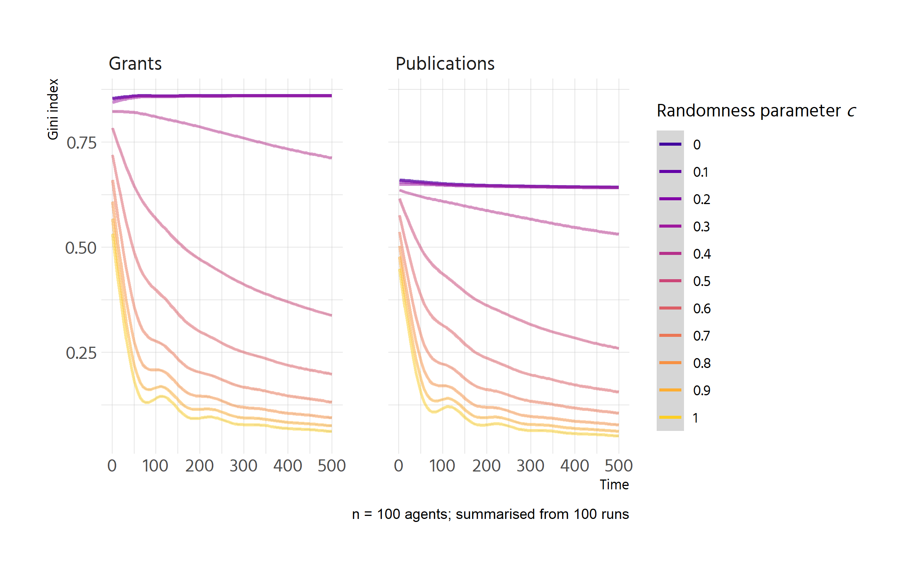

```r
p <- df %>% 
  select(run_number = .run.number., chance_imp = importance.of.chance, 
         step = .step., contains("gini")) %>% 
  pivot_longer(contains("gini")) %>% 
  mutate(chance_imp = factor(chance_imp, labels = chance_imp %>% unique() %>%
                               as.numeric() %>% scales::percent())) %>%
  ggplot(aes(step, value, colour = factor(chance_imp))) +
  geom_smooth() +
  facet_wrap(vars(name)) +
  labs(y = "gini", 
       colour = "importance of chance",
       caption = "n = 100 agents") 
p
```

```
## `geom_smooth()` using method = 'gam' and formula 'y ~ s(x, bs = "cs")'
```

<!-- -->

```r
plotly::ggplotly(p)
```

```
## `geom_smooth()` using method = 'gam' and formula 'y ~ s(x, bs = "cs")'
```

```{=html}
<div id="htmlwidget-cea7bb2d591e1a2ec058" style="width:840px;height:600px;" class="plotly html-widget"></div>
<script type="application/json" data-for="htmlwidget-cea7bb2d591e1a2ec058">{"x":{"data":[{"x":[1,7.31645569620253,13.6329113924051,19.9493670886076,26.2658227848101,32.5822784810127,38.8987341772152,45.2151898734177,51.5316455696203,57.8481012658228,64.1645569620253,70.4810126582279,76.7974683544304,83.1139240506329,89.4303797468354,95.746835443038,102.063291139241,108.379746835443,114.696202531646,121.012658227848,127.329113924051,133.645569620253,139.962025316456,146.278481012658,152.594936708861,158.911392405063,165.227848101266,171.544303797468,177.860759493671,184.177215189873,190.493670886076,196.810126582278,203.126582278481,209.443037974684,215.759493670886,222.075949367089,228.392405063291,234.708860759494,241.025316455696,247.341772151899,253.658227848101,259.974683544304,266.291139240506,272.607594936709,278.924050632911,285.240506329114,291.556962025316,297.873417721519,304.189873417722,310.506329113924,316.822784810127,323.139240506329,329.455696202532,335.772151898734,342.088607594937,348.405063291139,354.721518987342,361.037974683544,367.354430379747,373.670886075949,379.987341772152,386.303797468354,392.620253164557,398.936708860759,405.253164556962,411.569620253165,417.886075949367,424.20253164557,430.518987341772,436.835443037975,443.151898734177,449.46835443038,455.784810126582,462.101265822785,468.417721518987,474.73417721519,481.050632911392,487.367088607595,493.683544303797,500],"y":[0.863261966880262,0.873269224787652,0.883075282892926,0.892478941393967,0.901279000488658,0.909274260374883,0.916263521250525,0.922045583313469,0.926419246761596,0.929184245737554,0.930291963664734,0.930011792158027,0.928653165714,0.926525518829218,0.923938286000246,0.921200901723651,0.918622800496,0.916513416813856,0.915175239265124,0.91470010005151,0.914936290452201,0.915718535518523,0.916881560301801,0.918260089853362,0.919688849224532,0.921002563466636,0.922035957631002,0.922636220166947,0.922795426525448,0.922599127642425,0.922134432378543,0.921488449594472,0.920748288150877,0.920001056908427,0.919333864727789,0.918833820469631,0.918572461687236,0.918534193520505,0.918673130050446,0.918943354945355,0.919298951873529,0.919694004503266,0.920082596502863,0.920418811540617,0.920656749312511,0.920766473089144,0.920763965459673,0.920673415188157,0.920519011038656,0.920324941775227,0.920115396161932,0.91991456296283,0.919746630941979,0.919635561115968,0.91959164965308,0.91960401220673,0.919659942450558,0.919746734058203,0.919851680703305,0.919962076059504,0.920065213800441,0.920148387599754,0.920199442133581,0.92021611367487,0.920204694463334,0.920171758851962,0.920123881193744,0.92006763584167,0.920009597148729,0.919956339467911,0.919914437152207,0.919889775777166,0.919882770860779,0.919891229402396,0.919912942336588,0.919945700597926,0.919987295120982,0.920035516840324,0.920088156690525,0.920143005606154],"text":["step:   1.000000<br />value: 0.86326197<br />factor(chance_imp): 0.0%","step:   7.316456<br />value: 0.87326922<br />factor(chance_imp): 0.0%","step:  13.632911<br />value: 0.88307528<br />factor(chance_imp): 0.0%","step:  19.949367<br />value: 0.89247894<br />factor(chance_imp): 0.0%","step:  26.265823<br />value: 0.90127900<br />factor(chance_imp): 0.0%","step:  32.582278<br />value: 0.90927426<br />factor(chance_imp): 0.0%","step:  38.898734<br />value: 0.91626352<br />factor(chance_imp): 0.0%","step:  45.215190<br />value: 0.92204558<br />factor(chance_imp): 0.0%","step:  51.531646<br />value: 0.92641925<br />factor(chance_imp): 0.0%","step:  57.848101<br />value: 0.92918425<br />factor(chance_imp): 0.0%","step:  64.164557<br />value: 0.93029196<br />factor(chance_imp): 0.0%","step:  70.481013<br />value: 0.93001179<br />factor(chance_imp): 0.0%","step:  76.797468<br />value: 0.92865317<br />factor(chance_imp): 0.0%","step:  83.113924<br />value: 0.92652552<br />factor(chance_imp): 0.0%","step:  89.430380<br />value: 0.92393829<br />factor(chance_imp): 0.0%","step:  95.746835<br />value: 0.92120090<br />factor(chance_imp): 0.0%","step: 102.063291<br />value: 0.91862280<br />factor(chance_imp): 0.0%","step: 108.379747<br />value: 0.91651342<br />factor(chance_imp): 0.0%","step: 114.696203<br />value: 0.91517524<br />factor(chance_imp): 0.0%","step: 121.012658<br />value: 0.91470010<br />factor(chance_imp): 0.0%","step: 127.329114<br />value: 0.91493629<br />factor(chance_imp): 0.0%","step: 133.645570<br />value: 0.91571854<br />factor(chance_imp): 0.0%","step: 139.962025<br />value: 0.91688156<br />factor(chance_imp): 0.0%","step: 146.278481<br />value: 0.91826009<br />factor(chance_imp): 0.0%","step: 152.594937<br />value: 0.91968885<br />factor(chance_imp): 0.0%","step: 158.911392<br />value: 0.92100256<br />factor(chance_imp): 0.0%","step: 165.227848<br />value: 0.92203596<br />factor(chance_imp): 0.0%","step: 171.544304<br />value: 0.92263622<br />factor(chance_imp): 0.0%","step: 177.860759<br />value: 0.92279543<br />factor(chance_imp): 0.0%","step: 184.177215<br />value: 0.92259913<br />factor(chance_imp): 0.0%","step: 190.493671<br />value: 0.92213443<br />factor(chance_imp): 0.0%","step: 196.810127<br />value: 0.92148845<br />factor(chance_imp): 0.0%","step: 203.126582<br />value: 0.92074829<br />factor(chance_imp): 0.0%","step: 209.443038<br />value: 0.92000106<br />factor(chance_imp): 0.0%","step: 215.759494<br />value: 0.91933386<br />factor(chance_imp): 0.0%","step: 222.075949<br />value: 0.91883382<br />factor(chance_imp): 0.0%","step: 228.392405<br />value: 0.91857246<br />factor(chance_imp): 0.0%","step: 234.708861<br />value: 0.91853419<br />factor(chance_imp): 0.0%","step: 241.025316<br />value: 0.91867313<br />factor(chance_imp): 0.0%","step: 247.341772<br />value: 0.91894335<br />factor(chance_imp): 0.0%","step: 253.658228<br />value: 0.91929895<br />factor(chance_imp): 0.0%","step: 259.974684<br />value: 0.91969400<br />factor(chance_imp): 0.0%","step: 266.291139<br />value: 0.92008260<br />factor(chance_imp): 0.0%","step: 272.607595<br />value: 0.92041881<br />factor(chance_imp): 0.0%","step: 278.924051<br />value: 0.92065675<br />factor(chance_imp): 0.0%","step: 285.240506<br />value: 0.92076647<br />factor(chance_imp): 0.0%","step: 291.556962<br />value: 0.92076397<br />factor(chance_imp): 0.0%","step: 297.873418<br />value: 0.92067342<br />factor(chance_imp): 0.0%","step: 304.189873<br />value: 0.92051901<br />factor(chance_imp): 0.0%","step: 310.506329<br />value: 0.92032494<br />factor(chance_imp): 0.0%","step: 316.822785<br />value: 0.92011540<br />factor(chance_imp): 0.0%","step: 323.139241<br />value: 0.91991456<br />factor(chance_imp): 0.0%","step: 329.455696<br />value: 0.91974663<br />factor(chance_imp): 0.0%","step: 335.772152<br />value: 0.91963556<br />factor(chance_imp): 0.0%","step: 342.088608<br />value: 0.91959165<br />factor(chance_imp): 0.0%","step: 348.405063<br />value: 0.91960401<br />factor(chance_imp): 0.0%","step: 354.721519<br />value: 0.91965994<br />factor(chance_imp): 0.0%","step: 361.037975<br />value: 0.91974673<br />factor(chance_imp): 0.0%","step: 367.354430<br />value: 0.91985168<br />factor(chance_imp): 0.0%","step: 373.670886<br />value: 0.91996208<br />factor(chance_imp): 0.0%","step: 379.987342<br />value: 0.92006521<br />factor(chance_imp): 0.0%","step: 386.303797<br />value: 0.92014839<br />factor(chance_imp): 0.0%","step: 392.620253<br />value: 0.92019944<br />factor(chance_imp): 0.0%","step: 398.936709<br />value: 0.92021611<br />factor(chance_imp): 0.0%","step: 405.253165<br />value: 0.92020469<br />factor(chance_imp): 0.0%","step: 411.569620<br />value: 0.92017176<br />factor(chance_imp): 0.0%","step: 417.886076<br />value: 0.92012388<br />factor(chance_imp): 0.0%","step: 424.202532<br />value: 0.92006764<br />factor(chance_imp): 0.0%","step: 430.518987<br />value: 0.92000960<br />factor(chance_imp): 0.0%","step: 436.835443<br />value: 0.91995634<br />factor(chance_imp): 0.0%","step: 443.151899<br />value: 0.91991444<br />factor(chance_imp): 0.0%","step: 449.468354<br />value: 0.91988978<br />factor(chance_imp): 0.0%","step: 455.784810<br />value: 0.91988277<br />factor(chance_imp): 0.0%","step: 462.101266<br />value: 0.91989123<br />factor(chance_imp): 0.0%","step: 468.417722<br />value: 0.91991294<br />factor(chance_imp): 0.0%","step: 474.734177<br />value: 0.91994570<br />factor(chance_imp): 0.0%","step: 481.050633<br />value: 0.91998730<br />factor(chance_imp): 0.0%","step: 487.367089<br />value: 0.92003552<br />factor(chance_imp): 0.0%","step: 493.683544<br />value: 0.92008816<br />factor(chance_imp): 0.0%","step: 500.000000<br />value: 0.92014301<br />factor(chance_imp): 0.0%"],"type":"scatter","mode":"lines","name":"0.0%","line":{"width":3.77952755905512,"color":"rgba(248,118,109,1)","dash":"solid"},"hoveron":"points","legendgroup":"0.0%","showlegend":true,"xaxis":"x","yaxis":"y","hoverinfo":"text","frame":null},{"x":[1,7.31645569620253,13.6329113924051,19.9493670886076,26.2658227848101,32.5822784810127,38.8987341772152,45.2151898734177,51.5316455696203,57.8481012658228,64.1645569620253,70.4810126582279,76.7974683544304,83.1139240506329,89.4303797468354,95.746835443038,102.063291139241,108.379746835443,114.696202531646,121.012658227848,127.329113924051,133.645569620253,139.962025316456,146.278481012658,152.594936708861,158.911392405063,165.227848101266,171.544303797468,177.860759493671,184.177215189873,190.493670886076,196.810126582278,203.126582278481,209.443037974684,215.759493670886,222.075949367089,228.392405063291,234.708860759494,241.025316455696,247.341772151899,253.658227848101,259.974683544304,266.291139240506,272.607594936709,278.924050632911,285.240506329114,291.556962025316,297.873417721519,304.189873417722,310.506329113924,316.822784810127,323.139240506329,329.455696202532,335.772151898734,342.088607594937,348.405063291139,354.721518987342,361.037974683544,367.354430379747,373.670886075949,379.987341772152,386.303797468354,392.620253164557,398.936708860759,405.253164556962,411.569620253165,417.886075949367,424.20253164557,430.518987341772,436.835443037975,443.151898734177,449.46835443038,455.784810126582,462.101265822785,468.417721518987,474.73417721519,481.050632911392,487.367088607595,493.683544303797,500],"y":[0.573921236054285,0.584368483410714,0.594629260783254,0.604517098188015,0.613845525641107,0.622428073158641,0.630078270756727,0.636609648451475,0.641835736258997,0.645570876671891,0.647761338052562,0.64863003700772,0.648434725073516,0.6474331537861,0.645883074681622,0.644042239296234,0.642168399166086,0.640519305827328,0.639347430195469,0.638745091863089,0.638619458661485,0.638867384709763,0.639385724127027,0.640071331032382,0.640821059544933,0.641531763783785,0.642100297868043,0.642430948876085,0.642514412037841,0.642397129777789,0.642126473640317,0.641749815169813,0.641314525910666,0.640867977407263,0.640457541203993,0.640130588845242,0.639926203558852,0.639837089613855,0.639839827913501,0.639910983172919,0.64002712010724,0.640164803431596,0.640300597861116,0.64041106811093,0.64047278697188,0.640470370641558,0.640411572225534,0.640308279592689,0.640172380611904,0.640015763152059,0.639850315082037,0.639687924270717,0.639540478586981,0.639419756454004,0.639330969552642,0.639269151113153,0.639228458800154,0.639203050278261,0.639187083212091,0.639174715266259,0.639160104105381,0.639137407394075,0.639101023728061,0.639049676898242,0.63898583187371,0.638912076980282,0.638831000543774,0.638745190890002,0.638657236344784,0.638569725233936,0.638485245883274,0.638406128300876,0.63833265101516,0.638264114260831,0.638199812247692,0.638139039185544,0.638081089284189,0.638025256753429,0.637970835803065,0.637917120642899],"text":["step:   1.000000<br />value: 0.57392124<br />factor(chance_imp): 0.0%","step:   7.316456<br />value: 0.58436848<br />factor(chance_imp): 0.0%","step:  13.632911<br />value: 0.59462926<br />factor(chance_imp): 0.0%","step:  19.949367<br />value: 0.60451710<br />factor(chance_imp): 0.0%","step:  26.265823<br />value: 0.61384553<br />factor(chance_imp): 0.0%","step:  32.582278<br />value: 0.62242807<br />factor(chance_imp): 0.0%","step:  38.898734<br />value: 0.63007827<br />factor(chance_imp): 0.0%","step:  45.215190<br />value: 0.63660965<br />factor(chance_imp): 0.0%","step:  51.531646<br />value: 0.64183574<br />factor(chance_imp): 0.0%","step:  57.848101<br />value: 0.64557088<br />factor(chance_imp): 0.0%","step:  64.164557<br />value: 0.64776134<br />factor(chance_imp): 0.0%","step:  70.481013<br />value: 0.64863004<br />factor(chance_imp): 0.0%","step:  76.797468<br />value: 0.64843473<br />factor(chance_imp): 0.0%","step:  83.113924<br />value: 0.64743315<br />factor(chance_imp): 0.0%","step:  89.430380<br />value: 0.64588307<br />factor(chance_imp): 0.0%","step:  95.746835<br />value: 0.64404224<br />factor(chance_imp): 0.0%","step: 102.063291<br />value: 0.64216840<br />factor(chance_imp): 0.0%","step: 108.379747<br />value: 0.64051931<br />factor(chance_imp): 0.0%","step: 114.696203<br />value: 0.63934743<br />factor(chance_imp): 0.0%","step: 121.012658<br />value: 0.63874509<br />factor(chance_imp): 0.0%","step: 127.329114<br />value: 0.63861946<br />factor(chance_imp): 0.0%","step: 133.645570<br />value: 0.63886738<br />factor(chance_imp): 0.0%","step: 139.962025<br />value: 0.63938572<br />factor(chance_imp): 0.0%","step: 146.278481<br />value: 0.64007133<br />factor(chance_imp): 0.0%","step: 152.594937<br />value: 0.64082106<br />factor(chance_imp): 0.0%","step: 158.911392<br />value: 0.64153176<br />factor(chance_imp): 0.0%","step: 165.227848<br />value: 0.64210030<br />factor(chance_imp): 0.0%","step: 171.544304<br />value: 0.64243095<br />factor(chance_imp): 0.0%","step: 177.860759<br />value: 0.64251441<br />factor(chance_imp): 0.0%","step: 184.177215<br />value: 0.64239713<br />factor(chance_imp): 0.0%","step: 190.493671<br />value: 0.64212647<br />factor(chance_imp): 0.0%","step: 196.810127<br />value: 0.64174982<br />factor(chance_imp): 0.0%","step: 203.126582<br />value: 0.64131453<br />factor(chance_imp): 0.0%","step: 209.443038<br />value: 0.64086798<br />factor(chance_imp): 0.0%","step: 215.759494<br />value: 0.64045754<br />factor(chance_imp): 0.0%","step: 222.075949<br />value: 0.64013059<br />factor(chance_imp): 0.0%","step: 228.392405<br />value: 0.63992620<br />factor(chance_imp): 0.0%","step: 234.708861<br />value: 0.63983709<br />factor(chance_imp): 0.0%","step: 241.025316<br />value: 0.63983983<br />factor(chance_imp): 0.0%","step: 247.341772<br />value: 0.63991098<br />factor(chance_imp): 0.0%","step: 253.658228<br />value: 0.64002712<br />factor(chance_imp): 0.0%","step: 259.974684<br />value: 0.64016480<br />factor(chance_imp): 0.0%","step: 266.291139<br />value: 0.64030060<br />factor(chance_imp): 0.0%","step: 272.607595<br />value: 0.64041107<br />factor(chance_imp): 0.0%","step: 278.924051<br />value: 0.64047279<br />factor(chance_imp): 0.0%","step: 285.240506<br />value: 0.64047037<br />factor(chance_imp): 0.0%","step: 291.556962<br />value: 0.64041157<br />factor(chance_imp): 0.0%","step: 297.873418<br />value: 0.64030828<br />factor(chance_imp): 0.0%","step: 304.189873<br />value: 0.64017238<br />factor(chance_imp): 0.0%","step: 310.506329<br />value: 0.64001576<br />factor(chance_imp): 0.0%","step: 316.822785<br />value: 0.63985032<br />factor(chance_imp): 0.0%","step: 323.139241<br />value: 0.63968792<br />factor(chance_imp): 0.0%","step: 329.455696<br />value: 0.63954048<br />factor(chance_imp): 0.0%","step: 335.772152<br />value: 0.63941976<br />factor(chance_imp): 0.0%","step: 342.088608<br />value: 0.63933097<br />factor(chance_imp): 0.0%","step: 348.405063<br />value: 0.63926915<br />factor(chance_imp): 0.0%","step: 354.721519<br />value: 0.63922846<br />factor(chance_imp): 0.0%","step: 361.037975<br />value: 0.63920305<br />factor(chance_imp): 0.0%","step: 367.354430<br />value: 0.63918708<br />factor(chance_imp): 0.0%","step: 373.670886<br />value: 0.63917472<br />factor(chance_imp): 0.0%","step: 379.987342<br />value: 0.63916010<br />factor(chance_imp): 0.0%","step: 386.303797<br />value: 0.63913741<br />factor(chance_imp): 0.0%","step: 392.620253<br />value: 0.63910102<br />factor(chance_imp): 0.0%","step: 398.936709<br />value: 0.63904968<br />factor(chance_imp): 0.0%","step: 405.253165<br />value: 0.63898583<br />factor(chance_imp): 0.0%","step: 411.569620<br />value: 0.63891208<br />factor(chance_imp): 0.0%","step: 417.886076<br />value: 0.63883100<br />factor(chance_imp): 0.0%","step: 424.202532<br />value: 0.63874519<br />factor(chance_imp): 0.0%","step: 430.518987<br />value: 0.63865724<br />factor(chance_imp): 0.0%","step: 436.835443<br />value: 0.63856973<br />factor(chance_imp): 0.0%","step: 443.151899<br />value: 0.63848525<br />factor(chance_imp): 0.0%","step: 449.468354<br />value: 0.63840613<br />factor(chance_imp): 0.0%","step: 455.784810<br />value: 0.63833265<br />factor(chance_imp): 0.0%","step: 462.101266<br />value: 0.63826411<br />factor(chance_imp): 0.0%","step: 468.417722<br />value: 0.63819981<br />factor(chance_imp): 0.0%","step: 474.734177<br />value: 0.63813904<br />factor(chance_imp): 0.0%","step: 481.050633<br />value: 0.63808109<br />factor(chance_imp): 0.0%","step: 487.367089<br />value: 0.63802526<br />factor(chance_imp): 0.0%","step: 493.683544<br />value: 0.63797084<br />factor(chance_imp): 0.0%","step: 500.000000<br />value: 0.63791712<br />factor(chance_imp): 0.0%"],"type":"scatter","mode":"lines","name":"0.0%","line":{"width":3.77952755905512,"color":"rgba(248,118,109,1)","dash":"solid"},"hoveron":"points","legendgroup":"0.0%","showlegend":false,"xaxis":"x2","yaxis":"y","hoverinfo":"text","frame":null},{"x":[1,7.31645569620253,13.6329113924051,19.9493670886076,26.2658227848101,32.5822784810127,38.8987341772152,45.2151898734177,51.5316455696203,57.8481012658228,64.1645569620253,70.4810126582279,76.7974683544304,83.1139240506329,89.4303797468354,95.746835443038,102.063291139241,108.379746835443,114.696202531646,121.012658227848,127.329113924051,133.645569620253,139.962025316456,146.278481012658,152.594936708861,158.911392405063,165.227848101266,171.544303797468,177.860759493671,184.177215189873,190.493670886076,196.810126582278,203.126582278481,209.443037974684,215.759493670886,222.075949367089,228.392405063291,234.708860759494,241.025316455696,247.341772151899,253.658227848101,259.974683544304,266.291139240506,272.607594936709,278.924050632911,285.240506329114,291.556962025316,297.873417721519,304.189873417722,310.506329113924,316.822784810127,323.139240506329,329.455696202532,335.772151898734,342.088607594937,348.405063291139,354.721518987342,361.037974683544,367.354430379747,373.670886075949,379.987341772152,386.303797468354,392.620253164557,398.936708860759,405.253164556962,411.569620253165,417.886075949367,424.20253164557,430.518987341772,436.835443037975,443.151898734177,449.46835443038,455.784810126582,462.101265822785,468.417721518987,474.73417721519,481.050632911392,487.367088607595,493.683544303797,500],"y":[0.873471586592887,0.881693319033887,0.889749541539314,0.897474744173594,0.904703417001156,0.911270050086425,0.91700913349383,0.921755157287796,0.925342611532752,0.927606754963571,0.928507659179129,0.928267128065853,0.927139922255633,0.925380802380357,0.923244529071914,0.920985862962191,0.918859564683078,0.917120394866463,0.916017392338105,0.915626064272279,0.915821297015883,0.916466801513221,0.917426288708598,0.918563469546318,0.919742054970685,0.920825755926003,0.921678283356577,0.922173625346547,0.92230524173065,0.922143670892398,0.921760735857781,0.921228259652787,0.920618065303408,0.920001975835632,0.919451814275451,0.919039403648853,0.918823730344736,0.91879195074169,0.918906249947712,0.919128787999239,0.919421724932709,0.919747220784562,0.920067435591234,0.920344529389165,0.920540675420667,0.920631199979178,0.920629264188936,0.920554790581986,0.920427701690373,0.920267920046142,0.920095368181336,0.919929968628002,0.919791643918185,0.919700129042747,0.919663906521728,0.919674017545383,0.919720002974524,0.919791403669963,0.919877760492513,0.919968614302985,0.920053505962192,0.920121976330947,0.920164019740185,0.920177771216521,0.920168407270667,0.920141336590036,0.920101967862044,0.920055709774103,0.920007971013628,0.919964160268034,0.919929686224735,0.91990939096473,0.919903616755968,0.91991056003044,0.919928404004826,0.919955331895809,0.919989526920068,0.920029172294284,0.920072451235139,0.920117546959312],"text":["step:   1.000000<br />value: 0.87347159<br />factor(chance_imp): 5.0%","step:   7.316456<br />value: 0.88169332<br />factor(chance_imp): 5.0%","step:  13.632911<br />value: 0.88974954<br />factor(chance_imp): 5.0%","step:  19.949367<br />value: 0.89747474<br />factor(chance_imp): 5.0%","step:  26.265823<br />value: 0.90470342<br />factor(chance_imp): 5.0%","step:  32.582278<br />value: 0.91127005<br />factor(chance_imp): 5.0%","step:  38.898734<br />value: 0.91700913<br />factor(chance_imp): 5.0%","step:  45.215190<br />value: 0.92175516<br />factor(chance_imp): 5.0%","step:  51.531646<br />value: 0.92534261<br />factor(chance_imp): 5.0%","step:  57.848101<br />value: 0.92760675<br />factor(chance_imp): 5.0%","step:  64.164557<br />value: 0.92850766<br />factor(chance_imp): 5.0%","step:  70.481013<br />value: 0.92826713<br />factor(chance_imp): 5.0%","step:  76.797468<br />value: 0.92713992<br />factor(chance_imp): 5.0%","step:  83.113924<br />value: 0.92538080<br />factor(chance_imp): 5.0%","step:  89.430380<br />value: 0.92324453<br />factor(chance_imp): 5.0%","step:  95.746835<br />value: 0.92098586<br />factor(chance_imp): 5.0%","step: 102.063291<br />value: 0.91885956<br />factor(chance_imp): 5.0%","step: 108.379747<br />value: 0.91712039<br />factor(chance_imp): 5.0%","step: 114.696203<br />value: 0.91601739<br />factor(chance_imp): 5.0%","step: 121.012658<br />value: 0.91562606<br />factor(chance_imp): 5.0%","step: 127.329114<br />value: 0.91582130<br />factor(chance_imp): 5.0%","step: 133.645570<br />value: 0.91646680<br />factor(chance_imp): 5.0%","step: 139.962025<br />value: 0.91742629<br />factor(chance_imp): 5.0%","step: 146.278481<br />value: 0.91856347<br />factor(chance_imp): 5.0%","step: 152.594937<br />value: 0.91974205<br />factor(chance_imp): 5.0%","step: 158.911392<br />value: 0.92082576<br />factor(chance_imp): 5.0%","step: 165.227848<br />value: 0.92167828<br />factor(chance_imp): 5.0%","step: 171.544304<br />value: 0.92217363<br />factor(chance_imp): 5.0%","step: 177.860759<br />value: 0.92230524<br />factor(chance_imp): 5.0%","step: 184.177215<br />value: 0.92214367<br />factor(chance_imp): 5.0%","step: 190.493671<br />value: 0.92176074<br />factor(chance_imp): 5.0%","step: 196.810127<br />value: 0.92122826<br />factor(chance_imp): 5.0%","step: 203.126582<br />value: 0.92061807<br />factor(chance_imp): 5.0%","step: 209.443038<br />value: 0.92000198<br />factor(chance_imp): 5.0%","step: 215.759494<br />value: 0.91945181<br />factor(chance_imp): 5.0%","step: 222.075949<br />value: 0.91903940<br />factor(chance_imp): 5.0%","step: 228.392405<br />value: 0.91882373<br />factor(chance_imp): 5.0%","step: 234.708861<br />value: 0.91879195<br />factor(chance_imp): 5.0%","step: 241.025316<br />value: 0.91890625<br />factor(chance_imp): 5.0%","step: 247.341772<br />value: 0.91912879<br />factor(chance_imp): 5.0%","step: 253.658228<br />value: 0.91942172<br />factor(chance_imp): 5.0%","step: 259.974684<br />value: 0.91974722<br />factor(chance_imp): 5.0%","step: 266.291139<br />value: 0.92006744<br />factor(chance_imp): 5.0%","step: 272.607595<br />value: 0.92034453<br />factor(chance_imp): 5.0%","step: 278.924051<br />value: 0.92054068<br />factor(chance_imp): 5.0%","step: 285.240506<br />value: 0.92063120<br />factor(chance_imp): 5.0%","step: 291.556962<br />value: 0.92062926<br />factor(chance_imp): 5.0%","step: 297.873418<br />value: 0.92055479<br />factor(chance_imp): 5.0%","step: 304.189873<br />value: 0.92042770<br />factor(chance_imp): 5.0%","step: 310.506329<br />value: 0.92026792<br />factor(chance_imp): 5.0%","step: 316.822785<br />value: 0.92009537<br />factor(chance_imp): 5.0%","step: 323.139241<br />value: 0.91992997<br />factor(chance_imp): 5.0%","step: 329.455696<br />value: 0.91979164<br />factor(chance_imp): 5.0%","step: 335.772152<br />value: 0.91970013<br />factor(chance_imp): 5.0%","step: 342.088608<br />value: 0.91966391<br />factor(chance_imp): 5.0%","step: 348.405063<br />value: 0.91967402<br />factor(chance_imp): 5.0%","step: 354.721519<br />value: 0.91972000<br />factor(chance_imp): 5.0%","step: 361.037975<br />value: 0.91979140<br />factor(chance_imp): 5.0%","step: 367.354430<br />value: 0.91987776<br />factor(chance_imp): 5.0%","step: 373.670886<br />value: 0.91996861<br />factor(chance_imp): 5.0%","step: 379.987342<br />value: 0.92005351<br />factor(chance_imp): 5.0%","step: 386.303797<br />value: 0.92012198<br />factor(chance_imp): 5.0%","step: 392.620253<br />value: 0.92016402<br />factor(chance_imp): 5.0%","step: 398.936709<br />value: 0.92017777<br />factor(chance_imp): 5.0%","step: 405.253165<br />value: 0.92016841<br />factor(chance_imp): 5.0%","step: 411.569620<br />value: 0.92014134<br />factor(chance_imp): 5.0%","step: 417.886076<br />value: 0.92010197<br />factor(chance_imp): 5.0%","step: 424.202532<br />value: 0.92005571<br />factor(chance_imp): 5.0%","step: 430.518987<br />value: 0.92000797<br />factor(chance_imp): 5.0%","step: 436.835443<br />value: 0.91996416<br />factor(chance_imp): 5.0%","step: 443.151899<br />value: 0.91992969<br />factor(chance_imp): 5.0%","step: 449.468354<br />value: 0.91990939<br />factor(chance_imp): 5.0%","step: 455.784810<br />value: 0.91990362<br />factor(chance_imp): 5.0%","step: 462.101266<br />value: 0.91991056<br />factor(chance_imp): 5.0%","step: 468.417722<br />value: 0.91992840<br />factor(chance_imp): 5.0%","step: 474.734177<br />value: 0.91995533<br />factor(chance_imp): 5.0%","step: 481.050633<br />value: 0.91998953<br />factor(chance_imp): 5.0%","step: 487.367089<br />value: 0.92002917<br />factor(chance_imp): 5.0%","step: 493.683544<br />value: 0.92007245<br />factor(chance_imp): 5.0%","step: 500.000000<br />value: 0.92011755<br />factor(chance_imp): 5.0%"],"type":"scatter","mode":"lines","name":"5.0%","line":{"width":3.77952755905512,"color":"rgba(235,131,53,1)","dash":"solid"},"hoveron":"points","legendgroup":"5.0%","showlegend":true,"xaxis":"x","yaxis":"y","hoverinfo":"text","frame":null},{"x":[1,7.31645569620253,13.6329113924051,19.9493670886076,26.2658227848101,32.5822784810127,38.8987341772152,45.2151898734177,51.5316455696203,57.8481012658228,64.1645569620253,70.4810126582279,76.7974683544304,83.1139240506329,89.4303797468354,95.746835443038,102.063291139241,108.379746835443,114.696202531646,121.012658227848,127.329113924051,133.645569620253,139.962025316456,146.278481012658,152.594936708861,158.911392405063,165.227848101266,171.544303797468,177.860759493671,184.177215189873,190.493670886076,196.810126582278,203.126582278481,209.443037974684,215.759493670886,222.075949367089,228.392405063291,234.708860759494,241.025316455696,247.341772151899,253.658227848101,259.974683544304,266.291139240506,272.607594936709,278.924050632911,285.240506329114,291.556962025316,297.873417721519,304.189873417722,310.506329113924,316.822784810127,323.139240506329,329.455696202532,335.772151898734,342.088607594937,348.405063291139,354.721518987342,361.037974683544,367.354430379747,373.670886075949,379.987341772152,386.303797468354,392.620253164557,398.936708860759,405.253164556962,411.569620253165,417.886075949367,424.20253164557,430.518987341772,436.835443037975,443.151898734177,449.46835443038,455.784810126582,462.101265822785,468.417721518987,474.73417721519,481.050632911392,487.367088607595,493.683544303797,500],"y":[0.594297223397992,0.600592617024064,0.606785903096784,0.612774974062799,0.618457722368757,0.623732040461304,0.628495820787088,0.632646955792757,0.636083337924959,0.638703288651096,0.640474791683847,0.641511912303344,0.641947110054639,0.641912844482784,0.64154157513283,0.64096576154983,0.640317863278835,0.639730339864897,0.639333038422013,0.639176575928598,0.639219970999216,0.639417139844024,0.639721998673179,0.64008846369684,0.640470451125164,0.64082187716831,0.641096658036436,0.641252065048461,0.641284372662677,0.641215018653096,0.641065860182326,0.640858754412975,0.640615558507651,0.640358129628962,0.640108324939515,0.63988800160192,0.639715368704419,0.639588221794142,0.639497259773555,0.63943317441998,0.639386657510739,0.639348400823154,0.639309096134548,0.639259435222242,0.639190113146035,0.639095094312563,0.638977747424334,0.638843121811951,0.638696266806014,0.638542231737127,0.638386065935889,0.638232818732902,0.63808753945877,0.637955238704179,0.637838602665047,0.637736714725397,0.637648348349945,0.637572277003412,0.637507274150514,0.637452113255972,0.637405567784503,0.637366411200826,0.637333433007448,0.637305710617257,0.637282570477921,0.637263347248459,0.637247375587887,0.63723399015522,0.637222525609477,0.637212316609675,0.637202697814828,0.637193058050734,0.637183216318997,0.637173196760129,0.637163024778004,0.637152725776499,0.637142325159491,0.637131848330854,0.637121320694466,0.637110767654201],"text":["step:   1.000000<br />value: 0.59429722<br />factor(chance_imp): 5.0%","step:   7.316456<br />value: 0.60059262<br />factor(chance_imp): 5.0%","step:  13.632911<br />value: 0.60678590<br />factor(chance_imp): 5.0%","step:  19.949367<br />value: 0.61277497<br />factor(chance_imp): 5.0%","step:  26.265823<br />value: 0.61845772<br />factor(chance_imp): 5.0%","step:  32.582278<br />value: 0.62373204<br />factor(chance_imp): 5.0%","step:  38.898734<br />value: 0.62849582<br />factor(chance_imp): 5.0%","step:  45.215190<br />value: 0.63264696<br />factor(chance_imp): 5.0%","step:  51.531646<br />value: 0.63608334<br />factor(chance_imp): 5.0%","step:  57.848101<br />value: 0.63870329<br />factor(chance_imp): 5.0%","step:  64.164557<br />value: 0.64047479<br />factor(chance_imp): 5.0%","step:  70.481013<br />value: 0.64151191<br />factor(chance_imp): 5.0%","step:  76.797468<br />value: 0.64194711<br />factor(chance_imp): 5.0%","step:  83.113924<br />value: 0.64191284<br />factor(chance_imp): 5.0%","step:  89.430380<br />value: 0.64154158<br />factor(chance_imp): 5.0%","step:  95.746835<br />value: 0.64096576<br />factor(chance_imp): 5.0%","step: 102.063291<br />value: 0.64031786<br />factor(chance_imp): 5.0%","step: 108.379747<br />value: 0.63973034<br />factor(chance_imp): 5.0%","step: 114.696203<br />value: 0.63933304<br />factor(chance_imp): 5.0%","step: 121.012658<br />value: 0.63917658<br />factor(chance_imp): 5.0%","step: 127.329114<br />value: 0.63921997<br />factor(chance_imp): 5.0%","step: 133.645570<br />value: 0.63941714<br />factor(chance_imp): 5.0%","step: 139.962025<br />value: 0.63972200<br />factor(chance_imp): 5.0%","step: 146.278481<br />value: 0.64008846<br />factor(chance_imp): 5.0%","step: 152.594937<br />value: 0.64047045<br />factor(chance_imp): 5.0%","step: 158.911392<br />value: 0.64082188<br />factor(chance_imp): 5.0%","step: 165.227848<br />value: 0.64109666<br />factor(chance_imp): 5.0%","step: 171.544304<br />value: 0.64125207<br />factor(chance_imp): 5.0%","step: 177.860759<br />value: 0.64128437<br />factor(chance_imp): 5.0%","step: 184.177215<br />value: 0.64121502<br />factor(chance_imp): 5.0%","step: 190.493671<br />value: 0.64106586<br />factor(chance_imp): 5.0%","step: 196.810127<br />value: 0.64085875<br />factor(chance_imp): 5.0%","step: 203.126582<br />value: 0.64061556<br />factor(chance_imp): 5.0%","step: 209.443038<br />value: 0.64035813<br />factor(chance_imp): 5.0%","step: 215.759494<br />value: 0.64010832<br />factor(chance_imp): 5.0%","step: 222.075949<br />value: 0.63988800<br />factor(chance_imp): 5.0%","step: 228.392405<br />value: 0.63971537<br />factor(chance_imp): 5.0%","step: 234.708861<br />value: 0.63958822<br />factor(chance_imp): 5.0%","step: 241.025316<br />value: 0.63949726<br />factor(chance_imp): 5.0%","step: 247.341772<br />value: 0.63943317<br />factor(chance_imp): 5.0%","step: 253.658228<br />value: 0.63938666<br />factor(chance_imp): 5.0%","step: 259.974684<br />value: 0.63934840<br />factor(chance_imp): 5.0%","step: 266.291139<br />value: 0.63930910<br />factor(chance_imp): 5.0%","step: 272.607595<br />value: 0.63925944<br />factor(chance_imp): 5.0%","step: 278.924051<br />value: 0.63919011<br />factor(chance_imp): 5.0%","step: 285.240506<br />value: 0.63909509<br />factor(chance_imp): 5.0%","step: 291.556962<br />value: 0.63897775<br />factor(chance_imp): 5.0%","step: 297.873418<br />value: 0.63884312<br />factor(chance_imp): 5.0%","step: 304.189873<br />value: 0.63869627<br />factor(chance_imp): 5.0%","step: 310.506329<br />value: 0.63854223<br />factor(chance_imp): 5.0%","step: 316.822785<br />value: 0.63838607<br />factor(chance_imp): 5.0%","step: 323.139241<br />value: 0.63823282<br />factor(chance_imp): 5.0%","step: 329.455696<br />value: 0.63808754<br />factor(chance_imp): 5.0%","step: 335.772152<br />value: 0.63795524<br />factor(chance_imp): 5.0%","step: 342.088608<br />value: 0.63783860<br />factor(chance_imp): 5.0%","step: 348.405063<br />value: 0.63773671<br />factor(chance_imp): 5.0%","step: 354.721519<br />value: 0.63764835<br />factor(chance_imp): 5.0%","step: 361.037975<br />value: 0.63757228<br />factor(chance_imp): 5.0%","step: 367.354430<br />value: 0.63750727<br />factor(chance_imp): 5.0%","step: 373.670886<br />value: 0.63745211<br />factor(chance_imp): 5.0%","step: 379.987342<br />value: 0.63740557<br />factor(chance_imp): 5.0%","step: 386.303797<br />value: 0.63736641<br />factor(chance_imp): 5.0%","step: 392.620253<br />value: 0.63733343<br />factor(chance_imp): 5.0%","step: 398.936709<br />value: 0.63730571<br />factor(chance_imp): 5.0%","step: 405.253165<br />value: 0.63728257<br />factor(chance_imp): 5.0%","step: 411.569620<br />value: 0.63726335<br />factor(chance_imp): 5.0%","step: 417.886076<br />value: 0.63724738<br />factor(chance_imp): 5.0%","step: 424.202532<br />value: 0.63723399<br />factor(chance_imp): 5.0%","step: 430.518987<br />value: 0.63722253<br />factor(chance_imp): 5.0%","step: 436.835443<br />value: 0.63721232<br />factor(chance_imp): 5.0%","step: 443.151899<br />value: 0.63720270<br />factor(chance_imp): 5.0%","step: 449.468354<br />value: 0.63719306<br />factor(chance_imp): 5.0%","step: 455.784810<br />value: 0.63718322<br />factor(chance_imp): 5.0%","step: 462.101266<br />value: 0.63717320<br />factor(chance_imp): 5.0%","step: 468.417722<br />value: 0.63716302<br />factor(chance_imp): 5.0%","step: 474.734177<br />value: 0.63715273<br />factor(chance_imp): 5.0%","step: 481.050633<br />value: 0.63714233<br />factor(chance_imp): 5.0%","step: 487.367089<br />value: 0.63713185<br />factor(chance_imp): 5.0%","step: 493.683544<br />value: 0.63712132<br />factor(chance_imp): 5.0%","step: 500.000000<br />value: 0.63711077<br />factor(chance_imp): 5.0%"],"type":"scatter","mode":"lines","name":"5.0%","line":{"width":3.77952755905512,"color":"rgba(235,131,53,1)","dash":"solid"},"hoveron":"points","legendgroup":"5.0%","showlegend":false,"xaxis":"x2","yaxis":"y","hoverinfo":"text","frame":null},{"x":[1,7.31645569620253,13.6329113924051,19.9493670886076,26.2658227848101,32.5822784810127,38.8987341772152,45.2151898734177,51.5316455696203,57.8481012658228,64.1645569620253,70.4810126582279,76.7974683544304,83.1139240506329,89.4303797468354,95.746835443038,102.063291139241,108.379746835443,114.696202531646,121.012658227848,127.329113924051,133.645569620253,139.962025316456,146.278481012658,152.594936708861,158.911392405063,165.227848101266,171.544303797468,177.860759493671,184.177215189873,190.493670886076,196.810126582278,203.126582278481,209.443037974684,215.759493670886,222.075949367089,228.392405063291,234.708860759494,241.025316455696,247.341772151899,253.658227848101,259.974683544304,266.291139240506,272.607594936709,278.924050632911,285.240506329114,291.556962025316,297.873417721519,304.189873417722,310.506329113924,316.822784810127,323.139240506329,329.455696202532,335.772151898734,342.088607594937,348.405063291139,354.721518987342,361.037974683544,367.354430379747,373.670886075949,379.987341772152,386.303797468354,392.620253164557,398.936708860759,405.253164556962,411.569620253165,417.886075949367,424.20253164557,430.518987341772,436.835443037975,443.151898734177,449.46835443038,455.784810126582,462.101265822785,468.417721518987,474.73417721519,481.050632911392,487.367088607595,493.683544303797,500],"y":[0.866718118401781,0.876127572973906,0.885347714963264,0.894189231787092,0.902462810862623,0.909979139607092,0.916548905437735,0.921982795771784,0.926091498026474,0.928686578553229,0.929722320642306,0.929452284675097,0.928167715336319,0.926159857310691,0.92371995528293,0.921139253937755,0.918708997959883,0.916720432034033,0.915458262879383,0.915008912979009,0.915229567399285,0.915964641742642,0.917058551611513,0.918355712608327,0.919700540335518,0.920937450395515,0.921910858390751,0.922476907076366,0.922628067357742,0.922444763785582,0.922008886804675,0.92140232685981,0.920706974395778,0.920004719857367,0.919377453689368,0.918907066336569,0.918660817821622,0.918624100668285,0.918753846657247,0.919006958994156,0.919340340884659,0.919710895534401,0.920075526149029,0.920391135934191,0.920614643130544,0.920717940851712,0.920715997523598,0.920631479498772,0.920487053129802,0.920305384769255,0.920109140769701,0.919920987483708,0.919763591263843,0.919659405167489,0.919618084540849,0.919629448277797,0.919681608910718,0.919762678971997,0.919860770994016,0.919963997509162,0.920060471049817,0.920138304148367,0.920186124568904,0.920201809515169,0.920191236708882,0.920160547670399,0.920115883920076,0.920063386978269,0.920009198365335,0.919959459601629,0.919920312207509,0.919897254419103,0.919890675708014,0.919898529317828,0.919918753488414,0.919949286459646,0.919988066471392,0.920033031763526,0.920082120575917,0.920133271148436],"text":["step:   1.000000<br />value: 0.86671812<br />factor(chance_imp): 10.0%","step:   7.316456<br />value: 0.87612757<br />factor(chance_imp): 10.0%","step:  13.632911<br />value: 0.88534771<br />factor(chance_imp): 10.0%","step:  19.949367<br />value: 0.89418923<br />factor(chance_imp): 10.0%","step:  26.265823<br />value: 0.90246281<br />factor(chance_imp): 10.0%","step:  32.582278<br />value: 0.90997914<br />factor(chance_imp): 10.0%","step:  38.898734<br />value: 0.91654891<br />factor(chance_imp): 10.0%","step:  45.215190<br />value: 0.92198280<br />factor(chance_imp): 10.0%","step:  51.531646<br />value: 0.92609150<br />factor(chance_imp): 10.0%","step:  57.848101<br />value: 0.92868658<br />factor(chance_imp): 10.0%","step:  64.164557<br />value: 0.92972232<br />factor(chance_imp): 10.0%","step:  70.481013<br />value: 0.92945228<br />factor(chance_imp): 10.0%","step:  76.797468<br />value: 0.92816772<br />factor(chance_imp): 10.0%","step:  83.113924<br />value: 0.92615986<br />factor(chance_imp): 10.0%","step:  89.430380<br />value: 0.92371996<br />factor(chance_imp): 10.0%","step:  95.746835<br />value: 0.92113925<br />factor(chance_imp): 10.0%","step: 102.063291<br />value: 0.91870900<br />factor(chance_imp): 10.0%","step: 108.379747<br />value: 0.91672043<br />factor(chance_imp): 10.0%","step: 114.696203<br />value: 0.91545826<br />factor(chance_imp): 10.0%","step: 121.012658<br />value: 0.91500891<br />factor(chance_imp): 10.0%","step: 127.329114<br />value: 0.91522957<br />factor(chance_imp): 10.0%","step: 133.645570<br />value: 0.91596464<br />factor(chance_imp): 10.0%","step: 139.962025<br />value: 0.91705855<br />factor(chance_imp): 10.0%","step: 146.278481<br />value: 0.91835571<br />factor(chance_imp): 10.0%","step: 152.594937<br />value: 0.91970054<br />factor(chance_imp): 10.0%","step: 158.911392<br />value: 0.92093745<br />factor(chance_imp): 10.0%","step: 165.227848<br />value: 0.92191086<br />factor(chance_imp): 10.0%","step: 171.544304<br />value: 0.92247691<br />factor(chance_imp): 10.0%","step: 177.860759<br />value: 0.92262807<br />factor(chance_imp): 10.0%","step: 184.177215<br />value: 0.92244476<br />factor(chance_imp): 10.0%","step: 190.493671<br />value: 0.92200889<br />factor(chance_imp): 10.0%","step: 196.810127<br />value: 0.92140233<br />factor(chance_imp): 10.0%","step: 203.126582<br />value: 0.92070697<br />factor(chance_imp): 10.0%","step: 209.443038<br />value: 0.92000472<br />factor(chance_imp): 10.0%","step: 215.759494<br />value: 0.91937745<br />factor(chance_imp): 10.0%","step: 222.075949<br />value: 0.91890707<br />factor(chance_imp): 10.0%","step: 228.392405<br />value: 0.91866082<br />factor(chance_imp): 10.0%","step: 234.708861<br />value: 0.91862410<br />factor(chance_imp): 10.0%","step: 241.025316<br />value: 0.91875385<br />factor(chance_imp): 10.0%","step: 247.341772<br />value: 0.91900696<br />factor(chance_imp): 10.0%","step: 253.658228<br />value: 0.91934034<br />factor(chance_imp): 10.0%","step: 259.974684<br />value: 0.91971090<br />factor(chance_imp): 10.0%","step: 266.291139<br />value: 0.92007553<br />factor(chance_imp): 10.0%","step: 272.607595<br />value: 0.92039114<br />factor(chance_imp): 10.0%","step: 278.924051<br />value: 0.92061464<br />factor(chance_imp): 10.0%","step: 285.240506<br />value: 0.92071794<br />factor(chance_imp): 10.0%","step: 291.556962<br />value: 0.92071600<br />factor(chance_imp): 10.0%","step: 297.873418<br />value: 0.92063148<br />factor(chance_imp): 10.0%","step: 304.189873<br />value: 0.92048705<br />factor(chance_imp): 10.0%","step: 310.506329<br />value: 0.92030538<br />factor(chance_imp): 10.0%","step: 316.822785<br />value: 0.92010914<br />factor(chance_imp): 10.0%","step: 323.139241<br />value: 0.91992099<br />factor(chance_imp): 10.0%","step: 329.455696<br />value: 0.91976359<br />factor(chance_imp): 10.0%","step: 335.772152<br />value: 0.91965941<br />factor(chance_imp): 10.0%","step: 342.088608<br />value: 0.91961808<br />factor(chance_imp): 10.0%","step: 348.405063<br />value: 0.91962945<br />factor(chance_imp): 10.0%","step: 354.721519<br />value: 0.91968161<br />factor(chance_imp): 10.0%","step: 361.037975<br />value: 0.91976268<br />factor(chance_imp): 10.0%","step: 367.354430<br />value: 0.91986077<br />factor(chance_imp): 10.0%","step: 373.670886<br />value: 0.91996400<br />factor(chance_imp): 10.0%","step: 379.987342<br />value: 0.92006047<br />factor(chance_imp): 10.0%","step: 386.303797<br />value: 0.92013830<br />factor(chance_imp): 10.0%","step: 392.620253<br />value: 0.92018612<br />factor(chance_imp): 10.0%","step: 398.936709<br />value: 0.92020181<br />factor(chance_imp): 10.0%","step: 405.253165<br />value: 0.92019124<br />factor(chance_imp): 10.0%","step: 411.569620<br />value: 0.92016055<br />factor(chance_imp): 10.0%","step: 417.886076<br />value: 0.92011588<br />factor(chance_imp): 10.0%","step: 424.202532<br />value: 0.92006339<br />factor(chance_imp): 10.0%","step: 430.518987<br />value: 0.92000920<br />factor(chance_imp): 10.0%","step: 436.835443<br />value: 0.91995946<br />factor(chance_imp): 10.0%","step: 443.151899<br />value: 0.91992031<br />factor(chance_imp): 10.0%","step: 449.468354<br />value: 0.91989725<br />factor(chance_imp): 10.0%","step: 455.784810<br />value: 0.91989068<br />factor(chance_imp): 10.0%","step: 462.101266<br />value: 0.91989853<br />factor(chance_imp): 10.0%","step: 468.417722<br />value: 0.91991875<br />factor(chance_imp): 10.0%","step: 474.734177<br />value: 0.91994929<br />factor(chance_imp): 10.0%","step: 481.050633<br />value: 0.91998807<br />factor(chance_imp): 10.0%","step: 487.367089<br />value: 0.92003303<br />factor(chance_imp): 10.0%","step: 493.683544<br />value: 0.92008212<br />factor(chance_imp): 10.0%","step: 500.000000<br />value: 0.92013327<br />factor(chance_imp): 10.0%"],"type":"scatter","mode":"lines","name":"10.0%","line":{"width":3.77952755905512,"color":"rgba(218,143,0,1)","dash":"solid"},"hoveron":"points","legendgroup":"10.0%","showlegend":true,"xaxis":"x","yaxis":"y","hoverinfo":"text","frame":null},{"x":[1,7.31645569620253,13.6329113924051,19.9493670886076,26.2658227848101,32.5822784810127,38.8987341772152,45.2151898734177,51.5316455696203,57.8481012658228,64.1645569620253,70.4810126582279,76.7974683544304,83.1139240506329,89.4303797468354,95.746835443038,102.063291139241,108.379746835443,114.696202531646,121.012658227848,127.329113924051,133.645569620253,139.962025316456,146.278481012658,152.594936708861,158.911392405063,165.227848101266,171.544303797468,177.860759493671,184.177215189873,190.493670886076,196.810126582278,203.126582278481,209.443037974684,215.759493670886,222.075949367089,228.392405063291,234.708860759494,241.025316455696,247.341772151899,253.658227848101,259.974683544304,266.291139240506,272.607594936709,278.924050632911,285.240506329114,291.556962025316,297.873417721519,304.189873417722,310.506329113924,316.822784810127,323.139240506329,329.455696202532,335.772151898734,342.088607594937,348.405063291139,354.721518987342,361.037974683544,367.354430379747,373.670886075949,379.987341772152,386.303797468354,392.620253164557,398.936708860759,405.253164556962,411.569620253165,417.886075949367,424.20253164557,430.518987341772,436.835443037975,443.151898734177,449.46835443038,455.784810126582,462.101265822785,468.417721518987,474.73417721519,481.050632911392,487.367088607595,493.683544303797,500],"y":[0.582826196749106,0.590873416884597,0.598777006154778,0.60639333369434,0.613578768637975,0.620189680120371,0.626082437276221,0.631113409240215,0.635138965147042,0.638016108075675,0.639704777807644,0.640380772152016,0.640247069278886,0.639506647358353,0.638362484560512,0.637017559055461,0.635674849013297,0.634537332604115,0.633803709394717,0.633542916936261,0.633673874251783,0.634107143717253,0.634753287708639,0.635522868601911,0.636326448773039,0.63707459059799,0.637677856452735,0.638053437441308,0.638195583631489,0.638148260551544,0.637956262320744,0.637664383058364,0.637317416883674,0.636960157915948,0.636637400274458,0.636393938078477,0.636266596397664,0.636247607865855,0.636313702825061,0.636441596052742,0.636608002326358,0.63678963642337,0.636963213121237,0.637105447197422,0.637193061208246,0.637210525457608,0.637164596691973,0.637066014435678,0.636925518213059,0.636753847548452,0.636561741966193,0.636359940990617,0.63615918414606,0.635970137112677,0.635799034919662,0.635645245087227,0.63550754438212,0.635384709571092,0.635275517420892,0.635178744698271,0.635093168169978,0.635017564602762,0.634950698693976,0.634891118471133,0.634837184548129,0.634787251359331,0.634739673339105,0.634692804921814,0.634645000541825,0.634594614633503,0.634540001631214,0.634479700742551,0.634413718586993,0.634342761552021,0.634267540334691,0.634188765632065,0.634107148141202,0.63402339855916,0.633938227582999,0.63385234590978],"text":["step:   1.000000<br />value: 0.58282620<br />factor(chance_imp): 10.0%","step:   7.316456<br />value: 0.59087342<br />factor(chance_imp): 10.0%","step:  13.632911<br />value: 0.59877701<br />factor(chance_imp): 10.0%","step:  19.949367<br />value: 0.60639333<br />factor(chance_imp): 10.0%","step:  26.265823<br />value: 0.61357877<br />factor(chance_imp): 10.0%","step:  32.582278<br />value: 0.62018968<br />factor(chance_imp): 10.0%","step:  38.898734<br />value: 0.62608244<br />factor(chance_imp): 10.0%","step:  45.215190<br />value: 0.63111341<br />factor(chance_imp): 10.0%","step:  51.531646<br />value: 0.63513897<br />factor(chance_imp): 10.0%","step:  57.848101<br />value: 0.63801611<br />factor(chance_imp): 10.0%","step:  64.164557<br />value: 0.63970478<br />factor(chance_imp): 10.0%","step:  70.481013<br />value: 0.64038077<br />factor(chance_imp): 10.0%","step:  76.797468<br />value: 0.64024707<br />factor(chance_imp): 10.0%","step:  83.113924<br />value: 0.63950665<br />factor(chance_imp): 10.0%","step:  89.430380<br />value: 0.63836248<br />factor(chance_imp): 10.0%","step:  95.746835<br />value: 0.63701756<br />factor(chance_imp): 10.0%","step: 102.063291<br />value: 0.63567485<br />factor(chance_imp): 10.0%","step: 108.379747<br />value: 0.63453733<br />factor(chance_imp): 10.0%","step: 114.696203<br />value: 0.63380371<br />factor(chance_imp): 10.0%","step: 121.012658<br />value: 0.63354292<br />factor(chance_imp): 10.0%","step: 127.329114<br />value: 0.63367387<br />factor(chance_imp): 10.0%","step: 133.645570<br />value: 0.63410714<br />factor(chance_imp): 10.0%","step: 139.962025<br />value: 0.63475329<br />factor(chance_imp): 10.0%","step: 146.278481<br />value: 0.63552287<br />factor(chance_imp): 10.0%","step: 152.594937<br />value: 0.63632645<br />factor(chance_imp): 10.0%","step: 158.911392<br />value: 0.63707459<br />factor(chance_imp): 10.0%","step: 165.227848<br />value: 0.63767786<br />factor(chance_imp): 10.0%","step: 171.544304<br />value: 0.63805344<br />factor(chance_imp): 10.0%","step: 177.860759<br />value: 0.63819558<br />factor(chance_imp): 10.0%","step: 184.177215<br />value: 0.63814826<br />factor(chance_imp): 10.0%","step: 190.493671<br />value: 0.63795626<br />factor(chance_imp): 10.0%","step: 196.810127<br />value: 0.63766438<br />factor(chance_imp): 10.0%","step: 203.126582<br />value: 0.63731742<br />factor(chance_imp): 10.0%","step: 209.443038<br />value: 0.63696016<br />factor(chance_imp): 10.0%","step: 215.759494<br />value: 0.63663740<br />factor(chance_imp): 10.0%","step: 222.075949<br />value: 0.63639394<br />factor(chance_imp): 10.0%","step: 228.392405<br />value: 0.63626660<br />factor(chance_imp): 10.0%","step: 234.708861<br />value: 0.63624761<br />factor(chance_imp): 10.0%","step: 241.025316<br />value: 0.63631370<br />factor(chance_imp): 10.0%","step: 247.341772<br />value: 0.63644160<br />factor(chance_imp): 10.0%","step: 253.658228<br />value: 0.63660800<br />factor(chance_imp): 10.0%","step: 259.974684<br />value: 0.63678964<br />factor(chance_imp): 10.0%","step: 266.291139<br />value: 0.63696321<br />factor(chance_imp): 10.0%","step: 272.607595<br />value: 0.63710545<br />factor(chance_imp): 10.0%","step: 278.924051<br />value: 0.63719306<br />factor(chance_imp): 10.0%","step: 285.240506<br />value: 0.63721053<br />factor(chance_imp): 10.0%","step: 291.556962<br />value: 0.63716460<br />factor(chance_imp): 10.0%","step: 297.873418<br />value: 0.63706601<br />factor(chance_imp): 10.0%","step: 304.189873<br />value: 0.63692552<br />factor(chance_imp): 10.0%","step: 310.506329<br />value: 0.63675385<br />factor(chance_imp): 10.0%","step: 316.822785<br />value: 0.63656174<br />factor(chance_imp): 10.0%","step: 323.139241<br />value: 0.63635994<br />factor(chance_imp): 10.0%","step: 329.455696<br />value: 0.63615918<br />factor(chance_imp): 10.0%","step: 335.772152<br />value: 0.63597014<br />factor(chance_imp): 10.0%","step: 342.088608<br />value: 0.63579903<br />factor(chance_imp): 10.0%","step: 348.405063<br />value: 0.63564525<br />factor(chance_imp): 10.0%","step: 354.721519<br />value: 0.63550754<br />factor(chance_imp): 10.0%","step: 361.037975<br />value: 0.63538471<br />factor(chance_imp): 10.0%","step: 367.354430<br />value: 0.63527552<br />factor(chance_imp): 10.0%","step: 373.670886<br />value: 0.63517874<br />factor(chance_imp): 10.0%","step: 379.987342<br />value: 0.63509317<br />factor(chance_imp): 10.0%","step: 386.303797<br />value: 0.63501756<br />factor(chance_imp): 10.0%","step: 392.620253<br />value: 0.63495070<br />factor(chance_imp): 10.0%","step: 398.936709<br />value: 0.63489112<br />factor(chance_imp): 10.0%","step: 405.253165<br />value: 0.63483718<br />factor(chance_imp): 10.0%","step: 411.569620<br />value: 0.63478725<br />factor(chance_imp): 10.0%","step: 417.886076<br />value: 0.63473967<br />factor(chance_imp): 10.0%","step: 424.202532<br />value: 0.63469280<br />factor(chance_imp): 10.0%","step: 430.518987<br />value: 0.63464500<br />factor(chance_imp): 10.0%","step: 436.835443<br />value: 0.63459461<br />factor(chance_imp): 10.0%","step: 443.151899<br />value: 0.63454000<br />factor(chance_imp): 10.0%","step: 449.468354<br />value: 0.63447970<br />factor(chance_imp): 10.0%","step: 455.784810<br />value: 0.63441372<br />factor(chance_imp): 10.0%","step: 462.101266<br />value: 0.63434276<br />factor(chance_imp): 10.0%","step: 468.417722<br />value: 0.63426754<br />factor(chance_imp): 10.0%","step: 474.734177<br />value: 0.63418877<br />factor(chance_imp): 10.0%","step: 481.050633<br />value: 0.63410715<br />factor(chance_imp): 10.0%","step: 487.367089<br />value: 0.63402340<br />factor(chance_imp): 10.0%","step: 493.683544<br />value: 0.63393823<br />factor(chance_imp): 10.0%","step: 500.000000<br />value: 0.63385235<br />factor(chance_imp): 10.0%"],"type":"scatter","mode":"lines","name":"10.0%","line":{"width":3.77952755905512,"color":"rgba(218,143,0,1)","dash":"solid"},"hoveron":"points","legendgroup":"10.0%","showlegend":false,"xaxis":"x2","yaxis":"y","hoverinfo":"text","frame":null},{"x":[1,7.31645569620253,13.6329113924051,19.9493670886076,26.2658227848101,32.5822784810127,38.8987341772152,45.2151898734177,51.5316455696203,57.8481012658228,64.1645569620253,70.4810126582279,76.7974683544304,83.1139240506329,89.4303797468354,95.746835443038,102.063291139241,108.379746835443,114.696202531646,121.012658227848,127.329113924051,133.645569620253,139.962025316456,146.278481012658,152.594936708861,158.911392405063,165.227848101266,171.544303797468,177.860759493671,184.177215189873,190.493670886076,196.810126582278,203.126582278481,209.443037974684,215.759493670886,222.075949367089,228.392405063291,234.708860759494,241.025316455696,247.341772151899,253.658227848101,259.974683544304,266.291139240506,272.607594936709,278.924050632911,285.240506329114,291.556962025316,297.873417721519,304.189873417722,310.506329113924,316.822784810127,323.139240506329,329.455696202532,335.772151898734,342.088607594937,348.405063291139,354.721518987342,361.037974683544,367.354430379747,373.670886075949,379.987341772152,386.303797468354,392.620253164557,398.936708860759,405.253164556962,411.569620253165,417.886075949367,424.20253164557,430.518987341772,436.835443037975,443.151898734177,449.46835443038,455.784810126582,462.101265822785,468.417721518987,474.73417721519,481.050632911392,487.367088607595,493.683544303797,500],"y":[0.870785723457206,0.879468607876666,0.887976887465742,0.896135957394051,0.903771212831209,0.910708048946833,0.916771860910539,0.921788043891944,0.925581993060663,0.927979914128865,0.928939624655476,0.928694931938119,0.927514395286303,0.925666574009536,0.923420027417326,0.921043314819183,0.918804995524614,0.916973628843129,0.915811745472832,0.915399039631631,0.915603827350127,0.916282650027273,0.917292049062024,0.918488565853333,0.919728741800154,0.920869118301443,0.921766236756151,0.922287455868246,0.92242588551245,0.922255765351074,0.921852687209554,0.921292242913327,0.920650024287829,0.920001623158496,0.919422631350765,0.918988640690072,0.918761731953424,0.918728382101906,0.918848784885205,0.919083107664242,0.919391517799937,0.919734182653209,0.920071269584981,0.920362945956171,0.920569393030173,0.920664638932355,0.920662542369978,0.920584080115896,0.920450228942963,0.920281965624036,0.920100266931967,0.919926109639612,0.919780470519826,0.919684128862986,0.919646015010863,0.919656693434887,0.919705148746673,0.919780365557837,0.919871328479995,0.919967022124761,0.920056431103752,0.920128540028582,0.920172811136403,0.920187280997969,0.920177402753343,0.920148874086859,0.920107392682856,0.920058656225667,0.920008362399631,0.919962208889081,0.919925893378357,0.919904516648858,0.919898439063361,0.919905760410557,0.919924566557204,0.919952943370061,0.919988976715886,0.920030752461437,0.920076356473471,0.920123874618747],"text":["step:   1.000000<br />value: 0.87078572<br />factor(chance_imp): 15.0%","step:   7.316456<br />value: 0.87946861<br />factor(chance_imp): 15.0%","step:  13.632911<br />value: 0.88797689<br />factor(chance_imp): 15.0%","step:  19.949367<br />value: 0.89613596<br />factor(chance_imp): 15.0%","step:  26.265823<br />value: 0.90377121<br />factor(chance_imp): 15.0%","step:  32.582278<br />value: 0.91070805<br />factor(chance_imp): 15.0%","step:  38.898734<br />value: 0.91677186<br />factor(chance_imp): 15.0%","step:  45.215190<br />value: 0.92178804<br />factor(chance_imp): 15.0%","step:  51.531646<br />value: 0.92558199<br />factor(chance_imp): 15.0%","step:  57.848101<br />value: 0.92797991<br />factor(chance_imp): 15.0%","step:  64.164557<br />value: 0.92893962<br />factor(chance_imp): 15.0%","step:  70.481013<br />value: 0.92869493<br />factor(chance_imp): 15.0%","step:  76.797468<br />value: 0.92751440<br />factor(chance_imp): 15.0%","step:  83.113924<br />value: 0.92566657<br />factor(chance_imp): 15.0%","step:  89.430380<br />value: 0.92342003<br />factor(chance_imp): 15.0%","step:  95.746835<br />value: 0.92104331<br />factor(chance_imp): 15.0%","step: 102.063291<br />value: 0.91880500<br />factor(chance_imp): 15.0%","step: 108.379747<br />value: 0.91697363<br />factor(chance_imp): 15.0%","step: 114.696203<br />value: 0.91581175<br />factor(chance_imp): 15.0%","step: 121.012658<br />value: 0.91539904<br />factor(chance_imp): 15.0%","step: 127.329114<br />value: 0.91560383<br />factor(chance_imp): 15.0%","step: 133.645570<br />value: 0.91628265<br />factor(chance_imp): 15.0%","step: 139.962025<br />value: 0.91729205<br />factor(chance_imp): 15.0%","step: 146.278481<br />value: 0.91848857<br />factor(chance_imp): 15.0%","step: 152.594937<br />value: 0.91972874<br />factor(chance_imp): 15.0%","step: 158.911392<br />value: 0.92086912<br />factor(chance_imp): 15.0%","step: 165.227848<br />value: 0.92176624<br />factor(chance_imp): 15.0%","step: 171.544304<br />value: 0.92228746<br />factor(chance_imp): 15.0%","step: 177.860759<br />value: 0.92242589<br />factor(chance_imp): 15.0%","step: 184.177215<br />value: 0.92225577<br />factor(chance_imp): 15.0%","step: 190.493671<br />value: 0.92185269<br />factor(chance_imp): 15.0%","step: 196.810127<br />value: 0.92129224<br />factor(chance_imp): 15.0%","step: 203.126582<br />value: 0.92065002<br />factor(chance_imp): 15.0%","step: 209.443038<br />value: 0.92000162<br />factor(chance_imp): 15.0%","step: 215.759494<br />value: 0.91942263<br />factor(chance_imp): 15.0%","step: 222.075949<br />value: 0.91898864<br />factor(chance_imp): 15.0%","step: 228.392405<br />value: 0.91876173<br />factor(chance_imp): 15.0%","step: 234.708861<br />value: 0.91872838<br />factor(chance_imp): 15.0%","step: 241.025316<br />value: 0.91884878<br />factor(chance_imp): 15.0%","step: 247.341772<br />value: 0.91908311<br />factor(chance_imp): 15.0%","step: 253.658228<br />value: 0.91939152<br />factor(chance_imp): 15.0%","step: 259.974684<br />value: 0.91973418<br />factor(chance_imp): 15.0%","step: 266.291139<br />value: 0.92007127<br />factor(chance_imp): 15.0%","step: 272.607595<br />value: 0.92036295<br />factor(chance_imp): 15.0%","step: 278.924051<br />value: 0.92056939<br />factor(chance_imp): 15.0%","step: 285.240506<br />value: 0.92066464<br />factor(chance_imp): 15.0%","step: 291.556962<br />value: 0.92066254<br />factor(chance_imp): 15.0%","step: 297.873418<br />value: 0.92058408<br />factor(chance_imp): 15.0%","step: 304.189873<br />value: 0.92045023<br />factor(chance_imp): 15.0%","step: 310.506329<br />value: 0.92028197<br />factor(chance_imp): 15.0%","step: 316.822785<br />value: 0.92010027<br />factor(chance_imp): 15.0%","step: 323.139241<br />value: 0.91992611<br />factor(chance_imp): 15.0%","step: 329.455696<br />value: 0.91978047<br />factor(chance_imp): 15.0%","step: 335.772152<br />value: 0.91968413<br />factor(chance_imp): 15.0%","step: 342.088608<br />value: 0.91964602<br />factor(chance_imp): 15.0%","step: 348.405063<br />value: 0.91965669<br />factor(chance_imp): 15.0%","step: 354.721519<br />value: 0.91970515<br />factor(chance_imp): 15.0%","step: 361.037975<br />value: 0.91978037<br />factor(chance_imp): 15.0%","step: 367.354430<br />value: 0.91987133<br />factor(chance_imp): 15.0%","step: 373.670886<br />value: 0.91996702<br />factor(chance_imp): 15.0%","step: 379.987342<br />value: 0.92005643<br />factor(chance_imp): 15.0%","step: 386.303797<br />value: 0.92012854<br />factor(chance_imp): 15.0%","step: 392.620253<br />value: 0.92017281<br />factor(chance_imp): 15.0%","step: 398.936709<br />value: 0.92018728<br />factor(chance_imp): 15.0%","step: 405.253165<br />value: 0.92017740<br />factor(chance_imp): 15.0%","step: 411.569620<br />value: 0.92014887<br />factor(chance_imp): 15.0%","step: 417.886076<br />value: 0.92010739<br />factor(chance_imp): 15.0%","step: 424.202532<br />value: 0.92005866<br />factor(chance_imp): 15.0%","step: 430.518987<br />value: 0.92000836<br />factor(chance_imp): 15.0%","step: 436.835443<br />value: 0.91996221<br />factor(chance_imp): 15.0%","step: 443.151899<br />value: 0.91992589<br />factor(chance_imp): 15.0%","step: 449.468354<br />value: 0.91990452<br />factor(chance_imp): 15.0%","step: 455.784810<br />value: 0.91989844<br />factor(chance_imp): 15.0%","step: 462.101266<br />value: 0.91990576<br />factor(chance_imp): 15.0%","step: 468.417722<br />value: 0.91992457<br />factor(chance_imp): 15.0%","step: 474.734177<br />value: 0.91995294<br />factor(chance_imp): 15.0%","step: 481.050633<br />value: 0.91998898<br />factor(chance_imp): 15.0%","step: 487.367089<br />value: 0.92003075<br />factor(chance_imp): 15.0%","step: 493.683544<br />value: 0.92007636<br />factor(chance_imp): 15.0%","step: 500.000000<br />value: 0.92012387<br />factor(chance_imp): 15.0%"],"type":"scatter","mode":"lines","name":"15.0%","line":{"width":3.77952755905512,"color":"rgba(196,154,0,1)","dash":"solid"},"hoveron":"points","legendgroup":"15.0%","showlegend":true,"xaxis":"x","yaxis":"y","hoverinfo":"text","frame":null},{"x":[1,7.31645569620253,13.6329113924051,19.9493670886076,26.2658227848101,32.5822784810127,38.8987341772152,45.2151898734177,51.5316455696203,57.8481012658228,64.1645569620253,70.4810126582279,76.7974683544304,83.1139240506329,89.4303797468354,95.746835443038,102.063291139241,108.379746835443,114.696202531646,121.012658227848,127.329113924051,133.645569620253,139.962025316456,146.278481012658,152.594936708861,158.911392405063,165.227848101266,171.544303797468,177.860759493671,184.177215189873,190.493670886076,196.810126582278,203.126582278481,209.443037974684,215.759493670886,222.075949367089,228.392405063291,234.708860759494,241.025316455696,247.341772151899,253.658227848101,259.974683544304,266.291139240506,272.607594936709,278.924050632911,285.240506329114,291.556962025316,297.873417721519,304.189873417722,310.506329113924,316.822784810127,323.139240506329,329.455696202532,335.772151898734,342.088607594937,348.405063291139,354.721518987342,361.037974683544,367.354430379747,373.670886075949,379.987341772152,386.303797468354,392.620253164557,398.936708860759,405.253164556962,411.569620253165,417.886075949367,424.20253164557,430.518987341772,436.835443037975,443.151898734177,449.46835443038,455.784810126582,462.101265822785,468.417721518987,474.73417721519,481.050632911392,487.367088607595,493.683544303797,500],"y":[0.599904253636224,0.607456783004441,0.614860264717826,0.621965651121544,0.628623894560763,0.634685947380648,0.640002761926367,0.644425290543087,0.647804485575975,0.649991980987311,0.650950088318407,0.650873209738188,0.649984971749382,0.648509000854714,0.646668923556913,0.644688366358705,0.642790955762817,0.641200318271975,0.640135164790443,0.639665125337794,0.639687476762438,0.64008989513453,0.640760056524228,0.641585637001686,0.642454312637064,0.643253759500515,0.643871653662197,0.644203977332751,0.644243271605957,0.644044373629231,0.643663158817551,0.643155502585895,0.642577280349241,0.641984367522565,0.641432639520845,0.640977971759059,0.640666613047928,0.640490944578645,0.640424620788811,0.640441277314067,0.64051454979005,0.640618073852399,0.640725485136755,0.640810419278756,0.640846520819931,0.640816304568142,0.640727800705791,0.640593599230908,0.640426290141518,0.640238463435651,0.640042709111335,0.639851617166596,0.639677777599463,0.639533652168714,0.639424008278086,0.639341687081013,0.63927850381692,0.639226273725232,0.639176812045377,0.63912193401678,0.639053454878867,0.638963189871065,0.638843421474404,0.638694820091192,0.63852531145137,0.638343060512577,0.638156232232454,0.637972991568642,0.637801503478781,0.637649932920512,0.637526444851475,0.637438223917321,0.637384669428838,0.637361468086683,0.637364283727095,0.637388780186313,0.637430621300576,0.637485470906123,0.637548992839192,0.637616850936022],"text":["step:   1.000000<br />value: 0.59990425<br />factor(chance_imp): 15.0%","step:   7.316456<br />value: 0.60745678<br />factor(chance_imp): 15.0%","step:  13.632911<br />value: 0.61486026<br />factor(chance_imp): 15.0%","step:  19.949367<br />value: 0.62196565<br />factor(chance_imp): 15.0%","step:  26.265823<br />value: 0.62862389<br />factor(chance_imp): 15.0%","step:  32.582278<br />value: 0.63468595<br />factor(chance_imp): 15.0%","step:  38.898734<br />value: 0.64000276<br />factor(chance_imp): 15.0%","step:  45.215190<br />value: 0.64442529<br />factor(chance_imp): 15.0%","step:  51.531646<br />value: 0.64780449<br />factor(chance_imp): 15.0%","step:  57.848101<br />value: 0.64999198<br />factor(chance_imp): 15.0%","step:  64.164557<br />value: 0.65095009<br />factor(chance_imp): 15.0%","step:  70.481013<br />value: 0.65087321<br />factor(chance_imp): 15.0%","step:  76.797468<br />value: 0.64998497<br />factor(chance_imp): 15.0%","step:  83.113924<br />value: 0.64850900<br />factor(chance_imp): 15.0%","step:  89.430380<br />value: 0.64666892<br />factor(chance_imp): 15.0%","step:  95.746835<br />value: 0.64468837<br />factor(chance_imp): 15.0%","step: 102.063291<br />value: 0.64279096<br />factor(chance_imp): 15.0%","step: 108.379747<br />value: 0.64120032<br />factor(chance_imp): 15.0%","step: 114.696203<br />value: 0.64013516<br />factor(chance_imp): 15.0%","step: 121.012658<br />value: 0.63966513<br />factor(chance_imp): 15.0%","step: 127.329114<br />value: 0.63968748<br />factor(chance_imp): 15.0%","step: 133.645570<br />value: 0.64008990<br />factor(chance_imp): 15.0%","step: 139.962025<br />value: 0.64076006<br />factor(chance_imp): 15.0%","step: 146.278481<br />value: 0.64158564<br />factor(chance_imp): 15.0%","step: 152.594937<br />value: 0.64245431<br />factor(chance_imp): 15.0%","step: 158.911392<br />value: 0.64325376<br />factor(chance_imp): 15.0%","step: 165.227848<br />value: 0.64387165<br />factor(chance_imp): 15.0%","step: 171.544304<br />value: 0.64420398<br />factor(chance_imp): 15.0%","step: 177.860759<br />value: 0.64424327<br />factor(chance_imp): 15.0%","step: 184.177215<br />value: 0.64404437<br />factor(chance_imp): 15.0%","step: 190.493671<br />value: 0.64366316<br />factor(chance_imp): 15.0%","step: 196.810127<br />value: 0.64315550<br />factor(chance_imp): 15.0%","step: 203.126582<br />value: 0.64257728<br />factor(chance_imp): 15.0%","step: 209.443038<br />value: 0.64198437<br />factor(chance_imp): 15.0%","step: 215.759494<br />value: 0.64143264<br />factor(chance_imp): 15.0%","step: 222.075949<br />value: 0.64097797<br />factor(chance_imp): 15.0%","step: 228.392405<br />value: 0.64066661<br />factor(chance_imp): 15.0%","step: 234.708861<br />value: 0.64049094<br />factor(chance_imp): 15.0%","step: 241.025316<br />value: 0.64042462<br />factor(chance_imp): 15.0%","step: 247.341772<br />value: 0.64044128<br />factor(chance_imp): 15.0%","step: 253.658228<br />value: 0.64051455<br />factor(chance_imp): 15.0%","step: 259.974684<br />value: 0.64061807<br />factor(chance_imp): 15.0%","step: 266.291139<br />value: 0.64072549<br />factor(chance_imp): 15.0%","step: 272.607595<br />value: 0.64081042<br />factor(chance_imp): 15.0%","step: 278.924051<br />value: 0.64084652<br />factor(chance_imp): 15.0%","step: 285.240506<br />value: 0.64081630<br />factor(chance_imp): 15.0%","step: 291.556962<br />value: 0.64072780<br />factor(chance_imp): 15.0%","step: 297.873418<br />value: 0.64059360<br />factor(chance_imp): 15.0%","step: 304.189873<br />value: 0.64042629<br />factor(chance_imp): 15.0%","step: 310.506329<br />value: 0.64023846<br />factor(chance_imp): 15.0%","step: 316.822785<br />value: 0.64004271<br />factor(chance_imp): 15.0%","step: 323.139241<br />value: 0.63985162<br />factor(chance_imp): 15.0%","step: 329.455696<br />value: 0.63967778<br />factor(chance_imp): 15.0%","step: 335.772152<br />value: 0.63953365<br />factor(chance_imp): 15.0%","step: 342.088608<br />value: 0.63942401<br />factor(chance_imp): 15.0%","step: 348.405063<br />value: 0.63934169<br />factor(chance_imp): 15.0%","step: 354.721519<br />value: 0.63927850<br />factor(chance_imp): 15.0%","step: 361.037975<br />value: 0.63922627<br />factor(chance_imp): 15.0%","step: 367.354430<br />value: 0.63917681<br />factor(chance_imp): 15.0%","step: 373.670886<br />value: 0.63912193<br />factor(chance_imp): 15.0%","step: 379.987342<br />value: 0.63905345<br />factor(chance_imp): 15.0%","step: 386.303797<br />value: 0.63896319<br />factor(chance_imp): 15.0%","step: 392.620253<br />value: 0.63884342<br />factor(chance_imp): 15.0%","step: 398.936709<br />value: 0.63869482<br />factor(chance_imp): 15.0%","step: 405.253165<br />value: 0.63852531<br />factor(chance_imp): 15.0%","step: 411.569620<br />value: 0.63834306<br />factor(chance_imp): 15.0%","step: 417.886076<br />value: 0.63815623<br />factor(chance_imp): 15.0%","step: 424.202532<br />value: 0.63797299<br />factor(chance_imp): 15.0%","step: 430.518987<br />value: 0.63780150<br />factor(chance_imp): 15.0%","step: 436.835443<br />value: 0.63764993<br />factor(chance_imp): 15.0%","step: 443.151899<br />value: 0.63752644<br />factor(chance_imp): 15.0%","step: 449.468354<br />value: 0.63743822<br />factor(chance_imp): 15.0%","step: 455.784810<br />value: 0.63738467<br />factor(chance_imp): 15.0%","step: 462.101266<br />value: 0.63736147<br />factor(chance_imp): 15.0%","step: 468.417722<br />value: 0.63736428<br />factor(chance_imp): 15.0%","step: 474.734177<br />value: 0.63738878<br />factor(chance_imp): 15.0%","step: 481.050633<br />value: 0.63743062<br />factor(chance_imp): 15.0%","step: 487.367089<br />value: 0.63748547<br />factor(chance_imp): 15.0%","step: 493.683544<br />value: 0.63754899<br />factor(chance_imp): 15.0%","step: 500.000000<br />value: 0.63761685<br />factor(chance_imp): 15.0%"],"type":"scatter","mode":"lines","name":"15.0%","line":{"width":3.77952755905512,"color":"rgba(196,154,0,1)","dash":"solid"},"hoveron":"points","legendgroup":"15.0%","showlegend":false,"xaxis":"x2","yaxis":"y","hoverinfo":"text","frame":null},{"x":[1,7.31645569620253,13.6329113924051,19.9493670886076,26.2658227848101,32.5822784810127,38.8987341772152,45.2151898734177,51.5316455696203,57.8481012658228,64.1645569620253,70.4810126582279,76.7974683544304,83.1139240506329,89.4303797468354,95.746835443038,102.063291139241,108.379746835443,114.696202531646,121.012658227848,127.329113924051,133.645569620253,139.962025316456,146.278481012658,152.594936708861,158.911392405063,165.227848101266,171.544303797468,177.860759493671,184.177215189873,190.493670886076,196.810126582278,203.126582278481,209.443037974684,215.759493670886,222.075949367089,228.392405063291,234.708860759494,241.025316455696,247.341772151899,253.658227848101,259.974683544304,266.291139240506,272.607594936709,278.924050632911,285.240506329114,291.556962025316,297.873417721519,304.189873417722,310.506329113924,316.822784810127,323.139240506329,329.455696202532,335.772151898734,342.088607594937,348.405063291139,354.721518987342,361.037974683544,367.354430379747,373.670886075949,379.987341772152,386.303797468354,392.620253164557,398.936708860759,405.253164556962,411.569620253165,417.886075949367,424.20253164557,430.518987341772,436.835443037975,443.151898734177,449.46835443038,455.784810126582,462.101265822785,468.417721518987,474.73417721519,481.050632911392,487.367088607595,493.683544303797,500],"y":[0.863937954968639,0.873811008646728,0.883485762230229,0.892763915624552,0.901447168735109,0.90933722146731,0.916235773726568,0.921944525418292,0.926265176447895,0.929000346835737,0.930102060267103,0.929835639567584,0.928505857491227,0.926417486792084,0.923875300224202,0.921184070541632,0.918648570498422,0.916573572848623,0.915257011937869,0.914789426006641,0.915021581600432,0.915790888998303,0.916934758479313,0.918290600322524,0.919695824806996,0.920987842211789,0.922004062815965,0.922594158807285,0.922750347062164,0.922556808772277,0.922099257867887,0.921463408279258,0.920734973936651,0.919999668770329,0.919343206710555,0.918851301687592,0.918594342851696,0.918556966433744,0.918693997178509,0.918960229899549,0.919310459410425,0.919699480524697,0.920082088055924,0.920413076817667,0.920647257406177,0.920755159979789,0.920752532111852,0.920663202114456,0.920510998299692,0.920319748979651,0.920113282466422,0.919915427072097,0.919750011108766,0.919640638488792,0.91959744914094,0.919609713819393,0.919664908080524,0.919750507480705,0.919853987576305,0.919962823923698,0.920064492079253,0.920146467599343,0.920196769258087,0.920213167674613,0.920201868553243,0.92016935572578,0.920122113024031,0.920066624279802,0.920009373324899,0.919956843991127,0.919915520110293,0.919891206162911,0.919884311431493,0.919892672378354,0.919914109620884,0.919946443776471,0.919987495462503,0.920035085296369,0.920087033895459,0.92014116187716],"text":["step:   1.000000<br />value: 0.86393795<br />factor(chance_imp): 20.0%","step:   7.316456<br />value: 0.87381101<br />factor(chance_imp): 20.0%","step:  13.632911<br />value: 0.88348576<br />factor(chance_imp): 20.0%","step:  19.949367<br />value: 0.89276392<br />factor(chance_imp): 20.0%","step:  26.265823<br />value: 0.90144717<br />factor(chance_imp): 20.0%","step:  32.582278<br />value: 0.90933722<br />factor(chance_imp): 20.0%","step:  38.898734<br />value: 0.91623577<br />factor(chance_imp): 20.0%","step:  45.215190<br />value: 0.92194453<br />factor(chance_imp): 20.0%","step:  51.531646<br />value: 0.92626518<br />factor(chance_imp): 20.0%","step:  57.848101<br />value: 0.92900035<br />factor(chance_imp): 20.0%","step:  64.164557<br />value: 0.93010206<br />factor(chance_imp): 20.0%","step:  70.481013<br />value: 0.92983564<br />factor(chance_imp): 20.0%","step:  76.797468<br />value: 0.92850586<br />factor(chance_imp): 20.0%","step:  83.113924<br />value: 0.92641749<br />factor(chance_imp): 20.0%","step:  89.430380<br />value: 0.92387530<br />factor(chance_imp): 20.0%","step:  95.746835<br />value: 0.92118407<br />factor(chance_imp): 20.0%","step: 102.063291<br />value: 0.91864857<br />factor(chance_imp): 20.0%","step: 108.379747<br />value: 0.91657357<br />factor(chance_imp): 20.0%","step: 114.696203<br />value: 0.91525701<br />factor(chance_imp): 20.0%","step: 121.012658<br />value: 0.91478943<br />factor(chance_imp): 20.0%","step: 127.329114<br />value: 0.91502158<br />factor(chance_imp): 20.0%","step: 133.645570<br />value: 0.91579089<br />factor(chance_imp): 20.0%","step: 139.962025<br />value: 0.91693476<br />factor(chance_imp): 20.0%","step: 146.278481<br />value: 0.91829060<br />factor(chance_imp): 20.0%","step: 152.594937<br />value: 0.91969582<br />factor(chance_imp): 20.0%","step: 158.911392<br />value: 0.92098784<br />factor(chance_imp): 20.0%","step: 165.227848<br />value: 0.92200406<br />factor(chance_imp): 20.0%","step: 171.544304<br />value: 0.92259416<br />factor(chance_imp): 20.0%","step: 177.860759<br />value: 0.92275035<br />factor(chance_imp): 20.0%","step: 184.177215<br />value: 0.92255681<br />factor(chance_imp): 20.0%","step: 190.493671<br />value: 0.92209926<br />factor(chance_imp): 20.0%","step: 196.810127<br />value: 0.92146341<br />factor(chance_imp): 20.0%","step: 203.126582<br />value: 0.92073497<br />factor(chance_imp): 20.0%","step: 209.443038<br />value: 0.91999967<br />factor(chance_imp): 20.0%","step: 215.759494<br />value: 0.91934321<br />factor(chance_imp): 20.0%","step: 222.075949<br />value: 0.91885130<br />factor(chance_imp): 20.0%","step: 228.392405<br />value: 0.91859434<br />factor(chance_imp): 20.0%","step: 234.708861<br />value: 0.91855697<br />factor(chance_imp): 20.0%","step: 241.025316<br />value: 0.91869400<br />factor(chance_imp): 20.0%","step: 247.341772<br />value: 0.91896023<br />factor(chance_imp): 20.0%","step: 253.658228<br />value: 0.91931046<br />factor(chance_imp): 20.0%","step: 259.974684<br />value: 0.91969948<br />factor(chance_imp): 20.0%","step: 266.291139<br />value: 0.92008209<br />factor(chance_imp): 20.0%","step: 272.607595<br />value: 0.92041308<br />factor(chance_imp): 20.0%","step: 278.924051<br />value: 0.92064726<br />factor(chance_imp): 20.0%","step: 285.240506<br />value: 0.92075516<br />factor(chance_imp): 20.0%","step: 291.556962<br />value: 0.92075253<br />factor(chance_imp): 20.0%","step: 297.873418<br />value: 0.92066320<br />factor(chance_imp): 20.0%","step: 304.189873<br />value: 0.92051100<br />factor(chance_imp): 20.0%","step: 310.506329<br />value: 0.92031975<br />factor(chance_imp): 20.0%","step: 316.822785<br />value: 0.92011328<br />factor(chance_imp): 20.0%","step: 323.139241<br />value: 0.91991543<br />factor(chance_imp): 20.0%","step: 329.455696<br />value: 0.91975001<br />factor(chance_imp): 20.0%","step: 335.772152<br />value: 0.91964064<br />factor(chance_imp): 20.0%","step: 342.088608<br />value: 0.91959745<br />factor(chance_imp): 20.0%","step: 348.405063<br />value: 0.91960971<br />factor(chance_imp): 20.0%","step: 354.721519<br />value: 0.91966491<br />factor(chance_imp): 20.0%","step: 361.037975<br />value: 0.91975051<br />factor(chance_imp): 20.0%","step: 367.354430<br />value: 0.91985399<br />factor(chance_imp): 20.0%","step: 373.670886<br />value: 0.91996282<br />factor(chance_imp): 20.0%","step: 379.987342<br />value: 0.92006449<br />factor(chance_imp): 20.0%","step: 386.303797<br />value: 0.92014647<br />factor(chance_imp): 20.0%","step: 392.620253<br />value: 0.92019677<br />factor(chance_imp): 20.0%","step: 398.936709<br />value: 0.92021317<br />factor(chance_imp): 20.0%","step: 405.253165<br />value: 0.92020187<br />factor(chance_imp): 20.0%","step: 411.569620<br />value: 0.92016936<br />factor(chance_imp): 20.0%","step: 417.886076<br />value: 0.92012211<br />factor(chance_imp): 20.0%","step: 424.202532<br />value: 0.92006662<br />factor(chance_imp): 20.0%","step: 430.518987<br />value: 0.92000937<br />factor(chance_imp): 20.0%","step: 436.835443<br />value: 0.91995684<br />factor(chance_imp): 20.0%","step: 443.151899<br />value: 0.91991552<br />factor(chance_imp): 20.0%","step: 449.468354<br />value: 0.91989121<br />factor(chance_imp): 20.0%","step: 455.784810<br />value: 0.91988431<br />factor(chance_imp): 20.0%","step: 462.101266<br />value: 0.91989267<br />factor(chance_imp): 20.0%","step: 468.417722<br />value: 0.91991411<br />factor(chance_imp): 20.0%","step: 474.734177<br />value: 0.91994644<br />factor(chance_imp): 20.0%","step: 481.050633<br />value: 0.91998750<br />factor(chance_imp): 20.0%","step: 487.367089<br />value: 0.92003509<br />factor(chance_imp): 20.0%","step: 493.683544<br />value: 0.92008703<br />factor(chance_imp): 20.0%","step: 500.000000<br />value: 0.92014116<br />factor(chance_imp): 20.0%"],"type":"scatter","mode":"lines","name":"20.0%","line":{"width":3.77952755905512,"color":"rgba(169,164,0,1)","dash":"solid"},"hoveron":"points","legendgroup":"20.0%","showlegend":true,"xaxis":"x","yaxis":"y","hoverinfo":"text","frame":null},{"x":[1,7.31645569620253,13.6329113924051,19.9493670886076,26.2658227848101,32.5822784810127,38.8987341772152,45.2151898734177,51.5316455696203,57.8481012658228,64.1645569620253,70.4810126582279,76.7974683544304,83.1139240506329,89.4303797468354,95.746835443038,102.063291139241,108.379746835443,114.696202531646,121.012658227848,127.329113924051,133.645569620253,139.962025316456,146.278481012658,152.594936708861,158.911392405063,165.227848101266,171.544303797468,177.860759493671,184.177215189873,190.493670886076,196.810126582278,203.126582278481,209.443037974684,215.759493670886,222.075949367089,228.392405063291,234.708860759494,241.025316455696,247.341772151899,253.658227848101,259.974683544304,266.291139240506,272.607594936709,278.924050632911,285.240506329114,291.556962025316,297.873417721519,304.189873417722,310.506329113924,316.822784810127,323.139240506329,329.455696202532,335.772151898734,342.088607594937,348.405063291139,354.721518987342,361.037974683544,367.354430379747,373.670886075949,379.987341772152,386.303797468354,392.620253164557,398.936708860759,405.253164556962,411.569620253165,417.886075949367,424.20253164557,430.518987341772,436.835443037975,443.151898734177,449.46835443038,455.784810126582,462.101265822785,468.417721518987,474.73417721519,481.050632911392,487.367088607595,493.683544303797,500],"y":[0.583627450017302,0.591675901678939,0.599586388048602,0.607220943834317,0.614441603744111,0.62111040248601,0.62708937476804,0.632240555298228,0.636425978784599,0.63950827237006,0.641446259811101,0.642400488940735,0.642556908237438,0.64210146617969,0.641220111245968,0.640098791914749,0.638923456664513,0.637880053973736,0.637150765385817,0.636803528366204,0.636774202219126,0.636991288953736,0.637383290579188,0.637878709104635,0.638406046539229,0.638893804892124,0.639270486172474,0.639469847648669,0.639486738977755,0.639355424261066,0.639110824507344,0.638787860725329,0.638421453923761,0.638046525111382,0.637697995296931,0.63741078548915,0.637213668144302,0.637101010244332,0.637055217915197,0.63705868527396,0.637093806437684,0.637142975523432,0.637188586648268,0.637213033929256,0.63719871787237,0.637134402339231,0.637027155422311,0.636887316336664,0.636725224297343,0.6365512185194,0.63637563821789,0.636208822607865,0.636061110904379,0.635942745003312,0.635858127650094,0.635802610906964,0.635770768282767,0.635757173286349,0.635756399426556,0.635763020212232,0.635771609152223,0.635776739755374,0.635773210017971,0.635759847934824,0.635738967341714,0.635712997011989,0.635684365718999,0.635655502236094,0.635628835336624,0.635606793793937,0.635591806381383,0.635586021873895,0.635589365385507,0.635600701628085,0.635618888782919,0.6356427850313,0.63567124855452,0.635703137533867,0.635737310150633,0.635772624586108],"text":["step:   1.000000<br />value: 0.58362745<br />factor(chance_imp): 20.0%","step:   7.316456<br />value: 0.59167590<br />factor(chance_imp): 20.0%","step:  13.632911<br />value: 0.59958639<br />factor(chance_imp): 20.0%","step:  19.949367<br />value: 0.60722094<br />factor(chance_imp): 20.0%","step:  26.265823<br />value: 0.61444160<br />factor(chance_imp): 20.0%","step:  32.582278<br />value: 0.62111040<br />factor(chance_imp): 20.0%","step:  38.898734<br />value: 0.62708937<br />factor(chance_imp): 20.0%","step:  45.215190<br />value: 0.63224056<br />factor(chance_imp): 20.0%","step:  51.531646<br />value: 0.63642598<br />factor(chance_imp): 20.0%","step:  57.848101<br />value: 0.63950827<br />factor(chance_imp): 20.0%","step:  64.164557<br />value: 0.64144626<br />factor(chance_imp): 20.0%","step:  70.481013<br />value: 0.64240049<br />factor(chance_imp): 20.0%","step:  76.797468<br />value: 0.64255691<br />factor(chance_imp): 20.0%","step:  83.113924<br />value: 0.64210147<br />factor(chance_imp): 20.0%","step:  89.430380<br />value: 0.64122011<br />factor(chance_imp): 20.0%","step:  95.746835<br />value: 0.64009879<br />factor(chance_imp): 20.0%","step: 102.063291<br />value: 0.63892346<br />factor(chance_imp): 20.0%","step: 108.379747<br />value: 0.63788005<br />factor(chance_imp): 20.0%","step: 114.696203<br />value: 0.63715077<br />factor(chance_imp): 20.0%","step: 121.012658<br />value: 0.63680353<br />factor(chance_imp): 20.0%","step: 127.329114<br />value: 0.63677420<br />factor(chance_imp): 20.0%","step: 133.645570<br />value: 0.63699129<br />factor(chance_imp): 20.0%","step: 139.962025<br />value: 0.63738329<br />factor(chance_imp): 20.0%","step: 146.278481<br />value: 0.63787871<br />factor(chance_imp): 20.0%","step: 152.594937<br />value: 0.63840605<br />factor(chance_imp): 20.0%","step: 158.911392<br />value: 0.63889380<br />factor(chance_imp): 20.0%","step: 165.227848<br />value: 0.63927049<br />factor(chance_imp): 20.0%","step: 171.544304<br />value: 0.63946985<br />factor(chance_imp): 20.0%","step: 177.860759<br />value: 0.63948674<br />factor(chance_imp): 20.0%","step: 184.177215<br />value: 0.63935542<br />factor(chance_imp): 20.0%","step: 190.493671<br />value: 0.63911082<br />factor(chance_imp): 20.0%","step: 196.810127<br />value: 0.63878786<br />factor(chance_imp): 20.0%","step: 203.126582<br />value: 0.63842145<br />factor(chance_imp): 20.0%","step: 209.443038<br />value: 0.63804653<br />factor(chance_imp): 20.0%","step: 215.759494<br />value: 0.63769800<br />factor(chance_imp): 20.0%","step: 222.075949<br />value: 0.63741079<br />factor(chance_imp): 20.0%","step: 228.392405<br />value: 0.63721367<br />factor(chance_imp): 20.0%","step: 234.708861<br />value: 0.63710101<br />factor(chance_imp): 20.0%","step: 241.025316<br />value: 0.63705522<br />factor(chance_imp): 20.0%","step: 247.341772<br />value: 0.63705869<br />factor(chance_imp): 20.0%","step: 253.658228<br />value: 0.63709381<br />factor(chance_imp): 20.0%","step: 259.974684<br />value: 0.63714298<br />factor(chance_imp): 20.0%","step: 266.291139<br />value: 0.63718859<br />factor(chance_imp): 20.0%","step: 272.607595<br />value: 0.63721303<br />factor(chance_imp): 20.0%","step: 278.924051<br />value: 0.63719872<br />factor(chance_imp): 20.0%","step: 285.240506<br />value: 0.63713440<br />factor(chance_imp): 20.0%","step: 291.556962<br />value: 0.63702716<br />factor(chance_imp): 20.0%","step: 297.873418<br />value: 0.63688732<br />factor(chance_imp): 20.0%","step: 304.189873<br />value: 0.63672522<br />factor(chance_imp): 20.0%","step: 310.506329<br />value: 0.63655122<br />factor(chance_imp): 20.0%","step: 316.822785<br />value: 0.63637564<br />factor(chance_imp): 20.0%","step: 323.139241<br />value: 0.63620882<br />factor(chance_imp): 20.0%","step: 329.455696<br />value: 0.63606111<br />factor(chance_imp): 20.0%","step: 335.772152<br />value: 0.63594275<br />factor(chance_imp): 20.0%","step: 342.088608<br />value: 0.63585813<br />factor(chance_imp): 20.0%","step: 348.405063<br />value: 0.63580261<br />factor(chance_imp): 20.0%","step: 354.721519<br />value: 0.63577077<br />factor(chance_imp): 20.0%","step: 361.037975<br />value: 0.63575717<br />factor(chance_imp): 20.0%","step: 367.354430<br />value: 0.63575640<br />factor(chance_imp): 20.0%","step: 373.670886<br />value: 0.63576302<br />factor(chance_imp): 20.0%","step: 379.987342<br />value: 0.63577161<br />factor(chance_imp): 20.0%","step: 386.303797<br />value: 0.63577674<br />factor(chance_imp): 20.0%","step: 392.620253<br />value: 0.63577321<br />factor(chance_imp): 20.0%","step: 398.936709<br />value: 0.63575985<br />factor(chance_imp): 20.0%","step: 405.253165<br />value: 0.63573897<br />factor(chance_imp): 20.0%","step: 411.569620<br />value: 0.63571300<br />factor(chance_imp): 20.0%","step: 417.886076<br />value: 0.63568437<br />factor(chance_imp): 20.0%","step: 424.202532<br />value: 0.63565550<br />factor(chance_imp): 20.0%","step: 430.518987<br />value: 0.63562884<br />factor(chance_imp): 20.0%","step: 436.835443<br />value: 0.63560679<br />factor(chance_imp): 20.0%","step: 443.151899<br />value: 0.63559181<br />factor(chance_imp): 20.0%","step: 449.468354<br />value: 0.63558602<br />factor(chance_imp): 20.0%","step: 455.784810<br />value: 0.63558937<br />factor(chance_imp): 20.0%","step: 462.101266<br />value: 0.63560070<br />factor(chance_imp): 20.0%","step: 468.417722<br />value: 0.63561889<br />factor(chance_imp): 20.0%","step: 474.734177<br />value: 0.63564279<br />factor(chance_imp): 20.0%","step: 481.050633<br />value: 0.63567125<br />factor(chance_imp): 20.0%","step: 487.367089<br />value: 0.63570314<br />factor(chance_imp): 20.0%","step: 493.683544<br />value: 0.63573731<br />factor(chance_imp): 20.0%","step: 500.000000<br />value: 0.63577262<br />factor(chance_imp): 20.0%"],"type":"scatter","mode":"lines","name":"20.0%","line":{"width":3.77952755905512,"color":"rgba(169,164,0,1)","dash":"solid"},"hoveron":"points","legendgroup":"20.0%","showlegend":false,"xaxis":"x2","yaxis":"y","hoverinfo":"text","frame":null},{"x":[1,7.31645569620253,13.6329113924051,19.9493670886076,26.2658227848101,32.5822784810127,38.8987341772152,45.2151898734177,51.5316455696203,57.8481012658228,64.1645569620253,70.4810126582279,76.7974683544304,83.1139240506329,89.4303797468354,95.746835443038,102.063291139241,108.379746835443,114.696202531646,121.012658227848,127.329113924051,133.645569620253,139.962025316456,146.278481012658,152.594936708861,158.911392405063,165.227848101266,171.544303797468,177.860759493671,184.177215189873,190.493670886076,196.810126582278,203.126582278481,209.443037974684,215.759493670886,222.075949367089,228.392405063291,234.708860759494,241.025316455696,247.341772151899,253.658227848101,259.974683544304,266.291139240506,272.607594936709,278.924050632911,285.240506329114,291.556962025316,297.873417721519,304.189873417722,310.506329113924,316.822784810127,323.139240506329,329.455696202532,335.772151898734,342.088607594937,348.405063291139,354.721518987342,361.037974683544,367.354430379747,373.670886075949,379.987341772152,386.303797468354,392.620253164557,398.936708860759,405.253164556962,411.569620253165,417.886075949367,424.20253164557,430.518987341772,436.835443037975,443.151898734177,449.46835443038,455.784810126582,462.101265822785,468.417721518987,474.73417721519,481.050632911392,487.367088607595,493.683544303797,500],"y":[0.870958791154043,0.879587999435275,0.888043984029741,0.896153521250676,0.903743387411313,0.910640358824887,0.916671211804632,0.921662722663782,0.925441667715571,0.927835626884043,0.928802666398303,0.928574481967825,0.927417224115501,0.925597043364227,0.923380090236898,0.921032515256408,0.918820468945652,0.917010101827525,0.915861593269486,0.915454028690531,0.915657129872177,0.91632895618298,0.917327566991496,0.918511021666281,0.91973737957589,0.920864700088878,0.921751042573803,0.922265174961426,0.922400352218173,0.922230143527024,0.921829456641234,0.921273199314059,0.920636279298756,0.91999360434858,0.919420082216788,0.918990620656634,0.918766726932827,0.918734923154419,0.918855663292582,0.919089375145658,0.91939648651199,0.919737425189921,0.920072618977794,0.92036249567395,0.920567496895089,0.920661827340622,0.920659281300291,0.920580728062183,0.920447036914383,0.920279077144976,0.920097718042049,0.919923828893685,0.919778278987971,0.919681741376028,0.919643114891142,0.919653048328955,0.919700620589397,0.919774910572398,0.919864997177888,0.919959959305797,0.920048875856055,0.920120825728592,0.920165359989204,0.920180506025325,0.920171623015961,0.920144311889043,0.920104173572503,0.920056808994271,0.920007819082279,0.919962804764458,0.919927366968739,0.919906520699995,0.919900627743246,0.919907830892105,0.919926259274344,0.919954042017732,0.91998930825004,0.920030187099037,0.920074807692493,0.92012129915818],"text":["step:   1.000000<br />value: 0.87095879<br />factor(chance_imp): 25.0%","step:   7.316456<br />value: 0.87958800<br />factor(chance_imp): 25.0%","step:  13.632911<br />value: 0.88804398<br />factor(chance_imp): 25.0%","step:  19.949367<br />value: 0.89615352<br />factor(chance_imp): 25.0%","step:  26.265823<br />value: 0.90374339<br />factor(chance_imp): 25.0%","step:  32.582278<br />value: 0.91064036<br />factor(chance_imp): 25.0%","step:  38.898734<br />value: 0.91667121<br />factor(chance_imp): 25.0%","step:  45.215190<br />value: 0.92166272<br />factor(chance_imp): 25.0%","step:  51.531646<br />value: 0.92544167<br />factor(chance_imp): 25.0%","step:  57.848101<br />value: 0.92783563<br />factor(chance_imp): 25.0%","step:  64.164557<br />value: 0.92880267<br />factor(chance_imp): 25.0%","step:  70.481013<br />value: 0.92857448<br />factor(chance_imp): 25.0%","step:  76.797468<br />value: 0.92741722<br />factor(chance_imp): 25.0%","step:  83.113924<br />value: 0.92559704<br />factor(chance_imp): 25.0%","step:  89.430380<br />value: 0.92338009<br />factor(chance_imp): 25.0%","step:  95.746835<br />value: 0.92103252<br />factor(chance_imp): 25.0%","step: 102.063291<br />value: 0.91882047<br />factor(chance_imp): 25.0%","step: 108.379747<br />value: 0.91701010<br />factor(chance_imp): 25.0%","step: 114.696203<br />value: 0.91586159<br />factor(chance_imp): 25.0%","step: 121.012658<br />value: 0.91545403<br />factor(chance_imp): 25.0%","step: 127.329114<br />value: 0.91565713<br />factor(chance_imp): 25.0%","step: 133.645570<br />value: 0.91632896<br />factor(chance_imp): 25.0%","step: 139.962025<br />value: 0.91732757<br />factor(chance_imp): 25.0%","step: 146.278481<br />value: 0.91851102<br />factor(chance_imp): 25.0%","step: 152.594937<br />value: 0.91973738<br />factor(chance_imp): 25.0%","step: 158.911392<br />value: 0.92086470<br />factor(chance_imp): 25.0%","step: 165.227848<br />value: 0.92175104<br />factor(chance_imp): 25.0%","step: 171.544304<br />value: 0.92226517<br />factor(chance_imp): 25.0%","step: 177.860759<br />value: 0.92240035<br />factor(chance_imp): 25.0%","step: 184.177215<br />value: 0.92223014<br />factor(chance_imp): 25.0%","step: 190.493671<br />value: 0.92182946<br />factor(chance_imp): 25.0%","step: 196.810127<br />value: 0.92127320<br />factor(chance_imp): 25.0%","step: 203.126582<br />value: 0.92063628<br />factor(chance_imp): 25.0%","step: 209.443038<br />value: 0.91999360<br />factor(chance_imp): 25.0%","step: 215.759494<br />value: 0.91942008<br />factor(chance_imp): 25.0%","step: 222.075949<br />value: 0.91899062<br />factor(chance_imp): 25.0%","step: 228.392405<br />value: 0.91876673<br />factor(chance_imp): 25.0%","step: 234.708861<br />value: 0.91873492<br />factor(chance_imp): 25.0%","step: 241.025316<br />value: 0.91885566<br />factor(chance_imp): 25.0%","step: 247.341772<br />value: 0.91908938<br />factor(chance_imp): 25.0%","step: 253.658228<br />value: 0.91939649<br />factor(chance_imp): 25.0%","step: 259.974684<br />value: 0.91973743<br />factor(chance_imp): 25.0%","step: 266.291139<br />value: 0.92007262<br />factor(chance_imp): 25.0%","step: 272.607595<br />value: 0.92036250<br />factor(chance_imp): 25.0%","step: 278.924051<br />value: 0.92056750<br />factor(chance_imp): 25.0%","step: 285.240506<br />value: 0.92066183<br />factor(chance_imp): 25.0%","step: 291.556962<br />value: 0.92065928<br />factor(chance_imp): 25.0%","step: 297.873418<br />value: 0.92058073<br />factor(chance_imp): 25.0%","step: 304.189873<br />value: 0.92044704<br />factor(chance_imp): 25.0%","step: 310.506329<br />value: 0.92027908<br />factor(chance_imp): 25.0%","step: 316.822785<br />value: 0.92009772<br />factor(chance_imp): 25.0%","step: 323.139241<br />value: 0.91992383<br />factor(chance_imp): 25.0%","step: 329.455696<br />value: 0.91977828<br />factor(chance_imp): 25.0%","step: 335.772152<br />value: 0.91968174<br />factor(chance_imp): 25.0%","step: 342.088608<br />value: 0.91964311<br />factor(chance_imp): 25.0%","step: 348.405063<br />value: 0.91965305<br />factor(chance_imp): 25.0%","step: 354.721519<br />value: 0.91970062<br />factor(chance_imp): 25.0%","step: 361.037975<br />value: 0.91977491<br />factor(chance_imp): 25.0%","step: 367.354430<br />value: 0.91986500<br />factor(chance_imp): 25.0%","step: 373.670886<br />value: 0.91995996<br />factor(chance_imp): 25.0%","step: 379.987342<br />value: 0.92004888<br />factor(chance_imp): 25.0%","step: 386.303797<br />value: 0.92012083<br />factor(chance_imp): 25.0%","step: 392.620253<br />value: 0.92016536<br />factor(chance_imp): 25.0%","step: 398.936709<br />value: 0.92018051<br />factor(chance_imp): 25.0%","step: 405.253165<br />value: 0.92017162<br />factor(chance_imp): 25.0%","step: 411.569620<br />value: 0.92014431<br />factor(chance_imp): 25.0%","step: 417.886076<br />value: 0.92010417<br />factor(chance_imp): 25.0%","step: 424.202532<br />value: 0.92005681<br />factor(chance_imp): 25.0%","step: 430.518987<br />value: 0.92000782<br />factor(chance_imp): 25.0%","step: 436.835443<br />value: 0.91996280<br />factor(chance_imp): 25.0%","step: 443.151899<br />value: 0.91992737<br />factor(chance_imp): 25.0%","step: 449.468354<br />value: 0.91990652<br />factor(chance_imp): 25.0%","step: 455.784810<br />value: 0.91990063<br />factor(chance_imp): 25.0%","step: 462.101266<br />value: 0.91990783<br />factor(chance_imp): 25.0%","step: 468.417722<br />value: 0.91992626<br />factor(chance_imp): 25.0%","step: 474.734177<br />value: 0.91995404<br />factor(chance_imp): 25.0%","step: 481.050633<br />value: 0.91998931<br />factor(chance_imp): 25.0%","step: 487.367089<br />value: 0.92003019<br />factor(chance_imp): 25.0%","step: 493.683544<br />value: 0.92007481<br />factor(chance_imp): 25.0%","step: 500.000000<br />value: 0.92012130<br />factor(chance_imp): 25.0%"],"type":"scatter","mode":"lines","name":"25.0%","line":{"width":3.77952755905512,"color":"rgba(134,172,0,1)","dash":"solid"},"hoveron":"points","legendgroup":"25.0%","showlegend":true,"xaxis":"x","yaxis":"y","hoverinfo":"text","frame":null},{"x":[1,7.31645569620253,13.6329113924051,19.9493670886076,26.2658227848101,32.5822784810127,38.8987341772152,45.2151898734177,51.5316455696203,57.8481012658228,64.1645569620253,70.4810126582279,76.7974683544304,83.1139240506329,89.4303797468354,95.746835443038,102.063291139241,108.379746835443,114.696202531646,121.012658227848,127.329113924051,133.645569620253,139.962025316456,146.278481012658,152.594936708861,158.911392405063,165.227848101266,171.544303797468,177.860759493671,184.177215189873,190.493670886076,196.810126582278,203.126582278481,209.443037974684,215.759493670886,222.075949367089,228.392405063291,234.708860759494,241.025316455696,247.341772151899,253.658227848101,259.974683544304,266.291139240506,272.607594936709,278.924050632911,285.240506329114,291.556962025316,297.873417721519,304.189873417722,310.506329113924,316.822784810127,323.139240506329,329.455696202532,335.772151898734,342.088607594937,348.405063291139,354.721518987342,361.037974683544,367.354430379747,373.670886075949,379.987341772152,386.303797468354,392.620253164557,398.936708860759,405.253164556962,411.569620253165,417.886075949367,424.20253164557,430.518987341772,436.835443037975,443.151898734177,449.46835443038,455.784810126582,462.101265822785,468.417721518987,474.73417721519,481.050632911392,487.367088607595,493.683544303797,500],"y":[0.586561877654005,0.593484339023228,0.600293721526942,0.606876946299639,0.613120934475809,0.618912607189943,0.624138885576533,0.62868669077007,0.632442943905045,0.635295040601526,0.637207421075309,0.638306087881492,0.638737387144331,0.638647664988079,0.638183267536993,0.637490540915326,0.636715831247333,0.63600548465727,0.635502987845838,0.635265106558773,0.635248348003461,0.635403634575659,0.635681888671125,0.636034032685615,0.636410989014888,0.6367636800547,0.637043028200807,0.637203425052488,0.637239591699921,0.63717226825968,0.637022628498775,0.636811846184218,0.63656109508302,0.636291548962192,0.636024381588746,0.635780766729694,0.635578821267117,0.635419556662551,0.635298037781069,0.635209323517264,0.635148472765729,0.635110544421059,0.635090597377848,0.635083690530689,0.635084883733393,0.635090192219615,0.635098379378891,0.635108699719711,0.635120407750568,0.635132757979951,0.635145004916353,0.635156403068265,0.635166206944178,0.635173673327508,0.635178195497166,0.635179378300081,0.635176844782578,0.635170217990985,0.635159120971629,0.635143176770838,0.635122008434936,0.635095239010254,0.635062541644363,0.635024488902431,0.634982431321793,0.634937745091623,0.634891806401093,0.634845991439378,0.634801676395652,0.634760237459088,0.634723050818859,0.634691331731012,0.634665017370426,0.634643435430543,0.634625909851262,0.634611764572482,0.634600323534105,0.634590910676029,0.634582849938154,0.634575465260378],"text":["step:   1.000000<br />value: 0.58656188<br />factor(chance_imp): 25.0%","step:   7.316456<br />value: 0.59348434<br />factor(chance_imp): 25.0%","step:  13.632911<br />value: 0.60029372<br />factor(chance_imp): 25.0%","step:  19.949367<br />value: 0.60687695<br />factor(chance_imp): 25.0%","step:  26.265823<br />value: 0.61312093<br />factor(chance_imp): 25.0%","step:  32.582278<br />value: 0.61891261<br />factor(chance_imp): 25.0%","step:  38.898734<br />value: 0.62413889<br />factor(chance_imp): 25.0%","step:  45.215190<br />value: 0.62868669<br />factor(chance_imp): 25.0%","step:  51.531646<br />value: 0.63244294<br />factor(chance_imp): 25.0%","step:  57.848101<br />value: 0.63529504<br />factor(chance_imp): 25.0%","step:  64.164557<br />value: 0.63720742<br />factor(chance_imp): 25.0%","step:  70.481013<br />value: 0.63830609<br />factor(chance_imp): 25.0%","step:  76.797468<br />value: 0.63873739<br />factor(chance_imp): 25.0%","step:  83.113924<br />value: 0.63864766<br />factor(chance_imp): 25.0%","step:  89.430380<br />value: 0.63818327<br />factor(chance_imp): 25.0%","step:  95.746835<br />value: 0.63749054<br />factor(chance_imp): 25.0%","step: 102.063291<br />value: 0.63671583<br />factor(chance_imp): 25.0%","step: 108.379747<br />value: 0.63600548<br />factor(chance_imp): 25.0%","step: 114.696203<br />value: 0.63550299<br />factor(chance_imp): 25.0%","step: 121.012658<br />value: 0.63526511<br />factor(chance_imp): 25.0%","step: 127.329114<br />value: 0.63524835<br />factor(chance_imp): 25.0%","step: 133.645570<br />value: 0.63540363<br />factor(chance_imp): 25.0%","step: 139.962025<br />value: 0.63568189<br />factor(chance_imp): 25.0%","step: 146.278481<br />value: 0.63603403<br />factor(chance_imp): 25.0%","step: 152.594937<br />value: 0.63641099<br />factor(chance_imp): 25.0%","step: 158.911392<br />value: 0.63676368<br />factor(chance_imp): 25.0%","step: 165.227848<br />value: 0.63704303<br />factor(chance_imp): 25.0%","step: 171.544304<br />value: 0.63720343<br />factor(chance_imp): 25.0%","step: 177.860759<br />value: 0.63723959<br />factor(chance_imp): 25.0%","step: 184.177215<br />value: 0.63717227<br />factor(chance_imp): 25.0%","step: 190.493671<br />value: 0.63702263<br />factor(chance_imp): 25.0%","step: 196.810127<br />value: 0.63681185<br />factor(chance_imp): 25.0%","step: 203.126582<br />value: 0.63656110<br />factor(chance_imp): 25.0%","step: 209.443038<br />value: 0.63629155<br />factor(chance_imp): 25.0%","step: 215.759494<br />value: 0.63602438<br />factor(chance_imp): 25.0%","step: 222.075949<br />value: 0.63578077<br />factor(chance_imp): 25.0%","step: 228.392405<br />value: 0.63557882<br />factor(chance_imp): 25.0%","step: 234.708861<br />value: 0.63541956<br />factor(chance_imp): 25.0%","step: 241.025316<br />value: 0.63529804<br />factor(chance_imp): 25.0%","step: 247.341772<br />value: 0.63520932<br />factor(chance_imp): 25.0%","step: 253.658228<br />value: 0.63514847<br />factor(chance_imp): 25.0%","step: 259.974684<br />value: 0.63511054<br />factor(chance_imp): 25.0%","step: 266.291139<br />value: 0.63509060<br />factor(chance_imp): 25.0%","step: 272.607595<br />value: 0.63508369<br />factor(chance_imp): 25.0%","step: 278.924051<br />value: 0.63508488<br />factor(chance_imp): 25.0%","step: 285.240506<br />value: 0.63509019<br />factor(chance_imp): 25.0%","step: 291.556962<br />value: 0.63509838<br />factor(chance_imp): 25.0%","step: 297.873418<br />value: 0.63510870<br />factor(chance_imp): 25.0%","step: 304.189873<br />value: 0.63512041<br />factor(chance_imp): 25.0%","step: 310.506329<br />value: 0.63513276<br />factor(chance_imp): 25.0%","step: 316.822785<br />value: 0.63514500<br />factor(chance_imp): 25.0%","step: 323.139241<br />value: 0.63515640<br />factor(chance_imp): 25.0%","step: 329.455696<br />value: 0.63516621<br />factor(chance_imp): 25.0%","step: 335.772152<br />value: 0.63517367<br />factor(chance_imp): 25.0%","step: 342.088608<br />value: 0.63517820<br />factor(chance_imp): 25.0%","step: 348.405063<br />value: 0.63517938<br />factor(chance_imp): 25.0%","step: 354.721519<br />value: 0.63517684<br />factor(chance_imp): 25.0%","step: 361.037975<br />value: 0.63517022<br />factor(chance_imp): 25.0%","step: 367.354430<br />value: 0.63515912<br />factor(chance_imp): 25.0%","step: 373.670886<br />value: 0.63514318<br />factor(chance_imp): 25.0%","step: 379.987342<br />value: 0.63512201<br />factor(chance_imp): 25.0%","step: 386.303797<br />value: 0.63509524<br />factor(chance_imp): 25.0%","step: 392.620253<br />value: 0.63506254<br />factor(chance_imp): 25.0%","step: 398.936709<br />value: 0.63502449<br />factor(chance_imp): 25.0%","step: 405.253165<br />value: 0.63498243<br />factor(chance_imp): 25.0%","step: 411.569620<br />value: 0.63493775<br />factor(chance_imp): 25.0%","step: 417.886076<br />value: 0.63489181<br />factor(chance_imp): 25.0%","step: 424.202532<br />value: 0.63484599<br />factor(chance_imp): 25.0%","step: 430.518987<br />value: 0.63480168<br />factor(chance_imp): 25.0%","step: 436.835443<br />value: 0.63476024<br />factor(chance_imp): 25.0%","step: 443.151899<br />value: 0.63472305<br />factor(chance_imp): 25.0%","step: 449.468354<br />value: 0.63469133<br />factor(chance_imp): 25.0%","step: 455.784810<br />value: 0.63466502<br />factor(chance_imp): 25.0%","step: 462.101266<br />value: 0.63464344<br />factor(chance_imp): 25.0%","step: 468.417722<br />value: 0.63462591<br />factor(chance_imp): 25.0%","step: 474.734177<br />value: 0.63461176<br />factor(chance_imp): 25.0%","step: 481.050633<br />value: 0.63460032<br />factor(chance_imp): 25.0%","step: 487.367089<br />value: 0.63459091<br />factor(chance_imp): 25.0%","step: 493.683544<br />value: 0.63458285<br />factor(chance_imp): 25.0%","step: 500.000000<br />value: 0.63457547<br />factor(chance_imp): 25.0%"],"type":"scatter","mode":"lines","name":"25.0%","line":{"width":3.77952755905512,"color":"rgba(134,172,0,1)","dash":"solid"},"hoveron":"points","legendgroup":"25.0%","showlegend":false,"xaxis":"x2","yaxis":"y","hoverinfo":"text","frame":null},{"x":[1,7.31645569620253,13.6329113924051,19.9493670886076,26.2658227848101,32.5822784810127,38.8987341772152,45.2151898734177,51.5316455696203,57.8481012658228,64.1645569620253,70.4810126582279,76.7974683544304,83.1139240506329,89.4303797468354,95.746835443038,102.063291139241,108.379746835443,114.696202531646,121.012658227848,127.329113924051,133.645569620253,139.962025316456,146.278481012658,152.594936708861,158.911392405063,165.227848101266,171.544303797468,177.860759493671,184.177215189873,190.493670886076,196.810126582278,203.126582278481,209.443037974684,215.759493670886,222.075949367089,228.392405063291,234.708860759494,241.025316455696,247.341772151899,253.658227848101,259.974683544304,266.291139240506,272.607594936709,278.924050632911,285.240506329114,291.556962025316,297.873417721519,304.189873417722,310.506329113924,316.822784810127,323.139240506329,329.455696202532,335.772151898734,342.088607594937,348.405063291139,354.721518987342,361.037974683544,367.354430379747,373.670886075949,379.987341772152,386.303797468354,392.620253164557,398.936708860759,405.253164556962,411.569620253165,417.886075949367,424.20253164557,430.518987341772,436.835443037975,443.151898734177,449.46835443038,455.784810126582,462.101265822785,468.417721518987,474.73417721519,481.050632911392,487.367088607595,493.683544303797,500],"y":[0.867687902626004,0.876881364477082,0.885890445329645,0.894530764185174,0.902617940045155,0.90996759191107,0.916395338784404,0.921716799666641,0.925747593559263,0.92830419441268,0.929341898508889,0.929107112238633,0.927882897927783,0.925952317902212,0.923598434487792,0.921104310010396,0.918753006795896,0.916827587170163,0.915604767771635,0.915168812436975,0.915381489337121,0.916092172722235,0.917150236842482,0.918405055948024,0.919706004289024,0.920902456115647,0.921843785678055,0.922390722391623,0.9225359994673,0.922357513855116,0.921934581900752,0.921346519949889,0.920672644348208,0.919992271441392,0.919384717575121,0.918929299095077,0.918691162479436,0.918656163834501,0.918782594446196,0.91902871792492,0.919352797881074,0.919713097925059,0.920067881667275,0.920375412718124,0.92059396919443,0.920696277613127,0.920696625401089,0.920616727275205,0.920478297952362,0.920303052149451,0.920112704583359,0.919928969970975,0.919773563029188,0.919667996788145,0.919621683073434,0.919625276843586,0.919667819563187,0.919738352696826,0.919825917709092,0.91991955606457,0.92000830922785,0.92008121866352,0.92012779277954,0.920145922551293,0.920140749650851,0.920117654825291,0.920082018821691,0.92003922238713,0.919994646268686,0.919953671213436,0.919921677968459,0.919903486341013,0.919899461327669,0.919907843549416,0.919926860544098,0.91995473984956,0.919989709003644,0.920029995544196,0.92007382700906,0.920119430936079],"text":["step:   1.000000<br />value: 0.86768790<br />factor(chance_imp): 30.0%","step:   7.316456<br />value: 0.87688136<br />factor(chance_imp): 30.0%","step:  13.632911<br />value: 0.88589045<br />factor(chance_imp): 30.0%","step:  19.949367<br />value: 0.89453076<br />factor(chance_imp): 30.0%","step:  26.265823<br />value: 0.90261794<br />factor(chance_imp): 30.0%","step:  32.582278<br />value: 0.90996759<br />factor(chance_imp): 30.0%","step:  38.898734<br />value: 0.91639534<br />factor(chance_imp): 30.0%","step:  45.215190<br />value: 0.92171680<br />factor(chance_imp): 30.0%","step:  51.531646<br />value: 0.92574759<br />factor(chance_imp): 30.0%","step:  57.848101<br />value: 0.92830419<br />factor(chance_imp): 30.0%","step:  64.164557<br />value: 0.92934190<br />factor(chance_imp): 30.0%","step:  70.481013<br />value: 0.92910711<br />factor(chance_imp): 30.0%","step:  76.797468<br />value: 0.92788290<br />factor(chance_imp): 30.0%","step:  83.113924<br />value: 0.92595232<br />factor(chance_imp): 30.0%","step:  89.430380<br />value: 0.92359843<br />factor(chance_imp): 30.0%","step:  95.746835<br />value: 0.92110431<br />factor(chance_imp): 30.0%","step: 102.063291<br />value: 0.91875301<br />factor(chance_imp): 30.0%","step: 108.379747<br />value: 0.91682759<br />factor(chance_imp): 30.0%","step: 114.696203<br />value: 0.91560477<br />factor(chance_imp): 30.0%","step: 121.012658<br />value: 0.91516881<br />factor(chance_imp): 30.0%","step: 127.329114<br />value: 0.91538149<br />factor(chance_imp): 30.0%","step: 133.645570<br />value: 0.91609217<br />factor(chance_imp): 30.0%","step: 139.962025<br />value: 0.91715024<br />factor(chance_imp): 30.0%","step: 146.278481<br />value: 0.91840506<br />factor(chance_imp): 30.0%","step: 152.594937<br />value: 0.91970600<br />factor(chance_imp): 30.0%","step: 158.911392<br />value: 0.92090246<br />factor(chance_imp): 30.0%","step: 165.227848<br />value: 0.92184379<br />factor(chance_imp): 30.0%","step: 171.544304<br />value: 0.92239072<br />factor(chance_imp): 30.0%","step: 177.860759<br />value: 0.92253600<br />factor(chance_imp): 30.0%","step: 184.177215<br />value: 0.92235751<br />factor(chance_imp): 30.0%","step: 190.493671<br />value: 0.92193458<br />factor(chance_imp): 30.0%","step: 196.810127<br />value: 0.92134652<br />factor(chance_imp): 30.0%","step: 203.126582<br />value: 0.92067264<br />factor(chance_imp): 30.0%","step: 209.443038<br />value: 0.91999227<br />factor(chance_imp): 30.0%","step: 215.759494<br />value: 0.91938472<br />factor(chance_imp): 30.0%","step: 222.075949<br />value: 0.91892930<br />factor(chance_imp): 30.0%","step: 228.392405<br />value: 0.91869116<br />factor(chance_imp): 30.0%","step: 234.708861<br />value: 0.91865616<br />factor(chance_imp): 30.0%","step: 241.025316<br />value: 0.91878259<br />factor(chance_imp): 30.0%","step: 247.341772<br />value: 0.91902872<br />factor(chance_imp): 30.0%","step: 253.658228<br />value: 0.91935280<br />factor(chance_imp): 30.0%","step: 259.974684<br />value: 0.91971310<br />factor(chance_imp): 30.0%","step: 266.291139<br />value: 0.92006788<br />factor(chance_imp): 30.0%","step: 272.607595<br />value: 0.92037541<br />factor(chance_imp): 30.0%","step: 278.924051<br />value: 0.92059397<br />factor(chance_imp): 30.0%","step: 285.240506<br />value: 0.92069628<br />factor(chance_imp): 30.0%","step: 291.556962<br />value: 0.92069663<br />factor(chance_imp): 30.0%","step: 297.873418<br />value: 0.92061673<br />factor(chance_imp): 30.0%","step: 304.189873<br />value: 0.92047830<br />factor(chance_imp): 30.0%","step: 310.506329<br />value: 0.92030305<br />factor(chance_imp): 30.0%","step: 316.822785<br />value: 0.92011270<br />factor(chance_imp): 30.0%","step: 323.139241<br />value: 0.91992897<br />factor(chance_imp): 30.0%","step: 329.455696<br />value: 0.91977356<br />factor(chance_imp): 30.0%","step: 335.772152<br />value: 0.91966800<br />factor(chance_imp): 30.0%","step: 342.088608<br />value: 0.91962168<br />factor(chance_imp): 30.0%","step: 348.405063<br />value: 0.91962528<br />factor(chance_imp): 30.0%","step: 354.721519<br />value: 0.91966782<br />factor(chance_imp): 30.0%","step: 361.037975<br />value: 0.91973835<br />factor(chance_imp): 30.0%","step: 367.354430<br />value: 0.91982592<br />factor(chance_imp): 30.0%","step: 373.670886<br />value: 0.91991956<br />factor(chance_imp): 30.0%","step: 379.987342<br />value: 0.92000831<br />factor(chance_imp): 30.0%","step: 386.303797<br />value: 0.92008122<br />factor(chance_imp): 30.0%","step: 392.620253<br />value: 0.92012779<br />factor(chance_imp): 30.0%","step: 398.936709<br />value: 0.92014592<br />factor(chance_imp): 30.0%","step: 405.253165<br />value: 0.92014075<br />factor(chance_imp): 30.0%","step: 411.569620<br />value: 0.92011765<br />factor(chance_imp): 30.0%","step: 417.886076<br />value: 0.92008202<br />factor(chance_imp): 30.0%","step: 424.202532<br />value: 0.92003922<br />factor(chance_imp): 30.0%","step: 430.518987<br />value: 0.91999465<br />factor(chance_imp): 30.0%","step: 436.835443<br />value: 0.91995367<br />factor(chance_imp): 30.0%","step: 443.151899<br />value: 0.91992168<br />factor(chance_imp): 30.0%","step: 449.468354<br />value: 0.91990349<br />factor(chance_imp): 30.0%","step: 455.784810<br />value: 0.91989946<br />factor(chance_imp): 30.0%","step: 462.101266<br />value: 0.91990784<br />factor(chance_imp): 30.0%","step: 468.417722<br />value: 0.91992686<br />factor(chance_imp): 30.0%","step: 474.734177<br />value: 0.91995474<br />factor(chance_imp): 30.0%","step: 481.050633<br />value: 0.91998971<br />factor(chance_imp): 30.0%","step: 487.367089<br />value: 0.92003000<br />factor(chance_imp): 30.0%","step: 493.683544<br />value: 0.92007383<br />factor(chance_imp): 30.0%","step: 500.000000<br />value: 0.92011943<br />factor(chance_imp): 30.0%"],"type":"scatter","mode":"lines","name":"30.0%","line":{"width":3.77952755905512,"color":"rgba(83,180,0,1)","dash":"solid"},"hoveron":"points","legendgroup":"30.0%","showlegend":true,"xaxis":"x","yaxis":"y","hoverinfo":"text","frame":null},{"x":[1,7.31645569620253,13.6329113924051,19.9493670886076,26.2658227848101,32.5822784810127,38.8987341772152,45.2151898734177,51.5316455696203,57.8481012658228,64.1645569620253,70.4810126582279,76.7974683544304,83.1139240506329,89.4303797468354,95.746835443038,102.063291139241,108.379746835443,114.696202531646,121.012658227848,127.329113924051,133.645569620253,139.962025316456,146.278481012658,152.594936708861,158.911392405063,165.227848101266,171.544303797468,177.860759493671,184.177215189873,190.493670886076,196.810126582278,203.126582278481,209.443037974684,215.759493670886,222.075949367089,228.392405063291,234.708860759494,241.025316455696,247.341772151899,253.658227848101,259.974683544304,266.291139240506,272.607594936709,278.924050632911,285.240506329114,291.556962025316,297.873417721519,304.189873417722,310.506329113924,316.822784810127,323.139240506329,329.455696202532,335.772151898734,342.088607594937,348.405063291139,354.721518987342,361.037974683544,367.354430379747,373.670886075949,379.987341772152,386.303797468354,392.620253164557,398.936708860759,405.253164556962,411.569620253165,417.886075949367,424.20253164557,430.518987341772,436.835443037975,443.151898734177,449.46835443038,455.784810126582,462.101265822785,468.417721518987,474.73417721519,481.050632911392,487.367088607595,493.683544303797,500],"y":[0.596331266643952,0.601996417740588,0.607564713952442,0.612939300394729,0.618023322182667,0.622719924431474,0.626932252256366,0.630563450772559,0.633516665095272,0.635695462761983,0.637072002124935,0.637762276316523,0.637900389823617,0.637620447133088,0.637056552731806,0.636342811106643,0.635613326744468,0.635002204132153,0.634640745707261,0.634575273005735,0.634753860709711,0.635119110748771,0.6356136250525,0.636180005550482,0.636760854172299,0.637298772847536,0.637736363505776,0.63802051018249,0.638147876394067,0.63814724145104,0.63804791992718,0.637879226396256,0.637670475432037,0.637450981608291,0.637250059498789,0.637097023677299,0.637016041852301,0.637002481402084,0.637041697443554,0.637119035041145,0.63721983925929,0.637329455162423,0.637433227814977,0.637516502281388,0.637564628743831,0.637568054657208,0.637531889812112,0.63746386428391,0.63737170814797,0.637263151479659,0.637145924354343,0.63702775684739,0.636916379034166,0.636819446048345,0.636740116521937,0.636674579509371,0.636618424531525,0.636567241109276,0.636516618763497,0.636462147015068,0.636399415384864,0.63632401339376,0.636231798441817,0.636123436896205,0.63600375475206,0.63587771515866,0.635750281265284,0.635626416221211,0.63551108317572,0.635409245278088,0.635325865677595,0.63526529923061,0.635227069919207,0.635208398015577,0.635206489604326,0.635218550770057,0.635241787597374,0.635273406170879,0.635310612575177,0.635350612894872],"text":["step:   1.000000<br />value: 0.59633127<br />factor(chance_imp): 30.0%","step:   7.316456<br />value: 0.60199642<br />factor(chance_imp): 30.0%","step:  13.632911<br />value: 0.60756471<br />factor(chance_imp): 30.0%","step:  19.949367<br />value: 0.61293930<br />factor(chance_imp): 30.0%","step:  26.265823<br />value: 0.61802332<br />factor(chance_imp): 30.0%","step:  32.582278<br />value: 0.62271992<br />factor(chance_imp): 30.0%","step:  38.898734<br />value: 0.62693225<br />factor(chance_imp): 30.0%","step:  45.215190<br />value: 0.63056345<br />factor(chance_imp): 30.0%","step:  51.531646<br />value: 0.63351667<br />factor(chance_imp): 30.0%","step:  57.848101<br />value: 0.63569546<br />factor(chance_imp): 30.0%","step:  64.164557<br />value: 0.63707200<br />factor(chance_imp): 30.0%","step:  70.481013<br />value: 0.63776228<br />factor(chance_imp): 30.0%","step:  76.797468<br />value: 0.63790039<br />factor(chance_imp): 30.0%","step:  83.113924<br />value: 0.63762045<br />factor(chance_imp): 30.0%","step:  89.430380<br />value: 0.63705655<br />factor(chance_imp): 30.0%","step:  95.746835<br />value: 0.63634281<br />factor(chance_imp): 30.0%","step: 102.063291<br />value: 0.63561333<br />factor(chance_imp): 30.0%","step: 108.379747<br />value: 0.63500220<br />factor(chance_imp): 30.0%","step: 114.696203<br />value: 0.63464075<br />factor(chance_imp): 30.0%","step: 121.012658<br />value: 0.63457527<br />factor(chance_imp): 30.0%","step: 127.329114<br />value: 0.63475386<br />factor(chance_imp): 30.0%","step: 133.645570<br />value: 0.63511911<br />factor(chance_imp): 30.0%","step: 139.962025<br />value: 0.63561363<br />factor(chance_imp): 30.0%","step: 146.278481<br />value: 0.63618001<br />factor(chance_imp): 30.0%","step: 152.594937<br />value: 0.63676085<br />factor(chance_imp): 30.0%","step: 158.911392<br />value: 0.63729877<br />factor(chance_imp): 30.0%","step: 165.227848<br />value: 0.63773636<br />factor(chance_imp): 30.0%","step: 171.544304<br />value: 0.63802051<br />factor(chance_imp): 30.0%","step: 177.860759<br />value: 0.63814788<br />factor(chance_imp): 30.0%","step: 184.177215<br />value: 0.63814724<br />factor(chance_imp): 30.0%","step: 190.493671<br />value: 0.63804792<br />factor(chance_imp): 30.0%","step: 196.810127<br />value: 0.63787923<br />factor(chance_imp): 30.0%","step: 203.126582<br />value: 0.63767048<br />factor(chance_imp): 30.0%","step: 209.443038<br />value: 0.63745098<br />factor(chance_imp): 30.0%","step: 215.759494<br />value: 0.63725006<br />factor(chance_imp): 30.0%","step: 222.075949<br />value: 0.63709702<br />factor(chance_imp): 30.0%","step: 228.392405<br />value: 0.63701604<br />factor(chance_imp): 30.0%","step: 234.708861<br />value: 0.63700248<br />factor(chance_imp): 30.0%","step: 241.025316<br />value: 0.63704170<br />factor(chance_imp): 30.0%","step: 247.341772<br />value: 0.63711904<br />factor(chance_imp): 30.0%","step: 253.658228<br />value: 0.63721984<br />factor(chance_imp): 30.0%","step: 259.974684<br />value: 0.63732946<br />factor(chance_imp): 30.0%","step: 266.291139<br />value: 0.63743323<br />factor(chance_imp): 30.0%","step: 272.607595<br />value: 0.63751650<br />factor(chance_imp): 30.0%","step: 278.924051<br />value: 0.63756463<br />factor(chance_imp): 30.0%","step: 285.240506<br />value: 0.63756805<br />factor(chance_imp): 30.0%","step: 291.556962<br />value: 0.63753189<br />factor(chance_imp): 30.0%","step: 297.873418<br />value: 0.63746386<br />factor(chance_imp): 30.0%","step: 304.189873<br />value: 0.63737171<br />factor(chance_imp): 30.0%","step: 310.506329<br />value: 0.63726315<br />factor(chance_imp): 30.0%","step: 316.822785<br />value: 0.63714592<br />factor(chance_imp): 30.0%","step: 323.139241<br />value: 0.63702776<br />factor(chance_imp): 30.0%","step: 329.455696<br />value: 0.63691638<br />factor(chance_imp): 30.0%","step: 335.772152<br />value: 0.63681945<br />factor(chance_imp): 30.0%","step: 342.088608<br />value: 0.63674012<br />factor(chance_imp): 30.0%","step: 348.405063<br />value: 0.63667458<br />factor(chance_imp): 30.0%","step: 354.721519<br />value: 0.63661842<br />factor(chance_imp): 30.0%","step: 361.037975<br />value: 0.63656724<br />factor(chance_imp): 30.0%","step: 367.354430<br />value: 0.63651662<br />factor(chance_imp): 30.0%","step: 373.670886<br />value: 0.63646215<br />factor(chance_imp): 30.0%","step: 379.987342<br />value: 0.63639942<br />factor(chance_imp): 30.0%","step: 386.303797<br />value: 0.63632401<br />factor(chance_imp): 30.0%","step: 392.620253<br />value: 0.63623180<br />factor(chance_imp): 30.0%","step: 398.936709<br />value: 0.63612344<br />factor(chance_imp): 30.0%","step: 405.253165<br />value: 0.63600375<br />factor(chance_imp): 30.0%","step: 411.569620<br />value: 0.63587772<br />factor(chance_imp): 30.0%","step: 417.886076<br />value: 0.63575028<br />factor(chance_imp): 30.0%","step: 424.202532<br />value: 0.63562642<br />factor(chance_imp): 30.0%","step: 430.518987<br />value: 0.63551108<br />factor(chance_imp): 30.0%","step: 436.835443<br />value: 0.63540925<br />factor(chance_imp): 30.0%","step: 443.151899<br />value: 0.63532587<br />factor(chance_imp): 30.0%","step: 449.468354<br />value: 0.63526530<br />factor(chance_imp): 30.0%","step: 455.784810<br />value: 0.63522707<br />factor(chance_imp): 30.0%","step: 462.101266<br />value: 0.63520840<br />factor(chance_imp): 30.0%","step: 468.417722<br />value: 0.63520649<br />factor(chance_imp): 30.0%","step: 474.734177<br />value: 0.63521855<br />factor(chance_imp): 30.0%","step: 481.050633<br />value: 0.63524179<br />factor(chance_imp): 30.0%","step: 487.367089<br />value: 0.63527341<br />factor(chance_imp): 30.0%","step: 493.683544<br />value: 0.63531061<br />factor(chance_imp): 30.0%","step: 500.000000<br />value: 0.63535061<br />factor(chance_imp): 30.0%"],"type":"scatter","mode":"lines","name":"30.0%","line":{"width":3.77952755905512,"color":"rgba(83,180,0,1)","dash":"solid"},"hoveron":"points","legendgroup":"30.0%","showlegend":false,"xaxis":"x2","yaxis":"y","hoverinfo":"text","frame":null},{"x":[1,7.31645569620253,13.6329113924051,19.9493670886076,26.2658227848101,32.5822784810127,38.8987341772152,45.2151898734177,51.5316455696203,57.8481012658228,64.1645569620253,70.4810126582279,76.7974683544304,83.1139240506329,89.4303797468354,95.746835443038,102.063291139241,108.379746835443,114.696202531646,121.012658227848,127.329113924051,133.645569620253,139.962025316456,146.278481012658,152.594936708861,158.911392405063,165.227848101266,171.544303797468,177.860759493671,184.177215189873,190.493670886076,196.810126582278,203.126582278481,209.443037974684,215.759493670886,222.075949367089,228.392405063291,234.708860759494,241.025316455696,247.341772151899,253.658227848101,259.974683544304,266.291139240506,272.607594936709,278.924050632911,285.240506329114,291.556962025316,297.873417721519,304.189873417722,310.506329113924,316.822784810127,323.139240506329,329.455696202532,335.772151898734,342.088607594937,348.405063291139,354.721518987342,361.037974683544,367.354430379747,373.670886075949,379.987341772152,386.303797468354,392.620253164557,398.936708860759,405.253164556962,411.569620253165,417.886075949367,424.20253164557,430.518987341772,436.835443037975,443.151898734177,449.46835443038,455.784810126582,462.101265822785,468.417721518987,474.73417721519,481.050632911392,487.367088607595,493.683544303797,500],"y":[0.853228373941442,0.864739975220767,0.876023227498339,0.886849781772405,0.896991289041212,0.906219400303007,0.914305766556036,0.921022038798548,0.926139868028788,0.929431959989205,0.930842284511902,0.930673951829456,0.92927529433207,0.926994644409945,0.924180334453281,0.921180696852279,0.918344063997142,0.916018768278069,0.914545343838535,0.914027818620466,0.91429679453989,0.915167642562197,0.916455733652773,0.917976438777008,0.919545128900288,0.920977174988003,0.92208794800554,0.922706928618257,0.922827622753677,0.922549359089101,0.921973230014329,0.921200327919159,0.920331745193391,0.919468574226824,0.918711907409257,0.918162837130488,0.917903971479199,0.917914485882541,0.918137598025647,0.9185164894915,0.91899434186308,0.91951433672337,0.920019655655353,0.92045348024201,0.920759012095919,0.920899402306072,0.920895186750551,0.920777156459972,0.920576102464952,0.920322815796108,0.920048087484057,0.919782708559414,0.919557470052798,0.919402875827759,0.919332199724004,0.919332009044278,0.919386573754809,0.91948016382183,0.919597049211571,0.919721499890262,0.919837785824135,0.91993017697942,0.919983637577081,0.919995595099039,0.919974257414704,0.919928187851908,0.919865949738483,0.919796106402263,0.919727221171079,0.919667857372763,0.919626578335149,0.919611020801513,0.919621462866952,0.91965467349147,0.919707400023771,0.919776389812556,0.91985839020653,0.919950148554394,0.920048412204853,0.920149928506608],"text":["step:   1.000000<br />value: 0.85322837<br />factor(chance_imp): 35.0%","step:   7.316456<br />value: 0.86473998<br />factor(chance_imp): 35.0%","step:  13.632911<br />value: 0.87602323<br />factor(chance_imp): 35.0%","step:  19.949367<br />value: 0.88684978<br />factor(chance_imp): 35.0%","step:  26.265823<br />value: 0.89699129<br />factor(chance_imp): 35.0%","step:  32.582278<br />value: 0.90621940<br />factor(chance_imp): 35.0%","step:  38.898734<br />value: 0.91430577<br />factor(chance_imp): 35.0%","step:  45.215190<br />value: 0.92102204<br />factor(chance_imp): 35.0%","step:  51.531646<br />value: 0.92613987<br />factor(chance_imp): 35.0%","step:  57.848101<br />value: 0.92943196<br />factor(chance_imp): 35.0%","step:  64.164557<br />value: 0.93084228<br />factor(chance_imp): 35.0%","step:  70.481013<br />value: 0.93067395<br />factor(chance_imp): 35.0%","step:  76.797468<br />value: 0.92927529<br />factor(chance_imp): 35.0%","step:  83.113924<br />value: 0.92699464<br />factor(chance_imp): 35.0%","step:  89.430380<br />value: 0.92418033<br />factor(chance_imp): 35.0%","step:  95.746835<br />value: 0.92118070<br />factor(chance_imp): 35.0%","step: 102.063291<br />value: 0.91834406<br />factor(chance_imp): 35.0%","step: 108.379747<br />value: 0.91601877<br />factor(chance_imp): 35.0%","step: 114.696203<br />value: 0.91454534<br />factor(chance_imp): 35.0%","step: 121.012658<br />value: 0.91402782<br />factor(chance_imp): 35.0%","step: 127.329114<br />value: 0.91429679<br />factor(chance_imp): 35.0%","step: 133.645570<br />value: 0.91516764<br />factor(chance_imp): 35.0%","step: 139.962025<br />value: 0.91645573<br />factor(chance_imp): 35.0%","step: 146.278481<br />value: 0.91797644<br />factor(chance_imp): 35.0%","step: 152.594937<br />value: 0.91954513<br />factor(chance_imp): 35.0%","step: 158.911392<br />value: 0.92097717<br />factor(chance_imp): 35.0%","step: 165.227848<br />value: 0.92208795<br />factor(chance_imp): 35.0%","step: 171.544304<br />value: 0.92270693<br />factor(chance_imp): 35.0%","step: 177.860759<br />value: 0.92282762<br />factor(chance_imp): 35.0%","step: 184.177215<br />value: 0.92254936<br />factor(chance_imp): 35.0%","step: 190.493671<br />value: 0.92197323<br />factor(chance_imp): 35.0%","step: 196.810127<br />value: 0.92120033<br />factor(chance_imp): 35.0%","step: 203.126582<br />value: 0.92033175<br />factor(chance_imp): 35.0%","step: 209.443038<br />value: 0.91946857<br />factor(chance_imp): 35.0%","step: 215.759494<br />value: 0.91871191<br />factor(chance_imp): 35.0%","step: 222.075949<br />value: 0.91816284<br />factor(chance_imp): 35.0%","step: 228.392405<br />value: 0.91790397<br />factor(chance_imp): 35.0%","step: 234.708861<br />value: 0.91791449<br />factor(chance_imp): 35.0%","step: 241.025316<br />value: 0.91813760<br />factor(chance_imp): 35.0%","step: 247.341772<br />value: 0.91851649<br />factor(chance_imp): 35.0%","step: 253.658228<br />value: 0.91899434<br />factor(chance_imp): 35.0%","step: 259.974684<br />value: 0.91951434<br />factor(chance_imp): 35.0%","step: 266.291139<br />value: 0.92001966<br />factor(chance_imp): 35.0%","step: 272.607595<br />value: 0.92045348<br />factor(chance_imp): 35.0%","step: 278.924051<br />value: 0.92075901<br />factor(chance_imp): 35.0%","step: 285.240506<br />value: 0.92089940<br />factor(chance_imp): 35.0%","step: 291.556962<br />value: 0.92089519<br />factor(chance_imp): 35.0%","step: 297.873418<br />value: 0.92077716<br />factor(chance_imp): 35.0%","step: 304.189873<br />value: 0.92057610<br />factor(chance_imp): 35.0%","step: 310.506329<br />value: 0.92032282<br />factor(chance_imp): 35.0%","step: 316.822785<br />value: 0.92004809<br />factor(chance_imp): 35.0%","step: 323.139241<br />value: 0.91978271<br />factor(chance_imp): 35.0%","step: 329.455696<br />value: 0.91955747<br />factor(chance_imp): 35.0%","step: 335.772152<br />value: 0.91940288<br />factor(chance_imp): 35.0%","step: 342.088608<br />value: 0.91933220<br />factor(chance_imp): 35.0%","step: 348.405063<br />value: 0.91933201<br />factor(chance_imp): 35.0%","step: 354.721519<br />value: 0.91938657<br />factor(chance_imp): 35.0%","step: 361.037975<br />value: 0.91948016<br />factor(chance_imp): 35.0%","step: 367.354430<br />value: 0.91959705<br />factor(chance_imp): 35.0%","step: 373.670886<br />value: 0.91972150<br />factor(chance_imp): 35.0%","step: 379.987342<br />value: 0.91983779<br />factor(chance_imp): 35.0%","step: 386.303797<br />value: 0.91993018<br />factor(chance_imp): 35.0%","step: 392.620253<br />value: 0.91998364<br />factor(chance_imp): 35.0%","step: 398.936709<br />value: 0.91999560<br />factor(chance_imp): 35.0%","step: 405.253165<br />value: 0.91997426<br />factor(chance_imp): 35.0%","step: 411.569620<br />value: 0.91992819<br />factor(chance_imp): 35.0%","step: 417.886076<br />value: 0.91986595<br />factor(chance_imp): 35.0%","step: 424.202532<br />value: 0.91979611<br />factor(chance_imp): 35.0%","step: 430.518987<br />value: 0.91972722<br />factor(chance_imp): 35.0%","step: 436.835443<br />value: 0.91966786<br />factor(chance_imp): 35.0%","step: 443.151899<br />value: 0.91962658<br />factor(chance_imp): 35.0%","step: 449.468354<br />value: 0.91961102<br />factor(chance_imp): 35.0%","step: 455.784810<br />value: 0.91962146<br />factor(chance_imp): 35.0%","step: 462.101266<br />value: 0.91965467<br />factor(chance_imp): 35.0%","step: 468.417722<br />value: 0.91970740<br />factor(chance_imp): 35.0%","step: 474.734177<br />value: 0.91977639<br />factor(chance_imp): 35.0%","step: 481.050633<br />value: 0.91985839<br />factor(chance_imp): 35.0%","step: 487.367089<br />value: 0.91995015<br />factor(chance_imp): 35.0%","step: 493.683544<br />value: 0.92004841<br />factor(chance_imp): 35.0%","step: 500.000000<br />value: 0.92014993<br />factor(chance_imp): 35.0%"],"type":"scatter","mode":"lines","name":"35.0%","line":{"width":3.77952755905512,"color":"rgba(0,186,56,1)","dash":"solid"},"hoveron":"points","legendgroup":"35.0%","showlegend":true,"xaxis":"x","yaxis":"y","hoverinfo":"text","frame":null},{"x":[1,7.31645569620253,13.6329113924051,19.9493670886076,26.2658227848101,32.5822784810127,38.8987341772152,45.2151898734177,51.5316455696203,57.8481012658228,64.1645569620253,70.4810126582279,76.7974683544304,83.1139240506329,89.4303797468354,95.746835443038,102.063291139241,108.379746835443,114.696202531646,121.012658227848,127.329113924051,133.645569620253,139.962025316456,146.278481012658,152.594936708861,158.911392405063,165.227848101266,171.544303797468,177.860759493671,184.177215189873,190.493670886076,196.810126582278,203.126582278481,209.443037974684,215.759493670886,222.075949367089,228.392405063291,234.708860759494,241.025316455696,247.341772151899,253.658227848101,259.974683544304,266.291139240506,272.607594936709,278.924050632911,285.240506329114,291.556962025316,297.873417721519,304.189873417722,310.506329113924,316.822784810127,323.139240506329,329.455696202532,335.772151898734,342.088607594937,348.405063291139,354.721518987342,361.037974683544,367.354430379747,373.670886075949,379.987341772152,386.303797468354,392.620253164557,398.936708860759,405.253164556962,411.569620253165,417.886075949367,424.20253164557,430.518987341772,436.835443037975,443.151898734177,449.46835443038,455.784810126582,462.101265822785,468.417721518987,474.73417721519,481.050632911392,487.367088607595,493.683544303797,500],"y":[0.590076440249616,0.595515032469013,0.60085966155882,0.606016364389449,0.610891177831308,0.615390138754809,0.619419284030362,0.622884650528378,0.625692275119266,0.627748604189068,0.629026579224168,0.62963858178281,0.629714551405855,0.629384427634162,0.628778150008592,0.628025658070005,0.62725689135926,0.626601789417217,0.626187614740497,0.626060440093383,0.6261724743765,0.626470697888444,0.626902090927808,0.627413633793185,0.627952306783171,0.628465090196358,0.628898964331342,0.629204585092597,0.629375337302947,0.62943217282932,0.629396502989373,0.629289739100768,0.629133292481164,0.62894857444822,0.628756996319598,0.628579969412956,0.628436048874826,0.628327807566039,0.628252262202028,0.628206423919766,0.628187303856226,0.628191913148384,0.628217262933212,0.628260364347685,0.628318228430019,0.628387767856576,0.628465612365249,0.628548341130406,0.628632533326416,0.628714768127648,0.628791624708471,0.628859682243253,0.628915519906362,0.62895575792945,0.628979479981065,0.628989588056954,0.628989312611112,0.628981884097538,0.62897053297023,0.628958489683185,0.628948984690401,0.628945248445876,0.628950375078979,0.628965011419358,0.628987687447837,0.62901686334703,0.629050999299551,0.629088555488015,0.629127992095035,0.629167769303226,0.629206347295202,0.629242334529474,0.629275517025907,0.629306242350691,0.629334861528347,0.629361725583397,0.629387185540362,0.629411592423764,0.629435297258123,0.629458651067961],"text":["step:   1.000000<br />value: 0.59007644<br />factor(chance_imp): 35.0%","step:   7.316456<br />value: 0.59551503<br />factor(chance_imp): 35.0%","step:  13.632911<br />value: 0.60085966<br />factor(chance_imp): 35.0%","step:  19.949367<br />value: 0.60601636<br />factor(chance_imp): 35.0%","step:  26.265823<br />value: 0.61089118<br />factor(chance_imp): 35.0%","step:  32.582278<br />value: 0.61539014<br />factor(chance_imp): 35.0%","step:  38.898734<br />value: 0.61941928<br />factor(chance_imp): 35.0%","step:  45.215190<br />value: 0.62288465<br />factor(chance_imp): 35.0%","step:  51.531646<br />value: 0.62569228<br />factor(chance_imp): 35.0%","step:  57.848101<br />value: 0.62774860<br />factor(chance_imp): 35.0%","step:  64.164557<br />value: 0.62902658<br />factor(chance_imp): 35.0%","step:  70.481013<br />value: 0.62963858<br />factor(chance_imp): 35.0%","step:  76.797468<br />value: 0.62971455<br />factor(chance_imp): 35.0%","step:  83.113924<br />value: 0.62938443<br />factor(chance_imp): 35.0%","step:  89.430380<br />value: 0.62877815<br />factor(chance_imp): 35.0%","step:  95.746835<br />value: 0.62802566<br />factor(chance_imp): 35.0%","step: 102.063291<br />value: 0.62725689<br />factor(chance_imp): 35.0%","step: 108.379747<br />value: 0.62660179<br />factor(chance_imp): 35.0%","step: 114.696203<br />value: 0.62618761<br />factor(chance_imp): 35.0%","step: 121.012658<br />value: 0.62606044<br />factor(chance_imp): 35.0%","step: 127.329114<br />value: 0.62617247<br />factor(chance_imp): 35.0%","step: 133.645570<br />value: 0.62647070<br />factor(chance_imp): 35.0%","step: 139.962025<br />value: 0.62690209<br />factor(chance_imp): 35.0%","step: 146.278481<br />value: 0.62741363<br />factor(chance_imp): 35.0%","step: 152.594937<br />value: 0.62795231<br />factor(chance_imp): 35.0%","step: 158.911392<br />value: 0.62846509<br />factor(chance_imp): 35.0%","step: 165.227848<br />value: 0.62889896<br />factor(chance_imp): 35.0%","step: 171.544304<br />value: 0.62920459<br />factor(chance_imp): 35.0%","step: 177.860759<br />value: 0.62937534<br />factor(chance_imp): 35.0%","step: 184.177215<br />value: 0.62943217<br />factor(chance_imp): 35.0%","step: 190.493671<br />value: 0.62939650<br />factor(chance_imp): 35.0%","step: 196.810127<br />value: 0.62928974<br />factor(chance_imp): 35.0%","step: 203.126582<br />value: 0.62913329<br />factor(chance_imp): 35.0%","step: 209.443038<br />value: 0.62894857<br />factor(chance_imp): 35.0%","step: 215.759494<br />value: 0.62875700<br />factor(chance_imp): 35.0%","step: 222.075949<br />value: 0.62857997<br />factor(chance_imp): 35.0%","step: 228.392405<br />value: 0.62843605<br />factor(chance_imp): 35.0%","step: 234.708861<br />value: 0.62832781<br />factor(chance_imp): 35.0%","step: 241.025316<br />value: 0.62825226<br />factor(chance_imp): 35.0%","step: 247.341772<br />value: 0.62820642<br />factor(chance_imp): 35.0%","step: 253.658228<br />value: 0.62818730<br />factor(chance_imp): 35.0%","step: 259.974684<br />value: 0.62819191<br />factor(chance_imp): 35.0%","step: 266.291139<br />value: 0.62821726<br />factor(chance_imp): 35.0%","step: 272.607595<br />value: 0.62826036<br />factor(chance_imp): 35.0%","step: 278.924051<br />value: 0.62831823<br />factor(chance_imp): 35.0%","step: 285.240506<br />value: 0.62838777<br />factor(chance_imp): 35.0%","step: 291.556962<br />value: 0.62846561<br />factor(chance_imp): 35.0%","step: 297.873418<br />value: 0.62854834<br />factor(chance_imp): 35.0%","step: 304.189873<br />value: 0.62863253<br />factor(chance_imp): 35.0%","step: 310.506329<br />value: 0.62871477<br />factor(chance_imp): 35.0%","step: 316.822785<br />value: 0.62879162<br />factor(chance_imp): 35.0%","step: 323.139241<br />value: 0.62885968<br />factor(chance_imp): 35.0%","step: 329.455696<br />value: 0.62891552<br />factor(chance_imp): 35.0%","step: 335.772152<br />value: 0.62895576<br />factor(chance_imp): 35.0%","step: 342.088608<br />value: 0.62897948<br />factor(chance_imp): 35.0%","step: 348.405063<br />value: 0.62898959<br />factor(chance_imp): 35.0%","step: 354.721519<br />value: 0.62898931<br />factor(chance_imp): 35.0%","step: 361.037975<br />value: 0.62898188<br />factor(chance_imp): 35.0%","step: 367.354430<br />value: 0.62897053<br />factor(chance_imp): 35.0%","step: 373.670886<br />value: 0.62895849<br />factor(chance_imp): 35.0%","step: 379.987342<br />value: 0.62894898<br />factor(chance_imp): 35.0%","step: 386.303797<br />value: 0.62894525<br />factor(chance_imp): 35.0%","step: 392.620253<br />value: 0.62895038<br />factor(chance_imp): 35.0%","step: 398.936709<br />value: 0.62896501<br />factor(chance_imp): 35.0%","step: 405.253165<br />value: 0.62898769<br />factor(chance_imp): 35.0%","step: 411.569620<br />value: 0.62901686<br />factor(chance_imp): 35.0%","step: 417.886076<br />value: 0.62905100<br />factor(chance_imp): 35.0%","step: 424.202532<br />value: 0.62908856<br />factor(chance_imp): 35.0%","step: 430.518987<br />value: 0.62912799<br />factor(chance_imp): 35.0%","step: 436.835443<br />value: 0.62916777<br />factor(chance_imp): 35.0%","step: 443.151899<br />value: 0.62920635<br />factor(chance_imp): 35.0%","step: 449.468354<br />value: 0.62924233<br />factor(chance_imp): 35.0%","step: 455.784810<br />value: 0.62927552<br />factor(chance_imp): 35.0%","step: 462.101266<br />value: 0.62930624<br />factor(chance_imp): 35.0%","step: 468.417722<br />value: 0.62933486<br />factor(chance_imp): 35.0%","step: 474.734177<br />value: 0.62936173<br />factor(chance_imp): 35.0%","step: 481.050633<br />value: 0.62938719<br />factor(chance_imp): 35.0%","step: 487.367089<br />value: 0.62941159<br />factor(chance_imp): 35.0%","step: 493.683544<br />value: 0.62943530<br />factor(chance_imp): 35.0%","step: 500.000000<br />value: 0.62945865<br />factor(chance_imp): 35.0%"],"type":"scatter","mode":"lines","name":"35.0%","line":{"width":3.77952755905512,"color":"rgba(0,186,56,1)","dash":"solid"},"hoveron":"points","legendgroup":"35.0%","showlegend":false,"xaxis":"x2","yaxis":"y","hoverinfo":"text","frame":null},{"x":[1,7.31645569620253,13.6329113924051,19.9493670886076,26.2658227848101,32.5822784810127,38.8987341772152,45.2151898734177,51.5316455696203,57.8481012658228,64.1645569620253,70.4810126582279,76.7974683544304,83.1139240506329,89.4303797468354,95.746835443038,102.063291139241,108.379746835443,114.696202531646,121.012658227848,127.329113924051,133.645569620253,139.962025316456,146.278481012658,152.594936708861,158.911392405063,165.227848101266,171.544303797468,177.860759493671,184.177215189873,190.493670886076,196.810126582278,203.126582278481,209.443037974684,215.759493670886,222.075949367089,228.392405063291,234.708860759494,241.025316455696,247.341772151899,253.658227848101,259.974683544304,266.291139240506,272.607594936709,278.924050632911,285.240506329114,291.556962025316,297.873417721519,304.189873417722,310.506329113924,316.822784810127,323.139240506329,329.455696202532,335.772151898734,342.088607594937,348.405063291139,354.721518987342,361.037974683544,367.354430379747,373.670886075949,379.987341772152,386.303797468354,392.620253164557,398.936708860759,405.253164556962,411.569620253165,417.886075949367,424.20253164557,430.518987341772,436.835443037975,443.151898734177,449.46835443038,455.784810126582,462.101265822785,468.417721518987,474.73417721519,481.050632911392,487.367088607595,493.683544303797,500],"y":[0.852018110259891,0.862778427928652,0.873328712660416,0.883458931518185,0.892959051564961,0.901619039863747,0.909228863477545,0.915578489469359,0.92045788490219,0.923657987145811,0.92512728713198,0.925144665248062,0.924030603784241,0.922105585030702,0.919690091277628,0.917104604815204,0.914669607933612,0.912705582923038,0.911525773618293,0.91122389507483,0.91163986400659,0.912599459519365,0.913928460718946,0.915452646711123,0.916997796601687,0.918389689496429,0.919454104501139,0.920029889316973,0.920107814066167,0.91977666333618,0.919126855288887,0.918248808086166,0.917232939889893,0.916169668861946,0.915149413164201,0.914262590958534,0.91358636760054,0.913123749676278,0.912851962922086,0.912748207189912,0.912789682331708,0.912953588199422,0.913217124645004,0.913557491520405,0.913951889464957,0.91437830335262,0.914816973912973,0.915248545016287,0.915653660532831,0.916012964332876,0.916307100286692,0.91651671226455,0.916622444136719,0.91660527448793,0.916466264770495,0.916237604881478,0.915954162433622,0.91565080503967,0.915362400312365,0.915123815864448,0.914969919308663,0.914935578257752,0.915053653996485,0.915320990209884,0.915703276322221,0.91616517451785,0.916671346981123,0.917186455896392,0.91767516344801,0.918102131820329,0.918432023197702,0.91863352399006,0.91870727976326,0.918669176517644,0.918535194113043,0.918321312409286,0.918043511266206,0.917717770543633,0.917360070101399,0.916986389799333],"text":["step:   1.000000<br />value: 0.85201811<br />factor(chance_imp): 40.0%","step:   7.316456<br />value: 0.86277843<br />factor(chance_imp): 40.0%","step:  13.632911<br />value: 0.87332871<br />factor(chance_imp): 40.0%","step:  19.949367<br />value: 0.88345893<br />factor(chance_imp): 40.0%","step:  26.265823<br />value: 0.89295905<br />factor(chance_imp): 40.0%","step:  32.582278<br />value: 0.90161904<br />factor(chance_imp): 40.0%","step:  38.898734<br />value: 0.90922886<br />factor(chance_imp): 40.0%","step:  45.215190<br />value: 0.91557849<br />factor(chance_imp): 40.0%","step:  51.531646<br />value: 0.92045788<br />factor(chance_imp): 40.0%","step:  57.848101<br />value: 0.92365799<br />factor(chance_imp): 40.0%","step:  64.164557<br />value: 0.92512729<br />factor(chance_imp): 40.0%","step:  70.481013<br />value: 0.92514467<br />factor(chance_imp): 40.0%","step:  76.797468<br />value: 0.92403060<br />factor(chance_imp): 40.0%","step:  83.113924<br />value: 0.92210559<br />factor(chance_imp): 40.0%","step:  89.430380<br />value: 0.91969009<br />factor(chance_imp): 40.0%","step:  95.746835<br />value: 0.91710460<br />factor(chance_imp): 40.0%","step: 102.063291<br />value: 0.91466961<br />factor(chance_imp): 40.0%","step: 108.379747<br />value: 0.91270558<br />factor(chance_imp): 40.0%","step: 114.696203<br />value: 0.91152577<br />factor(chance_imp): 40.0%","step: 121.012658<br />value: 0.91122390<br />factor(chance_imp): 40.0%","step: 127.329114<br />value: 0.91163986<br />factor(chance_imp): 40.0%","step: 133.645570<br />value: 0.91259946<br />factor(chance_imp): 40.0%","step: 139.962025<br />value: 0.91392846<br />factor(chance_imp): 40.0%","step: 146.278481<br />value: 0.91545265<br />factor(chance_imp): 40.0%","step: 152.594937<br />value: 0.91699780<br />factor(chance_imp): 40.0%","step: 158.911392<br />value: 0.91838969<br />factor(chance_imp): 40.0%","step: 165.227848<br />value: 0.91945410<br />factor(chance_imp): 40.0%","step: 171.544304<br />value: 0.92002989<br />factor(chance_imp): 40.0%","step: 177.860759<br />value: 0.92010781<br />factor(chance_imp): 40.0%","step: 184.177215<br />value: 0.91977666<br />factor(chance_imp): 40.0%","step: 190.493671<br />value: 0.91912686<br />factor(chance_imp): 40.0%","step: 196.810127<br />value: 0.91824881<br />factor(chance_imp): 40.0%","step: 203.126582<br />value: 0.91723294<br />factor(chance_imp): 40.0%","step: 209.443038<br />value: 0.91616967<br />factor(chance_imp): 40.0%","step: 215.759494<br />value: 0.91514941<br />factor(chance_imp): 40.0%","step: 222.075949<br />value: 0.91426259<br />factor(chance_imp): 40.0%","step: 228.392405<br />value: 0.91358637<br />factor(chance_imp): 40.0%","step: 234.708861<br />value: 0.91312375<br />factor(chance_imp): 40.0%","step: 241.025316<br />value: 0.91285196<br />factor(chance_imp): 40.0%","step: 247.341772<br />value: 0.91274821<br />factor(chance_imp): 40.0%","step: 253.658228<br />value: 0.91278968<br />factor(chance_imp): 40.0%","step: 259.974684<br />value: 0.91295359<br />factor(chance_imp): 40.0%","step: 266.291139<br />value: 0.91321712<br />factor(chance_imp): 40.0%","step: 272.607595<br />value: 0.91355749<br />factor(chance_imp): 40.0%","step: 278.924051<br />value: 0.91395189<br />factor(chance_imp): 40.0%","step: 285.240506<br />value: 0.91437830<br />factor(chance_imp): 40.0%","step: 291.556962<br />value: 0.91481697<br />factor(chance_imp): 40.0%","step: 297.873418<br />value: 0.91524855<br />factor(chance_imp): 40.0%","step: 304.189873<br />value: 0.91565366<br />factor(chance_imp): 40.0%","step: 310.506329<br />value: 0.91601296<br />factor(chance_imp): 40.0%","step: 316.822785<br />value: 0.91630710<br />factor(chance_imp): 40.0%","step: 323.139241<br />value: 0.91651671<br />factor(chance_imp): 40.0%","step: 329.455696<br />value: 0.91662244<br />factor(chance_imp): 40.0%","step: 335.772152<br />value: 0.91660527<br />factor(chance_imp): 40.0%","step: 342.088608<br />value: 0.91646626<br />factor(chance_imp): 40.0%","step: 348.405063<br />value: 0.91623760<br />factor(chance_imp): 40.0%","step: 354.721519<br />value: 0.91595416<br />factor(chance_imp): 40.0%","step: 361.037975<br />value: 0.91565081<br />factor(chance_imp): 40.0%","step: 367.354430<br />value: 0.91536240<br />factor(chance_imp): 40.0%","step: 373.670886<br />value: 0.91512382<br />factor(chance_imp): 40.0%","step: 379.987342<br />value: 0.91496992<br />factor(chance_imp): 40.0%","step: 386.303797<br />value: 0.91493558<br />factor(chance_imp): 40.0%","step: 392.620253<br />value: 0.91505365<br />factor(chance_imp): 40.0%","step: 398.936709<br />value: 0.91532099<br />factor(chance_imp): 40.0%","step: 405.253165<br />value: 0.91570328<br />factor(chance_imp): 40.0%","step: 411.569620<br />value: 0.91616517<br />factor(chance_imp): 40.0%","step: 417.886076<br />value: 0.91667135<br />factor(chance_imp): 40.0%","step: 424.202532<br />value: 0.91718646<br />factor(chance_imp): 40.0%","step: 430.518987<br />value: 0.91767516<br />factor(chance_imp): 40.0%","step: 436.835443<br />value: 0.91810213<br />factor(chance_imp): 40.0%","step: 443.151899<br />value: 0.91843202<br />factor(chance_imp): 40.0%","step: 449.468354<br />value: 0.91863352<br />factor(chance_imp): 40.0%","step: 455.784810<br />value: 0.91870728<br />factor(chance_imp): 40.0%","step: 462.101266<br />value: 0.91866918<br />factor(chance_imp): 40.0%","step: 468.417722<br />value: 0.91853519<br />factor(chance_imp): 40.0%","step: 474.734177<br />value: 0.91832131<br />factor(chance_imp): 40.0%","step: 481.050633<br />value: 0.91804351<br />factor(chance_imp): 40.0%","step: 487.367089<br />value: 0.91771777<br />factor(chance_imp): 40.0%","step: 493.683544<br />value: 0.91736007<br />factor(chance_imp): 40.0%","step: 500.000000<br />value: 0.91698639<br />factor(chance_imp): 40.0%"],"type":"scatter","mode":"lines","name":"40.0%","line":{"width":3.77952755905512,"color":"rgba(0,190,109,1)","dash":"solid"},"hoveron":"points","legendgroup":"40.0%","showlegend":true,"xaxis":"x","yaxis":"y","hoverinfo":"text","frame":null},{"x":[1,7.31645569620253,13.6329113924051,19.9493670886076,26.2658227848101,32.5822784810127,38.8987341772152,45.2151898734177,51.5316455696203,57.8481012658228,64.1645569620253,70.4810126582279,76.7974683544304,83.1139240506329,89.4303797468354,95.746835443038,102.063291139241,108.379746835443,114.696202531646,121.012658227848,127.329113924051,133.645569620253,139.962025316456,146.278481012658,152.594936708861,158.911392405063,165.227848101266,171.544303797468,177.860759493671,184.177215189873,190.493670886076,196.810126582278,203.126582278481,209.443037974684,215.759493670886,222.075949367089,228.392405063291,234.708860759494,241.025316455696,247.341772151899,253.658227848101,259.974683544304,266.291139240506,272.607594936709,278.924050632911,285.240506329114,291.556962025316,297.873417721519,304.189873417722,310.506329113924,316.822784810127,323.139240506329,329.455696202532,335.772151898734,342.088607594937,348.405063291139,354.721518987342,361.037974683544,367.354430379747,373.670886075949,379.987341772152,386.303797468354,392.620253164557,398.936708860759,405.253164556962,411.569620253165,417.886075949367,424.20253164557,430.518987341772,436.835443037975,443.151898734177,449.46835443038,455.784810126582,462.101265822785,468.417721518987,474.73417721519,481.050632911392,487.367088607595,493.683544303797,500],"y":[0.59556133070084,0.599007007455913,0.602398514931359,0.605681683847552,0.608802344924864,0.611706328883668,0.614339466444339,0.616647588327248,0.618576525252769,0.620072319006113,0.621115283025423,0.621757598325892,0.622060495327609,0.622085204450661,0.621892956115135,0.621544980741118,0.621102508748699,0.620626770557964,0.620177984632851,0.61978567870469,0.619443898792308,0.619144714437676,0.618880195182765,0.618642410569547,0.618423430139992,0.618215323436072,0.618010159999759,0.617800010315614,0.617576955825822,0.617333085042004,0.617060486593603,0.616751249110062,0.616397461220824,0.615991211555333,0.615524588743032,0.614989681413364,0.614381221277513,0.613708729947407,0.612986870654923,0.612230311794206,0.611453721759399,0.610671768944647,0.609899121744096,0.609150448551889,0.608440412780396,0.607778715993764,0.60716078696984,0.606579503817505,0.606027744645638,0.605498387563122,0.604984310678837,0.604478392101663,0.603973509940481,0.60346263127505,0.602944061437706,0.602424380052288,0.601910878509649,0.601410848200636,0.600931580516099,0.60048036684689,0.600064498583857,0.599691267117851,0.599367580211051,0.599093458723762,0.598862966530304,0.598669971087119,0.598508339850649,0.598371940277337,0.598254639823625,0.598150305945955,0.598052806100768,0.597956494553678,0.597859591658279,0.597762161398228,0.597664279111334,0.597566020135402,0.597467459808242,0.597368673467659,0.597269736451462,0.597170724097457],"text":["step:   1.000000<br />value: 0.59556133<br />factor(chance_imp): 40.0%","step:   7.316456<br />value: 0.59900701<br />factor(chance_imp): 40.0%","step:  13.632911<br />value: 0.60239851<br />factor(chance_imp): 40.0%","step:  19.949367<br />value: 0.60568168<br />factor(chance_imp): 40.0%","step:  26.265823<br />value: 0.60880234<br />factor(chance_imp): 40.0%","step:  32.582278<br />value: 0.61170633<br />factor(chance_imp): 40.0%","step:  38.898734<br />value: 0.61433947<br />factor(chance_imp): 40.0%","step:  45.215190<br />value: 0.61664759<br />factor(chance_imp): 40.0%","step:  51.531646<br />value: 0.61857653<br />factor(chance_imp): 40.0%","step:  57.848101<br />value: 0.62007232<br />factor(chance_imp): 40.0%","step:  64.164557<br />value: 0.62111528<br />factor(chance_imp): 40.0%","step:  70.481013<br />value: 0.62175760<br />factor(chance_imp): 40.0%","step:  76.797468<br />value: 0.62206050<br />factor(chance_imp): 40.0%","step:  83.113924<br />value: 0.62208520<br />factor(chance_imp): 40.0%","step:  89.430380<br />value: 0.62189296<br />factor(chance_imp): 40.0%","step:  95.746835<br />value: 0.62154498<br />factor(chance_imp): 40.0%","step: 102.063291<br />value: 0.62110251<br />factor(chance_imp): 40.0%","step: 108.379747<br />value: 0.62062677<br />factor(chance_imp): 40.0%","step: 114.696203<br />value: 0.62017798<br />factor(chance_imp): 40.0%","step: 121.012658<br />value: 0.61978568<br />factor(chance_imp): 40.0%","step: 127.329114<br />value: 0.61944390<br />factor(chance_imp): 40.0%","step: 133.645570<br />value: 0.61914471<br />factor(chance_imp): 40.0%","step: 139.962025<br />value: 0.61888020<br />factor(chance_imp): 40.0%","step: 146.278481<br />value: 0.61864241<br />factor(chance_imp): 40.0%","step: 152.594937<br />value: 0.61842343<br />factor(chance_imp): 40.0%","step: 158.911392<br />value: 0.61821532<br />factor(chance_imp): 40.0%","step: 165.227848<br />value: 0.61801016<br />factor(chance_imp): 40.0%","step: 171.544304<br />value: 0.61780001<br />factor(chance_imp): 40.0%","step: 177.860759<br />value: 0.61757696<br />factor(chance_imp): 40.0%","step: 184.177215<br />value: 0.61733309<br />factor(chance_imp): 40.0%","step: 190.493671<br />value: 0.61706049<br />factor(chance_imp): 40.0%","step: 196.810127<br />value: 0.61675125<br />factor(chance_imp): 40.0%","step: 203.126582<br />value: 0.61639746<br />factor(chance_imp): 40.0%","step: 209.443038<br />value: 0.61599121<br />factor(chance_imp): 40.0%","step: 215.759494<br />value: 0.61552459<br />factor(chance_imp): 40.0%","step: 222.075949<br />value: 0.61498968<br />factor(chance_imp): 40.0%","step: 228.392405<br />value: 0.61438122<br />factor(chance_imp): 40.0%","step: 234.708861<br />value: 0.61370873<br />factor(chance_imp): 40.0%","step: 241.025316<br />value: 0.61298687<br />factor(chance_imp): 40.0%","step: 247.341772<br />value: 0.61223031<br />factor(chance_imp): 40.0%","step: 253.658228<br />value: 0.61145372<br />factor(chance_imp): 40.0%","step: 259.974684<br />value: 0.61067177<br />factor(chance_imp): 40.0%","step: 266.291139<br />value: 0.60989912<br />factor(chance_imp): 40.0%","step: 272.607595<br />value: 0.60915045<br />factor(chance_imp): 40.0%","step: 278.924051<br />value: 0.60844041<br />factor(chance_imp): 40.0%","step: 285.240506<br />value: 0.60777872<br />factor(chance_imp): 40.0%","step: 291.556962<br />value: 0.60716079<br />factor(chance_imp): 40.0%","step: 297.873418<br />value: 0.60657950<br />factor(chance_imp): 40.0%","step: 304.189873<br />value: 0.60602774<br />factor(chance_imp): 40.0%","step: 310.506329<br />value: 0.60549839<br />factor(chance_imp): 40.0%","step: 316.822785<br />value: 0.60498431<br />factor(chance_imp): 40.0%","step: 323.139241<br />value: 0.60447839<br />factor(chance_imp): 40.0%","step: 329.455696<br />value: 0.60397351<br />factor(chance_imp): 40.0%","step: 335.772152<br />value: 0.60346263<br />factor(chance_imp): 40.0%","step: 342.088608<br />value: 0.60294406<br />factor(chance_imp): 40.0%","step: 348.405063<br />value: 0.60242438<br />factor(chance_imp): 40.0%","step: 354.721519<br />value: 0.60191088<br />factor(chance_imp): 40.0%","step: 361.037975<br />value: 0.60141085<br />factor(chance_imp): 40.0%","step: 367.354430<br />value: 0.60093158<br />factor(chance_imp): 40.0%","step: 373.670886<br />value: 0.60048037<br />factor(chance_imp): 40.0%","step: 379.987342<br />value: 0.60006450<br />factor(chance_imp): 40.0%","step: 386.303797<br />value: 0.59969127<br />factor(chance_imp): 40.0%","step: 392.620253<br />value: 0.59936758<br />factor(chance_imp): 40.0%","step: 398.936709<br />value: 0.59909346<br />factor(chance_imp): 40.0%","step: 405.253165<br />value: 0.59886297<br />factor(chance_imp): 40.0%","step: 411.569620<br />value: 0.59866997<br />factor(chance_imp): 40.0%","step: 417.886076<br />value: 0.59850834<br />factor(chance_imp): 40.0%","step: 424.202532<br />value: 0.59837194<br />factor(chance_imp): 40.0%","step: 430.518987<br />value: 0.59825464<br />factor(chance_imp): 40.0%","step: 436.835443<br />value: 0.59815031<br />factor(chance_imp): 40.0%","step: 443.151899<br />value: 0.59805281<br />factor(chance_imp): 40.0%","step: 449.468354<br />value: 0.59795649<br />factor(chance_imp): 40.0%","step: 455.784810<br />value: 0.59785959<br />factor(chance_imp): 40.0%","step: 462.101266<br />value: 0.59776216<br />factor(chance_imp): 40.0%","step: 468.417722<br />value: 0.59766428<br />factor(chance_imp): 40.0%","step: 474.734177<br />value: 0.59756602<br />factor(chance_imp): 40.0%","step: 481.050633<br />value: 0.59746746<br />factor(chance_imp): 40.0%","step: 487.367089<br />value: 0.59736867<br />factor(chance_imp): 40.0%","step: 493.683544<br />value: 0.59726974<br />factor(chance_imp): 40.0%","step: 500.000000<br />value: 0.59717072<br />factor(chance_imp): 40.0%"],"type":"scatter","mode":"lines","name":"40.0%","line":{"width":3.77952755905512,"color":"rgba(0,190,109,1)","dash":"solid"},"hoveron":"points","legendgroup":"40.0%","showlegend":false,"xaxis":"x2","yaxis":"y","hoverinfo":"text","frame":null},{"x":[1,7.31645569620253,13.6329113924051,19.9493670886076,26.2658227848101,32.5822784810127,38.8987341772152,45.2151898734177,51.5316455696203,57.8481012658228,64.1645569620253,70.4810126582279,76.7974683544304,83.1139240506329,89.4303797468354,95.746835443038,102.063291139241,108.379746835443,114.696202531646,121.012658227848,127.329113924051,133.645569620253,139.962025316456,146.278481012658,152.594936708861,158.911392405063,165.227848101266,171.544303797468,177.860759493671,184.177215189873,190.493670886076,196.810126582278,203.126582278481,209.443037974684,215.759493670886,222.075949367089,228.392405063291,234.708860759494,241.025316455696,247.341772151899,253.658227848101,259.974683544304,266.291139240506,272.607594936709,278.924050632911,285.240506329114,291.556962025316,297.873417721519,304.189873417722,310.506329113924,316.822784810127,323.139240506329,329.455696202532,335.772151898734,342.088607594937,348.405063291139,354.721518987342,361.037974683544,367.354430379747,373.670886075949,379.987341772152,386.303797468354,392.620253164557,398.936708860759,405.253164556962,411.569620253165,417.886075949367,424.20253164557,430.518987341772,436.835443037975,443.151898734177,449.46835443038,455.784810126582,462.101265822785,468.417721518987,474.73417721519,481.050632911392,487.367088607595,493.683544303797,500],"y":[0.829534996502091,0.840392448936566,0.851028819320002,0.861223025601361,0.870753985729602,0.879400617653687,0.886941839322576,0.893156568685232,0.897823723690614,0.900723271337606,0.901805518106164,0.901377971974665,0.899793118936887,0.897403444986609,0.894561436117609,0.891619578323666,0.888930357598559,0.886846259936067,0.885711319110177,0.885613228916537,0.886343327194382,0.88767644354117,0.889387407554356,0.891251048831397,0.89304219696975,0.894535681566872,0.895506332220219,0.895747066183861,0.895261069719988,0.894187186515389,0.892666521213925,0.890840178459461,0.888849262895858,0.886834879166981,0.884938131916693,0.883300125788856,0.88204078964149,0.881161558921589,0.880622675555243,0.880384340109592,0.880406753151768,0.880650115248911,0.881074626968155,0.881640488876635,0.882307903777538,0.883039301578252,0.88380351846483,0.884570535480101,0.885310333666899,0.885992894068054,0.886588197726398,0.887066225684762,0.887396958985979,0.887550788717269,0.887522708629229,0.887345846600683,0.887056610865576,0.886691409657849,0.886286651211446,0.88587874376031,0.885504095538382,0.885199114779607,0.884998998987186,0.884917210626072,0.884948411934279,0.885086645255684,0.885325952934165,0.885660377313595,0.886083960737854,0.886590745550817,0.887174774096359,0.88782993088537,0.888548846967916,0.889323555653387,0.890146086569936,0.891008469345717,0.891902733608884,0.892820908987589,0.893755025109988,0.894697111604232],"text":["step:   1.000000<br />value: 0.82953500<br />factor(chance_imp): 45.0%","step:   7.316456<br />value: 0.84039245<br />factor(chance_imp): 45.0%","step:  13.632911<br />value: 0.85102882<br />factor(chance_imp): 45.0%","step:  19.949367<br />value: 0.86122303<br />factor(chance_imp): 45.0%","step:  26.265823<br />value: 0.87075399<br />factor(chance_imp): 45.0%","step:  32.582278<br />value: 0.87940062<br />factor(chance_imp): 45.0%","step:  38.898734<br />value: 0.88694184<br />factor(chance_imp): 45.0%","step:  45.215190<br />value: 0.89315657<br />factor(chance_imp): 45.0%","step:  51.531646<br />value: 0.89782372<br />factor(chance_imp): 45.0%","step:  57.848101<br />value: 0.90072327<br />factor(chance_imp): 45.0%","step:  64.164557<br />value: 0.90180552<br />factor(chance_imp): 45.0%","step:  70.481013<br />value: 0.90137797<br />factor(chance_imp): 45.0%","step:  76.797468<br />value: 0.89979312<br />factor(chance_imp): 45.0%","step:  83.113924<br />value: 0.89740344<br />factor(chance_imp): 45.0%","step:  89.430380<br />value: 0.89456144<br />factor(chance_imp): 45.0%","step:  95.746835<br />value: 0.89161958<br />factor(chance_imp): 45.0%","step: 102.063291<br />value: 0.88893036<br />factor(chance_imp): 45.0%","step: 108.379747<br />value: 0.88684626<br />factor(chance_imp): 45.0%","step: 114.696203<br />value: 0.88571132<br />factor(chance_imp): 45.0%","step: 121.012658<br />value: 0.88561323<br />factor(chance_imp): 45.0%","step: 127.329114<br />value: 0.88634333<br />factor(chance_imp): 45.0%","step: 133.645570<br />value: 0.88767644<br />factor(chance_imp): 45.0%","step: 139.962025<br />value: 0.88938741<br />factor(chance_imp): 45.0%","step: 146.278481<br />value: 0.89125105<br />factor(chance_imp): 45.0%","step: 152.594937<br />value: 0.89304220<br />factor(chance_imp): 45.0%","step: 158.911392<br />value: 0.89453568<br />factor(chance_imp): 45.0%","step: 165.227848<br />value: 0.89550633<br />factor(chance_imp): 45.0%","step: 171.544304<br />value: 0.89574707<br />factor(chance_imp): 45.0%","step: 177.860759<br />value: 0.89526107<br />factor(chance_imp): 45.0%","step: 184.177215<br />value: 0.89418719<br />factor(chance_imp): 45.0%","step: 190.493671<br />value: 0.89266652<br />factor(chance_imp): 45.0%","step: 196.810127<br />value: 0.89084018<br />factor(chance_imp): 45.0%","step: 203.126582<br />value: 0.88884926<br />factor(chance_imp): 45.0%","step: 209.443038<br />value: 0.88683488<br />factor(chance_imp): 45.0%","step: 215.759494<br />value: 0.88493813<br />factor(chance_imp): 45.0%","step: 222.075949<br />value: 0.88330013<br />factor(chance_imp): 45.0%","step: 228.392405<br />value: 0.88204079<br />factor(chance_imp): 45.0%","step: 234.708861<br />value: 0.88116156<br />factor(chance_imp): 45.0%","step: 241.025316<br />value: 0.88062268<br />factor(chance_imp): 45.0%","step: 247.341772<br />value: 0.88038434<br />factor(chance_imp): 45.0%","step: 253.658228<br />value: 0.88040675<br />factor(chance_imp): 45.0%","step: 259.974684<br />value: 0.88065012<br />factor(chance_imp): 45.0%","step: 266.291139<br />value: 0.88107463<br />factor(chance_imp): 45.0%","step: 272.607595<br />value: 0.88164049<br />factor(chance_imp): 45.0%","step: 278.924051<br />value: 0.88230790<br />factor(chance_imp): 45.0%","step: 285.240506<br />value: 0.88303930<br />factor(chance_imp): 45.0%","step: 291.556962<br />value: 0.88380352<br />factor(chance_imp): 45.0%","step: 297.873418<br />value: 0.88457054<br />factor(chance_imp): 45.0%","step: 304.189873<br />value: 0.88531033<br />factor(chance_imp): 45.0%","step: 310.506329<br />value: 0.88599289<br />factor(chance_imp): 45.0%","step: 316.822785<br />value: 0.88658820<br />factor(chance_imp): 45.0%","step: 323.139241<br />value: 0.88706623<br />factor(chance_imp): 45.0%","step: 329.455696<br />value: 0.88739696<br />factor(chance_imp): 45.0%","step: 335.772152<br />value: 0.88755079<br />factor(chance_imp): 45.0%","step: 342.088608<br />value: 0.88752271<br />factor(chance_imp): 45.0%","step: 348.405063<br />value: 0.88734585<br />factor(chance_imp): 45.0%","step: 354.721519<br />value: 0.88705661<br />factor(chance_imp): 45.0%","step: 361.037975<br />value: 0.88669141<br />factor(chance_imp): 45.0%","step: 367.354430<br />value: 0.88628665<br />factor(chance_imp): 45.0%","step: 373.670886<br />value: 0.88587874<br />factor(chance_imp): 45.0%","step: 379.987342<br />value: 0.88550410<br />factor(chance_imp): 45.0%","step: 386.303797<br />value: 0.88519911<br />factor(chance_imp): 45.0%","step: 392.620253<br />value: 0.88499900<br />factor(chance_imp): 45.0%","step: 398.936709<br />value: 0.88491721<br />factor(chance_imp): 45.0%","step: 405.253165<br />value: 0.88494841<br />factor(chance_imp): 45.0%","step: 411.569620<br />value: 0.88508665<br />factor(chance_imp): 45.0%","step: 417.886076<br />value: 0.88532595<br />factor(chance_imp): 45.0%","step: 424.202532<br />value: 0.88566038<br />factor(chance_imp): 45.0%","step: 430.518987<br />value: 0.88608396<br />factor(chance_imp): 45.0%","step: 436.835443<br />value: 0.88659075<br />factor(chance_imp): 45.0%","step: 443.151899<br />value: 0.88717477<br />factor(chance_imp): 45.0%","step: 449.468354<br />value: 0.88782993<br />factor(chance_imp): 45.0%","step: 455.784810<br />value: 0.88854885<br />factor(chance_imp): 45.0%","step: 462.101266<br />value: 0.88932356<br />factor(chance_imp): 45.0%","step: 468.417722<br />value: 0.89014609<br />factor(chance_imp): 45.0%","step: 474.734177<br />value: 0.89100847<br />factor(chance_imp): 45.0%","step: 481.050633<br />value: 0.89190273<br />factor(chance_imp): 45.0%","step: 487.367089<br />value: 0.89282091<br />factor(chance_imp): 45.0%","step: 493.683544<br />value: 0.89375503<br />factor(chance_imp): 45.0%","step: 500.000000<br />value: 0.89469711<br />factor(chance_imp): 45.0%"],"type":"scatter","mode":"lines","name":"45.0%","line":{"width":3.77952755905512,"color":"rgba(0,192,148,1)","dash":"solid"},"hoveron":"points","legendgroup":"45.0%","showlegend":true,"xaxis":"x","yaxis":"y","hoverinfo":"text","frame":null},{"x":[1,7.31645569620253,13.6329113924051,19.9493670886076,26.2658227848101,32.5822784810127,38.8987341772152,45.2151898734177,51.5316455696203,57.8481012658228,64.1645569620253,70.4810126582279,76.7974683544304,83.1139240506329,89.4303797468354,95.746835443038,102.063291139241,108.379746835443,114.696202531646,121.012658227848,127.329113924051,133.645569620253,139.962025316456,146.278481012658,152.594936708861,158.911392405063,165.227848101266,171.544303797468,177.860759493671,184.177215189873,190.493670886076,196.810126582278,203.126582278481,209.443037974684,215.759493670886,222.075949367089,228.392405063291,234.708860759494,241.025316455696,247.341772151899,253.658227848101,259.974683544304,266.291139240506,272.607594936709,278.924050632911,285.240506329114,291.556962025316,297.873417721519,304.189873417722,310.506329113924,316.822784810127,323.139240506329,329.455696202532,335.772151898734,342.088607594937,348.405063291139,354.721518987342,361.037974683544,367.354430379747,373.670886075949,379.987341772152,386.303797468354,392.620253164557,398.936708860759,405.253164556962,411.569620253165,417.886075949367,424.20253164557,430.518987341772,436.835443037975,443.151898734177,449.46835443038,455.784810126582,462.101265822785,468.417721518987,474.73417721519,481.050632911392,487.367088607595,493.683544303797,500],"y":[0.574544653045778,0.573516231189638,0.57247515409794,0.571408766535124,0.570304413265631,0.569149439053901,0.567931188664377,0.566637006861499,0.565254238409708,0.563770276915627,0.562180446735044,0.56049670298644,0.558733094896811,0.556903671693154,0.555022482602466,0.553103576851743,0.551161003667982,0.54920881227818,0.547260852471616,0.545324925465548,0.543401839692269,0.54149201405728,0.539595867466082,0.537713818824176,0.535846287037063,0.533993691010245,0.532156449649222,0.530334661038382,0.528524693716667,0.526720510064666,0.52491603236033,0.52310518288161,0.521281883906456,0.519440057712819,0.517573626578649,0.515676512781897,0.513744320145398,0.511782061917952,0.509798022478644,0.507800489490824,0.505797750617845,0.503798093523056,0.50180980586981,0.499841175321458,0.497900488098716,0.495994593558353,0.49412620790933,0.492297308731754,0.490509873605729,0.488765880111362,0.487067305828757,0.48541612833802,0.483814325219256,0.482263830398163,0.480763958535942,0.47930996443383,0.477896753657797,0.476519231773812,0.475172304347846,0.473850876945867,0.472549855133846,0.471264144477753,0.469988858532753,0.468722844676049,0.467468179941075,0.466227047851729,0.465001631931913,0.463794115705527,0.462606682696471,0.461441516428646,0.46030080042595,0.459186304712053,0.458096515419566,0.457028352684591,0.455978726998914,0.454944548854318,0.453922728742586,0.452910177155503,0.451903804584852,0.450900521522417],"text":["step:   1.000000<br />value: 0.57454465<br />factor(chance_imp): 45.0%","step:   7.316456<br />value: 0.57351623<br />factor(chance_imp): 45.0%","step:  13.632911<br />value: 0.57247515<br />factor(chance_imp): 45.0%","step:  19.949367<br />value: 0.57140877<br />factor(chance_imp): 45.0%","step:  26.265823<br />value: 0.57030441<br />factor(chance_imp): 45.0%","step:  32.582278<br />value: 0.56914944<br />factor(chance_imp): 45.0%","step:  38.898734<br />value: 0.56793119<br />factor(chance_imp): 45.0%","step:  45.215190<br />value: 0.56663701<br />factor(chance_imp): 45.0%","step:  51.531646<br />value: 0.56525424<br />factor(chance_imp): 45.0%","step:  57.848101<br />value: 0.56377028<br />factor(chance_imp): 45.0%","step:  64.164557<br />value: 0.56218045<br />factor(chance_imp): 45.0%","step:  70.481013<br />value: 0.56049670<br />factor(chance_imp): 45.0%","step:  76.797468<br />value: 0.55873309<br />factor(chance_imp): 45.0%","step:  83.113924<br />value: 0.55690367<br />factor(chance_imp): 45.0%","step:  89.430380<br />value: 0.55502248<br />factor(chance_imp): 45.0%","step:  95.746835<br />value: 0.55310358<br />factor(chance_imp): 45.0%","step: 102.063291<br />value: 0.55116100<br />factor(chance_imp): 45.0%","step: 108.379747<br />value: 0.54920881<br />factor(chance_imp): 45.0%","step: 114.696203<br />value: 0.54726085<br />factor(chance_imp): 45.0%","step: 121.012658<br />value: 0.54532493<br />factor(chance_imp): 45.0%","step: 127.329114<br />value: 0.54340184<br />factor(chance_imp): 45.0%","step: 133.645570<br />value: 0.54149201<br />factor(chance_imp): 45.0%","step: 139.962025<br />value: 0.53959587<br />factor(chance_imp): 45.0%","step: 146.278481<br />value: 0.53771382<br />factor(chance_imp): 45.0%","step: 152.594937<br />value: 0.53584629<br />factor(chance_imp): 45.0%","step: 158.911392<br />value: 0.53399369<br />factor(chance_imp): 45.0%","step: 165.227848<br />value: 0.53215645<br />factor(chance_imp): 45.0%","step: 171.544304<br />value: 0.53033466<br />factor(chance_imp): 45.0%","step: 177.860759<br />value: 0.52852469<br />factor(chance_imp): 45.0%","step: 184.177215<br />value: 0.52672051<br />factor(chance_imp): 45.0%","step: 190.493671<br />value: 0.52491603<br />factor(chance_imp): 45.0%","step: 196.810127<br />value: 0.52310518<br />factor(chance_imp): 45.0%","step: 203.126582<br />value: 0.52128188<br />factor(chance_imp): 45.0%","step: 209.443038<br />value: 0.51944006<br />factor(chance_imp): 45.0%","step: 215.759494<br />value: 0.51757363<br />factor(chance_imp): 45.0%","step: 222.075949<br />value: 0.51567651<br />factor(chance_imp): 45.0%","step: 228.392405<br />value: 0.51374432<br />factor(chance_imp): 45.0%","step: 234.708861<br />value: 0.51178206<br />factor(chance_imp): 45.0%","step: 241.025316<br />value: 0.50979802<br />factor(chance_imp): 45.0%","step: 247.341772<br />value: 0.50780049<br />factor(chance_imp): 45.0%","step: 253.658228<br />value: 0.50579775<br />factor(chance_imp): 45.0%","step: 259.974684<br />value: 0.50379809<br />factor(chance_imp): 45.0%","step: 266.291139<br />value: 0.50180981<br />factor(chance_imp): 45.0%","step: 272.607595<br />value: 0.49984118<br />factor(chance_imp): 45.0%","step: 278.924051<br />value: 0.49790049<br />factor(chance_imp): 45.0%","step: 285.240506<br />value: 0.49599459<br />factor(chance_imp): 45.0%","step: 291.556962<br />value: 0.49412621<br />factor(chance_imp): 45.0%","step: 297.873418<br />value: 0.49229731<br />factor(chance_imp): 45.0%","step: 304.189873<br />value: 0.49050987<br />factor(chance_imp): 45.0%","step: 310.506329<br />value: 0.48876588<br />factor(chance_imp): 45.0%","step: 316.822785<br />value: 0.48706731<br />factor(chance_imp): 45.0%","step: 323.139241<br />value: 0.48541613<br />factor(chance_imp): 45.0%","step: 329.455696<br />value: 0.48381433<br />factor(chance_imp): 45.0%","step: 335.772152<br />value: 0.48226383<br />factor(chance_imp): 45.0%","step: 342.088608<br />value: 0.48076396<br />factor(chance_imp): 45.0%","step: 348.405063<br />value: 0.47930996<br />factor(chance_imp): 45.0%","step: 354.721519<br />value: 0.47789675<br />factor(chance_imp): 45.0%","step: 361.037975<br />value: 0.47651923<br />factor(chance_imp): 45.0%","step: 367.354430<br />value: 0.47517230<br />factor(chance_imp): 45.0%","step: 373.670886<br />value: 0.47385088<br />factor(chance_imp): 45.0%","step: 379.987342<br />value: 0.47254986<br />factor(chance_imp): 45.0%","step: 386.303797<br />value: 0.47126414<br />factor(chance_imp): 45.0%","step: 392.620253<br />value: 0.46998886<br />factor(chance_imp): 45.0%","step: 398.936709<br />value: 0.46872284<br />factor(chance_imp): 45.0%","step: 405.253165<br />value: 0.46746818<br />factor(chance_imp): 45.0%","step: 411.569620<br />value: 0.46622705<br />factor(chance_imp): 45.0%","step: 417.886076<br />value: 0.46500163<br />factor(chance_imp): 45.0%","step: 424.202532<br />value: 0.46379412<br />factor(chance_imp): 45.0%","step: 430.518987<br />value: 0.46260668<br />factor(chance_imp): 45.0%","step: 436.835443<br />value: 0.46144152<br />factor(chance_imp): 45.0%","step: 443.151899<br />value: 0.46030080<br />factor(chance_imp): 45.0%","step: 449.468354<br />value: 0.45918630<br />factor(chance_imp): 45.0%","step: 455.784810<br />value: 0.45809652<br />factor(chance_imp): 45.0%","step: 462.101266<br />value: 0.45702835<br />factor(chance_imp): 45.0%","step: 468.417722<br />value: 0.45597873<br />factor(chance_imp): 45.0%","step: 474.734177<br />value: 0.45494455<br />factor(chance_imp): 45.0%","step: 481.050633<br />value: 0.45392273<br />factor(chance_imp): 45.0%","step: 487.367089<br />value: 0.45291018<br />factor(chance_imp): 45.0%","step: 493.683544<br />value: 0.45190380<br />factor(chance_imp): 45.0%","step: 500.000000<br />value: 0.45090052<br />factor(chance_imp): 45.0%"],"type":"scatter","mode":"lines","name":"45.0%","line":{"width":3.77952755905512,"color":"rgba(0,192,148,1)","dash":"solid"},"hoveron":"points","legendgroup":"45.0%","showlegend":false,"xaxis":"x2","yaxis":"y","hoverinfo":"text","frame":null},{"x":[1,7.31645569620253,13.6329113924051,19.9493670886076,26.2658227848101,32.5822784810127,38.8987341772152,45.2151898734177,51.5316455696203,57.8481012658228,64.1645569620253,70.4810126582279,76.7974683544304,83.1139240506329,89.4303797468354,95.746835443038,102.063291139241,108.379746835443,114.696202531646,121.012658227848,127.329113924051,133.645569620253,139.962025316456,146.278481012658,152.594936708861,158.911392405063,165.227848101266,171.544303797468,177.860759493671,184.177215189873,190.493670886076,196.810126582278,203.126582278481,209.443037974684,215.759493670886,222.075949367089,228.392405063291,234.708860759494,241.025316455696,247.341772151899,253.658227848101,259.974683544304,266.291139240506,272.607594936709,278.924050632911,285.240506329114,291.556962025316,297.873417721519,304.189873417722,310.506329113924,316.822784810127,323.139240506329,329.455696202532,335.772151898734,342.088607594937,348.405063291139,354.721518987342,361.037974683544,367.354430379747,373.670886075949,379.987341772152,386.303797468354,392.620253164557,398.936708860759,405.253164556962,411.569620253165,417.886075949367,424.20253164557,430.518987341772,436.835443037975,443.151898734177,449.46835443038,455.784810126582,462.101265822785,468.417721518987,474.73417721519,481.050632911392,487.367088607595,493.683544303797,500],"y":[0.827143039103609,0.831480145733959,0.835723934239663,0.839781086496072,0.843558284378541,0.846962209762423,0.849899544523069,0.852276970535836,0.854001169676073,0.854979268634973,0.855190621075187,0.854766040451723,0.853855411698581,0.85260861974976,0.851175549539259,0.84970608600108,0.848350114069221,0.847257518677683,0.846574765216892,0.846344610732375,0.846489914523159,0.846926857092229,0.847571618942571,0.848340380577171,0.849149322499016,0.849914625211091,0.850552469216383,0.850983412894761,0.851178907444854,0.851143238141912,0.850881237495796,0.850397738016366,0.849697572213481,0.848785572597002,0.84766657167679,0.846345401962705,0.844838787757506,0.843229996306651,0.84162542810897,0.840131506889454,0.838854656373093,0.837901300284877,0.837377862349797,0.837390766292842,0.838046377864389,0.839393320099073,0.841314118761858,0.843661616615236,0.846288656421701,0.849048080943747,0.851792732943868,0.854375455184558,0.85664909042831,0.858467666151217,0.859756292645351,0.860550258567548,0.860894330283443,0.86083327415867,0.860411856558862,0.859674843849655,0.858667002396681,0.857433098565574,0.856018317311167,0.854475358101548,0.852863420257855,0.851241917418894,0.849670263223471,0.848207871310392,0.846914155318463,0.845848528886489,0.845070405653278,0.844631322965028,0.844520267086146,0.844696395406124,0.845118681610841,0.845746099386173,0.846537622417997,0.847452224392191,0.84844887899463,0.849486559911192],"text":["step:   1.000000<br />value: 0.82714304<br />factor(chance_imp): 50.0%","step:   7.316456<br />value: 0.83148015<br />factor(chance_imp): 50.0%","step:  13.632911<br />value: 0.83572393<br />factor(chance_imp): 50.0%","step:  19.949367<br />value: 0.83978109<br />factor(chance_imp): 50.0%","step:  26.265823<br />value: 0.84355828<br />factor(chance_imp): 50.0%","step:  32.582278<br />value: 0.84696221<br />factor(chance_imp): 50.0%","step:  38.898734<br />value: 0.84989954<br />factor(chance_imp): 50.0%","step:  45.215190<br />value: 0.85227697<br />factor(chance_imp): 50.0%","step:  51.531646<br />value: 0.85400117<br />factor(chance_imp): 50.0%","step:  57.848101<br />value: 0.85497927<br />factor(chance_imp): 50.0%","step:  64.164557<br />value: 0.85519062<br />factor(chance_imp): 50.0%","step:  70.481013<br />value: 0.85476604<br />factor(chance_imp): 50.0%","step:  76.797468<br />value: 0.85385541<br />factor(chance_imp): 50.0%","step:  83.113924<br />value: 0.85260862<br />factor(chance_imp): 50.0%","step:  89.430380<br />value: 0.85117555<br />factor(chance_imp): 50.0%","step:  95.746835<br />value: 0.84970609<br />factor(chance_imp): 50.0%","step: 102.063291<br />value: 0.84835011<br />factor(chance_imp): 50.0%","step: 108.379747<br />value: 0.84725752<br />factor(chance_imp): 50.0%","step: 114.696203<br />value: 0.84657477<br />factor(chance_imp): 50.0%","step: 121.012658<br />value: 0.84634461<br />factor(chance_imp): 50.0%","step: 127.329114<br />value: 0.84648991<br />factor(chance_imp): 50.0%","step: 133.645570<br />value: 0.84692686<br />factor(chance_imp): 50.0%","step: 139.962025<br />value: 0.84757162<br />factor(chance_imp): 50.0%","step: 146.278481<br />value: 0.84834038<br />factor(chance_imp): 50.0%","step: 152.594937<br />value: 0.84914932<br />factor(chance_imp): 50.0%","step: 158.911392<br />value: 0.84991463<br />factor(chance_imp): 50.0%","step: 165.227848<br />value: 0.85055247<br />factor(chance_imp): 50.0%","step: 171.544304<br />value: 0.85098341<br />factor(chance_imp): 50.0%","step: 177.860759<br />value: 0.85117891<br />factor(chance_imp): 50.0%","step: 184.177215<br />value: 0.85114324<br />factor(chance_imp): 50.0%","step: 190.493671<br />value: 0.85088124<br />factor(chance_imp): 50.0%","step: 196.810127<br />value: 0.85039774<br />factor(chance_imp): 50.0%","step: 203.126582<br />value: 0.84969757<br />factor(chance_imp): 50.0%","step: 209.443038<br />value: 0.84878557<br />factor(chance_imp): 50.0%","step: 215.759494<br />value: 0.84766657<br />factor(chance_imp): 50.0%","step: 222.075949<br />value: 0.84634540<br />factor(chance_imp): 50.0%","step: 228.392405<br />value: 0.84483879<br />factor(chance_imp): 50.0%","step: 234.708861<br />value: 0.84323000<br />factor(chance_imp): 50.0%","step: 241.025316<br />value: 0.84162543<br />factor(chance_imp): 50.0%","step: 247.341772<br />value: 0.84013151<br />factor(chance_imp): 50.0%","step: 253.658228<br />value: 0.83885466<br />factor(chance_imp): 50.0%","step: 259.974684<br />value: 0.83790130<br />factor(chance_imp): 50.0%","step: 266.291139<br />value: 0.83737786<br />factor(chance_imp): 50.0%","step: 272.607595<br />value: 0.83739077<br />factor(chance_imp): 50.0%","step: 278.924051<br />value: 0.83804638<br />factor(chance_imp): 50.0%","step: 285.240506<br />value: 0.83939332<br />factor(chance_imp): 50.0%","step: 291.556962<br />value: 0.84131412<br />factor(chance_imp): 50.0%","step: 297.873418<br />value: 0.84366162<br />factor(chance_imp): 50.0%","step: 304.189873<br />value: 0.84628866<br />factor(chance_imp): 50.0%","step: 310.506329<br />value: 0.84904808<br />factor(chance_imp): 50.0%","step: 316.822785<br />value: 0.85179273<br />factor(chance_imp): 50.0%","step: 323.139241<br />value: 0.85437546<br />factor(chance_imp): 50.0%","step: 329.455696<br />value: 0.85664909<br />factor(chance_imp): 50.0%","step: 335.772152<br />value: 0.85846767<br />factor(chance_imp): 50.0%","step: 342.088608<br />value: 0.85975629<br />factor(chance_imp): 50.0%","step: 348.405063<br />value: 0.86055026<br />factor(chance_imp): 50.0%","step: 354.721519<br />value: 0.86089433<br />factor(chance_imp): 50.0%","step: 361.037975<br />value: 0.86083327<br />factor(chance_imp): 50.0%","step: 367.354430<br />value: 0.86041186<br />factor(chance_imp): 50.0%","step: 373.670886<br />value: 0.85967484<br />factor(chance_imp): 50.0%","step: 379.987342<br />value: 0.85866700<br />factor(chance_imp): 50.0%","step: 386.303797<br />value: 0.85743310<br />factor(chance_imp): 50.0%","step: 392.620253<br />value: 0.85601832<br />factor(chance_imp): 50.0%","step: 398.936709<br />value: 0.85447536<br />factor(chance_imp): 50.0%","step: 405.253165<br />value: 0.85286342<br />factor(chance_imp): 50.0%","step: 411.569620<br />value: 0.85124192<br />factor(chance_imp): 50.0%","step: 417.886076<br />value: 0.84967026<br />factor(chance_imp): 50.0%","step: 424.202532<br />value: 0.84820787<br />factor(chance_imp): 50.0%","step: 430.518987<br />value: 0.84691416<br />factor(chance_imp): 50.0%","step: 436.835443<br />value: 0.84584853<br />factor(chance_imp): 50.0%","step: 443.151899<br />value: 0.84507041<br />factor(chance_imp): 50.0%","step: 449.468354<br />value: 0.84463132<br />factor(chance_imp): 50.0%","step: 455.784810<br />value: 0.84452027<br />factor(chance_imp): 50.0%","step: 462.101266<br />value: 0.84469640<br />factor(chance_imp): 50.0%","step: 468.417722<br />value: 0.84511868<br />factor(chance_imp): 50.0%","step: 474.734177<br />value: 0.84574610<br />factor(chance_imp): 50.0%","step: 481.050633<br />value: 0.84653762<br />factor(chance_imp): 50.0%","step: 487.367089<br />value: 0.84745222<br />factor(chance_imp): 50.0%","step: 493.683544<br />value: 0.84844888<br />factor(chance_imp): 50.0%","step: 500.000000<br />value: 0.84948656<br />factor(chance_imp): 50.0%"],"type":"scatter","mode":"lines","name":"50.0%","line":{"width":3.77952755905512,"color":"rgba(0,192,181,1)","dash":"solid"},"hoveron":"points","legendgroup":"50.0%","showlegend":true,"xaxis":"x","yaxis":"y","hoverinfo":"text","frame":null},{"x":[1,7.31645569620253,13.6329113924051,19.9493670886076,26.2658227848101,32.5822784810127,38.8987341772152,45.2151898734177,51.5316455696203,57.8481012658228,64.1645569620253,70.4810126582279,76.7974683544304,83.1139240506329,89.4303797468354,95.746835443038,102.063291139241,108.379746835443,114.696202531646,121.012658227848,127.329113924051,133.645569620253,139.962025316456,146.278481012658,152.594936708861,158.911392405063,165.227848101266,171.544303797468,177.860759493671,184.177215189873,190.493670886076,196.810126582278,203.126582278481,209.443037974684,215.759493670886,222.075949367089,228.392405063291,234.708860759494,241.025316455696,247.341772151899,253.658227848101,259.974683544304,266.291139240506,272.607594936709,278.924050632911,285.240506329114,291.556962025316,297.873417721519,304.189873417722,310.506329113924,316.822784810127,323.139240506329,329.455696202532,335.772151898734,342.088607594937,348.405063291139,354.721518987342,361.037974683544,367.354430379747,373.670886075949,379.987341772152,386.303797468354,392.620253164557,398.936708860759,405.253164556962,411.569620253165,417.886075949367,424.20253164557,430.518987341772,436.835443037975,443.151898734177,449.46835443038,455.784810126582,462.101265822785,468.417721518987,474.73417721519,481.050632911392,487.367088607595,493.683544303797,500],"y":[0.580908187822433,0.573668470872563,0.566459392092517,0.559311589652119,0.552255701721192,0.545322366469561,0.538542222067048,0.531945906683478,0.525564058488674,0.519427207611552,0.513548341038443,0.507903657826197,0.502464724777696,0.49720310869582,0.492090376383451,0.48709809464347,0.482197830278757,0.477361150092195,0.472560570377921,0.467797403719647,0.463106254238327,0.458523580530033,0.454085841190834,0.449829494816801,0.445791000004004,0.442006815348512,0.438513399446397,0.435342719021575,0.432474522784177,0.429854870403183,0.427429260063554,0.425143189950251,0.422942158248234,0.420771663142464,0.418577202817902,0.416304275459508,0.41390733707116,0.411390968952042,0.408777178158451,0.406087989242422,0.403345426755993,0.4005715152512,0.397788279280078,0.395017743394664,0.392281929280137,0.389600003231425,0.386982917996197,0.384440158490992,0.381981209632347,0.379615556336799,0.377352683520885,0.375202076101144,0.373173218994112,0.371275443320953,0.369508852480449,0.367859246901683,0.366311196650755,0.364849271793766,0.363458042396816,0.362122078526004,0.360825950247431,0.359554227627197,0.358291725041908,0.357027642730389,0.355754974585011,0.354466839585127,0.353156356710088,0.351816644939247,0.350440823251956,0.349022010627566,0.34755332604543,0.346028948754272,0.344451478334521,0.342827529789099,0.341163742850247,0.339466757250201,0.337743212721201,0.335999748995485,0.334243005805292,0.33247962288286],"text":["step:   1.000000<br />value: 0.58090819<br />factor(chance_imp): 50.0%","step:   7.316456<br />value: 0.57366847<br />factor(chance_imp): 50.0%","step:  13.632911<br />value: 0.56645939<br />factor(chance_imp): 50.0%","step:  19.949367<br />value: 0.55931159<br />factor(chance_imp): 50.0%","step:  26.265823<br />value: 0.55225570<br />factor(chance_imp): 50.0%","step:  32.582278<br />value: 0.54532237<br />factor(chance_imp): 50.0%","step:  38.898734<br />value: 0.53854222<br />factor(chance_imp): 50.0%","step:  45.215190<br />value: 0.53194591<br />factor(chance_imp): 50.0%","step:  51.531646<br />value: 0.52556406<br />factor(chance_imp): 50.0%","step:  57.848101<br />value: 0.51942721<br />factor(chance_imp): 50.0%","step:  64.164557<br />value: 0.51354834<br />factor(chance_imp): 50.0%","step:  70.481013<br />value: 0.50790366<br />factor(chance_imp): 50.0%","step:  76.797468<br />value: 0.50246472<br />factor(chance_imp): 50.0%","step:  83.113924<br />value: 0.49720311<br />factor(chance_imp): 50.0%","step:  89.430380<br />value: 0.49209038<br />factor(chance_imp): 50.0%","step:  95.746835<br />value: 0.48709809<br />factor(chance_imp): 50.0%","step: 102.063291<br />value: 0.48219783<br />factor(chance_imp): 50.0%","step: 108.379747<br />value: 0.47736115<br />factor(chance_imp): 50.0%","step: 114.696203<br />value: 0.47256057<br />factor(chance_imp): 50.0%","step: 121.012658<br />value: 0.46779740<br />factor(chance_imp): 50.0%","step: 127.329114<br />value: 0.46310625<br />factor(chance_imp): 50.0%","step: 133.645570<br />value: 0.45852358<br />factor(chance_imp): 50.0%","step: 139.962025<br />value: 0.45408584<br />factor(chance_imp): 50.0%","step: 146.278481<br />value: 0.44982949<br />factor(chance_imp): 50.0%","step: 152.594937<br />value: 0.44579100<br />factor(chance_imp): 50.0%","step: 158.911392<br />value: 0.44200682<br />factor(chance_imp): 50.0%","step: 165.227848<br />value: 0.43851340<br />factor(chance_imp): 50.0%","step: 171.544304<br />value: 0.43534272<br />factor(chance_imp): 50.0%","step: 177.860759<br />value: 0.43247452<br />factor(chance_imp): 50.0%","step: 184.177215<br />value: 0.42985487<br />factor(chance_imp): 50.0%","step: 190.493671<br />value: 0.42742926<br />factor(chance_imp): 50.0%","step: 196.810127<br />value: 0.42514319<br />factor(chance_imp): 50.0%","step: 203.126582<br />value: 0.42294216<br />factor(chance_imp): 50.0%","step: 209.443038<br />value: 0.42077166<br />factor(chance_imp): 50.0%","step: 215.759494<br />value: 0.41857720<br />factor(chance_imp): 50.0%","step: 222.075949<br />value: 0.41630428<br />factor(chance_imp): 50.0%","step: 228.392405<br />value: 0.41390734<br />factor(chance_imp): 50.0%","step: 234.708861<br />value: 0.41139097<br />factor(chance_imp): 50.0%","step: 241.025316<br />value: 0.40877718<br />factor(chance_imp): 50.0%","step: 247.341772<br />value: 0.40608799<br />factor(chance_imp): 50.0%","step: 253.658228<br />value: 0.40334543<br />factor(chance_imp): 50.0%","step: 259.974684<br />value: 0.40057152<br />factor(chance_imp): 50.0%","step: 266.291139<br />value: 0.39778828<br />factor(chance_imp): 50.0%","step: 272.607595<br />value: 0.39501774<br />factor(chance_imp): 50.0%","step: 278.924051<br />value: 0.39228193<br />factor(chance_imp): 50.0%","step: 285.240506<br />value: 0.38960000<br />factor(chance_imp): 50.0%","step: 291.556962<br />value: 0.38698292<br />factor(chance_imp): 50.0%","step: 297.873418<br />value: 0.38444016<br />factor(chance_imp): 50.0%","step: 304.189873<br />value: 0.38198121<br />factor(chance_imp): 50.0%","step: 310.506329<br />value: 0.37961556<br />factor(chance_imp): 50.0%","step: 316.822785<br />value: 0.37735268<br />factor(chance_imp): 50.0%","step: 323.139241<br />value: 0.37520208<br />factor(chance_imp): 50.0%","step: 329.455696<br />value: 0.37317322<br />factor(chance_imp): 50.0%","step: 335.772152<br />value: 0.37127544<br />factor(chance_imp): 50.0%","step: 342.088608<br />value: 0.36950885<br />factor(chance_imp): 50.0%","step: 348.405063<br />value: 0.36785925<br />factor(chance_imp): 50.0%","step: 354.721519<br />value: 0.36631120<br />factor(chance_imp): 50.0%","step: 361.037975<br />value: 0.36484927<br />factor(chance_imp): 50.0%","step: 367.354430<br />value: 0.36345804<br />factor(chance_imp): 50.0%","step: 373.670886<br />value: 0.36212208<br />factor(chance_imp): 50.0%","step: 379.987342<br />value: 0.36082595<br />factor(chance_imp): 50.0%","step: 386.303797<br />value: 0.35955423<br />factor(chance_imp): 50.0%","step: 392.620253<br />value: 0.35829173<br />factor(chance_imp): 50.0%","step: 398.936709<br />value: 0.35702764<br />factor(chance_imp): 50.0%","step: 405.253165<br />value: 0.35575497<br />factor(chance_imp): 50.0%","step: 411.569620<br />value: 0.35446684<br />factor(chance_imp): 50.0%","step: 417.886076<br />value: 0.35315636<br />factor(chance_imp): 50.0%","step: 424.202532<br />value: 0.35181664<br />factor(chance_imp): 50.0%","step: 430.518987<br />value: 0.35044082<br />factor(chance_imp): 50.0%","step: 436.835443<br />value: 0.34902201<br />factor(chance_imp): 50.0%","step: 443.151899<br />value: 0.34755333<br />factor(chance_imp): 50.0%","step: 449.468354<br />value: 0.34602895<br />factor(chance_imp): 50.0%","step: 455.784810<br />value: 0.34445148<br />factor(chance_imp): 50.0%","step: 462.101266<br />value: 0.34282753<br />factor(chance_imp): 50.0%","step: 468.417722<br />value: 0.34116374<br />factor(chance_imp): 50.0%","step: 474.734177<br />value: 0.33946676<br />factor(chance_imp): 50.0%","step: 481.050633<br />value: 0.33774321<br />factor(chance_imp): 50.0%","step: 487.367089<br />value: 0.33599975<br />factor(chance_imp): 50.0%","step: 493.683544<br />value: 0.33424301<br />factor(chance_imp): 50.0%","step: 500.000000<br />value: 0.33247962<br />factor(chance_imp): 50.0%"],"type":"scatter","mode":"lines","name":"50.0%","line":{"width":3.77952755905512,"color":"rgba(0,192,181,1)","dash":"solid"},"hoveron":"points","legendgroup":"50.0%","showlegend":false,"xaxis":"x2","yaxis":"y","hoverinfo":"text","frame":null},{"x":[1,7.31645569620253,13.6329113924051,19.9493670886076,26.2658227848101,32.5822784810127,38.8987341772152,45.2151898734177,51.5316455696203,57.8481012658228,64.1645569620253,70.4810126582279,76.7974683544304,83.1139240506329,89.4303797468354,95.746835443038,102.063291139241,108.379746835443,114.696202531646,121.012658227848,127.329113924051,133.645569620253,139.962025316456,146.278481012658,152.594936708861,158.911392405063,165.227848101266,171.544303797468,177.860759493671,184.177215189873,190.493670886076,196.810126582278,203.126582278481,209.443037974684,215.759493670886,222.075949367089,228.392405063291,234.708860759494,241.025316455696,247.341772151899,253.658227848101,259.974683544304,266.291139240506,272.607594936709,278.924050632911,285.240506329114,291.556962025316,297.873417721519,304.189873417722,310.506329113924,316.822784810127,323.139240506329,329.455696202532,335.772151898734,342.088607594937,348.405063291139,354.721518987342,361.037974683544,367.354430379747,373.670886075949,379.987341772152,386.303797468354,392.620253164557,398.936708860759,405.253164556962,411.569620253165,417.886075949367,424.20253164557,430.518987341772,436.835443037975,443.151898734177,449.46835443038,455.784810126582,462.101265822785,468.417721518987,474.73417721519,481.050632911392,487.367088607595,493.683544303797,500],"y":[0.803302938574828,0.806747987872632,0.810116307798939,0.813331168982248,0.816315842051061,0.81899359763388,0.821287706359206,0.823121438855541,0.824418065751386,0.825101240051671,0.825156703133819,0.824700395548982,0.823864652237663,0.822781808140365,0.82158419819759,0.82040415734984,0.819374020537618,0.818626122701426,0.818289238108657,0.81838415248755,0.818806805465437,0.819446182229984,0.820191267968853,0.820931047869712,0.821554507120223,0.821950630908052,0.822008404420863,0.82162807497582,0.820840812145501,0.819762251473722,0.818509436270485,0.817199409845792,0.815949215509647,0.814875896572051,0.814096496343008,0.813728058132519,0.81385778219446,0.814405875900269,0.815234492551263,0.816205727161537,0.817181674745189,0.818024430316315,0.818596088889011,0.818758745477374,0.818374563136506,0.817373473763012,0.815880346734317,0.814054888422679,0.812056805200353,0.810045803439595,0.808181589512662,0.806623869791809,0.805532350649292,0.805064966093113,0.805273308276007,0.806044139475047,0.807250043053271,0.808763602373715,0.810457400799418,0.812204021693418,0.81387604841875,0.815346064338453,0.816491220070836,0.817270657600837,0.817714439253244,0.817854965787546,0.817724637963232,0.817355856539789,0.816781022276707,0.816032535933473,0.815142798269576,0.814142577357051,0.813049674968747,0.811875709609289,0.810632261703127,0.809330911674712,0.807983239948495,0.806600826948926,0.805195253100455,0.803778098827534],"text":["step:   1.000000<br />value: 0.80330294<br />factor(chance_imp): 55.0%","step:   7.316456<br />value: 0.80674799<br />factor(chance_imp): 55.0%","step:  13.632911<br />value: 0.81011631<br />factor(chance_imp): 55.0%","step:  19.949367<br />value: 0.81333117<br />factor(chance_imp): 55.0%","step:  26.265823<br />value: 0.81631584<br />factor(chance_imp): 55.0%","step:  32.582278<br />value: 0.81899360<br />factor(chance_imp): 55.0%","step:  38.898734<br />value: 0.82128771<br />factor(chance_imp): 55.0%","step:  45.215190<br />value: 0.82312144<br />factor(chance_imp): 55.0%","step:  51.531646<br />value: 0.82441807<br />factor(chance_imp): 55.0%","step:  57.848101<br />value: 0.82510124<br />factor(chance_imp): 55.0%","step:  64.164557<br />value: 0.82515670<br />factor(chance_imp): 55.0%","step:  70.481013<br />value: 0.82470040<br />factor(chance_imp): 55.0%","step:  76.797468<br />value: 0.82386465<br />factor(chance_imp): 55.0%","step:  83.113924<br />value: 0.82278181<br />factor(chance_imp): 55.0%","step:  89.430380<br />value: 0.82158420<br />factor(chance_imp): 55.0%","step:  95.746835<br />value: 0.82040416<br />factor(chance_imp): 55.0%","step: 102.063291<br />value: 0.81937402<br />factor(chance_imp): 55.0%","step: 108.379747<br />value: 0.81862612<br />factor(chance_imp): 55.0%","step: 114.696203<br />value: 0.81828924<br />factor(chance_imp): 55.0%","step: 121.012658<br />value: 0.81838415<br />factor(chance_imp): 55.0%","step: 127.329114<br />value: 0.81880681<br />factor(chance_imp): 55.0%","step: 133.645570<br />value: 0.81944618<br />factor(chance_imp): 55.0%","step: 139.962025<br />value: 0.82019127<br />factor(chance_imp): 55.0%","step: 146.278481<br />value: 0.82093105<br />factor(chance_imp): 55.0%","step: 152.594937<br />value: 0.82155451<br />factor(chance_imp): 55.0%","step: 158.911392<br />value: 0.82195063<br />factor(chance_imp): 55.0%","step: 165.227848<br />value: 0.82200840<br />factor(chance_imp): 55.0%","step: 171.544304<br />value: 0.82162807<br />factor(chance_imp): 55.0%","step: 177.860759<br />value: 0.82084081<br />factor(chance_imp): 55.0%","step: 184.177215<br />value: 0.81976225<br />factor(chance_imp): 55.0%","step: 190.493671<br />value: 0.81850944<br />factor(chance_imp): 55.0%","step: 196.810127<br />value: 0.81719941<br />factor(chance_imp): 55.0%","step: 203.126582<br />value: 0.81594922<br />factor(chance_imp): 55.0%","step: 209.443038<br />value: 0.81487590<br />factor(chance_imp): 55.0%","step: 215.759494<br />value: 0.81409650<br />factor(chance_imp): 55.0%","step: 222.075949<br />value: 0.81372806<br />factor(chance_imp): 55.0%","step: 228.392405<br />value: 0.81385778<br />factor(chance_imp): 55.0%","step: 234.708861<br />value: 0.81440588<br />factor(chance_imp): 55.0%","step: 241.025316<br />value: 0.81523449<br />factor(chance_imp): 55.0%","step: 247.341772<br />value: 0.81620573<br />factor(chance_imp): 55.0%","step: 253.658228<br />value: 0.81718167<br />factor(chance_imp): 55.0%","step: 259.974684<br />value: 0.81802443<br />factor(chance_imp): 55.0%","step: 266.291139<br />value: 0.81859609<br />factor(chance_imp): 55.0%","step: 272.607595<br />value: 0.81875875<br />factor(chance_imp): 55.0%","step: 278.924051<br />value: 0.81837456<br />factor(chance_imp): 55.0%","step: 285.240506<br />value: 0.81737347<br />factor(chance_imp): 55.0%","step: 291.556962<br />value: 0.81588035<br />factor(chance_imp): 55.0%","step: 297.873418<br />value: 0.81405489<br />factor(chance_imp): 55.0%","step: 304.189873<br />value: 0.81205681<br />factor(chance_imp): 55.0%","step: 310.506329<br />value: 0.81004580<br />factor(chance_imp): 55.0%","step: 316.822785<br />value: 0.80818159<br />factor(chance_imp): 55.0%","step: 323.139241<br />value: 0.80662387<br />factor(chance_imp): 55.0%","step: 329.455696<br />value: 0.80553235<br />factor(chance_imp): 55.0%","step: 335.772152<br />value: 0.80506497<br />factor(chance_imp): 55.0%","step: 342.088608<br />value: 0.80527331<br />factor(chance_imp): 55.0%","step: 348.405063<br />value: 0.80604414<br />factor(chance_imp): 55.0%","step: 354.721519<br />value: 0.80725004<br />factor(chance_imp): 55.0%","step: 361.037975<br />value: 0.80876360<br />factor(chance_imp): 55.0%","step: 367.354430<br />value: 0.81045740<br />factor(chance_imp): 55.0%","step: 373.670886<br />value: 0.81220402<br />factor(chance_imp): 55.0%","step: 379.987342<br />value: 0.81387605<br />factor(chance_imp): 55.0%","step: 386.303797<br />value: 0.81534606<br />factor(chance_imp): 55.0%","step: 392.620253<br />value: 0.81649122<br />factor(chance_imp): 55.0%","step: 398.936709<br />value: 0.81727066<br />factor(chance_imp): 55.0%","step: 405.253165<br />value: 0.81771444<br />factor(chance_imp): 55.0%","step: 411.569620<br />value: 0.81785497<br />factor(chance_imp): 55.0%","step: 417.886076<br />value: 0.81772464<br />factor(chance_imp): 55.0%","step: 424.202532<br />value: 0.81735586<br />factor(chance_imp): 55.0%","step: 430.518987<br />value: 0.81678102<br />factor(chance_imp): 55.0%","step: 436.835443<br />value: 0.81603254<br />factor(chance_imp): 55.0%","step: 443.151899<br />value: 0.81514280<br />factor(chance_imp): 55.0%","step: 449.468354<br />value: 0.81414258<br />factor(chance_imp): 55.0%","step: 455.784810<br />value: 0.81304967<br />factor(chance_imp): 55.0%","step: 462.101266<br />value: 0.81187571<br />factor(chance_imp): 55.0%","step: 468.417722<br />value: 0.81063226<br />factor(chance_imp): 55.0%","step: 474.734177<br />value: 0.80933091<br />factor(chance_imp): 55.0%","step: 481.050633<br />value: 0.80798324<br />factor(chance_imp): 55.0%","step: 487.367089<br />value: 0.80660083<br />factor(chance_imp): 55.0%","step: 493.683544<br />value: 0.80519525<br />factor(chance_imp): 55.0%","step: 500.000000<br />value: 0.80377810<br />factor(chance_imp): 55.0%"],"type":"scatter","mode":"lines","name":"55.0%","line":{"width":3.77952755905512,"color":"rgba(0,189,210,1)","dash":"solid"},"hoveron":"points","legendgroup":"55.0%","showlegend":true,"xaxis":"x","yaxis":"y","hoverinfo":"text","frame":null},{"x":[1,7.31645569620253,13.6329113924051,19.9493670886076,26.2658227848101,32.5822784810127,38.8987341772152,45.2151898734177,51.5316455696203,57.8481012658228,64.1645569620253,70.4810126582279,76.7974683544304,83.1139240506329,89.4303797468354,95.746835443038,102.063291139241,108.379746835443,114.696202531646,121.012658227848,127.329113924051,133.645569620253,139.962025316456,146.278481012658,152.594936708861,158.911392405063,165.227848101266,171.544303797468,177.860759493671,184.177215189873,190.493670886076,196.810126582278,203.126582278481,209.443037974684,215.759493670886,222.075949367089,228.392405063291,234.708860759494,241.025316455696,247.341772151899,253.658227848101,259.974683544304,266.291139240506,272.607594936709,278.924050632911,285.240506329114,291.556962025316,297.873417721519,304.189873417722,310.506329113924,316.822784810127,323.139240506329,329.455696202532,335.772151898734,342.088607594937,348.405063291139,354.721518987342,361.037974683544,367.354430379747,373.670886075949,379.987341772152,386.303797468354,392.620253164557,398.936708860759,405.253164556962,411.569620253165,417.886075949367,424.20253164557,430.518987341772,436.835443037975,443.151898734177,449.46835443038,455.784810126582,462.101265822785,468.417721518987,474.73417721519,481.050632911392,487.367088607595,493.683544303797,500],"y":[0.578885077230196,0.56681131116083,0.554809093915051,0.542949974316446,0.531305501188602,0.519947223355106,0.508946689639546,0.498375448865508,0.48830504985658,0.478806847571203,0.469920718114788,0.461620526510642,0.453871825813952,0.446640169079904,0.439891109363685,0.433590199720479,0.427702993205474,0.422195042873855,0.417031985152693,0.412181984981975,0.40761613052837,0.403305672794257,0.399221862782015,0.395335951494024,0.391619189932662,0.388042829100308,0.384578119999343,0.381197390164712,0.377885481822448,0.374635311192836,0.371439929062729,0.368292386218983,0.365185733448452,0.36211302153799,0.359067301274453,0.356041623444695,0.353030415945986,0.350035812576647,0.347062626045107,0.34411567174946,0.341199765087801,0.338319721458228,0.335480356258834,0.332686484887716,0.329942921730116,0.327253472368986,0.32461904056142,0.322040011483415,0.319516770310969,0.317049702220079,0.31463919238674,0.312285625986952,0.309989388196711,0.307750828151493,0.305568132555531,0.30343613634463,0.301349386130431,0.299302428524573,0.297289810138696,0.295306077584438,0.29334577747344,0.291403456417342,0.289473976222285,0.287557857066129,0.28566051346697,0.283787521322493,0.281944456530382,0.28013689498832,0.278370412593992,0.27665058524508,0.27498298883927,0.27337223452604,0.271815271722779,0.270305396179481,0.268835881144721,0.267399999867077,0.265991025595126,0.264602231577444,0.263226891062608,0.261858277299196],"text":["step:   1.000000<br />value: 0.57888508<br />factor(chance_imp): 55.0%","step:   7.316456<br />value: 0.56681131<br />factor(chance_imp): 55.0%","step:  13.632911<br />value: 0.55480909<br />factor(chance_imp): 55.0%","step:  19.949367<br />value: 0.54294997<br />factor(chance_imp): 55.0%","step:  26.265823<br />value: 0.53130550<br />factor(chance_imp): 55.0%","step:  32.582278<br />value: 0.51994722<br />factor(chance_imp): 55.0%","step:  38.898734<br />value: 0.50894669<br />factor(chance_imp): 55.0%","step:  45.215190<br />value: 0.49837545<br />factor(chance_imp): 55.0%","step:  51.531646<br />value: 0.48830505<br />factor(chance_imp): 55.0%","step:  57.848101<br />value: 0.47880685<br />factor(chance_imp): 55.0%","step:  64.164557<br />value: 0.46992072<br />factor(chance_imp): 55.0%","step:  70.481013<br />value: 0.46162053<br />factor(chance_imp): 55.0%","step:  76.797468<br />value: 0.45387183<br />factor(chance_imp): 55.0%","step:  83.113924<br />value: 0.44664017<br />factor(chance_imp): 55.0%","step:  89.430380<br />value: 0.43989111<br />factor(chance_imp): 55.0%","step:  95.746835<br />value: 0.43359020<br />factor(chance_imp): 55.0%","step: 102.063291<br />value: 0.42770299<br />factor(chance_imp): 55.0%","step: 108.379747<br />value: 0.42219504<br />factor(chance_imp): 55.0%","step: 114.696203<br />value: 0.41703199<br />factor(chance_imp): 55.0%","step: 121.012658<br />value: 0.41218198<br />factor(chance_imp): 55.0%","step: 127.329114<br />value: 0.40761613<br />factor(chance_imp): 55.0%","step: 133.645570<br />value: 0.40330567<br />factor(chance_imp): 55.0%","step: 139.962025<br />value: 0.39922186<br />factor(chance_imp): 55.0%","step: 146.278481<br />value: 0.39533595<br />factor(chance_imp): 55.0%","step: 152.594937<br />value: 0.39161919<br />factor(chance_imp): 55.0%","step: 158.911392<br />value: 0.38804283<br />factor(chance_imp): 55.0%","step: 165.227848<br />value: 0.38457812<br />factor(chance_imp): 55.0%","step: 171.544304<br />value: 0.38119739<br />factor(chance_imp): 55.0%","step: 177.860759<br />value: 0.37788548<br />factor(chance_imp): 55.0%","step: 184.177215<br />value: 0.37463531<br />factor(chance_imp): 55.0%","step: 190.493671<br />value: 0.37143993<br />factor(chance_imp): 55.0%","step: 196.810127<br />value: 0.36829239<br />factor(chance_imp): 55.0%","step: 203.126582<br />value: 0.36518573<br />factor(chance_imp): 55.0%","step: 209.443038<br />value: 0.36211302<br />factor(chance_imp): 55.0%","step: 215.759494<br />value: 0.35906730<br />factor(chance_imp): 55.0%","step: 222.075949<br />value: 0.35604162<br />factor(chance_imp): 55.0%","step: 228.392405<br />value: 0.35303042<br />factor(chance_imp): 55.0%","step: 234.708861<br />value: 0.35003581<br />factor(chance_imp): 55.0%","step: 241.025316<br />value: 0.34706263<br />factor(chance_imp): 55.0%","step: 247.341772<br />value: 0.34411567<br />factor(chance_imp): 55.0%","step: 253.658228<br />value: 0.34119977<br />factor(chance_imp): 55.0%","step: 259.974684<br />value: 0.33831972<br />factor(chance_imp): 55.0%","step: 266.291139<br />value: 0.33548036<br />factor(chance_imp): 55.0%","step: 272.607595<br />value: 0.33268648<br />factor(chance_imp): 55.0%","step: 278.924051<br />value: 0.32994292<br />factor(chance_imp): 55.0%","step: 285.240506<br />value: 0.32725347<br />factor(chance_imp): 55.0%","step: 291.556962<br />value: 0.32461904<br />factor(chance_imp): 55.0%","step: 297.873418<br />value: 0.32204001<br />factor(chance_imp): 55.0%","step: 304.189873<br />value: 0.31951677<br />factor(chance_imp): 55.0%","step: 310.506329<br />value: 0.31704970<br />factor(chance_imp): 55.0%","step: 316.822785<br />value: 0.31463919<br />factor(chance_imp): 55.0%","step: 323.139241<br />value: 0.31228563<br />factor(chance_imp): 55.0%","step: 329.455696<br />value: 0.30998939<br />factor(chance_imp): 55.0%","step: 335.772152<br />value: 0.30775083<br />factor(chance_imp): 55.0%","step: 342.088608<br />value: 0.30556813<br />factor(chance_imp): 55.0%","step: 348.405063<br />value: 0.30343614<br />factor(chance_imp): 55.0%","step: 354.721519<br />value: 0.30134939<br />factor(chance_imp): 55.0%","step: 361.037975<br />value: 0.29930243<br />factor(chance_imp): 55.0%","step: 367.354430<br />value: 0.29728981<br />factor(chance_imp): 55.0%","step: 373.670886<br />value: 0.29530608<br />factor(chance_imp): 55.0%","step: 379.987342<br />value: 0.29334578<br />factor(chance_imp): 55.0%","step: 386.303797<br />value: 0.29140346<br />factor(chance_imp): 55.0%","step: 392.620253<br />value: 0.28947398<br />factor(chance_imp): 55.0%","step: 398.936709<br />value: 0.28755786<br />factor(chance_imp): 55.0%","step: 405.253165<br />value: 0.28566051<br />factor(chance_imp): 55.0%","step: 411.569620<br />value: 0.28378752<br />factor(chance_imp): 55.0%","step: 417.886076<br />value: 0.28194446<br />factor(chance_imp): 55.0%","step: 424.202532<br />value: 0.28013689<br />factor(chance_imp): 55.0%","step: 430.518987<br />value: 0.27837041<br />factor(chance_imp): 55.0%","step: 436.835443<br />value: 0.27665059<br />factor(chance_imp): 55.0%","step: 443.151899<br />value: 0.27498299<br />factor(chance_imp): 55.0%","step: 449.468354<br />value: 0.27337223<br />factor(chance_imp): 55.0%","step: 455.784810<br />value: 0.27181527<br />factor(chance_imp): 55.0%","step: 462.101266<br />value: 0.27030540<br />factor(chance_imp): 55.0%","step: 468.417722<br />value: 0.26883588<br />factor(chance_imp): 55.0%","step: 474.734177<br />value: 0.26740000<br />factor(chance_imp): 55.0%","step: 481.050633<br />value: 0.26599103<br />factor(chance_imp): 55.0%","step: 487.367089<br />value: 0.26460223<br />factor(chance_imp): 55.0%","step: 493.683544<br />value: 0.26322689<br />factor(chance_imp): 55.0%","step: 500.000000<br />value: 0.26185828<br />factor(chance_imp): 55.0%"],"type":"scatter","mode":"lines","name":"55.0%","line":{"width":3.77952755905512,"color":"rgba(0,189,210,1)","dash":"solid"},"hoveron":"points","legendgroup":"55.0%","showlegend":false,"xaxis":"x2","yaxis":"y","hoverinfo":"text","frame":null},{"x":[1,7.31645569620253,13.6329113924051,19.9493670886076,26.2658227848101,32.5822784810127,38.8987341772152,45.2151898734177,51.5316455696203,57.8481012658228,64.1645569620253,70.4810126582279,76.7974683544304,83.1139240506329,89.4303797468354,95.746835443038,102.063291139241,108.379746835443,114.696202531646,121.012658227848,127.329113924051,133.645569620253,139.962025316456,146.278481012658,152.594936708861,158.911392405063,165.227848101266,171.544303797468,177.860759493671,184.177215189873,190.493670886076,196.810126582278,203.126582278481,209.443037974684,215.759493670886,222.075949367089,228.392405063291,234.708860759494,241.025316455696,247.341772151899,253.658227848101,259.974683544304,266.291139240506,272.607594936709,278.924050632911,285.240506329114,291.556962025316,297.873417721519,304.189873417722,310.506329113924,316.822784810127,323.139240506329,329.455696202532,335.772151898734,342.088607594937,348.405063291139,354.721518987342,361.037974683544,367.354430379747,373.670886075949,379.987341772152,386.303797468354,392.620253164557,398.936708860759,405.253164556962,411.569620253165,417.886075949367,424.20253164557,430.518987341772,436.835443037975,443.151898734177,449.46835443038,455.784810126582,462.101265822785,468.417721518987,474.73417721519,481.050632911392,487.367088607595,493.683544303797,500],"y":[0.784249755184273,0.784212364152553,0.784174654090607,0.784136305968211,0.78409700075514,0.784056419421169,0.784014242936072,0.783970152269624,0.783923828391601,0.783874957411769,0.783824060046296,0.783773407179034,0.783725490071047,0.783682799983398,0.783647828177148,0.783623065913361,0.783611004453099,0.783614135057425,0.783634893566692,0.783674035015025,0.783730371247898,0.78380260586721,0.78388944247486,0.783989584672746,0.784101736062767,0.784224600246823,0.784356880826812,0.784497300203923,0.784644799321077,0.784798460115863,0.78495736687578,0.785120603888329,0.785287255441011,0.785456405821323,0.785627139316767,0.785798540214843,0.785969581203356,0.786138610491354,0.786303759191602,0.786463158198901,0.786614938408049,0.786757230713844,0.786888166011086,0.787005875194573,0.787108489220383,0.78719420007829,0.787261375321864,0.787308413879429,0.787333714679306,0.787335676649817,0.787312698719285,0.787263179816033,0.787185518868383,0.787078142979572,0.786941169747782,0.786777337038354,0.786589608115956,0.786380946245257,0.786154314690924,0.785912676717624,0.785658995590027,0.785396234572798,0.785127308523045,0.784854263285324,0.784578393031571,0.78430096714905,0.784023255025027,0.783746526046766,0.783472049601532,0.78320109507659,0.782934931859204,0.782674673129503,0.782420191518807,0.782170768075142,0.781925680203218,0.781684205307745,0.781445620793432,0.781209204064989,0.780974232527126,0.780739983584554],"text":["step:   1.000000<br />value: 0.78424976<br />factor(chance_imp): 60.0%","step:   7.316456<br />value: 0.78421236<br />factor(chance_imp): 60.0%","step:  13.632911<br />value: 0.78417465<br />factor(chance_imp): 60.0%","step:  19.949367<br />value: 0.78413631<br />factor(chance_imp): 60.0%","step:  26.265823<br />value: 0.78409700<br />factor(chance_imp): 60.0%","step:  32.582278<br />value: 0.78405642<br />factor(chance_imp): 60.0%","step:  38.898734<br />value: 0.78401424<br />factor(chance_imp): 60.0%","step:  45.215190<br />value: 0.78397015<br />factor(chance_imp): 60.0%","step:  51.531646<br />value: 0.78392383<br />factor(chance_imp): 60.0%","step:  57.848101<br />value: 0.78387496<br />factor(chance_imp): 60.0%","step:  64.164557<br />value: 0.78382406<br />factor(chance_imp): 60.0%","step:  70.481013<br />value: 0.78377341<br />factor(chance_imp): 60.0%","step:  76.797468<br />value: 0.78372549<br />factor(chance_imp): 60.0%","step:  83.113924<br />value: 0.78368280<br />factor(chance_imp): 60.0%","step:  89.430380<br />value: 0.78364783<br />factor(chance_imp): 60.0%","step:  95.746835<br />value: 0.78362307<br />factor(chance_imp): 60.0%","step: 102.063291<br />value: 0.78361100<br />factor(chance_imp): 60.0%","step: 108.379747<br />value: 0.78361414<br />factor(chance_imp): 60.0%","step: 114.696203<br />value: 0.78363489<br />factor(chance_imp): 60.0%","step: 121.012658<br />value: 0.78367404<br />factor(chance_imp): 60.0%","step: 127.329114<br />value: 0.78373037<br />factor(chance_imp): 60.0%","step: 133.645570<br />value: 0.78380261<br />factor(chance_imp): 60.0%","step: 139.962025<br />value: 0.78388944<br />factor(chance_imp): 60.0%","step: 146.278481<br />value: 0.78398958<br />factor(chance_imp): 60.0%","step: 152.594937<br />value: 0.78410174<br />factor(chance_imp): 60.0%","step: 158.911392<br />value: 0.78422460<br />factor(chance_imp): 60.0%","step: 165.227848<br />value: 0.78435688<br />factor(chance_imp): 60.0%","step: 171.544304<br />value: 0.78449730<br />factor(chance_imp): 60.0%","step: 177.860759<br />value: 0.78464480<br />factor(chance_imp): 60.0%","step: 184.177215<br />value: 0.78479846<br />factor(chance_imp): 60.0%","step: 190.493671<br />value: 0.78495737<br />factor(chance_imp): 60.0%","step: 196.810127<br />value: 0.78512060<br />factor(chance_imp): 60.0%","step: 203.126582<br />value: 0.78528726<br />factor(chance_imp): 60.0%","step: 209.443038<br />value: 0.78545641<br />factor(chance_imp): 60.0%","step: 215.759494<br />value: 0.78562714<br />factor(chance_imp): 60.0%","step: 222.075949<br />value: 0.78579854<br />factor(chance_imp): 60.0%","step: 228.392405<br />value: 0.78596958<br />factor(chance_imp): 60.0%","step: 234.708861<br />value: 0.78613861<br />factor(chance_imp): 60.0%","step: 241.025316<br />value: 0.78630376<br />factor(chance_imp): 60.0%","step: 247.341772<br />value: 0.78646316<br />factor(chance_imp): 60.0%","step: 253.658228<br />value: 0.78661494<br />factor(chance_imp): 60.0%","step: 259.974684<br />value: 0.78675723<br />factor(chance_imp): 60.0%","step: 266.291139<br />value: 0.78688817<br />factor(chance_imp): 60.0%","step: 272.607595<br />value: 0.78700588<br />factor(chance_imp): 60.0%","step: 278.924051<br />value: 0.78710849<br />factor(chance_imp): 60.0%","step: 285.240506<br />value: 0.78719420<br />factor(chance_imp): 60.0%","step: 291.556962<br />value: 0.78726138<br />factor(chance_imp): 60.0%","step: 297.873418<br />value: 0.78730841<br />factor(chance_imp): 60.0%","step: 304.189873<br />value: 0.78733371<br />factor(chance_imp): 60.0%","step: 310.506329<br />value: 0.78733568<br />factor(chance_imp): 60.0%","step: 316.822785<br />value: 0.78731270<br />factor(chance_imp): 60.0%","step: 323.139241<br />value: 0.78726318<br />factor(chance_imp): 60.0%","step: 329.455696<br />value: 0.78718552<br />factor(chance_imp): 60.0%","step: 335.772152<br />value: 0.78707814<br />factor(chance_imp): 60.0%","step: 342.088608<br />value: 0.78694117<br />factor(chance_imp): 60.0%","step: 348.405063<br />value: 0.78677734<br />factor(chance_imp): 60.0%","step: 354.721519<br />value: 0.78658961<br />factor(chance_imp): 60.0%","step: 361.037975<br />value: 0.78638095<br />factor(chance_imp): 60.0%","step: 367.354430<br />value: 0.78615431<br />factor(chance_imp): 60.0%","step: 373.670886<br />value: 0.78591268<br />factor(chance_imp): 60.0%","step: 379.987342<br />value: 0.78565900<br />factor(chance_imp): 60.0%","step: 386.303797<br />value: 0.78539623<br />factor(chance_imp): 60.0%","step: 392.620253<br />value: 0.78512731<br />factor(chance_imp): 60.0%","step: 398.936709<br />value: 0.78485426<br />factor(chance_imp): 60.0%","step: 405.253165<br />value: 0.78457839<br />factor(chance_imp): 60.0%","step: 411.569620<br />value: 0.78430097<br />factor(chance_imp): 60.0%","step: 417.886076<br />value: 0.78402326<br />factor(chance_imp): 60.0%","step: 424.202532<br />value: 0.78374653<br />factor(chance_imp): 60.0%","step: 430.518987<br />value: 0.78347205<br />factor(chance_imp): 60.0%","step: 436.835443<br />value: 0.78320110<br />factor(chance_imp): 60.0%","step: 443.151899<br />value: 0.78293493<br />factor(chance_imp): 60.0%","step: 449.468354<br />value: 0.78267467<br />factor(chance_imp): 60.0%","step: 455.784810<br />value: 0.78242019<br />factor(chance_imp): 60.0%","step: 462.101266<br />value: 0.78217077<br />factor(chance_imp): 60.0%","step: 468.417722<br />value: 0.78192568<br />factor(chance_imp): 60.0%","step: 474.734177<br />value: 0.78168421<br />factor(chance_imp): 60.0%","step: 481.050633<br />value: 0.78144562<br />factor(chance_imp): 60.0%","step: 487.367089<br />value: 0.78120920<br />factor(chance_imp): 60.0%","step: 493.683544<br />value: 0.78097423<br />factor(chance_imp): 60.0%","step: 500.000000<br />value: 0.78073998<br />factor(chance_imp): 60.0%"],"type":"scatter","mode":"lines","name":"60.0%","line":{"width":3.77952755905512,"color":"rgba(0,182,235,1)","dash":"solid"},"hoveron":"points","legendgroup":"60.0%","showlegend":true,"xaxis":"x","yaxis":"y","hoverinfo":"text","frame":null},{"x":[1,7.31645569620253,13.6329113924051,19.9493670886076,26.2658227848101,32.5822784810127,38.8987341772152,45.2151898734177,51.5316455696203,57.8481012658228,64.1645569620253,70.4810126582279,76.7974683544304,83.1139240506329,89.4303797468354,95.746835443038,102.063291139241,108.379746835443,114.696202531646,121.012658227848,127.329113924051,133.645569620253,139.962025316456,146.278481012658,152.594936708861,158.911392405063,165.227848101266,171.544303797468,177.860759493671,184.177215189873,190.493670886076,196.810126582278,203.126582278481,209.443037974684,215.759493670886,222.075949367089,228.392405063291,234.708860759494,241.025316455696,247.341772151899,253.658227848101,259.974683544304,266.291139240506,272.607594936709,278.924050632911,285.240506329114,291.556962025316,297.873417721519,304.189873417722,310.506329113924,316.822784810127,323.139240506329,329.455696202532,335.772151898734,342.088607594937,348.405063291139,354.721518987342,361.037974683544,367.354430379747,373.670886075949,379.987341772152,386.303797468354,392.620253164557,398.936708860759,405.253164556962,411.569620253165,417.886075949367,424.20253164557,430.518987341772,436.835443037975,443.151898734177,449.46835443038,455.784810126582,462.101265822785,468.417721518987,474.73417721519,481.050632911392,487.367088607595,493.683544303797,500],"y":[0.554035578446638,0.538705152998439,0.523506606841481,0.508571819267002,0.494032669566244,0.480021037030446,0.466668800950848,0.454107840618691,0.442470035325214,0.431886740601399,0.422404266406074,0.413890582329681,0.406191201741528,0.399151638010927,0.392617404507187,0.386434014599618,0.380446981657531,0.374501819050236,0.368447609906778,0.362241701475677,0.355966605706176,0.3497118067345,0.343566788696873,0.337621035729522,0.331964031968672,0.326685261550547,0.321874208611373,0.317611156449773,0.313869428627239,0.310553342423243,0.307566065012557,0.304810763569953,0.302190605270204,0.299608757288082,0.296968386798359,0.294172660975806,0.291144173022464,0.287914218421858,0.284551882351185,0.281126287929099,0.277706558274255,0.274361816505308,0.271161185740912,0.268173789099723,0.26546872363692,0.263089127186533,0.261003465726573,0.259166860735825,0.257534433693075,0.256061306077108,0.254702599366708,0.253413435040662,0.252148934577754,0.250864494860945,0.249532037023689,0.248149094787705,0.246715405108114,0.245230704940034,0.243694731238585,0.242107220958885,0.240467911056055,0.238776538485212,0.237033416270134,0.235249199019118,0.233443486534564,0.231636173566023,0.229847154863045,0.228096325175182,0.226403579251984,0.224788811843003,0.223271917697788,0.221870139861968,0.220579662368089,0.219386626789814,0.218277112853486,0.217237200285447,0.216252968812039,0.215310498159604,0.214395868054485,0.213495158223023],"text":["step:   1.000000<br />value: 0.55403558<br />factor(chance_imp): 60.0%","step:   7.316456<br />value: 0.53870515<br />factor(chance_imp): 60.0%","step:  13.632911<br />value: 0.52350661<br />factor(chance_imp): 60.0%","step:  19.949367<br />value: 0.50857182<br />factor(chance_imp): 60.0%","step:  26.265823<br />value: 0.49403267<br />factor(chance_imp): 60.0%","step:  32.582278<br />value: 0.48002104<br />factor(chance_imp): 60.0%","step:  38.898734<br />value: 0.46666880<br />factor(chance_imp): 60.0%","step:  45.215190<br />value: 0.45410784<br />factor(chance_imp): 60.0%","step:  51.531646<br />value: 0.44247004<br />factor(chance_imp): 60.0%","step:  57.848101<br />value: 0.43188674<br />factor(chance_imp): 60.0%","step:  64.164557<br />value: 0.42240427<br />factor(chance_imp): 60.0%","step:  70.481013<br />value: 0.41389058<br />factor(chance_imp): 60.0%","step:  76.797468<br />value: 0.40619120<br />factor(chance_imp): 60.0%","step:  83.113924<br />value: 0.39915164<br />factor(chance_imp): 60.0%","step:  89.430380<br />value: 0.39261740<br />factor(chance_imp): 60.0%","step:  95.746835<br />value: 0.38643401<br />factor(chance_imp): 60.0%","step: 102.063291<br />value: 0.38044698<br />factor(chance_imp): 60.0%","step: 108.379747<br />value: 0.37450182<br />factor(chance_imp): 60.0%","step: 114.696203<br />value: 0.36844761<br />factor(chance_imp): 60.0%","step: 121.012658<br />value: 0.36224170<br />factor(chance_imp): 60.0%","step: 127.329114<br />value: 0.35596661<br />factor(chance_imp): 60.0%","step: 133.645570<br />value: 0.34971181<br />factor(chance_imp): 60.0%","step: 139.962025<br />value: 0.34356679<br />factor(chance_imp): 60.0%","step: 146.278481<br />value: 0.33762104<br />factor(chance_imp): 60.0%","step: 152.594937<br />value: 0.33196403<br />factor(chance_imp): 60.0%","step: 158.911392<br />value: 0.32668526<br />factor(chance_imp): 60.0%","step: 165.227848<br />value: 0.32187421<br />factor(chance_imp): 60.0%","step: 171.544304<br />value: 0.31761116<br />factor(chance_imp): 60.0%","step: 177.860759<br />value: 0.31386943<br />factor(chance_imp): 60.0%","step: 184.177215<br />value: 0.31055334<br />factor(chance_imp): 60.0%","step: 190.493671<br />value: 0.30756607<br />factor(chance_imp): 60.0%","step: 196.810127<br />value: 0.30481076<br />factor(chance_imp): 60.0%","step: 203.126582<br />value: 0.30219061<br />factor(chance_imp): 60.0%","step: 209.443038<br />value: 0.29960876<br />factor(chance_imp): 60.0%","step: 215.759494<br />value: 0.29696839<br />factor(chance_imp): 60.0%","step: 222.075949<br />value: 0.29417266<br />factor(chance_imp): 60.0%","step: 228.392405<br />value: 0.29114417<br />factor(chance_imp): 60.0%","step: 234.708861<br />value: 0.28791422<br />factor(chance_imp): 60.0%","step: 241.025316<br />value: 0.28455188<br />factor(chance_imp): 60.0%","step: 247.341772<br />value: 0.28112629<br />factor(chance_imp): 60.0%","step: 253.658228<br />value: 0.27770656<br />factor(chance_imp): 60.0%","step: 259.974684<br />value: 0.27436182<br />factor(chance_imp): 60.0%","step: 266.291139<br />value: 0.27116119<br />factor(chance_imp): 60.0%","step: 272.607595<br />value: 0.26817379<br />factor(chance_imp): 60.0%","step: 278.924051<br />value: 0.26546872<br />factor(chance_imp): 60.0%","step: 285.240506<br />value: 0.26308913<br />factor(chance_imp): 60.0%","step: 291.556962<br />value: 0.26100347<br />factor(chance_imp): 60.0%","step: 297.873418<br />value: 0.25916686<br />factor(chance_imp): 60.0%","step: 304.189873<br />value: 0.25753443<br />factor(chance_imp): 60.0%","step: 310.506329<br />value: 0.25606131<br />factor(chance_imp): 60.0%","step: 316.822785<br />value: 0.25470260<br />factor(chance_imp): 60.0%","step: 323.139241<br />value: 0.25341344<br />factor(chance_imp): 60.0%","step: 329.455696<br />value: 0.25214893<br />factor(chance_imp): 60.0%","step: 335.772152<br />value: 0.25086449<br />factor(chance_imp): 60.0%","step: 342.088608<br />value: 0.24953204<br />factor(chance_imp): 60.0%","step: 348.405063<br />value: 0.24814909<br />factor(chance_imp): 60.0%","step: 354.721519<br />value: 0.24671541<br />factor(chance_imp): 60.0%","step: 361.037975<br />value: 0.24523070<br />factor(chance_imp): 60.0%","step: 367.354430<br />value: 0.24369473<br />factor(chance_imp): 60.0%","step: 373.670886<br />value: 0.24210722<br />factor(chance_imp): 60.0%","step: 379.987342<br />value: 0.24046791<br />factor(chance_imp): 60.0%","step: 386.303797<br />value: 0.23877654<br />factor(chance_imp): 60.0%","step: 392.620253<br />value: 0.23703342<br />factor(chance_imp): 60.0%","step: 398.936709<br />value: 0.23524920<br />factor(chance_imp): 60.0%","step: 405.253165<br />value: 0.23344349<br />factor(chance_imp): 60.0%","step: 411.569620<br />value: 0.23163617<br />factor(chance_imp): 60.0%","step: 417.886076<br />value: 0.22984715<br />factor(chance_imp): 60.0%","step: 424.202532<br />value: 0.22809633<br />factor(chance_imp): 60.0%","step: 430.518987<br />value: 0.22640358<br />factor(chance_imp): 60.0%","step: 436.835443<br />value: 0.22478881<br />factor(chance_imp): 60.0%","step: 443.151899<br />value: 0.22327192<br />factor(chance_imp): 60.0%","step: 449.468354<br />value: 0.22187014<br />factor(chance_imp): 60.0%","step: 455.784810<br />value: 0.22057966<br />factor(chance_imp): 60.0%","step: 462.101266<br />value: 0.21938663<br />factor(chance_imp): 60.0%","step: 468.417722<br />value: 0.21827711<br />factor(chance_imp): 60.0%","step: 474.734177<br />value: 0.21723720<br />factor(chance_imp): 60.0%","step: 481.050633<br />value: 0.21625297<br />factor(chance_imp): 60.0%","step: 487.367089<br />value: 0.21531050<br />factor(chance_imp): 60.0%","step: 493.683544<br />value: 0.21439587<br />factor(chance_imp): 60.0%","step: 500.000000<br />value: 0.21349516<br />factor(chance_imp): 60.0%"],"type":"scatter","mode":"lines","name":"60.0%","line":{"width":3.77952755905512,"color":"rgba(0,182,235,1)","dash":"solid"},"hoveron":"points","legendgroup":"60.0%","showlegend":false,"xaxis":"x2","yaxis":"y","hoverinfo":"text","frame":null},{"x":[1,7.31645569620253,13.6329113924051,19.9493670886076,26.2658227848101,32.5822784810127,38.8987341772152,45.2151898734177,51.5316455696203,57.8481012658228,64.1645569620253,70.4810126582279,76.7974683544304,83.1139240506329,89.4303797468354,95.746835443038,102.063291139241,108.379746835443,114.696202531646,121.012658227848,127.329113924051,133.645569620253,139.962025316456,146.278481012658,152.594936708861,158.911392405063,165.227848101266,171.544303797468,177.860759493671,184.177215189873,190.493670886076,196.810126582278,203.126582278481,209.443037974684,215.759493670886,222.075949367089,228.392405063291,234.708860759494,241.025316455696,247.341772151899,253.658227848101,259.974683544304,266.291139240506,272.607594936709,278.924050632911,285.240506329114,291.556962025316,297.873417721519,304.189873417722,310.506329113924,316.822784810127,323.139240506329,329.455696202532,335.772151898734,342.088607594937,348.405063291139,354.721518987342,361.037974683544,367.354430379747,373.670886075949,379.987341772152,386.303797468354,392.620253164557,398.936708860759,405.253164556962,411.569620253165,417.886075949367,424.20253164557,430.518987341772,436.835443037975,443.151898734177,449.46835443038,455.784810126582,462.101265822785,468.417721518987,474.73417721519,481.050632911392,487.367088607595,493.683544303797,500],"y":[0.751144821214271,0.751144798879145,0.751144776494206,0.751144754009642,0.751144731375641,0.751144708542389,0.751144685460075,0.751144662078886,0.75114463834901,0.751144614220764,0.751144589665518,0.7511445646988,0.75114453934169,0.751144513615275,0.751144487540637,0.75114446113886,0.751144434431027,0.751144407438223,0.751144380181406,0.751144352677707,0.751144324939837,0.75114429698026,0.751144268811439,0.751144240445838,0.751144211895921,0.751144183174151,0.751144154292992,0.751144125262927,0.751144096071409,0.751144066691031,0.751144037094141,0.751144007253086,0.751143977140212,0.751143946727866,0.751143915988395,0.751143884894146,0.751143853409318,0.75114382145253,0.751143788926549,0.751143755734131,0.751143721778027,0.751143686960993,0.751143651185781,0.751143614355145,0.751143576371865,0.751143537164704,0.751143496737164,0.751143455106105,0.751143412288388,0.751143368300872,0.751143323160416,0.751143276883881,0.751143229488127,0.751143180990981,0.751143131468359,0.751143081086212,0.751143030018235,0.751142978438125,0.751142926519578,0.751142874436289,0.751142822361955,0.751142770470271,0.751142718929928,0.75114266781978,0.751142617140968,0.751142566892074,0.751142517071678,0.75114246767836,0.751142418710701,0.751142370167283,0.751142322046685,0.751142274343838,0.75114222702468,0.751142180041325,0.751142133345801,0.751142086890136,0.751142040626358,0.751141994506495,0.751141948482577,0.75114190250663],"text":["step:   1.000000<br />value: 0.75114482<br />factor(chance_imp): 65.0%","step:   7.316456<br />value: 0.75114480<br />factor(chance_imp): 65.0%","step:  13.632911<br />value: 0.75114478<br />factor(chance_imp): 65.0%","step:  19.949367<br />value: 0.75114475<br />factor(chance_imp): 65.0%","step:  26.265823<br />value: 0.75114473<br />factor(chance_imp): 65.0%","step:  32.582278<br />value: 0.75114471<br />factor(chance_imp): 65.0%","step:  38.898734<br />value: 0.75114469<br />factor(chance_imp): 65.0%","step:  45.215190<br />value: 0.75114466<br />factor(chance_imp): 65.0%","step:  51.531646<br />value: 0.75114464<br />factor(chance_imp): 65.0%","step:  57.848101<br />value: 0.75114461<br />factor(chance_imp): 65.0%","step:  64.164557<br />value: 0.75114459<br />factor(chance_imp): 65.0%","step:  70.481013<br />value: 0.75114456<br />factor(chance_imp): 65.0%","step:  76.797468<br />value: 0.75114454<br />factor(chance_imp): 65.0%","step:  83.113924<br />value: 0.75114451<br />factor(chance_imp): 65.0%","step:  89.430380<br />value: 0.75114449<br />factor(chance_imp): 65.0%","step:  95.746835<br />value: 0.75114446<br />factor(chance_imp): 65.0%","step: 102.063291<br />value: 0.75114443<br />factor(chance_imp): 65.0%","step: 108.379747<br />value: 0.75114441<br />factor(chance_imp): 65.0%","step: 114.696203<br />value: 0.75114438<br />factor(chance_imp): 65.0%","step: 121.012658<br />value: 0.75114435<br />factor(chance_imp): 65.0%","step: 127.329114<br />value: 0.75114432<br />factor(chance_imp): 65.0%","step: 133.645570<br />value: 0.75114430<br />factor(chance_imp): 65.0%","step: 139.962025<br />value: 0.75114427<br />factor(chance_imp): 65.0%","step: 146.278481<br />value: 0.75114424<br />factor(chance_imp): 65.0%","step: 152.594937<br />value: 0.75114421<br />factor(chance_imp): 65.0%","step: 158.911392<br />value: 0.75114418<br />factor(chance_imp): 65.0%","step: 165.227848<br />value: 0.75114415<br />factor(chance_imp): 65.0%","step: 171.544304<br />value: 0.75114413<br />factor(chance_imp): 65.0%","step: 177.860759<br />value: 0.75114410<br />factor(chance_imp): 65.0%","step: 184.177215<br />value: 0.75114407<br />factor(chance_imp): 65.0%","step: 190.493671<br />value: 0.75114404<br />factor(chance_imp): 65.0%","step: 196.810127<br />value: 0.75114401<br />factor(chance_imp): 65.0%","step: 203.126582<br />value: 0.75114398<br />factor(chance_imp): 65.0%","step: 209.443038<br />value: 0.75114395<br />factor(chance_imp): 65.0%","step: 215.759494<br />value: 0.75114392<br />factor(chance_imp): 65.0%","step: 222.075949<br />value: 0.75114388<br />factor(chance_imp): 65.0%","step: 228.392405<br />value: 0.75114385<br />factor(chance_imp): 65.0%","step: 234.708861<br />value: 0.75114382<br />factor(chance_imp): 65.0%","step: 241.025316<br />value: 0.75114379<br />factor(chance_imp): 65.0%","step: 247.341772<br />value: 0.75114376<br />factor(chance_imp): 65.0%","step: 253.658228<br />value: 0.75114372<br />factor(chance_imp): 65.0%","step: 259.974684<br />value: 0.75114369<br />factor(chance_imp): 65.0%","step: 266.291139<br />value: 0.75114365<br />factor(chance_imp): 65.0%","step: 272.607595<br />value: 0.75114361<br />factor(chance_imp): 65.0%","step: 278.924051<br />value: 0.75114358<br />factor(chance_imp): 65.0%","step: 285.240506<br />value: 0.75114354<br />factor(chance_imp): 65.0%","step: 291.556962<br />value: 0.75114350<br />factor(chance_imp): 65.0%","step: 297.873418<br />value: 0.75114346<br />factor(chance_imp): 65.0%","step: 304.189873<br />value: 0.75114341<br />factor(chance_imp): 65.0%","step: 310.506329<br />value: 0.75114337<br />factor(chance_imp): 65.0%","step: 316.822785<br />value: 0.75114332<br />factor(chance_imp): 65.0%","step: 323.139241<br />value: 0.75114328<br />factor(chance_imp): 65.0%","step: 329.455696<br />value: 0.75114323<br />factor(chance_imp): 65.0%","step: 335.772152<br />value: 0.75114318<br />factor(chance_imp): 65.0%","step: 342.088608<br />value: 0.75114313<br />factor(chance_imp): 65.0%","step: 348.405063<br />value: 0.75114308<br />factor(chance_imp): 65.0%","step: 354.721519<br />value: 0.75114303<br />factor(chance_imp): 65.0%","step: 361.037975<br />value: 0.75114298<br />factor(chance_imp): 65.0%","step: 367.354430<br />value: 0.75114293<br />factor(chance_imp): 65.0%","step: 373.670886<br />value: 0.75114287<br />factor(chance_imp): 65.0%","step: 379.987342<br />value: 0.75114282<br />factor(chance_imp): 65.0%","step: 386.303797<br />value: 0.75114277<br />factor(chance_imp): 65.0%","step: 392.620253<br />value: 0.75114272<br />factor(chance_imp): 65.0%","step: 398.936709<br />value: 0.75114267<br />factor(chance_imp): 65.0%","step: 405.253165<br />value: 0.75114262<br />factor(chance_imp): 65.0%","step: 411.569620<br />value: 0.75114257<br />factor(chance_imp): 65.0%","step: 417.886076<br />value: 0.75114252<br />factor(chance_imp): 65.0%","step: 424.202532<br />value: 0.75114247<br />factor(chance_imp): 65.0%","step: 430.518987<br />value: 0.75114242<br />factor(chance_imp): 65.0%","step: 436.835443<br />value: 0.75114237<br />factor(chance_imp): 65.0%","step: 443.151899<br />value: 0.75114232<br />factor(chance_imp): 65.0%","step: 449.468354<br />value: 0.75114227<br />factor(chance_imp): 65.0%","step: 455.784810<br />value: 0.75114223<br />factor(chance_imp): 65.0%","step: 462.101266<br />value: 0.75114218<br />factor(chance_imp): 65.0%","step: 468.417722<br />value: 0.75114213<br />factor(chance_imp): 65.0%","step: 474.734177<br />value: 0.75114209<br />factor(chance_imp): 65.0%","step: 481.050633<br />value: 0.75114204<br />factor(chance_imp): 65.0%","step: 487.367089<br />value: 0.75114199<br />factor(chance_imp): 65.0%","step: 493.683544<br />value: 0.75114195<br />factor(chance_imp): 65.0%","step: 500.000000<br />value: 0.75114190<br />factor(chance_imp): 65.0%"],"type":"scatter","mode":"lines","name":"65.0%","line":{"width":3.77952755905512,"color":"rgba(0,171,253,1)","dash":"solid"},"hoveron":"points","legendgroup":"65.0%","showlegend":true,"xaxis":"x","yaxis":"y","hoverinfo":"text","frame":null},{"x":[1,7.31645569620253,13.6329113924051,19.9493670886076,26.2658227848101,32.5822784810127,38.8987341772152,45.2151898734177,51.5316455696203,57.8481012658228,64.1645569620253,70.4810126582279,76.7974683544304,83.1139240506329,89.4303797468354,95.746835443038,102.063291139241,108.379746835443,114.696202531646,121.012658227848,127.329113924051,133.645569620253,139.962025316456,146.278481012658,152.594936708861,158.911392405063,165.227848101266,171.544303797468,177.860759493671,184.177215189873,190.493670886076,196.810126582278,203.126582278481,209.443037974684,215.759493670886,222.075949367089,228.392405063291,234.708860759494,241.025316455696,247.341772151899,253.658227848101,259.974683544304,266.291139240506,272.607594936709,278.924050632911,285.240506329114,291.556962025316,297.873417721519,304.189873417722,310.506329113924,316.822784810127,323.139240506329,329.455696202532,335.772151898734,342.088607594937,348.405063291139,354.721518987342,361.037974683544,367.354430379747,373.670886075949,379.987341772152,386.303797468354,392.620253164557,398.936708860759,405.253164556962,411.569620253165,417.886075949367,424.20253164557,430.518987341772,436.835443037975,443.151898734177,449.46835443038,455.784810126582,462.101265822785,468.417721518987,474.73417721519,481.050632911392,487.367088607595,493.683544303797,500],"y":[0.532260707558809,0.510404719898426,0.488789695597725,0.467656598016386,0.44724639051409,0.427800036450518,0.409558499185353,0.392762742078274,0.377653728488963,0.364471464682062,0.353300548615234,0.343899687385316,0.335986552639343,0.32927881602435,0.323494149187371,0.318350223775442,0.313564711435597,0.30885528381487,0.30394531180174,0.298731013591555,0.293308437032741,0.287784761304668,0.282267165586702,0.276862829058212,0.271678930898567,0.266822650287134,0.262401166403282,0.258512591913099,0.255149641265793,0.25223703006097,0.249698340584078,0.247457155120563,0.245437055955872,0.243561625375453,0.241754445664753,0.239939099109218,0.238050227951099,0.236084362667497,0.234059548807732,0.231993853522603,0.229905343962908,0.227812087279446,0.225732150623016,0.223683601144415,0.221684499768322,0.219746706202754,0.217864242318648,0.216027942212917,0.214228639982471,0.212457169724222,0.210704365535082,0.208961061511962,0.207218091751774,0.205466355954379,0.203700689996585,0.201922030829471,0.200131840227708,0.198331579965966,0.196522711818918,0.194706697561234,0.192884998967585,0.191059077812644,0.189230883386674,0.187411116859879,0.185618049544599,0.183870202361161,0.182186096229889,0.180584252071109,0.179083190805146,0.177701433352326,0.176457500632974,0.175367027683155,0.174422730737985,0.173606396692479,0.172899745132402,0.172284495643513,0.171742367811576,0.171255081222353,0.170804355461605,0.170371910115095],"text":["step:   1.000000<br />value: 0.53226071<br />factor(chance_imp): 65.0%","step:   7.316456<br />value: 0.51040472<br />factor(chance_imp): 65.0%","step:  13.632911<br />value: 0.48878970<br />factor(chance_imp): 65.0%","step:  19.949367<br />value: 0.46765660<br />factor(chance_imp): 65.0%","step:  26.265823<br />value: 0.44724639<br />factor(chance_imp): 65.0%","step:  32.582278<br />value: 0.42780004<br />factor(chance_imp): 65.0%","step:  38.898734<br />value: 0.40955850<br />factor(chance_imp): 65.0%","step:  45.215190<br />value: 0.39276274<br />factor(chance_imp): 65.0%","step:  51.531646<br />value: 0.37765373<br />factor(chance_imp): 65.0%","step:  57.848101<br />value: 0.36447146<br />factor(chance_imp): 65.0%","step:  64.164557<br />value: 0.35330055<br />factor(chance_imp): 65.0%","step:  70.481013<br />value: 0.34389969<br />factor(chance_imp): 65.0%","step:  76.797468<br />value: 0.33598655<br />factor(chance_imp): 65.0%","step:  83.113924<br />value: 0.32927882<br />factor(chance_imp): 65.0%","step:  89.430380<br />value: 0.32349415<br />factor(chance_imp): 65.0%","step:  95.746835<br />value: 0.31835022<br />factor(chance_imp): 65.0%","step: 102.063291<br />value: 0.31356471<br />factor(chance_imp): 65.0%","step: 108.379747<br />value: 0.30885528<br />factor(chance_imp): 65.0%","step: 114.696203<br />value: 0.30394531<br />factor(chance_imp): 65.0%","step: 121.012658<br />value: 0.29873101<br />factor(chance_imp): 65.0%","step: 127.329114<br />value: 0.29330844<br />factor(chance_imp): 65.0%","step: 133.645570<br />value: 0.28778476<br />factor(chance_imp): 65.0%","step: 139.962025<br />value: 0.28226717<br />factor(chance_imp): 65.0%","step: 146.278481<br />value: 0.27686283<br />factor(chance_imp): 65.0%","step: 152.594937<br />value: 0.27167893<br />factor(chance_imp): 65.0%","step: 158.911392<br />value: 0.26682265<br />factor(chance_imp): 65.0%","step: 165.227848<br />value: 0.26240117<br />factor(chance_imp): 65.0%","step: 171.544304<br />value: 0.25851259<br />factor(chance_imp): 65.0%","step: 177.860759<br />value: 0.25514964<br />factor(chance_imp): 65.0%","step: 184.177215<br />value: 0.25223703<br />factor(chance_imp): 65.0%","step: 190.493671<br />value: 0.24969834<br />factor(chance_imp): 65.0%","step: 196.810127<br />value: 0.24745716<br />factor(chance_imp): 65.0%","step: 203.126582<br />value: 0.24543706<br />factor(chance_imp): 65.0%","step: 209.443038<br />value: 0.24356163<br />factor(chance_imp): 65.0%","step: 215.759494<br />value: 0.24175445<br />factor(chance_imp): 65.0%","step: 222.075949<br />value: 0.23993910<br />factor(chance_imp): 65.0%","step: 228.392405<br />value: 0.23805023<br />factor(chance_imp): 65.0%","step: 234.708861<br />value: 0.23608436<br />factor(chance_imp): 65.0%","step: 241.025316<br />value: 0.23405955<br />factor(chance_imp): 65.0%","step: 247.341772<br />value: 0.23199385<br />factor(chance_imp): 65.0%","step: 253.658228<br />value: 0.22990534<br />factor(chance_imp): 65.0%","step: 259.974684<br />value: 0.22781209<br />factor(chance_imp): 65.0%","step: 266.291139<br />value: 0.22573215<br />factor(chance_imp): 65.0%","step: 272.607595<br />value: 0.22368360<br />factor(chance_imp): 65.0%","step: 278.924051<br />value: 0.22168450<br />factor(chance_imp): 65.0%","step: 285.240506<br />value: 0.21974671<br />factor(chance_imp): 65.0%","step: 291.556962<br />value: 0.21786424<br />factor(chance_imp): 65.0%","step: 297.873418<br />value: 0.21602794<br />factor(chance_imp): 65.0%","step: 304.189873<br />value: 0.21422864<br />factor(chance_imp): 65.0%","step: 310.506329<br />value: 0.21245717<br />factor(chance_imp): 65.0%","step: 316.822785<br />value: 0.21070437<br />factor(chance_imp): 65.0%","step: 323.139241<br />value: 0.20896106<br />factor(chance_imp): 65.0%","step: 329.455696<br />value: 0.20721809<br />factor(chance_imp): 65.0%","step: 335.772152<br />value: 0.20546636<br />factor(chance_imp): 65.0%","step: 342.088608<br />value: 0.20370069<br />factor(chance_imp): 65.0%","step: 348.405063<br />value: 0.20192203<br />factor(chance_imp): 65.0%","step: 354.721519<br />value: 0.20013184<br />factor(chance_imp): 65.0%","step: 361.037975<br />value: 0.19833158<br />factor(chance_imp): 65.0%","step: 367.354430<br />value: 0.19652271<br />factor(chance_imp): 65.0%","step: 373.670886<br />value: 0.19470670<br />factor(chance_imp): 65.0%","step: 379.987342<br />value: 0.19288500<br />factor(chance_imp): 65.0%","step: 386.303797<br />value: 0.19105908<br />factor(chance_imp): 65.0%","step: 392.620253<br />value: 0.18923088<br />factor(chance_imp): 65.0%","step: 398.936709<br />value: 0.18741112<br />factor(chance_imp): 65.0%","step: 405.253165<br />value: 0.18561805<br />factor(chance_imp): 65.0%","step: 411.569620<br />value: 0.18387020<br />factor(chance_imp): 65.0%","step: 417.886076<br />value: 0.18218610<br />factor(chance_imp): 65.0%","step: 424.202532<br />value: 0.18058425<br />factor(chance_imp): 65.0%","step: 430.518987<br />value: 0.17908319<br />factor(chance_imp): 65.0%","step: 436.835443<br />value: 0.17770143<br />factor(chance_imp): 65.0%","step: 443.151899<br />value: 0.17645750<br />factor(chance_imp): 65.0%","step: 449.468354<br />value: 0.17536703<br />factor(chance_imp): 65.0%","step: 455.784810<br />value: 0.17442273<br />factor(chance_imp): 65.0%","step: 462.101266<br />value: 0.17360640<br />factor(chance_imp): 65.0%","step: 468.417722<br />value: 0.17289975<br />factor(chance_imp): 65.0%","step: 474.734177<br />value: 0.17228450<br />factor(chance_imp): 65.0%","step: 481.050633<br />value: 0.17174237<br />factor(chance_imp): 65.0%","step: 487.367089<br />value: 0.17125508<br />factor(chance_imp): 65.0%","step: 493.683544<br />value: 0.17080436<br />factor(chance_imp): 65.0%","step: 500.000000<br />value: 0.17037191<br />factor(chance_imp): 65.0%"],"type":"scatter","mode":"lines","name":"65.0%","line":{"width":3.77952755905512,"color":"rgba(0,171,253,1)","dash":"solid"},"hoveron":"points","legendgroup":"65.0%","showlegend":false,"xaxis":"x2","yaxis":"y","hoverinfo":"text","frame":null},{"x":[1,7.31645569620253,13.6329113924051,19.9493670886076,26.2658227848101,32.5822784810127,38.8987341772152,45.2151898734177,51.5316455696203,57.8481012658228,64.1645569620253,70.4810126582279,76.7974683544304,83.1139240506329,89.4303797468354,95.746835443038,102.063291139241,108.379746835443,114.696202531646,121.012658227848,127.329113924051,133.645569620253,139.962025316456,146.278481012658,152.594936708861,158.911392405063,165.227848101266,171.544303797468,177.860759493671,184.177215189873,190.493670886076,196.810126582278,203.126582278481,209.443037974684,215.759493670886,222.075949367089,228.392405063291,234.708860759494,241.025316455696,247.341772151899,253.658227848101,259.974683544304,266.291139240506,272.607594936709,278.924050632911,285.240506329114,291.556962025316,297.873417721519,304.189873417722,310.506329113924,316.822784810127,323.139240506329,329.455696202532,335.772151898734,342.088607594937,348.405063291139,354.721518987342,361.037974683544,367.354430379747,373.670886075949,379.987341772152,386.303797468354,392.620253164557,398.936708860759,405.253164556962,411.569620253165,417.886075949367,424.20253164557,430.518987341772,436.835443037975,443.151898734177,449.46835443038,455.784810126582,462.101265822785,468.417721518987,474.73417721519,481.050632911392,487.367088607595,493.683544303797,500],"y":[0.72867137809664,0.728581531761652,0.72849167440137,0.728401794990502,0.728311882503752,0.728221925915827,0.728131914201434,0.728041836335279,0.727951681292069,0.727861437825515,0.727771058805494,0.727680421853552,0.727589395116139,0.7274978467397,0.727405644870684,0.727312657655538,0.727218753240708,0.727123799772644,0.727027669706383,0.726930366168454,0.726832043355363,0.726732863878835,0.726632990350591,0.726532585382357,0.726431811585853,0.726330831572805,0.726229807954934,0.726128895240494,0.726028153734873,0.725927582967423,0.725827181454562,0.725726947712707,0.725626880258275,0.725526977607684,0.72542723827735,0.725327660783691,0.725228248169733,0.725129028808055,0.725030039876903,0.724931318563366,0.72483290205453,0.724734827537485,0.724637132199316,0.724539853227113,0.724443027785726,0.724346670892095,0.724250733854563,0.724155156596204,0.724059879040088,0.723964841109289,0.723869982726878,0.723775243815926,0.723680564299508,0.723585884266511,0.723491153754906,0.723396338223731,0.72330140445857,0.723206319245006,0.723111049368623,0.723015561615004,0.722919822769733,0.722823799618393,0.722727459462839,0.72263077887301,0.722533742435497,0.722436335001219,0.722338541421096,0.722240346546046,0.722141735226991,0.722042692314848,0.721943202660538,0.721843256459407,0.721742886350584,0.721642145213461,0.72154108605208,0.721439761870485,0.721338225672718,0.721236530462822,0.721134729244841,0.721032875022816],"text":["step:   1.000000<br />value: 0.72867138<br />factor(chance_imp): 70.0%","step:   7.316456<br />value: 0.72858153<br />factor(chance_imp): 70.0%","step:  13.632911<br />value: 0.72849167<br />factor(chance_imp): 70.0%","step:  19.949367<br />value: 0.72840179<br />factor(chance_imp): 70.0%","step:  26.265823<br />value: 0.72831188<br />factor(chance_imp): 70.0%","step:  32.582278<br />value: 0.72822193<br />factor(chance_imp): 70.0%","step:  38.898734<br />value: 0.72813191<br />factor(chance_imp): 70.0%","step:  45.215190<br />value: 0.72804184<br />factor(chance_imp): 70.0%","step:  51.531646<br />value: 0.72795168<br />factor(chance_imp): 70.0%","step:  57.848101<br />value: 0.72786144<br />factor(chance_imp): 70.0%","step:  64.164557<br />value: 0.72777106<br />factor(chance_imp): 70.0%","step:  70.481013<br />value: 0.72768042<br />factor(chance_imp): 70.0%","step:  76.797468<br />value: 0.72758940<br />factor(chance_imp): 70.0%","step:  83.113924<br />value: 0.72749785<br />factor(chance_imp): 70.0%","step:  89.430380<br />value: 0.72740564<br />factor(chance_imp): 70.0%","step:  95.746835<br />value: 0.72731266<br />factor(chance_imp): 70.0%","step: 102.063291<br />value: 0.72721875<br />factor(chance_imp): 70.0%","step: 108.379747<br />value: 0.72712380<br />factor(chance_imp): 70.0%","step: 114.696203<br />value: 0.72702767<br />factor(chance_imp): 70.0%","step: 121.012658<br />value: 0.72693037<br />factor(chance_imp): 70.0%","step: 127.329114<br />value: 0.72683204<br />factor(chance_imp): 70.0%","step: 133.645570<br />value: 0.72673286<br />factor(chance_imp): 70.0%","step: 139.962025<br />value: 0.72663299<br />factor(chance_imp): 70.0%","step: 146.278481<br />value: 0.72653259<br />factor(chance_imp): 70.0%","step: 152.594937<br />value: 0.72643181<br />factor(chance_imp): 70.0%","step: 158.911392<br />value: 0.72633083<br />factor(chance_imp): 70.0%","step: 165.227848<br />value: 0.72622981<br />factor(chance_imp): 70.0%","step: 171.544304<br />value: 0.72612890<br />factor(chance_imp): 70.0%","step: 177.860759<br />value: 0.72602815<br />factor(chance_imp): 70.0%","step: 184.177215<br />value: 0.72592758<br />factor(chance_imp): 70.0%","step: 190.493671<br />value: 0.72582718<br />factor(chance_imp): 70.0%","step: 196.810127<br />value: 0.72572695<br />factor(chance_imp): 70.0%","step: 203.126582<br />value: 0.72562688<br />factor(chance_imp): 70.0%","step: 209.443038<br />value: 0.72552698<br />factor(chance_imp): 70.0%","step: 215.759494<br />value: 0.72542724<br />factor(chance_imp): 70.0%","step: 222.075949<br />value: 0.72532766<br />factor(chance_imp): 70.0%","step: 228.392405<br />value: 0.72522825<br />factor(chance_imp): 70.0%","step: 234.708861<br />value: 0.72512903<br />factor(chance_imp): 70.0%","step: 241.025316<br />value: 0.72503004<br />factor(chance_imp): 70.0%","step: 247.341772<br />value: 0.72493132<br />factor(chance_imp): 70.0%","step: 253.658228<br />value: 0.72483290<br />factor(chance_imp): 70.0%","step: 259.974684<br />value: 0.72473483<br />factor(chance_imp): 70.0%","step: 266.291139<br />value: 0.72463713<br />factor(chance_imp): 70.0%","step: 272.607595<br />value: 0.72453985<br />factor(chance_imp): 70.0%","step: 278.924051<br />value: 0.72444303<br />factor(chance_imp): 70.0%","step: 285.240506<br />value: 0.72434667<br />factor(chance_imp): 70.0%","step: 291.556962<br />value: 0.72425073<br />factor(chance_imp): 70.0%","step: 297.873418<br />value: 0.72415516<br />factor(chance_imp): 70.0%","step: 304.189873<br />value: 0.72405988<br />factor(chance_imp): 70.0%","step: 310.506329<br />value: 0.72396484<br />factor(chance_imp): 70.0%","step: 316.822785<br />value: 0.72386998<br />factor(chance_imp): 70.0%","step: 323.139241<br />value: 0.72377524<br />factor(chance_imp): 70.0%","step: 329.455696<br />value: 0.72368056<br />factor(chance_imp): 70.0%","step: 335.772152<br />value: 0.72358588<br />factor(chance_imp): 70.0%","step: 342.088608<br />value: 0.72349115<br />factor(chance_imp): 70.0%","step: 348.405063<br />value: 0.72339634<br />factor(chance_imp): 70.0%","step: 354.721519<br />value: 0.72330140<br />factor(chance_imp): 70.0%","step: 361.037975<br />value: 0.72320632<br />factor(chance_imp): 70.0%","step: 367.354430<br />value: 0.72311105<br />factor(chance_imp): 70.0%","step: 373.670886<br />value: 0.72301556<br />factor(chance_imp): 70.0%","step: 379.987342<br />value: 0.72291982<br />factor(chance_imp): 70.0%","step: 386.303797<br />value: 0.72282380<br />factor(chance_imp): 70.0%","step: 392.620253<br />value: 0.72272746<br />factor(chance_imp): 70.0%","step: 398.936709<br />value: 0.72263078<br />factor(chance_imp): 70.0%","step: 405.253165<br />value: 0.72253374<br />factor(chance_imp): 70.0%","step: 411.569620<br />value: 0.72243634<br />factor(chance_imp): 70.0%","step: 417.886076<br />value: 0.72233854<br />factor(chance_imp): 70.0%","step: 424.202532<br />value: 0.72224035<br />factor(chance_imp): 70.0%","step: 430.518987<br />value: 0.72214174<br />factor(chance_imp): 70.0%","step: 436.835443<br />value: 0.72204269<br />factor(chance_imp): 70.0%","step: 443.151899<br />value: 0.72194320<br />factor(chance_imp): 70.0%","step: 449.468354<br />value: 0.72184326<br />factor(chance_imp): 70.0%","step: 455.784810<br />value: 0.72174289<br />factor(chance_imp): 70.0%","step: 462.101266<br />value: 0.72164215<br />factor(chance_imp): 70.0%","step: 468.417722<br />value: 0.72154109<br />factor(chance_imp): 70.0%","step: 474.734177<br />value: 0.72143976<br />factor(chance_imp): 70.0%","step: 481.050633<br />value: 0.72133823<br />factor(chance_imp): 70.0%","step: 487.367089<br />value: 0.72123653<br />factor(chance_imp): 70.0%","step: 493.683544<br />value: 0.72113473<br />factor(chance_imp): 70.0%","step: 500.000000<br />value: 0.72103288<br />factor(chance_imp): 70.0%"],"type":"scatter","mode":"lines","name":"70.0%","line":{"width":3.77952755905512,"color":"rgba(97,156,255,1)","dash":"solid"},"hoveron":"points","legendgroup":"70.0%","showlegend":true,"xaxis":"x","yaxis":"y","hoverinfo":"text","frame":null},{"x":[1,7.31645569620253,13.6329113924051,19.9493670886076,26.2658227848101,32.5822784810127,38.8987341772152,45.2151898734177,51.5316455696203,57.8481012658228,64.1645569620253,70.4810126582279,76.7974683544304,83.1139240506329,89.4303797468354,95.746835443038,102.063291139241,108.379746835443,114.696202531646,121.012658227848,127.329113924051,133.645569620253,139.962025316456,146.278481012658,152.594936708861,158.911392405063,165.227848101266,171.544303797468,177.860759493671,184.177215189873,190.493670886076,196.810126582278,203.126582278481,209.443037974684,215.759493670886,222.075949367089,228.392405063291,234.708860759494,241.025316455696,247.341772151899,253.658227848101,259.974683544304,266.291139240506,272.607594936709,278.924050632911,285.240506329114,291.556962025316,297.873417721519,304.189873417722,310.506329113924,316.822784810127,323.139240506329,329.455696202532,335.772151898734,342.088607594937,348.405063291139,354.721518987342,361.037974683544,367.354430379747,373.670886075949,379.987341772152,386.303797468354,392.620253164557,398.936708860759,405.253164556962,411.569620253165,417.886075949367,424.20253164557,430.518987341772,436.835443037975,443.151898734177,449.46835443038,455.784810126582,462.101265822785,468.417721518987,474.73417721519,481.050632911392,487.367088607595,493.683544303797,500],"y":[0.538866336636864,0.511631129986116,0.484728400969993,0.458490627223116,0.433250286380111,0.4093398560756,0.387091813944208,0.366838637620558,0.348912804739273,0.333645438299434,0.321147702353709,0.311069507552124,0.30300268454577,0.296539063985739,0.29127047652312,0.286788752809005,0.282685723494484,0.278553219230647,0.273991202153222,0.268846247080402,0.263250039010424,0.257350144747451,0.25129413109565,0.245229564859184,0.239304012842218,0.233665041848917,0.228460218683445,0.223825907641778,0.219768243862174,0.216209343671466,0.213069923082962,0.210270698109969,0.207732384765794,0.205375699063747,0.203121357017133,0.200890074639263,0.198614788881027,0.196296821431956,0.193961267524223,0.191633246259024,0.189337876737551,0.187100278060999,0.184945569330561,0.182898869647431,0.180985286952076,0.179218813101782,0.177581464473598,0.176049543152814,0.174599351224723,0.173207190774617,0.171849363887788,0.170502172649527,0.169141919145126,0.167745149920974,0.166303079189246,0.164829656044089,0.163340785268421,0.161852371645161,0.160380319957226,0.158940534987536,0.157548921519007,0.15622138433456,0.154973122809419,0.153806672839911,0.15271361675171,0.151685175701754,0.150712570846977,0.149787023344317,0.148899754350708,0.148041985023089,0.147204936518393,0.146380429154611,0.145565041601645,0.144757621655367,0.143957031086249,0.143162131664766,0.14237178516139,0.141584853346594,0.140800197990852,0.140016680864637],"text":["step:   1.000000<br />value: 0.53886634<br />factor(chance_imp): 70.0%","step:   7.316456<br />value: 0.51163113<br />factor(chance_imp): 70.0%","step:  13.632911<br />value: 0.48472840<br />factor(chance_imp): 70.0%","step:  19.949367<br />value: 0.45849063<br />factor(chance_imp): 70.0%","step:  26.265823<br />value: 0.43325029<br />factor(chance_imp): 70.0%","step:  32.582278<br />value: 0.40933986<br />factor(chance_imp): 70.0%","step:  38.898734<br />value: 0.38709181<br />factor(chance_imp): 70.0%","step:  45.215190<br />value: 0.36683864<br />factor(chance_imp): 70.0%","step:  51.531646<br />value: 0.34891280<br />factor(chance_imp): 70.0%","step:  57.848101<br />value: 0.33364544<br />factor(chance_imp): 70.0%","step:  64.164557<br />value: 0.32114770<br />factor(chance_imp): 70.0%","step:  70.481013<br />value: 0.31106951<br />factor(chance_imp): 70.0%","step:  76.797468<br />value: 0.30300268<br />factor(chance_imp): 70.0%","step:  83.113924<br />value: 0.29653906<br />factor(chance_imp): 70.0%","step:  89.430380<br />value: 0.29127048<br />factor(chance_imp): 70.0%","step:  95.746835<br />value: 0.28678875<br />factor(chance_imp): 70.0%","step: 102.063291<br />value: 0.28268572<br />factor(chance_imp): 70.0%","step: 108.379747<br />value: 0.27855322<br />factor(chance_imp): 70.0%","step: 114.696203<br />value: 0.27399120<br />factor(chance_imp): 70.0%","step: 121.012658<br />value: 0.26884625<br />factor(chance_imp): 70.0%","step: 127.329114<br />value: 0.26325004<br />factor(chance_imp): 70.0%","step: 133.645570<br />value: 0.25735014<br />factor(chance_imp): 70.0%","step: 139.962025<br />value: 0.25129413<br />factor(chance_imp): 70.0%","step: 146.278481<br />value: 0.24522956<br />factor(chance_imp): 70.0%","step: 152.594937<br />value: 0.23930401<br />factor(chance_imp): 70.0%","step: 158.911392<br />value: 0.23366504<br />factor(chance_imp): 70.0%","step: 165.227848<br />value: 0.22846022<br />factor(chance_imp): 70.0%","step: 171.544304<br />value: 0.22382591<br />factor(chance_imp): 70.0%","step: 177.860759<br />value: 0.21976824<br />factor(chance_imp): 70.0%","step: 184.177215<br />value: 0.21620934<br />factor(chance_imp): 70.0%","step: 190.493671<br />value: 0.21306992<br />factor(chance_imp): 70.0%","step: 196.810127<br />value: 0.21027070<br />factor(chance_imp): 70.0%","step: 203.126582<br />value: 0.20773238<br />factor(chance_imp): 70.0%","step: 209.443038<br />value: 0.20537570<br />factor(chance_imp): 70.0%","step: 215.759494<br />value: 0.20312136<br />factor(chance_imp): 70.0%","step: 222.075949<br />value: 0.20089007<br />factor(chance_imp): 70.0%","step: 228.392405<br />value: 0.19861479<br />factor(chance_imp): 70.0%","step: 234.708861<br />value: 0.19629682<br />factor(chance_imp): 70.0%","step: 241.025316<br />value: 0.19396127<br />factor(chance_imp): 70.0%","step: 247.341772<br />value: 0.19163325<br />factor(chance_imp): 70.0%","step: 253.658228<br />value: 0.18933788<br />factor(chance_imp): 70.0%","step: 259.974684<br />value: 0.18710028<br />factor(chance_imp): 70.0%","step: 266.291139<br />value: 0.18494557<br />factor(chance_imp): 70.0%","step: 272.607595<br />value: 0.18289887<br />factor(chance_imp): 70.0%","step: 278.924051<br />value: 0.18098529<br />factor(chance_imp): 70.0%","step: 285.240506<br />value: 0.17921881<br />factor(chance_imp): 70.0%","step: 291.556962<br />value: 0.17758146<br />factor(chance_imp): 70.0%","step: 297.873418<br />value: 0.17604954<br />factor(chance_imp): 70.0%","step: 304.189873<br />value: 0.17459935<br />factor(chance_imp): 70.0%","step: 310.506329<br />value: 0.17320719<br />factor(chance_imp): 70.0%","step: 316.822785<br />value: 0.17184936<br />factor(chance_imp): 70.0%","step: 323.139241<br />value: 0.17050217<br />factor(chance_imp): 70.0%","step: 329.455696<br />value: 0.16914192<br />factor(chance_imp): 70.0%","step: 335.772152<br />value: 0.16774515<br />factor(chance_imp): 70.0%","step: 342.088608<br />value: 0.16630308<br />factor(chance_imp): 70.0%","step: 348.405063<br />value: 0.16482966<br />factor(chance_imp): 70.0%","step: 354.721519<br />value: 0.16334079<br />factor(chance_imp): 70.0%","step: 361.037975<br />value: 0.16185237<br />factor(chance_imp): 70.0%","step: 367.354430<br />value: 0.16038032<br />factor(chance_imp): 70.0%","step: 373.670886<br />value: 0.15894053<br />factor(chance_imp): 70.0%","step: 379.987342<br />value: 0.15754892<br />factor(chance_imp): 70.0%","step: 386.303797<br />value: 0.15622138<br />factor(chance_imp): 70.0%","step: 392.620253<br />value: 0.15497312<br />factor(chance_imp): 70.0%","step: 398.936709<br />value: 0.15380667<br />factor(chance_imp): 70.0%","step: 405.253165<br />value: 0.15271362<br />factor(chance_imp): 70.0%","step: 411.569620<br />value: 0.15168518<br />factor(chance_imp): 70.0%","step: 417.886076<br />value: 0.15071257<br />factor(chance_imp): 70.0%","step: 424.202532<br />value: 0.14978702<br />factor(chance_imp): 70.0%","step: 430.518987<br />value: 0.14889975<br />factor(chance_imp): 70.0%","step: 436.835443<br />value: 0.14804199<br />factor(chance_imp): 70.0%","step: 443.151899<br />value: 0.14720494<br />factor(chance_imp): 70.0%","step: 449.468354<br />value: 0.14638043<br />factor(chance_imp): 70.0%","step: 455.784810<br />value: 0.14556504<br />factor(chance_imp): 70.0%","step: 462.101266<br />value: 0.14475762<br />factor(chance_imp): 70.0%","step: 468.417722<br />value: 0.14395703<br />factor(chance_imp): 70.0%","step: 474.734177<br />value: 0.14316213<br />factor(chance_imp): 70.0%","step: 481.050633<br />value: 0.14237179<br />factor(chance_imp): 70.0%","step: 487.367089<br />value: 0.14158485<br />factor(chance_imp): 70.0%","step: 493.683544<br />value: 0.14080020<br />factor(chance_imp): 70.0%","step: 500.000000<br />value: 0.14001668<br />factor(chance_imp): 70.0%"],"type":"scatter","mode":"lines","name":"70.0%","line":{"width":3.77952755905512,"color":"rgba(97,156,255,1)","dash":"solid"},"hoveron":"points","legendgroup":"70.0%","showlegend":false,"xaxis":"x2","yaxis":"y","hoverinfo":"text","frame":null},{"x":[1,7.31645569620253,13.6329113924051,19.9493670886076,26.2658227848101,32.5822784810127,38.8987341772152,45.2151898734177,51.5316455696203,57.8481012658228,64.1645569620253,70.4810126582279,76.7974683544304,83.1139240506329,89.4303797468354,95.746835443038,102.063291139241,108.379746835443,114.696202531646,121.012658227848,127.329113924051,133.645569620253,139.962025316456,146.278481012658,152.594936708861,158.911392405063,165.227848101266,171.544303797468,177.860759493671,184.177215189873,190.493670886076,196.810126582278,203.126582278481,209.443037974684,215.759493670886,222.075949367089,228.392405063291,234.708860759494,241.025316455696,247.341772151899,253.658227848101,259.974683544304,266.291139240506,272.607594936709,278.924050632911,285.240506329114,291.556962025316,297.873417721519,304.189873417722,310.506329113924,316.822784810127,323.139240506329,329.455696202532,335.772151898734,342.088607594937,348.405063291139,354.721518987342,361.037974683544,367.354430379747,373.670886075949,379.987341772152,386.303797468354,392.620253164557,398.936708860759,405.253164556962,411.569620253165,417.886075949367,424.20253164557,430.518987341772,436.835443037975,443.151898734177,449.46835443038,455.784810126582,462.101265822785,468.417721518987,474.73417721519,481.050632911392,487.367088607595,493.683544303797,500],"y":[0.701737732599029,0.701545574500971,0.701353500735256,0.701161595634226,0.700969943530224,0.700778628755592,0.700587735642674,0.700397348523812,0.700207551731348,0.700018429488545,0.699830048306779,0.699642437555641,0.699455621927909,0.699269626116364,0.699084474813784,0.698900192712951,0.698716804506642,0.698534334887639,0.698352809555879,0.698172284756528,0.697992852048246,0.697814604956802,0.697637637007961,0.697462041727491,0.697287912641158,0.697115343274729,0.696944427153971,0.696775255712224,0.696607896058371,0.696442399608095,0.696278817515525,0.696117200934791,0.695957601020024,0.695800068925352,0.695644655804906,0.695491412812816,0.695340403827499,0.695191763928702,0.695045652948891,0.694902230745378,0.694761657175482,0.694624092096515,0.694489695365795,0.694358626840635,0.694231046368819,0.694107104303749,0.693986923688182,0.693870622684229,0.693758319454002,0.693650132159612,0.693546178963172,0.693446578026791,0.693351447512583,0.693260901880694,0.693174833473438,0.693092790350486,0.693014290955795,0.692938853733326,0.692865997127037,0.692795239580887,0.692726099538836,0.692658095444841,0.692590754527188,0.692523761710365,0.692456938321861,0.692390110186738,0.692323103130059,0.692255742976888,0.692187855552288,0.692119266681323,0.692049802189054,0.691979311283317,0.691907828870694,0.691835478412347,0.691762383914808,0.691688669384609,0.691614458828281,0.691539876252357,0.69146504566337,0.691390091067849],"text":["step:   1.000000<br />value: 0.70173773<br />factor(chance_imp): 75.0%","step:   7.316456<br />value: 0.70154557<br />factor(chance_imp): 75.0%","step:  13.632911<br />value: 0.70135350<br />factor(chance_imp): 75.0%","step:  19.949367<br />value: 0.70116160<br />factor(chance_imp): 75.0%","step:  26.265823<br />value: 0.70096994<br />factor(chance_imp): 75.0%","step:  32.582278<br />value: 0.70077863<br />factor(chance_imp): 75.0%","step:  38.898734<br />value: 0.70058774<br />factor(chance_imp): 75.0%","step:  45.215190<br />value: 0.70039735<br />factor(chance_imp): 75.0%","step:  51.531646<br />value: 0.70020755<br />factor(chance_imp): 75.0%","step:  57.848101<br />value: 0.70001843<br />factor(chance_imp): 75.0%","step:  64.164557<br />value: 0.69983005<br />factor(chance_imp): 75.0%","step:  70.481013<br />value: 0.69964244<br />factor(chance_imp): 75.0%","step:  76.797468<br />value: 0.69945562<br />factor(chance_imp): 75.0%","step:  83.113924<br />value: 0.69926963<br />factor(chance_imp): 75.0%","step:  89.430380<br />value: 0.69908447<br />factor(chance_imp): 75.0%","step:  95.746835<br />value: 0.69890019<br />factor(chance_imp): 75.0%","step: 102.063291<br />value: 0.69871680<br />factor(chance_imp): 75.0%","step: 108.379747<br />value: 0.69853433<br />factor(chance_imp): 75.0%","step: 114.696203<br />value: 0.69835281<br />factor(chance_imp): 75.0%","step: 121.012658<br />value: 0.69817228<br />factor(chance_imp): 75.0%","step: 127.329114<br />value: 0.69799285<br />factor(chance_imp): 75.0%","step: 133.645570<br />value: 0.69781460<br />factor(chance_imp): 75.0%","step: 139.962025<br />value: 0.69763764<br />factor(chance_imp): 75.0%","step: 146.278481<br />value: 0.69746204<br />factor(chance_imp): 75.0%","step: 152.594937<br />value: 0.69728791<br />factor(chance_imp): 75.0%","step: 158.911392<br />value: 0.69711534<br />factor(chance_imp): 75.0%","step: 165.227848<br />value: 0.69694443<br />factor(chance_imp): 75.0%","step: 171.544304<br />value: 0.69677526<br />factor(chance_imp): 75.0%","step: 177.860759<br />value: 0.69660790<br />factor(chance_imp): 75.0%","step: 184.177215<br />value: 0.69644240<br />factor(chance_imp): 75.0%","step: 190.493671<br />value: 0.69627882<br />factor(chance_imp): 75.0%","step: 196.810127<br />value: 0.69611720<br />factor(chance_imp): 75.0%","step: 203.126582<br />value: 0.69595760<br />factor(chance_imp): 75.0%","step: 209.443038<br />value: 0.69580007<br />factor(chance_imp): 75.0%","step: 215.759494<br />value: 0.69564466<br />factor(chance_imp): 75.0%","step: 222.075949<br />value: 0.69549141<br />factor(chance_imp): 75.0%","step: 228.392405<br />value: 0.69534040<br />factor(chance_imp): 75.0%","step: 234.708861<br />value: 0.69519176<br />factor(chance_imp): 75.0%","step: 241.025316<br />value: 0.69504565<br />factor(chance_imp): 75.0%","step: 247.341772<br />value: 0.69490223<br />factor(chance_imp): 75.0%","step: 253.658228<br />value: 0.69476166<br />factor(chance_imp): 75.0%","step: 259.974684<br />value: 0.69462409<br />factor(chance_imp): 75.0%","step: 266.291139<br />value: 0.69448970<br />factor(chance_imp): 75.0%","step: 272.607595<br />value: 0.69435863<br />factor(chance_imp): 75.0%","step: 278.924051<br />value: 0.69423105<br />factor(chance_imp): 75.0%","step: 285.240506<br />value: 0.69410710<br />factor(chance_imp): 75.0%","step: 291.556962<br />value: 0.69398692<br />factor(chance_imp): 75.0%","step: 297.873418<br />value: 0.69387062<br />factor(chance_imp): 75.0%","step: 304.189873<br />value: 0.69375832<br />factor(chance_imp): 75.0%","step: 310.506329<br />value: 0.69365013<br />factor(chance_imp): 75.0%","step: 316.822785<br />value: 0.69354618<br />factor(chance_imp): 75.0%","step: 323.139241<br />value: 0.69344658<br />factor(chance_imp): 75.0%","step: 329.455696<br />value: 0.69335145<br />factor(chance_imp): 75.0%","step: 335.772152<br />value: 0.69326090<br />factor(chance_imp): 75.0%","step: 342.088608<br />value: 0.69317483<br />factor(chance_imp): 75.0%","step: 348.405063<br />value: 0.69309279<br />factor(chance_imp): 75.0%","step: 354.721519<br />value: 0.69301429<br />factor(chance_imp): 75.0%","step: 361.037975<br />value: 0.69293885<br />factor(chance_imp): 75.0%","step: 367.354430<br />value: 0.69286600<br />factor(chance_imp): 75.0%","step: 373.670886<br />value: 0.69279524<br />factor(chance_imp): 75.0%","step: 379.987342<br />value: 0.69272610<br />factor(chance_imp): 75.0%","step: 386.303797<br />value: 0.69265810<br />factor(chance_imp): 75.0%","step: 392.620253<br />value: 0.69259075<br />factor(chance_imp): 75.0%","step: 398.936709<br />value: 0.69252376<br />factor(chance_imp): 75.0%","step: 405.253165<br />value: 0.69245694<br />factor(chance_imp): 75.0%","step: 411.569620<br />value: 0.69239011<br />factor(chance_imp): 75.0%","step: 417.886076<br />value: 0.69232310<br />factor(chance_imp): 75.0%","step: 424.202532<br />value: 0.69225574<br />factor(chance_imp): 75.0%","step: 430.518987<br />value: 0.69218786<br />factor(chance_imp): 75.0%","step: 436.835443<br />value: 0.69211927<br />factor(chance_imp): 75.0%","step: 443.151899<br />value: 0.69204980<br />factor(chance_imp): 75.0%","step: 449.468354<br />value: 0.69197931<br />factor(chance_imp): 75.0%","step: 455.784810<br />value: 0.69190783<br />factor(chance_imp): 75.0%","step: 462.101266<br />value: 0.69183548<br />factor(chance_imp): 75.0%","step: 468.417722<br />value: 0.69176238<br />factor(chance_imp): 75.0%","step: 474.734177<br />value: 0.69168867<br />factor(chance_imp): 75.0%","step: 481.050633<br />value: 0.69161446<br />factor(chance_imp): 75.0%","step: 487.367089<br />value: 0.69153988<br />factor(chance_imp): 75.0%","step: 493.683544<br />value: 0.69146505<br />factor(chance_imp): 75.0%","step: 500.000000<br />value: 0.69139009<br />factor(chance_imp): 75.0%"],"type":"scatter","mode":"lines","name":"75.0%","line":{"width":3.77952755905512,"color":"rgba(165,138,255,1)","dash":"solid"},"hoveron":"points","legendgroup":"75.0%","showlegend":true,"xaxis":"x","yaxis":"y","hoverinfo":"text","frame":null},{"x":[1,7.31645569620253,13.6329113924051,19.9493670886076,26.2658227848101,32.5822784810127,38.8987341772152,45.2151898734177,51.5316455696203,57.8481012658228,64.1645569620253,70.4810126582279,76.7974683544304,83.1139240506329,89.4303797468354,95.746835443038,102.063291139241,108.379746835443,114.696202531646,121.012658227848,127.329113924051,133.645569620253,139.962025316456,146.278481012658,152.594936708861,158.911392405063,165.227848101266,171.544303797468,177.860759493671,184.177215189873,190.493670886076,196.810126582278,203.126582278481,209.443037974684,215.759493670886,222.075949367089,228.392405063291,234.708860759494,241.025316455696,247.341772151899,253.658227848101,259.974683544304,266.291139240506,272.607594936709,278.924050632911,285.240506329114,291.556962025316,297.873417721519,304.189873417722,310.506329113924,316.822784810127,323.139240506329,329.455696202532,335.772151898734,342.088607594937,348.405063291139,354.721518987342,361.037974683544,367.354430379747,373.670886075949,379.987341772152,386.303797468354,392.620253164557,398.936708860759,405.253164556962,411.569620253165,417.886075949367,424.20253164557,430.518987341772,436.835443037975,443.151898734177,449.46835443038,455.784810126582,462.101265822785,468.417721518987,474.73417721519,481.050632911392,487.367088607595,493.683544303797,500],"y":[0.503364643668031,0.476078200196173,0.449125710840309,0.422841129716434,0.397558410940542,0.373611508628626,0.351334376896682,0.331060969860704,0.313125241636685,0.297859781479611,0.28537555933798,0.275318809986415,0.267277249783739,0.260838595088775,0.255590562260346,0.251120867657274,0.247017227638381,0.242867358562492,0.238267616210273,0.233076373828038,0.227454924390547,0.221581434743348,0.215634071731991,0.209791002202026,0.204230392999002,0.199130410968469,0.194669222955977,0.19100888600427,0.188124180698486,0.185869064102726,0.184095479555741,0.182655370396281,0.181400679963097,0.18018335159494,0.178855328630559,0.177268554408706,0.175301956222976,0.172985455567406,0.170401466160696,0.167632454424577,0.164760886780783,0.16186922965105,0.159039949457108,0.156355512620694,0.153898357537504,0.151723008671738,0.149803695895488,0.148100299750596,0.146572700778905,0.145180779522258,0.143884416522497,0.142643492321466,0.141417887461006,0.140167847001118,0.138875487091116,0.137556824068764,0.136230790417065,0.134916318619023,0.133632341157643,0.132397790515928,0.131231599176884,0.130152699623513,0.129178901643294,0.128307860393618,0.127519797815744,0.126794361030821,0.12611119716,0.125449953324429,0.124790276645259,0.12411181424364,0.123394213240721,0.122619288672292,0.121786072482249,0.120901806880139,0.119973784639113,0.119009298532324,0.118015641332926,0.117000105814069,0.115969984748908,0.114932570910594],"text":["step:   1.000000<br />value: 0.50336464<br />factor(chance_imp): 75.0%","step:   7.316456<br />value: 0.47607820<br />factor(chance_imp): 75.0%","step:  13.632911<br />value: 0.44912571<br />factor(chance_imp): 75.0%","step:  19.949367<br />value: 0.42284113<br />factor(chance_imp): 75.0%","step:  26.265823<br />value: 0.39755841<br />factor(chance_imp): 75.0%","step:  32.582278<br />value: 0.37361151<br />factor(chance_imp): 75.0%","step:  38.898734<br />value: 0.35133438<br />factor(chance_imp): 75.0%","step:  45.215190<br />value: 0.33106097<br />factor(chance_imp): 75.0%","step:  51.531646<br />value: 0.31312524<br />factor(chance_imp): 75.0%","step:  57.848101<br />value: 0.29785978<br />factor(chance_imp): 75.0%","step:  64.164557<br />value: 0.28537556<br />factor(chance_imp): 75.0%","step:  70.481013<br />value: 0.27531881<br />factor(chance_imp): 75.0%","step:  76.797468<br />value: 0.26727725<br />factor(chance_imp): 75.0%","step:  83.113924<br />value: 0.26083860<br />factor(chance_imp): 75.0%","step:  89.430380<br />value: 0.25559056<br />factor(chance_imp): 75.0%","step:  95.746835<br />value: 0.25112087<br />factor(chance_imp): 75.0%","step: 102.063291<br />value: 0.24701723<br />factor(chance_imp): 75.0%","step: 108.379747<br />value: 0.24286736<br />factor(chance_imp): 75.0%","step: 114.696203<br />value: 0.23826762<br />factor(chance_imp): 75.0%","step: 121.012658<br />value: 0.23307637<br />factor(chance_imp): 75.0%","step: 127.329114<br />value: 0.22745492<br />factor(chance_imp): 75.0%","step: 133.645570<br />value: 0.22158143<br />factor(chance_imp): 75.0%","step: 139.962025<br />value: 0.21563407<br />factor(chance_imp): 75.0%","step: 146.278481<br />value: 0.20979100<br />factor(chance_imp): 75.0%","step: 152.594937<br />value: 0.20423039<br />factor(chance_imp): 75.0%","step: 158.911392<br />value: 0.19913041<br />factor(chance_imp): 75.0%","step: 165.227848<br />value: 0.19466922<br />factor(chance_imp): 75.0%","step: 171.544304<br />value: 0.19100889<br />factor(chance_imp): 75.0%","step: 177.860759<br />value: 0.18812418<br />factor(chance_imp): 75.0%","step: 184.177215<br />value: 0.18586906<br />factor(chance_imp): 75.0%","step: 190.493671<br />value: 0.18409548<br />factor(chance_imp): 75.0%","step: 196.810127<br />value: 0.18265537<br />factor(chance_imp): 75.0%","step: 203.126582<br />value: 0.18140068<br />factor(chance_imp): 75.0%","step: 209.443038<br />value: 0.18018335<br />factor(chance_imp): 75.0%","step: 215.759494<br />value: 0.17885533<br />factor(chance_imp): 75.0%","step: 222.075949<br />value: 0.17726855<br />factor(chance_imp): 75.0%","step: 228.392405<br />value: 0.17530196<br />factor(chance_imp): 75.0%","step: 234.708861<br />value: 0.17298546<br />factor(chance_imp): 75.0%","step: 241.025316<br />value: 0.17040147<br />factor(chance_imp): 75.0%","step: 247.341772<br />value: 0.16763245<br />factor(chance_imp): 75.0%","step: 253.658228<br />value: 0.16476089<br />factor(chance_imp): 75.0%","step: 259.974684<br />value: 0.16186923<br />factor(chance_imp): 75.0%","step: 266.291139<br />value: 0.15903995<br />factor(chance_imp): 75.0%","step: 272.607595<br />value: 0.15635551<br />factor(chance_imp): 75.0%","step: 278.924051<br />value: 0.15389836<br />factor(chance_imp): 75.0%","step: 285.240506<br />value: 0.15172301<br />factor(chance_imp): 75.0%","step: 291.556962<br />value: 0.14980370<br />factor(chance_imp): 75.0%","step: 297.873418<br />value: 0.14810030<br />factor(chance_imp): 75.0%","step: 304.189873<br />value: 0.14657270<br />factor(chance_imp): 75.0%","step: 310.506329<br />value: 0.14518078<br />factor(chance_imp): 75.0%","step: 316.822785<br />value: 0.14388442<br />factor(chance_imp): 75.0%","step: 323.139241<br />value: 0.14264349<br />factor(chance_imp): 75.0%","step: 329.455696<br />value: 0.14141789<br />factor(chance_imp): 75.0%","step: 335.772152<br />value: 0.14016785<br />factor(chance_imp): 75.0%","step: 342.088608<br />value: 0.13887549<br />factor(chance_imp): 75.0%","step: 348.405063<br />value: 0.13755682<br />factor(chance_imp): 75.0%","step: 354.721519<br />value: 0.13623079<br />factor(chance_imp): 75.0%","step: 361.037975<br />value: 0.13491632<br />factor(chance_imp): 75.0%","step: 367.354430<br />value: 0.13363234<br />factor(chance_imp): 75.0%","step: 373.670886<br />value: 0.13239779<br />factor(chance_imp): 75.0%","step: 379.987342<br />value: 0.13123160<br />factor(chance_imp): 75.0%","step: 386.303797<br />value: 0.13015270<br />factor(chance_imp): 75.0%","step: 392.620253<br />value: 0.12917890<br />factor(chance_imp): 75.0%","step: 398.936709<br />value: 0.12830786<br />factor(chance_imp): 75.0%","step: 405.253165<br />value: 0.12751980<br />factor(chance_imp): 75.0%","step: 411.569620<br />value: 0.12679436<br />factor(chance_imp): 75.0%","step: 417.886076<br />value: 0.12611120<br />factor(chance_imp): 75.0%","step: 424.202532<br />value: 0.12544995<br />factor(chance_imp): 75.0%","step: 430.518987<br />value: 0.12479028<br />factor(chance_imp): 75.0%","step: 436.835443<br />value: 0.12411181<br />factor(chance_imp): 75.0%","step: 443.151899<br />value: 0.12339421<br />factor(chance_imp): 75.0%","step: 449.468354<br />value: 0.12261929<br />factor(chance_imp): 75.0%","step: 455.784810<br />value: 0.12178607<br />factor(chance_imp): 75.0%","step: 462.101266<br />value: 0.12090181<br />factor(chance_imp): 75.0%","step: 468.417722<br />value: 0.11997378<br />factor(chance_imp): 75.0%","step: 474.734177<br />value: 0.11900930<br />factor(chance_imp): 75.0%","step: 481.050633<br />value: 0.11801564<br />factor(chance_imp): 75.0%","step: 487.367089<br />value: 0.11700011<br />factor(chance_imp): 75.0%","step: 493.683544<br />value: 0.11596998<br />factor(chance_imp): 75.0%","step: 500.000000<br />value: 0.11493257<br />factor(chance_imp): 75.0%"],"type":"scatter","mode":"lines","name":"75.0%","line":{"width":3.77952755905512,"color":"rgba(165,138,255,1)","dash":"solid"},"hoveron":"points","legendgroup":"75.0%","showlegend":false,"xaxis":"x2","yaxis":"y","hoverinfo":"text","frame":null},{"x":[1,7.31645569620253,13.6329113924051,19.9493670886076,26.2658227848101,32.5822784810127,38.8987341772152,45.2151898734177,51.5316455696203,57.8481012658228,64.1645569620253,70.4810126582279,76.7974683544304,83.1139240506329,89.4303797468354,95.746835443038,102.063291139241,108.379746835443,114.696202531646,121.012658227848,127.329113924051,133.645569620253,139.962025316456,146.278481012658,152.594936708861,158.911392405063,165.227848101266,171.544303797468,177.860759493671,184.177215189873,190.493670886076,196.810126582278,203.126582278481,209.443037974684,215.759493670886,222.075949367089,228.392405063291,234.708860759494,241.025316455696,247.341772151899,253.658227848101,259.974683544304,266.291139240506,272.607594936709,278.924050632911,285.240506329114,291.556962025316,297.873417721519,304.189873417722,310.506329113924,316.822784810127,323.139240506329,329.455696202532,335.772151898734,342.088607594937,348.405063291139,354.721518987342,361.037974683544,367.354430379747,373.670886075949,379.987341772152,386.303797468354,392.620253164557,398.936708860759,405.253164556962,411.569620253165,417.886075949367,424.20253164557,430.518987341772,436.835443037975,443.151898734177,449.46835443038,455.784810126582,462.101265822785,468.417721518987,474.73417721519,481.050632911392,487.367088607595,493.683544303797,500],"y":[0.667124958284245,0.667125030632623,0.667125103056889,0.667125175632929,0.667125248436632,0.667125321543886,0.667125395030577,0.667125468972594,0.667125543445824,0.667125618525905,0.667125694247903,0.667125770561811,0.667125847406905,0.667125924722465,0.667126002447769,0.667126080522096,0.667126158884722,0.667126237474927,0.667126316233318,0.667126395140789,0.667126474224809,0.667126553515445,0.66712663304276,0.66712671283682,0.66712679292769,0.667126873345434,0.667126954120119,0.667127035276606,0.667127116779286,0.667127198553537,0.667127280524085,0.667127362615656,0.667127444752977,0.667127526860773,0.667127608863773,0.667127690686702,0.667127772278294,0.66712785372162,0.667127935146457,0.667128016682624,0.667128098459942,0.667128180608233,0.667128263257318,0.667128346537017,0.667128430577145,0.667128515500491,0.66712860140964,0.667128688403564,0.667128776581237,0.667128866041631,0.667128956883721,0.667129049206479,0.667129143108877,0.667129238688818,0.667129335979819,0.667129434915615,0.667129535421351,0.667129637422175,0.667129740843236,0.66712984560968,0.667129951646655,0.667130058879309,0.667130167231176,0.667130276596819,0.667130386845746,0.667130497846637,0.667130609468171,0.667130721579029,0.66713083404789,0.667130946743436,0.667131059534345,0.667131172300179,0.667131285006901,0.667131397661677,0.667131510271928,0.667131622845075,0.66713173538854,0.667131847909742,0.667131960416102,0.667132072915042],"text":["step:   1.000000<br />value: 0.66712496<br />factor(chance_imp): 80.0%","step:   7.316456<br />value: 0.66712503<br />factor(chance_imp): 80.0%","step:  13.632911<br />value: 0.66712510<br />factor(chance_imp): 80.0%","step:  19.949367<br />value: 0.66712518<br />factor(chance_imp): 80.0%","step:  26.265823<br />value: 0.66712525<br />factor(chance_imp): 80.0%","step:  32.582278<br />value: 0.66712532<br />factor(chance_imp): 80.0%","step:  38.898734<br />value: 0.66712540<br />factor(chance_imp): 80.0%","step:  45.215190<br />value: 0.66712547<br />factor(chance_imp): 80.0%","step:  51.531646<br />value: 0.66712554<br />factor(chance_imp): 80.0%","step:  57.848101<br />value: 0.66712562<br />factor(chance_imp): 80.0%","step:  64.164557<br />value: 0.66712569<br />factor(chance_imp): 80.0%","step:  70.481013<br />value: 0.66712577<br />factor(chance_imp): 80.0%","step:  76.797468<br />value: 0.66712585<br />factor(chance_imp): 80.0%","step:  83.113924<br />value: 0.66712592<br />factor(chance_imp): 80.0%","step:  89.430380<br />value: 0.66712600<br />factor(chance_imp): 80.0%","step:  95.746835<br />value: 0.66712608<br />factor(chance_imp): 80.0%","step: 102.063291<br />value: 0.66712616<br />factor(chance_imp): 80.0%","step: 108.379747<br />value: 0.66712624<br />factor(chance_imp): 80.0%","step: 114.696203<br />value: 0.66712632<br />factor(chance_imp): 80.0%","step: 121.012658<br />value: 0.66712640<br />factor(chance_imp): 80.0%","step: 127.329114<br />value: 0.66712647<br />factor(chance_imp): 80.0%","step: 133.645570<br />value: 0.66712655<br />factor(chance_imp): 80.0%","step: 139.962025<br />value: 0.66712663<br />factor(chance_imp): 80.0%","step: 146.278481<br />value: 0.66712671<br />factor(chance_imp): 80.0%","step: 152.594937<br />value: 0.66712679<br />factor(chance_imp): 80.0%","step: 158.911392<br />value: 0.66712687<br />factor(chance_imp): 80.0%","step: 165.227848<br />value: 0.66712695<br />factor(chance_imp): 80.0%","step: 171.544304<br />value: 0.66712704<br />factor(chance_imp): 80.0%","step: 177.860759<br />value: 0.66712712<br />factor(chance_imp): 80.0%","step: 184.177215<br />value: 0.66712720<br />factor(chance_imp): 80.0%","step: 190.493671<br />value: 0.66712728<br />factor(chance_imp): 80.0%","step: 196.810127<br />value: 0.66712736<br />factor(chance_imp): 80.0%","step: 203.126582<br />value: 0.66712744<br />factor(chance_imp): 80.0%","step: 209.443038<br />value: 0.66712753<br />factor(chance_imp): 80.0%","step: 215.759494<br />value: 0.66712761<br />factor(chance_imp): 80.0%","step: 222.075949<br />value: 0.66712769<br />factor(chance_imp): 80.0%","step: 228.392405<br />value: 0.66712777<br />factor(chance_imp): 80.0%","step: 234.708861<br />value: 0.66712785<br />factor(chance_imp): 80.0%","step: 241.025316<br />value: 0.66712794<br />factor(chance_imp): 80.0%","step: 247.341772<br />value: 0.66712802<br />factor(chance_imp): 80.0%","step: 253.658228<br />value: 0.66712810<br />factor(chance_imp): 80.0%","step: 259.974684<br />value: 0.66712818<br />factor(chance_imp): 80.0%","step: 266.291139<br />value: 0.66712826<br />factor(chance_imp): 80.0%","step: 272.607595<br />value: 0.66712835<br />factor(chance_imp): 80.0%","step: 278.924051<br />value: 0.66712843<br />factor(chance_imp): 80.0%","step: 285.240506<br />value: 0.66712852<br />factor(chance_imp): 80.0%","step: 291.556962<br />value: 0.66712860<br />factor(chance_imp): 80.0%","step: 297.873418<br />value: 0.66712869<br />factor(chance_imp): 80.0%","step: 304.189873<br />value: 0.66712878<br />factor(chance_imp): 80.0%","step: 310.506329<br />value: 0.66712887<br />factor(chance_imp): 80.0%","step: 316.822785<br />value: 0.66712896<br />factor(chance_imp): 80.0%","step: 323.139241<br />value: 0.66712905<br />factor(chance_imp): 80.0%","step: 329.455696<br />value: 0.66712914<br />factor(chance_imp): 80.0%","step: 335.772152<br />value: 0.66712924<br />factor(chance_imp): 80.0%","step: 342.088608<br />value: 0.66712934<br />factor(chance_imp): 80.0%","step: 348.405063<br />value: 0.66712943<br />factor(chance_imp): 80.0%","step: 354.721519<br />value: 0.66712954<br />factor(chance_imp): 80.0%","step: 361.037975<br />value: 0.66712964<br />factor(chance_imp): 80.0%","step: 367.354430<br />value: 0.66712974<br />factor(chance_imp): 80.0%","step: 373.670886<br />value: 0.66712985<br />factor(chance_imp): 80.0%","step: 379.987342<br />value: 0.66712995<br />factor(chance_imp): 80.0%","step: 386.303797<br />value: 0.66713006<br />factor(chance_imp): 80.0%","step: 392.620253<br />value: 0.66713017<br />factor(chance_imp): 80.0%","step: 398.936709<br />value: 0.66713028<br />factor(chance_imp): 80.0%","step: 405.253165<br />value: 0.66713039<br />factor(chance_imp): 80.0%","step: 411.569620<br />value: 0.66713050<br />factor(chance_imp): 80.0%","step: 417.886076<br />value: 0.66713061<br />factor(chance_imp): 80.0%","step: 424.202532<br />value: 0.66713072<br />factor(chance_imp): 80.0%","step: 430.518987<br />value: 0.66713083<br />factor(chance_imp): 80.0%","step: 436.835443<br />value: 0.66713095<br />factor(chance_imp): 80.0%","step: 443.151899<br />value: 0.66713106<br />factor(chance_imp): 80.0%","step: 449.468354<br />value: 0.66713117<br />factor(chance_imp): 80.0%","step: 455.784810<br />value: 0.66713129<br />factor(chance_imp): 80.0%","step: 462.101266<br />value: 0.66713140<br />factor(chance_imp): 80.0%","step: 468.417722<br />value: 0.66713151<br />factor(chance_imp): 80.0%","step: 474.734177<br />value: 0.66713162<br />factor(chance_imp): 80.0%","step: 481.050633<br />value: 0.66713174<br />factor(chance_imp): 80.0%","step: 487.367089<br />value: 0.66713185<br />factor(chance_imp): 80.0%","step: 493.683544<br />value: 0.66713196<br />factor(chance_imp): 80.0%","step: 500.000000<br />value: 0.66713207<br />factor(chance_imp): 80.0%"],"type":"scatter","mode":"lines","name":"80.0%","line":{"width":3.77952755905512,"color":"rgba(208,120,255,1)","dash":"solid"},"hoveron":"points","legendgroup":"80.0%","showlegend":true,"xaxis":"x","yaxis":"y","hoverinfo":"text","frame":null},{"x":[1,7.31645569620253,13.6329113924051,19.9493670886076,26.2658227848101,32.5822784810127,38.8987341772152,45.2151898734177,51.5316455696203,57.8481012658228,64.1645569620253,70.4810126582279,76.7974683544304,83.1139240506329,89.4303797468354,95.746835443038,102.063291139241,108.379746835443,114.696202531646,121.012658227848,127.329113924051,133.645569620253,139.962025316456,146.278481012658,152.594936708861,158.911392405063,165.227848101266,171.544303797468,177.860759493671,184.177215189873,190.493670886076,196.810126582278,203.126582278481,209.443037974684,215.759493670886,222.075949367089,228.392405063291,234.708860759494,241.025316455696,247.341772151899,253.658227848101,259.974683544304,266.291139240506,272.607594936709,278.924050632911,285.240506329114,291.556962025316,297.873417721519,304.189873417722,310.506329113924,316.822784810127,323.139240506329,329.455696202532,335.772151898734,342.088607594937,348.405063291139,354.721518987342,361.037974683544,367.354430379747,373.670886075949,379.987341772152,386.303797468354,392.620253164557,398.936708860759,405.253164556962,411.569620253165,417.886075949367,424.20253164557,430.518987341772,436.835443037975,443.151898734177,449.46835443038,455.784810126582,462.101265822785,468.417721518987,474.73417721519,481.050632911392,487.367088607595,493.683544303797,500],"y":[0.491054923035741,0.456125355819873,0.4216825497237,0.388213265866916,0.356204265369215,0.326142309350292,0.298514158929842,0.273806575227559,0.252506319363137,0.235098144712858,0.221740797316374,0.211909386581324,0.20499293991653,0.200380484730813,0.197461048432997,0.195623658431902,0.194257342136351,0.192751126955165,0.19050615986084,0.18729115146788,0.183299754592061,0.178749293071959,0.173857090746148,0.168840471453205,0.163916759031704,0.159303277320221,0.15521735015733,0.151859014609803,0.149227349022198,0.147191780950547,0.145619577104406,0.144378004193333,0.143334328926884,0.142355818014615,0.141309738166084,0.140063356090847,0.138507548441802,0.136665306105578,0.134605548686709,0.132397241902901,0.130109351471859,0.127810843111289,0.125570682538895,0.123457835472382,0.121541242478457,0.119864793729064,0.118400321784707,0.117106781894528,0.115943129307668,0.114868319273268,0.113841307040469,0.112821047858411,0.111766496976237,0.110637038911606,0.109417814293406,0.108133885722918,0.10681374994959,0.105485903722867,0.104178843792196,0.102921066907024,0.101741069816795,0.100667349270958,0.099726906418114,0.098919893380524,0.0982232385905508,0.0976131047329251,0.0970656544923778,0.0965570505536398,0.096063455601442,0.0955610323205152,0.0950259433955901,0.094436772887323,0.0937913346756687,0.0930966128077157,0.0923596478057922,0.0915874801922267,0.0907871504893476,0.0899656992194832,0.0891301669049621,0.0882875940681126],"text":["step:   1.000000<br />value: 0.49105492<br />factor(chance_imp): 80.0%","step:   7.316456<br />value: 0.45612536<br />factor(chance_imp): 80.0%","step:  13.632911<br />value: 0.42168255<br />factor(chance_imp): 80.0%","step:  19.949367<br />value: 0.38821327<br />factor(chance_imp): 80.0%","step:  26.265823<br />value: 0.35620427<br />factor(chance_imp): 80.0%","step:  32.582278<br />value: 0.32614231<br />factor(chance_imp): 80.0%","step:  38.898734<br />value: 0.29851416<br />factor(chance_imp): 80.0%","step:  45.215190<br />value: 0.27380658<br />factor(chance_imp): 80.0%","step:  51.531646<br />value: 0.25250632<br />factor(chance_imp): 80.0%","step:  57.848101<br />value: 0.23509814<br />factor(chance_imp): 80.0%","step:  64.164557<br />value: 0.22174080<br />factor(chance_imp): 80.0%","step:  70.481013<br />value: 0.21190939<br />factor(chance_imp): 80.0%","step:  76.797468<br />value: 0.20499294<br />factor(chance_imp): 80.0%","step:  83.113924<br />value: 0.20038048<br />factor(chance_imp): 80.0%","step:  89.430380<br />value: 0.19746105<br />factor(chance_imp): 80.0%","step:  95.746835<br />value: 0.19562366<br />factor(chance_imp): 80.0%","step: 102.063291<br />value: 0.19425734<br />factor(chance_imp): 80.0%","step: 108.379747<br />value: 0.19275113<br />factor(chance_imp): 80.0%","step: 114.696203<br />value: 0.19050616<br />factor(chance_imp): 80.0%","step: 121.012658<br />value: 0.18729115<br />factor(chance_imp): 80.0%","step: 127.329114<br />value: 0.18329975<br />factor(chance_imp): 80.0%","step: 133.645570<br />value: 0.17874929<br />factor(chance_imp): 80.0%","step: 139.962025<br />value: 0.17385709<br />factor(chance_imp): 80.0%","step: 146.278481<br />value: 0.16884047<br />factor(chance_imp): 80.0%","step: 152.594937<br />value: 0.16391676<br />factor(chance_imp): 80.0%","step: 158.911392<br />value: 0.15930328<br />factor(chance_imp): 80.0%","step: 165.227848<br />value: 0.15521735<br />factor(chance_imp): 80.0%","step: 171.544304<br />value: 0.15185901<br />factor(chance_imp): 80.0%","step: 177.860759<br />value: 0.14922735<br />factor(chance_imp): 80.0%","step: 184.177215<br />value: 0.14719178<br />factor(chance_imp): 80.0%","step: 190.493671<br />value: 0.14561958<br />factor(chance_imp): 80.0%","step: 196.810127<br />value: 0.14437800<br />factor(chance_imp): 80.0%","step: 203.126582<br />value: 0.14333433<br />factor(chance_imp): 80.0%","step: 209.443038<br />value: 0.14235582<br />factor(chance_imp): 80.0%","step: 215.759494<br />value: 0.14130974<br />factor(chance_imp): 80.0%","step: 222.075949<br />value: 0.14006336<br />factor(chance_imp): 80.0%","step: 228.392405<br />value: 0.13850755<br />factor(chance_imp): 80.0%","step: 234.708861<br />value: 0.13666531<br />factor(chance_imp): 80.0%","step: 241.025316<br />value: 0.13460555<br />factor(chance_imp): 80.0%","step: 247.341772<br />value: 0.13239724<br />factor(chance_imp): 80.0%","step: 253.658228<br />value: 0.13010935<br />factor(chance_imp): 80.0%","step: 259.974684<br />value: 0.12781084<br />factor(chance_imp): 80.0%","step: 266.291139<br />value: 0.12557068<br />factor(chance_imp): 80.0%","step: 272.607595<br />value: 0.12345784<br />factor(chance_imp): 80.0%","step: 278.924051<br />value: 0.12154124<br />factor(chance_imp): 80.0%","step: 285.240506<br />value: 0.11986479<br />factor(chance_imp): 80.0%","step: 291.556962<br />value: 0.11840032<br />factor(chance_imp): 80.0%","step: 297.873418<br />value: 0.11710678<br />factor(chance_imp): 80.0%","step: 304.189873<br />value: 0.11594313<br />factor(chance_imp): 80.0%","step: 310.506329<br />value: 0.11486832<br />factor(chance_imp): 80.0%","step: 316.822785<br />value: 0.11384131<br />factor(chance_imp): 80.0%","step: 323.139241<br />value: 0.11282105<br />factor(chance_imp): 80.0%","step: 329.455696<br />value: 0.11176650<br />factor(chance_imp): 80.0%","step: 335.772152<br />value: 0.11063704<br />factor(chance_imp): 80.0%","step: 342.088608<br />value: 0.10941781<br />factor(chance_imp): 80.0%","step: 348.405063<br />value: 0.10813389<br />factor(chance_imp): 80.0%","step: 354.721519<br />value: 0.10681375<br />factor(chance_imp): 80.0%","step: 361.037975<br />value: 0.10548590<br />factor(chance_imp): 80.0%","step: 367.354430<br />value: 0.10417884<br />factor(chance_imp): 80.0%","step: 373.670886<br />value: 0.10292107<br />factor(chance_imp): 80.0%","step: 379.987342<br />value: 0.10174107<br />factor(chance_imp): 80.0%","step: 386.303797<br />value: 0.10066735<br />factor(chance_imp): 80.0%","step: 392.620253<br />value: 0.09972691<br />factor(chance_imp): 80.0%","step: 398.936709<br />value: 0.09891989<br />factor(chance_imp): 80.0%","step: 405.253165<br />value: 0.09822324<br />factor(chance_imp): 80.0%","step: 411.569620<br />value: 0.09761310<br />factor(chance_imp): 80.0%","step: 417.886076<br />value: 0.09706565<br />factor(chance_imp): 80.0%","step: 424.202532<br />value: 0.09655705<br />factor(chance_imp): 80.0%","step: 430.518987<br />value: 0.09606346<br />factor(chance_imp): 80.0%","step: 436.835443<br />value: 0.09556103<br />factor(chance_imp): 80.0%","step: 443.151899<br />value: 0.09502594<br />factor(chance_imp): 80.0%","step: 449.468354<br />value: 0.09443677<br />factor(chance_imp): 80.0%","step: 455.784810<br />value: 0.09379133<br />factor(chance_imp): 80.0%","step: 462.101266<br />value: 0.09309661<br />factor(chance_imp): 80.0%","step: 468.417722<br />value: 0.09235965<br />factor(chance_imp): 80.0%","step: 474.734177<br />value: 0.09158748<br />factor(chance_imp): 80.0%","step: 481.050633<br />value: 0.09078715<br />factor(chance_imp): 80.0%","step: 487.367089<br />value: 0.08996570<br />factor(chance_imp): 80.0%","step: 493.683544<br />value: 0.08913017<br />factor(chance_imp): 80.0%","step: 500.000000<br />value: 0.08828759<br />factor(chance_imp): 80.0%"],"type":"scatter","mode":"lines","name":"80.0%","line":{"width":3.77952755905512,"color":"rgba(208,120,255,1)","dash":"solid"},"hoveron":"points","legendgroup":"80.0%","showlegend":false,"xaxis":"x2","yaxis":"y","hoverinfo":"text","frame":null},{"x":[1,7.31645569620253,13.6329113924051,19.9493670886076,26.2658227848101,32.5822784810127,38.8987341772152,45.2151898734177,51.5316455696203,57.8481012658228,64.1645569620253,70.4810126582279,76.7974683544304,83.1139240506329,89.4303797468354,95.746835443038,102.063291139241,108.379746835443,114.696202531646,121.012658227848,127.329113924051,133.645569620253,139.962025316456,146.278481012658,152.594936708861,158.911392405063,165.227848101266,171.544303797468,177.860759493671,184.177215189873,190.493670886076,196.810126582278,203.126582278481,209.443037974684,215.759493670886,222.075949367089,228.392405063291,234.708860759494,241.025316455696,247.341772151899,253.658227848101,259.974683544304,266.291139240506,272.607594936709,278.924050632911,285.240506329114,291.556962025316,297.873417721519,304.189873417722,310.506329113924,316.822784810127,323.139240506329,329.455696202532,335.772151898734,342.088607594937,348.405063291139,354.721518987342,361.037974683544,367.354430379747,373.670886075949,379.987341772152,386.303797468354,392.620253164557,398.936708860759,405.253164556962,411.569620253165,417.886075949367,424.20253164557,430.518987341772,436.835443037975,443.151898734177,449.46835443038,455.784810126582,462.101265822785,468.417721518987,474.73417721519,481.050632911392,487.367088607595,493.683544303797,500],"y":[0.653091359327508,0.652245347740608,0.651403717694348,0.650570850729365,0.649751128386299,0.648948932205789,0.648168643728475,0.647414644494994,0.646691316045986,0.646003031606479,0.645352814154377,0.644740855202471,0.644166989731789,0.643631052723357,0.643132879158202,0.64267230401735,0.642249162281828,0.641863288932663,0.641514524709081,0.641202884985745,0.640928587034229,0.640691859372597,0.64049293051891,0.64033202899123,0.640209383307621,0.640125221986143,0.640079773544858,0.640073037203286,0.640102346585361,0.640163315575934,0.64025152939754,0.640362573272711,0.64049203242398,0.640635492073881,0.640788537444947,0.640946753759711,0.641105920921021,0.641262908204975,0.64141496360172,0.64155933548164,0.641693272215117,0.641814022172533,0.641918833724272,0.642004955240717,0.642069636230135,0.642111259533714,0.642131468031615,0.642132487200842,0.642116542518399,0.642085859461289,0.642042663506518,0.641989180131088,0.641927634812004,0.641860242191789,0.641788566844165,0.641713165736207,0.641634509159152,0.641553067404234,0.641469310762689,0.641383709525754,0.641296733984664,0.641208854430654,0.641120462810783,0.641030544637451,0.64093686889468,0.640837164454274,0.640729160188038,0.640610584967776,0.640479167665293,0.640332637152392,0.640168722300879,0.639985510184303,0.639783932603789,0.63956627793209,0.639334842896517,0.639091924224383,0.638839818643,0.63858082287968,0.638317233661736,0.63805134771648],"text":["step:   1.000000<br />value: 0.65309136<br />factor(chance_imp): 85.0%","step:   7.316456<br />value: 0.65224535<br />factor(chance_imp): 85.0%","step:  13.632911<br />value: 0.65140372<br />factor(chance_imp): 85.0%","step:  19.949367<br />value: 0.65057085<br />factor(chance_imp): 85.0%","step:  26.265823<br />value: 0.64975113<br />factor(chance_imp): 85.0%","step:  32.582278<br />value: 0.64894893<br />factor(chance_imp): 85.0%","step:  38.898734<br />value: 0.64816864<br />factor(chance_imp): 85.0%","step:  45.215190<br />value: 0.64741464<br />factor(chance_imp): 85.0%","step:  51.531646<br />value: 0.64669132<br />factor(chance_imp): 85.0%","step:  57.848101<br />value: 0.64600303<br />factor(chance_imp): 85.0%","step:  64.164557<br />value: 0.64535281<br />factor(chance_imp): 85.0%","step:  70.481013<br />value: 0.64474086<br />factor(chance_imp): 85.0%","step:  76.797468<br />value: 0.64416699<br />factor(chance_imp): 85.0%","step:  83.113924<br />value: 0.64363105<br />factor(chance_imp): 85.0%","step:  89.430380<br />value: 0.64313288<br />factor(chance_imp): 85.0%","step:  95.746835<br />value: 0.64267230<br />factor(chance_imp): 85.0%","step: 102.063291<br />value: 0.64224916<br />factor(chance_imp): 85.0%","step: 108.379747<br />value: 0.64186329<br />factor(chance_imp): 85.0%","step: 114.696203<br />value: 0.64151452<br />factor(chance_imp): 85.0%","step: 121.012658<br />value: 0.64120288<br />factor(chance_imp): 85.0%","step: 127.329114<br />value: 0.64092859<br />factor(chance_imp): 85.0%","step: 133.645570<br />value: 0.64069186<br />factor(chance_imp): 85.0%","step: 139.962025<br />value: 0.64049293<br />factor(chance_imp): 85.0%","step: 146.278481<br />value: 0.64033203<br />factor(chance_imp): 85.0%","step: 152.594937<br />value: 0.64020938<br />factor(chance_imp): 85.0%","step: 158.911392<br />value: 0.64012522<br />factor(chance_imp): 85.0%","step: 165.227848<br />value: 0.64007977<br />factor(chance_imp): 85.0%","step: 171.544304<br />value: 0.64007304<br />factor(chance_imp): 85.0%","step: 177.860759<br />value: 0.64010235<br />factor(chance_imp): 85.0%","step: 184.177215<br />value: 0.64016332<br />factor(chance_imp): 85.0%","step: 190.493671<br />value: 0.64025153<br />factor(chance_imp): 85.0%","step: 196.810127<br />value: 0.64036257<br />factor(chance_imp): 85.0%","step: 203.126582<br />value: 0.64049203<br />factor(chance_imp): 85.0%","step: 209.443038<br />value: 0.64063549<br />factor(chance_imp): 85.0%","step: 215.759494<br />value: 0.64078854<br />factor(chance_imp): 85.0%","step: 222.075949<br />value: 0.64094675<br />factor(chance_imp): 85.0%","step: 228.392405<br />value: 0.64110592<br />factor(chance_imp): 85.0%","step: 234.708861<br />value: 0.64126291<br />factor(chance_imp): 85.0%","step: 241.025316<br />value: 0.64141496<br />factor(chance_imp): 85.0%","step: 247.341772<br />value: 0.64155934<br />factor(chance_imp): 85.0%","step: 253.658228<br />value: 0.64169327<br />factor(chance_imp): 85.0%","step: 259.974684<br />value: 0.64181402<br />factor(chance_imp): 85.0%","step: 266.291139<br />value: 0.64191883<br />factor(chance_imp): 85.0%","step: 272.607595<br />value: 0.64200496<br />factor(chance_imp): 85.0%","step: 278.924051<br />value: 0.64206964<br />factor(chance_imp): 85.0%","step: 285.240506<br />value: 0.64211126<br />factor(chance_imp): 85.0%","step: 291.556962<br />value: 0.64213147<br />factor(chance_imp): 85.0%","step: 297.873418<br />value: 0.64213249<br />factor(chance_imp): 85.0%","step: 304.189873<br />value: 0.64211654<br />factor(chance_imp): 85.0%","step: 310.506329<br />value: 0.64208586<br />factor(chance_imp): 85.0%","step: 316.822785<br />value: 0.64204266<br />factor(chance_imp): 85.0%","step: 323.139241<br />value: 0.64198918<br />factor(chance_imp): 85.0%","step: 329.455696<br />value: 0.64192763<br />factor(chance_imp): 85.0%","step: 335.772152<br />value: 0.64186024<br />factor(chance_imp): 85.0%","step: 342.088608<br />value: 0.64178857<br />factor(chance_imp): 85.0%","step: 348.405063<br />value: 0.64171317<br />factor(chance_imp): 85.0%","step: 354.721519<br />value: 0.64163451<br />factor(chance_imp): 85.0%","step: 361.037975<br />value: 0.64155307<br />factor(chance_imp): 85.0%","step: 367.354430<br />value: 0.64146931<br />factor(chance_imp): 85.0%","step: 373.670886<br />value: 0.64138371<br />factor(chance_imp): 85.0%","step: 379.987342<br />value: 0.64129673<br />factor(chance_imp): 85.0%","step: 386.303797<br />value: 0.64120885<br />factor(chance_imp): 85.0%","step: 392.620253<br />value: 0.64112046<br />factor(chance_imp): 85.0%","step: 398.936709<br />value: 0.64103054<br />factor(chance_imp): 85.0%","step: 405.253165<br />value: 0.64093687<br />factor(chance_imp): 85.0%","step: 411.569620<br />value: 0.64083716<br />factor(chance_imp): 85.0%","step: 417.886076<br />value: 0.64072916<br />factor(chance_imp): 85.0%","step: 424.202532<br />value: 0.64061058<br />factor(chance_imp): 85.0%","step: 430.518987<br />value: 0.64047917<br />factor(chance_imp): 85.0%","step: 436.835443<br />value: 0.64033264<br />factor(chance_imp): 85.0%","step: 443.151899<br />value: 0.64016872<br />factor(chance_imp): 85.0%","step: 449.468354<br />value: 0.63998551<br />factor(chance_imp): 85.0%","step: 455.784810<br />value: 0.63978393<br />factor(chance_imp): 85.0%","step: 462.101266<br />value: 0.63956628<br />factor(chance_imp): 85.0%","step: 468.417722<br />value: 0.63933484<br />factor(chance_imp): 85.0%","step: 474.734177<br />value: 0.63909192<br />factor(chance_imp): 85.0%","step: 481.050633<br />value: 0.63883982<br />factor(chance_imp): 85.0%","step: 487.367089<br />value: 0.63858082<br />factor(chance_imp): 85.0%","step: 493.683544<br />value: 0.63831723<br />factor(chance_imp): 85.0%","step: 500.000000<br />value: 0.63805135<br />factor(chance_imp): 85.0%"],"type":"scatter","mode":"lines","name":"85.0%","line":{"width":3.77952755905512,"color":"rgba(236,105,239,1)","dash":"solid"},"hoveron":"points","legendgroup":"85.0%","showlegend":true,"xaxis":"x","yaxis":"y","hoverinfo":"text","frame":null},{"x":[1,7.31645569620253,13.6329113924051,19.9493670886076,26.2658227848101,32.5822784810127,38.8987341772152,45.2151898734177,51.5316455696203,57.8481012658228,64.1645569620253,70.4810126582279,76.7974683544304,83.1139240506329,89.4303797468354,95.746835443038,102.063291139241,108.379746835443,114.696202531646,121.012658227848,127.329113924051,133.645569620253,139.962025316456,146.278481012658,152.594936708861,158.911392405063,165.227848101266,171.544303797468,177.860759493671,184.177215189873,190.493670886076,196.810126582278,203.126582278481,209.443037974684,215.759493670886,222.075949367089,228.392405063291,234.708860759494,241.025316455696,247.341772151899,253.658227848101,259.974683544304,266.291139240506,272.607594936709,278.924050632911,285.240506329114,291.556962025316,297.873417721519,304.189873417722,310.506329113924,316.822784810127,323.139240506329,329.455696202532,335.772151898734,342.088607594937,348.405063291139,354.721518987342,361.037974683544,367.354430379747,373.670886075949,379.987341772152,386.303797468354,392.620253164557,398.936708860759,405.253164556962,411.569620253165,417.886075949367,424.20253164557,430.518987341772,436.835443037975,443.151898734177,449.46835443038,455.784810126582,462.101265822785,468.417721518987,474.73417721519,481.050632911392,487.367088607595,493.683544303797,500],"y":[0.476998413657475,0.439339736531571,0.402226911470225,0.366205790537992,0.331822225799432,0.299622069319101,0.270151173161556,0.243955389391355,0.221580570073055,0.203570275883689,0.190096003450897,0.18054903195002,0.174222397316258,0.170409135484812,0.168402282390883,0.167494873969671,0.166979946156377,0.166150534886202,0.164313982361748,0.161211513051669,0.157085964925406,0.152208117880915,0.146848751816154,0.141278646629082,0.135768582217657,0.130589338479837,0.12601169531358,0.122285569924591,0.119418350721151,0.117260955919647,0.115661695899939,0.114468881041885,0.113530821725342,0.112695828330169,0.111812211236224,0.110728280823365,0.109319410554183,0.107612410867893,0.105686738356839,0.103621902470947,0.101497412660145,0.09939277837436,0.097387509063519,0.0955611141775492,0.0939930725805582,0.0927323996602491,0.0917404824309331,0.0909630479672438,0.0903458233438148,0.0898345356352795,0.0893749119162714,0.088912679261424,0.088393564745371,0.0877638207427609,0.0870012176291482,0.086132378681492,0.0851881295768719,0.0841992959923679,0.0831967036050593,0.0822111780920261,0.0812735451303479,0.0804146303971046,0.0796637994379875,0.0790242055200047,0.0784763289899664,0.077999902607412,0.0775746591318809,0.0771803313229123,0.0767966519400459,0.0764033537428208,0.0759801694907765,0.0755089095480672,0.0749878839726397,0.0744232710684898,0.0738212975968634,0.0731881903190066,0.0725301759961655,0.0718534813895861,0.0711643332605146,0.0704689583701971],"text":["step:   1.000000<br />value: 0.47699841<br />factor(chance_imp): 85.0%","step:   7.316456<br />value: 0.43933974<br />factor(chance_imp): 85.0%","step:  13.632911<br />value: 0.40222691<br />factor(chance_imp): 85.0%","step:  19.949367<br />value: 0.36620579<br />factor(chance_imp): 85.0%","step:  26.265823<br />value: 0.33182223<br />factor(chance_imp): 85.0%","step:  32.582278<br />value: 0.29962207<br />factor(chance_imp): 85.0%","step:  38.898734<br />value: 0.27015117<br />factor(chance_imp): 85.0%","step:  45.215190<br />value: 0.24395539<br />factor(chance_imp): 85.0%","step:  51.531646<br />value: 0.22158057<br />factor(chance_imp): 85.0%","step:  57.848101<br />value: 0.20357028<br />factor(chance_imp): 85.0%","step:  64.164557<br />value: 0.19009600<br />factor(chance_imp): 85.0%","step:  70.481013<br />value: 0.18054903<br />factor(chance_imp): 85.0%","step:  76.797468<br />value: 0.17422240<br />factor(chance_imp): 85.0%","step:  83.113924<br />value: 0.17040914<br />factor(chance_imp): 85.0%","step:  89.430380<br />value: 0.16840228<br />factor(chance_imp): 85.0%","step:  95.746835<br />value: 0.16749487<br />factor(chance_imp): 85.0%","step: 102.063291<br />value: 0.16697995<br />factor(chance_imp): 85.0%","step: 108.379747<br />value: 0.16615053<br />factor(chance_imp): 85.0%","step: 114.696203<br />value: 0.16431398<br />factor(chance_imp): 85.0%","step: 121.012658<br />value: 0.16121151<br />factor(chance_imp): 85.0%","step: 127.329114<br />value: 0.15708596<br />factor(chance_imp): 85.0%","step: 133.645570<br />value: 0.15220812<br />factor(chance_imp): 85.0%","step: 139.962025<br />value: 0.14684875<br />factor(chance_imp): 85.0%","step: 146.278481<br />value: 0.14127865<br />factor(chance_imp): 85.0%","step: 152.594937<br />value: 0.13576858<br />factor(chance_imp): 85.0%","step: 158.911392<br />value: 0.13058934<br />factor(chance_imp): 85.0%","step: 165.227848<br />value: 0.12601170<br />factor(chance_imp): 85.0%","step: 171.544304<br />value: 0.12228557<br />factor(chance_imp): 85.0%","step: 177.860759<br />value: 0.11941835<br />factor(chance_imp): 85.0%","step: 184.177215<br />value: 0.11726096<br />factor(chance_imp): 85.0%","step: 190.493671<br />value: 0.11566170<br />factor(chance_imp): 85.0%","step: 196.810127<br />value: 0.11446888<br />factor(chance_imp): 85.0%","step: 203.126582<br />value: 0.11353082<br />factor(chance_imp): 85.0%","step: 209.443038<br />value: 0.11269583<br />factor(chance_imp): 85.0%","step: 215.759494<br />value: 0.11181221<br />factor(chance_imp): 85.0%","step: 222.075949<br />value: 0.11072828<br />factor(chance_imp): 85.0%","step: 228.392405<br />value: 0.10931941<br />factor(chance_imp): 85.0%","step: 234.708861<br />value: 0.10761241<br />factor(chance_imp): 85.0%","step: 241.025316<br />value: 0.10568674<br />factor(chance_imp): 85.0%","step: 247.341772<br />value: 0.10362190<br />factor(chance_imp): 85.0%","step: 253.658228<br />value: 0.10149741<br />factor(chance_imp): 85.0%","step: 259.974684<br />value: 0.09939278<br />factor(chance_imp): 85.0%","step: 266.291139<br />value: 0.09738751<br />factor(chance_imp): 85.0%","step: 272.607595<br />value: 0.09556111<br />factor(chance_imp): 85.0%","step: 278.924051<br />value: 0.09399307<br />factor(chance_imp): 85.0%","step: 285.240506<br />value: 0.09273240<br />factor(chance_imp): 85.0%","step: 291.556962<br />value: 0.09174048<br />factor(chance_imp): 85.0%","step: 297.873418<br />value: 0.09096305<br />factor(chance_imp): 85.0%","step: 304.189873<br />value: 0.09034582<br />factor(chance_imp): 85.0%","step: 310.506329<br />value: 0.08983454<br />factor(chance_imp): 85.0%","step: 316.822785<br />value: 0.08937491<br />factor(chance_imp): 85.0%","step: 323.139241<br />value: 0.08891268<br />factor(chance_imp): 85.0%","step: 329.455696<br />value: 0.08839356<br />factor(chance_imp): 85.0%","step: 335.772152<br />value: 0.08776382<br />factor(chance_imp): 85.0%","step: 342.088608<br />value: 0.08700122<br />factor(chance_imp): 85.0%","step: 348.405063<br />value: 0.08613238<br />factor(chance_imp): 85.0%","step: 354.721519<br />value: 0.08518813<br />factor(chance_imp): 85.0%","step: 361.037975<br />value: 0.08419930<br />factor(chance_imp): 85.0%","step: 367.354430<br />value: 0.08319670<br />factor(chance_imp): 85.0%","step: 373.670886<br />value: 0.08221118<br />factor(chance_imp): 85.0%","step: 379.987342<br />value: 0.08127355<br />factor(chance_imp): 85.0%","step: 386.303797<br />value: 0.08041463<br />factor(chance_imp): 85.0%","step: 392.620253<br />value: 0.07966380<br />factor(chance_imp): 85.0%","step: 398.936709<br />value: 0.07902421<br />factor(chance_imp): 85.0%","step: 405.253165<br />value: 0.07847633<br />factor(chance_imp): 85.0%","step: 411.569620<br />value: 0.07799990<br />factor(chance_imp): 85.0%","step: 417.886076<br />value: 0.07757466<br />factor(chance_imp): 85.0%","step: 424.202532<br />value: 0.07718033<br />factor(chance_imp): 85.0%","step: 430.518987<br />value: 0.07679665<br />factor(chance_imp): 85.0%","step: 436.835443<br />value: 0.07640335<br />factor(chance_imp): 85.0%","step: 443.151899<br />value: 0.07598017<br />factor(chance_imp): 85.0%","step: 449.468354<br />value: 0.07550891<br />factor(chance_imp): 85.0%","step: 455.784810<br />value: 0.07498788<br />factor(chance_imp): 85.0%","step: 462.101266<br />value: 0.07442327<br />factor(chance_imp): 85.0%","step: 468.417722<br />value: 0.07382130<br />factor(chance_imp): 85.0%","step: 474.734177<br />value: 0.07318819<br />factor(chance_imp): 85.0%","step: 481.050633<br />value: 0.07253018<br />factor(chance_imp): 85.0%","step: 487.367089<br />value: 0.07185348<br />factor(chance_imp): 85.0%","step: 493.683544<br />value: 0.07116433<br />factor(chance_imp): 85.0%","step: 500.000000<br />value: 0.07046896<br />factor(chance_imp): 85.0%"],"type":"scatter","mode":"lines","name":"85.0%","line":{"width":3.77952755905512,"color":"rgba(236,105,239,1)","dash":"solid"},"hoveron":"points","legendgroup":"85.0%","showlegend":false,"xaxis":"x2","yaxis":"y","hoverinfo":"text","frame":null},{"x":[1,7.31645569620253,13.6329113924051,19.9493670886076,26.2658227848101,32.5822784810127,38.8987341772152,45.2151898734177,51.5316455696203,57.8481012658228,64.1645569620253,70.4810126582279,76.7974683544304,83.1139240506329,89.4303797468354,95.746835443038,102.063291139241,108.379746835443,114.696202531646,121.012658227848,127.329113924051,133.645569620253,139.962025316456,146.278481012658,152.594936708861,158.911392405063,165.227848101266,171.544303797468,177.860759493671,184.177215189873,190.493670886076,196.810126582278,203.126582278481,209.443037974684,215.759493670886,222.075949367089,228.392405063291,234.708860759494,241.025316455696,247.341772151899,253.658227848101,259.974683544304,266.291139240506,272.607594936709,278.924050632911,285.240506329114,291.556962025316,297.873417721519,304.189873417722,310.506329113924,316.822784810127,323.139240506329,329.455696202532,335.772151898734,342.088607594937,348.405063291139,354.721518987342,361.037974683544,367.354430379747,373.670886075949,379.987341772152,386.303797468354,392.620253164557,398.936708860759,405.253164556962,411.569620253165,417.886075949367,424.20253164557,430.518987341772,436.835443037975,443.151898734177,449.46835443038,455.784810126582,462.101265822785,468.417721518987,474.73417721519,481.050632911392,487.367088607595,493.683544303797,500],"y":[0.64126450094418,0.639204757004675,0.637162764909012,0.635156276501035,0.633203043624585,0.631320818123504,0.629527351841636,0.627840396622822,0.626277704310905,0.624856991777755,0.623590297321156,0.622477751282153,0.621517984578457,0.620709628127778,0.620051312847825,0.619541669656309,0.619179329470941,0.61896292320943,0.618890773191708,0.618951842545668,0.61912427418956,0.619385608311588,0.619713385099963,0.620085144742892,0.620478427428583,0.620870773345245,0.621239722681085,0.621564093646152,0.621837561454386,0.62206338648353,0.622244988864056,0.622385788726436,0.622489206201143,0.622558661418648,0.622597574509425,0.622609365603944,0.62259791679178,0.622569695148494,0.622532066404461,0.62249239719232,0.62245805414471,0.622436403894271,0.622434813073642,0.622460648315463,0.622521272959393,0.622620770538817,0.622753790204599,0.622913295102771,0.623092248379367,0.623283613180416,0.623480352651952,0.623675429940006,0.623861808190611,0.624032477578788,0.624182050019019,0.624307651121943,0.624406622730127,0.624476306686139,0.624514044832546,0.624517179011915,0.624483051066813,0.624409002839807,0.624292443065041,0.624131981314217,0.62392726585142,0.623677979189221,0.62338380384019,0.623044422316901,0.622659517131922,0.622228770797826,0.621751865827184,0.621228925462739,0.620663573090055,0.62006110121567,0.619426812625541,0.618766010105625,0.618083996441879,0.617386074420261,0.616677546826728,0.615963716447238],"text":["step:   1.000000<br />value: 0.64126450<br />factor(chance_imp): 90.0%","step:   7.316456<br />value: 0.63920476<br />factor(chance_imp): 90.0%","step:  13.632911<br />value: 0.63716276<br />factor(chance_imp): 90.0%","step:  19.949367<br />value: 0.63515628<br />factor(chance_imp): 90.0%","step:  26.265823<br />value: 0.63320304<br />factor(chance_imp): 90.0%","step:  32.582278<br />value: 0.63132082<br />factor(chance_imp): 90.0%","step:  38.898734<br />value: 0.62952735<br />factor(chance_imp): 90.0%","step:  45.215190<br />value: 0.62784040<br />factor(chance_imp): 90.0%","step:  51.531646<br />value: 0.62627770<br />factor(chance_imp): 90.0%","step:  57.848101<br />value: 0.62485699<br />factor(chance_imp): 90.0%","step:  64.164557<br />value: 0.62359030<br />factor(chance_imp): 90.0%","step:  70.481013<br />value: 0.62247775<br />factor(chance_imp): 90.0%","step:  76.797468<br />value: 0.62151798<br />factor(chance_imp): 90.0%","step:  83.113924<br />value: 0.62070963<br />factor(chance_imp): 90.0%","step:  89.430380<br />value: 0.62005131<br />factor(chance_imp): 90.0%","step:  95.746835<br />value: 0.61954167<br />factor(chance_imp): 90.0%","step: 102.063291<br />value: 0.61917933<br />factor(chance_imp): 90.0%","step: 108.379747<br />value: 0.61896292<br />factor(chance_imp): 90.0%","step: 114.696203<br />value: 0.61889077<br />factor(chance_imp): 90.0%","step: 121.012658<br />value: 0.61895184<br />factor(chance_imp): 90.0%","step: 127.329114<br />value: 0.61912427<br />factor(chance_imp): 90.0%","step: 133.645570<br />value: 0.61938561<br />factor(chance_imp): 90.0%","step: 139.962025<br />value: 0.61971339<br />factor(chance_imp): 90.0%","step: 146.278481<br />value: 0.62008514<br />factor(chance_imp): 90.0%","step: 152.594937<br />value: 0.62047843<br />factor(chance_imp): 90.0%","step: 158.911392<br />value: 0.62087077<br />factor(chance_imp): 90.0%","step: 165.227848<br />value: 0.62123972<br />factor(chance_imp): 90.0%","step: 171.544304<br />value: 0.62156409<br />factor(chance_imp): 90.0%","step: 177.860759<br />value: 0.62183756<br />factor(chance_imp): 90.0%","step: 184.177215<br />value: 0.62206339<br />factor(chance_imp): 90.0%","step: 190.493671<br />value: 0.62224499<br />factor(chance_imp): 90.0%","step: 196.810127<br />value: 0.62238579<br />factor(chance_imp): 90.0%","step: 203.126582<br />value: 0.62248921<br />factor(chance_imp): 90.0%","step: 209.443038<br />value: 0.62255866<br />factor(chance_imp): 90.0%","step: 215.759494<br />value: 0.62259757<br />factor(chance_imp): 90.0%","step: 222.075949<br />value: 0.62260937<br />factor(chance_imp): 90.0%","step: 228.392405<br />value: 0.62259792<br />factor(chance_imp): 90.0%","step: 234.708861<br />value: 0.62256970<br />factor(chance_imp): 90.0%","step: 241.025316<br />value: 0.62253207<br />factor(chance_imp): 90.0%","step: 247.341772<br />value: 0.62249240<br />factor(chance_imp): 90.0%","step: 253.658228<br />value: 0.62245805<br />factor(chance_imp): 90.0%","step: 259.974684<br />value: 0.62243640<br />factor(chance_imp): 90.0%","step: 266.291139<br />value: 0.62243481<br />factor(chance_imp): 90.0%","step: 272.607595<br />value: 0.62246065<br />factor(chance_imp): 90.0%","step: 278.924051<br />value: 0.62252127<br />factor(chance_imp): 90.0%","step: 285.240506<br />value: 0.62262077<br />factor(chance_imp): 90.0%","step: 291.556962<br />value: 0.62275379<br />factor(chance_imp): 90.0%","step: 297.873418<br />value: 0.62291330<br />factor(chance_imp): 90.0%","step: 304.189873<br />value: 0.62309225<br />factor(chance_imp): 90.0%","step: 310.506329<br />value: 0.62328361<br />factor(chance_imp): 90.0%","step: 316.822785<br />value: 0.62348035<br />factor(chance_imp): 90.0%","step: 323.139241<br />value: 0.62367543<br />factor(chance_imp): 90.0%","step: 329.455696<br />value: 0.62386181<br />factor(chance_imp): 90.0%","step: 335.772152<br />value: 0.62403248<br />factor(chance_imp): 90.0%","step: 342.088608<br />value: 0.62418205<br />factor(chance_imp): 90.0%","step: 348.405063<br />value: 0.62430765<br />factor(chance_imp): 90.0%","step: 354.721519<br />value: 0.62440662<br />factor(chance_imp): 90.0%","step: 361.037975<br />value: 0.62447631<br />factor(chance_imp): 90.0%","step: 367.354430<br />value: 0.62451404<br />factor(chance_imp): 90.0%","step: 373.670886<br />value: 0.62451718<br />factor(chance_imp): 90.0%","step: 379.987342<br />value: 0.62448305<br />factor(chance_imp): 90.0%","step: 386.303797<br />value: 0.62440900<br />factor(chance_imp): 90.0%","step: 392.620253<br />value: 0.62429244<br />factor(chance_imp): 90.0%","step: 398.936709<br />value: 0.62413198<br />factor(chance_imp): 90.0%","step: 405.253165<br />value: 0.62392727<br />factor(chance_imp): 90.0%","step: 411.569620<br />value: 0.62367798<br />factor(chance_imp): 90.0%","step: 417.886076<br />value: 0.62338380<br />factor(chance_imp): 90.0%","step: 424.202532<br />value: 0.62304442<br />factor(chance_imp): 90.0%","step: 430.518987<br />value: 0.62265952<br />factor(chance_imp): 90.0%","step: 436.835443<br />value: 0.62222877<br />factor(chance_imp): 90.0%","step: 443.151899<br />value: 0.62175187<br />factor(chance_imp): 90.0%","step: 449.468354<br />value: 0.62122893<br />factor(chance_imp): 90.0%","step: 455.784810<br />value: 0.62066357<br />factor(chance_imp): 90.0%","step: 462.101266<br />value: 0.62006110<br />factor(chance_imp): 90.0%","step: 468.417722<br />value: 0.61942681<br />factor(chance_imp): 90.0%","step: 474.734177<br />value: 0.61876601<br />factor(chance_imp): 90.0%","step: 481.050633<br />value: 0.61808400<br />factor(chance_imp): 90.0%","step: 487.367089<br />value: 0.61738607<br />factor(chance_imp): 90.0%","step: 493.683544<br />value: 0.61667755<br />factor(chance_imp): 90.0%","step: 500.000000<br />value: 0.61596372<br />factor(chance_imp): 90.0%"],"type":"scatter","mode":"lines","name":"90.0%","line":{"width":3.77952755905512,"color":"rgba(251,97,215,1)","dash":"solid"},"hoveron":"points","legendgroup":"90.0%","showlegend":true,"xaxis":"x","yaxis":"y","hoverinfo":"text","frame":null},{"x":[1,7.31645569620253,13.6329113924051,19.9493670886076,26.2658227848101,32.5822784810127,38.8987341772152,45.2151898734177,51.5316455696203,57.8481012658228,64.1645569620253,70.4810126582279,76.7974683544304,83.1139240506329,89.4303797468354,95.746835443038,102.063291139241,108.379746835443,114.696202531646,121.012658227848,127.329113924051,133.645569620253,139.962025316456,146.278481012658,152.594936708861,158.911392405063,165.227848101266,171.544303797468,177.860759493671,184.177215189873,190.493670886076,196.810126582278,203.126582278481,209.443037974684,215.759493670886,222.075949367089,228.392405063291,234.708860759494,241.025316455696,247.341772151899,253.658227848101,259.974683544304,266.291139240506,272.607594936709,278.924050632911,285.240506329114,291.556962025316,297.873417721519,304.189873417722,310.506329113924,316.822784810127,323.139240506329,329.455696202532,335.772151898734,342.088607594937,348.405063291139,354.721518987342,361.037974683544,367.354430379747,373.670886075949,379.987341772152,386.303797468354,392.620253164557,398.936708860759,405.253164556962,411.569620253165,417.886075949367,424.20253164557,430.518987341772,436.835443037975,443.151898734177,449.46835443038,455.784810126582,462.101265822785,468.417721518987,474.73417721519,481.050632911392,487.367088607595,493.683544303797,500],"y":[0.461891733561789,0.420148531342435,0.379056596817007,0.339267197679431,0.301431601623631,0.266201076343535,0.234226889533068,0.206160308886156,0.182652602096724,0.164352247622278,0.151454821656459,0.143206165391552,0.138732531508293,0.137160172687415,0.137615341609652,0.139224290955739,0.14111327340641,0.142408541642399,0.142254410328608,0.140342980243525,0.136999650485517,0.132585097465779,0.127459997595505,0.12198502728589,0.116520862948129,0.111428180993417,0.107067657832949,0.103772276301277,0.101553081404505,0.100213416323929,0.0995531625437633,0.0993722015482234,0.0994704148215247,0.0996476838478826,0.0997038901115123,0.0994389150966292,0.0986877910657774,0.0974822436016417,0.0959223775353744,0.0941083663519921,0.092140383536511,0.0901186025739477,0.0881431969493186,0.0863143401476399,0.0847321703791072,0.0834616921321294,0.0824668475327492,0.081693517998621,0.0810875849473991,0.0805949297967379,0.0801614339642918,0.0797329788677152,0.0792554459246627,0.0786752460916713,0.0779705626582515,0.0771688260300224,0.0763017029236658,0.0754008600558636,0.0744979641432979,0.0736246819026507,0.0728126800506037,0.0720936253038392,0.0714975367817006,0.0710248559361139,0.0706504403275355,0.0703483039465844,0.0700924607838798,0.0698569248300406,0.0696157100756861,0.0693428305114355,0.0690123001279075,0.0686009694590146,0.0681082159889015,0.0675441596790823,0.066918986649515,0.0662428830201574,0.0655260349109677,0.064778628441904,0.0640108497329242,0.0632328849039864],"text":["step:   1.000000<br />value: 0.46189173<br />factor(chance_imp): 90.0%","step:   7.316456<br />value: 0.42014853<br />factor(chance_imp): 90.0%","step:  13.632911<br />value: 0.37905660<br />factor(chance_imp): 90.0%","step:  19.949367<br />value: 0.33926720<br />factor(chance_imp): 90.0%","step:  26.265823<br />value: 0.30143160<br />factor(chance_imp): 90.0%","step:  32.582278<br />value: 0.26620108<br />factor(chance_imp): 90.0%","step:  38.898734<br />value: 0.23422689<br />factor(chance_imp): 90.0%","step:  45.215190<br />value: 0.20616031<br />factor(chance_imp): 90.0%","step:  51.531646<br />value: 0.18265260<br />factor(chance_imp): 90.0%","step:  57.848101<br />value: 0.16435225<br />factor(chance_imp): 90.0%","step:  64.164557<br />value: 0.15145482<br />factor(chance_imp): 90.0%","step:  70.481013<br />value: 0.14320617<br />factor(chance_imp): 90.0%","step:  76.797468<br />value: 0.13873253<br />factor(chance_imp): 90.0%","step:  83.113924<br />value: 0.13716017<br />factor(chance_imp): 90.0%","step:  89.430380<br />value: 0.13761534<br />factor(chance_imp): 90.0%","step:  95.746835<br />value: 0.13922429<br />factor(chance_imp): 90.0%","step: 102.063291<br />value: 0.14111327<br />factor(chance_imp): 90.0%","step: 108.379747<br />value: 0.14240854<br />factor(chance_imp): 90.0%","step: 114.696203<br />value: 0.14225441<br />factor(chance_imp): 90.0%","step: 121.012658<br />value: 0.14034298<br />factor(chance_imp): 90.0%","step: 127.329114<br />value: 0.13699965<br />factor(chance_imp): 90.0%","step: 133.645570<br />value: 0.13258510<br />factor(chance_imp): 90.0%","step: 139.962025<br />value: 0.12746000<br />factor(chance_imp): 90.0%","step: 146.278481<br />value: 0.12198503<br />factor(chance_imp): 90.0%","step: 152.594937<br />value: 0.11652086<br />factor(chance_imp): 90.0%","step: 158.911392<br />value: 0.11142818<br />factor(chance_imp): 90.0%","step: 165.227848<br />value: 0.10706766<br />factor(chance_imp): 90.0%","step: 171.544304<br />value: 0.10377228<br />factor(chance_imp): 90.0%","step: 177.860759<br />value: 0.10155308<br />factor(chance_imp): 90.0%","step: 184.177215<br />value: 0.10021342<br />factor(chance_imp): 90.0%","step: 190.493671<br />value: 0.09955316<br />factor(chance_imp): 90.0%","step: 196.810127<br />value: 0.09937220<br />factor(chance_imp): 90.0%","step: 203.126582<br />value: 0.09947041<br />factor(chance_imp): 90.0%","step: 209.443038<br />value: 0.09964768<br />factor(chance_imp): 90.0%","step: 215.759494<br />value: 0.09970389<br />factor(chance_imp): 90.0%","step: 222.075949<br />value: 0.09943892<br />factor(chance_imp): 90.0%","step: 228.392405<br />value: 0.09868779<br />factor(chance_imp): 90.0%","step: 234.708861<br />value: 0.09748224<br />factor(chance_imp): 90.0%","step: 241.025316<br />value: 0.09592238<br />factor(chance_imp): 90.0%","step: 247.341772<br />value: 0.09410837<br />factor(chance_imp): 90.0%","step: 253.658228<br />value: 0.09214038<br />factor(chance_imp): 90.0%","step: 259.974684<br />value: 0.09011860<br />factor(chance_imp): 90.0%","step: 266.291139<br />value: 0.08814320<br />factor(chance_imp): 90.0%","step: 272.607595<br />value: 0.08631434<br />factor(chance_imp): 90.0%","step: 278.924051<br />value: 0.08473217<br />factor(chance_imp): 90.0%","step: 285.240506<br />value: 0.08346169<br />factor(chance_imp): 90.0%","step: 291.556962<br />value: 0.08246685<br />factor(chance_imp): 90.0%","step: 297.873418<br />value: 0.08169352<br />factor(chance_imp): 90.0%","step: 304.189873<br />value: 0.08108758<br />factor(chance_imp): 90.0%","step: 310.506329<br />value: 0.08059493<br />factor(chance_imp): 90.0%","step: 316.822785<br />value: 0.08016143<br />factor(chance_imp): 90.0%","step: 323.139241<br />value: 0.07973298<br />factor(chance_imp): 90.0%","step: 329.455696<br />value: 0.07925545<br />factor(chance_imp): 90.0%","step: 335.772152<br />value: 0.07867525<br />factor(chance_imp): 90.0%","step: 342.088608<br />value: 0.07797056<br />factor(chance_imp): 90.0%","step: 348.405063<br />value: 0.07716883<br />factor(chance_imp): 90.0%","step: 354.721519<br />value: 0.07630170<br />factor(chance_imp): 90.0%","step: 361.037975<br />value: 0.07540086<br />factor(chance_imp): 90.0%","step: 367.354430<br />value: 0.07449796<br />factor(chance_imp): 90.0%","step: 373.670886<br />value: 0.07362468<br />factor(chance_imp): 90.0%","step: 379.987342<br />value: 0.07281268<br />factor(chance_imp): 90.0%","step: 386.303797<br />value: 0.07209363<br />factor(chance_imp): 90.0%","step: 392.620253<br />value: 0.07149754<br />factor(chance_imp): 90.0%","step: 398.936709<br />value: 0.07102486<br />factor(chance_imp): 90.0%","step: 405.253165<br />value: 0.07065044<br />factor(chance_imp): 90.0%","step: 411.569620<br />value: 0.07034830<br />factor(chance_imp): 90.0%","step: 417.886076<br />value: 0.07009246<br />factor(chance_imp): 90.0%","step: 424.202532<br />value: 0.06985692<br />factor(chance_imp): 90.0%","step: 430.518987<br />value: 0.06961571<br />factor(chance_imp): 90.0%","step: 436.835443<br />value: 0.06934283<br />factor(chance_imp): 90.0%","step: 443.151899<br />value: 0.06901230<br />factor(chance_imp): 90.0%","step: 449.468354<br />value: 0.06860097<br />factor(chance_imp): 90.0%","step: 455.784810<br />value: 0.06810822<br />factor(chance_imp): 90.0%","step: 462.101266<br />value: 0.06754416<br />factor(chance_imp): 90.0%","step: 468.417722<br />value: 0.06691899<br />factor(chance_imp): 90.0%","step: 474.734177<br />value: 0.06624288<br />factor(chance_imp): 90.0%","step: 481.050633<br />value: 0.06552603<br />factor(chance_imp): 90.0%","step: 487.367089<br />value: 0.06477863<br />factor(chance_imp): 90.0%","step: 493.683544<br />value: 0.06401085<br />factor(chance_imp): 90.0%","step: 500.000000<br />value: 0.06323288<br />factor(chance_imp): 90.0%"],"type":"scatter","mode":"lines","name":"90.0%","line":{"width":3.77952755905512,"color":"rgba(251,97,215,1)","dash":"solid"},"hoveron":"points","legendgroup":"90.0%","showlegend":false,"xaxis":"x2","yaxis":"y","hoverinfo":"text","frame":null},{"x":[1,7.31645569620253,13.6329113924051,19.9493670886076,26.2658227848101,32.5822784810127,38.8987341772152,45.2151898734177,51.5316455696203,57.8481012658228,64.1645569620253,70.4810126582279,76.7974683544304,83.1139240506329,89.4303797468354,95.746835443038,102.063291139241,108.379746835443,114.696202531646,121.012658227848,127.329113924051,133.645569620253,139.962025316456,146.278481012658,152.594936708861,158.911392405063,165.227848101266,171.544303797468,177.860759493671,184.177215189873,190.493670886076,196.810126582278,203.126582278481,209.443037974684,215.759493670886,222.075949367089,228.392405063291,234.708860759494,241.025316455696,247.341772151899,253.658227848101,259.974683544304,266.291139240506,272.607594936709,278.924050632911,285.240506329114,291.556962025316,297.873417721519,304.189873417722,310.506329113924,316.822784810127,323.139240506329,329.455696202532,335.772151898734,342.088607594937,348.405063291139,354.721518987342,361.037974683544,367.354430379747,373.670886075949,379.987341772152,386.303797468354,392.620253164557,398.936708860759,405.253164556962,411.569620253165,417.886075949367,424.20253164557,430.518987341772,436.835443037975,443.151898734177,449.46835443038,455.784810126582,462.101265822785,468.417721518987,474.73417721519,481.050632911392,487.367088607595,493.683544303797,500],"y":[0.627572095432462,0.62412644307941,0.620750594690846,0.617514354231259,0.614487525665137,0.61173991295697,0.609341320071244,0.607361550972449,0.605870409625074,0.604937390472993,0.604581729550648,0.604717271123963,0.605244588762605,0.606064256036243,0.607076846514544,0.608182933767177,0.609283091363808,0.610277892874108,0.611069785026383,0.611618023938334,0.611947543352495,0.612086935524367,0.612064792709451,0.61190970716325,0.611650271141265,0.611315076898998,0.61093271669195,0.610530996335766,0.610128579282721,0.60973823068615,0.6093726173944,0.609044406255824,0.60876626411877,0.60855085783159,0.608410854242632,0.608358920200248,0.608404157516401,0.608535719117811,0.60873582282135,0.608986679480931,0.609270499950465,0.609569495083866,0.609865875735045,0.610141852757915,0.610379642860937,0.610567293884521,0.610709626955249,0.610814460729378,0.610889613863167,0.610942905012872,0.610982152834752,0.611015175985064,0.611049793120065,0.611093631433545,0.611142830371173,0.611175723369032,0.611169112163455,0.611099798490778,0.610944584087333,0.610680270689455,0.610283660033478,0.609731553855735,0.609002871291951,0.608114543031676,0.607116378742175,0.606059272199197,0.604994117178492,0.603971807455812,0.603043236806907,0.602259299007525,0.601670887833419,0.601322603595647,0.601209065853627,0.601301059733443,0.601569223574833,0.601984195717534,0.602516614501285,0.603137118265823,0.603816345350886,0.604524934096212],"text":["step:   1.000000<br />value: 0.62757210<br />factor(chance_imp): 95.0%","step:   7.316456<br />value: 0.62412644<br />factor(chance_imp): 95.0%","step:  13.632911<br />value: 0.62075059<br />factor(chance_imp): 95.0%","step:  19.949367<br />value: 0.61751435<br />factor(chance_imp): 95.0%","step:  26.265823<br />value: 0.61448753<br />factor(chance_imp): 95.0%","step:  32.582278<br />value: 0.61173991<br />factor(chance_imp): 95.0%","step:  38.898734<br />value: 0.60934132<br />factor(chance_imp): 95.0%","step:  45.215190<br />value: 0.60736155<br />factor(chance_imp): 95.0%","step:  51.531646<br />value: 0.60587041<br />factor(chance_imp): 95.0%","step:  57.848101<br />value: 0.60493739<br />factor(chance_imp): 95.0%","step:  64.164557<br />value: 0.60458173<br />factor(chance_imp): 95.0%","step:  70.481013<br />value: 0.60471727<br />factor(chance_imp): 95.0%","step:  76.797468<br />value: 0.60524459<br />factor(chance_imp): 95.0%","step:  83.113924<br />value: 0.60606426<br />factor(chance_imp): 95.0%","step:  89.430380<br />value: 0.60707685<br />factor(chance_imp): 95.0%","step:  95.746835<br />value: 0.60818293<br />factor(chance_imp): 95.0%","step: 102.063291<br />value: 0.60928309<br />factor(chance_imp): 95.0%","step: 108.379747<br />value: 0.61027789<br />factor(chance_imp): 95.0%","step: 114.696203<br />value: 0.61106979<br />factor(chance_imp): 95.0%","step: 121.012658<br />value: 0.61161802<br />factor(chance_imp): 95.0%","step: 127.329114<br />value: 0.61194754<br />factor(chance_imp): 95.0%","step: 133.645570<br />value: 0.61208694<br />factor(chance_imp): 95.0%","step: 139.962025<br />value: 0.61206479<br />factor(chance_imp): 95.0%","step: 146.278481<br />value: 0.61190971<br />factor(chance_imp): 95.0%","step: 152.594937<br />value: 0.61165027<br />factor(chance_imp): 95.0%","step: 158.911392<br />value: 0.61131508<br />factor(chance_imp): 95.0%","step: 165.227848<br />value: 0.61093272<br />factor(chance_imp): 95.0%","step: 171.544304<br />value: 0.61053100<br />factor(chance_imp): 95.0%","step: 177.860759<br />value: 0.61012858<br />factor(chance_imp): 95.0%","step: 184.177215<br />value: 0.60973823<br />factor(chance_imp): 95.0%","step: 190.493671<br />value: 0.60937262<br />factor(chance_imp): 95.0%","step: 196.810127<br />value: 0.60904441<br />factor(chance_imp): 95.0%","step: 203.126582<br />value: 0.60876626<br />factor(chance_imp): 95.0%","step: 209.443038<br />value: 0.60855086<br />factor(chance_imp): 95.0%","step: 215.759494<br />value: 0.60841085<br />factor(chance_imp): 95.0%","step: 222.075949<br />value: 0.60835892<br />factor(chance_imp): 95.0%","step: 228.392405<br />value: 0.60840416<br />factor(chance_imp): 95.0%","step: 234.708861<br />value: 0.60853572<br />factor(chance_imp): 95.0%","step: 241.025316<br />value: 0.60873582<br />factor(chance_imp): 95.0%","step: 247.341772<br />value: 0.60898668<br />factor(chance_imp): 95.0%","step: 253.658228<br />value: 0.60927050<br />factor(chance_imp): 95.0%","step: 259.974684<br />value: 0.60956950<br />factor(chance_imp): 95.0%","step: 266.291139<br />value: 0.60986588<br />factor(chance_imp): 95.0%","step: 272.607595<br />value: 0.61014185<br />factor(chance_imp): 95.0%","step: 278.924051<br />value: 0.61037964<br />factor(chance_imp): 95.0%","step: 285.240506<br />value: 0.61056729<br />factor(chance_imp): 95.0%","step: 291.556962<br />value: 0.61070963<br />factor(chance_imp): 95.0%","step: 297.873418<br />value: 0.61081446<br />factor(chance_imp): 95.0%","step: 304.189873<br />value: 0.61088961<br />factor(chance_imp): 95.0%","step: 310.506329<br />value: 0.61094291<br />factor(chance_imp): 95.0%","step: 316.822785<br />value: 0.61098215<br />factor(chance_imp): 95.0%","step: 323.139241<br />value: 0.61101518<br />factor(chance_imp): 95.0%","step: 329.455696<br />value: 0.61104979<br />factor(chance_imp): 95.0%","step: 335.772152<br />value: 0.61109363<br />factor(chance_imp): 95.0%","step: 342.088608<br />value: 0.61114283<br />factor(chance_imp): 95.0%","step: 348.405063<br />value: 0.61117572<br />factor(chance_imp): 95.0%","step: 354.721519<br />value: 0.61116911<br />factor(chance_imp): 95.0%","step: 361.037975<br />value: 0.61109980<br />factor(chance_imp): 95.0%","step: 367.354430<br />value: 0.61094458<br />factor(chance_imp): 95.0%","step: 373.670886<br />value: 0.61068027<br />factor(chance_imp): 95.0%","step: 379.987342<br />value: 0.61028366<br />factor(chance_imp): 95.0%","step: 386.303797<br />value: 0.60973155<br />factor(chance_imp): 95.0%","step: 392.620253<br />value: 0.60900287<br />factor(chance_imp): 95.0%","step: 398.936709<br />value: 0.60811454<br />factor(chance_imp): 95.0%","step: 405.253165<br />value: 0.60711638<br />factor(chance_imp): 95.0%","step: 411.569620<br />value: 0.60605927<br />factor(chance_imp): 95.0%","step: 417.886076<br />value: 0.60499412<br />factor(chance_imp): 95.0%","step: 424.202532<br />value: 0.60397181<br />factor(chance_imp): 95.0%","step: 430.518987<br />value: 0.60304324<br />factor(chance_imp): 95.0%","step: 436.835443<br />value: 0.60225930<br />factor(chance_imp): 95.0%","step: 443.151899<br />value: 0.60167089<br />factor(chance_imp): 95.0%","step: 449.468354<br />value: 0.60132260<br />factor(chance_imp): 95.0%","step: 455.784810<br />value: 0.60120907<br />factor(chance_imp): 95.0%","step: 462.101266<br />value: 0.60130106<br />factor(chance_imp): 95.0%","step: 468.417722<br />value: 0.60156922<br />factor(chance_imp): 95.0%","step: 474.734177<br />value: 0.60198420<br />factor(chance_imp): 95.0%","step: 481.050633<br />value: 0.60251661<br />factor(chance_imp): 95.0%","step: 487.367089<br />value: 0.60313712<br />factor(chance_imp): 95.0%","step: 493.683544<br />value: 0.60381635<br />factor(chance_imp): 95.0%","step: 500.000000<br />value: 0.60452493<br />factor(chance_imp): 95.0%"],"type":"scatter","mode":"lines","name":"95.0%","line":{"width":3.77952755905512,"color":"rgba(255,99,185,1)","dash":"solid"},"hoveron":"points","legendgroup":"95.0%","showlegend":true,"xaxis":"x","yaxis":"y","hoverinfo":"text","frame":null},{"x":[1,7.31645569620253,13.6329113924051,19.9493670886076,26.2658227848101,32.5822784810127,38.8987341772152,45.2151898734177,51.5316455696203,57.8481012658228,64.1645569620253,70.4810126582279,76.7974683544304,83.1139240506329,89.4303797468354,95.746835443038,102.063291139241,108.379746835443,114.696202531646,121.012658227848,127.329113924051,133.645569620253,139.962025316456,146.278481012658,152.594936708861,158.911392405063,165.227848101266,171.544303797468,177.860759493671,184.177215189873,190.493670886076,196.810126582278,203.126582278481,209.443037974684,215.759493670886,222.075949367089,228.392405063291,234.708860759494,241.025316455696,247.341772151899,253.658227848101,259.974683544304,266.291139240506,272.607594936709,278.924050632911,285.240506329114,291.556962025316,297.873417721519,304.189873417722,310.506329113924,316.822784810127,323.139240506329,329.455696202532,335.772151898734,342.088607594937,348.405063291139,354.721518987342,361.037974683544,367.354430379747,373.670886075949,379.987341772152,386.303797468354,392.620253164557,398.936708860759,405.253164556962,411.569620253165,417.886075949367,424.20253164557,430.518987341772,436.835443037975,443.151898734177,449.46835443038,455.784810126582,462.101265822785,468.417721518987,474.73417721519,481.050632911392,487.367088607595,493.683544303797,500],"y":[0.438225415221826,0.395644497361409,0.353748676560512,0.313223049878653,0.274752714375351,0.239022767110125,0.206718305142494,0.178524425531978,0.155126225338095,0.137205837110071,0.124964031038113,0.117592161557268,0.114154479723715,0.113715236593637,0.115338683223215,0.11808907066863,0.121030649986065,0.1232276722317,0.123764030554508,0.122319325948864,0.119261860287599,0.114998298906025,0.109935307139456,0.104479550323203,0.0990376937925806,0.0940164028828999,0.089822342929474,0.0868305272670376,0.0850480147236095,0.0842444741228755,0.084185617788449,0.0846371580439436,0.0853648072129727,0.0861342776191498,0.0867112815860885,0.0868615314374022,0.0863933916990552,0.085353895958993,0.0838730496675463,0.0820809415801289,0.080107660452154,0.0780832950390354,0.0761379340961865,0.0744016663790208,0.0730045318027891,0.0720279254805926,0.0714133154591083,0.0710771636216594,0.0709359318515692,0.0709060820321607,0.070904076046757,0.0708463757786813,0.0706494431112568,0.0702305887822607,0.06955805479671,0.0686790266238447,0.0676474805685362,0.0665173929356561,0.065342740030076,0.0641774981566675,0.0630756436203023,0.062091152725852,0.0612756094640293,0.0606376510017688,0.0601487666517472,0.0597792208617924,0.0594992780797318,0.0592792027533931,0.059089259330604,0.0588997122591919,0.0586808259869847,0.0584057835503868,0.0580709465143266,0.0576837296407047,0.0572516157634586,0.0567820877165255,0.0562826283338429,0.0557607204493481,0.0552238468969786,0.0546794905106717],"text":["step:   1.000000<br />value: 0.43822542<br />factor(chance_imp): 95.0%","step:   7.316456<br />value: 0.39564450<br />factor(chance_imp): 95.0%","step:  13.632911<br />value: 0.35374868<br />factor(chance_imp): 95.0%","step:  19.949367<br />value: 0.31322305<br />factor(chance_imp): 95.0%","step:  26.265823<br />value: 0.27475271<br />factor(chance_imp): 95.0%","step:  32.582278<br />value: 0.23902277<br />factor(chance_imp): 95.0%","step:  38.898734<br />value: 0.20671831<br />factor(chance_imp): 95.0%","step:  45.215190<br />value: 0.17852443<br />factor(chance_imp): 95.0%","step:  51.531646<br />value: 0.15512623<br />factor(chance_imp): 95.0%","step:  57.848101<br />value: 0.13720584<br />factor(chance_imp): 95.0%","step:  64.164557<br />value: 0.12496403<br />factor(chance_imp): 95.0%","step:  70.481013<br />value: 0.11759216<br />factor(chance_imp): 95.0%","step:  76.797468<br />value: 0.11415448<br />factor(chance_imp): 95.0%","step:  83.113924<br />value: 0.11371524<br />factor(chance_imp): 95.0%","step:  89.430380<br />value: 0.11533868<br />factor(chance_imp): 95.0%","step:  95.746835<br />value: 0.11808907<br />factor(chance_imp): 95.0%","step: 102.063291<br />value: 0.12103065<br />factor(chance_imp): 95.0%","step: 108.379747<br />value: 0.12322767<br />factor(chance_imp): 95.0%","step: 114.696203<br />value: 0.12376403<br />factor(chance_imp): 95.0%","step: 121.012658<br />value: 0.12231933<br />factor(chance_imp): 95.0%","step: 127.329114<br />value: 0.11926186<br />factor(chance_imp): 95.0%","step: 133.645570<br />value: 0.11499830<br />factor(chance_imp): 95.0%","step: 139.962025<br />value: 0.10993531<br />factor(chance_imp): 95.0%","step: 146.278481<br />value: 0.10447955<br />factor(chance_imp): 95.0%","step: 152.594937<br />value: 0.09903769<br />factor(chance_imp): 95.0%","step: 158.911392<br />value: 0.09401640<br />factor(chance_imp): 95.0%","step: 165.227848<br />value: 0.08982234<br />factor(chance_imp): 95.0%","step: 171.544304<br />value: 0.08683053<br />factor(chance_imp): 95.0%","step: 177.860759<br />value: 0.08504801<br />factor(chance_imp): 95.0%","step: 184.177215<br />value: 0.08424447<br />factor(chance_imp): 95.0%","step: 190.493671<br />value: 0.08418562<br />factor(chance_imp): 95.0%","step: 196.810127<br />value: 0.08463716<br />factor(chance_imp): 95.0%","step: 203.126582<br />value: 0.08536481<br />factor(chance_imp): 95.0%","step: 209.443038<br />value: 0.08613428<br />factor(chance_imp): 95.0%","step: 215.759494<br />value: 0.08671128<br />factor(chance_imp): 95.0%","step: 222.075949<br />value: 0.08686153<br />factor(chance_imp): 95.0%","step: 228.392405<br />value: 0.08639339<br />factor(chance_imp): 95.0%","step: 234.708861<br />value: 0.08535390<br />factor(chance_imp): 95.0%","step: 241.025316<br />value: 0.08387305<br />factor(chance_imp): 95.0%","step: 247.341772<br />value: 0.08208094<br />factor(chance_imp): 95.0%","step: 253.658228<br />value: 0.08010766<br />factor(chance_imp): 95.0%","step: 259.974684<br />value: 0.07808330<br />factor(chance_imp): 95.0%","step: 266.291139<br />value: 0.07613793<br />factor(chance_imp): 95.0%","step: 272.607595<br />value: 0.07440167<br />factor(chance_imp): 95.0%","step: 278.924051<br />value: 0.07300453<br />factor(chance_imp): 95.0%","step: 285.240506<br />value: 0.07202793<br />factor(chance_imp): 95.0%","step: 291.556962<br />value: 0.07141332<br />factor(chance_imp): 95.0%","step: 297.873418<br />value: 0.07107716<br />factor(chance_imp): 95.0%","step: 304.189873<br />value: 0.07093593<br />factor(chance_imp): 95.0%","step: 310.506329<br />value: 0.07090608<br />factor(chance_imp): 95.0%","step: 316.822785<br />value: 0.07090408<br />factor(chance_imp): 95.0%","step: 323.139241<br />value: 0.07084638<br />factor(chance_imp): 95.0%","step: 329.455696<br />value: 0.07064944<br />factor(chance_imp): 95.0%","step: 335.772152<br />value: 0.07023059<br />factor(chance_imp): 95.0%","step: 342.088608<br />value: 0.06955805<br />factor(chance_imp): 95.0%","step: 348.405063<br />value: 0.06867903<br />factor(chance_imp): 95.0%","step: 354.721519<br />value: 0.06764748<br />factor(chance_imp): 95.0%","step: 361.037975<br />value: 0.06651739<br />factor(chance_imp): 95.0%","step: 367.354430<br />value: 0.06534274<br />factor(chance_imp): 95.0%","step: 373.670886<br />value: 0.06417750<br />factor(chance_imp): 95.0%","step: 379.987342<br />value: 0.06307564<br />factor(chance_imp): 95.0%","step: 386.303797<br />value: 0.06209115<br />factor(chance_imp): 95.0%","step: 392.620253<br />value: 0.06127561<br />factor(chance_imp): 95.0%","step: 398.936709<br />value: 0.06063765<br />factor(chance_imp): 95.0%","step: 405.253165<br />value: 0.06014877<br />factor(chance_imp): 95.0%","step: 411.569620<br />value: 0.05977922<br />factor(chance_imp): 95.0%","step: 417.886076<br />value: 0.05949928<br />factor(chance_imp): 95.0%","step: 424.202532<br />value: 0.05927920<br />factor(chance_imp): 95.0%","step: 430.518987<br />value: 0.05908926<br />factor(chance_imp): 95.0%","step: 436.835443<br />value: 0.05889971<br />factor(chance_imp): 95.0%","step: 443.151899<br />value: 0.05868083<br />factor(chance_imp): 95.0%","step: 449.468354<br />value: 0.05840578<br />factor(chance_imp): 95.0%","step: 455.784810<br />value: 0.05807095<br />factor(chance_imp): 95.0%","step: 462.101266<br />value: 0.05768373<br />factor(chance_imp): 95.0%","step: 468.417722<br />value: 0.05725162<br />factor(chance_imp): 95.0%","step: 474.734177<br />value: 0.05678209<br />factor(chance_imp): 95.0%","step: 481.050633<br />value: 0.05628263<br />factor(chance_imp): 95.0%","step: 487.367089<br />value: 0.05576072<br />factor(chance_imp): 95.0%","step: 493.683544<br />value: 0.05522385<br />factor(chance_imp): 95.0%","step: 500.000000<br />value: 0.05467949<br />factor(chance_imp): 95.0%"],"type":"scatter","mode":"lines","name":"95.0%","line":{"width":3.77952755905512,"color":"rgba(255,99,185,1)","dash":"solid"},"hoveron":"points","legendgroup":"95.0%","showlegend":false,"xaxis":"x2","yaxis":"y","hoverinfo":"text","frame":null},{"x":[1,7.31645569620253,13.6329113924051,19.9493670886076,26.2658227848101,32.5822784810127,38.8987341772152,45.2151898734177,51.5316455696203,57.8481012658228,64.1645569620253,70.4810126582279,76.7974683544304,83.1139240506329,89.4303797468354,95.746835443038,102.063291139241,108.379746835443,114.696202531646,121.012658227848,127.329113924051,133.645569620253,139.962025316456,146.278481012658,152.594936708861,158.911392405063,165.227848101266,171.544303797468,177.860759493671,184.177215189873,190.493670886076,196.810126582278,203.126582278481,209.443037974684,215.759493670886,222.075949367089,228.392405063291,234.708860759494,241.025316455696,247.341772151899,253.658227848101,259.974683544304,266.291139240506,272.607594936709,278.924050632911,285.240506329114,291.556962025316,297.873417721519,304.189873417722,310.506329113924,316.822784810127,323.139240506329,329.455696202532,335.772151898734,342.088607594937,348.405063291139,354.721518987342,361.037974683544,367.354430379747,373.670886075949,379.987341772152,386.303797468354,392.620253164557,398.936708860759,405.253164556962,411.569620253165,417.886075949367,424.20253164557,430.518987341772,436.835443037975,443.151898734177,449.46835443038,455.784810126582,462.101265822785,468.417721518987,474.73417721519,481.050632911392,487.367088607595,493.683544303797,500],"y":[0.613484853566991,0.612871598524698,0.612260769787792,0.611654793661659,0.611056096451685,0.610467104463257,0.609890244001762,0.609327941372586,0.608782622881115,0.608256709202177,0.607751706748613,0.607267204727984,0.606802550937646,0.606357093174952,0.605930179237255,0.60552115692191,0.60512937402627,0.60475417834769,0.604394912653689,0.604050767166342,0.603720755749157,0.603403882441748,0.603099151283729,0.602805566314712,0.602522131574312,0.602247851102142,0.601981728937816,0.601722811583503,0.601470639168595,0.601225070291658,0.600985968859078,0.600753198777241,0.600526623952534,0.600306108291341,0.60009151570005,0.599882710085045,0.599679586317662,0.599482212539901,0.599290717130263,0.599105228527728,0.598925875171278,0.598752785499893,0.598586087952552,0.598425910968237,0.598272382889511,0.598125536027407,0.597985126457684,0.597850860890495,0.597722446035992,0.59759958860433,0.597481995305662,0.597369372850139,0.597261427947916,0.59715786377819,0.597058171662858,0.596961514545001,0.596867027120059,0.596773844083471,0.596681100130678,0.596587929957119,0.596493468258235,0.596396849729467,0.596297254726831,0.596194683305043,0.596089844536271,0.595983470870902,0.595876294759322,0.595769048651916,0.59566246499907,0.59555727625117,0.5954542148586,0.595353928831791,0.595256395585129,0.595161272744359,0.595068215965785,0.594976880905705,0.594886923220421,0.594797998566234,0.594709762599446,0.594621870976356],"text":["step:   1.000000<br />value: 0.61348485<br />factor(chance_imp): 100.0%","step:   7.316456<br />value: 0.61287160<br />factor(chance_imp): 100.0%","step:  13.632911<br />value: 0.61226077<br />factor(chance_imp): 100.0%","step:  19.949367<br />value: 0.61165479<br />factor(chance_imp): 100.0%","step:  26.265823<br />value: 0.61105610<br />factor(chance_imp): 100.0%","step:  32.582278<br />value: 0.61046710<br />factor(chance_imp): 100.0%","step:  38.898734<br />value: 0.60989024<br />factor(chance_imp): 100.0%","step:  45.215190<br />value: 0.60932794<br />factor(chance_imp): 100.0%","step:  51.531646<br />value: 0.60878262<br />factor(chance_imp): 100.0%","step:  57.848101<br />value: 0.60825671<br />factor(chance_imp): 100.0%","step:  64.164557<br />value: 0.60775171<br />factor(chance_imp): 100.0%","step:  70.481013<br />value: 0.60726720<br />factor(chance_imp): 100.0%","step:  76.797468<br />value: 0.60680255<br />factor(chance_imp): 100.0%","step:  83.113924<br />value: 0.60635709<br />factor(chance_imp): 100.0%","step:  89.430380<br />value: 0.60593018<br />factor(chance_imp): 100.0%","step:  95.746835<br />value: 0.60552116<br />factor(chance_imp): 100.0%","step: 102.063291<br />value: 0.60512937<br />factor(chance_imp): 100.0%","step: 108.379747<br />value: 0.60475418<br />factor(chance_imp): 100.0%","step: 114.696203<br />value: 0.60439491<br />factor(chance_imp): 100.0%","step: 121.012658<br />value: 0.60405077<br />factor(chance_imp): 100.0%","step: 127.329114<br />value: 0.60372076<br />factor(chance_imp): 100.0%","step: 133.645570<br />value: 0.60340388<br />factor(chance_imp): 100.0%","step: 139.962025<br />value: 0.60309915<br />factor(chance_imp): 100.0%","step: 146.278481<br />value: 0.60280557<br />factor(chance_imp): 100.0%","step: 152.594937<br />value: 0.60252213<br />factor(chance_imp): 100.0%","step: 158.911392<br />value: 0.60224785<br />factor(chance_imp): 100.0%","step: 165.227848<br />value: 0.60198173<br />factor(chance_imp): 100.0%","step: 171.544304<br />value: 0.60172281<br />factor(chance_imp): 100.0%","step: 177.860759<br />value: 0.60147064<br />factor(chance_imp): 100.0%","step: 184.177215<br />value: 0.60122507<br />factor(chance_imp): 100.0%","step: 190.493671<br />value: 0.60098597<br />factor(chance_imp): 100.0%","step: 196.810127<br />value: 0.60075320<br />factor(chance_imp): 100.0%","step: 203.126582<br />value: 0.60052662<br />factor(chance_imp): 100.0%","step: 209.443038<br />value: 0.60030611<br />factor(chance_imp): 100.0%","step: 215.759494<br />value: 0.60009152<br />factor(chance_imp): 100.0%","step: 222.075949<br />value: 0.59988271<br />factor(chance_imp): 100.0%","step: 228.392405<br />value: 0.59967959<br />factor(chance_imp): 100.0%","step: 234.708861<br />value: 0.59948221<br />factor(chance_imp): 100.0%","step: 241.025316<br />value: 0.59929072<br />factor(chance_imp): 100.0%","step: 247.341772<br />value: 0.59910523<br />factor(chance_imp): 100.0%","step: 253.658228<br />value: 0.59892588<br />factor(chance_imp): 100.0%","step: 259.974684<br />value: 0.59875279<br />factor(chance_imp): 100.0%","step: 266.291139<br />value: 0.59858609<br />factor(chance_imp): 100.0%","step: 272.607595<br />value: 0.59842591<br />factor(chance_imp): 100.0%","step: 278.924051<br />value: 0.59827238<br />factor(chance_imp): 100.0%","step: 285.240506<br />value: 0.59812554<br />factor(chance_imp): 100.0%","step: 291.556962<br />value: 0.59798513<br />factor(chance_imp): 100.0%","step: 297.873418<br />value: 0.59785086<br />factor(chance_imp): 100.0%","step: 304.189873<br />value: 0.59772245<br />factor(chance_imp): 100.0%","step: 310.506329<br />value: 0.59759959<br />factor(chance_imp): 100.0%","step: 316.822785<br />value: 0.59748200<br />factor(chance_imp): 100.0%","step: 323.139241<br />value: 0.59736937<br />factor(chance_imp): 100.0%","step: 329.455696<br />value: 0.59726143<br />factor(chance_imp): 100.0%","step: 335.772152<br />value: 0.59715786<br />factor(chance_imp): 100.0%","step: 342.088608<br />value: 0.59705817<br />factor(chance_imp): 100.0%","step: 348.405063<br />value: 0.59696151<br />factor(chance_imp): 100.0%","step: 354.721519<br />value: 0.59686703<br />factor(chance_imp): 100.0%","step: 361.037975<br />value: 0.59677384<br />factor(chance_imp): 100.0%","step: 367.354430<br />value: 0.59668110<br />factor(chance_imp): 100.0%","step: 373.670886<br />value: 0.59658793<br />factor(chance_imp): 100.0%","step: 379.987342<br />value: 0.59649347<br />factor(chance_imp): 100.0%","step: 386.303797<br />value: 0.59639685<br />factor(chance_imp): 100.0%","step: 392.620253<br />value: 0.59629725<br />factor(chance_imp): 100.0%","step: 398.936709<br />value: 0.59619468<br />factor(chance_imp): 100.0%","step: 405.253165<br />value: 0.59608984<br />factor(chance_imp): 100.0%","step: 411.569620<br />value: 0.59598347<br />factor(chance_imp): 100.0%","step: 417.886076<br />value: 0.59587629<br />factor(chance_imp): 100.0%","step: 424.202532<br />value: 0.59576905<br />factor(chance_imp): 100.0%","step: 430.518987<br />value: 0.59566246<br />factor(chance_imp): 100.0%","step: 436.835443<br />value: 0.59555728<br />factor(chance_imp): 100.0%","step: 443.151899<br />value: 0.59545421<br />factor(chance_imp): 100.0%","step: 449.468354<br />value: 0.59535393<br />factor(chance_imp): 100.0%","step: 455.784810<br />value: 0.59525640<br />factor(chance_imp): 100.0%","step: 462.101266<br />value: 0.59516127<br />factor(chance_imp): 100.0%","step: 468.417722<br />value: 0.59506822<br />factor(chance_imp): 100.0%","step: 474.734177<br />value: 0.59497688<br />factor(chance_imp): 100.0%","step: 481.050633<br />value: 0.59488692<br />factor(chance_imp): 100.0%","step: 487.367089<br />value: 0.59479800<br />factor(chance_imp): 100.0%","step: 493.683544<br />value: 0.59470976<br />factor(chance_imp): 100.0%","step: 500.000000<br />value: 0.59462187<br />factor(chance_imp): 100.0%"],"type":"scatter","mode":"lines","name":"100.0%","line":{"width":3.77952755905512,"color":"rgba(255,107,150,1)","dash":"solid"},"hoveron":"points","legendgroup":"100.0%","showlegend":true,"xaxis":"x","yaxis":"y","hoverinfo":"text","frame":null},{"x":[1,7.31645569620253,13.6329113924051,19.9493670886076,26.2658227848101,32.5822784810127,38.8987341772152,45.2151898734177,51.5316455696203,57.8481012658228,64.1645569620253,70.4810126582279,76.7974683544304,83.1139240506329,89.4303797468354,95.746835443038,102.063291139241,108.379746835443,114.696202531646,121.012658227848,127.329113924051,133.645569620253,139.962025316456,146.278481012658,152.594936708861,158.911392405063,165.227848101266,171.544303797468,177.860759493671,184.177215189873,190.493670886076,196.810126582278,203.126582278481,209.443037974684,215.759493670886,222.075949367089,228.392405063291,234.708860759494,241.025316455696,247.341772151899,253.658227848101,259.974683544304,266.291139240506,272.607594936709,278.924050632911,285.240506329114,291.556962025316,297.873417721519,304.189873417722,310.506329113924,316.822784810127,323.139240506329,329.455696202532,335.772151898734,342.088607594937,348.405063291139,354.721518987342,361.037974683544,367.354430379747,373.670886075949,379.987341772152,386.303797468354,392.620253164557,398.936708860759,405.253164556962,411.569620253165,417.886075949367,424.20253164557,430.518987341772,436.835443037975,443.151898734177,449.46835443038,455.784810126582,462.101265822785,468.417721518987,474.73417721519,481.050632911392,487.367088607595,493.683544303797,500],"y":[0.422189784604615,0.377913444942418,0.334386835300502,0.292359685699145,0.252581726158628,0.215802686699229,0.182772297341229,0.154240288104907,0.130956389010544,0.113667014858067,0.102580271542819,0.0967754324304313,0.0951896308139632,0.0967599999864737,0.100423673241022,0.105117783870666,0.109779465168465,0.113345850427478,0.11477691650253,0.113725442645163,0.110645160491373,0.106034418008731,0.10039156316481,0.0942149439271826,0.0880029082634204,0.0822538041410958,0.0774659795277813,0.0740999639066751,0.0721766468801319,0.0714332794177034,0.0716023851783944,0.0724164878212101,0.0736081110051554,0.0749097783892353,0.076054013632455,0.0767733403938193,0.0768461077045635,0.0763070897745154,0.0752802054829196,0.0738894632117005,0.0722588713427829,0.0705124382580912,0.06877417233955,0.0671680819690839,0.0658181327828998,0.0648057156823538,0.0640897550875296,0.0636072896110377,0.0632953578654885,0.0630909984634921,0.062931250017659,0.0627531511405995,0.0624937404449239,0.0620906744197525,0.0615186821448007,0.0608099552152062,0.0600016282381859,0.0591308358209571,0.0582347125707365,0.0573503930947415,0.056515012000189,0.055765703894296,0.0551378789444803,0.0546359901748797,0.0542377135084265,0.0539198419548755,0.0536591685239816,0.0534324862254998,0.0532165880691848,0.0529882670647917,0.0527243162220752,0.052403920096633,0.0520252561620674,0.0515955590874606,0.0511221193213902,0.0506122273124332,0.0500731735091671,0.0495122483601692,0.0489367423140166,0.0483539458192867],"text":["step:   1.000000<br />value: 0.42218978<br />factor(chance_imp): 100.0%","step:   7.316456<br />value: 0.37791344<br />factor(chance_imp): 100.0%","step:  13.632911<br />value: 0.33438684<br />factor(chance_imp): 100.0%","step:  19.949367<br />value: 0.29235969<br />factor(chance_imp): 100.0%","step:  26.265823<br />value: 0.25258173<br />factor(chance_imp): 100.0%","step:  32.582278<br />value: 0.21580269<br />factor(chance_imp): 100.0%","step:  38.898734<br />value: 0.18277230<br />factor(chance_imp): 100.0%","step:  45.215190<br />value: 0.15424029<br />factor(chance_imp): 100.0%","step:  51.531646<br />value: 0.13095639<br />factor(chance_imp): 100.0%","step:  57.848101<br />value: 0.11366701<br />factor(chance_imp): 100.0%","step:  64.164557<br />value: 0.10258027<br />factor(chance_imp): 100.0%","step:  70.481013<br />value: 0.09677543<br />factor(chance_imp): 100.0%","step:  76.797468<br />value: 0.09518963<br />factor(chance_imp): 100.0%","step:  83.113924<br />value: 0.09676000<br />factor(chance_imp): 100.0%","step:  89.430380<br />value: 0.10042367<br />factor(chance_imp): 100.0%","step:  95.746835<br />value: 0.10511778<br />factor(chance_imp): 100.0%","step: 102.063291<br />value: 0.10977947<br />factor(chance_imp): 100.0%","step: 108.379747<br />value: 0.11334585<br />factor(chance_imp): 100.0%","step: 114.696203<br />value: 0.11477692<br />factor(chance_imp): 100.0%","step: 121.012658<br />value: 0.11372544<br />factor(chance_imp): 100.0%","step: 127.329114<br />value: 0.11064516<br />factor(chance_imp): 100.0%","step: 133.645570<br />value: 0.10603442<br />factor(chance_imp): 100.0%","step: 139.962025<br />value: 0.10039156<br />factor(chance_imp): 100.0%","step: 146.278481<br />value: 0.09421494<br />factor(chance_imp): 100.0%","step: 152.594937<br />value: 0.08800291<br />factor(chance_imp): 100.0%","step: 158.911392<br />value: 0.08225380<br />factor(chance_imp): 100.0%","step: 165.227848<br />value: 0.07746598<br />factor(chance_imp): 100.0%","step: 171.544304<br />value: 0.07409996<br />factor(chance_imp): 100.0%","step: 177.860759<br />value: 0.07217665<br />factor(chance_imp): 100.0%","step: 184.177215<br />value: 0.07143328<br />factor(chance_imp): 100.0%","step: 190.493671<br />value: 0.07160239<br />factor(chance_imp): 100.0%","step: 196.810127<br />value: 0.07241649<br />factor(chance_imp): 100.0%","step: 203.126582<br />value: 0.07360811<br />factor(chance_imp): 100.0%","step: 209.443038<br />value: 0.07490978<br />factor(chance_imp): 100.0%","step: 215.759494<br />value: 0.07605401<br />factor(chance_imp): 100.0%","step: 222.075949<br />value: 0.07677334<br />factor(chance_imp): 100.0%","step: 228.392405<br />value: 0.07684611<br />factor(chance_imp): 100.0%","step: 234.708861<br />value: 0.07630709<br />factor(chance_imp): 100.0%","step: 241.025316<br />value: 0.07528021<br />factor(chance_imp): 100.0%","step: 247.341772<br />value: 0.07388946<br />factor(chance_imp): 100.0%","step: 253.658228<br />value: 0.07225887<br />factor(chance_imp): 100.0%","step: 259.974684<br />value: 0.07051244<br />factor(chance_imp): 100.0%","step: 266.291139<br />value: 0.06877417<br />factor(chance_imp): 100.0%","step: 272.607595<br />value: 0.06716808<br />factor(chance_imp): 100.0%","step: 278.924051<br />value: 0.06581813<br />factor(chance_imp): 100.0%","step: 285.240506<br />value: 0.06480572<br />factor(chance_imp): 100.0%","step: 291.556962<br />value: 0.06408976<br />factor(chance_imp): 100.0%","step: 297.873418<br />value: 0.06360729<br />factor(chance_imp): 100.0%","step: 304.189873<br />value: 0.06329536<br />factor(chance_imp): 100.0%","step: 310.506329<br />value: 0.06309100<br />factor(chance_imp): 100.0%","step: 316.822785<br />value: 0.06293125<br />factor(chance_imp): 100.0%","step: 323.139241<br />value: 0.06275315<br />factor(chance_imp): 100.0%","step: 329.455696<br />value: 0.06249374<br />factor(chance_imp): 100.0%","step: 335.772152<br />value: 0.06209067<br />factor(chance_imp): 100.0%","step: 342.088608<br />value: 0.06151868<br />factor(chance_imp): 100.0%","step: 348.405063<br />value: 0.06080996<br />factor(chance_imp): 100.0%","step: 354.721519<br />value: 0.06000163<br />factor(chance_imp): 100.0%","step: 361.037975<br />value: 0.05913084<br />factor(chance_imp): 100.0%","step: 367.354430<br />value: 0.05823471<br />factor(chance_imp): 100.0%","step: 373.670886<br />value: 0.05735039<br />factor(chance_imp): 100.0%","step: 379.987342<br />value: 0.05651501<br />factor(chance_imp): 100.0%","step: 386.303797<br />value: 0.05576570<br />factor(chance_imp): 100.0%","step: 392.620253<br />value: 0.05513788<br />factor(chance_imp): 100.0%","step: 398.936709<br />value: 0.05463599<br />factor(chance_imp): 100.0%","step: 405.253165<br />value: 0.05423771<br />factor(chance_imp): 100.0%","step: 411.569620<br />value: 0.05391984<br />factor(chance_imp): 100.0%","step: 417.886076<br />value: 0.05365917<br />factor(chance_imp): 100.0%","step: 424.202532<br />value: 0.05343249<br />factor(chance_imp): 100.0%","step: 430.518987<br />value: 0.05321659<br />factor(chance_imp): 100.0%","step: 436.835443<br />value: 0.05298827<br />factor(chance_imp): 100.0%","step: 443.151899<br />value: 0.05272432<br />factor(chance_imp): 100.0%","step: 449.468354<br />value: 0.05240392<br />factor(chance_imp): 100.0%","step: 455.784810<br />value: 0.05202526<br />factor(chance_imp): 100.0%","step: 462.101266<br />value: 0.05159556<br />factor(chance_imp): 100.0%","step: 468.417722<br />value: 0.05112212<br />factor(chance_imp): 100.0%","step: 474.734177<br />value: 0.05061223<br />factor(chance_imp): 100.0%","step: 481.050633<br />value: 0.05007317<br />factor(chance_imp): 100.0%","step: 487.367089<br />value: 0.04951225<br />factor(chance_imp): 100.0%","step: 493.683544<br />value: 0.04893674<br />factor(chance_imp): 100.0%","step: 500.000000<br />value: 0.04835395<br />factor(chance_imp): 100.0%"],"type":"scatter","mode":"lines","name":"100.0%","line":{"width":3.77952755905512,"color":"rgba(255,107,150,1)","dash":"solid"},"hoveron":"points","legendgroup":"100.0%","showlegend":false,"xaxis":"x2","yaxis":"y","hoverinfo":"text","frame":null},{"x":[1,7.31645569620253,13.6329113924051,19.9493670886076,26.2658227848101,32.5822784810127,38.8987341772152,45.2151898734177,51.5316455696203,57.8481012658228,64.1645569620253,70.4810126582279,76.7974683544304,83.1139240506329,89.4303797468354,95.746835443038,102.063291139241,108.379746835443,114.696202531646,121.012658227848,127.329113924051,133.645569620253,139.962025316456,146.278481012658,152.594936708861,158.911392405063,165.227848101266,171.544303797468,177.860759493671,184.177215189873,190.493670886076,196.810126582278,203.126582278481,209.443037974684,215.759493670886,222.075949367089,228.392405063291,234.708860759494,241.025316455696,247.341772151899,253.658227848101,259.974683544304,266.291139240506,272.607594936709,278.924050632911,285.240506329114,291.556962025316,297.873417721519,304.189873417722,310.506329113924,316.822784810127,323.139240506329,329.455696202532,335.772151898734,342.088607594937,348.405063291139,354.721518987342,361.037974683544,367.354430379747,373.670886075949,379.987341772152,386.303797468354,392.620253164557,398.936708860759,405.253164556962,411.569620253165,417.886075949367,424.20253164557,430.518987341772,436.835443037975,443.151898734177,449.46835443038,455.784810126582,462.101265822785,468.417721518987,474.73417721519,481.050632911392,487.367088607595,493.683544303797,500,500,493.683544303797,487.367088607595,481.050632911392,474.73417721519,468.417721518987,462.101265822785,455.784810126582,449.46835443038,443.151898734177,436.835443037975,430.518987341772,424.20253164557,417.886075949367,411.569620253165,405.253164556962,398.936708860759,392.620253164557,386.303797468354,379.987341772152,373.670886075949,367.354430379747,361.037974683544,354.721518987342,348.405063291139,342.088607594937,335.772151898734,329.455696202532,323.139240506329,316.822784810127,310.506329113924,304.189873417722,297.873417721519,291.556962025316,285.240506329114,278.924050632911,272.607594936709,266.291139240506,259.974683544304,253.658227848101,247.341772151899,241.025316455696,234.708860759494,228.392405063291,222.075949367089,215.759493670886,209.443037974684,203.126582278481,196.810126582278,190.493670886076,184.177215189873,177.860759493671,171.544303797468,165.227848101266,158.911392405063,152.594936708861,146.278481012658,139.962025316456,133.645569620253,127.329113924051,121.012658227848,114.696202531646,108.379746835443,102.063291139241,95.746835443038,89.4303797468354,83.1139240506329,76.7974683544304,70.4810126582279,64.1645569620253,57.8481012658228,51.5316455696203,45.2151898734177,38.8987341772152,32.5822784810127,26.2658227848101,19.9493670886076,13.6329113924051,7.31645569620253,1,1],"y":[0.860042197431697,0.870611370698267,0.880908791755351,0.890688128261174,0.899703553855572,0.907745393324309,0.914665664090206,0.920343648790822,0.924643099351737,0.927403190130746,0.928580963750765,0.928410652133257,0.927153261673558,0.925071799085681,0.922453287965984,0.919623941809974,0.91693763570924,0.914753112646002,0.913412254765494,0.913008773908602,0.913351843641009,0.91422637302872,0.915422191989503,0.916756960961741,0.918087892830724,0.919296609443762,0.920266806742744,0.920881437800667,0.921123318249762,0.921035150071762,0.920653610679543,0.920024627599225,0.919226397316681,0.918375652668556,0.917608600856575,0.917059989285836,0.916830648914528,0.916884733363791,0.917130741673458,0.917472507258462,0.917828104186762,0.918151616127027,0.91843313634842,0.918676998772777,0.918882918137182,0.919041209230659,0.919138561236706,0.919151524373877,0.919055189064118,0.918844120095479,0.91855141860838,0.918242454703321,0.917991848592974,0.917866410247424,0.91788569565065,0.918003055827405,0.918156813556448,0.918287365715834,0.918359518153656,0.918377629167972,0.918373887572908,0.918385403029638,0.918439137927837,0.918530948895047,0.918627734601421,0.918686760899996,0.918670161537484,0.918567731870965,0.918408457171695,0.918245339593399,0.918133381598443,0.918113628450496,0.918180836440978,0.918293372302637,0.918384075170743,0.918370253500722,0.91819648107038,0.917869024332183,0.917430300818447,0.916923233999186,0.923362777213123,0.922746012562603,0.922202009348464,0.921778109171583,0.921521147695131,0.921441809502433,0.921489086502156,0.92158470528058,0.921665923103836,0.92169549270597,0.921667339342423,0.921610737125762,0.921567539812374,0.921577600850004,0.921656756803928,0.921781654325247,0.921901278454694,0.921959746339324,0.921911372169871,0.921756540027973,0.921546522951036,0.921343843252954,0.921206102400572,0.921163071344668,0.921204968586056,0.921297603655511,0.921404711984511,0.921501413290984,0.921586671222339,0.921679373715484,0.921805763454976,0.921982833013193,0.922195306002437,0.922389369682641,0.92249173694763,0.92243058048784,0.922160624308457,0.921732056657306,0.921236392879505,0.920769799560297,0.920414202632249,0.920215518427434,0.92018365367722,0.920314274459943,0.920607651653426,0.921059128599004,0.921626461148298,0.922270178985074,0.922952271589719,0.923615254077544,0.924163105213088,0.924467534801134,0.924391002533227,0.92380510851926,0.922708517489511,0.92128980561834,0.919763218744983,0.918340928614099,0.917210698008326,0.916520737263394,0.916391426194419,0.916938223764753,0.91827372098171,0.92030796528276,0.922777861637329,0.925423284034508,0.927979238572754,0.930153069754442,0.931612932182798,0.932002963578703,0.930965301344361,0.928195394171456,0.923747517836116,0.917861378410845,0.910803127425457,0.902854447121744,0.89426975452676,0.885241774030502,0.875927078877038,0.866481736328827,0.860042197431697],"text":["step:   1.000000<br />value: 0.86326197<br />factor(chance_imp): 0.0%","step:   7.316456<br />value: 0.87326922<br />factor(chance_imp): 0.0%","step:  13.632911<br />value: 0.88307528<br />factor(chance_imp): 0.0%","step:  19.949367<br />value: 0.89247894<br />factor(chance_imp): 0.0%","step:  26.265823<br />value: 0.90127900<br />factor(chance_imp): 0.0%","step:  32.582278<br />value: 0.90927426<br />factor(chance_imp): 0.0%","step:  38.898734<br />value: 0.91626352<br />factor(chance_imp): 0.0%","step:  45.215190<br />value: 0.92204558<br />factor(chance_imp): 0.0%","step:  51.531646<br />value: 0.92641925<br />factor(chance_imp): 0.0%","step:  57.848101<br />value: 0.92918425<br />factor(chance_imp): 0.0%","step:  64.164557<br />value: 0.93029196<br />factor(chance_imp): 0.0%","step:  70.481013<br />value: 0.93001179<br />factor(chance_imp): 0.0%","step:  76.797468<br />value: 0.92865317<br />factor(chance_imp): 0.0%","step:  83.113924<br />value: 0.92652552<br />factor(chance_imp): 0.0%","step:  89.430380<br />value: 0.92393829<br />factor(chance_imp): 0.0%","step:  95.746835<br />value: 0.92120090<br />factor(chance_imp): 0.0%","step: 102.063291<br />value: 0.91862280<br />factor(chance_imp): 0.0%","step: 108.379747<br />value: 0.91651342<br />factor(chance_imp): 0.0%","step: 114.696203<br />value: 0.91517524<br />factor(chance_imp): 0.0%","step: 121.012658<br />value: 0.91470010<br />factor(chance_imp): 0.0%","step: 127.329114<br />value: 0.91493629<br />factor(chance_imp): 0.0%","step: 133.645570<br />value: 0.91571854<br />factor(chance_imp): 0.0%","step: 139.962025<br />value: 0.91688156<br />factor(chance_imp): 0.0%","step: 146.278481<br />value: 0.91826009<br />factor(chance_imp): 0.0%","step: 152.594937<br />value: 0.91968885<br />factor(chance_imp): 0.0%","step: 158.911392<br />value: 0.92100256<br />factor(chance_imp): 0.0%","step: 165.227848<br />value: 0.92203596<br />factor(chance_imp): 0.0%","step: 171.544304<br />value: 0.92263622<br />factor(chance_imp): 0.0%","step: 177.860759<br />value: 0.92279543<br />factor(chance_imp): 0.0%","step: 184.177215<br />value: 0.92259913<br />factor(chance_imp): 0.0%","step: 190.493671<br />value: 0.92213443<br />factor(chance_imp): 0.0%","step: 196.810127<br />value: 0.92148845<br />factor(chance_imp): 0.0%","step: 203.126582<br />value: 0.92074829<br />factor(chance_imp): 0.0%","step: 209.443038<br />value: 0.92000106<br />factor(chance_imp): 0.0%","step: 215.759494<br />value: 0.91933386<br />factor(chance_imp): 0.0%","step: 222.075949<br />value: 0.91883382<br />factor(chance_imp): 0.0%","step: 228.392405<br />value: 0.91857246<br />factor(chance_imp): 0.0%","step: 234.708861<br />value: 0.91853419<br />factor(chance_imp): 0.0%","step: 241.025316<br />value: 0.91867313<br />factor(chance_imp): 0.0%","step: 247.341772<br />value: 0.91894335<br />factor(chance_imp): 0.0%","step: 253.658228<br />value: 0.91929895<br />factor(chance_imp): 0.0%","step: 259.974684<br />value: 0.91969400<br />factor(chance_imp): 0.0%","step: 266.291139<br />value: 0.92008260<br />factor(chance_imp): 0.0%","step: 272.607595<br />value: 0.92041881<br />factor(chance_imp): 0.0%","step: 278.924051<br />value: 0.92065675<br />factor(chance_imp): 0.0%","step: 285.240506<br />value: 0.92076647<br />factor(chance_imp): 0.0%","step: 291.556962<br />value: 0.92076397<br />factor(chance_imp): 0.0%","step: 297.873418<br />value: 0.92067342<br />factor(chance_imp): 0.0%","step: 304.189873<br />value: 0.92051901<br />factor(chance_imp): 0.0%","step: 310.506329<br />value: 0.92032494<br />factor(chance_imp): 0.0%","step: 316.822785<br />value: 0.92011540<br />factor(chance_imp): 0.0%","step: 323.139241<br />value: 0.91991456<br />factor(chance_imp): 0.0%","step: 329.455696<br />value: 0.91974663<br />factor(chance_imp): 0.0%","step: 335.772152<br />value: 0.91963556<br />factor(chance_imp): 0.0%","step: 342.088608<br />value: 0.91959165<br />factor(chance_imp): 0.0%","step: 348.405063<br />value: 0.91960401<br />factor(chance_imp): 0.0%","step: 354.721519<br />value: 0.91965994<br />factor(chance_imp): 0.0%","step: 361.037975<br />value: 0.91974673<br />factor(chance_imp): 0.0%","step: 367.354430<br />value: 0.91985168<br />factor(chance_imp): 0.0%","step: 373.670886<br />value: 0.91996208<br />factor(chance_imp): 0.0%","step: 379.987342<br />value: 0.92006521<br />factor(chance_imp): 0.0%","step: 386.303797<br />value: 0.92014839<br />factor(chance_imp): 0.0%","step: 392.620253<br />value: 0.92019944<br />factor(chance_imp): 0.0%","step: 398.936709<br />value: 0.92021611<br />factor(chance_imp): 0.0%","step: 405.253165<br />value: 0.92020469<br />factor(chance_imp): 0.0%","step: 411.569620<br />value: 0.92017176<br />factor(chance_imp): 0.0%","step: 417.886076<br />value: 0.92012388<br />factor(chance_imp): 0.0%","step: 424.202532<br />value: 0.92006764<br />factor(chance_imp): 0.0%","step: 430.518987<br />value: 0.92000960<br />factor(chance_imp): 0.0%","step: 436.835443<br />value: 0.91995634<br />factor(chance_imp): 0.0%","step: 443.151899<br />value: 0.91991444<br />factor(chance_imp): 0.0%","step: 449.468354<br />value: 0.91988978<br />factor(chance_imp): 0.0%","step: 455.784810<br />value: 0.91988277<br />factor(chance_imp): 0.0%","step: 462.101266<br />value: 0.91989123<br />factor(chance_imp): 0.0%","step: 468.417722<br />value: 0.91991294<br />factor(chance_imp): 0.0%","step: 474.734177<br />value: 0.91994570<br />factor(chance_imp): 0.0%","step: 481.050633<br />value: 0.91998730<br />factor(chance_imp): 0.0%","step: 487.367089<br />value: 0.92003552<br />factor(chance_imp): 0.0%","step: 493.683544<br />value: 0.92008816<br />factor(chance_imp): 0.0%","step: 500.000000<br />value: 0.92014301<br />factor(chance_imp): 0.0%","step: 500.000000<br />value: 0.92014301<br />factor(chance_imp): 0.0%","step: 493.683544<br />value: 0.92008816<br />factor(chance_imp): 0.0%","step: 487.367089<br />value: 0.92003552<br />factor(chance_imp): 0.0%","step: 481.050633<br />value: 0.91998730<br />factor(chance_imp): 0.0%","step: 474.734177<br />value: 0.91994570<br />factor(chance_imp): 0.0%","step: 468.417722<br />value: 0.91991294<br />factor(chance_imp): 0.0%","step: 462.101266<br />value: 0.91989123<br />factor(chance_imp): 0.0%","step: 455.784810<br />value: 0.91988277<br />factor(chance_imp): 0.0%","step: 449.468354<br />value: 0.91988978<br />factor(chance_imp): 0.0%","step: 443.151899<br />value: 0.91991444<br />factor(chance_imp): 0.0%","step: 436.835443<br />value: 0.91995634<br />factor(chance_imp): 0.0%","step: 430.518987<br />value: 0.92000960<br />factor(chance_imp): 0.0%","step: 424.202532<br />value: 0.92006764<br />factor(chance_imp): 0.0%","step: 417.886076<br />value: 0.92012388<br />factor(chance_imp): 0.0%","step: 411.569620<br />value: 0.92017176<br />factor(chance_imp): 0.0%","step: 405.253165<br />value: 0.92020469<br />factor(chance_imp): 0.0%","step: 398.936709<br />value: 0.92021611<br />factor(chance_imp): 0.0%","step: 392.620253<br />value: 0.92019944<br />factor(chance_imp): 0.0%","step: 386.303797<br />value: 0.92014839<br />factor(chance_imp): 0.0%","step: 379.987342<br />value: 0.92006521<br />factor(chance_imp): 0.0%","step: 373.670886<br />value: 0.91996208<br />factor(chance_imp): 0.0%","step: 367.354430<br />value: 0.91985168<br />factor(chance_imp): 0.0%","step: 361.037975<br />value: 0.91974673<br />factor(chance_imp): 0.0%","step: 354.721519<br />value: 0.91965994<br />factor(chance_imp): 0.0%","step: 348.405063<br />value: 0.91960401<br />factor(chance_imp): 0.0%","step: 342.088608<br />value: 0.91959165<br />factor(chance_imp): 0.0%","step: 335.772152<br />value: 0.91963556<br />factor(chance_imp): 0.0%","step: 329.455696<br />value: 0.91974663<br />factor(chance_imp): 0.0%","step: 323.139241<br />value: 0.91991456<br />factor(chance_imp): 0.0%","step: 316.822785<br />value: 0.92011540<br />factor(chance_imp): 0.0%","step: 310.506329<br />value: 0.92032494<br />factor(chance_imp): 0.0%","step: 304.189873<br />value: 0.92051901<br />factor(chance_imp): 0.0%","step: 297.873418<br />value: 0.92067342<br />factor(chance_imp): 0.0%","step: 291.556962<br />value: 0.92076397<br />factor(chance_imp): 0.0%","step: 285.240506<br />value: 0.92076647<br />factor(chance_imp): 0.0%","step: 278.924051<br />value: 0.92065675<br />factor(chance_imp): 0.0%","step: 272.607595<br />value: 0.92041881<br />factor(chance_imp): 0.0%","step: 266.291139<br />value: 0.92008260<br />factor(chance_imp): 0.0%","step: 259.974684<br />value: 0.91969400<br />factor(chance_imp): 0.0%","step: 253.658228<br />value: 0.91929895<br />factor(chance_imp): 0.0%","step: 247.341772<br />value: 0.91894335<br />factor(chance_imp): 0.0%","step: 241.025316<br />value: 0.91867313<br />factor(chance_imp): 0.0%","step: 234.708861<br />value: 0.91853419<br />factor(chance_imp): 0.0%","step: 228.392405<br />value: 0.91857246<br />factor(chance_imp): 0.0%","step: 222.075949<br />value: 0.91883382<br />factor(chance_imp): 0.0%","step: 215.759494<br />value: 0.91933386<br />factor(chance_imp): 0.0%","step: 209.443038<br />value: 0.92000106<br />factor(chance_imp): 0.0%","step: 203.126582<br />value: 0.92074829<br />factor(chance_imp): 0.0%","step: 196.810127<br />value: 0.92148845<br />factor(chance_imp): 0.0%","step: 190.493671<br />value: 0.92213443<br />factor(chance_imp): 0.0%","step: 184.177215<br />value: 0.92259913<br />factor(chance_imp): 0.0%","step: 177.860759<br />value: 0.92279543<br />factor(chance_imp): 0.0%","step: 171.544304<br />value: 0.92263622<br />factor(chance_imp): 0.0%","step: 165.227848<br />value: 0.92203596<br />factor(chance_imp): 0.0%","step: 158.911392<br />value: 0.92100256<br />factor(chance_imp): 0.0%","step: 152.594937<br />value: 0.91968885<br />factor(chance_imp): 0.0%","step: 146.278481<br />value: 0.91826009<br />factor(chance_imp): 0.0%","step: 139.962025<br />value: 0.91688156<br />factor(chance_imp): 0.0%","step: 133.645570<br />value: 0.91571854<br />factor(chance_imp): 0.0%","step: 127.329114<br />value: 0.91493629<br />factor(chance_imp): 0.0%","step: 121.012658<br />value: 0.91470010<br />factor(chance_imp): 0.0%","step: 114.696203<br />value: 0.91517524<br />factor(chance_imp): 0.0%","step: 108.379747<br />value: 0.91651342<br />factor(chance_imp): 0.0%","step: 102.063291<br />value: 0.91862280<br />factor(chance_imp): 0.0%","step:  95.746835<br />value: 0.92120090<br />factor(chance_imp): 0.0%","step:  89.430380<br />value: 0.92393829<br />factor(chance_imp): 0.0%","step:  83.113924<br />value: 0.92652552<br />factor(chance_imp): 0.0%","step:  76.797468<br />value: 0.92865317<br />factor(chance_imp): 0.0%","step:  70.481013<br />value: 0.93001179<br />factor(chance_imp): 0.0%","step:  64.164557<br />value: 0.93029196<br />factor(chance_imp): 0.0%","step:  57.848101<br />value: 0.92918425<br />factor(chance_imp): 0.0%","step:  51.531646<br />value: 0.92641925<br />factor(chance_imp): 0.0%","step:  45.215190<br />value: 0.92204558<br />factor(chance_imp): 0.0%","step:  38.898734<br />value: 0.91626352<br />factor(chance_imp): 0.0%","step:  32.582278<br />value: 0.90927426<br />factor(chance_imp): 0.0%","step:  26.265823<br />value: 0.90127900<br />factor(chance_imp): 0.0%","step:  19.949367<br />value: 0.89247894<br />factor(chance_imp): 0.0%","step:  13.632911<br />value: 0.88307528<br />factor(chance_imp): 0.0%","step:   7.316456<br />value: 0.87326922<br />factor(chance_imp): 0.0%","step:   1.000000<br />value: 0.86326197<br />factor(chance_imp): 0.0%","step:   1.000000<br />value: 0.86326197<br />factor(chance_imp): 0.0%"],"type":"scatter","mode":"lines","line":{"width":3.77952755905512,"color":"transparent","dash":"solid"},"fill":"toself","fillcolor":"rgba(153,153,153,0.4)","hoveron":"points","hoverinfo":"x+y","name":"0.0%","legendgroup":"0.0%","showlegend":false,"xaxis":"x","yaxis":"y","frame":null},{"x":[1,7.31645569620253,13.6329113924051,19.9493670886076,26.2658227848101,32.5822784810127,38.8987341772152,45.2151898734177,51.5316455696203,57.8481012658228,64.1645569620253,70.4810126582279,76.7974683544304,83.1139240506329,89.4303797468354,95.746835443038,102.063291139241,108.379746835443,114.696202531646,121.012658227848,127.329113924051,133.645569620253,139.962025316456,146.278481012658,152.594936708861,158.911392405063,165.227848101266,171.544303797468,177.860759493671,184.177215189873,190.493670886076,196.810126582278,203.126582278481,209.443037974684,215.759493670886,222.075949367089,228.392405063291,234.708860759494,241.025316455696,247.341772151899,253.658227848101,259.974683544304,266.291139240506,272.607594936709,278.924050632911,285.240506329114,291.556962025316,297.873417721519,304.189873417722,310.506329113924,316.822784810127,323.139240506329,329.455696202532,335.772151898734,342.088607594937,348.405063291139,354.721518987342,361.037974683544,367.354430379747,373.670886075949,379.987341772152,386.303797468354,392.620253164557,398.936708860759,405.253164556962,411.569620253165,417.886075949367,424.20253164557,430.518987341772,436.835443037975,443.151898734177,449.46835443038,455.784810126582,462.101265822785,468.417721518987,474.73417721519,481.050632911392,487.367088607595,493.683544303797,500,500,493.683544303797,487.367088607595,481.050632911392,474.73417721519,468.417721518987,462.101265822785,455.784810126582,449.46835443038,443.151898734177,436.835443037975,430.518987341772,424.20253164557,417.886075949367,411.569620253165,405.253164556962,398.936708860759,392.620253164557,386.303797468354,379.987341772152,373.670886075949,367.354430379747,361.037974683544,354.721518987342,348.405063291139,342.088607594937,335.772151898734,329.455696202532,323.139240506329,316.822784810127,310.506329113924,304.189873417722,297.873417721519,291.556962025316,285.240506329114,278.924050632911,272.607594936709,266.291139240506,259.974683544304,253.658227848101,247.341772151899,241.025316455696,234.708860759494,228.392405063291,222.075949367089,215.759493670886,209.443037974684,203.126582278481,196.810126582278,190.493670886076,184.177215189873,177.860759493671,171.544303797468,165.227848101266,158.911392405063,152.594936708861,146.278481012658,139.962025316456,133.645569620253,127.329113924051,121.012658227848,114.696202531646,108.379746835443,102.063291139241,95.746835443038,89.4303797468354,83.1139240506329,76.7974683544304,70.4810126582279,64.1645569620253,57.8481012658228,51.5316455696203,45.2151898734177,38.8987341772152,32.5822784810127,26.2658227848101,19.9493670886076,13.6329113924051,7.31645569620253,1,1],"y":[0.570656198377402,0.581672403166742,0.592430748389412,0.602699199393979,0.61224626462891,0.62087683479326,0.628457972301227,0.634884443154411,0.64003550953218,0.643765495814227,0.646026481935185,0.647005933443755,0.646912771302778,0.645957959041319,0.644376619860974,0.64244329474783,0.640460451315442,0.638735578658622,0.637560941193002,0.637030790121172,0.637012840330956,0.63735373675809,0.637905139437016,0.638546724953518,0.63919793921092,0.639802841375318,0.640307661216454,0.640652780901259,0.640819558914093,0.640811216904893,0.640624312547858,0.640264782690512,0.639771034280228,0.639220222970278,0.638709157601007,0.63833324694169,0.638161133220494,0.638165087554201,0.63827568634858,0.638418880527603,0.638535017462128,0.638600661867748,0.638628595804534,0.638645997779001,0.638675445079389,0.63872198705512,0.638763817810489,0.638764787988133,0.638687348159626,0.638513602084905,0.638264402231829,0.63799307116854,0.637762310635153,0.637627119828489,0.637602047171041,0.637646030798124,0.637703852718218,0.637722465549545,0.637673435183378,0.637568096832412,0.637445802254831,0.637350918301474,0.637317296511571,0.637341729057927,0.637386887393665,0.637405622267474,0.637355805913327,0.637223237211118,0.637033132844531,0.6368348691699,0.636679865096791,0.636605901684208,0.636607445852947,0.636643815883469,0.636648573729287,0.636539777564177,0.63626318928912,0.635826742568283,0.63527475323053,0.634652080147694,0.641182161138104,0.6406669183756,0.640223770938575,0.639898989279258,0.639738300806912,0.639751050766098,0.639884412638194,0.640057856177373,0.640206354917544,0.640290626669758,0.640304581297972,0.640281339845038,0.640267144568887,0.64030619517422,0.64041853169309,0.640584776353755,0.640757624738557,0.64088475094455,0.640923896486676,0.640874405955931,0.640781333700105,0.640700731240803,0.640683635006978,0.64075306488209,0.640892271428182,0.641059891934243,0.641212393079519,0.64131864653881,0.641382777372894,0.641436227932244,0.641517924219214,0.641657413064181,0.641851771197245,0.642059326640579,0.642218754227996,0.642270128864372,0.64217613844286,0.641972599917697,0.641728944995443,0.641519222752352,0.641403085818234,0.641403969478421,0.641509091673509,0.64169127389721,0.641927930748794,0.642205924806978,0.642515731844248,0.642858017541105,0.643234847649115,0.643628634732775,0.643983042650684,0.644209265161588,0.644209116850911,0.643892934519632,0.643260686192253,0.642444179878947,0.641595937111246,0.640866308817038,0.640381032661436,0.640226076992015,0.640459393605007,0.641133919197937,0.642303032996035,0.643876347016729,0.645641183844638,0.64738952950227,0.648908348530881,0.649956678844254,0.650254140571685,0.64949619416994,0.647376257529556,0.643635962985815,0.63833485374854,0.631698569212226,0.623979311524021,0.615444786653303,0.60633499698205,0.596827773177097,0.587064563654687,0.577186273731168,0.570656198377402],"text":["step:   1.000000<br />value: 0.57392124<br />factor(chance_imp): 0.0%","step:   7.316456<br />value: 0.58436848<br />factor(chance_imp): 0.0%","step:  13.632911<br />value: 0.59462926<br />factor(chance_imp): 0.0%","step:  19.949367<br />value: 0.60451710<br />factor(chance_imp): 0.0%","step:  26.265823<br />value: 0.61384553<br />factor(chance_imp): 0.0%","step:  32.582278<br />value: 0.62242807<br />factor(chance_imp): 0.0%","step:  38.898734<br />value: 0.63007827<br />factor(chance_imp): 0.0%","step:  45.215190<br />value: 0.63660965<br />factor(chance_imp): 0.0%","step:  51.531646<br />value: 0.64183574<br />factor(chance_imp): 0.0%","step:  57.848101<br />value: 0.64557088<br />factor(chance_imp): 0.0%","step:  64.164557<br />value: 0.64776134<br />factor(chance_imp): 0.0%","step:  70.481013<br />value: 0.64863004<br />factor(chance_imp): 0.0%","step:  76.797468<br />value: 0.64843473<br />factor(chance_imp): 0.0%","step:  83.113924<br />value: 0.64743315<br />factor(chance_imp): 0.0%","step:  89.430380<br />value: 0.64588307<br />factor(chance_imp): 0.0%","step:  95.746835<br />value: 0.64404224<br />factor(chance_imp): 0.0%","step: 102.063291<br />value: 0.64216840<br />factor(chance_imp): 0.0%","step: 108.379747<br />value: 0.64051931<br />factor(chance_imp): 0.0%","step: 114.696203<br />value: 0.63934743<br />factor(chance_imp): 0.0%","step: 121.012658<br />value: 0.63874509<br />factor(chance_imp): 0.0%","step: 127.329114<br />value: 0.63861946<br />factor(chance_imp): 0.0%","step: 133.645570<br />value: 0.63886738<br />factor(chance_imp): 0.0%","step: 139.962025<br />value: 0.63938572<br />factor(chance_imp): 0.0%","step: 146.278481<br />value: 0.64007133<br />factor(chance_imp): 0.0%","step: 152.594937<br />value: 0.64082106<br />factor(chance_imp): 0.0%","step: 158.911392<br />value: 0.64153176<br />factor(chance_imp): 0.0%","step: 165.227848<br />value: 0.64210030<br />factor(chance_imp): 0.0%","step: 171.544304<br />value: 0.64243095<br />factor(chance_imp): 0.0%","step: 177.860759<br />value: 0.64251441<br />factor(chance_imp): 0.0%","step: 184.177215<br />value: 0.64239713<br />factor(chance_imp): 0.0%","step: 190.493671<br />value: 0.64212647<br />factor(chance_imp): 0.0%","step: 196.810127<br />value: 0.64174982<br />factor(chance_imp): 0.0%","step: 203.126582<br />value: 0.64131453<br />factor(chance_imp): 0.0%","step: 209.443038<br />value: 0.64086798<br />factor(chance_imp): 0.0%","step: 215.759494<br />value: 0.64045754<br />factor(chance_imp): 0.0%","step: 222.075949<br />value: 0.64013059<br />factor(chance_imp): 0.0%","step: 228.392405<br />value: 0.63992620<br />factor(chance_imp): 0.0%","step: 234.708861<br />value: 0.63983709<br />factor(chance_imp): 0.0%","step: 241.025316<br />value: 0.63983983<br />factor(chance_imp): 0.0%","step: 247.341772<br />value: 0.63991098<br />factor(chance_imp): 0.0%","step: 253.658228<br />value: 0.64002712<br />factor(chance_imp): 0.0%","step: 259.974684<br />value: 0.64016480<br />factor(chance_imp): 0.0%","step: 266.291139<br />value: 0.64030060<br />factor(chance_imp): 0.0%","step: 272.607595<br />value: 0.64041107<br />factor(chance_imp): 0.0%","step: 278.924051<br />value: 0.64047279<br />factor(chance_imp): 0.0%","step: 285.240506<br />value: 0.64047037<br />factor(chance_imp): 0.0%","step: 291.556962<br />value: 0.64041157<br />factor(chance_imp): 0.0%","step: 297.873418<br />value: 0.64030828<br />factor(chance_imp): 0.0%","step: 304.189873<br />value: 0.64017238<br />factor(chance_imp): 0.0%","step: 310.506329<br />value: 0.64001576<br />factor(chance_imp): 0.0%","step: 316.822785<br />value: 0.63985032<br />factor(chance_imp): 0.0%","step: 323.139241<br />value: 0.63968792<br />factor(chance_imp): 0.0%","step: 329.455696<br />value: 0.63954048<br />factor(chance_imp): 0.0%","step: 335.772152<br />value: 0.63941976<br />factor(chance_imp): 0.0%","step: 342.088608<br />value: 0.63933097<br />factor(chance_imp): 0.0%","step: 348.405063<br />value: 0.63926915<br />factor(chance_imp): 0.0%","step: 354.721519<br />value: 0.63922846<br />factor(chance_imp): 0.0%","step: 361.037975<br />value: 0.63920305<br />factor(chance_imp): 0.0%","step: 367.354430<br />value: 0.63918708<br />factor(chance_imp): 0.0%","step: 373.670886<br />value: 0.63917472<br />factor(chance_imp): 0.0%","step: 379.987342<br />value: 0.63916010<br />factor(chance_imp): 0.0%","step: 386.303797<br />value: 0.63913741<br />factor(chance_imp): 0.0%","step: 392.620253<br />value: 0.63910102<br />factor(chance_imp): 0.0%","step: 398.936709<br />value: 0.63904968<br />factor(chance_imp): 0.0%","step: 405.253165<br />value: 0.63898583<br />factor(chance_imp): 0.0%","step: 411.569620<br />value: 0.63891208<br />factor(chance_imp): 0.0%","step: 417.886076<br />value: 0.63883100<br />factor(chance_imp): 0.0%","step: 424.202532<br />value: 0.63874519<br />factor(chance_imp): 0.0%","step: 430.518987<br />value: 0.63865724<br />factor(chance_imp): 0.0%","step: 436.835443<br />value: 0.63856973<br />factor(chance_imp): 0.0%","step: 443.151899<br />value: 0.63848525<br />factor(chance_imp): 0.0%","step: 449.468354<br />value: 0.63840613<br />factor(chance_imp): 0.0%","step: 455.784810<br />value: 0.63833265<br />factor(chance_imp): 0.0%","step: 462.101266<br />value: 0.63826411<br />factor(chance_imp): 0.0%","step: 468.417722<br />value: 0.63819981<br />factor(chance_imp): 0.0%","step: 474.734177<br />value: 0.63813904<br />factor(chance_imp): 0.0%","step: 481.050633<br />value: 0.63808109<br />factor(chance_imp): 0.0%","step: 487.367089<br />value: 0.63802526<br />factor(chance_imp): 0.0%","step: 493.683544<br />value: 0.63797084<br />factor(chance_imp): 0.0%","step: 500.000000<br />value: 0.63791712<br />factor(chance_imp): 0.0%","step: 500.000000<br />value: 0.63791712<br />factor(chance_imp): 0.0%","step: 493.683544<br />value: 0.63797084<br />factor(chance_imp): 0.0%","step: 487.367089<br />value: 0.63802526<br />factor(chance_imp): 0.0%","step: 481.050633<br />value: 0.63808109<br />factor(chance_imp): 0.0%","step: 474.734177<br />value: 0.63813904<br />factor(chance_imp): 0.0%","step: 468.417722<br />value: 0.63819981<br />factor(chance_imp): 0.0%","step: 462.101266<br />value: 0.63826411<br />factor(chance_imp): 0.0%","step: 455.784810<br />value: 0.63833265<br />factor(chance_imp): 0.0%","step: 449.468354<br />value: 0.63840613<br />factor(chance_imp): 0.0%","step: 443.151899<br />value: 0.63848525<br />factor(chance_imp): 0.0%","step: 436.835443<br />value: 0.63856973<br />factor(chance_imp): 0.0%","step: 430.518987<br />value: 0.63865724<br />factor(chance_imp): 0.0%","step: 424.202532<br />value: 0.63874519<br />factor(chance_imp): 0.0%","step: 417.886076<br />value: 0.63883100<br />factor(chance_imp): 0.0%","step: 411.569620<br />value: 0.63891208<br />factor(chance_imp): 0.0%","step: 405.253165<br />value: 0.63898583<br />factor(chance_imp): 0.0%","step: 398.936709<br />value: 0.63904968<br />factor(chance_imp): 0.0%","step: 392.620253<br />value: 0.63910102<br />factor(chance_imp): 0.0%","step: 386.303797<br />value: 0.63913741<br />factor(chance_imp): 0.0%","step: 379.987342<br />value: 0.63916010<br />factor(chance_imp): 0.0%","step: 373.670886<br />value: 0.63917472<br />factor(chance_imp): 0.0%","step: 367.354430<br />value: 0.63918708<br />factor(chance_imp): 0.0%","step: 361.037975<br />value: 0.63920305<br />factor(chance_imp): 0.0%","step: 354.721519<br />value: 0.63922846<br />factor(chance_imp): 0.0%","step: 348.405063<br />value: 0.63926915<br />factor(chance_imp): 0.0%","step: 342.088608<br />value: 0.63933097<br />factor(chance_imp): 0.0%","step: 335.772152<br />value: 0.63941976<br />factor(chance_imp): 0.0%","step: 329.455696<br />value: 0.63954048<br />factor(chance_imp): 0.0%","step: 323.139241<br />value: 0.63968792<br />factor(chance_imp): 0.0%","step: 316.822785<br />value: 0.63985032<br />factor(chance_imp): 0.0%","step: 310.506329<br />value: 0.64001576<br />factor(chance_imp): 0.0%","step: 304.189873<br />value: 0.64017238<br />factor(chance_imp): 0.0%","step: 297.873418<br />value: 0.64030828<br />factor(chance_imp): 0.0%","step: 291.556962<br />value: 0.64041157<br />factor(chance_imp): 0.0%","step: 285.240506<br />value: 0.64047037<br />factor(chance_imp): 0.0%","step: 278.924051<br />value: 0.64047279<br />factor(chance_imp): 0.0%","step: 272.607595<br />value: 0.64041107<br />factor(chance_imp): 0.0%","step: 266.291139<br />value: 0.64030060<br />factor(chance_imp): 0.0%","step: 259.974684<br />value: 0.64016480<br />factor(chance_imp): 0.0%","step: 253.658228<br />value: 0.64002712<br />factor(chance_imp): 0.0%","step: 247.341772<br />value: 0.63991098<br />factor(chance_imp): 0.0%","step: 241.025316<br />value: 0.63983983<br />factor(chance_imp): 0.0%","step: 234.708861<br />value: 0.63983709<br />factor(chance_imp): 0.0%","step: 228.392405<br />value: 0.63992620<br />factor(chance_imp): 0.0%","step: 222.075949<br />value: 0.64013059<br />factor(chance_imp): 0.0%","step: 215.759494<br />value: 0.64045754<br />factor(chance_imp): 0.0%","step: 209.443038<br />value: 0.64086798<br />factor(chance_imp): 0.0%","step: 203.126582<br />value: 0.64131453<br />factor(chance_imp): 0.0%","step: 196.810127<br />value: 0.64174982<br />factor(chance_imp): 0.0%","step: 190.493671<br />value: 0.64212647<br />factor(chance_imp): 0.0%","step: 184.177215<br />value: 0.64239713<br />factor(chance_imp): 0.0%","step: 177.860759<br />value: 0.64251441<br />factor(chance_imp): 0.0%","step: 171.544304<br />value: 0.64243095<br />factor(chance_imp): 0.0%","step: 165.227848<br />value: 0.64210030<br />factor(chance_imp): 0.0%","step: 158.911392<br />value: 0.64153176<br />factor(chance_imp): 0.0%","step: 152.594937<br />value: 0.64082106<br />factor(chance_imp): 0.0%","step: 146.278481<br />value: 0.64007133<br />factor(chance_imp): 0.0%","step: 139.962025<br />value: 0.63938572<br />factor(chance_imp): 0.0%","step: 133.645570<br />value: 0.63886738<br />factor(chance_imp): 0.0%","step: 127.329114<br />value: 0.63861946<br />factor(chance_imp): 0.0%","step: 121.012658<br />value: 0.63874509<br />factor(chance_imp): 0.0%","step: 114.696203<br />value: 0.63934743<br />factor(chance_imp): 0.0%","step: 108.379747<br />value: 0.64051931<br />factor(chance_imp): 0.0%","step: 102.063291<br />value: 0.64216840<br />factor(chance_imp): 0.0%","step:  95.746835<br />value: 0.64404224<br />factor(chance_imp): 0.0%","step:  89.430380<br />value: 0.64588307<br />factor(chance_imp): 0.0%","step:  83.113924<br />value: 0.64743315<br />factor(chance_imp): 0.0%","step:  76.797468<br />value: 0.64843473<br />factor(chance_imp): 0.0%","step:  70.481013<br />value: 0.64863004<br />factor(chance_imp): 0.0%","step:  64.164557<br />value: 0.64776134<br />factor(chance_imp): 0.0%","step:  57.848101<br />value: 0.64557088<br />factor(chance_imp): 0.0%","step:  51.531646<br />value: 0.64183574<br />factor(chance_imp): 0.0%","step:  45.215190<br />value: 0.63660965<br />factor(chance_imp): 0.0%","step:  38.898734<br />value: 0.63007827<br />factor(chance_imp): 0.0%","step:  32.582278<br />value: 0.62242807<br />factor(chance_imp): 0.0%","step:  26.265823<br />value: 0.61384553<br />factor(chance_imp): 0.0%","step:  19.949367<br />value: 0.60451710<br />factor(chance_imp): 0.0%","step:  13.632911<br />value: 0.59462926<br />factor(chance_imp): 0.0%","step:   7.316456<br />value: 0.58436848<br />factor(chance_imp): 0.0%","step:   1.000000<br />value: 0.57392124<br />factor(chance_imp): 0.0%","step:   1.000000<br />value: 0.57392124<br />factor(chance_imp): 0.0%"],"type":"scatter","mode":"lines","line":{"width":3.77952755905512,"color":"transparent","dash":"solid"},"fill":"toself","fillcolor":"rgba(153,153,153,0.4)","hoveron":"points","hoverinfo":"x+y","name":"0.0%","legendgroup":"0.0%","showlegend":false,"xaxis":"x2","yaxis":"y","frame":null},{"x":[1,7.31645569620253,13.6329113924051,19.9493670886076,26.2658227848101,32.5822784810127,38.8987341772152,45.2151898734177,51.5316455696203,57.8481012658228,64.1645569620253,70.4810126582279,76.7974683544304,83.1139240506329,89.4303797468354,95.746835443038,102.063291139241,108.379746835443,114.696202531646,121.012658227848,127.329113924051,133.645569620253,139.962025316456,146.278481012658,152.594936708861,158.911392405063,165.227848101266,171.544303797468,177.860759493671,184.177215189873,190.493670886076,196.810126582278,203.126582278481,209.443037974684,215.759493670886,222.075949367089,228.392405063291,234.708860759494,241.025316455696,247.341772151899,253.658227848101,259.974683544304,266.291139240506,272.607594936709,278.924050632911,285.240506329114,291.556962025316,297.873417721519,304.189873417722,310.506329113924,316.822784810127,323.139240506329,329.455696202532,335.772151898734,342.088607594937,348.405063291139,354.721518987342,361.037974683544,367.354430379747,373.670886075949,379.987341772152,386.303797468354,392.620253164557,398.936708860759,405.253164556962,411.569620253165,417.886075949367,424.20253164557,430.518987341772,436.835443037975,443.151898734177,449.46835443038,455.784810126582,462.101265822785,468.417721518987,474.73417721519,481.050632911392,487.367088607595,493.683544303797,500,500,493.683544303797,487.367088607595,481.050632911392,474.73417721519,468.417721518987,462.101265822785,455.784810126582,449.46835443038,443.151898734177,436.835443037975,430.518987341772,424.20253164557,417.886075949367,411.569620253165,405.253164556962,398.936708860759,392.620253164557,386.303797468354,379.987341772152,373.670886075949,367.354430379747,361.037974683544,354.721518987342,348.405063291139,342.088607594937,335.772151898734,329.455696202532,323.139240506329,316.822784810127,310.506329113924,304.189873417722,297.873417721519,291.556962025316,285.240506329114,278.924050632911,272.607594936709,266.291139240506,259.974683544304,253.658227848101,247.341772151899,241.025316455696,234.708860759494,228.392405063291,222.075949367089,215.759493670886,209.443037974684,203.126582278481,196.810126582278,190.493670886076,184.177215189873,177.860759493671,171.544303797468,165.227848101266,158.911392405063,152.594936708861,146.278481012658,139.962025316456,133.645569620253,127.329113924051,121.012658227848,114.696202531646,108.379746835443,102.063291139241,95.746835443038,89.4303797468354,83.1139240506329,76.7974683544304,70.4810126582279,64.1645569620253,57.8481012658228,51.5316455696203,45.2151898734177,38.8987341772152,32.5822784810127,26.2658227848101,19.9493670886076,13.6329113924051,7.31645569620253,1,1],"y":[0.870767243469123,0.879460836483486,0.887929679769836,0.895970379931906,0.903379972152108,0.909985822449608,0.915667067219958,0.920325750098736,0.923850899506474,0.926110899229972,0.92707058283052,0.926922247165043,0.925880010491463,0.924159672875295,0.921997183255871,0.919661368211615,0.917444273059424,0.915642041997089,0.914536782872057,0.914205584676594,0.914490503745954,0.915213446409154,0.916200455136337,0.917300923174245,0.918397423950932,0.919393015851189,0.920192507447905,0.920699905602065,0.920900899035837,0.9208300640895,0.920516904580175,0.919998693582955,0.919339777204663,0.918636829455653,0.918002869890141,0.917549701601445,0.91736089756558,0.917406616867216,0.917610761826896,0.917893327428419,0.918186264362004,0.91845173266441,0.918682101718758,0.918881696614274,0.919050973380664,0.919182255604994,0.919264117823729,0.919276502500649,0.919198135638652,0.91902408878539,0.918781761393437,0.918525625947382,0.918317924188854,0.918214353151351,0.918231166464811,0.918329386538304,0.918457456600291,0.918565570071455,0.918624405336209,0.918637820962943,0.918633026292673,0.918641366803433,0.918685666837835,0.918762479599058,0.91884391256544,0.918893990846008,0.918880838433352,0.918795798071004,0.918663090154703,0.918527083954112,0.918433830537716,0.91841767901136,0.918474209656915,0.918568493809445,0.918644176266947,0.918631886640525,0.918485161875385,0.918209309325905,0.917839967125462,0.917413201947744,0.92282189197088,0.922304935344815,0.921849035262663,0.92149389196475,0.921278777151093,0.921212631742705,0.921252626251434,0.921333023855021,0.9214011029181,0.921425541911754,0.921401236581956,0.921352851872553,0.921315621477202,0.921323097290735,0.921388682334065,0.921492901975895,0.921593062833985,0.921642372642534,0.92160258585846,0.921473985631711,0.921299407643028,0.921131115648817,0.921017237268471,0.920982549348757,0.921018648552462,0.921096646578646,0.921185904934144,0.921265363647515,0.921334311308623,0.921408974969235,0.921511751306893,0.921657267742094,0.921833078663324,0.921994410554144,0.922080144353362,0.92203037746067,0.921807362164056,0.921452769463711,0.921042708904714,0.920657185503415,0.920364248570058,0.920201738068528,0.920177284616164,0.920286563123891,0.920529105696262,0.920900758660761,0.921367122215611,0.921896353402152,0.922457825722619,0.923004567135386,0.923457277695297,0.923709584425464,0.923647345091029,0.923164059265249,0.922258496000818,0.921086685990438,0.919826015918391,0.918652122280859,0.917720156617288,0.917152090285811,0.917046543867963,0.917498001804153,0.918598747735836,0.920274856306732,0.922310357712768,0.924491874887957,0.92660193188542,0.928399834019803,0.929612008966663,0.929944735527737,0.92910261069717,0.92683432355903,0.923184564476857,0.918351199767702,0.912554277723243,0.906026861850204,0.898979108415282,0.891569403308791,0.883925801584288,0.876175929716651,0.870767243469123],"text":["step:   1.000000<br />value: 0.87347159<br />factor(chance_imp): 5.0%","step:   7.316456<br />value: 0.88169332<br />factor(chance_imp): 5.0%","step:  13.632911<br />value: 0.88974954<br />factor(chance_imp): 5.0%","step:  19.949367<br />value: 0.89747474<br />factor(chance_imp): 5.0%","step:  26.265823<br />value: 0.90470342<br />factor(chance_imp): 5.0%","step:  32.582278<br />value: 0.91127005<br />factor(chance_imp): 5.0%","step:  38.898734<br />value: 0.91700913<br />factor(chance_imp): 5.0%","step:  45.215190<br />value: 0.92175516<br />factor(chance_imp): 5.0%","step:  51.531646<br />value: 0.92534261<br />factor(chance_imp): 5.0%","step:  57.848101<br />value: 0.92760675<br />factor(chance_imp): 5.0%","step:  64.164557<br />value: 0.92850766<br />factor(chance_imp): 5.0%","step:  70.481013<br />value: 0.92826713<br />factor(chance_imp): 5.0%","step:  76.797468<br />value: 0.92713992<br />factor(chance_imp): 5.0%","step:  83.113924<br />value: 0.92538080<br />factor(chance_imp): 5.0%","step:  89.430380<br />value: 0.92324453<br />factor(chance_imp): 5.0%","step:  95.746835<br />value: 0.92098586<br />factor(chance_imp): 5.0%","step: 102.063291<br />value: 0.91885956<br />factor(chance_imp): 5.0%","step: 108.379747<br />value: 0.91712039<br />factor(chance_imp): 5.0%","step: 114.696203<br />value: 0.91601739<br />factor(chance_imp): 5.0%","step: 121.012658<br />value: 0.91562606<br />factor(chance_imp): 5.0%","step: 127.329114<br />value: 0.91582130<br />factor(chance_imp): 5.0%","step: 133.645570<br />value: 0.91646680<br />factor(chance_imp): 5.0%","step: 139.962025<br />value: 0.91742629<br />factor(chance_imp): 5.0%","step: 146.278481<br />value: 0.91856347<br />factor(chance_imp): 5.0%","step: 152.594937<br />value: 0.91974205<br />factor(chance_imp): 5.0%","step: 158.911392<br />value: 0.92082576<br />factor(chance_imp): 5.0%","step: 165.227848<br />value: 0.92167828<br />factor(chance_imp): 5.0%","step: 171.544304<br />value: 0.92217363<br />factor(chance_imp): 5.0%","step: 177.860759<br />value: 0.92230524<br />factor(chance_imp): 5.0%","step: 184.177215<br />value: 0.92214367<br />factor(chance_imp): 5.0%","step: 190.493671<br />value: 0.92176074<br />factor(chance_imp): 5.0%","step: 196.810127<br />value: 0.92122826<br />factor(chance_imp): 5.0%","step: 203.126582<br />value: 0.92061807<br />factor(chance_imp): 5.0%","step: 209.443038<br />value: 0.92000198<br />factor(chance_imp): 5.0%","step: 215.759494<br />value: 0.91945181<br />factor(chance_imp): 5.0%","step: 222.075949<br />value: 0.91903940<br />factor(chance_imp): 5.0%","step: 228.392405<br />value: 0.91882373<br />factor(chance_imp): 5.0%","step: 234.708861<br />value: 0.91879195<br />factor(chance_imp): 5.0%","step: 241.025316<br />value: 0.91890625<br />factor(chance_imp): 5.0%","step: 247.341772<br />value: 0.91912879<br />factor(chance_imp): 5.0%","step: 253.658228<br />value: 0.91942172<br />factor(chance_imp): 5.0%","step: 259.974684<br />value: 0.91974722<br />factor(chance_imp): 5.0%","step: 266.291139<br />value: 0.92006744<br />factor(chance_imp): 5.0%","step: 272.607595<br />value: 0.92034453<br />factor(chance_imp): 5.0%","step: 278.924051<br />value: 0.92054068<br />factor(chance_imp): 5.0%","step: 285.240506<br />value: 0.92063120<br />factor(chance_imp): 5.0%","step: 291.556962<br />value: 0.92062926<br />factor(chance_imp): 5.0%","step: 297.873418<br />value: 0.92055479<br />factor(chance_imp): 5.0%","step: 304.189873<br />value: 0.92042770<br />factor(chance_imp): 5.0%","step: 310.506329<br />value: 0.92026792<br />factor(chance_imp): 5.0%","step: 316.822785<br />value: 0.92009537<br />factor(chance_imp): 5.0%","step: 323.139241<br />value: 0.91992997<br />factor(chance_imp): 5.0%","step: 329.455696<br />value: 0.91979164<br />factor(chance_imp): 5.0%","step: 335.772152<br />value: 0.91970013<br />factor(chance_imp): 5.0%","step: 342.088608<br />value: 0.91966391<br />factor(chance_imp): 5.0%","step: 348.405063<br />value: 0.91967402<br />factor(chance_imp): 5.0%","step: 354.721519<br />value: 0.91972000<br />factor(chance_imp): 5.0%","step: 361.037975<br />value: 0.91979140<br />factor(chance_imp): 5.0%","step: 367.354430<br />value: 0.91987776<br />factor(chance_imp): 5.0%","step: 373.670886<br />value: 0.91996861<br />factor(chance_imp): 5.0%","step: 379.987342<br />value: 0.92005351<br />factor(chance_imp): 5.0%","step: 386.303797<br />value: 0.92012198<br />factor(chance_imp): 5.0%","step: 392.620253<br />value: 0.92016402<br />factor(chance_imp): 5.0%","step: 398.936709<br />value: 0.92017777<br />factor(chance_imp): 5.0%","step: 405.253165<br />value: 0.92016841<br />factor(chance_imp): 5.0%","step: 411.569620<br />value: 0.92014134<br />factor(chance_imp): 5.0%","step: 417.886076<br />value: 0.92010197<br />factor(chance_imp): 5.0%","step: 424.202532<br />value: 0.92005571<br />factor(chance_imp): 5.0%","step: 430.518987<br />value: 0.92000797<br />factor(chance_imp): 5.0%","step: 436.835443<br />value: 0.91996416<br />factor(chance_imp): 5.0%","step: 443.151899<br />value: 0.91992969<br />factor(chance_imp): 5.0%","step: 449.468354<br />value: 0.91990939<br />factor(chance_imp): 5.0%","step: 455.784810<br />value: 0.91990362<br />factor(chance_imp): 5.0%","step: 462.101266<br />value: 0.91991056<br />factor(chance_imp): 5.0%","step: 468.417722<br />value: 0.91992840<br />factor(chance_imp): 5.0%","step: 474.734177<br />value: 0.91995533<br />factor(chance_imp): 5.0%","step: 481.050633<br />value: 0.91998953<br />factor(chance_imp): 5.0%","step: 487.367089<br />value: 0.92002917<br />factor(chance_imp): 5.0%","step: 493.683544<br />value: 0.92007245<br />factor(chance_imp): 5.0%","step: 500.000000<br />value: 0.92011755<br />factor(chance_imp): 5.0%","step: 500.000000<br />value: 0.92011755<br />factor(chance_imp): 5.0%","step: 493.683544<br />value: 0.92007245<br />factor(chance_imp): 5.0%","step: 487.367089<br />value: 0.92002917<br />factor(chance_imp): 5.0%","step: 481.050633<br />value: 0.91998953<br />factor(chance_imp): 5.0%","step: 474.734177<br />value: 0.91995533<br />factor(chance_imp): 5.0%","step: 468.417722<br />value: 0.91992840<br />factor(chance_imp): 5.0%","step: 462.101266<br />value: 0.91991056<br />factor(chance_imp): 5.0%","step: 455.784810<br />value: 0.91990362<br />factor(chance_imp): 5.0%","step: 449.468354<br />value: 0.91990939<br />factor(chance_imp): 5.0%","step: 443.151899<br />value: 0.91992969<br />factor(chance_imp): 5.0%","step: 436.835443<br />value: 0.91996416<br />factor(chance_imp): 5.0%","step: 430.518987<br />value: 0.92000797<br />factor(chance_imp): 5.0%","step: 424.202532<br />value: 0.92005571<br />factor(chance_imp): 5.0%","step: 417.886076<br />value: 0.92010197<br />factor(chance_imp): 5.0%","step: 411.569620<br />value: 0.92014134<br />factor(chance_imp): 5.0%","step: 405.253165<br />value: 0.92016841<br />factor(chance_imp): 5.0%","step: 398.936709<br />value: 0.92017777<br />factor(chance_imp): 5.0%","step: 392.620253<br />value: 0.92016402<br />factor(chance_imp): 5.0%","step: 386.303797<br />value: 0.92012198<br />factor(chance_imp): 5.0%","step: 379.987342<br />value: 0.92005351<br />factor(chance_imp): 5.0%","step: 373.670886<br />value: 0.91996861<br />factor(chance_imp): 5.0%","step: 367.354430<br />value: 0.91987776<br />factor(chance_imp): 5.0%","step: 361.037975<br />value: 0.91979140<br />factor(chance_imp): 5.0%","step: 354.721519<br />value: 0.91972000<br />factor(chance_imp): 5.0%","step: 348.405063<br />value: 0.91967402<br />factor(chance_imp): 5.0%","step: 342.088608<br />value: 0.91966391<br />factor(chance_imp): 5.0%","step: 335.772152<br />value: 0.91970013<br />factor(chance_imp): 5.0%","step: 329.455696<br />value: 0.91979164<br />factor(chance_imp): 5.0%","step: 323.139241<br />value: 0.91992997<br />factor(chance_imp): 5.0%","step: 316.822785<br />value: 0.92009537<br />factor(chance_imp): 5.0%","step: 310.506329<br />value: 0.92026792<br />factor(chance_imp): 5.0%","step: 304.189873<br />value: 0.92042770<br />factor(chance_imp): 5.0%","step: 297.873418<br />value: 0.92055479<br />factor(chance_imp): 5.0%","step: 291.556962<br />value: 0.92062926<br />factor(chance_imp): 5.0%","step: 285.240506<br />value: 0.92063120<br />factor(chance_imp): 5.0%","step: 278.924051<br />value: 0.92054068<br />factor(chance_imp): 5.0%","step: 272.607595<br />value: 0.92034453<br />factor(chance_imp): 5.0%","step: 266.291139<br />value: 0.92006744<br />factor(chance_imp): 5.0%","step: 259.974684<br />value: 0.91974722<br />factor(chance_imp): 5.0%","step: 253.658228<br />value: 0.91942172<br />factor(chance_imp): 5.0%","step: 247.341772<br />value: 0.91912879<br />factor(chance_imp): 5.0%","step: 241.025316<br />value: 0.91890625<br />factor(chance_imp): 5.0%","step: 234.708861<br />value: 0.91879195<br />factor(chance_imp): 5.0%","step: 228.392405<br />value: 0.91882373<br />factor(chance_imp): 5.0%","step: 222.075949<br />value: 0.91903940<br />factor(chance_imp): 5.0%","step: 215.759494<br />value: 0.91945181<br />factor(chance_imp): 5.0%","step: 209.443038<br />value: 0.92000198<br />factor(chance_imp): 5.0%","step: 203.126582<br />value: 0.92061807<br />factor(chance_imp): 5.0%","step: 196.810127<br />value: 0.92122826<br />factor(chance_imp): 5.0%","step: 190.493671<br />value: 0.92176074<br />factor(chance_imp): 5.0%","step: 184.177215<br />value: 0.92214367<br />factor(chance_imp): 5.0%","step: 177.860759<br />value: 0.92230524<br />factor(chance_imp): 5.0%","step: 171.544304<br />value: 0.92217363<br />factor(chance_imp): 5.0%","step: 165.227848<br />value: 0.92167828<br />factor(chance_imp): 5.0%","step: 158.911392<br />value: 0.92082576<br />factor(chance_imp): 5.0%","step: 152.594937<br />value: 0.91974205<br />factor(chance_imp): 5.0%","step: 146.278481<br />value: 0.91856347<br />factor(chance_imp): 5.0%","step: 139.962025<br />value: 0.91742629<br />factor(chance_imp): 5.0%","step: 133.645570<br />value: 0.91646680<br />factor(chance_imp): 5.0%","step: 127.329114<br />value: 0.91582130<br />factor(chance_imp): 5.0%","step: 121.012658<br />value: 0.91562606<br />factor(chance_imp): 5.0%","step: 114.696203<br />value: 0.91601739<br />factor(chance_imp): 5.0%","step: 108.379747<br />value: 0.91712039<br />factor(chance_imp): 5.0%","step: 102.063291<br />value: 0.91885956<br />factor(chance_imp): 5.0%","step:  95.746835<br />value: 0.92098586<br />factor(chance_imp): 5.0%","step:  89.430380<br />value: 0.92324453<br />factor(chance_imp): 5.0%","step:  83.113924<br />value: 0.92538080<br />factor(chance_imp): 5.0%","step:  76.797468<br />value: 0.92713992<br />factor(chance_imp): 5.0%","step:  70.481013<br />value: 0.92826713<br />factor(chance_imp): 5.0%","step:  64.164557<br />value: 0.92850766<br />factor(chance_imp): 5.0%","step:  57.848101<br />value: 0.92760675<br />factor(chance_imp): 5.0%","step:  51.531646<br />value: 0.92534261<br />factor(chance_imp): 5.0%","step:  45.215190<br />value: 0.92175516<br />factor(chance_imp): 5.0%","step:  38.898734<br />value: 0.91700913<br />factor(chance_imp): 5.0%","step:  32.582278<br />value: 0.91127005<br />factor(chance_imp): 5.0%","step:  26.265823<br />value: 0.90470342<br />factor(chance_imp): 5.0%","step:  19.949367<br />value: 0.89747474<br />factor(chance_imp): 5.0%","step:  13.632911<br />value: 0.88974954<br />factor(chance_imp): 5.0%","step:   7.316456<br />value: 0.88169332<br />factor(chance_imp): 5.0%","step:   1.000000<br />value: 0.87347159<br />factor(chance_imp): 5.0%","step:   1.000000<br />value: 0.87347159<br />factor(chance_imp): 5.0%"],"type":"scatter","mode":"lines","line":{"width":3.77952755905512,"color":"transparent","dash":"solid"},"fill":"toself","fillcolor":"rgba(153,153,153,0.4)","hoveron":"points","hoverinfo":"x+y","name":"5.0%","legendgroup":"5.0%","showlegend":false,"xaxis":"x","yaxis":"y","frame":null},{"x":[1,7.31645569620253,13.6329113924051,19.9493670886076,26.2658227848101,32.5822784810127,38.8987341772152,45.2151898734177,51.5316455696203,57.8481012658228,64.1645569620253,70.4810126582279,76.7974683544304,83.1139240506329,89.4303797468354,95.746835443038,102.063291139241,108.379746835443,114.696202531646,121.012658227848,127.329113924051,133.645569620253,139.962025316456,146.278481012658,152.594936708861,158.911392405063,165.227848101266,171.544303797468,177.860759493671,184.177215189873,190.493670886076,196.810126582278,203.126582278481,209.443037974684,215.759493670886,222.075949367089,228.392405063291,234.708860759494,241.025316455696,247.341772151899,253.658227848101,259.974683544304,266.291139240506,272.607594936709,278.924050632911,285.240506329114,291.556962025316,297.873417721519,304.189873417722,310.506329113924,316.822784810127,323.139240506329,329.455696202532,335.772151898734,342.088607594937,348.405063291139,354.721518987342,361.037974683544,367.354430379747,373.670886075949,379.987341772152,386.303797468354,392.620253164557,398.936708860759,405.253164556962,411.569620253165,417.886075949367,424.20253164557,430.518987341772,436.835443037975,443.151898734177,449.46835443038,455.784810126582,462.101265822785,468.417721518987,474.73417721519,481.050632911392,487.367088607595,493.683544303797,500,500,493.683544303797,487.367088607595,481.050632911392,474.73417721519,468.417721518987,462.101265822785,455.784810126582,449.46835443038,443.151898734177,436.835443037975,430.518987341772,424.20253164557,417.886075949367,411.569620253165,405.253164556962,398.936708860759,392.620253164557,386.303797468354,379.987341772152,373.670886075949,367.354430379747,361.037974683544,354.721518987342,348.405063291139,342.088607594937,335.772151898734,329.455696202532,323.139240506329,316.822784810127,310.506329113924,304.189873417722,297.873417721519,291.556962025316,285.240506329114,278.924050632911,272.607594936709,266.291139240506,259.974683544304,253.658227848101,247.341772151899,241.025316455696,234.708860759494,228.392405063291,222.075949367089,215.759493670886,209.443037974684,203.126582278481,196.810126582278,190.493670886076,184.177215189873,177.860759493671,171.544303797468,165.227848101266,158.911392405063,152.594936708861,146.278481012658,139.962025316456,133.645569620253,127.329113924051,121.012658227848,114.696202531646,108.379746835443,102.063291139241,95.746835443038,89.4303797468354,83.1139240506329,76.7974683544304,70.4810126582279,64.1645569620253,57.8481012658228,51.5316455696203,45.2151898734177,38.8987341772152,32.5822784810127,26.2658227848101,19.9493670886076,13.6329113924051,7.31645569620253,1,1],"y":[0.591450377467273,0.598236882301132,0.604859931584256,0.611178848305733,0.617053596256027,0.622374298301326,0.627083064868313,0.631146428778546,0.634518802955833,0.637133283509362,0.638963338680719,0.640093289984096,0.640614610831549,0.640620629683744,0.640224649830043,0.639572523018117,0.638833717213612,0.638182533401972,0.637782616077112,0.637686402818922,0.637819736473031,0.638094497717485,0.638427069481657,0.638757113613991,0.639057072284081,0.639320047163217,0.639541388334612,0.639708848022494,0.639810858625244,0.639832483849212,0.639753119665425,0.639560318750968,0.639268533558406,0.638924165697163,0.638590202525835,0.638328844870986,0.638183239382046,0.638133952004112,0.638133000649463,0.638128877365351,0.638082360457059,0.637984141702665,0.637854826352674,0.637727305914955,0.637630956439469,0.63757697193425,0.637543783539012,0.637496096917977,0.63739783120321,0.63722949127809,0.637003531186504,0.63675930474884,0.636544322489189,0.636399969064008,0.636336772721225,0.636323335927114,0.636316998263159,0.636277347735256,0.636184631870902,0.636051878525772,0.635915394463042,0.635815988685258,0.635785626463784,0.635821564592953,0.635889332107501,0.635946422188392,0.635955161045851,0.63590149114576,0.635803903450297,0.635700863749958,0.635632692856818,0.635628523344926,0.635682689608057,0.635760440998065,0.635805282244188,0.635748598278805,0.635546196725067,0.635205872857352,0.634765580842776,0.63426391553057,0.639957619777832,0.639477060546155,0.639057823804356,0.638738453593914,0.638556853274194,0.638520767311819,0.638585952522192,0.638683743029938,0.638757592756542,0.638772702772839,0.638723769469391,0.638641147768658,0.638566489164681,0.638539590129922,0.638580272308526,0.638675808848341,0.63878985664156,0.638881239551111,0.638916833716393,0.638895741105964,0.638852347986173,0.638829916430127,0.638867206271567,0.638979698436731,0.63915009352368,0.63934043260887,0.63951050834435,0.639630756428351,0.639706332716965,0.639768600685274,0.639854972196163,0.639994702408819,0.640190146705925,0.640411711309657,0.640613216690875,0.640749269852601,0.640791564529529,0.640763365916422,0.640712659943643,0.640690954564419,0.640737471474609,0.640861518897647,0.641042491584173,0.641247498026793,0.641447158332853,0.641626447353196,0.641792093560761,0.641962583456895,0.642157190074981,0.642378600699226,0.64259755345698,0.64275788670011,0.642795282074428,0.642651927738259,0.642323707173403,0.641883829966248,0.641419813779689,0.641016927864701,0.640739781970562,0.640620205525401,0.640666749038274,0.640883460766913,0.641278146327822,0.641802009344059,0.642359000081543,0.642858500435617,0.643205059281823,0.643279609277728,0.642930534622592,0.641986244686974,0.64027329379283,0.637647872894085,0.634147482806969,0.629908576705863,0.625089782621282,0.619861848481487,0.614371099819866,0.608711874609313,0.602948351746997,0.597144069328711,0.591450377467273],"text":["step:   1.000000<br />value: 0.59429722<br />factor(chance_imp): 5.0%","step:   7.316456<br />value: 0.60059262<br />factor(chance_imp): 5.0%","step:  13.632911<br />value: 0.60678590<br />factor(chance_imp): 5.0%","step:  19.949367<br />value: 0.61277497<br />factor(chance_imp): 5.0%","step:  26.265823<br />value: 0.61845772<br />factor(chance_imp): 5.0%","step:  32.582278<br />value: 0.62373204<br />factor(chance_imp): 5.0%","step:  38.898734<br />value: 0.62849582<br />factor(chance_imp): 5.0%","step:  45.215190<br />value: 0.63264696<br />factor(chance_imp): 5.0%","step:  51.531646<br />value: 0.63608334<br />factor(chance_imp): 5.0%","step:  57.848101<br />value: 0.63870329<br />factor(chance_imp): 5.0%","step:  64.164557<br />value: 0.64047479<br />factor(chance_imp): 5.0%","step:  70.481013<br />value: 0.64151191<br />factor(chance_imp): 5.0%","step:  76.797468<br />value: 0.64194711<br />factor(chance_imp): 5.0%","step:  83.113924<br />value: 0.64191284<br />factor(chance_imp): 5.0%","step:  89.430380<br />value: 0.64154158<br />factor(chance_imp): 5.0%","step:  95.746835<br />value: 0.64096576<br />factor(chance_imp): 5.0%","step: 102.063291<br />value: 0.64031786<br />factor(chance_imp): 5.0%","step: 108.379747<br />value: 0.63973034<br />factor(chance_imp): 5.0%","step: 114.696203<br />value: 0.63933304<br />factor(chance_imp): 5.0%","step: 121.012658<br />value: 0.63917658<br />factor(chance_imp): 5.0%","step: 127.329114<br />value: 0.63921997<br />factor(chance_imp): 5.0%","step: 133.645570<br />value: 0.63941714<br />factor(chance_imp): 5.0%","step: 139.962025<br />value: 0.63972200<br />factor(chance_imp): 5.0%","step: 146.278481<br />value: 0.64008846<br />factor(chance_imp): 5.0%","step: 152.594937<br />value: 0.64047045<br />factor(chance_imp): 5.0%","step: 158.911392<br />value: 0.64082188<br />factor(chance_imp): 5.0%","step: 165.227848<br />value: 0.64109666<br />factor(chance_imp): 5.0%","step: 171.544304<br />value: 0.64125207<br />factor(chance_imp): 5.0%","step: 177.860759<br />value: 0.64128437<br />factor(chance_imp): 5.0%","step: 184.177215<br />value: 0.64121502<br />factor(chance_imp): 5.0%","step: 190.493671<br />value: 0.64106586<br />factor(chance_imp): 5.0%","step: 196.810127<br />value: 0.64085875<br />factor(chance_imp): 5.0%","step: 203.126582<br />value: 0.64061556<br />factor(chance_imp): 5.0%","step: 209.443038<br />value: 0.64035813<br />factor(chance_imp): 5.0%","step: 215.759494<br />value: 0.64010832<br />factor(chance_imp): 5.0%","step: 222.075949<br />value: 0.63988800<br />factor(chance_imp): 5.0%","step: 228.392405<br />value: 0.63971537<br />factor(chance_imp): 5.0%","step: 234.708861<br />value: 0.63958822<br />factor(chance_imp): 5.0%","step: 241.025316<br />value: 0.63949726<br />factor(chance_imp): 5.0%","step: 247.341772<br />value: 0.63943317<br />factor(chance_imp): 5.0%","step: 253.658228<br />value: 0.63938666<br />factor(chance_imp): 5.0%","step: 259.974684<br />value: 0.63934840<br />factor(chance_imp): 5.0%","step: 266.291139<br />value: 0.63930910<br />factor(chance_imp): 5.0%","step: 272.607595<br />value: 0.63925944<br />factor(chance_imp): 5.0%","step: 278.924051<br />value: 0.63919011<br />factor(chance_imp): 5.0%","step: 285.240506<br />value: 0.63909509<br />factor(chance_imp): 5.0%","step: 291.556962<br />value: 0.63897775<br />factor(chance_imp): 5.0%","step: 297.873418<br />value: 0.63884312<br />factor(chance_imp): 5.0%","step: 304.189873<br />value: 0.63869627<br />factor(chance_imp): 5.0%","step: 310.506329<br />value: 0.63854223<br />factor(chance_imp): 5.0%","step: 316.822785<br />value: 0.63838607<br />factor(chance_imp): 5.0%","step: 323.139241<br />value: 0.63823282<br />factor(chance_imp): 5.0%","step: 329.455696<br />value: 0.63808754<br />factor(chance_imp): 5.0%","step: 335.772152<br />value: 0.63795524<br />factor(chance_imp): 5.0%","step: 342.088608<br />value: 0.63783860<br />factor(chance_imp): 5.0%","step: 348.405063<br />value: 0.63773671<br />factor(chance_imp): 5.0%","step: 354.721519<br />value: 0.63764835<br />factor(chance_imp): 5.0%","step: 361.037975<br />value: 0.63757228<br />factor(chance_imp): 5.0%","step: 367.354430<br />value: 0.63750727<br />factor(chance_imp): 5.0%","step: 373.670886<br />value: 0.63745211<br />factor(chance_imp): 5.0%","step: 379.987342<br />value: 0.63740557<br />factor(chance_imp): 5.0%","step: 386.303797<br />value: 0.63736641<br />factor(chance_imp): 5.0%","step: 392.620253<br />value: 0.63733343<br />factor(chance_imp): 5.0%","step: 398.936709<br />value: 0.63730571<br />factor(chance_imp): 5.0%","step: 405.253165<br />value: 0.63728257<br />factor(chance_imp): 5.0%","step: 411.569620<br />value: 0.63726335<br />factor(chance_imp): 5.0%","step: 417.886076<br />value: 0.63724738<br />factor(chance_imp): 5.0%","step: 424.202532<br />value: 0.63723399<br />factor(chance_imp): 5.0%","step: 430.518987<br />value: 0.63722253<br />factor(chance_imp): 5.0%","step: 436.835443<br />value: 0.63721232<br />factor(chance_imp): 5.0%","step: 443.151899<br />value: 0.63720270<br />factor(chance_imp): 5.0%","step: 449.468354<br />value: 0.63719306<br />factor(chance_imp): 5.0%","step: 455.784810<br />value: 0.63718322<br />factor(chance_imp): 5.0%","step: 462.101266<br />value: 0.63717320<br />factor(chance_imp): 5.0%","step: 468.417722<br />value: 0.63716302<br />factor(chance_imp): 5.0%","step: 474.734177<br />value: 0.63715273<br />factor(chance_imp): 5.0%","step: 481.050633<br />value: 0.63714233<br />factor(chance_imp): 5.0%","step: 487.367089<br />value: 0.63713185<br />factor(chance_imp): 5.0%","step: 493.683544<br />value: 0.63712132<br />factor(chance_imp): 5.0%","step: 500.000000<br />value: 0.63711077<br />factor(chance_imp): 5.0%","step: 500.000000<br />value: 0.63711077<br />factor(chance_imp): 5.0%","step: 493.683544<br />value: 0.63712132<br />factor(chance_imp): 5.0%","step: 487.367089<br />value: 0.63713185<br />factor(chance_imp): 5.0%","step: 481.050633<br />value: 0.63714233<br />factor(chance_imp): 5.0%","step: 474.734177<br />value: 0.63715273<br />factor(chance_imp): 5.0%","step: 468.417722<br />value: 0.63716302<br />factor(chance_imp): 5.0%","step: 462.101266<br />value: 0.63717320<br />factor(chance_imp): 5.0%","step: 455.784810<br />value: 0.63718322<br />factor(chance_imp): 5.0%","step: 449.468354<br />value: 0.63719306<br />factor(chance_imp): 5.0%","step: 443.151899<br />value: 0.63720270<br />factor(chance_imp): 5.0%","step: 436.835443<br />value: 0.63721232<br />factor(chance_imp): 5.0%","step: 430.518987<br />value: 0.63722253<br />factor(chance_imp): 5.0%","step: 424.202532<br />value: 0.63723399<br />factor(chance_imp): 5.0%","step: 417.886076<br />value: 0.63724738<br />factor(chance_imp): 5.0%","step: 411.569620<br />value: 0.63726335<br />factor(chance_imp): 5.0%","step: 405.253165<br />value: 0.63728257<br />factor(chance_imp): 5.0%","step: 398.936709<br />value: 0.63730571<br />factor(chance_imp): 5.0%","step: 392.620253<br />value: 0.63733343<br />factor(chance_imp): 5.0%","step: 386.303797<br />value: 0.63736641<br />factor(chance_imp): 5.0%","step: 379.987342<br />value: 0.63740557<br />factor(chance_imp): 5.0%","step: 373.670886<br />value: 0.63745211<br />factor(chance_imp): 5.0%","step: 367.354430<br />value: 0.63750727<br />factor(chance_imp): 5.0%","step: 361.037975<br />value: 0.63757228<br />factor(chance_imp): 5.0%","step: 354.721519<br />value: 0.63764835<br />factor(chance_imp): 5.0%","step: 348.405063<br />value: 0.63773671<br />factor(chance_imp): 5.0%","step: 342.088608<br />value: 0.63783860<br />factor(chance_imp): 5.0%","step: 335.772152<br />value: 0.63795524<br />factor(chance_imp): 5.0%","step: 329.455696<br />value: 0.63808754<br />factor(chance_imp): 5.0%","step: 323.139241<br />value: 0.63823282<br />factor(chance_imp): 5.0%","step: 316.822785<br />value: 0.63838607<br />factor(chance_imp): 5.0%","step: 310.506329<br />value: 0.63854223<br />factor(chance_imp): 5.0%","step: 304.189873<br />value: 0.63869627<br />factor(chance_imp): 5.0%","step: 297.873418<br />value: 0.63884312<br />factor(chance_imp): 5.0%","step: 291.556962<br />value: 0.63897775<br />factor(chance_imp): 5.0%","step: 285.240506<br />value: 0.63909509<br />factor(chance_imp): 5.0%","step: 278.924051<br />value: 0.63919011<br />factor(chance_imp): 5.0%","step: 272.607595<br />value: 0.63925944<br />factor(chance_imp): 5.0%","step: 266.291139<br />value: 0.63930910<br />factor(chance_imp): 5.0%","step: 259.974684<br />value: 0.63934840<br />factor(chance_imp): 5.0%","step: 253.658228<br />value: 0.63938666<br />factor(chance_imp): 5.0%","step: 247.341772<br />value: 0.63943317<br />factor(chance_imp): 5.0%","step: 241.025316<br />value: 0.63949726<br />factor(chance_imp): 5.0%","step: 234.708861<br />value: 0.63958822<br />factor(chance_imp): 5.0%","step: 228.392405<br />value: 0.63971537<br />factor(chance_imp): 5.0%","step: 222.075949<br />value: 0.63988800<br />factor(chance_imp): 5.0%","step: 215.759494<br />value: 0.64010832<br />factor(chance_imp): 5.0%","step: 209.443038<br />value: 0.64035813<br />factor(chance_imp): 5.0%","step: 203.126582<br />value: 0.64061556<br />factor(chance_imp): 5.0%","step: 196.810127<br />value: 0.64085875<br />factor(chance_imp): 5.0%","step: 190.493671<br />value: 0.64106586<br />factor(chance_imp): 5.0%","step: 184.177215<br />value: 0.64121502<br />factor(chance_imp): 5.0%","step: 177.860759<br />value: 0.64128437<br />factor(chance_imp): 5.0%","step: 171.544304<br />value: 0.64125207<br />factor(chance_imp): 5.0%","step: 165.227848<br />value: 0.64109666<br />factor(chance_imp): 5.0%","step: 158.911392<br />value: 0.64082188<br />factor(chance_imp): 5.0%","step: 152.594937<br />value: 0.64047045<br />factor(chance_imp): 5.0%","step: 146.278481<br />value: 0.64008846<br />factor(chance_imp): 5.0%","step: 139.962025<br />value: 0.63972200<br />factor(chance_imp): 5.0%","step: 133.645570<br />value: 0.63941714<br />factor(chance_imp): 5.0%","step: 127.329114<br />value: 0.63921997<br />factor(chance_imp): 5.0%","step: 121.012658<br />value: 0.63917658<br />factor(chance_imp): 5.0%","step: 114.696203<br />value: 0.63933304<br />factor(chance_imp): 5.0%","step: 108.379747<br />value: 0.63973034<br />factor(chance_imp): 5.0%","step: 102.063291<br />value: 0.64031786<br />factor(chance_imp): 5.0%","step:  95.746835<br />value: 0.64096576<br />factor(chance_imp): 5.0%","step:  89.430380<br />value: 0.64154158<br />factor(chance_imp): 5.0%","step:  83.113924<br />value: 0.64191284<br />factor(chance_imp): 5.0%","step:  76.797468<br />value: 0.64194711<br />factor(chance_imp): 5.0%","step:  70.481013<br />value: 0.64151191<br />factor(chance_imp): 5.0%","step:  64.164557<br />value: 0.64047479<br />factor(chance_imp): 5.0%","step:  57.848101<br />value: 0.63870329<br />factor(chance_imp): 5.0%","step:  51.531646<br />value: 0.63608334<br />factor(chance_imp): 5.0%","step:  45.215190<br />value: 0.63264696<br />factor(chance_imp): 5.0%","step:  38.898734<br />value: 0.62849582<br />factor(chance_imp): 5.0%","step:  32.582278<br />value: 0.62373204<br />factor(chance_imp): 5.0%","step:  26.265823<br />value: 0.61845772<br />factor(chance_imp): 5.0%","step:  19.949367<br />value: 0.61277497<br />factor(chance_imp): 5.0%","step:  13.632911<br />value: 0.60678590<br />factor(chance_imp): 5.0%","step:   7.316456<br />value: 0.60059262<br />factor(chance_imp): 5.0%","step:   1.000000<br />value: 0.59429722<br />factor(chance_imp): 5.0%","step:   1.000000<br />value: 0.59429722<br />factor(chance_imp): 5.0%"],"type":"scatter","mode":"lines","line":{"width":3.77952755905512,"color":"transparent","dash":"solid"},"fill":"toself","fillcolor":"rgba(153,153,153,0.4)","hoveron":"points","hoverinfo":"x+y","name":"5.0%","legendgroup":"5.0%","showlegend":false,"xaxis":"x2","yaxis":"y","frame":null},{"x":[1,7.31645569620253,13.6329113924051,19.9493670886076,26.2658227848101,32.5822784810127,38.8987341772152,45.2151898734177,51.5316455696203,57.8481012658228,64.1645569620253,70.4810126582279,76.7974683544304,83.1139240506329,89.4303797468354,95.746835443038,102.063291139241,108.379746835443,114.696202531646,121.012658227848,127.329113924051,133.645569620253,139.962025316456,146.278481012658,152.594936708861,158.911392405063,165.227848101266,171.544303797468,177.860759493671,184.177215189873,190.493670886076,196.810126582278,203.126582278481,209.443037974684,215.759493670886,222.075949367089,228.392405063291,234.708860759494,241.025316455696,247.341772151899,253.658227848101,259.974683544304,266.291139240506,272.607594936709,278.924050632911,285.240506329114,291.556962025316,297.873417721519,304.189873417722,310.506329113924,316.822784810127,323.139240506329,329.455696202532,335.772151898734,342.088607594937,348.405063291139,354.721518987342,361.037974683544,367.354430379747,373.670886075949,379.987341772152,386.303797468354,392.620253164557,398.936708860759,405.253164556962,411.569620253165,417.886075949367,424.20253164557,430.518987341772,436.835443037975,443.151898734177,449.46835443038,455.784810126582,462.101265822785,468.417721518987,474.73417721519,481.050632911392,487.367088607595,493.683544303797,500,500,493.683544303797,487.367088607595,481.050632911392,474.73417721519,468.417721518987,462.101265822785,455.784810126582,449.46835443038,443.151898734177,436.835443037975,430.518987341772,424.20253164557,417.886075949367,411.569620253165,405.253164556962,398.936708860759,392.620253164557,386.303797468354,379.987341772152,373.670886075949,367.354430379747,361.037974683544,354.721518987342,348.405063291139,342.088607594937,335.772151898734,329.455696202532,323.139240506329,316.822784810127,310.506329113924,304.189873417722,297.873417721519,291.556962025316,285.240506329114,278.924050632911,272.607594936709,266.291139240506,259.974683544304,253.658227848101,247.341772151899,241.025316455696,234.708860759494,228.392405063291,222.075949367089,215.759493670886,209.443037974684,203.126582278481,196.810126582278,190.493670886076,184.177215189873,177.860759493671,171.544303797468,165.227848101266,158.911392405063,152.594936708861,146.278481012658,139.962025316456,133.645569620253,127.329113924051,121.012658227848,114.696202531646,108.379746835443,102.063291139241,95.746835443038,89.4303797468354,83.1139240506329,76.7974683544304,70.4810126582279,64.1645569620253,57.8481012658228,51.5316455696203,45.2151898734177,38.8987341772152,32.5822784810127,26.2658227848101,19.9493670886076,13.6329113924051,7.31645569620253,1,1],"y":[0.86352085763561,0.873487970170351,0.883195770285853,0.892410206085613,0.900897739661997,0.908460624985172,0.914962228291543,0.920293011816571,0.924328109844746,0.926918248362901,0.928023358249823,0.927862163889668,0.926677927329333,0.924715902409892,0.922245116997347,0.919573390676475,0.917035963825651,0.914972943553187,0.913708095748005,0.913329719251942,0.913656237361034,0.914482715975916,0.915609117147617,0.916862959941753,0.918110908871234,0.919243813489797,0.920154608967946,0.920734886506191,0.92096794240759,0.920891740410794,0.920538217611645,0.91994849625862,0.919195644821038,0.918390871957086,0.917664688121022,0.917146185126316,0.916931655453102,0.916986421283102,0.917222215003137,0.91754617270633,0.917879554596984,0.918179263881149,0.918437846766392,0.918661973571072,0.918853761929645,0.919005175297404,0.919102149641947,0.919120149945993,0.919033222551483,0.918834715597548,0.91855611741393,0.918260862551576,0.918021570712899,0.917903155766573,0.917924447657772,0.918039816829537,0.918188856241453,0.918313244475067,0.918378845161545,0.918390667382687,0.918381277229886,0.918388136939755,0.918438636046764,0.918528775389022,0.918625373505041,0.918685709475853,0.918671929115814,0.918573599048584,0.918419077633098,0.918260497253338,0.918151982076415,0.91813386632978,0.918200891866602,0.918311852238227,0.918400238738325,0.918384214745271,0.918209039755159,0.917881085571509,0.917442515802774,0.916936007997908,0.923330534298965,0.922721725349059,0.922184977955543,0.921767093187626,0.92151435817402,0.921437268238504,0.921485206397428,0.921580459549426,0.921660642508426,0.921688642338603,0.921658421949921,0.921599319097572,0.921553174907954,0.921559838724337,0.921635385864944,0.921757099912723,0.921874843641316,0.921933613091044,0.921888471356979,0.921739664869748,0.921537327635636,0.921342696826488,0.921212113468926,0.921174361579983,0.921219079726058,0.921311721423926,0.921415654568406,0.921505611814788,0.92158111241584,0.921662164125473,0.921776053940963,0.921940883708121,0.922142809051552,0.92232984540525,0.92243070640602,0.922375524331443,0.922120298297309,0.921713205531667,0.921242527187653,0.920801127172333,0.920467745281983,0.920285478311358,0.920261780053467,0.920389980190142,0.920667947546823,0.921090219257713,0.921618567757647,0.922218303970517,0.922856157461001,0.923479555997706,0.923997787160371,0.924288192307895,0.92421892764654,0.923667107813557,0.922631087301234,0.921290171799801,0.919848465274901,0.918507986075408,0.917446567509368,0.916802897437536,0.916688106706075,0.91720843001076,0.918467920514878,0.920382032094115,0.922705117199034,0.925194793568513,0.927603812211489,0.929657503343304,0.931042405460525,0.931421283034789,0.930454908743557,0.927854886208202,0.923672579726996,0.918135582583926,0.911497654229013,0.904027882063249,0.895968257488571,0.887499659640675,0.878767175777461,0.869915379167953,0.86352085763561],"text":["step:   1.000000<br />value: 0.86671812<br />factor(chance_imp): 10.0%","step:   7.316456<br />value: 0.87612757<br />factor(chance_imp): 10.0%","step:  13.632911<br />value: 0.88534771<br />factor(chance_imp): 10.0%","step:  19.949367<br />value: 0.89418923<br />factor(chance_imp): 10.0%","step:  26.265823<br />value: 0.90246281<br />factor(chance_imp): 10.0%","step:  32.582278<br />value: 0.90997914<br />factor(chance_imp): 10.0%","step:  38.898734<br />value: 0.91654891<br />factor(chance_imp): 10.0%","step:  45.215190<br />value: 0.92198280<br />factor(chance_imp): 10.0%","step:  51.531646<br />value: 0.92609150<br />factor(chance_imp): 10.0%","step:  57.848101<br />value: 0.92868658<br />factor(chance_imp): 10.0%","step:  64.164557<br />value: 0.92972232<br />factor(chance_imp): 10.0%","step:  70.481013<br />value: 0.92945228<br />factor(chance_imp): 10.0%","step:  76.797468<br />value: 0.92816772<br />factor(chance_imp): 10.0%","step:  83.113924<br />value: 0.92615986<br />factor(chance_imp): 10.0%","step:  89.430380<br />value: 0.92371996<br />factor(chance_imp): 10.0%","step:  95.746835<br />value: 0.92113925<br />factor(chance_imp): 10.0%","step: 102.063291<br />value: 0.91870900<br />factor(chance_imp): 10.0%","step: 108.379747<br />value: 0.91672043<br />factor(chance_imp): 10.0%","step: 114.696203<br />value: 0.91545826<br />factor(chance_imp): 10.0%","step: 121.012658<br />value: 0.91500891<br />factor(chance_imp): 10.0%","step: 127.329114<br />value: 0.91522957<br />factor(chance_imp): 10.0%","step: 133.645570<br />value: 0.91596464<br />factor(chance_imp): 10.0%","step: 139.962025<br />value: 0.91705855<br />factor(chance_imp): 10.0%","step: 146.278481<br />value: 0.91835571<br />factor(chance_imp): 10.0%","step: 152.594937<br />value: 0.91970054<br />factor(chance_imp): 10.0%","step: 158.911392<br />value: 0.92093745<br />factor(chance_imp): 10.0%","step: 165.227848<br />value: 0.92191086<br />factor(chance_imp): 10.0%","step: 171.544304<br />value: 0.92247691<br />factor(chance_imp): 10.0%","step: 177.860759<br />value: 0.92262807<br />factor(chance_imp): 10.0%","step: 184.177215<br />value: 0.92244476<br />factor(chance_imp): 10.0%","step: 190.493671<br />value: 0.92200889<br />factor(chance_imp): 10.0%","step: 196.810127<br />value: 0.92140233<br />factor(chance_imp): 10.0%","step: 203.126582<br />value: 0.92070697<br />factor(chance_imp): 10.0%","step: 209.443038<br />value: 0.92000472<br />factor(chance_imp): 10.0%","step: 215.759494<br />value: 0.91937745<br />factor(chance_imp): 10.0%","step: 222.075949<br />value: 0.91890707<br />factor(chance_imp): 10.0%","step: 228.392405<br />value: 0.91866082<br />factor(chance_imp): 10.0%","step: 234.708861<br />value: 0.91862410<br />factor(chance_imp): 10.0%","step: 241.025316<br />value: 0.91875385<br />factor(chance_imp): 10.0%","step: 247.341772<br />value: 0.91900696<br />factor(chance_imp): 10.0%","step: 253.658228<br />value: 0.91934034<br />factor(chance_imp): 10.0%","step: 259.974684<br />value: 0.91971090<br />factor(chance_imp): 10.0%","step: 266.291139<br />value: 0.92007553<br />factor(chance_imp): 10.0%","step: 272.607595<br />value: 0.92039114<br />factor(chance_imp): 10.0%","step: 278.924051<br />value: 0.92061464<br />factor(chance_imp): 10.0%","step: 285.240506<br />value: 0.92071794<br />factor(chance_imp): 10.0%","step: 291.556962<br />value: 0.92071600<br />factor(chance_imp): 10.0%","step: 297.873418<br />value: 0.92063148<br />factor(chance_imp): 10.0%","step: 304.189873<br />value: 0.92048705<br />factor(chance_imp): 10.0%","step: 310.506329<br />value: 0.92030538<br />factor(chance_imp): 10.0%","step: 316.822785<br />value: 0.92010914<br />factor(chance_imp): 10.0%","step: 323.139241<br />value: 0.91992099<br />factor(chance_imp): 10.0%","step: 329.455696<br />value: 0.91976359<br />factor(chance_imp): 10.0%","step: 335.772152<br />value: 0.91965941<br />factor(chance_imp): 10.0%","step: 342.088608<br />value: 0.91961808<br />factor(chance_imp): 10.0%","step: 348.405063<br />value: 0.91962945<br />factor(chance_imp): 10.0%","step: 354.721519<br />value: 0.91968161<br />factor(chance_imp): 10.0%","step: 361.037975<br />value: 0.91976268<br />factor(chance_imp): 10.0%","step: 367.354430<br />value: 0.91986077<br />factor(chance_imp): 10.0%","step: 373.670886<br />value: 0.91996400<br />factor(chance_imp): 10.0%","step: 379.987342<br />value: 0.92006047<br />factor(chance_imp): 10.0%","step: 386.303797<br />value: 0.92013830<br />factor(chance_imp): 10.0%","step: 392.620253<br />value: 0.92018612<br />factor(chance_imp): 10.0%","step: 398.936709<br />value: 0.92020181<br />factor(chance_imp): 10.0%","step: 405.253165<br />value: 0.92019124<br />factor(chance_imp): 10.0%","step: 411.569620<br />value: 0.92016055<br />factor(chance_imp): 10.0%","step: 417.886076<br />value: 0.92011588<br />factor(chance_imp): 10.0%","step: 424.202532<br />value: 0.92006339<br />factor(chance_imp): 10.0%","step: 430.518987<br />value: 0.92000920<br />factor(chance_imp): 10.0%","step: 436.835443<br />value: 0.91995946<br />factor(chance_imp): 10.0%","step: 443.151899<br />value: 0.91992031<br />factor(chance_imp): 10.0%","step: 449.468354<br />value: 0.91989725<br />factor(chance_imp): 10.0%","step: 455.784810<br />value: 0.91989068<br />factor(chance_imp): 10.0%","step: 462.101266<br />value: 0.91989853<br />factor(chance_imp): 10.0%","step: 468.417722<br />value: 0.91991875<br />factor(chance_imp): 10.0%","step: 474.734177<br />value: 0.91994929<br />factor(chance_imp): 10.0%","step: 481.050633<br />value: 0.91998807<br />factor(chance_imp): 10.0%","step: 487.367089<br />value: 0.92003303<br />factor(chance_imp): 10.0%","step: 493.683544<br />value: 0.92008212<br />factor(chance_imp): 10.0%","step: 500.000000<br />value: 0.92013327<br />factor(chance_imp): 10.0%","step: 500.000000<br />value: 0.92013327<br />factor(chance_imp): 10.0%","step: 493.683544<br />value: 0.92008212<br />factor(chance_imp): 10.0%","step: 487.367089<br />value: 0.92003303<br />factor(chance_imp): 10.0%","step: 481.050633<br />value: 0.91998807<br />factor(chance_imp): 10.0%","step: 474.734177<br />value: 0.91994929<br />factor(chance_imp): 10.0%","step: 468.417722<br />value: 0.91991875<br />factor(chance_imp): 10.0%","step: 462.101266<br />value: 0.91989853<br />factor(chance_imp): 10.0%","step: 455.784810<br />value: 0.91989068<br />factor(chance_imp): 10.0%","step: 449.468354<br />value: 0.91989725<br />factor(chance_imp): 10.0%","step: 443.151899<br />value: 0.91992031<br />factor(chance_imp): 10.0%","step: 436.835443<br />value: 0.91995946<br />factor(chance_imp): 10.0%","step: 430.518987<br />value: 0.92000920<br />factor(chance_imp): 10.0%","step: 424.202532<br />value: 0.92006339<br />factor(chance_imp): 10.0%","step: 417.886076<br />value: 0.92011588<br />factor(chance_imp): 10.0%","step: 411.569620<br />value: 0.92016055<br />factor(chance_imp): 10.0%","step: 405.253165<br />value: 0.92019124<br />factor(chance_imp): 10.0%","step: 398.936709<br />value: 0.92020181<br />factor(chance_imp): 10.0%","step: 392.620253<br />value: 0.92018612<br />factor(chance_imp): 10.0%","step: 386.303797<br />value: 0.92013830<br />factor(chance_imp): 10.0%","step: 379.987342<br />value: 0.92006047<br />factor(chance_imp): 10.0%","step: 373.670886<br />value: 0.91996400<br />factor(chance_imp): 10.0%","step: 367.354430<br />value: 0.91986077<br />factor(chance_imp): 10.0%","step: 361.037975<br />value: 0.91976268<br />factor(chance_imp): 10.0%","step: 354.721519<br />value: 0.91968161<br />factor(chance_imp): 10.0%","step: 348.405063<br />value: 0.91962945<br />factor(chance_imp): 10.0%","step: 342.088608<br />value: 0.91961808<br />factor(chance_imp): 10.0%","step: 335.772152<br />value: 0.91965941<br />factor(chance_imp): 10.0%","step: 329.455696<br />value: 0.91976359<br />factor(chance_imp): 10.0%","step: 323.139241<br />value: 0.91992099<br />factor(chance_imp): 10.0%","step: 316.822785<br />value: 0.92010914<br />factor(chance_imp): 10.0%","step: 310.506329<br />value: 0.92030538<br />factor(chance_imp): 10.0%","step: 304.189873<br />value: 0.92048705<br />factor(chance_imp): 10.0%","step: 297.873418<br />value: 0.92063148<br />factor(chance_imp): 10.0%","step: 291.556962<br />value: 0.92071600<br />factor(chance_imp): 10.0%","step: 285.240506<br />value: 0.92071794<br />factor(chance_imp): 10.0%","step: 278.924051<br />value: 0.92061464<br />factor(chance_imp): 10.0%","step: 272.607595<br />value: 0.92039114<br />factor(chance_imp): 10.0%","step: 266.291139<br />value: 0.92007553<br />factor(chance_imp): 10.0%","step: 259.974684<br />value: 0.91971090<br />factor(chance_imp): 10.0%","step: 253.658228<br />value: 0.91934034<br />factor(chance_imp): 10.0%","step: 247.341772<br />value: 0.91900696<br />factor(chance_imp): 10.0%","step: 241.025316<br />value: 0.91875385<br />factor(chance_imp): 10.0%","step: 234.708861<br />value: 0.91862410<br />factor(chance_imp): 10.0%","step: 228.392405<br />value: 0.91866082<br />factor(chance_imp): 10.0%","step: 222.075949<br />value: 0.91890707<br />factor(chance_imp): 10.0%","step: 215.759494<br />value: 0.91937745<br />factor(chance_imp): 10.0%","step: 209.443038<br />value: 0.92000472<br />factor(chance_imp): 10.0%","step: 203.126582<br />value: 0.92070697<br />factor(chance_imp): 10.0%","step: 196.810127<br />value: 0.92140233<br />factor(chance_imp): 10.0%","step: 190.493671<br />value: 0.92200889<br />factor(chance_imp): 10.0%","step: 184.177215<br />value: 0.92244476<br />factor(chance_imp): 10.0%","step: 177.860759<br />value: 0.92262807<br />factor(chance_imp): 10.0%","step: 171.544304<br />value: 0.92247691<br />factor(chance_imp): 10.0%","step: 165.227848<br />value: 0.92191086<br />factor(chance_imp): 10.0%","step: 158.911392<br />value: 0.92093745<br />factor(chance_imp): 10.0%","step: 152.594937<br />value: 0.91970054<br />factor(chance_imp): 10.0%","step: 146.278481<br />value: 0.91835571<br />factor(chance_imp): 10.0%","step: 139.962025<br />value: 0.91705855<br />factor(chance_imp): 10.0%","step: 133.645570<br />value: 0.91596464<br />factor(chance_imp): 10.0%","step: 127.329114<br />value: 0.91522957<br />factor(chance_imp): 10.0%","step: 121.012658<br />value: 0.91500891<br />factor(chance_imp): 10.0%","step: 114.696203<br />value: 0.91545826<br />factor(chance_imp): 10.0%","step: 108.379747<br />value: 0.91672043<br />factor(chance_imp): 10.0%","step: 102.063291<br />value: 0.91870900<br />factor(chance_imp): 10.0%","step:  95.746835<br />value: 0.92113925<br />factor(chance_imp): 10.0%","step:  89.430380<br />value: 0.92371996<br />factor(chance_imp): 10.0%","step:  83.113924<br />value: 0.92615986<br />factor(chance_imp): 10.0%","step:  76.797468<br />value: 0.92816772<br />factor(chance_imp): 10.0%","step:  70.481013<br />value: 0.92945228<br />factor(chance_imp): 10.0%","step:  64.164557<br />value: 0.92972232<br />factor(chance_imp): 10.0%","step:  57.848101<br />value: 0.92868658<br />factor(chance_imp): 10.0%","step:  51.531646<br />value: 0.92609150<br />factor(chance_imp): 10.0%","step:  45.215190<br />value: 0.92198280<br />factor(chance_imp): 10.0%","step:  38.898734<br />value: 0.91654891<br />factor(chance_imp): 10.0%","step:  32.582278<br />value: 0.90997914<br />factor(chance_imp): 10.0%","step:  26.265823<br />value: 0.90246281<br />factor(chance_imp): 10.0%","step:  19.949367<br />value: 0.89418923<br />factor(chance_imp): 10.0%","step:  13.632911<br />value: 0.88534771<br />factor(chance_imp): 10.0%","step:   7.316456<br />value: 0.87612757<br />factor(chance_imp): 10.0%","step:   1.000000<br />value: 0.86671812<br />factor(chance_imp): 10.0%","step:   1.000000<br />value: 0.86671812<br />factor(chance_imp): 10.0%"],"type":"scatter","mode":"lines","line":{"width":3.77952755905512,"color":"transparent","dash":"solid"},"fill":"toself","fillcolor":"rgba(153,153,153,0.4)","hoveron":"points","hoverinfo":"x+y","name":"10.0%","legendgroup":"10.0%","showlegend":false,"xaxis":"x","yaxis":"y","frame":null},{"x":[1,7.31645569620253,13.6329113924051,19.9493670886076,26.2658227848101,32.5822784810127,38.8987341772152,45.2151898734177,51.5316455696203,57.8481012658228,64.1645569620253,70.4810126582279,76.7974683544304,83.1139240506329,89.4303797468354,95.746835443038,102.063291139241,108.379746835443,114.696202531646,121.012658227848,127.329113924051,133.645569620253,139.962025316456,146.278481012658,152.594936708861,158.911392405063,165.227848101266,171.544303797468,177.860759493671,184.177215189873,190.493670886076,196.810126582278,203.126582278481,209.443037974684,215.759493670886,222.075949367089,228.392405063291,234.708860759494,241.025316455696,247.341772151899,253.658227848101,259.974683544304,266.291139240506,272.607594936709,278.924050632911,285.240506329114,291.556962025316,297.873417721519,304.189873417722,310.506329113924,316.822784810127,323.139240506329,329.455696202532,335.772151898734,342.088607594937,348.405063291139,354.721518987342,361.037974683544,367.354430379747,373.670886075949,379.987341772152,386.303797468354,392.620253164557,398.936708860759,405.253164556962,411.569620253165,417.886075949367,424.20253164557,430.518987341772,436.835443037975,443.151898734177,449.46835443038,455.784810126582,462.101265822785,468.417721518987,474.73417721519,481.050632911392,487.367088607595,493.683544303797,500,500,493.683544303797,487.367088607595,481.050632911392,474.73417721519,468.417721518987,462.101265822785,455.784810126582,449.46835443038,443.151898734177,436.835443037975,430.518987341772,424.20253164557,417.886075949367,411.569620253165,405.253164556962,398.936708860759,392.620253164557,386.303797468354,379.987341772152,373.670886075949,367.354430379747,361.037974683544,354.721518987342,348.405063291139,342.088607594937,335.772151898734,329.455696202532,323.139240506329,316.822784810127,310.506329113924,304.189873417722,297.873417721519,291.556962025316,285.240506329114,278.924050632911,272.607594936709,266.291139240506,259.974683544304,253.658227848101,247.341772151899,241.025316455696,234.708860759494,228.392405063291,222.075949367089,215.759493670886,209.443037974684,203.126582278481,196.810126582278,190.493670886076,184.177215189873,177.860759493671,171.544303797468,165.227848101266,158.911392405063,152.594936708861,146.278481012658,139.962025316456,133.645569620253,127.329113924051,121.012658227848,114.696202531646,108.379746835443,102.063291139241,95.746835443038,89.4303797468354,83.1139240506329,76.7974683544304,70.4810126582279,64.1645569620253,57.8481012658228,51.5316455696203,45.2151898734177,38.8987341772152,32.5822784810127,26.2658227848101,19.9493670886076,13.6329113924051,7.31645569620253,1,1],"y":[0.579682907357372,0.588275928632349,0.596656941632609,0.604638905254237,0.612035367958172,0.618694284414449,0.624522589536374,0.629454004323084,0.633407874806893,0.636279664044728,0.638035070566705,0.638816220414765,0.638779707615263,0.638084123200417,0.636910883040823,0.635478629168937,0.634032605934942,0.632823077809091,0.632086704650042,0.631894339368129,0.632127401326518,0.632648804214261,0.633326343748598,0.63405433032247,0.634764605790765,0.635412393912168,0.635955154403206,0.636344439012765,0.636565627962195,0.636621594790747,0.636508944804507,0.636233307794007,0.635831010808648,0.635374952302317,0.63495673623417,0.634666794798308,0.634570081158182,0.634639387967282,0.634807721220944,0.63500383510571,0.635170241379752,0.635283654821146,0.635354993227544,0.635408931967652,0.635465917944389,0.635529861441449,0.635579391110228,0.635579608398374,0.635494442988459,0.635306530070047,0.635035076239972,0.634729985354588,0.63445018575286,0.634247435102656,0.634136838273984,0.634083402133175,0.634039006098789,0.633957765555993,0.633817177808242,0.633632271626278,0.633444590448238,0.633300559731856,0.633236443834367,0.633248875412355,0.633298254764948,0.633335649999847,0.633317149350923,0.633225443396271,0.633080448903196,0.632924907477406,0.632803557711692,0.632748610569842,0.632754313870328,0.632782913923898,0.632772144394559,0.632645364043934,0.632352717922779,0.631903331392303,0.631340735897637,0.630709052366306,0.636995639453254,0.636535719268362,0.636143465726017,0.635861578359624,0.635732167220196,0.635762936274823,0.635902609180143,0.636073123303659,0.636210790915261,0.636276445550736,0.636264321789601,0.636209552180453,0.636160166447357,0.636162197327286,0.636238852718816,0.636376114331311,0.63653336152991,0.636664953553585,0.636734569473668,0.636741745891718,0.636725217770265,0.636733857033543,0.636811653586191,0.636976082665451,0.637207088041278,0.637461231565341,0.637692839122699,0.637868182539261,0.637989896626645,0.638088407692413,0.638201165026857,0.63835659343766,0.638552420472982,0.638749802273719,0.638891189473766,0.638920204472103,0.638801962427192,0.638571433014931,0.638295618025593,0.638045763272964,0.637879356999774,0.637819684429178,0.637855827764428,0.637963111637146,0.638121081358646,0.638318064314746,0.638545363529578,0.6388038229587,0.639095458322721,0.639403579836982,0.63967492631234,0.639825539300782,0.63976243586985,0.639400558502265,0.638736787283812,0.637888291755312,0.636991406881352,0.636180231668681,0.635565483220245,0.635220347177049,0.635191494504393,0.635520714139391,0.63625158739914,0.637317092091652,0.638556488941985,0.639814086080201,0.640929171516289,0.641714430942509,0.641945323889267,0.641374485048583,0.639752552106623,0.636870055487191,0.632772814157345,0.627642285016068,0.621685075826294,0.615122169317778,0.608147762134444,0.600897070676947,0.593470905136845,0.58596948614084,0.579682907357372],"text":["step:   1.000000<br />value: 0.58282620<br />factor(chance_imp): 10.0%","step:   7.316456<br />value: 0.59087342<br />factor(chance_imp): 10.0%","step:  13.632911<br />value: 0.59877701<br />factor(chance_imp): 10.0%","step:  19.949367<br />value: 0.60639333<br />factor(chance_imp): 10.0%","step:  26.265823<br />value: 0.61357877<br />factor(chance_imp): 10.0%","step:  32.582278<br />value: 0.62018968<br />factor(chance_imp): 10.0%","step:  38.898734<br />value: 0.62608244<br />factor(chance_imp): 10.0%","step:  45.215190<br />value: 0.63111341<br />factor(chance_imp): 10.0%","step:  51.531646<br />value: 0.63513897<br />factor(chance_imp): 10.0%","step:  57.848101<br />value: 0.63801611<br />factor(chance_imp): 10.0%","step:  64.164557<br />value: 0.63970478<br />factor(chance_imp): 10.0%","step:  70.481013<br />value: 0.64038077<br />factor(chance_imp): 10.0%","step:  76.797468<br />value: 0.64024707<br />factor(chance_imp): 10.0%","step:  83.113924<br />value: 0.63950665<br />factor(chance_imp): 10.0%","step:  89.430380<br />value: 0.63836248<br />factor(chance_imp): 10.0%","step:  95.746835<br />value: 0.63701756<br />factor(chance_imp): 10.0%","step: 102.063291<br />value: 0.63567485<br />factor(chance_imp): 10.0%","step: 108.379747<br />value: 0.63453733<br />factor(chance_imp): 10.0%","step: 114.696203<br />value: 0.63380371<br />factor(chance_imp): 10.0%","step: 121.012658<br />value: 0.63354292<br />factor(chance_imp): 10.0%","step: 127.329114<br />value: 0.63367387<br />factor(chance_imp): 10.0%","step: 133.645570<br />value: 0.63410714<br />factor(chance_imp): 10.0%","step: 139.962025<br />value: 0.63475329<br />factor(chance_imp): 10.0%","step: 146.278481<br />value: 0.63552287<br />factor(chance_imp): 10.0%","step: 152.594937<br />value: 0.63632645<br />factor(chance_imp): 10.0%","step: 158.911392<br />value: 0.63707459<br />factor(chance_imp): 10.0%","step: 165.227848<br />value: 0.63767786<br />factor(chance_imp): 10.0%","step: 171.544304<br />value: 0.63805344<br />factor(chance_imp): 10.0%","step: 177.860759<br />value: 0.63819558<br />factor(chance_imp): 10.0%","step: 184.177215<br />value: 0.63814826<br />factor(chance_imp): 10.0%","step: 190.493671<br />value: 0.63795626<br />factor(chance_imp): 10.0%","step: 196.810127<br />value: 0.63766438<br />factor(chance_imp): 10.0%","step: 203.126582<br />value: 0.63731742<br />factor(chance_imp): 10.0%","step: 209.443038<br />value: 0.63696016<br />factor(chance_imp): 10.0%","step: 215.759494<br />value: 0.63663740<br />factor(chance_imp): 10.0%","step: 222.075949<br />value: 0.63639394<br />factor(chance_imp): 10.0%","step: 228.392405<br />value: 0.63626660<br />factor(chance_imp): 10.0%","step: 234.708861<br />value: 0.63624761<br />factor(chance_imp): 10.0%","step: 241.025316<br />value: 0.63631370<br />factor(chance_imp): 10.0%","step: 247.341772<br />value: 0.63644160<br />factor(chance_imp): 10.0%","step: 253.658228<br />value: 0.63660800<br />factor(chance_imp): 10.0%","step: 259.974684<br />value: 0.63678964<br />factor(chance_imp): 10.0%","step: 266.291139<br />value: 0.63696321<br />factor(chance_imp): 10.0%","step: 272.607595<br />value: 0.63710545<br />factor(chance_imp): 10.0%","step: 278.924051<br />value: 0.63719306<br />factor(chance_imp): 10.0%","step: 285.240506<br />value: 0.63721053<br />factor(chance_imp): 10.0%","step: 291.556962<br />value: 0.63716460<br />factor(chance_imp): 10.0%","step: 297.873418<br />value: 0.63706601<br />factor(chance_imp): 10.0%","step: 304.189873<br />value: 0.63692552<br />factor(chance_imp): 10.0%","step: 310.506329<br />value: 0.63675385<br />factor(chance_imp): 10.0%","step: 316.822785<br />value: 0.63656174<br />factor(chance_imp): 10.0%","step: 323.139241<br />value: 0.63635994<br />factor(chance_imp): 10.0%","step: 329.455696<br />value: 0.63615918<br />factor(chance_imp): 10.0%","step: 335.772152<br />value: 0.63597014<br />factor(chance_imp): 10.0%","step: 342.088608<br />value: 0.63579903<br />factor(chance_imp): 10.0%","step: 348.405063<br />value: 0.63564525<br />factor(chance_imp): 10.0%","step: 354.721519<br />value: 0.63550754<br />factor(chance_imp): 10.0%","step: 361.037975<br />value: 0.63538471<br />factor(chance_imp): 10.0%","step: 367.354430<br />value: 0.63527552<br />factor(chance_imp): 10.0%","step: 373.670886<br />value: 0.63517874<br />factor(chance_imp): 10.0%","step: 379.987342<br />value: 0.63509317<br />factor(chance_imp): 10.0%","step: 386.303797<br />value: 0.63501756<br />factor(chance_imp): 10.0%","step: 392.620253<br />value: 0.63495070<br />factor(chance_imp): 10.0%","step: 398.936709<br />value: 0.63489112<br />factor(chance_imp): 10.0%","step: 405.253165<br />value: 0.63483718<br />factor(chance_imp): 10.0%","step: 411.569620<br />value: 0.63478725<br />factor(chance_imp): 10.0%","step: 417.886076<br />value: 0.63473967<br />factor(chance_imp): 10.0%","step: 424.202532<br />value: 0.63469280<br />factor(chance_imp): 10.0%","step: 430.518987<br />value: 0.63464500<br />factor(chance_imp): 10.0%","step: 436.835443<br />value: 0.63459461<br />factor(chance_imp): 10.0%","step: 443.151899<br />value: 0.63454000<br />factor(chance_imp): 10.0%","step: 449.468354<br />value: 0.63447970<br />factor(chance_imp): 10.0%","step: 455.784810<br />value: 0.63441372<br />factor(chance_imp): 10.0%","step: 462.101266<br />value: 0.63434276<br />factor(chance_imp): 10.0%","step: 468.417722<br />value: 0.63426754<br />factor(chance_imp): 10.0%","step: 474.734177<br />value: 0.63418877<br />factor(chance_imp): 10.0%","step: 481.050633<br />value: 0.63410715<br />factor(chance_imp): 10.0%","step: 487.367089<br />value: 0.63402340<br />factor(chance_imp): 10.0%","step: 493.683544<br />value: 0.63393823<br />factor(chance_imp): 10.0%","step: 500.000000<br />value: 0.63385235<br />factor(chance_imp): 10.0%","step: 500.000000<br />value: 0.63385235<br />factor(chance_imp): 10.0%","step: 493.683544<br />value: 0.63393823<br />factor(chance_imp): 10.0%","step: 487.367089<br />value: 0.63402340<br />factor(chance_imp): 10.0%","step: 481.050633<br />value: 0.63410715<br />factor(chance_imp): 10.0%","step: 474.734177<br />value: 0.63418877<br />factor(chance_imp): 10.0%","step: 468.417722<br />value: 0.63426754<br />factor(chance_imp): 10.0%","step: 462.101266<br />value: 0.63434276<br />factor(chance_imp): 10.0%","step: 455.784810<br />value: 0.63441372<br />factor(chance_imp): 10.0%","step: 449.468354<br />value: 0.63447970<br />factor(chance_imp): 10.0%","step: 443.151899<br />value: 0.63454000<br />factor(chance_imp): 10.0%","step: 436.835443<br />value: 0.63459461<br />factor(chance_imp): 10.0%","step: 430.518987<br />value: 0.63464500<br />factor(chance_imp): 10.0%","step: 424.202532<br />value: 0.63469280<br />factor(chance_imp): 10.0%","step: 417.886076<br />value: 0.63473967<br />factor(chance_imp): 10.0%","step: 411.569620<br />value: 0.63478725<br />factor(chance_imp): 10.0%","step: 405.253165<br />value: 0.63483718<br />factor(chance_imp): 10.0%","step: 398.936709<br />value: 0.63489112<br />factor(chance_imp): 10.0%","step: 392.620253<br />value: 0.63495070<br />factor(chance_imp): 10.0%","step: 386.303797<br />value: 0.63501756<br />factor(chance_imp): 10.0%","step: 379.987342<br />value: 0.63509317<br />factor(chance_imp): 10.0%","step: 373.670886<br />value: 0.63517874<br />factor(chance_imp): 10.0%","step: 367.354430<br />value: 0.63527552<br />factor(chance_imp): 10.0%","step: 361.037975<br />value: 0.63538471<br />factor(chance_imp): 10.0%","step: 354.721519<br />value: 0.63550754<br />factor(chance_imp): 10.0%","step: 348.405063<br />value: 0.63564525<br />factor(chance_imp): 10.0%","step: 342.088608<br />value: 0.63579903<br />factor(chance_imp): 10.0%","step: 335.772152<br />value: 0.63597014<br />factor(chance_imp): 10.0%","step: 329.455696<br />value: 0.63615918<br />factor(chance_imp): 10.0%","step: 323.139241<br />value: 0.63635994<br />factor(chance_imp): 10.0%","step: 316.822785<br />value: 0.63656174<br />factor(chance_imp): 10.0%","step: 310.506329<br />value: 0.63675385<br />factor(chance_imp): 10.0%","step: 304.189873<br />value: 0.63692552<br />factor(chance_imp): 10.0%","step: 297.873418<br />value: 0.63706601<br />factor(chance_imp): 10.0%","step: 291.556962<br />value: 0.63716460<br />factor(chance_imp): 10.0%","step: 285.240506<br />value: 0.63721053<br />factor(chance_imp): 10.0%","step: 278.924051<br />value: 0.63719306<br />factor(chance_imp): 10.0%","step: 272.607595<br />value: 0.63710545<br />factor(chance_imp): 10.0%","step: 266.291139<br />value: 0.63696321<br />factor(chance_imp): 10.0%","step: 259.974684<br />value: 0.63678964<br />factor(chance_imp): 10.0%","step: 253.658228<br />value: 0.63660800<br />factor(chance_imp): 10.0%","step: 247.341772<br />value: 0.63644160<br />factor(chance_imp): 10.0%","step: 241.025316<br />value: 0.63631370<br />factor(chance_imp): 10.0%","step: 234.708861<br />value: 0.63624761<br />factor(chance_imp): 10.0%","step: 228.392405<br />value: 0.63626660<br />factor(chance_imp): 10.0%","step: 222.075949<br />value: 0.63639394<br />factor(chance_imp): 10.0%","step: 215.759494<br />value: 0.63663740<br />factor(chance_imp): 10.0%","step: 209.443038<br />value: 0.63696016<br />factor(chance_imp): 10.0%","step: 203.126582<br />value: 0.63731742<br />factor(chance_imp): 10.0%","step: 196.810127<br />value: 0.63766438<br />factor(chance_imp): 10.0%","step: 190.493671<br />value: 0.63795626<br />factor(chance_imp): 10.0%","step: 184.177215<br />value: 0.63814826<br />factor(chance_imp): 10.0%","step: 177.860759<br />value: 0.63819558<br />factor(chance_imp): 10.0%","step: 171.544304<br />value: 0.63805344<br />factor(chance_imp): 10.0%","step: 165.227848<br />value: 0.63767786<br />factor(chance_imp): 10.0%","step: 158.911392<br />value: 0.63707459<br />factor(chance_imp): 10.0%","step: 152.594937<br />value: 0.63632645<br />factor(chance_imp): 10.0%","step: 146.278481<br />value: 0.63552287<br />factor(chance_imp): 10.0%","step: 139.962025<br />value: 0.63475329<br />factor(chance_imp): 10.0%","step: 133.645570<br />value: 0.63410714<br />factor(chance_imp): 10.0%","step: 127.329114<br />value: 0.63367387<br />factor(chance_imp): 10.0%","step: 121.012658<br />value: 0.63354292<br />factor(chance_imp): 10.0%","step: 114.696203<br />value: 0.63380371<br />factor(chance_imp): 10.0%","step: 108.379747<br />value: 0.63453733<br />factor(chance_imp): 10.0%","step: 102.063291<br />value: 0.63567485<br />factor(chance_imp): 10.0%","step:  95.746835<br />value: 0.63701756<br />factor(chance_imp): 10.0%","step:  89.430380<br />value: 0.63836248<br />factor(chance_imp): 10.0%","step:  83.113924<br />value: 0.63950665<br />factor(chance_imp): 10.0%","step:  76.797468<br />value: 0.64024707<br />factor(chance_imp): 10.0%","step:  70.481013<br />value: 0.64038077<br />factor(chance_imp): 10.0%","step:  64.164557<br />value: 0.63970478<br />factor(chance_imp): 10.0%","step:  57.848101<br />value: 0.63801611<br />factor(chance_imp): 10.0%","step:  51.531646<br />value: 0.63513897<br />factor(chance_imp): 10.0%","step:  45.215190<br />value: 0.63111341<br />factor(chance_imp): 10.0%","step:  38.898734<br />value: 0.62608244<br />factor(chance_imp): 10.0%","step:  32.582278<br />value: 0.62018968<br />factor(chance_imp): 10.0%","step:  26.265823<br />value: 0.61357877<br />factor(chance_imp): 10.0%","step:  19.949367<br />value: 0.60639333<br />factor(chance_imp): 10.0%","step:  13.632911<br />value: 0.59877701<br />factor(chance_imp): 10.0%","step:   7.316456<br />value: 0.59087342<br />factor(chance_imp): 10.0%","step:   1.000000<br />value: 0.58282620<br />factor(chance_imp): 10.0%","step:   1.000000<br />value: 0.58282620<br />factor(chance_imp): 10.0%"],"type":"scatter","mode":"lines","line":{"width":3.77952755905512,"color":"transparent","dash":"solid"},"fill":"toself","fillcolor":"rgba(153,153,153,0.4)","hoveron":"points","hoverinfo":"x+y","name":"10.0%","legendgroup":"10.0%","showlegend":false,"xaxis":"x2","yaxis":"y","frame":null},{"x":[1,7.31645569620253,13.6329113924051,19.9493670886076,26.2658227848101,32.5822784810127,38.8987341772152,45.2151898734177,51.5316455696203,57.8481012658228,64.1645569620253,70.4810126582279,76.7974683544304,83.1139240506329,89.4303797468354,95.746835443038,102.063291139241,108.379746835443,114.696202531646,121.012658227848,127.329113924051,133.645569620253,139.962025316456,146.278481012658,152.594936708861,158.911392405063,165.227848101266,171.544303797468,177.860759493671,184.177215189873,190.493670886076,196.810126582278,203.126582278481,209.443037974684,215.759493670886,222.075949367089,228.392405063291,234.708860759494,241.025316455696,247.341772151899,253.658227848101,259.974683544304,266.291139240506,272.607594936709,278.924050632911,285.240506329114,291.556962025316,297.873417721519,304.189873417722,310.506329113924,316.822784810127,323.139240506329,329.455696202532,335.772151898734,342.088607594937,348.405063291139,354.721518987342,361.037974683544,367.354430379747,373.670886075949,379.987341772152,386.303797468354,392.620253164557,398.936708860759,405.253164556962,411.569620253165,417.886075949367,424.20253164557,430.518987341772,436.835443037975,443.151898734177,449.46835443038,455.784810126582,462.101265822785,468.417721518987,474.73417721519,481.050632911392,487.367088607595,493.683544303797,500,500,493.683544303797,487.367088607595,481.050632911392,474.73417721519,468.417721518987,462.101265822785,455.784810126582,449.46835443038,443.151898734177,436.835443037975,430.518987341772,424.20253164557,417.886075949367,411.569620253165,405.253164556962,398.936708860759,392.620253164557,386.303797468354,379.987341772152,373.670886075949,367.354430379747,361.037974683544,354.721518987342,348.405063291139,342.088607594937,335.772151898734,329.455696202532,323.139240506329,316.822784810127,310.506329113924,304.189873417722,297.873417721519,291.556962025316,285.240506329114,278.924050632911,272.607594936709,266.291139240506,259.974683544304,253.658227848101,247.341772151899,241.025316455696,234.708860759494,228.392405063291,222.075949367089,215.759493670886,209.443037974684,203.126582278481,196.810126582278,190.493670886076,184.177215189873,177.860759493671,171.544303797468,165.227848101266,158.911392405063,152.594936708861,146.278481012658,139.962025316456,133.645569620253,127.329113924051,121.012658227848,114.696202531646,108.379746835443,102.063291139241,95.746835443038,89.4303797468354,83.1139240506329,76.7974683544304,70.4810126582279,64.1645569620253,57.8481012658228,51.5316455696203,45.2151898734177,38.8987341772152,32.5822784810127,26.2658227848101,19.9493670886076,13.6329113924051,7.31645569620253,1,1],"y":[0.867958654497929,0.877134859434535,0.886074523014226,0.894563426791055,0.902387798717303,0.909365589063718,0.915368888905842,0.920293733085235,0.924022537294154,0.926416136228626,0.927437321569067,0.927289043534017,0.926197359581199,0.924390084526393,0.922116107017397,0.9196587028934,0.91732542710831,0.915428114863819,0.914263874905709,0.913914053661237,0.914212635651581,0.914972443867751,0.916010623772718,0.917168742432731,0.918323071267881,0.919371303799625,0.920212959485022,0.920746787420676,0.920957770816437,0.920882542795243,0.920552437766167,0.920006912011412,0.919313737161683,0.918574497720271,0.917907870649978,0.917431256876158,0.917232447451941,0.917280145101516,0.917494509820489,0.917791611813907,0.918100021949718,0.918379907589171,0.918623032586638,0.918833661459065,0.919012009223866,0.919149878243002,0.919235416946935,0.919247793007639,0.919164898059656,0.918981716197958,0.918727044391531,0.918457994958162,0.918239802087803,0.91813085160959,0.918148200527425,0.918251022915631,0.918385325323845,0.918498940241541,0.918561122266758,0.918575830354113,0.918571445057422,0.918580669398229,0.918627297123142,0.91870771258797,0.918792790874118,0.918844953760901,0.918830903278158,0.918741620583273,0.918602474038501,0.91845990583823,0.918362115525889,0.918345060957187,0.918404128349099,0.918502788460225,0.918582106570369,0.918569528838933,0.918416445288022,0.918128386778267,0.917742606429408,0.917296803719979,0.922950945517516,0.922410106517534,0.921933118144606,0.92156150814375,0.92133635790119,0.921267026544039,0.921308732360888,0.921392749777622,0.921463972340529,0.921489671230824,0.921464511939933,0.92141425076076,0.921375691868062,0.921383882087553,0.921452794412818,0.921562014632568,0.921666849407969,0.921718325149664,0.921676410658936,0.921541417150082,0.921358213895409,0.921181534693231,0.921061790874133,0.921024972169501,0.921062363954142,0.921143829494301,0.921237406116381,0.921321138951848,0.921394224321063,0.921473489472404,0.921582215050114,0.921735559826271,0.921920367224152,0.922089667793021,0.922179399621709,0.92212677683648,0.921892230453277,0.921519506583323,0.921088457717247,0.920683013650156,0.920374603514577,0.920203059949922,0.920176619102296,0.920291016454908,0.920546024503986,0.920937392051553,0.921428748596721,0.921986311413975,0.922577573815243,0.923152936652941,0.923628987906906,0.923894000208463,0.923828124315816,0.923319514027281,0.922366932803261,0.921134412332428,0.919808389273935,0.91857347435133,0.917592856186795,0.916995019048673,0.916884025602025,0.917359616039954,0.918519142822438,0.920284563940919,0.922427926744966,0.924723947817255,0.926943063492678,0.928831430991406,0.930100820342221,0.930441927741885,0.929543692029105,0.927141448827172,0.923282354698652,0.918174832915236,0.912050508829948,0.905154626945115,0.897708487997047,0.889879251917258,0.881802356318797,0.873612792416483,0.867958654497929],"text":["step:   1.000000<br />value: 0.87078572<br />factor(chance_imp): 15.0%","step:   7.316456<br />value: 0.87946861<br />factor(chance_imp): 15.0%","step:  13.632911<br />value: 0.88797689<br />factor(chance_imp): 15.0%","step:  19.949367<br />value: 0.89613596<br />factor(chance_imp): 15.0%","step:  26.265823<br />value: 0.90377121<br />factor(chance_imp): 15.0%","step:  32.582278<br />value: 0.91070805<br />factor(chance_imp): 15.0%","step:  38.898734<br />value: 0.91677186<br />factor(chance_imp): 15.0%","step:  45.215190<br />value: 0.92178804<br />factor(chance_imp): 15.0%","step:  51.531646<br />value: 0.92558199<br />factor(chance_imp): 15.0%","step:  57.848101<br />value: 0.92797991<br />factor(chance_imp): 15.0%","step:  64.164557<br />value: 0.92893962<br />factor(chance_imp): 15.0%","step:  70.481013<br />value: 0.92869493<br />factor(chance_imp): 15.0%","step:  76.797468<br />value: 0.92751440<br />factor(chance_imp): 15.0%","step:  83.113924<br />value: 0.92566657<br />factor(chance_imp): 15.0%","step:  89.430380<br />value: 0.92342003<br />factor(chance_imp): 15.0%","step:  95.746835<br />value: 0.92104331<br />factor(chance_imp): 15.0%","step: 102.063291<br />value: 0.91880500<br />factor(chance_imp): 15.0%","step: 108.379747<br />value: 0.91697363<br />factor(chance_imp): 15.0%","step: 114.696203<br />value: 0.91581175<br />factor(chance_imp): 15.0%","step: 121.012658<br />value: 0.91539904<br />factor(chance_imp): 15.0%","step: 127.329114<br />value: 0.91560383<br />factor(chance_imp): 15.0%","step: 133.645570<br />value: 0.91628265<br />factor(chance_imp): 15.0%","step: 139.962025<br />value: 0.91729205<br />factor(chance_imp): 15.0%","step: 146.278481<br />value: 0.91848857<br />factor(chance_imp): 15.0%","step: 152.594937<br />value: 0.91972874<br />factor(chance_imp): 15.0%","step: 158.911392<br />value: 0.92086912<br />factor(chance_imp): 15.0%","step: 165.227848<br />value: 0.92176624<br />factor(chance_imp): 15.0%","step: 171.544304<br />value: 0.92228746<br />factor(chance_imp): 15.0%","step: 177.860759<br />value: 0.92242589<br />factor(chance_imp): 15.0%","step: 184.177215<br />value: 0.92225577<br />factor(chance_imp): 15.0%","step: 190.493671<br />value: 0.92185269<br />factor(chance_imp): 15.0%","step: 196.810127<br />value: 0.92129224<br />factor(chance_imp): 15.0%","step: 203.126582<br />value: 0.92065002<br />factor(chance_imp): 15.0%","step: 209.443038<br />value: 0.92000162<br />factor(chance_imp): 15.0%","step: 215.759494<br />value: 0.91942263<br />factor(chance_imp): 15.0%","step: 222.075949<br />value: 0.91898864<br />factor(chance_imp): 15.0%","step: 228.392405<br />value: 0.91876173<br />factor(chance_imp): 15.0%","step: 234.708861<br />value: 0.91872838<br />factor(chance_imp): 15.0%","step: 241.025316<br />value: 0.91884878<br />factor(chance_imp): 15.0%","step: 247.341772<br />value: 0.91908311<br />factor(chance_imp): 15.0%","step: 253.658228<br />value: 0.91939152<br />factor(chance_imp): 15.0%","step: 259.974684<br />value: 0.91973418<br />factor(chance_imp): 15.0%","step: 266.291139<br />value: 0.92007127<br />factor(chance_imp): 15.0%","step: 272.607595<br />value: 0.92036295<br />factor(chance_imp): 15.0%","step: 278.924051<br />value: 0.92056939<br />factor(chance_imp): 15.0%","step: 285.240506<br />value: 0.92066464<br />factor(chance_imp): 15.0%","step: 291.556962<br />value: 0.92066254<br />factor(chance_imp): 15.0%","step: 297.873418<br />value: 0.92058408<br />factor(chance_imp): 15.0%","step: 304.189873<br />value: 0.92045023<br />factor(chance_imp): 15.0%","step: 310.506329<br />value: 0.92028197<br />factor(chance_imp): 15.0%","step: 316.822785<br />value: 0.92010027<br />factor(chance_imp): 15.0%","step: 323.139241<br />value: 0.91992611<br />factor(chance_imp): 15.0%","step: 329.455696<br />value: 0.91978047<br />factor(chance_imp): 15.0%","step: 335.772152<br />value: 0.91968413<br />factor(chance_imp): 15.0%","step: 342.088608<br />value: 0.91964602<br />factor(chance_imp): 15.0%","step: 348.405063<br />value: 0.91965669<br />factor(chance_imp): 15.0%","step: 354.721519<br />value: 0.91970515<br />factor(chance_imp): 15.0%","step: 361.037975<br />value: 0.91978037<br />factor(chance_imp): 15.0%","step: 367.354430<br />value: 0.91987133<br />factor(chance_imp): 15.0%","step: 373.670886<br />value: 0.91996702<br />factor(chance_imp): 15.0%","step: 379.987342<br />value: 0.92005643<br />factor(chance_imp): 15.0%","step: 386.303797<br />value: 0.92012854<br />factor(chance_imp): 15.0%","step: 392.620253<br />value: 0.92017281<br />factor(chance_imp): 15.0%","step: 398.936709<br />value: 0.92018728<br />factor(chance_imp): 15.0%","step: 405.253165<br />value: 0.92017740<br />factor(chance_imp): 15.0%","step: 411.569620<br />value: 0.92014887<br />factor(chance_imp): 15.0%","step: 417.886076<br />value: 0.92010739<br />factor(chance_imp): 15.0%","step: 424.202532<br />value: 0.92005866<br />factor(chance_imp): 15.0%","step: 430.518987<br />value: 0.92000836<br />factor(chance_imp): 15.0%","step: 436.835443<br />value: 0.91996221<br />factor(chance_imp): 15.0%","step: 443.151899<br />value: 0.91992589<br />factor(chance_imp): 15.0%","step: 449.468354<br />value: 0.91990452<br />factor(chance_imp): 15.0%","step: 455.784810<br />value: 0.91989844<br />factor(chance_imp): 15.0%","step: 462.101266<br />value: 0.91990576<br />factor(chance_imp): 15.0%","step: 468.417722<br />value: 0.91992457<br />factor(chance_imp): 15.0%","step: 474.734177<br />value: 0.91995294<br />factor(chance_imp): 15.0%","step: 481.050633<br />value: 0.91998898<br />factor(chance_imp): 15.0%","step: 487.367089<br />value: 0.92003075<br />factor(chance_imp): 15.0%","step: 493.683544<br />value: 0.92007636<br />factor(chance_imp): 15.0%","step: 500.000000<br />value: 0.92012387<br />factor(chance_imp): 15.0%","step: 500.000000<br />value: 0.92012387<br />factor(chance_imp): 15.0%","step: 493.683544<br />value: 0.92007636<br />factor(chance_imp): 15.0%","step: 487.367089<br />value: 0.92003075<br />factor(chance_imp): 15.0%","step: 481.050633<br />value: 0.91998898<br />factor(chance_imp): 15.0%","step: 474.734177<br />value: 0.91995294<br />factor(chance_imp): 15.0%","step: 468.417722<br />value: 0.91992457<br />factor(chance_imp): 15.0%","step: 462.101266<br />value: 0.91990576<br />factor(chance_imp): 15.0%","step: 455.784810<br />value: 0.91989844<br />factor(chance_imp): 15.0%","step: 449.468354<br />value: 0.91990452<br />factor(chance_imp): 15.0%","step: 443.151899<br />value: 0.91992589<br />factor(chance_imp): 15.0%","step: 436.835443<br />value: 0.91996221<br />factor(chance_imp): 15.0%","step: 430.518987<br />value: 0.92000836<br />factor(chance_imp): 15.0%","step: 424.202532<br />value: 0.92005866<br />factor(chance_imp): 15.0%","step: 417.886076<br />value: 0.92010739<br />factor(chance_imp): 15.0%","step: 411.569620<br />value: 0.92014887<br />factor(chance_imp): 15.0%","step: 405.253165<br />value: 0.92017740<br />factor(chance_imp): 15.0%","step: 398.936709<br />value: 0.92018728<br />factor(chance_imp): 15.0%","step: 392.620253<br />value: 0.92017281<br />factor(chance_imp): 15.0%","step: 386.303797<br />value: 0.92012854<br />factor(chance_imp): 15.0%","step: 379.987342<br />value: 0.92005643<br />factor(chance_imp): 15.0%","step: 373.670886<br />value: 0.91996702<br />factor(chance_imp): 15.0%","step: 367.354430<br />value: 0.91987133<br />factor(chance_imp): 15.0%","step: 361.037975<br />value: 0.91978037<br />factor(chance_imp): 15.0%","step: 354.721519<br />value: 0.91970515<br />factor(chance_imp): 15.0%","step: 348.405063<br />value: 0.91965669<br />factor(chance_imp): 15.0%","step: 342.088608<br />value: 0.91964602<br />factor(chance_imp): 15.0%","step: 335.772152<br />value: 0.91968413<br />factor(chance_imp): 15.0%","step: 329.455696<br />value: 0.91978047<br />factor(chance_imp): 15.0%","step: 323.139241<br />value: 0.91992611<br />factor(chance_imp): 15.0%","step: 316.822785<br />value: 0.92010027<br />factor(chance_imp): 15.0%","step: 310.506329<br />value: 0.92028197<br />factor(chance_imp): 15.0%","step: 304.189873<br />value: 0.92045023<br />factor(chance_imp): 15.0%","step: 297.873418<br />value: 0.92058408<br />factor(chance_imp): 15.0%","step: 291.556962<br />value: 0.92066254<br />factor(chance_imp): 15.0%","step: 285.240506<br />value: 0.92066464<br />factor(chance_imp): 15.0%","step: 278.924051<br />value: 0.92056939<br />factor(chance_imp): 15.0%","step: 272.607595<br />value: 0.92036295<br />factor(chance_imp): 15.0%","step: 266.291139<br />value: 0.92007127<br />factor(chance_imp): 15.0%","step: 259.974684<br />value: 0.91973418<br />factor(chance_imp): 15.0%","step: 253.658228<br />value: 0.91939152<br />factor(chance_imp): 15.0%","step: 247.341772<br />value: 0.91908311<br />factor(chance_imp): 15.0%","step: 241.025316<br />value: 0.91884878<br />factor(chance_imp): 15.0%","step: 234.708861<br />value: 0.91872838<br />factor(chance_imp): 15.0%","step: 228.392405<br />value: 0.91876173<br />factor(chance_imp): 15.0%","step: 222.075949<br />value: 0.91898864<br />factor(chance_imp): 15.0%","step: 215.759494<br />value: 0.91942263<br />factor(chance_imp): 15.0%","step: 209.443038<br />value: 0.92000162<br />factor(chance_imp): 15.0%","step: 203.126582<br />value: 0.92065002<br />factor(chance_imp): 15.0%","step: 196.810127<br />value: 0.92129224<br />factor(chance_imp): 15.0%","step: 190.493671<br />value: 0.92185269<br />factor(chance_imp): 15.0%","step: 184.177215<br />value: 0.92225577<br />factor(chance_imp): 15.0%","step: 177.860759<br />value: 0.92242589<br />factor(chance_imp): 15.0%","step: 171.544304<br />value: 0.92228746<br />factor(chance_imp): 15.0%","step: 165.227848<br />value: 0.92176624<br />factor(chance_imp): 15.0%","step: 158.911392<br />value: 0.92086912<br />factor(chance_imp): 15.0%","step: 152.594937<br />value: 0.91972874<br />factor(chance_imp): 15.0%","step: 146.278481<br />value: 0.91848857<br />factor(chance_imp): 15.0%","step: 139.962025<br />value: 0.91729205<br />factor(chance_imp): 15.0%","step: 133.645570<br />value: 0.91628265<br />factor(chance_imp): 15.0%","step: 127.329114<br />value: 0.91560383<br />factor(chance_imp): 15.0%","step: 121.012658<br />value: 0.91539904<br />factor(chance_imp): 15.0%","step: 114.696203<br />value: 0.91581175<br />factor(chance_imp): 15.0%","step: 108.379747<br />value: 0.91697363<br />factor(chance_imp): 15.0%","step: 102.063291<br />value: 0.91880500<br />factor(chance_imp): 15.0%","step:  95.746835<br />value: 0.92104331<br />factor(chance_imp): 15.0%","step:  89.430380<br />value: 0.92342003<br />factor(chance_imp): 15.0%","step:  83.113924<br />value: 0.92566657<br />factor(chance_imp): 15.0%","step:  76.797468<br />value: 0.92751440<br />factor(chance_imp): 15.0%","step:  70.481013<br />value: 0.92869493<br />factor(chance_imp): 15.0%","step:  64.164557<br />value: 0.92893962<br />factor(chance_imp): 15.0%","step:  57.848101<br />value: 0.92797991<br />factor(chance_imp): 15.0%","step:  51.531646<br />value: 0.92558199<br />factor(chance_imp): 15.0%","step:  45.215190<br />value: 0.92178804<br />factor(chance_imp): 15.0%","step:  38.898734<br />value: 0.91677186<br />factor(chance_imp): 15.0%","step:  32.582278<br />value: 0.91070805<br />factor(chance_imp): 15.0%","step:  26.265823<br />value: 0.90377121<br />factor(chance_imp): 15.0%","step:  19.949367<br />value: 0.89613596<br />factor(chance_imp): 15.0%","step:  13.632911<br />value: 0.88797689<br />factor(chance_imp): 15.0%","step:   7.316456<br />value: 0.87946861<br />factor(chance_imp): 15.0%","step:   1.000000<br />value: 0.87078572<br />factor(chance_imp): 15.0%","step:   1.000000<br />value: 0.87078572<br />factor(chance_imp): 15.0%"],"type":"scatter","mode":"lines","line":{"width":3.77952755905512,"color":"transparent","dash":"solid"},"fill":"toself","fillcolor":"rgba(153,153,153,0.4)","hoveron":"points","hoverinfo":"x+y","name":"15.0%","legendgroup":"15.0%","showlegend":false,"xaxis":"x","yaxis":"y","frame":null},{"x":[1,7.31645569620253,13.6329113924051,19.9493670886076,26.2658227848101,32.5822784810127,38.8987341772152,45.2151898734177,51.5316455696203,57.8481012658228,64.1645569620253,70.4810126582279,76.7974683544304,83.1139240506329,89.4303797468354,95.746835443038,102.063291139241,108.379746835443,114.696202531646,121.012658227848,127.329113924051,133.645569620253,139.962025316456,146.278481012658,152.594936708861,158.911392405063,165.227848101266,171.544303797468,177.860759493671,184.177215189873,190.493670886076,196.810126582278,203.126582278481,209.443037974684,215.759493670886,222.075949367089,228.392405063291,234.708860759494,241.025316455696,247.341772151899,253.658227848101,259.974683544304,266.291139240506,272.607594936709,278.924050632911,285.240506329114,291.556962025316,297.873417721519,304.189873417722,310.506329113924,316.822784810127,323.139240506329,329.455696202532,335.772151898734,342.088607594937,348.405063291139,354.721518987342,361.037974683544,367.354430379747,373.670886075949,379.987341772152,386.303797468354,392.620253164557,398.936708860759,405.253164556962,411.569620253165,417.886075949367,424.20253164557,430.518987341772,436.835443037975,443.151898734177,449.46835443038,455.784810126582,462.101265822785,468.417721518987,474.73417721519,481.050632911392,487.367088607595,493.683544303797,500,500,493.683544303797,487.367088607595,481.050632911392,474.73417721519,468.417721518987,462.101265822785,455.784810126582,449.46835443038,443.151898734177,436.835443037975,430.518987341772,424.20253164557,417.886075949367,411.569620253165,405.253164556962,398.936708860759,392.620253164557,386.303797468354,379.987341772152,373.670886075949,367.354430379747,361.037974683544,354.721518987342,348.405063291139,342.088607594937,335.772151898734,329.455696202532,323.139240506329,316.822784810127,310.506329113924,304.189873417722,297.873417721519,291.556962025316,285.240506329114,278.924050632911,272.607594936709,266.291139240506,259.974683544304,253.658227848101,247.341772151899,241.025316455696,234.708860759494,228.392405063291,222.075949367089,215.759493670886,209.443037974684,203.126582278481,196.810126582278,190.493670886076,184.177215189873,177.860759493671,171.544303797468,165.227848101266,158.911392405063,152.594936708861,146.278481012658,139.962025316456,133.645569620253,127.329113924051,121.012658227848,114.696202531646,108.379746835443,102.063291139241,95.746835443038,89.4303797468354,83.1139240506329,76.7974683544304,70.4810126582279,64.1645569620253,57.8481012658228,51.5316455696203,45.2151898734177,38.8987341772152,32.5822784810127,26.2658227848101,19.9493670886076,13.6329113924051,7.31645569620253,1,1],"y":[0.597318103797196,0.605321488579566,0.613119243964525,0.620526184772778,0.627357549056366,0.633457456493182,0.63871936140239,0.643058648793223,0.646378366633863,0.648561820504715,0.649575908246608,0.649586905082198,0.648779695539405,0.647340778757599,0.645475835224188,0.643421842055982,0.641437925144698,0.63978716813389,0.638719837079006,0.638307086087353,0.638414892577921,0.63889109205295,0.63958748658097,0.640378116914678,0.641168602544842,0.641884090719979,0.642451432456724,0.642795239933457,0.642900646522547,0.642788201876747,0.642473457416717,0.641979393847901,0.641354769036346,0.640679108908314,0.640047528219496,0.639554014246791,0.639268262624785,0.639166446084334,0.639185721729932,0.639259555915455,0.63933282839158,0.639379174794293,0.639400986644696,0.639412068860355,0.639422563315847,0.639431193279055,0.639422542107807,0.639371087937194,0.639250181423527,0.639048762053508,0.638786537375568,0.638508992099055,0.638269040217094,0.638113430982467,0.638054339517397,0.638055977002825,0.638070983727599,0.638053703753208,0.637978008906542,0.637849349755456,0.637695415547625,0.63754786209251,0.637430271300589,0.637341789480442,0.637258787199071,0.637149972259579,0.636988010219874,0.636767715426472,0.636515198869644,0.636275752887796,0.636096284421143,0.636012105056399,0.636018027778654,0.636078067620739,0.636135792726924,0.636122434231765,0.635991154063516,0.635744448827482,0.635413696691173,0.63503069901121,0.640203002860834,0.639684288987211,0.639226492984763,0.638870088537636,0.638655126140861,0.638592774727265,0.638644868552627,0.638751311079022,0.638864342778244,0.638956605281807,0.639024112953228,0.639087808087919,0.639178267710813,0.639324454245035,0.639536148765575,0.639791835703669,0.640047850701942,0.640256571648218,0.640378517649621,0.640411494210109,0.640394518278104,0.640375615184212,0.640398843697257,0.640486023906241,0.640627397159201,0.640793677038776,0.64095387335496,0.641086514981832,0.641194242234137,0.641298880847102,0.641428164817794,0.641602398859509,0.641816110524621,0.642033059303776,0.642201415857229,0.642270478324014,0.642208769697157,0.642049983628814,0.641856972910505,0.641696271188519,0.641622998712678,0.641663519847691,0.641815443072955,0.642064963471071,0.642401929271327,0.642817750822194,0.643289626136815,0.643799791662136,0.64433161132389,0.644852860218386,0.645300545381715,0.645585896689366,0.645612714732045,0.645291874867669,0.64462342828105,0.643740022729286,0.642793157088695,0.641932626467485,0.64128869821611,0.640960060946955,0.641023164588235,0.641550492501879,0.64261346841006,0.644143986380936,0.645954890661429,0.647862011889639,0.64967722295183,0.651190247959358,0.652159514394178,0.652324268390205,0.651422141469907,0.649230604518087,0.645791932292952,0.641286162450344,0.635914438268114,0.629890240065159,0.62340511747031,0.616601285471127,0.609592077429317,0.602490403475252,0.597318103797196],"text":["step:   1.000000<br />value: 0.59990425<br />factor(chance_imp): 15.0%","step:   7.316456<br />value: 0.60745678<br />factor(chance_imp): 15.0%","step:  13.632911<br />value: 0.61486026<br />factor(chance_imp): 15.0%","step:  19.949367<br />value: 0.62196565<br />factor(chance_imp): 15.0%","step:  26.265823<br />value: 0.62862389<br />factor(chance_imp): 15.0%","step:  32.582278<br />value: 0.63468595<br />factor(chance_imp): 15.0%","step:  38.898734<br />value: 0.64000276<br />factor(chance_imp): 15.0%","step:  45.215190<br />value: 0.64442529<br />factor(chance_imp): 15.0%","step:  51.531646<br />value: 0.64780449<br />factor(chance_imp): 15.0%","step:  57.848101<br />value: 0.64999198<br />factor(chance_imp): 15.0%","step:  64.164557<br />value: 0.65095009<br />factor(chance_imp): 15.0%","step:  70.481013<br />value: 0.65087321<br />factor(chance_imp): 15.0%","step:  76.797468<br />value: 0.64998497<br />factor(chance_imp): 15.0%","step:  83.113924<br />value: 0.64850900<br />factor(chance_imp): 15.0%","step:  89.430380<br />value: 0.64666892<br />factor(chance_imp): 15.0%","step:  95.746835<br />value: 0.64468837<br />factor(chance_imp): 15.0%","step: 102.063291<br />value: 0.64279096<br />factor(chance_imp): 15.0%","step: 108.379747<br />value: 0.64120032<br />factor(chance_imp): 15.0%","step: 114.696203<br />value: 0.64013516<br />factor(chance_imp): 15.0%","step: 121.012658<br />value: 0.63966513<br />factor(chance_imp): 15.0%","step: 127.329114<br />value: 0.63968748<br />factor(chance_imp): 15.0%","step: 133.645570<br />value: 0.64008990<br />factor(chance_imp): 15.0%","step: 139.962025<br />value: 0.64076006<br />factor(chance_imp): 15.0%","step: 146.278481<br />value: 0.64158564<br />factor(chance_imp): 15.0%","step: 152.594937<br />value: 0.64245431<br />factor(chance_imp): 15.0%","step: 158.911392<br />value: 0.64325376<br />factor(chance_imp): 15.0%","step: 165.227848<br />value: 0.64387165<br />factor(chance_imp): 15.0%","step: 171.544304<br />value: 0.64420398<br />factor(chance_imp): 15.0%","step: 177.860759<br />value: 0.64424327<br />factor(chance_imp): 15.0%","step: 184.177215<br />value: 0.64404437<br />factor(chance_imp): 15.0%","step: 190.493671<br />value: 0.64366316<br />factor(chance_imp): 15.0%","step: 196.810127<br />value: 0.64315550<br />factor(chance_imp): 15.0%","step: 203.126582<br />value: 0.64257728<br />factor(chance_imp): 15.0%","step: 209.443038<br />value: 0.64198437<br />factor(chance_imp): 15.0%","step: 215.759494<br />value: 0.64143264<br />factor(chance_imp): 15.0%","step: 222.075949<br />value: 0.64097797<br />factor(chance_imp): 15.0%","step: 228.392405<br />value: 0.64066661<br />factor(chance_imp): 15.0%","step: 234.708861<br />value: 0.64049094<br />factor(chance_imp): 15.0%","step: 241.025316<br />value: 0.64042462<br />factor(chance_imp): 15.0%","step: 247.341772<br />value: 0.64044128<br />factor(chance_imp): 15.0%","step: 253.658228<br />value: 0.64051455<br />factor(chance_imp): 15.0%","step: 259.974684<br />value: 0.64061807<br />factor(chance_imp): 15.0%","step: 266.291139<br />value: 0.64072549<br />factor(chance_imp): 15.0%","step: 272.607595<br />value: 0.64081042<br />factor(chance_imp): 15.0%","step: 278.924051<br />value: 0.64084652<br />factor(chance_imp): 15.0%","step: 285.240506<br />value: 0.64081630<br />factor(chance_imp): 15.0%","step: 291.556962<br />value: 0.64072780<br />factor(chance_imp): 15.0%","step: 297.873418<br />value: 0.64059360<br />factor(chance_imp): 15.0%","step: 304.189873<br />value: 0.64042629<br />factor(chance_imp): 15.0%","step: 310.506329<br />value: 0.64023846<br />factor(chance_imp): 15.0%","step: 316.822785<br />value: 0.64004271<br />factor(chance_imp): 15.0%","step: 323.139241<br />value: 0.63985162<br />factor(chance_imp): 15.0%","step: 329.455696<br />value: 0.63967778<br />factor(chance_imp): 15.0%","step: 335.772152<br />value: 0.63953365<br />factor(chance_imp): 15.0%","step: 342.088608<br />value: 0.63942401<br />factor(chance_imp): 15.0%","step: 348.405063<br />value: 0.63934169<br />factor(chance_imp): 15.0%","step: 354.721519<br />value: 0.63927850<br />factor(chance_imp): 15.0%","step: 361.037975<br />value: 0.63922627<br />factor(chance_imp): 15.0%","step: 367.354430<br />value: 0.63917681<br />factor(chance_imp): 15.0%","step: 373.670886<br />value: 0.63912193<br />factor(chance_imp): 15.0%","step: 379.987342<br />value: 0.63905345<br />factor(chance_imp): 15.0%","step: 386.303797<br />value: 0.63896319<br />factor(chance_imp): 15.0%","step: 392.620253<br />value: 0.63884342<br />factor(chance_imp): 15.0%","step: 398.936709<br />value: 0.63869482<br />factor(chance_imp): 15.0%","step: 405.253165<br />value: 0.63852531<br />factor(chance_imp): 15.0%","step: 411.569620<br />value: 0.63834306<br />factor(chance_imp): 15.0%","step: 417.886076<br />value: 0.63815623<br />factor(chance_imp): 15.0%","step: 424.202532<br />value: 0.63797299<br />factor(chance_imp): 15.0%","step: 430.518987<br />value: 0.63780150<br />factor(chance_imp): 15.0%","step: 436.835443<br />value: 0.63764993<br />factor(chance_imp): 15.0%","step: 443.151899<br />value: 0.63752644<br />factor(chance_imp): 15.0%","step: 449.468354<br />value: 0.63743822<br />factor(chance_imp): 15.0%","step: 455.784810<br />value: 0.63738467<br />factor(chance_imp): 15.0%","step: 462.101266<br />value: 0.63736147<br />factor(chance_imp): 15.0%","step: 468.417722<br />value: 0.63736428<br />factor(chance_imp): 15.0%","step: 474.734177<br />value: 0.63738878<br />factor(chance_imp): 15.0%","step: 481.050633<br />value: 0.63743062<br />factor(chance_imp): 15.0%","step: 487.367089<br />value: 0.63748547<br />factor(chance_imp): 15.0%","step: 493.683544<br />value: 0.63754899<br />factor(chance_imp): 15.0%","step: 500.000000<br />value: 0.63761685<br />factor(chance_imp): 15.0%","step: 500.000000<br />value: 0.63761685<br />factor(chance_imp): 15.0%","step: 493.683544<br />value: 0.63754899<br />factor(chance_imp): 15.0%","step: 487.367089<br />value: 0.63748547<br />factor(chance_imp): 15.0%","step: 481.050633<br />value: 0.63743062<br />factor(chance_imp): 15.0%","step: 474.734177<br />value: 0.63738878<br />factor(chance_imp): 15.0%","step: 468.417722<br />value: 0.63736428<br />factor(chance_imp): 15.0%","step: 462.101266<br />value: 0.63736147<br />factor(chance_imp): 15.0%","step: 455.784810<br />value: 0.63738467<br />factor(chance_imp): 15.0%","step: 449.468354<br />value: 0.63743822<br />factor(chance_imp): 15.0%","step: 443.151899<br />value: 0.63752644<br />factor(chance_imp): 15.0%","step: 436.835443<br />value: 0.63764993<br />factor(chance_imp): 15.0%","step: 430.518987<br />value: 0.63780150<br />factor(chance_imp): 15.0%","step: 424.202532<br />value: 0.63797299<br />factor(chance_imp): 15.0%","step: 417.886076<br />value: 0.63815623<br />factor(chance_imp): 15.0%","step: 411.569620<br />value: 0.63834306<br />factor(chance_imp): 15.0%","step: 405.253165<br />value: 0.63852531<br />factor(chance_imp): 15.0%","step: 398.936709<br />value: 0.63869482<br />factor(chance_imp): 15.0%","step: 392.620253<br />value: 0.63884342<br />factor(chance_imp): 15.0%","step: 386.303797<br />value: 0.63896319<br />factor(chance_imp): 15.0%","step: 379.987342<br />value: 0.63905345<br />factor(chance_imp): 15.0%","step: 373.670886<br />value: 0.63912193<br />factor(chance_imp): 15.0%","step: 367.354430<br />value: 0.63917681<br />factor(chance_imp): 15.0%","step: 361.037975<br />value: 0.63922627<br />factor(chance_imp): 15.0%","step: 354.721519<br />value: 0.63927850<br />factor(chance_imp): 15.0%","step: 348.405063<br />value: 0.63934169<br />factor(chance_imp): 15.0%","step: 342.088608<br />value: 0.63942401<br />factor(chance_imp): 15.0%","step: 335.772152<br />value: 0.63953365<br />factor(chance_imp): 15.0%","step: 329.455696<br />value: 0.63967778<br />factor(chance_imp): 15.0%","step: 323.139241<br />value: 0.63985162<br />factor(chance_imp): 15.0%","step: 316.822785<br />value: 0.64004271<br />factor(chance_imp): 15.0%","step: 310.506329<br />value: 0.64023846<br />factor(chance_imp): 15.0%","step: 304.189873<br />value: 0.64042629<br />factor(chance_imp): 15.0%","step: 297.873418<br />value: 0.64059360<br />factor(chance_imp): 15.0%","step: 291.556962<br />value: 0.64072780<br />factor(chance_imp): 15.0%","step: 285.240506<br />value: 0.64081630<br />factor(chance_imp): 15.0%","step: 278.924051<br />value: 0.64084652<br />factor(chance_imp): 15.0%","step: 272.607595<br />value: 0.64081042<br />factor(chance_imp): 15.0%","step: 266.291139<br />value: 0.64072549<br />factor(chance_imp): 15.0%","step: 259.974684<br />value: 0.64061807<br />factor(chance_imp): 15.0%","step: 253.658228<br />value: 0.64051455<br />factor(chance_imp): 15.0%","step: 247.341772<br />value: 0.64044128<br />factor(chance_imp): 15.0%","step: 241.025316<br />value: 0.64042462<br />factor(chance_imp): 15.0%","step: 234.708861<br />value: 0.64049094<br />factor(chance_imp): 15.0%","step: 228.392405<br />value: 0.64066661<br />factor(chance_imp): 15.0%","step: 222.075949<br />value: 0.64097797<br />factor(chance_imp): 15.0%","step: 215.759494<br />value: 0.64143264<br />factor(chance_imp): 15.0%","step: 209.443038<br />value: 0.64198437<br />factor(chance_imp): 15.0%","step: 203.126582<br />value: 0.64257728<br />factor(chance_imp): 15.0%","step: 196.810127<br />value: 0.64315550<br />factor(chance_imp): 15.0%","step: 190.493671<br />value: 0.64366316<br />factor(chance_imp): 15.0%","step: 184.177215<br />value: 0.64404437<br />factor(chance_imp): 15.0%","step: 177.860759<br />value: 0.64424327<br />factor(chance_imp): 15.0%","step: 171.544304<br />value: 0.64420398<br />factor(chance_imp): 15.0%","step: 165.227848<br />value: 0.64387165<br />factor(chance_imp): 15.0%","step: 158.911392<br />value: 0.64325376<br />factor(chance_imp): 15.0%","step: 152.594937<br />value: 0.64245431<br />factor(chance_imp): 15.0%","step: 146.278481<br />value: 0.64158564<br />factor(chance_imp): 15.0%","step: 139.962025<br />value: 0.64076006<br />factor(chance_imp): 15.0%","step: 133.645570<br />value: 0.64008990<br />factor(chance_imp): 15.0%","step: 127.329114<br />value: 0.63968748<br />factor(chance_imp): 15.0%","step: 121.012658<br />value: 0.63966513<br />factor(chance_imp): 15.0%","step: 114.696203<br />value: 0.64013516<br />factor(chance_imp): 15.0%","step: 108.379747<br />value: 0.64120032<br />factor(chance_imp): 15.0%","step: 102.063291<br />value: 0.64279096<br />factor(chance_imp): 15.0%","step:  95.746835<br />value: 0.64468837<br />factor(chance_imp): 15.0%","step:  89.430380<br />value: 0.64666892<br />factor(chance_imp): 15.0%","step:  83.113924<br />value: 0.64850900<br />factor(chance_imp): 15.0%","step:  76.797468<br />value: 0.64998497<br />factor(chance_imp): 15.0%","step:  70.481013<br />value: 0.65087321<br />factor(chance_imp): 15.0%","step:  64.164557<br />value: 0.65095009<br />factor(chance_imp): 15.0%","step:  57.848101<br />value: 0.64999198<br />factor(chance_imp): 15.0%","step:  51.531646<br />value: 0.64780449<br />factor(chance_imp): 15.0%","step:  45.215190<br />value: 0.64442529<br />factor(chance_imp): 15.0%","step:  38.898734<br />value: 0.64000276<br />factor(chance_imp): 15.0%","step:  32.582278<br />value: 0.63468595<br />factor(chance_imp): 15.0%","step:  26.265823<br />value: 0.62862389<br />factor(chance_imp): 15.0%","step:  19.949367<br />value: 0.62196565<br />factor(chance_imp): 15.0%","step:  13.632911<br />value: 0.61486026<br />factor(chance_imp): 15.0%","step:   7.316456<br />value: 0.60745678<br />factor(chance_imp): 15.0%","step:   1.000000<br />value: 0.59990425<br />factor(chance_imp): 15.0%","step:   1.000000<br />value: 0.59990425<br />factor(chance_imp): 15.0%"],"type":"scatter","mode":"lines","line":{"width":3.77952755905512,"color":"transparent","dash":"solid"},"fill":"toself","fillcolor":"rgba(153,153,153,0.4)","hoveron":"points","hoverinfo":"x+y","name":"15.0%","legendgroup":"15.0%","showlegend":false,"xaxis":"x2","yaxis":"y","frame":null},{"x":[1,7.31645569620253,13.6329113924051,19.9493670886076,26.2658227848101,32.5822784810127,38.8987341772152,45.2151898734177,51.5316455696203,57.8481012658228,64.1645569620253,70.4810126582279,76.7974683544304,83.1139240506329,89.4303797468354,95.746835443038,102.063291139241,108.379746835443,114.696202531646,121.012658227848,127.329113924051,133.645569620253,139.962025316456,146.278481012658,152.594936708861,158.911392405063,165.227848101266,171.544303797468,177.860759493671,184.177215189873,190.493670886076,196.810126582278,203.126582278481,209.443037974684,215.759493670886,222.075949367089,228.392405063291,234.708860759494,241.025316455696,247.341772151899,253.658227848101,259.974683544304,266.291139240506,272.607594936709,278.924050632911,285.240506329114,291.556962025316,297.873417721519,304.189873417722,310.506329113924,316.822784810127,323.139240506329,329.455696202532,335.772151898734,342.088607594937,348.405063291139,354.721518987342,361.037974683544,367.354430379747,373.670886075949,379.987341772152,386.303797468354,392.620253164557,398.936708860759,405.253164556962,411.569620253165,417.886075949367,424.20253164557,430.518987341772,436.835443037975,443.151898734177,449.46835443038,455.784810126582,462.101265822785,468.417721518987,474.73417721519,481.050632911392,487.367088607595,493.683544303797,500,500,493.683544303797,487.367088607595,481.050632911392,474.73417721519,468.417721518987,462.101265822785,455.784810126582,449.46835443038,443.151898734177,436.835443037975,430.518987341772,424.20253164557,417.886075949367,411.569620253165,405.253164556962,398.936708860759,392.620253164557,386.303797468354,379.987341772152,373.670886075949,367.354430379747,361.037974683544,354.721518987342,348.405063291139,342.088607594937,335.772151898734,329.455696202532,323.139240506329,316.822784810127,310.506329113924,304.189873417722,297.873417721519,291.556962025316,285.240506329114,278.924050632911,272.607594936709,266.291139240506,259.974683544304,253.658227848101,247.341772151899,241.025316455696,234.708860759494,228.392405063291,222.075949367089,215.759493670886,209.443037974684,203.126582278481,196.810126582278,190.493670886076,184.177215189873,177.860759493671,171.544303797468,165.227848101266,158.911392405063,152.594936708861,146.278481012658,139.962025316456,133.645569620253,127.329113924051,121.012658227848,114.696202531646,108.379746835443,102.063291139241,95.746835443038,89.4303797468354,83.1139240506329,76.7974683544304,70.4810126582279,64.1645569620253,57.8481012658228,51.5316455696203,45.2151898734177,38.8987341772152,32.5822784810127,26.2658227848101,19.9493670886076,13.6329113924051,7.31645569620253,1,1],"y":[0.860833214158086,0.87124822753062,0.881396887450625,0.891037345517461,0.899928237044591,0.907863095612418,0.914694997449803,0.920303302097474,0.924552359091724,0.927282821377899,0.928452159534601,0.928291764579556,0.927059672547914,0.92501584634082,0.922443434927858,0.919663422148841,0.917023482350102,0.914875971892781,0.913556832662103,0.913158411796881,0.913493725742111,0.914352105707685,0.915527624415071,0.916841219493917,0.918152015348689,0.919342692612781,0.920297922434016,0.920901887870182,0.921137869359932,0.921048697832347,0.920671411934542,0.920051970039142,0.919267481911164,0.918432262947438,0.917679420361139,0.917140642461318,0.916914585628792,0.916966343719223,0.917206720986106,0.917542009383386,0.917892238894375,0.918212204332976,0.918491465343491,0.918733319599253,0.918936598187725,0.919091373642142,0.919185126304592,0.919195710107384,0.919099560078712,0.918891903064075,0.918605171542265,0.918302949384765,0.918057740187577,0.917934498125023,0.917952299560802,0.918065904374459,0.9182155272496,0.918343373388623,0.918415204230281,0.918434967990986,0.918433477791115,0.918446288258256,0.918499168267064,0.91858807953257,0.918681220208198,0.91873749050543,0.918720472653365,0.918620439400838,0.918465498380833,0.918306943294891,0.918197994701264,0.918178388883441,0.918243088205636,0.918351896157636,0.91843998365975,0.918427511657475,0.91826092450771,0.917946209250664,0.917524251132391,0.917036419072439,0.92324590468188,0.922649816658526,0.922123961342075,0.921714066417295,0.921465375895466,0.921388235582018,0.921433448599072,0.92152553465735,0.921604023442381,0.921633045519322,0.921606744687364,0.921553248268965,0.921512809158766,0.921523753394697,0.92160122094613,0.921722516898287,0.921838255816657,0.921894370249109,0.92184664694043,0.921695506367392,0.921490679856409,0.92129277092233,0.921157641572787,0.921114288911449,0.921153523264327,0.921242598721077,0.921346778852561,0.921442282029954,0.92152790475943,0.92162139339058,0.921747594895227,0.921922436520673,0.922130694121528,0.922319937919111,0.922418946317436,0.92235791662463,0.922092834036081,0.921672710768358,0.921186756716418,0.920728679926476,0.920378450415712,0.920181273370911,0.920147589148265,0.920274100074599,0.920561960913866,0.921006993059971,0.921567074593219,0.922202465962137,0.922874846519374,0.923527103801233,0.924064919712207,0.924362824764395,0.924286429744387,0.923710203197913,0.922632991810797,0.921239634265303,0.919739981151131,0.918341892543555,0.917229672288921,0.916549437458754,0.916420440216402,0.916957191213635,0.918271173804464,0.920273658646743,0.922704718934423,0.925307165520546,0.927819127243347,0.929952042434541,0.931379514555611,0.931751960999605,0.930717872293575,0.927977993804066,0.92358574873911,0.917776550003333,0.910811347322203,0.902966100425627,0.894490485731643,0.885574637009833,0.876373789762836,0.867042695779192,0.860833214158086],"text":["step:   1.000000<br />value: 0.86393795<br />factor(chance_imp): 20.0%","step:   7.316456<br />value: 0.87381101<br />factor(chance_imp): 20.0%","step:  13.632911<br />value: 0.88348576<br />factor(chance_imp): 20.0%","step:  19.949367<br />value: 0.89276392<br />factor(chance_imp): 20.0%","step:  26.265823<br />value: 0.90144717<br />factor(chance_imp): 20.0%","step:  32.582278<br />value: 0.90933722<br />factor(chance_imp): 20.0%","step:  38.898734<br />value: 0.91623577<br />factor(chance_imp): 20.0%","step:  45.215190<br />value: 0.92194453<br />factor(chance_imp): 20.0%","step:  51.531646<br />value: 0.92626518<br />factor(chance_imp): 20.0%","step:  57.848101<br />value: 0.92900035<br />factor(chance_imp): 20.0%","step:  64.164557<br />value: 0.93010206<br />factor(chance_imp): 20.0%","step:  70.481013<br />value: 0.92983564<br />factor(chance_imp): 20.0%","step:  76.797468<br />value: 0.92850586<br />factor(chance_imp): 20.0%","step:  83.113924<br />value: 0.92641749<br />factor(chance_imp): 20.0%","step:  89.430380<br />value: 0.92387530<br />factor(chance_imp): 20.0%","step:  95.746835<br />value: 0.92118407<br />factor(chance_imp): 20.0%","step: 102.063291<br />value: 0.91864857<br />factor(chance_imp): 20.0%","step: 108.379747<br />value: 0.91657357<br />factor(chance_imp): 20.0%","step: 114.696203<br />value: 0.91525701<br />factor(chance_imp): 20.0%","step: 121.012658<br />value: 0.91478943<br />factor(chance_imp): 20.0%","step: 127.329114<br />value: 0.91502158<br />factor(chance_imp): 20.0%","step: 133.645570<br />value: 0.91579089<br />factor(chance_imp): 20.0%","step: 139.962025<br />value: 0.91693476<br />factor(chance_imp): 20.0%","step: 146.278481<br />value: 0.91829060<br />factor(chance_imp): 20.0%","step: 152.594937<br />value: 0.91969582<br />factor(chance_imp): 20.0%","step: 158.911392<br />value: 0.92098784<br />factor(chance_imp): 20.0%","step: 165.227848<br />value: 0.92200406<br />factor(chance_imp): 20.0%","step: 171.544304<br />value: 0.92259416<br />factor(chance_imp): 20.0%","step: 177.860759<br />value: 0.92275035<br />factor(chance_imp): 20.0%","step: 184.177215<br />value: 0.92255681<br />factor(chance_imp): 20.0%","step: 190.493671<br />value: 0.92209926<br />factor(chance_imp): 20.0%","step: 196.810127<br />value: 0.92146341<br />factor(chance_imp): 20.0%","step: 203.126582<br />value: 0.92073497<br />factor(chance_imp): 20.0%","step: 209.443038<br />value: 0.91999967<br />factor(chance_imp): 20.0%","step: 215.759494<br />value: 0.91934321<br />factor(chance_imp): 20.0%","step: 222.075949<br />value: 0.91885130<br />factor(chance_imp): 20.0%","step: 228.392405<br />value: 0.91859434<br />factor(chance_imp): 20.0%","step: 234.708861<br />value: 0.91855697<br />factor(chance_imp): 20.0%","step: 241.025316<br />value: 0.91869400<br />factor(chance_imp): 20.0%","step: 247.341772<br />value: 0.91896023<br />factor(chance_imp): 20.0%","step: 253.658228<br />value: 0.91931046<br />factor(chance_imp): 20.0%","step: 259.974684<br />value: 0.91969948<br />factor(chance_imp): 20.0%","step: 266.291139<br />value: 0.92008209<br />factor(chance_imp): 20.0%","step: 272.607595<br />value: 0.92041308<br />factor(chance_imp): 20.0%","step: 278.924051<br />value: 0.92064726<br />factor(chance_imp): 20.0%","step: 285.240506<br />value: 0.92075516<br />factor(chance_imp): 20.0%","step: 291.556962<br />value: 0.92075253<br />factor(chance_imp): 20.0%","step: 297.873418<br />value: 0.92066320<br />factor(chance_imp): 20.0%","step: 304.189873<br />value: 0.92051100<br />factor(chance_imp): 20.0%","step: 310.506329<br />value: 0.92031975<br />factor(chance_imp): 20.0%","step: 316.822785<br />value: 0.92011328<br />factor(chance_imp): 20.0%","step: 323.139241<br />value: 0.91991543<br />factor(chance_imp): 20.0%","step: 329.455696<br />value: 0.91975001<br />factor(chance_imp): 20.0%","step: 335.772152<br />value: 0.91964064<br />factor(chance_imp): 20.0%","step: 342.088608<br />value: 0.91959745<br />factor(chance_imp): 20.0%","step: 348.405063<br />value: 0.91960971<br />factor(chance_imp): 20.0%","step: 354.721519<br />value: 0.91966491<br />factor(chance_imp): 20.0%","step: 361.037975<br />value: 0.91975051<br />factor(chance_imp): 20.0%","step: 367.354430<br />value: 0.91985399<br />factor(chance_imp): 20.0%","step: 373.670886<br />value: 0.91996282<br />factor(chance_imp): 20.0%","step: 379.987342<br />value: 0.92006449<br />factor(chance_imp): 20.0%","step: 386.303797<br />value: 0.92014647<br />factor(chance_imp): 20.0%","step: 392.620253<br />value: 0.92019677<br />factor(chance_imp): 20.0%","step: 398.936709<br />value: 0.92021317<br />factor(chance_imp): 20.0%","step: 405.253165<br />value: 0.92020187<br />factor(chance_imp): 20.0%","step: 411.569620<br />value: 0.92016936<br />factor(chance_imp): 20.0%","step: 417.886076<br />value: 0.92012211<br />factor(chance_imp): 20.0%","step: 424.202532<br />value: 0.92006662<br />factor(chance_imp): 20.0%","step: 430.518987<br />value: 0.92000937<br />factor(chance_imp): 20.0%","step: 436.835443<br />value: 0.91995684<br />factor(chance_imp): 20.0%","step: 443.151899<br />value: 0.91991552<br />factor(chance_imp): 20.0%","step: 449.468354<br />value: 0.91989121<br />factor(chance_imp): 20.0%","step: 455.784810<br />value: 0.91988431<br />factor(chance_imp): 20.0%","step: 462.101266<br />value: 0.91989267<br />factor(chance_imp): 20.0%","step: 468.417722<br />value: 0.91991411<br />factor(chance_imp): 20.0%","step: 474.734177<br />value: 0.91994644<br />factor(chance_imp): 20.0%","step: 481.050633<br />value: 0.91998750<br />factor(chance_imp): 20.0%","step: 487.367089<br />value: 0.92003509<br />factor(chance_imp): 20.0%","step: 493.683544<br />value: 0.92008703<br />factor(chance_imp): 20.0%","step: 500.000000<br />value: 0.92014116<br />factor(chance_imp): 20.0%","step: 500.000000<br />value: 0.92014116<br />factor(chance_imp): 20.0%","step: 493.683544<br />value: 0.92008703<br />factor(chance_imp): 20.0%","step: 487.367089<br />value: 0.92003509<br />factor(chance_imp): 20.0%","step: 481.050633<br />value: 0.91998750<br />factor(chance_imp): 20.0%","step: 474.734177<br />value: 0.91994644<br />factor(chance_imp): 20.0%","step: 468.417722<br />value: 0.91991411<br />factor(chance_imp): 20.0%","step: 462.101266<br />value: 0.91989267<br />factor(chance_imp): 20.0%","step: 455.784810<br />value: 0.91988431<br />factor(chance_imp): 20.0%","step: 449.468354<br />value: 0.91989121<br />factor(chance_imp): 20.0%","step: 443.151899<br />value: 0.91991552<br />factor(chance_imp): 20.0%","step: 436.835443<br />value: 0.91995684<br />factor(chance_imp): 20.0%","step: 430.518987<br />value: 0.92000937<br />factor(chance_imp): 20.0%","step: 424.202532<br />value: 0.92006662<br />factor(chance_imp): 20.0%","step: 417.886076<br />value: 0.92012211<br />factor(chance_imp): 20.0%","step: 411.569620<br />value: 0.92016936<br />factor(chance_imp): 20.0%","step: 405.253165<br />value: 0.92020187<br />factor(chance_imp): 20.0%","step: 398.936709<br />value: 0.92021317<br />factor(chance_imp): 20.0%","step: 392.620253<br />value: 0.92019677<br />factor(chance_imp): 20.0%","step: 386.303797<br />value: 0.92014647<br />factor(chance_imp): 20.0%","step: 379.987342<br />value: 0.92006449<br />factor(chance_imp): 20.0%","step: 373.670886<br />value: 0.91996282<br />factor(chance_imp): 20.0%","step: 367.354430<br />value: 0.91985399<br />factor(chance_imp): 20.0%","step: 361.037975<br />value: 0.91975051<br />factor(chance_imp): 20.0%","step: 354.721519<br />value: 0.91966491<br />factor(chance_imp): 20.0%","step: 348.405063<br />value: 0.91960971<br />factor(chance_imp): 20.0%","step: 342.088608<br />value: 0.91959745<br />factor(chance_imp): 20.0%","step: 335.772152<br />value: 0.91964064<br />factor(chance_imp): 20.0%","step: 329.455696<br />value: 0.91975001<br />factor(chance_imp): 20.0%","step: 323.139241<br />value: 0.91991543<br />factor(chance_imp): 20.0%","step: 316.822785<br />value: 0.92011328<br />factor(chance_imp): 20.0%","step: 310.506329<br />value: 0.92031975<br />factor(chance_imp): 20.0%","step: 304.189873<br />value: 0.92051100<br />factor(chance_imp): 20.0%","step: 297.873418<br />value: 0.92066320<br />factor(chance_imp): 20.0%","step: 291.556962<br />value: 0.92075253<br />factor(chance_imp): 20.0%","step: 285.240506<br />value: 0.92075516<br />factor(chance_imp): 20.0%","step: 278.924051<br />value: 0.92064726<br />factor(chance_imp): 20.0%","step: 272.607595<br />value: 0.92041308<br />factor(chance_imp): 20.0%","step: 266.291139<br />value: 0.92008209<br />factor(chance_imp): 20.0%","step: 259.974684<br />value: 0.91969948<br />factor(chance_imp): 20.0%","step: 253.658228<br />value: 0.91931046<br />factor(chance_imp): 20.0%","step: 247.341772<br />value: 0.91896023<br />factor(chance_imp): 20.0%","step: 241.025316<br />value: 0.91869400<br />factor(chance_imp): 20.0%","step: 234.708861<br />value: 0.91855697<br />factor(chance_imp): 20.0%","step: 228.392405<br />value: 0.91859434<br />factor(chance_imp): 20.0%","step: 222.075949<br />value: 0.91885130<br />factor(chance_imp): 20.0%","step: 215.759494<br />value: 0.91934321<br />factor(chance_imp): 20.0%","step: 209.443038<br />value: 0.91999967<br />factor(chance_imp): 20.0%","step: 203.126582<br />value: 0.92073497<br />factor(chance_imp): 20.0%","step: 196.810127<br />value: 0.92146341<br />factor(chance_imp): 20.0%","step: 190.493671<br />value: 0.92209926<br />factor(chance_imp): 20.0%","step: 184.177215<br />value: 0.92255681<br />factor(chance_imp): 20.0%","step: 177.860759<br />value: 0.92275035<br />factor(chance_imp): 20.0%","step: 171.544304<br />value: 0.92259416<br />factor(chance_imp): 20.0%","step: 165.227848<br />value: 0.92200406<br />factor(chance_imp): 20.0%","step: 158.911392<br />value: 0.92098784<br />factor(chance_imp): 20.0%","step: 152.594937<br />value: 0.91969582<br />factor(chance_imp): 20.0%","step: 146.278481<br />value: 0.91829060<br />factor(chance_imp): 20.0%","step: 139.962025<br />value: 0.91693476<br />factor(chance_imp): 20.0%","step: 133.645570<br />value: 0.91579089<br />factor(chance_imp): 20.0%","step: 127.329114<br />value: 0.91502158<br />factor(chance_imp): 20.0%","step: 121.012658<br />value: 0.91478943<br />factor(chance_imp): 20.0%","step: 114.696203<br />value: 0.91525701<br />factor(chance_imp): 20.0%","step: 108.379747<br />value: 0.91657357<br />factor(chance_imp): 20.0%","step: 102.063291<br />value: 0.91864857<br />factor(chance_imp): 20.0%","step:  95.746835<br />value: 0.92118407<br />factor(chance_imp): 20.0%","step:  89.430380<br />value: 0.92387530<br />factor(chance_imp): 20.0%","step:  83.113924<br />value: 0.92641749<br />factor(chance_imp): 20.0%","step:  76.797468<br />value: 0.92850586<br />factor(chance_imp): 20.0%","step:  70.481013<br />value: 0.92983564<br />factor(chance_imp): 20.0%","step:  64.164557<br />value: 0.93010206<br />factor(chance_imp): 20.0%","step:  57.848101<br />value: 0.92900035<br />factor(chance_imp): 20.0%","step:  51.531646<br />value: 0.92626518<br />factor(chance_imp): 20.0%","step:  45.215190<br />value: 0.92194453<br />factor(chance_imp): 20.0%","step:  38.898734<br />value: 0.91623577<br />factor(chance_imp): 20.0%","step:  32.582278<br />value: 0.90933722<br />factor(chance_imp): 20.0%","step:  26.265823<br />value: 0.90144717<br />factor(chance_imp): 20.0%","step:  19.949367<br />value: 0.89276392<br />factor(chance_imp): 20.0%","step:  13.632911<br />value: 0.88348576<br />factor(chance_imp): 20.0%","step:   7.316456<br />value: 0.87381101<br />factor(chance_imp): 20.0%","step:   1.000000<br />value: 0.86393795<br />factor(chance_imp): 20.0%","step:   1.000000<br />value: 0.86393795<br />factor(chance_imp): 20.0%"],"type":"scatter","mode":"lines","line":{"width":3.77952755905512,"color":"transparent","dash":"solid"},"fill":"toself","fillcolor":"rgba(153,153,153,0.4)","hoveron":"points","hoverinfo":"x+y","name":"20.0%","legendgroup":"20.0%","showlegend":false,"xaxis":"x","yaxis":"y","frame":null},{"x":[1,7.31645569620253,13.6329113924051,19.9493670886076,26.2658227848101,32.5822784810127,38.8987341772152,45.2151898734177,51.5316455696203,57.8481012658228,64.1645569620253,70.4810126582279,76.7974683544304,83.1139240506329,89.4303797468354,95.746835443038,102.063291139241,108.379746835443,114.696202531646,121.012658227848,127.329113924051,133.645569620253,139.962025316456,146.278481012658,152.594936708861,158.911392405063,165.227848101266,171.544303797468,177.860759493671,184.177215189873,190.493670886076,196.810126582278,203.126582278481,209.443037974684,215.759493670886,222.075949367089,228.392405063291,234.708860759494,241.025316455696,247.341772151899,253.658227848101,259.974683544304,266.291139240506,272.607594936709,278.924050632911,285.240506329114,291.556962025316,297.873417721519,304.189873417722,310.506329113924,316.822784810127,323.139240506329,329.455696202532,335.772151898734,342.088607594937,348.405063291139,354.721518987342,361.037974683544,367.354430379747,373.670886075949,379.987341772152,386.303797468354,392.620253164557,398.936708860759,405.253164556962,411.569620253165,417.886075949367,424.20253164557,430.518987341772,436.835443037975,443.151898734177,449.46835443038,455.784810126582,462.101265822785,468.417721518987,474.73417721519,481.050632911392,487.367088607595,493.683544303797,500,500,493.683544303797,487.367088607595,481.050632911392,474.73417721519,468.417721518987,462.101265822785,455.784810126582,449.46835443038,443.151898734177,436.835443037975,430.518987341772,424.20253164557,417.886075949367,411.569620253165,405.253164556962,398.936708860759,392.620253164557,386.303797468354,379.987341772152,373.670886075949,367.354430379747,361.037974683544,354.721518987342,348.405063291139,342.088607594937,335.772151898734,329.455696202532,323.139240506329,316.822784810127,310.506329113924,304.189873417722,297.873417721519,291.556962025316,285.240506329114,278.924050632911,272.607594936709,266.291139240506,259.974683544304,253.658227848101,247.341772151899,241.025316455696,234.708860759494,228.392405063291,222.075949367089,215.759493670886,209.443037974684,203.126582278481,196.810126582278,190.493670886076,184.177215189873,177.860759493671,171.544303797468,165.227848101266,158.911392405063,152.594936708861,146.278481012658,139.962025316456,133.645569620253,127.329113924051,121.012658227848,114.696202531646,108.379746835443,102.063291139241,95.746835443038,89.4303797468354,83.1139240506329,76.7974683544304,70.4810126582279,64.1645569620253,57.8481012658228,51.5316455696203,45.2151898734177,38.8987341772152,32.5822784810127,26.2658227848101,19.9493670886076,13.6329113924051,7.31645569620253,1,1],"y":[0.580601275081932,0.589175066516382,0.597545085564098,0.605531603455003,0.612955463280335,0.619670592684528,0.625587645766851,0.6306430717476,0.634759515922805,0.637836630342096,0.639838793515613,0.640894165591963,0.641144079407586,0.640731792315467,0.639822508324857,0.638617224330717,0.63734252993794,0.636229859537171,0.635497917946113,0.635216490139091,0.635285363977083,0.635587212336657,0.636009411584871,0.636464835612546,0.636902443133506,0.637293683324653,0.637612167193234,0.637824707345268,0.637917621672326,0.637885646572014,0.637717356545891,0.637410013891716,0.63699039848635,0.63652045221627,0.636080111629734,0.635748196308488,0.635580537618024,0.63555280174038,0.635605335872065,0.635674409582403,0.635709530746554,0.635693093482186,0.635640378149147,0.635579903412563,0.635536128707781,0.635516518695793,0.635501082558589,0.635456260936396,0.6353473775029,0.635157750595262,0.634905860562981,0.63463970533531,0.634415970635896,0.63428442606307,0.634258006122213,0.634299007529066,0.634356894786889,0.634383294237913,0.63435232270168,0.634274181825975,0.634184570774178,0.634123892191721,0.634123015518151,0.634178921227829,0.634257399859683,0.634315394248825,0.634314692022132,0.634242673542482,0.634122512085344,0.633999327582458,0.633920164463642,0.633919559177423,0.633991882032518,0.634098972736751,0.634179078750075,0.634156643671787,0.63398190642236,0.633661832443063,0.633236471605108,0.63274644555987,0.638798803612347,0.638238148696158,0.637744442624671,0.637360590686679,0.637128926390814,0.637058698815763,0.637102430519418,0.637186848738496,0.637252484570367,0.637263448299124,0.637214260005415,0.637135158587903,0.637068330929707,0.637054039415867,0.637110599775153,0.637220534823745,0.63734077464182,0.637423404517791,0.637429587319027,0.637358647530267,0.637251858598489,0.637160476151431,0.637131052334786,0.637184641778645,0.637306214284861,0.637458249177974,0.637601063943553,0.637706251172863,0.637777939880421,0.637845415872799,0.637944686443538,0.638103071091785,0.638318371736932,0.638553228286033,0.638752285982669,0.638861307036959,0.638846164445948,0.63873679514739,0.638592857564678,0.638478082128813,0.638442960965516,0.638505099958329,0.638649218748285,0.638846798670579,0.639073374669813,0.639315878964129,0.639572598006494,0.639852509361172,0.640165707558941,0.640504292468796,0.640825201950118,0.641055856283183,0.64111498795207,0.640928805151714,0.640493926459596,0.639909649944952,0.639292582596723,0.638757169573506,0.638395365570815,0.638263040461168,0.638390566593316,0.638803612825521,0.6395302484103,0.640504383391086,0.641580359498782,0.642617714167078,0.643471140043913,0.643969737067291,0.643906812289506,0.64305372610659,0.641179914398025,0.638092441646393,0.633838038848855,0.628591103769229,0.622550212287491,0.615927744207886,0.60891028421363,0.601627690533105,0.594176736841497,0.586653624952672,0.580601275081932],"text":["step:   1.000000<br />value: 0.58362745<br />factor(chance_imp): 20.0%","step:   7.316456<br />value: 0.59167590<br />factor(chance_imp): 20.0%","step:  13.632911<br />value: 0.59958639<br />factor(chance_imp): 20.0%","step:  19.949367<br />value: 0.60722094<br />factor(chance_imp): 20.0%","step:  26.265823<br />value: 0.61444160<br />factor(chance_imp): 20.0%","step:  32.582278<br />value: 0.62111040<br />factor(chance_imp): 20.0%","step:  38.898734<br />value: 0.62708937<br />factor(chance_imp): 20.0%","step:  45.215190<br />value: 0.63224056<br />factor(chance_imp): 20.0%","step:  51.531646<br />value: 0.63642598<br />factor(chance_imp): 20.0%","step:  57.848101<br />value: 0.63950827<br />factor(chance_imp): 20.0%","step:  64.164557<br />value: 0.64144626<br />factor(chance_imp): 20.0%","step:  70.481013<br />value: 0.64240049<br />factor(chance_imp): 20.0%","step:  76.797468<br />value: 0.64255691<br />factor(chance_imp): 20.0%","step:  83.113924<br />value: 0.64210147<br />factor(chance_imp): 20.0%","step:  89.430380<br />value: 0.64122011<br />factor(chance_imp): 20.0%","step:  95.746835<br />value: 0.64009879<br />factor(chance_imp): 20.0%","step: 102.063291<br />value: 0.63892346<br />factor(chance_imp): 20.0%","step: 108.379747<br />value: 0.63788005<br />factor(chance_imp): 20.0%","step: 114.696203<br />value: 0.63715077<br />factor(chance_imp): 20.0%","step: 121.012658<br />value: 0.63680353<br />factor(chance_imp): 20.0%","step: 127.329114<br />value: 0.63677420<br />factor(chance_imp): 20.0%","step: 133.645570<br />value: 0.63699129<br />factor(chance_imp): 20.0%","step: 139.962025<br />value: 0.63738329<br />factor(chance_imp): 20.0%","step: 146.278481<br />value: 0.63787871<br />factor(chance_imp): 20.0%","step: 152.594937<br />value: 0.63840605<br />factor(chance_imp): 20.0%","step: 158.911392<br />value: 0.63889380<br />factor(chance_imp): 20.0%","step: 165.227848<br />value: 0.63927049<br />factor(chance_imp): 20.0%","step: 171.544304<br />value: 0.63946985<br />factor(chance_imp): 20.0%","step: 177.860759<br />value: 0.63948674<br />factor(chance_imp): 20.0%","step: 184.177215<br />value: 0.63935542<br />factor(chance_imp): 20.0%","step: 190.493671<br />value: 0.63911082<br />factor(chance_imp): 20.0%","step: 196.810127<br />value: 0.63878786<br />factor(chance_imp): 20.0%","step: 203.126582<br />value: 0.63842145<br />factor(chance_imp): 20.0%","step: 209.443038<br />value: 0.63804653<br />factor(chance_imp): 20.0%","step: 215.759494<br />value: 0.63769800<br />factor(chance_imp): 20.0%","step: 222.075949<br />value: 0.63741079<br />factor(chance_imp): 20.0%","step: 228.392405<br />value: 0.63721367<br />factor(chance_imp): 20.0%","step: 234.708861<br />value: 0.63710101<br />factor(chance_imp): 20.0%","step: 241.025316<br />value: 0.63705522<br />factor(chance_imp): 20.0%","step: 247.341772<br />value: 0.63705869<br />factor(chance_imp): 20.0%","step: 253.658228<br />value: 0.63709381<br />factor(chance_imp): 20.0%","step: 259.974684<br />value: 0.63714298<br />factor(chance_imp): 20.0%","step: 266.291139<br />value: 0.63718859<br />factor(chance_imp): 20.0%","step: 272.607595<br />value: 0.63721303<br />factor(chance_imp): 20.0%","step: 278.924051<br />value: 0.63719872<br />factor(chance_imp): 20.0%","step: 285.240506<br />value: 0.63713440<br />factor(chance_imp): 20.0%","step: 291.556962<br />value: 0.63702716<br />factor(chance_imp): 20.0%","step: 297.873418<br />value: 0.63688732<br />factor(chance_imp): 20.0%","step: 304.189873<br />value: 0.63672522<br />factor(chance_imp): 20.0%","step: 310.506329<br />value: 0.63655122<br />factor(chance_imp): 20.0%","step: 316.822785<br />value: 0.63637564<br />factor(chance_imp): 20.0%","step: 323.139241<br />value: 0.63620882<br />factor(chance_imp): 20.0%","step: 329.455696<br />value: 0.63606111<br />factor(chance_imp): 20.0%","step: 335.772152<br />value: 0.63594275<br />factor(chance_imp): 20.0%","step: 342.088608<br />value: 0.63585813<br />factor(chance_imp): 20.0%","step: 348.405063<br />value: 0.63580261<br />factor(chance_imp): 20.0%","step: 354.721519<br />value: 0.63577077<br />factor(chance_imp): 20.0%","step: 361.037975<br />value: 0.63575717<br />factor(chance_imp): 20.0%","step: 367.354430<br />value: 0.63575640<br />factor(chance_imp): 20.0%","step: 373.670886<br />value: 0.63576302<br />factor(chance_imp): 20.0%","step: 379.987342<br />value: 0.63577161<br />factor(chance_imp): 20.0%","step: 386.303797<br />value: 0.63577674<br />factor(chance_imp): 20.0%","step: 392.620253<br />value: 0.63577321<br />factor(chance_imp): 20.0%","step: 398.936709<br />value: 0.63575985<br />factor(chance_imp): 20.0%","step: 405.253165<br />value: 0.63573897<br />factor(chance_imp): 20.0%","step: 411.569620<br />value: 0.63571300<br />factor(chance_imp): 20.0%","step: 417.886076<br />value: 0.63568437<br />factor(chance_imp): 20.0%","step: 424.202532<br />value: 0.63565550<br />factor(chance_imp): 20.0%","step: 430.518987<br />value: 0.63562884<br />factor(chance_imp): 20.0%","step: 436.835443<br />value: 0.63560679<br />factor(chance_imp): 20.0%","step: 443.151899<br />value: 0.63559181<br />factor(chance_imp): 20.0%","step: 449.468354<br />value: 0.63558602<br />factor(chance_imp): 20.0%","step: 455.784810<br />value: 0.63558937<br />factor(chance_imp): 20.0%","step: 462.101266<br />value: 0.63560070<br />factor(chance_imp): 20.0%","step: 468.417722<br />value: 0.63561889<br />factor(chance_imp): 20.0%","step: 474.734177<br />value: 0.63564279<br />factor(chance_imp): 20.0%","step: 481.050633<br />value: 0.63567125<br />factor(chance_imp): 20.0%","step: 487.367089<br />value: 0.63570314<br />factor(chance_imp): 20.0%","step: 493.683544<br />value: 0.63573731<br />factor(chance_imp): 20.0%","step: 500.000000<br />value: 0.63577262<br />factor(chance_imp): 20.0%","step: 500.000000<br />value: 0.63577262<br />factor(chance_imp): 20.0%","step: 493.683544<br />value: 0.63573731<br />factor(chance_imp): 20.0%","step: 487.367089<br />value: 0.63570314<br />factor(chance_imp): 20.0%","step: 481.050633<br />value: 0.63567125<br />factor(chance_imp): 20.0%","step: 474.734177<br />value: 0.63564279<br />factor(chance_imp): 20.0%","step: 468.417722<br />value: 0.63561889<br />factor(chance_imp): 20.0%","step: 462.101266<br />value: 0.63560070<br />factor(chance_imp): 20.0%","step: 455.784810<br />value: 0.63558937<br />factor(chance_imp): 20.0%","step: 449.468354<br />value: 0.63558602<br />factor(chance_imp): 20.0%","step: 443.151899<br />value: 0.63559181<br />factor(chance_imp): 20.0%","step: 436.835443<br />value: 0.63560679<br />factor(chance_imp): 20.0%","step: 430.518987<br />value: 0.63562884<br />factor(chance_imp): 20.0%","step: 424.202532<br />value: 0.63565550<br />factor(chance_imp): 20.0%","step: 417.886076<br />value: 0.63568437<br />factor(chance_imp): 20.0%","step: 411.569620<br />value: 0.63571300<br />factor(chance_imp): 20.0%","step: 405.253165<br />value: 0.63573897<br />factor(chance_imp): 20.0%","step: 398.936709<br />value: 0.63575985<br />factor(chance_imp): 20.0%","step: 392.620253<br />value: 0.63577321<br />factor(chance_imp): 20.0%","step: 386.303797<br />value: 0.63577674<br />factor(chance_imp): 20.0%","step: 379.987342<br />value: 0.63577161<br />factor(chance_imp): 20.0%","step: 373.670886<br />value: 0.63576302<br />factor(chance_imp): 20.0%","step: 367.354430<br />value: 0.63575640<br />factor(chance_imp): 20.0%","step: 361.037975<br />value: 0.63575717<br />factor(chance_imp): 20.0%","step: 354.721519<br />value: 0.63577077<br />factor(chance_imp): 20.0%","step: 348.405063<br />value: 0.63580261<br />factor(chance_imp): 20.0%","step: 342.088608<br />value: 0.63585813<br />factor(chance_imp): 20.0%","step: 335.772152<br />value: 0.63594275<br />factor(chance_imp): 20.0%","step: 329.455696<br />value: 0.63606111<br />factor(chance_imp): 20.0%","step: 323.139241<br />value: 0.63620882<br />factor(chance_imp): 20.0%","step: 316.822785<br />value: 0.63637564<br />factor(chance_imp): 20.0%","step: 310.506329<br />value: 0.63655122<br />factor(chance_imp): 20.0%","step: 304.189873<br />value: 0.63672522<br />factor(chance_imp): 20.0%","step: 297.873418<br />value: 0.63688732<br />factor(chance_imp): 20.0%","step: 291.556962<br />value: 0.63702716<br />factor(chance_imp): 20.0%","step: 285.240506<br />value: 0.63713440<br />factor(chance_imp): 20.0%","step: 278.924051<br />value: 0.63719872<br />factor(chance_imp): 20.0%","step: 272.607595<br />value: 0.63721303<br />factor(chance_imp): 20.0%","step: 266.291139<br />value: 0.63718859<br />factor(chance_imp): 20.0%","step: 259.974684<br />value: 0.63714298<br />factor(chance_imp): 20.0%","step: 253.658228<br />value: 0.63709381<br />factor(chance_imp): 20.0%","step: 247.341772<br />value: 0.63705869<br />factor(chance_imp): 20.0%","step: 241.025316<br />value: 0.63705522<br />factor(chance_imp): 20.0%","step: 234.708861<br />value: 0.63710101<br />factor(chance_imp): 20.0%","step: 228.392405<br />value: 0.63721367<br />factor(chance_imp): 20.0%","step: 222.075949<br />value: 0.63741079<br />factor(chance_imp): 20.0%","step: 215.759494<br />value: 0.63769800<br />factor(chance_imp): 20.0%","step: 209.443038<br />value: 0.63804653<br />factor(chance_imp): 20.0%","step: 203.126582<br />value: 0.63842145<br />factor(chance_imp): 20.0%","step: 196.810127<br />value: 0.63878786<br />factor(chance_imp): 20.0%","step: 190.493671<br />value: 0.63911082<br />factor(chance_imp): 20.0%","step: 184.177215<br />value: 0.63935542<br />factor(chance_imp): 20.0%","step: 177.860759<br />value: 0.63948674<br />factor(chance_imp): 20.0%","step: 171.544304<br />value: 0.63946985<br />factor(chance_imp): 20.0%","step: 165.227848<br />value: 0.63927049<br />factor(chance_imp): 20.0%","step: 158.911392<br />value: 0.63889380<br />factor(chance_imp): 20.0%","step: 152.594937<br />value: 0.63840605<br />factor(chance_imp): 20.0%","step: 146.278481<br />value: 0.63787871<br />factor(chance_imp): 20.0%","step: 139.962025<br />value: 0.63738329<br />factor(chance_imp): 20.0%","step: 133.645570<br />value: 0.63699129<br />factor(chance_imp): 20.0%","step: 127.329114<br />value: 0.63677420<br />factor(chance_imp): 20.0%","step: 121.012658<br />value: 0.63680353<br />factor(chance_imp): 20.0%","step: 114.696203<br />value: 0.63715077<br />factor(chance_imp): 20.0%","step: 108.379747<br />value: 0.63788005<br />factor(chance_imp): 20.0%","step: 102.063291<br />value: 0.63892346<br />factor(chance_imp): 20.0%","step:  95.746835<br />value: 0.64009879<br />factor(chance_imp): 20.0%","step:  89.430380<br />value: 0.64122011<br />factor(chance_imp): 20.0%","step:  83.113924<br />value: 0.64210147<br />factor(chance_imp): 20.0%","step:  76.797468<br />value: 0.64255691<br />factor(chance_imp): 20.0%","step:  70.481013<br />value: 0.64240049<br />factor(chance_imp): 20.0%","step:  64.164557<br />value: 0.64144626<br />factor(chance_imp): 20.0%","step:  57.848101<br />value: 0.63950827<br />factor(chance_imp): 20.0%","step:  51.531646<br />value: 0.63642598<br />factor(chance_imp): 20.0%","step:  45.215190<br />value: 0.63224056<br />factor(chance_imp): 20.0%","step:  38.898734<br />value: 0.62708937<br />factor(chance_imp): 20.0%","step:  32.582278<br />value: 0.62111040<br />factor(chance_imp): 20.0%","step:  26.265823<br />value: 0.61444160<br />factor(chance_imp): 20.0%","step:  19.949367<br />value: 0.60722094<br />factor(chance_imp): 20.0%","step:  13.632911<br />value: 0.59958639<br />factor(chance_imp): 20.0%","step:   7.316456<br />value: 0.59167590<br />factor(chance_imp): 20.0%","step:   1.000000<br />value: 0.58362745<br />factor(chance_imp): 20.0%","step:   1.000000<br />value: 0.58362745<br />factor(chance_imp): 20.0%"],"type":"scatter","mode":"lines","line":{"width":3.77952755905512,"color":"transparent","dash":"solid"},"fill":"toself","fillcolor":"rgba(153,153,153,0.4)","hoveron":"points","hoverinfo":"x+y","name":"20.0%","legendgroup":"20.0%","showlegend":false,"xaxis":"x2","yaxis":"y","frame":null},{"x":[1,7.31645569620253,13.6329113924051,19.9493670886076,26.2658227848101,32.5822784810127,38.8987341772152,45.2151898734177,51.5316455696203,57.8481012658228,64.1645569620253,70.4810126582279,76.7974683544304,83.1139240506329,89.4303797468354,95.746835443038,102.063291139241,108.379746835443,114.696202531646,121.012658227848,127.329113924051,133.645569620253,139.962025316456,146.278481012658,152.594936708861,158.911392405063,165.227848101266,171.544303797468,177.860759493671,184.177215189873,190.493670886076,196.810126582278,203.126582278481,209.443037974684,215.759493670886,222.075949367089,228.392405063291,234.708860759494,241.025316455696,247.341772151899,253.658227848101,259.974683544304,266.291139240506,272.607594936709,278.924050632911,285.240506329114,291.556962025316,297.873417721519,304.189873417722,310.506329113924,316.822784810127,323.139240506329,329.455696202532,335.772151898734,342.088607594937,348.405063291139,354.721518987342,361.037974683544,367.354430379747,373.670886075949,379.987341772152,386.303797468354,392.620253164557,398.936708860759,405.253164556962,411.569620253165,417.886075949367,424.20253164557,430.518987341772,436.835443037975,443.151898734177,449.46835443038,455.784810126582,462.101265822785,468.417721518987,474.73417721519,481.050632911392,487.367088607595,493.683544303797,500,500,493.683544303797,487.367088607595,481.050632911392,474.73417721519,468.417721518987,462.101265822785,455.784810126582,449.46835443038,443.151898734177,436.835443037975,430.518987341772,424.20253164557,417.886075949367,411.569620253165,405.253164556962,398.936708860759,392.620253164557,386.303797468354,379.987341772152,373.670886075949,367.354430379747,361.037974683544,354.721518987342,348.405063291139,342.088607594937,335.772151898734,329.455696202532,323.139240506329,316.822784810127,310.506329113924,304.189873417722,297.873417721519,291.556962025316,285.240506329114,278.924050632911,272.607594936709,266.291139240506,259.974683544304,253.658227848101,247.341772151899,241.025316455696,234.708860759494,228.392405063291,222.075949367089,215.759493670886,209.443037974684,203.126582278481,196.810126582278,190.493670886076,184.177215189873,177.860759493671,171.544303797468,165.227848101266,158.911392405063,152.594936708861,146.278481012658,139.962025316456,133.645569620253,127.329113924051,121.012658227848,114.696202531646,108.379746835443,102.063291139241,95.746835443038,89.4303797468354,83.1139240506329,76.7974683544304,70.4810126582279,64.1645569620253,57.8481012658228,51.5316455696203,45.2151898734177,38.8987341772152,32.5822784810127,26.2658227848101,19.9493670886076,13.6329113924051,7.31645569620253,1,1],"y":[0.868299580778298,0.87739306670899,0.886255025173808,0.894674912279491,0.902442595292992,0.909377860797986,0.915351534106883,0.920256946291297,0.923974546790332,0.926364492021924,0.927389505896886,0.927252200405835,0.926178667059488,0.924396646234904,0.922153757563837,0.919730059999677,0.917428485731257,0.915555968111309,0.91440525593421,0.914056981246473,0.914348510482057,0.915096691234532,0.916122429542645,0.9172696627095,0.918415070507221,0.919455523059278,0.920289588245331,0.92081561049466,0.921019185145703,0.920938440828244,0.920606560805699,0.920064368134913,0.919379393466764,0.918651068565273,0.917994930253482,0.917525291615317,0.917327886038449,0.917372486836209,0.917581818156952,0.917874729265191,0.918181840631613,0.918463580054846,0.918710182661295,0.918923654783265,0.919102167860215,0.919236675387016,0.919316745529872,0.919323842245371,0.919238205751003,0.919056181324068,0.918806015356237,0.918542661833455,0.918328714534281,0.918220287062508,0.918233937877075,0.918330739271298,0.918459261630695,0.918569773100571,0.918632732183712,0.918651339854275,0.918651828347288,0.91866448833936,0.918711226243878,0.918788522816006,0.918869167798508,0.91891797927856,0.918903776509551,0.918818251991213,0.918685537556404,0.918549644292782,0.918456232146686,0.91843939983783,0.91849485144895,0.918588153240599,0.918663761160104,0.918653249546653,0.918510698580688,0.918241227200178,0.917879873609457,0.917462087139581,0.922780511176778,0.92226974177553,0.921819146997895,0.921467917919391,0.921254834488811,0.921188757388584,0.921227508543611,0.921306404037541,0.92137364156216,0.921398501790792,0.921375965236135,0.921330100608155,0.92129536599733,0.921304570635455,0.921370644499526,0.921474078233413,0.921572489234644,0.921619493734531,0.921577163117823,0.921445923364822,0.921268578757319,0.921097262172064,0.920980048044226,0.9209419795481,0.920975357386613,0.92105229190521,0.921143195689548,0.921227843441661,0.921304995953914,0.92138942072786,0.921501972965885,0.921655868077764,0.921837613878996,0.92200181707071,0.922086979294227,0.922032825929963,0.921801336564635,0.921435055294292,0.921011270324997,0.920611132392368,0.920304021026126,0.920129508428212,0.920097359472629,0.920205567827205,0.920455949697951,0.920845234180093,0.921336140131886,0.921893165130748,0.922482030493205,0.923052352476769,0.923521846225803,0.923781519290644,0.923714739428193,0.923212496902274,0.922273877118479,0.921059688644558,0.919752380623061,0.918532704440347,0.917561221131428,0.916965749262297,0.916851076134589,0.917317930604762,0.918464235543742,0.920212452160047,0.922334970513139,0.924606422909959,0.92679744049355,0.928655781171514,0.929896763529814,0.930215826899721,0.929306761746162,0.92690878864081,0.923068499036267,0.91799088950238,0.911902856851788,0.905044179529634,0.897632130221861,0.889832942885675,0.881782932161561,0.873618001529789,0.868299580778298],"text":["step:   1.000000<br />value: 0.87095879<br />factor(chance_imp): 25.0%","step:   7.316456<br />value: 0.87958800<br />factor(chance_imp): 25.0%","step:  13.632911<br />value: 0.88804398<br />factor(chance_imp): 25.0%","step:  19.949367<br />value: 0.89615352<br />factor(chance_imp): 25.0%","step:  26.265823<br />value: 0.90374339<br />factor(chance_imp): 25.0%","step:  32.582278<br />value: 0.91064036<br />factor(chance_imp): 25.0%","step:  38.898734<br />value: 0.91667121<br />factor(chance_imp): 25.0%","step:  45.215190<br />value: 0.92166272<br />factor(chance_imp): 25.0%","step:  51.531646<br />value: 0.92544167<br />factor(chance_imp): 25.0%","step:  57.848101<br />value: 0.92783563<br />factor(chance_imp): 25.0%","step:  64.164557<br />value: 0.92880267<br />factor(chance_imp): 25.0%","step:  70.481013<br />value: 0.92857448<br />factor(chance_imp): 25.0%","step:  76.797468<br />value: 0.92741722<br />factor(chance_imp): 25.0%","step:  83.113924<br />value: 0.92559704<br />factor(chance_imp): 25.0%","step:  89.430380<br />value: 0.92338009<br />factor(chance_imp): 25.0%","step:  95.746835<br />value: 0.92103252<br />factor(chance_imp): 25.0%","step: 102.063291<br />value: 0.91882047<br />factor(chance_imp): 25.0%","step: 108.379747<br />value: 0.91701010<br />factor(chance_imp): 25.0%","step: 114.696203<br />value: 0.91586159<br />factor(chance_imp): 25.0%","step: 121.012658<br />value: 0.91545403<br />factor(chance_imp): 25.0%","step: 127.329114<br />value: 0.91565713<br />factor(chance_imp): 25.0%","step: 133.645570<br />value: 0.91632896<br />factor(chance_imp): 25.0%","step: 139.962025<br />value: 0.91732757<br />factor(chance_imp): 25.0%","step: 146.278481<br />value: 0.91851102<br />factor(chance_imp): 25.0%","step: 152.594937<br />value: 0.91973738<br />factor(chance_imp): 25.0%","step: 158.911392<br />value: 0.92086470<br />factor(chance_imp): 25.0%","step: 165.227848<br />value: 0.92175104<br />factor(chance_imp): 25.0%","step: 171.544304<br />value: 0.92226517<br />factor(chance_imp): 25.0%","step: 177.860759<br />value: 0.92240035<br />factor(chance_imp): 25.0%","step: 184.177215<br />value: 0.92223014<br />factor(chance_imp): 25.0%","step: 190.493671<br />value: 0.92182946<br />factor(chance_imp): 25.0%","step: 196.810127<br />value: 0.92127320<br />factor(chance_imp): 25.0%","step: 203.126582<br />value: 0.92063628<br />factor(chance_imp): 25.0%","step: 209.443038<br />value: 0.91999360<br />factor(chance_imp): 25.0%","step: 215.759494<br />value: 0.91942008<br />factor(chance_imp): 25.0%","step: 222.075949<br />value: 0.91899062<br />factor(chance_imp): 25.0%","step: 228.392405<br />value: 0.91876673<br />factor(chance_imp): 25.0%","step: 234.708861<br />value: 0.91873492<br />factor(chance_imp): 25.0%","step: 241.025316<br />value: 0.91885566<br />factor(chance_imp): 25.0%","step: 247.341772<br />value: 0.91908938<br />factor(chance_imp): 25.0%","step: 253.658228<br />value: 0.91939649<br />factor(chance_imp): 25.0%","step: 259.974684<br />value: 0.91973743<br />factor(chance_imp): 25.0%","step: 266.291139<br />value: 0.92007262<br />factor(chance_imp): 25.0%","step: 272.607595<br />value: 0.92036250<br />factor(chance_imp): 25.0%","step: 278.924051<br />value: 0.92056750<br />factor(chance_imp): 25.0%","step: 285.240506<br />value: 0.92066183<br />factor(chance_imp): 25.0%","step: 291.556962<br />value: 0.92065928<br />factor(chance_imp): 25.0%","step: 297.873418<br />value: 0.92058073<br />factor(chance_imp): 25.0%","step: 304.189873<br />value: 0.92044704<br />factor(chance_imp): 25.0%","step: 310.506329<br />value: 0.92027908<br />factor(chance_imp): 25.0%","step: 316.822785<br />value: 0.92009772<br />factor(chance_imp): 25.0%","step: 323.139241<br />value: 0.91992383<br />factor(chance_imp): 25.0%","step: 329.455696<br />value: 0.91977828<br />factor(chance_imp): 25.0%","step: 335.772152<br />value: 0.91968174<br />factor(chance_imp): 25.0%","step: 342.088608<br />value: 0.91964311<br />factor(chance_imp): 25.0%","step: 348.405063<br />value: 0.91965305<br />factor(chance_imp): 25.0%","step: 354.721519<br />value: 0.91970062<br />factor(chance_imp): 25.0%","step: 361.037975<br />value: 0.91977491<br />factor(chance_imp): 25.0%","step: 367.354430<br />value: 0.91986500<br />factor(chance_imp): 25.0%","step: 373.670886<br />value: 0.91995996<br />factor(chance_imp): 25.0%","step: 379.987342<br />value: 0.92004888<br />factor(chance_imp): 25.0%","step: 386.303797<br />value: 0.92012083<br />factor(chance_imp): 25.0%","step: 392.620253<br />value: 0.92016536<br />factor(chance_imp): 25.0%","step: 398.936709<br />value: 0.92018051<br />factor(chance_imp): 25.0%","step: 405.253165<br />value: 0.92017162<br />factor(chance_imp): 25.0%","step: 411.569620<br />value: 0.92014431<br />factor(chance_imp): 25.0%","step: 417.886076<br />value: 0.92010417<br />factor(chance_imp): 25.0%","step: 424.202532<br />value: 0.92005681<br />factor(chance_imp): 25.0%","step: 430.518987<br />value: 0.92000782<br />factor(chance_imp): 25.0%","step: 436.835443<br />value: 0.91996280<br />factor(chance_imp): 25.0%","step: 443.151899<br />value: 0.91992737<br />factor(chance_imp): 25.0%","step: 449.468354<br />value: 0.91990652<br />factor(chance_imp): 25.0%","step: 455.784810<br />value: 0.91990063<br />factor(chance_imp): 25.0%","step: 462.101266<br />value: 0.91990783<br />factor(chance_imp): 25.0%","step: 468.417722<br />value: 0.91992626<br />factor(chance_imp): 25.0%","step: 474.734177<br />value: 0.91995404<br />factor(chance_imp): 25.0%","step: 481.050633<br />value: 0.91998931<br />factor(chance_imp): 25.0%","step: 487.367089<br />value: 0.92003019<br />factor(chance_imp): 25.0%","step: 493.683544<br />value: 0.92007481<br />factor(chance_imp): 25.0%","step: 500.000000<br />value: 0.92012130<br />factor(chance_imp): 25.0%","step: 500.000000<br />value: 0.92012130<br />factor(chance_imp): 25.0%","step: 493.683544<br />value: 0.92007481<br />factor(chance_imp): 25.0%","step: 487.367089<br />value: 0.92003019<br />factor(chance_imp): 25.0%","step: 481.050633<br />value: 0.91998931<br />factor(chance_imp): 25.0%","step: 474.734177<br />value: 0.91995404<br />factor(chance_imp): 25.0%","step: 468.417722<br />value: 0.91992626<br />factor(chance_imp): 25.0%","step: 462.101266<br />value: 0.91990783<br />factor(chance_imp): 25.0%","step: 455.784810<br />value: 0.91990063<br />factor(chance_imp): 25.0%","step: 449.468354<br />value: 0.91990652<br />factor(chance_imp): 25.0%","step: 443.151899<br />value: 0.91992737<br />factor(chance_imp): 25.0%","step: 436.835443<br />value: 0.91996280<br />factor(chance_imp): 25.0%","step: 430.518987<br />value: 0.92000782<br />factor(chance_imp): 25.0%","step: 424.202532<br />value: 0.92005681<br />factor(chance_imp): 25.0%","step: 417.886076<br />value: 0.92010417<br />factor(chance_imp): 25.0%","step: 411.569620<br />value: 0.92014431<br />factor(chance_imp): 25.0%","step: 405.253165<br />value: 0.92017162<br />factor(chance_imp): 25.0%","step: 398.936709<br />value: 0.92018051<br />factor(chance_imp): 25.0%","step: 392.620253<br />value: 0.92016536<br />factor(chance_imp): 25.0%","step: 386.303797<br />value: 0.92012083<br />factor(chance_imp): 25.0%","step: 379.987342<br />value: 0.92004888<br />factor(chance_imp): 25.0%","step: 373.670886<br />value: 0.91995996<br />factor(chance_imp): 25.0%","step: 367.354430<br />value: 0.91986500<br />factor(chance_imp): 25.0%","step: 361.037975<br />value: 0.91977491<br />factor(chance_imp): 25.0%","step: 354.721519<br />value: 0.91970062<br />factor(chance_imp): 25.0%","step: 348.405063<br />value: 0.91965305<br />factor(chance_imp): 25.0%","step: 342.088608<br />value: 0.91964311<br />factor(chance_imp): 25.0%","step: 335.772152<br />value: 0.91968174<br />factor(chance_imp): 25.0%","step: 329.455696<br />value: 0.91977828<br />factor(chance_imp): 25.0%","step: 323.139241<br />value: 0.91992383<br />factor(chance_imp): 25.0%","step: 316.822785<br />value: 0.92009772<br />factor(chance_imp): 25.0%","step: 310.506329<br />value: 0.92027908<br />factor(chance_imp): 25.0%","step: 304.189873<br />value: 0.92044704<br />factor(chance_imp): 25.0%","step: 297.873418<br />value: 0.92058073<br />factor(chance_imp): 25.0%","step: 291.556962<br />value: 0.92065928<br />factor(chance_imp): 25.0%","step: 285.240506<br />value: 0.92066183<br />factor(chance_imp): 25.0%","step: 278.924051<br />value: 0.92056750<br />factor(chance_imp): 25.0%","step: 272.607595<br />value: 0.92036250<br />factor(chance_imp): 25.0%","step: 266.291139<br />value: 0.92007262<br />factor(chance_imp): 25.0%","step: 259.974684<br />value: 0.91973743<br />factor(chance_imp): 25.0%","step: 253.658228<br />value: 0.91939649<br />factor(chance_imp): 25.0%","step: 247.341772<br />value: 0.91908938<br />factor(chance_imp): 25.0%","step: 241.025316<br />value: 0.91885566<br />factor(chance_imp): 25.0%","step: 234.708861<br />value: 0.91873492<br />factor(chance_imp): 25.0%","step: 228.392405<br />value: 0.91876673<br />factor(chance_imp): 25.0%","step: 222.075949<br />value: 0.91899062<br />factor(chance_imp): 25.0%","step: 215.759494<br />value: 0.91942008<br />factor(chance_imp): 25.0%","step: 209.443038<br />value: 0.91999360<br />factor(chance_imp): 25.0%","step: 203.126582<br />value: 0.92063628<br />factor(chance_imp): 25.0%","step: 196.810127<br />value: 0.92127320<br />factor(chance_imp): 25.0%","step: 190.493671<br />value: 0.92182946<br />factor(chance_imp): 25.0%","step: 184.177215<br />value: 0.92223014<br />factor(chance_imp): 25.0%","step: 177.860759<br />value: 0.92240035<br />factor(chance_imp): 25.0%","step: 171.544304<br />value: 0.92226517<br />factor(chance_imp): 25.0%","step: 165.227848<br />value: 0.92175104<br />factor(chance_imp): 25.0%","step: 158.911392<br />value: 0.92086470<br />factor(chance_imp): 25.0%","step: 152.594937<br />value: 0.91973738<br />factor(chance_imp): 25.0%","step: 146.278481<br />value: 0.91851102<br />factor(chance_imp): 25.0%","step: 139.962025<br />value: 0.91732757<br />factor(chance_imp): 25.0%","step: 133.645570<br />value: 0.91632896<br />factor(chance_imp): 25.0%","step: 127.329114<br />value: 0.91565713<br />factor(chance_imp): 25.0%","step: 121.012658<br />value: 0.91545403<br />factor(chance_imp): 25.0%","step: 114.696203<br />value: 0.91586159<br />factor(chance_imp): 25.0%","step: 108.379747<br />value: 0.91701010<br />factor(chance_imp): 25.0%","step: 102.063291<br />value: 0.91882047<br />factor(chance_imp): 25.0%","step:  95.746835<br />value: 0.92103252<br />factor(chance_imp): 25.0%","step:  89.430380<br />value: 0.92338009<br />factor(chance_imp): 25.0%","step:  83.113924<br />value: 0.92559704<br />factor(chance_imp): 25.0%","step:  76.797468<br />value: 0.92741722<br />factor(chance_imp): 25.0%","step:  70.481013<br />value: 0.92857448<br />factor(chance_imp): 25.0%","step:  64.164557<br />value: 0.92880267<br />factor(chance_imp): 25.0%","step:  57.848101<br />value: 0.92783563<br />factor(chance_imp): 25.0%","step:  51.531646<br />value: 0.92544167<br />factor(chance_imp): 25.0%","step:  45.215190<br />value: 0.92166272<br />factor(chance_imp): 25.0%","step:  38.898734<br />value: 0.91667121<br />factor(chance_imp): 25.0%","step:  32.582278<br />value: 0.91064036<br />factor(chance_imp): 25.0%","step:  26.265823<br />value: 0.90374339<br />factor(chance_imp): 25.0%","step:  19.949367<br />value: 0.89615352<br />factor(chance_imp): 25.0%","step:  13.632911<br />value: 0.88804398<br />factor(chance_imp): 25.0%","step:   7.316456<br />value: 0.87958800<br />factor(chance_imp): 25.0%","step:   1.000000<br />value: 0.87095879<br />factor(chance_imp): 25.0%","step:   1.000000<br />value: 0.87095879<br />factor(chance_imp): 25.0%"],"type":"scatter","mode":"lines","line":{"width":3.77952755905512,"color":"transparent","dash":"solid"},"fill":"toself","fillcolor":"rgba(153,153,153,0.4)","hoveron":"points","hoverinfo":"x+y","name":"25.0%","legendgroup":"25.0%","showlegend":false,"xaxis":"x","yaxis":"y","frame":null},{"x":[1,7.31645569620253,13.6329113924051,19.9493670886076,26.2658227848101,32.5822784810127,38.8987341772152,45.2151898734177,51.5316455696203,57.8481012658228,64.1645569620253,70.4810126582279,76.7974683544304,83.1139240506329,89.4303797468354,95.746835443038,102.063291139241,108.379746835443,114.696202531646,121.012658227848,127.329113924051,133.645569620253,139.962025316456,146.278481012658,152.594936708861,158.911392405063,165.227848101266,171.544303797468,177.860759493671,184.177215189873,190.493670886076,196.810126582278,203.126582278481,209.443037974684,215.759493670886,222.075949367089,228.392405063291,234.708860759494,241.025316455696,247.341772151899,253.658227848101,259.974683544304,266.291139240506,272.607594936709,278.924050632911,285.240506329114,291.556962025316,297.873417721519,304.189873417722,310.506329113924,316.822784810127,323.139240506329,329.455696202532,335.772151898734,342.088607594937,348.405063291139,354.721518987342,361.037974683544,367.354430379747,373.670886075949,379.987341772152,386.303797468354,392.620253164557,398.936708860759,405.253164556962,411.569620253165,417.886075949367,424.20253164557,430.518987341772,436.835443037975,443.151898734177,449.46835443038,455.784810126582,462.101265822785,468.417721518987,474.73417721519,481.050632911392,487.367088607595,493.683544303797,500,500,493.683544303797,487.367088607595,481.050632911392,474.73417721519,468.417721518987,462.101265822785,455.784810126582,449.46835443038,443.151898734177,436.835443037975,430.518987341772,424.20253164557,417.886075949367,411.569620253165,405.253164556962,398.936708860759,392.620253164557,386.303797468354,379.987341772152,373.670886075949,367.354430379747,361.037974683544,354.721518987342,348.405063291139,342.088607594937,335.772151898734,329.455696202532,323.139240506329,316.822784810127,310.506329113924,304.189873417722,297.873417721519,291.556962025316,285.240506329114,278.924050632911,272.607594936709,266.291139240506,259.974683544304,253.658227848101,247.341772151899,241.025316455696,234.708860759494,228.392405063291,222.075949367089,215.759493670886,209.443037974684,203.126582278481,196.810126582278,190.493670886076,184.177215189873,177.860759493671,171.544303797468,165.227848101266,158.911392405063,152.594936708861,146.278481012658,139.962025316456,133.645569620253,127.329113924051,121.012658227848,114.696202531646,108.379746835443,102.063291139241,95.746835443038,89.4303797468354,83.1139240506329,76.7974683544304,70.4810126582279,64.1645569620253,57.8481012658228,51.5316455696203,45.2151898734177,38.8987341772152,32.5822784810127,26.2658227848101,19.9493670886076,13.6329113924051,7.31645569620253,1,1],"y":[0.583707928195301,0.591124147590305,0.598365530239385,0.605280002707307,0.611716087317773,0.617552979992806,0.622722623529291,0.62718137678934,0.630873053062065,0.633719936185429,0.6356918461577,0.636884635805447,0.637403112466902,0.63735392333891,0.636864045184627,0.636093595672767,0.635226579838404,0.634451724635441,0.633946656758018,0.633769930174348,0.633844447359008,0.634078498776227,0.634384854087903,0.634699941440822,0.634993580491404,0.635256530178485,0.635481707714311,0.635654343468724,0.635761213213009,0.635786222060467,0.635707457989271,0.635511194720585,0.63521106727005,0.634853251823416,0.63450070881409,0.634215491397237,0.63404095286948,0.633960666422677,0.633930515381642,0.633902711414946,0.633841860664086,0.633743022024339,0.633631707144414,0.633545822145325,0.63351960842109,0.633566519474449,0.633660082278959,0.633758671952831,0.633819756335959,0.633817587517822,0.633758958761204,0.633678024624192,0.633617125405781,0.633612352891075,0.633671045671169,0.633761969811759,0.633842753533829,0.633873183342322,0.633833985041683,0.633739275952142,0.633626831868943,0.633538907774797,0.633508781550058,0.633535237523114,0.633585486210116,0.633618522938742,0.633598064963204,0.633511716935929,0.63338022444735,0.633244662654039,0.633147946548466,0.633121441101072,0.633159703639212,0.63322717351671,0.633266282353752,0.633206916279304,0.633003377735138,0.63266271611639,0.632222654263721,0.631721510676675,0.637429419844081,0.636943045612586,0.636519105235667,0.636197269333072,0.636016612865661,0.635985537348771,0.636059697344375,0.63617033110164,0.636261222360953,0.636298155089253,0.636275812264137,0.636223128343954,0.636180265942828,0.636185547838983,0.636256967244503,0.636379376433471,0.636513740281748,0.636616301738668,0.63665157024571,0.63661718500093,0.636547077589533,0.636484256901575,0.636467252639649,0.636510936031327,0.636596786788403,0.636685345323164,0.636734993763941,0.636715288482575,0.636634781512339,0.636531051071503,0.63644792844208,0.636421059165177,0.636458727486592,0.636536676478823,0.636613864964781,0.636650159045696,0.636621558916052,0.636549487611282,0.636478066817779,0.636455084867372,0.636515935619581,0.636665560180497,0.636878446902426,0.637116689664755,0.637346042062151,0.637548054363402,0.637729846100969,0.637911122895989,0.638112497647851,0.638337799008279,0.638558314458893,0.638717970186833,0.638752506636251,0.638604348687304,0.638270829930914,0.637828397538373,0.637368123930409,0.636978923254347,0.636728770375091,0.636652248647914,0.636760282943198,0.637059318933658,0.6375592446791,0.638205082656263,0.638887486157884,0.639502489889358,0.639941406637249,0.64007166182176,0.639727539957538,0.638722995992918,0.636870145017623,0.634012834748024,0.630192004750799,0.625555147623775,0.62027223438708,0.614525781633844,0.60847388989197,0.6022219128145,0.59584453045615,0.589415827112709,0.583707928195301],"text":["step:   1.000000<br />value: 0.58656188<br />factor(chance_imp): 25.0%","step:   7.316456<br />value: 0.59348434<br />factor(chance_imp): 25.0%","step:  13.632911<br />value: 0.60029372<br />factor(chance_imp): 25.0%","step:  19.949367<br />value: 0.60687695<br />factor(chance_imp): 25.0%","step:  26.265823<br />value: 0.61312093<br />factor(chance_imp): 25.0%","step:  32.582278<br />value: 0.61891261<br />factor(chance_imp): 25.0%","step:  38.898734<br />value: 0.62413889<br />factor(chance_imp): 25.0%","step:  45.215190<br />value: 0.62868669<br />factor(chance_imp): 25.0%","step:  51.531646<br />value: 0.63244294<br />factor(chance_imp): 25.0%","step:  57.848101<br />value: 0.63529504<br />factor(chance_imp): 25.0%","step:  64.164557<br />value: 0.63720742<br />factor(chance_imp): 25.0%","step:  70.481013<br />value: 0.63830609<br />factor(chance_imp): 25.0%","step:  76.797468<br />value: 0.63873739<br />factor(chance_imp): 25.0%","step:  83.113924<br />value: 0.63864766<br />factor(chance_imp): 25.0%","step:  89.430380<br />value: 0.63818327<br />factor(chance_imp): 25.0%","step:  95.746835<br />value: 0.63749054<br />factor(chance_imp): 25.0%","step: 102.063291<br />value: 0.63671583<br />factor(chance_imp): 25.0%","step: 108.379747<br />value: 0.63600548<br />factor(chance_imp): 25.0%","step: 114.696203<br />value: 0.63550299<br />factor(chance_imp): 25.0%","step: 121.012658<br />value: 0.63526511<br />factor(chance_imp): 25.0%","step: 127.329114<br />value: 0.63524835<br />factor(chance_imp): 25.0%","step: 133.645570<br />value: 0.63540363<br />factor(chance_imp): 25.0%","step: 139.962025<br />value: 0.63568189<br />factor(chance_imp): 25.0%","step: 146.278481<br />value: 0.63603403<br />factor(chance_imp): 25.0%","step: 152.594937<br />value: 0.63641099<br />factor(chance_imp): 25.0%","step: 158.911392<br />value: 0.63676368<br />factor(chance_imp): 25.0%","step: 165.227848<br />value: 0.63704303<br />factor(chance_imp): 25.0%","step: 171.544304<br />value: 0.63720343<br />factor(chance_imp): 25.0%","step: 177.860759<br />value: 0.63723959<br />factor(chance_imp): 25.0%","step: 184.177215<br />value: 0.63717227<br />factor(chance_imp): 25.0%","step: 190.493671<br />value: 0.63702263<br />factor(chance_imp): 25.0%","step: 196.810127<br />value: 0.63681185<br />factor(chance_imp): 25.0%","step: 203.126582<br />value: 0.63656110<br />factor(chance_imp): 25.0%","step: 209.443038<br />value: 0.63629155<br />factor(chance_imp): 25.0%","step: 215.759494<br />value: 0.63602438<br />factor(chance_imp): 25.0%","step: 222.075949<br />value: 0.63578077<br />factor(chance_imp): 25.0%","step: 228.392405<br />value: 0.63557882<br />factor(chance_imp): 25.0%","step: 234.708861<br />value: 0.63541956<br />factor(chance_imp): 25.0%","step: 241.025316<br />value: 0.63529804<br />factor(chance_imp): 25.0%","step: 247.341772<br />value: 0.63520932<br />factor(chance_imp): 25.0%","step: 253.658228<br />value: 0.63514847<br />factor(chance_imp): 25.0%","step: 259.974684<br />value: 0.63511054<br />factor(chance_imp): 25.0%","step: 266.291139<br />value: 0.63509060<br />factor(chance_imp): 25.0%","step: 272.607595<br />value: 0.63508369<br />factor(chance_imp): 25.0%","step: 278.924051<br />value: 0.63508488<br />factor(chance_imp): 25.0%","step: 285.240506<br />value: 0.63509019<br />factor(chance_imp): 25.0%","step: 291.556962<br />value: 0.63509838<br />factor(chance_imp): 25.0%","step: 297.873418<br />value: 0.63510870<br />factor(chance_imp): 25.0%","step: 304.189873<br />value: 0.63512041<br />factor(chance_imp): 25.0%","step: 310.506329<br />value: 0.63513276<br />factor(chance_imp): 25.0%","step: 316.822785<br />value: 0.63514500<br />factor(chance_imp): 25.0%","step: 323.139241<br />value: 0.63515640<br />factor(chance_imp): 25.0%","step: 329.455696<br />value: 0.63516621<br />factor(chance_imp): 25.0%","step: 335.772152<br />value: 0.63517367<br />factor(chance_imp): 25.0%","step: 342.088608<br />value: 0.63517820<br />factor(chance_imp): 25.0%","step: 348.405063<br />value: 0.63517938<br />factor(chance_imp): 25.0%","step: 354.721519<br />value: 0.63517684<br />factor(chance_imp): 25.0%","step: 361.037975<br />value: 0.63517022<br />factor(chance_imp): 25.0%","step: 367.354430<br />value: 0.63515912<br />factor(chance_imp): 25.0%","step: 373.670886<br />value: 0.63514318<br />factor(chance_imp): 25.0%","step: 379.987342<br />value: 0.63512201<br />factor(chance_imp): 25.0%","step: 386.303797<br />value: 0.63509524<br />factor(chance_imp): 25.0%","step: 392.620253<br />value: 0.63506254<br />factor(chance_imp): 25.0%","step: 398.936709<br />value: 0.63502449<br />factor(chance_imp): 25.0%","step: 405.253165<br />value: 0.63498243<br />factor(chance_imp): 25.0%","step: 411.569620<br />value: 0.63493775<br />factor(chance_imp): 25.0%","step: 417.886076<br />value: 0.63489181<br />factor(chance_imp): 25.0%","step: 424.202532<br />value: 0.63484599<br />factor(chance_imp): 25.0%","step: 430.518987<br />value: 0.63480168<br />factor(chance_imp): 25.0%","step: 436.835443<br />value: 0.63476024<br />factor(chance_imp): 25.0%","step: 443.151899<br />value: 0.63472305<br />factor(chance_imp): 25.0%","step: 449.468354<br />value: 0.63469133<br />factor(chance_imp): 25.0%","step: 455.784810<br />value: 0.63466502<br />factor(chance_imp): 25.0%","step: 462.101266<br />value: 0.63464344<br />factor(chance_imp): 25.0%","step: 468.417722<br />value: 0.63462591<br />factor(chance_imp): 25.0%","step: 474.734177<br />value: 0.63461176<br />factor(chance_imp): 25.0%","step: 481.050633<br />value: 0.63460032<br />factor(chance_imp): 25.0%","step: 487.367089<br />value: 0.63459091<br />factor(chance_imp): 25.0%","step: 493.683544<br />value: 0.63458285<br />factor(chance_imp): 25.0%","step: 500.000000<br />value: 0.63457547<br />factor(chance_imp): 25.0%","step: 500.000000<br />value: 0.63457547<br />factor(chance_imp): 25.0%","step: 493.683544<br />value: 0.63458285<br />factor(chance_imp): 25.0%","step: 487.367089<br />value: 0.63459091<br />factor(chance_imp): 25.0%","step: 481.050633<br />value: 0.63460032<br />factor(chance_imp): 25.0%","step: 474.734177<br />value: 0.63461176<br />factor(chance_imp): 25.0%","step: 468.417722<br />value: 0.63462591<br />factor(chance_imp): 25.0%","step: 462.101266<br />value: 0.63464344<br />factor(chance_imp): 25.0%","step: 455.784810<br />value: 0.63466502<br />factor(chance_imp): 25.0%","step: 449.468354<br />value: 0.63469133<br />factor(chance_imp): 25.0%","step: 443.151899<br />value: 0.63472305<br />factor(chance_imp): 25.0%","step: 436.835443<br />value: 0.63476024<br />factor(chance_imp): 25.0%","step: 430.518987<br />value: 0.63480168<br />factor(chance_imp): 25.0%","step: 424.202532<br />value: 0.63484599<br />factor(chance_imp): 25.0%","step: 417.886076<br />value: 0.63489181<br />factor(chance_imp): 25.0%","step: 411.569620<br />value: 0.63493775<br />factor(chance_imp): 25.0%","step: 405.253165<br />value: 0.63498243<br />factor(chance_imp): 25.0%","step: 398.936709<br />value: 0.63502449<br />factor(chance_imp): 25.0%","step: 392.620253<br />value: 0.63506254<br />factor(chance_imp): 25.0%","step: 386.303797<br />value: 0.63509524<br />factor(chance_imp): 25.0%","step: 379.987342<br />value: 0.63512201<br />factor(chance_imp): 25.0%","step: 373.670886<br />value: 0.63514318<br />factor(chance_imp): 25.0%","step: 367.354430<br />value: 0.63515912<br />factor(chance_imp): 25.0%","step: 361.037975<br />value: 0.63517022<br />factor(chance_imp): 25.0%","step: 354.721519<br />value: 0.63517684<br />factor(chance_imp): 25.0%","step: 348.405063<br />value: 0.63517938<br />factor(chance_imp): 25.0%","step: 342.088608<br />value: 0.63517820<br />factor(chance_imp): 25.0%","step: 335.772152<br />value: 0.63517367<br />factor(chance_imp): 25.0%","step: 329.455696<br />value: 0.63516621<br />factor(chance_imp): 25.0%","step: 323.139241<br />value: 0.63515640<br />factor(chance_imp): 25.0%","step: 316.822785<br />value: 0.63514500<br />factor(chance_imp): 25.0%","step: 310.506329<br />value: 0.63513276<br />factor(chance_imp): 25.0%","step: 304.189873<br />value: 0.63512041<br />factor(chance_imp): 25.0%","step: 297.873418<br />value: 0.63510870<br />factor(chance_imp): 25.0%","step: 291.556962<br />value: 0.63509838<br />factor(chance_imp): 25.0%","step: 285.240506<br />value: 0.63509019<br />factor(chance_imp): 25.0%","step: 278.924051<br />value: 0.63508488<br />factor(chance_imp): 25.0%","step: 272.607595<br />value: 0.63508369<br />factor(chance_imp): 25.0%","step: 266.291139<br />value: 0.63509060<br />factor(chance_imp): 25.0%","step: 259.974684<br />value: 0.63511054<br />factor(chance_imp): 25.0%","step: 253.658228<br />value: 0.63514847<br />factor(chance_imp): 25.0%","step: 247.341772<br />value: 0.63520932<br />factor(chance_imp): 25.0%","step: 241.025316<br />value: 0.63529804<br />factor(chance_imp): 25.0%","step: 234.708861<br />value: 0.63541956<br />factor(chance_imp): 25.0%","step: 228.392405<br />value: 0.63557882<br />factor(chance_imp): 25.0%","step: 222.075949<br />value: 0.63578077<br />factor(chance_imp): 25.0%","step: 215.759494<br />value: 0.63602438<br />factor(chance_imp): 25.0%","step: 209.443038<br />value: 0.63629155<br />factor(chance_imp): 25.0%","step: 203.126582<br />value: 0.63656110<br />factor(chance_imp): 25.0%","step: 196.810127<br />value: 0.63681185<br />factor(chance_imp): 25.0%","step: 190.493671<br />value: 0.63702263<br />factor(chance_imp): 25.0%","step: 184.177215<br />value: 0.63717227<br />factor(chance_imp): 25.0%","step: 177.860759<br />value: 0.63723959<br />factor(chance_imp): 25.0%","step: 171.544304<br />value: 0.63720343<br />factor(chance_imp): 25.0%","step: 165.227848<br />value: 0.63704303<br />factor(chance_imp): 25.0%","step: 158.911392<br />value: 0.63676368<br />factor(chance_imp): 25.0%","step: 152.594937<br />value: 0.63641099<br />factor(chance_imp): 25.0%","step: 146.278481<br />value: 0.63603403<br />factor(chance_imp): 25.0%","step: 139.962025<br />value: 0.63568189<br />factor(chance_imp): 25.0%","step: 133.645570<br />value: 0.63540363<br />factor(chance_imp): 25.0%","step: 127.329114<br />value: 0.63524835<br />factor(chance_imp): 25.0%","step: 121.012658<br />value: 0.63526511<br />factor(chance_imp): 25.0%","step: 114.696203<br />value: 0.63550299<br />factor(chance_imp): 25.0%","step: 108.379747<br />value: 0.63600548<br />factor(chance_imp): 25.0%","step: 102.063291<br />value: 0.63671583<br />factor(chance_imp): 25.0%","step:  95.746835<br />value: 0.63749054<br />factor(chance_imp): 25.0%","step:  89.430380<br />value: 0.63818327<br />factor(chance_imp): 25.0%","step:  83.113924<br />value: 0.63864766<br />factor(chance_imp): 25.0%","step:  76.797468<br />value: 0.63873739<br />factor(chance_imp): 25.0%","step:  70.481013<br />value: 0.63830609<br />factor(chance_imp): 25.0%","step:  64.164557<br />value: 0.63720742<br />factor(chance_imp): 25.0%","step:  57.848101<br />value: 0.63529504<br />factor(chance_imp): 25.0%","step:  51.531646<br />value: 0.63244294<br />factor(chance_imp): 25.0%","step:  45.215190<br />value: 0.62868669<br />factor(chance_imp): 25.0%","step:  38.898734<br />value: 0.62413889<br />factor(chance_imp): 25.0%","step:  32.582278<br />value: 0.61891261<br />factor(chance_imp): 25.0%","step:  26.265823<br />value: 0.61312093<br />factor(chance_imp): 25.0%","step:  19.949367<br />value: 0.60687695<br />factor(chance_imp): 25.0%","step:  13.632911<br />value: 0.60029372<br />factor(chance_imp): 25.0%","step:   7.316456<br />value: 0.59348434<br />factor(chance_imp): 25.0%","step:   1.000000<br />value: 0.58656188<br />factor(chance_imp): 25.0%","step:   1.000000<br />value: 0.58656188<br />factor(chance_imp): 25.0%"],"type":"scatter","mode":"lines","line":{"width":3.77952755905512,"color":"transparent","dash":"solid"},"fill":"toself","fillcolor":"rgba(153,153,153,0.4)","hoveron":"points","hoverinfo":"x+y","name":"25.0%","legendgroup":"25.0%","showlegend":false,"xaxis":"x2","yaxis":"y","frame":null},{"x":[1,7.31645569620253,13.6329113924051,19.9493670886076,26.2658227848101,32.5822784810127,38.8987341772152,45.2151898734177,51.5316455696203,57.8481012658228,64.1645569620253,70.4810126582279,76.7974683544304,83.1139240506329,89.4303797468354,95.746835443038,102.063291139241,108.379746835443,114.696202531646,121.012658227848,127.329113924051,133.645569620253,139.962025316456,146.278481012658,152.594936708861,158.911392405063,165.227848101266,171.544303797468,177.860759493671,184.177215189873,190.493670886076,196.810126582278,203.126582278481,209.443037974684,215.759493670886,222.075949367089,228.392405063291,234.708860759494,241.025316455696,247.341772151899,253.658227848101,259.974683544304,266.291139240506,272.607594936709,278.924050632911,285.240506329114,291.556962025316,297.873417721519,304.189873417722,310.506329113924,316.822784810127,323.139240506329,329.455696202532,335.772151898734,342.088607594937,348.405063291139,354.721518987342,361.037974683544,367.354430379747,373.670886075949,379.987341772152,386.303797468354,392.620253164557,398.936708860759,405.253164556962,411.569620253165,417.886075949367,424.20253164557,430.518987341772,436.835443037975,443.151898734177,449.46835443038,455.784810126582,462.101265822785,468.417721518987,474.73417721519,481.050632911392,487.367088607595,493.683544303797,500,500,493.683544303797,487.367088607595,481.050632911392,474.73417721519,468.417721518987,462.101265822785,455.784810126582,449.46835443038,443.151898734177,436.835443037975,430.518987341772,424.20253164557,417.886075949367,411.569620253165,405.253164556962,398.936708860759,392.620253164557,386.303797468354,379.987341772152,373.670886075949,367.354430379747,361.037974683544,354.721518987342,348.405063291139,342.088607594937,335.772151898734,329.455696202532,323.139240506329,316.822784810127,310.506329113924,304.189873417722,297.873417721519,291.556962025316,285.240506329114,278.924050632911,272.607594936709,266.291139240506,259.974683544304,253.658227848101,247.341772151899,241.025316455696,234.708860759494,228.392405063291,222.075949367089,215.759493670886,209.443037974684,203.126582278481,196.810126582278,190.493670886076,184.177215189873,177.860759493671,171.544303797468,165.227848101266,158.911392405063,152.594936708861,146.278481012658,139.962025316456,133.645569620253,127.329113924051,121.012658227848,114.696202531646,108.379746835443,102.063291139241,95.746835443038,89.4303797468354,83.1139240506329,76.7974683544304,70.4810126582279,64.1645569620253,57.8481012658228,51.5316455696203,45.2151898734177,38.8987341772152,32.5822784810127,26.2658227848101,19.9493670886076,13.6329113924051,7.31645569620253,1,1],"y":[0.86483811969066,0.87452909642224,0.883973216389227,0.892946112168925,0.901223858207195,0.90861458098522,0.914981087409696,0.920210305359412,0.924175368027867,0.926727659945537,0.927827471867895,0.927690050534338,0.926555539900691,0.924665851546768,0.922284192890628,0.919708522086513,0.917261304669434,0.915269297636646,0.914044114829729,0.913671678618168,0.913979091930824,0.914771576475284,0.915858704305961,0.917074720785643,0.918288946195774,0.919392332401464,0.920277653511777,0.920837327948622,0.92105588257009,0.920973243436511,0.920624025706883,0.920051031822034,0.919325675364623,0.918553543582215,0.91785747904946,0.91735901624546,0.917149257910976,0.917196115305164,0.917417456371538,0.917727000632396,0.918051080588649,0.918347959851007,0.918607833139803,0.918833508153681,0.91902368635182,0.919169039098013,0.919257897555921,0.91926975830812,0.919182809841649,0.918992495971492,0.918728434178865,0.918448853087089,0.91822016860042,0.918101864638134,0.918111559376146,0.918208218762311,0.918337484398722,0.918446820135338,0.918505321412452,0.918517158591556,0.918511175338738,0.918520565663004,0.918569503214422,0.91865422043039,0.918744961769699,0.918803413296181,0.918795552538426,0.918711864417641,0.918577584603701,0.918439244604835,0.918345143544939,0.918331260878245,0.918392967105475,0.918493592224962,0.918573849523205,0.918560657627937,0.91840505622817,0.918112765469711,0.917721557478938,0.917269646214391,0.922969215657767,0.922426096539181,0.921947225618681,0.921574361779118,0.921348822071183,0.921279871564991,0.921322094873871,0.921405955549863,0.921475711803781,0.921498212391978,0.921468097822036,0.921411707933671,0.92136658035662,0.921368485104957,0.9214318963544,0.921536537532002,0.921637624672196,0.921686082344659,0.921641871664037,0.921505443116963,0.921321953537585,0.921146514005731,0.921029885258315,0.920998154727652,0.92104233492486,0.921131806770722,0.921234128938155,0.921326957457957,0.921409086854861,0.921496974987853,0.92161360832741,0.921773786063075,0.921963696242289,0.922135353246257,0.922223516128242,0.922164252037041,0.921917317282566,0.921527930194748,0.921078235999112,0.920654515173499,0.920330435217444,0.920147732520854,0.920116212363838,0.920233067047896,0.920499581944694,0.920911956100782,0.921430999300569,0.922019613331794,0.922642008077744,0.92324513809462,0.923741784273721,0.92401611636451,0.923944116834624,0.923409917844333,0.92241257982983,0.921123062382274,0.919735391110404,0.918441769379002,0.917412768969186,0.916783886743417,0.916665946255782,0.91716542071354,0.91838587670368,0.920244708922357,0.922500097934279,0.924912676084957,0.927238784257657,0.929210255954875,0.930524173942927,0.930856325149883,0.929880728879823,0.92731981909066,0.923223293973871,0.917809590159113,0.911320602836921,0.904012021883115,0.896115416201424,0.887807674270062,0.879233632531924,0.870537685561347,0.86483811969066],"text":["step:   1.000000<br />value: 0.86768790<br />factor(chance_imp): 30.0%","step:   7.316456<br />value: 0.87688136<br />factor(chance_imp): 30.0%","step:  13.632911<br />value: 0.88589045<br />factor(chance_imp): 30.0%","step:  19.949367<br />value: 0.89453076<br />factor(chance_imp): 30.0%","step:  26.265823<br />value: 0.90261794<br />factor(chance_imp): 30.0%","step:  32.582278<br />value: 0.90996759<br />factor(chance_imp): 30.0%","step:  38.898734<br />value: 0.91639534<br />factor(chance_imp): 30.0%","step:  45.215190<br />value: 0.92171680<br />factor(chance_imp): 30.0%","step:  51.531646<br />value: 0.92574759<br />factor(chance_imp): 30.0%","step:  57.848101<br />value: 0.92830419<br />factor(chance_imp): 30.0%","step:  64.164557<br />value: 0.92934190<br />factor(chance_imp): 30.0%","step:  70.481013<br />value: 0.92910711<br />factor(chance_imp): 30.0%","step:  76.797468<br />value: 0.92788290<br />factor(chance_imp): 30.0%","step:  83.113924<br />value: 0.92595232<br />factor(chance_imp): 30.0%","step:  89.430380<br />value: 0.92359843<br />factor(chance_imp): 30.0%","step:  95.746835<br />value: 0.92110431<br />factor(chance_imp): 30.0%","step: 102.063291<br />value: 0.91875301<br />factor(chance_imp): 30.0%","step: 108.379747<br />value: 0.91682759<br />factor(chance_imp): 30.0%","step: 114.696203<br />value: 0.91560477<br />factor(chance_imp): 30.0%","step: 121.012658<br />value: 0.91516881<br />factor(chance_imp): 30.0%","step: 127.329114<br />value: 0.91538149<br />factor(chance_imp): 30.0%","step: 133.645570<br />value: 0.91609217<br />factor(chance_imp): 30.0%","step: 139.962025<br />value: 0.91715024<br />factor(chance_imp): 30.0%","step: 146.278481<br />value: 0.91840506<br />factor(chance_imp): 30.0%","step: 152.594937<br />value: 0.91970600<br />factor(chance_imp): 30.0%","step: 158.911392<br />value: 0.92090246<br />factor(chance_imp): 30.0%","step: 165.227848<br />value: 0.92184379<br />factor(chance_imp): 30.0%","step: 171.544304<br />value: 0.92239072<br />factor(chance_imp): 30.0%","step: 177.860759<br />value: 0.92253600<br />factor(chance_imp): 30.0%","step: 184.177215<br />value: 0.92235751<br />factor(chance_imp): 30.0%","step: 190.493671<br />value: 0.92193458<br />factor(chance_imp): 30.0%","step: 196.810127<br />value: 0.92134652<br />factor(chance_imp): 30.0%","step: 203.126582<br />value: 0.92067264<br />factor(chance_imp): 30.0%","step: 209.443038<br />value: 0.91999227<br />factor(chance_imp): 30.0%","step: 215.759494<br />value: 0.91938472<br />factor(chance_imp): 30.0%","step: 222.075949<br />value: 0.91892930<br />factor(chance_imp): 30.0%","step: 228.392405<br />value: 0.91869116<br />factor(chance_imp): 30.0%","step: 234.708861<br />value: 0.91865616<br />factor(chance_imp): 30.0%","step: 241.025316<br />value: 0.91878259<br />factor(chance_imp): 30.0%","step: 247.341772<br />value: 0.91902872<br />factor(chance_imp): 30.0%","step: 253.658228<br />value: 0.91935280<br />factor(chance_imp): 30.0%","step: 259.974684<br />value: 0.91971310<br />factor(chance_imp): 30.0%","step: 266.291139<br />value: 0.92006788<br />factor(chance_imp): 30.0%","step: 272.607595<br />value: 0.92037541<br />factor(chance_imp): 30.0%","step: 278.924051<br />value: 0.92059397<br />factor(chance_imp): 30.0%","step: 285.240506<br />value: 0.92069628<br />factor(chance_imp): 30.0%","step: 291.556962<br />value: 0.92069663<br />factor(chance_imp): 30.0%","step: 297.873418<br />value: 0.92061673<br />factor(chance_imp): 30.0%","step: 304.189873<br />value: 0.92047830<br />factor(chance_imp): 30.0%","step: 310.506329<br />value: 0.92030305<br />factor(chance_imp): 30.0%","step: 316.822785<br />value: 0.92011270<br />factor(chance_imp): 30.0%","step: 323.139241<br />value: 0.91992897<br />factor(chance_imp): 30.0%","step: 329.455696<br />value: 0.91977356<br />factor(chance_imp): 30.0%","step: 335.772152<br />value: 0.91966800<br />factor(chance_imp): 30.0%","step: 342.088608<br />value: 0.91962168<br />factor(chance_imp): 30.0%","step: 348.405063<br />value: 0.91962528<br />factor(chance_imp): 30.0%","step: 354.721519<br />value: 0.91966782<br />factor(chance_imp): 30.0%","step: 361.037975<br />value: 0.91973835<br />factor(chance_imp): 30.0%","step: 367.354430<br />value: 0.91982592<br />factor(chance_imp): 30.0%","step: 373.670886<br />value: 0.91991956<br />factor(chance_imp): 30.0%","step: 379.987342<br />value: 0.92000831<br />factor(chance_imp): 30.0%","step: 386.303797<br />value: 0.92008122<br />factor(chance_imp): 30.0%","step: 392.620253<br />value: 0.92012779<br />factor(chance_imp): 30.0%","step: 398.936709<br />value: 0.92014592<br />factor(chance_imp): 30.0%","step: 405.253165<br />value: 0.92014075<br />factor(chance_imp): 30.0%","step: 411.569620<br />value: 0.92011765<br />factor(chance_imp): 30.0%","step: 417.886076<br />value: 0.92008202<br />factor(chance_imp): 30.0%","step: 424.202532<br />value: 0.92003922<br />factor(chance_imp): 30.0%","step: 430.518987<br />value: 0.91999465<br />factor(chance_imp): 30.0%","step: 436.835443<br />value: 0.91995367<br />factor(chance_imp): 30.0%","step: 443.151899<br />value: 0.91992168<br />factor(chance_imp): 30.0%","step: 449.468354<br />value: 0.91990349<br />factor(chance_imp): 30.0%","step: 455.784810<br />value: 0.91989946<br />factor(chance_imp): 30.0%","step: 462.101266<br />value: 0.91990784<br />factor(chance_imp): 30.0%","step: 468.417722<br />value: 0.91992686<br />factor(chance_imp): 30.0%","step: 474.734177<br />value: 0.91995474<br />factor(chance_imp): 30.0%","step: 481.050633<br />value: 0.91998971<br />factor(chance_imp): 30.0%","step: 487.367089<br />value: 0.92003000<br />factor(chance_imp): 30.0%","step: 493.683544<br />value: 0.92007383<br />factor(chance_imp): 30.0%","step: 500.000000<br />value: 0.92011943<br />factor(chance_imp): 30.0%","step: 500.000000<br />value: 0.92011943<br />factor(chance_imp): 30.0%","step: 493.683544<br />value: 0.92007383<br />factor(chance_imp): 30.0%","step: 487.367089<br />value: 0.92003000<br />factor(chance_imp): 30.0%","step: 481.050633<br />value: 0.91998971<br />factor(chance_imp): 30.0%","step: 474.734177<br />value: 0.91995474<br />factor(chance_imp): 30.0%","step: 468.417722<br />value: 0.91992686<br />factor(chance_imp): 30.0%","step: 462.101266<br />value: 0.91990784<br />factor(chance_imp): 30.0%","step: 455.784810<br />value: 0.91989946<br />factor(chance_imp): 30.0%","step: 449.468354<br />value: 0.91990349<br />factor(chance_imp): 30.0%","step: 443.151899<br />value: 0.91992168<br />factor(chance_imp): 30.0%","step: 436.835443<br />value: 0.91995367<br />factor(chance_imp): 30.0%","step: 430.518987<br />value: 0.91999465<br />factor(chance_imp): 30.0%","step: 424.202532<br />value: 0.92003922<br />factor(chance_imp): 30.0%","step: 417.886076<br />value: 0.92008202<br />factor(chance_imp): 30.0%","step: 411.569620<br />value: 0.92011765<br />factor(chance_imp): 30.0%","step: 405.253165<br />value: 0.92014075<br />factor(chance_imp): 30.0%","step: 398.936709<br />value: 0.92014592<br />factor(chance_imp): 30.0%","step: 392.620253<br />value: 0.92012779<br />factor(chance_imp): 30.0%","step: 386.303797<br />value: 0.92008122<br />factor(chance_imp): 30.0%","step: 379.987342<br />value: 0.92000831<br />factor(chance_imp): 30.0%","step: 373.670886<br />value: 0.91991956<br />factor(chance_imp): 30.0%","step: 367.354430<br />value: 0.91982592<br />factor(chance_imp): 30.0%","step: 361.037975<br />value: 0.91973835<br />factor(chance_imp): 30.0%","step: 354.721519<br />value: 0.91966782<br />factor(chance_imp): 30.0%","step: 348.405063<br />value: 0.91962528<br />factor(chance_imp): 30.0%","step: 342.088608<br />value: 0.91962168<br />factor(chance_imp): 30.0%","step: 335.772152<br />value: 0.91966800<br />factor(chance_imp): 30.0%","step: 329.455696<br />value: 0.91977356<br />factor(chance_imp): 30.0%","step: 323.139241<br />value: 0.91992897<br />factor(chance_imp): 30.0%","step: 316.822785<br />value: 0.92011270<br />factor(chance_imp): 30.0%","step: 310.506329<br />value: 0.92030305<br />factor(chance_imp): 30.0%","step: 304.189873<br />value: 0.92047830<br />factor(chance_imp): 30.0%","step: 297.873418<br />value: 0.92061673<br />factor(chance_imp): 30.0%","step: 291.556962<br />value: 0.92069663<br />factor(chance_imp): 30.0%","step: 285.240506<br />value: 0.92069628<br />factor(chance_imp): 30.0%","step: 278.924051<br />value: 0.92059397<br />factor(chance_imp): 30.0%","step: 272.607595<br />value: 0.92037541<br />factor(chance_imp): 30.0%","step: 266.291139<br />value: 0.92006788<br />factor(chance_imp): 30.0%","step: 259.974684<br />value: 0.91971310<br />factor(chance_imp): 30.0%","step: 253.658228<br />value: 0.91935280<br />factor(chance_imp): 30.0%","step: 247.341772<br />value: 0.91902872<br />factor(chance_imp): 30.0%","step: 241.025316<br />value: 0.91878259<br />factor(chance_imp): 30.0%","step: 234.708861<br />value: 0.91865616<br />factor(chance_imp): 30.0%","step: 228.392405<br />value: 0.91869116<br />factor(chance_imp): 30.0%","step: 222.075949<br />value: 0.91892930<br />factor(chance_imp): 30.0%","step: 215.759494<br />value: 0.91938472<br />factor(chance_imp): 30.0%","step: 209.443038<br />value: 0.91999227<br />factor(chance_imp): 30.0%","step: 203.126582<br />value: 0.92067264<br />factor(chance_imp): 30.0%","step: 196.810127<br />value: 0.92134652<br />factor(chance_imp): 30.0%","step: 190.493671<br />value: 0.92193458<br />factor(chance_imp): 30.0%","step: 184.177215<br />value: 0.92235751<br />factor(chance_imp): 30.0%","step: 177.860759<br />value: 0.92253600<br />factor(chance_imp): 30.0%","step: 171.544304<br />value: 0.92239072<br />factor(chance_imp): 30.0%","step: 165.227848<br />value: 0.92184379<br />factor(chance_imp): 30.0%","step: 158.911392<br />value: 0.92090246<br />factor(chance_imp): 30.0%","step: 152.594937<br />value: 0.91970600<br />factor(chance_imp): 30.0%","step: 146.278481<br />value: 0.91840506<br />factor(chance_imp): 30.0%","step: 139.962025<br />value: 0.91715024<br />factor(chance_imp): 30.0%","step: 133.645570<br />value: 0.91609217<br />factor(chance_imp): 30.0%","step: 127.329114<br />value: 0.91538149<br />factor(chance_imp): 30.0%","step: 121.012658<br />value: 0.91516881<br />factor(chance_imp): 30.0%","step: 114.696203<br />value: 0.91560477<br />factor(chance_imp): 30.0%","step: 108.379747<br />value: 0.91682759<br />factor(chance_imp): 30.0%","step: 102.063291<br />value: 0.91875301<br />factor(chance_imp): 30.0%","step:  95.746835<br />value: 0.92110431<br />factor(chance_imp): 30.0%","step:  89.430380<br />value: 0.92359843<br />factor(chance_imp): 30.0%","step:  83.113924<br />value: 0.92595232<br />factor(chance_imp): 30.0%","step:  76.797468<br />value: 0.92788290<br />factor(chance_imp): 30.0%","step:  70.481013<br />value: 0.92910711<br />factor(chance_imp): 30.0%","step:  64.164557<br />value: 0.92934190<br />factor(chance_imp): 30.0%","step:  57.848101<br />value: 0.92830419<br />factor(chance_imp): 30.0%","step:  51.531646<br />value: 0.92574759<br />factor(chance_imp): 30.0%","step:  45.215190<br />value: 0.92171680<br />factor(chance_imp): 30.0%","step:  38.898734<br />value: 0.91639534<br />factor(chance_imp): 30.0%","step:  32.582278<br />value: 0.90996759<br />factor(chance_imp): 30.0%","step:  26.265823<br />value: 0.90261794<br />factor(chance_imp): 30.0%","step:  19.949367<br />value: 0.89453076<br />factor(chance_imp): 30.0%","step:  13.632911<br />value: 0.88589045<br />factor(chance_imp): 30.0%","step:   7.316456<br />value: 0.87688136<br />factor(chance_imp): 30.0%","step:   1.000000<br />value: 0.86768790<br />factor(chance_imp): 30.0%","step:   1.000000<br />value: 0.86768790<br />factor(chance_imp): 30.0%"],"type":"scatter","mode":"lines","line":{"width":3.77952755905512,"color":"transparent","dash":"solid"},"fill":"toself","fillcolor":"rgba(153,153,153,0.4)","hoveron":"points","hoverinfo":"x+y","name":"30.0%","legendgroup":"30.0%","showlegend":false,"xaxis":"x","yaxis":"y","frame":null},{"x":[1,7.31645569620253,13.6329113924051,19.9493670886076,26.2658227848101,32.5822784810127,38.8987341772152,45.2151898734177,51.5316455696203,57.8481012658228,64.1645569620253,70.4810126582279,76.7974683544304,83.1139240506329,89.4303797468354,95.746835443038,102.063291139241,108.379746835443,114.696202531646,121.012658227848,127.329113924051,133.645569620253,139.962025316456,146.278481012658,152.594936708861,158.911392405063,165.227848101266,171.544303797468,177.860759493671,184.177215189873,190.493670886076,196.810126582278,203.126582278481,209.443037974684,215.759493670886,222.075949367089,228.392405063291,234.708860759494,241.025316455696,247.341772151899,253.658227848101,259.974683544304,266.291139240506,272.607594936709,278.924050632911,285.240506329114,291.556962025316,297.873417721519,304.189873417722,310.506329113924,316.822784810127,323.139240506329,329.455696202532,335.772151898734,342.088607594937,348.405063291139,354.721518987342,361.037974683544,367.354430379747,373.670886075949,379.987341772152,386.303797468354,392.620253164557,398.936708860759,405.253164556962,411.569620253165,417.886075949367,424.20253164557,430.518987341772,436.835443037975,443.151898734177,449.46835443038,455.784810126582,462.101265822785,468.417721518987,474.73417721519,481.050632911392,487.367088607595,493.683544303797,500,500,493.683544303797,487.367088607595,481.050632911392,474.73417721519,468.417721518987,462.101265822785,455.784810126582,449.46835443038,443.151898734177,436.835443037975,430.518987341772,424.20253164557,417.886075949367,411.569620253165,405.253164556962,398.936708860759,392.620253164557,386.303797468354,379.987341772152,373.670886075949,367.354430379747,361.037974683544,354.721518987342,348.405063291139,342.088607594937,335.772151898734,329.455696202532,323.139240506329,316.822784810127,310.506329113924,304.189873417722,297.873417721519,291.556962025316,285.240506329114,278.924050632911,272.607594936709,266.291139240506,259.974683544304,253.658227848101,247.341772151899,241.025316455696,234.708860759494,228.392405063291,222.075949367089,215.759493670886,209.443037974684,203.126582278481,196.810126582278,190.493670886076,184.177215189873,177.860759493671,171.544303797468,165.227848101266,158.911392405063,152.594936708861,146.278481012658,139.962025316456,133.645569620253,127.329113924051,121.012658227848,114.696202531646,108.379746835443,102.063291139241,95.746835443038,89.4303797468354,83.1139240506329,76.7974683544304,70.4810126582279,64.1645569620253,57.8481012658228,51.5316455696203,45.2151898734177,38.8987341772152,32.5822784810127,26.2658227848101,19.9493670886076,13.6329113924051,7.31645569620253,1,1],"y":[0.593228142223085,0.599426142712685,0.605460864691877,0.611193979441535,0.616487935800087,0.621237305832587,0.625392243525977,0.628929624836082,0.631813794864217,0.633986175697344,0.635425108382676,0.636214738710257,0.636445271569963,0.63620896597436,0.635619335311219,0.634824498391809,0.633997943009249,0.633318627315523,0.632954242254486,0.632953154388229,0.633227871725345,0.633676019841094,0.634200186812291,0.634727788117636,0.635221071072633,0.635664407084359,0.636044774726154,0.636341795441103,0.636543727325146,0.636640337092078,0.636615542948423,0.636462134532105,0.636201552378636,0.635889193031446,0.635598259136098,0.635401293503668,0.635349238616402,0.635418965985826,0.635554361526779,0.635695697661895,0.635796501881645,0.635842119251378,0.63584971241091,0.635849699067125,0.63586889860432,0.63591625434344,0.635970101299326,0.635994941306965,0.63595461636659,0.635830774583175,0.635639020074281,0.635423607856519,0.635237664374948,0.635127857357383,0.635105750845703,0.635134796470291,0.635166207095152,0.635153802767424,0.635073527652068,0.634936157759843,0.634777296487981,0.63463750971935,0.634548221527361,0.634508053229598,0.63448544226986,0.634440498081443,0.634338800470038,0.63417129827411,0.633963545806125,0.63376235175285,0.633616578886837,0.633562429380708,0.63359324441045,0.633668389493849,0.633723870457724,0.633683162419993,0.633496462874014,0.633169551352962,0.632740330364338,0.632247479809969,0.638453745979774,0.637880894786016,0.637377260988796,0.636987112320733,0.636753939120121,0.636689108750928,0.636748406537306,0.636860895427963,0.636968169080512,0.637035152468353,0.637056138803325,0.637058620545314,0.637081534168312,0.637161762060531,0.637314932235877,0.63752206723426,0.637738820562813,0.637915375356274,0.63801051706817,0.638021534281746,0.637988136270293,0.637959709874927,0.637980679451127,0.638070641967899,0.638214362548451,0.638374482198171,0.638511034739308,0.638595093693385,0.63863190583826,0.638652828634405,0.638695528376142,0.638788799929351,0.638932787260855,0.639093678324898,0.639219854970976,0.639260358883342,0.63918330549565,0.639016743219044,0.638816791073467,0.638643176636935,0.638542372420395,0.63852903336033,0.638585996818342,0.638682845088199,0.63879275385093,0.63890185986148,0.639012770185136,0.639139398485437,0.639296318260407,0.639480296905938,0.639654145810002,0.639752025462987,0.639699224923876,0.639427952285399,0.638933138610713,0.638300637271964,0.637632222983327,0.63702706329271,0.636562201656449,0.636279849694077,0.636197391623242,0.636327249160036,0.636685780948782,0.637228710479687,0.637861123821476,0.638493770152393,0.639031928291815,0.63935550807727,0.639309813922789,0.638718895867194,0.637404749826623,0.635219535326328,0.632197276709037,0.628472260986754,0.624202543030361,0.619558708565247,0.614684621347923,0.609668563213006,0.604566692768491,0.599434391064818,0.593228142223085],"text":["step:   1.000000<br />value: 0.59633127<br />factor(chance_imp): 30.0%","step:   7.316456<br />value: 0.60199642<br />factor(chance_imp): 30.0%","step:  13.632911<br />value: 0.60756471<br />factor(chance_imp): 30.0%","step:  19.949367<br />value: 0.61293930<br />factor(chance_imp): 30.0%","step:  26.265823<br />value: 0.61802332<br />factor(chance_imp): 30.0%","step:  32.582278<br />value: 0.62271992<br />factor(chance_imp): 30.0%","step:  38.898734<br />value: 0.62693225<br />factor(chance_imp): 30.0%","step:  45.215190<br />value: 0.63056345<br />factor(chance_imp): 30.0%","step:  51.531646<br />value: 0.63351667<br />factor(chance_imp): 30.0%","step:  57.848101<br />value: 0.63569546<br />factor(chance_imp): 30.0%","step:  64.164557<br />value: 0.63707200<br />factor(chance_imp): 30.0%","step:  70.481013<br />value: 0.63776228<br />factor(chance_imp): 30.0%","step:  76.797468<br />value: 0.63790039<br />factor(chance_imp): 30.0%","step:  83.113924<br />value: 0.63762045<br />factor(chance_imp): 30.0%","step:  89.430380<br />value: 0.63705655<br />factor(chance_imp): 30.0%","step:  95.746835<br />value: 0.63634281<br />factor(chance_imp): 30.0%","step: 102.063291<br />value: 0.63561333<br />factor(chance_imp): 30.0%","step: 108.379747<br />value: 0.63500220<br />factor(chance_imp): 30.0%","step: 114.696203<br />value: 0.63464075<br />factor(chance_imp): 30.0%","step: 121.012658<br />value: 0.63457527<br />factor(chance_imp): 30.0%","step: 127.329114<br />value: 0.63475386<br />factor(chance_imp): 30.0%","step: 133.645570<br />value: 0.63511911<br />factor(chance_imp): 30.0%","step: 139.962025<br />value: 0.63561363<br />factor(chance_imp): 30.0%","step: 146.278481<br />value: 0.63618001<br />factor(chance_imp): 30.0%","step: 152.594937<br />value: 0.63676085<br />factor(chance_imp): 30.0%","step: 158.911392<br />value: 0.63729877<br />factor(chance_imp): 30.0%","step: 165.227848<br />value: 0.63773636<br />factor(chance_imp): 30.0%","step: 171.544304<br />value: 0.63802051<br />factor(chance_imp): 30.0%","step: 177.860759<br />value: 0.63814788<br />factor(chance_imp): 30.0%","step: 184.177215<br />value: 0.63814724<br />factor(chance_imp): 30.0%","step: 190.493671<br />value: 0.63804792<br />factor(chance_imp): 30.0%","step: 196.810127<br />value: 0.63787923<br />factor(chance_imp): 30.0%","step: 203.126582<br />value: 0.63767048<br />factor(chance_imp): 30.0%","step: 209.443038<br />value: 0.63745098<br />factor(chance_imp): 30.0%","step: 215.759494<br />value: 0.63725006<br />factor(chance_imp): 30.0%","step: 222.075949<br />value: 0.63709702<br />factor(chance_imp): 30.0%","step: 228.392405<br />value: 0.63701604<br />factor(chance_imp): 30.0%","step: 234.708861<br />value: 0.63700248<br />factor(chance_imp): 30.0%","step: 241.025316<br />value: 0.63704170<br />factor(chance_imp): 30.0%","step: 247.341772<br />value: 0.63711904<br />factor(chance_imp): 30.0%","step: 253.658228<br />value: 0.63721984<br />factor(chance_imp): 30.0%","step: 259.974684<br />value: 0.63732946<br />factor(chance_imp): 30.0%","step: 266.291139<br />value: 0.63743323<br />factor(chance_imp): 30.0%","step: 272.607595<br />value: 0.63751650<br />factor(chance_imp): 30.0%","step: 278.924051<br />value: 0.63756463<br />factor(chance_imp): 30.0%","step: 285.240506<br />value: 0.63756805<br />factor(chance_imp): 30.0%","step: 291.556962<br />value: 0.63753189<br />factor(chance_imp): 30.0%","step: 297.873418<br />value: 0.63746386<br />factor(chance_imp): 30.0%","step: 304.189873<br />value: 0.63737171<br />factor(chance_imp): 30.0%","step: 310.506329<br />value: 0.63726315<br />factor(chance_imp): 30.0%","step: 316.822785<br />value: 0.63714592<br />factor(chance_imp): 30.0%","step: 323.139241<br />value: 0.63702776<br />factor(chance_imp): 30.0%","step: 329.455696<br />value: 0.63691638<br />factor(chance_imp): 30.0%","step: 335.772152<br />value: 0.63681945<br />factor(chance_imp): 30.0%","step: 342.088608<br />value: 0.63674012<br />factor(chance_imp): 30.0%","step: 348.405063<br />value: 0.63667458<br />factor(chance_imp): 30.0%","step: 354.721519<br />value: 0.63661842<br />factor(chance_imp): 30.0%","step: 361.037975<br />value: 0.63656724<br />factor(chance_imp): 30.0%","step: 367.354430<br />value: 0.63651662<br />factor(chance_imp): 30.0%","step: 373.670886<br />value: 0.63646215<br />factor(chance_imp): 30.0%","step: 379.987342<br />value: 0.63639942<br />factor(chance_imp): 30.0%","step: 386.303797<br />value: 0.63632401<br />factor(chance_imp): 30.0%","step: 392.620253<br />value: 0.63623180<br />factor(chance_imp): 30.0%","step: 398.936709<br />value: 0.63612344<br />factor(chance_imp): 30.0%","step: 405.253165<br />value: 0.63600375<br />factor(chance_imp): 30.0%","step: 411.569620<br />value: 0.63587772<br />factor(chance_imp): 30.0%","step: 417.886076<br />value: 0.63575028<br />factor(chance_imp): 30.0%","step: 424.202532<br />value: 0.63562642<br />factor(chance_imp): 30.0%","step: 430.518987<br />value: 0.63551108<br />factor(chance_imp): 30.0%","step: 436.835443<br />value: 0.63540925<br />factor(chance_imp): 30.0%","step: 443.151899<br />value: 0.63532587<br />factor(chance_imp): 30.0%","step: 449.468354<br />value: 0.63526530<br />factor(chance_imp): 30.0%","step: 455.784810<br />value: 0.63522707<br />factor(chance_imp): 30.0%","step: 462.101266<br />value: 0.63520840<br />factor(chance_imp): 30.0%","step: 468.417722<br />value: 0.63520649<br />factor(chance_imp): 30.0%","step: 474.734177<br />value: 0.63521855<br />factor(chance_imp): 30.0%","step: 481.050633<br />value: 0.63524179<br />factor(chance_imp): 30.0%","step: 487.367089<br />value: 0.63527341<br />factor(chance_imp): 30.0%","step: 493.683544<br />value: 0.63531061<br />factor(chance_imp): 30.0%","step: 500.000000<br />value: 0.63535061<br />factor(chance_imp): 30.0%","step: 500.000000<br />value: 0.63535061<br />factor(chance_imp): 30.0%","step: 493.683544<br />value: 0.63531061<br />factor(chance_imp): 30.0%","step: 487.367089<br />value: 0.63527341<br />factor(chance_imp): 30.0%","step: 481.050633<br />value: 0.63524179<br />factor(chance_imp): 30.0%","step: 474.734177<br />value: 0.63521855<br />factor(chance_imp): 30.0%","step: 468.417722<br />value: 0.63520649<br />factor(chance_imp): 30.0%","step: 462.101266<br />value: 0.63520840<br />factor(chance_imp): 30.0%","step: 455.784810<br />value: 0.63522707<br />factor(chance_imp): 30.0%","step: 449.468354<br />value: 0.63526530<br />factor(chance_imp): 30.0%","step: 443.151899<br />value: 0.63532587<br />factor(chance_imp): 30.0%","step: 436.835443<br />value: 0.63540925<br />factor(chance_imp): 30.0%","step: 430.518987<br />value: 0.63551108<br />factor(chance_imp): 30.0%","step: 424.202532<br />value: 0.63562642<br />factor(chance_imp): 30.0%","step: 417.886076<br />value: 0.63575028<br />factor(chance_imp): 30.0%","step: 411.569620<br />value: 0.63587772<br />factor(chance_imp): 30.0%","step: 405.253165<br />value: 0.63600375<br />factor(chance_imp): 30.0%","step: 398.936709<br />value: 0.63612344<br />factor(chance_imp): 30.0%","step: 392.620253<br />value: 0.63623180<br />factor(chance_imp): 30.0%","step: 386.303797<br />value: 0.63632401<br />factor(chance_imp): 30.0%","step: 379.987342<br />value: 0.63639942<br />factor(chance_imp): 30.0%","step: 373.670886<br />value: 0.63646215<br />factor(chance_imp): 30.0%","step: 367.354430<br />value: 0.63651662<br />factor(chance_imp): 30.0%","step: 361.037975<br />value: 0.63656724<br />factor(chance_imp): 30.0%","step: 354.721519<br />value: 0.63661842<br />factor(chance_imp): 30.0%","step: 348.405063<br />value: 0.63667458<br />factor(chance_imp): 30.0%","step: 342.088608<br />value: 0.63674012<br />factor(chance_imp): 30.0%","step: 335.772152<br />value: 0.63681945<br />factor(chance_imp): 30.0%","step: 329.455696<br />value: 0.63691638<br />factor(chance_imp): 30.0%","step: 323.139241<br />value: 0.63702776<br />factor(chance_imp): 30.0%","step: 316.822785<br />value: 0.63714592<br />factor(chance_imp): 30.0%","step: 310.506329<br />value: 0.63726315<br />factor(chance_imp): 30.0%","step: 304.189873<br />value: 0.63737171<br />factor(chance_imp): 30.0%","step: 297.873418<br />value: 0.63746386<br />factor(chance_imp): 30.0%","step: 291.556962<br />value: 0.63753189<br />factor(chance_imp): 30.0%","step: 285.240506<br />value: 0.63756805<br />factor(chance_imp): 30.0%","step: 278.924051<br />value: 0.63756463<br />factor(chance_imp): 30.0%","step: 272.607595<br />value: 0.63751650<br />factor(chance_imp): 30.0%","step: 266.291139<br />value: 0.63743323<br />factor(chance_imp): 30.0%","step: 259.974684<br />value: 0.63732946<br />factor(chance_imp): 30.0%","step: 253.658228<br />value: 0.63721984<br />factor(chance_imp): 30.0%","step: 247.341772<br />value: 0.63711904<br />factor(chance_imp): 30.0%","step: 241.025316<br />value: 0.63704170<br />factor(chance_imp): 30.0%","step: 234.708861<br />value: 0.63700248<br />factor(chance_imp): 30.0%","step: 228.392405<br />value: 0.63701604<br />factor(chance_imp): 30.0%","step: 222.075949<br />value: 0.63709702<br />factor(chance_imp): 30.0%","step: 215.759494<br />value: 0.63725006<br />factor(chance_imp): 30.0%","step: 209.443038<br />value: 0.63745098<br />factor(chance_imp): 30.0%","step: 203.126582<br />value: 0.63767048<br />factor(chance_imp): 30.0%","step: 196.810127<br />value: 0.63787923<br />factor(chance_imp): 30.0%","step: 190.493671<br />value: 0.63804792<br />factor(chance_imp): 30.0%","step: 184.177215<br />value: 0.63814724<br />factor(chance_imp): 30.0%","step: 177.860759<br />value: 0.63814788<br />factor(chance_imp): 30.0%","step: 171.544304<br />value: 0.63802051<br />factor(chance_imp): 30.0%","step: 165.227848<br />value: 0.63773636<br />factor(chance_imp): 30.0%","step: 158.911392<br />value: 0.63729877<br />factor(chance_imp): 30.0%","step: 152.594937<br />value: 0.63676085<br />factor(chance_imp): 30.0%","step: 146.278481<br />value: 0.63618001<br />factor(chance_imp): 30.0%","step: 139.962025<br />value: 0.63561363<br />factor(chance_imp): 30.0%","step: 133.645570<br />value: 0.63511911<br />factor(chance_imp): 30.0%","step: 127.329114<br />value: 0.63475386<br />factor(chance_imp): 30.0%","step: 121.012658<br />value: 0.63457527<br />factor(chance_imp): 30.0%","step: 114.696203<br />value: 0.63464075<br />factor(chance_imp): 30.0%","step: 108.379747<br />value: 0.63500220<br />factor(chance_imp): 30.0%","step: 102.063291<br />value: 0.63561333<br />factor(chance_imp): 30.0%","step:  95.746835<br />value: 0.63634281<br />factor(chance_imp): 30.0%","step:  89.430380<br />value: 0.63705655<br />factor(chance_imp): 30.0%","step:  83.113924<br />value: 0.63762045<br />factor(chance_imp): 30.0%","step:  76.797468<br />value: 0.63790039<br />factor(chance_imp): 30.0%","step:  70.481013<br />value: 0.63776228<br />factor(chance_imp): 30.0%","step:  64.164557<br />value: 0.63707200<br />factor(chance_imp): 30.0%","step:  57.848101<br />value: 0.63569546<br />factor(chance_imp): 30.0%","step:  51.531646<br />value: 0.63351667<br />factor(chance_imp): 30.0%","step:  45.215190<br />value: 0.63056345<br />factor(chance_imp): 30.0%","step:  38.898734<br />value: 0.62693225<br />factor(chance_imp): 30.0%","step:  32.582278<br />value: 0.62271992<br />factor(chance_imp): 30.0%","step:  26.265823<br />value: 0.61802332<br />factor(chance_imp): 30.0%","step:  19.949367<br />value: 0.61293930<br />factor(chance_imp): 30.0%","step:  13.632911<br />value: 0.60756471<br />factor(chance_imp): 30.0%","step:   7.316456<br />value: 0.60199642<br />factor(chance_imp): 30.0%","step:   1.000000<br />value: 0.59633127<br />factor(chance_imp): 30.0%","step:   1.000000<br />value: 0.59633127<br />factor(chance_imp): 30.0%"],"type":"scatter","mode":"lines","line":{"width":3.77952755905512,"color":"transparent","dash":"solid"},"fill":"toself","fillcolor":"rgba(153,153,153,0.4)","hoveron":"points","hoverinfo":"x+y","name":"30.0%","legendgroup":"30.0%","showlegend":false,"xaxis":"x2","yaxis":"y","frame":null},{"x":[1,7.31645569620253,13.6329113924051,19.9493670886076,26.2658227848101,32.5822784810127,38.8987341772152,45.2151898734177,51.5316455696203,57.8481012658228,64.1645569620253,70.4810126582279,76.7974683544304,83.1139240506329,89.4303797468354,95.746835443038,102.063291139241,108.379746835443,114.696202531646,121.012658227848,127.329113924051,133.645569620253,139.962025316456,146.278481012658,152.594936708861,158.911392405063,165.227848101266,171.544303797468,177.860759493671,184.177215189873,190.493670886076,196.810126582278,203.126582278481,209.443037974684,215.759493670886,222.075949367089,228.392405063291,234.708860759494,241.025316455696,247.341772151899,253.658227848101,259.974683544304,266.291139240506,272.607594936709,278.924050632911,285.240506329114,291.556962025316,297.873417721519,304.189873417722,310.506329113924,316.822784810127,323.139240506329,329.455696202532,335.772151898734,342.088607594937,348.405063291139,354.721518987342,361.037974683544,367.354430379747,373.670886075949,379.987341772152,386.303797468354,392.620253164557,398.936708860759,405.253164556962,411.569620253165,417.886075949367,424.20253164557,430.518987341772,436.835443037975,443.151898734177,449.46835443038,455.784810126582,462.101265822785,468.417721518987,474.73417721519,481.050632911392,487.367088607595,493.683544303797,500,500,493.683544303797,487.367088607595,481.050632911392,474.73417721519,468.417721518987,462.101265822785,455.784810126582,449.46835443038,443.151898734177,436.835443037975,430.518987341772,424.20253164557,417.886075949367,411.569620253165,405.253164556962,398.936708860759,392.620253164557,386.303797468354,379.987341772152,373.670886075949,367.354430379747,361.037974683544,354.721518987342,348.405063291139,342.088607594937,335.772151898734,329.455696202532,323.139240506329,316.822784810127,310.506329113924,304.189873417722,297.873417721519,291.556962025316,285.240506329114,278.924050632911,272.607594936709,266.291139240506,259.974683544304,253.658227848101,247.341772151899,241.025316455696,234.708860759494,228.392405063291,222.075949367089,215.759493670886,209.443037974684,203.126582278481,196.810126582278,190.493670886076,184.177215189873,177.860759493671,171.544303797468,165.227848101266,158.911392405063,152.594936708861,146.278481012658,139.962025316456,133.645569620253,127.329113924051,121.012658227848,114.696202531646,108.379746835443,102.063291139241,95.746835443038,89.4303797468354,83.1139240506329,76.7974683544304,70.4810126582279,64.1645569620253,57.8481012658228,51.5316455696203,45.2151898734177,38.8987341772152,32.5822784810127,26.2658227848101,19.9493670886076,13.6329113924051,7.31645569620253,1,1],"y":[0.850190661499898,0.862233256978978,0.87398078682701,0.885162119970208,0.895506572623966,0.904777845071495,0.912798228517126,0.919415680651149,0.924463262237877,0.927750901343825,0.929227834561509,0.929163798654584,0.927861158875109,0.925624153308372,0.922779874145624,0.919692710568788,0.916753271381751,0.914356671714071,0.912880764170062,0.912431324163342,0.912801833721531,0.913760358034428,0.915079579275372,0.916558642092398,0.918034347088243,0.919366661563991,0.92041744114859,0.921050080243541,0.9212492952239,0.921073758623931,0.920576656584421,0.919819902553615,0.918896107421533,0.917934569816807,0.91708305578619,0.916487873003968,0.91625941228742,0.91635763982774,0.916682486258797,0.91712938128061,0.917607233652252,0.918059224956958,0.918462809601982,0.918808921053383,0.919084047974948,0.919270550691395,0.919361182351692,0.919341518701244,0.919195677113001,0.918926242378737,0.91857248702992,0.918204381040002,0.917900621689169,0.917732368983557,0.917721686313305,0.917821227241692,0.917968777068475,0.91810400942441,0.918189764643961,0.918226539018362,0.918241291310508,0.918265597263694,0.918321540987322,0.918404802487513,0.918486271164751,0.918527727598021,0.918495458693955,0.918381970990616,0.918217068026775,0.918053407447269,0.917945519723523,0.917934415064336,0.918015104786693,0.918147135492769,0.918265844717993,0.918291673092599,0.918170727803777,0.917907706985074,0.917541692794309,0.917112214649454,0.923187642363763,0.922555131615397,0.921992590123713,0.921546052609282,0.921261106532513,0.921148955329548,0.921162211490171,0.921227820947211,0.92128762653869,0.921307636946775,0.921282307298258,0.921237374315383,0.92121024181391,0.921236440783012,0.921328648105794,0.921462243664657,0.921586387710564,0.921645734166839,0.921594756695146,0.921434280337762,0.921216460762162,0.92100433377918,0.920856318219251,0.920804370441143,0.920842790846864,0.920942713134704,0.921073382671961,0.921214318416426,0.921361036078827,0.921523687938194,0.92171938921348,0.921956527816904,0.9222127942187,0.92242919114941,0.922528253920749,0.92243397621689,0.922098039430637,0.921576501708724,0.920969448489782,0.920381450073908,0.919903597702389,0.919592709792498,0.919471331937342,0.919548530670978,0.919837801257008,0.920340759032323,0.921002578636842,0.92176738296525,0.922580753284703,0.923369803444236,0.924024959554271,0.924405950283454,0.924363776992973,0.923758454862489,0.922587688412015,0.921055910712333,0.919394235461617,0.917831888030174,0.916574927089965,0.915791755358249,0.915624313077589,0.916209923507007,0.917680864842067,0.919934856612533,0.922668683135771,0.925580794760938,0.928365135511518,0.930689429789032,0.932184105004329,0.932456734462295,0.931113018634585,0.927816473819698,0.922628396945947,0.915813304594946,0.907660955534518,0.898476005458457,0.888537443574602,0.878065668169668,0.867246693462556,0.856266086382986,0.850190661499898],"text":["step:   1.000000<br />value: 0.85322837<br />factor(chance_imp): 35.0%","step:   7.316456<br />value: 0.86473998<br />factor(chance_imp): 35.0%","step:  13.632911<br />value: 0.87602323<br />factor(chance_imp): 35.0%","step:  19.949367<br />value: 0.88684978<br />factor(chance_imp): 35.0%","step:  26.265823<br />value: 0.89699129<br />factor(chance_imp): 35.0%","step:  32.582278<br />value: 0.90621940<br />factor(chance_imp): 35.0%","step:  38.898734<br />value: 0.91430577<br />factor(chance_imp): 35.0%","step:  45.215190<br />value: 0.92102204<br />factor(chance_imp): 35.0%","step:  51.531646<br />value: 0.92613987<br />factor(chance_imp): 35.0%","step:  57.848101<br />value: 0.92943196<br />factor(chance_imp): 35.0%","step:  64.164557<br />value: 0.93084228<br />factor(chance_imp): 35.0%","step:  70.481013<br />value: 0.93067395<br />factor(chance_imp): 35.0%","step:  76.797468<br />value: 0.92927529<br />factor(chance_imp): 35.0%","step:  83.113924<br />value: 0.92699464<br />factor(chance_imp): 35.0%","step:  89.430380<br />value: 0.92418033<br />factor(chance_imp): 35.0%","step:  95.746835<br />value: 0.92118070<br />factor(chance_imp): 35.0%","step: 102.063291<br />value: 0.91834406<br />factor(chance_imp): 35.0%","step: 108.379747<br />value: 0.91601877<br />factor(chance_imp): 35.0%","step: 114.696203<br />value: 0.91454534<br />factor(chance_imp): 35.0%","step: 121.012658<br />value: 0.91402782<br />factor(chance_imp): 35.0%","step: 127.329114<br />value: 0.91429679<br />factor(chance_imp): 35.0%","step: 133.645570<br />value: 0.91516764<br />factor(chance_imp): 35.0%","step: 139.962025<br />value: 0.91645573<br />factor(chance_imp): 35.0%","step: 146.278481<br />value: 0.91797644<br />factor(chance_imp): 35.0%","step: 152.594937<br />value: 0.91954513<br />factor(chance_imp): 35.0%","step: 158.911392<br />value: 0.92097717<br />factor(chance_imp): 35.0%","step: 165.227848<br />value: 0.92208795<br />factor(chance_imp): 35.0%","step: 171.544304<br />value: 0.92270693<br />factor(chance_imp): 35.0%","step: 177.860759<br />value: 0.92282762<br />factor(chance_imp): 35.0%","step: 184.177215<br />value: 0.92254936<br />factor(chance_imp): 35.0%","step: 190.493671<br />value: 0.92197323<br />factor(chance_imp): 35.0%","step: 196.810127<br />value: 0.92120033<br />factor(chance_imp): 35.0%","step: 203.126582<br />value: 0.92033175<br />factor(chance_imp): 35.0%","step: 209.443038<br />value: 0.91946857<br />factor(chance_imp): 35.0%","step: 215.759494<br />value: 0.91871191<br />factor(chance_imp): 35.0%","step: 222.075949<br />value: 0.91816284<br />factor(chance_imp): 35.0%","step: 228.392405<br />value: 0.91790397<br />factor(chance_imp): 35.0%","step: 234.708861<br />value: 0.91791449<br />factor(chance_imp): 35.0%","step: 241.025316<br />value: 0.91813760<br />factor(chance_imp): 35.0%","step: 247.341772<br />value: 0.91851649<br />factor(chance_imp): 35.0%","step: 253.658228<br />value: 0.91899434<br />factor(chance_imp): 35.0%","step: 259.974684<br />value: 0.91951434<br />factor(chance_imp): 35.0%","step: 266.291139<br />value: 0.92001966<br />factor(chance_imp): 35.0%","step: 272.607595<br />value: 0.92045348<br />factor(chance_imp): 35.0%","step: 278.924051<br />value: 0.92075901<br />factor(chance_imp): 35.0%","step: 285.240506<br />value: 0.92089940<br />factor(chance_imp): 35.0%","step: 291.556962<br />value: 0.92089519<br />factor(chance_imp): 35.0%","step: 297.873418<br />value: 0.92077716<br />factor(chance_imp): 35.0%","step: 304.189873<br />value: 0.92057610<br />factor(chance_imp): 35.0%","step: 310.506329<br />value: 0.92032282<br />factor(chance_imp): 35.0%","step: 316.822785<br />value: 0.92004809<br />factor(chance_imp): 35.0%","step: 323.139241<br />value: 0.91978271<br />factor(chance_imp): 35.0%","step: 329.455696<br />value: 0.91955747<br />factor(chance_imp): 35.0%","step: 335.772152<br />value: 0.91940288<br />factor(chance_imp): 35.0%","step: 342.088608<br />value: 0.91933220<br />factor(chance_imp): 35.0%","step: 348.405063<br />value: 0.91933201<br />factor(chance_imp): 35.0%","step: 354.721519<br />value: 0.91938657<br />factor(chance_imp): 35.0%","step: 361.037975<br />value: 0.91948016<br />factor(chance_imp): 35.0%","step: 367.354430<br />value: 0.91959705<br />factor(chance_imp): 35.0%","step: 373.670886<br />value: 0.91972150<br />factor(chance_imp): 35.0%","step: 379.987342<br />value: 0.91983779<br />factor(chance_imp): 35.0%","step: 386.303797<br />value: 0.91993018<br />factor(chance_imp): 35.0%","step: 392.620253<br />value: 0.91998364<br />factor(chance_imp): 35.0%","step: 398.936709<br />value: 0.91999560<br />factor(chance_imp): 35.0%","step: 405.253165<br />value: 0.91997426<br />factor(chance_imp): 35.0%","step: 411.569620<br />value: 0.91992819<br />factor(chance_imp): 35.0%","step: 417.886076<br />value: 0.91986595<br />factor(chance_imp): 35.0%","step: 424.202532<br />value: 0.91979611<br />factor(chance_imp): 35.0%","step: 430.518987<br />value: 0.91972722<br />factor(chance_imp): 35.0%","step: 436.835443<br />value: 0.91966786<br />factor(chance_imp): 35.0%","step: 443.151899<br />value: 0.91962658<br />factor(chance_imp): 35.0%","step: 449.468354<br />value: 0.91961102<br />factor(chance_imp): 35.0%","step: 455.784810<br />value: 0.91962146<br />factor(chance_imp): 35.0%","step: 462.101266<br />value: 0.91965467<br />factor(chance_imp): 35.0%","step: 468.417722<br />value: 0.91970740<br />factor(chance_imp): 35.0%","step: 474.734177<br />value: 0.91977639<br />factor(chance_imp): 35.0%","step: 481.050633<br />value: 0.91985839<br />factor(chance_imp): 35.0%","step: 487.367089<br />value: 0.91995015<br />factor(chance_imp): 35.0%","step: 493.683544<br />value: 0.92004841<br />factor(chance_imp): 35.0%","step: 500.000000<br />value: 0.92014993<br />factor(chance_imp): 35.0%","step: 500.000000<br />value: 0.92014993<br />factor(chance_imp): 35.0%","step: 493.683544<br />value: 0.92004841<br />factor(chance_imp): 35.0%","step: 487.367089<br />value: 0.91995015<br />factor(chance_imp): 35.0%","step: 481.050633<br />value: 0.91985839<br />factor(chance_imp): 35.0%","step: 474.734177<br />value: 0.91977639<br />factor(chance_imp): 35.0%","step: 468.417722<br />value: 0.91970740<br />factor(chance_imp): 35.0%","step: 462.101266<br />value: 0.91965467<br />factor(chance_imp): 35.0%","step: 455.784810<br />value: 0.91962146<br />factor(chance_imp): 35.0%","step: 449.468354<br />value: 0.91961102<br />factor(chance_imp): 35.0%","step: 443.151899<br />value: 0.91962658<br />factor(chance_imp): 35.0%","step: 436.835443<br />value: 0.91966786<br />factor(chance_imp): 35.0%","step: 430.518987<br />value: 0.91972722<br />factor(chance_imp): 35.0%","step: 424.202532<br />value: 0.91979611<br />factor(chance_imp): 35.0%","step: 417.886076<br />value: 0.91986595<br />factor(chance_imp): 35.0%","step: 411.569620<br />value: 0.91992819<br />factor(chance_imp): 35.0%","step: 405.253165<br />value: 0.91997426<br />factor(chance_imp): 35.0%","step: 398.936709<br />value: 0.91999560<br />factor(chance_imp): 35.0%","step: 392.620253<br />value: 0.91998364<br />factor(chance_imp): 35.0%","step: 386.303797<br />value: 0.91993018<br />factor(chance_imp): 35.0%","step: 379.987342<br />value: 0.91983779<br />factor(chance_imp): 35.0%","step: 373.670886<br />value: 0.91972150<br />factor(chance_imp): 35.0%","step: 367.354430<br />value: 0.91959705<br />factor(chance_imp): 35.0%","step: 361.037975<br />value: 0.91948016<br />factor(chance_imp): 35.0%","step: 354.721519<br />value: 0.91938657<br />factor(chance_imp): 35.0%","step: 348.405063<br />value: 0.91933201<br />factor(chance_imp): 35.0%","step: 342.088608<br />value: 0.91933220<br />factor(chance_imp): 35.0%","step: 335.772152<br />value: 0.91940288<br />factor(chance_imp): 35.0%","step: 329.455696<br />value: 0.91955747<br />factor(chance_imp): 35.0%","step: 323.139241<br />value: 0.91978271<br />factor(chance_imp): 35.0%","step: 316.822785<br />value: 0.92004809<br />factor(chance_imp): 35.0%","step: 310.506329<br />value: 0.92032282<br />factor(chance_imp): 35.0%","step: 304.189873<br />value: 0.92057610<br />factor(chance_imp): 35.0%","step: 297.873418<br />value: 0.92077716<br />factor(chance_imp): 35.0%","step: 291.556962<br />value: 0.92089519<br />factor(chance_imp): 35.0%","step: 285.240506<br />value: 0.92089940<br />factor(chance_imp): 35.0%","step: 278.924051<br />value: 0.92075901<br />factor(chance_imp): 35.0%","step: 272.607595<br />value: 0.92045348<br />factor(chance_imp): 35.0%","step: 266.291139<br />value: 0.92001966<br />factor(chance_imp): 35.0%","step: 259.974684<br />value: 0.91951434<br />factor(chance_imp): 35.0%","step: 253.658228<br />value: 0.91899434<br />factor(chance_imp): 35.0%","step: 247.341772<br />value: 0.91851649<br />factor(chance_imp): 35.0%","step: 241.025316<br />value: 0.91813760<br />factor(chance_imp): 35.0%","step: 234.708861<br />value: 0.91791449<br />factor(chance_imp): 35.0%","step: 228.392405<br />value: 0.91790397<br />factor(chance_imp): 35.0%","step: 222.075949<br />value: 0.91816284<br />factor(chance_imp): 35.0%","step: 215.759494<br />value: 0.91871191<br />factor(chance_imp): 35.0%","step: 209.443038<br />value: 0.91946857<br />factor(chance_imp): 35.0%","step: 203.126582<br />value: 0.92033175<br />factor(chance_imp): 35.0%","step: 196.810127<br />value: 0.92120033<br />factor(chance_imp): 35.0%","step: 190.493671<br />value: 0.92197323<br />factor(chance_imp): 35.0%","step: 184.177215<br />value: 0.92254936<br />factor(chance_imp): 35.0%","step: 177.860759<br />value: 0.92282762<br />factor(chance_imp): 35.0%","step: 171.544304<br />value: 0.92270693<br />factor(chance_imp): 35.0%","step: 165.227848<br />value: 0.92208795<br />factor(chance_imp): 35.0%","step: 158.911392<br />value: 0.92097717<br />factor(chance_imp): 35.0%","step: 152.594937<br />value: 0.91954513<br />factor(chance_imp): 35.0%","step: 146.278481<br />value: 0.91797644<br />factor(chance_imp): 35.0%","step: 139.962025<br />value: 0.91645573<br />factor(chance_imp): 35.0%","step: 133.645570<br />value: 0.91516764<br />factor(chance_imp): 35.0%","step: 127.329114<br />value: 0.91429679<br />factor(chance_imp): 35.0%","step: 121.012658<br />value: 0.91402782<br />factor(chance_imp): 35.0%","step: 114.696203<br />value: 0.91454534<br />factor(chance_imp): 35.0%","step: 108.379747<br />value: 0.91601877<br />factor(chance_imp): 35.0%","step: 102.063291<br />value: 0.91834406<br />factor(chance_imp): 35.0%","step:  95.746835<br />value: 0.92118070<br />factor(chance_imp): 35.0%","step:  89.430380<br />value: 0.92418033<br />factor(chance_imp): 35.0%","step:  83.113924<br />value: 0.92699464<br />factor(chance_imp): 35.0%","step:  76.797468<br />value: 0.92927529<br />factor(chance_imp): 35.0%","step:  70.481013<br />value: 0.93067395<br />factor(chance_imp): 35.0%","step:  64.164557<br />value: 0.93084228<br />factor(chance_imp): 35.0%","step:  57.848101<br />value: 0.92943196<br />factor(chance_imp): 35.0%","step:  51.531646<br />value: 0.92613987<br />factor(chance_imp): 35.0%","step:  45.215190<br />value: 0.92102204<br />factor(chance_imp): 35.0%","step:  38.898734<br />value: 0.91430577<br />factor(chance_imp): 35.0%","step:  32.582278<br />value: 0.90621940<br />factor(chance_imp): 35.0%","step:  26.265823<br />value: 0.89699129<br />factor(chance_imp): 35.0%","step:  19.949367<br />value: 0.88684978<br />factor(chance_imp): 35.0%","step:  13.632911<br />value: 0.87602323<br />factor(chance_imp): 35.0%","step:   7.316456<br />value: 0.86473998<br />factor(chance_imp): 35.0%","step:   1.000000<br />value: 0.85322837<br />factor(chance_imp): 35.0%","step:   1.000000<br />value: 0.85322837<br />factor(chance_imp): 35.0%"],"type":"scatter","mode":"lines","line":{"width":3.77952755905512,"color":"transparent","dash":"solid"},"fill":"toself","fillcolor":"rgba(153,153,153,0.4)","hoveron":"points","hoverinfo":"x+y","name":"35.0%","legendgroup":"35.0%","showlegend":false,"xaxis":"x","yaxis":"y","frame":null},{"x":[1,7.31645569620253,13.6329113924051,19.9493670886076,26.2658227848101,32.5822784810127,38.8987341772152,45.2151898734177,51.5316455696203,57.8481012658228,64.1645569620253,70.4810126582279,76.7974683544304,83.1139240506329,89.4303797468354,95.746835443038,102.063291139241,108.379746835443,114.696202531646,121.012658227848,127.329113924051,133.645569620253,139.962025316456,146.278481012658,152.594936708861,158.911392405063,165.227848101266,171.544303797468,177.860759493671,184.177215189873,190.493670886076,196.810126582278,203.126582278481,209.443037974684,215.759493670886,222.075949367089,228.392405063291,234.708860759494,241.025316455696,247.341772151899,253.658227848101,259.974683544304,266.291139240506,272.607594936709,278.924050632911,285.240506329114,291.556962025316,297.873417721519,304.189873417722,310.506329113924,316.822784810127,323.139240506329,329.455696202532,335.772151898734,342.088607594937,348.405063291139,354.721518987342,361.037974683544,367.354430379747,373.670886075949,379.987341772152,386.303797468354,392.620253164557,398.936708860759,405.253164556962,411.569620253165,417.886075949367,424.20253164557,430.518987341772,436.835443037975,443.151898734177,449.46835443038,455.784810126582,462.101265822785,468.417721518987,474.73417721519,481.050632911392,487.367088607595,493.683544303797,500,500,493.683544303797,487.367088607595,481.050632911392,474.73417721519,468.417721518987,462.101265822785,455.784810126582,449.46835443038,443.151898734177,436.835443037975,430.518987341772,424.20253164557,417.886075949367,411.569620253165,405.253164556962,398.936708860759,392.620253164557,386.303797468354,379.987341772152,373.670886075949,367.354430379747,361.037974683544,354.721518987342,348.405063291139,342.088607594937,335.772151898734,329.455696202532,323.139240506329,316.822784810127,310.506329113924,304.189873417722,297.873417721519,291.556962025316,285.240506329114,278.924050632911,272.607594936709,266.291139240506,259.974683544304,253.658227848101,247.341772151899,241.025316455696,234.708860759494,228.392405063291,222.075949367089,215.759493670886,209.443037974684,203.126582278481,196.810126582278,190.493670886076,184.177215189873,177.860759493671,171.544303797468,165.227848101266,158.911392405063,152.594936708861,146.278481012658,139.962025316456,133.645569620253,127.329113924051,121.012658227848,114.696202531646,108.379746835443,102.063291139241,95.746835443038,89.4303797468354,83.1139240506329,76.7974683544304,70.4810126582279,64.1645569620253,57.8481012658228,51.5316455696203,45.2151898734177,38.8987341772152,32.5822784810127,26.2658227848101,19.9493670886076,13.6329113924051,7.31645569620253,1,1],"y":[0.586975138996577,0.592945534677957,0.598755715199716,0.604270435205539,0.609355249392419,0.613907597375407,0.61788014852836,0.621252304709611,0.623991143991669,0.626040929136703,0.627380840905832,0.628091601633393,0.628259505407443,0.627972908181032,0.627341256795857,0.626508328194524,0.625643141903014,0.624920241748944,0.624503123101521,0.624439919620244,0.62464746942424,0.625028050087642,0.625488913976313,0.625961966898286,0.626413664426899,0.626832456566238,0.627209442953353,0.627527853866897,0.627772715221039,0.627926175819436,0.627964536780066,0.627872958631932,0.627665040857601,0.627388066404915,0.627107033204577,0.62688633618554,0.626771169619753,0.626745704974306,0.626765717715642,0.626783443283268,0.626764323221522,0.626705368668312,0.626635160354703,0.626595485115827,0.626624595238972,0.626737804793525,0.626905104389924,0.627080089588064,0.627215752945778,0.627282802006422,0.627285627783471,0.627257060245538,0.627238788769211,0.62726623664666,0.627346846443964,0.627450945765474,0.627537645713103,0.62756870703951,0.627527884955587,0.627433484446862,0.627328463924849,0.627260756576077,0.627268827311189,0.627351262039789,0.627470357822466,0.627579970501436,0.627639480235049,0.627633509818737,0.627581012201848,0.627522031221302,0.627498672539958,0.627541203811995,0.627643171663913,0.627767107067579,0.627852319557354,0.627825795038313,0.627641252330905,0.627307640137269,0.626865791809906,0.626357340581804,0.632559961554117,0.63200480270634,0.631515544710258,0.631133118749819,0.630897656128481,0.63081740349934,0.630845377633802,0.630907862387901,0.630943465246953,0.630914022050445,0.63081350738515,0.630674971988221,0.630543601157292,0.630462518364054,0.630453756192625,0.630505017073208,0.630578760798928,0.630631922846769,0.630629740315675,0.630569505455954,0.630483494919508,0.630413180984873,0.630395061155566,0.630440979509121,0.630528230348433,0.630612113518167,0.63064527921224,0.630592251043513,0.630462304240968,0.630297621633472,0.630146734248875,0.630049313707055,0.630016592672748,0.630026120340574,0.630037730919627,0.630011861621066,0.629925243579542,0.629799365511721,0.629678457628456,0.629610284490931,0.629629404556263,0.629738806688414,0.629909910157773,0.630100928129899,0.630273602640371,0.630406959434618,0.630509082491526,0.630601544104727,0.630706519569604,0.63082846919868,0.630938169839203,0.630977959384856,0.630881316318296,0.630588485709331,0.630097723826478,0.629490949139443,0.628865300688085,0.628315267879303,0.627913345689246,0.627697479328761,0.627680960566521,0.627872106379472,0.62828333708549,0.628870640815505,0.629542987945485,0.630215043221328,0.630795947087292,0.631169597404267,0.631185561932227,0.630672317542504,0.629456279241432,0.627393406246864,0.624516996347145,0.620958419532364,0.616872680134211,0.612427106270197,0.607762293573358,0.602963607917925,0.598084530260069,0.593177741502656,0.586975138996577],"text":["step:   1.000000<br />value: 0.59007644<br />factor(chance_imp): 35.0%","step:   7.316456<br />value: 0.59551503<br />factor(chance_imp): 35.0%","step:  13.632911<br />value: 0.60085966<br />factor(chance_imp): 35.0%","step:  19.949367<br />value: 0.60601636<br />factor(chance_imp): 35.0%","step:  26.265823<br />value: 0.61089118<br />factor(chance_imp): 35.0%","step:  32.582278<br />value: 0.61539014<br />factor(chance_imp): 35.0%","step:  38.898734<br />value: 0.61941928<br />factor(chance_imp): 35.0%","step:  45.215190<br />value: 0.62288465<br />factor(chance_imp): 35.0%","step:  51.531646<br />value: 0.62569228<br />factor(chance_imp): 35.0%","step:  57.848101<br />value: 0.62774860<br />factor(chance_imp): 35.0%","step:  64.164557<br />value: 0.62902658<br />factor(chance_imp): 35.0%","step:  70.481013<br />value: 0.62963858<br />factor(chance_imp): 35.0%","step:  76.797468<br />value: 0.62971455<br />factor(chance_imp): 35.0%","step:  83.113924<br />value: 0.62938443<br />factor(chance_imp): 35.0%","step:  89.430380<br />value: 0.62877815<br />factor(chance_imp): 35.0%","step:  95.746835<br />value: 0.62802566<br />factor(chance_imp): 35.0%","step: 102.063291<br />value: 0.62725689<br />factor(chance_imp): 35.0%","step: 108.379747<br />value: 0.62660179<br />factor(chance_imp): 35.0%","step: 114.696203<br />value: 0.62618761<br />factor(chance_imp): 35.0%","step: 121.012658<br />value: 0.62606044<br />factor(chance_imp): 35.0%","step: 127.329114<br />value: 0.62617247<br />factor(chance_imp): 35.0%","step: 133.645570<br />value: 0.62647070<br />factor(chance_imp): 35.0%","step: 139.962025<br />value: 0.62690209<br />factor(chance_imp): 35.0%","step: 146.278481<br />value: 0.62741363<br />factor(chance_imp): 35.0%","step: 152.594937<br />value: 0.62795231<br />factor(chance_imp): 35.0%","step: 158.911392<br />value: 0.62846509<br />factor(chance_imp): 35.0%","step: 165.227848<br />value: 0.62889896<br />factor(chance_imp): 35.0%","step: 171.544304<br />value: 0.62920459<br />factor(chance_imp): 35.0%","step: 177.860759<br />value: 0.62937534<br />factor(chance_imp): 35.0%","step: 184.177215<br />value: 0.62943217<br />factor(chance_imp): 35.0%","step: 190.493671<br />value: 0.62939650<br />factor(chance_imp): 35.0%","step: 196.810127<br />value: 0.62928974<br />factor(chance_imp): 35.0%","step: 203.126582<br />value: 0.62913329<br />factor(chance_imp): 35.0%","step: 209.443038<br />value: 0.62894857<br />factor(chance_imp): 35.0%","step: 215.759494<br />value: 0.62875700<br />factor(chance_imp): 35.0%","step: 222.075949<br />value: 0.62857997<br />factor(chance_imp): 35.0%","step: 228.392405<br />value: 0.62843605<br />factor(chance_imp): 35.0%","step: 234.708861<br />value: 0.62832781<br />factor(chance_imp): 35.0%","step: 241.025316<br />value: 0.62825226<br />factor(chance_imp): 35.0%","step: 247.341772<br />value: 0.62820642<br />factor(chance_imp): 35.0%","step: 253.658228<br />value: 0.62818730<br />factor(chance_imp): 35.0%","step: 259.974684<br />value: 0.62819191<br />factor(chance_imp): 35.0%","step: 266.291139<br />value: 0.62821726<br />factor(chance_imp): 35.0%","step: 272.607595<br />value: 0.62826036<br />factor(chance_imp): 35.0%","step: 278.924051<br />value: 0.62831823<br />factor(chance_imp): 35.0%","step: 285.240506<br />value: 0.62838777<br />factor(chance_imp): 35.0%","step: 291.556962<br />value: 0.62846561<br />factor(chance_imp): 35.0%","step: 297.873418<br />value: 0.62854834<br />factor(chance_imp): 35.0%","step: 304.189873<br />value: 0.62863253<br />factor(chance_imp): 35.0%","step: 310.506329<br />value: 0.62871477<br />factor(chance_imp): 35.0%","step: 316.822785<br />value: 0.62879162<br />factor(chance_imp): 35.0%","step: 323.139241<br />value: 0.62885968<br />factor(chance_imp): 35.0%","step: 329.455696<br />value: 0.62891552<br />factor(chance_imp): 35.0%","step: 335.772152<br />value: 0.62895576<br />factor(chance_imp): 35.0%","step: 342.088608<br />value: 0.62897948<br />factor(chance_imp): 35.0%","step: 348.405063<br />value: 0.62898959<br />factor(chance_imp): 35.0%","step: 354.721519<br />value: 0.62898931<br />factor(chance_imp): 35.0%","step: 361.037975<br />value: 0.62898188<br />factor(chance_imp): 35.0%","step: 367.354430<br />value: 0.62897053<br />factor(chance_imp): 35.0%","step: 373.670886<br />value: 0.62895849<br />factor(chance_imp): 35.0%","step: 379.987342<br />value: 0.62894898<br />factor(chance_imp): 35.0%","step: 386.303797<br />value: 0.62894525<br />factor(chance_imp): 35.0%","step: 392.620253<br />value: 0.62895038<br />factor(chance_imp): 35.0%","step: 398.936709<br />value: 0.62896501<br />factor(chance_imp): 35.0%","step: 405.253165<br />value: 0.62898769<br />factor(chance_imp): 35.0%","step: 411.569620<br />value: 0.62901686<br />factor(chance_imp): 35.0%","step: 417.886076<br />value: 0.62905100<br />factor(chance_imp): 35.0%","step: 424.202532<br />value: 0.62908856<br />factor(chance_imp): 35.0%","step: 430.518987<br />value: 0.62912799<br />factor(chance_imp): 35.0%","step: 436.835443<br />value: 0.62916777<br />factor(chance_imp): 35.0%","step: 443.151899<br />value: 0.62920635<br />factor(chance_imp): 35.0%","step: 449.468354<br />value: 0.62924233<br />factor(chance_imp): 35.0%","step: 455.784810<br />value: 0.62927552<br />factor(chance_imp): 35.0%","step: 462.101266<br />value: 0.62930624<br />factor(chance_imp): 35.0%","step: 468.417722<br />value: 0.62933486<br />factor(chance_imp): 35.0%","step: 474.734177<br />value: 0.62936173<br />factor(chance_imp): 35.0%","step: 481.050633<br />value: 0.62938719<br />factor(chance_imp): 35.0%","step: 487.367089<br />value: 0.62941159<br />factor(chance_imp): 35.0%","step: 493.683544<br />value: 0.62943530<br />factor(chance_imp): 35.0%","step: 500.000000<br />value: 0.62945865<br />factor(chance_imp): 35.0%","step: 500.000000<br />value: 0.62945865<br />factor(chance_imp): 35.0%","step: 493.683544<br />value: 0.62943530<br />factor(chance_imp): 35.0%","step: 487.367089<br />value: 0.62941159<br />factor(chance_imp): 35.0%","step: 481.050633<br />value: 0.62938719<br />factor(chance_imp): 35.0%","step: 474.734177<br />value: 0.62936173<br />factor(chance_imp): 35.0%","step: 468.417722<br />value: 0.62933486<br />factor(chance_imp): 35.0%","step: 462.101266<br />value: 0.62930624<br />factor(chance_imp): 35.0%","step: 455.784810<br />value: 0.62927552<br />factor(chance_imp): 35.0%","step: 449.468354<br />value: 0.62924233<br />factor(chance_imp): 35.0%","step: 443.151899<br />value: 0.62920635<br />factor(chance_imp): 35.0%","step: 436.835443<br />value: 0.62916777<br />factor(chance_imp): 35.0%","step: 430.518987<br />value: 0.62912799<br />factor(chance_imp): 35.0%","step: 424.202532<br />value: 0.62908856<br />factor(chance_imp): 35.0%","step: 417.886076<br />value: 0.62905100<br />factor(chance_imp): 35.0%","step: 411.569620<br />value: 0.62901686<br />factor(chance_imp): 35.0%","step: 405.253165<br />value: 0.62898769<br />factor(chance_imp): 35.0%","step: 398.936709<br />value: 0.62896501<br />factor(chance_imp): 35.0%","step: 392.620253<br />value: 0.62895038<br />factor(chance_imp): 35.0%","step: 386.303797<br />value: 0.62894525<br />factor(chance_imp): 35.0%","step: 379.987342<br />value: 0.62894898<br />factor(chance_imp): 35.0%","step: 373.670886<br />value: 0.62895849<br />factor(chance_imp): 35.0%","step: 367.354430<br />value: 0.62897053<br />factor(chance_imp): 35.0%","step: 361.037975<br />value: 0.62898188<br />factor(chance_imp): 35.0%","step: 354.721519<br />value: 0.62898931<br />factor(chance_imp): 35.0%","step: 348.405063<br />value: 0.62898959<br />factor(chance_imp): 35.0%","step: 342.088608<br />value: 0.62897948<br />factor(chance_imp): 35.0%","step: 335.772152<br />value: 0.62895576<br />factor(chance_imp): 35.0%","step: 329.455696<br />value: 0.62891552<br />factor(chance_imp): 35.0%","step: 323.139241<br />value: 0.62885968<br />factor(chance_imp): 35.0%","step: 316.822785<br />value: 0.62879162<br />factor(chance_imp): 35.0%","step: 310.506329<br />value: 0.62871477<br />factor(chance_imp): 35.0%","step: 304.189873<br />value: 0.62863253<br />factor(chance_imp): 35.0%","step: 297.873418<br />value: 0.62854834<br />factor(chance_imp): 35.0%","step: 291.556962<br />value: 0.62846561<br />factor(chance_imp): 35.0%","step: 285.240506<br />value: 0.62838777<br />factor(chance_imp): 35.0%","step: 278.924051<br />value: 0.62831823<br />factor(chance_imp): 35.0%","step: 272.607595<br />value: 0.62826036<br />factor(chance_imp): 35.0%","step: 266.291139<br />value: 0.62821726<br />factor(chance_imp): 35.0%","step: 259.974684<br />value: 0.62819191<br />factor(chance_imp): 35.0%","step: 253.658228<br />value: 0.62818730<br />factor(chance_imp): 35.0%","step: 247.341772<br />value: 0.62820642<br />factor(chance_imp): 35.0%","step: 241.025316<br />value: 0.62825226<br />factor(chance_imp): 35.0%","step: 234.708861<br />value: 0.62832781<br />factor(chance_imp): 35.0%","step: 228.392405<br />value: 0.62843605<br />factor(chance_imp): 35.0%","step: 222.075949<br />value: 0.62857997<br />factor(chance_imp): 35.0%","step: 215.759494<br />value: 0.62875700<br />factor(chance_imp): 35.0%","step: 209.443038<br />value: 0.62894857<br />factor(chance_imp): 35.0%","step: 203.126582<br />value: 0.62913329<br />factor(chance_imp): 35.0%","step: 196.810127<br />value: 0.62928974<br />factor(chance_imp): 35.0%","step: 190.493671<br />value: 0.62939650<br />factor(chance_imp): 35.0%","step: 184.177215<br />value: 0.62943217<br />factor(chance_imp): 35.0%","step: 177.860759<br />value: 0.62937534<br />factor(chance_imp): 35.0%","step: 171.544304<br />value: 0.62920459<br />factor(chance_imp): 35.0%","step: 165.227848<br />value: 0.62889896<br />factor(chance_imp): 35.0%","step: 158.911392<br />value: 0.62846509<br />factor(chance_imp): 35.0%","step: 152.594937<br />value: 0.62795231<br />factor(chance_imp): 35.0%","step: 146.278481<br />value: 0.62741363<br />factor(chance_imp): 35.0%","step: 139.962025<br />value: 0.62690209<br />factor(chance_imp): 35.0%","step: 133.645570<br />value: 0.62647070<br />factor(chance_imp): 35.0%","step: 127.329114<br />value: 0.62617247<br />factor(chance_imp): 35.0%","step: 121.012658<br />value: 0.62606044<br />factor(chance_imp): 35.0%","step: 114.696203<br />value: 0.62618761<br />factor(chance_imp): 35.0%","step: 108.379747<br />value: 0.62660179<br />factor(chance_imp): 35.0%","step: 102.063291<br />value: 0.62725689<br />factor(chance_imp): 35.0%","step:  95.746835<br />value: 0.62802566<br />factor(chance_imp): 35.0%","step:  89.430380<br />value: 0.62877815<br />factor(chance_imp): 35.0%","step:  83.113924<br />value: 0.62938443<br />factor(chance_imp): 35.0%","step:  76.797468<br />value: 0.62971455<br />factor(chance_imp): 35.0%","step:  70.481013<br />value: 0.62963858<br />factor(chance_imp): 35.0%","step:  64.164557<br />value: 0.62902658<br />factor(chance_imp): 35.0%","step:  57.848101<br />value: 0.62774860<br />factor(chance_imp): 35.0%","step:  51.531646<br />value: 0.62569228<br />factor(chance_imp): 35.0%","step:  45.215190<br />value: 0.62288465<br />factor(chance_imp): 35.0%","step:  38.898734<br />value: 0.61941928<br />factor(chance_imp): 35.0%","step:  32.582278<br />value: 0.61539014<br />factor(chance_imp): 35.0%","step:  26.265823<br />value: 0.61089118<br />factor(chance_imp): 35.0%","step:  19.949367<br />value: 0.60601636<br />factor(chance_imp): 35.0%","step:  13.632911<br />value: 0.60085966<br />factor(chance_imp): 35.0%","step:   7.316456<br />value: 0.59551503<br />factor(chance_imp): 35.0%","step:   1.000000<br />value: 0.59007644<br />factor(chance_imp): 35.0%","step:   1.000000<br />value: 0.59007644<br />factor(chance_imp): 35.0%"],"type":"scatter","mode":"lines","line":{"width":3.77952755905512,"color":"transparent","dash":"solid"},"fill":"toself","fillcolor":"rgba(153,153,153,0.4)","hoveron":"points","hoverinfo":"x+y","name":"35.0%","legendgroup":"35.0%","showlegend":false,"xaxis":"x2","yaxis":"y","frame":null},{"x":[1,7.31645569620253,13.6329113924051,19.9493670886076,26.2658227848101,32.5822784810127,38.8987341772152,45.2151898734177,51.5316455696203,57.8481012658228,64.1645569620253,70.4810126582279,76.7974683544304,83.1139240506329,89.4303797468354,95.746835443038,102.063291139241,108.379746835443,114.696202531646,121.012658227848,127.329113924051,133.645569620253,139.962025316456,146.278481012658,152.594936708861,158.911392405063,165.227848101266,171.544303797468,177.860759493671,184.177215189873,190.493670886076,196.810126582278,203.126582278481,209.443037974684,215.759493670886,222.075949367089,228.392405063291,234.708860759494,241.025316455696,247.341772151899,253.658227848101,259.974683544304,266.291139240506,272.607594936709,278.924050632911,285.240506329114,291.556962025316,297.873417721519,304.189873417722,310.506329113924,316.822784810127,323.139240506329,329.455696202532,335.772151898734,342.088607594937,348.405063291139,354.721518987342,361.037974683544,367.354430379747,373.670886075949,379.987341772152,386.303797468354,392.620253164557,398.936708860759,405.253164556962,411.569620253165,417.886075949367,424.20253164557,430.518987341772,436.835443037975,443.151898734177,449.46835443038,455.784810126582,462.101265822785,468.417721518987,474.73417721519,481.050632911392,487.367088607595,493.683544303797,500,500,493.683544303797,487.367088607595,481.050632911392,474.73417721519,468.417721518987,462.101265822785,455.784810126582,449.46835443038,443.151898734177,436.835443037975,430.518987341772,424.20253164557,417.886075949367,411.569620253165,405.253164556962,398.936708860759,392.620253164557,386.303797468354,379.987341772152,373.670886075949,367.354430379747,361.037974683544,354.721518987342,348.405063291139,342.088607594937,335.772151898734,329.455696202532,323.139240506329,316.822784810127,310.506329113924,304.189873417722,297.873417721519,291.556962025316,285.240506329114,278.924050632911,272.607594936709,266.291139240506,259.974683544304,253.658227848101,247.341772151899,241.025316455696,234.708860759494,228.392405063291,222.075949367089,215.759493670886,209.443037974684,203.126582278481,196.810126582278,190.493670886076,184.177215189873,177.860759493671,171.544303797468,165.227848101266,158.911392405063,152.594936708861,146.278481012658,139.962025316456,133.645569620253,127.329113924051,121.012658227848,114.696202531646,108.379746835443,102.063291139241,95.746835443038,89.4303797468354,83.1139240506329,76.7974683544304,70.4810126582279,64.1645569620253,57.8481012658228,51.5316455696203,45.2151898734177,38.8987341772152,32.5822784810127,26.2658227848101,19.9493670886076,13.6329113924051,7.31645569620253,1,1],"y":[0.849308338257198,0.860542449833925,0.871506991995393,0.881953738951689,0.891634859509153,0.90033323505724,0.907884069020899,0.914145451931466,0.918962149958667,0.922158306136976,0.923687099016882,0.923797608985027,0.922769273183347,0.920883197277774,0.918440902368466,0.915777227321383,0.913250417747437,0.911222726374327,0.910040708871767,0.909799635301714,0.910306278587875,0.91134417425268,0.912700972572955,0.9141879595971,0.915650061895311,0.916952891820491,0.917963736081921,0.91855171988152,0.918699764876952,0.918460355023072,0.9178811263196,0.917017499871342,0.91595231729176,0.91480119564299,0.913696239434491,0.91276824030694,0.912119168270497,0.911734879427609,0.91155394889617,0.91151092962091,0.911552404762754,0.911655574173861,0.911828254397512,0.912090292192966,0.91245753881796,0.912925129629866,0.913448500703271,0.913967922429041,0.91442235232927,0.914767235373963,0.914990791982699,0.915108663083889,0.915144274710419,0.915114906079246,0.915029467105573,0.914889870182933,0.914689475318158,0.914423316877054,0.914107115012593,0.913790230401261,0.9135456594886,0.913450513471939,0.913570797426309,0.913901800026818,0.91437589885613,0.914915985653208,0.915448959275427,0.915925125332983,0.9163281072102,0.916661943725725,0.91693234221669,0.917137789090941,0.917274242280948,0.917324382094375,0.917249389245189,0.916997120102918,0.916538318202357,0.915896049134776,0.915124091038454,0.91427661662385,0.919696162974816,0.919596049164344,0.919539491952491,0.919548704330055,0.919645504715655,0.919820998980896,0.920013970940914,0.920140317245573,0.92012925888918,0.919931704178713,0.919542319914933,0.91902221968582,0.918447786459802,0.917893734686819,0.917414363382492,0.917030653788312,0.916740180392949,0.916536510566661,0.916420643043565,0.916394179128726,0.916457401327636,0.916617685612137,0.916878293202286,0.917218849549086,0.917585339580022,0.917903062435416,0.918095642896614,0.91810061356302,0.917924761445212,0.917623408590686,0.917258693291789,0.916884968736393,0.916529167603532,0.916185447122675,0.915831477075374,0.915446240111955,0.915024690847843,0.914605994892496,0.914251602224982,0.914026959900662,0.913985484758915,0.914149976948003,0.914512619924947,0.915053566930584,0.915756941610129,0.91660258689391,0.917538142080903,0.918513562488027,0.91948011630099,0.920372584258174,0.921092971649288,0.921515863255382,0.921508058752425,0.920944472920358,0.919826487172366,0.918345531308062,0.916717333825145,0.915155948864936,0.91385474478605,0.912973449425305,0.912648154847945,0.913010838364818,0.914188439471749,0.916088798119787,0.918431982309024,0.92093928018679,0.923327972783631,0.925291934385136,0.926491721511097,0.926567475247079,0.925157668154647,0.921953619845713,0.917011527007252,0.910573657934192,0.902904844670253,0.894283243620769,0.884964124084681,0.87515043332544,0.86501440602338,0.854727882262585,0.849308338257198],"text":["step:   1.000000<br />value: 0.85201811<br />factor(chance_imp): 40.0%","step:   7.316456<br />value: 0.86277843<br />factor(chance_imp): 40.0%","step:  13.632911<br />value: 0.87332871<br />factor(chance_imp): 40.0%","step:  19.949367<br />value: 0.88345893<br />factor(chance_imp): 40.0%","step:  26.265823<br />value: 0.89295905<br />factor(chance_imp): 40.0%","step:  32.582278<br />value: 0.90161904<br />factor(chance_imp): 40.0%","step:  38.898734<br />value: 0.90922886<br />factor(chance_imp): 40.0%","step:  45.215190<br />value: 0.91557849<br />factor(chance_imp): 40.0%","step:  51.531646<br />value: 0.92045788<br />factor(chance_imp): 40.0%","step:  57.848101<br />value: 0.92365799<br />factor(chance_imp): 40.0%","step:  64.164557<br />value: 0.92512729<br />factor(chance_imp): 40.0%","step:  70.481013<br />value: 0.92514467<br />factor(chance_imp): 40.0%","step:  76.797468<br />value: 0.92403060<br />factor(chance_imp): 40.0%","step:  83.113924<br />value: 0.92210559<br />factor(chance_imp): 40.0%","step:  89.430380<br />value: 0.91969009<br />factor(chance_imp): 40.0%","step:  95.746835<br />value: 0.91710460<br />factor(chance_imp): 40.0%","step: 102.063291<br />value: 0.91466961<br />factor(chance_imp): 40.0%","step: 108.379747<br />value: 0.91270558<br />factor(chance_imp): 40.0%","step: 114.696203<br />value: 0.91152577<br />factor(chance_imp): 40.0%","step: 121.012658<br />value: 0.91122390<br />factor(chance_imp): 40.0%","step: 127.329114<br />value: 0.91163986<br />factor(chance_imp): 40.0%","step: 133.645570<br />value: 0.91259946<br />factor(chance_imp): 40.0%","step: 139.962025<br />value: 0.91392846<br />factor(chance_imp): 40.0%","step: 146.278481<br />value: 0.91545265<br />factor(chance_imp): 40.0%","step: 152.594937<br />value: 0.91699780<br />factor(chance_imp): 40.0%","step: 158.911392<br />value: 0.91838969<br />factor(chance_imp): 40.0%","step: 165.227848<br />value: 0.91945410<br />factor(chance_imp): 40.0%","step: 171.544304<br />value: 0.92002989<br />factor(chance_imp): 40.0%","step: 177.860759<br />value: 0.92010781<br />factor(chance_imp): 40.0%","step: 184.177215<br />value: 0.91977666<br />factor(chance_imp): 40.0%","step: 190.493671<br />value: 0.91912686<br />factor(chance_imp): 40.0%","step: 196.810127<br />value: 0.91824881<br />factor(chance_imp): 40.0%","step: 203.126582<br />value: 0.91723294<br />factor(chance_imp): 40.0%","step: 209.443038<br />value: 0.91616967<br />factor(chance_imp): 40.0%","step: 215.759494<br />value: 0.91514941<br />factor(chance_imp): 40.0%","step: 222.075949<br />value: 0.91426259<br />factor(chance_imp): 40.0%","step: 228.392405<br />value: 0.91358637<br />factor(chance_imp): 40.0%","step: 234.708861<br />value: 0.91312375<br />factor(chance_imp): 40.0%","step: 241.025316<br />value: 0.91285196<br />factor(chance_imp): 40.0%","step: 247.341772<br />value: 0.91274821<br />factor(chance_imp): 40.0%","step: 253.658228<br />value: 0.91278968<br />factor(chance_imp): 40.0%","step: 259.974684<br />value: 0.91295359<br />factor(chance_imp): 40.0%","step: 266.291139<br />value: 0.91321712<br />factor(chance_imp): 40.0%","step: 272.607595<br />value: 0.91355749<br />factor(chance_imp): 40.0%","step: 278.924051<br />value: 0.91395189<br />factor(chance_imp): 40.0%","step: 285.240506<br />value: 0.91437830<br />factor(chance_imp): 40.0%","step: 291.556962<br />value: 0.91481697<br />factor(chance_imp): 40.0%","step: 297.873418<br />value: 0.91524855<br />factor(chance_imp): 40.0%","step: 304.189873<br />value: 0.91565366<br />factor(chance_imp): 40.0%","step: 310.506329<br />value: 0.91601296<br />factor(chance_imp): 40.0%","step: 316.822785<br />value: 0.91630710<br />factor(chance_imp): 40.0%","step: 323.139241<br />value: 0.91651671<br />factor(chance_imp): 40.0%","step: 329.455696<br />value: 0.91662244<br />factor(chance_imp): 40.0%","step: 335.772152<br />value: 0.91660527<br />factor(chance_imp): 40.0%","step: 342.088608<br />value: 0.91646626<br />factor(chance_imp): 40.0%","step: 348.405063<br />value: 0.91623760<br />factor(chance_imp): 40.0%","step: 354.721519<br />value: 0.91595416<br />factor(chance_imp): 40.0%","step: 361.037975<br />value: 0.91565081<br />factor(chance_imp): 40.0%","step: 367.354430<br />value: 0.91536240<br />factor(chance_imp): 40.0%","step: 373.670886<br />value: 0.91512382<br />factor(chance_imp): 40.0%","step: 379.987342<br />value: 0.91496992<br />factor(chance_imp): 40.0%","step: 386.303797<br />value: 0.91493558<br />factor(chance_imp): 40.0%","step: 392.620253<br />value: 0.91505365<br />factor(chance_imp): 40.0%","step: 398.936709<br />value: 0.91532099<br />factor(chance_imp): 40.0%","step: 405.253165<br />value: 0.91570328<br />factor(chance_imp): 40.0%","step: 411.569620<br />value: 0.91616517<br />factor(chance_imp): 40.0%","step: 417.886076<br />value: 0.91667135<br />factor(chance_imp): 40.0%","step: 424.202532<br />value: 0.91718646<br />factor(chance_imp): 40.0%","step: 430.518987<br />value: 0.91767516<br />factor(chance_imp): 40.0%","step: 436.835443<br />value: 0.91810213<br />factor(chance_imp): 40.0%","step: 443.151899<br />value: 0.91843202<br />factor(chance_imp): 40.0%","step: 449.468354<br />value: 0.91863352<br />factor(chance_imp): 40.0%","step: 455.784810<br />value: 0.91870728<br />factor(chance_imp): 40.0%","step: 462.101266<br />value: 0.91866918<br />factor(chance_imp): 40.0%","step: 468.417722<br />value: 0.91853519<br />factor(chance_imp): 40.0%","step: 474.734177<br />value: 0.91832131<br />factor(chance_imp): 40.0%","step: 481.050633<br />value: 0.91804351<br />factor(chance_imp): 40.0%","step: 487.367089<br />value: 0.91771777<br />factor(chance_imp): 40.0%","step: 493.683544<br />value: 0.91736007<br />factor(chance_imp): 40.0%","step: 500.000000<br />value: 0.91698639<br />factor(chance_imp): 40.0%","step: 500.000000<br />value: 0.91698639<br />factor(chance_imp): 40.0%","step: 493.683544<br />value: 0.91736007<br />factor(chance_imp): 40.0%","step: 487.367089<br />value: 0.91771777<br />factor(chance_imp): 40.0%","step: 481.050633<br />value: 0.91804351<br />factor(chance_imp): 40.0%","step: 474.734177<br />value: 0.91832131<br />factor(chance_imp): 40.0%","step: 468.417722<br />value: 0.91853519<br />factor(chance_imp): 40.0%","step: 462.101266<br />value: 0.91866918<br />factor(chance_imp): 40.0%","step: 455.784810<br />value: 0.91870728<br />factor(chance_imp): 40.0%","step: 449.468354<br />value: 0.91863352<br />factor(chance_imp): 40.0%","step: 443.151899<br />value: 0.91843202<br />factor(chance_imp): 40.0%","step: 436.835443<br />value: 0.91810213<br />factor(chance_imp): 40.0%","step: 430.518987<br />value: 0.91767516<br />factor(chance_imp): 40.0%","step: 424.202532<br />value: 0.91718646<br />factor(chance_imp): 40.0%","step: 417.886076<br />value: 0.91667135<br />factor(chance_imp): 40.0%","step: 411.569620<br />value: 0.91616517<br />factor(chance_imp): 40.0%","step: 405.253165<br />value: 0.91570328<br />factor(chance_imp): 40.0%","step: 398.936709<br />value: 0.91532099<br />factor(chance_imp): 40.0%","step: 392.620253<br />value: 0.91505365<br />factor(chance_imp): 40.0%","step: 386.303797<br />value: 0.91493558<br />factor(chance_imp): 40.0%","step: 379.987342<br />value: 0.91496992<br />factor(chance_imp): 40.0%","step: 373.670886<br />value: 0.91512382<br />factor(chance_imp): 40.0%","step: 367.354430<br />value: 0.91536240<br />factor(chance_imp): 40.0%","step: 361.037975<br />value: 0.91565081<br />factor(chance_imp): 40.0%","step: 354.721519<br />value: 0.91595416<br />factor(chance_imp): 40.0%","step: 348.405063<br />value: 0.91623760<br />factor(chance_imp): 40.0%","step: 342.088608<br />value: 0.91646626<br />factor(chance_imp): 40.0%","step: 335.772152<br />value: 0.91660527<br />factor(chance_imp): 40.0%","step: 329.455696<br />value: 0.91662244<br />factor(chance_imp): 40.0%","step: 323.139241<br />value: 0.91651671<br />factor(chance_imp): 40.0%","step: 316.822785<br />value: 0.91630710<br />factor(chance_imp): 40.0%","step: 310.506329<br />value: 0.91601296<br />factor(chance_imp): 40.0%","step: 304.189873<br />value: 0.91565366<br />factor(chance_imp): 40.0%","step: 297.873418<br />value: 0.91524855<br />factor(chance_imp): 40.0%","step: 291.556962<br />value: 0.91481697<br />factor(chance_imp): 40.0%","step: 285.240506<br />value: 0.91437830<br />factor(chance_imp): 40.0%","step: 278.924051<br />value: 0.91395189<br />factor(chance_imp): 40.0%","step: 272.607595<br />value: 0.91355749<br />factor(chance_imp): 40.0%","step: 266.291139<br />value: 0.91321712<br />factor(chance_imp): 40.0%","step: 259.974684<br />value: 0.91295359<br />factor(chance_imp): 40.0%","step: 253.658228<br />value: 0.91278968<br />factor(chance_imp): 40.0%","step: 247.341772<br />value: 0.91274821<br />factor(chance_imp): 40.0%","step: 241.025316<br />value: 0.91285196<br />factor(chance_imp): 40.0%","step: 234.708861<br />value: 0.91312375<br />factor(chance_imp): 40.0%","step: 228.392405<br />value: 0.91358637<br />factor(chance_imp): 40.0%","step: 222.075949<br />value: 0.91426259<br />factor(chance_imp): 40.0%","step: 215.759494<br />value: 0.91514941<br />factor(chance_imp): 40.0%","step: 209.443038<br />value: 0.91616967<br />factor(chance_imp): 40.0%","step: 203.126582<br />value: 0.91723294<br />factor(chance_imp): 40.0%","step: 196.810127<br />value: 0.91824881<br />factor(chance_imp): 40.0%","step: 190.493671<br />value: 0.91912686<br />factor(chance_imp): 40.0%","step: 184.177215<br />value: 0.91977666<br />factor(chance_imp): 40.0%","step: 177.860759<br />value: 0.92010781<br />factor(chance_imp): 40.0%","step: 171.544304<br />value: 0.92002989<br />factor(chance_imp): 40.0%","step: 165.227848<br />value: 0.91945410<br />factor(chance_imp): 40.0%","step: 158.911392<br />value: 0.91838969<br />factor(chance_imp): 40.0%","step: 152.594937<br />value: 0.91699780<br />factor(chance_imp): 40.0%","step: 146.278481<br />value: 0.91545265<br />factor(chance_imp): 40.0%","step: 139.962025<br />value: 0.91392846<br />factor(chance_imp): 40.0%","step: 133.645570<br />value: 0.91259946<br />factor(chance_imp): 40.0%","step: 127.329114<br />value: 0.91163986<br />factor(chance_imp): 40.0%","step: 121.012658<br />value: 0.91122390<br />factor(chance_imp): 40.0%","step: 114.696203<br />value: 0.91152577<br />factor(chance_imp): 40.0%","step: 108.379747<br />value: 0.91270558<br />factor(chance_imp): 40.0%","step: 102.063291<br />value: 0.91466961<br />factor(chance_imp): 40.0%","step:  95.746835<br />value: 0.91710460<br />factor(chance_imp): 40.0%","step:  89.430380<br />value: 0.91969009<br />factor(chance_imp): 40.0%","step:  83.113924<br />value: 0.92210559<br />factor(chance_imp): 40.0%","step:  76.797468<br />value: 0.92403060<br />factor(chance_imp): 40.0%","step:  70.481013<br />value: 0.92514467<br />factor(chance_imp): 40.0%","step:  64.164557<br />value: 0.92512729<br />factor(chance_imp): 40.0%","step:  57.848101<br />value: 0.92365799<br />factor(chance_imp): 40.0%","step:  51.531646<br />value: 0.92045788<br />factor(chance_imp): 40.0%","step:  45.215190<br />value: 0.91557849<br />factor(chance_imp): 40.0%","step:  38.898734<br />value: 0.90922886<br />factor(chance_imp): 40.0%","step:  32.582278<br />value: 0.90161904<br />factor(chance_imp): 40.0%","step:  26.265823<br />value: 0.89295905<br />factor(chance_imp): 40.0%","step:  19.949367<br />value: 0.88345893<br />factor(chance_imp): 40.0%","step:  13.632911<br />value: 0.87332871<br />factor(chance_imp): 40.0%","step:   7.316456<br />value: 0.86277843<br />factor(chance_imp): 40.0%","step:   1.000000<br />value: 0.85201811<br />factor(chance_imp): 40.0%","step:   1.000000<br />value: 0.85201811<br />factor(chance_imp): 40.0%"],"type":"scatter","mode":"lines","line":{"width":3.77952755905512,"color":"transparent","dash":"solid"},"fill":"toself","fillcolor":"rgba(153,153,153,0.4)","hoveron":"points","hoverinfo":"x+y","name":"40.0%","legendgroup":"40.0%","showlegend":false,"xaxis":"x","yaxis":"y","frame":null},{"x":[1,7.31645569620253,13.6329113924051,19.9493670886076,26.2658227848101,32.5822784810127,38.8987341772152,45.2151898734177,51.5316455696203,57.8481012658228,64.1645569620253,70.4810126582279,76.7974683544304,83.1139240506329,89.4303797468354,95.746835443038,102.063291139241,108.379746835443,114.696202531646,121.012658227848,127.329113924051,133.645569620253,139.962025316456,146.278481012658,152.594936708861,158.911392405063,165.227848101266,171.544303797468,177.860759493671,184.177215189873,190.493670886076,196.810126582278,203.126582278481,209.443037974684,215.759493670886,222.075949367089,228.392405063291,234.708860759494,241.025316455696,247.341772151899,253.658227848101,259.974683544304,266.291139240506,272.607594936709,278.924050632911,285.240506329114,291.556962025316,297.873417721519,304.189873417722,310.506329113924,316.822784810127,323.139240506329,329.455696202532,335.772151898734,342.088607594937,348.405063291139,354.721518987342,361.037974683544,367.354430379747,373.670886075949,379.987341772152,386.303797468354,392.620253164557,398.936708860759,405.253164556962,411.569620253165,417.886075949367,424.20253164557,430.518987341772,436.835443037975,443.151898734177,449.46835443038,455.784810126582,462.101265822785,468.417721518987,474.73417721519,481.050632911392,487.367088607595,493.683544303797,500,500,493.683544303797,487.367088607595,481.050632911392,474.73417721519,468.417721518987,462.101265822785,455.784810126582,449.46835443038,443.151898734177,436.835443037975,430.518987341772,424.20253164557,417.886075949367,411.569620253165,405.253164556962,398.936708860759,392.620253164557,386.303797468354,379.987341772152,373.670886075949,367.354430379747,361.037974683544,354.721518987342,348.405063291139,342.088607594937,335.772151898734,329.455696202532,323.139240506329,316.822784810127,310.506329113924,304.189873417722,297.873417721519,291.556962025316,285.240506329114,278.924050632911,272.607594936709,266.291139240506,259.974683544304,253.658227848101,247.341772151899,241.025316455696,234.708860759494,228.392405063291,222.075949367089,215.759493670886,209.443037974684,203.126582278481,196.810126582278,190.493670886076,184.177215189873,177.860759493671,171.544303797468,165.227848101266,158.911392405063,152.594936708861,146.278481012658,139.962025316456,133.645569620253,127.329113924051,121.012658227848,114.696202531646,108.379746835443,102.063291139241,95.746835443038,89.4303797468354,83.1139240506329,76.7974683544304,70.4810126582279,64.1645569620253,57.8481012658228,51.5316455696203,45.2151898734177,38.8987341772152,32.5822784810127,26.2658227848101,19.9493670886076,13.6329113924051,7.31645569620253,1,1],"y":[0.592858026649948,0.596756446772902,0.600544907411429,0.604135660834094,0.607441967017567,0.610401821986403,0.612996791138666,0.615231914070543,0.617104314891587,0.618592704409578,0.619683697984765,0.620404335177712,0.62078107054731,0.620842255690464,0.62063255193437,0.620223005139129,0.619704981662485,0.61917534610851,0.618723896235024,0.618382156372824,0.618115829363484,0.617881504667707,0.617640272612419,0.6173725185095,0.617085166741191,0.616802630321157,0.616552153094428,0.616352123170244,0.616187910345322,0.616020422891108,0.615806055746868,0.615508772084194,0.615114647681114,0.614635676109999,0.614098120106266,0.61352843487836,0.61294285968348,0.612336063169684,0.611689641227123,0.610982994505364,0.610206404475894,0.609374539533558,0.608526454996486,0.60771208700452,0.606979166312533,0.606352247448544,0.605805251642679,0.605296690421253,0.604785267782299,0.604243956888966,0.603671648704468,0.603089346801544,0.602525622982206,0.602004624562035,0.601531368502771,0.601086116780493,0.6006409864672,0.600170925492949,0.599668370456175,0.599152297036426,0.598660975875342,0.598237178457105,0.597916155720288,0.597695931884852,0.597540991454828,0.597409567620884,0.597265391847858,0.597092516180098,0.596901377269628,0.59671872149376,0.596573192203664,0.596484285054684,0.596443918254201,0.596419486370235,0.596359770870228,0.59620563805933,0.595921429156644,0.595515054901095,0.59501916162444,0.594467403082534,0.599874045112381,0.599520311278484,0.599222292034224,0.59901349045984,0.598926402211475,0.598968787352439,0.599104836426222,0.599275265062357,0.599428704052672,0.599532419997873,0.599581890398149,0.599607902377622,0.599651364374576,0.599751287853441,0.599930374553354,0.600184941605779,0.600490985562672,0.600819004701814,0.601145355778596,0.601468021292371,0.601808436657353,0.602194790576023,0.602650770908322,0.603180770552097,0.603762643324084,0.60435675437264,0.604920637988065,0.605421396898757,0.605867437401782,0.606296972653206,0.606752818237278,0.607270221508977,0.607862317213757,0.608516322297001,0.609205184538985,0.609901659248259,0.610588810099257,0.611271788491705,0.611968998355737,0.612701039042904,0.613477629083048,0.614284100082724,0.615081396725131,0.615819582871546,0.616450927948369,0.616951057379798,0.617346747000666,0.617680274760533,0.61799372613593,0.618314917440338,0.6186457471929,0.618966001306322,0.619247897460984,0.619468166905089,0.619628016550988,0.619761693538793,0.619912302629593,0.620120117753111,0.620407924207645,0.620771968221131,0.621189201036556,0.621632073030677,0.622078195007418,0.622500035834913,0.622866956343108,0.623153360295899,0.623328153210857,0.623339920107908,0.623110861474072,0.62254686806608,0.621551933602648,0.620048735613951,0.618063262583952,0.615682141750011,0.613010835780934,0.61016272283216,0.607227706861009,0.604252122451289,0.601257568138924,0.598264634751732,0.592858026649948],"text":["step:   1.000000<br />value: 0.59556133<br />factor(chance_imp): 40.0%","step:   7.316456<br />value: 0.59900701<br />factor(chance_imp): 40.0%","step:  13.632911<br />value: 0.60239851<br />factor(chance_imp): 40.0%","step:  19.949367<br />value: 0.60568168<br />factor(chance_imp): 40.0%","step:  26.265823<br />value: 0.60880234<br />factor(chance_imp): 40.0%","step:  32.582278<br />value: 0.61170633<br />factor(chance_imp): 40.0%","step:  38.898734<br />value: 0.61433947<br />factor(chance_imp): 40.0%","step:  45.215190<br />value: 0.61664759<br />factor(chance_imp): 40.0%","step:  51.531646<br />value: 0.61857653<br />factor(chance_imp): 40.0%","step:  57.848101<br />value: 0.62007232<br />factor(chance_imp): 40.0%","step:  64.164557<br />value: 0.62111528<br />factor(chance_imp): 40.0%","step:  70.481013<br />value: 0.62175760<br />factor(chance_imp): 40.0%","step:  76.797468<br />value: 0.62206050<br />factor(chance_imp): 40.0%","step:  83.113924<br />value: 0.62208520<br />factor(chance_imp): 40.0%","step:  89.430380<br />value: 0.62189296<br />factor(chance_imp): 40.0%","step:  95.746835<br />value: 0.62154498<br />factor(chance_imp): 40.0%","step: 102.063291<br />value: 0.62110251<br />factor(chance_imp): 40.0%","step: 108.379747<br />value: 0.62062677<br />factor(chance_imp): 40.0%","step: 114.696203<br />value: 0.62017798<br />factor(chance_imp): 40.0%","step: 121.012658<br />value: 0.61978568<br />factor(chance_imp): 40.0%","step: 127.329114<br />value: 0.61944390<br />factor(chance_imp): 40.0%","step: 133.645570<br />value: 0.61914471<br />factor(chance_imp): 40.0%","step: 139.962025<br />value: 0.61888020<br />factor(chance_imp): 40.0%","step: 146.278481<br />value: 0.61864241<br />factor(chance_imp): 40.0%","step: 152.594937<br />value: 0.61842343<br />factor(chance_imp): 40.0%","step: 158.911392<br />value: 0.61821532<br />factor(chance_imp): 40.0%","step: 165.227848<br />value: 0.61801016<br />factor(chance_imp): 40.0%","step: 171.544304<br />value: 0.61780001<br />factor(chance_imp): 40.0%","step: 177.860759<br />value: 0.61757696<br />factor(chance_imp): 40.0%","step: 184.177215<br />value: 0.61733309<br />factor(chance_imp): 40.0%","step: 190.493671<br />value: 0.61706049<br />factor(chance_imp): 40.0%","step: 196.810127<br />value: 0.61675125<br />factor(chance_imp): 40.0%","step: 203.126582<br />value: 0.61639746<br />factor(chance_imp): 40.0%","step: 209.443038<br />value: 0.61599121<br />factor(chance_imp): 40.0%","step: 215.759494<br />value: 0.61552459<br />factor(chance_imp): 40.0%","step: 222.075949<br />value: 0.61498968<br />factor(chance_imp): 40.0%","step: 228.392405<br />value: 0.61438122<br />factor(chance_imp): 40.0%","step: 234.708861<br />value: 0.61370873<br />factor(chance_imp): 40.0%","step: 241.025316<br />value: 0.61298687<br />factor(chance_imp): 40.0%","step: 247.341772<br />value: 0.61223031<br />factor(chance_imp): 40.0%","step: 253.658228<br />value: 0.61145372<br />factor(chance_imp): 40.0%","step: 259.974684<br />value: 0.61067177<br />factor(chance_imp): 40.0%","step: 266.291139<br />value: 0.60989912<br />factor(chance_imp): 40.0%","step: 272.607595<br />value: 0.60915045<br />factor(chance_imp): 40.0%","step: 278.924051<br />value: 0.60844041<br />factor(chance_imp): 40.0%","step: 285.240506<br />value: 0.60777872<br />factor(chance_imp): 40.0%","step: 291.556962<br />value: 0.60716079<br />factor(chance_imp): 40.0%","step: 297.873418<br />value: 0.60657950<br />factor(chance_imp): 40.0%","step: 304.189873<br />value: 0.60602774<br />factor(chance_imp): 40.0%","step: 310.506329<br />value: 0.60549839<br />factor(chance_imp): 40.0%","step: 316.822785<br />value: 0.60498431<br />factor(chance_imp): 40.0%","step: 323.139241<br />value: 0.60447839<br />factor(chance_imp): 40.0%","step: 329.455696<br />value: 0.60397351<br />factor(chance_imp): 40.0%","step: 335.772152<br />value: 0.60346263<br />factor(chance_imp): 40.0%","step: 342.088608<br />value: 0.60294406<br />factor(chance_imp): 40.0%","step: 348.405063<br />value: 0.60242438<br />factor(chance_imp): 40.0%","step: 354.721519<br />value: 0.60191088<br />factor(chance_imp): 40.0%","step: 361.037975<br />value: 0.60141085<br />factor(chance_imp): 40.0%","step: 367.354430<br />value: 0.60093158<br />factor(chance_imp): 40.0%","step: 373.670886<br />value: 0.60048037<br />factor(chance_imp): 40.0%","step: 379.987342<br />value: 0.60006450<br />factor(chance_imp): 40.0%","step: 386.303797<br />value: 0.59969127<br />factor(chance_imp): 40.0%","step: 392.620253<br />value: 0.59936758<br />factor(chance_imp): 40.0%","step: 398.936709<br />value: 0.59909346<br />factor(chance_imp): 40.0%","step: 405.253165<br />value: 0.59886297<br />factor(chance_imp): 40.0%","step: 411.569620<br />value: 0.59866997<br />factor(chance_imp): 40.0%","step: 417.886076<br />value: 0.59850834<br />factor(chance_imp): 40.0%","step: 424.202532<br />value: 0.59837194<br />factor(chance_imp): 40.0%","step: 430.518987<br />value: 0.59825464<br />factor(chance_imp): 40.0%","step: 436.835443<br />value: 0.59815031<br />factor(chance_imp): 40.0%","step: 443.151899<br />value: 0.59805281<br />factor(chance_imp): 40.0%","step: 449.468354<br />value: 0.59795649<br />factor(chance_imp): 40.0%","step: 455.784810<br />value: 0.59785959<br />factor(chance_imp): 40.0%","step: 462.101266<br />value: 0.59776216<br />factor(chance_imp): 40.0%","step: 468.417722<br />value: 0.59766428<br />factor(chance_imp): 40.0%","step: 474.734177<br />value: 0.59756602<br />factor(chance_imp): 40.0%","step: 481.050633<br />value: 0.59746746<br />factor(chance_imp): 40.0%","step: 487.367089<br />value: 0.59736867<br />factor(chance_imp): 40.0%","step: 493.683544<br />value: 0.59726974<br />factor(chance_imp): 40.0%","step: 500.000000<br />value: 0.59717072<br />factor(chance_imp): 40.0%","step: 500.000000<br />value: 0.59717072<br />factor(chance_imp): 40.0%","step: 493.683544<br />value: 0.59726974<br />factor(chance_imp): 40.0%","step: 487.367089<br />value: 0.59736867<br />factor(chance_imp): 40.0%","step: 481.050633<br />value: 0.59746746<br />factor(chance_imp): 40.0%","step: 474.734177<br />value: 0.59756602<br />factor(chance_imp): 40.0%","step: 468.417722<br />value: 0.59766428<br />factor(chance_imp): 40.0%","step: 462.101266<br />value: 0.59776216<br />factor(chance_imp): 40.0%","step: 455.784810<br />value: 0.59785959<br />factor(chance_imp): 40.0%","step: 449.468354<br />value: 0.59795649<br />factor(chance_imp): 40.0%","step: 443.151899<br />value: 0.59805281<br />factor(chance_imp): 40.0%","step: 436.835443<br />value: 0.59815031<br />factor(chance_imp): 40.0%","step: 430.518987<br />value: 0.59825464<br />factor(chance_imp): 40.0%","step: 424.202532<br />value: 0.59837194<br />factor(chance_imp): 40.0%","step: 417.886076<br />value: 0.59850834<br />factor(chance_imp): 40.0%","step: 411.569620<br />value: 0.59866997<br />factor(chance_imp): 40.0%","step: 405.253165<br />value: 0.59886297<br />factor(chance_imp): 40.0%","step: 398.936709<br />value: 0.59909346<br />factor(chance_imp): 40.0%","step: 392.620253<br />value: 0.59936758<br />factor(chance_imp): 40.0%","step: 386.303797<br />value: 0.59969127<br />factor(chance_imp): 40.0%","step: 379.987342<br />value: 0.60006450<br />factor(chance_imp): 40.0%","step: 373.670886<br />value: 0.60048037<br />factor(chance_imp): 40.0%","step: 367.354430<br />value: 0.60093158<br />factor(chance_imp): 40.0%","step: 361.037975<br />value: 0.60141085<br />factor(chance_imp): 40.0%","step: 354.721519<br />value: 0.60191088<br />factor(chance_imp): 40.0%","step: 348.405063<br />value: 0.60242438<br />factor(chance_imp): 40.0%","step: 342.088608<br />value: 0.60294406<br />factor(chance_imp): 40.0%","step: 335.772152<br />value: 0.60346263<br />factor(chance_imp): 40.0%","step: 329.455696<br />value: 0.60397351<br />factor(chance_imp): 40.0%","step: 323.139241<br />value: 0.60447839<br />factor(chance_imp): 40.0%","step: 316.822785<br />value: 0.60498431<br />factor(chance_imp): 40.0%","step: 310.506329<br />value: 0.60549839<br />factor(chance_imp): 40.0%","step: 304.189873<br />value: 0.60602774<br />factor(chance_imp): 40.0%","step: 297.873418<br />value: 0.60657950<br />factor(chance_imp): 40.0%","step: 291.556962<br />value: 0.60716079<br />factor(chance_imp): 40.0%","step: 285.240506<br />value: 0.60777872<br />factor(chance_imp): 40.0%","step: 278.924051<br />value: 0.60844041<br />factor(chance_imp): 40.0%","step: 272.607595<br />value: 0.60915045<br />factor(chance_imp): 40.0%","step: 266.291139<br />value: 0.60989912<br />factor(chance_imp): 40.0%","step: 259.974684<br />value: 0.61067177<br />factor(chance_imp): 40.0%","step: 253.658228<br />value: 0.61145372<br />factor(chance_imp): 40.0%","step: 247.341772<br />value: 0.61223031<br />factor(chance_imp): 40.0%","step: 241.025316<br />value: 0.61298687<br />factor(chance_imp): 40.0%","step: 234.708861<br />value: 0.61370873<br />factor(chance_imp): 40.0%","step: 228.392405<br />value: 0.61438122<br />factor(chance_imp): 40.0%","step: 222.075949<br />value: 0.61498968<br />factor(chance_imp): 40.0%","step: 215.759494<br />value: 0.61552459<br />factor(chance_imp): 40.0%","step: 209.443038<br />value: 0.61599121<br />factor(chance_imp): 40.0%","step: 203.126582<br />value: 0.61639746<br />factor(chance_imp): 40.0%","step: 196.810127<br />value: 0.61675125<br />factor(chance_imp): 40.0%","step: 190.493671<br />value: 0.61706049<br />factor(chance_imp): 40.0%","step: 184.177215<br />value: 0.61733309<br />factor(chance_imp): 40.0%","step: 177.860759<br />value: 0.61757696<br />factor(chance_imp): 40.0%","step: 171.544304<br />value: 0.61780001<br />factor(chance_imp): 40.0%","step: 165.227848<br />value: 0.61801016<br />factor(chance_imp): 40.0%","step: 158.911392<br />value: 0.61821532<br />factor(chance_imp): 40.0%","step: 152.594937<br />value: 0.61842343<br />factor(chance_imp): 40.0%","step: 146.278481<br />value: 0.61864241<br />factor(chance_imp): 40.0%","step: 139.962025<br />value: 0.61888020<br />factor(chance_imp): 40.0%","step: 133.645570<br />value: 0.61914471<br />factor(chance_imp): 40.0%","step: 127.329114<br />value: 0.61944390<br />factor(chance_imp): 40.0%","step: 121.012658<br />value: 0.61978568<br />factor(chance_imp): 40.0%","step: 114.696203<br />value: 0.62017798<br />factor(chance_imp): 40.0%","step: 108.379747<br />value: 0.62062677<br />factor(chance_imp): 40.0%","step: 102.063291<br />value: 0.62110251<br />factor(chance_imp): 40.0%","step:  95.746835<br />value: 0.62154498<br />factor(chance_imp): 40.0%","step:  89.430380<br />value: 0.62189296<br />factor(chance_imp): 40.0%","step:  83.113924<br />value: 0.62208520<br />factor(chance_imp): 40.0%","step:  76.797468<br />value: 0.62206050<br />factor(chance_imp): 40.0%","step:  70.481013<br />value: 0.62175760<br />factor(chance_imp): 40.0%","step:  64.164557<br />value: 0.62111528<br />factor(chance_imp): 40.0%","step:  57.848101<br />value: 0.62007232<br />factor(chance_imp): 40.0%","step:  51.531646<br />value: 0.61857653<br />factor(chance_imp): 40.0%","step:  45.215190<br />value: 0.61664759<br />factor(chance_imp): 40.0%","step:  38.898734<br />value: 0.61433947<br />factor(chance_imp): 40.0%","step:  32.582278<br />value: 0.61170633<br />factor(chance_imp): 40.0%","step:  26.265823<br />value: 0.60880234<br />factor(chance_imp): 40.0%","step:  19.949367<br />value: 0.60568168<br />factor(chance_imp): 40.0%","step:  13.632911<br />value: 0.60239851<br />factor(chance_imp): 40.0%","step:   7.316456<br />value: 0.59900701<br />factor(chance_imp): 40.0%","step:   1.000000<br />value: 0.59556133<br />factor(chance_imp): 40.0%","step:   1.000000<br />value: 0.59556133<br />factor(chance_imp): 40.0%"],"type":"scatter","mode":"lines","line":{"width":3.77952755905512,"color":"transparent","dash":"solid"},"fill":"toself","fillcolor":"rgba(153,153,153,0.4)","hoveron":"points","hoverinfo":"x+y","name":"40.0%","legendgroup":"40.0%","showlegend":false,"xaxis":"x2","yaxis":"y","frame":null},{"x":[1,7.31645569620253,13.6329113924051,19.9493670886076,26.2658227848101,32.5822784810127,38.8987341772152,45.2151898734177,51.5316455696203,57.8481012658228,64.1645569620253,70.4810126582279,76.7974683544304,83.1139240506329,89.4303797468354,95.746835443038,102.063291139241,108.379746835443,114.696202531646,121.012658227848,127.329113924051,133.645569620253,139.962025316456,146.278481012658,152.594936708861,158.911392405063,165.227848101266,171.544303797468,177.860759493671,184.177215189873,190.493670886076,196.810126582278,203.126582278481,209.443037974684,215.759493670886,222.075949367089,228.392405063291,234.708860759494,241.025316455696,247.341772151899,253.658227848101,259.974683544304,266.291139240506,272.607594936709,278.924050632911,285.240506329114,291.556962025316,297.873417721519,304.189873417722,310.506329113924,316.822784810127,323.139240506329,329.455696202532,335.772151898734,342.088607594937,348.405063291139,354.721518987342,361.037974683544,367.354430379747,373.670886075949,379.987341772152,386.303797468354,392.620253164557,398.936708860759,405.253164556962,411.569620253165,417.886075949367,424.20253164557,430.518987341772,436.835443037975,443.151898734177,449.46835443038,455.784810126582,462.101265822785,468.417721518987,474.73417721519,481.050632911392,487.367088607595,493.683544303797,500,500,493.683544303797,487.367088607595,481.050632911392,474.73417721519,468.417721518987,462.101265822785,455.784810126582,449.46835443038,443.151898734177,436.835443037975,430.518987341772,424.20253164557,417.886075949367,411.569620253165,405.253164556962,398.936708860759,392.620253164557,386.303797468354,379.987341772152,373.670886075949,367.354430379747,361.037974683544,354.721518987342,348.405063291139,342.088607594937,335.772151898734,329.455696202532,323.139240506329,316.822784810127,310.506329113924,304.189873417722,297.873417721519,291.556962025316,285.240506329114,278.924050632911,272.607594936709,266.291139240506,259.974683544304,253.658227848101,247.341772151899,241.025316455696,234.708860759494,228.392405063291,222.075949367089,215.759493670886,209.443037974684,203.126582278481,196.810126582278,190.493670886076,184.177215189873,177.860759493671,171.544303797468,165.227848101266,158.911392405063,152.594936708861,146.278481012658,139.962025316456,133.645569620253,127.329113924051,121.012658227848,114.696202531646,108.379746835443,102.063291139241,95.746835443038,89.4303797468354,83.1139240506329,76.7974683544304,70.4810126582279,64.1645569620253,57.8481012658228,51.5316455696203,45.2151898734177,38.8987341772152,32.5822784810127,26.2658227848101,19.9493670886076,13.6329113924051,7.31645569620253,1,1],"y":[0.824848847010606,0.836521615405049,0.847871070826316,0.858611035652675,0.868456156074168,0.877172885233464,0.88461633071138,0.890681440242752,0.895241274190103,0.898133163638685,0.899315864501044,0.899046305875453,0.8976073035568,0.895284625478514,0.892398426625782,0.889324957719731,0.886480365154146,0.884288126813878,0.883149159885046,0.883153967835909,0.884037582746086,0.885503227347387,0.887261358597873,0.889062340707984,0.890713115458732,0.892055743744099,0.892935499912566,0.893196849974567,0.892829658428045,0.891911078744662,0.890509769045821,0.888707846343832,0.886633657103864,0.884470675277711,0.882430440280392,0.880722599677504,0.879509289441752,0.87876277142903,0.878377633530785,0.878241940797055,0.87826435383966,0.878405073226522,0.878675839481229,0.879108988688412,0.879730377685781,0.880531609971119,0.881439314614175,0.882354929733719,0.883178001599093,0.883836141945056,0.884312089996469,0.88463481443182,0.884846742818201,0.884979956456383,0.885042770854337,0.885016765123419,0.884867902737056,0.884565360633865,0.88411343488328,0.883572999131976,0.883044834268814,0.882636955398363,0.882440865783483,0.882467218202276,0.882653791452801,0.88292363595553,0.883207133629229,0.883474562097629,0.883752294754001,0.884101092043494,0.884584666526995,0.885247481582685,0.886073718765219,0.886998047178782,0.887918353874085,0.88871063860576,0.889290741528621,0.889663157318776,0.889884187453584,0.890010957122123,0.899383266086342,0.897625862766391,0.895978660656403,0.894514725689147,0.893306300085674,0.892373819265788,0.891649064127993,0.891023975170614,0.890412380188055,0.889764881665724,0.889080399058139,0.888415626721708,0.887846192529562,0.8874447722391,0.887249654555839,0.887243032415758,0.887367203049867,0.887557132190889,0.887761274160851,0.88796335680795,0.888184488388643,0.888459867539612,0.888817458681833,0.889245318994096,0.889674928077948,0.89000264640412,0.890121620978156,0.889947175153757,0.889497636937705,0.888864305456327,0.888149646191051,0.887442665734704,0.886786141226483,0.886167722315484,0.885546993185385,0.884885429869295,0.884171989064858,0.88347341445508,0.882895157271299,0.882549152463877,0.882526739422128,0.882867717579701,0.883560346414147,0.884572289841228,0.885877651900209,0.887445823552994,0.889199083056251,0.891064868687852,0.892972510575089,0.89482327338203,0.896463294286116,0.897692481011932,0.898297282393155,0.898077164527873,0.897015619389645,0.895371278480769,0.89343975695481,0.891513456510838,0.889849659734952,0.888649071642679,0.888072489997165,0.888273478335308,0.889404393058256,0.891380350042972,0.893914198927601,0.896724445609437,0.899522264494704,0.901978934316975,0.903709638073877,0.904295171711285,0.903313379036527,0.900406173191126,0.895631697127712,0.889267347933773,0.881628350073909,0.873051815385035,0.863835015550046,0.854186567813688,0.844263282468083,0.834221145993575,0.824848847010606],"text":["step:   1.000000<br />value: 0.82953500<br />factor(chance_imp): 45.0%","step:   7.316456<br />value: 0.84039245<br />factor(chance_imp): 45.0%","step:  13.632911<br />value: 0.85102882<br />factor(chance_imp): 45.0%","step:  19.949367<br />value: 0.86122303<br />factor(chance_imp): 45.0%","step:  26.265823<br />value: 0.87075399<br />factor(chance_imp): 45.0%","step:  32.582278<br />value: 0.87940062<br />factor(chance_imp): 45.0%","step:  38.898734<br />value: 0.88694184<br />factor(chance_imp): 45.0%","step:  45.215190<br />value: 0.89315657<br />factor(chance_imp): 45.0%","step:  51.531646<br />value: 0.89782372<br />factor(chance_imp): 45.0%","step:  57.848101<br />value: 0.90072327<br />factor(chance_imp): 45.0%","step:  64.164557<br />value: 0.90180552<br />factor(chance_imp): 45.0%","step:  70.481013<br />value: 0.90137797<br />factor(chance_imp): 45.0%","step:  76.797468<br />value: 0.89979312<br />factor(chance_imp): 45.0%","step:  83.113924<br />value: 0.89740344<br />factor(chance_imp): 45.0%","step:  89.430380<br />value: 0.89456144<br />factor(chance_imp): 45.0%","step:  95.746835<br />value: 0.89161958<br />factor(chance_imp): 45.0%","step: 102.063291<br />value: 0.88893036<br />factor(chance_imp): 45.0%","step: 108.379747<br />value: 0.88684626<br />factor(chance_imp): 45.0%","step: 114.696203<br />value: 0.88571132<br />factor(chance_imp): 45.0%","step: 121.012658<br />value: 0.88561323<br />factor(chance_imp): 45.0%","step: 127.329114<br />value: 0.88634333<br />factor(chance_imp): 45.0%","step: 133.645570<br />value: 0.88767644<br />factor(chance_imp): 45.0%","step: 139.962025<br />value: 0.88938741<br />factor(chance_imp): 45.0%","step: 146.278481<br />value: 0.89125105<br />factor(chance_imp): 45.0%","step: 152.594937<br />value: 0.89304220<br />factor(chance_imp): 45.0%","step: 158.911392<br />value: 0.89453568<br />factor(chance_imp): 45.0%","step: 165.227848<br />value: 0.89550633<br />factor(chance_imp): 45.0%","step: 171.544304<br />value: 0.89574707<br />factor(chance_imp): 45.0%","step: 177.860759<br />value: 0.89526107<br />factor(chance_imp): 45.0%","step: 184.177215<br />value: 0.89418719<br />factor(chance_imp): 45.0%","step: 190.493671<br />value: 0.89266652<br />factor(chance_imp): 45.0%","step: 196.810127<br />value: 0.89084018<br />factor(chance_imp): 45.0%","step: 203.126582<br />value: 0.88884926<br />factor(chance_imp): 45.0%","step: 209.443038<br />value: 0.88683488<br />factor(chance_imp): 45.0%","step: 215.759494<br />value: 0.88493813<br />factor(chance_imp): 45.0%","step: 222.075949<br />value: 0.88330013<br />factor(chance_imp): 45.0%","step: 228.392405<br />value: 0.88204079<br />factor(chance_imp): 45.0%","step: 234.708861<br />value: 0.88116156<br />factor(chance_imp): 45.0%","step: 241.025316<br />value: 0.88062268<br />factor(chance_imp): 45.0%","step: 247.341772<br />value: 0.88038434<br />factor(chance_imp): 45.0%","step: 253.658228<br />value: 0.88040675<br />factor(chance_imp): 45.0%","step: 259.974684<br />value: 0.88065012<br />factor(chance_imp): 45.0%","step: 266.291139<br />value: 0.88107463<br />factor(chance_imp): 45.0%","step: 272.607595<br />value: 0.88164049<br />factor(chance_imp): 45.0%","step: 278.924051<br />value: 0.88230790<br />factor(chance_imp): 45.0%","step: 285.240506<br />value: 0.88303930<br />factor(chance_imp): 45.0%","step: 291.556962<br />value: 0.88380352<br />factor(chance_imp): 45.0%","step: 297.873418<br />value: 0.88457054<br />factor(chance_imp): 45.0%","step: 304.189873<br />value: 0.88531033<br />factor(chance_imp): 45.0%","step: 310.506329<br />value: 0.88599289<br />factor(chance_imp): 45.0%","step: 316.822785<br />value: 0.88658820<br />factor(chance_imp): 45.0%","step: 323.139241<br />value: 0.88706623<br />factor(chance_imp): 45.0%","step: 329.455696<br />value: 0.88739696<br />factor(chance_imp): 45.0%","step: 335.772152<br />value: 0.88755079<br />factor(chance_imp): 45.0%","step: 342.088608<br />value: 0.88752271<br />factor(chance_imp): 45.0%","step: 348.405063<br />value: 0.88734585<br />factor(chance_imp): 45.0%","step: 354.721519<br />value: 0.88705661<br />factor(chance_imp): 45.0%","step: 361.037975<br />value: 0.88669141<br />factor(chance_imp): 45.0%","step: 367.354430<br />value: 0.88628665<br />factor(chance_imp): 45.0%","step: 373.670886<br />value: 0.88587874<br />factor(chance_imp): 45.0%","step: 379.987342<br />value: 0.88550410<br />factor(chance_imp): 45.0%","step: 386.303797<br />value: 0.88519911<br />factor(chance_imp): 45.0%","step: 392.620253<br />value: 0.88499900<br />factor(chance_imp): 45.0%","step: 398.936709<br />value: 0.88491721<br />factor(chance_imp): 45.0%","step: 405.253165<br />value: 0.88494841<br />factor(chance_imp): 45.0%","step: 411.569620<br />value: 0.88508665<br />factor(chance_imp): 45.0%","step: 417.886076<br />value: 0.88532595<br />factor(chance_imp): 45.0%","step: 424.202532<br />value: 0.88566038<br />factor(chance_imp): 45.0%","step: 430.518987<br />value: 0.88608396<br />factor(chance_imp): 45.0%","step: 436.835443<br />value: 0.88659075<br />factor(chance_imp): 45.0%","step: 443.151899<br />value: 0.88717477<br />factor(chance_imp): 45.0%","step: 449.468354<br />value: 0.88782993<br />factor(chance_imp): 45.0%","step: 455.784810<br />value: 0.88854885<br />factor(chance_imp): 45.0%","step: 462.101266<br />value: 0.88932356<br />factor(chance_imp): 45.0%","step: 468.417722<br />value: 0.89014609<br />factor(chance_imp): 45.0%","step: 474.734177<br />value: 0.89100847<br />factor(chance_imp): 45.0%","step: 481.050633<br />value: 0.89190273<br />factor(chance_imp): 45.0%","step: 487.367089<br />value: 0.89282091<br />factor(chance_imp): 45.0%","step: 493.683544<br />value: 0.89375503<br />factor(chance_imp): 45.0%","step: 500.000000<br />value: 0.89469711<br />factor(chance_imp): 45.0%","step: 500.000000<br />value: 0.89469711<br />factor(chance_imp): 45.0%","step: 493.683544<br />value: 0.89375503<br />factor(chance_imp): 45.0%","step: 487.367089<br />value: 0.89282091<br />factor(chance_imp): 45.0%","step: 481.050633<br />value: 0.89190273<br />factor(chance_imp): 45.0%","step: 474.734177<br />value: 0.89100847<br />factor(chance_imp): 45.0%","step: 468.417722<br />value: 0.89014609<br />factor(chance_imp): 45.0%","step: 462.101266<br />value: 0.88932356<br />factor(chance_imp): 45.0%","step: 455.784810<br />value: 0.88854885<br />factor(chance_imp): 45.0%","step: 449.468354<br />value: 0.88782993<br />factor(chance_imp): 45.0%","step: 443.151899<br />value: 0.88717477<br />factor(chance_imp): 45.0%","step: 436.835443<br />value: 0.88659075<br />factor(chance_imp): 45.0%","step: 430.518987<br />value: 0.88608396<br />factor(chance_imp): 45.0%","step: 424.202532<br />value: 0.88566038<br />factor(chance_imp): 45.0%","step: 417.886076<br />value: 0.88532595<br />factor(chance_imp): 45.0%","step: 411.569620<br />value: 0.88508665<br />factor(chance_imp): 45.0%","step: 405.253165<br />value: 0.88494841<br />factor(chance_imp): 45.0%","step: 398.936709<br />value: 0.88491721<br />factor(chance_imp): 45.0%","step: 392.620253<br />value: 0.88499900<br />factor(chance_imp): 45.0%","step: 386.303797<br />value: 0.88519911<br />factor(chance_imp): 45.0%","step: 379.987342<br />value: 0.88550410<br />factor(chance_imp): 45.0%","step: 373.670886<br />value: 0.88587874<br />factor(chance_imp): 45.0%","step: 367.354430<br />value: 0.88628665<br />factor(chance_imp): 45.0%","step: 361.037975<br />value: 0.88669141<br />factor(chance_imp): 45.0%","step: 354.721519<br />value: 0.88705661<br />factor(chance_imp): 45.0%","step: 348.405063<br />value: 0.88734585<br />factor(chance_imp): 45.0%","step: 342.088608<br />value: 0.88752271<br />factor(chance_imp): 45.0%","step: 335.772152<br />value: 0.88755079<br />factor(chance_imp): 45.0%","step: 329.455696<br />value: 0.88739696<br />factor(chance_imp): 45.0%","step: 323.139241<br />value: 0.88706623<br />factor(chance_imp): 45.0%","step: 316.822785<br />value: 0.88658820<br />factor(chance_imp): 45.0%","step: 310.506329<br />value: 0.88599289<br />factor(chance_imp): 45.0%","step: 304.189873<br />value: 0.88531033<br />factor(chance_imp): 45.0%","step: 297.873418<br />value: 0.88457054<br />factor(chance_imp): 45.0%","step: 291.556962<br />value: 0.88380352<br />factor(chance_imp): 45.0%","step: 285.240506<br />value: 0.88303930<br />factor(chance_imp): 45.0%","step: 278.924051<br />value: 0.88230790<br />factor(chance_imp): 45.0%","step: 272.607595<br />value: 0.88164049<br />factor(chance_imp): 45.0%","step: 266.291139<br />value: 0.88107463<br />factor(chance_imp): 45.0%","step: 259.974684<br />value: 0.88065012<br />factor(chance_imp): 45.0%","step: 253.658228<br />value: 0.88040675<br />factor(chance_imp): 45.0%","step: 247.341772<br />value: 0.88038434<br />factor(chance_imp): 45.0%","step: 241.025316<br />value: 0.88062268<br />factor(chance_imp): 45.0%","step: 234.708861<br />value: 0.88116156<br />factor(chance_imp): 45.0%","step: 228.392405<br />value: 0.88204079<br />factor(chance_imp): 45.0%","step: 222.075949<br />value: 0.88330013<br />factor(chance_imp): 45.0%","step: 215.759494<br />value: 0.88493813<br />factor(chance_imp): 45.0%","step: 209.443038<br />value: 0.88683488<br />factor(chance_imp): 45.0%","step: 203.126582<br />value: 0.88884926<br />factor(chance_imp): 45.0%","step: 196.810127<br />value: 0.89084018<br />factor(chance_imp): 45.0%","step: 190.493671<br />value: 0.89266652<br />factor(chance_imp): 45.0%","step: 184.177215<br />value: 0.89418719<br />factor(chance_imp): 45.0%","step: 177.860759<br />value: 0.89526107<br />factor(chance_imp): 45.0%","step: 171.544304<br />value: 0.89574707<br />factor(chance_imp): 45.0%","step: 165.227848<br />value: 0.89550633<br />factor(chance_imp): 45.0%","step: 158.911392<br />value: 0.89453568<br />factor(chance_imp): 45.0%","step: 152.594937<br />value: 0.89304220<br />factor(chance_imp): 45.0%","step: 146.278481<br />value: 0.89125105<br />factor(chance_imp): 45.0%","step: 139.962025<br />value: 0.88938741<br />factor(chance_imp): 45.0%","step: 133.645570<br />value: 0.88767644<br />factor(chance_imp): 45.0%","step: 127.329114<br />value: 0.88634333<br />factor(chance_imp): 45.0%","step: 121.012658<br />value: 0.88561323<br />factor(chance_imp): 45.0%","step: 114.696203<br />value: 0.88571132<br />factor(chance_imp): 45.0%","step: 108.379747<br />value: 0.88684626<br />factor(chance_imp): 45.0%","step: 102.063291<br />value: 0.88893036<br />factor(chance_imp): 45.0%","step:  95.746835<br />value: 0.89161958<br />factor(chance_imp): 45.0%","step:  89.430380<br />value: 0.89456144<br />factor(chance_imp): 45.0%","step:  83.113924<br />value: 0.89740344<br />factor(chance_imp): 45.0%","step:  76.797468<br />value: 0.89979312<br />factor(chance_imp): 45.0%","step:  70.481013<br />value: 0.90137797<br />factor(chance_imp): 45.0%","step:  64.164557<br />value: 0.90180552<br />factor(chance_imp): 45.0%","step:  57.848101<br />value: 0.90072327<br />factor(chance_imp): 45.0%","step:  51.531646<br />value: 0.89782372<br />factor(chance_imp): 45.0%","step:  45.215190<br />value: 0.89315657<br />factor(chance_imp): 45.0%","step:  38.898734<br />value: 0.88694184<br />factor(chance_imp): 45.0%","step:  32.582278<br />value: 0.87940062<br />factor(chance_imp): 45.0%","step:  26.265823<br />value: 0.87075399<br />factor(chance_imp): 45.0%","step:  19.949367<br />value: 0.86122303<br />factor(chance_imp): 45.0%","step:  13.632911<br />value: 0.85102882<br />factor(chance_imp): 45.0%","step:   7.316456<br />value: 0.84039245<br />factor(chance_imp): 45.0%","step:   1.000000<br />value: 0.82953500<br />factor(chance_imp): 45.0%","step:   1.000000<br />value: 0.82953500<br />factor(chance_imp): 45.0%"],"type":"scatter","mode":"lines","line":{"width":3.77952755905512,"color":"transparent","dash":"solid"},"fill":"toself","fillcolor":"rgba(153,153,153,0.4)","hoveron":"points","hoverinfo":"x+y","name":"45.0%","legendgroup":"45.0%","showlegend":false,"xaxis":"x","yaxis":"y","frame":null},{"x":[1,7.31645569620253,13.6329113924051,19.9493670886076,26.2658227848101,32.5822784810127,38.8987341772152,45.2151898734177,51.5316455696203,57.8481012658228,64.1645569620253,70.4810126582279,76.7974683544304,83.1139240506329,89.4303797468354,95.746835443038,102.063291139241,108.379746835443,114.696202531646,121.012658227848,127.329113924051,133.645569620253,139.962025316456,146.278481012658,152.594936708861,158.911392405063,165.227848101266,171.544303797468,177.860759493671,184.177215189873,190.493670886076,196.810126582278,203.126582278481,209.443037974684,215.759493670886,222.075949367089,228.392405063291,234.708860759494,241.025316455696,247.341772151899,253.658227848101,259.974683544304,266.291139240506,272.607594936709,278.924050632911,285.240506329114,291.556962025316,297.873417721519,304.189873417722,310.506329113924,316.822784810127,323.139240506329,329.455696202532,335.772151898734,342.088607594937,348.405063291139,354.721518987342,361.037974683544,367.354430379747,373.670886075949,379.987341772152,386.303797468354,392.620253164557,398.936708860759,405.253164556962,411.569620253165,417.886075949367,424.20253164557,430.518987341772,436.835443037975,443.151898734177,449.46835443038,455.784810126582,462.101265822785,468.417721518987,474.73417721519,481.050632911392,487.367088607595,493.683544303797,500,500,493.683544303797,487.367088607595,481.050632911392,474.73417721519,468.417721518987,462.101265822785,455.784810126582,449.46835443038,443.151898734177,436.835443037975,430.518987341772,424.20253164557,417.886075949367,411.569620253165,405.253164556962,398.936708860759,392.620253164557,386.303797468354,379.987341772152,373.670886075949,367.354430379747,361.037974683544,354.721518987342,348.405063291139,342.088607594937,335.772151898734,329.455696202532,323.139240506329,316.822784810127,310.506329113924,304.189873417722,297.873417721519,291.556962025316,285.240506329114,278.924050632911,272.607594936709,266.291139240506,259.974683544304,253.658227848101,247.341772151899,241.025316455696,234.708860759494,228.392405063291,222.075949367089,215.759493670886,209.443037974684,203.126582278481,196.810126582278,190.493670886076,184.177215189873,177.860759493671,171.544303797468,165.227848101266,158.911392405063,152.594936708861,146.278481012658,139.962025316456,133.645569620253,127.329113924051,121.012658227848,114.696202531646,108.379746835443,102.063291139241,95.746835443038,89.4303797468354,83.1139240506329,76.7974683544304,70.4810126582279,64.1645569620253,57.8481012658228,51.5316455696203,45.2151898734177,38.8987341772152,32.5822784810127,26.2658227848101,19.9493670886076,13.6329113924051,7.31645569620253,1,1],"y":[0.57085076410842,0.570316003156899,0.569714950243931,0.569011128037089,0.568170777258825,0.567172353379552,0.566016207943878,0.564723294646669,0.563321720080907,0.561833074093159,0.560267144127587,0.558624722622483,0.556901272055573,0.555093888892721,0.553207900187658,0.551260687028855,0.549280617748831,0.547301896226157,0.545357369249158,0.543456303883944,0.541580939349087,0.53971019391825,0.537827774919325,0.535928444301159,0.534020433858885,0.532122321778757,0.530256568272438,0.528441077619808,0.526667585652688,0.524909364935612,0.523138876005866,0.521334935186974,0.519488420224099,0.517603528622037,0.515693670531781,0.513774710397495,0.511856915382381,0.509935130577746,0.507996104696145,0.506027486568372,0.504024747841863,0.501996176173076,0.499962875233396,0.497953771523591,0.495998686947351,0.494114639038557,0.492289680670716,0.490503847245597,0.488739628443506,0.486988726589193,0.485256163785193,0.483559023582705,0.481920745337941,0.48036395283409,0.47889259346691,0.477484115841605,0.476111384202755,0.474751144813921,0.473390490343785,0.472029983342923,0.470681241020178,0.469360669660602,0.468081952119425,0.46684246987224,0.465625302773341,0.464412479503932,0.463191864311769,0.461962308735072,0.460734718341875,0.459528229110375,0.458363610552163,0.457253793799276,0.4561827996023,0.455113349685103,0.454001592282012,0.452810831616708,0.451524975757744,0.450149827567986,0.448703402464508,0.447206432721662,0.454594610323172,0.455104206705195,0.455670526743019,0.456320481727428,0.457078266091927,0.457955861715816,0.45894335568408,0.460010231236832,0.461118815624831,0.462237990299737,0.463354803746916,0.464478647051067,0.465625922675983,0.466811399552058,0.468041616199527,0.469311057108808,0.470603219479859,0.47189576494608,0.473167619294903,0.474418469247514,0.475671770548811,0.476954118351906,0.478287318733703,0.47968212311284,0.481135813026056,0.482635323604974,0.484163707962235,0.485707905100571,0.487273233093335,0.488878447872321,0.490543033633532,0.492280118767952,0.494090770217911,0.495962735147944,0.497874548078149,0.499802289250082,0.501728579119326,0.503656736506225,0.505600010873037,0.507570753393826,0.509573492413277,0.511599940261143,0.513628993258159,0.515631724908414,0.517578315166299,0.519453582625517,0.5212765868036,0.523075347588814,0.524875430576246,0.526693188714795,0.528531655193721,0.530381801780646,0.532228244456956,0.534056331026006,0.535865060241733,0.537672140215242,0.539499193347193,0.541363960012838,0.54327383419631,0.545222740035452,0.547193547047152,0.549164335694073,0.551115728330202,0.553041389587133,0.55494646667463,0.556837065017274,0.558713454493588,0.56056491773805,0.562368683350398,0.564093749342501,0.565707479738095,0.567186756738509,0.568550719076329,0.569846169384876,0.57112652472825,0.572438049272437,0.573806405033158,0.575235357951949,0.576716459222378,0.578238541983135,0.57085076410842],"text":["step:   1.000000<br />value: 0.57454465<br />factor(chance_imp): 45.0%","step:   7.316456<br />value: 0.57351623<br />factor(chance_imp): 45.0%","step:  13.632911<br />value: 0.57247515<br />factor(chance_imp): 45.0%","step:  19.949367<br />value: 0.57140877<br />factor(chance_imp): 45.0%","step:  26.265823<br />value: 0.57030441<br />factor(chance_imp): 45.0%","step:  32.582278<br />value: 0.56914944<br />factor(chance_imp): 45.0%","step:  38.898734<br />value: 0.56793119<br />factor(chance_imp): 45.0%","step:  45.215190<br />value: 0.56663701<br />factor(chance_imp): 45.0%","step:  51.531646<br />value: 0.56525424<br />factor(chance_imp): 45.0%","step:  57.848101<br />value: 0.56377028<br />factor(chance_imp): 45.0%","step:  64.164557<br />value: 0.56218045<br />factor(chance_imp): 45.0%","step:  70.481013<br />value: 0.56049670<br />factor(chance_imp): 45.0%","step:  76.797468<br />value: 0.55873309<br />factor(chance_imp): 45.0%","step:  83.113924<br />value: 0.55690367<br />factor(chance_imp): 45.0%","step:  89.430380<br />value: 0.55502248<br />factor(chance_imp): 45.0%","step:  95.746835<br />value: 0.55310358<br />factor(chance_imp): 45.0%","step: 102.063291<br />value: 0.55116100<br />factor(chance_imp): 45.0%","step: 108.379747<br />value: 0.54920881<br />factor(chance_imp): 45.0%","step: 114.696203<br />value: 0.54726085<br />factor(chance_imp): 45.0%","step: 121.012658<br />value: 0.54532493<br />factor(chance_imp): 45.0%","step: 127.329114<br />value: 0.54340184<br />factor(chance_imp): 45.0%","step: 133.645570<br />value: 0.54149201<br />factor(chance_imp): 45.0%","step: 139.962025<br />value: 0.53959587<br />factor(chance_imp): 45.0%","step: 146.278481<br />value: 0.53771382<br />factor(chance_imp): 45.0%","step: 152.594937<br />value: 0.53584629<br />factor(chance_imp): 45.0%","step: 158.911392<br />value: 0.53399369<br />factor(chance_imp): 45.0%","step: 165.227848<br />value: 0.53215645<br />factor(chance_imp): 45.0%","step: 171.544304<br />value: 0.53033466<br />factor(chance_imp): 45.0%","step: 177.860759<br />value: 0.52852469<br />factor(chance_imp): 45.0%","step: 184.177215<br />value: 0.52672051<br />factor(chance_imp): 45.0%","step: 190.493671<br />value: 0.52491603<br />factor(chance_imp): 45.0%","step: 196.810127<br />value: 0.52310518<br />factor(chance_imp): 45.0%","step: 203.126582<br />value: 0.52128188<br />factor(chance_imp): 45.0%","step: 209.443038<br />value: 0.51944006<br />factor(chance_imp): 45.0%","step: 215.759494<br />value: 0.51757363<br />factor(chance_imp): 45.0%","step: 222.075949<br />value: 0.51567651<br />factor(chance_imp): 45.0%","step: 228.392405<br />value: 0.51374432<br />factor(chance_imp): 45.0%","step: 234.708861<br />value: 0.51178206<br />factor(chance_imp): 45.0%","step: 241.025316<br />value: 0.50979802<br />factor(chance_imp): 45.0%","step: 247.341772<br />value: 0.50780049<br />factor(chance_imp): 45.0%","step: 253.658228<br />value: 0.50579775<br />factor(chance_imp): 45.0%","step: 259.974684<br />value: 0.50379809<br />factor(chance_imp): 45.0%","step: 266.291139<br />value: 0.50180981<br />factor(chance_imp): 45.0%","step: 272.607595<br />value: 0.49984118<br />factor(chance_imp): 45.0%","step: 278.924051<br />value: 0.49790049<br />factor(chance_imp): 45.0%","step: 285.240506<br />value: 0.49599459<br />factor(chance_imp): 45.0%","step: 291.556962<br />value: 0.49412621<br />factor(chance_imp): 45.0%","step: 297.873418<br />value: 0.49229731<br />factor(chance_imp): 45.0%","step: 304.189873<br />value: 0.49050987<br />factor(chance_imp): 45.0%","step: 310.506329<br />value: 0.48876588<br />factor(chance_imp): 45.0%","step: 316.822785<br />value: 0.48706731<br />factor(chance_imp): 45.0%","step: 323.139241<br />value: 0.48541613<br />factor(chance_imp): 45.0%","step: 329.455696<br />value: 0.48381433<br />factor(chance_imp): 45.0%","step: 335.772152<br />value: 0.48226383<br />factor(chance_imp): 45.0%","step: 342.088608<br />value: 0.48076396<br />factor(chance_imp): 45.0%","step: 348.405063<br />value: 0.47930996<br />factor(chance_imp): 45.0%","step: 354.721519<br />value: 0.47789675<br />factor(chance_imp): 45.0%","step: 361.037975<br />value: 0.47651923<br />factor(chance_imp): 45.0%","step: 367.354430<br />value: 0.47517230<br />factor(chance_imp): 45.0%","step: 373.670886<br />value: 0.47385088<br />factor(chance_imp): 45.0%","step: 379.987342<br />value: 0.47254986<br />factor(chance_imp): 45.0%","step: 386.303797<br />value: 0.47126414<br />factor(chance_imp): 45.0%","step: 392.620253<br />value: 0.46998886<br />factor(chance_imp): 45.0%","step: 398.936709<br />value: 0.46872284<br />factor(chance_imp): 45.0%","step: 405.253165<br />value: 0.46746818<br />factor(chance_imp): 45.0%","step: 411.569620<br />value: 0.46622705<br />factor(chance_imp): 45.0%","step: 417.886076<br />value: 0.46500163<br />factor(chance_imp): 45.0%","step: 424.202532<br />value: 0.46379412<br />factor(chance_imp): 45.0%","step: 430.518987<br />value: 0.46260668<br />factor(chance_imp): 45.0%","step: 436.835443<br />value: 0.46144152<br />factor(chance_imp): 45.0%","step: 443.151899<br />value: 0.46030080<br />factor(chance_imp): 45.0%","step: 449.468354<br />value: 0.45918630<br />factor(chance_imp): 45.0%","step: 455.784810<br />value: 0.45809652<br />factor(chance_imp): 45.0%","step: 462.101266<br />value: 0.45702835<br />factor(chance_imp): 45.0%","step: 468.417722<br />value: 0.45597873<br />factor(chance_imp): 45.0%","step: 474.734177<br />value: 0.45494455<br />factor(chance_imp): 45.0%","step: 481.050633<br />value: 0.45392273<br />factor(chance_imp): 45.0%","step: 487.367089<br />value: 0.45291018<br />factor(chance_imp): 45.0%","step: 493.683544<br />value: 0.45190380<br />factor(chance_imp): 45.0%","step: 500.000000<br />value: 0.45090052<br />factor(chance_imp): 45.0%","step: 500.000000<br />value: 0.45090052<br />factor(chance_imp): 45.0%","step: 493.683544<br />value: 0.45190380<br />factor(chance_imp): 45.0%","step: 487.367089<br />value: 0.45291018<br />factor(chance_imp): 45.0%","step: 481.050633<br />value: 0.45392273<br />factor(chance_imp): 45.0%","step: 474.734177<br />value: 0.45494455<br />factor(chance_imp): 45.0%","step: 468.417722<br />value: 0.45597873<br />factor(chance_imp): 45.0%","step: 462.101266<br />value: 0.45702835<br />factor(chance_imp): 45.0%","step: 455.784810<br />value: 0.45809652<br />factor(chance_imp): 45.0%","step: 449.468354<br />value: 0.45918630<br />factor(chance_imp): 45.0%","step: 443.151899<br />value: 0.46030080<br />factor(chance_imp): 45.0%","step: 436.835443<br />value: 0.46144152<br />factor(chance_imp): 45.0%","step: 430.518987<br />value: 0.46260668<br />factor(chance_imp): 45.0%","step: 424.202532<br />value: 0.46379412<br />factor(chance_imp): 45.0%","step: 417.886076<br />value: 0.46500163<br />factor(chance_imp): 45.0%","step: 411.569620<br />value: 0.46622705<br />factor(chance_imp): 45.0%","step: 405.253165<br />value: 0.46746818<br />factor(chance_imp): 45.0%","step: 398.936709<br />value: 0.46872284<br />factor(chance_imp): 45.0%","step: 392.620253<br />value: 0.46998886<br />factor(chance_imp): 45.0%","step: 386.303797<br />value: 0.47126414<br />factor(chance_imp): 45.0%","step: 379.987342<br />value: 0.47254986<br />factor(chance_imp): 45.0%","step: 373.670886<br />value: 0.47385088<br />factor(chance_imp): 45.0%","step: 367.354430<br />value: 0.47517230<br />factor(chance_imp): 45.0%","step: 361.037975<br />value: 0.47651923<br />factor(chance_imp): 45.0%","step: 354.721519<br />value: 0.47789675<br />factor(chance_imp): 45.0%","step: 348.405063<br />value: 0.47930996<br />factor(chance_imp): 45.0%","step: 342.088608<br />value: 0.48076396<br />factor(chance_imp): 45.0%","step: 335.772152<br />value: 0.48226383<br />factor(chance_imp): 45.0%","step: 329.455696<br />value: 0.48381433<br />factor(chance_imp): 45.0%","step: 323.139241<br />value: 0.48541613<br />factor(chance_imp): 45.0%","step: 316.822785<br />value: 0.48706731<br />factor(chance_imp): 45.0%","step: 310.506329<br />value: 0.48876588<br />factor(chance_imp): 45.0%","step: 304.189873<br />value: 0.49050987<br />factor(chance_imp): 45.0%","step: 297.873418<br />value: 0.49229731<br />factor(chance_imp): 45.0%","step: 291.556962<br />value: 0.49412621<br />factor(chance_imp): 45.0%","step: 285.240506<br />value: 0.49599459<br />factor(chance_imp): 45.0%","step: 278.924051<br />value: 0.49790049<br />factor(chance_imp): 45.0%","step: 272.607595<br />value: 0.49984118<br />factor(chance_imp): 45.0%","step: 266.291139<br />value: 0.50180981<br />factor(chance_imp): 45.0%","step: 259.974684<br />value: 0.50379809<br />factor(chance_imp): 45.0%","step: 253.658228<br />value: 0.50579775<br />factor(chance_imp): 45.0%","step: 247.341772<br />value: 0.50780049<br />factor(chance_imp): 45.0%","step: 241.025316<br />value: 0.50979802<br />factor(chance_imp): 45.0%","step: 234.708861<br />value: 0.51178206<br />factor(chance_imp): 45.0%","step: 228.392405<br />value: 0.51374432<br />factor(chance_imp): 45.0%","step: 222.075949<br />value: 0.51567651<br />factor(chance_imp): 45.0%","step: 215.759494<br />value: 0.51757363<br />factor(chance_imp): 45.0%","step: 209.443038<br />value: 0.51944006<br />factor(chance_imp): 45.0%","step: 203.126582<br />value: 0.52128188<br />factor(chance_imp): 45.0%","step: 196.810127<br />value: 0.52310518<br />factor(chance_imp): 45.0%","step: 190.493671<br />value: 0.52491603<br />factor(chance_imp): 45.0%","step: 184.177215<br />value: 0.52672051<br />factor(chance_imp): 45.0%","step: 177.860759<br />value: 0.52852469<br />factor(chance_imp): 45.0%","step: 171.544304<br />value: 0.53033466<br />factor(chance_imp): 45.0%","step: 165.227848<br />value: 0.53215645<br />factor(chance_imp): 45.0%","step: 158.911392<br />value: 0.53399369<br />factor(chance_imp): 45.0%","step: 152.594937<br />value: 0.53584629<br />factor(chance_imp): 45.0%","step: 146.278481<br />value: 0.53771382<br />factor(chance_imp): 45.0%","step: 139.962025<br />value: 0.53959587<br />factor(chance_imp): 45.0%","step: 133.645570<br />value: 0.54149201<br />factor(chance_imp): 45.0%","step: 127.329114<br />value: 0.54340184<br />factor(chance_imp): 45.0%","step: 121.012658<br />value: 0.54532493<br />factor(chance_imp): 45.0%","step: 114.696203<br />value: 0.54726085<br />factor(chance_imp): 45.0%","step: 108.379747<br />value: 0.54920881<br />factor(chance_imp): 45.0%","step: 102.063291<br />value: 0.55116100<br />factor(chance_imp): 45.0%","step:  95.746835<br />value: 0.55310358<br />factor(chance_imp): 45.0%","step:  89.430380<br />value: 0.55502248<br />factor(chance_imp): 45.0%","step:  83.113924<br />value: 0.55690367<br />factor(chance_imp): 45.0%","step:  76.797468<br />value: 0.55873309<br />factor(chance_imp): 45.0%","step:  70.481013<br />value: 0.56049670<br />factor(chance_imp): 45.0%","step:  64.164557<br />value: 0.56218045<br />factor(chance_imp): 45.0%","step:  57.848101<br />value: 0.56377028<br />factor(chance_imp): 45.0%","step:  51.531646<br />value: 0.56525424<br />factor(chance_imp): 45.0%","step:  45.215190<br />value: 0.56663701<br />factor(chance_imp): 45.0%","step:  38.898734<br />value: 0.56793119<br />factor(chance_imp): 45.0%","step:  32.582278<br />value: 0.56914944<br />factor(chance_imp): 45.0%","step:  26.265823<br />value: 0.57030441<br />factor(chance_imp): 45.0%","step:  19.949367<br />value: 0.57140877<br />factor(chance_imp): 45.0%","step:  13.632911<br />value: 0.57247515<br />factor(chance_imp): 45.0%","step:   7.316456<br />value: 0.57351623<br />factor(chance_imp): 45.0%","step:   1.000000<br />value: 0.57454465<br />factor(chance_imp): 45.0%","step:   1.000000<br />value: 0.57454465<br />factor(chance_imp): 45.0%"],"type":"scatter","mode":"lines","line":{"width":3.77952755905512,"color":"transparent","dash":"solid"},"fill":"toself","fillcolor":"rgba(153,153,153,0.4)","hoveron":"points","hoverinfo":"x+y","name":"45.0%","legendgroup":"45.0%","showlegend":false,"xaxis":"x2","yaxis":"y","frame":null},{"x":[1,7.31645569620253,13.6329113924051,19.9493670886076,26.2658227848101,32.5822784810127,38.8987341772152,45.2151898734177,51.5316455696203,57.8481012658228,64.1645569620253,70.4810126582279,76.7974683544304,83.1139240506329,89.4303797468354,95.746835443038,102.063291139241,108.379746835443,114.696202531646,121.012658227848,127.329113924051,133.645569620253,139.962025316456,146.278481012658,152.594936708861,158.911392405063,165.227848101266,171.544303797468,177.860759493671,184.177215189873,190.493670886076,196.810126582278,203.126582278481,209.443037974684,215.759493670886,222.075949367089,228.392405063291,234.708860759494,241.025316455696,247.341772151899,253.658227848101,259.974683544304,266.291139240506,272.607594936709,278.924050632911,285.240506329114,291.556962025316,297.873417721519,304.189873417722,310.506329113924,316.822784810127,323.139240506329,329.455696202532,335.772151898734,342.088607594937,348.405063291139,354.721518987342,361.037974683544,367.354430379747,373.670886075949,379.987341772152,386.303797468354,392.620253164557,398.936708860759,405.253164556962,411.569620253165,417.886075949367,424.20253164557,430.518987341772,436.835443037975,443.151898734177,449.46835443038,455.784810126582,462.101265822785,468.417721518987,474.73417721519,481.050632911392,487.367088607595,493.683544303797,500,500,493.683544303797,487.367088607595,481.050632911392,474.73417721519,468.417721518987,462.101265822785,455.784810126582,449.46835443038,443.151898734177,436.835443037975,430.518987341772,424.20253164557,417.886075949367,411.569620253165,405.253164556962,398.936708860759,392.620253164557,386.303797468354,379.987341772152,373.670886075949,367.354430379747,361.037974683544,354.721518987342,348.405063291139,342.088607594937,335.772151898734,329.455696202532,323.139240506329,316.822784810127,310.506329113924,304.189873417722,297.873417721519,291.556962025316,285.240506329114,278.924050632911,272.607594936709,266.291139240506,259.974683544304,253.658227848101,247.341772151899,241.025316455696,234.708860759494,228.392405063291,222.075949367089,215.759493670886,209.443037974684,203.126582278481,196.810126582278,190.493670886076,184.177215189873,177.860759493671,171.544303797468,165.227848101266,158.911392405063,152.594936708861,146.278481012658,139.962025316456,133.645569620253,127.329113924051,121.012658227848,114.696202531646,108.379746835443,102.063291139241,95.746835443038,89.4303797468354,83.1139240506329,76.7974683544304,70.4810126582279,64.1645569620253,57.8481012658228,51.5316455696203,45.2151898734177,38.8987341772152,32.5822784810127,26.2658227848101,19.9493670886076,13.6329113924051,7.31645569620253,1,1],"y":[0.820925936751269,0.826313774055724,0.831478261868873,0.836246774297896,0.84044874447281,0.84397309048657,0.846812877988476,0.849015114326899,0.850606180996301,0.851568627058098,0.851895553895377,0.851657819365376,0.850922508173534,0.849760996267822,0.848283916871833,0.846665582559471,0.845128533703867,0.84390743517104,0.843218550858365,0.843109079837724,0.843434557805021,0.844026584991338,0.844726997407183,0.845423857943882,0.846069268484518,0.84665700937063,0.847186975056387,0.847642050547026,0.847977765524038,0.848124428604231,0.848001695344677,0.847546788065633,0.846750037624496,0.845664267885185,0.844376139039321,0.842972178364779,0.841520050348882,0.840067843183973,0.838643437497918,0.83726895468168,0.835992104173825,0.834919309701218,0.834215709278507,0.834072028966854,0.834673154388646,0.836102887630819,0.83819281426943,0.840714082291097,0.843437706766785,0.846168539100598,0.848773923715494,0.851174313577113,0.853307728407153,0.855102172331675,0.856498677127614,0.857470204778712,0.857977807664734,0.857988652330935,0.857511583857184,0.856619486338619,0.85543147070495,0.854076883617496,0.852668233632837,0.85125377811477,0.849822917730409,0.848350286026041,0.846822641091292,0.845274968975771,0.843805935230498,0.842553462674933,0.841659765249133,0.841236335787669,0.841258412429755,0.84160972947144,0.842129560067386,0.842636552086667,0.843003296456841,0.843206531981162,0.843282481570077,0.843269426616133,0.855703693206251,0.853615276419183,0.851697916803219,0.850071948379153,0.848855646685679,0.848107803154296,0.847783061340808,0.847782121742536,0.848026310142388,0.848481046057422,0.849143595098046,0.850022375406428,0.851140773645013,0.85251788535565,0.854133548811746,0.8559039227853,0.857696938088326,0.859368400989496,0.860789313513653,0.861902534088411,0.862730201360691,0.863312129260541,0.863677895986405,0.863810852902153,0.863630312356385,0.863013908163087,0.861833159970759,0.859990452449466,0.857576596792003,0.854811542172243,0.851927622786896,0.849139606076617,0.846609150939374,0.844435423254286,0.842683752567328,0.841419601340132,0.84070950361883,0.840540015421086,0.840883290868536,0.841717208572361,0.842994059097227,0.844607418720021,0.846392149429328,0.848157525166131,0.84971862556063,0.85095700431426,0.85190687730882,0.852645106802466,0.853248687967099,0.853760779646915,0.854162047679594,0.854380049365669,0.854324775242495,0.853917963376379,0.853172241051552,0.852229376513513,0.851256903210461,0.850416240477958,0.849827129193119,0.849545271241298,0.849580141627027,0.849930979575419,0.850607602184325,0.851571694434575,0.85274658944269,0.854067182206686,0.855456243231697,0.856788315223628,0.857874261538071,0.858485688254998,0.858389910211847,0.857396158355845,0.855538826744772,0.852986211057663,0.849951329038275,0.846667824284271,0.843315398694248,0.839969606610452,0.836646517412194,0.833360141455949,0.820925936751269],"text":["step:   1.000000<br />value: 0.82714304<br />factor(chance_imp): 50.0%","step:   7.316456<br />value: 0.83148015<br />factor(chance_imp): 50.0%","step:  13.632911<br />value: 0.83572393<br />factor(chance_imp): 50.0%","step:  19.949367<br />value: 0.83978109<br />factor(chance_imp): 50.0%","step:  26.265823<br />value: 0.84355828<br />factor(chance_imp): 50.0%","step:  32.582278<br />value: 0.84696221<br />factor(chance_imp): 50.0%","step:  38.898734<br />value: 0.84989954<br />factor(chance_imp): 50.0%","step:  45.215190<br />value: 0.85227697<br />factor(chance_imp): 50.0%","step:  51.531646<br />value: 0.85400117<br />factor(chance_imp): 50.0%","step:  57.848101<br />value: 0.85497927<br />factor(chance_imp): 50.0%","step:  64.164557<br />value: 0.85519062<br />factor(chance_imp): 50.0%","step:  70.481013<br />value: 0.85476604<br />factor(chance_imp): 50.0%","step:  76.797468<br />value: 0.85385541<br />factor(chance_imp): 50.0%","step:  83.113924<br />value: 0.85260862<br />factor(chance_imp): 50.0%","step:  89.430380<br />value: 0.85117555<br />factor(chance_imp): 50.0%","step:  95.746835<br />value: 0.84970609<br />factor(chance_imp): 50.0%","step: 102.063291<br />value: 0.84835011<br />factor(chance_imp): 50.0%","step: 108.379747<br />value: 0.84725752<br />factor(chance_imp): 50.0%","step: 114.696203<br />value: 0.84657477<br />factor(chance_imp): 50.0%","step: 121.012658<br />value: 0.84634461<br />factor(chance_imp): 50.0%","step: 127.329114<br />value: 0.84648991<br />factor(chance_imp): 50.0%","step: 133.645570<br />value: 0.84692686<br />factor(chance_imp): 50.0%","step: 139.962025<br />value: 0.84757162<br />factor(chance_imp): 50.0%","step: 146.278481<br />value: 0.84834038<br />factor(chance_imp): 50.0%","step: 152.594937<br />value: 0.84914932<br />factor(chance_imp): 50.0%","step: 158.911392<br />value: 0.84991463<br />factor(chance_imp): 50.0%","step: 165.227848<br />value: 0.85055247<br />factor(chance_imp): 50.0%","step: 171.544304<br />value: 0.85098341<br />factor(chance_imp): 50.0%","step: 177.860759<br />value: 0.85117891<br />factor(chance_imp): 50.0%","step: 184.177215<br />value: 0.85114324<br />factor(chance_imp): 50.0%","step: 190.493671<br />value: 0.85088124<br />factor(chance_imp): 50.0%","step: 196.810127<br />value: 0.85039774<br />factor(chance_imp): 50.0%","step: 203.126582<br />value: 0.84969757<br />factor(chance_imp): 50.0%","step: 209.443038<br />value: 0.84878557<br />factor(chance_imp): 50.0%","step: 215.759494<br />value: 0.84766657<br />factor(chance_imp): 50.0%","step: 222.075949<br />value: 0.84634540<br />factor(chance_imp): 50.0%","step: 228.392405<br />value: 0.84483879<br />factor(chance_imp): 50.0%","step: 234.708861<br />value: 0.84323000<br />factor(chance_imp): 50.0%","step: 241.025316<br />value: 0.84162543<br />factor(chance_imp): 50.0%","step: 247.341772<br />value: 0.84013151<br />factor(chance_imp): 50.0%","step: 253.658228<br />value: 0.83885466<br />factor(chance_imp): 50.0%","step: 259.974684<br />value: 0.83790130<br />factor(chance_imp): 50.0%","step: 266.291139<br />value: 0.83737786<br />factor(chance_imp): 50.0%","step: 272.607595<br />value: 0.83739077<br />factor(chance_imp): 50.0%","step: 278.924051<br />value: 0.83804638<br />factor(chance_imp): 50.0%","step: 285.240506<br />value: 0.83939332<br />factor(chance_imp): 50.0%","step: 291.556962<br />value: 0.84131412<br />factor(chance_imp): 50.0%","step: 297.873418<br />value: 0.84366162<br />factor(chance_imp): 50.0%","step: 304.189873<br />value: 0.84628866<br />factor(chance_imp): 50.0%","step: 310.506329<br />value: 0.84904808<br />factor(chance_imp): 50.0%","step: 316.822785<br />value: 0.85179273<br />factor(chance_imp): 50.0%","step: 323.139241<br />value: 0.85437546<br />factor(chance_imp): 50.0%","step: 329.455696<br />value: 0.85664909<br />factor(chance_imp): 50.0%","step: 335.772152<br />value: 0.85846767<br />factor(chance_imp): 50.0%","step: 342.088608<br />value: 0.85975629<br />factor(chance_imp): 50.0%","step: 348.405063<br />value: 0.86055026<br />factor(chance_imp): 50.0%","step: 354.721519<br />value: 0.86089433<br />factor(chance_imp): 50.0%","step: 361.037975<br />value: 0.86083327<br />factor(chance_imp): 50.0%","step: 367.354430<br />value: 0.86041186<br />factor(chance_imp): 50.0%","step: 373.670886<br />value: 0.85967484<br />factor(chance_imp): 50.0%","step: 379.987342<br />value: 0.85866700<br />factor(chance_imp): 50.0%","step: 386.303797<br />value: 0.85743310<br />factor(chance_imp): 50.0%","step: 392.620253<br />value: 0.85601832<br />factor(chance_imp): 50.0%","step: 398.936709<br />value: 0.85447536<br />factor(chance_imp): 50.0%","step: 405.253165<br />value: 0.85286342<br />factor(chance_imp): 50.0%","step: 411.569620<br />value: 0.85124192<br />factor(chance_imp): 50.0%","step: 417.886076<br />value: 0.84967026<br />factor(chance_imp): 50.0%","step: 424.202532<br />value: 0.84820787<br />factor(chance_imp): 50.0%","step: 430.518987<br />value: 0.84691416<br />factor(chance_imp): 50.0%","step: 436.835443<br />value: 0.84584853<br />factor(chance_imp): 50.0%","step: 443.151899<br />value: 0.84507041<br />factor(chance_imp): 50.0%","step: 449.468354<br />value: 0.84463132<br />factor(chance_imp): 50.0%","step: 455.784810<br />value: 0.84452027<br />factor(chance_imp): 50.0%","step: 462.101266<br />value: 0.84469640<br />factor(chance_imp): 50.0%","step: 468.417722<br />value: 0.84511868<br />factor(chance_imp): 50.0%","step: 474.734177<br />value: 0.84574610<br />factor(chance_imp): 50.0%","step: 481.050633<br />value: 0.84653762<br />factor(chance_imp): 50.0%","step: 487.367089<br />value: 0.84745222<br />factor(chance_imp): 50.0%","step: 493.683544<br />value: 0.84844888<br />factor(chance_imp): 50.0%","step: 500.000000<br />value: 0.84948656<br />factor(chance_imp): 50.0%","step: 500.000000<br />value: 0.84948656<br />factor(chance_imp): 50.0%","step: 493.683544<br />value: 0.84844888<br />factor(chance_imp): 50.0%","step: 487.367089<br />value: 0.84745222<br />factor(chance_imp): 50.0%","step: 481.050633<br />value: 0.84653762<br />factor(chance_imp): 50.0%","step: 474.734177<br />value: 0.84574610<br />factor(chance_imp): 50.0%","step: 468.417722<br />value: 0.84511868<br />factor(chance_imp): 50.0%","step: 462.101266<br />value: 0.84469640<br />factor(chance_imp): 50.0%","step: 455.784810<br />value: 0.84452027<br />factor(chance_imp): 50.0%","step: 449.468354<br />value: 0.84463132<br />factor(chance_imp): 50.0%","step: 443.151899<br />value: 0.84507041<br />factor(chance_imp): 50.0%","step: 436.835443<br />value: 0.84584853<br />factor(chance_imp): 50.0%","step: 430.518987<br />value: 0.84691416<br />factor(chance_imp): 50.0%","step: 424.202532<br />value: 0.84820787<br />factor(chance_imp): 50.0%","step: 417.886076<br />value: 0.84967026<br />factor(chance_imp): 50.0%","step: 411.569620<br />value: 0.85124192<br />factor(chance_imp): 50.0%","step: 405.253165<br />value: 0.85286342<br />factor(chance_imp): 50.0%","step: 398.936709<br />value: 0.85447536<br />factor(chance_imp): 50.0%","step: 392.620253<br />value: 0.85601832<br />factor(chance_imp): 50.0%","step: 386.303797<br />value: 0.85743310<br />factor(chance_imp): 50.0%","step: 379.987342<br />value: 0.85866700<br />factor(chance_imp): 50.0%","step: 373.670886<br />value: 0.85967484<br />factor(chance_imp): 50.0%","step: 367.354430<br />value: 0.86041186<br />factor(chance_imp): 50.0%","step: 361.037975<br />value: 0.86083327<br />factor(chance_imp): 50.0%","step: 354.721519<br />value: 0.86089433<br />factor(chance_imp): 50.0%","step: 348.405063<br />value: 0.86055026<br />factor(chance_imp): 50.0%","step: 342.088608<br />value: 0.85975629<br />factor(chance_imp): 50.0%","step: 335.772152<br />value: 0.85846767<br />factor(chance_imp): 50.0%","step: 329.455696<br />value: 0.85664909<br />factor(chance_imp): 50.0%","step: 323.139241<br />value: 0.85437546<br />factor(chance_imp): 50.0%","step: 316.822785<br />value: 0.85179273<br />factor(chance_imp): 50.0%","step: 310.506329<br />value: 0.84904808<br />factor(chance_imp): 50.0%","step: 304.189873<br />value: 0.84628866<br />factor(chance_imp): 50.0%","step: 297.873418<br />value: 0.84366162<br />factor(chance_imp): 50.0%","step: 291.556962<br />value: 0.84131412<br />factor(chance_imp): 50.0%","step: 285.240506<br />value: 0.83939332<br />factor(chance_imp): 50.0%","step: 278.924051<br />value: 0.83804638<br />factor(chance_imp): 50.0%","step: 272.607595<br />value: 0.83739077<br />factor(chance_imp): 50.0%","step: 266.291139<br />value: 0.83737786<br />factor(chance_imp): 50.0%","step: 259.974684<br />value: 0.83790130<br />factor(chance_imp): 50.0%","step: 253.658228<br />value: 0.83885466<br />factor(chance_imp): 50.0%","step: 247.341772<br />value: 0.84013151<br />factor(chance_imp): 50.0%","step: 241.025316<br />value: 0.84162543<br />factor(chance_imp): 50.0%","step: 234.708861<br />value: 0.84323000<br />factor(chance_imp): 50.0%","step: 228.392405<br />value: 0.84483879<br />factor(chance_imp): 50.0%","step: 222.075949<br />value: 0.84634540<br />factor(chance_imp): 50.0%","step: 215.759494<br />value: 0.84766657<br />factor(chance_imp): 50.0%","step: 209.443038<br />value: 0.84878557<br />factor(chance_imp): 50.0%","step: 203.126582<br />value: 0.84969757<br />factor(chance_imp): 50.0%","step: 196.810127<br />value: 0.85039774<br />factor(chance_imp): 50.0%","step: 190.493671<br />value: 0.85088124<br />factor(chance_imp): 50.0%","step: 184.177215<br />value: 0.85114324<br />factor(chance_imp): 50.0%","step: 177.860759<br />value: 0.85117891<br />factor(chance_imp): 50.0%","step: 171.544304<br />value: 0.85098341<br />factor(chance_imp): 50.0%","step: 165.227848<br />value: 0.85055247<br />factor(chance_imp): 50.0%","step: 158.911392<br />value: 0.84991463<br />factor(chance_imp): 50.0%","step: 152.594937<br />value: 0.84914932<br />factor(chance_imp): 50.0%","step: 146.278481<br />value: 0.84834038<br />factor(chance_imp): 50.0%","step: 139.962025<br />value: 0.84757162<br />factor(chance_imp): 50.0%","step: 133.645570<br />value: 0.84692686<br />factor(chance_imp): 50.0%","step: 127.329114<br />value: 0.84648991<br />factor(chance_imp): 50.0%","step: 121.012658<br />value: 0.84634461<br />factor(chance_imp): 50.0%","step: 114.696203<br />value: 0.84657477<br />factor(chance_imp): 50.0%","step: 108.379747<br />value: 0.84725752<br />factor(chance_imp): 50.0%","step: 102.063291<br />value: 0.84835011<br />factor(chance_imp): 50.0%","step:  95.746835<br />value: 0.84970609<br />factor(chance_imp): 50.0%","step:  89.430380<br />value: 0.85117555<br />factor(chance_imp): 50.0%","step:  83.113924<br />value: 0.85260862<br />factor(chance_imp): 50.0%","step:  76.797468<br />value: 0.85385541<br />factor(chance_imp): 50.0%","step:  70.481013<br />value: 0.85476604<br />factor(chance_imp): 50.0%","step:  64.164557<br />value: 0.85519062<br />factor(chance_imp): 50.0%","step:  57.848101<br />value: 0.85497927<br />factor(chance_imp): 50.0%","step:  51.531646<br />value: 0.85400117<br />factor(chance_imp): 50.0%","step:  45.215190<br />value: 0.85227697<br />factor(chance_imp): 50.0%","step:  38.898734<br />value: 0.84989954<br />factor(chance_imp): 50.0%","step:  32.582278<br />value: 0.84696221<br />factor(chance_imp): 50.0%","step:  26.265823<br />value: 0.84355828<br />factor(chance_imp): 50.0%","step:  19.949367<br />value: 0.83978109<br />factor(chance_imp): 50.0%","step:  13.632911<br />value: 0.83572393<br />factor(chance_imp): 50.0%","step:   7.316456<br />value: 0.83148015<br />factor(chance_imp): 50.0%","step:   1.000000<br />value: 0.82714304<br />factor(chance_imp): 50.0%","step:   1.000000<br />value: 0.82714304<br />factor(chance_imp): 50.0%"],"type":"scatter","mode":"lines","line":{"width":3.77952755905512,"color":"transparent","dash":"solid"},"fill":"toself","fillcolor":"rgba(153,153,153,0.4)","hoveron":"points","hoverinfo":"x+y","name":"50.0%","legendgroup":"50.0%","showlegend":false,"xaxis":"x","yaxis":"y","frame":null},{"x":[1,7.31645569620253,13.6329113924051,19.9493670886076,26.2658227848101,32.5822784810127,38.8987341772152,45.2151898734177,51.5316455696203,57.8481012658228,64.1645569620253,70.4810126582279,76.7974683544304,83.1139240506329,89.4303797468354,95.746835443038,102.063291139241,108.379746835443,114.696202531646,121.012658227848,127.329113924051,133.645569620253,139.962025316456,146.278481012658,152.594936708861,158.911392405063,165.227848101266,171.544303797468,177.860759493671,184.177215189873,190.493670886076,196.810126582278,203.126582278481,209.443037974684,215.759493670886,222.075949367089,228.392405063291,234.708860759494,241.025316455696,247.341772151899,253.658227848101,259.974683544304,266.291139240506,272.607594936709,278.924050632911,285.240506329114,291.556962025316,297.873417721519,304.189873417722,310.506329113924,316.822784810127,323.139240506329,329.455696202532,335.772151898734,342.088607594937,348.405063291139,354.721518987342,361.037974683544,367.354430379747,373.670886075949,379.987341772152,386.303797468354,392.620253164557,398.936708860759,405.253164556962,411.569620253165,417.886075949367,424.20253164557,430.518987341772,436.835443037975,443.151898734177,449.46835443038,455.784810126582,462.101265822785,468.417721518987,474.73417721519,481.050632911392,487.367088607595,493.683544303797,500,500,493.683544303797,487.367088607595,481.050632911392,474.73417721519,468.417721518987,462.101265822785,455.784810126582,449.46835443038,443.151898734177,436.835443037975,430.518987341772,424.20253164557,417.886075949367,411.569620253165,405.253164556962,398.936708860759,392.620253164557,386.303797468354,379.987341772152,373.670886075949,367.354430379747,361.037974683544,354.721518987342,348.405063291139,342.088607594937,335.772151898734,329.455696202532,323.139240506329,316.822784810127,310.506329113924,304.189873417722,297.873417721519,291.556962025316,285.240506329114,278.924050632911,272.607594936709,266.291139240506,259.974683544304,253.658227848101,247.341772151899,241.025316455696,234.708860759494,228.392405063291,222.075949367089,215.759493670886,209.443037974684,203.126582278481,196.810126582278,190.493670886076,184.177215189873,177.860759493671,171.544303797468,165.227848101266,158.911392405063,152.594936708861,146.278481012658,139.962025316456,133.645569620253,127.329113924051,121.012658227848,114.696202531646,108.379746835443,102.063291139241,95.746835443038,89.4303797468354,83.1139240506329,76.7974683544304,70.4810126582279,64.1645569620253,57.8481012658228,51.5316455696203,45.2151898734177,38.8987341772152,32.5822784810127,26.2658227848101,19.9493670886076,13.6329113924051,7.31645569620253,1,1],"y":[0.575747495032573,0.569316098110992,0.562819015742221,0.556234168206421,0.549542542201808,0.542759413535753,0.535962242317111,0.529270920942892,0.522802420806803,0.516646938708746,0.510833402709187,0.5053018890995,0.49997280527498,0.494770197155816,0.489640770046032,0.484566868096547,0.479560883991632,0.474646839172551,0.469843229664908,0.465155368396221,0.460574983759055,0.456086168075441,0.451681626209582,0.447381831552292,0.443243641817861,0.4393495706068,0.435788560137321,0.432633048556308,0.42985240426361,0.427345051754301,0.425003974345245,0.422735141963999,0.420475817231958,0.418199041032356,0.415899554314466,0.413574634023257,0.41121191953901,0.408793039837335,0.406289802516688,0.403672882149148,0.400930319704898,0.398084139734014,0.395190350369268,0.392322326146732,0.389552288217161,0.38692235520751,0.3844102964918,0.381973818219898,0.379573162526145,0.37719027160722,0.374842865933747,0.372579958685663,0.370463549654759,0.368550605127913,0.366851608780978,0.36531188958086,0.363863533960174,0.362445057033833,0.361020629875119,0.359590807896249,0.358183914987983,0.356836887530298,0.355577415629993,0.354390699041592,0.353223751672819,0.352017237626006,0.350723449876302,0.349324730162572,0.347839059245288,0.34630707721558,0.344773062425204,0.343267316385254,0.341776496392235,0.340247548948735,0.338600778824006,0.336753571703985,0.334665748172281,0.332359313083518,0.329890558548756,0.327318842019108,0.337640403746612,0.338595453061827,0.339640184907451,0.34082067727012,0.342179942796417,0.343726706876487,0.345407510629463,0.347126460276807,0.34879058112329,0.350333589665656,0.351736944039553,0.353042587258625,0.354308559715922,0.355589263543874,0.356916441544247,0.358286197497203,0.359664586419186,0.361006034453823,0.362271567724096,0.363467985506879,0.36465334915576,0.365895454918513,0.367253486553699,0.368758859341337,0.370406604222506,0.372166096179919,0.374000281513994,0.375882888333464,0.377824193516625,0.379862501108023,0.382040841066378,0.384389256738549,0.386906498762087,0.389555539500595,0.39227765125534,0.395011570343114,0.397713160642597,0.400386208190888,0.403058890768386,0.405760533807089,0.408503096335697,0.411264553800214,0.413988898066749,0.416602754603309,0.419033916895758,0.421254851321337,0.423344285252572,0.425408499264509,0.427551237936503,0.429854545781863,0.432364689052065,0.435096641304743,0.438052389486841,0.441238238755473,0.444664060090224,0.448338358190147,0.452277158081309,0.456490056172086,0.460960992984624,0.465637524717599,0.470439439043073,0.475277911090934,0.480075461011838,0.484834776565883,0.489629321190393,0.494539982720871,0.499636020235824,0.504956644280412,0.510505426552894,0.516263279367698,0.522207476514358,0.528325696170544,0.534620892424064,0.541122201816985,0.547885319403368,0.554968861240576,0.562389011097817,0.570099768442814,0.578020843634134,0.586068880612293,0.575747495032573],"text":["step:   1.000000<br />value: 0.58090819<br />factor(chance_imp): 50.0%","step:   7.316456<br />value: 0.57366847<br />factor(chance_imp): 50.0%","step:  13.632911<br />value: 0.56645939<br />factor(chance_imp): 50.0%","step:  19.949367<br />value: 0.55931159<br />factor(chance_imp): 50.0%","step:  26.265823<br />value: 0.55225570<br />factor(chance_imp): 50.0%","step:  32.582278<br />value: 0.54532237<br />factor(chance_imp): 50.0%","step:  38.898734<br />value: 0.53854222<br />factor(chance_imp): 50.0%","step:  45.215190<br />value: 0.53194591<br />factor(chance_imp): 50.0%","step:  51.531646<br />value: 0.52556406<br />factor(chance_imp): 50.0%","step:  57.848101<br />value: 0.51942721<br />factor(chance_imp): 50.0%","step:  64.164557<br />value: 0.51354834<br />factor(chance_imp): 50.0%","step:  70.481013<br />value: 0.50790366<br />factor(chance_imp): 50.0%","step:  76.797468<br />value: 0.50246472<br />factor(chance_imp): 50.0%","step:  83.113924<br />value: 0.49720311<br />factor(chance_imp): 50.0%","step:  89.430380<br />value: 0.49209038<br />factor(chance_imp): 50.0%","step:  95.746835<br />value: 0.48709809<br />factor(chance_imp): 50.0%","step: 102.063291<br />value: 0.48219783<br />factor(chance_imp): 50.0%","step: 108.379747<br />value: 0.47736115<br />factor(chance_imp): 50.0%","step: 114.696203<br />value: 0.47256057<br />factor(chance_imp): 50.0%","step: 121.012658<br />value: 0.46779740<br />factor(chance_imp): 50.0%","step: 127.329114<br />value: 0.46310625<br />factor(chance_imp): 50.0%","step: 133.645570<br />value: 0.45852358<br />factor(chance_imp): 50.0%","step: 139.962025<br />value: 0.45408584<br />factor(chance_imp): 50.0%","step: 146.278481<br />value: 0.44982949<br />factor(chance_imp): 50.0%","step: 152.594937<br />value: 0.44579100<br />factor(chance_imp): 50.0%","step: 158.911392<br />value: 0.44200682<br />factor(chance_imp): 50.0%","step: 165.227848<br />value: 0.43851340<br />factor(chance_imp): 50.0%","step: 171.544304<br />value: 0.43534272<br />factor(chance_imp): 50.0%","step: 177.860759<br />value: 0.43247452<br />factor(chance_imp): 50.0%","step: 184.177215<br />value: 0.42985487<br />factor(chance_imp): 50.0%","step: 190.493671<br />value: 0.42742926<br />factor(chance_imp): 50.0%","step: 196.810127<br />value: 0.42514319<br />factor(chance_imp): 50.0%","step: 203.126582<br />value: 0.42294216<br />factor(chance_imp): 50.0%","step: 209.443038<br />value: 0.42077166<br />factor(chance_imp): 50.0%","step: 215.759494<br />value: 0.41857720<br />factor(chance_imp): 50.0%","step: 222.075949<br />value: 0.41630428<br />factor(chance_imp): 50.0%","step: 228.392405<br />value: 0.41390734<br />factor(chance_imp): 50.0%","step: 234.708861<br />value: 0.41139097<br />factor(chance_imp): 50.0%","step: 241.025316<br />value: 0.40877718<br />factor(chance_imp): 50.0%","step: 247.341772<br />value: 0.40608799<br />factor(chance_imp): 50.0%","step: 253.658228<br />value: 0.40334543<br />factor(chance_imp): 50.0%","step: 259.974684<br />value: 0.40057152<br />factor(chance_imp): 50.0%","step: 266.291139<br />value: 0.39778828<br />factor(chance_imp): 50.0%","step: 272.607595<br />value: 0.39501774<br />factor(chance_imp): 50.0%","step: 278.924051<br />value: 0.39228193<br />factor(chance_imp): 50.0%","step: 285.240506<br />value: 0.38960000<br />factor(chance_imp): 50.0%","step: 291.556962<br />value: 0.38698292<br />factor(chance_imp): 50.0%","step: 297.873418<br />value: 0.38444016<br />factor(chance_imp): 50.0%","step: 304.189873<br />value: 0.38198121<br />factor(chance_imp): 50.0%","step: 310.506329<br />value: 0.37961556<br />factor(chance_imp): 50.0%","step: 316.822785<br />value: 0.37735268<br />factor(chance_imp): 50.0%","step: 323.139241<br />value: 0.37520208<br />factor(chance_imp): 50.0%","step: 329.455696<br />value: 0.37317322<br />factor(chance_imp): 50.0%","step: 335.772152<br />value: 0.37127544<br />factor(chance_imp): 50.0%","step: 342.088608<br />value: 0.36950885<br />factor(chance_imp): 50.0%","step: 348.405063<br />value: 0.36785925<br />factor(chance_imp): 50.0%","step: 354.721519<br />value: 0.36631120<br />factor(chance_imp): 50.0%","step: 361.037975<br />value: 0.36484927<br />factor(chance_imp): 50.0%","step: 367.354430<br />value: 0.36345804<br />factor(chance_imp): 50.0%","step: 373.670886<br />value: 0.36212208<br />factor(chance_imp): 50.0%","step: 379.987342<br />value: 0.36082595<br />factor(chance_imp): 50.0%","step: 386.303797<br />value: 0.35955423<br />factor(chance_imp): 50.0%","step: 392.620253<br />value: 0.35829173<br />factor(chance_imp): 50.0%","step: 398.936709<br />value: 0.35702764<br />factor(chance_imp): 50.0%","step: 405.253165<br />value: 0.35575497<br />factor(chance_imp): 50.0%","step: 411.569620<br />value: 0.35446684<br />factor(chance_imp): 50.0%","step: 417.886076<br />value: 0.35315636<br />factor(chance_imp): 50.0%","step: 424.202532<br />value: 0.35181664<br />factor(chance_imp): 50.0%","step: 430.518987<br />value: 0.35044082<br />factor(chance_imp): 50.0%","step: 436.835443<br />value: 0.34902201<br />factor(chance_imp): 50.0%","step: 443.151899<br />value: 0.34755333<br />factor(chance_imp): 50.0%","step: 449.468354<br />value: 0.34602895<br />factor(chance_imp): 50.0%","step: 455.784810<br />value: 0.34445148<br />factor(chance_imp): 50.0%","step: 462.101266<br />value: 0.34282753<br />factor(chance_imp): 50.0%","step: 468.417722<br />value: 0.34116374<br />factor(chance_imp): 50.0%","step: 474.734177<br />value: 0.33946676<br />factor(chance_imp): 50.0%","step: 481.050633<br />value: 0.33774321<br />factor(chance_imp): 50.0%","step: 487.367089<br />value: 0.33599975<br />factor(chance_imp): 50.0%","step: 493.683544<br />value: 0.33424301<br />factor(chance_imp): 50.0%","step: 500.000000<br />value: 0.33247962<br />factor(chance_imp): 50.0%","step: 500.000000<br />value: 0.33247962<br />factor(chance_imp): 50.0%","step: 493.683544<br />value: 0.33424301<br />factor(chance_imp): 50.0%","step: 487.367089<br />value: 0.33599975<br />factor(chance_imp): 50.0%","step: 481.050633<br />value: 0.33774321<br />factor(chance_imp): 50.0%","step: 474.734177<br />value: 0.33946676<br />factor(chance_imp): 50.0%","step: 468.417722<br />value: 0.34116374<br />factor(chance_imp): 50.0%","step: 462.101266<br />value: 0.34282753<br />factor(chance_imp): 50.0%","step: 455.784810<br />value: 0.34445148<br />factor(chance_imp): 50.0%","step: 449.468354<br />value: 0.34602895<br />factor(chance_imp): 50.0%","step: 443.151899<br />value: 0.34755333<br />factor(chance_imp): 50.0%","step: 436.835443<br />value: 0.34902201<br />factor(chance_imp): 50.0%","step: 430.518987<br />value: 0.35044082<br />factor(chance_imp): 50.0%","step: 424.202532<br />value: 0.35181664<br />factor(chance_imp): 50.0%","step: 417.886076<br />value: 0.35315636<br />factor(chance_imp): 50.0%","step: 411.569620<br />value: 0.35446684<br />factor(chance_imp): 50.0%","step: 405.253165<br />value: 0.35575497<br />factor(chance_imp): 50.0%","step: 398.936709<br />value: 0.35702764<br />factor(chance_imp): 50.0%","step: 392.620253<br />value: 0.35829173<br />factor(chance_imp): 50.0%","step: 386.303797<br />value: 0.35955423<br />factor(chance_imp): 50.0%","step: 379.987342<br />value: 0.36082595<br />factor(chance_imp): 50.0%","step: 373.670886<br />value: 0.36212208<br />factor(chance_imp): 50.0%","step: 367.354430<br />value: 0.36345804<br />factor(chance_imp): 50.0%","step: 361.037975<br />value: 0.36484927<br />factor(chance_imp): 50.0%","step: 354.721519<br />value: 0.36631120<br />factor(chance_imp): 50.0%","step: 348.405063<br />value: 0.36785925<br />factor(chance_imp): 50.0%","step: 342.088608<br />value: 0.36950885<br />factor(chance_imp): 50.0%","step: 335.772152<br />value: 0.37127544<br />factor(chance_imp): 50.0%","step: 329.455696<br />value: 0.37317322<br />factor(chance_imp): 50.0%","step: 323.139241<br />value: 0.37520208<br />factor(chance_imp): 50.0%","step: 316.822785<br />value: 0.37735268<br />factor(chance_imp): 50.0%","step: 310.506329<br />value: 0.37961556<br />factor(chance_imp): 50.0%","step: 304.189873<br />value: 0.38198121<br />factor(chance_imp): 50.0%","step: 297.873418<br />value: 0.38444016<br />factor(chance_imp): 50.0%","step: 291.556962<br />value: 0.38698292<br />factor(chance_imp): 50.0%","step: 285.240506<br />value: 0.38960000<br />factor(chance_imp): 50.0%","step: 278.924051<br />value: 0.39228193<br />factor(chance_imp): 50.0%","step: 272.607595<br />value: 0.39501774<br />factor(chance_imp): 50.0%","step: 266.291139<br />value: 0.39778828<br />factor(chance_imp): 50.0%","step: 259.974684<br />value: 0.40057152<br />factor(chance_imp): 50.0%","step: 253.658228<br />value: 0.40334543<br />factor(chance_imp): 50.0%","step: 247.341772<br />value: 0.40608799<br />factor(chance_imp): 50.0%","step: 241.025316<br />value: 0.40877718<br />factor(chance_imp): 50.0%","step: 234.708861<br />value: 0.41139097<br />factor(chance_imp): 50.0%","step: 228.392405<br />value: 0.41390734<br />factor(chance_imp): 50.0%","step: 222.075949<br />value: 0.41630428<br />factor(chance_imp): 50.0%","step: 215.759494<br />value: 0.41857720<br />factor(chance_imp): 50.0%","step: 209.443038<br />value: 0.42077166<br />factor(chance_imp): 50.0%","step: 203.126582<br />value: 0.42294216<br />factor(chance_imp): 50.0%","step: 196.810127<br />value: 0.42514319<br />factor(chance_imp): 50.0%","step: 190.493671<br />value: 0.42742926<br />factor(chance_imp): 50.0%","step: 184.177215<br />value: 0.42985487<br />factor(chance_imp): 50.0%","step: 177.860759<br />value: 0.43247452<br />factor(chance_imp): 50.0%","step: 171.544304<br />value: 0.43534272<br />factor(chance_imp): 50.0%","step: 165.227848<br />value: 0.43851340<br />factor(chance_imp): 50.0%","step: 158.911392<br />value: 0.44200682<br />factor(chance_imp): 50.0%","step: 152.594937<br />value: 0.44579100<br />factor(chance_imp): 50.0%","step: 146.278481<br />value: 0.44982949<br />factor(chance_imp): 50.0%","step: 139.962025<br />value: 0.45408584<br />factor(chance_imp): 50.0%","step: 133.645570<br />value: 0.45852358<br />factor(chance_imp): 50.0%","step: 127.329114<br />value: 0.46310625<br />factor(chance_imp): 50.0%","step: 121.012658<br />value: 0.46779740<br />factor(chance_imp): 50.0%","step: 114.696203<br />value: 0.47256057<br />factor(chance_imp): 50.0%","step: 108.379747<br />value: 0.47736115<br />factor(chance_imp): 50.0%","step: 102.063291<br />value: 0.48219783<br />factor(chance_imp): 50.0%","step:  95.746835<br />value: 0.48709809<br />factor(chance_imp): 50.0%","step:  89.430380<br />value: 0.49209038<br />factor(chance_imp): 50.0%","step:  83.113924<br />value: 0.49720311<br />factor(chance_imp): 50.0%","step:  76.797468<br />value: 0.50246472<br />factor(chance_imp): 50.0%","step:  70.481013<br />value: 0.50790366<br />factor(chance_imp): 50.0%","step:  64.164557<br />value: 0.51354834<br />factor(chance_imp): 50.0%","step:  57.848101<br />value: 0.51942721<br />factor(chance_imp): 50.0%","step:  51.531646<br />value: 0.52556406<br />factor(chance_imp): 50.0%","step:  45.215190<br />value: 0.53194591<br />factor(chance_imp): 50.0%","step:  38.898734<br />value: 0.53854222<br />factor(chance_imp): 50.0%","step:  32.582278<br />value: 0.54532237<br />factor(chance_imp): 50.0%","step:  26.265823<br />value: 0.55225570<br />factor(chance_imp): 50.0%","step:  19.949367<br />value: 0.55931159<br />factor(chance_imp): 50.0%","step:  13.632911<br />value: 0.56645939<br />factor(chance_imp): 50.0%","step:   7.316456<br />value: 0.57366847<br />factor(chance_imp): 50.0%","step:   1.000000<br />value: 0.58090819<br />factor(chance_imp): 50.0%","step:   1.000000<br />value: 0.58090819<br />factor(chance_imp): 50.0%"],"type":"scatter","mode":"lines","line":{"width":3.77952755905512,"color":"transparent","dash":"solid"},"fill":"toself","fillcolor":"rgba(153,153,153,0.4)","hoveron":"points","hoverinfo":"x+y","name":"50.0%","legendgroup":"50.0%","showlegend":false,"xaxis":"x2","yaxis":"y","frame":null},{"x":[1,7.31645569620253,13.6329113924051,19.9493670886076,26.2658227848101,32.5822784810127,38.8987341772152,45.2151898734177,51.5316455696203,57.8481012658228,64.1645569620253,70.4810126582279,76.7974683544304,83.1139240506329,89.4303797468354,95.746835443038,102.063291139241,108.379746835443,114.696202531646,121.012658227848,127.329113924051,133.645569620253,139.962025316456,146.278481012658,152.594936708861,158.911392405063,165.227848101266,171.544303797468,177.860759493671,184.177215189873,190.493670886076,196.810126582278,203.126582278481,209.443037974684,215.759493670886,222.075949367089,228.392405063291,234.708860759494,241.025316455696,247.341772151899,253.658227848101,259.974683544304,266.291139240506,272.607594936709,278.924050632911,285.240506329114,291.556962025316,297.873417721519,304.189873417722,310.506329113924,316.822784810127,323.139240506329,329.455696202532,335.772151898734,342.088607594937,348.405063291139,354.721518987342,361.037974683544,367.354430379747,373.670886075949,379.987341772152,386.303797468354,392.620253164557,398.936708860759,405.253164556962,411.569620253165,417.886075949367,424.20253164557,430.518987341772,436.835443037975,443.151898734177,449.46835443038,455.784810126582,462.101265822785,468.417721518987,474.73417721519,481.050632911392,487.367088607595,493.683544303797,500,500,493.683544303797,487.367088607595,481.050632911392,474.73417721519,468.417721518987,462.101265822785,455.784810126582,449.46835443038,443.151898734177,436.835443037975,430.518987341772,424.20253164557,417.886075949367,411.569620253165,405.253164556962,398.936708860759,392.620253164557,386.303797468354,379.987341772152,373.670886075949,367.354430379747,361.037974683544,354.721518987342,348.405063291139,342.088607594937,335.772151898734,329.455696202532,323.139240506329,316.822784810127,310.506329113924,304.189873417722,297.873417721519,291.556962025316,285.240506329114,278.924050632911,272.607594936709,266.291139240506,259.974683544304,253.658227848101,247.341772151899,241.025316455696,234.708860759494,228.392405063291,222.075949367089,215.759493670886,209.443037974684,203.126582278481,196.810126582278,190.493670886076,184.177215189873,177.860759493671,171.544303797468,165.227848101266,158.911392405063,152.594936708861,146.278481012658,139.962025316456,133.645569620253,127.329113924051,121.012658227848,114.696202531646,108.379746835443,102.063291139241,95.746835443038,89.4303797468354,83.1139240506329,76.7974683544304,70.4810126582279,64.1645569620253,57.8481012658228,51.5316455696203,45.2151898734177,38.8987341772152,32.5822784810127,26.2658227848101,19.9493670886076,13.6329113924051,7.31645569620253,1,1],"y":[0.796405440359099,0.801003720433529,0.805383275473322,0.809382122624616,0.812840901086042,0.815662845442412,0.817861560670376,0.819510540160023,0.820663567134131,0.821327585717597,0.821504567281678,0.821246737643977,0.820598271558651,0.819608196436191,0.818366806687765,0.817031118797867,0.815809689588685,0.814925199929349,0.814581531759185,0.814804591985739,0.815418433577521,0.816222113127032,0.817026190800655,0.817690089520577,0.818140351326548,0.818347845695615,0.818290737721874,0.817936059264204,0.817297951978364,0.816412951298637,0.815307645971269,0.814027898683586,0.812675544862849,0.811417977598808,0.810458790857096,0.810002179962617,0.810189923613997,0.810904537309683,0.811924300035929,0.813021958788209,0.813997906386308,0.814714237846035,0.815094750379129,0.815090887021245,0.814648685144704,0.813735768519301,0.812422428073494,0.810781218155507,0.808885294469259,0.80684401359962,0.804832289808686,0.803081010106689,0.801840335437231,0.801347299906452,0.801670523542114,0.802629984019806,0.804009084755744,0.805598524852843,0.807233330947062,0.808815648819477,0.810296486947544,0.811638357320991,0.812790297214643,0.813706327326682,0.814341402109448,0.814637576179928,0.814551028275861,0.814089477686718,0.813327365969758,0.812380401669176,0.811369145816649,0.810388081043329,0.80943877853306,0.808449564630265,0.80730150589882,0.805855959600959,0.804034173295587,0.801867765307809,0.79945094814942,0.79688055563772,0.810675642017348,0.81093955805149,0.811333888590042,0.811932306601403,0.812805863748465,0.813963017507434,0.815301854588313,0.816660571404433,0.817897073670772,0.818916450722503,0.81968467019777,0.820234678583656,0.820622235392861,0.820898247650603,0.821072355395164,0.82108747639704,0.820834987874991,0.82019214292703,0.819053771355916,0.817455609889955,0.815592394567358,0.813681470651775,0.811928679894588,0.810491001350797,0.809458294930288,0.808876093009901,0.808782632279774,0.809224365861354,0.810166729476929,0.811530889216638,0.813247593279571,0.815228315931446,0.81732855868985,0.81933826539514,0.821011179006722,0.822100441128308,0.822426603933503,0.822097427398893,0.821334622786594,0.82036544310407,0.819389495534866,0.818544685066597,0.817907214490855,0.817525640774923,0.817453936302422,0.81773420182892,0.818333815545295,0.819222886156445,0.820370921007998,0.821711226569701,0.823111551648806,0.824383672312638,0.825320090687435,0.825726071119852,0.825553416120488,0.824968662913897,0.824172006218846,0.823356345137052,0.822670251332935,0.822195177353354,0.821963712989361,0.821996944458129,0.822327045473503,0.82293835148655,0.823777195901813,0.824801589707415,0.82595541984454,0.827131032916675,0.828154053453987,0.82880883898596,0.828874894385746,0.828172564368642,0.82673233755106,0.824713852048036,0.822324349825348,0.819790783016081,0.817280215339879,0.814849340124556,0.812492255311736,0.810200436790557,0.796405440359099],"text":["step:   1.000000<br />value: 0.80330294<br />factor(chance_imp): 55.0%","step:   7.316456<br />value: 0.80674799<br />factor(chance_imp): 55.0%","step:  13.632911<br />value: 0.81011631<br />factor(chance_imp): 55.0%","step:  19.949367<br />value: 0.81333117<br />factor(chance_imp): 55.0%","step:  26.265823<br />value: 0.81631584<br />factor(chance_imp): 55.0%","step:  32.582278<br />value: 0.81899360<br />factor(chance_imp): 55.0%","step:  38.898734<br />value: 0.82128771<br />factor(chance_imp): 55.0%","step:  45.215190<br />value: 0.82312144<br />factor(chance_imp): 55.0%","step:  51.531646<br />value: 0.82441807<br />factor(chance_imp): 55.0%","step:  57.848101<br />value: 0.82510124<br />factor(chance_imp): 55.0%","step:  64.164557<br />value: 0.82515670<br />factor(chance_imp): 55.0%","step:  70.481013<br />value: 0.82470040<br />factor(chance_imp): 55.0%","step:  76.797468<br />value: 0.82386465<br />factor(chance_imp): 55.0%","step:  83.113924<br />value: 0.82278181<br />factor(chance_imp): 55.0%","step:  89.430380<br />value: 0.82158420<br />factor(chance_imp): 55.0%","step:  95.746835<br />value: 0.82040416<br />factor(chance_imp): 55.0%","step: 102.063291<br />value: 0.81937402<br />factor(chance_imp): 55.0%","step: 108.379747<br />value: 0.81862612<br />factor(chance_imp): 55.0%","step: 114.696203<br />value: 0.81828924<br />factor(chance_imp): 55.0%","step: 121.012658<br />value: 0.81838415<br />factor(chance_imp): 55.0%","step: 127.329114<br />value: 0.81880681<br />factor(chance_imp): 55.0%","step: 133.645570<br />value: 0.81944618<br />factor(chance_imp): 55.0%","step: 139.962025<br />value: 0.82019127<br />factor(chance_imp): 55.0%","step: 146.278481<br />value: 0.82093105<br />factor(chance_imp): 55.0%","step: 152.594937<br />value: 0.82155451<br />factor(chance_imp): 55.0%","step: 158.911392<br />value: 0.82195063<br />factor(chance_imp): 55.0%","step: 165.227848<br />value: 0.82200840<br />factor(chance_imp): 55.0%","step: 171.544304<br />value: 0.82162807<br />factor(chance_imp): 55.0%","step: 177.860759<br />value: 0.82084081<br />factor(chance_imp): 55.0%","step: 184.177215<br />value: 0.81976225<br />factor(chance_imp): 55.0%","step: 190.493671<br />value: 0.81850944<br />factor(chance_imp): 55.0%","step: 196.810127<br />value: 0.81719941<br />factor(chance_imp): 55.0%","step: 203.126582<br />value: 0.81594922<br />factor(chance_imp): 55.0%","step: 209.443038<br />value: 0.81487590<br />factor(chance_imp): 55.0%","step: 215.759494<br />value: 0.81409650<br />factor(chance_imp): 55.0%","step: 222.075949<br />value: 0.81372806<br />factor(chance_imp): 55.0%","step: 228.392405<br />value: 0.81385778<br />factor(chance_imp): 55.0%","step: 234.708861<br />value: 0.81440588<br />factor(chance_imp): 55.0%","step: 241.025316<br />value: 0.81523449<br />factor(chance_imp): 55.0%","step: 247.341772<br />value: 0.81620573<br />factor(chance_imp): 55.0%","step: 253.658228<br />value: 0.81718167<br />factor(chance_imp): 55.0%","step: 259.974684<br />value: 0.81802443<br />factor(chance_imp): 55.0%","step: 266.291139<br />value: 0.81859609<br />factor(chance_imp): 55.0%","step: 272.607595<br />value: 0.81875875<br />factor(chance_imp): 55.0%","step: 278.924051<br />value: 0.81837456<br />factor(chance_imp): 55.0%","step: 285.240506<br />value: 0.81737347<br />factor(chance_imp): 55.0%","step: 291.556962<br />value: 0.81588035<br />factor(chance_imp): 55.0%","step: 297.873418<br />value: 0.81405489<br />factor(chance_imp): 55.0%","step: 304.189873<br />value: 0.81205681<br />factor(chance_imp): 55.0%","step: 310.506329<br />value: 0.81004580<br />factor(chance_imp): 55.0%","step: 316.822785<br />value: 0.80818159<br />factor(chance_imp): 55.0%","step: 323.139241<br />value: 0.80662387<br />factor(chance_imp): 55.0%","step: 329.455696<br />value: 0.80553235<br />factor(chance_imp): 55.0%","step: 335.772152<br />value: 0.80506497<br />factor(chance_imp): 55.0%","step: 342.088608<br />value: 0.80527331<br />factor(chance_imp): 55.0%","step: 348.405063<br />value: 0.80604414<br />factor(chance_imp): 55.0%","step: 354.721519<br />value: 0.80725004<br />factor(chance_imp): 55.0%","step: 361.037975<br />value: 0.80876360<br />factor(chance_imp): 55.0%","step: 367.354430<br />value: 0.81045740<br />factor(chance_imp): 55.0%","step: 373.670886<br />value: 0.81220402<br />factor(chance_imp): 55.0%","step: 379.987342<br />value: 0.81387605<br />factor(chance_imp): 55.0%","step: 386.303797<br />value: 0.81534606<br />factor(chance_imp): 55.0%","step: 392.620253<br />value: 0.81649122<br />factor(chance_imp): 55.0%","step: 398.936709<br />value: 0.81727066<br />factor(chance_imp): 55.0%","step: 405.253165<br />value: 0.81771444<br />factor(chance_imp): 55.0%","step: 411.569620<br />value: 0.81785497<br />factor(chance_imp): 55.0%","step: 417.886076<br />value: 0.81772464<br />factor(chance_imp): 55.0%","step: 424.202532<br />value: 0.81735586<br />factor(chance_imp): 55.0%","step: 430.518987<br />value: 0.81678102<br />factor(chance_imp): 55.0%","step: 436.835443<br />value: 0.81603254<br />factor(chance_imp): 55.0%","step: 443.151899<br />value: 0.81514280<br />factor(chance_imp): 55.0%","step: 449.468354<br />value: 0.81414258<br />factor(chance_imp): 55.0%","step: 455.784810<br />value: 0.81304967<br />factor(chance_imp): 55.0%","step: 462.101266<br />value: 0.81187571<br />factor(chance_imp): 55.0%","step: 468.417722<br />value: 0.81063226<br />factor(chance_imp): 55.0%","step: 474.734177<br />value: 0.80933091<br />factor(chance_imp): 55.0%","step: 481.050633<br />value: 0.80798324<br />factor(chance_imp): 55.0%","step: 487.367089<br />value: 0.80660083<br />factor(chance_imp): 55.0%","step: 493.683544<br />value: 0.80519525<br />factor(chance_imp): 55.0%","step: 500.000000<br />value: 0.80377810<br />factor(chance_imp): 55.0%","step: 500.000000<br />value: 0.80377810<br />factor(chance_imp): 55.0%","step: 493.683544<br />value: 0.80519525<br />factor(chance_imp): 55.0%","step: 487.367089<br />value: 0.80660083<br />factor(chance_imp): 55.0%","step: 481.050633<br />value: 0.80798324<br />factor(chance_imp): 55.0%","step: 474.734177<br />value: 0.80933091<br />factor(chance_imp): 55.0%","step: 468.417722<br />value: 0.81063226<br />factor(chance_imp): 55.0%","step: 462.101266<br />value: 0.81187571<br />factor(chance_imp): 55.0%","step: 455.784810<br />value: 0.81304967<br />factor(chance_imp): 55.0%","step: 449.468354<br />value: 0.81414258<br />factor(chance_imp): 55.0%","step: 443.151899<br />value: 0.81514280<br />factor(chance_imp): 55.0%","step: 436.835443<br />value: 0.81603254<br />factor(chance_imp): 55.0%","step: 430.518987<br />value: 0.81678102<br />factor(chance_imp): 55.0%","step: 424.202532<br />value: 0.81735586<br />factor(chance_imp): 55.0%","step: 417.886076<br />value: 0.81772464<br />factor(chance_imp): 55.0%","step: 411.569620<br />value: 0.81785497<br />factor(chance_imp): 55.0%","step: 405.253165<br />value: 0.81771444<br />factor(chance_imp): 55.0%","step: 398.936709<br />value: 0.81727066<br />factor(chance_imp): 55.0%","step: 392.620253<br />value: 0.81649122<br />factor(chance_imp): 55.0%","step: 386.303797<br />value: 0.81534606<br />factor(chance_imp): 55.0%","step: 379.987342<br />value: 0.81387605<br />factor(chance_imp): 55.0%","step: 373.670886<br />value: 0.81220402<br />factor(chance_imp): 55.0%","step: 367.354430<br />value: 0.81045740<br />factor(chance_imp): 55.0%","step: 361.037975<br />value: 0.80876360<br />factor(chance_imp): 55.0%","step: 354.721519<br />value: 0.80725004<br />factor(chance_imp): 55.0%","step: 348.405063<br />value: 0.80604414<br />factor(chance_imp): 55.0%","step: 342.088608<br />value: 0.80527331<br />factor(chance_imp): 55.0%","step: 335.772152<br />value: 0.80506497<br />factor(chance_imp): 55.0%","step: 329.455696<br />value: 0.80553235<br />factor(chance_imp): 55.0%","step: 323.139241<br />value: 0.80662387<br />factor(chance_imp): 55.0%","step: 316.822785<br />value: 0.80818159<br />factor(chance_imp): 55.0%","step: 310.506329<br />value: 0.81004580<br />factor(chance_imp): 55.0%","step: 304.189873<br />value: 0.81205681<br />factor(chance_imp): 55.0%","step: 297.873418<br />value: 0.81405489<br />factor(chance_imp): 55.0%","step: 291.556962<br />value: 0.81588035<br />factor(chance_imp): 55.0%","step: 285.240506<br />value: 0.81737347<br />factor(chance_imp): 55.0%","step: 278.924051<br />value: 0.81837456<br />factor(chance_imp): 55.0%","step: 272.607595<br />value: 0.81875875<br />factor(chance_imp): 55.0%","step: 266.291139<br />value: 0.81859609<br />factor(chance_imp): 55.0%","step: 259.974684<br />value: 0.81802443<br />factor(chance_imp): 55.0%","step: 253.658228<br />value: 0.81718167<br />factor(chance_imp): 55.0%","step: 247.341772<br />value: 0.81620573<br />factor(chance_imp): 55.0%","step: 241.025316<br />value: 0.81523449<br />factor(chance_imp): 55.0%","step: 234.708861<br />value: 0.81440588<br />factor(chance_imp): 55.0%","step: 228.392405<br />value: 0.81385778<br />factor(chance_imp): 55.0%","step: 222.075949<br />value: 0.81372806<br />factor(chance_imp): 55.0%","step: 215.759494<br />value: 0.81409650<br />factor(chance_imp): 55.0%","step: 209.443038<br />value: 0.81487590<br />factor(chance_imp): 55.0%","step: 203.126582<br />value: 0.81594922<br />factor(chance_imp): 55.0%","step: 196.810127<br />value: 0.81719941<br />factor(chance_imp): 55.0%","step: 190.493671<br />value: 0.81850944<br />factor(chance_imp): 55.0%","step: 184.177215<br />value: 0.81976225<br />factor(chance_imp): 55.0%","step: 177.860759<br />value: 0.82084081<br />factor(chance_imp): 55.0%","step: 171.544304<br />value: 0.82162807<br />factor(chance_imp): 55.0%","step: 165.227848<br />value: 0.82200840<br />factor(chance_imp): 55.0%","step: 158.911392<br />value: 0.82195063<br />factor(chance_imp): 55.0%","step: 152.594937<br />value: 0.82155451<br />factor(chance_imp): 55.0%","step: 146.278481<br />value: 0.82093105<br />factor(chance_imp): 55.0%","step: 139.962025<br />value: 0.82019127<br />factor(chance_imp): 55.0%","step: 133.645570<br />value: 0.81944618<br />factor(chance_imp): 55.0%","step: 127.329114<br />value: 0.81880681<br />factor(chance_imp): 55.0%","step: 121.012658<br />value: 0.81838415<br />factor(chance_imp): 55.0%","step: 114.696203<br />value: 0.81828924<br />factor(chance_imp): 55.0%","step: 108.379747<br />value: 0.81862612<br />factor(chance_imp): 55.0%","step: 102.063291<br />value: 0.81937402<br />factor(chance_imp): 55.0%","step:  95.746835<br />value: 0.82040416<br />factor(chance_imp): 55.0%","step:  89.430380<br />value: 0.82158420<br />factor(chance_imp): 55.0%","step:  83.113924<br />value: 0.82278181<br />factor(chance_imp): 55.0%","step:  76.797468<br />value: 0.82386465<br />factor(chance_imp): 55.0%","step:  70.481013<br />value: 0.82470040<br />factor(chance_imp): 55.0%","step:  64.164557<br />value: 0.82515670<br />factor(chance_imp): 55.0%","step:  57.848101<br />value: 0.82510124<br />factor(chance_imp): 55.0%","step:  51.531646<br />value: 0.82441807<br />factor(chance_imp): 55.0%","step:  45.215190<br />value: 0.82312144<br />factor(chance_imp): 55.0%","step:  38.898734<br />value: 0.82128771<br />factor(chance_imp): 55.0%","step:  32.582278<br />value: 0.81899360<br />factor(chance_imp): 55.0%","step:  26.265823<br />value: 0.81631584<br />factor(chance_imp): 55.0%","step:  19.949367<br />value: 0.81333117<br />factor(chance_imp): 55.0%","step:  13.632911<br />value: 0.81011631<br />factor(chance_imp): 55.0%","step:   7.316456<br />value: 0.80674799<br />factor(chance_imp): 55.0%","step:   1.000000<br />value: 0.80330294<br />factor(chance_imp): 55.0%","step:   1.000000<br />value: 0.80330294<br />factor(chance_imp): 55.0%"],"type":"scatter","mode":"lines","line":{"width":3.77952755905512,"color":"transparent","dash":"solid"},"fill":"toself","fillcolor":"rgba(153,153,153,0.4)","hoveron":"points","hoverinfo":"x+y","name":"55.0%","legendgroup":"55.0%","showlegend":false,"xaxis":"x","yaxis":"y","frame":null},{"x":[1,7.31645569620253,13.6329113924051,19.9493670886076,26.2658227848101,32.5822784810127,38.8987341772152,45.2151898734177,51.5316455696203,57.8481012658228,64.1645569620253,70.4810126582279,76.7974683544304,83.1139240506329,89.4303797468354,95.746835443038,102.063291139241,108.379746835443,114.696202531646,121.012658227848,127.329113924051,133.645569620253,139.962025316456,146.278481012658,152.594936708861,158.911392405063,165.227848101266,171.544303797468,177.860759493671,184.177215189873,190.493670886076,196.810126582278,203.126582278481,209.443037974684,215.759493670886,222.075949367089,228.392405063291,234.708860759494,241.025316455696,247.341772151899,253.658227848101,259.974683544304,266.291139240506,272.607594936709,278.924050632911,285.240506329114,291.556962025316,297.873417721519,304.189873417722,310.506329113924,316.822784810127,323.139240506329,329.455696202532,335.772151898734,342.088607594937,348.405063291139,354.721518987342,361.037974683544,367.354430379747,373.670886075949,379.987341772152,386.303797468354,392.620253164557,398.936708860759,405.253164556962,411.569620253165,417.886075949367,424.20253164557,430.518987341772,436.835443037975,443.151898734177,449.46835443038,455.784810126582,462.101265822785,468.417721518987,474.73417721519,481.050632911392,487.367088607595,493.683544303797,500,500,493.683544303797,487.367088607595,481.050632911392,474.73417721519,468.417721518987,462.101265822785,455.784810126582,449.46835443038,443.151898734177,436.835443037975,430.518987341772,424.20253164557,417.886075949367,411.569620253165,405.253164556962,398.936708860759,392.620253164557,386.303797468354,379.987341772152,373.670886075949,367.354430379747,361.037974683544,354.721518987342,348.405063291139,342.088607594937,335.772151898734,329.455696202532,323.139240506329,316.822784810127,310.506329113924,304.189873417722,297.873417721519,291.556962025316,285.240506329114,278.924050632911,272.607594936709,266.291139240506,259.974683544304,253.658227848101,247.341772151899,241.025316455696,234.708860759494,228.392405063291,222.075949367089,215.759493670886,209.443037974684,203.126582278481,196.810126582278,190.493670886076,184.177215189873,177.860759493671,171.544303797468,165.227848101266,158.911392405063,152.594936708861,146.278481012658,139.962025316456,133.645569620253,127.329113924051,121.012658227848,114.696202531646,108.379746835443,102.063291139241,95.746835443038,89.4303797468354,83.1139240506329,76.7974683544304,70.4810126582279,64.1645569620253,57.8481012658228,51.5316455696203,45.2151898734177,38.8987341772152,32.5822784810127,26.2658227848101,19.9493670886076,13.6329113924051,7.31645569620253,1,1],"y":[0.573393655517398,0.562229231194528,0.551024904488742,0.539786236271243,0.528521095347654,0.517284900787434,0.506217393073221,0.495505895644914,0.485324189866896,0.475809629976382,0.467015683701764,0.458867434160497,0.451262790584615,0.44410357095434,0.437322925626915,0.430904496275128,0.424871564603371,0.419259036331354,0.41409069487075,0.409338886016987,0.40491938084811,0.400734486593874,0.396695739634127,0.392751961200998,0.388902807183807,0.385181910535307,0.381629004574763,0.37826795620776,0.375070477089028,0.371968534127171,0.368885890914457,0.365761476488291,0.362576821064658,0.359363151787382,0.356179591580167,0.353086206995232,0.350119550822465,0.347252662243317,0.344425783820249,0.34157540638532,0.33865949973916,0.335682879280831,0.332697206008174,0.329775619888017,0.32698750545411,0.32436576290746,0.321869171109919,0.319431099464825,0.316985860999979,0.314495664526046,0.311972415793638,0.309470621739954,0.307059954741744,0.304801713236008,0.302707214461944,0.300719753934308,0.298765395916181,0.296776305098679,0.294718623317687,0.292609327088296,0.290502677726453,0.288462165644681,0.286537969735477,0.284726429222148,0.282974811454897,0.281219339475273,0.279407860411245,0.277527861613843,0.27561732191862,0.273745552522286,0.271985773212427,0.270391376862177,0.268945720683338,0.267576100149182,0.266173554791804,0.264615582936714,0.262827267612762,0.260818013553805,0.258644774632042,0.256366811961637,0.267349742636754,0.267809007493175,0.268386449601082,0.269154783577489,0.27018441679744,0.271498207497638,0.273034692209779,0.274684822762219,0.276353092189903,0.277980204466112,0.279555617967875,0.281123503269363,0.282745928362798,0.284481052649519,0.286355703169713,0.288346215479043,0.290389284910109,0.292409982709094,0.294344747190003,0.296188877220428,0.29800282808058,0.299860996959704,0.301828551950467,0.303933376344682,0.306152518754953,0.308429050649117,0.310699943066978,0.312918821651678,0.31510063023395,0.317305968979843,0.319603739914111,0.32204767962196,0.324648923502006,0.327368910012921,0.330141181830512,0.332898338006121,0.335597349887415,0.338263506509494,0.340956563635625,0.343740030436443,0.346655937113599,0.349699468269964,0.352818962909978,0.355941281069506,0.358997039894159,0.36195501096874,0.364862891288599,0.367794645832246,0.370823295949675,0.373993967211001,0.3773020882585,0.380700486555868,0.384126824121664,0.387527235423923,0.39090374766531,0.394335572681516,0.39791994178705,0.401747985929903,0.40587685899464,0.41031288020863,0.415025083946963,0.419973275434635,0.425131049416355,0.430534421807576,0.43627590316583,0.442459293100454,0.449176767205469,0.456480861043289,0.464373618860787,0.472825752527812,0.481804065166023,0.491285909846265,0.501245002086103,0.511675986205871,0.522609545922779,0.53408990702955,0.546113712361648,0.558593283341359,0.571393391127131,0.584376498942994,0.573393655517398],"text":["step:   1.000000<br />value: 0.57888508<br />factor(chance_imp): 55.0%","step:   7.316456<br />value: 0.56681131<br />factor(chance_imp): 55.0%","step:  13.632911<br />value: 0.55480909<br />factor(chance_imp): 55.0%","step:  19.949367<br />value: 0.54294997<br />factor(chance_imp): 55.0%","step:  26.265823<br />value: 0.53130550<br />factor(chance_imp): 55.0%","step:  32.582278<br />value: 0.51994722<br />factor(chance_imp): 55.0%","step:  38.898734<br />value: 0.50894669<br />factor(chance_imp): 55.0%","step:  45.215190<br />value: 0.49837545<br />factor(chance_imp): 55.0%","step:  51.531646<br />value: 0.48830505<br />factor(chance_imp): 55.0%","step:  57.848101<br />value: 0.47880685<br />factor(chance_imp): 55.0%","step:  64.164557<br />value: 0.46992072<br />factor(chance_imp): 55.0%","step:  70.481013<br />value: 0.46162053<br />factor(chance_imp): 55.0%","step:  76.797468<br />value: 0.45387183<br />factor(chance_imp): 55.0%","step:  83.113924<br />value: 0.44664017<br />factor(chance_imp): 55.0%","step:  89.430380<br />value: 0.43989111<br />factor(chance_imp): 55.0%","step:  95.746835<br />value: 0.43359020<br />factor(chance_imp): 55.0%","step: 102.063291<br />value: 0.42770299<br />factor(chance_imp): 55.0%","step: 108.379747<br />value: 0.42219504<br />factor(chance_imp): 55.0%","step: 114.696203<br />value: 0.41703199<br />factor(chance_imp): 55.0%","step: 121.012658<br />value: 0.41218198<br />factor(chance_imp): 55.0%","step: 127.329114<br />value: 0.40761613<br />factor(chance_imp): 55.0%","step: 133.645570<br />value: 0.40330567<br />factor(chance_imp): 55.0%","step: 139.962025<br />value: 0.39922186<br />factor(chance_imp): 55.0%","step: 146.278481<br />value: 0.39533595<br />factor(chance_imp): 55.0%","step: 152.594937<br />value: 0.39161919<br />factor(chance_imp): 55.0%","step: 158.911392<br />value: 0.38804283<br />factor(chance_imp): 55.0%","step: 165.227848<br />value: 0.38457812<br />factor(chance_imp): 55.0%","step: 171.544304<br />value: 0.38119739<br />factor(chance_imp): 55.0%","step: 177.860759<br />value: 0.37788548<br />factor(chance_imp): 55.0%","step: 184.177215<br />value: 0.37463531<br />factor(chance_imp): 55.0%","step: 190.493671<br />value: 0.37143993<br />factor(chance_imp): 55.0%","step: 196.810127<br />value: 0.36829239<br />factor(chance_imp): 55.0%","step: 203.126582<br />value: 0.36518573<br />factor(chance_imp): 55.0%","step: 209.443038<br />value: 0.36211302<br />factor(chance_imp): 55.0%","step: 215.759494<br />value: 0.35906730<br />factor(chance_imp): 55.0%","step: 222.075949<br />value: 0.35604162<br />factor(chance_imp): 55.0%","step: 228.392405<br />value: 0.35303042<br />factor(chance_imp): 55.0%","step: 234.708861<br />value: 0.35003581<br />factor(chance_imp): 55.0%","step: 241.025316<br />value: 0.34706263<br />factor(chance_imp): 55.0%","step: 247.341772<br />value: 0.34411567<br />factor(chance_imp): 55.0%","step: 253.658228<br />value: 0.34119977<br />factor(chance_imp): 55.0%","step: 259.974684<br />value: 0.33831972<br />factor(chance_imp): 55.0%","step: 266.291139<br />value: 0.33548036<br />factor(chance_imp): 55.0%","step: 272.607595<br />value: 0.33268648<br />factor(chance_imp): 55.0%","step: 278.924051<br />value: 0.32994292<br />factor(chance_imp): 55.0%","step: 285.240506<br />value: 0.32725347<br />factor(chance_imp): 55.0%","step: 291.556962<br />value: 0.32461904<br />factor(chance_imp): 55.0%","step: 297.873418<br />value: 0.32204001<br />factor(chance_imp): 55.0%","step: 304.189873<br />value: 0.31951677<br />factor(chance_imp): 55.0%","step: 310.506329<br />value: 0.31704970<br />factor(chance_imp): 55.0%","step: 316.822785<br />value: 0.31463919<br />factor(chance_imp): 55.0%","step: 323.139241<br />value: 0.31228563<br />factor(chance_imp): 55.0%","step: 329.455696<br />value: 0.30998939<br />factor(chance_imp): 55.0%","step: 335.772152<br />value: 0.30775083<br />factor(chance_imp): 55.0%","step: 342.088608<br />value: 0.30556813<br />factor(chance_imp): 55.0%","step: 348.405063<br />value: 0.30343614<br />factor(chance_imp): 55.0%","step: 354.721519<br />value: 0.30134939<br />factor(chance_imp): 55.0%","step: 361.037975<br />value: 0.29930243<br />factor(chance_imp): 55.0%","step: 367.354430<br />value: 0.29728981<br />factor(chance_imp): 55.0%","step: 373.670886<br />value: 0.29530608<br />factor(chance_imp): 55.0%","step: 379.987342<br />value: 0.29334578<br />factor(chance_imp): 55.0%","step: 386.303797<br />value: 0.29140346<br />factor(chance_imp): 55.0%","step: 392.620253<br />value: 0.28947398<br />factor(chance_imp): 55.0%","step: 398.936709<br />value: 0.28755786<br />factor(chance_imp): 55.0%","step: 405.253165<br />value: 0.28566051<br />factor(chance_imp): 55.0%","step: 411.569620<br />value: 0.28378752<br />factor(chance_imp): 55.0%","step: 417.886076<br />value: 0.28194446<br />factor(chance_imp): 55.0%","step: 424.202532<br />value: 0.28013689<br />factor(chance_imp): 55.0%","step: 430.518987<br />value: 0.27837041<br />factor(chance_imp): 55.0%","step: 436.835443<br />value: 0.27665059<br />factor(chance_imp): 55.0%","step: 443.151899<br />value: 0.27498299<br />factor(chance_imp): 55.0%","step: 449.468354<br />value: 0.27337223<br />factor(chance_imp): 55.0%","step: 455.784810<br />value: 0.27181527<br />factor(chance_imp): 55.0%","step: 462.101266<br />value: 0.27030540<br />factor(chance_imp): 55.0%","step: 468.417722<br />value: 0.26883588<br />factor(chance_imp): 55.0%","step: 474.734177<br />value: 0.26740000<br />factor(chance_imp): 55.0%","step: 481.050633<br />value: 0.26599103<br />factor(chance_imp): 55.0%","step: 487.367089<br />value: 0.26460223<br />factor(chance_imp): 55.0%","step: 493.683544<br />value: 0.26322689<br />factor(chance_imp): 55.0%","step: 500.000000<br />value: 0.26185828<br />factor(chance_imp): 55.0%","step: 500.000000<br />value: 0.26185828<br />factor(chance_imp): 55.0%","step: 493.683544<br />value: 0.26322689<br />factor(chance_imp): 55.0%","step: 487.367089<br />value: 0.26460223<br />factor(chance_imp): 55.0%","step: 481.050633<br />value: 0.26599103<br />factor(chance_imp): 55.0%","step: 474.734177<br />value: 0.26740000<br />factor(chance_imp): 55.0%","step: 468.417722<br />value: 0.26883588<br />factor(chance_imp): 55.0%","step: 462.101266<br />value: 0.27030540<br />factor(chance_imp): 55.0%","step: 455.784810<br />value: 0.27181527<br />factor(chance_imp): 55.0%","step: 449.468354<br />value: 0.27337223<br />factor(chance_imp): 55.0%","step: 443.151899<br />value: 0.27498299<br />factor(chance_imp): 55.0%","step: 436.835443<br />value: 0.27665059<br />factor(chance_imp): 55.0%","step: 430.518987<br />value: 0.27837041<br />factor(chance_imp): 55.0%","step: 424.202532<br />value: 0.28013689<br />factor(chance_imp): 55.0%","step: 417.886076<br />value: 0.28194446<br />factor(chance_imp): 55.0%","step: 411.569620<br />value: 0.28378752<br />factor(chance_imp): 55.0%","step: 405.253165<br />value: 0.28566051<br />factor(chance_imp): 55.0%","step: 398.936709<br />value: 0.28755786<br />factor(chance_imp): 55.0%","step: 392.620253<br />value: 0.28947398<br />factor(chance_imp): 55.0%","step: 386.303797<br />value: 0.29140346<br />factor(chance_imp): 55.0%","step: 379.987342<br />value: 0.29334578<br />factor(chance_imp): 55.0%","step: 373.670886<br />value: 0.29530608<br />factor(chance_imp): 55.0%","step: 367.354430<br />value: 0.29728981<br />factor(chance_imp): 55.0%","step: 361.037975<br />value: 0.29930243<br />factor(chance_imp): 55.0%","step: 354.721519<br />value: 0.30134939<br />factor(chance_imp): 55.0%","step: 348.405063<br />value: 0.30343614<br />factor(chance_imp): 55.0%","step: 342.088608<br />value: 0.30556813<br />factor(chance_imp): 55.0%","step: 335.772152<br />value: 0.30775083<br />factor(chance_imp): 55.0%","step: 329.455696<br />value: 0.30998939<br />factor(chance_imp): 55.0%","step: 323.139241<br />value: 0.31228563<br />factor(chance_imp): 55.0%","step: 316.822785<br />value: 0.31463919<br />factor(chance_imp): 55.0%","step: 310.506329<br />value: 0.31704970<br />factor(chance_imp): 55.0%","step: 304.189873<br />value: 0.31951677<br />factor(chance_imp): 55.0%","step: 297.873418<br />value: 0.32204001<br />factor(chance_imp): 55.0%","step: 291.556962<br />value: 0.32461904<br />factor(chance_imp): 55.0%","step: 285.240506<br />value: 0.32725347<br />factor(chance_imp): 55.0%","step: 278.924051<br />value: 0.32994292<br />factor(chance_imp): 55.0%","step: 272.607595<br />value: 0.33268648<br />factor(chance_imp): 55.0%","step: 266.291139<br />value: 0.33548036<br />factor(chance_imp): 55.0%","step: 259.974684<br />value: 0.33831972<br />factor(chance_imp): 55.0%","step: 253.658228<br />value: 0.34119977<br />factor(chance_imp): 55.0%","step: 247.341772<br />value: 0.34411567<br />factor(chance_imp): 55.0%","step: 241.025316<br />value: 0.34706263<br />factor(chance_imp): 55.0%","step: 234.708861<br />value: 0.35003581<br />factor(chance_imp): 55.0%","step: 228.392405<br />value: 0.35303042<br />factor(chance_imp): 55.0%","step: 222.075949<br />value: 0.35604162<br />factor(chance_imp): 55.0%","step: 215.759494<br />value: 0.35906730<br />factor(chance_imp): 55.0%","step: 209.443038<br />value: 0.36211302<br />factor(chance_imp): 55.0%","step: 203.126582<br />value: 0.36518573<br />factor(chance_imp): 55.0%","step: 196.810127<br />value: 0.36829239<br />factor(chance_imp): 55.0%","step: 190.493671<br />value: 0.37143993<br />factor(chance_imp): 55.0%","step: 184.177215<br />value: 0.37463531<br />factor(chance_imp): 55.0%","step: 177.860759<br />value: 0.37788548<br />factor(chance_imp): 55.0%","step: 171.544304<br />value: 0.38119739<br />factor(chance_imp): 55.0%","step: 165.227848<br />value: 0.38457812<br />factor(chance_imp): 55.0%","step: 158.911392<br />value: 0.38804283<br />factor(chance_imp): 55.0%","step: 152.594937<br />value: 0.39161919<br />factor(chance_imp): 55.0%","step: 146.278481<br />value: 0.39533595<br />factor(chance_imp): 55.0%","step: 139.962025<br />value: 0.39922186<br />factor(chance_imp): 55.0%","step: 133.645570<br />value: 0.40330567<br />factor(chance_imp): 55.0%","step: 127.329114<br />value: 0.40761613<br />factor(chance_imp): 55.0%","step: 121.012658<br />value: 0.41218198<br />factor(chance_imp): 55.0%","step: 114.696203<br />value: 0.41703199<br />factor(chance_imp): 55.0%","step: 108.379747<br />value: 0.42219504<br />factor(chance_imp): 55.0%","step: 102.063291<br />value: 0.42770299<br />factor(chance_imp): 55.0%","step:  95.746835<br />value: 0.43359020<br />factor(chance_imp): 55.0%","step:  89.430380<br />value: 0.43989111<br />factor(chance_imp): 55.0%","step:  83.113924<br />value: 0.44664017<br />factor(chance_imp): 55.0%","step:  76.797468<br />value: 0.45387183<br />factor(chance_imp): 55.0%","step:  70.481013<br />value: 0.46162053<br />factor(chance_imp): 55.0%","step:  64.164557<br />value: 0.46992072<br />factor(chance_imp): 55.0%","step:  57.848101<br />value: 0.47880685<br />factor(chance_imp): 55.0%","step:  51.531646<br />value: 0.48830505<br />factor(chance_imp): 55.0%","step:  45.215190<br />value: 0.49837545<br />factor(chance_imp): 55.0%","step:  38.898734<br />value: 0.50894669<br />factor(chance_imp): 55.0%","step:  32.582278<br />value: 0.51994722<br />factor(chance_imp): 55.0%","step:  26.265823<br />value: 0.53130550<br />factor(chance_imp): 55.0%","step:  19.949367<br />value: 0.54294997<br />factor(chance_imp): 55.0%","step:  13.632911<br />value: 0.55480909<br />factor(chance_imp): 55.0%","step:   7.316456<br />value: 0.56681131<br />factor(chance_imp): 55.0%","step:   1.000000<br />value: 0.57888508<br />factor(chance_imp): 55.0%","step:   1.000000<br />value: 0.57888508<br />factor(chance_imp): 55.0%"],"type":"scatter","mode":"lines","line":{"width":3.77952755905512,"color":"transparent","dash":"solid"},"fill":"toself","fillcolor":"rgba(153,153,153,0.4)","hoveron":"points","hoverinfo":"x+y","name":"55.0%","legendgroup":"55.0%","showlegend":false,"xaxis":"x2","yaxis":"y","frame":null},{"x":[1,7.31645569620253,13.6329113924051,19.9493670886076,26.2658227848101,32.5822784810127,38.8987341772152,45.2151898734177,51.5316455696203,57.8481012658228,64.1645569620253,70.4810126582279,76.7974683544304,83.1139240506329,89.4303797468354,95.746835443038,102.063291139241,108.379746835443,114.696202531646,121.012658227848,127.329113924051,133.645569620253,139.962025316456,146.278481012658,152.594936708861,158.911392405063,165.227848101266,171.544303797468,177.860759493671,184.177215189873,190.493670886076,196.810126582278,203.126582278481,209.443037974684,215.759493670886,222.075949367089,228.392405063291,234.708860759494,241.025316455696,247.341772151899,253.658227848101,259.974683544304,266.291139240506,272.607594936709,278.924050632911,285.240506329114,291.556962025316,297.873417721519,304.189873417722,310.506329113924,316.822784810127,323.139240506329,329.455696202532,335.772151898734,342.088607594937,348.405063291139,354.721518987342,361.037974683544,367.354430379747,373.670886075949,379.987341772152,386.303797468354,392.620253164557,398.936708860759,405.253164556962,411.569620253165,417.886075949367,424.20253164557,430.518987341772,436.835443037975,443.151898734177,449.46835443038,455.784810126582,462.101265822785,468.417721518987,474.73417721519,481.050632911392,487.367088607595,493.683544303797,500,500,493.683544303797,487.367088607595,481.050632911392,474.73417721519,468.417721518987,462.101265822785,455.784810126582,449.46835443038,443.151898734177,436.835443037975,430.518987341772,424.20253164557,417.886075949367,411.569620253165,405.253164556962,398.936708860759,392.620253164557,386.303797468354,379.987341772152,373.670886075949,367.354430379747,361.037974683544,354.721518987342,348.405063291139,342.088607594937,335.772151898734,329.455696202532,323.139240506329,316.822784810127,310.506329113924,304.189873417722,297.873417721519,291.556962025316,285.240506329114,278.924050632911,272.607594936709,266.291139240506,259.974683544304,253.658227848101,247.341772151899,241.025316455696,234.708860759494,228.392405063291,222.075949367089,215.759493670886,209.443037974684,203.126582278481,196.810126582278,190.493670886076,184.177215189873,177.860759493671,171.544303797468,165.227848101266,158.911392405063,152.594936708861,146.278481012658,139.962025316456,133.645569620253,127.329113924051,121.012658227848,114.696202531646,108.379746835443,102.063291139241,95.746835443038,89.4303797468354,83.1139240506329,76.7974683544304,70.4810126582279,64.1645569620253,57.8481012658228,51.5316455696203,45.2151898734177,38.8987341772152,32.5822784810127,26.2658227848101,19.9493670886076,13.6329113924051,7.31645569620253,1,1],"y":[0.779657191596101,0.779938619935646,0.780198827683595,0.780433001835676,0.780637404028627,0.780809815225833,0.780949895294228,0.781059298138778,0.781141386393485,0.781200459258535,0.781240460655284,0.781264029793829,0.781273258902134,0.781270763405496,0.781260455851696,0.781247871217107,0.781239975601729,0.781244500611399,0.781268775779625,0.781314911256929,0.781379187385764,0.781457390751634,0.781546152407646,0.781643637428766,0.781749778278945,0.781866032946975,0.781994702261989,0.782137649280956,0.782292943041862,0.782456026347792,0.782622510530635,0.782789185548505,0.782954603610366,0.783119202648927,0.783284949520067,0.783454541327829,0.783629562493721,0.78380646708471,0.78397965863518,0.784144018452416,0.784295812320403,0.784433171056044,0.784556090564731,0.78466595137239,0.784764612229172,0.78485215952716,0.784924349055278,0.784975966630391,0.78500252815833,0.785001078440077,0.784970548108601,0.784911630240384,0.784826196720614,0.784716313845994,0.784582970726876,0.784425763347829,0.78424405615104,0.784038056288963,0.783809496498967,0.783561877060939,0.783300232360137,0.783030441094624,0.782757947529903,0.782483439272951,0.782203313128458,0.78191359485427,0.781611076631903,0.781293982913712,0.780962161576589,0.780616758217762,0.780259441914222,0.779890958969987,0.779507764672114,0.77910453618211,0.778676879068601,0.778222106519181,0.777739523356469,0.777230310448856,0.776697165453385,0.776143858868654,0.785336108300454,0.785251299600868,0.785188097681121,0.785151718230394,0.785146304096308,0.785174481337835,0.785236999968175,0.7853326183655,0.785458387289019,0.785610421804186,0.785785431935419,0.785981937626476,0.786199069179821,0.786435433418151,0.78668833944383,0.786953472934683,0.787225087297697,0.787496669516188,0.787762028050972,0.788017758819916,0.78826347637431,0.788499132882881,0.788723836201551,0.788935160080872,0.789128910728879,0.789299368768688,0.78943997211315,0.789544841016151,0.789614729391682,0.78965484932997,0.789670274859557,0.789664901200281,0.789640861128467,0.78959840158845,0.78953624062942,0.789452366211593,0.789345799016756,0.789220241457441,0.789081290371645,0.788934064495695,0.788782297945387,0.788627859748025,0.788470753897998,0.788309599912991,0.788142539101858,0.787969329113468,0.78779360899372,0.787619907271656,0.787452022228154,0.787292223220926,0.787140893883934,0.786996655600292,0.786856951126891,0.786719059391636,0.786583167546671,0.786453693846589,0.786335531916725,0.786232732542073,0.786147820982787,0.786081555110033,0.786033158773122,0.78600101135376,0.785983769503451,0.785982033304468,0.785998260609614,0.786035200502599,0.786094836561299,0.78617772123996,0.78628278456424,0.786407659437308,0.786549455565003,0.786706270389716,0.78688100640047,0.787078590577916,0.787303023616504,0.787556597481654,0.787839610100746,0.788150480497619,0.788486108369459,0.788842318772445,0.779657191596101],"text":["step:   1.000000<br />value: 0.78424976<br />factor(chance_imp): 60.0%","step:   7.316456<br />value: 0.78421236<br />factor(chance_imp): 60.0%","step:  13.632911<br />value: 0.78417465<br />factor(chance_imp): 60.0%","step:  19.949367<br />value: 0.78413631<br />factor(chance_imp): 60.0%","step:  26.265823<br />value: 0.78409700<br />factor(chance_imp): 60.0%","step:  32.582278<br />value: 0.78405642<br />factor(chance_imp): 60.0%","step:  38.898734<br />value: 0.78401424<br />factor(chance_imp): 60.0%","step:  45.215190<br />value: 0.78397015<br />factor(chance_imp): 60.0%","step:  51.531646<br />value: 0.78392383<br />factor(chance_imp): 60.0%","step:  57.848101<br />value: 0.78387496<br />factor(chance_imp): 60.0%","step:  64.164557<br />value: 0.78382406<br />factor(chance_imp): 60.0%","step:  70.481013<br />value: 0.78377341<br />factor(chance_imp): 60.0%","step:  76.797468<br />value: 0.78372549<br />factor(chance_imp): 60.0%","step:  83.113924<br />value: 0.78368280<br />factor(chance_imp): 60.0%","step:  89.430380<br />value: 0.78364783<br />factor(chance_imp): 60.0%","step:  95.746835<br />value: 0.78362307<br />factor(chance_imp): 60.0%","step: 102.063291<br />value: 0.78361100<br />factor(chance_imp): 60.0%","step: 108.379747<br />value: 0.78361414<br />factor(chance_imp): 60.0%","step: 114.696203<br />value: 0.78363489<br />factor(chance_imp): 60.0%","step: 121.012658<br />value: 0.78367404<br />factor(chance_imp): 60.0%","step: 127.329114<br />value: 0.78373037<br />factor(chance_imp): 60.0%","step: 133.645570<br />value: 0.78380261<br />factor(chance_imp): 60.0%","step: 139.962025<br />value: 0.78388944<br />factor(chance_imp): 60.0%","step: 146.278481<br />value: 0.78398958<br />factor(chance_imp): 60.0%","step: 152.594937<br />value: 0.78410174<br />factor(chance_imp): 60.0%","step: 158.911392<br />value: 0.78422460<br />factor(chance_imp): 60.0%","step: 165.227848<br />value: 0.78435688<br />factor(chance_imp): 60.0%","step: 171.544304<br />value: 0.78449730<br />factor(chance_imp): 60.0%","step: 177.860759<br />value: 0.78464480<br />factor(chance_imp): 60.0%","step: 184.177215<br />value: 0.78479846<br />factor(chance_imp): 60.0%","step: 190.493671<br />value: 0.78495737<br />factor(chance_imp): 60.0%","step: 196.810127<br />value: 0.78512060<br />factor(chance_imp): 60.0%","step: 203.126582<br />value: 0.78528726<br />factor(chance_imp): 60.0%","step: 209.443038<br />value: 0.78545641<br />factor(chance_imp): 60.0%","step: 215.759494<br />value: 0.78562714<br />factor(chance_imp): 60.0%","step: 222.075949<br />value: 0.78579854<br />factor(chance_imp): 60.0%","step: 228.392405<br />value: 0.78596958<br />factor(chance_imp): 60.0%","step: 234.708861<br />value: 0.78613861<br />factor(chance_imp): 60.0%","step: 241.025316<br />value: 0.78630376<br />factor(chance_imp): 60.0%","step: 247.341772<br />value: 0.78646316<br />factor(chance_imp): 60.0%","step: 253.658228<br />value: 0.78661494<br />factor(chance_imp): 60.0%","step: 259.974684<br />value: 0.78675723<br />factor(chance_imp): 60.0%","step: 266.291139<br />value: 0.78688817<br />factor(chance_imp): 60.0%","step: 272.607595<br />value: 0.78700588<br />factor(chance_imp): 60.0%","step: 278.924051<br />value: 0.78710849<br />factor(chance_imp): 60.0%","step: 285.240506<br />value: 0.78719420<br />factor(chance_imp): 60.0%","step: 291.556962<br />value: 0.78726138<br />factor(chance_imp): 60.0%","step: 297.873418<br />value: 0.78730841<br />factor(chance_imp): 60.0%","step: 304.189873<br />value: 0.78733371<br />factor(chance_imp): 60.0%","step: 310.506329<br />value: 0.78733568<br />factor(chance_imp): 60.0%","step: 316.822785<br />value: 0.78731270<br />factor(chance_imp): 60.0%","step: 323.139241<br />value: 0.78726318<br />factor(chance_imp): 60.0%","step: 329.455696<br />value: 0.78718552<br />factor(chance_imp): 60.0%","step: 335.772152<br />value: 0.78707814<br />factor(chance_imp): 60.0%","step: 342.088608<br />value: 0.78694117<br />factor(chance_imp): 60.0%","step: 348.405063<br />value: 0.78677734<br />factor(chance_imp): 60.0%","step: 354.721519<br />value: 0.78658961<br />factor(chance_imp): 60.0%","step: 361.037975<br />value: 0.78638095<br />factor(chance_imp): 60.0%","step: 367.354430<br />value: 0.78615431<br />factor(chance_imp): 60.0%","step: 373.670886<br />value: 0.78591268<br />factor(chance_imp): 60.0%","step: 379.987342<br />value: 0.78565900<br />factor(chance_imp): 60.0%","step: 386.303797<br />value: 0.78539623<br />factor(chance_imp): 60.0%","step: 392.620253<br />value: 0.78512731<br />factor(chance_imp): 60.0%","step: 398.936709<br />value: 0.78485426<br />factor(chance_imp): 60.0%","step: 405.253165<br />value: 0.78457839<br />factor(chance_imp): 60.0%","step: 411.569620<br />value: 0.78430097<br />factor(chance_imp): 60.0%","step: 417.886076<br />value: 0.78402326<br />factor(chance_imp): 60.0%","step: 424.202532<br />value: 0.78374653<br />factor(chance_imp): 60.0%","step: 430.518987<br />value: 0.78347205<br />factor(chance_imp): 60.0%","step: 436.835443<br />value: 0.78320110<br />factor(chance_imp): 60.0%","step: 443.151899<br />value: 0.78293493<br />factor(chance_imp): 60.0%","step: 449.468354<br />value: 0.78267467<br />factor(chance_imp): 60.0%","step: 455.784810<br />value: 0.78242019<br />factor(chance_imp): 60.0%","step: 462.101266<br />value: 0.78217077<br />factor(chance_imp): 60.0%","step: 468.417722<br />value: 0.78192568<br />factor(chance_imp): 60.0%","step: 474.734177<br />value: 0.78168421<br />factor(chance_imp): 60.0%","step: 481.050633<br />value: 0.78144562<br />factor(chance_imp): 60.0%","step: 487.367089<br />value: 0.78120920<br />factor(chance_imp): 60.0%","step: 493.683544<br />value: 0.78097423<br />factor(chance_imp): 60.0%","step: 500.000000<br />value: 0.78073998<br />factor(chance_imp): 60.0%","step: 500.000000<br />value: 0.78073998<br />factor(chance_imp): 60.0%","step: 493.683544<br />value: 0.78097423<br />factor(chance_imp): 60.0%","step: 487.367089<br />value: 0.78120920<br />factor(chance_imp): 60.0%","step: 481.050633<br />value: 0.78144562<br />factor(chance_imp): 60.0%","step: 474.734177<br />value: 0.78168421<br />factor(chance_imp): 60.0%","step: 468.417722<br />value: 0.78192568<br />factor(chance_imp): 60.0%","step: 462.101266<br />value: 0.78217077<br />factor(chance_imp): 60.0%","step: 455.784810<br />value: 0.78242019<br />factor(chance_imp): 60.0%","step: 449.468354<br />value: 0.78267467<br />factor(chance_imp): 60.0%","step: 443.151899<br />value: 0.78293493<br />factor(chance_imp): 60.0%","step: 436.835443<br />value: 0.78320110<br />factor(chance_imp): 60.0%","step: 430.518987<br />value: 0.78347205<br />factor(chance_imp): 60.0%","step: 424.202532<br />value: 0.78374653<br />factor(chance_imp): 60.0%","step: 417.886076<br />value: 0.78402326<br />factor(chance_imp): 60.0%","step: 411.569620<br />value: 0.78430097<br />factor(chance_imp): 60.0%","step: 405.253165<br />value: 0.78457839<br />factor(chance_imp): 60.0%","step: 398.936709<br />value: 0.78485426<br />factor(chance_imp): 60.0%","step: 392.620253<br />value: 0.78512731<br />factor(chance_imp): 60.0%","step: 386.303797<br />value: 0.78539623<br />factor(chance_imp): 60.0%","step: 379.987342<br />value: 0.78565900<br />factor(chance_imp): 60.0%","step: 373.670886<br />value: 0.78591268<br />factor(chance_imp): 60.0%","step: 367.354430<br />value: 0.78615431<br />factor(chance_imp): 60.0%","step: 361.037975<br />value: 0.78638095<br />factor(chance_imp): 60.0%","step: 354.721519<br />value: 0.78658961<br />factor(chance_imp): 60.0%","step: 348.405063<br />value: 0.78677734<br />factor(chance_imp): 60.0%","step: 342.088608<br />value: 0.78694117<br />factor(chance_imp): 60.0%","step: 335.772152<br />value: 0.78707814<br />factor(chance_imp): 60.0%","step: 329.455696<br />value: 0.78718552<br />factor(chance_imp): 60.0%","step: 323.139241<br />value: 0.78726318<br />factor(chance_imp): 60.0%","step: 316.822785<br />value: 0.78731270<br />factor(chance_imp): 60.0%","step: 310.506329<br />value: 0.78733568<br />factor(chance_imp): 60.0%","step: 304.189873<br />value: 0.78733371<br />factor(chance_imp): 60.0%","step: 297.873418<br />value: 0.78730841<br />factor(chance_imp): 60.0%","step: 291.556962<br />value: 0.78726138<br />factor(chance_imp): 60.0%","step: 285.240506<br />value: 0.78719420<br />factor(chance_imp): 60.0%","step: 278.924051<br />value: 0.78710849<br />factor(chance_imp): 60.0%","step: 272.607595<br />value: 0.78700588<br />factor(chance_imp): 60.0%","step: 266.291139<br />value: 0.78688817<br />factor(chance_imp): 60.0%","step: 259.974684<br />value: 0.78675723<br />factor(chance_imp): 60.0%","step: 253.658228<br />value: 0.78661494<br />factor(chance_imp): 60.0%","step: 247.341772<br />value: 0.78646316<br />factor(chance_imp): 60.0%","step: 241.025316<br />value: 0.78630376<br />factor(chance_imp): 60.0%","step: 234.708861<br />value: 0.78613861<br />factor(chance_imp): 60.0%","step: 228.392405<br />value: 0.78596958<br />factor(chance_imp): 60.0%","step: 222.075949<br />value: 0.78579854<br />factor(chance_imp): 60.0%","step: 215.759494<br />value: 0.78562714<br />factor(chance_imp): 60.0%","step: 209.443038<br />value: 0.78545641<br />factor(chance_imp): 60.0%","step: 203.126582<br />value: 0.78528726<br />factor(chance_imp): 60.0%","step: 196.810127<br />value: 0.78512060<br />factor(chance_imp): 60.0%","step: 190.493671<br />value: 0.78495737<br />factor(chance_imp): 60.0%","step: 184.177215<br />value: 0.78479846<br />factor(chance_imp): 60.0%","step: 177.860759<br />value: 0.78464480<br />factor(chance_imp): 60.0%","step: 171.544304<br />value: 0.78449730<br />factor(chance_imp): 60.0%","step: 165.227848<br />value: 0.78435688<br />factor(chance_imp): 60.0%","step: 158.911392<br />value: 0.78422460<br />factor(chance_imp): 60.0%","step: 152.594937<br />value: 0.78410174<br />factor(chance_imp): 60.0%","step: 146.278481<br />value: 0.78398958<br />factor(chance_imp): 60.0%","step: 139.962025<br />value: 0.78388944<br />factor(chance_imp): 60.0%","step: 133.645570<br />value: 0.78380261<br />factor(chance_imp): 60.0%","step: 127.329114<br />value: 0.78373037<br />factor(chance_imp): 60.0%","step: 121.012658<br />value: 0.78367404<br />factor(chance_imp): 60.0%","step: 114.696203<br />value: 0.78363489<br />factor(chance_imp): 60.0%","step: 108.379747<br />value: 0.78361414<br />factor(chance_imp): 60.0%","step: 102.063291<br />value: 0.78361100<br />factor(chance_imp): 60.0%","step:  95.746835<br />value: 0.78362307<br />factor(chance_imp): 60.0%","step:  89.430380<br />value: 0.78364783<br />factor(chance_imp): 60.0%","step:  83.113924<br />value: 0.78368280<br />factor(chance_imp): 60.0%","step:  76.797468<br />value: 0.78372549<br />factor(chance_imp): 60.0%","step:  70.481013<br />value: 0.78377341<br />factor(chance_imp): 60.0%","step:  64.164557<br />value: 0.78382406<br />factor(chance_imp): 60.0%","step:  57.848101<br />value: 0.78387496<br />factor(chance_imp): 60.0%","step:  51.531646<br />value: 0.78392383<br />factor(chance_imp): 60.0%","step:  45.215190<br />value: 0.78397015<br />factor(chance_imp): 60.0%","step:  38.898734<br />value: 0.78401424<br />factor(chance_imp): 60.0%","step:  32.582278<br />value: 0.78405642<br />factor(chance_imp): 60.0%","step:  26.265823<br />value: 0.78409700<br />factor(chance_imp): 60.0%","step:  19.949367<br />value: 0.78413631<br />factor(chance_imp): 60.0%","step:  13.632911<br />value: 0.78417465<br />factor(chance_imp): 60.0%","step:   7.316456<br />value: 0.78421236<br />factor(chance_imp): 60.0%","step:   1.000000<br />value: 0.78424976<br />factor(chance_imp): 60.0%","step:   1.000000<br />value: 0.78424976<br />factor(chance_imp): 60.0%"],"type":"scatter","mode":"lines","line":{"width":3.77952755905512,"color":"transparent","dash":"solid"},"fill":"toself","fillcolor":"rgba(153,153,153,0.4)","hoveron":"points","hoverinfo":"x+y","name":"60.0%","legendgroup":"60.0%","showlegend":false,"xaxis":"x","yaxis":"y","frame":null},{"x":[1,7.31645569620253,13.6329113924051,19.9493670886076,26.2658227848101,32.5822784810127,38.8987341772152,45.2151898734177,51.5316455696203,57.8481012658228,64.1645569620253,70.4810126582279,76.7974683544304,83.1139240506329,89.4303797468354,95.746835443038,102.063291139241,108.379746835443,114.696202531646,121.012658227848,127.329113924051,133.645569620253,139.962025316456,146.278481012658,152.594936708861,158.911392405063,165.227848101266,171.544303797468,177.860759493671,184.177215189873,190.493670886076,196.810126582278,203.126582278481,209.443037974684,215.759493670886,222.075949367089,228.392405063291,234.708860759494,241.025316455696,247.341772151899,253.658227848101,259.974683544304,266.291139240506,272.607594936709,278.924050632911,285.240506329114,291.556962025316,297.873417721519,304.189873417722,310.506329113924,316.822784810127,323.139240506329,329.455696202532,335.772151898734,342.088607594937,348.405063291139,354.721518987342,361.037974683544,367.354430379747,373.670886075949,379.987341772152,386.303797468354,392.620253164557,398.936708860759,405.253164556962,411.569620253165,417.886075949367,424.20253164557,430.518987341772,436.835443037975,443.151898734177,449.46835443038,455.784810126582,462.101265822785,468.417721518987,474.73417721519,481.050632911392,487.367088607595,493.683544303797,500,500,493.683544303797,487.367088607595,481.050632911392,474.73417721519,468.417721518987,462.101265822785,455.784810126582,449.46835443038,443.151898734177,436.835443037975,430.518987341772,424.20253164557,417.886075949367,411.569620253165,405.253164556962,398.936708860759,392.620253164557,386.303797468354,379.987341772152,373.670886075949,367.354430379747,361.037974683544,354.721518987342,348.405063291139,342.088607594937,335.772151898734,329.455696202532,323.139240506329,316.822784810127,310.506329113924,304.189873417722,297.873417721519,291.556962025316,285.240506329114,278.924050632911,272.607594936709,266.291139240506,259.974683544304,253.658227848101,247.341772151899,241.025316455696,234.708860759494,228.392405063291,222.075949367089,215.759493670886,209.443037974684,203.126582278481,196.810126582278,190.493670886076,184.177215189873,177.860759493671,171.544303797468,165.227848101266,158.911392405063,152.594936708861,146.278481012658,139.962025316456,133.645569620253,127.329113924051,121.012658227848,114.696202531646,108.379746835443,102.063291139241,95.746835443038,89.4303797468354,83.1139240506329,76.7974683544304,70.4810126582279,64.1645569620253,57.8481012658228,51.5316455696203,45.2151898734177,38.8987341772152,32.5822784810127,26.2658227848101,19.9493670886076,13.6329113924051,7.31645569620253,1,1],"y":[0.55018377919131,0.535519941327635,0.520904597121262,0.506416952528539,0.492137011166748,0.478186234967257,0.464757360809299,0.452076068763442,0.440351053001981,0.429760759036793,0.42035874146434,0.411972233529647,0.404390624909124,0.397405785653145,0.390837065142247,0.38454861090397,0.378436838423182,0.372404518953205,0.366346847240163,0.360223578853144,0.354071824315457,0.34792346299073,0.341816414727241,0.335820573801846,0.330050973509719,0.324650938625697,0.319766693473437,0.315520180865439,0.311873989599643,0.30868267252802,0.305791175717106,0.303055494051331,0.300368604311328,0.297667472340939,0.294911737980392,0.292059800143951,0.289068344302867,0.285945107988829,0.282706240350676,0.279362962100061,0.275943232446094,0.272516174508338,0.269192075316351,0.266097960396313,0.263355862831689,0.261032478407557,0.259062180830802,0.257344859837887,0.255779164239225,0.254286416844176,0.252831929529558,0.25141799606948,0.250057959053179,0.248756979789017,0.247497714165115,0.246236036375173,0.244914943175121,0.243480330883679,0.241906387321879,0.240212439337248,0.238449788192804,0.236675775622695,0.234936116076596,0.233239055823323,0.231558083011482,0.229855834464447,0.228101302784209,0.226295748572257,0.224485230620089,0.222743287049159,0.221145936324829,0.219751157819532,0.21854789084228,0.217475186825001,0.216442310394651,0.21534154038773,0.214098099159508,0.212708484117295,0.211210650780441,0.209643352196869,0.217346964249178,0.217581085328528,0.217912512201913,0.21840783846457,0.219132860183164,0.220111915312321,0.221298066754628,0.222611433893899,0.223989121904405,0.225397899070748,0.226834336636847,0.22832192788388,0.229896901778107,0.231593006941882,0.233416512667599,0.235328890057647,0.237259342214913,0.239130716463671,0.240877301347729,0.242486033919306,0.244002002580523,0.245483075155291,0.24698107899639,0.248515867041107,0.250062153200237,0.251566359882263,0.252972009932873,0.254239910102329,0.255408874011843,0.256573269203858,0.257836195310039,0.259289703146925,0.260988861633763,0.262944750622345,0.265145775965509,0.267581584442151,0.270249617803133,0.273130296165474,0.276207458502277,0.279469884102417,0.282889613758137,0.286397524351694,0.289883328854887,0.293220001742061,0.296285521807661,0.299025035616326,0.301550042235225,0.304012606229081,0.306566033088576,0.309340954308008,0.312424012318465,0.315864867654834,0.319702132034107,0.32398172374931,0.328719584475397,0.333877090427624,0.339421497657199,0.345317162666505,0.35150015047827,0.357861387096895,0.36425982409821,0.370548372573393,0.376599119147267,0.382457124891881,0.388319418295267,0.394397743872127,0.400897490368709,0.407991778573932,0.415808931129715,0.424449791347808,0.434012722166004,0.444589017648448,0.45613961247394,0.468580241092397,0.481855839093634,0.495928327965739,0.510726686005465,0.526108616561699,0.541890364669244,0.557887377701967,0.55018377919131],"text":["step:   1.000000<br />value: 0.55403558<br />factor(chance_imp): 60.0%","step:   7.316456<br />value: 0.53870515<br />factor(chance_imp): 60.0%","step:  13.632911<br />value: 0.52350661<br />factor(chance_imp): 60.0%","step:  19.949367<br />value: 0.50857182<br />factor(chance_imp): 60.0%","step:  26.265823<br />value: 0.49403267<br />factor(chance_imp): 60.0%","step:  32.582278<br />value: 0.48002104<br />factor(chance_imp): 60.0%","step:  38.898734<br />value: 0.46666880<br />factor(chance_imp): 60.0%","step:  45.215190<br />value: 0.45410784<br />factor(chance_imp): 60.0%","step:  51.531646<br />value: 0.44247004<br />factor(chance_imp): 60.0%","step:  57.848101<br />value: 0.43188674<br />factor(chance_imp): 60.0%","step:  64.164557<br />value: 0.42240427<br />factor(chance_imp): 60.0%","step:  70.481013<br />value: 0.41389058<br />factor(chance_imp): 60.0%","step:  76.797468<br />value: 0.40619120<br />factor(chance_imp): 60.0%","step:  83.113924<br />value: 0.39915164<br />factor(chance_imp): 60.0%","step:  89.430380<br />value: 0.39261740<br />factor(chance_imp): 60.0%","step:  95.746835<br />value: 0.38643401<br />factor(chance_imp): 60.0%","step: 102.063291<br />value: 0.38044698<br />factor(chance_imp): 60.0%","step: 108.379747<br />value: 0.37450182<br />factor(chance_imp): 60.0%","step: 114.696203<br />value: 0.36844761<br />factor(chance_imp): 60.0%","step: 121.012658<br />value: 0.36224170<br />factor(chance_imp): 60.0%","step: 127.329114<br />value: 0.35596661<br />factor(chance_imp): 60.0%","step: 133.645570<br />value: 0.34971181<br />factor(chance_imp): 60.0%","step: 139.962025<br />value: 0.34356679<br />factor(chance_imp): 60.0%","step: 146.278481<br />value: 0.33762104<br />factor(chance_imp): 60.0%","step: 152.594937<br />value: 0.33196403<br />factor(chance_imp): 60.0%","step: 158.911392<br />value: 0.32668526<br />factor(chance_imp): 60.0%","step: 165.227848<br />value: 0.32187421<br />factor(chance_imp): 60.0%","step: 171.544304<br />value: 0.31761116<br />factor(chance_imp): 60.0%","step: 177.860759<br />value: 0.31386943<br />factor(chance_imp): 60.0%","step: 184.177215<br />value: 0.31055334<br />factor(chance_imp): 60.0%","step: 190.493671<br />value: 0.30756607<br />factor(chance_imp): 60.0%","step: 196.810127<br />value: 0.30481076<br />factor(chance_imp): 60.0%","step: 203.126582<br />value: 0.30219061<br />factor(chance_imp): 60.0%","step: 209.443038<br />value: 0.29960876<br />factor(chance_imp): 60.0%","step: 215.759494<br />value: 0.29696839<br />factor(chance_imp): 60.0%","step: 222.075949<br />value: 0.29417266<br />factor(chance_imp): 60.0%","step: 228.392405<br />value: 0.29114417<br />factor(chance_imp): 60.0%","step: 234.708861<br />value: 0.28791422<br />factor(chance_imp): 60.0%","step: 241.025316<br />value: 0.28455188<br />factor(chance_imp): 60.0%","step: 247.341772<br />value: 0.28112629<br />factor(chance_imp): 60.0%","step: 253.658228<br />value: 0.27770656<br />factor(chance_imp): 60.0%","step: 259.974684<br />value: 0.27436182<br />factor(chance_imp): 60.0%","step: 266.291139<br />value: 0.27116119<br />factor(chance_imp): 60.0%","step: 272.607595<br />value: 0.26817379<br />factor(chance_imp): 60.0%","step: 278.924051<br />value: 0.26546872<br />factor(chance_imp): 60.0%","step: 285.240506<br />value: 0.26308913<br />factor(chance_imp): 60.0%","step: 291.556962<br />value: 0.26100347<br />factor(chance_imp): 60.0%","step: 297.873418<br />value: 0.25916686<br />factor(chance_imp): 60.0%","step: 304.189873<br />value: 0.25753443<br />factor(chance_imp): 60.0%","step: 310.506329<br />value: 0.25606131<br />factor(chance_imp): 60.0%","step: 316.822785<br />value: 0.25470260<br />factor(chance_imp): 60.0%","step: 323.139241<br />value: 0.25341344<br />factor(chance_imp): 60.0%","step: 329.455696<br />value: 0.25214893<br />factor(chance_imp): 60.0%","step: 335.772152<br />value: 0.25086449<br />factor(chance_imp): 60.0%","step: 342.088608<br />value: 0.24953204<br />factor(chance_imp): 60.0%","step: 348.405063<br />value: 0.24814909<br />factor(chance_imp): 60.0%","step: 354.721519<br />value: 0.24671541<br />factor(chance_imp): 60.0%","step: 361.037975<br />value: 0.24523070<br />factor(chance_imp): 60.0%","step: 367.354430<br />value: 0.24369473<br />factor(chance_imp): 60.0%","step: 373.670886<br />value: 0.24210722<br />factor(chance_imp): 60.0%","step: 379.987342<br />value: 0.24046791<br />factor(chance_imp): 60.0%","step: 386.303797<br />value: 0.23877654<br />factor(chance_imp): 60.0%","step: 392.620253<br />value: 0.23703342<br />factor(chance_imp): 60.0%","step: 398.936709<br />value: 0.23524920<br />factor(chance_imp): 60.0%","step: 405.253165<br />value: 0.23344349<br />factor(chance_imp): 60.0%","step: 411.569620<br />value: 0.23163617<br />factor(chance_imp): 60.0%","step: 417.886076<br />value: 0.22984715<br />factor(chance_imp): 60.0%","step: 424.202532<br />value: 0.22809633<br />factor(chance_imp): 60.0%","step: 430.518987<br />value: 0.22640358<br />factor(chance_imp): 60.0%","step: 436.835443<br />value: 0.22478881<br />factor(chance_imp): 60.0%","step: 443.151899<br />value: 0.22327192<br />factor(chance_imp): 60.0%","step: 449.468354<br />value: 0.22187014<br />factor(chance_imp): 60.0%","step: 455.784810<br />value: 0.22057966<br />factor(chance_imp): 60.0%","step: 462.101266<br />value: 0.21938663<br />factor(chance_imp): 60.0%","step: 468.417722<br />value: 0.21827711<br />factor(chance_imp): 60.0%","step: 474.734177<br />value: 0.21723720<br />factor(chance_imp): 60.0%","step: 481.050633<br />value: 0.21625297<br />factor(chance_imp): 60.0%","step: 487.367089<br />value: 0.21531050<br />factor(chance_imp): 60.0%","step: 493.683544<br />value: 0.21439587<br />factor(chance_imp): 60.0%","step: 500.000000<br />value: 0.21349516<br />factor(chance_imp): 60.0%","step: 500.000000<br />value: 0.21349516<br />factor(chance_imp): 60.0%","step: 493.683544<br />value: 0.21439587<br />factor(chance_imp): 60.0%","step: 487.367089<br />value: 0.21531050<br />factor(chance_imp): 60.0%","step: 481.050633<br />value: 0.21625297<br />factor(chance_imp): 60.0%","step: 474.734177<br />value: 0.21723720<br />factor(chance_imp): 60.0%","step: 468.417722<br />value: 0.21827711<br />factor(chance_imp): 60.0%","step: 462.101266<br />value: 0.21938663<br />factor(chance_imp): 60.0%","step: 455.784810<br />value: 0.22057966<br />factor(chance_imp): 60.0%","step: 449.468354<br />value: 0.22187014<br />factor(chance_imp): 60.0%","step: 443.151899<br />value: 0.22327192<br />factor(chance_imp): 60.0%","step: 436.835443<br />value: 0.22478881<br />factor(chance_imp): 60.0%","step: 430.518987<br />value: 0.22640358<br />factor(chance_imp): 60.0%","step: 424.202532<br />value: 0.22809633<br />factor(chance_imp): 60.0%","step: 417.886076<br />value: 0.22984715<br />factor(chance_imp): 60.0%","step: 411.569620<br />value: 0.23163617<br />factor(chance_imp): 60.0%","step: 405.253165<br />value: 0.23344349<br />factor(chance_imp): 60.0%","step: 398.936709<br />value: 0.23524920<br />factor(chance_imp): 60.0%","step: 392.620253<br />value: 0.23703342<br />factor(chance_imp): 60.0%","step: 386.303797<br />value: 0.23877654<br />factor(chance_imp): 60.0%","step: 379.987342<br />value: 0.24046791<br />factor(chance_imp): 60.0%","step: 373.670886<br />value: 0.24210722<br />factor(chance_imp): 60.0%","step: 367.354430<br />value: 0.24369473<br />factor(chance_imp): 60.0%","step: 361.037975<br />value: 0.24523070<br />factor(chance_imp): 60.0%","step: 354.721519<br />value: 0.24671541<br />factor(chance_imp): 60.0%","step: 348.405063<br />value: 0.24814909<br />factor(chance_imp): 60.0%","step: 342.088608<br />value: 0.24953204<br />factor(chance_imp): 60.0%","step: 335.772152<br />value: 0.25086449<br />factor(chance_imp): 60.0%","step: 329.455696<br />value: 0.25214893<br />factor(chance_imp): 60.0%","step: 323.139241<br />value: 0.25341344<br />factor(chance_imp): 60.0%","step: 316.822785<br />value: 0.25470260<br />factor(chance_imp): 60.0%","step: 310.506329<br />value: 0.25606131<br />factor(chance_imp): 60.0%","step: 304.189873<br />value: 0.25753443<br />factor(chance_imp): 60.0%","step: 297.873418<br />value: 0.25916686<br />factor(chance_imp): 60.0%","step: 291.556962<br />value: 0.26100347<br />factor(chance_imp): 60.0%","step: 285.240506<br />value: 0.26308913<br />factor(chance_imp): 60.0%","step: 278.924051<br />value: 0.26546872<br />factor(chance_imp): 60.0%","step: 272.607595<br />value: 0.26817379<br />factor(chance_imp): 60.0%","step: 266.291139<br />value: 0.27116119<br />factor(chance_imp): 60.0%","step: 259.974684<br />value: 0.27436182<br />factor(chance_imp): 60.0%","step: 253.658228<br />value: 0.27770656<br />factor(chance_imp): 60.0%","step: 247.341772<br />value: 0.28112629<br />factor(chance_imp): 60.0%","step: 241.025316<br />value: 0.28455188<br />factor(chance_imp): 60.0%","step: 234.708861<br />value: 0.28791422<br />factor(chance_imp): 60.0%","step: 228.392405<br />value: 0.29114417<br />factor(chance_imp): 60.0%","step: 222.075949<br />value: 0.29417266<br />factor(chance_imp): 60.0%","step: 215.759494<br />value: 0.29696839<br />factor(chance_imp): 60.0%","step: 209.443038<br />value: 0.29960876<br />factor(chance_imp): 60.0%","step: 203.126582<br />value: 0.30219061<br />factor(chance_imp): 60.0%","step: 196.810127<br />value: 0.30481076<br />factor(chance_imp): 60.0%","step: 190.493671<br />value: 0.30756607<br />factor(chance_imp): 60.0%","step: 184.177215<br />value: 0.31055334<br />factor(chance_imp): 60.0%","step: 177.860759<br />value: 0.31386943<br />factor(chance_imp): 60.0%","step: 171.544304<br />value: 0.31761116<br />factor(chance_imp): 60.0%","step: 165.227848<br />value: 0.32187421<br />factor(chance_imp): 60.0%","step: 158.911392<br />value: 0.32668526<br />factor(chance_imp): 60.0%","step: 152.594937<br />value: 0.33196403<br />factor(chance_imp): 60.0%","step: 146.278481<br />value: 0.33762104<br />factor(chance_imp): 60.0%","step: 139.962025<br />value: 0.34356679<br />factor(chance_imp): 60.0%","step: 133.645570<br />value: 0.34971181<br />factor(chance_imp): 60.0%","step: 127.329114<br />value: 0.35596661<br />factor(chance_imp): 60.0%","step: 121.012658<br />value: 0.36224170<br />factor(chance_imp): 60.0%","step: 114.696203<br />value: 0.36844761<br />factor(chance_imp): 60.0%","step: 108.379747<br />value: 0.37450182<br />factor(chance_imp): 60.0%","step: 102.063291<br />value: 0.38044698<br />factor(chance_imp): 60.0%","step:  95.746835<br />value: 0.38643401<br />factor(chance_imp): 60.0%","step:  89.430380<br />value: 0.39261740<br />factor(chance_imp): 60.0%","step:  83.113924<br />value: 0.39915164<br />factor(chance_imp): 60.0%","step:  76.797468<br />value: 0.40619120<br />factor(chance_imp): 60.0%","step:  70.481013<br />value: 0.41389058<br />factor(chance_imp): 60.0%","step:  64.164557<br />value: 0.42240427<br />factor(chance_imp): 60.0%","step:  57.848101<br />value: 0.43188674<br />factor(chance_imp): 60.0%","step:  51.531646<br />value: 0.44247004<br />factor(chance_imp): 60.0%","step:  45.215190<br />value: 0.45410784<br />factor(chance_imp): 60.0%","step:  38.898734<br />value: 0.46666880<br />factor(chance_imp): 60.0%","step:  32.582278<br />value: 0.48002104<br />factor(chance_imp): 60.0%","step:  26.265823<br />value: 0.49403267<br />factor(chance_imp): 60.0%","step:  19.949367<br />value: 0.50857182<br />factor(chance_imp): 60.0%","step:  13.632911<br />value: 0.52350661<br />factor(chance_imp): 60.0%","step:   7.316456<br />value: 0.53870515<br />factor(chance_imp): 60.0%","step:   1.000000<br />value: 0.55403558<br />factor(chance_imp): 60.0%","step:   1.000000<br />value: 0.55403558<br />factor(chance_imp): 60.0%"],"type":"scatter","mode":"lines","line":{"width":3.77952755905512,"color":"transparent","dash":"solid"},"fill":"toself","fillcolor":"rgba(153,153,153,0.4)","hoveron":"points","hoverinfo":"x+y","name":"60.0%","legendgroup":"60.0%","showlegend":false,"xaxis":"x2","yaxis":"y","frame":null},{"x":[1,7.31645569620253,13.6329113924051,19.9493670886076,26.2658227848101,32.5822784810127,38.8987341772152,45.2151898734177,51.5316455696203,57.8481012658228,64.1645569620253,70.4810126582279,76.7974683544304,83.1139240506329,89.4303797468354,95.746835443038,102.063291139241,108.379746835443,114.696202531646,121.012658227848,127.329113924051,133.645569620253,139.962025316456,146.278481012658,152.594936708861,158.911392405063,165.227848101266,171.544303797468,177.860759493671,184.177215189873,190.493670886076,196.810126582278,203.126582278481,209.443037974684,215.759493670886,222.075949367089,228.392405063291,234.708860759494,241.025316455696,247.341772151899,253.658227848101,259.974683544304,266.291139240506,272.607594936709,278.924050632911,285.240506329114,291.556962025316,297.873417721519,304.189873417722,310.506329113924,316.822784810127,323.139240506329,329.455696202532,335.772151898734,342.088607594937,348.405063291139,354.721518987342,361.037974683544,367.354430379747,373.670886075949,379.987341772152,386.303797468354,392.620253164557,398.936708860759,405.253164556962,411.569620253165,417.886075949367,424.20253164557,430.518987341772,436.835443037975,443.151898734177,449.46835443038,455.784810126582,462.101265822785,468.417721518987,474.73417721519,481.050632911392,487.367088607595,493.683544303797,500,500,493.683544303797,487.367088607595,481.050632911392,474.73417721519,468.417721518987,462.101265822785,455.784810126582,449.46835443038,443.151898734177,436.835443037975,430.518987341772,424.20253164557,417.886075949367,411.569620253165,405.253164556962,398.936708860759,392.620253164557,386.303797468354,379.987341772152,373.670886075949,367.354430379747,361.037974683544,354.721518987342,348.405063291139,342.088607594937,335.772151898734,329.455696202532,323.139240506329,316.822784810127,310.506329113924,304.189873417722,297.873417721519,291.556962025316,285.240506329114,278.924050632911,272.607594936709,266.291139240506,259.974683544304,253.658227848101,247.341772151899,241.025316455696,234.708860759494,228.392405063291,222.075949367089,215.759493670886,209.443037974684,203.126582278481,196.810126582278,190.493670886076,184.177215189873,177.860759493671,171.544303797468,165.227848101266,158.911392405063,152.594936708861,146.278481012658,139.962025316456,133.645569620253,127.329113924051,121.012658227848,114.696202531646,108.379746835443,102.063291139241,95.746835443038,89.4303797468354,83.1139240506329,76.7974683544304,70.4810126582279,64.1645569620253,57.8481012658228,51.5316455696203,45.2151898734177,38.8987341772152,32.5822784810127,26.2658227848101,19.9493670886076,13.6329113924051,7.31645569620253,1,1],"y":[0.749740385857653,0.74974098474948,0.749741559408168,0.749742109818904,0.749742636199003,0.749743138970701,0.749743618722784,0.749744076161019,0.749744512047394,0.749744927127647,0.749745321975349,0.749745696900562,0.749746052183611,0.749746388170187,0.749746705316069,0.749747004202987,0.749747285525577,0.749747550049375,0.749747798534119,0.749748031478762,0.749748249085822,0.749748451534656,0.749748639066129,0.749748812026061,0.749748970878458,0.749749116188506,0.749749248575292,0.749749368612584,0.749749476514214,0.749749572243791,0.749749655764338,0.749749727108444,0.749749786415362,0.74974983393777,0.749749870018148,0.749749895034805,0.74974990926202,0.749749912541628,0.749749904536646,0.749749884928736,0.749749853479065,0.74974981005868,0.749749754648513,0.749749687309008,0.749749608119315,0.749749517021882,0.749749413648175,0.749749297548114,0.749749168308337,0.7497490256062,0.749748869233387,0.749748699089169,0.749748515143307,0.749748317367135,0.749748105556944,0.749747879265605,0.74974763801246,0.749747381372672,0.749747109024511,0.749746820766375,0.749746516503548,0.749746196204767,0.749745859812882,0.749745506892553,0.749745136677559,0.74974474839603,0.749744341349533,0.749743914955079,0.74974346875817,0.749743002416933,0.749742515657395,0.749742008170464,0.749741479323697,0.749740928286825,0.74974035421778,0.749739756335336,0.749739133979849,0.749738486662792,0.7497378141051,0.749737116264328,0.752546688748931,0.752546082860053,0.752545502350199,0.752544947272867,0.752544417444935,0.752543912473822,0.752543431795825,0.752542974725663,0.752542540517212,0.752542128435975,0.752541737917632,0.752541368663232,0.752541020401641,0.752540692793822,0.752540385388118,0.752540097604378,0.752539828747008,0.752539578046974,0.752539344735774,0.752539128220361,0.752538928106203,0.752538744014644,0.752538575503579,0.75253842202401,0.752538282906818,0.752538157379775,0.752538044614828,0.752537943832948,0.752537854678594,0.752537777087446,0.752537710995543,0.752537656268438,0.752537612664097,0.752537579826152,0.752537557307525,0.752537544624416,0.752537541401282,0.752537547723049,0.752537563863305,0.752537590076989,0.752537626539525,0.752537673316452,0.752537730363431,0.752537797556616,0.752537874753486,0.752537961958642,0.752538059517963,0.752538167865062,0.752538287397729,0.752538418423945,0.752538561138272,0.752538715628604,0.75253888191327,0.752539060010691,0.752539250159795,0.752539452913383,0.752539668865615,0.752539898556748,0.752540142425864,0.752540400793852,0.752540673876652,0.752540961828693,0.752541264827072,0.752541583336477,0.752541918074732,0.752542269765204,0.752542639060362,0.75254302649977,0.752543432497037,0.752543857355688,0.75254430131388,0.752544764650626,0.752545247996754,0.752545752197367,0.752546278114078,0.752546826552279,0.75254739820038,0.752547993580244,0.75254861300881,0.752549256570889,0.749740385857653],"text":["step:   1.000000<br />value: 0.75114482<br />factor(chance_imp): 65.0%","step:   7.316456<br />value: 0.75114480<br />factor(chance_imp): 65.0%","step:  13.632911<br />value: 0.75114478<br />factor(chance_imp): 65.0%","step:  19.949367<br />value: 0.75114475<br />factor(chance_imp): 65.0%","step:  26.265823<br />value: 0.75114473<br />factor(chance_imp): 65.0%","step:  32.582278<br />value: 0.75114471<br />factor(chance_imp): 65.0%","step:  38.898734<br />value: 0.75114469<br />factor(chance_imp): 65.0%","step:  45.215190<br />value: 0.75114466<br />factor(chance_imp): 65.0%","step:  51.531646<br />value: 0.75114464<br />factor(chance_imp): 65.0%","step:  57.848101<br />value: 0.75114461<br />factor(chance_imp): 65.0%","step:  64.164557<br />value: 0.75114459<br />factor(chance_imp): 65.0%","step:  70.481013<br />value: 0.75114456<br />factor(chance_imp): 65.0%","step:  76.797468<br />value: 0.75114454<br />factor(chance_imp): 65.0%","step:  83.113924<br />value: 0.75114451<br />factor(chance_imp): 65.0%","step:  89.430380<br />value: 0.75114449<br />factor(chance_imp): 65.0%","step:  95.746835<br />value: 0.75114446<br />factor(chance_imp): 65.0%","step: 102.063291<br />value: 0.75114443<br />factor(chance_imp): 65.0%","step: 108.379747<br />value: 0.75114441<br />factor(chance_imp): 65.0%","step: 114.696203<br />value: 0.75114438<br />factor(chance_imp): 65.0%","step: 121.012658<br />value: 0.75114435<br />factor(chance_imp): 65.0%","step: 127.329114<br />value: 0.75114432<br />factor(chance_imp): 65.0%","step: 133.645570<br />value: 0.75114430<br />factor(chance_imp): 65.0%","step: 139.962025<br />value: 0.75114427<br />factor(chance_imp): 65.0%","step: 146.278481<br />value: 0.75114424<br />factor(chance_imp): 65.0%","step: 152.594937<br />value: 0.75114421<br />factor(chance_imp): 65.0%","step: 158.911392<br />value: 0.75114418<br />factor(chance_imp): 65.0%","step: 165.227848<br />value: 0.75114415<br />factor(chance_imp): 65.0%","step: 171.544304<br />value: 0.75114413<br />factor(chance_imp): 65.0%","step: 177.860759<br />value: 0.75114410<br />factor(chance_imp): 65.0%","step: 184.177215<br />value: 0.75114407<br />factor(chance_imp): 65.0%","step: 190.493671<br />value: 0.75114404<br />factor(chance_imp): 65.0%","step: 196.810127<br />value: 0.75114401<br />factor(chance_imp): 65.0%","step: 203.126582<br />value: 0.75114398<br />factor(chance_imp): 65.0%","step: 209.443038<br />value: 0.75114395<br />factor(chance_imp): 65.0%","step: 215.759494<br />value: 0.75114392<br />factor(chance_imp): 65.0%","step: 222.075949<br />value: 0.75114388<br />factor(chance_imp): 65.0%","step: 228.392405<br />value: 0.75114385<br />factor(chance_imp): 65.0%","step: 234.708861<br />value: 0.75114382<br />factor(chance_imp): 65.0%","step: 241.025316<br />value: 0.75114379<br />factor(chance_imp): 65.0%","step: 247.341772<br />value: 0.75114376<br />factor(chance_imp): 65.0%","step: 253.658228<br />value: 0.75114372<br />factor(chance_imp): 65.0%","step: 259.974684<br />value: 0.75114369<br />factor(chance_imp): 65.0%","step: 266.291139<br />value: 0.75114365<br />factor(chance_imp): 65.0%","step: 272.607595<br />value: 0.75114361<br />factor(chance_imp): 65.0%","step: 278.924051<br />value: 0.75114358<br />factor(chance_imp): 65.0%","step: 285.240506<br />value: 0.75114354<br />factor(chance_imp): 65.0%","step: 291.556962<br />value: 0.75114350<br />factor(chance_imp): 65.0%","step: 297.873418<br />value: 0.75114346<br />factor(chance_imp): 65.0%","step: 304.189873<br />value: 0.75114341<br />factor(chance_imp): 65.0%","step: 310.506329<br />value: 0.75114337<br />factor(chance_imp): 65.0%","step: 316.822785<br />value: 0.75114332<br />factor(chance_imp): 65.0%","step: 323.139241<br />value: 0.75114328<br />factor(chance_imp): 65.0%","step: 329.455696<br />value: 0.75114323<br />factor(chance_imp): 65.0%","step: 335.772152<br />value: 0.75114318<br />factor(chance_imp): 65.0%","step: 342.088608<br />value: 0.75114313<br />factor(chance_imp): 65.0%","step: 348.405063<br />value: 0.75114308<br />factor(chance_imp): 65.0%","step: 354.721519<br />value: 0.75114303<br />factor(chance_imp): 65.0%","step: 361.037975<br />value: 0.75114298<br />factor(chance_imp): 65.0%","step: 367.354430<br />value: 0.75114293<br />factor(chance_imp): 65.0%","step: 373.670886<br />value: 0.75114287<br />factor(chance_imp): 65.0%","step: 379.987342<br />value: 0.75114282<br />factor(chance_imp): 65.0%","step: 386.303797<br />value: 0.75114277<br />factor(chance_imp): 65.0%","step: 392.620253<br />value: 0.75114272<br />factor(chance_imp): 65.0%","step: 398.936709<br />value: 0.75114267<br />factor(chance_imp): 65.0%","step: 405.253165<br />value: 0.75114262<br />factor(chance_imp): 65.0%","step: 411.569620<br />value: 0.75114257<br />factor(chance_imp): 65.0%","step: 417.886076<br />value: 0.75114252<br />factor(chance_imp): 65.0%","step: 424.202532<br />value: 0.75114247<br />factor(chance_imp): 65.0%","step: 430.518987<br />value: 0.75114242<br />factor(chance_imp): 65.0%","step: 436.835443<br />value: 0.75114237<br />factor(chance_imp): 65.0%","step: 443.151899<br />value: 0.75114232<br />factor(chance_imp): 65.0%","step: 449.468354<br />value: 0.75114227<br />factor(chance_imp): 65.0%","step: 455.784810<br />value: 0.75114223<br />factor(chance_imp): 65.0%","step: 462.101266<br />value: 0.75114218<br />factor(chance_imp): 65.0%","step: 468.417722<br />value: 0.75114213<br />factor(chance_imp): 65.0%","step: 474.734177<br />value: 0.75114209<br />factor(chance_imp): 65.0%","step: 481.050633<br />value: 0.75114204<br />factor(chance_imp): 65.0%","step: 487.367089<br />value: 0.75114199<br />factor(chance_imp): 65.0%","step: 493.683544<br />value: 0.75114195<br />factor(chance_imp): 65.0%","step: 500.000000<br />value: 0.75114190<br />factor(chance_imp): 65.0%","step: 500.000000<br />value: 0.75114190<br />factor(chance_imp): 65.0%","step: 493.683544<br />value: 0.75114195<br />factor(chance_imp): 65.0%","step: 487.367089<br />value: 0.75114199<br />factor(chance_imp): 65.0%","step: 481.050633<br />value: 0.75114204<br />factor(chance_imp): 65.0%","step: 474.734177<br />value: 0.75114209<br />factor(chance_imp): 65.0%","step: 468.417722<br />value: 0.75114213<br />factor(chance_imp): 65.0%","step: 462.101266<br />value: 0.75114218<br />factor(chance_imp): 65.0%","step: 455.784810<br />value: 0.75114223<br />factor(chance_imp): 65.0%","step: 449.468354<br />value: 0.75114227<br />factor(chance_imp): 65.0%","step: 443.151899<br />value: 0.75114232<br />factor(chance_imp): 65.0%","step: 436.835443<br />value: 0.75114237<br />factor(chance_imp): 65.0%","step: 430.518987<br />value: 0.75114242<br />factor(chance_imp): 65.0%","step: 424.202532<br />value: 0.75114247<br />factor(chance_imp): 65.0%","step: 417.886076<br />value: 0.75114252<br />factor(chance_imp): 65.0%","step: 411.569620<br />value: 0.75114257<br />factor(chance_imp): 65.0%","step: 405.253165<br />value: 0.75114262<br />factor(chance_imp): 65.0%","step: 398.936709<br />value: 0.75114267<br />factor(chance_imp): 65.0%","step: 392.620253<br />value: 0.75114272<br />factor(chance_imp): 65.0%","step: 386.303797<br />value: 0.75114277<br />factor(chance_imp): 65.0%","step: 379.987342<br />value: 0.75114282<br />factor(chance_imp): 65.0%","step: 373.670886<br />value: 0.75114287<br />factor(chance_imp): 65.0%","step: 367.354430<br />value: 0.75114293<br />factor(chance_imp): 65.0%","step: 361.037975<br />value: 0.75114298<br />factor(chance_imp): 65.0%","step: 354.721519<br />value: 0.75114303<br />factor(chance_imp): 65.0%","step: 348.405063<br />value: 0.75114308<br />factor(chance_imp): 65.0%","step: 342.088608<br />value: 0.75114313<br />factor(chance_imp): 65.0%","step: 335.772152<br />value: 0.75114318<br />factor(chance_imp): 65.0%","step: 329.455696<br />value: 0.75114323<br />factor(chance_imp): 65.0%","step: 323.139241<br />value: 0.75114328<br />factor(chance_imp): 65.0%","step: 316.822785<br />value: 0.75114332<br />factor(chance_imp): 65.0%","step: 310.506329<br />value: 0.75114337<br />factor(chance_imp): 65.0%","step: 304.189873<br />value: 0.75114341<br />factor(chance_imp): 65.0%","step: 297.873418<br />value: 0.75114346<br />factor(chance_imp): 65.0%","step: 291.556962<br />value: 0.75114350<br />factor(chance_imp): 65.0%","step: 285.240506<br />value: 0.75114354<br />factor(chance_imp): 65.0%","step: 278.924051<br />value: 0.75114358<br />factor(chance_imp): 65.0%","step: 272.607595<br />value: 0.75114361<br />factor(chance_imp): 65.0%","step: 266.291139<br />value: 0.75114365<br />factor(chance_imp): 65.0%","step: 259.974684<br />value: 0.75114369<br />factor(chance_imp): 65.0%","step: 253.658228<br />value: 0.75114372<br />factor(chance_imp): 65.0%","step: 247.341772<br />value: 0.75114376<br />factor(chance_imp): 65.0%","step: 241.025316<br />value: 0.75114379<br />factor(chance_imp): 65.0%","step: 234.708861<br />value: 0.75114382<br />factor(chance_imp): 65.0%","step: 228.392405<br />value: 0.75114385<br />factor(chance_imp): 65.0%","step: 222.075949<br />value: 0.75114388<br />factor(chance_imp): 65.0%","step: 215.759494<br />value: 0.75114392<br />factor(chance_imp): 65.0%","step: 209.443038<br />value: 0.75114395<br />factor(chance_imp): 65.0%","step: 203.126582<br />value: 0.75114398<br />factor(chance_imp): 65.0%","step: 196.810127<br />value: 0.75114401<br />factor(chance_imp): 65.0%","step: 190.493671<br />value: 0.75114404<br />factor(chance_imp): 65.0%","step: 184.177215<br />value: 0.75114407<br />factor(chance_imp): 65.0%","step: 177.860759<br />value: 0.75114410<br />factor(chance_imp): 65.0%","step: 171.544304<br />value: 0.75114413<br />factor(chance_imp): 65.0%","step: 165.227848<br />value: 0.75114415<br />factor(chance_imp): 65.0%","step: 158.911392<br />value: 0.75114418<br />factor(chance_imp): 65.0%","step: 152.594937<br />value: 0.75114421<br />factor(chance_imp): 65.0%","step: 146.278481<br />value: 0.75114424<br />factor(chance_imp): 65.0%","step: 139.962025<br />value: 0.75114427<br />factor(chance_imp): 65.0%","step: 133.645570<br />value: 0.75114430<br />factor(chance_imp): 65.0%","step: 127.329114<br />value: 0.75114432<br />factor(chance_imp): 65.0%","step: 121.012658<br />value: 0.75114435<br />factor(chance_imp): 65.0%","step: 114.696203<br />value: 0.75114438<br />factor(chance_imp): 65.0%","step: 108.379747<br />value: 0.75114441<br />factor(chance_imp): 65.0%","step: 102.063291<br />value: 0.75114443<br />factor(chance_imp): 65.0%","step:  95.746835<br />value: 0.75114446<br />factor(chance_imp): 65.0%","step:  89.430380<br />value: 0.75114449<br />factor(chance_imp): 65.0%","step:  83.113924<br />value: 0.75114451<br />factor(chance_imp): 65.0%","step:  76.797468<br />value: 0.75114454<br />factor(chance_imp): 65.0%","step:  70.481013<br />value: 0.75114456<br />factor(chance_imp): 65.0%","step:  64.164557<br />value: 0.75114459<br />factor(chance_imp): 65.0%","step:  57.848101<br />value: 0.75114461<br />factor(chance_imp): 65.0%","step:  51.531646<br />value: 0.75114464<br />factor(chance_imp): 65.0%","step:  45.215190<br />value: 0.75114466<br />factor(chance_imp): 65.0%","step:  38.898734<br />value: 0.75114469<br />factor(chance_imp): 65.0%","step:  32.582278<br />value: 0.75114471<br />factor(chance_imp): 65.0%","step:  26.265823<br />value: 0.75114473<br />factor(chance_imp): 65.0%","step:  19.949367<br />value: 0.75114475<br />factor(chance_imp): 65.0%","step:  13.632911<br />value: 0.75114478<br />factor(chance_imp): 65.0%","step:   7.316456<br />value: 0.75114480<br />factor(chance_imp): 65.0%","step:   1.000000<br />value: 0.75114482<br />factor(chance_imp): 65.0%","step:   1.000000<br />value: 0.75114482<br />factor(chance_imp): 65.0%"],"type":"scatter","mode":"lines","line":{"width":3.77952755905512,"color":"transparent","dash":"solid"},"fill":"toself","fillcolor":"rgba(153,153,153,0.4)","hoveron":"points","hoverinfo":"x+y","name":"65.0%","legendgroup":"65.0%","showlegend":false,"xaxis":"x","yaxis":"y","frame":null},{"x":[1,7.31645569620253,13.6329113924051,19.9493670886076,26.2658227848101,32.5822784810127,38.8987341772152,45.2151898734177,51.5316455696203,57.8481012658228,64.1645569620253,70.4810126582279,76.7974683544304,83.1139240506329,89.4303797468354,95.746835443038,102.063291139241,108.379746835443,114.696202531646,121.012658227848,127.329113924051,133.645569620253,139.962025316456,146.278481012658,152.594936708861,158.911392405063,165.227848101266,171.544303797468,177.860759493671,184.177215189873,190.493670886076,196.810126582278,203.126582278481,209.443037974684,215.759493670886,222.075949367089,228.392405063291,234.708860759494,241.025316455696,247.341772151899,253.658227848101,259.974683544304,266.291139240506,272.607594936709,278.924050632911,285.240506329114,291.556962025316,297.873417721519,304.189873417722,310.506329113924,316.822784810127,323.139240506329,329.455696202532,335.772151898734,342.088607594937,348.405063291139,354.721518987342,361.037974683544,367.354430379747,373.670886075949,379.987341772152,386.303797468354,392.620253164557,398.936708860759,405.253164556962,411.569620253165,417.886075949367,424.20253164557,430.518987341772,436.835443037975,443.151898734177,449.46835443038,455.784810126582,462.101265822785,468.417721518987,474.73417721519,481.050632911392,487.367088607595,493.683544303797,500,500,493.683544303797,487.367088607595,481.050632911392,474.73417721519,468.417721518987,462.101265822785,455.784810126582,449.46835443038,443.151898734177,436.835443037975,430.518987341772,424.20253164557,417.886075949367,411.569620253165,405.253164556962,398.936708860759,392.620253164557,386.303797468354,379.987341772152,373.670886075949,367.354430379747,361.037974683544,354.721518987342,348.405063291139,342.088607594937,335.772151898734,329.455696202532,323.139240506329,316.822784810127,310.506329113924,304.189873417722,297.873417721519,291.556962025316,285.240506329114,278.924050632911,272.607594936709,266.291139240506,259.974683544304,253.658227848101,247.341772151899,241.025316455696,234.708860759494,228.392405063291,222.075949367089,215.759493670886,209.443037974684,203.126582278481,196.810126582278,190.493670886076,184.177215189873,177.860759493671,171.544303797468,165.227848101266,158.911392405063,152.594936708861,146.278481012658,139.962025316456,133.645569620253,127.329113924051,121.012658227848,114.696202531646,108.379746835443,102.063291139241,95.746835443038,89.4303797468354,83.1139240506329,76.7974683544304,70.4810126582279,64.1645569620253,57.8481012658228,51.5316455696203,45.2151898734177,38.8987341772152,32.5822784810127,26.2658227848101,19.9493670886076,13.6329113924051,7.31645569620253,1,1],"y":[0.527502269809042,0.506474437168066,0.485583712679713,0.465004898438579,0.444913624029034,0.425538208934295,0.407197112649942,0.390249233628266,0.37503117087681,0.361841183794059,0.350772427967669,0.341532189599858,0.333767310861645,0.327127627444316,0.321297951265895,0.316020152939595,0.311076652335568,0.306257288683948,0.301343240914186,0.296233572666632,0.290967092292582,0.285578174446304,0.280108532268753,0.274640463622755,0.269313818867868,0.264304151572914,0.259790258465352,0.255922648639859,0.252680493214743,0.249925796033635,0.247508476538619,0.245292121296898,0.243187335526597,0.241160801458929,0.2392077287343,0.237321382081073,0.235479306362209,0.233648377173133,0.23177989691011,0.229818580850894,0.227730071291604,0.225532435383812,0.223296165134116,0.221112679566745,0.219066782759312,0.217199989300812,0.215463418439881,0.213778221828227,0.212063606205514,0.210267305722755,0.208393131547467,0.206491913498843,0.204628148518923,0.202855448062004,0.201182191329065,0.199556918831708,0.197909474787197,0.196172946581892,0.194316124828919,0.192365352644684,0.190387557857478,0.188457006771949,0.186632888175539,0.184923057779527,0.183287978828061,0.181674004626724,0.180034907848115,0.178365010453395,0.176715693131844,0.17517331279961,0.173827219870801,0.172744470263648,0.171909222521948,0.171245010290811,0.170637917347927,0.169951728100496,0.169090666153095,0.16804909520424,0.166874068703327,0.165613467491662,0.175130352738528,0.174734642219883,0.174461067240466,0.174394069470057,0.174617263186531,0.175161572916877,0.175967783094148,0.176936238954022,0.177989585102662,0.179087781395147,0.180229553905042,0.181450688478448,0.182803493688822,0.184337284611663,0.186066400095597,0.187948120261137,0.18989917594023,0.191828878597809,0.193661148853339,0.195382440077693,0.197048042477784,0.198729298808916,0.20049021335004,0.202354205668218,0.204287142827234,0.206219188664106,0.208077263846754,0.209808034984626,0.211430209525081,0.213015599522696,0.214647033725689,0.216393673759428,0.218277662597607,0.220265066197416,0.222293423104697,0.224302216777332,0.226254522722086,0.228168136111916,0.230091739175081,0.232080616634212,0.234169126194312,0.236339200705354,0.23852034816186,0.240621149539989,0.242556816137363,0.244301162595206,0.245962449291978,0.247686776385148,0.249622188944228,0.251888204629536,0.254548264088305,0.257618789316843,0.261102535186339,0.265012074341212,0.269341149001354,0.274044042929266,0.279085194493669,0.284425798904651,0.289991348163031,0.295649781772901,0.301228454516478,0.306547382689294,0.311453278945792,0.316052770535626,0.320680294611289,0.325690347108848,0.331430004604384,0.338205794417041,0.346267185170774,0.3558286692628,0.367101745570066,0.380276286101117,0.395276250528282,0.411919885720763,0.430061863966742,0.449579156999146,0.470308297594192,0.491995678515737,0.514335002628786,0.537019145308577,0.527502269809042],"text":["step:   1.000000<br />value: 0.53226071<br />factor(chance_imp): 65.0%","step:   7.316456<br />value: 0.51040472<br />factor(chance_imp): 65.0%","step:  13.632911<br />value: 0.48878970<br />factor(chance_imp): 65.0%","step:  19.949367<br />value: 0.46765660<br />factor(chance_imp): 65.0%","step:  26.265823<br />value: 0.44724639<br />factor(chance_imp): 65.0%","step:  32.582278<br />value: 0.42780004<br />factor(chance_imp): 65.0%","step:  38.898734<br />value: 0.40955850<br />factor(chance_imp): 65.0%","step:  45.215190<br />value: 0.39276274<br />factor(chance_imp): 65.0%","step:  51.531646<br />value: 0.37765373<br />factor(chance_imp): 65.0%","step:  57.848101<br />value: 0.36447146<br />factor(chance_imp): 65.0%","step:  64.164557<br />value: 0.35330055<br />factor(chance_imp): 65.0%","step:  70.481013<br />value: 0.34389969<br />factor(chance_imp): 65.0%","step:  76.797468<br />value: 0.33598655<br />factor(chance_imp): 65.0%","step:  83.113924<br />value: 0.32927882<br />factor(chance_imp): 65.0%","step:  89.430380<br />value: 0.32349415<br />factor(chance_imp): 65.0%","step:  95.746835<br />value: 0.31835022<br />factor(chance_imp): 65.0%","step: 102.063291<br />value: 0.31356471<br />factor(chance_imp): 65.0%","step: 108.379747<br />value: 0.30885528<br />factor(chance_imp): 65.0%","step: 114.696203<br />value: 0.30394531<br />factor(chance_imp): 65.0%","step: 121.012658<br />value: 0.29873101<br />factor(chance_imp): 65.0%","step: 127.329114<br />value: 0.29330844<br />factor(chance_imp): 65.0%","step: 133.645570<br />value: 0.28778476<br />factor(chance_imp): 65.0%","step: 139.962025<br />value: 0.28226717<br />factor(chance_imp): 65.0%","step: 146.278481<br />value: 0.27686283<br />factor(chance_imp): 65.0%","step: 152.594937<br />value: 0.27167893<br />factor(chance_imp): 65.0%","step: 158.911392<br />value: 0.26682265<br />factor(chance_imp): 65.0%","step: 165.227848<br />value: 0.26240117<br />factor(chance_imp): 65.0%","step: 171.544304<br />value: 0.25851259<br />factor(chance_imp): 65.0%","step: 177.860759<br />value: 0.25514964<br />factor(chance_imp): 65.0%","step: 184.177215<br />value: 0.25223703<br />factor(chance_imp): 65.0%","step: 190.493671<br />value: 0.24969834<br />factor(chance_imp): 65.0%","step: 196.810127<br />value: 0.24745716<br />factor(chance_imp): 65.0%","step: 203.126582<br />value: 0.24543706<br />factor(chance_imp): 65.0%","step: 209.443038<br />value: 0.24356163<br />factor(chance_imp): 65.0%","step: 215.759494<br />value: 0.24175445<br />factor(chance_imp): 65.0%","step: 222.075949<br />value: 0.23993910<br />factor(chance_imp): 65.0%","step: 228.392405<br />value: 0.23805023<br />factor(chance_imp): 65.0%","step: 234.708861<br />value: 0.23608436<br />factor(chance_imp): 65.0%","step: 241.025316<br />value: 0.23405955<br />factor(chance_imp): 65.0%","step: 247.341772<br />value: 0.23199385<br />factor(chance_imp): 65.0%","step: 253.658228<br />value: 0.22990534<br />factor(chance_imp): 65.0%","step: 259.974684<br />value: 0.22781209<br />factor(chance_imp): 65.0%","step: 266.291139<br />value: 0.22573215<br />factor(chance_imp): 65.0%","step: 272.607595<br />value: 0.22368360<br />factor(chance_imp): 65.0%","step: 278.924051<br />value: 0.22168450<br />factor(chance_imp): 65.0%","step: 285.240506<br />value: 0.21974671<br />factor(chance_imp): 65.0%","step: 291.556962<br />value: 0.21786424<br />factor(chance_imp): 65.0%","step: 297.873418<br />value: 0.21602794<br />factor(chance_imp): 65.0%","step: 304.189873<br />value: 0.21422864<br />factor(chance_imp): 65.0%","step: 310.506329<br />value: 0.21245717<br />factor(chance_imp): 65.0%","step: 316.822785<br />value: 0.21070437<br />factor(chance_imp): 65.0%","step: 323.139241<br />value: 0.20896106<br />factor(chance_imp): 65.0%","step: 329.455696<br />value: 0.20721809<br />factor(chance_imp): 65.0%","step: 335.772152<br />value: 0.20546636<br />factor(chance_imp): 65.0%","step: 342.088608<br />value: 0.20370069<br />factor(chance_imp): 65.0%","step: 348.405063<br />value: 0.20192203<br />factor(chance_imp): 65.0%","step: 354.721519<br />value: 0.20013184<br />factor(chance_imp): 65.0%","step: 361.037975<br />value: 0.19833158<br />factor(chance_imp): 65.0%","step: 367.354430<br />value: 0.19652271<br />factor(chance_imp): 65.0%","step: 373.670886<br />value: 0.19470670<br />factor(chance_imp): 65.0%","step: 379.987342<br />value: 0.19288500<br />factor(chance_imp): 65.0%","step: 386.303797<br />value: 0.19105908<br />factor(chance_imp): 65.0%","step: 392.620253<br />value: 0.18923088<br />factor(chance_imp): 65.0%","step: 398.936709<br />value: 0.18741112<br />factor(chance_imp): 65.0%","step: 405.253165<br />value: 0.18561805<br />factor(chance_imp): 65.0%","step: 411.569620<br />value: 0.18387020<br />factor(chance_imp): 65.0%","step: 417.886076<br />value: 0.18218610<br />factor(chance_imp): 65.0%","step: 424.202532<br />value: 0.18058425<br />factor(chance_imp): 65.0%","step: 430.518987<br />value: 0.17908319<br />factor(chance_imp): 65.0%","step: 436.835443<br />value: 0.17770143<br />factor(chance_imp): 65.0%","step: 443.151899<br />value: 0.17645750<br />factor(chance_imp): 65.0%","step: 449.468354<br />value: 0.17536703<br />factor(chance_imp): 65.0%","step: 455.784810<br />value: 0.17442273<br />factor(chance_imp): 65.0%","step: 462.101266<br />value: 0.17360640<br />factor(chance_imp): 65.0%","step: 468.417722<br />value: 0.17289975<br />factor(chance_imp): 65.0%","step: 474.734177<br />value: 0.17228450<br />factor(chance_imp): 65.0%","step: 481.050633<br />value: 0.17174237<br />factor(chance_imp): 65.0%","step: 487.367089<br />value: 0.17125508<br />factor(chance_imp): 65.0%","step: 493.683544<br />value: 0.17080436<br />factor(chance_imp): 65.0%","step: 500.000000<br />value: 0.17037191<br />factor(chance_imp): 65.0%","step: 500.000000<br />value: 0.17037191<br />factor(chance_imp): 65.0%","step: 493.683544<br />value: 0.17080436<br />factor(chance_imp): 65.0%","step: 487.367089<br />value: 0.17125508<br />factor(chance_imp): 65.0%","step: 481.050633<br />value: 0.17174237<br />factor(chance_imp): 65.0%","step: 474.734177<br />value: 0.17228450<br />factor(chance_imp): 65.0%","step: 468.417722<br />value: 0.17289975<br />factor(chance_imp): 65.0%","step: 462.101266<br />value: 0.17360640<br />factor(chance_imp): 65.0%","step: 455.784810<br />value: 0.17442273<br />factor(chance_imp): 65.0%","step: 449.468354<br />value: 0.17536703<br />factor(chance_imp): 65.0%","step: 443.151899<br />value: 0.17645750<br />factor(chance_imp): 65.0%","step: 436.835443<br />value: 0.17770143<br />factor(chance_imp): 65.0%","step: 430.518987<br />value: 0.17908319<br />factor(chance_imp): 65.0%","step: 424.202532<br />value: 0.18058425<br />factor(chance_imp): 65.0%","step: 417.886076<br />value: 0.18218610<br />factor(chance_imp): 65.0%","step: 411.569620<br />value: 0.18387020<br />factor(chance_imp): 65.0%","step: 405.253165<br />value: 0.18561805<br />factor(chance_imp): 65.0%","step: 398.936709<br />value: 0.18741112<br />factor(chance_imp): 65.0%","step: 392.620253<br />value: 0.18923088<br />factor(chance_imp): 65.0%","step: 386.303797<br />value: 0.19105908<br />factor(chance_imp): 65.0%","step: 379.987342<br />value: 0.19288500<br />factor(chance_imp): 65.0%","step: 373.670886<br />value: 0.19470670<br />factor(chance_imp): 65.0%","step: 367.354430<br />value: 0.19652271<br />factor(chance_imp): 65.0%","step: 361.037975<br />value: 0.19833158<br />factor(chance_imp): 65.0%","step: 354.721519<br />value: 0.20013184<br />factor(chance_imp): 65.0%","step: 348.405063<br />value: 0.20192203<br />factor(chance_imp): 65.0%","step: 342.088608<br />value: 0.20370069<br />factor(chance_imp): 65.0%","step: 335.772152<br />value: 0.20546636<br />factor(chance_imp): 65.0%","step: 329.455696<br />value: 0.20721809<br />factor(chance_imp): 65.0%","step: 323.139241<br />value: 0.20896106<br />factor(chance_imp): 65.0%","step: 316.822785<br />value: 0.21070437<br />factor(chance_imp): 65.0%","step: 310.506329<br />value: 0.21245717<br />factor(chance_imp): 65.0%","step: 304.189873<br />value: 0.21422864<br />factor(chance_imp): 65.0%","step: 297.873418<br />value: 0.21602794<br />factor(chance_imp): 65.0%","step: 291.556962<br />value: 0.21786424<br />factor(chance_imp): 65.0%","step: 285.240506<br />value: 0.21974671<br />factor(chance_imp): 65.0%","step: 278.924051<br />value: 0.22168450<br />factor(chance_imp): 65.0%","step: 272.607595<br />value: 0.22368360<br />factor(chance_imp): 65.0%","step: 266.291139<br />value: 0.22573215<br />factor(chance_imp): 65.0%","step: 259.974684<br />value: 0.22781209<br />factor(chance_imp): 65.0%","step: 253.658228<br />value: 0.22990534<br />factor(chance_imp): 65.0%","step: 247.341772<br />value: 0.23199385<br />factor(chance_imp): 65.0%","step: 241.025316<br />value: 0.23405955<br />factor(chance_imp): 65.0%","step: 234.708861<br />value: 0.23608436<br />factor(chance_imp): 65.0%","step: 228.392405<br />value: 0.23805023<br />factor(chance_imp): 65.0%","step: 222.075949<br />value: 0.23993910<br />factor(chance_imp): 65.0%","step: 215.759494<br />value: 0.24175445<br />factor(chance_imp): 65.0%","step: 209.443038<br />value: 0.24356163<br />factor(chance_imp): 65.0%","step: 203.126582<br />value: 0.24543706<br />factor(chance_imp): 65.0%","step: 196.810127<br />value: 0.24745716<br />factor(chance_imp): 65.0%","step: 190.493671<br />value: 0.24969834<br />factor(chance_imp): 65.0%","step: 184.177215<br />value: 0.25223703<br />factor(chance_imp): 65.0%","step: 177.860759<br />value: 0.25514964<br />factor(chance_imp): 65.0%","step: 171.544304<br />value: 0.25851259<br />factor(chance_imp): 65.0%","step: 165.227848<br />value: 0.26240117<br />factor(chance_imp): 65.0%","step: 158.911392<br />value: 0.26682265<br />factor(chance_imp): 65.0%","step: 152.594937<br />value: 0.27167893<br />factor(chance_imp): 65.0%","step: 146.278481<br />value: 0.27686283<br />factor(chance_imp): 65.0%","step: 139.962025<br />value: 0.28226717<br />factor(chance_imp): 65.0%","step: 133.645570<br />value: 0.28778476<br />factor(chance_imp): 65.0%","step: 127.329114<br />value: 0.29330844<br />factor(chance_imp): 65.0%","step: 121.012658<br />value: 0.29873101<br />factor(chance_imp): 65.0%","step: 114.696203<br />value: 0.30394531<br />factor(chance_imp): 65.0%","step: 108.379747<br />value: 0.30885528<br />factor(chance_imp): 65.0%","step: 102.063291<br />value: 0.31356471<br />factor(chance_imp): 65.0%","step:  95.746835<br />value: 0.31835022<br />factor(chance_imp): 65.0%","step:  89.430380<br />value: 0.32349415<br />factor(chance_imp): 65.0%","step:  83.113924<br />value: 0.32927882<br />factor(chance_imp): 65.0%","step:  76.797468<br />value: 0.33598655<br />factor(chance_imp): 65.0%","step:  70.481013<br />value: 0.34389969<br />factor(chance_imp): 65.0%","step:  64.164557<br />value: 0.35330055<br />factor(chance_imp): 65.0%","step:  57.848101<br />value: 0.36447146<br />factor(chance_imp): 65.0%","step:  51.531646<br />value: 0.37765373<br />factor(chance_imp): 65.0%","step:  45.215190<br />value: 0.39276274<br />factor(chance_imp): 65.0%","step:  38.898734<br />value: 0.40955850<br />factor(chance_imp): 65.0%","step:  32.582278<br />value: 0.42780004<br />factor(chance_imp): 65.0%","step:  26.265823<br />value: 0.44724639<br />factor(chance_imp): 65.0%","step:  19.949367<br />value: 0.46765660<br />factor(chance_imp): 65.0%","step:  13.632911<br />value: 0.48878970<br />factor(chance_imp): 65.0%","step:   7.316456<br />value: 0.51040472<br />factor(chance_imp): 65.0%","step:   1.000000<br />value: 0.53226071<br />factor(chance_imp): 65.0%","step:   1.000000<br />value: 0.53226071<br />factor(chance_imp): 65.0%"],"type":"scatter","mode":"lines","line":{"width":3.77952755905512,"color":"transparent","dash":"solid"},"fill":"toself","fillcolor":"rgba(153,153,153,0.4)","hoveron":"points","hoverinfo":"x+y","name":"65.0%","legendgroup":"65.0%","showlegend":false,"xaxis":"x2","yaxis":"y","frame":null},{"x":[1,7.31645569620253,13.6329113924051,19.9493670886076,26.2658227848101,32.5822784810127,38.8987341772152,45.2151898734177,51.5316455696203,57.8481012658228,64.1645569620253,70.4810126582279,76.7974683544304,83.1139240506329,89.4303797468354,95.746835443038,102.063291139241,108.379746835443,114.696202531646,121.012658227848,127.329113924051,133.645569620253,139.962025316456,146.278481012658,152.594936708861,158.911392405063,165.227848101266,171.544303797468,177.860759493671,184.177215189873,190.493670886076,196.810126582278,203.126582278481,209.443037974684,215.759493670886,222.075949367089,228.392405063291,234.708860759494,241.025316455696,247.341772151899,253.658227848101,259.974683544304,266.291139240506,272.607594936709,278.924050632911,285.240506329114,291.556962025316,297.873417721519,304.189873417722,310.506329113924,316.822784810127,323.139240506329,329.455696202532,335.772151898734,342.088607594937,348.405063291139,354.721518987342,361.037974683544,367.354430379747,373.670886075949,379.987341772152,386.303797468354,392.620253164557,398.936708860759,405.253164556962,411.569620253165,417.886075949367,424.20253164557,430.518987341772,436.835443037975,443.151898734177,449.46835443038,455.784810126582,462.101265822785,468.417721518987,474.73417721519,481.050632911392,487.367088607595,493.683544303797,500,500,493.683544303797,487.367088607595,481.050632911392,474.73417721519,468.417721518987,462.101265822785,455.784810126582,449.46835443038,443.151898734177,436.835443037975,430.518987341772,424.20253164557,417.886075949367,411.569620253165,405.253164556962,398.936708860759,392.620253164557,386.303797468354,379.987341772152,373.670886075949,367.354430379747,361.037974683544,354.721518987342,348.405063291139,342.088607594937,335.772151898734,329.455696202532,323.139240506329,316.822784810127,310.506329113924,304.189873417722,297.873417721519,291.556962025316,285.240506329114,278.924050632911,272.607594936709,266.291139240506,259.974683544304,253.658227848101,247.341772151899,241.025316455696,234.708860759494,228.392405063291,222.075949367089,215.759493670886,209.443037974684,203.126582278481,196.810126582278,190.493670886076,184.177215189873,177.860759493671,171.544303797468,165.227848101266,158.911392405063,152.594936708861,146.278481012658,139.962025316456,133.645569620253,127.329113924051,121.012658227848,114.696202531646,108.379746835443,102.063291139241,95.746835443038,89.4303797468354,83.1139240506329,76.7974683544304,70.4810126582279,64.1645569620253,57.8481012658228,51.5316455696203,45.2151898734177,38.8987341772152,32.5822784810127,26.2658227848101,19.9493670886076,13.6329113924051,7.31645569620253,1,1],"y":[0.725389486902224,0.725414257103135,0.72543475399803,0.725450508030814,0.725461182330986,0.725466581668099,0.725466650584915,0.725461457490963,0.725451161569152,0.725435958912062,0.725415898907202,0.725390725959659,0.725360144218507,0.72532392420694,0.725281961993378,0.725234313009884,0.725181194047024,0.725122948215079,0.725059967687897,0.724992536085497,0.724920785016586,0.7248448358211,0.724764890974235,0.724681291414005,0.72459453811244,0.724505274868725,0.724414231248618,0.724322095133326,0.724229076411706,0.724135051805937,0.724039901430062,0.723943597693422,0.723846253538921,0.723748132416237,0.723649619563606,0.723551155120288,0.723453079397309,0.723355310301084,0.723257590328198,0.72315969571398,0.723061512523808,0.722963075011928,0.722864565723458,0.722766277296143,0.722668536375202,0.722571463254922,0.722474666159721,0.72237763710757,0.722279922839977,0.722181192004283,0.722081264128842,0.721980099791065,0.721877752359851,0.721774280087399,0.721669478554361,0.721562774712746,0.721453563961172,0.721341328648927,0.721225695376293,0.721106452211032,0.720983526932215,0.720856929420031,0.720726652119837,0.720592394616291,0.720453626763607,0.720309864880163,0.720160752696439,0.720006095860935,0.71984585938398,0.719680133377894,0.719509073674527,0.719332810373637,0.719151288327693,0.71896436285916,0.718771926159201,0.718573960336585,0.718370570118647,0.718161998489084,0.717948628433184,0.717730974004509,0.724334776041123,0.724320830056497,0.724311062436561,0.724305881226789,0.724305563404385,0.724310245944959,0.724319927567762,0.724334484373475,0.724353702545178,0.724377331646549,0.724405251251802,0.724437611070001,0.724474597231158,0.724516330145752,0.724562805122275,0.724613858107388,0.724669163129729,0.72472826680584,0.724790669816756,0.724856118607251,0.724924671018977,0.724996403360954,0.725071309841085,0.725149244955967,0.725229901734716,0.72531282895545,0.725397488445624,0.725483376239164,0.725570387840788,0.725658701324914,0.725748490214295,0.7258398352402,0.725932676084838,0.726026801549406,0.726121878529267,0.726217519196249,0.726313429158083,0.726409698675174,0.726506580063041,0.726604291585253,0.726702941412751,0.726802489425609,0.726902747315026,0.727003416942157,0.727104166447095,0.727204856991094,0.727305822799131,0.727407506977629,0.727510297731992,0.727614461479062,0.727720114128909,0.727827231058039,0.727935695347662,0.728045384661251,0.728156388276884,0.728269085059266,0.728383879350708,0.728501089726948,0.72862089193657,0.72874330169414,0.72886819625141,0.728995371724868,0.729124651330209,0.729256312434393,0.729391002301191,0.72952932774799,0.72967176927246,0.72981864601377,0.729970117747446,0.730126218703785,0.730286916738969,0.730452201014985,0.730622215179595,0.730797177817953,0.730977270163555,0.731162582676517,0.731353081950189,0.731548594804711,0.731748806420169,0.731953269291056,0.725389486902224],"text":["step:   1.000000<br />value: 0.72867138<br />factor(chance_imp): 70.0%","step:   7.316456<br />value: 0.72858153<br />factor(chance_imp): 70.0%","step:  13.632911<br />value: 0.72849167<br />factor(chance_imp): 70.0%","step:  19.949367<br />value: 0.72840179<br />factor(chance_imp): 70.0%","step:  26.265823<br />value: 0.72831188<br />factor(chance_imp): 70.0%","step:  32.582278<br />value: 0.72822193<br />factor(chance_imp): 70.0%","step:  38.898734<br />value: 0.72813191<br />factor(chance_imp): 70.0%","step:  45.215190<br />value: 0.72804184<br />factor(chance_imp): 70.0%","step:  51.531646<br />value: 0.72795168<br />factor(chance_imp): 70.0%","step:  57.848101<br />value: 0.72786144<br />factor(chance_imp): 70.0%","step:  64.164557<br />value: 0.72777106<br />factor(chance_imp): 70.0%","step:  70.481013<br />value: 0.72768042<br />factor(chance_imp): 70.0%","step:  76.797468<br />value: 0.72758940<br />factor(chance_imp): 70.0%","step:  83.113924<br />value: 0.72749785<br />factor(chance_imp): 70.0%","step:  89.430380<br />value: 0.72740564<br />factor(chance_imp): 70.0%","step:  95.746835<br />value: 0.72731266<br />factor(chance_imp): 70.0%","step: 102.063291<br />value: 0.72721875<br />factor(chance_imp): 70.0%","step: 108.379747<br />value: 0.72712380<br />factor(chance_imp): 70.0%","step: 114.696203<br />value: 0.72702767<br />factor(chance_imp): 70.0%","step: 121.012658<br />value: 0.72693037<br />factor(chance_imp): 70.0%","step: 127.329114<br />value: 0.72683204<br />factor(chance_imp): 70.0%","step: 133.645570<br />value: 0.72673286<br />factor(chance_imp): 70.0%","step: 139.962025<br />value: 0.72663299<br />factor(chance_imp): 70.0%","step: 146.278481<br />value: 0.72653259<br />factor(chance_imp): 70.0%","step: 152.594937<br />value: 0.72643181<br />factor(chance_imp): 70.0%","step: 158.911392<br />value: 0.72633083<br />factor(chance_imp): 70.0%","step: 165.227848<br />value: 0.72622981<br />factor(chance_imp): 70.0%","step: 171.544304<br />value: 0.72612890<br />factor(chance_imp): 70.0%","step: 177.860759<br />value: 0.72602815<br />factor(chance_imp): 70.0%","step: 184.177215<br />value: 0.72592758<br />factor(chance_imp): 70.0%","step: 190.493671<br />value: 0.72582718<br />factor(chance_imp): 70.0%","step: 196.810127<br />value: 0.72572695<br />factor(chance_imp): 70.0%","step: 203.126582<br />value: 0.72562688<br />factor(chance_imp): 70.0%","step: 209.443038<br />value: 0.72552698<br />factor(chance_imp): 70.0%","step: 215.759494<br />value: 0.72542724<br />factor(chance_imp): 70.0%","step: 222.075949<br />value: 0.72532766<br />factor(chance_imp): 70.0%","step: 228.392405<br />value: 0.72522825<br />factor(chance_imp): 70.0%","step: 234.708861<br />value: 0.72512903<br />factor(chance_imp): 70.0%","step: 241.025316<br />value: 0.72503004<br />factor(chance_imp): 70.0%","step: 247.341772<br />value: 0.72493132<br />factor(chance_imp): 70.0%","step: 253.658228<br />value: 0.72483290<br />factor(chance_imp): 70.0%","step: 259.974684<br />value: 0.72473483<br />factor(chance_imp): 70.0%","step: 266.291139<br />value: 0.72463713<br />factor(chance_imp): 70.0%","step: 272.607595<br />value: 0.72453985<br />factor(chance_imp): 70.0%","step: 278.924051<br />value: 0.72444303<br />factor(chance_imp): 70.0%","step: 285.240506<br />value: 0.72434667<br />factor(chance_imp): 70.0%","step: 291.556962<br />value: 0.72425073<br />factor(chance_imp): 70.0%","step: 297.873418<br />value: 0.72415516<br />factor(chance_imp): 70.0%","step: 304.189873<br />value: 0.72405988<br />factor(chance_imp): 70.0%","step: 310.506329<br />value: 0.72396484<br />factor(chance_imp): 70.0%","step: 316.822785<br />value: 0.72386998<br />factor(chance_imp): 70.0%","step: 323.139241<br />value: 0.72377524<br />factor(chance_imp): 70.0%","step: 329.455696<br />value: 0.72368056<br />factor(chance_imp): 70.0%","step: 335.772152<br />value: 0.72358588<br />factor(chance_imp): 70.0%","step: 342.088608<br />value: 0.72349115<br />factor(chance_imp): 70.0%","step: 348.405063<br />value: 0.72339634<br />factor(chance_imp): 70.0%","step: 354.721519<br />value: 0.72330140<br />factor(chance_imp): 70.0%","step: 361.037975<br />value: 0.72320632<br />factor(chance_imp): 70.0%","step: 367.354430<br />value: 0.72311105<br />factor(chance_imp): 70.0%","step: 373.670886<br />value: 0.72301556<br />factor(chance_imp): 70.0%","step: 379.987342<br />value: 0.72291982<br />factor(chance_imp): 70.0%","step: 386.303797<br />value: 0.72282380<br />factor(chance_imp): 70.0%","step: 392.620253<br />value: 0.72272746<br />factor(chance_imp): 70.0%","step: 398.936709<br />value: 0.72263078<br />factor(chance_imp): 70.0%","step: 405.253165<br />value: 0.72253374<br />factor(chance_imp): 70.0%","step: 411.569620<br />value: 0.72243634<br />factor(chance_imp): 70.0%","step: 417.886076<br />value: 0.72233854<br />factor(chance_imp): 70.0%","step: 424.202532<br />value: 0.72224035<br />factor(chance_imp): 70.0%","step: 430.518987<br />value: 0.72214174<br />factor(chance_imp): 70.0%","step: 436.835443<br />value: 0.72204269<br />factor(chance_imp): 70.0%","step: 443.151899<br />value: 0.72194320<br />factor(chance_imp): 70.0%","step: 449.468354<br />value: 0.72184326<br />factor(chance_imp): 70.0%","step: 455.784810<br />value: 0.72174289<br />factor(chance_imp): 70.0%","step: 462.101266<br />value: 0.72164215<br />factor(chance_imp): 70.0%","step: 468.417722<br />value: 0.72154109<br />factor(chance_imp): 70.0%","step: 474.734177<br />value: 0.72143976<br />factor(chance_imp): 70.0%","step: 481.050633<br />value: 0.72133823<br />factor(chance_imp): 70.0%","step: 487.367089<br />value: 0.72123653<br />factor(chance_imp): 70.0%","step: 493.683544<br />value: 0.72113473<br />factor(chance_imp): 70.0%","step: 500.000000<br />value: 0.72103288<br />factor(chance_imp): 70.0%","step: 500.000000<br />value: 0.72103288<br />factor(chance_imp): 70.0%","step: 493.683544<br />value: 0.72113473<br />factor(chance_imp): 70.0%","step: 487.367089<br />value: 0.72123653<br />factor(chance_imp): 70.0%","step: 481.050633<br />value: 0.72133823<br />factor(chance_imp): 70.0%","step: 474.734177<br />value: 0.72143976<br />factor(chance_imp): 70.0%","step: 468.417722<br />value: 0.72154109<br />factor(chance_imp): 70.0%","step: 462.101266<br />value: 0.72164215<br />factor(chance_imp): 70.0%","step: 455.784810<br />value: 0.72174289<br />factor(chance_imp): 70.0%","step: 449.468354<br />value: 0.72184326<br />factor(chance_imp): 70.0%","step: 443.151899<br />value: 0.72194320<br />factor(chance_imp): 70.0%","step: 436.835443<br />value: 0.72204269<br />factor(chance_imp): 70.0%","step: 430.518987<br />value: 0.72214174<br />factor(chance_imp): 70.0%","step: 424.202532<br />value: 0.72224035<br />factor(chance_imp): 70.0%","step: 417.886076<br />value: 0.72233854<br />factor(chance_imp): 70.0%","step: 411.569620<br />value: 0.72243634<br />factor(chance_imp): 70.0%","step: 405.253165<br />value: 0.72253374<br />factor(chance_imp): 70.0%","step: 398.936709<br />value: 0.72263078<br />factor(chance_imp): 70.0%","step: 392.620253<br />value: 0.72272746<br />factor(chance_imp): 70.0%","step: 386.303797<br />value: 0.72282380<br />factor(chance_imp): 70.0%","step: 379.987342<br />value: 0.72291982<br />factor(chance_imp): 70.0%","step: 373.670886<br />value: 0.72301556<br />factor(chance_imp): 70.0%","step: 367.354430<br />value: 0.72311105<br />factor(chance_imp): 70.0%","step: 361.037975<br />value: 0.72320632<br />factor(chance_imp): 70.0%","step: 354.721519<br />value: 0.72330140<br />factor(chance_imp): 70.0%","step: 348.405063<br />value: 0.72339634<br />factor(chance_imp): 70.0%","step: 342.088608<br />value: 0.72349115<br />factor(chance_imp): 70.0%","step: 335.772152<br />value: 0.72358588<br />factor(chance_imp): 70.0%","step: 329.455696<br />value: 0.72368056<br />factor(chance_imp): 70.0%","step: 323.139241<br />value: 0.72377524<br />factor(chance_imp): 70.0%","step: 316.822785<br />value: 0.72386998<br />factor(chance_imp): 70.0%","step: 310.506329<br />value: 0.72396484<br />factor(chance_imp): 70.0%","step: 304.189873<br />value: 0.72405988<br />factor(chance_imp): 70.0%","step: 297.873418<br />value: 0.72415516<br />factor(chance_imp): 70.0%","step: 291.556962<br />value: 0.72425073<br />factor(chance_imp): 70.0%","step: 285.240506<br />value: 0.72434667<br />factor(chance_imp): 70.0%","step: 278.924051<br />value: 0.72444303<br />factor(chance_imp): 70.0%","step: 272.607595<br />value: 0.72453985<br />factor(chance_imp): 70.0%","step: 266.291139<br />value: 0.72463713<br />factor(chance_imp): 70.0%","step: 259.974684<br />value: 0.72473483<br />factor(chance_imp): 70.0%","step: 253.658228<br />value: 0.72483290<br />factor(chance_imp): 70.0%","step: 247.341772<br />value: 0.72493132<br />factor(chance_imp): 70.0%","step: 241.025316<br />value: 0.72503004<br />factor(chance_imp): 70.0%","step: 234.708861<br />value: 0.72512903<br />factor(chance_imp): 70.0%","step: 228.392405<br />value: 0.72522825<br />factor(chance_imp): 70.0%","step: 222.075949<br />value: 0.72532766<br />factor(chance_imp): 70.0%","step: 215.759494<br />value: 0.72542724<br />factor(chance_imp): 70.0%","step: 209.443038<br />value: 0.72552698<br />factor(chance_imp): 70.0%","step: 203.126582<br />value: 0.72562688<br />factor(chance_imp): 70.0%","step: 196.810127<br />value: 0.72572695<br />factor(chance_imp): 70.0%","step: 190.493671<br />value: 0.72582718<br />factor(chance_imp): 70.0%","step: 184.177215<br />value: 0.72592758<br />factor(chance_imp): 70.0%","step: 177.860759<br />value: 0.72602815<br />factor(chance_imp): 70.0%","step: 171.544304<br />value: 0.72612890<br />factor(chance_imp): 70.0%","step: 165.227848<br />value: 0.72622981<br />factor(chance_imp): 70.0%","step: 158.911392<br />value: 0.72633083<br />factor(chance_imp): 70.0%","step: 152.594937<br />value: 0.72643181<br />factor(chance_imp): 70.0%","step: 146.278481<br />value: 0.72653259<br />factor(chance_imp): 70.0%","step: 139.962025<br />value: 0.72663299<br />factor(chance_imp): 70.0%","step: 133.645570<br />value: 0.72673286<br />factor(chance_imp): 70.0%","step: 127.329114<br />value: 0.72683204<br />factor(chance_imp): 70.0%","step: 121.012658<br />value: 0.72693037<br />factor(chance_imp): 70.0%","step: 114.696203<br />value: 0.72702767<br />factor(chance_imp): 70.0%","step: 108.379747<br />value: 0.72712380<br />factor(chance_imp): 70.0%","step: 102.063291<br />value: 0.72721875<br />factor(chance_imp): 70.0%","step:  95.746835<br />value: 0.72731266<br />factor(chance_imp): 70.0%","step:  89.430380<br />value: 0.72740564<br />factor(chance_imp): 70.0%","step:  83.113924<br />value: 0.72749785<br />factor(chance_imp): 70.0%","step:  76.797468<br />value: 0.72758940<br />factor(chance_imp): 70.0%","step:  70.481013<br />value: 0.72768042<br />factor(chance_imp): 70.0%","step:  64.164557<br />value: 0.72777106<br />factor(chance_imp): 70.0%","step:  57.848101<br />value: 0.72786144<br />factor(chance_imp): 70.0%","step:  51.531646<br />value: 0.72795168<br />factor(chance_imp): 70.0%","step:  45.215190<br />value: 0.72804184<br />factor(chance_imp): 70.0%","step:  38.898734<br />value: 0.72813191<br />factor(chance_imp): 70.0%","step:  32.582278<br />value: 0.72822193<br />factor(chance_imp): 70.0%","step:  26.265823<br />value: 0.72831188<br />factor(chance_imp): 70.0%","step:  19.949367<br />value: 0.72840179<br />factor(chance_imp): 70.0%","step:  13.632911<br />value: 0.72849167<br />factor(chance_imp): 70.0%","step:   7.316456<br />value: 0.72858153<br />factor(chance_imp): 70.0%","step:   1.000000<br />value: 0.72867138<br />factor(chance_imp): 70.0%","step:   1.000000<br />value: 0.72867138<br />factor(chance_imp): 70.0%"],"type":"scatter","mode":"lines","line":{"width":3.77952755905512,"color":"transparent","dash":"solid"},"fill":"toself","fillcolor":"rgba(153,153,153,0.4)","hoveron":"points","hoverinfo":"x+y","name":"70.0%","legendgroup":"70.0%","showlegend":false,"xaxis":"x","yaxis":"y","frame":null},{"x":[1,7.31645569620253,13.6329113924051,19.9493670886076,26.2658227848101,32.5822784810127,38.8987341772152,45.2151898734177,51.5316455696203,57.8481012658228,64.1645569620253,70.4810126582279,76.7974683544304,83.1139240506329,89.4303797468354,95.746835443038,102.063291139241,108.379746835443,114.696202531646,121.012658227848,127.329113924051,133.645569620253,139.962025316456,146.278481012658,152.594936708861,158.911392405063,165.227848101266,171.544303797468,177.860759493671,184.177215189873,190.493670886076,196.810126582278,203.126582278481,209.443037974684,215.759493670886,222.075949367089,228.392405063291,234.708860759494,241.025316455696,247.341772151899,253.658227848101,259.974683544304,266.291139240506,272.607594936709,278.924050632911,285.240506329114,291.556962025316,297.873417721519,304.189873417722,310.506329113924,316.822784810127,323.139240506329,329.455696202532,335.772151898734,342.088607594937,348.405063291139,354.721518987342,361.037974683544,367.354430379747,373.670886075949,379.987341772152,386.303797468354,392.620253164557,398.936708860759,405.253164556962,411.569620253165,417.886075949367,424.20253164557,430.518987341772,436.835443037975,443.151898734177,449.46835443038,455.784810126582,462.101265822785,468.417721518987,474.73417721519,481.050632911392,487.367088607595,493.683544303797,500,500,493.683544303797,487.367088607595,481.050632911392,474.73417721519,468.417721518987,462.101265822785,455.784810126582,449.46835443038,443.151898734177,436.835443037975,430.518987341772,424.20253164557,417.886075949367,411.569620253165,405.253164556962,398.936708860759,392.620253164557,386.303797468354,379.987341772152,373.670886075949,367.354430379747,361.037974683544,354.721518987342,348.405063291139,342.088607594937,335.772151898734,329.455696202532,323.139240506329,316.822784810127,310.506329113924,304.189873417722,297.873417721519,291.556962025316,285.240506329114,278.924050632911,272.607594936709,266.291139240506,259.974683544304,253.658227848101,247.341772151899,241.025316455696,234.708860759494,228.392405063291,222.075949367089,215.759493670886,209.443037974684,203.126582278481,196.810126582278,190.493670886076,184.177215189873,177.860759493671,171.544303797468,165.227848101266,158.911392405063,152.594936708861,146.278481012658,139.962025316456,133.645569620253,127.329113924051,121.012658227848,114.696202531646,108.379746835443,102.063291139241,95.746835443038,89.4303797468354,83.1139240506329,76.7974683544304,70.4810126582279,64.1645569620253,57.8481012658228,51.5316455696203,45.2151898734177,38.8987341772152,32.5822784810127,26.2658227848101,19.9493670886076,13.6329113924051,7.31645569620253,1,1],"y":[0.534316884087701,0.507876601784747,0.481668936691585,0.455962370090841,0.431026064609687,0.407180573028177,0.384834050387281,0.364433113337481,0.346402160901421,0.331128057819119,0.318729883462034,0.308807643092932,0.300884429714409,0.294486146701143,0.289172850709777,0.284560333602616,0.280303609046315,0.27606447265576,0.271498719088473,0.266455550176548,0.261011139380932,0.255242322223859,0.249232858721232,0.243106062327464,0.237041512752212,0.231253433149405,0.225958900971165,0.221345006606797,0.217404741752689,0.21399942120369,0.210978137982645,0.208203055654462,0.205582215650507,0.203078479215102,0.200682329726082,0.198382097414256,0.196152272890977,0.193965448071663,0.191781984530075,0.189555615910869,0.187260246389508,0.184920995067602,0.182614195972674,0.180436353662641,0.178477309736303,0.17677978582467,0.175284244643486,0.173899374059342,0.172531708791825,0.171115405695194,0.169639441438447,0.168138670557389,0.166661018128693,0.165243832229977,0.163891470511922,0.162567155969835,0.16121728273387,0.159791099237563,0.158272497367602,0.15670163526933,0.155158224521576,0.153728901191631,0.152484376192061,0.151424558398462,0.15048519760129,0.14958754997795,0.148659653657363,0.14766876858852,0.146637889942683,0.145624166173249,0.14468755609467,0.1438697854065,0.143159517430397,0.142499858165127,0.141797747914715,0.140937909390036,0.139843527029431,0.138525387573892,0.137045667844936,0.135467225960441,0.144566135768833,0.144554728136768,0.144644319119296,0.144900043293349,0.145386353939496,0.146116314257783,0.147015385145606,0.147970565772893,0.148891072902722,0.149722316942117,0.150459803872928,0.151161618758733,0.151905278100113,0.152765488036591,0.153782801425558,0.154942035902131,0.15618878728136,0.157461869426777,0.158713867477489,0.159939618516439,0.161179434705741,0.16248814254685,0.163913644052758,0.165464287802972,0.167092156118342,0.168714687866569,0.17024646761197,0.171622820161559,0.172865674741665,0.174059286337129,0.175298975854041,0.176666993657621,0.178199712246286,0.179878684303709,0.181657840378895,0.183493264167849,0.185361385632221,0.187276942688448,0.189279561054396,0.191415507085595,0.193710876607179,0.196140550518372,0.198628194792248,0.201077304871077,0.203398051864269,0.205560384308185,0.207672918912391,0.209882553881081,0.212338340565475,0.215161708183279,0.218419266139242,0.222131745971659,0.226306808676758,0.230961536395725,0.236076650548428,0.241566512932223,0.247353067390904,0.253355403470067,0.259457967271043,0.265488938639915,0.271236943984256,0.276483685217971,0.281041965805534,0.285067837942652,0.289017172015395,0.293368102336464,0.298591981270335,0.305120939377131,0.313331372011315,0.323565521245383,0.33616281877975,0.351423448577126,0.369244161903635,0.389349577501135,0.411499139123023,0.435474508150534,0.461018884355391,0.4877878652484,0.515385658187486,0.543415789186027,0.534316884087701],"text":["step:   1.000000<br />value: 0.53886634<br />factor(chance_imp): 70.0%","step:   7.316456<br />value: 0.51163113<br />factor(chance_imp): 70.0%","step:  13.632911<br />value: 0.48472840<br />factor(chance_imp): 70.0%","step:  19.949367<br />value: 0.45849063<br />factor(chance_imp): 70.0%","step:  26.265823<br />value: 0.43325029<br />factor(chance_imp): 70.0%","step:  32.582278<br />value: 0.40933986<br />factor(chance_imp): 70.0%","step:  38.898734<br />value: 0.38709181<br />factor(chance_imp): 70.0%","step:  45.215190<br />value: 0.36683864<br />factor(chance_imp): 70.0%","step:  51.531646<br />value: 0.34891280<br />factor(chance_imp): 70.0%","step:  57.848101<br />value: 0.33364544<br />factor(chance_imp): 70.0%","step:  64.164557<br />value: 0.32114770<br />factor(chance_imp): 70.0%","step:  70.481013<br />value: 0.31106951<br />factor(chance_imp): 70.0%","step:  76.797468<br />value: 0.30300268<br />factor(chance_imp): 70.0%","step:  83.113924<br />value: 0.29653906<br />factor(chance_imp): 70.0%","step:  89.430380<br />value: 0.29127048<br />factor(chance_imp): 70.0%","step:  95.746835<br />value: 0.28678875<br />factor(chance_imp): 70.0%","step: 102.063291<br />value: 0.28268572<br />factor(chance_imp): 70.0%","step: 108.379747<br />value: 0.27855322<br />factor(chance_imp): 70.0%","step: 114.696203<br />value: 0.27399120<br />factor(chance_imp): 70.0%","step: 121.012658<br />value: 0.26884625<br />factor(chance_imp): 70.0%","step: 127.329114<br />value: 0.26325004<br />factor(chance_imp): 70.0%","step: 133.645570<br />value: 0.25735014<br />factor(chance_imp): 70.0%","step: 139.962025<br />value: 0.25129413<br />factor(chance_imp): 70.0%","step: 146.278481<br />value: 0.24522956<br />factor(chance_imp): 70.0%","step: 152.594937<br />value: 0.23930401<br />factor(chance_imp): 70.0%","step: 158.911392<br />value: 0.23366504<br />factor(chance_imp): 70.0%","step: 165.227848<br />value: 0.22846022<br />factor(chance_imp): 70.0%","step: 171.544304<br />value: 0.22382591<br />factor(chance_imp): 70.0%","step: 177.860759<br />value: 0.21976824<br />factor(chance_imp): 70.0%","step: 184.177215<br />value: 0.21620934<br />factor(chance_imp): 70.0%","step: 190.493671<br />value: 0.21306992<br />factor(chance_imp): 70.0%","step: 196.810127<br />value: 0.21027070<br />factor(chance_imp): 70.0%","step: 203.126582<br />value: 0.20773238<br />factor(chance_imp): 70.0%","step: 209.443038<br />value: 0.20537570<br />factor(chance_imp): 70.0%","step: 215.759494<br />value: 0.20312136<br />factor(chance_imp): 70.0%","step: 222.075949<br />value: 0.20089007<br />factor(chance_imp): 70.0%","step: 228.392405<br />value: 0.19861479<br />factor(chance_imp): 70.0%","step: 234.708861<br />value: 0.19629682<br />factor(chance_imp): 70.0%","step: 241.025316<br />value: 0.19396127<br />factor(chance_imp): 70.0%","step: 247.341772<br />value: 0.19163325<br />factor(chance_imp): 70.0%","step: 253.658228<br />value: 0.18933788<br />factor(chance_imp): 70.0%","step: 259.974684<br />value: 0.18710028<br />factor(chance_imp): 70.0%","step: 266.291139<br />value: 0.18494557<br />factor(chance_imp): 70.0%","step: 272.607595<br />value: 0.18289887<br />factor(chance_imp): 70.0%","step: 278.924051<br />value: 0.18098529<br />factor(chance_imp): 70.0%","step: 285.240506<br />value: 0.17921881<br />factor(chance_imp): 70.0%","step: 291.556962<br />value: 0.17758146<br />factor(chance_imp): 70.0%","step: 297.873418<br />value: 0.17604954<br />factor(chance_imp): 70.0%","step: 304.189873<br />value: 0.17459935<br />factor(chance_imp): 70.0%","step: 310.506329<br />value: 0.17320719<br />factor(chance_imp): 70.0%","step: 316.822785<br />value: 0.17184936<br />factor(chance_imp): 70.0%","step: 323.139241<br />value: 0.17050217<br />factor(chance_imp): 70.0%","step: 329.455696<br />value: 0.16914192<br />factor(chance_imp): 70.0%","step: 335.772152<br />value: 0.16774515<br />factor(chance_imp): 70.0%","step: 342.088608<br />value: 0.16630308<br />factor(chance_imp): 70.0%","step: 348.405063<br />value: 0.16482966<br />factor(chance_imp): 70.0%","step: 354.721519<br />value: 0.16334079<br />factor(chance_imp): 70.0%","step: 361.037975<br />value: 0.16185237<br />factor(chance_imp): 70.0%","step: 367.354430<br />value: 0.16038032<br />factor(chance_imp): 70.0%","step: 373.670886<br />value: 0.15894053<br />factor(chance_imp): 70.0%","step: 379.987342<br />value: 0.15754892<br />factor(chance_imp): 70.0%","step: 386.303797<br />value: 0.15622138<br />factor(chance_imp): 70.0%","step: 392.620253<br />value: 0.15497312<br />factor(chance_imp): 70.0%","step: 398.936709<br />value: 0.15380667<br />factor(chance_imp): 70.0%","step: 405.253165<br />value: 0.15271362<br />factor(chance_imp): 70.0%","step: 411.569620<br />value: 0.15168518<br />factor(chance_imp): 70.0%","step: 417.886076<br />value: 0.15071257<br />factor(chance_imp): 70.0%","step: 424.202532<br />value: 0.14978702<br />factor(chance_imp): 70.0%","step: 430.518987<br />value: 0.14889975<br />factor(chance_imp): 70.0%","step: 436.835443<br />value: 0.14804199<br />factor(chance_imp): 70.0%","step: 443.151899<br />value: 0.14720494<br />factor(chance_imp): 70.0%","step: 449.468354<br />value: 0.14638043<br />factor(chance_imp): 70.0%","step: 455.784810<br />value: 0.14556504<br />factor(chance_imp): 70.0%","step: 462.101266<br />value: 0.14475762<br />factor(chance_imp): 70.0%","step: 468.417722<br />value: 0.14395703<br />factor(chance_imp): 70.0%","step: 474.734177<br />value: 0.14316213<br />factor(chance_imp): 70.0%","step: 481.050633<br />value: 0.14237179<br />factor(chance_imp): 70.0%","step: 487.367089<br />value: 0.14158485<br />factor(chance_imp): 70.0%","step: 493.683544<br />value: 0.14080020<br />factor(chance_imp): 70.0%","step: 500.000000<br />value: 0.14001668<br />factor(chance_imp): 70.0%","step: 500.000000<br />value: 0.14001668<br />factor(chance_imp): 70.0%","step: 493.683544<br />value: 0.14080020<br />factor(chance_imp): 70.0%","step: 487.367089<br />value: 0.14158485<br />factor(chance_imp): 70.0%","step: 481.050633<br />value: 0.14237179<br />factor(chance_imp): 70.0%","step: 474.734177<br />value: 0.14316213<br />factor(chance_imp): 70.0%","step: 468.417722<br />value: 0.14395703<br />factor(chance_imp): 70.0%","step: 462.101266<br />value: 0.14475762<br />factor(chance_imp): 70.0%","step: 455.784810<br />value: 0.14556504<br />factor(chance_imp): 70.0%","step: 449.468354<br />value: 0.14638043<br />factor(chance_imp): 70.0%","step: 443.151899<br />value: 0.14720494<br />factor(chance_imp): 70.0%","step: 436.835443<br />value: 0.14804199<br />factor(chance_imp): 70.0%","step: 430.518987<br />value: 0.14889975<br />factor(chance_imp): 70.0%","step: 424.202532<br />value: 0.14978702<br />factor(chance_imp): 70.0%","step: 417.886076<br />value: 0.15071257<br />factor(chance_imp): 70.0%","step: 411.569620<br />value: 0.15168518<br />factor(chance_imp): 70.0%","step: 405.253165<br />value: 0.15271362<br />factor(chance_imp): 70.0%","step: 398.936709<br />value: 0.15380667<br />factor(chance_imp): 70.0%","step: 392.620253<br />value: 0.15497312<br />factor(chance_imp): 70.0%","step: 386.303797<br />value: 0.15622138<br />factor(chance_imp): 70.0%","step: 379.987342<br />value: 0.15754892<br />factor(chance_imp): 70.0%","step: 373.670886<br />value: 0.15894053<br />factor(chance_imp): 70.0%","step: 367.354430<br />value: 0.16038032<br />factor(chance_imp): 70.0%","step: 361.037975<br />value: 0.16185237<br />factor(chance_imp): 70.0%","step: 354.721519<br />value: 0.16334079<br />factor(chance_imp): 70.0%","step: 348.405063<br />value: 0.16482966<br />factor(chance_imp): 70.0%","step: 342.088608<br />value: 0.16630308<br />factor(chance_imp): 70.0%","step: 335.772152<br />value: 0.16774515<br />factor(chance_imp): 70.0%","step: 329.455696<br />value: 0.16914192<br />factor(chance_imp): 70.0%","step: 323.139241<br />value: 0.17050217<br />factor(chance_imp): 70.0%","step: 316.822785<br />value: 0.17184936<br />factor(chance_imp): 70.0%","step: 310.506329<br />value: 0.17320719<br />factor(chance_imp): 70.0%","step: 304.189873<br />value: 0.17459935<br />factor(chance_imp): 70.0%","step: 297.873418<br />value: 0.17604954<br />factor(chance_imp): 70.0%","step: 291.556962<br />value: 0.17758146<br />factor(chance_imp): 70.0%","step: 285.240506<br />value: 0.17921881<br />factor(chance_imp): 70.0%","step: 278.924051<br />value: 0.18098529<br />factor(chance_imp): 70.0%","step: 272.607595<br />value: 0.18289887<br />factor(chance_imp): 70.0%","step: 266.291139<br />value: 0.18494557<br />factor(chance_imp): 70.0%","step: 259.974684<br />value: 0.18710028<br />factor(chance_imp): 70.0%","step: 253.658228<br />value: 0.18933788<br />factor(chance_imp): 70.0%","step: 247.341772<br />value: 0.19163325<br />factor(chance_imp): 70.0%","step: 241.025316<br />value: 0.19396127<br />factor(chance_imp): 70.0%","step: 234.708861<br />value: 0.19629682<br />factor(chance_imp): 70.0%","step: 228.392405<br />value: 0.19861479<br />factor(chance_imp): 70.0%","step: 222.075949<br />value: 0.20089007<br />factor(chance_imp): 70.0%","step: 215.759494<br />value: 0.20312136<br />factor(chance_imp): 70.0%","step: 209.443038<br />value: 0.20537570<br />factor(chance_imp): 70.0%","step: 203.126582<br />value: 0.20773238<br />factor(chance_imp): 70.0%","step: 196.810127<br />value: 0.21027070<br />factor(chance_imp): 70.0%","step: 190.493671<br />value: 0.21306992<br />factor(chance_imp): 70.0%","step: 184.177215<br />value: 0.21620934<br />factor(chance_imp): 70.0%","step: 177.860759<br />value: 0.21976824<br />factor(chance_imp): 70.0%","step: 171.544304<br />value: 0.22382591<br />factor(chance_imp): 70.0%","step: 165.227848<br />value: 0.22846022<br />factor(chance_imp): 70.0%","step: 158.911392<br />value: 0.23366504<br />factor(chance_imp): 70.0%","step: 152.594937<br />value: 0.23930401<br />factor(chance_imp): 70.0%","step: 146.278481<br />value: 0.24522956<br />factor(chance_imp): 70.0%","step: 139.962025<br />value: 0.25129413<br />factor(chance_imp): 70.0%","step: 133.645570<br />value: 0.25735014<br />factor(chance_imp): 70.0%","step: 127.329114<br />value: 0.26325004<br />factor(chance_imp): 70.0%","step: 121.012658<br />value: 0.26884625<br />factor(chance_imp): 70.0%","step: 114.696203<br />value: 0.27399120<br />factor(chance_imp): 70.0%","step: 108.379747<br />value: 0.27855322<br />factor(chance_imp): 70.0%","step: 102.063291<br />value: 0.28268572<br />factor(chance_imp): 70.0%","step:  95.746835<br />value: 0.28678875<br />factor(chance_imp): 70.0%","step:  89.430380<br />value: 0.29127048<br />factor(chance_imp): 70.0%","step:  83.113924<br />value: 0.29653906<br />factor(chance_imp): 70.0%","step:  76.797468<br />value: 0.30300268<br />factor(chance_imp): 70.0%","step:  70.481013<br />value: 0.31106951<br />factor(chance_imp): 70.0%","step:  64.164557<br />value: 0.32114770<br />factor(chance_imp): 70.0%","step:  57.848101<br />value: 0.33364544<br />factor(chance_imp): 70.0%","step:  51.531646<br />value: 0.34891280<br />factor(chance_imp): 70.0%","step:  45.215190<br />value: 0.36683864<br />factor(chance_imp): 70.0%","step:  38.898734<br />value: 0.38709181<br />factor(chance_imp): 70.0%","step:  32.582278<br />value: 0.40933986<br />factor(chance_imp): 70.0%","step:  26.265823<br />value: 0.43325029<br />factor(chance_imp): 70.0%","step:  19.949367<br />value: 0.45849063<br />factor(chance_imp): 70.0%","step:  13.632911<br />value: 0.48472840<br />factor(chance_imp): 70.0%","step:   7.316456<br />value: 0.51163113<br />factor(chance_imp): 70.0%","step:   1.000000<br />value: 0.53886634<br />factor(chance_imp): 70.0%","step:   1.000000<br />value: 0.53886634<br />factor(chance_imp): 70.0%"],"type":"scatter","mode":"lines","line":{"width":3.77952755905512,"color":"transparent","dash":"solid"},"fill":"toself","fillcolor":"rgba(153,153,153,0.4)","hoveron":"points","hoverinfo":"x+y","name":"70.0%","legendgroup":"70.0%","showlegend":false,"xaxis":"x2","yaxis":"y","frame":null},{"x":[1,7.31645569620253,13.6329113924051,19.9493670886076,26.2658227848101,32.5822784810127,38.8987341772152,45.2151898734177,51.5316455696203,57.8481012658228,64.1645569620253,70.4810126582279,76.7974683544304,83.1139240506329,89.4303797468354,95.746835443038,102.063291139241,108.379746835443,114.696202531646,121.012658227848,127.329113924051,133.645569620253,139.962025316456,146.278481012658,152.594936708861,158.911392405063,165.227848101266,171.544303797468,177.860759493671,184.177215189873,190.493670886076,196.810126582278,203.126582278481,209.443037974684,215.759493670886,222.075949367089,228.392405063291,234.708860759494,241.025316455696,247.341772151899,253.658227848101,259.974683544304,266.291139240506,272.607594936709,278.924050632911,285.240506329114,291.556962025316,297.873417721519,304.189873417722,310.506329113924,316.822784810127,323.139240506329,329.455696202532,335.772151898734,342.088607594937,348.405063291139,354.721518987342,361.037974683544,367.354430379747,373.670886075949,379.987341772152,386.303797468354,392.620253164557,398.936708860759,405.253164556962,411.569620253165,417.886075949367,424.20253164557,430.518987341772,436.835443037975,443.151898734177,449.46835443038,455.784810126582,462.101265822785,468.417721518987,474.73417721519,481.050632911392,487.367088607595,493.683544303797,500,500,493.683544303797,487.367088607595,481.050632911392,474.73417721519,468.417721518987,462.101265822785,455.784810126582,449.46835443038,443.151898734177,436.835443037975,430.518987341772,424.20253164557,417.886075949367,411.569620253165,405.253164556962,398.936708860759,392.620253164557,386.303797468354,379.987341772152,373.670886075949,367.354430379747,361.037974683544,354.721518987342,348.405063291139,342.088607594937,335.772151898734,329.455696202532,323.139240506329,316.822784810127,310.506329113924,304.189873417722,297.873417721519,291.556962025316,285.240506329114,278.924050632911,272.607594936709,266.291139240506,259.974683544304,253.658227848101,247.341772151899,241.025316455696,234.708860759494,228.392405063291,222.075949367089,215.759493670886,209.443037974684,203.126582278481,196.810126582278,190.493670886076,184.177215189873,177.860759493671,171.544303797468,165.227848101266,158.911392405063,152.594936708861,146.278481012658,139.962025316456,133.645569620253,127.329113924051,121.012658227848,114.696202531646,108.379746835443,102.063291139241,95.746835443038,89.4303797468354,83.1139240506329,76.7974683544304,70.4810126582279,64.1645569620253,57.8481012658228,51.5316455696203,45.2151898734177,38.8987341772152,32.5822784810127,26.2658227848101,19.9493670886076,13.6329113924051,7.31645569620253,1,1],"y":[0.698169021544172,0.698132080859471,0.698088465389924,0.698037348981988,0.697978154733783,0.697910587438542,0.697834644513533,0.697750595773202,0.697658922532808,0.69756020662081,0.697454798128648,0.697342530840706,0.69722315968571,0.697096577126942,0.696962946518518,0.696822776899057,0.696676922131557,0.696526493525057,0.696372670532606,0.696216109284255,0.69605681705374,0.695894740470813,0.695729981122643,0.695562917338598,0.695394245817199,0.69522493927637,0.695056121834474,0.694888818112757,0.6947232204634,0.69455894561856,0.69439562783943,0.694233102721654,0.694071506236324,0.693911293355521,0.693753176814413,0.693597988872371,0.693446373245229,0.6932981641344,0.693152869182676,0.693010083176137,0.69286964345457,0.692731708410754,0.692596757601609,0.692465513424462,0.692338785715062,0.692217023507096,0.692099767050387,0.691986349830749,0.691876224519777,0.691769101500588,0.691665010361063,0.691564281399219,0.691467446526027,0.691375051754918,0.691286860246818,0.691201481854247,0.69111739947969,0.691033248094921,0.690947939721628,0.690860705891987,0.690771055886411,0.690678654668635,0.690583113862813,0.690483519362247,0.690378541244383,0.690266923172722,0.690147667893041,0.690020123940844,0.689883985713371,0.689739218030592,0.68958592247411,0.689424149526139,0.689253658808846,0.689074085812714,0.688885166647976,0.688686847711642,0.688479346094063,0.688263169556853,0.688039105601381,0.687808189223137,0.694971992912561,0.694890985725358,0.694816582947862,0.694749571562499,0.694690491057576,0.69463960118164,0.69459687101198,0.694561998932543,0.694534473040494,0.694513681903998,0.694499315332053,0.694491725391206,0.694491362012933,0.694498538367076,0.694513297200753,0.694535335399339,0.694564004058483,0.694598395191564,0.694637536221048,0.69468114319126,0.694729773269787,0.694784054532446,0.694844459371731,0.6949111824319,0.694984098846725,0.695062806700059,0.69514675200647,0.695235448499138,0.695328874654364,0.69542734756528,0.695531162818637,0.695640414388227,0.695754895537709,0.695874080325976,0.695997185100402,0.696123307022577,0.696251740256808,0.696382633129981,0.696516475782277,0.696653670896394,0.69679437831462,0.696938436715105,0.697085363723005,0.697234434409768,0.697384836753262,0.697536134795399,0.697688844495182,0.697843695803723,0.698001299147928,0.698162007191619,0.69832585359763,0.698492571653342,0.698661693311692,0.698832732473467,0.699005747273088,0.699181579465116,0.699361166116384,0.699545292893279,0.699734469442792,0.699928887042753,0.7001284602288,0.700332948579152,0.700542176250221,0.700756686881727,0.700977608526844,0.701206003109051,0.701442675105786,0.701688084170107,0.701942344270575,0.702205298484911,0.70247665235628,0.702756180929888,0.703044101274422,0.703340826771815,0.703646670072643,0.703961732326665,0.704285842286464,0.704618536080588,0.704959068142472,0.705306443653886,0.698169021544172],"text":["step:   1.000000<br />value: 0.70173773<br />factor(chance_imp): 75.0%","step:   7.316456<br />value: 0.70154557<br />factor(chance_imp): 75.0%","step:  13.632911<br />value: 0.70135350<br />factor(chance_imp): 75.0%","step:  19.949367<br />value: 0.70116160<br />factor(chance_imp): 75.0%","step:  26.265823<br />value: 0.70096994<br />factor(chance_imp): 75.0%","step:  32.582278<br />value: 0.70077863<br />factor(chance_imp): 75.0%","step:  38.898734<br />value: 0.70058774<br />factor(chance_imp): 75.0%","step:  45.215190<br />value: 0.70039735<br />factor(chance_imp): 75.0%","step:  51.531646<br />value: 0.70020755<br />factor(chance_imp): 75.0%","step:  57.848101<br />value: 0.70001843<br />factor(chance_imp): 75.0%","step:  64.164557<br />value: 0.69983005<br />factor(chance_imp): 75.0%","step:  70.481013<br />value: 0.69964244<br />factor(chance_imp): 75.0%","step:  76.797468<br />value: 0.69945562<br />factor(chance_imp): 75.0%","step:  83.113924<br />value: 0.69926963<br />factor(chance_imp): 75.0%","step:  89.430380<br />value: 0.69908447<br />factor(chance_imp): 75.0%","step:  95.746835<br />value: 0.69890019<br />factor(chance_imp): 75.0%","step: 102.063291<br />value: 0.69871680<br />factor(chance_imp): 75.0%","step: 108.379747<br />value: 0.69853433<br />factor(chance_imp): 75.0%","step: 114.696203<br />value: 0.69835281<br />factor(chance_imp): 75.0%","step: 121.012658<br />value: 0.69817228<br />factor(chance_imp): 75.0%","step: 127.329114<br />value: 0.69799285<br />factor(chance_imp): 75.0%","step: 133.645570<br />value: 0.69781460<br />factor(chance_imp): 75.0%","step: 139.962025<br />value: 0.69763764<br />factor(chance_imp): 75.0%","step: 146.278481<br />value: 0.69746204<br />factor(chance_imp): 75.0%","step: 152.594937<br />value: 0.69728791<br />factor(chance_imp): 75.0%","step: 158.911392<br />value: 0.69711534<br />factor(chance_imp): 75.0%","step: 165.227848<br />value: 0.69694443<br />factor(chance_imp): 75.0%","step: 171.544304<br />value: 0.69677526<br />factor(chance_imp): 75.0%","step: 177.860759<br />value: 0.69660790<br />factor(chance_imp): 75.0%","step: 184.177215<br />value: 0.69644240<br />factor(chance_imp): 75.0%","step: 190.493671<br />value: 0.69627882<br />factor(chance_imp): 75.0%","step: 196.810127<br />value: 0.69611720<br />factor(chance_imp): 75.0%","step: 203.126582<br />value: 0.69595760<br />factor(chance_imp): 75.0%","step: 209.443038<br />value: 0.69580007<br />factor(chance_imp): 75.0%","step: 215.759494<br />value: 0.69564466<br />factor(chance_imp): 75.0%","step: 222.075949<br />value: 0.69549141<br />factor(chance_imp): 75.0%","step: 228.392405<br />value: 0.69534040<br />factor(chance_imp): 75.0%","step: 234.708861<br />value: 0.69519176<br />factor(chance_imp): 75.0%","step: 241.025316<br />value: 0.69504565<br />factor(chance_imp): 75.0%","step: 247.341772<br />value: 0.69490223<br />factor(chance_imp): 75.0%","step: 253.658228<br />value: 0.69476166<br />factor(chance_imp): 75.0%","step: 259.974684<br />value: 0.69462409<br />factor(chance_imp): 75.0%","step: 266.291139<br />value: 0.69448970<br />factor(chance_imp): 75.0%","step: 272.607595<br />value: 0.69435863<br />factor(chance_imp): 75.0%","step: 278.924051<br />value: 0.69423105<br />factor(chance_imp): 75.0%","step: 285.240506<br />value: 0.69410710<br />factor(chance_imp): 75.0%","step: 291.556962<br />value: 0.69398692<br />factor(chance_imp): 75.0%","step: 297.873418<br />value: 0.69387062<br />factor(chance_imp): 75.0%","step: 304.189873<br />value: 0.69375832<br />factor(chance_imp): 75.0%","step: 310.506329<br />value: 0.69365013<br />factor(chance_imp): 75.0%","step: 316.822785<br />value: 0.69354618<br />factor(chance_imp): 75.0%","step: 323.139241<br />value: 0.69344658<br />factor(chance_imp): 75.0%","step: 329.455696<br />value: 0.69335145<br />factor(chance_imp): 75.0%","step: 335.772152<br />value: 0.69326090<br />factor(chance_imp): 75.0%","step: 342.088608<br />value: 0.69317483<br />factor(chance_imp): 75.0%","step: 348.405063<br />value: 0.69309279<br />factor(chance_imp): 75.0%","step: 354.721519<br />value: 0.69301429<br />factor(chance_imp): 75.0%","step: 361.037975<br />value: 0.69293885<br />factor(chance_imp): 75.0%","step: 367.354430<br />value: 0.69286600<br />factor(chance_imp): 75.0%","step: 373.670886<br />value: 0.69279524<br />factor(chance_imp): 75.0%","step: 379.987342<br />value: 0.69272610<br />factor(chance_imp): 75.0%","step: 386.303797<br />value: 0.69265810<br />factor(chance_imp): 75.0%","step: 392.620253<br />value: 0.69259075<br />factor(chance_imp): 75.0%","step: 398.936709<br />value: 0.69252376<br />factor(chance_imp): 75.0%","step: 405.253165<br />value: 0.69245694<br />factor(chance_imp): 75.0%","step: 411.569620<br />value: 0.69239011<br />factor(chance_imp): 75.0%","step: 417.886076<br />value: 0.69232310<br />factor(chance_imp): 75.0%","step: 424.202532<br />value: 0.69225574<br />factor(chance_imp): 75.0%","step: 430.518987<br />value: 0.69218786<br />factor(chance_imp): 75.0%","step: 436.835443<br />value: 0.69211927<br />factor(chance_imp): 75.0%","step: 443.151899<br />value: 0.69204980<br />factor(chance_imp): 75.0%","step: 449.468354<br />value: 0.69197931<br />factor(chance_imp): 75.0%","step: 455.784810<br />value: 0.69190783<br />factor(chance_imp): 75.0%","step: 462.101266<br />value: 0.69183548<br />factor(chance_imp): 75.0%","step: 468.417722<br />value: 0.69176238<br />factor(chance_imp): 75.0%","step: 474.734177<br />value: 0.69168867<br />factor(chance_imp): 75.0%","step: 481.050633<br />value: 0.69161446<br />factor(chance_imp): 75.0%","step: 487.367089<br />value: 0.69153988<br />factor(chance_imp): 75.0%","step: 493.683544<br />value: 0.69146505<br />factor(chance_imp): 75.0%","step: 500.000000<br />value: 0.69139009<br />factor(chance_imp): 75.0%","step: 500.000000<br />value: 0.69139009<br />factor(chance_imp): 75.0%","step: 493.683544<br />value: 0.69146505<br />factor(chance_imp): 75.0%","step: 487.367089<br />value: 0.69153988<br />factor(chance_imp): 75.0%","step: 481.050633<br />value: 0.69161446<br />factor(chance_imp): 75.0%","step: 474.734177<br />value: 0.69168867<br />factor(chance_imp): 75.0%","step: 468.417722<br />value: 0.69176238<br />factor(chance_imp): 75.0%","step: 462.101266<br />value: 0.69183548<br />factor(chance_imp): 75.0%","step: 455.784810<br />value: 0.69190783<br />factor(chance_imp): 75.0%","step: 449.468354<br />value: 0.69197931<br />factor(chance_imp): 75.0%","step: 443.151899<br />value: 0.69204980<br />factor(chance_imp): 75.0%","step: 436.835443<br />value: 0.69211927<br />factor(chance_imp): 75.0%","step: 430.518987<br />value: 0.69218786<br />factor(chance_imp): 75.0%","step: 424.202532<br />value: 0.69225574<br />factor(chance_imp): 75.0%","step: 417.886076<br />value: 0.69232310<br />factor(chance_imp): 75.0%","step: 411.569620<br />value: 0.69239011<br />factor(chance_imp): 75.0%","step: 405.253165<br />value: 0.69245694<br />factor(chance_imp): 75.0%","step: 398.936709<br />value: 0.69252376<br />factor(chance_imp): 75.0%","step: 392.620253<br />value: 0.69259075<br />factor(chance_imp): 75.0%","step: 386.303797<br />value: 0.69265810<br />factor(chance_imp): 75.0%","step: 379.987342<br />value: 0.69272610<br />factor(chance_imp): 75.0%","step: 373.670886<br />value: 0.69279524<br />factor(chance_imp): 75.0%","step: 367.354430<br />value: 0.69286600<br />factor(chance_imp): 75.0%","step: 361.037975<br />value: 0.69293885<br />factor(chance_imp): 75.0%","step: 354.721519<br />value: 0.69301429<br />factor(chance_imp): 75.0%","step: 348.405063<br />value: 0.69309279<br />factor(chance_imp): 75.0%","step: 342.088608<br />value: 0.69317483<br />factor(chance_imp): 75.0%","step: 335.772152<br />value: 0.69326090<br />factor(chance_imp): 75.0%","step: 329.455696<br />value: 0.69335145<br />factor(chance_imp): 75.0%","step: 323.139241<br />value: 0.69344658<br />factor(chance_imp): 75.0%","step: 316.822785<br />value: 0.69354618<br />factor(chance_imp): 75.0%","step: 310.506329<br />value: 0.69365013<br />factor(chance_imp): 75.0%","step: 304.189873<br />value: 0.69375832<br />factor(chance_imp): 75.0%","step: 297.873418<br />value: 0.69387062<br />factor(chance_imp): 75.0%","step: 291.556962<br />value: 0.69398692<br />factor(chance_imp): 75.0%","step: 285.240506<br />value: 0.69410710<br />factor(chance_imp): 75.0%","step: 278.924051<br />value: 0.69423105<br />factor(chance_imp): 75.0%","step: 272.607595<br />value: 0.69435863<br />factor(chance_imp): 75.0%","step: 266.291139<br />value: 0.69448970<br />factor(chance_imp): 75.0%","step: 259.974684<br />value: 0.69462409<br />factor(chance_imp): 75.0%","step: 253.658228<br />value: 0.69476166<br />factor(chance_imp): 75.0%","step: 247.341772<br />value: 0.69490223<br />factor(chance_imp): 75.0%","step: 241.025316<br />value: 0.69504565<br />factor(chance_imp): 75.0%","step: 234.708861<br />value: 0.69519176<br />factor(chance_imp): 75.0%","step: 228.392405<br />value: 0.69534040<br />factor(chance_imp): 75.0%","step: 222.075949<br />value: 0.69549141<br />factor(chance_imp): 75.0%","step: 215.759494<br />value: 0.69564466<br />factor(chance_imp): 75.0%","step: 209.443038<br />value: 0.69580007<br />factor(chance_imp): 75.0%","step: 203.126582<br />value: 0.69595760<br />factor(chance_imp): 75.0%","step: 196.810127<br />value: 0.69611720<br />factor(chance_imp): 75.0%","step: 190.493671<br />value: 0.69627882<br />factor(chance_imp): 75.0%","step: 184.177215<br />value: 0.69644240<br />factor(chance_imp): 75.0%","step: 177.860759<br />value: 0.69660790<br />factor(chance_imp): 75.0%","step: 171.544304<br />value: 0.69677526<br />factor(chance_imp): 75.0%","step: 165.227848<br />value: 0.69694443<br />factor(chance_imp): 75.0%","step: 158.911392<br />value: 0.69711534<br />factor(chance_imp): 75.0%","step: 152.594937<br />value: 0.69728791<br />factor(chance_imp): 75.0%","step: 146.278481<br />value: 0.69746204<br />factor(chance_imp): 75.0%","step: 139.962025<br />value: 0.69763764<br />factor(chance_imp): 75.0%","step: 133.645570<br />value: 0.69781460<br />factor(chance_imp): 75.0%","step: 127.329114<br />value: 0.69799285<br />factor(chance_imp): 75.0%","step: 121.012658<br />value: 0.69817228<br />factor(chance_imp): 75.0%","step: 114.696203<br />value: 0.69835281<br />factor(chance_imp): 75.0%","step: 108.379747<br />value: 0.69853433<br />factor(chance_imp): 75.0%","step: 102.063291<br />value: 0.69871680<br />factor(chance_imp): 75.0%","step:  95.746835<br />value: 0.69890019<br />factor(chance_imp): 75.0%","step:  89.430380<br />value: 0.69908447<br />factor(chance_imp): 75.0%","step:  83.113924<br />value: 0.69926963<br />factor(chance_imp): 75.0%","step:  76.797468<br />value: 0.69945562<br />factor(chance_imp): 75.0%","step:  70.481013<br />value: 0.69964244<br />factor(chance_imp): 75.0%","step:  64.164557<br />value: 0.69983005<br />factor(chance_imp): 75.0%","step:  57.848101<br />value: 0.70001843<br />factor(chance_imp): 75.0%","step:  51.531646<br />value: 0.70020755<br />factor(chance_imp): 75.0%","step:  45.215190<br />value: 0.70039735<br />factor(chance_imp): 75.0%","step:  38.898734<br />value: 0.70058774<br />factor(chance_imp): 75.0%","step:  32.582278<br />value: 0.70077863<br />factor(chance_imp): 75.0%","step:  26.265823<br />value: 0.70096994<br />factor(chance_imp): 75.0%","step:  19.949367<br />value: 0.70116160<br />factor(chance_imp): 75.0%","step:  13.632911<br />value: 0.70135350<br />factor(chance_imp): 75.0%","step:   7.316456<br />value: 0.70154557<br />factor(chance_imp): 75.0%","step:   1.000000<br />value: 0.70173773<br />factor(chance_imp): 75.0%","step:   1.000000<br />value: 0.70173773<br />factor(chance_imp): 75.0%"],"type":"scatter","mode":"lines","line":{"width":3.77952755905512,"color":"transparent","dash":"solid"},"fill":"toself","fillcolor":"rgba(153,153,153,0.4)","hoveron":"points","hoverinfo":"x+y","name":"75.0%","legendgroup":"75.0%","showlegend":false,"xaxis":"x","yaxis":"y","frame":null},{"x":[1,7.31645569620253,13.6329113924051,19.9493670886076,26.2658227848101,32.5822784810127,38.8987341772152,45.2151898734177,51.5316455696203,57.8481012658228,64.1645569620253,70.4810126582279,76.7974683544304,83.1139240506329,89.4303797468354,95.746835443038,102.063291139241,108.379746835443,114.696202531646,121.012658227848,127.329113924051,133.645569620253,139.962025316456,146.278481012658,152.594936708861,158.911392405063,165.227848101266,171.544303797468,177.860759493671,184.177215189873,190.493670886076,196.810126582278,203.126582278481,209.443037974684,215.759493670886,222.075949367089,228.392405063291,234.708860759494,241.025316455696,247.341772151899,253.658227848101,259.974683544304,266.291139240506,272.607594936709,278.924050632911,285.240506329114,291.556962025316,297.873417721519,304.189873417722,310.506329113924,316.822784810127,323.139240506329,329.455696202532,335.772151898734,342.088607594937,348.405063291139,354.721518987342,361.037974683544,367.354430379747,373.670886075949,379.987341772152,386.303797468354,392.620253164557,398.936708860759,405.253164556962,411.569620253165,417.886075949367,424.20253164557,430.518987341772,436.835443037975,443.151898734177,449.46835443038,455.784810126582,462.101265822785,468.417721518987,474.73417721519,481.050632911392,487.367088607595,493.683544303797,500,500,493.683544303797,487.367088607595,481.050632911392,474.73417721519,468.417721518987,462.101265822785,455.784810126582,449.46835443038,443.151898734177,436.835443037975,430.518987341772,424.20253164557,417.886075949367,411.569620253165,405.253164556962,398.936708860759,392.620253164557,386.303797468354,379.987341772152,373.670886075949,367.354430379747,361.037974683544,354.721518987342,348.405063291139,342.088607594937,335.772151898734,329.455696202532,323.139240506329,316.822784810127,310.506329113924,304.189873417722,297.873417721519,291.556962025316,285.240506329114,278.924050632911,272.607594936709,266.291139240506,259.974683544304,253.658227848101,247.341772151899,241.025316455696,234.708860759494,228.392405063291,222.075949367089,215.759493670886,209.443037974684,203.126582278481,196.810126582278,190.493670886076,184.177215189873,177.860759493671,171.544303797468,165.227848101266,158.911392405063,152.594936708861,146.278481012658,139.962025316456,133.645569620253,127.329113924051,121.012658227848,114.696202531646,108.379746835443,102.063291139241,95.746835443038,89.4303797468354,83.1139240506329,76.7974683544304,70.4810126582279,64.1645569620253,57.8481012658228,51.5316455696203,45.2151898734177,38.8987341772152,32.5822784810127,26.2658227848101,19.9493670886076,13.6329113924051,7.31645569620253,1,1],"y":[0.499033248410697,0.472504029557594,0.446213618408573,0.42043494500379,0.395441573829059,0.371556127356055,0.349184813989727,0.328770432875656,0.310734515041581,0.295462725397795,0.283073535637785,0.273165571917737,0.265260976636337,0.258884561010154,0.253593744948167,0.248999164896409,0.244748856577153,0.240497271546062,0.235893993765179,0.230799885271131,0.225323287123186,0.219574880218222,0.213671925820689,0.207769440112925,0.202076169572779,0.196833908665657,0.192287136728196,0.18864628641345,0.185873599610962,0.183765037439224,0.182104198873832,0.180687126909525,0.179353663254336,0.177995998310991,0.176532665066158,0.174880108024539,0.172956885229218,0.170765516868656,0.168326667026101,0.165654676017141,0.16278310837343,0.159794430517054,0.156820010760323,0.154010441631274,0.151509911160981,0.1494003451189,0.147616342626921,0.146053283059933,0.144604457310877,0.143189498857611,0.141780389874175,0.140392911248195,0.139055287885435,0.137785760790878,0.136578984806635,0.135402600655568,0.134209228325577,0.132954172680108,0.131625786577563,0.130266153174711,0.128955110542022,0.127779077113206,0.126808814591276,0.126039489337643,0.125398095101043,0.124797543792703,0.12415716315995,0.123433680239414,0.122637038618618,0.121809790577644,0.1209971572053,0.12022856215113,0.11949553558967,0.118752244028633,0.117918403264364,0.11689246100396,0.115609455793016,0.114088012145227,0.112395812500127,0.110601173702907,0.11926396811828,0.119544156997688,0.119912199482912,0.120421826872835,0.121126136060689,0.122029166013862,0.123051369731644,0.124076609374828,0.125010015193454,0.125791269276142,0.126413837909636,0.1269435146719,0.127466226409444,0.128065231160049,0.128791178268939,0.129641500530445,0.130576231449594,0.131548988695313,0.13252632213382,0.133508087811745,0.134529427857146,0.135638895737723,0.136878464557938,0.138252352508552,0.13971104748196,0.141171989375597,0.142549933211357,0.143780487036578,0.144894073394736,0.145988443170819,0.147172060186905,0.148540944246933,0.150147316441259,0.151991049164055,0.154045672224577,0.156286803914026,0.158700583610114,0.161259888153894,0.163944028785045,0.166738665188137,0.169610232832013,0.17247626529529,0.175205394266156,0.177647027216733,0.179657000792874,0.18117799219496,0.182370704878889,0.183447696671859,0.184623613883037,0.18608676023765,0.187973090766228,0.19037476178601,0.19337148559509,0.197051309183759,0.201426913271282,0.206384616425226,0.211812564291127,0.217596217643293,0.223587989268474,0.229586561657907,0.235352862384945,0.240641238655366,0.245237445578922,0.249285598699609,0.253242570418138,0.257587379572525,0.262792629167397,0.269293522931141,0.277472048055093,0.287677583038174,0.300256837561426,0.315515968231789,0.333351506845751,0.353483939803637,0.375666889901198,0.399675248052024,0.425247314429078,0.452037803272045,0.479652370834751,0.507696038925365,0.499033248410697],"text":["step:   1.000000<br />value: 0.50336464<br />factor(chance_imp): 75.0%","step:   7.316456<br />value: 0.47607820<br />factor(chance_imp): 75.0%","step:  13.632911<br />value: 0.44912571<br />factor(chance_imp): 75.0%","step:  19.949367<br />value: 0.42284113<br />factor(chance_imp): 75.0%","step:  26.265823<br />value: 0.39755841<br />factor(chance_imp): 75.0%","step:  32.582278<br />value: 0.37361151<br />factor(chance_imp): 75.0%","step:  38.898734<br />value: 0.35133438<br />factor(chance_imp): 75.0%","step:  45.215190<br />value: 0.33106097<br />factor(chance_imp): 75.0%","step:  51.531646<br />value: 0.31312524<br />factor(chance_imp): 75.0%","step:  57.848101<br />value: 0.29785978<br />factor(chance_imp): 75.0%","step:  64.164557<br />value: 0.28537556<br />factor(chance_imp): 75.0%","step:  70.481013<br />value: 0.27531881<br />factor(chance_imp): 75.0%","step:  76.797468<br />value: 0.26727725<br />factor(chance_imp): 75.0%","step:  83.113924<br />value: 0.26083860<br />factor(chance_imp): 75.0%","step:  89.430380<br />value: 0.25559056<br />factor(chance_imp): 75.0%","step:  95.746835<br />value: 0.25112087<br />factor(chance_imp): 75.0%","step: 102.063291<br />value: 0.24701723<br />factor(chance_imp): 75.0%","step: 108.379747<br />value: 0.24286736<br />factor(chance_imp): 75.0%","step: 114.696203<br />value: 0.23826762<br />factor(chance_imp): 75.0%","step: 121.012658<br />value: 0.23307637<br />factor(chance_imp): 75.0%","step: 127.329114<br />value: 0.22745492<br />factor(chance_imp): 75.0%","step: 133.645570<br />value: 0.22158143<br />factor(chance_imp): 75.0%","step: 139.962025<br />value: 0.21563407<br />factor(chance_imp): 75.0%","step: 146.278481<br />value: 0.20979100<br />factor(chance_imp): 75.0%","step: 152.594937<br />value: 0.20423039<br />factor(chance_imp): 75.0%","step: 158.911392<br />value: 0.19913041<br />factor(chance_imp): 75.0%","step: 165.227848<br />value: 0.19466922<br />factor(chance_imp): 75.0%","step: 171.544304<br />value: 0.19100889<br />factor(chance_imp): 75.0%","step: 177.860759<br />value: 0.18812418<br />factor(chance_imp): 75.0%","step: 184.177215<br />value: 0.18586906<br />factor(chance_imp): 75.0%","step: 190.493671<br />value: 0.18409548<br />factor(chance_imp): 75.0%","step: 196.810127<br />value: 0.18265537<br />factor(chance_imp): 75.0%","step: 203.126582<br />value: 0.18140068<br />factor(chance_imp): 75.0%","step: 209.443038<br />value: 0.18018335<br />factor(chance_imp): 75.0%","step: 215.759494<br />value: 0.17885533<br />factor(chance_imp): 75.0%","step: 222.075949<br />value: 0.17726855<br />factor(chance_imp): 75.0%","step: 228.392405<br />value: 0.17530196<br />factor(chance_imp): 75.0%","step: 234.708861<br />value: 0.17298546<br />factor(chance_imp): 75.0%","step: 241.025316<br />value: 0.17040147<br />factor(chance_imp): 75.0%","step: 247.341772<br />value: 0.16763245<br />factor(chance_imp): 75.0%","step: 253.658228<br />value: 0.16476089<br />factor(chance_imp): 75.0%","step: 259.974684<br />value: 0.16186923<br />factor(chance_imp): 75.0%","step: 266.291139<br />value: 0.15903995<br />factor(chance_imp): 75.0%","step: 272.607595<br />value: 0.15635551<br />factor(chance_imp): 75.0%","step: 278.924051<br />value: 0.15389836<br />factor(chance_imp): 75.0%","step: 285.240506<br />value: 0.15172301<br />factor(chance_imp): 75.0%","step: 291.556962<br />value: 0.14980370<br />factor(chance_imp): 75.0%","step: 297.873418<br />value: 0.14810030<br />factor(chance_imp): 75.0%","step: 304.189873<br />value: 0.14657270<br />factor(chance_imp): 75.0%","step: 310.506329<br />value: 0.14518078<br />factor(chance_imp): 75.0%","step: 316.822785<br />value: 0.14388442<br />factor(chance_imp): 75.0%","step: 323.139241<br />value: 0.14264349<br />factor(chance_imp): 75.0%","step: 329.455696<br />value: 0.14141789<br />factor(chance_imp): 75.0%","step: 335.772152<br />value: 0.14016785<br />factor(chance_imp): 75.0%","step: 342.088608<br />value: 0.13887549<br />factor(chance_imp): 75.0%","step: 348.405063<br />value: 0.13755682<br />factor(chance_imp): 75.0%","step: 354.721519<br />value: 0.13623079<br />factor(chance_imp): 75.0%","step: 361.037975<br />value: 0.13491632<br />factor(chance_imp): 75.0%","step: 367.354430<br />value: 0.13363234<br />factor(chance_imp): 75.0%","step: 373.670886<br />value: 0.13239779<br />factor(chance_imp): 75.0%","step: 379.987342<br />value: 0.13123160<br />factor(chance_imp): 75.0%","step: 386.303797<br />value: 0.13015270<br />factor(chance_imp): 75.0%","step: 392.620253<br />value: 0.12917890<br />factor(chance_imp): 75.0%","step: 398.936709<br />value: 0.12830786<br />factor(chance_imp): 75.0%","step: 405.253165<br />value: 0.12751980<br />factor(chance_imp): 75.0%","step: 411.569620<br />value: 0.12679436<br />factor(chance_imp): 75.0%","step: 417.886076<br />value: 0.12611120<br />factor(chance_imp): 75.0%","step: 424.202532<br />value: 0.12544995<br />factor(chance_imp): 75.0%","step: 430.518987<br />value: 0.12479028<br />factor(chance_imp): 75.0%","step: 436.835443<br />value: 0.12411181<br />factor(chance_imp): 75.0%","step: 443.151899<br />value: 0.12339421<br />factor(chance_imp): 75.0%","step: 449.468354<br />value: 0.12261929<br />factor(chance_imp): 75.0%","step: 455.784810<br />value: 0.12178607<br />factor(chance_imp): 75.0%","step: 462.101266<br />value: 0.12090181<br />factor(chance_imp): 75.0%","step: 468.417722<br />value: 0.11997378<br />factor(chance_imp): 75.0%","step: 474.734177<br />value: 0.11900930<br />factor(chance_imp): 75.0%","step: 481.050633<br />value: 0.11801564<br />factor(chance_imp): 75.0%","step: 487.367089<br />value: 0.11700011<br />factor(chance_imp): 75.0%","step: 493.683544<br />value: 0.11596998<br />factor(chance_imp): 75.0%","step: 500.000000<br />value: 0.11493257<br />factor(chance_imp): 75.0%","step: 500.000000<br />value: 0.11493257<br />factor(chance_imp): 75.0%","step: 493.683544<br />value: 0.11596998<br />factor(chance_imp): 75.0%","step: 487.367089<br />value: 0.11700011<br />factor(chance_imp): 75.0%","step: 481.050633<br />value: 0.11801564<br />factor(chance_imp): 75.0%","step: 474.734177<br />value: 0.11900930<br />factor(chance_imp): 75.0%","step: 468.417722<br />value: 0.11997378<br />factor(chance_imp): 75.0%","step: 462.101266<br />value: 0.12090181<br />factor(chance_imp): 75.0%","step: 455.784810<br />value: 0.12178607<br />factor(chance_imp): 75.0%","step: 449.468354<br />value: 0.12261929<br />factor(chance_imp): 75.0%","step: 443.151899<br />value: 0.12339421<br />factor(chance_imp): 75.0%","step: 436.835443<br />value: 0.12411181<br />factor(chance_imp): 75.0%","step: 430.518987<br />value: 0.12479028<br />factor(chance_imp): 75.0%","step: 424.202532<br />value: 0.12544995<br />factor(chance_imp): 75.0%","step: 417.886076<br />value: 0.12611120<br />factor(chance_imp): 75.0%","step: 411.569620<br />value: 0.12679436<br />factor(chance_imp): 75.0%","step: 405.253165<br />value: 0.12751980<br />factor(chance_imp): 75.0%","step: 398.936709<br />value: 0.12830786<br />factor(chance_imp): 75.0%","step: 392.620253<br />value: 0.12917890<br />factor(chance_imp): 75.0%","step: 386.303797<br />value: 0.13015270<br />factor(chance_imp): 75.0%","step: 379.987342<br />value: 0.13123160<br />factor(chance_imp): 75.0%","step: 373.670886<br />value: 0.13239779<br />factor(chance_imp): 75.0%","step: 367.354430<br />value: 0.13363234<br />factor(chance_imp): 75.0%","step: 361.037975<br />value: 0.13491632<br />factor(chance_imp): 75.0%","step: 354.721519<br />value: 0.13623079<br />factor(chance_imp): 75.0%","step: 348.405063<br />value: 0.13755682<br />factor(chance_imp): 75.0%","step: 342.088608<br />value: 0.13887549<br />factor(chance_imp): 75.0%","step: 335.772152<br />value: 0.14016785<br />factor(chance_imp): 75.0%","step: 329.455696<br />value: 0.14141789<br />factor(chance_imp): 75.0%","step: 323.139241<br />value: 0.14264349<br />factor(chance_imp): 75.0%","step: 316.822785<br />value: 0.14388442<br />factor(chance_imp): 75.0%","step: 310.506329<br />value: 0.14518078<br />factor(chance_imp): 75.0%","step: 304.189873<br />value: 0.14657270<br />factor(chance_imp): 75.0%","step: 297.873418<br />value: 0.14810030<br />factor(chance_imp): 75.0%","step: 291.556962<br />value: 0.14980370<br />factor(chance_imp): 75.0%","step: 285.240506<br />value: 0.15172301<br />factor(chance_imp): 75.0%","step: 278.924051<br />value: 0.15389836<br />factor(chance_imp): 75.0%","step: 272.607595<br />value: 0.15635551<br />factor(chance_imp): 75.0%","step: 266.291139<br />value: 0.15903995<br />factor(chance_imp): 75.0%","step: 259.974684<br />value: 0.16186923<br />factor(chance_imp): 75.0%","step: 253.658228<br />value: 0.16476089<br />factor(chance_imp): 75.0%","step: 247.341772<br />value: 0.16763245<br />factor(chance_imp): 75.0%","step: 241.025316<br />value: 0.17040147<br />factor(chance_imp): 75.0%","step: 234.708861<br />value: 0.17298546<br />factor(chance_imp): 75.0%","step: 228.392405<br />value: 0.17530196<br />factor(chance_imp): 75.0%","step: 222.075949<br />value: 0.17726855<br />factor(chance_imp): 75.0%","step: 215.759494<br />value: 0.17885533<br />factor(chance_imp): 75.0%","step: 209.443038<br />value: 0.18018335<br />factor(chance_imp): 75.0%","step: 203.126582<br />value: 0.18140068<br />factor(chance_imp): 75.0%","step: 196.810127<br />value: 0.18265537<br />factor(chance_imp): 75.0%","step: 190.493671<br />value: 0.18409548<br />factor(chance_imp): 75.0%","step: 184.177215<br />value: 0.18586906<br />factor(chance_imp): 75.0%","step: 177.860759<br />value: 0.18812418<br />factor(chance_imp): 75.0%","step: 171.544304<br />value: 0.19100889<br />factor(chance_imp): 75.0%","step: 165.227848<br />value: 0.19466922<br />factor(chance_imp): 75.0%","step: 158.911392<br />value: 0.19913041<br />factor(chance_imp): 75.0%","step: 152.594937<br />value: 0.20423039<br />factor(chance_imp): 75.0%","step: 146.278481<br />value: 0.20979100<br />factor(chance_imp): 75.0%","step: 139.962025<br />value: 0.21563407<br />factor(chance_imp): 75.0%","step: 133.645570<br />value: 0.22158143<br />factor(chance_imp): 75.0%","step: 127.329114<br />value: 0.22745492<br />factor(chance_imp): 75.0%","step: 121.012658<br />value: 0.23307637<br />factor(chance_imp): 75.0%","step: 114.696203<br />value: 0.23826762<br />factor(chance_imp): 75.0%","step: 108.379747<br />value: 0.24286736<br />factor(chance_imp): 75.0%","step: 102.063291<br />value: 0.24701723<br />factor(chance_imp): 75.0%","step:  95.746835<br />value: 0.25112087<br />factor(chance_imp): 75.0%","step:  89.430380<br />value: 0.25559056<br />factor(chance_imp): 75.0%","step:  83.113924<br />value: 0.26083860<br />factor(chance_imp): 75.0%","step:  76.797468<br />value: 0.26727725<br />factor(chance_imp): 75.0%","step:  70.481013<br />value: 0.27531881<br />factor(chance_imp): 75.0%","step:  64.164557<br />value: 0.28537556<br />factor(chance_imp): 75.0%","step:  57.848101<br />value: 0.29785978<br />factor(chance_imp): 75.0%","step:  51.531646<br />value: 0.31312524<br />factor(chance_imp): 75.0%","step:  45.215190<br />value: 0.33106097<br />factor(chance_imp): 75.0%","step:  38.898734<br />value: 0.35133438<br />factor(chance_imp): 75.0%","step:  32.582278<br />value: 0.37361151<br />factor(chance_imp): 75.0%","step:  26.265823<br />value: 0.39755841<br />factor(chance_imp): 75.0%","step:  19.949367<br />value: 0.42284113<br />factor(chance_imp): 75.0%","step:  13.632911<br />value: 0.44912571<br />factor(chance_imp): 75.0%","step:   7.316456<br />value: 0.47607820<br />factor(chance_imp): 75.0%","step:   1.000000<br />value: 0.50336464<br />factor(chance_imp): 75.0%","step:   1.000000<br />value: 0.50336464<br />factor(chance_imp): 75.0%"],"type":"scatter","mode":"lines","line":{"width":3.77952755905512,"color":"transparent","dash":"solid"},"fill":"toself","fillcolor":"rgba(153,153,153,0.4)","hoveron":"points","hoverinfo":"x+y","name":"75.0%","legendgroup":"75.0%","showlegend":false,"xaxis":"x2","yaxis":"y","frame":null},{"x":[1,7.31645569620253,13.6329113924051,19.9493670886076,26.2658227848101,32.5822784810127,38.8987341772152,45.2151898734177,51.5316455696203,57.8481012658228,64.1645569620253,70.4810126582279,76.7974683544304,83.1139240506329,89.4303797468354,95.746835443038,102.063291139241,108.379746835443,114.696202531646,121.012658227848,127.329113924051,133.645569620253,139.962025316456,146.278481012658,152.594936708861,158.911392405063,165.227848101266,171.544303797468,177.860759493671,184.177215189873,190.493670886076,196.810126582278,203.126582278481,209.443037974684,215.759493670886,222.075949367089,228.392405063291,234.708860759494,241.025316455696,247.341772151899,253.658227848101,259.974683544304,266.291139240506,272.607594936709,278.924050632911,285.240506329114,291.556962025316,297.873417721519,304.189873417722,310.506329113924,316.822784810127,323.139240506329,329.455696202532,335.772151898734,342.088607594937,348.405063291139,354.721518987342,361.037974683544,367.354430379747,373.670886075949,379.987341772152,386.303797468354,392.620253164557,398.936708860759,405.253164556962,411.569620253165,417.886075949367,424.20253164557,430.518987341772,436.835443037975,443.151898734177,449.46835443038,455.784810126582,462.101265822785,468.417721518987,474.73417721519,481.050632911392,487.367088607595,493.683544303797,500,500,493.683544303797,487.367088607595,481.050632911392,474.73417721519,468.417721518987,462.101265822785,455.784810126582,449.46835443038,443.151898734177,436.835443037975,430.518987341772,424.20253164557,417.886075949367,411.569620253165,405.253164556962,398.936708860759,392.620253164557,386.303797468354,379.987341772152,373.670886075949,367.354430379747,361.037974683544,354.721518987342,348.405063291139,342.088607594937,335.772151898734,329.455696202532,323.139240506329,316.822784810127,310.506329113924,304.189873417722,297.873417721519,291.556962025316,285.240506329114,278.924050632911,272.607594936709,266.291139240506,259.974683544304,253.658227848101,247.341772151899,241.025316455696,234.708860759494,228.392405063291,222.075949367089,215.759493670886,209.443037974684,203.126582278481,196.810126582278,190.493670886076,184.177215189873,177.860759493671,171.544303797468,165.227848101266,158.911392405063,152.594936708861,146.278481012658,139.962025316456,133.645569620253,127.329113924051,121.012658227848,114.696202531646,108.379746835443,102.063291139241,95.746835443038,89.4303797468354,83.1139240506329,76.7974683544304,70.4810126582279,64.1645569620253,57.8481012658228,51.5316455696203,45.2151898734177,38.8987341772152,32.5822784810127,26.2658227848101,19.9493670886076,13.6329113924051,7.31645569620253,1,1],"y":[0.665714040272467,0.665714874522322,0.665715679249592,0.665716454564809,0.665717200863869,0.665717918794745,0.665718609210449,0.665719273108214,0.665719911554891,0.665720525597518,0.665721116005735,0.665721683086607,0.665722227093429,0.665722748360096,0.665723247356064,0.665723724705872,0.66572418117313,0.665724617608913,0.665725034858988,0.665725433493912,0.665725813772157,0.665726175926794,0.665726520266655,0.665726847229744,0.665727157399517,0.665727451483989,0.665727730257615,0.665727994436547,0.665728244262452,0.665728479648747,0.665728700507858,0.665728906837823,0.665729098767904,0.665729276566903,0.665729440614132,0.66572959133304,0.66572972905329,0.66572985376332,0.665729965297958,0.665730063515091,0.665730148370416,0.665730219954803,0.665730278494293,0.66573032431276,0.665730357757101,0.665730378967234,0.665730387588714,0.665730383146893,0.665730365212371,0.66573033346738,0.665730287734821,0.665730227969965,0.665730154214838,0.665730066511238,0.665729964550096,0.665729847512798,0.665729714521593,0.665729564767556,0.665729397568714,0.665729212390947,0.665729008831712,0.665728786566642,0.665728545244281,0.665728284130066,0.665728002153569,0.665727698240104,0.665727371405602,0.66572702080822,0.665726645764351,0.665726245729098,0.665725820241311,0.6657253688124,0.665724890679044,0.66572438489366,0.665723850495117,0.665723286597607,0.665722692465218,0.665722067572704,0.665721411652473,0.66572072472781,0.668543421102274,0.668542509179731,0.66854162824678,0.668540778311862,0.668539959092544,0.668539170048739,0.668538410429693,0.668537679334757,0.668536975787959,0.66853629882738,0.668535647757774,0.66853502233143,0.668534422349837,0.668533847530739,0.668533297453169,0.668532771537923,0.668532269063573,0.66853178921807,0.668531331191975,0.668530894461597,0.668530478828413,0.668530084117757,0.668529710076794,0.668529356321109,0.668529022318432,0.668528707409543,0.668528410866397,0.668528132002917,0.668527870442993,0.668527626032621,0.668527398615883,0.668527187950102,0.668526993660234,0.668526815230565,0.668526652033748,0.668526503397189,0.668526368761273,0.668526248020342,0.668526141261663,0.668526048549468,0.668525969850156,0.668525904994955,0.668525853679921,0.668525815503297,0.668525790040363,0.668525777113415,0.668525777154644,0.668525790738049,0.668525818393489,0.668525860540311,0.668525917458327,0.66852598929612,0.668526076116664,0.668526177982622,0.668526295206879,0.668526428455862,0.668526578443896,0.668526745818865,0.668526931104096,0.668527134677462,0.668527356787666,0.668527597607649,0.668527857340941,0.668528136596314,0.668528436338319,0.668528757539474,0.668529101084834,0.668529467720381,0.668529858037014,0.668530272490071,0.668530711454291,0.668531175336757,0.668531664836974,0.668532180850706,0.668532724293027,0.668533296009396,0.668533896701049,0.668534526864185,0.668535186742924,0.668535876296024,0.665714040272467],"text":["step:   1.000000<br />value: 0.66712496<br />factor(chance_imp): 80.0%","step:   7.316456<br />value: 0.66712503<br />factor(chance_imp): 80.0%","step:  13.632911<br />value: 0.66712510<br />factor(chance_imp): 80.0%","step:  19.949367<br />value: 0.66712518<br />factor(chance_imp): 80.0%","step:  26.265823<br />value: 0.66712525<br />factor(chance_imp): 80.0%","step:  32.582278<br />value: 0.66712532<br />factor(chance_imp): 80.0%","step:  38.898734<br />value: 0.66712540<br />factor(chance_imp): 80.0%","step:  45.215190<br />value: 0.66712547<br />factor(chance_imp): 80.0%","step:  51.531646<br />value: 0.66712554<br />factor(chance_imp): 80.0%","step:  57.848101<br />value: 0.66712562<br />factor(chance_imp): 80.0%","step:  64.164557<br />value: 0.66712569<br />factor(chance_imp): 80.0%","step:  70.481013<br />value: 0.66712577<br />factor(chance_imp): 80.0%","step:  76.797468<br />value: 0.66712585<br />factor(chance_imp): 80.0%","step:  83.113924<br />value: 0.66712592<br />factor(chance_imp): 80.0%","step:  89.430380<br />value: 0.66712600<br />factor(chance_imp): 80.0%","step:  95.746835<br />value: 0.66712608<br />factor(chance_imp): 80.0%","step: 102.063291<br />value: 0.66712616<br />factor(chance_imp): 80.0%","step: 108.379747<br />value: 0.66712624<br />factor(chance_imp): 80.0%","step: 114.696203<br />value: 0.66712632<br />factor(chance_imp): 80.0%","step: 121.012658<br />value: 0.66712640<br />factor(chance_imp): 80.0%","step: 127.329114<br />value: 0.66712647<br />factor(chance_imp): 80.0%","step: 133.645570<br />value: 0.66712655<br />factor(chance_imp): 80.0%","step: 139.962025<br />value: 0.66712663<br />factor(chance_imp): 80.0%","step: 146.278481<br />value: 0.66712671<br />factor(chance_imp): 80.0%","step: 152.594937<br />value: 0.66712679<br />factor(chance_imp): 80.0%","step: 158.911392<br />value: 0.66712687<br />factor(chance_imp): 80.0%","step: 165.227848<br />value: 0.66712695<br />factor(chance_imp): 80.0%","step: 171.544304<br />value: 0.66712704<br />factor(chance_imp): 80.0%","step: 177.860759<br />value: 0.66712712<br />factor(chance_imp): 80.0%","step: 184.177215<br />value: 0.66712720<br />factor(chance_imp): 80.0%","step: 190.493671<br />value: 0.66712728<br />factor(chance_imp): 80.0%","step: 196.810127<br />value: 0.66712736<br />factor(chance_imp): 80.0%","step: 203.126582<br />value: 0.66712744<br />factor(chance_imp): 80.0%","step: 209.443038<br />value: 0.66712753<br />factor(chance_imp): 80.0%","step: 215.759494<br />value: 0.66712761<br />factor(chance_imp): 80.0%","step: 222.075949<br />value: 0.66712769<br />factor(chance_imp): 80.0%","step: 228.392405<br />value: 0.66712777<br />factor(chance_imp): 80.0%","step: 234.708861<br />value: 0.66712785<br />factor(chance_imp): 80.0%","step: 241.025316<br />value: 0.66712794<br />factor(chance_imp): 80.0%","step: 247.341772<br />value: 0.66712802<br />factor(chance_imp): 80.0%","step: 253.658228<br />value: 0.66712810<br />factor(chance_imp): 80.0%","step: 259.974684<br />value: 0.66712818<br />factor(chance_imp): 80.0%","step: 266.291139<br />value: 0.66712826<br />factor(chance_imp): 80.0%","step: 272.607595<br />value: 0.66712835<br />factor(chance_imp): 80.0%","step: 278.924051<br />value: 0.66712843<br />factor(chance_imp): 80.0%","step: 285.240506<br />value: 0.66712852<br />factor(chance_imp): 80.0%","step: 291.556962<br />value: 0.66712860<br />factor(chance_imp): 80.0%","step: 297.873418<br />value: 0.66712869<br />factor(chance_imp): 80.0%","step: 304.189873<br />value: 0.66712878<br />factor(chance_imp): 80.0%","step: 310.506329<br />value: 0.66712887<br />factor(chance_imp): 80.0%","step: 316.822785<br />value: 0.66712896<br />factor(chance_imp): 80.0%","step: 323.139241<br />value: 0.66712905<br />factor(chance_imp): 80.0%","step: 329.455696<br />value: 0.66712914<br />factor(chance_imp): 80.0%","step: 335.772152<br />value: 0.66712924<br />factor(chance_imp): 80.0%","step: 342.088608<br />value: 0.66712934<br />factor(chance_imp): 80.0%","step: 348.405063<br />value: 0.66712943<br />factor(chance_imp): 80.0%","step: 354.721519<br />value: 0.66712954<br />factor(chance_imp): 80.0%","step: 361.037975<br />value: 0.66712964<br />factor(chance_imp): 80.0%","step: 367.354430<br />value: 0.66712974<br />factor(chance_imp): 80.0%","step: 373.670886<br />value: 0.66712985<br />factor(chance_imp): 80.0%","step: 379.987342<br />value: 0.66712995<br />factor(chance_imp): 80.0%","step: 386.303797<br />value: 0.66713006<br />factor(chance_imp): 80.0%","step: 392.620253<br />value: 0.66713017<br />factor(chance_imp): 80.0%","step: 398.936709<br />value: 0.66713028<br />factor(chance_imp): 80.0%","step: 405.253165<br />value: 0.66713039<br />factor(chance_imp): 80.0%","step: 411.569620<br />value: 0.66713050<br />factor(chance_imp): 80.0%","step: 417.886076<br />value: 0.66713061<br />factor(chance_imp): 80.0%","step: 424.202532<br />value: 0.66713072<br />factor(chance_imp): 80.0%","step: 430.518987<br />value: 0.66713083<br />factor(chance_imp): 80.0%","step: 436.835443<br />value: 0.66713095<br />factor(chance_imp): 80.0%","step: 443.151899<br />value: 0.66713106<br />factor(chance_imp): 80.0%","step: 449.468354<br />value: 0.66713117<br />factor(chance_imp): 80.0%","step: 455.784810<br />value: 0.66713129<br />factor(chance_imp): 80.0%","step: 462.101266<br />value: 0.66713140<br />factor(chance_imp): 80.0%","step: 468.417722<br />value: 0.66713151<br />factor(chance_imp): 80.0%","step: 474.734177<br />value: 0.66713162<br />factor(chance_imp): 80.0%","step: 481.050633<br />value: 0.66713174<br />factor(chance_imp): 80.0%","step: 487.367089<br />value: 0.66713185<br />factor(chance_imp): 80.0%","step: 493.683544<br />value: 0.66713196<br />factor(chance_imp): 80.0%","step: 500.000000<br />value: 0.66713207<br />factor(chance_imp): 80.0%","step: 500.000000<br />value: 0.66713207<br />factor(chance_imp): 80.0%","step: 493.683544<br />value: 0.66713196<br />factor(chance_imp): 80.0%","step: 487.367089<br />value: 0.66713185<br />factor(chance_imp): 80.0%","step: 481.050633<br />value: 0.66713174<br />factor(chance_imp): 80.0%","step: 474.734177<br />value: 0.66713162<br />factor(chance_imp): 80.0%","step: 468.417722<br />value: 0.66713151<br />factor(chance_imp): 80.0%","step: 462.101266<br />value: 0.66713140<br />factor(chance_imp): 80.0%","step: 455.784810<br />value: 0.66713129<br />factor(chance_imp): 80.0%","step: 449.468354<br />value: 0.66713117<br />factor(chance_imp): 80.0%","step: 443.151899<br />value: 0.66713106<br />factor(chance_imp): 80.0%","step: 436.835443<br />value: 0.66713095<br />factor(chance_imp): 80.0%","step: 430.518987<br />value: 0.66713083<br />factor(chance_imp): 80.0%","step: 424.202532<br />value: 0.66713072<br />factor(chance_imp): 80.0%","step: 417.886076<br />value: 0.66713061<br />factor(chance_imp): 80.0%","step: 411.569620<br />value: 0.66713050<br />factor(chance_imp): 80.0%","step: 405.253165<br />value: 0.66713039<br />factor(chance_imp): 80.0%","step: 398.936709<br />value: 0.66713028<br />factor(chance_imp): 80.0%","step: 392.620253<br />value: 0.66713017<br />factor(chance_imp): 80.0%","step: 386.303797<br />value: 0.66713006<br />factor(chance_imp): 80.0%","step: 379.987342<br />value: 0.66712995<br />factor(chance_imp): 80.0%","step: 373.670886<br />value: 0.66712985<br />factor(chance_imp): 80.0%","step: 367.354430<br />value: 0.66712974<br />factor(chance_imp): 80.0%","step: 361.037975<br />value: 0.66712964<br />factor(chance_imp): 80.0%","step: 354.721519<br />value: 0.66712954<br />factor(chance_imp): 80.0%","step: 348.405063<br />value: 0.66712943<br />factor(chance_imp): 80.0%","step: 342.088608<br />value: 0.66712934<br />factor(chance_imp): 80.0%","step: 335.772152<br />value: 0.66712924<br />factor(chance_imp): 80.0%","step: 329.455696<br />value: 0.66712914<br />factor(chance_imp): 80.0%","step: 323.139241<br />value: 0.66712905<br />factor(chance_imp): 80.0%","step: 316.822785<br />value: 0.66712896<br />factor(chance_imp): 80.0%","step: 310.506329<br />value: 0.66712887<br />factor(chance_imp): 80.0%","step: 304.189873<br />value: 0.66712878<br />factor(chance_imp): 80.0%","step: 297.873418<br />value: 0.66712869<br />factor(chance_imp): 80.0%","step: 291.556962<br />value: 0.66712860<br />factor(chance_imp): 80.0%","step: 285.240506<br />value: 0.66712852<br />factor(chance_imp): 80.0%","step: 278.924051<br />value: 0.66712843<br />factor(chance_imp): 80.0%","step: 272.607595<br />value: 0.66712835<br />factor(chance_imp): 80.0%","step: 266.291139<br />value: 0.66712826<br />factor(chance_imp): 80.0%","step: 259.974684<br />value: 0.66712818<br />factor(chance_imp): 80.0%","step: 253.658228<br />value: 0.66712810<br />factor(chance_imp): 80.0%","step: 247.341772<br />value: 0.66712802<br />factor(chance_imp): 80.0%","step: 241.025316<br />value: 0.66712794<br />factor(chance_imp): 80.0%","step: 234.708861<br />value: 0.66712785<br />factor(chance_imp): 80.0%","step: 228.392405<br />value: 0.66712777<br />factor(chance_imp): 80.0%","step: 222.075949<br />value: 0.66712769<br />factor(chance_imp): 80.0%","step: 215.759494<br />value: 0.66712761<br />factor(chance_imp): 80.0%","step: 209.443038<br />value: 0.66712753<br />factor(chance_imp): 80.0%","step: 203.126582<br />value: 0.66712744<br />factor(chance_imp): 80.0%","step: 196.810127<br />value: 0.66712736<br />factor(chance_imp): 80.0%","step: 190.493671<br />value: 0.66712728<br />factor(chance_imp): 80.0%","step: 184.177215<br />value: 0.66712720<br />factor(chance_imp): 80.0%","step: 177.860759<br />value: 0.66712712<br />factor(chance_imp): 80.0%","step: 171.544304<br />value: 0.66712704<br />factor(chance_imp): 80.0%","step: 165.227848<br />value: 0.66712695<br />factor(chance_imp): 80.0%","step: 158.911392<br />value: 0.66712687<br />factor(chance_imp): 80.0%","step: 152.594937<br />value: 0.66712679<br />factor(chance_imp): 80.0%","step: 146.278481<br />value: 0.66712671<br />factor(chance_imp): 80.0%","step: 139.962025<br />value: 0.66712663<br />factor(chance_imp): 80.0%","step: 133.645570<br />value: 0.66712655<br />factor(chance_imp): 80.0%","step: 127.329114<br />value: 0.66712647<br />factor(chance_imp): 80.0%","step: 121.012658<br />value: 0.66712640<br />factor(chance_imp): 80.0%","step: 114.696203<br />value: 0.66712632<br />factor(chance_imp): 80.0%","step: 108.379747<br />value: 0.66712624<br />factor(chance_imp): 80.0%","step: 102.063291<br />value: 0.66712616<br />factor(chance_imp): 80.0%","step:  95.746835<br />value: 0.66712608<br />factor(chance_imp): 80.0%","step:  89.430380<br />value: 0.66712600<br />factor(chance_imp): 80.0%","step:  83.113924<br />value: 0.66712592<br />factor(chance_imp): 80.0%","step:  76.797468<br />value: 0.66712585<br />factor(chance_imp): 80.0%","step:  70.481013<br />value: 0.66712577<br />factor(chance_imp): 80.0%","step:  64.164557<br />value: 0.66712569<br />factor(chance_imp): 80.0%","step:  57.848101<br />value: 0.66712562<br />factor(chance_imp): 80.0%","step:  51.531646<br />value: 0.66712554<br />factor(chance_imp): 80.0%","step:  45.215190<br />value: 0.66712547<br />factor(chance_imp): 80.0%","step:  38.898734<br />value: 0.66712540<br />factor(chance_imp): 80.0%","step:  32.582278<br />value: 0.66712532<br />factor(chance_imp): 80.0%","step:  26.265823<br />value: 0.66712525<br />factor(chance_imp): 80.0%","step:  19.949367<br />value: 0.66712518<br />factor(chance_imp): 80.0%","step:  13.632911<br />value: 0.66712510<br />factor(chance_imp): 80.0%","step:   7.316456<br />value: 0.66712503<br />factor(chance_imp): 80.0%","step:   1.000000<br />value: 0.66712496<br />factor(chance_imp): 80.0%","step:   1.000000<br />value: 0.66712496<br />factor(chance_imp): 80.0%"],"type":"scatter","mode":"lines","line":{"width":3.77952755905512,"color":"transparent","dash":"solid"},"fill":"toself","fillcolor":"rgba(153,153,153,0.4)","hoveron":"points","hoverinfo":"x+y","name":"80.0%","legendgroup":"80.0%","showlegend":false,"xaxis":"x","yaxis":"y","frame":null},{"x":[1,7.31645569620253,13.6329113924051,19.9493670886076,26.2658227848101,32.5822784810127,38.8987341772152,45.2151898734177,51.5316455696203,57.8481012658228,64.1645569620253,70.4810126582279,76.7974683544304,83.1139240506329,89.4303797468354,95.746835443038,102.063291139241,108.379746835443,114.696202531646,121.012658227848,127.329113924051,133.645569620253,139.962025316456,146.278481012658,152.594936708861,158.911392405063,165.227848101266,171.544303797468,177.860759493671,184.177215189873,190.493670886076,196.810126582278,203.126582278481,209.443037974684,215.759493670886,222.075949367089,228.392405063291,234.708860759494,241.025316455696,247.341772151899,253.658227848101,259.974683544304,266.291139240506,272.607594936709,278.924050632911,285.240506329114,291.556962025316,297.873417721519,304.189873417722,310.506329113924,316.822784810127,323.139240506329,329.455696202532,335.772151898734,342.088607594937,348.405063291139,354.721518987342,361.037974683544,367.354430379747,373.670886075949,379.987341772152,386.303797468354,392.620253164557,398.936708860759,405.253164556962,411.569620253165,417.886075949367,424.20253164557,430.518987341772,436.835443037975,443.151898734177,449.46835443038,455.784810126582,462.101265822785,468.417721518987,474.73417721519,481.050632911392,487.367088607595,493.683544303797,500,500,493.683544303797,487.367088607595,481.050632911392,474.73417721519,468.417721518987,462.101265822785,455.784810126582,449.46835443038,443.151898734177,436.835443037975,430.518987341772,424.20253164557,417.886075949367,411.569620253165,405.253164556962,398.936708860759,392.620253164557,386.303797468354,379.987341772152,373.670886075949,367.354430379747,361.037974683544,354.721518987342,348.405063291139,342.088607594937,335.772151898734,329.455696202532,323.139240506329,316.822784810127,310.506329113924,304.189873417722,297.873417721519,291.556962025316,285.240506329114,278.924050632911,272.607594936709,266.291139240506,259.974683544304,253.658227848101,247.341772151899,241.025316455696,234.708860759494,228.392405063291,222.075949367089,215.759493670886,209.443037974684,203.126582278481,196.810126582278,190.493670886076,184.177215189873,177.860759493671,171.544303797468,165.227848101266,158.911392405063,152.594936708861,146.278481012658,139.962025316456,133.645569620253,127.329113924051,121.012658227848,114.696202531646,108.379746835443,102.063291139241,95.746835443038,89.4303797468354,83.1139240506329,76.7974683544304,70.4810126582279,64.1645569620253,57.8481012658228,51.5316455696203,45.2151898734177,38.8987341772152,32.5822784810127,26.2658227848101,19.9493670886076,13.6329113924051,7.31645569620253,1,1],"y":[0.486078635301432,0.45202009788129,0.41833881734912,0.385451192539446,0.353774313232984,0.32378197988583,0.29604450834141,0.271174178789864,0.249758530235685,0.232343308605884,0.21909578786162,0.209436127805961,0.202677670961244,0.198136807605292,0.195167637916813,0.193185808402559,0.191650084636164,0.1900264931775,0.187777524054653,0.184674714222002,0.180850612173943,0.176444622866819,0.171603678403622,0.166518346263902,0.161441352810957,0.156663565196108,0.152478847552228,0.14914302956111,0.146640716832371,0.144774417292261,0.143332467131345,0.142117498655281,0.140982783221046,0.139842151966888,0.138639818301741,0.137317493011674,0.1358117666806,0.134114020110237,0.132221914025075,0.130125713195341,0.127837822764344,0.125427208450063,0.123019396544987,0.120762053714416,0.118795379405043,0.117194873873469,0.115886655748634,0.114755236202389,0.113682623783743,0.112581209313146,0.111423943393473,0.11023441567913,0.109050511938842,0.107898536319579,0.106778102183034,0.105658479511959,0.104491624758416,0.103232491359293,0.101874173545165,0.100471924432557,0.0991246325113578,0.0979387134147977,0.0970022726128974,0.0963126358837524,0.0957853885956799,0.0953196942724094,0.0948219774259315,0.0942417816450492,0.0935901968571809,0.0929160228907625,0.0922711073227636,0.0916889838149478,0.0911589383074214,0.0906269622614605,0.0899993182653572,0.0891575277430729,0.0880250765393756,0.0866219659130682,0.0850249077529272,0.0833113048635902,0.0932638832726349,0.0932354260569971,0.0933094325258982,0.0935492244393197,0.0940174326413805,0.0947199773462272,0.0955662633539708,0.0964237310439161,0.0971845619596982,0.0977807794684167,0.098206041750268,0.0985367143457031,0.0988723194622305,0.0993093315588241,0.0999065151934408,0.100661088585422,0.101527150877296,0.102451540223331,0.103395985127118,0.104357507122233,0.105370209381491,0.106483514039228,0.107739316086442,0.109135875140764,0.110609291933877,0.112057526403778,0.113375541503634,0.114482482013631,0.115407680037693,0.116258670687465,0.117155429233391,0.118203634831594,0.119458327586668,0.12091398782078,0.122534713584658,0.12428710555187,0.126153617230347,0.128121968532803,0.130194477772514,0.132380880179375,0.134668770610462,0.136989183348343,0.139216592100918,0.141203330203004,0.142809219170021,0.143979658030428,0.144869484062342,0.145685874632722,0.146638509731386,0.147906687077468,0.149609144608833,0.151813981212025,0.154574999658496,0.157955852762431,0.161942989444334,0.166392165252452,0.171162596642509,0.176110503088675,0.181053963277098,0.185748897010179,0.189907588713758,0.193234795667027,0.195475760732831,0.196864599636538,0.198061508461245,0.19975445894918,0.202624161856335,0.207308208871815,0.214382645356686,0.224385806771128,0.237852980819833,0.255254108490589,0.276438971665253,0.300983809518274,0.328502638814754,0.358634217505446,0.390975339194385,0.42502628209828,0.460230613758456,0.49603121077005,0.486078635301432],"text":["step:   1.000000<br />value: 0.49105492<br />factor(chance_imp): 80.0%","step:   7.316456<br />value: 0.45612536<br />factor(chance_imp): 80.0%","step:  13.632911<br />value: 0.42168255<br />factor(chance_imp): 80.0%","step:  19.949367<br />value: 0.38821327<br />factor(chance_imp): 80.0%","step:  26.265823<br />value: 0.35620427<br />factor(chance_imp): 80.0%","step:  32.582278<br />value: 0.32614231<br />factor(chance_imp): 80.0%","step:  38.898734<br />value: 0.29851416<br />factor(chance_imp): 80.0%","step:  45.215190<br />value: 0.27380658<br />factor(chance_imp): 80.0%","step:  51.531646<br />value: 0.25250632<br />factor(chance_imp): 80.0%","step:  57.848101<br />value: 0.23509814<br />factor(chance_imp): 80.0%","step:  64.164557<br />value: 0.22174080<br />factor(chance_imp): 80.0%","step:  70.481013<br />value: 0.21190939<br />factor(chance_imp): 80.0%","step:  76.797468<br />value: 0.20499294<br />factor(chance_imp): 80.0%","step:  83.113924<br />value: 0.20038048<br />factor(chance_imp): 80.0%","step:  89.430380<br />value: 0.19746105<br />factor(chance_imp): 80.0%","step:  95.746835<br />value: 0.19562366<br />factor(chance_imp): 80.0%","step: 102.063291<br />value: 0.19425734<br />factor(chance_imp): 80.0%","step: 108.379747<br />value: 0.19275113<br />factor(chance_imp): 80.0%","step: 114.696203<br />value: 0.19050616<br />factor(chance_imp): 80.0%","step: 121.012658<br />value: 0.18729115<br />factor(chance_imp): 80.0%","step: 127.329114<br />value: 0.18329975<br />factor(chance_imp): 80.0%","step: 133.645570<br />value: 0.17874929<br />factor(chance_imp): 80.0%","step: 139.962025<br />value: 0.17385709<br />factor(chance_imp): 80.0%","step: 146.278481<br />value: 0.16884047<br />factor(chance_imp): 80.0%","step: 152.594937<br />value: 0.16391676<br />factor(chance_imp): 80.0%","step: 158.911392<br />value: 0.15930328<br />factor(chance_imp): 80.0%","step: 165.227848<br />value: 0.15521735<br />factor(chance_imp): 80.0%","step: 171.544304<br />value: 0.15185901<br />factor(chance_imp): 80.0%","step: 177.860759<br />value: 0.14922735<br />factor(chance_imp): 80.0%","step: 184.177215<br />value: 0.14719178<br />factor(chance_imp): 80.0%","step: 190.493671<br />value: 0.14561958<br />factor(chance_imp): 80.0%","step: 196.810127<br />value: 0.14437800<br />factor(chance_imp): 80.0%","step: 203.126582<br />value: 0.14333433<br />factor(chance_imp): 80.0%","step: 209.443038<br />value: 0.14235582<br />factor(chance_imp): 80.0%","step: 215.759494<br />value: 0.14130974<br />factor(chance_imp): 80.0%","step: 222.075949<br />value: 0.14006336<br />factor(chance_imp): 80.0%","step: 228.392405<br />value: 0.13850755<br />factor(chance_imp): 80.0%","step: 234.708861<br />value: 0.13666531<br />factor(chance_imp): 80.0%","step: 241.025316<br />value: 0.13460555<br />factor(chance_imp): 80.0%","step: 247.341772<br />value: 0.13239724<br />factor(chance_imp): 80.0%","step: 253.658228<br />value: 0.13010935<br />factor(chance_imp): 80.0%","step: 259.974684<br />value: 0.12781084<br />factor(chance_imp): 80.0%","step: 266.291139<br />value: 0.12557068<br />factor(chance_imp): 80.0%","step: 272.607595<br />value: 0.12345784<br />factor(chance_imp): 80.0%","step: 278.924051<br />value: 0.12154124<br />factor(chance_imp): 80.0%","step: 285.240506<br />value: 0.11986479<br />factor(chance_imp): 80.0%","step: 291.556962<br />value: 0.11840032<br />factor(chance_imp): 80.0%","step: 297.873418<br />value: 0.11710678<br />factor(chance_imp): 80.0%","step: 304.189873<br />value: 0.11594313<br />factor(chance_imp): 80.0%","step: 310.506329<br />value: 0.11486832<br />factor(chance_imp): 80.0%","step: 316.822785<br />value: 0.11384131<br />factor(chance_imp): 80.0%","step: 323.139241<br />value: 0.11282105<br />factor(chance_imp): 80.0%","step: 329.455696<br />value: 0.11176650<br />factor(chance_imp): 80.0%","step: 335.772152<br />value: 0.11063704<br />factor(chance_imp): 80.0%","step: 342.088608<br />value: 0.10941781<br />factor(chance_imp): 80.0%","step: 348.405063<br />value: 0.10813389<br />factor(chance_imp): 80.0%","step: 354.721519<br />value: 0.10681375<br />factor(chance_imp): 80.0%","step: 361.037975<br />value: 0.10548590<br />factor(chance_imp): 80.0%","step: 367.354430<br />value: 0.10417884<br />factor(chance_imp): 80.0%","step: 373.670886<br />value: 0.10292107<br />factor(chance_imp): 80.0%","step: 379.987342<br />value: 0.10174107<br />factor(chance_imp): 80.0%","step: 386.303797<br />value: 0.10066735<br />factor(chance_imp): 80.0%","step: 392.620253<br />value: 0.09972691<br />factor(chance_imp): 80.0%","step: 398.936709<br />value: 0.09891989<br />factor(chance_imp): 80.0%","step: 405.253165<br />value: 0.09822324<br />factor(chance_imp): 80.0%","step: 411.569620<br />value: 0.09761310<br />factor(chance_imp): 80.0%","step: 417.886076<br />value: 0.09706565<br />factor(chance_imp): 80.0%","step: 424.202532<br />value: 0.09655705<br />factor(chance_imp): 80.0%","step: 430.518987<br />value: 0.09606346<br />factor(chance_imp): 80.0%","step: 436.835443<br />value: 0.09556103<br />factor(chance_imp): 80.0%","step: 443.151899<br />value: 0.09502594<br />factor(chance_imp): 80.0%","step: 449.468354<br />value: 0.09443677<br />factor(chance_imp): 80.0%","step: 455.784810<br />value: 0.09379133<br />factor(chance_imp): 80.0%","step: 462.101266<br />value: 0.09309661<br />factor(chance_imp): 80.0%","step: 468.417722<br />value: 0.09235965<br />factor(chance_imp): 80.0%","step: 474.734177<br />value: 0.09158748<br />factor(chance_imp): 80.0%","step: 481.050633<br />value: 0.09078715<br />factor(chance_imp): 80.0%","step: 487.367089<br />value: 0.08996570<br />factor(chance_imp): 80.0%","step: 493.683544<br />value: 0.08913017<br />factor(chance_imp): 80.0%","step: 500.000000<br />value: 0.08828759<br />factor(chance_imp): 80.0%","step: 500.000000<br />value: 0.08828759<br />factor(chance_imp): 80.0%","step: 493.683544<br />value: 0.08913017<br />factor(chance_imp): 80.0%","step: 487.367089<br />value: 0.08996570<br />factor(chance_imp): 80.0%","step: 481.050633<br />value: 0.09078715<br />factor(chance_imp): 80.0%","step: 474.734177<br />value: 0.09158748<br />factor(chance_imp): 80.0%","step: 468.417722<br />value: 0.09235965<br />factor(chance_imp): 80.0%","step: 462.101266<br />value: 0.09309661<br />factor(chance_imp): 80.0%","step: 455.784810<br />value: 0.09379133<br />factor(chance_imp): 80.0%","step: 449.468354<br />value: 0.09443677<br />factor(chance_imp): 80.0%","step: 443.151899<br />value: 0.09502594<br />factor(chance_imp): 80.0%","step: 436.835443<br />value: 0.09556103<br />factor(chance_imp): 80.0%","step: 430.518987<br />value: 0.09606346<br />factor(chance_imp): 80.0%","step: 424.202532<br />value: 0.09655705<br />factor(chance_imp): 80.0%","step: 417.886076<br />value: 0.09706565<br />factor(chance_imp): 80.0%","step: 411.569620<br />value: 0.09761310<br />factor(chance_imp): 80.0%","step: 405.253165<br />value: 0.09822324<br />factor(chance_imp): 80.0%","step: 398.936709<br />value: 0.09891989<br />factor(chance_imp): 80.0%","step: 392.620253<br />value: 0.09972691<br />factor(chance_imp): 80.0%","step: 386.303797<br />value: 0.10066735<br />factor(chance_imp): 80.0%","step: 379.987342<br />value: 0.10174107<br />factor(chance_imp): 80.0%","step: 373.670886<br />value: 0.10292107<br />factor(chance_imp): 80.0%","step: 367.354430<br />value: 0.10417884<br />factor(chance_imp): 80.0%","step: 361.037975<br />value: 0.10548590<br />factor(chance_imp): 80.0%","step: 354.721519<br />value: 0.10681375<br />factor(chance_imp): 80.0%","step: 348.405063<br />value: 0.10813389<br />factor(chance_imp): 80.0%","step: 342.088608<br />value: 0.10941781<br />factor(chance_imp): 80.0%","step: 335.772152<br />value: 0.11063704<br />factor(chance_imp): 80.0%","step: 329.455696<br />value: 0.11176650<br />factor(chance_imp): 80.0%","step: 323.139241<br />value: 0.11282105<br />factor(chance_imp): 80.0%","step: 316.822785<br />value: 0.11384131<br />factor(chance_imp): 80.0%","step: 310.506329<br />value: 0.11486832<br />factor(chance_imp): 80.0%","step: 304.189873<br />value: 0.11594313<br />factor(chance_imp): 80.0%","step: 297.873418<br />value: 0.11710678<br />factor(chance_imp): 80.0%","step: 291.556962<br />value: 0.11840032<br />factor(chance_imp): 80.0%","step: 285.240506<br />value: 0.11986479<br />factor(chance_imp): 80.0%","step: 278.924051<br />value: 0.12154124<br />factor(chance_imp): 80.0%","step: 272.607595<br />value: 0.12345784<br />factor(chance_imp): 80.0%","step: 266.291139<br />value: 0.12557068<br />factor(chance_imp): 80.0%","step: 259.974684<br />value: 0.12781084<br />factor(chance_imp): 80.0%","step: 253.658228<br />value: 0.13010935<br />factor(chance_imp): 80.0%","step: 247.341772<br />value: 0.13239724<br />factor(chance_imp): 80.0%","step: 241.025316<br />value: 0.13460555<br />factor(chance_imp): 80.0%","step: 234.708861<br />value: 0.13666531<br />factor(chance_imp): 80.0%","step: 228.392405<br />value: 0.13850755<br />factor(chance_imp): 80.0%","step: 222.075949<br />value: 0.14006336<br />factor(chance_imp): 80.0%","step: 215.759494<br />value: 0.14130974<br />factor(chance_imp): 80.0%","step: 209.443038<br />value: 0.14235582<br />factor(chance_imp): 80.0%","step: 203.126582<br />value: 0.14333433<br />factor(chance_imp): 80.0%","step: 196.810127<br />value: 0.14437800<br />factor(chance_imp): 80.0%","step: 190.493671<br />value: 0.14561958<br />factor(chance_imp): 80.0%","step: 184.177215<br />value: 0.14719178<br />factor(chance_imp): 80.0%","step: 177.860759<br />value: 0.14922735<br />factor(chance_imp): 80.0%","step: 171.544304<br />value: 0.15185901<br />factor(chance_imp): 80.0%","step: 165.227848<br />value: 0.15521735<br />factor(chance_imp): 80.0%","step: 158.911392<br />value: 0.15930328<br />factor(chance_imp): 80.0%","step: 152.594937<br />value: 0.16391676<br />factor(chance_imp): 80.0%","step: 146.278481<br />value: 0.16884047<br />factor(chance_imp): 80.0%","step: 139.962025<br />value: 0.17385709<br />factor(chance_imp): 80.0%","step: 133.645570<br />value: 0.17874929<br />factor(chance_imp): 80.0%","step: 127.329114<br />value: 0.18329975<br />factor(chance_imp): 80.0%","step: 121.012658<br />value: 0.18729115<br />factor(chance_imp): 80.0%","step: 114.696203<br />value: 0.19050616<br />factor(chance_imp): 80.0%","step: 108.379747<br />value: 0.19275113<br />factor(chance_imp): 80.0%","step: 102.063291<br />value: 0.19425734<br />factor(chance_imp): 80.0%","step:  95.746835<br />value: 0.19562366<br />factor(chance_imp): 80.0%","step:  89.430380<br />value: 0.19746105<br />factor(chance_imp): 80.0%","step:  83.113924<br />value: 0.20038048<br />factor(chance_imp): 80.0%","step:  76.797468<br />value: 0.20499294<br />factor(chance_imp): 80.0%","step:  70.481013<br />value: 0.21190939<br />factor(chance_imp): 80.0%","step:  64.164557<br />value: 0.22174080<br />factor(chance_imp): 80.0%","step:  57.848101<br />value: 0.23509814<br />factor(chance_imp): 80.0%","step:  51.531646<br />value: 0.25250632<br />factor(chance_imp): 80.0%","step:  45.215190<br />value: 0.27380658<br />factor(chance_imp): 80.0%","step:  38.898734<br />value: 0.29851416<br />factor(chance_imp): 80.0%","step:  32.582278<br />value: 0.32614231<br />factor(chance_imp): 80.0%","step:  26.265823<br />value: 0.35620427<br />factor(chance_imp): 80.0%","step:  19.949367<br />value: 0.38821327<br />factor(chance_imp): 80.0%","step:  13.632911<br />value: 0.42168255<br />factor(chance_imp): 80.0%","step:   7.316456<br />value: 0.45612536<br />factor(chance_imp): 80.0%","step:   1.000000<br />value: 0.49105492<br />factor(chance_imp): 80.0%","step:   1.000000<br />value: 0.49105492<br />factor(chance_imp): 80.0%"],"type":"scatter","mode":"lines","line":{"width":3.77952755905512,"color":"transparent","dash":"solid"},"fill":"toself","fillcolor":"rgba(153,153,153,0.4)","hoveron":"points","hoverinfo":"x+y","name":"80.0%","legendgroup":"80.0%","showlegend":false,"xaxis":"x2","yaxis":"y","frame":null},{"x":[1,7.31645569620253,13.6329113924051,19.9493670886076,26.2658227848101,32.5822784810127,38.8987341772152,45.2151898734177,51.5316455696203,57.8481012658228,64.1645569620253,70.4810126582279,76.7974683544304,83.1139240506329,89.4303797468354,95.746835443038,102.063291139241,108.379746835443,114.696202531646,121.012658227848,127.329113924051,133.645569620253,139.962025316456,146.278481012658,152.594936708861,158.911392405063,165.227848101266,171.544303797468,177.860759493671,184.177215189873,190.493670886076,196.810126582278,203.126582278481,209.443037974684,215.759493670886,222.075949367089,228.392405063291,234.708860759494,241.025316455696,247.341772151899,253.658227848101,259.974683544304,266.291139240506,272.607594936709,278.924050632911,285.240506329114,291.556962025316,297.873417721519,304.189873417722,310.506329113924,316.822784810127,323.139240506329,329.455696202532,335.772151898734,342.088607594937,348.405063291139,354.721518987342,361.037974683544,367.354430379747,373.670886075949,379.987341772152,386.303797468354,392.620253164557,398.936708860759,405.253164556962,411.569620253165,417.886075949367,424.20253164557,430.518987341772,436.835443037975,443.151898734177,449.46835443038,455.784810126582,462.101265822785,468.417721518987,474.73417721519,481.050632911392,487.367088607595,493.683544303797,500,500,493.683544303797,487.367088607595,481.050632911392,474.73417721519,468.417721518987,462.101265822785,455.784810126582,449.46835443038,443.151898734177,436.835443037975,430.518987341772,424.20253164557,417.886075949367,411.569620253165,405.253164556962,398.936708860759,392.620253164557,386.303797468354,379.987341772152,373.670886075949,367.354430379747,361.037974683544,354.721518987342,348.405063291139,342.088607594937,335.772151898734,329.455696202532,323.139240506329,316.822784810127,310.506329113924,304.189873417722,297.873417721519,291.556962025316,285.240506329114,278.924050632911,272.607594936709,266.291139240506,259.974683544304,253.658227848101,247.341772151899,241.025316455696,234.708860759494,228.392405063291,222.075949367089,215.759493670886,209.443037974684,203.126582278481,196.810126582278,190.493670886076,184.177215189873,177.860759493671,171.544303797468,165.227848101266,158.911392405063,152.594936708861,146.278481012658,139.962025316456,133.645569620253,127.329113924051,121.012658227848,114.696202531646,108.379746835443,102.063291139241,95.746835443038,89.4303797468354,83.1139240506329,76.7974683544304,70.4810126582279,64.1645569620253,57.8481012658228,51.5316455696203,45.2151898734177,38.8987341772152,32.5822784810127,26.2658227848101,19.9493670886076,13.6329113924051,7.31645569620253,1,1],"y":[0.647954358786908,0.647552947438991,0.647120803969911,0.646652818887014,0.646145880604415,0.645600340905496,0.645021389955309,0.644419612247529,0.64381006046754,0.643209736496943,0.642630663668721,0.642073954196885,0.641537813487193,0.64102101811086,0.640524772528002,0.640053494124355,0.639614424871968,0.639216252872237,0.638866879922043,0.638567163181992,0.638310326050828,0.638088966055609,0.637897684337693,0.63773467389537,0.637602286593853,0.63750644596377,0.637455027088031,0.63745472346399,0.637501049800837,0.637581835137143,0.637685131513492,0.637801548942485,0.637925659273423,0.638056289796635,0.638195628207856,0.638347333480673,0.638512948247182,0.638685388981469,0.63885388094703,0.639008545304057,0.63914248537963,0.639252949536329,0.639341331199363,0.639412006030221,0.639470246427636,0.639518388228444,0.63955231165634,0.639566168383815,0.639555581273665,0.6395195335741,0.639461264040103,0.639387973393383,0.639309420468871,0.63923560502058,0.639169910615173,0.639106199577609,0.639037295042674,0.638957971603762,0.638866575573423,0.638765612296687,0.638661179142884,0.638561377131666,0.638473591596375,0.638395964861549,0.638318202469358,0.638229177333448,0.63811920834256,0.637981439079957,0.637812226243491,0.637610354460425,0.637375179378787,0.637103864943787,0.636788344299394,0.636418283624691,0.635985317816819,0.635485550318697,0.634920476692132,0.634296427468099,0.633623193492359,0.632912561593747,0.643190133839213,0.643011273831114,0.642865218291262,0.642759160593869,0.64269829813007,0.642684367976216,0.642714272239489,0.642779520908185,0.642867155424819,0.642962265222971,0.643054919844359,0.643146109087095,0.643239730855595,0.643339112033516,0.6434451515751,0.643555535320002,0.643665124413353,0.643767334025191,0.643856331729642,0.643932288826444,0.644001806754821,0.644072045951956,0.644148163204705,0.644231723275629,0.644320131894805,0.644407223073157,0.644484879362998,0.644545849155137,0.644590386868793,0.644624062972933,0.644652185348479,0.644677503763133,0.644698806017868,0.64471062440689,0.644704130838984,0.644669026032634,0.644597904451214,0.644496336249181,0.644375094808737,0.644244059050603,0.644110125659223,0.64397604625641,0.643840427428481,0.643698893594861,0.643546174038749,0.643381446682039,0.643214694351128,0.643058405574538,0.642923597602937,0.642817927281588,0.642744796014726,0.642703643369884,0.642691350942582,0.642704520001686,0.642743998008515,0.642816480021388,0.64292938408709,0.643088176700127,0.643294752689585,0.64354684801763,0.643838606789498,0.64416216949612,0.644510324993089,0.644883899691688,0.645291113910346,0.645740985788403,0.646241087335855,0.646796165976385,0.647407756208058,0.648074964640033,0.648796326716015,0.649572571624431,0.650409676742459,0.65131589750164,0.652297523506083,0.653356376168184,0.654488882571716,0.655686631418784,0.656937748042225,0.658228359868107,0.647954358786908],"text":["step:   1.000000<br />value: 0.65309136<br />factor(chance_imp): 85.0%","step:   7.316456<br />value: 0.65224535<br />factor(chance_imp): 85.0%","step:  13.632911<br />value: 0.65140372<br />factor(chance_imp): 85.0%","step:  19.949367<br />value: 0.65057085<br />factor(chance_imp): 85.0%","step:  26.265823<br />value: 0.64975113<br />factor(chance_imp): 85.0%","step:  32.582278<br />value: 0.64894893<br />factor(chance_imp): 85.0%","step:  38.898734<br />value: 0.64816864<br />factor(chance_imp): 85.0%","step:  45.215190<br />value: 0.64741464<br />factor(chance_imp): 85.0%","step:  51.531646<br />value: 0.64669132<br />factor(chance_imp): 85.0%","step:  57.848101<br />value: 0.64600303<br />factor(chance_imp): 85.0%","step:  64.164557<br />value: 0.64535281<br />factor(chance_imp): 85.0%","step:  70.481013<br />value: 0.64474086<br />factor(chance_imp): 85.0%","step:  76.797468<br />value: 0.64416699<br />factor(chance_imp): 85.0%","step:  83.113924<br />value: 0.64363105<br />factor(chance_imp): 85.0%","step:  89.430380<br />value: 0.64313288<br />factor(chance_imp): 85.0%","step:  95.746835<br />value: 0.64267230<br />factor(chance_imp): 85.0%","step: 102.063291<br />value: 0.64224916<br />factor(chance_imp): 85.0%","step: 108.379747<br />value: 0.64186329<br />factor(chance_imp): 85.0%","step: 114.696203<br />value: 0.64151452<br />factor(chance_imp): 85.0%","step: 121.012658<br />value: 0.64120288<br />factor(chance_imp): 85.0%","step: 127.329114<br />value: 0.64092859<br />factor(chance_imp): 85.0%","step: 133.645570<br />value: 0.64069186<br />factor(chance_imp): 85.0%","step: 139.962025<br />value: 0.64049293<br />factor(chance_imp): 85.0%","step: 146.278481<br />value: 0.64033203<br />factor(chance_imp): 85.0%","step: 152.594937<br />value: 0.64020938<br />factor(chance_imp): 85.0%","step: 158.911392<br />value: 0.64012522<br />factor(chance_imp): 85.0%","step: 165.227848<br />value: 0.64007977<br />factor(chance_imp): 85.0%","step: 171.544304<br />value: 0.64007304<br />factor(chance_imp): 85.0%","step: 177.860759<br />value: 0.64010235<br />factor(chance_imp): 85.0%","step: 184.177215<br />value: 0.64016332<br />factor(chance_imp): 85.0%","step: 190.493671<br />value: 0.64025153<br />factor(chance_imp): 85.0%","step: 196.810127<br />value: 0.64036257<br />factor(chance_imp): 85.0%","step: 203.126582<br />value: 0.64049203<br />factor(chance_imp): 85.0%","step: 209.443038<br />value: 0.64063549<br />factor(chance_imp): 85.0%","step: 215.759494<br />value: 0.64078854<br />factor(chance_imp): 85.0%","step: 222.075949<br />value: 0.64094675<br />factor(chance_imp): 85.0%","step: 228.392405<br />value: 0.64110592<br />factor(chance_imp): 85.0%","step: 234.708861<br />value: 0.64126291<br />factor(chance_imp): 85.0%","step: 241.025316<br />value: 0.64141496<br />factor(chance_imp): 85.0%","step: 247.341772<br />value: 0.64155934<br />factor(chance_imp): 85.0%","step: 253.658228<br />value: 0.64169327<br />factor(chance_imp): 85.0%","step: 259.974684<br />value: 0.64181402<br />factor(chance_imp): 85.0%","step: 266.291139<br />value: 0.64191883<br />factor(chance_imp): 85.0%","step: 272.607595<br />value: 0.64200496<br />factor(chance_imp): 85.0%","step: 278.924051<br />value: 0.64206964<br />factor(chance_imp): 85.0%","step: 285.240506<br />value: 0.64211126<br />factor(chance_imp): 85.0%","step: 291.556962<br />value: 0.64213147<br />factor(chance_imp): 85.0%","step: 297.873418<br />value: 0.64213249<br />factor(chance_imp): 85.0%","step: 304.189873<br />value: 0.64211654<br />factor(chance_imp): 85.0%","step: 310.506329<br />value: 0.64208586<br />factor(chance_imp): 85.0%","step: 316.822785<br />value: 0.64204266<br />factor(chance_imp): 85.0%","step: 323.139241<br />value: 0.64198918<br />factor(chance_imp): 85.0%","step: 329.455696<br />value: 0.64192763<br />factor(chance_imp): 85.0%","step: 335.772152<br />value: 0.64186024<br />factor(chance_imp): 85.0%","step: 342.088608<br />value: 0.64178857<br />factor(chance_imp): 85.0%","step: 348.405063<br />value: 0.64171317<br />factor(chance_imp): 85.0%","step: 354.721519<br />value: 0.64163451<br />factor(chance_imp): 85.0%","step: 361.037975<br />value: 0.64155307<br />factor(chance_imp): 85.0%","step: 367.354430<br />value: 0.64146931<br />factor(chance_imp): 85.0%","step: 373.670886<br />value: 0.64138371<br />factor(chance_imp): 85.0%","step: 379.987342<br />value: 0.64129673<br />factor(chance_imp): 85.0%","step: 386.303797<br />value: 0.64120885<br />factor(chance_imp): 85.0%","step: 392.620253<br />value: 0.64112046<br />factor(chance_imp): 85.0%","step: 398.936709<br />value: 0.64103054<br />factor(chance_imp): 85.0%","step: 405.253165<br />value: 0.64093687<br />factor(chance_imp): 85.0%","step: 411.569620<br />value: 0.64083716<br />factor(chance_imp): 85.0%","step: 417.886076<br />value: 0.64072916<br />factor(chance_imp): 85.0%","step: 424.202532<br />value: 0.64061058<br />factor(chance_imp): 85.0%","step: 430.518987<br />value: 0.64047917<br />factor(chance_imp): 85.0%","step: 436.835443<br />value: 0.64033264<br />factor(chance_imp): 85.0%","step: 443.151899<br />value: 0.64016872<br />factor(chance_imp): 85.0%","step: 449.468354<br />value: 0.63998551<br />factor(chance_imp): 85.0%","step: 455.784810<br />value: 0.63978393<br />factor(chance_imp): 85.0%","step: 462.101266<br />value: 0.63956628<br />factor(chance_imp): 85.0%","step: 468.417722<br />value: 0.63933484<br />factor(chance_imp): 85.0%","step: 474.734177<br />value: 0.63909192<br />factor(chance_imp): 85.0%","step: 481.050633<br />value: 0.63883982<br />factor(chance_imp): 85.0%","step: 487.367089<br />value: 0.63858082<br />factor(chance_imp): 85.0%","step: 493.683544<br />value: 0.63831723<br />factor(chance_imp): 85.0%","step: 500.000000<br />value: 0.63805135<br />factor(chance_imp): 85.0%","step: 500.000000<br />value: 0.63805135<br />factor(chance_imp): 85.0%","step: 493.683544<br />value: 0.63831723<br />factor(chance_imp): 85.0%","step: 487.367089<br />value: 0.63858082<br />factor(chance_imp): 85.0%","step: 481.050633<br />value: 0.63883982<br />factor(chance_imp): 85.0%","step: 474.734177<br />value: 0.63909192<br />factor(chance_imp): 85.0%","step: 468.417722<br />value: 0.63933484<br />factor(chance_imp): 85.0%","step: 462.101266<br />value: 0.63956628<br />factor(chance_imp): 85.0%","step: 455.784810<br />value: 0.63978393<br />factor(chance_imp): 85.0%","step: 449.468354<br />value: 0.63998551<br />factor(chance_imp): 85.0%","step: 443.151899<br />value: 0.64016872<br />factor(chance_imp): 85.0%","step: 436.835443<br />value: 0.64033264<br />factor(chance_imp): 85.0%","step: 430.518987<br />value: 0.64047917<br />factor(chance_imp): 85.0%","step: 424.202532<br />value: 0.64061058<br />factor(chance_imp): 85.0%","step: 417.886076<br />value: 0.64072916<br />factor(chance_imp): 85.0%","step: 411.569620<br />value: 0.64083716<br />factor(chance_imp): 85.0%","step: 405.253165<br />value: 0.64093687<br />factor(chance_imp): 85.0%","step: 398.936709<br />value: 0.64103054<br />factor(chance_imp): 85.0%","step: 392.620253<br />value: 0.64112046<br />factor(chance_imp): 85.0%","step: 386.303797<br />value: 0.64120885<br />factor(chance_imp): 85.0%","step: 379.987342<br />value: 0.64129673<br />factor(chance_imp): 85.0%","step: 373.670886<br />value: 0.64138371<br />factor(chance_imp): 85.0%","step: 367.354430<br />value: 0.64146931<br />factor(chance_imp): 85.0%","step: 361.037975<br />value: 0.64155307<br />factor(chance_imp): 85.0%","step: 354.721519<br />value: 0.64163451<br />factor(chance_imp): 85.0%","step: 348.405063<br />value: 0.64171317<br />factor(chance_imp): 85.0%","step: 342.088608<br />value: 0.64178857<br />factor(chance_imp): 85.0%","step: 335.772152<br />value: 0.64186024<br />factor(chance_imp): 85.0%","step: 329.455696<br />value: 0.64192763<br />factor(chance_imp): 85.0%","step: 323.139241<br />value: 0.64198918<br />factor(chance_imp): 85.0%","step: 316.822785<br />value: 0.64204266<br />factor(chance_imp): 85.0%","step: 310.506329<br />value: 0.64208586<br />factor(chance_imp): 85.0%","step: 304.189873<br />value: 0.64211654<br />factor(chance_imp): 85.0%","step: 297.873418<br />value: 0.64213249<br />factor(chance_imp): 85.0%","step: 291.556962<br />value: 0.64213147<br />factor(chance_imp): 85.0%","step: 285.240506<br />value: 0.64211126<br />factor(chance_imp): 85.0%","step: 278.924051<br />value: 0.64206964<br />factor(chance_imp): 85.0%","step: 272.607595<br />value: 0.64200496<br />factor(chance_imp): 85.0%","step: 266.291139<br />value: 0.64191883<br />factor(chance_imp): 85.0%","step: 259.974684<br />value: 0.64181402<br />factor(chance_imp): 85.0%","step: 253.658228<br />value: 0.64169327<br />factor(chance_imp): 85.0%","step: 247.341772<br />value: 0.64155934<br />factor(chance_imp): 85.0%","step: 241.025316<br />value: 0.64141496<br />factor(chance_imp): 85.0%","step: 234.708861<br />value: 0.64126291<br />factor(chance_imp): 85.0%","step: 228.392405<br />value: 0.64110592<br />factor(chance_imp): 85.0%","step: 222.075949<br />value: 0.64094675<br />factor(chance_imp): 85.0%","step: 215.759494<br />value: 0.64078854<br />factor(chance_imp): 85.0%","step: 209.443038<br />value: 0.64063549<br />factor(chance_imp): 85.0%","step: 203.126582<br />value: 0.64049203<br />factor(chance_imp): 85.0%","step: 196.810127<br />value: 0.64036257<br />factor(chance_imp): 85.0%","step: 190.493671<br />value: 0.64025153<br />factor(chance_imp): 85.0%","step: 184.177215<br />value: 0.64016332<br />factor(chance_imp): 85.0%","step: 177.860759<br />value: 0.64010235<br />factor(chance_imp): 85.0%","step: 171.544304<br />value: 0.64007304<br />factor(chance_imp): 85.0%","step: 165.227848<br />value: 0.64007977<br />factor(chance_imp): 85.0%","step: 158.911392<br />value: 0.64012522<br />factor(chance_imp): 85.0%","step: 152.594937<br />value: 0.64020938<br />factor(chance_imp): 85.0%","step: 146.278481<br />value: 0.64033203<br />factor(chance_imp): 85.0%","step: 139.962025<br />value: 0.64049293<br />factor(chance_imp): 85.0%","step: 133.645570<br />value: 0.64069186<br />factor(chance_imp): 85.0%","step: 127.329114<br />value: 0.64092859<br />factor(chance_imp): 85.0%","step: 121.012658<br />value: 0.64120288<br />factor(chance_imp): 85.0%","step: 114.696203<br />value: 0.64151452<br />factor(chance_imp): 85.0%","step: 108.379747<br />value: 0.64186329<br />factor(chance_imp): 85.0%","step: 102.063291<br />value: 0.64224916<br />factor(chance_imp): 85.0%","step:  95.746835<br />value: 0.64267230<br />factor(chance_imp): 85.0%","step:  89.430380<br />value: 0.64313288<br />factor(chance_imp): 85.0%","step:  83.113924<br />value: 0.64363105<br />factor(chance_imp): 85.0%","step:  76.797468<br />value: 0.64416699<br />factor(chance_imp): 85.0%","step:  70.481013<br />value: 0.64474086<br />factor(chance_imp): 85.0%","step:  64.164557<br />value: 0.64535281<br />factor(chance_imp): 85.0%","step:  57.848101<br />value: 0.64600303<br />factor(chance_imp): 85.0%","step:  51.531646<br />value: 0.64669132<br />factor(chance_imp): 85.0%","step:  45.215190<br />value: 0.64741464<br />factor(chance_imp): 85.0%","step:  38.898734<br />value: 0.64816864<br />factor(chance_imp): 85.0%","step:  32.582278<br />value: 0.64894893<br />factor(chance_imp): 85.0%","step:  26.265823<br />value: 0.64975113<br />factor(chance_imp): 85.0%","step:  19.949367<br />value: 0.65057085<br />factor(chance_imp): 85.0%","step:  13.632911<br />value: 0.65140372<br />factor(chance_imp): 85.0%","step:   7.316456<br />value: 0.65224535<br />factor(chance_imp): 85.0%","step:   1.000000<br />value: 0.65309136<br />factor(chance_imp): 85.0%","step:   1.000000<br />value: 0.65309136<br />factor(chance_imp): 85.0%"],"type":"scatter","mode":"lines","line":{"width":3.77952755905512,"color":"transparent","dash":"solid"},"fill":"toself","fillcolor":"rgba(153,153,153,0.4)","hoveron":"points","hoverinfo":"x+y","name":"85.0%","legendgroup":"85.0%","showlegend":false,"xaxis":"x","yaxis":"y","frame":null},{"x":[1,7.31645569620253,13.6329113924051,19.9493670886076,26.2658227848101,32.5822784810127,38.8987341772152,45.2151898734177,51.5316455696203,57.8481012658228,64.1645569620253,70.4810126582279,76.7974683544304,83.1139240506329,89.4303797468354,95.746835443038,102.063291139241,108.379746835443,114.696202531646,121.012658227848,127.329113924051,133.645569620253,139.962025316456,146.278481012658,152.594936708861,158.911392405063,165.227848101266,171.544303797468,177.860759493671,184.177215189873,190.493670886076,196.810126582278,203.126582278481,209.443037974684,215.759493670886,222.075949367089,228.392405063291,234.708860759494,241.025316455696,247.341772151899,253.658227848101,259.974683544304,266.291139240506,272.607594936709,278.924050632911,285.240506329114,291.556962025316,297.873417721519,304.189873417722,310.506329113924,316.822784810127,323.139240506329,329.455696202532,335.772151898734,342.088607594937,348.405063291139,354.721518987342,361.037974683544,367.354430379747,373.670886075949,379.987341772152,386.303797468354,392.620253164557,398.936708860759,405.253164556962,411.569620253165,417.886075949367,424.20253164557,430.518987341772,436.835443037975,443.151898734177,449.46835443038,455.784810126582,462.101265822785,468.417721518987,474.73417721519,481.050632911392,487.367088607595,493.683544303797,500,500,493.683544303797,487.367088607595,481.050632911392,474.73417721519,468.417721518987,462.101265822785,455.784810126582,449.46835443038,443.151898734177,436.835443037975,430.518987341772,424.20253164557,417.886075949367,411.569620253165,405.253164556962,398.936708860759,392.620253164557,386.303797468354,379.987341772152,373.670886075949,367.354430379747,361.037974683544,354.721518987342,348.405063291139,342.088607594937,335.772151898734,329.455696202532,323.139240506329,316.822784810127,310.506329113924,304.189873417722,297.873417721519,291.556962025316,285.240506329114,278.924050632911,272.607594936709,266.291139240506,259.974683544304,253.658227848101,247.341772151899,241.025316455696,234.708860759494,228.392405063291,222.075949367089,215.759493670886,209.443037974684,203.126582278481,196.810126582278,190.493670886076,184.177215189873,177.860759493671,171.544303797468,165.227848101266,158.911392405063,152.594936708861,146.278481012658,139.962025316456,133.645569620253,127.329113924051,121.012658227848,114.696202531646,108.379746835443,102.063291139241,95.746835443038,89.4303797468354,83.1139240506329,76.7974683544304,70.4810126582279,64.1645569620253,57.8481012658228,51.5316455696203,45.2151898734177,38.8987341772152,32.5822784810127,26.2658227848101,19.9493670886076,13.6329113924051,7.31645569620253,1,1],"y":[0.472870426760233,0.435935058372199,0.399454567532784,0.363916257239458,0.329807976241743,0.297664867695635,0.268102485377942,0.241771138926589,0.219300394079226,0.201284416840227,0.187901712856058,0.178497797546228,0.172302673926302,0.168548859779315,0.16650033209126,0.16547241536641,0.164816310724014,0.16388916239506,0.162049334369121,0.159040371648017,0.155054231209263,0.150296779665603,0.144980103504817,0.139352673179905,0.133714831418497,0.128398683483618,0.123738756805012,0.120031404213905,0.117271960076063,0.115255622933023,0.113764932121918,0.112594285061764,0.111580316306093,0.110610197812855,0.109596388810116,0.108449197565748,0.10708204993046,0.105495441959416,0.103709491815061,0.101738112909958,0.0996136230991698,0.0974155318327513,0.0952705401556755,0.0933237535552879,0.0917139893255647,0.0905165772381413,0.0896548519189537,0.0890125425542603,0.0884712273701351,0.0879377718631255,0.0873695789347302,0.0867662886210621,0.0861393990397544,0.0854908822400908,0.0848105626391595,0.0840786278867795,0.0832621561268143,0.0823306476713488,0.0812853653704749,0.0801794443499402,0.0791024036992404,0.0781499823813846,0.0774024269340045,0.0768605700889828,0.0764538704022845,0.0760979523330933,0.0757143834532444,0.0752606079541047,0.0747454175501957,0.0742090631590669,0.0736943104625491,0.0732287335790722,0.0728036335394158,0.0723745833042412,0.0718640959391885,0.0711739406192444,0.0702406424143976,0.0690811370277999,0.0677596545483215,0.066340970802993,0.0745969459374013,0.0745690119727078,0.0746258257513724,0.0748197095779333,0.0752024400187687,0.0757784992545383,0.0764719588327384,0.0771721344058636,0.0777890855170622,0.0782660285190038,0.0785976443265747,0.0788478863298961,0.07910005469172,0.0794349348105173,0.0799018528817307,0.0804987875776482,0.0811878409510266,0.0819251719419704,0.0826792784128246,0.0834446865614554,0.084242911834112,0.0851080418396438,0.086067944313387,0.0871141030269295,0.0881861294762044,0.0891918726191369,0.0900367592454309,0.0906477304509876,0.091059069901786,0.0913802448978126,0.0917312994074335,0.0922204193174946,0.0929135533802274,0.0938261129429125,0.0949482220823569,0.0962721558355516,0.0977984747998105,0.0995044779713626,0.101370024915969,0.103381202221121,0.105505692031936,0.107663984898617,0.109729379776371,0.111556771177906,0.113007364080982,0.114028033662331,0.114781458847482,0.11548132714459,0.116343477022005,0.11755845967796,0.119266288906272,0.121564741366238,0.124539735635277,0.128284633822147,0.132779993476056,0.137822333016818,0.14320462007826,0.148717400127491,0.154119456096226,0.159117698641548,0.163382654455322,0.166578630354374,0.168411907377344,0.16914358158874,0.169517332572932,0.170304232690506,0.172269411190309,0.176142120706213,0.182600266353811,0.192290294045736,0.20585613492715,0.223860746066885,0.246139639856122,0.272199860945171,0.301579270942567,0.333836475357122,0.368495323836527,0.404999255407666,0.442744414690944,0.481126400554718,0.472870426760233],"text":["step:   1.000000<br />value: 0.47699841<br />factor(chance_imp): 85.0%","step:   7.316456<br />value: 0.43933974<br />factor(chance_imp): 85.0%","step:  13.632911<br />value: 0.40222691<br />factor(chance_imp): 85.0%","step:  19.949367<br />value: 0.36620579<br />factor(chance_imp): 85.0%","step:  26.265823<br />value: 0.33182223<br />factor(chance_imp): 85.0%","step:  32.582278<br />value: 0.29962207<br />factor(chance_imp): 85.0%","step:  38.898734<br />value: 0.27015117<br />factor(chance_imp): 85.0%","step:  45.215190<br />value: 0.24395539<br />factor(chance_imp): 85.0%","step:  51.531646<br />value: 0.22158057<br />factor(chance_imp): 85.0%","step:  57.848101<br />value: 0.20357028<br />factor(chance_imp): 85.0%","step:  64.164557<br />value: 0.19009600<br />factor(chance_imp): 85.0%","step:  70.481013<br />value: 0.18054903<br />factor(chance_imp): 85.0%","step:  76.797468<br />value: 0.17422240<br />factor(chance_imp): 85.0%","step:  83.113924<br />value: 0.17040914<br />factor(chance_imp): 85.0%","step:  89.430380<br />value: 0.16840228<br />factor(chance_imp): 85.0%","step:  95.746835<br />value: 0.16749487<br />factor(chance_imp): 85.0%","step: 102.063291<br />value: 0.16697995<br />factor(chance_imp): 85.0%","step: 108.379747<br />value: 0.16615053<br />factor(chance_imp): 85.0%","step: 114.696203<br />value: 0.16431398<br />factor(chance_imp): 85.0%","step: 121.012658<br />value: 0.16121151<br />factor(chance_imp): 85.0%","step: 127.329114<br />value: 0.15708596<br />factor(chance_imp): 85.0%","step: 133.645570<br />value: 0.15220812<br />factor(chance_imp): 85.0%","step: 139.962025<br />value: 0.14684875<br />factor(chance_imp): 85.0%","step: 146.278481<br />value: 0.14127865<br />factor(chance_imp): 85.0%","step: 152.594937<br />value: 0.13576858<br />factor(chance_imp): 85.0%","step: 158.911392<br />value: 0.13058934<br />factor(chance_imp): 85.0%","step: 165.227848<br />value: 0.12601170<br />factor(chance_imp): 85.0%","step: 171.544304<br />value: 0.12228557<br />factor(chance_imp): 85.0%","step: 177.860759<br />value: 0.11941835<br />factor(chance_imp): 85.0%","step: 184.177215<br />value: 0.11726096<br />factor(chance_imp): 85.0%","step: 190.493671<br />value: 0.11566170<br />factor(chance_imp): 85.0%","step: 196.810127<br />value: 0.11446888<br />factor(chance_imp): 85.0%","step: 203.126582<br />value: 0.11353082<br />factor(chance_imp): 85.0%","step: 209.443038<br />value: 0.11269583<br />factor(chance_imp): 85.0%","step: 215.759494<br />value: 0.11181221<br />factor(chance_imp): 85.0%","step: 222.075949<br />value: 0.11072828<br />factor(chance_imp): 85.0%","step: 228.392405<br />value: 0.10931941<br />factor(chance_imp): 85.0%","step: 234.708861<br />value: 0.10761241<br />factor(chance_imp): 85.0%","step: 241.025316<br />value: 0.10568674<br />factor(chance_imp): 85.0%","step: 247.341772<br />value: 0.10362190<br />factor(chance_imp): 85.0%","step: 253.658228<br />value: 0.10149741<br />factor(chance_imp): 85.0%","step: 259.974684<br />value: 0.09939278<br />factor(chance_imp): 85.0%","step: 266.291139<br />value: 0.09738751<br />factor(chance_imp): 85.0%","step: 272.607595<br />value: 0.09556111<br />factor(chance_imp): 85.0%","step: 278.924051<br />value: 0.09399307<br />factor(chance_imp): 85.0%","step: 285.240506<br />value: 0.09273240<br />factor(chance_imp): 85.0%","step: 291.556962<br />value: 0.09174048<br />factor(chance_imp): 85.0%","step: 297.873418<br />value: 0.09096305<br />factor(chance_imp): 85.0%","step: 304.189873<br />value: 0.09034582<br />factor(chance_imp): 85.0%","step: 310.506329<br />value: 0.08983454<br />factor(chance_imp): 85.0%","step: 316.822785<br />value: 0.08937491<br />factor(chance_imp): 85.0%","step: 323.139241<br />value: 0.08891268<br />factor(chance_imp): 85.0%","step: 329.455696<br />value: 0.08839356<br />factor(chance_imp): 85.0%","step: 335.772152<br />value: 0.08776382<br />factor(chance_imp): 85.0%","step: 342.088608<br />value: 0.08700122<br />factor(chance_imp): 85.0%","step: 348.405063<br />value: 0.08613238<br />factor(chance_imp): 85.0%","step: 354.721519<br />value: 0.08518813<br />factor(chance_imp): 85.0%","step: 361.037975<br />value: 0.08419930<br />factor(chance_imp): 85.0%","step: 367.354430<br />value: 0.08319670<br />factor(chance_imp): 85.0%","step: 373.670886<br />value: 0.08221118<br />factor(chance_imp): 85.0%","step: 379.987342<br />value: 0.08127355<br />factor(chance_imp): 85.0%","step: 386.303797<br />value: 0.08041463<br />factor(chance_imp): 85.0%","step: 392.620253<br />value: 0.07966380<br />factor(chance_imp): 85.0%","step: 398.936709<br />value: 0.07902421<br />factor(chance_imp): 85.0%","step: 405.253165<br />value: 0.07847633<br />factor(chance_imp): 85.0%","step: 411.569620<br />value: 0.07799990<br />factor(chance_imp): 85.0%","step: 417.886076<br />value: 0.07757466<br />factor(chance_imp): 85.0%","step: 424.202532<br />value: 0.07718033<br />factor(chance_imp): 85.0%","step: 430.518987<br />value: 0.07679665<br />factor(chance_imp): 85.0%","step: 436.835443<br />value: 0.07640335<br />factor(chance_imp): 85.0%","step: 443.151899<br />value: 0.07598017<br />factor(chance_imp): 85.0%","step: 449.468354<br />value: 0.07550891<br />factor(chance_imp): 85.0%","step: 455.784810<br />value: 0.07498788<br />factor(chance_imp): 85.0%","step: 462.101266<br />value: 0.07442327<br />factor(chance_imp): 85.0%","step: 468.417722<br />value: 0.07382130<br />factor(chance_imp): 85.0%","step: 474.734177<br />value: 0.07318819<br />factor(chance_imp): 85.0%","step: 481.050633<br />value: 0.07253018<br />factor(chance_imp): 85.0%","step: 487.367089<br />value: 0.07185348<br />factor(chance_imp): 85.0%","step: 493.683544<br />value: 0.07116433<br />factor(chance_imp): 85.0%","step: 500.000000<br />value: 0.07046896<br />factor(chance_imp): 85.0%","step: 500.000000<br />value: 0.07046896<br />factor(chance_imp): 85.0%","step: 493.683544<br />value: 0.07116433<br />factor(chance_imp): 85.0%","step: 487.367089<br />value: 0.07185348<br />factor(chance_imp): 85.0%","step: 481.050633<br />value: 0.07253018<br />factor(chance_imp): 85.0%","step: 474.734177<br />value: 0.07318819<br />factor(chance_imp): 85.0%","step: 468.417722<br />value: 0.07382130<br />factor(chance_imp): 85.0%","step: 462.101266<br />value: 0.07442327<br />factor(chance_imp): 85.0%","step: 455.784810<br />value: 0.07498788<br />factor(chance_imp): 85.0%","step: 449.468354<br />value: 0.07550891<br />factor(chance_imp): 85.0%","step: 443.151899<br />value: 0.07598017<br />factor(chance_imp): 85.0%","step: 436.835443<br />value: 0.07640335<br />factor(chance_imp): 85.0%","step: 430.518987<br />value: 0.07679665<br />factor(chance_imp): 85.0%","step: 424.202532<br />value: 0.07718033<br />factor(chance_imp): 85.0%","step: 417.886076<br />value: 0.07757466<br />factor(chance_imp): 85.0%","step: 411.569620<br />value: 0.07799990<br />factor(chance_imp): 85.0%","step: 405.253165<br />value: 0.07847633<br />factor(chance_imp): 85.0%","step: 398.936709<br />value: 0.07902421<br />factor(chance_imp): 85.0%","step: 392.620253<br />value: 0.07966380<br />factor(chance_imp): 85.0%","step: 386.303797<br />value: 0.08041463<br />factor(chance_imp): 85.0%","step: 379.987342<br />value: 0.08127355<br />factor(chance_imp): 85.0%","step: 373.670886<br />value: 0.08221118<br />factor(chance_imp): 85.0%","step: 367.354430<br />value: 0.08319670<br />factor(chance_imp): 85.0%","step: 361.037975<br />value: 0.08419930<br />factor(chance_imp): 85.0%","step: 354.721519<br />value: 0.08518813<br />factor(chance_imp): 85.0%","step: 348.405063<br />value: 0.08613238<br />factor(chance_imp): 85.0%","step: 342.088608<br />value: 0.08700122<br />factor(chance_imp): 85.0%","step: 335.772152<br />value: 0.08776382<br />factor(chance_imp): 85.0%","step: 329.455696<br />value: 0.08839356<br />factor(chance_imp): 85.0%","step: 323.139241<br />value: 0.08891268<br />factor(chance_imp): 85.0%","step: 316.822785<br />value: 0.08937491<br />factor(chance_imp): 85.0%","step: 310.506329<br />value: 0.08983454<br />factor(chance_imp): 85.0%","step: 304.189873<br />value: 0.09034582<br />factor(chance_imp): 85.0%","step: 297.873418<br />value: 0.09096305<br />factor(chance_imp): 85.0%","step: 291.556962<br />value: 0.09174048<br />factor(chance_imp): 85.0%","step: 285.240506<br />value: 0.09273240<br />factor(chance_imp): 85.0%","step: 278.924051<br />value: 0.09399307<br />factor(chance_imp): 85.0%","step: 272.607595<br />value: 0.09556111<br />factor(chance_imp): 85.0%","step: 266.291139<br />value: 0.09738751<br />factor(chance_imp): 85.0%","step: 259.974684<br />value: 0.09939278<br />factor(chance_imp): 85.0%","step: 253.658228<br />value: 0.10149741<br />factor(chance_imp): 85.0%","step: 247.341772<br />value: 0.10362190<br />factor(chance_imp): 85.0%","step: 241.025316<br />value: 0.10568674<br />factor(chance_imp): 85.0%","step: 234.708861<br />value: 0.10761241<br />factor(chance_imp): 85.0%","step: 228.392405<br />value: 0.10931941<br />factor(chance_imp): 85.0%","step: 222.075949<br />value: 0.11072828<br />factor(chance_imp): 85.0%","step: 215.759494<br />value: 0.11181221<br />factor(chance_imp): 85.0%","step: 209.443038<br />value: 0.11269583<br />factor(chance_imp): 85.0%","step: 203.126582<br />value: 0.11353082<br />factor(chance_imp): 85.0%","step: 196.810127<br />value: 0.11446888<br />factor(chance_imp): 85.0%","step: 190.493671<br />value: 0.11566170<br />factor(chance_imp): 85.0%","step: 184.177215<br />value: 0.11726096<br />factor(chance_imp): 85.0%","step: 177.860759<br />value: 0.11941835<br />factor(chance_imp): 85.0%","step: 171.544304<br />value: 0.12228557<br />factor(chance_imp): 85.0%","step: 165.227848<br />value: 0.12601170<br />factor(chance_imp): 85.0%","step: 158.911392<br />value: 0.13058934<br />factor(chance_imp): 85.0%","step: 152.594937<br />value: 0.13576858<br />factor(chance_imp): 85.0%","step: 146.278481<br />value: 0.14127865<br />factor(chance_imp): 85.0%","step: 139.962025<br />value: 0.14684875<br />factor(chance_imp): 85.0%","step: 133.645570<br />value: 0.15220812<br />factor(chance_imp): 85.0%","step: 127.329114<br />value: 0.15708596<br />factor(chance_imp): 85.0%","step: 121.012658<br />value: 0.16121151<br />factor(chance_imp): 85.0%","step: 114.696203<br />value: 0.16431398<br />factor(chance_imp): 85.0%","step: 108.379747<br />value: 0.16615053<br />factor(chance_imp): 85.0%","step: 102.063291<br />value: 0.16697995<br />factor(chance_imp): 85.0%","step:  95.746835<br />value: 0.16749487<br />factor(chance_imp): 85.0%","step:  89.430380<br />value: 0.16840228<br />factor(chance_imp): 85.0%","step:  83.113924<br />value: 0.17040914<br />factor(chance_imp): 85.0%","step:  76.797468<br />value: 0.17422240<br />factor(chance_imp): 85.0%","step:  70.481013<br />value: 0.18054903<br />factor(chance_imp): 85.0%","step:  64.164557<br />value: 0.19009600<br />factor(chance_imp): 85.0%","step:  57.848101<br />value: 0.20357028<br />factor(chance_imp): 85.0%","step:  51.531646<br />value: 0.22158057<br />factor(chance_imp): 85.0%","step:  45.215190<br />value: 0.24395539<br />factor(chance_imp): 85.0%","step:  38.898734<br />value: 0.27015117<br />factor(chance_imp): 85.0%","step:  32.582278<br />value: 0.29962207<br />factor(chance_imp): 85.0%","step:  26.265823<br />value: 0.33182223<br />factor(chance_imp): 85.0%","step:  19.949367<br />value: 0.36620579<br />factor(chance_imp): 85.0%","step:  13.632911<br />value: 0.40222691<br />factor(chance_imp): 85.0%","step:   7.316456<br />value: 0.43933974<br />factor(chance_imp): 85.0%","step:   1.000000<br />value: 0.47699841<br />factor(chance_imp): 85.0%","step:   1.000000<br />value: 0.47699841<br />factor(chance_imp): 85.0%"],"type":"scatter","mode":"lines","line":{"width":3.77952755905512,"color":"transparent","dash":"solid"},"fill":"toself","fillcolor":"rgba(153,153,153,0.4)","hoveron":"points","hoverinfo":"x+y","name":"85.0%","legendgroup":"85.0%","showlegend":false,"xaxis":"x2","yaxis":"y","frame":null},{"x":[1,7.31645569620253,13.6329113924051,19.9493670886076,26.2658227848101,32.5822784810127,38.8987341772152,45.2151898734177,51.5316455696203,57.8481012658228,64.1645569620253,70.4810126582279,76.7974683544304,83.1139240506329,89.4303797468354,95.746835443038,102.063291139241,108.379746835443,114.696202531646,121.012658227848,127.329113924051,133.645569620253,139.962025316456,146.278481012658,152.594936708861,158.911392405063,165.227848101266,171.544303797468,177.860759493671,184.177215189873,190.493670886076,196.810126582278,203.126582278481,209.443037974684,215.759493670886,222.075949367089,228.392405063291,234.708860759494,241.025316455696,247.341772151899,253.658227848101,259.974683544304,266.291139240506,272.607594936709,278.924050632911,285.240506329114,291.556962025316,297.873417721519,304.189873417722,310.506329113924,316.822784810127,323.139240506329,329.455696202532,335.772151898734,342.088607594937,348.405063291139,354.721518987342,361.037974683544,367.354430379747,373.670886075949,379.987341772152,386.303797468354,392.620253164557,398.936708860759,405.253164556962,411.569620253165,417.886075949367,424.20253164557,430.518987341772,436.835443037975,443.151898734177,449.46835443038,455.784810126582,462.101265822785,468.417721518987,474.73417721519,481.050632911392,487.367088607595,493.683544303797,500,500,493.683544303797,487.367088607595,481.050632911392,474.73417721519,468.417721518987,462.101265822785,455.784810126582,449.46835443038,443.151898734177,436.835443037975,430.518987341772,424.20253164557,417.886075949367,411.569620253165,405.253164556962,398.936708860759,392.620253164557,386.303797468354,379.987341772152,373.670886075949,367.354430379747,361.037974683544,354.721518987342,348.405063291139,342.088607594937,335.772151898734,329.455696202532,323.139240506329,316.822784810127,310.506329113924,304.189873417722,297.873417721519,291.556962025316,285.240506329114,278.924050632911,272.607594936709,266.291139240506,259.974683544304,253.658227848101,247.341772151899,241.025316455696,234.708860759494,228.392405063291,222.075949367089,215.759493670886,209.443037974684,203.126582278481,196.810126582278,190.493670886076,184.177215189873,177.860759493671,171.544303797468,165.227848101266,158.911392405063,152.594936708861,146.278481012658,139.962025316456,133.645569620253,127.329113924051,121.012658227848,114.696202531646,108.379746835443,102.063291139241,95.746835443038,89.4303797468354,83.1139240506329,76.7974683544304,70.4810126582279,64.1645569620253,57.8481012658228,51.5316455696203,45.2151898734177,38.8987341772152,32.5822784810127,26.2658227848101,19.9493670886076,13.6329113924051,7.31645569620253,1,1],"y":[0.635078423534224,0.633787759032378,0.632435134142195,0.631005911410917,0.629489831789844,0.627891909173318,0.626243728922053,0.624603924826048,0.623044185912464,0.621631262136079,0.620401057696961,0.619342396090258,0.618432025940999,0.617648627360567,0.616981161658682,0.616433335272843,0.61602237524918,0.615773008584283,0.615708336692631,0.615818739332684,0.616057132811033,0.61637247248479,0.616720506854356,0.617071435322103,0.617412776390286,0.61774573625908,0.618077226027574,0.618410222881806,0.618732230263856,0.619018775495566,0.619245026036572,0.619394894520964,0.61946791193651,0.619480695145088,0.61946211091648,0.619444826744329,0.61945255173525,0.619477989875976,0.619499685394905,0.619497931855908,0.619463589212001,0.619404024082256,0.61934310976382,0.619315285970152,0.619356737581658,0.619485311267633,0.619675829176075,0.61989200706747,0.62010136139694,0.620283658524931,0.620435750723175,0.62057010867627,0.620707948293423,0.620869992925385,0.621057026339395,0.621242015146485,0.621392930189516,0.621483447172329,0.621500929526083,0.621450059887273,0.621349971920881,0.621226592523469,0.621102557286018,0.620975059113173,0.620818966823788,0.620607866380772,0.620322843606554,0.619958504874713,0.619524201553556,0.619039565778528,0.618526160209778,0.617995411230754,0.617427071897502,0.616777398661469,0.615997758420706,0.615052578615749,0.613933336842371,0.612658079210536,0.611260120868894,0.609777153234933,0.622150279659544,0.622094972784563,0.622114069629986,0.622234656041387,0.6224794415955,0.622855866830375,0.623344803769871,0.623900074282608,0.624462439694724,0.62497757144459,0.625417975817124,0.625794832710288,0.626130339759089,0.626444764073827,0.626748091997669,0.627035564879052,0.627288903515261,0.627482328844065,0.627591413156145,0.627616130212745,0.627584298136556,0.627527160139008,0.627469166199949,0.627420315270738,0.627373287097401,0.627307073698643,0.627194962232192,0.627015668087799,0.626780751203743,0.626524954580729,0.626283567835902,0.626083135361793,0.625934583138073,0.625831751233123,0.625756229810001,0.625685808337128,0.625606010660773,0.625526516383465,0.625468783706286,0.625452519077419,0.625486862528732,0.625564447414017,0.625661400421011,0.625743281848309,0.625773904463559,0.62573303810237,0.625636627692209,0.625510500465776,0.625376682931909,0.625244951691541,0.625107997471494,0.624942892644916,0.624717964410498,0.624402219334595,0.623995810431409,0.62354407846688,0.623098854163681,0.62270626334557,0.622398744138386,0.622191415568086,0.622084945758652,0.622073209690784,0.622152837834578,0.622336283692702,0.622650004039775,0.623121464036968,0.623770628894988,0.624603943215915,0.625613106474048,0.626779536945351,0.62808272141943,0.629511222709347,0.631076868419596,0.632810974761219,0.63474972707369,0.636916255459326,0.639306641591153,0.64189039567583,0.644621754976971,0.647450578354136,0.635078423534224],"text":["step:   1.000000<br />value: 0.64126450<br />factor(chance_imp): 90.0%","step:   7.316456<br />value: 0.63920476<br />factor(chance_imp): 90.0%","step:  13.632911<br />value: 0.63716276<br />factor(chance_imp): 90.0%","step:  19.949367<br />value: 0.63515628<br />factor(chance_imp): 90.0%","step:  26.265823<br />value: 0.63320304<br />factor(chance_imp): 90.0%","step:  32.582278<br />value: 0.63132082<br />factor(chance_imp): 90.0%","step:  38.898734<br />value: 0.62952735<br />factor(chance_imp): 90.0%","step:  45.215190<br />value: 0.62784040<br />factor(chance_imp): 90.0%","step:  51.531646<br />value: 0.62627770<br />factor(chance_imp): 90.0%","step:  57.848101<br />value: 0.62485699<br />factor(chance_imp): 90.0%","step:  64.164557<br />value: 0.62359030<br />factor(chance_imp): 90.0%","step:  70.481013<br />value: 0.62247775<br />factor(chance_imp): 90.0%","step:  76.797468<br />value: 0.62151798<br />factor(chance_imp): 90.0%","step:  83.113924<br />value: 0.62070963<br />factor(chance_imp): 90.0%","step:  89.430380<br />value: 0.62005131<br />factor(chance_imp): 90.0%","step:  95.746835<br />value: 0.61954167<br />factor(chance_imp): 90.0%","step: 102.063291<br />value: 0.61917933<br />factor(chance_imp): 90.0%","step: 108.379747<br />value: 0.61896292<br />factor(chance_imp): 90.0%","step: 114.696203<br />value: 0.61889077<br />factor(chance_imp): 90.0%","step: 121.012658<br />value: 0.61895184<br />factor(chance_imp): 90.0%","step: 127.329114<br />value: 0.61912427<br />factor(chance_imp): 90.0%","step: 133.645570<br />value: 0.61938561<br />factor(chance_imp): 90.0%","step: 139.962025<br />value: 0.61971339<br />factor(chance_imp): 90.0%","step: 146.278481<br />value: 0.62008514<br />factor(chance_imp): 90.0%","step: 152.594937<br />value: 0.62047843<br />factor(chance_imp): 90.0%","step: 158.911392<br />value: 0.62087077<br />factor(chance_imp): 90.0%","step: 165.227848<br />value: 0.62123972<br />factor(chance_imp): 90.0%","step: 171.544304<br />value: 0.62156409<br />factor(chance_imp): 90.0%","step: 177.860759<br />value: 0.62183756<br />factor(chance_imp): 90.0%","step: 184.177215<br />value: 0.62206339<br />factor(chance_imp): 90.0%","step: 190.493671<br />value: 0.62224499<br />factor(chance_imp): 90.0%","step: 196.810127<br />value: 0.62238579<br />factor(chance_imp): 90.0%","step: 203.126582<br />value: 0.62248921<br />factor(chance_imp): 90.0%","step: 209.443038<br />value: 0.62255866<br />factor(chance_imp): 90.0%","step: 215.759494<br />value: 0.62259757<br />factor(chance_imp): 90.0%","step: 222.075949<br />value: 0.62260937<br />factor(chance_imp): 90.0%","step: 228.392405<br />value: 0.62259792<br />factor(chance_imp): 90.0%","step: 234.708861<br />value: 0.62256970<br />factor(chance_imp): 90.0%","step: 241.025316<br />value: 0.62253207<br />factor(chance_imp): 90.0%","step: 247.341772<br />value: 0.62249240<br />factor(chance_imp): 90.0%","step: 253.658228<br />value: 0.62245805<br />factor(chance_imp): 90.0%","step: 259.974684<br />value: 0.62243640<br />factor(chance_imp): 90.0%","step: 266.291139<br />value: 0.62243481<br />factor(chance_imp): 90.0%","step: 272.607595<br />value: 0.62246065<br />factor(chance_imp): 90.0%","step: 278.924051<br />value: 0.62252127<br />factor(chance_imp): 90.0%","step: 285.240506<br />value: 0.62262077<br />factor(chance_imp): 90.0%","step: 291.556962<br />value: 0.62275379<br />factor(chance_imp): 90.0%","step: 297.873418<br />value: 0.62291330<br />factor(chance_imp): 90.0%","step: 304.189873<br />value: 0.62309225<br />factor(chance_imp): 90.0%","step: 310.506329<br />value: 0.62328361<br />factor(chance_imp): 90.0%","step: 316.822785<br />value: 0.62348035<br />factor(chance_imp): 90.0%","step: 323.139241<br />value: 0.62367543<br />factor(chance_imp): 90.0%","step: 329.455696<br />value: 0.62386181<br />factor(chance_imp): 90.0%","step: 335.772152<br />value: 0.62403248<br />factor(chance_imp): 90.0%","step: 342.088608<br />value: 0.62418205<br />factor(chance_imp): 90.0%","step: 348.405063<br />value: 0.62430765<br />factor(chance_imp): 90.0%","step: 354.721519<br />value: 0.62440662<br />factor(chance_imp): 90.0%","step: 361.037975<br />value: 0.62447631<br />factor(chance_imp): 90.0%","step: 367.354430<br />value: 0.62451404<br />factor(chance_imp): 90.0%","step: 373.670886<br />value: 0.62451718<br />factor(chance_imp): 90.0%","step: 379.987342<br />value: 0.62448305<br />factor(chance_imp): 90.0%","step: 386.303797<br />value: 0.62440900<br />factor(chance_imp): 90.0%","step: 392.620253<br />value: 0.62429244<br />factor(chance_imp): 90.0%","step: 398.936709<br />value: 0.62413198<br />factor(chance_imp): 90.0%","step: 405.253165<br />value: 0.62392727<br />factor(chance_imp): 90.0%","step: 411.569620<br />value: 0.62367798<br />factor(chance_imp): 90.0%","step: 417.886076<br />value: 0.62338380<br />factor(chance_imp): 90.0%","step: 424.202532<br />value: 0.62304442<br />factor(chance_imp): 90.0%","step: 430.518987<br />value: 0.62265952<br />factor(chance_imp): 90.0%","step: 436.835443<br />value: 0.62222877<br />factor(chance_imp): 90.0%","step: 443.151899<br />value: 0.62175187<br />factor(chance_imp): 90.0%","step: 449.468354<br />value: 0.62122893<br />factor(chance_imp): 90.0%","step: 455.784810<br />value: 0.62066357<br />factor(chance_imp): 90.0%","step: 462.101266<br />value: 0.62006110<br />factor(chance_imp): 90.0%","step: 468.417722<br />value: 0.61942681<br />factor(chance_imp): 90.0%","step: 474.734177<br />value: 0.61876601<br />factor(chance_imp): 90.0%","step: 481.050633<br />value: 0.61808400<br />factor(chance_imp): 90.0%","step: 487.367089<br />value: 0.61738607<br />factor(chance_imp): 90.0%","step: 493.683544<br />value: 0.61667755<br />factor(chance_imp): 90.0%","step: 500.000000<br />value: 0.61596372<br />factor(chance_imp): 90.0%","step: 500.000000<br />value: 0.61596372<br />factor(chance_imp): 90.0%","step: 493.683544<br />value: 0.61667755<br />factor(chance_imp): 90.0%","step: 487.367089<br />value: 0.61738607<br />factor(chance_imp): 90.0%","step: 481.050633<br />value: 0.61808400<br />factor(chance_imp): 90.0%","step: 474.734177<br />value: 0.61876601<br />factor(chance_imp): 90.0%","step: 468.417722<br />value: 0.61942681<br />factor(chance_imp): 90.0%","step: 462.101266<br />value: 0.62006110<br />factor(chance_imp): 90.0%","step: 455.784810<br />value: 0.62066357<br />factor(chance_imp): 90.0%","step: 449.468354<br />value: 0.62122893<br />factor(chance_imp): 90.0%","step: 443.151899<br />value: 0.62175187<br />factor(chance_imp): 90.0%","step: 436.835443<br />value: 0.62222877<br />factor(chance_imp): 90.0%","step: 430.518987<br />value: 0.62265952<br />factor(chance_imp): 90.0%","step: 424.202532<br />value: 0.62304442<br />factor(chance_imp): 90.0%","step: 417.886076<br />value: 0.62338380<br />factor(chance_imp): 90.0%","step: 411.569620<br />value: 0.62367798<br />factor(chance_imp): 90.0%","step: 405.253165<br />value: 0.62392727<br />factor(chance_imp): 90.0%","step: 398.936709<br />value: 0.62413198<br />factor(chance_imp): 90.0%","step: 392.620253<br />value: 0.62429244<br />factor(chance_imp): 90.0%","step: 386.303797<br />value: 0.62440900<br />factor(chance_imp): 90.0%","step: 379.987342<br />value: 0.62448305<br />factor(chance_imp): 90.0%","step: 373.670886<br />value: 0.62451718<br />factor(chance_imp): 90.0%","step: 367.354430<br />value: 0.62451404<br />factor(chance_imp): 90.0%","step: 361.037975<br />value: 0.62447631<br />factor(chance_imp): 90.0%","step: 354.721519<br />value: 0.62440662<br />factor(chance_imp): 90.0%","step: 348.405063<br />value: 0.62430765<br />factor(chance_imp): 90.0%","step: 342.088608<br />value: 0.62418205<br />factor(chance_imp): 90.0%","step: 335.772152<br />value: 0.62403248<br />factor(chance_imp): 90.0%","step: 329.455696<br />value: 0.62386181<br />factor(chance_imp): 90.0%","step: 323.139241<br />value: 0.62367543<br />factor(chance_imp): 90.0%","step: 316.822785<br />value: 0.62348035<br />factor(chance_imp): 90.0%","step: 310.506329<br />value: 0.62328361<br />factor(chance_imp): 90.0%","step: 304.189873<br />value: 0.62309225<br />factor(chance_imp): 90.0%","step: 297.873418<br />value: 0.62291330<br />factor(chance_imp): 90.0%","step: 291.556962<br />value: 0.62275379<br />factor(chance_imp): 90.0%","step: 285.240506<br />value: 0.62262077<br />factor(chance_imp): 90.0%","step: 278.924051<br />value: 0.62252127<br />factor(chance_imp): 90.0%","step: 272.607595<br />value: 0.62246065<br />factor(chance_imp): 90.0%","step: 266.291139<br />value: 0.62243481<br />factor(chance_imp): 90.0%","step: 259.974684<br />value: 0.62243640<br />factor(chance_imp): 90.0%","step: 253.658228<br />value: 0.62245805<br />factor(chance_imp): 90.0%","step: 247.341772<br />value: 0.62249240<br />factor(chance_imp): 90.0%","step: 241.025316<br />value: 0.62253207<br />factor(chance_imp): 90.0%","step: 234.708861<br />value: 0.62256970<br />factor(chance_imp): 90.0%","step: 228.392405<br />value: 0.62259792<br />factor(chance_imp): 90.0%","step: 222.075949<br />value: 0.62260937<br />factor(chance_imp): 90.0%","step: 215.759494<br />value: 0.62259757<br />factor(chance_imp): 90.0%","step: 209.443038<br />value: 0.62255866<br />factor(chance_imp): 90.0%","step: 203.126582<br />value: 0.62248921<br />factor(chance_imp): 90.0%","step: 196.810127<br />value: 0.62238579<br />factor(chance_imp): 90.0%","step: 190.493671<br />value: 0.62224499<br />factor(chance_imp): 90.0%","step: 184.177215<br />value: 0.62206339<br />factor(chance_imp): 90.0%","step: 177.860759<br />value: 0.62183756<br />factor(chance_imp): 90.0%","step: 171.544304<br />value: 0.62156409<br />factor(chance_imp): 90.0%","step: 165.227848<br />value: 0.62123972<br />factor(chance_imp): 90.0%","step: 158.911392<br />value: 0.62087077<br />factor(chance_imp): 90.0%","step: 152.594937<br />value: 0.62047843<br />factor(chance_imp): 90.0%","step: 146.278481<br />value: 0.62008514<br />factor(chance_imp): 90.0%","step: 139.962025<br />value: 0.61971339<br />factor(chance_imp): 90.0%","step: 133.645570<br />value: 0.61938561<br />factor(chance_imp): 90.0%","step: 127.329114<br />value: 0.61912427<br />factor(chance_imp): 90.0%","step: 121.012658<br />value: 0.61895184<br />factor(chance_imp): 90.0%","step: 114.696203<br />value: 0.61889077<br />factor(chance_imp): 90.0%","step: 108.379747<br />value: 0.61896292<br />factor(chance_imp): 90.0%","step: 102.063291<br />value: 0.61917933<br />factor(chance_imp): 90.0%","step:  95.746835<br />value: 0.61954167<br />factor(chance_imp): 90.0%","step:  89.430380<br />value: 0.62005131<br />factor(chance_imp): 90.0%","step:  83.113924<br />value: 0.62070963<br />factor(chance_imp): 90.0%","step:  76.797468<br />value: 0.62151798<br />factor(chance_imp): 90.0%","step:  70.481013<br />value: 0.62247775<br />factor(chance_imp): 90.0%","step:  64.164557<br />value: 0.62359030<br />factor(chance_imp): 90.0%","step:  57.848101<br />value: 0.62485699<br />factor(chance_imp): 90.0%","step:  51.531646<br />value: 0.62627770<br />factor(chance_imp): 90.0%","step:  45.215190<br />value: 0.62784040<br />factor(chance_imp): 90.0%","step:  38.898734<br />value: 0.62952735<br />factor(chance_imp): 90.0%","step:  32.582278<br />value: 0.63132082<br />factor(chance_imp): 90.0%","step:  26.265823<br />value: 0.63320304<br />factor(chance_imp): 90.0%","step:  19.949367<br />value: 0.63515628<br />factor(chance_imp): 90.0%","step:  13.632911<br />value: 0.63716276<br />factor(chance_imp): 90.0%","step:   7.316456<br />value: 0.63920476<br />factor(chance_imp): 90.0%","step:   1.000000<br />value: 0.64126450<br />factor(chance_imp): 90.0%","step:   1.000000<br />value: 0.64126450<br />factor(chance_imp): 90.0%"],"type":"scatter","mode":"lines","line":{"width":3.77952755905512,"color":"transparent","dash":"solid"},"fill":"toself","fillcolor":"rgba(153,153,153,0.4)","hoveron":"points","hoverinfo":"x+y","name":"90.0%","legendgroup":"90.0%","showlegend":false,"xaxis":"x","yaxis":"y","frame":null},{"x":[1,7.31645569620253,13.6329113924051,19.9493670886076,26.2658227848101,32.5822784810127,38.8987341772152,45.2151898734177,51.5316455696203,57.8481012658228,64.1645569620253,70.4810126582279,76.7974683544304,83.1139240506329,89.4303797468354,95.746835443038,102.063291139241,108.379746835443,114.696202531646,121.012658227848,127.329113924051,133.645569620253,139.962025316456,146.278481012658,152.594936708861,158.911392405063,165.227848101266,171.544303797468,177.860759493671,184.177215189873,190.493670886076,196.810126582278,203.126582278481,209.443037974684,215.759493670886,222.075949367089,228.392405063291,234.708860759494,241.025316455696,247.341772151899,253.658227848101,259.974683544304,266.291139240506,272.607594936709,278.924050632911,285.240506329114,291.556962025316,297.873417721519,304.189873417722,310.506329113924,316.822784810127,323.139240506329,329.455696202532,335.772151898734,342.088607594937,348.405063291139,354.721518987342,361.037974683544,367.354430379747,373.670886075949,379.987341772152,386.303797468354,392.620253164557,398.936708860759,405.253164556962,411.569620253165,417.886075949367,424.20253164557,430.518987341772,436.835443037975,443.151898734177,449.46835443038,455.784810126582,462.101265822785,468.417721518987,474.73417721519,481.050632911392,487.367088607595,493.683544303797,500,500,493.683544303797,487.367088607595,481.050632911392,474.73417721519,468.417721518987,462.101265822785,455.784810126582,449.46835443038,443.151898734177,436.835443037975,430.518987341772,424.20253164557,417.886075949367,411.569620253165,405.253164556962,398.936708860759,392.620253164557,386.303797468354,379.987341772152,373.670886075949,367.354430379747,361.037974683544,354.721518987342,348.405063291139,342.088607594937,335.772151898734,329.455696202532,323.139240506329,316.822784810127,310.506329113924,304.189873417722,297.873417721519,291.556962025316,285.240506329114,278.924050632911,272.607594936709,266.291139240506,259.974683544304,253.658227848101,247.341772151899,241.025316455696,234.708860759494,228.392405063291,222.075949367089,215.759493670886,209.443037974684,203.126582278481,196.810126582278,190.493670886076,184.177215189873,177.860759493671,171.544303797468,165.227848101266,158.911392405063,152.594936708861,146.278481012658,139.962025316456,133.645569620253,127.329113924051,121.012658227848,114.696202531646,108.379746835443,102.063291139241,95.746835443038,89.4303797468354,83.1139240506329,76.7974683544304,70.4810126582279,64.1645569620253,57.8481012658228,51.5316455696203,45.2151898734177,38.8987341772152,32.5822784810127,26.2658227848101,19.9493670886076,13.6329113924051,7.31645569620253,1,1],"y":[0.456895235937328,0.41602749472534,0.375700911229034,0.336495892458663,0.298993507039082,0.263832059034966,0.231747168021122,0.203516524017876,0.179892717049208,0.161585477668443,0.148798868218597,0.140723344491517,0.136408873843766,0.13490846800743,0.135313210068129,0.136776322837884,0.138494449960665,0.139671431643278,0.139513333978282,0.137715067420134,0.134540452233901,0.130271604554763,0.125198169947958,0.119653825887711,0.114035024098779,0.108776656875655,0.104316550726368,0.101043888151502,0.0989551258311117,0.0977861719502368,0.0972573101986642,0.0971031772839824,0.0971095248281475,0.0971232632967829,0.0970219075788537,0.0966803718983586,0.0959797420022338,0.094919896167174,0.0935291248295527,0.0918282160928,0.0898602332773362,0.0877253498683365,0.0855808495156381,0.083606291085911,0.0819736271840931,0.0807797096044354,0.0799424269882698,0.0793326280130192,0.0788185606911534,0.0782990774589231,0.0777341895969121,0.077135023300191,0.0765270577811832,0.0759241389924141,0.0753190385482239,0.0746829871861944,0.0739705015243953,0.0731390323963012,0.0721844712083653,0.0711654836188406,0.0701847671931447,0.069352548924859,0.068760426766651,0.0684060324920427,0.0682024722290239,0.0680461724364744,0.0678407561372397,0.0675332671917699,0.0671328891929655,0.0666868770873455,0.0662455301929966,0.0658410844423362,0.0654644311597797,0.0650644381911699,0.0645499692984656,0.0638047882592312,0.0627547293386015,0.0614229423271739,0.0598898124295996,0.0582363864478914,0.0682293833600815,0.0681318870362488,0.0681343145566341,0.068297340483334,0.0686809777810836,0.0692880040005643,0.0700238811669947,0.0707520008180233,0.071360854475693,0.0717790700628185,0.0719987839355254,0.0720985309584068,0.0721805824683114,0.0723441654305199,0.0726504354566943,0.0730984084260472,0.0736436793801852,0.0742346467967503,0.0748347016828195,0.0754405929080628,0.0760838801864608,0.0768114570782306,0.0776626877154261,0.0786329043229362,0.0796546648738504,0.0806220867682792,0.0814263531909284,0.0819838340681421,0.0823309344352395,0.0825886783316715,0.0828907821345526,0.0833566092036448,0.0840544079842227,0.0849912680772286,0.0861436746598234,0.0874907135741212,0.0890223892093689,0.0907055443829991,0.092511855279559,0.0944205337956859,0.0963885166111841,0.0983156302411961,0.100044591036109,0.101395840129321,0.1021974582949,0.102385872644171,0.102172104398982,0.101831304814902,0.101641225812464,0.101849014888862,0.102640660697621,0.104151036977899,0.106500664451052,0.109818764939529,0.11407970511118,0.119006701797479,0.124316228684069,0.129721825243052,0.134898590376794,0.139458848737134,0.142970893066917,0.144995486678934,0.145145651641521,0.143732096852155,0.141672259073595,0.139917473151176,0.139411877367399,0.14105618917282,0.145688986291588,0.154110775094321,0.167119017576112,0.18541248714424,0.208804093754436,0.236706611045014,0.268570093652105,0.30386969620818,0.342038502900198,0.38241228240498,0.424269567959531,0.466888231186251,0.456895235937328],"text":["step:   1.000000<br />value: 0.46189173<br />factor(chance_imp): 90.0%","step:   7.316456<br />value: 0.42014853<br />factor(chance_imp): 90.0%","step:  13.632911<br />value: 0.37905660<br />factor(chance_imp): 90.0%","step:  19.949367<br />value: 0.33926720<br />factor(chance_imp): 90.0%","step:  26.265823<br />value: 0.30143160<br />factor(chance_imp): 90.0%","step:  32.582278<br />value: 0.26620108<br />factor(chance_imp): 90.0%","step:  38.898734<br />value: 0.23422689<br />factor(chance_imp): 90.0%","step:  45.215190<br />value: 0.20616031<br />factor(chance_imp): 90.0%","step:  51.531646<br />value: 0.18265260<br />factor(chance_imp): 90.0%","step:  57.848101<br />value: 0.16435225<br />factor(chance_imp): 90.0%","step:  64.164557<br />value: 0.15145482<br />factor(chance_imp): 90.0%","step:  70.481013<br />value: 0.14320617<br />factor(chance_imp): 90.0%","step:  76.797468<br />value: 0.13873253<br />factor(chance_imp): 90.0%","step:  83.113924<br />value: 0.13716017<br />factor(chance_imp): 90.0%","step:  89.430380<br />value: 0.13761534<br />factor(chance_imp): 90.0%","step:  95.746835<br />value: 0.13922429<br />factor(chance_imp): 90.0%","step: 102.063291<br />value: 0.14111327<br />factor(chance_imp): 90.0%","step: 108.379747<br />value: 0.14240854<br />factor(chance_imp): 90.0%","step: 114.696203<br />value: 0.14225441<br />factor(chance_imp): 90.0%","step: 121.012658<br />value: 0.14034298<br />factor(chance_imp): 90.0%","step: 127.329114<br />value: 0.13699965<br />factor(chance_imp): 90.0%","step: 133.645570<br />value: 0.13258510<br />factor(chance_imp): 90.0%","step: 139.962025<br />value: 0.12746000<br />factor(chance_imp): 90.0%","step: 146.278481<br />value: 0.12198503<br />factor(chance_imp): 90.0%","step: 152.594937<br />value: 0.11652086<br />factor(chance_imp): 90.0%","step: 158.911392<br />value: 0.11142818<br />factor(chance_imp): 90.0%","step: 165.227848<br />value: 0.10706766<br />factor(chance_imp): 90.0%","step: 171.544304<br />value: 0.10377228<br />factor(chance_imp): 90.0%","step: 177.860759<br />value: 0.10155308<br />factor(chance_imp): 90.0%","step: 184.177215<br />value: 0.10021342<br />factor(chance_imp): 90.0%","step: 190.493671<br />value: 0.09955316<br />factor(chance_imp): 90.0%","step: 196.810127<br />value: 0.09937220<br />factor(chance_imp): 90.0%","step: 203.126582<br />value: 0.09947041<br />factor(chance_imp): 90.0%","step: 209.443038<br />value: 0.09964768<br />factor(chance_imp): 90.0%","step: 215.759494<br />value: 0.09970389<br />factor(chance_imp): 90.0%","step: 222.075949<br />value: 0.09943892<br />factor(chance_imp): 90.0%","step: 228.392405<br />value: 0.09868779<br />factor(chance_imp): 90.0%","step: 234.708861<br />value: 0.09748224<br />factor(chance_imp): 90.0%","step: 241.025316<br />value: 0.09592238<br />factor(chance_imp): 90.0%","step: 247.341772<br />value: 0.09410837<br />factor(chance_imp): 90.0%","step: 253.658228<br />value: 0.09214038<br />factor(chance_imp): 90.0%","step: 259.974684<br />value: 0.09011860<br />factor(chance_imp): 90.0%","step: 266.291139<br />value: 0.08814320<br />factor(chance_imp): 90.0%","step: 272.607595<br />value: 0.08631434<br />factor(chance_imp): 90.0%","step: 278.924051<br />value: 0.08473217<br />factor(chance_imp): 90.0%","step: 285.240506<br />value: 0.08346169<br />factor(chance_imp): 90.0%","step: 291.556962<br />value: 0.08246685<br />factor(chance_imp): 90.0%","step: 297.873418<br />value: 0.08169352<br />factor(chance_imp): 90.0%","step: 304.189873<br />value: 0.08108758<br />factor(chance_imp): 90.0%","step: 310.506329<br />value: 0.08059493<br />factor(chance_imp): 90.0%","step: 316.822785<br />value: 0.08016143<br />factor(chance_imp): 90.0%","step: 323.139241<br />value: 0.07973298<br />factor(chance_imp): 90.0%","step: 329.455696<br />value: 0.07925545<br />factor(chance_imp): 90.0%","step: 335.772152<br />value: 0.07867525<br />factor(chance_imp): 90.0%","step: 342.088608<br />value: 0.07797056<br />factor(chance_imp): 90.0%","step: 348.405063<br />value: 0.07716883<br />factor(chance_imp): 90.0%","step: 354.721519<br />value: 0.07630170<br />factor(chance_imp): 90.0%","step: 361.037975<br />value: 0.07540086<br />factor(chance_imp): 90.0%","step: 367.354430<br />value: 0.07449796<br />factor(chance_imp): 90.0%","step: 373.670886<br />value: 0.07362468<br />factor(chance_imp): 90.0%","step: 379.987342<br />value: 0.07281268<br />factor(chance_imp): 90.0%","step: 386.303797<br />value: 0.07209363<br />factor(chance_imp): 90.0%","step: 392.620253<br />value: 0.07149754<br />factor(chance_imp): 90.0%","step: 398.936709<br />value: 0.07102486<br />factor(chance_imp): 90.0%","step: 405.253165<br />value: 0.07065044<br />factor(chance_imp): 90.0%","step: 411.569620<br />value: 0.07034830<br />factor(chance_imp): 90.0%","step: 417.886076<br />value: 0.07009246<br />factor(chance_imp): 90.0%","step: 424.202532<br />value: 0.06985692<br />factor(chance_imp): 90.0%","step: 430.518987<br />value: 0.06961571<br />factor(chance_imp): 90.0%","step: 436.835443<br />value: 0.06934283<br />factor(chance_imp): 90.0%","step: 443.151899<br />value: 0.06901230<br />factor(chance_imp): 90.0%","step: 449.468354<br />value: 0.06860097<br />factor(chance_imp): 90.0%","step: 455.784810<br />value: 0.06810822<br />factor(chance_imp): 90.0%","step: 462.101266<br />value: 0.06754416<br />factor(chance_imp): 90.0%","step: 468.417722<br />value: 0.06691899<br />factor(chance_imp): 90.0%","step: 474.734177<br />value: 0.06624288<br />factor(chance_imp): 90.0%","step: 481.050633<br />value: 0.06552603<br />factor(chance_imp): 90.0%","step: 487.367089<br />value: 0.06477863<br />factor(chance_imp): 90.0%","step: 493.683544<br />value: 0.06401085<br />factor(chance_imp): 90.0%","step: 500.000000<br />value: 0.06323288<br />factor(chance_imp): 90.0%","step: 500.000000<br />value: 0.06323288<br />factor(chance_imp): 90.0%","step: 493.683544<br />value: 0.06401085<br />factor(chance_imp): 90.0%","step: 487.367089<br />value: 0.06477863<br />factor(chance_imp): 90.0%","step: 481.050633<br />value: 0.06552603<br />factor(chance_imp): 90.0%","step: 474.734177<br />value: 0.06624288<br />factor(chance_imp): 90.0%","step: 468.417722<br />value: 0.06691899<br />factor(chance_imp): 90.0%","step: 462.101266<br />value: 0.06754416<br />factor(chance_imp): 90.0%","step: 455.784810<br />value: 0.06810822<br />factor(chance_imp): 90.0%","step: 449.468354<br />value: 0.06860097<br />factor(chance_imp): 90.0%","step: 443.151899<br />value: 0.06901230<br />factor(chance_imp): 90.0%","step: 436.835443<br />value: 0.06934283<br />factor(chance_imp): 90.0%","step: 430.518987<br />value: 0.06961571<br />factor(chance_imp): 90.0%","step: 424.202532<br />value: 0.06985692<br />factor(chance_imp): 90.0%","step: 417.886076<br />value: 0.07009246<br />factor(chance_imp): 90.0%","step: 411.569620<br />value: 0.07034830<br />factor(chance_imp): 90.0%","step: 405.253165<br />value: 0.07065044<br />factor(chance_imp): 90.0%","step: 398.936709<br />value: 0.07102486<br />factor(chance_imp): 90.0%","step: 392.620253<br />value: 0.07149754<br />factor(chance_imp): 90.0%","step: 386.303797<br />value: 0.07209363<br />factor(chance_imp): 90.0%","step: 379.987342<br />value: 0.07281268<br />factor(chance_imp): 90.0%","step: 373.670886<br />value: 0.07362468<br />factor(chance_imp): 90.0%","step: 367.354430<br />value: 0.07449796<br />factor(chance_imp): 90.0%","step: 361.037975<br />value: 0.07540086<br />factor(chance_imp): 90.0%","step: 354.721519<br />value: 0.07630170<br />factor(chance_imp): 90.0%","step: 348.405063<br />value: 0.07716883<br />factor(chance_imp): 90.0%","step: 342.088608<br />value: 0.07797056<br />factor(chance_imp): 90.0%","step: 335.772152<br />value: 0.07867525<br />factor(chance_imp): 90.0%","step: 329.455696<br />value: 0.07925545<br />factor(chance_imp): 90.0%","step: 323.139241<br />value: 0.07973298<br />factor(chance_imp): 90.0%","step: 316.822785<br />value: 0.08016143<br />factor(chance_imp): 90.0%","step: 310.506329<br />value: 0.08059493<br />factor(chance_imp): 90.0%","step: 304.189873<br />value: 0.08108758<br />factor(chance_imp): 90.0%","step: 297.873418<br />value: 0.08169352<br />factor(chance_imp): 90.0%","step: 291.556962<br />value: 0.08246685<br />factor(chance_imp): 90.0%","step: 285.240506<br />value: 0.08346169<br />factor(chance_imp): 90.0%","step: 278.924051<br />value: 0.08473217<br />factor(chance_imp): 90.0%","step: 272.607595<br />value: 0.08631434<br />factor(chance_imp): 90.0%","step: 266.291139<br />value: 0.08814320<br />factor(chance_imp): 90.0%","step: 259.974684<br />value: 0.09011860<br />factor(chance_imp): 90.0%","step: 253.658228<br />value: 0.09214038<br />factor(chance_imp): 90.0%","step: 247.341772<br />value: 0.09410837<br />factor(chance_imp): 90.0%","step: 241.025316<br />value: 0.09592238<br />factor(chance_imp): 90.0%","step: 234.708861<br />value: 0.09748224<br />factor(chance_imp): 90.0%","step: 228.392405<br />value: 0.09868779<br />factor(chance_imp): 90.0%","step: 222.075949<br />value: 0.09943892<br />factor(chance_imp): 90.0%","step: 215.759494<br />value: 0.09970389<br />factor(chance_imp): 90.0%","step: 209.443038<br />value: 0.09964768<br />factor(chance_imp): 90.0%","step: 203.126582<br />value: 0.09947041<br />factor(chance_imp): 90.0%","step: 196.810127<br />value: 0.09937220<br />factor(chance_imp): 90.0%","step: 190.493671<br />value: 0.09955316<br />factor(chance_imp): 90.0%","step: 184.177215<br />value: 0.10021342<br />factor(chance_imp): 90.0%","step: 177.860759<br />value: 0.10155308<br />factor(chance_imp): 90.0%","step: 171.544304<br />value: 0.10377228<br />factor(chance_imp): 90.0%","step: 165.227848<br />value: 0.10706766<br />factor(chance_imp): 90.0%","step: 158.911392<br />value: 0.11142818<br />factor(chance_imp): 90.0%","step: 152.594937<br />value: 0.11652086<br />factor(chance_imp): 90.0%","step: 146.278481<br />value: 0.12198503<br />factor(chance_imp): 90.0%","step: 139.962025<br />value: 0.12746000<br />factor(chance_imp): 90.0%","step: 133.645570<br />value: 0.13258510<br />factor(chance_imp): 90.0%","step: 127.329114<br />value: 0.13699965<br />factor(chance_imp): 90.0%","step: 121.012658<br />value: 0.14034298<br />factor(chance_imp): 90.0%","step: 114.696203<br />value: 0.14225441<br />factor(chance_imp): 90.0%","step: 108.379747<br />value: 0.14240854<br />factor(chance_imp): 90.0%","step: 102.063291<br />value: 0.14111327<br />factor(chance_imp): 90.0%","step:  95.746835<br />value: 0.13922429<br />factor(chance_imp): 90.0%","step:  89.430380<br />value: 0.13761534<br />factor(chance_imp): 90.0%","step:  83.113924<br />value: 0.13716017<br />factor(chance_imp): 90.0%","step:  76.797468<br />value: 0.13873253<br />factor(chance_imp): 90.0%","step:  70.481013<br />value: 0.14320617<br />factor(chance_imp): 90.0%","step:  64.164557<br />value: 0.15145482<br />factor(chance_imp): 90.0%","step:  57.848101<br />value: 0.16435225<br />factor(chance_imp): 90.0%","step:  51.531646<br />value: 0.18265260<br />factor(chance_imp): 90.0%","step:  45.215190<br />value: 0.20616031<br />factor(chance_imp): 90.0%","step:  38.898734<br />value: 0.23422689<br />factor(chance_imp): 90.0%","step:  32.582278<br />value: 0.26620108<br />factor(chance_imp): 90.0%","step:  26.265823<br />value: 0.30143160<br />factor(chance_imp): 90.0%","step:  19.949367<br />value: 0.33926720<br />factor(chance_imp): 90.0%","step:  13.632911<br />value: 0.37905660<br />factor(chance_imp): 90.0%","step:   7.316456<br />value: 0.42014853<br />factor(chance_imp): 90.0%","step:   1.000000<br />value: 0.46189173<br />factor(chance_imp): 90.0%","step:   1.000000<br />value: 0.46189173<br />factor(chance_imp): 90.0%"],"type":"scatter","mode":"lines","line":{"width":3.77952755905512,"color":"transparent","dash":"solid"},"fill":"toself","fillcolor":"rgba(153,153,153,0.4)","hoveron":"points","hoverinfo":"x+y","name":"90.0%","legendgroup":"90.0%","showlegend":false,"xaxis":"x2","yaxis":"y","frame":null},{"x":[1,7.31645569620253,13.6329113924051,19.9493670886076,26.2658227848101,32.5822784810127,38.8987341772152,45.2151898734177,51.5316455696203,57.8481012658228,64.1645569620253,70.4810126582279,76.7974683544304,83.1139240506329,89.4303797468354,95.746835443038,102.063291139241,108.379746835443,114.696202531646,121.012658227848,127.329113924051,133.645569620253,139.962025316456,146.278481012658,152.594936708861,158.911392405063,165.227848101266,171.544303797468,177.860759493671,184.177215189873,190.493670886076,196.810126582278,203.126582278481,209.443037974684,215.759493670886,222.075949367089,228.392405063291,234.708860759494,241.025316455696,247.341772151899,253.658227848101,259.974683544304,266.291139240506,272.607594936709,278.924050632911,285.240506329114,291.556962025316,297.873417721519,304.189873417722,310.506329113924,316.822784810127,323.139240506329,329.455696202532,335.772151898734,342.088607594937,348.405063291139,354.721518987342,361.037974683544,367.354430379747,373.670886075949,379.987341772152,386.303797468354,392.620253164557,398.936708860759,405.253164556962,411.569620253165,417.886075949367,424.20253164557,430.518987341772,436.835443037975,443.151898734177,449.46835443038,455.784810126582,462.101265822785,468.417721518987,474.73417721519,481.050632911392,487.367088607595,493.683544303797,500,500,493.683544303797,487.367088607595,481.050632911392,474.73417721519,468.417721518987,462.101265822785,455.784810126582,449.46835443038,443.151898734177,436.835443037975,430.518987341772,424.20253164557,417.886075949367,411.569620253165,405.253164556962,398.936708860759,392.620253164557,386.303797468354,379.987341772152,373.670886075949,367.354430379747,361.037974683544,354.721518987342,348.405063291139,342.088607594937,335.772151898734,329.455696202532,323.139240506329,316.822784810127,310.506329113924,304.189873417722,297.873417721519,291.556962025316,285.240506329114,278.924050632911,272.607594936709,266.291139240506,259.974683544304,253.658227848101,247.341772151899,241.025316455696,234.708860759494,228.392405063291,222.075949367089,215.759493670886,209.443037974684,203.126582278481,196.810126582278,190.493670886076,184.177215189873,177.860759493671,171.544303797468,165.227848101266,158.911392405063,152.594936708861,146.278481012658,139.962025316456,133.645569620253,127.329113924051,121.012658227848,114.696202531646,108.379746835443,102.063291139241,95.746835443038,89.4303797468354,83.1139240506329,76.7974683544304,70.4810126582279,64.1645569620253,57.8481012658228,51.5316455696203,45.2151898734177,38.8987341772152,32.5822784810127,26.2658227848101,19.9493670886076,13.6329113924051,7.31645569620253,1,1],"y":[0.620388827742208,0.61805354165005,0.615656668098389,0.613197396910747,0.610679393215559,0.608151215487105,0.605743075573073,0.60364303032557,0.602037672943974,0.601078548210278,0.600807954849458,0.60109238413539,0.601764853487317,0.602663357015838,0.603655604874789,0.60465574391783,0.60561755863648,0.606510900606981,0.607299505515613,0.60794808476709,0.608424491343605,0.608687922665137,0.608709432993843,0.608496753212877,0.608105269170225,0.607624301032828,0.607152139528231,0.606770598162483,0.606484446073571,0.606242917264315,0.605989091058706,0.605683647298801,0.605328469987764,0.604972364363649,0.604693025356883,0.604572000443743,0.604662717982508,0.604923659975584,0.605270177738244,0.605616558589732,0.605900379129306,0.60610385020719,0.606253816929233,0.606400413690118,0.606592723712514,0.606849465775401,0.607131134464189,0.607376667797375,0.607528856321518,0.607559380269007,0.607486841124655,0.607371044558475,0.607289396762744,0.607313056073593,0.60745205620983,0.607630722869764,0.607756159308994,0.60774443942892,0.607545571542833,0.607157218949212,0.606613721506683,0.605961275847072,0.605235881873661,0.604449014787243,0.603589194932502,0.602638037741473,0.601593225899604,0.600492080049619,0.599418357767908,0.598485532583958,0.597812054312451,0.597489875413712,0.597490550834606,0.597702812547627,0.597980507134421,0.598176020574639,0.598199587674305,0.598043096402629,0.59774332527795,0.597341526512605,0.611708341679818,0.609889365423823,0.608231140129017,0.606833641328265,0.605792370860429,0.605157940015244,0.604899306919258,0.604927580872647,0.605155331777583,0.605529721354386,0.606033065431093,0.606668115845906,0.607451534862006,0.608395008457381,0.609480506656921,0.610643562551848,0.611780071276109,0.61276986071024,0.613501831864399,0.613953598560272,0.614203322429697,0.614343596631833,0.614455157552635,0.614582065017916,0.614720723868299,0.614833604532516,0.614874206793498,0.614810189477386,0.614659307411653,0.614477464544849,0.614326429756737,0.614250371404815,0.614252253661382,0.614288119446308,0.614285121993641,0.614166562009359,0.613883291825711,0.613477934540857,0.613035139960542,0.612640620771624,0.612356800372129,0.612201467904456,0.612147778260037,0.612145597050294,0.612145839956754,0.612128683128382,0.61212935129953,0.612204058249777,0.612405165212847,0.612756143730095,0.613233544107984,0.613772712491871,0.614291394509049,0.61471329385567,0.615005852765168,0.615195273112304,0.615322661113622,0.615420152425059,0.615485948383597,0.615470595361385,0.615287963109578,0.614840064537152,0.614044885141234,0.612948624091137,0.611710123616523,0.6104980881543,0.609465155056648,0.608724324037894,0.608342158112537,0.608355504251838,0.608796232735708,0.609703146306174,0.611080071619328,0.612939564569415,0.615328610426835,0.618295658114715,0.621831311551771,0.625844521283304,0.63019934450877,0.634755363122717,0.620388827742208],"text":["step:   1.000000<br />value: 0.62757210<br />factor(chance_imp): 95.0%","step:   7.316456<br />value: 0.62412644<br />factor(chance_imp): 95.0%","step:  13.632911<br />value: 0.62075059<br />factor(chance_imp): 95.0%","step:  19.949367<br />value: 0.61751435<br />factor(chance_imp): 95.0%","step:  26.265823<br />value: 0.61448753<br />factor(chance_imp): 95.0%","step:  32.582278<br />value: 0.61173991<br />factor(chance_imp): 95.0%","step:  38.898734<br />value: 0.60934132<br />factor(chance_imp): 95.0%","step:  45.215190<br />value: 0.60736155<br />factor(chance_imp): 95.0%","step:  51.531646<br />value: 0.60587041<br />factor(chance_imp): 95.0%","step:  57.848101<br />value: 0.60493739<br />factor(chance_imp): 95.0%","step:  64.164557<br />value: 0.60458173<br />factor(chance_imp): 95.0%","step:  70.481013<br />value: 0.60471727<br />factor(chance_imp): 95.0%","step:  76.797468<br />value: 0.60524459<br />factor(chance_imp): 95.0%","step:  83.113924<br />value: 0.60606426<br />factor(chance_imp): 95.0%","step:  89.430380<br />value: 0.60707685<br />factor(chance_imp): 95.0%","step:  95.746835<br />value: 0.60818293<br />factor(chance_imp): 95.0%","step: 102.063291<br />value: 0.60928309<br />factor(chance_imp): 95.0%","step: 108.379747<br />value: 0.61027789<br />factor(chance_imp): 95.0%","step: 114.696203<br />value: 0.61106979<br />factor(chance_imp): 95.0%","step: 121.012658<br />value: 0.61161802<br />factor(chance_imp): 95.0%","step: 127.329114<br />value: 0.61194754<br />factor(chance_imp): 95.0%","step: 133.645570<br />value: 0.61208694<br />factor(chance_imp): 95.0%","step: 139.962025<br />value: 0.61206479<br />factor(chance_imp): 95.0%","step: 146.278481<br />value: 0.61190971<br />factor(chance_imp): 95.0%","step: 152.594937<br />value: 0.61165027<br />factor(chance_imp): 95.0%","step: 158.911392<br />value: 0.61131508<br />factor(chance_imp): 95.0%","step: 165.227848<br />value: 0.61093272<br />factor(chance_imp): 95.0%","step: 171.544304<br />value: 0.61053100<br />factor(chance_imp): 95.0%","step: 177.860759<br />value: 0.61012858<br />factor(chance_imp): 95.0%","step: 184.177215<br />value: 0.60973823<br />factor(chance_imp): 95.0%","step: 190.493671<br />value: 0.60937262<br />factor(chance_imp): 95.0%","step: 196.810127<br />value: 0.60904441<br />factor(chance_imp): 95.0%","step: 203.126582<br />value: 0.60876626<br />factor(chance_imp): 95.0%","step: 209.443038<br />value: 0.60855086<br />factor(chance_imp): 95.0%","step: 215.759494<br />value: 0.60841085<br />factor(chance_imp): 95.0%","step: 222.075949<br />value: 0.60835892<br />factor(chance_imp): 95.0%","step: 228.392405<br />value: 0.60840416<br />factor(chance_imp): 95.0%","step: 234.708861<br />value: 0.60853572<br />factor(chance_imp): 95.0%","step: 241.025316<br />value: 0.60873582<br />factor(chance_imp): 95.0%","step: 247.341772<br />value: 0.60898668<br />factor(chance_imp): 95.0%","step: 253.658228<br />value: 0.60927050<br />factor(chance_imp): 95.0%","step: 259.974684<br />value: 0.60956950<br />factor(chance_imp): 95.0%","step: 266.291139<br />value: 0.60986588<br />factor(chance_imp): 95.0%","step: 272.607595<br />value: 0.61014185<br />factor(chance_imp): 95.0%","step: 278.924051<br />value: 0.61037964<br />factor(chance_imp): 95.0%","step: 285.240506<br />value: 0.61056729<br />factor(chance_imp): 95.0%","step: 291.556962<br />value: 0.61070963<br />factor(chance_imp): 95.0%","step: 297.873418<br />value: 0.61081446<br />factor(chance_imp): 95.0%","step: 304.189873<br />value: 0.61088961<br />factor(chance_imp): 95.0%","step: 310.506329<br />value: 0.61094291<br />factor(chance_imp): 95.0%","step: 316.822785<br />value: 0.61098215<br />factor(chance_imp): 95.0%","step: 323.139241<br />value: 0.61101518<br />factor(chance_imp): 95.0%","step: 329.455696<br />value: 0.61104979<br />factor(chance_imp): 95.0%","step: 335.772152<br />value: 0.61109363<br />factor(chance_imp): 95.0%","step: 342.088608<br />value: 0.61114283<br />factor(chance_imp): 95.0%","step: 348.405063<br />value: 0.61117572<br />factor(chance_imp): 95.0%","step: 354.721519<br />value: 0.61116911<br />factor(chance_imp): 95.0%","step: 361.037975<br />value: 0.61109980<br />factor(chance_imp): 95.0%","step: 367.354430<br />value: 0.61094458<br />factor(chance_imp): 95.0%","step: 373.670886<br />value: 0.61068027<br />factor(chance_imp): 95.0%","step: 379.987342<br />value: 0.61028366<br />factor(chance_imp): 95.0%","step: 386.303797<br />value: 0.60973155<br />factor(chance_imp): 95.0%","step: 392.620253<br />value: 0.60900287<br />factor(chance_imp): 95.0%","step: 398.936709<br />value: 0.60811454<br />factor(chance_imp): 95.0%","step: 405.253165<br />value: 0.60711638<br />factor(chance_imp): 95.0%","step: 411.569620<br />value: 0.60605927<br />factor(chance_imp): 95.0%","step: 417.886076<br />value: 0.60499412<br />factor(chance_imp): 95.0%","step: 424.202532<br />value: 0.60397181<br />factor(chance_imp): 95.0%","step: 430.518987<br />value: 0.60304324<br />factor(chance_imp): 95.0%","step: 436.835443<br />value: 0.60225930<br />factor(chance_imp): 95.0%","step: 443.151899<br />value: 0.60167089<br />factor(chance_imp): 95.0%","step: 449.468354<br />value: 0.60132260<br />factor(chance_imp): 95.0%","step: 455.784810<br />value: 0.60120907<br />factor(chance_imp): 95.0%","step: 462.101266<br />value: 0.60130106<br />factor(chance_imp): 95.0%","step: 468.417722<br />value: 0.60156922<br />factor(chance_imp): 95.0%","step: 474.734177<br />value: 0.60198420<br />factor(chance_imp): 95.0%","step: 481.050633<br />value: 0.60251661<br />factor(chance_imp): 95.0%","step: 487.367089<br />value: 0.60313712<br />factor(chance_imp): 95.0%","step: 493.683544<br />value: 0.60381635<br />factor(chance_imp): 95.0%","step: 500.000000<br />value: 0.60452493<br />factor(chance_imp): 95.0%","step: 500.000000<br />value: 0.60452493<br />factor(chance_imp): 95.0%","step: 493.683544<br />value: 0.60381635<br />factor(chance_imp): 95.0%","step: 487.367089<br />value: 0.60313712<br />factor(chance_imp): 95.0%","step: 481.050633<br />value: 0.60251661<br />factor(chance_imp): 95.0%","step: 474.734177<br />value: 0.60198420<br />factor(chance_imp): 95.0%","step: 468.417722<br />value: 0.60156922<br />factor(chance_imp): 95.0%","step: 462.101266<br />value: 0.60130106<br />factor(chance_imp): 95.0%","step: 455.784810<br />value: 0.60120907<br />factor(chance_imp): 95.0%","step: 449.468354<br />value: 0.60132260<br />factor(chance_imp): 95.0%","step: 443.151899<br />value: 0.60167089<br />factor(chance_imp): 95.0%","step: 436.835443<br />value: 0.60225930<br />factor(chance_imp): 95.0%","step: 430.518987<br />value: 0.60304324<br />factor(chance_imp): 95.0%","step: 424.202532<br />value: 0.60397181<br />factor(chance_imp): 95.0%","step: 417.886076<br />value: 0.60499412<br />factor(chance_imp): 95.0%","step: 411.569620<br />value: 0.60605927<br />factor(chance_imp): 95.0%","step: 405.253165<br />value: 0.60711638<br />factor(chance_imp): 95.0%","step: 398.936709<br />value: 0.60811454<br />factor(chance_imp): 95.0%","step: 392.620253<br />value: 0.60900287<br />factor(chance_imp): 95.0%","step: 386.303797<br />value: 0.60973155<br />factor(chance_imp): 95.0%","step: 379.987342<br />value: 0.61028366<br />factor(chance_imp): 95.0%","step: 373.670886<br />value: 0.61068027<br />factor(chance_imp): 95.0%","step: 367.354430<br />value: 0.61094458<br />factor(chance_imp): 95.0%","step: 361.037975<br />value: 0.61109980<br />factor(chance_imp): 95.0%","step: 354.721519<br />value: 0.61116911<br />factor(chance_imp): 95.0%","step: 348.405063<br />value: 0.61117572<br />factor(chance_imp): 95.0%","step: 342.088608<br />value: 0.61114283<br />factor(chance_imp): 95.0%","step: 335.772152<br />value: 0.61109363<br />factor(chance_imp): 95.0%","step: 329.455696<br />value: 0.61104979<br />factor(chance_imp): 95.0%","step: 323.139241<br />value: 0.61101518<br />factor(chance_imp): 95.0%","step: 316.822785<br />value: 0.61098215<br />factor(chance_imp): 95.0%","step: 310.506329<br />value: 0.61094291<br />factor(chance_imp): 95.0%","step: 304.189873<br />value: 0.61088961<br />factor(chance_imp): 95.0%","step: 297.873418<br />value: 0.61081446<br />factor(chance_imp): 95.0%","step: 291.556962<br />value: 0.61070963<br />factor(chance_imp): 95.0%","step: 285.240506<br />value: 0.61056729<br />factor(chance_imp): 95.0%","step: 278.924051<br />value: 0.61037964<br />factor(chance_imp): 95.0%","step: 272.607595<br />value: 0.61014185<br />factor(chance_imp): 95.0%","step: 266.291139<br />value: 0.60986588<br />factor(chance_imp): 95.0%","step: 259.974684<br />value: 0.60956950<br />factor(chance_imp): 95.0%","step: 253.658228<br />value: 0.60927050<br />factor(chance_imp): 95.0%","step: 247.341772<br />value: 0.60898668<br />factor(chance_imp): 95.0%","step: 241.025316<br />value: 0.60873582<br />factor(chance_imp): 95.0%","step: 234.708861<br />value: 0.60853572<br />factor(chance_imp): 95.0%","step: 228.392405<br />value: 0.60840416<br />factor(chance_imp): 95.0%","step: 222.075949<br />value: 0.60835892<br />factor(chance_imp): 95.0%","step: 215.759494<br />value: 0.60841085<br />factor(chance_imp): 95.0%","step: 209.443038<br />value: 0.60855086<br />factor(chance_imp): 95.0%","step: 203.126582<br />value: 0.60876626<br />factor(chance_imp): 95.0%","step: 196.810127<br />value: 0.60904441<br />factor(chance_imp): 95.0%","step: 190.493671<br />value: 0.60937262<br />factor(chance_imp): 95.0%","step: 184.177215<br />value: 0.60973823<br />factor(chance_imp): 95.0%","step: 177.860759<br />value: 0.61012858<br />factor(chance_imp): 95.0%","step: 171.544304<br />value: 0.61053100<br />factor(chance_imp): 95.0%","step: 165.227848<br />value: 0.61093272<br />factor(chance_imp): 95.0%","step: 158.911392<br />value: 0.61131508<br />factor(chance_imp): 95.0%","step: 152.594937<br />value: 0.61165027<br />factor(chance_imp): 95.0%","step: 146.278481<br />value: 0.61190971<br />factor(chance_imp): 95.0%","step: 139.962025<br />value: 0.61206479<br />factor(chance_imp): 95.0%","step: 133.645570<br />value: 0.61208694<br />factor(chance_imp): 95.0%","step: 127.329114<br />value: 0.61194754<br />factor(chance_imp): 95.0%","step: 121.012658<br />value: 0.61161802<br />factor(chance_imp): 95.0%","step: 114.696203<br />value: 0.61106979<br />factor(chance_imp): 95.0%","step: 108.379747<br />value: 0.61027789<br />factor(chance_imp): 95.0%","step: 102.063291<br />value: 0.60928309<br />factor(chance_imp): 95.0%","step:  95.746835<br />value: 0.60818293<br />factor(chance_imp): 95.0%","step:  89.430380<br />value: 0.60707685<br />factor(chance_imp): 95.0%","step:  83.113924<br />value: 0.60606426<br />factor(chance_imp): 95.0%","step:  76.797468<br />value: 0.60524459<br />factor(chance_imp): 95.0%","step:  70.481013<br />value: 0.60471727<br />factor(chance_imp): 95.0%","step:  64.164557<br />value: 0.60458173<br />factor(chance_imp): 95.0%","step:  57.848101<br />value: 0.60493739<br />factor(chance_imp): 95.0%","step:  51.531646<br />value: 0.60587041<br />factor(chance_imp): 95.0%","step:  45.215190<br />value: 0.60736155<br />factor(chance_imp): 95.0%","step:  38.898734<br />value: 0.60934132<br />factor(chance_imp): 95.0%","step:  32.582278<br />value: 0.61173991<br />factor(chance_imp): 95.0%","step:  26.265823<br />value: 0.61448753<br />factor(chance_imp): 95.0%","step:  19.949367<br />value: 0.61751435<br />factor(chance_imp): 95.0%","step:  13.632911<br />value: 0.62075059<br />factor(chance_imp): 95.0%","step:   7.316456<br />value: 0.62412644<br />factor(chance_imp): 95.0%","step:   1.000000<br />value: 0.62757210<br />factor(chance_imp): 95.0%","step:   1.000000<br />value: 0.62757210<br />factor(chance_imp): 95.0%"],"type":"scatter","mode":"lines","line":{"width":3.77952755905512,"color":"transparent","dash":"solid"},"fill":"toself","fillcolor":"rgba(153,153,153,0.4)","hoveron":"points","hoverinfo":"x+y","name":"95.0%","legendgroup":"95.0%","showlegend":false,"xaxis":"x","yaxis":"y","frame":null},{"x":[1,7.31645569620253,13.6329113924051,19.9493670886076,26.2658227848101,32.5822784810127,38.8987341772152,45.2151898734177,51.5316455696203,57.8481012658228,64.1645569620253,70.4810126582279,76.7974683544304,83.1139240506329,89.4303797468354,95.746835443038,102.063291139241,108.379746835443,114.696202531646,121.012658227848,127.329113924051,133.645569620253,139.962025316456,146.278481012658,152.594936708861,158.911392405063,165.227848101266,171.544303797468,177.860759493671,184.177215189873,190.493670886076,196.810126582278,203.126582278481,209.443037974684,215.759493670886,222.075949367089,228.392405063291,234.708860759494,241.025316455696,247.341772151899,253.658227848101,259.974683544304,266.291139240506,272.607594936709,278.924050632911,285.240506329114,291.556962025316,297.873417721519,304.189873417722,310.506329113924,316.822784810127,323.139240506329,329.455696202532,335.772151898734,342.088607594937,348.405063291139,354.721518987342,361.037974683544,367.354430379747,373.670886075949,379.987341772152,386.303797468354,392.620253164557,398.936708860759,405.253164556962,411.569620253165,417.886075949367,424.20253164557,430.518987341772,436.835443037975,443.151898734177,449.46835443038,455.784810126582,462.101265822785,468.417721518987,474.73417721519,481.050632911392,487.367088607595,493.683544303797,500,500,493.683544303797,487.367088607595,481.050632911392,474.73417721519,468.417721518987,462.101265822785,455.784810126582,449.46835443038,443.151898734177,436.835443037975,430.518987341772,424.20253164557,417.886075949367,411.569620253165,405.253164556962,398.936708860759,392.620253164557,386.303797468354,379.987341772152,373.670886075949,367.354430379747,361.037974683544,354.721518987342,348.405063291139,342.088607594937,335.772151898734,329.455696202532,323.139240506329,316.822784810127,310.506329113924,304.189873417722,297.873417721519,291.556962025316,285.240506329114,278.924050632911,272.607594936709,266.291139240506,259.974683544304,253.658227848101,247.341772151899,241.025316455696,234.708860759494,228.392405063291,222.075949367089,215.759493670886,209.443037974684,203.126582278481,196.810126582278,190.493670886076,184.177215189873,177.860759493671,171.544303797468,165.227848101266,158.911392405063,152.594936708861,146.278481012658,139.962025316456,133.645569620253,127.329113924051,121.012658227848,114.696202531646,108.379746835443,102.063291139241,95.746835443038,89.4303797468354,83.1139240506329,76.7974683544304,70.4810126582279,64.1645569620253,57.8481012658228,51.5316455696203,45.2151898734177,38.8987341772152,32.5822784810127,26.2658227848101,19.9493670886076,13.6329113924051,7.31645569620253,1,1],"y":[0.432460925283186,0.390889776209126,0.349876735746197,0.310025209490879,0.271939375575172,0.2362893605345,0.203857447425001,0.175474474840472,0.15194239740839,0.134014011245402,0.121899898959558,0.114727577434285,0.111473370886352,0.111117120387407,0.112682530368864,0.115264897710595,0.118009577969165,0.120070256451339,0.120602023732341,0.119287730446338,0.11642469948009,0.112329053884121,0.107325611617136,0.101789927566843,0.096169875472012,0.0909576366981289,0.0866487994193574,0.083683163166163,0.0820509724307925,0.0814441657150345,0.0815367223426629,0.082019181192408,0.0826409751626653,0.083221995096895,0.083617412072517,0.0836794220445174,0.0832694776131239,0.08239790114303,0.081111921684656,0.0794501452651277,0.0774768641371794,0.0753221670564416,0.0731819392813141,0.0712777522955908,0.0698224224143836,0.0689340559738436,0.0685010329459486,0.0683533315820365,0.0683179550110281,0.0682571865964047,0.068103767647623,0.0678493334939696,0.0675020790190735,0.0670570452822408,0.0664992886225899,0.0658112083108755,0.0649578578106863,0.0639076973968485,0.0626734949753535,0.061340337304992,0.0600440480710518,0.0589291458644085,0.0581181936618786,0.0576165789872585,0.0573245937203694,0.0571230680506712,0.0569011619193854,0.0565980939521946,0.0562246752315299,0.0558355801997038,0.055489000148476,0.0552219556632017,0.055020995876718,0.0548228719562058,0.054518209129242,0.0539687486735591,0.0530847874623339,0.0518887789104631,0.0504691248008606,0.0489149994282788,0.0604439815930646,0.0599785689930967,0.0596326619882332,0.0594804692053518,0.0595954267594919,0.0599850223976751,0.0605445873252037,0.0611208971519352,0.0615896114375719,0.0618726518254933,0.0619638443186801,0.0619538434296781,0.0619603115545917,0.0620973942400783,0.0624353736729136,0.0629729395831251,0.0636587230162791,0.06443302526618,0.0652531595872955,0.0661072391695529,0.067014659008343,0.0680119850847984,0.0691270884744636,0.070337103326386,0.0715468449368139,0.0726168209708301,0.0734041322822806,0.0737968072034401,0.073843418063393,0.0737043844458909,0.0735549774679166,0.0735539086921103,0.0738009956612824,0.074325597972268,0.0751217949873415,0.0761866411911946,0.0775255804624508,0.0790939289110589,0.0808444230216293,0.0827384567671287,0.08471173789513,0.0866341776504367,0.088309890774956,0.0895173057849865,0.0900436408302871,0.08980515109966,0.0890465601414046,0.08808863926328,0.0872551348954792,0.0868345132342351,0.0870447825307164,0.0880450570164264,0.0899778913679121,0.0929958864395905,0.0970751690676709,0.101905512113149,0.107169173079564,0.112545002661776,0.117667543927929,0.122099021095107,0.12535092145139,0.126926037376676,0.126385088012062,0.124051722002965,0.120913243626665,0.117994836077565,0.116313352799866,0.116835588561077,0.12045674568025,0.128028163116669,0.140397662974739,0.1583100532678,0.181574376223484,0.209579162859987,0.24175617368575,0.277566053175529,0.316420890266427,0.357620617374827,0.400399218513693,0.443989905160466,0.432460925283186],"text":["step:   1.000000<br />value: 0.43822542<br />factor(chance_imp): 95.0%","step:   7.316456<br />value: 0.39564450<br />factor(chance_imp): 95.0%","step:  13.632911<br />value: 0.35374868<br />factor(chance_imp): 95.0%","step:  19.949367<br />value: 0.31322305<br />factor(chance_imp): 95.0%","step:  26.265823<br />value: 0.27475271<br />factor(chance_imp): 95.0%","step:  32.582278<br />value: 0.23902277<br />factor(chance_imp): 95.0%","step:  38.898734<br />value: 0.20671831<br />factor(chance_imp): 95.0%","step:  45.215190<br />value: 0.17852443<br />factor(chance_imp): 95.0%","step:  51.531646<br />value: 0.15512623<br />factor(chance_imp): 95.0%","step:  57.848101<br />value: 0.13720584<br />factor(chance_imp): 95.0%","step:  64.164557<br />value: 0.12496403<br />factor(chance_imp): 95.0%","step:  70.481013<br />value: 0.11759216<br />factor(chance_imp): 95.0%","step:  76.797468<br />value: 0.11415448<br />factor(chance_imp): 95.0%","step:  83.113924<br />value: 0.11371524<br />factor(chance_imp): 95.0%","step:  89.430380<br />value: 0.11533868<br />factor(chance_imp): 95.0%","step:  95.746835<br />value: 0.11808907<br />factor(chance_imp): 95.0%","step: 102.063291<br />value: 0.12103065<br />factor(chance_imp): 95.0%","step: 108.379747<br />value: 0.12322767<br />factor(chance_imp): 95.0%","step: 114.696203<br />value: 0.12376403<br />factor(chance_imp): 95.0%","step: 121.012658<br />value: 0.12231933<br />factor(chance_imp): 95.0%","step: 127.329114<br />value: 0.11926186<br />factor(chance_imp): 95.0%","step: 133.645570<br />value: 0.11499830<br />factor(chance_imp): 95.0%","step: 139.962025<br />value: 0.10993531<br />factor(chance_imp): 95.0%","step: 146.278481<br />value: 0.10447955<br />factor(chance_imp): 95.0%","step: 152.594937<br />value: 0.09903769<br />factor(chance_imp): 95.0%","step: 158.911392<br />value: 0.09401640<br />factor(chance_imp): 95.0%","step: 165.227848<br />value: 0.08982234<br />factor(chance_imp): 95.0%","step: 171.544304<br />value: 0.08683053<br />factor(chance_imp): 95.0%","step: 177.860759<br />value: 0.08504801<br />factor(chance_imp): 95.0%","step: 184.177215<br />value: 0.08424447<br />factor(chance_imp): 95.0%","step: 190.493671<br />value: 0.08418562<br />factor(chance_imp): 95.0%","step: 196.810127<br />value: 0.08463716<br />factor(chance_imp): 95.0%","step: 203.126582<br />value: 0.08536481<br />factor(chance_imp): 95.0%","step: 209.443038<br />value: 0.08613428<br />factor(chance_imp): 95.0%","step: 215.759494<br />value: 0.08671128<br />factor(chance_imp): 95.0%","step: 222.075949<br />value: 0.08686153<br />factor(chance_imp): 95.0%","step: 228.392405<br />value: 0.08639339<br />factor(chance_imp): 95.0%","step: 234.708861<br />value: 0.08535390<br />factor(chance_imp): 95.0%","step: 241.025316<br />value: 0.08387305<br />factor(chance_imp): 95.0%","step: 247.341772<br />value: 0.08208094<br />factor(chance_imp): 95.0%","step: 253.658228<br />value: 0.08010766<br />factor(chance_imp): 95.0%","step: 259.974684<br />value: 0.07808330<br />factor(chance_imp): 95.0%","step: 266.291139<br />value: 0.07613793<br />factor(chance_imp): 95.0%","step: 272.607595<br />value: 0.07440167<br />factor(chance_imp): 95.0%","step: 278.924051<br />value: 0.07300453<br />factor(chance_imp): 95.0%","step: 285.240506<br />value: 0.07202793<br />factor(chance_imp): 95.0%","step: 291.556962<br />value: 0.07141332<br />factor(chance_imp): 95.0%","step: 297.873418<br />value: 0.07107716<br />factor(chance_imp): 95.0%","step: 304.189873<br />value: 0.07093593<br />factor(chance_imp): 95.0%","step: 310.506329<br />value: 0.07090608<br />factor(chance_imp): 95.0%","step: 316.822785<br />value: 0.07090408<br />factor(chance_imp): 95.0%","step: 323.139241<br />value: 0.07084638<br />factor(chance_imp): 95.0%","step: 329.455696<br />value: 0.07064944<br />factor(chance_imp): 95.0%","step: 335.772152<br />value: 0.07023059<br />factor(chance_imp): 95.0%","step: 342.088608<br />value: 0.06955805<br />factor(chance_imp): 95.0%","step: 348.405063<br />value: 0.06867903<br />factor(chance_imp): 95.0%","step: 354.721519<br />value: 0.06764748<br />factor(chance_imp): 95.0%","step: 361.037975<br />value: 0.06651739<br />factor(chance_imp): 95.0%","step: 367.354430<br />value: 0.06534274<br />factor(chance_imp): 95.0%","step: 373.670886<br />value: 0.06417750<br />factor(chance_imp): 95.0%","step: 379.987342<br />value: 0.06307564<br />factor(chance_imp): 95.0%","step: 386.303797<br />value: 0.06209115<br />factor(chance_imp): 95.0%","step: 392.620253<br />value: 0.06127561<br />factor(chance_imp): 95.0%","step: 398.936709<br />value: 0.06063765<br />factor(chance_imp): 95.0%","step: 405.253165<br />value: 0.06014877<br />factor(chance_imp): 95.0%","step: 411.569620<br />value: 0.05977922<br />factor(chance_imp): 95.0%","step: 417.886076<br />value: 0.05949928<br />factor(chance_imp): 95.0%","step: 424.202532<br />value: 0.05927920<br />factor(chance_imp): 95.0%","step: 430.518987<br />value: 0.05908926<br />factor(chance_imp): 95.0%","step: 436.835443<br />value: 0.05889971<br />factor(chance_imp): 95.0%","step: 443.151899<br />value: 0.05868083<br />factor(chance_imp): 95.0%","step: 449.468354<br />value: 0.05840578<br />factor(chance_imp): 95.0%","step: 455.784810<br />value: 0.05807095<br />factor(chance_imp): 95.0%","step: 462.101266<br />value: 0.05768373<br />factor(chance_imp): 95.0%","step: 468.417722<br />value: 0.05725162<br />factor(chance_imp): 95.0%","step: 474.734177<br />value: 0.05678209<br />factor(chance_imp): 95.0%","step: 481.050633<br />value: 0.05628263<br />factor(chance_imp): 95.0%","step: 487.367089<br />value: 0.05576072<br />factor(chance_imp): 95.0%","step: 493.683544<br />value: 0.05522385<br />factor(chance_imp): 95.0%","step: 500.000000<br />value: 0.05467949<br />factor(chance_imp): 95.0%","step: 500.000000<br />value: 0.05467949<br />factor(chance_imp): 95.0%","step: 493.683544<br />value: 0.05522385<br />factor(chance_imp): 95.0%","step: 487.367089<br />value: 0.05576072<br />factor(chance_imp): 95.0%","step: 481.050633<br />value: 0.05628263<br />factor(chance_imp): 95.0%","step: 474.734177<br />value: 0.05678209<br />factor(chance_imp): 95.0%","step: 468.417722<br />value: 0.05725162<br />factor(chance_imp): 95.0%","step: 462.101266<br />value: 0.05768373<br />factor(chance_imp): 95.0%","step: 455.784810<br />value: 0.05807095<br />factor(chance_imp): 95.0%","step: 449.468354<br />value: 0.05840578<br />factor(chance_imp): 95.0%","step: 443.151899<br />value: 0.05868083<br />factor(chance_imp): 95.0%","step: 436.835443<br />value: 0.05889971<br />factor(chance_imp): 95.0%","step: 430.518987<br />value: 0.05908926<br />factor(chance_imp): 95.0%","step: 424.202532<br />value: 0.05927920<br />factor(chance_imp): 95.0%","step: 417.886076<br />value: 0.05949928<br />factor(chance_imp): 95.0%","step: 411.569620<br />value: 0.05977922<br />factor(chance_imp): 95.0%","step: 405.253165<br />value: 0.06014877<br />factor(chance_imp): 95.0%","step: 398.936709<br />value: 0.06063765<br />factor(chance_imp): 95.0%","step: 392.620253<br />value: 0.06127561<br />factor(chance_imp): 95.0%","step: 386.303797<br />value: 0.06209115<br />factor(chance_imp): 95.0%","step: 379.987342<br />value: 0.06307564<br />factor(chance_imp): 95.0%","step: 373.670886<br />value: 0.06417750<br />factor(chance_imp): 95.0%","step: 367.354430<br />value: 0.06534274<br />factor(chance_imp): 95.0%","step: 361.037975<br />value: 0.06651739<br />factor(chance_imp): 95.0%","step: 354.721519<br />value: 0.06764748<br />factor(chance_imp): 95.0%","step: 348.405063<br />value: 0.06867903<br />factor(chance_imp): 95.0%","step: 342.088608<br />value: 0.06955805<br />factor(chance_imp): 95.0%","step: 335.772152<br />value: 0.07023059<br />factor(chance_imp): 95.0%","step: 329.455696<br />value: 0.07064944<br />factor(chance_imp): 95.0%","step: 323.139241<br />value: 0.07084638<br />factor(chance_imp): 95.0%","step: 316.822785<br />value: 0.07090408<br />factor(chance_imp): 95.0%","step: 310.506329<br />value: 0.07090608<br />factor(chance_imp): 95.0%","step: 304.189873<br />value: 0.07093593<br />factor(chance_imp): 95.0%","step: 297.873418<br />value: 0.07107716<br />factor(chance_imp): 95.0%","step: 291.556962<br />value: 0.07141332<br />factor(chance_imp): 95.0%","step: 285.240506<br />value: 0.07202793<br />factor(chance_imp): 95.0%","step: 278.924051<br />value: 0.07300453<br />factor(chance_imp): 95.0%","step: 272.607595<br />value: 0.07440167<br />factor(chance_imp): 95.0%","step: 266.291139<br />value: 0.07613793<br />factor(chance_imp): 95.0%","step: 259.974684<br />value: 0.07808330<br />factor(chance_imp): 95.0%","step: 253.658228<br />value: 0.08010766<br />factor(chance_imp): 95.0%","step: 247.341772<br />value: 0.08208094<br />factor(chance_imp): 95.0%","step: 241.025316<br />value: 0.08387305<br />factor(chance_imp): 95.0%","step: 234.708861<br />value: 0.08535390<br />factor(chance_imp): 95.0%","step: 228.392405<br />value: 0.08639339<br />factor(chance_imp): 95.0%","step: 222.075949<br />value: 0.08686153<br />factor(chance_imp): 95.0%","step: 215.759494<br />value: 0.08671128<br />factor(chance_imp): 95.0%","step: 209.443038<br />value: 0.08613428<br />factor(chance_imp): 95.0%","step: 203.126582<br />value: 0.08536481<br />factor(chance_imp): 95.0%","step: 196.810127<br />value: 0.08463716<br />factor(chance_imp): 95.0%","step: 190.493671<br />value: 0.08418562<br />factor(chance_imp): 95.0%","step: 184.177215<br />value: 0.08424447<br />factor(chance_imp): 95.0%","step: 177.860759<br />value: 0.08504801<br />factor(chance_imp): 95.0%","step: 171.544304<br />value: 0.08683053<br />factor(chance_imp): 95.0%","step: 165.227848<br />value: 0.08982234<br />factor(chance_imp): 95.0%","step: 158.911392<br />value: 0.09401640<br />factor(chance_imp): 95.0%","step: 152.594937<br />value: 0.09903769<br />factor(chance_imp): 95.0%","step: 146.278481<br />value: 0.10447955<br />factor(chance_imp): 95.0%","step: 139.962025<br />value: 0.10993531<br />factor(chance_imp): 95.0%","step: 133.645570<br />value: 0.11499830<br />factor(chance_imp): 95.0%","step: 127.329114<br />value: 0.11926186<br />factor(chance_imp): 95.0%","step: 121.012658<br />value: 0.12231933<br />factor(chance_imp): 95.0%","step: 114.696203<br />value: 0.12376403<br />factor(chance_imp): 95.0%","step: 108.379747<br />value: 0.12322767<br />factor(chance_imp): 95.0%","step: 102.063291<br />value: 0.12103065<br />factor(chance_imp): 95.0%","step:  95.746835<br />value: 0.11808907<br />factor(chance_imp): 95.0%","step:  89.430380<br />value: 0.11533868<br />factor(chance_imp): 95.0%","step:  83.113924<br />value: 0.11371524<br />factor(chance_imp): 95.0%","step:  76.797468<br />value: 0.11415448<br />factor(chance_imp): 95.0%","step:  70.481013<br />value: 0.11759216<br />factor(chance_imp): 95.0%","step:  64.164557<br />value: 0.12496403<br />factor(chance_imp): 95.0%","step:  57.848101<br />value: 0.13720584<br />factor(chance_imp): 95.0%","step:  51.531646<br />value: 0.15512623<br />factor(chance_imp): 95.0%","step:  45.215190<br />value: 0.17852443<br />factor(chance_imp): 95.0%","step:  38.898734<br />value: 0.20671831<br />factor(chance_imp): 95.0%","step:  32.582278<br />value: 0.23902277<br />factor(chance_imp): 95.0%","step:  26.265823<br />value: 0.27475271<br />factor(chance_imp): 95.0%","step:  19.949367<br />value: 0.31322305<br />factor(chance_imp): 95.0%","step:  13.632911<br />value: 0.35374868<br />factor(chance_imp): 95.0%","step:   7.316456<br />value: 0.39564450<br />factor(chance_imp): 95.0%","step:   1.000000<br />value: 0.43822542<br />factor(chance_imp): 95.0%","step:   1.000000<br />value: 0.43822542<br />factor(chance_imp): 95.0%"],"type":"scatter","mode":"lines","line":{"width":3.77952755905512,"color":"transparent","dash":"solid"},"fill":"toself","fillcolor":"rgba(153,153,153,0.4)","hoveron":"points","hoverinfo":"x+y","name":"95.0%","legendgroup":"95.0%","showlegend":false,"xaxis":"x2","yaxis":"y","frame":null},{"x":[1,7.31645569620253,13.6329113924051,19.9493670886076,26.2658227848101,32.5822784810127,38.8987341772152,45.2151898734177,51.5316455696203,57.8481012658228,64.1645569620253,70.4810126582279,76.7974683544304,83.1139240506329,89.4303797468354,95.746835443038,102.063291139241,108.379746835443,114.696202531646,121.012658227848,127.329113924051,133.645569620253,139.962025316456,146.278481012658,152.594936708861,158.911392405063,165.227848101266,171.544303797468,177.860759493671,184.177215189873,190.493670886076,196.810126582278,203.126582278481,209.443037974684,215.759493670886,222.075949367089,228.392405063291,234.708860759494,241.025316455696,247.341772151899,253.658227848101,259.974683544304,266.291139240506,272.607594936709,278.924050632911,285.240506329114,291.556962025316,297.873417721519,304.189873417722,310.506329113924,316.822784810127,323.139240506329,329.455696202532,335.772151898734,342.088607594937,348.405063291139,354.721518987342,361.037974683544,367.354430379747,373.670886075949,379.987341772152,386.303797468354,392.620253164557,398.936708860759,405.253164556962,411.569620253165,417.886075949367,424.20253164557,430.518987341772,436.835443037975,443.151898734177,449.46835443038,455.784810126582,462.101265822785,468.417721518987,474.73417721519,481.050632911392,487.367088607595,493.683544303797,500,500,493.683544303797,487.367088607595,481.050632911392,474.73417721519,468.417721518987,462.101265822785,455.784810126582,449.46835443038,443.151898734177,436.835443037975,430.518987341772,424.20253164557,417.886075949367,411.569620253165,405.253164556962,398.936708860759,392.620253164557,386.303797468354,379.987341772152,373.670886075949,367.354430379747,361.037974683544,354.721518987342,348.405063291139,342.088607594937,335.772151898734,329.455696202532,323.139240506329,316.822784810127,310.506329113924,304.189873417722,297.873417721519,291.556962025316,285.240506329114,278.924050632911,272.607594936709,266.291139240506,259.974683544304,253.658227848101,247.341772151899,241.025316455696,234.708860759494,228.392405063291,222.075949367089,215.759493670886,209.443037974684,203.126582278481,196.810126582278,190.493670886076,184.177215189873,177.860759493671,171.544303797468,165.227848101266,158.911392405063,152.594936708861,146.278481012658,139.962025316456,133.645569620253,127.329113924051,121.012658227848,114.696202531646,108.379746835443,102.063291139241,95.746835443038,89.4303797468354,83.1139240506329,76.7974683544304,70.4810126582279,64.1645569620253,57.8481012658228,51.5316455696203,45.2151898734177,38.8987341772152,32.5822784810127,26.2658227848101,19.9493670886076,13.6329113924051,7.31645569620253,1,1],"y":[0.609115515846912,0.608786723189127,0.608442728711104,0.608082407349392,0.607705506864645,0.607312956363357,0.606907101988097,0.606491766477919,0.606072030965955,0.605653665430836,0.605240637681894,0.604832709067348,0.604428871157995,0.604028577243508,0.603632342290603,0.603242004344564,0.602860586342681,0.602491777570081,0.602139041307157,0.601802911449676,0.601480656737623,0.601169209118526,0.600866140468125,0.600570199828774,0.600281493594304,0.600001298417031,0.599731532003831,0.599473779087848,0.599226934437615,0.598988025314144,0.598754218873219,0.598523602982093,0.598295632692662,0.598071222982278,0.597852475877111,0.597642066412841,0.597441922799209,0.597250613646465,0.597065343241733,0.596883702970862,0.596704369531349,0.596527471226552,0.596354588031328,0.59618838540227,0.596031915940715,0.595886711702667,0.595750495279825,0.595620161792539,0.595493179186144,0.595368202424024,0.595245346517109,0.595126093872075,0.595012847796864,0.5949081426915,0.594812114571719,0.594721386526747,0.594632177564124,0.594541347630651,0.594446927024718,0.59434830357991,0.594246042392792,0.594141348328522,0.594035144436409,0.593926083787492,0.593810751418524,0.59368553554778,0.593547492008092,0.593394862891406,0.593227214427995,0.593045175070809,0.592849835165764,0.592641672903246,0.592418210760823,0.592175766387195,0.59191135015873,0.591623229588955,0.591311146478778,0.590976256999987,0.590620896281931,0.590248270525832,0.59899547142688,0.59879862891696,0.598619740132481,0.598462699962064,0.598330532222454,0.598225081772839,0.598146779101523,0.598094580409434,0.598066184760335,0.598058594551437,0.598069377431531,0.598097715570145,0.598143234412427,0.598205097510553,0.598281406194024,0.598368937654018,0.598463282822594,0.598559365017252,0.598652351130412,0.598740894123679,0.598827556334328,0.598915273236637,0.59900634053629,0.599101876675993,0.599201642563255,0.599304228753998,0.59940758486488,0.599510008098968,0.599612651828204,0.599718644094214,0.599830974784637,0.59995171288584,0.60008155998845,0.600219757635543,0.600364360352147,0.600512849838307,0.600663436534204,0.600817587873776,0.600978099773233,0.601147380811208,0.601326754084595,0.601516091018792,0.601713811433338,0.601917249836115,0.602123353757249,0.602330555522988,0.602540993600404,0.602757615212406,0.602982794572389,0.603217718844937,0.603462115269172,0.603714343899574,0.603971844079158,0.604231925871801,0.604494403787254,0.604762769554321,0.605040932800651,0.605332162099332,0.605638555764969,0.60596085476069,0.606298622883007,0.606650784000221,0.607016579125299,0.60739816170986,0.607800309499257,0.608228016183907,0.608685609106395,0.609176230717297,0.609701700388621,0.610262775815332,0.610859752973518,0.611493214796274,0.612164116267253,0.612873386015427,0.613621252563157,0.614406686038725,0.615227179973926,0.616078810864479,0.616956473860269,0.617854191287069,0.609115515846912],"text":["step:   1.000000<br />value: 0.61348485<br />factor(chance_imp): 100.0%","step:   7.316456<br />value: 0.61287160<br />factor(chance_imp): 100.0%","step:  13.632911<br />value: 0.61226077<br />factor(chance_imp): 100.0%","step:  19.949367<br />value: 0.61165479<br />factor(chance_imp): 100.0%","step:  26.265823<br />value: 0.61105610<br />factor(chance_imp): 100.0%","step:  32.582278<br />value: 0.61046710<br />factor(chance_imp): 100.0%","step:  38.898734<br />value: 0.60989024<br />factor(chance_imp): 100.0%","step:  45.215190<br />value: 0.60932794<br />factor(chance_imp): 100.0%","step:  51.531646<br />value: 0.60878262<br />factor(chance_imp): 100.0%","step:  57.848101<br />value: 0.60825671<br />factor(chance_imp): 100.0%","step:  64.164557<br />value: 0.60775171<br />factor(chance_imp): 100.0%","step:  70.481013<br />value: 0.60726720<br />factor(chance_imp): 100.0%","step:  76.797468<br />value: 0.60680255<br />factor(chance_imp): 100.0%","step:  83.113924<br />value: 0.60635709<br />factor(chance_imp): 100.0%","step:  89.430380<br />value: 0.60593018<br />factor(chance_imp): 100.0%","step:  95.746835<br />value: 0.60552116<br />factor(chance_imp): 100.0%","step: 102.063291<br />value: 0.60512937<br />factor(chance_imp): 100.0%","step: 108.379747<br />value: 0.60475418<br />factor(chance_imp): 100.0%","step: 114.696203<br />value: 0.60439491<br />factor(chance_imp): 100.0%","step: 121.012658<br />value: 0.60405077<br />factor(chance_imp): 100.0%","step: 127.329114<br />value: 0.60372076<br />factor(chance_imp): 100.0%","step: 133.645570<br />value: 0.60340388<br />factor(chance_imp): 100.0%","step: 139.962025<br />value: 0.60309915<br />factor(chance_imp): 100.0%","step: 146.278481<br />value: 0.60280557<br />factor(chance_imp): 100.0%","step: 152.594937<br />value: 0.60252213<br />factor(chance_imp): 100.0%","step: 158.911392<br />value: 0.60224785<br />factor(chance_imp): 100.0%","step: 165.227848<br />value: 0.60198173<br />factor(chance_imp): 100.0%","step: 171.544304<br />value: 0.60172281<br />factor(chance_imp): 100.0%","step: 177.860759<br />value: 0.60147064<br />factor(chance_imp): 100.0%","step: 184.177215<br />value: 0.60122507<br />factor(chance_imp): 100.0%","step: 190.493671<br />value: 0.60098597<br />factor(chance_imp): 100.0%","step: 196.810127<br />value: 0.60075320<br />factor(chance_imp): 100.0%","step: 203.126582<br />value: 0.60052662<br />factor(chance_imp): 100.0%","step: 209.443038<br />value: 0.60030611<br />factor(chance_imp): 100.0%","step: 215.759494<br />value: 0.60009152<br />factor(chance_imp): 100.0%","step: 222.075949<br />value: 0.59988271<br />factor(chance_imp): 100.0%","step: 228.392405<br />value: 0.59967959<br />factor(chance_imp): 100.0%","step: 234.708861<br />value: 0.59948221<br />factor(chance_imp): 100.0%","step: 241.025316<br />value: 0.59929072<br />factor(chance_imp): 100.0%","step: 247.341772<br />value: 0.59910523<br />factor(chance_imp): 100.0%","step: 253.658228<br />value: 0.59892588<br />factor(chance_imp): 100.0%","step: 259.974684<br />value: 0.59875279<br />factor(chance_imp): 100.0%","step: 266.291139<br />value: 0.59858609<br />factor(chance_imp): 100.0%","step: 272.607595<br />value: 0.59842591<br />factor(chance_imp): 100.0%","step: 278.924051<br />value: 0.59827238<br />factor(chance_imp): 100.0%","step: 285.240506<br />value: 0.59812554<br />factor(chance_imp): 100.0%","step: 291.556962<br />value: 0.59798513<br />factor(chance_imp): 100.0%","step: 297.873418<br />value: 0.59785086<br />factor(chance_imp): 100.0%","step: 304.189873<br />value: 0.59772245<br />factor(chance_imp): 100.0%","step: 310.506329<br />value: 0.59759959<br />factor(chance_imp): 100.0%","step: 316.822785<br />value: 0.59748200<br />factor(chance_imp): 100.0%","step: 323.139241<br />value: 0.59736937<br />factor(chance_imp): 100.0%","step: 329.455696<br />value: 0.59726143<br />factor(chance_imp): 100.0%","step: 335.772152<br />value: 0.59715786<br />factor(chance_imp): 100.0%","step: 342.088608<br />value: 0.59705817<br />factor(chance_imp): 100.0%","step: 348.405063<br />value: 0.59696151<br />factor(chance_imp): 100.0%","step: 354.721519<br />value: 0.59686703<br />factor(chance_imp): 100.0%","step: 361.037975<br />value: 0.59677384<br />factor(chance_imp): 100.0%","step: 367.354430<br />value: 0.59668110<br />factor(chance_imp): 100.0%","step: 373.670886<br />value: 0.59658793<br />factor(chance_imp): 100.0%","step: 379.987342<br />value: 0.59649347<br />factor(chance_imp): 100.0%","step: 386.303797<br />value: 0.59639685<br />factor(chance_imp): 100.0%","step: 392.620253<br />value: 0.59629725<br />factor(chance_imp): 100.0%","step: 398.936709<br />value: 0.59619468<br />factor(chance_imp): 100.0%","step: 405.253165<br />value: 0.59608984<br />factor(chance_imp): 100.0%","step: 411.569620<br />value: 0.59598347<br />factor(chance_imp): 100.0%","step: 417.886076<br />value: 0.59587629<br />factor(chance_imp): 100.0%","step: 424.202532<br />value: 0.59576905<br />factor(chance_imp): 100.0%","step: 430.518987<br />value: 0.59566246<br />factor(chance_imp): 100.0%","step: 436.835443<br />value: 0.59555728<br />factor(chance_imp): 100.0%","step: 443.151899<br />value: 0.59545421<br />factor(chance_imp): 100.0%","step: 449.468354<br />value: 0.59535393<br />factor(chance_imp): 100.0%","step: 455.784810<br />value: 0.59525640<br />factor(chance_imp): 100.0%","step: 462.101266<br />value: 0.59516127<br />factor(chance_imp): 100.0%","step: 468.417722<br />value: 0.59506822<br />factor(chance_imp): 100.0%","step: 474.734177<br />value: 0.59497688<br />factor(chance_imp): 100.0%","step: 481.050633<br />value: 0.59488692<br />factor(chance_imp): 100.0%","step: 487.367089<br />value: 0.59479800<br />factor(chance_imp): 100.0%","step: 493.683544<br />value: 0.59470976<br />factor(chance_imp): 100.0%","step: 500.000000<br />value: 0.59462187<br />factor(chance_imp): 100.0%","step: 500.000000<br />value: 0.59462187<br />factor(chance_imp): 100.0%","step: 493.683544<br />value: 0.59470976<br />factor(chance_imp): 100.0%","step: 487.367089<br />value: 0.59479800<br />factor(chance_imp): 100.0%","step: 481.050633<br />value: 0.59488692<br />factor(chance_imp): 100.0%","step: 474.734177<br />value: 0.59497688<br />factor(chance_imp): 100.0%","step: 468.417722<br />value: 0.59506822<br />factor(chance_imp): 100.0%","step: 462.101266<br />value: 0.59516127<br />factor(chance_imp): 100.0%","step: 455.784810<br />value: 0.59525640<br />factor(chance_imp): 100.0%","step: 449.468354<br />value: 0.59535393<br />factor(chance_imp): 100.0%","step: 443.151899<br />value: 0.59545421<br />factor(chance_imp): 100.0%","step: 436.835443<br />value: 0.59555728<br />factor(chance_imp): 100.0%","step: 430.518987<br />value: 0.59566246<br />factor(chance_imp): 100.0%","step: 424.202532<br />value: 0.59576905<br />factor(chance_imp): 100.0%","step: 417.886076<br />value: 0.59587629<br />factor(chance_imp): 100.0%","step: 411.569620<br />value: 0.59598347<br />factor(chance_imp): 100.0%","step: 405.253165<br />value: 0.59608984<br />factor(chance_imp): 100.0%","step: 398.936709<br />value: 0.59619468<br />factor(chance_imp): 100.0%","step: 392.620253<br />value: 0.59629725<br />factor(chance_imp): 100.0%","step: 386.303797<br />value: 0.59639685<br />factor(chance_imp): 100.0%","step: 379.987342<br />value: 0.59649347<br />factor(chance_imp): 100.0%","step: 373.670886<br />value: 0.59658793<br />factor(chance_imp): 100.0%","step: 367.354430<br />value: 0.59668110<br />factor(chance_imp): 100.0%","step: 361.037975<br />value: 0.59677384<br />factor(chance_imp): 100.0%","step: 354.721519<br />value: 0.59686703<br />factor(chance_imp): 100.0%","step: 348.405063<br />value: 0.59696151<br />factor(chance_imp): 100.0%","step: 342.088608<br />value: 0.59705817<br />factor(chance_imp): 100.0%","step: 335.772152<br />value: 0.59715786<br />factor(chance_imp): 100.0%","step: 329.455696<br />value: 0.59726143<br />factor(chance_imp): 100.0%","step: 323.139241<br />value: 0.59736937<br />factor(chance_imp): 100.0%","step: 316.822785<br />value: 0.59748200<br />factor(chance_imp): 100.0%","step: 310.506329<br />value: 0.59759959<br />factor(chance_imp): 100.0%","step: 304.189873<br />value: 0.59772245<br />factor(chance_imp): 100.0%","step: 297.873418<br />value: 0.59785086<br />factor(chance_imp): 100.0%","step: 291.556962<br />value: 0.59798513<br />factor(chance_imp): 100.0%","step: 285.240506<br />value: 0.59812554<br />factor(chance_imp): 100.0%","step: 278.924051<br />value: 0.59827238<br />factor(chance_imp): 100.0%","step: 272.607595<br />value: 0.59842591<br />factor(chance_imp): 100.0%","step: 266.291139<br />value: 0.59858609<br />factor(chance_imp): 100.0%","step: 259.974684<br />value: 0.59875279<br />factor(chance_imp): 100.0%","step: 253.658228<br />value: 0.59892588<br />factor(chance_imp): 100.0%","step: 247.341772<br />value: 0.59910523<br />factor(chance_imp): 100.0%","step: 241.025316<br />value: 0.59929072<br />factor(chance_imp): 100.0%","step: 234.708861<br />value: 0.59948221<br />factor(chance_imp): 100.0%","step: 228.392405<br />value: 0.59967959<br />factor(chance_imp): 100.0%","step: 222.075949<br />value: 0.59988271<br />factor(chance_imp): 100.0%","step: 215.759494<br />value: 0.60009152<br />factor(chance_imp): 100.0%","step: 209.443038<br />value: 0.60030611<br />factor(chance_imp): 100.0%","step: 203.126582<br />value: 0.60052662<br />factor(chance_imp): 100.0%","step: 196.810127<br />value: 0.60075320<br />factor(chance_imp): 100.0%","step: 190.493671<br />value: 0.60098597<br />factor(chance_imp): 100.0%","step: 184.177215<br />value: 0.60122507<br />factor(chance_imp): 100.0%","step: 177.860759<br />value: 0.60147064<br />factor(chance_imp): 100.0%","step: 171.544304<br />value: 0.60172281<br />factor(chance_imp): 100.0%","step: 165.227848<br />value: 0.60198173<br />factor(chance_imp): 100.0%","step: 158.911392<br />value: 0.60224785<br />factor(chance_imp): 100.0%","step: 152.594937<br />value: 0.60252213<br />factor(chance_imp): 100.0%","step: 146.278481<br />value: 0.60280557<br />factor(chance_imp): 100.0%","step: 139.962025<br />value: 0.60309915<br />factor(chance_imp): 100.0%","step: 133.645570<br />value: 0.60340388<br />factor(chance_imp): 100.0%","step: 127.329114<br />value: 0.60372076<br />factor(chance_imp): 100.0%","step: 121.012658<br />value: 0.60405077<br />factor(chance_imp): 100.0%","step: 114.696203<br />value: 0.60439491<br />factor(chance_imp): 100.0%","step: 108.379747<br />value: 0.60475418<br />factor(chance_imp): 100.0%","step: 102.063291<br />value: 0.60512937<br />factor(chance_imp): 100.0%","step:  95.746835<br />value: 0.60552116<br />factor(chance_imp): 100.0%","step:  89.430380<br />value: 0.60593018<br />factor(chance_imp): 100.0%","step:  83.113924<br />value: 0.60635709<br />factor(chance_imp): 100.0%","step:  76.797468<br />value: 0.60680255<br />factor(chance_imp): 100.0%","step:  70.481013<br />value: 0.60726720<br />factor(chance_imp): 100.0%","step:  64.164557<br />value: 0.60775171<br />factor(chance_imp): 100.0%","step:  57.848101<br />value: 0.60825671<br />factor(chance_imp): 100.0%","step:  51.531646<br />value: 0.60878262<br />factor(chance_imp): 100.0%","step:  45.215190<br />value: 0.60932794<br />factor(chance_imp): 100.0%","step:  38.898734<br />value: 0.60989024<br />factor(chance_imp): 100.0%","step:  32.582278<br />value: 0.61046710<br />factor(chance_imp): 100.0%","step:  26.265823<br />value: 0.61105610<br />factor(chance_imp): 100.0%","step:  19.949367<br />value: 0.61165479<br />factor(chance_imp): 100.0%","step:  13.632911<br />value: 0.61226077<br />factor(chance_imp): 100.0%","step:   7.316456<br />value: 0.61287160<br />factor(chance_imp): 100.0%","step:   1.000000<br />value: 0.61348485<br />factor(chance_imp): 100.0%","step:   1.000000<br />value: 0.61348485<br />factor(chance_imp): 100.0%"],"type":"scatter","mode":"lines","line":{"width":3.77952755905512,"color":"transparent","dash":"solid"},"fill":"toself","fillcolor":"rgba(153,153,153,0.4)","hoveron":"points","hoverinfo":"x+y","name":"100.0%","legendgroup":"100.0%","showlegend":false,"xaxis":"x","yaxis":"y","frame":null},{"x":[1,7.31645569620253,13.6329113924051,19.9493670886076,26.2658227848101,32.5822784810127,38.8987341772152,45.2151898734177,51.5316455696203,57.8481012658228,64.1645569620253,70.4810126582279,76.7974683544304,83.1139240506329,89.4303797468354,95.746835443038,102.063291139241,108.379746835443,114.696202531646,121.012658227848,127.329113924051,133.645569620253,139.962025316456,146.278481012658,152.594936708861,158.911392405063,165.227848101266,171.544303797468,177.860759493671,184.177215189873,190.493670886076,196.810126582278,203.126582278481,209.443037974684,215.759493670886,222.075949367089,228.392405063291,234.708860759494,241.025316455696,247.341772151899,253.658227848101,259.974683544304,266.291139240506,272.607594936709,278.924050632911,285.240506329114,291.556962025316,297.873417721519,304.189873417722,310.506329113924,316.822784810127,323.139240506329,329.455696202532,335.772151898734,342.088607594937,348.405063291139,354.721518987342,361.037974683544,367.354430379747,373.670886075949,379.987341772152,386.303797468354,392.620253164557,398.936708860759,405.253164556962,411.569620253165,417.886075949367,424.20253164557,430.518987341772,436.835443037975,443.151898734177,449.46835443038,455.784810126582,462.101265822785,468.417721518987,474.73417721519,481.050632911392,487.367088607595,493.683544303797,500,500,500,493.683544303797,487.367088607595,481.050632911392,474.73417721519,468.417721518987,462.101265822785,455.784810126582,449.46835443038,443.151898734177,436.835443037975,430.518987341772,424.20253164557,417.886075949367,411.569620253165,405.253164556962,398.936708860759,392.620253164557,386.303797468354,379.987341772152,373.670886075949,367.354430379747,361.037974683544,354.721518987342,348.405063291139,342.088607594937,335.772151898734,329.455696202532,323.139240506329,316.822784810127,310.506329113924,304.189873417722,297.873417721519,291.556962025316,285.240506329114,278.924050632911,272.607594936709,266.291139240506,259.974683544304,253.658227848101,247.341772151899,241.025316455696,234.708860759494,228.392405063291,222.075949367089,215.759493670886,209.443037974684,203.126582278481,196.810126582278,190.493670886076,184.177215189873,177.860759493671,171.544303797468,165.227848101266,158.911392405063,152.594936708861,146.278481012658,139.962025316456,133.645569620253,127.329113924051,121.012658227848,114.696202531646,108.379746835443,102.063291139241,95.746835443038,89.4303797468354,83.1139240506329,76.7974683544304,70.4810126582279,64.1645569620253,57.8481012658228,51.5316455696203,45.2151898734177,38.8987341772152,32.5822784810127,26.2658227848101,19.9493670886076,13.6329113924051,7.31645569620253,1,1],"y":[0.416704955095805,0.373389775836308,0.330703430474538,0.28931783030925,0.249905607994595,0.213202270567131,0.180050214037499,0.15133800664632,0.127926624020989,0.110629721295332,0.0996647082376049,0.0940500272631206,0.0926390258294371,0.09428839088478,0.0978966335232437,0.102430530326487,0.106904541705574,0.11034101355021,0.111767733680851,0.110840561302184,0.107945596229013,0.103494898394801,0.0979087886881254,0.0916559569379855,0.0852740580313664,0.0793429665150883,0.0744457663877241,0.0711047070155599,0.0693246551906397,0.0687687989020342,0.0690822314994708,0.0699258019161364,0.0710165110861611,0.0721385502251221,0.0731097211531968,0.0737449573499639,0.0738731858735623,0.0734942043991594,0.0726530579622912,0.0713865550252237,0.0697559631563217,0.0678852907376662,0.065961286964962,0.0641951601398584,0.0627897497422349,0.061861423207962,0.0613185269299066,0.0610156896996654,0.060804671968249,0.0605708447917006,0.0602667695081645,0.0599011594568449,0.059498483559964,0.0590704612868606,0.0586078445263664,0.0580811049885603,0.057442641247915,0.0566480613324849,0.0556951929333433,0.0546508288007959,0.0536301306237791,0.0527565210444899,0.0521330420515594,0.0517610667135935,0.0515504599831791,0.0513928022678654,0.0511875594549479,0.0508818812666771,0.0504911829188008,0.0500727037730206,0.0496870226778262,0.0493741551372486,0.0491229747418288,0.0488734758073017,0.0485217031477387,0.0479361089756778,0.0470313177748581,0.0458288430181509,0.0444130725355822,0.0428691154956684,0.0428691154956684,0.0538387761429051,0.0534604120924509,0.0531956537021874,0.0531150292434762,0.0532883456491887,0.0537225354950417,0.0543176423676196,0.0549275375823059,0.0554336850560174,0.0557616097663241,0.0559038303565628,0.0559419932195688,0.0559830911843225,0.0561307775930154,0.0564468816418856,0.0569249670336738,0.0575109136361659,0.0581427158374012,0.0587748867441022,0.0593998933765988,0.0600499573886871,0.0607742322081297,0.0616136103094292,0.0625606152284568,0.0635388054418521,0.064429519763235,0.0651108875526445,0.0654889973298838,0.065605142824354,0.0655957305271534,0.0656111521352837,0.065786043762728,0.0661988895224101,0.0668609832451526,0.0677500081567455,0.0688465158235647,0.0701410037983093,0.071587057714138,0.0731395857785161,0.074761779529244,0.0763923713981774,0.0779073530035479,0.0791199751498714,0.0798190295355647,0.0798017234376747,0.0789983061117131,0.0776810065533485,0.0761997109241497,0.0749071737262837,0.074122538857318,0.0740977599333725,0.0750286385696241,0.0770952207977904,0.0804861926678385,0.0851646417671034,0.0907317584954744,0.0967739309163797,0.102874337641495,0.108573937622661,0.113344724753733,0.116610323988143,0.117786099324209,0.116350687304746,0.112654388631355,0.107805037414844,0.102950712958799,0.0992316090881675,0.0977402357984894,0.0995008375977419,0.105495834848033,0.116704308420803,0.133986154000099,0.157142569563495,0.185494380644959,0.218403102831327,0.25525784432266,0.29540154108904,0.338070240126467,0.382437114048529,0.427674614113424,0.416704955095805],"text":["step:   1.000000<br />value: 0.42218978<br />factor(chance_imp): 100.0%","step:   7.316456<br />value: 0.37791344<br />factor(chance_imp): 100.0%","step:  13.632911<br />value: 0.33438684<br />factor(chance_imp): 100.0%","step:  19.949367<br />value: 0.29235969<br />factor(chance_imp): 100.0%","step:  26.265823<br />value: 0.25258173<br />factor(chance_imp): 100.0%","step:  32.582278<br />value: 0.21580269<br />factor(chance_imp): 100.0%","step:  38.898734<br />value: 0.18277230<br />factor(chance_imp): 100.0%","step:  45.215190<br />value: 0.15424029<br />factor(chance_imp): 100.0%","step:  51.531646<br />value: 0.13095639<br />factor(chance_imp): 100.0%","step:  57.848101<br />value: 0.11366701<br />factor(chance_imp): 100.0%","step:  64.164557<br />value: 0.10258027<br />factor(chance_imp): 100.0%","step:  70.481013<br />value: 0.09677543<br />factor(chance_imp): 100.0%","step:  76.797468<br />value: 0.09518963<br />factor(chance_imp): 100.0%","step:  83.113924<br />value: 0.09676000<br />factor(chance_imp): 100.0%","step:  89.430380<br />value: 0.10042367<br />factor(chance_imp): 100.0%","step:  95.746835<br />value: 0.10511778<br />factor(chance_imp): 100.0%","step: 102.063291<br />value: 0.10977947<br />factor(chance_imp): 100.0%","step: 108.379747<br />value: 0.11334585<br />factor(chance_imp): 100.0%","step: 114.696203<br />value: 0.11477692<br />factor(chance_imp): 100.0%","step: 121.012658<br />value: 0.11372544<br />factor(chance_imp): 100.0%","step: 127.329114<br />value: 0.11064516<br />factor(chance_imp): 100.0%","step: 133.645570<br />value: 0.10603442<br />factor(chance_imp): 100.0%","step: 139.962025<br />value: 0.10039156<br />factor(chance_imp): 100.0%","step: 146.278481<br />value: 0.09421494<br />factor(chance_imp): 100.0%","step: 152.594937<br />value: 0.08800291<br />factor(chance_imp): 100.0%","step: 158.911392<br />value: 0.08225380<br />factor(chance_imp): 100.0%","step: 165.227848<br />value: 0.07746598<br />factor(chance_imp): 100.0%","step: 171.544304<br />value: 0.07409996<br />factor(chance_imp): 100.0%","step: 177.860759<br />value: 0.07217665<br />factor(chance_imp): 100.0%","step: 184.177215<br />value: 0.07143328<br />factor(chance_imp): 100.0%","step: 190.493671<br />value: 0.07160239<br />factor(chance_imp): 100.0%","step: 196.810127<br />value: 0.07241649<br />factor(chance_imp): 100.0%","step: 203.126582<br />value: 0.07360811<br />factor(chance_imp): 100.0%","step: 209.443038<br />value: 0.07490978<br />factor(chance_imp): 100.0%","step: 215.759494<br />value: 0.07605401<br />factor(chance_imp): 100.0%","step: 222.075949<br />value: 0.07677334<br />factor(chance_imp): 100.0%","step: 228.392405<br />value: 0.07684611<br />factor(chance_imp): 100.0%","step: 234.708861<br />value: 0.07630709<br />factor(chance_imp): 100.0%","step: 241.025316<br />value: 0.07528021<br />factor(chance_imp): 100.0%","step: 247.341772<br />value: 0.07388946<br />factor(chance_imp): 100.0%","step: 253.658228<br />value: 0.07225887<br />factor(chance_imp): 100.0%","step: 259.974684<br />value: 0.07051244<br />factor(chance_imp): 100.0%","step: 266.291139<br />value: 0.06877417<br />factor(chance_imp): 100.0%","step: 272.607595<br />value: 0.06716808<br />factor(chance_imp): 100.0%","step: 278.924051<br />value: 0.06581813<br />factor(chance_imp): 100.0%","step: 285.240506<br />value: 0.06480572<br />factor(chance_imp): 100.0%","step: 291.556962<br />value: 0.06408976<br />factor(chance_imp): 100.0%","step: 297.873418<br />value: 0.06360729<br />factor(chance_imp): 100.0%","step: 304.189873<br />value: 0.06329536<br />factor(chance_imp): 100.0%","step: 310.506329<br />value: 0.06309100<br />factor(chance_imp): 100.0%","step: 316.822785<br />value: 0.06293125<br />factor(chance_imp): 100.0%","step: 323.139241<br />value: 0.06275315<br />factor(chance_imp): 100.0%","step: 329.455696<br />value: 0.06249374<br />factor(chance_imp): 100.0%","step: 335.772152<br />value: 0.06209067<br />factor(chance_imp): 100.0%","step: 342.088608<br />value: 0.06151868<br />factor(chance_imp): 100.0%","step: 348.405063<br />value: 0.06080996<br />factor(chance_imp): 100.0%","step: 354.721519<br />value: 0.06000163<br />factor(chance_imp): 100.0%","step: 361.037975<br />value: 0.05913084<br />factor(chance_imp): 100.0%","step: 367.354430<br />value: 0.05823471<br />factor(chance_imp): 100.0%","step: 373.670886<br />value: 0.05735039<br />factor(chance_imp): 100.0%","step: 379.987342<br />value: 0.05651501<br />factor(chance_imp): 100.0%","step: 386.303797<br />value: 0.05576570<br />factor(chance_imp): 100.0%","step: 392.620253<br />value: 0.05513788<br />factor(chance_imp): 100.0%","step: 398.936709<br />value: 0.05463599<br />factor(chance_imp): 100.0%","step: 405.253165<br />value: 0.05423771<br />factor(chance_imp): 100.0%","step: 411.569620<br />value: 0.05391984<br />factor(chance_imp): 100.0%","step: 417.886076<br />value: 0.05365917<br />factor(chance_imp): 100.0%","step: 424.202532<br />value: 0.05343249<br />factor(chance_imp): 100.0%","step: 430.518987<br />value: 0.05321659<br />factor(chance_imp): 100.0%","step: 436.835443<br />value: 0.05298827<br />factor(chance_imp): 100.0%","step: 443.151899<br />value: 0.05272432<br />factor(chance_imp): 100.0%","step: 449.468354<br />value: 0.05240392<br />factor(chance_imp): 100.0%","step: 455.784810<br />value: 0.05202526<br />factor(chance_imp): 100.0%","step: 462.101266<br />value: 0.05159556<br />factor(chance_imp): 100.0%","step: 468.417722<br />value: 0.05112212<br />factor(chance_imp): 100.0%","step: 474.734177<br />value: 0.05061223<br />factor(chance_imp): 100.0%","step: 481.050633<br />value: 0.05007317<br />factor(chance_imp): 100.0%","step: 487.367089<br />value: 0.04951225<br />factor(chance_imp): 100.0%","step: 493.683544<br />value: 0.04893674<br />factor(chance_imp): 100.0%","step: 500.000000<br />value: 0.04835395<br />factor(chance_imp): 100.0%","step: 500.000000<br />value: 0.04835395<br />factor(chance_imp): 100.0%","step: 500.000000<br />value: 0.04835395<br />factor(chance_imp): 100.0%","step: 493.683544<br />value: 0.04893674<br />factor(chance_imp): 100.0%","step: 487.367089<br />value: 0.04951225<br />factor(chance_imp): 100.0%","step: 481.050633<br />value: 0.05007317<br />factor(chance_imp): 100.0%","step: 474.734177<br />value: 0.05061223<br />factor(chance_imp): 100.0%","step: 468.417722<br />value: 0.05112212<br />factor(chance_imp): 100.0%","step: 462.101266<br />value: 0.05159556<br />factor(chance_imp): 100.0%","step: 455.784810<br />value: 0.05202526<br />factor(chance_imp): 100.0%","step: 449.468354<br />value: 0.05240392<br />factor(chance_imp): 100.0%","step: 443.151899<br />value: 0.05272432<br />factor(chance_imp): 100.0%","step: 436.835443<br />value: 0.05298827<br />factor(chance_imp): 100.0%","step: 430.518987<br />value: 0.05321659<br />factor(chance_imp): 100.0%","step: 424.202532<br />value: 0.05343249<br />factor(chance_imp): 100.0%","step: 417.886076<br />value: 0.05365917<br />factor(chance_imp): 100.0%","step: 411.569620<br />value: 0.05391984<br />factor(chance_imp): 100.0%","step: 405.253165<br />value: 0.05423771<br />factor(chance_imp): 100.0%","step: 398.936709<br />value: 0.05463599<br />factor(chance_imp): 100.0%","step: 392.620253<br />value: 0.05513788<br />factor(chance_imp): 100.0%","step: 386.303797<br />value: 0.05576570<br />factor(chance_imp): 100.0%","step: 379.987342<br />value: 0.05651501<br />factor(chance_imp): 100.0%","step: 373.670886<br />value: 0.05735039<br />factor(chance_imp): 100.0%","step: 367.354430<br />value: 0.05823471<br />factor(chance_imp): 100.0%","step: 361.037975<br />value: 0.05913084<br />factor(chance_imp): 100.0%","step: 354.721519<br />value: 0.06000163<br />factor(chance_imp): 100.0%","step: 348.405063<br />value: 0.06080996<br />factor(chance_imp): 100.0%","step: 342.088608<br />value: 0.06151868<br />factor(chance_imp): 100.0%","step: 335.772152<br />value: 0.06209067<br />factor(chance_imp): 100.0%","step: 329.455696<br />value: 0.06249374<br />factor(chance_imp): 100.0%","step: 323.139241<br />value: 0.06275315<br />factor(chance_imp): 100.0%","step: 316.822785<br />value: 0.06293125<br />factor(chance_imp): 100.0%","step: 310.506329<br />value: 0.06309100<br />factor(chance_imp): 100.0%","step: 304.189873<br />value: 0.06329536<br />factor(chance_imp): 100.0%","step: 297.873418<br />value: 0.06360729<br />factor(chance_imp): 100.0%","step: 291.556962<br />value: 0.06408976<br />factor(chance_imp): 100.0%","step: 285.240506<br />value: 0.06480572<br />factor(chance_imp): 100.0%","step: 278.924051<br />value: 0.06581813<br />factor(chance_imp): 100.0%","step: 272.607595<br />value: 0.06716808<br />factor(chance_imp): 100.0%","step: 266.291139<br />value: 0.06877417<br />factor(chance_imp): 100.0%","step: 259.974684<br />value: 0.07051244<br />factor(chance_imp): 100.0%","step: 253.658228<br />value: 0.07225887<br />factor(chance_imp): 100.0%","step: 247.341772<br />value: 0.07388946<br />factor(chance_imp): 100.0%","step: 241.025316<br />value: 0.07528021<br />factor(chance_imp): 100.0%","step: 234.708861<br />value: 0.07630709<br />factor(chance_imp): 100.0%","step: 228.392405<br />value: 0.07684611<br />factor(chance_imp): 100.0%","step: 222.075949<br />value: 0.07677334<br />factor(chance_imp): 100.0%","step: 215.759494<br />value: 0.07605401<br />factor(chance_imp): 100.0%","step: 209.443038<br />value: 0.07490978<br />factor(chance_imp): 100.0%","step: 203.126582<br />value: 0.07360811<br />factor(chance_imp): 100.0%","step: 196.810127<br />value: 0.07241649<br />factor(chance_imp): 100.0%","step: 190.493671<br />value: 0.07160239<br />factor(chance_imp): 100.0%","step: 184.177215<br />value: 0.07143328<br />factor(chance_imp): 100.0%","step: 177.860759<br />value: 0.07217665<br />factor(chance_imp): 100.0%","step: 171.544304<br />value: 0.07409996<br />factor(chance_imp): 100.0%","step: 165.227848<br />value: 0.07746598<br />factor(chance_imp): 100.0%","step: 158.911392<br />value: 0.08225380<br />factor(chance_imp): 100.0%","step: 152.594937<br />value: 0.08800291<br />factor(chance_imp): 100.0%","step: 146.278481<br />value: 0.09421494<br />factor(chance_imp): 100.0%","step: 139.962025<br />value: 0.10039156<br />factor(chance_imp): 100.0%","step: 133.645570<br />value: 0.10603442<br />factor(chance_imp): 100.0%","step: 127.329114<br />value: 0.11064516<br />factor(chance_imp): 100.0%","step: 121.012658<br />value: 0.11372544<br />factor(chance_imp): 100.0%","step: 114.696203<br />value: 0.11477692<br />factor(chance_imp): 100.0%","step: 108.379747<br />value: 0.11334585<br />factor(chance_imp): 100.0%","step: 102.063291<br />value: 0.10977947<br />factor(chance_imp): 100.0%","step:  95.746835<br />value: 0.10511778<br />factor(chance_imp): 100.0%","step:  89.430380<br />value: 0.10042367<br />factor(chance_imp): 100.0%","step:  83.113924<br />value: 0.09676000<br />factor(chance_imp): 100.0%","step:  76.797468<br />value: 0.09518963<br />factor(chance_imp): 100.0%","step:  70.481013<br />value: 0.09677543<br />factor(chance_imp): 100.0%","step:  64.164557<br />value: 0.10258027<br />factor(chance_imp): 100.0%","step:  57.848101<br />value: 0.11366701<br />factor(chance_imp): 100.0%","step:  51.531646<br />value: 0.13095639<br />factor(chance_imp): 100.0%","step:  45.215190<br />value: 0.15424029<br />factor(chance_imp): 100.0%","step:  38.898734<br />value: 0.18277230<br />factor(chance_imp): 100.0%","step:  32.582278<br />value: 0.21580269<br />factor(chance_imp): 100.0%","step:  26.265823<br />value: 0.25258173<br />factor(chance_imp): 100.0%","step:  19.949367<br />value: 0.29235969<br />factor(chance_imp): 100.0%","step:  13.632911<br />value: 0.33438684<br />factor(chance_imp): 100.0%","step:   7.316456<br />value: 0.37791344<br />factor(chance_imp): 100.0%","step:   1.000000<br />value: 0.42218978<br />factor(chance_imp): 100.0%","step:   1.000000<br />value: 0.42218978<br />factor(chance_imp): 100.0%"],"type":"scatter","mode":"lines","line":{"width":3.77952755905512,"color":"transparent","dash":"solid"},"fill":"toself","fillcolor":"rgba(153,153,153,0.4)","hoveron":"points","hoverinfo":"x+y","name":"100.0%","legendgroup":"100.0%","showlegend":false,"xaxis":"x2","yaxis":"y","frame":null}],"layout":{"margin":{"t":87.7310087173101,"r":39.8505603985056,"b":86.8410128684102,"l":86.1768368617684},"font":{"color":"rgba(0,0,0,1)","family":"Hind","size":15.2760481527605},"xaxis":{"domain":[0,0.465714285714286],"automargin":true,"type":"linear","autorange":false,"range":[-23.95,524.95],"tickmode":"array","ticktext":["0","100","200","300","400","500"],"tickvals":[0,100,200,300,400,500],"categoryorder":"array","categoryarray":["0","100","200","300","400","500"],"nticks":null,"ticks":"","tickcolor":null,"ticklen":3.81901203819012,"tickwidth":0,"showticklabels":true,"tickfont":{"color":"rgba(77,77,77,1)","family":"Hind","size":15.2760481527605},"tickangle":-0,"showline":false,"linecolor":null,"linewidth":0,"showgrid":true,"gridcolor":"rgba(204,204,204,1)","gridwidth":0.265670402656704,"zeroline":false,"anchor":"y","title":"","hoverformat":".2f"},"annotations":[{"text":"step","x":0.5,"y":0,"showarrow":false,"ax":0,"ay":0,"font":{"color":"rgba(0,0,0,1)","family":"Hind","size":11.9551681195517},"xref":"paper","yref":"paper","textangle":-0,"xanchor":"center","yanchor":"top","annotationType":"axis","yshift":-22.9140722291407},{"text":"gini","x":0,"y":0.5,"showarrow":false,"ax":0,"ay":0,"font":{"color":"rgba(0,0,0,1)","family":"Hind","size":11.9551681195517},"xref":"paper","yref":"paper","textangle":-90,"xanchor":"right","yanchor":"center","annotationType":"axis","xshift":-38.1901203819012},{"text":"grants.gini","x":0.232857142857143,"y":1,"showarrow":false,"ax":0,"ay":0,"font":{"color":"rgba(26,26,26,1)","family":"Hind","size":15.9402241594022},"xref":"paper","yref":"paper","textangle":-0,"xanchor":"center","yanchor":"bottom"},{"text":"publications.gini","x":0.767142857142857,"y":1,"showarrow":false,"ax":0,"ay":0,"font":{"color":"rgba(26,26,26,1)","family":"Hind","size":15.9402241594022},"xref":"paper","yref":"paper","textangle":-0,"xanchor":"center","yanchor":"bottom"}],"yaxis":{"domain":[0,1],"automargin":true,"type":"linear","autorange":false,"range":[-0.00161026545266293,0.976936115410626],"tickmode":"array","ticktext":["0.00","0.25","0.50","0.75"],"tickvals":[0,0.25,0.5,0.75],"categoryorder":"array","categoryarray":["0.00","0.25","0.50","0.75"],"nticks":null,"ticks":"","tickcolor":null,"ticklen":3.81901203819012,"tickwidth":0,"showticklabels":true,"tickfont":{"color":"rgba(77,77,77,1)","family":"Hind","size":15.2760481527605},"tickangle":-0,"showline":false,"linecolor":null,"linewidth":0,"showgrid":true,"gridcolor":"rgba(204,204,204,1)","gridwidth":0.265670402656704,"zeroline":false,"anchor":"x","title":"","hoverformat":".2f"},"shapes":[{"type":"rect","fillcolor":null,"line":{"color":null,"width":0,"linetype":[]},"yref":"paper","xref":"paper","x0":0,"x1":0.465714285714286,"y0":0,"y1":1},{"type":"rect","fillcolor":null,"line":{"color":null,"width":0,"linetype":[]},"yref":"paper","xref":"paper","x0":0,"x1":0.465714285714286,"y0":0,"y1":28.1610626816106,"yanchor":1,"ysizemode":"pixel"},{"type":"rect","fillcolor":null,"line":{"color":null,"width":0,"linetype":[]},"yref":"paper","xref":"paper","x0":0.534285714285714,"x1":1,"y0":0,"y1":1},{"type":"rect","fillcolor":null,"line":{"color":null,"width":0,"linetype":[]},"yref":"paper","xref":"paper","x0":0.534285714285714,"x1":1,"y0":0,"y1":28.1610626816106,"yanchor":1,"ysizemode":"pixel"}],"xaxis2":{"type":"linear","autorange":false,"range":[-23.95,524.95],"tickmode":"array","ticktext":["0","100","200","300","400","500"],"tickvals":[0,100,200,300,400,500],"categoryorder":"array","categoryarray":["0","100","200","300","400","500"],"nticks":null,"ticks":"","tickcolor":null,"ticklen":3.81901203819012,"tickwidth":0,"showticklabels":true,"tickfont":{"color":"rgba(77,77,77,1)","family":"Hind","size":15.2760481527605},"tickangle":-0,"showline":false,"linecolor":null,"linewidth":0,"showgrid":true,"domain":[0.534285714285714,1],"gridcolor":"rgba(204,204,204,1)","gridwidth":0.265670402656704,"zeroline":false,"anchor":"y","title":"","hoverformat":".2f"},"showlegend":true,"legend":{"bgcolor":null,"bordercolor":null,"borderwidth":0,"font":{"color":"rgba(0,0,0,1)","family":"Hind","size":12.2208385222084},"title":{"text":"importance of chance","font":{"color":"rgba(0,0,0,1)","family":"Hind","size":15.2760481527605}}},"hovermode":"closest","barmode":"relative"},"config":{"doubleClick":"reset","modeBarButtonsToAdd":["hoverclosest","hovercompare"],"showSendToCloud":false},"source":"A","attrs":{"3a58e9a67bf":{"x":{},"y":{},"colour":{},"type":"scatter"}},"cur_data":"3a58e9a67bf","visdat":{"3a58e9a67bf":["function (y) ","x"]},"highlight":{"on":"plotly_click","persistent":false,"dynamic":false,"selectize":false,"opacityDim":0.2,"selected":{"opacity":1},"debounce":0},"shinyEvents":["plotly_hover","plotly_click","plotly_selected","plotly_relayout","plotly_brushed","plotly_brushing","plotly_clickannotation","plotly_doubleclick","plotly_deselect","plotly_afterplot","plotly_sunburstclick"],"base_url":"https://plot.ly"},"evals":[],"jsHooks":[]}</script>
```

