# Number of sharing agents

```r
df_clean %>% 
  filter(agent.orientation == "all-myopic") %>% 
  ggplot(aes(step, count.groups.with..data.sharing.., group = run)) +
  geom_line(alpha = .4) +
  facet_grid(rows = vars(pubs.vs.data),
             cols = vars(rdm.cost))
```

<!-- -->


```r
df_clean %>% 
  filter(agent.orientation == "all-long-term") %>% 
  ggplot(aes(step, count.groups.with..data.sharing.., group = run)) +
  geom_line(alpha = .4) +
  facet_grid(rows = vars(pubs.vs.data),
             cols = vars(rdm.cost))
```

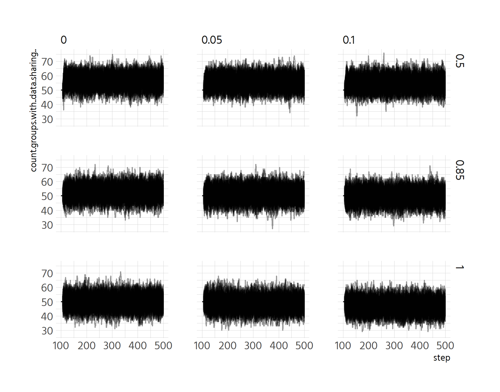<!-- -->


```r
df_clean %>% 
  filter(agent.orientation == "all-myopic") %>% 
  ggplot(aes(step, count.groups.with..data.sharing.., 
             colour = factor(rdm.cost))) +
  geom_smooth() +
  custom_scale +
  facet_wrap(vars(pubs.vs.data), nrow = 3) +
  theme(legend.position = "top") +
  labs(y = "% of groups currently sharing data",
       colour = "cost penalty for sharing data",
       x = "Time")
```

```
## `geom_smooth()` using method = 'gam' and formula 'y ~ s(x, bs = "cs")'
```

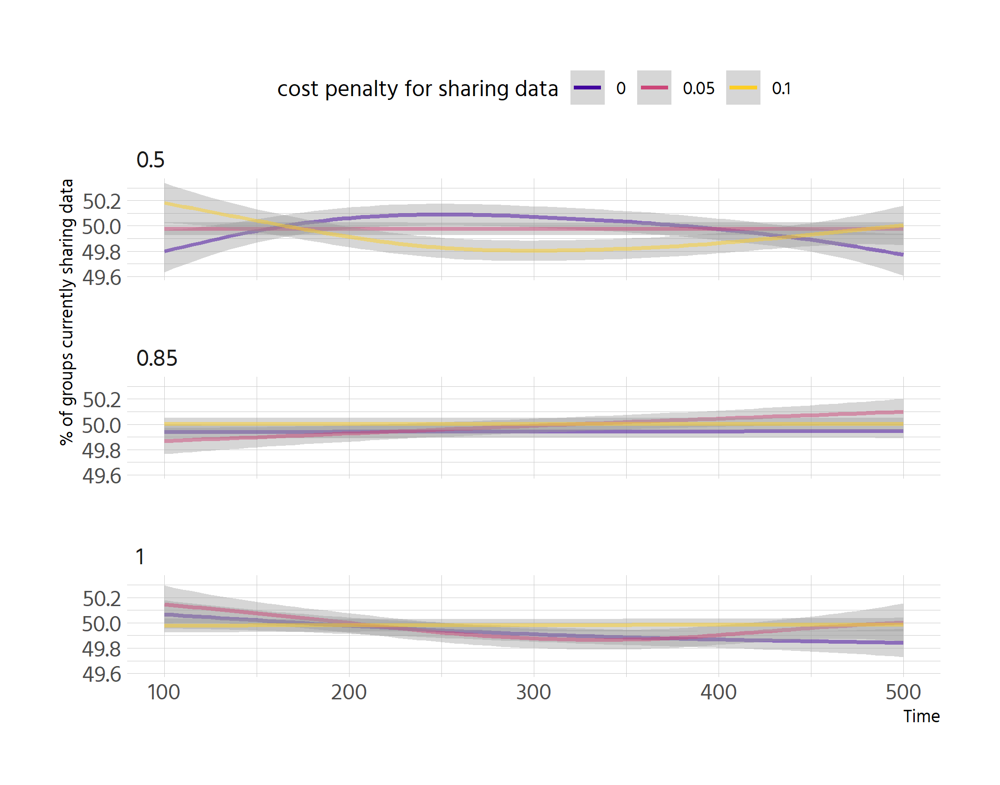<!-- -->


```r
df_clean %>% 
  filter(agent.orientation == "all-long-term") %>% 
  ggplot(aes(step, count.groups.with..data.sharing.., 
             colour = factor(rdm.cost))) +
  geom_smooth() +
  custom_scale +
  facet_wrap(vars(pubs.vs.data), nrow = 3) +
  theme(legend.position = "top") +
  labs(y = "% of groups currently sharing data",
       colour = "cost penalty for sharing data",
       x = "Time")
```

```
## `geom_smooth()` using method = 'gam' and formula 'y ~ s(x, bs = "cs")'
```

<!-- -->


```r
df_clean %>% 
  ggplot(aes(step, count.groups.with..data.sharing.., 
             colour = factor(agent.orientation))) +
  geom_smooth() +
  facet_grid(rows = vars(pubs.vs.data),
             cols = vars(rdm.cost)) +
  custom_scale +
  theme(legend.position = "top") +
  labs(y = "% of groups currently sharing data",
       colour = "Agent orientation",
       x = "Time")
```

```
## `geom_smooth()` using method = 'gam' and formula 'y ~ s(x, bs = "cs")'
```

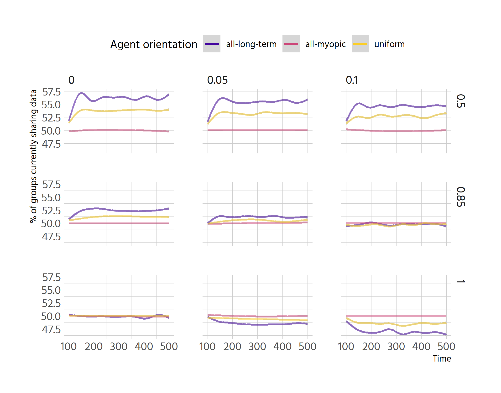<!-- -->

# Datasets shared

```r
df_clean %>% 
  filter(agent.orientation == "all-myopic") %>% 
  ggplot(aes(step, count.datasets, 
             colour = factor(rdm.cost))) +
  geom_smooth() +
  custom_scale +
  facet_wrap(vars(pubs.vs.data), nrow = 3) +
  theme(legend.position = "top") +
  labs(y = "# of available datasets",
       colour = "cost penalty for sharing data",
       x = "Time")
```

```
## `geom_smooth()` using method = 'gam' and formula 'y ~ s(x, bs = "cs")'
```

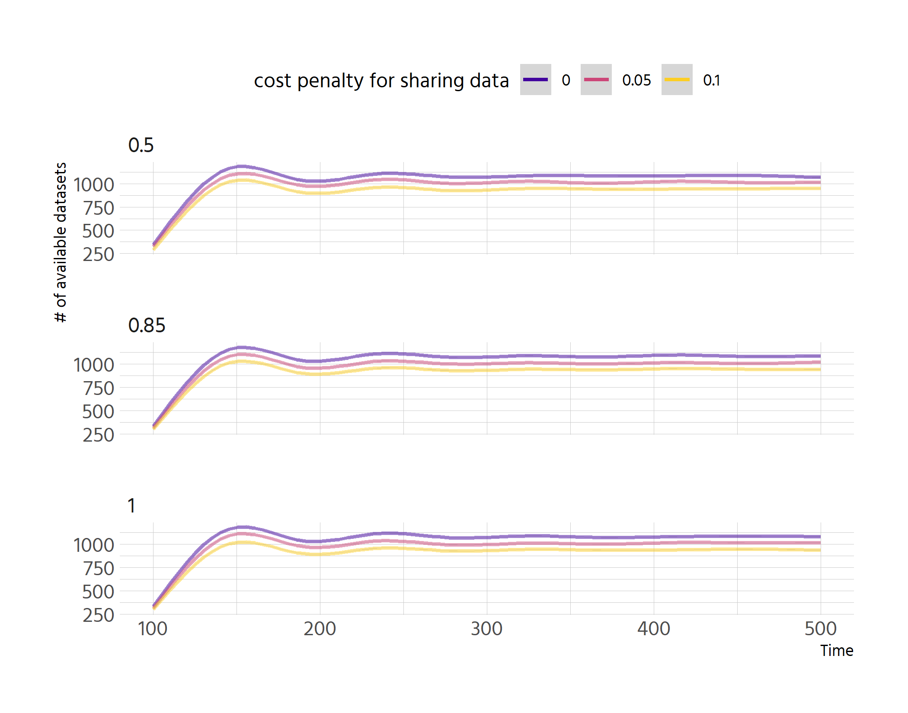<!-- -->

```r
df_clean %>% 
  filter(agent.orientation == "all-long-term") %>% 
  ggplot(aes(step, count.datasets, 
             colour = factor(rdm.cost))) +
  geom_smooth() +
  custom_scale +
  facet_wrap(vars(pubs.vs.data), nrow = 3) +
  theme(legend.position = "top") +
  labs(y = "# of available datasets",
       colour = "cost penalty for sharing data",
       x = "Time")
```

```
## `geom_smooth()` using method = 'gam' and formula 'y ~ s(x, bs = "cs")'
```

<!-- -->

```r
df_clean %>% 
  ggplot(aes(step, count.datasets, 
             colour = factor(agent.orientation))) +
  geom_smooth() +
  facet_grid(rows = vars(pubs.vs.data),
             cols = vars(rdm.cost)) +
  custom_scale +
  theme(legend.position = "top") +
  labs(y = "# of available datasets",
       colour = "Agent orientation",
       x = "Time")
```

```
## `geom_smooth()` using method = 'gam' and formula 'y ~ s(x, bs = "cs")'
```

<!-- -->


```r
df_clean %>% 
  filter(step == 500) %>% 
  clean_pub_weight() %>% 
  ggplot(aes(factor(rdm.cost), sum..total.datasets..of.groups)) +
  geom_boxplot(aes(fill = agent.orientation), notch = TRUE) +
  geom_jitter(aes(group = agent.orientation), alpha = .2, 
              position = position_dodge(width = .8)) +
  facet_wrap(vars(`Publication weight (vs. data)`), labeller = label_both) +
  scale_fill_viridis_d(begin = .1, end = .9, alpha = .5, option = "C") +
  scale_y_continuous(labels = scales::comma) +
  theme(legend.position = "top") +
  labs(y = "# of total datasets",
       x = "Cost factor of data sharing",
       colour = "Agent orientation")
```

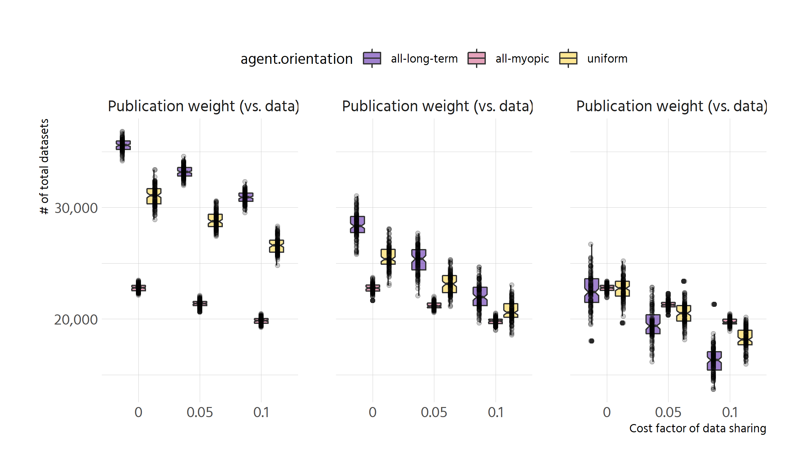<!-- -->

# Publications produced

```r
# the whole plot is not very interesting: there is simply different levels of
# publication under individual learning. state this in the text
df %>% 
  clean_pub_weight() %>% 
  ggplot(aes(.step., sum..n.pubs.this.round..of.groups,
             colour = factor(agent.orientation))) +
  geom_smooth() + # make two smooths, one at 0-100, one at 100-500
  facet_grid(rows = vars(pubs.vs.data),
             cols = vars(rdm.cost)) +
  custom_scale +
  theme(legend.position = "top") +
  labs(y = "# of publications per round",
       colour = "Agent orientation",
       x = "Time")
```

```
## `geom_smooth()` using method = 'gam' and formula 'y ~ s(x, bs = "cs")'
```

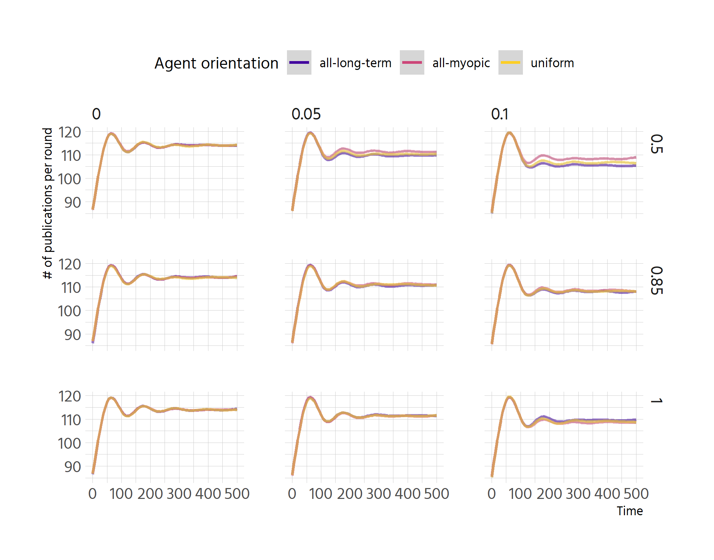<!-- -->


```r
df_clean %>% 
  filter(step == 500) %>% 
  clean_pub_weight() %>% 
  ggplot(aes(factor(rdm.cost), sum..total.primary.publications..of.groups)) +
  geom_boxplot(aes(fill = agent.orientation), notch = TRUE) +
  geom_jitter(aes(group = agent.orientation), alpha = .2, 
              position = position_dodge(width = .8)) +
  facet_wrap(vars(`Publication weight (vs. data)`), labeller = label_both) +
  scale_fill_viridis_d(begin = .1, end = .9, alpha = .5, option = "C") +
  scale_y_continuous(labels = scales::comma) +
  theme(legend.position = "top") +
  labs(y = "# of total publications",
       x = "Cost factor of data sharing",
       colour = "Agent orientation")
```

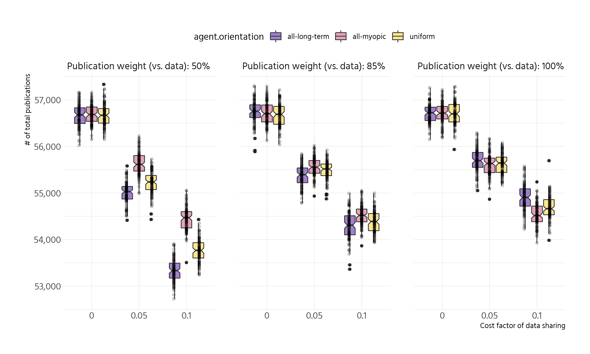<!-- -->

# Inequalities

```r
# here it would be nice to compare to the standard path derived from the baseline
pdata <- df_clean %>% 
  select(run, step, pubs.vs.data, agent.orientation, rdm.cost,
         contains("gini")) %>% 
  pivot_longer(contains("gini")) %>% 
  mutate(name = str_remove(name, "gini_") %>% str_to_title()) %>% 
  filter(!is.na(value))
```


```r
pdata %>% 
  filter(agent.orientation == "all-myopic") %>% 
  ggplot(aes(step, value, colour = factor(rdm.cost))) +
  geom_smooth() +
  facet_grid(cols = vars(name),
             rows = vars(factor(pubs.vs.data))) +
  scale_colour_viridis_d(option = "C", alpha = .5, begin = .1, end = .9) +
  labs(colour = "Cost factor of data sharing", y = "Gini index",
       x = "Time") +
  theme(legend.position = "top")
```

```
## `geom_smooth()` using method = 'gam' and formula 'y ~ s(x, bs = "cs")'
```

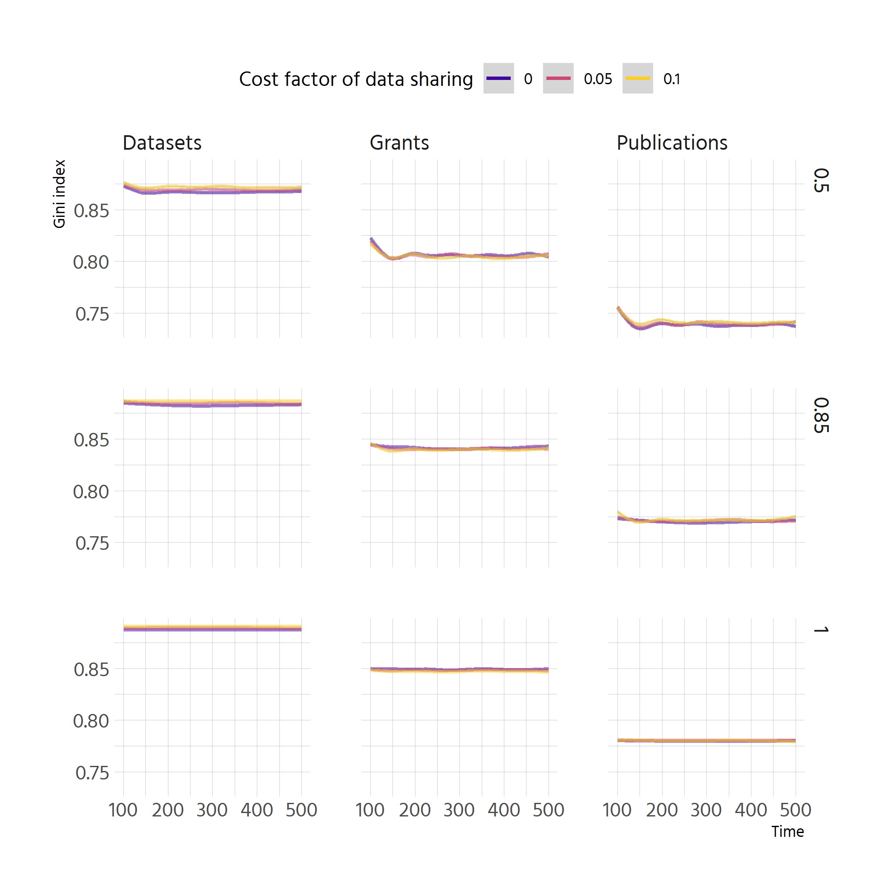<!-- -->


```r
pdata %>% 
  filter(agent.orientation == "all-long-term") %>% 
  ggplot(aes(step, value, colour = factor(rdm.cost))) +
  geom_smooth() +
  facet_grid(cols = vars(name),
             rows = vars(factor(pubs.vs.data))) +
  scale_colour_viridis_d(option = "C", alpha = .5, begin = .1, end = .9) +
  labs(colour = "Cost factor of data sharing", y = "Gini index",
       x = "Time") +
  theme(legend.position = "top")
```

```
## `geom_smooth()` using method = 'gam' and formula 'y ~ s(x, bs = "cs")'
```

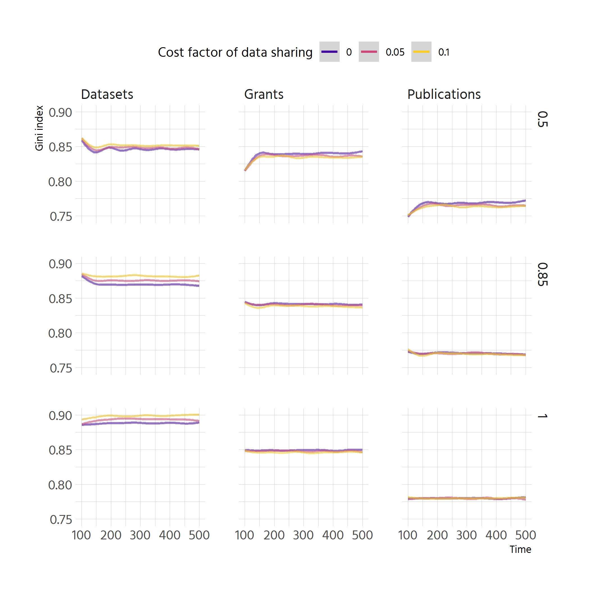<!-- -->

# Impact on individual groups
## Numbers of datasets


```r
df_data_means <- df_clean %>% 
  select(run, step, pubs.vs.data, agent.orientation, rdm.cost,
         starts_with("mean")) %>% 
  pivot_longer(contains("mean"),
               names_to = "quantile", names_pattern = "(q\\d)",
               values_to = "mean_datasets", 
               values_transform = list("mean_datasets" = as.numeric))  %>% 
  mutate(quantile = factor(quantile, levels = c("q1", "q2", "q3", "q4"),
                           labels = c("q[0-25]", "q(25-50]", "q(50-75]",
                                      "q(75-100]")))
```

```r
display_quantity <- function(df, quantity, orientation = "all-long-term") {
  df %>% 
    filter(agent.orientation == orientation) %>% 
    ggplot(aes(step, {{quantity}}, colour = quantile)) +
    geom_smooth() +
    facet_grid(rows = vars(pubs.vs.data),
               cols = vars(rdm.cost)) +
    custom_scale +
    theme(legend.position = "top") +
    labs(colour = "Quartile of publication distribution\n at step 100",
         x = "Time")
}
```


```r
df_data_means %>% 
  display_quantity(mean_datasets) +
  labs(y = "# of datasets")
```

```
## `geom_smooth()` using method = 'gam' and formula 'y ~ s(x, bs = "cs")'
```

<!-- -->


```r
df_data_means %>% 
  display_quantity(mean_datasets, "all-myopic") +
  labs(y = "# of datasets")
```

```
## `geom_smooth()` using method = 'gam' and formula 'y ~ s(x, bs = "cs")'
```

<!-- -->

## Number of sharers

```r
df_data_sharers <- df_clean %>% 
  select(run, step, pubs.vs.data, agent.orientation, rdm.cost,
         starts_with("data")) %>% 
  pivot_longer(starts_with("data"),
               names_to = "quantile", names_pattern = "(q\\..*?)\\.\\.\\.",
               values_to = "share_of_sharers", 
               values_transform = list("share_of_sharers" = as.numeric)) %>% 
  mutate(quantile = factor(
    quantile, 
    levels = c("q.0.25", "q.25.50", "q.50.75", "q.75.100"),
    labels = c("q[0-25]", "q(25-50]", "q(50-75]", "q(75-100]"
  )))
```


```r
df_data_sharers %>% 
  display_quantity(share_of_sharers) +
  labs(y = "% of groups currently sharing data")
```

```
## `geom_smooth()` using method = 'gam' and formula 'y ~ s(x, bs = "cs")'
```

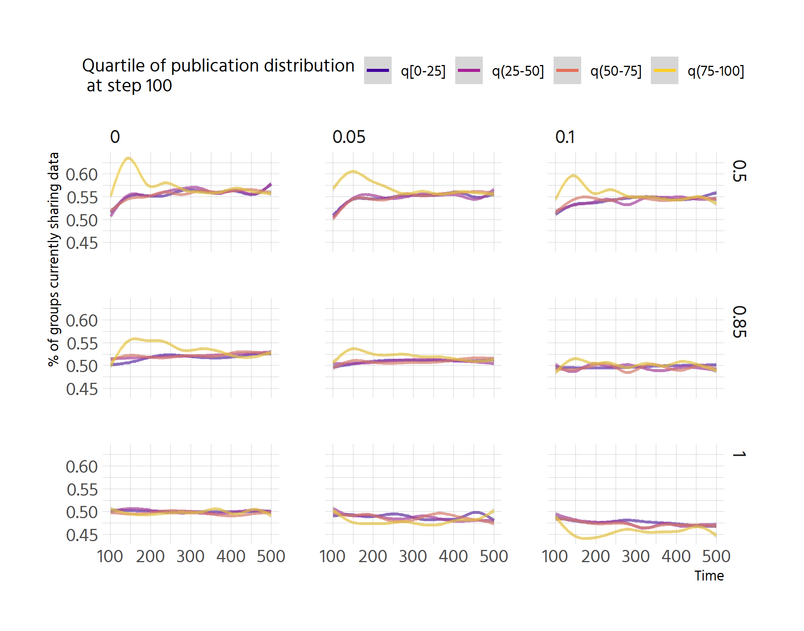<!-- -->


```r
df_data_sharers %>% 
  display_quantity(share_of_sharers, "all-myopic") +
  labs(y = "% of groups currently sharing data")
```

```
## `geom_smooth()` using method = 'gam' and formula 'y ~ s(x, bs = "cs")'
```

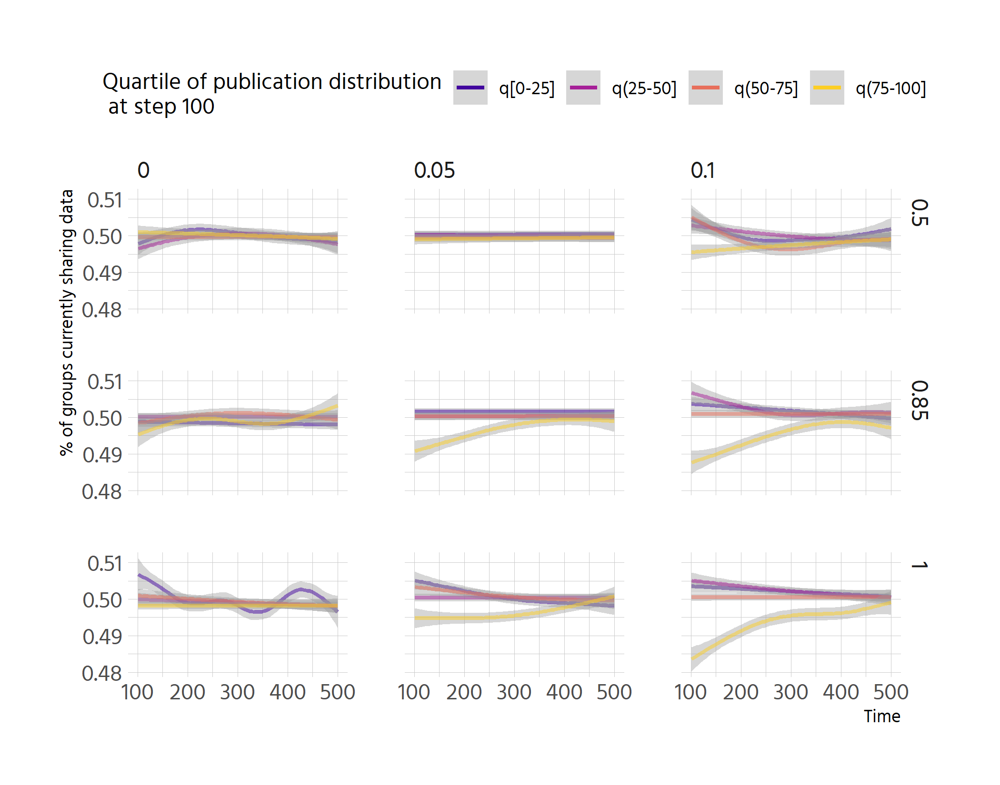<!-- -->

## Number of grants

```r
df_grants <- df_group_success %>% 
  pivot_longer(contains("mean"),
               names_to = "quantile", names_pattern = "(q\\d)",
               values_to = "mean_grants", 
               values_transform = list("mean_grants" = as.numeric)) %>% 
  mutate(quantile = factor(quantile, levels = c("q1", "q2", "q3", "q4"),
                           labels = c("q[0-25]", "q(25-50]", "q(50-75]",
                                      "q(75-100]")))
```


```r
pdata <- df_grants %>% 
  group_by(step, pubs.vs.data, rdm.cost, quantile) %>% 
  summarise(mean_grants = mean(mean_grants, na.rm = TRUE))
```

```
## `summarise()` has grouped output by 'step', 'pubs.vs.data', 'rdm.cost'. You can override using the `.groups` argument.
```

```r
pdata %>% 
  ggplot(aes(step, mean_grants, colour = factor(pubs.vs.data))) +
  geom_line(size = 1, alpha = .7) +
  facet_grid(rows = vars(quantile),
             cols = vars(rdm.cost)) +
  custom_scale +
  theme(legend.position = "top") +
  labs(x = "Time", colour = "Weight given to publications",
       y = "Average number of grants")
```

<!-- -->

