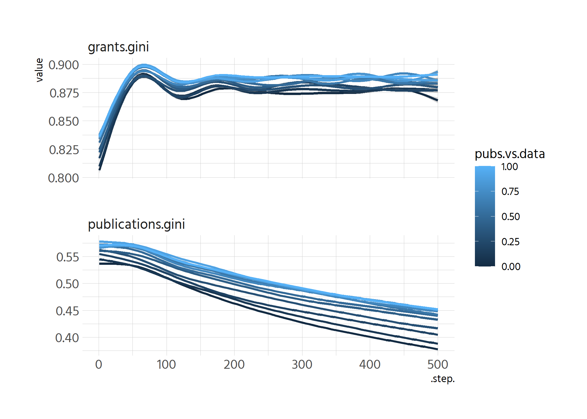
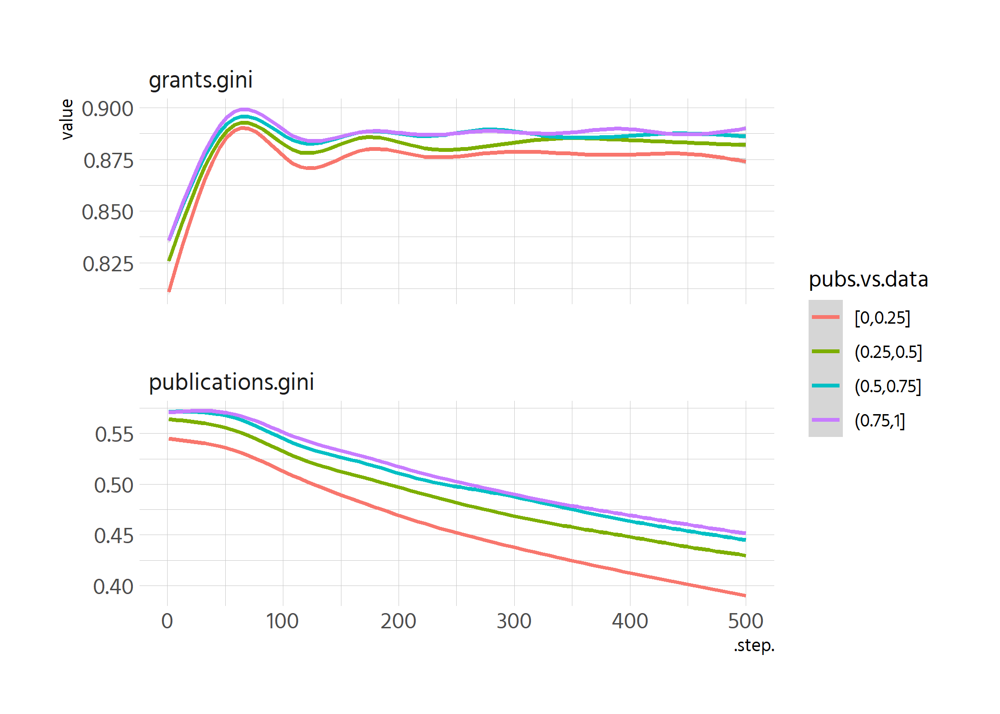
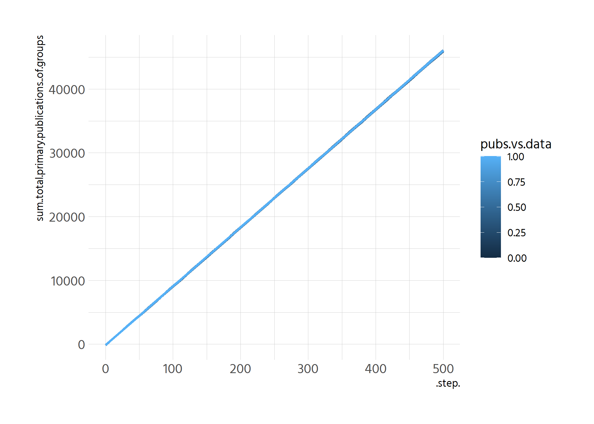
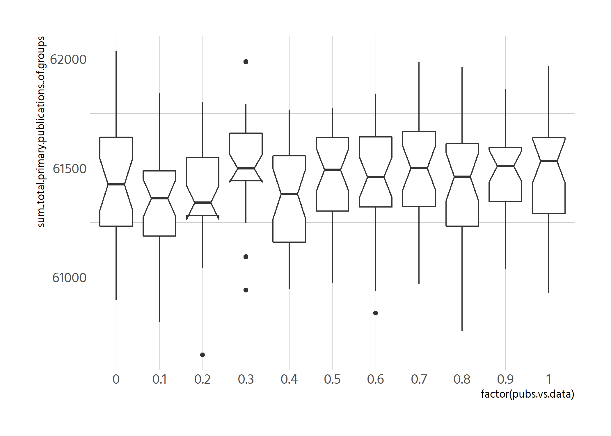
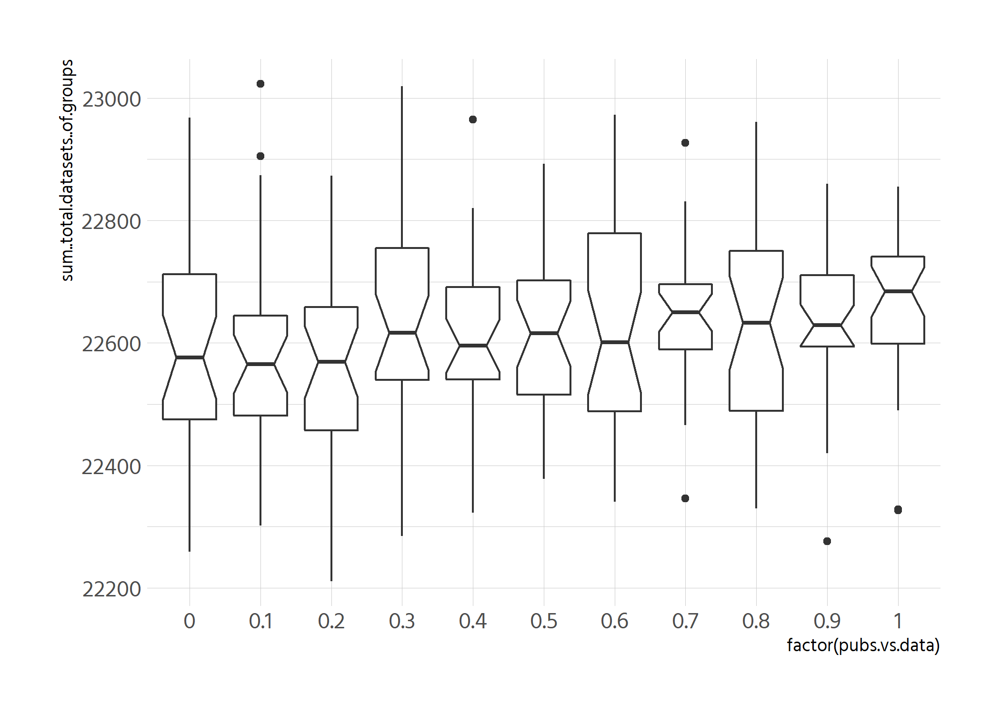

# Ginis

```r
df_clean %>% 
  pivot_longer(contains("gini")) %>% 
  ggplot(aes(.step., value, colour = pubs.vs.data, group = pubs.vs.data)) +
  geom_smooth() +
  facet_wrap(vars(name), nrow = 2, scales = "free_y")
```

```
## `geom_smooth()` using method = 'gam' and formula 'y ~ s(x, bs = "cs")'
```

<!-- -->


```r
df_clean %>% 
  filter(pubs.vs.data %in% c(0, .3, .5, .7, 1)) %>% 
  pivot_longer(contains("gini")) %>% 
  ggplot(aes(.step., value, colour = factor(pubs.vs.data),
             group = pubs.vs.data)) +
  geom_smooth() +
  facet_wrap(vars(name), nrow = 2, scales = "free_y")
```

```
## `geom_smooth()` using method = 'gam' and formula 'y ~ s(x, bs = "cs")'
```

<!-- -->


# Number of publications

```r
df_clean %>% 
  ggplot(aes(.step., sum..total.primary.publications..of.groups,
             colour = pubs.vs.data, group = pubs.vs.data)) +
  geom_smooth()
```

```
## `geom_smooth()` using method = 'gam' and formula 'y ~ s(x, bs = "cs")'
```

<!-- -->


```r
df_clean %>% 
  filter(.step. == 500) %>% 
  ggplot(aes(factor(pubs.vs.data), sum..total.primary.publications..of.groups)) +
  geom_boxplot(notch = TRUE)
```

```
## notch went outside hinges. Try setting notch=FALSE.
## notch went outside hinges. Try setting notch=FALSE.
```

<!-- -->


# Number of datasets

```r
df_clean %>% 
  filter(.step. == 500) %>% 
  ggplot(aes(factor(pubs.vs.data), sum..total.datasets..of.groups)) +
  geom_boxplot(notch = TRUE)
```

<!-- -->
