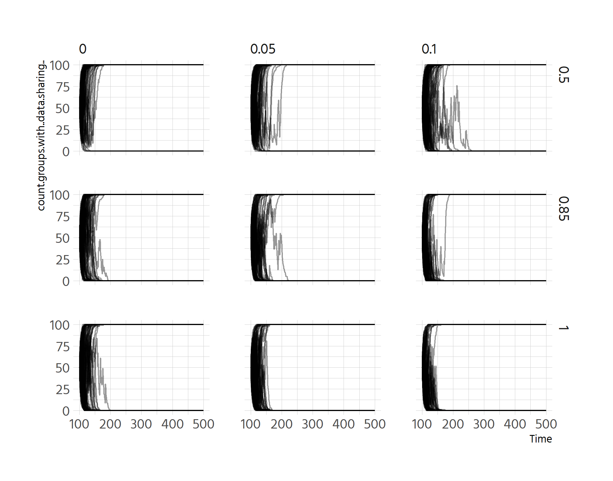
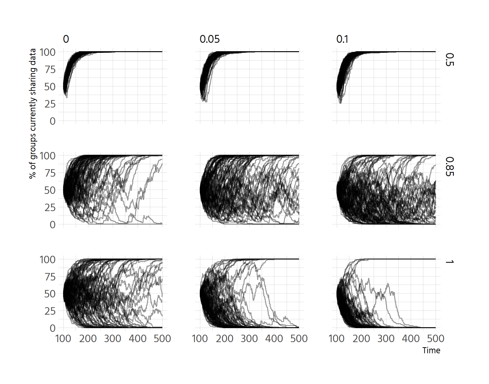
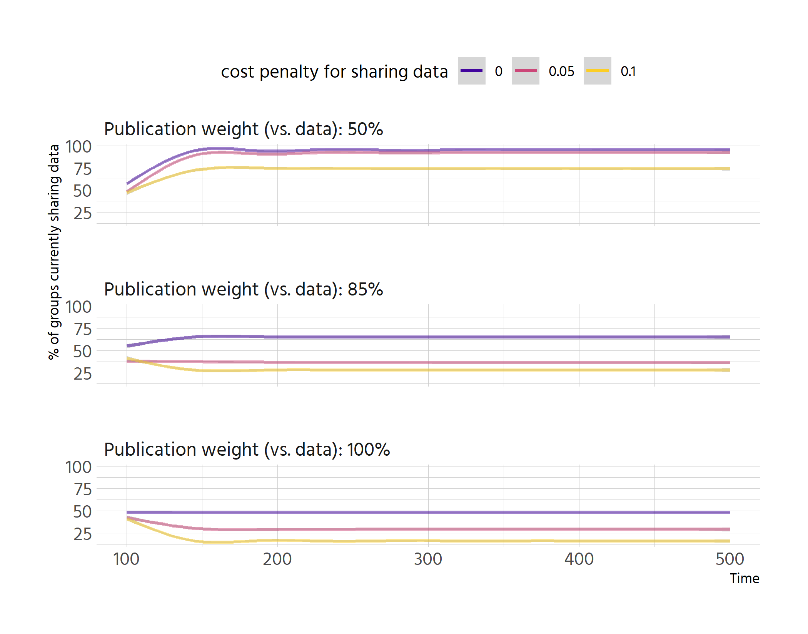
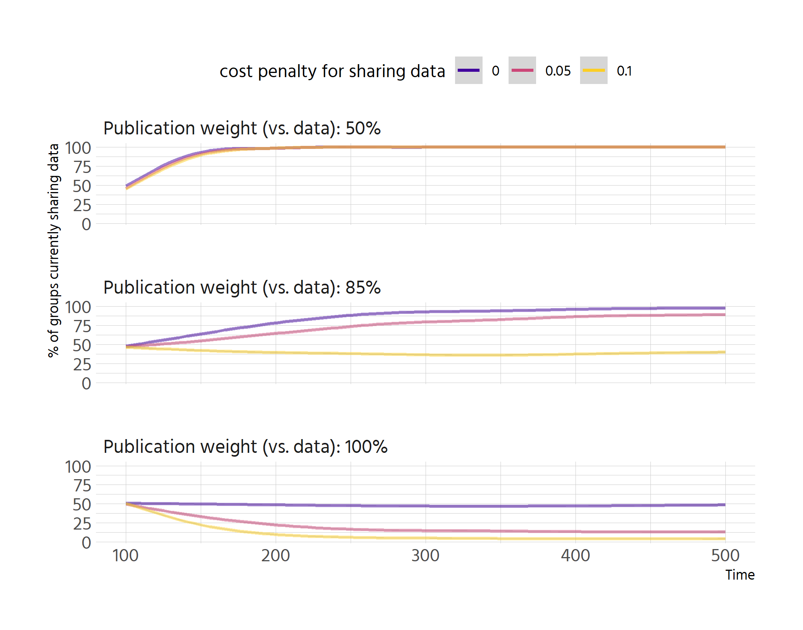
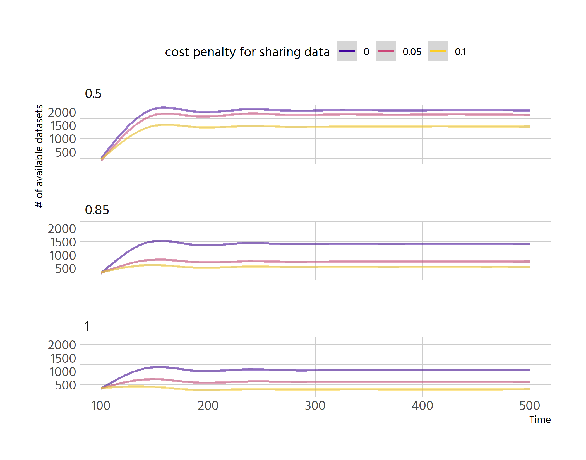
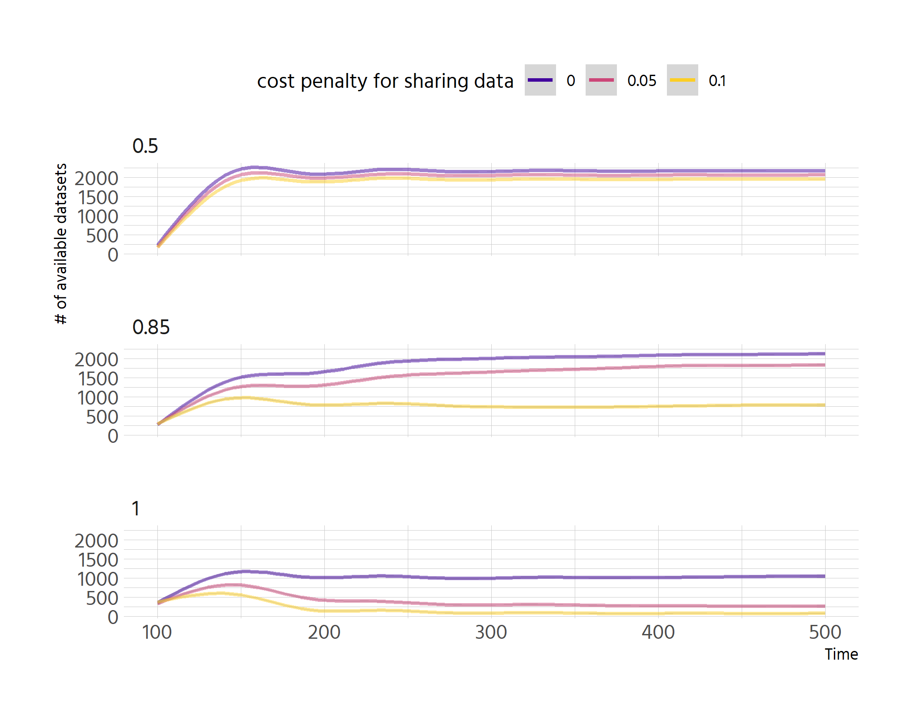
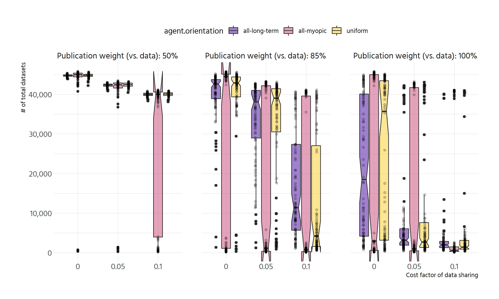
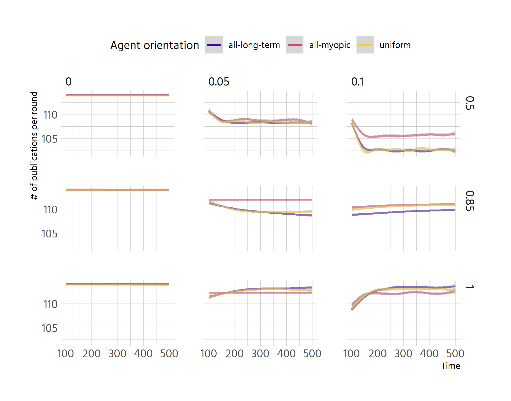
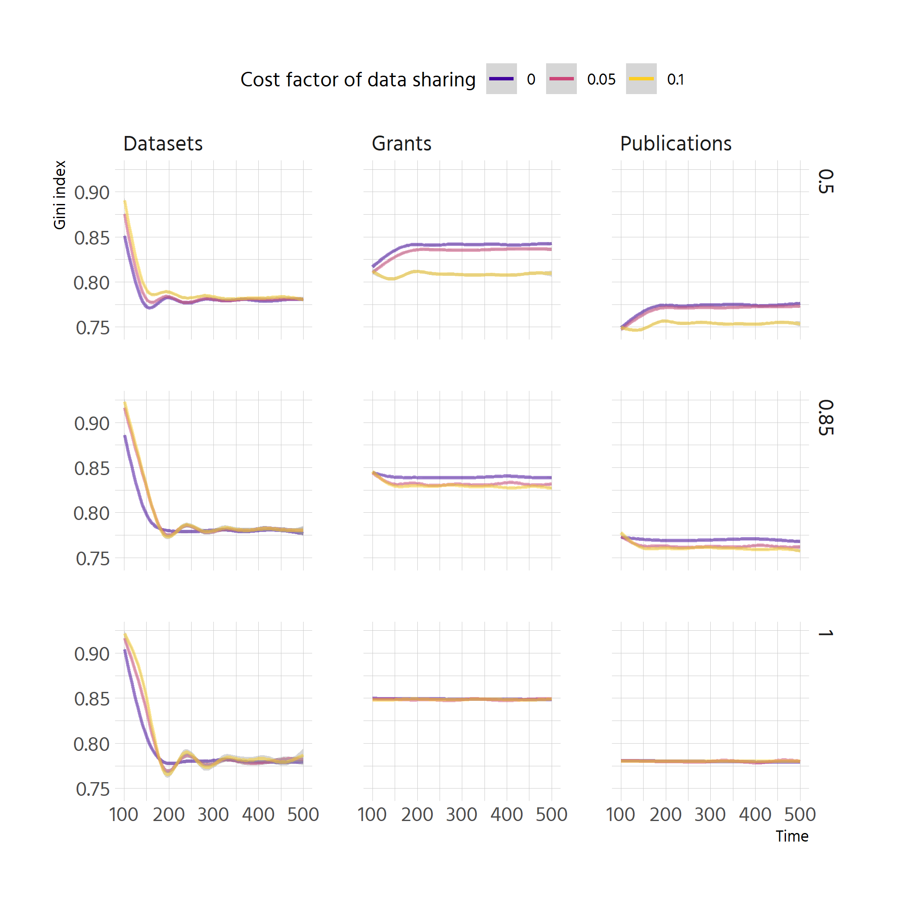
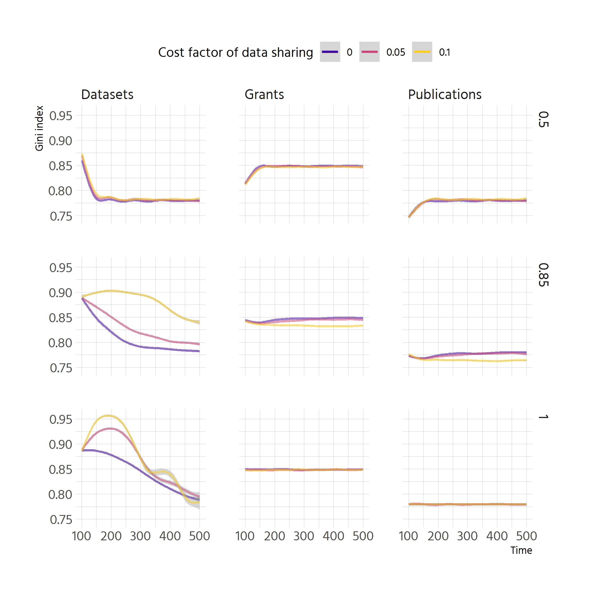

# Number of sharing agents

```r
df_clean %>% 
  filter(agent.orientation == "all-myopic") %>% 
  ggplot(aes(step, count.groups.with..data.sharing.., group = run)) +
  geom_line(alpha = .4) +
  facet_grid(rows = vars(pubs.vs.data),
             cols = vars(rdm.cost))
```

<!-- -->


```r
df_clean %>% 
  filter(agent.orientation == "all-long-term") %>% 
  ggplot(aes(step, count.groups.with..data.sharing.., group = run)) +
  geom_line(alpha = .4) +
  facet_grid(rows = vars(pubs.vs.data),
             cols = vars(rdm.cost))
```

<!-- -->


```r
df_clean %>% 
  filter(agent.orientation == "all-myopic") %>% 
  mutate(`Publication weight (vs. data)` = factor(
    pubs.vs.data, levels = c(.8, .9, 1), labels = scales::percent(c(.8, .9, 1)))
  ) %>% 
  ggplot(aes(step, count.groups.with..data.sharing.., 
             colour = factor(rdm.cost))) +
  geom_smooth() +
  custom_scale +
  facet_wrap(vars(`Publication weight (vs. data)`), labeller = label_both,
             nrow = 3) +
  theme(legend.position = "top") +
  labs(y = "% of groups currently sharing data",
       colour = "cost penalty for sharing data")
```

```
## `geom_smooth()` using method = 'gam' and formula 'y ~ s(x, bs = "cs")'
```

<!-- -->


```r
df_clean %>% 
  filter(agent.orientation == "all-long-term") %>% 
  mutate(`Publication weight (vs. data)` = factor(
    pubs.vs.data, levels = c(.8, .9, 1), labels = scales::percent(c(.8, .9, 1)))
  ) %>% 
  ggplot(aes(step, count.groups.with..data.sharing.., 
             colour = factor(rdm.cost))) +
  geom_smooth() +
  custom_scale +
  facet_wrap(vars(`Publication weight (vs. data)`), labeller = label_both,
             nrow = 3) +
  theme(legend.position = "top") +
  labs(y = "% of groups currently sharing data",
       colour = "cost penalty for sharing data")
```

```
## `geom_smooth()` using method = 'gam' and formula 'y ~ s(x, bs = "cs")'
```

<!-- -->


```r
df_clean %>% 
  ggplot(aes(step, count.groups.with..data.sharing.., 
             colour = factor(agent.orientation))) +
  geom_smooth() +
  facet_grid(rows = vars(pubs.vs.data),
             cols = vars(rdm.cost)) +
  custom_scale +
  theme(legend.position = "top") +
  labs(y = "% of groups currently sharing data",
       colour = "Agent orientation")
```

```
## `geom_smooth()` using method = 'gam' and formula 'y ~ s(x, bs = "cs")'
```

<!-- -->

# Datasets shared

```r
df_clean %>% 
  filter(agent.orientation == "all-myopic") %>% 
  ggplot(aes(step, count.datasets, 
             colour = factor(rdm.cost))) +
  geom_smooth() +
  custom_scale +
  facet_wrap(vars(pubs.vs.data), nrow = 3) +
  theme(legend.position = "top") +
  labs(y = "# of available datasets",
       colour = "cost penalty for sharing data")
```

```
## `geom_smooth()` using method = 'gam' and formula 'y ~ s(x, bs = "cs")'
```

<!-- -->

```r
df_clean %>% 
  filter(agent.orientation == "all-long-term") %>% 
  ggplot(aes(step, count.datasets, 
             colour = factor(rdm.cost))) +
  geom_smooth() +
  custom_scale +
  facet_wrap(vars(pubs.vs.data), nrow = 3) +
  theme(legend.position = "top") +
  labs(y = "# of available datasets",
       colour = "cost penalty for sharing data")
```

```
## `geom_smooth()` using method = 'gam' and formula 'y ~ s(x, bs = "cs")'
```

<!-- -->

```r
df_clean %>% 
  ggplot(aes(step, count.datasets, 
             colour = factor(agent.orientation))) +
  geom_smooth() +
  facet_grid(rows = vars(pubs.vs.data),
             cols = vars(rdm.cost)) +
  custom_scale +
  theme(legend.position = "top") +
  labs(y = "# of available datasets",
       colour = "Agent orientation")
```

```
## `geom_smooth()` using method = 'gam' and formula 'y ~ s(x, bs = "cs")'
```

<!-- -->


```r
df_clean %>% 
  filter(step == 500) %>% 
  mutate(`Publication weight (vs. data)` = factor(
    pubs.vs.data, levels = c(.8, .9, 1), labels = scales::percent(c(.8, .9, 1)))
  ) %>% 
  ggplot(aes(factor(rdm.cost), sum..total.datasets..of.groups)) +
  geom_boxplot(aes(fill = agent.orientation), notch = TRUE) +
  geom_jitter(aes(group = agent.orientation), alpha = .2, 
              position = position_dodge(width = .8)) +
  facet_wrap(vars(`Publication weight (vs. data)`), labeller = label_both) +
  scale_fill_viridis_d(begin = .1, end = .9, alpha = .5, option = "C") +
  scale_y_continuous(labels = scales::comma) +
  theme(legend.position = "top") +
  labs(y = "# of total datasets",
       x = "Cost factor of data sharing",
       colour = "Agent orientation")
```

```
## notch went outside hinges. Try setting notch=FALSE.
## notch went outside hinges. Try setting notch=FALSE.
## notch went outside hinges. Try setting notch=FALSE.
## notch went outside hinges. Try setting notch=FALSE.
## notch went outside hinges. Try setting notch=FALSE.
## notch went outside hinges. Try setting notch=FALSE.
## notch went outside hinges. Try setting notch=FALSE.
## notch went outside hinges. Try setting notch=FALSE.
## notch went outside hinges. Try setting notch=FALSE.
## notch went outside hinges. Try setting notch=FALSE.
## notch went outside hinges. Try setting notch=FALSE.
## notch went outside hinges. Try setting notch=FALSE.
## notch went outside hinges. Try setting notch=FALSE.
## notch went outside hinges. Try setting notch=FALSE.
## notch went outside hinges. Try setting notch=FALSE.
```

<!-- -->

# Publications produced

```r
df_clean %>% 
  mutate(pubs_rel = sum..total.primary.publications..of.groups / step) %>% 
  ggplot(aes(step, pubs_rel, 
             colour = factor(agent.orientation))) +
  geom_smooth() +
  facet_grid(rows = vars(pubs.vs.data),
             cols = vars(rdm.cost)) +
  custom_scale +
  theme(legend.position = "top") +
  labs(y = "Total number of publications (divided by step)",
       colour = "Agent orientation")
```

```
## `geom_smooth()` using method = 'gam' and formula 'y ~ s(x, bs = "cs")'
```

<!-- -->


```r
df_clean %>% 
  filter(step == 500) %>% 
    mutate(`Publication weight (vs. data)` = factor(
    pubs.vs.data, levels = c(.8, .9, 1), labels = scales::percent(c(.8, .9, 1)))
  ) %>% 
  ggplot(aes(factor(rdm.cost), sum..total.primary.publications..of.groups)) +
  geom_boxplot(aes(fill = agent.orientation), notch = TRUE) +
  geom_jitter(aes(group = agent.orientation), alpha = .2, 
              position = position_dodge(width = .8)) +
  facet_wrap(vars(`Publication weight (vs. data)`), labeller = label_both) +
  scale_fill_viridis_d(begin = .1, end = .9, alpha = .5, option = "C") +
  scale_y_continuous(labels = scales::comma) +
  theme(legend.position = "top") +
  labs(y = "# of total publications",
       x = "Cost factor of data sharing",
       colour = "Agent orientation")
```

```
## notch went outside hinges. Try setting notch=FALSE.
## notch went outside hinges. Try setting notch=FALSE.
## notch went outside hinges. Try setting notch=FALSE.
## notch went outside hinges. Try setting notch=FALSE.
## notch went outside hinges. Try setting notch=FALSE.
## notch went outside hinges. Try setting notch=FALSE.
## notch went outside hinges. Try setting notch=FALSE.
## notch went outside hinges. Try setting notch=FALSE.
```

<!-- -->

# Inequalities

```r
# here it would be nice to compare to the standard path derived from the baseline
pdata <- df_clean %>% 
  select(run, step, pubs.vs.data, agent.orientation, rdm.cost,
         contains("gini")) %>% 
  pivot_longer(contains("gini")) %>% 
  mutate(name = str_remove(name, "gini_") %>% str_to_title()) %>% 
  filter(!is.na(value))
```


```r
pdata %>% 
  filter(agent.orientation == "all-myopic") %>% 
  ggplot(aes(step, value, colour = factor(rdm.cost))) +
  geom_smooth() +
  facet_grid(cols = vars(name),
             rows = vars(factor(pubs.vs.data))) +
  scale_colour_viridis_d(option = "C", alpha = .5, begin = .1, end = .9) +
  labs(colour = "Cost factor of data sharing", y = "Gini index") +
  theme(legend.position = "top")
```

```
## `geom_smooth()` using method = 'gam' and formula 'y ~ s(x, bs = "cs")'
```

<!-- -->


```r
pdata %>% 
  filter(agent.orientation == "all-long-term") %>% 
  ggplot(aes(step, value, colour = factor(rdm.cost))) +
  geom_smooth() +
  facet_grid(cols = vars(name),
             rows = vars(factor(pubs.vs.data))) +
  scale_colour_viridis_d(option = "C", alpha = .5, begin = .1, end = .9) +
  labs(colour = "Cost factor of data sharing", y = "Gini index") +
  theme(legend.position = "top")
```

```
## `geom_smooth()` using method = 'gam' and formula 'y ~ s(x, bs = "cs")'
```

<!-- -->
