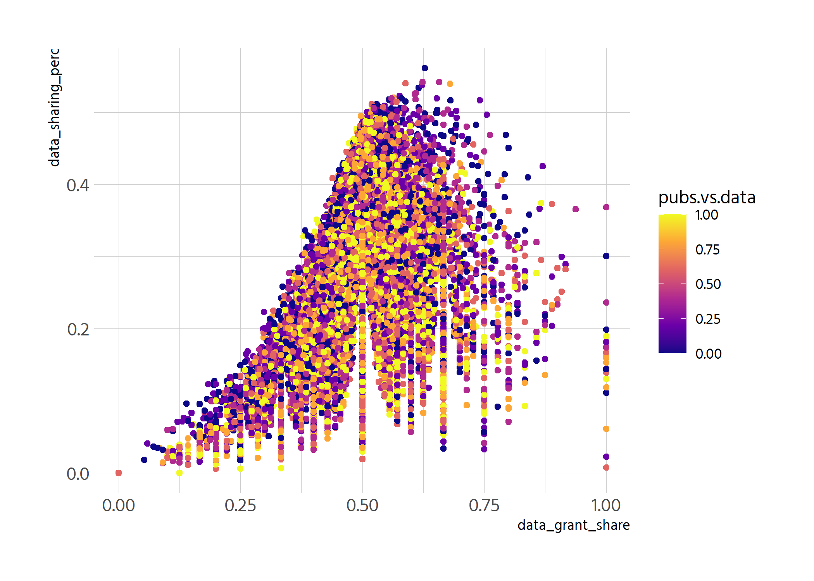
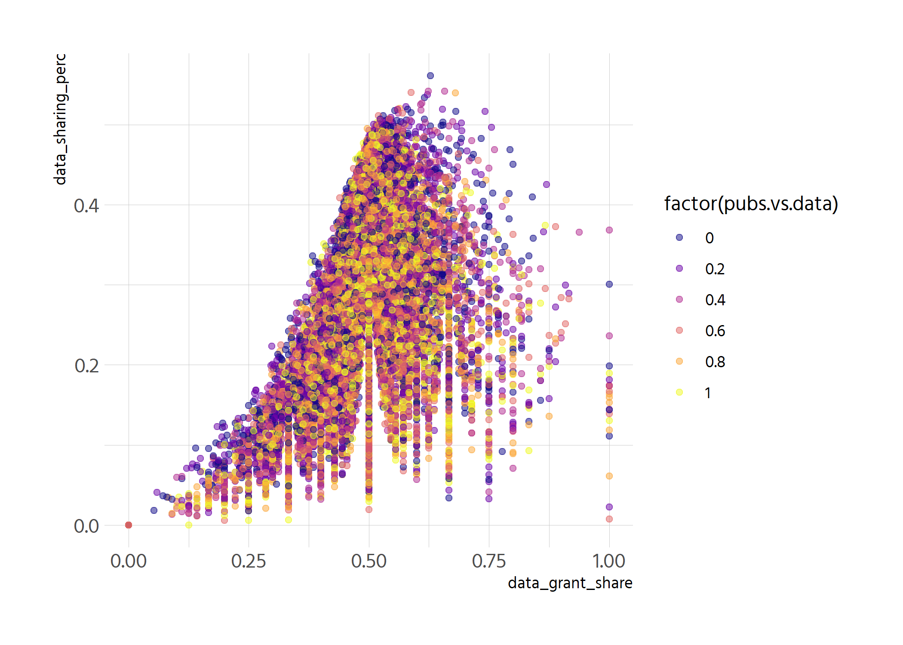
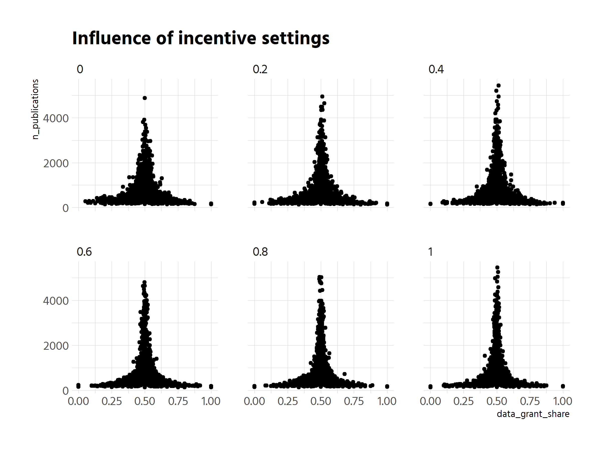
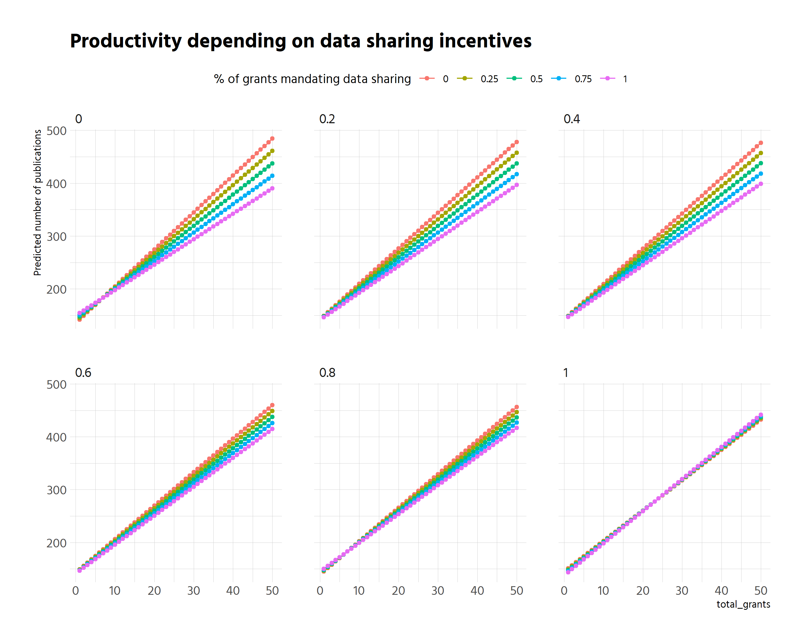

```r
df_clean %>% 
  ggplot(aes(data_grant_share, data_sharing_perc, colour = pubs.vs.data)) +
  geom_point(size = 1.5) +
  scale_colour_viridis_c(option = "C")
```

<!-- -->

```r
# why does the right side not go up higher? is this the base funding that 
# stays stronger for those with not many grants?
```


```r
p <- df_clean %>% 
  mutate(stats = paste("pubs:", n_publications, "grants:", total_grants)) %>%
  ggplot(aes(data_grant_share, data_sharing_perc, colour = factor(pubs.vs.data),
             label = stats)) +
  geom_point(alpha = .5) +
  scale_colour_viridis_d(option = "C") 
p
```

<!-- -->


```r
plotly::ggplotly(p)
```

```{=html}
<div id="htmlwidget-2c2d34e122ce6b54daaa" style="width:840px;height:600px;" class="plotly html-widget"></div>
<script type="application/json" data-for="htmlwidget-2c2d34e122ce6b54daaa">{"x":{"data":[{"x":[0.733333333333333,0.307692307692308,0.25,0.5,0.225806451612903,0.555555555555556,0.5,0.8,0.627906976744186,0.285714285714286,0.518703241895262,0.431372549019608,0.493333333333333,0.365384615384615,0.445859872611465,0.558823529411765,0.266666666666667,0.35,0.507246376811594,0.3125,0.492957746478873,0.363636363636364,0.425925925925926,0.625,0.68,0.757575757575758,0.625,0.404255319148936,0.421052631578947,0.5625,0.263157894736842,0.217391304347826,0.310344827586207,0.493506493506494,0.448717948717949,0.421052631578947,0.6,0.571428571428571,0.428571428571429,0.625,0.565217391304348,0.6,0.506172839506173,0.382978723404255,0.492700729927007,0.44,0.476190476190476,0.575757575757576,0.444444444444444,0.196428571428571,0.680851063829787,0.794117647058823,0.515151515151515,0.605633802816901,0.54320987654321,0.486215538847118,0.636363636363636,0.571428571428571,0.481481481481481,0.495633187772926,0.503378378378378,0.547008547008547,0.563291139240506,0.46875,0.448979591836735,0.547368421052632,0.51063829787234,0.563380281690141,0.512455516014235,0.581818181818182,0.269230769230769,0.329268292682927,0.428571428571429,0.392857142857143,0.375,0.485714285714286,0.642857142857143,0.5,0.512820512820513,0.416666666666667,0.604651162790698,0.6,0.631578947368421,0.622222222222222,0.541666666666667,0.451388888888889,0.495652173913044,0.32,0.363636363636364,0.474048442906574,0.346153846153846,0.561085972850679,0.533333333333333,0.484848484848485,0.54320987654321,0.508064516129032,0.421052631578947,0.65,0.333333333333333,0.555555555555556,0.625,0.538235294117647,0.454545454545455,0.48,0.4,0.75,0.478260869565217,0.344262295081967,0.238095238095238,0.512987012987013,0.472222222222222,0.333333333333333,0.473118279569892,0.727272727272727,0.8,0.686274509803922,0.428571428571429,1,0.458333333333333,0.30188679245283,0.294117647058824,0.666666666666667,0.591836734693878,0.615894039735099,0.4858934169279,0.503289473684211,0.45,0.466386554621849,0.649350649350649,0.4375,0.52,0.431818181818182,0.44,0.456140350877193,0.485714285714286,0.125,0.363636363636364,0.454545454545455,0.72,0.818181818181818,0.391304347826087,0.478260869565217,0.75,0.5,0.507042253521127,0.449275362318841,0.603448275862069,0.529411764705882,0.47887323943662,0.5,0.533742331288344,0.613636363636364,0.536842105263158,0.717391304347826,0.428571428571429,0.75,0.5,0.501831501831502,0.454545454545455,0.633333333333333,0.75,0.647058823529412,0.724137931034483,0.529411764705882,0.714285714285714,0.537634408602151,0.533333333333333,0.625,0.447761194029851,0.428571428571429,0.402298850574713,0.315789473684211,0.48014440433213,0.421052631578947,0.491467576791809,0.545454545454545,0.51219512195122,0.666666666666667,0.547619047619048,0.562962962962963,0.352941176470588,0.25,0.5,0.473684210526316,0.48728813559322,0.375,0.461538461538462,0.2,0.495412844036697,0.5,0.449612403100775,0.25,0.63768115942029,0.477031802120141,0.666666666666667,0.578125,0.529761904761905,0.451612903225806,0.445945945945946,0.473029045643154,0.574074074074074,0.625,0.597014925373134,0.497237569060773,0.266666666666667,0.525,0.628140703517588,0.5625,0.310344827586207,0.4,0.452631578947368,0.526315789473684,0.4,0.7,0.25,0.521739130434783,0.7,0.375,0.357142857142857,0.571428571428571,0.470588235294118,0.419354838709677,0.571428571428571,0.462686567164179,0.470588235294118,0.6,0.540540540540541,0.428571428571429,0.518518518518518,0.476190476190476,0.636363636363636,0.540816326530612,0.466666666666667,0.433333333333333,0.455497382198953,0.333333333333333,0.294117647058824,0.431034482758621,0.46530612244898,0.8,0.67741935483871,0.166666666666667,0.512,0.3125,0.5,0.441666666666667,0.394736842105263,0.611111111111111,0.54020618556701,0.6,0.535947712418301,0.705882352941177,0.516129032258065,0.608695652173913,0.365384615384615,0.609756097560976,0.434782608695652,0.444444444444444,0.566037735849057,0.53448275862069,0.428571428571429,0.6,0.458333333333333,0.545454545454545,0.526315789473684,0.225,0.46875,0.390243902439024,0.636363636363636,0.480519480519481,0.517985611510791,0.574712643678161,0.465116279069767,0.733333333333333,0.44,0.517482517482518,0.303030303030303,0.458333333333333,0.486033519553073,0.428571428571429,0.489626556016597,0.588235294117647,0.481012658227848,0.5,0.54,0.411347517730496,0.542857142857143,0.666666666666667,0.581395348837209,0.488372093023256,0.571428571428571,0.49645390070922,0.509316770186335,0.35,0.514563106796116,0.494199535962877,0.480392156862745,0.518518518518518,0.338028169014085,0.304347826086957,0.642857142857143,0.604651162790698,0.478260869565217,0.416666666666667,0.51063829787234,0.482412060301508,0.52212389380531,0.13953488372093,0.566666666666667,0.48,0.411167512690355,0.511627906976744,0.5,0.464912280701754,0.488235294117647,0.346153846153846,0.508196721311475,0.521739130434783,0.525714285714286,0.566265060240964,0.55,0.384615384615385,0.484848484848485,0.5,0.4875,0.6,0.409836065573771,0.535928143712575,0.606060606060606,0.476190476190476,0.487179487179487,0.511627906976744,0.428571428571429,0.466666666666667,0.569105691056911,0.6,0.448275862068966,0.588235294117647,0.2,0.333333333333333,0.524038461538462,0.564516129032258,0.444444444444444,0.548148148148148,0.423076923076923,0.304347826086957,0.426966292134831,0.625,0.611111111111111,0.5,0.513513513513513,0.530172413793103,0.653846153846154,0.463414634146341,0.692307692307692,0.5,0.466666666666667,0.595238095238095,0.314814814814815,0.48,0.32,0.50259067357513,0.545454545454545,0.833333333333333,0.235294117647059,0.53781512605042,0.463768115942029,0.546153846153846,0.425925925925926,0.5,0.587628865979381,0.496153846153846,0.522727272727273,0.448979591836735,0.454545454545455,0.625,0.558823529411765,0.615384615384615,0.481308411214953,0.5,0.555555555555556,0.486033519553073,0.395604395604396,0.481012658227848,0.428571428571429,0.631578947368421,0.5,0.6,0.495391705069124,0.416666666666667,0.458333333333333,0.75,0.458333333333333,0.446808510638298,0.333333333333333,0.471428571428571,0.560975609756098,0.517509727626459,0.5,0.59375,0.481781376518219,0.533333333333333,0.553571428571429,0.521978021978022,0.530172413793103,0.541666666666667,0.457142857142857,0.5,0.513513513513513,0.489690721649485,0.498737373737374,0.438271604938272,0.543650793650794,0.5,0.545454545454545,0.48469387755102,0.609756097560976,0.488372093023256,0.321428571428571,0.463414634146341,0.576923076923077,0.527777777777778,0.4,0.474358974358974,0.492537313432836,0.428571428571429,0.4,0.363636363636364,0.5,0.357142857142857,0.3125,0.525252525252525,0.65625,0.235294117647059,0.506666666666667,0.555555555555556,0.473684210526316,0.428571428571429,0.475,0.580882352941177,0.571428571428571,0.530769230769231,0.526315789473684,0.421052631578947,0.540983606557377,0.578231292517007,0.266666666666667,0.608695652173913,0.666666666666667,0.25,0.460526315789474,0.646153846153846,0.525641025641026,0.352941176470588,0.5,0.545454545454545,0.49618320610687,0.442307692307692,0.382978723404255,0.523206751054852,0.555555555555556,0.537313432835821,0.433333333333333,0.4,0.323529411764706,0.318181818181818,0.264705882352941,0.256410256410256,0.578947368421053,0.264705882352941,0.458646616541353,0.45,0.48993288590604,0.514792899408284,0.555555555555556,0.419354838709677,0.504854368932039,0.181818181818182,0.5,0.5,0.411764705882353,0.625,0.585365853658537,0.6,0.64,0.533333333333333,0.503875968992248,0.315789473684211,0.55,0.434782608695652,0.481481481481481,0.416666666666667,0.540540540540541,0.666666666666667,0.545454545454545,0.681818181818182,0.555555555555556,0.526970954356846,0.166666666666667,0.384615384615385,0.594594594594595,0.272727272727273,0.382978723404255,0.5,0.538461538461538,0.563380281690141,0.382352941176471,0.54071661237785,0.5,0.454545454545455,0.423076923076923,0.513888888888889,0.230769230769231,0.498381877022654,0.482954545454545,0.504854368932039,0.769230769230769,0.47752808988764,0.45,0.482758620689655,0.466666666666667,0.5,0.692307692307692,0.510121457489879,0.515151515151515,0.494623655913978,0.333333333333333,0.522727272727273,0.563291139240506,0.583333333333333,0.440677966101695,0.227272727272727,0.4,0.528301886792453,0.554123711340206,0.396551724137931,0.545454545454545,0.625,0.666666666666667,0.428571428571429,0.333333333333333,0.476584022038567,0.372093023255814,0.656716417910448,0.380952380952381,0.75,0.506024096385542,0.477272727272727,0.392857142857143,0.604166666666667,0.7,0.463302752293578,0.691176470588235,0.38265306122449,0.529411764705882,0.52020202020202,0.509433962264151,0.461538461538462,0.461538461538462,0.436363636363636,0.450704225352113,0.48,0.557692307692308,0.75,0.647058823529412,0.596899224806202,0.333333333333333,0.508771929824561,0.464285714285714,0.5,0.495145631067961,0.432432432432432,0.333333333333333,0.508196721311475,0.818181818181818,0.592592592592593,0.382978723404255,0.391304347826087,0.84,0.356164383561644,0.51984126984127,0.857142857142857,0.272727272727273,0.339622641509434,0.615384615384615,0.421052631578947,0.454545454545455,0.470588235294118,0.617647058823529,0.524886877828054,0.494949494949495,0.702702702702703,0.5,0.5,0.307692307692308,0.608695652173913,0.436548223350254,0.533333333333333,0.466666666666667,0.483870967741935,0.494444444444444,0.488372093023256,0.653846153846154,0.540983606557377,0.555555555555556,0.464912280701754,0.382352941176471,0.467889908256881,0.473684210526316,0.450980392156863,0.60655737704918,0.526315789473684,0.484536082474227,0.485436893203884,0.545454545454545,0.642857142857143,0.513725490196078,0.448979591836735,0.488505747126437,0.366666666666667,0.507246376811594,0.234042553191489,0.53125,0.483870967741935,0.538461538461538,0.833333333333333,0.515320334261838,0.357142857142857,0.554794520547945,0.666666666666667,0.485714285714286,0.722222222222222,0.411764705882353,0.3125,0.380952380952381,0.6875,0.466216216216216,0.514018691588785,0.523809523809524,0.560975609756098,0.441176470588235,0.596153846153846,0.5,0.534246575342466,0.543103448275862,0.607142857142857,0.673469387755102,0.435483870967742,0.540880503144654,0.166666666666667,0.405660377358491,0.491379310344828,0.503703703703704,0.505376344086022,0.606060606060606,0.6,0.510526315789474,0.307692307692308,0.377358490566038,0.498480243161094,0.470588235294118,0.462962962962963,0.363636363636364,0.382978723404255,0.657142857142857,0.527777777777778,0.428571428571429,0.427184466019417,0.538461538461538,0.647058823529412,0.507246376811594,0.489690721649485,0.36,0.5,0.525139664804469,0.625,0.689655172413793,0.384615384615385,0.458333333333333,0.657894736842105,0.514018691588785,0.5,0.459459459459459,0.648148148148148,0.545454545454545,0.382352941176471,0.291666666666667,0.491525423728814,0.511326860841424,0.75,0.7,0.496124031007752,0.526315789473684,0.238095238095238,0.6,0.307692307692308,0.393939393939394,0.266666666666667,0.465648854961832,0.551724137931034,0.476363636363636,0.536036036036036,0.636363636363636,0.588235294117647,0.166666666666667,0.523002421307506,0.666666666666667,0.519230769230769,0.451612903225806,0.440944881889764,0.497674418604651,0.512345679012346,0.486486486486487,0.463087248322148,0.75,0.363636363636364,0.739130434782609,0.458333333333333,0.470588235294118,0.352941176470588,0.420689655172414,0.625,0.4,0.522167487684729,0.543624161073825,0.444444444444444,0.461538461538462,0.292682926829268,0.510204081632653,0.357142857142857,0.277777777777778,0.496894409937888,0.578947368421053,0.529411764705882,0.450643776824034,0.611111111111111,0.5,0.492957746478873,0.411764705882353,0.208333333333333,0.4,0.5,0.52,0.62962962962963,0.486486486486487,0.54639175257732,0.60377358490566,0.485254691689008,0.607142857142857,0.428571428571429,0.66,0.357142857142857,0.54320987654321,0.5,0.5,0.592592592592593,0.666666666666667,0.544117647058823,0.368421052631579,0.648148148148148,0.512048192771084,0.476190476190476,0.375,0.461538461538462,0.304347826086957,0.583333333333333,0.533333333333333,0.523809523809524,0.492857142857143,0.464788732394366,0.467836257309941,0.6875,0.5,0.444444444444444,0.409090909090909,0.4,0.529411764705882,0.468354430379747,0.517241379310345,0.466666666666667,0.352941176470588,0.456521739130435,0.666666666666667,0.620689655172414,0.3,0.501234567901235,0.615384615384615,0.5,0.5625,0.769230769230769,0.659574468085106,0.517241379310345,0.166666666666667,0.375,0.538461538461538,0.474747474747475,0.458333333333333,0.477777777777778,0.511450381679389,0.435897435897436,0.495,0.409090909090909,0.449275362318841,0.475862068965517,0.512396694214876,0.428571428571429,0.549019607843137,0.470833333333333,0.454545454545455,0.425531914893617,0.588235294117647,0.476190476190476,0.347826086956522,0.434782608695652,0.63265306122449,0.553398058252427,0.641025641025641,0.538071065989848,0.402777777777778,0.526315789473684,0.434782608695652,0.392857142857143,0.545454545454545,0.563380281690141,0.509225092250922,0.578947368421053,0.424242424242424,0.394957983193277,0.416666666666667,0.6,0.504835589941973,0.461538461538462,0.493150684931507,0.612903225806452,0.469387755102041,0.431372549019608,0.466666666666667,0.535398230088496,0.32,0.409090909090909,0.571428571428571,0.456140350877193,0.67741935483871,0.51219512195122,0.526717557251908,0.571428571428571,0.448275862068966,0.516129032258065,0.56,0.426229508196721,0.52317880794702,0.606060606060606,0.434782608695652,0.433333333333333,0.510204081632653,0.552,0.549019607843137,0.285714285714286,0.517543859649123,0.681818181818182,0.304347826086957,0.36,0.4,0.52,0.475862068965517,0.52,0.444444444444444,0.533333333333333,0.586206896551724,0.457142857142857,0.470588235294118,0.58974358974359,0.482758620689655,0.477941176470588,0.529577464788732,0.477707006369427,0.571428571428571,0.492957746478873,0.614583333333333,0.189189189189189,0.769230769230769,0.58125,0.3125,0.433333333333333,0.449438202247191,0.451807228915663,0.606060606060606,0.5,0.411764705882353,0.495652173913044,0.510869565217391,0.504,0.521739130434783,0.465346534653465,0.448275862068966,0.45,0.523605150214592,0.444444444444444,0.458823529411765,0.357142857142857,0.636363636363636,0.384615384615385,0.476190476190476,0.533980582524272,0.444444444444444,0.532203389830509,0.294117647058824,0.433333333333333,0.571428571428571,0.558823529411765,0.497757847533632,0.625,0.524590163934426,0.495934959349593,0.210526315789474,0.173913043478261,0.393939393939394,0.842105263157895,0.46551724137931,0.5,0.490566037735849,0.5,0.4,0.8,0.5,0.482758620689655,0.513888888888889,0.7,0.49740932642487,0.5625,0.275,0.173913043478261,0.238095238095238,0.557692307692308,0.2,0.5,0.493506493506494,0.166666666666667,0.454545454545455,0.48,0.5,0.4,0.416666666666667,0.285714285714286,0.363636363636364,0.50354609929078,0.435897435897436,0.428571428571429,0.551094890510949,0.5,0.465968586387435,0.689655172413793,0.568,0.434782608695652,0.428571428571429,0.423076923076923,0.111111111111111,0.444444444444444,0.423728813559322,0.519230769230769,0.4,0.580645161290323,0.586538461538462,0.510869565217391,0.578947368421053,0.5,0.705882352941177,0.5,0.459459459459459,0.5,0.369565217391304,0.540540540540541,0.548571428571429,0.462962962962963,0.379310344827586,0.512141280353201,0.615384615384615,0.529411764705882,0.230769230769231,0.75,0.5,0.451612903225806,0.46875,0.6,0.466666666666667,0.56221198156682,0.62962962962963,0.5010183299389,0.496296296296296,0.559322033898305,0.470588235294118,0.581967213114754,0.277777777777778,0.736842105263158,0.540983606557377,0.791666666666667,0.239130434782609,0.442622950819672,0.4375,0.25,0.384615384615385,0.384615384615385,0.714285714285714,0.5,0.512727272727273,0.502808988764045,0.579365079365079,0.379310344827586,0.394736842105263,0.46875,0.638888888888889,0.457142857142857,0.3125,0.434782608695652,0.344827586206897,0.692307692307692,0.4,0.387387387387387,0.407407407407407,0.647058823529412,0.625,0.572815533980582,0.519337016574586,0.571428571428571,0.5,0.448504983388704,0.444444444444444,0.5546875,0.608695652173913,0.468468468468468,0.5875,0.460732984293194,0.6,0.368421052631579,0.459701492537313,0.441176470588235,0.260869565217391,0.16,0.444444444444444,0.6,0.5625,0.428571428571429,0.537777777777778,0.518518518518518,0.535211267605634,0.629032258064516,0.408163265306122,0.444444444444444,0.525,0.5625,0.368421052631579,0.384615384615385,0.346153846153846,0.43298969072165,0.612903225806452,0.546511627906977,0.507692307692308,0.230769230769231,0.379310344827586,0.708333333333333,0.285714285714286,0.4,0.388888888888889,0.537634408602151,0.666666666666667,0.556213017751479,0.4,0.333333333333333,0.50207468879668,0.4,0.582677165354331,0.791666666666667,0.458333333333333,0.441176470588235,0.593406593406593,0.523364485981308,0.5,0.567567567567568,0.4375,0.408163265306122,0.508417508417508,0.521621621621622,0.5,0.444444444444444,0.666666666666667,0.466292134831461,0.541176470588235,0.549450549450549,0.481012658227848,0.540540540540541,0.48502994011976,0.25,0.532467532467532,0.5,0.433962264150943,0.48936170212766,0.472727272727273,0.375,0.55421686746988,0.576923076923077,0.464285714285714,0.32,0.434782608695652,0.5,0.6,0.45,0.6,0.48,0.491349480968858,0.520754716981132,0.5625,0.537735849056604,0.509803921568627,0.453125,0.468599033816425,0.47906976744186,0.432432432432432,0.552083333333333,0.430232558139535,0.390625,0.375,0.523809523809524,0.465116279069767,0.611111111111111,0.502890173410405,0.325,0.446927374301676,0.5,0.530026109660574,0.35,0.436363636363636,0.552631578947368,0.492063492063492,0.35,0.428571428571429,0.647058823529412,0.558139534883721,0.470588235294118,0.32258064516129,0.609195402298851,0.48,0.645161290322581,0.527058823529412,0.653846153846154,0.657142857142857,0.469135802469136,0.631578947368421,0.5,0.480851063829787,0.333333333333333,0.380952380952381,0.524886877828054,0.459459459459459,0.741935483870968,0.555555555555556,0.480769230769231,0.520408163265306,0.315789473684211,0.2,0.56,0.4,0.451851851851852,0.344827586206897,0.514450867052023,0.545454545454545,0.466666666666667,0.446540880503145,0.615384615384615,0.410526315789474,0.495575221238938,0.384615384615385,0.326923076923077,0.435374149659864,0.496350364963504,0.49171270718232,0.692307692307692,0.470588235294118,0.5,0.571428571428571,0.653846153846154,0.666666666666667,0.522633744855967,0.545454545454545,0.495327102803738,0.549019607843137,0.395348837209302,0.586666666666667,0.619047619047619,0.6,0.2,0.411764705882353,0.434782608695652,0.0714285714285714,0.555555555555556,0.544483985765125,0.514450867052023,0.49438202247191,0.833333333333333,0.5,0.452380952380952,0.54228855721393,0.517857142857143,0.625,0.336134453781513,0.521739130434783,0.484848484848485,0.466666666666667,0.494736842105263,0.5,0.28,0.310344827586207,0.259259259259259,0.615384615384615,0.25,0.482993197278912,0.525,0.507936507936508,0.476683937823834,0.51219512195122,0.452830188679245,0.611111111111111,0.443609022556391,0.481481481481481,0.535714285714286,0.64,0.53072625698324,0.588235294117647,0.509090909090909,0.48,0.368421052631579,0.5,0.2,0.517587939698492,0.875,0.391304347826087,0.307692307692308,0.666666666666667,0.4,0.416666666666667,0.636363636363636,0.296296296296296,0.541666666666667,0.3,0.49,0.525333333333333,0.578947368421053,0.571428571428571,0.727272727272727,0.529411764705882,0.507352941176471,0.342105263157895,0.548076923076923,0.493827160493827,0.471698113207547,0.428571428571429,0.205128205128205,0.46,0.517543859649123,0.478260869565217,0.5,0.444444444444444,0.238095238095238,0.523148148148148,0.6,0.477064220183486,0.769230769230769,0.497175141242938,0.5,0.352941176470588,0.578947368421053,0.538461538461538,0.555555555555556,0.333333333333333,0.550802139037433,0.473684210526316,0.538461538461538,0.5,0.238095238095238,0.517647058823529,0.484848484848485,0.513513513513513,0.461538461538462,0.25,0.304347826086957,0.483050847457627,0.523809523809524,0.307692307692308,0.411764705882353,0.75,0.523613963039014,0.480769230769231,0.52,0.396825396825397,0.222222222222222,0.673913043478261,0.545454545454545,0.549295774647887,0.423076923076923,0.530434782608696,1,0.498207885304659,0.285714285714286,0.75,0.269230769230769,0.467796610169492,0.416666666666667,0.333333333333333,0.516339869281046,0.428571428571429,0.498714652956298,0.471760797342193,0.549180327868853,0.296296296296296,0.521739130434783,0.24,0.452830188679245,0.458333333333333,0.666666666666667,0.53,0.4,0.446043165467626,0.375,0.5,0.551724137931034,0.176470588235294,0.560975609756098,0.513966480446927,0.602739726027397,0.477941176470588,0.489795918367347,0.782608695652174,0.565217391304348,0.409090909090909,0.482456140350877,0.333333333333333,0.5,0.503496503496504,0.46078431372549,0.676470588235294,0.56701030927835,0.503311258278146,0.195652173913043,0.479166666666667,0.738095238095238,0.527472527472527,0.542857142857143,0.537037037037037,0.428571428571429,0.459627329192547,0.636363636363636,0.333333333333333,0.46875,0.630434782608696,0.5,0.558282208588957,0.512987012987013,0.546448087431694,0.486842105263158,0.446043165467626,0.407407407407407,0.625,0.49438202247191,0.521739130434783,0.413793103448276,0.603448275862069,0.304347826086957,0.48,0.3,0.627450980392157,0.692307692307692,0.59375,0.6,0.505376344086022,0.492647058823529,0.535714285714286,0.514084507042254,0.444444444444444,0.6,0.476190476190476,0.453488372093023,0.5,0.272727272727273,0.520249221183801,0.727272727272727,0.564102564102564,0.5,0.555555555555556,0.441176470588235,0.492753623188406,0.509803921568627,0.304347826086957,0.5,0.5,0.51219512195122,0.523809523809524,0.448979591836735,0.416666666666667,0.615384615384615,0.555555555555556,0.476190476190476,0.521739130434783,0.392857142857143,0.285714285714286,0.411764705882353,0.555555555555556,0.1875,0.661290322580645,0.540983606557377,1,0.509868421052632,0.441860465116279,0.484536082474227,0.48,0.625,0.684210526315789,0.528735632183908,0.411764705882353,0.498881431767338,0.523809523809524,0.5,0.363636363636364,0.08,0.480769230769231,0.472527472527473,0.6,0.4375,0.266666666666667,0.56,0.483870967741935,0.516129032258065,0.6,0.428571428571429,0.37037037037037,0.5,0.5,0.474048442906574,0.571428571428571,0.285714285714286,0.6,0.504716981132076,0.395348837209302,0.657142857142857,0.467153284671533,0.513761467889908,0.392857142857143,0.636363636363636,0.75,0.708333333333333,0.642857142857143,0.637931034482759,0.514925373134328,0.538461538461538,0.8,0.5,0.53125,0.5,0.310344827586207,0.490706319702602,0.32,0.567567567567568,0.5,0.462025316455696,0.472222222222222,0.549180327868853,0.347826086956522,0.519230769230769,0.714285714285714,0.466666666666667,0.652173913043478,0.576923076923077,0.4875,0.518181818181818,0.358490566037736,0.708333333333333,0.520833333333333,0.486842105263158,0.75,0.341463414634146,0.361111111111111,0.592592592592593,0.615384615384615,0.666666666666667,0.555555555555556,0.458333333333333,0.428571428571429,0.47244094488189,0.452380952380952,0.502604166666667,0.606060606060606,0.532142857142857,0.5,0.5625,0.533333333333333,0.4,0.474747474747475,0.520833333333333,0.454545454545455,0.417910447761194,0.494296577946768,0.407407407407407,0.407407407407407,0.488636363636364,0.621621621621622,0.478260869565217,0.454545454545455,0.571428571428571,0.452,0.531914893617021,0.476190476190476,0.432748538011696,0.516187050359712,0.657142857142857,0.365384615384615,0.548387096774194,0.577464788732394,0.4,0.4,0.5,0.644444444444444,0.647058823529412,0.627450980392157,0.5,0.181818181818182,1,0.409090909090909,0.413793103448276,0.48828125,0.416666666666667,0.525,0.508833922261484,0.6,0.545454545454545,0.75,0.55688622754491,0.5,0.514084507042254,0.5,0.4765625,0.434782608695652,0.238095238095238,0.511627906976744,0.568181818181818,0.6,0.25,0.594202898550725,0.439024390243902,0.305555555555556,0.466666666666667,0.375,0.318181818181818,0.4375,0.518072289156627,0.397590361445783,0.416666666666667,0.521739130434783,0.64,0.5,0.653846153846154,0.6,0.47926267281106,0.5,0.445454545454545,0.727272727272727,0.476,0.568965517241379,0.388888888888889,0.541899441340782,0.56,0.482352941176471,0.419753086419753,0.369369369369369,0.341463414634146,0.615384615384615,0.616161616161616,0.740740740740741,0.526315789473684,0.495495495495495,0.611111111111111,0.3125,0.769230769230769,0.431818181818182,0.606060606060606,0.607142857142857,0.514598540145985,0.558620689655172,0.524390243902439,0.568627450980392,0.544,0.582417582417582,0.453703703703704,0.615384615384615,0.333333333333333,0.516304347826087,0.25,0.516129032258065,0.666666666666667,0.452380952380952,0.476190476190476,0.714285714285714,0.458823529411765,0.571428571428571,0.56687898089172,0.403846153846154,0.666666666666667,0.636363636363636,0.428571428571429,0.365384615384615,0.5,0.682539682539683,0.384615384615385,0.5,0.545454545454545,0.470588235294118,0.466666666666667,0.557971014492754,0.538461538461538,0.4,0.666666666666667,0.666666666666667,0.505813953488372,0.272727272727273,0.55,0.496087636932707,0.676470588235294,0.75,0.2,0.391304347826087,0.181818181818182,0.51006711409396,0.508771929824561,0.43,0.462365591397849,0.515957446808511,0.736842105263158,0.363636363636364,0.51063829787234,0.35,0.533333333333333,0.511111111111111,0.631578947368421,0.459016393442623,0.46865671641791,0.5,0.5,0.590909090909091,0.478260869565217,0.518867924528302,0.437837837837838,0.486486486486487,0.482758620689655,0.48780487804878,0.375,0.444444444444444,0.507157464212679,0.515873015873016,0.6,0.613333333333333,0.529182879377432,0.483333333333333,0.571428571428571,0.538461538461538,0.444444444444444,0.818181818181818,0.368421052631579,0.512605042016807,0.442622950819672,0.413793103448276,0.484536082474227,0.689655172413793,0.51304347826087,0.444444444444444,0.363636363636364,0.4,0.4,0.536842105263158,0.466666666666667,0.526315789473684,0.523809523809524,0.51207729468599,0.363636363636364,0.5,0.394736842105263,0.75,0.529411764705882,0.455555555555556,0.444444444444444,0.454545454545455,0.428571428571429,0.285714285714286,0.5,0.448275862068966,0.259259259259259,0.269230769230769,0.541666666666667,0.482180293501048,0.497512437810945,0.391304347826087,0.463917525773196,0.576923076923077,0.470588235294118,0.509803921568627,0.459459459459459,0.473684210526316,0.533333333333333,0.439024390243902,0.553956834532374,0.48,0.54625550660793,0.235294117647059,0.514285714285714,0.528957528957529,0.426829268292683,0.503496503496504,0.454545454545455,0.477064220183486,0.413793103448276,0.388888888888889,0.558823529411765,0.455026455026455,0.554545454545455,0.769230769230769,0.5,0.392857142857143,0.565217391304348,0.65,0.508333333333333,0.548387096774194,0.307692307692308,0.428571428571429,0.485294117647059,0.0526315789473684,0.652173913043478,0.538461538461538,0.428571428571429,0.0909090909090909,0.655172413793103,0.523809523809524,0.571428571428571,0.489583333333333,0.50561797752809,0.488372093023256,0.338983050847458,0.485996705107084,0.258064516129032,0.575757575757576,0.5,0.495726495726496,0.64,0.388489208633094,0.514705882352941,0.6,0.45,0.333333333333333,0.534883720930233,0.678571428571429,0.516949152542373,0.517241379310345,0.615384615384615,0.62,0.4,0.3,0.442622950819672,0.533018867924528,0.583333333333333,0.352941176470588,0.7,0.588235294117647,0.445454545454545,0.714285714285714,0.524390243902439,0.494949494949495,0.625,0.546153846153846,0.634146341463415,0.504587155963303,0.571428571428571,0.64,0.7,0.325581395348837,0.4,0.71875,0.49438202247191,0.396825396825397,0.454545454545455,0.5141065830721,0.448275862068966,0.545454545454545,0.586206896551724,0.631578947368421,0.461538461538462,0.1875,0.476190476190476,0.497435897435897,0.428571428571429,0.529411764705882,0.333333333333333,0.555555555555556,0.560975609756098,0.392857142857143,0.558823529411765,0.6,0.263157894736842,0.516339869281046,0.510489510489511,0.578947368421053,0.619047619047619,0.5,0.451612903225806,0.4,0.342857142857143,0.272727272727273,0.455882352941176,0.5,0.666666666666667,0.45,0.434782608695652,0.611111111111111,0.571428571428571,0.32,0.5,0.567164179104478,0.5,0.478260869565217,0.5,0.571428571428571,0.45,0.509803921568627,0.346153846153846,0.484848484848485,0.371794871794872,0.522556390977444,0.333333333333333,0.380952380952381,0.538461538461538,0.6,0.557142857142857,0.46,0.425742574257426,0.555555555555556,0.5,0.497087378640777,0.551724137931034,0.666666666666667,0.519685039370079,0.486111111111111,0.428571428571429,0.548192771084337,0.5,0.4375,0.449152542372881,0.545454545454545,0.492307692307692,0.492592592592593,0.524096385542169,0.560975609756098,0.53804347826087,0.590909090909091,0.777777777777778,0.502504173622704,0.1875,0.506493506493506,0.6,0.58695652173913,0.34375,0.541666666666667,0.57843137254902,0.388888888888889,0.451612903225806,0.503496503496504,0.363636363636364,0.588235294117647,0.535714285714286,0.521739130434783,0.653846153846154,0.526315789473684,0.485576923076923,0.4,0.590909090909091,0.578947368421053,0.465116279069767,0.578947368421053,0.355932203389831,0.46875,0.571428571428571,0.466666666666667,0.388888888888889,0.5,0.142857142857143,0.391304347826087,0.558730158730159,0.36,0.478260869565217,0.666666666666667,0.375,0.463917525773196,0.529411764705882,0.259259259259259,0.50207468879668,0.391304347826087,0.511811023622047,0.384615384615385,0.534031413612565,0.543859649122807,0.7,0.75,0.384615384615385,0.5,0.446153846153846,0.435643564356436,0.368421052631579,0.523809523809524,0.512820512820513,0.4375,0.230769230769231,0.514285714285714,0.619047619047619,0.5,0.4375,0.52027027027027,0.318181818181818,0.495652173913044,0.520547945205479,0.585365853658537,0.333333333333333,0.3,0.557823129251701,0.492647058823529,0.347826086956522,0.464788732394366,0.333333333333333,0.650943396226415,0.485714285714286,0.652173913043478,0.388888888888889,0.487179487179487,0.388888888888889,0.555555555555556,0.485193621867882,0.536764705882353,0.418604651162791,0.536585365853659,0.357142857142857,0.459074733096085,0.555555555555556,0.578947368421053,0.445454545454545,0.481751824817518,0.5,0.625,0.507042253521127,0.540697674418605,0.363636363636364,0.466666666666667,0.333333333333333,0.472222222222222,0.666666666666667,0.357142857142857,0.617647058823529,0.556701030927835,0.7,0.478260869565217,0.596153846153846,0.47972972972973,0.636363636363636,0.333333333333333,0.725,0.418604651162791,0.653846153846154,0.469387755102041,0.486486486486487,0.777777777777778,0.5,0.528925619834711,0.479245283018868,0.503846153846154,0.576923076923077,0.504587155963303,0.532846715328467,0.416666666666667,0.384615384615385,0.469387755102041,0.5,0.388888888888889,0.458333333333333,0.536231884057971,0.48993288590604,0.527777777777778,0.561643835616438,0.595238095238095,0.418181818181818,0.67741935483871,0.558139534883721,0.424778761061947,0.5,0.5,0.428571428571429,0.476744186046512,0.342857142857143,0.505376344086022,0.458333333333333],"y":[0.482758620689655,0.105042016806723,0.0926640926640927,0.150943396226415,0.114093959731544,0.342342342342342,0.133333333333333,0.450292397660819,0.498376623376623,0.0909090909090909,0.465682362330407,0.348356807511737,0.332247557003257,0.219457013574661,0.37121906507791,0.346504559270517,0.0666666666666667,0.162878787878788,0.360443622920518,0.136929460580913,0.445070422535211,0.087431693989071,0.280087527352298,0.158469945355191,0.276223776223776,0.414634146341463,0.277153558052434,0.248815165876777,0.160919540229885,0.469469469469469,0.105072463768116,0.106060606060606,0.165584415584416,0.351118760757315,0.403870967741935,0.237196765498652,0.414634146341463,0.304761904761905,0.15625,0.216450216450216,0.246323529411765,0.219730941704036,0.387205387205387,0.174496644295302,0.421230942970073,0.183544303797468,0.392137096774194,0.413087934560327,0.204,0.126953125,0.516369047619048,0.468852459016393,0.368421052631579,0.450980392156863,0.40447504302926,0.447254049782695,0.291666666666667,0.175572519083969,0.254071661237785,0.453557658604977,0.433819556996218,0.420074349442379,0.479807692307692,0.326278659611993,0.281395348837209,0.459214501510574,0.452881355932203,0.382142857142857,0.471283783783784,0.399563318777293,0.14018691588785,0.224270353302611,0.0882352941176471,0.259023354564756,0.0901639344262295,0.232558139534884,0.257028112449799,0.157676348547718,0.41086186540732,0.275862068965517,0.352791878172589,0.332236842105263,0.246031746031746,0.433070866141732,0.445473251028807,0.36284046692607,0.396825396825397,0.175084175084175,0.141304347826087,0.413609782030835,0.157232704402516,0.497875354107649,0.197424892703863,0.231428571428571,0.441624365482233,0.453481207640173,0.23121387283237,0.277372262773723,0.18961625282167,0.128205128205128,0.138461538461538,0.482661668228679,0.117948717948718,0.2,0.196236559139785,0.23696682464455,0.351816443594646,0.245714285714286,0.104247104247104,0.43448275862069,0.21865889212828,0.0837696335078534,0.390822784810127,0.170731707317073,0.165829145728643,0.459051724137931,0.25462962962963,0.198830409356725,0.196491228070175,0.195402298850575,0.096234309623431,0.421428571428571,0.371727748691099,0.506796116504854,0.459403905447071,0.474124411918453,0.278514588859416,0.420685279187817,0.484615384615385,0.343839541547278,0.236749116607774,0.305514157973174,0.320557491289199,0.358444714459295,0.271978021978022,0.0372340425531915,0.117924528301887,0.144329896907216,0.347402597402597,0.329365079365079,0.145214521452145,0.313725490196078,0.272727272727273,0.175675675675676,0.449290060851927,0.285956006768189,0.431623931623932,0.147058823529412,0.402764067127345,0.170212765957447,0.440589765828274,0.359375,0.403361344537815,0.462686567164179,0.284848484848485,0.295238095238095,0.297082228116711,0.475613360922258,0.329803328290469,0.335849056603774,0.386440677966102,0.243243243243243,0.343042071197411,0.252830188679245,0.45859872611465,0.402366863905325,0.14975845410628,0.298804780876494,0.333333333333333,0.210227272727273,0.308396946564885,0.145328719723183,0.442659279778393,0.143396226415094,0.453150684931507,0.107476635514019,0.290322580645161,0.25,0.403815580286169,0.470076169749728,0.203342618384401,0.149450549450549,0.172839506172839,0.366430260047281,0.440537084398977,0.178217821782178,0.429607508532423,0.033112582781457,0.418666666666667,0.137931034482759,0.354555433589462,0.111553784860558,0.433206106870229,0.414516129032258,0.285714285714286,0.411764705882353,0.451048951048951,0.244648318042813,0.320512820512821,0.412483912483912,0.364035087719298,0.247011952191235,0.429924242424242,0.424111014744146,0.144144144144144,0.288629737609329,0.560919540229885,0.158730158730159,0.146579804560261,0.172932330827068,0.316526610644258,0.203187250996016,0.250645994832041,0.185185185185185,0.0985915492957746,0.215139442231076,0.297619047619048,0.171617161716172,0.140077821011673,0.193181818181818,0.375545851528384,0.171052631578947,0.412831241283124,0.310035842293907,0.237196765498652,0.0909090909090909,0.372727272727273,0.167381974248927,0.304918032786885,0.171003717472119,0.165938864628821,0.481909160892995,0.135593220338983,0.30241935483871,0.352849336455894,0.127753303964758,0.123505976095618,0.256619144602851,0.389168765743073,0.191709844559585,0.318885448916409,0.0368663594470046,0.426267281105991,0.103846153846154,0.155172413793103,0.358857142857143,0.203980099502488,0.270588235294118,0.506756756756757,0.302941176470588,0.462090163934426,0.186721991701245,0.347248576850095,0.317689530685921,0.214583333333333,0.351145038167939,0.173913043478261,0.163498098859316,0.405286343612335,0.357976653696498,0.195488721804511,0.329305135951662,0.391048292108363,0.416666666666667,0.465800865800866,0.120418848167539,0.298245614035088,0.246719160104987,0.408854166666667,0.413082437275986,0.407288317256163,0.437802907915994,0.296470588235294,0.276190476190476,0.213815789473684,0.429179978700745,0.171014492753623,0.171532846715328,0.424988804299149,0.0819672131147541,0.446360153256705,0.255230125523013,0.417150225660864,0.211155378486056,0.48527528809219,0.326262626262626,0.358843537414966,0.333333333333333,0.360696517412935,0.337408312958435,0.488157894736842,0.446666666666667,0.427412082957619,0.150943396226415,0.462273641851107,0.459634015069968,0.402124430955994,0.216129032258065,0.231746031746032,0.160633484162896,0.445920303605313,0.378590078328982,0.204013377926421,0.183391003460208,0.398622047244095,0.408194233687405,0.385167464114833,0.0962441314553991,0.323024054982818,0.219594594594595,0.348596750369276,0.304136253041363,0.19,0.367959949937422,0.412467976088813,0.162544169611307,0.34392523364486,0.254681647940075,0.457527333894029,0.42995839112344,0.38936170212766,0.180272108843537,0.331896551724138,0.140909090909091,0.423318385650224,0.267605633802817,0.256972111553785,0.487179487179487,0.316091954022989,0.205426356589147,0.289189189189189,0.444918872758326,0.190839694656489,0.254295532646048,0.431946006749156,0.186666666666667,0.374129353233831,0.165991902834008,0.0740740740740741,0.241869918699187,0.445070422535211,0.432098765432099,0.154761904761905,0.4453125,0.186246418338109,0.135135135135135,0.319148936170213,0.352769679300292,0.212355212355212,0.306748466257669,0.449047224523612,0.473579920739762,0.337579617834395,0.268421052631579,0.310457516339869,0.184426229508197,0.251572327044025,0.426686217008798,0.209503239740821,0.179401993355482,0.163398692810458,0.425178147268409,0.226480836236934,0.129353233830846,0.0592592592592593,0.412395709177592,0.421875,0.485936564931179,0.238095238095238,0.132075471698113,0.451566951566952,0.424715056988602,0.283950617283951,0.272727272727273,0.216117216117216,0.224215246636771,0.286127167630058,0.243986254295533,0.412244897959184,0.442356959863365,0.156862745098039,0.412489728841413,0.32574679943101,0.306603773584906,0.254859611231102,0.442244224422442,0.112903225806452,0.296442687747036,0.458609849807894,0.196491228070175,0.228571428571429,0.325581395348837,0.165492957746479,0.344165435745938,0.183561643835616,0.335125448028674,0.337078651685393,0.45719277810134,0.0611111111111111,0.356707317073171,0.425949367088608,0.196172248803828,0.464019851116625,0.448,0.46578073089701,0.251700680272109,0.257763975155279,0.18348623853211,0.301724137931034,0.418705035971223,0.47940995697603,0.36234309623431,0.486244401791427,0.228571428571429,0.232472324723247,0.427363566487317,0.370813397129187,0.268542199488491,0.158385093167702,0.289099526066351,0.289198606271777,0.289817232375979,0.158139534883721,0.396209386281588,0.453091684434968,0.134259259259259,0.208092485549133,0.154385964912281,0.368055555555556,0.228494623655914,0.116666666666667,0.492264974216581,0.338762214983713,0.0627306273062731,0.359663865546218,0.228448275862069,0.192913385826772,0.182481751824818,0.260162601626016,0.519144144144144,0.175675675675676,0.456983240223464,0.222641509433962,0.222222222222222,0.44578313253012,0.505583756345178,0.111111111111111,0.247011952191235,0.285714285714286,0.0606060606060606,0.324058919803601,0.439425051334702,0.403864734299517,0.0826446280991736,0.182142857142857,0.15962441314554,0.429046563192905,0.308558558558559,0.237885462555066,0.465237166991553,0.393739703459638,0.434830230010953,0.290258449304175,0.21606648199446,0.166666666666667,0.136200716845878,0.117486338797814,0.119221411192214,0.331428571428571,0.133720930232558,0.385185185185185,0.33969010727056,0.414680648236416,0.444444444444444,0.325870646766169,0.193548387096774,0.447232472324723,0.0421052631578947,0.1985559566787,0.354838709677419,0.314711359404097,0.225806451612903,0.435940099833611,0.219827586206897,0.343065693430657,0.355042016806723,0.38403451995685,0.101449275362319,0.415410385259631,0.347222222222222,0.403863037752414,0.0975609756097561,0.307909604519774,0.270358306188925,0.138461538461538,0.282352941176471,0.304794520547945,0.468730259001895,0.0468085106382979,0.106719367588933,0.315789473684211,0.120448179271709,0.210280373831776,0.423712342079689,0.285714285714286,0.485528219971056,0.170731707317073,0.501261988894498,0.0718562874251497,0.215017064846416,0.194719471947195,0.445090909090909,0.0711111111111111,0.456140350877193,0.405063291139241,0.377158034528552,0.258771929824561,0.399658411614005,0.324947589098532,0.22289156626506,0.311023622047244,0.111111111111111,0.221198156682028,0.450156739811912,0.28698224852071,0.426610348468849,0.198717948717949,0.432314410480349,0.472779369627507,0.16243654822335,0.292929292929293,0.0947368421052632,0.104166666666667,0.474456840869055,0.517657192075797,0.256048387096774,0.414673046251994,0.219827586206897,0.376811594202899,0.144796380090498,0.0987124463519313,0.432692307692308,0.222222222222222,0.451672862453532,0.281407035175879,0.154228855721393,0.372670807453416,0.267139479905437,0.192727272727273,0.392592592592593,0.159340659340659,0.410929737402413,0.467181467181467,0.336047372316802,0.197424892703863,0.452697419859265,0.468631897203326,0.368563685636856,0.10762331838565,0.264227642276423,0.300952380952381,0.15916955017301,0.440798858773181,0.174358974358974,0.227467811158798,0.488069414316703,0.161702127659574,0.362030905077263,0.200626959247649,0.310502283105023,0.390449438202247,0.251256281407035,0.133333333333333,0.340040241448692,0.231818181818182,0.283536585365854,0.282758620689655,0.202166064981949,0.409836065573771,0.277486910994764,0.469451371571072,0.155440414507772,0.136842105263158,0.216386554621849,0.144927536231884,0.175097276264591,0.384972170686456,0.151898734177215,0.36734693877551,0.476923076923077,0.400894187779434,0.38622754491018,0.128205128205128,0.165898617511521,0.0776255707762557,0.317164179104478,0.379615952732644,0.229074889867841,0.198738170347003,0.238938053097345,0.421797004991681,0.298994974874372,0.312727272727273,0.375510204081633,0.103030303030303,0.377320954907162,0.206896551724138,0.363304981773998,0.300613496932515,0.275395033860045,0.410821643286573,0.292957746478873,0.416858237547893,0.38471673254282,0.452919020715631,0.202380952380952,0.47268262737876,0.295454545454545,0.403061224489796,0.195583596214511,0.386524822695035,0.121212121212121,0.277777777777778,0.244648318042813,0.175097276264591,0.257309941520468,0.469801553062985,0.179611650485437,0.456862745098039,0.391304347826087,0.258566978193146,0.310344827586207,0.227544910179641,0.160949868073879,0.105839416058394,0.203980099502488,0.39083820662768,0.481411229135053,0.252788104089219,0.473094170403587,0.225563909774436,0.373464373464373,0.109375,0.465042372881356,0.435957696827262,0.307453416149068,0.423809523809524,0.261510128913444,0.475970425138632,0.0625,0.297362110311751,0.401408450704225,0.406815761448349,0.47442383361439,0.346478873239437,0.195121951219512,0.433901054339011,0.0932203389830508,0.237327188940092,0.441570881226054,0.24468085106383,0.318777292576419,0.0714285714285714,0.210900473933649,0.35031847133758,0.315942028985507,0.15948275862069,0.358008075370121,0.281150159744409,0.328947368421053,0.315884476534296,0.449020391843263,0.158415841584158,0.274566473988439,0.457656116338751,0.278761061946903,0.371165644171779,0.0881057268722467,0.314946619217082,0.354570637119114,0.404118404118404,0.168141592920354,0.207207207207207,0.41866028708134,0.167441860465116,0.191977077363897,0.160409556313993,0.420133111480865,0.44585020242915,0.180232558139535,0.292682926829268,0.397186147186147,0.244274809160305,0.102040816326531,0.23046875,0.115207373271889,0.275049115913556,0.134328358208955,0.375655823714586,0.254385964912281,0.456911509543089,0.479033404406539,0.169014084507042,0.204633204633205,0.066193853427896,0.483542319749216,0.332203389830508,0.447505584512286,0.242331288343558,0.362365591397849,0.431386861313869,0.429864253393665,0.248677248677249,0.381818181818182,0.288,0.21654501216545,0.352490421455939,0.317438692098093,0.204,0.11587982832618,0.343434343434343,0.451669595782074,0.095,0.440590405904059,0.433663366336634,0.0634146341463415,0.214521452145215,0.158311345646438,0.335616438356164,0.123931623931624,0.1,0.410159924741298,0.344827586206897,0.222222222222222,0.392370572207084,0.274590163934426,0.438219493476593,0.403905447070915,0.280922431865828,0.0886524822695035,0.0683760683760684,0.189723320158103,0.227272727272727,0.346428571428571,0.268817204301075,0.398620689655172,0.355971896955504,0.445704317488007,0.449411764705882,0.112033195020747,0.434052757793765,0.125541125541126,0.424193548387097,0.0414507772020725,0.257703081232493,0.312080536912752,0.159203980099502,0.494441193680515,0.110687022900763,0.439914163090129,0.458632233381157,0.358585858585859,0.112903225806452,0.166666666666667,0.138709677419355,0.314666666666667,0.19140625,0.328395061728395,0.391257995735608,0.343383584589615,0.36472602739726,0.189655172413793,0.0465116279069767,0.09,0.173913043478261,0.0526315789473684,0.477302204928664,0.355799373040752,0.234782608695652,0.163179916317992,0.252851711026616,0.283887468030691,0.325077399380805,0.300319488817891,0.122448979591837,0.476435643564356,0.446028513238289,0.151394422310757,0.184426229508197,0.207729468599034,0.417840375586854,0.391764705882353,0.0953846153846154,0.077319587628866,0.307142857142857,0.415313225058005,0.193771626297578,0.33033033033033,0.480219111381619,0.333333333333333,0.450518754988029,0.181494661921708,0.301923076923077,0.393818544366899,0.384436701509872,0.276018099547511,0.366430260047281,0.407730673316708,0.100877192982456,0.25706940874036,0.20253164556962,0.208333333333333,0.169675090252708,0.281468531468531,0.419512195121951,0.442970822281167,0.366754617414248,0.435120435120435,0.290265486725664,0.197718631178707,0.247474747474747,0.202020202020202,0.203571428571429,0.365942028985507,0.453693495038589,0.226053639846743,0.186968838526912,0.304294478527607,0.163265306122449,0.294117647058824,0.464163822525597,0.138888888888889,0.336879432624113,0.339506172839506,0.285393258426966,0.251131221719457,0.161290322580645,0.46830985915493,0.145631067961165,0.174242424242424,0.343358395989975,0.290672451193059,0.351437699680511,0.463117382937781,0.441860465116279,0.0722222222222222,0.230769230769231,0.264516129032258,0.359223300970874,0.277673545966229,0.425925925925926,0.410207939508507,0.172794117647059,0.233333333333333,0.367579908675799,0.449292452830189,0.461760461760462,0.152238805970149,0.402644230769231,0.257936507936508,0.121212121212121,0.202205882352941,0.179331306990881,0.244224422442244,0.372,0.256578947368421,0.308977035490605,0.21256038647343,0.262345679012346,0.259818731117825,0.162790697674419,0.349462365591398,0.301242236024845,0.393478260869565,0.487964989059081,0.401750972762646,0.347701149425287,0.439007092198582,0.461756373937677,0.101063829787234,0.244343891402715,0.486561631139944,0.108910891089109,0.220963172804533,0.337367624810893,0.370528109028961,0.316804407713499,0.27112676056338,0.125475285171103,0.37085308056872,0.454773869346734,0.44481981981982,0.216417910447761,0.353393085787452,0.188854489164087,0.248717948717949,0.468056489576328,0.252525252525253,0.318042813455657,0.116666666666667,0.287234042553192,0.194029850746269,0.234875444839858,0.462924819773429,0.154676258992806,0.490154337413518,0.0979591836734694,0.272727272727273,0.231939163498099,0.302469135802469,0.450317124735729,0.238095238095238,0.36864406779661,0.398663697104677,0.0987341772151899,0.0488599348534202,0.1976401179941,0.358333333333333,0.273291925465839,0.0886699507389163,0.455963302752294,0.118811881188119,0.240793201133144,0.215384615384615,0.327868852459016,0.268436578171091,0.356282271944923,0.146341463414634,0.447141738449491,0.270935960591133,0.146095717884131,0.049645390070922,0.0669144981412639,0.348557692307692,0.105145413870246,0.175732217573222,0.434459459459459,0.044,0.417019275975552,0.2625,0.363784665579119,0.125,0.175496688741722,0.0769230769230769,0.142857142857143,0.41850683491062,0.22279792746114,0.149606299212598,0.497438816163916,0.115,0.398796087283672,0.335294117647059,0.466666666666667,0.199288256227758,0.180451127819549,0.158450704225352,0.0580204778156997,0.241496598639456,0.288381742738589,0.308584686774942,0.249336870026525,0.311728395061728,0.44782034346103,0.383040935672515,0.457433290978399,0.228571428571429,0.28968253968254,0.205882352941176,0.297709923664122,0.39873417721519,0.201438848920863,0.47777082028804,0.482441471571906,0.320185614849188,0.232032854209446,0.480594849474066,0.533628318584071,0.441205053449951,0.0707964601769911,0.167420814479638,0.0925925925925926,0.246376811594203,0.261006289308176,0.155913978494624,0.311475409836066,0.480055983205039,0.313531353135314,0.454723127035831,0.393582887700535,0.396793587174349,0.148760330578512,0.489260143198091,0.129554655870445,0.392045454545455,0.358050847457627,0.414179104477612,0.134228187919463,0.35984555984556,0.179372197309417,0.06282722513089,0.238425925925926,0.0717299578059072,0.212389380530973,0.191637630662021,0.472578763127188,0.468376824413976,0.469230769230769,0.180379746835443,0.224657534246575,0.26158038147139,0.33033033033033,0.37956204379562,0.0956175298804781,0.150170648464164,0.184713375796178,0.482758620689655,0.295988934993084,0.313118811881188,0.17981072555205,0.357894736842105,0.134715025906736,0.444302176696543,0.478849407783418,0.362467866323907,0.257062146892655,0.40253807106599,0.25,0.46674182638106,0.230769230769231,0.374045801526718,0.429065743944637,0.397024275646045,0.412955465587045,0.149090909090909,0.426611796982167,0.326145552560647,0.0928571428571429,0.050314465408805,0.104265402843602,0.297734627831715,0.291139240506329,0.212686567164179,0.5,0.375987361769352,0.38768115942029,0.440881763527054,0.225877192982456,0.0875576036866359,0.375806451612903,0.186147186147186,0.120879120879121,0.110599078341014,0.146179401993355,0.312746386333771,0.294498381877023,0.38125,0.467229394240318,0.0436893203883495,0.174174174174174,0.304029304029304,0.0732600732600733,0.104265402843602,0.21505376344086,0.484751203852327,0.277310924369748,0.465198237885463,0.208333333333333,0.212765957446809,0.447868852459016,0.236,0.462212486308872,0.382239382239382,0.307692307692308,0.252307692307692,0.442942942942943,0.415322580645161,0.196,0.31830985915493,0.19047619047619,0.261146496815287,0.445333333333333,0.49047619047619,0.221843003412969,0.232,0.219730941704036,0.415682967959528,0.376859504132231,0.400862068965517,0.337025316455696,0.26271186440678,0.415291051259774,0.0729166666666667,0.379965457685665,0.308045977011494,0.337239583333333,0.291044776119403,0.310975609756098,0.177304964539007,0.42332268370607,0.357777777777778,0.251677852348993,0.125806451612903,0.157303370786517,0.254716981132075,0.363867684478371,0.176029962546816,0.212435233160622,0.217241379310345,0.453312467396974,0.477703115455101,0.411471321695761,0.403768506056528,0.358910891089109,0.300766283524904,0.421169504071058,0.407381121362669,0.234042553191489,0.450899031811895,0.319875776397516,0.281716417910448,0.253333333333333,0.22093023255814,0.308788598574822,0.412844036697248,0.460236886632826,0.147582697201018,0.396538158929976,0.218430034129693,0.510948905109489,0.120689655172414,0.290944123314065,0.293814432989691,0.349353049907579,0.152416356877323,0.268361581920904,0.318051575931232,0.45627802690583,0.186770428015564,0.145658263305322,0.462249614791988,0.204013377926421,0.329032258064516,0.499617444529457,0.311864406779661,0.364942528735632,0.340062111801242,0.240875912408759,0.280966767371601,0.442257217847769,0.0853658536585366,0.167808219178082,0.458128078817734,0.323024054982818,0.373333333333333,0.216,0.399728997289973,0.408528198074278,0.114173228346457,0.0795454545454545,0.427719821162444,0.122171945701357,0.366379310344828,0.201219512195122,0.423529411764706,0.245136186770428,0.314285714285714,0.36441484300666,0.208333333333333,0.298219584569733,0.403402187120292,0.211340206185567,0.218961625282167,0.375238095238095,0.470946319867183,0.441899915182358,0.372693726937269,0.150943396226415,0.158995815899582,0.230414746543779,0.499092558983666,0.315972222222222,0.4642614023145,0.106481481481481,0.382541720154044,0.470456245325355,0.262086513994911,0.423728813559322,0.25968992248062,0.131707317073171,0.072289156626506,0.185840707964602,0.233108108108108,0.0365296803652968,0.255924170616114,0.488938053097345,0.435314685314685,0.37151248164464,0.336134453781513,0.254285714285714,0.28974358974359,0.485910129474486,0.328155339805825,0.245901639344262,0.258306538049303,0.294117647058824,0.285714285714286,0.144796380090498,0.438485804416404,0.171206225680934,0.118881118881119,0.11371237458194,0.110738255033557,0.270029673590504,0.0360824742268041,0.392354124748491,0.467879476975554,0.329608938547486,0.409342834520982,0.376947040498442,0.419905771495877,0.252293577981651,0.39344262295082,0.33695652173913,0.26797385620915,0.321311475409836,0.447346251053075,0.462666666666667,0.329140461215933,0.27972027972028,0.153024911032028,0.357601713062098,0.0337078651685393,0.444275966641395,0.218181818181818,0.140794223826715,0.194852941176471,0.169312169312169,0.212686567164179,0.158940397350993,0.298561151079137,0.133956386292835,0.401639344262295,0.104972375690608,0.376021798365123,0.481512962175946,0.327327327327327,0.181395348837209,0.181372549019608,0.344262295081967,0.426059979317477,0.172602739726027,0.453715775749674,0.435018050541516,0.33184855233853,0.173144876325088,0.111940298507463,0.283673469387755,0.435679611650485,0.313817330210773,0.113636363636364,0.137096774193548,0.08,0.465367965367965,0.0987654320987654,0.379400260756193,0.261904761904762,0.466521739130435,0.168674698795181,0.114754098360656,0.192156862745098,0.498410174880763,0.467253176930596,0.125560538116592,0.458677685950413,0.166666666666667,0.478658536585366,0.331196581196581,0.0666666666666667,0.483606557377049,0.26517571884984,0.249275362318841,0.238907849829352,0.0174418604651163,0.140794223826715,0.413638402871243,0.208029197080292,0.0934579439252336,0.154471544715447,0.246575342465753,0.506942092786996,0.292237442922374,0.338530066815145,0.262969588550984,0.127371273712737,0.392771084337349,0.253676470588235,0.405797101449275,0.217821782178218,0.430521091811414,0.111111111111111,0.446902654867257,0.0901287553648069,0.171779141104294,0.0981012658227848,0.426169206516027,0.121693121693122,0.0486725663716814,0.455502392344498,0.240112994350282,0.464817880794702,0.41967044284243,0.423357664233577,0.132142857142857,0.401106500691563,0.111801242236025,0.229257641921397,0.226618705035971,0.0576923076923077,0.45014880952381,0.116883116883117,0.351434426229508,0.185810810810811,0.233576642335766,0.312703583061889,0.0862068965517241,0.37468982630273,0.430204081632653,0.442622950819672,0.440345821325648,0.298076923076923,0.347985347985348,0.23046875,0.223918575063613,0.442411924119241,0.155882352941176,0.316489361702128,0.440796019900497,0.364611260053619,0.443413729128015,0.429347826086957,0.444338725023787,0.121621621621622,0.302483069977427,0.404145077720207,0.404970760233918,0.36,0.493087557603687,0.211038961038961,0.380650994575045,0.172727272727273,0.144486692015209,0.218023255813953,0.361650485436893,0.26878612716763,0.475875118259224,0.417757009345794,0.461409395973154,0.315707620528771,0.367647058823529,0.181818181818182,0.418013856812933,0.398791540785498,0.437314906219151,0.23961661341853,0.391213389121339,0.125874125874126,0.308488612836439,0.130281690140845,0.366576819407008,0.204761904761905,0.318051575931232,0.314393939393939,0.412429378531073,0.403508771929825,0.219354838709677,0.427480916030534,0.24234693877551,0.173913043478261,0.275401069518717,0.341503267973856,0.223333333333333,0.140350877192982,0.492167761495705,0.192893401015228,0.347826086956522,0.0913978494623656,0.293650793650794,0.220055710306407,0.34375,0.39671682626539,0.171837708830549,0.211072664359862,0.343915343915344,0.410313901345291,0.437885462555066,0.260663507109005,0.0829268292682927,0.168269230769231,0.26510067114094,0.259162303664921,0.425064599483204,0.211538461538462,0.0912863070539419,0.132,0.307692307692308,0.0688622754491018,0.468937875751503,0.375770020533881,0.300546448087432,0.459770114942529,0.256410256410256,0.373611111111111,0.396726422447389,0.47887323943662,0.238805970149254,0.458442694663167,0.165384615384615,0.480102227090179,0.298941798941799,0.248275862068966,0.141263940520446,0.0347222222222222,0.393854748603352,0.404971932638332,0.233183856502242,0.232954545454545,0.0694444444444444,0.251677852348993,0.372325249643367,0.45,0.153465346534653,0.246537396121884,0.179012345679012,0.1796875,0.195876288659794,0.440495422724825,0.44515306122449,0.0969162995594714,0.30188679245283,0.448550724637681,0.24582338902148,0.34435261707989,0.381294964028777,0.383202099737533,0.178694158075601,0.363867684478371,0.172093023255814,0.360544217687075,0.210045662100457,0.444223107569721,0.420168067226891,0.462555066079295,0.219512195121951,0.350187265917603,0.303225806451613,0.15609756097561,0.213235294117647,0.451291079812207,0.141342756183746,0.303206997084548,0.231012658227848,0.383018867924528,0.242603550295858,0.445129469790382,0.142857142857143,0.321792260692464,0.142045454545455,0.177685950413223,0.288389513108614,0.256704980842912,0.340460526315789,0.426014319809069,0.231578947368421,0.326666666666667,0.348837209302326,0.449673202614379,0.174129353233831,0.168421052631579,0.178378378378378,0.313253012048193,0.201970443349754,0.147208121827411,0.483751160631383,0.299287410926366,0.354878048780488,0.408484848484849,0.241813602015113,0.464846980976013,0.353658536585366,0.47433728144388,0.122641509433962,0.203921568627451,0.42603550295858,0.0655737704918033,0.366528354080221,0.306122448979592,0.104545454545455,0.271676300578035,0.445388349514563,0.187919463087248,0.259842519685039,0.368503937007874,0.327027027027027,0.208469055374593,0.218430034129693,0.172268907563025,0.40952380952381,0.429618768328446,0.253012048192771,0.3774385072095,0.46583850931677,0.380555555555556,0.209850107066381,0.37782340862423,0.414261460101868,0.113122171945701,0.144578313253012,0.44383775351014,0.400954653937947,0.234309623430962,0.414096916299559,0.356741573033708,0.10239651416122,0.143712574850299,0.21505376344086,0.183734939759036,0.445303210463734,0.179856115107914,0.347826086956522,0.486868116351313,0.380228136882129,0.251968503937008,0.371929824561403,0.463702359346642,0.160975609756098,0.443169968717414,0.174657534246575,0.369517543859649,0.185873605947955,0.111979166666667,0.288834951456311,0.324324324324324,0.151219512195122,0.0917874396135266,0.432748538011696,0.278606965174129,0.182561307901907,0.17578125,0.0666666666666667,0.207762557077626,0.168103448275862,0.491392801251956,0.267405063291139,0.122065727699531,0.242214532871972,0.250909090909091,0.0979381443298969,0.313531353135314,0.223826714801444,0.435082872928177,0.125628140703518,0.357471264367816,0.217777777777778,0.435804701627486,0.363821138211382,0.270676691729323,0.459637561779242,0.298245614035088,0.345864661654135,0.283132530120482,0.278527607361963,0.199513381995134,0.337730870712401,0.481927710843373,0.358803986710963,0.339393939393939,0.406692406692407,0.267857142857143,0.154798761609907,0.356666666666667,0.243436754176611,0.321656050955414,0.268072289156627,0.46530612244898,0.442094662638469,0.418604651162791,0.463648834019204,0.437422552664188,0.432307692307692,0.356532356532357,0.372395833333333,0.163398692810458,0.450248756218905,0.107142857142857,0.250720461095101,0.285171102661597,0.393000573723465,0.312807881773399,0.27906976744186,0.329738058551618,0.353448275862069,0.503375120540019,0.249422632794457,0.25974025974026,0.277372262773723,0.173913043478261,0.22198275862069,0.273311897106109,0.474012474012474,0.164473684210526,0.15,0.24031007751938,0.37037037037037,0.194805194805195,0.484590860786397,0.201646090534979,0.181159420289855,0.467304625199362,0.0340136054421769,0.458711433756806,0.125,0.208029197080292,0.47751660705161,0.382978723404255,0.0566037735849057,0.0687285223367698,0.155115511551155,0.0754716981132075,0.42314990512334,0.336734693877551,0.341238471673254,0.357549857549858,0.474353539635439,0.425068119891008,0.163265306122449,0.332518337408313,0.150375939849624,0.392539964476021,0.400616332819723,0.388724035608309,0.322834645669291,0.413184772516249,0.184738955823293,0.277966101694915,0.358024691358025,0.235294117647059,0.442200557103064,0.363432835820896,0.36328125,0.246835443037975,0.280701754385965,0.143459915611814,0.106060606060606,0.472582253240279,0.412698412698413,0.289634146341463,0.469026548672566,0.461725394896719,0.42545871559633,0.275659824046921,0.176211453744493,0.161417322834646,0.220512820512821,0.146443514644351,0.394383394383394,0.290060851926978,0.221288515406162,0.429913860610807,0.356164383561644,0.393643031784841,0.0954773869346734,0.105263157894737,0.0957446808510638,0.239669421487603,0.414285714285714,0.184873949579832,0.38768115942029,0.220408163265306,0.430906389301634,0.193771626297578,0.173728813559322,0.185714285714286,0.342007434944238,0.376923076923077,0.345821325648415,0.338278931750742,0.129032258064516,0.0757575757575758,0.0393258426966292,0.173745173745174,0.201277955271566,0.115625,0.142857142857143,0.467153284671533,0.457615894039735,0.432903714935557,0.148514851485149,0.323699421965318,0.295373665480427,0.185022026431718,0.463478717813978,0.340350877192982,0.174089068825911,0.264406779661017,0.367903930131004,0.427104722792608,0.424691358024691,0.496881496881497,0.0848708487084871,0.407317073170732,0.496732026143791,0.318818040435459,0.416831683168317,0.231939163498099,0.386075949367089,0.221183800623053,0.179916317991632,0.319277108433735,0.381846635367762,0.459354838709677,0.295336787564767,0.359281437125749,0.191558441558442,0.408247422680412,0.234782608695652,0.414129110840438,0.464037122969838,0.051063829787234,0.206349206349206,0.374865735767991,0.0180505415162455,0.312977099236641,0.278571428571429,0.275316455696203,0.032258064516129,0.303846153846154,0.358381502890173,0.335227272727273,0.450289975144988,0.366111951588502,0.320707070707071,0.234090909090909,0.456858116968266,0.11271676300578,0.332268370607029,0.196850393700787,0.429319371727749,0.304054054054054,0.32901296111665,0.384761904761905,0.384259259259259,0.196610169491525,0.185897435897436,0.31615925058548,0.347682119205298,0.41726618705036,0.289036544850498,0.225806451612903,0.416867469879518,0.169354838709677,0.0673076923076923,0.316733067729084,0.460059171597633,0.270161290322581,0.177650429799427,0.13953488372093,0.514963880288958,0.358796296296296,0.20353982300885,0.453296703296703,0.372980910425844,0.390835579514825,0.448577680525164,0.469879518072289,0.431847133757962,0.180555555555556,0.309608540925267,0.266375545851528,0.187648456057007,0.240223463687151,0.375,0.437679494543366,0.32230522945571,0.240601503759398,0.487757100881489,0.240506329113924,0.233812949640288,0.323333333333333,0.267782426778243,0.215017064846416,0.0792349726775956,0.204081632653061,0.452234206471495,0.130434782608696,0.21304347826087,0.169550173010381,0.329608938547486,0.337110481586402,0.176470588235294,0.315028901734104,0.179487179487179,0.0909090909090909,0.416044776119403,0.422,0.253164556962025,0.300724637681159,0.335051546391753,0.201117318435754,0.19672131147541,0.181818181818182,0.13758389261745,0.373519913885899,0.356347438752784,0.185714285714286,0.273869346733668,0.278350515463918,0.25,0.375,0.205882352941176,0.299363057324841,0.396116504854369,0.402200488997555,0.367647058823529,0.194539249146758,0.105882352941176,0.203846153846154,0.320388349514563,0.17629179331307,0.358938547486034,0.2624,0.463276836158192,0.144404332129964,0.133603238866397,0.414634146341463,0.08,0.448453608247423,0.348,0.333333333333333,0.322493224932249,0.322666666666667,0.459687906371912,0.290625,0.152709359605911,0.397899649941657,0.406,0.0923076923076923,0.455140186915888,0.262162162162162,0.146443514644351,0.361678004535147,0.205223880597015,0.412822517591869,0.446030839520274,0.441231343283582,0.295454545454545,0.456759026028547,0.28968253968254,0.0918367346938776,0.481852654387866,0.0775862068965517,0.450396825396825,0.311526479750779,0.425185185185185,0.144144144144144,0.227611940298507,0.459302325581395,0.156626506024096,0.230547550432277,0.409989594172737,0.065989847715736,0.338235294117647,0.49971671388102,0.350877192982456,0.503246753246753,0.232758620689655,0.428361498897869,0.193460490463215,0.292887029288703,0.253061224489796,0.232018561484919,0.283018867924528,0.236,0.309572301425662,0.360902255639098,0.194174757281553,0.133079847908745,0.415076335877863,0.0719424460431655,0.184426229508197,0.50537084398977,0.172661870503597,0.411545623836127,0.154639175257732,0.136929460580913,0.362652232746955,0.210970464135021,0.154109589041096,0.431718061674009,0.2,0.438356164383562,0.160550458715596,0.473151750972763,0.358695652173913,0.270833333333333,0.385416666666667,0.119266055045872,0.43046986236355,0.373661670235546,0.338961038961039,0.137096774193548,0.193308550185874,0.286096256684492,0.225146198830409,0.102564102564103,0.405263157894737,0.376168224299065,0.438859714928732,0.146341463414634,0.466270912034539,0.135416666666667,0.427811044577512,0.369911504424779,0.356955380577428,0.1328125,0.144578313253012,0.465665236051502,0.392857142857143,0.123333333333333,0.345811051693405,0.120141342756184,0.498520710059172,0.261538461538462,0.290322580645161,0.148,0.384431137724551,0.155737704918033,0.212121212121212,0.449024659550975,0.438025210084034,0.224489795918367,0.315403422982885,0.117924528301887,0.386021505376344,0.355223880597015,0.335180055401662,0.342931937172775,0.415789473684211,0.13953488372093,0.289473684210526,0.365808823529412,0.456387665198238,0.0696517412935323,0.26161369193154,0.132404181184669,0.290229885057471,0.213636363636364,0.158798283261803,0.323353293413174,0.455431754874652,0.19811320754717,0.196969696969697,0.361924686192469,0.442328042328042,0.202185792349727,0.102222222222222,0.426997245179063,0.240875912408759,0.404977375565611,0.306122448979592,0.397115384615385,0.34061135371179,0.44044602128738,0.489875898105813,0.445652173913043,0.447935921133703,0.293478260869565,0.378140703517588,0.447567567567568,0.215633423180593,0.170212765957447,0.28538283062645,0.224409448818898,0.211356466876972,0.315412186379928,0.418467583497053,0.401567091087169,0.288311688311688,0.360683760683761,0.353233830845771,0.257606490872211,0.334285714285714,0.339853300733496,0.315610859728507,0.128888888888889,0.300911854103343,0.179401993355482,0.378100940975192,0.163487738419619,0.414814814814815,0.276346604215457],"text":["data_grant_share: 0.73333333<br />data_sharing_perc: 0.482758621<br />factor(pubs.vs.data): 0<br />stats: pubs: 377 grants: 45","data_grant_share: 0.30769231<br />data_sharing_perc: 0.105042017<br />factor(pubs.vs.data): 0<br />stats: pubs: 238 grants: 13","data_grant_share: 0.25000000<br />data_sharing_perc: 0.092664093<br />factor(pubs.vs.data): 0<br />stats: pubs: 259 grants: 20","data_grant_share: 0.50000000<br />data_sharing_perc: 0.150943396<br />factor(pubs.vs.data): 0<br />stats: pubs: 212 grants: 10","data_grant_share: 0.22580645<br />data_sharing_perc: 0.114093960<br />factor(pubs.vs.data): 0<br />stats: pubs: 298 grants: 31","data_grant_share: 0.55555556<br />data_sharing_perc: 0.342342342<br />factor(pubs.vs.data): 0<br />stats: pubs: 333 grants: 36","data_grant_share: 0.50000000<br />data_sharing_perc: 0.133333333<br />factor(pubs.vs.data): 0<br />stats: pubs: 195 grants: 8","data_grant_share: 0.80000000<br />data_sharing_perc: 0.450292398<br />factor(pubs.vs.data): 0<br />stats: pubs: 342 grants: 35","data_grant_share: 0.62790698<br />data_sharing_perc: 0.498376623<br />factor(pubs.vs.data): 0<br />stats: pubs: 616 grants: 86","data_grant_share: 0.28571429<br />data_sharing_perc: 0.090909091<br />factor(pubs.vs.data): 0<br />stats: pubs: 220 grants: 14","data_grant_share: 0.51870324<br />data_sharing_perc: 0.465682362<br />factor(pubs.vs.data): 0<br />stats: pubs: 2506 grants: 401","data_grant_share: 0.43137255<br />data_sharing_perc: 0.348356808<br />factor(pubs.vs.data): 0<br />stats: pubs: 1065 grants: 153","data_grant_share: 0.49333333<br />data_sharing_perc: 0.332247557<br />factor(pubs.vs.data): 0<br />stats: pubs: 614 grants: 75","data_grant_share: 0.36538462<br />data_sharing_perc: 0.219457014<br />factor(pubs.vs.data): 0<br />stats: pubs: 442 grants: 52","data_grant_share: 0.44585987<br />data_sharing_perc: 0.371219065<br />factor(pubs.vs.data): 0<br />stats: pubs: 1091 grants: 157","data_grant_share: 0.55882353<br />data_sharing_perc: 0.346504559<br />factor(pubs.vs.data): 0<br />stats: pubs: 329 grants: 34","data_grant_share: 0.26666667<br />data_sharing_perc: 0.066666667<br />factor(pubs.vs.data): 0<br />stats: pubs: 255 grants: 15","data_grant_share: 0.35000000<br />data_sharing_perc: 0.162878788<br />factor(pubs.vs.data): 0<br />stats: pubs: 264 grants: 20","data_grant_share: 0.50724638<br />data_sharing_perc: 0.360443623<br />factor(pubs.vs.data): 0<br />stats: pubs: 541 grants: 69","data_grant_share: 0.31250000<br />data_sharing_perc: 0.136929461<br />factor(pubs.vs.data): 0<br />stats: pubs: 241 grants: 16","data_grant_share: 0.49295775<br />data_sharing_perc: 0.445070423<br />factor(pubs.vs.data): 0<br />stats: pubs: 1775 grants: 284","data_grant_share: 0.36363636<br />data_sharing_perc: 0.087431694<br />factor(pubs.vs.data): 0<br />stats: pubs: 183 grants: 11","data_grant_share: 0.42592593<br />data_sharing_perc: 0.280087527<br />factor(pubs.vs.data): 0<br />stats: pubs: 457 grants: 54","data_grant_share: 0.62500000<br />data_sharing_perc: 0.158469945<br />factor(pubs.vs.data): 0<br />stats: pubs: 183 grants: 8","data_grant_share: 0.68000000<br />data_sharing_perc: 0.276223776<br />factor(pubs.vs.data): 0<br />stats: pubs: 286 grants: 25","data_grant_share: 0.75757576<br />data_sharing_perc: 0.414634146<br />factor(pubs.vs.data): 0<br />stats: pubs: 328 grants: 33","data_grant_share: 0.62500000<br />data_sharing_perc: 0.277153558<br />factor(pubs.vs.data): 0<br />stats: pubs: 267 grants: 24","data_grant_share: 0.40425532<br />data_sharing_perc: 0.248815166<br />factor(pubs.vs.data): 0<br />stats: pubs: 422 grants: 47","data_grant_share: 0.42105263<br />data_sharing_perc: 0.160919540<br />factor(pubs.vs.data): 0<br />stats: pubs: 261 grants: 19","data_grant_share: 0.56250000<br />data_sharing_perc: 0.469469469<br />factor(pubs.vs.data): 0<br />stats: pubs: 999 grants: 144","data_grant_share: 0.26315789<br />data_sharing_perc: 0.105072464<br />factor(pubs.vs.data): 0<br />stats: pubs: 276 grants: 19","data_grant_share: 0.21739130<br />data_sharing_perc: 0.106060606<br />factor(pubs.vs.data): 0<br />stats: pubs: 264 grants: 23","data_grant_share: 0.31034483<br />data_sharing_perc: 0.165584416<br />factor(pubs.vs.data): 0<br />stats: pubs: 308 grants: 29","data_grant_share: 0.49350649<br />data_sharing_perc: 0.351118761<br />factor(pubs.vs.data): 0<br />stats: pubs: 581 grants: 77","data_grant_share: 0.44871795<br />data_sharing_perc: 0.403870968<br />factor(pubs.vs.data): 0<br />stats: pubs: 1550 grants: 234","data_grant_share: 0.42105263<br />data_sharing_perc: 0.237196765<br />factor(pubs.vs.data): 0<br />stats: pubs: 371 grants: 38","data_grant_share: 0.60000000<br />data_sharing_perc: 0.414634146<br />factor(pubs.vs.data): 0<br />stats: pubs: 533 grants: 70","data_grant_share: 0.57142857<br />data_sharing_perc: 0.304761905<br />factor(pubs.vs.data): 0<br />stats: pubs: 315 grants: 35","data_grant_share: 0.42857143<br />data_sharing_perc: 0.156250000<br />factor(pubs.vs.data): 0<br />stats: pubs: 256 grants: 21","data_grant_share: 0.62500000<br />data_sharing_perc: 0.216450216<br />factor(pubs.vs.data): 0<br />stats: pubs: 231 grants: 16","data_grant_share: 0.56521739<br />data_sharing_perc: 0.246323529<br />factor(pubs.vs.data): 0<br />stats: pubs: 272 grants: 23","data_grant_share: 0.60000000<br />data_sharing_perc: 0.219730942<br />factor(pubs.vs.data): 0<br />stats: pubs: 223 grants: 15","data_grant_share: 0.50617284<br />data_sharing_perc: 0.387205387<br />factor(pubs.vs.data): 0<br />stats: pubs: 594 grants: 81","data_grant_share: 0.38297872<br />data_sharing_perc: 0.174496644<br />factor(pubs.vs.data): 0<br />stats: pubs: 447 grants: 47","data_grant_share: 0.49270073<br />data_sharing_perc: 0.421230943<br />factor(pubs.vs.data): 0<br />stats: pubs: 1771 grants: 274","data_grant_share: 0.44000000<br />data_sharing_perc: 0.183544304<br />factor(pubs.vs.data): 0<br />stats: pubs: 316 grants: 25","data_grant_share: 0.47619048<br />data_sharing_perc: 0.392137097<br />factor(pubs.vs.data): 0<br />stats: pubs: 992 grants: 147","data_grant_share: 0.57575758<br />data_sharing_perc: 0.413087935<br />factor(pubs.vs.data): 0<br />stats: pubs: 489 grants: 66","data_grant_share: 0.44444444<br />data_sharing_perc: 0.204000000<br />factor(pubs.vs.data): 0<br />stats: pubs: 250 grants: 18","data_grant_share: 0.19642857<br />data_sharing_perc: 0.126953125<br />factor(pubs.vs.data): 0<br />stats: pubs: 512 grants: 56","data_grant_share: 0.68085106<br />data_sharing_perc: 0.516369048<br />factor(pubs.vs.data): 0<br />stats: pubs: 672 grants: 94","data_grant_share: 0.79411765<br />data_sharing_perc: 0.468852459<br />factor(pubs.vs.data): 0<br />stats: pubs: 305 grants: 34","data_grant_share: 0.51515152<br />data_sharing_perc: 0.368421053<br />factor(pubs.vs.data): 0<br />stats: pubs: 513 grants: 66","data_grant_share: 0.60563380<br />data_sharing_perc: 0.450980392<br />factor(pubs.vs.data): 0<br />stats: pubs: 561 grants: 71","data_grant_share: 0.54320988<br />data_sharing_perc: 0.404475043<br />factor(pubs.vs.data): 0<br />stats: pubs: 581 grants: 81","data_grant_share: 0.48621554<br />data_sharing_perc: 0.447254050<br />factor(pubs.vs.data): 0<br />stats: pubs: 2531 grants: 399","data_grant_share: 0.63636364<br />data_sharing_perc: 0.291666667<br />factor(pubs.vs.data): 0<br />stats: pubs: 288 grants: 22","data_grant_share: 0.57142857<br />data_sharing_perc: 0.175572519<br />factor(pubs.vs.data): 0<br />stats: pubs: 262 grants: 21","data_grant_share: 0.48148148<br />data_sharing_perc: 0.254071661<br />factor(pubs.vs.data): 0<br />stats: pubs: 307 grants: 27","data_grant_share: 0.49563319<br />data_sharing_perc: 0.453557659<br />factor(pubs.vs.data): 0<br />stats: pubs: 2853 grants: 458","data_grant_share: 0.50337838<br />data_sharing_perc: 0.433819557<br />factor(pubs.vs.data): 0<br />stats: pubs: 1851 grants: 296","data_grant_share: 0.54700855<br />data_sharing_perc: 0.420074349<br />factor(pubs.vs.data): 0<br />stats: pubs: 807 grants: 117","data_grant_share: 0.56329114<br />data_sharing_perc: 0.479807692<br />factor(pubs.vs.data): 0<br />stats: pubs: 1040 grants: 158","data_grant_share: 0.46875000<br />data_sharing_perc: 0.326278660<br />factor(pubs.vs.data): 0<br />stats: pubs: 567 grants: 64","data_grant_share: 0.44897959<br />data_sharing_perc: 0.281395349<br />factor(pubs.vs.data): 0<br />stats: pubs: 430 grants: 49","data_grant_share: 0.54736842<br />data_sharing_perc: 0.459214502<br />factor(pubs.vs.data): 0<br />stats: pubs: 662 grants: 95","data_grant_share: 0.51063830<br />data_sharing_perc: 0.452881356<br />factor(pubs.vs.data): 0<br />stats: pubs: 1475 grants: 235","data_grant_share: 0.56338028<br />data_sharing_perc: 0.382142857<br />factor(pubs.vs.data): 0<br />stats: pubs: 560 grants: 71","data_grant_share: 0.51245552<br />data_sharing_perc: 0.471283784<br />factor(pubs.vs.data): 0<br />stats: pubs: 1776 grants: 281","data_grant_share: 0.58181818<br />data_sharing_perc: 0.399563319<br />factor(pubs.vs.data): 0<br />stats: pubs: 458 grants: 55","data_grant_share: 0.26923077<br />data_sharing_perc: 0.140186916<br />factor(pubs.vs.data): 0<br />stats: pubs: 321 grants: 26","data_grant_share: 0.32926829<br />data_sharing_perc: 0.224270353<br />factor(pubs.vs.data): 0<br />stats: pubs: 651 grants: 82","data_grant_share: 0.42857143<br />data_sharing_perc: 0.088235294<br />factor(pubs.vs.data): 0<br />stats: pubs: 204 grants: 7","data_grant_share: 0.39285714<br />data_sharing_perc: 0.259023355<br />factor(pubs.vs.data): 0<br />stats: pubs: 471 grants: 56","data_grant_share: 0.37500000<br />data_sharing_perc: 0.090163934<br />factor(pubs.vs.data): 0<br />stats: pubs: 244 grants: 16","data_grant_share: 0.48571429<br />data_sharing_perc: 0.232558140<br />factor(pubs.vs.data): 0<br />stats: pubs: 344 grants: 35","data_grant_share: 0.64285714<br />data_sharing_perc: 0.257028112<br />factor(pubs.vs.data): 0<br />stats: pubs: 249 grants: 14","data_grant_share: 0.50000000<br />data_sharing_perc: 0.157676349<br />factor(pubs.vs.data): 0<br />stats: pubs: 241 grants: 16","data_grant_share: 0.51282051<br />data_sharing_perc: 0.410861865<br />factor(pubs.vs.data): 0<br />stats: pubs: 847 grants: 117","data_grant_share: 0.41666667<br />data_sharing_perc: 0.275862069<br />factor(pubs.vs.data): 0<br />stats: pubs: 580 grants: 72","data_grant_share: 0.60465116<br />data_sharing_perc: 0.352791878<br />factor(pubs.vs.data): 0<br />stats: pubs: 394 grants: 43","data_grant_share: 0.60000000<br />data_sharing_perc: 0.332236842<br />factor(pubs.vs.data): 0<br />stats: pubs: 304 grants: 30","data_grant_share: 0.63157895<br />data_sharing_perc: 0.246031746<br />factor(pubs.vs.data): 0<br />stats: pubs: 252 grants: 19","data_grant_share: 0.62222222<br />data_sharing_perc: 0.433070866<br />factor(pubs.vs.data): 0<br />stats: pubs: 381 grants: 45","data_grant_share: 0.54166667<br />data_sharing_perc: 0.445473251<br />factor(pubs.vs.data): 0<br />stats: pubs: 972 grants: 144","data_grant_share: 0.45138889<br />data_sharing_perc: 0.362840467<br />factor(pubs.vs.data): 0<br />stats: pubs: 1028 grants: 144","data_grant_share: 0.49565217<br />data_sharing_perc: 0.396825397<br />factor(pubs.vs.data): 0<br />stats: pubs: 819 grants: 115","data_grant_share: 0.32000000<br />data_sharing_perc: 0.175084175<br />factor(pubs.vs.data): 0<br />stats: pubs: 297 grants: 25","data_grant_share: 0.36363636<br />data_sharing_perc: 0.141304348<br />factor(pubs.vs.data): 0<br />stats: pubs: 276 grants: 22","data_grant_share: 0.47404844<br />data_sharing_perc: 0.413609782<br />factor(pubs.vs.data): 0<br />stats: pubs: 1881 grants: 289","data_grant_share: 0.34615385<br />data_sharing_perc: 0.157232704<br />factor(pubs.vs.data): 0<br />stats: pubs: 318 grants: 26","data_grant_share: 0.56108597<br />data_sharing_perc: 0.497875354<br />factor(pubs.vs.data): 0<br />stats: pubs: 1412 grants: 221","data_grant_share: 0.53333333<br />data_sharing_perc: 0.197424893<br />factor(pubs.vs.data): 0<br />stats: pubs: 233 grants: 15","data_grant_share: 0.48484848<br />data_sharing_perc: 0.231428571<br />factor(pubs.vs.data): 0<br />stats: pubs: 350 grants: 33","data_grant_share: 0.54320988<br />data_sharing_perc: 0.441624365<br />factor(pubs.vs.data): 0<br />stats: pubs: 591 grants: 81","data_grant_share: 0.50806452<br />data_sharing_perc: 0.453481208<br />factor(pubs.vs.data): 0<br />stats: pubs: 1623 grants: 248","data_grant_share: 0.42105263<br />data_sharing_perc: 0.231213873<br />factor(pubs.vs.data): 0<br />stats: pubs: 346 grants: 38","data_grant_share: 0.65000000<br />data_sharing_perc: 0.277372263<br />factor(pubs.vs.data): 0<br />stats: pubs: 274 grants: 20","data_grant_share: 0.33333333<br />data_sharing_perc: 0.189616253<br />factor(pubs.vs.data): 0<br />stats: pubs: 443 grants: 45","data_grant_share: 0.55555556<br />data_sharing_perc: 0.128205128<br />factor(pubs.vs.data): 0<br />stats: pubs: 195 grants: 9","data_grant_share: 0.62500000<br />data_sharing_perc: 0.138461538<br />factor(pubs.vs.data): 0<br />stats: pubs: 195 grants: 8","data_grant_share: 0.53823529<br />data_sharing_perc: 0.482661668<br />factor(pubs.vs.data): 0<br />stats: pubs: 2134 grants: 340","data_grant_share: 0.45454545<br />data_sharing_perc: 0.117948718<br />factor(pubs.vs.data): 0<br />stats: pubs: 195 grants: 11","data_grant_share: 0.48000000<br />data_sharing_perc: 0.200000000<br />factor(pubs.vs.data): 0<br />stats: pubs: 295 grants: 25","data_grant_share: 0.40000000<br />data_sharing_perc: 0.196236559<br />factor(pubs.vs.data): 0<br />stats: pubs: 372 grants: 35","data_grant_share: 0.75000000<br />data_sharing_perc: 0.236966825<br />factor(pubs.vs.data): 0<br />stats: pubs: 211 grants: 12","data_grant_share: 0.47826087<br />data_sharing_perc: 0.351816444<br />factor(pubs.vs.data): 0<br />stats: pubs: 523 grants: 69","data_grant_share: 0.34426230<br />data_sharing_perc: 0.245714286<br />factor(pubs.vs.data): 0<br />stats: pubs: 525 grants: 61","data_grant_share: 0.23809524<br />data_sharing_perc: 0.104247104<br />factor(pubs.vs.data): 0<br />stats: pubs: 259 grants: 21","data_grant_share: 0.51298701<br />data_sharing_perc: 0.434482759<br />factor(pubs.vs.data): 0<br />stats: pubs: 1015 grants: 154","data_grant_share: 0.47222222<br />data_sharing_perc: 0.218658892<br />factor(pubs.vs.data): 0<br />stats: pubs: 343 grants: 36","data_grant_share: 0.33333333<br />data_sharing_perc: 0.083769634<br />factor(pubs.vs.data): 0<br />stats: pubs: 191 grants: 9","data_grant_share: 0.47311828<br />data_sharing_perc: 0.390822785<br />factor(pubs.vs.data): 0<br />stats: pubs: 1264 grants: 186","data_grant_share: 0.72727273<br />data_sharing_perc: 0.170731707<br />factor(pubs.vs.data): 0<br />stats: pubs: 205 grants: 11","data_grant_share: 0.80000000<br />data_sharing_perc: 0.165829146<br />factor(pubs.vs.data): 0<br />stats: pubs: 199 grants: 10","data_grant_share: 0.68627451<br />data_sharing_perc: 0.459051724<br />factor(pubs.vs.data): 0<br />stats: pubs: 464 grants: 51","data_grant_share: 0.42857143<br />data_sharing_perc: 0.254629630<br />factor(pubs.vs.data): 0<br />stats: pubs: 432 grants: 49","data_grant_share: 1.00000000<br />data_sharing_perc: 0.198830409<br />factor(pubs.vs.data): 0<br />stats: pubs: 171 grants: 7","data_grant_share: 0.45833333<br />data_sharing_perc: 0.196491228<br />factor(pubs.vs.data): 0<br />stats: pubs: 285 grants: 24","data_grant_share: 0.30188679<br />data_sharing_perc: 0.195402299<br />factor(pubs.vs.data): 0<br />stats: pubs: 522 grants: 53","data_grant_share: 0.29411765<br />data_sharing_perc: 0.096234310<br />factor(pubs.vs.data): 0<br />stats: pubs: 239 grants: 17","data_grant_share: 0.66666667<br />data_sharing_perc: 0.421428571<br />factor(pubs.vs.data): 0<br />stats: pubs: 420 grants: 51","data_grant_share: 0.59183673<br />data_sharing_perc: 0.371727749<br />factor(pubs.vs.data): 0<br />stats: pubs: 382 grants: 49","data_grant_share: 0.61589404<br />data_sharing_perc: 0.506796117<br />factor(pubs.vs.data): 0<br />stats: pubs: 1030 grants: 151","data_grant_share: 0.48589342<br />data_sharing_perc: 0.459403905<br />factor(pubs.vs.data): 0<br />stats: pubs: 1946 grants: 319","data_grant_share: 0.50328947<br />data_sharing_perc: 0.474124412<br />factor(pubs.vs.data): 0<br />stats: pubs: 1913 grants: 304","data_grant_share: 0.45000000<br />data_sharing_perc: 0.278514589<br />factor(pubs.vs.data): 0<br />stats: pubs: 377 grants: 40","data_grant_share: 0.46638655<br />data_sharing_perc: 0.420685279<br />factor(pubs.vs.data): 0<br />stats: pubs: 1576 grants: 238","data_grant_share: 0.64935065<br />data_sharing_perc: 0.484615385<br />factor(pubs.vs.data): 0<br />stats: pubs: 520 grants: 77","data_grant_share: 0.43750000<br />data_sharing_perc: 0.343839542<br />factor(pubs.vs.data): 0<br />stats: pubs: 698 grants: 96","data_grant_share: 0.52000000<br />data_sharing_perc: 0.236749117<br />factor(pubs.vs.data): 0<br />stats: pubs: 283 grants: 25","data_grant_share: 0.43181818<br />data_sharing_perc: 0.305514158<br />factor(pubs.vs.data): 0<br />stats: pubs: 671 grants: 88","data_grant_share: 0.44000000<br />data_sharing_perc: 0.320557491<br />factor(pubs.vs.data): 0<br />stats: pubs: 574 grants: 75","data_grant_share: 0.45614035<br />data_sharing_perc: 0.358444714<br />factor(pubs.vs.data): 0<br />stats: pubs: 823 grants: 114","data_grant_share: 0.48571429<br />data_sharing_perc: 0.271978022<br />factor(pubs.vs.data): 0<br />stats: pubs: 364 grants: 35","data_grant_share: 0.12500000<br />data_sharing_perc: 0.037234043<br />factor(pubs.vs.data): 0<br />stats: pubs: 188 grants: 8","data_grant_share: 0.36363636<br />data_sharing_perc: 0.117924528<br />factor(pubs.vs.data): 0<br />stats: pubs: 212 grants: 11","data_grant_share: 0.45454545<br />data_sharing_perc: 0.144329897<br />factor(pubs.vs.data): 0<br />stats: pubs: 194 grants: 11","data_grant_share: 0.72000000<br />data_sharing_perc: 0.347402597<br />factor(pubs.vs.data): 0<br />stats: pubs: 308 grants: 25","data_grant_share: 0.81818182<br />data_sharing_perc: 0.329365079<br />factor(pubs.vs.data): 0<br />stats: pubs: 252 grants: 22","data_grant_share: 0.39130435<br />data_sharing_perc: 0.145214521<br />factor(pubs.vs.data): 0<br />stats: pubs: 303 grants: 23","data_grant_share: 0.47826087<br />data_sharing_perc: 0.313725490<br />factor(pubs.vs.data): 0<br />stats: pubs: 408 grants: 46","data_grant_share: 0.75000000<br />data_sharing_perc: 0.272727273<br />factor(pubs.vs.data): 0<br />stats: pubs: 198 grants: 12","data_grant_share: 0.50000000<br />data_sharing_perc: 0.175675676<br />factor(pubs.vs.data): 0<br />stats: pubs: 222 grants: 16","data_grant_share: 0.50704225<br />data_sharing_perc: 0.449290061<br />factor(pubs.vs.data): 0<br />stats: pubs: 986 grants: 142","data_grant_share: 0.44927536<br />data_sharing_perc: 0.285956007<br />factor(pubs.vs.data): 0<br />stats: pubs: 591 grants: 69","data_grant_share: 0.60344828<br />data_sharing_perc: 0.431623932<br />factor(pubs.vs.data): 0<br />stats: pubs: 468 grants: 58","data_grant_share: 0.52941176<br />data_sharing_perc: 0.147058824<br />factor(pubs.vs.data): 0<br />stats: pubs: 272 grants: 17","data_grant_share: 0.47887324<br />data_sharing_perc: 0.402764067<br />factor(pubs.vs.data): 0<br />stats: pubs: 1013 grants: 142","data_grant_share: 0.50000000<br />data_sharing_perc: 0.170212766<br />factor(pubs.vs.data): 0<br />stats: pubs: 235 grants: 14","data_grant_share: 0.53374233<br />data_sharing_perc: 0.440589766<br />factor(pubs.vs.data): 0<br />stats: pubs: 1153 grants: 163","data_grant_share: 0.61363636<br />data_sharing_perc: 0.359375000<br />factor(pubs.vs.data): 0<br />stats: pubs: 384 grants: 44","data_grant_share: 0.53684211<br />data_sharing_perc: 0.403361345<br />factor(pubs.vs.data): 0<br />stats: pubs: 714 grants: 95","data_grant_share: 0.71739130<br />data_sharing_perc: 0.462686567<br />factor(pubs.vs.data): 0<br />stats: pubs: 402 grants: 46","data_grant_share: 0.42857143<br />data_sharing_perc: 0.284848485<br />factor(pubs.vs.data): 0<br />stats: pubs: 495 grants: 63","data_grant_share: 0.75000000<br />data_sharing_perc: 0.295238095<br />factor(pubs.vs.data): 0<br />stats: pubs: 210 grants: 16","data_grant_share: 0.50000000<br />data_sharing_perc: 0.297082228<br />factor(pubs.vs.data): 0<br />stats: pubs: 377 grants: 42","data_grant_share: 0.50183150<br />data_sharing_perc: 0.475613361<br />factor(pubs.vs.data): 0<br />stats: pubs: 3383 grants: 546","data_grant_share: 0.45454545<br />data_sharing_perc: 0.329803328<br />factor(pubs.vs.data): 0<br />stats: pubs: 661 grants: 88","data_grant_share: 0.63333333<br />data_sharing_perc: 0.335849057<br />factor(pubs.vs.data): 0<br />stats: pubs: 265 grants: 30","data_grant_share: 0.75000000<br />data_sharing_perc: 0.386440678<br />factor(pubs.vs.data): 0<br />stats: pubs: 295 grants: 24","data_grant_share: 0.64705882<br />data_sharing_perc: 0.243243243<br />factor(pubs.vs.data): 0<br />stats: pubs: 259 grants: 17","data_grant_share: 0.72413793<br />data_sharing_perc: 0.343042071<br />factor(pubs.vs.data): 0<br />stats: pubs: 309 grants: 29","data_grant_share: 0.52941176<br />data_sharing_perc: 0.252830189<br />factor(pubs.vs.data): 0<br />stats: pubs: 265 grants: 17","data_grant_share: 0.71428571<br />data_sharing_perc: 0.458598726<br />factor(pubs.vs.data): 0<br />stats: pubs: 314 grants: 35","data_grant_share: 0.53763441<br />data_sharing_perc: 0.402366864<br />factor(pubs.vs.data): 0<br />stats: pubs: 676 grants: 93","data_grant_share: 0.53333333<br />data_sharing_perc: 0.149758454<br />factor(pubs.vs.data): 0<br />stats: pubs: 207 grants: 15","data_grant_share: 0.62500000<br />data_sharing_perc: 0.298804781<br />factor(pubs.vs.data): 0<br />stats: pubs: 251 grants: 24","data_grant_share: 0.44776119<br />data_sharing_perc: 0.333333333<br />factor(pubs.vs.data): 0<br />stats: pubs: 534 grants: 67","data_grant_share: 0.42857143<br />data_sharing_perc: 0.210227273<br />factor(pubs.vs.data): 0<br />stats: pubs: 352 grants: 35","data_grant_share: 0.40229885<br />data_sharing_perc: 0.308396947<br />factor(pubs.vs.data): 0<br />stats: pubs: 655 grants: 87","data_grant_share: 0.31578947<br />data_sharing_perc: 0.145328720<br />factor(pubs.vs.data): 0<br />stats: pubs: 289 grants: 19","data_grant_share: 0.48014440<br />data_sharing_perc: 0.442659280<br />factor(pubs.vs.data): 0<br />stats: pubs: 1805 grants: 277","data_grant_share: 0.42105263<br />data_sharing_perc: 0.143396226<br />factor(pubs.vs.data): 0<br />stats: pubs: 265 grants: 19","data_grant_share: 0.49146758<br />data_sharing_perc: 0.453150685<br />factor(pubs.vs.data): 0<br />stats: pubs: 1825 grants: 293","data_grant_share: 0.54545455<br />data_sharing_perc: 0.107476636<br />factor(pubs.vs.data): 0<br />stats: pubs: 214 grants: 11","data_grant_share: 0.51219512<br />data_sharing_perc: 0.290322581<br />factor(pubs.vs.data): 0<br />stats: pubs: 403 grants: 41","data_grant_share: 0.66666667<br />data_sharing_perc: 0.250000000<br />factor(pubs.vs.data): 0<br />stats: pubs: 284 grants: 21","data_grant_share: 0.54761905<br />data_sharing_perc: 0.403815580<br />factor(pubs.vs.data): 0<br />stats: pubs: 629 grants: 84","data_grant_share: 0.56296296<br />data_sharing_perc: 0.470076170<br />factor(pubs.vs.data): 0<br />stats: pubs: 919 grants: 135","data_grant_share: 0.35294118<br />data_sharing_perc: 0.203342618<br />factor(pubs.vs.data): 0<br />stats: pubs: 359 grants: 34","data_grant_share: 0.25000000<br />data_sharing_perc: 0.149450549<br />factor(pubs.vs.data): 0<br />stats: pubs: 455 grants: 52","data_grant_share: 0.50000000<br />data_sharing_perc: 0.172839506<br />factor(pubs.vs.data): 0<br />stats: pubs: 243 grants: 16","data_grant_share: 0.47368421<br />data_sharing_perc: 0.366430260<br />factor(pubs.vs.data): 0<br />stats: pubs: 846 grants: 114","data_grant_share: 0.48728814<br />data_sharing_perc: 0.440537084<br />factor(pubs.vs.data): 0<br />stats: pubs: 1564 grants: 236","data_grant_share: 0.37500000<br />data_sharing_perc: 0.178217822<br />factor(pubs.vs.data): 0<br />stats: pubs: 303 grants: 24","data_grant_share: 0.46153846<br />data_sharing_perc: 0.429607509<br />factor(pubs.vs.data): 0<br />stats: pubs: 2344 grants: 364","data_grant_share: 0.20000000<br />data_sharing_perc: 0.033112583<br />factor(pubs.vs.data): 0<br />stats: pubs: 151 grants: 5","data_grant_share: 0.49541284<br />data_sharing_perc: 0.418666667<br />factor(pubs.vs.data): 0<br />stats: pubs: 750 grants: 109","data_grant_share: 0.50000000<br />data_sharing_perc: 0.137931034<br />factor(pubs.vs.data): 0<br />stats: pubs: 203 grants: 10","data_grant_share: 0.44961240<br />data_sharing_perc: 0.354555434<br />factor(pubs.vs.data): 0<br />stats: pubs: 911 grants: 129","data_grant_share: 0.25000000<br />data_sharing_perc: 0.111553785<br />factor(pubs.vs.data): 0<br />stats: pubs: 251 grants: 16","data_grant_share: 0.63768116<br />data_sharing_perc: 0.433206107<br />factor(pubs.vs.data): 0<br />stats: pubs: 524 grants: 69","data_grant_share: 0.47703180<br />data_sharing_perc: 0.414516129<br />factor(pubs.vs.data): 0<br />stats: pubs: 1860 grants: 283","data_grant_share: 0.66666667<br />data_sharing_perc: 0.285714286<br />factor(pubs.vs.data): 0<br />stats: pubs: 266 grants: 18","data_grant_share: 0.57812500<br />data_sharing_perc: 0.411764706<br />factor(pubs.vs.data): 0<br />stats: pubs: 476 grants: 64","data_grant_share: 0.52976190<br />data_sharing_perc: 0.451048951<br />factor(pubs.vs.data): 0<br />stats: pubs: 1144 grants: 168","data_grant_share: 0.45161290<br />data_sharing_perc: 0.244648318<br />factor(pubs.vs.data): 0<br />stats: pubs: 327 grants: 31","data_grant_share: 0.44594595<br />data_sharing_perc: 0.320512821<br />factor(pubs.vs.data): 0<br />stats: pubs: 546 grants: 74","data_grant_share: 0.47302905<br />data_sharing_perc: 0.412483912<br />factor(pubs.vs.data): 0<br />stats: pubs: 1554 grants: 241","data_grant_share: 0.57407407<br />data_sharing_perc: 0.364035088<br />factor(pubs.vs.data): 0<br />stats: pubs: 456 grants: 54","data_grant_share: 0.62500000<br />data_sharing_perc: 0.247011952<br />factor(pubs.vs.data): 0<br />stats: pubs: 251 grants: 16","data_grant_share: 0.59701493<br />data_sharing_perc: 0.429924242<br />factor(pubs.vs.data): 0<br />stats: pubs: 528 grants: 67","data_grant_share: 0.49723757<br />data_sharing_perc: 0.424111015<br />factor(pubs.vs.data): 0<br />stats: pubs: 1153 grants: 181","data_grant_share: 0.26666667<br />data_sharing_perc: 0.144144144<br />factor(pubs.vs.data): 0<br />stats: pubs: 333 grants: 30","data_grant_share: 0.52500000<br />data_sharing_perc: 0.288629738<br />factor(pubs.vs.data): 0<br />stats: pubs: 343 grants: 40","data_grant_share: 0.62814070<br />data_sharing_perc: 0.560919540<br />factor(pubs.vs.data): 0<br />stats: pubs: 1305 grants: 199","data_grant_share: 0.56250000<br />data_sharing_perc: 0.158730159<br />factor(pubs.vs.data): 0<br />stats: pubs: 252 grants: 16","data_grant_share: 0.31034483<br />data_sharing_perc: 0.146579805<br />factor(pubs.vs.data): 0<br />stats: pubs: 307 grants: 29","data_grant_share: 0.40000000<br />data_sharing_perc: 0.172932331<br />factor(pubs.vs.data): 0<br />stats: pubs: 266 grants: 20","data_grant_share: 0.45263158<br />data_sharing_perc: 0.316526611<br />factor(pubs.vs.data): 0<br />stats: pubs: 714 grants: 95","data_grant_share: 0.52631579<br />data_sharing_perc: 0.203187251<br />factor(pubs.vs.data): 0<br />stats: pubs: 251 grants: 19","data_grant_share: 0.40000000<br />data_sharing_perc: 0.250645995<br />factor(pubs.vs.data): 0<br />stats: pubs: 387 grants: 40","data_grant_share: 0.70000000<br />data_sharing_perc: 0.185185185<br />factor(pubs.vs.data): 0<br />stats: pubs: 216 grants: 10","data_grant_share: 0.25000000<br />data_sharing_perc: 0.098591549<br />factor(pubs.vs.data): 0<br />stats: pubs: 213 grants: 12","data_grant_share: 0.52173913<br />data_sharing_perc: 0.215139442<br />factor(pubs.vs.data): 0<br />stats: pubs: 251 grants: 23","data_grant_share: 0.70000000<br />data_sharing_perc: 0.297619048<br />factor(pubs.vs.data): 0<br />stats: pubs: 252 grants: 20","data_grant_share: 0.37500000<br />data_sharing_perc: 0.171617162<br />factor(pubs.vs.data): 0<br />stats: pubs: 303 grants: 24","data_grant_share: 0.35714286<br />data_sharing_perc: 0.140077821<br />factor(pubs.vs.data): 0<br />stats: pubs: 257 grants: 14","data_grant_share: 0.57142857<br />data_sharing_perc: 0.193181818<br />factor(pubs.vs.data): 0<br />stats: pubs: 264 grants: 14","data_grant_share: 0.47058824<br />data_sharing_perc: 0.375545852<br />factor(pubs.vs.data): 0<br />stats: pubs: 916 grants: 119","data_grant_share: 0.41935484<br />data_sharing_perc: 0.171052632<br />factor(pubs.vs.data): 0<br />stats: pubs: 304 grants: 31","data_grant_share: 0.57142857<br />data_sharing_perc: 0.412831241<br />factor(pubs.vs.data): 0<br />stats: pubs: 717 grants: 98","data_grant_share: 0.46268657<br />data_sharing_perc: 0.310035842<br />factor(pubs.vs.data): 0<br />stats: pubs: 558 grants: 67","data_grant_share: 0.47058824<br />data_sharing_perc: 0.237196765<br />factor(pubs.vs.data): 0<br />stats: pubs: 371 grants: 34","data_grant_share: 0.60000000<br />data_sharing_perc: 0.090909091<br />factor(pubs.vs.data): 0<br />stats: pubs: 176 grants: 5","data_grant_share: 0.54054054<br />data_sharing_perc: 0.372727273<br />factor(pubs.vs.data): 0<br />stats: pubs: 550 grants: 74","data_grant_share: 0.42857143<br />data_sharing_perc: 0.167381974<br />factor(pubs.vs.data): 0<br />stats: pubs: 233 grants: 14","data_grant_share: 0.51851852<br />data_sharing_perc: 0.304918033<br />factor(pubs.vs.data): 0<br />stats: pubs: 305 grants: 27","data_grant_share: 0.47619048<br />data_sharing_perc: 0.171003717<br />factor(pubs.vs.data): 0<br />stats: pubs: 269 grants: 21","data_grant_share: 0.63636364<br />data_sharing_perc: 0.165938865<br />factor(pubs.vs.data): 0<br />stats: pubs: 229 grants: 11","data_grant_share: 0.54081633<br />data_sharing_perc: 0.481909161<br />factor(pubs.vs.data): 0<br />stats: pubs: 1299 grants: 196","data_grant_share: 0.46666667<br />data_sharing_perc: 0.135593220<br />factor(pubs.vs.data): 0<br />stats: pubs: 236 grants: 15","data_grant_share: 0.43333333<br />data_sharing_perc: 0.302419355<br />factor(pubs.vs.data): 0<br />stats: pubs: 496 grants: 60","data_grant_share: 0.45549738<br />data_sharing_perc: 0.352849336<br />factor(pubs.vs.data): 0<br />stats: pubs: 1281 grants: 191","data_grant_share: 0.33333333<br />data_sharing_perc: 0.127753304<br />factor(pubs.vs.data): 0<br />stats: pubs: 227 grants: 21","data_grant_share: 0.29411765<br />data_sharing_perc: 0.123505976<br />factor(pubs.vs.data): 0<br />stats: pubs: 251 grants: 17","data_grant_share: 0.43103448<br />data_sharing_perc: 0.256619145<br />factor(pubs.vs.data): 0<br />stats: pubs: 491 grants: 58","data_grant_share: 0.46530612<br />data_sharing_perc: 0.389168766<br />factor(pubs.vs.data): 0<br />stats: pubs: 1588 grants: 245","data_grant_share: 0.80000000<br />data_sharing_perc: 0.191709845<br />factor(pubs.vs.data): 0<br />stats: pubs: 193 grants: 10","data_grant_share: 0.67741935<br />data_sharing_perc: 0.318885449<br />factor(pubs.vs.data): 0<br />stats: pubs: 323 grants: 31","data_grant_share: 0.16666667<br />data_sharing_perc: 0.036866359<br />factor(pubs.vs.data): 0<br />stats: pubs: 217 grants: 12","data_grant_share: 0.51200000<br />data_sharing_perc: 0.426267281<br />factor(pubs.vs.data): 0<br />stats: pubs: 868 grants: 125","data_grant_share: 0.31250000<br />data_sharing_perc: 0.103846154<br />factor(pubs.vs.data): 0<br />stats: pubs: 260 grants: 16","data_grant_share: 0.50000000<br />data_sharing_perc: 0.155172414<br />factor(pubs.vs.data): 0<br />stats: pubs: 232 grants: 16","data_grant_share: 0.44166667<br />data_sharing_perc: 0.358857143<br />factor(pubs.vs.data): 0<br />stats: pubs: 875 grants: 120","data_grant_share: 0.39473684<br />data_sharing_perc: 0.203980100<br />factor(pubs.vs.data): 0<br />stats: pubs: 402 grants: 38","data_grant_share: 0.61111111<br />data_sharing_perc: 0.270588235<br />factor(pubs.vs.data): 0<br />stats: pubs: 255 grants: 18","data_grant_share: 0.54020619<br />data_sharing_perc: 0.506756757<br />factor(pubs.vs.data): 0<br />stats: pubs: 2960 grants: 485","data_grant_share: 0.60000000<br />data_sharing_perc: 0.302941176<br />factor(pubs.vs.data): 0<br />stats: pubs: 340 grants: 30","data_grant_share: 0.53594771<br />data_sharing_perc: 0.462090164<br />factor(pubs.vs.data): 0<br />stats: pubs: 976 grants: 153","data_grant_share: 0.70588235<br />data_sharing_perc: 0.186721992<br />factor(pubs.vs.data): 0<br />stats: pubs: 241 grants: 17","data_grant_share: 0.51612903<br />data_sharing_perc: 0.347248577<br />factor(pubs.vs.data): 0<br />stats: pubs: 527 grants: 62","data_grant_share: 0.60869565<br />data_sharing_perc: 0.317689531<br />factor(pubs.vs.data): 0<br />stats: pubs: 277 grants: 23","data_grant_share: 0.36538462<br />data_sharing_perc: 0.214583333<br />factor(pubs.vs.data): 0<br />stats: pubs: 480 grants: 52","data_grant_share: 0.60975610<br />data_sharing_perc: 0.351145038<br />factor(pubs.vs.data): 0<br />stats: pubs: 393 grants: 41","data_grant_share: 0.43478261<br />data_sharing_perc: 0.173913043<br />factor(pubs.vs.data): 0<br />stats: pubs: 299 grants: 23","data_grant_share: 0.44444444<br />data_sharing_perc: 0.163498099<br />factor(pubs.vs.data): 0<br />stats: pubs: 263 grants: 18","data_grant_share: 0.56603774<br />data_sharing_perc: 0.405286344<br />factor(pubs.vs.data): 0<br />stats: pubs: 454 grants: 53","data_grant_share: 0.53448276<br />data_sharing_perc: 0.357976654<br />factor(pubs.vs.data): 0<br />stats: pubs: 514 grants: 58","data_grant_share: 0.42857143<br />data_sharing_perc: 0.195488722<br />factor(pubs.vs.data): 0<br />stats: pubs: 266 grants: 21","data_grant_share: 0.60000000<br />data_sharing_perc: 0.329305136<br />factor(pubs.vs.data): 0<br />stats: pubs: 331 grants: 35","data_grant_share: 0.45833333<br />data_sharing_perc: 0.391048292<br />factor(pubs.vs.data): 0<br />stats: pubs: 849 grants: 120","data_grant_share: 0.54545455<br />data_sharing_perc: 0.416666667<br />factor(pubs.vs.data): 0<br />stats: pubs: 588 grants: 88","data_grant_share: 0.52631579<br />data_sharing_perc: 0.465800866<br />factor(pubs.vs.data): 0<br />stats: pubs: 1155 grants: 171","data_grant_share: 0.22500000<br />data_sharing_perc: 0.120418848<br />factor(pubs.vs.data): 0<br />stats: pubs: 382 grants: 40","data_grant_share: 0.46875000<br />data_sharing_perc: 0.298245614<br />factor(pubs.vs.data): 0<br />stats: pubs: 342 grants: 32","data_grant_share: 0.39024390<br />data_sharing_perc: 0.246719160<br />factor(pubs.vs.data): 0<br />stats: pubs: 381 grants: 41","data_grant_share: 0.63636364<br />data_sharing_perc: 0.408854167<br />factor(pubs.vs.data): 0<br />stats: pubs: 384 grants: 44","data_grant_share: 0.48051948<br />data_sharing_perc: 0.413082437<br />factor(pubs.vs.data): 0<br />stats: pubs: 1116 grants: 154","data_grant_share: 0.51798561<br />data_sharing_perc: 0.407288317<br />factor(pubs.vs.data): 0<br />stats: pubs: 933 grants: 139","data_grant_share: 0.57471264<br />data_sharing_perc: 0.437802908<br />factor(pubs.vs.data): 0<br />stats: pubs: 619 grants: 87","data_grant_share: 0.46511628<br />data_sharing_perc: 0.296470588<br />factor(pubs.vs.data): 0<br />stats: pubs: 425 grants: 43","data_grant_share: 0.73333333<br />data_sharing_perc: 0.276190476<br />factor(pubs.vs.data): 0<br />stats: pubs: 210 grants: 15","data_grant_share: 0.44000000<br />data_sharing_perc: 0.213815789<br />factor(pubs.vs.data): 0<br />stats: pubs: 304 grants: 25","data_grant_share: 0.51748252<br />data_sharing_perc: 0.429179979<br />factor(pubs.vs.data): 0<br />stats: pubs: 939 grants: 143","data_grant_share: 0.30303030<br />data_sharing_perc: 0.171014493<br />factor(pubs.vs.data): 0<br />stats: pubs: 345 grants: 33","data_grant_share: 0.45833333<br />data_sharing_perc: 0.171532847<br />factor(pubs.vs.data): 0<br />stats: pubs: 274 grants: 24","data_grant_share: 0.48603352<br />data_sharing_perc: 0.424988804<br />factor(pubs.vs.data): 0<br />stats: pubs: 2233 grants: 358","data_grant_share: 0.42857143<br />data_sharing_perc: 0.081967213<br />factor(pubs.vs.data): 0<br />stats: pubs: 183 grants: 7","data_grant_share: 0.48962656<br />data_sharing_perc: 0.446360153<br />factor(pubs.vs.data): 0<br />stats: pubs: 1566 grants: 241","data_grant_share: 0.58823529<br />data_sharing_perc: 0.255230126<br />factor(pubs.vs.data): 0<br />stats: pubs: 239 grants: 17","data_grant_share: 0.48101266<br />data_sharing_perc: 0.417150226<br />factor(pubs.vs.data): 0<br />stats: pubs: 1551 grants: 237","data_grant_share: 0.50000000<br />data_sharing_perc: 0.211155378<br />factor(pubs.vs.data): 0<br />stats: pubs: 251 grants: 20","data_grant_share: 0.54000000<br />data_sharing_perc: 0.485275288<br />factor(pubs.vs.data): 0<br />stats: pubs: 1562 grants: 250","data_grant_share: 0.41134752<br />data_sharing_perc: 0.326262626<br />factor(pubs.vs.data): 0<br />stats: pubs: 990 grants: 141","data_grant_share: 0.54285714<br />data_sharing_perc: 0.358843537<br />factor(pubs.vs.data): 0<br />stats: pubs: 588 grants: 70","data_grant_share: 0.66666667<br />data_sharing_perc: 0.333333333<br />factor(pubs.vs.data): 0<br />stats: pubs: 294 grants: 27","data_grant_share: 0.58139535<br />data_sharing_perc: 0.360696517<br />factor(pubs.vs.data): 0<br />stats: pubs: 402 grants: 43","data_grant_share: 0.48837209<br />data_sharing_perc: 0.337408313<br />factor(pubs.vs.data): 0<br />stats: pubs: 409 grants: 43","data_grant_share: 0.57142857<br />data_sharing_perc: 0.488157895<br />factor(pubs.vs.data): 0<br />stats: pubs: 760 grants: 112","data_grant_share: 0.49645390<br />data_sharing_perc: 0.446666667<br />factor(pubs.vs.data): 0<br />stats: pubs: 1800 grants: 282","data_grant_share: 0.50931677<br />data_sharing_perc: 0.427412083<br />factor(pubs.vs.data): 0<br />stats: pubs: 1109 grants: 161","data_grant_share: 0.35000000<br />data_sharing_perc: 0.150943396<br />factor(pubs.vs.data): 0<br />stats: pubs: 265 grants: 20","data_grant_share: 0.51456311<br />data_sharing_perc: 0.462273642<br />factor(pubs.vs.data): 0<br />stats: pubs: 1988 grants: 309","data_grant_share: 0.49419954<br />data_sharing_perc: 0.459634015<br />factor(pubs.vs.data): 0<br />stats: pubs: 2787 grants: 431","data_grant_share: 0.48039216<br />data_sharing_perc: 0.402124431<br />factor(pubs.vs.data): 0<br />stats: pubs: 1318 grants: 204","data_grant_share: 0.51851852<br />data_sharing_perc: 0.216129032<br />factor(pubs.vs.data): 0<br />stats: pubs: 310 grants: 27","data_grant_share: 0.33802817<br />data_sharing_perc: 0.231746032<br />factor(pubs.vs.data): 0<br />stats: pubs: 630 grants: 71","data_grant_share: 0.30434783<br />data_sharing_perc: 0.160633484<br />factor(pubs.vs.data): 0<br />stats: pubs: 442 grants: 46","data_grant_share: 0.64285714<br />data_sharing_perc: 0.445920304<br />factor(pubs.vs.data): 0<br />stats: pubs: 527 grants: 70","data_grant_share: 0.60465116<br />data_sharing_perc: 0.378590078<br />factor(pubs.vs.data): 0<br />stats: pubs: 383 grants: 43","data_grant_share: 0.47826087<br />data_sharing_perc: 0.204013378<br />factor(pubs.vs.data): 0<br />stats: pubs: 299 grants: 23","data_grant_share: 0.41666667<br />data_sharing_perc: 0.183391003<br />factor(pubs.vs.data): 0<br />stats: pubs: 289 grants: 24","data_grant_share: 0.51063830<br />data_sharing_perc: 0.398622047<br />factor(pubs.vs.data): 0<br />stats: pubs: 1016 grants: 141","data_grant_share: 0.48241206<br />data_sharing_perc: 0.408194234<br />factor(pubs.vs.data): 0<br />stats: pubs: 1318 grants: 199","data_grant_share: 0.52212389<br />data_sharing_perc: 0.385167464<br />factor(pubs.vs.data): 0<br />stats: pubs: 836 grants: 113","data_grant_share: 0.13953488<br />data_sharing_perc: 0.096244131<br />factor(pubs.vs.data): 0<br />stats: pubs: 426 grants: 43","data_grant_share: 0.56666667<br />data_sharing_perc: 0.323024055<br />factor(pubs.vs.data): 0<br />stats: pubs: 291 grants: 30","data_grant_share: 0.48000000<br />data_sharing_perc: 0.219594595<br />factor(pubs.vs.data): 0<br />stats: pubs: 296 grants: 25","data_grant_share: 0.41116751<br />data_sharing_perc: 0.348596750<br />factor(pubs.vs.data): 0<br />stats: pubs: 1354 grants: 197","data_grant_share: 0.51162791<br />data_sharing_perc: 0.304136253<br />factor(pubs.vs.data): 0<br />stats: pubs: 411 grants: 43","data_grant_share: 0.50000000<br />data_sharing_perc: 0.190000000<br />factor(pubs.vs.data): 0<br />stats: pubs: 200 grants: 16","data_grant_share: 0.46491228<br />data_sharing_perc: 0.367959950<br />factor(pubs.vs.data): 0<br />stats: pubs: 799 grants: 114","data_grant_share: 0.48823529<br />data_sharing_perc: 0.412467976<br />factor(pubs.vs.data): 0<br />stats: pubs: 1171 grants: 170","data_grant_share: 0.34615385<br />data_sharing_perc: 0.162544170<br />factor(pubs.vs.data): 0<br />stats: pubs: 283 grants: 26","data_grant_share: 0.50819672<br />data_sharing_perc: 0.343925234<br />factor(pubs.vs.data): 0<br />stats: pubs: 535 grants: 61","data_grant_share: 0.52173913<br />data_sharing_perc: 0.254681648<br />factor(pubs.vs.data): 0<br />stats: pubs: 267 grants: 23","data_grant_share: 0.52571429<br />data_sharing_perc: 0.457527334<br />factor(pubs.vs.data): 0<br />stats: pubs: 1189 grants: 175","data_grant_share: 0.56626506<br />data_sharing_perc: 0.429958391<br />factor(pubs.vs.data): 0<br />stats: pubs: 721 grants: 83","data_grant_share: 0.55000000<br />data_sharing_perc: 0.389361702<br />factor(pubs.vs.data): 0<br />stats: pubs: 470 grants: 60","data_grant_share: 0.38461538<br />data_sharing_perc: 0.180272109<br />factor(pubs.vs.data): 0<br />stats: pubs: 294 grants: 26","data_grant_share: 0.48484848<br />data_sharing_perc: 0.331896552<br />factor(pubs.vs.data): 0<br />stats: pubs: 464 grants: 66","data_grant_share: 0.50000000<br />data_sharing_perc: 0.140909091<br />factor(pubs.vs.data): 0<br />stats: pubs: 220 grants: 12","data_grant_share: 0.48750000<br />data_sharing_perc: 0.423318386<br />factor(pubs.vs.data): 0<br />stats: pubs: 1115 grants: 160","data_grant_share: 0.60000000<br />data_sharing_perc: 0.267605634<br />factor(pubs.vs.data): 0<br />stats: pubs: 284 grants: 25","data_grant_share: 0.40983607<br />data_sharing_perc: 0.256972112<br />factor(pubs.vs.data): 0<br />stats: pubs: 502 grants: 61","data_grant_share: 0.53592814<br />data_sharing_perc: 0.487179487<br />factor(pubs.vs.data): 0<br />stats: pubs: 2145 grants: 334","data_grant_share: 0.60606061<br />data_sharing_perc: 0.316091954<br />factor(pubs.vs.data): 0<br />stats: pubs: 348 grants: 33","data_grant_share: 0.47619048<br />data_sharing_perc: 0.205426357<br />factor(pubs.vs.data): 0<br />stats: pubs: 258 grants: 21","data_grant_share: 0.48717949<br />data_sharing_perc: 0.289189189<br />factor(pubs.vs.data): 0<br />stats: pubs: 370 grants: 39","data_grant_share: 0.51162791<br />data_sharing_perc: 0.444918873<br />factor(pubs.vs.data): 0<br />stats: pubs: 1171 grants: 172","data_grant_share: 0.42857143<br />data_sharing_perc: 0.190839695<br />factor(pubs.vs.data): 0<br />stats: pubs: 262 grants: 21","data_grant_share: 0.46666667<br />data_sharing_perc: 0.254295533<br />factor(pubs.vs.data): 0<br />stats: pubs: 291 grants: 30","data_grant_share: 0.56910569<br />data_sharing_perc: 0.431946007<br />factor(pubs.vs.data): 0<br />stats: pubs: 889 grants: 123","data_grant_share: 0.60000000<br />data_sharing_perc: 0.186666667<br />factor(pubs.vs.data): 0<br />stats: pubs: 225 grants: 10","data_grant_share: 0.44827586<br />data_sharing_perc: 0.374129353<br />factor(pubs.vs.data): 0<br />stats: pubs: 1005 grants: 145","data_grant_share: 0.58823529<br />data_sharing_perc: 0.165991903<br />factor(pubs.vs.data): 0<br />stats: pubs: 247 grants: 17","data_grant_share: 0.20000000<br />data_sharing_perc: 0.074074074<br />factor(pubs.vs.data): 0<br />stats: pubs: 297 grants: 20","data_grant_share: 0.33333333<br />data_sharing_perc: 0.241869919<br />factor(pubs.vs.data): 0<br />stats: pubs: 492 grants: 60","data_grant_share: 0.52403846<br />data_sharing_perc: 0.445070423<br />factor(pubs.vs.data): 0<br />stats: pubs: 1420 grants: 208","data_grant_share: 0.56451613<br />data_sharing_perc: 0.432098765<br />factor(pubs.vs.data): 0<br />stats: pubs: 810 grants: 124","data_grant_share: 0.44444444<br />data_sharing_perc: 0.154761905<br />factor(pubs.vs.data): 0<br />stats: pubs: 252 grants: 18","data_grant_share: 0.54814815<br />data_sharing_perc: 0.445312500<br />factor(pubs.vs.data): 0<br />stats: pubs: 896 grants: 135","data_grant_share: 0.42307692<br />data_sharing_perc: 0.186246418<br />factor(pubs.vs.data): 0<br />stats: pubs: 349 grants: 26","data_grant_share: 0.30434783<br />data_sharing_perc: 0.135135135<br />factor(pubs.vs.data): 0<br />stats: pubs: 296 grants: 23","data_grant_share: 0.42696629<br />data_sharing_perc: 0.319148936<br />factor(pubs.vs.data): 0<br />stats: pubs: 658 grants: 89","data_grant_share: 0.62500000<br />data_sharing_perc: 0.352769679<br />factor(pubs.vs.data): 0<br />stats: pubs: 343 grants: 32","data_grant_share: 0.61111111<br />data_sharing_perc: 0.212355212<br />factor(pubs.vs.data): 0<br />stats: pubs: 259 grants: 18","data_grant_share: 0.50000000<br />data_sharing_perc: 0.306748466<br />factor(pubs.vs.data): 0<br />stats: pubs: 489 grants: 56","data_grant_share: 0.51351351<br />data_sharing_perc: 0.449047225<br />factor(pubs.vs.data): 0<br />stats: pubs: 1207 grants: 185","data_grant_share: 0.53017241<br />data_sharing_perc: 0.473579921<br />factor(pubs.vs.data): 0<br />stats: pubs: 1514 grants: 232","data_grant_share: 0.65384615<br />data_sharing_perc: 0.337579618<br />factor(pubs.vs.data): 0<br />stats: pubs: 314 grants: 26","data_grant_share: 0.46341463<br />data_sharing_perc: 0.268421053<br />factor(pubs.vs.data): 0<br />stats: pubs: 380 grants: 41","data_grant_share: 0.69230769<br />data_sharing_perc: 0.310457516<br />factor(pubs.vs.data): 0<br />stats: pubs: 306 grants: 26","data_grant_share: 0.50000000<br />data_sharing_perc: 0.184426230<br />factor(pubs.vs.data): 0<br />stats: pubs: 244 grants: 20","data_grant_share: 0.46666667<br />data_sharing_perc: 0.251572327<br />factor(pubs.vs.data): 0<br />stats: pubs: 318 grants: 30","data_grant_share: 0.59523810<br />data_sharing_perc: 0.426686217<br />factor(pubs.vs.data): 0<br />stats: pubs: 682 grants: 84","data_grant_share: 0.31481481<br />data_sharing_perc: 0.209503240<br />factor(pubs.vs.data): 0<br />stats: pubs: 463 grants: 54","data_grant_share: 0.48000000<br />data_sharing_perc: 0.179401993<br />factor(pubs.vs.data): 0<br />stats: pubs: 301 grants: 25","data_grant_share: 0.32000000<br />data_sharing_perc: 0.163398693<br />factor(pubs.vs.data): 0<br />stats: pubs: 306 grants: 25","data_grant_share: 0.50259067<br />data_sharing_perc: 0.425178147<br />factor(pubs.vs.data): 0<br />stats: pubs: 1263 grants: 193","data_grant_share: 0.54545455<br />data_sharing_perc: 0.226480836<br />factor(pubs.vs.data): 0<br />stats: pubs: 287 grants: 22","data_grant_share: 0.83333333<br />data_sharing_perc: 0.129353234<br />factor(pubs.vs.data): 0<br />stats: pubs: 201 grants: 6","data_grant_share: 0.23529412<br />data_sharing_perc: 0.059259259<br />factor(pubs.vs.data): 0<br />stats: pubs: 270 grants: 17","data_grant_share: 0.53781513<br />data_sharing_perc: 0.412395709<br />factor(pubs.vs.data): 0<br />stats: pubs: 839 grants: 119","data_grant_share: 0.46376812<br />data_sharing_perc: 0.421875000<br />factor(pubs.vs.data): 0<br />stats: pubs: 1728 grants: 276","data_grant_share: 0.54615385<br />data_sharing_perc: 0.485936565<br />factor(pubs.vs.data): 0<br />stats: pubs: 1671 grants: 260","data_grant_share: 0.42592593<br />data_sharing_perc: 0.238095238<br />factor(pubs.vs.data): 0<br />stats: pubs: 441 grants: 54","data_grant_share: 0.50000000<br />data_sharing_perc: 0.132075472<br />factor(pubs.vs.data): 0<br />stats: pubs: 212 grants: 10","data_grant_share: 0.58762887<br />data_sharing_perc: 0.451566952<br />factor(pubs.vs.data): 0<br />stats: pubs: 702 grants: 97","data_grant_share: 0.49615385<br />data_sharing_perc: 0.424715057<br />factor(pubs.vs.data): 0<br />stats: pubs: 1667 grants: 260","data_grant_share: 0.52272727<br />data_sharing_perc: 0.283950617<br />factor(pubs.vs.data): 0<br />stats: pubs: 405 grants: 44","data_grant_share: 0.44897959<br />data_sharing_perc: 0.272727273<br />factor(pubs.vs.data): 0<br />stats: pubs: 418 grants: 49","data_grant_share: 0.45454545<br />data_sharing_perc: 0.216117216<br />factor(pubs.vs.data): 0<br />stats: pubs: 273 grants: 22","data_grant_share: 0.62500000<br />data_sharing_perc: 0.224215247<br />factor(pubs.vs.data): 0<br />stats: pubs: 223 grants: 16","data_grant_share: 0.55882353<br />data_sharing_perc: 0.286127168<br />factor(pubs.vs.data): 0<br />stats: pubs: 346 grants: 34","data_grant_share: 0.61538462<br />data_sharing_perc: 0.243986254<br />factor(pubs.vs.data): 0<br />stats: pubs: 291 grants: 26","data_grant_share: 0.48130841<br />data_sharing_perc: 0.412244898<br />factor(pubs.vs.data): 0<br />stats: pubs: 1470 grants: 214","data_grant_share: 0.50000000<br />data_sharing_perc: 0.442356960<br />factor(pubs.vs.data): 0<br />stats: pubs: 1171 grants: 178","data_grant_share: 0.55555556<br />data_sharing_perc: 0.156862745<br />factor(pubs.vs.data): 0<br />stats: pubs: 204 grants: 9","data_grant_share: 0.48603352<br />data_sharing_perc: 0.412489729<br />factor(pubs.vs.data): 0<br />stats: pubs: 1217 grants: 179","data_grant_share: 0.39560440<br />data_sharing_perc: 0.325746799<br />factor(pubs.vs.data): 0<br />stats: pubs: 703 grants: 91","data_grant_share: 0.48101266<br />data_sharing_perc: 0.306603774<br />factor(pubs.vs.data): 0<br />stats: pubs: 636 grants: 79","data_grant_share: 0.42857143<br />data_sharing_perc: 0.254859611<br />factor(pubs.vs.data): 0<br />stats: pubs: 463 grants: 49","data_grant_share: 0.63157895<br />data_sharing_perc: 0.442244224<br />factor(pubs.vs.data): 0<br />stats: pubs: 606 grants: 76","data_grant_share: 0.50000000<br />data_sharing_perc: 0.112903226<br />factor(pubs.vs.data): 0<br />stats: pubs: 186 grants: 10","data_grant_share: 0.60000000<br />data_sharing_perc: 0.296442688<br />factor(pubs.vs.data): 0<br />stats: pubs: 253 grants: 20","data_grant_share: 0.49539171<br />data_sharing_perc: 0.458609850<br />factor(pubs.vs.data): 0<br />stats: pubs: 2863 grants: 434","data_grant_share: 0.41666667<br />data_sharing_perc: 0.196491228<br />factor(pubs.vs.data): 0<br />stats: pubs: 285 grants: 24","data_grant_share: 0.45833333<br />data_sharing_perc: 0.228571429<br />factor(pubs.vs.data): 0<br />stats: pubs: 280 grants: 24","data_grant_share: 0.75000000<br />data_sharing_perc: 0.325581395<br />factor(pubs.vs.data): 0<br />stats: pubs: 258 grants: 20","data_grant_share: 0.45833333<br />data_sharing_perc: 0.165492958<br />factor(pubs.vs.data): 0<br />stats: pubs: 284 grants: 24","data_grant_share: 0.44680851<br />data_sharing_perc: 0.344165436<br />factor(pubs.vs.data): 0<br />stats: pubs: 677 grants: 94","data_grant_share: 0.33333333<br />data_sharing_perc: 0.183561644<br />factor(pubs.vs.data): 0<br />stats: pubs: 365 grants: 33","data_grant_share: 0.47142857<br />data_sharing_perc: 0.335125448<br />factor(pubs.vs.data): 0<br />stats: pubs: 558 grants: 70","data_grant_share: 0.56097561<br />data_sharing_perc: 0.337078652<br />factor(pubs.vs.data): 0<br />stats: pubs: 356 grants: 41","data_grant_share: 0.51750973<br />data_sharing_perc: 0.457192778<br />factor(pubs.vs.data): 0<br />stats: pubs: 1717 grants: 257","data_grant_share: 0.50000000<br />data_sharing_perc: 0.061111111<br />factor(pubs.vs.data): 0<br />stats: pubs: 180 grants: 6","data_grant_share: 0.59375000<br />data_sharing_perc: 0.356707317<br />factor(pubs.vs.data): 0<br />stats: pubs: 328 grants: 32","data_grant_share: 0.48178138<br />data_sharing_perc: 0.425949367<br />factor(pubs.vs.data): 0<br />stats: pubs: 1580 grants: 247","data_grant_share: 0.53333333<br />data_sharing_perc: 0.196172249<br />factor(pubs.vs.data): 0<br />stats: pubs: 209 grants: 15","data_grant_share: 0.55357143<br />data_sharing_perc: 0.464019851<br />factor(pubs.vs.data): 0<br />stats: pubs: 806 grants: 112","data_grant_share: 0.52197802<br />data_sharing_perc: 0.448000000<br />factor(pubs.vs.data): 0<br />stats: pubs: 1250 grants: 182","data_grant_share: 0.53017241<br />data_sharing_perc: 0.465780731<br />factor(pubs.vs.data): 0<br />stats: pubs: 1505 grants: 232","data_grant_share: 0.54166667<br />data_sharing_perc: 0.251700680<br />factor(pubs.vs.data): 0<br />stats: pubs: 294 grants: 24","data_grant_share: 0.45714286<br />data_sharing_perc: 0.257763975<br />factor(pubs.vs.data): 0<br />stats: pubs: 322 grants: 35","data_grant_share: 0.50000000<br />data_sharing_perc: 0.183486239<br />factor(pubs.vs.data): 0<br />stats: pubs: 218 grants: 14","data_grant_share: 0.51351351<br />data_sharing_perc: 0.301724138<br />factor(pubs.vs.data): 0<br />stats: pubs: 348 grants: 37","data_grant_share: 0.48969072<br />data_sharing_perc: 0.418705036<br />factor(pubs.vs.data): 0<br />stats: pubs: 1390 grants: 194","data_grant_share: 0.49873737<br />data_sharing_perc: 0.479409957<br />factor(pubs.vs.data): 0<br />stats: pubs: 4881 grants: 792","data_grant_share: 0.43827160<br />data_sharing_perc: 0.362343096<br />factor(pubs.vs.data): 0<br />stats: pubs: 1195 grants: 162","data_grant_share: 0.54365079<br />data_sharing_perc: 0.486244402<br />factor(pubs.vs.data): 0<br />stats: pubs: 1563 grants: 252","data_grant_share: 0.50000000<br />data_sharing_perc: 0.228571429<br />factor(pubs.vs.data): 0<br />stats: pubs: 245 grants: 20","data_grant_share: 0.54545455<br />data_sharing_perc: 0.232472325<br />factor(pubs.vs.data): 0<br />stats: pubs: 271 grants: 22","data_grant_share: 0.48469388<br />data_sharing_perc: 0.427363566<br />factor(pubs.vs.data): 0<br />stats: pubs: 1301 grants: 196","data_grant_share: 0.60975610<br />data_sharing_perc: 0.370813397<br />factor(pubs.vs.data): 0<br />stats: pubs: 418 grants: 41","data_grant_share: 0.48837209<br />data_sharing_perc: 0.268542199<br />factor(pubs.vs.data): 0<br />stats: pubs: 391 grants: 43","data_grant_share: 0.32142857<br />data_sharing_perc: 0.158385093<br />factor(pubs.vs.data): 0<br />stats: pubs: 322 grants: 28","data_grant_share: 0.46341463<br />data_sharing_perc: 0.289099526<br />factor(pubs.vs.data): 0<br />stats: pubs: 422 grants: 41","data_grant_share: 0.57692308<br />data_sharing_perc: 0.289198606<br />factor(pubs.vs.data): 0<br />stats: pubs: 287 grants: 26","data_grant_share: 0.52777778<br />data_sharing_perc: 0.289817232<br />factor(pubs.vs.data): 0<br />stats: pubs: 383 grants: 36","data_grant_share: 0.40000000<br />data_sharing_perc: 0.158139535<br />factor(pubs.vs.data): 0<br />stats: pubs: 215 grants: 15","data_grant_share: 0.47435897<br />data_sharing_perc: 0.396209386<br />factor(pubs.vs.data): 0<br />stats: pubs: 1108 grants: 156","data_grant_share: 0.49253731<br />data_sharing_perc: 0.453091684<br />factor(pubs.vs.data): 0<br />stats: pubs: 938 grants: 134","data_grant_share: 0.42857143<br />data_sharing_perc: 0.134259259<br />factor(pubs.vs.data): 0<br />stats: pubs: 216 grants: 14","data_grant_share: 0.40000000<br />data_sharing_perc: 0.208092486<br />factor(pubs.vs.data): 0<br />stats: pubs: 346 grants: 35","data_grant_share: 0.36363636<br />data_sharing_perc: 0.154385965<br />factor(pubs.vs.data): 0<br />stats: pubs: 285 grants: 22","data_grant_share: 0.50000000<br />data_sharing_perc: 0.368055556<br />factor(pubs.vs.data): 0<br />stats: pubs: 576 grants: 68","data_grant_share: 0.35714286<br />data_sharing_perc: 0.228494624<br />factor(pubs.vs.data): 0<br />stats: pubs: 372 grants: 42","data_grant_share: 0.31250000<br />data_sharing_perc: 0.116666667<br />factor(pubs.vs.data): 0<br />stats: pubs: 240 grants: 16","data_grant_share: 0.52525253<br />data_sharing_perc: 0.492264974<br />factor(pubs.vs.data): 0<br />stats: pubs: 2521 grants: 396","data_grant_share: 0.65625000<br />data_sharing_perc: 0.338762215<br />factor(pubs.vs.data): 0<br />stats: pubs: 307 grants: 32","data_grant_share: 0.23529412<br />data_sharing_perc: 0.062730627<br />factor(pubs.vs.data): 0<br />stats: pubs: 271 grants: 17","data_grant_share: 0.50666667<br />data_sharing_perc: 0.359663866<br />factor(pubs.vs.data): 0<br />stats: pubs: 595 grants: 75","data_grant_share: 0.55555556<br />data_sharing_perc: 0.228448276<br />factor(pubs.vs.data): 0<br />stats: pubs: 232 grants: 18","data_grant_share: 0.47368421<br />data_sharing_perc: 0.192913386<br />factor(pubs.vs.data): 0<br />stats: pubs: 254 grants: 19","data_grant_share: 0.42857143<br />data_sharing_perc: 0.182481752<br />factor(pubs.vs.data): 0<br />stats: pubs: 274 grants: 21","data_grant_share: 0.47500000<br />data_sharing_perc: 0.260162602<br />factor(pubs.vs.data): 0<br />stats: pubs: 369 grants: 40","data_grant_share: 0.58088235<br />data_sharing_perc: 0.519144144<br />factor(pubs.vs.data): 0<br />stats: pubs: 888 grants: 136","data_grant_share: 0.57142857<br />data_sharing_perc: 0.175675676<br />factor(pubs.vs.data): 0<br />stats: pubs: 222 grants: 14","data_grant_share: 0.53076923<br />data_sharing_perc: 0.456983240<br />factor(pubs.vs.data): 0<br />stats: pubs: 895 grants: 130","data_grant_share: 0.52631579<br />data_sharing_perc: 0.222641509<br />factor(pubs.vs.data): 0<br />stats: pubs: 265 grants: 19","data_grant_share: 0.42105263<br />data_sharing_perc: 0.222222222<br />factor(pubs.vs.data): 0<br />stats: pubs: 378 grants: 38","data_grant_share: 0.54098361<br />data_sharing_perc: 0.445783133<br />factor(pubs.vs.data): 0<br />stats: pubs: 830 grants: 122","data_grant_share: 0.57823129<br />data_sharing_perc: 0.505583756<br />factor(pubs.vs.data): 0<br />stats: pubs: 985 grants: 147","data_grant_share: 0.26666667<br />data_sharing_perc: 0.111111111<br />factor(pubs.vs.data): 0<br />stats: pubs: 243 grants: 15","data_grant_share: 0.60869565<br />data_sharing_perc: 0.247011952<br />factor(pubs.vs.data): 0<br />stats: pubs: 251 grants: 23","data_grant_share: 0.66666667<br />data_sharing_perc: 0.285714286<br />factor(pubs.vs.data): 0<br />stats: pubs: 280 grants: 27","data_grant_share: 0.25000000<br />data_sharing_perc: 0.060606061<br />factor(pubs.vs.data): 0<br />stats: pubs: 198 grants: 8","data_grant_share: 0.46052632<br />data_sharing_perc: 0.324058920<br />factor(pubs.vs.data): 0<br />stats: pubs: 611 grants: 76","data_grant_share: 0.64615385<br />data_sharing_perc: 0.439425051<br />factor(pubs.vs.data): 0<br />stats: pubs: 487 grants: 65","data_grant_share: 0.52564103<br />data_sharing_perc: 0.403864734<br />factor(pubs.vs.data): 0<br />stats: pubs: 1035 grants: 156","data_grant_share: 0.35294118<br />data_sharing_perc: 0.082644628<br />factor(pubs.vs.data): 0<br />stats: pubs: 242 grants: 17","data_grant_share: 0.50000000<br />data_sharing_perc: 0.182142857<br />factor(pubs.vs.data): 0<br />stats: pubs: 280 grants: 20","data_grant_share: 0.54545455<br />data_sharing_perc: 0.159624413<br />factor(pubs.vs.data): 0<br />stats: pubs: 213 grants: 11","data_grant_share: 0.49618321<br />data_sharing_perc: 0.429046563<br />factor(pubs.vs.data): 0<br />stats: pubs: 902 grants: 131","data_grant_share: 0.44230769<br />data_sharing_perc: 0.308558559<br />factor(pubs.vs.data): 0<br />stats: pubs: 444 grants: 52","data_grant_share: 0.38297872<br />data_sharing_perc: 0.237885463<br />factor(pubs.vs.data): 0<br />stats: pubs: 454 grants: 47","data_grant_share: 0.52320675<br />data_sharing_perc: 0.465237167<br />factor(pubs.vs.data): 0<br />stats: pubs: 1539 grants: 237","data_grant_share: 0.55555556<br />data_sharing_perc: 0.393739703<br />factor(pubs.vs.data): 0<br />stats: pubs: 607 grants: 81","data_grant_share: 0.53731343<br />data_sharing_perc: 0.434830230<br />factor(pubs.vs.data): 0<br />stats: pubs: 913 grants: 134","data_grant_share: 0.43333333<br />data_sharing_perc: 0.290258449<br />factor(pubs.vs.data): 0<br />stats: pubs: 503 grants: 60","data_grant_share: 0.40000000<br />data_sharing_perc: 0.216066482<br />factor(pubs.vs.data): 0<br />stats: pubs: 361 grants: 35","data_grant_share: 0.32352941<br />data_sharing_perc: 0.166666667<br />factor(pubs.vs.data): 0<br />stats: pubs: 354 grants: 34","data_grant_share: 0.31818182<br />data_sharing_perc: 0.136200717<br />factor(pubs.vs.data): 0<br />stats: pubs: 279 grants: 22","data_grant_share: 0.26470588<br />data_sharing_perc: 0.117486339<br />factor(pubs.vs.data): 0<br />stats: pubs: 366 grants: 34","data_grant_share: 0.25641026<br />data_sharing_perc: 0.119221411<br />factor(pubs.vs.data): 0<br />stats: pubs: 411 grants: 39","data_grant_share: 0.57894737<br />data_sharing_perc: 0.331428571<br />factor(pubs.vs.data): 0<br />stats: pubs: 350 grants: 38","data_grant_share: 0.26470588<br />data_sharing_perc: 0.133720930<br />factor(pubs.vs.data): 0<br />stats: pubs: 344 grants: 34","data_grant_share: 0.45864662<br />data_sharing_perc: 0.385185185<br />factor(pubs.vs.data): 0<br />stats: pubs: 945 grants: 133","data_grant_share: 0.45000000<br />data_sharing_perc: 0.339690107<br />factor(pubs.vs.data): 0<br />stats: pubs: 839 grants: 120","data_grant_share: 0.48993289<br />data_sharing_perc: 0.414680648<br />factor(pubs.vs.data): 0<br />stats: pubs: 1049 grants: 149","data_grant_share: 0.51479290<br />data_sharing_perc: 0.444444444<br />factor(pubs.vs.data): 0<br />stats: pubs: 1125 grants: 169","data_grant_share: 0.55555556<br />data_sharing_perc: 0.325870647<br />factor(pubs.vs.data): 0<br />stats: pubs: 402 grants: 45","data_grant_share: 0.41935484<br />data_sharing_perc: 0.193548387<br />factor(pubs.vs.data): 0<br />stats: pubs: 310 grants: 31","data_grant_share: 0.50485437<br />data_sharing_perc: 0.447232472<br />factor(pubs.vs.data): 0<br />stats: pubs: 1355 grants: 206","data_grant_share: 0.18181818<br />data_sharing_perc: 0.042105263<br />factor(pubs.vs.data): 0<br />stats: pubs: 190 grants: 11","data_grant_share: 0.50000000<br />data_sharing_perc: 0.198555957<br />factor(pubs.vs.data): 0<br />stats: pubs: 277 grants: 22","data_grant_share: 0.50000000<br />data_sharing_perc: 0.354838710<br />factor(pubs.vs.data): 0<br />stats: pubs: 558 grants: 74","data_grant_share: 0.41176471<br />data_sharing_perc: 0.314711359<br />factor(pubs.vs.data): 0<br />stats: pubs: 537 grants: 68","data_grant_share: 0.62500000<br />data_sharing_perc: 0.225806452<br />factor(pubs.vs.data): 0<br />stats: pubs: 279 grants: 16","data_grant_share: 0.58536585<br />data_sharing_perc: 0.435940100<br />factor(pubs.vs.data): 0<br />stats: pubs: 601 grants: 82","data_grant_share: 0.60000000<br />data_sharing_perc: 0.219827586<br />factor(pubs.vs.data): 0<br />stats: pubs: 232 grants: 15","data_grant_share: 0.64000000<br />data_sharing_perc: 0.343065693<br />factor(pubs.vs.data): 0<br />stats: pubs: 274 grants: 25","data_grant_share: 0.53333333<br />data_sharing_perc: 0.355042017<br />factor(pubs.vs.data): 0<br />stats: pubs: 476 grants: 60","data_grant_share: 0.50387597<br />data_sharing_perc: 0.384034520<br />factor(pubs.vs.data): 0<br />stats: pubs: 927 grants: 129","data_grant_share: 0.31578947<br />data_sharing_perc: 0.101449275<br />factor(pubs.vs.data): 0<br />stats: pubs: 276 grants: 19","data_grant_share: 0.55000000<br />data_sharing_perc: 0.415410385<br />factor(pubs.vs.data): 0<br />stats: pubs: 597 grants: 80","data_grant_share: 0.43478261<br />data_sharing_perc: 0.347222222<br />factor(pubs.vs.data): 0<br />stats: pubs: 792 grants: 115","data_grant_share: 0.48148148<br />data_sharing_perc: 0.403863038<br />factor(pubs.vs.data): 0<br />stats: pubs: 1139 grants: 162","data_grant_share: 0.41666667<br />data_sharing_perc: 0.097560976<br />factor(pubs.vs.data): 0<br />stats: pubs: 205 grants: 12","data_grant_share: 0.54054054<br />data_sharing_perc: 0.307909605<br />factor(pubs.vs.data): 0<br />stats: pubs: 354 grants: 37","data_grant_share: 0.66666667<br />data_sharing_perc: 0.270358306<br />factor(pubs.vs.data): 0<br />stats: pubs: 307 grants: 21","data_grant_share: 0.54545455<br />data_sharing_perc: 0.138461538<br />factor(pubs.vs.data): 0<br />stats: pubs: 195 grants: 11","data_grant_share: 0.68181818<br />data_sharing_perc: 0.282352941<br />factor(pubs.vs.data): 0<br />stats: pubs: 255 grants: 22","data_grant_share: 0.55555556<br />data_sharing_perc: 0.304794521<br />factor(pubs.vs.data): 0<br />stats: pubs: 292 grants: 27","data_grant_share: 0.52697095<br />data_sharing_perc: 0.468730259<br />factor(pubs.vs.data): 0<br />stats: pubs: 1583 grants: 241","data_grant_share: 0.16666667<br />data_sharing_perc: 0.046808511<br />factor(pubs.vs.data): 0<br />stats: pubs: 235 grants: 12","data_grant_share: 0.38461538<br />data_sharing_perc: 0.106719368<br />factor(pubs.vs.data): 0<br />stats: pubs: 253 grants: 13","data_grant_share: 0.59459459<br />data_sharing_perc: 0.315789474<br />factor(pubs.vs.data): 0<br />stats: pubs: 342 grants: 37","data_grant_share: 0.27272727<br />data_sharing_perc: 0.120448179<br />factor(pubs.vs.data): 0<br />stats: pubs: 357 grants: 33","data_grant_share: 0.38297872<br />data_sharing_perc: 0.210280374<br />factor(pubs.vs.data): 0<br />stats: pubs: 428 grants: 47","data_grant_share: 0.50000000<br />data_sharing_perc: 0.423712342<br />factor(pubs.vs.data): 0<br />stats: pubs: 1029 grants: 142","data_grant_share: 0.53846154<br />data_sharing_perc: 0.285714286<br />factor(pubs.vs.data): 0<br />stats: pubs: 294 grants: 26","data_grant_share: 0.56338028<br />data_sharing_perc: 0.485528220<br />factor(pubs.vs.data): 0<br />stats: pubs: 1382 grants: 213","data_grant_share: 0.38235294<br />data_sharing_perc: 0.170731707<br />factor(pubs.vs.data): 0<br />stats: pubs: 369 grants: 34","data_grant_share: 0.54071661<br />data_sharing_perc: 0.501261989<br />factor(pubs.vs.data): 0<br />stats: pubs: 1981 grants: 307","data_grant_share: 0.50000000<br />data_sharing_perc: 0.071856287<br />factor(pubs.vs.data): 0<br />stats: pubs: 167 grants: 4","data_grant_share: 0.45454545<br />data_sharing_perc: 0.215017065<br />factor(pubs.vs.data): 0<br />stats: pubs: 293 grants: 22","data_grant_share: 0.42307692<br />data_sharing_perc: 0.194719472<br />factor(pubs.vs.data): 0<br />stats: pubs: 303 grants: 26","data_grant_share: 0.51388889<br />data_sharing_perc: 0.445090909<br />factor(pubs.vs.data): 0<br />stats: pubs: 1375 grants: 216","data_grant_share: 0.23076923<br />data_sharing_perc: 0.071111111<br />factor(pubs.vs.data): 0<br />stats: pubs: 225 grants: 13","data_grant_share: 0.49838188<br />data_sharing_perc: 0.456140351<br />factor(pubs.vs.data): 0<br />stats: pubs: 1938 grants: 309","data_grant_share: 0.48295455<br />data_sharing_perc: 0.405063291<br />factor(pubs.vs.data): 0<br />stats: pubs: 1106 grants: 176","data_grant_share: 0.50485437<br />data_sharing_perc: 0.377158035<br />factor(pubs.vs.data): 0<br />stats: pubs: 753 grants: 103","data_grant_share: 0.76923077<br />data_sharing_perc: 0.258771930<br />factor(pubs.vs.data): 0<br />stats: pubs: 228 grants: 13","data_grant_share: 0.47752809<br />data_sharing_perc: 0.399658412<br />factor(pubs.vs.data): 0<br />stats: pubs: 1171 grants: 178","data_grant_share: 0.45000000<br />data_sharing_perc: 0.324947589<br />factor(pubs.vs.data): 0<br />stats: pubs: 477 grants: 60","data_grant_share: 0.48275862<br />data_sharing_perc: 0.222891566<br />factor(pubs.vs.data): 0<br />stats: pubs: 332 grants: 29","data_grant_share: 0.46666667<br />data_sharing_perc: 0.311023622<br />factor(pubs.vs.data): 0<br />stats: pubs: 508 grants: 60","data_grant_share: 0.50000000<br />data_sharing_perc: 0.111111111<br />factor(pubs.vs.data): 0<br />stats: pubs: 171 grants: 6","data_grant_share: 0.69230769<br />data_sharing_perc: 0.221198157<br />factor(pubs.vs.data): 0<br />stats: pubs: 217 grants: 13","data_grant_share: 0.51012146<br />data_sharing_perc: 0.450156740<br />factor(pubs.vs.data): 0<br />stats: pubs: 1595 grants: 247","data_grant_share: 0.51515152<br />data_sharing_perc: 0.286982249<br />factor(pubs.vs.data): 0<br />stats: pubs: 338 grants: 33","data_grant_share: 0.49462366<br />data_sharing_perc: 0.426610348<br />factor(pubs.vs.data): 0<br />stats: pubs: 1894 grants: 279","data_grant_share: 0.33333333<br />data_sharing_perc: 0.198717949<br />factor(pubs.vs.data): 0<br />stats: pubs: 312 grants: 30","data_grant_share: 0.52272727<br />data_sharing_perc: 0.432314410<br />factor(pubs.vs.data): 0<br />stats: pubs: 916 grants: 132","data_grant_share: 0.56329114<br />data_sharing_perc: 0.472779370<br />factor(pubs.vs.data): 0<br />stats: pubs: 1047 grants: 158","data_grant_share: 0.58333333<br />data_sharing_perc: 0.162436548<br />factor(pubs.vs.data): 0<br />stats: pubs: 197 grants: 12","data_grant_share: 0.44067797<br />data_sharing_perc: 0.292929293<br />factor(pubs.vs.data): 0<br />stats: pubs: 495 grants: 59","data_grant_share: 0.22727273<br />data_sharing_perc: 0.094736842<br />factor(pubs.vs.data): 0<br />stats: pubs: 285 grants: 22","data_grant_share: 0.40000000<br />data_sharing_perc: 0.104166667<br />factor(pubs.vs.data): 0<br />stats: pubs: 192 grants: 10","data_grant_share: 0.52830189<br />data_sharing_perc: 0.474456841<br />factor(pubs.vs.data): 0<br />stats: pubs: 1703 grants: 265","data_grant_share: 0.55412371<br />data_sharing_perc: 0.517657192<br />factor(pubs.vs.data): 0<br />stats: pubs: 2322 grants: 388","data_grant_share: 0.39655172<br />data_sharing_perc: 0.256048387<br />factor(pubs.vs.data): 0<br />stats: pubs: 496 grants: 58","data_grant_share: 0.54545455<br />data_sharing_perc: 0.414673046<br />factor(pubs.vs.data): 0<br />stats: pubs: 627 grants: 88","data_grant_share: 0.62500000<br />data_sharing_perc: 0.219827586<br />factor(pubs.vs.data): 0<br />stats: pubs: 232 grants: 16","data_grant_share: 0.66666667<br />data_sharing_perc: 0.376811594<br />factor(pubs.vs.data): 0<br />stats: pubs: 345 grants: 39","data_grant_share: 0.42857143<br />data_sharing_perc: 0.144796380<br />factor(pubs.vs.data): 0<br />stats: pubs: 221 grants: 14","data_grant_share: 0.33333333<br />data_sharing_perc: 0.098712446<br />factor(pubs.vs.data): 0<br />stats: pubs: 233 grants: 15","data_grant_share: 0.47658402<br />data_sharing_perc: 0.432692308<br />factor(pubs.vs.data): 0<br />stats: pubs: 2288 grants: 363","data_grant_share: 0.37209302<br />data_sharing_perc: 0.222222222<br />factor(pubs.vs.data): 0<br />stats: pubs: 378 grants: 43","data_grant_share: 0.65671642<br />data_sharing_perc: 0.451672862<br />factor(pubs.vs.data): 0<br />stats: pubs: 538 grants: 67","data_grant_share: 0.38095238<br />data_sharing_perc: 0.281407035<br />factor(pubs.vs.data): 0<br />stats: pubs: 398 grants: 42","data_grant_share: 0.75000000<br />data_sharing_perc: 0.154228856<br />factor(pubs.vs.data): 0<br />stats: pubs: 201 grants: 8","data_grant_share: 0.50602410<br />data_sharing_perc: 0.372670807<br />factor(pubs.vs.data): 0<br />stats: pubs: 644 grants: 83","data_grant_share: 0.47727273<br />data_sharing_perc: 0.267139480<br />factor(pubs.vs.data): 0<br />stats: pubs: 423 grants: 44","data_grant_share: 0.39285714<br />data_sharing_perc: 0.192727273<br />factor(pubs.vs.data): 0<br />stats: pubs: 275 grants: 28","data_grant_share: 0.60416667<br />data_sharing_perc: 0.392592593<br />factor(pubs.vs.data): 0<br />stats: pubs: 405 grants: 48","data_grant_share: 0.70000000<br />data_sharing_perc: 0.159340659<br />factor(pubs.vs.data): 0<br />stats: pubs: 182 grants: 10","data_grant_share: 0.46330275<br />data_sharing_perc: 0.410929737<br />factor(pubs.vs.data): 0<br />stats: pubs: 1409 grants: 218","data_grant_share: 0.69117647<br />data_sharing_perc: 0.467181467<br />factor(pubs.vs.data): 0<br />stats: pubs: 518 grants: 68","data_grant_share: 0.38265306<br />data_sharing_perc: 0.336047372<br />factor(pubs.vs.data): 0<br />stats: pubs: 1351 grants: 196","data_grant_share: 0.52941176<br />data_sharing_perc: 0.197424893<br />factor(pubs.vs.data): 0<br />stats: pubs: 233 grants: 17","data_grant_share: 0.52020202<br />data_sharing_perc: 0.452697420<br />factor(pubs.vs.data): 0<br />stats: pubs: 1279 grants: 198","data_grant_share: 0.50943396<br />data_sharing_perc: 0.468631897<br />factor(pubs.vs.data): 0<br />stats: pubs: 1323 grants: 212","data_grant_share: 0.46153846<br />data_sharing_perc: 0.368563686<br />factor(pubs.vs.data): 0<br />stats: pubs: 738 grants: 104","data_grant_share: 0.46153846<br />data_sharing_perc: 0.107623318<br />factor(pubs.vs.data): 0<br />stats: pubs: 223 grants: 13","data_grant_share: 0.43636364<br />data_sharing_perc: 0.264227642<br />factor(pubs.vs.data): 0<br />stats: pubs: 492 grants: 55","data_grant_share: 0.45070423<br />data_sharing_perc: 0.300952381<br />factor(pubs.vs.data): 0<br />stats: pubs: 525 grants: 71","data_grant_share: 0.48000000<br />data_sharing_perc: 0.159169550<br />factor(pubs.vs.data): 0<br />stats: pubs: 289 grants: 25","data_grant_share: 0.55769231<br />data_sharing_perc: 0.440798859<br />factor(pubs.vs.data): 0<br />stats: pubs: 701 grants: 104","data_grant_share: 0.75000000<br />data_sharing_perc: 0.174358974<br />factor(pubs.vs.data): 0<br />stats: pubs: 195 grants: 8","data_grant_share: 0.64705882<br />data_sharing_perc: 0.227467811<br />factor(pubs.vs.data): 0<br />stats: pubs: 233 grants: 17","data_grant_share: 0.59689922<br />data_sharing_perc: 0.488069414<br />factor(pubs.vs.data): 0<br />stats: pubs: 922 grants: 129","data_grant_share: 0.33333333<br />data_sharing_perc: 0.161702128<br />factor(pubs.vs.data): 0<br />stats: pubs: 235 grants: 15","data_grant_share: 0.50877193<br />data_sharing_perc: 0.362030905<br />factor(pubs.vs.data): 0<br />stats: pubs: 453 grants: 57","data_grant_share: 0.46428571<br />data_sharing_perc: 0.200626959<br />factor(pubs.vs.data): 0<br />stats: pubs: 319 grants: 28","data_grant_share: 0.50000000<br />data_sharing_perc: 0.310502283<br />factor(pubs.vs.data): 0<br />stats: pubs: 438 grants: 48","data_grant_share: 0.49514563<br />data_sharing_perc: 0.390449438<br />factor(pubs.vs.data): 0<br />stats: pubs: 712 grants: 103","data_grant_share: 0.43243243<br />data_sharing_perc: 0.251256281<br />factor(pubs.vs.data): 0<br />stats: pubs: 398 grants: 37","data_grant_share: 0.33333333<br />data_sharing_perc: 0.133333333<br />factor(pubs.vs.data): 0<br />stats: pubs: 285 grants: 21","data_grant_share: 0.50819672<br />data_sharing_perc: 0.340040241<br />factor(pubs.vs.data): 0<br />stats: pubs: 497 grants: 61","data_grant_share: 0.81818182<br />data_sharing_perc: 0.231818182<br />factor(pubs.vs.data): 0<br />stats: pubs: 220 grants: 11","data_grant_share: 0.59259259<br />data_sharing_perc: 0.283536585<br />factor(pubs.vs.data): 0<br />stats: pubs: 328 grants: 27","data_grant_share: 0.38297872<br />data_sharing_perc: 0.282758621<br />factor(pubs.vs.data): 0<br />stats: pubs: 725 grants: 94","data_grant_share: 0.39130435<br />data_sharing_perc: 0.202166065<br />factor(pubs.vs.data): 0<br />stats: pubs: 277 grants: 23","data_grant_share: 0.84000000<br />data_sharing_perc: 0.409836066<br />factor(pubs.vs.data): 0<br />stats: pubs: 305 grants: 25","data_grant_share: 0.35616438<br />data_sharing_perc: 0.277486911<br />factor(pubs.vs.data): 0<br />stats: pubs: 573 grants: 73","data_grant_share: 0.51984127<br />data_sharing_perc: 0.469451372<br />factor(pubs.vs.data): 0<br />stats: pubs: 1604 grants: 252","data_grant_share: 0.85714286<br />data_sharing_perc: 0.155440415<br />factor(pubs.vs.data): 0<br />stats: pubs: 193 grants: 7","data_grant_share: 0.27272727<br />data_sharing_perc: 0.136842105<br />factor(pubs.vs.data): 0<br />stats: pubs: 380 grants: 33","data_grant_share: 0.33962264<br />data_sharing_perc: 0.216386555<br />factor(pubs.vs.data): 0<br />stats: pubs: 476 grants: 53","data_grant_share: 0.61538462<br />data_sharing_perc: 0.144927536<br />factor(pubs.vs.data): 0<br />stats: pubs: 207 grants: 13","data_grant_share: 0.42105263<br />data_sharing_perc: 0.175097276<br />factor(pubs.vs.data): 0<br />stats: pubs: 257 grants: 19","data_grant_share: 0.45454545<br />data_sharing_perc: 0.384972171<br />factor(pubs.vs.data): 0<br />stats: pubs: 1078 grants: 154","data_grant_share: 0.47058824<br />data_sharing_perc: 0.151898734<br />factor(pubs.vs.data): 0<br />stats: pubs: 237 grants: 17","data_grant_share: 0.61764706<br />data_sharing_perc: 0.367346939<br />factor(pubs.vs.data): 0<br />stats: pubs: 343 grants: 34","data_grant_share: 0.52488688<br />data_sharing_perc: 0.476923077<br />factor(pubs.vs.data): 0<br />stats: pubs: 1430 grants: 221","data_grant_share: 0.49494949<br />data_sharing_perc: 0.400894188<br />factor(pubs.vs.data): 0<br />stats: pubs: 671 grants: 99","data_grant_share: 0.70270270<br />data_sharing_perc: 0.386227545<br />factor(pubs.vs.data): 0<br />stats: pubs: 334 grants: 37","data_grant_share: 0.50000000<br />data_sharing_perc: 0.128205128<br />factor(pubs.vs.data): 0<br />stats: pubs: 195 grants: 10","data_grant_share: 0.50000000<br />data_sharing_perc: 0.165898618<br />factor(pubs.vs.data): 0<br />stats: pubs: 217 grants: 16","data_grant_share: 0.30769231<br />data_sharing_perc: 0.077625571<br />factor(pubs.vs.data): 0<br />stats: pubs: 219 grants: 13","data_grant_share: 0.60869565<br />data_sharing_perc: 0.317164179<br />factor(pubs.vs.data): 0<br />stats: pubs: 268 grants: 23","data_grant_share: 0.43654822<br />data_sharing_perc: 0.379615953<br />factor(pubs.vs.data): 0<br />stats: pubs: 1354 grants: 197","data_grant_share: 0.53333333<br />data_sharing_perc: 0.229074890<br />factor(pubs.vs.data): 0<br />stats: pubs: 227 grants: 15","data_grant_share: 0.46666667<br />data_sharing_perc: 0.198738170<br />factor(pubs.vs.data): 0<br />stats: pubs: 317 grants: 30","data_grant_share: 0.48387097<br />data_sharing_perc: 0.238938053<br />factor(pubs.vs.data): 0<br />stats: pubs: 339 grants: 31","data_grant_share: 0.49444444<br />data_sharing_perc: 0.421797005<br />factor(pubs.vs.data): 0<br />stats: pubs: 1202 grants: 180","data_grant_share: 0.48837209<br />data_sharing_perc: 0.298994975<br />factor(pubs.vs.data): 0<br />stats: pubs: 398 grants: 43","data_grant_share: 0.65384615<br />data_sharing_perc: 0.312727273<br />factor(pubs.vs.data): 0<br />stats: pubs: 275 grants: 26","data_grant_share: 0.54098361<br />data_sharing_perc: 0.375510204<br />factor(pubs.vs.data): 0<br />stats: pubs: 490 grants: 61","data_grant_share: 0.55555556<br />data_sharing_perc: 0.103030303<br />factor(pubs.vs.data): 0<br />stats: pubs: 165 grants: 9","data_grant_share: 0.46491228<br />data_sharing_perc: 0.377320955<br />factor(pubs.vs.data): 0<br />stats: pubs: 1508 grants: 228","data_grant_share: 0.38235294<br />data_sharing_perc: 0.206896552<br />factor(pubs.vs.data): 0<br />stats: pubs: 377 grants: 34","data_grant_share: 0.46788991<br />data_sharing_perc: 0.363304982<br />factor(pubs.vs.data): 0<br />stats: pubs: 823 grants: 109","data_grant_share: 0.47368421<br />data_sharing_perc: 0.300613497<br />factor(pubs.vs.data): 0<br />stats: pubs: 489 grants: 57","data_grant_share: 0.45098039<br />data_sharing_perc: 0.275395034<br />factor(pubs.vs.data): 0<br />stats: pubs: 443 grants: 51","data_grant_share: 0.60655738<br />data_sharing_perc: 0.410821643<br />factor(pubs.vs.data): 0<br />stats: pubs: 499 grants: 61","data_grant_share: 0.52631579<br />data_sharing_perc: 0.292957746<br />factor(pubs.vs.data): 0<br />stats: pubs: 355 grants: 38","data_grant_share: 0.48453608<br />data_sharing_perc: 0.416858238<br />factor(pubs.vs.data): 0<br />stats: pubs: 1305 grants: 194","data_grant_share: 0.48543689<br />data_sharing_perc: 0.384716733<br />factor(pubs.vs.data): 0<br />stats: pubs: 759 grants: 103","data_grant_share: 0.54545455<br />data_sharing_perc: 0.452919021<br />factor(pubs.vs.data): 0<br />stats: pubs: 1062 grants: 154","data_grant_share: 0.64285714<br />data_sharing_perc: 0.202380952<br />factor(pubs.vs.data): 0<br />stats: pubs: 252 grants: 14","data_grant_share: 0.51372549<br />data_sharing_perc: 0.472682627<br />factor(pubs.vs.data): 0<br />stats: pubs: 1629 grants: 255","data_grant_share: 0.44897959<br />data_sharing_perc: 0.295454545<br />factor(pubs.vs.data): 0<br />stats: pubs: 440 grants: 49","data_grant_share: 0.48850575<br />data_sharing_perc: 0.403061224<br />factor(pubs.vs.data): 0<br />stats: pubs: 1176 grants: 174","data_grant_share: 0.36666667<br />data_sharing_perc: 0.195583596<br />factor(pubs.vs.data): 0<br />stats: pubs: 317 grants: 30","data_grant_share: 0.50724638<br />data_sharing_perc: 0.386524823<br />factor(pubs.vs.data): 0<br />stats: pubs: 564 grants: 69","data_grant_share: 0.23404255<br />data_sharing_perc: 0.121212121<br />factor(pubs.vs.data): 0<br />stats: pubs: 462 grants: 47","data_grant_share: 0.53125000<br />data_sharing_perc: 0.277777778<br />factor(pubs.vs.data): 0<br />stats: pubs: 324 grants: 32","data_grant_share: 0.48387097<br />data_sharing_perc: 0.244648318<br />factor(pubs.vs.data): 0<br />stats: pubs: 327 grants: 31","data_grant_share: 0.53846154<br />data_sharing_perc: 0.175097276<br />factor(pubs.vs.data): 0<br />stats: pubs: 257 grants: 13","data_grant_share: 0.83333333<br />data_sharing_perc: 0.257309942<br />factor(pubs.vs.data): 0<br />stats: pubs: 171 grants: 12","data_grant_share: 0.51532033<br />data_sharing_perc: 0.469801553<br />factor(pubs.vs.data): 0<br />stats: pubs: 2318 grants: 359","data_grant_share: 0.35714286<br />data_sharing_perc: 0.179611650<br />factor(pubs.vs.data): 0<br />stats: pubs: 412 grants: 42","data_grant_share: 0.55479452<br />data_sharing_perc: 0.456862745<br />factor(pubs.vs.data): 0<br />stats: pubs: 1020 grants: 146","data_grant_share: 0.66666667<br />data_sharing_perc: 0.391304348<br />factor(pubs.vs.data): 0<br />stats: pubs: 414 grants: 48","data_grant_share: 0.48571429<br />data_sharing_perc: 0.258566978<br />factor(pubs.vs.data): 0<br />stats: pubs: 321 grants: 35","data_grant_share: 0.72222222<br />data_sharing_perc: 0.310344828<br />factor(pubs.vs.data): 0<br />stats: pubs: 232 grants: 18","data_grant_share: 0.41176471<br />data_sharing_perc: 0.227544910<br />factor(pubs.vs.data): 0<br />stats: pubs: 334 grants: 34","data_grant_share: 0.31250000<br />data_sharing_perc: 0.160949868<br />factor(pubs.vs.data): 0<br />stats: pubs: 379 grants: 32","data_grant_share: 0.38095238<br />data_sharing_perc: 0.105839416<br />factor(pubs.vs.data): 0<br />stats: pubs: 274 grants: 21","data_grant_share: 0.68750000<br />data_sharing_perc: 0.203980100<br />factor(pubs.vs.data): 0<br />stats: pubs: 201 grants: 16","data_grant_share: 0.46621622<br />data_sharing_perc: 0.390838207<br />factor(pubs.vs.data): 0<br />stats: pubs: 1026 grants: 148","data_grant_share: 0.51401869<br />data_sharing_perc: 0.481411229<br />factor(pubs.vs.data): 0<br />stats: pubs: 2636 grants: 428","data_grant_share: 0.52380952<br />data_sharing_perc: 0.252788104<br />factor(pubs.vs.data): 0<br />stats: pubs: 269 grants: 21","data_grant_share: 0.56097561<br />data_sharing_perc: 0.473094170<br />factor(pubs.vs.data): 0<br />stats: pubs: 892 grants: 123","data_grant_share: 0.44117647<br />data_sharing_perc: 0.225563910<br />factor(pubs.vs.data): 0<br />stats: pubs: 399 grants: 34","data_grant_share: 0.59615385<br />data_sharing_perc: 0.373464373<br />factor(pubs.vs.data): 0<br />stats: pubs: 407 grants: 52","data_grant_share: 0.50000000<br />data_sharing_perc: 0.109375000<br />factor(pubs.vs.data): 0<br />stats: pubs: 192 grants: 10","data_grant_share: 0.53424658<br />data_sharing_perc: 0.465042373<br />factor(pubs.vs.data): 0<br />stats: pubs: 944 grants: 146","data_grant_share: 0.54310345<br />data_sharing_perc: 0.435957697<br />factor(pubs.vs.data): 0<br />stats: pubs: 851 grants: 116","data_grant_share: 0.60714286<br />data_sharing_perc: 0.307453416<br />factor(pubs.vs.data): 0<br />stats: pubs: 322 grants: 28","data_grant_share: 0.67346939<br />data_sharing_perc: 0.423809524<br />factor(pubs.vs.data): 0<br />stats: pubs: 420 grants: 49","data_grant_share: 0.43548387<br />data_sharing_perc: 0.261510129<br />factor(pubs.vs.data): 0<br />stats: pubs: 543 grants: 62","data_grant_share: 0.54088050<br />data_sharing_perc: 0.475970425<br />factor(pubs.vs.data): 0<br />stats: pubs: 1082 grants: 159","data_grant_share: 0.16666667<br />data_sharing_perc: 0.062500000<br />factor(pubs.vs.data): 0<br />stats: pubs: 240 grants: 18","data_grant_share: 0.40566038<br />data_sharing_perc: 0.297362110<br />factor(pubs.vs.data): 0<br />stats: pubs: 834 grants: 106","data_grant_share: 0.49137931<br />data_sharing_perc: 0.401408451<br />factor(pubs.vs.data): 0<br />stats: pubs: 852 grants: 116","data_grant_share: 0.50370370<br />data_sharing_perc: 0.406815761<br />factor(pubs.vs.data): 0<br />stats: pubs: 939 grants: 135","data_grant_share: 0.50537634<br />data_sharing_perc: 0.474423834<br />factor(pubs.vs.data): 0<br />stats: pubs: 1779 grants: 279","data_grant_share: 0.60606061<br />data_sharing_perc: 0.346478873<br />factor(pubs.vs.data): 0<br />stats: pubs: 355 grants: 33","data_grant_share: 0.60000000<br />data_sharing_perc: 0.195121951<br />factor(pubs.vs.data): 0<br />stats: pubs: 246 grants: 15","data_grant_share: 0.51052632<br />data_sharing_perc: 0.433901054<br />factor(pubs.vs.data): 0<br />stats: pubs: 1233 grants: 190","data_grant_share: 0.30769231<br />data_sharing_perc: 0.093220339<br />factor(pubs.vs.data): 0<br />stats: pubs: 236 grants: 13","data_grant_share: 0.37735849<br />data_sharing_perc: 0.237327189<br />factor(pubs.vs.data): 0<br />stats: pubs: 434 grants: 53","data_grant_share: 0.49848024<br />data_sharing_perc: 0.441570881<br />factor(pubs.vs.data): 0<br />stats: pubs: 2088 grants: 329","data_grant_share: 0.47058824<br />data_sharing_perc: 0.244680851<br />factor(pubs.vs.data): 0<br />stats: pubs: 376 grants: 34","data_grant_share: 0.46296296<br />data_sharing_perc: 0.318777293<br />factor(pubs.vs.data): 0<br />stats: pubs: 458 grants: 54","data_grant_share: 0.36363636<br />data_sharing_perc: 0.071428571<br />factor(pubs.vs.data): 0<br />stats: pubs: 224 grants: 11","data_grant_share: 0.38297872<br />data_sharing_perc: 0.210900474<br />factor(pubs.vs.data): 0<br />stats: pubs: 422 grants: 47","data_grant_share: 0.65714286<br />data_sharing_perc: 0.350318471<br />factor(pubs.vs.data): 0<br />stats: pubs: 314 grants: 35","data_grant_share: 0.52777778<br />data_sharing_perc: 0.315942029<br />factor(pubs.vs.data): 0<br />stats: pubs: 345 grants: 36","data_grant_share: 0.42857143<br />data_sharing_perc: 0.159482759<br />factor(pubs.vs.data): 0<br />stats: pubs: 232 grants: 14","data_grant_share: 0.42718447<br />data_sharing_perc: 0.358008075<br />factor(pubs.vs.data): 0<br />stats: pubs: 743 grants: 103","data_grant_share: 0.53846154<br />data_sharing_perc: 0.281150160<br />factor(pubs.vs.data): 0<br />stats: pubs: 313 grants: 26","data_grant_share: 0.64705882<br />data_sharing_perc: 0.328947368<br />factor(pubs.vs.data): 0<br />stats: pubs: 304 grants: 34","data_grant_share: 0.50724638<br />data_sharing_perc: 0.315884477<br />factor(pubs.vs.data): 0<br />stats: pubs: 554 grants: 69","data_grant_share: 0.48969072<br />data_sharing_perc: 0.449020392<br />factor(pubs.vs.data): 0<br />stats: pubs: 2501 grants: 388","data_grant_share: 0.36000000<br />data_sharing_perc: 0.158415842<br />factor(pubs.vs.data): 0<br />stats: pubs: 303 grants: 25","data_grant_share: 0.50000000<br />data_sharing_perc: 0.274566474<br />factor(pubs.vs.data): 0<br />stats: pubs: 346 grants: 36","data_grant_share: 0.52513966<br />data_sharing_perc: 0.457656116<br />factor(pubs.vs.data): 0<br />stats: pubs: 1169 grants: 179","data_grant_share: 0.62500000<br />data_sharing_perc: 0.278761062<br />factor(pubs.vs.data): 0<br />stats: pubs: 226 grants: 16","data_grant_share: 0.68965517<br />data_sharing_perc: 0.371165644<br />factor(pubs.vs.data): 0<br />stats: pubs: 326 grants: 29","data_grant_share: 0.38461538<br />data_sharing_perc: 0.088105727<br />factor(pubs.vs.data): 0<br />stats: pubs: 227 grants: 13","data_grant_share: 0.45833333<br />data_sharing_perc: 0.314946619<br />factor(pubs.vs.data): 0<br />stats: pubs: 562 grants: 72","data_grant_share: 0.65789474<br />data_sharing_perc: 0.354570637<br />factor(pubs.vs.data): 0<br />stats: pubs: 361 grants: 38","data_grant_share: 0.51401869<br />data_sharing_perc: 0.404118404<br />factor(pubs.vs.data): 0<br />stats: pubs: 777 grants: 107","data_grant_share: 0.50000000<br />data_sharing_perc: 0.168141593<br />factor(pubs.vs.data): 0<br />stats: pubs: 226 grants: 14","data_grant_share: 0.45945946<br />data_sharing_perc: 0.207207207<br />factor(pubs.vs.data): 0<br />stats: pubs: 333 grants: 37","data_grant_share: 0.64814815<br />data_sharing_perc: 0.418660287<br />factor(pubs.vs.data): 0<br />stats: pubs: 418 grants: 54","data_grant_share: 0.54545455<br />data_sharing_perc: 0.167441860<br />factor(pubs.vs.data): 0<br />stats: pubs: 215 grants: 11","data_grant_share: 0.38235294<br />data_sharing_perc: 0.191977077<br />factor(pubs.vs.data): 0<br />stats: pubs: 349 grants: 34","data_grant_share: 0.29166667<br />data_sharing_perc: 0.160409556<br />factor(pubs.vs.data): 0<br />stats: pubs: 293 grants: 24","data_grant_share: 0.49152542<br />data_sharing_perc: 0.420133111<br />factor(pubs.vs.data): 0<br />stats: pubs: 1202 grants: 177","data_grant_share: 0.51132686<br />data_sharing_perc: 0.445850202<br />factor(pubs.vs.data): 0<br />stats: pubs: 1976 grants: 309","data_grant_share: 0.75000000<br />data_sharing_perc: 0.180232558<br />factor(pubs.vs.data): 0<br />stats: pubs: 172 grants: 8","data_grant_share: 0.70000000<br />data_sharing_perc: 0.292682927<br />factor(pubs.vs.data): 0<br />stats: pubs: 246 grants: 20","data_grant_share: 0.49612403<br />data_sharing_perc: 0.397186147<br />factor(pubs.vs.data): 0<br />stats: pubs: 924 grants: 129","data_grant_share: 0.52631579<br />data_sharing_perc: 0.244274809<br />factor(pubs.vs.data): 0<br />stats: pubs: 262 grants: 19","data_grant_share: 0.23809524<br />data_sharing_perc: 0.102040816<br />factor(pubs.vs.data): 0<br />stats: pubs: 294 grants: 21","data_grant_share: 0.60000000<br />data_sharing_perc: 0.230468750<br />factor(pubs.vs.data): 0<br />stats: pubs: 256 grants: 20","data_grant_share: 0.30769231<br />data_sharing_perc: 0.115207373<br />factor(pubs.vs.data): 0<br />stats: pubs: 217 grants: 13","data_grant_share: 0.39393939<br />data_sharing_perc: 0.275049116<br />factor(pubs.vs.data): 0<br />stats: pubs: 509 grants: 66","data_grant_share: 0.26666667<br />data_sharing_perc: 0.134328358<br />factor(pubs.vs.data): 0<br />stats: pubs: 335 grants: 30","data_grant_share: 0.46564885<br />data_sharing_perc: 0.375655824<br />factor(pubs.vs.data): 0<br />stats: pubs: 953 grants: 131","data_grant_share: 0.55172414<br />data_sharing_perc: 0.254385965<br />factor(pubs.vs.data): 0<br />stats: pubs: 342 grants: 29","data_grant_share: 0.47636364<br />data_sharing_perc: 0.456911510<br />factor(pubs.vs.data): 0<br />stats: pubs: 1729 grants: 275","data_grant_share: 0.53603604<br />data_sharing_perc: 0.479033404<br />factor(pubs.vs.data): 0<br />stats: pubs: 1407 grants: 222","data_grant_share: 0.63636364<br />data_sharing_perc: 0.169014085<br />factor(pubs.vs.data): 0<br />stats: pubs: 213 grants: 11","data_grant_share: 0.58823529<br />data_sharing_perc: 0.204633205<br />factor(pubs.vs.data): 0<br />stats: pubs: 259 grants: 17","data_grant_share: 0.16666667<br />data_sharing_perc: 0.066193853<br />factor(pubs.vs.data): 0<br />stats: pubs: 423 grants: 42","data_grant_share: 0.52300242<br />data_sharing_perc: 0.483542320<br />factor(pubs.vs.data): 0<br />stats: pubs: 2552 grants: 413","data_grant_share: 0.66666667<br />data_sharing_perc: 0.332203390<br />factor(pubs.vs.data): 0<br />stats: pubs: 295 grants: 27","data_grant_share: 0.51923077<br />data_sharing_perc: 0.447505585<br />factor(pubs.vs.data): 0<br />stats: pubs: 1343 grants: 208","data_grant_share: 0.45161290<br />data_sharing_perc: 0.242331288<br />factor(pubs.vs.data): 0<br />stats: pubs: 326 grants: 31","data_grant_share: 0.44094488<br />data_sharing_perc: 0.362365591<br />factor(pubs.vs.data): 0<br />stats: pubs: 930 grants: 127","data_grant_share: 0.49767442<br />data_sharing_perc: 0.431386861<br />factor(pubs.vs.data): 0<br />stats: pubs: 1370 grants: 215","data_grant_share: 0.51234568<br />data_sharing_perc: 0.429864253<br />factor(pubs.vs.data): 0<br />stats: pubs: 1105 grants: 162","data_grant_share: 0.48648649<br />data_sharing_perc: 0.248677249<br />factor(pubs.vs.data): 0<br />stats: pubs: 378 grants: 37","data_grant_share: 0.46308725<br />data_sharing_perc: 0.381818182<br />factor(pubs.vs.data): 0<br />stats: pubs: 1045 grants: 149","data_grant_share: 0.75000000<br />data_sharing_perc: 0.288000000<br />factor(pubs.vs.data): 0<br />stats: pubs: 250 grants: 20","data_grant_share: 0.36363636<br />data_sharing_perc: 0.216545012<br />factor(pubs.vs.data): 0<br />stats: pubs: 411 grants: 44","data_grant_share: 0.73913043<br />data_sharing_perc: 0.352490421<br />factor(pubs.vs.data): 0<br />stats: pubs: 261 grants: 23","data_grant_share: 0.45833333<br />data_sharing_perc: 0.317438692<br />factor(pubs.vs.data): 0<br />stats: pubs: 734 grants: 96","data_grant_share: 0.47058824<br />data_sharing_perc: 0.204000000<br />factor(pubs.vs.data): 0<br />stats: pubs: 250 grants: 17","data_grant_share: 0.35294118<br />data_sharing_perc: 0.115879828<br />factor(pubs.vs.data): 0<br />stats: pubs: 233 grants: 17","data_grant_share: 0.42068966<br />data_sharing_perc: 0.343434343<br />factor(pubs.vs.data): 0<br />stats: pubs: 990 grants: 145","data_grant_share: 0.62500000<br />data_sharing_perc: 0.451669596<br />factor(pubs.vs.data): 0<br />stats: pubs: 569 grants: 72","data_grant_share: 0.40000000<br />data_sharing_perc: 0.095000000<br />factor(pubs.vs.data): 0<br />stats: pubs: 200 grants: 10","data_grant_share: 0.52216749<br />data_sharing_perc: 0.440590406<br />factor(pubs.vs.data): 0<br />stats: pubs: 1355 grants: 203","data_grant_share: 0.54362416<br />data_sharing_perc: 0.433663366<br />factor(pubs.vs.data): 0<br />stats: pubs: 1010 grants: 149","data_grant_share: 0.44444444<br />data_sharing_perc: 0.063414634<br />factor(pubs.vs.data): 0<br />stats: pubs: 205 grants: 9","data_grant_share: 0.46153846<br />data_sharing_perc: 0.214521452<br />factor(pubs.vs.data): 0<br />stats: pubs: 303 grants: 26","data_grant_share: 0.29268293<br />data_sharing_perc: 0.158311346<br />factor(pubs.vs.data): 0<br />stats: pubs: 379 grants: 41","data_grant_share: 0.51020408<br />data_sharing_perc: 0.335616438<br />factor(pubs.vs.data): 0<br />stats: pubs: 438 grants: 49","data_grant_share: 0.35714286<br />data_sharing_perc: 0.123931624<br />factor(pubs.vs.data): 0<br />stats: pubs: 234 grants: 14","data_grant_share: 0.27777778<br />data_sharing_perc: 0.100000000<br />factor(pubs.vs.data): 0<br />stats: pubs: 260 grants: 18","data_grant_share: 0.49689441<br />data_sharing_perc: 0.410159925<br />factor(pubs.vs.data): 0<br />stats: pubs: 1063 grants: 161","data_grant_share: 0.57894737<br />data_sharing_perc: 0.344827586<br />factor(pubs.vs.data): 0<br />stats: pubs: 377 grants: 38","data_grant_share: 0.52941176<br />data_sharing_perc: 0.222222222<br />factor(pubs.vs.data): 0<br />stats: pubs: 234 grants: 17","data_grant_share: 0.45064378<br />data_sharing_perc: 0.392370572<br />factor(pubs.vs.data): 0<br />stats: pubs: 1468 grants: 233","data_grant_share: 0.61111111<br />data_sharing_perc: 0.274590164<br />factor(pubs.vs.data): 0<br />stats: pubs: 244 grants: 18","data_grant_share: 0.50000000<br />data_sharing_perc: 0.438219493<br />factor(pubs.vs.data): 0<br />stats: pubs: 1303 grants: 194","data_grant_share: 0.49295775<br />data_sharing_perc: 0.403905447<br />factor(pubs.vs.data): 0<br />stats: pubs: 973 grants: 142","data_grant_share: 0.41176471<br />data_sharing_perc: 0.280922432<br />factor(pubs.vs.data): 0<br />stats: pubs: 477 grants: 51","data_grant_share: 0.20833333<br />data_sharing_perc: 0.088652482<br />factor(pubs.vs.data): 0<br />stats: pubs: 282 grants: 24","data_grant_share: 0.40000000<br />data_sharing_perc: 0.068376068<br />factor(pubs.vs.data): 0<br />stats: pubs: 234 grants: 15","data_grant_share: 0.50000000<br />data_sharing_perc: 0.189723320<br />factor(pubs.vs.data): 0<br />stats: pubs: 253 grants: 18","data_grant_share: 0.52000000<br />data_sharing_perc: 0.227272727<br />factor(pubs.vs.data): 0<br />stats: pubs: 308 grants: 25","data_grant_share: 0.62962963<br />data_sharing_perc: 0.346428571<br />factor(pubs.vs.data): 0<br />stats: pubs: 280 grants: 27","data_grant_share: 0.48648649<br />data_sharing_perc: 0.268817204<br />factor(pubs.vs.data): 0<br />stats: pubs: 372 grants: 37","data_grant_share: 0.54639175<br />data_sharing_perc: 0.398620690<br />factor(pubs.vs.data): 0<br />stats: pubs: 725 grants: 97","data_grant_share: 0.60377358<br />data_sharing_perc: 0.355971897<br />factor(pubs.vs.data): 0<br />stats: pubs: 427 grants: 53","data_grant_share: 0.48525469<br />data_sharing_perc: 0.445704317<br />factor(pubs.vs.data): 0<br />stats: pubs: 2293 grants: 373","data_grant_share: 0.60714286<br />data_sharing_perc: 0.449411765<br />factor(pubs.vs.data): 0<br />stats: pubs: 425 grants: 56","data_grant_share: 0.42857143<br />data_sharing_perc: 0.112033195<br />factor(pubs.vs.data): 0<br />stats: pubs: 241 grants: 14","data_grant_share: 0.66000000<br />data_sharing_perc: 0.434052758<br />factor(pubs.vs.data): 0<br />stats: pubs: 417 grants: 50","data_grant_share: 0.35714286<br />data_sharing_perc: 0.125541126<br />factor(pubs.vs.data): 0<br />stats: pubs: 231 grants: 14","data_grant_share: 0.54320988<br />data_sharing_perc: 0.424193548<br />factor(pubs.vs.data): 0<br />stats: pubs: 620 grants: 81","data_grant_share: 0.50000000<br />data_sharing_perc: 0.041450777<br />factor(pubs.vs.data): 0<br />stats: pubs: 193 grants: 4","data_grant_share: 0.50000000<br />data_sharing_perc: 0.257703081<br />factor(pubs.vs.data): 0<br />stats: pubs: 357 grants: 34","data_grant_share: 0.59259259<br />data_sharing_perc: 0.312080537<br />factor(pubs.vs.data): 0<br />stats: pubs: 298 grants: 27","data_grant_share: 0.66666667<br />data_sharing_perc: 0.159203980<br />factor(pubs.vs.data): 0<br />stats: pubs: 201 grants: 9","data_grant_share: 0.54411765<br />data_sharing_perc: 0.494441194<br />factor(pubs.vs.data): 0<br />stats: pubs: 1709 grants: 272","data_grant_share: 0.36842105<br />data_sharing_perc: 0.110687023<br />factor(pubs.vs.data): 0<br />stats: pubs: 262 grants: 19","data_grant_share: 0.64814815<br />data_sharing_perc: 0.439914163<br />factor(pubs.vs.data): 0<br />stats: pubs: 466 grants: 54","data_grant_share: 0.51204819<br />data_sharing_perc: 0.458632233<br />factor(pubs.vs.data): 0<br />stats: pubs: 2091 grants: 332","data_grant_share: 0.47619048<br />data_sharing_perc: 0.358585859<br />factor(pubs.vs.data): 0<br />stats: pubs: 594 grants: 84","data_grant_share: 0.37500000<br />data_sharing_perc: 0.112903226<br />factor(pubs.vs.data): 0<br />stats: pubs: 248 grants: 16","data_grant_share: 0.46153846<br />data_sharing_perc: 0.166666667<br />factor(pubs.vs.data): 0<br />stats: pubs: 240 grants: 13","data_grant_share: 0.30434783<br />data_sharing_perc: 0.138709677<br />factor(pubs.vs.data): 0<br />stats: pubs: 310 grants: 23","data_grant_share: 0.58333333<br />data_sharing_perc: 0.314666667<br />factor(pubs.vs.data): 0<br />stats: pubs: 375 grants: 36","data_grant_share: 0.53333333<br />data_sharing_perc: 0.191406250<br />factor(pubs.vs.data): 0<br />stats: pubs: 256 grants: 15","data_grant_share: 0.52380952<br />data_sharing_perc: 0.328395062<br />factor(pubs.vs.data): 0<br />stats: pubs: 405 grants: 42","data_grant_share: 0.49285714<br />data_sharing_perc: 0.391257996<br />factor(pubs.vs.data): 0<br />stats: pubs: 938 grants: 140","data_grant_share: 0.46478873<br />data_sharing_perc: 0.343383585<br />factor(pubs.vs.data): 0<br />stats: pubs: 597 grants: 71","data_grant_share: 0.46783626<br />data_sharing_perc: 0.364726027<br />factor(pubs.vs.data): 0<br />stats: pubs: 1168 grants: 171","data_grant_share: 0.68750000<br />data_sharing_perc: 0.189655172<br />factor(pubs.vs.data): 0<br />stats: pubs: 232 grants: 16","data_grant_share: 0.50000000<br />data_sharing_perc: 0.046511628<br />factor(pubs.vs.data): 0<br />stats: pubs: 172 grants: 2","data_grant_share: 0.44444444<br />data_sharing_perc: 0.090000000<br />factor(pubs.vs.data): 0<br />stats: pubs: 200 grants: 9","data_grant_share: 0.40909091<br />data_sharing_perc: 0.173913043<br />factor(pubs.vs.data): 0<br />stats: pubs: 253 grants: 22","data_grant_share: 0.40000000<br />data_sharing_perc: 0.052631579<br />factor(pubs.vs.data): 0<br />stats: pubs: 171 grants: 5","data_grant_share: 0.52941176<br />data_sharing_perc: 0.477302205<br />factor(pubs.vs.data): 0<br />stats: pubs: 1542 grants: 255","data_grant_share: 0.46835443<br />data_sharing_perc: 0.355799373<br />factor(pubs.vs.data): 0<br />stats: pubs: 638 grants: 79","data_grant_share: 0.51724138<br />data_sharing_perc: 0.234782609<br />factor(pubs.vs.data): 0<br />stats: pubs: 345 grants: 29","data_grant_share: 0.46666667<br />data_sharing_perc: 0.163179916<br />factor(pubs.vs.data): 0<br />stats: pubs: 239 grants: 15","data_grant_share: 0.35294118<br />data_sharing_perc: 0.252851711<br />factor(pubs.vs.data): 0<br />stats: pubs: 526 grants: 68","data_grant_share: 0.45652174<br />data_sharing_perc: 0.283887468<br />factor(pubs.vs.data): 0<br />stats: pubs: 391 grants: 46","data_grant_share: 0.66666667<br />data_sharing_perc: 0.325077399<br />factor(pubs.vs.data): 0<br />stats: pubs: 323 grants: 30","data_grant_share: 0.62068966<br />data_sharing_perc: 0.300319489<br />factor(pubs.vs.data): 0<br />stats: pubs: 313 grants: 29","data_grant_share: 0.30000000<br />data_sharing_perc: 0.122448980<br />factor(pubs.vs.data): 0<br />stats: pubs: 245 grants: 20","data_grant_share: 0.50123457<br />data_sharing_perc: 0.476435644<br />factor(pubs.vs.data): 0<br />stats: pubs: 2525 grants: 405","data_grant_share: 0.61538462<br />data_sharing_perc: 0.446028513<br />factor(pubs.vs.data): 0<br />stats: pubs: 491 grants: 65","data_grant_share: 0.50000000<br />data_sharing_perc: 0.151394422<br />factor(pubs.vs.data): 0<br />stats: pubs: 251 grants: 14","data_grant_share: 0.56250000<br />data_sharing_perc: 0.184426230<br />factor(pubs.vs.data): 0<br />stats: pubs: 244 grants: 16","data_grant_share: 0.76923077<br />data_sharing_perc: 0.207729469<br />factor(pubs.vs.data): 0<br />stats: pubs: 207 grants: 13","data_grant_share: 0.65957447<br />data_sharing_perc: 0.417840376<br />factor(pubs.vs.data): 0<br />stats: pubs: 426 grants: 47","data_grant_share: 0.51724138<br />data_sharing_perc: 0.391764706<br />factor(pubs.vs.data): 0<br />stats: pubs: 850 grants: 116","data_grant_share: 0.16666667<br />data_sharing_perc: 0.095384615<br />factor(pubs.vs.data): 0<br />stats: pubs: 325 grants: 24","data_grant_share: 0.37500000<br />data_sharing_perc: 0.077319588<br />factor(pubs.vs.data): 0<br />stats: pubs: 194 grants: 8","data_grant_share: 0.53846154<br />data_sharing_perc: 0.307142857<br />factor(pubs.vs.data): 0<br />stats: pubs: 280 grants: 26","data_grant_share: 0.47474747<br />data_sharing_perc: 0.415313225<br />factor(pubs.vs.data): 0<br />stats: pubs: 1293 grants: 198","data_grant_share: 0.45833333<br />data_sharing_perc: 0.193771626<br />factor(pubs.vs.data): 0<br />stats: pubs: 289 grants: 24","data_grant_share: 0.47777778<br />data_sharing_perc: 0.330330330<br />factor(pubs.vs.data): 0<br />stats: pubs: 666 grants: 90","data_grant_share: 0.51145038<br />data_sharing_perc: 0.480219111<br />factor(pubs.vs.data): 0<br />stats: pubs: 1643 grants: 262","data_grant_share: 0.43589744<br />data_sharing_perc: 0.333333333<br />factor(pubs.vs.data): 0<br />stats: pubs: 603 grants: 78","data_grant_share: 0.49500000<br />data_sharing_perc: 0.450518755<br />factor(pubs.vs.data): 0<br />stats: pubs: 2506 grants: 400","data_grant_share: 0.40909091<br />data_sharing_perc: 0.181494662<br />factor(pubs.vs.data): 0<br />stats: pubs: 281 grants: 22","data_grant_share: 0.44927536<br />data_sharing_perc: 0.301923077<br />factor(pubs.vs.data): 0<br />stats: pubs: 520 grants: 69","data_grant_share: 0.47586207<br />data_sharing_perc: 0.393818544<br />factor(pubs.vs.data): 0<br />stats: pubs: 1003 grants: 145","data_grant_share: 0.51239669<br />data_sharing_perc: 0.384436702<br />factor(pubs.vs.data): 0<br />stats: pubs: 861 grants: 121","data_grant_share: 0.42857143<br />data_sharing_perc: 0.276018100<br />factor(pubs.vs.data): 0<br />stats: pubs: 442 grants: 49","data_grant_share: 0.54901961<br />data_sharing_perc: 0.366430260<br />factor(pubs.vs.data): 0<br />stats: pubs: 423 grants: 51","data_grant_share: 0.47083333<br />data_sharing_perc: 0.407730673<br />factor(pubs.vs.data): 0<br />stats: pubs: 1604 grants: 240","data_grant_share: 0.45454545<br />data_sharing_perc: 0.100877193<br />factor(pubs.vs.data): 0<br />stats: pubs: 228 grants: 11","data_grant_share: 0.42553191<br />data_sharing_perc: 0.257069409<br />factor(pubs.vs.data): 0<br />stats: pubs: 389 grants: 47","data_grant_share: 0.58823529<br />data_sharing_perc: 0.202531646<br />factor(pubs.vs.data): 0<br />stats: pubs: 237 grants: 17","data_grant_share: 0.47619048<br />data_sharing_perc: 0.208333333<br />factor(pubs.vs.data): 0<br />stats: pubs: 264 grants: 21","data_grant_share: 0.34782609<br />data_sharing_perc: 0.169675090<br />factor(pubs.vs.data): 0<br />stats: pubs: 277 grants: 23","data_grant_share: 0.43478261<br />data_sharing_perc: 0.281468531<br />factor(pubs.vs.data): 0<br />stats: pubs: 572 grants: 69","data_grant_share: 0.63265306<br />data_sharing_perc: 0.419512195<br />factor(pubs.vs.data): 0<br />stats: pubs: 410 grants: 49","data_grant_share: 0.55339806<br />data_sharing_perc: 0.442970822<br />factor(pubs.vs.data): 0<br />stats: pubs: 754 grants: 103","data_grant_share: 0.64102564<br />data_sharing_perc: 0.366754617<br />factor(pubs.vs.data): 0<br />stats: pubs: 379 grants: 39","data_grant_share: 0.53807107<br />data_sharing_perc: 0.435120435<br />factor(pubs.vs.data): 0<br />stats: pubs: 1287 grants: 197","data_grant_share: 0.40277778<br />data_sharing_perc: 0.290265487<br />factor(pubs.vs.data): 0<br />stats: pubs: 565 grants: 72","data_grant_share: 0.52631579<br />data_sharing_perc: 0.197718631<br />factor(pubs.vs.data): 0<br />stats: pubs: 263 grants: 19","data_grant_share: 0.43478261<br />data_sharing_perc: 0.247474747<br />factor(pubs.vs.data): 0<br />stats: pubs: 396 grants: 46","data_grant_share: 0.39285714<br />data_sharing_perc: 0.202020202<br />factor(pubs.vs.data): 0<br />stats: pubs: 297 grants: 28","data_grant_share: 0.54545455<br />data_sharing_perc: 0.203571429<br />factor(pubs.vs.data): 0<br />stats: pubs: 280 grants: 22","data_grant_share: 0.56338028<br />data_sharing_perc: 0.365942029<br />factor(pubs.vs.data): 0<br />stats: pubs: 552 grants: 71","data_grant_share: 0.50922509<br />data_sharing_perc: 0.453693495<br />factor(pubs.vs.data): 0<br />stats: pubs: 1814 grants: 271","data_grant_share: 0.57894737<br />data_sharing_perc: 0.226053640<br />factor(pubs.vs.data): 0<br />stats: pubs: 261 grants: 19","data_grant_share: 0.42424242<br />data_sharing_perc: 0.186968839<br />factor(pubs.vs.data): 0<br />stats: pubs: 353 grants: 33","data_grant_share: 0.39495798<br />data_sharing_perc: 0.304294479<br />factor(pubs.vs.data): 0<br />stats: pubs: 815 grants: 119","data_grant_share: 0.41666667<br />data_sharing_perc: 0.163265306<br />factor(pubs.vs.data): 0<br />stats: pubs: 294 grants: 24","data_grant_share: 0.60000000<br />data_sharing_perc: 0.294117647<br />factor(pubs.vs.data): 0<br />stats: pubs: 272 grants: 25","data_grant_share: 0.50483559<br />data_sharing_perc: 0.464163823<br />factor(pubs.vs.data): 0<br />stats: pubs: 3223 grants: 517","data_grant_share: 0.46153846<br />data_sharing_perc: 0.138888889<br />factor(pubs.vs.data): 0<br />stats: pubs: 216 grants: 13","data_grant_share: 0.49315068<br />data_sharing_perc: 0.336879433<br />factor(pubs.vs.data): 0<br />stats: pubs: 564 grants: 73","data_grant_share: 0.61290323<br />data_sharing_perc: 0.339506173<br />factor(pubs.vs.data): 0<br />stats: pubs: 324 grants: 31","data_grant_share: 0.46938776<br />data_sharing_perc: 0.285393258<br />factor(pubs.vs.data): 0<br />stats: pubs: 445 grants: 49","data_grant_share: 0.43137255<br />data_sharing_perc: 0.251131222<br />factor(pubs.vs.data): 0<br />stats: pubs: 442 grants: 51","data_grant_share: 0.46666667<br />data_sharing_perc: 0.161290323<br />factor(pubs.vs.data): 0<br />stats: pubs: 217 grants: 15","data_grant_share: 0.53539823<br />data_sharing_perc: 0.468309859<br />factor(pubs.vs.data): 0<br />stats: pubs: 1420 grants: 226","data_grant_share: 0.32000000<br />data_sharing_perc: 0.145631068<br />factor(pubs.vs.data): 0<br />stats: pubs: 309 grants: 25","data_grant_share: 0.40909091<br />data_sharing_perc: 0.174242424<br />factor(pubs.vs.data): 0<br />stats: pubs: 264 grants: 22","data_grant_share: 0.57142857<br />data_sharing_perc: 0.343358396<br />factor(pubs.vs.data): 0<br />stats: pubs: 399 grants: 42","data_grant_share: 0.45614035<br />data_sharing_perc: 0.290672451<br />factor(pubs.vs.data): 0<br />stats: pubs: 461 grants: 57","data_grant_share: 0.67741935<br />data_sharing_perc: 0.351437700<br />factor(pubs.vs.data): 0<br />stats: pubs: 313 grants: 31","data_grant_share: 0.51219512<br />data_sharing_perc: 0.463117383<br />factor(pubs.vs.data): 0<br />stats: pubs: 1559 grants: 246","data_grant_share: 0.52671756<br />data_sharing_perc: 0.441860465<br />factor(pubs.vs.data): 0<br />stats: pubs: 903 grants: 131","data_grant_share: 0.57142857<br />data_sharing_perc: 0.072222222<br />factor(pubs.vs.data): 0<br />stats: pubs: 180 grants: 7","data_grant_share: 0.44827586<br />data_sharing_perc: 0.230769231<br />factor(pubs.vs.data): 0<br />stats: pubs: 312 grants: 29","data_grant_share: 0.51612903<br />data_sharing_perc: 0.264516129<br />factor(pubs.vs.data): 0<br />stats: pubs: 310 grants: 31","data_grant_share: 0.56000000<br />data_sharing_perc: 0.359223301<br />factor(pubs.vs.data): 0<br />stats: pubs: 412 grants: 50","data_grant_share: 0.42622951<br />data_sharing_perc: 0.277673546<br />factor(pubs.vs.data): 0<br />stats: pubs: 533 grants: 61","data_grant_share: 0.52317881<br />data_sharing_perc: 0.425925926<br />factor(pubs.vs.data): 0<br />stats: pubs: 972 grants: 151","data_grant_share: 0.60606061<br />data_sharing_perc: 0.410207940<br />factor(pubs.vs.data): 0<br />stats: pubs: 529 grants: 66","data_grant_share: 0.43478261<br />data_sharing_perc: 0.172794118<br />factor(pubs.vs.data): 0<br />stats: pubs: 272 grants: 23","data_grant_share: 0.43333333<br />data_sharing_perc: 0.233333333<br />factor(pubs.vs.data): 0<br />stats: pubs: 300 grants: 30","data_grant_share: 0.51020408<br />data_sharing_perc: 0.367579909<br />factor(pubs.vs.data): 0<br />stats: pubs: 438 grants: 49","data_grant_share: 0.55200000<br />data_sharing_perc: 0.449292453<br />factor(pubs.vs.data): 0<br />stats: pubs: 848 grants: 125","data_grant_share: 0.54901961<br />data_sharing_perc: 0.461760462<br />factor(pubs.vs.data): 0<br />stats: pubs: 1386 grants: 204","data_grant_share: 0.28571429<br />data_sharing_perc: 0.152238806<br />factor(pubs.vs.data): 0<br />stats: pubs: 335 grants: 35","data_grant_share: 0.51754386<br />data_sharing_perc: 0.402644231<br />factor(pubs.vs.data): 0<br />stats: pubs: 832 grants: 114","data_grant_share: 0.68181818<br />data_sharing_perc: 0.257936508<br />factor(pubs.vs.data): 0<br />stats: pubs: 252 grants: 22","data_grant_share: 0.30434783<br />data_sharing_perc: 0.121212121<br />factor(pubs.vs.data): 0<br />stats: pubs: 297 grants: 23","data_grant_share: 0.36000000<br />data_sharing_perc: 0.202205882<br />factor(pubs.vs.data): 0<br />stats: pubs: 272 grants: 25","data_grant_share: 0.40000000<br />data_sharing_perc: 0.179331307<br />factor(pubs.vs.data): 0<br />stats: pubs: 329 grants: 25","data_grant_share: 0.52000000<br />data_sharing_perc: 0.244224422<br />factor(pubs.vs.data): 0<br />stats: pubs: 303 grants: 25","data_grant_share: 0.47586207<br />data_sharing_perc: 0.372000000<br />factor(pubs.vs.data): 0<br />stats: pubs: 1000 grants: 145","data_grant_share: 0.52000000<br />data_sharing_perc: 0.256578947<br />factor(pubs.vs.data): 0<br />stats: pubs: 304 grants: 25","data_grant_share: 0.44444444<br />data_sharing_perc: 0.308977035<br />factor(pubs.vs.data): 0<br />stats: pubs: 479 grants: 54","data_grant_share: 0.53333333<br />data_sharing_perc: 0.212560386<br />factor(pubs.vs.data): 0<br />stats: pubs: 207 grants: 15","data_grant_share: 0.58620690<br />data_sharing_perc: 0.262345679<br />factor(pubs.vs.data): 0<br />stats: pubs: 324 grants: 29","data_grant_share: 0.45714286<br />data_sharing_perc: 0.259818731<br />factor(pubs.vs.data): 0<br />stats: pubs: 331 grants: 35","data_grant_share: 0.47058824<br />data_sharing_perc: 0.162790698<br />factor(pubs.vs.data): 0<br />stats: pubs: 258 grants: 17","data_grant_share: 0.58974359<br />data_sharing_perc: 0.349462366<br />factor(pubs.vs.data): 0<br />stats: pubs: 372 grants: 39","data_grant_share: 0.48275862<br />data_sharing_perc: 0.301242236<br />factor(pubs.vs.data): 0<br />stats: pubs: 322 grants: 29","data_grant_share: 0.47794118<br />data_sharing_perc: 0.393478261<br />factor(pubs.vs.data): 0<br />stats: pubs: 920 grants: 136","data_grant_share: 0.52957746<br />data_sharing_perc: 0.487964989<br />factor(pubs.vs.data): 0<br />stats: pubs: 2285 grants: 355","data_grant_share: 0.47770701<br />data_sharing_perc: 0.401750973<br />factor(pubs.vs.data): 0<br />stats: pubs: 1028 grants: 157","data_grant_share: 0.57142857<br />data_sharing_perc: 0.347701149<br />factor(pubs.vs.data): 0<br />stats: pubs: 348 grants: 35","data_grant_share: 0.49295775<br />data_sharing_perc: 0.439007092<br />factor(pubs.vs.data): 0<br />stats: pubs: 1410 grants: 213","data_grant_share: 0.61458333<br />data_sharing_perc: 0.461756374<br />factor(pubs.vs.data): 0<br />stats: pubs: 706 grants: 96","data_grant_share: 0.18918919<br />data_sharing_perc: 0.101063830<br />factor(pubs.vs.data): 0<br />stats: pubs: 376 grants: 37","data_grant_share: 0.76923077<br />data_sharing_perc: 0.244343891<br />factor(pubs.vs.data): 0<br />stats: pubs: 221 grants: 13","data_grant_share: 0.58125000<br />data_sharing_perc: 0.486561631<br />factor(pubs.vs.data): 0<br />stats: pubs: 1079 grants: 160","data_grant_share: 0.31250000<br />data_sharing_perc: 0.108910891<br />factor(pubs.vs.data): 0<br />stats: pubs: 202 grants: 16","data_grant_share: 0.43333333<br />data_sharing_perc: 0.220963173<br />factor(pubs.vs.data): 0<br />stats: pubs: 353 grants: 30","data_grant_share: 0.44943820<br />data_sharing_perc: 0.337367625<br />factor(pubs.vs.data): 0<br />stats: pubs: 661 grants: 89","data_grant_share: 0.45180723<br />data_sharing_perc: 0.370528109<br />factor(pubs.vs.data): 0<br />stats: pubs: 1174 grants: 166","data_grant_share: 0.60606061<br />data_sharing_perc: 0.316804408<br />factor(pubs.vs.data): 0<br />stats: pubs: 363 grants: 33","data_grant_share: 0.50000000<br />data_sharing_perc: 0.271126761<br />factor(pubs.vs.data): 0<br />stats: pubs: 284 grants: 28","data_grant_share: 0.41176471<br />data_sharing_perc: 0.125475285<br />factor(pubs.vs.data): 0<br />stats: pubs: 263 grants: 17","data_grant_share: 0.49565217<br />data_sharing_perc: 0.370853081<br />factor(pubs.vs.data): 0<br />stats: pubs: 844 grants: 115","data_grant_share: 0.51086957<br />data_sharing_perc: 0.454773869<br />factor(pubs.vs.data): 0<br />stats: pubs: 1194 grants: 184","data_grant_share: 0.50400000<br />data_sharing_perc: 0.444819820<br />factor(pubs.vs.data): 0<br />stats: pubs: 888 grants: 125","data_grant_share: 0.52173913<br />data_sharing_perc: 0.216417910<br />factor(pubs.vs.data): 0<br />stats: pubs: 268 grants: 23","data_grant_share: 0.46534653<br />data_sharing_perc: 0.353393086<br />factor(pubs.vs.data): 0<br />stats: pubs: 781 grants: 101","data_grant_share: 0.44827586<br />data_sharing_perc: 0.188854489<br />factor(pubs.vs.data): 0<br />stats: pubs: 323 grants: 29","data_grant_share: 0.45000000<br />data_sharing_perc: 0.248717949<br />factor(pubs.vs.data): 0<br />stats: pubs: 390 grants: 40","data_grant_share: 0.52360515<br />data_sharing_perc: 0.468056490<br />factor(pubs.vs.data): 0<br />stats: pubs: 1487 grants: 233","data_grant_share: 0.44444444<br />data_sharing_perc: 0.252525253<br />factor(pubs.vs.data): 0<br />stats: pubs: 396 grants: 36","data_grant_share: 0.45882353<br />data_sharing_perc: 0.318042813<br />factor(pubs.vs.data): 0<br />stats: pubs: 654 grants: 85","data_grant_share: 0.35714286<br />data_sharing_perc: 0.116666667<br />factor(pubs.vs.data): 0<br />stats: pubs: 240 grants: 14","data_grant_share: 0.63636364<br />data_sharing_perc: 0.287234043<br />factor(pubs.vs.data): 0<br />stats: pubs: 282 grants: 22","data_grant_share: 0.38461538<br />data_sharing_perc: 0.194029851<br />factor(pubs.vs.data): 0<br />stats: pubs: 268 grants: 26","data_grant_share: 0.47619048<br />data_sharing_perc: 0.234875445<br />factor(pubs.vs.data): 0<br />stats: pubs: 281 grants: 21","data_grant_share: 0.53398058<br />data_sharing_perc: 0.462924820<br />factor(pubs.vs.data): 0<br />stats: pubs: 1942 grants: 309","data_grant_share: 0.44444444<br />data_sharing_perc: 0.154676259<br />factor(pubs.vs.data): 0<br />stats: pubs: 278 grants: 18","data_grant_share: 0.53220339<br />data_sharing_perc: 0.490154337<br />factor(pubs.vs.data): 0<br />stats: pubs: 1879 grants: 295","data_grant_share: 0.29411765<br />data_sharing_perc: 0.097959184<br />factor(pubs.vs.data): 0<br />stats: pubs: 245 grants: 17","data_grant_share: 0.43333333<br />data_sharing_perc: 0.272727273<br />factor(pubs.vs.data): 0<br />stats: pubs: 495 grants: 60","data_grant_share: 0.57142857<br />data_sharing_perc: 0.231939163<br />factor(pubs.vs.data): 0<br />stats: pubs: 263 grants: 21","data_grant_share: 0.55882353<br />data_sharing_perc: 0.302469136<br />factor(pubs.vs.data): 0<br />stats: pubs: 324 grants: 34","data_grant_share: 0.49775785<br />data_sharing_perc: 0.450317125<br />factor(pubs.vs.data): 0<br />stats: pubs: 1419 grants: 223","data_grant_share: 0.62500000<br />data_sharing_perc: 0.238095238<br />factor(pubs.vs.data): 0<br />stats: pubs: 210 grants: 16","data_grant_share: 0.52459016<br />data_sharing_perc: 0.368644068<br />factor(pubs.vs.data): 0<br />stats: pubs: 472 grants: 61","data_grant_share: 0.49593496<br />data_sharing_perc: 0.398663697<br />factor(pubs.vs.data): 0<br />stats: pubs: 898 grants: 123","data_grant_share: 0.21052632<br />data_sharing_perc: 0.098734177<br />factor(pubs.vs.data): 0<br />stats: pubs: 395 grants: 38","data_grant_share: 0.17391304<br />data_sharing_perc: 0.048859935<br />factor(pubs.vs.data): 0<br />stats: pubs: 307 grants: 23","data_grant_share: 0.39393939<br />data_sharing_perc: 0.197640118<br />factor(pubs.vs.data): 0<br />stats: pubs: 339 grants: 33","data_grant_share: 0.84210526<br />data_sharing_perc: 0.358333333<br />factor(pubs.vs.data): 0<br />stats: pubs: 240 grants: 19","data_grant_share: 0.46551724<br />data_sharing_perc: 0.273291925<br />factor(pubs.vs.data): 0<br />stats: pubs: 483 grants: 58","data_grant_share: 0.50000000<br />data_sharing_perc: 0.088669951<br />factor(pubs.vs.data): 0<br />stats: pubs: 203 grants: 10","data_grant_share: 0.49056604<br />data_sharing_perc: 0.455963303<br />factor(pubs.vs.data): 0<br />stats: pubs: 3270 grants: 530","data_grant_share: 0.50000000<br />data_sharing_perc: 0.118811881<br />factor(pubs.vs.data): 0<br />stats: pubs: 202 grants: 12","data_grant_share: 0.40000000<br />data_sharing_perc: 0.240793201<br />factor(pubs.vs.data): 0<br />stats: pubs: 353 grants: 30","data_grant_share: 0.80000000<br />data_sharing_perc: 0.215384615<br />factor(pubs.vs.data): 0<br />stats: pubs: 195 grants: 10","data_grant_share: 0.50000000<br />data_sharing_perc: 0.327868852<br />factor(pubs.vs.data): 0<br />stats: pubs: 549 grants: 70","data_grant_share: 0.48275862<br />data_sharing_perc: 0.268436578<br />factor(pubs.vs.data): 0<br />stats: pubs: 339 grants: 29","data_grant_share: 0.51388889<br />data_sharing_perc: 0.356282272<br />factor(pubs.vs.data): 0<br />stats: pubs: 581 grants: 72","data_grant_share: 0.70000000<br />data_sharing_perc: 0.146341463<br />factor(pubs.vs.data): 0<br />stats: pubs: 205 grants: 10","data_grant_share: 0.49740933<br />data_sharing_perc: 0.447141738<br />factor(pubs.vs.data): 0<br />stats: pubs: 1277 grants: 193","data_grant_share: 0.56250000<br />data_sharing_perc: 0.270935961<br />factor(pubs.vs.data): 0<br />stats: pubs: 203 grants: 16","data_grant_share: 0.27500000<br />data_sharing_perc: 0.146095718<br />factor(pubs.vs.data): 0<br />stats: pubs: 397 grants: 40","data_grant_share: 0.17391304<br />data_sharing_perc: 0.049645390<br />factor(pubs.vs.data): 0<br />stats: pubs: 282 grants: 23","data_grant_share: 0.23809524<br />data_sharing_perc: 0.066914498<br />factor(pubs.vs.data): 0<br />stats: pubs: 269 grants: 21","data_grant_share: 0.55769231<br />data_sharing_perc: 0.348557692<br />factor(pubs.vs.data): 0<br />stats: pubs: 416 grants: 52","data_grant_share: 0.20000000<br />data_sharing_perc: 0.105145414<br />factor(pubs.vs.data): 0<br />stats: pubs: 447 grants: 45","data_grant_share: 0.50000000<br />data_sharing_perc: 0.175732218<br />factor(pubs.vs.data): 0<br />stats: pubs: 239 grants: 16","data_grant_share: 0.49350649<br />data_sharing_perc: 0.434459459<br />factor(pubs.vs.data): 0<br />stats: pubs: 1480 grants: 231","data_grant_share: 0.16666667<br />data_sharing_perc: 0.044000000<br />factor(pubs.vs.data): 0<br />stats: pubs: 250 grants: 18","data_grant_share: 0.45454545<br />data_sharing_perc: 0.417019276<br />factor(pubs.vs.data): 0<br />stats: pubs: 2127 grants: 341","data_grant_share: 0.48000000<br />data_sharing_perc: 0.262500000<br />factor(pubs.vs.data): 0<br />stats: pubs: 320 grants: 25","data_grant_share: 0.50000000<br />data_sharing_perc: 0.363784666<br />factor(pubs.vs.data): 0<br />stats: pubs: 613 grants: 76","data_grant_share: 0.40000000<br />data_sharing_perc: 0.125000000<br />factor(pubs.vs.data): 0<br />stats: pubs: 168 grants: 10","data_grant_share: 0.41666667<br />data_sharing_perc: 0.175496689<br />factor(pubs.vs.data): 0<br />stats: pubs: 302 grants: 24","data_grant_share: 0.28571429<br />data_sharing_perc: 0.076923077<br />factor(pubs.vs.data): 0<br />stats: pubs: 169 grants: 7","data_grant_share: 0.36363636<br />data_sharing_perc: 0.142857143<br />factor(pubs.vs.data): 0<br />stats: pubs: 252 grants: 22","data_grant_share: 0.50354610<br />data_sharing_perc: 0.418506835<br />factor(pubs.vs.data): 0<br />stats: pubs: 951 grants: 141","data_grant_share: 0.43589744<br />data_sharing_perc: 0.222797927<br />factor(pubs.vs.data): 0<br />stats: pubs: 386 grants: 39","data_grant_share: 0.42857143<br />data_sharing_perc: 0.149606299<br />factor(pubs.vs.data): 0<br />stats: pubs: 254 grants: 21","data_grant_share: 0.55109489<br />data_sharing_perc: 0.497438816<br />factor(pubs.vs.data): 0<br />stats: pubs: 1757 grants: 274","data_grant_share: 0.50000000<br />data_sharing_perc: 0.115000000<br />factor(pubs.vs.data): 0<br />stats: pubs: 200 grants: 12","data_grant_share: 0.46596859<br />data_sharing_perc: 0.398796087<br />factor(pubs.vs.data): 0<br />stats: pubs: 1329 grants: 191","data_grant_share: 0.68965517<br />data_sharing_perc: 0.335294118<br />factor(pubs.vs.data): 0<br />stats: pubs: 340 grants: 29","data_grant_share: 0.56800000<br />data_sharing_perc: 0.466666667<br />factor(pubs.vs.data): 0<br />stats: pubs: 855 grants: 125","data_grant_share: 0.43478261<br />data_sharing_perc: 0.199288256<br />factor(pubs.vs.data): 0<br />stats: pubs: 281 grants: 23","data_grant_share: 0.42857143<br />data_sharing_perc: 0.180451128<br />factor(pubs.vs.data): 0<br />stats: pubs: 266 grants: 21","data_grant_share: 0.42307692<br />data_sharing_perc: 0.158450704<br />factor(pubs.vs.data): 0<br />stats: pubs: 284 grants: 26","data_grant_share: 0.11111111<br />data_sharing_perc: 0.058020478<br />factor(pubs.vs.data): 0<br />stats: pubs: 293 grants: 27","data_grant_share: 0.44444444<br />data_sharing_perc: 0.241496599<br />factor(pubs.vs.data): 0<br />stats: pubs: 294 grants: 27","data_grant_share: 0.42372881<br />data_sharing_perc: 0.288381743<br />factor(pubs.vs.data): 0<br />stats: pubs: 482 grants: 59","data_grant_share: 0.51923077<br />data_sharing_perc: 0.308584687<br />factor(pubs.vs.data): 0<br />stats: pubs: 431 grants: 52","data_grant_share: 0.40000000<br />data_sharing_perc: 0.249336870<br />factor(pubs.vs.data): 0<br />stats: pubs: 377 grants: 40","data_grant_share: 0.58064516<br />data_sharing_perc: 0.311728395<br />factor(pubs.vs.data): 0<br />stats: pubs: 324 grants: 31","data_grant_share: 0.58653846<br />data_sharing_perc: 0.447820343<br />factor(pubs.vs.data): 0<br />stats: pubs: 757 grants: 104","data_grant_share: 0.51086957<br />data_sharing_perc: 0.383040936<br />factor(pubs.vs.data): 0<br />stats: pubs: 684 grants: 92","data_grant_share: 0.57894737<br />data_sharing_perc: 0.457433291<br />factor(pubs.vs.data): 0<br />stats: pubs: 787 grants: 114","data_grant_share: 0.50000000<br />data_sharing_perc: 0.228571429<br />factor(pubs.vs.data): 0<br />stats: pubs: 280 grants: 18","data_grant_share: 0.70588235<br />data_sharing_perc: 0.289682540<br />factor(pubs.vs.data): 0<br />stats: pubs: 252 grants: 17","data_grant_share: 0.50000000<br />data_sharing_perc: 0.205882353<br />factor(pubs.vs.data): 0<br />stats: pubs: 238 grants: 16","data_grant_share: 0.45945946<br />data_sharing_perc: 0.297709924<br />factor(pubs.vs.data): 0<br />stats: pubs: 393 grants: 37","data_grant_share: 0.50000000<br />data_sharing_perc: 0.398734177<br />factor(pubs.vs.data): 0<br />stats: pubs: 790 grants: 112","data_grant_share: 0.36956522<br />data_sharing_perc: 0.201438849<br />factor(pubs.vs.data): 0<br />stats: pubs: 417 grants: 46","data_grant_share: 0.54054054<br />data_sharing_perc: 0.477770820<br />factor(pubs.vs.data): 0<br />stats: pubs: 1597 grants: 259","data_grant_share: 0.54857143<br />data_sharing_perc: 0.482441472<br />factor(pubs.vs.data): 0<br />stats: pubs: 1196 grants: 175","data_grant_share: 0.46296296<br />data_sharing_perc: 0.320185615<br />factor(pubs.vs.data): 0<br />stats: pubs: 431 grants: 54","data_grant_share: 0.37931034<br />data_sharing_perc: 0.232032854<br />factor(pubs.vs.data): 0<br />stats: pubs: 487 grants: 58","data_grant_share: 0.51214128<br />data_sharing_perc: 0.480594849<br />factor(pubs.vs.data): 0<br />stats: pubs: 2757 grants: 453","data_grant_share: 0.61538462<br />data_sharing_perc: 0.533628319<br />factor(pubs.vs.data): 0<br />stats: pubs: 1130 grants: 182","data_grant_share: 0.52941176<br />data_sharing_perc: 0.441205053<br />factor(pubs.vs.data): 0<br />stats: pubs: 1029 grants: 153","data_grant_share: 0.23076923<br />data_sharing_perc: 0.070796460<br />factor(pubs.vs.data): 0<br />stats: pubs: 226 grants: 13","data_grant_share: 0.75000000<br />data_sharing_perc: 0.167420814<br />factor(pubs.vs.data): 0<br />stats: pubs: 221 grants: 8","data_grant_share: 0.50000000<br />data_sharing_perc: 0.092592593<br />factor(pubs.vs.data): 0<br />stats: pubs: 162 grants: 6","data_grant_share: 0.45161290<br />data_sharing_perc: 0.246376812<br />factor(pubs.vs.data): 0<br />stats: pubs: 345 grants: 31","data_grant_share: 0.46875000<br />data_sharing_perc: 0.261006289<br />factor(pubs.vs.data): 0<br />stats: pubs: 318 grants: 32","data_grant_share: 0.60000000<br />data_sharing_perc: 0.155913978<br />factor(pubs.vs.data): 0<br />stats: pubs: 186 grants: 10","data_grant_share: 0.46666667<br />data_sharing_perc: 0.311475410<br />factor(pubs.vs.data): 0<br />stats: pubs: 488 grants: 60","data_grant_share: 0.56221198<br />data_sharing_perc: 0.480055983<br />factor(pubs.vs.data): 0<br />stats: pubs: 1429 grants: 217","data_grant_share: 0.62962963<br />data_sharing_perc: 0.313531353<br />factor(pubs.vs.data): 0<br />stats: pubs: 303 grants: 27","data_grant_share: 0.50101833<br />data_sharing_perc: 0.454723127<br />factor(pubs.vs.data): 0<br />stats: pubs: 3070 grants: 491","data_grant_share: 0.49629630<br />data_sharing_perc: 0.393582888<br />factor(pubs.vs.data): 0<br />stats: pubs: 935 grants: 135","data_grant_share: 0.55932203<br />data_sharing_perc: 0.396793587<br />factor(pubs.vs.data): 0<br />stats: pubs: 499 grants: 59","data_grant_share: 0.47058824<br />data_sharing_perc: 0.148760331<br />factor(pubs.vs.data): 0<br />stats: pubs: 242 grants: 17","data_grant_share: 0.58196721<br />data_sharing_perc: 0.489260143<br />factor(pubs.vs.data): 0<br />stats: pubs: 838 grants: 122","data_grant_share: 0.27777778<br />data_sharing_perc: 0.129554656<br />factor(pubs.vs.data): 0<br />stats: pubs: 247 grants: 18","data_grant_share: 0.73684211<br />data_sharing_perc: 0.392045455<br />factor(pubs.vs.data): 0<br />stats: pubs: 352 grants: 38","data_grant_share: 0.54098361<br />data_sharing_perc: 0.358050847<br />factor(pubs.vs.data): 0<br />stats: pubs: 472 grants: 61","data_grant_share: 0.79166667<br />data_sharing_perc: 0.414179104<br />factor(pubs.vs.data): 0<br />stats: pubs: 268 grants: 24","data_grant_share: 0.23913043<br />data_sharing_perc: 0.134228188<br />factor(pubs.vs.data): 0<br />stats: pubs: 447 grants: 46","data_grant_share: 0.44262295<br />data_sharing_perc: 0.359845560<br />factor(pubs.vs.data): 0<br />stats: pubs: 1295 grants: 183","data_grant_share: 0.43750000<br />data_sharing_perc: 0.179372197<br />factor(pubs.vs.data): 0<br />stats: pubs: 223 grants: 16","data_grant_share: 0.25000000<br />data_sharing_perc: 0.062827225<br />factor(pubs.vs.data): 0<br />stats: pubs: 191 grants: 8","data_grant_share: 0.38461538<br />data_sharing_perc: 0.238425926<br />factor(pubs.vs.data): 0<br />stats: pubs: 432 grants: 52","data_grant_share: 0.38461538<br />data_sharing_perc: 0.071729958<br />factor(pubs.vs.data): 0<br />stats: pubs: 237 grants: 13","data_grant_share: 0.71428571<br />data_sharing_perc: 0.212389381<br />factor(pubs.vs.data): 0<br />stats: pubs: 226 grants: 14","data_grant_share: 0.50000000<br />data_sharing_perc: 0.191637631<br />factor(pubs.vs.data): 0<br />stats: pubs: 287 grants: 22","data_grant_share: 0.51272727<br />data_sharing_perc: 0.472578763<br />factor(pubs.vs.data): 0<br />stats: pubs: 1714 grants: 275","data_grant_share: 0.50280899<br />data_sharing_perc: 0.468376824<br />factor(pubs.vs.data): 0<br />stats: pubs: 2261 grants: 356","data_grant_share: 0.57936508<br />data_sharing_perc: 0.469230769<br />factor(pubs.vs.data): 0<br />stats: pubs: 910 grants: 126","data_grant_share: 0.37931034<br />data_sharing_perc: 0.180379747<br />factor(pubs.vs.data): 0<br />stats: pubs: 316 grants: 29","data_grant_share: 0.39473684<br />data_sharing_perc: 0.224657534<br />factor(pubs.vs.data): 0<br />stats: pubs: 365 grants: 38","data_grant_share: 0.46875000<br />data_sharing_perc: 0.261580381<br />factor(pubs.vs.data): 0<br />stats: pubs: 367 grants: 32","data_grant_share: 0.63888889<br />data_sharing_perc: 0.330330330<br />factor(pubs.vs.data): 0<br />stats: pubs: 333 grants: 36","data_grant_share: 0.45714286<br />data_sharing_perc: 0.379562044<br />factor(pubs.vs.data): 0<br />stats: pubs: 959 grants: 140","data_grant_share: 0.31250000<br />data_sharing_perc: 0.095617530<br />factor(pubs.vs.data): 0<br />stats: pubs: 251 grants: 16","data_grant_share: 0.43478261<br />data_sharing_perc: 0.150170648<br />factor(pubs.vs.data): 0<br />stats: pubs: 293 grants: 23","data_grant_share: 0.34482759<br />data_sharing_perc: 0.184713376<br />factor(pubs.vs.data): 0<br />stats: pubs: 314 grants: 29","data_grant_share: 0.69230769<br />data_sharing_perc: 0.482758621<br />factor(pubs.vs.data): 0<br />stats: pubs: 435 grants: 52","data_grant_share: 0.40000000<br />data_sharing_perc: 0.295988935<br />factor(pubs.vs.data): 0<br />stats: pubs: 723 grants: 90","data_grant_share: 0.38738739<br />data_sharing_perc: 0.313118812<br />factor(pubs.vs.data): 0<br />stats: pubs: 808 grants: 111","data_grant_share: 0.40740741<br />data_sharing_perc: 0.179810726<br />factor(pubs.vs.data): 0<br />stats: pubs: 317 grants: 27","data_grant_share: 0.64705882<br />data_sharing_perc: 0.357894737<br />factor(pubs.vs.data): 0<br />stats: pubs: 285 grants: 34","data_grant_share: 0.62500000<br />data_sharing_perc: 0.134715026<br />factor(pubs.vs.data): 0<br />stats: pubs: 193 grants: 8","data_grant_share: 0.57281553<br />data_sharing_perc: 0.444302177<br />factor(pubs.vs.data): 0<br />stats: pubs: 781 grants: 103","data_grant_share: 0.51933702<br />data_sharing_perc: 0.478849408<br />factor(pubs.vs.data): 0<br />stats: pubs: 1182 grants: 181","data_grant_share: 0.57142857<br />data_sharing_perc: 0.362467866<br />factor(pubs.vs.data): 0<br />stats: pubs: 389 grants: 42","data_grant_share: 0.50000000<br />data_sharing_perc: 0.257062147<br />factor(pubs.vs.data): 0<br />stats: pubs: 354 grants: 36","data_grant_share: 0.44850498<br />data_sharing_perc: 0.402538071<br />factor(pubs.vs.data): 0<br />stats: pubs: 1970 grants: 301","data_grant_share: 0.44444444<br />data_sharing_perc: 0.250000000<br />factor(pubs.vs.data): 0<br />stats: pubs: 312 grants: 27","data_grant_share: 0.55468750<br />data_sharing_perc: 0.466741826<br />factor(pubs.vs.data): 0<br />stats: pubs: 887 grants: 128","data_grant_share: 0.60869565<br />data_sharing_perc: 0.230769231<br />factor(pubs.vs.data): 0<br />stats: pubs: 273 grants: 23","data_grant_share: 0.46846847<br />data_sharing_perc: 0.374045802<br />factor(pubs.vs.data): 0<br />stats: pubs: 786 grants: 111","data_grant_share: 0.58750000<br />data_sharing_perc: 0.429065744<br />factor(pubs.vs.data): 0<br />stats: pubs: 578 grants: 80","data_grant_share: 0.46073298<br />data_sharing_perc: 0.397024276<br />factor(pubs.vs.data): 0<br />stats: pubs: 1277 grants: 191","data_grant_share: 0.60000000<br />data_sharing_perc: 0.412955466<br />factor(pubs.vs.data): 0<br />stats: pubs: 494 grants: 60","data_grant_share: 0.36842105<br />data_sharing_perc: 0.149090909<br />factor(pubs.vs.data): 0<br />stats: pubs: 275 grants: 19","data_grant_share: 0.45970149<br />data_sharing_perc: 0.426611797<br />factor(pubs.vs.data): 0<br />stats: pubs: 2187 grants: 335","data_grant_share: 0.44117647<br />data_sharing_perc: 0.326145553<br />factor(pubs.vs.data): 0<br />stats: pubs: 742 grants: 102","data_grant_share: 0.26086957<br />data_sharing_perc: 0.092857143<br />factor(pubs.vs.data): 0<br />stats: pubs: 280 grants: 23","data_grant_share: 0.16000000<br />data_sharing_perc: 0.050314465<br />factor(pubs.vs.data): 0<br />stats: pubs: 318 grants: 25","data_grant_share: 0.44444444<br />data_sharing_perc: 0.104265403<br />factor(pubs.vs.data): 0<br />stats: pubs: 211 grants: 9","data_grant_share: 0.60000000<br />data_sharing_perc: 0.297734628<br />factor(pubs.vs.data): 0<br />stats: pubs: 309 grants: 30","data_grant_share: 0.56250000<br />data_sharing_perc: 0.291139241<br />factor(pubs.vs.data): 0<br />stats: pubs: 316 grants: 32","data_grant_share: 0.42857143<br />data_sharing_perc: 0.212686567<br />factor(pubs.vs.data): 0<br />stats: pubs: 268 grants: 21","data_grant_share: 0.53777778<br />data_sharing_perc: 0.500000000<br />factor(pubs.vs.data): 0<br />stats: pubs: 1510 grants: 225","data_grant_share: 0.51851852<br />data_sharing_perc: 0.375987362<br />factor(pubs.vs.data): 0<br />stats: pubs: 633 grants: 81","data_grant_share: 0.53521127<br />data_sharing_perc: 0.387681159<br />factor(pubs.vs.data): 0<br />stats: pubs: 552 grants: 71","data_grant_share: 0.62903226<br />data_sharing_perc: 0.440881764<br />factor(pubs.vs.data): 0<br />stats: pubs: 499 grants: 62","data_grant_share: 0.40816327<br />data_sharing_perc: 0.225877193<br />factor(pubs.vs.data): 0<br />stats: pubs: 456 grants: 49","data_grant_share: 0.44444444<br />data_sharing_perc: 0.087557604<br />factor(pubs.vs.data): 0<br />stats: pubs: 217 grants: 9","data_grant_share: 0.52500000<br />data_sharing_perc: 0.375806452<br />factor(pubs.vs.data): 0<br />stats: pubs: 620 grants: 80","data_grant_share: 0.56250000<br />data_sharing_perc: 0.186147186<br />factor(pubs.vs.data): 0<br />stats: pubs: 231 grants: 16","data_grant_share: 0.36842105<br />data_sharing_perc: 0.120879121<br />factor(pubs.vs.data): 0<br />stats: pubs: 273 grants: 19","data_grant_share: 0.38461538<br />data_sharing_perc: 0.110599078<br />factor(pubs.vs.data): 0<br />stats: pubs: 217 grants: 13","data_grant_share: 0.34615385<br />data_sharing_perc: 0.146179402<br />factor(pubs.vs.data): 0<br />stats: pubs: 301 grants: 26","data_grant_share: 0.43298969<br />data_sharing_perc: 0.312746386<br />factor(pubs.vs.data): 0<br />stats: pubs: 761 grants: 97","data_grant_share: 0.61290323<br />data_sharing_perc: 0.294498382<br />factor(pubs.vs.data): 0<br />stats: pubs: 309 grants: 31","data_grant_share: 0.54651163<br />data_sharing_perc: 0.381250000<br />factor(pubs.vs.data): 0<br />stats: pubs: 640 grants: 86","data_grant_share: 0.50769231<br />data_sharing_perc: 0.467229394<br />factor(pubs.vs.data): 0<br />stats: pubs: 2014 grants: 325","data_grant_share: 0.23076923<br />data_sharing_perc: 0.043689320<br />factor(pubs.vs.data): 0<br />stats: pubs: 206 grants: 13","data_grant_share: 0.37931034<br />data_sharing_perc: 0.174174174<br />factor(pubs.vs.data): 0<br />stats: pubs: 333 grants: 29","data_grant_share: 0.70833333<br />data_sharing_perc: 0.304029304<br />factor(pubs.vs.data): 0<br />stats: pubs: 273 grants: 24","data_grant_share: 0.28571429<br />data_sharing_perc: 0.073260073<br />factor(pubs.vs.data): 0<br />stats: pubs: 273 grants: 21","data_grant_share: 0.40000000<br />data_sharing_perc: 0.104265403<br />factor(pubs.vs.data): 0<br />stats: pubs: 211 grants: 10","data_grant_share: 0.38888889<br />data_sharing_perc: 0.215053763<br />factor(pubs.vs.data): 0<br />stats: pubs: 372 grants: 36","data_grant_share: 0.53763441<br />data_sharing_perc: 0.484751204<br />factor(pubs.vs.data): 0<br />stats: pubs: 1869 grants: 279","data_grant_share: 0.66666667<br />data_sharing_perc: 0.277310924<br />factor(pubs.vs.data): 0<br />stats: pubs: 238 grants: 21","data_grant_share: 0.55621302<br />data_sharing_perc: 0.465198238<br />factor(pubs.vs.data): 0<br />stats: pubs: 1135 grants: 169","data_grant_share: 0.40000000<br />data_sharing_perc: 0.208333333<br />factor(pubs.vs.data): 0<br />stats: pubs: 336 grants: 30","data_grant_share: 0.33333333<br />data_sharing_perc: 0.212765957<br />factor(pubs.vs.data): 0<br />stats: pubs: 376 grants: 39","data_grant_share: 0.50207469<br />data_sharing_perc: 0.447868852<br />factor(pubs.vs.data): 0<br />stats: pubs: 1525 grants: 241","data_grant_share: 0.40000000<br />data_sharing_perc: 0.236000000<br />factor(pubs.vs.data): 0<br />stats: pubs: 500 grants: 55","data_grant_share: 0.58267717<br />data_sharing_perc: 0.462212486<br />factor(pubs.vs.data): 0<br />stats: pubs: 913 grants: 127","data_grant_share: 0.79166667<br />data_sharing_perc: 0.382239382<br />factor(pubs.vs.data): 0<br />stats: pubs: 259 grants: 24","data_grant_share: 0.45833333<br />data_sharing_perc: 0.307692308<br />factor(pubs.vs.data): 0<br />stats: pubs: 416 grants: 48","data_grant_share: 0.44117647<br />data_sharing_perc: 0.252307692<br />factor(pubs.vs.data): 0<br />stats: pubs: 325 grants: 34","data_grant_share: 0.59340659<br />data_sharing_perc: 0.442942943<br />factor(pubs.vs.data): 0<br />stats: pubs: 666 grants: 91","data_grant_share: 0.52336449<br />data_sharing_perc: 0.415322581<br />factor(pubs.vs.data): 0<br />stats: pubs: 744 grants: 107","data_grant_share: 0.50000000<br />data_sharing_perc: 0.196000000<br />factor(pubs.vs.data): 0<br />stats: pubs: 250 grants: 18","data_grant_share: 0.56756757<br />data_sharing_perc: 0.318309859<br />factor(pubs.vs.data): 0<br />stats: pubs: 355 grants: 37","data_grant_share: 0.43750000<br />data_sharing_perc: 0.190476190<br />factor(pubs.vs.data): 0<br />stats: pubs: 252 grants: 16","data_grant_share: 0.40816327<br />data_sharing_perc: 0.261146497<br />factor(pubs.vs.data): 0<br />stats: pubs: 471 grants: 49","data_grant_share: 0.50841751<br />data_sharing_perc: 0.445333333<br />factor(pubs.vs.data): 0<br />stats: pubs: 1875 grants: 297","data_grant_share: 0.52162162<br />data_sharing_perc: 0.490476190<br />factor(pubs.vs.data): 0<br />stats: pubs: 2310 grants: 370","data_grant_share: 0.50000000<br />data_sharing_perc: 0.221843003<br />factor(pubs.vs.data): 0<br />stats: pubs: 293 grants: 26","data_grant_share: 0.44444444<br />data_sharing_perc: 0.232000000<br />factor(pubs.vs.data): 0<br />stats: pubs: 375 grants: 36","data_grant_share: 0.66666667<br />data_sharing_perc: 0.219730942<br />factor(pubs.vs.data): 0<br />stats: pubs: 223 grants: 18","data_grant_share: 0.46629213<br />data_sharing_perc: 0.415682968<br />factor(pubs.vs.data): 0<br />stats: pubs: 1186 grants: 178","data_grant_share: 0.54117647<br />data_sharing_perc: 0.376859504<br />factor(pubs.vs.data): 0<br />stats: pubs: 605 grants: 85","data_grant_share: 0.54945055<br />data_sharing_perc: 0.400862069<br />factor(pubs.vs.data): 0<br />stats: pubs: 696 grants: 91","data_grant_share: 0.48101266<br />data_sharing_perc: 0.337025316<br />factor(pubs.vs.data): 0<br />stats: pubs: 632 grants: 79","data_grant_share: 0.54054054<br />data_sharing_perc: 0.262711864<br />factor(pubs.vs.data): 0<br />stats: pubs: 354 grants: 37","data_grant_share: 0.48502994<br />data_sharing_perc: 0.415291051<br />factor(pubs.vs.data): 0<br />stats: pubs: 1151 grants: 167","data_grant_share: 0.25000000<br />data_sharing_perc: 0.072916667<br />factor(pubs.vs.data): 0<br />stats: pubs: 192 grants: 8","data_grant_share: 0.53246753<br />data_sharing_perc: 0.379965458<br />factor(pubs.vs.data): 0<br />stats: pubs: 579 grants: 77","data_grant_share: 0.50000000<br />data_sharing_perc: 0.308045977<br />factor(pubs.vs.data): 0<br />stats: pubs: 435 grants: 54","data_grant_share: 0.43396226<br />data_sharing_perc: 0.337239583<br />factor(pubs.vs.data): 0<br />stats: pubs: 768 grants: 106","data_grant_share: 0.48936170<br />data_sharing_perc: 0.291044776<br />factor(pubs.vs.data): 0<br />stats: pubs: 402 grants: 47","data_grant_share: 0.47272727<br />data_sharing_perc: 0.310975610<br />factor(pubs.vs.data): 0<br />stats: pubs: 492 grants: 55","data_grant_share: 0.37500000<br />data_sharing_perc: 0.177304965<br />factor(pubs.vs.data): 0<br />stats: pubs: 282 grants: 24","data_grant_share: 0.55421687<br />data_sharing_perc: 0.423322684<br />factor(pubs.vs.data): 0<br />stats: pubs: 626 grants: 83","data_grant_share: 0.57692308<br />data_sharing_perc: 0.357777778<br />factor(pubs.vs.data): 0<br />stats: pubs: 450 grants: 52","data_grant_share: 0.46428571<br />data_sharing_perc: 0.251677852<br />factor(pubs.vs.data): 0<br />stats: pubs: 298 grants: 28","data_grant_share: 0.32000000<br />data_sharing_perc: 0.125806452<br />factor(pubs.vs.data): 0<br />stats: pubs: 310 grants: 25","data_grant_share: 0.43478261<br />data_sharing_perc: 0.157303371<br />factor(pubs.vs.data): 0<br />stats: pubs: 267 grants: 23","data_grant_share: 0.50000000<br />data_sharing_perc: 0.254716981<br />factor(pubs.vs.data): 0<br />stats: pubs: 318 grants: 30","data_grant_share: 0.60000000<br />data_sharing_perc: 0.363867684<br />factor(pubs.vs.data): 0<br />stats: pubs: 393 grants: 45","data_grant_share: 0.45000000<br />data_sharing_perc: 0.176029963<br />factor(pubs.vs.data): 0<br />stats: pubs: 267 grants: 20","data_grant_share: 0.60000000<br />data_sharing_perc: 0.212435233<br />factor(pubs.vs.data): 0<br />stats: pubs: 193 grants: 10","data_grant_share: 0.48000000<br />data_sharing_perc: 0.217241379<br />factor(pubs.vs.data): 0<br />stats: pubs: 290 grants: 25","data_grant_share: 0.49134948<br />data_sharing_perc: 0.453312467<br />factor(pubs.vs.data): 0<br />stats: pubs: 1917 grants: 289","data_grant_share: 0.52075472<br />data_sharing_perc: 0.477703115<br />factor(pubs.vs.data): 0<br />stats: pubs: 1637 grants: 265","data_grant_share: 0.56250000<br />data_sharing_perc: 0.411471322<br />factor(pubs.vs.data): 0<br />stats: pubs: 401 grants: 48","data_grant_share: 0.53773585<br />data_sharing_perc: 0.403768506<br />factor(pubs.vs.data): 0<br />stats: pubs: 743 grants: 106","data_grant_share: 0.50980392<br />data_sharing_perc: 0.358910891<br />factor(pubs.vs.data): 0<br />stats: pubs: 404 grants: 51","data_grant_share: 0.45312500<br />data_sharing_perc: 0.300766284<br />factor(pubs.vs.data): 0<br />stats: pubs: 522 grants: 64","data_grant_share: 0.46859903<br />data_sharing_perc: 0.421169504<br />factor(pubs.vs.data): 0<br />stats: pubs: 1351 grants: 207","data_grant_share: 0.47906977<br />data_sharing_perc: 0.407381121<br />factor(pubs.vs.data): 0<br />stats: pubs: 1409 grants: 215","data_grant_share: 0.43243243<br />data_sharing_perc: 0.234042553<br />factor(pubs.vs.data): 0<br />stats: pubs: 376 grants: 37","data_grant_share: 0.55208333<br />data_sharing_perc: 0.450899032<br />factor(pubs.vs.data): 0<br />stats: pubs: 723 grants: 96","data_grant_share: 0.43023256<br />data_sharing_perc: 0.319875776<br />factor(pubs.vs.data): 0<br />stats: pubs: 644 grants: 86","data_grant_share: 0.39062500<br />data_sharing_perc: 0.281716418<br />factor(pubs.vs.data): 0<br />stats: pubs: 536 grants: 64","data_grant_share: 0.37500000<br />data_sharing_perc: 0.253333333<br />factor(pubs.vs.data): 0<br />stats: pubs: 600 grants: 72","data_grant_share: 0.52380952<br />data_sharing_perc: 0.220930233<br />factor(pubs.vs.data): 0<br />stats: pubs: 258 grants: 21","data_grant_share: 0.46511628<br />data_sharing_perc: 0.308788599<br />factor(pubs.vs.data): 0<br />stats: pubs: 421 grants: 43","data_grant_share: 0.61111111<br />data_sharing_perc: 0.412844037<br />factor(pubs.vs.data): 0<br />stats: pubs: 436 grants: 54","data_grant_share: 0.50289017<br />data_sharing_perc: 0.460236887<br />factor(pubs.vs.data): 0<br />stats: pubs: 1182 grants: 173","data_grant_share: 0.32500000<br />data_sharing_perc: 0.147582697<br />factor(pubs.vs.data): 0<br />stats: pubs: 393 grants: 40","data_grant_share: 0.44692737<br />data_sharing_perc: 0.396538159<br />factor(pubs.vs.data): 0<br />stats: pubs: 1271 grants: 179","data_grant_share: 0.50000000<br />data_sharing_perc: 0.218430034<br />factor(pubs.vs.data): 0<br />stats: pubs: 293 grants: 24","data_grant_share: 0.53002611<br />data_sharing_perc: 0.510948905<br />factor(pubs.vs.data): 0<br />stats: pubs: 2329 grants: 383","data_grant_share: 0.35000000<br />data_sharing_perc: 0.120689655<br />factor(pubs.vs.data): 0<br />stats: pubs: 290 grants: 20","data_grant_share: 0.43636364<br />data_sharing_perc: 0.290944123<br />factor(pubs.vs.data): 0<br />stats: pubs: 519 grants: 55","data_grant_share: 0.55263158<br />data_sharing_perc: 0.293814433<br />factor(pubs.vs.data): 0<br />stats: pubs: 388 grants: 38","data_grant_share: 0.49206349<br />data_sharing_perc: 0.349353050<br />factor(pubs.vs.data): 0<br />stats: pubs: 541 grants: 63","data_grant_share: 0.35000000<br />data_sharing_perc: 0.152416357<br />factor(pubs.vs.data): 0<br />stats: pubs: 269 grants: 20","data_grant_share: 0.42857143<br />data_sharing_perc: 0.268361582<br />factor(pubs.vs.data): 0<br />stats: pubs: 354 grants: 35","data_grant_share: 0.64705882<br />data_sharing_perc: 0.318051576<br />factor(pubs.vs.data): 0<br />stats: pubs: 349 grants: 34","data_grant_share: 0.55813953<br />data_sharing_perc: 0.456278027<br />factor(pubs.vs.data): 0<br />stats: pubs: 892 grants: 129","data_grant_share: 0.47058824<br />data_sharing_perc: 0.186770428<br />factor(pubs.vs.data): 0<br />stats: pubs: 257 grants: 17","data_grant_share: 0.32258065<br />data_sharing_perc: 0.145658263<br />factor(pubs.vs.data): 0<br />stats: pubs: 357 grants: 31","data_grant_share: 0.60919540<br />data_sharing_perc: 0.462249615<br />factor(pubs.vs.data): 0<br />stats: pubs: 649 grants: 87","data_grant_share: 0.48000000<br />data_sharing_perc: 0.204013378<br />factor(pubs.vs.data): 0<br />stats: pubs: 299 grants: 25","data_grant_share: 0.64516129<br />data_sharing_perc: 0.329032258<br />factor(pubs.vs.data): 0<br />stats: pubs: 310 grants: 31","data_grant_share: 0.52705882<br />data_sharing_perc: 0.499617445<br />factor(pubs.vs.data): 0<br />stats: pubs: 2614 grants: 425","data_grant_share: 0.65384615<br />data_sharing_perc: 0.311864407<br />factor(pubs.vs.data): 0<br />stats: pubs: 295 grants: 26","data_grant_share: 0.65714286<br />data_sharing_perc: 0.364942529<br />factor(pubs.vs.data): 0<br />stats: pubs: 348 grants: 35","data_grant_share: 0.46913580<br />data_sharing_perc: 0.340062112<br />factor(pubs.vs.data): 0<br />stats: pubs: 644 grants: 81","data_grant_share: 0.63157895<br />data_sharing_perc: 0.240875912<br />factor(pubs.vs.data): 0<br />stats: pubs: 274 grants: 19","data_grant_share: 0.50000000<br />data_sharing_perc: 0.280966767<br />factor(pubs.vs.data): 0<br />stats: pubs: 331 grants: 28","data_grant_share: 0.48085106<br />data_sharing_perc: 0.442257218<br />factor(pubs.vs.data): 0<br />stats: pubs: 1524 grants: 235","data_grant_share: 0.33333333<br />data_sharing_perc: 0.085365854<br />factor(pubs.vs.data): 0<br />stats: pubs: 246 grants: 15","data_grant_share: 0.38095238<br />data_sharing_perc: 0.167808219<br />factor(pubs.vs.data): 0<br />stats: pubs: 292 grants: 21","data_grant_share: 0.52488688<br />data_sharing_perc: 0.458128079<br />factor(pubs.vs.data): 0<br />stats: pubs: 1421 grants: 221","data_grant_share: 0.45945946<br />data_sharing_perc: 0.323024055<br />factor(pubs.vs.data): 0<br />stats: pubs: 582 grants: 74","data_grant_share: 0.74193548<br />data_sharing_perc: 0.373333333<br />factor(pubs.vs.data): 0<br />stats: pubs: 300 grants: 31","data_grant_share: 0.55555556<br />data_sharing_perc: 0.216000000<br />factor(pubs.vs.data): 0<br />stats: pubs: 250 grants: 18","data_grant_share: 0.48076923<br />data_sharing_perc: 0.399728997<br />factor(pubs.vs.data): 0<br />stats: pubs: 738 grants: 104","data_grant_share: 0.52040816<br />data_sharing_perc: 0.408528198<br />factor(pubs.vs.data): 0<br />stats: pubs: 727 grants: 98","data_grant_share: 0.31578947<br />data_sharing_perc: 0.114173228<br />factor(pubs.vs.data): 0<br />stats: pubs: 254 grants: 19","data_grant_share: 0.20000000<br />data_sharing_perc: 0.079545455<br />factor(pubs.vs.data): 0<br />stats: pubs: 264 grants: 15","data_grant_share: 0.56000000<br />data_sharing_perc: 0.427719821<br />factor(pubs.vs.data): 0<br />stats: pubs: 671 grants: 100","data_grant_share: 0.40000000<br />data_sharing_perc: 0.122171946<br />factor(pubs.vs.data): 0<br />stats: pubs: 221 grants: 15","data_grant_share: 0.45185185<br />data_sharing_perc: 0.366379310<br />factor(pubs.vs.data): 0<br />stats: pubs: 928 grants: 135","data_grant_share: 0.34482759<br />data_sharing_perc: 0.201219512<br />factor(pubs.vs.data): 0<br />stats: pubs: 328 grants: 29","data_grant_share: 0.51445087<br />data_sharing_perc: 0.423529412<br />factor(pubs.vs.data): 0<br />stats: pubs: 1190 grants: 173","data_grant_share: 0.54545455<br />data_sharing_perc: 0.245136187<br />factor(pubs.vs.data): 0<br />stats: pubs: 257 grants: 22","data_grant_share: 0.46666667<br />data_sharing_perc: 0.314285714<br />factor(pubs.vs.data): 0<br />stats: pubs: 490 grants: 60","data_grant_share: 0.44654088<br />data_sharing_perc: 0.364414843<br />factor(pubs.vs.data): 0<br />stats: pubs: 1051 grants: 159","data_grant_share: 0.61538462<br />data_sharing_perc: 0.208333333<br />factor(pubs.vs.data): 0<br />stats: pubs: 216 grants: 13","data_grant_share: 0.41052632<br />data_sharing_perc: 0.298219585<br />factor(pubs.vs.data): 0<br />stats: pubs: 674 grants: 95","data_grant_share: 0.49557522<br />data_sharing_perc: 0.403402187<br />factor(pubs.vs.data): 0<br />stats: pubs: 823 grants: 113","data_grant_share: 0.38461538<br />data_sharing_perc: 0.211340206<br />factor(pubs.vs.data): 0<br />stats: pubs: 388 grants: 39","data_grant_share: 0.32692308<br />data_sharing_perc: 0.218961625<br />factor(pubs.vs.data): 0<br />stats: pubs: 443 grants: 52","data_grant_share: 0.43537415<br />data_sharing_perc: 0.375238095<br />factor(pubs.vs.data): 0<br />stats: pubs: 1050 grants: 147","data_grant_share: 0.49635036<br />data_sharing_perc: 0.470946320<br />factor(pubs.vs.data): 0<br />stats: pubs: 1807 grants: 274","data_grant_share: 0.49171271<br />data_sharing_perc: 0.441899915<br />factor(pubs.vs.data): 0<br />stats: pubs: 1179 grants: 181","data_grant_share: 0.69230769<br />data_sharing_perc: 0.372693727<br />factor(pubs.vs.data): 0<br />stats: pubs: 271 grants: 26","data_grant_share: 0.47058824<br />data_sharing_perc: 0.150943396<br />factor(pubs.vs.data): 0<br />stats: pubs: 265 grants: 17","data_grant_share: 0.50000000<br />data_sharing_perc: 0.158995816<br />factor(pubs.vs.data): 0<br />stats: pubs: 239 grants: 16","data_grant_share: 0.57142857<br />data_sharing_perc: 0.230414747<br />factor(pubs.vs.data): 0<br />stats: pubs: 217 grants: 14","data_grant_share: 0.65384615<br />data_sharing_perc: 0.499092559<br />factor(pubs.vs.data): 0<br />stats: pubs: 551 grants: 78","data_grant_share: 0.66666667<br />data_sharing_perc: 0.315972222<br />factor(pubs.vs.data): 0<br />stats: pubs: 288 grants: 30","data_grant_share: 0.52263374<br />data_sharing_perc: 0.464261402<br />factor(pubs.vs.data): 0<br />stats: pubs: 1469 grants: 243","data_grant_share: 0.54545455<br />data_sharing_perc: 0.106481481<br />factor(pubs.vs.data): 0<br />stats: pubs: 216 grants: 11","data_grant_share: 0.49532710<br />data_sharing_perc: 0.382541720<br />factor(pubs.vs.data): 0<br />stats: pubs: 779 grants: 107","data_grant_share: 0.54901961<br />data_sharing_perc: 0.470456245<br />factor(pubs.vs.data): 0<br />stats: pubs: 1337 grants: 204","data_grant_share: 0.39534884<br />data_sharing_perc: 0.262086514<br />factor(pubs.vs.data): 0<br />stats: pubs: 393 grants: 43","data_grant_share: 0.58666667<br />data_sharing_perc: 0.423728814<br />factor(pubs.vs.data): 0<br />stats: pubs: 590 grants: 75","data_grant_share: 0.61904762<br />data_sharing_perc: 0.259689922<br />factor(pubs.vs.data): 0<br />stats: pubs: 258 grants: 21","data_grant_share: 0.60000000<br />data_sharing_perc: 0.131707317<br />factor(pubs.vs.data): 0<br />stats: pubs: 205 grants: 10","data_grant_share: 0.20000000<br />data_sharing_perc: 0.072289157<br />factor(pubs.vs.data): 0<br />stats: pubs: 249 grants: 20","data_grant_share: 0.41176471<br />data_sharing_perc: 0.185840708<br />factor(pubs.vs.data): 0<br />stats: pubs: 226 grants: 17","data_grant_share: 0.43478261<br />data_sharing_perc: 0.233108108<br />factor(pubs.vs.data): 0<br />stats: pubs: 296 grants: 23","data_grant_share: 0.07142857<br />data_sharing_perc: 0.036529680<br />factor(pubs.vs.data): 0<br />stats: pubs: 219 grants: 14","data_grant_share: 0.55555556<br />data_sharing_perc: 0.255924171<br />factor(pubs.vs.data): 0<br />stats: pubs: 211 grants: 18","data_grant_share: 0.54448399<br />data_sharing_perc: 0.488938053<br />factor(pubs.vs.data): 0<br />stats: pubs: 1808 grants: 281","data_grant_share: 0.51445087<br />data_sharing_perc: 0.435314685<br />factor(pubs.vs.data): 0<br />stats: pubs: 1144 grants: 173","data_grant_share: 0.49438202<br />data_sharing_perc: 0.371512482<br />factor(pubs.vs.data): 0<br />stats: pubs: 681 grants: 89","data_grant_share: 0.83333333<br />data_sharing_perc: 0.336134454<br />factor(pubs.vs.data): 0<br />stats: pubs: 238 grants: 18","data_grant_share: 0.50000000<br />data_sharing_perc: 0.254285714<br />factor(pubs.vs.data): 0<br />stats: pubs: 350 grants: 30","data_grant_share: 0.45238095<br />data_sharing_perc: 0.289743590<br />factor(pubs.vs.data): 0<br />stats: pubs: 390 grants: 42","data_grant_share: 0.54228856<br />data_sharing_perc: 0.485910129<br />factor(pubs.vs.data): 0<br />stats: pubs: 1313 grants: 201","data_grant_share: 0.51785714<br />data_sharing_perc: 0.328155340<br />factor(pubs.vs.data): 0<br />stats: pubs: 515 grants: 56","data_grant_share: 0.62500000<br />data_sharing_perc: 0.245901639<br />factor(pubs.vs.data): 0<br />stats: pubs: 244 grants: 16","data_grant_share: 0.33613445<br />data_sharing_perc: 0.258306538<br />factor(pubs.vs.data): 0<br />stats: pubs: 933 grants: 119","data_grant_share: 0.52173913<br />data_sharing_perc: 0.294117647<br />factor(pubs.vs.data): 0<br />stats: pubs: 425 grants: 46","data_grant_share: 0.48484848<br />data_sharing_perc: 0.285714286<br />factor(pubs.vs.data): 0<br />stats: pubs: 322 grants: 33","data_grant_share: 0.46666667<br />data_sharing_perc: 0.144796380<br />factor(pubs.vs.data): 0<br />stats: pubs: 221 grants: 15","data_grant_share: 0.49473684<br />data_sharing_perc: 0.438485804<br />factor(pubs.vs.data): 0<br />stats: pubs: 1268 grants: 190","data_grant_share: 0.50000000<br />data_sharing_perc: 0.171206226<br />factor(pubs.vs.data): 0<br />stats: pubs: 257 grants: 16","data_grant_share: 0.28000000<br />data_sharing_perc: 0.118881119<br />factor(pubs.vs.data): 0<br />stats: pubs: 286 grants: 25","data_grant_share: 0.31034483<br />data_sharing_perc: 0.113712375<br />factor(pubs.vs.data): 0<br />stats: pubs: 299 grants: 29","data_grant_share: 0.25925926<br />data_sharing_perc: 0.110738255<br />factor(pubs.vs.data): 0<br />stats: pubs: 298 grants: 27","data_grant_share: 0.61538462<br />data_sharing_perc: 0.270029674<br />factor(pubs.vs.data): 0<br />stats: pubs: 337 grants: 26","data_grant_share: 0.25000000<br />data_sharing_perc: 0.036082474<br />factor(pubs.vs.data): 0<br />stats: pubs: 194 grants: 8","data_grant_share: 0.48299320<br />data_sharing_perc: 0.392354125<br />factor(pubs.vs.data): 0<br />stats: pubs: 994 grants: 147","data_grant_share: 0.52500000<br />data_sharing_perc: 0.467879477<br />factor(pubs.vs.data): 0<br />stats: pubs: 1759 grants: 280","data_grant_share: 0.50793651<br />data_sharing_perc: 0.329608939<br />factor(pubs.vs.data): 0<br />stats: pubs: 537 grants: 63","data_grant_share: 0.47668394<br />data_sharing_perc: 0.409342835<br />factor(pubs.vs.data): 0<br />stats: pubs: 1263 grants: 193","data_grant_share: 0.51219512<br />data_sharing_perc: 0.376947040<br />factor(pubs.vs.data): 0<br />stats: pubs: 642 grants: 82","data_grant_share: 0.45283019<br />data_sharing_perc: 0.419905771<br />factor(pubs.vs.data): 0<br />stats: pubs: 1698 grants: 265","data_grant_share: 0.61111111<br />data_sharing_perc: 0.252293578<br />factor(pubs.vs.data): 0<br />stats: pubs: 218 grants: 18","data_grant_share: 0.44360902<br />data_sharing_perc: 0.393442623<br />factor(pubs.vs.data): 0<br />stats: pubs: 915 grants: 133","data_grant_share: 0.48148148<br />data_sharing_perc: 0.336956522<br />factor(pubs.vs.data): 0<br />stats: pubs: 460 grants: 54","data_grant_share: 0.53571429<br />data_sharing_perc: 0.267973856<br />factor(pubs.vs.data): 0<br />stats: pubs: 306 grants: 28","data_grant_share: 0.64000000<br />data_sharing_perc: 0.321311475<br />factor(pubs.vs.data): 0<br />stats: pubs: 305 grants: 25","data_grant_share: 0.53072626<br />data_sharing_perc: 0.447346251<br />factor(pubs.vs.data): 0<br />stats: pubs: 1187 grants: 179","data_grant_share: 0.58823529<br />data_sharing_perc: 0.462666667<br />factor(pubs.vs.data): 0<br />stats: pubs: 750 grants: 102","data_grant_share: 0.50909091<br />data_sharing_perc: 0.329140461<br />factor(pubs.vs.data): 0<br />stats: pubs: 477 grants: 55","data_grant_share: 0.48000000<br />data_sharing_perc: 0.279720280<br />factor(pubs.vs.data): 0<br />stats: pubs: 429 grants: 50","data_grant_share: 0.36842105<br />data_sharing_perc: 0.153024911<br />factor(pubs.vs.data): 0<br />stats: pubs: 281 grants: 19","data_grant_share: 0.50000000<br />data_sharing_perc: 0.357601713<br />factor(pubs.vs.data): 0<br />stats: pubs: 467 grants: 54","data_grant_share: 0.20000000<br />data_sharing_perc: 0.033707865<br />factor(pubs.vs.data): 0<br />stats: pubs: 178 grants: 5","data_grant_share: 0.51758794<br />data_sharing_perc: 0.444275967<br />factor(pubs.vs.data): 0<br />stats: pubs: 1319 grants: 199","data_grant_share: 0.87500000<br />data_sharing_perc: 0.218181818<br />factor(pubs.vs.data): 0<br />stats: pubs: 165 grants: 8","data_grant_share: 0.39130435<br />data_sharing_perc: 0.140794224<br />factor(pubs.vs.data): 0<br />stats: pubs: 277 grants: 23","data_grant_share: 0.30769231<br />data_sharing_perc: 0.194852941<br />factor(pubs.vs.data): 0<br />stats: pubs: 272 grants: 26","data_grant_share: 0.66666667<br />data_sharing_perc: 0.169312169<br />factor(pubs.vs.data): 0<br />stats: pubs: 189 grants: 9","data_grant_share: 0.40000000<br />data_sharing_perc: 0.212686567<br />factor(pubs.vs.data): 0<br />stats: pubs: 268 grants: 25","data_grant_share: 0.41666667<br />data_sharing_perc: 0.158940397<br />factor(pubs.vs.data): 0<br />stats: pubs: 302 grants: 24","data_grant_share: 0.63636364<br />data_sharing_perc: 0.298561151<br />factor(pubs.vs.data): 0<br />stats: pubs: 278 grants: 22","data_grant_share: 0.29629630<br />data_sharing_perc: 0.133956386<br />factor(pubs.vs.data): 0<br />stats: pubs: 321 grants: 27","data_grant_share: 0.54166667<br />data_sharing_perc: 0.401639344<br />factor(pubs.vs.data): 0<br />stats: pubs: 732 grants: 96","data_grant_share: 0.30000000<br />data_sharing_perc: 0.104972376<br />factor(pubs.vs.data): 0<br />stats: pubs: 181 grants: 10","data_grant_share: 0.49000000<br />data_sharing_perc: 0.376021798<br />factor(pubs.vs.data): 0<br />stats: pubs: 734 grants: 100","data_grant_share: 0.52533333<br />data_sharing_perc: 0.481512962<br />factor(pubs.vs.data): 0<br />stats: pubs: 2353 grants: 375","data_grant_share: 0.57894737<br />data_sharing_perc: 0.327327327<br />factor(pubs.vs.data): 0<br />stats: pubs: 333 grants: 38","data_grant_share: 0.57142857<br />data_sharing_perc: 0.181395349<br />factor(pubs.vs.data): 0<br />stats: pubs: 215 grants: 14","data_grant_share: 0.72727273<br />data_sharing_perc: 0.181372549<br />factor(pubs.vs.data): 0<br />stats: pubs: 204 grants: 11","data_grant_share: 0.52941176<br />data_sharing_perc: 0.344262295<br />factor(pubs.vs.data): 0<br />stats: pubs: 427 grants: 51","data_grant_share: 0.50735294<br />data_sharing_perc: 0.426059979<br />factor(pubs.vs.data): 0<br />stats: pubs: 967 grants: 136","data_grant_share: 0.34210526<br />data_sharing_perc: 0.172602740<br />factor(pubs.vs.data): 0<br />stats: pubs: 365 grants: 38","data_grant_share: 0.54807692<br />data_sharing_perc: 0.453715776<br />factor(pubs.vs.data): 0<br />stats: pubs: 767 grants: 104","data_grant_share: 0.49382716<br />data_sharing_perc: 0.435018051<br />factor(pubs.vs.data): 0<br />stats: pubs: 1108 grants: 162","data_grant_share: 0.47169811<br />data_sharing_perc: 0.331848552<br />factor(pubs.vs.data): 0<br />stats: pubs: 449 grants: 53","data_grant_share: 0.42857143<br />data_sharing_perc: 0.173144876<br />factor(pubs.vs.data): 0<br />stats: pubs: 283 grants: 21","data_grant_share: 0.20512821<br />data_sharing_perc: 0.111940299<br />factor(pubs.vs.data): 0<br />stats: pubs: 402 grants: 39","data_grant_share: 0.46000000<br />data_sharing_perc: 0.283673469<br />factor(pubs.vs.data): 0<br />stats: pubs: 490 grants: 50","data_grant_share: 0.51754386<br />data_sharing_perc: 0.435679612<br />factor(pubs.vs.data): 0<br />stats: pubs: 824 grants: 114","data_grant_share: 0.47826087<br />data_sharing_perc: 0.313817330<br />factor(pubs.vs.data): 0<br />stats: pubs: 427 grants: 46","data_grant_share: 0.50000000<br />data_sharing_perc: 0.113636364<br />factor(pubs.vs.data): 0<br />stats: pubs: 176 grants: 10","data_grant_share: 0.44444444<br />data_sharing_perc: 0.137096774<br />factor(pubs.vs.data): 0<br />stats: pubs: 248 grants: 18","data_grant_share: 0.23809524<br />data_sharing_perc: 0.080000000<br />factor(pubs.vs.data): 0<br />stats: pubs: 275 grants: 21","data_grant_share: 0.52314815<br />data_sharing_perc: 0.465367965<br />factor(pubs.vs.data): 0<br />stats: pubs: 1386 grants: 216","data_grant_share: 0.60000000<br />data_sharing_perc: 0.098765432<br />factor(pubs.vs.data): 0<br />stats: pubs: 162 grants: 5","data_grant_share: 0.47706422<br />data_sharing_perc: 0.379400261<br />factor(pubs.vs.data): 0<br />stats: pubs: 767 grants: 109","data_grant_share: 0.76923077<br />data_sharing_perc: 0.261904762<br />factor(pubs.vs.data): 0<br />stats: pubs: 210 grants: 13","data_grant_share: 0.49717514<br />data_sharing_perc: 0.466521739<br />factor(pubs.vs.data): 0<br />stats: pubs: 2300 grants: 354","data_grant_share: 0.50000000<br />data_sharing_perc: 0.168674699<br />factor(pubs.vs.data): 0<br />stats: pubs: 249 grants: 12","data_grant_share: 0.35294118<br />data_sharing_perc: 0.114754098<br />factor(pubs.vs.data): 0<br />stats: pubs: 244 grants: 17","data_grant_share: 0.57894737<br />data_sharing_perc: 0.192156863<br />factor(pubs.vs.data): 0<br />stats: pubs: 255 grants: 19","data_grant_share: 0.53846154<br />data_sharing_perc: 0.498410175<br />factor(pubs.vs.data): 0<br />stats: pubs: 2516 grants: 403","data_grant_share: 0.55555556<br />data_sharing_perc: 0.467253177<br />factor(pubs.vs.data): 0<br />stats: pubs: 1023 grants: 153","data_grant_share: 0.33333333<br />data_sharing_perc: 0.125560538<br />factor(pubs.vs.data): 0<br />stats: pubs: 223 grants: 15","data_grant_share: 0.55080214<br />data_sharing_perc: 0.458677686<br />factor(pubs.vs.data): 0<br />stats: pubs: 1210 grants: 187","data_grant_share: 0.47368421<br />data_sharing_perc: 0.166666667<br />factor(pubs.vs.data): 0<br />stats: pubs: 264 grants: 19","data_grant_share: 0.53846154<br />data_sharing_perc: 0.478658537<br />factor(pubs.vs.data): 0<br />stats: pubs: 1312 grants: 208","data_grant_share: 0.50000000<br />data_sharing_perc: 0.331196581<br />factor(pubs.vs.data): 0<br />stats: pubs: 468 grants: 54","data_grant_share: 0.23809524<br />data_sharing_perc: 0.066666667<br />factor(pubs.vs.data): 0<br />stats: pubs: 270 grants: 21","data_grant_share: 0.51764706<br />data_sharing_perc: 0.483606557<br />factor(pubs.vs.data): 0<br />stats: pubs: 1586 grants: 255","data_grant_share: 0.48484848<br />data_sharing_perc: 0.265175719<br />factor(pubs.vs.data): 0<br />stats: pubs: 313 grants: 33","data_grant_share: 0.51351351<br />data_sharing_perc: 0.249275362<br />factor(pubs.vs.data): 0<br />stats: pubs: 345 grants: 37","data_grant_share: 0.46153846<br />data_sharing_perc: 0.238907850<br />factor(pubs.vs.data): 0<br />stats: pubs: 293 grants: 26","data_grant_share: 0.25000000<br />data_sharing_perc: 0.017441860<br />factor(pubs.vs.data): 0<br />stats: pubs: 172 grants: 4","data_grant_share: 0.30434783<br />data_sharing_perc: 0.140794224<br />factor(pubs.vs.data): 0<br />stats: pubs: 277 grants: 23","data_grant_share: 0.48305085<br />data_sharing_perc: 0.413638403<br />factor(pubs.vs.data): 0<br />stats: pubs: 2229 grants: 354","data_grant_share: 0.52380952<br />data_sharing_perc: 0.208029197<br />factor(pubs.vs.data): 0<br />stats: pubs: 274 grants: 21","data_grant_share: 0.30769231<br />data_sharing_perc: 0.093457944<br />factor(pubs.vs.data): 0<br />stats: pubs: 214 grants: 13","data_grant_share: 0.41176471<br />data_sharing_perc: 0.154471545<br />factor(pubs.vs.data): 0<br />stats: pubs: 246 grants: 17","data_grant_share: 0.75000000<br />data_sharing_perc: 0.246575342<br />factor(pubs.vs.data): 0<br />stats: pubs: 219 grants: 12","data_grant_share: 0.52361396<br />data_sharing_perc: 0.506942093<br />factor(pubs.vs.data): 0<br />stats: pubs: 2953 grants: 487","data_grant_share: 0.48076923<br />data_sharing_perc: 0.292237443<br />factor(pubs.vs.data): 0<br />stats: pubs: 438 grants: 52","data_grant_share: 0.52000000<br />data_sharing_perc: 0.338530067<br />factor(pubs.vs.data): 0<br />stats: pubs: 449 grants: 50","data_grant_share: 0.39682540<br />data_sharing_perc: 0.262969589<br />factor(pubs.vs.data): 0<br />stats: pubs: 559 grants: 63","data_grant_share: 0.22222222<br />data_sharing_perc: 0.127371274<br />factor(pubs.vs.data): 0<br />stats: pubs: 369 grants: 36","data_grant_share: 0.67391304<br />data_sharing_perc: 0.392771084<br />factor(pubs.vs.data): 0<br />stats: pubs: 415 grants: 46","data_grant_share: 0.54545455<br />data_sharing_perc: 0.253676471<br />factor(pubs.vs.data): 0<br />stats: pubs: 272 grants: 22","data_grant_share: 0.54929577<br />data_sharing_perc: 0.405797101<br />factor(pubs.vs.data): 0<br />stats: pubs: 552 grants: 71","data_grant_share: 0.42307692<br />data_sharing_perc: 0.217821782<br />factor(pubs.vs.data): 0<br />stats: pubs: 303 grants: 26","data_grant_share: 0.53043478<br />data_sharing_perc: 0.430521092<br />factor(pubs.vs.data): 0<br />stats: pubs: 806 grants: 115","data_grant_share: 1.00000000<br />data_sharing_perc: 0.111111111<br />factor(pubs.vs.data): 0<br />stats: pubs: 153 grants: 3","data_grant_share: 0.49820789<br />data_sharing_perc: 0.446902655<br />factor(pubs.vs.data): 0<br />stats: pubs: 1808 grants: 279","data_grant_share: 0.28571429<br />data_sharing_perc: 0.090128755<br />factor(pubs.vs.data): 0<br />stats: pubs: 233 grants: 14","data_grant_share: 0.75000000<br />data_sharing_perc: 0.171779141<br />factor(pubs.vs.data): 0<br />stats: pubs: 163 grants: 8","data_grant_share: 0.26923077<br />data_sharing_perc: 0.098101266<br />factor(pubs.vs.data): 0<br />stats: pubs: 316 grants: 26","data_grant_share: 0.46779661<br />data_sharing_perc: 0.426169207<br />factor(pubs.vs.data): 0<br />stats: pubs: 1903 grants: 295","data_grant_share: 0.41666667<br />data_sharing_perc: 0.121693122<br />factor(pubs.vs.data): 0<br />stats: pubs: 189 grants: 12","data_grant_share: 0.33333333<br />data_sharing_perc: 0.048672566<br />factor(pubs.vs.data): 0<br />stats: pubs: 226 grants: 12","data_grant_share: 0.51633987<br />data_sharing_perc: 0.455502392<br />factor(pubs.vs.data): 0<br />stats: pubs: 1045 grants: 153","data_grant_share: 0.42857143<br />data_sharing_perc: 0.240112994<br />factor(pubs.vs.data): 0<br />stats: pubs: 354 grants: 35","data_grant_share: 0.49871465<br />data_sharing_perc: 0.464817881<br />factor(pubs.vs.data): 0<br />stats: pubs: 2416 grants: 389","data_grant_share: 0.47176080<br />data_sharing_perc: 0.419670443<br />factor(pubs.vs.data): 0<br />stats: pubs: 1942 grants: 301","data_grant_share: 0.54918033<br />data_sharing_perc: 0.423357664<br />factor(pubs.vs.data): 0<br />stats: pubs: 822 grants: 122","data_grant_share: 0.29629630<br />data_sharing_perc: 0.132142857<br />factor(pubs.vs.data): 0<br />stats: pubs: 280 grants: 27","data_grant_share: 0.52173913<br />data_sharing_perc: 0.401106501<br />factor(pubs.vs.data): 0<br />stats: pubs: 723 grants: 92","data_grant_share: 0.24000000<br />data_sharing_perc: 0.111801242<br />factor(pubs.vs.data): 0<br />stats: pubs: 322 grants: 25","data_grant_share: 0.45283019<br />data_sharing_perc: 0.229257642<br />factor(pubs.vs.data): 0<br />stats: pubs: 458 grants: 53","data_grant_share: 0.45833333<br />data_sharing_perc: 0.226618705<br />factor(pubs.vs.data): 0<br />stats: pubs: 278 grants: 24","data_grant_share: 0.66666667<br />data_sharing_perc: 0.057692308<br />factor(pubs.vs.data): 0<br />stats: pubs: 156 grants: 3","data_grant_share: 0.53000000<br />data_sharing_perc: 0.450148810<br />factor(pubs.vs.data): 0<br />stats: pubs: 1344 grants: 200","data_grant_share: 0.40000000<br />data_sharing_perc: 0.116883117<br />factor(pubs.vs.data): 0<br />stats: pubs: 231 grants: 15","data_grant_share: 0.44604317<br />data_sharing_perc: 0.351434426<br />factor(pubs.vs.data): 0<br />stats: pubs: 976 grants: 139","data_grant_share: 0.37500000<br />data_sharing_perc: 0.185810811<br />factor(pubs.vs.data): 0<br />stats: pubs: 296 grants: 24","data_grant_share: 0.50000000<br />data_sharing_perc: 0.233576642<br />factor(pubs.vs.data): 0<br />stats: pubs: 274 grants: 26","data_grant_share: 0.55172414<br />data_sharing_perc: 0.312703583<br />factor(pubs.vs.data): 0<br />stats: pubs: 307 grants: 29","data_grant_share: 0.17647059<br />data_sharing_perc: 0.086206897<br />factor(pubs.vs.data): 0<br />stats: pubs: 232 grants: 17","data_grant_share: 0.56097561<br />data_sharing_perc: 0.374689826<br />factor(pubs.vs.data): 0<br />stats: pubs: 403 grants: 41","data_grant_share: 0.51396648<br />data_sharing_perc: 0.430204082<br />factor(pubs.vs.data): 0<br />stats: pubs: 1225 grants: 179","data_grant_share: 0.60273973<br />data_sharing_perc: 0.442622951<br />factor(pubs.vs.data): 0<br />stats: pubs: 549 grants: 73","data_grant_share: 0.47794118<br />data_sharing_perc: 0.440345821<br />factor(pubs.vs.data): 0<br />stats: pubs: 1735 grants: 272","data_grant_share: 0.48979592<br />data_sharing_perc: 0.298076923<br />factor(pubs.vs.data): 0<br />stats: pubs: 416 grants: 49","data_grant_share: 0.78260870<br />data_sharing_perc: 0.347985348<br />factor(pubs.vs.data): 0<br />stats: pubs: 273 grants: 23","data_grant_share: 0.56521739<br />data_sharing_perc: 0.230468750<br />factor(pubs.vs.data): 0<br />stats: pubs: 256 grants: 23","data_grant_share: 0.40909091<br />data_sharing_perc: 0.223918575<br />factor(pubs.vs.data): 0<br />stats: pubs: 393 grants: 44","data_grant_share: 0.48245614<br />data_sharing_perc: 0.442411924<br />factor(pubs.vs.data): 0<br />stats: pubs: 1476 grants: 228","data_grant_share: 0.33333333<br />data_sharing_perc: 0.155882353<br />factor(pubs.vs.data): 0<br />stats: pubs: 340 grants: 33","data_grant_share: 0.50000000<br />data_sharing_perc: 0.316489362<br />factor(pubs.vs.data): 0<br />stats: pubs: 376 grants: 38","data_grant_share: 0.50349650<br />data_sharing_perc: 0.440796020<br />factor(pubs.vs.data): 0<br />stats: pubs: 1005 grants: 143","data_grant_share: 0.46078431<br />data_sharing_perc: 0.364611260<br />factor(pubs.vs.data): 0<br />stats: pubs: 746 grants: 102","data_grant_share: 0.67647059<br />data_sharing_perc: 0.443413729<br />factor(pubs.vs.data): 0<br />stats: pubs: 539 grants: 68","data_grant_share: 0.56701031<br />data_sharing_perc: 0.429347826<br />factor(pubs.vs.data): 0<br />stats: pubs: 736 grants: 97","data_grant_share: 0.50331126<br />data_sharing_perc: 0.444338725<br />factor(pubs.vs.data): 0<br />stats: pubs: 1051 grants: 151","data_grant_share: 0.19565217<br />data_sharing_perc: 0.121621622<br />factor(pubs.vs.data): 0<br />stats: pubs: 444 grants: 46","data_grant_share: 0.47916667<br />data_sharing_perc: 0.302483070<br />factor(pubs.vs.data): 0<br />stats: pubs: 443 grants: 48","data_grant_share: 0.73809524<br />data_sharing_perc: 0.404145078<br />factor(pubs.vs.data): 0<br />stats: pubs: 386 grants: 42","data_grant_share: 0.52747253<br />data_sharing_perc: 0.404970760<br />factor(pubs.vs.data): 0<br />stats: pubs: 684 grants: 91","data_grant_share: 0.54285714<br />data_sharing_perc: 0.360000000<br />factor(pubs.vs.data): 0<br />stats: pubs: 325 grants: 35","data_grant_share: 0.53703704<br />data_sharing_perc: 0.493087558<br />factor(pubs.vs.data): 0<br />stats: pubs: 2387 grants: 378","data_grant_share: 0.42857143<br />data_sharing_perc: 0.211038961<br />factor(pubs.vs.data): 0<br />stats: pubs: 308 grants: 28","data_grant_share: 0.45962733<br />data_sharing_perc: 0.380650995<br />factor(pubs.vs.data): 0<br />stats: pubs: 1106 grants: 161","data_grant_share: 0.63636364<br />data_sharing_perc: 0.172727273<br />factor(pubs.vs.data): 0<br />stats: pubs: 220 grants: 11","data_grant_share: 0.33333333<br />data_sharing_perc: 0.144486692<br />factor(pubs.vs.data): 0<br />stats: pubs: 263 grants: 21","data_grant_share: 0.46875000<br />data_sharing_perc: 0.218023256<br />factor(pubs.vs.data): 0<br />stats: pubs: 344 grants: 32","data_grant_share: 0.63043478<br />data_sharing_perc: 0.361650485<br />factor(pubs.vs.data): 0<br />stats: pubs: 412 grants: 46","data_grant_share: 0.50000000<br />data_sharing_perc: 0.268786127<br />factor(pubs.vs.data): 0<br />stats: pubs: 346 grants: 34","data_grant_share: 0.55828221<br />data_sharing_perc: 0.475875118<br />factor(pubs.vs.data): 0<br />stats: pubs: 1057 grants: 163","data_grant_share: 0.51298701<br />data_sharing_perc: 0.417757009<br />factor(pubs.vs.data): 0<br />stats: pubs: 1070 grants: 154","data_grant_share: 0.54644809<br />data_sharing_perc: 0.461409396<br />factor(pubs.vs.data): 0<br />stats: pubs: 1192 grants: 183","data_grant_share: 0.48684211<br />data_sharing_perc: 0.315707621<br />factor(pubs.vs.data): 0<br />stats: pubs: 643 grants: 76","data_grant_share: 0.44604317<br />data_sharing_perc: 0.367647059<br />factor(pubs.vs.data): 0<br />stats: pubs: 952 grants: 139","data_grant_share: 0.40740741<br />data_sharing_perc: 0.181818182<br />factor(pubs.vs.data): 0<br />stats: pubs: 297 grants: 27","data_grant_share: 0.62500000<br />data_sharing_perc: 0.418013857<br />factor(pubs.vs.data): 0<br />stats: pubs: 433 grants: 56","data_grant_share: 0.49438202<br />data_sharing_perc: 0.398791541<br />factor(pubs.vs.data): 0<br />stats: pubs: 662 grants: 89","data_grant_share: 0.52173913<br />data_sharing_perc: 0.437314906<br />factor(pubs.vs.data): 0<br />stats: pubs: 1013 grants: 161","data_grant_share: 0.41379310<br />data_sharing_perc: 0.239616613<br />factor(pubs.vs.data): 0<br />stats: pubs: 313 grants: 29","data_grant_share: 0.60344828<br />data_sharing_perc: 0.391213389<br />factor(pubs.vs.data): 0<br />stats: pubs: 478 grants: 58","data_grant_share: 0.30434783<br />data_sharing_perc: 0.125874126<br />factor(pubs.vs.data): 0<br />stats: pubs: 286 grants: 23","data_grant_share: 0.48000000<br />data_sharing_perc: 0.308488613<br />factor(pubs.vs.data): 0<br />stats: pubs: 483 grants: 50","data_grant_share: 0.30000000<br />data_sharing_perc: 0.130281690<br />factor(pubs.vs.data): 0<br />stats: pubs: 284 grants: 20","data_grant_share: 0.62745098<br />data_sharing_perc: 0.366576819<br />factor(pubs.vs.data): 0<br />stats: pubs: 371 grants: 51","data_grant_share: 0.69230769<br />data_sharing_perc: 0.204761905<br />factor(pubs.vs.data): 0<br />stats: pubs: 210 grants: 13","data_grant_share: 0.59375000<br />data_sharing_perc: 0.318051576<br />factor(pubs.vs.data): 0<br />stats: pubs: 349 grants: 32","data_grant_share: 0.60000000<br />data_sharing_perc: 0.314393939<br />factor(pubs.vs.data): 0<br />stats: pubs: 264 grants: 20","data_grant_share: 0.50537634<br />data_sharing_perc: 0.412429379<br />factor(pubs.vs.data): 0<br />stats: pubs: 708 grants: 93","data_grant_share: 0.49264706<br />data_sharing_perc: 0.403508772<br />factor(pubs.vs.data): 0<br />stats: pubs: 969 grants: 136","data_grant_share: 0.53571429<br />data_sharing_perc: 0.219354839<br />factor(pubs.vs.data): 0<br />stats: pubs: 310 grants: 28","data_grant_share: 0.51408451<br />data_sharing_perc: 0.427480916<br />factor(pubs.vs.data): 0<br />stats: pubs: 917 grants: 142","data_grant_share: 0.44444444<br />data_sharing_perc: 0.242346939<br />factor(pubs.vs.data): 0<br />stats: pubs: 392 grants: 45","data_grant_share: 0.60000000<br />data_sharing_perc: 0.173913043<br />factor(pubs.vs.data): 0<br />stats: pubs: 230 grants: 15","data_grant_share: 0.47619048<br />data_sharing_perc: 0.275401070<br />factor(pubs.vs.data): 0<br />stats: pubs: 374 grants: 42","data_grant_share: 0.45348837<br />data_sharing_perc: 0.341503268<br />factor(pubs.vs.data): 0<br />stats: pubs: 612 grants: 86","data_grant_share: 0.50000000<br />data_sharing_perc: 0.223333333<br />factor(pubs.vs.data): 0<br />stats: pubs: 300 grants: 24","data_grant_share: 0.27272727<br />data_sharing_perc: 0.140350877<br />factor(pubs.vs.data): 0<br />stats: pubs: 342 grants: 33","data_grant_share: 0.52024922<br />data_sharing_perc: 0.492167761<br />factor(pubs.vs.data): 0<br />stats: pubs: 1979 grants: 321","data_grant_share: 0.72727273<br />data_sharing_perc: 0.192893401<br />factor(pubs.vs.data): 0<br />stats: pubs: 197 grants: 11","data_grant_share: 0.56410256<br />data_sharing_perc: 0.347826087<br />factor(pubs.vs.data): 0<br />stats: pubs: 345 grants: 39","data_grant_share: 0.50000000<br />data_sharing_perc: 0.091397849<br />factor(pubs.vs.data): 0<br />stats: pubs: 186 grants: 8","data_grant_share: 0.55555556<br />data_sharing_perc: 0.293650794<br />factor(pubs.vs.data): 0<br />stats: pubs: 252 grants: 27","data_grant_share: 0.44117647<br />data_sharing_perc: 0.220055710<br />factor(pubs.vs.data): 0<br />stats: pubs: 359 grants: 34","data_grant_share: 0.49275362<br />data_sharing_perc: 0.343750000<br />factor(pubs.vs.data): 0<br />stats: pubs: 576 grants: 69","data_grant_share: 0.50980392<br />data_sharing_perc: 0.396716826<br />factor(pubs.vs.data): 0<br />stats: pubs: 731 grants: 102","data_grant_share: 0.30434783<br />data_sharing_perc: 0.171837709<br />factor(pubs.vs.data): 0<br />stats: pubs: 419 grants: 46","data_grant_share: 0.50000000<br />data_sharing_perc: 0.211072664<br />factor(pubs.vs.data): 0<br />stats: pubs: 289 grants: 26","data_grant_share: 0.50000000<br />data_sharing_perc: 0.343915344<br />factor(pubs.vs.data): 0<br />stats: pubs: 378 grants: 38","data_grant_share: 0.51219512<br />data_sharing_perc: 0.410313901<br />factor(pubs.vs.data): 0<br />stats: pubs: 892 grants: 123","data_grant_share: 0.52380952<br />data_sharing_perc: 0.437885463<br />factor(pubs.vs.data): 0<br />stats: pubs: 1135 grants: 168","data_grant_share: 0.44897959<br />data_sharing_perc: 0.260663507<br />factor(pubs.vs.data): 0<br />stats: pubs: 422 grants: 49","data_grant_share: 0.41666667<br />data_sharing_perc: 0.082926829<br />factor(pubs.vs.data): 0<br />stats: pubs: 205 grants: 12","data_grant_share: 0.61538462<br />data_sharing_perc: 0.168269231<br />factor(pubs.vs.data): 0<br />stats: pubs: 208 grants: 13","data_grant_share: 0.55555556<br />data_sharing_perc: 0.265100671<br />factor(pubs.vs.data): 0<br />stats: pubs: 298 grants: 27","data_grant_share: 0.47619048<br />data_sharing_perc: 0.259162304<br />factor(pubs.vs.data): 0<br />stats: pubs: 382 grants: 42","data_grant_share: 0.52173913<br />data_sharing_perc: 0.425064599<br />factor(pubs.vs.data): 0<br />stats: pubs: 774 grants: 115","data_grant_share: 0.39285714<br />data_sharing_perc: 0.211538462<br />factor(pubs.vs.data): 0<br />stats: pubs: 312 grants: 28","data_grant_share: 0.28571429<br />data_sharing_perc: 0.091286307<br />factor(pubs.vs.data): 0<br />stats: pubs: 241 grants: 14","data_grant_share: 0.41176471<br />data_sharing_perc: 0.132000000<br />factor(pubs.vs.data): 0<br />stats: pubs: 250 grants: 17","data_grant_share: 0.55555556<br />data_sharing_perc: 0.307692308<br />factor(pubs.vs.data): 0<br />stats: pubs: 351 grants: 36","data_grant_share: 0.18750000<br />data_sharing_perc: 0.068862275<br />factor(pubs.vs.data): 0<br />stats: pubs: 334 grants: 32","data_grant_share: 0.66129032<br />data_sharing_perc: 0.468937876<br />factor(pubs.vs.data): 0<br />stats: pubs: 499 grants: 62","data_grant_share: 0.54098361<br />data_sharing_perc: 0.375770021<br />factor(pubs.vs.data): 0<br />stats: pubs: 487 grants: 61","data_grant_share: 1.00000000<br />data_sharing_perc: 0.300546448<br />factor(pubs.vs.data): 0<br />stats: pubs: 183 grants: 10","data_grant_share: 0.50986842<br />data_sharing_perc: 0.459770115<br />factor(pubs.vs.data): 0<br />stats: pubs: 1914 grants: 304","data_grant_share: 0.44186047<br />data_sharing_perc: 0.256410256<br />factor(pubs.vs.data): 0<br />stats: pubs: 390 grants: 43","data_grant_share: 0.48453608<br />data_sharing_perc: 0.373611111<br />factor(pubs.vs.data): 0<br />stats: pubs: 720 grants: 97","data_grant_share: 0.48000000<br />data_sharing_perc: 0.396726422<br />factor(pubs.vs.data): 0<br />stats: pubs: 1283 grants: 200","data_grant_share: 0.62500000<br />data_sharing_perc: 0.478873239<br />factor(pubs.vs.data): 0<br />stats: pubs: 639 grants: 88","data_grant_share: 0.68421053<br />data_sharing_perc: 0.238805970<br />factor(pubs.vs.data): 0<br />stats: pubs: 268 grants: 19","data_grant_share: 0.52873563<br />data_sharing_perc: 0.458442695<br />factor(pubs.vs.data): 0<br />stats: pubs: 1143 grants: 174","data_grant_share: 0.41176471<br />data_sharing_perc: 0.165384615<br />factor(pubs.vs.data): 0<br />stats: pubs: 260 grants: 17","data_grant_share: 0.49888143<br />data_sharing_perc: 0.480102227<br />factor(pubs.vs.data): 0<br />stats: pubs: 2739 grants: 447","data_grant_share: 0.52380952<br />data_sharing_perc: 0.298941799<br />factor(pubs.vs.data): 0<br />stats: pubs: 378 grants: 42","data_grant_share: 0.50000000<br />data_sharing_perc: 0.248275862<br />factor(pubs.vs.data): 0<br />stats: pubs: 290 grants: 26","data_grant_share: 0.36363636<br />data_sharing_perc: 0.141263941<br />factor(pubs.vs.data): 0<br />stats: pubs: 269 grants: 22","data_grant_share: 0.08000000<br />data_sharing_perc: 0.034722222<br />factor(pubs.vs.data): 0<br />stats: pubs: 288 grants: 25","data_grant_share: 0.48076923<br />data_sharing_perc: 0.393854749<br />factor(pubs.vs.data): 0<br />stats: pubs: 716 grants: 104","data_grant_share: 0.47252747<br />data_sharing_perc: 0.404971933<br />factor(pubs.vs.data): 0<br />stats: pubs: 1247 grants: 182","data_grant_share: 0.60000000<br />data_sharing_perc: 0.233183857<br />factor(pubs.vs.data): 0<br />stats: pubs: 223 grants: 20","data_grant_share: 0.43750000<br />data_sharing_perc: 0.232954545<br />factor(pubs.vs.data): 0<br />stats: pubs: 352 grants: 32","data_grant_share: 0.26666667<br />data_sharing_perc: 0.069444444<br />factor(pubs.vs.data): 0<br />stats: pubs: 216 grants: 15","data_grant_share: 0.56000000<br />data_sharing_perc: 0.251677852<br />factor(pubs.vs.data): 0<br />stats: pubs: 298 grants: 25","data_grant_share: 0.48387097<br />data_sharing_perc: 0.372325250<br />factor(pubs.vs.data): 0<br />stats: pubs: 701 grants: 93","data_grant_share: 0.51612903<br />data_sharing_perc: 0.450000000<br />factor(pubs.vs.data): 0<br />stats: pubs: 1600 grants: 248","data_grant_share: 0.60000000<br />data_sharing_perc: 0.153465347<br />factor(pubs.vs.data): 0<br />stats: pubs: 202 grants: 10","data_grant_share: 0.42857143<br />data_sharing_perc: 0.246537396<br />factor(pubs.vs.data): 0<br />stats: pubs: 361 grants: 35","data_grant_share: 0.37037037<br />data_sharing_perc: 0.179012346<br />factor(pubs.vs.data): 0<br />stats: pubs: 324 grants: 27","data_grant_share: 0.50000000<br />data_sharing_perc: 0.179687500<br />factor(pubs.vs.data): 0<br />stats: pubs: 256 grants: 20","data_grant_share: 0.50000000<br />data_sharing_perc: 0.195876289<br />factor(pubs.vs.data): 0<br />stats: pubs: 291 grants: 24","data_grant_share: 0.47404844<br />data_sharing_perc: 0.440495423<br />factor(pubs.vs.data): 0<br />stats: pubs: 1857 grants: 289","data_grant_share: 0.57142857<br />data_sharing_perc: 0.445153061<br />factor(pubs.vs.data): 0<br />stats: pubs: 784 grants: 112","data_grant_share: 0.28571429<br />data_sharing_perc: 0.096916300<br />factor(pubs.vs.data): 0<br />stats: pubs: 227 grants: 14","data_grant_share: 0.60000000<br />data_sharing_perc: 0.301886792<br />factor(pubs.vs.data): 0<br />stats: pubs: 318 grants: 30","data_grant_share: 0.50471698<br />data_sharing_perc: 0.448550725<br />factor(pubs.vs.data): 0<br />stats: pubs: 1380 grants: 212","data_grant_share: 0.39534884<br />data_sharing_perc: 0.245823389<br />factor(pubs.vs.data): 0<br />stats: pubs: 419 grants: 43","data_grant_share: 0.65714286<br />data_sharing_perc: 0.344352617<br />factor(pubs.vs.data): 0<br />stats: pubs: 363 grants: 35","data_grant_share: 0.46715328<br />data_sharing_perc: 0.381294964<br />factor(pubs.vs.data): 0<br />stats: pubs: 973 grants: 137","data_grant_share: 0.51376147<br />data_sharing_perc: 0.383202100<br />factor(pubs.vs.data): 0<br />stats: pubs: 762 grants: 109","data_grant_share: 0.39285714<br />data_sharing_perc: 0.178694158<br />factor(pubs.vs.data): 0<br />stats: pubs: 291 grants: 28","data_grant_share: 0.63636364<br />data_sharing_perc: 0.363867684<br />factor(pubs.vs.data): 0<br />stats: pubs: 393 grants: 44","data_grant_share: 0.75000000<br />data_sharing_perc: 0.172093023<br />factor(pubs.vs.data): 0<br />stats: pubs: 215 grants: 8","data_grant_share: 0.70833333<br />data_sharing_perc: 0.360544218<br />factor(pubs.vs.data): 0<br />stats: pubs: 294 grants: 24","data_grant_share: 0.64285714<br />data_sharing_perc: 0.210045662<br />factor(pubs.vs.data): 0<br />stats: pubs: 219 grants: 14","data_grant_share: 0.63793103<br />data_sharing_perc: 0.444223108<br />factor(pubs.vs.data): 0<br />stats: pubs: 502 grants: 58","data_grant_share: 0.51492537<br />data_sharing_perc: 0.420168067<br />factor(pubs.vs.data): 0<br />stats: pubs: 952 grants: 134","data_grant_share: 0.53846154<br />data_sharing_perc: 0.462555066<br />factor(pubs.vs.data): 0<br />stats: pubs: 1135 grants: 169","data_grant_share: 0.80000000<br />data_sharing_perc: 0.219512195<br />factor(pubs.vs.data): 0<br />stats: pubs: 205 grants: 10","data_grant_share: 0.50000000<br />data_sharing_perc: 0.350187266<br />factor(pubs.vs.data): 0<br />stats: pubs: 534 grants: 66","data_grant_share: 0.53125000<br />data_sharing_perc: 0.303225806<br />factor(pubs.vs.data): 0<br />stats: pubs: 310 grants: 32","data_grant_share: 0.50000000<br />data_sharing_perc: 0.156097561<br />factor(pubs.vs.data): 0<br />stats: pubs: 205 grants: 14","data_grant_share: 0.31034483<br />data_sharing_perc: 0.213235294<br />factor(pubs.vs.data): 0<br />stats: pubs: 544 grants: 58","data_grant_share: 0.49070632<br />data_sharing_perc: 0.451291080<br />factor(pubs.vs.data): 0<br />stats: pubs: 1704 grants: 269","data_grant_share: 0.32000000<br />data_sharing_perc: 0.141342756<br />factor(pubs.vs.data): 0<br />stats: pubs: 283 grants: 25","data_grant_share: 0.56756757<br />data_sharing_perc: 0.303206997<br />factor(pubs.vs.data): 0<br />stats: pubs: 343 grants: 37","data_grant_share: 0.50000000<br />data_sharing_perc: 0.231012658<br />factor(pubs.vs.data): 0<br />stats: pubs: 316 grants: 32","data_grant_share: 0.46202532<br />data_sharing_perc: 0.383018868<br />factor(pubs.vs.data): 0<br />stats: pubs: 1060 grants: 158","data_grant_share: 0.47222222<br />data_sharing_perc: 0.242603550<br />factor(pubs.vs.data): 0<br />stats: pubs: 338 grants: 36","data_grant_share: 0.54918033<br />data_sharing_perc: 0.445129470<br />factor(pubs.vs.data): 0<br />stats: pubs: 811 grants: 122","data_grant_share: 0.34782609<br />data_sharing_perc: 0.142857143<br />factor(pubs.vs.data): 0<br />stats: pubs: 273 grants: 23","data_grant_share: 0.51923077<br />data_sharing_perc: 0.321792261<br />factor(pubs.vs.data): 0<br />stats: pubs: 491 grants: 52","data_grant_share: 0.71428571<br />data_sharing_perc: 0.142045455<br />factor(pubs.vs.data): 0<br />stats: pubs: 176 grants: 7","data_grant_share: 0.46666667<br />data_sharing_perc: 0.177685950<br />factor(pubs.vs.data): 0<br />stats: pubs: 242 grants: 15","data_grant_share: 0.65217391<br />data_sharing_perc: 0.288389513<br />factor(pubs.vs.data): 0<br />stats: pubs: 267 grants: 23","data_grant_share: 0.57692308<br />data_sharing_perc: 0.256704981<br />factor(pubs.vs.data): 0<br />stats: pubs: 261 grants: 26","data_grant_share: 0.48750000<br />data_sharing_perc: 0.340460526<br />factor(pubs.vs.data): 0<br />stats: pubs: 608 grants: 80","data_grant_share: 0.51818182<br />data_sharing_perc: 0.426014320<br />factor(pubs.vs.data): 0<br />stats: pubs: 838 grants: 110","data_grant_share: 0.35849057<br />data_sharing_perc: 0.231578947<br />factor(pubs.vs.data): 0<br />stats: pubs: 475 grants: 53","data_grant_share: 0.70833333<br />data_sharing_perc: 0.326666667<br />factor(pubs.vs.data): 0<br />stats: pubs: 300 grants: 24","data_grant_share: 0.52083333<br />data_sharing_perc: 0.348837209<br />factor(pubs.vs.data): 0<br />stats: pubs: 387 grants: 48","data_grant_share: 0.48684211<br />data_sharing_perc: 0.449673203<br />factor(pubs.vs.data): 0<br />stats: pubs: 2295 grants: 380","data_grant_share: 0.75000000<br />data_sharing_perc: 0.174129353<br />factor(pubs.vs.data): 0<br />stats: pubs: 201 grants: 8","data_grant_share: 0.34146341<br />data_sharing_perc: 0.168421053<br />factor(pubs.vs.data): 0<br />stats: pubs: 380 grants: 41","data_grant_share: 0.36111111<br />data_sharing_perc: 0.178378378<br />factor(pubs.vs.data): 0<br />stats: pubs: 370 grants: 36","data_grant_share: 0.59259259<br />data_sharing_perc: 0.313253012<br />factor(pubs.vs.data): 0<br />stats: pubs: 332 grants: 27","data_grant_share: 0.61538462<br />data_sharing_perc: 0.201970443<br />factor(pubs.vs.data): 0<br />stats: pubs: 203 grants: 13","data_grant_share: 0.66666667<br />data_sharing_perc: 0.147208122<br />factor(pubs.vs.data): 0<br />stats: pubs: 197 grants: 9","data_grant_share: 0.55555556<br />data_sharing_perc: 0.483751161<br />factor(pubs.vs.data): 0<br />stats: pubs: 1077 grants: 171","data_grant_share: 0.45833333<br />data_sharing_perc: 0.299287411<br />factor(pubs.vs.data): 0<br />stats: pubs: 421 grants: 48","data_grant_share: 0.42857143<br />data_sharing_perc: 0.354878049<br />factor(pubs.vs.data): 0<br />stats: pubs: 820 grants: 112","data_grant_share: 0.47244094<br />data_sharing_perc: 0.408484848<br />factor(pubs.vs.data): 0<br />stats: pubs: 1650 grants: 254","data_grant_share: 0.45238095<br />data_sharing_perc: 0.241813602<br />factor(pubs.vs.data): 0<br />stats: pubs: 397 grants: 42","data_grant_share: 0.50260417<br />data_sharing_perc: 0.464846981<br />factor(pubs.vs.data): 0<br />stats: pubs: 2418 grants: 384","data_grant_share: 0.60606061<br />data_sharing_perc: 0.353658537<br />factor(pubs.vs.data): 0<br />stats: pubs: 328 grants: 33","data_grant_share: 0.53214286<br />data_sharing_perc: 0.474337281<br />factor(pubs.vs.data): 0<br />stats: pubs: 1773 grants: 280","data_grant_share: 0.50000000<br />data_sharing_perc: 0.122641509<br />factor(pubs.vs.data): 0<br />stats: pubs: 212 grants: 12","data_grant_share: 0.56250000<br />data_sharing_perc: 0.203921569<br />factor(pubs.vs.data): 0<br />stats: pubs: 255 grants: 16","data_grant_share: 0.53333333<br />data_sharing_perc: 0.426035503<br />factor(pubs.vs.data): 0<br />stats: pubs: 845 grants: 120","data_grant_share: 0.40000000<br />data_sharing_perc: 0.065573770<br />factor(pubs.vs.data): 0<br />stats: pubs: 183 grants: 5","data_grant_share: 0.47474747<br />data_sharing_perc: 0.366528354<br />factor(pubs.vs.data): 0<br />stats: pubs: 723 grants: 99","data_grant_share: 0.52083333<br />data_sharing_perc: 0.306122449<br />factor(pubs.vs.data): 0<br />stats: pubs: 441 grants: 48","data_grant_share: 0.45454545<br />data_sharing_perc: 0.104545455<br />factor(pubs.vs.data): 0<br />stats: pubs: 220 grants: 11","data_grant_share: 0.41791045<br />data_sharing_perc: 0.271676301<br />factor(pubs.vs.data): 0<br />stats: pubs: 519 grants: 67","data_grant_share: 0.49429658<br />data_sharing_perc: 0.445388350<br />factor(pubs.vs.data): 0<br />stats: pubs: 1648 grants: 263","data_grant_share: 0.40740741<br />data_sharing_perc: 0.187919463<br />factor(pubs.vs.data): 0<br />stats: pubs: 298 grants: 27","data_grant_share: 0.40740741<br />data_sharing_perc: 0.259842520<br />factor(pubs.vs.data): 0<br />stats: pubs: 508 grants: 54","data_grant_share: 0.48863636<br />data_sharing_perc: 0.368503937<br />factor(pubs.vs.data): 0<br />stats: pubs: 635 grants: 88","data_grant_share: 0.62162162<br />data_sharing_perc: 0.327027027<br />factor(pubs.vs.data): 0<br />stats: pubs: 370 grants: 37","data_grant_share: 0.47826087<br />data_sharing_perc: 0.208469055<br />factor(pubs.vs.data): 0<br />stats: pubs: 307 grants: 23","data_grant_share: 0.45454545<br />data_sharing_perc: 0.218430034<br />factor(pubs.vs.data): 0<br />stats: pubs: 293 grants: 22","data_grant_share: 0.57142857<br />data_sharing_perc: 0.172268908<br />factor(pubs.vs.data): 0<br />stats: pubs: 238 grants: 14","data_grant_share: 0.45200000<br />data_sharing_perc: 0.409523810<br />factor(pubs.vs.data): 0<br />stats: pubs: 1680 grants: 250","data_grant_share: 0.53191489<br />data_sharing_perc: 0.429618768<br />factor(pubs.vs.data): 0<br />stats: pubs: 682 grants: 94","data_grant_share: 0.47619048<br />data_sharing_perc: 0.253012048<br />factor(pubs.vs.data): 0<br />stats: pubs: 249 grants: 21","data_grant_share: 0.43274854<br />data_sharing_perc: 0.377438507<br />factor(pubs.vs.data): 0<br />stats: pubs: 1179 grants: 171","data_grant_share: 0.51618705<br />data_sharing_perc: 0.465838509<br />factor(pubs.vs.data): 0<br />stats: pubs: 3381 grants: 556","data_grant_share: 0.65714286<br />data_sharing_perc: 0.380555556<br />factor(pubs.vs.data): 0<br />stats: pubs: 360 grants: 35","data_grant_share: 0.36538462<br />data_sharing_perc: 0.209850107<br />factor(pubs.vs.data): 0<br />stats: pubs: 467 grants: 52","data_grant_share: 0.54838710<br />data_sharing_perc: 0.377823409<br />factor(pubs.vs.data): 0<br />stats: pubs: 487 grants: 62","data_grant_share: 0.57746479<br />data_sharing_perc: 0.414261460<br />factor(pubs.vs.data): 0<br />stats: pubs: 589 grants: 71","data_grant_share: 0.40000000<br />data_sharing_perc: 0.113122172<br />factor(pubs.vs.data): 0<br />stats: pubs: 221 grants: 15","data_grant_share: 0.40000000<br />data_sharing_perc: 0.144578313<br />factor(pubs.vs.data): 0<br />stats: pubs: 249 grants: 15","data_grant_share: 0.50000000<br />data_sharing_perc: 0.443837754<br />factor(pubs.vs.data): 0<br />stats: pubs: 1282 grants: 194","data_grant_share: 0.64444444<br />data_sharing_perc: 0.400954654<br />factor(pubs.vs.data): 0<br />stats: pubs: 419 grants: 45","data_grant_share: 0.64705882<br />data_sharing_perc: 0.234309623<br />factor(pubs.vs.data): 0<br />stats: pubs: 239 grants: 17","data_grant_share: 0.62745098<br />data_sharing_perc: 0.414096916<br />factor(pubs.vs.data): 0<br />stats: pubs: 454 grants: 51","data_grant_share: 0.50000000<br />data_sharing_perc: 0.356741573<br />factor(pubs.vs.data): 0<br />stats: pubs: 712 grants: 96","data_grant_share: 0.18181818<br />data_sharing_perc: 0.102396514<br />factor(pubs.vs.data): 0<br />stats: pubs: 459 grants: 55","data_grant_share: 1.00000000<br />data_sharing_perc: 0.143712575<br />factor(pubs.vs.data): 0<br />stats: pubs: 167 grants: 4","data_grant_share: 0.40909091<br />data_sharing_perc: 0.215053763<br />factor(pubs.vs.data): 0<br />stats: pubs: 279 grants: 22","data_grant_share: 0.41379310<br />data_sharing_perc: 0.183734940<br />factor(pubs.vs.data): 0<br />stats: pubs: 332 grants: 29","data_grant_share: 0.48828125<br />data_sharing_perc: 0.445303210<br />factor(pubs.vs.data): 0<br />stats: pubs: 1682 grants: 256","data_grant_share: 0.41666667<br />data_sharing_perc: 0.179856115<br />factor(pubs.vs.data): 0<br />stats: pubs: 278 grants: 24","data_grant_share: 0.52500000<br />data_sharing_perc: 0.347826087<br />factor(pubs.vs.data): 0<br />stats: pubs: 368 grants: 40","data_grant_share: 0.50883392<br />data_sharing_perc: 0.486868116<br />factor(pubs.vs.data): 0<br />stats: pubs: 3541 grants: 566","data_grant_share: 0.60000000<br />data_sharing_perc: 0.380228137<br />factor(pubs.vs.data): 0<br />stats: pubs: 526 grants: 60","data_grant_share: 0.54545455<br />data_sharing_perc: 0.251968504<br />factor(pubs.vs.data): 0<br />stats: pubs: 254 grants: 22","data_grant_share: 0.75000000<br />data_sharing_perc: 0.371929825<br />factor(pubs.vs.data): 0<br />stats: pubs: 285 grants: 24","data_grant_share: 0.55688623<br />data_sharing_perc: 0.463702359<br />factor(pubs.vs.data): 0<br />stats: pubs: 1102 grants: 167","data_grant_share: 0.50000000<br />data_sharing_perc: 0.160975610<br />factor(pubs.vs.data): 0<br />stats: pubs: 205 grants: 12","data_grant_share: 0.51408451<br />data_sharing_perc: 0.443169969<br />factor(pubs.vs.data): 0<br />stats: pubs: 959 grants: 142","data_grant_share: 0.50000000<br />data_sharing_perc: 0.174657534<br />factor(pubs.vs.data): 0<br />stats: pubs: 292 grants: 30","data_grant_share: 0.47656250<br />data_sharing_perc: 0.369517544<br />factor(pubs.vs.data): 0<br />stats: pubs: 912 grants: 128","data_grant_share: 0.43478261<br />data_sharing_perc: 0.185873606<br />factor(pubs.vs.data): 0<br />stats: pubs: 269 grants: 23","data_grant_share: 0.23809524<br />data_sharing_perc: 0.111979167<br />factor(pubs.vs.data): 0<br />stats: pubs: 384 grants: 42","data_grant_share: 0.51162791<br />data_sharing_perc: 0.288834951<br />factor(pubs.vs.data): 0<br />stats: pubs: 412 grants: 43","data_grant_share: 0.56818182<br />data_sharing_perc: 0.324324324<br />factor(pubs.vs.data): 0<br />stats: pubs: 407 grants: 44","data_grant_share: 0.60000000<br />data_sharing_perc: 0.151219512<br />factor(pubs.vs.data): 0<br />stats: pubs: 205 grants: 10","data_grant_share: 0.25000000<br />data_sharing_perc: 0.091787440<br />factor(pubs.vs.data): 0<br />stats: pubs: 207 grants: 12","data_grant_share: 0.59420290<br />data_sharing_perc: 0.432748538<br />factor(pubs.vs.data): 0<br />stats: pubs: 513 grants: 69","data_grant_share: 0.43902439<br />data_sharing_perc: 0.278606965<br />factor(pubs.vs.data): 0<br />stats: pubs: 402 grants: 41","data_grant_share: 0.30555556<br />data_sharing_perc: 0.182561308<br />factor(pubs.vs.data): 0<br />stats: pubs: 367 grants: 36","data_grant_share: 0.46666667<br />data_sharing_perc: 0.175781250<br />factor(pubs.vs.data): 0<br />stats: pubs: 256 grants: 15","data_grant_share: 0.37500000<br />data_sharing_perc: 0.066666667<br />factor(pubs.vs.data): 0<br />stats: pubs: 195 grants: 8","data_grant_share: 0.31818182<br />data_sharing_perc: 0.207762557<br />factor(pubs.vs.data): 0<br />stats: pubs: 438 grants: 44","data_grant_share: 0.43750000<br />data_sharing_perc: 0.168103448<br />factor(pubs.vs.data): 0<br />stats: pubs: 232 grants: 16","data_grant_share: 0.51807229<br />data_sharing_perc: 0.491392801<br />factor(pubs.vs.data): 0<br />stats: pubs: 2556 grants: 415","data_grant_share: 0.39759036<br />data_sharing_perc: 0.267405063<br />factor(pubs.vs.data): 0<br />stats: pubs: 632 grants: 83","data_grant_share: 0.41666667<br />data_sharing_perc: 0.122065728<br />factor(pubs.vs.data): 0<br />stats: pubs: 213 grants: 12","data_grant_share: 0.52173913<br />data_sharing_perc: 0.242214533<br />factor(pubs.vs.data): 0<br />stats: pubs: 289 grants: 23","data_grant_share: 0.64000000<br />data_sharing_perc: 0.250909091<br />factor(pubs.vs.data): 0<br />stats: pubs: 275 grants: 25","data_grant_share: 0.50000000<br />data_sharing_perc: 0.097938144<br />factor(pubs.vs.data): 0<br />stats: pubs: 194 grants: 6","data_grant_share: 0.65384615<br />data_sharing_perc: 0.313531353<br />factor(pubs.vs.data): 0<br />stats: pubs: 303 grants: 26","data_grant_share: 0.60000000<br />data_sharing_perc: 0.223826715<br />factor(pubs.vs.data): 0<br />stats: pubs: 277 grants: 20","data_grant_share: 0.47926267<br />data_sharing_perc: 0.435082873<br />factor(pubs.vs.data): 0<br />stats: pubs: 1448 grants: 217","data_grant_share: 0.50000000<br />data_sharing_perc: 0.125628141<br />factor(pubs.vs.data): 0<br />stats: pubs: 199 grants: 12","data_grant_share: 0.44545455<br />data_sharing_perc: 0.357471264<br />factor(pubs.vs.data): 0<br />stats: pubs: 870 grants: 110","data_grant_share: 0.72727273<br />data_sharing_perc: 0.217777778<br />factor(pubs.vs.data): 0<br />stats: pubs: 225 grants: 11","data_grant_share: 0.47600000<br />data_sharing_perc: 0.435804702<br />factor(pubs.vs.data): 0<br />stats: pubs: 1659 grants: 250","data_grant_share: 0.56896552<br />data_sharing_perc: 0.363821138<br />factor(pubs.vs.data): 0<br />stats: pubs: 492 grants: 58","data_grant_share: 0.38888889<br />data_sharing_perc: 0.270676692<br />factor(pubs.vs.data): 0<br />stats: pubs: 665 grants: 90","data_grant_share: 0.54189944<br />data_sharing_perc: 0.459637562<br />factor(pubs.vs.data): 0<br />stats: pubs: 1214 grants: 179","data_grant_share: 0.56000000<br />data_sharing_perc: 0.298245614<br />factor(pubs.vs.data): 0<br />stats: pubs: 285 grants: 25","data_grant_share: 0.48235294<br />data_sharing_perc: 0.345864662<br />factor(pubs.vs.data): 0<br />stats: pubs: 665 grants: 85","data_grant_share: 0.41975309<br />data_sharing_perc: 0.283132530<br />factor(pubs.vs.data): 0<br />stats: pubs: 664 grants: 81","data_grant_share: 0.36936937<br />data_sharing_perc: 0.278527607<br />factor(pubs.vs.data): 0<br />stats: pubs: 815 grants: 111","data_grant_share: 0.34146341<br />data_sharing_perc: 0.199513382<br />factor(pubs.vs.data): 0<br />stats: pubs: 411 grants: 41","data_grant_share: 0.61538462<br />data_sharing_perc: 0.337730871<br />factor(pubs.vs.data): 0<br />stats: pubs: 379 grants: 39","data_grant_share: 0.61616162<br />data_sharing_perc: 0.481927711<br />factor(pubs.vs.data): 0<br />stats: pubs: 664 grants: 99","data_grant_share: 0.74074074<br />data_sharing_perc: 0.358803987<br />factor(pubs.vs.data): 0<br />stats: pubs: 301 grants: 27","data_grant_share: 0.52631579<br />data_sharing_perc: 0.339393939<br />factor(pubs.vs.data): 0<br />stats: pubs: 495 grants: 57","data_grant_share: 0.49549550<br />data_sharing_perc: 0.406692407<br />factor(pubs.vs.data): 0<br />stats: pubs: 777 grants: 111","data_grant_share: 0.61111111<br />data_sharing_perc: 0.267857143<br />factor(pubs.vs.data): 0<br />stats: pubs: 224 grants: 18","data_grant_share: 0.31250000<br />data_sharing_perc: 0.154798762<br />factor(pubs.vs.data): 0<br />stats: pubs: 323 grants: 32","data_grant_share: 0.76923077<br />data_sharing_perc: 0.356666667<br />factor(pubs.vs.data): 0<br />stats: pubs: 300 grants: 26","data_grant_share: 0.43181818<br />data_sharing_perc: 0.243436754<br />factor(pubs.vs.data): 0<br />stats: pubs: 419 grants: 44","data_grant_share: 0.60606061<br />data_sharing_perc: 0.321656051<br />factor(pubs.vs.data): 0<br />stats: pubs: 314 grants: 33","data_grant_share: 0.60714286<br />data_sharing_perc: 0.268072289<br />factor(pubs.vs.data): 0<br />stats: pubs: 332 grants: 28","data_grant_share: 0.51459854<br />data_sharing_perc: 0.465306122<br />factor(pubs.vs.data): 0<br />stats: pubs: 1715 grants: 274","data_grant_share: 0.55862069<br />data_sharing_perc: 0.442094663<br />factor(pubs.vs.data): 0<br />stats: pubs: 993 grants: 145","data_grant_share: 0.52439024<br />data_sharing_perc: 0.418604651<br />factor(pubs.vs.data): 0<br />stats: pubs: 688 grants: 82","data_grant_share: 0.56862745<br />data_sharing_perc: 0.463648834<br />factor(pubs.vs.data): 0<br />stats: pubs: 729 grants: 102","data_grant_share: 0.54400000<br />data_sharing_perc: 0.437422553<br />factor(pubs.vs.data): 0<br />stats: pubs: 807 grants: 125","data_grant_share: 0.58241758<br />data_sharing_perc: 0.432307692<br />factor(pubs.vs.data): 0<br />stats: pubs: 650 grants: 91","data_grant_share: 0.45370370<br />data_sharing_perc: 0.356532357<br />factor(pubs.vs.data): 0<br />stats: pubs: 819 grants: 108","data_grant_share: 0.61538462<br />data_sharing_perc: 0.372395833<br />factor(pubs.vs.data): 0<br />stats: pubs: 384 grants: 39","data_grant_share: 0.33333333<br />data_sharing_perc: 0.163398693<br />factor(pubs.vs.data): 0<br />stats: pubs: 306 grants: 24","data_grant_share: 0.51630435<br />data_sharing_perc: 0.450248756<br />factor(pubs.vs.data): 0<br />stats: pubs: 1206 grants: 184","data_grant_share: 0.25000000<br />data_sharing_perc: 0.107142857<br />factor(pubs.vs.data): 0<br />stats: pubs: 252 grants: 20","data_grant_share: 0.51612903<br />data_sharing_perc: 0.250720461<br />factor(pubs.vs.data): 0<br />stats: pubs: 347 grants: 31","data_grant_share: 0.66666667<br />data_sharing_perc: 0.285171103<br />factor(pubs.vs.data): 0<br />stats: pubs: 263 grants: 21","data_grant_share: 0.45238095<br />data_sharing_perc: 0.393000574<br />factor(pubs.vs.data): 0<br />stats: pubs: 1743 grants: 252","data_grant_share: 0.47619048<br />data_sharing_perc: 0.312807882<br />factor(pubs.vs.data): 0<br />stats: pubs: 406 grants: 42","data_grant_share: 0.71428571<br />data_sharing_perc: 0.279069767<br />factor(pubs.vs.data): 0<br />stats: pubs: 215 grants: 14","data_grant_share: 0.45882353<br />data_sharing_perc: 0.329738059<br />factor(pubs.vs.data): 0<br />stats: pubs: 649 grants: 85","data_grant_share: 0.57142857<br />data_sharing_perc: 0.353448276<br />factor(pubs.vs.data): 0<br />stats: pubs: 348 grants: 35","data_grant_share: 0.56687898<br />data_sharing_perc: 0.503375121<br />factor(pubs.vs.data): 0<br />stats: pubs: 1037 grants: 157","data_grant_share: 0.40384615<br />data_sharing_perc: 0.249422633<br />factor(pubs.vs.data): 0<br />stats: pubs: 433 grants: 52","data_grant_share: 0.66666667<br />data_sharing_perc: 0.259740260<br />factor(pubs.vs.data): 0<br />stats: pubs: 231 grants: 18","data_grant_share: 0.63636364<br />data_sharing_perc: 0.277372263<br />factor(pubs.vs.data): 0<br />stats: pubs: 274 grants: 22","data_grant_share: 0.42857143<br />data_sharing_perc: 0.173913043<br />factor(pubs.vs.data): 0<br />stats: pubs: 276 grants: 21","data_grant_share: 0.36538462<br />data_sharing_perc: 0.221982759<br />factor(pubs.vs.data): 0<br />stats: pubs: 464 grants: 52","data_grant_share: 0.50000000<br />data_sharing_perc: 0.273311897<br />factor(pubs.vs.data): 0<br />stats: pubs: 311 grants: 30","data_grant_share: 0.68253968<br />data_sharing_perc: 0.474012474<br />factor(pubs.vs.data): 0<br />stats: pubs: 481 grants: 63","data_grant_share: 0.38461538<br />data_sharing_perc: 0.164473684<br />factor(pubs.vs.data): 0<br />stats: pubs: 304 grants: 26","data_grant_share: 0.50000000<br />data_sharing_perc: 0.150000000<br />factor(pubs.vs.data): 0<br />stats: pubs: 240 grants: 16","data_grant_share: 0.54545455<br />data_sharing_perc: 0.240310078<br />factor(pubs.vs.data): 0<br />stats: pubs: 258 grants: 22","data_grant_share: 0.47058824<br />data_sharing_perc: 0.370370370<br />factor(pubs.vs.data): 0<br />stats: pubs: 1188 grants: 170","data_grant_share: 0.46666667<br />data_sharing_perc: 0.194805195<br />factor(pubs.vs.data): 0<br />stats: pubs: 308 grants: 30","data_grant_share: 0.55797101<br />data_sharing_perc: 0.484590861<br />factor(pubs.vs.data): 0<br />stats: pubs: 941 grants: 138","data_grant_share: 0.53846154<br />data_sharing_perc: 0.201646091<br />factor(pubs.vs.data): 0<br />stats: pubs: 243 grants: 13","data_grant_share: 0.40000000<br />data_sharing_perc: 0.181159420<br />factor(pubs.vs.data): 0<br />stats: pubs: 276 grants: 20","data_grant_share: 0.66666667<br />data_sharing_perc: 0.467304625<br />factor(pubs.vs.data): 0<br />stats: pubs: 627 grants: 78","data_grant_share: 0.66666667<br />data_sharing_perc: 0.034013605<br />factor(pubs.vs.data): 0<br />stats: pubs: 147 grants: 3","data_grant_share: 0.50581395<br />data_sharing_perc: 0.458711434<br />factor(pubs.vs.data): 0<br />stats: pubs: 2204 grants: 344","data_grant_share: 0.27272727<br />data_sharing_perc: 0.125000000<br />factor(pubs.vs.data): 0<br />stats: pubs: 280 grants: 22","data_grant_share: 0.55000000<br />data_sharing_perc: 0.208029197<br />factor(pubs.vs.data): 0<br />stats: pubs: 274 grants: 20","data_grant_share: 0.49608764<br />data_sharing_perc: 0.477516607<br />factor(pubs.vs.data): 0<br />stats: pubs: 3914 grants: 639","data_grant_share: 0.67647059<br />data_sharing_perc: 0.382978723<br />factor(pubs.vs.data): 0<br />stats: pubs: 329 grants: 34","data_grant_share: 0.75000000<br />data_sharing_perc: 0.056603774<br />factor(pubs.vs.data): 0<br />stats: pubs: 159 grants: 4","data_grant_share: 0.20000000<br />data_sharing_perc: 0.068728522<br />factor(pubs.vs.data): 0<br />stats: pubs: 291 grants: 20","data_grant_share: 0.39130435<br />data_sharing_perc: 0.155115512<br />factor(pubs.vs.data): 0<br />stats: pubs: 303 grants: 23","data_grant_share: 0.18181818<br />data_sharing_perc: 0.075471698<br />factor(pubs.vs.data): 0<br />stats: pubs: 265 grants: 22","data_grant_share: 0.51006711<br />data_sharing_perc: 0.423149905<br />factor(pubs.vs.data): 0<br />stats: pubs: 1054 grants: 149","data_grant_share: 0.50877193<br />data_sharing_perc: 0.336734694<br />factor(pubs.vs.data): 0<br />stats: pubs: 490 grants: 57","data_grant_share: 0.43000000<br />data_sharing_perc: 0.341238472<br />factor(pubs.vs.data): 0<br />stats: pubs: 759 grants: 100","data_grant_share: 0.46236559<br />data_sharing_perc: 0.357549858<br />factor(pubs.vs.data): 0<br />stats: pubs: 702 grants: 93","data_grant_share: 0.51595745<br />data_sharing_perc: 0.474353540<br />factor(pubs.vs.data): 0<br />stats: pubs: 2359 grants: 376","data_grant_share: 0.73684211<br />data_sharing_perc: 0.425068120<br />factor(pubs.vs.data): 0<br />stats: pubs: 367 grants: 38","data_grant_share: 0.36363636<br />data_sharing_perc: 0.163265306<br />factor(pubs.vs.data): 0<br />stats: pubs: 294 grants: 22","data_grant_share: 0.51063830<br />data_sharing_perc: 0.332518337<br />factor(pubs.vs.data): 0<br />stats: pubs: 409 grants: 47","data_grant_share: 0.35000000<br />data_sharing_perc: 0.150375940<br />factor(pubs.vs.data): 0<br />stats: pubs: 266 grants: 20","data_grant_share: 0.53333333<br />data_sharing_perc: 0.392539964<br />factor(pubs.vs.data): 0<br />stats: pubs: 563 grants: 75","data_grant_share: 0.51111111<br />data_sharing_perc: 0.400616333<br />factor(pubs.vs.data): 0<br />stats: pubs: 649 grants: 90","data_grant_share: 0.63157895<br />data_sharing_perc: 0.388724036<br />factor(pubs.vs.data): 0<br />stats: pubs: 337 grants: 38","data_grant_share: 0.45901639<br />data_sharing_perc: 0.322834646<br />factor(pubs.vs.data): 0<br />stats: pubs: 508 grants: 61","data_grant_share: 0.46865672<br />data_sharing_perc: 0.413184773<br />factor(pubs.vs.data): 0<br />stats: pubs: 2154 grants: 335","data_grant_share: 0.50000000<br />data_sharing_perc: 0.184738956<br />factor(pubs.vs.data): 0<br />stats: pubs: 249 grants: 18","data_grant_share: 0.50000000<br />data_sharing_perc: 0.277966102<br />factor(pubs.vs.data): 0<br />stats: pubs: 295 grants: 26","data_grant_share: 0.59090909<br />data_sharing_perc: 0.358024691<br />factor(pubs.vs.data): 0<br />stats: pubs: 405 grants: 44","data_grant_share: 0.47826087<br />data_sharing_perc: 0.235294118<br />factor(pubs.vs.data): 0<br />stats: pubs: 289 grants: 23","data_grant_share: 0.51886792<br />data_sharing_perc: 0.442200557<br />factor(pubs.vs.data): 0<br />stats: pubs: 1436 grants: 212","data_grant_share: 0.43783784<br />data_sharing_perc: 0.363432836<br />factor(pubs.vs.data): 0<br />stats: pubs: 1340 grants: 185","data_grant_share: 0.48648649<br />data_sharing_perc: 0.363281250<br />factor(pubs.vs.data): 0<br />stats: pubs: 512 grants: 74","data_grant_share: 0.48275862<br />data_sharing_perc: 0.246835443<br />factor(pubs.vs.data): 0<br />stats: pubs: 316 grants: 29","data_grant_share: 0.48780488<br />data_sharing_perc: 0.280701754<br />factor(pubs.vs.data): 0<br />stats: pubs: 399 grants: 41","data_grant_share: 0.37500000<br />data_sharing_perc: 0.143459916<br />factor(pubs.vs.data): 0<br />stats: pubs: 237 grants: 16","data_grant_share: 0.44444444<br />data_sharing_perc: 0.106060606<br />factor(pubs.vs.data): 0<br />stats: pubs: 198 grants: 9","data_grant_share: 0.50715746<br />data_sharing_perc: 0.472582253<br />factor(pubs.vs.data): 0<br />stats: pubs: 3009 grants: 489","data_grant_share: 0.51587302<br />data_sharing_perc: 0.412698413<br />factor(pubs.vs.data): 0<br />stats: pubs: 882 grants: 126","data_grant_share: 0.60000000<br />data_sharing_perc: 0.289634146<br />factor(pubs.vs.data): 0<br />stats: pubs: 328 grants: 30","data_grant_share: 0.61333333<br />data_sharing_perc: 0.469026549<br />factor(pubs.vs.data): 0<br />stats: pubs: 565 grants: 75","data_grant_share: 0.52918288<br />data_sharing_perc: 0.461725395<br />factor(pubs.vs.data): 0<br />stats: pubs: 1646 grants: 257","data_grant_share: 0.48333333<br />data_sharing_perc: 0.425458716<br />factor(pubs.vs.data): 0<br />stats: pubs: 872 grants: 120","data_grant_share: 0.57142857<br />data_sharing_perc: 0.275659824<br />factor(pubs.vs.data): 0<br />stats: pubs: 341 grants: 35","data_grant_share: 0.53846154<br />data_sharing_perc: 0.176211454<br />factor(pubs.vs.data): 0<br />stats: pubs: 227 grants: 13","data_grant_share: 0.44444444<br />data_sharing_perc: 0.161417323<br />factor(pubs.vs.data): 0<br />stats: pubs: 254 grants: 18","data_grant_share: 0.81818182<br />data_sharing_perc: 0.220512821<br />factor(pubs.vs.data): 0<br />stats: pubs: 195 grants: 11","data_grant_share: 0.36842105<br />data_sharing_perc: 0.146443515<br />factor(pubs.vs.data): 0<br />stats: pubs: 239 grants: 19","data_grant_share: 0.51260504<br />data_sharing_perc: 0.394383394<br />factor(pubs.vs.data): 0<br />stats: pubs: 819 grants: 119","data_grant_share: 0.44262295<br />data_sharing_perc: 0.290060852<br />factor(pubs.vs.data): 0<br />stats: pubs: 493 grants: 61","data_grant_share: 0.41379310<br />data_sharing_perc: 0.221288515<br />factor(pubs.vs.data): 0<br />stats: pubs: 357 grants: 29","data_grant_share: 0.48453608<br />data_sharing_perc: 0.429913861<br />factor(pubs.vs.data): 0<br />stats: pubs: 1277 grants: 194","data_grant_share: 0.68965517<br />data_sharing_perc: 0.356164384<br />factor(pubs.vs.data): 0<br />stats: pubs: 292 grants: 29","data_grant_share: 0.51304348<br />data_sharing_perc: 0.393643032<br />factor(pubs.vs.data): 0<br />stats: pubs: 818 grants: 115","data_grant_share: 0.44444444<br />data_sharing_perc: 0.095477387<br />factor(pubs.vs.data): 0<br />stats: pubs: 199 grants: 9","data_grant_share: 0.36363636<br />data_sharing_perc: 0.105263158<br />factor(pubs.vs.data): 0<br />stats: pubs: 209 grants: 11","data_grant_share: 0.40000000<br />data_sharing_perc: 0.095744681<br />factor(pubs.vs.data): 0<br />stats: pubs: 188 grants: 10","data_grant_share: 0.40000000<br />data_sharing_perc: 0.239669421<br />factor(pubs.vs.data): 0<br />stats: pubs: 363 grants: 40","data_grant_share: 0.53684211<br />data_sharing_perc: 0.414285714<br />factor(pubs.vs.data): 0<br />stats: pubs: 700 grants: 95","data_grant_share: 0.46666667<br />data_sharing_perc: 0.184873950<br />factor(pubs.vs.data): 0<br />stats: pubs: 238 grants: 15","data_grant_share: 0.52631579<br />data_sharing_perc: 0.387681159<br />factor(pubs.vs.data): 0<br />stats: pubs: 552 grants: 76","data_grant_share: 0.52380952<br />data_sharing_perc: 0.220408163<br />factor(pubs.vs.data): 0<br />stats: pubs: 245 grants: 21","data_grant_share: 0.51207729<br />data_sharing_perc: 0.430906389<br />factor(pubs.vs.data): 0<br />stats: pubs: 1346 grants: 207","data_grant_share: 0.36363636<br />data_sharing_perc: 0.193771626<br />factor(pubs.vs.data): 0<br />stats: pubs: 289 grants: 22","data_grant_share: 0.50000000<br />data_sharing_perc: 0.173728814<br />factor(pubs.vs.data): 0<br />stats: pubs: 236 grants: 14","data_grant_share: 0.39473684<br />data_sharing_perc: 0.185714286<br />factor(pubs.vs.data): 0<br />stats: pubs: 350 grants: 38","data_grant_share: 0.75000000<br />data_sharing_perc: 0.342007435<br />factor(pubs.vs.data): 0<br />stats: pubs: 269 grants: 24","data_grant_share: 0.52941176<br />data_sharing_perc: 0.376923077<br />factor(pubs.vs.data): 0<br />stats: pubs: 520 grants: 68","data_grant_share: 0.45555556<br />data_sharing_perc: 0.345821326<br />factor(pubs.vs.data): 0<br />stats: pubs: 694 grants: 90","data_grant_share: 0.44444444<br />data_sharing_perc: 0.338278932<br />factor(pubs.vs.data): 0<br />stats: pubs: 674 grants: 90","data_grant_share: 0.45454545<br />data_sharing_perc: 0.129032258<br />factor(pubs.vs.data): 0<br />stats: pubs: 217 grants: 11","data_grant_share: 0.42857143<br />data_sharing_perc: 0.075757576<br />factor(pubs.vs.data): 0<br />stats: pubs: 198 grants: 7","data_grant_share: 0.28571429<br />data_sharing_perc: 0.039325843<br />factor(pubs.vs.data): 0<br />stats: pubs: 178 grants: 7","data_grant_share: 0.50000000<br />data_sharing_perc: 0.173745174<br />factor(pubs.vs.data): 0<br />stats: pubs: 259 grants: 18","data_grant_share: 0.44827586<br />data_sharing_perc: 0.201277955<br />factor(pubs.vs.data): 0<br />stats: pubs: 313 grants: 29","data_grant_share: 0.25925926<br />data_sharing_perc: 0.115625000<br />factor(pubs.vs.data): 0<br />stats: pubs: 320 grants: 27","data_grant_share: 0.26923077<br />data_sharing_perc: 0.142857143<br />factor(pubs.vs.data): 0<br />stats: pubs: 294 grants: 26","data_grant_share: 0.54166667<br />data_sharing_perc: 0.467153285<br />factor(pubs.vs.data): 0<br />stats: pubs: 1233 grants: 192","data_grant_share: 0.48218029<br />data_sharing_perc: 0.457615894<br />factor(pubs.vs.data): 0<br />stats: pubs: 3020 grants: 477","data_grant_share: 0.49751244<br />data_sharing_perc: 0.432903715<br />factor(pubs.vs.data): 0<br />stats: pubs: 1319 grants: 201","data_grant_share: 0.39130435<br />data_sharing_perc: 0.148514851<br />factor(pubs.vs.data): 0<br />stats: pubs: 303 grants: 23","data_grant_share: 0.46391753<br />data_sharing_perc: 0.323699422<br />factor(pubs.vs.data): 0<br />stats: pubs: 692 grants: 97","data_grant_share: 0.57692308<br />data_sharing_perc: 0.295373665<br />factor(pubs.vs.data): 0<br />stats: pubs: 281 grants: 26","data_grant_share: 0.47058824<br />data_sharing_perc: 0.185022026<br />factor(pubs.vs.data): 0<br />stats: pubs: 227 grants: 17","data_grant_share: 0.50980392<br />data_sharing_perc: 0.463478718<br />factor(pubs.vs.data): 0<br />stats: pubs: 1903 grants: 306","data_grant_share: 0.45945946<br />data_sharing_perc: 0.340350877<br />factor(pubs.vs.data): 0<br />stats: pubs: 570 grants: 74","data_grant_share: 0.47368421<br />data_sharing_perc: 0.174089069<br />factor(pubs.vs.data): 0<br />stats: pubs: 247 grants: 19","data_grant_share: 0.53333333<br />data_sharing_perc: 0.264406780<br />factor(pubs.vs.data): 0<br />stats: pubs: 295 grants: 30","data_grant_share: 0.43902439<br />data_sharing_perc: 0.367903930<br />factor(pubs.vs.data): 0<br />stats: pubs: 916 grants: 123","data_grant_share: 0.55395683<br />data_sharing_perc: 0.427104723<br />factor(pubs.vs.data): 0<br />stats: pubs: 974 grants: 139","data_grant_share: 0.48000000<br />data_sharing_perc: 0.424691358<br />factor(pubs.vs.data): 0<br />stats: pubs: 1620 grants: 250","data_grant_share: 0.54625551<br />data_sharing_perc: 0.496881497<br />factor(pubs.vs.data): 0<br />stats: pubs: 1443 grants: 227","data_grant_share: 0.23529412<br />data_sharing_perc: 0.084870849<br />factor(pubs.vs.data): 0<br />stats: pubs: 271 grants: 17","data_grant_share: 0.51428571<br />data_sharing_perc: 0.407317073<br />factor(pubs.vs.data): 0<br />stats: pubs: 820 grants: 105","data_grant_share: 0.52895753<br />data_sharing_perc: 0.496732026<br />factor(pubs.vs.data): 0<br />stats: pubs: 1683 grants: 259","data_grant_share: 0.42682927<br />data_sharing_perc: 0.318818040<br />factor(pubs.vs.data): 0<br />stats: pubs: 643 grants: 82","data_grant_share: 0.50349650<br />data_sharing_perc: 0.416831683<br />factor(pubs.vs.data): 0<br />stats: pubs: 1010 grants: 143","data_grant_share: 0.45454545<br />data_sharing_perc: 0.231939163<br />factor(pubs.vs.data): 0<br />stats: pubs: 263 grants: 22","data_grant_share: 0.47706422<br />data_sharing_perc: 0.386075949<br />factor(pubs.vs.data): 0<br />stats: pubs: 790 grants: 109","data_grant_share: 0.41379310<br />data_sharing_perc: 0.221183801<br />factor(pubs.vs.data): 0<br />stats: pubs: 321 grants: 29","data_grant_share: 0.38888889<br />data_sharing_perc: 0.179916318<br />factor(pubs.vs.data): 0<br />stats: pubs: 239 grants: 18","data_grant_share: 0.55882353<br />data_sharing_perc: 0.319277108<br />factor(pubs.vs.data): 0<br />stats: pubs: 332 grants: 34","data_grant_share: 0.45502646<br />data_sharing_perc: 0.381846635<br />factor(pubs.vs.data): 0<br />stats: pubs: 1278 grants: 189","data_grant_share: 0.55454545<br />data_sharing_perc: 0.459354839<br />factor(pubs.vs.data): 0<br />stats: pubs: 775 grants: 110","data_grant_share: 0.76923077<br />data_sharing_perc: 0.295336788<br />factor(pubs.vs.data): 0<br />stats: pubs: 193 grants: 13","data_grant_share: 0.50000000<br />data_sharing_perc: 0.359281437<br />factor(pubs.vs.data): 0<br />stats: pubs: 668 grants: 80","data_grant_share: 0.39285714<br />data_sharing_perc: 0.191558442<br />factor(pubs.vs.data): 0<br />stats: pubs: 308 grants: 28","data_grant_share: 0.56521739<br />data_sharing_perc: 0.408247423<br />factor(pubs.vs.data): 0<br />stats: pubs: 485 grants: 69","data_grant_share: 0.65000000<br />data_sharing_perc: 0.234782609<br />factor(pubs.vs.data): 0<br />stats: pubs: 230 grants: 20","data_grant_share: 0.50833333<br />data_sharing_perc: 0.414129111<br />factor(pubs.vs.data): 0<br />stats: pubs: 821 grants: 120","data_grant_share: 0.54838710<br />data_sharing_perc: 0.464037123<br />factor(pubs.vs.data): 0<br />stats: pubs: 862 grants: 124","data_grant_share: 0.30769231<br />data_sharing_perc: 0.051063830<br />factor(pubs.vs.data): 0<br />stats: pubs: 235 grants: 13","data_grant_share: 0.42857143<br />data_sharing_perc: 0.206349206<br />factor(pubs.vs.data): 0<br />stats: pubs: 315 grants: 28","data_grant_share: 0.48529412<br />data_sharing_perc: 0.374865736<br />factor(pubs.vs.data): 0<br />stats: pubs: 931 grants: 136","data_grant_share: 0.05263158<br />data_sharing_perc: 0.018050542<br />factor(pubs.vs.data): 0<br />stats: pubs: 277 grants: 19","data_grant_share: 0.65217391<br />data_sharing_perc: 0.312977099<br />factor(pubs.vs.data): 0<br />stats: pubs: 262 grants: 23","data_grant_share: 0.53846154<br />data_sharing_perc: 0.278571429<br />factor(pubs.vs.data): 0<br />stats: pubs: 280 grants: 26","data_grant_share: 0.42857143<br />data_sharing_perc: 0.275316456<br />factor(pubs.vs.data): 0<br />stats: pubs: 316 grants: 28","data_grant_share: 0.09090909<br />data_sharing_perc: 0.032258065<br />factor(pubs.vs.data): 0<br />stats: pubs: 217 grants: 11","data_grant_share: 0.65517241<br />data_sharing_perc: 0.303846154<br />factor(pubs.vs.data): 0<br />stats: pubs: 260 grants: 29","data_grant_share: 0.52380952<br />data_sharing_perc: 0.358381503<br />factor(pubs.vs.data): 0<br />stats: pubs: 519 grants: 63","data_grant_share: 0.57142857<br />data_sharing_perc: 0.335227273<br />factor(pubs.vs.data): 0<br />stats: pubs: 352 grants: 35","data_grant_share: 0.48958333<br />data_sharing_perc: 0.450289975<br />factor(pubs.vs.data): 0<br />stats: pubs: 2414 grants: 384","data_grant_share: 0.50561798<br />data_sharing_perc: 0.366111952<br />factor(pubs.vs.data): 0<br />stats: pubs: 661 grants: 89","data_grant_share: 0.48837209<br />data_sharing_perc: 0.320707071<br />factor(pubs.vs.data): 0<br />stats: pubs: 396 grants: 43","data_grant_share: 0.33898305<br />data_sharing_perc: 0.234090909<br />factor(pubs.vs.data): 0<br />stats: pubs: 440 grants: 59","data_grant_share: 0.48599671<br />data_sharing_perc: 0.456858117<br />factor(pubs.vs.data): 0<br />stats: pubs: 3813 grants: 607","data_grant_share: 0.25806452<br />data_sharing_perc: 0.112716763<br />factor(pubs.vs.data): 0<br />stats: pubs: 346 grants: 31","data_grant_share: 0.57575758<br />data_sharing_perc: 0.332268371<br />factor(pubs.vs.data): 0<br />stats: pubs: 313 grants: 33","data_grant_share: 0.50000000<br />data_sharing_perc: 0.196850394<br />factor(pubs.vs.data): 0<br />stats: pubs: 254 grants: 18","data_grant_share: 0.49572650<br />data_sharing_perc: 0.429319372<br />factor(pubs.vs.data): 0<br />stats: pubs: 1528 grants: 234","data_grant_share: 0.64000000<br />data_sharing_perc: 0.304054054<br />factor(pubs.vs.data): 0<br />stats: pubs: 296 grants: 25","data_grant_share: 0.38848921<br />data_sharing_perc: 0.329012961<br />factor(pubs.vs.data): 0<br />stats: pubs: 1003 grants: 139","data_grant_share: 0.51470588<br />data_sharing_perc: 0.384761905<br />factor(pubs.vs.data): 0<br />stats: pubs: 525 grants: 68","data_grant_share: 0.60000000<br />data_sharing_perc: 0.384259259<br />factor(pubs.vs.data): 0<br />stats: pubs: 432 grants: 50","data_grant_share: 0.45000000<br />data_sharing_perc: 0.196610169<br />factor(pubs.vs.data): 0<br />stats: pubs: 295 grants: 20","data_grant_share: 0.33333333<br />data_sharing_perc: 0.185897436<br />factor(pubs.vs.data): 0<br />stats: pubs: 312 grants: 27","data_grant_share: 0.53488372<br />data_sharing_perc: 0.316159251<br />factor(pubs.vs.data): 0<br />stats: pubs: 427 grants: 43","data_grant_share: 0.67857143<br />data_sharing_perc: 0.347682119<br />factor(pubs.vs.data): 0<br />stats: pubs: 302 grants: 28","data_grant_share: 0.51694915<br />data_sharing_perc: 0.417266187<br />factor(pubs.vs.data): 0<br />stats: pubs: 834 grants: 118","data_grant_share: 0.51724138<br />data_sharing_perc: 0.289036545<br />factor(pubs.vs.data): 0<br />stats: pubs: 301 grants: 29","data_grant_share: 0.61538462<br />data_sharing_perc: 0.225806452<br />factor(pubs.vs.data): 0<br />stats: pubs: 217 grants: 13","data_grant_share: 0.62000000<br />data_sharing_perc: 0.416867470<br />factor(pubs.vs.data): 0<br />stats: pubs: 415 grants: 50","data_grant_share: 0.40000000<br />data_sharing_perc: 0.169354839<br />factor(pubs.vs.data): 0<br />stats: pubs: 248 grants: 20","data_grant_share: 0.30000000<br />data_sharing_perc: 0.067307692<br />factor(pubs.vs.data): 0<br />stats: pubs: 208 grants: 10","data_grant_share: 0.44262295<br />data_sharing_perc: 0.316733068<br />factor(pubs.vs.data): 0<br />stats: pubs: 502 grants: 61","data_grant_share: 0.53301887<br />data_sharing_perc: 0.460059172<br />factor(pubs.vs.data): 0<br />stats: pubs: 1352 grants: 212","data_grant_share: 0.58333333<br />data_sharing_perc: 0.270161290<br />factor(pubs.vs.data): 0<br />stats: pubs: 248 grants: 24","data_grant_share: 0.35294118<br />data_sharing_perc: 0.177650430<br />factor(pubs.vs.data): 0<br />stats: pubs: 349 grants: 34","data_grant_share: 0.70000000<br />data_sharing_perc: 0.139534884<br />factor(pubs.vs.data): 0<br />stats: pubs: 172 grants: 10","data_grant_share: 0.58823529<br />data_sharing_perc: 0.514963880<br />factor(pubs.vs.data): 0<br />stats: pubs: 969 grants: 153","data_grant_share: 0.44545455<br />data_sharing_perc: 0.358796296<br />factor(pubs.vs.data): 0<br />stats: pubs: 864 grants: 110","data_grant_share: 0.71428571<br />data_sharing_perc: 0.203539823<br />factor(pubs.vs.data): 0<br />stats: pubs: 226 grants: 14","data_grant_share: 0.52439024<br />data_sharing_perc: 0.453296703<br />factor(pubs.vs.data): 0<br />stats: pubs: 1092 grants: 164","data_grant_share: 0.49494949<br />data_sharing_perc: 0.372980910<br />factor(pubs.vs.data): 0<br />stats: pubs: 681 grants: 99","data_grant_share: 0.62500000<br />data_sharing_perc: 0.390835580<br />factor(pubs.vs.data): 0<br />stats: pubs: 371 grants: 40","data_grant_share: 0.54615385<br />data_sharing_perc: 0.448577681<br />factor(pubs.vs.data): 0<br />stats: pubs: 914 grants: 130","data_grant_share: 0.63414634<br />data_sharing_perc: 0.469879518<br />factor(pubs.vs.data): 0<br />stats: pubs: 581 grants: 82","data_grant_share: 0.50458716<br />data_sharing_perc: 0.431847134<br />factor(pubs.vs.data): 0<br />stats: pubs: 785 grants: 109","data_grant_share: 0.57142857<br />data_sharing_perc: 0.180555556<br />factor(pubs.vs.data): 0<br />stats: pubs: 216 grants: 14","data_grant_share: 0.64000000<br />data_sharing_perc: 0.309608541<br />factor(pubs.vs.data): 0<br />stats: pubs: 281 grants: 25","data_grant_share: 0.70000000<br />data_sharing_perc: 0.266375546<br />factor(pubs.vs.data): 0<br />stats: pubs: 229 grants: 20","data_grant_share: 0.32558140<br />data_sharing_perc: 0.187648456<br />factor(pubs.vs.data): 0<br />stats: pubs: 421 grants: 43","data_grant_share: 0.40000000<br />data_sharing_perc: 0.240223464<br />factor(pubs.vs.data): 0<br />stats: pubs: 358 grants: 35","data_grant_share: 0.71875000<br />data_sharing_perc: 0.375000000<br />factor(pubs.vs.data): 0<br />stats: pubs: 320 grants: 32","data_grant_share: 0.49438202<br />data_sharing_perc: 0.437679495<br />factor(pubs.vs.data): 0<br />stats: pubs: 1741 grants: 267","data_grant_share: 0.39682540<br />data_sharing_perc: 0.322305229<br />factor(pubs.vs.data): 0<br />stats: pubs: 937 grants: 126","data_grant_share: 0.45454545<br />data_sharing_perc: 0.240601504<br />factor(pubs.vs.data): 0<br />stats: pubs: 266 grants: 22","data_grant_share: 0.51410658<br />data_sharing_perc: 0.487757101<br />factor(pubs.vs.data): 0<br />stats: pubs: 2042 grants: 319","data_grant_share: 0.44827586<br />data_sharing_perc: 0.240506329<br />factor(pubs.vs.data): 0<br />stats: pubs: 316 grants: 29","data_grant_share: 0.54545455<br />data_sharing_perc: 0.233812950<br />factor(pubs.vs.data): 0<br />stats: pubs: 278 grants: 22","data_grant_share: 0.58620690<br />data_sharing_perc: 0.323333333<br />factor(pubs.vs.data): 0<br />stats: pubs: 300 grants: 29","data_grant_share: 0.63157895<br />data_sharing_perc: 0.267782427<br />factor(pubs.vs.data): 0<br />stats: pubs: 239 grants: 19","data_grant_share: 0.46153846<br />data_sharing_perc: 0.215017065<br />factor(pubs.vs.data): 0<br />stats: pubs: 293 grants: 26","data_grant_share: 0.18750000<br />data_sharing_perc: 0.079234973<br />factor(pubs.vs.data): 0<br />stats: pubs: 366 grants: 32","data_grant_share: 0.47619048<br />data_sharing_perc: 0.204081633<br />factor(pubs.vs.data): 0<br />stats: pubs: 294 grants: 21","data_grant_share: 0.49743590<br />data_sharing_perc: 0.452234206<br />factor(pubs.vs.data): 0<br />stats: pubs: 1298 grants: 195","data_grant_share: 0.42857143<br />data_sharing_perc: 0.130434783<br />factor(pubs.vs.data): 0<br />stats: pubs: 207 grants: 14","data_grant_share: 0.52941176<br />data_sharing_perc: 0.213043478<br />factor(pubs.vs.data): 0<br />stats: pubs: 230 grants: 17","data_grant_share: 0.33333333<br />data_sharing_perc: 0.169550173<br />factor(pubs.vs.data): 0<br />stats: pubs: 289 grants: 24","data_grant_share: 0.55555556<br />data_sharing_perc: 0.329608939<br />factor(pubs.vs.data): 0<br />stats: pubs: 358 grants: 36","data_grant_share: 0.56097561<br />data_sharing_perc: 0.337110482<br />factor(pubs.vs.data): 0<br />stats: pubs: 353 grants: 41","data_grant_share: 0.39285714<br />data_sharing_perc: 0.176470588<br />factor(pubs.vs.data): 0<br />stats: pubs: 306 grants: 28","data_grant_share: 0.55882353<br />data_sharing_perc: 0.315028902<br />factor(pubs.vs.data): 0<br />stats: pubs: 346 grants: 34","data_grant_share: 0.60000000<br />data_sharing_perc: 0.179487179<br />factor(pubs.vs.data): 0<br />stats: pubs: 234 grants: 15","data_grant_share: 0.26315789<br />data_sharing_perc: 0.090909091<br />factor(pubs.vs.data): 0<br />stats: pubs: 253 grants: 19","data_grant_share: 0.51633987<br />data_sharing_perc: 0.416044776<br />factor(pubs.vs.data): 0<br />stats: pubs: 1072 grants: 153","data_grant_share: 0.51048951<br />data_sharing_perc: 0.422000000<br />factor(pubs.vs.data): 0<br />stats: pubs: 1000 grants: 143","data_grant_share: 0.57894737<br />data_sharing_perc: 0.253164557<br />factor(pubs.vs.data): 0<br />stats: pubs: 237 grants: 19","data_grant_share: 0.61904762<br />data_sharing_perc: 0.300724638<br />factor(pubs.vs.data): 0<br />stats: pubs: 276 grants: 21","data_grant_share: 0.50000000<br />data_sharing_perc: 0.335051546<br />factor(pubs.vs.data): 0<br />stats: pubs: 582 grants: 66","data_grant_share: 0.45161290<br />data_sharing_perc: 0.201117318<br />factor(pubs.vs.data): 0<br />stats: pubs: 358 grants: 31","data_grant_share: 0.40000000<br />data_sharing_perc: 0.196721311<br />factor(pubs.vs.data): 0<br />stats: pubs: 305 grants: 25","data_grant_share: 0.34285714<br />data_sharing_perc: 0.181818182<br />factor(pubs.vs.data): 0<br />stats: pubs: 363 grants: 35","data_grant_share: 0.27272727<br />data_sharing_perc: 0.137583893<br />factor(pubs.vs.data): 0<br />stats: pubs: 298 grants: 22","data_grant_share: 0.45588235<br />data_sharing_perc: 0.373519914<br />factor(pubs.vs.data): 0<br />stats: pubs: 929 grants: 136","data_grant_share: 0.50000000<br />data_sharing_perc: 0.356347439<br />factor(pubs.vs.data): 0<br />stats: pubs: 449 grants: 52","data_grant_share: 0.66666667<br />data_sharing_perc: 0.185714286<br />factor(pubs.vs.data): 0<br />stats: pubs: 210 grants: 12","data_grant_share: 0.45000000<br />data_sharing_perc: 0.273869347<br />factor(pubs.vs.data): 0<br />stats: pubs: 398 grants: 40","data_grant_share: 0.43478261<br />data_sharing_perc: 0.278350515<br />factor(pubs.vs.data): 0<br />stats: pubs: 388 grants: 46","data_grant_share: 0.61111111<br />data_sharing_perc: 0.250000000<br />factor(pubs.vs.data): 0<br />stats: pubs: 244 grants: 18","data_grant_share: 0.57142857<br />data_sharing_perc: 0.375000000<br />factor(pubs.vs.data): 0<br />stats: pubs: 424 grants: 49","data_grant_share: 0.32000000<br />data_sharing_perc: 0.205882353<br />factor(pubs.vs.data): 0<br />stats: pubs: 272 grants: 25","data_grant_share: 0.50000000<br />data_sharing_perc: 0.299363057<br />factor(pubs.vs.data): 0<br />stats: pubs: 314 grants: 30","data_grant_share: 0.56716418<br />data_sharing_perc: 0.396116505<br />factor(pubs.vs.data): 0<br />stats: pubs: 515 grants: 67","data_grant_share: 0.50000000<br />data_sharing_perc: 0.402200489<br />factor(pubs.vs.data): 0<br />stats: pubs: 818 grants: 112","data_grant_share: 0.47826087<br />data_sharing_perc: 0.367647059<br />factor(pubs.vs.data): 0<br />stats: pubs: 544 grants: 69","data_grant_share: 0.50000000<br />data_sharing_perc: 0.194539249<br />factor(pubs.vs.data): 0<br />stats: pubs: 293 grants: 26","data_grant_share: 0.57142857<br />data_sharing_perc: 0.105882353<br />factor(pubs.vs.data): 0<br />stats: pubs: 170 grants: 7","data_grant_share: 0.45000000<br />data_sharing_perc: 0.203846154<br />factor(pubs.vs.data): 0<br />stats: pubs: 260 grants: 20","data_grant_share: 0.50980392<br />data_sharing_perc: 0.320388350<br />factor(pubs.vs.data): 0<br />stats: pubs: 412 grants: 51","data_grant_share: 0.34615385<br />data_sharing_perc: 0.176291793<br />factor(pubs.vs.data): 0<br />stats: pubs: 329 grants: 26","data_grant_share: 0.48484848<br />data_sharing_perc: 0.358938547<br />factor(pubs.vs.data): 0<br />stats: pubs: 716 grants: 99","data_grant_share: 0.37179487<br />data_sharing_perc: 0.262400000<br />factor(pubs.vs.data): 0<br />stats: pubs: 625 grants: 78","data_grant_share: 0.52255639<br />data_sharing_perc: 0.463276836<br />factor(pubs.vs.data): 0<br />stats: pubs: 1770 grants: 266","data_grant_share: 0.33333333<br />data_sharing_perc: 0.144404332<br />factor(pubs.vs.data): 0<br />stats: pubs: 277 grants: 24","data_grant_share: 0.38095238<br />data_sharing_perc: 0.133603239<br />factor(pubs.vs.data): 0<br />stats: pubs: 247 grants: 21","data_grant_share: 0.53846154<br />data_sharing_perc: 0.414634146<br />factor(pubs.vs.data): 0<br />stats: pubs: 738 grants: 104","data_grant_share: 0.60000000<br />data_sharing_perc: 0.080000000<br />factor(pubs.vs.data): 0<br />stats: pubs: 200 grants: 10","data_grant_share: 0.55714286<br />data_sharing_perc: 0.448453608<br />factor(pubs.vs.data): 0<br />stats: pubs: 970 grants: 140","data_grant_share: 0.46000000<br />data_sharing_perc: 0.348000000<br />factor(pubs.vs.data): 0<br />stats: pubs: 750 grants: 100","data_grant_share: 0.42574257<br />data_sharing_perc: 0.333333333<br />factor(pubs.vs.data): 0<br />stats: pubs: 738 grants: 101","data_grant_share: 0.55555556<br />data_sharing_perc: 0.322493225<br />factor(pubs.vs.data): 0<br />stats: pubs: 369 grants: 36","data_grant_share: 0.50000000<br />data_sharing_perc: 0.322666667<br />factor(pubs.vs.data): 0<br />stats: pubs: 375 grants: 42","data_grant_share: 0.49708738<br />data_sharing_perc: 0.459687906<br />factor(pubs.vs.data): 0<br />stats: pubs: 3076 grants: 515","data_grant_share: 0.55172414<br />data_sharing_perc: 0.290625000<br />factor(pubs.vs.data): 0<br />stats: pubs: 320 grants: 29","data_grant_share: 0.66666667<br />data_sharing_perc: 0.152709360<br />factor(pubs.vs.data): 0<br />stats: pubs: 203 grants: 12","data_grant_share: 0.51968504<br />data_sharing_perc: 0.397899650<br />factor(pubs.vs.data): 0<br />stats: pubs: 857 grants: 127","data_grant_share: 0.48611111<br />data_sharing_perc: 0.406000000<br />factor(pubs.vs.data): 0<br />stats: pubs: 1000 grants: 144","data_grant_share: 0.42857143<br />data_sharing_perc: 0.092307692<br />factor(pubs.vs.data): 0<br />stats: pubs: 195 grants: 7","data_grant_share: 0.54819277<br />data_sharing_perc: 0.455140187<br />factor(pubs.vs.data): 0<br />stats: pubs: 1070 grants: 166","data_grant_share: 0.50000000<br />data_sharing_perc: 0.262162162<br />factor(pubs.vs.data): 0<br />stats: pubs: 370 grants: 36","data_grant_share: 0.43750000<br />data_sharing_perc: 0.146443515<br />factor(pubs.vs.data): 0<br />stats: pubs: 239 grants: 16","data_grant_share: 0.44915254<br />data_sharing_perc: 0.361678005<br />factor(pubs.vs.data): 0<br />stats: pubs: 882 grants: 118","data_grant_share: 0.54545455<br />data_sharing_perc: 0.205223881<br />factor(pubs.vs.data): 0<br />stats: pubs: 268 grants: 22","data_grant_share: 0.49230769<br />data_sharing_perc: 0.412822518<br />factor(pubs.vs.data): 0<br />stats: pubs: 1279 grants: 195","data_grant_share: 0.49259259<br />data_sharing_perc: 0.446030840<br />factor(pubs.vs.data): 0<br />stats: pubs: 1751 grants: 270","data_grant_share: 0.52409639<br />data_sharing_perc: 0.441231343<br />factor(pubs.vs.data): 0<br />stats: pubs: 1072 grants: 166","data_grant_share: 0.56097561<br />data_sharing_perc: 0.295454545<br />factor(pubs.vs.data): 0<br />stats: pubs: 396 grants: 41","data_grant_share: 0.53804348<br />data_sharing_perc: 0.456759026<br />factor(pubs.vs.data): 0<br />stats: pubs: 1191 grants: 184","data_grant_share: 0.59090909<br />data_sharing_perc: 0.289682540<br />factor(pubs.vs.data): 0<br />stats: pubs: 252 grants: 22","data_grant_share: 0.77777778<br />data_sharing_perc: 0.091836735<br />factor(pubs.vs.data): 0<br />stats: pubs: 196 grants: 9","data_grant_share: 0.50250417<br />data_sharing_perc: 0.481852654<br />factor(pubs.vs.data): 0<br />stats: pubs: 3692 grants: 599","data_grant_share: 0.18750000<br />data_sharing_perc: 0.077586207<br />factor(pubs.vs.data): 0<br />stats: pubs: 348 grants: 32","data_grant_share: 0.50649351<br />data_sharing_perc: 0.450396825<br />factor(pubs.vs.data): 0<br />stats: pubs: 1008 grants: 154","data_grant_share: 0.60000000<br />data_sharing_perc: 0.311526480<br />factor(pubs.vs.data): 0<br />stats: pubs: 321 grants: 30","data_grant_share: 0.58695652<br />data_sharing_perc: 0.425185185<br />factor(pubs.vs.data): 0<br />stats: pubs: 675 grants: 92","data_grant_share: 0.34375000<br />data_sharing_perc: 0.144144144<br />factor(pubs.vs.data): 0<br />stats: pubs: 333 grants: 32","data_grant_share: 0.54166667<br />data_sharing_perc: 0.227611940<br />factor(pubs.vs.data): 0<br />stats: pubs: 268 grants: 24","data_grant_share: 0.57843137<br />data_sharing_perc: 0.459302326<br />factor(pubs.vs.data): 0<br />stats: pubs: 688 grants: 102","data_grant_share: 0.38888889<br />data_sharing_perc: 0.156626506<br />factor(pubs.vs.data): 0<br />stats: pubs: 249 grants: 18","data_grant_share: 0.45161290<br />data_sharing_perc: 0.230547550<br />factor(pubs.vs.data): 0<br />stats: pubs: 347 grants: 31","data_grant_share: 0.50349650<br />data_sharing_perc: 0.409989594<br />factor(pubs.vs.data): 0<br />stats: pubs: 961 grants: 143","data_grant_share: 0.36363636<br />data_sharing_perc: 0.065989848<br />factor(pubs.vs.data): 0<br />stats: pubs: 197 grants: 11","data_grant_share: 0.58823529<br />data_sharing_perc: 0.338235294<br />factor(pubs.vs.data): 0<br />stats: pubs: 340 grants: 34","data_grant_share: 0.53571429<br />data_sharing_perc: 0.499716714<br />factor(pubs.vs.data): 0<br />stats: pubs: 1765 grants: 280","data_grant_share: 0.52173913<br />data_sharing_perc: 0.350877193<br />factor(pubs.vs.data): 0<br />stats: pubs: 399 grants: 46","data_grant_share: 0.65384615<br />data_sharing_perc: 0.503246753<br />factor(pubs.vs.data): 0<br />stats: pubs: 616 grants: 78","data_grant_share: 0.52631579<br />data_sharing_perc: 0.232758621<br />factor(pubs.vs.data): 0<br />stats: pubs: 232 grants: 19","data_grant_share: 0.48557692<br />data_sharing_perc: 0.428361499<br />factor(pubs.vs.data): 0<br />stats: pubs: 1361 grants: 208","data_grant_share: 0.40000000<br />data_sharing_perc: 0.193460490<br />factor(pubs.vs.data): 0<br />stats: pubs: 367 grants: 35","data_grant_share: 0.59090909<br />data_sharing_perc: 0.292887029<br />factor(pubs.vs.data): 0<br />stats: pubs: 239 grants: 22","data_grant_share: 0.57894737<br />data_sharing_perc: 0.253061224<br />factor(pubs.vs.data): 0<br />stats: pubs: 245 grants: 19","data_grant_share: 0.46511628<br />data_sharing_perc: 0.232018561<br />factor(pubs.vs.data): 0<br />stats: pubs: 431 grants: 43","data_grant_share: 0.57894737<br />data_sharing_perc: 0.283018868<br />factor(pubs.vs.data): 0<br />stats: pubs: 371 grants: 38","data_grant_share: 0.35593220<br />data_sharing_perc: 0.236000000<br />factor(pubs.vs.data): 0<br />stats: pubs: 500 grants: 59","data_grant_share: 0.46875000<br />data_sharing_perc: 0.309572301<br />factor(pubs.vs.data): 0<br />stats: pubs: 491 grants: 64","data_grant_share: 0.57142857<br />data_sharing_perc: 0.360902256<br />factor(pubs.vs.data): 0<br />stats: pubs: 399 grants: 42","data_grant_share: 0.46666667<br />data_sharing_perc: 0.194174757<br />factor(pubs.vs.data): 0<br />stats: pubs: 309 grants: 30","data_grant_share: 0.38888889<br />data_sharing_perc: 0.133079848<br />factor(pubs.vs.data): 0<br />stats: pubs: 263 grants: 18","data_grant_share: 0.50000000<br />data_sharing_perc: 0.415076336<br />factor(pubs.vs.data): 0<br />stats: pubs: 1048 grants: 160","data_grant_share: 0.14285714<br />data_sharing_perc: 0.071942446<br />factor(pubs.vs.data): 0<br />stats: pubs: 278 grants: 21","data_grant_share: 0.39130435<br />data_sharing_perc: 0.184426230<br />factor(pubs.vs.data): 0<br />stats: pubs: 244 grants: 23","data_grant_share: 0.55873016<br />data_sharing_perc: 0.505370844<br />factor(pubs.vs.data): 0<br />stats: pubs: 1955 grants: 315","data_grant_share: 0.36000000<br />data_sharing_perc: 0.172661871<br />factor(pubs.vs.data): 0<br />stats: pubs: 278 grants: 25","data_grant_share: 0.47826087<br />data_sharing_perc: 0.411545624<br />factor(pubs.vs.data): 0<br />stats: pubs: 1074 grants: 161","data_grant_share: 0.66666667<br />data_sharing_perc: 0.154639175<br />factor(pubs.vs.data): 0<br />stats: pubs: 194 grants: 9","data_grant_share: 0.37500000<br />data_sharing_perc: 0.136929461<br />factor(pubs.vs.data): 0<br />stats: pubs: 241 grants: 16","data_grant_share: 0.46391753<br />data_sharing_perc: 0.362652233<br />factor(pubs.vs.data): 0<br />stats: pubs: 739 grants: 97","data_grant_share: 0.52941176<br />data_sharing_perc: 0.210970464<br />factor(pubs.vs.data): 0<br />stats: pubs: 237 grants: 17","data_grant_share: 0.25925926<br />data_sharing_perc: 0.154109589<br />factor(pubs.vs.data): 0<br />stats: pubs: 292 grants: 27","data_grant_share: 0.50207469<br />data_sharing_perc: 0.431718062<br />factor(pubs.vs.data): 0<br />stats: pubs: 1589 grants: 241","data_grant_share: 0.39130435<br />data_sharing_perc: 0.200000000<br />factor(pubs.vs.data): 0<br />stats: pubs: 285 grants: 23","data_grant_share: 0.51181102<br />data_sharing_perc: 0.438356164<br />factor(pubs.vs.data): 0<br />stats: pubs: 876 grants: 127","data_grant_share: 0.38461538<br />data_sharing_perc: 0.160550459<br />factor(pubs.vs.data): 0<br />stats: pubs: 218 grants: 13","data_grant_share: 0.53403141<br />data_sharing_perc: 0.473151751<br />factor(pubs.vs.data): 0<br />stats: pubs: 1285 grants: 191","data_grant_share: 0.54385965<br />data_sharing_perc: 0.358695652<br />factor(pubs.vs.data): 0<br />stats: pubs: 460 grants: 57","data_grant_share: 0.70000000<br />data_sharing_perc: 0.270833333<br />factor(pubs.vs.data): 0<br />stats: pubs: 240 grants: 20","data_grant_share: 0.75000000<br />data_sharing_perc: 0.385416667<br />factor(pubs.vs.data): 0<br />stats: pubs: 288 grants: 24","data_grant_share: 0.38461538<br />data_sharing_perc: 0.119266055<br />factor(pubs.vs.data): 0<br />stats: pubs: 218 grants: 13","data_grant_share: 0.50000000<br />data_sharing_perc: 0.430469862<br />factor(pubs.vs.data): 0<br />stats: pubs: 2107 grants: 320","data_grant_share: 0.44615385<br />data_sharing_perc: 0.373661670<br />factor(pubs.vs.data): 0<br />stats: pubs: 934 grants: 130","data_grant_share: 0.43564356<br />data_sharing_perc: 0.338961039<br />factor(pubs.vs.data): 0<br />stats: pubs: 770 grants: 101","data_grant_share: 0.36842105<br />data_sharing_perc: 0.137096774<br />factor(pubs.vs.data): 0<br />stats: pubs: 248 grants: 19","data_grant_share: 0.52380952<br />data_sharing_perc: 0.193308550<br />factor(pubs.vs.data): 0<br />stats: pubs: 269 grants: 21","data_grant_share: 0.51282051<br />data_sharing_perc: 0.286096257<br />factor(pubs.vs.data): 0<br />stats: pubs: 374 grants: 39","data_grant_share: 0.43750000<br />data_sharing_perc: 0.225146199<br />factor(pubs.vs.data): 0<br />stats: pubs: 342 grants: 32","data_grant_share: 0.23076923<br />data_sharing_perc: 0.102564103<br />factor(pubs.vs.data): 0<br />stats: pubs: 273 grants: 26","data_grant_share: 0.51428571<br />data_sharing_perc: 0.405263158<br />factor(pubs.vs.data): 0<br />stats: pubs: 760 grants: 105","data_grant_share: 0.61904762<br />data_sharing_perc: 0.376168224<br />factor(pubs.vs.data): 0<br />stats: pubs: 428 grants: 42","data_grant_share: 0.50000000<br />data_sharing_perc: 0.438859715<br />factor(pubs.vs.data): 0<br />stats: pubs: 1333 grants: 200","data_grant_share: 0.43750000<br />data_sharing_perc: 0.146341463<br />factor(pubs.vs.data): 0<br />stats: pubs: 205 grants: 16","data_grant_share: 0.52027027<br />data_sharing_perc: 0.466270912<br />factor(pubs.vs.data): 0<br />stats: pubs: 1853 grants: 296","data_grant_share: 0.31818182<br />data_sharing_perc: 0.135416667<br />factor(pubs.vs.data): 0<br />stats: pubs: 288 grants: 22","data_grant_share: 0.49565217<br />data_sharing_perc: 0.427811045<br />factor(pubs.vs.data): 0<br />stats: pubs: 1503 grants: 230","data_grant_share: 0.52054795<br />data_sharing_perc: 0.369911504<br />factor(pubs.vs.data): 0<br />stats: pubs: 565 grants: 73","data_grant_share: 0.58536585<br />data_sharing_perc: 0.356955381<br />factor(pubs.vs.data): 0<br />stats: pubs: 381 grants: 41","data_grant_share: 0.33333333<br />data_sharing_perc: 0.132812500<br />factor(pubs.vs.data): 0<br />stats: pubs: 256 grants: 18","data_grant_share: 0.30000000<br />data_sharing_perc: 0.144578313<br />factor(pubs.vs.data): 0<br />stats: pubs: 332 grants: 30","data_grant_share: 0.55782313<br />data_sharing_perc: 0.465665236<br />factor(pubs.vs.data): 0<br />stats: pubs: 932 grants: 147","data_grant_share: 0.49264706<br />data_sharing_perc: 0.392857143<br />factor(pubs.vs.data): 0<br />stats: pubs: 952 grants: 136","data_grant_share: 0.34782609<br />data_sharing_perc: 0.123333333<br />factor(pubs.vs.data): 0<br />stats: pubs: 300 grants: 23","data_grant_share: 0.46478873<br />data_sharing_perc: 0.345811052<br />factor(pubs.vs.data): 0<br />stats: pubs: 561 grants: 71","data_grant_share: 0.33333333<br />data_sharing_perc: 0.120141343<br />factor(pubs.vs.data): 0<br />stats: pubs: 283 grants: 24","data_grant_share: 0.65094340<br />data_sharing_perc: 0.498520710<br />factor(pubs.vs.data): 0<br />stats: pubs: 676 grants: 106","data_grant_share: 0.48571429<br />data_sharing_perc: 0.261538462<br />factor(pubs.vs.data): 0<br />stats: pubs: 325 grants: 35","data_grant_share: 0.65217391<br />data_sharing_perc: 0.290322581<br />factor(pubs.vs.data): 0<br />stats: pubs: 310 grants: 23","data_grant_share: 0.38888889<br />data_sharing_perc: 0.148000000<br />factor(pubs.vs.data): 0<br />stats: pubs: 250 grants: 18","data_grant_share: 0.48717949<br />data_sharing_perc: 0.384431138<br />factor(pubs.vs.data): 0<br />stats: pubs: 835 grants: 117","data_grant_share: 0.38888889<br />data_sharing_perc: 0.155737705<br />factor(pubs.vs.data): 0<br />stats: pubs: 244 grants: 18","data_grant_share: 0.55555556<br />data_sharing_perc: 0.212121212<br />factor(pubs.vs.data): 0<br />stats: pubs: 231 grants: 18","data_grant_share: 0.48519362<br />data_sharing_perc: 0.449024660<br />factor(pubs.vs.data): 0<br />stats: pubs: 2717 grants: 439","data_grant_share: 0.53676471<br />data_sharing_perc: 0.438025210<br />factor(pubs.vs.data): 0<br />stats: pubs: 952 grants: 136","data_grant_share: 0.41860465<br />data_sharing_perc: 0.224489796<br />factor(pubs.vs.data): 0<br />stats: pubs: 392 grants: 43","data_grant_share: 0.53658537<br />data_sharing_perc: 0.315403423<br />factor(pubs.vs.data): 0<br />stats: pubs: 409 grants: 41","data_grant_share: 0.35714286<br />data_sharing_perc: 0.117924528<br />factor(pubs.vs.data): 0<br />stats: pubs: 212 grants: 14","data_grant_share: 0.45907473<br />data_sharing_perc: 0.386021505<br />factor(pubs.vs.data): 0<br />stats: pubs: 1860 grants: 281","data_grant_share: 0.55555556<br />data_sharing_perc: 0.355223881<br />factor(pubs.vs.data): 0<br />stats: pubs: 335 grants: 36","data_grant_share: 0.57894737<br />data_sharing_perc: 0.335180055<br />factor(pubs.vs.data): 0<br />stats: pubs: 361 grants: 38","data_grant_share: 0.44545455<br />data_sharing_perc: 0.342931937<br />factor(pubs.vs.data): 0<br />stats: pubs: 764 grants: 110","data_grant_share: 0.48175182<br />data_sharing_perc: 0.415789474<br />factor(pubs.vs.data): 0<br />stats: pubs: 950 grants: 137","data_grant_share: 0.50000000<br />data_sharing_perc: 0.139534884<br />factor(pubs.vs.data): 0<br />stats: pubs: 215 grants: 12","data_grant_share: 0.62500000<br />data_sharing_perc: 0.289473684<br />factor(pubs.vs.data): 0<br />stats: pubs: 304 grants: 24","data_grant_share: 0.50704225<br />data_sharing_perc: 0.365808824<br />factor(pubs.vs.data): 0<br />stats: pubs: 544 grants: 71","data_grant_share: 0.54069767<br />data_sharing_perc: 0.456387665<br />factor(pubs.vs.data): 0<br />stats: pubs: 1135 grants: 172","data_grant_share: 0.36363636<br />data_sharing_perc: 0.069651741<br />factor(pubs.vs.data): 0<br />stats: pubs: 201 grants: 11","data_grant_share: 0.46666667<br />data_sharing_perc: 0.261613692<br />factor(pubs.vs.data): 0<br />stats: pubs: 409 grants: 45","data_grant_share: 0.33333333<br />data_sharing_perc: 0.132404181<br />factor(pubs.vs.data): 0<br />stats: pubs: 287 grants: 21","data_grant_share: 0.47222222<br />data_sharing_perc: 0.290229885<br />factor(pubs.vs.data): 0<br />stats: pubs: 348 grants: 36","data_grant_share: 0.66666667<br />data_sharing_perc: 0.213636364<br />factor(pubs.vs.data): 0<br />stats: pubs: 220 grants: 12","data_grant_share: 0.35714286<br />data_sharing_perc: 0.158798283<br />factor(pubs.vs.data): 0<br />stats: pubs: 233 grants: 14","data_grant_share: 0.61764706<br />data_sharing_perc: 0.323353293<br />factor(pubs.vs.data): 0<br />stats: pubs: 334 grants: 34","data_grant_share: 0.55670103<br />data_sharing_perc: 0.455431755<br />factor(pubs.vs.data): 0<br />stats: pubs: 718 grants: 97","data_grant_share: 0.70000000<br />data_sharing_perc: 0.198113208<br />factor(pubs.vs.data): 0<br />stats: pubs: 212 grants: 10","data_grant_share: 0.47826087<br />data_sharing_perc: 0.196969697<br />factor(pubs.vs.data): 0<br />stats: pubs: 264 grants: 23","data_grant_share: 0.59615385<br />data_sharing_perc: 0.361924686<br />factor(pubs.vs.data): 0<br />stats: pubs: 478 grants: 52","data_grant_share: 0.47972973<br />data_sharing_perc: 0.442328042<br />factor(pubs.vs.data): 0<br />stats: pubs: 1890 grants: 296","data_grant_share: 0.63636364<br />data_sharing_perc: 0.202185792<br />factor(pubs.vs.data): 0<br />stats: pubs: 183 grants: 11","data_grant_share: 0.33333333<br />data_sharing_perc: 0.102222222<br />factor(pubs.vs.data): 0<br />stats: pubs: 225 grants: 18","data_grant_share: 0.72500000<br />data_sharing_perc: 0.426997245<br />factor(pubs.vs.data): 0<br />stats: pubs: 363 grants: 40","data_grant_share: 0.41860465<br />data_sharing_perc: 0.240875912<br />factor(pubs.vs.data): 0<br />stats: pubs: 411 grants: 43","data_grant_share: 0.65384615<br />data_sharing_perc: 0.404977376<br />factor(pubs.vs.data): 0<br />stats: pubs: 442 grants: 52","data_grant_share: 0.46938776<br />data_sharing_perc: 0.306122449<br />factor(pubs.vs.data): 0<br />stats: pubs: 441 grants: 49","data_grant_share: 0.48648649<br />data_sharing_perc: 0.397115385<br />factor(pubs.vs.data): 0<br />stats: pubs: 1040 grants: 148","data_grant_share: 0.77777778<br />data_sharing_perc: 0.340611354<br />factor(pubs.vs.data): 0<br />stats: pubs: 229 grants: 18","data_grant_share: 0.50000000<br />data_sharing_perc: 0.440446021<br />factor(pubs.vs.data): 0<br />stats: pubs: 1973 grants: 292","data_grant_share: 0.52892562<br />data_sharing_perc: 0.489875898<br />factor(pubs.vs.data): 0<br />stats: pubs: 1531 grants: 242","data_grant_share: 0.47924528<br />data_sharing_perc: 0.445652174<br />factor(pubs.vs.data): 0<br />stats: pubs: 1656 grants: 265","data_grant_share: 0.50384615<br />data_sharing_perc: 0.447935921<br />factor(pubs.vs.data): 0<br />stats: pubs: 1623 grants: 260","data_grant_share: 0.57692308<br />data_sharing_perc: 0.293478261<br />factor(pubs.vs.data): 0<br />stats: pubs: 276 grants: 26","data_grant_share: 0.50458716<br />data_sharing_perc: 0.378140704<br />factor(pubs.vs.data): 0<br />stats: pubs: 796 grants: 109","data_grant_share: 0.53284672<br />data_sharing_perc: 0.447567568<br />factor(pubs.vs.data): 0<br />stats: pubs: 925 grants: 137","data_grant_share: 0.41666667<br />data_sharing_perc: 0.215633423<br />factor(pubs.vs.data): 0<br />stats: pubs: 371 grants: 36","data_grant_share: 0.38461538<br />data_sharing_perc: 0.170212766<br />factor(pubs.vs.data): 0<br />stats: pubs: 282 grants: 26","data_grant_share: 0.46938776<br />data_sharing_perc: 0.285382831<br />factor(pubs.vs.data): 0<br />stats: pubs: 431 grants: 49","data_grant_share: 0.50000000<br />data_sharing_perc: 0.224409449<br />factor(pubs.vs.data): 0<br />stats: pubs: 254 grants: 22","data_grant_share: 0.38888889<br />data_sharing_perc: 0.211356467<br />factor(pubs.vs.data): 0<br />stats: pubs: 317 grants: 36","data_grant_share: 0.45833333<br />data_sharing_perc: 0.315412186<br />factor(pubs.vs.data): 0<br />stats: pubs: 558 grants: 72","data_grant_share: 0.53623188<br />data_sharing_perc: 0.418467583<br />factor(pubs.vs.data): 0<br />stats: pubs: 509 grants: 69","data_grant_share: 0.48993289<br />data_sharing_perc: 0.401567091<br />factor(pubs.vs.data): 0<br />stats: pubs: 1021 grants: 149","data_grant_share: 0.52777778<br />data_sharing_perc: 0.288311688<br />factor(pubs.vs.data): 0<br />stats: pubs: 385 grants: 36","data_grant_share: 0.56164384<br />data_sharing_perc: 0.360683761<br />factor(pubs.vs.data): 0<br />stats: pubs: 585 grants: 73","data_grant_share: 0.59523810<br />data_sharing_perc: 0.353233831<br />factor(pubs.vs.data): 0<br />stats: pubs: 402 grants: 42","data_grant_share: 0.41818182<br />data_sharing_perc: 0.257606491<br />factor(pubs.vs.data): 0<br />stats: pubs: 493 grants: 55","data_grant_share: 0.67741935<br />data_sharing_perc: 0.334285714<br />factor(pubs.vs.data): 0<br />stats: pubs: 350 grants: 31","data_grant_share: 0.55813953<br />data_sharing_perc: 0.339853301<br />factor(pubs.vs.data): 0<br />stats: pubs: 409 grants: 43","data_grant_share: 0.42477876<br />data_sharing_perc: 0.315610860<br />factor(pubs.vs.data): 0<br />stats: pubs: 884 grants: 113","data_grant_share: 0.50000000<br />data_sharing_perc: 0.128888889<br />factor(pubs.vs.data): 0<br />stats: pubs: 225 grants: 10","data_grant_share: 0.50000000<br />data_sharing_perc: 0.300911854<br />factor(pubs.vs.data): 0<br />stats: pubs: 329 grants: 32","data_grant_share: 0.42857143<br />data_sharing_perc: 0.179401993<br />factor(pubs.vs.data): 0<br />stats: pubs: 301 grants: 28","data_grant_share: 0.47674419<br />data_sharing_perc: 0.378100941<br />factor(pubs.vs.data): 0<br />stats: pubs: 1169 grants: 172","data_grant_share: 0.34285714<br />data_sharing_perc: 0.163487738<br />factor(pubs.vs.data): 0<br />stats: pubs: 367 grants: 35","data_grant_share: 0.50537634<br />data_sharing_perc: 0.414814815<br />factor(pubs.vs.data): 0<br />stats: pubs: 675 grants: 93","data_grant_share: 0.45833333<br />data_sharing_perc: 0.276346604<br />factor(pubs.vs.data): 0<br />stats: pubs: 427 grants: 48"],"type":"scatter","mode":"markers","marker":{"autocolorscale":false,"color":"rgba(13,8,135,1)","opacity":0.5,"size":5.66929133858268,"symbol":"circle","line":{"width":1.88976377952756,"color":"rgba(13,8,135,1)"}},"hoveron":"points","name":"0","legendgroup":"0","showlegend":true,"xaxis":"x","yaxis":"y","hoverinfo":"text","frame":null},{"x":[0.510204081632653,0.521739130434783,0.4,0.5,0.482758620689655,0.553191489361702,0.585714285714286,0.545454545454545,0.389830508474576,0.409090909090909,0.25,0.35,0.392857142857143,0.513513513513513,0.48,0.502732240437158,0.517045454545455,0.363636363636364,0.574257425742574,0.424657534246575,0.595744680851064,0.566666666666667,0.461538461538462,0.428571428571429,0.517857142857143,0.515151515151515,0.633333333333333,0.384615384615385,0.277777777777778,0.527272727272727,0.507936507936508,0.495412844036697,0.777777777777778,0.263157894736842,0.608695652173913,0.58695652173913,0.517857142857143,0.4375,0.52,0.4,0.25,0.8,0.487179487179487,0.553459119496855,0.411764705882353,0.75,0.25,0.415094339622642,0.520833333333333,0.741379310344828,0.438356164383562,0.4375,0.483091787439614,0.485714285714286,0.5,0.4,0.3125,0.615384615384615,0.647058823529412,0.130434782608696,0.357142857142857,0.448717948717949,0.509803921568627,0.51530612244898,0.684210526315789,0.54601226993865,0.4,0.421052631578947,0.466666666666667,0.506578947368421,0.551724137931034,0.489795918367347,0.333333333333333,0.354838709677419,0.375,0.363636363636364,0.480519480519481,0.615384615384615,0.583850931677019,0.541666666666667,0.241379310344828,0.501075268817204,0.470588235294118,0.285714285714286,0.142857142857143,0.619047619047619,0.355555555555556,0.5,0.506666666666667,0.555555555555556,0.487179487179487,0.333333333333333,0.538461538461538,0.357142857142857,0.491525423728814,0.125,0.579310344827586,0.517241379310345,0.474820143884892,0.511520737327189,0.363636363636364,0.15,0.590909090909091,0.479087452471483,0.5,0.555555555555556,0.222222222222222,0.480769230769231,0.461538461538462,0.391304347826087,0.333333333333333,0.502772643253235,0.439393939393939,0.535714285714286,0.475609756097561,0.515151515151515,0.489208633093525,0.222222222222222,0.4,0.583333333333333,0.525773195876289,0.333333333333333,0.562130177514793,0.409090909090909,0.727272727272727,0.411764705882353,0.261904761904762,0.307692307692308,0.6,0.25,0.615384615384615,0.458333333333333,0.542857142857143,0.5,0.594594594594595,0.480769230769231,0.513850415512465,0.222222222222222,0.5,0.563218390804598,0.547619047619048,0,0.642857142857143,0.454545454545455,0.466666666666667,0.333333333333333,0.576923076923077,0.428571428571429,0.630769230769231,0.727272727272727,0.432432432432432,0.25,0.25,0.638888888888889,0.346153846153846,0.384615384615385,0.504672897196262,0.594594594594595,0.507042253521127,0.5,0.523809523809524,0.6,0.492625368731563,0.514285714285714,0.720930232558139,0.428571428571429,0.5,0.50390625,0.526315789473684,0.333333333333333,0.411764705882353,0.461538461538462,0.5,0.535714285714286,0.544303797468354,0.514285714285714,0.636363636363636,0.333333333333333,0.682539682539683,0.619718309859155,0.631578947368421,0.3125,0.375,0.423076923076923,0.478149100257069,0.666666666666667,0.428571428571429,0.333333333333333,0.531531531531532,0.383838383838384,0.444444444444444,0.444444444444444,0.476683937823834,0.333333333333333,0.521367521367521,0.594594594594595,0.45,0.5,0.296296296296296,0.53384912959381,0.375,0.454545454545455,0.428571428571429,0.428571428571429,0.541899441340782,0.423076923076923,0.508670520231214,0.285714285714286,0.371428571428571,0.526315789473684,0.466666666666667,0.333333333333333,0.55,0.503731343283582,0.511627906976744,0.433333333333333,0.54679802955665,0.461538461538462,0.471910112359551,0.558823529411765,0.6,0.357142857142857,0.473684210526316,0.34,0.475609756097561,0.461538461538462,0.511627906976744,0.595505617977528,0.646153846153846,0.510018214936248,0.365853658536585,0.6,0.5,0.52710843373494,0.393939393939394,0.526315789473684,0.484848484848485,0.454545454545455,0.463054187192118,0.55,0.560975609756098,0.620689655172414,0.5,0.428571428571429,0.692307692307692,0.666666666666667,0.5,0.740740740740741,0.185185185185185,0.49438202247191,0.555555555555556,0.551724137931034,0.571428571428571,0.319148936170213,0.481481481481481,0.507908611599297,0.916666666666667,0.555555555555556,0.461538461538462,0.466257668711656,0.575757575757576,0.545454545454545,0.506172839506173,0.272727272727273,0.533333333333333,0.491961414790997,0.35,0.153846153846154,0.521367521367521,0.333333333333333,0.480487804878049,0.333333333333333,0.15,0.4,0.545454545454545,0.333333333333333,0.548672566371681,0.444444444444444,0.5,0.535294117647059,0.504178272980501,0.4,0.483333333333333,0.68,0.571428571428571,0.4375,0.482758620689655,0.44,0.522727272727273,0.585365853658537,0.65,0.3,0.520348837209302,0.588235294117647,0.484848484848485,0.444444444444444,0.277777777777778,0.363636363636364,0.5,0.3125,0.507082152974504,0.424242424242424,0.623188405797101,0.65625,0.260869565217391,0.518072289156627,0.472222222222222,0.434782608695652,0.65,0.494623655913978,0.8,0.363636363636364,0.423728813559322,0.333333333333333,0.498084291187739,0.290322580645161,0.6,0.48469387755102,0.55,0.513618677042802,0.52,0.529801324503311,0.447619047619048,0.516129032258065,0.4,0.488372093023256,0.53968253968254,0.371428571428571,0.64,0.596153846153846,0.714285714285714,0.571428571428571,0.547169811320755,0.481481481481481,0.4,0.333333333333333,0.526315789473684,0.482758620689655,0.581395348837209,0.495967741935484,0.570093457943925,0.6,0.210526315789474,0.6875,0.482758620689655,0.1875,0.636363636363636,0.465116279069767,0.55,0.366666666666667,0.266666666666667,0.501798561151079,0.456521739130435,0.529411764705882,0.542857142857143,0.590909090909091,0.558823529411765,0.375,0.368421052631579,0.447368421052632,0.52,0.477443609022556,0.386363636363636,0.508620689655172,0.488372093023256,0.510869565217391,0.470588235294118,0.523809523809524,0.5,0.51219512195122,0.545454545454545,0.56,0.476190476190476,0.502369668246445,0.363636363636364,0.490384615384615,0.5,0.496062992125984,0.64,0.529411764705882,0.642857142857143,0.497560975609756,0.418604651162791,0.482758620689655,0.488888888888889,0.368421052631579,0.375,0.466666666666667,0.494949494949495,0.5,0.48,0.485294117647059,0.3,0.490566037735849,0.418604651162791,0.448275862068966,0.53968253968254,0.571428571428571,0.484375,0.25,0.522975929978118,0.666666666666667,0.269230769230769,0.493975903614458,0.361702127659574,0.277777777777778,0.53551912568306,0.307692307692308,0.5,0.608695652173913,0.666666666666667,0.502793296089385,0.425531914893617,0.579710144927536,0.512953367875648,0.428571428571429,0.37037037037037,0.450980392156863,0.409090909090909,0.444444444444444,0.538461538461538,0.777777777777778,0.675675675675676,0.440944881889764,0.585365853658537,0.526315789473684,0.5,0.377358490566038,0.2,0.6,0.392857142857143,0.375,0.531531531531532,0.525,0.64,0.285714285714286,0.462809917355372,0.3125,0.6,0.5625,0.54,0.875,0.463157894736842,0.527704485488127,0.471910112359551,0.404255319148936,0.550335570469799,0.526315789473684,0.5,0.5,0.514018691588785,0.4625,0.507692307692308,0.521739130434783,0.395833333333333,0.497835497835498,0.43956043956044,0.568807339449541,0.507281553398058,0.521739130434783,0.586206896551724,0.617647058823529,0.647058823529412,0.538461538461538,0.428571428571429,0.45,0.333333333333333,0.4,0.666666666666667,0.531073446327684,0.647058823529412,0.468253968253968,0.72,0.37037037037037,0.496428571428571,0.469387755102041,0.4,0.3,0.50187265917603,0.290322580645161,0.764705882352941,0.51207729468599,0.6,0.466666666666667,0.475,0.269230769230769,0.522727272727273,0.433333333333333,0.428571428571429,0.541666666666667,0.75,0.529411764705882,0.730769230769231,0.4,0.509493670886076,0.192307692307692,0.454545454545455,0.391304347826087,0.684210526315789,0.3,0.863636363636364,0.692307692307692,0.642857142857143,0.555555555555556,0.448275862068966,0.453125,0.526315789473684,0.434782608695652,0.636363636363636,0.441860465116279,0.5,0.428571428571429,0.55,0.5,0.479820627802691,0.369565217391304,0.416666666666667,0.733333333333333,0.666666666666667,0.166666666666667,0.470588235294118,0.428571428571429,0.542857142857143,0.614035087719298,0.5,0.551724137931034,0.388888888888889,0.47741935483871,0.446601941747573,0.227272727272727,0.448979591836735,0.461538461538462,0.505791505791506,0.583333333333333,0.515901060070671,0.526717557251908,0.4375,0.5,0.384615384615385,0.466666666666667,0.357142857142857,0.592592592592593,0.555555555555556,0.59375,0.495169082125604,0.476190476190476,0.333333333333333,0.546153846153846,0.529411764705882,0.52,0.5,0.25,0.666666666666667,0.507518796992481,0.5,0.368421052631579,0.511627906976744,0.478260869565217,0.510309278350515,0.518987341772152,0.4375,0.48,0.354838709677419,0.777777777777778,0.597701149425287,0.6,0.45,0.690909090909091,0.574468085106383,0.475935828877005,0.592592592592593,0.526315789473684,0.528301886792453,0.388888888888889,0.521806853582555,0.2,0.416666666666667,0.565217391304348,0.491525423728814,0.764705882352941,0.352941176470588,0.425,0.392857142857143,0.352941176470588,0.414814814814815,0.566666666666667,0.5625,0.368421052631579,0.35,0.375,0.5,0.48780487804878,0.357142857142857,0.631578947368421,0.285714285714286,0.37037037037037,0.432432432432432,0.483333333333333,0.473309608540925,0.521008403361345,0.4375,0.294117647058824,0.6,0.504918032786885,0.484848484848485,0.777777777777778,0.260869565217391,0.478048780487805,0.528925619834711,0.375,0.424242424242424,0.684210526315789,0.495145631067961,0.833333333333333,0.468208092485549,0.466666666666667,0.529411764705882,0.474576271186441,0.483870967741935,0.416666666666667,0.444444444444444,0.444444444444444,0.555555555555556,0.621359223300971,0.524390243902439,0.538461538461538,0.785714285714286,0.428571428571429,0.484848484848485,0.230769230769231,0.333333333333333,0.3,0.653846153846154,0.566265060240964,0.46875,0.630952380952381,0.529411764705882,0.375,0.461538461538462,0.490909090909091,0.447619047619048,0.458333333333333,0.556291390728477,0.505555555555556,0.555555555555556,0.5,0.869565217391304,0.5,0.53125,0.566666666666667,0.285714285714286,0.496,0.492424242424242,0.523809523809524,0.59375,0.517985611510791,0.40625,0.555555555555556,0.515151515151515,0.583333333333333,0.465346534653465,0.371428571428571,0.375,0.493403693931398,0.51219512195122,0.512605042016807,0.0588235294117647,0.5,0.5,0.539432176656151,0.525896414342629,0.692307692307692,0.547169811320755,0.5,0.507692307692308,0.307692307692308,0.431818181818182,0.423076923076923,0.520766773162939,0.514285714285714,0.4,0.529411764705882,0.37037037037037,0.296296296296296,0.5,0.633333333333333,0.630434782608696,0.714285714285714,0.528301886792453,0.484848484848485,0.5,0.565217391304348,0.5,0.349397590361446,0.25,0.509661835748792,0.5,0.5,0,0.413793103448276,0.463659147869674,0.465703971119134,0.409090909090909,0.4375,0.285714285714286,0.523489932885906,0.421052631578947,0.6,0.46606334841629,0.636363636363636,0.56140350877193,0.3125,0.4,0.642857142857143,0.588235294117647,0.537735849056604,0.454545454545455,0.6,0.764705882352941,0.611111111111111,0.467741935483871,0.478260869565217,0.555555555555556,0.433333333333333,0.439024390243902,0.32,0.285714285714286,0.642857142857143,0.5,0.75,0.307692307692308,0.52,0.523809523809524,0.639344262295082,0.4,0.818181818181818,0.363636363636364,0.481236203090508,0.5625,0,0.655172413793103,0.558823529411765,0.513888888888889,0.571428571428571,0.495283018867925,0.464285714285714,0.473684210526316,0.503184713375796,0.454545454545455,0.75,0.5015625,0.352941176470588,0.363636363636364,0.486486486486487,0.508474576271186,0.49859943977591,0.439024390243902,0.546666666666667,0.521739130434783,0.575757575757576,0.558823529411765,0.5,0.571428571428571,0.657894736842105,0.387096774193548,0.428571428571429,0.545454545454545,0.470588235294118,0.5,0.428571428571429,0.615384615384615,0.48792270531401,0.521739130434783,0.684210526315789,0.285714285714286,0.533333333333333,0.524271844660194,0.447058823529412,0.513333333333333,0.510385756676558,0.578947368421053,0.470588235294118,0.733333333333333,0.416666666666667,0.414634146341463,0.56,0.514285714285714,0.5,0.5,0.470319634703196,0.521739130434783,0.457317073170732,0.626865671641791,0.519148936170213,0.372881355932203,0.504504504504504,0.626666666666667,0.407407407407407,0.5,0.439024390243902,0.615384615384615,0.492307692307692,0.482758620689655,0.49211356466877,0.578947368421053,0.513513513513513,0.53125,0.5,0.583333333333333,0.563218390804598,0.333333333333333,0.495798319327731,0.490842490842491,0.4,0.5,0.460869565217391,0.638888888888889,0.375,0.857142857142857,0.321428571428571,0.611111111111111,0.527777777777778,0.479166666666667,0.5,0.431818181818182,0.498316498316498,0.388888888888889,0.5,0.5625,0.352941176470588,0.482213438735178,0.566037735849057,0.482142857142857,0.5875,0.54639175257732,0.321428571428571,0.565217391304348,0.475308641975309,0.420560747663551,0.697674418604651,0.633333333333333,0.875,0.2,0.4,0.538461538461538,0.575757575757576,0.459770114942529,0.5,0.46875,0.5,0.625,0.528735632183908,0.49438202247191,0.642857142857143,0.444444444444444,0.53072625698324,0.444444444444444,0.490909090909091,0.333333333333333,0.416666666666667,0.5625,0.642857142857143,0.533333333333333,0.181818181818182,0.407407407407407,0.518518518518518,0.461538461538462,0.5,0.516129032258065,0.464285714285714,0.2,0.495769881556684,0.46,0.615384615384615,0.507462686567164,0.538461538461538,0.571428571428571,0.769230769230769,0.504347826086956,0.502325581395349,0.416666666666667,0.525210084033613,0.666666666666667,0.571428571428571,0.454545454545455,0.484848484848485,0.314285714285714,0.533807829181495,0.455696202531646,0.473684210526316,0.3125,0.425,0.451612903225806,0.49645390070922,0.4,0.441176470588235,0.62962962962963,0.510791366906475,0.418604651162791,0.517730496453901,0.583333333333333,0.379310344827586,0.755102040816326,0.428571428571429,0.7,0.666666666666667,0.534351145038168,0.666666666666667,0.545454545454545,0.479452054794521,0.508650519031142,0.5,0.431372549019608,0.277777777777778,0.545454545454545,0.36,0.45679012345679,0.4,0.6,0.6,0.475609756097561,0.53448275862069,0.413533834586466,0.333333333333333,0.5,0.173913043478261,0.555555555555556,0.391304347826087,0.377358490566038,0.5,0.558823529411765,0.467948717948718,0.454545454545455,0.571428571428571,0.3,0.501515151515151,0.625,0.510204081632653,0.52,0.621621621621622,0.652173913043478,0.497206703910615,0.6,0.464285714285714,0.534883720930233,0.349206349206349,0.503164556962025,0.65625,0.453333333333333,0.263157894736842,0.503556187766714,0.368421052631579,0.5,0.603448275862069,0.333333333333333,0.526315789473684,0.704545454545455,0.565217391304348,0.3125,0.333333333333333,0.478494623655914,0.519480519480519,0.6,0.5,0.576923076923077,0.631578947368421,0.464285714285714,0.580645161290323,0.571428571428571,0.581395348837209,0.457142857142857,0.615384615384615,0.431372549019608,0.4375,0.285714285714286,0.486486486486487,0.368421052631579,0.514285714285714,0.571428571428571,0.448275862068966,0.483870967741935,0.377049180327869,0.511627906976744,0.423076923076923,0.588888888888889,0.55868544600939,0.578947368421053,0.470588235294118,0.142857142857143,0.333333333333333,0.606060606060606,0.515337423312883,0.477707006369427,0.59375,0.444444444444444,0.517241379310345,0.410071942446043,0.523605150214592,0.727272727272727,0.5,0.395061728395062,0.434782608695652,0.446153846153846,0.733333333333333,0.409090909090909,0.465116279069767,0.461538461538462,0.571428571428571,0.384615384615385,0.4,0.588709677419355,0.55,0.772727272727273,0.451612903225806,0.580645161290323,0.357142857142857,0.483870967741935,0.53125,0.552631578947368,0.413793103448276,0.566666666666667,0.6,0.615384615384615,0.428571428571429,0.394366197183099,0.2,0.727272727272727,0.515748031496063,0.25,0.65,0.460526315789474,0.423076923076923,0.583333333333333,0.506666666666667,0.532075471698113,0.75,0.469135802469136,0.416666666666667,0.532019704433498,0.636363636363636,0.363636363636364,0.44,0.418604651162791,0.575757575757576,0.518072289156627,0.692307692307692,0.464285714285714,0.501845018450184,0.5,0.464114832535885,0.7,0.5,0.525423728813559,0.540983606557377,0.348837209302326,0.583333333333333,0.444444444444444,0.466666666666667,0.333333333333333,0.375,0.507246376811594,0.477272727272727,0.545454545454545,0.25,0.536723163841808,0.55,0.549707602339181,0.428571428571429,0.542372881355932,0.466666666666667,0.307692307692308,0.533333333333333,0.230769230769231,0.508411214953271,0.465811965811966,0.875,0.535135135135135,0.555555555555556,0.222222222222222,0.517412935323383,0.4,0.2,0.507462686567164,0.505434782608696,0.625,0.4375,0.470588235294118,0.494880546075085,0.44,0.368421052631579,0.363636363636364,0.463855421686747,0.421052631578947,0.6,0.363636363636364,0.48,0.508108108108108,0.415384615384615,0.75,0.4375,0.594936708860759,0.538461538461538,0.444444444444444,0.454545454545455,0.466666666666667,0.530612244897959,0.5,0.527472527472527,0.526315789473684,0.548387096774194,0.4609375,0.578947368421053,0.272727272727273,0.5,0.459459459459459,0.5,0.526315789473684,0.515021459227468,0.527777777777778,0.473958333333333,0.413793103448276,0.363636363636364,0.425531914893617,0.545454545454545,0.454545454545455,0.194444444444444,0.488188976377953,0.375,0.285714285714286,0.481481481481481,0.588235294117647,0.352941176470588,0.493333333333333,0.468571428571429,0.285714285714286,0.692307692307692,0.446808510638298,0.461538461538462,0.375,0.315789473684211,0.8,0.488721804511278,0.387096774193548,0.428571428571429,0.382352941176471,0.460674157303371,0.75,0.558139534883721,0.568862275449102,0.515503875968992,0.59375,0.538461538461538,0.47979797979798,0.499099099099099,0.428571428571429,0.666666666666667,0.524390243902439,0.482758620689655,0.566037735849057,0.388888888888889,0.493421052631579,0.4,0.506696428571429,0.523809523809524,0.49438202247191,0.487437185929648,0.483516483516484,0.684210526315789,0.45,0.501718213058419,0.387096774193548,0.533333333333333,0.368421052631579,0.909090909090909,0.470588235294118,0.75,0.714285714285714,0.470588235294118,0.375,0.453488372093023,0.53405017921147,0.60377358490566,0.290322580645161,0.55,0.416666666666667,0.296296296296296,0.571428571428571,0.423076923076923,0.479166666666667,0.622377622377622,0.608695652173913,0.382978723404255,0.571428571428571,0.666666666666667,0.388888888888889,0.575757575757576,0.263157894736842,0.476190476190476,0.555555555555556,0.558823529411765,0.5,0.575,0.558823529411765,0.272727272727273,0.5,0.657894736842105,0.583333333333333,0.545454545454545,0.75,0.6,0.510416666666667,0.375,0.434782608695652,0.382352941176471,0.4,0.428571428571429,0.494736842105263,0.2,0.425925925925926,0.121212121212121,0.521739130434783,0.492957746478873,0.48876404494382,0.555555555555556,0.466666666666667,0.4375,0.523287671232877,0.653061224489796,0.523809523809524,0.492307692307692,0.538461538461538,0.571428571428571,0.542857142857143,0.228571428571429,0.498039215686275,0.533333333333333,0.375,0.583333333333333,0.5,0.56,0.408163265306122,0.714285714285714,0.5,0.5,0.428571428571429,0.5,0.463157894736842,0.488235294117647,0.5,0.522727272727273,0.666666666666667,0.576923076923077,0.294117647058824,0.5,0.666666666666667,0.5,0.492857142857143,0.51981351981352,0.535279805352798,0.509090909090909,0.5,0.55,0.476190476190476,0.617647058823529,0.534653465346535,0.544642857142857,0.514285714285714,0.472222222222222,0.40625,0.476510067114094,0.263157894736842,0.304347826086957,0.304347826086957,0.4,0.533333333333333,0.642857142857143,0.46875,0.395833333333333,0.413793103448276,0.522058823529412,0.428571428571429,0.588235294117647,0.424242424242424,0.357142857142857,0.53030303030303,0.5,0.576923076923077,0.486486486486487,0.440860215053763,0.333333333333333,0.480769230769231,0.620689655172414,0.307692307692308,0.428571428571429,0.496644295302013,0.529644268774704,0.290322580645161,0.482758620689655,0.5,0.580645161290323,0.304347826086957,0.5,0.473684210526316,0.523415977961432,0.555555555555556,0.363636363636364,0.413793103448276,0.375,0.35,0.536231884057971,0.333333333333333,0.56,0.275862068965517,0.636363636363636,0.509090909090909,0.425531914893617,0.730769230769231,0.6,0.351851851851852,0.45,0.6,0.526315789473684,0.5625,0.321428571428571,0.451851851851852,0.451923076923077,0.525581395348837,0.495867768595041,0.470588235294118,0.552631578947368,0.596774193548387,0.521444695259594,0.502415458937198,0.64,0.519607843137255,0.508771929824561,0.454545454545455,0.21875,0.554744525547445,0.5,0.555555555555556,0.473684210526316,0.818181818181818,0.4,0.484848484848485,0.474820143884892,0.509259259259259,0.523809523809524,0.578947368421053,0.48,0.5,0.558823529411765,0.571428571428571,0.505494505494505,0.537037037037037,0.569620253164557,0.555555555555556,0.535714285714286,0.368421052631579,0.4,0.208333333333333,0.530434782608696,0.578947368421053,0.357142857142857,0.444444444444444,0.733333333333333,0.588235294117647,0.37037037037037,0.56,0.36734693877551,0.666666666666667,0.555555555555556,0.388888888888889,0.394736842105263,0.518072289156627,0.428571428571429,0.36,0.540322580645161,0.490196078431373,0.496644295302013,0.541666666666667,0.486301369863014,0.5,0.611650485436893,0.5,0.25,0.347826086956522,0.590909090909091,0.416666666666667,0.538461538461538,0.481927710843373,0.466666666666667,0.6,0.3,0.428571428571429,0.25,0.523809523809524,0.296296296296296,0.64,0.492012779552716,0.4,0.666666666666667,0.666666666666667,0.384615384615385,0.37037037037037,0.609756097560976,0.391304347826087,0.285714285714286,0.478260869565217,0.539772727272727,0.428571428571429,0.637931034482759,0.545454545454545,0.333333333333333,0.475,0.7,0.357142857142857,0.428571428571429,0.379310344827586,0.384615384615385,0.458333333333333,0.462882096069869,0.666666666666667,0.5,0.333333333333333,0.555555555555556,0.525,0.6,0.517045454545455,0.529411764705882,0.692307692307692,0.53,0.590909090909091,0.454545454545455,0.502732240437158,0.1875,0.467181467181467,0.488479262672811,0.507874015748031,0.4,0.642857142857143,0.606060606060606,0.589285714285714,0.558823529411765,0.25,0.490196078431373,0.484848484848485,0.50996015936255,0.2,0.285714285714286,0.496350364963504,0.43010752688172,0.538709677419355,0.708333333333333,0.485915492957746,0.4375,0.346938775510204,0.518248175182482,0.636363636363636,0.235294117647059,0.472222222222222,0.538461538461538,0.565217391304348,0.560975609756098,0.5,0.588235294117647,0.48695652173913,0.435897435897436,0.411764705882353,0.470588235294118,0.695652173913043,0.615384615384615,0.611111111111111,0.241379310344828,0.363636363636364,0.48494983277592,0.495098039215686,0.612903225806452,0.476470588235294,0.4375,0.388888888888889,0.59375,0.5,0.548387096774194,0.509578544061303,0.418604651162791,0.5,0.481481481481481,0.642857142857143,0.554945054945055,0.538461538461538,0.428571428571429,0.510176390773406,0.452830188679245,0.142857142857143,0.442307692307692,0.565217391304348,0.75,0.588235294117647,0.4,0.666666666666667,0.316666666666667,0.50314465408805,0.5234375,0.625,0.394736842105263,0.461538461538462,0.514285714285714,0.259259259259259,0.4,0.6875,0.380952380952381,0.416666666666667,0.458333333333333,0.488372093023256,0.487179487179487,0.769230769230769,0.363636363636364,0.5,0.493377483443709,0.511796733212341,0.447368421052632,0.508379888268156,0.475903614457831,0.5,0.636363636363636,0.409090909090909,0.540983606557377,0.531914893617021,0.518518518518518,0.625,0.54320987654321,0.641025641025641,0.567164179104478,0.421052631578947,0.545454545454545,0.487179487179487,0.516908212560386,0.538812785388128,0.4,0.4,0.309090909090909,0.51,0.5,0.588235294117647,0.458333333333333,0.4,0.533333333333333,0.45,0.25,0.44,0.508474576271186,0.67741935483871,0.507537688442211,0.5,0.26530612244898,0.366666666666667,0.494252873563218,0.536796536796537,0.461538461538462,0.352941176470588,0.442622950819672,0.352941176470588,0.641025641025641,0.571428571428571,0.444444444444444,0.51063829787234,0.275862068965517,0.75,0.488372093023256,0.504385964912281,0.3125,0.576923076923077,0.567567567567568,0.421052631578947,0.6875,0.666666666666667,0.442857142857143,0.604938271604938,0.512820512820513,0.428571428571429,0.533333333333333,0.5,0.5,0.222222222222222,0.517241379310345,0.384615384615385,0.491379310344828,0.5,0.530612244897959,0.730769230769231,0.384615384615385,0.523809523809524,0.5,0.375,0.615384615384615,0.4921875,0.560975609756098,0.5,0.44,0.45679012345679,0.488372093023256,0.563636363636364,0.444444444444444,0.2,0.535211267605634,0.487179487179487,0.428571428571429,0.53125,0.625,0.571428571428571,0.427350427350427,0.571428571428571,0.39622641509434,0.523809523809524,0.355555555555556,0.6,0.416666666666667,0.507042253521127,0.34375,0.416666666666667,0.333333333333333,0.523809523809524,0.571428571428571,0.366666666666667,0.5,0.607843137254902,0.75,0.4375,0.133333333333333,0.391304347826087,0.4,0.357142857142857,0.560283687943262,0.522727272727273,0.554545454545455,0.307692307692308,0.526829268292683,0.52,0.30379746835443,0.504672897196262,0.5,0.6875,0.5,0.510204081632653,0.428571428571429,0.455223880597015,0.506756756756757,0.548387096774194,0.560975609756098,0.619047619047619,0.529069767441861,0.5,0.498559077809798,0.477011494252874,0.466666666666667,0.571428571428571,0.5,0.505576208178439,0.633333333333333,0.584615384615385,0.371428571428571,0.582089552238806,0.583333333333333,0.457831325301205,0.518763796909492,0.53781512605042,0.387096774193548,0.508333333333333,0.514195583596215,0.49618320610687,0.592592592592593,0.516129032258065,0.363636363636364,0.52122641509434,0.428571428571429,0.111111111111111,0.545454545454545,0.444444444444444,0.575757575757576,0.392857142857143,0.52,0.571428571428571,0.666666666666667,0.473684210526316,0.404761904761905,0.422535211267606,0.48695652173913,0.504792332268371,0.388888888888889,0.58974358974359,0.380952380952381,0.535714285714286,0.526315789473684,0.483870967741935,0.56,0.678571428571429,0.285714285714286,0.578947368421053,0.36,0.49811320754717,0.53921568627451,0.509615384615385,0.888888888888889,0.5,0.6,0.393617021276596,0.384615384615385,0.510344827586207,0.5,0.379310344827586,0.6,0.519230769230769,0.333333333333333,0.3,0.833333333333333,0.634146341463415,0.491183879093199,0.692307692307692,0.55,0.522058823529412,0.582089552238806,0.523035230352303,0.181818181818182,0.5,0.6,0.727272727272727,0.511742892459827,0.298245614035088,0.8,0.560606060606061,0.431818181818182,0.508571428571429,0.208333333333333,0.5,0.3,0.545454545454545,0.333333333333333,0.5,0.5,0.422222222222222,0.419354838709677,0.531468531468531,0.536231884057971,0.342105263157895,0.571428571428571,0.513888888888889,0.666666666666667,0.580645161290323,0.285714285714286,0.411764705882353,0.481481481481481,0.6,0.647058823529412,0.428571428571429,0.264705882352941,0.666666666666667,0.777777777777778,0.497835497835498,0.533333333333333,0.466666666666667,0.3125,0.375,0.75,0.545454545454545,0.521739130434783,0.565217391304348,0.531007751937985,0.494117647058824,0.8,0.377049180327869,0.538888888888889,0.785714285714286,0.487179487179487,0.571428571428571,0.43298969072165,0.727272727272727,0.579710144927536,0,0.5,0.4,0.487179487179487,0.533980582524272,0.489230769230769,0.461538461538462,0.590909090909091,0.307692307692308,0.5,0.5,0.507788161993769,0.184210526315789,0.434782608695652,0.369047619047619,0.517985611510791,0.380952380952381,0.413793103448276,0.379310344827586,0.375,0.466981132075472,0.498293515358362,0.526315789473684,0.545454545454545,0.465753424657534,0.557251908396947,0.714285714285714,0.5,0.285714285714286,0.526881720430108,0.414634146341463,0.564102564102564,0.496314496314496,0.524590163934426,0.571428571428571,0.714285714285714,0.476744186046512,0.487577639751553,0.5,0.375,0.388888888888889,0.5,0.4,0.8125,0.428571428571429,0.736842105263158,0.556338028169014,0.606060606060606,0.375,0.431372549019608,0.555555555555556,0.484126984126984,0.625,0.5,0.5,0.481981981981982,0.6,0.605263157894737,0.607142857142857,0.60655737704918,0.503597122302158,0.44,0.5,0.464052287581699,0.405405405405405,0.557971014492754,0.513725490196078,0.55,0.538888888888889,0.888888888888889,0.571428571428571,0.1875,0.30952380952381,0.5,0.363636363636364,0.522388059701492,0.333333333333333,0.507936507936508,0.409090909090909,0.444444444444444,0.514925373134328,0.631578947368421,0.555555555555556,0.166666666666667,0.714285714285714,0.411764705882353,0.454545454545455,0.508353221957041,0.588235294117647,0.142857142857143,0.25,0.528189910979229,0.375,0.571428571428571,0.451612903225806,0,0.46551724137931,0.498489425981873,0.5,0.3,0.625,0.507246376811594,0.5,0.444444444444444,0.3,0.492929292929293,0.391304347826087,0.6,1,0.538461538461538,0.361702127659574,0.266666666666667,0.366666666666667,0.397590361445783,0.463414634146341,0.230769230769231,0.368421052631579,0.4375,0.333333333333333,0.518518518518518,0.666666666666667,0.510204081632653,0.449275362318841,0.444444444444444,0.489130434782609,0.4,0.583333333333333,0.418181818181818,0.447761194029851,0.585365853658537,0.36734693877551,0.523809523809524,0.291666666666667,0.409090909090909,0.571428571428571,0.533333333333333,0.421875,0.454545454545455,0.571428571428571,0.833333333333333,0.508547008547009,0.5,0.413793103448276,0.473684210526316,0.5,0.448648648648649,0.684210526315789,0.6,0.493506493506494,0.579710144927536,0.578947368421053,0.769230769230769,0.536585365853659,0.615384615384615,0.475,0.475,0.625,0.578947368421053,0.371428571428571,0.455056179775281,0.125,0.454545454545455,0.411764705882353,0.583333333333333,0.405797101449275,0.32,0.619047619047619,0.627118644067797,0.421052631578947,0.505494505494505,0.666666666666667,0.52247191011236,0.542857142857143,0.8,0.467391304347826,0.46,0.692307692307692,0.526737967914438,0.578947368421053,0.5,0.492957746478873,0.411764705882353,0.444444444444444,0.513274336283186,0.555555555555556,0.7,0.6,0.52760736196319,0.413793103448276,0.534090909090909,0.125,0.384615384615385,0.424778761061947,0.40625,0.37037037037037,0.509090909090909,0.544554455445545,0.462962962962963,0.418181818181818,0.546762589928058,0.435897435897436,0.428571428571429,0.693548387096774,0.625,0.393939393939394,0.422222222222222,1,0.4375,0.545454545454545,0.705882352941177,0.596153846153846,0.593220338983051,0.5,0.53125,0.583333333333333,0.615384615384615,0.497237569060773,0.508650519031142,0.49375,0.333333333333333,0.363636363636364,0.51150895140665],"y":[0.444444444444444,0.460235640648012,0.0837209302325581,0.417408506429278,0.212827988338192,0.326876513317191,0.43006993006993,0.198501872659176,0.27027027027027,0.224096385542169,0.110726643598616,0.193717277486911,0.146031746031746,0.293010752688172,0.309859154929577,0.464285714285714,0.476015887564925,0.131455399061033,0.473103448275862,0.290378006872852,0.354988399071926,0.366412213740458,0.22,0.154981549815498,0.334685598377282,0.291907514450867,0.35,0.0976744186046512,0.0833333333333333,0.430160692212608,0.341176470588235,0.463037881574108,0.203296703296703,0.156756756756757,0.336917562724014,0.376190476190476,0.46771978021978,0.111940298507463,0.23943661971831,0.202492211838006,0.0617977528089888,0.233009708737864,0.295977011494253,0.439508506616257,0.1640625,0.0628571428571429,0.0763358778625954,0.299126637554585,0.346698113207547,0.516597510373444,0.302325581395349,0.1285140562249,0.40117994100295,0.399134199134199,0.0612244897959184,0.11063829787234,0.134185303514377,0.19811320754717,0.252032520325203,0.0714285714285714,0.0925925925925926,0.332814930015552,0.304157549234136,0.47276688453159,0.325490196078431,0.481036077705828,0.23546511627907,0.171428571428571,0.263305322128852,0.413207547169811,0.293929712460064,0.315914489311164,0.0794979079497908,0.176300578034682,0.099009900990099,0.137809187279152,0.324459234608985,0.301003344481605,0.498175182481752,0.249056603773585,0.0965909090909091,0.456613016095171,0.346534653465347,0.0781893004115226,0.0327868852459016,0.377952755905512,0.232445520581114,0.152073732718894,0.35405872193437,0.344660194174757,0.321148825065274,0.104166666666667,0.478715459297984,0.186915887850467,0.43936170212766,0.0343347639484979,0.485834207764953,0.309352517985612,0.398952879581152,0.463193657984145,0.0995260663507109,0.08300395256917,0.276450511945392,0.419080068143101,0.197478991596639,0.11340206185567,0.0546448087431694,0.333333333333333,0.2,0.166666666666667,0.123595505617978,0.473214285714286,0.338403041825095,0.227414330218069,0.437827715355805,0.460298507462687,0.374739039665971,0.0421052631578947,0.133928571428571,0.219387755102041,0.435103244837758,0.0248447204968944,0.479148181011535,0.182509505703422,0.309160305343511,0.195219123505976,0.164648910411622,0.0963302752293578,0.258964143426295,0.0638297872340425,0.181395348837209,0.281464530892448,0.290322580645161,0.0666666666666667,0.405745062836625,0.380084151472651,0.485432438632714,0.0928270042194093,0.166666666666667,0.451274362818591,0.328395061728395,0,0.197247706422018,0.199346405228758,0.171052631578947,0.195710455764075,0.522270114942529,0.322869955156951,0.469306930693069,0.220512820512821,0.329614604462475,0.109375,0.0798319327731092,0.317784256559767,0.195439739413681,0.193979933110368,0.439635535307517,0.335051546391753,0.350719424460432,0.147058823529412,0.308483290488432,0.182608695652174,0.446190476190476,0.335384615384615,0.440633245382586,0.2,0.378927911275416,0.462358845671267,0.265384615384615,0.05,0.163090128755365,0.332677165354331,0.194719471947195,0.29073482428115,0.377675840978593,0.23598820058997,0.118226600985222,0.111111111111111,0.497959183673469,0.491428571428571,0.376558603491272,0.0717131474103586,0.185185185185185,0.30188679245283,0.440098806093042,0.236559139784946,0.139013452914798,0.171521035598705,0.439588688946015,0.310077519379845,0.212418300653595,0.133689839572193,0.437990580847724,0.092511013215859,0.442320369149637,0.353591160220994,0.166666666666667,0.2,0.0869565217391304,0.505108556832695,0.150579150579151,0.145454545454545,0.169291338582677,0.115555555555556,0.475671140939597,0.203448275862069,0.414285714285714,0.124031007751938,0.216216216216216,0.203703703703704,0.135458167330677,0.0976744186046512,0.222222222222222,0.454545454545455,0.298429319371728,0.199386503067485,0.46962962962963,0.164444444444444,0.43429581614614,0.314814814814815,0.0880503144654088,0.106837606837607,0.144,0.176344086021505,0.393805309734513,0.389328063241107,0.322222222222222,0.47175572519084,0.465263157894737,0.477396021699819,0.193298969072165,0.398514851485149,0.150406504065041,0.483672503549456,0.223118279569892,0.173076923076923,0.233802816901408,0.116279069767442,0.404996214988645,0.209486166007905,0.343007915567282,0.351351351351351,0.269879518072289,0.112554112554113,0.254545454545455,0.364548494983278,0.390147783251232,0.396551724137931,0.0771513353115727,0.341281669150522,0.273480662983425,0.273615635179153,0.234146341463415,0.155452436194896,0.246478873239437,0.479872574572835,0.289099526066351,0.172794117647059,0.119047619047619,0.38123415046492,0.302052785923754,0.425799086757991,0.438517179023508,0.0631067961165049,0.235294117647059,0.442936148818502,0.156626506024096,0.0545454545454545,0.390681003584229,0.055,0.435034802784223,0.123134328358209,0.0666666666666667,0.181069958847737,0.166064981949458,0.0717703349282297,0.472184531886024,0.225490196078431,0.239864864864865,0.449557522123894,0.462235649546828,0.221311475409836,0.324752475247525,0.29368029739777,0.222996515679443,0.165254237288136,0.283489096573209,0.221122112211221,0.342245989304813,0.352941176470588,0.290983606557377,0.0845070422535211,0.468055555555556,0.226666666666667,0.23249299719888,0.134328358208955,0.113207547169811,0.0694444444444444,0.451969898185038,0.164265129682997,0.469333333333333,0.300751879699248,0.437269372693727,0.359133126934985,0.140740740740741,0.444746376811594,0.258823529411765,0.171875,0.270642201834862,0.43954802259887,0.12807881773399,0.152173913043478,0.236625514403292,0.028169014084507,0.451197053406998,0.152694610778443,0.346938775510204,0.422098569157393,0.464847848898216,0.442424242424242,0.209677419354839,0.443062200956938,0.353169469598965,0.275,0.133333333333333,0.293367346938776,0.369351669941061,0.25065274151436,0.316363636363636,0.369565217391304,0.185792349726776,0.148148148148148,0.462025316455696,0.383202099737533,0.265,0.0666666666666667,0.21455938697318,0.289634146341463,0.346049046321526,0.433562071116656,0.447761194029851,0.4723991507431,0.062015503875969,0.356125356125356,0.418025751072961,0.0487804878048781,0.330409356725146,0.24384236453202,0.255395683453237,0.196666666666667,0.0942622950819672,0.471304347826087,0.287015945330296,0.30812324929972,0.287749287749288,0.396907216494845,0.284375,0.0578034682080925,0.230392156862745,0.262430939226519,0.25,0.420264824409902,0.233668341708543,0.385780885780886,0.266129032258065,0.385164051355207,0.182879377431907,0.352611940298507,0.137440758293839,0.280839895013123,0.413929040735874,0.331002331002331,0.333333333333333,0.430051813471503,0.0880829015544041,0.422545454545455,0.119402985074627,0.425287356321839,0.295620437956204,0.38768115942029,0.198979591836735,0.467412263787119,0.260162601626016,0.233128834355828,0.303571428571429,0.249336870026525,0.145374449339207,0.123152709359606,0.361111111111111,0.471374045801527,0.213483146067416,0.338919925512104,0.147368421052632,0.314855875831486,0.233576642335766,0.220820189274448,0.368530020703934,0.274809160305344,0.353703703703704,0.133333333333333,0.48673505482844,0.0909090909090909,0.102893890675241,0.333333333333333,0.213270142180095,0.0936170212765957,0.44416456759026,0.154109589041096,0.15625,0.214285714285714,0.0604026845637584,0.455690703735882,0.263403263403263,0.424408014571949,0.422738190552442,0.0909090909090909,0.181818181818182,0.319742489270386,0.195219123505976,0.339470655926352,0.242307692307692,0.195530726256983,0.36968085106383,0.333333333333333,0.369272237196765,0.413422818791946,0.287461773700306,0.212719298245614,0.0588235294117647,0.133663366336634,0.278688524590164,0.182142857142857,0.40979381443299,0.337912087912088,0.293375394321767,0.0382775119617225,0.380214541120381,0.0952380952380952,0.069620253164557,0.433962264150943,0.355408388520971,0.220238095238095,0.425508521165476,0.485399915361828,0.344117647058824,0.258620689655172,0.462487153134635,0.199134199134199,0.093167701863354,0.22027972027972,0.431850789096126,0.331210191082803,0.354430379746835,0.443449048152296,0.254945054945055,0.447543160690571,0.328849028400598,0.475167785234899,0.448652869972667,0.35171102661597,0.245847176079734,0.366883116883117,0.30379746835443,0.185929648241206,0.16,0.190298507462687,0.112,0.106481481481481,0.336917562724014,0.451897616946161,0.206008583690987,0.373563218390805,0.329457364341085,0.193979933110368,0.42510775862069,0.402042118698149,0.0981132075471698,0.0784313725490196,0.446439257929384,0.163009404388715,0.307017543859649,0.489295445698715,0.370558375634518,0.260606060606061,0.349768875192604,0.131832797427653,0.314496314496314,0.258785942492013,0.19047619047619,0.45929203539823,0.054421768707483,0.192139737991266,0.322259136212625,0.144067796610169,0.467599792638673,0.075,0.218120805369128,0.159863945578231,0.296428571428571,0.0935960591133005,0.366379310344828,0.371929824561403,0.197969543147208,0.122222222222222,0.220394736842105,0.403257650542942,0.204081632653061,0.15916955017301,0.440414507772021,0.281653746770026,0.296495956873315,0.249122807017544,0.211111111111111,0.236768802228412,0.424791086350975,0.24802110817942,0.125,0.437810945273632,0.277992277992278,0.0579150579150579,0.2,0.129464285714286,0.368821292775665,0.483435582822086,0.237354085603113,0.293333333333333,0.137254901960784,0.382938388625592,0.34788189987163,0.0763358778625954,0.314350797266515,0.117948717948718,0.447353112274578,0.135265700483092,0.456653782440641,0.494231936854888,0.310756972111554,0.125560538116592,0.0978723404255319,0.403349616189812,0.176056338028169,0.275147928994083,0.149253731343284,0.347962382445141,0.447633246366008,0.189591078066914,0.0710382513661202,0.439772727272727,0.446351931330472,0.231003039513678,0.343698854337152,0.0754716981132075,0.424731182795699,0.490958408679928,0.40233918128655,0.15948275862069,0.28927680798005,0.222222222222222,0.476702508960573,0.375399361022364,0.157088122605364,0.314977973568282,0.19941348973607,0.185393258426966,0.442879499217527,0.270042194092827,0.187265917602996,0.478060046189376,0.46282722513089,0.420408163265306,0.281818181818182,0.251937984496124,0.363414634146341,0.146245059288538,0.496644295302013,0.0996677740863787,0.112107623318386,0.228136882129278,0.306613226452906,0.266666666666667,0.142222222222222,0.254054054054054,0.178247734138973,0.173553719008264,0.335040983606557,0.30379746835443,0.215447154471545,0.133093525179856,0.23,0.133891213389121,0.234939759036145,0.28643216080402,0.177852348993289,0.38781163434903,0.0884955752212389,0.175895765472313,0.27683615819209,0.418308963763509,0.418794133623031,0.459635416666667,0.138392857142857,0.174386920980926,0.310240963855422,0.433438155136268,0.362962962962963,0.167597765363128,0.0902527075812274,0.366764275256223,0.41816009557945,0.188679245283019,0.292817679558011,0.274900398406374,0.382391590013141,0.279569892473118,0.41688654353562,0.245398773006135,0.214285714285714,0.417721518987342,0.284280936454849,0.222950819672131,0.252155172413793,0.161654135338346,0.186440677966102,0.455511288180611,0.401898734177215,0.198924731182796,0.261061946902655,0.137651821862348,0.42968142968143,0.0841121495327103,0.0481927710843374,0.129032258064516,0.337792642140468,0.417886178861789,0.363050483351235,0.471061093247588,0.401098901098901,0.161572052401747,0.182203389830508,0.31875,0.393661971830986,0.183098591549296,0.476429287863591,0.445101351351351,0.228013029315961,0.280701754385965,0.425087108013937,0.166666666666667,0.287262872628726,0.451127819548872,0.138461538461538,0.437912417516497,0.425055928411633,0.346441947565543,0.334302325581395,0.448577680525164,0.291139240506329,0.300254452926209,0.303116147308782,0.229681978798587,0.386648122392211,0.224376731301939,0.134146341463415,0.441949152542373,0.459291187739464,0.394673123486683,0.0408163265306122,0.138613861386139,0.0609756097560976,0.471309465424228,0.482526057633354,0.214611872146119,0.333333333333333,0.118421052631579,0.459277917716205,0.101522842639594,0.271794871794872,0.173913043478261,0.494903160040775,0.244712990936556,0.212389380530973,0.204,0.215488215488215,0.199143468950749,0.120535714285714,0.314189189189189,0.385416666666667,0.19,0.409333333333333,0.426103646833013,0.254612546125461,0.481012658227848,0.175824175824176,0.264797507788162,0.0414507772020725,0.491304347826087,0.0674846625766871,0.21900826446281,0,0.17201166180758,0.425029058504456,0.417528579205226,0.220588235294118,0.148936170212766,0.0897959183673469,0.459049544994944,0.153543307086614,0.0662650602409639,0.403832991101985,0.223880597014925,0.375,0.171581769436997,0.265060240963855,0.177215189873418,0.191235059760956,0.444589308996089,0.162454873646209,0.154228855721393,0.28448275862069,0.335260115606936,0.341666666666667,0.360699865410498,0.163636363636364,0.199386503067485,0.326812428078251,0.13013698630137,0.102189781021898,0.284313725490196,0.0582010582010582,0.160550458715596,0.0721153846153846,0.415894039735099,0.33420365535248,0.462526766595289,0.104072398190045,0.223880597014925,0.172932330827068,0.442646530025171,0.242152466367713,0,0.454961832061069,0.3996138996139,0.373897707231041,0.2,0.451682176091625,0.220689655172414,0.220216606498195,0.429665071770335,0.108597285067873,0.378676470588235,0.456167571761055,0.168168168168168,0.11,0.303191489361702,0.397560975609756,0.482331344653511,0.232673267326733,0.453109575518263,0.275862068965517,0.307246376811594,0.302670623145401,0.429809358752166,0.328358208955224,0.401162790697674,0.176829268292683,0.0893854748603352,0.391385767790262,0.183760683760684,0.174311926605505,0.117647058823529,0.316363636363636,0.416022487702038,0.470588235294118,0.43342776203966,0.0578034682080925,0.38382099827883,0.397524071526823,0.309838472834068,0.431818181818182,0.463252726410621,0.291497975708502,0.19758064516129,0.280542986425339,0.296296296296296,0.296103896103896,0.243421052631579,0.25705329153605,0.226415094339623,0.189189189189189,0.408304498269896,0.340136054421769,0.365748709122203,0.433206106870229,0.469175859831278,0.231203007518797,0.376950780312125,0.424242424242424,0.224188790560472,0.192452830188679,0.381009615384615,0.154185022026432,0.308492201039861,0.251798561151079,0.450711132908288,0.3,0.283505154639175,0.347014925373134,0.114832535885167,0.175,0.41025641025641,0.0645161290322581,0.411764705882353,0.432768361581921,0.116182572614108,0.359177215189873,0.370603015075377,0.445972495088409,0.186588921282799,0.180124223602484,0.175895765472313,0.223107569721116,0.315068493150685,0.377521613832853,0.173708920187793,0.322396576319543,0.455834242093784,0.186991869918699,0.421641791044776,0.327485380116959,0.111111111111111,0.421760391198044,0.463903743315508,0.367119901112485,0.45324881141046,0.427197802197802,0.134969325153374,0.243727598566308,0.428702851885925,0.334183673469388,0.395348837209302,0.295522388059701,0.210526315789474,0.087719298245614,0.193181818181818,0.204651162790698,0.393410852713178,0.379209370424597,0.224489795918367,0.342666666666667,0.247619047619048,0.328767123287671,0.372274143302181,0.363636363636364,0.25,0.115384615384615,0.458949096880131,0.218390804597701,0.352173913043478,0.123893805309735,0.127358490566038,0.192156862745098,0.25,0.179282868525896,0.0645161290322581,0.16728624535316,0.230519480519481,0.236111111111111,0.0568181818181818,0.483289124668435,0.227692307692308,0.0410958904109589,0.474147121535181,0.319196428571429,0.173728813559322,0.367619047619048,0.278745644599303,0.374736842105263,0.262096774193548,0.454545454545455,0.439041578576462,0.147982062780269,0.47953216374269,0.207373271889401,0.237113402061856,0.116751269035533,0.4295168762409,0.187675070028011,0.472606530160487,0.310897435897436,0.209125475285171,0.0846153846153846,0.287162162162162,0.258241758241758,0.412681912681913,0.21969696969697,0.250764525993884,0.253687315634218,0.422960725075529,0.252380952380952,0.468354430379747,0.166666666666667,0.19935691318328,0.496674057649667,0.142259414225941,0.262975778546713,0.130208333333333,0.433734939759036,0.182857142857143,0.488286066584464,0.393476044852192,0.4527885146328,0.437217705510388,0.270440251572327,0.0932203389830508,0.17910447761194,0.169435215946844,0.35828025477707,0.158054711246201,0.189873417721519,0.339473684210526,0.335987261146497,0.358762886597938,0.325796505652621,0.127725856697819,0.135869565217391,0.0754716981132075,0.169291338582677,0.150579150579151,0.23728813559322,0.172757475083056,0.288961038961039,0.361643835616438,0.151960784313725,0.26865671641791,0.0676328502415459,0.482802547770701,0.239543726235741,0.466489361702128,0.234726688102894,0.390449438202247,0.310861423220974,0.448049101271372,0.109090909090909,0.367762128325509,0.459201388888889,0.220848056537102,0.447972642892037,0.323624595469256,0.340033500837521,0.0851851851851852,0.471428571428571,0.116788321167883,0.211320754716981,0.379454926624738,0.143356643356643,0.372384937238494,0.467153284671533,0.270676691729323,0.210023866348449,0.0544554455445545,0.408723747980614,0.382608695652174,0.168421052631579,0.284848484848485,0.286764705882353,0.265873015873016,0.265822784810127,0.292537313432836,0.329861111111111,0.385922330097087,0.35264483627204,0.20627802690583,0.27765726681128,0.319230769230769,0.0634146341463415,0.306784660766962,0.136690647482014,0.292537313432836,0.311926605504587,0.340909090909091,0.222929936305732,0.301531213191991,0.386605783866058,0.242009132420091,0.503823279524214,0.490384615384615,0.237037037037037,0.295045045045045,0.0211640211640212,0.102836879432624,0.344213649851632,0.48109640831758,0.414492753623188,0.319018404907975,0.0650887573964497,0.361169102296451,0.328497409326425,0.449061662198391,0.174358974358974,0.241176470588235,0.303030303030303,0.197183098591549,0.325714285714286,0.302325581395349,0.163636363636364,0.279898218829517,0.147679324894515,0.305405405405405,0.18705035971223,0.148305084745763,0.483909415971395,0.238636363636364,0.293436293436293,0.207100591715976,0.306784660766962,0.123931623931624,0.244117647058824,0.27741935483871,0.337078651685393,0.174917491749175,0.271641791044776,0.184210526315789,0.344202898550725,0.199376947040498,0.274021352313167,0.0344827586206897,0.178378378378378,0.443514644351464,0.0238095238095238,0.265822784810127,0.399214659685864,0.185810810810811,0.272727272727273,0.431150077359464,0.492966002344666,0.151960784313725,0.355095541401274,0.131578947368421,0.459622641509434,0.144144144144144,0.11214953271028,0.194630872483221,0.246882793017456,0.381481481481481,0.375579598145286,0.195454545454545,0.294550810014728,0.449477351916376,0.485212569316081,0.403203342618384,0.168604651162791,0.24496644295302,0.453627180899908,0.383157894736842,0.212713936430318,0.191709844559585,0.213178294573643,0.1875,0.163551401869159,0.0432432432432432,0.385338345864662,0.353130016051364,0.26628895184136,0.0497237569060773,0.429059829059829,0.237037037037037,0.502332089552239,0.194552529182879,0.38401559454191,0.289308176100629,0.0758928571428571,0.181818181818182,0.0688259109311741,0.471180237877402,0.399866932801065,0.157894736842105,0.467445742904841,0.282131661442006,0.03125,0.451829723674384,0.199312714776632,0.0166666666666667,0.474041533546326,0.434426229508197,0.126903553299492,0.179039301310044,0.37855579868709,0.433191940615058,0.202090592334495,0.164179104477612,0.23469387755102,0.395147313691508,0.22752808988764,0.343537414965986,0.203389830508475,0.324884792626728,0.465913843580092,0.273255813953488,0.178343949044586,0.12037037037037,0.425862068965517,0.271812080536913,0.171875,0.133004926108374,0.221183800623053,0.310961968680089,0.110552763819095,0.411764705882353,0.224066390041494,0.320121951219512,0.367102396514161,0.350404312668464,0.120141342756184,0.418147801683817,0.27027027027027,0.190283400809717,0.18796992481203,0.472186287192756,0.288,0.406523468575975,0.211356466876972,0.143968871595331,0.261072261072261,0.509106678230703,0.122270742358079,0.10989010989011,0.438875305623472,0.132295719844358,0.0575916230366492,0.26530612244898,0.4512,0.108695652173913,0.357388316151203,0.42169728783902,0.0441176470588235,0.251121076233184,0.270935960591133,0.168141592920354,0.107692307692308,0.174785100286533,0.125874125874126,0.42916915720263,0.19811320754717,0.0842105263157895,0.223926380368098,0.351822503961965,0.141025641025641,0.426850258175559,0.483074107959744,0.443230115361263,0.329268292682927,0.146788990825688,0.399049881235154,0.459941520467836,0.139784946236559,0.449035812672176,0.433777777777778,0.258785942492013,0.346491228070175,0.134615384615385,0.465452045376418,0.297047970479705,0.467168998923574,0.206896551724138,0.45296477931342,0.434533551554828,0.374643874643875,0.23921568627451,0.34555712270804,0.450597176981542,0.190031152647975,0.164502164502165,0.141843971631206,0.299492385786802,0.285294117647059,0.301801801801802,0.264423076923077,0.283018867924528,0.118483412322275,0.333333333333333,0.503691084611016,0.399563318777293,0.137313432835821,0.219512195121951,0.183823529411765,0.156996587030717,0.385135135135135,0.212014134275618,0.358356940509915,0.537486800422387,0.284671532846715,0.241050119331742,0.302083333333333,0.175824175824176,0.206128133704735,0.335347432024169,0.0766283524904215,0.25706940874036,0.246268656716418,0.290419161676647,0.424164524421594,0.362573099415205,0.274691358024691,0.0552995391705069,0.241258741258741,0.403954802259887,0.166666666666667,0.154166666666667,0.270462633451957,0.194915254237288,0.485102811582039,0.167202572347267,0.182509505703422,0.227920227920228,0.168224299065421,0.263440860215054,0.37410071942446,0.0408163265306122,0.267368421052632,0.0706214689265537,0.429292929292929,0.448604060913706,0.453325380256487,0.24468085106383,0.131221719457014,0.243055555555556,0.480576167612396,0.519094766619519,0.197026022304833,0.410650887573965,0.158415841584158,0.209677419354839,0.32,0.132963988919668,0.440251572327044,0.203463203463203,0.159090909090909,0.199029126213592,0.434806939003917,0.267558528428094,0.298901098901099,0.212962962962963,0.277456647398844,0.204301075268817,0.0995670995670996,0.141552511415525,0.381526104417671,0.423008849557522,0.184834123222749,0.439669421487603,0.142156862745098,0.26551724137931,0.0984848484848485,0.314285714285714,0.368731563421829,0.260869565217391,0.415800415800416,0.479879654005265,0.497697620874904,0.317327766179541,0.376681614349776,0.208,0.395129615082482,0.345345345345345,0.414600550964187,0.482029598308668,0.275204359673025,0.226993865030675,0.218181818181818,0.405,0.141221374045802,0.128113879003559,0.133540372670807,0.164983164983165,0.352226720647773,0.382113821138211,0.324902723735409,0.254901960784314,0.182370820668693,0.421875,0.179401993355482,0.192468619246862,0.23125,0.162337662337662,0.447337278106509,0.203389830508475,0.259868421052632,0.29041095890411,0.326283987915408,0.0991379310344828,0.389450867052023,0.317647058823529,0.0875576036866359,0.10989010989011,0.436856875584659,0.489217498459643,0.101492537313433,0.312380952380952,0.167441860465116,0.288401253918495,0.133333333333333,0.188524590163934,0.366379310344828,0.497773820124666,0.275510204081633,0.173252279635258,0.2,0.193853427895981,0.155797101449275,0.356363636363636,0.0909090909090909,0.258899676375405,0.114803625377644,0.420253164556962,0.442407146215327,0.258706467661692,0.340136054421769,0.169312169312169,0.255707762557078,0.205645161290323,0.139175257731959,0.188524590163934,0.354166666666667,0.175496688741722,0.365263157894737,0.362771739130435,0.498066511987626,0.431328036322361,0.161290322580645,0.4,0.491228070175439,0.473855030652723,0.422337278106509,0.318936877076412,0.384615384615385,0.344961240310078,0.121359223300971,0.102040816326531,0.462772050400916,0.251824817518248,0.314487632508834,0.215859030837004,0.235555555555556,0.276951672862454,0.425018839487566,0.431054919004346,0.389110225763612,0.400651465798046,0.329758713136729,0.36056838365897,0.471854930109558,0.343558282208589,0.109289617486339,0.464022662889518,0.430263157894737,0.417094017094017,0.322418136020151,0.283687943262411,0.1284046692607,0.0718562874251497,0.08,0.433915211970075,0.249027237354086,0.210900473933649,0.15,0.252100840336134,0.42156862745098,0.188679245283019,0.277777777777778,0.217889908256881,0.118279569892473,0.182857142857143,0.131782945736434,0.206128133704735,0.39937106918239,0.262458471760797,0.154098360655738,0.487461773700306,0.394871794871795,0.400579150579151,0.246666666666667,0.399606299212598,0.0769230769230769,0.496503496503497,0.26031746031746,0.0901287553648069,0.15034965034965,0.221374045801527,0.187692307692308,0.256410256410256,0.362928348909657,0.14468085106383,0.1,0.200514138817481,0.186507936507937,0.0645161290322581,0.455421686746988,0.147766323024055,0.270676691729323,0.453722334004024,0.10655737704918,0.274193548387097,0.0432098765432099,0.211640211640212,0.219135802469136,0.394444444444444,0.170491803278689,0.074468085106383,0.183266932270916,0.472419928825623,0.0578034682080925,0.427015250544662,0.160975609756098,0.0941704035874439,0.282258064516129,0.217616580310881,0.104602510460251,0.187022900763359,0.194842406876791,0.240938166311301,0.271604938271605,0.392438070404172,0.272727272727273,0.140684410646388,0.128526645768025,0.117647058823529,0.338501291989664,0.305810397553517,0.458091286307054,0.27536231884058,0.236111111111111,0.37997256515775,0.365239294710327,0.120603015075377,0.487761459724077,0.0740740740740741,0.401648998822144,0.414819944598338,0.45,0.118721461187215,0.194312796208531,0.445134575569358,0.380851063829787,0.301104972375691,0.115044247787611,0.318501170960187,0.257142857142857,0.462086843810758,0.031390134529148,0.0466321243523316,0.4,0.343478260869565,0.474339810662681,0.357142857142857,0.375130616509927,0.159663865546218,0.216494845360825,0.431764705882353,0.332394366197183,0.0905660377358491,0.419685577580314,0.146067415730337,0.292134831460674,0.338028169014085,0.262135922330097,0.242553191489362,0.422814207650273,0.23469387755102,0.184100418410042,0.291169451073986,0.298039215686275,0.385026737967914,0.321981424148607,0.118380062305296,0.10762331838565,0.425732217573222,0.42794440380395,0.427272727272727,0.425068119891008,0.222222222222222,0.16412213740458,0.316831683168317,0.181818181818182,0.26,0.465382299819386,0.259162303664921,0.339055793991416,0.333333333333333,0.241706161137441,0.482758620689655,0.237785016286645,0.302158273381295,0.500222617987533,0.288065843621399,0.0745614035087719,0.302059496567506,0.246031746031746,0.0903954802259887,0.348066298342541,0.0923913043478261,0.201716738197425,0.199619771863118,0.409671532846715,0.388828039430449,0.295081967213115,0.259259259259259,0.245283018867925,0.33033033033033,0.142857142857143,0.158798283261803,0.227091633466135,0.168539325842697,0.237209302325581,0.258454106280193,0.391067538126362,0.254189944134078,0.251162790697674,0.174721189591078,0.187793427230047,0.458750338111983,0.492580739016584,0.247252747252747,0.421487603305785,0.435087719298246,0.39804469273743,0.351620947630923,0.143396226415094,0.37525354969574,0.283208020050125,0.395232120451694,0.440839694656489,0.484032561051972,0.365591397849462,0.44644750795334,0.15625,0.266666666666667,0.272972972972973,0.440353460972018,0.467322557976107,0.203076923076923,0.185567010309278,0.20532319391635,0.391361256544503,0.295212765957447,0.315942028985507,0.271910112359551,0.161870503597122,0.319347319347319,0.237597911227154,0.118733509234828,0.1875,0.352272727272727,0.361370716510903,0.408545727136432,0.448186528497409,0.168564920273349,0.219219219219219,0.405572755417957,0.45,0.25938566552901,0.131687242798354,0.322981366459627,0.193548387096774,0.365333333333333,0.182648401826484,0.19140625,0.319612590799031,0.161676646706587,0.0726256983240224,0.347619047619048,0.468269873079492,0.105882352941176,0.249180327868852,0.363636363636364,0.147826086956522,0.268,0.400966183574879,0.344176285414481,0.497326203208556,0.475453339230429,0.1,0.213675213675214,0.169291338582677,0.20863309352518,0.101123595505618,0.253205128205128,0.102766798418972,0.457588262265016,0.319540229885057,0.458868894601542,0.315789473684211,0.181333333333333,0.22007722007722,0.0445544554455446,0.186046511627907,0.319298245614035,0.400677200902935,0.368983957219251,0.289592760180996,0.272727272727273,0.309791332263242,0.273684210526316,0.379609544468547,0.16260162601626,0.12289156626506,0.352272727272727,0.284507042253521,0.257756563245823,0.289473684210526,0.318897637795276,0.438492063492063,0.319070904645477,0.256505576208178,0.249466950959488,0.303317535545024,0.223476297968397,0.399548532731377,0.121951219512195,0.379251700680272,0.19327731092437,0.210526315789474,0.150837988826816,0.218623481781377,0.162995594713656,0.167647058823529,0.315508021390374,0.443349753694581,0.0324675324675325,0.266666666666667,0.0759878419452888,0.253071253071253,0.171673819742489,0.172619047619048,0.451181911613566,0.305128205128205,0.430065359477124,0.137931034482759,0.443866171003717,0.372377622377622,0.199395770392749,0.438682550805886,0.29483282674772,0.284046692607004,0.268882175226586,0.480957195820694,0.111764705882353,0.364425162689805,0.479787234042553,0.258064516129032,0.336927223719677,0.4625,0.435527502254283,0.280597014925373,0.473075211392968,0.418989547038328,0.144,0.253061224489796,0.366141732283465,0.467093768200349,0.347560975609756,0.395752895752896,0.170454545454545,0.404942965779468,0.254032258064516,0.376623376623377,0.47556657223796,0.464238410596026,0.174846625766871,0.444587628865979,0.474963539134662,0.407002188183807,0.278169014084507,0.429499072356215,0.171717171717172,0.48424289008455,0.219718309859155,0.0304568527918782,0.336507936507937,0.159533073929961,0.299694189602446,0.170886075949367,0.40990371389271,0.285714285714286,0.236514522821577,0.195652173913043,0.230769230769231,0.304270462633452,0.40818858560794,0.450732693279434,0.188449848024316,0.317204301075269,0.180811808118081,0.269736842105263,0.358974358974359,0.279883381924198,0.219230769230769,0.346020761245675,0.0714285714285714,0.214285714285714,0.163879598662207,0.439953810623557,0.434383202099738,0.422585227272727,0.203791469194313,0.273809523809524,0.161616161616162,0.313782991202346,0.154088050314465,0.422459893048128,0.180555555555556,0.185840707964602,0.199152542372881,0.46443030653557,0.138888888888889,0.0594059405940594,0.152941176470588,0.384823848238482,0.454581358609795,0.501893939393939,0.193877551020408,0.418259023354565,0.446728971962617,0.485885372112917,0.0585585585585586,0.265993265993266,0.229665071770335,0.257918552036199,0.48644273573452,0.223382045929019,0.32618025751073,0.398926654740608,0.256658595641647,0.442708333333333,0.0996884735202492,0.411290322580645,0.0689655172413793,0.192118226600985,0.172955974842767,0.242105263157895,0.174129353233831,0.219806763285024,0.219931271477663,0.454277286135693,0.465660377358491,0.19364161849711,0.165853658536585,0.377256317689531,0.178899082568807,0.307017543859649,0.116666666666667,0.164502164502165,0.23780487804878,0.172995780590717,0.213178294573643,0.0810810810810811,0.168091168091168,0.207729468599034,0.191709844559585,0.449475065616798,0.295238095238095,0.150406504065041,0.0881226053639847,0.0851063829787234,0.257142857142857,0.34698275862069,0.218120805369128,0.230769230769231,0.469512195121951,0.448818897637795,0.244019138755981,0.251450676982592,0.462383770076078,0.24,0.365079365079365,0.10880829015544,0.303595206391478,0.218604651162791,0.474137931034483,0,0.168141592920354,0.0601092896174863,0.268156424581006,0.441610738255034,0.434512428298279,0.22108843537415,0.265232974910394,0.105485232067511,0.203007518796992,0.232067510548523,0.457046332046332,0.122950819672131,0.214765100671141,0.284615384615385,0.424481737413623,0.216748768472906,0.221518987341772,0.173780487804878,0.0833333333333333,0.4149377593361,0.469050160085379,0.23134328358209,0.142201834862385,0.327022375215146,0.455964325529543,0.288793103448276,0.437219730941704,0.148148148148148,0.42606149341142,0.231843575418994,0.323943661971831,0.465678627145086,0.342494714587738,0.164634146341463,0.321428571428571,0.367549668874172,0.42704280155642,0.454004329004329,0.162264150943396,0.161157024793388,0.201277955271566,0.0837696335078534,0.285140562248996,0.258793969849246,0.338645418326693,0.462655601659751,0.310975609756098,0.168115942028985,0.272093023255814,0.152838427947598,0.447706422018349,0.132978723404255,0.11219512195122,0.183760683760684,0.418685121107266,0.220472440944882,0.301104972375691,0.258389261744966,0.459459459459459,0.458915595304639,0.183206106870229,0.15311004784689,0.373320537428023,0.243401759530792,0.477005347593583,0.48430066603235,0.411137440758294,0.459216965742251,0.272251308900524,0.298412698412698,0.0808510638297872,0.181818181818182,0.218623481781377,0.0769230769230769,0.386120996441281,0.151515151515152,0.39044289044289,0.1875,0.0984455958549223,0.467259498787389,0.487084870848708,0.209677419354839,0.0153061224489796,0.234126984126984,0.243626062322946,0.156565656565657,0.460931630353118,0.370546318289786,0.0116959064327485,0.0790513833992095,0.478839752734189,0.16017316017316,0.122340425531915,0.189111747851003,0,0.392086330935252,0.456976178901313,0.279141104294479,0.0880829015544041,0.180327868852459,0.334513274336283,0.302798982188295,0.262295081967213,0.148036253776435,0.453084832904884,0.177852348993289,0.170454545454545,0.181318681318681,0.264026402640264,0.195067264573991,0.0836820083682008,0.187341772151899,0.301794453507341,0.27807486631016,0.0636363636363636,0.161290322580645,0.128755364806867,0.160130718954248,0.281786941580756,0.184331797235023,0.434241245136187,0.331550802139037,0.129707112970711,0.429891304347826,0.232189973614776,0.309701492537313,0.288235294117647,0.318785578747628,0.314285714285714,0.228637413394919,0.204225352112676,0.112179487179487,0.184668989547038,0.134146341463415,0.315625,0.354711005542359,0.263157894736842,0.502222222222222,0.15,0.443824145150035,0.130434782608696,0.212996389891697,0.247148288973384,0.197718631178707,0.3984375,0.302040816326531,0.180094786729858,0.461768475010679,0.398886827458256,0.246696035242291,0.263888888888889,0.337408312958435,0.258389261744966,0.316062176165803,0.269720101781171,0.342948717948718,0.268595041322314,0.241319444444444,0.390701468189233,0.0247933884297521,0.0815217391304348,0.099601593625498,0.462793068297655,0.285981308411215,0.132890365448505,0.282352941176471,0.452,0.245664739884393,0.422556390977444,0.170616113744076,0.454320987654321,0.307065217391304,0.120689655172414,0.3625,0.377358490566038,0.244979919678715,0.502369668246445,0.236947791164659,0.414928649835346,0.420865862313698,0.128301886792453,0.116161616161616,0.464450600184672,0.0946745562130177,0.157142857142857,0.140776699029126,0.48320537428023,0.19047619047619,0.461335676625659,0.0229885057471264,0.228144989339019,0.306586826347305,0.245454545454545,0.169435215946844,0.336755646817248,0.416116248348745,0.309128630705394,0.318002628120894,0.45016077170418,0.256267409470752,0.212307692307692,0.492537313432836,0.106060606060606,0.208823529411765,0.325478645066274,0.0222222222222222,0.25,0.273062730627306,0.256198347107438,0.368303571428571,0.409542743538767,0.420417124039517,0.390384615384615,0.171296296296296,0.395927601809955,0.386306001690617,0.471584699453552,0.420670897552131,0.193704600484261,0.0645161290322581,0.469818488813846],"text":["data_grant_share: 0.51020408<br />data_sharing_perc: 0.444444444<br />factor(pubs.vs.data): 0.2<br />stats: pubs: 1584 grants: 245","data_grant_share: 0.52173913<br />data_sharing_perc: 0.460235641<br />factor(pubs.vs.data): 0.2<br />stats: pubs: 1358 grants: 207","data_grant_share: 0.40000000<br />data_sharing_perc: 0.083720930<br />factor(pubs.vs.data): 0.2<br />stats: pubs: 215 grants: 10","data_grant_share: 0.50000000<br />data_sharing_perc: 0.417408506<br />factor(pubs.vs.data): 0.2<br />stats: pubs: 1011 grants: 146","data_grant_share: 0.48275862<br />data_sharing_perc: 0.212827988<br />factor(pubs.vs.data): 0.2<br />stats: pubs: 343 grants: 29","data_grant_share: 0.55319149<br />data_sharing_perc: 0.326876513<br />factor(pubs.vs.data): 0.2<br />stats: pubs: 413 grants: 47","data_grant_share: 0.58571429<br />data_sharing_perc: 0.430069930<br />factor(pubs.vs.data): 0.2<br />stats: pubs: 572 grants: 70","data_grant_share: 0.54545455<br />data_sharing_perc: 0.198501873<br />factor(pubs.vs.data): 0.2<br />stats: pubs: 267 grants: 22","data_grant_share: 0.38983051<br />data_sharing_perc: 0.270270270<br />factor(pubs.vs.data): 0.2<br />stats: pubs: 481 grants: 59","data_grant_share: 0.40909091<br />data_sharing_perc: 0.224096386<br />factor(pubs.vs.data): 0.2<br />stats: pubs: 415 grants: 44","data_grant_share: 0.25000000<br />data_sharing_perc: 0.110726644<br />factor(pubs.vs.data): 0.2<br />stats: pubs: 289 grants: 24","data_grant_share: 0.35000000<br />data_sharing_perc: 0.193717277<br />factor(pubs.vs.data): 0.2<br />stats: pubs: 382 grants: 40","data_grant_share: 0.39285714<br />data_sharing_perc: 0.146031746<br />factor(pubs.vs.data): 0.2<br />stats: pubs: 315 grants: 28","data_grant_share: 0.51351351<br />data_sharing_perc: 0.293010753<br />factor(pubs.vs.data): 0.2<br />stats: pubs: 372 grants: 37","data_grant_share: 0.48000000<br />data_sharing_perc: 0.309859155<br />factor(pubs.vs.data): 0.2<br />stats: pubs: 426 grants: 50","data_grant_share: 0.50273224<br />data_sharing_perc: 0.464285714<br />factor(pubs.vs.data): 0.2<br />stats: pubs: 3332 grants: 549","data_grant_share: 0.51704545<br />data_sharing_perc: 0.476015888<br />factor(pubs.vs.data): 0.2<br />stats: pubs: 3273 grants: 528","data_grant_share: 0.36363636<br />data_sharing_perc: 0.131455399<br />factor(pubs.vs.data): 0.2<br />stats: pubs: 213 grants: 11","data_grant_share: 0.57425743<br />data_sharing_perc: 0.473103448<br />factor(pubs.vs.data): 0.2<br />stats: pubs: 725 grants: 101","data_grant_share: 0.42465753<br />data_sharing_perc: 0.290378007<br />factor(pubs.vs.data): 0.2<br />stats: pubs: 582 grants: 73","data_grant_share: 0.59574468<br />data_sharing_perc: 0.354988399<br />factor(pubs.vs.data): 0.2<br />stats: pubs: 431 grants: 47","data_grant_share: 0.56666667<br />data_sharing_perc: 0.366412214<br />factor(pubs.vs.data): 0.2<br />stats: pubs: 524 grants: 60","data_grant_share: 0.46153846<br />data_sharing_perc: 0.220000000<br />factor(pubs.vs.data): 0.2<br />stats: pubs: 300 grants: 26","data_grant_share: 0.42857143<br />data_sharing_perc: 0.154981550<br />factor(pubs.vs.data): 0.2<br />stats: pubs: 271 grants: 21","data_grant_share: 0.51785714<br />data_sharing_perc: 0.334685598<br />factor(pubs.vs.data): 0.2<br />stats: pubs: 493 grants: 56","data_grant_share: 0.51515152<br />data_sharing_perc: 0.291907514<br />factor(pubs.vs.data): 0.2<br />stats: pubs: 346 grants: 33","data_grant_share: 0.63333333<br />data_sharing_perc: 0.350000000<br />factor(pubs.vs.data): 0.2<br />stats: pubs: 280 grants: 30","data_grant_share: 0.38461538<br />data_sharing_perc: 0.097674419<br />factor(pubs.vs.data): 0.2<br />stats: pubs: 215 grants: 13","data_grant_share: 0.27777778<br />data_sharing_perc: 0.083333333<br />factor(pubs.vs.data): 0.2<br />stats: pubs: 228 grants: 18","data_grant_share: 0.52727273<br />data_sharing_perc: 0.430160692<br />factor(pubs.vs.data): 0.2<br />stats: pubs: 809 grants: 110","data_grant_share: 0.50793651<br />data_sharing_perc: 0.341176471<br />factor(pubs.vs.data): 0.2<br />stats: pubs: 510 grants: 63","data_grant_share: 0.49541284<br />data_sharing_perc: 0.463037882<br />factor(pubs.vs.data): 0.2<br />stats: pubs: 2719 grants: 436","data_grant_share: 0.77777778<br />data_sharing_perc: 0.203296703<br />factor(pubs.vs.data): 0.2<br />stats: pubs: 182 grants: 9","data_grant_share: 0.26315789<br />data_sharing_perc: 0.156756757<br />factor(pubs.vs.data): 0.2<br />stats: pubs: 370 grants: 38","data_grant_share: 0.60869565<br />data_sharing_perc: 0.336917563<br />factor(pubs.vs.data): 0.2<br />stats: pubs: 279 grants: 23","data_grant_share: 0.58695652<br />data_sharing_perc: 0.376190476<br />factor(pubs.vs.data): 0.2<br />stats: pubs: 420 grants: 46","data_grant_share: 0.51785714<br />data_sharing_perc: 0.467719780<br />factor(pubs.vs.data): 0.2<br />stats: pubs: 1456 grants: 224","data_grant_share: 0.43750000<br />data_sharing_perc: 0.111940299<br />factor(pubs.vs.data): 0.2<br />stats: pubs: 268 grants: 16","data_grant_share: 0.52000000<br />data_sharing_perc: 0.239436620<br />factor(pubs.vs.data): 0.2<br />stats: pubs: 284 grants: 25","data_grant_share: 0.40000000<br />data_sharing_perc: 0.202492212<br />factor(pubs.vs.data): 0.2<br />stats: pubs: 321 grants: 30","data_grant_share: 0.25000000<br />data_sharing_perc: 0.061797753<br />factor(pubs.vs.data): 0.2<br />stats: pubs: 178 grants: 8","data_grant_share: 0.80000000<br />data_sharing_perc: 0.233009709<br />factor(pubs.vs.data): 0.2<br />stats: pubs: 206 grants: 10","data_grant_share: 0.48717949<br />data_sharing_perc: 0.295977011<br />factor(pubs.vs.data): 0.2<br />stats: pubs: 348 grants: 39","data_grant_share: 0.55345912<br />data_sharing_perc: 0.439508507<br />factor(pubs.vs.data): 0.2<br />stats: pubs: 1058 grants: 159","data_grant_share: 0.41176471<br />data_sharing_perc: 0.164062500<br />factor(pubs.vs.data): 0.2<br />stats: pubs: 256 grants: 17","data_grant_share: 0.75000000<br />data_sharing_perc: 0.062857143<br />factor(pubs.vs.data): 0.2<br />stats: pubs: 175 grants: 4","data_grant_share: 0.25000000<br />data_sharing_perc: 0.076335878<br />factor(pubs.vs.data): 0.2<br />stats: pubs: 262 grants: 16","data_grant_share: 0.41509434<br />data_sharing_perc: 0.299126638<br />factor(pubs.vs.data): 0.2<br />stats: pubs: 458 grants: 53","data_grant_share: 0.52083333<br />data_sharing_perc: 0.346698113<br />factor(pubs.vs.data): 0.2<br />stats: pubs: 424 grants: 48","data_grant_share: 0.74137931<br />data_sharing_perc: 0.516597510<br />factor(pubs.vs.data): 0.2<br />stats: pubs: 482 grants: 58","data_grant_share: 0.43835616<br />data_sharing_perc: 0.302325581<br />factor(pubs.vs.data): 0.2<br />stats: pubs: 559 grants: 73","data_grant_share: 0.43750000<br />data_sharing_perc: 0.128514056<br />factor(pubs.vs.data): 0.2<br />stats: pubs: 249 grants: 16","data_grant_share: 0.48309179<br />data_sharing_perc: 0.401179941<br />factor(pubs.vs.data): 0.2<br />stats: pubs: 1356 grants: 207","data_grant_share: 0.48571429<br />data_sharing_perc: 0.399134199<br />factor(pubs.vs.data): 0.2<br />stats: pubs: 1155 grants: 175","data_grant_share: 0.50000000<br />data_sharing_perc: 0.061224490<br />factor(pubs.vs.data): 0.2<br />stats: pubs: 196 grants: 8","data_grant_share: 0.40000000<br />data_sharing_perc: 0.110638298<br />factor(pubs.vs.data): 0.2<br />stats: pubs: 235 grants: 15","data_grant_share: 0.31250000<br />data_sharing_perc: 0.134185304<br />factor(pubs.vs.data): 0.2<br />stats: pubs: 313 grants: 32","data_grant_share: 0.61538462<br />data_sharing_perc: 0.198113208<br />factor(pubs.vs.data): 0.2<br />stats: pubs: 212 grants: 13","data_grant_share: 0.64705882<br />data_sharing_perc: 0.252032520<br />factor(pubs.vs.data): 0.2<br />stats: pubs: 246 grants: 17","data_grant_share: 0.13043478<br />data_sharing_perc: 0.071428571<br />factor(pubs.vs.data): 0.2<br />stats: pubs: 294 grants: 23","data_grant_share: 0.35714286<br />data_sharing_perc: 0.092592593<br />factor(pubs.vs.data): 0.2<br />stats: pubs: 216 grants: 14","data_grant_share: 0.44871795<br />data_sharing_perc: 0.332814930<br />factor(pubs.vs.data): 0.2<br />stats: pubs: 643 grants: 78","data_grant_share: 0.50980392<br />data_sharing_perc: 0.304157549<br />factor(pubs.vs.data): 0.2<br />stats: pubs: 457 grants: 51","data_grant_share: 0.51530612<br />data_sharing_perc: 0.472766885<br />factor(pubs.vs.data): 0.2<br />stats: pubs: 1377 grants: 196","data_grant_share: 0.68421053<br />data_sharing_perc: 0.325490196<br />factor(pubs.vs.data): 0.2<br />stats: pubs: 255 grants: 19","data_grant_share: 0.54601227<br />data_sharing_perc: 0.481036078<br />factor(pubs.vs.data): 0.2<br />stats: pubs: 1081 grants: 163","data_grant_share: 0.40000000<br />data_sharing_perc: 0.235465116<br />factor(pubs.vs.data): 0.2<br />stats: pubs: 344 grants: 35","data_grant_share: 0.42105263<br />data_sharing_perc: 0.171428571<br />factor(pubs.vs.data): 0.2<br />stats: pubs: 280 grants: 19","data_grant_share: 0.46666667<br />data_sharing_perc: 0.263305322<br />factor(pubs.vs.data): 0.2<br />stats: pubs: 357 grants: 30","data_grant_share: 0.50657895<br />data_sharing_perc: 0.413207547<br />factor(pubs.vs.data): 0.2<br />stats: pubs: 1060 grants: 152","data_grant_share: 0.55172414<br />data_sharing_perc: 0.293929712<br />factor(pubs.vs.data): 0.2<br />stats: pubs: 313 grants: 29","data_grant_share: 0.48979592<br />data_sharing_perc: 0.315914489<br />factor(pubs.vs.data): 0.2<br />stats: pubs: 421 grants: 49","data_grant_share: 0.33333333<br />data_sharing_perc: 0.079497908<br />factor(pubs.vs.data): 0.2<br />stats: pubs: 239 grants: 15","data_grant_share: 0.35483871<br />data_sharing_perc: 0.176300578<br />factor(pubs.vs.data): 0.2<br />stats: pubs: 346 grants: 31","data_grant_share: 0.37500000<br />data_sharing_perc: 0.099009901<br />factor(pubs.vs.data): 0.2<br />stats: pubs: 202 grants: 8","data_grant_share: 0.36363636<br />data_sharing_perc: 0.137809187<br />factor(pubs.vs.data): 0.2<br />stats: pubs: 283 grants: 22","data_grant_share: 0.48051948<br />data_sharing_perc: 0.324459235<br />factor(pubs.vs.data): 0.2<br />stats: pubs: 601 grants: 77","data_grant_share: 0.61538462<br />data_sharing_perc: 0.301003344<br />factor(pubs.vs.data): 0.2<br />stats: pubs: 299 grants: 26","data_grant_share: 0.58385093<br />data_sharing_perc: 0.498175182<br />factor(pubs.vs.data): 0.2<br />stats: pubs: 1096 grants: 161","data_grant_share: 0.54166667<br />data_sharing_perc: 0.249056604<br />factor(pubs.vs.data): 0.2<br />stats: pubs: 265 grants: 24","data_grant_share: 0.24137931<br />data_sharing_perc: 0.096590909<br />factor(pubs.vs.data): 0.2<br />stats: pubs: 352 grants: 29","data_grant_share: 0.50107527<br />data_sharing_perc: 0.456613016<br />factor(pubs.vs.data): 0.2<br />stats: pubs: 2858 grants: 465","data_grant_share: 0.47058824<br />data_sharing_perc: 0.346534653<br />factor(pubs.vs.data): 0.2<br />stats: pubs: 505 grants: 68","data_grant_share: 0.28571429<br />data_sharing_perc: 0.078189300<br />factor(pubs.vs.data): 0.2<br />stats: pubs: 243 grants: 14","data_grant_share: 0.14285714<br />data_sharing_perc: 0.032786885<br />factor(pubs.vs.data): 0.2<br />stats: pubs: 244 grants: 14","data_grant_share: 0.61904762<br />data_sharing_perc: 0.377952756<br />factor(pubs.vs.data): 0.2<br />stats: pubs: 381 grants: 42","data_grant_share: 0.35555556<br />data_sharing_perc: 0.232445521<br />factor(pubs.vs.data): 0.2<br />stats: pubs: 413 grants: 45","data_grant_share: 0.50000000<br />data_sharing_perc: 0.152073733<br />factor(pubs.vs.data): 0.2<br />stats: pubs: 217 grants: 12","data_grant_share: 0.50666667<br />data_sharing_perc: 0.354058722<br />factor(pubs.vs.data): 0.2<br />stats: pubs: 579 grants: 75","data_grant_share: 0.55555556<br />data_sharing_perc: 0.344660194<br />factor(pubs.vs.data): 0.2<br />stats: pubs: 412 grants: 54","data_grant_share: 0.48717949<br />data_sharing_perc: 0.321148825<br />factor(pubs.vs.data): 0.2<br />stats: pubs: 383 grants: 39","data_grant_share: 0.33333333<br />data_sharing_perc: 0.104166667<br />factor(pubs.vs.data): 0.2<br />stats: pubs: 240 grants: 15","data_grant_share: 0.53846154<br />data_sharing_perc: 0.478715459<br />factor(pubs.vs.data): 0.2<br />stats: pubs: 1339 grants: 208","data_grant_share: 0.35714286<br />data_sharing_perc: 0.186915888<br />factor(pubs.vs.data): 0.2<br />stats: pubs: 321 grants: 28","data_grant_share: 0.49152542<br />data_sharing_perc: 0.439361702<br />factor(pubs.vs.data): 0.2<br />stats: pubs: 1880 grants: 295","data_grant_share: 0.12500000<br />data_sharing_perc: 0.034334764<br />factor(pubs.vs.data): 0.2<br />stats: pubs: 233 grants: 16","data_grant_share: 0.57931034<br />data_sharing_perc: 0.485834208<br />factor(pubs.vs.data): 0.2<br />stats: pubs: 953 grants: 145","data_grant_share: 0.51724138<br />data_sharing_perc: 0.309352518<br />factor(pubs.vs.data): 0.2<br />stats: pubs: 278 grants: 29","data_grant_share: 0.47482014<br />data_sharing_perc: 0.398952880<br />factor(pubs.vs.data): 0.2<br />stats: pubs: 955 grants: 139","data_grant_share: 0.51152074<br />data_sharing_perc: 0.463193658<br />factor(pubs.vs.data): 0.2<br />stats: pubs: 2649 grants: 434","data_grant_share: 0.36363636<br />data_sharing_perc: 0.099526066<br />factor(pubs.vs.data): 0.2<br />stats: pubs: 211 grants: 11","data_grant_share: 0.15000000<br />data_sharing_perc: 0.083003953<br />factor(pubs.vs.data): 0.2<br />stats: pubs: 253 grants: 20","data_grant_share: 0.59090909<br />data_sharing_perc: 0.276450512<br />factor(pubs.vs.data): 0.2<br />stats: pubs: 293 grants: 22","data_grant_share: 0.47908745<br />data_sharing_perc: 0.419080068<br />factor(pubs.vs.data): 0.2<br />stats: pubs: 1761 grants: 263","data_grant_share: 0.50000000<br />data_sharing_perc: 0.197478992<br />factor(pubs.vs.data): 0.2<br />stats: pubs: 238 grants: 12","data_grant_share: 0.55555556<br />data_sharing_perc: 0.113402062<br />factor(pubs.vs.data): 0.2<br />stats: pubs: 194 grants: 9","data_grant_share: 0.22222222<br />data_sharing_perc: 0.054644809<br />factor(pubs.vs.data): 0.2<br />stats: pubs: 183 grants: 9","data_grant_share: 0.48076923<br />data_sharing_perc: 0.333333333<br />factor(pubs.vs.data): 0.2<br />stats: pubs: 447 grants: 52","data_grant_share: 0.46153846<br />data_sharing_perc: 0.200000000<br />factor(pubs.vs.data): 0.2<br />stats: pubs: 300 grants: 26","data_grant_share: 0.39130435<br />data_sharing_perc: 0.166666667<br />factor(pubs.vs.data): 0.2<br />stats: pubs: 270 grants: 23","data_grant_share: 0.33333333<br />data_sharing_perc: 0.123595506<br />factor(pubs.vs.data): 0.2<br />stats: pubs: 267 grants: 18","data_grant_share: 0.50277264<br />data_sharing_perc: 0.473214286<br />factor(pubs.vs.data): 0.2<br />stats: pubs: 3360 grants: 541","data_grant_share: 0.43939394<br />data_sharing_perc: 0.338403042<br />factor(pubs.vs.data): 0.2<br />stats: pubs: 526 grants: 66","data_grant_share: 0.53571429<br />data_sharing_perc: 0.227414330<br />factor(pubs.vs.data): 0.2<br />stats: pubs: 321 grants: 28","data_grant_share: 0.47560976<br />data_sharing_perc: 0.437827715<br />factor(pubs.vs.data): 0.2<br />stats: pubs: 2670 grants: 410","data_grant_share: 0.51515152<br />data_sharing_perc: 0.460298507<br />factor(pubs.vs.data): 0.2<br />stats: pubs: 1675 grants: 264","data_grant_share: 0.48920863<br />data_sharing_perc: 0.374739040<br />factor(pubs.vs.data): 0.2<br />stats: pubs: 958 grants: 139","data_grant_share: 0.22222222<br />data_sharing_perc: 0.042105263<br />factor(pubs.vs.data): 0.2<br />stats: pubs: 190 grants: 9","data_grant_share: 0.40000000<br />data_sharing_perc: 0.133928571<br />factor(pubs.vs.data): 0.2<br />stats: pubs: 224 grants: 15","data_grant_share: 0.58333333<br />data_sharing_perc: 0.219387755<br />factor(pubs.vs.data): 0.2<br />stats: pubs: 196 grants: 12","data_grant_share: 0.52577320<br />data_sharing_perc: 0.435103245<br />factor(pubs.vs.data): 0.2<br />stats: pubs: 678 grants: 97","data_grant_share: 0.33333333<br />data_sharing_perc: 0.024844720<br />factor(pubs.vs.data): 0.2<br />stats: pubs: 161 grants: 3","data_grant_share: 0.56213018<br />data_sharing_perc: 0.479148181<br />factor(pubs.vs.data): 0.2<br />stats: pubs: 1127 grants: 169","data_grant_share: 0.40909091<br />data_sharing_perc: 0.182509506<br />factor(pubs.vs.data): 0.2<br />stats: pubs: 263 grants: 22","data_grant_share: 0.72727273<br />data_sharing_perc: 0.309160305<br />factor(pubs.vs.data): 0.2<br />stats: pubs: 262 grants: 22","data_grant_share: 0.41176471<br />data_sharing_perc: 0.195219124<br />factor(pubs.vs.data): 0.2<br />stats: pubs: 251 grants: 17","data_grant_share: 0.26190476<br />data_sharing_perc: 0.164648910<br />factor(pubs.vs.data): 0.2<br />stats: pubs: 413 grants: 42","data_grant_share: 0.30769231<br />data_sharing_perc: 0.096330275<br />factor(pubs.vs.data): 0.2<br />stats: pubs: 218 grants: 13","data_grant_share: 0.60000000<br />data_sharing_perc: 0.258964143<br />factor(pubs.vs.data): 0.2<br />stats: pubs: 251 grants: 15","data_grant_share: 0.25000000<br />data_sharing_perc: 0.063829787<br />factor(pubs.vs.data): 0.2<br />stats: pubs: 235 grants: 12","data_grant_share: 0.61538462<br />data_sharing_perc: 0.181395349<br />factor(pubs.vs.data): 0.2<br />stats: pubs: 215 grants: 13","data_grant_share: 0.45833333<br />data_sharing_perc: 0.281464531<br />factor(pubs.vs.data): 0.2<br />stats: pubs: 437 grants: 48","data_grant_share: 0.54285714<br />data_sharing_perc: 0.290322581<br />factor(pubs.vs.data): 0.2<br />stats: pubs: 341 grants: 35","data_grant_share: 0.50000000<br />data_sharing_perc: 0.066666667<br />factor(pubs.vs.data): 0.2<br />stats: pubs: 180 grants: 6","data_grant_share: 0.59459459<br />data_sharing_perc: 0.405745063<br />factor(pubs.vs.data): 0.2<br />stats: pubs: 557 grants: 74","data_grant_share: 0.48076923<br />data_sharing_perc: 0.380084151<br />factor(pubs.vs.data): 0.2<br />stats: pubs: 713 grants: 104","data_grant_share: 0.51385042<br />data_sharing_perc: 0.485432439<br />factor(pubs.vs.data): 0.2<br />stats: pubs: 4359 grants: 722","data_grant_share: 0.22222222<br />data_sharing_perc: 0.092827004<br />factor(pubs.vs.data): 0.2<br />stats: pubs: 237 grants: 9","data_grant_share: 0.50000000<br />data_sharing_perc: 0.166666667<br />factor(pubs.vs.data): 0.2<br />stats: pubs: 276 grants: 20","data_grant_share: 0.56321839<br />data_sharing_perc: 0.451274363<br />factor(pubs.vs.data): 0.2<br />stats: pubs: 667 grants: 87","data_grant_share: 0.54761905<br />data_sharing_perc: 0.328395062<br />factor(pubs.vs.data): 0.2<br />stats: pubs: 405 grants: 42","data_grant_share: 0.00000000<br />data_sharing_perc: 0.000000000<br />factor(pubs.vs.data): 0.2<br />stats: pubs: 166 grants: 3","data_grant_share: 0.64285714<br />data_sharing_perc: 0.197247706<br />factor(pubs.vs.data): 0.2<br />stats: pubs: 218 grants: 14","data_grant_share: 0.45454545<br />data_sharing_perc: 0.199346405<br />factor(pubs.vs.data): 0.2<br />stats: pubs: 306 grants: 22","data_grant_share: 0.46666667<br />data_sharing_perc: 0.171052632<br />factor(pubs.vs.data): 0.2<br />stats: pubs: 228 grants: 15","data_grant_share: 0.33333333<br />data_sharing_perc: 0.195710456<br />factor(pubs.vs.data): 0.2<br />stats: pubs: 373 grants: 36","data_grant_share: 0.57692308<br />data_sharing_perc: 0.522270115<br />factor(pubs.vs.data): 0.2<br />stats: pubs: 1392 grants: 208","data_grant_share: 0.42857143<br />data_sharing_perc: 0.322869955<br />factor(pubs.vs.data): 0.2<br />stats: pubs: 669 grants: 84","data_grant_share: 0.63076923<br />data_sharing_perc: 0.469306931<br />factor(pubs.vs.data): 0.2<br />stats: pubs: 505 grants: 65","data_grant_share: 0.72727273<br />data_sharing_perc: 0.220512821<br />factor(pubs.vs.data): 0.2<br />stats: pubs: 195 grants: 11","data_grant_share: 0.43243243<br />data_sharing_perc: 0.329614604<br />factor(pubs.vs.data): 0.2<br />stats: pubs: 986 grants: 148","data_grant_share: 0.25000000<br />data_sharing_perc: 0.109375000<br />factor(pubs.vs.data): 0.2<br />stats: pubs: 256 grants: 16","data_grant_share: 0.25000000<br />data_sharing_perc: 0.079831933<br />factor(pubs.vs.data): 0.2<br />stats: pubs: 238 grants: 12","data_grant_share: 0.63888889<br />data_sharing_perc: 0.317784257<br />factor(pubs.vs.data): 0.2<br />stats: pubs: 343 grants: 36","data_grant_share: 0.34615385<br />data_sharing_perc: 0.195439739<br />factor(pubs.vs.data): 0.2<br />stats: pubs: 307 grants: 26","data_grant_share: 0.38461538<br />data_sharing_perc: 0.193979933<br />factor(pubs.vs.data): 0.2<br />stats: pubs: 299 grants: 26","data_grant_share: 0.50467290<br />data_sharing_perc: 0.439635535<br />factor(pubs.vs.data): 0.2<br />stats: pubs: 1317 grants: 214","data_grant_share: 0.59459459<br />data_sharing_perc: 0.335051546<br />factor(pubs.vs.data): 0.2<br />stats: pubs: 388 grants: 37","data_grant_share: 0.50704225<br />data_sharing_perc: 0.350719424<br />factor(pubs.vs.data): 0.2<br />stats: pubs: 556 grants: 71","data_grant_share: 0.50000000<br />data_sharing_perc: 0.147058824<br />factor(pubs.vs.data): 0.2<br />stats: pubs: 204 grants: 12","data_grant_share: 0.52380952<br />data_sharing_perc: 0.308483290<br />factor(pubs.vs.data): 0.2<br />stats: pubs: 389 grants: 42","data_grant_share: 0.60000000<br />data_sharing_perc: 0.182608696<br />factor(pubs.vs.data): 0.2<br />stats: pubs: 230 grants: 15","data_grant_share: 0.49262537<br />data_sharing_perc: 0.446190476<br />factor(pubs.vs.data): 0.2<br />stats: pubs: 2100 grants: 339","data_grant_share: 0.51428571<br />data_sharing_perc: 0.335384615<br />factor(pubs.vs.data): 0.2<br />stats: pubs: 325 grants: 35","data_grant_share: 0.72093023<br />data_sharing_perc: 0.440633245<br />factor(pubs.vs.data): 0.2<br />stats: pubs: 379 grants: 43","data_grant_share: 0.42857143<br />data_sharing_perc: 0.200000000<br />factor(pubs.vs.data): 0.2<br />stats: pubs: 335 grants: 28","data_grant_share: 0.50000000<br />data_sharing_perc: 0.378927911<br />factor(pubs.vs.data): 0.2<br />stats: pubs: 541 grants: 68","data_grant_share: 0.50390625<br />data_sharing_perc: 0.462358846<br />factor(pubs.vs.data): 0.2<br />stats: pubs: 3188 grants: 512","data_grant_share: 0.52631579<br />data_sharing_perc: 0.265384615<br />factor(pubs.vs.data): 0.2<br />stats: pubs: 260 grants: 19","data_grant_share: 0.33333333<br />data_sharing_perc: 0.050000000<br />factor(pubs.vs.data): 0.2<br />stats: pubs: 180 grants: 6","data_grant_share: 0.41176471<br />data_sharing_perc: 0.163090129<br />factor(pubs.vs.data): 0.2<br />stats: pubs: 233 grants: 17","data_grant_share: 0.46153846<br />data_sharing_perc: 0.332677165<br />factor(pubs.vs.data): 0.2<br />stats: pubs: 508 grants: 65","data_grant_share: 0.50000000<br />data_sharing_perc: 0.194719472<br />factor(pubs.vs.data): 0.2<br />stats: pubs: 303 grants: 24","data_grant_share: 0.53571429<br />data_sharing_perc: 0.290734824<br />factor(pubs.vs.data): 0.2<br />stats: pubs: 313 grants: 28","data_grant_share: 0.54430380<br />data_sharing_perc: 0.377675841<br />factor(pubs.vs.data): 0.2<br />stats: pubs: 654 grants: 79","data_grant_share: 0.51428571<br />data_sharing_perc: 0.235988201<br />factor(pubs.vs.data): 0.2<br />stats: pubs: 339 grants: 35","data_grant_share: 0.63636364<br />data_sharing_perc: 0.118226601<br />factor(pubs.vs.data): 0.2<br />stats: pubs: 203 grants: 11","data_grant_share: 0.33333333<br />data_sharing_perc: 0.111111111<br />factor(pubs.vs.data): 0.2<br />stats: pubs: 225 grants: 12","data_grant_share: 0.68253968<br />data_sharing_perc: 0.497959184<br />factor(pubs.vs.data): 0.2<br />stats: pubs: 490 grants: 63","data_grant_share: 0.61971831<br />data_sharing_perc: 0.491428571<br />factor(pubs.vs.data): 0.2<br />stats: pubs: 525 grants: 71","data_grant_share: 0.63157895<br />data_sharing_perc: 0.376558603<br />factor(pubs.vs.data): 0.2<br />stats: pubs: 401 grants: 38","data_grant_share: 0.31250000<br />data_sharing_perc: 0.071713147<br />factor(pubs.vs.data): 0.2<br />stats: pubs: 251 grants: 16","data_grant_share: 0.37500000<br />data_sharing_perc: 0.185185185<br />factor(pubs.vs.data): 0.2<br />stats: pubs: 351 grants: 32","data_grant_share: 0.42307692<br />data_sharing_perc: 0.301886792<br />factor(pubs.vs.data): 0.2<br />stats: pubs: 583 grants: 78","data_grant_share: 0.47814910<br />data_sharing_perc: 0.440098806<br />factor(pubs.vs.data): 0.2<br />stats: pubs: 2429 grants: 389","data_grant_share: 0.66666667<br />data_sharing_perc: 0.236559140<br />factor(pubs.vs.data): 0.2<br />stats: pubs: 186 grants: 9","data_grant_share: 0.42857143<br />data_sharing_perc: 0.139013453<br />factor(pubs.vs.data): 0.2<br />stats: pubs: 223 grants: 14","data_grant_share: 0.33333333<br />data_sharing_perc: 0.171521036<br />factor(pubs.vs.data): 0.2<br />stats: pubs: 309 grants: 24","data_grant_share: 0.53153153<br />data_sharing_perc: 0.439588689<br />factor(pubs.vs.data): 0.2<br />stats: pubs: 778 grants: 111","data_grant_share: 0.38383838<br />data_sharing_perc: 0.310077519<br />factor(pubs.vs.data): 0.2<br />stats: pubs: 774 grants: 99","data_grant_share: 0.44444444<br />data_sharing_perc: 0.212418301<br />factor(pubs.vs.data): 0.2<br />stats: pubs: 306 grants: 27","data_grant_share: 0.44444444<br />data_sharing_perc: 0.133689840<br />factor(pubs.vs.data): 0.2<br />stats: pubs: 187 grants: 9","data_grant_share: 0.47668394<br />data_sharing_perc: 0.437990581<br />factor(pubs.vs.data): 0.2<br />stats: pubs: 1274 grants: 193","data_grant_share: 0.33333333<br />data_sharing_perc: 0.092511013<br />factor(pubs.vs.data): 0.2<br />stats: pubs: 227 grants: 15","data_grant_share: 0.52136752<br />data_sharing_perc: 0.442320369<br />factor(pubs.vs.data): 0.2<br />stats: pubs: 1517 grants: 234","data_grant_share: 0.59459459<br />data_sharing_perc: 0.353591160<br />factor(pubs.vs.data): 0.2<br />stats: pubs: 362 grants: 37","data_grant_share: 0.45000000<br />data_sharing_perc: 0.166666667<br />factor(pubs.vs.data): 0.2<br />stats: pubs: 270 grants: 20","data_grant_share: 0.50000000<br />data_sharing_perc: 0.200000000<br />factor(pubs.vs.data): 0.2<br />stats: pubs: 275 grants: 22","data_grant_share: 0.29629630<br />data_sharing_perc: 0.086956522<br />factor(pubs.vs.data): 0.2<br />stats: pubs: 322 grants: 27","data_grant_share: 0.53384913<br />data_sharing_perc: 0.505108557<br />factor(pubs.vs.data): 0.2<br />stats: pubs: 3132 grants: 517","data_grant_share: 0.37500000<br />data_sharing_perc: 0.150579151<br />factor(pubs.vs.data): 0.2<br />stats: pubs: 259 grants: 16","data_grant_share: 0.45454545<br />data_sharing_perc: 0.145454545<br />factor(pubs.vs.data): 0.2<br />stats: pubs: 220 grants: 11","data_grant_share: 0.42857143<br />data_sharing_perc: 0.169291339<br />factor(pubs.vs.data): 0.2<br />stats: pubs: 254 grants: 21","data_grant_share: 0.42857143<br />data_sharing_perc: 0.115555556<br />factor(pubs.vs.data): 0.2<br />stats: pubs: 225 grants: 14","data_grant_share: 0.54189944<br />data_sharing_perc: 0.475671141<br />factor(pubs.vs.data): 0.2<br />stats: pubs: 1192 grants: 179","data_grant_share: 0.42307692<br />data_sharing_perc: 0.203448276<br />factor(pubs.vs.data): 0.2<br />stats: pubs: 290 grants: 26","data_grant_share: 0.50867052<br />data_sharing_perc: 0.414285714<br />factor(pubs.vs.data): 0.2<br />stats: pubs: 1190 grants: 173","data_grant_share: 0.28571429<br />data_sharing_perc: 0.124031008<br />factor(pubs.vs.data): 0.2<br />stats: pubs: 258 grants: 21","data_grant_share: 0.37142857<br />data_sharing_perc: 0.216216216<br />factor(pubs.vs.data): 0.2<br />stats: pubs: 370 grants: 35","data_grant_share: 0.52631579<br />data_sharing_perc: 0.203703704<br />factor(pubs.vs.data): 0.2<br />stats: pubs: 270 grants: 19","data_grant_share: 0.46666667<br />data_sharing_perc: 0.135458167<br />factor(pubs.vs.data): 0.2<br />stats: pubs: 251 grants: 15","data_grant_share: 0.33333333<br />data_sharing_perc: 0.097674419<br />factor(pubs.vs.data): 0.2<br />stats: pubs: 215 grants: 12","data_grant_share: 0.55000000<br />data_sharing_perc: 0.222222222<br />factor(pubs.vs.data): 0.2<br />stats: pubs: 261 grants: 20","data_grant_share: 0.50373134<br />data_sharing_perc: 0.454545455<br />factor(pubs.vs.data): 0.2<br />stats: pubs: 1727 grants: 268","data_grant_share: 0.51162791<br />data_sharing_perc: 0.298429319<br />factor(pubs.vs.data): 0.2<br />stats: pubs: 382 grants: 43","data_grant_share: 0.43333333<br />data_sharing_perc: 0.199386503<br />factor(pubs.vs.data): 0.2<br />stats: pubs: 326 grants: 30","data_grant_share: 0.54679803<br />data_sharing_perc: 0.469629630<br />factor(pubs.vs.data): 0.2<br />stats: pubs: 1350 grants: 203","data_grant_share: 0.46153846<br />data_sharing_perc: 0.164444444<br />factor(pubs.vs.data): 0.2<br />stats: pubs: 225 grants: 13","data_grant_share: 0.47191011<br />data_sharing_perc: 0.434295816<br />factor(pubs.vs.data): 0.2<br />stats: pubs: 1697 grants: 267","data_grant_share: 0.55882353<br />data_sharing_perc: 0.314814815<br />factor(pubs.vs.data): 0.2<br />stats: pubs: 324 grants: 34","data_grant_share: 0.60000000<br />data_sharing_perc: 0.088050314<br />factor(pubs.vs.data): 0.2<br />stats: pubs: 159 grants: 5","data_grant_share: 0.35714286<br />data_sharing_perc: 0.106837607<br />factor(pubs.vs.data): 0.2<br />stats: pubs: 234 grants: 14","data_grant_share: 0.47368421<br />data_sharing_perc: 0.144000000<br />factor(pubs.vs.data): 0.2<br />stats: pubs: 250 grants: 19","data_grant_share: 0.34000000<br />data_sharing_perc: 0.176344086<br />factor(pubs.vs.data): 0.2<br />stats: pubs: 465 grants: 50","data_grant_share: 0.47560976<br />data_sharing_perc: 0.393805310<br />factor(pubs.vs.data): 0.2<br />stats: pubs: 1130 grants: 164","data_grant_share: 0.46153846<br />data_sharing_perc: 0.389328063<br />factor(pubs.vs.data): 0.2<br />stats: pubs: 1012 grants: 143","data_grant_share: 0.51162791<br />data_sharing_perc: 0.322222222<br />factor(pubs.vs.data): 0.2<br />stats: pubs: 360 grants: 43","data_grant_share: 0.59550562<br />data_sharing_perc: 0.471755725<br />factor(pubs.vs.data): 0.2<br />stats: pubs: 655 grants: 89","data_grant_share: 0.64615385<br />data_sharing_perc: 0.465263158<br />factor(pubs.vs.data): 0.2<br />stats: pubs: 475 grants: 65","data_grant_share: 0.51001821<br />data_sharing_perc: 0.477396022<br />factor(pubs.vs.data): 0.2<br />stats: pubs: 3318 grants: 549","data_grant_share: 0.36585366<br />data_sharing_perc: 0.193298969<br />factor(pubs.vs.data): 0.2<br />stats: pubs: 388 grants: 41","data_grant_share: 0.60000000<br />data_sharing_perc: 0.398514851<br />factor(pubs.vs.data): 0.2<br />stats: pubs: 404 grants: 50","data_grant_share: 0.50000000<br />data_sharing_perc: 0.150406504<br />factor(pubs.vs.data): 0.2<br />stats: pubs: 246 grants: 14","data_grant_share: 0.52710843<br />data_sharing_perc: 0.483672504<br />factor(pubs.vs.data): 0.2<br />stats: pubs: 2113 grants: 332","data_grant_share: 0.39393939<br />data_sharing_perc: 0.223118280<br />factor(pubs.vs.data): 0.2<br />stats: pubs: 372 grants: 33","data_grant_share: 0.52631579<br />data_sharing_perc: 0.173076923<br />factor(pubs.vs.data): 0.2<br />stats: pubs: 260 grants: 19","data_grant_share: 0.48484848<br />data_sharing_perc: 0.233802817<br />factor(pubs.vs.data): 0.2<br />stats: pubs: 355 grants: 33","data_grant_share: 0.45454545<br />data_sharing_perc: 0.116279070<br />factor(pubs.vs.data): 0.2<br />stats: pubs: 215 grants: 11","data_grant_share: 0.46305419<br />data_sharing_perc: 0.404996215<br />factor(pubs.vs.data): 0.2<br />stats: pubs: 1321 grants: 203","data_grant_share: 0.55000000<br />data_sharing_perc: 0.209486166<br />factor(pubs.vs.data): 0.2<br />stats: pubs: 253 grants: 20","data_grant_share: 0.56097561<br />data_sharing_perc: 0.343007916<br />factor(pubs.vs.data): 0.2<br />stats: pubs: 379 grants: 41","data_grant_share: 0.62068966<br />data_sharing_perc: 0.351351351<br />factor(pubs.vs.data): 0.2<br />stats: pubs: 296 grants: 29","data_grant_share: 0.50000000<br />data_sharing_perc: 0.269879518<br />factor(pubs.vs.data): 0.2<br />stats: pubs: 415 grants: 42","data_grant_share: 0.42857143<br />data_sharing_perc: 0.112554113<br />factor(pubs.vs.data): 0.2<br />stats: pubs: 231 grants: 14","data_grant_share: 0.69230769<br />data_sharing_perc: 0.254545455<br />factor(pubs.vs.data): 0.2<br />stats: pubs: 220 grants: 13","data_grant_share: 0.66666667<br />data_sharing_perc: 0.364548495<br />factor(pubs.vs.data): 0.2<br />stats: pubs: 299 grants: 27","data_grant_share: 0.50000000<br />data_sharing_perc: 0.390147783<br />factor(pubs.vs.data): 0.2<br />stats: pubs: 1015 grants: 144","data_grant_share: 0.74074074<br />data_sharing_perc: 0.396551724<br />factor(pubs.vs.data): 0.2<br />stats: pubs: 290 grants: 27","data_grant_share: 0.18518519<br />data_sharing_perc: 0.077151335<br />factor(pubs.vs.data): 0.2<br />stats: pubs: 337 grants: 27","data_grant_share: 0.49438202<br />data_sharing_perc: 0.341281669<br />factor(pubs.vs.data): 0.2<br />stats: pubs: 671 grants: 89","data_grant_share: 0.55555556<br />data_sharing_perc: 0.273480663<br />factor(pubs.vs.data): 0.2<br />stats: pubs: 362 grants: 36","data_grant_share: 0.55172414<br />data_sharing_perc: 0.273615635<br />factor(pubs.vs.data): 0.2<br />stats: pubs: 307 grants: 29","data_grant_share: 0.57142857<br />data_sharing_perc: 0.234146341<br />factor(pubs.vs.data): 0.2<br />stats: pubs: 205 grants: 14","data_grant_share: 0.31914894<br />data_sharing_perc: 0.155452436<br />factor(pubs.vs.data): 0.2<br />stats: pubs: 431 grants: 47","data_grant_share: 0.48148148<br />data_sharing_perc: 0.246478873<br />factor(pubs.vs.data): 0.2<br />stats: pubs: 284 grants: 27","data_grant_share: 0.50790861<br />data_sharing_perc: 0.479872575<br />factor(pubs.vs.data): 0.2<br />stats: pubs: 3453 grants: 569","data_grant_share: 0.91666667<br />data_sharing_perc: 0.289099526<br />factor(pubs.vs.data): 0.2<br />stats: pubs: 211 grants: 12","data_grant_share: 0.55555556<br />data_sharing_perc: 0.172794118<br />factor(pubs.vs.data): 0.2<br />stats: pubs: 272 grants: 18","data_grant_share: 0.46153846<br />data_sharing_perc: 0.119047619<br />factor(pubs.vs.data): 0.2<br />stats: pubs: 210 grants: 13","data_grant_share: 0.46625767<br />data_sharing_perc: 0.381234150<br />factor(pubs.vs.data): 0.2<br />stats: pubs: 1183 grants: 163","data_grant_share: 0.57575758<br />data_sharing_perc: 0.302052786<br />factor(pubs.vs.data): 0.2<br />stats: pubs: 341 grants: 33","data_grant_share: 0.54545455<br />data_sharing_perc: 0.425799087<br />factor(pubs.vs.data): 0.2<br />stats: pubs: 876 grants: 121","data_grant_share: 0.50617284<br />data_sharing_perc: 0.438517179<br />factor(pubs.vs.data): 0.2<br />stats: pubs: 1106 grants: 162","data_grant_share: 0.27272727<br />data_sharing_perc: 0.063106796<br />factor(pubs.vs.data): 0.2<br />stats: pubs: 206 grants: 11","data_grant_share: 0.53333333<br />data_sharing_perc: 0.235294118<br />factor(pubs.vs.data): 0.2<br />stats: pubs: 306 grants: 30","data_grant_share: 0.49196141<br />data_sharing_perc: 0.442936149<br />factor(pubs.vs.data): 0.2<br />stats: pubs: 1989 grants: 311","data_grant_share: 0.35000000<br />data_sharing_perc: 0.156626506<br />factor(pubs.vs.data): 0.2<br />stats: pubs: 249 grants: 20","data_grant_share: 0.15384615<br />data_sharing_perc: 0.054545455<br />factor(pubs.vs.data): 0.2<br />stats: pubs: 220 grants: 13","data_grant_share: 0.52136752<br />data_sharing_perc: 0.390681004<br />factor(pubs.vs.data): 0.2<br />stats: pubs: 837 grants: 117","data_grant_share: 0.33333333<br />data_sharing_perc: 0.055000000<br />factor(pubs.vs.data): 0.2<br />stats: pubs: 200 grants: 9","data_grant_share: 0.48048780<br />data_sharing_perc: 0.435034803<br />factor(pubs.vs.data): 0.2<br />stats: pubs: 2586 grants: 410","data_grant_share: 0.33333333<br />data_sharing_perc: 0.123134328<br />factor(pubs.vs.data): 0.2<br />stats: pubs: 268 grants: 24","data_grant_share: 0.15000000<br />data_sharing_perc: 0.066666667<br />factor(pubs.vs.data): 0.2<br />stats: pubs: 270 grants: 20","data_grant_share: 0.40000000<br />data_sharing_perc: 0.181069959<br />factor(pubs.vs.data): 0.2<br />stats: pubs: 243 grants: 20","data_grant_share: 0.54545455<br />data_sharing_perc: 0.166064982<br />factor(pubs.vs.data): 0.2<br />stats: pubs: 277 grants: 22","data_grant_share: 0.33333333<br />data_sharing_perc: 0.071770335<br />factor(pubs.vs.data): 0.2<br />stats: pubs: 209 grants: 9","data_grant_share: 0.54867257<br />data_sharing_perc: 0.472184532<br />factor(pubs.vs.data): 0.2<br />stats: pubs: 1474 grants: 226","data_grant_share: 0.44444444<br />data_sharing_perc: 0.225490196<br />factor(pubs.vs.data): 0.2<br />stats: pubs: 306 grants: 27","data_grant_share: 0.50000000<br />data_sharing_perc: 0.239864865<br />factor(pubs.vs.data): 0.2<br />stats: pubs: 296 grants: 24","data_grant_share: 0.53529412<br />data_sharing_perc: 0.449557522<br />factor(pubs.vs.data): 0.2<br />stats: pubs: 1130 grants: 170","data_grant_share: 0.50417827<br />data_sharing_perc: 0.462235650<br />factor(pubs.vs.data): 0.2<br />stats: pubs: 2317 grants: 359","data_grant_share: 0.40000000<br />data_sharing_perc: 0.221311475<br />factor(pubs.vs.data): 0.2<br />stats: pubs: 366 grants: 40","data_grant_share: 0.48333333<br />data_sharing_perc: 0.324752475<br />factor(pubs.vs.data): 0.2<br />stats: pubs: 505 grants: 60","data_grant_share: 0.68000000<br />data_sharing_perc: 0.293680297<br />factor(pubs.vs.data): 0.2<br />stats: pubs: 269 grants: 25","data_grant_share: 0.57142857<br />data_sharing_perc: 0.222996516<br />factor(pubs.vs.data): 0.2<br />stats: pubs: 287 grants: 21","data_grant_share: 0.43750000<br />data_sharing_perc: 0.165254237<br />factor(pubs.vs.data): 0.2<br />stats: pubs: 236 grants: 16","data_grant_share: 0.48275862<br />data_sharing_perc: 0.283489097<br />factor(pubs.vs.data): 0.2<br />stats: pubs: 321 grants: 29","data_grant_share: 0.44000000<br />data_sharing_perc: 0.221122112<br />factor(pubs.vs.data): 0.2<br />stats: pubs: 303 grants: 25","data_grant_share: 0.52272727<br />data_sharing_perc: 0.342245989<br />factor(pubs.vs.data): 0.2<br />stats: pubs: 374 grants: 44","data_grant_share: 0.58536585<br />data_sharing_perc: 0.352941176<br />factor(pubs.vs.data): 0.2<br />stats: pubs: 374 grants: 41","data_grant_share: 0.65000000<br />data_sharing_perc: 0.290983607<br />factor(pubs.vs.data): 0.2<br />stats: pubs: 244 grants: 20","data_grant_share: 0.30000000<br />data_sharing_perc: 0.084507042<br />factor(pubs.vs.data): 0.2<br />stats: pubs: 213 grants: 10","data_grant_share: 0.52034884<br />data_sharing_perc: 0.468055556<br />factor(pubs.vs.data): 0.2<br />stats: pubs: 2160 grants: 344","data_grant_share: 0.58823529<br />data_sharing_perc: 0.226666667<br />factor(pubs.vs.data): 0.2<br />stats: pubs: 225 grants: 17","data_grant_share: 0.48484848<br />data_sharing_perc: 0.232492997<br />factor(pubs.vs.data): 0.2<br />stats: pubs: 357 grants: 33","data_grant_share: 0.44444444<br />data_sharing_perc: 0.134328358<br />factor(pubs.vs.data): 0.2<br />stats: pubs: 268 grants: 18","data_grant_share: 0.27777778<br />data_sharing_perc: 0.113207547<br />factor(pubs.vs.data): 0.2<br />stats: pubs: 265 grants: 18","data_grant_share: 0.36363636<br />data_sharing_perc: 0.069444444<br />factor(pubs.vs.data): 0.2<br />stats: pubs: 216 grants: 11","data_grant_share: 0.50000000<br />data_sharing_perc: 0.451969898<br />factor(pubs.vs.data): 0.2<br />stats: pubs: 2259 grants: 360","data_grant_share: 0.31250000<br />data_sharing_perc: 0.164265130<br />factor(pubs.vs.data): 0.2<br />stats: pubs: 347 grants: 32","data_grant_share: 0.50708215<br />data_sharing_perc: 0.469333333<br />factor(pubs.vs.data): 0.2<br />stats: pubs: 2250 grants: 353","data_grant_share: 0.42424242<br />data_sharing_perc: 0.300751880<br />factor(pubs.vs.data): 0.2<br />stats: pubs: 532 grants: 66","data_grant_share: 0.62318841<br />data_sharing_perc: 0.437269373<br />factor(pubs.vs.data): 0.2<br />stats: pubs: 542 grants: 69","data_grant_share: 0.65625000<br />data_sharing_perc: 0.359133127<br />factor(pubs.vs.data): 0.2<br />stats: pubs: 323 grants: 32","data_grant_share: 0.26086957<br />data_sharing_perc: 0.140740741<br />factor(pubs.vs.data): 0.2<br />stats: pubs: 270 grants: 23","data_grant_share: 0.51807229<br />data_sharing_perc: 0.444746377<br />factor(pubs.vs.data): 0.2<br />stats: pubs: 1104 grants: 166","data_grant_share: 0.47222222<br />data_sharing_perc: 0.258823529<br />factor(pubs.vs.data): 0.2<br />stats: pubs: 340 grants: 36","data_grant_share: 0.43478261<br />data_sharing_perc: 0.171875000<br />factor(pubs.vs.data): 0.2<br />stats: pubs: 256 grants: 23","data_grant_share: 0.65000000<br />data_sharing_perc: 0.270642202<br />factor(pubs.vs.data): 0.2<br />stats: pubs: 218 grants: 20","data_grant_share: 0.49462366<br />data_sharing_perc: 0.439548023<br />factor(pubs.vs.data): 0.2<br />stats: pubs: 1770 grants: 279","data_grant_share: 0.80000000<br />data_sharing_perc: 0.128078818<br />factor(pubs.vs.data): 0.2<br />stats: pubs: 203 grants: 10","data_grant_share: 0.36363636<br />data_sharing_perc: 0.152173913<br />factor(pubs.vs.data): 0.2<br />stats: pubs: 230 grants: 22","data_grant_share: 0.42372881<br />data_sharing_perc: 0.236625514<br />factor(pubs.vs.data): 0.2<br />stats: pubs: 486 grants: 59","data_grant_share: 0.33333333<br />data_sharing_perc: 0.028169014<br />factor(pubs.vs.data): 0.2<br />stats: pubs: 142 grants: 3","data_grant_share: 0.49808429<br />data_sharing_perc: 0.451197053<br />factor(pubs.vs.data): 0.2<br />stats: pubs: 1629 grants: 261","data_grant_share: 0.29032258<br />data_sharing_perc: 0.152694611<br />factor(pubs.vs.data): 0.2<br />stats: pubs: 334 grants: 31","data_grant_share: 0.60000000<br />data_sharing_perc: 0.346938776<br />factor(pubs.vs.data): 0.2<br />stats: pubs: 392 grants: 40","data_grant_share: 0.48469388<br />data_sharing_perc: 0.422098569<br />factor(pubs.vs.data): 0.2<br />stats: pubs: 1258 grants: 196","data_grant_share: 0.55000000<br />data_sharing_perc: 0.464847849<br />factor(pubs.vs.data): 0.2<br />stats: pubs: 953 grants: 140","data_grant_share: 0.51361868<br />data_sharing_perc: 0.442424242<br />factor(pubs.vs.data): 0.2<br />stats: pubs: 1650 grants: 257","data_grant_share: 0.52000000<br />data_sharing_perc: 0.209677419<br />factor(pubs.vs.data): 0.2<br />stats: pubs: 310 grants: 25","data_grant_share: 0.52980132<br />data_sharing_perc: 0.443062201<br />factor(pubs.vs.data): 0.2<br />stats: pubs: 1045 grants: 151","data_grant_share: 0.44761905<br />data_sharing_perc: 0.353169470<br />factor(pubs.vs.data): 0.2<br />stats: pubs: 773 grants: 105","data_grant_share: 0.51612903<br />data_sharing_perc: 0.275000000<br />factor(pubs.vs.data): 0.2<br />stats: pubs: 320 grants: 31","data_grant_share: 0.40000000<br />data_sharing_perc: 0.133333333<br />factor(pubs.vs.data): 0.2<br />stats: pubs: 210 grants: 15","data_grant_share: 0.48837209<br />data_sharing_perc: 0.293367347<br />factor(pubs.vs.data): 0.2<br />stats: pubs: 392 grants: 43","data_grant_share: 0.53968254<br />data_sharing_perc: 0.369351670<br />factor(pubs.vs.data): 0.2<br />stats: pubs: 509 grants: 63","data_grant_share: 0.37142857<br />data_sharing_perc: 0.250652742<br />factor(pubs.vs.data): 0.2<br />stats: pubs: 383 grants: 35","data_grant_share: 0.64000000<br />data_sharing_perc: 0.316363636<br />factor(pubs.vs.data): 0.2<br />stats: pubs: 275 grants: 25","data_grant_share: 0.59615385<br />data_sharing_perc: 0.369565217<br />factor(pubs.vs.data): 0.2<br />stats: pubs: 460 grants: 52","data_grant_share: 0.71428571<br />data_sharing_perc: 0.185792350<br />factor(pubs.vs.data): 0.2<br />stats: pubs: 183 grants: 7","data_grant_share: 0.57142857<br />data_sharing_perc: 0.148148148<br />factor(pubs.vs.data): 0.2<br />stats: pubs: 216 grants: 14","data_grant_share: 0.54716981<br />data_sharing_perc: 0.462025316<br />factor(pubs.vs.data): 0.2<br />stats: pubs: 1106 grants: 159","data_grant_share: 0.48148148<br />data_sharing_perc: 0.383202100<br />factor(pubs.vs.data): 0.2<br />stats: pubs: 762 grants: 108","data_grant_share: 0.40000000<br />data_sharing_perc: 0.265000000<br />factor(pubs.vs.data): 0.2<br />stats: pubs: 400 grants: 45","data_grant_share: 0.33333333<br />data_sharing_perc: 0.066666667<br />factor(pubs.vs.data): 0.2<br />stats: pubs: 210 grants: 9","data_grant_share: 0.52631579<br />data_sharing_perc: 0.214559387<br />factor(pubs.vs.data): 0.2<br />stats: pubs: 261 grants: 19","data_grant_share: 0.48275862<br />data_sharing_perc: 0.289634146<br />factor(pubs.vs.data): 0.2<br />stats: pubs: 328 grants: 29","data_grant_share: 0.58139535<br />data_sharing_perc: 0.346049046<br />factor(pubs.vs.data): 0.2<br />stats: pubs: 367 grants: 43","data_grant_share: 0.49596774<br />data_sharing_perc: 0.433562071<br />factor(pubs.vs.data): 0.2<br />stats: pubs: 1603 grants: 248","data_grant_share: 0.57009346<br />data_sharing_perc: 0.447761194<br />factor(pubs.vs.data): 0.2<br />stats: pubs: 737 grants: 107","data_grant_share: 0.60000000<br />data_sharing_perc: 0.472399151<br />factor(pubs.vs.data): 0.2<br />stats: pubs: 942 grants: 135","data_grant_share: 0.21052632<br />data_sharing_perc: 0.062015504<br />factor(pubs.vs.data): 0.2<br />stats: pubs: 258 grants: 19","data_grant_share: 0.68750000<br />data_sharing_perc: 0.356125356<br />factor(pubs.vs.data): 0.2<br />stats: pubs: 351 grants: 32","data_grant_share: 0.48275862<br />data_sharing_perc: 0.418025751<br />factor(pubs.vs.data): 0.2<br />stats: pubs: 1165 grants: 174","data_grant_share: 0.18750000<br />data_sharing_perc: 0.048780488<br />factor(pubs.vs.data): 0.2<br />stats: pubs: 246 grants: 16","data_grant_share: 0.63636364<br />data_sharing_perc: 0.330409357<br />factor(pubs.vs.data): 0.2<br />stats: pubs: 342 grants: 33","data_grant_share: 0.46511628<br />data_sharing_perc: 0.243842365<br />factor(pubs.vs.data): 0.2<br />stats: pubs: 406 grants: 43","data_grant_share: 0.55000000<br />data_sharing_perc: 0.255395683<br />factor(pubs.vs.data): 0.2<br />stats: pubs: 278 grants: 20","data_grant_share: 0.36666667<br />data_sharing_perc: 0.196666667<br />factor(pubs.vs.data): 0.2<br />stats: pubs: 300 grants: 30","data_grant_share: 0.26666667<br />data_sharing_perc: 0.094262295<br />factor(pubs.vs.data): 0.2<br />stats: pubs: 244 grants: 15","data_grant_share: 0.50179856<br />data_sharing_perc: 0.471304348<br />factor(pubs.vs.data): 0.2<br />stats: pubs: 3450 grants: 556","data_grant_share: 0.45652174<br />data_sharing_perc: 0.287015945<br />factor(pubs.vs.data): 0.2<br />stats: pubs: 439 grants: 46","data_grant_share: 0.52941176<br />data_sharing_perc: 0.308123249<br />factor(pubs.vs.data): 0.2<br />stats: pubs: 357 grants: 34","data_grant_share: 0.54285714<br />data_sharing_perc: 0.287749288<br />factor(pubs.vs.data): 0.2<br />stats: pubs: 351 grants: 35","data_grant_share: 0.59090909<br />data_sharing_perc: 0.396907216<br />factor(pubs.vs.data): 0.2<br />stats: pubs: 388 grants: 44","data_grant_share: 0.55882353<br />data_sharing_perc: 0.284375000<br />factor(pubs.vs.data): 0.2<br />stats: pubs: 320 grants: 34","data_grant_share: 0.37500000<br />data_sharing_perc: 0.057803468<br />factor(pubs.vs.data): 0.2<br />stats: pubs: 173 grants: 8","data_grant_share: 0.36842105<br />data_sharing_perc: 0.230392157<br />factor(pubs.vs.data): 0.2<br />stats: pubs: 408 grants: 38","data_grant_share: 0.44736842<br />data_sharing_perc: 0.262430939<br />factor(pubs.vs.data): 0.2<br />stats: pubs: 362 grants: 38","data_grant_share: 0.52000000<br />data_sharing_perc: 0.250000000<br />factor(pubs.vs.data): 0.2<br />stats: pubs: 296 grants: 25","data_grant_share: 0.47744361<br />data_sharing_perc: 0.420264824<br />factor(pubs.vs.data): 0.2<br />stats: pubs: 1737 grants: 266","data_grant_share: 0.38636364<br />data_sharing_perc: 0.233668342<br />factor(pubs.vs.data): 0.2<br />stats: pubs: 398 grants: 44","data_grant_share: 0.50862069<br />data_sharing_perc: 0.385780886<br />factor(pubs.vs.data): 0.2<br />stats: pubs: 858 grants: 116","data_grant_share: 0.48837209<br />data_sharing_perc: 0.266129032<br />factor(pubs.vs.data): 0.2<br />stats: pubs: 372 grants: 43","data_grant_share: 0.51086957<br />data_sharing_perc: 0.385164051<br />factor(pubs.vs.data): 0.2<br />stats: pubs: 701 grants: 92","data_grant_share: 0.47058824<br />data_sharing_perc: 0.182879377<br />factor(pubs.vs.data): 0.2<br />stats: pubs: 257 grants: 17","data_grant_share: 0.52380952<br />data_sharing_perc: 0.352611940<br />factor(pubs.vs.data): 0.2<br />stats: pubs: 536 grants: 63","data_grant_share: 0.50000000<br />data_sharing_perc: 0.137440758<br />factor(pubs.vs.data): 0.2<br />stats: pubs: 211 grants: 10","data_grant_share: 0.51219512<br />data_sharing_perc: 0.280839895<br />factor(pubs.vs.data): 0.2<br />stats: pubs: 381 grants: 41","data_grant_share: 0.54545455<br />data_sharing_perc: 0.413929041<br />factor(pubs.vs.data): 0.2<br />stats: pubs: 761 grants: 110","data_grant_share: 0.56000000<br />data_sharing_perc: 0.331002331<br />factor(pubs.vs.data): 0.2<br />stats: pubs: 429 grants: 50","data_grant_share: 0.47619048<br />data_sharing_perc: 0.333333333<br />factor(pubs.vs.data): 0.2<br />stats: pubs: 573 grants: 63","data_grant_share: 0.50236967<br />data_sharing_perc: 0.430051813<br />factor(pubs.vs.data): 0.2<br />stats: pubs: 1351 grants: 211","data_grant_share: 0.36363636<br />data_sharing_perc: 0.088082902<br />factor(pubs.vs.data): 0.2<br />stats: pubs: 193 grants: 11","data_grant_share: 0.49038462<br />data_sharing_perc: 0.422545455<br />factor(pubs.vs.data): 0.2<br />stats: pubs: 1375 grants: 208","data_grant_share: 0.50000000<br />data_sharing_perc: 0.119402985<br />factor(pubs.vs.data): 0.2<br />stats: pubs: 201 grants: 10","data_grant_share: 0.49606299<br />data_sharing_perc: 0.425287356<br />factor(pubs.vs.data): 0.2<br />stats: pubs: 870 grants: 127","data_grant_share: 0.64000000<br />data_sharing_perc: 0.295620438<br />factor(pubs.vs.data): 0.2<br />stats: pubs: 274 grants: 25","data_grant_share: 0.52941176<br />data_sharing_perc: 0.387681159<br />factor(pubs.vs.data): 0.2<br />stats: pubs: 552 grants: 68","data_grant_share: 0.64285714<br />data_sharing_perc: 0.198979592<br />factor(pubs.vs.data): 0.2<br />stats: pubs: 196 grants: 14","data_grant_share: 0.49756098<br />data_sharing_perc: 0.467412264<br />factor(pubs.vs.data): 0.2<br />stats: pubs: 2593 grants: 410","data_grant_share: 0.41860465<br />data_sharing_perc: 0.260162602<br />factor(pubs.vs.data): 0.2<br />stats: pubs: 369 grants: 43","data_grant_share: 0.48275862<br />data_sharing_perc: 0.233128834<br />factor(pubs.vs.data): 0.2<br />stats: pubs: 326 grants: 29","data_grant_share: 0.48888889<br />data_sharing_perc: 0.303571429<br />factor(pubs.vs.data): 0.2<br />stats: pubs: 392 grants: 45","data_grant_share: 0.36842105<br />data_sharing_perc: 0.249336870<br />factor(pubs.vs.data): 0.2<br />stats: pubs: 377 grants: 38","data_grant_share: 0.37500000<br />data_sharing_perc: 0.145374449<br />factor(pubs.vs.data): 0.2<br />stats: pubs: 227 grants: 16","data_grant_share: 0.46666667<br />data_sharing_perc: 0.123152709<br />factor(pubs.vs.data): 0.2<br />stats: pubs: 203 grants: 15","data_grant_share: 0.49494949<br />data_sharing_perc: 0.361111111<br />factor(pubs.vs.data): 0.2<br />stats: pubs: 756 grants: 99","data_grant_share: 0.50000000<br />data_sharing_perc: 0.471374046<br />factor(pubs.vs.data): 0.2<br />stats: pubs: 3144 grants: 508","data_grant_share: 0.48000000<br />data_sharing_perc: 0.213483146<br />factor(pubs.vs.data): 0.2<br />stats: pubs: 267 grants: 25","data_grant_share: 0.48529412<br />data_sharing_perc: 0.338919926<br />factor(pubs.vs.data): 0.2<br />stats: pubs: 537 grants: 68","data_grant_share: 0.30000000<br />data_sharing_perc: 0.147368421<br />factor(pubs.vs.data): 0.2<br />stats: pubs: 285 grants: 20","data_grant_share: 0.49056604<br />data_sharing_perc: 0.314855876<br />factor(pubs.vs.data): 0.2<br />stats: pubs: 451 grants: 53","data_grant_share: 0.41860465<br />data_sharing_perc: 0.233576642<br />factor(pubs.vs.data): 0.2<br />stats: pubs: 411 grants: 43","data_grant_share: 0.44827586<br />data_sharing_perc: 0.220820189<br />factor(pubs.vs.data): 0.2<br />stats: pubs: 317 grants: 29","data_grant_share: 0.53968254<br />data_sharing_perc: 0.368530021<br />factor(pubs.vs.data): 0.2<br />stats: pubs: 483 grants: 63","data_grant_share: 0.57142857<br />data_sharing_perc: 0.274809160<br />factor(pubs.vs.data): 0.2<br />stats: pubs: 262 grants: 21","data_grant_share: 0.48437500<br />data_sharing_perc: 0.353703704<br />factor(pubs.vs.data): 0.2<br />stats: pubs: 540 grants: 64","data_grant_share: 0.25000000<br />data_sharing_perc: 0.133333333<br />factor(pubs.vs.data): 0.2<br />stats: pubs: 300 grants: 28","data_grant_share: 0.52297593<br />data_sharing_perc: 0.486735055<br />factor(pubs.vs.data): 0.2<br />stats: pubs: 2827 grants: 457","data_grant_share: 0.66666667<br />data_sharing_perc: 0.090909091<br />factor(pubs.vs.data): 0.2<br />stats: pubs: 187 grants: 6","data_grant_share: 0.26923077<br />data_sharing_perc: 0.102893891<br />factor(pubs.vs.data): 0.2<br />stats: pubs: 311 grants: 26","data_grant_share: 0.49397590<br />data_sharing_perc: 0.333333333<br />factor(pubs.vs.data): 0.2<br />stats: pubs: 657 grants: 83","data_grant_share: 0.36170213<br />data_sharing_perc: 0.213270142<br />factor(pubs.vs.data): 0.2<br />stats: pubs: 422 grants: 47","data_grant_share: 0.27777778<br />data_sharing_perc: 0.093617021<br />factor(pubs.vs.data): 0.2<br />stats: pubs: 235 grants: 18","data_grant_share: 0.53551913<br />data_sharing_perc: 0.444164568<br />factor(pubs.vs.data): 0.2<br />stats: pubs: 1191 grants: 183","data_grant_share: 0.30769231<br />data_sharing_perc: 0.154109589<br />factor(pubs.vs.data): 0.2<br />stats: pubs: 292 grants: 26","data_grant_share: 0.50000000<br />data_sharing_perc: 0.156250000<br />factor(pubs.vs.data): 0.2<br />stats: pubs: 192 grants: 10","data_grant_share: 0.60869565<br />data_sharing_perc: 0.214285714<br />factor(pubs.vs.data): 0.2<br />stats: pubs: 280 grants: 23","data_grant_share: 0.66666667<br />data_sharing_perc: 0.060402685<br />factor(pubs.vs.data): 0.2<br />stats: pubs: 149 grants: 3","data_grant_share: 0.50279330<br />data_sharing_perc: 0.455690704<br />factor(pubs.vs.data): 0.2<br />stats: pubs: 2302 grants: 358","data_grant_share: 0.42553191<br />data_sharing_perc: 0.263403263<br />factor(pubs.vs.data): 0.2<br />stats: pubs: 429 grants: 47","data_grant_share: 0.57971014<br />data_sharing_perc: 0.424408015<br />factor(pubs.vs.data): 0.2<br />stats: pubs: 549 grants: 69","data_grant_share: 0.51295337<br />data_sharing_perc: 0.422738191<br />factor(pubs.vs.data): 0.2<br />stats: pubs: 1249 grants: 193","data_grant_share: 0.42857143<br />data_sharing_perc: 0.090909091<br />factor(pubs.vs.data): 0.2<br />stats: pubs: 198 grants: 7","data_grant_share: 0.37037037<br />data_sharing_perc: 0.181818182<br />factor(pubs.vs.data): 0.2<br />stats: pubs: 319 grants: 27","data_grant_share: 0.45098039<br />data_sharing_perc: 0.319742489<br />factor(pubs.vs.data): 0.2<br />stats: pubs: 466 grants: 51","data_grant_share: 0.40909091<br />data_sharing_perc: 0.195219124<br />factor(pubs.vs.data): 0.2<br />stats: pubs: 251 grants: 22","data_grant_share: 0.44444444<br />data_sharing_perc: 0.339470656<br />factor(pubs.vs.data): 0.2<br />stats: pubs: 869 grants: 117","data_grant_share: 0.53846154<br />data_sharing_perc: 0.242307692<br />factor(pubs.vs.data): 0.2<br />stats: pubs: 260 grants: 26","data_grant_share: 0.77777778<br />data_sharing_perc: 0.195530726<br />factor(pubs.vs.data): 0.2<br />stats: pubs: 179 grants: 9","data_grant_share: 0.67567568<br />data_sharing_perc: 0.369680851<br />factor(pubs.vs.data): 0.2<br />stats: pubs: 376 grants: 37","data_grant_share: 0.44094488<br />data_sharing_perc: 0.333333333<br />factor(pubs.vs.data): 0.2<br />stats: pubs: 933 grants: 127","data_grant_share: 0.58536585<br />data_sharing_perc: 0.369272237<br />factor(pubs.vs.data): 0.2<br />stats: pubs: 371 grants: 41","data_grant_share: 0.52631579<br />data_sharing_perc: 0.413422819<br />factor(pubs.vs.data): 0.2<br />stats: pubs: 745 grants: 114","data_grant_share: 0.50000000<br />data_sharing_perc: 0.287461774<br />factor(pubs.vs.data): 0.2<br />stats: pubs: 327 grants: 36","data_grant_share: 0.37735849<br />data_sharing_perc: 0.212719298<br />factor(pubs.vs.data): 0.2<br />stats: pubs: 456 grants: 53","data_grant_share: 0.20000000<br />data_sharing_perc: 0.058823529<br />factor(pubs.vs.data): 0.2<br />stats: pubs: 238 grants: 15","data_grant_share: 0.60000000<br />data_sharing_perc: 0.133663366<br />factor(pubs.vs.data): 0.2<br />stats: pubs: 202 grants: 10","data_grant_share: 0.39285714<br />data_sharing_perc: 0.278688525<br />factor(pubs.vs.data): 0.2<br />stats: pubs: 488 grants: 56","data_grant_share: 0.37500000<br />data_sharing_perc: 0.182142857<br />factor(pubs.vs.data): 0.2<br />stats: pubs: 280 grants: 24","data_grant_share: 0.53153153<br />data_sharing_perc: 0.409793814<br />factor(pubs.vs.data): 0.2<br />stats: pubs: 776 grants: 111","data_grant_share: 0.52500000<br />data_sharing_perc: 0.337912088<br />factor(pubs.vs.data): 0.2<br />stats: pubs: 364 grants: 40","data_grant_share: 0.64000000<br />data_sharing_perc: 0.293375394<br />factor(pubs.vs.data): 0.2<br />stats: pubs: 317 grants: 25","data_grant_share: 0.28571429<br />data_sharing_perc: 0.038277512<br />factor(pubs.vs.data): 0.2<br />stats: pubs: 209 grants: 7","data_grant_share: 0.46280992<br />data_sharing_perc: 0.380214541<br />factor(pubs.vs.data): 0.2<br />stats: pubs: 839 grants: 121","data_grant_share: 0.31250000<br />data_sharing_perc: 0.095238095<br />factor(pubs.vs.data): 0.2<br />stats: pubs: 231 grants: 16","data_grant_share: 0.60000000<br />data_sharing_perc: 0.069620253<br />factor(pubs.vs.data): 0.2<br />stats: pubs: 158 grants: 5","data_grant_share: 0.56250000<br />data_sharing_perc: 0.433962264<br />factor(pubs.vs.data): 0.2<br />stats: pubs: 636 grants: 96","data_grant_share: 0.54000000<br />data_sharing_perc: 0.355408389<br />factor(pubs.vs.data): 0.2<br />stats: pubs: 453 grants: 50","data_grant_share: 0.87500000<br />data_sharing_perc: 0.220238095<br />factor(pubs.vs.data): 0.2<br />stats: pubs: 168 grants: 8","data_grant_share: 0.46315789<br />data_sharing_perc: 0.425508521<br />factor(pubs.vs.data): 0.2<br />stats: pubs: 1819 grants: 285","data_grant_share: 0.52770449<br />data_sharing_perc: 0.485399915<br />factor(pubs.vs.data): 0.2<br />stats: pubs: 2363 grants: 379","data_grant_share: 0.47191011<br />data_sharing_perc: 0.344117647<br />factor(pubs.vs.data): 0.2<br />stats: pubs: 680 grants: 89","data_grant_share: 0.40425532<br />data_sharing_perc: 0.258620690<br />factor(pubs.vs.data): 0.2<br />stats: pubs: 406 grants: 47","data_grant_share: 0.55033557<br />data_sharing_perc: 0.462487153<br />factor(pubs.vs.data): 0.2<br />stats: pubs: 973 grants: 149","data_grant_share: 0.52631579<br />data_sharing_perc: 0.199134199<br />factor(pubs.vs.data): 0.2<br />stats: pubs: 231 grants: 19","data_grant_share: 0.50000000<br />data_sharing_perc: 0.093167702<br />factor(pubs.vs.data): 0.2<br />stats: pubs: 161 grants: 6","data_grant_share: 0.50000000<br />data_sharing_perc: 0.220279720<br />factor(pubs.vs.data): 0.2<br />stats: pubs: 286 grants: 20","data_grant_share: 0.51401869<br />data_sharing_perc: 0.431850789<br />factor(pubs.vs.data): 0.2<br />stats: pubs: 1394 grants: 214","data_grant_share: 0.46250000<br />data_sharing_perc: 0.331210191<br />factor(pubs.vs.data): 0.2<br />stats: pubs: 628 grants: 80","data_grant_share: 0.50769231<br />data_sharing_perc: 0.354430380<br />factor(pubs.vs.data): 0.2<br />stats: pubs: 553 grants: 65","data_grant_share: 0.52173913<br />data_sharing_perc: 0.443449048<br />factor(pubs.vs.data): 0.2<br />stats: pubs: 893 grants: 138","data_grant_share: 0.39583333<br />data_sharing_perc: 0.254945055<br />factor(pubs.vs.data): 0.2<br />stats: pubs: 455 grants: 48","data_grant_share: 0.49783550<br />data_sharing_perc: 0.447543161<br />factor(pubs.vs.data): 0.2<br />stats: pubs: 1506 grants: 231","data_grant_share: 0.43956044<br />data_sharing_perc: 0.328849028<br />factor(pubs.vs.data): 0.2<br />stats: pubs: 669 grants: 91","data_grant_share: 0.56880734<br />data_sharing_perc: 0.475167785<br />factor(pubs.vs.data): 0.2<br />stats: pubs: 745 grants: 109","data_grant_share: 0.50728155<br />data_sharing_perc: 0.448652870<br />factor(pubs.vs.data): 0.2<br />stats: pubs: 2561 grants: 412","data_grant_share: 0.52173913<br />data_sharing_perc: 0.351711027<br />factor(pubs.vs.data): 0.2<br />stats: pubs: 526 grants: 69","data_grant_share: 0.58620690<br />data_sharing_perc: 0.245847176<br />factor(pubs.vs.data): 0.2<br />stats: pubs: 301 grants: 29","data_grant_share: 0.61764706<br />data_sharing_perc: 0.366883117<br />factor(pubs.vs.data): 0.2<br />stats: pubs: 308 grants: 34","data_grant_share: 0.64705882<br />data_sharing_perc: 0.303797468<br />factor(pubs.vs.data): 0.2<br />stats: pubs: 237 grants: 17","data_grant_share: 0.53846154<br />data_sharing_perc: 0.185929648<br />factor(pubs.vs.data): 0.2<br />stats: pubs: 199 grants: 13","data_grant_share: 0.42857143<br />data_sharing_perc: 0.160000000<br />factor(pubs.vs.data): 0.2<br />stats: pubs: 225 grants: 14","data_grant_share: 0.45000000<br />data_sharing_perc: 0.190298507<br />factor(pubs.vs.data): 0.2<br />stats: pubs: 268 grants: 20","data_grant_share: 0.33333333<br />data_sharing_perc: 0.112000000<br />factor(pubs.vs.data): 0.2<br />stats: pubs: 250 grants: 15","data_grant_share: 0.40000000<br />data_sharing_perc: 0.106481481<br />factor(pubs.vs.data): 0.2<br />stats: pubs: 216 grants: 10","data_grant_share: 0.66666667<br />data_sharing_perc: 0.336917563<br />factor(pubs.vs.data): 0.2<br />stats: pubs: 279 grants: 24","data_grant_share: 0.53107345<br />data_sharing_perc: 0.451897617<br />factor(pubs.vs.data): 0.2<br />stats: pubs: 1133 grants: 177","data_grant_share: 0.64705882<br />data_sharing_perc: 0.206008584<br />factor(pubs.vs.data): 0.2<br />stats: pubs: 233 grants: 17","data_grant_share: 0.46825397<br />data_sharing_perc: 0.373563218<br />factor(pubs.vs.data): 0.2<br />stats: pubs: 870 grants: 126","data_grant_share: 0.72000000<br />data_sharing_perc: 0.329457364<br />factor(pubs.vs.data): 0.2<br />stats: pubs: 258 grants: 25","data_grant_share: 0.37037037<br />data_sharing_perc: 0.193979933<br />factor(pubs.vs.data): 0.2<br />stats: pubs: 299 grants: 27","data_grant_share: 0.49642857<br />data_sharing_perc: 0.425107759<br />factor(pubs.vs.data): 0.2<br />stats: pubs: 1856 grants: 280","data_grant_share: 0.46938776<br />data_sharing_perc: 0.402042119<br />factor(pubs.vs.data): 0.2<br />stats: pubs: 1567 grants: 245","data_grant_share: 0.40000000<br />data_sharing_perc: 0.098113208<br />factor(pubs.vs.data): 0.2<br />stats: pubs: 265 grants: 15","data_grant_share: 0.30000000<br />data_sharing_perc: 0.078431373<br />factor(pubs.vs.data): 0.2<br />stats: pubs: 204 grants: 10","data_grant_share: 0.50187266<br />data_sharing_perc: 0.446439258<br />factor(pubs.vs.data): 0.2<br />stats: pubs: 1671 grants: 267","data_grant_share: 0.29032258<br />data_sharing_perc: 0.163009404<br />factor(pubs.vs.data): 0.2<br />stats: pubs: 319 grants: 31","data_grant_share: 0.76470588<br />data_sharing_perc: 0.307017544<br />factor(pubs.vs.data): 0.2<br />stats: pubs: 228 grants: 17","data_grant_share: 0.51207729<br />data_sharing_perc: 0.489295446<br />factor(pubs.vs.data): 0.2<br />stats: pubs: 2569 grants: 414","data_grant_share: 0.60000000<br />data_sharing_perc: 0.370558376<br />factor(pubs.vs.data): 0.2<br />stats: pubs: 394 grants: 45","data_grant_share: 0.46666667<br />data_sharing_perc: 0.260606061<br />factor(pubs.vs.data): 0.2<br />stats: pubs: 330 grants: 30","data_grant_share: 0.47500000<br />data_sharing_perc: 0.349768875<br />factor(pubs.vs.data): 0.2<br />stats: pubs: 649 grants: 80","data_grant_share: 0.26923077<br />data_sharing_perc: 0.131832797<br />factor(pubs.vs.data): 0.2<br />stats: pubs: 311 grants: 26","data_grant_share: 0.52272727<br />data_sharing_perc: 0.314496314<br />factor(pubs.vs.data): 0.2<br />stats: pubs: 407 grants: 44","data_grant_share: 0.43333333<br />data_sharing_perc: 0.258785942<br />factor(pubs.vs.data): 0.2<br />stats: pubs: 313 grants: 30","data_grant_share: 0.42857143<br />data_sharing_perc: 0.190476190<br />factor(pubs.vs.data): 0.2<br />stats: pubs: 252 grants: 21","data_grant_share: 0.54166667<br />data_sharing_perc: 0.459292035<br />factor(pubs.vs.data): 0.2<br />stats: pubs: 1130 grants: 168","data_grant_share: 0.75000000<br />data_sharing_perc: 0.054421769<br />factor(pubs.vs.data): 0.2<br />stats: pubs: 147 grants: 4","data_grant_share: 0.52941176<br />data_sharing_perc: 0.192139738<br />factor(pubs.vs.data): 0.2<br />stats: pubs: 229 grants: 17","data_grant_share: 0.73076923<br />data_sharing_perc: 0.322259136<br />factor(pubs.vs.data): 0.2<br />stats: pubs: 301 grants: 26","data_grant_share: 0.40000000<br />data_sharing_perc: 0.144067797<br />factor(pubs.vs.data): 0.2<br />stats: pubs: 236 grants: 15","data_grant_share: 0.50949367<br />data_sharing_perc: 0.467599793<br />factor(pubs.vs.data): 0.2<br />stats: pubs: 1929 grants: 316","data_grant_share: 0.19230769<br />data_sharing_perc: 0.075000000<br />factor(pubs.vs.data): 0.2<br />stats: pubs: 280 grants: 26","data_grant_share: 0.45454545<br />data_sharing_perc: 0.218120805<br />factor(pubs.vs.data): 0.2<br />stats: pubs: 298 grants: 22","data_grant_share: 0.39130435<br />data_sharing_perc: 0.159863946<br />factor(pubs.vs.data): 0.2<br />stats: pubs: 294 grants: 23","data_grant_share: 0.68421053<br />data_sharing_perc: 0.296428571<br />factor(pubs.vs.data): 0.2<br />stats: pubs: 280 grants: 19","data_grant_share: 0.30000000<br />data_sharing_perc: 0.093596059<br />factor(pubs.vs.data): 0.2<br />stats: pubs: 203 grants: 10","data_grant_share: 0.86363636<br />data_sharing_perc: 0.366379310<br />factor(pubs.vs.data): 0.2<br />stats: pubs: 232 grants: 22","data_grant_share: 0.69230769<br />data_sharing_perc: 0.371929825<br />factor(pubs.vs.data): 0.2<br />stats: pubs: 285 grants: 26","data_grant_share: 0.64285714<br />data_sharing_perc: 0.197969543<br />factor(pubs.vs.data): 0.2<br />stats: pubs: 197 grants: 14","data_grant_share: 0.55555556<br />data_sharing_perc: 0.122222222<br />factor(pubs.vs.data): 0.2<br />stats: pubs: 180 grants: 9","data_grant_share: 0.44827586<br />data_sharing_perc: 0.220394737<br />factor(pubs.vs.data): 0.2<br />stats: pubs: 304 grants: 29","data_grant_share: 0.45312500<br />data_sharing_perc: 0.403257651<br />factor(pubs.vs.data): 0.2<br />stats: pubs: 2026 grants: 320","data_grant_share: 0.52631579<br />data_sharing_perc: 0.204081633<br />factor(pubs.vs.data): 0.2<br />stats: pubs: 245 grants: 19","data_grant_share: 0.43478261<br />data_sharing_perc: 0.159169550<br />factor(pubs.vs.data): 0.2<br />stats: pubs: 289 grants: 23","data_grant_share: 0.63636364<br />data_sharing_perc: 0.440414508<br />factor(pubs.vs.data): 0.2<br />stats: pubs: 386 grants: 44","data_grant_share: 0.44186047<br />data_sharing_perc: 0.281653747<br />factor(pubs.vs.data): 0.2<br />stats: pubs: 387 grants: 43","data_grant_share: 0.50000000<br />data_sharing_perc: 0.296495957<br />factor(pubs.vs.data): 0.2<br />stats: pubs: 371 grants: 42","data_grant_share: 0.42857143<br />data_sharing_perc: 0.249122807<br />factor(pubs.vs.data): 0.2<br />stats: pubs: 285 grants: 28","data_grant_share: 0.55000000<br />data_sharing_perc: 0.211111111<br />factor(pubs.vs.data): 0.2<br />stats: pubs: 270 grants: 20","data_grant_share: 0.50000000<br />data_sharing_perc: 0.236768802<br />factor(pubs.vs.data): 0.2<br />stats: pubs: 359 grants: 34","data_grant_share: 0.47982063<br />data_sharing_perc: 0.424791086<br />factor(pubs.vs.data): 0.2<br />stats: pubs: 1436 grants: 223","data_grant_share: 0.36956522<br />data_sharing_perc: 0.248021108<br />factor(pubs.vs.data): 0.2<br />stats: pubs: 379 grants: 46","data_grant_share: 0.41666667<br />data_sharing_perc: 0.125000000<br />factor(pubs.vs.data): 0.2<br />stats: pubs: 200 grants: 12","data_grant_share: 0.73333333<br />data_sharing_perc: 0.437810945<br />factor(pubs.vs.data): 0.2<br />stats: pubs: 402 grants: 45","data_grant_share: 0.66666667<br />data_sharing_perc: 0.277992278<br />factor(pubs.vs.data): 0.2<br />stats: pubs: 259 grants: 15","data_grant_share: 0.16666667<br />data_sharing_perc: 0.057915058<br />factor(pubs.vs.data): 0.2<br />stats: pubs: 259 grants: 18","data_grant_share: 0.47058824<br />data_sharing_perc: 0.200000000<br />factor(pubs.vs.data): 0.2<br />stats: pubs: 240 grants: 17","data_grant_share: 0.42857143<br />data_sharing_perc: 0.129464286<br />factor(pubs.vs.data): 0.2<br />stats: pubs: 224 grants: 14","data_grant_share: 0.54285714<br />data_sharing_perc: 0.368821293<br />factor(pubs.vs.data): 0.2<br />stats: pubs: 526 grants: 70","data_grant_share: 0.61403509<br />data_sharing_perc: 0.483435583<br />factor(pubs.vs.data): 0.2<br />stats: pubs: 815 grants: 114","data_grant_share: 0.50000000<br />data_sharing_perc: 0.237354086<br />factor(pubs.vs.data): 0.2<br />stats: pubs: 257 grants: 18","data_grant_share: 0.55172414<br />data_sharing_perc: 0.293333333<br />factor(pubs.vs.data): 0.2<br />stats: pubs: 300 grants: 29","data_grant_share: 0.38888889<br />data_sharing_perc: 0.137254902<br />factor(pubs.vs.data): 0.2<br />stats: pubs: 255 grants: 18","data_grant_share: 0.47741935<br />data_sharing_perc: 0.382938389<br />factor(pubs.vs.data): 0.2<br />stats: pubs: 1055 grants: 155","data_grant_share: 0.44660194<br />data_sharing_perc: 0.347881900<br />factor(pubs.vs.data): 0.2<br />stats: pubs: 779 grants: 103","data_grant_share: 0.22727273<br />data_sharing_perc: 0.076335878<br />factor(pubs.vs.data): 0.2<br />stats: pubs: 262 grants: 22","data_grant_share: 0.44897959<br />data_sharing_perc: 0.314350797<br />factor(pubs.vs.data): 0.2<br />stats: pubs: 439 grants: 49","data_grant_share: 0.46153846<br />data_sharing_perc: 0.117948718<br />factor(pubs.vs.data): 0.2<br />stats: pubs: 195 grants: 13","data_grant_share: 0.50579151<br />data_sharing_perc: 0.447353112<br />factor(pubs.vs.data): 0.2<br />stats: pubs: 1719 grants: 259","data_grant_share: 0.58333333<br />data_sharing_perc: 0.135265700<br />factor(pubs.vs.data): 0.2<br />stats: pubs: 207 grants: 12","data_grant_share: 0.51590106<br />data_sharing_perc: 0.456653782<br />factor(pubs.vs.data): 0.2<br />stats: pubs: 1811 grants: 283","data_grant_share: 0.52671756<br />data_sharing_perc: 0.494231937<br />factor(pubs.vs.data): 0.2<br />stats: pubs: 1647 grants: 262","data_grant_share: 0.43750000<br />data_sharing_perc: 0.310756972<br />factor(pubs.vs.data): 0.2<br />stats: pubs: 502 grants: 64","data_grant_share: 0.50000000<br />data_sharing_perc: 0.125560538<br />factor(pubs.vs.data): 0.2<br />stats: pubs: 223 grants: 14","data_grant_share: 0.38461538<br />data_sharing_perc: 0.097872340<br />factor(pubs.vs.data): 0.2<br />stats: pubs: 235 grants: 13","data_grant_share: 0.46666667<br />data_sharing_perc: 0.403349616<br />factor(pubs.vs.data): 0.2<br />stats: pubs: 1433 grants: 210","data_grant_share: 0.35714286<br />data_sharing_perc: 0.176056338<br />factor(pubs.vs.data): 0.2<br />stats: pubs: 284 grants: 28","data_grant_share: 0.59259259<br />data_sharing_perc: 0.275147929<br />factor(pubs.vs.data): 0.2<br />stats: pubs: 338 grants: 27","data_grant_share: 0.55555556<br />data_sharing_perc: 0.149253731<br />factor(pubs.vs.data): 0.2<br />stats: pubs: 201 grants: 9","data_grant_share: 0.59375000<br />data_sharing_perc: 0.347962382<br />factor(pubs.vs.data): 0.2<br />stats: pubs: 319 grants: 32","data_grant_share: 0.49516908<br />data_sharing_perc: 0.447633246<br />factor(pubs.vs.data): 0.2<br />stats: pubs: 2683 grants: 414","data_grant_share: 0.47619048<br />data_sharing_perc: 0.189591078<br />factor(pubs.vs.data): 0.2<br />stats: pubs: 269 grants: 21","data_grant_share: 0.33333333<br />data_sharing_perc: 0.071038251<br />factor(pubs.vs.data): 0.2<br />stats: pubs: 183 grants: 9","data_grant_share: 0.54615385<br />data_sharing_perc: 0.439772727<br />factor(pubs.vs.data): 0.2<br />stats: pubs: 880 grants: 130","data_grant_share: 0.52941176<br />data_sharing_perc: 0.446351931<br />factor(pubs.vs.data): 0.2<br />stats: pubs: 932 grants: 136","data_grant_share: 0.52000000<br />data_sharing_perc: 0.231003040<br />factor(pubs.vs.data): 0.2<br />stats: pubs: 329 grants: 25","data_grant_share: 0.50000000<br />data_sharing_perc: 0.343698854<br />factor(pubs.vs.data): 0.2<br />stats: pubs: 611 grants: 74","data_grant_share: 0.25000000<br />data_sharing_perc: 0.075471698<br />factor(pubs.vs.data): 0.2<br />stats: pubs: 265 grants: 20","data_grant_share: 0.66666667<br />data_sharing_perc: 0.424731183<br />factor(pubs.vs.data): 0.2<br />stats: pubs: 372 grants: 39","data_grant_share: 0.50751880<br />data_sharing_perc: 0.490958409<br />factor(pubs.vs.data): 0.2<br />stats: pubs: 3318 grants: 532","data_grant_share: 0.50000000<br />data_sharing_perc: 0.402339181<br />factor(pubs.vs.data): 0.2<br />stats: pubs: 855 grants: 122","data_grant_share: 0.36842105<br />data_sharing_perc: 0.159482759<br />factor(pubs.vs.data): 0.2<br />stats: pubs: 232 grants: 19","data_grant_share: 0.51162791<br />data_sharing_perc: 0.289276808<br />factor(pubs.vs.data): 0.2<br />stats: pubs: 401 grants: 43","data_grant_share: 0.47826087<br />data_sharing_perc: 0.222222222<br />factor(pubs.vs.data): 0.2<br />stats: pubs: 270 grants: 23","data_grant_share: 0.51030928<br />data_sharing_perc: 0.476702509<br />factor(pubs.vs.data): 0.2<br />stats: pubs: 3627 grants: 582","data_grant_share: 0.51898734<br />data_sharing_perc: 0.375399361<br />factor(pubs.vs.data): 0.2<br />stats: pubs: 626 grants: 79","data_grant_share: 0.43750000<br />data_sharing_perc: 0.157088123<br />factor(pubs.vs.data): 0.2<br />stats: pubs: 261 grants: 16","data_grant_share: 0.48000000<br />data_sharing_perc: 0.314977974<br />factor(pubs.vs.data): 0.2<br />stats: pubs: 454 grants: 50","data_grant_share: 0.35483871<br />data_sharing_perc: 0.199413490<br />factor(pubs.vs.data): 0.2<br />stats: pubs: 341 grants: 31","data_grant_share: 0.77777778<br />data_sharing_perc: 0.185393258<br />factor(pubs.vs.data): 0.2<br />stats: pubs: 178 grants: 9","data_grant_share: 0.59770115<br />data_sharing_perc: 0.442879499<br />factor(pubs.vs.data): 0.2<br />stats: pubs: 639 grants: 87","data_grant_share: 0.60000000<br />data_sharing_perc: 0.270042194<br />factor(pubs.vs.data): 0.2<br />stats: pubs: 237 grants: 20","data_grant_share: 0.45000000<br />data_sharing_perc: 0.187265918<br />factor(pubs.vs.data): 0.2<br />stats: pubs: 267 grants: 20","data_grant_share: 0.69090909<br />data_sharing_perc: 0.478060046<br />factor(pubs.vs.data): 0.2<br />stats: pubs: 433 grants: 55","data_grant_share: 0.57446809<br />data_sharing_perc: 0.462827225<br />factor(pubs.vs.data): 0.2<br />stats: pubs: 955 grants: 141","data_grant_share: 0.47593583<br />data_sharing_perc: 0.420408163<br />factor(pubs.vs.data): 0.2<br />stats: pubs: 1225 grants: 187","data_grant_share: 0.59259259<br />data_sharing_perc: 0.281818182<br />factor(pubs.vs.data): 0.2<br />stats: pubs: 330 grants: 27","data_grant_share: 0.52631579<br />data_sharing_perc: 0.251937984<br />factor(pubs.vs.data): 0.2<br />stats: pubs: 258 grants: 19","data_grant_share: 0.52830189<br />data_sharing_perc: 0.363414634<br />factor(pubs.vs.data): 0.2<br />stats: pubs: 410 grants: 53","data_grant_share: 0.38888889<br />data_sharing_perc: 0.146245059<br />factor(pubs.vs.data): 0.2<br />stats: pubs: 253 grants: 18","data_grant_share: 0.52180685<br />data_sharing_perc: 0.496644295<br />factor(pubs.vs.data): 0.2<br />stats: pubs: 3874 grants: 642","data_grant_share: 0.20000000<br />data_sharing_perc: 0.099667774<br />factor(pubs.vs.data): 0.2<br />stats: pubs: 301 grants: 25","data_grant_share: 0.41666667<br />data_sharing_perc: 0.112107623<br />factor(pubs.vs.data): 0.2<br />stats: pubs: 223 grants: 12","data_grant_share: 0.56521739<br />data_sharing_perc: 0.228136882<br />factor(pubs.vs.data): 0.2<br />stats: pubs: 263 grants: 23","data_grant_share: 0.49152542<br />data_sharing_perc: 0.306613226<br />factor(pubs.vs.data): 0.2<br />stats: pubs: 499 grants: 59","data_grant_share: 0.76470588<br />data_sharing_perc: 0.266666667<br />factor(pubs.vs.data): 0.2<br />stats: pubs: 225 grants: 17","data_grant_share: 0.35294118<br />data_sharing_perc: 0.142222222<br />factor(pubs.vs.data): 0.2<br />stats: pubs: 225 grants: 17","data_grant_share: 0.42500000<br />data_sharing_perc: 0.254054054<br />factor(pubs.vs.data): 0.2<br />stats: pubs: 370 grants: 40","data_grant_share: 0.39285714<br />data_sharing_perc: 0.178247734<br />factor(pubs.vs.data): 0.2<br />stats: pubs: 331 grants: 28","data_grant_share: 0.35294118<br />data_sharing_perc: 0.173553719<br />factor(pubs.vs.data): 0.2<br />stats: pubs: 242 grants: 17","data_grant_share: 0.41481481<br />data_sharing_perc: 0.335040984<br />factor(pubs.vs.data): 0.2<br />stats: pubs: 976 grants: 135","data_grant_share: 0.56666667<br />data_sharing_perc: 0.303797468<br />factor(pubs.vs.data): 0.2<br />stats: pubs: 316 grants: 30","data_grant_share: 0.56250000<br />data_sharing_perc: 0.215447154<br />factor(pubs.vs.data): 0.2<br />stats: pubs: 246 grants: 16","data_grant_share: 0.36842105<br />data_sharing_perc: 0.133093525<br />factor(pubs.vs.data): 0.2<br />stats: pubs: 278 grants: 19","data_grant_share: 0.35000000<br />data_sharing_perc: 0.230000000<br />factor(pubs.vs.data): 0.2<br />stats: pubs: 500 grants: 60","data_grant_share: 0.37500000<br />data_sharing_perc: 0.133891213<br />factor(pubs.vs.data): 0.2<br />stats: pubs: 239 grants: 16","data_grant_share: 0.50000000<br />data_sharing_perc: 0.234939759<br />factor(pubs.vs.data): 0.2<br />stats: pubs: 332 grants: 32","data_grant_share: 0.48780488<br />data_sharing_perc: 0.286432161<br />factor(pubs.vs.data): 0.2<br />stats: pubs: 398 grants: 41","data_grant_share: 0.35714286<br />data_sharing_perc: 0.177852349<br />factor(pubs.vs.data): 0.2<br />stats: pubs: 298 grants: 28","data_grant_share: 0.63157895<br />data_sharing_perc: 0.387811634<br />factor(pubs.vs.data): 0.2<br />stats: pubs: 361 grants: 38","data_grant_share: 0.28571429<br />data_sharing_perc: 0.088495575<br />factor(pubs.vs.data): 0.2<br />stats: pubs: 226 grants: 14","data_grant_share: 0.37037037<br />data_sharing_perc: 0.175895765<br />factor(pubs.vs.data): 0.2<br />stats: pubs: 307 grants: 27","data_grant_share: 0.43243243<br />data_sharing_perc: 0.276836158<br />factor(pubs.vs.data): 0.2<br />stats: pubs: 354 grants: 37","data_grant_share: 0.48333333<br />data_sharing_perc: 0.418308964<br />factor(pubs.vs.data): 0.2<br />stats: pubs: 1573 grants: 240","data_grant_share: 0.47330961<br />data_sharing_perc: 0.418794134<br />factor(pubs.vs.data): 0.2<br />stats: pubs: 1841 grants: 281","data_grant_share: 0.52100840<br />data_sharing_perc: 0.459635417<br />factor(pubs.vs.data): 0.2<br />stats: pubs: 1536 grants: 238","data_grant_share: 0.43750000<br />data_sharing_perc: 0.138392857<br />factor(pubs.vs.data): 0.2<br />stats: pubs: 224 grants: 16","data_grant_share: 0.29411765<br />data_sharing_perc: 0.174386921<br />factor(pubs.vs.data): 0.2<br />stats: pubs: 367 grants: 34","data_grant_share: 0.60000000<br />data_sharing_perc: 0.310240964<br />factor(pubs.vs.data): 0.2<br />stats: pubs: 332 grants: 30","data_grant_share: 0.50491803<br />data_sharing_perc: 0.433438155<br />factor(pubs.vs.data): 0.2<br />stats: pubs: 1908 grants: 305","data_grant_share: 0.48484848<br />data_sharing_perc: 0.362962963<br />factor(pubs.vs.data): 0.2<br />stats: pubs: 540 grants: 66","data_grant_share: 0.77777778<br />data_sharing_perc: 0.167597765<br />factor(pubs.vs.data): 0.2<br />stats: pubs: 179 grants: 9","data_grant_share: 0.26086957<br />data_sharing_perc: 0.090252708<br />factor(pubs.vs.data): 0.2<br />stats: pubs: 277 grants: 23","data_grant_share: 0.47804878<br />data_sharing_perc: 0.366764275<br />factor(pubs.vs.data): 0.2<br />stats: pubs: 1366 grants: 205","data_grant_share: 0.52892562<br />data_sharing_perc: 0.418160096<br />factor(pubs.vs.data): 0.2<br />stats: pubs: 837 grants: 121","data_grant_share: 0.37500000<br />data_sharing_perc: 0.188679245<br />factor(pubs.vs.data): 0.2<br />stats: pubs: 371 grants: 32","data_grant_share: 0.42424242<br />data_sharing_perc: 0.292817680<br />factor(pubs.vs.data): 0.2<br />stats: pubs: 362 grants: 33","data_grant_share: 0.68421053<br />data_sharing_perc: 0.274900398<br />factor(pubs.vs.data): 0.2<br />stats: pubs: 251 grants: 19","data_grant_share: 0.49514563<br />data_sharing_perc: 0.382391590<br />factor(pubs.vs.data): 0.2<br />stats: pubs: 761 grants: 103","data_grant_share: 0.83333333<br />data_sharing_perc: 0.279569892<br />factor(pubs.vs.data): 0.2<br />stats: pubs: 186 grants: 12","data_grant_share: 0.46820809<br />data_sharing_perc: 0.416886544<br />factor(pubs.vs.data): 0.2<br />stats: pubs: 1137 grants: 173","data_grant_share: 0.46666667<br />data_sharing_perc: 0.245398773<br />factor(pubs.vs.data): 0.2<br />stats: pubs: 326 grants: 30","data_grant_share: 0.52941176<br />data_sharing_perc: 0.214285714<br />factor(pubs.vs.data): 0.2<br />stats: pubs: 224 grants: 17","data_grant_share: 0.47457627<br />data_sharing_perc: 0.417721519<br />factor(pubs.vs.data): 0.2<br />stats: pubs: 1580 grants: 236","data_grant_share: 0.48387097<br />data_sharing_perc: 0.284280936<br />factor(pubs.vs.data): 0.2<br />stats: pubs: 299 grants: 31","data_grant_share: 0.41666667<br />data_sharing_perc: 0.222950820<br />factor(pubs.vs.data): 0.2<br />stats: pubs: 305 grants: 24","data_grant_share: 0.44444444<br />data_sharing_perc: 0.252155172<br />factor(pubs.vs.data): 0.2<br />stats: pubs: 464 grants: 54","data_grant_share: 0.44444444<br />data_sharing_perc: 0.161654135<br />factor(pubs.vs.data): 0.2<br />stats: pubs: 266 grants: 18","data_grant_share: 0.55555556<br />data_sharing_perc: 0.186440678<br />factor(pubs.vs.data): 0.2<br />stats: pubs: 236 grants: 18","data_grant_share: 0.62135922<br />data_sharing_perc: 0.455511288<br />factor(pubs.vs.data): 0.2<br />stats: pubs: 753 grants: 103","data_grant_share: 0.52439024<br />data_sharing_perc: 0.401898734<br />factor(pubs.vs.data): 0.2<br />stats: pubs: 632 grants: 82","data_grant_share: 0.53846154<br />data_sharing_perc: 0.198924731<br />factor(pubs.vs.data): 0.2<br />stats: pubs: 186 grants: 13","data_grant_share: 0.78571429<br />data_sharing_perc: 0.261061947<br />factor(pubs.vs.data): 0.2<br />stats: pubs: 226 grants: 14","data_grant_share: 0.42857143<br />data_sharing_perc: 0.137651822<br />factor(pubs.vs.data): 0.2<br />stats: pubs: 247 grants: 14","data_grant_share: 0.48484848<br />data_sharing_perc: 0.429681430<br />factor(pubs.vs.data): 0.2<br />stats: pubs: 1287 grants: 198","data_grant_share: 0.23076923<br />data_sharing_perc: 0.084112150<br />factor(pubs.vs.data): 0.2<br />stats: pubs: 214 grants: 13","data_grant_share: 0.33333333<br />data_sharing_perc: 0.048192771<br />factor(pubs.vs.data): 0.2<br />stats: pubs: 166 grants: 3","data_grant_share: 0.30000000<br />data_sharing_perc: 0.129032258<br />factor(pubs.vs.data): 0.2<br />stats: pubs: 248 grants: 20","data_grant_share: 0.65384615<br />data_sharing_perc: 0.337792642<br />factor(pubs.vs.data): 0.2<br />stats: pubs: 299 grants: 26","data_grant_share: 0.56626506<br />data_sharing_perc: 0.417886179<br />factor(pubs.vs.data): 0.2<br />stats: pubs: 615 grants: 83","data_grant_share: 0.46875000<br />data_sharing_perc: 0.363050483<br />factor(pubs.vs.data): 0.2<br />stats: pubs: 931 grants: 128","data_grant_share: 0.63095238<br />data_sharing_perc: 0.471061093<br />factor(pubs.vs.data): 0.2<br />stats: pubs: 622 grants: 84","data_grant_share: 0.52941176<br />data_sharing_perc: 0.401098901<br />factor(pubs.vs.data): 0.2<br />stats: pubs: 728 grants: 102","data_grant_share: 0.37500000<br />data_sharing_perc: 0.161572052<br />factor(pubs.vs.data): 0.2<br />stats: pubs: 229 grants: 16","data_grant_share: 0.46153846<br />data_sharing_perc: 0.182203390<br />factor(pubs.vs.data): 0.2<br />stats: pubs: 236 grants: 13","data_grant_share: 0.49090909<br />data_sharing_perc: 0.318750000<br />factor(pubs.vs.data): 0.2<br />stats: pubs: 480 grants: 55","data_grant_share: 0.44761905<br />data_sharing_perc: 0.393661972<br />factor(pubs.vs.data): 0.2<br />stats: pubs: 1420 grants: 210","data_grant_share: 0.45833333<br />data_sharing_perc: 0.183098592<br />factor(pubs.vs.data): 0.2<br />stats: pubs: 284 grants: 24","data_grant_share: 0.55629139<br />data_sharing_perc: 0.476429288<br />factor(pubs.vs.data): 0.2<br />stats: pubs: 997 grants: 151","data_grant_share: 0.50555556<br />data_sharing_perc: 0.445101351<br />factor(pubs.vs.data): 0.2<br />stats: pubs: 1184 grants: 180","data_grant_share: 0.55555556<br />data_sharing_perc: 0.228013029<br />factor(pubs.vs.data): 0.2<br />stats: pubs: 307 grants: 27","data_grant_share: 0.50000000<br />data_sharing_perc: 0.280701754<br />factor(pubs.vs.data): 0.2<br />stats: pubs: 285 grants: 28","data_grant_share: 0.86956522<br />data_sharing_perc: 0.425087108<br />factor(pubs.vs.data): 0.2<br />stats: pubs: 287 grants: 23","data_grant_share: 0.50000000<br />data_sharing_perc: 0.166666667<br />factor(pubs.vs.data): 0.2<br />stats: pubs: 216 grants: 16","data_grant_share: 0.53125000<br />data_sharing_perc: 0.287262873<br />factor(pubs.vs.data): 0.2<br />stats: pubs: 369 grants: 32","data_grant_share: 0.56666667<br />data_sharing_perc: 0.451127820<br />factor(pubs.vs.data): 0.2<br />stats: pubs: 665 grants: 90","data_grant_share: 0.28571429<br />data_sharing_perc: 0.138461538<br />factor(pubs.vs.data): 0.2<br />stats: pubs: 260 grants: 21","data_grant_share: 0.49600000<br />data_sharing_perc: 0.437912418<br />factor(pubs.vs.data): 0.2<br />stats: pubs: 1667 grants: 250","data_grant_share: 0.49242424<br />data_sharing_perc: 0.425055928<br />factor(pubs.vs.data): 0.2<br />stats: pubs: 894 grants: 132","data_grant_share: 0.52380952<br />data_sharing_perc: 0.346441948<br />factor(pubs.vs.data): 0.2<br />stats: pubs: 534 grants: 63","data_grant_share: 0.59375000<br />data_sharing_perc: 0.334302326<br />factor(pubs.vs.data): 0.2<br />stats: pubs: 344 grants: 32","data_grant_share: 0.51798561<br />data_sharing_perc: 0.448577681<br />factor(pubs.vs.data): 0.2<br />stats: pubs: 914 grants: 139","data_grant_share: 0.40625000<br />data_sharing_perc: 0.291139241<br />factor(pubs.vs.data): 0.2<br />stats: pubs: 1106 grants: 160","data_grant_share: 0.55555556<br />data_sharing_perc: 0.300254453<br />factor(pubs.vs.data): 0.2<br />stats: pubs: 393 grants: 36","data_grant_share: 0.51515152<br />data_sharing_perc: 0.303116147<br />factor(pubs.vs.data): 0.2<br />stats: pubs: 353 grants: 33","data_grant_share: 0.58333333<br />data_sharing_perc: 0.229681979<br />factor(pubs.vs.data): 0.2<br />stats: pubs: 283 grants: 24","data_grant_share: 0.46534653<br />data_sharing_perc: 0.386648122<br />factor(pubs.vs.data): 0.2<br />stats: pubs: 719 grants: 101","data_grant_share: 0.37142857<br />data_sharing_perc: 0.224376731<br />factor(pubs.vs.data): 0.2<br />stats: pubs: 361 grants: 35","data_grant_share: 0.37500000<br />data_sharing_perc: 0.134146341<br />factor(pubs.vs.data): 0.2<br />stats: pubs: 246 grants: 16","data_grant_share: 0.49340369<br />data_sharing_perc: 0.441949153<br />factor(pubs.vs.data): 0.2<br />stats: pubs: 2360 grants: 379","data_grant_share: 0.51219512<br />data_sharing_perc: 0.459291188<br />factor(pubs.vs.data): 0.2<br />stats: pubs: 2088 grants: 328","data_grant_share: 0.51260504<br />data_sharing_perc: 0.394673123<br />factor(pubs.vs.data): 0.2<br />stats: pubs: 826 grants: 119","data_grant_share: 0.05882353<br />data_sharing_perc: 0.040816327<br />factor(pubs.vs.data): 0.2<br />stats: pubs: 245 grants: 17","data_grant_share: 0.50000000<br />data_sharing_perc: 0.138613861<br />factor(pubs.vs.data): 0.2<br />stats: pubs: 202 grants: 10","data_grant_share: 0.50000000<br />data_sharing_perc: 0.060975610<br />factor(pubs.vs.data): 0.2<br />stats: pubs: 164 grants: 6","data_grant_share: 0.53943218<br />data_sharing_perc: 0.471309465<br />factor(pubs.vs.data): 0.2<br />stats: pubs: 2039 grants: 317","data_grant_share: 0.52589641<br />data_sharing_perc: 0.482526058<br />factor(pubs.vs.data): 0.2<br />stats: pubs: 1631 grants: 251","data_grant_share: 0.69230769<br />data_sharing_perc: 0.214611872<br />factor(pubs.vs.data): 0.2<br />stats: pubs: 219 grants: 13","data_grant_share: 0.54716981<br />data_sharing_perc: 0.333333333<br />factor(pubs.vs.data): 0.2<br />stats: pubs: 462 grants: 53","data_grant_share: 0.50000000<br />data_sharing_perc: 0.118421053<br />factor(pubs.vs.data): 0.2<br />stats: pubs: 228 grants: 10","data_grant_share: 0.50769231<br />data_sharing_perc: 0.459277918<br />factor(pubs.vs.data): 0.2<br />stats: pubs: 2382 grants: 390","data_grant_share: 0.30769231<br />data_sharing_perc: 0.101522843<br />factor(pubs.vs.data): 0.2<br />stats: pubs: 197 grants: 13","data_grant_share: 0.43181818<br />data_sharing_perc: 0.271794872<br />factor(pubs.vs.data): 0.2<br />stats: pubs: 390 grants: 44","data_grant_share: 0.42307692<br />data_sharing_perc: 0.173913043<br />factor(pubs.vs.data): 0.2<br />stats: pubs: 322 grants: 26","data_grant_share: 0.52076677<br />data_sharing_perc: 0.494903160<br />factor(pubs.vs.data): 0.2<br />stats: pubs: 1962 grants: 313","data_grant_share: 0.51428571<br />data_sharing_perc: 0.244712991<br />factor(pubs.vs.data): 0.2<br />stats: pubs: 331 grants: 35","data_grant_share: 0.40000000<br />data_sharing_perc: 0.212389381<br />factor(pubs.vs.data): 0.2<br />stats: pubs: 339 grants: 30","data_grant_share: 0.52941176<br />data_sharing_perc: 0.204000000<br />factor(pubs.vs.data): 0.2<br />stats: pubs: 250 grants: 17","data_grant_share: 0.37037037<br />data_sharing_perc: 0.215488215<br />factor(pubs.vs.data): 0.2<br />stats: pubs: 297 grants: 27","data_grant_share: 0.29629630<br />data_sharing_perc: 0.199143469<br />factor(pubs.vs.data): 0.2<br />stats: pubs: 467 grants: 54","data_grant_share: 0.50000000<br />data_sharing_perc: 0.120535714<br />factor(pubs.vs.data): 0.2<br />stats: pubs: 224 grants: 10","data_grant_share: 0.63333333<br />data_sharing_perc: 0.314189189<br />factor(pubs.vs.data): 0.2<br />stats: pubs: 296 grants: 30","data_grant_share: 0.63043478<br />data_sharing_perc: 0.385416667<br />factor(pubs.vs.data): 0.2<br />stats: pubs: 384 grants: 46","data_grant_share: 0.71428571<br />data_sharing_perc: 0.190000000<br />factor(pubs.vs.data): 0.2<br />stats: pubs: 200 grants: 7","data_grant_share: 0.52830189<br />data_sharing_perc: 0.409333333<br />factor(pubs.vs.data): 0.2<br />stats: pubs: 750 grants: 106","data_grant_share: 0.48484848<br />data_sharing_perc: 0.426103647<br />factor(pubs.vs.data): 0.2<br />stats: pubs: 1563 grants: 231","data_grant_share: 0.50000000<br />data_sharing_perc: 0.254612546<br />factor(pubs.vs.data): 0.2<br />stats: pubs: 271 grants: 26","data_grant_share: 0.56521739<br />data_sharing_perc: 0.481012658<br />factor(pubs.vs.data): 0.2<br />stats: pubs: 790 grants: 115","data_grant_share: 0.50000000<br />data_sharing_perc: 0.175824176<br />factor(pubs.vs.data): 0.2<br />stats: pubs: 273 grants: 18","data_grant_share: 0.34939759<br />data_sharing_perc: 0.264797508<br />factor(pubs.vs.data): 0.2<br />stats: pubs: 642 grants: 83","data_grant_share: 0.25000000<br />data_sharing_perc: 0.041450777<br />factor(pubs.vs.data): 0.2<br />stats: pubs: 193 grants: 4","data_grant_share: 0.50966184<br />data_sharing_perc: 0.491304348<br />factor(pubs.vs.data): 0.2<br />stats: pubs: 2530 grants: 414","data_grant_share: 0.50000000<br />data_sharing_perc: 0.067484663<br />factor(pubs.vs.data): 0.2<br />stats: pubs: 163 grants: 6","data_grant_share: 0.50000000<br />data_sharing_perc: 0.219008264<br />factor(pubs.vs.data): 0.2<br />stats: pubs: 242 grants: 16","data_grant_share: 0.00000000<br />data_sharing_perc: 0.000000000<br />factor(pubs.vs.data): 0.2<br />stats: pubs: 200 grants: 8","data_grant_share: 0.41379310<br />data_sharing_perc: 0.172011662<br />factor(pubs.vs.data): 0.2<br />stats: pubs: 343 grants: 29","data_grant_share: 0.46365915<br />data_sharing_perc: 0.425029059<br />factor(pubs.vs.data): 0.2<br />stats: pubs: 2581 grants: 399","data_grant_share: 0.46570397<br />data_sharing_perc: 0.417528579<br />factor(pubs.vs.data): 0.2<br />stats: pubs: 1837 grants: 277","data_grant_share: 0.40909091<br />data_sharing_perc: 0.220588235<br />factor(pubs.vs.data): 0.2<br />stats: pubs: 272 grants: 22","data_grant_share: 0.43750000<br />data_sharing_perc: 0.148936170<br />factor(pubs.vs.data): 0.2<br />stats: pubs: 235 grants: 16","data_grant_share: 0.28571429<br />data_sharing_perc: 0.089795918<br />factor(pubs.vs.data): 0.2<br />stats: pubs: 245 grants: 14","data_grant_share: 0.52348993<br />data_sharing_perc: 0.459049545<br />factor(pubs.vs.data): 0.2<br />stats: pubs: 989 grants: 149","data_grant_share: 0.42105263<br />data_sharing_perc: 0.153543307<br />factor(pubs.vs.data): 0.2<br />stats: pubs: 254 grants: 19","data_grant_share: 0.60000000<br />data_sharing_perc: 0.066265060<br />factor(pubs.vs.data): 0.2<br />stats: pubs: 166 grants: 5","data_grant_share: 0.46606335<br />data_sharing_perc: 0.403832991<br />factor(pubs.vs.data): 0.2<br />stats: pubs: 1461 grants: 221","data_grant_share: 0.63636364<br />data_sharing_perc: 0.223880597<br />factor(pubs.vs.data): 0.2<br />stats: pubs: 201 grants: 11","data_grant_share: 0.56140351<br />data_sharing_perc: 0.375000000<br />factor(pubs.vs.data): 0.2<br />stats: pubs: 456 grants: 57","data_grant_share: 0.31250000<br />data_sharing_perc: 0.171581769<br />factor(pubs.vs.data): 0.2<br />stats: pubs: 373 grants: 32","data_grant_share: 0.40000000<br />data_sharing_perc: 0.265060241<br />factor(pubs.vs.data): 0.2<br />stats: pubs: 415 grants: 45","data_grant_share: 0.64285714<br />data_sharing_perc: 0.177215190<br />factor(pubs.vs.data): 0.2<br />stats: pubs: 237 grants: 14","data_grant_share: 0.58823529<br />data_sharing_perc: 0.191235060<br />factor(pubs.vs.data): 0.2<br />stats: pubs: 251 grants: 17","data_grant_share: 0.53773585<br />data_sharing_perc: 0.444589309<br />factor(pubs.vs.data): 0.2<br />stats: pubs: 767 grants: 106","data_grant_share: 0.45454545<br />data_sharing_perc: 0.162454874<br />factor(pubs.vs.data): 0.2<br />stats: pubs: 277 grants: 22","data_grant_share: 0.60000000<br />data_sharing_perc: 0.154228856<br />factor(pubs.vs.data): 0.2<br />stats: pubs: 201 grants: 10","data_grant_share: 0.76470588<br />data_sharing_perc: 0.284482759<br />factor(pubs.vs.data): 0.2<br />stats: pubs: 232 grants: 17","data_grant_share: 0.61111111<br />data_sharing_perc: 0.335260116<br />factor(pubs.vs.data): 0.2<br />stats: pubs: 346 grants: 36","data_grant_share: 0.46774194<br />data_sharing_perc: 0.341666667<br />factor(pubs.vs.data): 0.2<br />stats: pubs: 480 grants: 62","data_grant_share: 0.47826087<br />data_sharing_perc: 0.360699865<br />factor(pubs.vs.data): 0.2<br />stats: pubs: 743 grants: 92","data_grant_share: 0.55555556<br />data_sharing_perc: 0.163636364<br />factor(pubs.vs.data): 0.2<br />stats: pubs: 275 grants: 18","data_grant_share: 0.43333333<br />data_sharing_perc: 0.199386503<br />factor(pubs.vs.data): 0.2<br />stats: pubs: 326 grants: 30","data_grant_share: 0.43902439<br />data_sharing_perc: 0.326812428<br />factor(pubs.vs.data): 0.2<br />stats: pubs: 869 grants: 123","data_grant_share: 0.32000000<br />data_sharing_perc: 0.130136986<br />factor(pubs.vs.data): 0.2<br />stats: pubs: 292 grants: 25","data_grant_share: 0.28571429<br />data_sharing_perc: 0.102189781<br />factor(pubs.vs.data): 0.2<br />stats: pubs: 274 grants: 21","data_grant_share: 0.64285714<br />data_sharing_perc: 0.284313725<br />factor(pubs.vs.data): 0.2<br />stats: pubs: 204 grants: 14","data_grant_share: 0.50000000<br />data_sharing_perc: 0.058201058<br />factor(pubs.vs.data): 0.2<br />stats: pubs: 189 grants: 6","data_grant_share: 0.75000000<br />data_sharing_perc: 0.160550459<br />factor(pubs.vs.data): 0.2<br />stats: pubs: 218 grants: 12","data_grant_share: 0.30769231<br />data_sharing_perc: 0.072115385<br />factor(pubs.vs.data): 0.2<br />stats: pubs: 208 grants: 13","data_grant_share: 0.52000000<br />data_sharing_perc: 0.415894040<br />factor(pubs.vs.data): 0.2<br />stats: pubs: 755 grants: 100","data_grant_share: 0.52380952<br />data_sharing_perc: 0.334203655<br />factor(pubs.vs.data): 0.2<br />stats: pubs: 383 grants: 42","data_grant_share: 0.63934426<br />data_sharing_perc: 0.462526767<br />factor(pubs.vs.data): 0.2<br />stats: pubs: 467 grants: 61","data_grant_share: 0.40000000<br />data_sharing_perc: 0.104072398<br />factor(pubs.vs.data): 0.2<br />stats: pubs: 221 grants: 10","data_grant_share: 0.81818182<br />data_sharing_perc: 0.223880597<br />factor(pubs.vs.data): 0.2<br />stats: pubs: 201 grants: 11","data_grant_share: 0.36363636<br />data_sharing_perc: 0.172932331<br />factor(pubs.vs.data): 0.2<br />stats: pubs: 266 grants: 22","data_grant_share: 0.48123620<br />data_sharing_perc: 0.442646530<br />factor(pubs.vs.data): 0.2<br />stats: pubs: 2781 grants: 453","data_grant_share: 0.56250000<br />data_sharing_perc: 0.242152466<br />factor(pubs.vs.data): 0.2<br />stats: pubs: 223 grants: 16","data_grant_share: 0.00000000<br />data_sharing_perc: 0.000000000<br />factor(pubs.vs.data): 0.2<br />stats: pubs: 194 grants: 5","data_grant_share: 0.65517241<br />data_sharing_perc: 0.454961832<br />factor(pubs.vs.data): 0.2<br />stats: pubs: 655 grants: 87","data_grant_share: 0.55882353<br />data_sharing_perc: 0.399613900<br />factor(pubs.vs.data): 0.2<br />stats: pubs: 518 grants: 68","data_grant_share: 0.51388889<br />data_sharing_perc: 0.373897707<br />factor(pubs.vs.data): 0.2<br />stats: pubs: 567 grants: 72","data_grant_share: 0.57142857<br />data_sharing_perc: 0.200000000<br />factor(pubs.vs.data): 0.2<br />stats: pubs: 230 grants: 14","data_grant_share: 0.49528302<br />data_sharing_perc: 0.451682176<br />factor(pubs.vs.data): 0.2<br />stats: pubs: 1397 grants: 212","data_grant_share: 0.46428571<br />data_sharing_perc: 0.220689655<br />factor(pubs.vs.data): 0.2<br />stats: pubs: 290 grants: 28","data_grant_share: 0.47368421<br />data_sharing_perc: 0.220216606<br />factor(pubs.vs.data): 0.2<br />stats: pubs: 277 grants: 19","data_grant_share: 0.50318471<br />data_sharing_perc: 0.429665072<br />factor(pubs.vs.data): 0.2<br />stats: pubs: 2090 grants: 314","data_grant_share: 0.45454545<br />data_sharing_perc: 0.108597285<br />factor(pubs.vs.data): 0.2<br />stats: pubs: 221 grants: 11","data_grant_share: 0.75000000<br />data_sharing_perc: 0.378676471<br />factor(pubs.vs.data): 0.2<br />stats: pubs: 272 grants: 28","data_grant_share: 0.50156250<br />data_sharing_perc: 0.456167572<br />factor(pubs.vs.data): 0.2<br />stats: pubs: 3867 grants: 640","data_grant_share: 0.35294118<br />data_sharing_perc: 0.168168168<br />factor(pubs.vs.data): 0.2<br />stats: pubs: 333 grants: 34","data_grant_share: 0.36363636<br />data_sharing_perc: 0.110000000<br />factor(pubs.vs.data): 0.2<br />stats: pubs: 200 grants: 11","data_grant_share: 0.48648649<br />data_sharing_perc: 0.303191489<br />factor(pubs.vs.data): 0.2<br />stats: pubs: 376 grants: 37","data_grant_share: 0.50847458<br />data_sharing_perc: 0.397560976<br />factor(pubs.vs.data): 0.2<br />stats: pubs: 820 grants: 118","data_grant_share: 0.49859944<br />data_sharing_perc: 0.482331345<br />factor(pubs.vs.data): 0.2<br />stats: pubs: 2179 grants: 357","data_grant_share: 0.43902439<br />data_sharing_perc: 0.232673267<br />factor(pubs.vs.data): 0.2<br />stats: pubs: 404 grants: 41","data_grant_share: 0.54666667<br />data_sharing_perc: 0.453109576<br />factor(pubs.vs.data): 0.2<br />stats: pubs: 1013 grants: 150","data_grant_share: 0.52173913<br />data_sharing_perc: 0.275862069<br />factor(pubs.vs.data): 0.2<br />stats: pubs: 290 grants: 23","data_grant_share: 0.57575758<br />data_sharing_perc: 0.307246377<br />factor(pubs.vs.data): 0.2<br />stats: pubs: 345 grants: 33","data_grant_share: 0.55882353<br />data_sharing_perc: 0.302670623<br />factor(pubs.vs.data): 0.2<br />stats: pubs: 337 grants: 34","data_grant_share: 0.50000000<br />data_sharing_perc: 0.429809359<br />factor(pubs.vs.data): 0.2<br />stats: pubs: 1154 grants: 180","data_grant_share: 0.57142857<br />data_sharing_perc: 0.328358209<br />factor(pubs.vs.data): 0.2<br />stats: pubs: 335 grants: 35","data_grant_share: 0.65789474<br />data_sharing_perc: 0.401162791<br />factor(pubs.vs.data): 0.2<br />stats: pubs: 344 grants: 38","data_grant_share: 0.38709677<br />data_sharing_perc: 0.176829268<br />factor(pubs.vs.data): 0.2<br />stats: pubs: 328 grants: 31","data_grant_share: 0.42857143<br />data_sharing_perc: 0.089385475<br />factor(pubs.vs.data): 0.2<br />stats: pubs: 179 grants: 7","data_grant_share: 0.54545455<br />data_sharing_perc: 0.391385768<br />factor(pubs.vs.data): 0.2<br />stats: pubs: 534 grants: 66","data_grant_share: 0.47058824<br />data_sharing_perc: 0.183760684<br />factor(pubs.vs.data): 0.2<br />stats: pubs: 234 grants: 17","data_grant_share: 0.50000000<br />data_sharing_perc: 0.174311927<br />factor(pubs.vs.data): 0.2<br />stats: pubs: 218 grants: 10","data_grant_share: 0.42857143<br />data_sharing_perc: 0.117647059<br />factor(pubs.vs.data): 0.2<br />stats: pubs: 221 grants: 14","data_grant_share: 0.61538462<br />data_sharing_perc: 0.316363636<br />factor(pubs.vs.data): 0.2<br />stats: pubs: 275 grants: 26","data_grant_share: 0.48792271<br />data_sharing_perc: 0.416022488<br />factor(pubs.vs.data): 0.2<br />stats: pubs: 1423 grants: 207","data_grant_share: 0.52173913<br />data_sharing_perc: 0.470588235<br />factor(pubs.vs.data): 0.2<br />stats: pubs: 1479 grants: 230","data_grant_share: 0.68421053<br />data_sharing_perc: 0.433427762<br />factor(pubs.vs.data): 0.2<br />stats: pubs: 353 grants: 38","data_grant_share: 0.28571429<br />data_sharing_perc: 0.057803468<br />factor(pubs.vs.data): 0.2<br />stats: pubs: 173 grants: 7","data_grant_share: 0.53333333<br />data_sharing_perc: 0.383820998<br />factor(pubs.vs.data): 0.2<br />stats: pubs: 581 grants: 75","data_grant_share: 0.52427184<br />data_sharing_perc: 0.397524072<br />factor(pubs.vs.data): 0.2<br />stats: pubs: 727 grants: 103","data_grant_share: 0.44705882<br />data_sharing_perc: 0.309838473<br />factor(pubs.vs.data): 0.2<br />stats: pubs: 681 grants: 85","data_grant_share: 0.51333333<br />data_sharing_perc: 0.431818182<br />factor(pubs.vs.data): 0.2<br />stats: pubs: 1012 grants: 150","data_grant_share: 0.51038576<br />data_sharing_perc: 0.463252726<br />factor(pubs.vs.data): 0.2<br />stats: pubs: 2109 grants: 337","data_grant_share: 0.57894737<br />data_sharing_perc: 0.291497976<br />factor(pubs.vs.data): 0.2<br />stats: pubs: 247 grants: 19","data_grant_share: 0.47058824<br />data_sharing_perc: 0.197580645<br />factor(pubs.vs.data): 0.2<br />stats: pubs: 248 grants: 17","data_grant_share: 0.73333333<br />data_sharing_perc: 0.280542986<br />factor(pubs.vs.data): 0.2<br />stats: pubs: 221 grants: 15","data_grant_share: 0.41666667<br />data_sharing_perc: 0.296296296<br />factor(pubs.vs.data): 0.2<br />stats: pubs: 486 grants: 60","data_grant_share: 0.41463415<br />data_sharing_perc: 0.296103896<br />factor(pubs.vs.data): 0.2<br />stats: pubs: 385 grants: 41","data_grant_share: 0.56000000<br />data_sharing_perc: 0.243421053<br />factor(pubs.vs.data): 0.2<br />stats: pubs: 304 grants: 25","data_grant_share: 0.51428571<br />data_sharing_perc: 0.257053292<br />factor(pubs.vs.data): 0.2<br />stats: pubs: 319 grants: 35","data_grant_share: 0.50000000<br />data_sharing_perc: 0.226415094<br />factor(pubs.vs.data): 0.2<br />stats: pubs: 212 grants: 14","data_grant_share: 0.50000000<br />data_sharing_perc: 0.189189189<br />factor(pubs.vs.data): 0.2<br />stats: pubs: 259 grants: 18","data_grant_share: 0.47031963<br />data_sharing_perc: 0.408304498<br />factor(pubs.vs.data): 0.2<br />stats: pubs: 1445 grants: 219","data_grant_share: 0.52173913<br />data_sharing_perc: 0.340136054<br />factor(pubs.vs.data): 0.2<br />stats: pubs: 441 grants: 46","data_grant_share: 0.45731707<br />data_sharing_perc: 0.365748709<br />factor(pubs.vs.data): 0.2<br />stats: pubs: 1162 grants: 164","data_grant_share: 0.62686567<br />data_sharing_perc: 0.433206107<br />factor(pubs.vs.data): 0.2<br />stats: pubs: 524 grants: 67","data_grant_share: 0.51914894<br />data_sharing_perc: 0.469175860<br />factor(pubs.vs.data): 0.2<br />stats: pubs: 1541 grants: 235","data_grant_share: 0.37288136<br />data_sharing_perc: 0.231203008<br />factor(pubs.vs.data): 0.2<br />stats: pubs: 532 grants: 59","data_grant_share: 0.50450450<br />data_sharing_perc: 0.376950780<br />factor(pubs.vs.data): 0.2<br />stats: pubs: 833 grants: 111","data_grant_share: 0.62666667<br />data_sharing_perc: 0.424242424<br />factor(pubs.vs.data): 0.2<br />stats: pubs: 594 grants: 75","data_grant_share: 0.40740741<br />data_sharing_perc: 0.224188791<br />factor(pubs.vs.data): 0.2<br />stats: pubs: 339 grants: 27","data_grant_share: 0.50000000<br />data_sharing_perc: 0.192452830<br />factor(pubs.vs.data): 0.2<br />stats: pubs: 265 grants: 18","data_grant_share: 0.43902439<br />data_sharing_perc: 0.381009615<br />factor(pubs.vs.data): 0.2<br />stats: pubs: 832 grants: 123","data_grant_share: 0.61538462<br />data_sharing_perc: 0.154185022<br />factor(pubs.vs.data): 0.2<br />stats: pubs: 227 grants: 13","data_grant_share: 0.49230769<br />data_sharing_perc: 0.308492201<br />factor(pubs.vs.data): 0.2<br />stats: pubs: 577 grants: 65","data_grant_share: 0.48275862<br />data_sharing_perc: 0.251798561<br />factor(pubs.vs.data): 0.2<br />stats: pubs: 278 grants: 29","data_grant_share: 0.49211356<br />data_sharing_perc: 0.450711133<br />factor(pubs.vs.data): 0.2<br />stats: pubs: 2039 grants: 317","data_grant_share: 0.57894737<br />data_sharing_perc: 0.300000000<br />factor(pubs.vs.data): 0.2<br />stats: pubs: 330 grants: 38","data_grant_share: 0.51351351<br />data_sharing_perc: 0.283505155<br />factor(pubs.vs.data): 0.2<br />stats: pubs: 388 grants: 37","data_grant_share: 0.53125000<br />data_sharing_perc: 0.347014925<br />factor(pubs.vs.data): 0.2<br />stats: pubs: 536 grants: 64","data_grant_share: 0.50000000<br />data_sharing_perc: 0.114832536<br />factor(pubs.vs.data): 0.2<br />stats: pubs: 209 grants: 10","data_grant_share: 0.58333333<br />data_sharing_perc: 0.175000000<br />factor(pubs.vs.data): 0.2<br />stats: pubs: 200 grants: 12","data_grant_share: 0.56321839<br />data_sharing_perc: 0.410256410<br />factor(pubs.vs.data): 0.2<br />stats: pubs: 663 grants: 87","data_grant_share: 0.33333333<br />data_sharing_perc: 0.064516129<br />factor(pubs.vs.data): 0.2<br />stats: pubs: 217 grants: 9","data_grant_share: 0.49579832<br />data_sharing_perc: 0.411764706<br />factor(pubs.vs.data): 0.2<br />stats: pubs: 884 grants: 119","data_grant_share: 0.49084249<br />data_sharing_perc: 0.432768362<br />factor(pubs.vs.data): 0.2<br />stats: pubs: 1770 grants: 273","data_grant_share: 0.40000000<br />data_sharing_perc: 0.116182573<br />factor(pubs.vs.data): 0.2<br />stats: pubs: 241 grants: 15","data_grant_share: 0.50000000<br />data_sharing_perc: 0.359177215<br />factor(pubs.vs.data): 0.2<br />stats: pubs: 632 grants: 76","data_grant_share: 0.46086957<br />data_sharing_perc: 0.370603015<br />factor(pubs.vs.data): 0.2<br />stats: pubs: 796 grants: 115","data_grant_share: 0.63888889<br />data_sharing_perc: 0.445972495<br />factor(pubs.vs.data): 0.2<br />stats: pubs: 509 grants: 72","data_grant_share: 0.37500000<br />data_sharing_perc: 0.186588921<br />factor(pubs.vs.data): 0.2<br />stats: pubs: 343 grants: 32","data_grant_share: 0.85714286<br />data_sharing_perc: 0.180124224<br />factor(pubs.vs.data): 0.2<br />stats: pubs: 161 grants: 7","data_grant_share: 0.32142857<br />data_sharing_perc: 0.175895765<br />factor(pubs.vs.data): 0.2<br />stats: pubs: 307 grants: 28","data_grant_share: 0.61111111<br />data_sharing_perc: 0.223107570<br />factor(pubs.vs.data): 0.2<br />stats: pubs: 251 grants: 18","data_grant_share: 0.52777778<br />data_sharing_perc: 0.315068493<br />factor(pubs.vs.data): 0.2<br />stats: pubs: 365 grants: 36","data_grant_share: 0.47916667<br />data_sharing_perc: 0.377521614<br />factor(pubs.vs.data): 0.2<br />stats: pubs: 694 grants: 96","data_grant_share: 0.50000000<br />data_sharing_perc: 0.173708920<br />factor(pubs.vs.data): 0.2<br />stats: pubs: 213 grants: 14","data_grant_share: 0.43181818<br />data_sharing_perc: 0.322396576<br />factor(pubs.vs.data): 0.2<br />stats: pubs: 701 grants: 88","data_grant_share: 0.49831650<br />data_sharing_perc: 0.455834242<br />factor(pubs.vs.data): 0.2<br />stats: pubs: 3668 grants: 594","data_grant_share: 0.38888889<br />data_sharing_perc: 0.186991870<br />factor(pubs.vs.data): 0.2<br />stats: pubs: 246 grants: 18","data_grant_share: 0.50000000<br />data_sharing_perc: 0.421641791<br />factor(pubs.vs.data): 0.2<br />stats: pubs: 804 grants: 116","data_grant_share: 0.56250000<br />data_sharing_perc: 0.327485380<br />factor(pubs.vs.data): 0.2<br />stats: pubs: 342 grants: 32","data_grant_share: 0.35294118<br />data_sharing_perc: 0.111111111<br />factor(pubs.vs.data): 0.2<br />stats: pubs: 252 grants: 17","data_grant_share: 0.48221344<br />data_sharing_perc: 0.421760391<br />factor(pubs.vs.data): 0.2<br />stats: pubs: 1636 grants: 253","data_grant_share: 0.56603774<br />data_sharing_perc: 0.463903743<br />factor(pubs.vs.data): 0.2<br />stats: pubs: 748 grants: 106","data_grant_share: 0.48214286<br />data_sharing_perc: 0.367119901<br />factor(pubs.vs.data): 0.2<br />stats: pubs: 809 grants: 112","data_grant_share: 0.58750000<br />data_sharing_perc: 0.453248811<br />factor(pubs.vs.data): 0.2<br />stats: pubs: 631 grants: 80","data_grant_share: 0.54639175<br />data_sharing_perc: 0.427197802<br />factor(pubs.vs.data): 0.2<br />stats: pubs: 728 grants: 97","data_grant_share: 0.32142857<br />data_sharing_perc: 0.134969325<br />factor(pubs.vs.data): 0.2<br />stats: pubs: 326 grants: 28","data_grant_share: 0.56521739<br />data_sharing_perc: 0.243727599<br />factor(pubs.vs.data): 0.2<br />stats: pubs: 279 grants: 23","data_grant_share: 0.47530864<br />data_sharing_perc: 0.428702852<br />factor(pubs.vs.data): 0.2<br />stats: pubs: 1087 grants: 162","data_grant_share: 0.42056075<br />data_sharing_perc: 0.334183673<br />factor(pubs.vs.data): 0.2<br />stats: pubs: 784 grants: 107","data_grant_share: 0.69767442<br />data_sharing_perc: 0.395348837<br />factor(pubs.vs.data): 0.2<br />stats: pubs: 430 grants: 43","data_grant_share: 0.63333333<br />data_sharing_perc: 0.295522388<br />factor(pubs.vs.data): 0.2<br />stats: pubs: 335 grants: 30","data_grant_share: 0.87500000<br />data_sharing_perc: 0.210526316<br />factor(pubs.vs.data): 0.2<br />stats: pubs: 171 grants: 8","data_grant_share: 0.20000000<br />data_sharing_perc: 0.087719298<br />factor(pubs.vs.data): 0.2<br />stats: pubs: 285 grants: 20","data_grant_share: 0.40000000<br />data_sharing_perc: 0.193181818<br />factor(pubs.vs.data): 0.2<br />stats: pubs: 264 grants: 20","data_grant_share: 0.53846154<br />data_sharing_perc: 0.204651163<br />factor(pubs.vs.data): 0.2<br />stats: pubs: 215 grants: 13","data_grant_share: 0.57575758<br />data_sharing_perc: 0.393410853<br />factor(pubs.vs.data): 0.2<br />stats: pubs: 516 grants: 66","data_grant_share: 0.45977011<br />data_sharing_perc: 0.379209370<br />factor(pubs.vs.data): 0.2<br />stats: pubs: 683 grants: 87","data_grant_share: 0.50000000<br />data_sharing_perc: 0.224489796<br />factor(pubs.vs.data): 0.2<br />stats: pubs: 245 grants: 18","data_grant_share: 0.46875000<br />data_sharing_perc: 0.342666667<br />factor(pubs.vs.data): 0.2<br />stats: pubs: 750 grants: 96","data_grant_share: 0.50000000<br />data_sharing_perc: 0.247619048<br />factor(pubs.vs.data): 0.2<br />stats: pubs: 315 grants: 30","data_grant_share: 0.62500000<br />data_sharing_perc: 0.328767123<br />factor(pubs.vs.data): 0.2<br />stats: pubs: 292 grants: 24","data_grant_share: 0.52873563<br />data_sharing_perc: 0.372274143<br />factor(pubs.vs.data): 0.2<br />stats: pubs: 642 grants: 87","data_grant_share: 0.49438202<br />data_sharing_perc: 0.363636364<br />factor(pubs.vs.data): 0.2<br />stats: pubs: 660 grants: 89","data_grant_share: 0.64285714<br />data_sharing_perc: 0.250000000<br />factor(pubs.vs.data): 0.2<br />stats: pubs: 240 grants: 14","data_grant_share: 0.44444444<br />data_sharing_perc: 0.115384615<br />factor(pubs.vs.data): 0.2<br />stats: pubs: 208 grants: 9","data_grant_share: 0.53072626<br />data_sharing_perc: 0.458949097<br />factor(pubs.vs.data): 0.2<br />stats: pubs: 1218 grants: 179","data_grant_share: 0.44444444<br />data_sharing_perc: 0.218390805<br />factor(pubs.vs.data): 0.2<br />stats: pubs: 348 grants: 36","data_grant_share: 0.49090909<br />data_sharing_perc: 0.352173913<br />factor(pubs.vs.data): 0.2<br />stats: pubs: 460 grants: 55","data_grant_share: 0.33333333<br />data_sharing_perc: 0.123893805<br />factor(pubs.vs.data): 0.2<br />stats: pubs: 226 grants: 15","data_grant_share: 0.41666667<br />data_sharing_perc: 0.127358491<br />factor(pubs.vs.data): 0.2<br />stats: pubs: 212 grants: 12","data_grant_share: 0.56250000<br />data_sharing_perc: 0.192156863<br />factor(pubs.vs.data): 0.2<br />stats: pubs: 255 grants: 16","data_grant_share: 0.64285714<br />data_sharing_perc: 0.250000000<br />factor(pubs.vs.data): 0.2<br />stats: pubs: 172 grants: 14","data_grant_share: 0.53333333<br />data_sharing_perc: 0.179282869<br />factor(pubs.vs.data): 0.2<br />stats: pubs: 251 grants: 15","data_grant_share: 0.18181818<br />data_sharing_perc: 0.064516129<br />factor(pubs.vs.data): 0.2<br />stats: pubs: 279 grants: 22","data_grant_share: 0.40740741<br />data_sharing_perc: 0.167286245<br />factor(pubs.vs.data): 0.2<br />stats: pubs: 269 grants: 27","data_grant_share: 0.51851852<br />data_sharing_perc: 0.230519481<br />factor(pubs.vs.data): 0.2<br />stats: pubs: 308 grants: 27","data_grant_share: 0.46153846<br />data_sharing_perc: 0.236111111<br />factor(pubs.vs.data): 0.2<br />stats: pubs: 288 grants: 26","data_grant_share: 0.50000000<br />data_sharing_perc: 0.056818182<br />factor(pubs.vs.data): 0.2<br />stats: pubs: 176 grants: 6","data_grant_share: 0.51612903<br />data_sharing_perc: 0.483289125<br />factor(pubs.vs.data): 0.2<br />stats: pubs: 1885 grants: 310","data_grant_share: 0.46428571<br />data_sharing_perc: 0.227692308<br />factor(pubs.vs.data): 0.2<br />stats: pubs: 325 grants: 28","data_grant_share: 0.20000000<br />data_sharing_perc: 0.041095890<br />factor(pubs.vs.data): 0.2<br />stats: pubs: 219 grants: 10","data_grant_share: 0.49576988<br />data_sharing_perc: 0.474147122<br />factor(pubs.vs.data): 0.2<br />stats: pubs: 3752 grants: 591","data_grant_share: 0.46000000<br />data_sharing_perc: 0.319196429<br />factor(pubs.vs.data): 0.2<br />stats: pubs: 448 grants: 50","data_grant_share: 0.61538462<br />data_sharing_perc: 0.173728814<br />factor(pubs.vs.data): 0.2<br />stats: pubs: 236 grants: 13","data_grant_share: 0.50746269<br />data_sharing_perc: 0.367619048<br />factor(pubs.vs.data): 0.2<br />stats: pubs: 525 grants: 67","data_grant_share: 0.53846154<br />data_sharing_perc: 0.278745645<br />factor(pubs.vs.data): 0.2<br />stats: pubs: 287 grants: 26","data_grant_share: 0.57142857<br />data_sharing_perc: 0.374736842<br />factor(pubs.vs.data): 0.2<br />stats: pubs: 475 grants: 56","data_grant_share: 0.76923077<br />data_sharing_perc: 0.262096774<br />factor(pubs.vs.data): 0.2<br />stats: pubs: 248 grants: 13","data_grant_share: 0.50434783<br />data_sharing_perc: 0.454545455<br />factor(pubs.vs.data): 0.2<br />stats: pubs: 2167 grants: 345","data_grant_share: 0.50232558<br />data_sharing_perc: 0.439041579<br />factor(pubs.vs.data): 0.2<br />stats: pubs: 1419 grants: 215","data_grant_share: 0.41666667<br />data_sharing_perc: 0.147982063<br />factor(pubs.vs.data): 0.2<br />stats: pubs: 223 grants: 12","data_grant_share: 0.52521008<br />data_sharing_perc: 0.479532164<br />factor(pubs.vs.data): 0.2<br />stats: pubs: 1539 grants: 238","data_grant_share: 0.66666667<br />data_sharing_perc: 0.207373272<br />factor(pubs.vs.data): 0.2<br />stats: pubs: 217 grants: 12","data_grant_share: 0.57142857<br />data_sharing_perc: 0.237113402<br />factor(pubs.vs.data): 0.2<br />stats: pubs: 291 grants: 21","data_grant_share: 0.45454545<br />data_sharing_perc: 0.116751269<br />factor(pubs.vs.data): 0.2<br />stats: pubs: 197 grants: 11","data_grant_share: 0.48484848<br />data_sharing_perc: 0.429516876<br />factor(pubs.vs.data): 0.2<br />stats: pubs: 1511 grants: 231","data_grant_share: 0.31428571<br />data_sharing_perc: 0.187675070<br />factor(pubs.vs.data): 0.2<br />stats: pubs: 357 grants: 35","data_grant_share: 0.53380783<br />data_sharing_perc: 0.472606530<br />factor(pubs.vs.data): 0.2<br />stats: pubs: 1807 grants: 281","data_grant_share: 0.45569620<br />data_sharing_perc: 0.310897436<br />factor(pubs.vs.data): 0.2<br />stats: pubs: 624 grants: 79","data_grant_share: 0.47368421<br />data_sharing_perc: 0.209125475<br />factor(pubs.vs.data): 0.2<br />stats: pubs: 263 grants: 19","data_grant_share: 0.31250000<br />data_sharing_perc: 0.084615385<br />factor(pubs.vs.data): 0.2<br />stats: pubs: 260 grants: 16","data_grant_share: 0.42500000<br />data_sharing_perc: 0.287162162<br />factor(pubs.vs.data): 0.2<br />stats: pubs: 592 grants: 80","data_grant_share: 0.45161290<br />data_sharing_perc: 0.258241758<br />factor(pubs.vs.data): 0.2<br />stats: pubs: 364 grants: 31","data_grant_share: 0.49645390<br />data_sharing_perc: 0.412681913<br />factor(pubs.vs.data): 0.2<br />stats: pubs: 962 grants: 141","data_grant_share: 0.40000000<br />data_sharing_perc: 0.219696970<br />factor(pubs.vs.data): 0.2<br />stats: pubs: 264 grants: 25","data_grant_share: 0.44117647<br />data_sharing_perc: 0.250764526<br />factor(pubs.vs.data): 0.2<br />stats: pubs: 327 grants: 34","data_grant_share: 0.62962963<br />data_sharing_perc: 0.253687316<br />factor(pubs.vs.data): 0.2<br />stats: pubs: 339 grants: 27","data_grant_share: 0.51079137<br />data_sharing_perc: 0.422960725<br />factor(pubs.vs.data): 0.2<br />stats: pubs: 993 grants: 139","data_grant_share: 0.41860465<br />data_sharing_perc: 0.252380952<br />factor(pubs.vs.data): 0.2<br />stats: pubs: 420 grants: 43","data_grant_share: 0.51773050<br />data_sharing_perc: 0.468354430<br />factor(pubs.vs.data): 0.2<br />stats: pubs: 1817 grants: 282","data_grant_share: 0.58333333<br />data_sharing_perc: 0.166666667<br />factor(pubs.vs.data): 0.2<br />stats: pubs: 210 grants: 12","data_grant_share: 0.37931034<br />data_sharing_perc: 0.199356913<br />factor(pubs.vs.data): 0.2<br />stats: pubs: 311 grants: 29","data_grant_share: 0.75510204<br />data_sharing_perc: 0.496674058<br />factor(pubs.vs.data): 0.2<br />stats: pubs: 451 grants: 49","data_grant_share: 0.42857143<br />data_sharing_perc: 0.142259414<br />factor(pubs.vs.data): 0.2<br />stats: pubs: 239 grants: 14","data_grant_share: 0.70000000<br />data_sharing_perc: 0.262975779<br />factor(pubs.vs.data): 0.2<br />stats: pubs: 289 grants: 20","data_grant_share: 0.66666667<br />data_sharing_perc: 0.130208333<br />factor(pubs.vs.data): 0.2<br />stats: pubs: 192 grants: 9","data_grant_share: 0.53435115<br />data_sharing_perc: 0.433734940<br />factor(pubs.vs.data): 0.2<br />stats: pubs: 913 grants: 131","data_grant_share: 0.66666667<br />data_sharing_perc: 0.182857143<br />factor(pubs.vs.data): 0.2<br />stats: pubs: 175 grants: 9","data_grant_share: 0.54545455<br />data_sharing_perc: 0.488286067<br />factor(pubs.vs.data): 0.2<br />stats: pubs: 1622 grants: 264","data_grant_share: 0.47945205<br />data_sharing_perc: 0.393476045<br />factor(pubs.vs.data): 0.2<br />stats: pubs: 981 grants: 146","data_grant_share: 0.50865052<br />data_sharing_perc: 0.452788515<br />factor(pubs.vs.data): 0.2<br />stats: pubs: 1811 grants: 289","data_grant_share: 0.50000000<br />data_sharing_perc: 0.437217706<br />factor(pubs.vs.data): 0.2<br />stats: pubs: 1107 grants: 158","data_grant_share: 0.43137255<br />data_sharing_perc: 0.270440252<br />factor(pubs.vs.data): 0.2<br />stats: pubs: 477 grants: 51","data_grant_share: 0.27777778<br />data_sharing_perc: 0.093220339<br />factor(pubs.vs.data): 0.2<br />stats: pubs: 236 grants: 18","data_grant_share: 0.54545455<br />data_sharing_perc: 0.179104478<br />factor(pubs.vs.data): 0.2<br />stats: pubs: 201 grants: 11","data_grant_share: 0.36000000<br />data_sharing_perc: 0.169435216<br />factor(pubs.vs.data): 0.2<br />stats: pubs: 301 grants: 25","data_grant_share: 0.45679012<br />data_sharing_perc: 0.358280255<br />factor(pubs.vs.data): 0.2<br />stats: pubs: 628 grants: 81","data_grant_share: 0.40000000<br />data_sharing_perc: 0.158054711<br />factor(pubs.vs.data): 0.2<br />stats: pubs: 329 grants: 25","data_grant_share: 0.60000000<br />data_sharing_perc: 0.189873418<br />factor(pubs.vs.data): 0.2<br />stats: pubs: 237 grants: 15","data_grant_share: 0.60000000<br />data_sharing_perc: 0.339473684<br />factor(pubs.vs.data): 0.2<br />stats: pubs: 380 grants: 40","data_grant_share: 0.47560976<br />data_sharing_perc: 0.335987261<br />factor(pubs.vs.data): 0.2<br />stats: pubs: 628 grants: 82","data_grant_share: 0.53448276<br />data_sharing_perc: 0.358762887<br />factor(pubs.vs.data): 0.2<br />stats: pubs: 485 grants: 58","data_grant_share: 0.41353383<br />data_sharing_perc: 0.325796506<br />factor(pubs.vs.data): 0.2<br />stats: pubs: 973 grants: 133","data_grant_share: 0.33333333<br />data_sharing_perc: 0.127725857<br />factor(pubs.vs.data): 0.2<br />stats: pubs: 321 grants: 27","data_grant_share: 0.50000000<br />data_sharing_perc: 0.135869565<br />factor(pubs.vs.data): 0.2<br />stats: pubs: 184 grants: 8","data_grant_share: 0.17391304<br />data_sharing_perc: 0.075471698<br />factor(pubs.vs.data): 0.2<br />stats: pubs: 265 grants: 23","data_grant_share: 0.55555556<br />data_sharing_perc: 0.169291339<br />factor(pubs.vs.data): 0.2<br />stats: pubs: 254 grants: 18","data_grant_share: 0.39130435<br />data_sharing_perc: 0.150579151<br />factor(pubs.vs.data): 0.2<br />stats: pubs: 259 grants: 23","data_grant_share: 0.37735849<br />data_sharing_perc: 0.237288136<br />factor(pubs.vs.data): 0.2<br />stats: pubs: 472 grants: 53","data_grant_share: 0.50000000<br />data_sharing_perc: 0.172757475<br />factor(pubs.vs.data): 0.2<br />stats: pubs: 301 grants: 26","data_grant_share: 0.55882353<br />data_sharing_perc: 0.288961039<br />factor(pubs.vs.data): 0.2<br />stats: pubs: 308 grants: 34","data_grant_share: 0.46794872<br />data_sharing_perc: 0.361643836<br />factor(pubs.vs.data): 0.2<br />stats: pubs: 1095 grants: 156","data_grant_share: 0.45454545<br />data_sharing_perc: 0.151960784<br />factor(pubs.vs.data): 0.2<br />stats: pubs: 204 grants: 11","data_grant_share: 0.57142857<br />data_sharing_perc: 0.268656716<br />factor(pubs.vs.data): 0.2<br />stats: pubs: 268 grants: 21","data_grant_share: 0.30000000<br />data_sharing_perc: 0.067632850<br />factor(pubs.vs.data): 0.2<br />stats: pubs: 207 grants: 10","data_grant_share: 0.50151515<br />data_sharing_perc: 0.482802548<br />factor(pubs.vs.data): 0.2<br />stats: pubs: 3925 grants: 660","data_grant_share: 0.62500000<br />data_sharing_perc: 0.239543726<br />factor(pubs.vs.data): 0.2<br />stats: pubs: 263 grants: 24","data_grant_share: 0.51020408<br />data_sharing_perc: 0.466489362<br />factor(pubs.vs.data): 0.2<br />stats: pubs: 1880 grants: 294","data_grant_share: 0.52000000<br />data_sharing_perc: 0.234726688<br />factor(pubs.vs.data): 0.2<br />stats: pubs: 311 grants: 25","data_grant_share: 0.62162162<br />data_sharing_perc: 0.390449438<br />factor(pubs.vs.data): 0.2<br />stats: pubs: 356 grants: 37","data_grant_share: 0.65217391<br />data_sharing_perc: 0.310861423<br />factor(pubs.vs.data): 0.2<br />stats: pubs: 267 grants: 23","data_grant_share: 0.49720670<br />data_sharing_perc: 0.448049101<br />factor(pubs.vs.data): 0.2<br />stats: pubs: 2281 grants: 358","data_grant_share: 0.60000000<br />data_sharing_perc: 0.109090909<br />factor(pubs.vs.data): 0.2<br />stats: pubs: 165 grants: 5","data_grant_share: 0.46428571<br />data_sharing_perc: 0.367762128<br />factor(pubs.vs.data): 0.2<br />stats: pubs: 639 grants: 84","data_grant_share: 0.53488372<br />data_sharing_perc: 0.459201389<br />factor(pubs.vs.data): 0.2<br />stats: pubs: 1152 grants: 172","data_grant_share: 0.34920635<br />data_sharing_perc: 0.220848057<br />factor(pubs.vs.data): 0.2<br />stats: pubs: 566 grants: 63","data_grant_share: 0.50316456<br />data_sharing_perc: 0.447972643<br />factor(pubs.vs.data): 0.2<br />stats: pubs: 2047 grants: 316","data_grant_share: 0.65625000<br />data_sharing_perc: 0.323624595<br />factor(pubs.vs.data): 0.2<br />stats: pubs: 309 grants: 32","data_grant_share: 0.45333333<br />data_sharing_perc: 0.340033501<br />factor(pubs.vs.data): 0.2<br />stats: pubs: 597 grants: 75","data_grant_share: 0.26315789<br />data_sharing_perc: 0.085185185<br />factor(pubs.vs.data): 0.2<br />stats: pubs: 270 grants: 19","data_grant_share: 0.50355619<br />data_sharing_perc: 0.471428571<br />factor(pubs.vs.data): 0.2<br />stats: pubs: 4340 grants: 703","data_grant_share: 0.36842105<br />data_sharing_perc: 0.116788321<br />factor(pubs.vs.data): 0.2<br />stats: pubs: 274 grants: 19","data_grant_share: 0.50000000<br />data_sharing_perc: 0.211320755<br />factor(pubs.vs.data): 0.2<br />stats: pubs: 265 grants: 22","data_grant_share: 0.60344828<br />data_sharing_perc: 0.379454927<br />factor(pubs.vs.data): 0.2<br />stats: pubs: 477 grants: 58","data_grant_share: 0.33333333<br />data_sharing_perc: 0.143356643<br />factor(pubs.vs.data): 0.2<br />stats: pubs: 286 grants: 21","data_grant_share: 0.52631579<br />data_sharing_perc: 0.372384937<br />factor(pubs.vs.data): 0.2<br />stats: pubs: 478 grants: 57","data_grant_share: 0.70454545<br />data_sharing_perc: 0.467153285<br />factor(pubs.vs.data): 0.2<br />stats: pubs: 411 grants: 44","data_grant_share: 0.56521739<br />data_sharing_perc: 0.270676692<br />factor(pubs.vs.data): 0.2<br />stats: pubs: 266 grants: 23","data_grant_share: 0.31250000<br />data_sharing_perc: 0.210023866<br />factor(pubs.vs.data): 0.2<br />stats: pubs: 419 grants: 48","data_grant_share: 0.33333333<br />data_sharing_perc: 0.054455446<br />factor(pubs.vs.data): 0.2<br />stats: pubs: 202 grants: 9","data_grant_share: 0.47849462<br />data_sharing_perc: 0.408723748<br />factor(pubs.vs.data): 0.2<br />stats: pubs: 1238 grants: 186","data_grant_share: 0.51948052<br />data_sharing_perc: 0.382608696<br />factor(pubs.vs.data): 0.2<br />stats: pubs: 575 grants: 77","data_grant_share: 0.60000000<br />data_sharing_perc: 0.168421053<br />factor(pubs.vs.data): 0.2<br />stats: pubs: 190 grants: 10","data_grant_share: 0.50000000<br />data_sharing_perc: 0.284848485<br />factor(pubs.vs.data): 0.2<br />stats: pubs: 330 grants: 34","data_grant_share: 0.57692308<br />data_sharing_perc: 0.286764706<br />factor(pubs.vs.data): 0.2<br />stats: pubs: 272 grants: 26","data_grant_share: 0.63157895<br />data_sharing_perc: 0.265873016<br />factor(pubs.vs.data): 0.2<br />stats: pubs: 252 grants: 19","data_grant_share: 0.46428571<br />data_sharing_perc: 0.265822785<br />factor(pubs.vs.data): 0.2<br />stats: pubs: 316 grants: 28","data_grant_share: 0.58064516<br />data_sharing_perc: 0.292537313<br />factor(pubs.vs.data): 0.2<br />stats: pubs: 335 grants: 31","data_grant_share: 0.57142857<br />data_sharing_perc: 0.329861111<br />factor(pubs.vs.data): 0.2<br />stats: pubs: 288 grants: 28","data_grant_share: 0.58139535<br />data_sharing_perc: 0.385922330<br />factor(pubs.vs.data): 0.2<br />stats: pubs: 412 grants: 43","data_grant_share: 0.45714286<br />data_sharing_perc: 0.352644836<br />factor(pubs.vs.data): 0.2<br />stats: pubs: 794 grants: 105","data_grant_share: 0.61538462<br />data_sharing_perc: 0.206278027<br />factor(pubs.vs.data): 0.2<br />stats: pubs: 223 grants: 13","data_grant_share: 0.43137255<br />data_sharing_perc: 0.277657267<br />factor(pubs.vs.data): 0.2<br />stats: pubs: 461 grants: 51","data_grant_share: 0.43750000<br />data_sharing_perc: 0.319230769<br />factor(pubs.vs.data): 0.2<br />stats: pubs: 520 grants: 64","data_grant_share: 0.28571429<br />data_sharing_perc: 0.063414634<br />factor(pubs.vs.data): 0.2<br />stats: pubs: 205 grants: 7","data_grant_share: 0.48648649<br />data_sharing_perc: 0.306784661<br />factor(pubs.vs.data): 0.2<br />stats: pubs: 339 grants: 37","data_grant_share: 0.36842105<br />data_sharing_perc: 0.136690647<br />factor(pubs.vs.data): 0.2<br />stats: pubs: 278 grants: 19","data_grant_share: 0.51428571<br />data_sharing_perc: 0.292537313<br />factor(pubs.vs.data): 0.2<br />stats: pubs: 335 grants: 35","data_grant_share: 0.57142857<br />data_sharing_perc: 0.311926606<br />factor(pubs.vs.data): 0.2<br />stats: pubs: 436 grants: 49","data_grant_share: 0.44827586<br />data_sharing_perc: 0.340909091<br />factor(pubs.vs.data): 0.2<br />stats: pubs: 484 grants: 58","data_grant_share: 0.48387097<br />data_sharing_perc: 0.222929936<br />factor(pubs.vs.data): 0.2<br />stats: pubs: 314 grants: 31","data_grant_share: 0.37704918<br />data_sharing_perc: 0.301531213<br />factor(pubs.vs.data): 0.2<br />stats: pubs: 849 grants: 122","data_grant_share: 0.51162791<br />data_sharing_perc: 0.386605784<br />factor(pubs.vs.data): 0.2<br />stats: pubs: 657 grants: 86","data_grant_share: 0.42307692<br />data_sharing_perc: 0.242009132<br />factor(pubs.vs.data): 0.2<br />stats: pubs: 438 grants: 52","data_grant_share: 0.58888889<br />data_sharing_perc: 0.503823280<br />factor(pubs.vs.data): 0.2<br />stats: pubs: 1177 grants: 180","data_grant_share: 0.55868545<br />data_sharing_perc: 0.490384615<br />factor(pubs.vs.data): 0.2<br />stats: pubs: 1352 grants: 213","data_grant_share: 0.57894737<br />data_sharing_perc: 0.237037037<br />factor(pubs.vs.data): 0.2<br />stats: pubs: 270 grants: 19","data_grant_share: 0.47058824<br />data_sharing_perc: 0.295045045<br />factor(pubs.vs.data): 0.2<br />stats: pubs: 444 grants: 51","data_grant_share: 0.14285714<br />data_sharing_perc: 0.021164021<br />factor(pubs.vs.data): 0.2<br />stats: pubs: 189 grants: 7","data_grant_share: 0.33333333<br />data_sharing_perc: 0.102836879<br />factor(pubs.vs.data): 0.2<br />stats: pubs: 282 grants: 21","data_grant_share: 0.60606061<br />data_sharing_perc: 0.344213650<br />factor(pubs.vs.data): 0.2<br />stats: pubs: 337 grants: 33","data_grant_share: 0.51533742<br />data_sharing_perc: 0.481096408<br />factor(pubs.vs.data): 0.2<br />stats: pubs: 2116 grants: 326","data_grant_share: 0.47770701<br />data_sharing_perc: 0.414492754<br />factor(pubs.vs.data): 0.2<br />stats: pubs: 1035 grants: 157","data_grant_share: 0.59375000<br />data_sharing_perc: 0.319018405<br />factor(pubs.vs.data): 0.2<br />stats: pubs: 326 grants: 32","data_grant_share: 0.44444444<br />data_sharing_perc: 0.065088757<br />factor(pubs.vs.data): 0.2<br />stats: pubs: 169 grants: 9","data_grant_share: 0.51724138<br />data_sharing_perc: 0.361169102<br />factor(pubs.vs.data): 0.2<br />stats: pubs: 479 grants: 58","data_grant_share: 0.41007194<br />data_sharing_perc: 0.328497409<br />factor(pubs.vs.data): 0.2<br />stats: pubs: 965 grants: 139","data_grant_share: 0.52360515<br />data_sharing_perc: 0.449061662<br />factor(pubs.vs.data): 0.2<br />stats: pubs: 1492 grants: 233","data_grant_share: 0.72727273<br />data_sharing_perc: 0.174358974<br />factor(pubs.vs.data): 0.2<br />stats: pubs: 195 grants: 11","data_grant_share: 0.50000000<br />data_sharing_perc: 0.241176471<br />factor(pubs.vs.data): 0.2<br />stats: pubs: 340 grants: 30","data_grant_share: 0.39506173<br />data_sharing_perc: 0.303030303<br />factor(pubs.vs.data): 0.2<br />stats: pubs: 627 grants: 81","data_grant_share: 0.43478261<br />data_sharing_perc: 0.197183099<br />factor(pubs.vs.data): 0.2<br />stats: pubs: 284 grants: 23","data_grant_share: 0.44615385<br />data_sharing_perc: 0.325714286<br />factor(pubs.vs.data): 0.2<br />stats: pubs: 525 grants: 65","data_grant_share: 0.73333333<br />data_sharing_perc: 0.302325581<br />factor(pubs.vs.data): 0.2<br />stats: pubs: 215 grants: 15","data_grant_share: 0.40909091<br />data_sharing_perc: 0.163636364<br />factor(pubs.vs.data): 0.2<br />stats: pubs: 275 grants: 22","data_grant_share: 0.46511628<br />data_sharing_perc: 0.279898219<br />factor(pubs.vs.data): 0.2<br />stats: pubs: 393 grants: 43","data_grant_share: 0.46153846<br />data_sharing_perc: 0.147679325<br />factor(pubs.vs.data): 0.2<br />stats: pubs: 237 grants: 13","data_grant_share: 0.57142857<br />data_sharing_perc: 0.305405405<br />factor(pubs.vs.data): 0.2<br />stats: pubs: 370 grants: 35","data_grant_share: 0.38461538<br />data_sharing_perc: 0.187050360<br />factor(pubs.vs.data): 0.2<br />stats: pubs: 278 grants: 26","data_grant_share: 0.40000000<br />data_sharing_perc: 0.148305085<br />factor(pubs.vs.data): 0.2<br />stats: pubs: 236 grants: 15","data_grant_share: 0.58870968<br />data_sharing_perc: 0.483909416<br />factor(pubs.vs.data): 0.2<br />stats: pubs: 839 grants: 124","data_grant_share: 0.55000000<br />data_sharing_perc: 0.238636364<br />factor(pubs.vs.data): 0.2<br />stats: pubs: 264 grants: 20","data_grant_share: 0.77272727<br />data_sharing_perc: 0.293436293<br />factor(pubs.vs.data): 0.2<br />stats: pubs: 259 grants: 22","data_grant_share: 0.45161290<br />data_sharing_perc: 0.207100592<br />factor(pubs.vs.data): 0.2<br />stats: pubs: 338 grants: 31","data_grant_share: 0.58064516<br />data_sharing_perc: 0.306784661<br />factor(pubs.vs.data): 0.2<br />stats: pubs: 339 grants: 31","data_grant_share: 0.35714286<br />data_sharing_perc: 0.123931624<br />factor(pubs.vs.data): 0.2<br />stats: pubs: 234 grants: 14","data_grant_share: 0.48387097<br />data_sharing_perc: 0.244117647<br />factor(pubs.vs.data): 0.2<br />stats: pubs: 340 grants: 31","data_grant_share: 0.53125000<br />data_sharing_perc: 0.277419355<br />factor(pubs.vs.data): 0.2<br />stats: pubs: 310 grants: 32","data_grant_share: 0.55263158<br />data_sharing_perc: 0.337078652<br />factor(pubs.vs.data): 0.2<br />stats: pubs: 356 grants: 38","data_grant_share: 0.41379310<br />data_sharing_perc: 0.174917492<br />factor(pubs.vs.data): 0.2<br />stats: pubs: 303 grants: 29","data_grant_share: 0.56666667<br />data_sharing_perc: 0.271641791<br />factor(pubs.vs.data): 0.2<br />stats: pubs: 335 grants: 30","data_grant_share: 0.60000000<br />data_sharing_perc: 0.184210526<br />factor(pubs.vs.data): 0.2<br />stats: pubs: 228 grants: 15","data_grant_share: 0.61538462<br />data_sharing_perc: 0.344202899<br />factor(pubs.vs.data): 0.2<br />stats: pubs: 276 grants: 26","data_grant_share: 0.42857143<br />data_sharing_perc: 0.199376947<br />factor(pubs.vs.data): 0.2<br />stats: pubs: 321 grants: 28","data_grant_share: 0.39436620<br />data_sharing_perc: 0.274021352<br />factor(pubs.vs.data): 0.2<br />stats: pubs: 562 grants: 71","data_grant_share: 0.20000000<br />data_sharing_perc: 0.034482759<br />factor(pubs.vs.data): 0.2<br />stats: pubs: 174 grants: 5","data_grant_share: 0.72727273<br />data_sharing_perc: 0.178378378<br />factor(pubs.vs.data): 0.2<br />stats: pubs: 185 grants: 11","data_grant_share: 0.51574803<br />data_sharing_perc: 0.443514644<br />factor(pubs.vs.data): 0.2<br />stats: pubs: 1673 grants: 254","data_grant_share: 0.25000000<br />data_sharing_perc: 0.023809524<br />factor(pubs.vs.data): 0.2<br />stats: pubs: 168 grants: 4","data_grant_share: 0.65000000<br />data_sharing_perc: 0.265822785<br />factor(pubs.vs.data): 0.2<br />stats: pubs: 237 grants: 20","data_grant_share: 0.46052632<br />data_sharing_perc: 0.399214660<br />factor(pubs.vs.data): 0.2<br />stats: pubs: 1528 grants: 228","data_grant_share: 0.42307692<br />data_sharing_perc: 0.185810811<br />factor(pubs.vs.data): 0.2<br />stats: pubs: 296 grants: 26","data_grant_share: 0.58333333<br />data_sharing_perc: 0.272727273<br />factor(pubs.vs.data): 0.2<br />stats: pubs: 275 grants: 24","data_grant_share: 0.50666667<br />data_sharing_perc: 0.431150077<br />factor(pubs.vs.data): 0.2<br />stats: pubs: 1939 grants: 300","data_grant_share: 0.53207547<br />data_sharing_perc: 0.492966002<br />factor(pubs.vs.data): 0.2<br />stats: pubs: 1706 grants: 265","data_grant_share: 0.75000000<br />data_sharing_perc: 0.151960784<br />factor(pubs.vs.data): 0.2<br />stats: pubs: 204 grants: 8","data_grant_share: 0.46913580<br />data_sharing_perc: 0.355095541<br />factor(pubs.vs.data): 0.2<br />stats: pubs: 628 grants: 81","data_grant_share: 0.41666667<br />data_sharing_perc: 0.131578947<br />factor(pubs.vs.data): 0.2<br />stats: pubs: 190 grants: 12","data_grant_share: 0.53201970<br />data_sharing_perc: 0.459622642<br />factor(pubs.vs.data): 0.2<br />stats: pubs: 1325 grants: 203","data_grant_share: 0.63636364<br />data_sharing_perc: 0.144144144<br />factor(pubs.vs.data): 0.2<br />stats: pubs: 222 grants: 11","data_grant_share: 0.36363636<br />data_sharing_perc: 0.112149533<br />factor(pubs.vs.data): 0.2<br />stats: pubs: 214 grants: 11","data_grant_share: 0.44000000<br />data_sharing_perc: 0.194630872<br />factor(pubs.vs.data): 0.2<br />stats: pubs: 298 grants: 25","data_grant_share: 0.41860465<br />data_sharing_perc: 0.246882793<br />factor(pubs.vs.data): 0.2<br />stats: pubs: 401 grants: 43","data_grant_share: 0.57575758<br />data_sharing_perc: 0.381481481<br />factor(pubs.vs.data): 0.2<br />stats: pubs: 540 grants: 66","data_grant_share: 0.51807229<br />data_sharing_perc: 0.375579598<br />factor(pubs.vs.data): 0.2<br />stats: pubs: 647 grants: 83","data_grant_share: 0.69230769<br />data_sharing_perc: 0.195454545<br />factor(pubs.vs.data): 0.2<br />stats: pubs: 220 grants: 13","data_grant_share: 0.46428571<br />data_sharing_perc: 0.294550810<br />factor(pubs.vs.data): 0.2<br />stats: pubs: 679 grants: 84","data_grant_share: 0.50184502<br />data_sharing_perc: 0.449477352<br />factor(pubs.vs.data): 0.2<br />stats: pubs: 1722 grants: 271","data_grant_share: 0.50000000<br />data_sharing_perc: 0.485212569<br />factor(pubs.vs.data): 0.2<br />stats: pubs: 3246 grants: 522","data_grant_share: 0.46411483<br />data_sharing_perc: 0.403203343<br />factor(pubs.vs.data): 0.2<br />stats: pubs: 1436 grants: 209","data_grant_share: 0.70000000<br />data_sharing_perc: 0.168604651<br />factor(pubs.vs.data): 0.2<br />stats: pubs: 172 grants: 10","data_grant_share: 0.50000000<br />data_sharing_perc: 0.244966443<br />factor(pubs.vs.data): 0.2<br />stats: pubs: 298 grants: 30","data_grant_share: 0.52542373<br />data_sharing_perc: 0.453627181<br />factor(pubs.vs.data): 0.2<br />stats: pubs: 1089 grants: 177","data_grant_share: 0.54098361<br />data_sharing_perc: 0.383157895<br />factor(pubs.vs.data): 0.2<br />stats: pubs: 475 grants: 61","data_grant_share: 0.34883721<br />data_sharing_perc: 0.212713936<br />factor(pubs.vs.data): 0.2<br />stats: pubs: 409 grants: 43","data_grant_share: 0.58333333<br />data_sharing_perc: 0.191709845<br />factor(pubs.vs.data): 0.2<br />stats: pubs: 193 grants: 12","data_grant_share: 0.44444444<br />data_sharing_perc: 0.213178295<br />factor(pubs.vs.data): 0.2<br />stats: pubs: 258 grants: 18","data_grant_share: 0.46666667<br />data_sharing_perc: 0.187500000<br />factor(pubs.vs.data): 0.2<br />stats: pubs: 224 grants: 15","data_grant_share: 0.33333333<br />data_sharing_perc: 0.163551402<br />factor(pubs.vs.data): 0.2<br />stats: pubs: 214 grants: 15","data_grant_share: 0.37500000<br />data_sharing_perc: 0.043243243<br />factor(pubs.vs.data): 0.2<br />stats: pubs: 185 grants: 8","data_grant_share: 0.50724638<br />data_sharing_perc: 0.385338346<br />factor(pubs.vs.data): 0.2<br />stats: pubs: 532 grants: 69","data_grant_share: 0.47727273<br />data_sharing_perc: 0.353130016<br />factor(pubs.vs.data): 0.2<br />stats: pubs: 623 grants: 88","data_grant_share: 0.54545455<br />data_sharing_perc: 0.266288952<br />factor(pubs.vs.data): 0.2<br />stats: pubs: 353 grants: 33","data_grant_share: 0.25000000<br />data_sharing_perc: 0.049723757<br />factor(pubs.vs.data): 0.2<br />stats: pubs: 181 grants: 8","data_grant_share: 0.53672316<br />data_sharing_perc: 0.429059829<br />factor(pubs.vs.data): 0.2<br />stats: pubs: 1170 grants: 177","data_grant_share: 0.55000000<br />data_sharing_perc: 0.237037037<br />factor(pubs.vs.data): 0.2<br />stats: pubs: 270 grants: 20","data_grant_share: 0.54970760<br />data_sharing_perc: 0.502332090<br />factor(pubs.vs.data): 0.2<br />stats: pubs: 2144 grants: 342","data_grant_share: 0.42857143<br />data_sharing_perc: 0.194552529<br />factor(pubs.vs.data): 0.2<br />stats: pubs: 257 grants: 21","data_grant_share: 0.54237288<br />data_sharing_perc: 0.384015595<br />factor(pubs.vs.data): 0.2<br />stats: pubs: 513 grants: 59","data_grant_share: 0.46666667<br />data_sharing_perc: 0.289308176<br />factor(pubs.vs.data): 0.2<br />stats: pubs: 318 grants: 30","data_grant_share: 0.30769231<br />data_sharing_perc: 0.075892857<br />factor(pubs.vs.data): 0.2<br />stats: pubs: 224 grants: 13","data_grant_share: 0.53333333<br />data_sharing_perc: 0.181818182<br />factor(pubs.vs.data): 0.2<br />stats: pubs: 198 grants: 15","data_grant_share: 0.23076923<br />data_sharing_perc: 0.068825911<br />factor(pubs.vs.data): 0.2<br />stats: pubs: 247 grants: 13","data_grant_share: 0.50841121<br />data_sharing_perc: 0.471180238<br />factor(pubs.vs.data): 0.2<br />stats: pubs: 3279 grants: 535","data_grant_share: 0.46581197<br />data_sharing_perc: 0.399866933<br />factor(pubs.vs.data): 0.2<br />stats: pubs: 1503 grants: 234","data_grant_share: 0.87500000<br />data_sharing_perc: 0.157894737<br />factor(pubs.vs.data): 0.2<br />stats: pubs: 190 grants: 8","data_grant_share: 0.53513514<br />data_sharing_perc: 0.467445743<br />factor(pubs.vs.data): 0.2<br />stats: pubs: 1198 grants: 185","data_grant_share: 0.55555556<br />data_sharing_perc: 0.282131661<br />factor(pubs.vs.data): 0.2<br />stats: pubs: 319 grants: 27","data_grant_share: 0.22222222<br />data_sharing_perc: 0.031250000<br />factor(pubs.vs.data): 0.2<br />stats: pubs: 192 grants: 9","data_grant_share: 0.51741294<br />data_sharing_perc: 0.451829724<br />factor(pubs.vs.data): 0.2<br />stats: pubs: 1339 grants: 201","data_grant_share: 0.40000000<br />data_sharing_perc: 0.199312715<br />factor(pubs.vs.data): 0.2<br />stats: pubs: 291 grants: 25","data_grant_share: 0.20000000<br />data_sharing_perc: 0.016666667<br />factor(pubs.vs.data): 0.2<br />stats: pubs: 180 grants: 5","data_grant_share: 0.50746269<br />data_sharing_perc: 0.474041534<br />factor(pubs.vs.data): 0.2<br />stats: pubs: 2504 grants: 402","data_grant_share: 0.50543478<br />data_sharing_perc: 0.434426230<br />factor(pubs.vs.data): 0.2<br />stats: pubs: 1220 grants: 184","data_grant_share: 0.62500000<br />data_sharing_perc: 0.126903553<br />factor(pubs.vs.data): 0.2<br />stats: pubs: 197 grants: 8","data_grant_share: 0.43750000<br />data_sharing_perc: 0.179039301<br />factor(pubs.vs.data): 0.2<br />stats: pubs: 229 grants: 16","data_grant_share: 0.47058824<br />data_sharing_perc: 0.378555799<br />factor(pubs.vs.data): 0.2<br />stats: pubs: 457 grants: 51","data_grant_share: 0.49488055<br />data_sharing_perc: 0.433191941<br />factor(pubs.vs.data): 0.2<br />stats: pubs: 1886 grants: 293","data_grant_share: 0.44000000<br />data_sharing_perc: 0.202090592<br />factor(pubs.vs.data): 0.2<br />stats: pubs: 287 grants: 25","data_grant_share: 0.36842105<br />data_sharing_perc: 0.164179104<br />factor(pubs.vs.data): 0.2<br />stats: pubs: 268 grants: 19","data_grant_share: 0.36363636<br />data_sharing_perc: 0.234693878<br />factor(pubs.vs.data): 0.2<br />stats: pubs: 490 grants: 55","data_grant_share: 0.46385542<br />data_sharing_perc: 0.395147314<br />factor(pubs.vs.data): 0.2<br />stats: pubs: 1154 grants: 166","data_grant_share: 0.42105263<br />data_sharing_perc: 0.227528090<br />factor(pubs.vs.data): 0.2<br />stats: pubs: 356 grants: 38","data_grant_share: 0.60000000<br />data_sharing_perc: 0.343537415<br />factor(pubs.vs.data): 0.2<br />stats: pubs: 294 grants: 25","data_grant_share: 0.36363636<br />data_sharing_perc: 0.203389831<br />factor(pubs.vs.data): 0.2<br />stats: pubs: 413 grants: 44","data_grant_share: 0.48000000<br />data_sharing_perc: 0.324884793<br />factor(pubs.vs.data): 0.2<br />stats: pubs: 434 grants: 50","data_grant_share: 0.50810811<br />data_sharing_perc: 0.465913844<br />factor(pubs.vs.data): 0.2<br />stats: pubs: 2391 grants: 370","data_grant_share: 0.41538462<br />data_sharing_perc: 0.273255814<br />factor(pubs.vs.data): 0.2<br />stats: pubs: 516 grants: 65","data_grant_share: 0.75000000<br />data_sharing_perc: 0.178343949<br />factor(pubs.vs.data): 0.2<br />stats: pubs: 157 grants: 8","data_grant_share: 0.43750000<br />data_sharing_perc: 0.120370370<br />factor(pubs.vs.data): 0.2<br />stats: pubs: 216 grants: 16","data_grant_share: 0.59493671<br />data_sharing_perc: 0.425862069<br />factor(pubs.vs.data): 0.2<br />stats: pubs: 580 grants: 79","data_grant_share: 0.53846154<br />data_sharing_perc: 0.271812081<br />factor(pubs.vs.data): 0.2<br />stats: pubs: 298 grants: 26","data_grant_share: 0.44444444<br />data_sharing_perc: 0.171875000<br />factor(pubs.vs.data): 0.2<br />stats: pubs: 320 grants: 27","data_grant_share: 0.45454545<br />data_sharing_perc: 0.133004926<br />factor(pubs.vs.data): 0.2<br />stats: pubs: 203 grants: 11","data_grant_share: 0.46666667<br />data_sharing_perc: 0.221183801<br />factor(pubs.vs.data): 0.2<br />stats: pubs: 321 grants: 30","data_grant_share: 0.53061224<br />data_sharing_perc: 0.310961969<br />factor(pubs.vs.data): 0.2<br />stats: pubs: 447 grants: 49","data_grant_share: 0.50000000<br />data_sharing_perc: 0.110552764<br />factor(pubs.vs.data): 0.2<br />stats: pubs: 199 grants: 10","data_grant_share: 0.52747253<br />data_sharing_perc: 0.411764706<br />factor(pubs.vs.data): 0.2<br />stats: pubs: 714 grants: 91","data_grant_share: 0.52631579<br />data_sharing_perc: 0.224066390<br />factor(pubs.vs.data): 0.2<br />stats: pubs: 241 grants: 19","data_grant_share: 0.54838710<br />data_sharing_perc: 0.320121951<br />factor(pubs.vs.data): 0.2<br />stats: pubs: 328 grants: 31","data_grant_share: 0.46093750<br />data_sharing_perc: 0.367102397<br />factor(pubs.vs.data): 0.2<br />stats: pubs: 918 grants: 128","data_grant_share: 0.57894737<br />data_sharing_perc: 0.350404313<br />factor(pubs.vs.data): 0.2<br />stats: pubs: 371 grants: 38","data_grant_share: 0.27272727<br />data_sharing_perc: 0.120141343<br />factor(pubs.vs.data): 0.2<br />stats: pubs: 283 grants: 22","data_grant_share: 0.50000000<br />data_sharing_perc: 0.418147802<br />factor(pubs.vs.data): 0.2<br />stats: pubs: 1069 grants: 158","data_grant_share: 0.45945946<br />data_sharing_perc: 0.270270270<br />factor(pubs.vs.data): 0.2<br />stats: pubs: 370 grants: 37","data_grant_share: 0.50000000<br />data_sharing_perc: 0.190283401<br />factor(pubs.vs.data): 0.2<br />stats: pubs: 247 grants: 16","data_grant_share: 0.52631579<br />data_sharing_perc: 0.187969925<br />factor(pubs.vs.data): 0.2<br />stats: pubs: 266 grants: 19","data_grant_share: 0.51502146<br />data_sharing_perc: 0.472186287<br />factor(pubs.vs.data): 0.2<br />stats: pubs: 1546 grants: 233","data_grant_share: 0.52777778<br />data_sharing_perc: 0.288000000<br />factor(pubs.vs.data): 0.2<br />stats: pubs: 375 grants: 36","data_grant_share: 0.47395833<br />data_sharing_perc: 0.406523469<br />factor(pubs.vs.data): 0.2<br />stats: pubs: 1257 grants: 192","data_grant_share: 0.41379310<br />data_sharing_perc: 0.211356467<br />factor(pubs.vs.data): 0.2<br />stats: pubs: 317 grants: 29","data_grant_share: 0.36363636<br />data_sharing_perc: 0.143968872<br />factor(pubs.vs.data): 0.2<br />stats: pubs: 257 grants: 22","data_grant_share: 0.42553191<br />data_sharing_perc: 0.261072261<br />factor(pubs.vs.data): 0.2<br />stats: pubs: 429 grants: 47","data_grant_share: 0.54545455<br />data_sharing_perc: 0.509106678<br />factor(pubs.vs.data): 0.2<br />stats: pubs: 2306 grants: 374","data_grant_share: 0.45454545<br />data_sharing_perc: 0.122270742<br />factor(pubs.vs.data): 0.2<br />stats: pubs: 229 grants: 11","data_grant_share: 0.19444444<br />data_sharing_perc: 0.109890110<br />factor(pubs.vs.data): 0.2<br />stats: pubs: 364 grants: 36","data_grant_share: 0.48818898<br />data_sharing_perc: 0.438875306<br />factor(pubs.vs.data): 0.2<br />stats: pubs: 1636 grants: 254","data_grant_share: 0.37500000<br />data_sharing_perc: 0.132295720<br />factor(pubs.vs.data): 0.2<br />stats: pubs: 257 grants: 16","data_grant_share: 0.28571429<br />data_sharing_perc: 0.057591623<br />factor(pubs.vs.data): 0.2<br />stats: pubs: 191 grants: 7","data_grant_share: 0.48148148<br />data_sharing_perc: 0.265306122<br />factor(pubs.vs.data): 0.2<br />stats: pubs: 294 grants: 27","data_grant_share: 0.58823529<br />data_sharing_perc: 0.451200000<br />factor(pubs.vs.data): 0.2<br />stats: pubs: 625 grants: 85","data_grant_share: 0.35294118<br />data_sharing_perc: 0.108695652<br />factor(pubs.vs.data): 0.2<br />stats: pubs: 230 grants: 17","data_grant_share: 0.49333333<br />data_sharing_perc: 0.357388316<br />factor(pubs.vs.data): 0.2<br />stats: pubs: 582 grants: 75","data_grant_share: 0.46857143<br />data_sharing_perc: 0.421697288<br />factor(pubs.vs.data): 0.2<br />stats: pubs: 1143 grants: 175","data_grant_share: 0.28571429<br />data_sharing_perc: 0.044117647<br />factor(pubs.vs.data): 0.2<br />stats: pubs: 204 grants: 7","data_grant_share: 0.69230769<br />data_sharing_perc: 0.251121076<br />factor(pubs.vs.data): 0.2<br />stats: pubs: 223 grants: 13","data_grant_share: 0.44680851<br />data_sharing_perc: 0.270935961<br />factor(pubs.vs.data): 0.2<br />stats: pubs: 406 grants: 47","data_grant_share: 0.46153846<br />data_sharing_perc: 0.168141593<br />factor(pubs.vs.data): 0.2<br />stats: pubs: 226 grants: 13","data_grant_share: 0.37500000<br />data_sharing_perc: 0.107692308<br />factor(pubs.vs.data): 0.2<br />stats: pubs: 260 grants: 16","data_grant_share: 0.31578947<br />data_sharing_perc: 0.174785100<br />factor(pubs.vs.data): 0.2<br />stats: pubs: 349 grants: 38","data_grant_share: 0.80000000<br />data_sharing_perc: 0.125874126<br />factor(pubs.vs.data): 0.2<br />stats: pubs: 143 grants: 5","data_grant_share: 0.48872180<br />data_sharing_perc: 0.429169157<br />factor(pubs.vs.data): 0.2<br />stats: pubs: 1673 grants: 266","data_grant_share: 0.38709677<br />data_sharing_perc: 0.198113208<br />factor(pubs.vs.data): 0.2<br />stats: pubs: 318 grants: 31","data_grant_share: 0.42857143<br />data_sharing_perc: 0.084210526<br />factor(pubs.vs.data): 0.2<br />stats: pubs: 190 grants: 7","data_grant_share: 0.38235294<br />data_sharing_perc: 0.223926380<br />factor(pubs.vs.data): 0.2<br />stats: pubs: 326 grants: 34","data_grant_share: 0.46067416<br />data_sharing_perc: 0.351822504<br />factor(pubs.vs.data): 0.2<br />stats: pubs: 631 grants: 89","data_grant_share: 0.75000000<br />data_sharing_perc: 0.141025641<br />factor(pubs.vs.data): 0.2<br />stats: pubs: 156 grants: 4","data_grant_share: 0.55813953<br />data_sharing_perc: 0.426850258<br />factor(pubs.vs.data): 0.2<br />stats: pubs: 581 grants: 86","data_grant_share: 0.56886228<br />data_sharing_perc: 0.483074108<br />factor(pubs.vs.data): 0.2<br />stats: pubs: 1093 grants: 167","data_grant_share: 0.51550388<br />data_sharing_perc: 0.443230115<br />factor(pubs.vs.data): 0.2<br />stats: pubs: 1647 grants: 258","data_grant_share: 0.59375000<br />data_sharing_perc: 0.329268293<br />factor(pubs.vs.data): 0.2<br />stats: pubs: 328 grants: 32","data_grant_share: 0.53846154<br />data_sharing_perc: 0.146788991<br />factor(pubs.vs.data): 0.2<br />stats: pubs: 218 grants: 13","data_grant_share: 0.47979798<br />data_sharing_perc: 0.399049881<br />factor(pubs.vs.data): 0.2<br />stats: pubs: 1263 grants: 198","data_grant_share: 0.49909910<br />data_sharing_perc: 0.459941520<br />factor(pubs.vs.data): 0.2<br />stats: pubs: 3420 grants: 555","data_grant_share: 0.42857143<br />data_sharing_perc: 0.139784946<br />factor(pubs.vs.data): 0.2<br />stats: pubs: 279 grants: 21","data_grant_share: 0.66666667<br />data_sharing_perc: 0.449035813<br />factor(pubs.vs.data): 0.2<br />stats: pubs: 363 grants: 48","data_grant_share: 0.52439024<br />data_sharing_perc: 0.433777778<br />factor(pubs.vs.data): 0.2<br />stats: pubs: 1125 grants: 164","data_grant_share: 0.48275862<br />data_sharing_perc: 0.258785942<br />factor(pubs.vs.data): 0.2<br />stats: pubs: 313 grants: 29","data_grant_share: 0.56603774<br />data_sharing_perc: 0.346491228<br />factor(pubs.vs.data): 0.2<br />stats: pubs: 456 grants: 53","data_grant_share: 0.38888889<br />data_sharing_perc: 0.134615385<br />factor(pubs.vs.data): 0.2<br />stats: pubs: 260 grants: 18","data_grant_share: 0.49342105<br />data_sharing_perc: 0.465452045<br />factor(pubs.vs.data): 0.2<br />stats: pubs: 2909 grants: 456","data_grant_share: 0.40000000<br />data_sharing_perc: 0.297047970<br />factor(pubs.vs.data): 0.2<br />stats: pubs: 542 grants: 65","data_grant_share: 0.50669643<br />data_sharing_perc: 0.467168999<br />factor(pubs.vs.data): 0.2<br />stats: pubs: 2787 grants: 448","data_grant_share: 0.52380952<br />data_sharing_perc: 0.206896552<br />factor(pubs.vs.data): 0.2<br />stats: pubs: 290 grants: 21","data_grant_share: 0.49438202<br />data_sharing_perc: 0.452964779<br />factor(pubs.vs.data): 0.2<br />stats: pubs: 2243 grants: 356","data_grant_share: 0.48743719<br />data_sharing_perc: 0.434533552<br />factor(pubs.vs.data): 0.2<br />stats: pubs: 1222 grants: 199","data_grant_share: 0.48351648<br />data_sharing_perc: 0.374643875<br />factor(pubs.vs.data): 0.2<br />stats: pubs: 702 grants: 91","data_grant_share: 0.68421053<br />data_sharing_perc: 0.239215686<br />factor(pubs.vs.data): 0.2<br />stats: pubs: 255 grants: 19","data_grant_share: 0.45000000<br />data_sharing_perc: 0.345557123<br />factor(pubs.vs.data): 0.2<br />stats: pubs: 709 grants: 100","data_grant_share: 0.50171821<br />data_sharing_perc: 0.450597177<br />factor(pubs.vs.data): 0.2<br />stats: pubs: 1842 grants: 291","data_grant_share: 0.38709677<br />data_sharing_perc: 0.190031153<br />factor(pubs.vs.data): 0.2<br />stats: pubs: 321 grants: 31","data_grant_share: 0.53333333<br />data_sharing_perc: 0.164502165<br />factor(pubs.vs.data): 0.2<br />stats: pubs: 231 grants: 15","data_grant_share: 0.36842105<br />data_sharing_perc: 0.141843972<br />factor(pubs.vs.data): 0.2<br />stats: pubs: 282 grants: 19","data_grant_share: 0.90909091<br />data_sharing_perc: 0.299492386<br />factor(pubs.vs.data): 0.2<br />stats: pubs: 197 grants: 11","data_grant_share: 0.47058824<br />data_sharing_perc: 0.285294118<br />factor(pubs.vs.data): 0.2<br />stats: pubs: 340 grants: 34","data_grant_share: 0.75000000<br />data_sharing_perc: 0.301801802<br />factor(pubs.vs.data): 0.2<br />stats: pubs: 222 grants: 16","data_grant_share: 0.71428571<br />data_sharing_perc: 0.264423077<br />factor(pubs.vs.data): 0.2<br />stats: pubs: 208 grants: 14","data_grant_share: 0.47058824<br />data_sharing_perc: 0.283018868<br />factor(pubs.vs.data): 0.2<br />stats: pubs: 477 grants: 51","data_grant_share: 0.37500000<br />data_sharing_perc: 0.118483412<br />factor(pubs.vs.data): 0.2<br />stats: pubs: 211 grants: 8","data_grant_share: 0.45348837<br />data_sharing_perc: 0.333333333<br />factor(pubs.vs.data): 0.2<br />stats: pubs: 654 grants: 86","data_grant_share: 0.53405018<br />data_sharing_perc: 0.503691085<br />factor(pubs.vs.data): 0.2<br />stats: pubs: 1761 grants: 279","data_grant_share: 0.60377358<br />data_sharing_perc: 0.399563319<br />factor(pubs.vs.data): 0.2<br />stats: pubs: 458 grants: 53","data_grant_share: 0.29032258<br />data_sharing_perc: 0.137313433<br />factor(pubs.vs.data): 0.2<br />stats: pubs: 335 grants: 31","data_grant_share: 0.55000000<br />data_sharing_perc: 0.219512195<br />factor(pubs.vs.data): 0.2<br />stats: pubs: 287 grants: 20","data_grant_share: 0.41666667<br />data_sharing_perc: 0.183823529<br />factor(pubs.vs.data): 0.2<br />stats: pubs: 272 grants: 24","data_grant_share: 0.29629630<br />data_sharing_perc: 0.156996587<br />factor(pubs.vs.data): 0.2<br />stats: pubs: 293 grants: 27","data_grant_share: 0.57142857<br />data_sharing_perc: 0.385135135<br />factor(pubs.vs.data): 0.2<br />stats: pubs: 444 grants: 49","data_grant_share: 0.42307692<br />data_sharing_perc: 0.212014134<br />factor(pubs.vs.data): 0.2<br />stats: pubs: 283 grants: 26","data_grant_share: 0.47916667<br />data_sharing_perc: 0.358356941<br />factor(pubs.vs.data): 0.2<br />stats: pubs: 706 grants: 96","data_grant_share: 0.62237762<br />data_sharing_perc: 0.537486800<br />factor(pubs.vs.data): 0.2<br />stats: pubs: 947 grants: 143","data_grant_share: 0.60869565<br />data_sharing_perc: 0.284671533<br />factor(pubs.vs.data): 0.2<br />stats: pubs: 274 grants: 23","data_grant_share: 0.38297872<br />data_sharing_perc: 0.241050119<br />factor(pubs.vs.data): 0.2<br />stats: pubs: 419 grants: 47","data_grant_share: 0.57142857<br />data_sharing_perc: 0.302083333<br />factor(pubs.vs.data): 0.2<br />stats: pubs: 288 grants: 21","data_grant_share: 0.66666667<br />data_sharing_perc: 0.175824176<br />factor(pubs.vs.data): 0.2<br />stats: pubs: 182 grants: 9","data_grant_share: 0.38888889<br />data_sharing_perc: 0.206128134<br />factor(pubs.vs.data): 0.2<br />stats: pubs: 359 grants: 36","data_grant_share: 0.57575758<br />data_sharing_perc: 0.335347432<br />factor(pubs.vs.data): 0.2<br />stats: pubs: 331 grants: 33","data_grant_share: 0.26315789<br />data_sharing_perc: 0.076628352<br />factor(pubs.vs.data): 0.2<br />stats: pubs: 261 grants: 19","data_grant_share: 0.47619048<br />data_sharing_perc: 0.257069409<br />factor(pubs.vs.data): 0.2<br />stats: pubs: 389 grants: 42","data_grant_share: 0.55555556<br />data_sharing_perc: 0.246268657<br />factor(pubs.vs.data): 0.2<br />stats: pubs: 268 grants: 18","data_grant_share: 0.55882353<br />data_sharing_perc: 0.290419162<br />factor(pubs.vs.data): 0.2<br />stats: pubs: 334 grants: 34","data_grant_share: 0.50000000<br />data_sharing_perc: 0.424164524<br />factor(pubs.vs.data): 0.2<br />stats: pubs: 778 grants: 106","data_grant_share: 0.57500000<br />data_sharing_perc: 0.362573099<br />factor(pubs.vs.data): 0.2<br />stats: pubs: 342 grants: 40","data_grant_share: 0.55882353<br />data_sharing_perc: 0.274691358<br />factor(pubs.vs.data): 0.2<br />stats: pubs: 324 grants: 34","data_grant_share: 0.27272727<br />data_sharing_perc: 0.055299539<br />factor(pubs.vs.data): 0.2<br />stats: pubs: 217 grants: 11","data_grant_share: 0.50000000<br />data_sharing_perc: 0.241258741<br />factor(pubs.vs.data): 0.2<br />stats: pubs: 286 grants: 24","data_grant_share: 0.65789474<br />data_sharing_perc: 0.403954802<br />factor(pubs.vs.data): 0.2<br />stats: pubs: 354 grants: 38","data_grant_share: 0.58333333<br />data_sharing_perc: 0.166666667<br />factor(pubs.vs.data): 0.2<br />stats: pubs: 216 grants: 12","data_grant_share: 0.54545455<br />data_sharing_perc: 0.154166667<br />factor(pubs.vs.data): 0.2<br />stats: pubs: 240 grants: 11","data_grant_share: 0.75000000<br />data_sharing_perc: 0.270462633<br />factor(pubs.vs.data): 0.2<br />stats: pubs: 281 grants: 20","data_grant_share: 0.60000000<br />data_sharing_perc: 0.194915254<br />factor(pubs.vs.data): 0.2<br />stats: pubs: 236 grants: 15","data_grant_share: 0.51041667<br />data_sharing_perc: 0.485102812<br />factor(pubs.vs.data): 0.2<br />stats: pubs: 2383 grants: 384","data_grant_share: 0.37500000<br />data_sharing_perc: 0.167202572<br />factor(pubs.vs.data): 0.2<br />stats: pubs: 311 grants: 24","data_grant_share: 0.43478261<br />data_sharing_perc: 0.182509506<br />factor(pubs.vs.data): 0.2<br />stats: pubs: 263 grants: 23","data_grant_share: 0.38235294<br />data_sharing_perc: 0.227920228<br />factor(pubs.vs.data): 0.2<br />stats: pubs: 351 grants: 34","data_grant_share: 0.40000000<br />data_sharing_perc: 0.168224299<br />factor(pubs.vs.data): 0.2<br />stats: pubs: 321 grants: 30","data_grant_share: 0.42857143<br />data_sharing_perc: 0.263440860<br />factor(pubs.vs.data): 0.2<br />stats: pubs: 372 grants: 42","data_grant_share: 0.49473684<br />data_sharing_perc: 0.374100719<br />factor(pubs.vs.data): 0.2<br />stats: pubs: 695 grants: 95","data_grant_share: 0.20000000<br />data_sharing_perc: 0.040816327<br />factor(pubs.vs.data): 0.2<br />stats: pubs: 196 grants: 10","data_grant_share: 0.42592593<br />data_sharing_perc: 0.267368421<br />factor(pubs.vs.data): 0.2<br />stats: pubs: 475 grants: 54","data_grant_share: 0.12121212<br />data_sharing_perc: 0.070621469<br />factor(pubs.vs.data): 0.2<br />stats: pubs: 354 grants: 33","data_grant_share: 0.52173913<br />data_sharing_perc: 0.429292929<br />factor(pubs.vs.data): 0.2<br />stats: pubs: 792 grants: 115","data_grant_share: 0.49295775<br />data_sharing_perc: 0.448604061<br />factor(pubs.vs.data): 0.2<br />stats: pubs: 3152 grants: 497","data_grant_share: 0.48876404<br />data_sharing_perc: 0.453325380<br />factor(pubs.vs.data): 0.2<br />stats: pubs: 3353 grants: 534","data_grant_share: 0.55555556<br />data_sharing_perc: 0.244680851<br />factor(pubs.vs.data): 0.2<br />stats: pubs: 282 grants: 27","data_grant_share: 0.46666667<br />data_sharing_perc: 0.131221719<br />factor(pubs.vs.data): 0.2<br />stats: pubs: 221 grants: 15","data_grant_share: 0.43750000<br />data_sharing_perc: 0.243055556<br />factor(pubs.vs.data): 0.2<br />stats: pubs: 432 grants: 48","data_grant_share: 0.52328767<br />data_sharing_perc: 0.480576168<br />factor(pubs.vs.data): 0.2<br />stats: pubs: 2291 grants: 365","data_grant_share: 0.65306122<br />data_sharing_perc: 0.519094767<br />factor(pubs.vs.data): 0.2<br />stats: pubs: 707 grants: 98","data_grant_share: 0.52380952<br />data_sharing_perc: 0.197026022<br />factor(pubs.vs.data): 0.2<br />stats: pubs: 269 grants: 21","data_grant_share: 0.49230769<br />data_sharing_perc: 0.410650888<br />factor(pubs.vs.data): 0.2<br />stats: pubs: 845 grants: 130","data_grant_share: 0.53846154<br />data_sharing_perc: 0.158415842<br />factor(pubs.vs.data): 0.2<br />stats: pubs: 202 grants: 13","data_grant_share: 0.57142857<br />data_sharing_perc: 0.209677419<br />factor(pubs.vs.data): 0.2<br />stats: pubs: 186 grants: 14","data_grant_share: 0.54285714<br />data_sharing_perc: 0.320000000<br />factor(pubs.vs.data): 0.2<br />stats: pubs: 350 grants: 35","data_grant_share: 0.22857143<br />data_sharing_perc: 0.132963989<br />factor(pubs.vs.data): 0.2<br />stats: pubs: 361 grants: 35","data_grant_share: 0.49803922<br />data_sharing_perc: 0.440251572<br />factor(pubs.vs.data): 0.2<br />stats: pubs: 1590 grants: 255","data_grant_share: 0.53333333<br />data_sharing_perc: 0.203463203<br />factor(pubs.vs.data): 0.2<br />stats: pubs: 231 grants: 15","data_grant_share: 0.37500000<br />data_sharing_perc: 0.159090909<br />factor(pubs.vs.data): 0.2<br />stats: pubs: 308 grants: 24","data_grant_share: 0.58333333<br />data_sharing_perc: 0.199029126<br />factor(pubs.vs.data): 0.2<br />stats: pubs: 206 grants: 12","data_grant_share: 0.50000000<br />data_sharing_perc: 0.434806939<br />factor(pubs.vs.data): 0.2<br />stats: pubs: 1787 grants: 294","data_grant_share: 0.56000000<br />data_sharing_perc: 0.267558528<br />factor(pubs.vs.data): 0.2<br />stats: pubs: 299 grants: 25","data_grant_share: 0.40816327<br />data_sharing_perc: 0.298901099<br />factor(pubs.vs.data): 0.2<br />stats: pubs: 455 grants: 49","data_grant_share: 0.71428571<br />data_sharing_perc: 0.212962963<br />factor(pubs.vs.data): 0.2<br />stats: pubs: 216 grants: 14","data_grant_share: 0.50000000<br />data_sharing_perc: 0.277456647<br />factor(pubs.vs.data): 0.2<br />stats: pubs: 346 grants: 34","data_grant_share: 0.50000000<br />data_sharing_perc: 0.204301075<br />factor(pubs.vs.data): 0.2<br />stats: pubs: 279 grants: 22","data_grant_share: 0.42857143<br />data_sharing_perc: 0.099567100<br />factor(pubs.vs.data): 0.2<br />stats: pubs: 231 grants: 14","data_grant_share: 0.50000000<br />data_sharing_perc: 0.141552511<br />factor(pubs.vs.data): 0.2<br />stats: pubs: 219 grants: 12","data_grant_share: 0.46315789<br />data_sharing_perc: 0.381526104<br />factor(pubs.vs.data): 0.2<br />stats: pubs: 747 grants: 95","data_grant_share: 0.48823529<br />data_sharing_perc: 0.423008850<br />factor(pubs.vs.data): 0.2<br />stats: pubs: 1130 grants: 170","data_grant_share: 0.50000000<br />data_sharing_perc: 0.184834123<br />factor(pubs.vs.data): 0.2<br />stats: pubs: 211 grants: 12","data_grant_share: 0.52272727<br />data_sharing_perc: 0.439669421<br />factor(pubs.vs.data): 0.2<br />stats: pubs: 1210 grants: 176","data_grant_share: 0.66666667<br />data_sharing_perc: 0.142156863<br />factor(pubs.vs.data): 0.2<br />stats: pubs: 204 grants: 12","data_grant_share: 0.57692308<br />data_sharing_perc: 0.265517241<br />factor(pubs.vs.data): 0.2<br />stats: pubs: 290 grants: 26","data_grant_share: 0.29411765<br />data_sharing_perc: 0.098484848<br />factor(pubs.vs.data): 0.2<br />stats: pubs: 264 grants: 17","data_grant_share: 0.50000000<br />data_sharing_perc: 0.314285714<br />factor(pubs.vs.data): 0.2<br />stats: pubs: 455 grants: 48","data_grant_share: 0.66666667<br />data_sharing_perc: 0.368731563<br />factor(pubs.vs.data): 0.2<br />stats: pubs: 339 grants: 36","data_grant_share: 0.50000000<br />data_sharing_perc: 0.260869565<br />factor(pubs.vs.data): 0.2<br />stats: pubs: 345 grants: 30","data_grant_share: 0.49285714<br />data_sharing_perc: 0.415800416<br />factor(pubs.vs.data): 0.2<br />stats: pubs: 962 grants: 140","data_grant_share: 0.51981352<br />data_sharing_perc: 0.479879654<br />factor(pubs.vs.data): 0.2<br />stats: pubs: 2659 grants: 429","data_grant_share: 0.53527981<br />data_sharing_perc: 0.497697621<br />factor(pubs.vs.data): 0.2<br />stats: pubs: 2606 grants: 411","data_grant_share: 0.50909091<br />data_sharing_perc: 0.317327766<br />factor(pubs.vs.data): 0.2<br />stats: pubs: 479 grants: 55","data_grant_share: 0.50000000<br />data_sharing_perc: 0.376681614<br />factor(pubs.vs.data): 0.2<br />stats: pubs: 669 grants: 86","data_grant_share: 0.55000000<br />data_sharing_perc: 0.208000000<br />factor(pubs.vs.data): 0.2<br />stats: pubs: 250 grants: 20","data_grant_share: 0.47619048<br />data_sharing_perc: 0.395129615<br />factor(pubs.vs.data): 0.2<br />stats: pubs: 1273 grants: 189","data_grant_share: 0.61764706<br />data_sharing_perc: 0.345345345<br />factor(pubs.vs.data): 0.2<br />stats: pubs: 333 grants: 34","data_grant_share: 0.53465347<br />data_sharing_perc: 0.414600551<br />factor(pubs.vs.data): 0.2<br />stats: pubs: 726 grants: 101","data_grant_share: 0.54464286<br />data_sharing_perc: 0.482029598<br />factor(pubs.vs.data): 0.2<br />stats: pubs: 1419 grants: 224","data_grant_share: 0.51428571<br />data_sharing_perc: 0.275204360<br />factor(pubs.vs.data): 0.2<br />stats: pubs: 367 grants: 35","data_grant_share: 0.47222222<br />data_sharing_perc: 0.226993865<br />factor(pubs.vs.data): 0.2<br />stats: pubs: 326 grants: 36","data_grant_share: 0.40625000<br />data_sharing_perc: 0.218181818<br />factor(pubs.vs.data): 0.2<br />stats: pubs: 330 grants: 32","data_grant_share: 0.47651007<br />data_sharing_perc: 0.405000000<br />factor(pubs.vs.data): 0.2<br />stats: pubs: 1000 grants: 149","data_grant_share: 0.26315789<br />data_sharing_perc: 0.141221374<br />factor(pubs.vs.data): 0.2<br />stats: pubs: 262 grants: 19","data_grant_share: 0.30434783<br />data_sharing_perc: 0.128113879<br />factor(pubs.vs.data): 0.2<br />stats: pubs: 281 grants: 23","data_grant_share: 0.30434783<br />data_sharing_perc: 0.133540373<br />factor(pubs.vs.data): 0.2<br />stats: pubs: 322 grants: 23","data_grant_share: 0.40000000<br />data_sharing_perc: 0.164983165<br />factor(pubs.vs.data): 0.2<br />stats: pubs: 297 grants: 25","data_grant_share: 0.53333333<br />data_sharing_perc: 0.352226721<br />factor(pubs.vs.data): 0.2<br />stats: pubs: 494 grants: 60","data_grant_share: 0.64285714<br />data_sharing_perc: 0.382113821<br />factor(pubs.vs.data): 0.2<br />stats: pubs: 369 grants: 42","data_grant_share: 0.46875000<br />data_sharing_perc: 0.324902724<br />factor(pubs.vs.data): 0.2<br />stats: pubs: 514 grants: 64","data_grant_share: 0.39583333<br />data_sharing_perc: 0.254901961<br />factor(pubs.vs.data): 0.2<br />stats: pubs: 459 grants: 48","data_grant_share: 0.41379310<br />data_sharing_perc: 0.182370821<br />factor(pubs.vs.data): 0.2<br />stats: pubs: 329 grants: 29","data_grant_share: 0.52205882<br />data_sharing_perc: 0.421875000<br />factor(pubs.vs.data): 0.2<br />stats: pubs: 896 grants: 136","data_grant_share: 0.42857143<br />data_sharing_perc: 0.179401993<br />factor(pubs.vs.data): 0.2<br />stats: pubs: 301 grants: 21","data_grant_share: 0.58823529<br />data_sharing_perc: 0.192468619<br />factor(pubs.vs.data): 0.2<br />stats: pubs: 239 grants: 17","data_grant_share: 0.42424242<br />data_sharing_perc: 0.231250000<br />factor(pubs.vs.data): 0.2<br />stats: pubs: 320 grants: 33","data_grant_share: 0.35714286<br />data_sharing_perc: 0.162337662<br />factor(pubs.vs.data): 0.2<br />stats: pubs: 308 grants: 28","data_grant_share: 0.53030303<br />data_sharing_perc: 0.447337278<br />factor(pubs.vs.data): 0.2<br />stats: pubs: 845 grants: 132","data_grant_share: 0.50000000<br />data_sharing_perc: 0.203389831<br />factor(pubs.vs.data): 0.2<br />stats: pubs: 236 grants: 16","data_grant_share: 0.57692308<br />data_sharing_perc: 0.259868421<br />factor(pubs.vs.data): 0.2<br />stats: pubs: 304 grants: 26","data_grant_share: 0.48648649<br />data_sharing_perc: 0.290410959<br />factor(pubs.vs.data): 0.2<br />stats: pubs: 365 grants: 37","data_grant_share: 0.44086022<br />data_sharing_perc: 0.326283988<br />factor(pubs.vs.data): 0.2<br />stats: pubs: 662 grants: 93","data_grant_share: 0.33333333<br />data_sharing_perc: 0.099137931<br />factor(pubs.vs.data): 0.2<br />stats: pubs: 232 grants: 15","data_grant_share: 0.48076923<br />data_sharing_perc: 0.389450867<br />factor(pubs.vs.data): 0.2<br />stats: pubs: 1384 grants: 208","data_grant_share: 0.62068966<br />data_sharing_perc: 0.317647059<br />factor(pubs.vs.data): 0.2<br />stats: pubs: 340 grants: 29","data_grant_share: 0.30769231<br />data_sharing_perc: 0.087557604<br />factor(pubs.vs.data): 0.2<br />stats: pubs: 217 grants: 13","data_grant_share: 0.42857143<br />data_sharing_perc: 0.109890110<br />factor(pubs.vs.data): 0.2<br />stats: pubs: 182 grants: 7","data_grant_share: 0.49664430<br />data_sharing_perc: 0.436856876<br />factor(pubs.vs.data): 0.2<br />stats: pubs: 1069 grants: 149","data_grant_share: 0.52964427<br />data_sharing_perc: 0.489217498<br />factor(pubs.vs.data): 0.2<br />stats: pubs: 1623 grants: 253","data_grant_share: 0.29032258<br />data_sharing_perc: 0.101492537<br />factor(pubs.vs.data): 0.2<br />stats: pubs: 335 grants: 31","data_grant_share: 0.48275862<br />data_sharing_perc: 0.312380952<br />factor(pubs.vs.data): 0.2<br />stats: pubs: 525 grants: 58","data_grant_share: 0.50000000<br />data_sharing_perc: 0.167441860<br />factor(pubs.vs.data): 0.2<br />stats: pubs: 215 grants: 14","data_grant_share: 0.58064516<br />data_sharing_perc: 0.288401254<br />factor(pubs.vs.data): 0.2<br />stats: pubs: 319 grants: 31","data_grant_share: 0.30434783<br />data_sharing_perc: 0.133333333<br />factor(pubs.vs.data): 0.2<br />stats: pubs: 285 grants: 23","data_grant_share: 0.50000000<br />data_sharing_perc: 0.188524590<br />factor(pubs.vs.data): 0.2<br />stats: pubs: 244 grants: 16","data_grant_share: 0.47368421<br />data_sharing_perc: 0.366379310<br />factor(pubs.vs.data): 0.2<br />stats: pubs: 928 grants: 133","data_grant_share: 0.52341598<br />data_sharing_perc: 0.497773820<br />factor(pubs.vs.data): 0.2<br />stats: pubs: 2246 grants: 363","data_grant_share: 0.55555556<br />data_sharing_perc: 0.275510204<br />factor(pubs.vs.data): 0.2<br />stats: pubs: 294 grants: 27","data_grant_share: 0.36363636<br />data_sharing_perc: 0.173252280<br />factor(pubs.vs.data): 0.2<br />stats: pubs: 329 grants: 33","data_grant_share: 0.41379310<br />data_sharing_perc: 0.200000000<br />factor(pubs.vs.data): 0.2<br />stats: pubs: 310 grants: 29","data_grant_share: 0.37500000<br />data_sharing_perc: 0.193853428<br />factor(pubs.vs.data): 0.2<br />stats: pubs: 423 grants: 40","data_grant_share: 0.35000000<br />data_sharing_perc: 0.155797101<br />factor(pubs.vs.data): 0.2<br />stats: pubs: 276 grants: 20","data_grant_share: 0.53623188<br />data_sharing_perc: 0.356363636<br />factor(pubs.vs.data): 0.2<br />stats: pubs: 550 grants: 69","data_grant_share: 0.33333333<br />data_sharing_perc: 0.090909091<br />factor(pubs.vs.data): 0.2<br />stats: pubs: 231 grants: 15","data_grant_share: 0.56000000<br />data_sharing_perc: 0.258899676<br />factor(pubs.vs.data): 0.2<br />stats: pubs: 309 grants: 25","data_grant_share: 0.27586207<br />data_sharing_perc: 0.114803625<br />factor(pubs.vs.data): 0.2<br />stats: pubs: 331 grants: 29","data_grant_share: 0.63636364<br />data_sharing_perc: 0.420253165<br />factor(pubs.vs.data): 0.2<br />stats: pubs: 395 grants: 44","data_grant_share: 0.50909091<br />data_sharing_perc: 0.442407146<br />factor(pubs.vs.data): 0.2<br />stats: pubs: 2127 grants: 330","data_grant_share: 0.42553191<br />data_sharing_perc: 0.258706468<br />factor(pubs.vs.data): 0.2<br />stats: pubs: 402 grants: 47","data_grant_share: 0.73076923<br />data_sharing_perc: 0.340136054<br />factor(pubs.vs.data): 0.2<br />stats: pubs: 294 grants: 26","data_grant_share: 0.60000000<br />data_sharing_perc: 0.169312169<br />factor(pubs.vs.data): 0.2<br />stats: pubs: 189 grants: 10","data_grant_share: 0.35185185<br />data_sharing_perc: 0.255707763<br />factor(pubs.vs.data): 0.2<br />stats: pubs: 438 grants: 54","data_grant_share: 0.45000000<br />data_sharing_perc: 0.205645161<br />factor(pubs.vs.data): 0.2<br />stats: pubs: 248 grants: 20","data_grant_share: 0.60000000<br />data_sharing_perc: 0.139175258<br />factor(pubs.vs.data): 0.2<br />stats: pubs: 194 grants: 10","data_grant_share: 0.52631579<br />data_sharing_perc: 0.188524590<br />factor(pubs.vs.data): 0.2<br />stats: pubs: 244 grants: 19","data_grant_share: 0.56250000<br />data_sharing_perc: 0.354166667<br />factor(pubs.vs.data): 0.2<br />stats: pubs: 432 grants: 48","data_grant_share: 0.32142857<br />data_sharing_perc: 0.175496689<br />factor(pubs.vs.data): 0.2<br />stats: pubs: 302 grants: 28","data_grant_share: 0.45185185<br />data_sharing_perc: 0.365263158<br />factor(pubs.vs.data): 0.2<br />stats: pubs: 950 grants: 135","data_grant_share: 0.45192308<br />data_sharing_perc: 0.362771739<br />factor(pubs.vs.data): 0.2<br />stats: pubs: 736 grants: 104","data_grant_share: 0.52558140<br />data_sharing_perc: 0.498066512<br />factor(pubs.vs.data): 0.2<br />stats: pubs: 3879 grants: 645","data_grant_share: 0.49586777<br />data_sharing_perc: 0.431328036<br />factor(pubs.vs.data): 0.2<br />stats: pubs: 881 grants: 121","data_grant_share: 0.47058824<br />data_sharing_perc: 0.161290323<br />factor(pubs.vs.data): 0.2<br />stats: pubs: 248 grants: 17","data_grant_share: 0.55263158<br />data_sharing_perc: 0.400000000<br />factor(pubs.vs.data): 0.2<br />stats: pubs: 355 grants: 38","data_grant_share: 0.59677419<br />data_sharing_perc: 0.491228070<br />factor(pubs.vs.data): 0.2<br />stats: pubs: 855 grants: 124","data_grant_share: 0.52144470<br />data_sharing_perc: 0.473855031<br />factor(pubs.vs.data): 0.2<br />stats: pubs: 2773 grants: 443","data_grant_share: 0.50241546<br />data_sharing_perc: 0.422337278<br />factor(pubs.vs.data): 0.2<br />stats: pubs: 1352 grants: 207","data_grant_share: 0.64000000<br />data_sharing_perc: 0.318936877<br />factor(pubs.vs.data): 0.2<br />stats: pubs: 301 grants: 25","data_grant_share: 0.51960784<br />data_sharing_perc: 0.384615385<br />factor(pubs.vs.data): 0.2<br />stats: pubs: 702 grants: 102","data_grant_share: 0.50877193<br />data_sharing_perc: 0.344961240<br />factor(pubs.vs.data): 0.2<br />stats: pubs: 516 grants: 57","data_grant_share: 0.45454545<br />data_sharing_perc: 0.121359223<br />factor(pubs.vs.data): 0.2<br />stats: pubs: 206 grants: 11","data_grant_share: 0.21875000<br />data_sharing_perc: 0.102040816<br />factor(pubs.vs.data): 0.2<br />stats: pubs: 343 grants: 32","data_grant_share: 0.55474453<br />data_sharing_perc: 0.462772050<br />factor(pubs.vs.data): 0.2<br />stats: pubs: 873 grants: 137","data_grant_share: 0.50000000<br />data_sharing_perc: 0.251824818<br />factor(pubs.vs.data): 0.2<br />stats: pubs: 274 grants: 18","data_grant_share: 0.55555556<br />data_sharing_perc: 0.314487633<br />factor(pubs.vs.data): 0.2<br />stats: pubs: 283 grants: 27","data_grant_share: 0.47368421<br />data_sharing_perc: 0.215859031<br />factor(pubs.vs.data): 0.2<br />stats: pubs: 227 grants: 19","data_grant_share: 0.81818182<br />data_sharing_perc: 0.235555556<br />factor(pubs.vs.data): 0.2<br />stats: pubs: 225 grants: 11","data_grant_share: 0.40000000<br />data_sharing_perc: 0.276951673<br />factor(pubs.vs.data): 0.2<br />stats: pubs: 538 grants: 65","data_grant_share: 0.48484848<br />data_sharing_perc: 0.425018839<br />factor(pubs.vs.data): 0.2<br />stats: pubs: 1327 grants: 198","data_grant_share: 0.47482014<br />data_sharing_perc: 0.431054919<br />factor(pubs.vs.data): 0.2<br />stats: pubs: 2531 grants: 417","data_grant_share: 0.50925926<br />data_sharing_perc: 0.389110226<br />factor(pubs.vs.data): 0.2<br />stats: pubs: 753 grants: 108","data_grant_share: 0.52380952<br />data_sharing_perc: 0.400651466<br />factor(pubs.vs.data): 0.2<br />stats: pubs: 614 grants: 84","data_grant_share: 0.57894737<br />data_sharing_perc: 0.329758713<br />factor(pubs.vs.data): 0.2<br />stats: pubs: 373 grants: 38","data_grant_share: 0.48000000<br />data_sharing_perc: 0.360568384<br />factor(pubs.vs.data): 0.2<br />stats: pubs: 563 grants: 75","data_grant_share: 0.50000000<br />data_sharing_perc: 0.471854930<br />factor(pubs.vs.data): 0.2<br />stats: pubs: 2647 grants: 426","data_grant_share: 0.55882353<br />data_sharing_perc: 0.343558282<br />factor(pubs.vs.data): 0.2<br />stats: pubs: 326 grants: 34","data_grant_share: 0.57142857<br />data_sharing_perc: 0.109289617<br />factor(pubs.vs.data): 0.2<br />stats: pubs: 183 grants: 7","data_grant_share: 0.50549451<br />data_sharing_perc: 0.464022663<br />factor(pubs.vs.data): 0.2<br />stats: pubs: 1765 grants: 273","data_grant_share: 0.53703704<br />data_sharing_perc: 0.430263158<br />factor(pubs.vs.data): 0.2<br />stats: pubs: 760 grants: 108","data_grant_share: 0.56962025<br />data_sharing_perc: 0.417094017<br />factor(pubs.vs.data): 0.2<br />stats: pubs: 585 grants: 79","data_grant_share: 0.55555556<br />data_sharing_perc: 0.322418136<br />factor(pubs.vs.data): 0.2<br />stats: pubs: 397 grants: 36","data_grant_share: 0.53571429<br />data_sharing_perc: 0.283687943<br />factor(pubs.vs.data): 0.2<br />stats: pubs: 282 grants: 28","data_grant_share: 0.36842105<br />data_sharing_perc: 0.128404669<br />factor(pubs.vs.data): 0.2<br />stats: pubs: 257 grants: 19","data_grant_share: 0.40000000<br />data_sharing_perc: 0.071856287<br />factor(pubs.vs.data): 0.2<br />stats: pubs: 167 grants: 5","data_grant_share: 0.20833333<br />data_sharing_perc: 0.080000000<br />factor(pubs.vs.data): 0.2<br />stats: pubs: 300 grants: 24","data_grant_share: 0.53043478<br />data_sharing_perc: 0.433915212<br />factor(pubs.vs.data): 0.2<br />stats: pubs: 802 grants: 115","data_grant_share: 0.57894737<br />data_sharing_perc: 0.249027237<br />factor(pubs.vs.data): 0.2<br />stats: pubs: 257 grants: 19","data_grant_share: 0.35714286<br />data_sharing_perc: 0.210900474<br />factor(pubs.vs.data): 0.2<br />stats: pubs: 422 grants: 42","data_grant_share: 0.44444444<br />data_sharing_perc: 0.150000000<br />factor(pubs.vs.data): 0.2<br />stats: pubs: 240 grants: 18","data_grant_share: 0.73333333<br />data_sharing_perc: 0.252100840<br />factor(pubs.vs.data): 0.2<br />stats: pubs: 238 grants: 15","data_grant_share: 0.58823529<br />data_sharing_perc: 0.421568627<br />factor(pubs.vs.data): 0.2<br />stats: pubs: 510 grants: 68","data_grant_share: 0.37037037<br />data_sharing_perc: 0.188679245<br />factor(pubs.vs.data): 0.2<br />stats: pubs: 318 grants: 27","data_grant_share: 0.56000000<br />data_sharing_perc: 0.277777778<br />factor(pubs.vs.data): 0.2<br />stats: pubs: 270 grants: 25","data_grant_share: 0.36734694<br />data_sharing_perc: 0.217889908<br />factor(pubs.vs.data): 0.2<br />stats: pubs: 436 grants: 49","data_grant_share: 0.66666667<br />data_sharing_perc: 0.118279570<br />factor(pubs.vs.data): 0.2<br />stats: pubs: 186 grants: 6","data_grant_share: 0.55555556<br />data_sharing_perc: 0.182857143<br />factor(pubs.vs.data): 0.2<br />stats: pubs: 175 grants: 9","data_grant_share: 0.38888889<br />data_sharing_perc: 0.131782946<br />factor(pubs.vs.data): 0.2<br />stats: pubs: 258 grants: 18","data_grant_share: 0.39473684<br />data_sharing_perc: 0.206128134<br />factor(pubs.vs.data): 0.2<br />stats: pubs: 359 grants: 38","data_grant_share: 0.51807229<br />data_sharing_perc: 0.399371069<br />factor(pubs.vs.data): 0.2<br />stats: pubs: 636 grants: 83","data_grant_share: 0.42857143<br />data_sharing_perc: 0.262458472<br />factor(pubs.vs.data): 0.2<br />stats: pubs: 301 grants: 35","data_grant_share: 0.36000000<br />data_sharing_perc: 0.154098361<br />factor(pubs.vs.data): 0.2<br />stats: pubs: 305 grants: 25","data_grant_share: 0.54032258<br />data_sharing_perc: 0.487461774<br />factor(pubs.vs.data): 0.2<br />stats: pubs: 1635 grants: 248","data_grant_share: 0.49019608<br />data_sharing_perc: 0.394871795<br />factor(pubs.vs.data): 0.2<br />stats: pubs: 780 grants: 102","data_grant_share: 0.49664430<br />data_sharing_perc: 0.400579151<br />factor(pubs.vs.data): 0.2<br />stats: pubs: 1036 grants: 149","data_grant_share: 0.54166667<br />data_sharing_perc: 0.246666667<br />factor(pubs.vs.data): 0.2<br />stats: pubs: 300 grants: 24","data_grant_share: 0.48630137<br />data_sharing_perc: 0.399606299<br />factor(pubs.vs.data): 0.2<br />stats: pubs: 1016 grants: 146","data_grant_share: 0.50000000<br />data_sharing_perc: 0.076923077<br />factor(pubs.vs.data): 0.2<br />stats: pubs: 156 grants: 6","data_grant_share: 0.61165049<br />data_sharing_perc: 0.496503497<br />factor(pubs.vs.data): 0.2<br />stats: pubs: 715 grants: 103","data_grant_share: 0.50000000<br />data_sharing_perc: 0.260317460<br />factor(pubs.vs.data): 0.2<br />stats: pubs: 315 grants: 30","data_grant_share: 0.25000000<br />data_sharing_perc: 0.090128755<br />factor(pubs.vs.data): 0.2<br />stats: pubs: 233 grants: 16","data_grant_share: 0.34782609<br />data_sharing_perc: 0.150349650<br />factor(pubs.vs.data): 0.2<br />stats: pubs: 286 grants: 23","data_grant_share: 0.59090909<br />data_sharing_perc: 0.221374046<br />factor(pubs.vs.data): 0.2<br />stats: pubs: 262 grants: 22","data_grant_share: 0.41666667<br />data_sharing_perc: 0.187692308<br />factor(pubs.vs.data): 0.2<br />stats: pubs: 325 grants: 24","data_grant_share: 0.53846154<br />data_sharing_perc: 0.256410256<br />factor(pubs.vs.data): 0.2<br />stats: pubs: 312 grants: 26","data_grant_share: 0.48192771<br />data_sharing_perc: 0.362928349<br />factor(pubs.vs.data): 0.2<br />stats: pubs: 642 grants: 83","data_grant_share: 0.46666667<br />data_sharing_perc: 0.144680851<br />factor(pubs.vs.data): 0.2<br />stats: pubs: 235 grants: 15","data_grant_share: 0.60000000<br />data_sharing_perc: 0.100000000<br />factor(pubs.vs.data): 0.2<br />stats: pubs: 170 grants: 5","data_grant_share: 0.30000000<br />data_sharing_perc: 0.200514139<br />factor(pubs.vs.data): 0.2<br />stats: pubs: 389 grants: 40","data_grant_share: 0.42857143<br />data_sharing_perc: 0.186507937<br />factor(pubs.vs.data): 0.2<br />stats: pubs: 252 grants: 21","data_grant_share: 0.25000000<br />data_sharing_perc: 0.064516129<br />factor(pubs.vs.data): 0.2<br />stats: pubs: 248 grants: 16","data_grant_share: 0.52380952<br />data_sharing_perc: 0.455421687<br />factor(pubs.vs.data): 0.2<br />stats: pubs: 1245 grants: 189","data_grant_share: 0.29629630<br />data_sharing_perc: 0.147766323<br />factor(pubs.vs.data): 0.2<br />stats: pubs: 291 grants: 27","data_grant_share: 0.64000000<br />data_sharing_perc: 0.270676692<br />factor(pubs.vs.data): 0.2<br />stats: pubs: 266 grants: 25","data_grant_share: 0.49201278<br />data_sharing_perc: 0.453722334<br />factor(pubs.vs.data): 0.2<br />stats: pubs: 1988 grants: 313","data_grant_share: 0.40000000<br />data_sharing_perc: 0.106557377<br />factor(pubs.vs.data): 0.2<br />stats: pubs: 244 grants: 10","data_grant_share: 0.66666667<br />data_sharing_perc: 0.274193548<br />factor(pubs.vs.data): 0.2<br />stats: pubs: 248 grants: 18","data_grant_share: 0.66666667<br />data_sharing_perc: 0.043209877<br />factor(pubs.vs.data): 0.2<br />stats: pubs: 162 grants: 3","data_grant_share: 0.38461538<br />data_sharing_perc: 0.211640212<br />factor(pubs.vs.data): 0.2<br />stats: pubs: 378 grants: 39","data_grant_share: 0.37037037<br />data_sharing_perc: 0.219135802<br />factor(pubs.vs.data): 0.2<br />stats: pubs: 324 grants: 27","data_grant_share: 0.60975610<br />data_sharing_perc: 0.394444444<br />factor(pubs.vs.data): 0.2<br />stats: pubs: 360 grants: 41","data_grant_share: 0.39130435<br />data_sharing_perc: 0.170491803<br />factor(pubs.vs.data): 0.2<br />stats: pubs: 305 grants: 23","data_grant_share: 0.28571429<br />data_sharing_perc: 0.074468085<br />factor(pubs.vs.data): 0.2<br />stats: pubs: 188 grants: 7","data_grant_share: 0.47826087<br />data_sharing_perc: 0.183266932<br />factor(pubs.vs.data): 0.2<br />stats: pubs: 251 grants: 23","data_grant_share: 0.53977273<br />data_sharing_perc: 0.472419929<br />factor(pubs.vs.data): 0.2<br />stats: pubs: 1124 grants: 176","data_grant_share: 0.42857143<br />data_sharing_perc: 0.057803468<br />factor(pubs.vs.data): 0.2<br />stats: pubs: 173 grants: 7","data_grant_share: 0.63793103<br />data_sharing_perc: 0.427015251<br />factor(pubs.vs.data): 0.2<br />stats: pubs: 459 grants: 58","data_grant_share: 0.54545455<br />data_sharing_perc: 0.160975610<br />factor(pubs.vs.data): 0.2<br />stats: pubs: 205 grants: 11","data_grant_share: 0.33333333<br />data_sharing_perc: 0.094170404<br />factor(pubs.vs.data): 0.2<br />stats: pubs: 223 grants: 12","data_grant_share: 0.47500000<br />data_sharing_perc: 0.282258065<br />factor(pubs.vs.data): 0.2<br />stats: pubs: 372 grants: 40","data_grant_share: 0.70000000<br />data_sharing_perc: 0.217616580<br />factor(pubs.vs.data): 0.2<br />stats: pubs: 193 grants: 10","data_grant_share: 0.35714286<br />data_sharing_perc: 0.104602510<br />factor(pubs.vs.data): 0.2<br />stats: pubs: 239 grants: 14","data_grant_share: 0.42857143<br />data_sharing_perc: 0.187022901<br />factor(pubs.vs.data): 0.2<br />stats: pubs: 262 grants: 21","data_grant_share: 0.37931034<br />data_sharing_perc: 0.194842407<br />factor(pubs.vs.data): 0.2<br />stats: pubs: 349 grants: 29","data_grant_share: 0.38461538<br />data_sharing_perc: 0.240938166<br />factor(pubs.vs.data): 0.2<br />stats: pubs: 469 grants: 52","data_grant_share: 0.45833333<br />data_sharing_perc: 0.271604938<br />factor(pubs.vs.data): 0.2<br />stats: pubs: 405 grants: 48","data_grant_share: 0.46288210<br />data_sharing_perc: 0.392438070<br />factor(pubs.vs.data): 0.2<br />stats: pubs: 1534 grants: 229","data_grant_share: 0.66666667<br />data_sharing_perc: 0.272727273<br />factor(pubs.vs.data): 0.2<br />stats: pubs: 231 grants: 18","data_grant_share: 0.50000000<br />data_sharing_perc: 0.140684411<br />factor(pubs.vs.data): 0.2<br />stats: pubs: 263 grants: 16","data_grant_share: 0.33333333<br />data_sharing_perc: 0.128526646<br />factor(pubs.vs.data): 0.2<br />stats: pubs: 319 grants: 30","data_grant_share: 0.55555556<br />data_sharing_perc: 0.117647059<br />factor(pubs.vs.data): 0.2<br />stats: pubs: 204 grants: 9","data_grant_share: 0.52500000<br />data_sharing_perc: 0.338501292<br />factor(pubs.vs.data): 0.2<br />stats: pubs: 387 grants: 40","data_grant_share: 0.60000000<br />data_sharing_perc: 0.305810398<br />factor(pubs.vs.data): 0.2<br />stats: pubs: 327 grants: 35","data_grant_share: 0.51704545<br />data_sharing_perc: 0.458091286<br />factor(pubs.vs.data): 0.2<br />stats: pubs: 1205 grants: 176","data_grant_share: 0.52941176<br />data_sharing_perc: 0.275362319<br />factor(pubs.vs.data): 0.2<br />stats: pubs: 345 grants: 34","data_grant_share: 0.69230769<br />data_sharing_perc: 0.236111111<br />factor(pubs.vs.data): 0.2<br />stats: pubs: 216 grants: 13","data_grant_share: 0.53000000<br />data_sharing_perc: 0.379972565<br />factor(pubs.vs.data): 0.2<br />stats: pubs: 729 grants: 100","data_grant_share: 0.59090909<br />data_sharing_perc: 0.365239295<br />factor(pubs.vs.data): 0.2<br />stats: pubs: 397 grants: 44","data_grant_share: 0.45454545<br />data_sharing_perc: 0.120603015<br />factor(pubs.vs.data): 0.2<br />stats: pubs: 199 grants: 11","data_grant_share: 0.50273224<br />data_sharing_perc: 0.487761460<br />factor(pubs.vs.data): 0.2<br />stats: pubs: 4494 grants: 732","data_grant_share: 0.18750000<br />data_sharing_perc: 0.074074074<br />factor(pubs.vs.data): 0.2<br />stats: pubs: 243 grants: 16","data_grant_share: 0.46718147<br />data_sharing_perc: 0.401648999<br />factor(pubs.vs.data): 0.2<br />stats: pubs: 1698 grants: 259","data_grant_share: 0.48847926<br />data_sharing_perc: 0.414819945<br />factor(pubs.vs.data): 0.2<br />stats: pubs: 1444 grants: 217","data_grant_share: 0.50787402<br />data_sharing_perc: 0.450000000<br />factor(pubs.vs.data): 0.2<br />stats: pubs: 3240 grants: 508","data_grant_share: 0.40000000<br />data_sharing_perc: 0.118721461<br />factor(pubs.vs.data): 0.2<br />stats: pubs: 219 grants: 15","data_grant_share: 0.64285714<br />data_sharing_perc: 0.194312796<br />factor(pubs.vs.data): 0.2<br />stats: pubs: 211 grants: 14","data_grant_share: 0.60606061<br />data_sharing_perc: 0.445134576<br />factor(pubs.vs.data): 0.2<br />stats: pubs: 483 grants: 66","data_grant_share: 0.58928571<br />data_sharing_perc: 0.380851064<br />factor(pubs.vs.data): 0.2<br />stats: pubs: 470 grants: 56","data_grant_share: 0.55882353<br />data_sharing_perc: 0.301104972<br />factor(pubs.vs.data): 0.2<br />stats: pubs: 362 grants: 34","data_grant_share: 0.25000000<br />data_sharing_perc: 0.115044248<br />factor(pubs.vs.data): 0.2<br />stats: pubs: 226 grants: 16","data_grant_share: 0.49019608<br />data_sharing_perc: 0.318501171<br />factor(pubs.vs.data): 0.2<br />stats: pubs: 427 grants: 51","data_grant_share: 0.48484848<br />data_sharing_perc: 0.257142857<br />factor(pubs.vs.data): 0.2<br />stats: pubs: 350 grants: 33","data_grant_share: 0.50996016<br />data_sharing_perc: 0.462086844<br />factor(pubs.vs.data): 0.2<br />stats: pubs: 1543 grants: 251","data_grant_share: 0.20000000<br />data_sharing_perc: 0.031390135<br />factor(pubs.vs.data): 0.2<br />stats: pubs: 223 grants: 10","data_grant_share: 0.28571429<br />data_sharing_perc: 0.046632124<br />factor(pubs.vs.data): 0.2<br />stats: pubs: 193 grants: 7","data_grant_share: 0.49635036<br />data_sharing_perc: 0.400000000<br />factor(pubs.vs.data): 0.2<br />stats: pubs: 900 grants: 137","data_grant_share: 0.43010753<br />data_sharing_perc: 0.343478261<br />factor(pubs.vs.data): 0.2<br />stats: pubs: 690 grants: 93","data_grant_share: 0.53870968<br />data_sharing_perc: 0.474339811<br />factor(pubs.vs.data): 0.2<br />stats: pubs: 2007 grants: 310","data_grant_share: 0.70833333<br />data_sharing_perc: 0.357142857<br />factor(pubs.vs.data): 0.2<br />stats: pubs: 294 grants: 24","data_grant_share: 0.48591549<br />data_sharing_perc: 0.375130617<br />factor(pubs.vs.data): 0.2<br />stats: pubs: 957 grants: 142","data_grant_share: 0.43750000<br />data_sharing_perc: 0.159663866<br />factor(pubs.vs.data): 0.2<br />stats: pubs: 238 grants: 16","data_grant_share: 0.34693878<br />data_sharing_perc: 0.216494845<br />factor(pubs.vs.data): 0.2<br />stats: pubs: 485 grants: 49","data_grant_share: 0.51824818<br />data_sharing_perc: 0.431764706<br />factor(pubs.vs.data): 0.2<br />stats: pubs: 850 grants: 137","data_grant_share: 0.63636364<br />data_sharing_perc: 0.332394366<br />factor(pubs.vs.data): 0.2<br />stats: pubs: 355 grants: 33","data_grant_share: 0.23529412<br />data_sharing_perc: 0.090566038<br />factor(pubs.vs.data): 0.2<br />stats: pubs: 265 grants: 17","data_grant_share: 0.47222222<br />data_sharing_perc: 0.419685578<br />factor(pubs.vs.data): 0.2<br />stats: pubs: 1463 grants: 216","data_grant_share: 0.53846154<br />data_sharing_perc: 0.146067416<br />factor(pubs.vs.data): 0.2<br />stats: pubs: 178 grants: 13","data_grant_share: 0.56521739<br />data_sharing_perc: 0.292134831<br />factor(pubs.vs.data): 0.2<br />stats: pubs: 267 grants: 23","data_grant_share: 0.56097561<br />data_sharing_perc: 0.338028169<br />factor(pubs.vs.data): 0.2<br />stats: pubs: 355 grants: 41","data_grant_share: 0.50000000<br />data_sharing_perc: 0.262135922<br />factor(pubs.vs.data): 0.2<br />stats: pubs: 309 grants: 32","data_grant_share: 0.58823529<br />data_sharing_perc: 0.242553191<br />factor(pubs.vs.data): 0.2<br />stats: pubs: 235 grants: 17","data_grant_share: 0.48695652<br />data_sharing_perc: 0.422814208<br />factor(pubs.vs.data): 0.2<br />stats: pubs: 1464 grants: 230","data_grant_share: 0.43589744<br />data_sharing_perc: 0.234693878<br />factor(pubs.vs.data): 0.2<br />stats: pubs: 392 grants: 39","data_grant_share: 0.41176471<br />data_sharing_perc: 0.184100418<br />factor(pubs.vs.data): 0.2<br />stats: pubs: 239 grants: 17","data_grant_share: 0.47058824<br />data_sharing_perc: 0.291169451<br />factor(pubs.vs.data): 0.2<br />stats: pubs: 419 grants: 51","data_grant_share: 0.69565217<br />data_sharing_perc: 0.298039216<br />factor(pubs.vs.data): 0.2<br />stats: pubs: 255 grants: 23","data_grant_share: 0.61538462<br />data_sharing_perc: 0.385026738<br />factor(pubs.vs.data): 0.2<br />stats: pubs: 374 grants: 39","data_grant_share: 0.61111111<br />data_sharing_perc: 0.321981424<br />factor(pubs.vs.data): 0.2<br />stats: pubs: 323 grants: 36","data_grant_share: 0.24137931<br />data_sharing_perc: 0.118380062<br />factor(pubs.vs.data): 0.2<br />stats: pubs: 321 grants: 29","data_grant_share: 0.36363636<br />data_sharing_perc: 0.107623318<br />factor(pubs.vs.data): 0.2<br />stats: pubs: 223 grants: 11","data_grant_share: 0.48494983<br />data_sharing_perc: 0.425732218<br />factor(pubs.vs.data): 0.2<br />stats: pubs: 1912 grants: 299","data_grant_share: 0.49509804<br />data_sharing_perc: 0.427944404<br />factor(pubs.vs.data): 0.2<br />stats: pubs: 1367 grants: 204","data_grant_share: 0.61290323<br />data_sharing_perc: 0.427272727<br />factor(pubs.vs.data): 0.2<br />stats: pubs: 440 grants: 62","data_grant_share: 0.47647059<br />data_sharing_perc: 0.425068120<br />factor(pubs.vs.data): 0.2<br />stats: pubs: 1101 grants: 170","data_grant_share: 0.43750000<br />data_sharing_perc: 0.222222222<br />factor(pubs.vs.data): 0.2<br />stats: pubs: 333 grants: 32","data_grant_share: 0.38888889<br />data_sharing_perc: 0.164122137<br />factor(pubs.vs.data): 0.2<br />stats: pubs: 262 grants: 18","data_grant_share: 0.59375000<br />data_sharing_perc: 0.316831683<br />factor(pubs.vs.data): 0.2<br />stats: pubs: 303 grants: 32","data_grant_share: 0.50000000<br />data_sharing_perc: 0.181818182<br />factor(pubs.vs.data): 0.2<br />stats: pubs: 187 grants: 10","data_grant_share: 0.54838710<br />data_sharing_perc: 0.260000000<br />factor(pubs.vs.data): 0.2<br />stats: pubs: 350 grants: 31","data_grant_share: 0.50957854<br />data_sharing_perc: 0.465382300<br />factor(pubs.vs.data): 0.2<br />stats: pubs: 1661 grants: 261","data_grant_share: 0.41860465<br />data_sharing_perc: 0.259162304<br />factor(pubs.vs.data): 0.2<br />stats: pubs: 382 grants: 43","data_grant_share: 0.50000000<br />data_sharing_perc: 0.339055794<br />factor(pubs.vs.data): 0.2<br />stats: pubs: 466 grants: 60","data_grant_share: 0.48148148<br />data_sharing_perc: 0.333333333<br />factor(pubs.vs.data): 0.2<br />stats: pubs: 453 grants: 54","data_grant_share: 0.64285714<br />data_sharing_perc: 0.241706161<br />factor(pubs.vs.data): 0.2<br />stats: pubs: 211 grants: 14","data_grant_share: 0.55494505<br />data_sharing_perc: 0.482758621<br />factor(pubs.vs.data): 0.2<br />stats: pubs: 1160 grants: 182","data_grant_share: 0.53846154<br />data_sharing_perc: 0.237785016<br />factor(pubs.vs.data): 0.2<br />stats: pubs: 307 grants: 26","data_grant_share: 0.42857143<br />data_sharing_perc: 0.302158273<br />factor(pubs.vs.data): 0.2<br />stats: pubs: 695 grants: 91","data_grant_share: 0.51017639<br />data_sharing_perc: 0.500222618<br />factor(pubs.vs.data): 0.2<br />stats: pubs: 4492 grants: 737","data_grant_share: 0.45283019<br />data_sharing_perc: 0.288065844<br />factor(pubs.vs.data): 0.2<br />stats: pubs: 486 grants: 53","data_grant_share: 0.14285714<br />data_sharing_perc: 0.074561404<br />factor(pubs.vs.data): 0.2<br />stats: pubs: 228 grants: 14","data_grant_share: 0.44230769<br />data_sharing_perc: 0.302059497<br />factor(pubs.vs.data): 0.2<br />stats: pubs: 437 grants: 52","data_grant_share: 0.56521739<br />data_sharing_perc: 0.246031746<br />factor(pubs.vs.data): 0.2<br />stats: pubs: 252 grants: 23","data_grant_share: 0.75000000<br />data_sharing_perc: 0.090395480<br />factor(pubs.vs.data): 0.2<br />stats: pubs: 177 grants: 4","data_grant_share: 0.58823529<br />data_sharing_perc: 0.348066298<br />factor(pubs.vs.data): 0.2<br />stats: pubs: 362 grants: 34","data_grant_share: 0.40000000<br />data_sharing_perc: 0.092391304<br />factor(pubs.vs.data): 0.2<br />stats: pubs: 184 grants: 10","data_grant_share: 0.66666667<br />data_sharing_perc: 0.201716738<br />factor(pubs.vs.data): 0.2<br />stats: pubs: 233 grants: 15","data_grant_share: 0.31666667<br />data_sharing_perc: 0.199619772<br />factor(pubs.vs.data): 0.2<br />stats: pubs: 526 grants: 60","data_grant_share: 0.50314465<br />data_sharing_perc: 0.409671533<br />factor(pubs.vs.data): 0.2<br />stats: pubs: 1096 grants: 159","data_grant_share: 0.52343750<br />data_sharing_perc: 0.388828039<br />factor(pubs.vs.data): 0.2<br />stats: pubs: 913 grants: 128","data_grant_share: 0.62500000<br />data_sharing_perc: 0.295081967<br />factor(pubs.vs.data): 0.2<br />stats: pubs: 244 grants: 16","data_grant_share: 0.39473684<br />data_sharing_perc: 0.259259259<br />factor(pubs.vs.data): 0.2<br />stats: pubs: 378 grants: 38","data_grant_share: 0.46153846<br />data_sharing_perc: 0.245283019<br />factor(pubs.vs.data): 0.2<br />stats: pubs: 318 grants: 26","data_grant_share: 0.51428571<br />data_sharing_perc: 0.330330330<br />factor(pubs.vs.data): 0.2<br />stats: pubs: 333 grants: 35","data_grant_share: 0.25925926<br />data_sharing_perc: 0.142857143<br />factor(pubs.vs.data): 0.2<br />stats: pubs: 301 grants: 27","data_grant_share: 0.40000000<br />data_sharing_perc: 0.158798283<br />factor(pubs.vs.data): 0.2<br />stats: pubs: 233 grants: 15","data_grant_share: 0.68750000<br />data_sharing_perc: 0.227091633<br />factor(pubs.vs.data): 0.2<br />stats: pubs: 251 grants: 16","data_grant_share: 0.38095238<br />data_sharing_perc: 0.168539326<br />factor(pubs.vs.data): 0.2<br />stats: pubs: 267 grants: 21","data_grant_share: 0.41666667<br />data_sharing_perc: 0.237209302<br />factor(pubs.vs.data): 0.2<br />stats: pubs: 430 grants: 48","data_grant_share: 0.45833333<br />data_sharing_perc: 0.258454106<br />factor(pubs.vs.data): 0.2<br />stats: pubs: 414 grants: 48","data_grant_share: 0.48837209<br />data_sharing_perc: 0.391067538<br />factor(pubs.vs.data): 0.2<br />stats: pubs: 918 grants: 129","data_grant_share: 0.48717949<br />data_sharing_perc: 0.254189944<br />factor(pubs.vs.data): 0.2<br />stats: pubs: 358 grants: 39","data_grant_share: 0.76923077<br />data_sharing_perc: 0.251162791<br />factor(pubs.vs.data): 0.2<br />stats: pubs: 215 grants: 13","data_grant_share: 0.36363636<br />data_sharing_perc: 0.174721190<br />factor(pubs.vs.data): 0.2<br />stats: pubs: 269 grants: 22","data_grant_share: 0.50000000<br />data_sharing_perc: 0.187793427<br />factor(pubs.vs.data): 0.2<br />stats: pubs: 213 grants: 14","data_grant_share: 0.49337748<br />data_sharing_perc: 0.458750338<br />factor(pubs.vs.data): 0.2<br />stats: pubs: 3697 grants: 604","data_grant_share: 0.51179673<br />data_sharing_perc: 0.492580739<br />factor(pubs.vs.data): 0.2<br />stats: pubs: 3437 grants: 551","data_grant_share: 0.44736842<br />data_sharing_perc: 0.247252747<br />factor(pubs.vs.data): 0.2<br />stats: pubs: 364 grants: 38","data_grant_share: 0.50837989<br />data_sharing_perc: 0.421487603<br />factor(pubs.vs.data): 0.2<br />stats: pubs: 1210 grants: 179","data_grant_share: 0.47590361<br />data_sharing_perc: 0.435087719<br />factor(pubs.vs.data): 0.2<br />stats: pubs: 3135 grants: 498","data_grant_share: 0.50000000<br />data_sharing_perc: 0.398044693<br />factor(pubs.vs.data): 0.2<br />stats: pubs: 716 grants: 100","data_grant_share: 0.63636364<br />data_sharing_perc: 0.351620948<br />factor(pubs.vs.data): 0.2<br />stats: pubs: 401 grants: 44","data_grant_share: 0.40909091<br />data_sharing_perc: 0.143396226<br />factor(pubs.vs.data): 0.2<br />stats: pubs: 265 grants: 22","data_grant_share: 0.54098361<br />data_sharing_perc: 0.375253550<br />factor(pubs.vs.data): 0.2<br />stats: pubs: 493 grants: 61","data_grant_share: 0.53191489<br />data_sharing_perc: 0.283208020<br />factor(pubs.vs.data): 0.2<br />stats: pubs: 399 grants: 47","data_grant_share: 0.51851852<br />data_sharing_perc: 0.395232120<br />factor(pubs.vs.data): 0.2<br />stats: pubs: 797 grants: 108","data_grant_share: 0.62500000<br />data_sharing_perc: 0.440839695<br />factor(pubs.vs.data): 0.2<br />stats: pubs: 524 grants: 72","data_grant_share: 0.54320988<br />data_sharing_perc: 0.484032561<br />factor(pubs.vs.data): 0.2<br />stats: pubs: 1597 grants: 243","data_grant_share: 0.64102564<br />data_sharing_perc: 0.365591398<br />factor(pubs.vs.data): 0.2<br />stats: pubs: 372 grants: 39","data_grant_share: 0.56716418<br />data_sharing_perc: 0.446447508<br />factor(pubs.vs.data): 0.2<br />stats: pubs: 943 grants: 134","data_grant_share: 0.42105263<br />data_sharing_perc: 0.156250000<br />factor(pubs.vs.data): 0.2<br />stats: pubs: 288 grants: 19","data_grant_share: 0.54545455<br />data_sharing_perc: 0.266666667<br />factor(pubs.vs.data): 0.2<br />stats: pubs: 330 grants: 33","data_grant_share: 0.48717949<br />data_sharing_perc: 0.272972973<br />factor(pubs.vs.data): 0.2<br />stats: pubs: 370 grants: 39","data_grant_share: 0.51690821<br />data_sharing_perc: 0.440353461<br />factor(pubs.vs.data): 0.2<br />stats: pubs: 1358 grants: 207","data_grant_share: 0.53881279<br />data_sharing_perc: 0.467322558<br />factor(pubs.vs.data): 0.2<br />stats: pubs: 1423 grants: 219","data_grant_share: 0.40000000<br />data_sharing_perc: 0.203076923<br />factor(pubs.vs.data): 0.2<br />stats: pubs: 325 grants: 30","data_grant_share: 0.40000000<br />data_sharing_perc: 0.185567010<br />factor(pubs.vs.data): 0.2<br />stats: pubs: 291 grants: 25","data_grant_share: 0.30909091<br />data_sharing_perc: 0.205323194<br />factor(pubs.vs.data): 0.2<br />stats: pubs: 526 grants: 55","data_grant_share: 0.51000000<br />data_sharing_perc: 0.391361257<br />factor(pubs.vs.data): 0.2<br />stats: pubs: 764 grants: 100","data_grant_share: 0.50000000<br />data_sharing_perc: 0.295212766<br />factor(pubs.vs.data): 0.2<br />stats: pubs: 376 grants: 40","data_grant_share: 0.58823529<br />data_sharing_perc: 0.315942029<br />factor(pubs.vs.data): 0.2<br />stats: pubs: 345 grants: 34","data_grant_share: 0.45833333<br />data_sharing_perc: 0.271910112<br />factor(pubs.vs.data): 0.2<br />stats: pubs: 445 grants: 48","data_grant_share: 0.40000000<br />data_sharing_perc: 0.161870504<br />factor(pubs.vs.data): 0.2<br />stats: pubs: 278 grants: 25","data_grant_share: 0.53333333<br />data_sharing_perc: 0.319347319<br />factor(pubs.vs.data): 0.2<br />stats: pubs: 429 grants: 45","data_grant_share: 0.45000000<br />data_sharing_perc: 0.237597911<br />factor(pubs.vs.data): 0.2<br />stats: pubs: 383 grants: 40","data_grant_share: 0.25000000<br />data_sharing_perc: 0.118733509<br />factor(pubs.vs.data): 0.2<br />stats: pubs: 379 grants: 32","data_grant_share: 0.44000000<br />data_sharing_perc: 0.187500000<br />factor(pubs.vs.data): 0.2<br />stats: pubs: 288 grants: 25","data_grant_share: 0.50847458<br />data_sharing_perc: 0.352272727<br />factor(pubs.vs.data): 0.2<br />stats: pubs: 440 grants: 59","data_grant_share: 0.67741935<br />data_sharing_perc: 0.361370717<br />factor(pubs.vs.data): 0.2<br />stats: pubs: 321 grants: 31","data_grant_share: 0.50753769<br />data_sharing_perc: 0.408545727<br />factor(pubs.vs.data): 0.2<br />stats: pubs: 1334 grants: 199","data_grant_share: 0.50000000<br />data_sharing_perc: 0.448186528<br />factor(pubs.vs.data): 0.2<br />stats: pubs: 1158 grants: 178","data_grant_share: 0.26530612<br />data_sharing_perc: 0.168564920<br />factor(pubs.vs.data): 0.2<br />stats: pubs: 439 grants: 49","data_grant_share: 0.36666667<br />data_sharing_perc: 0.219219219<br />factor(pubs.vs.data): 0.2<br />stats: pubs: 333 grants: 30","data_grant_share: 0.49425287<br />data_sharing_perc: 0.405572755<br />factor(pubs.vs.data): 0.2<br />stats: pubs: 646 grants: 87","data_grant_share: 0.53679654<br />data_sharing_perc: 0.450000000<br />factor(pubs.vs.data): 0.2<br />stats: pubs: 1460 grants: 231","data_grant_share: 0.46153846<br />data_sharing_perc: 0.259385666<br />factor(pubs.vs.data): 0.2<br />stats: pubs: 293 grants: 26","data_grant_share: 0.35294118<br />data_sharing_perc: 0.131687243<br />factor(pubs.vs.data): 0.2<br />stats: pubs: 243 grants: 17","data_grant_share: 0.44262295<br />data_sharing_perc: 0.322981366<br />factor(pubs.vs.data): 0.2<br />stats: pubs: 483 grants: 61","data_grant_share: 0.35294118<br />data_sharing_perc: 0.193548387<br />factor(pubs.vs.data): 0.2<br />stats: pubs: 341 grants: 34","data_grant_share: 0.64102564<br />data_sharing_perc: 0.365333333<br />factor(pubs.vs.data): 0.2<br />stats: pubs: 375 grants: 39","data_grant_share: 0.57142857<br />data_sharing_perc: 0.182648402<br />factor(pubs.vs.data): 0.2<br />stats: pubs: 219 grants: 14","data_grant_share: 0.44444444<br />data_sharing_perc: 0.191406250<br />factor(pubs.vs.data): 0.2<br />stats: pubs: 256 grants: 18","data_grant_share: 0.51063830<br />data_sharing_perc: 0.319612591<br />factor(pubs.vs.data): 0.2<br />stats: pubs: 413 grants: 47","data_grant_share: 0.27586207<br />data_sharing_perc: 0.161676647<br />factor(pubs.vs.data): 0.2<br />stats: pubs: 334 grants: 29","data_grant_share: 0.75000000<br />data_sharing_perc: 0.072625698<br />factor(pubs.vs.data): 0.2<br />stats: pubs: 179 grants: 4","data_grant_share: 0.48837209<br />data_sharing_perc: 0.347619048<br />factor(pubs.vs.data): 0.2<br />stats: pubs: 630 grants: 86","data_grant_share: 0.50438596<br />data_sharing_perc: 0.468269873<br />factor(pubs.vs.data): 0.2<br />stats: pubs: 1497 grants: 228","data_grant_share: 0.31250000<br />data_sharing_perc: 0.105882353<br />factor(pubs.vs.data): 0.2<br />stats: pubs: 255 grants: 16","data_grant_share: 0.57692308<br />data_sharing_perc: 0.249180328<br />factor(pubs.vs.data): 0.2<br />stats: pubs: 305 grants: 26","data_grant_share: 0.56756757<br />data_sharing_perc: 0.363636364<br />factor(pubs.vs.data): 0.2<br />stats: pubs: 374 grants: 37","data_grant_share: 0.42105263<br />data_sharing_perc: 0.147826087<br />factor(pubs.vs.data): 0.2<br />stats: pubs: 230 grants: 19","data_grant_share: 0.68750000<br />data_sharing_perc: 0.268000000<br />factor(pubs.vs.data): 0.2<br />stats: pubs: 250 grants: 16","data_grant_share: 0.66666667<br />data_sharing_perc: 0.400966184<br />factor(pubs.vs.data): 0.2<br />stats: pubs: 414 grants: 48","data_grant_share: 0.44285714<br />data_sharing_perc: 0.344176285<br />factor(pubs.vs.data): 0.2<br />stats: pubs: 953 grants: 140","data_grant_share: 0.60493827<br />data_sharing_perc: 0.497326203<br />factor(pubs.vs.data): 0.2<br />stats: pubs: 561 grants: 81","data_grant_share: 0.51282051<br />data_sharing_perc: 0.475453339<br />factor(pubs.vs.data): 0.2<br />stats: pubs: 2261 grants: 351","data_grant_share: 0.42857143<br />data_sharing_perc: 0.100000000<br />factor(pubs.vs.data): 0.2<br />stats: pubs: 180 grants: 7","data_grant_share: 0.53333333<br />data_sharing_perc: 0.213675214<br />factor(pubs.vs.data): 0.2<br />stats: pubs: 234 grants: 15","data_grant_share: 0.50000000<br />data_sharing_perc: 0.169291339<br />factor(pubs.vs.data): 0.2<br />stats: pubs: 254 grants: 18","data_grant_share: 0.50000000<br />data_sharing_perc: 0.208633094<br />factor(pubs.vs.data): 0.2<br />stats: pubs: 278 grants: 22","data_grant_share: 0.22222222<br />data_sharing_perc: 0.101123596<br />factor(pubs.vs.data): 0.2<br />stats: pubs: 267 grants: 18","data_grant_share: 0.51724138<br />data_sharing_perc: 0.253205128<br />factor(pubs.vs.data): 0.2<br />stats: pubs: 312 grants: 29","data_grant_share: 0.38461538<br />data_sharing_perc: 0.102766798<br />factor(pubs.vs.data): 0.2<br />stats: pubs: 253 grants: 13","data_grant_share: 0.49137931<br />data_sharing_perc: 0.457588262<br />factor(pubs.vs.data): 0.2<br />stats: pubs: 2181 grants: 348","data_grant_share: 0.50000000<br />data_sharing_perc: 0.319540230<br />factor(pubs.vs.data): 0.2<br />stats: pubs: 435 grants: 48","data_grant_share: 0.53061224<br />data_sharing_perc: 0.458868895<br />factor(pubs.vs.data): 0.2<br />stats: pubs: 1556 grants: 245","data_grant_share: 0.73076923<br />data_sharing_perc: 0.315789474<br />factor(pubs.vs.data): 0.2<br />stats: pubs: 304 grants: 26","data_grant_share: 0.38461538<br />data_sharing_perc: 0.181333333<br />factor(pubs.vs.data): 0.2<br />stats: pubs: 375 grants: 39","data_grant_share: 0.52380952<br />data_sharing_perc: 0.220077220<br />factor(pubs.vs.data): 0.2<br />stats: pubs: 259 grants: 21","data_grant_share: 0.50000000<br />data_sharing_perc: 0.044554455<br />factor(pubs.vs.data): 0.2<br />stats: pubs: 202 grants: 8","data_grant_share: 0.37500000<br />data_sharing_perc: 0.186046512<br />factor(pubs.vs.data): 0.2<br />stats: pubs: 301 grants: 24","data_grant_share: 0.61538462<br />data_sharing_perc: 0.319298246<br />factor(pubs.vs.data): 0.2<br />stats: pubs: 285 grants: 26","data_grant_share: 0.49218750<br />data_sharing_perc: 0.400677201<br />factor(pubs.vs.data): 0.2<br />stats: pubs: 886 grants: 128","data_grant_share: 0.56097561<br />data_sharing_perc: 0.368983957<br />factor(pubs.vs.data): 0.2<br />stats: pubs: 374 grants: 41","data_grant_share: 0.50000000<br />data_sharing_perc: 0.289592760<br />factor(pubs.vs.data): 0.2<br />stats: pubs: 442 grants: 48","data_grant_share: 0.44000000<br />data_sharing_perc: 0.272727273<br />factor(pubs.vs.data): 0.2<br />stats: pubs: 418 grants: 50","data_grant_share: 0.45679012<br />data_sharing_perc: 0.309791332<br />factor(pubs.vs.data): 0.2<br />stats: pubs: 623 grants: 81","data_grant_share: 0.48837209<br />data_sharing_perc: 0.273684211<br />factor(pubs.vs.data): 0.2<br />stats: pubs: 380 grants: 43","data_grant_share: 0.56363636<br />data_sharing_perc: 0.379609544<br />factor(pubs.vs.data): 0.2<br />stats: pubs: 461 grants: 55","data_grant_share: 0.44444444<br />data_sharing_perc: 0.162601626<br />factor(pubs.vs.data): 0.2<br />stats: pubs: 246 grants: 18","data_grant_share: 0.20000000<br />data_sharing_perc: 0.122891566<br />factor(pubs.vs.data): 0.2<br />stats: pubs: 415 grants: 40","data_grant_share: 0.53521127<br />data_sharing_perc: 0.352272727<br />factor(pubs.vs.data): 0.2<br />stats: pubs: 528 grants: 71","data_grant_share: 0.48717949<br />data_sharing_perc: 0.284507042<br />factor(pubs.vs.data): 0.2<br />stats: pubs: 355 grants: 39","data_grant_share: 0.42857143<br />data_sharing_perc: 0.257756563<br />factor(pubs.vs.data): 0.2<br />stats: pubs: 419 grants: 42","data_grant_share: 0.53125000<br />data_sharing_perc: 0.289473684<br />factor(pubs.vs.data): 0.2<br />stats: pubs: 342 grants: 32","data_grant_share: 0.62500000<br />data_sharing_perc: 0.318897638<br />factor(pubs.vs.data): 0.2<br />stats: pubs: 254 grants: 24","data_grant_share: 0.57142857<br />data_sharing_perc: 0.438492063<br />factor(pubs.vs.data): 0.2<br />stats: pubs: 504 grants: 70","data_grant_share: 0.42735043<br />data_sharing_perc: 0.319070905<br />factor(pubs.vs.data): 0.2<br />stats: pubs: 818 grants: 117","data_grant_share: 0.57142857<br />data_sharing_perc: 0.256505576<br />factor(pubs.vs.data): 0.2<br />stats: pubs: 269 grants: 21","data_grant_share: 0.39622642<br />data_sharing_perc: 0.249466951<br />factor(pubs.vs.data): 0.2<br />stats: pubs: 469 grants: 53","data_grant_share: 0.52380952<br />data_sharing_perc: 0.303317536<br />factor(pubs.vs.data): 0.2<br />stats: pubs: 422 grants: 42","data_grant_share: 0.35555556<br />data_sharing_perc: 0.223476298<br />factor(pubs.vs.data): 0.2<br />stats: pubs: 443 grants: 45","data_grant_share: 0.60000000<br />data_sharing_perc: 0.399548533<br />factor(pubs.vs.data): 0.2<br />stats: pubs: 443 grants: 50","data_grant_share: 0.41666667<br />data_sharing_perc: 0.121951220<br />factor(pubs.vs.data): 0.2<br />stats: pubs: 205 grants: 12","data_grant_share: 0.50704225<br />data_sharing_perc: 0.379251701<br />factor(pubs.vs.data): 0.2<br />stats: pubs: 588 grants: 71","data_grant_share: 0.34375000<br />data_sharing_perc: 0.193277311<br />factor(pubs.vs.data): 0.2<br />stats: pubs: 357 grants: 32","data_grant_share: 0.41666667<br />data_sharing_perc: 0.210526316<br />factor(pubs.vs.data): 0.2<br />stats: pubs: 266 grants: 24","data_grant_share: 0.33333333<br />data_sharing_perc: 0.150837989<br />factor(pubs.vs.data): 0.2<br />stats: pubs: 358 grants: 33","data_grant_share: 0.52380952<br />data_sharing_perc: 0.218623482<br />factor(pubs.vs.data): 0.2<br />stats: pubs: 247 grants: 21","data_grant_share: 0.57142857<br />data_sharing_perc: 0.162995595<br />factor(pubs.vs.data): 0.2<br />stats: pubs: 227 grants: 14","data_grant_share: 0.36666667<br />data_sharing_perc: 0.167647059<br />factor(pubs.vs.data): 0.2<br />stats: pubs: 340 grants: 30","data_grant_share: 0.50000000<br />data_sharing_perc: 0.315508021<br />factor(pubs.vs.data): 0.2<br />stats: pubs: 374 grants: 40","data_grant_share: 0.60784314<br />data_sharing_perc: 0.443349754<br />factor(pubs.vs.data): 0.2<br />stats: pubs: 406 grants: 51","data_grant_share: 0.75000000<br />data_sharing_perc: 0.032467532<br />factor(pubs.vs.data): 0.2<br />stats: pubs: 154 grants: 4","data_grant_share: 0.43750000<br />data_sharing_perc: 0.266666667<br />factor(pubs.vs.data): 0.2<br />stats: pubs: 450 grants: 48","data_grant_share: 0.13333333<br />data_sharing_perc: 0.075987842<br />factor(pubs.vs.data): 0.2<br />stats: pubs: 329 grants: 30","data_grant_share: 0.39130435<br />data_sharing_perc: 0.253071253<br />factor(pubs.vs.data): 0.2<br />stats: pubs: 407 grants: 46","data_grant_share: 0.40000000<br />data_sharing_perc: 0.171673820<br />factor(pubs.vs.data): 0.2<br />stats: pubs: 233 grants: 15","data_grant_share: 0.35714286<br />data_sharing_perc: 0.172619048<br />factor(pubs.vs.data): 0.2<br />stats: pubs: 336 grants: 28","data_grant_share: 0.56028369<br />data_sharing_perc: 0.451181912<br />factor(pubs.vs.data): 0.2<br />stats: pubs: 973 grants: 141","data_grant_share: 0.52272727<br />data_sharing_perc: 0.305128205<br />factor(pubs.vs.data): 0.2<br />stats: pubs: 390 grants: 44","data_grant_share: 0.55454545<br />data_sharing_perc: 0.430065359<br />factor(pubs.vs.data): 0.2<br />stats: pubs: 765 grants: 110","data_grant_share: 0.30769231<br />data_sharing_perc: 0.137931034<br />factor(pubs.vs.data): 0.2<br />stats: pubs: 319 grants: 26","data_grant_share: 0.52682927<br />data_sharing_perc: 0.443866171<br />factor(pubs.vs.data): 0.2<br />stats: pubs: 1345 grants: 205","data_grant_share: 0.52000000<br />data_sharing_perc: 0.372377622<br />factor(pubs.vs.data): 0.2<br />stats: pubs: 572 grants: 75","data_grant_share: 0.30379747<br />data_sharing_perc: 0.199395770<br />factor(pubs.vs.data): 0.2<br />stats: pubs: 662 grants: 79","data_grant_share: 0.50467290<br />data_sharing_perc: 0.438682551<br />factor(pubs.vs.data): 0.2<br />stats: pubs: 1427 grants: 214","data_grant_share: 0.50000000<br />data_sharing_perc: 0.294832827<br />factor(pubs.vs.data): 0.2<br />stats: pubs: 329 grants: 32","data_grant_share: 0.68750000<br />data_sharing_perc: 0.284046693<br />factor(pubs.vs.data): 0.2<br />stats: pubs: 257 grants: 16","data_grant_share: 0.50000000<br />data_sharing_perc: 0.268882175<br />factor(pubs.vs.data): 0.2<br />stats: pubs: 331 grants: 32","data_grant_share: 0.51020408<br />data_sharing_perc: 0.480957196<br />factor(pubs.vs.data): 0.2<br />stats: pubs: 2967 grants: 490","data_grant_share: 0.42857143<br />data_sharing_perc: 0.111764706<br />factor(pubs.vs.data): 0.2<br />stats: pubs: 170 grants: 7","data_grant_share: 0.45522388<br />data_sharing_perc: 0.364425163<br />factor(pubs.vs.data): 0.2<br />stats: pubs: 922 grants: 134","data_grant_share: 0.50675676<br />data_sharing_perc: 0.479787234<br />factor(pubs.vs.data): 0.2<br />stats: pubs: 1880 grants: 296","data_grant_share: 0.54838710<br />data_sharing_perc: 0.258064516<br />factor(pubs.vs.data): 0.2<br />stats: pubs: 310 grants: 31","data_grant_share: 0.56097561<br />data_sharing_perc: 0.336927224<br />factor(pubs.vs.data): 0.2<br />stats: pubs: 371 grants: 41","data_grant_share: 0.61904762<br />data_sharing_perc: 0.462500000<br />factor(pubs.vs.data): 0.2<br />stats: pubs: 480 grants: 63","data_grant_share: 0.52906977<br />data_sharing_perc: 0.435527502<br />factor(pubs.vs.data): 0.2<br />stats: pubs: 1109 grants: 172","data_grant_share: 0.50000000<br />data_sharing_perc: 0.280597015<br />factor(pubs.vs.data): 0.2<br />stats: pubs: 335 grants: 38","data_grant_share: 0.49855908<br />data_sharing_perc: 0.473075211<br />factor(pubs.vs.data): 0.2<br />stats: pubs: 2247 grants: 347","data_grant_share: 0.47701149<br />data_sharing_perc: 0.418989547<br />factor(pubs.vs.data): 0.2<br />stats: pubs: 1148 grants: 174","data_grant_share: 0.46666667<br />data_sharing_perc: 0.144000000<br />factor(pubs.vs.data): 0.2<br />stats: pubs: 250 grants: 15","data_grant_share: 0.57142857<br />data_sharing_perc: 0.253061224<br />factor(pubs.vs.data): 0.2<br />stats: pubs: 245 grants: 21","data_grant_share: 0.50000000<br />data_sharing_perc: 0.366141732<br />factor(pubs.vs.data): 0.2<br />stats: pubs: 508 grants: 62","data_grant_share: 0.50557621<br />data_sharing_perc: 0.467093768<br />factor(pubs.vs.data): 0.2<br />stats: pubs: 1717 grants: 269","data_grant_share: 0.63333333<br />data_sharing_perc: 0.347560976<br />factor(pubs.vs.data): 0.2<br />stats: pubs: 328 grants: 30","data_grant_share: 0.58461538<br />data_sharing_perc: 0.395752896<br />factor(pubs.vs.data): 0.2<br />stats: pubs: 518 grants: 65","data_grant_share: 0.37142857<br />data_sharing_perc: 0.170454545<br />factor(pubs.vs.data): 0.2<br />stats: pubs: 352 grants: 35","data_grant_share: 0.58208955<br />data_sharing_perc: 0.404942966<br />factor(pubs.vs.data): 0.2<br />stats: pubs: 526 grants: 67","data_grant_share: 0.58333333<br />data_sharing_perc: 0.254032258<br />factor(pubs.vs.data): 0.2<br />stats: pubs: 248 grants: 24","data_grant_share: 0.45783133<br />data_sharing_perc: 0.376623377<br />factor(pubs.vs.data): 0.2<br />stats: pubs: 616 grants: 83","data_grant_share: 0.51876380<br />data_sharing_perc: 0.475566572<br />factor(pubs.vs.data): 0.2<br />stats: pubs: 2824 grants: 453","data_grant_share: 0.53781513<br />data_sharing_perc: 0.464238411<br />factor(pubs.vs.data): 0.2<br />stats: pubs: 1510 grants: 238","data_grant_share: 0.38709677<br />data_sharing_perc: 0.174846626<br />factor(pubs.vs.data): 0.2<br />stats: pubs: 326 grants: 31","data_grant_share: 0.50833333<br />data_sharing_perc: 0.444587629<br />factor(pubs.vs.data): 0.2<br />stats: pubs: 1552 grants: 240","data_grant_share: 0.51419558<br />data_sharing_perc: 0.474963539<br />factor(pubs.vs.data): 0.2<br />stats: pubs: 2057 grants: 317","data_grant_share: 0.49618321<br />data_sharing_perc: 0.407002188<br />factor(pubs.vs.data): 0.2<br />stats: pubs: 914 grants: 131","data_grant_share: 0.59259259<br />data_sharing_perc: 0.278169014<br />factor(pubs.vs.data): 0.2<br />stats: pubs: 284 grants: 27","data_grant_share: 0.51612903<br />data_sharing_perc: 0.429499072<br />factor(pubs.vs.data): 0.2<br />stats: pubs: 1078 grants: 155","data_grant_share: 0.36363636<br />data_sharing_perc: 0.171717172<br />factor(pubs.vs.data): 0.2<br />stats: pubs: 297 grants: 22","data_grant_share: 0.52122642<br />data_sharing_perc: 0.484242890<br />factor(pubs.vs.data): 0.2<br />stats: pubs: 2602 grants: 424","data_grant_share: 0.42857143<br />data_sharing_perc: 0.219718310<br />factor(pubs.vs.data): 0.2<br />stats: pubs: 355 grants: 35","data_grant_share: 0.11111111<br />data_sharing_perc: 0.030456853<br />factor(pubs.vs.data): 0.2<br />stats: pubs: 197 grants: 9","data_grant_share: 0.54545455<br />data_sharing_perc: 0.336507937<br />factor(pubs.vs.data): 0.2<br />stats: pubs: 315 grants: 33","data_grant_share: 0.44444444<br />data_sharing_perc: 0.159533074<br />factor(pubs.vs.data): 0.2<br />stats: pubs: 257 grants: 18","data_grant_share: 0.57575758<br />data_sharing_perc: 0.299694190<br />factor(pubs.vs.data): 0.2<br />stats: pubs: 327 grants: 33","data_grant_share: 0.39285714<br />data_sharing_perc: 0.170886076<br />factor(pubs.vs.data): 0.2<br />stats: pubs: 316 grants: 28","data_grant_share: 0.52000000<br />data_sharing_perc: 0.409903714<br />factor(pubs.vs.data): 0.2<br />stats: pubs: 727 grants: 100","data_grant_share: 0.57142857<br />data_sharing_perc: 0.285714286<br />factor(pubs.vs.data): 0.2<br />stats: pubs: 308 grants: 28","data_grant_share: 0.66666667<br />data_sharing_perc: 0.236514523<br />factor(pubs.vs.data): 0.2<br />stats: pubs: 241 grants: 15","data_grant_share: 0.47368421<br />data_sharing_perc: 0.195652174<br />factor(pubs.vs.data): 0.2<br />stats: pubs: 276 grants: 19","data_grant_share: 0.40476190<br />data_sharing_perc: 0.230769231<br />factor(pubs.vs.data): 0.2<br />stats: pubs: 403 grants: 42","data_grant_share: 0.42253521<br />data_sharing_perc: 0.304270463<br />factor(pubs.vs.data): 0.2<br />stats: pubs: 562 grants: 71","data_grant_share: 0.48695652<br />data_sharing_perc: 0.408188586<br />factor(pubs.vs.data): 0.2<br />stats: pubs: 806 grants: 115","data_grant_share: 0.50479233<br />data_sharing_perc: 0.450732693<br />factor(pubs.vs.data): 0.2<br />stats: pubs: 1979 grants: 313","data_grant_share: 0.38888889<br />data_sharing_perc: 0.188449848<br />factor(pubs.vs.data): 0.2<br />stats: pubs: 329 grants: 36","data_grant_share: 0.58974359<br />data_sharing_perc: 0.317204301<br />factor(pubs.vs.data): 0.2<br />stats: pubs: 372 grants: 39","data_grant_share: 0.38095238<br />data_sharing_perc: 0.180811808<br />factor(pubs.vs.data): 0.2<br />stats: pubs: 271 grants: 21","data_grant_share: 0.53571429<br />data_sharing_perc: 0.269736842<br />factor(pubs.vs.data): 0.2<br />stats: pubs: 304 grants: 28","data_grant_share: 0.52631579<br />data_sharing_perc: 0.358974359<br />factor(pubs.vs.data): 0.2<br />stats: pubs: 468 grants: 57","data_grant_share: 0.48387097<br />data_sharing_perc: 0.279883382<br />factor(pubs.vs.data): 0.2<br />stats: pubs: 343 grants: 31","data_grant_share: 0.56000000<br />data_sharing_perc: 0.219230769<br />factor(pubs.vs.data): 0.2<br />stats: pubs: 260 grants: 25","data_grant_share: 0.67857143<br />data_sharing_perc: 0.346020761<br />factor(pubs.vs.data): 0.2<br />stats: pubs: 289 grants: 28","data_grant_share: 0.28571429<br />data_sharing_perc: 0.071428571<br />factor(pubs.vs.data): 0.2<br />stats: pubs: 238 grants: 14","data_grant_share: 0.57894737<br />data_sharing_perc: 0.214285714<br />factor(pubs.vs.data): 0.2<br />stats: pubs: 238 grants: 19","data_grant_share: 0.36000000<br />data_sharing_perc: 0.163879599<br />factor(pubs.vs.data): 0.2<br />stats: pubs: 299 grants: 25","data_grant_share: 0.49811321<br />data_sharing_perc: 0.439953811<br />factor(pubs.vs.data): 0.2<br />stats: pubs: 1732 grants: 265","data_grant_share: 0.53921569<br />data_sharing_perc: 0.434383202<br />factor(pubs.vs.data): 0.2<br />stats: pubs: 762 grants: 102","data_grant_share: 0.50961538<br />data_sharing_perc: 0.422585227<br />factor(pubs.vs.data): 0.2<br />stats: pubs: 1408 grants: 208","data_grant_share: 0.88888889<br />data_sharing_perc: 0.203791469<br />factor(pubs.vs.data): 0.2<br />stats: pubs: 211 grants: 9","data_grant_share: 0.50000000<br />data_sharing_perc: 0.273809524<br />factor(pubs.vs.data): 0.2<br />stats: pubs: 336 grants: 32","data_grant_share: 0.60000000<br />data_sharing_perc: 0.161616162<br />factor(pubs.vs.data): 0.2<br />stats: pubs: 198 grants: 10","data_grant_share: 0.39361702<br />data_sharing_perc: 0.313782991<br />factor(pubs.vs.data): 0.2<br />stats: pubs: 682 grants: 94","data_grant_share: 0.38461538<br />data_sharing_perc: 0.154088050<br />factor(pubs.vs.data): 0.2<br />stats: pubs: 318 grants: 26","data_grant_share: 0.51034483<br />data_sharing_perc: 0.422459893<br />factor(pubs.vs.data): 0.2<br />stats: pubs: 935 grants: 145","data_grant_share: 0.50000000<br />data_sharing_perc: 0.180555556<br />factor(pubs.vs.data): 0.2<br />stats: pubs: 288 grants: 20","data_grant_share: 0.37931034<br />data_sharing_perc: 0.185840708<br />factor(pubs.vs.data): 0.2<br />stats: pubs: 339 grants: 29","data_grant_share: 0.60000000<br />data_sharing_perc: 0.199152542<br />factor(pubs.vs.data): 0.2<br />stats: pubs: 236 grants: 15","data_grant_share: 0.51923077<br />data_sharing_perc: 0.464430307<br />factor(pubs.vs.data): 0.2<br />stats: pubs: 1729 grants: 260","data_grant_share: 0.33333333<br />data_sharing_perc: 0.138888889<br />factor(pubs.vs.data): 0.2<br />stats: pubs: 288 grants: 21","data_grant_share: 0.30000000<br />data_sharing_perc: 0.059405941<br />factor(pubs.vs.data): 0.2<br />stats: pubs: 202 grants: 10","data_grant_share: 0.83333333<br />data_sharing_perc: 0.152941176<br />factor(pubs.vs.data): 0.2<br />stats: pubs: 170 grants: 6","data_grant_share: 0.63414634<br />data_sharing_perc: 0.384823848<br />factor(pubs.vs.data): 0.2<br />stats: pubs: 369 grants: 41","data_grant_share: 0.49118388<br />data_sharing_perc: 0.454581359<br />factor(pubs.vs.data): 0.2<br />stats: pubs: 2532 grants: 397","data_grant_share: 0.69230769<br />data_sharing_perc: 0.501893939<br />factor(pubs.vs.data): 0.2<br />stats: pubs: 528 grants: 65","data_grant_share: 0.55000000<br />data_sharing_perc: 0.193877551<br />factor(pubs.vs.data): 0.2<br />stats: pubs: 294 grants: 20","data_grant_share: 0.52205882<br />data_sharing_perc: 0.418259023<br />factor(pubs.vs.data): 0.2<br />stats: pubs: 942 grants: 136","data_grant_share: 0.58208955<br />data_sharing_perc: 0.446728972<br />factor(pubs.vs.data): 0.2<br />stats: pubs: 535 grants: 67","data_grant_share: 0.52303523<br />data_sharing_perc: 0.485885372<br />factor(pubs.vs.data): 0.2<br />stats: pubs: 2338 grants: 369","data_grant_share: 0.18181818<br />data_sharing_perc: 0.058558559<br />factor(pubs.vs.data): 0.2<br />stats: pubs: 222 grants: 11","data_grant_share: 0.50000000<br />data_sharing_perc: 0.265993266<br />factor(pubs.vs.data): 0.2<br />stats: pubs: 297 grants: 28","data_grant_share: 0.60000000<br />data_sharing_perc: 0.229665072<br />factor(pubs.vs.data): 0.2<br />stats: pubs: 209 grants: 15","data_grant_share: 0.72727273<br />data_sharing_perc: 0.257918552<br />factor(pubs.vs.data): 0.2<br />stats: pubs: 221 grants: 11","data_grant_share: 0.51174289<br />data_sharing_perc: 0.486442736<br />factor(pubs.vs.data): 0.2<br />stats: pubs: 4942 grants: 809","data_grant_share: 0.29824561<br />data_sharing_perc: 0.223382046<br />factor(pubs.vs.data): 0.2<br />stats: pubs: 479 grants: 57","data_grant_share: 0.80000000<br />data_sharing_perc: 0.326180258<br />factor(pubs.vs.data): 0.2<br />stats: pubs: 233 grants: 15","data_grant_share: 0.56060606<br />data_sharing_perc: 0.398926655<br />factor(pubs.vs.data): 0.2<br />stats: pubs: 559 grants: 66","data_grant_share: 0.43181818<br />data_sharing_perc: 0.256658596<br />factor(pubs.vs.data): 0.2<br />stats: pubs: 413 grants: 44","data_grant_share: 0.50857143<br />data_sharing_perc: 0.442708333<br />factor(pubs.vs.data): 0.2<br />stats: pubs: 2304 grants: 350","data_grant_share: 0.20833333<br />data_sharing_perc: 0.099688474<br />factor(pubs.vs.data): 0.2<br />stats: pubs: 321 grants: 24","data_grant_share: 0.50000000<br />data_sharing_perc: 0.411290323<br />factor(pubs.vs.data): 0.2<br />stats: pubs: 620 grants: 86","data_grant_share: 0.30000000<br />data_sharing_perc: 0.068965517<br />factor(pubs.vs.data): 0.2<br />stats: pubs: 203 grants: 10","data_grant_share: 0.54545455<br />data_sharing_perc: 0.192118227<br />factor(pubs.vs.data): 0.2<br />stats: pubs: 203 grants: 11","data_grant_share: 0.33333333<br />data_sharing_perc: 0.172955975<br />factor(pubs.vs.data): 0.2<br />stats: pubs: 318 grants: 30","data_grant_share: 0.50000000<br />data_sharing_perc: 0.242105263<br />factor(pubs.vs.data): 0.2<br />stats: pubs: 285 grants: 20","data_grant_share: 0.50000000<br />data_sharing_perc: 0.174129353<br />factor(pubs.vs.data): 0.2<br />stats: pubs: 201 grants: 12","data_grant_share: 0.42222222<br />data_sharing_perc: 0.219806763<br />factor(pubs.vs.data): 0.2<br />stats: pubs: 414 grants: 45","data_grant_share: 0.41935484<br />data_sharing_perc: 0.219931271<br />factor(pubs.vs.data): 0.2<br />stats: pubs: 291 grants: 31","data_grant_share: 0.53146853<br />data_sharing_perc: 0.454277286<br />factor(pubs.vs.data): 0.2<br />stats: pubs: 1017 grants: 143","data_grant_share: 0.53623188<br />data_sharing_perc: 0.465660377<br />factor(pubs.vs.data): 0.2<br />stats: pubs: 1325 grants: 207","data_grant_share: 0.34210526<br />data_sharing_perc: 0.193641618<br />factor(pubs.vs.data): 0.2<br />stats: pubs: 346 grants: 38","data_grant_share: 0.57142857<br />data_sharing_perc: 0.165853659<br />factor(pubs.vs.data): 0.2<br />stats: pubs: 205 grants: 14","data_grant_share: 0.51388889<br />data_sharing_perc: 0.377256318<br />factor(pubs.vs.data): 0.2<br />stats: pubs: 554 grants: 72","data_grant_share: 0.66666667<br />data_sharing_perc: 0.178899083<br />factor(pubs.vs.data): 0.2<br />stats: pubs: 218 grants: 12","data_grant_share: 0.58064516<br />data_sharing_perc: 0.307017544<br />factor(pubs.vs.data): 0.2<br />stats: pubs: 342 grants: 31","data_grant_share: 0.28571429<br />data_sharing_perc: 0.116666667<br />factor(pubs.vs.data): 0.2<br />stats: pubs: 300 grants: 21","data_grant_share: 0.41176471<br />data_sharing_perc: 0.164502165<br />factor(pubs.vs.data): 0.2<br />stats: pubs: 231 grants: 17","data_grant_share: 0.48148148<br />data_sharing_perc: 0.237804878<br />factor(pubs.vs.data): 0.2<br />stats: pubs: 328 grants: 27","data_grant_share: 0.60000000<br />data_sharing_perc: 0.172995781<br />factor(pubs.vs.data): 0.2<br />stats: pubs: 237 grants: 15","data_grant_share: 0.64705882<br />data_sharing_perc: 0.213178295<br />factor(pubs.vs.data): 0.2<br />stats: pubs: 258 grants: 17","data_grant_share: 0.42857143<br />data_sharing_perc: 0.081081081<br />factor(pubs.vs.data): 0.2<br />stats: pubs: 185 grants: 7","data_grant_share: 0.26470588<br />data_sharing_perc: 0.168091168<br />factor(pubs.vs.data): 0.2<br />stats: pubs: 351 grants: 34","data_grant_share: 0.66666667<br />data_sharing_perc: 0.207729469<br />factor(pubs.vs.data): 0.2<br />stats: pubs: 207 grants: 12","data_grant_share: 0.77777778<br />data_sharing_perc: 0.191709845<br />factor(pubs.vs.data): 0.2<br />stats: pubs: 193 grants: 9","data_grant_share: 0.49783550<br />data_sharing_perc: 0.449475066<br />factor(pubs.vs.data): 0.2<br />stats: pubs: 1524 grants: 231","data_grant_share: 0.53333333<br />data_sharing_perc: 0.295238095<br />factor(pubs.vs.data): 0.2<br />stats: pubs: 420 grants: 45","data_grant_share: 0.46666667<br />data_sharing_perc: 0.150406504<br />factor(pubs.vs.data): 0.2<br />stats: pubs: 246 grants: 15","data_grant_share: 0.31250000<br />data_sharing_perc: 0.088122605<br />factor(pubs.vs.data): 0.2<br />stats: pubs: 261 grants: 16","data_grant_share: 0.37500000<br />data_sharing_perc: 0.085106383<br />factor(pubs.vs.data): 0.2<br />stats: pubs: 188 grants: 8","data_grant_share: 0.75000000<br />data_sharing_perc: 0.257142857<br />factor(pubs.vs.data): 0.2<br />stats: pubs: 210 grants: 12","data_grant_share: 0.54545455<br />data_sharing_perc: 0.346982759<br />factor(pubs.vs.data): 0.2<br />stats: pubs: 464 grants: 55","data_grant_share: 0.52173913<br />data_sharing_perc: 0.218120805<br />factor(pubs.vs.data): 0.2<br />stats: pubs: 298 grants: 23","data_grant_share: 0.56521739<br />data_sharing_perc: 0.230769231<br />factor(pubs.vs.data): 0.2<br />stats: pubs: 260 grants: 23","data_grant_share: 0.53100775<br />data_sharing_perc: 0.469512195<br />factor(pubs.vs.data): 0.2<br />stats: pubs: 1640 grants: 258","data_grant_share: 0.49411765<br />data_sharing_perc: 0.448818898<br />factor(pubs.vs.data): 0.2<br />stats: pubs: 1143 grants: 170","data_grant_share: 0.80000000<br />data_sharing_perc: 0.244019139<br />factor(pubs.vs.data): 0.2<br />stats: pubs: 209 grants: 10","data_grant_share: 0.37704918<br />data_sharing_perc: 0.251450677<br />factor(pubs.vs.data): 0.2<br />stats: pubs: 517 grants: 61","data_grant_share: 0.53888889<br />data_sharing_perc: 0.462383770<br />factor(pubs.vs.data): 0.2<br />stats: pubs: 1183 grants: 180","data_grant_share: 0.78571429<br />data_sharing_perc: 0.240000000<br />factor(pubs.vs.data): 0.2<br />stats: pubs: 200 grants: 14","data_grant_share: 0.48717949<br />data_sharing_perc: 0.365079365<br />factor(pubs.vs.data): 0.2<br />stats: pubs: 882 grants: 117","data_grant_share: 0.57142857<br />data_sharing_perc: 0.108808290<br />factor(pubs.vs.data): 0.2<br />stats: pubs: 193 grants: 7","data_grant_share: 0.43298969<br />data_sharing_perc: 0.303595206<br />factor(pubs.vs.data): 0.2<br />stats: pubs: 751 grants: 97","data_grant_share: 0.72727273<br />data_sharing_perc: 0.218604651<br />factor(pubs.vs.data): 0.2<br />stats: pubs: 215 grants: 11","data_grant_share: 0.57971014<br />data_sharing_perc: 0.474137931<br />factor(pubs.vs.data): 0.2<br />stats: pubs: 928 grants: 138","data_grant_share: 0.00000000<br />data_sharing_perc: 0.000000000<br />factor(pubs.vs.data): 0.2<br />stats: pubs: 229 grants: 12","data_grant_share: 0.50000000<br />data_sharing_perc: 0.168141593<br />factor(pubs.vs.data): 0.2<br />stats: pubs: 226 grants: 12","data_grant_share: 0.40000000<br />data_sharing_perc: 0.060109290<br />factor(pubs.vs.data): 0.2<br />stats: pubs: 183 grants: 5","data_grant_share: 0.48717949<br />data_sharing_perc: 0.268156425<br />factor(pubs.vs.data): 0.2<br />stats: pubs: 358 grants: 39","data_grant_share: 0.53398058<br />data_sharing_perc: 0.441610738<br />factor(pubs.vs.data): 0.2<br />stats: pubs: 745 grants: 103","data_grant_share: 0.48923077<br />data_sharing_perc: 0.434512428<br />factor(pubs.vs.data): 0.2<br />stats: pubs: 2092 grants: 325","data_grant_share: 0.46153846<br />data_sharing_perc: 0.221088435<br />factor(pubs.vs.data): 0.2<br />stats: pubs: 294 grants: 26","data_grant_share: 0.59090909<br />data_sharing_perc: 0.265232975<br />factor(pubs.vs.data): 0.2<br />stats: pubs: 279 grants: 22","data_grant_share: 0.30769231<br />data_sharing_perc: 0.105485232<br />factor(pubs.vs.data): 0.2<br />stats: pubs: 237 grants: 13","data_grant_share: 0.50000000<br />data_sharing_perc: 0.203007519<br />factor(pubs.vs.data): 0.2<br />stats: pubs: 266 grants: 18","data_grant_share: 0.50000000<br />data_sharing_perc: 0.232067511<br />factor(pubs.vs.data): 0.2<br />stats: pubs: 237 grants: 18","data_grant_share: 0.50778816<br />data_sharing_perc: 0.457046332<br />factor(pubs.vs.data): 0.2<br />stats: pubs: 2072 grants: 321","data_grant_share: 0.18421053<br />data_sharing_perc: 0.122950820<br />factor(pubs.vs.data): 0.2<br />stats: pubs: 366 grants: 38","data_grant_share: 0.43478261<br />data_sharing_perc: 0.214765101<br />factor(pubs.vs.data): 0.2<br />stats: pubs: 298 grants: 23","data_grant_share: 0.36904762<br />data_sharing_perc: 0.284615385<br />factor(pubs.vs.data): 0.2<br />stats: pubs: 650 grants: 84","data_grant_share: 0.51798561<br />data_sharing_perc: 0.424481737<br />factor(pubs.vs.data): 0.2<br />stats: pubs: 1013 grants: 139","data_grant_share: 0.38095238<br />data_sharing_perc: 0.216748768<br />factor(pubs.vs.data): 0.2<br />stats: pubs: 406 grants: 42","data_grant_share: 0.41379310<br />data_sharing_perc: 0.221518987<br />factor(pubs.vs.data): 0.2<br />stats: pubs: 316 grants: 29","data_grant_share: 0.37931034<br />data_sharing_perc: 0.173780488<br />factor(pubs.vs.data): 0.2<br />stats: pubs: 328 grants: 29","data_grant_share: 0.37500000<br />data_sharing_perc: 0.083333333<br />factor(pubs.vs.data): 0.2<br />stats: pubs: 180 grants: 8","data_grant_share: 0.46698113<br />data_sharing_perc: 0.414937759<br />factor(pubs.vs.data): 0.2<br />stats: pubs: 1446 grants: 212","data_grant_share: 0.49829352<br />data_sharing_perc: 0.469050160<br />factor(pubs.vs.data): 0.2<br />stats: pubs: 1874 grants: 293","data_grant_share: 0.52631579<br />data_sharing_perc: 0.231343284<br />factor(pubs.vs.data): 0.2<br />stats: pubs: 268 grants: 19","data_grant_share: 0.54545455<br />data_sharing_perc: 0.142201835<br />factor(pubs.vs.data): 0.2<br />stats: pubs: 218 grants: 11","data_grant_share: 0.46575342<br />data_sharing_perc: 0.327022375<br />factor(pubs.vs.data): 0.2<br />stats: pubs: 581 grants: 73","data_grant_share: 0.55725191<br />data_sharing_perc: 0.455964326<br />factor(pubs.vs.data): 0.2<br />stats: pubs: 897 grants: 131","data_grant_share: 0.71428571<br />data_sharing_perc: 0.288793103<br />factor(pubs.vs.data): 0.2<br />stats: pubs: 232 grants: 14","data_grant_share: 0.50000000<br />data_sharing_perc: 0.437219731<br />factor(pubs.vs.data): 0.2<br />stats: pubs: 1338 grants: 202","data_grant_share: 0.28571429<br />data_sharing_perc: 0.148148148<br />factor(pubs.vs.data): 0.2<br />stats: pubs: 297 grants: 21","data_grant_share: 0.52688172<br />data_sharing_perc: 0.426061493<br />factor(pubs.vs.data): 0.2<br />stats: pubs: 683 grants: 93","data_grant_share: 0.41463415<br />data_sharing_perc: 0.231843575<br />factor(pubs.vs.data): 0.2<br />stats: pubs: 358 grants: 41","data_grant_share: 0.56410256<br />data_sharing_perc: 0.323943662<br />factor(pubs.vs.data): 0.2<br />stats: pubs: 355 grants: 39","data_grant_share: 0.49631450<br />data_sharing_perc: 0.465678627<br />factor(pubs.vs.data): 0.2<br />stats: pubs: 2564 grants: 407","data_grant_share: 0.52459016<br />data_sharing_perc: 0.342494715<br />factor(pubs.vs.data): 0.2<br />stats: pubs: 473 grants: 61","data_grant_share: 0.57142857<br />data_sharing_perc: 0.164634146<br />factor(pubs.vs.data): 0.2<br />stats: pubs: 164 grants: 7","data_grant_share: 0.71428571<br />data_sharing_perc: 0.321428571<br />factor(pubs.vs.data): 0.2<br />stats: pubs: 280 grants: 21","data_grant_share: 0.47674419<br />data_sharing_perc: 0.367549669<br />factor(pubs.vs.data): 0.2<br />stats: pubs: 604 grants: 86","data_grant_share: 0.48757764<br />data_sharing_perc: 0.427042802<br />factor(pubs.vs.data): 0.2<br />stats: pubs: 2056 grants: 322","data_grant_share: 0.50000000<br />data_sharing_perc: 0.454004329<br />factor(pubs.vs.data): 0.2<br />stats: pubs: 1848 grants: 296","data_grant_share: 0.37500000<br />data_sharing_perc: 0.162264151<br />factor(pubs.vs.data): 0.2<br />stats: pubs: 265 grants: 16","data_grant_share: 0.38888889<br />data_sharing_perc: 0.161157025<br />factor(pubs.vs.data): 0.2<br />stats: pubs: 242 grants: 18","data_grant_share: 0.50000000<br />data_sharing_perc: 0.201277955<br />factor(pubs.vs.data): 0.2<br />stats: pubs: 313 grants: 30","data_grant_share: 0.40000000<br />data_sharing_perc: 0.083769634<br />factor(pubs.vs.data): 0.2<br />stats: pubs: 191 grants: 10","data_grant_share: 0.81250000<br />data_sharing_perc: 0.285140562<br />factor(pubs.vs.data): 0.2<br />stats: pubs: 249 grants: 16","data_grant_share: 0.42857143<br />data_sharing_perc: 0.258793970<br />factor(pubs.vs.data): 0.2<br />stats: pubs: 398 grants: 42","data_grant_share: 0.73684211<br />data_sharing_perc: 0.338645418<br />factor(pubs.vs.data): 0.2<br />stats: pubs: 251 grants: 19","data_grant_share: 0.55633803<br />data_sharing_perc: 0.462655602<br />factor(pubs.vs.data): 0.2<br />stats: pubs: 964 grants: 142","data_grant_share: 0.60606061<br />data_sharing_perc: 0.310975610<br />factor(pubs.vs.data): 0.2<br />stats: pubs: 328 grants: 33","data_grant_share: 0.37500000<br />data_sharing_perc: 0.168115942<br />factor(pubs.vs.data): 0.2<br />stats: pubs: 345 grants: 32","data_grant_share: 0.43137255<br />data_sharing_perc: 0.272093023<br />factor(pubs.vs.data): 0.2<br />stats: pubs: 430 grants: 51","data_grant_share: 0.55555556<br />data_sharing_perc: 0.152838428<br />factor(pubs.vs.data): 0.2<br />stats: pubs: 229 grants: 9","data_grant_share: 0.48412698<br />data_sharing_perc: 0.447706422<br />factor(pubs.vs.data): 0.2<br />stats: pubs: 1635 grants: 252","data_grant_share: 0.62500000<br />data_sharing_perc: 0.132978723<br />factor(pubs.vs.data): 0.2<br />stats: pubs: 188 grants: 8","data_grant_share: 0.50000000<br />data_sharing_perc: 0.112195122<br />factor(pubs.vs.data): 0.2<br />stats: pubs: 205 grants: 10","data_grant_share: 0.50000000<br />data_sharing_perc: 0.183760684<br />factor(pubs.vs.data): 0.2<br />stats: pubs: 234 grants: 12","data_grant_share: 0.48198198<br />data_sharing_perc: 0.418685121<br />factor(pubs.vs.data): 0.2<br />stats: pubs: 1445 grants: 222","data_grant_share: 0.60000000<br />data_sharing_perc: 0.220472441<br />factor(pubs.vs.data): 0.2<br />stats: pubs: 254 grants: 15","data_grant_share: 0.60526316<br />data_sharing_perc: 0.301104972<br />factor(pubs.vs.data): 0.2<br />stats: pubs: 362 grants: 38","data_grant_share: 0.60714286<br />data_sharing_perc: 0.258389262<br />factor(pubs.vs.data): 0.2<br />stats: pubs: 298 grants: 28","data_grant_share: 0.60655738<br />data_sharing_perc: 0.459459459<br />factor(pubs.vs.data): 0.2<br />stats: pubs: 518 grants: 61","data_grant_share: 0.50359712<br />data_sharing_perc: 0.458915595<br />factor(pubs.vs.data): 0.2<br />stats: pubs: 1789 grants: 278","data_grant_share: 0.44000000<br />data_sharing_perc: 0.183206107<br />factor(pubs.vs.data): 0.2<br />stats: pubs: 262 grants: 25","data_grant_share: 0.50000000<br />data_sharing_perc: 0.153110048<br />factor(pubs.vs.data): 0.2<br />stats: pubs: 209 grants: 12","data_grant_share: 0.46405229<br />data_sharing_perc: 0.373320537<br />factor(pubs.vs.data): 0.2<br />stats: pubs: 1042 grants: 153","data_grant_share: 0.40540541<br />data_sharing_perc: 0.243401760<br />factor(pubs.vs.data): 0.2<br />stats: pubs: 341 grants: 37","data_grant_share: 0.55797101<br />data_sharing_perc: 0.477005348<br />factor(pubs.vs.data): 0.2<br />stats: pubs: 935 grants: 138","data_grant_share: 0.51372549<br />data_sharing_perc: 0.484300666<br />factor(pubs.vs.data): 0.2<br />stats: pubs: 3153 grants: 510","data_grant_share: 0.55000000<br />data_sharing_perc: 0.411137441<br />factor(pubs.vs.data): 0.2<br />stats: pubs: 844 grants: 120","data_grant_share: 0.53888889<br />data_sharing_perc: 0.459216966<br />factor(pubs.vs.data): 0.2<br />stats: pubs: 1226 grants: 180","data_grant_share: 0.88888889<br />data_sharing_perc: 0.272251309<br />factor(pubs.vs.data): 0.2<br />stats: pubs: 191 grants: 9","data_grant_share: 0.57142857<br />data_sharing_perc: 0.298412698<br />factor(pubs.vs.data): 0.2<br />stats: pubs: 315 grants: 28","data_grant_share: 0.18750000<br />data_sharing_perc: 0.080851064<br />factor(pubs.vs.data): 0.2<br />stats: pubs: 235 grants: 16","data_grant_share: 0.30952381<br />data_sharing_perc: 0.181818182<br />factor(pubs.vs.data): 0.2<br />stats: pubs: 396 grants: 42","data_grant_share: 0.50000000<br />data_sharing_perc: 0.218623482<br />factor(pubs.vs.data): 0.2<br />stats: pubs: 247 grants: 18","data_grant_share: 0.36363636<br />data_sharing_perc: 0.076923077<br />factor(pubs.vs.data): 0.2<br />stats: pubs: 208 grants: 11","data_grant_share: 0.52238806<br />data_sharing_perc: 0.386120996<br />factor(pubs.vs.data): 0.2<br />stats: pubs: 562 grants: 67","data_grant_share: 0.33333333<br />data_sharing_perc: 0.151515152<br />factor(pubs.vs.data): 0.2<br />stats: pubs: 264 grants: 18","data_grant_share: 0.50793651<br />data_sharing_perc: 0.390442890<br />factor(pubs.vs.data): 0.2<br />stats: pubs: 858 grants: 126","data_grant_share: 0.40909091<br />data_sharing_perc: 0.187500000<br />factor(pubs.vs.data): 0.2<br />stats: pubs: 272 grants: 22","data_grant_share: 0.44444444<br />data_sharing_perc: 0.098445596<br />factor(pubs.vs.data): 0.2<br />stats: pubs: 193 grants: 9","data_grant_share: 0.51492537<br />data_sharing_perc: 0.467259499<br />factor(pubs.vs.data): 0.2<br />stats: pubs: 2474 grants: 402","data_grant_share: 0.63157895<br />data_sharing_perc: 0.487084871<br />factor(pubs.vs.data): 0.2<br />stats: pubs: 542 grants: 76","data_grant_share: 0.55555556<br />data_sharing_perc: 0.209677419<br />factor(pubs.vs.data): 0.2<br />stats: pubs: 248 grants: 18","data_grant_share: 0.16666667<br />data_sharing_perc: 0.015306122<br />factor(pubs.vs.data): 0.2<br />stats: pubs: 196 grants: 6","data_grant_share: 0.71428571<br />data_sharing_perc: 0.234126984<br />factor(pubs.vs.data): 0.2<br />stats: pubs: 252 grants: 14","data_grant_share: 0.41176471<br />data_sharing_perc: 0.243626062<br />factor(pubs.vs.data): 0.2<br />stats: pubs: 353 grants: 34","data_grant_share: 0.45454545<br />data_sharing_perc: 0.156565657<br />factor(pubs.vs.data): 0.2<br />stats: pubs: 198 grants: 11","data_grant_share: 0.50835322<br />data_sharing_perc: 0.460931630<br />factor(pubs.vs.data): 0.2<br />stats: pubs: 2662 grants: 419","data_grant_share: 0.58823529<br />data_sharing_perc: 0.370546318<br />factor(pubs.vs.data): 0.2<br />stats: pubs: 421 grants: 51","data_grant_share: 0.14285714<br />data_sharing_perc: 0.011695906<br />factor(pubs.vs.data): 0.2<br />stats: pubs: 171 grants: 7","data_grant_share: 0.25000000<br />data_sharing_perc: 0.079051383<br />factor(pubs.vs.data): 0.2<br />stats: pubs: 253 grants: 16","data_grant_share: 0.52818991<br />data_sharing_perc: 0.478839753<br />factor(pubs.vs.data): 0.2<br />stats: pubs: 2103 grants: 337","data_grant_share: 0.37500000<br />data_sharing_perc: 0.160173160<br />factor(pubs.vs.data): 0.2<br />stats: pubs: 231 grants: 16","data_grant_share: 0.57142857<br />data_sharing_perc: 0.122340426<br />factor(pubs.vs.data): 0.2<br />stats: pubs: 188 grants: 7","data_grant_share: 0.45161290<br />data_sharing_perc: 0.189111748<br />factor(pubs.vs.data): 0.2<br />stats: pubs: 349 grants: 31","data_grant_share: 0.00000000<br />data_sharing_perc: 0.000000000<br />factor(pubs.vs.data): 0.2<br />stats: pubs: 167 grants: 7","data_grant_share: 0.46551724<br />data_sharing_perc: 0.392086331<br />factor(pubs.vs.data): 0.2<br />stats: pubs: 1112 grants: 174","data_grant_share: 0.49848943<br />data_sharing_perc: 0.456976179<br />factor(pubs.vs.data): 0.2<br />stats: pubs: 2057 grants: 331","data_grant_share: 0.50000000<br />data_sharing_perc: 0.279141104<br />factor(pubs.vs.data): 0.2<br />stats: pubs: 326 grants: 32","data_grant_share: 0.30000000<br />data_sharing_perc: 0.088082902<br />factor(pubs.vs.data): 0.2<br />stats: pubs: 193 grants: 10","data_grant_share: 0.62500000<br />data_sharing_perc: 0.180327869<br />factor(pubs.vs.data): 0.2<br />stats: pubs: 244 grants: 16","data_grant_share: 0.50724638<br />data_sharing_perc: 0.334513274<br />factor(pubs.vs.data): 0.2<br />stats: pubs: 565 grants: 69","data_grant_share: 0.50000000<br />data_sharing_perc: 0.302798982<br />factor(pubs.vs.data): 0.2<br />stats: pubs: 393 grants: 42","data_grant_share: 0.44444444<br />data_sharing_perc: 0.262295082<br />factor(pubs.vs.data): 0.2<br />stats: pubs: 305 grants: 27","data_grant_share: 0.30000000<br />data_sharing_perc: 0.148036254<br />factor(pubs.vs.data): 0.2<br />stats: pubs: 331 grants: 30","data_grant_share: 0.49292929<br />data_sharing_perc: 0.453084833<br />factor(pubs.vs.data): 0.2<br />stats: pubs: 3112 grants: 495","data_grant_share: 0.39130435<br />data_sharing_perc: 0.177852349<br />factor(pubs.vs.data): 0.2<br />stats: pubs: 298 grants: 23","data_grant_share: 0.60000000<br />data_sharing_perc: 0.170454545<br />factor(pubs.vs.data): 0.2<br />stats: pubs: 176 grants: 10","data_grant_share: 1.00000000<br />data_sharing_perc: 0.181318681<br />factor(pubs.vs.data): 0.2<br />stats: pubs: 182 grants: 7","data_grant_share: 0.53846154<br />data_sharing_perc: 0.264026403<br />factor(pubs.vs.data): 0.2<br />stats: pubs: 303 grants: 26","data_grant_share: 0.36170213<br />data_sharing_perc: 0.195067265<br />factor(pubs.vs.data): 0.2<br />stats: pubs: 446 grants: 47","data_grant_share: 0.26666667<br />data_sharing_perc: 0.083682008<br />factor(pubs.vs.data): 0.2<br />stats: pubs: 239 grants: 15","data_grant_share: 0.36666667<br />data_sharing_perc: 0.187341772<br />factor(pubs.vs.data): 0.2<br />stats: pubs: 395 grants: 30","data_grant_share: 0.39759036<br />data_sharing_perc: 0.301794454<br />factor(pubs.vs.data): 0.2<br />stats: pubs: 613 grants: 83","data_grant_share: 0.46341463<br />data_sharing_perc: 0.278074866<br />factor(pubs.vs.data): 0.2<br />stats: pubs: 374 grants: 41","data_grant_share: 0.23076923<br />data_sharing_perc: 0.063636364<br />factor(pubs.vs.data): 0.2<br />stats: pubs: 220 grants: 13","data_grant_share: 0.36842105<br />data_sharing_perc: 0.161290323<br />factor(pubs.vs.data): 0.2<br />stats: pubs: 279 grants: 19","data_grant_share: 0.43750000<br />data_sharing_perc: 0.128755365<br />factor(pubs.vs.data): 0.2<br />stats: pubs: 233 grants: 16","data_grant_share: 0.33333333<br />data_sharing_perc: 0.160130719<br />factor(pubs.vs.data): 0.2<br />stats: pubs: 306 grants: 27","data_grant_share: 0.51851852<br />data_sharing_perc: 0.281786942<br />factor(pubs.vs.data): 0.2<br />stats: pubs: 291 grants: 27","data_grant_share: 0.66666667<br />data_sharing_perc: 0.184331797<br />factor(pubs.vs.data): 0.2<br />stats: pubs: 217 grants: 15","data_grant_share: 0.51020408<br />data_sharing_perc: 0.434241245<br />factor(pubs.vs.data): 0.2<br />stats: pubs: 1285 grants: 196","data_grant_share: 0.44927536<br />data_sharing_perc: 0.331550802<br />factor(pubs.vs.data): 0.2<br />stats: pubs: 561 grants: 69","data_grant_share: 0.44444444<br />data_sharing_perc: 0.129707113<br />factor(pubs.vs.data): 0.2<br />stats: pubs: 239 grants: 18","data_grant_share: 0.48913043<br />data_sharing_perc: 0.429891304<br />factor(pubs.vs.data): 0.2<br />stats: pubs: 1840 grants: 276","data_grant_share: 0.40000000<br />data_sharing_perc: 0.232189974<br />factor(pubs.vs.data): 0.2<br />stats: pubs: 379 grants: 40","data_grant_share: 0.58333333<br />data_sharing_perc: 0.309701493<br />factor(pubs.vs.data): 0.2<br />stats: pubs: 268 grants: 24","data_grant_share: 0.41818182<br />data_sharing_perc: 0.288235294<br />factor(pubs.vs.data): 0.2<br />stats: pubs: 510 grants: 55","data_grant_share: 0.44776119<br />data_sharing_perc: 0.318785579<br />factor(pubs.vs.data): 0.2<br />stats: pubs: 527 grants: 67","data_grant_share: 0.58536585<br />data_sharing_perc: 0.314285714<br />factor(pubs.vs.data): 0.2<br />stats: pubs: 385 grants: 41","data_grant_share: 0.36734694<br />data_sharing_perc: 0.228637413<br />factor(pubs.vs.data): 0.2<br />stats: pubs: 433 grants: 49","data_grant_share: 0.52380952<br />data_sharing_perc: 0.204225352<br />factor(pubs.vs.data): 0.2<br />stats: pubs: 284 grants: 21","data_grant_share: 0.29166667<br />data_sharing_perc: 0.112179487<br />factor(pubs.vs.data): 0.2<br />stats: pubs: 312 grants: 24","data_grant_share: 0.40909091<br />data_sharing_perc: 0.184668990<br />factor(pubs.vs.data): 0.2<br />stats: pubs: 287 grants: 22","data_grant_share: 0.57142857<br />data_sharing_perc: 0.134146341<br />factor(pubs.vs.data): 0.2<br />stats: pubs: 164 grants: 7","data_grant_share: 0.53333333<br />data_sharing_perc: 0.315625000<br />factor(pubs.vs.data): 0.2<br />stats: pubs: 320 grants: 30","data_grant_share: 0.42187500<br />data_sharing_perc: 0.354711006<br />factor(pubs.vs.data): 0.2<br />stats: pubs: 1263 grants: 192","data_grant_share: 0.45454545<br />data_sharing_perc: 0.263157895<br />factor(pubs.vs.data): 0.2<br />stats: pubs: 342 grants: 33","data_grant_share: 0.57142857<br />data_sharing_perc: 0.502222222<br />factor(pubs.vs.data): 0.2<br />stats: pubs: 900 grants: 133","data_grant_share: 0.83333333<br />data_sharing_perc: 0.150000000<br />factor(pubs.vs.data): 0.2<br />stats: pubs: 180 grants: 6","data_grant_share: 0.50854701<br />data_sharing_perc: 0.443824145<br />factor(pubs.vs.data): 0.2<br />stats: pubs: 1433 grants: 234","data_grant_share: 0.50000000<br />data_sharing_perc: 0.130434783<br />factor(pubs.vs.data): 0.2<br />stats: pubs: 207 grants: 10","data_grant_share: 0.41379310<br />data_sharing_perc: 0.212996390<br />factor(pubs.vs.data): 0.2<br />stats: pubs: 277 grants: 29","data_grant_share: 0.47368421<br />data_sharing_perc: 0.247148289<br />factor(pubs.vs.data): 0.2<br />stats: pubs: 263 grants: 19","data_grant_share: 0.50000000<br />data_sharing_perc: 0.197718631<br />factor(pubs.vs.data): 0.2<br />stats: pubs: 263 grants: 24","data_grant_share: 0.44864865<br />data_sharing_perc: 0.398437500<br />factor(pubs.vs.data): 0.2<br />stats: pubs: 1280 grants: 185","data_grant_share: 0.68421053<br />data_sharing_perc: 0.302040816<br />factor(pubs.vs.data): 0.2<br />stats: pubs: 245 grants: 19","data_grant_share: 0.60000000<br />data_sharing_perc: 0.180094787<br />factor(pubs.vs.data): 0.2<br />stats: pubs: 211 grants: 10","data_grant_share: 0.49350649<br />data_sharing_perc: 0.461768475<br />factor(pubs.vs.data): 0.2<br />stats: pubs: 2341 grants: 385","data_grant_share: 0.57971014<br />data_sharing_perc: 0.398886827<br />factor(pubs.vs.data): 0.2<br />stats: pubs: 539 grants: 69","data_grant_share: 0.57894737<br />data_sharing_perc: 0.246696035<br />factor(pubs.vs.data): 0.2<br />stats: pubs: 227 grants: 19","data_grant_share: 0.76923077<br />data_sharing_perc: 0.263888889<br />factor(pubs.vs.data): 0.2<br />stats: pubs: 216 grants: 13","data_grant_share: 0.53658537<br />data_sharing_perc: 0.337408313<br />factor(pubs.vs.data): 0.2<br />stats: pubs: 409 grants: 41","data_grant_share: 0.61538462<br />data_sharing_perc: 0.258389262<br />factor(pubs.vs.data): 0.2<br />stats: pubs: 298 grants: 26","data_grant_share: 0.47500000<br />data_sharing_perc: 0.316062176<br />factor(pubs.vs.data): 0.2<br />stats: pubs: 386 grants: 40","data_grant_share: 0.47500000<br />data_sharing_perc: 0.269720102<br />factor(pubs.vs.data): 0.2<br />stats: pubs: 393 grants: 40","data_grant_share: 0.62500000<br />data_sharing_perc: 0.342948718<br />factor(pubs.vs.data): 0.2<br />stats: pubs: 312 grants: 32","data_grant_share: 0.57894737<br />data_sharing_perc: 0.268595041<br />factor(pubs.vs.data): 0.2<br />stats: pubs: 242 grants: 19","data_grant_share: 0.37142857<br />data_sharing_perc: 0.241319444<br />factor(pubs.vs.data): 0.2<br />stats: pubs: 576 grants: 70","data_grant_share: 0.45505618<br />data_sharing_perc: 0.390701468<br />factor(pubs.vs.data): 0.2<br />stats: pubs: 1226 grants: 178","data_grant_share: 0.12500000<br />data_sharing_perc: 0.024793388<br />factor(pubs.vs.data): 0.2<br />stats: pubs: 242 grants: 16","data_grant_share: 0.45454545<br />data_sharing_perc: 0.081521739<br />factor(pubs.vs.data): 0.2<br />stats: pubs: 184 grants: 11","data_grant_share: 0.41176471<br />data_sharing_perc: 0.099601594<br />factor(pubs.vs.data): 0.2<br />stats: pubs: 251 grants: 17","data_grant_share: 0.58333333<br />data_sharing_perc: 0.462793068<br />factor(pubs.vs.data): 0.2<br />stats: pubs: 981 grants: 144","data_grant_share: 0.40579710<br />data_sharing_perc: 0.285981308<br />factor(pubs.vs.data): 0.2<br />stats: pubs: 535 grants: 69","data_grant_share: 0.32000000<br />data_sharing_perc: 0.132890365<br />factor(pubs.vs.data): 0.2<br />stats: pubs: 301 grants: 25","data_grant_share: 0.61904762<br />data_sharing_perc: 0.282352941<br />factor(pubs.vs.data): 0.2<br />stats: pubs: 255 grants: 21","data_grant_share: 0.62711864<br />data_sharing_perc: 0.452000000<br />factor(pubs.vs.data): 0.2<br />stats: pubs: 500 grants: 59","data_grant_share: 0.42105263<br />data_sharing_perc: 0.245664740<br />factor(pubs.vs.data): 0.2<br />stats: pubs: 346 grants: 38","data_grant_share: 0.50549451<br />data_sharing_perc: 0.422556391<br />factor(pubs.vs.data): 0.2<br />stats: pubs: 665 grants: 91","data_grant_share: 0.66666667<br />data_sharing_perc: 0.170616114<br />factor(pubs.vs.data): 0.2<br />stats: pubs: 211 grants: 12","data_grant_share: 0.52247191<br />data_sharing_perc: 0.454320988<br />factor(pubs.vs.data): 0.2<br />stats: pubs: 1215 grants: 178","data_grant_share: 0.54285714<br />data_sharing_perc: 0.307065217<br />factor(pubs.vs.data): 0.2<br />stats: pubs: 368 grants: 35","data_grant_share: 0.80000000<br />data_sharing_perc: 0.120689655<br />factor(pubs.vs.data): 0.2<br />stats: pubs: 174 grants: 5","data_grant_share: 0.46739130<br />data_sharing_perc: 0.362500000<br />factor(pubs.vs.data): 0.2<br />stats: pubs: 720 grants: 92","data_grant_share: 0.46000000<br />data_sharing_perc: 0.377358491<br />factor(pubs.vs.data): 0.2<br />stats: pubs: 742 grants: 100","data_grant_share: 0.69230769<br />data_sharing_perc: 0.244979920<br />factor(pubs.vs.data): 0.2<br />stats: pubs: 249 grants: 13","data_grant_share: 0.52673797<br />data_sharing_perc: 0.502369668<br />factor(pubs.vs.data): 0.2<br />stats: pubs: 4642 grants: 748","data_grant_share: 0.57894737<br />data_sharing_perc: 0.236947791<br />factor(pubs.vs.data): 0.2<br />stats: pubs: 249 grants: 19","data_grant_share: 0.50000000<br />data_sharing_perc: 0.414928650<br />factor(pubs.vs.data): 0.2<br />stats: pubs: 911 grants: 132","data_grant_share: 0.49295775<br />data_sharing_perc: 0.420865862<br />factor(pubs.vs.data): 0.2<br />stats: pubs: 1409 grants: 213","data_grant_share: 0.41176471<br />data_sharing_perc: 0.128301887<br />factor(pubs.vs.data): 0.2<br />stats: pubs: 265 grants: 17","data_grant_share: 0.44444444<br />data_sharing_perc: 0.116161616<br />factor(pubs.vs.data): 0.2<br />stats: pubs: 198 grants: 9","data_grant_share: 0.51327434<br />data_sharing_perc: 0.464450600<br />factor(pubs.vs.data): 0.2<br />stats: pubs: 2166 grants: 339","data_grant_share: 0.55555556<br />data_sharing_perc: 0.094674556<br />factor(pubs.vs.data): 0.2<br />stats: pubs: 169 grants: 9","data_grant_share: 0.70000000<br />data_sharing_perc: 0.157142857<br />factor(pubs.vs.data): 0.2<br />stats: pubs: 210 grants: 10","data_grant_share: 0.60000000<br />data_sharing_perc: 0.140776699<br />factor(pubs.vs.data): 0.2<br />stats: pubs: 206 grants: 10","data_grant_share: 0.52760736<br />data_sharing_perc: 0.483205374<br />factor(pubs.vs.data): 0.2<br />stats: pubs: 2084 grants: 326","data_grant_share: 0.41379310<br />data_sharing_perc: 0.190476190<br />factor(pubs.vs.data): 0.2<br />stats: pubs: 336 grants: 29","data_grant_share: 0.53409091<br />data_sharing_perc: 0.461335677<br />factor(pubs.vs.data): 0.2<br />stats: pubs: 1138 grants: 176","data_grant_share: 0.12500000<br />data_sharing_perc: 0.022988506<br />factor(pubs.vs.data): 0.2<br />stats: pubs: 174 grants: 8","data_grant_share: 0.38461538<br />data_sharing_perc: 0.228144989<br />factor(pubs.vs.data): 0.2<br />stats: pubs: 469 grants: 52","data_grant_share: 0.42477876<br />data_sharing_perc: 0.306586826<br />factor(pubs.vs.data): 0.2<br />stats: pubs: 835 grants: 113","data_grant_share: 0.40625000<br />data_sharing_perc: 0.245454545<br />factor(pubs.vs.data): 0.2<br />stats: pubs: 330 grants: 32","data_grant_share: 0.37037037<br />data_sharing_perc: 0.169435216<br />factor(pubs.vs.data): 0.2<br />stats: pubs: 301 grants: 27","data_grant_share: 0.50909091<br />data_sharing_perc: 0.336755647<br />factor(pubs.vs.data): 0.2<br />stats: pubs: 487 grants: 55","data_grant_share: 0.54455446<br />data_sharing_perc: 0.416116248<br />factor(pubs.vs.data): 0.2<br />stats: pubs: 757 grants: 101","data_grant_share: 0.46296296<br />data_sharing_perc: 0.309128631<br />factor(pubs.vs.data): 0.2<br />stats: pubs: 482 grants: 54","data_grant_share: 0.41818182<br />data_sharing_perc: 0.318002628<br />factor(pubs.vs.data): 0.2<br />stats: pubs: 761 grants: 110","data_grant_share: 0.54676259<br />data_sharing_perc: 0.450160772<br />factor(pubs.vs.data): 0.2<br />stats: pubs: 933 grants: 139","data_grant_share: 0.43589744<br />data_sharing_perc: 0.256267409<br />factor(pubs.vs.data): 0.2<br />stats: pubs: 359 grants: 39","data_grant_share: 0.42857143<br />data_sharing_perc: 0.212307692<br />factor(pubs.vs.data): 0.2<br />stats: pubs: 325 grants: 28","data_grant_share: 0.69354839<br />data_sharing_perc: 0.492537313<br />factor(pubs.vs.data): 0.2<br />stats: pubs: 469 grants: 62","data_grant_share: 0.62500000<br />data_sharing_perc: 0.106060606<br />factor(pubs.vs.data): 0.2<br />stats: pubs: 198 grants: 8","data_grant_share: 0.39393939<br />data_sharing_perc: 0.208823529<br />factor(pubs.vs.data): 0.2<br />stats: pubs: 340 grants: 33","data_grant_share: 0.42222222<br />data_sharing_perc: 0.325478645<br />factor(pubs.vs.data): 0.2<br />stats: pubs: 679 grants: 90","data_grant_share: 1.00000000<br />data_sharing_perc: 0.022222222<br />factor(pubs.vs.data): 0.2<br />stats: pubs: 135 grants: 1","data_grant_share: 0.43750000<br />data_sharing_perc: 0.250000000<br />factor(pubs.vs.data): 0.2<br />stats: pubs: 348 grants: 32","data_grant_share: 0.54545455<br />data_sharing_perc: 0.273062731<br />factor(pubs.vs.data): 0.2<br />stats: pubs: 271 grants: 22","data_grant_share: 0.70588235<br />data_sharing_perc: 0.256198347<br />factor(pubs.vs.data): 0.2<br />stats: pubs: 242 grants: 17","data_grant_share: 0.59615385<br />data_sharing_perc: 0.368303571<br />factor(pubs.vs.data): 0.2<br />stats: pubs: 448 grants: 52","data_grant_share: 0.59322034<br />data_sharing_perc: 0.409542744<br />factor(pubs.vs.data): 0.2<br />stats: pubs: 503 grants: 59","data_grant_share: 0.50000000<br />data_sharing_perc: 0.420417124<br />factor(pubs.vs.data): 0.2<br />stats: pubs: 911 grants: 132","data_grant_share: 0.53125000<br />data_sharing_perc: 0.390384615<br />factor(pubs.vs.data): 0.2<br />stats: pubs: 520 grants: 64","data_grant_share: 0.58333333<br />data_sharing_perc: 0.171296296<br />factor(pubs.vs.data): 0.2<br />stats: pubs: 216 grants: 12","data_grant_share: 0.61538462<br />data_sharing_perc: 0.395927602<br />factor(pubs.vs.data): 0.2<br />stats: pubs: 442 grants: 52","data_grant_share: 0.49723757<br />data_sharing_perc: 0.386306002<br />factor(pubs.vs.data): 0.2<br />stats: pubs: 1183 grants: 181","data_grant_share: 0.50865052<br />data_sharing_perc: 0.471584699<br />factor(pubs.vs.data): 0.2<br />stats: pubs: 1830 grants: 289","data_grant_share: 0.49375000<br />data_sharing_perc: 0.420670898<br />factor(pubs.vs.data): 0.2<br />stats: pubs: 1103 grants: 160","data_grant_share: 0.33333333<br />data_sharing_perc: 0.193704600<br />factor(pubs.vs.data): 0.2<br />stats: pubs: 413 grants: 42","data_grant_share: 0.36363636<br />data_sharing_perc: 0.064516129<br />factor(pubs.vs.data): 0.2<br />stats: pubs: 217 grants: 11","data_grant_share: 0.51150895<br />data_sharing_perc: 0.469818489<br />factor(pubs.vs.data): 0.2<br />stats: pubs: 2369 grants: 391"],"type":"scatter","mode":"markers","marker":{"autocolorscale":false,"color":"rgba(106,0,168,1)","opacity":0.5,"size":5.66929133858268,"symbol":"circle","line":{"width":1.88976377952756,"color":"rgba(106,0,168,1)"}},"hoveron":"points","name":"0.2","legendgroup":"0.2","showlegend":true,"xaxis":"x","yaxis":"y","hoverinfo":"text","frame":null},{"x":[0.406976744186047,0.272727272727273,0.531645569620253,0.545454545454545,0.5,0.553030303030303,0.48,0.454545454545455,0.428571428571429,0.513157894736842,0.49236641221374,0.4,0.647058823529412,0.491803278688525,0.5,0.501831501831502,0.588235294117647,0.476190476190476,0.559322033898305,0.43956043956044,0.53921568627451,0.5625,0.545454545454545,0.525,0.6,0.705882352941177,0.4,0.456375838926175,0.518518518518518,0.490196078431373,0.647058823529412,0.54380664652568,0.638297872340426,0.363636363636364,0.448275862068966,0.642857142857143,0.507246376811594,0.272727272727273,0.272727272727273,0.5,0.5,0.595744680851064,0.272727272727273,0.421052631578947,0.5,0.575757575757576,0.5,0.4,0.461538461538462,0.413793103448276,0.461538461538462,0.509803921568627,0.528662420382166,0.392857142857143,0.571428571428571,0.55868544600939,0.482142857142857,0.55,0.384615384615385,0.456521739130435,0.785714285714286,0.527777777777778,0.444444444444444,0.833333333333333,0.568627450980392,0.5,0.5,0.510204081632653,0.416666666666667,0.473684210526316,0.479166666666667,0.40625,0.555555555555556,0.379310344827586,0.727272727272727,0.410958904109589,0.477477477477477,0.411764705882353,0.258064516129032,0.461538461538462,0.362068965517241,0.496042216358839,0.482758620689655,0.462555066079295,0.5,0.459459459459459,0.511066398390342,0.565217391304348,0.6,0.407407407407407,0.692307692307692,0.476851851851852,0.363636363636364,0.5,0.431372549019608,0.528925619834711,0.44,0.661016949152542,0.52,0.5,0.523809523809524,0.466666666666667,0.5,0.40625,0.48695652173913,0.3,0.333333333333333,0.696969696969697,0.5,0.684210526315789,0.509615384615385,0.478260869565217,0.494736842105263,0.652173913043478,0.491803278688525,0.418181818181818,0.315789473684211,0.419354838709677,0.518828451882845,0.494071146245059,0.505454545454545,0.166666666666667,0.490536277602524,0.542635658914729,0.571428571428571,0.55,0.4,0.358490566037736,0.346153846153846,0.505555555555556,0.545454545454545,0.380281690140845,0.538461538461538,0.5,0.385964912280702,0.652173913043478,0.5,0.395348837209302,0.363636363636364,0.583333333333333,0.565217391304348,0.505102040816326,0.542372881355932,0.727272727272727,0.5,0.433962264150943,0.565217391304348,0.548387096774194,0.565656565656566,0.407407407407407,0.409090909090909,0.497048406139315,0.522727272727273,0.421052631578947,0.466666666666667,0.440677966101695,0.761904761904762,0.533333333333333,0.551724137931034,0.647058823529412,0.3,0.428571428571429,0.352941176470588,0.538461538461538,0.510344827586207,0.517241379310345,0.2,0.7,0.573770491803279,0.4,0.636363636363636,0.619047619047619,0.526315789473684,0.75,0.416666666666667,0.5625,0.565217391304348,0.5,0.492307692307692,0.444444444444444,0.5,0.480851063829787,0.528205128205128,0.578947368421053,0.511627906976744,0.625,0.363636363636364,0.3,0.48,0.5,0.5,0.511111111111111,0.625,0.4375,0.451612903225806,0.583333333333333,0.493670886075949,0.346153846153846,0.451612903225806,0.5,0.608695652173913,0.517857142857143,0.461538461538462,0.526315789473684,0.2,0.588235294117647,0.608695652173913,0.428571428571429,0.46551724137931,0.615384615384615,0.534883720930233,0.454545454545455,0.692307692307692,0.340425531914894,0.478260869565217,0.50609756097561,0.588235294117647,0.483870967741935,0.397163120567376,0.45,0.555555555555556,0.631578947368421,0.559782608695652,0.578947368421053,0.5,0.514285714285714,0.653846153846154,0.468354430379747,0.642857142857143,0.395061728395062,0.486301369863014,0.473684210526316,0.533980582524272,0.473684210526316,0.5,0.461538461538462,0.703703703703704,0.506666666666667,0.363636363636364,0.357142857142857,0.523809523809524,0.5,0.75,0.51219512195122,0.52760736196319,0.551724137931034,0.498387096774194,0.538834951456311,0.470588235294118,0.555555555555556,0.642857142857143,0.666666666666667,0.4,0.533333333333333,0.415094339622642,0.428571428571429,0.666666666666667,0.647058823529412,0.7,0.559006211180124,0.633333333333333,0.363636363636364,0.475460122699386,0.25,0.476190476190476,0.444444444444444,0.464285714285714,0.515384615384615,0.6,0.444444444444444,0.68,0.494464944649447,0.466666666666667,0.454022988505747,0.372093023255814,0.384615384615385,0.477272727272727,0.566666666666667,0.75,0.382352941176471,0.502970297029703,0.44,0.49812734082397,0.436974789915966,0.266666666666667,0.458333333333333,0.545454545454545,0.435897435897436,0.4375,0.454545454545455,0.597014925373134,0.51875,0.5,0.5,0.5,0.490566037735849,0.304347826086957,0.333333333333333,0.55,0.561085972850679,0.55952380952381,0.655172413793103,0.545454545454545,0.416666666666667,0.421052631578947,0.777777777777778,0.428571428571429,0.285714285714286,0.666666666666667,0.8125,0.315789473684211,0.505910165484634,0.433333333333333,0.6875,0.5,0.536585365853659,0.472222222222222,0.357142857142857,0.333333333333333,0.4,0.470588235294118,0.404761904761905,0.333333333333333,0.439024390243902,0.493506493506494,0.534883720930233,0.357142857142857,0.468619246861925,0.489795918367347,0.523809523809524,0.733333333333333,0.357142857142857,0.484662576687117,0.343283582089552,0.533333333333333,0.473684210526316,0.666666666666667,0.5625,0.647058823529412,0.538922155688623,0.490566037735849,0.375,0.521739130434783,0.540106951871658,0.511695906432749,0.516129032258065,0.473684210526316,0.578947368421053,0.52,0.8,0.485294117647059,0.513227513227513,0.570588235294118,0.502463054187192,0.35,0.380952380952381,0.438775510204082,0.347826086956522,0.357894736842105,0.590909090909091,0.5,0.527027027027027,0.818181818181818,0.388888888888889,0.5,0.541984732824427,0.478260869565217,0.6,0.545454545454545,0.517587939698492,0.444444444444444,0.453781512605042,0.51219512195122,0.494845360824742,0.272727272727273,0.503649635036496,0.432098765432099,0.416666666666667,0.346153846153846,0.53921568627451,0.36,0.615384615384615,0.477272727272727,0.555555555555556,0.539130434782609,0.390243902439024,0.518324607329843,0.530655391120507,0.467289719626168,0.466666666666667,0.666666666666667,0.481481481481481,0.423076923076923,0.333333333333333,0.619047619047619,0.465116279069767,0.303030303030303,0.541666666666667,0.666666666666667,0.564102564102564,0.470588235294118,0.625,0.470588235294118,0.333333333333333,0.51063829787234,0.437037037037037,0.5,0.666666666666667,0.550724637681159,0.448275862068966,0.675675675675676,0.493055555555556,0.511210762331839,0.508474576271186,0.485714285714286,0.571428571428571,0.49112426035503,0.4,0.5,0.5,0.444444444444444,0.506607929515419,0.411764705882353,0.555555555555556,0.714285714285714,0.521739130434783,0.457142857142857,0.5,0.428571428571429,0.523809523809524,0.818181818181818,0.416666666666667,0.483870967741935,0.5,0.5,0.543859649122807,0.47093023255814,0.461988304093567,0.3,0.454545454545455,0.486486486486487,0.388888888888889,0.608888888888889,0.625,0.476190476190476,0.571428571428571,0.238095238095238,0.40625,0.466666666666667,0.307692307692308,0.505882352941176,0.62962962962963,0.485294117647059,0.5,0.529411764705882,0.4,0.0909090909090909,0.363636363636364,0.583333333333333,0.527522935779816,0.51551724137931,0.5,0.333333333333333,0.345454545454545,0.689655172413793,0.457142857142857,0.434782608695652,0.529411764705882,0.512,0.357142857142857,0.4,0.733333333333333,0.509803921568627,0.494252873563218,0.45,0.612903225806452,0.511784511784512,0.586206896551724,0.473684210526316,0.537037037037037,0.8,0.428571428571429,0.4375,0.288461538461538,0.566037735849057,0.578947368421053,0.666666666666667,0.611111111111111,0.5,0.5,0.510518934081346,0.307692307692308,0.354166666666667,0.48314606741573,0.307692307692308,0.424242424242424,0.515151515151515,0.32,0.347826086956522,0.617647058823529,0.647058823529412,0.486486486486487,0.181818181818182,0.482758620689655,0.823529411764706,0.5,0.505154639175258,0.365853658536585,0.636363636363636,0.333333333333333,0.588235294117647,0.38,0.357142857142857,0.285714285714286,0.615384615384615,0.375,0.458333333333333,0.588235294117647,0.498194945848375,0.360655737704918,0.238095238095238,0.633333333333333,0.620689655172414,0.390625,0.545454545454545,0.263157894736842,0.526315789473684,0.37037037037037,0.436893203883495,0.65625,0.566037735849057,0.45,0.495575221238938,0.6,0.558441558441558,0.515151515151515,0.516129032258065,0.461538461538462,0.512635379061372,0.630434782608696,0.521739130434783,0.521276595744681,0.511400651465798,0.466666666666667,0.611111111111111,0.5,0.333333333333333,0.444444444444444,0.437908496732026,0.491283676703645,0.575342465753425,0.512534818941504,0.478260869565217,0.555555555555556,0.666666666666667,0.575342465753425,0.538461538461538,0.5,0.514124293785311,0.424242424242424,0.538461538461538,0.777777777777778,0.4,0.6,0.484375,0.354430379746835,0.5,0.545454545454545,0.425925925925926,0.4,0.4,0.375,0.523809523809524,0.636363636363636,0.423728813559322,0.292682926829268,0.5,0.488372093023256,0.5,0.513661202185792,0.410714285714286,0.589041095890411,0.384615384615385,0.47787610619469,0.692307692307692,0.333333333333333,0.1,0.553191489361702,0.516981132075472,0.619047619047619,0.428571428571429,0.533333333333333,0.307692307692308,0.538461538461538,0.4375,0.708333333333333,0.375,0.552631578947368,0.562913907284768,0.597222222222222,0.25,0.472222222222222,0.545454545454545,0.45,0.465909090909091,0.555555555555556,0.516666666666667,0.733333333333333,0.482758620689655,0.285714285714286,0.285714285714286,0.501312335958005,0.571428571428571,0.625,0.714285714285714,0.5,0.451612903225806,0.486486486486487,0.375,0.571428571428571,0.714285714285714,0.318181818181818,0.578947368421053,0.565217391304348,0.454545454545455,0.541666666666667,0.540816326530612,0.478260869565217,0.485714285714286,0.272727272727273,0.483870967741935,0.488888888888889,0.476190476190476,0.486772486772487,0.515942028985507,0.545454545454545,0.6,0.611111111111111,0.375,0.490566037735849,0.516417910447761,0.818181818181818,0.5,0.512820512820513,0.6,0.52112676056338,0.304347826086957,0.454545454545455,0.586206896551724,0.452380952380952,0.575,0.465753424657534,0.4,0.480314960629921,0.476190476190476,0.25,0.427184466019417,0.642857142857143,0.564102564102564,0.391304347826087,0.363636363636364,0.25,0.388888888888889,0.503529411764706,0.5,0.277777777777778,0.430555555555556,0.25,0.555555555555556,0.611111111111111,0.518518518518518,0.56,0.565217391304348,0.619047619047619,0.230769230769231,0.466403162055336,0.5625,0.475,0.8,0.55,0.407894736842105,0.542857142857143,0.391304347826087,0.490909090909091,0.611111111111111,0.588235294117647,0.471264367816092,0.5,0.527173913043478,0.75,0.375,0.53125,0.333333333333333,0.532258064516129,0.52,0.485436893203884,0.352941176470588,0.513196480938416,0.645161290322581,0.516616314199396,0.645161290322581,0.65,0.535714285714286,0.266666666666667,0.555555555555556,0.5,0.488372093023256,0.483443708609272,0.481481481481481,0.50063371356147,0.536585365853659,0.512437810945274,0.560975609756098,0.615384615384615,0.46969696969697,0.375,0.514705882352941,0.473118279569892,0.428571428571429,0.666666666666667,0.588235294117647,0.392857142857143,0.436363636363636,0.520689655172414,0.476190476190476,0.714285714285714,0.571428571428571,0.4,0.263157894736842,0.611111111111111,0.483221476510067,0.517073170731707,0.235294117647059,0.5625,0.492753623188406,0.647058823529412,0.60752688172043,0.5,0.48,0.5,0.25,0.696969696969697,0.508695652173913,0.625,0.56,0.666666666666667,0.528089887640449,0.529411764705882,0.235294117647059,0.307692307692308,0.559322033898305,0.5,0.333333333333333,0.666666666666667,0.166666666666667,0.571428571428571,0.505376344086022,0.35,0.2,0.545801526717557,0.5,0.485714285714286,0.411764705882353,0.642857142857143,0.55,0.438202247191011,0.5,0.416666666666667,0.5,0.472727272727273,0.230769230769231,0.493951612903226,0.75,0.6,0.403846153846154,0.35,0.333333333333333,0.475274725274725,0.5,0.49645390070922,0.555555555555556,0.51219512195122,0.51219512195122,0.465116279069767,0.454545454545455,0.3125,0.62962962962963,0.285714285714286,0.533333333333333,0.580645161290323,0.5,0.181818181818182,0.375,0.307692307692308,0.50131926121372,0.294117647058824,0.407407407407407,0.5625,0.498257839721254,0.574257425742574,0.56140350877193,0.375,0.64,0.448598130841121,0.383720930232558,0.601351351351351,1,0.4,0.2,0.454545454545455,0.5,0.666666666666667,0.405405405405405,0.420168067226891,0.545454545454545,0.541176470588235,0.434782608695652,0.411764705882353,0.45,0.363636363636364,0.498432601880878,0.7,0.5,0.222222222222222,0.444444444444444,0.516042780748663,0.507109004739337,0.541666666666667,0.5,0.6,0.5,0.479166666666667,0.555555555555556,0.494505494505495,0.388888888888889,0.695652173913043,0.519650655021834,0.647058823529412,0.458333333333333,0.295454545454545,0.467336683417085,0.628571428571429,0.484848484848485,0.5,0.514767932489452,0.513513513513513,0.396551724137931,0.5,0.514285714285714,0.489051094890511,0.444444444444444,0.591836734693878,0.325,0.56,0.453815261044177,0.45,0.625,0.296296296296296,0.492260061919505,0.333333333333333,0.769230769230769,0.484848484848485,0.555555555555556,0.5,0.5,0.5,0.5,0.428571428571429,0.480769230769231,0.5,0.580952380952381,0.56,0.5,0.684210526315789,0.36,0.5625,0.448275862068966,0.222222222222222,0.5,0.591549295774648,0.463087248322148,0.466019417475728,0.5625,0.75,0.489795918367347,0.333333333333333,0.727272727272727,0.5,0.475,0.542857142857143,0.58695652173913,0.466666666666667,0.475,0.529209621993127,0.511111111111111,0.526315789473684,0.501369863013699,0.333333333333333,0.346153846153846,0.325,0.8,0.482352941176471,0.571428571428571,0.52,0.642105263157895,0.49618320610687,0.4,0.294117647058824,0.483870967741935,0.504065040650406,0.418604651162791,0.696969696969697,0.428571428571429,0.504484304932735,0.524193548387097,0.504109589041096,0.3,0.454545454545455,0.358974358974359,0.484615384615385,0.482758620689655,0.571428571428571,0.277777777777778,0.46875,0.512820512820513,0.486486486486487,0.769230769230769,0.468354430379747,0.540983606557377,0.514388489208633,0.645833333333333,0.166666666666667,0.506849315068493,0.56,0.474576271186441,0.535714285714286,0.433333333333333,0.507936507936508,0.487046632124352,0.446808510638298,0.352941176470588,0.487179487179487,0.375,0.25,0.380952380952381,0.730769230769231,0.375,0.4,0.615384615384615,0.684210526315789,0.426229508196721,0.459349593495935,0.588235294117647,0.553191489361702,0.272727272727273,0.625,0.388888888888889,0.475138121546961,0.491071428571429,0.538461538461538,0.458333333333333,0.4,0.461538461538462,0.345679012345679,0.432203389830508,0,0.6,0.487179487179487,0.540229885057471,0.25,0.528735632183908,0.529411764705882,0.503105590062112,0.484210526315789,0.75,0.636363636363636,0.791666666666667,0.833333333333333,0.772727272727273,0.714285714285714,0.588235294117647,0.509433962264151,0.58,0.307692307692308,0.516556291390728,0.454545454545455,0.565217391304348,0.489151873767258,0.647058823529412,0.571428571428571,0.514285714285714,0.516129032258065,0.4,0.504451038575668,0.5,0.6,0.615384615384615,0.545454545454545,0.463414634146341,0.5,0.625,0.538888888888889,0.544444444444444,0.590909090909091,0.375,0.458333333333333,0.529411764705882,0.653846153846154,0.64,0.516129032258065,0.384615384615385,0.538461538461538,0.543147208121827,0.492957746478873,0.382022471910112,0.407407407407407,0.515463917525773,0.423076923076923,0.416666666666667,0.583333333333333,0.321428571428571,0.633802816901408,0.3125,0.457627118644068,0.430769230769231,0.705882352941177,0.5,0.552631578947368,0.341463414634146,0.333333333333333,0.51985559566787,0.520361990950226,0.428571428571429,0.5,0.4,0.560975609756098,1,0.3125,0.444444444444444,0.506122448979592,0.4,0.379310344827586,0.615384615384615,0.396551724137931,0.354838709677419,0.352941176470588,0.323529411764706,0.521834061135371,0.357142857142857,0.468468468468468,0.5,0.363636363636364,0.548387096774194,0.412698412698413,0.5,0.48,0.476190476190476,0.368421052631579,0.508064516129032,0.456521739130435,0.428571428571429,0.3,0.540540540540541,0.515873015873016,0.52,0.5,0.6,0.515151515151515,0.564102564102564,0.727272727272727,0.456521739130435,0.571428571428571,0.636363636363636,0.56989247311828,0.490968801313629,0.543046357615894,0.5,0.571428571428571,0.333333333333333,0.511450381679389,0.416666666666667,0.5,0.558823529411765,0.545454545454545,0.621621621621622,0.413793103448276,0.375,0.522388059701492,0.5,0.36,0.505,0.428571428571429,0.565217391304348,0.453333333333333,0.50609756097561,0.428571428571429,0.4,0.49146110056926,0.516129032258065,0.51006711409396,0.384615384615385,0.491071428571429,0.510869565217391,0.403846153846154,0.56,0.318181818181818,0.423076923076923,0.534883720930233,0.593220338983051,0.536585365853659,0.5,0.692307692307692,0.475675675675676,0.515366430260047,0.344262295081967,0.520833333333333,0.5,0.406779661016949,0.538461538461538,0.529411764705882,0.368421052631579,0.571428571428571,0.444444444444444,0.441176470588235,0.523809523809524,0.496437054631829,0.458333333333333,0.36,0.521197007481297,0.492307692307692,0.449275362318841,0.576923076923077,0.528571428571429,0.484848484848485,0.625,0.25,0.777777777777778,0.517241379310345,0.381818181818182,0.346153846153846,0.666666666666667,0.468085106382979,0.588235294117647,0.689655172413793,0.510416666666667,0.55,0.545454545454545,0.583333333333333,0.592592592592593,0.645833333333333,0.411764705882353,0.565217391304348,0.5,0.666666666666667,0.480769230769231,0.457142857142857,0.444444444444444,0.479623824451411,0.463414634146341,0.625,0.612903225806452,0.496894409937888,0.498666666666667,0.470588235294118,0.612903225806452,0.480314960629921,0.575757575757576,0.818181818181818,0.363636363636364,0.548780487804878,0.45,0.481012658227848,0.565217391304348,0.313725490196078,0.375,0.522198731501057,0.428571428571429,0.372093023255814,0.456692913385827,0.452380952380952,0.538461538461538,0.520833333333333,0.509615384615385,0.521367521367521,0.447368421052632,0.473684210526316,0.5,0.529411764705882,0.606060606060606,0.363636363636364,0.627118644067797,0.393939393939394,0.176470588235294,0.469387755102041,0.442622950819672,0.575757575757576,0.488721804511278,0.439024390243902,0.416666666666667,0.506578947368421,0.481481481481481,0.384615384615385,0.571428571428571,0.6,0.4,0.422680412371134,0.444444444444444,0.636363636363636,0.511627906976744,0.357142857142857,0.227272727272727,0.473684210526316,0.538461538461538,0.578947368421053,0.387096774193548,0.533333333333333,0.504273504273504,0.636363636363636,0.318181818181818,0.528301886792453,0.631578947368421,0.6,0.538461538461538,0.556451612903226,0.536585365853659,0.585365853658537,0.333333333333333,0.487437185929648,0.444444444444444,0.547619047619048,0.416666666666667,0.5,0.464730290456432,0.678571428571429,0.494152046783626,0.478571428571429,0.543478260869565,0.703703703703704,0.538461538461538,0.304347826086957,0.647058823529412,0.636363636363636,0.507692307692308,0.557251908396947,0.571428571428571,0.65,0.435483870967742,0.2,0.515828677839851,0.642857142857143,0.578947368421053,0.75,0.714285714285714,0.52073732718894,0.44,0.3,0.522388059701492,0.49063670411985,0.5,0.8,0.44,0.375,0.384615384615385,0.522041763341067,0.402985074626866,0.523809523809524,0.444444444444444,0.444444444444444,0.533333333333333,0.333333333333333,0.5,0.48,0.4,0.516666666666667,0.540540540540541,0.517857142857143,0.37037037037037,0.317073170731707,0.692307692307692,0.419354838709677,0.375,0.428571428571429,0.5,0.4,0.7,0.369565217391304,0.454545454545455,0.423728813559322,0.536585365853659,0.318181818181818,0.499212598425197,0.468619246861925,0.56,0.466666666666667,0.682926829268293,0.323529411764706,0.444444444444444,0.541284403669725,0.5,0.55,0.32,0.498269896193772,0.623287671232877,0.536585365853659,0.508241758241758,0.521739130434783,0.321428571428571,0.454545454545455,0.526315789473684,0.560975609756098,0.363636363636364,0.482142857142857,0.525641025641026,0.40625,0.631578947368421,0.333333333333333,0.461538461538462,0.583333333333333,0.340909090909091,0.507936507936508,0.375,0,0.555555555555556,0.479166666666667,0.666666666666667,0.52760736196319,0.522167487684729,0.5,0.415730337078652,1,0.6,0.71875,0.454545454545455,0.459459459459459,0.466666666666667,0.363636363636364,0.515789473684211,0.444444444444444,0.409090909090909,0.666666666666667,0.56140350877193,0.333333333333333,0.566666666666667,0.484848484848485,0.560606060606061,0.533333333333333,0.5,0.75,0.409090909090909,0.111111111111111,0.583333333333333,0.494071146245059,0.494652406417112,0.594594594594595,0.457142857142857,0.434782608695652,0.467455621301775,0.518518518518518,0.461538461538462,0.4,0.44,0.533333333333333,0.583333333333333,0.459459459459459,0.346153846153846,0.445026178010471,0.410714285714286,0.514705882352941,0.472972972972973,0.431818181818182,0.551724137931034,0.363636363636364,0.507575757575758,0.492248062015504,0.5,0.75,0.510204081632653,0.52896725440806,0.462686567164179,0.514851485148515,0.8125,0.666666666666667,0.476190476190476,0.5625,0.469565217391304,0.368421052631579,0.5625,0.454545454545455,0.294117647058824,0.461538461538462,0.527173913043478,0.523076923076923,0.266666666666667,0.387096774193548,0.511278195488722,0.548076923076923,0.818181818181818,0.666666666666667,0.518518518518518,0.4375,0.526315789473684,0.45,0.5,0.488235294117647,0.48943661971831,0.471698113207547,0.566666666666667,0.48314606741573,0.502747252747253,0.59375,0.391304347826087,0.571428571428571,0.530120481927711,0.333333333333333,0.375,0.5,0.39344262295082,0.458333333333333,0.602150537634409,0.366666666666667,0.470588235294118,0.571428571428571,0.692307692307692,0.533854166666667,0.490842490842491,0.558139534883721,0.35,0.708333333333333,0.50210970464135,0.523702031602709,0.333333333333333,0.488636363636364,0.4,0.421052631578947,0.382352941176471,0.65,0.64,0.526315789473684,0.6,0.473684210526316,0.708333333333333,0.4,0.578947368421053,0.514285714285714,0.545454545454545,0.604651162790698,0.459627329192547,0.511811023622047,0.529411764705882,0.636363636363636,0.472727272727273,0.5,0.519713261648746,0.7,0.469849246231156,0.411764705882353,0.536585365853659,0.53525641025641,0.378787878787879,0.545454545454545,0.474358974358974,0.333333333333333,0.615384615384615,0.416666666666667,0.666666666666667,0.518421052631579,0.4,0.349206349206349,0.571428571428571,0.48314606741573,0.584615384615385,0.517730496453901,0.9,0.619047619047619,0.52,0.181818181818182,0.166666666666667,0.525114155251142,0.291666666666667,0.5,0.288888888888889,0.489795918367347,0.2,0.592592592592593,0.531428571428571,0.363636363636364,0.375,0.566666666666667,0.777777777777778,0.428571428571429,0.466666666666667,0.433333333333333,0.307692307692308,0.583333333333333,0.666666666666667,0.509433962264151,0.477272727272727,0.4375,0.533333333333333,0.289473684210526,0.48,0.566666666666667,0.457142857142857,0.521739130434783,0.6,0.493670886075949,0.371428571428571,0.5,0.764705882352941,0.558823529411765,0.549019607843137,0.4,0.50261780104712,0.5,0.416666666666667,0.333333333333333,0.375,0.638888888888889,0.5,0.457142857142857,0.585365853658537,0.54954954954955,0.497706422018349,0.428571428571429,0.486486486486487,0.571428571428571,0.472972972972973,0.521739130434783,0.857142857142857,0.5,0.76,0.368421052631579,0.5,0.285714285714286,0.477669902912621,0.520833333333333,0.57,0.5,0.522788203753351,0.55,0.692307692307692,0.290322580645161,0.529411764705882,0.555555555555556,0.6,0.666666666666667,0.505376344086022,0.526315789473684,0.695652173913043,0.545454545454545,0.592592592592593,0.459459459459459,0.41025641025641,0.375,0.468354430379747,0.583333333333333,0.434782608695652,0.444444444444444,0.482587064676617,0.512820512820513,0.380952380952381,0.37037037037037,0.478260869565217,0.446808510638298,0.235294117647059,0.486988847583643,0.9375,0.362637362637363,0.460526315789474,0.518796992481203,0.416666666666667,0.393939393939394,0.593220338983051,0.496350364963504,0.5,0.536082474226804,0.5,0.333333333333333,0.4625,0.46583850931677,0.533333333333333,0.4375,0.409090909090909,0.452229299363057,0.523489932885906,0.573770491803279,0.266666666666667,0.666666666666667,0.590909090909091,0.512605042016807,0.458333333333333,0.5,0.428571428571429,0.615384615384615,0.5,0.473684210526316,0.666666666666667,0.368421052631579,0.529032258064516,0.533333333333333,0.529411764705882,0.2,0.403846153846154,0.533333333333333,0.525,0.540983606557377,0.636363636363636,0.513157894736842,0.614457831325301,0.636363636363636,0.44,0.428571428571429,0.511961722488038,0.387096774193548,0.5,0.5,0.454545454545455,0.555555555555556,0.55,0.478260869565217,0.2,0.357142857142857,0.583333333333333,0.45,0.509433962264151,0.457142857142857,0.318181818181818,0.625,0.5,0.542168674698795,0.413533834586466,0.625,0.505067567567568,0.4375,0.277777777777778,0.560975609756098,0.428571428571429,0.465217391304348,0.528571428571429,0.48,0.263157894736842,0.444444444444444,0.528301886792453,0.423728813559322,0.588235294117647,0.1875,0.527472527472527,0.583333333333333,0.481327800829876,0.55,0.461538461538462,0.538461538461538,0.636363636363636,0.625,0.517241379310345,0.526748971193416,1,0.666666666666667,0.526315789473684,0.5,0.515151515151515,0.50597609561753,0.875,0.529411764705882,0.5,0.451612903225806,0.6,0.647058823529412,0.321428571428571,0.351351351351351,0.420289855072464,0.506172839506173,0.529411764705882,0.568965517241379,0.490566037735849,0.553191489361702,0.538461538461538,0.523809523809524,0.424242424242424,0.5375,0.495412844036697,0.511811023622047,0.474226804123711,0.487046632124352,0.5,0.617021276595745,0.495145631067961,0.818181818181818,0.523809523809524,0.238095238095238,0.511811023622047,0.4,0.519480519480519,0.539855072463768,0.675,0.5,0.38961038961039,0.496,0.5,0.426415094339623,0.493723849372385,0.543478260869565,0.508090614886731,0.518518518518518,0.629032258064516,0.571428571428571,0.463414634146341,0.578947368421053,0.525345622119816,0.545454545454545,0.483870967741935,0.483870967741935,0.6,0.4,0.315789473684211,0.4375,0.6,0.375,0.628571428571429,0.44,0.595238095238095,0.518348623853211,0.44,0.518518518518518,0.714285714285714,0.451612903225806,0.452054794520548,0.523206751054852,0.416666666666667,0.625,0.695652173913043,0.491620111731844,0.478632478632479,0.565217391304348,0.4,0.333333333333333,0.323529411764706,0.488524590163934,0.428571428571429,0.2,0.423529411764706,0.5,0.480349344978166,0.730769230769231,0.441176470588235,0.648648648648649,0.384615384615385,0.368421052631579,0.461538461538462,0.495238095238095,0.472222222222222,0.357142857142857,0.722222222222222,0.642857142857143,0.333333333333333,0.538461538461538,0.461016949152542,0.416666666666667,0.478260869565217,0.486754966887417,0.51078167115903,0.545454545454545,0.517948717948718,0.418604651162791,0.5,0.657407407407407,0.8,0.666666666666667,0.488095238095238,0.518518518518518,0.612903225806452,0.857142857142857,0.352941176470588,0,0.636363636363636,0.5,0.375,0.666666666666667,0.461538461538462,0.4,0.55952380952381,0.568965517241379,0.408450704225352,0.5,0.473118279569892,0.396039603960396,0.384615384615385,0.425,0.6,0.538461538461538,0.464646464646465,0.357142857142857,0.473076923076923,0.533333333333333,0.611111111111111,0.435897435897436,0.45,0.647058823529412,0.457142857142857,0.333333333333333,0.272727272727273,0.540540540540541,0.570552147239264,0.615384615384615,0.487654320987654,0.510204081632653,0.4,0.517006802721088,0.235294117647059,0.488038277511962,0.543859649122807,0.403508771929825,0.4,0.474820143884892,0.428571428571429,0.25,0.481481481481481,0.333333333333333,0.555555555555556,0.5,0.594594594594595,0.55,0.473684210526316,0.473684210526316,0.333333333333333,0.37037037037037,0.5,0.481481481481481,0.625,0.497607655502392,0.466666666666667,0.541666666666667,0.585585585585586,0.444444444444444,0.518518518518518,0.125,0.5,0.75,0.5,0.5,0.515151515151515,0.578947368421053,0.75,0.72,0.5,0.563636363636364,0.428571428571429,0.6,0.375,0.5,0.439393939393939,0.48993288590604,0.575757575757576,0.5625,0.4,0.590909090909091,0.489539748953975,0.522875816993464,0.507407407407407,0.230769230769231,0.611111111111111,0.363636363636364,0.294117647058824,0.348837209302326,0.5,0.499308437067773,0.492063492063492,0.349206349206349,0.3,0.352941176470588,0.19047619047619,0.610169491525424,0.636363636363636,0.6,0.8,0.722222222222222,0.705882352941177,0.508960573476703,0.387387387387387,0.583333333333333,0.5,0.2,0.545454545454545,0.357142857142857,0.714285714285714,0.498795180722892,0.5,0.49,0.5,0.419354838709677,0.479166666666667,0.111111111111111,0.48546511627907,0.577464788732394,0.46875,0.484848484848485,0.483568075117371,0.586206896551724,0.49748743718593,0.529220779220779,0.566666666666667,0.625,0.428571428571429,0.461538461538462,0.315789473684211,0.125,0.483606557377049,0.535714285714286,0.222222222222222,0.583333333333333,0.5,0.552631578947368,0.357142857142857,0.125,0.473684210526316,0.421052631578947,0.508771929824561,0.6,0.479452054794521,0.666666666666667,0.5,0.5,0.4375,0.3,0.498281786941581,0.67741935483871,0.423076923076923,0.506172839506173,0.538461538461538,0.517571884984026,0.5,0.610169491525424,0.5,0.645161290322581,0.467532467532468,0.488636363636364,0.642857142857143,0.428571428571429,0.51063829787234,0.475770925110132,0.512658227848101,0.818181818181818,0.475,0.5,0.583333333333333,0.510822510822511,0.43979057591623,0.631578947368421,0.488294314381271,0.625,0.318181818181818,0.25,0.4375,0.285714285714286,0.461538461538462,0.644067796610169,0.555555555555556,0.439024390243902,0.571428571428571,0.384615384615385,0.542372881355932,0.508620689655172,0.380952380952381,0.555555555555556,0.727272727272727,0.666666666666667,0.53448275862069,0.533333333333333,0.5,0.51219512195122,0.8,0.357142857142857,0.397435897435897,0.542857142857143,0.608695652173913,0.5,0.739130434782609,0.3125,0.411764705882353,0.491891891891892,0.483870967741935,0.523659305993691,0.541666666666667,0.5,0.55,0.68,0.433333333333333,0.260869565217391,0.5125,0.481042654028436,0.416666666666667,0.501440922190202,0.333333333333333,0.531914893617021,0.490140845070423,0.461538461538462,0.590909090909091,0.518518518518518,0.583333333333333,0.25],"y":[0.326465927099842,0.0728155339805825,0.395470383275261,0.258992805755396,0.379542395693136,0.435517970401691,0.222591362126246,0.174216027874564,0.0742574257425743,0.482612211888395,0.456992393212405,0.178832116788321,0.270491803278689,0.403225806451613,0.229090909090909,0.458637469586375,0.240174672489083,0.385117493472585,0.386694386694387,0.327846364883402,0.412328767123288,0.191304347826087,0.168316831683168,0.308093994778068,0.119496855345912,0.282157676348548,0.205047318611987,0.379512195121951,0.253205128205128,0.384823848238482,0.309859154929577,0.498075072184793,0.440639269406393,0.0842105263157895,0.195121951219512,0.233644859813084,0.426241660489251,0.130281690140845,0.131205673758865,0.22972972972973,0.197247706422018,0.373737373737374,0.0526315789473684,0.136363636363636,0.33048433048433,0.405555555555556,0.116504854368932,0.16078431372549,0.240418118466899,0.217125382262997,0.345697329376855,0.30327868852459,0.429679922405432,0.171521035598705,0.340796019900498,0.485401459854015,0.333333333333333,0.299120234604106,0.13953488372093,0.348973607038123,0.253218884120172,0.362162162162162,0.0943396226415094,0.150602409638554,0.37468982630273,0.180327868852459,0.237918215613383,0.344059405940594,0.140969162995595,0.416704086214639,0.280952380952381,0.243589743589744,0.146919431279621,0.173770491803279,0.204081632653061,0.27787610619469,0.342298288508557,0.299781181619256,0.142857142857143,0.158974358974359,0.264830508474576,0.458333333333333,0.337442218798151,0.398117014122394,0.294663573085847,0.267676767676768,0.476082740788623,0.425795053003534,0.214046822742475,0.221052631578947,0.244343891402715,0.427900737759893,0.14070351758794,0.26813880126183,0.261467889908257,0.44233206590621,0.196013289036545,0.427293064876958,0.415830546265329,0.218120805369128,0.190972222222222,0.200617283950617,0.272727272727273,0.185185185185185,0.44136078782453,0.079295154185022,0.16030534351145,0.368421052631579,0.0666666666666667,0.447089947089947,0.470888661899898,0.432835820895522,0.365102639296188,0.313653136531365,0.334,0.286008230452675,0.120481927710843,0.1875,0.436804191224623,0.459677419354839,0.444571428571429,0.0382775119617225,0.452239192337561,0.445486518171161,0.086734693877551,0.340425531914894,0.115789473684211,0.205702647657841,0.141843971631206,0.419039869812856,0.230263157894737,0.28034188034188,0.194805194805195,0.274626865671642,0.270058708414873,0.316602316602317,0.297520661157025,0.218678815489749,0.135231316725979,0.241007194244604,0.233333333333333,0.430622009569378,0.421894218942189,0.34156378600823,0.208029197080292,0.278008298755187,0.487198795180723,0.305993690851735,0.471751412429379,0.222950819672131,0.26634382566586,0.469603693728357,0.45818550430816,0.153846153846154,0.41318214032601,0.346855983772819,0.46875,0.163179916317992,0.262536873156342,0.268939393939394,0.0632183908045977,0.20679012345679,0.125490196078431,0.372047244094488,0.410204081632653,0.247349823321555,0.0492610837438424,0.227053140096618,0.408203125,0.173010380622837,0.386792452830189,0.274131274131274,0.227272727272727,0.0413793103448276,0.103960396039604,0.285302593659942,0.265017667844523,0.263157894736842,0.363128491620112,0.135,0.286384976525822,0.411074918566775,0.450079239302694,0.230769230769231,0.304461942257218,0.299319727891156,0.160958904109589,0.146579804560261,0.210884353741497,0.151515151515152,0.344017094017094,0.334075723830735,0.294498381877023,0.206153846153846,0.21656050955414,0.20873786407767,0.413237924865832,0.142857142857143,0.194767441860465,0.455130632336236,0.386473429951691,0.439153439153439,0.147826086956522,0.231075697211155,0.0672645739910314,0.220720720720721,0.394673123486683,0.105263157894737,0.283095723014257,0.219512195121951,0.320707070707071,0.085972850678733,0.344569288389513,0.206730769230769,0.224137931034483,0.451219512195122,0.273775216138329,0.312992125984252,0.328092243186583,0.201465201465201,0.15,0.376770538243626,0.486133768352365,0.249027237354086,0.282208588957055,0.244514106583072,0.221428571428571,0.419292604501608,0.340764331210191,0.299684542586751,0.452047111609647,0.192825112107623,0.400826446280992,0.175298804780877,0.0588235294117647,0.217821782178218,0.39051094890511,0.460729312762973,0.13986013986014,0.142857142857143,0.211538461538462,0.174672489082969,0.233606557377049,0.311797752808989,0.421235857267189,0.272131147540984,0.470648289943849,0.474981329350261,0.319778188539741,0.21259842519685,0.193548387096774,0.253846153846154,0.101321585903084,0.274509803921569,0.27991452991453,0.240740740740741,0.222222222222222,0.245967741935484,0.197802197802198,0.518518518518518,0.32807570977918,0.174074074074074,0.442095146564152,0.1015625,0.188191881918819,0.273348519362187,0.386666666666667,0.39956568946797,0.29277566539924,0.175718849840256,0.310606060606061,0.42790426152948,0.169354838709677,0.415659955257271,0.19746835443038,0.126696832579186,0.267639902676399,0.35472972972973,0.087248322147651,0.233983286908078,0.462681846932321,0.265446224256293,0.429799426934097,0.33214709371293,0.0974576271186441,0.184210526315789,0.28735632183908,0.269035532994924,0.0904977375565611,0.283980582524272,0.441717791411043,0.438202247191011,0.281653746770026,0.438495857233907,0.163498098859316,0.327472527472527,0.165354330708661,0.120622568093385,0.260869565217391,0.514487632508834,0.421416234887737,0.301324503311258,0.502728926622195,0.121739130434783,0.191011235955056,0.397590361445783,0.133333333333333,0.0833333333333333,0.299342105263158,0.309417040358744,0.157333333333333,0.46056175452097,0.198142414860681,0.327380952380952,0.227611940298507,0.400313971742543,0.246753246753247,0.221590909090909,0.111570247933884,0.291666666666667,0.235649546827795,0.313483146067416,0.113725490196078,0.285714285714286,0.444519850695623,0.335748792270531,0.105263157894737,0.419458762886598,0.418342719227675,0.231075697211155,0.222222222222222,0.156565656565657,0.415129151291513,0.215759849906191,0.168582375478927,0.205020920502092,0.482905982905983,0.214912280701754,0.376996805111821,0.461682242990654,0.408745247148289,0.0760869565217391,0.259786476868327,0.456910569105691,0.476525821596244,0.344488188976378,0.284974093264249,0.334277620396601,0.256140350877193,0.313807531380753,0.379157427937916,0.441176470588235,0.494191242180518,0.480305927342256,0.114695340501792,0.155642023346304,0.28968253968254,0.146953405017921,0.235054347826087,0.255972696245734,0.196078431372549,0.346938775510204,0.262222222222222,0.236363636363636,0.189655172413793,0.450549450549451,0.235059760956175,0.227272727272727,0.31974921630094,0.424242424242424,0.172549019607843,0.377622377622378,0.331444759206799,0.393939393939394,0.0703517587939698,0.439010680157392,0.278768233387358,0.220779220779221,0.156050955414013,0.4190093708166,0.160655737704918,0.140625,0.282660332541568,0.125581395348837,0.434886499402628,0.220430107526882,0.462225832656377,0.494557823129252,0.392198581560284,0.293307086614173,0.321192052980132,0.246753246753247,0.209003215434084,0.160112359550562,0.287822878228782,0.344461305007587,0.13953488372093,0.221343873517787,0.241860465116279,0.325648414985591,0.180722891566265,0.244813278008299,0.259946949602122,0.085,0.448863636363636,0.333333333333333,0.109452736318408,0.108571428571429,0.409266409266409,0.249211356466877,0.429752066115702,0.444924406047516,0.452697967764541,0.356435643564356,0.28328611898017,0.138297872340426,0.43521897810219,0.1125,0.266467065868263,0.412518853695324,0.242253521126761,0.45120320855615,0.152838427947598,0.204633204633205,0.396011396011396,0.228571428571429,0.357506361323155,0.0520231213872832,0.225,0.186991869918699,0.256544502617801,0.130434782608696,0.404050144648023,0.213872832369942,0.1931330472103,0.35523613963039,0.406086956521739,0.378640776699029,0.0628019323671498,0.151832460732984,0.375296912114014,0.189801699716714,0.518039482641253,0.342723004694836,0.411725516322452,0.377272727272727,0.08984375,0.203030303030303,0.142276422764228,0.0858369098712446,0.461394769613948,0.302670623145401,0.352589641434263,0.245733788395904,0.19634703196347,0.148148148148148,0.0133928571428571,0.178571428571429,0.268382352941176,0.449966865473824,0.494210674950579,0.13,0.184397163120567,0.194805194805195,0.401785714285714,0.327027027027027,0.178451178451178,0.181451612903226,0.480376766091052,0.231578947368421,0.0520231213872832,0.277511961722488,0.329519450800915,0.341945288753799,0.342019543973941,0.31044776119403,0.475401346452615,0.298657718120805,0.374692874692875,0.46551724137931,0.143589743589744,0.147321428571429,0.184313725490196,0.130733944954128,0.360919540229885,0.217054263565891,0.18942731277533,0.267716535433071,0.198275862068966,0.131313131313131,0.493553494684461,0.0790697674418605,0.226373626373626,0.388809182209469,0.0684931506849315,0.239193083573487,0.39541547277937,0.119354838709677,0.136363636363636,0.345161290322581,0.355828220858896,0.39125,0.0788177339901478,0.239393939393939,0.311475409836066,0.125,0.382352941176471,0.170316301703163,0.190265486725664,0.0918367346938776,0.258687258687259,0.230443974630021,0.203174603174603,0.150159744408946,0.188679245283019,0.157676348547718,0.322357019064125,0.397291196388262,0.474556557138703,0.236893203883495,0.0695970695970696,0.34983498349835,0.438818565400844,0.284872298624754,0.220149253731343,0.0763358778625954,0.200757575757576,0.151975683890578,0.338422391857506,0.401273885350318,0.404921700223714,0.236702127659574,0.399249061326658,0.1875,0.380546075085324,0.291411042944785,0.261146496815287,0.348399246704331,0.452753623188406,0.350746268656716,0.237918215613383,0.410112359550562,0.472472472472472,0.183098591549296,0.461966604823748,0.111111111111111,0.102127659574468,0.357371794871795,0.339405560882071,0.448038716250637,0.425925925925926,0.466075388026608,0.151515151515152,0.116666666666667,0.404651162790698,0.429097605893186,0.355491329479769,0.451322751322751,0.479948491537896,0.230283911671924,0.294117647058824,0.14207650273224,0.0734463276836158,0.165829145728643,0.348659003831418,0.251623376623377,0.42412746585736,0.297213622291022,0.274336283185841,0.0742857142857143,0.286396181384248,0.14527027027027,0.221804511278195,0.391437308868502,0.287610619469027,0.162983425414365,0.287292817679558,0.426994906621392,0.394467213114754,0.454090150250417,0.235042735042735,0.406137184115523,0.186131386861314,0.368421052631579,0.231132075471698,0.077319587628866,0.0596491228070175,0.426253687315634,0.444837758112094,0.271062271062271,0.180672268907563,0.197309417040359,0.174454828660436,0.327683615819209,0.194915254237288,0.327526132404181,0.106837606837607,0.325,0.469777306468717,0.473321858864028,0.0786026200873362,0.323268206039076,0.231046931407942,0.276056338028169,0.394846217788861,0.151041666666667,0.477625298329356,0.277272727272727,0.243150684931507,0.12094395280236,0.128205128205128,0.4671926910299,0.315789473684211,0.134408602150538,0.244239631336406,0.134615384615385,0.240963855421687,0.252688172043011,0.12093023255814,0.230434782608696,0.283737024221453,0.179310344827586,0.25,0.229090909090909,0.118226600985222,0.240601503759398,0.491014799154334,0.361623616236162,0.361111111111111,0.136239782016349,0.292156862745098,0.405235602094241,0.232283464566929,0.388302193338749,0.457777777777778,0.163551401869159,0.227611940298507,0.306068601583113,0.0348258706467662,0.43063872255489,0.450934579439252,0.25462962962963,0.0880829015544041,0.415384615384615,0.161904761904762,0.383928571428571,0.134545454545455,0.26303317535545,0.27027027027027,0.377203290246769,0.414634146341463,0.384065372829418,0.186708860759494,0.385300668151448,0.3484375,0.043010752688172,0.335989375830013,0.381703470031546,0.481257557436518,0.168539325842697,0.107142857142857,0.0649350649350649,0.234375,0.46,0.199152542372881,0.105263157894737,0.354903943377149,0.0645161290322581,0.360103626943005,0.219917012448133,0.214022140221402,0.264331210191083,0.259786476868327,0.392572944297082,0.0806451612903226,0.411693791440627,0.157894736842105,0.262734584450402,0.317689530685921,0.447042640990371,0.275684931506849,0.445873526259378,0.169550173010381,0.370145631067961,0.222222222222222,0.164,0.351988217967599,0.326415094339623,0.48474855729596,0.101190476190476,0.176470588235294,0.257234726688103,0.122377622377622,0.471836734693878,0.27027027027027,0.410788381742739,0.0972762645914397,0.476301115241636,0.461224489795918,0.466890595009597,0.317901234567901,0.24,0.364948453608247,0.112970711297071,0.22,0.220447284345048,0.314363143631436,0.443181818181818,0.2,0.493020304568528,0.308290155440414,0.462878787878788,0.343915343915344,0.263829787234043,0.335144927536232,0.06,0.346788990825688,0.352507374631268,0.236923076923077,0.220338983050847,0.200934579439252,0.199324324324324,0.326767091541136,0.473513513513514,0.343811394891945,0.210084033613445,0.241830065359477,0.271604938271605,0.0967741935483871,0.39943342776204,0.421511627906977,0.473806752037253,0.0616740088105727,0.387755102040816,0.325622775800712,0.269058295964126,0.52506162695152,0.206766917293233,0.205211726384365,0.277929155313351,0.0673575129533679,0.38109756097561,0.464285714285714,0.135922330097087,0.270967741935484,0.0628930817610063,0.428802588996764,0.2152466367713,0.0878661087866109,0.150641025641026,0.40081799591002,0.136363636363636,0.0892857142857143,0.303680981595092,0.0208333333333333,0.347319347319347,0.472498917280208,0.145669291338583,0.0277777777777778,0.506094022054556,0.454859114433583,0.287749287749288,0.211143695014663,0.170616113744076,0.330827067669173,0.313664596273292,0.223443223443223,0.207386363636364,0.127659574468085,0.36762860727729,0.128289473684211,0.458536585365854,0.113095238095238,0.114285714285714,0.276923076923077,0.167259786476868,0.101167315175097,0.438427947598253,0.158536585365854,0.392821535393819,0.20746887966805,0.305623471882641,0.3359375,0.31638418079096,0.337190082644628,0.0921052631578947,0.303135888501742,0.0818965517241379,0.17351598173516,0.293918918918919,0.186507936507937,0.0340425531914894,0.10880829015544,0.147335423197492,0.467714528462192,0.0977443609022556,0.195364238410596,0.187772925764192,0.437603993344426,0.459497206703911,0.420833333333333,0.0985915492957746,0.339483394833948,0.348226018396846,0.275,0.483300589390963,0.368181818181818,0.110619469026549,0.0355555555555556,0.184115523465704,0.0988372093023256,0.498452012383901,0.25,0.327228327228327,0.132743362831858,0.422512234910277,0.176678445229682,0.2,0.134615384615385,0.146579804560261,0.467749876907927,0.159574468085106,0.214788732394366,0.0552995391705069,0.151898734177215,0.47737843551797,0.443306510607169,0.323636363636364,0.043956043956044,0.306273062730627,0.407975460122699,0.442035815268615,0.445017182130584,0.460683760683761,0.133064516129032,0.373188405797101,0.463349024882313,0.224,0.206521739130435,0.163727959697733,0.409124356144224,0.349112426035503,0.261261261261261,0.277777777777778,0.461382113821138,0.317757009345794,0.261603375527426,0.0845771144278607,0.266666666666667,0.457449344457688,0.0857142857142857,0.388520971302428,0.170316301703163,0.519342872284049,0.371216800494132,0.184782608695652,0.234513274336283,0.126666666666667,0.440586797066015,0.128,0.263414634146341,0.311377245508982,0.242798353909465,0.238993710691824,0.390977443609023,0.205357142857143,0.182835820895522,0.144736842105263,0.425685425685426,0.324074074074074,0.448663853727145,0.263736263736264,0.243697478991597,0.440239043824701,0.157556270096463,0.224669603524229,0.271812080536913,0.0659722222222222,0.0697674418604651,0.427238805970149,0.365558912386707,0.350136239782016,0.193693693693694,0.245614035087719,0.319004524886878,0.166112956810631,0.20873786407767,0.298804780876494,0.31151832460733,0.387931034482759,0.375886524822695,0.234782608695652,0.3446519524618,0.483993488876831,0.250591016548463,0.281609195402299,0.462025316455696,0.0932642487046632,0.179738562091503,0.171122994652406,0.0709677419354839,0.341753343239227,0.225190839694656,0.338942307692308,0.489986648865154,0.476846057571965,0.157676348547718,0.0692307692307692,0.270194986072423,0.437896070975919,0.238693467336683,0.406340057636888,0.118721461187215,0.471459537572254,0.422818791946309,0.459516744383213,0.16622691292876,0.116822429906542,0.220385674931129,0.431646305991856,0.2,0.21551724137931,0.121212121212121,0.246153846153846,0.287292817679558,0.277472527472527,0.188775510204082,0.34984520123839,0.38877755511022,0.465487735310896,0.432762836185819,0.0357142857142857,0.378787878787879,0.260135135135135,0.333333333333333,0.280966767371601,0.213450292397661,0.343434343434343,0.412908242612753,0.273381294964029,0.135021097046413,0.307086614173228,0.175,0.0798319327731092,0.140794223826715,0.391752577319588,0.204946996466431,0.11,0.205761316872428,0.282685512367491,0.314168377823409,0.391384615384615,0.332378223495702,0.33729216152019,0.0609756097560976,0.389728096676737,0.109756097560976,0.377855887521968,0.41304347826087,0.139240506329114,0.230496453900709,0.203947368421053,0.3359375,0.257001647446458,0.337631887456038,0,0.339233038348083,0.305177111716621,0.384615384615385,0.101045296167247,0.435763888888889,0.151394422310757,0.4,0.36754507628294,0.179347826086957,0.197247706422018,0.330739299610895,0.319148936170213,0.328185328185328,0.205714285714286,0.235294117647059,0.365256124721604,0.451519536903039,0.146067415730337,0.407582938388626,0.307017543859649,0.24113475177305,0.453080568720379,0.283261802575107,0.419529837251356,0.269972451790634,0.431552587646077,0.155115511551155,0.454297407912688,0.116751269035533,0.124324324324324,0.439425051334702,0.411954765751212,0.273159144893112,0.464934140263439,0.2265625,0.477469670710572,0.464690496948561,0.284046692607004,0.111969111969112,0.325463743676223,0.216,0.296052631578947,0.343642611683849,0.467096180395766,0.099601593625498,0.163265306122449,0.43366186504928,0.420395421436004,0.284931506849315,0.24,0.399103139013453,0.293706293706294,0.218181818181818,0.19815668202765,0.152823920265781,0.415094339622642,0.16504854368932,0.397814910025707,0.315384615384615,0.230769230769231,0.130208333333333,0.405017921146953,0.226327944572748,0.140495867768595,0.465801886792453,0.441977077363897,0.118143459915612,0.22887323943662,0.140845070422535,0.329608938547486,0.144578313253012,0.0663900414937759,0.0900473933649289,0.460739779364049,0.183606557377049,0.181818181818182,0.206422018348624,0.275641025641026,0.186915887850467,0.132,0.177177177177177,0.476405274115198,0.146341463414634,0.352579852579853,0.241590214067278,0.0751173708920188,0.378968253968254,0.273422562141491,0.127272727272727,0.336492890995261,0.176258992805755,0.132295719844358,0.416164053075995,0.307486631016043,0.227129337539432,0.132841328413284,0.358395989974937,0.432027649769585,0.36043956043956,0.216326530612245,0.221804511278195,0.263852242744063,0.302600472813239,0.2,0.292517006802721,0.155251141552511,0.168367346938776,0.41991341991342,0.468118604040934,0.505980239209568,0.0515463917525773,0.2,0.0689655172413793,0.448586891160553,0.263736263736264,0.16243654822335,0.303468208092486,0.20377358490566,0.443243243243243,0.22478386167147,0.0793650793650794,0.418367346938776,0.0648648648648649,0.16,0.466374850775965,0.105691056910569,0.304794520547945,0.401927047487956,0.420393559928444,0.0809248554913295,0.0320855614973262,0.461817084213704,0.272151898734177,0.469777306468717,0.20959595959596,0.384615384615385,0.462542565266742,0.252293577981651,0.422514619883041,0.136986301369863,0.24025974025974,0.320209973753281,0.37956204379562,0.314516129032258,0.216417910447761,0.331189710610932,0.395648670427075,0.486052732136034,0.22289156626506,0.345410628019324,0.276872964169381,0.26605504587156,0.434292866082603,0.233870967741935,0.160642570281124,0.248979591836735,0.186567164179104,0.237967914438503,0.392941176470588,0.449943332074046,0.262589928057554,0.146853146853147,0.478058252427184,0.358558558558559,0.292069632495164,0.37012987012987,0.363157894736842,0.325278810408922,0.387179487179487,0.0938628158844765,0.181818181818182,0.2875,0.245535714285714,0.170807453416149,0.164179104477612,0.25462962962963,0.204444444444444,0.362745098039216,0.38655462184874,0.21285140562249,0.363238512035011,0.261904761904762,0.242902208201893,0.416058394160584,0.115537848605578,0.359022556390977,0.439164866810655,0.198198198198198,0.384615384615385,0.256064690026954,0.108490566037736,0.437408670238675,0.279518072289157,0.120218579234973,0.444444444444444,0.455407969639469,0.453473684210526,0.357823129251701,0.408829174664108,0.433113377324535,0.352601156069364,0.258215962441315,0.129151291512915,0.460674157303371,0.336734693877551,0.36986301369863,0.259124087591241,0.191536748329621,0.10762331838565,0.486686889113583,0.153846153846154,0.184275184275184,0.413793103448276,0.231884057971014,0.34192037470726,0.392592592592593,0.390402075226978,0.427745664739884,0.28030303030303,0.187943262411348,0.232919254658385,0.273556231003039,0.30939226519337,0.0876288659793814,0.49163179916318,0.212698412698413,0.0847457627118644,0.313684210526316,0.31434184675835,0.33695652173913,0.399583766909469,0.276699029126214,0.130232558139535,0.406066536203523,0.368678629690049,0.181229773462783,0.190697674418605,0.115606936416185,0.0693069306930693,0.313888888888889,0.0940594059405941,0.186991869918699,0.302030456852792,0.0958333333333333,0.0906040268456376,0.315686274509804,0.162790697674419,0.467551622418879,0.223728813559322,0.15609756097561,0.463623884694578,0.16289592760181,0.136200716845878,0.337155963302752,0.293617021276596,0.287461773700306,0.118181818181818,0.491250810110175,0.466355140186916,0.329787234042553,0.0653266331658292,0.462770216172938,0.167364016736402,0.456834532374101,0.274553571428571,0.437047756874096,0.407736207989854,0.280254777070064,0.435723951285521,0.389989572471324,0.409024745269287,0.374581939799331,0.274436090225564,0.162939297124601,0.454372623574144,0.344594594594595,0.319073083778966,0.459276018099547,0.222707423580786,0.436314363143631,0.302371541501976,0.0548523206751055,0.499551837466388,0.310679611650485,0.23109243697479,0.210526315789474,0.114754098360656,0.461262553802009,0.358908780903666,0.1484375,0.364197530864198,0.440769693325316,0.0862068965517241,0.139664804469274,0.22027972027972,0.0841584158415842,0.162037037037037,0.477889260497956,0.246062992125984,0.265682656826568,0.120603015075377,0.0930232558139535,0.152263374485597,0.167272727272727,0.249283667621777,0.391067538126362,0.105022831050228,0.437030859049208,0.296195652173913,0.380851063829787,0.18,0.176755447941889,0.190243902439024,0.271186440677966,0.139344262295082,0.152173913043478,0.146938775510204,0.153225806451613,0.173708920187793,0.200980392156863,0.11587982832618,0.304780876494024,0.33972602739726,0.122977346278317,0.474137931034483,0.413375796178344,0.281786941580756,0.41743400859423,0.391549295774648,0.196581196581197,0.0947368421052632,0.430904522613065,0.147465437788018,0.197132616487455,0.107407407407407,0.461950696677385,0.541666666666667,0.334128878281623,0.472222222222222,0.398176291793313,0.189873417721519,0.118181818181818,0.207692307692308,0.439024390243902,0.0854700854700855,0.339920948616601,0.40590405904059,0.288235294117647,0.252918287937743,0.0359281437125748,0.217821782178218,0.259786476868327,0.208144796380091,0.340725806451613,0.0461538461538462,0,0.164102564102564,0.379263301500682,0.168539325842697,0.436990027198549,0.440528634361233,0.423622047244094,0.319758672699849,0.236111111111111,0.143564356435644,0.347962382445141,0.138755980861244,0.220963172804533,0.125,0.146616541353383,0.459966869133076,0.075,0.309644670050761,0.31294964028777,0.350762527233115,0.125423728813559,0.433660933660934,0.279635258358663,0.359126984126984,0.201754385964912,0.434963579604579,0.293838862559242,0.149837133550489,0.0604838709677419,0.302052785923754,0.470915841584158,0.461378737541528,0.342036553524804,0.209169054441261,0.176678445229682,0.398450946643718,0.22508038585209,0.238907849829352,0.127118644067797,0.219745222929936,0.395931142410016,0.245551601423488,0.262857142857143,0.201298701298701,0.378257632166791,0.281893004115226,0.418604651162791,0.4192348565356,0.243961352657005,0.293729372937294,0.170138888888889,0.4584578601315,0.437237237237237,0.190972222222222,0.154929577464789,0.320574162679426,0.496347402597403,0.384736428009441,0.413892908827786,0.321100917431193,0.348387096774194,0.414551607445008,0.193965517241379,0.355501813784764,0.239175257731959,0.304347826086957,0.204268292682927,0.110266159695817,0.119617224880383,0.460981496379726,0.368316831683168,0.0862068965517241,0.154798761609907,0.396995708154506,0.448611111111111,0.173410404624277,0.211009174311927,0.271565495207668,0.171428571428571,0.181818181818182,0.264705882352941,0.41123370110331,0.433392539964476,0.446120689655172,0.282978723404255,0.302631578947368,0.418918918918919,0.460788657509969,0.277142857142857,0.135531135531136,0.187793427230047,0.404878048780488,0.160771704180064,0.0918918918918919,0.14410480349345,0.239685658153242,0.203333333333333,0.445530726256983,0.193548387096774,0.198347107438017,0.23826714801444,0.222222222222222,0.493806065783853,0.435968819599109,0.387019230769231,0.277070063694268,0.361623616236162,0.431215299198026,0.495382342076099,0.156996587030717,0.409606986899563,0.23109243697479,0.234210526315789,0.201550387596899,0.288065843621399,0.293159609120521,0.495149119655048,0.242290748898678,0.317796610169492,0.454545454545455,0.170648464163823,0.247787610619469,0.28,0.179039301310044,0.40253164556962,0.359459459459459,0.403389830508475,0.202429149797571,0.178403755868545,0.285097192224622,0.213178294573643,0.456263498920086,0.367601246105919,0.412982875348467,0.134146341463415,0.323943661971831,0.493424513413993,0.242369838420108,0.121052631578947,0.350961538461538,0.0817307692307692,0.211453744493392,0.109170305676856,0.368731563421829,0.470838654746701,0.126984126984127,0.255769230769231,0.208695652173913,0.358518518518519,0.403131115459883,0.462189317821259,0.233502538071066,0.333333333333333,0.261484098939929,0.0604651162790698,0.0440528634361234,0.446623093681917,0.128571428571429,0.194945848375451,0.171428571428571,0.257918552036199,0.0483870967741935,0.292418772563177,0.45356176735798,0.102222222222222,0.145228215767635,0.28169014084507,0.161111111111111,0.176,0.162790697674419,0.236760124610592,0.171581769436997,0.148148148148148,0.0617283950617284,0.344298245614035,0.301075268817204,0.211480362537764,0.262820512820513,0.157738095238095,0.305936073059361,0.334437086092715,0.240687679083095,0.27710843373494,0.220833333333333,0.389845874886673,0.205962059620596,0.377668308702791,0.25,0.376146788990826,0.311627906976744,0.284974093264249,0.428913738019169,0.334685598377282,0.302734375,0.0784313725490196,0.209726443768997,0.43448275862069,0.0514285714285714,0.208695652173913,0.505787037037037,0.415789473684211,0.449927431059507,0.126050420168067,0.258928571428571,0.408196721311475,0.319494584837545,0.216606498194946,0.195266272189349,0.0934065934065934,0.344322344322344,0.173584905660377,0.411907654921021,0.0695652173913043,0.427473878303626,0.450162866449511,0.419398907103825,0.339407744874715,0.48102921936328,0.274406332453826,0.225806451612903,0.155495978552279,0.183098591549296,0.137055837563452,0.25968992248062,0.194871794871795,0.396039603960396,0.465630114566285,0.291512915129151,0.282608695652174,0.395744680851064,0.32994923857868,0.214285714285714,0.0852017937219731,0.315447154471545,0.335311572700297,0.194888178913738,0.340523882896764,0.420610687022901,0.287081339712919,0.169291338582677,0.166666666666667,0.229452054794521,0.269141531322506,0.0849420849420849,0.447983014861996,0.365740740740741,0.257221458046768,0.355311355311355,0.423491379310345,0.174216027874564,0.204268292682927,0.399201596806387,0.475088269909769,0.267241379310345,0.424033149171271,0.330645161290323,0.102325581395349,0.409499358151476,0.409259259259259,0.286127167630058,0.296650717703349,0.161172161172161,0.393030009680542,0.482697740112994,0.412667946257198,0.0632911392405063,0.306896551724138,0.249084249084249,0.426470588235294,0.316784869976359,0.113300492610837,0.190114068441065,0.317901234567901,0.0860215053763441,0.182572614107884,0.0903225806451613,0.180327868852459,0.428571428571429,0.270967741935484,0.194552529182879,0.0530612244897959,0.280269058295964,0.204081632653061,0.289855072463768,0.380566801619433,0.167630057803468,0.47739221871714,0.467576791808874,0.183574879227053,0.251798561151079,0.152709359605911,0.443759630200308,0.211143695014663,0.403050108932462,0.219931271477663,0.119565217391304,0.118279569892473,0.265957446808511,0.20979020979021,0.0409090909090909,0.164516129032258,0.171548117154812,0.196363636363636,0.338199513381995,0.276785714285714,0.150501672240803,0.189393939393939,0.23433242506812,0.463327370304114,0.328648648648649,0.29136690647482,0.459526431718062,0.15234375,0.0817120622568093,0.303867403314917,0.179487179487179,0.38019801980198,0.345454545454545,0.35377358490566,0.0923076923076923,0.129353233830846,0.363636363636364,0.274949083503055,0.228448275862069,0.045643153526971,0.455004205214466,0.15962441314554,0.425089372765681,0.303370786516854,0.13716814159292,0.179487179487179,0.307984790874525,0.146919431279621,0.313167259786477,0.471948316899014,0.173913043478261,0.143564356435644,0.175298804780877,0.133971291866029,0.297450424929178,0.477813504823151,0.204419889502762,0.350909090909091,0.302798982188295,0.211480362537764,0.0566037735849057,0.290196078431373,0.162162162162162,0.196850393700787,0.314685314685315,0.374193548387097,0.202334630350195,0.40122199592668,0.448787878787879,0.347607052896725,0.287162162162162,0.330729166666667,0.32037037037037,0.407155025553663,0.392535392535393,0.431897555296857,0.380689655172414,0.4056,0.0942408376963351,0.502318392581144,0.39142091152815,0.188775510204082,0.210344827586207,0.104895104895105,0.406724511930586,0.122362869198312,0.360128617363344,0.477272727272727,0.503496503496504,0.438840579710145,0.284565916398714,0.385527876631079,0.148305084745763,0.370633510953227,0.424691358024691,0.376344086021505,0.474411463664278,0.242105263157895,0.439163498098859,0.198443579766537,0.403794037940379,0.333333333333333,0.463068181818182,0.251700680272109,0.400374181478017,0.433560477001704,0.256410256410256,0.195652173913043,0.11969111969112,0.148305084745763,0.193965517241379,0.219072164948454,0.34971098265896,0.200657894736842,0.347619047619048,0.44571813890762,0.18936877076412,0.297202797202797,0.480176211453745,0.326295585412668,0.320338983050847,0.476744186046512,0.129807692307692,0.19672131147541,0.342007434944238,0.412238325281804,0.442982456140351,0.291187739463602,0.0731707317073171,0.161538461538462,0.14968152866242,0.42731505431971,0.0772946859903382,0.0577777777777778,0.320388349514563,0.357142857142857,0.412886259040105,0.327759197324415,0.274238227146814,0.373493975903614,0.103734439834025,0.135135135135135,0.131707317073171,0.415593705293276,0.272965879265092,0.110132158590308,0.317991631799163,0.351274787535411,0.136363636363636,0.263803680981595,0.4096,0.0984455958549223,0.274809160305344,0.455689564761405,0.480349344978166,0.380510440835267,0.444625407166124,0.28804347826087,0.254237288135593,0.541666666666667,0.123376623376623,0.375816993464052,0.37874251497006,0.236301369863014,0.294117647058824,0.320175438596491,0.0864197530864197,0,0.365079365079365,0.344186046511628,0.224852071005917,0.195652173913043,0.224561403508772,0.064327485380117,0.4128,0.407239819004525,0.303308823529412,0.163346613545817,0.387843704775687,0.314432989690722,0.0748898678414097,0.227748691099476,0.163716814159292,0.41970802919708,0.366336633663366,0.103896103896104,0.422434367541766,0.45819397993311,0.251968503937008,0.292620865139949,0.173144876325088,0.326589595375723,0.253369272237197,0.138059701492537,0.15112540192926,0.298245614035088,0.491927825261159,0.184834123222749,0.4,0.297180043383948,0.0483091787439614,0.426841574167508,0.09375,0.418785310734463,0.443243243243243,0.254545454545455,0.05,0.441544885177453,0.148837209302326,0.0904255319148936,0.391527599486521,0.110599078341014,0.195744680851064,0.42832909245123,0.310541310541311,0.213114754098361,0.339285714285714,0.216730038022814,0.140969162995595,0.180645161290323,0.158469945355191,0.213622291021672,0.132596685082873,0.451491128727822,0.136546184738956,0.237762237762238,0.443021766965429,0.105820105820106,0.398467432950192,0.0237154150197628,0.114583333333333,0.445482866043614,0.21551724137931,0.121951219512195,0.354477611940299,0.22265625,0.115646258503401,0.352739726027397,0.141361256544503,0.47027027027027,0.0833333333333333,0.315942028985507,0.184668989547038,0.174273858921162,0.304854368932039,0.419517102615694,0.340057636887608,0.220408163265306,0.169491525423729,0.233962264150943,0.413029315960912,0.446572580645161,0.445859872611465,0.106312292358804,0.24031007751938,0.0938967136150235,0.125,0.195180722891566,0.381510416666667,0.467112854834987,0.398913043478261,0.24169741697417,0.0631578947368421,0.153543307086614,0.0992647058823529,0.408993576017131,0.408878504672897,0.343839541547278,0.285106382978723,0.270161290322581,0.268085106382979,0.480154355016538,0.292270531400966,0.264406779661017,0.27027027027027,0.0340909090909091,0.173469387755102,0.100456621004566,0.130890052356021,0.464105549088087,0.134715025906736,0.350335570469799,0.378129117259552,0.186335403726708,0.286036036036036,0.0165745856353591,0.443747198565666,0.381625441696113,0.374474053295933,0.249240121580547,0.426842684268427,0.381856540084388,0.444359171143515,0.478995901639344,0.258169934640523,0.139423076923077,0.154882154882155,0.202453987730061,0.099236641221374,0.0142857142857143,0.421965317919075,0.227722772277228,0.115015974440895,0.37037037037037,0.160975609756098,0.325520833333333,0.130252100840336,0.0196078431372549,0.313320825515947,0.231843575418994,0.437225636523266,0.146596858638743,0.427860696517413,0.364820846905537,0.0729166666666667,0.293436293436293,0.303317535545024,0.144067796610169,0.429829104091144,0.342592592592593,0.204778156996587,0.457293666026871,0.302013422818792,0.461809045226131,0.121052631578947,0.526506024096386,0.23134328358209,0.352380952380952,0.372962607861937,0.368421052631579,0.179487179487179,0.0625,0.33630289532294,0.40135593220339,0.434903047091413,0.274111675126904,0.27390180878553,0.370044052863436,0.141552511415525,0.476557032890133,0.378740157480315,0.418067226890756,0.443455497382199,0.138121546961326,0.191126279863481,0.0909090909090909,0.218289085545723,0.144,0.276243093922652,0.436590436590437,0.32,0.312849162011173,0.382084095063985,0.137254901960784,0.382289416846652,0.373395565927655,0.196911196911197,0.158371040723982,0.187772925764192,0.316363636363636,0.368852459016393,0.181034482758621,0.0962566844919786,0.325925925925926,0.117647058823529,0.191176470588235,0.279310344827586,0.378531073446328,0.312,0.413551401869159,0.348837209302326,0.0756972111553785,0.154411764705882,0.450043440486533,0.28021978021978,0.505977130977131,0.378238341968912,0.264705882352941,0.21969696969697,0.297658862876254,0.330924855491329,0.109540636042403,0.384136858475894,0.444691083980762,0.14027149321267,0.460197833254828,0.0358974358974359,0.340686274509804,0.444444444444444,0.186721991701245,0.455555555555556,0.48661670235546,0.182608695652174,0.0521327014218009],"text":["data_grant_share: 0.40697674<br />data_sharing_perc: 0.326465927<br />factor(pubs.vs.data): 0.4<br />stats: pubs: 631 grants: 86","data_grant_share: 0.27272727<br />data_sharing_perc: 0.072815534<br />factor(pubs.vs.data): 0.4<br />stats: pubs: 206 grants: 11","data_grant_share: 0.53164557<br />data_sharing_perc: 0.395470383<br />factor(pubs.vs.data): 0.4<br />stats: pubs: 574 grants: 79","data_grant_share: 0.54545455<br />data_sharing_perc: 0.258992806<br />factor(pubs.vs.data): 0.4<br />stats: pubs: 278 grants: 22","data_grant_share: 0.50000000<br />data_sharing_perc: 0.379542396<br />factor(pubs.vs.data): 0.4<br />stats: pubs: 743 grants: 104","data_grant_share: 0.55303030<br />data_sharing_perc: 0.435517970<br />factor(pubs.vs.data): 0.4<br />stats: pubs: 946 grants: 132","data_grant_share: 0.48000000<br />data_sharing_perc: 0.222591362<br />factor(pubs.vs.data): 0.4<br />stats: pubs: 301 grants: 25","data_grant_share: 0.45454545<br />data_sharing_perc: 0.174216028<br />factor(pubs.vs.data): 0.4<br />stats: pubs: 287 grants: 22","data_grant_share: 0.42857143<br />data_sharing_perc: 0.074257426<br />factor(pubs.vs.data): 0.4<br />stats: pubs: 202 grants: 7","data_grant_share: 0.51315789<br />data_sharing_perc: 0.482612212<br />factor(pubs.vs.data): 0.4<br />stats: pubs: 4946 grants: 836","data_grant_share: 0.49236641<br />data_sharing_perc: 0.456992393<br />factor(pubs.vs.data): 0.4<br />stats: pubs: 1709 grants: 262","data_grant_share: 0.40000000<br />data_sharing_perc: 0.178832117<br />factor(pubs.vs.data): 0.4<br />stats: pubs: 274 grants: 20","data_grant_share: 0.64705882<br />data_sharing_perc: 0.270491803<br />factor(pubs.vs.data): 0.4<br />stats: pubs: 244 grants: 17","data_grant_share: 0.49180328<br />data_sharing_perc: 0.403225806<br />factor(pubs.vs.data): 0.4<br />stats: pubs: 868 grants: 122","data_grant_share: 0.50000000<br />data_sharing_perc: 0.229090909<br />factor(pubs.vs.data): 0.4<br />stats: pubs: 275 grants: 20","data_grant_share: 0.50183150<br />data_sharing_perc: 0.458637470<br />factor(pubs.vs.data): 0.4<br />stats: pubs: 3288 grants: 546","data_grant_share: 0.58823529<br />data_sharing_perc: 0.240174672<br />factor(pubs.vs.data): 0.4<br />stats: pubs: 229 grants: 17","data_grant_share: 0.47619048<br />data_sharing_perc: 0.385117493<br />factor(pubs.vs.data): 0.4<br />stats: pubs: 766 grants: 105","data_grant_share: 0.55932203<br />data_sharing_perc: 0.386694387<br />factor(pubs.vs.data): 0.4<br />stats: pubs: 481 grants: 59","data_grant_share: 0.43956044<br />data_sharing_perc: 0.327846365<br />factor(pubs.vs.data): 0.4<br />stats: pubs: 729 grants: 91","data_grant_share: 0.53921569<br />data_sharing_perc: 0.412328767<br />factor(pubs.vs.data): 0.4<br />stats: pubs: 730 grants: 102","data_grant_share: 0.56250000<br />data_sharing_perc: 0.191304348<br />factor(pubs.vs.data): 0.4<br />stats: pubs: 230 grants: 16","data_grant_share: 0.54545455<br />data_sharing_perc: 0.168316832<br />factor(pubs.vs.data): 0.4<br />stats: pubs: 202 grants: 11","data_grant_share: 0.52500000<br />data_sharing_perc: 0.308093995<br />factor(pubs.vs.data): 0.4<br />stats: pubs: 383 grants: 40","data_grant_share: 0.60000000<br />data_sharing_perc: 0.119496855<br />factor(pubs.vs.data): 0.4<br />stats: pubs: 159 grants: 5","data_grant_share: 0.70588235<br />data_sharing_perc: 0.282157676<br />factor(pubs.vs.data): 0.4<br />stats: pubs: 241 grants: 17","data_grant_share: 0.40000000<br />data_sharing_perc: 0.205047319<br />factor(pubs.vs.data): 0.4<br />stats: pubs: 317 grants: 30","data_grant_share: 0.45637584<br />data_sharing_perc: 0.379512195<br />factor(pubs.vs.data): 0.4<br />stats: pubs: 1025 grants: 149","data_grant_share: 0.51851852<br />data_sharing_perc: 0.253205128<br />factor(pubs.vs.data): 0.4<br />stats: pubs: 312 grants: 27","data_grant_share: 0.49019608<br />data_sharing_perc: 0.384823848<br />factor(pubs.vs.data): 0.4<br />stats: pubs: 738 grants: 102","data_grant_share: 0.64705882<br />data_sharing_perc: 0.309859155<br />factor(pubs.vs.data): 0.4<br />stats: pubs: 213 grants: 17","data_grant_share: 0.54380665<br />data_sharing_perc: 0.498075072<br />factor(pubs.vs.data): 0.4<br />stats: pubs: 2078 grants: 331","data_grant_share: 0.63829787<br />data_sharing_perc: 0.440639269<br />factor(pubs.vs.data): 0.4<br />stats: pubs: 438 grants: 47","data_grant_share: 0.36363636<br />data_sharing_perc: 0.084210526<br />factor(pubs.vs.data): 0.4<br />stats: pubs: 190 grants: 11","data_grant_share: 0.44827586<br />data_sharing_perc: 0.195121951<br />factor(pubs.vs.data): 0.4<br />stats: pubs: 328 grants: 29","data_grant_share: 0.64285714<br />data_sharing_perc: 0.233644860<br />factor(pubs.vs.data): 0.4<br />stats: pubs: 214 grants: 14","data_grant_share: 0.50724638<br />data_sharing_perc: 0.426241660<br />factor(pubs.vs.data): 0.4<br />stats: pubs: 1349 grants: 207","data_grant_share: 0.27272727<br />data_sharing_perc: 0.130281690<br />factor(pubs.vs.data): 0.4<br />stats: pubs: 284 grants: 22","data_grant_share: 0.27272727<br />data_sharing_perc: 0.131205674<br />factor(pubs.vs.data): 0.4<br />stats: pubs: 282 grants: 22","data_grant_share: 0.50000000<br />data_sharing_perc: 0.229729730<br />factor(pubs.vs.data): 0.4<br />stats: pubs: 296 grants: 26","data_grant_share: 0.50000000<br />data_sharing_perc: 0.197247706<br />factor(pubs.vs.data): 0.4<br />stats: pubs: 218 grants: 16","data_grant_share: 0.59574468<br />data_sharing_perc: 0.373737374<br />factor(pubs.vs.data): 0.4<br />stats: pubs: 396 grants: 47","data_grant_share: 0.27272727<br />data_sharing_perc: 0.052631579<br />factor(pubs.vs.data): 0.4<br />stats: pubs: 228 grants: 11","data_grant_share: 0.42105263<br />data_sharing_perc: 0.136363636<br />factor(pubs.vs.data): 0.4<br />stats: pubs: 264 grants: 19","data_grant_share: 0.50000000<br />data_sharing_perc: 0.330484330<br />factor(pubs.vs.data): 0.4<br />stats: pubs: 351 grants: 42","data_grant_share: 0.57575758<br />data_sharing_perc: 0.405555556<br />factor(pubs.vs.data): 0.4<br />stats: pubs: 540 grants: 66","data_grant_share: 0.50000000<br />data_sharing_perc: 0.116504854<br />factor(pubs.vs.data): 0.4<br />stats: pubs: 206 grants: 12","data_grant_share: 0.40000000<br />data_sharing_perc: 0.160784314<br />factor(pubs.vs.data): 0.4<br />stats: pubs: 255 grants: 15","data_grant_share: 0.46153846<br />data_sharing_perc: 0.240418118<br />factor(pubs.vs.data): 0.4<br />stats: pubs: 287 grants: 26","data_grant_share: 0.41379310<br />data_sharing_perc: 0.217125382<br />factor(pubs.vs.data): 0.4<br />stats: pubs: 327 grants: 29","data_grant_share: 0.46153846<br />data_sharing_perc: 0.345697329<br />factor(pubs.vs.data): 0.4<br />stats: pubs: 674 grants: 91","data_grant_share: 0.50980392<br />data_sharing_perc: 0.303278689<br />factor(pubs.vs.data): 0.4<br />stats: pubs: 488 grants: 51","data_grant_share: 0.52866242<br />data_sharing_perc: 0.429679922<br />factor(pubs.vs.data): 0.4<br />stats: pubs: 1031 grants: 157","data_grant_share: 0.39285714<br />data_sharing_perc: 0.171521036<br />factor(pubs.vs.data): 0.4<br />stats: pubs: 309 grants: 28","data_grant_share: 0.57142857<br />data_sharing_perc: 0.340796020<br />factor(pubs.vs.data): 0.4<br />stats: pubs: 402 grants: 42","data_grant_share: 0.55868545<br />data_sharing_perc: 0.485401460<br />factor(pubs.vs.data): 0.4<br />stats: pubs: 1370 grants: 213","data_grant_share: 0.48214286<br />data_sharing_perc: 0.333333333<br />factor(pubs.vs.data): 0.4<br />stats: pubs: 465 grants: 56","data_grant_share: 0.55000000<br />data_sharing_perc: 0.299120235<br />factor(pubs.vs.data): 0.4<br />stats: pubs: 341 grants: 40","data_grant_share: 0.38461538<br />data_sharing_perc: 0.139534884<br />factor(pubs.vs.data): 0.4<br />stats: pubs: 215 grants: 13","data_grant_share: 0.45652174<br />data_sharing_perc: 0.348973607<br />factor(pubs.vs.data): 0.4<br />stats: pubs: 682 grants: 92","data_grant_share: 0.78571429<br />data_sharing_perc: 0.253218884<br />factor(pubs.vs.data): 0.4<br />stats: pubs: 233 grants: 14","data_grant_share: 0.52777778<br />data_sharing_perc: 0.362162162<br />factor(pubs.vs.data): 0.4<br />stats: pubs: 555 grants: 72","data_grant_share: 0.44444444<br />data_sharing_perc: 0.094339623<br />factor(pubs.vs.data): 0.4<br />stats: pubs: 212 grants: 9","data_grant_share: 0.83333333<br />data_sharing_perc: 0.150602410<br />factor(pubs.vs.data): 0.4<br />stats: pubs: 166 grants: 6","data_grant_share: 0.56862745<br />data_sharing_perc: 0.374689826<br />factor(pubs.vs.data): 0.4<br />stats: pubs: 403 grants: 51","data_grant_share: 0.50000000<br />data_sharing_perc: 0.180327869<br />factor(pubs.vs.data): 0.4<br />stats: pubs: 244 grants: 18","data_grant_share: 0.50000000<br />data_sharing_perc: 0.237918216<br />factor(pubs.vs.data): 0.4<br />stats: pubs: 269 grants: 20","data_grant_share: 0.51020408<br />data_sharing_perc: 0.344059406<br />factor(pubs.vs.data): 0.4<br />stats: pubs: 404 grants: 49","data_grant_share: 0.41666667<br />data_sharing_perc: 0.140969163<br />factor(pubs.vs.data): 0.4<br />stats: pubs: 227 grants: 12","data_grant_share: 0.47368421<br />data_sharing_perc: 0.416704086<br />factor(pubs.vs.data): 0.4<br />stats: pubs: 2227 grants: 342","data_grant_share: 0.47916667<br />data_sharing_perc: 0.280952381<br />factor(pubs.vs.data): 0.4<br />stats: pubs: 420 grants: 48","data_grant_share: 0.40625000<br />data_sharing_perc: 0.243589744<br />factor(pubs.vs.data): 0.4<br />stats: pubs: 312 grants: 32","data_grant_share: 0.55555556<br />data_sharing_perc: 0.146919431<br />factor(pubs.vs.data): 0.4<br />stats: pubs: 211 grants: 9","data_grant_share: 0.37931034<br />data_sharing_perc: 0.173770492<br />factor(pubs.vs.data): 0.4<br />stats: pubs: 305 grants: 29","data_grant_share: 0.72727273<br />data_sharing_perc: 0.204081633<br />factor(pubs.vs.data): 0.4<br />stats: pubs: 196 grants: 11","data_grant_share: 0.41095890<br />data_sharing_perc: 0.277876106<br />factor(pubs.vs.data): 0.4<br />stats: pubs: 565 grants: 73","data_grant_share: 0.47747748<br />data_sharing_perc: 0.342298289<br />factor(pubs.vs.data): 0.4<br />stats: pubs: 818 grants: 111","data_grant_share: 0.41176471<br />data_sharing_perc: 0.299781182<br />factor(pubs.vs.data): 0.4<br />stats: pubs: 457 grants: 51","data_grant_share: 0.25806452<br />data_sharing_perc: 0.142857143<br />factor(pubs.vs.data): 0.4<br />stats: pubs: 336 grants: 31","data_grant_share: 0.46153846<br />data_sharing_perc: 0.158974359<br />factor(pubs.vs.data): 0.4<br />stats: pubs: 195 grants: 13","data_grant_share: 0.36206897<br />data_sharing_perc: 0.264830508<br />factor(pubs.vs.data): 0.4<br />stats: pubs: 472 grants: 58","data_grant_share: 0.49604222<br />data_sharing_perc: 0.458333333<br />factor(pubs.vs.data): 0.4<br />stats: pubs: 2352 grants: 379","data_grant_share: 0.48275862<br />data_sharing_perc: 0.337442219<br />factor(pubs.vs.data): 0.4<br />stats: pubs: 649 grants: 87","data_grant_share: 0.46255507<br />data_sharing_perc: 0.398117014<br />factor(pubs.vs.data): 0.4<br />stats: pubs: 1487 grants: 227","data_grant_share: 0.50000000<br />data_sharing_perc: 0.294663573<br />factor(pubs.vs.data): 0.4<br />stats: pubs: 431 grants: 46","data_grant_share: 0.45945946<br />data_sharing_perc: 0.267676768<br />factor(pubs.vs.data): 0.4<br />stats: pubs: 396 grants: 37","data_grant_share: 0.51106640<br />data_sharing_perc: 0.476082741<br />factor(pubs.vs.data): 0.4<br />stats: pubs: 3094 grants: 497","data_grant_share: 0.56521739<br />data_sharing_perc: 0.425795053<br />factor(pubs.vs.data): 0.4<br />stats: pubs: 566 grants: 69","data_grant_share: 0.60000000<br />data_sharing_perc: 0.214046823<br />factor(pubs.vs.data): 0.4<br />stats: pubs: 299 grants: 25","data_grant_share: 0.40740741<br />data_sharing_perc: 0.221052632<br />factor(pubs.vs.data): 0.4<br />stats: pubs: 285 grants: 27","data_grant_share: 0.69230769<br />data_sharing_perc: 0.244343891<br />factor(pubs.vs.data): 0.4<br />stats: pubs: 221 grants: 13","data_grant_share: 0.47685185<br />data_sharing_perc: 0.427900738<br />factor(pubs.vs.data): 0.4<br />stats: pubs: 1491 grants: 216","data_grant_share: 0.36363636<br />data_sharing_perc: 0.140703518<br />factor(pubs.vs.data): 0.4<br />stats: pubs: 199 grants: 11","data_grant_share: 0.50000000<br />data_sharing_perc: 0.268138801<br />factor(pubs.vs.data): 0.4<br />stats: pubs: 317 grants: 30","data_grant_share: 0.43137255<br />data_sharing_perc: 0.261467890<br />factor(pubs.vs.data): 0.4<br />stats: pubs: 436 grants: 51","data_grant_share: 0.52892562<br />data_sharing_perc: 0.442332066<br />factor(pubs.vs.data): 0.4<br />stats: pubs: 789 grants: 121","data_grant_share: 0.44000000<br />data_sharing_perc: 0.196013289<br />factor(pubs.vs.data): 0.4<br />stats: pubs: 301 grants: 25","data_grant_share: 0.66101695<br />data_sharing_perc: 0.427293065<br />factor(pubs.vs.data): 0.4<br />stats: pubs: 447 grants: 59","data_grant_share: 0.52000000<br />data_sharing_perc: 0.415830546<br />factor(pubs.vs.data): 0.4<br />stats: pubs: 897 grants: 125","data_grant_share: 0.50000000<br />data_sharing_perc: 0.218120805<br />factor(pubs.vs.data): 0.4<br />stats: pubs: 298 grants: 22","data_grant_share: 0.52380952<br />data_sharing_perc: 0.190972222<br />factor(pubs.vs.data): 0.4<br />stats: pubs: 288 grants: 21","data_grant_share: 0.46666667<br />data_sharing_perc: 0.200617284<br />factor(pubs.vs.data): 0.4<br />stats: pubs: 324 grants: 30","data_grant_share: 0.50000000<br />data_sharing_perc: 0.272727273<br />factor(pubs.vs.data): 0.4<br />stats: pubs: 286 grants: 26","data_grant_share: 0.40625000<br />data_sharing_perc: 0.185185185<br />factor(pubs.vs.data): 0.4<br />stats: pubs: 378 grants: 32","data_grant_share: 0.48695652<br />data_sharing_perc: 0.441360788<br />factor(pubs.vs.data): 0.4<br />stats: pubs: 2234 grants: 345","data_grant_share: 0.30000000<br />data_sharing_perc: 0.079295154<br />factor(pubs.vs.data): 0.4<br />stats: pubs: 227 grants: 10","data_grant_share: 0.33333333<br />data_sharing_perc: 0.160305344<br />factor(pubs.vs.data): 0.4<br />stats: pubs: 262 grants: 21","data_grant_share: 0.69696970<br />data_sharing_perc: 0.368421053<br />factor(pubs.vs.data): 0.4<br />stats: pubs: 361 grants: 33","data_grant_share: 0.50000000<br />data_sharing_perc: 0.066666667<br />factor(pubs.vs.data): 0.4<br />stats: pubs: 180 grants: 4","data_grant_share: 0.68421053<br />data_sharing_perc: 0.447089947<br />factor(pubs.vs.data): 0.4<br />stats: pubs: 378 grants: 38","data_grant_share: 0.50961538<br />data_sharing_perc: 0.470888662<br />factor(pubs.vs.data): 0.4<br />stats: pubs: 1958 grants: 312","data_grant_share: 0.47826087<br />data_sharing_perc: 0.432835821<br />factor(pubs.vs.data): 0.4<br />stats: pubs: 804 grants: 115","data_grant_share: 0.49473684<br />data_sharing_perc: 0.365102639<br />factor(pubs.vs.data): 0.4<br />stats: pubs: 682 grants: 95","data_grant_share: 0.65217391<br />data_sharing_perc: 0.313653137<br />factor(pubs.vs.data): 0.4<br />stats: pubs: 271 grants: 23","data_grant_share: 0.49180328<br />data_sharing_perc: 0.334000000<br />factor(pubs.vs.data): 0.4<br />stats: pubs: 500 grants: 61","data_grant_share: 0.41818182<br />data_sharing_perc: 0.286008230<br />factor(pubs.vs.data): 0.4<br />stats: pubs: 486 grants: 55","data_grant_share: 0.31578947<br />data_sharing_perc: 0.120481928<br />factor(pubs.vs.data): 0.4<br />stats: pubs: 249 grants: 19","data_grant_share: 0.41935484<br />data_sharing_perc: 0.187500000<br />factor(pubs.vs.data): 0.4<br />stats: pubs: 320 grants: 31","data_grant_share: 0.51882845<br />data_sharing_perc: 0.436804191<br />factor(pubs.vs.data): 0.4<br />stats: pubs: 1527 grants: 239","data_grant_share: 0.49407115<br />data_sharing_perc: 0.459677419<br />factor(pubs.vs.data): 0.4<br />stats: pubs: 1612 grants: 253","data_grant_share: 0.50545455<br />data_sharing_perc: 0.444571429<br />factor(pubs.vs.data): 0.4<br />stats: pubs: 1750 grants: 275","data_grant_share: 0.16666667<br />data_sharing_perc: 0.038277512<br />factor(pubs.vs.data): 0.4<br />stats: pubs: 209 grants: 12","data_grant_share: 0.49053628<br />data_sharing_perc: 0.452239192<br />factor(pubs.vs.data): 0.4<br />stats: pubs: 3863 grants: 634","data_grant_share: 0.54263566<br />data_sharing_perc: 0.445486518<br />factor(pubs.vs.data): 0.4<br />stats: pubs: 853 grants: 129","data_grant_share: 0.57142857<br />data_sharing_perc: 0.086734694<br />factor(pubs.vs.data): 0.4<br />stats: pubs: 196 grants: 7","data_grant_share: 0.55000000<br />data_sharing_perc: 0.340425532<br />factor(pubs.vs.data): 0.4<br />stats: pubs: 376 grants: 40","data_grant_share: 0.40000000<br />data_sharing_perc: 0.115789474<br />factor(pubs.vs.data): 0.4<br />stats: pubs: 190 grants: 10","data_grant_share: 0.35849057<br />data_sharing_perc: 0.205702648<br />factor(pubs.vs.data): 0.4<br />stats: pubs: 491 grants: 53","data_grant_share: 0.34615385<br />data_sharing_perc: 0.141843972<br />factor(pubs.vs.data): 0.4<br />stats: pubs: 282 grants: 26","data_grant_share: 0.50555556<br />data_sharing_perc: 0.419039870<br />factor(pubs.vs.data): 0.4<br />stats: pubs: 1229 grants: 180","data_grant_share: 0.54545455<br />data_sharing_perc: 0.230263158<br />factor(pubs.vs.data): 0.4<br />stats: pubs: 304 grants: 22","data_grant_share: 0.38028169<br />data_sharing_perc: 0.280341880<br />factor(pubs.vs.data): 0.4<br />stats: pubs: 585 grants: 71","data_grant_share: 0.53846154<br />data_sharing_perc: 0.194805195<br />factor(pubs.vs.data): 0.4<br />stats: pubs: 231 grants: 13","data_grant_share: 0.50000000<br />data_sharing_perc: 0.274626866<br />factor(pubs.vs.data): 0.4<br />stats: pubs: 335 grants: 30","data_grant_share: 0.38596491<br />data_sharing_perc: 0.270058708<br />factor(pubs.vs.data): 0.4<br />stats: pubs: 511 grants: 57","data_grant_share: 0.65217391<br />data_sharing_perc: 0.316602317<br />factor(pubs.vs.data): 0.4<br />stats: pubs: 259 grants: 23","data_grant_share: 0.50000000<br />data_sharing_perc: 0.297520661<br />factor(pubs.vs.data): 0.4<br />stats: pubs: 363 grants: 34","data_grant_share: 0.39534884<br />data_sharing_perc: 0.218678815<br />factor(pubs.vs.data): 0.4<br />stats: pubs: 439 grants: 43","data_grant_share: 0.36363636<br />data_sharing_perc: 0.135231317<br />factor(pubs.vs.data): 0.4<br />stats: pubs: 281 grants: 22","data_grant_share: 0.58333333<br />data_sharing_perc: 0.241007194<br />factor(pubs.vs.data): 0.4<br />stats: pubs: 278 grants: 24","data_grant_share: 0.56521739<br />data_sharing_perc: 0.233333333<br />factor(pubs.vs.data): 0.4<br />stats: pubs: 270 grants: 23","data_grant_share: 0.50510204<br />data_sharing_perc: 0.430622010<br />factor(pubs.vs.data): 0.4<br />stats: pubs: 1254 grants: 196","data_grant_share: 0.54237288<br />data_sharing_perc: 0.421894219<br />factor(pubs.vs.data): 0.4<br />stats: pubs: 813 grants: 118","data_grant_share: 0.72727273<br />data_sharing_perc: 0.341563786<br />factor(pubs.vs.data): 0.4<br />stats: pubs: 243 grants: 22","data_grant_share: 0.50000000<br />data_sharing_perc: 0.208029197<br />factor(pubs.vs.data): 0.4<br />stats: pubs: 274 grants: 18","data_grant_share: 0.43396226<br />data_sharing_perc: 0.278008299<br />factor(pubs.vs.data): 0.4<br />stats: pubs: 482 grants: 53","data_grant_share: 0.56521739<br />data_sharing_perc: 0.487198795<br />factor(pubs.vs.data): 0.4<br />stats: pubs: 1328 grants: 207","data_grant_share: 0.54838710<br />data_sharing_perc: 0.305993691<br />factor(pubs.vs.data): 0.4<br />stats: pubs: 317 grants: 31","data_grant_share: 0.56565657<br />data_sharing_perc: 0.471751412<br />factor(pubs.vs.data): 0.4<br />stats: pubs: 708 grants: 99","data_grant_share: 0.40740741<br />data_sharing_perc: 0.222950820<br />factor(pubs.vs.data): 0.4<br />stats: pubs: 305 grants: 27","data_grant_share: 0.40909091<br />data_sharing_perc: 0.266343826<br />factor(pubs.vs.data): 0.4<br />stats: pubs: 413 grants: 44","data_grant_share: 0.49704841<br />data_sharing_perc: 0.469603694<br />factor(pubs.vs.data): 0.4<br />stats: pubs: 5198 grants: 847","data_grant_share: 0.52272727<br />data_sharing_perc: 0.458185504<br />factor(pubs.vs.data): 0.4<br />stats: pubs: 1973 grants: 308","data_grant_share: 0.42105263<br />data_sharing_perc: 0.153846154<br />factor(pubs.vs.data): 0.4<br />stats: pubs: 286 grants: 19","data_grant_share: 0.46666667<br />data_sharing_perc: 0.413182140<br />factor(pubs.vs.data): 0.4<br />stats: pubs: 1411 grants: 210","data_grant_share: 0.44067797<br />data_sharing_perc: 0.346855984<br />factor(pubs.vs.data): 0.4<br />stats: pubs: 493 grants: 59","data_grant_share: 0.76190476<br />data_sharing_perc: 0.468750000<br />factor(pubs.vs.data): 0.4<br />stats: pubs: 384 grants: 42","data_grant_share: 0.53333333<br />data_sharing_perc: 0.163179916<br />factor(pubs.vs.data): 0.4<br />stats: pubs: 239 grants: 15","data_grant_share: 0.55172414<br />data_sharing_perc: 0.262536873<br />factor(pubs.vs.data): 0.4<br />stats: pubs: 339 grants: 29","data_grant_share: 0.64705882<br />data_sharing_perc: 0.268939394<br />factor(pubs.vs.data): 0.4<br />stats: pubs: 264 grants: 17","data_grant_share: 0.30000000<br />data_sharing_perc: 0.063218391<br />factor(pubs.vs.data): 0.4<br />stats: pubs: 174 grants: 10","data_grant_share: 0.42857143<br />data_sharing_perc: 0.206790123<br />factor(pubs.vs.data): 0.4<br />stats: pubs: 324 grants: 28","data_grant_share: 0.35294118<br />data_sharing_perc: 0.125490196<br />factor(pubs.vs.data): 0.4<br />stats: pubs: 255 grants: 17","data_grant_share: 0.53846154<br />data_sharing_perc: 0.372047244<br />factor(pubs.vs.data): 0.4<br />stats: pubs: 508 grants: 65","data_grant_share: 0.51034483<br />data_sharing_perc: 0.410204082<br />factor(pubs.vs.data): 0.4<br />stats: pubs: 980 grants: 145","data_grant_share: 0.51724138<br />data_sharing_perc: 0.247349823<br />factor(pubs.vs.data): 0.4<br />stats: pubs: 283 grants: 29","data_grant_share: 0.20000000<br />data_sharing_perc: 0.049261084<br />factor(pubs.vs.data): 0.4<br />stats: pubs: 203 grants: 10","data_grant_share: 0.70000000<br />data_sharing_perc: 0.227053140<br />factor(pubs.vs.data): 0.4<br />stats: pubs: 207 grants: 10","data_grant_share: 0.57377049<br />data_sharing_perc: 0.408203125<br />factor(pubs.vs.data): 0.4<br />stats: pubs: 512 grants: 61","data_grant_share: 0.40000000<br />data_sharing_perc: 0.173010381<br />factor(pubs.vs.data): 0.4<br />stats: pubs: 289 grants: 25","data_grant_share: 0.63636364<br />data_sharing_perc: 0.386792453<br />factor(pubs.vs.data): 0.4<br />stats: pubs: 318 grants: 33","data_grant_share: 0.61904762<br />data_sharing_perc: 0.274131274<br />factor(pubs.vs.data): 0.4<br />stats: pubs: 259 grants: 21","data_grant_share: 0.52631579<br />data_sharing_perc: 0.227272727<br />factor(pubs.vs.data): 0.4<br />stats: pubs: 286 grants: 19","data_grant_share: 0.75000000<br />data_sharing_perc: 0.041379310<br />factor(pubs.vs.data): 0.4<br />stats: pubs: 145 grants: 4","data_grant_share: 0.41666667<br />data_sharing_perc: 0.103960396<br />factor(pubs.vs.data): 0.4<br />stats: pubs: 202 grants: 12","data_grant_share: 0.56250000<br />data_sharing_perc: 0.285302594<br />factor(pubs.vs.data): 0.4<br />stats: pubs: 347 grants: 32","data_grant_share: 0.56521739<br />data_sharing_perc: 0.265017668<br />factor(pubs.vs.data): 0.4<br />stats: pubs: 283 grants: 23","data_grant_share: 0.50000000<br />data_sharing_perc: 0.263157895<br />factor(pubs.vs.data): 0.4<br />stats: pubs: 323 grants: 32","data_grant_share: 0.49230769<br />data_sharing_perc: 0.363128492<br />factor(pubs.vs.data): 0.4<br />stats: pubs: 537 grants: 65","data_grant_share: 0.44444444<br />data_sharing_perc: 0.135000000<br />factor(pubs.vs.data): 0.4<br />stats: pubs: 200 grants: 9","data_grant_share: 0.50000000<br />data_sharing_perc: 0.286384977<br />factor(pubs.vs.data): 0.4<br />stats: pubs: 426 grants: 48","data_grant_share: 0.48085106<br />data_sharing_perc: 0.411074919<br />factor(pubs.vs.data): 0.4<br />stats: pubs: 1535 grants: 235","data_grant_share: 0.52820513<br />data_sharing_perc: 0.450079239<br />factor(pubs.vs.data): 0.4<br />stats: pubs: 1262 grants: 195","data_grant_share: 0.57894737<br />data_sharing_perc: 0.230769231<br />factor(pubs.vs.data): 0.4<br />stats: pubs: 247 grants: 19","data_grant_share: 0.51162791<br />data_sharing_perc: 0.304461942<br />factor(pubs.vs.data): 0.4<br />stats: pubs: 381 grants: 43","data_grant_share: 0.62500000<br />data_sharing_perc: 0.299319728<br />factor(pubs.vs.data): 0.4<br />stats: pubs: 294 grants: 24","data_grant_share: 0.36363636<br />data_sharing_perc: 0.160958904<br />factor(pubs.vs.data): 0.4<br />stats: pubs: 292 grants: 22","data_grant_share: 0.30000000<br />data_sharing_perc: 0.146579805<br />factor(pubs.vs.data): 0.4<br />stats: pubs: 307 grants: 30","data_grant_share: 0.48000000<br />data_sharing_perc: 0.210884354<br />factor(pubs.vs.data): 0.4<br />stats: pubs: 294 grants: 25","data_grant_share: 0.50000000<br />data_sharing_perc: 0.151515152<br />factor(pubs.vs.data): 0.4<br />stats: pubs: 231 grants: 14","data_grant_share: 0.50000000<br />data_sharing_perc: 0.344017094<br />factor(pubs.vs.data): 0.4<br />stats: pubs: 468 grants: 54","data_grant_share: 0.51111111<br />data_sharing_perc: 0.334075724<br />factor(pubs.vs.data): 0.4<br />stats: pubs: 449 grants: 45","data_grant_share: 0.62500000<br />data_sharing_perc: 0.294498382<br />factor(pubs.vs.data): 0.4<br />stats: pubs: 309 grants: 24","data_grant_share: 0.43750000<br />data_sharing_perc: 0.206153846<br />factor(pubs.vs.data): 0.4<br />stats: pubs: 325 grants: 32","data_grant_share: 0.45161290<br />data_sharing_perc: 0.216560510<br />factor(pubs.vs.data): 0.4<br />stats: pubs: 314 grants: 31","data_grant_share: 0.58333333<br />data_sharing_perc: 0.208737864<br />factor(pubs.vs.data): 0.4<br />stats: pubs: 206 grants: 12","data_grant_share: 0.49367089<br />data_sharing_perc: 0.413237925<br />factor(pubs.vs.data): 0.4<br />stats: pubs: 1118 grants: 158","data_grant_share: 0.34615385<br />data_sharing_perc: 0.142857143<br />factor(pubs.vs.data): 0.4<br />stats: pubs: 294 grants: 26","data_grant_share: 0.45161290<br />data_sharing_perc: 0.194767442<br />factor(pubs.vs.data): 0.4<br />stats: pubs: 344 grants: 31","data_grant_share: 0.50000000<br />data_sharing_perc: 0.455130632<br />factor(pubs.vs.data): 0.4<br />stats: pubs: 2641 grants: 430","data_grant_share: 0.60869565<br />data_sharing_perc: 0.386473430<br />factor(pubs.vs.data): 0.4<br />stats: pubs: 414 grants: 46","data_grant_share: 0.51785714<br />data_sharing_perc: 0.439153439<br />factor(pubs.vs.data): 0.4<br />stats: pubs: 1134 grants: 168","data_grant_share: 0.46153846<br />data_sharing_perc: 0.147826087<br />factor(pubs.vs.data): 0.4<br />stats: pubs: 230 grants: 13","data_grant_share: 0.52631579<br />data_sharing_perc: 0.231075697<br />factor(pubs.vs.data): 0.4<br />stats: pubs: 251 grants: 19","data_grant_share: 0.20000000<br />data_sharing_perc: 0.067264574<br />factor(pubs.vs.data): 0.4<br />stats: pubs: 223 grants: 15","data_grant_share: 0.58823529<br />data_sharing_perc: 0.220720721<br />factor(pubs.vs.data): 0.4<br />stats: pubs: 222 grants: 17","data_grant_share: 0.60869565<br />data_sharing_perc: 0.394673123<br />factor(pubs.vs.data): 0.4<br />stats: pubs: 413 grants: 46","data_grant_share: 0.42857143<br />data_sharing_perc: 0.105263158<br />factor(pubs.vs.data): 0.4<br />stats: pubs: 228 grants: 14","data_grant_share: 0.46551724<br />data_sharing_perc: 0.283095723<br />factor(pubs.vs.data): 0.4<br />stats: pubs: 491 grants: 58","data_grant_share: 0.61538462<br />data_sharing_perc: 0.219512195<br />factor(pubs.vs.data): 0.4<br />stats: pubs: 205 grants: 13","data_grant_share: 0.53488372<br />data_sharing_perc: 0.320707071<br />factor(pubs.vs.data): 0.4<br />stats: pubs: 396 grants: 43","data_grant_share: 0.45454545<br />data_sharing_perc: 0.085972851<br />factor(pubs.vs.data): 0.4<br />stats: pubs: 221 grants: 11","data_grant_share: 0.69230769<br />data_sharing_perc: 0.344569288<br />factor(pubs.vs.data): 0.4<br />stats: pubs: 267 grants: 26","data_grant_share: 0.34042553<br />data_sharing_perc: 0.206730769<br />factor(pubs.vs.data): 0.4<br />stats: pubs: 416 grants: 47","data_grant_share: 0.47826087<br />data_sharing_perc: 0.224137931<br />factor(pubs.vs.data): 0.4<br />stats: pubs: 290 grants: 23","data_grant_share: 0.50609756<br />data_sharing_perc: 0.451219512<br />factor(pubs.vs.data): 0.4<br />stats: pubs: 1148 grants: 164","data_grant_share: 0.58823529<br />data_sharing_perc: 0.273775216<br />factor(pubs.vs.data): 0.4<br />stats: pubs: 347 grants: 34","data_grant_share: 0.48387097<br />data_sharing_perc: 0.312992126<br />factor(pubs.vs.data): 0.4<br />stats: pubs: 508 grants: 62","data_grant_share: 0.39716312<br />data_sharing_perc: 0.328092243<br />factor(pubs.vs.data): 0.4<br />stats: pubs: 954 grants: 141","data_grant_share: 0.45000000<br />data_sharing_perc: 0.201465201<br />factor(pubs.vs.data): 0.4<br />stats: pubs: 273 grants: 20","data_grant_share: 0.55555556<br />data_sharing_perc: 0.150000000<br />factor(pubs.vs.data): 0.4<br />stats: pubs: 220 grants: 9","data_grant_share: 0.63157895<br />data_sharing_perc: 0.376770538<br />factor(pubs.vs.data): 0.4<br />stats: pubs: 353 grants: 38","data_grant_share: 0.55978261<br />data_sharing_perc: 0.486133768<br />factor(pubs.vs.data): 0.4<br />stats: pubs: 1226 grants: 184","data_grant_share: 0.57894737<br />data_sharing_perc: 0.249027237<br />factor(pubs.vs.data): 0.4<br />stats: pubs: 257 grants: 19","data_grant_share: 0.50000000<br />data_sharing_perc: 0.282208589<br />factor(pubs.vs.data): 0.4<br />stats: pubs: 326 grants: 32","data_grant_share: 0.51428571<br />data_sharing_perc: 0.244514107<br />factor(pubs.vs.data): 0.4<br />stats: pubs: 319 grants: 35","data_grant_share: 0.65384615<br />data_sharing_perc: 0.221428571<br />factor(pubs.vs.data): 0.4<br />stats: pubs: 280 grants: 26","data_grant_share: 0.46835443<br />data_sharing_perc: 0.419292605<br />factor(pubs.vs.data): 0.4<br />stats: pubs: 1555 grants: 237","data_grant_share: 0.64285714<br />data_sharing_perc: 0.340764331<br />factor(pubs.vs.data): 0.4<br />stats: pubs: 314 grants: 28","data_grant_share: 0.39506173<br />data_sharing_perc: 0.299684543<br />factor(pubs.vs.data): 0.4<br />stats: pubs: 634 grants: 81","data_grant_share: 0.48630137<br />data_sharing_perc: 0.452047112<br />factor(pubs.vs.data): 0.4<br />stats: pubs: 3566 grants: 584","data_grant_share: 0.47368421<br />data_sharing_perc: 0.192825112<br />factor(pubs.vs.data): 0.4<br />stats: pubs: 223 grants: 19","data_grant_share: 0.53398058<br />data_sharing_perc: 0.400826446<br />factor(pubs.vs.data): 0.4<br />stats: pubs: 726 grants: 103","data_grant_share: 0.47368421<br />data_sharing_perc: 0.175298805<br />factor(pubs.vs.data): 0.4<br />stats: pubs: 251 grants: 19","data_grant_share: 0.50000000<br />data_sharing_perc: 0.058823529<br />factor(pubs.vs.data): 0.4<br />stats: pubs: 187 grants: 8","data_grant_share: 0.46153846<br />data_sharing_perc: 0.217821782<br />factor(pubs.vs.data): 0.4<br />stats: pubs: 303 grants: 26","data_grant_share: 0.70370370<br />data_sharing_perc: 0.390510949<br />factor(pubs.vs.data): 0.4<br />stats: pubs: 274 grants: 27","data_grant_share: 0.50666667<br />data_sharing_perc: 0.460729313<br />factor(pubs.vs.data): 0.4<br />stats: pubs: 1426 grants: 225","data_grant_share: 0.36363636<br />data_sharing_perc: 0.139860140<br />factor(pubs.vs.data): 0.4<br />stats: pubs: 286 grants: 22","data_grant_share: 0.35714286<br />data_sharing_perc: 0.142857143<br />factor(pubs.vs.data): 0.4<br />stats: pubs: 210 grants: 14","data_grant_share: 0.52380952<br />data_sharing_perc: 0.211538462<br />factor(pubs.vs.data): 0.4<br />stats: pubs: 260 grants: 21","data_grant_share: 0.50000000<br />data_sharing_perc: 0.174672489<br />factor(pubs.vs.data): 0.4<br />stats: pubs: 229 grants: 18","data_grant_share: 0.75000000<br />data_sharing_perc: 0.233606557<br />factor(pubs.vs.data): 0.4<br />stats: pubs: 244 grants: 16","data_grant_share: 0.51219512<br />data_sharing_perc: 0.311797753<br />factor(pubs.vs.data): 0.4<br />stats: pubs: 356 grants: 41","data_grant_share: 0.52760736<br />data_sharing_perc: 0.421235857<br />factor(pubs.vs.data): 0.4<br />stats: pubs: 1149 grants: 163","data_grant_share: 0.55172414<br />data_sharing_perc: 0.272131148<br />factor(pubs.vs.data): 0.4<br />stats: pubs: 305 grants: 29","data_grant_share: 0.49838710<br />data_sharing_perc: 0.470648290<br />factor(pubs.vs.data): 0.4<br />stats: pubs: 3918 grants: 620","data_grant_share: 0.53883495<br />data_sharing_perc: 0.474981329<br />factor(pubs.vs.data): 0.4<br />stats: pubs: 1339 grants: 206","data_grant_share: 0.47058824<br />data_sharing_perc: 0.319778189<br />factor(pubs.vs.data): 0.4<br />stats: pubs: 541 grants: 68","data_grant_share: 0.55555556<br />data_sharing_perc: 0.212598425<br />factor(pubs.vs.data): 0.4<br />stats: pubs: 254 grants: 18","data_grant_share: 0.64285714<br />data_sharing_perc: 0.193548387<br />factor(pubs.vs.data): 0.4<br />stats: pubs: 217 grants: 14","data_grant_share: 0.66666667<br />data_sharing_perc: 0.253846154<br />factor(pubs.vs.data): 0.4<br />stats: pubs: 260 grants: 21","data_grant_share: 0.40000000<br />data_sharing_perc: 0.101321586<br />factor(pubs.vs.data): 0.4<br />stats: pubs: 227 grants: 10","data_grant_share: 0.53333333<br />data_sharing_perc: 0.274509804<br />factor(pubs.vs.data): 0.4<br />stats: pubs: 357 grants: 30","data_grant_share: 0.41509434<br />data_sharing_perc: 0.279914530<br />factor(pubs.vs.data): 0.4<br />stats: pubs: 468 grants: 53","data_grant_share: 0.42857143<br />data_sharing_perc: 0.240740741<br />factor(pubs.vs.data): 0.4<br />stats: pubs: 378 grants: 42","data_grant_share: 0.66666667<br />data_sharing_perc: 0.222222222<br />factor(pubs.vs.data): 0.4<br />stats: pubs: 234 grants: 15","data_grant_share: 0.64705882<br />data_sharing_perc: 0.245967742<br />factor(pubs.vs.data): 0.4<br />stats: pubs: 248 grants: 17","data_grant_share: 0.70000000<br />data_sharing_perc: 0.197802198<br />factor(pubs.vs.data): 0.4<br />stats: pubs: 182 grants: 10","data_grant_share: 0.55900621<br />data_sharing_perc: 0.518518519<br />factor(pubs.vs.data): 0.4<br />stats: pubs: 1998 grants: 322","data_grant_share: 0.63333333<br />data_sharing_perc: 0.328075710<br />factor(pubs.vs.data): 0.4<br />stats: pubs: 317 grants: 30","data_grant_share: 0.36363636<br />data_sharing_perc: 0.174074074<br />factor(pubs.vs.data): 0.4<br />stats: pubs: 270 grants: 22","data_grant_share: 0.47546012<br />data_sharing_perc: 0.442095147<br />factor(pubs.vs.data): 0.4<br />stats: pubs: 2081 grants: 326","data_grant_share: 0.25000000<br />data_sharing_perc: 0.101562500<br />factor(pubs.vs.data): 0.4<br />stats: pubs: 256 grants: 20","data_grant_share: 0.47619048<br />data_sharing_perc: 0.188191882<br />factor(pubs.vs.data): 0.4<br />stats: pubs: 271 grants: 21","data_grant_share: 0.44444444<br />data_sharing_perc: 0.273348519<br />factor(pubs.vs.data): 0.4<br />stats: pubs: 439 grants: 45","data_grant_share: 0.46428571<br />data_sharing_perc: 0.386666667<br />factor(pubs.vs.data): 0.4<br />stats: pubs: 825 grants: 112","data_grant_share: 0.51538462<br />data_sharing_perc: 0.399565689<br />factor(pubs.vs.data): 0.4<br />stats: pubs: 921 grants: 130","data_grant_share: 0.60000000<br />data_sharing_perc: 0.292775665<br />factor(pubs.vs.data): 0.4<br />stats: pubs: 263 grants: 20","data_grant_share: 0.44444444<br />data_sharing_perc: 0.175718850<br />factor(pubs.vs.data): 0.4<br />stats: pubs: 313 grants: 27","data_grant_share: 0.68000000<br />data_sharing_perc: 0.310606061<br />factor(pubs.vs.data): 0.4<br />stats: pubs: 264 grants: 25","data_grant_share: 0.49446494<br />data_sharing_perc: 0.427904262<br />factor(pubs.vs.data): 0.4<br />stats: pubs: 1713 grants: 271","data_grant_share: 0.46666667<br />data_sharing_perc: 0.169354839<br />factor(pubs.vs.data): 0.4<br />stats: pubs: 248 grants: 15","data_grant_share: 0.45402299<br />data_sharing_perc: 0.415659955<br />factor(pubs.vs.data): 0.4<br />stats: pubs: 2235 grants: 348","data_grant_share: 0.37209302<br />data_sharing_perc: 0.197468354<br />factor(pubs.vs.data): 0.4<br />stats: pubs: 395 grants: 43","data_grant_share: 0.38461538<br />data_sharing_perc: 0.126696833<br />factor(pubs.vs.data): 0.4<br />stats: pubs: 221 grants: 13","data_grant_share: 0.47727273<br />data_sharing_perc: 0.267639903<br />factor(pubs.vs.data): 0.4<br />stats: pubs: 411 grants: 44","data_grant_share: 0.56666667<br />data_sharing_perc: 0.354729730<br />factor(pubs.vs.data): 0.4<br />stats: pubs: 296 grants: 30","data_grant_share: 0.75000000<br />data_sharing_perc: 0.087248322<br />factor(pubs.vs.data): 0.4<br />stats: pubs: 149 grants: 4","data_grant_share: 0.38235294<br />data_sharing_perc: 0.233983287<br />factor(pubs.vs.data): 0.4<br />stats: pubs: 359 grants: 34","data_grant_share: 0.50297030<br />data_sharing_perc: 0.462681847<br />factor(pubs.vs.data): 0.4<br />stats: pubs: 3162 grants: 505","data_grant_share: 0.44000000<br />data_sharing_perc: 0.265446224<br />factor(pubs.vs.data): 0.4<br />stats: pubs: 437 grants: 50","data_grant_share: 0.49812734<br />data_sharing_perc: 0.429799427<br />factor(pubs.vs.data): 0.4<br />stats: pubs: 1745 grants: 267","data_grant_share: 0.43697479<br />data_sharing_perc: 0.332147094<br />factor(pubs.vs.data): 0.4<br />stats: pubs: 843 grants: 119","data_grant_share: 0.26666667<br />data_sharing_perc: 0.097457627<br />factor(pubs.vs.data): 0.4<br />stats: pubs: 236 grants: 15","data_grant_share: 0.45833333<br />data_sharing_perc: 0.184210526<br />factor(pubs.vs.data): 0.4<br />stats: pubs: 304 grants: 24","data_grant_share: 0.54545455<br />data_sharing_perc: 0.287356322<br />factor(pubs.vs.data): 0.4<br />stats: pubs: 348 grants: 33","data_grant_share: 0.43589744<br />data_sharing_perc: 0.269035533<br />factor(pubs.vs.data): 0.4<br />stats: pubs: 394 grants: 39","data_grant_share: 0.43750000<br />data_sharing_perc: 0.090497738<br />factor(pubs.vs.data): 0.4<br />stats: pubs: 221 grants: 16","data_grant_share: 0.45454545<br />data_sharing_perc: 0.283980583<br />factor(pubs.vs.data): 0.4<br />stats: pubs: 412 grants: 44","data_grant_share: 0.59701493<br />data_sharing_perc: 0.441717791<br />factor(pubs.vs.data): 0.4<br />stats: pubs: 489 grants: 67","data_grant_share: 0.51875000<br />data_sharing_perc: 0.438202247<br />factor(pubs.vs.data): 0.4<br />stats: pubs: 1068 grants: 160","data_grant_share: 0.50000000<br />data_sharing_perc: 0.281653747<br />factor(pubs.vs.data): 0.4<br />stats: pubs: 387 grants: 42","data_grant_share: 0.50000000<br />data_sharing_perc: 0.438495857<br />factor(pubs.vs.data): 0.4<br />stats: pubs: 1569 grants: 236","data_grant_share: 0.50000000<br />data_sharing_perc: 0.163498099<br />factor(pubs.vs.data): 0.4<br />stats: pubs: 263 grants: 18","data_grant_share: 0.49056604<br />data_sharing_perc: 0.327472527<br />factor(pubs.vs.data): 0.4<br />stats: pubs: 455 grants: 53","data_grant_share: 0.30434783<br />data_sharing_perc: 0.165354331<br />factor(pubs.vs.data): 0.4<br />stats: pubs: 254 grants: 23","data_grant_share: 0.33333333<br />data_sharing_perc: 0.120622568<br />factor(pubs.vs.data): 0.4<br />stats: pubs: 257 grants: 18","data_grant_share: 0.55000000<br />data_sharing_perc: 0.260869565<br />factor(pubs.vs.data): 0.4<br />stats: pubs: 253 grants: 20","data_grant_share: 0.56108597<br />data_sharing_perc: 0.514487633<br />factor(pubs.vs.data): 0.4<br />stats: pubs: 1415 grants: 221","data_grant_share: 0.55952381<br />data_sharing_perc: 0.421416235<br />factor(pubs.vs.data): 0.4<br />stats: pubs: 579 grants: 84","data_grant_share: 0.65517241<br />data_sharing_perc: 0.301324503<br />factor(pubs.vs.data): 0.4<br />stats: pubs: 302 grants: 29","data_grant_share: 0.54545455<br />data_sharing_perc: 0.502728927<br />factor(pubs.vs.data): 0.4<br />stats: pubs: 1649 grants: 253","data_grant_share: 0.41666667<br />data_sharing_perc: 0.121739130<br />factor(pubs.vs.data): 0.4<br />stats: pubs: 230 grants: 12","data_grant_share: 0.42105263<br />data_sharing_perc: 0.191011236<br />factor(pubs.vs.data): 0.4<br />stats: pubs: 267 grants: 19","data_grant_share: 0.77777778<br />data_sharing_perc: 0.397590361<br />factor(pubs.vs.data): 0.4<br />stats: pubs: 332 grants: 27","data_grant_share: 0.42857143<br />data_sharing_perc: 0.133333333<br />factor(pubs.vs.data): 0.4<br />stats: pubs: 255 grants: 21","data_grant_share: 0.28571429<br />data_sharing_perc: 0.083333333<br />factor(pubs.vs.data): 0.4<br />stats: pubs: 240 grants: 14","data_grant_share: 0.66666667<br />data_sharing_perc: 0.299342105<br />factor(pubs.vs.data): 0.4<br />stats: pubs: 304 grants: 24","data_grant_share: 0.81250000<br />data_sharing_perc: 0.309417040<br />factor(pubs.vs.data): 0.4<br />stats: pubs: 223 grants: 16","data_grant_share: 0.31578947<br />data_sharing_perc: 0.157333333<br />factor(pubs.vs.data): 0.4<br />stats: pubs: 375 grants: 38","data_grant_share: 0.50591017<br />data_sharing_perc: 0.460561755<br />factor(pubs.vs.data): 0.4<br />stats: pubs: 2599 grants: 423","data_grant_share: 0.43333333<br />data_sharing_perc: 0.198142415<br />factor(pubs.vs.data): 0.4<br />stats: pubs: 323 grants: 30","data_grant_share: 0.68750000<br />data_sharing_perc: 0.327380952<br />factor(pubs.vs.data): 0.4<br />stats: pubs: 336 grants: 32","data_grant_share: 0.50000000<br />data_sharing_perc: 0.227611940<br />factor(pubs.vs.data): 0.4<br />stats: pubs: 268 grants: 22","data_grant_share: 0.53658537<br />data_sharing_perc: 0.400313972<br />factor(pubs.vs.data): 0.4<br />stats: pubs: 637 grants: 82","data_grant_share: 0.47222222<br />data_sharing_perc: 0.246753247<br />factor(pubs.vs.data): 0.4<br />stats: pubs: 308 grants: 36","data_grant_share: 0.35714286<br />data_sharing_perc: 0.221590909<br />factor(pubs.vs.data): 0.4<br />stats: pubs: 528 grants: 56","data_grant_share: 0.33333333<br />data_sharing_perc: 0.111570248<br />factor(pubs.vs.data): 0.4<br />stats: pubs: 242 grants: 15","data_grant_share: 0.40000000<br />data_sharing_perc: 0.291666667<br />factor(pubs.vs.data): 0.4<br />stats: pubs: 456 grants: 55","data_grant_share: 0.47058824<br />data_sharing_perc: 0.235649547<br />factor(pubs.vs.data): 0.4<br />stats: pubs: 331 grants: 34","data_grant_share: 0.40476190<br />data_sharing_perc: 0.313483146<br />factor(pubs.vs.data): 0.4<br />stats: pubs: 890 grants: 126","data_grant_share: 0.33333333<br />data_sharing_perc: 0.113725490<br />factor(pubs.vs.data): 0.4<br />stats: pubs: 255 grants: 21","data_grant_share: 0.43902439<br />data_sharing_perc: 0.285714286<br />factor(pubs.vs.data): 0.4<br />stats: pubs: 378 grants: 41","data_grant_share: 0.49350649<br />data_sharing_perc: 0.444519851<br />factor(pubs.vs.data): 0.4<br />stats: pubs: 2947 grants: 462","data_grant_share: 0.53488372<br />data_sharing_perc: 0.335748792<br />factor(pubs.vs.data): 0.4<br />stats: pubs: 414 grants: 43","data_grant_share: 0.35714286<br />data_sharing_perc: 0.105263158<br />factor(pubs.vs.data): 0.4<br />stats: pubs: 228 grants: 14","data_grant_share: 0.46861925<br />data_sharing_perc: 0.419458763<br />factor(pubs.vs.data): 0.4<br />stats: pubs: 1552 grants: 239","data_grant_share: 0.48979592<br />data_sharing_perc: 0.418342719<br />factor(pubs.vs.data): 0.4<br />stats: pubs: 1243 grants: 196","data_grant_share: 0.52380952<br />data_sharing_perc: 0.231075697<br />factor(pubs.vs.data): 0.4<br />stats: pubs: 251 grants: 21","data_grant_share: 0.73333333<br />data_sharing_perc: 0.222222222<br />factor(pubs.vs.data): 0.4<br />stats: pubs: 225 grants: 15","data_grant_share: 0.35714286<br />data_sharing_perc: 0.156565657<br />factor(pubs.vs.data): 0.4<br />stats: pubs: 198 grants: 14","data_grant_share: 0.48466258<br />data_sharing_perc: 0.415129151<br />factor(pubs.vs.data): 0.4<br />stats: pubs: 1084 grants: 163","data_grant_share: 0.34328358<br />data_sharing_perc: 0.215759850<br />factor(pubs.vs.data): 0.4<br />stats: pubs: 533 grants: 67","data_grant_share: 0.53333333<br />data_sharing_perc: 0.168582375<br />factor(pubs.vs.data): 0.4<br />stats: pubs: 261 grants: 15","data_grant_share: 0.47368421<br />data_sharing_perc: 0.205020921<br />factor(pubs.vs.data): 0.4<br />stats: pubs: 239 grants: 19","data_grant_share: 0.66666667<br />data_sharing_perc: 0.482905983<br />factor(pubs.vs.data): 0.4<br />stats: pubs: 468 grants: 60","data_grant_share: 0.56250000<br />data_sharing_perc: 0.214912281<br />factor(pubs.vs.data): 0.4<br />stats: pubs: 228 grants: 16","data_grant_share: 0.64705882<br />data_sharing_perc: 0.376996805<br />factor(pubs.vs.data): 0.4<br />stats: pubs: 313 grants: 34","data_grant_share: 0.53892216<br />data_sharing_perc: 0.461682243<br />factor(pubs.vs.data): 0.4<br />stats: pubs: 1070 grants: 167","data_grant_share: 0.49056604<br />data_sharing_perc: 0.408745247<br />factor(pubs.vs.data): 0.4<br />stats: pubs: 1052 grants: 159","data_grant_share: 0.37500000<br />data_sharing_perc: 0.076086957<br />factor(pubs.vs.data): 0.4<br />stats: pubs: 184 grants: 8","data_grant_share: 0.52173913<br />data_sharing_perc: 0.259786477<br />factor(pubs.vs.data): 0.4<br />stats: pubs: 281 grants: 23","data_grant_share: 0.54010695<br />data_sharing_perc: 0.456910569<br />factor(pubs.vs.data): 0.4<br />stats: pubs: 1230 grants: 187","data_grant_share: 0.51169591<br />data_sharing_perc: 0.476525822<br />factor(pubs.vs.data): 0.4<br />stats: pubs: 2130 grants: 342","data_grant_share: 0.51612903<br />data_sharing_perc: 0.344488189<br />factor(pubs.vs.data): 0.4<br />stats: pubs: 508 grants: 62","data_grant_share: 0.47368421<br />data_sharing_perc: 0.284974093<br />factor(pubs.vs.data): 0.4<br />stats: pubs: 386 grants: 38","data_grant_share: 0.57894737<br />data_sharing_perc: 0.334277620<br />factor(pubs.vs.data): 0.4<br />stats: pubs: 353 grants: 38","data_grant_share: 0.52000000<br />data_sharing_perc: 0.256140351<br />factor(pubs.vs.data): 0.4<br />stats: pubs: 285 grants: 25","data_grant_share: 0.80000000<br />data_sharing_perc: 0.313807531<br />factor(pubs.vs.data): 0.4<br />stats: pubs: 239 grants: 20","data_grant_share: 0.48529412<br />data_sharing_perc: 0.379157428<br />factor(pubs.vs.data): 0.4<br />stats: pubs: 902 grants: 136","data_grant_share: 0.51322751<br />data_sharing_perc: 0.441176471<br />factor(pubs.vs.data): 0.4<br />stats: pubs: 1292 grants: 189","data_grant_share: 0.57058824<br />data_sharing_perc: 0.494191242<br />factor(pubs.vs.data): 0.4<br />stats: pubs: 1119 grants: 170","data_grant_share: 0.50246305<br />data_sharing_perc: 0.480305927<br />factor(pubs.vs.data): 0.4<br />stats: pubs: 2615 grants: 406","data_grant_share: 0.35000000<br />data_sharing_perc: 0.114695341<br />factor(pubs.vs.data): 0.4<br />stats: pubs: 279 grants: 20","data_grant_share: 0.38095238<br />data_sharing_perc: 0.155642023<br />factor(pubs.vs.data): 0.4<br />stats: pubs: 257 grants: 21","data_grant_share: 0.43877551<br />data_sharing_perc: 0.289682540<br />factor(pubs.vs.data): 0.4<br />stats: pubs: 756 grants: 98","data_grant_share: 0.34782609<br />data_sharing_perc: 0.146953405<br />factor(pubs.vs.data): 0.4<br />stats: pubs: 279 grants: 23","data_grant_share: 0.35789474<br />data_sharing_perc: 0.235054348<br />factor(pubs.vs.data): 0.4<br />stats: pubs: 736 grants: 95","data_grant_share: 0.59090909<br />data_sharing_perc: 0.255972696<br />factor(pubs.vs.data): 0.4<br />stats: pubs: 293 grants: 22","data_grant_share: 0.50000000<br />data_sharing_perc: 0.196078431<br />factor(pubs.vs.data): 0.4<br />stats: pubs: 204 grants: 14","data_grant_share: 0.52702703<br />data_sharing_perc: 0.346938776<br />factor(pubs.vs.data): 0.4<br />stats: pubs: 588 grants: 74","data_grant_share: 0.81818182<br />data_sharing_perc: 0.262222222<br />factor(pubs.vs.data): 0.4<br />stats: pubs: 225 grants: 11","data_grant_share: 0.38888889<br />data_sharing_perc: 0.236363636<br />factor(pubs.vs.data): 0.4<br />stats: pubs: 385 grants: 36","data_grant_share: 0.50000000<br />data_sharing_perc: 0.189655172<br />factor(pubs.vs.data): 0.4<br />stats: pubs: 232 grants: 18","data_grant_share: 0.54198473<br />data_sharing_perc: 0.450549451<br />factor(pubs.vs.data): 0.4<br />stats: pubs: 910 grants: 131","data_grant_share: 0.47826087<br />data_sharing_perc: 0.235059761<br />factor(pubs.vs.data): 0.4<br />stats: pubs: 251 grants: 23","data_grant_share: 0.60000000<br />data_sharing_perc: 0.227272727<br />factor(pubs.vs.data): 0.4<br />stats: pubs: 220 grants: 15","data_grant_share: 0.54545455<br />data_sharing_perc: 0.319749216<br />factor(pubs.vs.data): 0.4<br />stats: pubs: 319 grants: 33","data_grant_share: 0.51758794<br />data_sharing_perc: 0.424242424<br />factor(pubs.vs.data): 0.4<br />stats: pubs: 1287 grants: 199","data_grant_share: 0.44444444<br />data_sharing_perc: 0.172549020<br />factor(pubs.vs.data): 0.4<br />stats: pubs: 255 grants: 18","data_grant_share: 0.45378151<br />data_sharing_perc: 0.377622378<br />factor(pubs.vs.data): 0.4<br />stats: pubs: 858 grants: 119","data_grant_share: 0.51219512<br />data_sharing_perc: 0.331444759<br />factor(pubs.vs.data): 0.4<br />stats: pubs: 353 grants: 41","data_grant_share: 0.49484536<br />data_sharing_perc: 0.393939394<br />factor(pubs.vs.data): 0.4<br />stats: pubs: 759 grants: 97","data_grant_share: 0.27272727<br />data_sharing_perc: 0.070351759<br />factor(pubs.vs.data): 0.4<br />stats: pubs: 199 grants: 11","data_grant_share: 0.50364964<br />data_sharing_perc: 0.439010680<br />factor(pubs.vs.data): 0.4<br />stats: pubs: 1779 grants: 274","data_grant_share: 0.43209877<br />data_sharing_perc: 0.278768233<br />factor(pubs.vs.data): 0.4<br />stats: pubs: 617 grants: 81","data_grant_share: 0.41666667<br />data_sharing_perc: 0.220779221<br />factor(pubs.vs.data): 0.4<br />stats: pubs: 308 grants: 24","data_grant_share: 0.34615385<br />data_sharing_perc: 0.156050955<br />factor(pubs.vs.data): 0.4<br />stats: pubs: 314 grants: 26","data_grant_share: 0.53921569<br />data_sharing_perc: 0.419009371<br />factor(pubs.vs.data): 0.4<br />stats: pubs: 747 grants: 102","data_grant_share: 0.36000000<br />data_sharing_perc: 0.160655738<br />factor(pubs.vs.data): 0.4<br />stats: pubs: 305 grants: 25","data_grant_share: 0.61538462<br />data_sharing_perc: 0.140625000<br />factor(pubs.vs.data): 0.4<br />stats: pubs: 192 grants: 13","data_grant_share: 0.47727273<br />data_sharing_perc: 0.282660333<br />factor(pubs.vs.data): 0.4<br />stats: pubs: 421 grants: 44","data_grant_share: 0.55555556<br />data_sharing_perc: 0.125581395<br />factor(pubs.vs.data): 0.4<br />stats: pubs: 215 grants: 9","data_grant_share: 0.53913043<br />data_sharing_perc: 0.434886499<br />factor(pubs.vs.data): 0.4<br />stats: pubs: 837 grants: 115","data_grant_share: 0.39024390<br />data_sharing_perc: 0.220430108<br />factor(pubs.vs.data): 0.4<br />stats: pubs: 372 grants: 41","data_grant_share: 0.51832461<br />data_sharing_perc: 0.462225833<br />factor(pubs.vs.data): 0.4<br />stats: pubs: 1231 grants: 191","data_grant_share: 0.53065539<br />data_sharing_perc: 0.494557823<br />factor(pubs.vs.data): 0.4<br />stats: pubs: 2940 grants: 473","data_grant_share: 0.46728972<br />data_sharing_perc: 0.392198582<br />factor(pubs.vs.data): 0.4<br />stats: pubs: 1410 grants: 214","data_grant_share: 0.46666667<br />data_sharing_perc: 0.293307087<br />factor(pubs.vs.data): 0.4<br />stats: pubs: 508 grants: 60","data_grant_share: 0.66666667<br />data_sharing_perc: 0.321192053<br />factor(pubs.vs.data): 0.4<br />stats: pubs: 302 grants: 27","data_grant_share: 0.48148148<br />data_sharing_perc: 0.246753247<br />factor(pubs.vs.data): 0.4<br />stats: pubs: 308 grants: 27","data_grant_share: 0.42307692<br />data_sharing_perc: 0.209003215<br />factor(pubs.vs.data): 0.4<br />stats: pubs: 311 grants: 26","data_grant_share: 0.33333333<br />data_sharing_perc: 0.160112360<br />factor(pubs.vs.data): 0.4<br />stats: pubs: 356 grants: 36","data_grant_share: 0.61904762<br />data_sharing_perc: 0.287822878<br />factor(pubs.vs.data): 0.4<br />stats: pubs: 271 grants: 21","data_grant_share: 0.46511628<br />data_sharing_perc: 0.344461305<br />factor(pubs.vs.data): 0.4<br />stats: pubs: 659 grants: 86","data_grant_share: 0.30303030<br />data_sharing_perc: 0.139534884<br />factor(pubs.vs.data): 0.4<br />stats: pubs: 344 grants: 33","data_grant_share: 0.54166667<br />data_sharing_perc: 0.221343874<br />factor(pubs.vs.data): 0.4<br />stats: pubs: 253 grants: 24","data_grant_share: 0.66666667<br />data_sharing_perc: 0.241860465<br />factor(pubs.vs.data): 0.4<br />stats: pubs: 215 grants: 12","data_grant_share: 0.56410256<br />data_sharing_perc: 0.325648415<br />factor(pubs.vs.data): 0.4<br />stats: pubs: 347 grants: 39","data_grant_share: 0.47058824<br />data_sharing_perc: 0.180722892<br />factor(pubs.vs.data): 0.4<br />stats: pubs: 249 grants: 17","data_grant_share: 0.62500000<br />data_sharing_perc: 0.244813278<br />factor(pubs.vs.data): 0.4<br />stats: pubs: 241 grants: 16","data_grant_share: 0.47058824<br />data_sharing_perc: 0.259946950<br />factor(pubs.vs.data): 0.4<br />stats: pubs: 377 grants: 34","data_grant_share: 0.33333333<br />data_sharing_perc: 0.085000000<br />factor(pubs.vs.data): 0.4<br />stats: pubs: 200 grants: 9","data_grant_share: 0.51063830<br />data_sharing_perc: 0.448863636<br />factor(pubs.vs.data): 0.4<br />stats: pubs: 1232 grants: 188","data_grant_share: 0.43703704<br />data_sharing_perc: 0.333333333<br />factor(pubs.vs.data): 0.4<br />stats: pubs: 960 grants: 135","data_grant_share: 0.50000000<br />data_sharing_perc: 0.109452736<br />factor(pubs.vs.data): 0.4<br />stats: pubs: 201 grants: 10","data_grant_share: 0.66666667<br />data_sharing_perc: 0.108571429<br />factor(pubs.vs.data): 0.4<br />stats: pubs: 175 grants: 6","data_grant_share: 0.55072464<br />data_sharing_perc: 0.409266409<br />factor(pubs.vs.data): 0.4<br />stats: pubs: 518 grants: 69","data_grant_share: 0.44827586<br />data_sharing_perc: 0.249211356<br />factor(pubs.vs.data): 0.4<br />stats: pubs: 317 grants: 29","data_grant_share: 0.67567568<br />data_sharing_perc: 0.429752066<br />factor(pubs.vs.data): 0.4<br />stats: pubs: 363 grants: 37","data_grant_share: 0.49305556<br />data_sharing_perc: 0.444924406<br />factor(pubs.vs.data): 0.4<br />stats: pubs: 1852 grants: 288","data_grant_share: 0.51121076<br />data_sharing_perc: 0.452697968<br />factor(pubs.vs.data): 0.4<br />stats: pubs: 1427 grants: 223","data_grant_share: 0.50847458<br />data_sharing_perc: 0.356435644<br />factor(pubs.vs.data): 0.4<br />stats: pubs: 505 grants: 59","data_grant_share: 0.48571429<br />data_sharing_perc: 0.283286119<br />factor(pubs.vs.data): 0.4<br />stats: pubs: 353 grants: 35","data_grant_share: 0.57142857<br />data_sharing_perc: 0.138297872<br />factor(pubs.vs.data): 0.4<br />stats: pubs: 188 grants: 7","data_grant_share: 0.49112426<br />data_sharing_perc: 0.435218978<br />factor(pubs.vs.data): 0.4<br />stats: pubs: 2192 grants: 338","data_grant_share: 0.40000000<br />data_sharing_perc: 0.112500000<br />factor(pubs.vs.data): 0.4<br />stats: pubs: 240 grants: 15","data_grant_share: 0.50000000<br />data_sharing_perc: 0.266467066<br />factor(pubs.vs.data): 0.4<br />stats: pubs: 334 grants: 30","data_grant_share: 0.50000000<br />data_sharing_perc: 0.412518854<br />factor(pubs.vs.data): 0.4<br />stats: pubs: 1326 grants: 200","data_grant_share: 0.44444444<br />data_sharing_perc: 0.242253521<br />factor(pubs.vs.data): 0.4<br />stats: pubs: 355 grants: 27","data_grant_share: 0.50660793<br />data_sharing_perc: 0.451203209<br />factor(pubs.vs.data): 0.4<br />stats: pubs: 1496 grants: 227","data_grant_share: 0.41176471<br />data_sharing_perc: 0.152838428<br />factor(pubs.vs.data): 0.4<br />stats: pubs: 229 grants: 17","data_grant_share: 0.55555556<br />data_sharing_perc: 0.204633205<br />factor(pubs.vs.data): 0.4<br />stats: pubs: 259 grants: 18","data_grant_share: 0.71428571<br />data_sharing_perc: 0.396011396<br />factor(pubs.vs.data): 0.4<br />stats: pubs: 351 grants: 28","data_grant_share: 0.52173913<br />data_sharing_perc: 0.228571429<br />factor(pubs.vs.data): 0.4<br />stats: pubs: 245 grants: 23","data_grant_share: 0.45714286<br />data_sharing_perc: 0.357506361<br />factor(pubs.vs.data): 0.4<br />stats: pubs: 786 grants: 105","data_grant_share: 0.50000000<br />data_sharing_perc: 0.052023121<br />factor(pubs.vs.data): 0.4<br />stats: pubs: 173 grants: 4","data_grant_share: 0.42857143<br />data_sharing_perc: 0.225000000<br />factor(pubs.vs.data): 0.4<br />stats: pubs: 280 grants: 21","data_grant_share: 0.52380952<br />data_sharing_perc: 0.186991870<br />factor(pubs.vs.data): 0.4<br />stats: pubs: 246 grants: 21","data_grant_share: 0.81818182<br />data_sharing_perc: 0.256544503<br />factor(pubs.vs.data): 0.4<br />stats: pubs: 191 grants: 11","data_grant_share: 0.41666667<br />data_sharing_perc: 0.130434783<br />factor(pubs.vs.data): 0.4<br />stats: pubs: 207 grants: 12","data_grant_share: 0.48387097<br />data_sharing_perc: 0.404050145<br />factor(pubs.vs.data): 0.4<br />stats: pubs: 1037 grants: 155","data_grant_share: 0.50000000<br />data_sharing_perc: 0.213872832<br />factor(pubs.vs.data): 0.4<br />stats: pubs: 346 grants: 30","data_grant_share: 0.50000000<br />data_sharing_perc: 0.193133047<br />factor(pubs.vs.data): 0.4<br />stats: pubs: 233 grants: 16","data_grant_share: 0.54385965<br />data_sharing_perc: 0.355236140<br />factor(pubs.vs.data): 0.4<br />stats: pubs: 487 grants: 57","data_grant_share: 0.47093023<br />data_sharing_perc: 0.406086957<br />factor(pubs.vs.data): 0.4<br />stats: pubs: 1150 grants: 172","data_grant_share: 0.46198830<br />data_sharing_perc: 0.378640777<br />factor(pubs.vs.data): 0.4<br />stats: pubs: 1133 grants: 171","data_grant_share: 0.30000000<br />data_sharing_perc: 0.062801932<br />factor(pubs.vs.data): 0.4<br />stats: pubs: 207 grants: 10","data_grant_share: 0.45454545<br />data_sharing_perc: 0.151832461<br />factor(pubs.vs.data): 0.4<br />stats: pubs: 191 grants: 11","data_grant_share: 0.48648649<br />data_sharing_perc: 0.375296912<br />factor(pubs.vs.data): 0.4<br />stats: pubs: 842 grants: 111","data_grant_share: 0.38888889<br />data_sharing_perc: 0.189801700<br />factor(pubs.vs.data): 0.4<br />stats: pubs: 353 grants: 36","data_grant_share: 0.60888889<br />data_sharing_perc: 0.518039483<br />factor(pubs.vs.data): 0.4<br />stats: pubs: 1469 grants: 225","data_grant_share: 0.62500000<br />data_sharing_perc: 0.342723005<br />factor(pubs.vs.data): 0.4<br />stats: pubs: 426 grants: 48","data_grant_share: 0.47619048<br />data_sharing_perc: 0.411725516<br />factor(pubs.vs.data): 0.4<br />stats: pubs: 1501 grants: 231","data_grant_share: 0.57142857<br />data_sharing_perc: 0.377272727<br />factor(pubs.vs.data): 0.4<br />stats: pubs: 440 grants: 56","data_grant_share: 0.23809524<br />data_sharing_perc: 0.089843750<br />factor(pubs.vs.data): 0.4<br />stats: pubs: 256 grants: 21","data_grant_share: 0.40625000<br />data_sharing_perc: 0.203030303<br />factor(pubs.vs.data): 0.4<br />stats: pubs: 330 grants: 32","data_grant_share: 0.46666667<br />data_sharing_perc: 0.142276423<br />factor(pubs.vs.data): 0.4<br />stats: pubs: 246 grants: 15","data_grant_share: 0.30769231<br />data_sharing_perc: 0.085836910<br />factor(pubs.vs.data): 0.4<br />stats: pubs: 233 grants: 13","data_grant_share: 0.50588235<br />data_sharing_perc: 0.461394770<br />factor(pubs.vs.data): 0.4<br />stats: pubs: 1606 grants: 255","data_grant_share: 0.62962963<br />data_sharing_perc: 0.302670623<br />factor(pubs.vs.data): 0.4<br />stats: pubs: 337 grants: 27","data_grant_share: 0.48529412<br />data_sharing_perc: 0.352589641<br />factor(pubs.vs.data): 0.4<br />stats: pubs: 502 grants: 68","data_grant_share: 0.50000000<br />data_sharing_perc: 0.245733788<br />factor(pubs.vs.data): 0.4<br />stats: pubs: 293 grants: 28","data_grant_share: 0.52941176<br />data_sharing_perc: 0.196347032<br />factor(pubs.vs.data): 0.4<br />stats: pubs: 219 grants: 17","data_grant_share: 0.40000000<br />data_sharing_perc: 0.148148148<br />factor(pubs.vs.data): 0.4<br />stats: pubs: 243 grants: 20","data_grant_share: 0.09090909<br />data_sharing_perc: 0.013392857<br />factor(pubs.vs.data): 0.4<br />stats: pubs: 224 grants: 11","data_grant_share: 0.36363636<br />data_sharing_perc: 0.178571429<br />factor(pubs.vs.data): 0.4<br />stats: pubs: 280 grants: 22","data_grant_share: 0.58333333<br />data_sharing_perc: 0.268382353<br />factor(pubs.vs.data): 0.4<br />stats: pubs: 272 grants: 24","data_grant_share: 0.52752294<br />data_sharing_perc: 0.449966865<br />factor(pubs.vs.data): 0.4<br />stats: pubs: 1509 grants: 218","data_grant_share: 0.51551724<br />data_sharing_perc: 0.494210675<br />factor(pubs.vs.data): 0.4<br />stats: pubs: 3541 grants: 580","data_grant_share: 0.50000000<br />data_sharing_perc: 0.130000000<br />factor(pubs.vs.data): 0.4<br />stats: pubs: 200 grants: 12","data_grant_share: 0.33333333<br />data_sharing_perc: 0.184397163<br />factor(pubs.vs.data): 0.4<br />stats: pubs: 423 grants: 42","data_grant_share: 0.34545455<br />data_sharing_perc: 0.194805195<br />factor(pubs.vs.data): 0.4<br />stats: pubs: 539 grants: 55","data_grant_share: 0.68965517<br />data_sharing_perc: 0.401785714<br />factor(pubs.vs.data): 0.4<br />stats: pubs: 336 grants: 29","data_grant_share: 0.45714286<br />data_sharing_perc: 0.327027027<br />factor(pubs.vs.data): 0.4<br />stats: pubs: 370 grants: 35","data_grant_share: 0.43478261<br />data_sharing_perc: 0.178451178<br />factor(pubs.vs.data): 0.4<br />stats: pubs: 297 grants: 23","data_grant_share: 0.52941176<br />data_sharing_perc: 0.181451613<br />factor(pubs.vs.data): 0.4<br />stats: pubs: 248 grants: 17","data_grant_share: 0.51200000<br />data_sharing_perc: 0.480376766<br />factor(pubs.vs.data): 0.4<br />stats: pubs: 3822 grants: 625","data_grant_share: 0.35714286<br />data_sharing_perc: 0.231578947<br />factor(pubs.vs.data): 0.4<br />stats: pubs: 380 grants: 42","data_grant_share: 0.40000000<br />data_sharing_perc: 0.052023121<br />factor(pubs.vs.data): 0.4<br />stats: pubs: 173 grants: 5","data_grant_share: 0.73333333<br />data_sharing_perc: 0.277511962<br />factor(pubs.vs.data): 0.4<br />stats: pubs: 209 grants: 15","data_grant_share: 0.50980392<br />data_sharing_perc: 0.329519451<br />factor(pubs.vs.data): 0.4<br />stats: pubs: 437 grants: 51","data_grant_share: 0.49425287<br />data_sharing_perc: 0.341945289<br />factor(pubs.vs.data): 0.4<br />stats: pubs: 658 grants: 87","data_grant_share: 0.45000000<br />data_sharing_perc: 0.342019544<br />factor(pubs.vs.data): 0.4<br />stats: pubs: 614 grants: 80","data_grant_share: 0.61290323<br />data_sharing_perc: 0.310447761<br />factor(pubs.vs.data): 0.4<br />stats: pubs: 335 grants: 31","data_grant_share: 0.51178451<br />data_sharing_perc: 0.475401346<br />factor(pubs.vs.data): 0.4<br />stats: pubs: 1931 grants: 297","data_grant_share: 0.58620690<br />data_sharing_perc: 0.298657718<br />factor(pubs.vs.data): 0.4<br />stats: pubs: 298 grants: 29","data_grant_share: 0.47368421<br />data_sharing_perc: 0.374692875<br />factor(pubs.vs.data): 0.4<br />stats: pubs: 814 grants: 114","data_grant_share: 0.53703704<br />data_sharing_perc: 0.465517241<br />factor(pubs.vs.data): 0.4<br />stats: pubs: 1044 grants: 162","data_grant_share: 0.80000000<br />data_sharing_perc: 0.143589744<br />factor(pubs.vs.data): 0.4<br />stats: pubs: 195 grants: 10","data_grant_share: 0.42857143<br />data_sharing_perc: 0.147321429<br />factor(pubs.vs.data): 0.4<br />stats: pubs: 224 grants: 14","data_grant_share: 0.43750000<br />data_sharing_perc: 0.184313725<br />factor(pubs.vs.data): 0.4<br />stats: pubs: 255 grants: 16","data_grant_share: 0.28846154<br />data_sharing_perc: 0.130733945<br />factor(pubs.vs.data): 0.4<br />stats: pubs: 436 grants: 52","data_grant_share: 0.56603774<br />data_sharing_perc: 0.360919540<br />factor(pubs.vs.data): 0.4<br />stats: pubs: 435 grants: 53","data_grant_share: 0.57894737<br />data_sharing_perc: 0.217054264<br />factor(pubs.vs.data): 0.4<br />stats: pubs: 258 grants: 19","data_grant_share: 0.66666667<br />data_sharing_perc: 0.189427313<br />factor(pubs.vs.data): 0.4<br />stats: pubs: 227 grants: 12","data_grant_share: 0.61111111<br />data_sharing_perc: 0.267716535<br />factor(pubs.vs.data): 0.4<br />stats: pubs: 254 grants: 18","data_grant_share: 0.50000000<br />data_sharing_perc: 0.198275862<br />factor(pubs.vs.data): 0.4<br />stats: pubs: 232 grants: 16","data_grant_share: 0.50000000<br />data_sharing_perc: 0.131313131<br />factor(pubs.vs.data): 0.4<br />stats: pubs: 198 grants: 10","data_grant_share: 0.51051893<br />data_sharing_perc: 0.493553495<br />factor(pubs.vs.data): 0.4<br />stats: pubs: 4421 grants: 713","data_grant_share: 0.30769231<br />data_sharing_perc: 0.079069767<br />factor(pubs.vs.data): 0.4<br />stats: pubs: 215 grants: 13","data_grant_share: 0.35416667<br />data_sharing_perc: 0.226373626<br />factor(pubs.vs.data): 0.4<br />stats: pubs: 455 grants: 48","data_grant_share: 0.48314607<br />data_sharing_perc: 0.388809182<br />factor(pubs.vs.data): 0.4<br />stats: pubs: 697 grants: 89","data_grant_share: 0.30769231<br />data_sharing_perc: 0.068493151<br />factor(pubs.vs.data): 0.4<br />stats: pubs: 219 grants: 13","data_grant_share: 0.42424242<br />data_sharing_perc: 0.239193084<br />factor(pubs.vs.data): 0.4<br />stats: pubs: 347 grants: 33","data_grant_share: 0.51515152<br />data_sharing_perc: 0.395415473<br />factor(pubs.vs.data): 0.4<br />stats: pubs: 698 grants: 99","data_grant_share: 0.32000000<br />data_sharing_perc: 0.119354839<br />factor(pubs.vs.data): 0.4<br />stats: pubs: 310 grants: 25","data_grant_share: 0.34782609<br />data_sharing_perc: 0.136363636<br />factor(pubs.vs.data): 0.4<br />stats: pubs: 286 grants: 23","data_grant_share: 0.61764706<br />data_sharing_perc: 0.345161290<br />factor(pubs.vs.data): 0.4<br />stats: pubs: 310 grants: 34","data_grant_share: 0.64705882<br />data_sharing_perc: 0.355828221<br />factor(pubs.vs.data): 0.4<br />stats: pubs: 326 grants: 34","data_grant_share: 0.48648649<br />data_sharing_perc: 0.391250000<br />factor(pubs.vs.data): 0.4<br />stats: pubs: 800 grants: 111","data_grant_share: 0.18181818<br />data_sharing_perc: 0.078817734<br />factor(pubs.vs.data): 0.4<br />stats: pubs: 203 grants: 11","data_grant_share: 0.48275862<br />data_sharing_perc: 0.239393939<br />factor(pubs.vs.data): 0.4<br />stats: pubs: 330 grants: 29","data_grant_share: 0.82352941<br />data_sharing_perc: 0.311475410<br />factor(pubs.vs.data): 0.4<br />stats: pubs: 244 grants: 17","data_grant_share: 0.50000000<br />data_sharing_perc: 0.125000000<br />factor(pubs.vs.data): 0.4<br />stats: pubs: 208 grants: 10","data_grant_share: 0.50515464<br />data_sharing_perc: 0.382352941<br />factor(pubs.vs.data): 0.4<br />stats: pubs: 680 grants: 97","data_grant_share: 0.36585366<br />data_sharing_perc: 0.170316302<br />factor(pubs.vs.data): 0.4<br />stats: pubs: 411 grants: 41","data_grant_share: 0.63636364<br />data_sharing_perc: 0.190265487<br />factor(pubs.vs.data): 0.4<br />stats: pubs: 226 grants: 11","data_grant_share: 0.33333333<br />data_sharing_perc: 0.091836735<br />factor(pubs.vs.data): 0.4<br />stats: pubs: 196 grants: 9","data_grant_share: 0.58823529<br />data_sharing_perc: 0.258687259<br />factor(pubs.vs.data): 0.4<br />stats: pubs: 259 grants: 17","data_grant_share: 0.38000000<br />data_sharing_perc: 0.230443975<br />factor(pubs.vs.data): 0.4<br />stats: pubs: 473 grants: 50","data_grant_share: 0.35714286<br />data_sharing_perc: 0.203174603<br />factor(pubs.vs.data): 0.4<br />stats: pubs: 315 grants: 28","data_grant_share: 0.28571429<br />data_sharing_perc: 0.150159744<br />factor(pubs.vs.data): 0.4<br />stats: pubs: 313 grants: 28","data_grant_share: 0.61538462<br />data_sharing_perc: 0.188679245<br />factor(pubs.vs.data): 0.4<br />stats: pubs: 212 grants: 13","data_grant_share: 0.37500000<br />data_sharing_perc: 0.157676349<br />factor(pubs.vs.data): 0.4<br />stats: pubs: 241 grants: 16","data_grant_share: 0.45833333<br />data_sharing_perc: 0.322357019<br />factor(pubs.vs.data): 0.4<br />stats: pubs: 577 grants: 72","data_grant_share: 0.58823529<br />data_sharing_perc: 0.397291196<br />factor(pubs.vs.data): 0.4<br />stats: pubs: 443 grants: 51","data_grant_share: 0.49819495<br />data_sharing_perc: 0.474556557<br />factor(pubs.vs.data): 0.4<br />stats: pubs: 3439 grants: 554","data_grant_share: 0.36065574<br />data_sharing_perc: 0.236893204<br />factor(pubs.vs.data): 0.4<br />stats: pubs: 515 grants: 61","data_grant_share: 0.23809524<br />data_sharing_perc: 0.069597070<br />factor(pubs.vs.data): 0.4<br />stats: pubs: 273 grants: 21","data_grant_share: 0.63333333<br />data_sharing_perc: 0.349834983<br />factor(pubs.vs.data): 0.4<br />stats: pubs: 303 grants: 30","data_grant_share: 0.62068966<br />data_sharing_perc: 0.438818565<br />factor(pubs.vs.data): 0.4<br />stats: pubs: 474 grants: 58","data_grant_share: 0.39062500<br />data_sharing_perc: 0.284872299<br />factor(pubs.vs.data): 0.4<br />stats: pubs: 509 grants: 64","data_grant_share: 0.54545455<br />data_sharing_perc: 0.220149254<br />factor(pubs.vs.data): 0.4<br />stats: pubs: 268 grants: 22","data_grant_share: 0.26315789<br />data_sharing_perc: 0.076335878<br />factor(pubs.vs.data): 0.4<br />stats: pubs: 262 grants: 19","data_grant_share: 0.52631579<br />data_sharing_perc: 0.200757576<br />factor(pubs.vs.data): 0.4<br />stats: pubs: 264 grants: 19","data_grant_share: 0.37037037<br />data_sharing_perc: 0.151975684<br />factor(pubs.vs.data): 0.4<br />stats: pubs: 329 grants: 27","data_grant_share: 0.43689320<br />data_sharing_perc: 0.338422392<br />factor(pubs.vs.data): 0.4<br />stats: pubs: 786 grants: 103","data_grant_share: 0.65625000<br />data_sharing_perc: 0.401273885<br />factor(pubs.vs.data): 0.4<br />stats: pubs: 314 grants: 32","data_grant_share: 0.56603774<br />data_sharing_perc: 0.404921700<br />factor(pubs.vs.data): 0.4<br />stats: pubs: 447 grants: 53","data_grant_share: 0.45000000<br />data_sharing_perc: 0.236702128<br />factor(pubs.vs.data): 0.4<br />stats: pubs: 376 grants: 40","data_grant_share: 0.49557522<br />data_sharing_perc: 0.399249061<br />factor(pubs.vs.data): 0.4<br />stats: pubs: 799 grants: 113","data_grant_share: 0.60000000<br />data_sharing_perc: 0.187500000<br />factor(pubs.vs.data): 0.4<br />stats: pubs: 224 grants: 15","data_grant_share: 0.55844156<br />data_sharing_perc: 0.380546075<br />factor(pubs.vs.data): 0.4<br />stats: pubs: 586 grants: 77","data_grant_share: 0.51515152<br />data_sharing_perc: 0.291411043<br />factor(pubs.vs.data): 0.4<br />stats: pubs: 326 grants: 33","data_grant_share: 0.51612903<br />data_sharing_perc: 0.261146497<br />factor(pubs.vs.data): 0.4<br />stats: pubs: 314 grants: 31","data_grant_share: 0.46153846<br />data_sharing_perc: 0.348399247<br />factor(pubs.vs.data): 0.4<br />stats: pubs: 531 grants: 65","data_grant_share: 0.51263538<br />data_sharing_perc: 0.452753623<br />factor(pubs.vs.data): 0.4<br />stats: pubs: 1725 grants: 277","data_grant_share: 0.63043478<br />data_sharing_perc: 0.350746269<br />factor(pubs.vs.data): 0.4<br />stats: pubs: 402 grants: 46","data_grant_share: 0.52173913<br />data_sharing_perc: 0.237918216<br />factor(pubs.vs.data): 0.4<br />stats: pubs: 269 grants: 23","data_grant_share: 0.52127660<br />data_sharing_perc: 0.410112360<br />factor(pubs.vs.data): 0.4<br />stats: pubs: 712 grants: 94","data_grant_share: 0.51140065<br />data_sharing_perc: 0.472472472<br />factor(pubs.vs.data): 0.4<br />stats: pubs: 1998 grants: 307","data_grant_share: 0.46666667<br />data_sharing_perc: 0.183098592<br />factor(pubs.vs.data): 0.4<br />stats: pubs: 213 grants: 15","data_grant_share: 0.61111111<br />data_sharing_perc: 0.461966605<br />factor(pubs.vs.data): 0.4<br />stats: pubs: 539 grants: 72","data_grant_share: 0.50000000<br />data_sharing_perc: 0.111111111<br />factor(pubs.vs.data): 0.4<br />stats: pubs: 207 grants: 8","data_grant_share: 0.33333333<br />data_sharing_perc: 0.102127660<br />factor(pubs.vs.data): 0.4<br />stats: pubs: 235 grants: 18","data_grant_share: 0.44444444<br />data_sharing_perc: 0.357371795<br />factor(pubs.vs.data): 0.4<br />stats: pubs: 624 grants: 81","data_grant_share: 0.43790850<br />data_sharing_perc: 0.339405561<br />factor(pubs.vs.data): 0.4<br />stats: pubs: 1043 grants: 153","data_grant_share: 0.49128368<br />data_sharing_perc: 0.448038716<br />factor(pubs.vs.data): 0.4<br />stats: pubs: 3926 grants: 631","data_grant_share: 0.57534247<br />data_sharing_perc: 0.425925926<br />factor(pubs.vs.data): 0.4<br />stats: pubs: 594 grants: 73","data_grant_share: 0.51253482<br />data_sharing_perc: 0.466075388<br />factor(pubs.vs.data): 0.4<br />stats: pubs: 2255 grants: 359","data_grant_share: 0.47826087<br />data_sharing_perc: 0.151515152<br />factor(pubs.vs.data): 0.4<br />stats: pubs: 264 grants: 23","data_grant_share: 0.55555556<br />data_sharing_perc: 0.116666667<br />factor(pubs.vs.data): 0.4<br />stats: pubs: 180 grants: 9","data_grant_share: 0.66666667<br />data_sharing_perc: 0.404651163<br />factor(pubs.vs.data): 0.4<br />stats: pubs: 430 grants: 51","data_grant_share: 0.57534247<br />data_sharing_perc: 0.429097606<br />factor(pubs.vs.data): 0.4<br />stats: pubs: 543 grants: 73","data_grant_share: 0.53846154<br />data_sharing_perc: 0.355491329<br />factor(pubs.vs.data): 0.4<br />stats: pubs: 346 grants: 39","data_grant_share: 0.50000000<br />data_sharing_perc: 0.451322751<br />factor(pubs.vs.data): 0.4<br />stats: pubs: 1890 grants: 292","data_grant_share: 0.51412429<br />data_sharing_perc: 0.479948492<br />factor(pubs.vs.data): 0.4<br />stats: pubs: 5436 grants: 885","data_grant_share: 0.42424242<br />data_sharing_perc: 0.230283912<br />factor(pubs.vs.data): 0.4<br />stats: pubs: 317 grants: 33","data_grant_share: 0.53846154<br />data_sharing_perc: 0.294117647<br />factor(pubs.vs.data): 0.4<br />stats: pubs: 374 grants: 39","data_grant_share: 0.77777778<br />data_sharing_perc: 0.142076503<br />factor(pubs.vs.data): 0.4<br />stats: pubs: 183 grants: 9","data_grant_share: 0.40000000<br />data_sharing_perc: 0.073446328<br />factor(pubs.vs.data): 0.4<br />stats: pubs: 177 grants: 5","data_grant_share: 0.60000000<br />data_sharing_perc: 0.165829146<br />factor(pubs.vs.data): 0.4<br />stats: pubs: 199 grants: 10","data_grant_share: 0.48437500<br />data_sharing_perc: 0.348659004<br />factor(pubs.vs.data): 0.4<br />stats: pubs: 522 grants: 64","data_grant_share: 0.35443038<br />data_sharing_perc: 0.251623377<br />factor(pubs.vs.data): 0.4<br />stats: pubs: 616 grants: 79","data_grant_share: 0.50000000<br />data_sharing_perc: 0.424127466<br />factor(pubs.vs.data): 0.4<br />stats: pubs: 1318 grants: 198","data_grant_share: 0.54545455<br />data_sharing_perc: 0.297213622<br />factor(pubs.vs.data): 0.4<br />stats: pubs: 323 grants: 33","data_grant_share: 0.42592593<br />data_sharing_perc: 0.274336283<br />factor(pubs.vs.data): 0.4<br />stats: pubs: 452 grants: 54","data_grant_share: 0.40000000<br />data_sharing_perc: 0.074285714<br />factor(pubs.vs.data): 0.4<br />stats: pubs: 175 grants: 5","data_grant_share: 0.40000000<br />data_sharing_perc: 0.286396181<br />factor(pubs.vs.data): 0.4<br />stats: pubs: 419 grants: 45","data_grant_share: 0.37500000<br />data_sharing_perc: 0.145270270<br />factor(pubs.vs.data): 0.4<br />stats: pubs: 296 grants: 24","data_grant_share: 0.52380952<br />data_sharing_perc: 0.221804511<br />factor(pubs.vs.data): 0.4<br />stats: pubs: 266 grants: 21","data_grant_share: 0.63636364<br />data_sharing_perc: 0.391437309<br />factor(pubs.vs.data): 0.4<br />stats: pubs: 327 grants: 33","data_grant_share: 0.42372881<br />data_sharing_perc: 0.287610619<br />factor(pubs.vs.data): 0.4<br />stats: pubs: 452 grants: 59","data_grant_share: 0.29268293<br />data_sharing_perc: 0.162983425<br />factor(pubs.vs.data): 0.4<br />stats: pubs: 362 grants: 41","data_grant_share: 0.50000000<br />data_sharing_perc: 0.287292818<br />factor(pubs.vs.data): 0.4<br />stats: pubs: 362 grants: 38","data_grant_share: 0.48837209<br />data_sharing_perc: 0.426994907<br />factor(pubs.vs.data): 0.4<br />stats: pubs: 1178 grants: 172","data_grant_share: 0.50000000<br />data_sharing_perc: 0.394467213<br />factor(pubs.vs.data): 0.4<br />stats: pubs: 976 grants: 136","data_grant_share: 0.51366120<br />data_sharing_perc: 0.454090150<br />factor(pubs.vs.data): 0.4<br />stats: pubs: 1198 grants: 183","data_grant_share: 0.41071429<br />data_sharing_perc: 0.235042735<br />factor(pubs.vs.data): 0.4<br />stats: pubs: 468 grants: 56","data_grant_share: 0.58904110<br />data_sharing_perc: 0.406137184<br />factor(pubs.vs.data): 0.4<br />stats: pubs: 554 grants: 73","data_grant_share: 0.38461538<br />data_sharing_perc: 0.186131387<br />factor(pubs.vs.data): 0.4<br />stats: pubs: 274 grants: 26","data_grant_share: 0.47787611<br />data_sharing_perc: 0.368421053<br />factor(pubs.vs.data): 0.4<br />stats: pubs: 836 grants: 113","data_grant_share: 0.69230769<br />data_sharing_perc: 0.231132075<br />factor(pubs.vs.data): 0.4<br />stats: pubs: 212 grants: 13","data_grant_share: 0.33333333<br />data_sharing_perc: 0.077319588<br />factor(pubs.vs.data): 0.4<br />stats: pubs: 194 grants: 9","data_grant_share: 0.10000000<br />data_sharing_perc: 0.059649123<br />factor(pubs.vs.data): 0.4<br />stats: pubs: 285 grants: 20","data_grant_share: 0.55319149<br />data_sharing_perc: 0.426253687<br />factor(pubs.vs.data): 0.4<br />stats: pubs: 678 grants: 94","data_grant_share: 0.51698113<br />data_sharing_perc: 0.444837758<br />factor(pubs.vs.data): 0.4<br />stats: pubs: 1695 grants: 265","data_grant_share: 0.61904762<br />data_sharing_perc: 0.271062271<br />factor(pubs.vs.data): 0.4<br />stats: pubs: 273 grants: 21","data_grant_share: 0.42857143<br />data_sharing_perc: 0.180672269<br />factor(pubs.vs.data): 0.4<br />stats: pubs: 238 grants: 21","data_grant_share: 0.53333333<br />data_sharing_perc: 0.197309417<br />factor(pubs.vs.data): 0.4<br />stats: pubs: 223 grants: 15","data_grant_share: 0.30769231<br />data_sharing_perc: 0.174454829<br />factor(pubs.vs.data): 0.4<br />stats: pubs: 321 grants: 26","data_grant_share: 0.53846154<br />data_sharing_perc: 0.327683616<br />factor(pubs.vs.data): 0.4<br />stats: pubs: 354 grants: 39","data_grant_share: 0.43750000<br />data_sharing_perc: 0.194915254<br />factor(pubs.vs.data): 0.4<br />stats: pubs: 236 grants: 16","data_grant_share: 0.70833333<br />data_sharing_perc: 0.327526132<br />factor(pubs.vs.data): 0.4<br />stats: pubs: 287 grants: 24","data_grant_share: 0.37500000<br />data_sharing_perc: 0.106837607<br />factor(pubs.vs.data): 0.4<br />stats: pubs: 234 grants: 16","data_grant_share: 0.55263158<br />data_sharing_perc: 0.325000000<br />factor(pubs.vs.data): 0.4<br />stats: pubs: 360 grants: 38","data_grant_share: 0.56291391<br />data_sharing_perc: 0.469777306<br />factor(pubs.vs.data): 0.4<br />stats: pubs: 943 grants: 151","data_grant_share: 0.59722222<br />data_sharing_perc: 0.473321859<br />factor(pubs.vs.data): 0.4<br />stats: pubs: 581 grants: 72","data_grant_share: 0.25000000<br />data_sharing_perc: 0.078602620<br />factor(pubs.vs.data): 0.4<br />stats: pubs: 229 grants: 12","data_grant_share: 0.47222222<br />data_sharing_perc: 0.323268206<br />factor(pubs.vs.data): 0.4<br />stats: pubs: 563 grants: 72","data_grant_share: 0.54545455<br />data_sharing_perc: 0.231046931<br />factor(pubs.vs.data): 0.4<br />stats: pubs: 277 grants: 22","data_grant_share: 0.45000000<br />data_sharing_perc: 0.276056338<br />factor(pubs.vs.data): 0.4<br />stats: pubs: 355 grants: 40","data_grant_share: 0.46590909<br />data_sharing_perc: 0.394846218<br />factor(pubs.vs.data): 0.4<br />stats: pubs: 1203 grants: 176","data_grant_share: 0.55555556<br />data_sharing_perc: 0.151041667<br />factor(pubs.vs.data): 0.4<br />stats: pubs: 192 grants: 9","data_grant_share: 0.51666667<br />data_sharing_perc: 0.477625298<br />factor(pubs.vs.data): 0.4<br />stats: pubs: 3352 grants: 540","data_grant_share: 0.73333333<br />data_sharing_perc: 0.277272727<br />factor(pubs.vs.data): 0.4<br />stats: pubs: 220 grants: 15","data_grant_share: 0.48275862<br />data_sharing_perc: 0.243150685<br />factor(pubs.vs.data): 0.4<br />stats: pubs: 292 grants: 29","data_grant_share: 0.28571429<br />data_sharing_perc: 0.120943953<br />factor(pubs.vs.data): 0.4<br />stats: pubs: 339 grants: 28","data_grant_share: 0.28571429<br />data_sharing_perc: 0.128205128<br />factor(pubs.vs.data): 0.4<br />stats: pubs: 312 grants: 28","data_grant_share: 0.50131234<br />data_sharing_perc: 0.467192691<br />factor(pubs.vs.data): 0.4<br />stats: pubs: 2408 grants: 381","data_grant_share: 0.57142857<br />data_sharing_perc: 0.315789474<br />factor(pubs.vs.data): 0.4<br />stats: pubs: 304 grants: 28","data_grant_share: 0.62500000<br />data_sharing_perc: 0.134408602<br />factor(pubs.vs.data): 0.4<br />stats: pubs: 186 grants: 8","data_grant_share: 0.71428571<br />data_sharing_perc: 0.244239631<br />factor(pubs.vs.data): 0.4<br />stats: pubs: 217 grants: 14","data_grant_share: 0.50000000<br />data_sharing_perc: 0.134615385<br />factor(pubs.vs.data): 0.4<br />stats: pubs: 208 grants: 12","data_grant_share: 0.45161290<br />data_sharing_perc: 0.240963855<br />factor(pubs.vs.data): 0.4<br />stats: pubs: 332 grants: 31","data_grant_share: 0.48648649<br />data_sharing_perc: 0.252688172<br />factor(pubs.vs.data): 0.4<br />stats: pubs: 372 grants: 37","data_grant_share: 0.37500000<br />data_sharing_perc: 0.120930233<br />factor(pubs.vs.data): 0.4<br />stats: pubs: 215 grants: 16","data_grant_share: 0.57142857<br />data_sharing_perc: 0.230434783<br />factor(pubs.vs.data): 0.4<br />stats: pubs: 230 grants: 14","data_grant_share: 0.71428571<br />data_sharing_perc: 0.283737024<br />factor(pubs.vs.data): 0.4<br />stats: pubs: 289 grants: 21","data_grant_share: 0.31818182<br />data_sharing_perc: 0.179310345<br />factor(pubs.vs.data): 0.4<br />stats: pubs: 290 grants: 22","data_grant_share: 0.57894737<br />data_sharing_perc: 0.250000000<br />factor(pubs.vs.data): 0.4<br />stats: pubs: 268 grants: 19","data_grant_share: 0.56521739<br />data_sharing_perc: 0.229090909<br />factor(pubs.vs.data): 0.4<br />stats: pubs: 275 grants: 23","data_grant_share: 0.45454545<br />data_sharing_perc: 0.118226601<br />factor(pubs.vs.data): 0.4<br />stats: pubs: 203 grants: 11","data_grant_share: 0.54166667<br />data_sharing_perc: 0.240601504<br />factor(pubs.vs.data): 0.4<br />stats: pubs: 266 grants: 24","data_grant_share: 0.54081633<br />data_sharing_perc: 0.491014799<br />factor(pubs.vs.data): 0.4<br />stats: pubs: 1892 grants: 294","data_grant_share: 0.47826087<br />data_sharing_perc: 0.361623616<br />factor(pubs.vs.data): 0.4<br />stats: pubs: 813 grants: 115","data_grant_share: 0.48571429<br />data_sharing_perc: 0.361111111<br />factor(pubs.vs.data): 0.4<br />stats: pubs: 756 grants: 105","data_grant_share: 0.27272727<br />data_sharing_perc: 0.136239782<br />factor(pubs.vs.data): 0.4<br />stats: pubs: 367 grants: 33","data_grant_share: 0.48387097<br />data_sharing_perc: 0.292156863<br />factor(pubs.vs.data): 0.4<br />stats: pubs: 510 grants: 62","data_grant_share: 0.48888889<br />data_sharing_perc: 0.405235602<br />factor(pubs.vs.data): 0.4<br />stats: pubs: 955 grants: 135","data_grant_share: 0.47619048<br />data_sharing_perc: 0.232283465<br />factor(pubs.vs.data): 0.4<br />stats: pubs: 254 grants: 21","data_grant_share: 0.48677249<br />data_sharing_perc: 0.388302193<br />factor(pubs.vs.data): 0.4<br />stats: pubs: 1231 grants: 189","data_grant_share: 0.51594203<br />data_sharing_perc: 0.457777778<br />factor(pubs.vs.data): 0.4<br />stats: pubs: 2250 grants: 345","data_grant_share: 0.54545455<br />data_sharing_perc: 0.163551402<br />factor(pubs.vs.data): 0.4<br />stats: pubs: 214 grants: 11","data_grant_share: 0.60000000<br />data_sharing_perc: 0.227611940<br />factor(pubs.vs.data): 0.4<br />stats: pubs: 268 grants: 20","data_grant_share: 0.61111111<br />data_sharing_perc: 0.306068602<br />factor(pubs.vs.data): 0.4<br />stats: pubs: 379 grants: 36","data_grant_share: 0.37500000<br />data_sharing_perc: 0.034825871<br />factor(pubs.vs.data): 0.4<br />stats: pubs: 201 grants: 8","data_grant_share: 0.49056604<br />data_sharing_perc: 0.430638723<br />factor(pubs.vs.data): 0.4<br />stats: pubs: 2004 grants: 318","data_grant_share: 0.51641791<br />data_sharing_perc: 0.450934579<br />factor(pubs.vs.data): 0.4<br />stats: pubs: 2140 grants: 335","data_grant_share: 0.81818182<br />data_sharing_perc: 0.254629630<br />factor(pubs.vs.data): 0.4<br />stats: pubs: 216 grants: 11","data_grant_share: 0.50000000<br />data_sharing_perc: 0.088082902<br />factor(pubs.vs.data): 0.4<br />stats: pubs: 193 grants: 8","data_grant_share: 0.51282051<br />data_sharing_perc: 0.415384615<br />factor(pubs.vs.data): 0.4<br />stats: pubs: 845 grants: 117","data_grant_share: 0.60000000<br />data_sharing_perc: 0.161904762<br />factor(pubs.vs.data): 0.4<br />stats: pubs: 210 grants: 10","data_grant_share: 0.52112676<br />data_sharing_perc: 0.383928571<br />factor(pubs.vs.data): 0.4<br />stats: pubs: 560 grants: 71","data_grant_share: 0.30434783<br />data_sharing_perc: 0.134545455<br />factor(pubs.vs.data): 0.4<br />stats: pubs: 275 grants: 23","data_grant_share: 0.45454545<br />data_sharing_perc: 0.263033175<br />factor(pubs.vs.data): 0.4<br />stats: pubs: 422 grants: 44","data_grant_share: 0.58620690<br />data_sharing_perc: 0.270270270<br />factor(pubs.vs.data): 0.4<br />stats: pubs: 333 grants: 29","data_grant_share: 0.45238095<br />data_sharing_perc: 0.377203290<br />factor(pubs.vs.data): 0.4<br />stats: pubs: 851 grants: 126","data_grant_share: 0.57500000<br />data_sharing_perc: 0.414634146<br />factor(pubs.vs.data): 0.4<br />stats: pubs: 574 grants: 80","data_grant_share: 0.46575342<br />data_sharing_perc: 0.384065373<br />factor(pubs.vs.data): 0.4<br />stats: pubs: 979 grants: 146","data_grant_share: 0.40000000<br />data_sharing_perc: 0.186708861<br />factor(pubs.vs.data): 0.4<br />stats: pubs: 316 grants: 30","data_grant_share: 0.48031496<br />data_sharing_perc: 0.385300668<br />factor(pubs.vs.data): 0.4<br />stats: pubs: 898 grants: 127","data_grant_share: 0.47619048<br />data_sharing_perc: 0.348437500<br />factor(pubs.vs.data): 0.4<br />stats: pubs: 640 grants: 84","data_grant_share: 0.25000000<br />data_sharing_perc: 0.043010753<br />factor(pubs.vs.data): 0.4<br />stats: pubs: 186 grants: 8","data_grant_share: 0.42718447<br />data_sharing_perc: 0.335989376<br />factor(pubs.vs.data): 0.4<br />stats: pubs: 753 grants: 103","data_grant_share: 0.64285714<br />data_sharing_perc: 0.381703470<br />factor(pubs.vs.data): 0.4<br />stats: pubs: 317 grants: 28","data_grant_share: 0.56410256<br />data_sharing_perc: 0.481257557<br />factor(pubs.vs.data): 0.4<br />stats: pubs: 827 grants: 117","data_grant_share: 0.39130435<br />data_sharing_perc: 0.168539326<br />factor(pubs.vs.data): 0.4<br />stats: pubs: 267 grants: 23","data_grant_share: 0.36363636<br />data_sharing_perc: 0.107142857<br />factor(pubs.vs.data): 0.4<br />stats: pubs: 224 grants: 11","data_grant_share: 0.25000000<br />data_sharing_perc: 0.064935065<br />factor(pubs.vs.data): 0.4<br />stats: pubs: 231 grants: 16","data_grant_share: 0.38888889<br />data_sharing_perc: 0.234375000<br />factor(pubs.vs.data): 0.4<br />stats: pubs: 384 grants: 36","data_grant_share: 0.50352941<br />data_sharing_perc: 0.460000000<br />factor(pubs.vs.data): 0.4<br />stats: pubs: 2650 grants: 425","data_grant_share: 0.50000000<br />data_sharing_perc: 0.199152542<br />factor(pubs.vs.data): 0.4<br />stats: pubs: 236 grants: 18","data_grant_share: 0.27777778<br />data_sharing_perc: 0.105263158<br />factor(pubs.vs.data): 0.4<br />stats: pubs: 247 grants: 18","data_grant_share: 0.43055556<br />data_sharing_perc: 0.354903943<br />factor(pubs.vs.data): 0.4<br />stats: pubs: 989 grants: 144","data_grant_share: 0.25000000<br />data_sharing_perc: 0.064516129<br />factor(pubs.vs.data): 0.4<br />stats: pubs: 186 grants: 8","data_grant_share: 0.55555556<br />data_sharing_perc: 0.360103627<br />factor(pubs.vs.data): 0.4<br />stats: pubs: 386 grants: 45","data_grant_share: 0.61111111<br />data_sharing_perc: 0.219917012<br />factor(pubs.vs.data): 0.4<br />stats: pubs: 241 grants: 18","data_grant_share: 0.51851852<br />data_sharing_perc: 0.214022140<br />factor(pubs.vs.data): 0.4<br />stats: pubs: 271 grants: 27","data_grant_share: 0.56000000<br />data_sharing_perc: 0.264331210<br />factor(pubs.vs.data): 0.4<br />stats: pubs: 314 grants: 25","data_grant_share: 0.56521739<br />data_sharing_perc: 0.259786477<br />factor(pubs.vs.data): 0.4<br />stats: pubs: 281 grants: 23","data_grant_share: 0.61904762<br />data_sharing_perc: 0.392572944<br />factor(pubs.vs.data): 0.4<br />stats: pubs: 377 grants: 42","data_grant_share: 0.23076923<br />data_sharing_perc: 0.080645161<br />factor(pubs.vs.data): 0.4<br />stats: pubs: 248 grants: 13","data_grant_share: 0.46640316<br />data_sharing_perc: 0.411693791<br />factor(pubs.vs.data): 0.4<br />stats: pubs: 1659 grants: 253","data_grant_share: 0.56250000<br />data_sharing_perc: 0.157894737<br />factor(pubs.vs.data): 0.4<br />stats: pubs: 247 grants: 16","data_grant_share: 0.47500000<br />data_sharing_perc: 0.262734584<br />factor(pubs.vs.data): 0.4<br />stats: pubs: 373 grants: 40","data_grant_share: 0.80000000<br />data_sharing_perc: 0.317689531<br />factor(pubs.vs.data): 0.4<br />stats: pubs: 277 grants: 15","data_grant_share: 0.55000000<br />data_sharing_perc: 0.447042641<br />factor(pubs.vs.data): 0.4<br />stats: pubs: 727 grants: 100","data_grant_share: 0.40789474<br />data_sharing_perc: 0.275684932<br />factor(pubs.vs.data): 0.4<br />stats: pubs: 584 grants: 76","data_grant_share: 0.54285714<br />data_sharing_perc: 0.445873526<br />factor(pubs.vs.data): 0.4<br />stats: pubs: 933 grants: 140","data_grant_share: 0.39130435<br />data_sharing_perc: 0.169550173<br />factor(pubs.vs.data): 0.4<br />stats: pubs: 289 grants: 23","data_grant_share: 0.49090909<br />data_sharing_perc: 0.370145631<br />factor(pubs.vs.data): 0.4<br />stats: pubs: 824 grants: 110","data_grant_share: 0.61111111<br />data_sharing_perc: 0.222222222<br />factor(pubs.vs.data): 0.4<br />stats: pubs: 243 grants: 18","data_grant_share: 0.58823529<br />data_sharing_perc: 0.164000000<br />factor(pubs.vs.data): 0.4<br />stats: pubs: 250 grants: 17","data_grant_share: 0.47126437<br />data_sharing_perc: 0.351988218<br />factor(pubs.vs.data): 0.4<br />stats: pubs: 679 grants: 87","data_grant_share: 0.50000000<br />data_sharing_perc: 0.326415094<br />factor(pubs.vs.data): 0.4<br />stats: pubs: 530 grants: 62","data_grant_share: 0.52717391<br />data_sharing_perc: 0.484748557<br />factor(pubs.vs.data): 0.4<br />stats: pubs: 1213 grants: 184","data_grant_share: 0.75000000<br />data_sharing_perc: 0.101190476<br />factor(pubs.vs.data): 0.4<br />stats: pubs: 168 grants: 4","data_grant_share: 0.37500000<br />data_sharing_perc: 0.176470588<br />factor(pubs.vs.data): 0.4<br />stats: pubs: 289 grants: 24","data_grant_share: 0.53125000<br />data_sharing_perc: 0.257234727<br />factor(pubs.vs.data): 0.4<br />stats: pubs: 311 grants: 32","data_grant_share: 0.33333333<br />data_sharing_perc: 0.122377622<br />factor(pubs.vs.data): 0.4<br />stats: pubs: 286 grants: 21","data_grant_share: 0.53225806<br />data_sharing_perc: 0.471836735<br />factor(pubs.vs.data): 0.4<br />stats: pubs: 1225 grants: 186","data_grant_share: 0.52000000<br />data_sharing_perc: 0.270270270<br />factor(pubs.vs.data): 0.4<br />stats: pubs: 296 grants: 25","data_grant_share: 0.48543689<br />data_sharing_perc: 0.410788382<br />factor(pubs.vs.data): 0.4<br />stats: pubs: 723 grants: 103","data_grant_share: 0.35294118<br />data_sharing_perc: 0.097276265<br />factor(pubs.vs.data): 0.4<br />stats: pubs: 257 grants: 17","data_grant_share: 0.51319648<br />data_sharing_perc: 0.476301115<br />factor(pubs.vs.data): 0.4<br />stats: pubs: 2152 grants: 341","data_grant_share: 0.64516129<br />data_sharing_perc: 0.461224490<br />factor(pubs.vs.data): 0.4<br />stats: pubs: 490 grants: 62","data_grant_share: 0.51661631<br />data_sharing_perc: 0.466890595<br />factor(pubs.vs.data): 0.4<br />stats: pubs: 2084 grants: 331","data_grant_share: 0.64516129<br />data_sharing_perc: 0.317901235<br />factor(pubs.vs.data): 0.4<br />stats: pubs: 324 grants: 31","data_grant_share: 0.65000000<br />data_sharing_perc: 0.240000000<br />factor(pubs.vs.data): 0.4<br />stats: pubs: 250 grants: 20","data_grant_share: 0.53571429<br />data_sharing_perc: 0.364948454<br />factor(pubs.vs.data): 0.4<br />stats: pubs: 485 grants: 56","data_grant_share: 0.26666667<br />data_sharing_perc: 0.112970711<br />factor(pubs.vs.data): 0.4<br />stats: pubs: 239 grants: 15","data_grant_share: 0.55555556<br />data_sharing_perc: 0.220000000<br />factor(pubs.vs.data): 0.4<br />stats: pubs: 250 grants: 18","data_grant_share: 0.50000000<br />data_sharing_perc: 0.220447284<br />factor(pubs.vs.data): 0.4<br />stats: pubs: 313 grants: 28","data_grant_share: 0.48837209<br />data_sharing_perc: 0.314363144<br />factor(pubs.vs.data): 0.4<br />stats: pubs: 369 grants: 43","data_grant_share: 0.48344371<br />data_sharing_perc: 0.443181818<br />factor(pubs.vs.data): 0.4<br />stats: pubs: 2816 grants: 453","data_grant_share: 0.48148148<br />data_sharing_perc: 0.200000000<br />factor(pubs.vs.data): 0.4<br />stats: pubs: 320 grants: 27","data_grant_share: 0.50063371<br />data_sharing_perc: 0.493020305<br />factor(pubs.vs.data): 0.4<br />stats: pubs: 4728 grants: 789","data_grant_share: 0.53658537<br />data_sharing_perc: 0.308290155<br />factor(pubs.vs.data): 0.4<br />stats: pubs: 386 grants: 41","data_grant_share: 0.51243781<br />data_sharing_perc: 0.462878788<br />factor(pubs.vs.data): 0.4<br />stats: pubs: 1320 grants: 201","data_grant_share: 0.56097561<br />data_sharing_perc: 0.343915344<br />factor(pubs.vs.data): 0.4<br />stats: pubs: 378 grants: 41","data_grant_share: 0.61538462<br />data_sharing_perc: 0.263829787<br />factor(pubs.vs.data): 0.4<br />stats: pubs: 235 grants: 26","data_grant_share: 0.46969697<br />data_sharing_perc: 0.335144928<br />factor(pubs.vs.data): 0.4<br />stats: pubs: 552 grants: 66","data_grant_share: 0.37500000<br />data_sharing_perc: 0.060000000<br />factor(pubs.vs.data): 0.4<br />stats: pubs: 200 grants: 8","data_grant_share: 0.51470588<br />data_sharing_perc: 0.346788991<br />factor(pubs.vs.data): 0.4<br />stats: pubs: 545 grants: 68","data_grant_share: 0.47311828<br />data_sharing_perc: 0.352507375<br />factor(pubs.vs.data): 0.4<br />stats: pubs: 678 grants: 93","data_grant_share: 0.42857143<br />data_sharing_perc: 0.236923077<br />factor(pubs.vs.data): 0.4<br />stats: pubs: 325 grants: 28","data_grant_share: 0.66666667<br />data_sharing_perc: 0.220338983<br />factor(pubs.vs.data): 0.4<br />stats: pubs: 236 grants: 18","data_grant_share: 0.58823529<br />data_sharing_perc: 0.200934579<br />factor(pubs.vs.data): 0.4<br />stats: pubs: 214 grants: 17","data_grant_share: 0.39285714<br />data_sharing_perc: 0.199324324<br />factor(pubs.vs.data): 0.4<br />stats: pubs: 296 grants: 28","data_grant_share: 0.43636364<br />data_sharing_perc: 0.326767092<br />factor(pubs.vs.data): 0.4<br />stats: pubs: 863 grants: 110","data_grant_share: 0.52068966<br />data_sharing_perc: 0.473513514<br />factor(pubs.vs.data): 0.4<br />stats: pubs: 1850 grants: 290","data_grant_share: 0.47619048<br />data_sharing_perc: 0.343811395<br />factor(pubs.vs.data): 0.4<br />stats: pubs: 509 grants: 63","data_grant_share: 0.71428571<br />data_sharing_perc: 0.210084034<br />factor(pubs.vs.data): 0.4<br />stats: pubs: 238 grants: 14","data_grant_share: 0.57142857<br />data_sharing_perc: 0.241830065<br />factor(pubs.vs.data): 0.4<br />stats: pubs: 306 grants: 28","data_grant_share: 0.40000000<br />data_sharing_perc: 0.271604938<br />factor(pubs.vs.data): 0.4<br />stats: pubs: 324 grants: 30","data_grant_share: 0.26315789<br />data_sharing_perc: 0.096774194<br />factor(pubs.vs.data): 0.4<br />stats: pubs: 279 grants: 19","data_grant_share: 0.61111111<br />data_sharing_perc: 0.399433428<br />factor(pubs.vs.data): 0.4<br />stats: pubs: 353 grants: 36","data_grant_share: 0.48322148<br />data_sharing_perc: 0.421511628<br />factor(pubs.vs.data): 0.4<br />stats: pubs: 1032 grants: 149","data_grant_share: 0.51707317<br />data_sharing_perc: 0.473806752<br />factor(pubs.vs.data): 0.4<br />stats: pubs: 2577 grants: 410","data_grant_share: 0.23529412<br />data_sharing_perc: 0.061674009<br />factor(pubs.vs.data): 0.4<br />stats: pubs: 227 grants: 17","data_grant_share: 0.56250000<br />data_sharing_perc: 0.387755102<br />factor(pubs.vs.data): 0.4<br />stats: pubs: 539 grants: 64","data_grant_share: 0.49275362<br />data_sharing_perc: 0.325622776<br />factor(pubs.vs.data): 0.4<br />stats: pubs: 562 grants: 69","data_grant_share: 0.64705882<br />data_sharing_perc: 0.269058296<br />factor(pubs.vs.data): 0.4<br />stats: pubs: 223 grants: 17","data_grant_share: 0.60752688<br />data_sharing_perc: 0.525061627<br />factor(pubs.vs.data): 0.4<br />stats: pubs: 1217 grants: 186","data_grant_share: 0.50000000<br />data_sharing_perc: 0.206766917<br />factor(pubs.vs.data): 0.4<br />stats: pubs: 266 grants: 22","data_grant_share: 0.48000000<br />data_sharing_perc: 0.205211726<br />factor(pubs.vs.data): 0.4<br />stats: pubs: 307 grants: 25","data_grant_share: 0.50000000<br />data_sharing_perc: 0.277929155<br />factor(pubs.vs.data): 0.4<br />stats: pubs: 367 grants: 40","data_grant_share: 0.25000000<br />data_sharing_perc: 0.067357513<br />factor(pubs.vs.data): 0.4<br />stats: pubs: 193 grants: 8","data_grant_share: 0.69696970<br />data_sharing_perc: 0.381097561<br />factor(pubs.vs.data): 0.4<br />stats: pubs: 328 grants: 33","data_grant_share: 0.50869565<br />data_sharing_perc: 0.464285714<br />factor(pubs.vs.data): 0.4<br />stats: pubs: 1484 grants: 230","data_grant_share: 0.62500000<br />data_sharing_perc: 0.135922330<br />factor(pubs.vs.data): 0.4<br />stats: pubs: 206 grants: 8","data_grant_share: 0.56000000<br />data_sharing_perc: 0.270967742<br />factor(pubs.vs.data): 0.4<br />stats: pubs: 310 grants: 25","data_grant_share: 0.66666667<br />data_sharing_perc: 0.062893082<br />factor(pubs.vs.data): 0.4<br />stats: pubs: 159 grants: 3","data_grant_share: 0.52808989<br />data_sharing_perc: 0.428802589<br />factor(pubs.vs.data): 0.4<br />stats: pubs: 618 grants: 89","data_grant_share: 0.52941176<br />data_sharing_perc: 0.215246637<br />factor(pubs.vs.data): 0.4<br />stats: pubs: 223 grants: 17","data_grant_share: 0.23529412<br />data_sharing_perc: 0.087866109<br />factor(pubs.vs.data): 0.4<br />stats: pubs: 239 grants: 17","data_grant_share: 0.30769231<br />data_sharing_perc: 0.150641026<br />factor(pubs.vs.data): 0.4<br />stats: pubs: 312 grants: 26","data_grant_share: 0.55932203<br />data_sharing_perc: 0.400817996<br />factor(pubs.vs.data): 0.4<br />stats: pubs: 489 grants: 59","data_grant_share: 0.50000000<br />data_sharing_perc: 0.136363636<br />factor(pubs.vs.data): 0.4<br />stats: pubs: 176 grants: 6","data_grant_share: 0.33333333<br />data_sharing_perc: 0.089285714<br />factor(pubs.vs.data): 0.4<br />stats: pubs: 224 grants: 9","data_grant_share: 0.66666667<br />data_sharing_perc: 0.303680982<br />factor(pubs.vs.data): 0.4<br />stats: pubs: 326 grants: 27","data_grant_share: 0.16666667<br />data_sharing_perc: 0.020833333<br />factor(pubs.vs.data): 0.4<br />stats: pubs: 192 grants: 6","data_grant_share: 0.57142857<br />data_sharing_perc: 0.347319347<br />factor(pubs.vs.data): 0.4<br />stats: pubs: 429 grants: 49","data_grant_share: 0.50537634<br />data_sharing_perc: 0.472498917<br />factor(pubs.vs.data): 0.4<br />stats: pubs: 2309 grants: 372","data_grant_share: 0.35000000<br />data_sharing_perc: 0.145669291<br />factor(pubs.vs.data): 0.4<br />stats: pubs: 254 grants: 20","data_grant_share: 0.20000000<br />data_sharing_perc: 0.027777778<br />factor(pubs.vs.data): 0.4<br />stats: pubs: 180 grants: 5","data_grant_share: 0.54580153<br />data_sharing_perc: 0.506094022<br />factor(pubs.vs.data): 0.4<br />stats: pubs: 1723 grants: 262","data_grant_share: 0.50000000<br />data_sharing_perc: 0.454859114<br />factor(pubs.vs.data): 0.4<br />stats: pubs: 1739 grants: 272","data_grant_share: 0.48571429<br />data_sharing_perc: 0.287749288<br />factor(pubs.vs.data): 0.4<br />stats: pubs: 351 grants: 35","data_grant_share: 0.41176471<br />data_sharing_perc: 0.211143695<br />factor(pubs.vs.data): 0.4<br />stats: pubs: 341 grants: 34","data_grant_share: 0.64285714<br />data_sharing_perc: 0.170616114<br />factor(pubs.vs.data): 0.4<br />stats: pubs: 211 grants: 14","data_grant_share: 0.55000000<br />data_sharing_perc: 0.330827068<br />factor(pubs.vs.data): 0.4<br />stats: pubs: 399 grants: 40","data_grant_share: 0.43820225<br />data_sharing_perc: 0.313664596<br />factor(pubs.vs.data): 0.4<br />stats: pubs: 644 grants: 89","data_grant_share: 0.50000000<br />data_sharing_perc: 0.223443223<br />factor(pubs.vs.data): 0.4<br />stats: pubs: 273 grants: 20","data_grant_share: 0.41666667<br />data_sharing_perc: 0.207386364<br />factor(pubs.vs.data): 0.4<br />stats: pubs: 352 grants: 36","data_grant_share: 0.50000000<br />data_sharing_perc: 0.127659574<br />factor(pubs.vs.data): 0.4<br />stats: pubs: 188 grants: 10","data_grant_share: 0.47272727<br />data_sharing_perc: 0.367628607<br />factor(pubs.vs.data): 0.4<br />stats: pubs: 797 grants: 110","data_grant_share: 0.23076923<br />data_sharing_perc: 0.128289474<br />factor(pubs.vs.data): 0.4<br />stats: pubs: 304 grants: 26","data_grant_share: 0.49395161<br />data_sharing_perc: 0.458536585<br />factor(pubs.vs.data): 0.4<br />stats: pubs: 3075 grants: 496","data_grant_share: 0.75000000<br />data_sharing_perc: 0.113095238<br />factor(pubs.vs.data): 0.4<br />stats: pubs: 168 grants: 4","data_grant_share: 0.60000000<br />data_sharing_perc: 0.114285714<br />factor(pubs.vs.data): 0.4<br />stats: pubs: 210 grants: 10","data_grant_share: 0.40384615<br />data_sharing_perc: 0.276923077<br />factor(pubs.vs.data): 0.4<br />stats: pubs: 455 grants: 52","data_grant_share: 0.35000000<br />data_sharing_perc: 0.167259786<br />factor(pubs.vs.data): 0.4<br />stats: pubs: 281 grants: 20","data_grant_share: 0.33333333<br />data_sharing_perc: 0.101167315<br />factor(pubs.vs.data): 0.4<br />stats: pubs: 257 grants: 15","data_grant_share: 0.47527473<br />data_sharing_perc: 0.438427948<br />factor(pubs.vs.data): 0.4<br />stats: pubs: 2290 grants: 364","data_grant_share: 0.50000000<br />data_sharing_perc: 0.158536585<br />factor(pubs.vs.data): 0.4<br />stats: pubs: 246 grants: 18","data_grant_share: 0.49645390<br />data_sharing_perc: 0.392821535<br />factor(pubs.vs.data): 0.4<br />stats: pubs: 1003 grants: 141","data_grant_share: 0.55555556<br />data_sharing_perc: 0.207468880<br />factor(pubs.vs.data): 0.4<br />stats: pubs: 241 grants: 18","data_grant_share: 0.51219512<br />data_sharing_perc: 0.305623472<br />factor(pubs.vs.data): 0.4<br />stats: pubs: 409 grants: 41","data_grant_share: 0.51219512<br />data_sharing_perc: 0.335937500<br />factor(pubs.vs.data): 0.4<br />stats: pubs: 384 grants: 41","data_grant_share: 0.46511628<br />data_sharing_perc: 0.316384181<br />factor(pubs.vs.data): 0.4<br />stats: pubs: 354 grants: 43","data_grant_share: 0.45454545<br />data_sharing_perc: 0.337190083<br />factor(pubs.vs.data): 0.4<br />stats: pubs: 605 grants: 77","data_grant_share: 0.31250000<br />data_sharing_perc: 0.092105263<br />factor(pubs.vs.data): 0.4<br />stats: pubs: 228 grants: 16","data_grant_share: 0.62962963<br />data_sharing_perc: 0.303135889<br />factor(pubs.vs.data): 0.4<br />stats: pubs: 287 grants: 27","data_grant_share: 0.28571429<br />data_sharing_perc: 0.081896552<br />factor(pubs.vs.data): 0.4<br />stats: pubs: 232 grants: 14","data_grant_share: 0.53333333<br />data_sharing_perc: 0.173515982<br />factor(pubs.vs.data): 0.4<br />stats: pubs: 219 grants: 15","data_grant_share: 0.58064516<br />data_sharing_perc: 0.293918919<br />factor(pubs.vs.data): 0.4<br />stats: pubs: 296 grants: 31","data_grant_share: 0.50000000<br />data_sharing_perc: 0.186507937<br />factor(pubs.vs.data): 0.4<br />stats: pubs: 252 grants: 24","data_grant_share: 0.18181818<br />data_sharing_perc: 0.034042553<br />factor(pubs.vs.data): 0.4<br />stats: pubs: 235 grants: 11","data_grant_share: 0.37500000<br />data_sharing_perc: 0.108808290<br />factor(pubs.vs.data): 0.4<br />stats: pubs: 193 grants: 8","data_grant_share: 0.30769231<br />data_sharing_perc: 0.147335423<br />factor(pubs.vs.data): 0.4<br />stats: pubs: 319 grants: 26","data_grant_share: 0.50131926<br />data_sharing_perc: 0.467714528<br />factor(pubs.vs.data): 0.4<br />stats: pubs: 2354 grants: 379","data_grant_share: 0.29411765<br />data_sharing_perc: 0.097744361<br />factor(pubs.vs.data): 0.4<br />stats: pubs: 266 grants: 17","data_grant_share: 0.40740741<br />data_sharing_perc: 0.195364238<br />factor(pubs.vs.data): 0.4<br />stats: pubs: 302 grants: 27","data_grant_share: 0.56250000<br />data_sharing_perc: 0.187772926<br />factor(pubs.vs.data): 0.4<br />stats: pubs: 229 grants: 16","data_grant_share: 0.49825784<br />data_sharing_perc: 0.437603993<br />factor(pubs.vs.data): 0.4<br />stats: pubs: 1803 grants: 287","data_grant_share: 0.57425743<br />data_sharing_perc: 0.459497207<br />factor(pubs.vs.data): 0.4<br />stats: pubs: 716 grants: 101","data_grant_share: 0.56140351<br />data_sharing_perc: 0.420833333<br />factor(pubs.vs.data): 0.4<br />stats: pubs: 480 grants: 57","data_grant_share: 0.37500000<br />data_sharing_perc: 0.098591549<br />factor(pubs.vs.data): 0.4<br />stats: pubs: 213 grants: 16","data_grant_share: 0.64000000<br />data_sharing_perc: 0.339483395<br />factor(pubs.vs.data): 0.4<br />stats: pubs: 271 grants: 25","data_grant_share: 0.44859813<br />data_sharing_perc: 0.348226018<br />factor(pubs.vs.data): 0.4<br />stats: pubs: 761 grants: 107","data_grant_share: 0.38372093<br />data_sharing_perc: 0.275000000<br />factor(pubs.vs.data): 0.4<br />stats: pubs: 680 grants: 86","data_grant_share: 0.60135135<br />data_sharing_perc: 0.483300589<br />factor(pubs.vs.data): 0.4<br />stats: pubs: 1018 grants: 148","data_grant_share: 1.00000000<br />data_sharing_perc: 0.368181818<br />factor(pubs.vs.data): 0.4<br />stats: pubs: 220 grants: 13","data_grant_share: 0.40000000<br />data_sharing_perc: 0.110619469<br />factor(pubs.vs.data): 0.4<br />stats: pubs: 226 grants: 15","data_grant_share: 0.20000000<br />data_sharing_perc: 0.035555556<br />factor(pubs.vs.data): 0.4<br />stats: pubs: 225 grants: 10","data_grant_share: 0.45454545<br />data_sharing_perc: 0.184115523<br />factor(pubs.vs.data): 0.4<br />stats: pubs: 277 grants: 22","data_grant_share: 0.50000000<br />data_sharing_perc: 0.098837209<br />factor(pubs.vs.data): 0.4<br />stats: pubs: 172 grants: 6","data_grant_share: 0.66666667<br />data_sharing_perc: 0.498452012<br />factor(pubs.vs.data): 0.4<br />stats: pubs: 646 grants: 87","data_grant_share: 0.40540541<br />data_sharing_perc: 0.250000000<br />factor(pubs.vs.data): 0.4<br />stats: pubs: 340 grants: 37","data_grant_share: 0.42016807<br />data_sharing_perc: 0.327228327<br />factor(pubs.vs.data): 0.4<br />stats: pubs: 819 grants: 119","data_grant_share: 0.54545455<br />data_sharing_perc: 0.132743363<br />factor(pubs.vs.data): 0.4<br />stats: pubs: 226 grants: 11","data_grant_share: 0.54117647<br />data_sharing_perc: 0.422512235<br />factor(pubs.vs.data): 0.4<br />stats: pubs: 613 grants: 85","data_grant_share: 0.43478261<br />data_sharing_perc: 0.176678445<br />factor(pubs.vs.data): 0.4<br />stats: pubs: 283 grants: 23","data_grant_share: 0.41176471<br />data_sharing_perc: 0.200000000<br />factor(pubs.vs.data): 0.4<br />stats: pubs: 250 grants: 17","data_grant_share: 0.45000000<br />data_sharing_perc: 0.134615385<br />factor(pubs.vs.data): 0.4<br />stats: pubs: 260 grants: 20","data_grant_share: 0.36363636<br />data_sharing_perc: 0.146579805<br />factor(pubs.vs.data): 0.4<br />stats: pubs: 307 grants: 22","data_grant_share: 0.49843260<br />data_sharing_perc: 0.467749877<br />factor(pubs.vs.data): 0.4<br />stats: pubs: 2031 grants: 319","data_grant_share: 0.70000000<br />data_sharing_perc: 0.159574468<br />factor(pubs.vs.data): 0.4<br />stats: pubs: 188 grants: 10","data_grant_share: 0.50000000<br />data_sharing_perc: 0.214788732<br />factor(pubs.vs.data): 0.4<br />stats: pubs: 284 grants: 22","data_grant_share: 0.22222222<br />data_sharing_perc: 0.055299539<br />factor(pubs.vs.data): 0.4<br />stats: pubs: 217 grants: 9","data_grant_share: 0.44444444<br />data_sharing_perc: 0.151898734<br />factor(pubs.vs.data): 0.4<br />stats: pubs: 237 grants: 18","data_grant_share: 0.51604278<br />data_sharing_perc: 0.477378436<br />factor(pubs.vs.data): 0.4<br />stats: pubs: 2365 grants: 374","data_grant_share: 0.50710900<br />data_sharing_perc: 0.443306511<br />factor(pubs.vs.data): 0.4<br />stats: pubs: 1367 grants: 211","data_grant_share: 0.54166667<br />data_sharing_perc: 0.323636364<br />factor(pubs.vs.data): 0.4<br />stats: pubs: 275 grants: 24","data_grant_share: 0.50000000<br />data_sharing_perc: 0.043956044<br />factor(pubs.vs.data): 0.4<br />stats: pubs: 182 grants: 6","data_grant_share: 0.60000000<br />data_sharing_perc: 0.306273063<br />factor(pubs.vs.data): 0.4<br />stats: pubs: 271 grants: 25","data_grant_share: 0.50000000<br />data_sharing_perc: 0.407975460<br />factor(pubs.vs.data): 0.4<br />stats: pubs: 978 grants: 148","data_grant_share: 0.47916667<br />data_sharing_perc: 0.442035815<br />factor(pubs.vs.data): 0.4<br />stats: pubs: 2122 grants: 336","data_grant_share: 0.55555556<br />data_sharing_perc: 0.445017182<br />factor(pubs.vs.data): 0.4<br />stats: pubs: 582 grants: 72","data_grant_share: 0.49450549<br />data_sharing_perc: 0.460683761<br />factor(pubs.vs.data): 0.4<br />stats: pubs: 2340 grants: 364","data_grant_share: 0.38888889<br />data_sharing_perc: 0.133064516<br />factor(pubs.vs.data): 0.4<br />stats: pubs: 248 grants: 18","data_grant_share: 0.69565217<br />data_sharing_perc: 0.373188406<br />factor(pubs.vs.data): 0.4<br />stats: pubs: 276 grants: 23","data_grant_share: 0.51965066<br />data_sharing_perc: 0.463349025<br />factor(pubs.vs.data): 0.4<br />stats: pubs: 1487 grants: 229","data_grant_share: 0.64705882<br />data_sharing_perc: 0.224000000<br />factor(pubs.vs.data): 0.4<br />stats: pubs: 250 grants: 17","data_grant_share: 0.45833333<br />data_sharing_perc: 0.206521739<br />factor(pubs.vs.data): 0.4<br />stats: pubs: 276 grants: 24","data_grant_share: 0.29545455<br />data_sharing_perc: 0.163727960<br />factor(pubs.vs.data): 0.4<br />stats: pubs: 397 grants: 44","data_grant_share: 0.46733668<br />data_sharing_perc: 0.409124356<br />factor(pubs.vs.data): 0.4<br />stats: pubs: 1359 grants: 199","data_grant_share: 0.62857143<br />data_sharing_perc: 0.349112426<br />factor(pubs.vs.data): 0.4<br />stats: pubs: 338 grants: 35","data_grant_share: 0.48484848<br />data_sharing_perc: 0.261261261<br />factor(pubs.vs.data): 0.4<br />stats: pubs: 333 grants: 33","data_grant_share: 0.50000000<br />data_sharing_perc: 0.277777778<br />factor(pubs.vs.data): 0.4<br />stats: pubs: 324 grants: 30","data_grant_share: 0.51476793<br />data_sharing_perc: 0.461382114<br />factor(pubs.vs.data): 0.4<br />stats: pubs: 1476 grants: 237","data_grant_share: 0.51351351<br />data_sharing_perc: 0.317757009<br />factor(pubs.vs.data): 0.4<br />stats: pubs: 321 grants: 37","data_grant_share: 0.39655172<br />data_sharing_perc: 0.261603376<br />factor(pubs.vs.data): 0.4<br />stats: pubs: 474 grants: 58","data_grant_share: 0.50000000<br />data_sharing_perc: 0.084577114<br />factor(pubs.vs.data): 0.4<br />stats: pubs: 201 grants: 10","data_grant_share: 0.51428571<br />data_sharing_perc: 0.266666667<br />factor(pubs.vs.data): 0.4<br />stats: pubs: 360 grants: 35","data_grant_share: 0.48905109<br />data_sharing_perc: 0.457449344<br />factor(pubs.vs.data): 0.4<br />stats: pubs: 4195 grants: 685","data_grant_share: 0.44444444<br />data_sharing_perc: 0.085714286<br />factor(pubs.vs.data): 0.4<br />stats: pubs: 175 grants: 9","data_grant_share: 0.59183673<br />data_sharing_perc: 0.388520971<br />factor(pubs.vs.data): 0.4<br />stats: pubs: 453 grants: 49","data_grant_share: 0.32500000<br />data_sharing_perc: 0.170316302<br />factor(pubs.vs.data): 0.4<br />stats: pubs: 411 grants: 40","data_grant_share: 0.56000000<br />data_sharing_perc: 0.519342872<br />factor(pubs.vs.data): 0.4<br />stats: pubs: 1887 grants: 300","data_grant_share: 0.45381526<br />data_sharing_perc: 0.371216800<br />factor(pubs.vs.data): 0.4<br />stats: pubs: 1619 grants: 249","data_grant_share: 0.45000000<br />data_sharing_perc: 0.184782609<br />factor(pubs.vs.data): 0.4<br />stats: pubs: 276 grants: 20","data_grant_share: 0.62500000<br />data_sharing_perc: 0.234513274<br />factor(pubs.vs.data): 0.4<br />stats: pubs: 226 grants: 16","data_grant_share: 0.29629630<br />data_sharing_perc: 0.126666667<br />factor(pubs.vs.data): 0.4<br />stats: pubs: 300 grants: 27","data_grant_share: 0.49226006<br />data_sharing_perc: 0.440586797<br />factor(pubs.vs.data): 0.4<br />stats: pubs: 2045 grants: 323","data_grant_share: 0.33333333<br />data_sharing_perc: 0.128000000<br />factor(pubs.vs.data): 0.4<br />stats: pubs: 250 grants: 21","data_grant_share: 0.76923077<br />data_sharing_perc: 0.263414634<br />factor(pubs.vs.data): 0.4<br />stats: pubs: 205 grants: 13","data_grant_share: 0.48484848<br />data_sharing_perc: 0.311377246<br />factor(pubs.vs.data): 0.4<br />stats: pubs: 501 grants: 66","data_grant_share: 0.55555556<br />data_sharing_perc: 0.242798354<br />factor(pubs.vs.data): 0.4<br />stats: pubs: 243 grants: 18","data_grant_share: 0.50000000<br />data_sharing_perc: 0.238993711<br />factor(pubs.vs.data): 0.4<br />stats: pubs: 318 grants: 26","data_grant_share: 0.50000000<br />data_sharing_perc: 0.390977444<br />factor(pubs.vs.data): 0.4<br />stats: pubs: 798 grants: 120","data_grant_share: 0.50000000<br />data_sharing_perc: 0.205357143<br />factor(pubs.vs.data): 0.4<br />stats: pubs: 224 grants: 18","data_grant_share: 0.50000000<br />data_sharing_perc: 0.182835821<br />factor(pubs.vs.data): 0.4<br />stats: pubs: 268 grants: 18","data_grant_share: 0.42857143<br />data_sharing_perc: 0.144736842<br />factor(pubs.vs.data): 0.4<br />stats: pubs: 228 grants: 14","data_grant_share: 0.48076923<br />data_sharing_perc: 0.425685426<br />factor(pubs.vs.data): 0.4<br />stats: pubs: 1386 grants: 208","data_grant_share: 0.50000000<br />data_sharing_perc: 0.324074074<br />factor(pubs.vs.data): 0.4<br />stats: pubs: 432 grants: 46","data_grant_share: 0.58095238<br />data_sharing_perc: 0.448663854<br />factor(pubs.vs.data): 0.4<br />stats: pubs: 711 grants: 105","data_grant_share: 0.56000000<br />data_sharing_perc: 0.263736264<br />factor(pubs.vs.data): 0.4<br />stats: pubs: 273 grants: 25","data_grant_share: 0.50000000<br />data_sharing_perc: 0.243697479<br />factor(pubs.vs.data): 0.4<br />stats: pubs: 238 grants: 16","data_grant_share: 0.68421053<br />data_sharing_perc: 0.440239044<br />factor(pubs.vs.data): 0.4<br />stats: pubs: 502 grants: 57","data_grant_share: 0.36000000<br />data_sharing_perc: 0.157556270<br />factor(pubs.vs.data): 0.4<br />stats: pubs: 311 grants: 25","data_grant_share: 0.56250000<br />data_sharing_perc: 0.224669604<br />factor(pubs.vs.data): 0.4<br />stats: pubs: 227 grants: 16","data_grant_share: 0.44827586<br />data_sharing_perc: 0.271812081<br />factor(pubs.vs.data): 0.4<br />stats: pubs: 298 grants: 29","data_grant_share: 0.22222222<br />data_sharing_perc: 0.065972222<br />factor(pubs.vs.data): 0.4<br />stats: pubs: 288 grants: 18","data_grant_share: 0.50000000<br />data_sharing_perc: 0.069767442<br />factor(pubs.vs.data): 0.4<br />stats: pubs: 172 grants: 6","data_grant_share: 0.59154930<br />data_sharing_perc: 0.427238806<br />factor(pubs.vs.data): 0.4<br />stats: pubs: 536 grants: 71","data_grant_share: 0.46308725<br />data_sharing_perc: 0.365558912<br />factor(pubs.vs.data): 0.4<br />stats: pubs: 993 grants: 149","data_grant_share: 0.46601942<br />data_sharing_perc: 0.350136240<br />factor(pubs.vs.data): 0.4<br />stats: pubs: 734 grants: 103","data_grant_share: 0.56250000<br />data_sharing_perc: 0.193693694<br />factor(pubs.vs.data): 0.4<br />stats: pubs: 222 grants: 16","data_grant_share: 0.75000000<br />data_sharing_perc: 0.245614035<br />factor(pubs.vs.data): 0.4<br />stats: pubs: 228 grants: 12","data_grant_share: 0.48979592<br />data_sharing_perc: 0.319004525<br />factor(pubs.vs.data): 0.4<br />stats: pubs: 442 grants: 49","data_grant_share: 0.33333333<br />data_sharing_perc: 0.166112957<br />factor(pubs.vs.data): 0.4<br />stats: pubs: 301 grants: 24","data_grant_share: 0.72727273<br />data_sharing_perc: 0.208737864<br />factor(pubs.vs.data): 0.4<br />stats: pubs: 206 grants: 11","data_grant_share: 0.50000000<br />data_sharing_perc: 0.298804781<br />factor(pubs.vs.data): 0.4<br />stats: pubs: 251 grants: 24","data_grant_share: 0.47500000<br />data_sharing_perc: 0.311518325<br />factor(pubs.vs.data): 0.4<br />stats: pubs: 382 grants: 40","data_grant_share: 0.54285714<br />data_sharing_perc: 0.387931034<br />factor(pubs.vs.data): 0.4<br />stats: pubs: 580 grants: 70","data_grant_share: 0.58695652<br />data_sharing_perc: 0.375886525<br />factor(pubs.vs.data): 0.4<br />stats: pubs: 423 grants: 46","data_grant_share: 0.46666667<br />data_sharing_perc: 0.234782609<br />factor(pubs.vs.data): 0.4<br />stats: pubs: 230 grants: 15","data_grant_share: 0.47500000<br />data_sharing_perc: 0.344651952<br />factor(pubs.vs.data): 0.4<br />stats: pubs: 589 grants: 80","data_grant_share: 0.52920962<br />data_sharing_perc: 0.483993489<br />factor(pubs.vs.data): 0.4<br />stats: pubs: 1843 grants: 291","data_grant_share: 0.51111111<br />data_sharing_perc: 0.250591017<br />factor(pubs.vs.data): 0.4<br />stats: pubs: 423 grants: 45","data_grant_share: 0.52631579<br />data_sharing_perc: 0.281609195<br />factor(pubs.vs.data): 0.4<br />stats: pubs: 348 grants: 38","data_grant_share: 0.50136986<br />data_sharing_perc: 0.462025316<br />factor(pubs.vs.data): 0.4<br />stats: pubs: 2370 grants: 365","data_grant_share: 0.33333333<br />data_sharing_perc: 0.093264249<br />factor(pubs.vs.data): 0.4<br />stats: pubs: 193 grants: 9","data_grant_share: 0.34615385<br />data_sharing_perc: 0.179738562<br />factor(pubs.vs.data): 0.4<br />stats: pubs: 306 grants: 26","data_grant_share: 0.32500000<br />data_sharing_perc: 0.171122995<br />factor(pubs.vs.data): 0.4<br />stats: pubs: 374 grants: 40","data_grant_share: 0.80000000<br />data_sharing_perc: 0.070967742<br />factor(pubs.vs.data): 0.4<br />stats: pubs: 155 grants: 5","data_grant_share: 0.48235294<br />data_sharing_perc: 0.341753343<br />factor(pubs.vs.data): 0.4<br />stats: pubs: 673 grants: 85","data_grant_share: 0.57142857<br />data_sharing_perc: 0.225190840<br />factor(pubs.vs.data): 0.4<br />stats: pubs: 262 grants: 21","data_grant_share: 0.52000000<br />data_sharing_perc: 0.338942308<br />factor(pubs.vs.data): 0.4<br />stats: pubs: 416 grants: 50","data_grant_share: 0.64210526<br />data_sharing_perc: 0.489986649<br />factor(pubs.vs.data): 0.4<br />stats: pubs: 749 grants: 95","data_grant_share: 0.49618321<br />data_sharing_perc: 0.476846058<br />factor(pubs.vs.data): 0.4<br />stats: pubs: 3196 grants: 524","data_grant_share: 0.40000000<br />data_sharing_perc: 0.157676349<br />factor(pubs.vs.data): 0.4<br />stats: pubs: 241 grants: 15","data_grant_share: 0.29411765<br />data_sharing_perc: 0.069230769<br />factor(pubs.vs.data): 0.4<br />stats: pubs: 260 grants: 17","data_grant_share: 0.48387097<br />data_sharing_perc: 0.270194986<br />factor(pubs.vs.data): 0.4<br />stats: pubs: 359 grants: 31","data_grant_share: 0.50406504<br />data_sharing_perc: 0.437896071<br />factor(pubs.vs.data): 0.4<br />stats: pubs: 1578 grants: 246","data_grant_share: 0.41860465<br />data_sharing_perc: 0.238693467<br />factor(pubs.vs.data): 0.4<br />stats: pubs: 398 grants: 43","data_grant_share: 0.69696970<br />data_sharing_perc: 0.406340058<br />factor(pubs.vs.data): 0.4<br />stats: pubs: 347 grants: 33","data_grant_share: 0.42857143<br />data_sharing_perc: 0.118721461<br />factor(pubs.vs.data): 0.4<br />stats: pubs: 219 grants: 14","data_grant_share: 0.50448430<br />data_sharing_perc: 0.471459538<br />factor(pubs.vs.data): 0.4<br />stats: pubs: 2768 grants: 446","data_grant_share: 0.52419355<br />data_sharing_perc: 0.422818792<br />factor(pubs.vs.data): 0.4<br />stats: pubs: 894 grants: 124","data_grant_share: 0.50410959<br />data_sharing_perc: 0.459516744<br />factor(pubs.vs.data): 0.4<br />stats: pubs: 2359 grants: 365","data_grant_share: 0.30000000<br />data_sharing_perc: 0.166226913<br />factor(pubs.vs.data): 0.4<br />stats: pubs: 379 grants: 40","data_grant_share: 0.45454545<br />data_sharing_perc: 0.116822430<br />factor(pubs.vs.data): 0.4<br />stats: pubs: 214 grants: 11","data_grant_share: 0.35897436<br />data_sharing_perc: 0.220385675<br />factor(pubs.vs.data): 0.4<br />stats: pubs: 363 grants: 39","data_grant_share: 0.48461538<br />data_sharing_perc: 0.431646306<br />factor(pubs.vs.data): 0.4<br />stats: pubs: 1719 grants: 260","data_grant_share: 0.48275862<br />data_sharing_perc: 0.200000000<br />factor(pubs.vs.data): 0.4<br />stats: pubs: 310 grants: 29","data_grant_share: 0.57142857<br />data_sharing_perc: 0.215517241<br />factor(pubs.vs.data): 0.4<br />stats: pubs: 232 grants: 14","data_grant_share: 0.27777778<br />data_sharing_perc: 0.121212121<br />factor(pubs.vs.data): 0.4<br />stats: pubs: 264 grants: 18","data_grant_share: 0.46875000<br />data_sharing_perc: 0.246153846<br />factor(pubs.vs.data): 0.4<br />stats: pubs: 325 grants: 32","data_grant_share: 0.51282051<br />data_sharing_perc: 0.287292818<br />factor(pubs.vs.data): 0.4<br />stats: pubs: 362 grants: 39","data_grant_share: 0.48648649<br />data_sharing_perc: 0.277472527<br />factor(pubs.vs.data): 0.4<br />stats: pubs: 364 grants: 37","data_grant_share: 0.76923077<br />data_sharing_perc: 0.188775510<br />factor(pubs.vs.data): 0.4<br />stats: pubs: 196 grants: 13","data_grant_share: 0.46835443<br />data_sharing_perc: 0.349845201<br />factor(pubs.vs.data): 0.4<br />stats: pubs: 646 grants: 79","data_grant_share: 0.54098361<br />data_sharing_perc: 0.388777555<br />factor(pubs.vs.data): 0.4<br />stats: pubs: 499 grants: 61","data_grant_share: 0.51438849<br />data_sharing_perc: 0.465487735<br />factor(pubs.vs.data): 0.4<br />stats: pubs: 1753 grants: 278","data_grant_share: 0.64583333<br />data_sharing_perc: 0.432762836<br />factor(pubs.vs.data): 0.4<br />stats: pubs: 409 grants: 48","data_grant_share: 0.16666667<br />data_sharing_perc: 0.035714286<br />factor(pubs.vs.data): 0.4<br />stats: pubs: 196 grants: 6","data_grant_share: 0.50684932<br />data_sharing_perc: 0.378787879<br />factor(pubs.vs.data): 0.4<br />stats: pubs: 594 grants: 73","data_grant_share: 0.56000000<br />data_sharing_perc: 0.260135135<br />factor(pubs.vs.data): 0.4<br />stats: pubs: 296 grants: 25","data_grant_share: 0.47457627<br />data_sharing_perc: 0.333333333<br />factor(pubs.vs.data): 0.4<br />stats: pubs: 531 grants: 59","data_grant_share: 0.53571429<br />data_sharing_perc: 0.280966767<br />factor(pubs.vs.data): 0.4<br />stats: pubs: 331 grants: 28","data_grant_share: 0.43333333<br />data_sharing_perc: 0.213450292<br />factor(pubs.vs.data): 0.4<br />stats: pubs: 342 grants: 30","data_grant_share: 0.50793651<br />data_sharing_perc: 0.343434343<br />factor(pubs.vs.data): 0.4<br />stats: pubs: 495 grants: 63","data_grant_share: 0.48704663<br />data_sharing_perc: 0.412908243<br />factor(pubs.vs.data): 0.4<br />stats: pubs: 1286 grants: 193","data_grant_share: 0.44680851<br />data_sharing_perc: 0.273381295<br />factor(pubs.vs.data): 0.4<br />stats: pubs: 417 grants: 47","data_grant_share: 0.35294118<br />data_sharing_perc: 0.135021097<br />factor(pubs.vs.data): 0.4<br />stats: pubs: 237 grants: 17","data_grant_share: 0.48717949<br />data_sharing_perc: 0.307086614<br />factor(pubs.vs.data): 0.4<br />stats: pubs: 381 grants: 39","data_grant_share: 0.37500000<br />data_sharing_perc: 0.175000000<br />factor(pubs.vs.data): 0.4<br />stats: pubs: 280 grants: 24","data_grant_share: 0.25000000<br />data_sharing_perc: 0.079831933<br />factor(pubs.vs.data): 0.4<br />stats: pubs: 238 grants: 20","data_grant_share: 0.38095238<br />data_sharing_perc: 0.140794224<br />factor(pubs.vs.data): 0.4<br />stats: pubs: 277 grants: 21","data_grant_share: 0.73076923<br />data_sharing_perc: 0.391752577<br />factor(pubs.vs.data): 0.4<br />stats: pubs: 291 grants: 26","data_grant_share: 0.37500000<br />data_sharing_perc: 0.204946996<br />factor(pubs.vs.data): 0.4<br />stats: pubs: 283 grants: 24","data_grant_share: 0.40000000<br />data_sharing_perc: 0.110000000<br />factor(pubs.vs.data): 0.4<br />stats: pubs: 200 grants: 10","data_grant_share: 0.61538462<br />data_sharing_perc: 0.205761317<br />factor(pubs.vs.data): 0.4<br />stats: pubs: 243 grants: 13","data_grant_share: 0.68421053<br />data_sharing_perc: 0.282685512<br />factor(pubs.vs.data): 0.4<br />stats: pubs: 283 grants: 19","data_grant_share: 0.42622951<br />data_sharing_perc: 0.314168378<br />factor(pubs.vs.data): 0.4<br />stats: pubs: 487 grants: 61","data_grant_share: 0.45934959<br />data_sharing_perc: 0.391384615<br />factor(pubs.vs.data): 0.4<br />stats: pubs: 1625 grants: 246","data_grant_share: 0.58823529<br />data_sharing_perc: 0.332378223<br />factor(pubs.vs.data): 0.4<br />stats: pubs: 349 grants: 34","data_grant_share: 0.55319149<br />data_sharing_perc: 0.337292162<br />factor(pubs.vs.data): 0.4<br />stats: pubs: 421 grants: 47","data_grant_share: 0.27272727<br />data_sharing_perc: 0.060975610<br />factor(pubs.vs.data): 0.4<br />stats: pubs: 246 grants: 11","data_grant_share: 0.62500000<br />data_sharing_perc: 0.389728097<br />factor(pubs.vs.data): 0.4<br />stats: pubs: 331 grants: 32","data_grant_share: 0.38888889<br />data_sharing_perc: 0.109756098<br />factor(pubs.vs.data): 0.4<br />stats: pubs: 246 grants: 18","data_grant_share: 0.47513812<br />data_sharing_perc: 0.377855888<br />factor(pubs.vs.data): 0.4<br />stats: pubs: 1138 grants: 181","data_grant_share: 0.49107143<br />data_sharing_perc: 0.413043478<br />factor(pubs.vs.data): 0.4<br />stats: pubs: 1472 grants: 224","data_grant_share: 0.53846154<br />data_sharing_perc: 0.139240506<br />factor(pubs.vs.data): 0.4<br />stats: pubs: 237 grants: 13","data_grant_share: 0.45833333<br />data_sharing_perc: 0.230496454<br />factor(pubs.vs.data): 0.4<br />stats: pubs: 282 grants: 24","data_grant_share: 0.40000000<br />data_sharing_perc: 0.203947368<br />factor(pubs.vs.data): 0.4<br />stats: pubs: 304 grants: 30","data_grant_share: 0.46153846<br />data_sharing_perc: 0.335937500<br />factor(pubs.vs.data): 0.4<br />stats: pubs: 512 grants: 65","data_grant_share: 0.34567901<br />data_sharing_perc: 0.257001647<br />factor(pubs.vs.data): 0.4<br />stats: pubs: 607 grants: 81","data_grant_share: 0.43220339<br />data_sharing_perc: 0.337631887<br />factor(pubs.vs.data): 0.4<br />stats: pubs: 853 grants: 118","data_grant_share: 0.00000000<br />data_sharing_perc: 0.000000000<br />factor(pubs.vs.data): 0.4<br />stats: pubs: 174 grants: 5","data_grant_share: 0.60000000<br />data_sharing_perc: 0.339233038<br />factor(pubs.vs.data): 0.4<br />stats: pubs: 339 grants: 40","data_grant_share: 0.48717949<br />data_sharing_perc: 0.305177112<br />factor(pubs.vs.data): 0.4<br />stats: pubs: 367 grants: 39","data_grant_share: 0.54022989<br />data_sharing_perc: 0.384615385<br />factor(pubs.vs.data): 0.4<br />stats: pubs: 663 grants: 87","data_grant_share: 0.25000000<br />data_sharing_perc: 0.101045296<br />factor(pubs.vs.data): 0.4<br />stats: pubs: 287 grants: 20","data_grant_share: 0.52873563<br />data_sharing_perc: 0.435763889<br />factor(pubs.vs.data): 0.4<br />stats: pubs: 1152 grants: 174","data_grant_share: 0.52941176<br />data_sharing_perc: 0.151394422<br />factor(pubs.vs.data): 0.4<br />stats: pubs: 251 grants: 17","data_grant_share: 0.50310559<br />data_sharing_perc: 0.400000000<br />factor(pubs.vs.data): 0.4<br />stats: pubs: 1085 grants: 161","data_grant_share: 0.48421053<br />data_sharing_perc: 0.367545076<br />factor(pubs.vs.data): 0.4<br />stats: pubs: 721 grants: 95","data_grant_share: 0.75000000<br />data_sharing_perc: 0.179347826<br />factor(pubs.vs.data): 0.4<br />stats: pubs: 184 grants: 8","data_grant_share: 0.63636364<br />data_sharing_perc: 0.197247706<br />factor(pubs.vs.data): 0.4<br />stats: pubs: 218 grants: 11","data_grant_share: 0.79166667<br />data_sharing_perc: 0.330739300<br />factor(pubs.vs.data): 0.4<br />stats: pubs: 257 grants: 24","data_grant_share: 0.83333333<br />data_sharing_perc: 0.319148936<br />factor(pubs.vs.data): 0.4<br />stats: pubs: 188 grants: 12","data_grant_share: 0.77272727<br />data_sharing_perc: 0.328185328<br />factor(pubs.vs.data): 0.4<br />stats: pubs: 259 grants: 22","data_grant_share: 0.71428571<br />data_sharing_perc: 0.205714286<br />factor(pubs.vs.data): 0.4<br />stats: pubs: 175 grants: 7","data_grant_share: 0.58823529<br />data_sharing_perc: 0.235294118<br />factor(pubs.vs.data): 0.4<br />stats: pubs: 238 grants: 17","data_grant_share: 0.50943396<br />data_sharing_perc: 0.365256125<br />factor(pubs.vs.data): 0.4<br />stats: pubs: 449 grants: 53","data_grant_share: 0.58000000<br />data_sharing_perc: 0.451519537<br />factor(pubs.vs.data): 0.4<br />stats: pubs: 691 grants: 100","data_grant_share: 0.30769231<br />data_sharing_perc: 0.146067416<br />factor(pubs.vs.data): 0.4<br />stats: pubs: 356 grants: 39","data_grant_share: 0.51655629<br />data_sharing_perc: 0.407582938<br />factor(pubs.vs.data): 0.4<br />stats: pubs: 1055 grants: 151","data_grant_share: 0.45454545<br />data_sharing_perc: 0.307017544<br />factor(pubs.vs.data): 0.4<br />stats: pubs: 342 grants: 33","data_grant_share: 0.56521739<br />data_sharing_perc: 0.241134752<br />factor(pubs.vs.data): 0.4<br />stats: pubs: 282 grants: 23","data_grant_share: 0.48915187<br />data_sharing_perc: 0.453080569<br />factor(pubs.vs.data): 0.4<br />stats: pubs: 3165 grants: 507","data_grant_share: 0.64705882<br />data_sharing_perc: 0.283261803<br />factor(pubs.vs.data): 0.4<br />stats: pubs: 233 grants: 17","data_grant_share: 0.57142857<br />data_sharing_perc: 0.419529837<br />factor(pubs.vs.data): 0.4<br />stats: pubs: 553 grants: 70","data_grant_share: 0.51428571<br />data_sharing_perc: 0.269972452<br />factor(pubs.vs.data): 0.4<br />stats: pubs: 363 grants: 35","data_grant_share: 0.51612903<br />data_sharing_perc: 0.431552588<br />factor(pubs.vs.data): 0.4<br />stats: pubs: 1198 grants: 186","data_grant_share: 0.40000000<br />data_sharing_perc: 0.155115512<br />factor(pubs.vs.data): 0.4<br />stats: pubs: 303 grants: 25","data_grant_share: 0.50445104<br />data_sharing_perc: 0.454297408<br />factor(pubs.vs.data): 0.4<br />stats: pubs: 2199 grants: 337","data_grant_share: 0.50000000<br />data_sharing_perc: 0.116751269<br />factor(pubs.vs.data): 0.4<br />stats: pubs: 197 grants: 10","data_grant_share: 0.60000000<br />data_sharing_perc: 0.124324324<br />factor(pubs.vs.data): 0.4<br />stats: pubs: 185 grants: 10","data_grant_share: 0.61538462<br />data_sharing_perc: 0.439425051<br />factor(pubs.vs.data): 0.4<br />stats: pubs: 487 grants: 65","data_grant_share: 0.54545455<br />data_sharing_perc: 0.411954766<br />factor(pubs.vs.data): 0.4<br />stats: pubs: 619 grants: 77","data_grant_share: 0.46341463<br />data_sharing_perc: 0.273159145<br />factor(pubs.vs.data): 0.4<br />stats: pubs: 421 grants: 41","data_grant_share: 0.50000000<br />data_sharing_perc: 0.464934140<br />factor(pubs.vs.data): 0.4<br />stats: pubs: 2809 grants: 448","data_grant_share: 0.62500000<br />data_sharing_perc: 0.226562500<br />factor(pubs.vs.data): 0.4<br />stats: pubs: 256 grants: 16","data_grant_share: 0.53888889<br />data_sharing_perc: 0.477469671<br />factor(pubs.vs.data): 0.4<br />stats: pubs: 1154 grants: 180","data_grant_share: 0.54444444<br />data_sharing_perc: 0.464690497<br />factor(pubs.vs.data): 0.4<br />stats: pubs: 1147 grants: 180","data_grant_share: 0.59090909<br />data_sharing_perc: 0.284046693<br />factor(pubs.vs.data): 0.4<br />stats: pubs: 257 grants: 22","data_grant_share: 0.37500000<br />data_sharing_perc: 0.111969112<br />factor(pubs.vs.data): 0.4<br />stats: pubs: 259 grants: 16","data_grant_share: 0.45833333<br />data_sharing_perc: 0.325463744<br />factor(pubs.vs.data): 0.4<br />stats: pubs: 593 grants: 72","data_grant_share: 0.52941176<br />data_sharing_perc: 0.216000000<br />factor(pubs.vs.data): 0.4<br />stats: pubs: 250 grants: 17","data_grant_share: 0.65384615<br />data_sharing_perc: 0.296052632<br />factor(pubs.vs.data): 0.4<br />stats: pubs: 304 grants: 26","data_grant_share: 0.64000000<br />data_sharing_perc: 0.343642612<br />factor(pubs.vs.data): 0.4<br />stats: pubs: 291 grants: 25","data_grant_share: 0.51612903<br />data_sharing_perc: 0.467096180<br />factor(pubs.vs.data): 0.4<br />stats: pubs: 2173 grants: 341","data_grant_share: 0.38461538<br />data_sharing_perc: 0.099601594<br />factor(pubs.vs.data): 0.4<br />stats: pubs: 251 grants: 13","data_grant_share: 0.53846154<br />data_sharing_perc: 0.163265306<br />factor(pubs.vs.data): 0.4<br />stats: pubs: 245 grants: 13","data_grant_share: 0.54314721<br />data_sharing_perc: 0.433661865<br />factor(pubs.vs.data): 0.4<br />stats: pubs: 1319 grants: 197","data_grant_share: 0.49295775<br />data_sharing_perc: 0.420395421<br />factor(pubs.vs.data): 0.4<br />stats: pubs: 961 grants: 142","data_grant_share: 0.38202247<br />data_sharing_perc: 0.284931507<br />factor(pubs.vs.data): 0.4<br />stats: pubs: 730 grants: 89","data_grant_share: 0.40740741<br />data_sharing_perc: 0.240000000<br />factor(pubs.vs.data): 0.4<br />stats: pubs: 300 grants: 27","data_grant_share: 0.51546392<br />data_sharing_perc: 0.399103139<br />factor(pubs.vs.data): 0.4<br />stats: pubs: 669 grants: 97","data_grant_share: 0.42307692<br />data_sharing_perc: 0.293706294<br />factor(pubs.vs.data): 0.4<br />stats: pubs: 429 grants: 52","data_grant_share: 0.41666667<br />data_sharing_perc: 0.218181818<br />factor(pubs.vs.data): 0.4<br />stats: pubs: 275 grants: 24","data_grant_share: 0.58333333<br />data_sharing_perc: 0.198156682<br />factor(pubs.vs.data): 0.4<br />stats: pubs: 217 grants: 12","data_grant_share: 0.32142857<br />data_sharing_perc: 0.152823920<br />factor(pubs.vs.data): 0.4<br />stats: pubs: 301 grants: 28","data_grant_share: 0.63380282<br />data_sharing_perc: 0.415094340<br />factor(pubs.vs.data): 0.4<br />stats: pubs: 530 grants: 71","data_grant_share: 0.31250000<br />data_sharing_perc: 0.165048544<br />factor(pubs.vs.data): 0.4<br />stats: pubs: 309 grants: 32","data_grant_share: 0.45762712<br />data_sharing_perc: 0.397814910<br />factor(pubs.vs.data): 0.4<br />stats: pubs: 1556 grants: 236","data_grant_share: 0.43076923<br />data_sharing_perc: 0.315384615<br />factor(pubs.vs.data): 0.4<br />stats: pubs: 520 grants: 65","data_grant_share: 0.70588235<br />data_sharing_perc: 0.230769231<br />factor(pubs.vs.data): 0.4<br />stats: pubs: 234 grants: 17","data_grant_share: 0.50000000<br />data_sharing_perc: 0.130208333<br />factor(pubs.vs.data): 0.4<br />stats: pubs: 192 grants: 6","data_grant_share: 0.55263158<br />data_sharing_perc: 0.405017921<br />factor(pubs.vs.data): 0.4<br />stats: pubs: 558 grants: 76","data_grant_share: 0.34146341<br />data_sharing_perc: 0.226327945<br />factor(pubs.vs.data): 0.4<br />stats: pubs: 433 grants: 41","data_grant_share: 0.33333333<br />data_sharing_perc: 0.140495868<br />factor(pubs.vs.data): 0.4<br />stats: pubs: 242 grants: 15","data_grant_share: 0.51985560<br />data_sharing_perc: 0.465801887<br />factor(pubs.vs.data): 0.4<br />stats: pubs: 1696 grants: 277","data_grant_share: 0.52036199<br />data_sharing_perc: 0.441977077<br />factor(pubs.vs.data): 0.4<br />stats: pubs: 1396 grants: 221","data_grant_share: 0.42857143<br />data_sharing_perc: 0.118143460<br />factor(pubs.vs.data): 0.4<br />stats: pubs: 237 grants: 14","data_grant_share: 0.50000000<br />data_sharing_perc: 0.228873239<br />factor(pubs.vs.data): 0.4<br />stats: pubs: 284 grants: 22","data_grant_share: 0.40000000<br />data_sharing_perc: 0.140845070<br />factor(pubs.vs.data): 0.4<br />stats: pubs: 213 grants: 15","data_grant_share: 0.56097561<br />data_sharing_perc: 0.329608939<br />factor(pubs.vs.data): 0.4<br />stats: pubs: 358 grants: 41","data_grant_share: 1.00000000<br />data_sharing_perc: 0.144578313<br />factor(pubs.vs.data): 0.4<br />stats: pubs: 166 grants: 6","data_grant_share: 0.31250000<br />data_sharing_perc: 0.066390041<br />factor(pubs.vs.data): 0.4<br />stats: pubs: 241 grants: 16","data_grant_share: 0.44444444<br />data_sharing_perc: 0.090047393<br />factor(pubs.vs.data): 0.4<br />stats: pubs: 211 grants: 9","data_grant_share: 0.50612245<br />data_sharing_perc: 0.460739779<br />factor(pubs.vs.data): 0.4<br />stats: pubs: 1541 grants: 245","data_grant_share: 0.40000000<br />data_sharing_perc: 0.183606557<br />factor(pubs.vs.data): 0.4<br />stats: pubs: 305 grants: 25","data_grant_share: 0.37931034<br />data_sharing_perc: 0.181818182<br />factor(pubs.vs.data): 0.4<br />stats: pubs: 341 grants: 29","data_grant_share: 0.61538462<br />data_sharing_perc: 0.206422018<br />factor(pubs.vs.data): 0.4<br />stats: pubs: 218 grants: 13","data_grant_share: 0.39655172<br />data_sharing_perc: 0.275641026<br />factor(pubs.vs.data): 0.4<br />stats: pubs: 468 grants: 58","data_grant_share: 0.35483871<br />data_sharing_perc: 0.186915888<br />factor(pubs.vs.data): 0.4<br />stats: pubs: 321 grants: 31","data_grant_share: 0.35294118<br />data_sharing_perc: 0.132000000<br />factor(pubs.vs.data): 0.4<br />stats: pubs: 250 grants: 17","data_grant_share: 0.32352941<br />data_sharing_perc: 0.177177177<br />factor(pubs.vs.data): 0.4<br />stats: pubs: 333 grants: 34","data_grant_share: 0.52183406<br />data_sharing_perc: 0.476405274<br />factor(pubs.vs.data): 0.4<br />stats: pubs: 2882 grants: 458","data_grant_share: 0.35714286<br />data_sharing_perc: 0.146341463<br />factor(pubs.vs.data): 0.4<br />stats: pubs: 205 grants: 14","data_grant_share: 0.46846847<br />data_sharing_perc: 0.352579853<br />factor(pubs.vs.data): 0.4<br />stats: pubs: 814 grants: 111","data_grant_share: 0.50000000<br />data_sharing_perc: 0.241590214<br />factor(pubs.vs.data): 0.4<br />stats: pubs: 327 grants: 28","data_grant_share: 0.36363636<br />data_sharing_perc: 0.075117371<br />factor(pubs.vs.data): 0.4<br />stats: pubs: 213 grants: 11","data_grant_share: 0.54838710<br />data_sharing_perc: 0.378968254<br />factor(pubs.vs.data): 0.4<br />stats: pubs: 504 grants: 62","data_grant_share: 0.41269841<br />data_sharing_perc: 0.273422562<br />factor(pubs.vs.data): 0.4<br />stats: pubs: 523 grants: 63","data_grant_share: 0.50000000<br />data_sharing_perc: 0.127272727<br />factor(pubs.vs.data): 0.4<br />stats: pubs: 220 grants: 12","data_grant_share: 0.48000000<br />data_sharing_perc: 0.336492891<br />factor(pubs.vs.data): 0.4<br />stats: pubs: 422 grants: 50","data_grant_share: 0.47619048<br />data_sharing_perc: 0.176258993<br />factor(pubs.vs.data): 0.4<br />stats: pubs: 278 grants: 21","data_grant_share: 0.36842105<br />data_sharing_perc: 0.132295720<br />factor(pubs.vs.data): 0.4<br />stats: pubs: 257 grants: 19","data_grant_share: 0.50806452<br />data_sharing_perc: 0.416164053<br />factor(pubs.vs.data): 0.4<br />stats: pubs: 829 grants: 124","data_grant_share: 0.45652174<br />data_sharing_perc: 0.307486631<br />factor(pubs.vs.data): 0.4<br />stats: pubs: 374 grants: 46","data_grant_share: 0.42857143<br />data_sharing_perc: 0.227129338<br />factor(pubs.vs.data): 0.4<br />stats: pubs: 317 grants: 28","data_grant_share: 0.30000000<br />data_sharing_perc: 0.132841328<br />factor(pubs.vs.data): 0.4<br />stats: pubs: 271 grants: 20","data_grant_share: 0.54054054<br />data_sharing_perc: 0.358395990<br />factor(pubs.vs.data): 0.4<br />stats: pubs: 399 grants: 37","data_grant_share: 0.51587302<br />data_sharing_perc: 0.432027650<br />factor(pubs.vs.data): 0.4<br />stats: pubs: 868 grants: 126","data_grant_share: 0.52000000<br />data_sharing_perc: 0.360439560<br />factor(pubs.vs.data): 0.4<br />stats: pubs: 455 grants: 50","data_grant_share: 0.50000000<br />data_sharing_perc: 0.216326531<br />factor(pubs.vs.data): 0.4<br />stats: pubs: 245 grants: 16","data_grant_share: 0.60000000<br />data_sharing_perc: 0.221804511<br />factor(pubs.vs.data): 0.4<br />stats: pubs: 266 grants: 20","data_grant_share: 0.51515152<br />data_sharing_perc: 0.263852243<br />factor(pubs.vs.data): 0.4<br />stats: pubs: 379 grants: 33","data_grant_share: 0.56410256<br />data_sharing_perc: 0.302600473<br />factor(pubs.vs.data): 0.4<br />stats: pubs: 423 grants: 39","data_grant_share: 0.72727273<br />data_sharing_perc: 0.200000000<br />factor(pubs.vs.data): 0.4<br />stats: pubs: 215 grants: 11","data_grant_share: 0.45652174<br />data_sharing_perc: 0.292517007<br />factor(pubs.vs.data): 0.4<br />stats: pubs: 441 grants: 46","data_grant_share: 0.57142857<br />data_sharing_perc: 0.155251142<br />factor(pubs.vs.data): 0.4<br />stats: pubs: 219 grants: 14","data_grant_share: 0.63636364<br />data_sharing_perc: 0.168367347<br />factor(pubs.vs.data): 0.4<br />stats: pubs: 196 grants: 11","data_grant_share: 0.56989247<br />data_sharing_perc: 0.419913420<br />factor(pubs.vs.data): 0.4<br />stats: pubs: 693 grants: 93","data_grant_share: 0.49096880<br />data_sharing_perc: 0.468118604<br />factor(pubs.vs.data): 0.4<br />stats: pubs: 3811 grants: 609","data_grant_share: 0.54304636<br />data_sharing_perc: 0.505980239<br />factor(pubs.vs.data): 0.4<br />stats: pubs: 1923 grants: 302","data_grant_share: 0.50000000<br />data_sharing_perc: 0.051546392<br />factor(pubs.vs.data): 0.4<br />stats: pubs: 194 grants: 6","data_grant_share: 0.57142857<br />data_sharing_perc: 0.200000000<br />factor(pubs.vs.data): 0.4<br />stats: pubs: 200 grants: 14","data_grant_share: 0.33333333<br />data_sharing_perc: 0.068965517<br />factor(pubs.vs.data): 0.4<br />stats: pubs: 203 grants: 9","data_grant_share: 0.51145038<br />data_sharing_perc: 0.448586891<br />factor(pubs.vs.data): 0.4<br />stats: pubs: 1663 grants: 262","data_grant_share: 0.41666667<br />data_sharing_perc: 0.263736264<br />factor(pubs.vs.data): 0.4<br />stats: pubs: 364 grants: 36","data_grant_share: 0.50000000<br />data_sharing_perc: 0.162436548<br />factor(pubs.vs.data): 0.4<br />stats: pubs: 197 grants: 12","data_grant_share: 0.55882353<br />data_sharing_perc: 0.303468208<br />factor(pubs.vs.data): 0.4<br />stats: pubs: 346 grants: 34","data_grant_share: 0.54545455<br />data_sharing_perc: 0.203773585<br />factor(pubs.vs.data): 0.4<br />stats: pubs: 265 grants: 22","data_grant_share: 0.62162162<br />data_sharing_perc: 0.443243243<br />factor(pubs.vs.data): 0.4<br />stats: pubs: 555 grants: 74","data_grant_share: 0.41379310<br />data_sharing_perc: 0.224783862<br />factor(pubs.vs.data): 0.4<br />stats: pubs: 347 grants: 29","data_grant_share: 0.37500000<br />data_sharing_perc: 0.079365079<br />factor(pubs.vs.data): 0.4<br />stats: pubs: 189 grants: 8","data_grant_share: 0.52238806<br />data_sharing_perc: 0.418367347<br />factor(pubs.vs.data): 0.4<br />stats: pubs: 490 grants: 67","data_grant_share: 0.50000000<br />data_sharing_perc: 0.064864865<br />factor(pubs.vs.data): 0.4<br />stats: pubs: 185 grants: 6","data_grant_share: 0.36000000<br />data_sharing_perc: 0.160000000<br />factor(pubs.vs.data): 0.4<br />stats: pubs: 275 grants: 25","data_grant_share: 0.50500000<br />data_sharing_perc: 0.466374851<br />factor(pubs.vs.data): 0.4<br />stats: pubs: 2513 grants: 400","data_grant_share: 0.42857143<br />data_sharing_perc: 0.105691057<br />factor(pubs.vs.data): 0.4<br />stats: pubs: 246 grants: 21","data_grant_share: 0.56521739<br />data_sharing_perc: 0.304794521<br />factor(pubs.vs.data): 0.4<br />stats: pubs: 292 grants: 23","data_grant_share: 0.45333333<br />data_sharing_perc: 0.401927047<br />factor(pubs.vs.data): 0.4<br />stats: pubs: 1453 grants: 225","data_grant_share: 0.50609756<br />data_sharing_perc: 0.420393560<br />factor(pubs.vs.data): 0.4<br />stats: pubs: 1118 grants: 164","data_grant_share: 0.42857143<br />data_sharing_perc: 0.080924855<br />factor(pubs.vs.data): 0.4<br />stats: pubs: 173 grants: 7","data_grant_share: 0.40000000<br />data_sharing_perc: 0.032085561<br />factor(pubs.vs.data): 0.4<br />stats: pubs: 187 grants: 5","data_grant_share: 0.49146110<br />data_sharing_perc: 0.461817084<br />factor(pubs.vs.data): 0.4<br />stats: pubs: 3313 grants: 527","data_grant_share: 0.51612903<br />data_sharing_perc: 0.272151899<br />factor(pubs.vs.data): 0.4<br />stats: pubs: 316 grants: 31","data_grant_share: 0.51006711<br />data_sharing_perc: 0.469777306<br />factor(pubs.vs.data): 0.4<br />stats: pubs: 1886 grants: 298","data_grant_share: 0.38461538<br />data_sharing_perc: 0.209595960<br />factor(pubs.vs.data): 0.4<br />stats: pubs: 396 grants: 39","data_grant_share: 0.49107143<br />data_sharing_perc: 0.384615385<br />factor(pubs.vs.data): 0.4<br />stats: pubs: 793 grants: 112","data_grant_share: 0.51086957<br />data_sharing_perc: 0.462542565<br />factor(pubs.vs.data): 0.4<br />stats: pubs: 1762 grants: 276","data_grant_share: 0.40384615<br />data_sharing_perc: 0.252293578<br />factor(pubs.vs.data): 0.4<br />stats: pubs: 436 grants: 52","data_grant_share: 0.56000000<br />data_sharing_perc: 0.422514620<br />factor(pubs.vs.data): 0.4<br />stats: pubs: 684 grants: 100","data_grant_share: 0.31818182<br />data_sharing_perc: 0.136986301<br />factor(pubs.vs.data): 0.4<br />stats: pubs: 292 grants: 22","data_grant_share: 0.42307692<br />data_sharing_perc: 0.240259740<br />factor(pubs.vs.data): 0.4<br />stats: pubs: 308 grants: 26","data_grant_share: 0.53488372<br />data_sharing_perc: 0.320209974<br />factor(pubs.vs.data): 0.4<br />stats: pubs: 381 grants: 43","data_grant_share: 0.59322034<br />data_sharing_perc: 0.379562044<br />factor(pubs.vs.data): 0.4<br />stats: pubs: 548 grants: 59","data_grant_share: 0.53658537<br />data_sharing_perc: 0.314516129<br />factor(pubs.vs.data): 0.4<br />stats: pubs: 372 grants: 41","data_grant_share: 0.50000000<br />data_sharing_perc: 0.216417910<br />factor(pubs.vs.data): 0.4<br />stats: pubs: 268 grants: 20","data_grant_share: 0.69230769<br />data_sharing_perc: 0.331189711<br />factor(pubs.vs.data): 0.4<br />stats: pubs: 311 grants: 26","data_grant_share: 0.47567568<br />data_sharing_perc: 0.395648670<br />factor(pubs.vs.data): 0.4<br />stats: pubs: 1241 grants: 185","data_grant_share: 0.51536643<br />data_sharing_perc: 0.486052732<br />factor(pubs.vs.data): 0.4<br />stats: pubs: 2617 grants: 423","data_grant_share: 0.34426230<br />data_sharing_perc: 0.222891566<br />factor(pubs.vs.data): 0.4<br />stats: pubs: 498 grants: 61","data_grant_share: 0.52083333<br />data_sharing_perc: 0.345410628<br />factor(pubs.vs.data): 0.4<br />stats: pubs: 414 grants: 48","data_grant_share: 0.50000000<br />data_sharing_perc: 0.276872964<br />factor(pubs.vs.data): 0.4<br />stats: pubs: 307 grants: 30","data_grant_share: 0.40677966<br />data_sharing_perc: 0.266055046<br />factor(pubs.vs.data): 0.4<br />stats: pubs: 545 grants: 59","data_grant_share: 0.53846154<br />data_sharing_perc: 0.434292866<br />factor(pubs.vs.data): 0.4<br />stats: pubs: 799 grants: 117","data_grant_share: 0.52941176<br />data_sharing_perc: 0.233870968<br />factor(pubs.vs.data): 0.4<br />stats: pubs: 248 grants: 17","data_grant_share: 0.36842105<br />data_sharing_perc: 0.160642570<br />factor(pubs.vs.data): 0.4<br />stats: pubs: 249 grants: 19","data_grant_share: 0.57142857<br />data_sharing_perc: 0.248979592<br />factor(pubs.vs.data): 0.4<br />stats: pubs: 245 grants: 21","data_grant_share: 0.44444444<br />data_sharing_perc: 0.186567164<br />factor(pubs.vs.data): 0.4<br />stats: pubs: 268 grants: 18","data_grant_share: 0.44117647<br />data_sharing_perc: 0.237967914<br />factor(pubs.vs.data): 0.4<br />stats: pubs: 374 grants: 34","data_grant_share: 0.52380952<br />data_sharing_perc: 0.392941176<br />factor(pubs.vs.data): 0.4<br />stats: pubs: 850 grants: 126","data_grant_share: 0.49643705<br />data_sharing_perc: 0.449943332<br />factor(pubs.vs.data): 0.4<br />stats: pubs: 2647 grants: 421","data_grant_share: 0.45833333<br />data_sharing_perc: 0.262589928<br />factor(pubs.vs.data): 0.4<br />stats: pubs: 278 grants: 24","data_grant_share: 0.36000000<br />data_sharing_perc: 0.146853147<br />factor(pubs.vs.data): 0.4<br />stats: pubs: 286 grants: 25","data_grant_share: 0.52119701<br />data_sharing_perc: 0.478058252<br />factor(pubs.vs.data): 0.4<br />stats: pubs: 2575 grants: 401","data_grant_share: 0.49230769<br />data_sharing_perc: 0.358558559<br />factor(pubs.vs.data): 0.4<br />stats: pubs: 555 grants: 65","data_grant_share: 0.44927536<br />data_sharing_perc: 0.292069632<br />factor(pubs.vs.data): 0.4<br />stats: pubs: 517 grants: 69","data_grant_share: 0.57692308<br />data_sharing_perc: 0.370129870<br />factor(pubs.vs.data): 0.4<br />stats: pubs: 462 grants: 52","data_grant_share: 0.52857143<br />data_sharing_perc: 0.363157895<br />factor(pubs.vs.data): 0.4<br />stats: pubs: 570 grants: 70","data_grant_share: 0.48484848<br />data_sharing_perc: 0.325278810<br />factor(pubs.vs.data): 0.4<br />stats: pubs: 538 grants: 66","data_grant_share: 0.62500000<br />data_sharing_perc: 0.387179487<br />factor(pubs.vs.data): 0.4<br />stats: pubs: 390 grants: 48","data_grant_share: 0.25000000<br />data_sharing_perc: 0.093862816<br />factor(pubs.vs.data): 0.4<br />stats: pubs: 277 grants: 16","data_grant_share: 0.77777778<br />data_sharing_perc: 0.181818182<br />factor(pubs.vs.data): 0.4<br />stats: pubs: 198 grants: 9","data_grant_share: 0.51724138<br />data_sharing_perc: 0.287500000<br />factor(pubs.vs.data): 0.4<br />stats: pubs: 320 grants: 29","data_grant_share: 0.38181818<br />data_sharing_perc: 0.245535714<br />factor(pubs.vs.data): 0.4<br />stats: pubs: 448 grants: 55","data_grant_share: 0.34615385<br />data_sharing_perc: 0.170807453<br />factor(pubs.vs.data): 0.4<br />stats: pubs: 322 grants: 26","data_grant_share: 0.66666667<br />data_sharing_perc: 0.164179104<br />factor(pubs.vs.data): 0.4<br />stats: pubs: 201 grants: 9","data_grant_share: 0.46808511<br />data_sharing_perc: 0.254629630<br />factor(pubs.vs.data): 0.4<br />stats: pubs: 432 grants: 47","data_grant_share: 0.58823529<br />data_sharing_perc: 0.204444444<br />factor(pubs.vs.data): 0.4<br />stats: pubs: 225 grants: 17","data_grant_share: 0.68965517<br />data_sharing_perc: 0.362745098<br />factor(pubs.vs.data): 0.4<br />stats: pubs: 306 grants: 29","data_grant_share: 0.51041667<br />data_sharing_perc: 0.386554622<br />factor(pubs.vs.data): 0.4<br />stats: pubs: 714 grants: 96","data_grant_share: 0.55000000<br />data_sharing_perc: 0.212851406<br />factor(pubs.vs.data): 0.4<br />stats: pubs: 249 grants: 20","data_grant_share: 0.54545455<br />data_sharing_perc: 0.363238512<br />factor(pubs.vs.data): 0.4<br />stats: pubs: 457 grants: 55","data_grant_share: 0.58333333<br />data_sharing_perc: 0.261904762<br />factor(pubs.vs.data): 0.4<br />stats: pubs: 294 grants: 24","data_grant_share: 0.59259259<br />data_sharing_perc: 0.242902208<br />factor(pubs.vs.data): 0.4<br />stats: pubs: 317 grants: 27","data_grant_share: 0.64583333<br />data_sharing_perc: 0.416058394<br />factor(pubs.vs.data): 0.4<br />stats: pubs: 411 grants: 48","data_grant_share: 0.41176471<br />data_sharing_perc: 0.115537849<br />factor(pubs.vs.data): 0.4<br />stats: pubs: 251 grants: 17","data_grant_share: 0.56521739<br />data_sharing_perc: 0.359022556<br />factor(pubs.vs.data): 0.4<br />stats: pubs: 532 grants: 69","data_grant_share: 0.50000000<br />data_sharing_perc: 0.439164867<br />factor(pubs.vs.data): 0.4<br />stats: pubs: 1389 grants: 214","data_grant_share: 0.66666667<br />data_sharing_perc: 0.198198198<br />factor(pubs.vs.data): 0.4<br />stats: pubs: 222 grants: 12","data_grant_share: 0.48076923<br />data_sharing_perc: 0.384615385<br />factor(pubs.vs.data): 0.4<br />stats: pubs: 793 grants: 104","data_grant_share: 0.45714286<br />data_sharing_perc: 0.256064690<br />factor(pubs.vs.data): 0.4<br />stats: pubs: 371 grants: 35","data_grant_share: 0.44444444<br />data_sharing_perc: 0.108490566<br />factor(pubs.vs.data): 0.4<br />stats: pubs: 212 grants: 9","data_grant_share: 0.47962382<br />data_sharing_perc: 0.437408670<br />factor(pubs.vs.data): 0.4<br />stats: pubs: 2053 grants: 319","data_grant_share: 0.46341463<br />data_sharing_perc: 0.279518072<br />factor(pubs.vs.data): 0.4<br />stats: pubs: 415 grants: 41","data_grant_share: 0.62500000<br />data_sharing_perc: 0.120218579<br />factor(pubs.vs.data): 0.4<br />stats: pubs: 183 grants: 8","data_grant_share: 0.61290323<br />data_sharing_perc: 0.444444444<br />factor(pubs.vs.data): 0.4<br />stats: pubs: 477 grants: 62","data_grant_share: 0.49689441<br />data_sharing_perc: 0.455407970<br />factor(pubs.vs.data): 0.4<br />stats: pubs: 1054 grants: 161","data_grant_share: 0.49866667<br />data_sharing_perc: 0.453473684<br />factor(pubs.vs.data): 0.4<br />stats: pubs: 2375 grants: 375","data_grant_share: 0.47058824<br />data_sharing_perc: 0.357823129<br />factor(pubs.vs.data): 0.4<br />stats: pubs: 735 grants: 102","data_grant_share: 0.61290323<br />data_sharing_perc: 0.408829175<br />factor(pubs.vs.data): 0.4<br />stats: pubs: 521 grants: 62","data_grant_share: 0.48031496<br />data_sharing_perc: 0.433113377<br />factor(pubs.vs.data): 0.4<br />stats: pubs: 1667 grants: 254","data_grant_share: 0.57575758<br />data_sharing_perc: 0.352601156<br />factor(pubs.vs.data): 0.4<br />stats: pubs: 346 grants: 33","data_grant_share: 0.81818182<br />data_sharing_perc: 0.258215962<br />factor(pubs.vs.data): 0.4<br />stats: pubs: 213 grants: 11","data_grant_share: 0.36363636<br />data_sharing_perc: 0.129151292<br />factor(pubs.vs.data): 0.4<br />stats: pubs: 271 grants: 22","data_grant_share: 0.54878049<br />data_sharing_perc: 0.460674157<br />factor(pubs.vs.data): 0.4<br />stats: pubs: 1068 grants: 164","data_grant_share: 0.45000000<br />data_sharing_perc: 0.336734694<br />factor(pubs.vs.data): 0.4<br />stats: pubs: 588 grants: 80","data_grant_share: 0.48101266<br />data_sharing_perc: 0.369863014<br />factor(pubs.vs.data): 0.4<br />stats: pubs: 657 grants: 79","data_grant_share: 0.56521739<br />data_sharing_perc: 0.259124088<br />factor(pubs.vs.data): 0.4<br />stats: pubs: 274 grants: 23","data_grant_share: 0.31372549<br />data_sharing_perc: 0.191536748<br />factor(pubs.vs.data): 0.4<br />stats: pubs: 449 grants: 51","data_grant_share: 0.37500000<br />data_sharing_perc: 0.107623318<br />factor(pubs.vs.data): 0.4<br />stats: pubs: 223 grants: 8","data_grant_share: 0.52219873<br />data_sharing_perc: 0.486686889<br />factor(pubs.vs.data): 0.4<br />stats: pubs: 2967 grants: 473","data_grant_share: 0.42857143<br />data_sharing_perc: 0.153846154<br />factor(pubs.vs.data): 0.4<br />stats: pubs: 221 grants: 14","data_grant_share: 0.37209302<br />data_sharing_perc: 0.184275184<br />factor(pubs.vs.data): 0.4<br />stats: pubs: 407 grants: 43","data_grant_share: 0.45669291<br />data_sharing_perc: 0.413793103<br />factor(pubs.vs.data): 0.4<br />stats: pubs: 1653 grants: 254","data_grant_share: 0.45238095<br />data_sharing_perc: 0.231884058<br />factor(pubs.vs.data): 0.4<br />stats: pubs: 414 grants: 42","data_grant_share: 0.53846154<br />data_sharing_perc: 0.341920375<br />factor(pubs.vs.data): 0.4<br />stats: pubs: 427 grants: 52","data_grant_share: 0.52083333<br />data_sharing_perc: 0.392592593<br />factor(pubs.vs.data): 0.4<br />stats: pubs: 675 grants: 96","data_grant_share: 0.50961538<br />data_sharing_perc: 0.390402075<br />factor(pubs.vs.data): 0.4<br />stats: pubs: 771 grants: 104","data_grant_share: 0.52136752<br />data_sharing_perc: 0.427745665<br />factor(pubs.vs.data): 0.4<br />stats: pubs: 865 grants: 117","data_grant_share: 0.44736842<br />data_sharing_perc: 0.280303030<br />factor(pubs.vs.data): 0.4<br />stats: pubs: 396 grants: 38","data_grant_share: 0.47368421<br />data_sharing_perc: 0.187943262<br />factor(pubs.vs.data): 0.4<br />stats: pubs: 282 grants: 19","data_grant_share: 0.50000000<br />data_sharing_perc: 0.232919255<br />factor(pubs.vs.data): 0.4<br />stats: pubs: 322 grants: 26","data_grant_share: 0.52941176<br />data_sharing_perc: 0.273556231<br />factor(pubs.vs.data): 0.4<br />stats: pubs: 329 grants: 34","data_grant_share: 0.60606061<br />data_sharing_perc: 0.309392265<br />factor(pubs.vs.data): 0.4<br />stats: pubs: 362 grants: 33","data_grant_share: 0.36363636<br />data_sharing_perc: 0.087628866<br />factor(pubs.vs.data): 0.4<br />stats: pubs: 194 grants: 11","data_grant_share: 0.62711864<br />data_sharing_perc: 0.491631799<br />factor(pubs.vs.data): 0.4<br />stats: pubs: 478 grants: 59","data_grant_share: 0.39393939<br />data_sharing_perc: 0.212698413<br />factor(pubs.vs.data): 0.4<br />stats: pubs: 315 grants: 33","data_grant_share: 0.17647059<br />data_sharing_perc: 0.084745763<br />factor(pubs.vs.data): 0.4<br />stats: pubs: 354 grants: 34","data_grant_share: 0.46938776<br />data_sharing_perc: 0.313684211<br />factor(pubs.vs.data): 0.4<br />stats: pubs: 475 grants: 49","data_grant_share: 0.44262295<br />data_sharing_perc: 0.314341847<br />factor(pubs.vs.data): 0.4<br />stats: pubs: 509 grants: 61","data_grant_share: 0.57575758<br />data_sharing_perc: 0.336956522<br />factor(pubs.vs.data): 0.4<br />stats: pubs: 368 grants: 33","data_grant_share: 0.48872180<br />data_sharing_perc: 0.399583767<br />factor(pubs.vs.data): 0.4<br />stats: pubs: 961 grants: 133","data_grant_share: 0.43902439<br />data_sharing_perc: 0.276699029<br />factor(pubs.vs.data): 0.4<br />stats: pubs: 412 grants: 41","data_grant_share: 0.41666667<br />data_sharing_perc: 0.130232558<br />factor(pubs.vs.data): 0.4<br />stats: pubs: 215 grants: 12","data_grant_share: 0.50657895<br />data_sharing_perc: 0.406066536<br />factor(pubs.vs.data): 0.4<br />stats: pubs: 1022 grants: 152","data_grant_share: 0.48148148<br />data_sharing_perc: 0.368678630<br />factor(pubs.vs.data): 0.4<br />stats: pubs: 613 grants: 81","data_grant_share: 0.38461538<br />data_sharing_perc: 0.181229773<br />factor(pubs.vs.data): 0.4<br />stats: pubs: 309 grants: 26","data_grant_share: 0.57142857<br />data_sharing_perc: 0.190697674<br />factor(pubs.vs.data): 0.4<br />stats: pubs: 215 grants: 14","data_grant_share: 0.60000000<br />data_sharing_perc: 0.115606936<br />factor(pubs.vs.data): 0.4<br />stats: pubs: 173 grants: 5","data_grant_share: 0.40000000<br />data_sharing_perc: 0.069306931<br />factor(pubs.vs.data): 0.4<br />stats: pubs: 202 grants: 5","data_grant_share: 0.42268041<br />data_sharing_perc: 0.313888889<br />factor(pubs.vs.data): 0.4<br />stats: pubs: 720 grants: 97","data_grant_share: 0.44444444<br />data_sharing_perc: 0.094059406<br />factor(pubs.vs.data): 0.4<br />stats: pubs: 202 grants: 9","data_grant_share: 0.63636364<br />data_sharing_perc: 0.186991870<br />factor(pubs.vs.data): 0.4<br />stats: pubs: 246 grants: 11","data_grant_share: 0.51162791<br />data_sharing_perc: 0.302030457<br />factor(pubs.vs.data): 0.4<br />stats: pubs: 394 grants: 43","data_grant_share: 0.35714286<br />data_sharing_perc: 0.095833333<br />factor(pubs.vs.data): 0.4<br />stats: pubs: 240 grants: 14","data_grant_share: 0.22727273<br />data_sharing_perc: 0.090604027<br />factor(pubs.vs.data): 0.4<br />stats: pubs: 298 grants: 22","data_grant_share: 0.47368421<br />data_sharing_perc: 0.315686275<br />factor(pubs.vs.data): 0.4<br />stats: pubs: 510 grants: 57","data_grant_share: 0.53846154<br />data_sharing_perc: 0.162790698<br />factor(pubs.vs.data): 0.4<br />stats: pubs: 215 grants: 13","data_grant_share: 0.57894737<br />data_sharing_perc: 0.467551622<br />factor(pubs.vs.data): 0.4<br />stats: pubs: 678 grants: 95","data_grant_share: 0.38709677<br />data_sharing_perc: 0.223728814<br />factor(pubs.vs.data): 0.4<br />stats: pubs: 295 grants: 31","data_grant_share: 0.53333333<br />data_sharing_perc: 0.156097561<br />factor(pubs.vs.data): 0.4<br />stats: pubs: 205 grants: 15","data_grant_share: 0.50427350<br />data_sharing_perc: 0.463623885<br />factor(pubs.vs.data): 0.4<br />stats: pubs: 2914 grants: 468","data_grant_share: 0.63636364<br />data_sharing_perc: 0.162895928<br />factor(pubs.vs.data): 0.4<br />stats: pubs: 221 grants: 11","data_grant_share: 0.31818182<br />data_sharing_perc: 0.136200717<br />factor(pubs.vs.data): 0.4<br />stats: pubs: 279 grants: 22","data_grant_share: 0.52830189<br />data_sharing_perc: 0.337155963<br />factor(pubs.vs.data): 0.4<br />stats: pubs: 436 grants: 53","data_grant_share: 0.63157895<br />data_sharing_perc: 0.293617021<br />factor(pubs.vs.data): 0.4<br />stats: pubs: 235 grants: 19","data_grant_share: 0.60000000<br />data_sharing_perc: 0.287461774<br />factor(pubs.vs.data): 0.4<br />stats: pubs: 327 grants: 30","data_grant_share: 0.53846154<br />data_sharing_perc: 0.118181818<br />factor(pubs.vs.data): 0.4<br />stats: pubs: 220 grants: 13","data_grant_share: 0.55645161<br />data_sharing_perc: 0.491250810<br />factor(pubs.vs.data): 0.4<br />stats: pubs: 1543 grants: 248","data_grant_share: 0.53658537<br />data_sharing_perc: 0.466355140<br />factor(pubs.vs.data): 0.4<br />stats: pubs: 1070 grants: 164","data_grant_share: 0.58536585<br />data_sharing_perc: 0.329787234<br />factor(pubs.vs.data): 0.4<br />stats: pubs: 376 grants: 41","data_grant_share: 0.33333333<br />data_sharing_perc: 0.065326633<br />factor(pubs.vs.data): 0.4<br />stats: pubs: 199 grants: 9","data_grant_share: 0.48743719<br />data_sharing_perc: 0.462770216<br />factor(pubs.vs.data): 0.4<br />stats: pubs: 2498 grants: 398","data_grant_share: 0.44444444<br />data_sharing_perc: 0.167364017<br />factor(pubs.vs.data): 0.4<br />stats: pubs: 239 grants: 18","data_grant_share: 0.54761905<br />data_sharing_perc: 0.456834532<br />factor(pubs.vs.data): 0.4<br />stats: pubs: 1112 grants: 168","data_grant_share: 0.41666667<br />data_sharing_perc: 0.274553571<br />factor(pubs.vs.data): 0.4<br />stats: pubs: 448 grants: 48","data_grant_share: 0.50000000<br />data_sharing_perc: 0.437047757<br />factor(pubs.vs.data): 0.4<br />stats: pubs: 1382 grants: 206","data_grant_share: 0.46473029<br />data_sharing_perc: 0.407736208<br />factor(pubs.vs.data): 0.4<br />stats: pubs: 1577 grants: 241","data_grant_share: 0.67857143<br />data_sharing_perc: 0.280254777<br />factor(pubs.vs.data): 0.4<br />stats: pubs: 314 grants: 28","data_grant_share: 0.49415205<br />data_sharing_perc: 0.435723951<br />factor(pubs.vs.data): 0.4<br />stats: pubs: 2217 grants: 342","data_grant_share: 0.47857143<br />data_sharing_perc: 0.389989572<br />factor(pubs.vs.data): 0.4<br />stats: pubs: 959 grants: 140","data_grant_share: 0.54347826<br />data_sharing_perc: 0.409024745<br />factor(pubs.vs.data): 0.4<br />stats: pubs: 687 grants: 92","data_grant_share: 0.70370370<br />data_sharing_perc: 0.374581940<br />factor(pubs.vs.data): 0.4<br />stats: pubs: 299 grants: 27","data_grant_share: 0.53846154<br />data_sharing_perc: 0.274436090<br />factor(pubs.vs.data): 0.4<br />stats: pubs: 266 grants: 26","data_grant_share: 0.30434783<br />data_sharing_perc: 0.162939297<br />factor(pubs.vs.data): 0.4<br />stats: pubs: 313 grants: 23","data_grant_share: 0.64705882<br />data_sharing_perc: 0.454372624<br />factor(pubs.vs.data): 0.4<br />stats: pubs: 526 grants: 68","data_grant_share: 0.63636364<br />data_sharing_perc: 0.344594595<br />factor(pubs.vs.data): 0.4<br />stats: pubs: 296 grants: 33","data_grant_share: 0.50769231<br />data_sharing_perc: 0.319073084<br />factor(pubs.vs.data): 0.4<br />stats: pubs: 561 grants: 65","data_grant_share: 0.55725191<br />data_sharing_perc: 0.459276018<br />factor(pubs.vs.data): 0.4<br />stats: pubs: 884 grants: 131","data_grant_share: 0.57142857<br />data_sharing_perc: 0.222707424<br />factor(pubs.vs.data): 0.4<br />stats: pubs: 229 grants: 14","data_grant_share: 0.65000000<br />data_sharing_perc: 0.436314363<br />factor(pubs.vs.data): 0.4<br />stats: pubs: 369 grants: 40","data_grant_share: 0.43548387<br />data_sharing_perc: 0.302371542<br />factor(pubs.vs.data): 0.4<br />stats: pubs: 506 grants: 62","data_grant_share: 0.20000000<br />data_sharing_perc: 0.054852321<br />factor(pubs.vs.data): 0.4<br />stats: pubs: 237 grants: 15","data_grant_share: 0.51582868<br />data_sharing_perc: 0.499551837<br />factor(pubs.vs.data): 0.4<br />stats: pubs: 3347 grants: 537","data_grant_share: 0.64285714<br />data_sharing_perc: 0.310679612<br />factor(pubs.vs.data): 0.4<br />stats: pubs: 309 grants: 28","data_grant_share: 0.57894737<br />data_sharing_perc: 0.231092437<br />factor(pubs.vs.data): 0.4<br />stats: pubs: 238 grants: 19","data_grant_share: 0.75000000<br />data_sharing_perc: 0.210526316<br />factor(pubs.vs.data): 0.4<br />stats: pubs: 209 grants: 12","data_grant_share: 0.71428571<br />data_sharing_perc: 0.114754098<br />factor(pubs.vs.data): 0.4<br />stats: pubs: 183 grants: 7","data_grant_share: 0.52073733<br />data_sharing_perc: 0.461262554<br />factor(pubs.vs.data): 0.4<br />stats: pubs: 1394 grants: 217","data_grant_share: 0.44000000<br />data_sharing_perc: 0.358908781<br />factor(pubs.vs.data): 0.4<br />stats: pubs: 1173 grants: 175","data_grant_share: 0.30000000<br />data_sharing_perc: 0.148437500<br />factor(pubs.vs.data): 0.4<br />stats: pubs: 256 grants: 20","data_grant_share: 0.52238806<br />data_sharing_perc: 0.364197531<br />factor(pubs.vs.data): 0.4<br />stats: pubs: 486 grants: 67","data_grant_share: 0.49063670<br />data_sharing_perc: 0.440769693<br />factor(pubs.vs.data): 0.4<br />stats: pubs: 1663 grants: 267","data_grant_share: 0.50000000<br />data_sharing_perc: 0.086206897<br />factor(pubs.vs.data): 0.4<br />stats: pubs: 174 grants: 8","data_grant_share: 0.80000000<br />data_sharing_perc: 0.139664804<br />factor(pubs.vs.data): 0.4<br />stats: pubs: 179 grants: 5","data_grant_share: 0.44000000<br />data_sharing_perc: 0.220279720<br />factor(pubs.vs.data): 0.4<br />stats: pubs: 286 grants: 25","data_grant_share: 0.37500000<br />data_sharing_perc: 0.084158416<br />factor(pubs.vs.data): 0.4<br />stats: pubs: 202 grants: 8","data_grant_share: 0.38461538<br />data_sharing_perc: 0.162037037<br />factor(pubs.vs.data): 0.4<br />stats: pubs: 216 grants: 13","data_grant_share: 0.52204176<br />data_sharing_perc: 0.477889260<br />factor(pubs.vs.data): 0.4<br />stats: pubs: 2691 grants: 431","data_grant_share: 0.40298507<br />data_sharing_perc: 0.246062992<br />factor(pubs.vs.data): 0.4<br />stats: pubs: 508 grants: 67","data_grant_share: 0.52380952<br />data_sharing_perc: 0.265682657<br />factor(pubs.vs.data): 0.4<br />stats: pubs: 271 grants: 21","data_grant_share: 0.44444444<br />data_sharing_perc: 0.120603015<br />factor(pubs.vs.data): 0.4<br />stats: pubs: 199 grants: 9","data_grant_share: 0.44444444<br />data_sharing_perc: 0.093023256<br />factor(pubs.vs.data): 0.4<br />stats: pubs: 172 grants: 9","data_grant_share: 0.53333333<br />data_sharing_perc: 0.152263374<br />factor(pubs.vs.data): 0.4<br />stats: pubs: 243 grants: 15","data_grant_share: 0.33333333<br />data_sharing_perc: 0.167272727<br />factor(pubs.vs.data): 0.4<br />stats: pubs: 275 grants: 21","data_grant_share: 0.50000000<br />data_sharing_perc: 0.249283668<br />factor(pubs.vs.data): 0.4<br />stats: pubs: 349 grants: 32","data_grant_share: 0.48000000<br />data_sharing_perc: 0.391067538<br />factor(pubs.vs.data): 0.4<br />stats: pubs: 918 grants: 125","data_grant_share: 0.40000000<br />data_sharing_perc: 0.105022831<br />factor(pubs.vs.data): 0.4<br />stats: pubs: 219 grants: 10","data_grant_share: 0.51666667<br />data_sharing_perc: 0.437030859<br />factor(pubs.vs.data): 0.4<br />stats: pubs: 1199 grants: 180","data_grant_share: 0.54054054<br />data_sharing_perc: 0.296195652<br />factor(pubs.vs.data): 0.4<br />stats: pubs: 368 grants: 37","data_grant_share: 0.51785714<br />data_sharing_perc: 0.380851064<br />factor(pubs.vs.data): 0.4<br />stats: pubs: 470 grants: 56","data_grant_share: 0.37037037<br />data_sharing_perc: 0.180000000<br />factor(pubs.vs.data): 0.4<br />stats: pubs: 300 grants: 27","data_grant_share: 0.31707317<br />data_sharing_perc: 0.176755448<br />factor(pubs.vs.data): 0.4<br />stats: pubs: 413 grants: 41","data_grant_share: 0.69230769<br />data_sharing_perc: 0.190243902<br />factor(pubs.vs.data): 0.4<br />stats: pubs: 205 grants: 13","data_grant_share: 0.41935484<br />data_sharing_perc: 0.271186441<br />factor(pubs.vs.data): 0.4<br />stats: pubs: 531 grants: 62","data_grant_share: 0.37500000<br />data_sharing_perc: 0.139344262<br />factor(pubs.vs.data): 0.4<br />stats: pubs: 244 grants: 16","data_grant_share: 0.42857143<br />data_sharing_perc: 0.152173913<br />factor(pubs.vs.data): 0.4<br />stats: pubs: 230 grants: 14","data_grant_share: 0.50000000<br />data_sharing_perc: 0.146938776<br />factor(pubs.vs.data): 0.4<br />stats: pubs: 245 grants: 18","data_grant_share: 0.40000000<br />data_sharing_perc: 0.153225806<br />factor(pubs.vs.data): 0.4<br />stats: pubs: 248 grants: 15","data_grant_share: 0.70000000<br />data_sharing_perc: 0.173708920<br />factor(pubs.vs.data): 0.4<br />stats: pubs: 213 grants: 10","data_grant_share: 0.36956522<br />data_sharing_perc: 0.200980392<br />factor(pubs.vs.data): 0.4<br />stats: pubs: 408 grants: 46","data_grant_share: 0.45454545<br />data_sharing_perc: 0.115879828<br />factor(pubs.vs.data): 0.4<br />stats: pubs: 233 grants: 11","data_grant_share: 0.42372881<br />data_sharing_perc: 0.304780876<br />factor(pubs.vs.data): 0.4<br />stats: pubs: 502 grants: 59","data_grant_share: 0.53658537<br />data_sharing_perc: 0.339726027<br />factor(pubs.vs.data): 0.4<br />stats: pubs: 365 grants: 41","data_grant_share: 0.31818182<br />data_sharing_perc: 0.122977346<br />factor(pubs.vs.data): 0.4<br />stats: pubs: 309 grants: 22","data_grant_share: 0.49921260<br />data_sharing_perc: 0.474137931<br />factor(pubs.vs.data): 0.4<br />stats: pubs: 3828 grants: 635","data_grant_share: 0.46861925<br />data_sharing_perc: 0.413375796<br />factor(pubs.vs.data): 0.4<br />stats: pubs: 1570 grants: 239","data_grant_share: 0.56000000<br />data_sharing_perc: 0.281786942<br />factor(pubs.vs.data): 0.4<br />stats: pubs: 291 grants: 25","data_grant_share: 0.46666667<br />data_sharing_perc: 0.417434009<br />factor(pubs.vs.data): 0.4<br />stats: pubs: 1629 grants: 255","data_grant_share: 0.68292683<br />data_sharing_perc: 0.391549296<br />factor(pubs.vs.data): 0.4<br />stats: pubs: 355 grants: 41","data_grant_share: 0.32352941<br />data_sharing_perc: 0.196581197<br />factor(pubs.vs.data): 0.4<br />stats: pubs: 351 grants: 34","data_grant_share: 0.44444444<br />data_sharing_perc: 0.094736842<br />factor(pubs.vs.data): 0.4<br />stats: pubs: 190 grants: 9","data_grant_share: 0.54128440<br />data_sharing_perc: 0.430904523<br />factor(pubs.vs.data): 0.4<br />stats: pubs: 796 grants: 109","data_grant_share: 0.50000000<br />data_sharing_perc: 0.147465438<br />factor(pubs.vs.data): 0.4<br />stats: pubs: 217 grants: 16","data_grant_share: 0.55000000<br />data_sharing_perc: 0.197132616<br />factor(pubs.vs.data): 0.4<br />stats: pubs: 279 grants: 20","data_grant_share: 0.32000000<br />data_sharing_perc: 0.107407407<br />factor(pubs.vs.data): 0.4<br />stats: pubs: 270 grants: 25","data_grant_share: 0.49826990<br />data_sharing_perc: 0.461950697<br />factor(pubs.vs.data): 0.4<br />stats: pubs: 1866 grants: 289","data_grant_share: 0.62328767<br />data_sharing_perc: 0.541666667<br />factor(pubs.vs.data): 0.4<br />stats: pubs: 936 grants: 146","data_grant_share: 0.53658537<br />data_sharing_perc: 0.334128878<br />factor(pubs.vs.data): 0.4<br />stats: pubs: 419 grants: 41","data_grant_share: 0.50824176<br />data_sharing_perc: 0.472222222<br />factor(pubs.vs.data): 0.4<br />stats: pubs: 2304 grants: 364","data_grant_share: 0.52173913<br />data_sharing_perc: 0.398176292<br />factor(pubs.vs.data): 0.4<br />stats: pubs: 658 grants: 92","data_grant_share: 0.32142857<br />data_sharing_perc: 0.189873418<br />factor(pubs.vs.data): 0.4<br />stats: pubs: 316 grants: 28","data_grant_share: 0.45454545<br />data_sharing_perc: 0.118181818<br />factor(pubs.vs.data): 0.4<br />stats: pubs: 220 grants: 11","data_grant_share: 0.52631579<br />data_sharing_perc: 0.207692308<br />factor(pubs.vs.data): 0.4<br />stats: pubs: 260 grants: 19","data_grant_share: 0.56097561<br />data_sharing_perc: 0.439024390<br />factor(pubs.vs.data): 0.4<br />stats: pubs: 574 grants: 82","data_grant_share: 0.36363636<br />data_sharing_perc: 0.085470085<br />factor(pubs.vs.data): 0.4<br />stats: pubs: 234 grants: 11","data_grant_share: 0.48214286<br />data_sharing_perc: 0.339920949<br />factor(pubs.vs.data): 0.4<br />stats: pubs: 506 grants: 56","data_grant_share: 0.52564103<br />data_sharing_perc: 0.405904059<br />factor(pubs.vs.data): 0.4<br />stats: pubs: 542 grants: 78","data_grant_share: 0.40625000<br />data_sharing_perc: 0.288235294<br />factor(pubs.vs.data): 0.4<br />stats: pubs: 510 grants: 64","data_grant_share: 0.63157895<br />data_sharing_perc: 0.252918288<br />factor(pubs.vs.data): 0.4<br />stats: pubs: 257 grants: 19","data_grant_share: 0.33333333<br />data_sharing_perc: 0.035928144<br />factor(pubs.vs.data): 0.4<br />stats: pubs: 167 grants: 3","data_grant_share: 0.46153846<br />data_sharing_perc: 0.217821782<br />factor(pubs.vs.data): 0.4<br />stats: pubs: 303 grants: 26","data_grant_share: 0.58333333<br />data_sharing_perc: 0.259786477<br />factor(pubs.vs.data): 0.4<br />stats: pubs: 281 grants: 24","data_grant_share: 0.34090909<br />data_sharing_perc: 0.208144796<br />factor(pubs.vs.data): 0.4<br />stats: pubs: 442 grants: 44","data_grant_share: 0.50793651<br />data_sharing_perc: 0.340725806<br />factor(pubs.vs.data): 0.4<br />stats: pubs: 496 grants: 63","data_grant_share: 0.37500000<br />data_sharing_perc: 0.046153846<br />factor(pubs.vs.data): 0.4<br />stats: pubs: 195 grants: 8","data_grant_share: 0.00000000<br />data_sharing_perc: 0.000000000<br />factor(pubs.vs.data): 0.4<br />stats: pubs: 162 grants: 2","data_grant_share: 0.55555556<br />data_sharing_perc: 0.164102564<br />factor(pubs.vs.data): 0.4<br />stats: pubs: 195 grants: 9","data_grant_share: 0.47916667<br />data_sharing_perc: 0.379263302<br />factor(pubs.vs.data): 0.4<br />stats: pubs: 733 grants: 96","data_grant_share: 0.66666667<br />data_sharing_perc: 0.168539326<br />factor(pubs.vs.data): 0.4<br />stats: pubs: 178 grants: 9","data_grant_share: 0.52760736<br />data_sharing_perc: 0.436990027<br />factor(pubs.vs.data): 0.4<br />stats: pubs: 1103 grants: 163","data_grant_share: 0.52216749<br />data_sharing_perc: 0.440528634<br />factor(pubs.vs.data): 0.4<br />stats: pubs: 1362 grants: 203","data_grant_share: 0.50000000<br />data_sharing_perc: 0.423622047<br />factor(pubs.vs.data): 0.4<br />stats: pubs: 1270 grants: 194","data_grant_share: 0.41573034<br />data_sharing_perc: 0.319758673<br />factor(pubs.vs.data): 0.4<br />stats: pubs: 663 grants: 89","data_grant_share: 1.00000000<br />data_sharing_perc: 0.236111111<br />factor(pubs.vs.data): 0.4<br />stats: pubs: 216 grants: 12","data_grant_share: 0.60000000<br />data_sharing_perc: 0.143564356<br />factor(pubs.vs.data): 0.4<br />stats: pubs: 202 grants: 10","data_grant_share: 0.71875000<br />data_sharing_perc: 0.347962382<br />factor(pubs.vs.data): 0.4<br />stats: pubs: 319 grants: 32","data_grant_share: 0.45454545<br />data_sharing_perc: 0.138755981<br />factor(pubs.vs.data): 0.4<br />stats: pubs: 209 grants: 11","data_grant_share: 0.45945946<br />data_sharing_perc: 0.220963173<br />factor(pubs.vs.data): 0.4<br />stats: pubs: 353 grants: 37","data_grant_share: 0.46666667<br />data_sharing_perc: 0.125000000<br />factor(pubs.vs.data): 0.4<br />stats: pubs: 208 grants: 15","data_grant_share: 0.36363636<br />data_sharing_perc: 0.146616541<br />factor(pubs.vs.data): 0.4<br />stats: pubs: 266 grants: 22","data_grant_share: 0.51578947<br />data_sharing_perc: 0.459966869<br />factor(pubs.vs.data): 0.4<br />stats: pubs: 1811 grants: 285","data_grant_share: 0.44444444<br />data_sharing_perc: 0.075000000<br />factor(pubs.vs.data): 0.4<br />stats: pubs: 200 grants: 9","data_grant_share: 0.40909091<br />data_sharing_perc: 0.309644670<br />factor(pubs.vs.data): 0.4<br />stats: pubs: 394 grants: 44","data_grant_share: 0.66666667<br />data_sharing_perc: 0.312949640<br />factor(pubs.vs.data): 0.4<br />stats: pubs: 278 grants: 24","data_grant_share: 0.56140351<br />data_sharing_perc: 0.350762527<br />factor(pubs.vs.data): 0.4<br />stats: pubs: 459 grants: 57","data_grant_share: 0.33333333<br />data_sharing_perc: 0.125423729<br />factor(pubs.vs.data): 0.4<br />stats: pubs: 295 grants: 21","data_grant_share: 0.56666667<br />data_sharing_perc: 0.433660934<br />factor(pubs.vs.data): 0.4<br />stats: pubs: 814 grants: 120","data_grant_share: 0.48484848<br />data_sharing_perc: 0.279635258<br />factor(pubs.vs.data): 0.4<br />stats: pubs: 329 grants: 33","data_grant_share: 0.56060606<br />data_sharing_perc: 0.359126984<br />factor(pubs.vs.data): 0.4<br />stats: pubs: 504 grants: 66","data_grant_share: 0.53333333<br />data_sharing_perc: 0.201754386<br />factor(pubs.vs.data): 0.4<br />stats: pubs: 228 grants: 15","data_grant_share: 0.50000000<br />data_sharing_perc: 0.434963580<br />factor(pubs.vs.data): 0.4<br />stats: pubs: 961 grants: 148","data_grant_share: 0.75000000<br />data_sharing_perc: 0.293838863<br />factor(pubs.vs.data): 0.4<br />stats: pubs: 211 grants: 12","data_grant_share: 0.40909091<br />data_sharing_perc: 0.149837134<br />factor(pubs.vs.data): 0.4<br />stats: pubs: 307 grants: 22","data_grant_share: 0.11111111<br />data_sharing_perc: 0.060483871<br />factor(pubs.vs.data): 0.4<br />stats: pubs: 248 grants: 18","data_grant_share: 0.58333333<br />data_sharing_perc: 0.302052786<br />factor(pubs.vs.data): 0.4<br />stats: pubs: 341 grants: 36","data_grant_share: 0.49407115<br />data_sharing_perc: 0.470915842<br />factor(pubs.vs.data): 0.4<br />stats: pubs: 3232 grants: 506","data_grant_share: 0.49465241<br />data_sharing_perc: 0.461378738<br />factor(pubs.vs.data): 0.4<br />stats: pubs: 2408 grants: 374","data_grant_share: 0.59459459<br />data_sharing_perc: 0.342036554<br />factor(pubs.vs.data): 0.4<br />stats: pubs: 383 grants: 37","data_grant_share: 0.45714286<br />data_sharing_perc: 0.209169054<br />factor(pubs.vs.data): 0.4<br />stats: pubs: 349 grants: 35","data_grant_share: 0.43478261<br />data_sharing_perc: 0.176678445<br />factor(pubs.vs.data): 0.4<br />stats: pubs: 283 grants: 23","data_grant_share: 0.46745562<br />data_sharing_perc: 0.398450947<br />factor(pubs.vs.data): 0.4<br />stats: pubs: 1162 grants: 169","data_grant_share: 0.51851852<br />data_sharing_perc: 0.225080386<br />factor(pubs.vs.data): 0.4<br />stats: pubs: 311 grants: 27","data_grant_share: 0.46153846<br />data_sharing_perc: 0.238907850<br />factor(pubs.vs.data): 0.4<br />stats: pubs: 293 grants: 26","data_grant_share: 0.40000000<br />data_sharing_perc: 0.127118644<br />factor(pubs.vs.data): 0.4<br />stats: pubs: 236 grants: 15","data_grant_share: 0.44000000<br />data_sharing_perc: 0.219745223<br />factor(pubs.vs.data): 0.4<br />stats: pubs: 314 grants: 25","data_grant_share: 0.53333333<br />data_sharing_perc: 0.395931142<br />factor(pubs.vs.data): 0.4<br />stats: pubs: 639 grants: 90","data_grant_share: 0.58333333<br />data_sharing_perc: 0.245551601<br />factor(pubs.vs.data): 0.4<br />stats: pubs: 281 grants: 24","data_grant_share: 0.45945946<br />data_sharing_perc: 0.262857143<br />factor(pubs.vs.data): 0.4<br />stats: pubs: 350 grants: 37","data_grant_share: 0.34615385<br />data_sharing_perc: 0.201298701<br />factor(pubs.vs.data): 0.4<br />stats: pubs: 308 grants: 26","data_grant_share: 0.44502618<br />data_sharing_perc: 0.378257632<br />factor(pubs.vs.data): 0.4<br />stats: pubs: 1343 grants: 191","data_grant_share: 0.41071429<br />data_sharing_perc: 0.281893004<br />factor(pubs.vs.data): 0.4<br />stats: pubs: 486 grants: 56","data_grant_share: 0.51470588<br />data_sharing_perc: 0.418604651<br />factor(pubs.vs.data): 0.4<br />stats: pubs: 903 grants: 136","data_grant_share: 0.47297297<br />data_sharing_perc: 0.419234857<br />factor(pubs.vs.data): 0.4<br />stats: pubs: 1882 grants: 296","data_grant_share: 0.43181818<br />data_sharing_perc: 0.243961353<br />factor(pubs.vs.data): 0.4<br />stats: pubs: 414 grants: 44","data_grant_share: 0.55172414<br />data_sharing_perc: 0.293729373<br />factor(pubs.vs.data): 0.4<br />stats: pubs: 303 grants: 29","data_grant_share: 0.36363636<br />data_sharing_perc: 0.170138889<br />factor(pubs.vs.data): 0.4<br />stats: pubs: 288 grants: 22","data_grant_share: 0.50757576<br />data_sharing_perc: 0.458457860<br />factor(pubs.vs.data): 0.4<br />stats: pubs: 1673 grants: 264","data_grant_share: 0.49224806<br />data_sharing_perc: 0.437237237<br />factor(pubs.vs.data): 0.4<br />stats: pubs: 1665 grants: 258","data_grant_share: 0.50000000<br />data_sharing_perc: 0.190972222<br />factor(pubs.vs.data): 0.4<br />stats: pubs: 288 grants: 24","data_grant_share: 0.75000000<br />data_sharing_perc: 0.154929577<br />factor(pubs.vs.data): 0.4<br />stats: pubs: 213 grants: 8","data_grant_share: 0.51020408<br />data_sharing_perc: 0.320574163<br />factor(pubs.vs.data): 0.4<br />stats: pubs: 418 grants: 49","data_grant_share: 0.52896725<br />data_sharing_perc: 0.496347403<br />factor(pubs.vs.data): 0.4<br />stats: pubs: 2464 grants: 397","data_grant_share: 0.46268657<br />data_sharing_perc: 0.384736428<br />factor(pubs.vs.data): 0.4<br />stats: pubs: 1271 grants: 201","data_grant_share: 0.51485149<br />data_sharing_perc: 0.413892909<br />factor(pubs.vs.data): 0.4<br />stats: pubs: 691 grants: 101","data_grant_share: 0.81250000<br />data_sharing_perc: 0.321100917<br />factor(pubs.vs.data): 0.4<br />stats: pubs: 218 grants: 16","data_grant_share: 0.66666667<br />data_sharing_perc: 0.348387097<br />factor(pubs.vs.data): 0.4<br />stats: pubs: 310 grants: 33","data_grant_share: 0.47619048<br />data_sharing_perc: 0.414551607<br />factor(pubs.vs.data): 0.4<br />stats: pubs: 1773 grants: 273","data_grant_share: 0.56250000<br />data_sharing_perc: 0.193965517<br />factor(pubs.vs.data): 0.4<br />stats: pubs: 232 grants: 16","data_grant_share: 0.46956522<br />data_sharing_perc: 0.355501814<br />factor(pubs.vs.data): 0.4<br />stats: pubs: 827 grants: 115","data_grant_share: 0.36842105<br />data_sharing_perc: 0.239175258<br />factor(pubs.vs.data): 0.4<br />stats: pubs: 485 grants: 57","data_grant_share: 0.56250000<br />data_sharing_perc: 0.304347826<br />factor(pubs.vs.data): 0.4<br />stats: pubs: 322 grants: 32","data_grant_share: 0.45454545<br />data_sharing_perc: 0.204268293<br />factor(pubs.vs.data): 0.4<br />stats: pubs: 328 grants: 33","data_grant_share: 0.29411765<br />data_sharing_perc: 0.110266160<br />factor(pubs.vs.data): 0.4<br />stats: pubs: 263 grants: 17","data_grant_share: 0.46153846<br />data_sharing_perc: 0.119617225<br />factor(pubs.vs.data): 0.4<br />stats: pubs: 209 grants: 13","data_grant_share: 0.52717391<br />data_sharing_perc: 0.460981496<br />factor(pubs.vs.data): 0.4<br />stats: pubs: 1243 grants: 184","data_grant_share: 0.52307692<br />data_sharing_perc: 0.368316832<br />factor(pubs.vs.data): 0.4<br />stats: pubs: 505 grants: 65","data_grant_share: 0.26666667<br />data_sharing_perc: 0.086206897<br />factor(pubs.vs.data): 0.4<br />stats: pubs: 232 grants: 15","data_grant_share: 0.38709677<br />data_sharing_perc: 0.154798762<br />factor(pubs.vs.data): 0.4<br />stats: pubs: 323 grants: 31","data_grant_share: 0.51127820<br />data_sharing_perc: 0.396995708<br />factor(pubs.vs.data): 0.4<br />stats: pubs: 932 grants: 133","data_grant_share: 0.54807692<br />data_sharing_perc: 0.448611111<br />factor(pubs.vs.data): 0.4<br />stats: pubs: 720 grants: 104","data_grant_share: 0.81818182<br />data_sharing_perc: 0.173410405<br />factor(pubs.vs.data): 0.4<br />stats: pubs: 173 grants: 11","data_grant_share: 0.66666667<br />data_sharing_perc: 0.211009174<br />factor(pubs.vs.data): 0.4<br />stats: pubs: 218 grants: 12","data_grant_share: 0.51851852<br />data_sharing_perc: 0.271565495<br />factor(pubs.vs.data): 0.4<br />stats: pubs: 313 grants: 27","data_grant_share: 0.43750000<br />data_sharing_perc: 0.171428571<br />factor(pubs.vs.data): 0.4<br />stats: pubs: 245 grants: 16","data_grant_share: 0.52631579<br />data_sharing_perc: 0.181818182<br />factor(pubs.vs.data): 0.4<br />stats: pubs: 231 grants: 19","data_grant_share: 0.45000000<br />data_sharing_perc: 0.264705882<br />factor(pubs.vs.data): 0.4<br />stats: pubs: 374 grants: 40","data_grant_share: 0.50000000<br />data_sharing_perc: 0.411233701<br />factor(pubs.vs.data): 0.4<br />stats: pubs: 997 grants: 146","data_grant_share: 0.48823529<br />data_sharing_perc: 0.433392540<br />factor(pubs.vs.data): 0.4<br />stats: pubs: 1126 grants: 170","data_grant_share: 0.48943662<br />data_sharing_perc: 0.446120690<br />factor(pubs.vs.data): 0.4<br />stats: pubs: 1856 grants: 284","data_grant_share: 0.47169811<br />data_sharing_perc: 0.282978723<br />factor(pubs.vs.data): 0.4<br />stats: pubs: 470 grants: 53","data_grant_share: 0.56666667<br />data_sharing_perc: 0.302631579<br />factor(pubs.vs.data): 0.4<br />stats: pubs: 304 grants: 30","data_grant_share: 0.48314607<br />data_sharing_perc: 0.418918919<br />factor(pubs.vs.data): 0.4<br />stats: pubs: 1184 grants: 178","data_grant_share: 0.50274725<br />data_sharing_perc: 0.460788658<br />factor(pubs.vs.data): 0.4<br />stats: pubs: 2257 grants: 364","data_grant_share: 0.59375000<br />data_sharing_perc: 0.277142857<br />factor(pubs.vs.data): 0.4<br />stats: pubs: 350 grants: 32","data_grant_share: 0.39130435<br />data_sharing_perc: 0.135531136<br />factor(pubs.vs.data): 0.4<br />stats: pubs: 273 grants: 23","data_grant_share: 0.57142857<br />data_sharing_perc: 0.187793427<br />factor(pubs.vs.data): 0.4<br />stats: pubs: 213 grants: 14","data_grant_share: 0.53012048<br />data_sharing_perc: 0.404878049<br />factor(pubs.vs.data): 0.4<br />stats: pubs: 615 grants: 83","data_grant_share: 0.33333333<br />data_sharing_perc: 0.160771704<br />factor(pubs.vs.data): 0.4<br />stats: pubs: 311 grants: 27","data_grant_share: 0.37500000<br />data_sharing_perc: 0.091891892<br />factor(pubs.vs.data): 0.4<br />stats: pubs: 185 grants: 8","data_grant_share: 0.50000000<br />data_sharing_perc: 0.144104803<br />factor(pubs.vs.data): 0.4<br />stats: pubs: 229 grants: 14","data_grant_share: 0.39344262<br />data_sharing_perc: 0.239685658<br />factor(pubs.vs.data): 0.4<br />stats: pubs: 509 grants: 61","data_grant_share: 0.45833333<br />data_sharing_perc: 0.203333333<br />factor(pubs.vs.data): 0.4<br />stats: pubs: 300 grants: 24","data_grant_share: 0.60215054<br />data_sharing_perc: 0.445530726<br />factor(pubs.vs.data): 0.4<br />stats: pubs: 716 grants: 93","data_grant_share: 0.36666667<br />data_sharing_perc: 0.193548387<br />factor(pubs.vs.data): 0.4<br />stats: pubs: 310 grants: 30","data_grant_share: 0.47058824<br />data_sharing_perc: 0.198347107<br />factor(pubs.vs.data): 0.4<br />stats: pubs: 242 grants: 17","data_grant_share: 0.57142857<br />data_sharing_perc: 0.238267148<br />factor(pubs.vs.data): 0.4<br />stats: pubs: 277 grants: 21","data_grant_share: 0.69230769<br />data_sharing_perc: 0.222222222<br />factor(pubs.vs.data): 0.4<br />stats: pubs: 216 grants: 13","data_grant_share: 0.53385417<br />data_sharing_perc: 0.493806066<br />factor(pubs.vs.data): 0.4<br />stats: pubs: 2341 grants: 384","data_grant_share: 0.49084249<br />data_sharing_perc: 0.435968820<br />factor(pubs.vs.data): 0.4<br />stats: pubs: 1796 grants: 273","data_grant_share: 0.55813953<br />data_sharing_perc: 0.387019231<br />factor(pubs.vs.data): 0.4<br />stats: pubs: 416 grants: 43","data_grant_share: 0.35000000<br />data_sharing_perc: 0.277070064<br />factor(pubs.vs.data): 0.4<br />stats: pubs: 942 grants: 140","data_grant_share: 0.70833333<br />data_sharing_perc: 0.361623616<br />factor(pubs.vs.data): 0.4<br />stats: pubs: 271 grants: 24","data_grant_share: 0.50210970<br />data_sharing_perc: 0.431215299<br />factor(pubs.vs.data): 0.4<br />stats: pubs: 1621 grants: 237","data_grant_share: 0.52370203<br />data_sharing_perc: 0.495382342<br />factor(pubs.vs.data): 0.4<br />stats: pubs: 2707 grants: 443","data_grant_share: 0.33333333<br />data_sharing_perc: 0.156996587<br />factor(pubs.vs.data): 0.4<br />stats: pubs: 293 grants: 24","data_grant_share: 0.48863636<br />data_sharing_perc: 0.409606987<br />factor(pubs.vs.data): 0.4<br />stats: pubs: 1145 grants: 176","data_grant_share: 0.40000000<br />data_sharing_perc: 0.231092437<br />factor(pubs.vs.data): 0.4<br />stats: pubs: 476 grants: 55","data_grant_share: 0.42105263<br />data_sharing_perc: 0.234210526<br />factor(pubs.vs.data): 0.4<br />stats: pubs: 380 grants: 38","data_grant_share: 0.38235294<br />data_sharing_perc: 0.201550388<br />factor(pubs.vs.data): 0.4<br />stats: pubs: 387 grants: 34","data_grant_share: 0.65000000<br />data_sharing_perc: 0.288065844<br />factor(pubs.vs.data): 0.4<br />stats: pubs: 243 grants: 20","data_grant_share: 0.64000000<br />data_sharing_perc: 0.293159609<br />factor(pubs.vs.data): 0.4<br />stats: pubs: 307 grants: 25","data_grant_share: 0.52631579<br />data_sharing_perc: 0.495149120<br />factor(pubs.vs.data): 0.4<br />stats: pubs: 2783 grants: 456","data_grant_share: 0.60000000<br />data_sharing_perc: 0.242290749<br />factor(pubs.vs.data): 0.4<br />stats: pubs: 227 grants: 15","data_grant_share: 0.47368421<br />data_sharing_perc: 0.317796610<br />factor(pubs.vs.data): 0.4<br />stats: pubs: 472 grants: 57","data_grant_share: 0.70833333<br />data_sharing_perc: 0.454545455<br />factor(pubs.vs.data): 0.4<br />stats: pubs: 429 grants: 48","data_grant_share: 0.40000000<br />data_sharing_perc: 0.170648464<br />factor(pubs.vs.data): 0.4<br />stats: pubs: 293 grants: 25","data_grant_share: 0.57894737<br />data_sharing_perc: 0.247787611<br />factor(pubs.vs.data): 0.4<br />stats: pubs: 226 grants: 19","data_grant_share: 0.51428571<br />data_sharing_perc: 0.280000000<br />factor(pubs.vs.data): 0.4<br />stats: pubs: 350 grants: 35","data_grant_share: 0.54545455<br />data_sharing_perc: 0.179039301<br />factor(pubs.vs.data): 0.4<br />stats: pubs: 229 grants: 11","data_grant_share: 0.60465116<br />data_sharing_perc: 0.402531646<br />factor(pubs.vs.data): 0.4<br />stats: pubs: 395 grants: 43","data_grant_share: 0.45962733<br />data_sharing_perc: 0.359459459<br />factor(pubs.vs.data): 0.4<br />stats: pubs: 1110 grants: 161","data_grant_share: 0.51181102<br />data_sharing_perc: 0.403389831<br />factor(pubs.vs.data): 0.4<br />stats: pubs: 885 grants: 127","data_grant_share: 0.52941176<br />data_sharing_perc: 0.202429150<br />factor(pubs.vs.data): 0.4<br />stats: pubs: 247 grants: 17","data_grant_share: 0.63636364<br />data_sharing_perc: 0.178403756<br />factor(pubs.vs.data): 0.4<br />stats: pubs: 213 grants: 11","data_grant_share: 0.47272727<br />data_sharing_perc: 0.285097192<br />factor(pubs.vs.data): 0.4<br />stats: pubs: 463 grants: 55","data_grant_share: 0.50000000<br />data_sharing_perc: 0.213178295<br />factor(pubs.vs.data): 0.4<br />stats: pubs: 258 grants: 16","data_grant_share: 0.51971326<br />data_sharing_perc: 0.456263499<br />factor(pubs.vs.data): 0.4<br />stats: pubs: 1852 grants: 279","data_grant_share: 0.70000000<br />data_sharing_perc: 0.367601246<br />factor(pubs.vs.data): 0.4<br />stats: pubs: 321 grants: 30","data_grant_share: 0.46984925<br />data_sharing_perc: 0.412982875<br />factor(pubs.vs.data): 0.4<br />stats: pubs: 2511 grants: 398","data_grant_share: 0.41176471<br />data_sharing_perc: 0.134146341<br />factor(pubs.vs.data): 0.4<br />stats: pubs: 246 grants: 17","data_grant_share: 0.53658537<br />data_sharing_perc: 0.323943662<br />factor(pubs.vs.data): 0.4<br />stats: pubs: 355 grants: 41","data_grant_share: 0.53525641<br />data_sharing_perc: 0.493424513<br />factor(pubs.vs.data): 0.4<br />stats: pubs: 1901 grants: 312","data_grant_share: 0.37878788<br />data_sharing_perc: 0.242369838<br />factor(pubs.vs.data): 0.4<br />stats: pubs: 557 grants: 66","data_grant_share: 0.54545455<br />data_sharing_perc: 0.121052632<br />factor(pubs.vs.data): 0.4<br />stats: pubs: 190 grants: 11","data_grant_share: 0.47435897<br />data_sharing_perc: 0.350961538<br />factor(pubs.vs.data): 0.4<br />stats: pubs: 624 grants: 78","data_grant_share: 0.33333333<br />data_sharing_perc: 0.081730769<br />factor(pubs.vs.data): 0.4<br />stats: pubs: 208 grants: 12","data_grant_share: 0.61538462<br />data_sharing_perc: 0.211453744<br />factor(pubs.vs.data): 0.4<br />stats: pubs: 227 grants: 13","data_grant_share: 0.41666667<br />data_sharing_perc: 0.109170306<br />factor(pubs.vs.data): 0.4<br />stats: pubs: 229 grants: 12","data_grant_share: 0.66666667<br />data_sharing_perc: 0.368731563<br />factor(pubs.vs.data): 0.4<br />stats: pubs: 339 grants: 39","data_grant_share: 0.51842105<br />data_sharing_perc: 0.470838655<br />factor(pubs.vs.data): 0.4<br />stats: pubs: 2349 grants: 380","data_grant_share: 0.40000000<br />data_sharing_perc: 0.126984127<br />factor(pubs.vs.data): 0.4<br />stats: pubs: 252 grants: 15","data_grant_share: 0.34920635<br />data_sharing_perc: 0.255769231<br />factor(pubs.vs.data): 0.4<br />stats: pubs: 520 grants: 63","data_grant_share: 0.57142857<br />data_sharing_perc: 0.208695652<br />factor(pubs.vs.data): 0.4<br />stats: pubs: 230 grants: 14","data_grant_share: 0.48314607<br />data_sharing_perc: 0.358518519<br />factor(pubs.vs.data): 0.4<br />stats: pubs: 675 grants: 89","data_grant_share: 0.58461538<br />data_sharing_perc: 0.403131115<br />factor(pubs.vs.data): 0.4<br />stats: pubs: 511 grants: 65","data_grant_share: 0.51773050<br />data_sharing_perc: 0.462189318<br />factor(pubs.vs.data): 0.4<br />stats: pubs: 1891 grants: 282","data_grant_share: 0.90000000<br />data_sharing_perc: 0.233502538<br />factor(pubs.vs.data): 0.4<br />stats: pubs: 197 grants: 10","data_grant_share: 0.61904762<br />data_sharing_perc: 0.333333333<br />factor(pubs.vs.data): 0.4<br />stats: pubs: 240 grants: 21","data_grant_share: 0.52000000<br />data_sharing_perc: 0.261484099<br />factor(pubs.vs.data): 0.4<br />stats: pubs: 283 grants: 25","data_grant_share: 0.18181818<br />data_sharing_perc: 0.060465116<br />factor(pubs.vs.data): 0.4<br />stats: pubs: 215 grants: 11","data_grant_share: 0.16666667<br />data_sharing_perc: 0.044052863<br />factor(pubs.vs.data): 0.4<br />stats: pubs: 227 grants: 12","data_grant_share: 0.52511416<br />data_sharing_perc: 0.446623094<br />factor(pubs.vs.data): 0.4<br />stats: pubs: 1377 grants: 219","data_grant_share: 0.29166667<br />data_sharing_perc: 0.128571429<br />factor(pubs.vs.data): 0.4<br />stats: pubs: 280 grants: 24","data_grant_share: 0.50000000<br />data_sharing_perc: 0.194945848<br />factor(pubs.vs.data): 0.4<br />stats: pubs: 277 grants: 22","data_grant_share: 0.28888889<br />data_sharing_perc: 0.171428571<br />factor(pubs.vs.data): 0.4<br />stats: pubs: 420 grants: 45","data_grant_share: 0.48979592<br />data_sharing_perc: 0.257918552<br />factor(pubs.vs.data): 0.4<br />stats: pubs: 442 grants: 49","data_grant_share: 0.20000000<br />data_sharing_perc: 0.048387097<br />factor(pubs.vs.data): 0.4<br />stats: pubs: 186 grants: 5","data_grant_share: 0.59259259<br />data_sharing_perc: 0.292418773<br />factor(pubs.vs.data): 0.4<br />stats: pubs: 277 grants: 27","data_grant_share: 0.53142857<br />data_sharing_perc: 0.453561767<br />factor(pubs.vs.data): 0.4<br />stats: pubs: 1109 grants: 175","data_grant_share: 0.36363636<br />data_sharing_perc: 0.102222222<br />factor(pubs.vs.data): 0.4<br />stats: pubs: 225 grants: 11","data_grant_share: 0.37500000<br />data_sharing_perc: 0.145228216<br />factor(pubs.vs.data): 0.4<br />stats: pubs: 241 grants: 16","data_grant_share: 0.56666667<br />data_sharing_perc: 0.281690141<br />factor(pubs.vs.data): 0.4<br />stats: pubs: 355 grants: 30","data_grant_share: 0.77777778<br />data_sharing_perc: 0.161111111<br />factor(pubs.vs.data): 0.4<br />stats: pubs: 180 grants: 9","data_grant_share: 0.42857143<br />data_sharing_perc: 0.176000000<br />factor(pubs.vs.data): 0.4<br />stats: pubs: 250 grants: 21","data_grant_share: 0.46666667<br />data_sharing_perc: 0.162790698<br />factor(pubs.vs.data): 0.4<br />stats: pubs: 215 grants: 15","data_grant_share: 0.43333333<br />data_sharing_perc: 0.236760125<br />factor(pubs.vs.data): 0.4<br />stats: pubs: 321 grants: 30","data_grant_share: 0.30769231<br />data_sharing_perc: 0.171581769<br />factor(pubs.vs.data): 0.4<br />stats: pubs: 373 grants: 39","data_grant_share: 0.58333333<br />data_sharing_perc: 0.148148148<br />factor(pubs.vs.data): 0.4<br />stats: pubs: 216 grants: 12","data_grant_share: 0.66666667<br />data_sharing_perc: 0.061728395<br />factor(pubs.vs.data): 0.4<br />stats: pubs: 162 grants: 3","data_grant_share: 0.50943396<br />data_sharing_perc: 0.344298246<br />factor(pubs.vs.data): 0.4<br />stats: pubs: 456 grants: 53","data_grant_share: 0.47727273<br />data_sharing_perc: 0.301075269<br />factor(pubs.vs.data): 0.4<br />stats: pubs: 372 grants: 44","data_grant_share: 0.43750000<br />data_sharing_perc: 0.211480363<br />factor(pubs.vs.data): 0.4<br />stats: pubs: 331 grants: 32","data_grant_share: 0.53333333<br />data_sharing_perc: 0.262820513<br />factor(pubs.vs.data): 0.4<br />stats: pubs: 312 grants: 30","data_grant_share: 0.28947368<br />data_sharing_perc: 0.157738095<br />factor(pubs.vs.data): 0.4<br />stats: pubs: 336 grants: 38","data_grant_share: 0.48000000<br />data_sharing_perc: 0.305936073<br />factor(pubs.vs.data): 0.4<br />stats: pubs: 438 grants: 50","data_grant_share: 0.56666667<br />data_sharing_perc: 0.334437086<br />factor(pubs.vs.data): 0.4<br />stats: pubs: 302 grants: 30","data_grant_share: 0.45714286<br />data_sharing_perc: 0.240687679<br />factor(pubs.vs.data): 0.4<br />stats: pubs: 349 grants: 35","data_grant_share: 0.52173913<br />data_sharing_perc: 0.277108434<br />factor(pubs.vs.data): 0.4<br />stats: pubs: 249 grants: 23","data_grant_share: 0.60000000<br />data_sharing_perc: 0.220833333<br />factor(pubs.vs.data): 0.4<br />stats: pubs: 240 grants: 15","data_grant_share: 0.49367089<br />data_sharing_perc: 0.389845875<br />factor(pubs.vs.data): 0.4<br />stats: pubs: 1103 grants: 158","data_grant_share: 0.37142857<br />data_sharing_perc: 0.205962060<br />factor(pubs.vs.data): 0.4<br />stats: pubs: 369 grants: 35","data_grant_share: 0.50000000<br />data_sharing_perc: 0.377668309<br />factor(pubs.vs.data): 0.4<br />stats: pubs: 609 grants: 80","data_grant_share: 0.76470588<br />data_sharing_perc: 0.250000000<br />factor(pubs.vs.data): 0.4<br />stats: pubs: 232 grants: 17","data_grant_share: 0.55882353<br />data_sharing_perc: 0.376146789<br />factor(pubs.vs.data): 0.4<br />stats: pubs: 545 grants: 68","data_grant_share: 0.54901961<br />data_sharing_perc: 0.311627907<br />factor(pubs.vs.data): 0.4<br />stats: pubs: 430 grants: 51","data_grant_share: 0.40000000<br />data_sharing_perc: 0.284974093<br />factor(pubs.vs.data): 0.4<br />stats: pubs: 579 grants: 70","data_grant_share: 0.50261780<br />data_sharing_perc: 0.428913738<br />factor(pubs.vs.data): 0.4<br />stats: pubs: 1252 grants: 191","data_grant_share: 0.50000000<br />data_sharing_perc: 0.334685598<br />factor(pubs.vs.data): 0.4<br />stats: pubs: 493 grants: 64","data_grant_share: 0.41666667<br />data_sharing_perc: 0.302734375<br />factor(pubs.vs.data): 0.4<br />stats: pubs: 512 grants: 60","data_grant_share: 0.33333333<br />data_sharing_perc: 0.078431373<br />factor(pubs.vs.data): 0.4<br />stats: pubs: 204 grants: 9","data_grant_share: 0.37500000<br />data_sharing_perc: 0.209726444<br />factor(pubs.vs.data): 0.4<br />stats: pubs: 329 grants: 32","data_grant_share: 0.63888889<br />data_sharing_perc: 0.434482759<br />factor(pubs.vs.data): 0.4<br />stats: pubs: 580 grants: 72","data_grant_share: 0.50000000<br />data_sharing_perc: 0.051428571<br />factor(pubs.vs.data): 0.4<br />stats: pubs: 175 grants: 6","data_grant_share: 0.45714286<br />data_sharing_perc: 0.208695652<br />factor(pubs.vs.data): 0.4<br />stats: pubs: 345 grants: 35","data_grant_share: 0.58536585<br />data_sharing_perc: 0.505787037<br />factor(pubs.vs.data): 0.4<br />stats: pubs: 864 grants: 123","data_grant_share: 0.54954955<br />data_sharing_perc: 0.415789474<br />factor(pubs.vs.data): 0.4<br />stats: pubs: 760 grants: 111","data_grant_share: 0.49770642<br />data_sharing_perc: 0.449927431<br />factor(pubs.vs.data): 0.4<br />stats: pubs: 2756 grants: 436","data_grant_share: 0.42857143<br />data_sharing_perc: 0.126050420<br />factor(pubs.vs.data): 0.4<br />stats: pubs: 238 grants: 14","data_grant_share: 0.48648649<br />data_sharing_perc: 0.258928571<br />factor(pubs.vs.data): 0.4<br />stats: pubs: 336 grants: 37","data_grant_share: 0.57142857<br />data_sharing_perc: 0.408196721<br />factor(pubs.vs.data): 0.4<br />stats: pubs: 610 grants: 77","data_grant_share: 0.47297297<br />data_sharing_perc: 0.319494585<br />factor(pubs.vs.data): 0.4<br />stats: pubs: 554 grants: 74","data_grant_share: 0.52173913<br />data_sharing_perc: 0.216606498<br />factor(pubs.vs.data): 0.4<br />stats: pubs: 277 grants: 23","data_grant_share: 0.85714286<br />data_sharing_perc: 0.195266272<br />factor(pubs.vs.data): 0.4<br />stats: pubs: 169 grants: 7","data_grant_share: 0.50000000<br />data_sharing_perc: 0.093406593<br />factor(pubs.vs.data): 0.4<br />stats: pubs: 182 grants: 6","data_grant_share: 0.76000000<br />data_sharing_perc: 0.344322344<br />factor(pubs.vs.data): 0.4<br />stats: pubs: 273 grants: 25","data_grant_share: 0.36842105<br />data_sharing_perc: 0.173584906<br />factor(pubs.vs.data): 0.4<br />stats: pubs: 265 grants: 19","data_grant_share: 0.50000000<br />data_sharing_perc: 0.411907655<br />factor(pubs.vs.data): 0.4<br />stats: pubs: 823 grants: 118","data_grant_share: 0.28571429<br />data_sharing_perc: 0.069565217<br />factor(pubs.vs.data): 0.4<br />stats: pubs: 230 grants: 14","data_grant_share: 0.47766990<br />data_sharing_perc: 0.427473878<br />factor(pubs.vs.data): 0.4<br />stats: pubs: 3254 grants: 515","data_grant_share: 0.52083333<br />data_sharing_perc: 0.450162866<br />factor(pubs.vs.data): 0.4<br />stats: pubs: 1535 grants: 240","data_grant_share: 0.57000000<br />data_sharing_perc: 0.419398907<br />factor(pubs.vs.data): 0.4<br />stats: pubs: 732 grants: 100","data_grant_share: 0.50000000<br />data_sharing_perc: 0.339407745<br />factor(pubs.vs.data): 0.4<br />stats: pubs: 439 grants: 54","data_grant_share: 0.52278820<br />data_sharing_perc: 0.481029219<br />factor(pubs.vs.data): 0.4<br />stats: pubs: 2293 grants: 373","data_grant_share: 0.55000000<br />data_sharing_perc: 0.274406332<br />factor(pubs.vs.data): 0.4<br />stats: pubs: 379 grants: 40","data_grant_share: 0.69230769<br />data_sharing_perc: 0.225806452<br />factor(pubs.vs.data): 0.4<br />stats: pubs: 217 grants: 13","data_grant_share: 0.29032258<br />data_sharing_perc: 0.155495979<br />factor(pubs.vs.data): 0.4<br />stats: pubs: 373 grants: 31","data_grant_share: 0.52941176<br />data_sharing_perc: 0.183098592<br />factor(pubs.vs.data): 0.4<br />stats: pubs: 213 grants: 17","data_grant_share: 0.55555556<br />data_sharing_perc: 0.137055838<br />factor(pubs.vs.data): 0.4<br />stats: pubs: 197 grants: 9","data_grant_share: 0.60000000<br />data_sharing_perc: 0.259689922<br />factor(pubs.vs.data): 0.4<br />stats: pubs: 258 grants: 20","data_grant_share: 0.66666667<br />data_sharing_perc: 0.194871795<br />factor(pubs.vs.data): 0.4<br />stats: pubs: 195 grants: 12","data_grant_share: 0.50537634<br />data_sharing_perc: 0.396039604<br />factor(pubs.vs.data): 0.4<br />stats: pubs: 707 grants: 93","data_grant_share: 0.52631579<br />data_sharing_perc: 0.465630115<br />factor(pubs.vs.data): 0.4<br />stats: pubs: 1222 grants: 190","data_grant_share: 0.69565217<br />data_sharing_perc: 0.291512915<br />factor(pubs.vs.data): 0.4<br />stats: pubs: 271 grants: 23","data_grant_share: 0.54545455<br />data_sharing_perc: 0.282608696<br />factor(pubs.vs.data): 0.4<br />stats: pubs: 322 grants: 33","data_grant_share: 0.59259259<br />data_sharing_perc: 0.395744681<br />factor(pubs.vs.data): 0.4<br />stats: pubs: 470 grants: 54","data_grant_share: 0.45945946<br />data_sharing_perc: 0.329949239<br />factor(pubs.vs.data): 0.4<br />stats: pubs: 591 grants: 74","data_grant_share: 0.41025641<br />data_sharing_perc: 0.214285714<br />factor(pubs.vs.data): 0.4<br />stats: pubs: 336 grants: 39","data_grant_share: 0.37500000<br />data_sharing_perc: 0.085201794<br />factor(pubs.vs.data): 0.4<br />stats: pubs: 223 grants: 16","data_grant_share: 0.46835443<br />data_sharing_perc: 0.315447154<br />factor(pubs.vs.data): 0.4<br />stats: pubs: 615 grants: 79","data_grant_share: 0.58333333<br />data_sharing_perc: 0.335311573<br />factor(pubs.vs.data): 0.4<br />stats: pubs: 337 grants: 36","data_grant_share: 0.43478261<br />data_sharing_perc: 0.194888179<br />factor(pubs.vs.data): 0.4<br />stats: pubs: 313 grants: 23","data_grant_share: 0.44444444<br />data_sharing_perc: 0.340523883<br />factor(pubs.vs.data): 0.4<br />stats: pubs: 649 grants: 90","data_grant_share: 0.48258706<br />data_sharing_perc: 0.420610687<br />factor(pubs.vs.data): 0.4<br />stats: pubs: 1310 grants: 201","data_grant_share: 0.51282051<br />data_sharing_perc: 0.287081340<br />factor(pubs.vs.data): 0.4<br />stats: pubs: 418 grants: 39","data_grant_share: 0.38095238<br />data_sharing_perc: 0.169291339<br />factor(pubs.vs.data): 0.4<br />stats: pubs: 254 grants: 21","data_grant_share: 0.37037037<br />data_sharing_perc: 0.166666667<br />factor(pubs.vs.data): 0.4<br />stats: pubs: 330 grants: 27","data_grant_share: 0.47826087<br />data_sharing_perc: 0.229452055<br />factor(pubs.vs.data): 0.4<br />stats: pubs: 292 grants: 23","data_grant_share: 0.44680851<br />data_sharing_perc: 0.269141531<br />factor(pubs.vs.data): 0.4<br />stats: pubs: 431 grants: 47","data_grant_share: 0.23529412<br />data_sharing_perc: 0.084942085<br />factor(pubs.vs.data): 0.4<br />stats: pubs: 259 grants: 17","data_grant_share: 0.48698885<br />data_sharing_perc: 0.447983015<br />factor(pubs.vs.data): 0.4<br />stats: pubs: 3297 grants: 538","data_grant_share: 0.93750000<br />data_sharing_perc: 0.365740741<br />factor(pubs.vs.data): 0.4<br />stats: pubs: 216 grants: 16","data_grant_share: 0.36263736<br />data_sharing_perc: 0.257221458<br />factor(pubs.vs.data): 0.4<br />stats: pubs: 727 grants: 91","data_grant_share: 0.46052632<br />data_sharing_perc: 0.355311355<br />factor(pubs.vs.data): 0.4<br />stats: pubs: 546 grants: 76","data_grant_share: 0.51879699<br />data_sharing_perc: 0.423491379<br />factor(pubs.vs.data): 0.4<br />stats: pubs: 928 grants: 133","data_grant_share: 0.41666667<br />data_sharing_perc: 0.174216028<br />factor(pubs.vs.data): 0.4<br />stats: pubs: 287 grants: 24","data_grant_share: 0.39393939<br />data_sharing_perc: 0.204268293<br />factor(pubs.vs.data): 0.4<br />stats: pubs: 328 grants: 33","data_grant_share: 0.59322034<br />data_sharing_perc: 0.399201597<br />factor(pubs.vs.data): 0.4<br />stats: pubs: 501 grants: 59","data_grant_share: 0.49635036<br />data_sharing_perc: 0.475088270<br />factor(pubs.vs.data): 0.4<br />stats: pubs: 2549 grants: 411","data_grant_share: 0.50000000<br />data_sharing_perc: 0.267241379<br />factor(pubs.vs.data): 0.4<br />stats: pubs: 348 grants: 34","data_grant_share: 0.53608247<br />data_sharing_perc: 0.424033149<br />factor(pubs.vs.data): 0.4<br />stats: pubs: 724 grants: 97","data_grant_share: 0.50000000<br />data_sharing_perc: 0.330645161<br />factor(pubs.vs.data): 0.4<br />stats: pubs: 496 grants: 56","data_grant_share: 0.33333333<br />data_sharing_perc: 0.102325581<br />factor(pubs.vs.data): 0.4<br />stats: pubs: 215 grants: 15","data_grant_share: 0.46250000<br />data_sharing_perc: 0.409499358<br />factor(pubs.vs.data): 0.4<br />stats: pubs: 1558 grants: 240","data_grant_share: 0.46583851<br />data_sharing_perc: 0.409259259<br />factor(pubs.vs.data): 0.4<br />stats: pubs: 1080 grants: 161","data_grant_share: 0.53333333<br />data_sharing_perc: 0.286127168<br />factor(pubs.vs.data): 0.4<br />stats: pubs: 346 grants: 30","data_grant_share: 0.43750000<br />data_sharing_perc: 0.296650718<br />factor(pubs.vs.data): 0.4<br />stats: pubs: 418 grants: 48","data_grant_share: 0.40909091<br />data_sharing_perc: 0.161172161<br />factor(pubs.vs.data): 0.4<br />stats: pubs: 273 grants: 22","data_grant_share: 0.45222930<br />data_sharing_perc: 0.393030010<br />factor(pubs.vs.data): 0.4<br />stats: pubs: 1033 grants: 157","data_grant_share: 0.52348993<br />data_sharing_perc: 0.482697740<br />factor(pubs.vs.data): 0.4<br />stats: pubs: 2832 grants: 447","data_grant_share: 0.57377049<br />data_sharing_perc: 0.412667946<br />factor(pubs.vs.data): 0.4<br />stats: pubs: 521 grants: 61","data_grant_share: 0.26666667<br />data_sharing_perc: 0.063291139<br />factor(pubs.vs.data): 0.4<br />stats: pubs: 237 grants: 15","data_grant_share: 0.66666667<br />data_sharing_perc: 0.306896552<br />factor(pubs.vs.data): 0.4<br />stats: pubs: 290 grants: 27","data_grant_share: 0.59090909<br />data_sharing_perc: 0.249084249<br />factor(pubs.vs.data): 0.4<br />stats: pubs: 273 grants: 22","data_grant_share: 0.51260504<br />data_sharing_perc: 0.426470588<br />factor(pubs.vs.data): 0.4<br />stats: pubs: 816 grants: 119","data_grant_share: 0.45833333<br />data_sharing_perc: 0.316784870<br />factor(pubs.vs.data): 0.4<br />stats: pubs: 423 grants: 48","data_grant_share: 0.50000000<br />data_sharing_perc: 0.113300493<br />factor(pubs.vs.data): 0.4<br />stats: pubs: 203 grants: 6","data_grant_share: 0.42857143<br />data_sharing_perc: 0.190114068<br />factor(pubs.vs.data): 0.4<br />stats: pubs: 263 grants: 21","data_grant_share: 0.61538462<br />data_sharing_perc: 0.317901235<br />factor(pubs.vs.data): 0.4<br />stats: pubs: 324 grants: 26","data_grant_share: 0.50000000<br />data_sharing_perc: 0.086021505<br />factor(pubs.vs.data): 0.4<br />stats: pubs: 186 grants: 4","data_grant_share: 0.47368421<br />data_sharing_perc: 0.182572614<br />factor(pubs.vs.data): 0.4<br />stats: pubs: 241 grants: 19","data_grant_share: 0.66666667<br />data_sharing_perc: 0.090322581<br />factor(pubs.vs.data): 0.4<br />stats: pubs: 155 grants: 6","data_grant_share: 0.36842105<br />data_sharing_perc: 0.180327869<br />factor(pubs.vs.data): 0.4<br />stats: pubs: 244 grants: 19","data_grant_share: 0.52903226<br />data_sharing_perc: 0.428571429<br />factor(pubs.vs.data): 0.4<br />stats: pubs: 1064 grants: 155","data_grant_share: 0.53333333<br />data_sharing_perc: 0.270967742<br />factor(pubs.vs.data): 0.4<br />stats: pubs: 310 grants: 30","data_grant_share: 0.52941176<br />data_sharing_perc: 0.194552529<br />factor(pubs.vs.data): 0.4<br />stats: pubs: 257 grants: 17","data_grant_share: 0.20000000<br />data_sharing_perc: 0.053061224<br />factor(pubs.vs.data): 0.4<br />stats: pubs: 245 grants: 10","data_grant_share: 0.40384615<br />data_sharing_perc: 0.280269058<br />factor(pubs.vs.data): 0.4<br />stats: pubs: 446 grants: 52","data_grant_share: 0.53333333<br />data_sharing_perc: 0.204081633<br />factor(pubs.vs.data): 0.4<br />stats: pubs: 245 grants: 15","data_grant_share: 0.52500000<br />data_sharing_perc: 0.289855072<br />factor(pubs.vs.data): 0.4<br />stats: pubs: 414 grants: 40","data_grant_share: 0.54098361<br />data_sharing_perc: 0.380566802<br />factor(pubs.vs.data): 0.4<br />stats: pubs: 494 grants: 61","data_grant_share: 0.63636364<br />data_sharing_perc: 0.167630058<br />factor(pubs.vs.data): 0.4<br />stats: pubs: 173 grants: 11","data_grant_share: 0.51315789<br />data_sharing_perc: 0.477392219<br />factor(pubs.vs.data): 0.4<br />stats: pubs: 2853 grants: 456","data_grant_share: 0.61445783<br />data_sharing_perc: 0.467576792<br />factor(pubs.vs.data): 0.4<br />stats: pubs: 586 grants: 83","data_grant_share: 0.63636364<br />data_sharing_perc: 0.183574879<br />factor(pubs.vs.data): 0.4<br />stats: pubs: 207 grants: 11","data_grant_share: 0.44000000<br />data_sharing_perc: 0.251798561<br />factor(pubs.vs.data): 0.4<br />stats: pubs: 278 grants: 25","data_grant_share: 0.42857143<br />data_sharing_perc: 0.152709360<br />factor(pubs.vs.data): 0.4<br />stats: pubs: 203 grants: 14","data_grant_share: 0.51196172<br />data_sharing_perc: 0.443759630<br />factor(pubs.vs.data): 0.4<br />stats: pubs: 1298 grants: 209","data_grant_share: 0.38709677<br />data_sharing_perc: 0.211143695<br />factor(pubs.vs.data): 0.4<br />stats: pubs: 341 grants: 31","data_grant_share: 0.50000000<br />data_sharing_perc: 0.403050109<br />factor(pubs.vs.data): 0.4<br />stats: pubs: 918 grants: 134","data_grant_share: 0.50000000<br />data_sharing_perc: 0.219931271<br />factor(pubs.vs.data): 0.4<br />stats: pubs: 291 grants: 26","data_grant_share: 0.45454545<br />data_sharing_perc: 0.119565217<br />factor(pubs.vs.data): 0.4<br />stats: pubs: 184 grants: 11","data_grant_share: 0.55555556<br />data_sharing_perc: 0.118279570<br />factor(pubs.vs.data): 0.4<br />stats: pubs: 186 grants: 9","data_grant_share: 0.55000000<br />data_sharing_perc: 0.265957447<br />factor(pubs.vs.data): 0.4<br />stats: pubs: 282 grants: 20","data_grant_share: 0.47826087<br />data_sharing_perc: 0.209790210<br />factor(pubs.vs.data): 0.4<br />stats: pubs: 286 grants: 23","data_grant_share: 0.20000000<br />data_sharing_perc: 0.040909091<br />factor(pubs.vs.data): 0.4<br />stats: pubs: 220 grants: 10","data_grant_share: 0.35714286<br />data_sharing_perc: 0.164516129<br />factor(pubs.vs.data): 0.4<br />stats: pubs: 310 grants: 28","data_grant_share: 0.58333333<br />data_sharing_perc: 0.171548117<br />factor(pubs.vs.data): 0.4<br />stats: pubs: 239 grants: 12","data_grant_share: 0.45000000<br />data_sharing_perc: 0.196363636<br />factor(pubs.vs.data): 0.4<br />stats: pubs: 275 grants: 20","data_grant_share: 0.50943396<br />data_sharing_perc: 0.338199513<br />factor(pubs.vs.data): 0.4<br />stats: pubs: 411 grants: 53","data_grant_share: 0.45714286<br />data_sharing_perc: 0.276785714<br />factor(pubs.vs.data): 0.4<br />stats: pubs: 336 grants: 35","data_grant_share: 0.31818182<br />data_sharing_perc: 0.150501672<br />factor(pubs.vs.data): 0.4<br />stats: pubs: 299 grants: 22","data_grant_share: 0.62500000<br />data_sharing_perc: 0.189393939<br />factor(pubs.vs.data): 0.4<br />stats: pubs: 264 grants: 16","data_grant_share: 0.50000000<br />data_sharing_perc: 0.234332425<br />factor(pubs.vs.data): 0.4<br />stats: pubs: 367 grants: 34","data_grant_share: 0.54216867<br />data_sharing_perc: 0.463327370<br />factor(pubs.vs.data): 0.4<br />stats: pubs: 1118 grants: 166","data_grant_share: 0.41353383<br />data_sharing_perc: 0.328648649<br />factor(pubs.vs.data): 0.4<br />stats: pubs: 925 grants: 133","data_grant_share: 0.62500000<br />data_sharing_perc: 0.291366906<br />factor(pubs.vs.data): 0.4<br />stats: pubs: 278 grants: 24","data_grant_share: 0.50506757<br />data_sharing_perc: 0.459526432<br />factor(pubs.vs.data): 0.4<br />stats: pubs: 3632 grants: 592","data_grant_share: 0.43750000<br />data_sharing_perc: 0.152343750<br />factor(pubs.vs.data): 0.4<br />stats: pubs: 256 grants: 16","data_grant_share: 0.27777778<br />data_sharing_perc: 0.081712062<br />factor(pubs.vs.data): 0.4<br />stats: pubs: 257 grants: 18","data_grant_share: 0.56097561<br />data_sharing_perc: 0.303867403<br />factor(pubs.vs.data): 0.4<br />stats: pubs: 362 grants: 41","data_grant_share: 0.42857143<br />data_sharing_perc: 0.179487179<br />factor(pubs.vs.data): 0.4<br />stats: pubs: 273 grants: 21","data_grant_share: 0.46521739<br />data_sharing_perc: 0.380198020<br />factor(pubs.vs.data): 0.4<br />stats: pubs: 1515 grants: 230","data_grant_share: 0.52857143<br />data_sharing_perc: 0.345454545<br />factor(pubs.vs.data): 0.4<br />stats: pubs: 550 grants: 70","data_grant_share: 0.48000000<br />data_sharing_perc: 0.353773585<br />factor(pubs.vs.data): 0.4<br />stats: pubs: 424 grants: 50","data_grant_share: 0.26315789<br />data_sharing_perc: 0.092307692<br />factor(pubs.vs.data): 0.4<br />stats: pubs: 260 grants: 19","data_grant_share: 0.44444444<br />data_sharing_perc: 0.129353234<br />factor(pubs.vs.data): 0.4<br />stats: pubs: 201 grants: 9","data_grant_share: 0.52830189<br />data_sharing_perc: 0.363636364<br />factor(pubs.vs.data): 0.4<br />stats: pubs: 462 grants: 53","data_grant_share: 0.42372881<br />data_sharing_perc: 0.274949084<br />factor(pubs.vs.data): 0.4<br />stats: pubs: 491 grants: 59","data_grant_share: 0.58823529<br />data_sharing_perc: 0.228448276<br />factor(pubs.vs.data): 0.4<br />stats: pubs: 232 grants: 17","data_grant_share: 0.18750000<br />data_sharing_perc: 0.045643154<br />factor(pubs.vs.data): 0.4<br />stats: pubs: 241 grants: 16","data_grant_share: 0.52747253<br />data_sharing_perc: 0.455004205<br />factor(pubs.vs.data): 0.4<br />stats: pubs: 1189 grants: 182","data_grant_share: 0.58333333<br />data_sharing_perc: 0.159624413<br />factor(pubs.vs.data): 0.4<br />stats: pubs: 213 grants: 12","data_grant_share: 0.48132780<br />data_sharing_perc: 0.425089373<br />factor(pubs.vs.data): 0.4<br />stats: pubs: 3077 grants: 482","data_grant_share: 0.55000000<br />data_sharing_perc: 0.303370787<br />factor(pubs.vs.data): 0.4<br />stats: pubs: 356 grants: 40","data_grant_share: 0.46153846<br />data_sharing_perc: 0.137168142<br />factor(pubs.vs.data): 0.4<br />stats: pubs: 226 grants: 13","data_grant_share: 0.53846154<br />data_sharing_perc: 0.179487179<br />factor(pubs.vs.data): 0.4<br />stats: pubs: 195 grants: 13","data_grant_share: 0.63636364<br />data_sharing_perc: 0.307984791<br />factor(pubs.vs.data): 0.4<br />stats: pubs: 263 grants: 22","data_grant_share: 0.62500000<br />data_sharing_perc: 0.146919431<br />factor(pubs.vs.data): 0.4<br />stats: pubs: 211 grants: 8","data_grant_share: 0.51724138<br />data_sharing_perc: 0.313167260<br />factor(pubs.vs.data): 0.4<br />stats: pubs: 281 grants: 29","data_grant_share: 0.52674897<br />data_sharing_perc: 0.471948317<br />factor(pubs.vs.data): 0.4<br />stats: pubs: 2941 grants: 486","data_grant_share: 1.00000000<br />data_sharing_perc: 0.173913043<br />factor(pubs.vs.data): 0.4<br />stats: pubs: 184 grants: 6","data_grant_share: 0.66666667<br />data_sharing_perc: 0.143564356<br />factor(pubs.vs.data): 0.4<br />stats: pubs: 202 grants: 9","data_grant_share: 0.52631579<br />data_sharing_perc: 0.175298805<br />factor(pubs.vs.data): 0.4<br />stats: pubs: 251 grants: 19","data_grant_share: 0.50000000<br />data_sharing_perc: 0.133971292<br />factor(pubs.vs.data): 0.4<br />stats: pubs: 209 grants: 12","data_grant_share: 0.51515152<br />data_sharing_perc: 0.297450425<br />factor(pubs.vs.data): 0.4<br />stats: pubs: 353 grants: 33","data_grant_share: 0.50597610<br />data_sharing_perc: 0.477813505<br />factor(pubs.vs.data): 0.4<br />stats: pubs: 1555 grants: 251","data_grant_share: 0.87500000<br />data_sharing_perc: 0.204419890<br />factor(pubs.vs.data): 0.4<br />stats: pubs: 181 grants: 8","data_grant_share: 0.52941176<br />data_sharing_perc: 0.350909091<br />factor(pubs.vs.data): 0.4<br />stats: pubs: 550 grants: 68","data_grant_share: 0.50000000<br />data_sharing_perc: 0.302798982<br />factor(pubs.vs.data): 0.4<br />stats: pubs: 393 grants: 40","data_grant_share: 0.45161290<br />data_sharing_perc: 0.211480363<br />factor(pubs.vs.data): 0.4<br />stats: pubs: 331 grants: 31","data_grant_share: 0.60000000<br />data_sharing_perc: 0.056603774<br />factor(pubs.vs.data): 0.4<br />stats: pubs: 159 grants: 5","data_grant_share: 0.64705882<br />data_sharing_perc: 0.290196078<br />factor(pubs.vs.data): 0.4<br />stats: pubs: 255 grants: 17","data_grant_share: 0.32142857<br />data_sharing_perc: 0.162162162<br />factor(pubs.vs.data): 0.4<br />stats: pubs: 296 grants: 28","data_grant_share: 0.35135135<br />data_sharing_perc: 0.196850394<br />factor(pubs.vs.data): 0.4<br />stats: pubs: 381 grants: 37","data_grant_share: 0.42028986<br />data_sharing_perc: 0.314685315<br />factor(pubs.vs.data): 0.4<br />stats: pubs: 572 grants: 69","data_grant_share: 0.50617284<br />data_sharing_perc: 0.374193548<br />factor(pubs.vs.data): 0.4<br />stats: pubs: 620 grants: 81","data_grant_share: 0.52941176<br />data_sharing_perc: 0.202334630<br />factor(pubs.vs.data): 0.4<br />stats: pubs: 257 grants: 17","data_grant_share: 0.56896552<br />data_sharing_perc: 0.401221996<br />factor(pubs.vs.data): 0.4<br />stats: pubs: 491 grants: 58","data_grant_share: 0.49056604<br />data_sharing_perc: 0.448787879<br />factor(pubs.vs.data): 0.4<br />stats: pubs: 3300 grants: 530","data_grant_share: 0.55319149<br />data_sharing_perc: 0.347607053<br />factor(pubs.vs.data): 0.4<br />stats: pubs: 397 grants: 47","data_grant_share: 0.53846154<br />data_sharing_perc: 0.287162162<br />factor(pubs.vs.data): 0.4<br />stats: pubs: 296 grants: 26","data_grant_share: 0.52380952<br />data_sharing_perc: 0.330729167<br />factor(pubs.vs.data): 0.4<br />stats: pubs: 384 grants: 42","data_grant_share: 0.42424242<br />data_sharing_perc: 0.320370370<br />factor(pubs.vs.data): 0.4<br />stats: pubs: 540 grants: 66","data_grant_share: 0.53750000<br />data_sharing_perc: 0.407155026<br />factor(pubs.vs.data): 0.4<br />stats: pubs: 587 grants: 80","data_grant_share: 0.49541284<br />data_sharing_perc: 0.392535393<br />factor(pubs.vs.data): 0.4<br />stats: pubs: 777 grants: 109","data_grant_share: 0.51181102<br />data_sharing_perc: 0.431897555<br />factor(pubs.vs.data): 0.4<br />stats: pubs: 859 grants: 127","data_grant_share: 0.47422680<br />data_sharing_perc: 0.380689655<br />factor(pubs.vs.data): 0.4<br />stats: pubs: 725 grants: 97","data_grant_share: 0.48704663<br />data_sharing_perc: 0.405600000<br />factor(pubs.vs.data): 0.4<br />stats: pubs: 1250 grants: 193","data_grant_share: 0.50000000<br />data_sharing_perc: 0.094240838<br />factor(pubs.vs.data): 0.4<br />stats: pubs: 191 grants: 6","data_grant_share: 0.61702128<br />data_sharing_perc: 0.502318393<br />factor(pubs.vs.data): 0.4<br />stats: pubs: 647 grants: 94","data_grant_share: 0.49514563<br />data_sharing_perc: 0.391420912<br />factor(pubs.vs.data): 0.4<br />stats: pubs: 746 grants: 103","data_grant_share: 0.81818182<br />data_sharing_perc: 0.188775510<br />factor(pubs.vs.data): 0.4<br />stats: pubs: 196 grants: 11","data_grant_share: 0.52380952<br />data_sharing_perc: 0.210344828<br />factor(pubs.vs.data): 0.4<br />stats: pubs: 290 grants: 21","data_grant_share: 0.23809524<br />data_sharing_perc: 0.104895105<br />factor(pubs.vs.data): 0.4<br />stats: pubs: 286 grants: 21","data_grant_share: 0.51181102<br />data_sharing_perc: 0.406724512<br />factor(pubs.vs.data): 0.4<br />stats: pubs: 922 grants: 127","data_grant_share: 0.40000000<br />data_sharing_perc: 0.122362869<br />factor(pubs.vs.data): 0.4<br />stats: pubs: 237 grants: 20","data_grant_share: 0.51948052<br />data_sharing_perc: 0.360128617<br />factor(pubs.vs.data): 0.4<br />stats: pubs: 622 grants: 77","data_grant_share: 0.53985507<br />data_sharing_perc: 0.477272727<br />factor(pubs.vs.data): 0.4<br />stats: pubs: 1760 grants: 276","data_grant_share: 0.67500000<br />data_sharing_perc: 0.503496503<br />factor(pubs.vs.data): 0.4<br />stats: pubs: 572 grants: 80","data_grant_share: 0.50000000<br />data_sharing_perc: 0.438840580<br />factor(pubs.vs.data): 0.4<br />stats: pubs: 1725 grants: 266","data_grant_share: 0.38961039<br />data_sharing_perc: 0.284565916<br />factor(pubs.vs.data): 0.4<br />stats: pubs: 622 grants: 77","data_grant_share: 0.49600000<br />data_sharing_perc: 0.385527877<br />factor(pubs.vs.data): 0.4<br />stats: pubs: 843 grants: 125","data_grant_share: 0.50000000<br />data_sharing_perc: 0.148305085<br />factor(pubs.vs.data): 0.4<br />stats: pubs: 236 grants: 16","data_grant_share: 0.42641509<br />data_sharing_perc: 0.370633511<br />factor(pubs.vs.data): 0.4<br />stats: pubs: 1689 grants: 265","data_grant_share: 0.49372385<br />data_sharing_perc: 0.424691358<br />factor(pubs.vs.data): 0.4<br />stats: pubs: 1620 grants: 239","data_grant_share: 0.54347826<br />data_sharing_perc: 0.376344086<br />factor(pubs.vs.data): 0.4<br />stats: pubs: 372 grants: 46","data_grant_share: 0.50809061<br />data_sharing_perc: 0.474411464<br />factor(pubs.vs.data): 0.4<br />stats: pubs: 1954 grants: 309","data_grant_share: 0.51851852<br />data_sharing_perc: 0.242105263<br />factor(pubs.vs.data): 0.4<br />stats: pubs: 285 grants: 27","data_grant_share: 0.62903226<br />data_sharing_perc: 0.439163498<br />factor(pubs.vs.data): 0.4<br />stats: pubs: 526 grants: 62","data_grant_share: 0.57142857<br />data_sharing_perc: 0.198443580<br />factor(pubs.vs.data): 0.4<br />stats: pubs: 257 grants: 21","data_grant_share: 0.46341463<br />data_sharing_perc: 0.403794038<br />factor(pubs.vs.data): 0.4<br />stats: pubs: 1845 grants: 287","data_grant_share: 0.57894737<br />data_sharing_perc: 0.333333333<br />factor(pubs.vs.data): 0.4<br />stats: pubs: 396 grants: 38","data_grant_share: 0.52534562<br />data_sharing_perc: 0.463068182<br />factor(pubs.vs.data): 0.4<br />stats: pubs: 1408 grants: 217","data_grant_share: 0.54545455<br />data_sharing_perc: 0.251700680<br />factor(pubs.vs.data): 0.4<br />stats: pubs: 294 grants: 22","data_grant_share: 0.48387097<br />data_sharing_perc: 0.400374181<br />factor(pubs.vs.data): 0.4<br />stats: pubs: 1069 grants: 155","data_grant_share: 0.48387097<br />data_sharing_perc: 0.433560477<br />factor(pubs.vs.data): 0.4<br />stats: pubs: 1174 grants: 186","data_grant_share: 0.60000000<br />data_sharing_perc: 0.256410256<br />factor(pubs.vs.data): 0.4<br />stats: pubs: 234 grants: 15","data_grant_share: 0.40000000<br />data_sharing_perc: 0.195652174<br />factor(pubs.vs.data): 0.4<br />stats: pubs: 230 grants: 20","data_grant_share: 0.31578947<br />data_sharing_perc: 0.119691120<br />factor(pubs.vs.data): 0.4<br />stats: pubs: 259 grants: 19","data_grant_share: 0.43750000<br />data_sharing_perc: 0.148305085<br />factor(pubs.vs.data): 0.4<br />stats: pubs: 236 grants: 16","data_grant_share: 0.60000000<br />data_sharing_perc: 0.193965517<br />factor(pubs.vs.data): 0.4<br />stats: pubs: 232 grants: 15","data_grant_share: 0.37500000<br />data_sharing_perc: 0.219072165<br />factor(pubs.vs.data): 0.4<br />stats: pubs: 388 grants: 32","data_grant_share: 0.62857143<br />data_sharing_perc: 0.349710983<br />factor(pubs.vs.data): 0.4<br />stats: pubs: 346 grants: 35","data_grant_share: 0.44000000<br />data_sharing_perc: 0.200657895<br />factor(pubs.vs.data): 0.4<br />stats: pubs: 304 grants: 25","data_grant_share: 0.59523810<br />data_sharing_perc: 0.347619048<br />factor(pubs.vs.data): 0.4<br />stats: pubs: 420 grants: 42","data_grant_share: 0.51834862<br />data_sharing_perc: 0.445718139<br />factor(pubs.vs.data): 0.4<br />stats: pubs: 1483 grants: 218","data_grant_share: 0.44000000<br />data_sharing_perc: 0.189368771<br />factor(pubs.vs.data): 0.4<br />stats: pubs: 301 grants: 25","data_grant_share: 0.51851852<br />data_sharing_perc: 0.297202797<br />factor(pubs.vs.data): 0.4<br />stats: pubs: 286 grants: 27","data_grant_share: 0.71428571<br />data_sharing_perc: 0.480176211<br />factor(pubs.vs.data): 0.4<br />stats: pubs: 454 grants: 56","data_grant_share: 0.45161290<br />data_sharing_perc: 0.326295585<br />factor(pubs.vs.data): 0.4<br />stats: pubs: 521 grants: 62","data_grant_share: 0.45205479<br />data_sharing_perc: 0.320338983<br />factor(pubs.vs.data): 0.4<br />stats: pubs: 590 grants: 73","data_grant_share: 0.52320675<br />data_sharing_perc: 0.476744186<br />factor(pubs.vs.data): 0.4<br />stats: pubs: 1548 grants: 237","data_grant_share: 0.41666667<br />data_sharing_perc: 0.129807692<br />factor(pubs.vs.data): 0.4<br />stats: pubs: 208 grants: 12","data_grant_share: 0.62500000<br />data_sharing_perc: 0.196721311<br />factor(pubs.vs.data): 0.4<br />stats: pubs: 244 grants: 16","data_grant_share: 0.69565217<br />data_sharing_perc: 0.342007435<br />factor(pubs.vs.data): 0.4<br />stats: pubs: 269 grants: 23","data_grant_share: 0.49162011<br />data_sharing_perc: 0.412238325<br />factor(pubs.vs.data): 0.4<br />stats: pubs: 1242 grants: 179","data_grant_share: 0.47863248<br />data_sharing_perc: 0.442982456<br />factor(pubs.vs.data): 0.4<br />stats: pubs: 2964 grants: 468","data_grant_share: 0.56521739<br />data_sharing_perc: 0.291187739<br />factor(pubs.vs.data): 0.4<br />stats: pubs: 261 grants: 23","data_grant_share: 0.40000000<br />data_sharing_perc: 0.073170732<br />factor(pubs.vs.data): 0.4<br />stats: pubs: 164 grants: 5","data_grant_share: 0.33333333<br />data_sharing_perc: 0.161538462<br />factor(pubs.vs.data): 0.4<br />stats: pubs: 260 grants: 21","data_grant_share: 0.32352941<br />data_sharing_perc: 0.149681529<br />factor(pubs.vs.data): 0.4<br />stats: pubs: 314 grants: 34","data_grant_share: 0.48852459<br />data_sharing_perc: 0.427315054<br />factor(pubs.vs.data): 0.4<br />stats: pubs: 1933 grants: 305","data_grant_share: 0.42857143<br />data_sharing_perc: 0.077294686<br />factor(pubs.vs.data): 0.4<br />stats: pubs: 207 grants: 7","data_grant_share: 0.20000000<br />data_sharing_perc: 0.057777778<br />factor(pubs.vs.data): 0.4<br />stats: pubs: 225 grants: 15","data_grant_share: 0.42352941<br />data_sharing_perc: 0.320388350<br />factor(pubs.vs.data): 0.4<br />stats: pubs: 721 grants: 85","data_grant_share: 0.50000000<br />data_sharing_perc: 0.357142857<br />factor(pubs.vs.data): 0.4<br />stats: pubs: 532 grants: 64","data_grant_share: 0.48034934<br />data_sharing_perc: 0.412886259<br />factor(pubs.vs.data): 0.4<br />stats: pubs: 1521 grants: 229","data_grant_share: 0.73076923<br />data_sharing_perc: 0.327759197<br />factor(pubs.vs.data): 0.4<br />stats: pubs: 299 grants: 26","data_grant_share: 0.44117647<br />data_sharing_perc: 0.274238227<br />factor(pubs.vs.data): 0.4<br />stats: pubs: 361 grants: 34","data_grant_share: 0.64864865<br />data_sharing_perc: 0.373493976<br />factor(pubs.vs.data): 0.4<br />stats: pubs: 332 grants: 37","data_grant_share: 0.38461538<br />data_sharing_perc: 0.103734440<br />factor(pubs.vs.data): 0.4<br />stats: pubs: 241 grants: 13","data_grant_share: 0.36842105<br />data_sharing_perc: 0.135135135<br />factor(pubs.vs.data): 0.4<br />stats: pubs: 259 grants: 19","data_grant_share: 0.46153846<br />data_sharing_perc: 0.131707317<br />factor(pubs.vs.data): 0.4<br />stats: pubs: 205 grants: 13","data_grant_share: 0.49523810<br />data_sharing_perc: 0.415593705<br />factor(pubs.vs.data): 0.4<br />stats: pubs: 1398 grants: 210","data_grant_share: 0.47222222<br />data_sharing_perc: 0.272965879<br />factor(pubs.vs.data): 0.4<br />stats: pubs: 381 grants: 36","data_grant_share: 0.35714286<br />data_sharing_perc: 0.110132159<br />factor(pubs.vs.data): 0.4<br />stats: pubs: 227 grants: 14","data_grant_share: 0.72222222<br />data_sharing_perc: 0.317991632<br />factor(pubs.vs.data): 0.4<br />stats: pubs: 239 grants: 18","data_grant_share: 0.64285714<br />data_sharing_perc: 0.351274788<br />factor(pubs.vs.data): 0.4<br />stats: pubs: 353 grants: 42","data_grant_share: 0.33333333<br />data_sharing_perc: 0.136363636<br />factor(pubs.vs.data): 0.4<br />stats: pubs: 242 grants: 18","data_grant_share: 0.53846154<br />data_sharing_perc: 0.263803681<br />factor(pubs.vs.data): 0.4<br />stats: pubs: 326 grants: 26","data_grant_share: 0.46101695<br />data_sharing_perc: 0.409600000<br />factor(pubs.vs.data): 0.4<br />stats: pubs: 1875 grants: 295","data_grant_share: 0.41666667<br />data_sharing_perc: 0.098445596<br />factor(pubs.vs.data): 0.4<br />stats: pubs: 193 grants: 12","data_grant_share: 0.47826087<br />data_sharing_perc: 0.274809160<br />factor(pubs.vs.data): 0.4<br />stats: pubs: 262 grants: 23","data_grant_share: 0.48675497<br />data_sharing_perc: 0.455689565<br />factor(pubs.vs.data): 0.4<br />stats: pubs: 1907 grants: 302","data_grant_share: 0.51078167<br />data_sharing_perc: 0.480349345<br />factor(pubs.vs.data): 0.4<br />stats: pubs: 4580 grants: 742","data_grant_share: 0.54545455<br />data_sharing_perc: 0.380510441<br />factor(pubs.vs.data): 0.4<br />stats: pubs: 431 grants: 44","data_grant_share: 0.51794872<br />data_sharing_perc: 0.444625407<br />factor(pubs.vs.data): 0.4<br />stats: pubs: 1228 grants: 195","data_grant_share: 0.41860465<br />data_sharing_perc: 0.288043478<br />factor(pubs.vs.data): 0.4<br />stats: pubs: 368 grants: 43","data_grant_share: 0.50000000<br />data_sharing_perc: 0.254237288<br />factor(pubs.vs.data): 0.4<br />stats: pubs: 295 grants: 26","data_grant_share: 0.65740741<br />data_sharing_perc: 0.541666667<br />factor(pubs.vs.data): 0.4<br />stats: pubs: 768 grants: 108","data_grant_share: 0.80000000<br />data_sharing_perc: 0.123376623<br />factor(pubs.vs.data): 0.4<br />stats: pubs: 154 grants: 5","data_grant_share: 0.66666667<br />data_sharing_perc: 0.375816993<br />factor(pubs.vs.data): 0.4<br />stats: pubs: 306 grants: 30","data_grant_share: 0.48809524<br />data_sharing_perc: 0.378742515<br />factor(pubs.vs.data): 0.4<br />stats: pubs: 668 grants: 84","data_grant_share: 0.51851852<br />data_sharing_perc: 0.236301370<br />factor(pubs.vs.data): 0.4<br />stats: pubs: 292 grants: 27","data_grant_share: 0.61290323<br />data_sharing_perc: 0.294117647<br />factor(pubs.vs.data): 0.4<br />stats: pubs: 323 grants: 31","data_grant_share: 0.85714286<br />data_sharing_perc: 0.320175439<br />factor(pubs.vs.data): 0.4<br />stats: pubs: 228 grants: 14","data_grant_share: 0.35294118<br />data_sharing_perc: 0.086419753<br />factor(pubs.vs.data): 0.4<br />stats: pubs: 243 grants: 17","data_grant_share: 0.00000000<br />data_sharing_perc: 0.000000000<br />factor(pubs.vs.data): 0.4<br />stats: pubs: 158 grants: 4","data_grant_share: 0.63636364<br />data_sharing_perc: 0.365079365<br />factor(pubs.vs.data): 0.4<br />stats: pubs: 315 grants: 33","data_grant_share: 0.50000000<br />data_sharing_perc: 0.344186047<br />factor(pubs.vs.data): 0.4<br />stats: pubs: 430 grants: 46","data_grant_share: 0.37500000<br />data_sharing_perc: 0.224852071<br />factor(pubs.vs.data): 0.4<br />stats: pubs: 338 grants: 32","data_grant_share: 0.66666667<br />data_sharing_perc: 0.195652174<br />factor(pubs.vs.data): 0.4<br />stats: pubs: 230 grants: 15","data_grant_share: 0.46153846<br />data_sharing_perc: 0.224561404<br />factor(pubs.vs.data): 0.4<br />stats: pubs: 285 grants: 26","data_grant_share: 0.40000000<br />data_sharing_perc: 0.064327485<br />factor(pubs.vs.data): 0.4<br />stats: pubs: 171 grants: 5","data_grant_share: 0.55952381<br />data_sharing_perc: 0.412800000<br />factor(pubs.vs.data): 0.4<br />stats: pubs: 625 grants: 84","data_grant_share: 0.56896552<br />data_sharing_perc: 0.407239819<br />factor(pubs.vs.data): 0.4<br />stats: pubs: 442 grants: 58","data_grant_share: 0.40845070<br />data_sharing_perc: 0.303308824<br />factor(pubs.vs.data): 0.4<br />stats: pubs: 544 grants: 71","data_grant_share: 0.50000000<br />data_sharing_perc: 0.163346614<br />factor(pubs.vs.data): 0.4<br />stats: pubs: 251 grants: 14","data_grant_share: 0.47311828<br />data_sharing_perc: 0.387843705<br />factor(pubs.vs.data): 0.4<br />stats: pubs: 691 grants: 93","data_grant_share: 0.39603960<br />data_sharing_perc: 0.314432990<br />factor(pubs.vs.data): 0.4<br />stats: pubs: 776 grants: 101","data_grant_share: 0.38461538<br />data_sharing_perc: 0.074889868<br />factor(pubs.vs.data): 0.4<br />stats: pubs: 227 grants: 13","data_grant_share: 0.42500000<br />data_sharing_perc: 0.227748691<br />factor(pubs.vs.data): 0.4<br />stats: pubs: 382 grants: 40","data_grant_share: 0.60000000<br />data_sharing_perc: 0.163716814<br />factor(pubs.vs.data): 0.4<br />stats: pubs: 226 grants: 15","data_grant_share: 0.53846154<br />data_sharing_perc: 0.419708029<br />factor(pubs.vs.data): 0.4<br />stats: pubs: 822 grants: 117","data_grant_share: 0.46464646<br />data_sharing_perc: 0.366336634<br />factor(pubs.vs.data): 0.4<br />stats: pubs: 707 grants: 99","data_grant_share: 0.35714286<br />data_sharing_perc: 0.103896104<br />factor(pubs.vs.data): 0.4<br />stats: pubs: 231 grants: 14","data_grant_share: 0.47307692<br />data_sharing_perc: 0.422434368<br />factor(pubs.vs.data): 0.4<br />stats: pubs: 1676 grants: 260","data_grant_share: 0.53333333<br />data_sharing_perc: 0.458193980<br />factor(pubs.vs.data): 0.4<br />stats: pubs: 1196 grants: 180","data_grant_share: 0.61111111<br />data_sharing_perc: 0.251968504<br />factor(pubs.vs.data): 0.4<br />stats: pubs: 254 grants: 18","data_grant_share: 0.43589744<br />data_sharing_perc: 0.292620865<br />factor(pubs.vs.data): 0.4<br />stats: pubs: 393 grants: 39","data_grant_share: 0.45000000<br />data_sharing_perc: 0.173144876<br />factor(pubs.vs.data): 0.4<br />stats: pubs: 283 grants: 20","data_grant_share: 0.64705882<br />data_sharing_perc: 0.326589595<br />factor(pubs.vs.data): 0.4<br />stats: pubs: 346 grants: 34","data_grant_share: 0.45714286<br />data_sharing_perc: 0.253369272<br />factor(pubs.vs.data): 0.4<br />stats: pubs: 371 grants: 35","data_grant_share: 0.33333333<br />data_sharing_perc: 0.138059701<br />factor(pubs.vs.data): 0.4<br />stats: pubs: 268 grants: 18","data_grant_share: 0.27272727<br />data_sharing_perc: 0.151125402<br />factor(pubs.vs.data): 0.4<br />stats: pubs: 311 grants: 22","data_grant_share: 0.54054054<br />data_sharing_perc: 0.298245614<br />factor(pubs.vs.data): 0.4<br />stats: pubs: 342 grants: 37","data_grant_share: 0.57055215<br />data_sharing_perc: 0.491927825<br />factor(pubs.vs.data): 0.4<br />stats: pubs: 1053 grants: 163","data_grant_share: 0.61538462<br />data_sharing_perc: 0.184834123<br />factor(pubs.vs.data): 0.4<br />stats: pubs: 211 grants: 13","data_grant_share: 0.48765432<br />data_sharing_perc: 0.400000000<br />factor(pubs.vs.data): 0.4<br />stats: pubs: 1060 grants: 162","data_grant_share: 0.51020408<br />data_sharing_perc: 0.297180043<br />factor(pubs.vs.data): 0.4<br />stats: pubs: 461 grants: 49","data_grant_share: 0.40000000<br />data_sharing_perc: 0.048309179<br />factor(pubs.vs.data): 0.4<br />stats: pubs: 207 grants: 5","data_grant_share: 0.51700680<br />data_sharing_perc: 0.426841574<br />factor(pubs.vs.data): 0.4<br />stats: pubs: 991 grants: 147","data_grant_share: 0.23529412<br />data_sharing_perc: 0.093750000<br />factor(pubs.vs.data): 0.4<br />stats: pubs: 256 grants: 17","data_grant_share: 0.48803828<br />data_sharing_perc: 0.418785311<br />factor(pubs.vs.data): 0.4<br />stats: pubs: 1416 grants: 209","data_grant_share: 0.54385965<br />data_sharing_perc: 0.443243243<br />factor(pubs.vs.data): 0.4<br />stats: pubs: 1110 grants: 171","data_grant_share: 0.40350877<br />data_sharing_perc: 0.254545455<br />factor(pubs.vs.data): 0.4<br />stats: pubs: 495 grants: 57","data_grant_share: 0.40000000<br />data_sharing_perc: 0.050000000<br />factor(pubs.vs.data): 0.4<br />stats: pubs: 160 grants: 5","data_grant_share: 0.47482014<br />data_sharing_perc: 0.441544885<br />factor(pubs.vs.data): 0.4<br />stats: pubs: 958 grants: 139","data_grant_share: 0.42857143<br />data_sharing_perc: 0.148837209<br />factor(pubs.vs.data): 0.4<br />stats: pubs: 215 grants: 14","data_grant_share: 0.25000000<br />data_sharing_perc: 0.090425532<br />factor(pubs.vs.data): 0.4<br />stats: pubs: 188 grants: 12","data_grant_share: 0.48148148<br />data_sharing_perc: 0.391527599<br />factor(pubs.vs.data): 0.4<br />stats: pubs: 779 grants: 108","data_grant_share: 0.33333333<br />data_sharing_perc: 0.110599078<br />factor(pubs.vs.data): 0.4<br />stats: pubs: 217 grants: 15","data_grant_share: 0.55555556<br />data_sharing_perc: 0.195744681<br />factor(pubs.vs.data): 0.4<br />stats: pubs: 235 grants: 18","data_grant_share: 0.50000000<br />data_sharing_perc: 0.428329092<br />factor(pubs.vs.data): 0.4<br />stats: pubs: 1179 grants: 176","data_grant_share: 0.59459459<br />data_sharing_perc: 0.310541311<br />factor(pubs.vs.data): 0.4<br />stats: pubs: 351 grants: 37","data_grant_share: 0.55000000<br />data_sharing_perc: 0.213114754<br />factor(pubs.vs.data): 0.4<br />stats: pubs: 244 grants: 20","data_grant_share: 0.47368421<br />data_sharing_perc: 0.339285714<br />factor(pubs.vs.data): 0.4<br />stats: pubs: 728 grants: 95","data_grant_share: 0.47368421<br />data_sharing_perc: 0.216730038<br />factor(pubs.vs.data): 0.4<br />stats: pubs: 263 grants: 19","data_grant_share: 0.33333333<br />data_sharing_perc: 0.140969163<br />factor(pubs.vs.data): 0.4<br />stats: pubs: 227 grants: 15","data_grant_share: 0.37037037<br />data_sharing_perc: 0.180645161<br />factor(pubs.vs.data): 0.4<br />stats: pubs: 310 grants: 27","data_grant_share: 0.50000000<br />data_sharing_perc: 0.158469945<br />factor(pubs.vs.data): 0.4<br />stats: pubs: 183 grants: 8","data_grant_share: 0.48148148<br />data_sharing_perc: 0.213622291<br />factor(pubs.vs.data): 0.4<br />stats: pubs: 323 grants: 27","data_grant_share: 0.62500000<br />data_sharing_perc: 0.132596685<br />factor(pubs.vs.data): 0.4<br />stats: pubs: 181 grants: 8","data_grant_share: 0.49760766<br />data_sharing_perc: 0.451491129<br />factor(pubs.vs.data): 0.4<br />stats: pubs: 2649 grants: 418","data_grant_share: 0.46666667<br />data_sharing_perc: 0.136546185<br />factor(pubs.vs.data): 0.4<br />stats: pubs: 249 grants: 15","data_grant_share: 0.54166667<br />data_sharing_perc: 0.237762238<br />factor(pubs.vs.data): 0.4<br />stats: pubs: 286 grants: 24","data_grant_share: 0.58558559<br />data_sharing_perc: 0.443021767<br />factor(pubs.vs.data): 0.4<br />stats: pubs: 781 grants: 111","data_grant_share: 0.44444444<br />data_sharing_perc: 0.105820106<br />factor(pubs.vs.data): 0.4<br />stats: pubs: 189 grants: 9","data_grant_share: 0.51851852<br />data_sharing_perc: 0.398467433<br />factor(pubs.vs.data): 0.4<br />stats: pubs: 783 grants: 108","data_grant_share: 0.12500000<br />data_sharing_perc: 0.023715415<br />factor(pubs.vs.data): 0.4<br />stats: pubs: 253 grants: 16","data_grant_share: 0.50000000<br />data_sharing_perc: 0.114583333<br />factor(pubs.vs.data): 0.4<br />stats: pubs: 192 grants: 8","data_grant_share: 0.75000000<br />data_sharing_perc: 0.445482866<br />factor(pubs.vs.data): 0.4<br />stats: pubs: 321 grants: 36","data_grant_share: 0.50000000<br />data_sharing_perc: 0.215517241<br />factor(pubs.vs.data): 0.4<br />stats: pubs: 232 grants: 18","data_grant_share: 0.50000000<br />data_sharing_perc: 0.121951220<br />factor(pubs.vs.data): 0.4<br />stats: pubs: 205 grants: 8","data_grant_share: 0.51515152<br />data_sharing_perc: 0.354477612<br />factor(pubs.vs.data): 0.4<br />stats: pubs: 536 grants: 66","data_grant_share: 0.57894737<br />data_sharing_perc: 0.222656250<br />factor(pubs.vs.data): 0.4<br />stats: pubs: 256 grants: 19","data_grant_share: 0.75000000<br />data_sharing_perc: 0.115646259<br />factor(pubs.vs.data): 0.4<br />stats: pubs: 147 grants: 4","data_grant_share: 0.72000000<br />data_sharing_perc: 0.352739726<br />factor(pubs.vs.data): 0.4<br />stats: pubs: 292 grants: 25","data_grant_share: 0.50000000<br />data_sharing_perc: 0.141361257<br />factor(pubs.vs.data): 0.4<br />stats: pubs: 191 grants: 10","data_grant_share: 0.56363636<br />data_sharing_perc: 0.470270270<br />factor(pubs.vs.data): 0.4<br />stats: pubs: 1110 grants: 165","data_grant_share: 0.42857143<br />data_sharing_perc: 0.083333333<br />factor(pubs.vs.data): 0.4<br />stats: pubs: 192 grants: 7","data_grant_share: 0.60000000<br />data_sharing_perc: 0.315942029<br />factor(pubs.vs.data): 0.4<br />stats: pubs: 345 grants: 30","data_grant_share: 0.37500000<br />data_sharing_perc: 0.184668990<br />factor(pubs.vs.data): 0.4<br />stats: pubs: 287 grants: 24","data_grant_share: 0.50000000<br />data_sharing_perc: 0.174273859<br />factor(pubs.vs.data): 0.4<br />stats: pubs: 241 grants: 14","data_grant_share: 0.43939394<br />data_sharing_perc: 0.304854369<br />factor(pubs.vs.data): 0.4<br />stats: pubs: 515 grants: 66","data_grant_share: 0.48993289<br />data_sharing_perc: 0.419517103<br />factor(pubs.vs.data): 0.4<br />stats: pubs: 994 grants: 149","data_grant_share: 0.57575758<br />data_sharing_perc: 0.340057637<br />factor(pubs.vs.data): 0.4<br />stats: pubs: 347 grants: 33","data_grant_share: 0.56250000<br />data_sharing_perc: 0.220408163<br />factor(pubs.vs.data): 0.4<br />stats: pubs: 245 grants: 16","data_grant_share: 0.40000000<br />data_sharing_perc: 0.169491525<br />factor(pubs.vs.data): 0.4<br />stats: pubs: 236 grants: 15","data_grant_share: 0.59090909<br />data_sharing_perc: 0.233962264<br />factor(pubs.vs.data): 0.4<br />stats: pubs: 265 grants: 22","data_grant_share: 0.48953975<br />data_sharing_perc: 0.413029316<br />factor(pubs.vs.data): 0.4<br />stats: pubs: 1535 grants: 239","data_grant_share: 0.52287582<br />data_sharing_perc: 0.446572581<br />factor(pubs.vs.data): 0.4<br />stats: pubs: 992 grants: 153","data_grant_share: 0.50740741<br />data_sharing_perc: 0.445859873<br />factor(pubs.vs.data): 0.4<br />stats: pubs: 1727 grants: 270","data_grant_share: 0.23076923<br />data_sharing_perc: 0.106312292<br />factor(pubs.vs.data): 0.4<br />stats: pubs: 301 grants: 26","data_grant_share: 0.61111111<br />data_sharing_perc: 0.240310078<br />factor(pubs.vs.data): 0.4<br />stats: pubs: 258 grants: 18","data_grant_share: 0.36363636<br />data_sharing_perc: 0.093896714<br />factor(pubs.vs.data): 0.4<br />stats: pubs: 213 grants: 11","data_grant_share: 0.29411765<br />data_sharing_perc: 0.125000000<br />factor(pubs.vs.data): 0.4<br />stats: pubs: 240 grants: 17","data_grant_share: 0.34883721<br />data_sharing_perc: 0.195180723<br />factor(pubs.vs.data): 0.4<br />stats: pubs: 415 grants: 43","data_grant_share: 0.50000000<br />data_sharing_perc: 0.381510417<br />factor(pubs.vs.data): 0.4<br />stats: pubs: 768 grants: 102","data_grant_share: 0.49930844<br />data_sharing_perc: 0.467112855<br />factor(pubs.vs.data): 0.4<br />stats: pubs: 4333 grants: 723","data_grant_share: 0.49206349<br />data_sharing_perc: 0.398913043<br />factor(pubs.vs.data): 0.4<br />stats: pubs: 920 grants: 126","data_grant_share: 0.34920635<br />data_sharing_perc: 0.241697417<br />factor(pubs.vs.data): 0.4<br />stats: pubs: 542 grants: 63","data_grant_share: 0.30000000<br />data_sharing_perc: 0.063157895<br />factor(pubs.vs.data): 0.4<br />stats: pubs: 190 grants: 10","data_grant_share: 0.35294118<br />data_sharing_perc: 0.153543307<br />factor(pubs.vs.data): 0.4<br />stats: pubs: 254 grants: 17","data_grant_share: 0.19047619<br />data_sharing_perc: 0.099264706<br />factor(pubs.vs.data): 0.4<br />stats: pubs: 272 grants: 21","data_grant_share: 0.61016949<br />data_sharing_perc: 0.408993576<br />factor(pubs.vs.data): 0.4<br />stats: pubs: 467 grants: 59","data_grant_share: 0.63636364<br />data_sharing_perc: 0.408878505<br />factor(pubs.vs.data): 0.4<br />stats: pubs: 428 grants: 44","data_grant_share: 0.60000000<br />data_sharing_perc: 0.343839542<br />factor(pubs.vs.data): 0.4<br />stats: pubs: 349 grants: 35","data_grant_share: 0.80000000<br />data_sharing_perc: 0.285106383<br />factor(pubs.vs.data): 0.4<br />stats: pubs: 235 grants: 20","data_grant_share: 0.72222222<br />data_sharing_perc: 0.270161290<br />factor(pubs.vs.data): 0.4<br />stats: pubs: 248 grants: 18","data_grant_share: 0.70588235<br />data_sharing_perc: 0.268085106<br />factor(pubs.vs.data): 0.4<br />stats: pubs: 235 grants: 17","data_grant_share: 0.50896057<br />data_sharing_perc: 0.480154355<br />factor(pubs.vs.data): 0.4<br />stats: pubs: 1814 grants: 279","data_grant_share: 0.38738739<br />data_sharing_perc: 0.292270531<br />factor(pubs.vs.data): 0.4<br />stats: pubs: 828 grants: 111","data_grant_share: 0.58333333<br />data_sharing_perc: 0.264406780<br />factor(pubs.vs.data): 0.4<br />stats: pubs: 295 grants: 24","data_grant_share: 0.50000000<br />data_sharing_perc: 0.270270270<br />factor(pubs.vs.data): 0.4<br />stats: pubs: 333 grants: 32","data_grant_share: 0.20000000<br />data_sharing_perc: 0.034090909<br />factor(pubs.vs.data): 0.4<br />stats: pubs: 176 grants: 5","data_grant_share: 0.54545455<br />data_sharing_perc: 0.173469388<br />factor(pubs.vs.data): 0.4<br />stats: pubs: 196 grants: 11","data_grant_share: 0.35714286<br />data_sharing_perc: 0.100456621<br />factor(pubs.vs.data): 0.4<br />stats: pubs: 219 grants: 14","data_grant_share: 0.71428571<br />data_sharing_perc: 0.130890052<br />factor(pubs.vs.data): 0.4<br />stats: pubs: 191 grants: 7","data_grant_share: 0.49879518<br />data_sharing_perc: 0.464105549<br />factor(pubs.vs.data): 0.4<br />stats: pubs: 2577 grants: 415","data_grant_share: 0.50000000<br />data_sharing_perc: 0.134715026<br />factor(pubs.vs.data): 0.4<br />stats: pubs: 193 grants: 10","data_grant_share: 0.49000000<br />data_sharing_perc: 0.350335570<br />factor(pubs.vs.data): 0.4<br />stats: pubs: 745 grants: 100","data_grant_share: 0.50000000<br />data_sharing_perc: 0.378129117<br />factor(pubs.vs.data): 0.4<br />stats: pubs: 759 grants: 106","data_grant_share: 0.41935484<br />data_sharing_perc: 0.186335404<br />factor(pubs.vs.data): 0.4<br />stats: pubs: 322 grants: 31","data_grant_share: 0.47916667<br />data_sharing_perc: 0.286036036<br />factor(pubs.vs.data): 0.4<br />stats: pubs: 444 grants: 48","data_grant_share: 0.11111111<br />data_sharing_perc: 0.016574586<br />factor(pubs.vs.data): 0.4<br />stats: pubs: 181 grants: 9","data_grant_share: 0.48546512<br />data_sharing_perc: 0.443747199<br />factor(pubs.vs.data): 0.4<br />stats: pubs: 2231 grants: 344","data_grant_share: 0.57746479<br />data_sharing_perc: 0.381625442<br />factor(pubs.vs.data): 0.4<br />stats: pubs: 566 grants: 71","data_grant_share: 0.46875000<br />data_sharing_perc: 0.374474053<br />factor(pubs.vs.data): 0.4<br />stats: pubs: 713 grants: 96","data_grant_share: 0.48484848<br />data_sharing_perc: 0.249240122<br />factor(pubs.vs.data): 0.4<br />stats: pubs: 329 grants: 33","data_grant_share: 0.48356808<br />data_sharing_perc: 0.426842684<br />factor(pubs.vs.data): 0.4<br />stats: pubs: 2727 grants: 426","data_grant_share: 0.58620690<br />data_sharing_perc: 0.381856540<br />factor(pubs.vs.data): 0.4<br />stats: pubs: 474 grants: 58","data_grant_share: 0.49748744<br />data_sharing_perc: 0.444359171<br />factor(pubs.vs.data): 0.4<br />stats: pubs: 1303 grants: 199","data_grant_share: 0.52922078<br />data_sharing_perc: 0.478995902<br />factor(pubs.vs.data): 0.4<br />stats: pubs: 1952 grants: 308","data_grant_share: 0.56666667<br />data_sharing_perc: 0.258169935<br />factor(pubs.vs.data): 0.4<br />stats: pubs: 306 grants: 30","data_grant_share: 0.62500000<br />data_sharing_perc: 0.139423077<br />factor(pubs.vs.data): 0.4<br />stats: pubs: 208 grants: 8","data_grant_share: 0.42857143<br />data_sharing_perc: 0.154882155<br />factor(pubs.vs.data): 0.4<br />stats: pubs: 297 grants: 21","data_grant_share: 0.46153846<br />data_sharing_perc: 0.202453988<br />factor(pubs.vs.data): 0.4<br />stats: pubs: 326 grants: 26","data_grant_share: 0.31578947<br />data_sharing_perc: 0.099236641<br />factor(pubs.vs.data): 0.4<br />stats: pubs: 262 grants: 19","data_grant_share: 0.12500000<br />data_sharing_perc: 0.014285714<br />factor(pubs.vs.data): 0.4<br />stats: pubs: 210 grants: 8","data_grant_share: 0.48360656<br />data_sharing_perc: 0.421965318<br />factor(pubs.vs.data): 0.4<br />stats: pubs: 865 grants: 122","data_grant_share: 0.53571429<br />data_sharing_perc: 0.227722772<br />factor(pubs.vs.data): 0.4<br />stats: pubs: 303 grants: 28","data_grant_share: 0.22222222<br />data_sharing_perc: 0.115015974<br />factor(pubs.vs.data): 0.4<br />stats: pubs: 313 grants: 27","data_grant_share: 0.58333333<br />data_sharing_perc: 0.370370370<br />factor(pubs.vs.data): 0.4<br />stats: pubs: 405 grants: 48","data_grant_share: 0.50000000<br />data_sharing_perc: 0.160975610<br />factor(pubs.vs.data): 0.4<br />stats: pubs: 205 grants: 10","data_grant_share: 0.55263158<br />data_sharing_perc: 0.325520833<br />factor(pubs.vs.data): 0.4<br />stats: pubs: 384 grants: 38","data_grant_share: 0.35714286<br />data_sharing_perc: 0.130252101<br />factor(pubs.vs.data): 0.4<br />stats: pubs: 238 grants: 14","data_grant_share: 0.12500000<br />data_sharing_perc: 0.019607843<br />factor(pubs.vs.data): 0.4<br />stats: pubs: 204 grants: 8","data_grant_share: 0.47368421<br />data_sharing_perc: 0.313320826<br />factor(pubs.vs.data): 0.4<br />stats: pubs: 533 grants: 57","data_grant_share: 0.42105263<br />data_sharing_perc: 0.231843575<br />factor(pubs.vs.data): 0.4<br />stats: pubs: 358 grants: 38","data_grant_share: 0.50877193<br />data_sharing_perc: 0.437225637<br />factor(pubs.vs.data): 0.4<br />stats: pubs: 1139 grants: 171","data_grant_share: 0.60000000<br />data_sharing_perc: 0.146596859<br />factor(pubs.vs.data): 0.4<br />stats: pubs: 191 grants: 10","data_grant_share: 0.47945205<br />data_sharing_perc: 0.427860697<br />factor(pubs.vs.data): 0.4<br />stats: pubs: 1407 grants: 219","data_grant_share: 0.66666667<br />data_sharing_perc: 0.364820847<br />factor(pubs.vs.data): 0.4<br />stats: pubs: 307 grants: 30","data_grant_share: 0.50000000<br />data_sharing_perc: 0.072916667<br />factor(pubs.vs.data): 0.4<br />stats: pubs: 192 grants: 4","data_grant_share: 0.50000000<br />data_sharing_perc: 0.293436293<br />factor(pubs.vs.data): 0.4<br />stats: pubs: 518 grants: 56","data_grant_share: 0.43750000<br />data_sharing_perc: 0.303317536<br />factor(pubs.vs.data): 0.4<br />stats: pubs: 633 grants: 80","data_grant_share: 0.30000000<br />data_sharing_perc: 0.144067797<br />factor(pubs.vs.data): 0.4<br />stats: pubs: 354 grants: 30","data_grant_share: 0.49828179<br />data_sharing_perc: 0.429829104<br />factor(pubs.vs.data): 0.4<br />stats: pubs: 1931 grants: 291","data_grant_share: 0.67741935<br />data_sharing_perc: 0.342592593<br />factor(pubs.vs.data): 0.4<br />stats: pubs: 324 grants: 31","data_grant_share: 0.42307692<br />data_sharing_perc: 0.204778157<br />factor(pubs.vs.data): 0.4<br />stats: pubs: 293 grants: 26","data_grant_share: 0.50617284<br />data_sharing_perc: 0.457293666<br />factor(pubs.vs.data): 0.4<br />stats: pubs: 2084 grants: 324","data_grant_share: 0.53846154<br />data_sharing_perc: 0.302013423<br />factor(pubs.vs.data): 0.4<br />stats: pubs: 298 grants: 26","data_grant_share: 0.51757188<br />data_sharing_perc: 0.461809045<br />factor(pubs.vs.data): 0.4<br />stats: pubs: 1990 grants: 313","data_grant_share: 0.50000000<br />data_sharing_perc: 0.121052632<br />factor(pubs.vs.data): 0.4<br />stats: pubs: 190 grants: 10","data_grant_share: 0.61016949<br />data_sharing_perc: 0.526506024<br />factor(pubs.vs.data): 0.4<br />stats: pubs: 830 grants: 118","data_grant_share: 0.50000000<br />data_sharing_perc: 0.231343284<br />factor(pubs.vs.data): 0.4<br />stats: pubs: 268 grants: 22","data_grant_share: 0.64516129<br />data_sharing_perc: 0.352380952<br />factor(pubs.vs.data): 0.4<br />stats: pubs: 315 grants: 31","data_grant_share: 0.46753247<br />data_sharing_perc: 0.372962608<br />factor(pubs.vs.data): 0.4<br />stats: pubs: 1043 grants: 154","data_grant_share: 0.48863636<br />data_sharing_perc: 0.368421053<br />factor(pubs.vs.data): 0.4<br />stats: pubs: 646 grants: 88","data_grant_share: 0.64285714<br />data_sharing_perc: 0.179487179<br />factor(pubs.vs.data): 0.4<br />stats: pubs: 195 grants: 14","data_grant_share: 0.42857143<br />data_sharing_perc: 0.062500000<br />factor(pubs.vs.data): 0.4<br />stats: pubs: 176 grants: 7","data_grant_share: 0.51063830<br />data_sharing_perc: 0.336302895<br />factor(pubs.vs.data): 0.4<br />stats: pubs: 449 grants: 47","data_grant_share: 0.47577093<br />data_sharing_perc: 0.401355932<br />factor(pubs.vs.data): 0.4<br />stats: pubs: 1475 grants: 227","data_grant_share: 0.51265823<br />data_sharing_perc: 0.434903047<br />factor(pubs.vs.data): 0.4<br />stats: pubs: 1083 grants: 158","data_grant_share: 0.81818182<br />data_sharing_perc: 0.274111675<br />factor(pubs.vs.data): 0.4<br />stats: pubs: 197 grants: 11","data_grant_share: 0.47500000<br />data_sharing_perc: 0.273901809<br />factor(pubs.vs.data): 0.4<br />stats: pubs: 387 grants: 40","data_grant_share: 0.50000000<br />data_sharing_perc: 0.370044053<br />factor(pubs.vs.data): 0.4<br />stats: pubs: 681 grants: 88","data_grant_share: 0.58333333<br />data_sharing_perc: 0.141552511<br />factor(pubs.vs.data): 0.4<br />stats: pubs: 219 grants: 12","data_grant_share: 0.51082251<br />data_sharing_perc: 0.476557033<br />factor(pubs.vs.data): 0.4<br />stats: pubs: 1429 grants: 231","data_grant_share: 0.43979058<br />data_sharing_perc: 0.378740157<br />factor(pubs.vs.data): 0.4<br />stats: pubs: 1270 grants: 191","data_grant_share: 0.63157895<br />data_sharing_perc: 0.418067227<br />factor(pubs.vs.data): 0.4<br />stats: pubs: 476 grants: 57","data_grant_share: 0.48829431<br />data_sharing_perc: 0.443455497<br />factor(pubs.vs.data): 0.4<br />stats: pubs: 1910 grants: 299","data_grant_share: 0.62500000<br />data_sharing_perc: 0.138121547<br />factor(pubs.vs.data): 0.4<br />stats: pubs: 181 grants: 8","data_grant_share: 0.31818182<br />data_sharing_perc: 0.191126280<br />factor(pubs.vs.data): 0.4<br />stats: pubs: 293 grants: 22","data_grant_share: 0.25000000<br />data_sharing_perc: 0.090909091<br />factor(pubs.vs.data): 0.4<br />stats: pubs: 308 grants: 24","data_grant_share: 0.43750000<br />data_sharing_perc: 0.218289086<br />factor(pubs.vs.data): 0.4<br />stats: pubs: 339 grants: 32","data_grant_share: 0.28571429<br />data_sharing_perc: 0.144000000<br />factor(pubs.vs.data): 0.4<br />stats: pubs: 375 grants: 35","data_grant_share: 0.46153846<br />data_sharing_perc: 0.276243094<br />factor(pubs.vs.data): 0.4<br />stats: pubs: 362 grants: 39","data_grant_share: 0.64406780<br />data_sharing_perc: 0.436590437<br />factor(pubs.vs.data): 0.4<br />stats: pubs: 481 grants: 59","data_grant_share: 0.55555556<br />data_sharing_perc: 0.320000000<br />factor(pubs.vs.data): 0.4<br />stats: pubs: 325 grants: 36","data_grant_share: 0.43902439<br />data_sharing_perc: 0.312849162<br />factor(pubs.vs.data): 0.4<br />stats: pubs: 358 grants: 41","data_grant_share: 0.57142857<br />data_sharing_perc: 0.382084095<br />factor(pubs.vs.data): 0.4<br />stats: pubs: 547 grants: 63","data_grant_share: 0.38461538<br />data_sharing_perc: 0.137254902<br />factor(pubs.vs.data): 0.4<br />stats: pubs: 204 grants: 13","data_grant_share: 0.54237288<br />data_sharing_perc: 0.382289417<br />factor(pubs.vs.data): 0.4<br />stats: pubs: 463 grants: 59","data_grant_share: 0.50862069<br />data_sharing_perc: 0.373395566<br />factor(pubs.vs.data): 0.4<br />stats: pubs: 857 grants: 116","data_grant_share: 0.38095238<br />data_sharing_perc: 0.196911197<br />factor(pubs.vs.data): 0.4<br />stats: pubs: 259 grants: 21","data_grant_share: 0.55555556<br />data_sharing_perc: 0.158371041<br />factor(pubs.vs.data): 0.4<br />stats: pubs: 221 grants: 9","data_grant_share: 0.72727273<br />data_sharing_perc: 0.187772926<br />factor(pubs.vs.data): 0.4<br />stats: pubs: 229 grants: 11","data_grant_share: 0.66666667<br />data_sharing_perc: 0.316363636<br />factor(pubs.vs.data): 0.4<br />stats: pubs: 275 grants: 24","data_grant_share: 0.53448276<br />data_sharing_perc: 0.368852459<br />factor(pubs.vs.data): 0.4<br />stats: pubs: 488 grants: 58","data_grant_share: 0.53333333<br />data_sharing_perc: 0.181034483<br />factor(pubs.vs.data): 0.4<br />stats: pubs: 232 grants: 15","data_grant_share: 0.50000000<br />data_sharing_perc: 0.096256684<br />factor(pubs.vs.data): 0.4<br />stats: pubs: 187 grants: 8","data_grant_share: 0.51219512<br />data_sharing_perc: 0.325925926<br />factor(pubs.vs.data): 0.4<br />stats: pubs: 405 grants: 41","data_grant_share: 0.80000000<br />data_sharing_perc: 0.117647059<br />factor(pubs.vs.data): 0.4<br />stats: pubs: 170 grants: 5","data_grant_share: 0.35714286<br />data_sharing_perc: 0.191176471<br />factor(pubs.vs.data): 0.4<br />stats: pubs: 340 grants: 28","data_grant_share: 0.39743590<br />data_sharing_perc: 0.279310345<br />factor(pubs.vs.data): 0.4<br />stats: pubs: 580 grants: 78","data_grant_share: 0.54285714<br />data_sharing_perc: 0.378531073<br />factor(pubs.vs.data): 0.4<br />stats: pubs: 531 grants: 70","data_grant_share: 0.60869565<br />data_sharing_perc: 0.312000000<br />factor(pubs.vs.data): 0.4<br />stats: pubs: 250 grants: 23","data_grant_share: 0.50000000<br />data_sharing_perc: 0.413551402<br />factor(pubs.vs.data): 0.4<br />stats: pubs: 856 grants: 120","data_grant_share: 0.73913043<br />data_sharing_perc: 0.348837209<br />factor(pubs.vs.data): 0.4<br />stats: pubs: 258 grants: 23","data_grant_share: 0.31250000<br />data_sharing_perc: 0.075697211<br />factor(pubs.vs.data): 0.4<br />stats: pubs: 251 grants: 16","data_grant_share: 0.41176471<br />data_sharing_perc: 0.154411765<br />factor(pubs.vs.data): 0.4<br />stats: pubs: 272 grants: 17","data_grant_share: 0.49189189<br />data_sharing_perc: 0.450043440<br />factor(pubs.vs.data): 0.4<br />stats: pubs: 2302 grants: 370","data_grant_share: 0.48387097<br />data_sharing_perc: 0.280219780<br />factor(pubs.vs.data): 0.4<br />stats: pubs: 364 grants: 31","data_grant_share: 0.52365931<br />data_sharing_perc: 0.505977131<br />factor(pubs.vs.data): 0.4<br />stats: pubs: 3848 grants: 634","data_grant_share: 0.54166667<br />data_sharing_perc: 0.378238342<br />factor(pubs.vs.data): 0.4<br />stats: pubs: 386 grants: 48","data_grant_share: 0.50000000<br />data_sharing_perc: 0.264705882<br />factor(pubs.vs.data): 0.4<br />stats: pubs: 374 grants: 36","data_grant_share: 0.55000000<br />data_sharing_perc: 0.219696970<br />factor(pubs.vs.data): 0.4<br />stats: pubs: 264 grants: 20","data_grant_share: 0.68000000<br />data_sharing_perc: 0.297658863<br />factor(pubs.vs.data): 0.4<br />stats: pubs: 299 grants: 25","data_grant_share: 0.43333333<br />data_sharing_perc: 0.330924855<br />factor(pubs.vs.data): 0.4<br />stats: pubs: 692 grants: 90","data_grant_share: 0.26086957<br />data_sharing_perc: 0.109540636<br />factor(pubs.vs.data): 0.4<br />stats: pubs: 283 grants: 23","data_grant_share: 0.51250000<br />data_sharing_perc: 0.384136858<br />factor(pubs.vs.data): 0.4<br />stats: pubs: 643 grants: 80","data_grant_share: 0.48104265<br />data_sharing_perc: 0.444691084<br />factor(pubs.vs.data): 0.4<br />stats: pubs: 2703 grants: 422","data_grant_share: 0.41666667<br />data_sharing_perc: 0.140271493<br />factor(pubs.vs.data): 0.4<br />stats: pubs: 221 grants: 12","data_grant_share: 0.50144092<br />data_sharing_perc: 0.460197833<br />factor(pubs.vs.data): 0.4<br />stats: pubs: 2123 grants: 347","data_grant_share: 0.33333333<br />data_sharing_perc: 0.035897436<br />factor(pubs.vs.data): 0.4<br />stats: pubs: 195 grants: 6","data_grant_share: 0.53191489<br />data_sharing_perc: 0.340686275<br />factor(pubs.vs.data): 0.4<br />stats: pubs: 408 grants: 47","data_grant_share: 0.49014085<br />data_sharing_perc: 0.444444444<br />factor(pubs.vs.data): 0.4<br />stats: pubs: 2277 grants: 355","data_grant_share: 0.46153846<br />data_sharing_perc: 0.186721992<br />factor(pubs.vs.data): 0.4<br />stats: pubs: 241 grants: 13","data_grant_share: 0.59090909<br />data_sharing_perc: 0.455555556<br />factor(pubs.vs.data): 0.4<br />stats: pubs: 630 grants: 88","data_grant_share: 0.51851852<br />data_sharing_perc: 0.486616702<br />factor(pubs.vs.data): 0.4<br />stats: pubs: 1868 grants: 297","data_grant_share: 0.58333333<br />data_sharing_perc: 0.182608696<br />factor(pubs.vs.data): 0.4<br />stats: pubs: 230 grants: 12","data_grant_share: 0.25000000<br />data_sharing_perc: 0.052132701<br />factor(pubs.vs.data): 0.4<br />stats: pubs: 211 grants: 12"],"type":"scatter","mode":"markers","marker":{"autocolorscale":false,"color":"rgba(177,42,144,1)","opacity":0.5,"size":5.66929133858268,"symbol":"circle","line":{"width":1.88976377952756,"color":"rgba(177,42,144,1)"}},"hoveron":"points","name":"0.4","legendgroup":"0.4","showlegend":true,"xaxis":"x","yaxis":"y","hoverinfo":"text","frame":null},{"x":[0.75,0.833333333333333,0.548387096774194,0.454545454545455,0.574468085106383,0.512820512820513,0.5,0.439024390243902,0.333333333333333,0.517857142857143,0.463687150837989,0.625,0.52,0.32,0.416666666666667,0.584905660377358,0.531578947368421,0.452380952380952,0.434782608695652,0.510204081632653,0.487031700288184,0.5,0.523809523809524,0.761904761904762,0.75,0.634146341463415,0.727272727272727,0.416666666666667,0.502369668246445,0.528089887640449,0.431372549019608,0.407407407407407,0.538461538461538,0.52,0.727272727272727,0.44375,0.619047619047619,0.380952380952381,0.470588235294118,0.538461538461538,0.452380952380952,0.5625,0.358490566037736,0.450980392156863,0.566666666666667,0.5,0.617647058823529,0.4,0.333333333333333,0.375,0.5,0.526315789473684,0.49685534591195,0.482352941176471,0.4,0.583333333333333,0.517857142857143,0.5,0.375,0.5,0.501748251748252,0.52,0.444444444444444,0.388888888888889,0.3,0.5,0.535714285714286,0.515463917525773,0.513618677042802,0.5,0.517110266159696,0.41025641025641,0.467289719626168,0.6,0.4,0.451612903225806,0.7,0.557377049180328,0.5,0.483870967741935,0.440677966101695,0.62962962962963,0.604651162790698,0.555555555555556,0.703703703703704,0.5,0.509433962264151,0.538461538461538,0.496323529411765,0.497757847533632,0.504504504504504,0.535714285714286,0.541666666666667,0.529411764705882,0.518518518518518,0.733333333333333,0.4,0.505464480874317,0.230769230769231,0.406779661016949,0.666666666666667,0.375,0.25,0.5,0.6,0.631578947368421,0.517241379310345,0.509375,0.498432601880878,0.492063492063492,0.602739726027397,0.514634146341463,0.491803278688525,0.4,0.5,0.8,0.571428571428571,0.333333333333333,0.502747252747253,0.481481481481481,0.526315789473684,0.75,0.487179487179487,0.888888888888889,0.470588235294118,0.472222222222222,0.459259259259259,0.448275862068966,0.62962962962963,0.421875,0.486666666666667,0.296296296296296,0.461538461538462,0.307692307692308,0.52112676056338,0.59375,0.666666666666667,0.479338842975207,0.511278195488722,0.461538461538462,0.3,0.25,0.5,0.538461538461538,0.52,0.493333333333333,0.857142857142857,0.411764705882353,0.575471698113208,0.49113475177305,0.488,0.433333333333333,0.517857142857143,0.451162790697674,0.625,0.411764705882353,0.4,0.587301587301587,0.487179487179487,0.633333333333333,0.307692307692308,0.512605042016807,0.125,0.538461538461538,0.393939393939394,0.492610837438424,0.441176470588235,0.528301886792453,0.535714285714286,0.333333333333333,0.611111111111111,0.534090909090909,0.25,0.75,0.534246575342466,0.532544378698225,0.588235294117647,0.666666666666667,0.536082474226804,0.545454545454545,0.5,0.692307692307692,0.512820512820513,0.761904761904762,0.551020408163265,0.450777202072539,0.5,0.571428571428571,0.428571428571429,0.166666666666667,0.502688172043011,0.444444444444444,0.344827586206897,0.75,0.5,0.470588235294118,0.480769230769231,0.6,0.321428571428571,0.368421052631579,0.571428571428571,0.5,0.50363196125908,0.461538461538462,0.318181818181818,0.625,0.546218487394958,0.555555555555556,0.522727272727273,0.6,0.445454545454545,0.4375,0.447916666666667,0.307692307692308,0.412844036697248,0.521739130434783,0.4,0.421052631578947,0.524590163934426,0.555555555555556,0.375,0.422222222222222,0.520833333333333,0.7,0.5,0.476190476190476,0.432432432432432,0.476190476190476,0.552631578947368,0.5,0.511904761904762,0.473684210526316,0.567567567567568,0.466666666666667,0.551020408163265,0.568627450980392,0.492647058823529,0.527472527472527,0.333333333333333,0.458333333333333,0.446808510638298,0.469026548672566,0.9,0.498381877022654,0.52,0.461538461538462,0.52,0.65625,0.6,0.428571428571429,0.612903225806452,0.497512437810945,0.472222222222222,0.62962962962963,0.474860335195531,0.530612244897959,0.5,0.44047619047619,0.25,0.363636363636364,0.503267973856209,0.35,0.48993288590604,0.428571428571429,0.714285714285714,0.583333333333333,0.588235294117647,0.56,0.8125,0.5,0.318181818181818,0.5,0.416666666666667,0.7,0.555555555555556,0.6,0.50625,0.533333333333333,0.428571428571429,0.384615384615385,0.521052631578947,0.428571428571429,0.6,0.568627450980392,0.428571428571429,0.489795918367347,0.58,0.1875,0.495238095238095,0.496847414880202,0.454545454545455,0.539325842696629,0.527472527472527,0.548387096774194,0.507425742574257,0.541666666666667,0.382352941176471,0.514705882352941,0.576923076923077,0.63265306122449,0.428571428571429,0.5,0.434782608695652,0.333333333333333,0.526315789473684,0.481481481481481,0.571428571428571,0.459459459459459,0.583333333333333,0.474358974358974,0.354838709677419,0.487068965517241,0.578947368421053,0.486111111111111,0.666666666666667,0.528925619834711,0.379310344827586,0.454545454545455,0.380952380952381,0.526315789473684,0.3,0.551020408163265,0.44,0.428571428571429,0.505747126436782,0.482758620689655,0.555555555555556,0.65625,0.484848484848485,0.431818181818182,0.454545454545455,0.444444444444444,0.428571428571429,0.488372093023256,0.558823529411765,0.526315789473684,0.583333333333333,0.470588235294118,0.581395348837209,0.625,0.571428571428571,0.518248175182482,0.363636363636364,0.524475524475524,0.684210526315789,0.473684210526316,0.545454545454545,0.357142857142857,0.621621621621622,0.511936339522546,0.347826086956522,0.498694516971279,0.452991452991453,0.50709219858156,0.521739130434783,0.636363636363636,0.468965517241379,0.523809523809524,0.4,0.694444444444444,0.444444444444444,0.502164502164502,0.49415692821369,0.695652173913043,0.494252873563218,0.454545454545455,0.44,0.48780487804878,0.5,0.413793103448276,0.55,0.5,0.529411764705882,0.513803680981595,0.525862068965517,0.541666666666667,0.451851851851852,0.4,0.530201342281879,0.492957746478873,0.506849315068493,0.485714285714286,0.333333333333333,0.412698412698413,0.48780487804878,0.7,0.5,0.470588235294118,0.352941176470588,0.474885844748858,0.612903225806452,0.50561797752809,0.25,0.478260869565217,0.181818181818182,0.645161290322581,0.502304147465438,0.708333333333333,0.666666666666667,0.1875,0.75,0.2,0.571428571428571,0.5,0.454545454545455,0.625,0.634615384615385,0.35,0.636363636363636,0.666666666666667,0.230769230769231,0.578947368421053,0.8125,0.368421052631579,0.482758620689655,0.487437185929648,0.490384615384615,0.493333333333333,0.476190476190476,0.5,0.473684210526316,0.65,0.506122448979592,0.494117647058824,0.666666666666667,0.6375,0.605263157894737,0.636363636363636,0.49618320610687,0.467532467532468,0.473684210526316,0.552631578947368,0.441176470588235,0.545454545454545,0.5,0.318181818181818,0.5,0.48936170212766,0.521978021978022,0.513317191283293,0.583333333333333,0.492753623188406,0.366666666666667,0.263157894736842,0.543478260869565,0.310344827586207,0.47972972972973,0.833333333333333,0.478260869565217,0.441176470588235,0.342857142857143,0.5,0.566037735849057,0.266666666666667,0.473684210526316,0.483870967741935,0.511627906976744,0.444444444444444,0.5,0.769230769230769,0.666666666666667,0.521739130434783,0.333333333333333,0.528301886792453,0.379310344827586,0.2,0.538461538461538,0.523809523809524,0.3125,0.516129032258065,0.553571428571429,0.528,0.538461538461538,0.48975791433892,0.551282051282051,0.480392156862745,0.529411764705882,0.510416666666667,0.521276595744681,0.501618122977346,0.461538461538462,0.444444444444444,0.485714285714286,0.471264367816092,0.4,0.547619047619048,0.51063829787234,0.391304347826087,0.521821631878558,0.25,0,0.575757575757576,0.5,0.642857142857143,0.555555555555556,0.2,0.62962962962963,0.5,0.625,0.384615384615385,0.596153846153846,0.522935779816514,0.666666666666667,0.484848484848485,0.416666666666667,0.736842105263158,0.448979591836735,0.511041009463722,0.443298969072165,0.481113320079523,0.8,0.333333333333333,0.75,0.3,0.625,0.8,0.411764705882353,0.727272727272727,0.59375,0.59375,0.4,0.4,0.454545454545455,0.176470588235294,0.5,0.501123595505618,0.4,0.5,0.375,0.333333333333333,0.41025641025641,0.5,0.444444444444444,0.354166666666667,0.357142857142857,0.564102564102564,0.576271186440678,0.505928853754941,0.6,0.525,0.470588235294118,0.4,0.5,0.411764705882353,0.25,0.477477477477477,0.584905660377358,0.666666666666667,0.520408163265306,0.48512585812357,1,0.571428571428571,0.416666666666667,0.5,0.491329479768786,0.428571428571429,0.488372093023256,0.568181818181818,0.538461538461538,0.566666666666667,0.529411764705882,0.333333333333333,0.489583333333333,0.909090909090909,0.62962962962963,0.571428571428571,0.5,0.452380952380952,0.4375,0.657142857142857,0.457142857142857,0.333333333333333,0.510729613733906,0.470588235294118,0.5,0.532710280373832,0.571428571428571,0.464285714285714,0.563380281690141,0.636363636363636,0.535714285714286,0.4,0.551282051282051,0.2,0.4,0.49,0.416666666666667,0.478764478764479,0.552631578947368,0.357142857142857,0.4,0.45,0.507299270072993,0.5,0.515151515151515,0.463576158940397,0.333333333333333,0.6,0.538461538461538,0.507936507936508,0.384615384615385,0.392857142857143,0.375,0.548387096774194,0.25,0.521186440677966,0.466666666666667,0.501639344262295,0.9,0.517241379310345,0.666666666666667,0.555555555555556,0.49438202247191,0.888888888888889,0.3,0.523489932885906,0.4,0.62962962962963,0.571428571428571,0.510373443983402,0.352941176470588,0.555555555555556,0.588235294117647,0.494047619047619,0.571428571428571,0.596774193548387,0.491758241758242,0.409090909090909,0.473684210526316,0.507462686567164,0.310344827586207,0.111111111111111,0.444444444444444,0.493975903614458,0.642857142857143,0.418918918918919,0.517241379310345,0.379310344827586,0.58,0.534246575342466,0.571428571428571,0.46551724137931,0.666666666666667,0.4375,0.473372781065089,0.555555555555556,0.5,0.368421052631579,0.495238095238095,0.50609756097561,0.376811594202899,0.5,0.481481481481481,0.411764705882353,0.555555555555556,0.1875,0.5,0.479166666666667,0.639344262295082,0.555555555555556,0.466666666666667,0.550724637681159,0.5,0.5,0.5,0.49163179916318,0.454545454545455,0.2,0.666666666666667,0.434782608695652,0.530120481927711,0.533333333333333,0.566037735849057,0.487603305785124,0.7,0.636363636363636,0.464788732394366,0.523297491039427,0.484848484848485,0.513761467889908,0.5,0.344827586206897,0.633333333333333,0.5,0.416666666666667,0.363636363636364,0.514423076923077,0.590909090909091,0.503937007874016,0.529411764705882,0.515151515151515,0.488188976377953,0.5625,0.302325581395349,0.538461538461538,0.333333333333333,0.504032258064516,0.613636363636364,0.538461538461538,0.44973544973545,0.525641025641026,0.448979591836735,0.375,0.475409836065574,0.545454545454545,0.463917525773196,0.625,0.581818181818182,0.416666666666667,0.442708333333333,0.431818181818182,0.490566037735849,0.613636363636364,0.387096774193548,0.411764705882353,0.432432432432432,0.636363636363636,0.4,0.619047619047619,0.555555555555556,0.533333333333333,0.4375,0.555555555555556,0.5,0.581395348837209,0.5,0.379310344827586,0.566037735849057,0.352941176470588,0.529411764705882,0.510355029585799,0.515625,0.615384615384615,0.481203007518797,0.485981308411215,0.6,0.32,0.516666666666667,0.567567567567568,0.526315789473684,0.458715596330275,0.477611940298507,0.5,0.505376344086022,0.470588235294118,0.45,0.5,0.521739130434783,0.408602150537634,0.428571428571429,0.465608465608466,0.462962962962963,0.5,0.459459459459459,0.620689655172414,0.528735632183908,0.5,0.642857142857143,0.521739130434783,0.498154981549816,0.67741935483871,0.52,0.5,0.566666666666667,0.5,0.461538461538462,0.526442307692308,0.736842105263158,0.647058823529412,0.619047619047619,0.525773195876289,0.636363636363636,0.666666666666667,0.5,0.342857142857143,0.25,0.47136563876652,0.486486486486487,0.543478260869565,0.525,0.541666666666667,0.527777777777778,0.470588235294118,0.448275862068966,0.506172839506173,0.277777777777778,0.545454545454545,0.375,0.657894736842105,0.444444444444444,0.5,0.25,0.508474576271186,0.571428571428571,0.5,0.487528344671202,0.559322033898305,0.375,0.585365853658537,0.379310344827586,0.518518518518518,0.502463054187192,0.53448275862069,0.51219512195122,0.571428571428571,0.63265306122449,0.490740740740741,0.5,0.4,0.409090909090909,0.25,0.521739130434783,0.470588235294118,0.581395348837209,0.503225806451613,0.6,0.461538461538462,0.467741935483871,0.485148514851485,0.385964912280702,0.363636363636364,0.483606557377049,0.542553191489362,0.5,0.125,0.705882352941177,0.524590163934426,0.44,0.478260869565217,0.505747126436782,0.565217391304348,0.521172638436482,0.777777777777778,0.545454545454545,0.467741935483871,0.476190476190476,0.466666666666667,0.515873015873016,0.506849315068493,0.561797752808989,0.4,0.52,0.666666666666667,0.470588235294118,0.435897435897436,0.325,0.513157894736842,0.481481481481481,0.666666666666667,0.4,0.5,0.357142857142857,0.511627906976744,0.375,0.451612903225806,0.53448275862069,0.4,0.550561797752809,0.531707317073171,0.294117647058824,0.476190476190476,0.509090909090909,0.428571428571429,0.352941176470588,0.6,0.441176470588235,0.631578947368421,0.518518518518518,0.609756097560976,0.352941176470588,0.416666666666667,0.375,0.553846153846154,0.619047619047619,0.485714285714286,0.48,0.384615384615385,0.478260869565217,0.457831325301205,0,0.428571428571429,0.40625,0.260869565217391,0.523809523809524,0.8,0.428571428571429,0.519230769230769,0.557692307692308,0.497872340425532,0.459459459459459,0.344827586206897,0.478260869565217,0.478260869565217,0.363636363636364,0.568965517241379,0.462264150943396,0.553191489361702,0.493562231759657,0.444444444444444,0.375,0.307692307692308,0.5,0.473684210526316,0.608695652173913,0.475,0.5,0.4,0.576923076923077,0.490566037735849,0.567567567567568,0.45,0.433333333333333,0.307692307692308,0.566666666666667,0.307692307692308,0.484496124031008,0.333333333333333,0.461538461538462,0.470588235294118,0.514529914529914,0.428571428571429,0.352941176470588,0.166666666666667,0.542857142857143,0.452380952380952,0.6,0.484126984126984,0.491379310344828,0.53015873015873,0.466666666666667,0.467289719626168,0.609756097560976,0.416666666666667,0.7,0.544041450777202,0.516666666666667,0.583333333333333,0.375,0.535714285714286,0.518518518518518,0.642857142857143,0.5,0.684210526315789,0.317073170731707,0.521739130434783,0.511627906976744,0.6,0.473118279569892,0.4,0.4,0.586206896551724,0.6,0.507692307692308,0.444444444444444,0.409090909090909,0.497826086956522,0.545454545454545,0.415,0.4375,0.506920415224913,0.428571428571429,0.622950819672131,0.307692307692308,0.454545454545455,0.501470588235294,0.536231884057971,0.471698113207547,0.384615384615385,0.375,0.590909090909091,0.352941176470588,0.537974683544304,0.488888888888889,0.465346534653465,0.466666666666667,0.333333333333333,0.5,0.4375,0.453333333333333,0.485714285714286,0.428571428571429,0.5,0.533333333333333,0.391304347826087,0.45,0.5,0.421052631578947,0.583333333333333,0.576923076923077,0.421052631578947,0.458333333333333,0.586206896551724,0.714285714285714,0.52803738317757,0.578947368421053,0.434782608695652,0.475,0.461538461538462,0.478260869565217,0.439024390243902,0.548387096774194,0.5,0.217391304347826,0.238095238095238,0.307692307692308,0.458333333333333,0.75,0.518518518518518,0.5,0.608695652173913,0.5,0.510416666666667,0.5,0.523809523809524,0.285714285714286,0.494071146245059,0.72,0.590909090909091,0.363636363636364,0.507936507936508,0.446428571428571,0.6,0.48936170212766,0.571428571428571,0.5,0.458823529411765,0.503968253968254,0.580645161290323,0.487309644670051,0.615384615384615,0.333333333333333,0.521739130434783,0.46875,0.583333333333333,0.518518518518518,0.636363636363636,0.533333333333333,0.307692307692308,0.431818181818182,0.492924528301887,0.571428571428571,0.482758620689655,0.47,0.444444444444444,0.6,0.384615384615385,0.5,0.515151515151515,0.1,0.5,0.411764705882353,0.456140350877193,0.4,0.487179487179487,0.5,0.470588235294118,0.393939393939394,0.525,0.369565217391304,0.487179487179487,0.461538461538462,0.506024096385542,0.522222222222222,0.433962264150943,0.5,0.532258064516129,0.516778523489933,0.625,0.659574468085106,0.314285714285714,0.333333333333333,0.488372093023256,0.551724137931034,0.636363636363636,0.548387096774194,0.5,0.416666666666667,0.375,0.666666666666667,0.422222222222222,0.55,0.56,0.491935483870968,0.37037037037037,0.346153846153846,0.571428571428571,0.511627906976744,0.450980392156863,0.625,0.461538461538462,0.516949152542373,0.518987341772152,0.615384615384615,0.714285714285714,0.44,0.518518518518518,0.604395604395604,0.4,0.538461538461538,0.618421052631579,0.470588235294118,0.478260869565217,0.5,0.495708154506438,0.866666666666667,0.51219512195122,0.461538461538462,0.5,0.451612903225806,0.519591141396934,0.142857142857143,0.8,0.497041420118343,0.333333333333333,0.75,0.461538461538462,0.578947368421053,0.430555555555556,0.538461538461538,0.575757575757576,0.6,0.833333333333333,0.4,0.459459459459459,0.347826086956522,0.486486486486487,0.7,0.555555555555556,0.492877492877493,0.545454545454545,0.344827586206897,0.555555555555556,0.461538461538462,0.368421052631579,0.492,0.380952380952381,0.497109826589595,0.64,0.538461538461538,0.555555555555556,0.47713717693837,0.388888888888889,0.487719298245614,0.612903225806452,0.636363636363636,0.625,0.666666666666667,0.5,0.454545454545455,0.5,0.538461538461538,0.36,0.473282442748092,0.39622641509434,0.7,0.25,0.504398826979472,0.62,0.573529411764706,0.555555555555556,0.4,0.509433962264151,0.36,0.488372093023256,0.294117647058824,0.692307692307692,0.517060367454068,0.501945525291829,0.475409836065574,0.5,0.217391304347826,0.6,0.503759398496241,0.48780487804878,0.515151515151515,0.504950495049505,0.535714285714286,0.454545454545455,0.511111111111111,0.666666666666667,0.5625,0.391304347826087,0.51219512195122,0.4,0.384615384615385,0.567164179104478,0.627450980392157,0.521472392638037,0.4,0.415584415584416,0.46551724137931,0.4,0.4,0.625,0.48,0.571428571428571,0.467213114754098,0.625,0.714285714285714,0.558139534883721,0.461538461538462,0.222222222222222,0.532110091743119,0.520547945205479,0.60655737704918,0.344827586206897,0.333333333333333,0.481727574750831,0.526315789473684,0.484848484848485,0.444444444444444,0.473684210526316,0.696969696969697,0.4,0.297872340425532,0.615384615384615,0.56,0.764705882352941,0.456521739130435,0.555555555555556,0.4,0.354166666666667,0.534351145038168,0.452380952380952,0.615384615384615,0.421052631578947,0.428571428571429,0.5,0.583333333333333,0.527027027027027,0.692307692307692,0.384615384615385,0.588235294117647,0.6,0.555555555555556,0.714285714285714,0.631578947368421,0.38,0.363636363636364,0.538461538461538,0.488372093023256,0.458333333333333,0.459016393442623,0.5,0.571428571428571,0.379310344827586,0.457142857142857,0.666666666666667,0.411764705882353,0.45360824742268,0.666666666666667,0.488888888888889,0.465277777777778,0.49868073878628,0.5,0.479166666666667,0.535714285714286,0.545454545454545,0.25,0.475,0.28,0.50261780104712,0.5625,0.454545454545455,0.166666666666667,0.5,0.660714285714286,0.65625,0.384615384615385,0.516624040920716,0.642857142857143,0.414141414141414,0.416666666666667,0.423076923076923,0.588235294117647,0.532467532467532,0.571428571428571,0.484615384615385,0.307692307692308,0.529411764705882,0.444444444444444,0.384615384615385,0.473214285714286,0.636363636363636,0.5,0.549450549450549,0.444444444444444,0.4,0.506122448979592,0.513853904282116,0.5,0.546875,0.695652173913043,0.51,0.5,0.588235294117647,0.666666666666667,0.428571428571429,0.521739130434783,0.368421052631579,0.532710280373832,0.428571428571429,0.465116279069767,0.411764705882353,0.462962962962963,0.241379310344828,0.5,0.3,0.506493506493506,0.62962962962963,0.5,0.506887052341598,0.571428571428571,0.537102473498233,0.488372093023256,0.619047619047619,0.515021459227468,0.513207547169811,0.504950495049505,0.391304347826087,0.496503496503497,0.473684210526316,0.285714285714286,0.458333333333333,0.352941176470588,0.53448275862069,0.405797101449275,0.55,0.463414634146341,0.5,0.515151515151515,0.394736842105263,0.614035087719298,0.542307692307692,0.454545454545455,0.2,0.428571428571429,0.392857142857143,0.5,0.451612903225806,0.490909090909091,0.529411764705882,0.4,0.379310344827586,0.538461538461538,0.538461538461538,0.538461538461538,0.636363636363636,0.523636363636364,0.4375,0.4375,0.612903225806452,0.324324324324324,0.461538461538462,0.583333333333333,0.520833333333333,0.454545454545455,0.551724137931034,0.3,0.3,1,0.380952380952381,0.444444444444444,0.494481236203091,0.681818181818182,0.545454545454545,0.488888888888889,0.523809523809524,0.56,0.557522123893805,0.333333333333333,0.451456310679612,0.428571428571429,0.375,0.486111111111111,0.502688172043011,0.491620111731844,0.666666666666667,0.387096774193548,0.513966480446927,0.583333333333333,0.611111111111111,0.453125,0.75,0.508849557522124,0.475,0.534883720930233,0.386666666666667,0.444444444444444,0.478723404255319,0.435897435897436,0.493827160493827,0.636363636363636,0.495495495495495,0.5,0.833333333333333,0.375,0.666666666666667,0.494117647058824,0.377049180327869,0.46,0.411764705882353,0.604651162790698,0.5,0.5,0.5,0.615384615384615,0.544117647058823,0.525,0.387096774193548,0.506666666666667,0.52,0.391304347826087,0.523809523809524,0.501577287066246,0.555555555555556,0.4,0.353846153846154,0.505494505494505,0.615384615384615,0.428571428571429,0.545454545454545,0.53125,0.5,0.489655172413793,0.3,0.592592592592593,0.535714285714286,0.435483870967742,0.451612903225806,0,0.523255813953488,0.454545454545455,0.444444444444444,0.477064220183486,0.285714285714286,0.375,0.714285714285714,0.528925619834711,0.545454545454545,0.428571428571429,0.703703703703704,0.487421383647799,0.574468085106383,0.43859649122807,0.5,0.692307692307692,0.559139784946237,0.465696465696466,0.48,0.538461538461538,0.492063492063492,0.492877492877493,0.5,0.459016393442623,0.552884615384615,0.49609984399376,0.692307692307692,0.686274509803922,0.579710144927536,0.513761467889908,0.412371134020619,0.6,0.536516853932584,0.571428571428571,0.5625,0.514285714285714,0.588235294117647,0.469387755102041,0.666666666666667,0.421052631578947,0.333333333333333,0,0.388888888888889,0.666666666666667,0.454545454545455,0.571428571428571,0.1,0.576923076923077,0.565217391304348,0.5,0.407407407407407,0.40625,0.380952380952381,0.5,0.464285714285714,0.473684210526316,0.46218487394958,0.470588235294118,0.483333333333333,0.384615384615385,0.520958083832335,0.543859649122807,0.636363636363636,0.615384615384615,0.638297872340426,0.571428571428571,0.5,0.5,0.492063492063492,0.285714285714286,0.5,0.5,0.556701030927835,0.538461538461538,0.490716180371353,0.36,0.428571428571429,0.476744186046512,0.5,0.552631578947368,0.558823529411765,0.606060606060606,0.4,0.333333333333333,0.333333333333333,0.3,0.493975903614458,0.436363636363636,0.571428571428571,0.714285714285714,0.557692307692308,0.28125,0.5,0.516516516516517,0.32,0.5,0.478260869565217,0.25,0.606060606060606,0.545454545454545,0.497854077253219,0.25,0.583333333333333,0.480392156862745,0.571428571428571,0.4375,0.535353535353535,0.7,0.548387096774194,0.5,0.414634146341463,0.536585365853659,0.5,0.6,1,0.439252336448598,0.384615384615385,0.629032258064516,0.523809523809524,0.545454545454545,0.456521739130435,0.464285714285714,0.540540540540541,0.485576923076923,0.448598130841121,0.6,0.474137931034483,0.594202898550725,0.5,0.4,0.727272727272727,0.285714285714286,0.526315789473684,0.476190476190476,0.51,0.45,0.55,0.75,0.528089887640449,0.375,0.318181818181818,0.5,0.5,0.333333333333333,0.53125,0.508379888268156,0.361111111111111,0.501618122977346,0.501623376623377,0.509594882729211,0.497287522603978,0.655172413793103,1,0.517241379310345,0.482142857142857,0.235294117647059,0.581818181818182,0.272727272727273,0.529411764705882,0.413793103448276,0.533678756476684,0.509225092250922,0.510679611650485,0.36,0.45,0.441176470588235,0.538461538461538,0.4,0.475728155339806,0.653846153846154,0.545454545454545,0.51219512195122,0.517241379310345,0.484848484848485,0.44,0.5,0.504273504273504,0.5,0.4375,0.494505494505495,0.609756097560976,0.571428571428571,0.388888888888889,0.488188976377953,0.526315789473684,0.478260869565217,0.227272727272727,0.666666666666667,0.545454545454545,0.466666666666667,0.5,0.479166666666667,0.583333333333333,0.448275862068966,0.489051094890511,0.916666666666667,0.551724137931034,0.6,0.614457831325301,0.428571428571429,0.647058823529412,0.5,0.451428571428571,0.7,0.512820512820513,0.478260869565217,0.571428571428571,0.521739130434783,0.533783783783784,0.45625,0.483606557377049,0.473684210526316,0.625,0.5,0.6875,0.384615384615385,0.48780487804878,0.625,0.696969696969697,0.444444444444444,0.541666666666667,0.666666666666667,0.285714285714286,0.578947368421053,0.447368421052632,0.483050847457627,0.547169811320755,0.692307692307692,0.379310344827586,0.541666666666667,0.476190476190476,0.5,0.230769230769231,0.375,0.5,0.428571428571429,0.285714285714286,0.488479262672811,0.588235294117647,0.571428571428571,0.502133712660028,0.875,0.494117647058824,0.466666666666667,0.474945533769063,0.436363636363636,0.68,0.542168674698795,0.37037037037037,0.502732240437158,0.523809523809524,0.6,0.521739130434783,0.583333333333333,0.470588235294118,0.495283018867925,0.404761904761905,0.535714285714286,0.647058823529412,0.636363636363636,0.285714285714286,0.506818181818182,0.388888888888889,0.496598639455782,0.571428571428571,0.5,0.666666666666667,0.473684210526316,0.416666666666667,0.6,0.431034482758621,0.666666666666667,0.5,0.380952380952381,0.485906040268456,0.592592592592593,0.375,0.339622641509434,0.485714285714286,0.527777777777778,0.5,0.452380952380952,0.357142857142857,0.588235294117647,0.511627906976744,0.333333333333333,0.357142857142857,0.461538461538462,0.416666666666667,0.545454545454545,0.499278499278499,0.692307692307692,0.487730061349693,0.4,0.76,0.615384615384615,0.565217391304348,0.428571428571429,0.475,0.333333333333333,0.413793103448276,0.483333333333333,0.52046783625731,0.391304347826087,0.315789473684211,0.509174311926605,0.491803278688525,0.423076923076923,0.411764705882353,0.8125,0.607142857142857,0.413793103448276,0.375,0.545454545454545,0.506849315068493,0.478048780487805,0.634146341463415,0.6,0.68,0.537735849056604,0.526595744680851,0.277777777777778,0.372093023255814,0.294117647058824,0.552380952380952,0.571428571428571,0.514285714285714,0.388888888888889,0.6,0.5,0.488372093023256,0.505546751188589,0.516717325227964,0.6,0.444444444444444,0.466666666666667,0.5,0.434782608695652,0.357142857142857,0.545454545454545,0.5,0.4,0.517647058823529,0.5625,0.518518518518518,0.530075187969925,0.529411764705882,0.56140350877193,0.777777777777778,0.432,0.523809523809524,0.523809523809524,0.5,0.466666666666667,0.5,0.38,0.75,0.5,0.496062992125984,0.4,0.538461538461538,0.462686567164179,0.689655172413793,0.545454545454545,0.68,0.483076923076923,0.545454545454545,0.542635658914729,0.333333333333333,0.5,0,0.5,0.681818181818182,0.6,0.527472527472527,0.551724137931034,0.526315789473684,0.5,0.590909090909091,0.53448275862069,0.463414634146341,0.428571428571429,0.456140350877193,0.382352941176471,0.421052631578947,0.516666666666667,0.501639344262295,0.478260869565217,0.571428571428571,0.52,0.416666666666667,0.666666666666667,0.423423423423423,0.458333333333333,0.382352941176471,0.495238095238095,0.571428571428571,0.318181818181818,0.416666666666667,0.5,0.504132231404959,0.375,0.518518518518518,0.625,0.409090909090909,0.5,0.4,0.565217391304348,0.517857142857143,0.560975609756098,0.75,0.5625,0.785714285714286,0.457142857142857,0.510373443983402,0.6,0.411764705882353,0.490683229813665,0.461538461538462,0.46583850931677,0.452054794520548,0.57,0.521462639109698,0.473684210526316,0.514285714285714,0.375,0.518072289156627,0.314285714285714,0.294117647058824,0.272727272727273,0.445945945945946,0.272727272727273,0.517341040462428,0.545454545454545,0.515810276679842,0.424242424242424,0.421052631578947,0.511627906976744,0.526315789473684,0.50561797752809,0.548387096774194,0.333333333333333,0.5,0.506666666666667,0.666666666666667,0.467741935483871,0.484375,0.565217391304348,0.565217391304348,0.666666666666667,0.5,0.666666666666667,0.611111111111111,0.486486486486487,0.423076923076923,0.517241379310345,0.714285714285714,0.461538461538462,0.474576271186441,0.504807692307692,0.375,0.56140350877193,0.392857142857143,0.533834586466165,0.4,0.333333333333333,0.533333333333333,0.363636363636364,0.692307692307692,0.565217391304348,0.571428571428571,0.451612903225806,0.648648648648649,0.533333333333333,0.526315789473684,0.583333333333333,0.519230769230769,0.559322033898305,0.512121212121212,0.392857142857143,0.477178423236515,0.461538461538462,0.546296296296296,0.142857142857143,0.357142857142857,0.495145631067961,0.317073170731707,0.4,0.490196078431373,0.551136363636364,0.507978723404255,0.454545454545455,0.491329479768786,0.5,0.507042253521127,0.411764705882353,0.25,0.476190476190476,0.416666666666667,0.4375,0.666666666666667,0.571428571428571,0.272727272727273,0.666666666666667,0.469387755102041,0.573170731707317,0.368421052631579,0.657894736842105,0.5,0.506238859180036,0.52,0.587155963302752,0.5,0.658536585365854,0.647058823529412,0.289473684210526,0.238095238095238,0.5,0.425531914893617,0.496503496503497,0.5,0.51063829787234,0.684210526315789,0.471074380165289,0.392857142857143,0.444444444444444,0.529197080291971,0.5,0.503105590062112,0.467065868263473,0.6,0.393939393939394,0.454545454545455,0.455445544554455,0.342857142857143,0.555555555555556,0.181818181818182,0.592592592592593,0.475409836065574,0.492857142857143,0.421052631578947,0.391304347826087,0.523809523809524,0.459459459459459,0.511627906976744,0.461538461538462,0.222222222222222,0.489208633093525,0.724137931034483,0.504,0.540540540540541,0.586206896551724,0.636363636363636,0.411764705882353,0.476190476190476,0.571428571428571,0.430379746835443,0.390243902439024,0.470588235294118,0.666666666666667,0.505079825834543,0.466666666666667,0.529411764705882,0.528205128205128,0.368421052631579,0.463414634146341,0.602409638554217,0.552631578947368,0.636363636363636],"y":[0.254032258064516,0.265765765765766,0.263313609467456,0.197132616487455,0.32518337408313,0.304568527918782,0.191637630662021,0.284153005464481,0.15,0.337811900191939,0.402985074626866,0.096045197740113,0.224264705882353,0.162962962962963,0.247747747747748,0.349473684210526,0.450363196125908,0.329113924050633,0.211267605633803,0.331670822942643,0.447747329307942,0.292517006802721,0.221757322175732,0.336099585062241,0.207253886010363,0.373096446700508,0.339350180505415,0.239884393063584,0.42501776830135,0.392441860465116,0.243119266055046,0.262331838565022,0.200892857142857,0.377011494252874,0.319587628865979,0.384763741562199,0.218181818181818,0.13448275862069,0.25297619047619,0.298245614035088,0.230366492146597,0.195833333333333,0.221757322175732,0.290094339622642,0.266233766233766,0.285333333333333,0.346268656716418,0.202020202020202,0.0797872340425532,0.125,0.252279635258359,0.151260504201681,0.455758774097874,0.39232781168265,0.104477611940299,0.169642857142857,0.338427947598253,0.368896925858951,0.096045197740113,0.437285812200137,0.476081352048124,0.253333333333333,0.387755102040816,0.159851301115242,0.0913978494623656,0.449294387922547,0.253125,0.436293436293436,0.434234234234234,0.197309417040359,0.470554926387316,0.201995012468828,0.372395833333333,0.376731301939058,0.103286384976526,0.289370078740157,0.185714285714286,0.387523629489603,0.330078125,0.212827988338192,0.332929782082324,0.442922374429224,0.341666666666667,0.192771084337349,0.323624595469256,0.391148325358852,0.369330453563715,0.305851063829787,0.462372065021072,0.409059711736445,0.388957055214724,0.280254777070064,0.353221957040573,0.425659472422062,0.264084507042254,0.242152466367713,0.0363636363636364,0.474410324877615,0.0896860986547085,0.283662477558348,0.278260869565217,0.118811881188119,0.0451977401129944,0.227941176470588,0.161137440758294,0.245210727969349,0.298295454545455,0.492075664621677,0.47265221878225,0.345489443378119,0.436643835616438,0.462761830876649,0.411129568106312,0.245562130177515,0.200854700854701,0.1171875,0.31700288184438,0.160409556313993,0.455038409399006,0.245954692556634,0.234200743494424,0.285714285714286,0.291338582677165,0.372623574144487,0.26605504587156,0.256172839506173,0.356333676622039,0.220543806646526,0.307936507936508,0.315689981096408,0.442482611021937,0.129337539432177,0.150485436893204,0.108614232209738,0.383419689119171,0.360606060606061,0.243346007604563,0.449188727583262,0.416755037115589,0.235714285714286,0.0805687203791469,0.0877862595419847,0.293670886075949,0.225694444444444,0.263537906137184,0.328231292517007,0.180412371134021,0.2,0.437810945273632,0.454520011195074,0.392222222222222,0.263636363636364,0.428166351606805,0.380100214745884,0.224137931034483,0.184615384615385,0.0573248407643312,0.420074349442379,0.283333333333333,0.336309523809524,0.0941704035874439,0.407407407407407,0.0147783251231527,0.21875,0.23015873015873,0.443481685703033,0.307262569832402,0.299145299145299,0.237785016286645,0.0759493670886076,0.297674418604651,0.401550387596899,0.0490196078431373,0.175824175824176,0.351535836177474,0.455662862159789,0.182608695652174,0.0869565217391304,0.395079594790159,0.247104247104247,0.239285714285714,0.227941176470588,0.394904458598726,0.298611111111111,0.409217877094972,0.389272030651341,0.244755244755245,0.105555555555556,0.143396226415094,0.0206185567010309,0.461278036394414,0.106060606060606,0.161931818181818,0.106918238993711,0.0802469135802469,0.194852941176471,0.33264887063655,0.146118721461187,0.150997150997151,0.156862745098039,0.172727272727273,0.240875912408759,0.468134414831981,0.256613756613757,0.136518771331058,0.152838427947598,0.46740467404674,0.371900826446281,0.327102803738318,0.360544217687075,0.338271604938272,0.258196721311475,0.306122448979592,0.0852017937219731,0.322704081632653,0.218518518518519,0.122950819672131,0.172268907563025,0.348249027237354,0.124324324324324,0.165137614678899,0.247058823529412,0.371352785145889,0.192825112107623,0.241286863270777,0.205882352941176,0.218666666666667,0.185606060606061,0.348837209302326,0.213740458015267,0.449211908931699,0.18796992481203,0.337209302325581,0.366473988439306,0.377450980392157,0.328947368421053,0.41551724137931,0.393072289156627,0.102439024390244,0.217391304347826,0.28433734939759,0.329656862745098,0.240223463687151,0.471583399418451,0.324384787472036,0.113821138211382,0.286644951140065,0.366568914956012,0.0880503144654088,0.279661016949153,0.320359281437126,0.444780635400908,0.239473684210526,0.314102564102564,0.399833748960931,0.288834951456311,0.260504201680672,0.343701399688958,0.0487804878048781,0.244444444444444,0.474427666829031,0.123076923076923,0.45589692765114,0.292161520190024,0.232758620689655,0.28673835125448,0.25296442687747,0.247491638795987,0.258196721311475,0.118483412322275,0.126666666666667,0.361233480176211,0.140096618357488,0.380403458213256,0.213483146067416,0.0994475138121547,0.418009478672986,0.218253968253968,0.246666666666667,0.183139534883721,0.457573354480571,0.210382513661202,0.200803212851406,0.370023419203747,0.232044198895028,0.448613376835237,0.446258503401361,0.0769230769230769,0.400267737617135,0.463394342762063,0.232620320855615,0.486902050113895,0.400293255131965,0.284403669724771,0.477724741447892,0.22680412371134,0.211940298507463,0.421166306695464,0.242647058823529,0.371495327102804,0.150943396226415,0.14572864321608,0.201388888888889,0.0972222222222222,0.179487179487179,0.202054794520548,0.338150289017341,0.394185260311021,0.123456790123457,0.330049261083744,0.185294117647059,0.454423592493298,0.244897959183673,0.303972366148532,0.28719723183391,0.394768133174792,0.179153094462541,0.151658767772512,0.145669291338583,0.232472324723247,0.079295154185022,0.301123595505618,0.268292682926829,0.124444444444444,0.454585930543188,0.2375,0.223484848484848,0.323076923076923,0.30976430976431,0.265984654731458,0.137440758293839,0.267123287671233,0.162790697674419,0.277777777777778,0.316091954022989,0.187755102040816,0.242524916943522,0.177606177606178,0.316176470588235,0.141975308641975,0.238636363636364,0.437565582371459,0.167832167832168,0.418960244648318,0.247011952191235,0.130081300813008,0.136363636363636,0.107476635514019,0.36340206185567,0.488486842105263,0.171328671328671,0.466362126245847,0.352392065344224,0.452725250278087,0.271375464684015,0.376498800959233,0.378325123152709,0.312649164677804,0.176923076923077,0.396449704142012,0.108571428571429,0.430149447693307,0.460287340742749,0.332089552238806,0.419827586206897,0.190812720848057,0.192028985507246,0.26302729528536,0.253886010362694,0.180124223602484,0.382231404958678,0.146666666666667,0.326145552560647,0.472895328503622,0.413394919168591,0.477564102564103,0.383419689119171,0.184713375796178,0.45131845841785,0.419862340216323,0.356435643564356,0.278443113772455,0.129166666666667,0.272200772200772,0.438559322033898,0.152173913043478,0.191570881226054,0.201754385964912,0.157894736842105,0.40159767610748,0.329376854599407,0.426160337552743,0.0217391304347826,0.249084249084249,0.0575539568345324,0.377643504531722,0.444525018129079,0.283687943262411,0.195,0.0588235294117647,0.103703703703704,0.0776699029126214,0.313624678663239,0.190635451505017,0.32962962962963,0.227642276422764,0.423529411764706,0.148148148148148,0.215596330275229,0.253218884120172,0.0876494023904383,0.155234657039711,0.295154185022026,0.174358974358974,0.374269005847953,0.407798537774167,0.372599231754161,0.372771474878444,0.213178294573643,0.0564971751412429,0.194092827004219,0.266393442622951,0.449032258064516,0.3322528363047,0.120481927710843,0.492227979274611,0.349081364829396,0.230366492146597,0.473920130399348,0.384758364312268,0.276276276276276,0.346994535519126,0.202614379084967,0.194630872483221,0.204379562043796,0.160839160839161,0.296178343949045,0.341517857142857,0.443881856540084,0.474106784423926,0.207207207207207,0.368686868686869,0.181538461538462,0.0936454849498328,0.43859649122807,0.15850144092219,0.435991605456453,0.148717948717949,0.357894736842105,0.234782608695652,0.242049469964664,0.137755102040816,0.431635388739946,0.124590163934426,0.176029962546816,0.263322884012539,0.397196261682243,0.140350877192982,0.171806167400881,0.23943661971831,0.353982300884956,0.249169435215947,0.0449438202247191,0.385744234800839,0.19047619047619,0.0772946859903382,0.178082191780822,0.225925925925926,0.175054704595186,0.231231231231231,0.37006237006237,0.426365795724466,0.127962085308057,0.457396449704142,0.459715639810427,0.428495762711864,0.445131375579598,0.412005457025921,0.457278481012658,0.464338416133792,0.165254237288136,0.188524590163934,0.264957264957265,0.324655436447167,0.112449799196787,0.311557788944724,0.297297297297297,0.212121212121212,0.483910891089109,0.134375,0,0.332386363636364,0.450875856816451,0.252173913043478,0.261410788381743,0.0454545454545455,0.276752767527675,0.467970968759861,0.0994475138121547,0.19620253164557,0.382932166301969,0.472780774889652,0.154205607476636,0.240853658536585,0.127358490566038,0.303030303030303,0.293986636971047,0.481443562835935,0.339719029374202,0.449872286079183,0.363013698630137,0.0337078651685393,0.15979381443299,0.0740740740740741,0.316831683168317,0.155172413793103,0.176724137931034,0.237864077669903,0.339031339031339,0.311897106109325,0.188405797101449,0.166666666666667,0.182835820895522,0.0829493087557604,0.151260504201681,0.451324132786274,0.127358490566038,0.0635838150289017,0.161702127659574,0.107317073170732,0.208226221079692,0.315192743764172,0.135,0.196808510638298,0.1,0.291777188328912,0.376873661670236,0.445699937225361,0.134883720930233,0.267409470752089,0.168627450980392,0.170454545454545,0.195652173913043,0.242857142857143,0.0268817204301075,0.443651925820257,0.361169102296451,0.414814814814815,0.395284327323162,0.436537050623624,0.139240506329114,0.184684684684685,0.220973782771536,0.180392156862745,0.459585371535057,0.165492957746479,0.410619469026549,0.360975609756098,0.179372197309417,0.270700636942675,0.263636363636364,0.132890365448505,0.364022662889518,0.251121076233184,0.310344827586207,0.0674157303370786,0.43721168631471,0.26879271070615,0.141221374045802,0.34393063583815,0.318101933216169,0.0188679245283019,0.423333333333333,0.129554655870445,0.0604395604395604,0.411764705882353,0.134078212290503,0.317557251908397,0.461456102783726,0.174887892376682,0.226537216828479,0.108910891089109,0.441379310344828,0.00574712643678161,0.157894736842105,0.348189415041783,0.186666666666667,0.434081568131521,0.336206896551724,0.12962962962963,0.110552763819095,0.221343873517787,0.432494279176201,0.286713286713287,0.238853503184713,0.380765456329735,0.149797570850202,0.295138888888889,0.217687074829932,0.326254826254826,0.115044247787611,0.224755700325733,0.119565217391304,0.33203125,0.0653266331658292,0.437740693196406,0.12890625,0.459830866807611,0.283720930232558,0.414123801220575,0.103260869565217,0.236641221374046,0.388235294117647,0.22707423580786,0.100961538461538,0.447834645669291,0.0764705882352941,0.379668049792531,0.27831715210356,0.455477258167841,0.150197628458498,0.211206896551724,0.285714285714286,0.453382084095064,0.25,0.437022900763359,0.449553001277139,0.17910447761194,0.177165354330709,0.336976320582878,0.167682926829268,0.0252525252525253,0.0625,0.407574391343553,0.293906810035842,0.302564102564103,0.31864406779661,0.201892744479495,0.453277545327755,0.373913043478261,0.195454545454545,0.347547974413646,0.18407960199005,0.109803921568627,0.41140350877193,0.09,0.09,0.14176245210728,0.401703335699077,0.415077202543143,0.267504488330341,0.140845070422535,0.241157556270096,0.128205128205128,0.102803738317757,0.0711297071129707,0.354347826086957,0.400216919739696,0.452905811623247,0.120772946859903,0.294403892944039,0.389799635701275,0.196078431372549,0.437693738375697,0.171548117154812,0.455615332885003,0.214788732394366,0.0524193548387097,0.275862068965517,0.186619718309859,0.397456279809221,0.192622950819672,0.392935982339956,0.457155284906481,0.375,0.190697674418605,0.366153846153846,0.457482993197279,0.244837758112094,0.396640826873385,0.474341192787795,0.16887417218543,0.326923076923077,0.236,0.118942731277533,0.146616541353383,0.468558282208589,0.284132841328413,0.451946472019465,0.29559748427673,0.284431137724551,0.41726618705036,0.211981566820276,0.185882352941176,0.224137931034483,0.163265306122449,0.446888749214331,0.378865979381443,0.196891191709845,0.380645161290323,0.412903225806452,0.286016949152542,0.0882352941176471,0.32657200811359,0.229235880398671,0.414806750136091,0.307142857142857,0.36734693877551,0.16,0.367047308319739,0.24,0.333333333333333,0.393120393120393,0.213855421686747,0.302013422818792,0.282485875706215,0.178899082568807,0.223350253807107,0.273381294964029,0.157894736842105,0.26510067114094,0.213483146067416,0.200819672131148,0.142857142857143,0.449768160741886,0.404605263157895,0.19344262295082,0.343347639484979,0.0986547085201794,0.311904761904762,0.481060606060606,0.442477876106195,0.25,0.368600682593857,0.447891420261755,0.213333333333333,0.170886075949367,0.399055489964581,0.290502793296089,0.42836676217765,0.359355638166047,0.324427480916031,0.150753768844221,0.425882352941176,0.179916317991632,0.333333333333333,0.312206572769953,0.236162361623616,0.296853625170999,0.171945701357466,0.397990726429675,0.384318766066838,0.312236286919831,0.262536873156342,0.332278481012658,0.377643504531722,0.179372197309417,0.299003322259136,0.299528301886792,0.44438106103822,0.373860182370821,0.445904173106646,0.180451127819549,0.26219512195122,0.38728323699422,0.254320987654321,0.492963409730599,0.290322580645161,0.253275109170306,0.282527881040892,0.431170886075949,0.194029850746269,0.182608695652174,0.272151898734177,0.169540229885057,0.110236220472441,0.410940627084723,0.265463917525773,0.417549167927383,0.314070351758794,0.463002114164905,0.311797752808989,0.161290322580645,0.273556231003039,0.459843837144451,0.078125,0.256603773584906,0.141914191419142,0.36056338028169,0.332293291731669,0.319148936170213,0.0476190476190476,0.340336134453782,0.12568306010929,0.211895910780669,0.453409496608354,0.377398720682303,0.0721649484536082,0.34453781512605,0.219594594594595,0.251552795031056,0.462663587374904,0.500555555555556,0.293650793650794,0.269503546099291,0.40661938534279,0.4253037884203,0.209205020920502,0.207547169811321,0.213776722090261,0.0352112676056338,0.315403422982885,0.203703703703704,0.379501385041551,0.43609756097561,0.260700389105058,0.250666666666667,0.325051759834369,0.455899647197178,0.23679060665362,0.123595505617978,0.395833333333333,0.387955182072829,0.32518337408313,0.0357142857142857,0.260504201680672,0.377690802348337,0.189473684210526,0.238907849829352,0.466343238326258,0.251908396946565,0.501190791214607,0.208791208791209,0.226765799256506,0.336273428886439,0.226190476190476,0.166666666666667,0.44481981981982,0.377459749552773,0.497824194952132,0.140562248995984,0.268965517241379,0.288135593220339,0.220833333333333,0.244389027431421,0.188295165394402,0.366197183098592,0.448772226926334,0.25974025974026,0.242506811989101,0.265789473684211,0.0759493670886076,0.42056856187291,0.2,0.199376947040498,0.489160425699645,0.18407960199005,0.417445482866044,0.474872541879097,0.091703056768559,0.243445692883895,0.298,0.0666666666666667,0.152838427947598,0.321899736147757,0.326171875,0.232209737827715,0.34324942791762,0.362116991643454,0.114754098360656,0.196013289036545,0.0876288659793814,0.377176015473888,0.227799227799228,0.288690476190476,0.26537216828479,0.196078431372549,0.227272727272727,0.322475570032573,0,0.147186147186147,0.223880597014925,0.125461254612546,0.247232472324723,0.197860962566845,0.246268656716418,0.425275827482447,0.389791183294664,0.474418604651163,0.410244360902256,0.190938511326861,0.258293838862559,0.185314685314685,0.125581395348837,0.406185567010309,0.342747111681643,0.454038997214485,0.430779569892473,0.21405750798722,0.121693121693122,0.199143468950749,0.376906318082789,0.209016393442623,0.281138790035587,0.304123711340206,0.451662799690642,0.208333333333333,0.305841924398625,0.327354260089686,0.420572916666667,0.210526315789474,0.204334365325077,0.0875576036866359,0.290909090909091,0.0961538461538462,0.417365269461078,0.0805687203791469,0.239057239057239,0.320610687022901,0.473335255116748,0.203252032520325,0.117647058823529,0.0255102040816327,0.298412698412698,0.253602305475504,0.158139534883721,0.365825688073394,0.43387314439946,0.463681592039801,0.303212851405622,0.372950819672131,0.443877551020408,0.177304964539007,0.358361774744027,0.472755180353031,0.370967741935484,0.325443786982249,0.202312138728324,0.241007194244604,0.224755700325733,0.192307692307692,0.251351351351351,0.275735294117647,0.224867724867725,0.202797202797203,0.460915350344269,0.262172284644195,0.367256637168142,0.203125,0.201807228915663,0.307167235494881,0.260726072607261,0.421686746987952,0.123595505617978,0.185654008438819,0.46140350877193,0.349397590361446,0.341213553979511,0.175,0.4843617920541,0.192825112107623,0.448076923076923,0.117391304347826,0.163179916317992,0.470378301213419,0.39247311827957,0.384615384615385,0.204301075268817,0.119760479041916,0.332541567695962,0.130909090909091,0.446379468377635,0.358543417366947,0.354659248956885,0.199170124481328,0.0561224489795918,0.101123595505618,0.176923076923077,0.29450915141431,0.338709677419355,0.142857142857143,0.255972696245734,0.286604361370716,0.141221374045802,0.187250996015936,0.224657534246575,0.176954732510288,0.46547619047619,0.211726384364821,0.206549118387909,0.248148148148148,0.38,0.114754098360656,0.477753464624362,0.234615384615385,0.244332493702771,0.292753623188406,0.147465437788018,0.20327868852459,0.26509186351706,0.358823529411765,0.0930232558139535,0.111111111111111,0.0708661417322835,0.0732758620689655,0.208469055374593,0.290540540540541,0.248299319727891,0.303030303030303,0.246575342465753,0.279863481228669,0.407194244604317,0.424495476687544,0.362453531598513,0.074468085106383,0.456206679269061,0.349693251533742,0.253571428571429,0.149019607843137,0.324110671936759,0.388376383763838,0.203296703296703,0.328798185941043,0.165876777251185,0.0615384615384615,0.357034795763994,0.474287585981002,0.279635258358663,0.425499231950845,0.202702702702703,0.0950226244343891,0.188524590163934,0.267605633802817,0.363431151241535,0.465135356849877,0.304832713754647,0.189075630252101,0.119791666666667,0.324087591240876,0.461480927449514,0.112299465240642,0.218181818181818,0.404564315352697,0.162264150943396,0.273092369477912,0.139175257731959,0.353719008264463,0.470462328767123,0.0297029702970297,0.297052154195011,0.166666666666667,0.314516129032258,0.218289085545723,0.456414473684211,0.260606060606061,0.258720930232558,0.213649851632047,0.315789473684211,0.196185286103542,0.420499342969777,0.163716814159292,0.351219512195122,0.439205955334988,0.324175824175824,0.144230769230769,0.353846153846154,0.47766043866775,0.394230769230769,0.428571428571429,0.161931818181818,0.1,0.398230088495575,0.295302013422819,0.367952522255193,0.266447368421053,0.436279547790339,0.184905660377358,0.0837696335078534,0.40625,0.280397022332506,0.376651982378855,0.356043956043956,0.419126328217237,0.166666666666667,0.214035087719298,0.173913043478261,0.372932330827068,0.361675126903553,0.158415841584158,0.158798283261803,0.391408114558473,0.485866448176977,0.181372549019608,0.215596330275229,0.20983606557377,0.25,0.459736456808199,0.170833333333333,0.264150943396226,0.425566343042071,0.306264501160093,0.234113712374582,0.268707482993197,0.465415363225582,0.295238095238095,0.474743150684932,0.316810344827586,0.128865979381443,0.261398176291793,0.511086474501109,0.0205128205128205,0.175609756097561,0.427580225498699,0.131147540983607,0.131736526946108,0.180487804878049,0.222222222222222,0.333919156414763,0.215859030837004,0.285714285714286,0.25968992248062,0.20952380952381,0.130653266331658,0.226519337016575,0.166153846153846,0.221183800623053,0.225641025641026,0.137566137566138,0.44016136261766,0.257246376811594,0.18429003021148,0.324396782841823,0.216606498194946,0.0883534136546185,0.423812461443553,0.241007194244604,0.416452442159383,0.337121212121212,0.169724770642202,0.100502512562814,0.425204274041483,0.158620689655172,0.435148792813026,0.462857142857143,0.355685131195335,0.377952755905512,0.180790960451977,0.142857142857143,0.108490566037736,0.226765799256506,0.155555555555556,0.223333333333333,0.416062801932367,0.241706161137441,0.176470588235294,0.0788381742738589,0.468817204301075,0.37708830548926,0.408348457350272,0.273722627737226,0.115079365079365,0.394293125810636,0.184210526315789,0.311855670103093,0.08300395256917,0.219730941704036,0.493676406454427,0.478813559322034,0.372479240806643,0.302267002518892,0.0588235294117647,0.247058823529412,0.448234590065829,0.438467207074429,0.29940119760479,0.427613941018767,0.348387096774194,0.106976744186047,0.339667458432304,0.205357142857143,0.146666666666667,0.146616541353383,0.339425587467363,0.108910891089109,0.118483412322275,0.402697495183044,0.419953596287703,0.467236467236467,0.17056856187291,0.289763779527559,0.382793017456359,0.122549019607843,0.239130434782609,0.10880829015544,0.239285714285714,0.109289617486339,0.370145631067961,0.13265306122449,0.254310344827586,0.317258883248731,0.129707112970711,0.0351758793969849,0.40633608815427,0.377391304347826,0.408898305084746,0.157303370786517,0.0952380952380952,0.430005017561465,0.435396308360478,0.347583643122677,0.188940092165899,0.192,0.36697247706422,0.119791666666667,0.194260485651214,0.327380952380952,0.28,0.267782426778243,0.27972027972028,0.275261324041812,0.148837209302326,0.202352941176471,0.441784548422198,0.361572052401747,0.288025889967638,0.195876288659794,0.138528138528139,0.275,0.135514018691589,0.420901246404602,0.213333333333333,0.171929824561404,0.227758007117438,0.279850746268657,0.135416666666667,0.326007326007326,0.189922480620155,0.264236902050114,0.218029350104822,0.455218356772761,0.291139240506329,0.21602787456446,0.340036563071298,0.348780487804878,0.264808362369338,0.213414634146341,0.217983651226158,0.280442804428044,0.198830409356725,0.401077752117013,0.206521739130435,0.297029702970297,0.371369294605809,0.461621156740486,0.204444444444444,0.412474849094567,0.273333333333333,0.302013422818792,0.1015625,0.258064516129032,0.138047138047138,0.460228858498465,0.300546448087432,0.383720930232558,0.0526315789473684,0.166666666666667,0.381489841986456,0.374193548387097,0.138888888888889,0.473903966597077,0.173160173160173,0.304697986577181,0.254473161033797,0.19,0.182648401826484,0.3668430335097,0.138297872340426,0.417693169092945,0.102439024390244,0.179824561403509,0.305993690851735,0.268714011516315,0.397515527950311,0.291814946619217,0.138888888888889,0.423703703703704,0.175572519083969,0.134328358208955,0.477474514962184,0.477030352748154,0.176165803108808,0.376838235294118,0.346801346801347,0.385144429160935,0.45364500792393,0.540328336902213,0.304545454545455,0.220289855072464,0.468042609853529,0.137323943661972,0.42972972972973,0.152610441767068,0.332822085889571,0.274944567627494,0.272727272727273,0.104790419161677,0.20817843866171,0.0689655172413793,0.450532724505327,0.389521640091116,0.205533596837945,0.455756013745704,0.165137614678899,0.490576496674058,0.388971684053651,0.267148014440433,0.453809844908968,0.47221359826141,0.405994550408719,0.189922480620155,0.398947368421053,0.21484375,0.0977011494252874,0.201492537313433,0.14859437751004,0.370901639344262,0.261382799325464,0.253768844221106,0.297101449275362,0.205240174672489,0.282352941176471,0.216931216931217,0.452789699570815,0.507322788517868,0.189922480620155,0.0496894409937888,0.159836065573771,0.225396825396825,0.363484087102178,0.235474006116208,0.301176470588235,0.280346820809249,0.185897435897436,0.216129032258065,0.155778894472362,0.174311926605505,0.371153846153846,0.389972144846797,0.474820143884892,0.176229508196721,0.264058679706601,0.321100917431193,0.201729106628242,0.377380952380952,0.167420814479638,0.457335788827502,0.0855614973262032,0.293159609120521,0.0818181818181818,0.0861244019138756,0.166666666666667,0.133828996282528,0.234501347708895,0.458333333333333,0.244525547445255,0.106976744186047,0.277777777777778,0.216606498194946,0.316725978647687,0.426783479349186,0.130434782608696,0.397209985315712,0.15929203539823,0.148305084745763,0.364130434782609,0.472659486329743,0.422297297297297,0.405263157894737,0.199404761904762,0.466371681415929,0.357142857142857,0.246808510638298,0.364197530864198,0.263636363636364,0.444594594594595,0.369614512471655,0.339522546419098,0.283760683760684,0.187319884726225,0.39509954058193,0.253687315634218,0.395967002749771,0.155,0.382093316519546,0.191387559808612,0.301310043668122,0.120967741935484,0.203703703703704,0.404923599320883,0.250501002004008,0.361413043478261,0.170731707317073,0.354330708661417,0.0657894736842105,0.220532319391635,0.268852459016393,0.156862745098039,0.45414364640884,0.279012345679012,0.294032023289665,0.460880718255665,0.269961977186312,0.162698412698413,0.204081632653061,0.466303270564916,0.125628140703518,0.0731707317073171,0.219251336898396,0.421383647798742,0.223255813953488,0.3088,0.140776699029126,0.259668508287293,0.119815668202765,0.43160621761658,0.0772946859903382,0.259649122807018,0.291666666666667,0.363528009535161,0.245508982035928,0,0.419354838709677,0.118721461187215,0.115789473684211,0.395318595578674,0.0867768595041322,0.0833333333333333,0.137362637362637,0.461785484906872,0.342233009708738,0.0918918918918919,0.421818181818182,0.416750756811302,0.398617511520737,0.325773195876289,0.139240506329114,0.356643356643357,0.494214876033058,0.428182437031995,0.382428940568475,0.289115646258503,0.343511450381679,0.423903312444047,0.230769230769231,0.345605700712589,0.4779299847793,0.463248295023996,0.318021201413428,0.463414634146341,0.427536231884058,0.413659793814433,0.277997364953887,0.215596330275229,0.49669749009247,0.250922509225092,0.263565891472868,0.253926701570681,0.226190476190476,0.272277227722772,0.286792452830189,0.118852459016393,0.0857142857142857,0,0.151260504201681,0.435096153846154,0.3215859030837,0.233183856502242,0.0209424083769634,0.262820512820513,0.261829652996845,0.469789227166276,0.195286195286195,0.223642172523962,0.163424124513619,0.335087719298246,0.267080745341615,0.250632911392405,0.372960372960373,0.194805194805195,0.435416666666667,0.136363636363636,0.428694158075601,0.346062052505967,0.234234234234234,0.223350253807107,0.403301886792453,0.173913043478261,0.0825242718446602,0.158730158730159,0.328155339805825,0.0443349753694581,0.197324414715719,0.207171314741036,0.409620991253644,0.170854271356784,0.466637968144641,0.15,0.111553784860558,0.337096774193548,0.171673819742489,0.286885245901639,0.297814207650273,0.329479768786127,0.0632183908045977,0.173267326732673,0.0603015075376884,0.1,0.373313343328336,0.271739130434783,0.127272727272727,0.179372197309417,0.364963503649635,0.158959537572254,0.102040816326531,0.435788479697828,0.138888888888889,0.209677419354839,0.173076923076923,0.0862068965517241,0.371428571428571,0.282051282051282,0.434062292909211,0.0772727272727273,0.173553719008264,0.366271409749671,0.0789473684210526,0.178403755868545,0.420679886685552,0.276679841897233,0.320588235294118,0.119047619047619,0.276595744680851,0.296296296296296,0.110526315789474,0.271604938271605,0.174698795180723,0.408738548273432,0.12962962962963,0.45360824742268,0.274678111587983,0.423931623931624,0.25,0.246753246753247,0.373646209386282,0.396859386152748,0.349614395886889,0.238095238095238,0.322541966426859,0.445871559633028,0.12972972972973,0.0582010582010582,0.455026455026455,0.0478723404255319,0.215328467153285,0.236,0.482371794871795,0.183150183150183,0.252066115702479,0.116564417177914,0.462303231151616,0.12280701754386,0.164750957854406,0.254716981132075,0.196261682242991,0.0896860986547085,0.321533923303835,0.410112359550562,0.201729106628242,0.466395112016293,0.470245966675483,0.47112155809268,0.456034482758621,0.326153846153846,0.00746268656716418,0.256716417910448,0.305769230769231,0.0890688259109312,0.384955752212389,0.0640394088669951,0.283132530120482,0.212218649517685,0.444444444444444,0.469063052445492,0.47080516287646,0.162544169611307,0.214285714285714,0.243243243243243,0.244525547445255,0.194719471947195,0.402954661232807,0.320422535211268,0.131818181818182,0.295843520782396,0.242622950819672,0.260744985673352,0.231939163498099,0.106280193236715,0.462783171521036,0.188755020080321,0.151750972762646,0.466963292547275,0.325,0.202643171806167,0.181818181818182,0.383682469680265,0.294117647058824,0.316784869976359,0.0849673202614379,0.0736196319018405,0.161904761904762,0.183229813664596,0.137440758293839,0.31651376146789,0.177777777777778,0.355440414507772,0.419831223628692,0.282296650717703,0.323420074349442,0.264822134387352,0.485,0.0730337078651685,0.276,0.268292682926829,0.367563162184189,0.394557823129252,0.324242424242424,0.302107728337237,0.117977528089888,0.228187919463087,0.484239130434783,0.378301886792453,0.398857142857143,0.184873949579832,0.121693121693122,0.0192307692307692,0.371165644171779,0.102325581395349,0.318537859007833,0.261904761904762,0.333333333333333,0.153846153846154,0.365319865319865,0.36,0.11744966442953,0.253846153846154,0.261971830985915,0.454876937101185,0.381898454746137,0.192660550458716,0.250972762645914,0.367088607594937,0.2,0.180672268907563,0.0818965517241379,0.115384615384615,0.106194690265487,0.146118721461187,0.0457142857142857,0.439944134078212,0.308290155440414,0.256505576208178,0.467749529190207,0.236842105263158,0.375806451612903,0.348338692390139,0.436491228070175,0.28,0.374501992031873,0.378466557911909,0.19,0.424143556280587,0.462857142857143,0.188034188034188,0.233962264150943,0.15979381443299,0.186721991701245,0.406585540443808,0.237974683544304,0.28698224852071,0.251937984496124,0.178217821782178,0.0655021834061135,0.456899741028487,0.159851301115242,0.480980751604033,0.147826086956522,0.180412371134021,0.217616580310881,0.150406504065041,0.130630630630631,0.343137254901961,0.298245614035088,0.233183856502242,0.138528138528139,0.211538461538462,0.453408110440035,0.315254237288136,0.116022099447514,0.245322245322245,0.42466765140325,0.290322580645161,0.381877022653722,0.265,0.132420091324201,0.234042553191489,0.417061611374408,0.0922330097087379,0.139830508474576,0.183406113537118,0.235602094240838,0.290697674418605,0.470834301650012,0.233766233766234,0.442836468885673,0.04,0.366666666666667,0.354922279792746,0.223048327137546,0.0635838150289017,0.438807863031072,0.155763239875389,0.19496855345912,0.327902240325866,0.453206239168111,0.194267515923567,0.111969111969112,0.440143369175627,0.328976034858388,0.223564954682779,0.16796875,0.265765765765766,0.336666666666667,0.219931271477663,0.2,0.131707317073171,0.436734693877551,0.437025796661609,0.408212560386473,0.112676056338028,0.345637583892617,0.483532934131737,0.481094127111826,0.124463519313305,0.211538461538462,0.111553784860558,0.435400516795866,0.478615071283096,0.288409703504043,0.18,0.2,0.0995260663507109,0.299748110831234,0.473234481025383,0.467343976777939,0.231660231660232,0.297619047619048,0.233974358974359,0.140625,0.197278911564626,0.194117647058824,0.109004739336493,0.328605200945626,0.207920792079208,0.384244372990354,0.269736842105263,0.273006134969325,0.463560334528076,0.185840707964602,0.399132321041215,0.15979381443299,0.331775700934579,0.216129032258065,0.23921568627451,0.122340425531915,0.267813267813268,0.384704519119351,0.244803695150115,0.0920245398773006,0.0974358974358974,0.39027149321267,0.15625,0.166666666666667,0.327898550724638,0.342281879194631,0.149038461538462,0.316901408450704,0.429760156632403,0.119617224880383,0.431544359255203,0.0289017341040462,0.217021276595745,0,0.0921658986175115,0.284046692607004,0.143564356435644,0.405819295558959,0.280821917808219,0.386776859504132,0.157205240174672,0.216117216117216,0.363805970149254,0.280519480519481,0.278688524590164,0.287211740041929,0.182926829268293,0.317114093959732,0.334004024144869,0.440607012035583,0.227118644067797,0.336601307189543,0.472034419176398,0.106481481481481,0.278884462151394,0.332151300236407,0.158620689655172,0.207492795389049,0.395261845386534,0.192139737991266,0.122047244094488,0.185053380782918,0.195020746887967,0.420549581839904,0.239185750636132,0.226148409893993,0.32069970845481,0.260765550239234,0.447426067907996,0.131687242798354,0.263565891472868,0.353065539112051,0.327956989247312,0.174863387978142,0.305747126436782,0.276785714285714,0.254498714652956,0.45741935483871,0.121495327102804,0.200716845878136,0.405529953917051,0.205479452054795,0.409683426443203,0.326714801444043,0.514433752775722,0.492765061825835,0.164705882352941,0.271676300578035,0.0659340659340659,0.441150828247602,0.151260504201681,0.122448979591837,0.0844444444444444,0.297435897435897,0.09,0.476345083487941,0.179775280898876,0.482856244101919,0.190184049079755,0.193415637860082,0.454946996466431,0.20703125,0.468037550290568,0.282674772036474,0.116182572614108,0.207142857142857,0.411931818181818,0.0709677419354839,0.445242885886749,0.306083650190114,0.22140221402214,0.285185185185185,0.326460481099656,0.386923901393355,0.408060453400504,0.282511210762332,0.270949720670391,0.1625,0.245614035087719,0.316363636363636,0.306636155606407,0.432933900270584,0.440151515151515,0.0950413223140496,0.365145228215768,0.190938511326861,0.40625,0.0625,0.0974576271186441,0.166666666666667,0.0930232558139535,0.207373271889401,0.24468085106383,0.197916666666667,0.263513513513513,0.365497076023392,0.126262626262626,0.190839694656489,0.277777777777778,0.334719334719335,0.460220318237454,0.468838526912181,0.221854304635762,0.442007311399136,0.163366336633663,0.450549450549451,0.0114285714285714,0.168316831683168,0.381562099871959,0.162162162162162,0.159010600706714,0.332541567695962,0.46645109135004,0.454351535836177,0.314102564102564,0.419437340153453,0.214285714285714,0.378136200716846,0.239067055393586,0.0612244897959184,0.205992509363296,0.14975845410628,0.233128834355828,0.276679841897233,0.308970099667774,0.110047846889952,0.142131979695431,0.337047353760446,0.460218408736349,0.263157894736842,0.434447300771208,0.146551724137931,0.458686131386861,0.249122807017544,0.465384615384615,0.333333333333333,0.403458213256484,0.384839650145773,0.144021739130435,0.0703125,0.293413173652695,0.294252873563218,0.393258426966292,0.43614931237721,0.328054298642534,0.284615384615385,0.399276236429433,0.204545454545455,0.182170542635659,0.481989708404803,0.0962566844919786,0.461644782308224,0.370196813495783,0.291291291291291,0.269874476987448,0.0738916256157636,0.323056300268097,0.201005025125628,0.146464646464646,0.037037037037037,0.276527331189711,0.288032454361055,0.402663934426229,0.144067796610169,0.225653206650831,0.293956043956044,0.210106382978723,0.281862745098039,0.148514851485149,0.0445544554455446,0.421787709497207,0.369047619047619,0.411149825783972,0.341176470588235,0.322085889570552,0.252577319587629,0.145922746781116,0.187943262411348,0.329268292682927,0.291595197255575,0.266990291262136,0.186721991701245,0.151515151515152,0.484589853010906,0.199134199134199,0.345323741007194,0.429014740108611,0.133828996282528,0.298701298701299,0.44888178913738,0.285294117647059,0.169724770642202],"text":["data_grant_share: 0.75000000<br />data_sharing_perc: 0.254032258<br />factor(pubs.vs.data): 0.6<br />stats: pubs: 248 grants: 16","data_grant_share: 0.83333333<br />data_sharing_perc: 0.265765766<br />factor(pubs.vs.data): 0.6<br />stats: pubs: 222 grants: 12","data_grant_share: 0.54838710<br />data_sharing_perc: 0.263313609<br />factor(pubs.vs.data): 0.6<br />stats: pubs: 338 grants: 31","data_grant_share: 0.45454545<br />data_sharing_perc: 0.197132616<br />factor(pubs.vs.data): 0.6<br />stats: pubs: 279 grants: 22","data_grant_share: 0.57446809<br />data_sharing_perc: 0.325183374<br />factor(pubs.vs.data): 0.6<br />stats: pubs: 409 grants: 47","data_grant_share: 0.51282051<br />data_sharing_perc: 0.304568528<br />factor(pubs.vs.data): 0.6<br />stats: pubs: 394 grants: 39","data_grant_share: 0.50000000<br />data_sharing_perc: 0.191637631<br />factor(pubs.vs.data): 0.6<br />stats: pubs: 287 grants: 26","data_grant_share: 0.43902439<br />data_sharing_perc: 0.284153005<br />factor(pubs.vs.data): 0.6<br />stats: pubs: 366 grants: 41","data_grant_share: 0.33333333<br />data_sharing_perc: 0.150000000<br />factor(pubs.vs.data): 0.6<br />stats: pubs: 200 grants: 12","data_grant_share: 0.51785714<br />data_sharing_perc: 0.337811900<br />factor(pubs.vs.data): 0.6<br />stats: pubs: 521 grants: 56","data_grant_share: 0.46368715<br />data_sharing_perc: 0.402985075<br />factor(pubs.vs.data): 0.6<br />stats: pubs: 1206 grants: 179","data_grant_share: 0.62500000<br />data_sharing_perc: 0.096045198<br />factor(pubs.vs.data): 0.6<br />stats: pubs: 177 grants: 8","data_grant_share: 0.52000000<br />data_sharing_perc: 0.224264706<br />factor(pubs.vs.data): 0.6<br />stats: pubs: 272 grants: 25","data_grant_share: 0.32000000<br />data_sharing_perc: 0.162962963<br />factor(pubs.vs.data): 0.6<br />stats: pubs: 270 grants: 25","data_grant_share: 0.41666667<br />data_sharing_perc: 0.247747748<br />factor(pubs.vs.data): 0.6<br />stats: pubs: 444 grants: 48","data_grant_share: 0.58490566<br />data_sharing_perc: 0.349473684<br />factor(pubs.vs.data): 0.6<br />stats: pubs: 475 grants: 53","data_grant_share: 0.53157895<br />data_sharing_perc: 0.450363196<br />factor(pubs.vs.data): 0.6<br />stats: pubs: 1239 grants: 190","data_grant_share: 0.45238095<br />data_sharing_perc: 0.329113924<br />factor(pubs.vs.data): 0.6<br />stats: pubs: 711 grants: 84","data_grant_share: 0.43478261<br />data_sharing_perc: 0.211267606<br />factor(pubs.vs.data): 0.6<br />stats: pubs: 284 grants: 23","data_grant_share: 0.51020408<br />data_sharing_perc: 0.331670823<br />factor(pubs.vs.data): 0.6<br />stats: pubs: 401 grants: 49","data_grant_share: 0.48703170<br />data_sharing_perc: 0.447747329<br />factor(pubs.vs.data): 0.6<br />stats: pubs: 2153 grants: 347","data_grant_share: 0.50000000<br />data_sharing_perc: 0.292517007<br />factor(pubs.vs.data): 0.6<br />stats: pubs: 294 grants: 30","data_grant_share: 0.52380952<br />data_sharing_perc: 0.221757322<br />factor(pubs.vs.data): 0.6<br />stats: pubs: 239 grants: 21","data_grant_share: 0.76190476<br />data_sharing_perc: 0.336099585<br />factor(pubs.vs.data): 0.6<br />stats: pubs: 241 grants: 21","data_grant_share: 0.75000000<br />data_sharing_perc: 0.207253886<br />factor(pubs.vs.data): 0.6<br />stats: pubs: 193 grants: 12","data_grant_share: 0.63414634<br />data_sharing_perc: 0.373096447<br />factor(pubs.vs.data): 0.6<br />stats: pubs: 394 grants: 41","data_grant_share: 0.72727273<br />data_sharing_perc: 0.339350181<br />factor(pubs.vs.data): 0.6<br />stats: pubs: 277 grants: 22","data_grant_share: 0.41666667<br />data_sharing_perc: 0.239884393<br />factor(pubs.vs.data): 0.6<br />stats: pubs: 346 grants: 36","data_grant_share: 0.50236967<br />data_sharing_perc: 0.425017768<br />factor(pubs.vs.data): 0.6<br />stats: pubs: 1407 grants: 211","data_grant_share: 0.52808989<br />data_sharing_perc: 0.392441860<br />factor(pubs.vs.data): 0.6<br />stats: pubs: 688 grants: 89","data_grant_share: 0.43137255<br />data_sharing_perc: 0.243119266<br />factor(pubs.vs.data): 0.6<br />stats: pubs: 436 grants: 51","data_grant_share: 0.40740741<br />data_sharing_perc: 0.262331839<br />factor(pubs.vs.data): 0.6<br />stats: pubs: 446 grants: 54","data_grant_share: 0.53846154<br />data_sharing_perc: 0.200892857<br />factor(pubs.vs.data): 0.6<br />stats: pubs: 224 grants: 13","data_grant_share: 0.52000000<br />data_sharing_perc: 0.377011494<br />factor(pubs.vs.data): 0.6<br />stats: pubs: 435 grants: 50","data_grant_share: 0.72727273<br />data_sharing_perc: 0.319587629<br />factor(pubs.vs.data): 0.6<br />stats: pubs: 291 grants: 22","data_grant_share: 0.44375000<br />data_sharing_perc: 0.384763742<br />factor(pubs.vs.data): 0.6<br />stats: pubs: 1037 grants: 160","data_grant_share: 0.61904762<br />data_sharing_perc: 0.218181818<br />factor(pubs.vs.data): 0.6<br />stats: pubs: 275 grants: 21","data_grant_share: 0.38095238<br />data_sharing_perc: 0.134482759<br />factor(pubs.vs.data): 0.6<br />stats: pubs: 290 grants: 21","data_grant_share: 0.47058824<br />data_sharing_perc: 0.252976190<br />factor(pubs.vs.data): 0.6<br />stats: pubs: 336 grants: 34","data_grant_share: 0.53846154<br />data_sharing_perc: 0.298245614<br />factor(pubs.vs.data): 0.6<br />stats: pubs: 285 grants: 26","data_grant_share: 0.45238095<br />data_sharing_perc: 0.230366492<br />factor(pubs.vs.data): 0.6<br />stats: pubs: 382 grants: 42","data_grant_share: 0.56250000<br />data_sharing_perc: 0.195833333<br />factor(pubs.vs.data): 0.6<br />stats: pubs: 240 grants: 16","data_grant_share: 0.35849057<br />data_sharing_perc: 0.221757322<br />factor(pubs.vs.data): 0.6<br />stats: pubs: 478 grants: 53","data_grant_share: 0.45098039<br />data_sharing_perc: 0.290094340<br />factor(pubs.vs.data): 0.6<br />stats: pubs: 424 grants: 51","data_grant_share: 0.56666667<br />data_sharing_perc: 0.266233766<br />factor(pubs.vs.data): 0.6<br />stats: pubs: 308 grants: 30","data_grant_share: 0.50000000<br />data_sharing_perc: 0.285333333<br />factor(pubs.vs.data): 0.6<br />stats: pubs: 375 grants: 42","data_grant_share: 0.61764706<br />data_sharing_perc: 0.346268657<br />factor(pubs.vs.data): 0.6<br />stats: pubs: 335 grants: 34","data_grant_share: 0.40000000<br />data_sharing_perc: 0.202020202<br />factor(pubs.vs.data): 0.6<br />stats: pubs: 297 grants: 25","data_grant_share: 0.33333333<br />data_sharing_perc: 0.079787234<br />factor(pubs.vs.data): 0.6<br />stats: pubs: 188 grants: 9","data_grant_share: 0.37500000<br />data_sharing_perc: 0.125000000<br />factor(pubs.vs.data): 0.6<br />stats: pubs: 232 grants: 16","data_grant_share: 0.50000000<br />data_sharing_perc: 0.252279635<br />factor(pubs.vs.data): 0.6<br />stats: pubs: 329 grants: 30","data_grant_share: 0.52631579<br />data_sharing_perc: 0.151260504<br />factor(pubs.vs.data): 0.6<br />stats: pubs: 238 grants: 19","data_grant_share: 0.49685535<br />data_sharing_perc: 0.455758774<br />factor(pubs.vs.data): 0.6<br />stats: pubs: 2023 grants: 318","data_grant_share: 0.48235294<br />data_sharing_perc: 0.392327812<br />factor(pubs.vs.data): 0.6<br />stats: pubs: 1147 grants: 170","data_grant_share: 0.40000000<br />data_sharing_perc: 0.104477612<br />factor(pubs.vs.data): 0.6<br />stats: pubs: 201 grants: 10","data_grant_share: 0.58333333<br />data_sharing_perc: 0.169642857<br />factor(pubs.vs.data): 0.6<br />stats: pubs: 224 grants: 12","data_grant_share: 0.51785714<br />data_sharing_perc: 0.338427948<br />factor(pubs.vs.data): 0.6<br />stats: pubs: 458 grants: 56","data_grant_share: 0.50000000<br />data_sharing_perc: 0.368896926<br />factor(pubs.vs.data): 0.6<br />stats: pubs: 553 grants: 68","data_grant_share: 0.37500000<br />data_sharing_perc: 0.096045198<br />factor(pubs.vs.data): 0.6<br />stats: pubs: 177 grants: 8","data_grant_share: 0.50000000<br />data_sharing_perc: 0.437285812<br />factor(pubs.vs.data): 0.6<br />stats: pubs: 1459 grants: 214","data_grant_share: 0.50174825<br />data_sharing_perc: 0.476081352<br />factor(pubs.vs.data): 0.6<br />stats: pubs: 3491 grants: 572","data_grant_share: 0.52000000<br />data_sharing_perc: 0.253333333<br />factor(pubs.vs.data): 0.6<br />stats: pubs: 300 grants: 25","data_grant_share: 0.44444444<br />data_sharing_perc: 0.387755102<br />factor(pubs.vs.data): 0.6<br />stats: pubs: 1421 grants: 207","data_grant_share: 0.38888889<br />data_sharing_perc: 0.159851301<br />factor(pubs.vs.data): 0.6<br />stats: pubs: 269 grants: 18","data_grant_share: 0.30000000<br />data_sharing_perc: 0.091397849<br />factor(pubs.vs.data): 0.6<br />stats: pubs: 186 grants: 10","data_grant_share: 0.50000000<br />data_sharing_perc: 0.449294388<br />factor(pubs.vs.data): 0.6<br />stats: pubs: 3047 grants: 482","data_grant_share: 0.53571429<br />data_sharing_perc: 0.253125000<br />factor(pubs.vs.data): 0.6<br />stats: pubs: 320 grants: 28","data_grant_share: 0.51546392<br />data_sharing_perc: 0.436293436<br />factor(pubs.vs.data): 0.6<br />stats: pubs: 1295 grants: 194","data_grant_share: 0.51361868<br />data_sharing_perc: 0.434234234<br />factor(pubs.vs.data): 0.6<br />stats: pubs: 1665 grants: 257","data_grant_share: 0.50000000<br />data_sharing_perc: 0.197309417<br />factor(pubs.vs.data): 0.6<br />stats: pubs: 223 grants: 16","data_grant_share: 0.51711027<br />data_sharing_perc: 0.470554926<br />factor(pubs.vs.data): 0.6<br />stats: pubs: 1766 grants: 263","data_grant_share: 0.41025641<br />data_sharing_perc: 0.201995012<br />factor(pubs.vs.data): 0.6<br />stats: pubs: 401 grants: 39","data_grant_share: 0.46728972<br />data_sharing_perc: 0.372395833<br />factor(pubs.vs.data): 0.6<br />stats: pubs: 768 grants: 107","data_grant_share: 0.60000000<br />data_sharing_perc: 0.376731302<br />factor(pubs.vs.data): 0.6<br />stats: pubs: 361 grants: 35","data_grant_share: 0.40000000<br />data_sharing_perc: 0.103286385<br />factor(pubs.vs.data): 0.6<br />stats: pubs: 213 grants: 10","data_grant_share: 0.45161290<br />data_sharing_perc: 0.289370079<br />factor(pubs.vs.data): 0.6<br />stats: pubs: 508 grants: 62","data_grant_share: 0.70000000<br />data_sharing_perc: 0.185714286<br />factor(pubs.vs.data): 0.6<br />stats: pubs: 210 grants: 10","data_grant_share: 0.55737705<br />data_sharing_perc: 0.387523629<br />factor(pubs.vs.data): 0.6<br />stats: pubs: 529 grants: 61","data_grant_share: 0.50000000<br />data_sharing_perc: 0.330078125<br />factor(pubs.vs.data): 0.6<br />stats: pubs: 512 grants: 58","data_grant_share: 0.48387097<br />data_sharing_perc: 0.212827988<br />factor(pubs.vs.data): 0.6<br />stats: pubs: 343 grants: 31","data_grant_share: 0.44067797<br />data_sharing_perc: 0.332929782<br />factor(pubs.vs.data): 0.6<br />stats: pubs: 826 grants: 118","data_grant_share: 0.62962963<br />data_sharing_perc: 0.442922374<br />factor(pubs.vs.data): 0.6<br />stats: pubs: 438 grants: 54","data_grant_share: 0.60465116<br />data_sharing_perc: 0.341666667<br />factor(pubs.vs.data): 0.6<br />stats: pubs: 360 grants: 43","data_grant_share: 0.55555556<br />data_sharing_perc: 0.192771084<br />factor(pubs.vs.data): 0.6<br />stats: pubs: 249 grants: 18","data_grant_share: 0.70370370<br />data_sharing_perc: 0.323624595<br />factor(pubs.vs.data): 0.6<br />stats: pubs: 309 grants: 27","data_grant_share: 0.50000000<br />data_sharing_perc: 0.391148325<br />factor(pubs.vs.data): 0.6<br />stats: pubs: 836 grants: 114","data_grant_share: 0.50943396<br />data_sharing_perc: 0.369330454<br />factor(pubs.vs.data): 0.6<br />stats: pubs: 463 grants: 53","data_grant_share: 0.53846154<br />data_sharing_perc: 0.305851064<br />factor(pubs.vs.data): 0.6<br />stats: pubs: 376 grants: 39","data_grant_share: 0.49632353<br />data_sharing_perc: 0.462372065<br />factor(pubs.vs.data): 0.6<br />stats: pubs: 3322 grants: 544","data_grant_share: 0.49775785<br />data_sharing_perc: 0.409059712<br />factor(pubs.vs.data): 0.6<br />stats: pubs: 1457 grants: 223","data_grant_share: 0.50450450<br />data_sharing_perc: 0.388957055<br />factor(pubs.vs.data): 0.6<br />stats: pubs: 815 grants: 111","data_grant_share: 0.53571429<br />data_sharing_perc: 0.280254777<br />factor(pubs.vs.data): 0.6<br />stats: pubs: 314 grants: 28","data_grant_share: 0.54166667<br />data_sharing_perc: 0.353221957<br />factor(pubs.vs.data): 0.6<br />stats: pubs: 419 grants: 48","data_grant_share: 0.52941176<br />data_sharing_perc: 0.425659472<br />factor(pubs.vs.data): 0.6<br />stats: pubs: 834 grants: 119","data_grant_share: 0.51851852<br />data_sharing_perc: 0.264084507<br />factor(pubs.vs.data): 0.6<br />stats: pubs: 284 grants: 27","data_grant_share: 0.73333333<br />data_sharing_perc: 0.242152466<br />factor(pubs.vs.data): 0.6<br />stats: pubs: 223 grants: 15","data_grant_share: 0.40000000<br />data_sharing_perc: 0.036363636<br />factor(pubs.vs.data): 0.6<br />stats: pubs: 165 grants: 5","data_grant_share: 0.50546448<br />data_sharing_perc: 0.474410325<br />factor(pubs.vs.data): 0.6<br />stats: pubs: 2247 grants: 366","data_grant_share: 0.23076923<br />data_sharing_perc: 0.089686099<br />factor(pubs.vs.data): 0.6<br />stats: pubs: 223 grants: 13","data_grant_share: 0.40677966<br />data_sharing_perc: 0.283662478<br />factor(pubs.vs.data): 0.6<br />stats: pubs: 557 grants: 59","data_grant_share: 0.66666667<br />data_sharing_perc: 0.278260870<br />factor(pubs.vs.data): 0.6<br />stats: pubs: 230 grants: 21","data_grant_share: 0.37500000<br />data_sharing_perc: 0.118811881<br />factor(pubs.vs.data): 0.6<br />stats: pubs: 202 grants: 8","data_grant_share: 0.25000000<br />data_sharing_perc: 0.045197740<br />factor(pubs.vs.data): 0.6<br />stats: pubs: 177 grants: 8","data_grant_share: 0.50000000<br />data_sharing_perc: 0.227941176<br />factor(pubs.vs.data): 0.6<br />stats: pubs: 272 grants: 22","data_grant_share: 0.60000000<br />data_sharing_perc: 0.161137441<br />factor(pubs.vs.data): 0.6<br />stats: pubs: 211 grants: 10","data_grant_share: 0.63157895<br />data_sharing_perc: 0.245210728<br />factor(pubs.vs.data): 0.6<br />stats: pubs: 261 grants: 19","data_grant_share: 0.51724138<br />data_sharing_perc: 0.298295455<br />factor(pubs.vs.data): 0.6<br />stats: pubs: 352 grants: 29","data_grant_share: 0.50937500<br />data_sharing_perc: 0.492075665<br />factor(pubs.vs.data): 0.6<br />stats: pubs: 3912 grants: 640","data_grant_share: 0.49843260<br />data_sharing_perc: 0.472652219<br />factor(pubs.vs.data): 0.6<br />stats: pubs: 3876 grants: 638","data_grant_share: 0.49206349<br />data_sharing_perc: 0.345489443<br />factor(pubs.vs.data): 0.6<br />stats: pubs: 521 grants: 63","data_grant_share: 0.60273973<br />data_sharing_perc: 0.436643836<br />factor(pubs.vs.data): 0.6<br />stats: pubs: 584 grants: 73","data_grant_share: 0.51463415<br />data_sharing_perc: 0.462761831<br />factor(pubs.vs.data): 0.6<br />stats: pubs: 2578 grants: 410","data_grant_share: 0.49180328<br />data_sharing_perc: 0.411129568<br />factor(pubs.vs.data): 0.6<br />stats: pubs: 1204 grants: 183","data_grant_share: 0.40000000<br />data_sharing_perc: 0.245562130<br />factor(pubs.vs.data): 0.6<br />stats: pubs: 338 grants: 35","data_grant_share: 0.50000000<br />data_sharing_perc: 0.200854701<br />factor(pubs.vs.data): 0.6<br />stats: pubs: 234 grants: 20","data_grant_share: 0.80000000<br />data_sharing_perc: 0.117187500<br />factor(pubs.vs.data): 0.6<br />stats: pubs: 128 grants: 5","data_grant_share: 0.57142857<br />data_sharing_perc: 0.317002882<br />factor(pubs.vs.data): 0.6<br />stats: pubs: 347 grants: 35","data_grant_share: 0.33333333<br />data_sharing_perc: 0.160409556<br />factor(pubs.vs.data): 0.6<br />stats: pubs: 293 grants: 27","data_grant_share: 0.50274725<br />data_sharing_perc: 0.455038409<br />factor(pubs.vs.data): 0.6<br />stats: pubs: 2213 grants: 364","data_grant_share: 0.48148148<br />data_sharing_perc: 0.245954693<br />factor(pubs.vs.data): 0.6<br />stats: pubs: 309 grants: 27","data_grant_share: 0.52631579<br />data_sharing_perc: 0.234200743<br />factor(pubs.vs.data): 0.6<br />stats: pubs: 269 grants: 19","data_grant_share: 0.75000000<br />data_sharing_perc: 0.285714286<br />factor(pubs.vs.data): 0.6<br />stats: pubs: 224 grants: 12","data_grant_share: 0.48717949<br />data_sharing_perc: 0.291338583<br />factor(pubs.vs.data): 0.6<br />stats: pubs: 381 grants: 39","data_grant_share: 0.88888889<br />data_sharing_perc: 0.372623574<br />factor(pubs.vs.data): 0.6<br />stats: pubs: 263 grants: 18","data_grant_share: 0.47058824<br />data_sharing_perc: 0.266055046<br />factor(pubs.vs.data): 0.6<br />stats: pubs: 327 grants: 34","data_grant_share: 0.47222222<br />data_sharing_perc: 0.256172840<br />factor(pubs.vs.data): 0.6<br />stats: pubs: 324 grants: 36","data_grant_share: 0.45925926<br />data_sharing_perc: 0.356333677<br />factor(pubs.vs.data): 0.6<br />stats: pubs: 971 grants: 135","data_grant_share: 0.44827586<br />data_sharing_perc: 0.220543807<br />factor(pubs.vs.data): 0.6<br />stats: pubs: 331 grants: 29","data_grant_share: 0.62962963<br />data_sharing_perc: 0.307936508<br />factor(pubs.vs.data): 0.6<br />stats: pubs: 315 grants: 27","data_grant_share: 0.42187500<br />data_sharing_perc: 0.315689981<br />factor(pubs.vs.data): 0.6<br />stats: pubs: 529 grants: 64","data_grant_share: 0.48666667<br />data_sharing_perc: 0.442482611<br />factor(pubs.vs.data): 0.6<br />stats: pubs: 1869 grants: 300","data_grant_share: 0.29629630<br />data_sharing_perc: 0.129337539<br />factor(pubs.vs.data): 0.6<br />stats: pubs: 317 grants: 27","data_grant_share: 0.46153846<br />data_sharing_perc: 0.150485437<br />factor(pubs.vs.data): 0.6<br />stats: pubs: 206 grants: 13","data_grant_share: 0.30769231<br />data_sharing_perc: 0.108614232<br />factor(pubs.vs.data): 0.6<br />stats: pubs: 267 grants: 13","data_grant_share: 0.52112676<br />data_sharing_perc: 0.383419689<br />factor(pubs.vs.data): 0.6<br />stats: pubs: 965 grants: 142","data_grant_share: 0.59375000<br />data_sharing_perc: 0.360606061<br />factor(pubs.vs.data): 0.6<br />stats: pubs: 330 grants: 32","data_grant_share: 0.66666667<br />data_sharing_perc: 0.243346008<br />factor(pubs.vs.data): 0.6<br />stats: pubs: 263 grants: 15","data_grant_share: 0.47933884<br />data_sharing_perc: 0.449188728<br />factor(pubs.vs.data): 0.6<br />stats: pubs: 2342 grants: 363","data_grant_share: 0.51127820<br />data_sharing_perc: 0.416755037<br />factor(pubs.vs.data): 0.6<br />stats: pubs: 943 grants: 133","data_grant_share: 0.46153846<br />data_sharing_perc: 0.235714286<br />factor(pubs.vs.data): 0.6<br />stats: pubs: 280 grants: 26","data_grant_share: 0.30000000<br />data_sharing_perc: 0.080568720<br />factor(pubs.vs.data): 0.6<br />stats: pubs: 211 grants: 10","data_grant_share: 0.25000000<br />data_sharing_perc: 0.087786260<br />factor(pubs.vs.data): 0.6<br />stats: pubs: 262 grants: 16","data_grant_share: 0.50000000<br />data_sharing_perc: 0.293670886<br />factor(pubs.vs.data): 0.6<br />stats: pubs: 395 grants: 40","data_grant_share: 0.53846154<br />data_sharing_perc: 0.225694444<br />factor(pubs.vs.data): 0.6<br />stats: pubs: 288 grants: 26","data_grant_share: 0.52000000<br />data_sharing_perc: 0.263537906<br />factor(pubs.vs.data): 0.6<br />stats: pubs: 277 grants: 25","data_grant_share: 0.49333333<br />data_sharing_perc: 0.328231293<br />factor(pubs.vs.data): 0.6<br />stats: pubs: 588 grants: 75","data_grant_share: 0.85714286<br />data_sharing_perc: 0.180412371<br />factor(pubs.vs.data): 0.6<br />stats: pubs: 194 grants: 7","data_grant_share: 0.41176471<br />data_sharing_perc: 0.200000000<br />factor(pubs.vs.data): 0.6<br />stats: pubs: 260 grants: 17","data_grant_share: 0.57547170<br />data_sharing_perc: 0.437810945<br />factor(pubs.vs.data): 0.6<br />stats: pubs: 804 grants: 106","data_grant_share: 0.49113475<br />data_sharing_perc: 0.454520011<br />factor(pubs.vs.data): 0.6<br />stats: pubs: 3573 grants: 564","data_grant_share: 0.48800000<br />data_sharing_perc: 0.392222222<br />factor(pubs.vs.data): 0.6<br />stats: pubs: 900 grants: 125","data_grant_share: 0.43333333<br />data_sharing_perc: 0.263636364<br />factor(pubs.vs.data): 0.6<br />stats: pubs: 330 grants: 30","data_grant_share: 0.51785714<br />data_sharing_perc: 0.428166352<br />factor(pubs.vs.data): 0.6<br />stats: pubs: 1058 grants: 168","data_grant_share: 0.45116279<br />data_sharing_perc: 0.380100215<br />factor(pubs.vs.data): 0.6<br />stats: pubs: 1397 grants: 215","data_grant_share: 0.62500000<br />data_sharing_perc: 0.224137931<br />factor(pubs.vs.data): 0.6<br />stats: pubs: 232 grants: 16","data_grant_share: 0.41176471<br />data_sharing_perc: 0.184615385<br />factor(pubs.vs.data): 0.6<br />stats: pubs: 260 grants: 17","data_grant_share: 0.40000000<br />data_sharing_perc: 0.057324841<br />factor(pubs.vs.data): 0.6<br />stats: pubs: 157 grants: 5","data_grant_share: 0.58730159<br />data_sharing_perc: 0.420074349<br />factor(pubs.vs.data): 0.6<br />stats: pubs: 538 grants: 63","data_grant_share: 0.48717949<br />data_sharing_perc: 0.283333333<br />factor(pubs.vs.data): 0.6<br />stats: pubs: 360 grants: 39","data_grant_share: 0.63333333<br />data_sharing_perc: 0.336309524<br />factor(pubs.vs.data): 0.6<br />stats: pubs: 336 grants: 30","data_grant_share: 0.30769231<br />data_sharing_perc: 0.094170404<br />factor(pubs.vs.data): 0.6<br />stats: pubs: 223 grants: 13","data_grant_share: 0.51260504<br />data_sharing_perc: 0.407407407<br />factor(pubs.vs.data): 0.6<br />stats: pubs: 837 grants: 119","data_grant_share: 0.12500000<br />data_sharing_perc: 0.014778325<br />factor(pubs.vs.data): 0.6<br />stats: pubs: 203 grants: 8","data_grant_share: 0.53846154<br />data_sharing_perc: 0.218750000<br />factor(pubs.vs.data): 0.6<br />stats: pubs: 224 grants: 13","data_grant_share: 0.39393939<br />data_sharing_perc: 0.230158730<br />factor(pubs.vs.data): 0.6<br />stats: pubs: 378 grants: 33","data_grant_share: 0.49261084<br />data_sharing_perc: 0.443481686<br />factor(pubs.vs.data): 0.6<br />stats: pubs: 2539 grants: 406","data_grant_share: 0.44117647<br />data_sharing_perc: 0.307262570<br />factor(pubs.vs.data): 0.6<br />stats: pubs: 537 grants: 68","data_grant_share: 0.52830189<br />data_sharing_perc: 0.299145299<br />factor(pubs.vs.data): 0.6<br />stats: pubs: 468 grants: 53","data_grant_share: 0.53571429<br />data_sharing_perc: 0.237785016<br />factor(pubs.vs.data): 0.6<br />stats: pubs: 307 grants: 28","data_grant_share: 0.33333333<br />data_sharing_perc: 0.075949367<br />factor(pubs.vs.data): 0.6<br />stats: pubs: 237 grants: 12","data_grant_share: 0.61111111<br />data_sharing_perc: 0.297674419<br />factor(pubs.vs.data): 0.6<br />stats: pubs: 215 grants: 18","data_grant_share: 0.53409091<br />data_sharing_perc: 0.401550388<br />factor(pubs.vs.data): 0.6<br />stats: pubs: 645 grants: 88","data_grant_share: 0.25000000<br />data_sharing_perc: 0.049019608<br />factor(pubs.vs.data): 0.6<br />stats: pubs: 204 grants: 8","data_grant_share: 0.75000000<br />data_sharing_perc: 0.175824176<br />factor(pubs.vs.data): 0.6<br />stats: pubs: 182 grants: 8","data_grant_share: 0.53424658<br />data_sharing_perc: 0.351535836<br />factor(pubs.vs.data): 0.6<br />stats: pubs: 586 grants: 73","data_grant_share: 0.53254438<br />data_sharing_perc: 0.455662862<br />factor(pubs.vs.data): 0.6<br />stats: pubs: 1139 grants: 169","data_grant_share: 0.58823529<br />data_sharing_perc: 0.182608696<br />factor(pubs.vs.data): 0.6<br />stats: pubs: 230 grants: 17","data_grant_share: 0.66666667<br />data_sharing_perc: 0.086956522<br />factor(pubs.vs.data): 0.6<br />stats: pubs: 184 grants: 6","data_grant_share: 0.53608247<br />data_sharing_perc: 0.395079595<br />factor(pubs.vs.data): 0.6<br />stats: pubs: 691 grants: 97","data_grant_share: 0.54545455<br />data_sharing_perc: 0.247104247<br />factor(pubs.vs.data): 0.6<br />stats: pubs: 259 grants: 22","data_grant_share: 0.50000000<br />data_sharing_perc: 0.239285714<br />factor(pubs.vs.data): 0.6<br />stats: pubs: 280 grants: 24","data_grant_share: 0.69230769<br />data_sharing_perc: 0.227941176<br />factor(pubs.vs.data): 0.6<br />stats: pubs: 272 grants: 13","data_grant_share: 0.51282051<br />data_sharing_perc: 0.394904459<br />factor(pubs.vs.data): 0.6<br />stats: pubs: 628 grants: 78","data_grant_share: 0.76190476<br />data_sharing_perc: 0.298611111<br />factor(pubs.vs.data): 0.6<br />stats: pubs: 288 grants: 21","data_grant_share: 0.55102041<br />data_sharing_perc: 0.409217877<br />factor(pubs.vs.data): 0.6<br />stats: pubs: 716 grants: 98","data_grant_share: 0.45077720<br />data_sharing_perc: 0.389272031<br />factor(pubs.vs.data): 0.6<br />stats: pubs: 1305 grants: 193","data_grant_share: 0.50000000<br />data_sharing_perc: 0.244755245<br />factor(pubs.vs.data): 0.6<br />stats: pubs: 286 grants: 24","data_grant_share: 0.57142857<br />data_sharing_perc: 0.105555556<br />factor(pubs.vs.data): 0.6<br />stats: pubs: 180 grants: 7","data_grant_share: 0.42857143<br />data_sharing_perc: 0.143396226<br />factor(pubs.vs.data): 0.6<br />stats: pubs: 265 grants: 21","data_grant_share: 0.16666667<br />data_sharing_perc: 0.020618557<br />factor(pubs.vs.data): 0.6<br />stats: pubs: 194 grants: 6","data_grant_share: 0.50268817<br />data_sharing_perc: 0.461278036<br />factor(pubs.vs.data): 0.6<br />stats: pubs: 2363 grants: 372","data_grant_share: 0.44444444<br />data_sharing_perc: 0.106060606<br />factor(pubs.vs.data): 0.6<br />stats: pubs: 198 grants: 9","data_grant_share: 0.34482759<br />data_sharing_perc: 0.161931818<br />factor(pubs.vs.data): 0.6<br />stats: pubs: 352 grants: 29","data_grant_share: 0.75000000<br />data_sharing_perc: 0.106918239<br />factor(pubs.vs.data): 0.6<br />stats: pubs: 159 grants: 4","data_grant_share: 0.50000000<br />data_sharing_perc: 0.080246914<br />factor(pubs.vs.data): 0.6<br />stats: pubs: 162 grants: 8","data_grant_share: 0.47058824<br />data_sharing_perc: 0.194852941<br />factor(pubs.vs.data): 0.6<br />stats: pubs: 272 grants: 17","data_grant_share: 0.48076923<br />data_sharing_perc: 0.332648871<br />factor(pubs.vs.data): 0.6<br />stats: pubs: 487 grants: 52","data_grant_share: 0.60000000<br />data_sharing_perc: 0.146118721<br />factor(pubs.vs.data): 0.6<br />stats: pubs: 219 grants: 10","data_grant_share: 0.32142857<br />data_sharing_perc: 0.150997151<br />factor(pubs.vs.data): 0.6<br />stats: pubs: 351 grants: 28","data_grant_share: 0.36842105<br />data_sharing_perc: 0.156862745<br />factor(pubs.vs.data): 0.6<br />stats: pubs: 255 grants: 19","data_grant_share: 0.57142857<br />data_sharing_perc: 0.172727273<br />factor(pubs.vs.data): 0.6<br />stats: pubs: 220 grants: 14","data_grant_share: 0.50000000<br />data_sharing_perc: 0.240875912<br />factor(pubs.vs.data): 0.6<br />stats: pubs: 274 grants: 24","data_grant_share: 0.50363196<br />data_sharing_perc: 0.468134415<br />factor(pubs.vs.data): 0.6<br />stats: pubs: 2589 grants: 413","data_grant_share: 0.46153846<br />data_sharing_perc: 0.256613757<br />factor(pubs.vs.data): 0.6<br />stats: pubs: 378 grants: 39","data_grant_share: 0.31818182<br />data_sharing_perc: 0.136518771<br />factor(pubs.vs.data): 0.6<br />stats: pubs: 293 grants: 22","data_grant_share: 0.62500000<br />data_sharing_perc: 0.152838428<br />factor(pubs.vs.data): 0.6<br />stats: pubs: 229 grants: 16","data_grant_share: 0.54621849<br />data_sharing_perc: 0.467404674<br />factor(pubs.vs.data): 0.6<br />stats: pubs: 813 grants: 119","data_grant_share: 0.55555556<br />data_sharing_perc: 0.371900826<br />factor(pubs.vs.data): 0.6<br />stats: pubs: 484 grants: 54","data_grant_share: 0.52272727<br />data_sharing_perc: 0.327102804<br />factor(pubs.vs.data): 0.6<br />stats: pubs: 428 grants: 44","data_grant_share: 0.60000000<br />data_sharing_perc: 0.360544218<br />factor(pubs.vs.data): 0.6<br />stats: pubs: 441 grants: 45","data_grant_share: 0.44545455<br />data_sharing_perc: 0.338271605<br />factor(pubs.vs.data): 0.6<br />stats: pubs: 810 grants: 110","data_grant_share: 0.43750000<br />data_sharing_perc: 0.258196721<br />factor(pubs.vs.data): 0.6<br />stats: pubs: 488 grants: 64","data_grant_share: 0.44791667<br />data_sharing_perc: 0.306122449<br />factor(pubs.vs.data): 0.6<br />stats: pubs: 686 grants: 96","data_grant_share: 0.30769231<br />data_sharing_perc: 0.085201794<br />factor(pubs.vs.data): 0.6<br />stats: pubs: 223 grants: 13","data_grant_share: 0.41284404<br />data_sharing_perc: 0.322704082<br />factor(pubs.vs.data): 0.6<br />stats: pubs: 784 grants: 109","data_grant_share: 0.52173913<br />data_sharing_perc: 0.218518519<br />factor(pubs.vs.data): 0.6<br />stats: pubs: 270 grants: 23","data_grant_share: 0.40000000<br />data_sharing_perc: 0.122950820<br />factor(pubs.vs.data): 0.6<br />stats: pubs: 244 grants: 15","data_grant_share: 0.42105263<br />data_sharing_perc: 0.172268908<br />factor(pubs.vs.data): 0.6<br />stats: pubs: 238 grants: 19","data_grant_share: 0.52459016<br />data_sharing_perc: 0.348249027<br />factor(pubs.vs.data): 0.6<br />stats: pubs: 514 grants: 61","data_grant_share: 0.55555556<br />data_sharing_perc: 0.124324324<br />factor(pubs.vs.data): 0.6<br />stats: pubs: 185 grants: 9","data_grant_share: 0.37500000<br />data_sharing_perc: 0.165137615<br />factor(pubs.vs.data): 0.6<br />stats: pubs: 218 grants: 16","data_grant_share: 0.42222222<br />data_sharing_perc: 0.247058824<br />factor(pubs.vs.data): 0.6<br />stats: pubs: 425 grants: 45","data_grant_share: 0.52083333<br />data_sharing_perc: 0.371352785<br />factor(pubs.vs.data): 0.6<br />stats: pubs: 754 grants: 96","data_grant_share: 0.70000000<br />data_sharing_perc: 0.192825112<br />factor(pubs.vs.data): 0.6<br />stats: pubs: 223 grants: 10","data_grant_share: 0.50000000<br />data_sharing_perc: 0.241286863<br />factor(pubs.vs.data): 0.6<br />stats: pubs: 373 grants: 32","data_grant_share: 0.47619048<br />data_sharing_perc: 0.205882353<br />factor(pubs.vs.data): 0.6<br />stats: pubs: 272 grants: 21","data_grant_share: 0.43243243<br />data_sharing_perc: 0.218666667<br />factor(pubs.vs.data): 0.6<br />stats: pubs: 375 grants: 37","data_grant_share: 0.47619048<br />data_sharing_perc: 0.185606061<br />factor(pubs.vs.data): 0.6<br />stats: pubs: 264 grants: 21","data_grant_share: 0.55263158<br />data_sharing_perc: 0.348837209<br />factor(pubs.vs.data): 0.6<br />stats: pubs: 344 grants: 38","data_grant_share: 0.50000000<br />data_sharing_perc: 0.213740458<br />factor(pubs.vs.data): 0.6<br />stats: pubs: 262 grants: 20","data_grant_share: 0.51190476<br />data_sharing_perc: 0.449211909<br />factor(pubs.vs.data): 0.6<br />stats: pubs: 1142 grants: 168","data_grant_share: 0.47368421<br />data_sharing_perc: 0.187969925<br />factor(pubs.vs.data): 0.6<br />stats: pubs: 266 grants: 19","data_grant_share: 0.56756757<br />data_sharing_perc: 0.337209302<br />factor(pubs.vs.data): 0.6<br />stats: pubs: 344 grants: 37","data_grant_share: 0.46666667<br />data_sharing_perc: 0.366473988<br />factor(pubs.vs.data): 0.6<br />stats: pubs: 865 grants: 120","data_grant_share: 0.55102041<br />data_sharing_perc: 0.377450980<br />factor(pubs.vs.data): 0.6<br />stats: pubs: 408 grants: 49","data_grant_share: 0.56862745<br />data_sharing_perc: 0.328947368<br />factor(pubs.vs.data): 0.6<br />stats: pubs: 456 grants: 51","data_grant_share: 0.49264706<br />data_sharing_perc: 0.415517241<br />factor(pubs.vs.data): 0.6<br />stats: pubs: 1740 grants: 272","data_grant_share: 0.52747253<br />data_sharing_perc: 0.393072289<br />factor(pubs.vs.data): 0.6<br />stats: pubs: 664 grants: 91","data_grant_share: 0.33333333<br />data_sharing_perc: 0.102439024<br />factor(pubs.vs.data): 0.6<br />stats: pubs: 205 grants: 15","data_grant_share: 0.45833333<br />data_sharing_perc: 0.217391304<br />factor(pubs.vs.data): 0.6<br />stats: pubs: 322 grants: 24","data_grant_share: 0.44680851<br />data_sharing_perc: 0.284337349<br />factor(pubs.vs.data): 0.6<br />stats: pubs: 415 grants: 47","data_grant_share: 0.46902655<br />data_sharing_perc: 0.329656863<br />factor(pubs.vs.data): 0.6<br />stats: pubs: 816 grants: 113","data_grant_share: 0.90000000<br />data_sharing_perc: 0.240223464<br />factor(pubs.vs.data): 0.6<br />stats: pubs: 179 grants: 10","data_grant_share: 0.49838188<br />data_sharing_perc: 0.471583399<br />factor(pubs.vs.data): 0.6<br />stats: pubs: 3783 grants: 618","data_grant_share: 0.52000000<br />data_sharing_perc: 0.324384787<br />factor(pubs.vs.data): 0.6<br />stats: pubs: 447 grants: 50","data_grant_share: 0.46153846<br />data_sharing_perc: 0.113821138<br />factor(pubs.vs.data): 0.6<br />stats: pubs: 246 grants: 13","data_grant_share: 0.52000000<br />data_sharing_perc: 0.286644951<br />factor(pubs.vs.data): 0.6<br />stats: pubs: 307 grants: 25","data_grant_share: 0.65625000<br />data_sharing_perc: 0.366568915<br />factor(pubs.vs.data): 0.6<br />stats: pubs: 341 grants: 32","data_grant_share: 0.60000000<br />data_sharing_perc: 0.088050314<br />factor(pubs.vs.data): 0.6<br />stats: pubs: 159 grants: 5","data_grant_share: 0.42857143<br />data_sharing_perc: 0.279661017<br />factor(pubs.vs.data): 0.6<br />stats: pubs: 472 grants: 56","data_grant_share: 0.61290323<br />data_sharing_perc: 0.320359281<br />factor(pubs.vs.data): 0.6<br />stats: pubs: 334 grants: 31","data_grant_share: 0.49751244<br />data_sharing_perc: 0.444780635<br />factor(pubs.vs.data): 0.6<br />stats: pubs: 1322 grants: 201","data_grant_share: 0.47222222<br />data_sharing_perc: 0.239473684<br />factor(pubs.vs.data): 0.6<br />stats: pubs: 380 grants: 36","data_grant_share: 0.62962963<br />data_sharing_perc: 0.314102564<br />factor(pubs.vs.data): 0.6<br />stats: pubs: 312 grants: 27","data_grant_share: 0.47486034<br />data_sharing_perc: 0.399833749<br />factor(pubs.vs.data): 0.6<br />stats: pubs: 1203 grants: 179","data_grant_share: 0.53061224<br />data_sharing_perc: 0.288834951<br />factor(pubs.vs.data): 0.6<br />stats: pubs: 412 grants: 49","data_grant_share: 0.50000000<br />data_sharing_perc: 0.260504202<br />factor(pubs.vs.data): 0.6<br />stats: pubs: 357 grants: 36","data_grant_share: 0.44047619<br />data_sharing_perc: 0.343701400<br />factor(pubs.vs.data): 0.6<br />stats: pubs: 643 grants: 84","data_grant_share: 0.25000000<br />data_sharing_perc: 0.048780488<br />factor(pubs.vs.data): 0.6<br />stats: pubs: 164 grants: 8","data_grant_share: 0.36363636<br />data_sharing_perc: 0.244444444<br />factor(pubs.vs.data): 0.6<br />stats: pubs: 450 grants: 55","data_grant_share: 0.50326797<br />data_sharing_perc: 0.474427667<br />factor(pubs.vs.data): 0.6<br />stats: pubs: 2053 grants: 306","data_grant_share: 0.35000000<br />data_sharing_perc: 0.123076923<br />factor(pubs.vs.data): 0.6<br />stats: pubs: 260 grants: 20","data_grant_share: 0.48993289<br />data_sharing_perc: 0.455896928<br />factor(pubs.vs.data): 0.6<br />stats: pubs: 1009 grants: 149","data_grant_share: 0.42857143<br />data_sharing_perc: 0.292161520<br />factor(pubs.vs.data): 0.6<br />stats: pubs: 421 grants: 49","data_grant_share: 0.71428571<br />data_sharing_perc: 0.232758621<br />factor(pubs.vs.data): 0.6<br />stats: pubs: 232 grants: 14","data_grant_share: 0.58333333<br />data_sharing_perc: 0.286738351<br />factor(pubs.vs.data): 0.6<br />stats: pubs: 279 grants: 24","data_grant_share: 0.58823529<br />data_sharing_perc: 0.252964427<br />factor(pubs.vs.data): 0.6<br />stats: pubs: 253 grants: 17","data_grant_share: 0.56000000<br />data_sharing_perc: 0.247491639<br />factor(pubs.vs.data): 0.6<br />stats: pubs: 299 grants: 25","data_grant_share: 0.81250000<br />data_sharing_perc: 0.258196721<br />factor(pubs.vs.data): 0.6<br />stats: pubs: 244 grants: 16","data_grant_share: 0.50000000<br />data_sharing_perc: 0.118483412<br />factor(pubs.vs.data): 0.6<br />stats: pubs: 211 grants: 12","data_grant_share: 0.31818182<br />data_sharing_perc: 0.126666667<br />factor(pubs.vs.data): 0.6<br />stats: pubs: 300 grants: 22","data_grant_share: 0.50000000<br />data_sharing_perc: 0.361233480<br />factor(pubs.vs.data): 0.6<br />stats: pubs: 454 grants: 46","data_grant_share: 0.41666667<br />data_sharing_perc: 0.140096618<br />factor(pubs.vs.data): 0.6<br />stats: pubs: 207 grants: 12","data_grant_share: 0.70000000<br />data_sharing_perc: 0.380403458<br />factor(pubs.vs.data): 0.6<br />stats: pubs: 347 grants: 30","data_grant_share: 0.55555556<br />data_sharing_perc: 0.213483146<br />factor(pubs.vs.data): 0.6<br />stats: pubs: 267 grants: 18","data_grant_share: 0.60000000<br />data_sharing_perc: 0.099447514<br />factor(pubs.vs.data): 0.6<br />stats: pubs: 181 grants: 5","data_grant_share: 0.50625000<br />data_sharing_perc: 0.418009479<br />factor(pubs.vs.data): 0.6<br />stats: pubs: 1055 grants: 160","data_grant_share: 0.53333333<br />data_sharing_perc: 0.218253968<br />factor(pubs.vs.data): 0.6<br />stats: pubs: 252 grants: 15","data_grant_share: 0.42857143<br />data_sharing_perc: 0.246666667<br />factor(pubs.vs.data): 0.6<br />stats: pubs: 300 grants: 28","data_grant_share: 0.38461538<br />data_sharing_perc: 0.183139535<br />factor(pubs.vs.data): 0.6<br />stats: pubs: 344 grants: 39","data_grant_share: 0.52105263<br />data_sharing_perc: 0.457573354<br />factor(pubs.vs.data): 0.6<br />stats: pubs: 1261 grants: 190","data_grant_share: 0.42857143<br />data_sharing_perc: 0.210382514<br />factor(pubs.vs.data): 0.6<br />stats: pubs: 366 grants: 35","data_grant_share: 0.60000000<br />data_sharing_perc: 0.200803213<br />factor(pubs.vs.data): 0.6<br />stats: pubs: 249 grants: 15","data_grant_share: 0.56862745<br />data_sharing_perc: 0.370023419<br />factor(pubs.vs.data): 0.6<br />stats: pubs: 427 grants: 51","data_grant_share: 0.42857143<br />data_sharing_perc: 0.232044199<br />factor(pubs.vs.data): 0.6<br />stats: pubs: 362 grants: 35","data_grant_share: 0.48979592<br />data_sharing_perc: 0.448613377<br />factor(pubs.vs.data): 0.6<br />stats: pubs: 2452 grants: 392","data_grant_share: 0.58000000<br />data_sharing_perc: 0.446258503<br />factor(pubs.vs.data): 0.6<br />stats: pubs: 735 grants: 100","data_grant_share: 0.18750000<br />data_sharing_perc: 0.076923077<br />factor(pubs.vs.data): 0.6<br />stats: pubs: 247 grants: 16","data_grant_share: 0.49523810<br />data_sharing_perc: 0.400267738<br />factor(pubs.vs.data): 0.6<br />stats: pubs: 747 grants: 105","data_grant_share: 0.49684741<br />data_sharing_perc: 0.463394343<br />factor(pubs.vs.data): 0.6<br />stats: pubs: 4808 grants: 793","data_grant_share: 0.45454545<br />data_sharing_perc: 0.232620321<br />factor(pubs.vs.data): 0.6<br />stats: pubs: 374 grants: 33","data_grant_share: 0.53932584<br />data_sharing_perc: 0.486902050<br />factor(pubs.vs.data): 0.6<br />stats: pubs: 1756 grants: 267","data_grant_share: 0.52747253<br />data_sharing_perc: 0.400293255<br />factor(pubs.vs.data): 0.6<br />stats: pubs: 682 grants: 91","data_grant_share: 0.54838710<br />data_sharing_perc: 0.284403670<br />factor(pubs.vs.data): 0.6<br />stats: pubs: 327 grants: 31","data_grant_share: 0.50742574<br />data_sharing_perc: 0.477724741<br />factor(pubs.vs.data): 0.6<br />stats: pubs: 2514 grants: 404","data_grant_share: 0.54166667<br />data_sharing_perc: 0.226804124<br />factor(pubs.vs.data): 0.6<br />stats: pubs: 291 grants: 24","data_grant_share: 0.38235294<br />data_sharing_perc: 0.211940299<br />factor(pubs.vs.data): 0.6<br />stats: pubs: 335 grants: 34","data_grant_share: 0.51470588<br />data_sharing_perc: 0.421166307<br />factor(pubs.vs.data): 0.6<br />stats: pubs: 926 grants: 136","data_grant_share: 0.57692308<br />data_sharing_perc: 0.242647059<br />factor(pubs.vs.data): 0.6<br />stats: pubs: 272 grants: 26","data_grant_share: 0.63265306<br />data_sharing_perc: 0.371495327<br />factor(pubs.vs.data): 0.6<br />stats: pubs: 428 grants: 49","data_grant_share: 0.42857143<br />data_sharing_perc: 0.150943396<br />factor(pubs.vs.data): 0.6<br />stats: pubs: 212 grants: 14","data_grant_share: 0.50000000<br />data_sharing_perc: 0.145728643<br />factor(pubs.vs.data): 0.6<br />stats: pubs: 199 grants: 12","data_grant_share: 0.43478261<br />data_sharing_perc: 0.201388889<br />factor(pubs.vs.data): 0.6<br />stats: pubs: 288 grants: 23","data_grant_share: 0.33333333<br />data_sharing_perc: 0.097222222<br />factor(pubs.vs.data): 0.6<br />stats: pubs: 216 grants: 15","data_grant_share: 0.52631579<br />data_sharing_perc: 0.179487179<br />factor(pubs.vs.data): 0.6<br />stats: pubs: 273 grants: 19","data_grant_share: 0.48148148<br />data_sharing_perc: 0.202054795<br />factor(pubs.vs.data): 0.6<br />stats: pubs: 292 grants: 27","data_grant_share: 0.57142857<br />data_sharing_perc: 0.338150289<br />factor(pubs.vs.data): 0.6<br />stats: pubs: 346 grants: 35","data_grant_share: 0.45945946<br />data_sharing_perc: 0.394185260<br />factor(pubs.vs.data): 0.6<br />stats: pubs: 1479 grants: 222","data_grant_share: 0.58333333<br />data_sharing_perc: 0.123456790<br />factor(pubs.vs.data): 0.6<br />stats: pubs: 162 grants: 12","data_grant_share: 0.47435897<br />data_sharing_perc: 0.330049261<br />factor(pubs.vs.data): 0.6<br />stats: pubs: 609 grants: 78","data_grant_share: 0.35483871<br />data_sharing_perc: 0.185294118<br />factor(pubs.vs.data): 0.6<br />stats: pubs: 340 grants: 31","data_grant_share: 0.48706897<br />data_sharing_perc: 0.454423592<br />factor(pubs.vs.data): 0.6<br />stats: pubs: 1492 grants: 232","data_grant_share: 0.57894737<br />data_sharing_perc: 0.244897959<br />factor(pubs.vs.data): 0.6<br />stats: pubs: 245 grants: 19","data_grant_share: 0.48611111<br />data_sharing_perc: 0.303972366<br />factor(pubs.vs.data): 0.6<br />stats: pubs: 579 grants: 72","data_grant_share: 0.66666667<br />data_sharing_perc: 0.287197232<br />factor(pubs.vs.data): 0.6<br />stats: pubs: 289 grants: 24","data_grant_share: 0.52892562<br />data_sharing_perc: 0.394768133<br />factor(pubs.vs.data): 0.6<br />stats: pubs: 841 grants: 121","data_grant_share: 0.37931034<br />data_sharing_perc: 0.179153094<br />factor(pubs.vs.data): 0.6<br />stats: pubs: 307 grants: 29","data_grant_share: 0.45454545<br />data_sharing_perc: 0.151658768<br />factor(pubs.vs.data): 0.6<br />stats: pubs: 211 grants: 11","data_grant_share: 0.38095238<br />data_sharing_perc: 0.145669291<br />factor(pubs.vs.data): 0.6<br />stats: pubs: 254 grants: 21","data_grant_share: 0.52631579<br />data_sharing_perc: 0.232472325<br />factor(pubs.vs.data): 0.6<br />stats: pubs: 271 grants: 19","data_grant_share: 0.30000000<br />data_sharing_perc: 0.079295154<br />factor(pubs.vs.data): 0.6<br />stats: pubs: 227 grants: 10","data_grant_share: 0.55102041<br />data_sharing_perc: 0.301123596<br />factor(pubs.vs.data): 0.6<br />stats: pubs: 445 grants: 49","data_grant_share: 0.44000000<br />data_sharing_perc: 0.268292683<br />factor(pubs.vs.data): 0.6<br />stats: pubs: 451 grants: 50","data_grant_share: 0.42857143<br />data_sharing_perc: 0.124444444<br />factor(pubs.vs.data): 0.6<br />stats: pubs: 225 grants: 14","data_grant_share: 0.50574713<br />data_sharing_perc: 0.454585931<br />factor(pubs.vs.data): 0.6<br />stats: pubs: 2246 grants: 348","data_grant_share: 0.48275862<br />data_sharing_perc: 0.237500000<br />factor(pubs.vs.data): 0.6<br />stats: pubs: 320 grants: 29","data_grant_share: 0.55555556<br />data_sharing_perc: 0.223484848<br />factor(pubs.vs.data): 0.6<br />stats: pubs: 264 grants: 18","data_grant_share: 0.65625000<br />data_sharing_perc: 0.323076923<br />factor(pubs.vs.data): 0.6<br />stats: pubs: 325 grants: 32","data_grant_share: 0.48484848<br />data_sharing_perc: 0.309764310<br />factor(pubs.vs.data): 0.6<br />stats: pubs: 297 grants: 33","data_grant_share: 0.43181818<br />data_sharing_perc: 0.265984655<br />factor(pubs.vs.data): 0.6<br />stats: pubs: 391 grants: 44","data_grant_share: 0.45454545<br />data_sharing_perc: 0.137440758<br />factor(pubs.vs.data): 0.6<br />stats: pubs: 211 grants: 11","data_grant_share: 0.44444444<br />data_sharing_perc: 0.267123288<br />factor(pubs.vs.data): 0.6<br />stats: pubs: 438 grants: 54","data_grant_share: 0.42857143<br />data_sharing_perc: 0.162790698<br />factor(pubs.vs.data): 0.6<br />stats: pubs: 215 grants: 14","data_grant_share: 0.48837209<br />data_sharing_perc: 0.277777778<br />factor(pubs.vs.data): 0.6<br />stats: pubs: 414 grants: 43","data_grant_share: 0.55882353<br />data_sharing_perc: 0.316091954<br />factor(pubs.vs.data): 0.6<br />stats: pubs: 348 grants: 34","data_grant_share: 0.52631579<br />data_sharing_perc: 0.187755102<br />factor(pubs.vs.data): 0.6<br />stats: pubs: 245 grants: 19","data_grant_share: 0.58333333<br />data_sharing_perc: 0.242524917<br />factor(pubs.vs.data): 0.6<br />stats: pubs: 301 grants: 24","data_grant_share: 0.47058824<br />data_sharing_perc: 0.177606178<br />factor(pubs.vs.data): 0.6<br />stats: pubs: 259 grants: 17","data_grant_share: 0.58139535<br />data_sharing_perc: 0.316176471<br />factor(pubs.vs.data): 0.6<br />stats: pubs: 408 grants: 43","data_grant_share: 0.62500000<br />data_sharing_perc: 0.141975309<br />factor(pubs.vs.data): 0.6<br />stats: pubs: 162 grants: 8","data_grant_share: 0.57142857<br />data_sharing_perc: 0.238636364<br />factor(pubs.vs.data): 0.6<br />stats: pubs: 264 grants: 21","data_grant_share: 0.51824818<br />data_sharing_perc: 0.437565582<br />factor(pubs.vs.data): 0.6<br />stats: pubs: 953 grants: 137","data_grant_share: 0.36363636<br />data_sharing_perc: 0.167832168<br />factor(pubs.vs.data): 0.6<br />stats: pubs: 286 grants: 22","data_grant_share: 0.52447552<br />data_sharing_perc: 0.418960245<br />factor(pubs.vs.data): 0.6<br />stats: pubs: 981 grants: 143","data_grant_share: 0.68421053<br />data_sharing_perc: 0.247011952<br />factor(pubs.vs.data): 0.6<br />stats: pubs: 251 grants: 19","data_grant_share: 0.47368421<br />data_sharing_perc: 0.130081301<br />factor(pubs.vs.data): 0.6<br />stats: pubs: 246 grants: 19","data_grant_share: 0.54545455<br />data_sharing_perc: 0.136363636<br />factor(pubs.vs.data): 0.6<br />stats: pubs: 198 grants: 11","data_grant_share: 0.35714286<br />data_sharing_perc: 0.107476636<br />factor(pubs.vs.data): 0.6<br />stats: pubs: 214 grants: 14","data_grant_share: 0.62162162<br />data_sharing_perc: 0.363402062<br />factor(pubs.vs.data): 0.6<br />stats: pubs: 388 grants: 37","data_grant_share: 0.51193634<br />data_sharing_perc: 0.488486842<br />factor(pubs.vs.data): 0.6<br />stats: pubs: 2432 grants: 377","data_grant_share: 0.34782609<br />data_sharing_perc: 0.171328671<br />factor(pubs.vs.data): 0.6<br />stats: pubs: 286 grants: 23","data_grant_share: 0.49869452<br />data_sharing_perc: 0.466362126<br />factor(pubs.vs.data): 0.6<br />stats: pubs: 2408 grants: 383","data_grant_share: 0.45299145<br />data_sharing_perc: 0.352392065<br />factor(pubs.vs.data): 0.6<br />stats: pubs: 857 grants: 117","data_grant_share: 0.50709220<br />data_sharing_perc: 0.452725250<br />factor(pubs.vs.data): 0.6<br />stats: pubs: 1798 grants: 282","data_grant_share: 0.52173913<br />data_sharing_perc: 0.271375465<br />factor(pubs.vs.data): 0.6<br />stats: pubs: 269 grants: 23","data_grant_share: 0.63636364<br />data_sharing_perc: 0.376498801<br />factor(pubs.vs.data): 0.6<br />stats: pubs: 417 grants: 44","data_grant_share: 0.46896552<br />data_sharing_perc: 0.378325123<br />factor(pubs.vs.data): 0.6<br />stats: pubs: 1015 grants: 145","data_grant_share: 0.52380952<br />data_sharing_perc: 0.312649165<br />factor(pubs.vs.data): 0.6<br />stats: pubs: 419 grants: 42","data_grant_share: 0.40000000<br />data_sharing_perc: 0.176923077<br />factor(pubs.vs.data): 0.6<br />stats: pubs: 260 grants: 20","data_grant_share: 0.69444444<br />data_sharing_perc: 0.396449704<br />factor(pubs.vs.data): 0.6<br />stats: pubs: 338 grants: 36","data_grant_share: 0.44444444<br />data_sharing_perc: 0.108571429<br />factor(pubs.vs.data): 0.6<br />stats: pubs: 175 grants: 9","data_grant_share: 0.50216450<br />data_sharing_perc: 0.430149448<br />factor(pubs.vs.data): 0.6<br />stats: pubs: 1539 grants: 231","data_grant_share: 0.49415693<br />data_sharing_perc: 0.460287341<br />factor(pubs.vs.data): 0.6<br />stats: pubs: 3689 grants: 599","data_grant_share: 0.69565217<br />data_sharing_perc: 0.332089552<br />factor(pubs.vs.data): 0.6<br />stats: pubs: 268 grants: 23","data_grant_share: 0.49425287<br />data_sharing_perc: 0.419827586<br />factor(pubs.vs.data): 0.6<br />stats: pubs: 1160 grants: 174","data_grant_share: 0.45454545<br />data_sharing_perc: 0.190812721<br />factor(pubs.vs.data): 0.6<br />stats: pubs: 283 grants: 22","data_grant_share: 0.44000000<br />data_sharing_perc: 0.192028986<br />factor(pubs.vs.data): 0.6<br />stats: pubs: 276 grants: 25","data_grant_share: 0.48780488<br />data_sharing_perc: 0.263027295<br />factor(pubs.vs.data): 0.6<br />stats: pubs: 403 grants: 41","data_grant_share: 0.50000000<br />data_sharing_perc: 0.253886010<br />factor(pubs.vs.data): 0.6<br />stats: pubs: 386 grants: 38","data_grant_share: 0.41379310<br />data_sharing_perc: 0.180124224<br />factor(pubs.vs.data): 0.6<br />stats: pubs: 322 grants: 29","data_grant_share: 0.55000000<br />data_sharing_perc: 0.382231405<br />factor(pubs.vs.data): 0.6<br />stats: pubs: 484 grants: 60","data_grant_share: 0.50000000<br />data_sharing_perc: 0.146666667<br />factor(pubs.vs.data): 0.6<br />stats: pubs: 225 grants: 14","data_grant_share: 0.52941176<br />data_sharing_perc: 0.326145553<br />factor(pubs.vs.data): 0.6<br />stats: pubs: 371 grants: 34","data_grant_share: 0.51380368<br />data_sharing_perc: 0.472895329<br />factor(pubs.vs.data): 0.6<br />stats: pubs: 4003 grants: 652","data_grant_share: 0.52586207<br />data_sharing_perc: 0.413394919<br />factor(pubs.vs.data): 0.6<br />stats: pubs: 866 grants: 116","data_grant_share: 0.54166667<br />data_sharing_perc: 0.477564103<br />factor(pubs.vs.data): 0.6<br />stats: pubs: 1560 grants: 240","data_grant_share: 0.45185185<br />data_sharing_perc: 0.383419689<br />factor(pubs.vs.data): 0.6<br />stats: pubs: 965 grants: 135","data_grant_share: 0.40000000<br />data_sharing_perc: 0.184713376<br />factor(pubs.vs.data): 0.6<br />stats: pubs: 314 grants: 25","data_grant_share: 0.53020134<br />data_sharing_perc: 0.451318458<br />factor(pubs.vs.data): 0.6<br />stats: pubs: 986 grants: 149","data_grant_share: 0.49295775<br />data_sharing_perc: 0.419862340<br />factor(pubs.vs.data): 0.6<br />stats: pubs: 1017 grants: 142","data_grant_share: 0.50684932<br />data_sharing_perc: 0.356435644<br />factor(pubs.vs.data): 0.6<br />stats: pubs: 606 grants: 73","data_grant_share: 0.48571429<br />data_sharing_perc: 0.278443114<br />factor(pubs.vs.data): 0.6<br />stats: pubs: 334 grants: 35","data_grant_share: 0.33333333<br />data_sharing_perc: 0.129166667<br />factor(pubs.vs.data): 0.6<br />stats: pubs: 240 grants: 18","data_grant_share: 0.41269841<br />data_sharing_perc: 0.272200772<br />factor(pubs.vs.data): 0.6<br />stats: pubs: 518 grants: 63","data_grant_share: 0.48780488<br />data_sharing_perc: 0.438559322<br />factor(pubs.vs.data): 0.6<br />stats: pubs: 2360 grants: 369","data_grant_share: 0.70000000<br />data_sharing_perc: 0.152173913<br />factor(pubs.vs.data): 0.6<br />stats: pubs: 184 grants: 10","data_grant_share: 0.50000000<br />data_sharing_perc: 0.191570881<br />factor(pubs.vs.data): 0.6<br />stats: pubs: 261 grants: 18","data_grant_share: 0.47058824<br />data_sharing_perc: 0.201754386<br />factor(pubs.vs.data): 0.6<br />stats: pubs: 228 grants: 17","data_grant_share: 0.35294118<br />data_sharing_perc: 0.157894737<br />factor(pubs.vs.data): 0.6<br />stats: pubs: 247 grants: 17","data_grant_share: 0.47488584<br />data_sharing_perc: 0.401597676<br />factor(pubs.vs.data): 0.6<br />stats: pubs: 1377 grants: 219","data_grant_share: 0.61290323<br />data_sharing_perc: 0.329376855<br />factor(pubs.vs.data): 0.6<br />stats: pubs: 337 grants: 31","data_grant_share: 0.50561798<br />data_sharing_perc: 0.426160338<br />factor(pubs.vs.data): 0.6<br />stats: pubs: 1185 grants: 178","data_grant_share: 0.25000000<br />data_sharing_perc: 0.021739130<br />factor(pubs.vs.data): 0.6<br />stats: pubs: 184 grants: 4","data_grant_share: 0.47826087<br />data_sharing_perc: 0.249084249<br />factor(pubs.vs.data): 0.6<br />stats: pubs: 273 grants: 23","data_grant_share: 0.18181818<br />data_sharing_perc: 0.057553957<br />factor(pubs.vs.data): 0.6<br />stats: pubs: 278 grants: 22","data_grant_share: 0.64516129<br />data_sharing_perc: 0.377643505<br />factor(pubs.vs.data): 0.6<br />stats: pubs: 331 grants: 31","data_grant_share: 0.50230415<br />data_sharing_perc: 0.444525018<br />factor(pubs.vs.data): 0.6<br />stats: pubs: 1379 grants: 217","data_grant_share: 0.70833333<br />data_sharing_perc: 0.283687943<br />factor(pubs.vs.data): 0.6<br />stats: pubs: 282 grants: 24","data_grant_share: 0.66666667<br />data_sharing_perc: 0.195000000<br />factor(pubs.vs.data): 0.6<br />stats: pubs: 200 grants: 12","data_grant_share: 0.18750000<br />data_sharing_perc: 0.058823529<br />factor(pubs.vs.data): 0.6<br />stats: pubs: 255 grants: 16","data_grant_share: 0.75000000<br />data_sharing_perc: 0.103703704<br />factor(pubs.vs.data): 0.6<br />stats: pubs: 135 grants: 4","data_grant_share: 0.20000000<br />data_sharing_perc: 0.077669903<br />factor(pubs.vs.data): 0.6<br />stats: pubs: 206 grants: 10","data_grant_share: 0.57142857<br />data_sharing_perc: 0.313624679<br />factor(pubs.vs.data): 0.6<br />stats: pubs: 389 grants: 42","data_grant_share: 0.50000000<br />data_sharing_perc: 0.190635452<br />factor(pubs.vs.data): 0.6<br />stats: pubs: 299 grants: 26","data_grant_share: 0.45454545<br />data_sharing_perc: 0.329629630<br />factor(pubs.vs.data): 0.6<br />stats: pubs: 540 grants: 66","data_grant_share: 0.62500000<br />data_sharing_perc: 0.227642276<br />factor(pubs.vs.data): 0.6<br />stats: pubs: 246 grants: 16","data_grant_share: 0.63461538<br />data_sharing_perc: 0.423529412<br />factor(pubs.vs.data): 0.6<br />stats: pubs: 425 grants: 52","data_grant_share: 0.35000000<br />data_sharing_perc: 0.148148148<br />factor(pubs.vs.data): 0.6<br />stats: pubs: 297 grants: 20","data_grant_share: 0.63636364<br />data_sharing_perc: 0.215596330<br />factor(pubs.vs.data): 0.6<br />stats: pubs: 218 grants: 11","data_grant_share: 0.66666667<br />data_sharing_perc: 0.253218884<br />factor(pubs.vs.data): 0.6<br />stats: pubs: 233 grants: 15","data_grant_share: 0.23076923<br />data_sharing_perc: 0.087649402<br />factor(pubs.vs.data): 0.6<br />stats: pubs: 251 grants: 13","data_grant_share: 0.57894737<br />data_sharing_perc: 0.155234657<br />factor(pubs.vs.data): 0.6<br />stats: pubs: 277 grants: 19","data_grant_share: 0.81250000<br />data_sharing_perc: 0.295154185<br />factor(pubs.vs.data): 0.6<br />stats: pubs: 227 grants: 16","data_grant_share: 0.36842105<br />data_sharing_perc: 0.174358974<br />factor(pubs.vs.data): 0.6<br />stats: pubs: 390 grants: 38","data_grant_share: 0.48275862<br />data_sharing_perc: 0.374269006<br />factor(pubs.vs.data): 0.6<br />stats: pubs: 855 grants: 116","data_grant_share: 0.48743719<br />data_sharing_perc: 0.407798538<br />factor(pubs.vs.data): 0.6<br />stats: pubs: 1231 grants: 199","data_grant_share: 0.49038462<br />data_sharing_perc: 0.372599232<br />factor(pubs.vs.data): 0.6<br />stats: pubs: 781 grants: 104","data_grant_share: 0.49333333<br />data_sharing_perc: 0.372771475<br />factor(pubs.vs.data): 0.6<br />stats: pubs: 617 grants: 75","data_grant_share: 0.47619048<br />data_sharing_perc: 0.213178295<br />factor(pubs.vs.data): 0.6<br />stats: pubs: 258 grants: 21","data_grant_share: 0.50000000<br />data_sharing_perc: 0.056497175<br />factor(pubs.vs.data): 0.6<br />stats: pubs: 177 grants: 4","data_grant_share: 0.47368421<br />data_sharing_perc: 0.194092827<br />factor(pubs.vs.data): 0.6<br />stats: pubs: 237 grants: 19","data_grant_share: 0.65000000<br />data_sharing_perc: 0.266393443<br />factor(pubs.vs.data): 0.6<br />stats: pubs: 244 grants: 20","data_grant_share: 0.50612245<br />data_sharing_perc: 0.449032258<br />factor(pubs.vs.data): 0.6<br />stats: pubs: 1550 grants: 245","data_grant_share: 0.49411765<br />data_sharing_perc: 0.332252836<br />factor(pubs.vs.data): 0.6<br />stats: pubs: 617 grants: 85","data_grant_share: 0.66666667<br />data_sharing_perc: 0.120481928<br />factor(pubs.vs.data): 0.6<br />stats: pubs: 166 grants: 6","data_grant_share: 0.63750000<br />data_sharing_perc: 0.492227979<br />factor(pubs.vs.data): 0.6<br />stats: pubs: 579 grants: 80","data_grant_share: 0.60526316<br />data_sharing_perc: 0.349081365<br />factor(pubs.vs.data): 0.6<br />stats: pubs: 381 grants: 38","data_grant_share: 0.63636364<br />data_sharing_perc: 0.230366492<br />factor(pubs.vs.data): 0.6<br />stats: pubs: 191 grants: 11","data_grant_share: 0.49618321<br />data_sharing_perc: 0.473920130<br />factor(pubs.vs.data): 0.6<br />stats: pubs: 2454 grants: 393","data_grant_share: 0.46753247<br />data_sharing_perc: 0.384758364<br />factor(pubs.vs.data): 0.6<br />stats: pubs: 1076 grants: 154","data_grant_share: 0.47368421<br />data_sharing_perc: 0.276276276<br />factor(pubs.vs.data): 0.6<br />stats: pubs: 333 grants: 38","data_grant_share: 0.55263158<br />data_sharing_perc: 0.346994536<br />factor(pubs.vs.data): 0.6<br />stats: pubs: 366 grants: 38","data_grant_share: 0.44117647<br />data_sharing_perc: 0.202614379<br />factor(pubs.vs.data): 0.6<br />stats: pubs: 306 grants: 34","data_grant_share: 0.54545455<br />data_sharing_perc: 0.194630872<br />factor(pubs.vs.data): 0.6<br />stats: pubs: 298 grants: 22","data_grant_share: 0.50000000<br />data_sharing_perc: 0.204379562<br />factor(pubs.vs.data): 0.6<br />stats: pubs: 274 grants: 20","data_grant_share: 0.31818182<br />data_sharing_perc: 0.160839161<br />factor(pubs.vs.data): 0.6<br />stats: pubs: 286 grants: 22","data_grant_share: 0.50000000<br />data_sharing_perc: 0.296178344<br />factor(pubs.vs.data): 0.6<br />stats: pubs: 314 grants: 28","data_grant_share: 0.48936170<br />data_sharing_perc: 0.341517857<br />factor(pubs.vs.data): 0.6<br />stats: pubs: 448 grants: 47","data_grant_share: 0.52197802<br />data_sharing_perc: 0.443881857<br />factor(pubs.vs.data): 0.6<br />stats: pubs: 1185 grants: 182","data_grant_share: 0.51331719<br />data_sharing_perc: 0.474106784<br />factor(pubs.vs.data): 0.6<br />stats: pubs: 2491 grants: 413","data_grant_share: 0.58333333<br />data_sharing_perc: 0.207207207<br />factor(pubs.vs.data): 0.6<br />stats: pubs: 222 grants: 12","data_grant_share: 0.49275362<br />data_sharing_perc: 0.368686869<br />factor(pubs.vs.data): 0.6<br />stats: pubs: 594 grants: 69","data_grant_share: 0.36666667<br />data_sharing_perc: 0.181538462<br />factor(pubs.vs.data): 0.6<br />stats: pubs: 325 grants: 30","data_grant_share: 0.26315789<br />data_sharing_perc: 0.093645485<br />factor(pubs.vs.data): 0.6<br />stats: pubs: 299 grants: 19","data_grant_share: 0.54347826<br />data_sharing_perc: 0.438596491<br />factor(pubs.vs.data): 0.6<br />stats: pubs: 684 grants: 92","data_grant_share: 0.31034483<br />data_sharing_perc: 0.158501441<br />factor(pubs.vs.data): 0.6<br />stats: pubs: 347 grants: 29","data_grant_share: 0.47972973<br />data_sharing_perc: 0.435991605<br />factor(pubs.vs.data): 0.6<br />stats: pubs: 1906 grants: 296","data_grant_share: 0.83333333<br />data_sharing_perc: 0.148717949<br />factor(pubs.vs.data): 0.6<br />stats: pubs: 195 grants: 6","data_grant_share: 0.47826087<br />data_sharing_perc: 0.357894737<br />factor(pubs.vs.data): 0.6<br />stats: pubs: 665 grants: 92","data_grant_share: 0.44117647<br />data_sharing_perc: 0.234782609<br />factor(pubs.vs.data): 0.6<br />stats: pubs: 345 grants: 34","data_grant_share: 0.34285714<br />data_sharing_perc: 0.242049470<br />factor(pubs.vs.data): 0.6<br />stats: pubs: 566 grants: 70","data_grant_share: 0.50000000<br />data_sharing_perc: 0.137755102<br />factor(pubs.vs.data): 0.6<br />stats: pubs: 196 grants: 12","data_grant_share: 0.56603774<br />data_sharing_perc: 0.431635389<br />factor(pubs.vs.data): 0.6<br />stats: pubs: 746 grants: 106","data_grant_share: 0.26666667<br />data_sharing_perc: 0.124590164<br />factor(pubs.vs.data): 0.6<br />stats: pubs: 305 grants: 30","data_grant_share: 0.47368421<br />data_sharing_perc: 0.176029963<br />factor(pubs.vs.data): 0.6<br />stats: pubs: 267 grants: 19","data_grant_share: 0.48387097<br />data_sharing_perc: 0.263322884<br />factor(pubs.vs.data): 0.6<br />stats: pubs: 319 grants: 31","data_grant_share: 0.51162791<br />data_sharing_perc: 0.397196262<br />factor(pubs.vs.data): 0.6<br />stats: pubs: 642 grants: 86","data_grant_share: 0.44444444<br />data_sharing_perc: 0.140350877<br />factor(pubs.vs.data): 0.6<br />stats: pubs: 228 grants: 18","data_grant_share: 0.50000000<br />data_sharing_perc: 0.171806167<br />factor(pubs.vs.data): 0.6<br />stats: pubs: 227 grants: 14","data_grant_share: 0.76923077<br />data_sharing_perc: 0.239436620<br />factor(pubs.vs.data): 0.6<br />stats: pubs: 213 grants: 13","data_grant_share: 0.66666667<br />data_sharing_perc: 0.353982301<br />factor(pubs.vs.data): 0.6<br />stats: pubs: 339 grants: 36","data_grant_share: 0.52173913<br />data_sharing_perc: 0.249169435<br />factor(pubs.vs.data): 0.6<br />stats: pubs: 301 grants: 23","data_grant_share: 0.33333333<br />data_sharing_perc: 0.044943820<br />factor(pubs.vs.data): 0.6<br />stats: pubs: 178 grants: 3","data_grant_share: 0.52830189<br />data_sharing_perc: 0.385744235<br />factor(pubs.vs.data): 0.6<br />stats: pubs: 477 grants: 53","data_grant_share: 0.37931034<br />data_sharing_perc: 0.190476190<br />factor(pubs.vs.data): 0.6<br />stats: pubs: 294 grants: 29","data_grant_share: 0.20000000<br />data_sharing_perc: 0.077294686<br />factor(pubs.vs.data): 0.6<br />stats: pubs: 207 grants: 10","data_grant_share: 0.53846154<br />data_sharing_perc: 0.178082192<br />factor(pubs.vs.data): 0.6<br />stats: pubs: 219 grants: 13","data_grant_share: 0.52380952<br />data_sharing_perc: 0.225925926<br />factor(pubs.vs.data): 0.6<br />stats: pubs: 270 grants: 21","data_grant_share: 0.31250000<br />data_sharing_perc: 0.175054705<br />factor(pubs.vs.data): 0.6<br />stats: pubs: 457 grants: 48","data_grant_share: 0.51612903<br />data_sharing_perc: 0.231231231<br />factor(pubs.vs.data): 0.6<br />stats: pubs: 333 grants: 31","data_grant_share: 0.55357143<br />data_sharing_perc: 0.370062370<br />factor(pubs.vs.data): 0.6<br />stats: pubs: 481 grants: 56","data_grant_share: 0.52800000<br />data_sharing_perc: 0.426365796<br />factor(pubs.vs.data): 0.6<br />stats: pubs: 842 grants: 125","data_grant_share: 0.53846154<br />data_sharing_perc: 0.127962085<br />factor(pubs.vs.data): 0.6<br />stats: pubs: 211 grants: 13","data_grant_share: 0.48975791<br />data_sharing_perc: 0.457396450<br />factor(pubs.vs.data): 0.6<br />stats: pubs: 3380 grants: 537","data_grant_share: 0.55128205<br />data_sharing_perc: 0.459715640<br />factor(pubs.vs.data): 0.6<br />stats: pubs: 1055 grants: 156","data_grant_share: 0.48039216<br />data_sharing_perc: 0.428495763<br />factor(pubs.vs.data): 0.6<br />stats: pubs: 1888 grants: 306","data_grant_share: 0.52941176<br />data_sharing_perc: 0.445131376<br />factor(pubs.vs.data): 0.6<br />stats: pubs: 1294 grants: 204","data_grant_share: 0.51041667<br />data_sharing_perc: 0.412005457<br />factor(pubs.vs.data): 0.6<br />stats: pubs: 733 grants: 96","data_grant_share: 0.52127660<br />data_sharing_perc: 0.457278481<br />factor(pubs.vs.data): 0.6<br />stats: pubs: 1264 grants: 188","data_grant_share: 0.50161812<br />data_sharing_perc: 0.464338416<br />factor(pubs.vs.data): 0.6<br />stats: pubs: 2033 grants: 309","data_grant_share: 0.46153846<br />data_sharing_perc: 0.165254237<br />factor(pubs.vs.data): 0.6<br />stats: pubs: 236 grants: 13","data_grant_share: 0.44444444<br />data_sharing_perc: 0.188524590<br />factor(pubs.vs.data): 0.6<br />stats: pubs: 244 grants: 18","data_grant_share: 0.48571429<br />data_sharing_perc: 0.264957265<br />factor(pubs.vs.data): 0.6<br />stats: pubs: 351 grants: 35","data_grant_share: 0.47126437<br />data_sharing_perc: 0.324655436<br />factor(pubs.vs.data): 0.6<br />stats: pubs: 653 grants: 87","data_grant_share: 0.40000000<br />data_sharing_perc: 0.112449799<br />factor(pubs.vs.data): 0.6<br />stats: pubs: 249 grants: 15","data_grant_share: 0.54761905<br />data_sharing_perc: 0.311557789<br />factor(pubs.vs.data): 0.6<br />stats: pubs: 398 grants: 42","data_grant_share: 0.51063830<br />data_sharing_perc: 0.297297297<br />factor(pubs.vs.data): 0.6<br />stats: pubs: 407 grants: 47","data_grant_share: 0.39130435<br />data_sharing_perc: 0.212121212<br />factor(pubs.vs.data): 0.6<br />stats: pubs: 264 grants: 23","data_grant_share: 0.52182163<br />data_sharing_perc: 0.483910891<br />factor(pubs.vs.data): 0.6<br />stats: pubs: 3232 grants: 527","data_grant_share: 0.25000000<br />data_sharing_perc: 0.134375000<br />factor(pubs.vs.data): 0.6<br />stats: pubs: 320 grants: 32","data_grant_share: 0.00000000<br />data_sharing_perc: 0.000000000<br />factor(pubs.vs.data): 0.6<br />stats: pubs: 210 grants: 6","data_grant_share: 0.57575758<br />data_sharing_perc: 0.332386364<br />factor(pubs.vs.data): 0.6<br />stats: pubs: 352 grants: 33","data_grant_share: 0.50000000<br />data_sharing_perc: 0.450875857<br />factor(pubs.vs.data): 0.6<br />stats: pubs: 2626 grants: 428","data_grant_share: 0.64285714<br />data_sharing_perc: 0.252173913<br />factor(pubs.vs.data): 0.6<br />stats: pubs: 230 grants: 14","data_grant_share: 0.55555556<br />data_sharing_perc: 0.261410788<br />factor(pubs.vs.data): 0.6<br />stats: pubs: 241 grants: 18","data_grant_share: 0.20000000<br />data_sharing_perc: 0.045454545<br />factor(pubs.vs.data): 0.6<br />stats: pubs: 198 grants: 10","data_grant_share: 0.62962963<br />data_sharing_perc: 0.276752768<br />factor(pubs.vs.data): 0.6<br />stats: pubs: 271 grants: 27","data_grant_share: 0.50000000<br />data_sharing_perc: 0.467970969<br />factor(pubs.vs.data): 0.6<br />stats: pubs: 3169 grants: 494","data_grant_share: 0.62500000<br />data_sharing_perc: 0.099447514<br />factor(pubs.vs.data): 0.6<br />stats: pubs: 181 grants: 8","data_grant_share: 0.38461538<br />data_sharing_perc: 0.196202532<br />factor(pubs.vs.data): 0.6<br />stats: pubs: 316 grants: 26","data_grant_share: 0.59615385<br />data_sharing_perc: 0.382932166<br />factor(pubs.vs.data): 0.6<br />stats: pubs: 457 grants: 52","data_grant_share: 0.52293578<br />data_sharing_perc: 0.472780775<br />factor(pubs.vs.data): 0.6<br />stats: pubs: 2039 grants: 327","data_grant_share: 0.66666667<br />data_sharing_perc: 0.154205607<br />factor(pubs.vs.data): 0.6<br />stats: pubs: 214 grants: 12","data_grant_share: 0.48484848<br />data_sharing_perc: 0.240853659<br />factor(pubs.vs.data): 0.6<br />stats: pubs: 328 grants: 33","data_grant_share: 0.41666667<br />data_sharing_perc: 0.127358491<br />factor(pubs.vs.data): 0.6<br />stats: pubs: 212 grants: 12","data_grant_share: 0.73684211<br />data_sharing_perc: 0.303030303<br />factor(pubs.vs.data): 0.6<br />stats: pubs: 264 grants: 19","data_grant_share: 0.44897959<br />data_sharing_perc: 0.293986637<br />factor(pubs.vs.data): 0.6<br />stats: pubs: 449 grants: 49","data_grant_share: 0.51104101<br />data_sharing_perc: 0.481443563<br />factor(pubs.vs.data): 0.6<br />stats: pubs: 3907 grants: 634","data_grant_share: 0.44329897<br />data_sharing_perc: 0.339719029<br />factor(pubs.vs.data): 0.6<br />stats: pubs: 783 grants: 97","data_grant_share: 0.48111332<br />data_sharing_perc: 0.449872286<br />factor(pubs.vs.data): 0.6<br />stats: pubs: 3132 grants: 503","data_grant_share: 0.80000000<br />data_sharing_perc: 0.363013699<br />factor(pubs.vs.data): 0.6<br />stats: pubs: 292 grants: 25","data_grant_share: 0.33333333<br />data_sharing_perc: 0.033707865<br />factor(pubs.vs.data): 0.6<br />stats: pubs: 178 grants: 6","data_grant_share: 0.75000000<br />data_sharing_perc: 0.159793814<br />factor(pubs.vs.data): 0.6<br />stats: pubs: 194 grants: 8","data_grant_share: 0.30000000<br />data_sharing_perc: 0.074074074<br />factor(pubs.vs.data): 0.6<br />stats: pubs: 189 grants: 10","data_grant_share: 0.62500000<br />data_sharing_perc: 0.316831683<br />factor(pubs.vs.data): 0.6<br />stats: pubs: 303 grants: 24","data_grant_share: 0.80000000<br />data_sharing_perc: 0.155172414<br />factor(pubs.vs.data): 0.6<br />stats: pubs: 174 grants: 5","data_grant_share: 0.41176471<br />data_sharing_perc: 0.176724138<br />factor(pubs.vs.data): 0.6<br />stats: pubs: 232 grants: 17","data_grant_share: 0.72727273<br />data_sharing_perc: 0.237864078<br />factor(pubs.vs.data): 0.6<br />stats: pubs: 206 grants: 11","data_grant_share: 0.59375000<br />data_sharing_perc: 0.339031339<br />factor(pubs.vs.data): 0.6<br />stats: pubs: 351 grants: 32","data_grant_share: 0.59375000<br />data_sharing_perc: 0.311897106<br />factor(pubs.vs.data): 0.6<br />stats: pubs: 311 grants: 32","data_grant_share: 0.40000000<br />data_sharing_perc: 0.188405797<br />factor(pubs.vs.data): 0.6<br />stats: pubs: 276 grants: 20","data_grant_share: 0.40000000<br />data_sharing_perc: 0.166666667<br />factor(pubs.vs.data): 0.6<br />stats: pubs: 228 grants: 15","data_grant_share: 0.45454545<br />data_sharing_perc: 0.182835821<br />factor(pubs.vs.data): 0.6<br />stats: pubs: 268 grants: 22","data_grant_share: 0.17647059<br />data_sharing_perc: 0.082949309<br />factor(pubs.vs.data): 0.6<br />stats: pubs: 217 grants: 17","data_grant_share: 0.50000000<br />data_sharing_perc: 0.151260504<br />factor(pubs.vs.data): 0.6<br />stats: pubs: 238 grants: 12","data_grant_share: 0.50112360<br />data_sharing_perc: 0.451324133<br />factor(pubs.vs.data): 0.6<br />stats: pubs: 2681 grants: 445","data_grant_share: 0.40000000<br />data_sharing_perc: 0.127358491<br />factor(pubs.vs.data): 0.6<br />stats: pubs: 212 grants: 15","data_grant_share: 0.50000000<br />data_sharing_perc: 0.063583815<br />factor(pubs.vs.data): 0.6<br />stats: pubs: 173 grants: 6","data_grant_share: 0.37500000<br />data_sharing_perc: 0.161702128<br />factor(pubs.vs.data): 0.6<br />stats: pubs: 235 grants: 16","data_grant_share: 0.33333333<br />data_sharing_perc: 0.107317073<br />factor(pubs.vs.data): 0.6<br />stats: pubs: 205 grants: 9","data_grant_share: 0.41025641<br />data_sharing_perc: 0.208226221<br />factor(pubs.vs.data): 0.6<br />stats: pubs: 389 grants: 39","data_grant_share: 0.50000000<br />data_sharing_perc: 0.315192744<br />factor(pubs.vs.data): 0.6<br />stats: pubs: 441 grants: 52","data_grant_share: 0.44444444<br />data_sharing_perc: 0.135000000<br />factor(pubs.vs.data): 0.6<br />stats: pubs: 200 grants: 9","data_grant_share: 0.35416667<br />data_sharing_perc: 0.196808511<br />factor(pubs.vs.data): 0.6<br />stats: pubs: 376 grants: 48","data_grant_share: 0.35714286<br />data_sharing_perc: 0.100000000<br />factor(pubs.vs.data): 0.6<br />stats: pubs: 240 grants: 14","data_grant_share: 0.56410256<br />data_sharing_perc: 0.291777188<br />factor(pubs.vs.data): 0.6<br />stats: pubs: 377 grants: 39","data_grant_share: 0.57627119<br />data_sharing_perc: 0.376873662<br />factor(pubs.vs.data): 0.6<br />stats: pubs: 467 grants: 59","data_grant_share: 0.50592885<br />data_sharing_perc: 0.445699937<br />factor(pubs.vs.data): 0.6<br />stats: pubs: 1593 grants: 253","data_grant_share: 0.60000000<br />data_sharing_perc: 0.134883721<br />factor(pubs.vs.data): 0.6<br />stats: pubs: 215 grants: 10","data_grant_share: 0.52500000<br />data_sharing_perc: 0.267409471<br />factor(pubs.vs.data): 0.6<br />stats: pubs: 359 grants: 40","data_grant_share: 0.47058824<br />data_sharing_perc: 0.168627451<br />factor(pubs.vs.data): 0.6<br />stats: pubs: 255 grants: 17","data_grant_share: 0.40000000<br />data_sharing_perc: 0.170454545<br />factor(pubs.vs.data): 0.6<br />stats: pubs: 264 grants: 20","data_grant_share: 0.50000000<br />data_sharing_perc: 0.195652174<br />factor(pubs.vs.data): 0.6<br />stats: pubs: 230 grants: 14","data_grant_share: 0.41176471<br />data_sharing_perc: 0.242857143<br />factor(pubs.vs.data): 0.6<br />stats: pubs: 420 grants: 51","data_grant_share: 0.25000000<br />data_sharing_perc: 0.026881720<br />factor(pubs.vs.data): 0.6<br />stats: pubs: 186 grants: 4","data_grant_share: 0.47747748<br />data_sharing_perc: 0.443651926<br />factor(pubs.vs.data): 0.6<br />stats: pubs: 2103 grants: 333","data_grant_share: 0.58490566<br />data_sharing_perc: 0.361169102<br />factor(pubs.vs.data): 0.6<br />stats: pubs: 479 grants: 53","data_grant_share: 0.66666667<br />data_sharing_perc: 0.414814815<br />factor(pubs.vs.data): 0.6<br />stats: pubs: 405 grants: 48","data_grant_share: 0.52040816<br />data_sharing_perc: 0.395284327<br />factor(pubs.vs.data): 0.6<br />stats: pubs: 721 grants: 98","data_grant_share: 0.48512586<br />data_sharing_perc: 0.436537051<br />factor(pubs.vs.data): 0.6<br />stats: pubs: 2726 grants: 437","data_grant_share: 1.00000000<br />data_sharing_perc: 0.139240506<br />factor(pubs.vs.data): 0.6<br />stats: pubs: 158 grants: 4","data_grant_share: 0.57142857<br />data_sharing_perc: 0.184684685<br />factor(pubs.vs.data): 0.6<br />stats: pubs: 222 grants: 14","data_grant_share: 0.41666667<br />data_sharing_perc: 0.220973783<br />factor(pubs.vs.data): 0.6<br />stats: pubs: 267 grants: 24","data_grant_share: 0.50000000<br />data_sharing_perc: 0.180392157<br />factor(pubs.vs.data): 0.6<br />stats: pubs: 255 grants: 16","data_grant_share: 0.49132948<br />data_sharing_perc: 0.459585372<br />factor(pubs.vs.data): 0.6<br />stats: pubs: 4293 grants: 692","data_grant_share: 0.42857143<br />data_sharing_perc: 0.165492958<br />factor(pubs.vs.data): 0.6<br />stats: pubs: 284 grants: 21","data_grant_share: 0.48837209<br />data_sharing_perc: 0.410619469<br />factor(pubs.vs.data): 0.6<br />stats: pubs: 1130 grants: 172","data_grant_share: 0.56818182<br />data_sharing_perc: 0.360975610<br />factor(pubs.vs.data): 0.6<br />stats: pubs: 410 grants: 44","data_grant_share: 0.53846154<br />data_sharing_perc: 0.179372197<br />factor(pubs.vs.data): 0.6<br />stats: pubs: 223 grants: 13","data_grant_share: 0.56666667<br />data_sharing_perc: 0.270700637<br />factor(pubs.vs.data): 0.6<br />stats: pubs: 314 grants: 30","data_grant_share: 0.52941176<br />data_sharing_perc: 0.263636364<br />factor(pubs.vs.data): 0.6<br />stats: pubs: 330 grants: 34","data_grant_share: 0.33333333<br />data_sharing_perc: 0.132890365<br />factor(pubs.vs.data): 0.6<br />stats: pubs: 301 grants: 27","data_grant_share: 0.48958333<br />data_sharing_perc: 0.364022663<br />factor(pubs.vs.data): 0.6<br />stats: pubs: 706 grants: 96","data_grant_share: 0.90909091<br />data_sharing_perc: 0.251121076<br />factor(pubs.vs.data): 0.6<br />stats: pubs: 223 grants: 11","data_grant_share: 0.62962963<br />data_sharing_perc: 0.310344828<br />factor(pubs.vs.data): 0.6<br />stats: pubs: 319 grants: 27","data_grant_share: 0.57142857<br />data_sharing_perc: 0.067415730<br />factor(pubs.vs.data): 0.6<br />stats: pubs: 178 grants: 7","data_grant_share: 0.50000000<br />data_sharing_perc: 0.437211686<br />factor(pubs.vs.data): 0.6<br />stats: pubs: 1951 grants: 302","data_grant_share: 0.45238095<br />data_sharing_perc: 0.268792711<br />factor(pubs.vs.data): 0.6<br />stats: pubs: 439 grants: 42","data_grant_share: 0.43750000<br />data_sharing_perc: 0.141221374<br />factor(pubs.vs.data): 0.6<br />stats: pubs: 262 grants: 16","data_grant_share: 0.65714286<br />data_sharing_perc: 0.343930636<br />factor(pubs.vs.data): 0.6<br />stats: pubs: 346 grants: 35","data_grant_share: 0.45714286<br />data_sharing_perc: 0.318101933<br />factor(pubs.vs.data): 0.6<br />stats: pubs: 569 grants: 70","data_grant_share: 0.33333333<br />data_sharing_perc: 0.018867925<br />factor(pubs.vs.data): 0.6<br />stats: pubs: 159 grants: 3","data_grant_share: 0.51072961<br />data_sharing_perc: 0.423333333<br />factor(pubs.vs.data): 0.6<br />stats: pubs: 1500 grants: 233","data_grant_share: 0.47058824<br />data_sharing_perc: 0.129554656<br />factor(pubs.vs.data): 0.6<br />stats: pubs: 247 grants: 17","data_grant_share: 0.50000000<br />data_sharing_perc: 0.060439560<br />factor(pubs.vs.data): 0.6<br />stats: pubs: 182 grants: 4","data_grant_share: 0.53271028<br />data_sharing_perc: 0.411764706<br />factor(pubs.vs.data): 0.6<br />stats: pubs: 765 grants: 107","data_grant_share: 0.57142857<br />data_sharing_perc: 0.134078212<br />factor(pubs.vs.data): 0.6<br />stats: pubs: 179 grants: 7","data_grant_share: 0.46428571<br />data_sharing_perc: 0.317557252<br />factor(pubs.vs.data): 0.6<br />stats: pubs: 655 grants: 84","data_grant_share: 0.56338028<br />data_sharing_perc: 0.461456103<br />factor(pubs.vs.data): 0.6<br />stats: pubs: 934 grants: 142","data_grant_share: 0.63636364<br />data_sharing_perc: 0.174887892<br />factor(pubs.vs.data): 0.6<br />stats: pubs: 223 grants: 11","data_grant_share: 0.53571429<br />data_sharing_perc: 0.226537217<br />factor(pubs.vs.data): 0.6<br />stats: pubs: 309 grants: 28","data_grant_share: 0.40000000<br />data_sharing_perc: 0.108910891<br />factor(pubs.vs.data): 0.6<br />stats: pubs: 202 grants: 10","data_grant_share: 0.55128205<br />data_sharing_perc: 0.441379310<br />factor(pubs.vs.data): 0.6<br />stats: pubs: 1015 grants: 156","data_grant_share: 0.20000000<br />data_sharing_perc: 0.005747126<br />factor(pubs.vs.data): 0.6<br />stats: pubs: 174 grants: 5","data_grant_share: 0.40000000<br />data_sharing_perc: 0.157894737<br />factor(pubs.vs.data): 0.6<br />stats: pubs: 304 grants: 25","data_grant_share: 0.49000000<br />data_sharing_perc: 0.348189415<br />factor(pubs.vs.data): 0.6<br />stats: pubs: 718 grants: 100","data_grant_share: 0.41666667<br />data_sharing_perc: 0.186666667<br />factor(pubs.vs.data): 0.6<br />stats: pubs: 300 grants: 24","data_grant_share: 0.47876448<br />data_sharing_perc: 0.434081568<br />factor(pubs.vs.data): 0.6<br />stats: pubs: 3163 grants: 518","data_grant_share: 0.55263158<br />data_sharing_perc: 0.336206897<br />factor(pubs.vs.data): 0.6<br />stats: pubs: 348 grants: 38","data_grant_share: 0.35714286<br />data_sharing_perc: 0.129629630<br />factor(pubs.vs.data): 0.6<br />stats: pubs: 216 grants: 14","data_grant_share: 0.40000000<br />data_sharing_perc: 0.110552764<br />factor(pubs.vs.data): 0.6<br />stats: pubs: 199 grants: 10","data_grant_share: 0.45000000<br />data_sharing_perc: 0.221343874<br />factor(pubs.vs.data): 0.6<br />stats: pubs: 253 grants: 20","data_grant_share: 0.50729927<br />data_sharing_perc: 0.432494279<br />factor(pubs.vs.data): 0.6<br />stats: pubs: 1748 grants: 274","data_grant_share: 0.50000000<br />data_sharing_perc: 0.286713287<br />factor(pubs.vs.data): 0.6<br />stats: pubs: 429 grants: 42","data_grant_share: 0.51515152<br />data_sharing_perc: 0.238853503<br />factor(pubs.vs.data): 0.6<br />stats: pubs: 314 grants: 33","data_grant_share: 0.46357616<br />data_sharing_perc: 0.380765456<br />factor(pubs.vs.data): 0.6<br />stats: pubs: 1019 grants: 151","data_grant_share: 0.33333333<br />data_sharing_perc: 0.149797571<br />factor(pubs.vs.data): 0.6<br />stats: pubs: 247 grants: 15","data_grant_share: 0.60000000<br />data_sharing_perc: 0.295138889<br />factor(pubs.vs.data): 0.6<br />stats: pubs: 288 grants: 20","data_grant_share: 0.53846154<br />data_sharing_perc: 0.217687075<br />factor(pubs.vs.data): 0.6<br />stats: pubs: 294 grants: 26","data_grant_share: 0.50793651<br />data_sharing_perc: 0.326254826<br />factor(pubs.vs.data): 0.6<br />stats: pubs: 518 grants: 63","data_grant_share: 0.38461538<br />data_sharing_perc: 0.115044248<br />factor(pubs.vs.data): 0.6<br />stats: pubs: 226 grants: 13","data_grant_share: 0.39285714<br />data_sharing_perc: 0.224755700<br />factor(pubs.vs.data): 0.6<br />stats: pubs: 307 grants: 28","data_grant_share: 0.37500000<br />data_sharing_perc: 0.119565217<br />factor(pubs.vs.data): 0.6<br />stats: pubs: 184 grants: 8","data_grant_share: 0.54838710<br />data_sharing_perc: 0.332031250<br />factor(pubs.vs.data): 0.6<br />stats: pubs: 512 grants: 62","data_grant_share: 0.25000000<br />data_sharing_perc: 0.065326633<br />factor(pubs.vs.data): 0.6<br />stats: pubs: 199 grants: 8","data_grant_share: 0.52118644<br />data_sharing_perc: 0.437740693<br />factor(pubs.vs.data): 0.6<br />stats: pubs: 1558 grants: 236","data_grant_share: 0.46666667<br />data_sharing_perc: 0.128906250<br />factor(pubs.vs.data): 0.6<br />stats: pubs: 256 grants: 15","data_grant_share: 0.50163934<br />data_sharing_perc: 0.459830867<br />factor(pubs.vs.data): 0.6<br />stats: pubs: 1892 grants: 305","data_grant_share: 0.90000000<br />data_sharing_perc: 0.283720930<br />factor(pubs.vs.data): 0.6<br />stats: pubs: 215 grants: 10","data_grant_share: 0.51724138<br />data_sharing_perc: 0.414123801<br />factor(pubs.vs.data): 0.6<br />stats: pubs: 1147 grants: 174","data_grant_share: 0.66666667<br />data_sharing_perc: 0.103260870<br />factor(pubs.vs.data): 0.6<br />stats: pubs: 184 grants: 6","data_grant_share: 0.55555556<br />data_sharing_perc: 0.236641221<br />factor(pubs.vs.data): 0.6<br />stats: pubs: 262 grants: 18","data_grant_share: 0.49438202<br />data_sharing_perc: 0.388235294<br />factor(pubs.vs.data): 0.6<br />stats: pubs: 680 grants: 89","data_grant_share: 0.88888889<br />data_sharing_perc: 0.227074236<br />factor(pubs.vs.data): 0.6<br />stats: pubs: 229 grants: 9","data_grant_share: 0.30000000<br />data_sharing_perc: 0.100961538<br />factor(pubs.vs.data): 0.6<br />stats: pubs: 208 grants: 10","data_grant_share: 0.52348993<br />data_sharing_perc: 0.447834646<br />factor(pubs.vs.data): 0.6<br />stats: pubs: 1016 grants: 149","data_grant_share: 0.40000000<br />data_sharing_perc: 0.076470588<br />factor(pubs.vs.data): 0.6<br />stats: pubs: 170 grants: 5","data_grant_share: 0.62962963<br />data_sharing_perc: 0.379668050<br />factor(pubs.vs.data): 0.6<br />stats: pubs: 482 grants: 54","data_grant_share: 0.57142857<br />data_sharing_perc: 0.278317152<br />factor(pubs.vs.data): 0.6<br />stats: pubs: 309 grants: 28","data_grant_share: 0.51037344<br />data_sharing_perc: 0.455477258<br />factor(pubs.vs.data): 0.6<br />stats: pubs: 1561 grants: 241","data_grant_share: 0.35294118<br />data_sharing_perc: 0.150197628<br />factor(pubs.vs.data): 0.6<br />stats: pubs: 253 grants: 17","data_grant_share: 0.55555556<br />data_sharing_perc: 0.211206897<br />factor(pubs.vs.data): 0.6<br />stats: pubs: 232 grants: 18","data_grant_share: 0.58823529<br />data_sharing_perc: 0.285714286<br />factor(pubs.vs.data): 0.6<br />stats: pubs: 245 grants: 17","data_grant_share: 0.49404762<br />data_sharing_perc: 0.453382084<br />factor(pubs.vs.data): 0.6<br />stats: pubs: 1094 grants: 168","data_grant_share: 0.57142857<br />data_sharing_perc: 0.250000000<br />factor(pubs.vs.data): 0.6<br />stats: pubs: 252 grants: 21","data_grant_share: 0.59677419<br />data_sharing_perc: 0.437022901<br />factor(pubs.vs.data): 0.6<br />stats: pubs: 524 grants: 62","data_grant_share: 0.49175824<br />data_sharing_perc: 0.449553001<br />factor(pubs.vs.data): 0.6<br />stats: pubs: 2349 grants: 364","data_grant_share: 0.40909091<br />data_sharing_perc: 0.179104478<br />factor(pubs.vs.data): 0.6<br />stats: pubs: 268 grants: 22","data_grant_share: 0.47368421<br />data_sharing_perc: 0.177165354<br />factor(pubs.vs.data): 0.6<br />stats: pubs: 254 grants: 19","data_grant_share: 0.50746269<br />data_sharing_perc: 0.336976321<br />factor(pubs.vs.data): 0.6<br />stats: pubs: 549 grants: 67","data_grant_share: 0.31034483<br />data_sharing_perc: 0.167682927<br />factor(pubs.vs.data): 0.6<br />stats: pubs: 328 grants: 29","data_grant_share: 0.11111111<br />data_sharing_perc: 0.025252525<br />factor(pubs.vs.data): 0.6<br />stats: pubs: 198 grants: 9","data_grant_share: 0.44444444<br />data_sharing_perc: 0.062500000<br />factor(pubs.vs.data): 0.6<br />stats: pubs: 208 grants: 9","data_grant_share: 0.49397590<br />data_sharing_perc: 0.407574391<br />factor(pubs.vs.data): 0.6<br />stats: pubs: 1109 grants: 166","data_grant_share: 0.64285714<br />data_sharing_perc: 0.293906810<br />factor(pubs.vs.data): 0.6<br />stats: pubs: 279 grants: 28","data_grant_share: 0.41891892<br />data_sharing_perc: 0.302564103<br />factor(pubs.vs.data): 0.6<br />stats: pubs: 585 grants: 74","data_grant_share: 0.51724138<br />data_sharing_perc: 0.318644068<br />factor(pubs.vs.data): 0.6<br />stats: pubs: 295 grants: 29","data_grant_share: 0.37931034<br />data_sharing_perc: 0.201892744<br />factor(pubs.vs.data): 0.6<br />stats: pubs: 317 grants: 29","data_grant_share: 0.58000000<br />data_sharing_perc: 0.453277545<br />factor(pubs.vs.data): 0.6<br />stats: pubs: 717 grants: 100","data_grant_share: 0.53424658<br />data_sharing_perc: 0.373913043<br />factor(pubs.vs.data): 0.6<br />stats: pubs: 575 grants: 73","data_grant_share: 0.57142857<br />data_sharing_perc: 0.195454545<br />factor(pubs.vs.data): 0.6<br />stats: pubs: 220 grants: 14","data_grant_share: 0.46551724<br />data_sharing_perc: 0.347547974<br />factor(pubs.vs.data): 0.6<br />stats: pubs: 469 grants: 58","data_grant_share: 0.66666667<br />data_sharing_perc: 0.184079602<br />factor(pubs.vs.data): 0.6<br />stats: pubs: 201 grants: 12","data_grant_share: 0.43750000<br />data_sharing_perc: 0.109803922<br />factor(pubs.vs.data): 0.6<br />stats: pubs: 255 grants: 16","data_grant_share: 0.47337278<br />data_sharing_perc: 0.411403509<br />factor(pubs.vs.data): 0.6<br />stats: pubs: 1140 grants: 169","data_grant_share: 0.55555556<br />data_sharing_perc: 0.090000000<br />factor(pubs.vs.data): 0.6<br />stats: pubs: 200 grants: 9","data_grant_share: 0.50000000<br />data_sharing_perc: 0.090000000<br />factor(pubs.vs.data): 0.6<br />stats: pubs: 200 grants: 6","data_grant_share: 0.36842105<br />data_sharing_perc: 0.141762452<br />factor(pubs.vs.data): 0.6<br />stats: pubs: 261 grants: 19","data_grant_share: 0.49523810<br />data_sharing_perc: 0.401703336<br />factor(pubs.vs.data): 0.6<br />stats: pubs: 1409 grants: 210","data_grant_share: 0.50609756<br />data_sharing_perc: 0.415077203<br />factor(pubs.vs.data): 0.6<br />stats: pubs: 1101 grants: 164","data_grant_share: 0.37681159<br />data_sharing_perc: 0.267504488<br />factor(pubs.vs.data): 0.6<br />stats: pubs: 557 grants: 69","data_grant_share: 0.50000000<br />data_sharing_perc: 0.140845070<br />factor(pubs.vs.data): 0.6<br />stats: pubs: 213 grants: 14","data_grant_share: 0.48148148<br />data_sharing_perc: 0.241157556<br />factor(pubs.vs.data): 0.6<br />stats: pubs: 311 grants: 27","data_grant_share: 0.41176471<br />data_sharing_perc: 0.128205128<br />factor(pubs.vs.data): 0.6<br />stats: pubs: 234 grants: 17","data_grant_share: 0.55555556<br />data_sharing_perc: 0.102803738<br />factor(pubs.vs.data): 0.6<br />stats: pubs: 214 grants: 9","data_grant_share: 0.18750000<br />data_sharing_perc: 0.071129707<br />factor(pubs.vs.data): 0.6<br />stats: pubs: 239 grants: 16","data_grant_share: 0.50000000<br />data_sharing_perc: 0.354347826<br />factor(pubs.vs.data): 0.6<br />stats: pubs: 460 grants: 58","data_grant_share: 0.47916667<br />data_sharing_perc: 0.400216920<br />factor(pubs.vs.data): 0.6<br />stats: pubs: 922 grants: 144","data_grant_share: 0.63934426<br />data_sharing_perc: 0.452905812<br />factor(pubs.vs.data): 0.6<br />stats: pubs: 499 grants: 61","data_grant_share: 0.55555556<br />data_sharing_perc: 0.120772947<br />factor(pubs.vs.data): 0.6<br />stats: pubs: 207 grants: 9","data_grant_share: 0.46666667<br />data_sharing_perc: 0.294403893<br />factor(pubs.vs.data): 0.6<br />stats: pubs: 411 grants: 45","data_grant_share: 0.55072464<br />data_sharing_perc: 0.389799636<br />factor(pubs.vs.data): 0.6<br />stats: pubs: 549 grants: 69","data_grant_share: 0.50000000<br />data_sharing_perc: 0.196078431<br />factor(pubs.vs.data): 0.6<br />stats: pubs: 255 grants: 16","data_grant_share: 0.50000000<br />data_sharing_perc: 0.437693738<br />factor(pubs.vs.data): 0.6<br />stats: pubs: 1613 grants: 244","data_grant_share: 0.50000000<br />data_sharing_perc: 0.171548117<br />factor(pubs.vs.data): 0.6<br />stats: pubs: 239 grants: 14","data_grant_share: 0.49163180<br />data_sharing_perc: 0.455615333<br />factor(pubs.vs.data): 0.6<br />stats: pubs: 2974 grants: 478","data_grant_share: 0.45454545<br />data_sharing_perc: 0.214788732<br />factor(pubs.vs.data): 0.6<br />stats: pubs: 284 grants: 22","data_grant_share: 0.20000000<br />data_sharing_perc: 0.052419355<br />factor(pubs.vs.data): 0.6<br />stats: pubs: 248 grants: 15","data_grant_share: 0.66666667<br />data_sharing_perc: 0.275862069<br />factor(pubs.vs.data): 0.6<br />stats: pubs: 261 grants: 18","data_grant_share: 0.43478261<br />data_sharing_perc: 0.186619718<br />factor(pubs.vs.data): 0.6<br />stats: pubs: 284 grants: 23","data_grant_share: 0.53012048<br />data_sharing_perc: 0.397456280<br />factor(pubs.vs.data): 0.6<br />stats: pubs: 629 grants: 83","data_grant_share: 0.53333333<br />data_sharing_perc: 0.192622951<br />factor(pubs.vs.data): 0.6<br />stats: pubs: 244 grants: 15","data_grant_share: 0.56603774<br />data_sharing_perc: 0.392935982<br />factor(pubs.vs.data): 0.6<br />stats: pubs: 453 grants: 53","data_grant_share: 0.48760331<br />data_sharing_perc: 0.457155285<br />factor(pubs.vs.data): 0.6<br />stats: pubs: 2299 grants: 363","data_grant_share: 0.70000000<br />data_sharing_perc: 0.375000000<br />factor(pubs.vs.data): 0.6<br />stats: pubs: 264 grants: 20","data_grant_share: 0.63636364<br />data_sharing_perc: 0.190697674<br />factor(pubs.vs.data): 0.6<br />stats: pubs: 215 grants: 11","data_grant_share: 0.46478873<br />data_sharing_perc: 0.366153846<br />factor(pubs.vs.data): 0.6<br />stats: pubs: 975 grants: 142","data_grant_share: 0.52329749<br />data_sharing_perc: 0.457482993<br />factor(pubs.vs.data): 0.6<br />stats: pubs: 1764 grants: 279","data_grant_share: 0.48484848<br />data_sharing_perc: 0.244837758<br />factor(pubs.vs.data): 0.6<br />stats: pubs: 339 grants: 33","data_grant_share: 0.51376147<br />data_sharing_perc: 0.396640827<br />factor(pubs.vs.data): 0.6<br />stats: pubs: 774 grants: 109","data_grant_share: 0.50000000<br />data_sharing_perc: 0.474341193<br />factor(pubs.vs.data): 0.6<br />stats: pubs: 2884 grants: 464","data_grant_share: 0.34482759<br />data_sharing_perc: 0.168874172<br />factor(pubs.vs.data): 0.6<br />stats: pubs: 302 grants: 29","data_grant_share: 0.63333333<br />data_sharing_perc: 0.326923077<br />factor(pubs.vs.data): 0.6<br />stats: pubs: 312 grants: 30","data_grant_share: 0.50000000<br />data_sharing_perc: 0.236000000<br />factor(pubs.vs.data): 0.6<br />stats: pubs: 250 grants: 22","data_grant_share: 0.41666667<br />data_sharing_perc: 0.118942731<br />factor(pubs.vs.data): 0.6<br />stats: pubs: 227 grants: 12","data_grant_share: 0.36363636<br />data_sharing_perc: 0.146616541<br />factor(pubs.vs.data): 0.6<br />stats: pubs: 266 grants: 22","data_grant_share: 0.51442308<br />data_sharing_perc: 0.468558282<br />factor(pubs.vs.data): 0.6<br />stats: pubs: 2608 grants: 416","data_grant_share: 0.59090909<br />data_sharing_perc: 0.284132841<br />factor(pubs.vs.data): 0.6<br />stats: pubs: 271 grants: 22","data_grant_share: 0.50393701<br />data_sharing_perc: 0.451946472<br />factor(pubs.vs.data): 0.6<br />stats: pubs: 1644 grants: 254","data_grant_share: 0.52941176<br />data_sharing_perc: 0.295597484<br />factor(pubs.vs.data): 0.6<br />stats: pubs: 318 grants: 34","data_grant_share: 0.51515152<br />data_sharing_perc: 0.284431138<br />factor(pubs.vs.data): 0.6<br />stats: pubs: 334 grants: 33","data_grant_share: 0.48818898<br />data_sharing_perc: 0.417266187<br />factor(pubs.vs.data): 0.6<br />stats: pubs: 834 grants: 127","data_grant_share: 0.56250000<br />data_sharing_perc: 0.211981567<br />factor(pubs.vs.data): 0.6<br />stats: pubs: 217 grants: 16","data_grant_share: 0.30232558<br />data_sharing_perc: 0.185882353<br />factor(pubs.vs.data): 0.6<br />stats: pubs: 425 grants: 43","data_grant_share: 0.53846154<br />data_sharing_perc: 0.224137931<br />factor(pubs.vs.data): 0.6<br />stats: pubs: 232 grants: 13","data_grant_share: 0.33333333<br />data_sharing_perc: 0.163265306<br />factor(pubs.vs.data): 0.6<br />stats: pubs: 294 grants: 27","data_grant_share: 0.50403226<br />data_sharing_perc: 0.446888749<br />factor(pubs.vs.data): 0.6<br />stats: pubs: 1591 grants: 248","data_grant_share: 0.61363636<br />data_sharing_perc: 0.378865979<br />factor(pubs.vs.data): 0.6<br />stats: pubs: 388 grants: 44","data_grant_share: 0.53846154<br />data_sharing_perc: 0.196891192<br />factor(pubs.vs.data): 0.6<br />stats: pubs: 193 grants: 13","data_grant_share: 0.44973545<br />data_sharing_perc: 0.380645161<br />factor(pubs.vs.data): 0.6<br />stats: pubs: 1240 grants: 189","data_grant_share: 0.52564103<br />data_sharing_perc: 0.412903226<br />factor(pubs.vs.data): 0.6<br />stats: pubs: 620 grants: 78","data_grant_share: 0.44897959<br />data_sharing_perc: 0.286016949<br />factor(pubs.vs.data): 0.6<br />stats: pubs: 472 grants: 49","data_grant_share: 0.37500000<br />data_sharing_perc: 0.088235294<br />factor(pubs.vs.data): 0.6<br />stats: pubs: 204 grants: 8","data_grant_share: 0.47540984<br />data_sharing_perc: 0.326572008<br />factor(pubs.vs.data): 0.6<br />stats: pubs: 493 grants: 61","data_grant_share: 0.54545455<br />data_sharing_perc: 0.229235880<br />factor(pubs.vs.data): 0.6<br />stats: pubs: 301 grants: 22","data_grant_share: 0.46391753<br />data_sharing_perc: 0.414806750<br />factor(pubs.vs.data): 0.6<br />stats: pubs: 1837 grants: 291","data_grant_share: 0.62500000<br />data_sharing_perc: 0.307142857<br />factor(pubs.vs.data): 0.6<br />stats: pubs: 280 grants: 24","data_grant_share: 0.58181818<br />data_sharing_perc: 0.367346939<br />factor(pubs.vs.data): 0.6<br />stats: pubs: 441 grants: 55","data_grant_share: 0.41666667<br />data_sharing_perc: 0.160000000<br />factor(pubs.vs.data): 0.6<br />stats: pubs: 225 grants: 12","data_grant_share: 0.44270833<br />data_sharing_perc: 0.367047308<br />factor(pubs.vs.data): 0.6<br />stats: pubs: 1226 grants: 192","data_grant_share: 0.43181818<br />data_sharing_perc: 0.240000000<br />factor(pubs.vs.data): 0.6<br />stats: pubs: 375 grants: 44","data_grant_share: 0.49056604<br />data_sharing_perc: 0.333333333<br />factor(pubs.vs.data): 0.6<br />stats: pubs: 459 grants: 53","data_grant_share: 0.61363636<br />data_sharing_perc: 0.393120393<br />factor(pubs.vs.data): 0.6<br />stats: pubs: 407 grants: 44","data_grant_share: 0.38709677<br />data_sharing_perc: 0.213855422<br />factor(pubs.vs.data): 0.6<br />stats: pubs: 332 grants: 31","data_grant_share: 0.41176471<br />data_sharing_perc: 0.302013423<br />factor(pubs.vs.data): 0.6<br />stats: pubs: 447 grants: 51","data_grant_share: 0.43243243<br />data_sharing_perc: 0.282485876<br />factor(pubs.vs.data): 0.6<br />stats: pubs: 354 grants: 37","data_grant_share: 0.63636364<br />data_sharing_perc: 0.178899083<br />factor(pubs.vs.data): 0.6<br />stats: pubs: 218 grants: 11","data_grant_share: 0.40000000<br />data_sharing_perc: 0.223350254<br />factor(pubs.vs.data): 0.6<br />stats: pubs: 394 grants: 40","data_grant_share: 0.61904762<br />data_sharing_perc: 0.273381295<br />factor(pubs.vs.data): 0.6<br />stats: pubs: 278 grants: 21","data_grant_share: 0.55555556<br />data_sharing_perc: 0.157894737<br />factor(pubs.vs.data): 0.6<br />stats: pubs: 209 grants: 9","data_grant_share: 0.53333333<br />data_sharing_perc: 0.265100671<br />factor(pubs.vs.data): 0.6<br />stats: pubs: 298 grants: 30","data_grant_share: 0.43750000<br />data_sharing_perc: 0.213483146<br />factor(pubs.vs.data): 0.6<br />stats: pubs: 267 grants: 16","data_grant_share: 0.55555556<br />data_sharing_perc: 0.200819672<br />factor(pubs.vs.data): 0.6<br />stats: pubs: 244 grants: 18","data_grant_share: 0.50000000<br />data_sharing_perc: 0.142857143<br />factor(pubs.vs.data): 0.6<br />stats: pubs: 203 grants: 12","data_grant_share: 0.58139535<br />data_sharing_perc: 0.449768161<br />factor(pubs.vs.data): 0.6<br />stats: pubs: 647 grants: 86","data_grant_share: 0.50000000<br />data_sharing_perc: 0.404605263<br />factor(pubs.vs.data): 0.6<br />stats: pubs: 608 grants: 80","data_grant_share: 0.37931034<br />data_sharing_perc: 0.193442623<br />factor(pubs.vs.data): 0.6<br />stats: pubs: 305 grants: 29","data_grant_share: 0.56603774<br />data_sharing_perc: 0.343347639<br />factor(pubs.vs.data): 0.6<br />stats: pubs: 466 grants: 53","data_grant_share: 0.35294118<br />data_sharing_perc: 0.098654709<br />factor(pubs.vs.data): 0.6<br />stats: pubs: 223 grants: 17","data_grant_share: 0.52941176<br />data_sharing_perc: 0.311904762<br />factor(pubs.vs.data): 0.6<br />stats: pubs: 420 grants: 51","data_grant_share: 0.51035503<br />data_sharing_perc: 0.481060606<br />factor(pubs.vs.data): 0.6<br />stats: pubs: 4224 grants: 676","data_grant_share: 0.51562500<br />data_sharing_perc: 0.442477876<br />factor(pubs.vs.data): 0.6<br />stats: pubs: 1243 grants: 192","data_grant_share: 0.61538462<br />data_sharing_perc: 0.250000000<br />factor(pubs.vs.data): 0.6<br />stats: pubs: 192 grants: 13","data_grant_share: 0.48120301<br />data_sharing_perc: 0.368600683<br />factor(pubs.vs.data): 0.6<br />stats: pubs: 879 grants: 133","data_grant_share: 0.48598131<br />data_sharing_perc: 0.447891420<br />factor(pubs.vs.data): 0.6<br />stats: pubs: 2063 grants: 321","data_grant_share: 0.60000000<br />data_sharing_perc: 0.213333333<br />factor(pubs.vs.data): 0.6<br />stats: pubs: 225 grants: 15","data_grant_share: 0.32000000<br />data_sharing_perc: 0.170886076<br />factor(pubs.vs.data): 0.6<br />stats: pubs: 316 grants: 25","data_grant_share: 0.51666667<br />data_sharing_perc: 0.399055490<br />factor(pubs.vs.data): 0.6<br />stats: pubs: 847 grants: 120","data_grant_share: 0.56756757<br />data_sharing_perc: 0.290502793<br />factor(pubs.vs.data): 0.6<br />stats: pubs: 358 grants: 37","data_grant_share: 0.52631579<br />data_sharing_perc: 0.428366762<br />factor(pubs.vs.data): 0.6<br />stats: pubs: 698 grants: 95","data_grant_share: 0.45871560<br />data_sharing_perc: 0.359355638<br />factor(pubs.vs.data): 0.6<br />stats: pubs: 807 grants: 109","data_grant_share: 0.47761194<br />data_sharing_perc: 0.324427481<br />factor(pubs.vs.data): 0.6<br />stats: pubs: 524 grants: 67","data_grant_share: 0.50000000<br />data_sharing_perc: 0.150753769<br />factor(pubs.vs.data): 0.6<br />stats: pubs: 199 grants: 12","data_grant_share: 0.50537634<br />data_sharing_perc: 0.425882353<br />factor(pubs.vs.data): 0.6<br />stats: pubs: 1275 grants: 186","data_grant_share: 0.47058824<br />data_sharing_perc: 0.179916318<br />factor(pubs.vs.data): 0.6<br />stats: pubs: 239 grants: 17","data_grant_share: 0.45000000<br />data_sharing_perc: 0.333333333<br />factor(pubs.vs.data): 0.6<br />stats: pubs: 492 grants: 60","data_grant_share: 0.50000000<br />data_sharing_perc: 0.312206573<br />factor(pubs.vs.data): 0.6<br />stats: pubs: 426 grants: 50","data_grant_share: 0.52173913<br />data_sharing_perc: 0.236162362<br />factor(pubs.vs.data): 0.6<br />stats: pubs: 271 grants: 23","data_grant_share: 0.40860215<br />data_sharing_perc: 0.296853625<br />factor(pubs.vs.data): 0.6<br />stats: pubs: 731 grants: 93","data_grant_share: 0.42857143<br />data_sharing_perc: 0.171945701<br />factor(pubs.vs.data): 0.6<br />stats: pubs: 221 grants: 14","data_grant_share: 0.46560847<br />data_sharing_perc: 0.397990726<br />factor(pubs.vs.data): 0.6<br />stats: pubs: 1294 grants: 189","data_grant_share: 0.46296296<br />data_sharing_perc: 0.384318766<br />factor(pubs.vs.data): 0.6<br />stats: pubs: 778 grants: 108","data_grant_share: 0.50000000<br />data_sharing_perc: 0.312236287<br />factor(pubs.vs.data): 0.6<br />stats: pubs: 474 grants: 54","data_grant_share: 0.45945946<br />data_sharing_perc: 0.262536873<br />factor(pubs.vs.data): 0.6<br />stats: pubs: 339 grants: 37","data_grant_share: 0.62068966<br />data_sharing_perc: 0.332278481<br />factor(pubs.vs.data): 0.6<br />stats: pubs: 316 grants: 29","data_grant_share: 0.52873563<br />data_sharing_perc: 0.377643505<br />factor(pubs.vs.data): 0.6<br />stats: pubs: 662 grants: 87","data_grant_share: 0.50000000<br />data_sharing_perc: 0.179372197<br />factor(pubs.vs.data): 0.6<br />stats: pubs: 223 grants: 16","data_grant_share: 0.64285714<br />data_sharing_perc: 0.299003322<br />factor(pubs.vs.data): 0.6<br />stats: pubs: 301 grants: 28","data_grant_share: 0.52173913<br />data_sharing_perc: 0.299528302<br />factor(pubs.vs.data): 0.6<br />stats: pubs: 424 grants: 46","data_grant_share: 0.49815498<br />data_sharing_perc: 0.444381061<br />factor(pubs.vs.data): 0.6<br />stats: pubs: 1753 grants: 271","data_grant_share: 0.67741935<br />data_sharing_perc: 0.373860182<br />factor(pubs.vs.data): 0.6<br />stats: pubs: 329 grants: 31","data_grant_share: 0.52000000<br />data_sharing_perc: 0.445904173<br />factor(pubs.vs.data): 0.6<br />stats: pubs: 1294 grants: 200","data_grant_share: 0.50000000<br />data_sharing_perc: 0.180451128<br />factor(pubs.vs.data): 0.6<br />stats: pubs: 266 grants: 22","data_grant_share: 0.56666667<br />data_sharing_perc: 0.262195122<br />factor(pubs.vs.data): 0.6<br />stats: pubs: 328 grants: 30","data_grant_share: 0.50000000<br />data_sharing_perc: 0.387283237<br />factor(pubs.vs.data): 0.6<br />stats: pubs: 519 grants: 64","data_grant_share: 0.46153846<br />data_sharing_perc: 0.254320988<br />factor(pubs.vs.data): 0.6<br />stats: pubs: 405 grants: 39","data_grant_share: 0.52644231<br />data_sharing_perc: 0.492963410<br />factor(pubs.vs.data): 0.6<br />stats: pubs: 2487 grants: 416","data_grant_share: 0.73684211<br />data_sharing_perc: 0.290322581<br />factor(pubs.vs.data): 0.6<br />stats: pubs: 248 grants: 19","data_grant_share: 0.64705882<br />data_sharing_perc: 0.253275109<br />factor(pubs.vs.data): 0.6<br />stats: pubs: 229 grants: 17","data_grant_share: 0.61904762<br />data_sharing_perc: 0.282527881<br />factor(pubs.vs.data): 0.6<br />stats: pubs: 269 grants: 21","data_grant_share: 0.52577320<br />data_sharing_perc: 0.431170886<br />factor(pubs.vs.data): 0.6<br />stats: pubs: 1264 grants: 194","data_grant_share: 0.63636364<br />data_sharing_perc: 0.194029851<br />factor(pubs.vs.data): 0.6<br />stats: pubs: 201 grants: 11","data_grant_share: 0.66666667<br />data_sharing_perc: 0.182608696<br />factor(pubs.vs.data): 0.6<br />stats: pubs: 230 grants: 12","data_grant_share: 0.50000000<br />data_sharing_perc: 0.272151899<br />factor(pubs.vs.data): 0.6<br />stats: pubs: 316 grants: 30","data_grant_share: 0.34285714<br />data_sharing_perc: 0.169540230<br />factor(pubs.vs.data): 0.6<br />stats: pubs: 348 grants: 35","data_grant_share: 0.25000000<br />data_sharing_perc: 0.110236220<br />factor(pubs.vs.data): 0.6<br />stats: pubs: 254 grants: 20","data_grant_share: 0.47136564<br />data_sharing_perc: 0.410940627<br />factor(pubs.vs.data): 0.6<br />stats: pubs: 1499 grants: 227","data_grant_share: 0.48648649<br />data_sharing_perc: 0.265463918<br />factor(pubs.vs.data): 0.6<br />stats: pubs: 388 grants: 37","data_grant_share: 0.54347826<br />data_sharing_perc: 0.417549168<br />factor(pubs.vs.data): 0.6<br />stats: pubs: 661 grants: 92","data_grant_share: 0.52500000<br />data_sharing_perc: 0.314070352<br />factor(pubs.vs.data): 0.6<br />stats: pubs: 398 grants: 40","data_grant_share: 0.54166667<br />data_sharing_perc: 0.463002114<br />factor(pubs.vs.data): 0.6<br />stats: pubs: 1419 grants: 216","data_grant_share: 0.52777778<br />data_sharing_perc: 0.311797753<br />factor(pubs.vs.data): 0.6<br />stats: pubs: 356 grants: 36","data_grant_share: 0.47058824<br />data_sharing_perc: 0.161290323<br />factor(pubs.vs.data): 0.6<br />stats: pubs: 248 grants: 17","data_grant_share: 0.44827586<br />data_sharing_perc: 0.273556231<br />factor(pubs.vs.data): 0.6<br />stats: pubs: 329 grants: 29","data_grant_share: 0.50617284<br />data_sharing_perc: 0.459843837<br />factor(pubs.vs.data): 0.6<br />stats: pubs: 3586 grants: 567","data_grant_share: 0.27777778<br />data_sharing_perc: 0.078125000<br />factor(pubs.vs.data): 0.6<br />stats: pubs: 256 grants: 18","data_grant_share: 0.54545455<br />data_sharing_perc: 0.256603774<br />factor(pubs.vs.data): 0.6<br />stats: pubs: 265 grants: 22","data_grant_share: 0.37500000<br />data_sharing_perc: 0.141914191<br />factor(pubs.vs.data): 0.6<br />stats: pubs: 303 grants: 24","data_grant_share: 0.65789474<br />data_sharing_perc: 0.360563380<br />factor(pubs.vs.data): 0.6<br />stats: pubs: 355 grants: 38","data_grant_share: 0.44444444<br />data_sharing_perc: 0.332293292<br />factor(pubs.vs.data): 0.6<br />stats: pubs: 641 grants: 90","data_grant_share: 0.50000000<br />data_sharing_perc: 0.319148936<br />factor(pubs.vs.data): 0.6<br />stats: pubs: 517 grants: 64","data_grant_share: 0.25000000<br />data_sharing_perc: 0.047619048<br />factor(pubs.vs.data): 0.6<br />stats: pubs: 189 grants: 8","data_grant_share: 0.50847458<br />data_sharing_perc: 0.340336134<br />factor(pubs.vs.data): 0.6<br />stats: pubs: 476 grants: 59","data_grant_share: 0.57142857<br />data_sharing_perc: 0.125683060<br />factor(pubs.vs.data): 0.6<br />stats: pubs: 183 grants: 7","data_grant_share: 0.50000000<br />data_sharing_perc: 0.211895911<br />factor(pubs.vs.data): 0.6<br />stats: pubs: 269 grants: 22","data_grant_share: 0.48752834<br />data_sharing_perc: 0.453409497<br />factor(pubs.vs.data): 0.6<br />stats: pubs: 2801 grants: 441","data_grant_share: 0.55932203<br />data_sharing_perc: 0.377398721<br />factor(pubs.vs.data): 0.6<br />stats: pubs: 469 grants: 59","data_grant_share: 0.37500000<br />data_sharing_perc: 0.072164948<br />factor(pubs.vs.data): 0.6<br />stats: pubs: 194 grants: 8","data_grant_share: 0.58536585<br />data_sharing_perc: 0.344537815<br />factor(pubs.vs.data): 0.6<br />stats: pubs: 357 grants: 41","data_grant_share: 0.37931034<br />data_sharing_perc: 0.219594595<br />factor(pubs.vs.data): 0.6<br />stats: pubs: 296 grants: 29","data_grant_share: 0.51851852<br />data_sharing_perc: 0.251552795<br />factor(pubs.vs.data): 0.6<br />stats: pubs: 322 grants: 27","data_grant_share: 0.50246305<br />data_sharing_perc: 0.462663587<br />factor(pubs.vs.data): 0.6<br />stats: pubs: 2598 grants: 406","data_grant_share: 0.53448276<br />data_sharing_perc: 0.500555556<br />factor(pubs.vs.data): 0.6<br />stats: pubs: 1800 grants: 290","data_grant_share: 0.51219512<br />data_sharing_perc: 0.293650794<br />factor(pubs.vs.data): 0.6<br />stats: pubs: 378 grants: 41","data_grant_share: 0.57142857<br />data_sharing_perc: 0.269503546<br />factor(pubs.vs.data): 0.6<br />stats: pubs: 282 grants: 28","data_grant_share: 0.63265306<br />data_sharing_perc: 0.406619385<br />factor(pubs.vs.data): 0.6<br />stats: pubs: 423 grants: 49","data_grant_share: 0.49074074<br />data_sharing_perc: 0.425303788<br />factor(pubs.vs.data): 0.6<br />stats: pubs: 1399 grants: 216","data_grant_share: 0.50000000<br />data_sharing_perc: 0.209205021<br />factor(pubs.vs.data): 0.6<br />stats: pubs: 239 grants: 18","data_grant_share: 0.40000000<br />data_sharing_perc: 0.207547170<br />factor(pubs.vs.data): 0.6<br />stats: pubs: 371 grants: 35","data_grant_share: 0.40909091<br />data_sharing_perc: 0.213776722<br />factor(pubs.vs.data): 0.6<br />stats: pubs: 421 grants: 44","data_grant_share: 0.25000000<br />data_sharing_perc: 0.035211268<br />factor(pubs.vs.data): 0.6<br />stats: pubs: 142 grants: 4","data_grant_share: 0.52173913<br />data_sharing_perc: 0.315403423<br />factor(pubs.vs.data): 0.6<br />stats: pubs: 409 grants: 46","data_grant_share: 0.47058824<br />data_sharing_perc: 0.203703704<br />factor(pubs.vs.data): 0.6<br />stats: pubs: 216 grants: 17","data_grant_share: 0.58139535<br />data_sharing_perc: 0.379501385<br />factor(pubs.vs.data): 0.6<br />stats: pubs: 361 grants: 43","data_grant_share: 0.50322581<br />data_sharing_perc: 0.436097561<br />factor(pubs.vs.data): 0.6<br />stats: pubs: 1025 grants: 155","data_grant_share: 0.60000000<br />data_sharing_perc: 0.260700389<br />factor(pubs.vs.data): 0.6<br />stats: pubs: 257 grants: 20","data_grant_share: 0.46153846<br />data_sharing_perc: 0.250666667<br />factor(pubs.vs.data): 0.6<br />stats: pubs: 375 grants: 39","data_grant_share: 0.46774194<br />data_sharing_perc: 0.325051760<br />factor(pubs.vs.data): 0.6<br />stats: pubs: 483 grants: 62","data_grant_share: 0.48514851<br />data_sharing_perc: 0.455899647<br />factor(pubs.vs.data): 0.6<br />stats: pubs: 2551 grants: 404","data_grant_share: 0.38596491<br />data_sharing_perc: 0.236790607<br />factor(pubs.vs.data): 0.6<br />stats: pubs: 511 grants: 57","data_grant_share: 0.36363636<br />data_sharing_perc: 0.123595506<br />factor(pubs.vs.data): 0.6<br />stats: pubs: 267 grants: 22","data_grant_share: 0.48360656<br />data_sharing_perc: 0.395833333<br />factor(pubs.vs.data): 0.6<br />stats: pubs: 864 grants: 122","data_grant_share: 0.54255319<br />data_sharing_perc: 0.387955182<br />factor(pubs.vs.data): 0.6<br />stats: pubs: 714 grants: 94","data_grant_share: 0.50000000<br />data_sharing_perc: 0.325183374<br />factor(pubs.vs.data): 0.6<br />stats: pubs: 409 grants: 46","data_grant_share: 0.12500000<br />data_sharing_perc: 0.035714286<br />factor(pubs.vs.data): 0.6<br />stats: pubs: 196 grants: 8","data_grant_share: 0.70588235<br />data_sharing_perc: 0.260504202<br />factor(pubs.vs.data): 0.6<br />stats: pubs: 238 grants: 17","data_grant_share: 0.52459016<br />data_sharing_perc: 0.377690802<br />factor(pubs.vs.data): 0.6<br />stats: pubs: 511 grants: 61","data_grant_share: 0.44000000<br />data_sharing_perc: 0.189473684<br />factor(pubs.vs.data): 0.6<br />stats: pubs: 285 grants: 25","data_grant_share: 0.47826087<br />data_sharing_perc: 0.238907850<br />factor(pubs.vs.data): 0.6<br />stats: pubs: 293 grants: 23","data_grant_share: 0.50574713<br />data_sharing_perc: 0.466343238<br />factor(pubs.vs.data): 0.6<br />stats: pubs: 1649 grants: 261","data_grant_share: 0.56521739<br />data_sharing_perc: 0.251908397<br />factor(pubs.vs.data): 0.6<br />stats: pubs: 262 grants: 23","data_grant_share: 0.52117264<br />data_sharing_perc: 0.501190791<br />factor(pubs.vs.data): 0.6<br />stats: pubs: 3779 grants: 614","data_grant_share: 0.77777778<br />data_sharing_perc: 0.208791209<br />factor(pubs.vs.data): 0.6<br />stats: pubs: 182 grants: 9","data_grant_share: 0.54545455<br />data_sharing_perc: 0.226765799<br />factor(pubs.vs.data): 0.6<br />stats: pubs: 269 grants: 22","data_grant_share: 0.46774194<br />data_sharing_perc: 0.336273429<br />factor(pubs.vs.data): 0.6<br />stats: pubs: 907 grants: 124","data_grant_share: 0.47619048<br />data_sharing_perc: 0.226190476<br />factor(pubs.vs.data): 0.6<br />stats: pubs: 252 grants: 21","data_grant_share: 0.46666667<br />data_sharing_perc: 0.166666667<br />factor(pubs.vs.data): 0.6<br />stats: pubs: 228 grants: 15","data_grant_share: 0.51587302<br />data_sharing_perc: 0.444819820<br />factor(pubs.vs.data): 0.6<br />stats: pubs: 888 grants: 126","data_grant_share: 0.50684932<br />data_sharing_perc: 0.377459750<br />factor(pubs.vs.data): 0.6<br />stats: pubs: 559 grants: 73","data_grant_share: 0.56179775<br />data_sharing_perc: 0.497824195<br />factor(pubs.vs.data): 0.6<br />stats: pubs: 1149 grants: 178","data_grant_share: 0.40000000<br />data_sharing_perc: 0.140562249<br />factor(pubs.vs.data): 0.6<br />stats: pubs: 249 grants: 15","data_grant_share: 0.52000000<br />data_sharing_perc: 0.268965517<br />factor(pubs.vs.data): 0.6<br />stats: pubs: 290 grants: 25","data_grant_share: 0.66666667<br />data_sharing_perc: 0.288135593<br />factor(pubs.vs.data): 0.6<br />stats: pubs: 236 grants: 18","data_grant_share: 0.47058824<br />data_sharing_perc: 0.220833333<br />factor(pubs.vs.data): 0.6<br />stats: pubs: 240 grants: 17","data_grant_share: 0.43589744<br />data_sharing_perc: 0.244389027<br />factor(pubs.vs.data): 0.6<br />stats: pubs: 401 grants: 39","data_grant_share: 0.32500000<br />data_sharing_perc: 0.188295165<br />factor(pubs.vs.data): 0.6<br />stats: pubs: 393 grants: 40","data_grant_share: 0.51315789<br />data_sharing_perc: 0.366197183<br />factor(pubs.vs.data): 0.6<br />stats: pubs: 568 grants: 76","data_grant_share: 0.48148148<br />data_sharing_perc: 0.448772227<br />factor(pubs.vs.data): 0.6<br />stats: pubs: 2362 grants: 378","data_grant_share: 0.66666667<br />data_sharing_perc: 0.259740260<br />factor(pubs.vs.data): 0.6<br />stats: pubs: 231 grants: 15","data_grant_share: 0.40000000<br />data_sharing_perc: 0.242506812<br />factor(pubs.vs.data): 0.6<br />stats: pubs: 367 grants: 35","data_grant_share: 0.50000000<br />data_sharing_perc: 0.265789474<br />factor(pubs.vs.data): 0.6<br />stats: pubs: 380 grants: 32","data_grant_share: 0.35714286<br />data_sharing_perc: 0.075949367<br />factor(pubs.vs.data): 0.6<br />stats: pubs: 237 grants: 14","data_grant_share: 0.51162791<br />data_sharing_perc: 0.420568562<br />factor(pubs.vs.data): 0.6<br />stats: pubs: 1196 grants: 172","data_grant_share: 0.37500000<br />data_sharing_perc: 0.200000000<br />factor(pubs.vs.data): 0.6<br />stats: pubs: 300 grants: 32","data_grant_share: 0.45161290<br />data_sharing_perc: 0.199376947<br />factor(pubs.vs.data): 0.6<br />stats: pubs: 321 grants: 31","data_grant_share: 0.53448276<br />data_sharing_perc: 0.489160426<br />factor(pubs.vs.data): 0.6<br />stats: pubs: 2537 grants: 406","data_grant_share: 0.40000000<br />data_sharing_perc: 0.184079602<br />factor(pubs.vs.data): 0.6<br />stats: pubs: 201 grants: 15","data_grant_share: 0.55056180<br />data_sharing_perc: 0.417445483<br />factor(pubs.vs.data): 0.6<br />stats: pubs: 642 grants: 89","data_grant_share: 0.53170732<br />data_sharing_perc: 0.474872542<br />factor(pubs.vs.data): 0.6<br />stats: pubs: 1373 grants: 205","data_grant_share: 0.29411765<br />data_sharing_perc: 0.091703057<br />factor(pubs.vs.data): 0.6<br />stats: pubs: 229 grants: 17","data_grant_share: 0.47619048<br />data_sharing_perc: 0.243445693<br />factor(pubs.vs.data): 0.6<br />stats: pubs: 267 grants: 21","data_grant_share: 0.50909091<br />data_sharing_perc: 0.298000000<br />factor(pubs.vs.data): 0.6<br />stats: pubs: 500 grants: 55","data_grant_share: 0.42857143<br />data_sharing_perc: 0.066666667<br />factor(pubs.vs.data): 0.6<br />stats: pubs: 180 grants: 7","data_grant_share: 0.35294118<br />data_sharing_perc: 0.152838428<br />factor(pubs.vs.data): 0.6<br />stats: pubs: 229 grants: 17","data_grant_share: 0.60000000<br />data_sharing_perc: 0.321899736<br />factor(pubs.vs.data): 0.6<br />stats: pubs: 379 grants: 45","data_grant_share: 0.44117647<br />data_sharing_perc: 0.326171875<br />factor(pubs.vs.data): 0.6<br />stats: pubs: 512 grants: 68","data_grant_share: 0.63157895<br />data_sharing_perc: 0.232209738<br />factor(pubs.vs.data): 0.6<br />stats: pubs: 267 grants: 19","data_grant_share: 0.51851852<br />data_sharing_perc: 0.343249428<br />factor(pubs.vs.data): 0.6<br />stats: pubs: 437 grants: 54","data_grant_share: 0.60975610<br />data_sharing_perc: 0.362116992<br />factor(pubs.vs.data): 0.6<br />stats: pubs: 359 grants: 41","data_grant_share: 0.35294118<br />data_sharing_perc: 0.114754098<br />factor(pubs.vs.data): 0.6<br />stats: pubs: 244 grants: 17","data_grant_share: 0.41666667<br />data_sharing_perc: 0.196013289<br />factor(pubs.vs.data): 0.6<br />stats: pubs: 301 grants: 24","data_grant_share: 0.37500000<br />data_sharing_perc: 0.087628866<br />factor(pubs.vs.data): 0.6<br />stats: pubs: 194 grants: 8","data_grant_share: 0.55384615<br />data_sharing_perc: 0.377176015<br />factor(pubs.vs.data): 0.6<br />stats: pubs: 517 grants: 65","data_grant_share: 0.61904762<br />data_sharing_perc: 0.227799228<br />factor(pubs.vs.data): 0.6<br />stats: pubs: 259 grants: 21","data_grant_share: 0.48571429<br />data_sharing_perc: 0.288690476<br />factor(pubs.vs.data): 0.6<br />stats: pubs: 336 grants: 35","data_grant_share: 0.48000000<br />data_sharing_perc: 0.265372168<br />factor(pubs.vs.data): 0.6<br />stats: pubs: 309 grants: 25","data_grant_share: 0.38461538<br />data_sharing_perc: 0.196078431<br />factor(pubs.vs.data): 0.6<br />stats: pubs: 306 grants: 26","data_grant_share: 0.47826087<br />data_sharing_perc: 0.227272727<br />factor(pubs.vs.data): 0.6<br />stats: pubs: 286 grants: 23","data_grant_share: 0.45783133<br />data_sharing_perc: 0.322475570<br />factor(pubs.vs.data): 0.6<br />stats: pubs: 614 grants: 83","data_grant_share: 0.00000000<br />data_sharing_perc: 0.000000000<br />factor(pubs.vs.data): 0.6<br />stats: pubs: 160 grants: 2","data_grant_share: 0.42857143<br />data_sharing_perc: 0.147186147<br />factor(pubs.vs.data): 0.6<br />stats: pubs: 231 grants: 14","data_grant_share: 0.40625000<br />data_sharing_perc: 0.223880597<br />factor(pubs.vs.data): 0.6<br />stats: pubs: 335 grants: 32","data_grant_share: 0.26086957<br />data_sharing_perc: 0.125461255<br />factor(pubs.vs.data): 0.6<br />stats: pubs: 271 grants: 23","data_grant_share: 0.52380952<br />data_sharing_perc: 0.247232472<br />factor(pubs.vs.data): 0.6<br />stats: pubs: 271 grants: 21","data_grant_share: 0.80000000<br />data_sharing_perc: 0.197860963<br />factor(pubs.vs.data): 0.6<br />stats: pubs: 187 grants: 10","data_grant_share: 0.42857143<br />data_sharing_perc: 0.246268657<br />factor(pubs.vs.data): 0.6<br />stats: pubs: 402 grants: 42","data_grant_share: 0.51923077<br />data_sharing_perc: 0.425275827<br />factor(pubs.vs.data): 0.6<br />stats: pubs: 997 grants: 156","data_grant_share: 0.55769231<br />data_sharing_perc: 0.389791183<br />factor(pubs.vs.data): 0.6<br />stats: pubs: 431 grants: 52","data_grant_share: 0.49787234<br />data_sharing_perc: 0.474418605<br />factor(pubs.vs.data): 0.6<br />stats: pubs: 3010 grants: 470","data_grant_share: 0.45945946<br />data_sharing_perc: 0.410244361<br />factor(pubs.vs.data): 0.6<br />stats: pubs: 2128 grants: 333","data_grant_share: 0.34482759<br />data_sharing_perc: 0.190938511<br />factor(pubs.vs.data): 0.6<br />stats: pubs: 309 grants: 29","data_grant_share: 0.47826087<br />data_sharing_perc: 0.258293839<br />factor(pubs.vs.data): 0.6<br />stats: pubs: 422 grants: 46","data_grant_share: 0.47826087<br />data_sharing_perc: 0.185314685<br />factor(pubs.vs.data): 0.6<br />stats: pubs: 286 grants: 23","data_grant_share: 0.36363636<br />data_sharing_perc: 0.125581395<br />factor(pubs.vs.data): 0.6<br />stats: pubs: 215 grants: 11","data_grant_share: 0.56896552<br />data_sharing_perc: 0.406185567<br />factor(pubs.vs.data): 0.6<br />stats: pubs: 485 grants: 58","data_grant_share: 0.46226415<br />data_sharing_perc: 0.342747112<br />factor(pubs.vs.data): 0.6<br />stats: pubs: 779 grants: 106","data_grant_share: 0.55319149<br />data_sharing_perc: 0.454038997<br />factor(pubs.vs.data): 0.6<br />stats: pubs: 718 grants: 94","data_grant_share: 0.49356223<br />data_sharing_perc: 0.430779570<br />factor(pubs.vs.data): 0.6<br />stats: pubs: 1488 grants: 233","data_grant_share: 0.44444444<br />data_sharing_perc: 0.214057508<br />factor(pubs.vs.data): 0.6<br />stats: pubs: 313 grants: 27","data_grant_share: 0.37500000<br />data_sharing_perc: 0.121693122<br />factor(pubs.vs.data): 0.6<br />stats: pubs: 189 grants: 8","data_grant_share: 0.30769231<br />data_sharing_perc: 0.199143469<br />factor(pubs.vs.data): 0.6<br />stats: pubs: 467 grants: 52","data_grant_share: 0.50000000<br />data_sharing_perc: 0.376906318<br />factor(pubs.vs.data): 0.6<br />stats: pubs: 459 grants: 56","data_grant_share: 0.47368421<br />data_sharing_perc: 0.209016393<br />factor(pubs.vs.data): 0.6<br />stats: pubs: 244 grants: 19","data_grant_share: 0.60869565<br />data_sharing_perc: 0.281138790<br />factor(pubs.vs.data): 0.6<br />stats: pubs: 281 grants: 23","data_grant_share: 0.47500000<br />data_sharing_perc: 0.304123711<br />factor(pubs.vs.data): 0.6<br />stats: pubs: 388 grants: 40","data_grant_share: 0.50000000<br />data_sharing_perc: 0.451662800<br />factor(pubs.vs.data): 0.6<br />stats: pubs: 2586 grants: 410","data_grant_share: 0.40000000<br />data_sharing_perc: 0.208333333<br />factor(pubs.vs.data): 0.6<br />stats: pubs: 360 grants: 35","data_grant_share: 0.57692308<br />data_sharing_perc: 0.305841924<br />factor(pubs.vs.data): 0.6<br />stats: pubs: 291 grants: 26","data_grant_share: 0.49056604<br />data_sharing_perc: 0.327354260<br />factor(pubs.vs.data): 0.6<br />stats: pubs: 446 grants: 53","data_grant_share: 0.56756757<br />data_sharing_perc: 0.420572917<br />factor(pubs.vs.data): 0.6<br />stats: pubs: 768 grants: 111","data_grant_share: 0.45000000<br />data_sharing_perc: 0.210526316<br />factor(pubs.vs.data): 0.6<br />stats: pubs: 266 grants: 20","data_grant_share: 0.43333333<br />data_sharing_perc: 0.204334365<br />factor(pubs.vs.data): 0.6<br />stats: pubs: 323 grants: 30","data_grant_share: 0.30769231<br />data_sharing_perc: 0.087557604<br />factor(pubs.vs.data): 0.6<br />stats: pubs: 217 grants: 13","data_grant_share: 0.56666667<br />data_sharing_perc: 0.290909091<br />factor(pubs.vs.data): 0.6<br />stats: pubs: 330 grants: 30","data_grant_share: 0.30769231<br />data_sharing_perc: 0.096153846<br />factor(pubs.vs.data): 0.6<br />stats: pubs: 260 grants: 13","data_grant_share: 0.48449612<br />data_sharing_perc: 0.417365269<br />factor(pubs.vs.data): 0.6<br />stats: pubs: 1670 grants: 258","data_grant_share: 0.33333333<br />data_sharing_perc: 0.080568720<br />factor(pubs.vs.data): 0.6<br />stats: pubs: 211 grants: 12","data_grant_share: 0.46153846<br />data_sharing_perc: 0.239057239<br />factor(pubs.vs.data): 0.6<br />stats: pubs: 297 grants: 26","data_grant_share: 0.47058824<br />data_sharing_perc: 0.320610687<br />factor(pubs.vs.data): 0.6<br />stats: pubs: 524 grants: 68","data_grant_share: 0.51452991<br />data_sharing_perc: 0.473335255<br />factor(pubs.vs.data): 0.6<br />stats: pubs: 3469 grants: 585","data_grant_share: 0.42857143<br />data_sharing_perc: 0.203252033<br />factor(pubs.vs.data): 0.6<br />stats: pubs: 246 grants: 21","data_grant_share: 0.35294118<br />data_sharing_perc: 0.117647059<br />factor(pubs.vs.data): 0.6<br />stats: pubs: 221 grants: 17","data_grant_share: 0.16666667<br />data_sharing_perc: 0.025510204<br />factor(pubs.vs.data): 0.6<br />stats: pubs: 196 grants: 6","data_grant_share: 0.54285714<br />data_sharing_perc: 0.298412698<br />factor(pubs.vs.data): 0.6<br />stats: pubs: 315 grants: 35","data_grant_share: 0.45238095<br />data_sharing_perc: 0.253602305<br />factor(pubs.vs.data): 0.6<br />stats: pubs: 347 grants: 42","data_grant_share: 0.60000000<br />data_sharing_perc: 0.158139535<br />factor(pubs.vs.data): 0.6<br />stats: pubs: 215 grants: 10","data_grant_share: 0.48412698<br />data_sharing_perc: 0.365825688<br />factor(pubs.vs.data): 0.6<br />stats: pubs: 872 grants: 126","data_grant_share: 0.49137931<br />data_sharing_perc: 0.433873144<br />factor(pubs.vs.data): 0.6<br />stats: pubs: 1482 grants: 232","data_grant_share: 0.53015873<br />data_sharing_perc: 0.463681592<br />factor(pubs.vs.data): 0.6<br />stats: pubs: 2010 grants: 315","data_grant_share: 0.46666667<br />data_sharing_perc: 0.303212851<br />factor(pubs.vs.data): 0.6<br />stats: pubs: 498 grants: 60","data_grant_share: 0.46728972<br />data_sharing_perc: 0.372950820<br />factor(pubs.vs.data): 0.6<br />stats: pubs: 732 grants: 107","data_grant_share: 0.60975610<br />data_sharing_perc: 0.443877551<br />factor(pubs.vs.data): 0.6<br />stats: pubs: 588 grants: 82","data_grant_share: 0.41666667<br />data_sharing_perc: 0.177304965<br />factor(pubs.vs.data): 0.6<br />stats: pubs: 282 grants: 24","data_grant_share: 0.70000000<br />data_sharing_perc: 0.358361775<br />factor(pubs.vs.data): 0.6<br />stats: pubs: 293 grants: 30","data_grant_share: 0.54404145<br />data_sharing_perc: 0.472755180<br />factor(pubs.vs.data): 0.6<br />stats: pubs: 1303 grants: 193","data_grant_share: 0.51666667<br />data_sharing_perc: 0.370967742<br />factor(pubs.vs.data): 0.6<br />stats: pubs: 496 grants: 60","data_grant_share: 0.58333333<br />data_sharing_perc: 0.325443787<br />factor(pubs.vs.data): 0.6<br />stats: pubs: 338 grants: 36","data_grant_share: 0.37500000<br />data_sharing_perc: 0.202312139<br />factor(pubs.vs.data): 0.6<br />stats: pubs: 346 grants: 32","data_grant_share: 0.53571429<br />data_sharing_perc: 0.241007194<br />factor(pubs.vs.data): 0.6<br />stats: pubs: 278 grants: 28","data_grant_share: 0.51851852<br />data_sharing_perc: 0.224755700<br />factor(pubs.vs.data): 0.6<br />stats: pubs: 307 grants: 27","data_grant_share: 0.64285714<br />data_sharing_perc: 0.192307692<br />factor(pubs.vs.data): 0.6<br />stats: pubs: 208 grants: 14","data_grant_share: 0.50000000<br />data_sharing_perc: 0.251351351<br />factor(pubs.vs.data): 0.6<br />stats: pubs: 370 grants: 40","data_grant_share: 0.68421053<br />data_sharing_perc: 0.275735294<br />factor(pubs.vs.data): 0.6<br />stats: pubs: 272 grants: 19","data_grant_share: 0.31707317<br />data_sharing_perc: 0.224867725<br />factor(pubs.vs.data): 0.6<br />stats: pubs: 378 grants: 41","data_grant_share: 0.52173913<br />data_sharing_perc: 0.202797203<br />factor(pubs.vs.data): 0.6<br />stats: pubs: 286 grants: 23","data_grant_share: 0.51162791<br />data_sharing_perc: 0.460915350<br />factor(pubs.vs.data): 0.6<br />stats: pubs: 2469 grants: 387","data_grant_share: 0.60000000<br />data_sharing_perc: 0.262172285<br />factor(pubs.vs.data): 0.6<br />stats: pubs: 267 grants: 20","data_grant_share: 0.47311828<br />data_sharing_perc: 0.367256637<br />factor(pubs.vs.data): 0.6<br />stats: pubs: 678 grants: 93","data_grant_share: 0.40000000<br />data_sharing_perc: 0.203125000<br />factor(pubs.vs.data): 0.6<br />stats: pubs: 256 grants: 20","data_grant_share: 0.40000000<br />data_sharing_perc: 0.201807229<br />factor(pubs.vs.data): 0.6<br />stats: pubs: 332 grants: 30","data_grant_share: 0.58620690<br />data_sharing_perc: 0.307167235<br />factor(pubs.vs.data): 0.6<br />stats: pubs: 293 grants: 29","data_grant_share: 0.60000000<br />data_sharing_perc: 0.260726073<br />factor(pubs.vs.data): 0.6<br />stats: pubs: 303 grants: 25","data_grant_share: 0.50769231<br />data_sharing_perc: 0.421686747<br />factor(pubs.vs.data): 0.6<br />stats: pubs: 913 grants: 130","data_grant_share: 0.44444444<br />data_sharing_perc: 0.123595506<br />factor(pubs.vs.data): 0.6<br />stats: pubs: 178 grants: 9","data_grant_share: 0.40909091<br />data_sharing_perc: 0.185654008<br />factor(pubs.vs.data): 0.6<br />stats: pubs: 237 grants: 22","data_grant_share: 0.49782609<br />data_sharing_perc: 0.461403509<br />factor(pubs.vs.data): 0.6<br />stats: pubs: 2850 grants: 460","data_grant_share: 0.54545455<br />data_sharing_perc: 0.349397590<br />factor(pubs.vs.data): 0.6<br />stats: pubs: 415 grants: 44","data_grant_share: 0.41500000<br />data_sharing_perc: 0.341213554<br />factor(pubs.vs.data): 0.6<br />stats: pubs: 1269 grants: 200","data_grant_share: 0.43750000<br />data_sharing_perc: 0.175000000<br />factor(pubs.vs.data): 0.6<br />stats: pubs: 240 grants: 16","data_grant_share: 0.50692042<br />data_sharing_perc: 0.484361792<br />factor(pubs.vs.data): 0.6<br />stats: pubs: 3549 grants: 578","data_grant_share: 0.42857143<br />data_sharing_perc: 0.192825112<br />factor(pubs.vs.data): 0.6<br />stats: pubs: 223 grants: 14","data_grant_share: 0.62295082<br />data_sharing_perc: 0.448076923<br />factor(pubs.vs.data): 0.6<br />stats: pubs: 520 grants: 61","data_grant_share: 0.30769231<br />data_sharing_perc: 0.117391304<br />factor(pubs.vs.data): 0.6<br />stats: pubs: 230 grants: 13","data_grant_share: 0.45454545<br />data_sharing_perc: 0.163179916<br />factor(pubs.vs.data): 0.6<br />stats: pubs: 239 grants: 22","data_grant_share: 0.50147059<br />data_sharing_perc: 0.470378301<br />factor(pubs.vs.data): 0.6<br />stats: pubs: 4203 grants: 680","data_grant_share: 0.53623188<br />data_sharing_perc: 0.392473118<br />factor(pubs.vs.data): 0.6<br />stats: pubs: 558 grants: 69","data_grant_share: 0.47169811<br />data_sharing_perc: 0.384615385<br />factor(pubs.vs.data): 0.6<br />stats: pubs: 793 grants: 106","data_grant_share: 0.38461538<br />data_sharing_perc: 0.204301075<br />factor(pubs.vs.data): 0.6<br />stats: pubs: 279 grants: 26","data_grant_share: 0.37500000<br />data_sharing_perc: 0.119760479<br />factor(pubs.vs.data): 0.6<br />stats: pubs: 167 grants: 8","data_grant_share: 0.59090909<br />data_sharing_perc: 0.332541568<br />factor(pubs.vs.data): 0.6<br />stats: pubs: 421 grants: 44","data_grant_share: 0.35294118<br />data_sharing_perc: 0.130909091<br />factor(pubs.vs.data): 0.6<br />stats: pubs: 275 grants: 17","data_grant_share: 0.53797468<br />data_sharing_perc: 0.446379468<br />factor(pubs.vs.data): 0.6<br />stats: pubs: 1091 grants: 158","data_grant_share: 0.48888889<br />data_sharing_perc: 0.358543417<br />factor(pubs.vs.data): 0.6<br />stats: pubs: 714 grants: 90","data_grant_share: 0.46534653<br />data_sharing_perc: 0.354659249<br />factor(pubs.vs.data): 0.6<br />stats: pubs: 719 grants: 101","data_grant_share: 0.46666667<br />data_sharing_perc: 0.199170124<br />factor(pubs.vs.data): 0.6<br />stats: pubs: 241 grants: 15","data_grant_share: 0.33333333<br />data_sharing_perc: 0.056122449<br />factor(pubs.vs.data): 0.6<br />stats: pubs: 196 grants: 9","data_grant_share: 0.50000000<br />data_sharing_perc: 0.101123596<br />factor(pubs.vs.data): 0.6<br />stats: pubs: 178 grants: 8","data_grant_share: 0.43750000<br />data_sharing_perc: 0.176923077<br />factor(pubs.vs.data): 0.6<br />stats: pubs: 260 grants: 16","data_grant_share: 0.45333333<br />data_sharing_perc: 0.294509151<br />factor(pubs.vs.data): 0.6<br />stats: pubs: 601 grants: 75","data_grant_share: 0.48571429<br />data_sharing_perc: 0.338709677<br />factor(pubs.vs.data): 0.6<br />stats: pubs: 558 grants: 70","data_grant_share: 0.42857143<br />data_sharing_perc: 0.142857143<br />factor(pubs.vs.data): 0.6<br />stats: pubs: 245 grants: 14","data_grant_share: 0.50000000<br />data_sharing_perc: 0.255972696<br />factor(pubs.vs.data): 0.6<br />stats: pubs: 293 grants: 26","data_grant_share: 0.53333333<br />data_sharing_perc: 0.286604361<br />factor(pubs.vs.data): 0.6<br />stats: pubs: 321 grants: 30","data_grant_share: 0.39130435<br />data_sharing_perc: 0.141221374<br />factor(pubs.vs.data): 0.6<br />stats: pubs: 262 grants: 23","data_grant_share: 0.45000000<br />data_sharing_perc: 0.187250996<br />factor(pubs.vs.data): 0.6<br />stats: pubs: 251 grants: 20","data_grant_share: 0.50000000<br />data_sharing_perc: 0.224657534<br />factor(pubs.vs.data): 0.6<br />stats: pubs: 365 grants: 34","data_grant_share: 0.42105263<br />data_sharing_perc: 0.176954733<br />factor(pubs.vs.data): 0.6<br />stats: pubs: 243 grants: 19","data_grant_share: 0.58333333<br />data_sharing_perc: 0.465476190<br />factor(pubs.vs.data): 0.6<br />stats: pubs: 840 grants: 120","data_grant_share: 0.57692308<br />data_sharing_perc: 0.211726384<br />factor(pubs.vs.data): 0.6<br />stats: pubs: 307 grants: 26","data_grant_share: 0.42105263<br />data_sharing_perc: 0.206549118<br />factor(pubs.vs.data): 0.6<br />stats: pubs: 397 grants: 38","data_grant_share: 0.45833333<br />data_sharing_perc: 0.248148148<br />factor(pubs.vs.data): 0.6<br />stats: pubs: 270 grants: 24","data_grant_share: 0.58620690<br />data_sharing_perc: 0.380000000<br />factor(pubs.vs.data): 0.6<br />stats: pubs: 500 grants: 58","data_grant_share: 0.71428571<br />data_sharing_perc: 0.114754098<br />factor(pubs.vs.data): 0.6<br />stats: pubs: 183 grants: 7","data_grant_share: 0.52803738<br />data_sharing_perc: 0.477753465<br />factor(pubs.vs.data): 0.6<br />stats: pubs: 1371 grants: 214","data_grant_share: 0.57894737<br />data_sharing_perc: 0.234615385<br />factor(pubs.vs.data): 0.6<br />stats: pubs: 260 grants: 19","data_grant_share: 0.43478261<br />data_sharing_perc: 0.244332494<br />factor(pubs.vs.data): 0.6<br />stats: pubs: 397 grants: 46","data_grant_share: 0.47500000<br />data_sharing_perc: 0.292753623<br />factor(pubs.vs.data): 0.6<br />stats: pubs: 345 grants: 40","data_grant_share: 0.46153846<br />data_sharing_perc: 0.147465438<br />factor(pubs.vs.data): 0.6<br />stats: pubs: 217 grants: 13","data_grant_share: 0.47826087<br />data_sharing_perc: 0.203278689<br />factor(pubs.vs.data): 0.6<br />stats: pubs: 305 grants: 23","data_grant_share: 0.43902439<br />data_sharing_perc: 0.265091864<br />factor(pubs.vs.data): 0.6<br />stats: pubs: 381 grants: 41","data_grant_share: 0.54838710<br />data_sharing_perc: 0.358823529<br />factor(pubs.vs.data): 0.6<br />stats: pubs: 510 grants: 62","data_grant_share: 0.50000000<br />data_sharing_perc: 0.093023256<br />factor(pubs.vs.data): 0.6<br />stats: pubs: 215 grants: 10","data_grant_share: 0.21739130<br />data_sharing_perc: 0.111111111<br />factor(pubs.vs.data): 0.6<br />stats: pubs: 288 grants: 23","data_grant_share: 0.23809524<br />data_sharing_perc: 0.070866142<br />factor(pubs.vs.data): 0.6<br />stats: pubs: 254 grants: 21","data_grant_share: 0.30769231<br />data_sharing_perc: 0.073275862<br />factor(pubs.vs.data): 0.6<br />stats: pubs: 232 grants: 13","data_grant_share: 0.45833333<br />data_sharing_perc: 0.208469055<br />factor(pubs.vs.data): 0.6<br />stats: pubs: 307 grants: 24","data_grant_share: 0.75000000<br />data_sharing_perc: 0.290540541<br />factor(pubs.vs.data): 0.6<br />stats: pubs: 296 grants: 24","data_grant_share: 0.51851852<br />data_sharing_perc: 0.248299320<br />factor(pubs.vs.data): 0.6<br />stats: pubs: 294 grants: 27","data_grant_share: 0.50000000<br />data_sharing_perc: 0.303030303<br />factor(pubs.vs.data): 0.6<br />stats: pubs: 462 grants: 54","data_grant_share: 0.60869565<br />data_sharing_perc: 0.246575342<br />factor(pubs.vs.data): 0.6<br />stats: pubs: 292 grants: 23","data_grant_share: 0.50000000<br />data_sharing_perc: 0.279863481<br />factor(pubs.vs.data): 0.6<br />stats: pubs: 293 grants: 26","data_grant_share: 0.51041667<br />data_sharing_perc: 0.407194245<br />factor(pubs.vs.data): 0.6<br />stats: pubs: 695 grants: 96","data_grant_share: 0.50000000<br />data_sharing_perc: 0.424495477<br />factor(pubs.vs.data): 0.6<br />stats: pubs: 1437 grants: 232","data_grant_share: 0.52380952<br />data_sharing_perc: 0.362453532<br />factor(pubs.vs.data): 0.6<br />stats: pubs: 538 grants: 63","data_grant_share: 0.28571429<br />data_sharing_perc: 0.074468085<br />factor(pubs.vs.data): 0.6<br />stats: pubs: 188 grants: 7","data_grant_share: 0.49407115<br />data_sharing_perc: 0.456206679<br />factor(pubs.vs.data): 0.6<br />stats: pubs: 1587 grants: 253","data_grant_share: 0.72000000<br />data_sharing_perc: 0.349693252<br />factor(pubs.vs.data): 0.6<br />stats: pubs: 326 grants: 25","data_grant_share: 0.59090909<br />data_sharing_perc: 0.253571429<br />factor(pubs.vs.data): 0.6<br />stats: pubs: 280 grants: 22","data_grant_share: 0.36363636<br />data_sharing_perc: 0.149019608<br />factor(pubs.vs.data): 0.6<br />stats: pubs: 255 grants: 22","data_grant_share: 0.50793651<br />data_sharing_perc: 0.324110672<br />factor(pubs.vs.data): 0.6<br />stats: pubs: 506 grants: 63","data_grant_share: 0.44642857<br />data_sharing_perc: 0.388376384<br />factor(pubs.vs.data): 0.6<br />stats: pubs: 1084 grants: 168","data_grant_share: 0.60000000<br />data_sharing_perc: 0.203296703<br />factor(pubs.vs.data): 0.6<br />stats: pubs: 182 grants: 10","data_grant_share: 0.48936170<br />data_sharing_perc: 0.328798186<br />factor(pubs.vs.data): 0.6<br />stats: pubs: 441 grants: 47","data_grant_share: 0.57142857<br />data_sharing_perc: 0.165876777<br />factor(pubs.vs.data): 0.6<br />stats: pubs: 211 grants: 14","data_grant_share: 0.50000000<br />data_sharing_perc: 0.061538462<br />factor(pubs.vs.data): 0.6<br />stats: pubs: 130 grants: 2","data_grant_share: 0.45882353<br />data_sharing_perc: 0.357034796<br />factor(pubs.vs.data): 0.6<br />stats: pubs: 661 grants: 85","data_grant_share: 0.50396825<br />data_sharing_perc: 0.474287586<br />factor(pubs.vs.data): 0.6<br />stats: pubs: 3053 grants: 504","data_grant_share: 0.58064516<br />data_sharing_perc: 0.279635258<br />factor(pubs.vs.data): 0.6<br />stats: pubs: 329 grants: 31","data_grant_share: 0.48730964<br />data_sharing_perc: 0.425499232<br />factor(pubs.vs.data): 0.6<br />stats: pubs: 1302 grants: 197","data_grant_share: 0.61538462<br />data_sharing_perc: 0.202702703<br />factor(pubs.vs.data): 0.6<br />stats: pubs: 222 grants: 13","data_grant_share: 0.33333333<br />data_sharing_perc: 0.095022624<br />factor(pubs.vs.data): 0.6<br />stats: pubs: 221 grants: 15","data_grant_share: 0.52173913<br />data_sharing_perc: 0.188524590<br />factor(pubs.vs.data): 0.6<br />stats: pubs: 244 grants: 23","data_grant_share: 0.46875000<br />data_sharing_perc: 0.267605634<br />factor(pubs.vs.data): 0.6<br />stats: pubs: 355 grants: 32","data_grant_share: 0.58333333<br />data_sharing_perc: 0.363431151<br />factor(pubs.vs.data): 0.6<br />stats: pubs: 443 grants: 48","data_grant_share: 0.51851852<br />data_sharing_perc: 0.465135357<br />factor(pubs.vs.data): 0.6<br />stats: pubs: 1219 grants: 189","data_grant_share: 0.63636364<br />data_sharing_perc: 0.304832714<br />factor(pubs.vs.data): 0.6<br />stats: pubs: 269 grants: 22","data_grant_share: 0.53333333<br />data_sharing_perc: 0.189075630<br />factor(pubs.vs.data): 0.6<br />stats: pubs: 238 grants: 15","data_grant_share: 0.30769231<br />data_sharing_perc: 0.119791667<br />factor(pubs.vs.data): 0.6<br />stats: pubs: 192 grants: 13","data_grant_share: 0.43181818<br />data_sharing_perc: 0.324087591<br />factor(pubs.vs.data): 0.6<br />stats: pubs: 685 grants: 88","data_grant_share: 0.49292453<br />data_sharing_perc: 0.461480927<br />factor(pubs.vs.data): 0.6<br />stats: pubs: 2674 grants: 424","data_grant_share: 0.57142857<br />data_sharing_perc: 0.112299465<br />factor(pubs.vs.data): 0.6<br />stats: pubs: 187 grants: 7","data_grant_share: 0.48275862<br />data_sharing_perc: 0.218181818<br />factor(pubs.vs.data): 0.6<br />stats: pubs: 330 grants: 29","data_grant_share: 0.47000000<br />data_sharing_perc: 0.404564315<br />factor(pubs.vs.data): 0.6<br />stats: pubs: 1928 grants: 300","data_grant_share: 0.44444444<br />data_sharing_perc: 0.162264151<br />factor(pubs.vs.data): 0.6<br />stats: pubs: 265 grants: 18","data_grant_share: 0.60000000<br />data_sharing_perc: 0.273092369<br />factor(pubs.vs.data): 0.6<br />stats: pubs: 249 grants: 15","data_grant_share: 0.38461538<br />data_sharing_perc: 0.139175258<br />factor(pubs.vs.data): 0.6<br />stats: pubs: 194 grants: 13","data_grant_share: 0.50000000<br />data_sharing_perc: 0.353719008<br />factor(pubs.vs.data): 0.6<br />stats: pubs: 605 grants: 84","data_grant_share: 0.51515152<br />data_sharing_perc: 0.470462329<br />factor(pubs.vs.data): 0.6<br />stats: pubs: 2336 grants: 363","data_grant_share: 0.10000000<br />data_sharing_perc: 0.029702970<br />factor(pubs.vs.data): 0.6<br />stats: pubs: 202 grants: 10","data_grant_share: 0.50000000<br />data_sharing_perc: 0.297052154<br />factor(pubs.vs.data): 0.6<br />stats: pubs: 441 grants: 52","data_grant_share: 0.41176471<br />data_sharing_perc: 0.166666667<br />factor(pubs.vs.data): 0.6<br />stats: pubs: 240 grants: 17","data_grant_share: 0.45614035<br />data_sharing_perc: 0.314516129<br />factor(pubs.vs.data): 0.6<br />stats: pubs: 496 grants: 57","data_grant_share: 0.40000000<br />data_sharing_perc: 0.218289086<br />factor(pubs.vs.data): 0.6<br />stats: pubs: 339 grants: 35","data_grant_share: 0.48717949<br />data_sharing_perc: 0.456414474<br />factor(pubs.vs.data): 0.6<br />stats: pubs: 2432 grants: 390","data_grant_share: 0.50000000<br />data_sharing_perc: 0.260606061<br />factor(pubs.vs.data): 0.6<br />stats: pubs: 330 grants: 32","data_grant_share: 0.47058824<br />data_sharing_perc: 0.258720930<br />factor(pubs.vs.data): 0.6<br />stats: pubs: 344 grants: 34","data_grant_share: 0.39393939<br />data_sharing_perc: 0.213649852<br />factor(pubs.vs.data): 0.6<br />stats: pubs: 337 grants: 33","data_grant_share: 0.52500000<br />data_sharing_perc: 0.315789474<br />factor(pubs.vs.data): 0.6<br />stats: pubs: 380 grants: 40","data_grant_share: 0.36956522<br />data_sharing_perc: 0.196185286<br />factor(pubs.vs.data): 0.6<br />stats: pubs: 367 grants: 46","data_grant_share: 0.48717949<br />data_sharing_perc: 0.420499343<br />factor(pubs.vs.data): 0.6<br />stats: pubs: 1522 grants: 234","data_grant_share: 0.46153846<br />data_sharing_perc: 0.163716814<br />factor(pubs.vs.data): 0.6<br />stats: pubs: 226 grants: 13","data_grant_share: 0.50602410<br />data_sharing_perc: 0.351219512<br />factor(pubs.vs.data): 0.6<br />stats: pubs: 615 grants: 83","data_grant_share: 0.52222222<br />data_sharing_perc: 0.439205955<br />factor(pubs.vs.data): 0.6<br />stats: pubs: 1209 grants: 180","data_grant_share: 0.43396226<br />data_sharing_perc: 0.324175824<br />factor(pubs.vs.data): 0.6<br />stats: pubs: 728 grants: 106","data_grant_share: 0.50000000<br />data_sharing_perc: 0.144230769<br />factor(pubs.vs.data): 0.6<br />stats: pubs: 208 grants: 14","data_grant_share: 0.53225806<br />data_sharing_perc: 0.353846154<br />factor(pubs.vs.data): 0.6<br />stats: pubs: 520 grants: 62","data_grant_share: 0.51677852<br />data_sharing_perc: 0.477660439<br />factor(pubs.vs.data): 0.6<br />stats: pubs: 3693 grants: 596","data_grant_share: 0.62500000<br />data_sharing_perc: 0.394230769<br />factor(pubs.vs.data): 0.6<br />stats: pubs: 416 grants: 48","data_grant_share: 0.65957447<br />data_sharing_perc: 0.428571429<br />factor(pubs.vs.data): 0.6<br />stats: pubs: 413 grants: 47","data_grant_share: 0.31428571<br />data_sharing_perc: 0.161931818<br />factor(pubs.vs.data): 0.6<br />stats: pubs: 352 grants: 35","data_grant_share: 0.33333333<br />data_sharing_perc: 0.100000000<br />factor(pubs.vs.data): 0.6<br />stats: pubs: 260 grants: 21","data_grant_share: 0.48837209<br />data_sharing_perc: 0.398230088<br />factor(pubs.vs.data): 0.6<br />stats: pubs: 904 grants: 129","data_grant_share: 0.55172414<br />data_sharing_perc: 0.295302013<br />factor(pubs.vs.data): 0.6<br />stats: pubs: 298 grants: 29","data_grant_share: 0.63636364<br />data_sharing_perc: 0.367952522<br />factor(pubs.vs.data): 0.6<br />stats: pubs: 337 grants: 33","data_grant_share: 0.54838710<br />data_sharing_perc: 0.266447368<br />factor(pubs.vs.data): 0.6<br />stats: pubs: 304 grants: 31","data_grant_share: 0.50000000<br />data_sharing_perc: 0.436279548<br />factor(pubs.vs.data): 0.6<br />stats: pubs: 1946 grants: 306","data_grant_share: 0.41666667<br />data_sharing_perc: 0.184905660<br />factor(pubs.vs.data): 0.6<br />stats: pubs: 265 grants: 24","data_grant_share: 0.37500000<br />data_sharing_perc: 0.083769634<br />factor(pubs.vs.data): 0.6<br />stats: pubs: 191 grants: 8","data_grant_share: 0.66666667<br />data_sharing_perc: 0.406250000<br />factor(pubs.vs.data): 0.6<br />stats: pubs: 352 grants: 36","data_grant_share: 0.42222222<br />data_sharing_perc: 0.280397022<br />factor(pubs.vs.data): 0.6<br />stats: pubs: 403 grants: 45","data_grant_share: 0.55000000<br />data_sharing_perc: 0.376651982<br />factor(pubs.vs.data): 0.6<br />stats: pubs: 454 grants: 60","data_grant_share: 0.56000000<br />data_sharing_perc: 0.356043956<br />factor(pubs.vs.data): 0.6<br />stats: pubs: 455 grants: 50","data_grant_share: 0.49193548<br />data_sharing_perc: 0.419126328<br />factor(pubs.vs.data): 0.6<br />stats: pubs: 847 grants: 124","data_grant_share: 0.37037037<br />data_sharing_perc: 0.166666667<br />factor(pubs.vs.data): 0.6<br />stats: pubs: 306 grants: 27","data_grant_share: 0.34615385<br />data_sharing_perc: 0.214035088<br />factor(pubs.vs.data): 0.6<br />stats: pubs: 285 grants: 26","data_grant_share: 0.57142857<br />data_sharing_perc: 0.173913043<br />factor(pubs.vs.data): 0.6<br />stats: pubs: 207 grants: 14","data_grant_share: 0.51162791<br />data_sharing_perc: 0.372932331<br />factor(pubs.vs.data): 0.6<br />stats: pubs: 665 grants: 86","data_grant_share: 0.45098039<br />data_sharing_perc: 0.361675127<br />factor(pubs.vs.data): 0.6<br />stats: pubs: 788 grants: 102","data_grant_share: 0.62500000<br />data_sharing_perc: 0.158415842<br />factor(pubs.vs.data): 0.6<br />stats: pubs: 202 grants: 8","data_grant_share: 0.46153846<br />data_sharing_perc: 0.158798283<br />factor(pubs.vs.data): 0.6<br />stats: pubs: 233 grants: 13","data_grant_share: 0.51694915<br />data_sharing_perc: 0.391408115<br />factor(pubs.vs.data): 0.6<br />stats: pubs: 838 grants: 118","data_grant_share: 0.51898734<br />data_sharing_perc: 0.485866448<br />factor(pubs.vs.data): 0.6<br />stats: pubs: 2441 grants: 395","data_grant_share: 0.61538462<br />data_sharing_perc: 0.181372549<br />factor(pubs.vs.data): 0.6<br />stats: pubs: 204 grants: 13","data_grant_share: 0.71428571<br />data_sharing_perc: 0.215596330<br />factor(pubs.vs.data): 0.6<br />stats: pubs: 218 grants: 14","data_grant_share: 0.44000000<br />data_sharing_perc: 0.209836066<br />factor(pubs.vs.data): 0.6<br />stats: pubs: 305 grants: 25","data_grant_share: 0.51851852<br />data_sharing_perc: 0.250000000<br />factor(pubs.vs.data): 0.6<br />stats: pubs: 312 grants: 27","data_grant_share: 0.60439560<br />data_sharing_perc: 0.459736457<br />factor(pubs.vs.data): 0.6<br />stats: pubs: 683 grants: 91","data_grant_share: 0.40000000<br />data_sharing_perc: 0.170833333<br />factor(pubs.vs.data): 0.6<br />stats: pubs: 240 grants: 20","data_grant_share: 0.53846154<br />data_sharing_perc: 0.264150943<br />factor(pubs.vs.data): 0.6<br />stats: pubs: 318 grants: 26","data_grant_share: 0.61842105<br />data_sharing_perc: 0.425566343<br />factor(pubs.vs.data): 0.6<br />stats: pubs: 618 grants: 76","data_grant_share: 0.47058824<br />data_sharing_perc: 0.306264501<br />factor(pubs.vs.data): 0.6<br />stats: pubs: 431 grants: 51","data_grant_share: 0.47826087<br />data_sharing_perc: 0.234113712<br />factor(pubs.vs.data): 0.6<br />stats: pubs: 299 grants: 23","data_grant_share: 0.50000000<br />data_sharing_perc: 0.268707483<br />factor(pubs.vs.data): 0.6<br />stats: pubs: 294 grants: 26","data_grant_share: 0.49570815<br />data_sharing_perc: 0.465415363<br />factor(pubs.vs.data): 0.6<br />stats: pubs: 2877 grants: 466","data_grant_share: 0.86666667<br />data_sharing_perc: 0.295238095<br />factor(pubs.vs.data): 0.6<br />stats: pubs: 210 grants: 15","data_grant_share: 0.51219512<br />data_sharing_perc: 0.474743151<br />factor(pubs.vs.data): 0.6<br />stats: pubs: 2336 grants: 369","data_grant_share: 0.46153846<br />data_sharing_perc: 0.316810345<br />factor(pubs.vs.data): 0.6<br />stats: pubs: 464 grants: 52","data_grant_share: 0.50000000<br />data_sharing_perc: 0.128865979<br />factor(pubs.vs.data): 0.6<br />stats: pubs: 194 grants: 14","data_grant_share: 0.45161290<br />data_sharing_perc: 0.261398176<br />factor(pubs.vs.data): 0.6<br />stats: pubs: 329 grants: 31","data_grant_share: 0.51959114<br />data_sharing_perc: 0.511086475<br />factor(pubs.vs.data): 0.6<br />stats: pubs: 3608 grants: 587","data_grant_share: 0.14285714<br />data_sharing_perc: 0.020512821<br />factor(pubs.vs.data): 0.6<br />stats: pubs: 195 grants: 7","data_grant_share: 0.80000000<br />data_sharing_perc: 0.175609756<br />factor(pubs.vs.data): 0.6<br />stats: pubs: 205 grants: 10","data_grant_share: 0.49704142<br />data_sharing_perc: 0.427580225<br />factor(pubs.vs.data): 0.6<br />stats: pubs: 1153 grants: 169","data_grant_share: 0.33333333<br />data_sharing_perc: 0.131147541<br />factor(pubs.vs.data): 0.6<br />stats: pubs: 244 grants: 15","data_grant_share: 0.75000000<br />data_sharing_perc: 0.131736527<br />factor(pubs.vs.data): 0.6<br />stats: pubs: 167 grants: 8","data_grant_share: 0.46153846<br />data_sharing_perc: 0.180487805<br />factor(pubs.vs.data): 0.6<br />stats: pubs: 205 grants: 13","data_grant_share: 0.57894737<br />data_sharing_perc: 0.222222222<br />factor(pubs.vs.data): 0.6<br />stats: pubs: 243 grants: 19","data_grant_share: 0.43055556<br />data_sharing_perc: 0.333919156<br />factor(pubs.vs.data): 0.6<br />stats: pubs: 569 grants: 72","data_grant_share: 0.53846154<br />data_sharing_perc: 0.215859031<br />factor(pubs.vs.data): 0.6<br />stats: pubs: 227 grants: 13","data_grant_share: 0.57575758<br />data_sharing_perc: 0.285714286<br />factor(pubs.vs.data): 0.6<br />stats: pubs: 343 grants: 33","data_grant_share: 0.60000000<br />data_sharing_perc: 0.259689922<br />factor(pubs.vs.data): 0.6<br />stats: pubs: 258 grants: 20","data_grant_share: 0.83333333<br />data_sharing_perc: 0.209523810<br />factor(pubs.vs.data): 0.6<br />stats: pubs: 210 grants: 12","data_grant_share: 0.40000000<br />data_sharing_perc: 0.130653266<br />factor(pubs.vs.data): 0.6<br />stats: pubs: 199 grants: 10","data_grant_share: 0.45945946<br />data_sharing_perc: 0.226519337<br />factor(pubs.vs.data): 0.6<br />stats: pubs: 362 grants: 37","data_grant_share: 0.34782609<br />data_sharing_perc: 0.166153846<br />factor(pubs.vs.data): 0.6<br />stats: pubs: 325 grants: 23","data_grant_share: 0.48648649<br />data_sharing_perc: 0.221183801<br />factor(pubs.vs.data): 0.6<br />stats: pubs: 321 grants: 37","data_grant_share: 0.70000000<br />data_sharing_perc: 0.225641026<br />factor(pubs.vs.data): 0.6<br />stats: pubs: 195 grants: 10","data_grant_share: 0.55555556<br />data_sharing_perc: 0.137566138<br />factor(pubs.vs.data): 0.6<br />stats: pubs: 189 grants: 9","data_grant_share: 0.49287749<br />data_sharing_perc: 0.440161363<br />factor(pubs.vs.data): 0.6<br />stats: pubs: 2231 grants: 351","data_grant_share: 0.54545455<br />data_sharing_perc: 0.257246377<br />factor(pubs.vs.data): 0.6<br />stats: pubs: 276 grants: 22","data_grant_share: 0.34482759<br />data_sharing_perc: 0.184290030<br />factor(pubs.vs.data): 0.6<br />stats: pubs: 331 grants: 29","data_grant_share: 0.55555556<br />data_sharing_perc: 0.324396783<br />factor(pubs.vs.data): 0.6<br />stats: pubs: 373 grants: 36","data_grant_share: 0.46153846<br />data_sharing_perc: 0.216606498<br />factor(pubs.vs.data): 0.6<br />stats: pubs: 277 grants: 26","data_grant_share: 0.36842105<br />data_sharing_perc: 0.088353414<br />factor(pubs.vs.data): 0.6<br />stats: pubs: 249 grants: 19","data_grant_share: 0.49200000<br />data_sharing_perc: 0.423812461<br />factor(pubs.vs.data): 0.6<br />stats: pubs: 1621 grants: 250","data_grant_share: 0.38095238<br />data_sharing_perc: 0.241007194<br />factor(pubs.vs.data): 0.6<br />stats: pubs: 278 grants: 21","data_grant_share: 0.49710983<br />data_sharing_perc: 0.416452442<br />factor(pubs.vs.data): 0.6<br />stats: pubs: 1167 grants: 173","data_grant_share: 0.64000000<br />data_sharing_perc: 0.337121212<br />factor(pubs.vs.data): 0.6<br />stats: pubs: 264 grants: 25","data_grant_share: 0.53846154<br />data_sharing_perc: 0.169724771<br />factor(pubs.vs.data): 0.6<br />stats: pubs: 218 grants: 13","data_grant_share: 0.55555556<br />data_sharing_perc: 0.100502513<br />factor(pubs.vs.data): 0.6<br />stats: pubs: 199 grants: 9","data_grant_share: 0.47713718<br />data_sharing_perc: 0.425204274<br />factor(pubs.vs.data): 0.6<br />stats: pubs: 3182 grants: 503","data_grant_share: 0.38888889<br />data_sharing_perc: 0.158620690<br />factor(pubs.vs.data): 0.6<br />stats: pubs: 290 grants: 18","data_grant_share: 0.48771930<br />data_sharing_perc: 0.435148793<br />factor(pubs.vs.data): 0.6<br />stats: pubs: 1781 grants: 285","data_grant_share: 0.61290323<br />data_sharing_perc: 0.462857143<br />factor(pubs.vs.data): 0.6<br />stats: pubs: 525 grants: 62","data_grant_share: 0.63636364<br />data_sharing_perc: 0.355685131<br />factor(pubs.vs.data): 0.6<br />stats: pubs: 343 grants: 33","data_grant_share: 0.62500000<br />data_sharing_perc: 0.377952756<br />factor(pubs.vs.data): 0.6<br />stats: pubs: 381 grants: 40","data_grant_share: 0.66666667<br />data_sharing_perc: 0.180790960<br />factor(pubs.vs.data): 0.6<br />stats: pubs: 177 grants: 9","data_grant_share: 0.50000000<br />data_sharing_perc: 0.142857143<br />factor(pubs.vs.data): 0.6<br />stats: pubs: 245 grants: 16","data_grant_share: 0.45454545<br />data_sharing_perc: 0.108490566<br />factor(pubs.vs.data): 0.6<br />stats: pubs: 212 grants: 11","data_grant_share: 0.50000000<br />data_sharing_perc: 0.226765799<br />factor(pubs.vs.data): 0.6<br />stats: pubs: 269 grants: 24","data_grant_share: 0.53846154<br />data_sharing_perc: 0.155555556<br />factor(pubs.vs.data): 0.6<br />stats: pubs: 225 grants: 13","data_grant_share: 0.36000000<br />data_sharing_perc: 0.223333333<br />factor(pubs.vs.data): 0.6<br />stats: pubs: 300 grants: 25","data_grant_share: 0.47328244<br />data_sharing_perc: 0.416062802<br />factor(pubs.vs.data): 0.6<br />stats: pubs: 1656 grants: 262","data_grant_share: 0.39622642<br />data_sharing_perc: 0.241706161<br />factor(pubs.vs.data): 0.6<br />stats: pubs: 422 grants: 53","data_grant_share: 0.70000000<br />data_sharing_perc: 0.176470588<br />factor(pubs.vs.data): 0.6<br />stats: pubs: 187 grants: 10","data_grant_share: 0.25000000<br />data_sharing_perc: 0.078838174<br />factor(pubs.vs.data): 0.6<br />stats: pubs: 241 grants: 12","data_grant_share: 0.50439883<br />data_sharing_perc: 0.468817204<br />factor(pubs.vs.data): 0.6<br />stats: pubs: 4185 grants: 682","data_grant_share: 0.62000000<br />data_sharing_perc: 0.377088305<br />factor(pubs.vs.data): 0.6<br />stats: pubs: 419 grants: 50","data_grant_share: 0.57352941<br />data_sharing_perc: 0.408348457<br />factor(pubs.vs.data): 0.6<br />stats: pubs: 551 grants: 68","data_grant_share: 0.55555556<br />data_sharing_perc: 0.273722628<br />factor(pubs.vs.data): 0.6<br />stats: pubs: 274 grants: 27","data_grant_share: 0.40000000<br />data_sharing_perc: 0.115079365<br />factor(pubs.vs.data): 0.6<br />stats: pubs: 252 grants: 15","data_grant_share: 0.50943396<br />data_sharing_perc: 0.394293126<br />factor(pubs.vs.data): 0.6<br />stats: pubs: 771 grants: 106","data_grant_share: 0.36000000<br />data_sharing_perc: 0.184210526<br />factor(pubs.vs.data): 0.6<br />stats: pubs: 304 grants: 25","data_grant_share: 0.48837209<br />data_sharing_perc: 0.311855670<br />factor(pubs.vs.data): 0.6<br />stats: pubs: 388 grants: 43","data_grant_share: 0.29411765<br />data_sharing_perc: 0.083003953<br />factor(pubs.vs.data): 0.6<br />stats: pubs: 253 grants: 17","data_grant_share: 0.69230769<br />data_sharing_perc: 0.219730942<br />factor(pubs.vs.data): 0.6<br />stats: pubs: 223 grants: 13","data_grant_share: 0.51706037<br />data_sharing_perc: 0.493676406<br />factor(pubs.vs.data): 0.6<br />stats: pubs: 2293 grants: 381","data_grant_share: 0.50194553<br />data_sharing_perc: 0.478813559<br />factor(pubs.vs.data): 0.6<br />stats: pubs: 1652 grants: 257","data_grant_share: 0.47540984<br />data_sharing_perc: 0.372479241<br />factor(pubs.vs.data): 0.6<br />stats: pubs: 843 grants: 122","data_grant_share: 0.50000000<br />data_sharing_perc: 0.302267003<br />factor(pubs.vs.data): 0.6<br />stats: pubs: 397 grants: 42","data_grant_share: 0.21739130<br />data_sharing_perc: 0.058823529<br />factor(pubs.vs.data): 0.6<br />stats: pubs: 289 grants: 23","data_grant_share: 0.60000000<br />data_sharing_perc: 0.247058824<br />factor(pubs.vs.data): 0.6<br />stats: pubs: 255 grants: 20","data_grant_share: 0.50375940<br />data_sharing_perc: 0.448234590<br />factor(pubs.vs.data): 0.6<br />stats: pubs: 1671 grants: 266","data_grant_share: 0.48780488<br />data_sharing_perc: 0.438467207<br />factor(pubs.vs.data): 0.6<br />stats: pubs: 1357 grants: 205","data_grant_share: 0.51515152<br />data_sharing_perc: 0.299401198<br />factor(pubs.vs.data): 0.6<br />stats: pubs: 334 grants: 33","data_grant_share: 0.50495050<br />data_sharing_perc: 0.427613941<br />factor(pubs.vs.data): 0.6<br />stats: pubs: 746 grants: 101","data_grant_share: 0.53571429<br />data_sharing_perc: 0.348387097<br />factor(pubs.vs.data): 0.6<br />stats: pubs: 465 grants: 56","data_grant_share: 0.45454545<br />data_sharing_perc: 0.106976744<br />factor(pubs.vs.data): 0.6<br />stats: pubs: 215 grants: 11","data_grant_share: 0.51111111<br />data_sharing_perc: 0.339667458<br />factor(pubs.vs.data): 0.6<br />stats: pubs: 421 grants: 45","data_grant_share: 0.66666667<br />data_sharing_perc: 0.205357143<br />factor(pubs.vs.data): 0.6<br />stats: pubs: 224 grants: 12","data_grant_share: 0.56250000<br />data_sharing_perc: 0.146666667<br />factor(pubs.vs.data): 0.6<br />stats: pubs: 225 grants: 16","data_grant_share: 0.39130435<br />data_sharing_perc: 0.146616541<br />factor(pubs.vs.data): 0.6<br />stats: pubs: 266 grants: 23","data_grant_share: 0.51219512<br />data_sharing_perc: 0.339425587<br />factor(pubs.vs.data): 0.6<br />stats: pubs: 383 grants: 41","data_grant_share: 0.40000000<br />data_sharing_perc: 0.108910891<br />factor(pubs.vs.data): 0.6<br />stats: pubs: 202 grants: 10","data_grant_share: 0.38461538<br />data_sharing_perc: 0.118483412<br />factor(pubs.vs.data): 0.6<br />stats: pubs: 211 grants: 13","data_grant_share: 0.56716418<br />data_sharing_perc: 0.402697495<br />factor(pubs.vs.data): 0.6<br />stats: pubs: 519 grants: 67","data_grant_share: 0.62745098<br />data_sharing_perc: 0.419953596<br />factor(pubs.vs.data): 0.6<br />stats: pubs: 431 grants: 51","data_grant_share: 0.52147239<br />data_sharing_perc: 0.467236467<br />factor(pubs.vs.data): 0.6<br />stats: pubs: 1053 grants: 163","data_grant_share: 0.40000000<br />data_sharing_perc: 0.170568562<br />factor(pubs.vs.data): 0.6<br />stats: pubs: 299 grants: 25","data_grant_share: 0.41558442<br />data_sharing_perc: 0.289763780<br />factor(pubs.vs.data): 0.6<br />stats: pubs: 635 grants: 77","data_grant_share: 0.46551724<br />data_sharing_perc: 0.382793017<br />factor(pubs.vs.data): 0.6<br />stats: pubs: 802 grants: 116","data_grant_share: 0.40000000<br />data_sharing_perc: 0.122549020<br />factor(pubs.vs.data): 0.6<br />stats: pubs: 204 grants: 15","data_grant_share: 0.40000000<br />data_sharing_perc: 0.239130435<br />factor(pubs.vs.data): 0.6<br />stats: pubs: 368 grants: 35","data_grant_share: 0.62500000<br />data_sharing_perc: 0.108808290<br />factor(pubs.vs.data): 0.6<br />stats: pubs: 193 grants: 8","data_grant_share: 0.48000000<br />data_sharing_perc: 0.239285714<br />factor(pubs.vs.data): 0.6<br />stats: pubs: 280 grants: 25","data_grant_share: 0.57142857<br />data_sharing_perc: 0.109289617<br />factor(pubs.vs.data): 0.6<br />stats: pubs: 183 grants: 7","data_grant_share: 0.46721311<br />data_sharing_perc: 0.370145631<br />factor(pubs.vs.data): 0.6<br />stats: pubs: 824 grants: 122","data_grant_share: 0.62500000<br />data_sharing_perc: 0.132653061<br />factor(pubs.vs.data): 0.6<br />stats: pubs: 196 grants: 8","data_grant_share: 0.71428571<br />data_sharing_perc: 0.254310345<br />factor(pubs.vs.data): 0.6<br />stats: pubs: 232 grants: 14","data_grant_share: 0.55813953<br />data_sharing_perc: 0.317258883<br />factor(pubs.vs.data): 0.6<br />stats: pubs: 394 grants: 43","data_grant_share: 0.46153846<br />data_sharing_perc: 0.129707113<br />factor(pubs.vs.data): 0.6<br />stats: pubs: 239 grants: 13","data_grant_share: 0.22222222<br />data_sharing_perc: 0.035175879<br />factor(pubs.vs.data): 0.6<br />stats: pubs: 199 grants: 9","data_grant_share: 0.53211009<br />data_sharing_perc: 0.406336088<br />factor(pubs.vs.data): 0.6<br />stats: pubs: 726 grants: 109","data_grant_share: 0.52054795<br />data_sharing_perc: 0.377391304<br />factor(pubs.vs.data): 0.6<br />stats: pubs: 575 grants: 73","data_grant_share: 0.60655738<br />data_sharing_perc: 0.408898305<br />factor(pubs.vs.data): 0.6<br />stats: pubs: 472 grants: 61","data_grant_share: 0.34482759<br />data_sharing_perc: 0.157303371<br />factor(pubs.vs.data): 0.6<br />stats: pubs: 356 grants: 29","data_grant_share: 0.33333333<br />data_sharing_perc: 0.095238095<br />factor(pubs.vs.data): 0.6<br />stats: pubs: 231 grants: 15","data_grant_share: 0.48172757<br />data_sharing_perc: 0.430005018<br />factor(pubs.vs.data): 0.6<br />stats: pubs: 1993 grants: 301","data_grant_share: 0.52631579<br />data_sharing_perc: 0.435396308<br />factor(pubs.vs.data): 0.6<br />stats: pubs: 921 grants: 133","data_grant_share: 0.48484848<br />data_sharing_perc: 0.347583643<br />factor(pubs.vs.data): 0.6<br />stats: pubs: 538 grants: 66","data_grant_share: 0.44444444<br />data_sharing_perc: 0.188940092<br />factor(pubs.vs.data): 0.6<br />stats: pubs: 217 grants: 18","data_grant_share: 0.47368421<br />data_sharing_perc: 0.192000000<br />factor(pubs.vs.data): 0.6<br />stats: pubs: 250 grants: 19","data_grant_share: 0.69696970<br />data_sharing_perc: 0.366972477<br />factor(pubs.vs.data): 0.6<br />stats: pubs: 327 grants: 33","data_grant_share: 0.40000000<br />data_sharing_perc: 0.119791667<br />factor(pubs.vs.data): 0.6<br />stats: pubs: 192 grants: 10","data_grant_share: 0.29787234<br />data_sharing_perc: 0.194260486<br />factor(pubs.vs.data): 0.6<br />stats: pubs: 453 grants: 47","data_grant_share: 0.61538462<br />data_sharing_perc: 0.327380952<br />factor(pubs.vs.data): 0.6<br />stats: pubs: 336 grants: 26","data_grant_share: 0.56000000<br />data_sharing_perc: 0.280000000<br />factor(pubs.vs.data): 0.6<br />stats: pubs: 325 grants: 25","data_grant_share: 0.76470588<br />data_sharing_perc: 0.267782427<br />factor(pubs.vs.data): 0.6<br />stats: pubs: 239 grants: 17","data_grant_share: 0.45652174<br />data_sharing_perc: 0.279720280<br />factor(pubs.vs.data): 0.6<br />stats: pubs: 429 grants: 46","data_grant_share: 0.55555556<br />data_sharing_perc: 0.275261324<br />factor(pubs.vs.data): 0.6<br />stats: pubs: 287 grants: 27","data_grant_share: 0.40000000<br />data_sharing_perc: 0.148837209<br />factor(pubs.vs.data): 0.6<br />stats: pubs: 215 grants: 15","data_grant_share: 0.35416667<br />data_sharing_perc: 0.202352941<br />factor(pubs.vs.data): 0.6<br />stats: pubs: 425 grants: 48","data_grant_share: 0.53435115<br />data_sharing_perc: 0.441784548<br />factor(pubs.vs.data): 0.6<br />stats: pubs: 919 grants: 131","data_grant_share: 0.45238095<br />data_sharing_perc: 0.361572052<br />factor(pubs.vs.data): 0.6<br />stats: pubs: 1145 grants: 168","data_grant_share: 0.61538462<br />data_sharing_perc: 0.288025890<br />factor(pubs.vs.data): 0.6<br />stats: pubs: 309 grants: 26","data_grant_share: 0.42105263<br />data_sharing_perc: 0.195876289<br />factor(pubs.vs.data): 0.6<br />stats: pubs: 388 grants: 38","data_grant_share: 0.42857143<br />data_sharing_perc: 0.138528139<br />factor(pubs.vs.data): 0.6<br />stats: pubs: 231 grants: 14","data_grant_share: 0.50000000<br />data_sharing_perc: 0.275000000<br />factor(pubs.vs.data): 0.6<br />stats: pubs: 320 grants: 26","data_grant_share: 0.58333333<br />data_sharing_perc: 0.135514019<br />factor(pubs.vs.data): 0.6<br />stats: pubs: 214 grants: 12","data_grant_share: 0.52702703<br />data_sharing_perc: 0.420901246<br />factor(pubs.vs.data): 0.6<br />stats: pubs: 1043 grants: 148","data_grant_share: 0.69230769<br />data_sharing_perc: 0.213333333<br />factor(pubs.vs.data): 0.6<br />stats: pubs: 225 grants: 13","data_grant_share: 0.38461538<br />data_sharing_perc: 0.171929825<br />factor(pubs.vs.data): 0.6<br />stats: pubs: 285 grants: 26","data_grant_share: 0.58823529<br />data_sharing_perc: 0.227758007<br />factor(pubs.vs.data): 0.6<br />stats: pubs: 281 grants: 17","data_grant_share: 0.60000000<br />data_sharing_perc: 0.279850746<br />factor(pubs.vs.data): 0.6<br />stats: pubs: 268 grants: 20","data_grant_share: 0.55555556<br />data_sharing_perc: 0.135416667<br />factor(pubs.vs.data): 0.6<br />stats: pubs: 192 grants: 9","data_grant_share: 0.71428571<br />data_sharing_perc: 0.326007326<br />factor(pubs.vs.data): 0.6<br />stats: pubs: 273 grants: 21","data_grant_share: 0.63157895<br />data_sharing_perc: 0.189922481<br />factor(pubs.vs.data): 0.6<br />stats: pubs: 258 grants: 19","data_grant_share: 0.38000000<br />data_sharing_perc: 0.264236902<br />factor(pubs.vs.data): 0.6<br />stats: pubs: 439 grants: 50","data_grant_share: 0.36363636<br />data_sharing_perc: 0.218029350<br />factor(pubs.vs.data): 0.6<br />stats: pubs: 477 grants: 55","data_grant_share: 0.53846154<br />data_sharing_perc: 0.455218357<br />factor(pubs.vs.data): 0.6<br />stats: pubs: 1351 grants: 208","data_grant_share: 0.48837209<br />data_sharing_perc: 0.291139241<br />factor(pubs.vs.data): 0.6<br />stats: pubs: 395 grants: 43","data_grant_share: 0.45833333<br />data_sharing_perc: 0.216027875<br />factor(pubs.vs.data): 0.6<br />stats: pubs: 287 grants: 24","data_grant_share: 0.45901639<br />data_sharing_perc: 0.340036563<br />factor(pubs.vs.data): 0.6<br />stats: pubs: 547 grants: 61","data_grant_share: 0.50000000<br />data_sharing_perc: 0.348780488<br />factor(pubs.vs.data): 0.6<br />stats: pubs: 410 grants: 46","data_grant_share: 0.57142857<br />data_sharing_perc: 0.264808362<br />factor(pubs.vs.data): 0.6<br />stats: pubs: 287 grants: 21","data_grant_share: 0.37931034<br />data_sharing_perc: 0.213414634<br />factor(pubs.vs.data): 0.6<br />stats: pubs: 328 grants: 29","data_grant_share: 0.45714286<br />data_sharing_perc: 0.217983651<br />factor(pubs.vs.data): 0.6<br />stats: pubs: 367 grants: 35","data_grant_share: 0.66666667<br />data_sharing_perc: 0.280442804<br />factor(pubs.vs.data): 0.6<br />stats: pubs: 271 grants: 24","data_grant_share: 0.41176471<br />data_sharing_perc: 0.198830409<br />factor(pubs.vs.data): 0.6<br />stats: pubs: 342 grants: 34","data_grant_share: 0.45360825<br />data_sharing_perc: 0.401077752<br />factor(pubs.vs.data): 0.6<br />stats: pubs: 1299 grants: 194","data_grant_share: 0.66666667<br />data_sharing_perc: 0.206521739<br />factor(pubs.vs.data): 0.6<br />stats: pubs: 184 grants: 12","data_grant_share: 0.48888889<br />data_sharing_perc: 0.297029703<br />factor(pubs.vs.data): 0.6<br />stats: pubs: 404 grants: 45","data_grant_share: 0.46527778<br />data_sharing_perc: 0.371369295<br />factor(pubs.vs.data): 0.6<br />stats: pubs: 964 grants: 144","data_grant_share: 0.49868074<br />data_sharing_perc: 0.461621157<br />factor(pubs.vs.data): 0.6<br />stats: pubs: 4651 grants: 758","data_grant_share: 0.50000000<br />data_sharing_perc: 0.204444444<br />factor(pubs.vs.data): 0.6<br />stats: pubs: 225 grants: 16","data_grant_share: 0.47916667<br />data_sharing_perc: 0.412474849<br />factor(pubs.vs.data): 0.6<br />stats: pubs: 994 grants: 144","data_grant_share: 0.53571429<br />data_sharing_perc: 0.273333333<br />factor(pubs.vs.data): 0.6<br />stats: pubs: 300 grants: 28","data_grant_share: 0.54545455<br />data_sharing_perc: 0.302013423<br />factor(pubs.vs.data): 0.6<br />stats: pubs: 298 grants: 33","data_grant_share: 0.25000000<br />data_sharing_perc: 0.101562500<br />factor(pubs.vs.data): 0.6<br />stats: pubs: 256 grants: 16","data_grant_share: 0.47500000<br />data_sharing_perc: 0.258064516<br />factor(pubs.vs.data): 0.6<br />stats: pubs: 341 grants: 40","data_grant_share: 0.28000000<br />data_sharing_perc: 0.138047138<br />factor(pubs.vs.data): 0.6<br />stats: pubs: 297 grants: 25","data_grant_share: 0.50261780<br />data_sharing_perc: 0.460228858<br />factor(pubs.vs.data): 0.6<br />stats: pubs: 3583 grants: 573","data_grant_share: 0.56250000<br />data_sharing_perc: 0.300546448<br />factor(pubs.vs.data): 0.6<br />stats: pubs: 366 grants: 32","data_grant_share: 0.45454545<br />data_sharing_perc: 0.383720930<br />factor(pubs.vs.data): 0.6<br />stats: pubs: 946 grants: 132","data_grant_share: 0.16666667<br />data_sharing_perc: 0.052631579<br />factor(pubs.vs.data): 0.6<br />stats: pubs: 228 grants: 12","data_grant_share: 0.50000000<br />data_sharing_perc: 0.166666667<br />factor(pubs.vs.data): 0.6<br />stats: pubs: 192 grants: 12","data_grant_share: 0.66071429<br />data_sharing_perc: 0.381489842<br />factor(pubs.vs.data): 0.6<br />stats: pubs: 443 grants: 56","data_grant_share: 0.65625000<br />data_sharing_perc: 0.374193548<br />factor(pubs.vs.data): 0.6<br />stats: pubs: 310 grants: 32","data_grant_share: 0.38461538<br />data_sharing_perc: 0.138888889<br />factor(pubs.vs.data): 0.6<br />stats: pubs: 216 grants: 13","data_grant_share: 0.51662404<br />data_sharing_perc: 0.473903967<br />factor(pubs.vs.data): 0.6<br />stats: pubs: 2395 grants: 391","data_grant_share: 0.64285714<br />data_sharing_perc: 0.173160173<br />factor(pubs.vs.data): 0.6<br />stats: pubs: 231 grants: 14","data_grant_share: 0.41414141<br />data_sharing_perc: 0.304697987<br />factor(pubs.vs.data): 0.6<br />stats: pubs: 745 grants: 99","data_grant_share: 0.41666667<br />data_sharing_perc: 0.254473161<br />factor(pubs.vs.data): 0.6<br />stats: pubs: 503 grants: 60","data_grant_share: 0.42307692<br />data_sharing_perc: 0.190000000<br />factor(pubs.vs.data): 0.6<br />stats: pubs: 300 grants: 26","data_grant_share: 0.58823529<br />data_sharing_perc: 0.182648402<br />factor(pubs.vs.data): 0.6<br />stats: pubs: 219 grants: 17","data_grant_share: 0.53246753<br />data_sharing_perc: 0.366843034<br />factor(pubs.vs.data): 0.6<br />stats: pubs: 567 grants: 77","data_grant_share: 0.57142857<br />data_sharing_perc: 0.138297872<br />factor(pubs.vs.data): 0.6<br />stats: pubs: 188 grants: 7","data_grant_share: 0.48461538<br />data_sharing_perc: 0.417693169<br />factor(pubs.vs.data): 0.6<br />stats: pubs: 893 grants: 130","data_grant_share: 0.30769231<br />data_sharing_perc: 0.102439024<br />factor(pubs.vs.data): 0.6<br />stats: pubs: 205 grants: 13","data_grant_share: 0.52941176<br />data_sharing_perc: 0.179824561<br />factor(pubs.vs.data): 0.6<br />stats: pubs: 228 grants: 17","data_grant_share: 0.44444444<br />data_sharing_perc: 0.305993691<br />factor(pubs.vs.data): 0.6<br />stats: pubs: 317 grants: 36","data_grant_share: 0.38461538<br />data_sharing_perc: 0.268714012<br />factor(pubs.vs.data): 0.6<br />stats: pubs: 521 grants: 65","data_grant_share: 0.47321429<br />data_sharing_perc: 0.397515528<br />factor(pubs.vs.data): 0.6<br />stats: pubs: 805 grants: 112","data_grant_share: 0.63636364<br />data_sharing_perc: 0.291814947<br />factor(pubs.vs.data): 0.6<br />stats: pubs: 281 grants: 22","data_grant_share: 0.50000000<br />data_sharing_perc: 0.138888889<br />factor(pubs.vs.data): 0.6<br />stats: pubs: 216 grants: 14","data_grant_share: 0.54945055<br />data_sharing_perc: 0.423703704<br />factor(pubs.vs.data): 0.6<br />stats: pubs: 675 grants: 91","data_grant_share: 0.44444444<br />data_sharing_perc: 0.175572519<br />factor(pubs.vs.data): 0.6<br />stats: pubs: 262 grants: 18","data_grant_share: 0.40000000<br />data_sharing_perc: 0.134328358<br />factor(pubs.vs.data): 0.6<br />stats: pubs: 201 grants: 10","data_grant_share: 0.50612245<br />data_sharing_perc: 0.477474515<br />factor(pubs.vs.data): 0.6<br />stats: pubs: 3041 grants: 490","data_grant_share: 0.51385390<br />data_sharing_perc: 0.477030353<br />factor(pubs.vs.data): 0.6<br />stats: pubs: 2438 grants: 397","data_grant_share: 0.50000000<br />data_sharing_perc: 0.176165803<br />factor(pubs.vs.data): 0.6<br />stats: pubs: 193 grants: 12","data_grant_share: 0.54687500<br />data_sharing_perc: 0.376838235<br />factor(pubs.vs.data): 0.6<br />stats: pubs: 544 grants: 64","data_grant_share: 0.69565217<br />data_sharing_perc: 0.346801347<br />factor(pubs.vs.data): 0.6<br />stats: pubs: 297 grants: 23","data_grant_share: 0.51000000<br />data_sharing_perc: 0.385144429<br />factor(pubs.vs.data): 0.6<br />stats: pubs: 727 grants: 100","data_grant_share: 0.50000000<br />data_sharing_perc: 0.453645008<br />factor(pubs.vs.data): 0.6<br />stats: pubs: 2524 grants: 404","data_grant_share: 0.58823529<br />data_sharing_perc: 0.540328337<br />factor(pubs.vs.data): 0.6<br />stats: pubs: 1401 grants: 221","data_grant_share: 0.66666667<br />data_sharing_perc: 0.304545455<br />factor(pubs.vs.data): 0.6<br />stats: pubs: 220 grants: 18","data_grant_share: 0.42857143<br />data_sharing_perc: 0.220289855<br />factor(pubs.vs.data): 0.6<br />stats: pubs: 345 grants: 28","data_grant_share: 0.52173913<br />data_sharing_perc: 0.468042610<br />factor(pubs.vs.data): 0.6<br />stats: pubs: 1502 grants: 230","data_grant_share: 0.36842105<br />data_sharing_perc: 0.137323944<br />factor(pubs.vs.data): 0.6<br />stats: pubs: 284 grants: 19","data_grant_share: 0.53271028<br />data_sharing_perc: 0.429729730<br />factor(pubs.vs.data): 0.6<br />stats: pubs: 740 grants: 107","data_grant_share: 0.42857143<br />data_sharing_perc: 0.152610442<br />factor(pubs.vs.data): 0.6<br />stats: pubs: 249 grants: 14","data_grant_share: 0.46511628<br />data_sharing_perc: 0.332822086<br />factor(pubs.vs.data): 0.6<br />stats: pubs: 652 grants: 86","data_grant_share: 0.41176471<br />data_sharing_perc: 0.274944568<br />factor(pubs.vs.data): 0.6<br />stats: pubs: 451 grants: 51","data_grant_share: 0.46296296<br />data_sharing_perc: 0.272727273<br />factor(pubs.vs.data): 0.6<br />stats: pubs: 418 grants: 54","data_grant_share: 0.24137931<br />data_sharing_perc: 0.104790419<br />factor(pubs.vs.data): 0.6<br />stats: pubs: 334 grants: 29","data_grant_share: 0.50000000<br />data_sharing_perc: 0.208178439<br />factor(pubs.vs.data): 0.6<br />stats: pubs: 269 grants: 22","data_grant_share: 0.30000000<br />data_sharing_perc: 0.068965517<br />factor(pubs.vs.data): 0.6<br />stats: pubs: 232 grants: 10","data_grant_share: 0.50649351<br />data_sharing_perc: 0.450532725<br />factor(pubs.vs.data): 0.6<br />stats: pubs: 1971 grants: 308","data_grant_share: 0.62962963<br />data_sharing_perc: 0.389521640<br />factor(pubs.vs.data): 0.6<br />stats: pubs: 439 grants: 54","data_grant_share: 0.50000000<br />data_sharing_perc: 0.205533597<br />factor(pubs.vs.data): 0.6<br />stats: pubs: 253 grants: 22","data_grant_share: 0.50688705<br />data_sharing_perc: 0.455756014<br />factor(pubs.vs.data): 0.6<br />stats: pubs: 2328 grants: 363","data_grant_share: 0.57142857<br />data_sharing_perc: 0.165137615<br />factor(pubs.vs.data): 0.6<br />stats: pubs: 218 grants: 14","data_grant_share: 0.53710247<br />data_sharing_perc: 0.490576497<br />factor(pubs.vs.data): 0.6<br />stats: pubs: 1804 grants: 283","data_grant_share: 0.48837209<br />data_sharing_perc: 0.388971684<br />factor(pubs.vs.data): 0.6<br />stats: pubs: 671 grants: 86","data_grant_share: 0.61904762<br />data_sharing_perc: 0.267148014<br />factor(pubs.vs.data): 0.6<br />stats: pubs: 277 grants: 21","data_grant_share: 0.51502146<br />data_sharing_perc: 0.453809845<br />factor(pubs.vs.data): 0.6<br />stats: pubs: 1483 grants: 233","data_grant_share: 0.51320755<br />data_sharing_perc: 0.472213598<br />factor(pubs.vs.data): 0.6<br />stats: pubs: 3221 grants: 530","data_grant_share: 0.50495050<br />data_sharing_perc: 0.405994550<br />factor(pubs.vs.data): 0.6<br />stats: pubs: 734 grants: 101","data_grant_share: 0.39130435<br />data_sharing_perc: 0.189922481<br />factor(pubs.vs.data): 0.6<br />stats: pubs: 258 grants: 23","data_grant_share: 0.49650350<br />data_sharing_perc: 0.398947368<br />factor(pubs.vs.data): 0.6<br />stats: pubs: 950 grants: 143","data_grant_share: 0.47368421<br />data_sharing_perc: 0.214843750<br />factor(pubs.vs.data): 0.6<br />stats: pubs: 256 grants: 19","data_grant_share: 0.28571429<br />data_sharing_perc: 0.097701149<br />factor(pubs.vs.data): 0.6<br />stats: pubs: 174 grants: 7","data_grant_share: 0.45833333<br />data_sharing_perc: 0.201492537<br />factor(pubs.vs.data): 0.6<br />stats: pubs: 268 grants: 24","data_grant_share: 0.35294118<br />data_sharing_perc: 0.148594378<br />factor(pubs.vs.data): 0.6<br />stats: pubs: 249 grants: 17","data_grant_share: 0.53448276<br />data_sharing_perc: 0.370901639<br />factor(pubs.vs.data): 0.6<br />stats: pubs: 488 grants: 58","data_grant_share: 0.40579710<br />data_sharing_perc: 0.261382799<br />factor(pubs.vs.data): 0.6<br />stats: pubs: 593 grants: 69","data_grant_share: 0.55000000<br />data_sharing_perc: 0.253768844<br />factor(pubs.vs.data): 0.6<br />stats: pubs: 398 grants: 40","data_grant_share: 0.46341463<br />data_sharing_perc: 0.297101449<br />factor(pubs.vs.data): 0.6<br />stats: pubs: 414 grants: 41","data_grant_share: 0.50000000<br />data_sharing_perc: 0.205240175<br />factor(pubs.vs.data): 0.6<br />stats: pubs: 229 grants: 16","data_grant_share: 0.51515152<br />data_sharing_perc: 0.282352941<br />factor(pubs.vs.data): 0.6<br />stats: pubs: 340 grants: 33","data_grant_share: 0.39473684<br />data_sharing_perc: 0.216931217<br />factor(pubs.vs.data): 0.6<br />stats: pubs: 378 grants: 38","data_grant_share: 0.61403509<br />data_sharing_perc: 0.452789700<br />factor(pubs.vs.data): 0.6<br />stats: pubs: 466 grants: 57","data_grant_share: 0.54230769<br />data_sharing_perc: 0.507322789<br />factor(pubs.vs.data): 0.6<br />stats: pubs: 1707 grants: 260","data_grant_share: 0.45454545<br />data_sharing_perc: 0.189922481<br />factor(pubs.vs.data): 0.6<br />stats: pubs: 258 grants: 22","data_grant_share: 0.20000000<br />data_sharing_perc: 0.049689441<br />factor(pubs.vs.data): 0.6<br />stats: pubs: 161 grants: 5","data_grant_share: 0.42857143<br />data_sharing_perc: 0.159836066<br />factor(pubs.vs.data): 0.6<br />stats: pubs: 244 grants: 14","data_grant_share: 0.39285714<br />data_sharing_perc: 0.225396825<br />factor(pubs.vs.data): 0.6<br />stats: pubs: 315 grants: 28","data_grant_share: 0.50000000<br />data_sharing_perc: 0.363484087<br />factor(pubs.vs.data): 0.6<br />stats: pubs: 597 grants: 76","data_grant_share: 0.45161290<br />data_sharing_perc: 0.235474006<br />factor(pubs.vs.data): 0.6<br />stats: pubs: 327 grants: 31","data_grant_share: 0.49090909<br />data_sharing_perc: 0.301176471<br />factor(pubs.vs.data): 0.6<br />stats: pubs: 425 grants: 55","data_grant_share: 0.52941176<br />data_sharing_perc: 0.280346821<br />factor(pubs.vs.data): 0.6<br />stats: pubs: 346 grants: 34","data_grant_share: 0.40000000<br />data_sharing_perc: 0.185897436<br />factor(pubs.vs.data): 0.6<br />stats: pubs: 312 grants: 25","data_grant_share: 0.37931034<br />data_sharing_perc: 0.216129032<br />factor(pubs.vs.data): 0.6<br />stats: pubs: 310 grants: 29","data_grant_share: 0.53846154<br />data_sharing_perc: 0.155778894<br />factor(pubs.vs.data): 0.6<br />stats: pubs: 199 grants: 13","data_grant_share: 0.53846154<br />data_sharing_perc: 0.174311927<br />factor(pubs.vs.data): 0.6<br />stats: pubs: 218 grants: 13","data_grant_share: 0.53846154<br />data_sharing_perc: 0.371153846<br />factor(pubs.vs.data): 0.6<br />stats: pubs: 520 grants: 65","data_grant_share: 0.63636364<br />data_sharing_perc: 0.389972145<br />factor(pubs.vs.data): 0.6<br />stats: pubs: 359 grants: 44","data_grant_share: 0.52363636<br />data_sharing_perc: 0.474820144<br />factor(pubs.vs.data): 0.6<br />stats: pubs: 1807 grants: 275","data_grant_share: 0.43750000<br />data_sharing_perc: 0.176229508<br />factor(pubs.vs.data): 0.6<br />stats: pubs: 244 grants: 16","data_grant_share: 0.43750000<br />data_sharing_perc: 0.264058680<br />factor(pubs.vs.data): 0.6<br />stats: pubs: 409 grants: 48","data_grant_share: 0.61290323<br />data_sharing_perc: 0.321100917<br />factor(pubs.vs.data): 0.6<br />stats: pubs: 327 grants: 31","data_grant_share: 0.32432432<br />data_sharing_perc: 0.201729107<br />factor(pubs.vs.data): 0.6<br />stats: pubs: 347 grants: 37","data_grant_share: 0.46153846<br />data_sharing_perc: 0.377380952<br />factor(pubs.vs.data): 0.6<br />stats: pubs: 840 grants: 117","data_grant_share: 0.58333333<br />data_sharing_perc: 0.167420814<br />factor(pubs.vs.data): 0.6<br />stats: pubs: 221 grants: 12","data_grant_share: 0.52083333<br />data_sharing_perc: 0.457335789<br />factor(pubs.vs.data): 0.6<br />stats: pubs: 1629 grants: 240","data_grant_share: 0.45454545<br />data_sharing_perc: 0.085561497<br />factor(pubs.vs.data): 0.6<br />stats: pubs: 187 grants: 11","data_grant_share: 0.55172414<br />data_sharing_perc: 0.293159609<br />factor(pubs.vs.data): 0.6<br />stats: pubs: 307 grants: 29","data_grant_share: 0.30000000<br />data_sharing_perc: 0.081818182<br />factor(pubs.vs.data): 0.6<br />stats: pubs: 220 grants: 10","data_grant_share: 0.30000000<br />data_sharing_perc: 0.086124402<br />factor(pubs.vs.data): 0.6<br />stats: pubs: 209 grants: 10","data_grant_share: 1.00000000<br />data_sharing_perc: 0.166666667<br />factor(pubs.vs.data): 0.6<br />stats: pubs: 186 grants: 6","data_grant_share: 0.38095238<br />data_sharing_perc: 0.133828996<br />factor(pubs.vs.data): 0.6<br />stats: pubs: 269 grants: 21","data_grant_share: 0.44444444<br />data_sharing_perc: 0.234501348<br />factor(pubs.vs.data): 0.6<br />stats: pubs: 371 grants: 36","data_grant_share: 0.49448124<br />data_sharing_perc: 0.458333333<br />factor(pubs.vs.data): 0.6<br />stats: pubs: 2760 grants: 453","data_grant_share: 0.68181818<br />data_sharing_perc: 0.244525547<br />factor(pubs.vs.data): 0.6<br />stats: pubs: 274 grants: 22","data_grant_share: 0.54545455<br />data_sharing_perc: 0.106976744<br />factor(pubs.vs.data): 0.6<br />stats: pubs: 215 grants: 11","data_grant_share: 0.48888889<br />data_sharing_perc: 0.277777778<br />factor(pubs.vs.data): 0.6<br />stats: pubs: 432 grants: 45","data_grant_share: 0.52380952<br />data_sharing_perc: 0.216606498<br />factor(pubs.vs.data): 0.6<br />stats: pubs: 277 grants: 21","data_grant_share: 0.56000000<br />data_sharing_perc: 0.316725979<br />factor(pubs.vs.data): 0.6<br />stats: pubs: 281 grants: 25","data_grant_share: 0.55752212<br />data_sharing_perc: 0.426783479<br />factor(pubs.vs.data): 0.6<br />stats: pubs: 799 grants: 113","data_grant_share: 0.33333333<br />data_sharing_perc: 0.130434783<br />factor(pubs.vs.data): 0.6<br />stats: pubs: 253 grants: 15","data_grant_share: 0.45145631<br />data_sharing_perc: 0.397209985<br />factor(pubs.vs.data): 0.6<br />stats: pubs: 1362 grants: 206","data_grant_share: 0.42857143<br />data_sharing_perc: 0.159292035<br />factor(pubs.vs.data): 0.6<br />stats: pubs: 226 grants: 14","data_grant_share: 0.37500000<br />data_sharing_perc: 0.148305085<br />factor(pubs.vs.data): 0.6<br />stats: pubs: 236 grants: 16","data_grant_share: 0.48611111<br />data_sharing_perc: 0.364130435<br />factor(pubs.vs.data): 0.6<br />stats: pubs: 552 grants: 72","data_grant_share: 0.50268817<br />data_sharing_perc: 0.472659486<br />factor(pubs.vs.data): 0.6<br />stats: pubs: 2414 grants: 372","data_grant_share: 0.49162011<br />data_sharing_perc: 0.422297297<br />factor(pubs.vs.data): 0.6<br />stats: pubs: 1184 grants: 179","data_grant_share: 0.66666667<br />data_sharing_perc: 0.405263158<br />factor(pubs.vs.data): 0.6<br />stats: pubs: 380 grants: 39","data_grant_share: 0.38709677<br />data_sharing_perc: 0.199404762<br />factor(pubs.vs.data): 0.6<br />stats: pubs: 336 grants: 31","data_grant_share: 0.51396648<br />data_sharing_perc: 0.466371681<br />factor(pubs.vs.data): 0.6<br />stats: pubs: 2260 grants: 358","data_grant_share: 0.58333333<br />data_sharing_perc: 0.357142857<br />factor(pubs.vs.data): 0.6<br />stats: pubs: 336 grants: 36","data_grant_share: 0.61111111<br />data_sharing_perc: 0.246808511<br />factor(pubs.vs.data): 0.6<br />stats: pubs: 235 grants: 18","data_grant_share: 0.45312500<br />data_sharing_perc: 0.364197531<br />factor(pubs.vs.data): 0.6<br />stats: pubs: 486 grants: 64","data_grant_share: 0.75000000<br />data_sharing_perc: 0.263636364<br />factor(pubs.vs.data): 0.6<br />stats: pubs: 220 grants: 16","data_grant_share: 0.50884956<br />data_sharing_perc: 0.444594595<br />factor(pubs.vs.data): 0.6<br />stats: pubs: 1480 grants: 226","data_grant_share: 0.47500000<br />data_sharing_perc: 0.369614512<br />factor(pubs.vs.data): 0.6<br />stats: pubs: 882 grants: 120","data_grant_share: 0.53488372<br />data_sharing_perc: 0.339522546<br />factor(pubs.vs.data): 0.6<br />stats: pubs: 377 grants: 43","data_grant_share: 0.38666667<br />data_sharing_perc: 0.283760684<br />factor(pubs.vs.data): 0.6<br />stats: pubs: 585 grants: 75","data_grant_share: 0.44444444<br />data_sharing_perc: 0.187319885<br />factor(pubs.vs.data): 0.6<br />stats: pubs: 347 grants: 27","data_grant_share: 0.47872340<br />data_sharing_perc: 0.395099541<br />factor(pubs.vs.data): 0.6<br />stats: pubs: 1306 grants: 188","data_grant_share: 0.43589744<br />data_sharing_perc: 0.253687316<br />factor(pubs.vs.data): 0.6<br />stats: pubs: 339 grants: 39","data_grant_share: 0.49382716<br />data_sharing_perc: 0.395967003<br />factor(pubs.vs.data): 0.6<br />stats: pubs: 1091 grants: 162","data_grant_share: 0.63636364<br />data_sharing_perc: 0.155000000<br />factor(pubs.vs.data): 0.6<br />stats: pubs: 200 grants: 11","data_grant_share: 0.49549550<br />data_sharing_perc: 0.382093317<br />factor(pubs.vs.data): 0.6<br />stats: pubs: 793 grants: 111","data_grant_share: 0.50000000<br />data_sharing_perc: 0.191387560<br />factor(pubs.vs.data): 0.6<br />stats: pubs: 209 grants: 12","data_grant_share: 0.83333333<br />data_sharing_perc: 0.301310044<br />factor(pubs.vs.data): 0.6<br />stats: pubs: 229 grants: 12","data_grant_share: 0.37500000<br />data_sharing_perc: 0.120967742<br />factor(pubs.vs.data): 0.6<br />stats: pubs: 248 grants: 16","data_grant_share: 0.66666667<br />data_sharing_perc: 0.203703704<br />factor(pubs.vs.data): 0.6<br />stats: pubs: 216 grants: 15","data_grant_share: 0.49411765<br />data_sharing_perc: 0.404923599<br />factor(pubs.vs.data): 0.6<br />stats: pubs: 1178 grants: 170","data_grant_share: 0.37704918<br />data_sharing_perc: 0.250501002<br />factor(pubs.vs.data): 0.6<br />stats: pubs: 499 grants: 61","data_grant_share: 0.46000000<br />data_sharing_perc: 0.361413043<br />factor(pubs.vs.data): 0.6<br />stats: pubs: 736 grants: 100","data_grant_share: 0.41176471<br />data_sharing_perc: 0.170731707<br />factor(pubs.vs.data): 0.6<br />stats: pubs: 246 grants: 17","data_grant_share: 0.60465116<br />data_sharing_perc: 0.354330709<br />factor(pubs.vs.data): 0.6<br />stats: pubs: 381 grants: 43","data_grant_share: 0.50000000<br />data_sharing_perc: 0.065789474<br />factor(pubs.vs.data): 0.6<br />stats: pubs: 152 grants: 6","data_grant_share: 0.50000000<br />data_sharing_perc: 0.220532319<br />factor(pubs.vs.data): 0.6<br />stats: pubs: 263 grants: 20","data_grant_share: 0.50000000<br />data_sharing_perc: 0.268852459<br />factor(pubs.vs.data): 0.6<br />stats: pubs: 305 grants: 26","data_grant_share: 0.61538462<br />data_sharing_perc: 0.156862745<br />factor(pubs.vs.data): 0.6<br />stats: pubs: 204 grants: 13","data_grant_share: 0.54411765<br />data_sharing_perc: 0.454143646<br />factor(pubs.vs.data): 0.6<br />stats: pubs: 905 grants: 136","data_grant_share: 0.52500000<br />data_sharing_perc: 0.279012346<br />factor(pubs.vs.data): 0.6<br />stats: pubs: 405 grants: 40","data_grant_share: 0.38709677<br />data_sharing_perc: 0.294032023<br />factor(pubs.vs.data): 0.6<br />stats: pubs: 687 grants: 93","data_grant_share: 0.50666667<br />data_sharing_perc: 0.460880718<br />factor(pubs.vs.data): 0.6<br />stats: pubs: 2339 grants: 375","data_grant_share: 0.52000000<br />data_sharing_perc: 0.269961977<br />factor(pubs.vs.data): 0.6<br />stats: pubs: 263 grants: 25","data_grant_share: 0.39130435<br />data_sharing_perc: 0.162698413<br />factor(pubs.vs.data): 0.6<br />stats: pubs: 252 grants: 23","data_grant_share: 0.52380952<br />data_sharing_perc: 0.204081633<br />factor(pubs.vs.data): 0.6<br />stats: pubs: 245 grants: 21","data_grant_share: 0.50157729<br />data_sharing_perc: 0.466303271<br />factor(pubs.vs.data): 0.6<br />stats: pubs: 2018 grants: 317","data_grant_share: 0.55555556<br />data_sharing_perc: 0.125628141<br />factor(pubs.vs.data): 0.6<br />stats: pubs: 199 grants: 9","data_grant_share: 0.40000000<br />data_sharing_perc: 0.073170732<br />factor(pubs.vs.data): 0.6<br />stats: pubs: 205 grants: 10","data_grant_share: 0.35384615<br />data_sharing_perc: 0.219251337<br />factor(pubs.vs.data): 0.6<br />stats: pubs: 561 grants: 65","data_grant_share: 0.50549451<br />data_sharing_perc: 0.421383648<br />factor(pubs.vs.data): 0.6<br />stats: pubs: 1272 grants: 182","data_grant_share: 0.61538462<br />data_sharing_perc: 0.223255814<br />factor(pubs.vs.data): 0.6<br />stats: pubs: 215 grants: 13","data_grant_share: 0.42857143<br />data_sharing_perc: 0.308800000<br />factor(pubs.vs.data): 0.6<br />stats: pubs: 625 grants: 77","data_grant_share: 0.54545455<br />data_sharing_perc: 0.140776699<br />factor(pubs.vs.data): 0.6<br />stats: pubs: 206 grants: 11","data_grant_share: 0.53125000<br />data_sharing_perc: 0.259668508<br />factor(pubs.vs.data): 0.6<br />stats: pubs: 362 grants: 32","data_grant_share: 0.50000000<br />data_sharing_perc: 0.119815668<br />factor(pubs.vs.data): 0.6<br />stats: pubs: 217 grants: 12","data_grant_share: 0.48965517<br />data_sharing_perc: 0.431606218<br />factor(pubs.vs.data): 0.6<br />stats: pubs: 1930 grants: 290","data_grant_share: 0.30000000<br />data_sharing_perc: 0.077294686<br />factor(pubs.vs.data): 0.6<br />stats: pubs: 207 grants: 10","data_grant_share: 0.59259259<br />data_sharing_perc: 0.259649123<br />factor(pubs.vs.data): 0.6<br />stats: pubs: 285 grants: 27","data_grant_share: 0.53571429<br />data_sharing_perc: 0.291666667<br />factor(pubs.vs.data): 0.6<br />stats: pubs: 288 grants: 28","data_grant_share: 0.43548387<br />data_sharing_perc: 0.363528010<br />factor(pubs.vs.data): 0.6<br />stats: pubs: 839 grants: 124","data_grant_share: 0.45161290<br />data_sharing_perc: 0.245508982<br />factor(pubs.vs.data): 0.6<br />stats: pubs: 334 grants: 31","data_grant_share: 0.00000000<br />data_sharing_perc: 0.000000000<br />factor(pubs.vs.data): 0.6<br />stats: pubs: 233 grants: 15","data_grant_share: 0.52325581<br />data_sharing_perc: 0.419354839<br />factor(pubs.vs.data): 0.6<br />stats: pubs: 620 grants: 86","data_grant_share: 0.45454545<br />data_sharing_perc: 0.118721461<br />factor(pubs.vs.data): 0.6<br />stats: pubs: 219 grants: 11","data_grant_share: 0.44444444<br />data_sharing_perc: 0.115789474<br />factor(pubs.vs.data): 0.6<br />stats: pubs: 190 grants: 9","data_grant_share: 0.47706422<br />data_sharing_perc: 0.395318596<br />factor(pubs.vs.data): 0.6<br />stats: pubs: 769 grants: 109","data_grant_share: 0.28571429<br />data_sharing_perc: 0.086776860<br />factor(pubs.vs.data): 0.6<br />stats: pubs: 242 grants: 14","data_grant_share: 0.37500000<br />data_sharing_perc: 0.083333333<br />factor(pubs.vs.data): 0.6<br />stats: pubs: 180 grants: 8","data_grant_share: 0.71428571<br />data_sharing_perc: 0.137362637<br />factor(pubs.vs.data): 0.6<br />stats: pubs: 182 grants: 7","data_grant_share: 0.52892562<br />data_sharing_perc: 0.461785485<br />factor(pubs.vs.data): 0.6<br />stats: pubs: 1557 grants: 242","data_grant_share: 0.54545455<br />data_sharing_perc: 0.342233010<br />factor(pubs.vs.data): 0.6<br />stats: pubs: 412 grants: 44","data_grant_share: 0.42857143<br />data_sharing_perc: 0.091891892<br />factor(pubs.vs.data): 0.6<br />stats: pubs: 185 grants: 7","data_grant_share: 0.70370370<br />data_sharing_perc: 0.421818182<br />factor(pubs.vs.data): 0.6<br />stats: pubs: 275 grants: 27","data_grant_share: 0.48742138<br />data_sharing_perc: 0.416750757<br />factor(pubs.vs.data): 0.6<br />stats: pubs: 1982 grants: 318","data_grant_share: 0.57446809<br />data_sharing_perc: 0.398617512<br />factor(pubs.vs.data): 0.6<br />stats: pubs: 434 grants: 47","data_grant_share: 0.43859649<br />data_sharing_perc: 0.325773196<br />factor(pubs.vs.data): 0.6<br />stats: pubs: 485 grants: 57","data_grant_share: 0.50000000<br />data_sharing_perc: 0.139240506<br />factor(pubs.vs.data): 0.6<br />stats: pubs: 237 grants: 14","data_grant_share: 0.69230769<br />data_sharing_perc: 0.356643357<br />factor(pubs.vs.data): 0.6<br />stats: pubs: 286 grants: 26","data_grant_share: 0.55913978<br />data_sharing_perc: 0.494214876<br />factor(pubs.vs.data): 0.6<br />stats: pubs: 1210 grants: 186","data_grant_share: 0.46569647<br />data_sharing_perc: 0.428182437<br />factor(pubs.vs.data): 0.6<br />stats: pubs: 2938 grants: 481","data_grant_share: 0.48000000<br />data_sharing_perc: 0.382428941<br />factor(pubs.vs.data): 0.6<br />stats: pubs: 1161 grants: 175","data_grant_share: 0.53846154<br />data_sharing_perc: 0.289115646<br />factor(pubs.vs.data): 0.6<br />stats: pubs: 294 grants: 26","data_grant_share: 0.49206349<br />data_sharing_perc: 0.343511450<br />factor(pubs.vs.data): 0.6<br />stats: pubs: 524 grants: 63","data_grant_share: 0.49287749<br />data_sharing_perc: 0.423903312<br />factor(pubs.vs.data): 0.6<br />stats: pubs: 2234 grants: 351","data_grant_share: 0.50000000<br />data_sharing_perc: 0.230769231<br />factor(pubs.vs.data): 0.6<br />stats: pubs: 299 grants: 22","data_grant_share: 0.45901639<br />data_sharing_perc: 0.345605701<br />factor(pubs.vs.data): 0.6<br />stats: pubs: 842 grants: 122","data_grant_share: 0.55288462<br />data_sharing_perc: 0.477929985<br />factor(pubs.vs.data): 0.6<br />stats: pubs: 1314 grants: 208","data_grant_share: 0.49609984<br />data_sharing_perc: 0.463248295<br />factor(pubs.vs.data): 0.6<br />stats: pubs: 3959 grants: 641","data_grant_share: 0.69230769<br />data_sharing_perc: 0.318021201<br />factor(pubs.vs.data): 0.6<br />stats: pubs: 283 grants: 26","data_grant_share: 0.68627451<br />data_sharing_perc: 0.463414634<br />factor(pubs.vs.data): 0.6<br />stats: pubs: 451 grants: 51","data_grant_share: 0.57971014<br />data_sharing_perc: 0.427536232<br />factor(pubs.vs.data): 0.6<br />stats: pubs: 552 grants: 69","data_grant_share: 0.51376147<br />data_sharing_perc: 0.413659794<br />factor(pubs.vs.data): 0.6<br />stats: pubs: 776 grants: 109","data_grant_share: 0.41237113<br />data_sharing_perc: 0.277997365<br />factor(pubs.vs.data): 0.6<br />stats: pubs: 759 grants: 97","data_grant_share: 0.60000000<br />data_sharing_perc: 0.215596330<br />factor(pubs.vs.data): 0.6<br />stats: pubs: 218 grants: 15","data_grant_share: 0.53651685<br />data_sharing_perc: 0.496697490<br />factor(pubs.vs.data): 0.6<br />stats: pubs: 2271 grants: 356","data_grant_share: 0.57142857<br />data_sharing_perc: 0.250922509<br />factor(pubs.vs.data): 0.6<br />stats: pubs: 271 grants: 21","data_grant_share: 0.56250000<br />data_sharing_perc: 0.263565891<br />factor(pubs.vs.data): 0.6<br />stats: pubs: 258 grants: 16","data_grant_share: 0.51428571<br />data_sharing_perc: 0.253926702<br />factor(pubs.vs.data): 0.6<br />stats: pubs: 382 grants: 35","data_grant_share: 0.58823529<br />data_sharing_perc: 0.226190476<br />factor(pubs.vs.data): 0.6<br />stats: pubs: 252 grants: 17","data_grant_share: 0.46938776<br />data_sharing_perc: 0.272277228<br />factor(pubs.vs.data): 0.6<br />stats: pubs: 404 grants: 49","data_grant_share: 0.66666667<br />data_sharing_perc: 0.286792453<br />factor(pubs.vs.data): 0.6<br />stats: pubs: 265 grants: 24","data_grant_share: 0.42105263<br />data_sharing_perc: 0.118852459<br />factor(pubs.vs.data): 0.6<br />stats: pubs: 244 grants: 19","data_grant_share: 0.33333333<br />data_sharing_perc: 0.085714286<br />factor(pubs.vs.data): 0.6<br />stats: pubs: 210 grants: 9","data_grant_share: 0.00000000<br />data_sharing_perc: 0.000000000<br />factor(pubs.vs.data): 0.6<br />stats: pubs: 156 grants: 3","data_grant_share: 0.38888889<br />data_sharing_perc: 0.151260504<br />factor(pubs.vs.data): 0.6<br />stats: pubs: 238 grants: 18","data_grant_share: 0.66666667<br />data_sharing_perc: 0.435096154<br />factor(pubs.vs.data): 0.6<br />stats: pubs: 416 grants: 45","data_grant_share: 0.45454545<br />data_sharing_perc: 0.321585903<br />factor(pubs.vs.data): 0.6<br />stats: pubs: 454 grants: 55","data_grant_share: 0.57142857<br />data_sharing_perc: 0.233183857<br />factor(pubs.vs.data): 0.6<br />stats: pubs: 223 grants: 14","data_grant_share: 0.10000000<br />data_sharing_perc: 0.020942408<br />factor(pubs.vs.data): 0.6<br />stats: pubs: 191 grants: 10","data_grant_share: 0.57692308<br />data_sharing_perc: 0.262820513<br />factor(pubs.vs.data): 0.6<br />stats: pubs: 312 grants: 26","data_grant_share: 0.56521739<br />data_sharing_perc: 0.261829653<br />factor(pubs.vs.data): 0.6<br />stats: pubs: 317 grants: 23","data_grant_share: 0.50000000<br />data_sharing_perc: 0.469789227<br />factor(pubs.vs.data): 0.6<br />stats: pubs: 2135 grants: 342","data_grant_share: 0.40740741<br />data_sharing_perc: 0.195286195<br />factor(pubs.vs.data): 0.6<br />stats: pubs: 297 grants: 27","data_grant_share: 0.40625000<br />data_sharing_perc: 0.223642173<br />factor(pubs.vs.data): 0.6<br />stats: pubs: 313 grants: 32","data_grant_share: 0.38095238<br />data_sharing_perc: 0.163424125<br />factor(pubs.vs.data): 0.6<br />stats: pubs: 257 grants: 21","data_grant_share: 0.50000000<br />data_sharing_perc: 0.335087719<br />factor(pubs.vs.data): 0.6<br />stats: pubs: 570 grants: 74","data_grant_share: 0.46428571<br />data_sharing_perc: 0.267080745<br />factor(pubs.vs.data): 0.6<br />stats: pubs: 322 grants: 28","data_grant_share: 0.47368421<br />data_sharing_perc: 0.250632911<br />factor(pubs.vs.data): 0.6<br />stats: pubs: 395 grants: 38","data_grant_share: 0.46218487<br />data_sharing_perc: 0.372960373<br />factor(pubs.vs.data): 0.6<br />stats: pubs: 858 grants: 119","data_grant_share: 0.47058824<br />data_sharing_perc: 0.194805195<br />factor(pubs.vs.data): 0.6<br />stats: pubs: 231 grants: 17","data_grant_share: 0.48333333<br />data_sharing_perc: 0.435416667<br />factor(pubs.vs.data): 0.6<br />stats: pubs: 1920 grants: 300","data_grant_share: 0.38461538<br />data_sharing_perc: 0.136363636<br />factor(pubs.vs.data): 0.6<br />stats: pubs: 220 grants: 13","data_grant_share: 0.52095808<br />data_sharing_perc: 0.428694158<br />factor(pubs.vs.data): 0.6<br />stats: pubs: 1164 grants: 167","data_grant_share: 0.54385965<br />data_sharing_perc: 0.346062053<br />factor(pubs.vs.data): 0.6<br />stats: pubs: 419 grants: 57","data_grant_share: 0.63636364<br />data_sharing_perc: 0.234234234<br />factor(pubs.vs.data): 0.6<br />stats: pubs: 222 grants: 11","data_grant_share: 0.61538462<br />data_sharing_perc: 0.223350254<br />factor(pubs.vs.data): 0.6<br />stats: pubs: 197 grants: 13","data_grant_share: 0.63829787<br />data_sharing_perc: 0.403301887<br />factor(pubs.vs.data): 0.6<br />stats: pubs: 424 grants: 47","data_grant_share: 0.57142857<br />data_sharing_perc: 0.173913043<br />factor(pubs.vs.data): 0.6<br />stats: pubs: 230 grants: 14","data_grant_share: 0.50000000<br />data_sharing_perc: 0.082524272<br />factor(pubs.vs.data): 0.6<br />stats: pubs: 206 grants: 8","data_grant_share: 0.50000000<br />data_sharing_perc: 0.158730159<br />factor(pubs.vs.data): 0.6<br />stats: pubs: 189 grants: 10","data_grant_share: 0.49206349<br />data_sharing_perc: 0.328155340<br />factor(pubs.vs.data): 0.6<br />stats: pubs: 515 grants: 63","data_grant_share: 0.28571429<br />data_sharing_perc: 0.044334975<br />factor(pubs.vs.data): 0.6<br />stats: pubs: 203 grants: 7","data_grant_share: 0.50000000<br />data_sharing_perc: 0.197324415<br />factor(pubs.vs.data): 0.6<br />stats: pubs: 299 grants: 28","data_grant_share: 0.50000000<br />data_sharing_perc: 0.207171315<br />factor(pubs.vs.data): 0.6<br />stats: pubs: 251 grants: 18","data_grant_share: 0.55670103<br />data_sharing_perc: 0.409620991<br />factor(pubs.vs.data): 0.6<br />stats: pubs: 686 grants: 97","data_grant_share: 0.53846154<br />data_sharing_perc: 0.170854271<br />factor(pubs.vs.data): 0.6<br />stats: pubs: 199 grants: 13","data_grant_share: 0.49071618<br />data_sharing_perc: 0.466637968<br />factor(pubs.vs.data): 0.6<br />stats: pubs: 2323 grants: 377","data_grant_share: 0.36000000<br />data_sharing_perc: 0.150000000<br />factor(pubs.vs.data): 0.6<br />stats: pubs: 300 grants: 25","data_grant_share: 0.42857143<br />data_sharing_perc: 0.111553785<br />factor(pubs.vs.data): 0.6<br />stats: pubs: 251 grants: 14","data_grant_share: 0.47674419<br />data_sharing_perc: 0.337096774<br />factor(pubs.vs.data): 0.6<br />stats: pubs: 620 grants: 86","data_grant_share: 0.50000000<br />data_sharing_perc: 0.171673820<br />factor(pubs.vs.data): 0.6<br />stats: pubs: 233 grants: 18","data_grant_share: 0.55263158<br />data_sharing_perc: 0.286885246<br />factor(pubs.vs.data): 0.6<br />stats: pubs: 366 grants: 38","data_grant_share: 0.55882353<br />data_sharing_perc: 0.297814208<br />factor(pubs.vs.data): 0.6<br />stats: pubs: 366 grants: 34","data_grant_share: 0.60606061<br />data_sharing_perc: 0.329479769<br />factor(pubs.vs.data): 0.6<br />stats: pubs: 346 grants: 33","data_grant_share: 0.40000000<br />data_sharing_perc: 0.063218391<br />factor(pubs.vs.data): 0.6<br />stats: pubs: 174 grants: 5","data_grant_share: 0.33333333<br />data_sharing_perc: 0.173267327<br />factor(pubs.vs.data): 0.6<br />stats: pubs: 404 grants: 42","data_grant_share: 0.33333333<br />data_sharing_perc: 0.060301508<br />factor(pubs.vs.data): 0.6<br />stats: pubs: 199 grants: 9","data_grant_share: 0.30000000<br />data_sharing_perc: 0.100000000<br />factor(pubs.vs.data): 0.6<br />stats: pubs: 220 grants: 10","data_grant_share: 0.49397590<br />data_sharing_perc: 0.373313343<br />factor(pubs.vs.data): 0.6<br />stats: pubs: 667 grants: 83","data_grant_share: 0.43636364<br />data_sharing_perc: 0.271739130<br />factor(pubs.vs.data): 0.6<br />stats: pubs: 460 grants: 55","data_grant_share: 0.57142857<br />data_sharing_perc: 0.127272727<br />factor(pubs.vs.data): 0.6<br />stats: pubs: 165 grants: 7","data_grant_share: 0.71428571<br />data_sharing_perc: 0.179372197<br />factor(pubs.vs.data): 0.6<br />stats: pubs: 223 grants: 14","data_grant_share: 0.55769231<br />data_sharing_perc: 0.364963504<br />factor(pubs.vs.data): 0.6<br />stats: pubs: 411 grants: 52","data_grant_share: 0.28125000<br />data_sharing_perc: 0.158959538<br />factor(pubs.vs.data): 0.6<br />stats: pubs: 346 grants: 32","data_grant_share: 0.50000000<br />data_sharing_perc: 0.102040816<br />factor(pubs.vs.data): 0.6<br />stats: pubs: 196 grants: 6","data_grant_share: 0.51651652<br />data_sharing_perc: 0.435788480<br />factor(pubs.vs.data): 0.6<br />stats: pubs: 2118 grants: 333","data_grant_share: 0.32000000<br />data_sharing_perc: 0.138888889<br />factor(pubs.vs.data): 0.6<br />stats: pubs: 288 grants: 25","data_grant_share: 0.50000000<br />data_sharing_perc: 0.209677419<br />factor(pubs.vs.data): 0.6<br />stats: pubs: 248 grants: 20","data_grant_share: 0.47826087<br />data_sharing_perc: 0.173076923<br />factor(pubs.vs.data): 0.6<br />stats: pubs: 312 grants: 23","data_grant_share: 0.25000000<br />data_sharing_perc: 0.086206897<br />factor(pubs.vs.data): 0.6<br />stats: pubs: 232 grants: 16","data_grant_share: 0.60606061<br />data_sharing_perc: 0.371428571<br />factor(pubs.vs.data): 0.6<br />stats: pubs: 315 grants: 33","data_grant_share: 0.54545455<br />data_sharing_perc: 0.282051282<br />factor(pubs.vs.data): 0.6<br />stats: pubs: 351 grants: 33","data_grant_share: 0.49785408<br />data_sharing_perc: 0.434062293<br />factor(pubs.vs.data): 0.6<br />stats: pubs: 1509 grants: 233","data_grant_share: 0.25000000<br />data_sharing_perc: 0.077272727<br />factor(pubs.vs.data): 0.6<br />stats: pubs: 220 grants: 12","data_grant_share: 0.58333333<br />data_sharing_perc: 0.173553719<br />factor(pubs.vs.data): 0.6<br />stats: pubs: 242 grants: 12","data_grant_share: 0.48039216<br />data_sharing_perc: 0.366271410<br />factor(pubs.vs.data): 0.6<br />stats: pubs: 759 grants: 102","data_grant_share: 0.57142857<br />data_sharing_perc: 0.078947368<br />factor(pubs.vs.data): 0.6<br />stats: pubs: 190 grants: 7","data_grant_share: 0.43750000<br />data_sharing_perc: 0.178403756<br />factor(pubs.vs.data): 0.6<br />stats: pubs: 213 grants: 16","data_grant_share: 0.53535354<br />data_sharing_perc: 0.420679887<br />factor(pubs.vs.data): 0.6<br />stats: pubs: 706 grants: 99","data_grant_share: 0.70000000<br />data_sharing_perc: 0.276679842<br />factor(pubs.vs.data): 0.6<br />stats: pubs: 253 grants: 20","data_grant_share: 0.54838710<br />data_sharing_perc: 0.320588235<br />factor(pubs.vs.data): 0.6<br />stats: pubs: 340 grants: 31","data_grant_share: 0.50000000<br />data_sharing_perc: 0.119047619<br />factor(pubs.vs.data): 0.6<br />stats: pubs: 210 grants: 10","data_grant_share: 0.41463415<br />data_sharing_perc: 0.276595745<br />factor(pubs.vs.data): 0.6<br />stats: pubs: 376 grants: 41","data_grant_share: 0.53658537<br />data_sharing_perc: 0.296296296<br />factor(pubs.vs.data): 0.6<br />stats: pubs: 405 grants: 41","data_grant_share: 0.50000000<br />data_sharing_perc: 0.110526316<br />factor(pubs.vs.data): 0.6<br />stats: pubs: 190 grants: 8","data_grant_share: 0.60000000<br />data_sharing_perc: 0.271604938<br />factor(pubs.vs.data): 0.6<br />stats: pubs: 243 grants: 20","data_grant_share: 1.00000000<br />data_sharing_perc: 0.174698795<br />factor(pubs.vs.data): 0.6<br />stats: pubs: 166 grants: 6","data_grant_share: 0.43925234<br />data_sharing_perc: 0.408738548<br />factor(pubs.vs.data): 0.6<br />stats: pubs: 1419 grants: 214","data_grant_share: 0.38461538<br />data_sharing_perc: 0.129629630<br />factor(pubs.vs.data): 0.6<br />stats: pubs: 216 grants: 13","data_grant_share: 0.62903226<br />data_sharing_perc: 0.453608247<br />factor(pubs.vs.data): 0.6<br />stats: pubs: 485 grants: 62","data_grant_share: 0.52380952<br />data_sharing_perc: 0.274678112<br />factor(pubs.vs.data): 0.6<br />stats: pubs: 233 grants: 21","data_grant_share: 0.54545455<br />data_sharing_perc: 0.423931624<br />factor(pubs.vs.data): 0.6<br />stats: pubs: 585 grants: 77","data_grant_share: 0.45652174<br />data_sharing_perc: 0.250000000<br />factor(pubs.vs.data): 0.6<br />stats: pubs: 392 grants: 46","data_grant_share: 0.46428571<br />data_sharing_perc: 0.246753247<br />factor(pubs.vs.data): 0.6<br />stats: pubs: 308 grants: 28","data_grant_share: 0.54054054<br />data_sharing_perc: 0.373646209<br />factor(pubs.vs.data): 0.6<br />stats: pubs: 554 grants: 74","data_grant_share: 0.48557692<br />data_sharing_perc: 0.396859386<br />factor(pubs.vs.data): 0.6<br />stats: pubs: 1401 grants: 208","data_grant_share: 0.44859813<br />data_sharing_perc: 0.349614396<br />factor(pubs.vs.data): 0.6<br />stats: pubs: 778 grants: 107","data_grant_share: 0.60000000<br />data_sharing_perc: 0.238095238<br />factor(pubs.vs.data): 0.6<br />stats: pubs: 231 grants: 15","data_grant_share: 0.47413793<br />data_sharing_perc: 0.322541966<br />factor(pubs.vs.data): 0.6<br />stats: pubs: 834 grants: 116","data_grant_share: 0.59420290<br />data_sharing_perc: 0.445871560<br />factor(pubs.vs.data): 0.6<br />stats: pubs: 545 grants: 69","data_grant_share: 0.50000000<br />data_sharing_perc: 0.129729730<br />factor(pubs.vs.data): 0.6<br />stats: pubs: 185 grants: 12","data_grant_share: 0.40000000<br />data_sharing_perc: 0.058201058<br />factor(pubs.vs.data): 0.6<br />stats: pubs: 189 grants: 10","data_grant_share: 0.72727273<br />data_sharing_perc: 0.455026455<br />factor(pubs.vs.data): 0.6<br />stats: pubs: 378 grants: 44","data_grant_share: 0.28571429<br />data_sharing_perc: 0.047872340<br />factor(pubs.vs.data): 0.6<br />stats: pubs: 188 grants: 7","data_grant_share: 0.52631579<br />data_sharing_perc: 0.215328467<br />factor(pubs.vs.data): 0.6<br />stats: pubs: 274 grants: 19","data_grant_share: 0.47619048<br />data_sharing_perc: 0.236000000<br />factor(pubs.vs.data): 0.6<br />stats: pubs: 250 grants: 21","data_grant_share: 0.51000000<br />data_sharing_perc: 0.482371795<br />factor(pubs.vs.data): 0.6<br />stats: pubs: 2496 grants: 400","data_grant_share: 0.45000000<br />data_sharing_perc: 0.183150183<br />factor(pubs.vs.data): 0.6<br />stats: pubs: 273 grants: 20","data_grant_share: 0.55000000<br />data_sharing_perc: 0.252066116<br />factor(pubs.vs.data): 0.6<br />stats: pubs: 242 grants: 20","data_grant_share: 0.75000000<br />data_sharing_perc: 0.116564417<br />factor(pubs.vs.data): 0.6<br />stats: pubs: 163 grants: 4","data_grant_share: 0.52808989<br />data_sharing_perc: 0.462303231<br />factor(pubs.vs.data): 0.6<br />stats: pubs: 1207 grants: 178","data_grant_share: 0.37500000<br />data_sharing_perc: 0.122807018<br />factor(pubs.vs.data): 0.6<br />stats: pubs: 285 grants: 16","data_grant_share: 0.31818182<br />data_sharing_perc: 0.164750958<br />factor(pubs.vs.data): 0.6<br />stats: pubs: 261 grants: 22","data_grant_share: 0.50000000<br />data_sharing_perc: 0.254716981<br />factor(pubs.vs.data): 0.6<br />stats: pubs: 318 grants: 32","data_grant_share: 0.50000000<br />data_sharing_perc: 0.196261682<br />factor(pubs.vs.data): 0.6<br />stats: pubs: 214 grants: 16","data_grant_share: 0.33333333<br />data_sharing_perc: 0.089686099<br />factor(pubs.vs.data): 0.6<br />stats: pubs: 223 grants: 12","data_grant_share: 0.53125000<br />data_sharing_perc: 0.321533923<br />factor(pubs.vs.data): 0.6<br />stats: pubs: 339 grants: 32","data_grant_share: 0.50837989<br />data_sharing_perc: 0.410112360<br />factor(pubs.vs.data): 0.6<br />stats: pubs: 1246 grants: 179","data_grant_share: 0.36111111<br />data_sharing_perc: 0.201729107<br />factor(pubs.vs.data): 0.6<br />stats: pubs: 347 grants: 36","data_grant_share: 0.50161812<br />data_sharing_perc: 0.466395112<br />factor(pubs.vs.data): 0.6<br />stats: pubs: 1964 grants: 309","data_grant_share: 0.50162338<br />data_sharing_perc: 0.470245967<br />factor(pubs.vs.data): 0.6<br />stats: pubs: 3781 grants: 616","data_grant_share: 0.50959488<br />data_sharing_perc: 0.471121558<br />factor(pubs.vs.data): 0.6<br />stats: pubs: 2978 grants: 469","data_grant_share: 0.49728752<br />data_sharing_perc: 0.456034483<br />factor(pubs.vs.data): 0.6<br />stats: pubs: 3480 grants: 553","data_grant_share: 0.65517241<br />data_sharing_perc: 0.326153846<br />factor(pubs.vs.data): 0.6<br />stats: pubs: 325 grants: 29","data_grant_share: 1.00000000<br />data_sharing_perc: 0.007462687<br />factor(pubs.vs.data): 0.6<br />stats: pubs: 134 grants: 1","data_grant_share: 0.51724138<br />data_sharing_perc: 0.256716418<br />factor(pubs.vs.data): 0.6<br />stats: pubs: 335 grants: 29","data_grant_share: 0.48214286<br />data_sharing_perc: 0.305769231<br />factor(pubs.vs.data): 0.6<br />stats: pubs: 520 grants: 56","data_grant_share: 0.23529412<br />data_sharing_perc: 0.089068826<br />factor(pubs.vs.data): 0.6<br />stats: pubs: 247 grants: 17","data_grant_share: 0.58181818<br />data_sharing_perc: 0.384955752<br />factor(pubs.vs.data): 0.6<br />stats: pubs: 452 grants: 55","data_grant_share: 0.27272727<br />data_sharing_perc: 0.064039409<br />factor(pubs.vs.data): 0.6<br />stats: pubs: 203 grants: 11","data_grant_share: 0.52941176<br />data_sharing_perc: 0.283132530<br />factor(pubs.vs.data): 0.6<br />stats: pubs: 332 grants: 34","data_grant_share: 0.41379310<br />data_sharing_perc: 0.212218650<br />factor(pubs.vs.data): 0.6<br />stats: pubs: 311 grants: 29","data_grant_share: 0.53367876<br />data_sharing_perc: 0.444444444<br />factor(pubs.vs.data): 0.6<br />stats: pubs: 1215 grants: 193","data_grant_share: 0.50922509<br />data_sharing_perc: 0.469063052<br />factor(pubs.vs.data): 0.6<br />stats: pubs: 1697 grants: 271","data_grant_share: 0.51067961<br />data_sharing_perc: 0.470805163<br />factor(pubs.vs.data): 0.6<br />stats: pubs: 3254 grants: 515","data_grant_share: 0.36000000<br />data_sharing_perc: 0.162544170<br />factor(pubs.vs.data): 0.6<br />stats: pubs: 283 grants: 25","data_grant_share: 0.45000000<br />data_sharing_perc: 0.214285714<br />factor(pubs.vs.data): 0.6<br />stats: pubs: 266 grants: 20","data_grant_share: 0.44117647<br />data_sharing_perc: 0.243243243<br />factor(pubs.vs.data): 0.6<br />stats: pubs: 333 grants: 34","data_grant_share: 0.53846154<br />data_sharing_perc: 0.244525547<br />factor(pubs.vs.data): 0.6<br />stats: pubs: 274 grants: 26","data_grant_share: 0.40000000<br />data_sharing_perc: 0.194719472<br />factor(pubs.vs.data): 0.6<br />stats: pubs: 303 grants: 25","data_grant_share: 0.47572816<br />data_sharing_perc: 0.402954661<br />factor(pubs.vs.data): 0.6<br />stats: pubs: 1963 grants: 309","data_grant_share: 0.65384615<br />data_sharing_perc: 0.320422535<br />factor(pubs.vs.data): 0.6<br />stats: pubs: 284 grants: 26","data_grant_share: 0.54545455<br />data_sharing_perc: 0.131818182<br />factor(pubs.vs.data): 0.6<br />stats: pubs: 220 grants: 11","data_grant_share: 0.51219512<br />data_sharing_perc: 0.295843521<br />factor(pubs.vs.data): 0.6<br />stats: pubs: 409 grants: 41","data_grant_share: 0.51724138<br />data_sharing_perc: 0.242622951<br />factor(pubs.vs.data): 0.6<br />stats: pubs: 305 grants: 29","data_grant_share: 0.48484848<br />data_sharing_perc: 0.260744986<br />factor(pubs.vs.data): 0.6<br />stats: pubs: 349 grants: 33","data_grant_share: 0.44000000<br />data_sharing_perc: 0.231939163<br />factor(pubs.vs.data): 0.6<br />stats: pubs: 263 grants: 25","data_grant_share: 0.50000000<br />data_sharing_perc: 0.106280193<br />factor(pubs.vs.data): 0.6<br />stats: pubs: 207 grants: 8","data_grant_share: 0.50427350<br />data_sharing_perc: 0.462783172<br />factor(pubs.vs.data): 0.6<br />stats: pubs: 2163 grants: 351","data_grant_share: 0.50000000<br />data_sharing_perc: 0.188755020<br />factor(pubs.vs.data): 0.6<br />stats: pubs: 249 grants: 16","data_grant_share: 0.43750000<br />data_sharing_perc: 0.151750973<br />factor(pubs.vs.data): 0.6<br />stats: pubs: 257 grants: 16","data_grant_share: 0.49450549<br />data_sharing_perc: 0.466963293<br />factor(pubs.vs.data): 0.6<br />stats: pubs: 4495 grants: 728","data_grant_share: 0.60975610<br />data_sharing_perc: 0.325000000<br />factor(pubs.vs.data): 0.6<br />stats: pubs: 360 grants: 41","data_grant_share: 0.57142857<br />data_sharing_perc: 0.202643172<br />factor(pubs.vs.data): 0.6<br />stats: pubs: 227 grants: 14","data_grant_share: 0.38888889<br />data_sharing_perc: 0.181818182<br />factor(pubs.vs.data): 0.6<br />stats: pubs: 363 grants: 36","data_grant_share: 0.48818898<br />data_sharing_perc: 0.383682470<br />factor(pubs.vs.data): 0.6<br />stats: pubs: 907 grants: 127","data_grant_share: 0.52631579<br />data_sharing_perc: 0.294117647<br />factor(pubs.vs.data): 0.6<br />stats: pubs: 357 grants: 38","data_grant_share: 0.47826087<br />data_sharing_perc: 0.316784870<br />factor(pubs.vs.data): 0.6<br />stats: pubs: 423 grants: 46","data_grant_share: 0.22727273<br />data_sharing_perc: 0.084967320<br />factor(pubs.vs.data): 0.6<br />stats: pubs: 306 grants: 22","data_grant_share: 0.66666667<br />data_sharing_perc: 0.073619632<br />factor(pubs.vs.data): 0.6<br />stats: pubs: 163 grants: 3","data_grant_share: 0.54545455<br />data_sharing_perc: 0.161904762<br />factor(pubs.vs.data): 0.6<br />stats: pubs: 210 grants: 11","data_grant_share: 0.46666667<br />data_sharing_perc: 0.183229814<br />factor(pubs.vs.data): 0.6<br />stats: pubs: 322 grants: 30","data_grant_share: 0.50000000<br />data_sharing_perc: 0.137440758<br />factor(pubs.vs.data): 0.6<br />stats: pubs: 211 grants: 10","data_grant_share: 0.47916667<br />data_sharing_perc: 0.316513761<br />factor(pubs.vs.data): 0.6<br />stats: pubs: 436 grants: 48","data_grant_share: 0.58333333<br />data_sharing_perc: 0.177777778<br />factor(pubs.vs.data): 0.6<br />stats: pubs: 225 grants: 12","data_grant_share: 0.44827586<br />data_sharing_perc: 0.355440415<br />factor(pubs.vs.data): 0.6<br />stats: pubs: 965 grants: 145","data_grant_share: 0.48905109<br />data_sharing_perc: 0.419831224<br />factor(pubs.vs.data): 0.6<br />stats: pubs: 948 grants: 137","data_grant_share: 0.91666667<br />data_sharing_perc: 0.282296651<br />factor(pubs.vs.data): 0.6<br />stats: pubs: 209 grants: 12","data_grant_share: 0.55172414<br />data_sharing_perc: 0.323420074<br />factor(pubs.vs.data): 0.6<br />stats: pubs: 269 grants: 29","data_grant_share: 0.60000000<br />data_sharing_perc: 0.264822134<br />factor(pubs.vs.data): 0.6<br />stats: pubs: 253 grants: 20","data_grant_share: 0.61445783<br />data_sharing_perc: 0.485000000<br />factor(pubs.vs.data): 0.6<br />stats: pubs: 600 grants: 83","data_grant_share: 0.42857143<br />data_sharing_perc: 0.073033708<br />factor(pubs.vs.data): 0.6<br />stats: pubs: 178 grants: 7","data_grant_share: 0.64705882<br />data_sharing_perc: 0.276000000<br />factor(pubs.vs.data): 0.6<br />stats: pubs: 250 grants: 17","data_grant_share: 0.50000000<br />data_sharing_perc: 0.268292683<br />factor(pubs.vs.data): 0.6<br />stats: pubs: 369 grants: 38","data_grant_share: 0.45142857<br />data_sharing_perc: 0.367563162<br />factor(pubs.vs.data): 0.6<br />stats: pubs: 1227 grants: 175","data_grant_share: 0.70000000<br />data_sharing_perc: 0.394557823<br />factor(pubs.vs.data): 0.6<br />stats: pubs: 294 grants: 30","data_grant_share: 0.51282051<br />data_sharing_perc: 0.324242424<br />factor(pubs.vs.data): 0.6<br />stats: pubs: 330 grants: 39","data_grant_share: 0.47826087<br />data_sharing_perc: 0.302107728<br />factor(pubs.vs.data): 0.6<br />stats: pubs: 427 grants: 46","data_grant_share: 0.57142857<br />data_sharing_perc: 0.117977528<br />factor(pubs.vs.data): 0.6<br />stats: pubs: 178 grants: 7","data_grant_share: 0.52173913<br />data_sharing_perc: 0.228187919<br />factor(pubs.vs.data): 0.6<br />stats: pubs: 298 grants: 23","data_grant_share: 0.53378378<br />data_sharing_perc: 0.484239130<br />factor(pubs.vs.data): 0.6<br />stats: pubs: 1840 grants: 296","data_grant_share: 0.45625000<br />data_sharing_perc: 0.378301887<br />factor(pubs.vs.data): 0.6<br />stats: pubs: 1060 grants: 160","data_grant_share: 0.48360656<br />data_sharing_perc: 0.398857143<br />factor(pubs.vs.data): 0.6<br />stats: pubs: 875 grants: 122","data_grant_share: 0.47368421<br />data_sharing_perc: 0.184873950<br />factor(pubs.vs.data): 0.6<br />stats: pubs: 238 grants: 19","data_grant_share: 0.62500000<br />data_sharing_perc: 0.121693122<br />factor(pubs.vs.data): 0.6<br />stats: pubs: 189 grants: 8","data_grant_share: 0.50000000<br />data_sharing_perc: 0.019230769<br />factor(pubs.vs.data): 0.6<br />stats: pubs: 156 grants: 2","data_grant_share: 0.68750000<br />data_sharing_perc: 0.371165644<br />factor(pubs.vs.data): 0.6<br />stats: pubs: 326 grants: 32","data_grant_share: 0.38461538<br />data_sharing_perc: 0.102325581<br />factor(pubs.vs.data): 0.6<br />stats: pubs: 215 grants: 13","data_grant_share: 0.48780488<br />data_sharing_perc: 0.318537859<br />factor(pubs.vs.data): 0.6<br />stats: pubs: 383 grants: 41","data_grant_share: 0.62500000<br />data_sharing_perc: 0.261904762<br />factor(pubs.vs.data): 0.6<br />stats: pubs: 252 grants: 16","data_grant_share: 0.69696970<br />data_sharing_perc: 0.333333333<br />factor(pubs.vs.data): 0.6<br />stats: pubs: 357 grants: 33","data_grant_share: 0.44444444<br />data_sharing_perc: 0.153846154<br />factor(pubs.vs.data): 0.6<br />stats: pubs: 247 grants: 18","data_grant_share: 0.54166667<br />data_sharing_perc: 0.365319865<br />factor(pubs.vs.data): 0.6<br />stats: pubs: 594 grants: 72","data_grant_share: 0.66666667<br />data_sharing_perc: 0.360000000<br />factor(pubs.vs.data): 0.6<br />stats: pubs: 325 grants: 33","data_grant_share: 0.28571429<br />data_sharing_perc: 0.117449664<br />factor(pubs.vs.data): 0.6<br />stats: pubs: 298 grants: 28","data_grant_share: 0.57894737<br />data_sharing_perc: 0.253846154<br />factor(pubs.vs.data): 0.6<br />stats: pubs: 260 grants: 19","data_grant_share: 0.44736842<br />data_sharing_perc: 0.261971831<br />factor(pubs.vs.data): 0.6<br />stats: pubs: 355 grants: 38","data_grant_share: 0.48305085<br />data_sharing_perc: 0.454876937<br />factor(pubs.vs.data): 0.6<br />stats: pubs: 2194 grants: 354","data_grant_share: 0.54716981<br />data_sharing_perc: 0.381898455<br />factor(pubs.vs.data): 0.6<br />stats: pubs: 453 grants: 53","data_grant_share: 0.69230769<br />data_sharing_perc: 0.192660550<br />factor(pubs.vs.data): 0.6<br />stats: pubs: 218 grants: 13","data_grant_share: 0.37931034<br />data_sharing_perc: 0.250972763<br />factor(pubs.vs.data): 0.6<br />stats: pubs: 514 grants: 58","data_grant_share: 0.54166667<br />data_sharing_perc: 0.367088608<br />factor(pubs.vs.data): 0.6<br />stats: pubs: 553 grants: 72","data_grant_share: 0.47619048<br />data_sharing_perc: 0.200000000<br />factor(pubs.vs.data): 0.6<br />stats: pubs: 250 grants: 21","data_grant_share: 0.50000000<br />data_sharing_perc: 0.180672269<br />factor(pubs.vs.data): 0.6<br />stats: pubs: 238 grants: 14","data_grant_share: 0.23076923<br />data_sharing_perc: 0.081896552<br />factor(pubs.vs.data): 0.6<br />stats: pubs: 232 grants: 13","data_grant_share: 0.37500000<br />data_sharing_perc: 0.115384615<br />factor(pubs.vs.data): 0.6<br />stats: pubs: 234 grants: 16","data_grant_share: 0.50000000<br />data_sharing_perc: 0.106194690<br />factor(pubs.vs.data): 0.6<br />stats: pubs: 226 grants: 10","data_grant_share: 0.42857143<br />data_sharing_perc: 0.146118721<br />factor(pubs.vs.data): 0.6<br />stats: pubs: 219 grants: 14","data_grant_share: 0.28571429<br />data_sharing_perc: 0.045714286<br />factor(pubs.vs.data): 0.6<br />stats: pubs: 175 grants: 7","data_grant_share: 0.48847926<br />data_sharing_perc: 0.439944134<br />factor(pubs.vs.data): 0.6<br />stats: pubs: 1432 grants: 217","data_grant_share: 0.58823529<br />data_sharing_perc: 0.308290155<br />factor(pubs.vs.data): 0.6<br />stats: pubs: 386 grants: 34","data_grant_share: 0.57142857<br />data_sharing_perc: 0.256505576<br />factor(pubs.vs.data): 0.6<br />stats: pubs: 269 grants: 21","data_grant_share: 0.50213371<br />data_sharing_perc: 0.467749529<br />factor(pubs.vs.data): 0.6<br />stats: pubs: 4248 grants: 703","data_grant_share: 0.87500000<br />data_sharing_perc: 0.236842105<br />factor(pubs.vs.data): 0.6<br />stats: pubs: 190 grants: 8","data_grant_share: 0.49411765<br />data_sharing_perc: 0.375806452<br />factor(pubs.vs.data): 0.6<br />stats: pubs: 620 grants: 85","data_grant_share: 0.46666667<br />data_sharing_perc: 0.348338692<br />factor(pubs.vs.data): 0.6<br />stats: pubs: 933 grants: 135","data_grant_share: 0.47494553<br />data_sharing_perc: 0.436491228<br />factor(pubs.vs.data): 0.6<br />stats: pubs: 2850 grants: 459","data_grant_share: 0.43636364<br />data_sharing_perc: 0.280000000<br />factor(pubs.vs.data): 0.6<br />stats: pubs: 500 grants: 55","data_grant_share: 0.68000000<br />data_sharing_perc: 0.374501992<br />factor(pubs.vs.data): 0.6<br />stats: pubs: 251 grants: 25","data_grant_share: 0.54216867<br />data_sharing_perc: 0.378466558<br />factor(pubs.vs.data): 0.6<br />stats: pubs: 613 grants: 83","data_grant_share: 0.37037037<br />data_sharing_perc: 0.190000000<br />factor(pubs.vs.data): 0.6<br />stats: pubs: 300 grants: 27","data_grant_share: 0.50273224<br />data_sharing_perc: 0.424143556<br />factor(pubs.vs.data): 0.6<br />stats: pubs: 1226 grants: 183","data_grant_share: 0.52380952<br />data_sharing_perc: 0.462857143<br />factor(pubs.vs.data): 0.6<br />stats: pubs: 1225 grants: 189","data_grant_share: 0.60000000<br />data_sharing_perc: 0.188034188<br />factor(pubs.vs.data): 0.6<br />stats: pubs: 234 grants: 15","data_grant_share: 0.52173913<br />data_sharing_perc: 0.233962264<br />factor(pubs.vs.data): 0.6<br />stats: pubs: 265 grants: 23","data_grant_share: 0.58333333<br />data_sharing_perc: 0.159793814<br />factor(pubs.vs.data): 0.6<br />stats: pubs: 194 grants: 12","data_grant_share: 0.47058824<br />data_sharing_perc: 0.186721992<br />factor(pubs.vs.data): 0.6<br />stats: pubs: 241 grants: 17","data_grant_share: 0.49528302<br />data_sharing_perc: 0.406585540<br />factor(pubs.vs.data): 0.6<br />stats: pubs: 1397 grants: 212","data_grant_share: 0.40476190<br />data_sharing_perc: 0.237974684<br />factor(pubs.vs.data): 0.6<br />stats: pubs: 395 grants: 42","data_grant_share: 0.53571429<br />data_sharing_perc: 0.286982249<br />factor(pubs.vs.data): 0.6<br />stats: pubs: 338 grants: 28","data_grant_share: 0.64705882<br />data_sharing_perc: 0.251937984<br />factor(pubs.vs.data): 0.6<br />stats: pubs: 258 grants: 17","data_grant_share: 0.63636364<br />data_sharing_perc: 0.178217822<br />factor(pubs.vs.data): 0.6<br />stats: pubs: 202 grants: 11","data_grant_share: 0.28571429<br />data_sharing_perc: 0.065502183<br />factor(pubs.vs.data): 0.6<br />stats: pubs: 229 grants: 14","data_grant_share: 0.50681818<br />data_sharing_perc: 0.456899741<br />factor(pubs.vs.data): 0.6<br />stats: pubs: 2703 grants: 440","data_grant_share: 0.38888889<br />data_sharing_perc: 0.159851301<br />factor(pubs.vs.data): 0.6<br />stats: pubs: 269 grants: 18","data_grant_share: 0.49659864<br />data_sharing_perc: 0.480980752<br />factor(pubs.vs.data): 0.6<br />stats: pubs: 4364 grants: 735","data_grant_share: 0.57142857<br />data_sharing_perc: 0.147826087<br />factor(pubs.vs.data): 0.6<br />stats: pubs: 230 grants: 14","data_grant_share: 0.50000000<br />data_sharing_perc: 0.180412371<br />factor(pubs.vs.data): 0.6<br />stats: pubs: 194 grants: 10","data_grant_share: 0.66666667<br />data_sharing_perc: 0.217616580<br />factor(pubs.vs.data): 0.6<br />stats: pubs: 193 grants: 12","data_grant_share: 0.47368421<br />data_sharing_perc: 0.150406504<br />factor(pubs.vs.data): 0.6<br />stats: pubs: 246 grants: 19","data_grant_share: 0.41666667<br />data_sharing_perc: 0.130630631<br />factor(pubs.vs.data): 0.6<br />stats: pubs: 222 grants: 12","data_grant_share: 0.60000000<br />data_sharing_perc: 0.343137255<br />factor(pubs.vs.data): 0.6<br />stats: pubs: 306 grants: 30","data_grant_share: 0.43103448<br />data_sharing_perc: 0.298245614<br />factor(pubs.vs.data): 0.6<br />stats: pubs: 513 grants: 58","data_grant_share: 0.66666667<br />data_sharing_perc: 0.233183857<br />factor(pubs.vs.data): 0.6<br />stats: pubs: 223 grants: 15","data_grant_share: 0.50000000<br />data_sharing_perc: 0.138528139<br />factor(pubs.vs.data): 0.6<br />stats: pubs: 231 grants: 14","data_grant_share: 0.38095238<br />data_sharing_perc: 0.211538462<br />factor(pubs.vs.data): 0.6<br />stats: pubs: 364 grants: 42","data_grant_share: 0.48590604<br />data_sharing_perc: 0.453408110<br />factor(pubs.vs.data): 0.6<br />stats: pubs: 4636 grants: 745","data_grant_share: 0.59259259<br />data_sharing_perc: 0.315254237<br />factor(pubs.vs.data): 0.6<br />stats: pubs: 295 grants: 27","data_grant_share: 0.37500000<br />data_sharing_perc: 0.116022099<br />factor(pubs.vs.data): 0.6<br />stats: pubs: 181 grants: 8","data_grant_share: 0.33962264<br />data_sharing_perc: 0.245322245<br />factor(pubs.vs.data): 0.6<br />stats: pubs: 481 grants: 53","data_grant_share: 0.48571429<br />data_sharing_perc: 0.424667651<br />factor(pubs.vs.data): 0.6<br />stats: pubs: 1354 grants: 210","data_grant_share: 0.52777778<br />data_sharing_perc: 0.290322581<br />factor(pubs.vs.data): 0.6<br />stats: pubs: 341 grants: 36","data_grant_share: 0.50000000<br />data_sharing_perc: 0.381877023<br />factor(pubs.vs.data): 0.6<br />stats: pubs: 927 grants: 128","data_grant_share: 0.45238095<br />data_sharing_perc: 0.265000000<br />factor(pubs.vs.data): 0.6<br />stats: pubs: 400 grants: 42","data_grant_share: 0.35714286<br />data_sharing_perc: 0.132420091<br />factor(pubs.vs.data): 0.6<br />stats: pubs: 219 grants: 14","data_grant_share: 0.58823529<br />data_sharing_perc: 0.234042553<br />factor(pubs.vs.data): 0.6<br />stats: pubs: 235 grants: 17","data_grant_share: 0.51162791<br />data_sharing_perc: 0.417061611<br />factor(pubs.vs.data): 0.6<br />stats: pubs: 633 grants: 86","data_grant_share: 0.33333333<br />data_sharing_perc: 0.092233010<br />factor(pubs.vs.data): 0.6<br />stats: pubs: 206 grants: 12","data_grant_share: 0.35714286<br />data_sharing_perc: 0.139830508<br />factor(pubs.vs.data): 0.6<br />stats: pubs: 236 grants: 14","data_grant_share: 0.46153846<br />data_sharing_perc: 0.183406114<br />factor(pubs.vs.data): 0.6<br />stats: pubs: 229 grants: 13","data_grant_share: 0.41666667<br />data_sharing_perc: 0.235602094<br />factor(pubs.vs.data): 0.6<br />stats: pubs: 382 grants: 36","data_grant_share: 0.54545455<br />data_sharing_perc: 0.290697674<br />factor(pubs.vs.data): 0.6<br />stats: pubs: 344 grants: 33","data_grant_share: 0.49927850<br />data_sharing_perc: 0.470834302<br />factor(pubs.vs.data): 0.6<br />stats: pubs: 4303 grants: 693","data_grant_share: 0.69230769<br />data_sharing_perc: 0.233766234<br />factor(pubs.vs.data): 0.6<br />stats: pubs: 231 grants: 13","data_grant_share: 0.48773006<br />data_sharing_perc: 0.442836469<br />factor(pubs.vs.data): 0.6<br />stats: pubs: 2073 grants: 326","data_grant_share: 0.40000000<br />data_sharing_perc: 0.040000000<br />factor(pubs.vs.data): 0.6<br />stats: pubs: 175 grants: 5","data_grant_share: 0.76000000<br />data_sharing_perc: 0.366666667<br />factor(pubs.vs.data): 0.6<br />stats: pubs: 270 grants: 25","data_grant_share: 0.61538462<br />data_sharing_perc: 0.354922280<br />factor(pubs.vs.data): 0.6<br />stats: pubs: 386 grants: 39","data_grant_share: 0.56521739<br />data_sharing_perc: 0.223048327<br />factor(pubs.vs.data): 0.6<br />stats: pubs: 269 grants: 23","data_grant_share: 0.42857143<br />data_sharing_perc: 0.063583815<br />factor(pubs.vs.data): 0.6<br />stats: pubs: 173 grants: 7","data_grant_share: 0.47500000<br />data_sharing_perc: 0.438807863<br />factor(pubs.vs.data): 0.6<br />stats: pubs: 1577 grants: 240","data_grant_share: 0.33333333<br />data_sharing_perc: 0.155763240<br />factor(pubs.vs.data): 0.6<br />stats: pubs: 321 grants: 30","data_grant_share: 0.41379310<br />data_sharing_perc: 0.194968553<br />factor(pubs.vs.data): 0.6<br />stats: pubs: 318 grants: 29","data_grant_share: 0.48333333<br />data_sharing_perc: 0.327902240<br />factor(pubs.vs.data): 0.6<br />stats: pubs: 491 grants: 60","data_grant_share: 0.52046784<br />data_sharing_perc: 0.453206239<br />factor(pubs.vs.data): 0.6<br />stats: pubs: 1154 grants: 171","data_grant_share: 0.39130435<br />data_sharing_perc: 0.194267516<br />factor(pubs.vs.data): 0.6<br />stats: pubs: 314 grants: 23","data_grant_share: 0.31578947<br />data_sharing_perc: 0.111969112<br />factor(pubs.vs.data): 0.6<br />stats: pubs: 259 grants: 19","data_grant_share: 0.50917431<br />data_sharing_perc: 0.440143369<br />factor(pubs.vs.data): 0.6<br />stats: pubs: 1395 grants: 218","data_grant_share: 0.49180328<br />data_sharing_perc: 0.328976035<br />factor(pubs.vs.data): 0.6<br />stats: pubs: 459 grants: 61","data_grant_share: 0.42307692<br />data_sharing_perc: 0.223564955<br />factor(pubs.vs.data): 0.6<br />stats: pubs: 331 grants: 26","data_grant_share: 0.41176471<br />data_sharing_perc: 0.167968750<br />factor(pubs.vs.data): 0.6<br />stats: pubs: 256 grants: 17","data_grant_share: 0.81250000<br />data_sharing_perc: 0.265765766<br />factor(pubs.vs.data): 0.6<br />stats: pubs: 222 grants: 16","data_grant_share: 0.60714286<br />data_sharing_perc: 0.336666667<br />factor(pubs.vs.data): 0.6<br />stats: pubs: 300 grants: 28","data_grant_share: 0.41379310<br />data_sharing_perc: 0.219931271<br />factor(pubs.vs.data): 0.6<br />stats: pubs: 291 grants: 29","data_grant_share: 0.37500000<br />data_sharing_perc: 0.200000000<br />factor(pubs.vs.data): 0.6<br />stats: pubs: 275 grants: 24","data_grant_share: 0.54545455<br />data_sharing_perc: 0.131707317<br />factor(pubs.vs.data): 0.6<br />stats: pubs: 205 grants: 11","data_grant_share: 0.50684932<br />data_sharing_perc: 0.436734694<br />factor(pubs.vs.data): 0.6<br />stats: pubs: 980 grants: 146","data_grant_share: 0.47804878<br />data_sharing_perc: 0.437025797<br />factor(pubs.vs.data): 0.6<br />stats: pubs: 1318 grants: 205","data_grant_share: 0.63414634<br />data_sharing_perc: 0.408212560<br />factor(pubs.vs.data): 0.6<br />stats: pubs: 414 grants: 41","data_grant_share: 0.60000000<br />data_sharing_perc: 0.112676056<br />factor(pubs.vs.data): 0.6<br />stats: pubs: 213 grants: 10","data_grant_share: 0.68000000<br />data_sharing_perc: 0.345637584<br />factor(pubs.vs.data): 0.6<br />stats: pubs: 298 grants: 25","data_grant_share: 0.53773585<br />data_sharing_perc: 0.483532934<br />factor(pubs.vs.data): 0.6<br />stats: pubs: 2004 grants: 318","data_grant_share: 0.52659574<br />data_sharing_perc: 0.481094127<br />factor(pubs.vs.data): 0.6<br />stats: pubs: 1243 grants: 188","data_grant_share: 0.27777778<br />data_sharing_perc: 0.124463519<br />factor(pubs.vs.data): 0.6<br />stats: pubs: 233 grants: 18","data_grant_share: 0.37209302<br />data_sharing_perc: 0.211538462<br />factor(pubs.vs.data): 0.6<br />stats: pubs: 416 grants: 43","data_grant_share: 0.29411765<br />data_sharing_perc: 0.111553785<br />factor(pubs.vs.data): 0.6<br />stats: pubs: 251 grants: 17","data_grant_share: 0.55238095<br />data_sharing_perc: 0.435400517<br />factor(pubs.vs.data): 0.6<br />stats: pubs: 774 grants: 105","data_grant_share: 0.57142857<br />data_sharing_perc: 0.478615071<br />factor(pubs.vs.data): 0.6<br />stats: pubs: 982 grants: 147","data_grant_share: 0.51428571<br />data_sharing_perc: 0.288409704<br />factor(pubs.vs.data): 0.6<br />stats: pubs: 371 grants: 35","data_grant_share: 0.38888889<br />data_sharing_perc: 0.180000000<br />factor(pubs.vs.data): 0.6<br />stats: pubs: 250 grants: 18","data_grant_share: 0.60000000<br />data_sharing_perc: 0.200000000<br />factor(pubs.vs.data): 0.6<br />stats: pubs: 205 grants: 10","data_grant_share: 0.50000000<br />data_sharing_perc: 0.099526066<br />factor(pubs.vs.data): 0.6<br />stats: pubs: 211 grants: 10","data_grant_share: 0.48837209<br />data_sharing_perc: 0.299748111<br />factor(pubs.vs.data): 0.6<br />stats: pubs: 397 grants: 43","data_grant_share: 0.50554675<br />data_sharing_perc: 0.473234481<br />factor(pubs.vs.data): 0.6<br />stats: pubs: 3979 grants: 631","data_grant_share: 0.51671733<br />data_sharing_perc: 0.467343977<br />factor(pubs.vs.data): 0.6<br />stats: pubs: 2067 grants: 329","data_grant_share: 0.60000000<br />data_sharing_perc: 0.231660232<br />factor(pubs.vs.data): 0.6<br />stats: pubs: 259 grants: 20","data_grant_share: 0.44444444<br />data_sharing_perc: 0.297619048<br />factor(pubs.vs.data): 0.6<br />stats: pubs: 420 grants: 45","data_grant_share: 0.46666667<br />data_sharing_perc: 0.233974359<br />factor(pubs.vs.data): 0.6<br />stats: pubs: 312 grants: 30","data_grant_share: 0.50000000<br />data_sharing_perc: 0.140625000<br />factor(pubs.vs.data): 0.6<br />stats: pubs: 192 grants: 8","data_grant_share: 0.43478261<br />data_sharing_perc: 0.197278912<br />factor(pubs.vs.data): 0.6<br />stats: pubs: 294 grants: 23","data_grant_share: 0.35714286<br />data_sharing_perc: 0.194117647<br />factor(pubs.vs.data): 0.6<br />stats: pubs: 340 grants: 28","data_grant_share: 0.54545455<br />data_sharing_perc: 0.109004739<br />factor(pubs.vs.data): 0.6<br />stats: pubs: 211 grants: 11","data_grant_share: 0.50000000<br />data_sharing_perc: 0.328605201<br />factor(pubs.vs.data): 0.6<br />stats: pubs: 423 grants: 46","data_grant_share: 0.40000000<br />data_sharing_perc: 0.207920792<br />factor(pubs.vs.data): 0.6<br />stats: pubs: 303 grants: 30","data_grant_share: 0.51764706<br />data_sharing_perc: 0.384244373<br />factor(pubs.vs.data): 0.6<br />stats: pubs: 622 grants: 85","data_grant_share: 0.56250000<br />data_sharing_perc: 0.269736842<br />factor(pubs.vs.data): 0.6<br />stats: pubs: 304 grants: 32","data_grant_share: 0.51851852<br />data_sharing_perc: 0.273006135<br />factor(pubs.vs.data): 0.6<br />stats: pubs: 326 grants: 27","data_grant_share: 0.53007519<br />data_sharing_perc: 0.463560335<br />factor(pubs.vs.data): 0.6<br />stats: pubs: 1674 grants: 266","data_grant_share: 0.52941176<br />data_sharing_perc: 0.185840708<br />factor(pubs.vs.data): 0.6<br />stats: pubs: 226 grants: 17","data_grant_share: 0.56140351<br />data_sharing_perc: 0.399132321<br />factor(pubs.vs.data): 0.6<br />stats: pubs: 461 grants: 57","data_grant_share: 0.77777778<br />data_sharing_perc: 0.159793814<br />factor(pubs.vs.data): 0.6<br />stats: pubs: 194 grants: 9","data_grant_share: 0.43200000<br />data_sharing_perc: 0.331775701<br />factor(pubs.vs.data): 0.6<br />stats: pubs: 856 grants: 125","data_grant_share: 0.52380952<br />data_sharing_perc: 0.216129032<br />factor(pubs.vs.data): 0.6<br />stats: pubs: 310 grants: 21","data_grant_share: 0.52380952<br />data_sharing_perc: 0.239215686<br />factor(pubs.vs.data): 0.6<br />stats: pubs: 255 grants: 21","data_grant_share: 0.50000000<br />data_sharing_perc: 0.122340426<br />factor(pubs.vs.data): 0.6<br />stats: pubs: 188 grants: 12","data_grant_share: 0.46666667<br />data_sharing_perc: 0.267813268<br />factor(pubs.vs.data): 0.6<br />stats: pubs: 407 grants: 45","data_grant_share: 0.50000000<br />data_sharing_perc: 0.384704519<br />factor(pubs.vs.data): 0.6<br />stats: pubs: 863 grants: 120","data_grant_share: 0.38000000<br />data_sharing_perc: 0.244803695<br />factor(pubs.vs.data): 0.6<br />stats: pubs: 433 grants: 50","data_grant_share: 0.75000000<br />data_sharing_perc: 0.092024540<br />factor(pubs.vs.data): 0.6<br />stats: pubs: 163 grants: 4","data_grant_share: 0.50000000<br />data_sharing_perc: 0.097435897<br />factor(pubs.vs.data): 0.6<br />stats: pubs: 195 grants: 8","data_grant_share: 0.49606299<br />data_sharing_perc: 0.390271493<br />factor(pubs.vs.data): 0.6<br />stats: pubs: 884 grants: 127","data_grant_share: 0.40000000<br />data_sharing_perc: 0.156250000<br />factor(pubs.vs.data): 0.6<br />stats: pubs: 224 grants: 15","data_grant_share: 0.53846154<br />data_sharing_perc: 0.166666667<br />factor(pubs.vs.data): 0.6<br />stats: pubs: 210 grants: 13","data_grant_share: 0.46268657<br />data_sharing_perc: 0.327898551<br />factor(pubs.vs.data): 0.6<br />stats: pubs: 552 grants: 67","data_grant_share: 0.68965517<br />data_sharing_perc: 0.342281879<br />factor(pubs.vs.data): 0.6<br />stats: pubs: 298 grants: 29","data_grant_share: 0.54545455<br />data_sharing_perc: 0.149038462<br />factor(pubs.vs.data): 0.6<br />stats: pubs: 208 grants: 11","data_grant_share: 0.68000000<br />data_sharing_perc: 0.316901408<br />factor(pubs.vs.data): 0.6<br />stats: pubs: 284 grants: 25","data_grant_share: 0.48307692<br />data_sharing_perc: 0.429760157<br />factor(pubs.vs.data): 0.6<br />stats: pubs: 2043 grants: 325","data_grant_share: 0.54545455<br />data_sharing_perc: 0.119617225<br />factor(pubs.vs.data): 0.6<br />stats: pubs: 209 grants: 11","data_grant_share: 0.54263566<br />data_sharing_perc: 0.431544359<br />factor(pubs.vs.data): 0.6<br />stats: pubs: 913 grants: 129","data_grant_share: 0.33333333<br />data_sharing_perc: 0.028901734<br />factor(pubs.vs.data): 0.6<br />stats: pubs: 173 grants: 3","data_grant_share: 0.50000000<br />data_sharing_perc: 0.217021277<br />factor(pubs.vs.data): 0.6<br />stats: pubs: 235 grants: 20","data_grant_share: 0.00000000<br />data_sharing_perc: 0.000000000<br />factor(pubs.vs.data): 0.6<br />stats: pubs: 158 grants: 3","data_grant_share: 0.50000000<br />data_sharing_perc: 0.092165899<br />factor(pubs.vs.data): 0.6<br />stats: pubs: 217 grants: 10","data_grant_share: 0.68181818<br />data_sharing_perc: 0.284046693<br />factor(pubs.vs.data): 0.6<br />stats: pubs: 257 grants: 22","data_grant_share: 0.60000000<br />data_sharing_perc: 0.143564356<br />factor(pubs.vs.data): 0.6<br />stats: pubs: 202 grants: 15","data_grant_share: 0.52747253<br />data_sharing_perc: 0.405819296<br />factor(pubs.vs.data): 0.6<br />stats: pubs: 653 grants: 91","data_grant_share: 0.55172414<br />data_sharing_perc: 0.280821918<br />factor(pubs.vs.data): 0.6<br />stats: pubs: 292 grants: 29","data_grant_share: 0.52631579<br />data_sharing_perc: 0.386776860<br />factor(pubs.vs.data): 0.6<br />stats: pubs: 605 grants: 76","data_grant_share: 0.50000000<br />data_sharing_perc: 0.157205240<br />factor(pubs.vs.data): 0.6<br />stats: pubs: 229 grants: 14","data_grant_share: 0.59090909<br />data_sharing_perc: 0.216117216<br />factor(pubs.vs.data): 0.6<br />stats: pubs: 273 grants: 22","data_grant_share: 0.53448276<br />data_sharing_perc: 0.363805970<br />factor(pubs.vs.data): 0.6<br />stats: pubs: 536 grants: 58","data_grant_share: 0.46341463<br />data_sharing_perc: 0.280519481<br />factor(pubs.vs.data): 0.6<br />stats: pubs: 385 grants: 41","data_grant_share: 0.42857143<br />data_sharing_perc: 0.278688525<br />factor(pubs.vs.data): 0.6<br />stats: pubs: 488 grants: 56","data_grant_share: 0.45614035<br />data_sharing_perc: 0.287211740<br />factor(pubs.vs.data): 0.6<br />stats: pubs: 477 grants: 57","data_grant_share: 0.38235294<br />data_sharing_perc: 0.182926829<br />factor(pubs.vs.data): 0.6<br />stats: pubs: 328 grants: 34","data_grant_share: 0.42105263<br />data_sharing_perc: 0.317114094<br />factor(pubs.vs.data): 0.6<br />stats: pubs: 596 grants: 76","data_grant_share: 0.51666667<br />data_sharing_perc: 0.334004024<br />factor(pubs.vs.data): 0.6<br />stats: pubs: 497 grants: 60","data_grant_share: 0.50163934<br />data_sharing_perc: 0.440607012<br />factor(pubs.vs.data): 0.6<br />stats: pubs: 1911 grants: 305","data_grant_share: 0.47826087<br />data_sharing_perc: 0.227118644<br />factor(pubs.vs.data): 0.6<br />stats: pubs: 295 grants: 23","data_grant_share: 0.57142857<br />data_sharing_perc: 0.336601307<br />factor(pubs.vs.data): 0.6<br />stats: pubs: 306 grants: 28","data_grant_share: 0.52000000<br />data_sharing_perc: 0.472034419<br />factor(pubs.vs.data): 0.6<br />stats: pubs: 1627 grants: 250","data_grant_share: 0.41666667<br />data_sharing_perc: 0.106481481<br />factor(pubs.vs.data): 0.6<br />stats: pubs: 216 grants: 12","data_grant_share: 0.66666667<br />data_sharing_perc: 0.278884462<br />factor(pubs.vs.data): 0.6<br />stats: pubs: 251 grants: 18","data_grant_share: 0.42342342<br />data_sharing_perc: 0.332151300<br />factor(pubs.vs.data): 0.6<br />stats: pubs: 846 grants: 111","data_grant_share: 0.45833333<br />data_sharing_perc: 0.158620690<br />factor(pubs.vs.data): 0.6<br />stats: pubs: 290 grants: 24","data_grant_share: 0.38235294<br />data_sharing_perc: 0.207492795<br />factor(pubs.vs.data): 0.6<br />stats: pubs: 347 grants: 34","data_grant_share: 0.49523810<br />data_sharing_perc: 0.395261845<br />factor(pubs.vs.data): 0.6<br />stats: pubs: 802 grants: 105","data_grant_share: 0.57142857<br />data_sharing_perc: 0.192139738<br />factor(pubs.vs.data): 0.6<br />stats: pubs: 229 grants: 14","data_grant_share: 0.31818182<br />data_sharing_perc: 0.122047244<br />factor(pubs.vs.data): 0.6<br />stats: pubs: 254 grants: 22","data_grant_share: 0.41666667<br />data_sharing_perc: 0.185053381<br />factor(pubs.vs.data): 0.6<br />stats: pubs: 281 grants: 24","data_grant_share: 0.50000000<br />data_sharing_perc: 0.195020747<br />factor(pubs.vs.data): 0.6<br />stats: pubs: 241 grants: 18","data_grant_share: 0.50413223<br />data_sharing_perc: 0.420549582<br />factor(pubs.vs.data): 0.6<br />stats: pubs: 837 grants: 121","data_grant_share: 0.37500000<br />data_sharing_perc: 0.239185751<br />factor(pubs.vs.data): 0.6<br />stats: pubs: 393 grants: 40","data_grant_share: 0.51851852<br />data_sharing_perc: 0.226148410<br />factor(pubs.vs.data): 0.6<br />stats: pubs: 283 grants: 27","data_grant_share: 0.62500000<br />data_sharing_perc: 0.320699708<br />factor(pubs.vs.data): 0.6<br />stats: pubs: 343 grants: 32","data_grant_share: 0.40909091<br />data_sharing_perc: 0.260765550<br />factor(pubs.vs.data): 0.6<br />stats: pubs: 418 grants: 44","data_grant_share: 0.50000000<br />data_sharing_perc: 0.447426068<br />factor(pubs.vs.data): 0.6<br />stats: pubs: 1826 grants: 274","data_grant_share: 0.40000000<br />data_sharing_perc: 0.131687243<br />factor(pubs.vs.data): 0.6<br />stats: pubs: 243 grants: 15","data_grant_share: 0.56521739<br />data_sharing_perc: 0.263565891<br />factor(pubs.vs.data): 0.6<br />stats: pubs: 258 grants: 23","data_grant_share: 0.51785714<br />data_sharing_perc: 0.353065539<br />factor(pubs.vs.data): 0.6<br />stats: pubs: 473 grants: 56","data_grant_share: 0.56097561<br />data_sharing_perc: 0.327956989<br />factor(pubs.vs.data): 0.6<br />stats: pubs: 372 grants: 41","data_grant_share: 0.75000000<br />data_sharing_perc: 0.174863388<br />factor(pubs.vs.data): 0.6<br />stats: pubs: 183 grants: 8","data_grant_share: 0.56250000<br />data_sharing_perc: 0.305747126<br />factor(pubs.vs.data): 0.6<br />stats: pubs: 435 grants: 48","data_grant_share: 0.78571429<br />data_sharing_perc: 0.276785714<br />factor(pubs.vs.data): 0.6<br />stats: pubs: 224 grants: 14","data_grant_share: 0.45714286<br />data_sharing_perc: 0.254498715<br />factor(pubs.vs.data): 0.6<br />stats: pubs: 389 grants: 35","data_grant_share: 0.51037344<br />data_sharing_perc: 0.457419355<br />factor(pubs.vs.data): 0.6<br />stats: pubs: 1550 grants: 241","data_grant_share: 0.60000000<br />data_sharing_perc: 0.121495327<br />factor(pubs.vs.data): 0.6<br />stats: pubs: 214 grants: 10","data_grant_share: 0.41176471<br />data_sharing_perc: 0.200716846<br />factor(pubs.vs.data): 0.6<br />stats: pubs: 279 grants: 17","data_grant_share: 0.49068323<br />data_sharing_perc: 0.405529954<br />factor(pubs.vs.data): 0.6<br />stats: pubs: 1085 grants: 161","data_grant_share: 0.46153846<br />data_sharing_perc: 0.205479452<br />factor(pubs.vs.data): 0.6<br />stats: pubs: 292 grants: 26","data_grant_share: 0.46583851<br />data_sharing_perc: 0.409683426<br />factor(pubs.vs.data): 0.6<br />stats: pubs: 1074 grants: 161","data_grant_share: 0.45205479<br />data_sharing_perc: 0.326714801<br />factor(pubs.vs.data): 0.6<br />stats: pubs: 554 grants: 73","data_grant_share: 0.57000000<br />data_sharing_perc: 0.514433753<br />factor(pubs.vs.data): 0.6<br />stats: pubs: 1351 grants: 200","data_grant_share: 0.52146264<br />data_sharing_perc: 0.492765062<br />factor(pubs.vs.data): 0.6<br />stats: pubs: 3801 grants: 629","data_grant_share: 0.47368421<br />data_sharing_perc: 0.164705882<br />factor(pubs.vs.data): 0.6<br />stats: pubs: 255 grants: 19","data_grant_share: 0.51428571<br />data_sharing_perc: 0.271676301<br />factor(pubs.vs.data): 0.6<br />stats: pubs: 346 grants: 35","data_grant_share: 0.37500000<br />data_sharing_perc: 0.065934066<br />factor(pubs.vs.data): 0.6<br />stats: pubs: 182 grants: 8","data_grant_share: 0.51807229<br />data_sharing_perc: 0.441150828<br />factor(pubs.vs.data): 0.6<br />stats: pubs: 1147 grants: 166","data_grant_share: 0.31428571<br />data_sharing_perc: 0.151260504<br />factor(pubs.vs.data): 0.6<br />stats: pubs: 357 grants: 35","data_grant_share: 0.29411765<br />data_sharing_perc: 0.122448980<br />factor(pubs.vs.data): 0.6<br />stats: pubs: 245 grants: 17","data_grant_share: 0.27272727<br />data_sharing_perc: 0.084444444<br />factor(pubs.vs.data): 0.6<br />stats: pubs: 225 grants: 11","data_grant_share: 0.44594595<br />data_sharing_perc: 0.297435897<br />factor(pubs.vs.data): 0.6<br />stats: pubs: 585 grants: 74","data_grant_share: 0.27272727<br />data_sharing_perc: 0.090000000<br />factor(pubs.vs.data): 0.6<br />stats: pubs: 200 grants: 11","data_grant_share: 0.51734104<br />data_sharing_perc: 0.476345083<br />factor(pubs.vs.data): 0.6<br />stats: pubs: 2156 grants: 346","data_grant_share: 0.54545455<br />data_sharing_perc: 0.179775281<br />factor(pubs.vs.data): 0.6<br />stats: pubs: 178 grants: 11","data_grant_share: 0.51581028<br />data_sharing_perc: 0.482856244<br />factor(pubs.vs.data): 0.6<br />stats: pubs: 3179 grants: 506","data_grant_share: 0.42424242<br />data_sharing_perc: 0.190184049<br />factor(pubs.vs.data): 0.6<br />stats: pubs: 326 grants: 33","data_grant_share: 0.42105263<br />data_sharing_perc: 0.193415638<br />factor(pubs.vs.data): 0.6<br />stats: pubs: 243 grants: 19","data_grant_share: 0.51162791<br />data_sharing_perc: 0.454946996<br />factor(pubs.vs.data): 0.6<br />stats: pubs: 1132 grants: 172","data_grant_share: 0.52631579<br />data_sharing_perc: 0.207031250<br />factor(pubs.vs.data): 0.6<br />stats: pubs: 256 grants: 19","data_grant_share: 0.50561798<br />data_sharing_perc: 0.468037550<br />factor(pubs.vs.data): 0.6<br />stats: pubs: 2237 grants: 356","data_grant_share: 0.54838710<br />data_sharing_perc: 0.282674772<br />factor(pubs.vs.data): 0.6<br />stats: pubs: 329 grants: 31","data_grant_share: 0.33333333<br />data_sharing_perc: 0.116182573<br />factor(pubs.vs.data): 0.6<br />stats: pubs: 241 grants: 15","data_grant_share: 0.50000000<br />data_sharing_perc: 0.207142857<br />factor(pubs.vs.data): 0.6<br />stats: pubs: 280 grants: 24","data_grant_share: 0.50666667<br />data_sharing_perc: 0.411931818<br />factor(pubs.vs.data): 0.6<br />stats: pubs: 1056 grants: 150","data_grant_share: 0.66666667<br />data_sharing_perc: 0.070967742<br />factor(pubs.vs.data): 0.6<br />stats: pubs: 155 grants: 3","data_grant_share: 0.46774194<br />data_sharing_perc: 0.445242886<br />factor(pubs.vs.data): 0.6<br />stats: pubs: 3479 grants: 558","data_grant_share: 0.48437500<br />data_sharing_perc: 0.306083650<br />factor(pubs.vs.data): 0.6<br />stats: pubs: 526 grants: 64","data_grant_share: 0.56521739<br />data_sharing_perc: 0.221402214<br />factor(pubs.vs.data): 0.6<br />stats: pubs: 271 grants: 23","data_grant_share: 0.56521739<br />data_sharing_perc: 0.285185185<br />factor(pubs.vs.data): 0.6<br />stats: pubs: 270 grants: 23","data_grant_share: 0.66666667<br />data_sharing_perc: 0.326460481<br />factor(pubs.vs.data): 0.6<br />stats: pubs: 291 grants: 24","data_grant_share: 0.50000000<br />data_sharing_perc: 0.386923901<br />factor(pubs.vs.data): 0.6<br />stats: pubs: 933 grants: 140","data_grant_share: 0.66666667<br />data_sharing_perc: 0.408060453<br />factor(pubs.vs.data): 0.6<br />stats: pubs: 397 grants: 42","data_grant_share: 0.61111111<br />data_sharing_perc: 0.282511211<br />factor(pubs.vs.data): 0.6<br />stats: pubs: 223 grants: 18","data_grant_share: 0.48648649<br />data_sharing_perc: 0.270949721<br />factor(pubs.vs.data): 0.6<br />stats: pubs: 358 grants: 37","data_grant_share: 0.42307692<br />data_sharing_perc: 0.162500000<br />factor(pubs.vs.data): 0.6<br />stats: pubs: 320 grants: 26","data_grant_share: 0.51724138<br />data_sharing_perc: 0.245614035<br />factor(pubs.vs.data): 0.6<br />stats: pubs: 285 grants: 29","data_grant_share: 0.71428571<br />data_sharing_perc: 0.316363636<br />factor(pubs.vs.data): 0.6<br />stats: pubs: 275 grants: 21","data_grant_share: 0.46153846<br />data_sharing_perc: 0.306636156<br />factor(pubs.vs.data): 0.6<br />stats: pubs: 437 grants: 52","data_grant_share: 0.47457627<br />data_sharing_perc: 0.432933900<br />factor(pubs.vs.data): 0.6<br />stats: pubs: 2587 grants: 413","data_grant_share: 0.50480769<br />data_sharing_perc: 0.440151515<br />factor(pubs.vs.data): 0.6<br />stats: pubs: 1320 grants: 208","data_grant_share: 0.37500000<br />data_sharing_perc: 0.095041322<br />factor(pubs.vs.data): 0.6<br />stats: pubs: 242 grants: 16","data_grant_share: 0.56140351<br />data_sharing_perc: 0.365145228<br />factor(pubs.vs.data): 0.6<br />stats: pubs: 482 grants: 57","data_grant_share: 0.39285714<br />data_sharing_perc: 0.190938511<br />factor(pubs.vs.data): 0.6<br />stats: pubs: 309 grants: 28","data_grant_share: 0.53383459<br />data_sharing_perc: 0.406250000<br />factor(pubs.vs.data): 0.6<br />stats: pubs: 896 grants: 133","data_grant_share: 0.40000000<br />data_sharing_perc: 0.062500000<br />factor(pubs.vs.data): 0.6<br />stats: pubs: 160 grants: 5","data_grant_share: 0.33333333<br />data_sharing_perc: 0.097457627<br />factor(pubs.vs.data): 0.6<br />stats: pubs: 236 grants: 15","data_grant_share: 0.53333333<br />data_sharing_perc: 0.166666667<br />factor(pubs.vs.data): 0.6<br />stats: pubs: 240 grants: 15","data_grant_share: 0.36363636<br />data_sharing_perc: 0.093023256<br />factor(pubs.vs.data): 0.6<br />stats: pubs: 215 grants: 11","data_grant_share: 0.69230769<br />data_sharing_perc: 0.207373272<br />factor(pubs.vs.data): 0.6<br />stats: pubs: 217 grants: 13","data_grant_share: 0.56521739<br />data_sharing_perc: 0.244680851<br />factor(pubs.vs.data): 0.6<br />stats: pubs: 282 grants: 23","data_grant_share: 0.57142857<br />data_sharing_perc: 0.197916667<br />factor(pubs.vs.data): 0.6<br />stats: pubs: 192 grants: 14","data_grant_share: 0.45161290<br />data_sharing_perc: 0.263513514<br />factor(pubs.vs.data): 0.6<br />stats: pubs: 296 grants: 31","data_grant_share: 0.64864865<br />data_sharing_perc: 0.365497076<br />factor(pubs.vs.data): 0.6<br />stats: pubs: 342 grants: 37","data_grant_share: 0.53333333<br />data_sharing_perc: 0.126262626<br />factor(pubs.vs.data): 0.6<br />stats: pubs: 198 grants: 15","data_grant_share: 0.52631579<br />data_sharing_perc: 0.190839695<br />factor(pubs.vs.data): 0.6<br />stats: pubs: 262 grants: 19","data_grant_share: 0.58333333<br />data_sharing_perc: 0.277777778<br />factor(pubs.vs.data): 0.6<br />stats: pubs: 270 grants: 24","data_grant_share: 0.51923077<br />data_sharing_perc: 0.334719335<br />factor(pubs.vs.data): 0.6<br />stats: pubs: 481 grants: 52","data_grant_share: 0.55932203<br />data_sharing_perc: 0.460220318<br />factor(pubs.vs.data): 0.6<br />stats: pubs: 817 grants: 118","data_grant_share: 0.51212121<br />data_sharing_perc: 0.468838527<br />factor(pubs.vs.data): 0.6<br />stats: pubs: 2118 grants: 330","data_grant_share: 0.39285714<br />data_sharing_perc: 0.221854305<br />factor(pubs.vs.data): 0.6<br />stats: pubs: 302 grants: 28","data_grant_share: 0.47717842<br />data_sharing_perc: 0.442007311<br />factor(pubs.vs.data): 0.6<br />stats: pubs: 3009 grants: 482","data_grant_share: 0.46153846<br />data_sharing_perc: 0.163366337<br />factor(pubs.vs.data): 0.6<br />stats: pubs: 202 grants: 13","data_grant_share: 0.54629630<br />data_sharing_perc: 0.450549451<br />factor(pubs.vs.data): 0.6<br />stats: pubs: 728 grants: 108","data_grant_share: 0.14285714<br />data_sharing_perc: 0.011428571<br />factor(pubs.vs.data): 0.6<br />stats: pubs: 175 grants: 7","data_grant_share: 0.35714286<br />data_sharing_perc: 0.168316832<br />factor(pubs.vs.data): 0.6<br />stats: pubs: 303 grants: 28","data_grant_share: 0.49514563<br />data_sharing_perc: 0.381562100<br />factor(pubs.vs.data): 0.6<br />stats: pubs: 781 grants: 103","data_grant_share: 0.31707317<br />data_sharing_perc: 0.162162162<br />factor(pubs.vs.data): 0.6<br />stats: pubs: 407 grants: 41","data_grant_share: 0.40000000<br />data_sharing_perc: 0.159010601<br />factor(pubs.vs.data): 0.6<br />stats: pubs: 283 grants: 20","data_grant_share: 0.49019608<br />data_sharing_perc: 0.332541568<br />factor(pubs.vs.data): 0.6<br />stats: pubs: 421 grants: 51","data_grant_share: 0.55113636<br />data_sharing_perc: 0.466451091<br />factor(pubs.vs.data): 0.6<br />stats: pubs: 1237 grants: 176","data_grant_share: 0.50797872<br />data_sharing_perc: 0.454351536<br />factor(pubs.vs.data): 0.6<br />stats: pubs: 2344 grants: 376","data_grant_share: 0.45454545<br />data_sharing_perc: 0.314102564<br />factor(pubs.vs.data): 0.6<br />stats: pubs: 468 grants: 55","data_grant_share: 0.49132948<br />data_sharing_perc: 0.419437340<br />factor(pubs.vs.data): 0.6<br />stats: pubs: 1173 grants: 173","data_grant_share: 0.50000000<br />data_sharing_perc: 0.214285714<br />factor(pubs.vs.data): 0.6<br />stats: pubs: 252 grants: 16","data_grant_share: 0.50704225<br />data_sharing_perc: 0.378136201<br />factor(pubs.vs.data): 0.6<br />stats: pubs: 558 grants: 71","data_grant_share: 0.41176471<br />data_sharing_perc: 0.239067055<br />factor(pubs.vs.data): 0.6<br />stats: pubs: 343 grants: 34","data_grant_share: 0.25000000<br />data_sharing_perc: 0.061224490<br />factor(pubs.vs.data): 0.6<br />stats: pubs: 196 grants: 8","data_grant_share: 0.47619048<br />data_sharing_perc: 0.205992509<br />factor(pubs.vs.data): 0.6<br />stats: pubs: 267 grants: 21","data_grant_share: 0.41666667<br />data_sharing_perc: 0.149758454<br />factor(pubs.vs.data): 0.6<br />stats: pubs: 207 grants: 12","data_grant_share: 0.43750000<br />data_sharing_perc: 0.233128834<br />factor(pubs.vs.data): 0.6<br />stats: pubs: 326 grants: 32","data_grant_share: 0.66666667<br />data_sharing_perc: 0.276679842<br />factor(pubs.vs.data): 0.6<br />stats: pubs: 253 grants: 24","data_grant_share: 0.57142857<br />data_sharing_perc: 0.308970100<br />factor(pubs.vs.data): 0.6<br />stats: pubs: 301 grants: 28","data_grant_share: 0.27272727<br />data_sharing_perc: 0.110047847<br />factor(pubs.vs.data): 0.6<br />stats: pubs: 209 grants: 11","data_grant_share: 0.66666667<br />data_sharing_perc: 0.142131980<br />factor(pubs.vs.data): 0.6<br />stats: pubs: 197 grants: 9","data_grant_share: 0.46938776<br />data_sharing_perc: 0.337047354<br />factor(pubs.vs.data): 0.6<br />stats: pubs: 718 grants: 98","data_grant_share: 0.57317073<br />data_sharing_perc: 0.460218409<br />factor(pubs.vs.data): 0.6<br />stats: pubs: 641 grants: 82","data_grant_share: 0.36842105<br />data_sharing_perc: 0.263157895<br />factor(pubs.vs.data): 0.6<br />stats: pubs: 589 grants: 76","data_grant_share: 0.65789474<br />data_sharing_perc: 0.434447301<br />factor(pubs.vs.data): 0.6<br />stats: pubs: 389 grants: 38","data_grant_share: 0.50000000<br />data_sharing_perc: 0.146551724<br />factor(pubs.vs.data): 0.6<br />stats: pubs: 232 grants: 16","data_grant_share: 0.50623886<br />data_sharing_perc: 0.458686131<br />factor(pubs.vs.data): 0.6<br />stats: pubs: 3425 grants: 561","data_grant_share: 0.52000000<br />data_sharing_perc: 0.249122807<br />factor(pubs.vs.data): 0.6<br />stats: pubs: 285 grants: 25","data_grant_share: 0.58715596<br />data_sharing_perc: 0.465384615<br />factor(pubs.vs.data): 0.6<br />stats: pubs: 780 grants: 109","data_grant_share: 0.50000000<br />data_sharing_perc: 0.333333333<br />factor(pubs.vs.data): 0.6<br />stats: pubs: 420 grants: 48","data_grant_share: 0.65853659<br />data_sharing_perc: 0.403458213<br />factor(pubs.vs.data): 0.6<br />stats: pubs: 347 grants: 41","data_grant_share: 0.64705882<br />data_sharing_perc: 0.384839650<br />factor(pubs.vs.data): 0.6<br />stats: pubs: 343 grants: 34","data_grant_share: 0.28947368<br />data_sharing_perc: 0.144021739<br />factor(pubs.vs.data): 0.6<br />stats: pubs: 368 grants: 38","data_grant_share: 0.23809524<br />data_sharing_perc: 0.070312500<br />factor(pubs.vs.data): 0.6<br />stats: pubs: 256 grants: 21","data_grant_share: 0.50000000<br />data_sharing_perc: 0.293413174<br />factor(pubs.vs.data): 0.6<br />stats: pubs: 334 grants: 34","data_grant_share: 0.42553191<br />data_sharing_perc: 0.294252874<br />factor(pubs.vs.data): 0.6<br />stats: pubs: 435 grants: 47","data_grant_share: 0.49650350<br />data_sharing_perc: 0.393258427<br />factor(pubs.vs.data): 0.6<br />stats: pubs: 979 grants: 143","data_grant_share: 0.50000000<br />data_sharing_perc: 0.436149312<br />factor(pubs.vs.data): 0.6<br />stats: pubs: 1527 grants: 248","data_grant_share: 0.51063830<br />data_sharing_perc: 0.328054299<br />factor(pubs.vs.data): 0.6<br />stats: pubs: 442 grants: 47","data_grant_share: 0.68421053<br />data_sharing_perc: 0.284615385<br />factor(pubs.vs.data): 0.6<br />stats: pubs: 260 grants: 19","data_grant_share: 0.47107438<br />data_sharing_perc: 0.399276236<br />factor(pubs.vs.data): 0.6<br />stats: pubs: 829 grants: 121","data_grant_share: 0.39285714<br />data_sharing_perc: 0.204545455<br />factor(pubs.vs.data): 0.6<br />stats: pubs: 308 grants: 28","data_grant_share: 0.44444444<br />data_sharing_perc: 0.182170543<br />factor(pubs.vs.data): 0.6<br />stats: pubs: 258 grants: 18","data_grant_share: 0.52919708<br />data_sharing_perc: 0.481989708<br />factor(pubs.vs.data): 0.6<br />stats: pubs: 1749 grants: 274","data_grant_share: 0.50000000<br />data_sharing_perc: 0.096256684<br />factor(pubs.vs.data): 0.6<br />stats: pubs: 187 grants: 10","data_grant_share: 0.50310559<br />data_sharing_perc: 0.461644782<br />factor(pubs.vs.data): 0.6<br />stats: pubs: 2894 grants: 483","data_grant_share: 0.46706587<br />data_sharing_perc: 0.370196813<br />factor(pubs.vs.data): 0.6<br />stats: pubs: 1067 grants: 167","data_grant_share: 0.60000000<br />data_sharing_perc: 0.291291291<br />factor(pubs.vs.data): 0.6<br />stats: pubs: 333 grants: 30","data_grant_share: 0.39393939<br />data_sharing_perc: 0.269874477<br />factor(pubs.vs.data): 0.6<br />stats: pubs: 478 grants: 66","data_grant_share: 0.45454545<br />data_sharing_perc: 0.073891626<br />factor(pubs.vs.data): 0.6<br />stats: pubs: 203 grants: 11","data_grant_share: 0.45544554<br />data_sharing_perc: 0.323056300<br />factor(pubs.vs.data): 0.6<br />stats: pubs: 746 grants: 101","data_grant_share: 0.34285714<br />data_sharing_perc: 0.201005025<br />factor(pubs.vs.data): 0.6<br />stats: pubs: 398 grants: 35","data_grant_share: 0.55555556<br />data_sharing_perc: 0.146464646<br />factor(pubs.vs.data): 0.6<br />stats: pubs: 198 grants: 9","data_grant_share: 0.18181818<br />data_sharing_perc: 0.037037037<br />factor(pubs.vs.data): 0.6<br />stats: pubs: 189 grants: 11","data_grant_share: 0.59259259<br />data_sharing_perc: 0.276527331<br />factor(pubs.vs.data): 0.6<br />stats: pubs: 311 grants: 27","data_grant_share: 0.47540984<br />data_sharing_perc: 0.288032454<br />factor(pubs.vs.data): 0.6<br />stats: pubs: 493 grants: 61","data_grant_share: 0.49285714<br />data_sharing_perc: 0.402663934<br />factor(pubs.vs.data): 0.6<br />stats: pubs: 976 grants: 140","data_grant_share: 0.42105263<br />data_sharing_perc: 0.144067797<br />factor(pubs.vs.data): 0.6<br />stats: pubs: 236 grants: 19","data_grant_share: 0.39130435<br />data_sharing_perc: 0.225653207<br />factor(pubs.vs.data): 0.6<br />stats: pubs: 421 grants: 46","data_grant_share: 0.52380952<br />data_sharing_perc: 0.293956044<br />factor(pubs.vs.data): 0.6<br />stats: pubs: 364 grants: 42","data_grant_share: 0.45945946<br />data_sharing_perc: 0.210106383<br />factor(pubs.vs.data): 0.6<br />stats: pubs: 376 grants: 37","data_grant_share: 0.51162791<br />data_sharing_perc: 0.281862745<br />factor(pubs.vs.data): 0.6<br />stats: pubs: 408 grants: 43","data_grant_share: 0.46153846<br />data_sharing_perc: 0.148514851<br />factor(pubs.vs.data): 0.6<br />stats: pubs: 202 grants: 13","data_grant_share: 0.22222222<br />data_sharing_perc: 0.044554455<br />factor(pubs.vs.data): 0.6<br />stats: pubs: 202 grants: 9","data_grant_share: 0.48920863<br />data_sharing_perc: 0.421787709<br />factor(pubs.vs.data): 0.6<br />stats: pubs: 1790 grants: 278","data_grant_share: 0.72413793<br />data_sharing_perc: 0.369047619<br />factor(pubs.vs.data): 0.6<br />stats: pubs: 336 grants: 29","data_grant_share: 0.50400000<br />data_sharing_perc: 0.411149826<br />factor(pubs.vs.data): 0.6<br />stats: pubs: 861 grants: 125","data_grant_share: 0.54054054<br />data_sharing_perc: 0.341176471<br />factor(pubs.vs.data): 0.6<br />stats: pubs: 340 grants: 37","data_grant_share: 0.58620690<br />data_sharing_perc: 0.322085890<br />factor(pubs.vs.data): 0.6<br />stats: pubs: 326 grants: 29","data_grant_share: 0.63636364<br />data_sharing_perc: 0.252577320<br />factor(pubs.vs.data): 0.6<br />stats: pubs: 194 grants: 11","data_grant_share: 0.41176471<br />data_sharing_perc: 0.145922747<br />factor(pubs.vs.data): 0.6<br />stats: pubs: 233 grants: 17","data_grant_share: 0.47619048<br />data_sharing_perc: 0.187943262<br />factor(pubs.vs.data): 0.6<br />stats: pubs: 282 grants: 21","data_grant_share: 0.57142857<br />data_sharing_perc: 0.329268293<br />factor(pubs.vs.data): 0.6<br />stats: pubs: 410 grants: 49","data_grant_share: 0.43037975<br />data_sharing_perc: 0.291595197<br />factor(pubs.vs.data): 0.6<br />stats: pubs: 583 grants: 79","data_grant_share: 0.39024390<br />data_sharing_perc: 0.266990291<br />factor(pubs.vs.data): 0.6<br />stats: pubs: 412 grants: 41","data_grant_share: 0.47058824<br />data_sharing_perc: 0.186721992<br />factor(pubs.vs.data): 0.6<br />stats: pubs: 241 grants: 17","data_grant_share: 0.66666667<br />data_sharing_perc: 0.151515152<br />factor(pubs.vs.data): 0.6<br />stats: pubs: 198 grants: 9","data_grant_share: 0.50507983<br />data_sharing_perc: 0.484589853<br />factor(pubs.vs.data): 0.6<br />stats: pubs: 4218 grants: 689","data_grant_share: 0.46666667<br />data_sharing_perc: 0.199134199<br />factor(pubs.vs.data): 0.6<br />stats: pubs: 231 grants: 15","data_grant_share: 0.52941176<br />data_sharing_perc: 0.345323741<br />factor(pubs.vs.data): 0.6<br />stats: pubs: 417 grants: 51","data_grant_share: 0.52820513<br />data_sharing_perc: 0.429014740<br />factor(pubs.vs.data): 0.6<br />stats: pubs: 1289 grants: 195","data_grant_share: 0.36842105<br />data_sharing_perc: 0.133828996<br />factor(pubs.vs.data): 0.6<br />stats: pubs: 269 grants: 19","data_grant_share: 0.46341463<br />data_sharing_perc: 0.298701299<br />factor(pubs.vs.data): 0.6<br />stats: pubs: 385 grants: 41","data_grant_share: 0.60240964<br />data_sharing_perc: 0.448881789<br />factor(pubs.vs.data): 0.6<br />stats: pubs: 626 grants: 83","data_grant_share: 0.55263158<br />data_sharing_perc: 0.285294118<br />factor(pubs.vs.data): 0.6<br />stats: pubs: 340 grants: 38","data_grant_share: 0.63636364<br />data_sharing_perc: 0.169724771<br />factor(pubs.vs.data): 0.6<br />stats: pubs: 218 grants: 11"],"type":"scatter","mode":"markers","marker":{"autocolorscale":false,"color":"rgba(225,100,98,1)","opacity":0.5,"size":5.66929133858268,"symbol":"circle","line":{"width":1.88976377952756,"color":"rgba(225,100,98,1)"}},"hoveron":"points","name":"0.6","legendgroup":"0.6","showlegend":true,"xaxis":"x","yaxis":"y","hoverinfo":"text","frame":null},{"x":[0.509090909090909,0.493688639551192,0.509293680297398,0.4921875,0.444444444444444,0.555555555555556,0.489130434782609,0.333333333333333,0.55,0.407407407407407,0.583333333333333,0.454545454545455,0.507936507936508,0.222222222222222,0.384615384615385,0.393939393939394,0.222222222222222,0.235294117647059,0.515337423312883,0.581818181818182,0.464285714285714,0.485955056179775,0.371428571428571,0.439024390243902,0.445454545454545,0.272727272727273,0.5,0.375,0.508474576271186,0.49171270718232,0.277777777777778,0.5,0.743589743589744,0.513761467889908,0.52755905511811,0.641025641025641,0.477272727272727,0.457142857142857,0.544303797468354,0.5,0.615384615384615,0.6875,0.695652173913043,0.357142857142857,0.518181818181818,0.333333333333333,0.714285714285714,0.652173913043478,0.497093023255814,0.508108108108108,0.833333333333333,0.375,0.533333333333333,0,0.521739130434783,0.571428571428571,0.333333333333333,0.230769230769231,0.25,0.493006993006993,0.505836575875486,0.6,0.666666666666667,0.5625,0.513513513513513,0.571428571428571,0.555555555555556,0.5,0.37037037037037,0.4375,0.502688172043011,0.7,0.483870967741935,1,0.5,0.692307692307692,0.475,0.631578947368421,0.495867768595041,0.263157894736842,0.416666666666667,0.65625,0.469387755102041,0.481481481481481,0.509708737864078,0.48936170212766,0.545454545454545,0.5,0.474226804123711,0.666666666666667,0.523489932885906,0.592592592592593,0.477272727272727,0.477777777777778,0.222222222222222,0.555555555555556,0.375,0.513513513513513,0.55,0.48780487804878,0.530769230769231,0.142857142857143,0.594594594594595,0.5,0.516666666666667,0.472,0.546296296296296,0.520833333333333,0.555555555555556,0.479166666666667,0.46,0.6,0.505030181086519,0.533333333333333,0.421052631578947,0.423076923076923,0.466666666666667,0.454545454545455,0.428571428571429,0.482758620689655,0.481481481481481,0.52020202020202,0.62962962962963,0.617021276595745,0.52,0.508130081300813,0.647058823529412,0.461538461538462,0.5,0.464516129032258,0.5625,0.415094339622642,0.493181818181818,0.272727272727273,0.4375,0.533333333333333,0.472222222222222,0.526315789473684,0.456521739130435,0.380952380952381,0.533333333333333,0.510948905109489,0.354838709677419,0.4,0.477272727272727,0.448275862068966,0.433333333333333,0.496753246753247,0.476190476190476,0.588235294117647,0.609375,0.526315789473684,0.666666666666667,0.142857142857143,0.523809523809524,1,0.5625,0.538461538461538,0.552631578947368,0.6,0.466666666666667,0.476190476190476,0.49402390438247,0.486175115207373,0.5,0.588235294117647,0.581395348837209,0.354430379746835,0.634146341463415,0.489655172413793,0.5078125,0.425,0.615384615384615,0.622950819672131,0.404761904761905,0.583333333333333,0.537735849056604,0.458333333333333,0.666666666666667,0.4,0.565217391304348,0.625,0.617647058823529,0.75,0.501639344262295,0.606060606060606,0.477777777777778,0.571428571428571,0.41304347826087,0.479381443298969,0.506696428571429,0.5,0.428571428571429,0.464285714285714,0.446153846153846,0.466666666666667,0.460674157303371,0.533333333333333,0.620689655172414,0.571428571428571,0.485294117647059,0.501305483028721,0.615384615384615,0.467741935483871,0.529411764705882,0.59375,0.518518518518518,0.416666666666667,0.405405405405405,0.581395348837209,0.346153846153846,0.384615384615385,0.5625,0.507936507936508,0.375,0.56140350877193,0.517241379310345,0.574074074074074,0.482758620689655,0.477272727272727,0.4375,0.4,0.535031847133758,0.666666666666667,0.52,0.484848484848485,0.413793103448276,0.468292682926829,0.647058823529412,0.625,0.509803921568627,0.486666666666667,0.477272727272727,0.392857142857143,0.421052631578947,0.545454545454545,0.555555555555556,0.433333333333333,0.363636363636364,0.5,0.513888888888889,0.592592592592593,0.25,0.5,0.44,0.523809523809524,0.523809523809524,0.4,0.512048192771084,0.545454545454545,0.666666666666667,0.418604651162791,0.727272727272727,0.428571428571429,0.4,0.466666666666667,0.497495826377296,0.41304347826087,0.633333333333333,0.565217391304348,0.5,0.586206896551724,0.454545454545455,0.533333333333333,0.785714285714286,0.428571428571429,0.5,0.512820512820513,0.368421052631579,0.363636363636364,0.314814814814815,0.615384615384615,0.5,0.51394422310757,0.476190476190476,0.520161290322581,0.479768786127168,0.493029150823828,0.375,0.5,0.473684210526316,0.346153846153846,0.518518518518518,0.642857142857143,0.466666666666667,0.485611510791367,0.452380952380952,0.411764705882353,0.612903225806452,0.556818181818182,0.522727272727273,0.581395348837209,0.52,0.446428571428571,0.416666666666667,0.531645569620253,0.491428571428571,0.566666666666667,0.493877551020408,0.575757575757576,0.5625,0.4375,0.789473684210526,0.524590163934426,0.416666666666667,0.565217391304348,0.473170731707317,0.5,0.5,0.407407407407407,0.511926605504587,0.494117647058824,0.475,0.46969696969697,0.490196078431373,0.527777777777778,0.530612244897959,0.461538461538462,0.488888888888889,0.511627906976744,0.578947368421053,0.461538461538462,0.421052631578947,0.638888888888889,0.6,0.6,0.611111111111111,0.583333333333333,0.509719222462203,0.8125,0.509090909090909,0.583333333333333,0.25,0.25,0.545454545454545,0.625,0.428571428571429,0.505882352941176,0.440860215053763,0.225806451612903,0.608695652173913,0.363636363636364,0.538461538461538,0.43859649122807,0.458333333333333,0.494736842105263,0.465116279069767,0.454545454545455,0.545454545454545,0.456521739130435,0.444444444444444,0.475,0.636363636363636,0.666666666666667,0.529411764705882,0.505128205128205,0.375,0.525641025641026,0.48780487804878,0.484848484848485,0.5,0.517766497461929,0.35,0.502793296089385,0.428571428571429,0.448979591836735,0.516129032258065,0.444444444444444,0.461538461538462,0.494071146245059,0.533333333333333,0.411764705882353,0.5,0.468085106382979,0.358490566037736,0.502008032128514,0.521739130434783,0.3,0.463576158940397,0.454545454545455,0.564,0.5,0.5703125,0.501661129568106,0.515957446808511,0.45,0.423076923076923,0.454545454545455,0.49390243902439,0.361111111111111,0.541666666666667,0.5,0.372093023255814,0.518518518518518,0.501193317422434,0.538461538461538,0.55,0.464285714285714,0.461538461538462,0.536585365853659,0.578947368421053,0.454545454545455,0.51219512195122,0.5,0.5625,0.577777777777778,0.498652291105121,0.476923076923077,0.484210526315789,0.45,0.3,0.571428571428571,0.541666666666667,0.586206896551724,0.5,0.483870967741935,0.566666666666667,0.472843450479233,0.459459459459459,0.483333333333333,0.536231884057971,0.769230769230769,0.467391304347826,0.5,0.516377649325626,0.454545454545455,0.5,0.526315789473684,0.496,0.466666666666667,0.333333333333333,0.456521739130435,0.583333333333333,0.502941176470588,0.535714285714286,0.59375,0.5,0.46875,0.444444444444444,0.785714285714286,0.492307692307692,0.619047619047619,0.533333333333333,0.4,0.503015681544029,0.5,0.666666666666667,0.5,0.517241379310345,0.527027027027027,0.473684210526316,0.444444444444444,0.571428571428571,0.666666666666667,0.416666666666667,0.4,0.5,0.52280701754386,0.516129032258065,0.477611940298507,0.4,0.368421052631579,0.560975609756098,0.454545454545455,0.561643835616438,0.583333333333333,0.428571428571429,0.464285714285714,0.427083333333333,0.384615384615385,0.4375,0.45,0.266666666666667,0.5,0.285714285714286,0.48,0.511111111111111,0.592592592592593,0.534883720930233,0.513513513513513,0.545454545454545,0.666666666666667,0.44311377245509,0.433333333333333,0.507462686567164,0.666666666666667,0.371428571428571,0.373333333333333,0.375,0.542857142857143,0.333333333333333,0.380952380952381,0.575,0.571428571428571,0.478260869565217,0.344827586206897,0.5,0.466666666666667,0.497159090909091,0.517857142857143,0.529411764705882,0.571428571428571,0.552238805970149,0.450495049504951,0.521739130434783,0.555555555555556,0.395348837209302,0.555555555555556,0.452380952380952,0.517543859649123,0.333333333333333,0.514285714285714,0.476190476190476,0.666666666666667,0.533333333333333,0.666666666666667,0.62962962962963,0.495145631067961,0.571428571428571,0.304347826086957,0.428571428571429,0.5,0.3,0.388888888888889,0.571428571428571,0.553571428571429,0.692307692307692,0.4375,0.493702770780856,0.571428571428571,0.375,0.533333333333333,0.5,0.395833333333333,0.375,0.5,0.568965517241379,0.428571428571429,0.36,0.5,0.571428571428571,0.466666666666667,0.566666666666667,0.474489795918367,0.342857142857143,0.352941176470588,0.483870967741935,0.565217391304348,0.497109826589595,0.583333333333333,0.555555555555556,0.451612903225806,0.486692015209125,0.461538461538462,0.525,0.571428571428571,0.5,0.549019607843137,0.545454545454545,0.5,0.488095238095238,0.515873015873016,0.473053892215569,0.384615384615385,0.523809523809524,0.482905982905983,0.496894409937888,0.6,0.428571428571429,0.51063829787234,0.416666666666667,0.515625,0.379310344827586,0.444444444444444,0.547770700636943,0.512820512820513,0.375,0.382352941176471,0.5,0.528368794326241,0.384615384615385,0.34375,0.666666666666667,0.714285714285714,0.333333333333333,0.503184713375796,0.52,0.50131926121372,0.5,0.498829039812646,0.428571428571429,0.375,0.6,0.511627906976744,0.471698113207547,0.622222222222222,0.444444444444444,0.75,0.519774011299435,0.501529051987768,0.571428571428571,0.583333333333333,0.453488372093023,0.666666666666667,0.5,0.529411764705882,0.533980582524272,0.486166007905138,0.486810551558753,0.40625,0.318181818181818,0.571428571428571,0.491891891891892,0.547169811320755,0.512643678160919,0.55,0.5,0.44,0.545454545454545,0.568181818181818,0.285714285714286,0.307692307692308,0.529411764705882,0.41304347826087,0.47029702970297,0.727272727272727,0.5,0.578947368421053,0.504424778761062,0.5,0.48,0.3125,0.492753623188406,0.548387096774194,0.477987421383648,0.534883720930233,0.505190311418685,0.375,0.416666666666667,0.41025641025641,0.5,0.6,0.5625,0.384615384615385,0.466666666666667,0.45,0.441176470588235,0.481481481481481,0.6,0.37037037037037,0.666666666666667,0.490909090909091,0.541284403669725,0.490566037735849,0.5,0.4,0.473684210526316,0.529411764705882,0.666666666666667,0.352941176470588,0.631578947368421,0.425,0.509554140127389,0.5,0.666666666666667,0.552631578947368,0.461538461538462,0.534883720930233,0.482142857142857,0.497907949790795,0.5,0.501587301587302,0.6,0.444444444444444,0.6,0.647058823529412,0.522222222222222,0.51,0.5,0.514754098360656,0.571428571428571,0.545454545454545,0.512820512820513,0.473684210526316,0.493392070484582,0.464285714285714,0.37037037037037,0.416666666666667,0.625,0.5,0.368421052631579,0.352941176470588,0.519337016574586,0.576923076923077,0.533333333333333,0.452380952380952,0.487179487179487,0.54320987654321,0.479166666666667,0.366666666666667,0.442307692307692,0.490716180371353,0.482915717539863,0.558823529411765,0.458333333333333,0.35,0.454545454545455,0.483333333333333,0.444444444444444,0.486238532110092,0.305555555555556,0.578947368421053,0.428571428571429,0.451612903225806,0.523809523809524,0.527777777777778,0.444444444444444,0.384615384615385,0.5,0.596774193548387,0.625,0.25,0.363636363636364,0.222222222222222,0.546511627906977,0.571428571428571,0.230769230769231,0.510204081632653,0.471428571428571,0.478260869565217,0.56,0.4,0.363636363636364,0.542857142857143,0.416666666666667,0.363636363636364,0.547169811320755,0.49906191369606,0.416666666666667,0.496932515337423,0.488888888888889,0.446808510638298,0.536231884057971,0.404761904761905,0.506422018348624,0.542600896860987,0.545454545454545,0.5,0.495440729483283,0.5,0.612903225806452,0.333333333333333,0.25,0.5625,0.545454545454545,0.497674418604651,0.583333333333333,0.578947368421053,0.5,0.472727272727273,0.520547945205479,0.592592592592593,0.583333333333333,0.536585365853659,0.511888111888112,0.428571428571429,0.705882352941177,0.590909090909091,0.4,0.538461538461538,0.513595166163142,0.638888888888889,0.568421052631579,0.483870967741935,0.510791366906475,0.48780487804878,0.460526315789474,0.333333333333333,0.525,0.517241379310345,0.48,0.552941176470588,0.166666666666667,0.56,0.461538461538462,0.555555555555556,0.407407407407407,0.575,0.466666666666667,0.548387096774194,0.5,0.25,0.4375,0.521212121212121,0.444444444444444,0.473684210526316,0.537190082644628,0.285714285714286,0.5,0.375,0.521428571428571,0.5,0.7,0.507462686567164,0.571428571428571,0.50314465408805,0.375,0.518518518518518,0.503448275862069,0.5,0.48936170212766,0.576470588235294,0.483870967741935,0.511111111111111,0.506493506493506,0.490401396160558,0.491758241758242,0.51063829787234,0.41025641025641,0.415094339622642,0.513565891472868,0.722222222222222,0.503184713375796,0.497942386831276,0.529411764705882,0.479338842975207,0.475409836065574,0.545454545454545,0.588235294117647,0.479289940828402,0.36231884057971,0.571428571428571,0.5,0.5,0.583333333333333,0.563636363636364,0.534883720930233,0.552631578947368,0.375,0.4,0.4,0.375,0.5,0.352941176470588,0.48780487804878,0.552631578947368,0.5,0.501118568232662,0.514285714285714,0.24,0.645161290322581,0.666666666666667,0.515151515151515,0.580645161290323,0.6875,0.3125,0.5,0.8,0.454545454545455,0.8,0.5625,0.458333333333333,0.541666666666667,0.493506493506494,0.181818181818182,0.294117647058824,0.5,0.433333333333333,0.48936170212766,0.2,0.297872340425532,0.388888888888889,0.484848484848485,0.457627118644068,0.652173913043478,0.681818181818182,0.609756097560976,0.5,0.528205128205128,0.490291262135922,0.506666666666667,0.454545454545455,0.466666666666667,0.692307692307692,0.444444444444444,0.454545454545455,0.5,0.7,0.585714285714286,0.529411764705882,0.65,0.47,0.55,0.222222222222222,0.722222222222222,0.503105590062112,0.523809523809524,0.565217391304348,0.588235294117647,0.508196721311475,0.548387096774194,0.486486486486487,0.43859649122807,0.666666666666667,0.504237288135593,0.588235294117647,0.479166666666667,0.7,0.588235294117647,0.509090909090909,0.392405063291139,0.166666666666667,0.5625,0.409090909090909,0.458333333333333,0.487972508591065,0.375,0.454545454545455,0.5703125,0.444444444444444,0.333333333333333,0.3,0.35,0.475,0.333333333333333,0.529411764705882,0.470588235294118,0.628571428571429,0.5625,0.666666666666667,0.49740932642487,0.285714285714286,0.44,0.495726495726496,0.4,0.508235294117647,0.51063829787234,0.642857142857143,0.458333333333333,0.653846153846154,0.558823529411765,0.620689655172414,0.628571428571429,0.523297491039427,0.5,0.375,0.525,0.5,0.7,0.464285714285714,0.75,0.516129032258065,0.557142857142857,0.452229299363057,0.534368070953437,0.6,0.481481481481481,0.545454545454545,0.0833333333333333,0.333333333333333,0.578947368421053,0.523809523809524,0.512698412698413,0.545454545454545,0.522648083623693,0.545454545454545,0.466666666666667,0.222222222222222,0.4375,0.498175182481752,0.5,0.37037037037037,0.528985507246377,0.266666666666667,0.451612903225806,0.431818181818182,0.615384615384615,0.875,0.442307692307692,0.666666666666667,0.5,0.486692015209125,0.416666666666667,0.580645161290323,0.5,0.491525423728814,0.509803921568627,0.5,0.551724137931034,0.548387096774194,0.483870967741935,0.535483870967742,0.466666666666667,0.615384615384615,0.490909090909091,0.333333333333333,0.496774193548387,0.529411764705882,0.479838709677419,0.509803921568627,0.46969696969697,0.608695652173913,0.666666666666667,0.461538461538462,0.5,0.666666666666667,0.516483516483517,0.230769230769231,0.6875,0.470383275261324,0.454545454545455,0.469879518072289,0.571428571428571,0.5,0.498392282958199,0.520408163265306,0.493074792243767,0.444444444444444,0.535714285714286,0.5,0.555555555555556,0.56140350877193,0.545454545454545,0.497005988023952,0.501706484641638,0.510822510822511,0.52,0.625,0.375,0.381818181818182,0.653846153846154,0.494949494949495,0.425,0.591549295774648,0.583333333333333,0.465116279069767,0.515723270440252,0.509554140127389,0.333333333333333,0.510556621880998,0.486792452830189,0.487179487179487,0.6,0.481481481481481,0,0.666666666666667,0.449275362318841,0.592592592592593,0.435897435897436,0.607142857142857,0.5,0.516129032258065,0.571428571428571,0.491803278688525,0.388888888888889,0.571428571428571,0.6,0.34375,0.545454545454545,0.333333333333333,0.422222222222222,0.583333333333333,0.5,0.578947368421053,0.504065040650406,0.471744471744472,0.714285714285714,0.58974358974359,0.51394422310757,0.333333333333333,0.528571428571429,0.588235294117647,0.484848484848485,0.5,0.357142857142857,0.294117647058824,0.485632183908046,0.476190476190476,0.6,0.5,0.434782608695652,0.49748743718593,0.415094339622642,0.555555555555556,0.5,0.511467889908257,0.583333333333333,0.380952380952381,0.586206896551724,0.529411764705882,0.571428571428571,0.413793103448276,0.615384615384615,0.529411764705882,0.5,0.541666666666667,0.5,0.533333333333333,0.714285714285714,0.509090909090909,0.45,0.6,0.333333333333333,0.222222222222222,0.652173913043478,0.491379310344828,0.333333333333333,0.666666666666667,0.464788732394366,0.166666666666667,0.478632478632479,0.6,0.125,0.181818181818182,0.47244094488189,0.4,0.492700729927007,0.5,0.653846153846154,0.5,0.416666666666667,0.586206896551724,0.491379310344828,0.5,0.583333333333333,0.636363636363636,0.333333333333333,0.492647058823529,0.545454545454545,0.5,0.541666666666667,0.52,0.0909090909090909,0.454545454545455,0.612903225806452,0.461538461538462,0.533333333333333,0.491646778042959,0.51219512195122,0.529411764705882,0.51006711409396,0.655172413793103,0.25,0.40625,0.421052631578947,0.166666666666667,0.695652173913043,0.526315789473684,0.363636363636364,0.642857142857143,0.533333333333333,0.4,0.519392917369309,0.588235294117647,0.523809523809524,0.604938271604938,0.434782608695652,0.551724137931034,0.4375,0.428571428571429,0.484848484848485,0.476868327402135,0.51063829787234,0.458015267175573,0.5,0.533333333333333,0.508196721311475,0.583333333333333,0.578947368421053,0.63265306122449,0.428571428571429,0.494071146245059,0.505694760820046,0.368421052631579,0.727272727272727,0.444444444444444,0.517441860465116,0.575,0.428571428571429,0.52,0.561643835616438,0.592592592592593,0.481481481481481,0.530434782608696,0.4,0.4,0.478070175438596,0.48695652173913,0.444444444444444,0.363636363636364,0.363636363636364,0.475,0.425414364640884,0.416666666666667,0.36,0.492813141683778,0.517786561264822,0.472,0.4375,0.608695652173913,0.469924812030075,0.521739130434783,0.714285714285714,0.363636363636364,1,0.384615384615385,0.493273542600897,0.504504504504504,0.504950495049505,0.714285714285714,0.545454545454545,0.45,0.481481481481481,0.5,0.285714285714286,0.666666666666667,0.464788732394366,0.517751479289941,0.444444444444444,0.4,0.473684210526316,0.321428571428571,0.60655737704918,0.333333333333333,0.507042253521127,0.333333333333333,0.5,0.492063492063492,0.533333333333333,0.526315789473684,0.612903225806452,0.537313432835821,0.463414634146341,0.51219512195122,0.4,0.655172413793103,0.540740740740741,0.5,0.609756097560976,0.294117647058824,0.392857142857143,0.434782608695652,0.347826086956522,0.428571428571429,0.476190476190476,0.5,0.513157894736842,0.477064220183486,0.55,0.408163265306122,0.571428571428571,0.545454545454545,0.617647058823529,0.384615384615385,0.504424778761062,0.333333333333333,0.378378378378378,0.461538461538462,0.6,0.655172413793103,0.488607594936709,0.48,0.470588235294118,0.528846153846154,0.513888888888889,0.659574468085106,0.504878048780488,0.6875,0.5,0.503448275862069,0.625,0.377777777777778,0.421052631578947,0.508196721311475,0.5,0.523809523809524,0.565217391304348,0.542105263157895,0.479166666666667,0.507751937984496,0.493421052631579,0.464285714285714,0.5625,0.4,0.326530612244898,0.528571428571429,0.571428571428571,0.548387096774194,0.555555555555556,0.5,0.5,0.464788732394366,0.5,0.2,0.25,0.375,0.5,0.56989247311828,0.631578947368421,0.486988847583643,0.423076923076923,0.491935483870968,0.538461538461538,0.4,0.545454545454545,0.5,0.51063829787234,0.481481481481481,0.395348837209302,0.214285714285714,0.458333333333333,0.466666666666667,0.6,0.552631578947368,0.51063829787234,0.620689655172414,0.535911602209945,0.533333333333333,0.333333333333333,0.504409171075838,0.631578947368421,0.428571428571429,0.416666666666667,0.454545454545455,0.333333333333333,0.528301886792453,0.5,0.647058823529412,0.338235294117647,0.431818181818182,0.55,0.588235294117647,0.384615384615385,0.53125,0.526315789473684,0.285714285714286,0.6,0.482758620689655,0.494475138121547,1,0.5625,0.384615384615385,0.471698113207547,0.4375,0.498327759197324,0.428571428571429,0.495283018867925,0.235294117647059,0.541666666666667,0.486902927580894,0.523809523809524,0.375,0.444444444444444,0.4,0.475,0.496240601503759,0.5,0.512328767123288,0.714285714285714,0.666666666666667,0.48,0.471428571428571,0.352941176470588,0.503937007874016,0.387096774193548,0.625,0.611111111111111,1,0.473684210526316,0.576923076923077,0.583333333333333,0.285714285714286,0.538461538461538,0.504587155963303,0.6,0.571428571428571,0.504201680672269,0.511467889908257,0.714285714285714,0.75,0.588235294117647,0.714285714285714,0.505154639175258,0.388235294117647,0.518518518518518,0.555555555555556,0.479564032697548,0.461538461538462,0.578947368421053,0.363636363636364,0.5625,0.777777777777778,0.357142857142857,0.666666666666667,0.638888888888889,0.692307692307692,0.444444444444444,0.435483870967742,0.4,0.541284403669725,0.451612903225806,0.413793103448276,0.461538461538462,0.530864197530864,0.498901098901099,0.5,0.636363636363636,0.507434944237918,0.526315789473684,0.488,0.65625,0.515151515151515,0.377777777777778,0.333333333333333,0.50261780104712,0.5625,0.542635658914729,0.452380952380952,0.5,0.416666666666667,0.529411764705882,0.583333333333333,0.483870967741935,0.666666666666667,0.513513513513513,0.8,0.285714285714286,0.571428571428571,0.5,0.507042253521127,0.518518518518518,0.492307692307692,0.527027027027027,0.44375,0.517857142857143,0.547169811320755,0.490566037735849,0.434782608695652,0.410714285714286,0.5625,0.47939262472885,0.465753424657534,0.4375,0.56,0.509594882729211,0.833333333333333,0.551020408163265,0.466666666666667,0.411764705882353,0.571428571428571,0.518617021276596,0.714285714285714,0.428571428571429,0.888888888888889,0.428571428571429,0.405405405405405,0.590909090909091,0.499130434782609,0.4,0.6,0.432432432432432,0.488262910798122,0.473404255319149,0.769230769230769,0.567567567567568,0.461538461538462,0.5,0.466666666666667,0.142857142857143,0.491891891891892,0.5,0.461538461538462,0.464285714285714,0.46875,0.535714285714286,0.578947368421053,0.602739726027397,0.384615384615385,0.4,0.303030303030303,0.538461538461538,0.534883720930233,0.567164179104478,0.5,0.333333333333333,0.428571428571429,0.666666666666667,0.4375,0.56,0.416666666666667,0.64,0.529411764705882,0.333333333333333,0.523809523809524,0.5,0.461538461538462,0.523809523809524,0.501587301587302,0.583333333333333,0.5,0.43859649122807,0.488805970149254,0.384615384615385,0.459770114942529,0.493589743589744,0.467153284671533,0.473684210526316,0.368421052631579,0.452830188679245,0.428571428571429,0.509554140127389,0.53125,0.428571428571429,0.692307692307692,0.589473684210526,0.627906976744186,0.491428571428571,0.4,0.4,0.463768115942029,0.514018691588785,0.5,0.428571428571429,0.444444444444444,0.492537313432836,0.653061224489796,0.448275862068966,0.538461538461538,0.52,0.625,0.5,0.594594594594595,0.472868217054264,0.666666666666667,0.166666666666667,0.525862068965517,0.8,0.5,0.513385826771654,1,0.666666666666667,0.433333333333333,0.470588235294118,0.51219512195122,0.371428571428571,0.560975609756098,0.583333333333333,0.479910714285714,0.5,0.368421052631579,0.466666666666667,0.7,0.604166666666667,0.651162790697674,0.347826086956522,0.469387755102041,0.501538461538461,0.489130434782609,0.511363636363636,0.395061728395062,0.576923076923077,0.653846153846154,0.5625,0.518518518518518,0.523809523809524,0.166666666666667,0.6,0.58695652173913,0.485355648535565,0.45,0.442857142857143,0.472222222222222,0.53448275862069,0.384615384615385,0.5,0.495348837209302,0.523809523809524,0.428571428571429,0.692307692307692,0.470790378006873,0.458333333333333,0.545454545454545,0.375,0.64,0.421052631578947,0.652173913043478,0.523605150214592,0.5,0.515151515151515,0.555555555555556,0.492492492492492,0.452380952380952,0.571428571428571,0.409090909090909,0.442622950819672,0.583333333333333,0.559055118110236,0.428571428571429,0.428571428571429,0.4,0.496688741721854,0.692307692307692,0.53448275862069,0.555555555555556,0.55,0.485148514851485,0.558139534883721,0.5,0.285714285714286,0.535714285714286,0.620689655172414,0.444444444444444,0.666666666666667,0.5,0.487179487179487,0.496774193548387,0.333333333333333,0.591836734693878,0.416666666666667,0.487704918032787,0.583333333333333,0.368421052631579,0.444444444444444,0.509090909090909,0.434426229508197,0.666666666666667,0.416666666666667,0.4,0.3,0.428571428571429,0.451612903225806,0.666666666666667,0.501945525291829,0.510204081632653,0.3,0.583333333333333,0.536585365853659,0.466666666666667,0.536363636363636,0.380952380952381,0.666666666666667,0.50561797752809,0.493670886075949,0.541284403669725,0.622222222222222,0.714285714285714,0.506276150627615,0.5,0.5,0.545454545454545,0.571428571428571,0.8125,0.485714285714286,0.472727272727273,0.566666666666667,0.46551724137931,0.458333333333333,0.384615384615385,0.526315789473684,0.506666666666667,0.484848484848485,0.7,0.538461538461538,0.494117647058824,0.52,0.525,0.521739130434783,0.525,0.405405405405405,0.580645161290323,0.517241379310345,0.4,0.538461538461538,0.4,0.666666666666667,0.488372093023256,0.411764705882353,0.51219512195122,0.575,0.488943488943489,0.580645161290323,0.8,0.75,0.454545454545455,0.541666666666667,0.521739130434783,0.230769230769231,0.485714285714286,0.405797101449275,0.368421052631579,0.514705882352941,0.384615384615385,0.458333333333333,0.5,0.5,0.470873786407767,0.463768115942029,0.55,0.448717948717949,0.5,0.461538461538462,0.666666666666667,0.526315789473684,0.607843137254902,0.4375,0.568181818181818,0.333333333333333,0.443396226415094,0.428571428571429,0.557692307692308,0.510204081632653,0.461538461538462,0.492753623188406,0.714285714285714,0.230769230769231,0.533333333333333,0.523191094619666,0.4375,0.333333333333333,0.535398230088496,0.1875,0.333333333333333,0.521518987341772,0.571428571428571,0.474358974358974,0.448717948717949,0.333333333333333,0.6,0.428571428571429,0.555555555555556,0.611940298507463,0.49047619047619,0.333333333333333,0.551020408163265,0.166666666666667,0.333333333333333,0.494949494949495,0.538461538461538,0.517241379310345,0.588235294117647,0.5,0.513513513513513,0.708333333333333,0.480769230769231,0.5,0.478260869565217,0.4,0.545454545454545,0.52,0.479452054794521,0.5,0.444444444444444,0.615384615384615,0.476190476190476,0.304347826086957,0.491525423728814,0.365079365079365,0.535714285714286,0.636363636363636,0.333333333333333,0.495176848874598,0.553571428571429,0.517857142857143,0.666666666666667,0.505681818181818,0.727272727272727,0.558823529411765,0.368421052631579,0.6,0.525773195876289,0.5,0.5,0.5,0.579710144927536,0.8,0.5,0.5,0.424242424242424,0.529411764705882,0.575757575757576,0.636363636363636,0.526315789473684,0.333333333333333,0.416666666666667,0.653846153846154,0.411764705882353,0.49912739965096,0.51530612244898,0.333333333333333,0.474358974358974,0.496782496782497,0.8,0.446808510638298,0.413793103448276,0.378378378378378,0.583333333333333,0.666666666666667,0.342105263157895,0.487179487179487,0.384615384615385,0.5,0.529411764705882,0.642857142857143,0.416666666666667,0.486111111111111,0.56,0.512110726643599,0.52991452991453,0.608695652173913,0.5,0.2,0.528301886792453,0.52,0.497435897435897,0.642857142857143,0.621621621621622,0.6,0.505882352941176,0.6,0.435897435897436,0.68,0.5,0.19047619047619,0.5,0.496470588235294,0.142857142857143,0.497109826589595,0.5625,0,0.551724137931034,0.411764705882353,0.545454545454545,0.41304347826087,0.493827160493827,0.592592592592593,0.678571428571429,0.285714285714286,0.551724137931034,0.547511312217195,0.428571428571429,0.6,0.7,0.48062015503876,0.393939393939394,0.492063492063492,0.545454545454545,0.523809523809524,0.4,0.492662473794549,0.3,0.484848484848485,0.5,0.4375,0.45,0.4,0.499165275459099,0.557692307692308,0.519230769230769,0.518518518518518,0.473684210526316,0.5,0.5625,0.557142857142857,0.51219512195122,0.28,0.507462686567164,0.5,0.450980392156863,0.444444444444444,0.652173913043478,0.393939393939394,0.533333333333333,0.375,0.342857142857143,0.384615384615385,0.460526315789474,0.75,0.490196078431373,0.524916943521595,0.521739130434783,0.454545454545455,0.511111111111111,0.586206896551724,0.625,0.483870967741935,0.511111111111111,0.455357142857143,0.7,0.542857142857143,0.493055555555556,0.44,0.349206349206349,0.285714285714286,0.352941176470588,0.428571428571429,0.490196078431373,0.4,0.458333333333333,0.578947368421053,0.468468468468468,0.436893203883495,0.470588235294118,0.472222222222222,0.636363636363636,0.483965014577259,0.476190476190476,0.470588235294118,0.666666666666667,0.65,0.333333333333333,0.68,0.571428571428571,0.615384615384615,0.51219512195122,0.8,0.4,0.615384615384615,0.542857142857143,0.441860465116279,0.577777777777778,0.470588235294118,0.583333333333333,0.3,0.51,0.5,0.454545454545455,0.285714285714286,0.5,0.25,0.347826086956522,0.470588235294118,0.375,0.5,0.428571428571429,0.555555555555556,0.384615384615385,0.451476793248945,0.307692307692308,0.580645161290323,0.533333333333333,0.4375,0.484581497797357,0.496666666666667,0.5,0.435897435897436,0.530909090909091,0.498293515358362,0.607142857142857,0.333333333333333,0.533333333333333,0.55,0.558823529411765,0.36,0.3125,0.49812734082397,0.375,0.511111111111111,0.5,0.424242424242424,0.5,0.666666666666667,0.379310344827586,0.411764705882353,0.435897435897436,0.513513513513513,0.5,0.488549618320611,0.5,0.617647058823529,0.520295202952029,0.375,0.611111111111111,0.537037037037037,0.541666666666667,0.5,0.42,0.461538461538462,0.487179487179487,0.5,0.523809523809524,0.504807692307692,0.419354838709677,0.4,0.571428571428571,0.421052631578947,0.503875968992248,0.542056074766355,0.521739130434783,0.528,0.384615384615385,0.375,0.571428571428571,0.470588235294118,0.563025210084034,0.53757225433526,0.636363636363636,0.504310344827586,0.514792899408284,0.541666666666667,0.496587030716724],"y":[0.345415778251599,0.478103837471783,0.440976163450624,0.397350993377483,0.282051282051282,0.34453781512605,0.447702407002188,0.106060606060606,0.349576271186441,0.180685358255452,0.108910891089109,0.145985401459854,0.345631067961165,0.0871794871794872,0.12807881773399,0.225988700564972,0.0572916666666667,0.0843881856540084,0.436557231588287,0.370600414078675,0.275641025641026,0.443940081706764,0.173501577287066,0.259615384615385,0.349747474747475,0.0538116591928251,0.424539877300613,0.0842696629213483,0.34020618556701,0.430717863105175,0.100719424460432,0.269444444444444,0.430555555555556,0.442948263642807,0.411625148279953,0.403508771929825,0.354166666666667,0.272206303724928,0.418965517241379,0.26027397260274,0.195652173913043,0.211206896551724,0.309677419354839,0.084070796460177,0.435740514075887,0.16030534351145,0.0941176470588235,0.342042755344418,0.446561338289963,0.472931276297335,0.277272727272727,0.201530612244898,0.184549356223176,0,0.256505576208178,0.124293785310734,0.0818181818181818,0.0779220779220779,0.0344827586206897,0.437637969094923,0.443563148261135,0.379652605459057,0.158974358974359,0.175925925925926,0.275132275132275,0.273026315789474,0.374545454545455,0.133333333333333,0.1875,0.263513513513513,0.437888198757764,0.189814814814815,0.33974358974359,0.173333333333333,0.227891156462585,0.227678571428571,0.293333333333333,0.294605809128631,0.457923008057296,0.106299212598425,0.138392857142857,0.369822485207101,0.39196675900277,0.235714285714286,0.434314429289304,0.317135549872123,0.183246073298429,0.105263157894737,0.424627277747101,0.290909090909091,0.437751004016064,0.387628865979381,0.259351620947631,0.364788732394366,0.0233644859813084,0.123711340206186,0.0990566037735849,0.293478260869565,0.246376811594203,0.303191489361702,0.413483146067416,0.0268817204301075,0.336842105263158,0.209737827715356,0.359756097560976,0.379005524861878,0.419185282522996,0.33096926713948,0.103448275862069,0.331695331695332,0.361308677098151,0.362467866323907,0.477552377785168,0.207207207207207,0.192028985507246,0.18125,0.315384615384615,0.189922480620155,0.123456790123457,0.259259259259259,0.244648318042813,0.423076923076923,0.327067669172932,0.406947890818859,0.462596732588134,0.409326424870466,0.25187969924812,0.123404255319149,0.378716744913928,0.373046875,0.197478991596639,0.252609603340292,0.44592645998558,0.0963302752293578,0.151515151515152,0.31057268722467,0.37625,0.244813278008299,0.257985257985258,0.169117647058824,0.309226932668329,0.414814814814815,0.197183098591549,0.171428571428571,0.284237726098191,0.203703703703704,0.194078947368421,0.458103361766182,0.288389513108614,0.189300411522634,0.399641577060932,0.224,0.158469945355191,0.0330578512396694,0.219330855018587,0.163636363636364,0.242152466367713,0.275167785234899,0.33695652173913,0.258899676375405,0.161572052401747,0.274611398963731,0.419179734620024,0.448005963473723,0.375451263537906,0.241379310344828,0.322429906542056,0.266903914590747,0.365789473684211,0.455909257226491,0.411363636363636,0.254498714652956,0.194029850746269,0.424710424710425,0.211031175059952,0.25938566552901,0.390540540540541,0.280487804878049,0.338289962825279,0.196774193548387,0.261044176706827,0.261029411764706,0.341614906832298,0.0975609756097561,0.443326271186441,0.328267477203647,0.301587301587302,0.0892857142857143,0.284688995215311,0.412116679132386,0.478415982875491,0.450186467767714,0.0967741935483871,0.290540540540541,0.293040293040293,0.267692307692308,0.388980263157895,0.18141592920354,0.347133757961783,0.286567164179104,0.411942554799698,0.462130937098845,0.226086956521739,0.378684807256236,0.345323741007194,0.339080459770115,0.409240924092409,0.237911025145068,0.231884057971014,0.378947368421053,0.150170648464164,0.107843137254902,0.29585798816568,0.337890625,0.0368098159509202,0.477808599167822,0.289389067524116,0.36150234741784,0.424364896073903,0.35080058224163,0.295880149812734,0.181494661921708,0.454967502321263,0.19327731092437,0.23448275862069,0.289719626168224,0.250836120401338,0.415039768618944,0.249056603773585,0.260869565217391,0.307855626326964,0.398474737845567,0.334851936218679,0.232558139534884,0.236514522821577,0.152046783625731,0.126903553299492,0.222222222222222,0.235616438356164,0.29,0.350174216027875,0.389247311827957,0.0414201183431953,0.181818181818182,0.19672131147541,0.200692041522491,0.210526315789474,0.0935960591133005,0.442922374429224,0.311526479750779,0.112299465240642,0.274111675126904,0.223744292237443,0.20253164556962,0.0985915492957746,0.141176470588235,0.4596174282678,0.254278728606357,0.348214285714286,0.237226277372263,0.335526315789474,0.273291925465839,0.202797202797203,0.171875,0.261061946902655,0.140350877192982,0.242957746478873,0.463200540175557,0.173529411764706,0.151785714285714,0.21689497716895,0.354107648725212,0.263940520446097,0.443599493029151,0.196363636363636,0.464672183322724,0.387953941541187,0.463968614495148,0.147619047619048,0.308900523560209,0.173228346456693,0.171717171717172,0.310344827586207,0.338658146964856,0.18018018018018,0.413461538461538,0.254854368932039,0.172248803827751,0.343195266272189,0.422885572139304,0.287058823529412,0.430604982206406,0.266666666666667,0.255965292841649,0.30060120240481,0.362776025236593,0.443379790940767,0.372983870967742,0.444655281467426,0.500570125427594,0.195238095238095,0.240112994350282,0.34,0.42326139088729,0.13,0.257246376811594,0.403237674760854,0.197247706422018,0.31634446397188,0.302839116719243,0.481132075471698,0.365159128978224,0.243016759776536,0.311594202898551,0.286026200873362,0.309659090909091,0.366822429906542,0.253926701570681,0.244897959183673,0.324468085106383,0.338068181818182,0.231552162849873,0.197674418604651,0.4,0.33739837398374,0.235521235521236,0.241935483870968,0.199074074074074,0.483311081441923,0.26865671641791,0.438551099611902,0.18957345971564,0.0497237569060773,0.111111111111111,0.135922330097087,0.321428571428571,0.0655737704918033,0.395454545454545,0.325373134328358,0.129129129129129,0.23321554770318,0.106598984771574,0.206140350877193,0.299559471365639,0.214521452145215,0.458937198067633,0.290953545232274,0.135678391959799,0.418136020151133,0.275,0.134502923976608,0.271767810026385,0.281632653061224,0.238095238095238,0.432078559738134,0.466396761133603,0.214705882352941,0.364842454394693,0.299479166666667,0.245341614906832,0.39540507859734,0.470588235294118,0.0912698412698413,0.459704195593118,0.0950226244343891,0.315450643776824,0.307535641547862,0.153153153153153,0.299303944315545,0.427429274292743,0.18141592920354,0.140776699029126,0.211453744493392,0.312796208530806,0.207900207900208,0.444993819530284,0.370503597122302,0.112540192926045,0.380676328502415,0.20532319391635,0.52002427184466,0.122448979591837,0.492045454545455,0.452772073921971,0.438636363636364,0.246113989637306,0.216666666666667,0.150501672240803,0.424186046511628,0.237467018469657,0.191176470588235,0.0930232558139535,0.212658227848101,0.279863481228669,0.471683475562451,0.2,0.283819628647215,0.321649484536082,0.143589743589744,0.350132625994695,0.237704918032787,0.370273794002608,0.344913151364764,0.188976377952756,0.197247706422018,0.3525,0.448046181172291,0.390568319226119,0.386111111111111,0.172268907563025,0.0561224489795918,0.177339901477833,0.282828282828283,0.417549167927383,0.353915662650602,0.241791044776119,0.298969072164948,0.428291727851199,0.294117647058824,0.315240083507307,0.467342342342342,0.238297872340426,0.396940418679549,0.200934579439252,0.482327181732875,0.131979695431472,0.140845070422535,0.375,0.432852386237514,0.142276422764228,0.0609137055837563,0.28643216080402,0.161904761904762,0.466825775656325,0.259136212624585,0.437623762376238,0.335834896810507,0.22508038585209,0.113744075829384,0.405750798722045,0.415135135135135,0.22093023255814,0.313725490196078,0.0785340314136126,0.484583250447583,0.296636085626911,0.163366336633663,0.289693593314763,0.269230769230769,0.338181818181818,0.215384615384615,0.350674373795761,0.2,0.258064516129032,0.203856749311295,0.175373134328358,0.0732984293193717,0.476285146265266,0.40386803185438,0.336976320582878,0.115740740740741,0.122047244094488,0.423645320197044,0.204724409448819,0.417962003454231,0.313846153846154,0.235849056603774,0.262626262626263,0.334281650071124,0.124378109452736,0.152542372881356,0.263546798029557,0.0779816513761468,0.3003300330033,0.0518134715025907,0.415254237288136,0.291169451073986,0.400428265524625,0.323076923076923,0.316076294277929,0.309037900874636,0.168269230769231,0.353625783348254,0.196261682242991,0.428350116189001,0.0718562874251497,0.244117647058824,0.237541528239203,0.194117647058824,0.264788732394366,0.141263940520446,0.169611307420495,0.355113636363636,0.293436293436293,0.220338983050847,0.162241887905605,0.301204819277108,0.173728813559322,0.458880139982502,0.469571230982019,0.45,0.465224111282844,0.48471615720524,0.411547002220577,0.257042253521127,0.0994475138121547,0.21654501216545,0.142857142857143,0.314578005115089,0.393341553637485,0.0945945945945946,0.353369763205829,0.390625,0.211340206185567,0.220588235294118,0.174757281553398,0.316901408450704,0.442278860569715,0.202830188679245,0.128289473684211,0.153508771929825,0.168181818181818,0.0714285714285714,0.257225433526012,0.274096385542169,0.415243101182654,0.21259842519685,0.187772925764192,0.441630391768896,0.112359550561798,0.102702702702703,0.303225806451613,0.162995594713656,0.22196261682243,0.0612244897959184,0.343799058084772,0.40084388185654,0.269005847953216,0.135483870967742,0.239852398523985,0.101123595505618,0.296222664015905,0.387301587301587,0.397456279809221,0.219178082191781,0.126582278481013,0.260726072607261,0.404929577464789,0.409863945578231,0.322097378277154,0.402190923317684,0.230769230769231,0.450497949619215,0.222996515679443,0.29923273657289,0.277777777777778,0.0754716981132075,0.380733944954128,0.26865671641791,0.362068965517241,0.341625207296849,0.44,0.40990990990991,0.142857142857143,0.193050193050193,0.427536231884058,0.410187667560322,0.294339622641509,0.176923076923077,0.421959095801938,0.144186046511628,0.384146341463415,0.160278745644599,0.168776371308017,0.46455223880597,0.296918767507003,0.091703056768559,0.236467236467236,0.160714285714286,0.480684326710817,0.142201834862385,0.221590909090909,0.269230769230769,0.363354037267081,0.0909090909090909,0.478939157566303,0.337182448036952,0.438914027149321,0.228070175438596,0.452337136547663,0.220489977728285,0.155844155844156,0.160427807486631,0.385802469135802,0.399250234301781,0.363636363636364,0.135849056603774,0.230046948356808,0.480107286544479,0.435084241823588,0.206730769230769,0.151260504201681,0.367107195301028,0.223300970873786,0.168032786885246,0.214592274678112,0.420779220779221,0.432203389830508,0.459859703819174,0.256329113924051,0.156363636363636,0.227848101265823,0.418623481781377,0.435483870967742,0.47870036101083,0.228464419475655,0.0465116279069767,0.210862619808307,0.278846153846154,0.352,0.133136094674556,0.0941704035874439,0.411954765751212,0.252380952380952,0.421129860601614,0.162037037037037,0.419547079856973,0.247272727272727,0.462912376549695,0.28042328042328,0.32579185520362,0.0807692307692308,0.345388788426763,0.303680981595092,0.405865657521287,0.296470588235294,0.437328954570334,0.11336032388664,0.211409395973154,0.253694581280788,0.113300492610837,0.22707423580786,0.419098143236074,0.126168224299065,0.271867612293144,0.174721189591078,0.214285714285714,0.22258064516129,0.248927038626609,0.249462365591398,0.386473429951691,0.402187120291616,0.451984635083227,0.380769230769231,0.223628691983122,0.106280193236715,0.237467018469657,0.436004162330905,0.180790960451977,0.118181818181818,0.355371900826446,0.287390029325513,0.472582253240279,0.0701754385964912,0.12280701754386,0.385474860335196,0.371359223300971,0.396170839469809,0.30062630480167,0.454331766286098,0.277227722772277,0.466825775656325,0.174603174603175,0.112745098039216,0.102272727272727,0.244,0.43993993993994,0.386304909560723,0.176211453744493,0.448798328108673,0.243589743589744,0.23826714801444,0.35243553008596,0.173228346456693,0.420547945205479,0.300215982721382,0.166666666666667,0.252100840336134,0.377049180327869,0.102272727272727,0.136882129277567,0.110132158590308,0.430756159728122,0.268211920529801,0.247648902821317,0.324396782841823,0.279487179487179,0.377503852080123,0.360058309037901,0.228758169934641,0.273542600896861,0.444124897288414,0.446964155084126,0.297385620915033,0.281318681318681,0.139784946236559,0.262247838616715,0.318275154004107,0.1699604743083,0.438661710037175,0.164588528678304,0.257692307692308,0.188790560471976,0.241157556270096,0.207317073170732,0.313672922252011,0.0882352941176471,0.131313131313131,0.0434782608695652,0.408203125,0.170212765957447,0.0177514792899408,0.226086956521739,0.0803571428571429,0.412979351032448,0.182978723404255,0.09375,0.393270241850683,0.328671328671329,0.418831168831169,0.289473684210526,0.0879120879120879,0.122641509433962,0.275675675675676,0.118811881188119,0.0966183574879227,0.453789279112754,0.463031423290203,0.221052631578947,0.433996383363472,0.272959183673469,0.269320843091335,0.395264116575592,0.280487804878049,0.47156684815487,0.480230050323508,0.140909090909091,0.242307692307692,0.426776220396327,0.157446808510638,0.315960912052117,0.0960698689956332,0.0276243093922652,0.359528487229862,0.240282685512367,0.434593023255814,0.249169435215947,0.350148367952522,0.194915254237288,0.389542483660131,0.377609108159393,0.257763975155279,0.139344262295082,0.317829457364341,0.479119892231702,0.24910394265233,0.213178294573643,0.281368821292776,0.280701754385965,0.233870967741935,0.464388835418672,0.377906976744186,0.422125181950509,0.295731707317073,0.418864097363083,0.273381294964029,0.33572710951526,0.205633802816901,0.32824427480916,0.226480836236934,0.193308550185874,0.472743521000894,0.0368663594470046,0.317518248175182,0.162303664921466,0.189591078066914,0.20625,0.344303797468354,0.177033492822967,0.268211920529801,0.415868673050616,0.0747663551401869,0.179591836734694,0.437221727515583,0.115183246073298,0.187250996015936,0.43436754176611,0.0497237569060773,0.249097472924188,0.0631578947368421,0.421599169262721,0.352112676056338,0.207650273224044,0.364356435643564,0.296529968454259,0.451694486595852,0.103734439834025,0.267692307692308,0.455818965517241,0.241509433962264,0.392036753445636,0.453020134228188,0.247787610619469,0.326633165829146,0.395461912479741,0.46169069833192,0.456217162872154,0.474137931034483,0.231231231231231,0.278586278586279,0.497921330348577,0.26530612244898,0.4324569356301,0.448319594166138,0.160583941605839,0.440879120879121,0.332661290322581,0.160714285714286,0.206611570247934,0.438252058264725,0.27536231884058,0.105263157894737,0.0645161290322581,0.140909090909091,0.195020746887967,0.387308533916849,0.449525452976704,0.367816091954023,0.132575757575758,0.220858895705521,0.0841584158415842,0.22,0.130890052356021,0.129310344827586,0.392678868552413,0.411154345006485,0.173913043478261,0.468793828892006,0.280597014925373,0.0819112627986348,0.373595505617978,0.0940594059405941,0.306990881458967,0.30188679245283,0.194805194805195,0.117370892018779,0.273684210526316,0.232558139534884,0.155629139072848,0.224043715846995,0.1931330472103,0.219512195121951,0.215827338129496,0.338283828382838,0.0563380281690141,0.129277566539924,0.0714285714285714,0.305232558139535,0.288095238095238,0.0285714285714286,0.187793427230047,0.152,0.259818731117825,0.332068311195446,0.321554770318021,0.3046875,0.35969387755102,0.275675675675676,0.449589245705751,0.471863117870722,0.440559440559441,0.222602739726027,0.163179916317992,0.373239436619718,0.121212121212121,0.211895910780669,0.165938864628821,0.177664974619289,0.395390070921986,0.20353982300885,0.286821705426357,0.374647887323944,0.222641509433962,0.0326086956521739,0.283464566929134,0.418406072106262,0.2,0.280701754385965,0.22992700729927,0.359342915811088,0.320512820512821,0.255952380952381,0.267190569744597,0.288888888888889,0.452315134761576,0.194915254237288,0.293478260869565,0.217171717171717,0.243027888446215,0.357917570498915,0.297077922077922,0.0495495495495495,0.266862170087977,0.176271186440678,0.262755102040816,0.441441441441441,0.178988326848249,0.326478149100257,0.469066366704162,0.0869565217391304,0.0875576036866359,0.0538116591928251,0.183823529411765,0.260309278350515,0.107317073170732,0.269754768392371,0.26158940397351,0.37620578778135,0.226890756302521,0.266917293233083,0.391912908242613,0.0209424083769634,0.304273504273504,0.468027210884354,0.140495867768595,0.477129337539432,0.273869346733668,0.214876033057851,0.222222222222222,0.298657718120805,0.259887005649718,0.333333333333333,0.295238095238095,0.477969882877858,0.0584415584415584,0.168949771689498,0.3175,0.147286821705426,0.182291666666667,0.25,0.30672268907563,0.304487179487179,0.397830018083183,0.373106060606061,0.498920086393089,0.190909090909091,0.259656652360515,0.186363636363636,0.0344827586206897,0.116279069767442,0.220973782771536,0.326446280991736,0.482973745775929,0.218430034129693,0.48046875,0.142259414225941,0.365965233302836,0.0559006211180124,0.281045751633987,0.46257704725565,0.251497005988024,0.268702290076336,0.447537473233405,0.135265700483092,0.355681818181818,0.290094339622642,0.263698630136986,0.135869565217391,0.268817204301075,0.21875,0.14975845410628,0.421299005266238,0.136363636363636,0.302114803625378,0.127962085308057,0.383529411764706,0.338983050847458,0.1875,0.349301397205589,0.342372881355932,0.263768115942029,0.474038461538462,0.191056910569106,0.299319727891156,0.384615384615385,0.191919191919192,0.384537131230926,0.151750972762646,0.432534678436318,0.286637931034483,0.345724907063197,0.298657718120805,0.262295081967213,0.146017699115044,0.350413223140496,0.214285714285714,0.451127819548872,0.0639269406392694,0.271551724137931,0.419032597266036,0.154228855721393,0.323296354992076,0.195348837209302,0.297560975609756,0.463988241058305,0.448990435706695,0.468037550290568,0.342806394316163,0.266871165644172,0.256172839506173,0.348643006263048,0.349900596421471,0.306763285024155,0.421612046058459,0.428571428571429,0.458666666666667,0.349785407725322,0.12280701754386,0.0691489361702128,0.304166666666667,0.27906976744186,0.384728340675477,0.258152173913043,0.429319371727749,0.171171171171171,0.255936675461741,0.447985004686036,0.476707530647986,0.0229885057471264,0.474143302180685,0.438995215311005,0.29923273657289,0.257692307692308,0.249180327868852,0,0.0913705583756345,0.378177966101695,0.312292358803987,0.355828220858896,0.302547770700637,0.283378746594005,0.245664739884393,0.315789473684211,0.342574257425743,0.22554347826087,0.328125,0.0982658959537572,0.202492211838006,0.146551724137931,0.116751269035533,0.318059299191375,0.273311897106109,0.14,0.394422310756972,0.453416149068323,0.432316118935837,0.147887323943662,0.358381502890173,0.442319555829735,0.0594594594594595,0.403284671532847,0.234817813765182,0.27027027027027,0.176470588235294,0.145161290322581,0.0965250965250965,0.435071090047393,0.229452054794521,0.0632911392405063,0.435719784449577,0.173144876325088,0.42526158445441,0.271367521367521,0.0867052023121387,0.137931034482759,0.448368522072937,0.241496598639456,0.172535211267606,0.293929712460064,0.203187250996016,0.240549828178694,0.177215189873418,0.162280701754386,0.204633204633205,0.129310344827586,0.372448979591837,0.182539682539683,0.19327731092437,0.158469945355191,0.339622641509434,0.173913043478261,0.41948310139165,0.0786516853932584,0.0582959641255605,0.288194444444444,0.458987090367428,0.151515151515152,0.294573643410853,0.302654867256637,0.0300429184549356,0.381546134663342,0.181347150259067,0.0271739130434783,0.0443349753694581,0.382519863791146,0.210743801652893,0.436562860438293,0.348082595870207,0.325503355704698,0.201520912547529,0.130630630630631,0.290697674418605,0.390720390720391,0.143589743589744,0.279883381924198,0.142857142857143,0.194117647058824,0.40463645943098,0.197841726618705,0.0677966101694915,0.227118644067797,0.330415754923414,0.0144927536231884,0.124401913875598,0.342019543973941,0.239520958083832,0.315254237288136,0.447533281127643,0.311059907834101,0.298368298368298,0.425451092117759,0.299065420560748,0.100558659217877,0.223270440251572,0.182539682539683,0.0446927374301676,0.351851851851852,0.195555555555556,0.124113475177305,0.216216216216216,0.270833333333333,0.11046511627907,0.49028196003285,0.321937321937322,0.453765490943756,0.447833065810594,0.173144876325088,0.241590214067278,0.108333333333333,0.188284518828452,0.299363057324841,0.424902289223897,0.325757575757576,0.367154811715481,0.269794721407625,0.202764976958525,0.439716312056738,0.223300970873786,0.261818181818182,0.36734693877551,0.0983606557377049,0.428748451053284,0.464951528709918,0.192307692307692,0.201970443349754,0.158102766798419,0.460216998191682,0.31758530183727,0.122270742358079,0.489920586438607,0.483248730964467,0.272727272727273,0.224683544303797,0.41742522756827,0.161825726141079,0.102325581395349,0.421555252387449,0.376484560570071,0.118483412322275,0.125,0.110552763819095,0.305039787798409,0.355721393034826,0.167741935483871,0.186440677966102,0.447736351531292,0.438364779874214,0.375135135135135,0.148471615720524,0.407871198568873,0.395857307249712,0.248251748251748,0.252066115702479,0.114035087719298,0.11864406779661,0.233595800524934,0.446581196581197,0.403225806451613,0.385964912280702,0.142857142857143,0.277945619335347,0.186851211072664,0.264516129032258,0.124378109452736,0.157746478873239,0.134615384615385,0.399427344309234,0.466323666978485,0.115,0.140151515151515,0.206611570247934,0.167146974063401,0.411009174311927,0.0397350993377483,0.333928571428571,0.126696832579186,0.366896551724138,0.318897637795276,0.247159090909091,0.207017543859649,0.418426103646833,0.411032028469751,0.278514588859416,0.293785310734463,0.06282722513089,0.292763157894737,0.45057232049948,0.32,0.392370572207084,0.111587982832618,0.2,0.201388888888889,0.164233576642336,0.096969696969697,0.220588235294118,0.208955223880597,0.357394366197183,0.371241830065359,0.236947791164659,0.328080229226361,0.207547169811321,0.296636085626911,0.349253731343284,0.128571428571429,0.400506970849176,0.0473372781065089,0.212534059945504,0.220064724919094,0.148936170212766,0.338815789473684,0.443186413263243,0.189710610932476,0.195833333333333,0.486732373009856,0.439613526570048,0.432432432432432,0.454580446497306,0.245059288537549,0.458912768647282,0.457303370786517,0.187192118226601,0.194805194805195,0.164609053497942,0.353053435114504,0.188034188034188,0.3,0.207692307692308,0.466556564822461,0.294403892944039,0.4733395696913,0.435054773082942,0.285412262156448,0.218604651162791,0.108490566037736,0.143478260869565,0.355311355311355,0.193050193050193,0.291066282420749,0.116279069767442,0.408177905308465,0.280701754385965,0.345299145299145,0.308823529411765,0.04,0.0256410256410256,0.174074074074074,0.115044247787611,0.456845238095238,0.373684210526316,0.440652818991098,0.195906432748538,0.434436274509804,0.254480286738351,0.114173228346457,0.284829721362229,0.459169054441261,0.326436781609195,0.21301775147929,0.238916256157635,0.0611353711790393,0.218637992831541,0.256493506493506,0.326027397260274,0.361477572559367,0.471117424242424,0.342592592592593,0.456066945606695,0.195555555555556,0.109243697478992,0.468885672937771,0.255230125523013,0.0476190476190476,0.189542483660131,0.130434782608696,0.105504587155963,0.436068702290076,0.230529595015576,0.241666666666667,0.236842105263158,0.27970297029703,0.241509433962264,0.393382352941176,0.138248847926267,0.283236994219653,0.235059760956175,0.102127659574468,0.346368715083799,0.307843137254902,0.448199199644286,0.159235668789809,0.288343558282209,0.126696832579186,0.304801670146138,0.202334630350195,0.441207627118644,0.224489795918367,0.425792507204611,0.102661596958175,0.325471698113208,0.449520444220091,0.329355608591885,0.179916317991632,0.134020618556701,0.151750972762646,0.271978021978022,0.431024274718769,0.197132616487455,0.453958691910499,0.131067961165049,0.0769230769230769,0.215827338129496,0.342657342657343,0.142857142857143,0.464663563267033,0.23030303030303,0.240909090909091,0.229508196721311,0.0609756097560976,0.205223880597015,0.256756756756757,0.240802675585284,0.135036496350365,0.350109409190372,0.450431034482759,0.105555555555556,0.133333333333333,0.4,0.467455621301775,0.184210526315789,0.270642201834862,0.209677419354839,0.247899159663866,0.457516339869281,0.263406940063092,0.226027397260274,0.205426356589147,0.425789701427953,0.127853881278539,0.215447154471545,0.103448275862069,0.196787148594378,0.228310502283105,0.151020408163265,0.112426035502959,0.30188679245283,0.211981566820276,0.0891089108910891,0.291353383458647,0.0797872340425532,0.432258064516129,0.230088495575221,0.187311178247734,0.0982142857142857,0.460588793922127,0.464430519719867,0.148148148148148,0.162790697674419,0.479389312977099,0.205645161290323,0.374720357941834,0.385714285714286,0.348920863309353,0.224747474747475,0.0882352941176471,0.413216560509554,0.245967741935484,0.43184421534937,0.28463476070529,0.12,0.18960244648318,0.231759656652361,0.266666666666667,0.239864864864865,0.214634146341463,0.276729559748428,0.189024390243902,0.139737991266376,0.238683127572016,0.158415841584158,0.384615384615385,0.251677852348993,0.321931589537223,0.395547945205479,0.379555555555556,0.399214659685864,0.340425531914894,0.359116022099448,0.26161369193154,0.282520325203252,0.190045248868778,0.447321745299752,0.346534653465347,0.281021897810219,0.216666666666667,0.465148378191856,0.125,0.348448687350835,0.203333333333333,0.198275862068966,0.341216216216216,0.498713550600343,0.181286549707602,0.125581395348837,0.232558139534884,0.158371040723982,0.211267605633803,0.298932384341637,0.480034975225882,0.104477611940299,0.220264317180617,0.222527472527473,0.423352435530086,0.3941493456505,0.239234449760766,0.295180722891566,0.0935960591133005,0.251700680272109,0.193548387096774,0.0380434782608696,0.45297670405522,0.112903225806452,0.133971291866029,0.35426731078905,0.377653631284916,0.233082706766917,0.243027888446215,0.437943262411348,0.187301587301587,0.0728744939271255,0.148036253776435,0.136792452830189,0.42965204236006,0.38252427184466,0.119760479041916,0.0227272727272727,0.153526970954357,0.0795454545454545,0.214285714285714,0.266903914590747,0.164429530201342,0.341637010676157,0.187022900763359,0.148148148148148,0.493408662900188,0.170212765957447,0.334608030592734,0.237226277372263,0.465235173824131,0.238970588235294,0.0348837209302326,0.310756972111554,0.441666666666667,0.174657534246575,0.337962962962963,0.444029850746269,0.405862457722661,0.187772925764192,0.126482213438735,0.286652078774617,0.130044843049327,0.417142857142857,0.293604651162791,0.172690763052209,0.411267605633803,0.459420289855072,0.345,0.423141891891892,0.102040816326531,0.0529411764705882,0.307692307692308,0.482612639854853,0.168582375478927,0.255980861244019,0.194331983805668,0.377220480668757,0.394230769230769,0.304435483870968,0.306122448979592,0.360594795539033,0.0833333333333333,0.157142857142857,0.338582677165354,0.400890868596882,0.166666666666667,0.0338983050847458,0.419902912621359,0.0909090909090909,0.223300970873786,0.487601148525189,0.152941176470588,0.335664335664336,0.20265780730897,0.255747126436782,0.439461883408072,0.224598930481283,0.341666666666667,0.285223367697594,0.442562592047128,0.126829268292683,0.154135338345865,0.36271186440678,0.285714285714286,0.383886255924171,0.392370572207084,0.159574468085106,0.282222222222222,0.467823026646556,0.435577722360765,0.372325249643367,0.273162939297125,0.25531914893617,0.335740072202166,0.226720647773279,0.277978339350181,0.22007722007722,0.0553191489361702,0.180257510729614,0.349765258215962,0.421455938697318,0.179166666666667,0.33587786259542,0.259701492537313,0.364779874213836,0.100456621004566,0.109826589595376,0.44683257918552,0.236434108527132,0.140495867768595,0.203703703703704,0.422018348623853,0.234875444839858,0.173708920187793,0.0725388601036269,0.346863468634686,0.187250996015936,0.302919708029197,0.452564102564103,0.133928571428571,0.286549707602339,0.166666666666667,0.441274369947694,0.232941176470588,0.118721461187215,0.232984293193717,0.279816513761468,0.169421487603306,0.448148148148148,0.230569948186528,0.103260869565217,0.255754475703325,0.441060903732809,0.192118226600985,0.435714285714286,0.280346820809249,0.310945273631841,0.453013278855975,0.415748031496063,0.285714285714286,0.0374331550802139,0.236842105263158,0.380855397148676,0.176229508196721,0.212389380530973,0.255208333333333,0.27720207253886,0.396535129932628,0.145161290322581,0.347394540942928,0.312380952380952,0.461006910167818,0.165094339622642,0.176470588235294,0.219827586206897,0.362637362637363,0.372900335946249,0.301115241635688,0.261904761904762,0.0944444444444444,0.153284671532847,0.119230769230769,0.262390670553936,0.426426426426426,0.462962962962963,0.340857787810384,0.0857142857142857,0.358695652173913,0.326975476839237,0.236686390532544,0.453024453024453,0.163120567375887,0.177777777777778,0.392537313432836,0.423563777994158,0.417119565217391,0.390663390663391,0.170731707317073,0.466013071895425,0.191489361702128,0.416230366492147,0.315403422982885,0.216589861751152,0.282926829268293,0.420350291909925,0.280334728033473,0.438518518518519,0.365997638724911,0.210526315789474,0.203592814371257,0.206766917293233,0.441319107662464,0.399843505477308,0.428934010152284,0.392361111111111,0.455350269438029,0.391836734693878,0.411837237977805,0.268817204301075,0.292753623188406,0.242424242424242,0.385964912280702,0.264264264264264,0.103174603174603,0.256227758007117,0.183098591549296,0.252788104089219,0.316628701594533,0.107569721115538,0.301837270341207,0.362359550561798,0.461212121212121,0.281159420289855,0.207373271889401,0.267281105990783,0.259259259259259,0.299651567944251,0.242424242424242,0.0616113744075829,0.259154929577465,0.310810810810811,0.14957264957265,0.37218045112782,0.222506393861893,0.313253012048193,0.0869565217391304,0.199203187250996,0.412340105342363,0.307282415630551,0.245353159851301,0.333901192504259,0.440619621342513,0.269541778975741,0.170984455958549,0.209386281588448,0.395061728395062,0.192771084337349,0.336708860759494,0.104166666666667,0.362857142857143,0.141666666666667,0.394009216589862,0.460807600950119,0.217543859649123,0.343629343629344,0.233333333333333,0.0446428571428571,0.373307543520309,0.488414634146341,0.293023255813953,0.129277566539924,0.489946380697051,0.0646551724137931,0.037914691943128,0.484362139917696,0.379014989293362,0.34412265758092,0.308970099667774,0.103960396039604,0.313479623824451,0.194029850746269,0.147208121827411,0.422,0.436731742588576,0.130281690140845,0.362559241706161,0.05,0.0845070422535211,0.428027418126428,0.328488372093023,0.261904761904762,0.248995983935743,0.170403587443946,0.286173633440514,0.351170568561873,0.416744186046512,0.163366336633663,0.207885304659498,0.209964412811388,0.178082191780822,0.266881028938907,0.394422310756972,0.107142857142857,0.218181818181818,0.223350253807107,0.241258741258741,0.108474576271186,0.450704225352113,0.237918215613383,0.359081419624217,0.157894736842105,0.114537444933921,0.438775510204082,0.38177874186551,0.358649789029536,0.246323529411765,0.475057208237986,0.208695652173913,0.312849162011173,0.269230769230769,0.183168316831683,0.401856763925729,0.322456813819578,0.278195488721804,0.0729166666666667,0.433691756272401,0.0892857142857143,0.05,0.356550580431177,0.25,0.302452316076294,0.322857142857143,0.220095693779904,0.244274809160305,0.110576923076923,0.120171673819742,0.291803278688525,0.212827988338192,0.46638418079096,0.463102409638554,0.0584795321637427,0.382462686567164,0.494884109417415,0.102409638554217,0.322274881516588,0.226973684210526,0.204545454545455,0.179245283018868,0.106145251396648,0.185840707964602,0.262032085561497,0.189655172413793,0.184,0.164658634538153,0.166666666666667,0.185567010309278,0.435180204410974,0.362862010221465,0.442631578947368,0.433639947437582,0.375621890547264,0.206349206349206,0.0174418604651163,0.387308533916849,0.207667731629393,0.47061266874351,0.321321321321321,0.353233830845771,0.169082125603865,0.359098228663446,0.279245283018868,0.325,0.539528432732316,0.272222222222222,0.0553505535055351,0.23202614379085,0.467136150234742,0.0476190476190476,0.440972222222222,0.185344827586207,0,0.341935483870968,0.291814946619217,0.13302752293578,0.255458515283843,0.347540983606557,0.303448275862069,0.387453874538745,0.108433734939759,0.278125,0.467820069204152,0.104395604395604,0.324538258575198,0.151960784313725,0.404575556893438,0.250474383301708,0.342629482071713,0.322250639386189,0.356,0.218354430379747,0.449007529089665,0.105263157894737,0.271028037383178,0.143540669856459,0.112107623318386,0.204379562043796,0.196428571428571,0.468131868131868,0.38963963963964,0.461065573770492,0.264084507042254,0.288629737609329,0.175298804780877,0.203703703703704,0.406307977736549,0.294554455445545,0.15358361774744,0.363809523809524,0.295321637426901,0.265588914549654,0.256559766763848,0.401785714285714,0.184713375796178,0.385229540918164,0.226130653266332,0.171014492753623,0.122065727699531,0.358642972536349,0.252212389380531,0.366120218579235,0.485743908761016,0.290983606557377,0.14975845410628,0.384272997032641,0.3,0.107142857142857,0.26605504587156,0.398100172711572,0.350602409638554,0.342307692307692,0.332402234636872,0.453125,0.226993865030675,0.213592233009709,0.0380952380952381,0.211428571428571,0.166077738515901,0.442236938925681,0.115577889447236,0.213058419243986,0.259541984732824,0.368956743002545,0.337031900138696,0.161702127659574,0.251351351351351,0.252788104089219,0.428377153218495,0.272727272727273,0.348484848484849,0.0867052023121387,0.295774647887324,0.163194444444444,0.372623574144487,0.300531914893617,0.16504854368932,0.393103448275862,0.212962962962963,0.0845070422535211,0.165178571428571,0.419267299864315,0.271186440677966,0.375647668393782,0.281345565749235,0.182795698924731,0.1671826625387,0.393197278911565,0.197183098591549,0.277929155313351,0.0506912442396313,0.300699300699301,0.0778443113772455,0.200772200772201,0.322701688555347,0.1440329218107,0.314363143631436,0.0555555555555556,0.217228464419476,0.184563758389262,0.397058823529412,0.107142857142857,0.32475884244373,0.210743801652893,0.157205240174672,0.421823020625416,0.464454976303318,0.34747145187602,0.267716535433071,0.490140845070423,0.444382955174322,0.338709677419355,0.0807174887892377,0.318734793187348,0.208494208494208,0.323119777158774,0.193430656934307,0.120689655172414,0.427690582959641,0.150627615062762,0.339024390243902,0.152073732718894,0.309352517985612,0.382871536523929,0.193832599118943,0.163009404388715,0.156,0.233766233766234,0.268361581920904,0.198443579766537,0.407013815090329,0.319066147859922,0.319767441860465,0.451901565995526,0.181159420289855,0.25974025974026,0.330612244897959,0.437931034482759,0.38677130044843,0.268065268065268,0.156398104265403,0.257703081232493,0.328798185941043,0.277044854881267,0.439567859554355,0.307692307692308,0.12972972972973,0.395582329317269,0.228643216080402,0.474716981132075,0.413284132841328,0.324644549763033,0.42672919109027,0.205298013245033,0.0808080808080808,0.354312354312354,0.24375,0.456865127582017,0.466666666666667,0.344051446945338,0.475883152173913,0.435064935064935,0.226027397260274,0.462416481069042],"text":["data_grant_share: 0.50909091<br />data_sharing_perc: 0.345415778<br />factor(pubs.vs.data): 0.8<br />stats: pubs: 469 grants: 55","data_grant_share: 0.49368864<br />data_sharing_perc: 0.478103837<br />factor(pubs.vs.data): 0.8<br />stats: pubs: 4430 grants: 713","data_grant_share: 0.50929368<br />data_sharing_perc: 0.440976163<br />factor(pubs.vs.data): 0.8<br />stats: pubs: 1762 grants: 269","data_grant_share: 0.49218750<br />data_sharing_perc: 0.397350993<br />factor(pubs.vs.data): 0.8<br />stats: pubs: 906 grants: 128","data_grant_share: 0.44444444<br />data_sharing_perc: 0.282051282<br />factor(pubs.vs.data): 0.8<br />stats: pubs: 507 grants: 63","data_grant_share: 0.55555556<br />data_sharing_perc: 0.344537815<br />factor(pubs.vs.data): 0.8<br />stats: pubs: 357 grants: 36","data_grant_share: 0.48913043<br />data_sharing_perc: 0.447702407<br />factor(pubs.vs.data): 0.8<br />stats: pubs: 2285 grants: 368","data_grant_share: 0.33333333<br />data_sharing_perc: 0.106060606<br />factor(pubs.vs.data): 0.8<br />stats: pubs: 198 grants: 12","data_grant_share: 0.55000000<br />data_sharing_perc: 0.349576271<br />factor(pubs.vs.data): 0.8<br />stats: pubs: 472 grants: 60","data_grant_share: 0.40740741<br />data_sharing_perc: 0.180685358<br />factor(pubs.vs.data): 0.8<br />stats: pubs: 321 grants: 27","data_grant_share: 0.58333333<br />data_sharing_perc: 0.108910891<br />factor(pubs.vs.data): 0.8<br />stats: pubs: 202 grants: 12","data_grant_share: 0.45454545<br />data_sharing_perc: 0.145985401<br />factor(pubs.vs.data): 0.8<br />stats: pubs: 274 grants: 22","data_grant_share: 0.50793651<br />data_sharing_perc: 0.345631068<br />factor(pubs.vs.data): 0.8<br />stats: pubs: 515 grants: 63","data_grant_share: 0.22222222<br />data_sharing_perc: 0.087179487<br />factor(pubs.vs.data): 0.8<br />stats: pubs: 195 grants: 9","data_grant_share: 0.38461538<br />data_sharing_perc: 0.128078818<br />factor(pubs.vs.data): 0.8<br />stats: pubs: 203 grants: 13","data_grant_share: 0.39393939<br />data_sharing_perc: 0.225988701<br />factor(pubs.vs.data): 0.8<br />stats: pubs: 354 grants: 33","data_grant_share: 0.22222222<br />data_sharing_perc: 0.057291667<br />factor(pubs.vs.data): 0.8<br />stats: pubs: 192 grants: 9","data_grant_share: 0.23529412<br />data_sharing_perc: 0.084388186<br />factor(pubs.vs.data): 0.8<br />stats: pubs: 237 grants: 17","data_grant_share: 0.51533742<br />data_sharing_perc: 0.436557232<br />factor(pubs.vs.data): 0.8<br />stats: pubs: 1127 grants: 163","data_grant_share: 0.58181818<br />data_sharing_perc: 0.370600414<br />factor(pubs.vs.data): 0.8<br />stats: pubs: 483 grants: 55","data_grant_share: 0.46428571<br />data_sharing_perc: 0.275641026<br />factor(pubs.vs.data): 0.8<br />stats: pubs: 312 grants: 28","data_grant_share: 0.48595506<br />data_sharing_perc: 0.443940082<br />factor(pubs.vs.data): 0.8<br />stats: pubs: 2203 grants: 356","data_grant_share: 0.37142857<br />data_sharing_perc: 0.173501577<br />factor(pubs.vs.data): 0.8<br />stats: pubs: 317 grants: 35","data_grant_share: 0.43902439<br />data_sharing_perc: 0.259615385<br />factor(pubs.vs.data): 0.8<br />stats: pubs: 416 grants: 41","data_grant_share: 0.44545455<br />data_sharing_perc: 0.349747475<br />factor(pubs.vs.data): 0.8<br />stats: pubs: 792 grants: 110","data_grant_share: 0.27272727<br />data_sharing_perc: 0.053811659<br />factor(pubs.vs.data): 0.8<br />stats: pubs: 223 grants: 11","data_grant_share: 0.50000000<br />data_sharing_perc: 0.424539877<br />factor(pubs.vs.data): 0.8<br />stats: pubs: 815 grants: 112","data_grant_share: 0.37500000<br />data_sharing_perc: 0.084269663<br />factor(pubs.vs.data): 0.8<br />stats: pubs: 178 grants: 8","data_grant_share: 0.50847458<br />data_sharing_perc: 0.340206186<br />factor(pubs.vs.data): 0.8<br />stats: pubs: 485 grants: 59","data_grant_share: 0.49171271<br />data_sharing_perc: 0.430717863<br />factor(pubs.vs.data): 0.8<br />stats: pubs: 1198 grants: 181","data_grant_share: 0.27777778<br />data_sharing_perc: 0.100719424<br />factor(pubs.vs.data): 0.8<br />stats: pubs: 278 grants: 18","data_grant_share: 0.50000000<br />data_sharing_perc: 0.269444444<br />factor(pubs.vs.data): 0.8<br />stats: pubs: 360 grants: 34","data_grant_share: 0.74358974<br />data_sharing_perc: 0.430555556<br />factor(pubs.vs.data): 0.8<br />stats: pubs: 360 grants: 39","data_grant_share: 0.51376147<br />data_sharing_perc: 0.442948264<br />factor(pubs.vs.data): 0.8<br />stats: pubs: 1411 grants: 218","data_grant_share: 0.52755906<br />data_sharing_perc: 0.411625148<br />factor(pubs.vs.data): 0.8<br />stats: pubs: 843 grants: 127","data_grant_share: 0.64102564<br />data_sharing_perc: 0.403508772<br />factor(pubs.vs.data): 0.8<br />stats: pubs: 399 grants: 39","data_grant_share: 0.47727273<br />data_sharing_perc: 0.354166667<br />factor(pubs.vs.data): 0.8<br />stats: pubs: 672 grants: 88","data_grant_share: 0.45714286<br />data_sharing_perc: 0.272206304<br />factor(pubs.vs.data): 0.8<br />stats: pubs: 349 grants: 35","data_grant_share: 0.54430380<br />data_sharing_perc: 0.418965517<br />factor(pubs.vs.data): 0.8<br />stats: pubs: 580 grants: 79","data_grant_share: 0.50000000<br />data_sharing_perc: 0.260273973<br />factor(pubs.vs.data): 0.8<br />stats: pubs: 292 grants: 22","data_grant_share: 0.61538462<br />data_sharing_perc: 0.195652174<br />factor(pubs.vs.data): 0.8<br />stats: pubs: 230 grants: 13","data_grant_share: 0.68750000<br />data_sharing_perc: 0.211206897<br />factor(pubs.vs.data): 0.8<br />stats: pubs: 232 grants: 16","data_grant_share: 0.69565217<br />data_sharing_perc: 0.309677419<br />factor(pubs.vs.data): 0.8<br />stats: pubs: 310 grants: 23","data_grant_share: 0.35714286<br />data_sharing_perc: 0.084070796<br />factor(pubs.vs.data): 0.8<br />stats: pubs: 226 grants: 14","data_grant_share: 0.51818182<br />data_sharing_perc: 0.435740514<br />factor(pubs.vs.data): 0.8<br />stats: pubs: 817 grants: 110","data_grant_share: 0.33333333<br />data_sharing_perc: 0.160305344<br />factor(pubs.vs.data): 0.8<br />stats: pubs: 262 grants: 21","data_grant_share: 0.71428571<br />data_sharing_perc: 0.094117647<br />factor(pubs.vs.data): 0.8<br />stats: pubs: 170 grants: 7","data_grant_share: 0.65217391<br />data_sharing_perc: 0.342042755<br />factor(pubs.vs.data): 0.8<br />stats: pubs: 421 grants: 46","data_grant_share: 0.49709302<br />data_sharing_perc: 0.446561338<br />factor(pubs.vs.data): 0.8<br />stats: pubs: 2152 grants: 344","data_grant_share: 0.50810811<br />data_sharing_perc: 0.472931276<br />factor(pubs.vs.data): 0.8<br />stats: pubs: 3565 grants: 555","data_grant_share: 0.83333333<br />data_sharing_perc: 0.277272727<br />factor(pubs.vs.data): 0.8<br />stats: pubs: 220 grants: 12","data_grant_share: 0.37500000<br />data_sharing_perc: 0.201530612<br />factor(pubs.vs.data): 0.8<br />stats: pubs: 392 grants: 40","data_grant_share: 0.53333333<br />data_sharing_perc: 0.184549356<br />factor(pubs.vs.data): 0.8<br />stats: pubs: 233 grants: 15","data_grant_share: 0.00000000<br />data_sharing_perc: 0.000000000<br />factor(pubs.vs.data): 0.8<br />stats: pubs: 146 grants: 2","data_grant_share: 0.52173913<br />data_sharing_perc: 0.256505576<br />factor(pubs.vs.data): 0.8<br />stats: pubs: 269 grants: 23","data_grant_share: 0.57142857<br />data_sharing_perc: 0.124293785<br />factor(pubs.vs.data): 0.8<br />stats: pubs: 177 grants: 7","data_grant_share: 0.33333333<br />data_sharing_perc: 0.081818182<br />factor(pubs.vs.data): 0.8<br />stats: pubs: 220 grants: 9","data_grant_share: 0.23076923<br />data_sharing_perc: 0.077922078<br />factor(pubs.vs.data): 0.8<br />stats: pubs: 231 grants: 13","data_grant_share: 0.25000000<br />data_sharing_perc: 0.034482759<br />factor(pubs.vs.data): 0.8<br />stats: pubs: 203 grants: 8","data_grant_share: 0.49300699<br />data_sharing_perc: 0.437637969<br />factor(pubs.vs.data): 0.8<br />stats: pubs: 1812 grants: 286","data_grant_share: 0.50583658<br />data_sharing_perc: 0.443563148<br />factor(pubs.vs.data): 0.8<br />stats: pubs: 1639 grants: 257","data_grant_share: 0.60000000<br />data_sharing_perc: 0.379652605<br />factor(pubs.vs.data): 0.8<br />stats: pubs: 403 grants: 45","data_grant_share: 0.66666667<br />data_sharing_perc: 0.158974359<br />factor(pubs.vs.data): 0.8<br />stats: pubs: 195 grants: 9","data_grant_share: 0.56250000<br />data_sharing_perc: 0.175925926<br />factor(pubs.vs.data): 0.8<br />stats: pubs: 216 grants: 16","data_grant_share: 0.51351351<br />data_sharing_perc: 0.275132275<br />factor(pubs.vs.data): 0.8<br />stats: pubs: 378 grants: 37","data_grant_share: 0.57142857<br />data_sharing_perc: 0.273026316<br />factor(pubs.vs.data): 0.8<br />stats: pubs: 304 grants: 28","data_grant_share: 0.55555556<br />data_sharing_perc: 0.374545455<br />factor(pubs.vs.data): 0.8<br />stats: pubs: 550 grants: 72","data_grant_share: 0.50000000<br />data_sharing_perc: 0.133333333<br />factor(pubs.vs.data): 0.8<br />stats: pubs: 195 grants: 8","data_grant_share: 0.37037037<br />data_sharing_perc: 0.187500000<br />factor(pubs.vs.data): 0.8<br />stats: pubs: 288 grants: 27","data_grant_share: 0.43750000<br />data_sharing_perc: 0.263513514<br />factor(pubs.vs.data): 0.8<br />stats: pubs: 296 grants: 32","data_grant_share: 0.50268817<br />data_sharing_perc: 0.437888199<br />factor(pubs.vs.data): 0.8<br />stats: pubs: 2254 grants: 372","data_grant_share: 0.70000000<br />data_sharing_perc: 0.189814815<br />factor(pubs.vs.data): 0.8<br />stats: pubs: 216 grants: 10","data_grant_share: 0.48387097<br />data_sharing_perc: 0.339743590<br />factor(pubs.vs.data): 0.8<br />stats: pubs: 468 grants: 62","data_grant_share: 1.00000000<br />data_sharing_perc: 0.173333333<br />factor(pubs.vs.data): 0.8<br />stats: pubs: 150 grants: 7","data_grant_share: 0.50000000<br />data_sharing_perc: 0.227891156<br />factor(pubs.vs.data): 0.8<br />stats: pubs: 294 grants: 22","data_grant_share: 0.69230769<br />data_sharing_perc: 0.227678571<br />factor(pubs.vs.data): 0.8<br />stats: pubs: 224 grants: 13","data_grant_share: 0.47500000<br />data_sharing_perc: 0.293333333<br />factor(pubs.vs.data): 0.8<br />stats: pubs: 375 grants: 40","data_grant_share: 0.63157895<br />data_sharing_perc: 0.294605809<br />factor(pubs.vs.data): 0.8<br />stats: pubs: 241 grants: 19","data_grant_share: 0.49586777<br />data_sharing_perc: 0.457923008<br />factor(pubs.vs.data): 0.8<br />stats: pubs: 2234 grants: 363","data_grant_share: 0.26315789<br />data_sharing_perc: 0.106299213<br />factor(pubs.vs.data): 0.8<br />stats: pubs: 254 grants: 19","data_grant_share: 0.41666667<br />data_sharing_perc: 0.138392857<br />factor(pubs.vs.data): 0.8<br />stats: pubs: 224 grants: 12","data_grant_share: 0.65625000<br />data_sharing_perc: 0.369822485<br />factor(pubs.vs.data): 0.8<br />stats: pubs: 338 grants: 32","data_grant_share: 0.46938776<br />data_sharing_perc: 0.391966759<br />factor(pubs.vs.data): 0.8<br />stats: pubs: 722 grants: 98","data_grant_share: 0.48148148<br />data_sharing_perc: 0.235714286<br />factor(pubs.vs.data): 0.8<br />stats: pubs: 280 grants: 27","data_grant_share: 0.50970874<br />data_sharing_perc: 0.434314429<br />factor(pubs.vs.data): 0.8<br />stats: pubs: 1393 grants: 206","data_grant_share: 0.48936170<br />data_sharing_perc: 0.317135550<br />factor(pubs.vs.data): 0.8<br />stats: pubs: 391 grants: 47","data_grant_share: 0.54545455<br />data_sharing_perc: 0.183246073<br />factor(pubs.vs.data): 0.8<br />stats: pubs: 191 grants: 11","data_grant_share: 0.50000000<br />data_sharing_perc: 0.105263158<br />factor(pubs.vs.data): 0.8<br />stats: pubs: 190 grants: 8","data_grant_share: 0.47422680<br />data_sharing_perc: 0.424627278<br />factor(pubs.vs.data): 0.8<br />stats: pubs: 1811 grants: 291","data_grant_share: 0.66666667<br />data_sharing_perc: 0.290909091<br />factor(pubs.vs.data): 0.8<br />stats: pubs: 220 grants: 18","data_grant_share: 0.52348993<br />data_sharing_perc: 0.437751004<br />factor(pubs.vs.data): 0.8<br />stats: pubs: 996 grants: 149","data_grant_share: 0.59259259<br />data_sharing_perc: 0.387628866<br />factor(pubs.vs.data): 0.8<br />stats: pubs: 485 grants: 54","data_grant_share: 0.47727273<br />data_sharing_perc: 0.259351621<br />factor(pubs.vs.data): 0.8<br />stats: pubs: 401 grants: 44","data_grant_share: 0.47777778<br />data_sharing_perc: 0.364788732<br />factor(pubs.vs.data): 0.8<br />stats: pubs: 710 grants: 90","data_grant_share: 0.22222222<br />data_sharing_perc: 0.023364486<br />factor(pubs.vs.data): 0.8<br />stats: pubs: 214 grants: 9","data_grant_share: 0.55555556<br />data_sharing_perc: 0.123711340<br />factor(pubs.vs.data): 0.8<br />stats: pubs: 194 grants: 9","data_grant_share: 0.37500000<br />data_sharing_perc: 0.099056604<br />factor(pubs.vs.data): 0.8<br />stats: pubs: 212 grants: 8","data_grant_share: 0.51351351<br />data_sharing_perc: 0.293478261<br />factor(pubs.vs.data): 0.8<br />stats: pubs: 368 grants: 37","data_grant_share: 0.55000000<br />data_sharing_perc: 0.246376812<br />factor(pubs.vs.data): 0.8<br />stats: pubs: 276 grants: 20","data_grant_share: 0.48780488<br />data_sharing_perc: 0.303191489<br />factor(pubs.vs.data): 0.8<br />stats: pubs: 376 grants: 41","data_grant_share: 0.53076923<br />data_sharing_perc: 0.413483146<br />factor(pubs.vs.data): 0.8<br />stats: pubs: 890 grants: 130","data_grant_share: 0.14285714<br />data_sharing_perc: 0.026881720<br />factor(pubs.vs.data): 0.8<br />stats: pubs: 186 grants: 7","data_grant_share: 0.59459459<br />data_sharing_perc: 0.336842105<br />factor(pubs.vs.data): 0.8<br />stats: pubs: 380 grants: 37","data_grant_share: 0.50000000<br />data_sharing_perc: 0.209737828<br />factor(pubs.vs.data): 0.8<br />stats: pubs: 267 grants: 20","data_grant_share: 0.51666667<br />data_sharing_perc: 0.359756098<br />factor(pubs.vs.data): 0.8<br />stats: pubs: 492 grants: 60","data_grant_share: 0.47200000<br />data_sharing_perc: 0.379005525<br />factor(pubs.vs.data): 0.8<br />stats: pubs: 905 grants: 125","data_grant_share: 0.54629630<br />data_sharing_perc: 0.419185283<br />factor(pubs.vs.data): 0.8<br />stats: pubs: 761 grants: 108","data_grant_share: 0.52083333<br />data_sharing_perc: 0.330969267<br />factor(pubs.vs.data): 0.8<br />stats: pubs: 423 grants: 48","data_grant_share: 0.55555556<br />data_sharing_perc: 0.103448276<br />factor(pubs.vs.data): 0.8<br />stats: pubs: 203 grants: 9","data_grant_share: 0.47916667<br />data_sharing_perc: 0.331695332<br />factor(pubs.vs.data): 0.8<br />stats: pubs: 407 grants: 48","data_grant_share: 0.46000000<br />data_sharing_perc: 0.361308677<br />factor(pubs.vs.data): 0.8<br />stats: pubs: 703 grants: 100","data_grant_share: 0.60000000<br />data_sharing_perc: 0.362467866<br />factor(pubs.vs.data): 0.8<br />stats: pubs: 389 grants: 45","data_grant_share: 0.50503018<br />data_sharing_perc: 0.477552378<br />factor(pubs.vs.data): 0.8<br />stats: pubs: 3007 grants: 497","data_grant_share: 0.53333333<br />data_sharing_perc: 0.207207207<br />factor(pubs.vs.data): 0.8<br />stats: pubs: 222 grants: 15","data_grant_share: 0.42105263<br />data_sharing_perc: 0.192028986<br />factor(pubs.vs.data): 0.8<br />stats: pubs: 276 grants: 19","data_grant_share: 0.42307692<br />data_sharing_perc: 0.181250000<br />factor(pubs.vs.data): 0.8<br />stats: pubs: 320 grants: 26","data_grant_share: 0.46666667<br />data_sharing_perc: 0.315384615<br />factor(pubs.vs.data): 0.8<br />stats: pubs: 650 grants: 90","data_grant_share: 0.45454545<br />data_sharing_perc: 0.189922481<br />factor(pubs.vs.data): 0.8<br />stats: pubs: 258 grants: 22","data_grant_share: 0.42857143<br />data_sharing_perc: 0.123456790<br />factor(pubs.vs.data): 0.8<br />stats: pubs: 243 grants: 14","data_grant_share: 0.48275862<br />data_sharing_perc: 0.259259259<br />factor(pubs.vs.data): 0.8<br />stats: pubs: 297 grants: 29","data_grant_share: 0.48148148<br />data_sharing_perc: 0.244648318<br />factor(pubs.vs.data): 0.8<br />stats: pubs: 327 grants: 27","data_grant_share: 0.52020202<br />data_sharing_perc: 0.423076923<br />factor(pubs.vs.data): 0.8<br />stats: pubs: 1352 grants: 198","data_grant_share: 0.62962963<br />data_sharing_perc: 0.327067669<br />factor(pubs.vs.data): 0.8<br />stats: pubs: 266 grants: 27","data_grant_share: 0.61702128<br />data_sharing_perc: 0.406947891<br />factor(pubs.vs.data): 0.8<br />stats: pubs: 403 grants: 47","data_grant_share: 0.52000000<br />data_sharing_perc: 0.462596733<br />factor(pubs.vs.data): 0.8<br />stats: pubs: 1163 grants: 175","data_grant_share: 0.50813008<br />data_sharing_perc: 0.409326425<br />factor(pubs.vs.data): 0.8<br />stats: pubs: 1544 grants: 246","data_grant_share: 0.64705882<br />data_sharing_perc: 0.251879699<br />factor(pubs.vs.data): 0.8<br />stats: pubs: 266 grants: 17","data_grant_share: 0.46153846<br />data_sharing_perc: 0.123404255<br />factor(pubs.vs.data): 0.8<br />stats: pubs: 235 grants: 13","data_grant_share: 0.50000000<br />data_sharing_perc: 0.378716745<br />factor(pubs.vs.data): 0.8<br />stats: pubs: 639 grants: 80","data_grant_share: 0.46451613<br />data_sharing_perc: 0.373046875<br />factor(pubs.vs.data): 0.8<br />stats: pubs: 1024 grants: 155","data_grant_share: 0.56250000<br />data_sharing_perc: 0.197478992<br />factor(pubs.vs.data): 0.8<br />stats: pubs: 238 grants: 16","data_grant_share: 0.41509434<br />data_sharing_perc: 0.252609603<br />factor(pubs.vs.data): 0.8<br />stats: pubs: 479 grants: 53","data_grant_share: 0.49318182<br />data_sharing_perc: 0.445926460<br />factor(pubs.vs.data): 0.8<br />stats: pubs: 2774 grants: 440","data_grant_share: 0.27272727<br />data_sharing_perc: 0.096330275<br />factor(pubs.vs.data): 0.8<br />stats: pubs: 218 grants: 11","data_grant_share: 0.43750000<br />data_sharing_perc: 0.151515152<br />factor(pubs.vs.data): 0.8<br />stats: pubs: 231 grants: 16","data_grant_share: 0.53333333<br />data_sharing_perc: 0.310572687<br />factor(pubs.vs.data): 0.8<br />stats: pubs: 454 grants: 60","data_grant_share: 0.47222222<br />data_sharing_perc: 0.376250000<br />factor(pubs.vs.data): 0.8<br />stats: pubs: 800 grants: 108","data_grant_share: 0.52631579<br />data_sharing_perc: 0.244813278<br />factor(pubs.vs.data): 0.8<br />stats: pubs: 241 grants: 19","data_grant_share: 0.45652174<br />data_sharing_perc: 0.257985258<br />factor(pubs.vs.data): 0.8<br />stats: pubs: 407 grants: 46","data_grant_share: 0.38095238<br />data_sharing_perc: 0.169117647<br />factor(pubs.vs.data): 0.8<br />stats: pubs: 272 grants: 21","data_grant_share: 0.53333333<br />data_sharing_perc: 0.309226933<br />factor(pubs.vs.data): 0.8<br />stats: pubs: 401 grants: 45","data_grant_share: 0.51094891<br />data_sharing_perc: 0.414814815<br />factor(pubs.vs.data): 0.8<br />stats: pubs: 945 grants: 137","data_grant_share: 0.35483871<br />data_sharing_perc: 0.197183099<br />factor(pubs.vs.data): 0.8<br />stats: pubs: 284 grants: 31","data_grant_share: 0.40000000<br />data_sharing_perc: 0.171428571<br />factor(pubs.vs.data): 0.8<br />stats: pubs: 245 grants: 20","data_grant_share: 0.47727273<br />data_sharing_perc: 0.284237726<br />factor(pubs.vs.data): 0.8<br />stats: pubs: 387 grants: 44","data_grant_share: 0.44827586<br />data_sharing_perc: 0.203703704<br />factor(pubs.vs.data): 0.8<br />stats: pubs: 324 grants: 29","data_grant_share: 0.43333333<br />data_sharing_perc: 0.194078947<br />factor(pubs.vs.data): 0.8<br />stats: pubs: 304 grants: 30","data_grant_share: 0.49675325<br />data_sharing_perc: 0.458103362<br />factor(pubs.vs.data): 0.8<br />stats: pubs: 1993 grants: 308","data_grant_share: 0.47619048<br />data_sharing_perc: 0.288389513<br />factor(pubs.vs.data): 0.8<br />stats: pubs: 267 grants: 21","data_grant_share: 0.58823529<br />data_sharing_perc: 0.189300412<br />factor(pubs.vs.data): 0.8<br />stats: pubs: 243 grants: 17","data_grant_share: 0.60937500<br />data_sharing_perc: 0.399641577<br />factor(pubs.vs.data): 0.8<br />stats: pubs: 558 grants: 64","data_grant_share: 0.52631579<br />data_sharing_perc: 0.224000000<br />factor(pubs.vs.data): 0.8<br />stats: pubs: 250 grants: 19","data_grant_share: 0.66666667<br />data_sharing_perc: 0.158469945<br />factor(pubs.vs.data): 0.8<br />stats: pubs: 183 grants: 9","data_grant_share: 0.14285714<br />data_sharing_perc: 0.033057851<br />factor(pubs.vs.data): 0.8<br />stats: pubs: 242 grants: 14","data_grant_share: 0.52380952<br />data_sharing_perc: 0.219330855<br />factor(pubs.vs.data): 0.8<br />stats: pubs: 269 grants: 21","data_grant_share: 1.00000000<br />data_sharing_perc: 0.163636364<br />factor(pubs.vs.data): 0.8<br />stats: pubs: 165 grants: 5","data_grant_share: 0.56250000<br />data_sharing_perc: 0.242152466<br />factor(pubs.vs.data): 0.8<br />stats: pubs: 223 grants: 16","data_grant_share: 0.53846154<br />data_sharing_perc: 0.275167785<br />factor(pubs.vs.data): 0.8<br />stats: pubs: 298 grants: 26","data_grant_share: 0.55263158<br />data_sharing_perc: 0.336956522<br />factor(pubs.vs.data): 0.8<br />stats: pubs: 368 grants: 38","data_grant_share: 0.60000000<br />data_sharing_perc: 0.258899676<br />factor(pubs.vs.data): 0.8<br />stats: pubs: 309 grants: 25","data_grant_share: 0.46666667<br />data_sharing_perc: 0.161572052<br />factor(pubs.vs.data): 0.8<br />stats: pubs: 229 grants: 15","data_grant_share: 0.47619048<br />data_sharing_perc: 0.274611399<br />factor(pubs.vs.data): 0.8<br />stats: pubs: 386 grants: 42","data_grant_share: 0.49402390<br />data_sharing_perc: 0.419179735<br />factor(pubs.vs.data): 0.8<br />stats: pubs: 1658 grants: 251","data_grant_share: 0.48617512<br />data_sharing_perc: 0.448005963<br />factor(pubs.vs.data): 0.8<br />stats: pubs: 2683 grants: 434","data_grant_share: 0.50000000<br />data_sharing_perc: 0.375451264<br />factor(pubs.vs.data): 0.8<br />stats: pubs: 554 grants: 74","data_grant_share: 0.58823529<br />data_sharing_perc: 0.241379310<br />factor(pubs.vs.data): 0.8<br />stats: pubs: 232 grants: 17","data_grant_share: 0.58139535<br />data_sharing_perc: 0.322429907<br />factor(pubs.vs.data): 0.8<br />stats: pubs: 428 grants: 43","data_grant_share: 0.35443038<br />data_sharing_perc: 0.266903915<br />factor(pubs.vs.data): 0.8<br />stats: pubs: 562 grants: 79","data_grant_share: 0.63414634<br />data_sharing_perc: 0.365789474<br />factor(pubs.vs.data): 0.8<br />stats: pubs: 380 grants: 41","data_grant_share: 0.48965517<br />data_sharing_perc: 0.455909257<br />factor(pubs.vs.data): 0.8<br />stats: pubs: 2733 grants: 435","data_grant_share: 0.50781250<br />data_sharing_perc: 0.411363636<br />factor(pubs.vs.data): 0.8<br />stats: pubs: 880 grants: 128","data_grant_share: 0.42500000<br />data_sharing_perc: 0.254498715<br />factor(pubs.vs.data): 0.8<br />stats: pubs: 389 grants: 40","data_grant_share: 0.61538462<br />data_sharing_perc: 0.194029851<br />factor(pubs.vs.data): 0.8<br />stats: pubs: 201 grants: 13","data_grant_share: 0.62295082<br />data_sharing_perc: 0.424710425<br />factor(pubs.vs.data): 0.8<br />stats: pubs: 518 grants: 61","data_grant_share: 0.40476190<br />data_sharing_perc: 0.211031175<br />factor(pubs.vs.data): 0.8<br />stats: pubs: 417 grants: 42","data_grant_share: 0.58333333<br />data_sharing_perc: 0.259385666<br />factor(pubs.vs.data): 0.8<br />stats: pubs: 293 grants: 24","data_grant_share: 0.53773585<br />data_sharing_perc: 0.390540541<br />factor(pubs.vs.data): 0.8<br />stats: pubs: 740 grants: 106","data_grant_share: 0.45833333<br />data_sharing_perc: 0.280487805<br />factor(pubs.vs.data): 0.8<br />stats: pubs: 410 grants: 48","data_grant_share: 0.66666667<br />data_sharing_perc: 0.338289963<br />factor(pubs.vs.data): 0.8<br />stats: pubs: 269 grants: 21","data_grant_share: 0.40000000<br />data_sharing_perc: 0.196774194<br />factor(pubs.vs.data): 0.8<br />stats: pubs: 310 grants: 30","data_grant_share: 0.56521739<br />data_sharing_perc: 0.261044177<br />factor(pubs.vs.data): 0.8<br />stats: pubs: 249 grants: 23","data_grant_share: 0.62500000<br />data_sharing_perc: 0.261029412<br />factor(pubs.vs.data): 0.8<br />stats: pubs: 272 grants: 24","data_grant_share: 0.61764706<br />data_sharing_perc: 0.341614907<br />factor(pubs.vs.data): 0.8<br />stats: pubs: 322 grants: 34","data_grant_share: 0.75000000<br />data_sharing_perc: 0.097560976<br />factor(pubs.vs.data): 0.8<br />stats: pubs: 164 grants: 4","data_grant_share: 0.50163934<br />data_sharing_perc: 0.443326271<br />factor(pubs.vs.data): 0.8<br />stats: pubs: 1888 grants: 305","data_grant_share: 0.60606061<br />data_sharing_perc: 0.328267477<br />factor(pubs.vs.data): 0.8<br />stats: pubs: 329 grants: 33","data_grant_share: 0.47777778<br />data_sharing_perc: 0.301587302<br />factor(pubs.vs.data): 0.8<br />stats: pubs: 693 grants: 90","data_grant_share: 0.57142857<br />data_sharing_perc: 0.089285714<br />factor(pubs.vs.data): 0.8<br />stats: pubs: 168 grants: 7","data_grant_share: 0.41304348<br />data_sharing_perc: 0.284688995<br />factor(pubs.vs.data): 0.8<br />stats: pubs: 418 grants: 46","data_grant_share: 0.47938144<br />data_sharing_perc: 0.412116679<br />factor(pubs.vs.data): 0.8<br />stats: pubs: 1337 grants: 194","data_grant_share: 0.50669643<br />data_sharing_perc: 0.478415983<br />factor(pubs.vs.data): 0.8<br />stats: pubs: 2803 grants: 448","data_grant_share: 0.50000000<br />data_sharing_perc: 0.450186468<br />factor(pubs.vs.data): 0.8<br />stats: pubs: 1877 grants: 290","data_grant_share: 0.42857143<br />data_sharing_perc: 0.096774194<br />factor(pubs.vs.data): 0.8<br />stats: pubs: 186 grants: 7","data_grant_share: 0.46428571<br />data_sharing_perc: 0.290540541<br />factor(pubs.vs.data): 0.8<br />stats: pubs: 444 grants: 56","data_grant_share: 0.44615385<br />data_sharing_perc: 0.293040293<br />factor(pubs.vs.data): 0.8<br />stats: pubs: 546 grants: 65","data_grant_share: 0.46666667<br />data_sharing_perc: 0.267692308<br />factor(pubs.vs.data): 0.8<br />stats: pubs: 325 grants: 30","data_grant_share: 0.46067416<br />data_sharing_perc: 0.388980263<br />factor(pubs.vs.data): 0.8<br />stats: pubs: 1216 grants: 178","data_grant_share: 0.53333333<br />data_sharing_perc: 0.181415929<br />factor(pubs.vs.data): 0.8<br />stats: pubs: 226 grants: 15","data_grant_share: 0.62068966<br />data_sharing_perc: 0.347133758<br />factor(pubs.vs.data): 0.8<br />stats: pubs: 314 grants: 29","data_grant_share: 0.57142857<br />data_sharing_perc: 0.286567164<br />factor(pubs.vs.data): 0.8<br />stats: pubs: 335 grants: 35","data_grant_share: 0.48529412<br />data_sharing_perc: 0.411942555<br />factor(pubs.vs.data): 0.8<br />stats: pubs: 1323 grants: 204","data_grant_share: 0.50130548<br />data_sharing_perc: 0.462130937<br />factor(pubs.vs.data): 0.8<br />stats: pubs: 2337 grants: 383","data_grant_share: 0.61538462<br />data_sharing_perc: 0.226086957<br />factor(pubs.vs.data): 0.8<br />stats: pubs: 230 grants: 13","data_grant_share: 0.46774194<br />data_sharing_perc: 0.378684807<br />factor(pubs.vs.data): 0.8<br />stats: pubs: 882 grants: 124","data_grant_share: 0.52941176<br />data_sharing_perc: 0.345323741<br />factor(pubs.vs.data): 0.8<br />stats: pubs: 417 grants: 51","data_grant_share: 0.59375000<br />data_sharing_perc: 0.339080460<br />factor(pubs.vs.data): 0.8<br />stats: pubs: 348 grants: 32","data_grant_share: 0.51851852<br />data_sharing_perc: 0.409240924<br />factor(pubs.vs.data): 0.8<br />stats: pubs: 909 grants: 135","data_grant_share: 0.41666667<br />data_sharing_perc: 0.237911025<br />factor(pubs.vs.data): 0.8<br />stats: pubs: 517 grants: 60","data_grant_share: 0.40540541<br />data_sharing_perc: 0.231884058<br />factor(pubs.vs.data): 0.8<br />stats: pubs: 345 grants: 37","data_grant_share: 0.58139535<br />data_sharing_perc: 0.378947368<br />factor(pubs.vs.data): 0.8<br />stats: pubs: 380 grants: 43","data_grant_share: 0.34615385<br />data_sharing_perc: 0.150170648<br />factor(pubs.vs.data): 0.8<br />stats: pubs: 293 grants: 26","data_grant_share: 0.38461538<br />data_sharing_perc: 0.107843137<br />factor(pubs.vs.data): 0.8<br />stats: pubs: 204 grants: 13","data_grant_share: 0.56250000<br />data_sharing_perc: 0.295857988<br />factor(pubs.vs.data): 0.8<br />stats: pubs: 338 grants: 32","data_grant_share: 0.50793651<br />data_sharing_perc: 0.337890625<br />factor(pubs.vs.data): 0.8<br />stats: pubs: 512 grants: 63","data_grant_share: 0.37500000<br />data_sharing_perc: 0.036809816<br />factor(pubs.vs.data): 0.8<br />stats: pubs: 163 grants: 8","data_grant_share: 0.56140351<br />data_sharing_perc: 0.477808599<br />factor(pubs.vs.data): 0.8<br />stats: pubs: 1442 grants: 228","data_grant_share: 0.51724138<br />data_sharing_perc: 0.289389068<br />factor(pubs.vs.data): 0.8<br />stats: pubs: 311 grants: 29","data_grant_share: 0.57407407<br />data_sharing_perc: 0.361502347<br />factor(pubs.vs.data): 0.8<br />stats: pubs: 426 grants: 54","data_grant_share: 0.48275862<br />data_sharing_perc: 0.424364896<br />factor(pubs.vs.data): 0.8<br />stats: pubs: 1732 grants: 261","data_grant_share: 0.47727273<br />data_sharing_perc: 0.350800582<br />factor(pubs.vs.data): 0.8<br />stats: pubs: 687 grants: 88","data_grant_share: 0.43750000<br />data_sharing_perc: 0.295880150<br />factor(pubs.vs.data): 0.8<br />stats: pubs: 534 grants: 64","data_grant_share: 0.40000000<br />data_sharing_perc: 0.181494662<br />factor(pubs.vs.data): 0.8<br />stats: pubs: 281 grants: 25","data_grant_share: 0.53503185<br />data_sharing_perc: 0.454967502<br />factor(pubs.vs.data): 0.8<br />stats: pubs: 1077 grants: 157","data_grant_share: 0.66666667<br />data_sharing_perc: 0.193277311<br />factor(pubs.vs.data): 0.8<br />stats: pubs: 238 grants: 15","data_grant_share: 0.52000000<br />data_sharing_perc: 0.234482759<br />factor(pubs.vs.data): 0.8<br />stats: pubs: 290 grants: 25","data_grant_share: 0.48484848<br />data_sharing_perc: 0.289719626<br />factor(pubs.vs.data): 0.8<br />stats: pubs: 321 grants: 33","data_grant_share: 0.41379310<br />data_sharing_perc: 0.250836120<br />factor(pubs.vs.data): 0.8<br />stats: pubs: 299 grants: 29","data_grant_share: 0.46829268<br />data_sharing_perc: 0.415039769<br />factor(pubs.vs.data): 0.8<br />stats: pubs: 1383 grants: 205","data_grant_share: 0.64705882<br />data_sharing_perc: 0.249056604<br />factor(pubs.vs.data): 0.8<br />stats: pubs: 265 grants: 17","data_grant_share: 0.62500000<br />data_sharing_perc: 0.260869565<br />factor(pubs.vs.data): 0.8<br />stats: pubs: 276 grants: 24","data_grant_share: 0.50980392<br />data_sharing_perc: 0.307855626<br />factor(pubs.vs.data): 0.8<br />stats: pubs: 471 grants: 51","data_grant_share: 0.48666667<br />data_sharing_perc: 0.398474738<br />factor(pubs.vs.data): 0.8<br />stats: pubs: 1049 grants: 150","data_grant_share: 0.47727273<br />data_sharing_perc: 0.334851936<br />factor(pubs.vs.data): 0.8<br />stats: pubs: 439 grants: 44","data_grant_share: 0.39285714<br />data_sharing_perc: 0.232558140<br />factor(pubs.vs.data): 0.8<br />stats: pubs: 301 grants: 28","data_grant_share: 0.42105263<br />data_sharing_perc: 0.236514523<br />factor(pubs.vs.data): 0.8<br />stats: pubs: 241 grants: 19","data_grant_share: 0.54545455<br />data_sharing_perc: 0.152046784<br />factor(pubs.vs.data): 0.8<br />stats: pubs: 171 grants: 11","data_grant_share: 0.55555556<br />data_sharing_perc: 0.126903553<br />factor(pubs.vs.data): 0.8<br />stats: pubs: 197 grants: 9","data_grant_share: 0.43333333<br />data_sharing_perc: 0.222222222<br />factor(pubs.vs.data): 0.8<br />stats: pubs: 324 grants: 30","data_grant_share: 0.36363636<br />data_sharing_perc: 0.235616438<br />factor(pubs.vs.data): 0.8<br />stats: pubs: 365 grants: 33","data_grant_share: 0.50000000<br />data_sharing_perc: 0.290000000<br />factor(pubs.vs.data): 0.8<br />stats: pubs: 300 grants: 28","data_grant_share: 0.51388889<br />data_sharing_perc: 0.350174216<br />factor(pubs.vs.data): 0.8<br />stats: pubs: 574 grants: 72","data_grant_share: 0.59259259<br />data_sharing_perc: 0.389247312<br />factor(pubs.vs.data): 0.8<br />stats: pubs: 465 grants: 54","data_grant_share: 0.25000000<br />data_sharing_perc: 0.041420118<br />factor(pubs.vs.data): 0.8<br />stats: pubs: 169 grants: 4","data_grant_share: 0.50000000<br />data_sharing_perc: 0.181818182<br />factor(pubs.vs.data): 0.8<br />stats: pubs: 220 grants: 14","data_grant_share: 0.44000000<br />data_sharing_perc: 0.196721311<br />factor(pubs.vs.data): 0.8<br />stats: pubs: 244 grants: 25","data_grant_share: 0.52380952<br />data_sharing_perc: 0.200692042<br />factor(pubs.vs.data): 0.8<br />stats: pubs: 289 grants: 21","data_grant_share: 0.52380952<br />data_sharing_perc: 0.210526316<br />factor(pubs.vs.data): 0.8<br />stats: pubs: 266 grants: 21","data_grant_share: 0.40000000<br />data_sharing_perc: 0.093596059<br />factor(pubs.vs.data): 0.8<br />stats: pubs: 203 grants: 10","data_grant_share: 0.51204819<br />data_sharing_perc: 0.442922374<br />factor(pubs.vs.data): 0.8<br />stats: pubs: 1095 grants: 166","data_grant_share: 0.54545455<br />data_sharing_perc: 0.311526480<br />factor(pubs.vs.data): 0.8<br />stats: pubs: 321 grants: 33","data_grant_share: 0.66666667<br />data_sharing_perc: 0.112299465<br />factor(pubs.vs.data): 0.8<br />stats: pubs: 187 grants: 6","data_grant_share: 0.41860465<br />data_sharing_perc: 0.274111675<br />factor(pubs.vs.data): 0.8<br />stats: pubs: 394 grants: 43","data_grant_share: 0.72727273<br />data_sharing_perc: 0.223744292<br />factor(pubs.vs.data): 0.8<br />stats: pubs: 219 grants: 11","data_grant_share: 0.42857143<br />data_sharing_perc: 0.202531646<br />factor(pubs.vs.data): 0.8<br />stats: pubs: 316 grants: 35","data_grant_share: 0.40000000<br />data_sharing_perc: 0.098591549<br />factor(pubs.vs.data): 0.8<br />stats: pubs: 213 grants: 10","data_grant_share: 0.46666667<br />data_sharing_perc: 0.141176471<br />factor(pubs.vs.data): 0.8<br />stats: pubs: 255 grants: 15","data_grant_share: 0.49749583<br />data_sharing_perc: 0.459617428<br />factor(pubs.vs.data): 0.8<br />stats: pubs: 3764 grants: 599","data_grant_share: 0.41304348<br />data_sharing_perc: 0.254278729<br />factor(pubs.vs.data): 0.8<br />stats: pubs: 409 grants: 46","data_grant_share: 0.63333333<br />data_sharing_perc: 0.348214286<br />factor(pubs.vs.data): 0.8<br />stats: pubs: 336 grants: 30","data_grant_share: 0.56521739<br />data_sharing_perc: 0.237226277<br />factor(pubs.vs.data): 0.8<br />stats: pubs: 274 grants: 23","data_grant_share: 0.50000000<br />data_sharing_perc: 0.335526316<br />factor(pubs.vs.data): 0.8<br />stats: pubs: 456 grants: 48","data_grant_share: 0.58620690<br />data_sharing_perc: 0.273291925<br />factor(pubs.vs.data): 0.8<br />stats: pubs: 322 grants: 29","data_grant_share: 0.45454545<br />data_sharing_perc: 0.202797203<br />factor(pubs.vs.data): 0.8<br />stats: pubs: 286 grants: 22","data_grant_share: 0.53333333<br />data_sharing_perc: 0.171875000<br />factor(pubs.vs.data): 0.8<br />stats: pubs: 256 grants: 15","data_grant_share: 0.78571429<br />data_sharing_perc: 0.261061947<br />factor(pubs.vs.data): 0.8<br />stats: pubs: 226 grants: 14","data_grant_share: 0.42857143<br />data_sharing_perc: 0.140350877<br />factor(pubs.vs.data): 0.8<br />stats: pubs: 228 grants: 14","data_grant_share: 0.50000000<br />data_sharing_perc: 0.242957746<br />factor(pubs.vs.data): 0.8<br />stats: pubs: 284 grants: 28","data_grant_share: 0.51282051<br />data_sharing_perc: 0.463200540<br />factor(pubs.vs.data): 0.8<br />stats: pubs: 1481 grants: 234","data_grant_share: 0.36842105<br />data_sharing_perc: 0.173529412<br />factor(pubs.vs.data): 0.8<br />stats: pubs: 340 grants: 38","data_grant_share: 0.36363636<br />data_sharing_perc: 0.151785714<br />factor(pubs.vs.data): 0.8<br />stats: pubs: 336 grants: 33","data_grant_share: 0.31481481<br />data_sharing_perc: 0.216894977<br />factor(pubs.vs.data): 0.8<br />stats: pubs: 438 grants: 54","data_grant_share: 0.61538462<br />data_sharing_perc: 0.354107649<br />factor(pubs.vs.data): 0.8<br />stats: pubs: 353 grants: 39","data_grant_share: 0.50000000<br />data_sharing_perc: 0.263940520<br />factor(pubs.vs.data): 0.8<br />stats: pubs: 269 grants: 24","data_grant_share: 0.51394422<br />data_sharing_perc: 0.443599493<br />factor(pubs.vs.data): 0.8<br />stats: pubs: 1578 grants: 251","data_grant_share: 0.47619048<br />data_sharing_perc: 0.196363636<br />factor(pubs.vs.data): 0.8<br />stats: pubs: 275 grants: 21","data_grant_share: 0.52016129<br />data_sharing_perc: 0.464672183<br />factor(pubs.vs.data): 0.8<br />stats: pubs: 1571 grants: 248","data_grant_share: 0.47976879<br />data_sharing_perc: 0.387953942<br />factor(pubs.vs.data): 0.8<br />stats: pubs: 1129 grants: 173","data_grant_share: 0.49302915<br />data_sharing_perc: 0.463968614<br />factor(pubs.vs.data): 0.8<br />stats: pubs: 4843 grants: 789","data_grant_share: 0.37500000<br />data_sharing_perc: 0.147619048<br />factor(pubs.vs.data): 0.8<br />stats: pubs: 210 grants: 16","data_grant_share: 0.50000000<br />data_sharing_perc: 0.308900524<br />factor(pubs.vs.data): 0.8<br />stats: pubs: 382 grants: 40","data_grant_share: 0.47368421<br />data_sharing_perc: 0.173228346<br />factor(pubs.vs.data): 0.8<br />stats: pubs: 254 grants: 19","data_grant_share: 0.34615385<br />data_sharing_perc: 0.171717172<br />factor(pubs.vs.data): 0.8<br />stats: pubs: 297 grants: 26","data_grant_share: 0.51851852<br />data_sharing_perc: 0.310344828<br />factor(pubs.vs.data): 0.8<br />stats: pubs: 290 grants: 27","data_grant_share: 0.64285714<br />data_sharing_perc: 0.338658147<br />factor(pubs.vs.data): 0.8<br />stats: pubs: 313 grants: 28","data_grant_share: 0.46666667<br />data_sharing_perc: 0.180180180<br />factor(pubs.vs.data): 0.8<br />stats: pubs: 222 grants: 15","data_grant_share: 0.48561151<br />data_sharing_perc: 0.413461538<br />factor(pubs.vs.data): 0.8<br />stats: pubs: 1768 grants: 278","data_grant_share: 0.45238095<br />data_sharing_perc: 0.254854369<br />factor(pubs.vs.data): 0.8<br />stats: pubs: 412 grants: 42","data_grant_share: 0.41176471<br />data_sharing_perc: 0.172248804<br />factor(pubs.vs.data): 0.8<br />stats: pubs: 209 grants: 17","data_grant_share: 0.61290323<br />data_sharing_perc: 0.343195266<br />factor(pubs.vs.data): 0.8<br />stats: pubs: 338 grants: 31","data_grant_share: 0.55681818<br />data_sharing_perc: 0.422885572<br />factor(pubs.vs.data): 0.8<br />stats: pubs: 603 grants: 88","data_grant_share: 0.52272727<br />data_sharing_perc: 0.287058824<br />factor(pubs.vs.data): 0.8<br />stats: pubs: 425 grants: 44","data_grant_share: 0.58139535<br />data_sharing_perc: 0.430604982<br />factor(pubs.vs.data): 0.8<br />stats: pubs: 843 grants: 129","data_grant_share: 0.52000000<br />data_sharing_perc: 0.266666667<br />factor(pubs.vs.data): 0.8<br />stats: pubs: 285 grants: 25","data_grant_share: 0.44642857<br />data_sharing_perc: 0.255965293<br />factor(pubs.vs.data): 0.8<br />stats: pubs: 461 grants: 56","data_grant_share: 0.41666667<br />data_sharing_perc: 0.300601202<br />factor(pubs.vs.data): 0.8<br />stats: pubs: 499 grants: 60","data_grant_share: 0.53164557<br />data_sharing_perc: 0.362776025<br />factor(pubs.vs.data): 0.8<br />stats: pubs: 634 grants: 79","data_grant_share: 0.49142857<br />data_sharing_perc: 0.443379791<br />factor(pubs.vs.data): 0.8<br />stats: pubs: 2296 grants: 350","data_grant_share: 0.56666667<br />data_sharing_perc: 0.372983871<br />factor(pubs.vs.data): 0.8<br />stats: pubs: 496 grants: 60","data_grant_share: 0.49387755<br />data_sharing_perc: 0.444655281<br />factor(pubs.vs.data): 0.8<br />stats: pubs: 1581 grants: 245","data_grant_share: 0.57575758<br />data_sharing_perc: 0.500570125<br />factor(pubs.vs.data): 0.8<br />stats: pubs: 877 grants: 132","data_grant_share: 0.56250000<br />data_sharing_perc: 0.195238095<br />factor(pubs.vs.data): 0.8<br />stats: pubs: 210 grants: 16","data_grant_share: 0.43750000<br />data_sharing_perc: 0.240112994<br />factor(pubs.vs.data): 0.8<br />stats: pubs: 354 grants: 32","data_grant_share: 0.78947368<br />data_sharing_perc: 0.340000000<br />factor(pubs.vs.data): 0.8<br />stats: pubs: 250 grants: 19","data_grant_share: 0.52459016<br />data_sharing_perc: 0.423261391<br />factor(pubs.vs.data): 0.8<br />stats: pubs: 834 grants: 122","data_grant_share: 0.41666667<br />data_sharing_perc: 0.130000000<br />factor(pubs.vs.data): 0.8<br />stats: pubs: 200 grants: 12","data_grant_share: 0.56521739<br />data_sharing_perc: 0.257246377<br />factor(pubs.vs.data): 0.8<br />stats: pubs: 276 grants: 23","data_grant_share: 0.47317073<br />data_sharing_perc: 0.403237675<br />factor(pubs.vs.data): 0.8<br />stats: pubs: 1359 grants: 205","data_grant_share: 0.50000000<br />data_sharing_perc: 0.197247706<br />factor(pubs.vs.data): 0.8<br />stats: pubs: 218 grants: 14","data_grant_share: 0.50000000<br />data_sharing_perc: 0.316344464<br />factor(pubs.vs.data): 0.8<br />stats: pubs: 569 grants: 68","data_grant_share: 0.40740741<br />data_sharing_perc: 0.302839117<br />factor(pubs.vs.data): 0.8<br />stats: pubs: 634 grants: 81","data_grant_share: 0.51192661<br />data_sharing_perc: 0.481132075<br />factor(pubs.vs.data): 0.8<br />stats: pubs: 3392 grants: 545","data_grant_share: 0.49411765<br />data_sharing_perc: 0.365159129<br />factor(pubs.vs.data): 0.8<br />stats: pubs: 597 grants: 85","data_grant_share: 0.47500000<br />data_sharing_perc: 0.243016760<br />factor(pubs.vs.data): 0.8<br />stats: pubs: 358 grants: 40","data_grant_share: 0.46969697<br />data_sharing_perc: 0.311594203<br />factor(pubs.vs.data): 0.8<br />stats: pubs: 552 grants: 66","data_grant_share: 0.49019608<br />data_sharing_perc: 0.286026201<br />factor(pubs.vs.data): 0.8<br />stats: pubs: 458 grants: 51","data_grant_share: 0.52777778<br />data_sharing_perc: 0.309659091<br />factor(pubs.vs.data): 0.8<br />stats: pubs: 352 grants: 36","data_grant_share: 0.53061224<br />data_sharing_perc: 0.366822430<br />factor(pubs.vs.data): 0.8<br />stats: pubs: 428 grants: 49","data_grant_share: 0.46153846<br />data_sharing_perc: 0.253926702<br />factor(pubs.vs.data): 0.8<br />stats: pubs: 382 grants: 39","data_grant_share: 0.48888889<br />data_sharing_perc: 0.244897959<br />factor(pubs.vs.data): 0.8<br />stats: pubs: 392 grants: 45","data_grant_share: 0.51162791<br />data_sharing_perc: 0.324468085<br />factor(pubs.vs.data): 0.8<br />stats: pubs: 376 grants: 43","data_grant_share: 0.57894737<br />data_sharing_perc: 0.338068182<br />factor(pubs.vs.data): 0.8<br />stats: pubs: 352 grants: 38","data_grant_share: 0.46153846<br />data_sharing_perc: 0.231552163<br />factor(pubs.vs.data): 0.8<br />stats: pubs: 393 grants: 39","data_grant_share: 0.42105263<br />data_sharing_perc: 0.197674419<br />factor(pubs.vs.data): 0.8<br />stats: pubs: 344 grants: 38","data_grant_share: 0.63888889<br />data_sharing_perc: 0.400000000<br />factor(pubs.vs.data): 0.8<br />stats: pubs: 330 grants: 36","data_grant_share: 0.60000000<br />data_sharing_perc: 0.337398374<br />factor(pubs.vs.data): 0.8<br />stats: pubs: 246 grants: 25","data_grant_share: 0.60000000<br />data_sharing_perc: 0.235521236<br />factor(pubs.vs.data): 0.8<br />stats: pubs: 259 grants: 20","data_grant_share: 0.61111111<br />data_sharing_perc: 0.241935484<br />factor(pubs.vs.data): 0.8<br />stats: pubs: 248 grants: 18","data_grant_share: 0.58333333<br />data_sharing_perc: 0.199074074<br />factor(pubs.vs.data): 0.8<br />stats: pubs: 216 grants: 12","data_grant_share: 0.50971922<br />data_sharing_perc: 0.483311081<br />factor(pubs.vs.data): 0.8<br />stats: pubs: 2996 grants: 463","data_grant_share: 0.81250000<br />data_sharing_perc: 0.268656716<br />factor(pubs.vs.data): 0.8<br />stats: pubs: 268 grants: 16","data_grant_share: 0.50909091<br />data_sharing_perc: 0.438551100<br />factor(pubs.vs.data): 0.8<br />stats: pubs: 773 grants: 110","data_grant_share: 0.58333333<br />data_sharing_perc: 0.189573460<br />factor(pubs.vs.data): 0.8<br />stats: pubs: 211 grants: 12","data_grant_share: 0.25000000<br />data_sharing_perc: 0.049723757<br />factor(pubs.vs.data): 0.8<br />stats: pubs: 181 grants: 8","data_grant_share: 0.25000000<br />data_sharing_perc: 0.111111111<br />factor(pubs.vs.data): 0.8<br />stats: pubs: 261 grants: 20","data_grant_share: 0.54545455<br />data_sharing_perc: 0.135922330<br />factor(pubs.vs.data): 0.8<br />stats: pubs: 206 grants: 11","data_grant_share: 0.62500000<br />data_sharing_perc: 0.321428571<br />factor(pubs.vs.data): 0.8<br />stats: pubs: 308 grants: 32","data_grant_share: 0.42857143<br />data_sharing_perc: 0.065573770<br />factor(pubs.vs.data): 0.8<br />stats: pubs: 183 grants: 7","data_grant_share: 0.50588235<br />data_sharing_perc: 0.395454545<br />factor(pubs.vs.data): 0.8<br />stats: pubs: 660 grants: 85","data_grant_share: 0.44086022<br />data_sharing_perc: 0.325373134<br />factor(pubs.vs.data): 0.8<br />stats: pubs: 670 grants: 93","data_grant_share: 0.22580645<br />data_sharing_perc: 0.129129129<br />factor(pubs.vs.data): 0.8<br />stats: pubs: 333 grants: 31","data_grant_share: 0.60869565<br />data_sharing_perc: 0.233215548<br />factor(pubs.vs.data): 0.8<br />stats: pubs: 283 grants: 23","data_grant_share: 0.36363636<br />data_sharing_perc: 0.106598985<br />factor(pubs.vs.data): 0.8<br />stats: pubs: 197 grants: 11","data_grant_share: 0.53846154<br />data_sharing_perc: 0.206140351<br />factor(pubs.vs.data): 0.8<br />stats: pubs: 228 grants: 13","data_grant_share: 0.43859649<br />data_sharing_perc: 0.299559471<br />factor(pubs.vs.data): 0.8<br />stats: pubs: 454 grants: 57","data_grant_share: 0.45833333<br />data_sharing_perc: 0.214521452<br />factor(pubs.vs.data): 0.8<br />stats: pubs: 303 grants: 24","data_grant_share: 0.49473684<br />data_sharing_perc: 0.458937198<br />factor(pubs.vs.data): 0.8<br />stats: pubs: 1863 grants: 285","data_grant_share: 0.46511628<br />data_sharing_perc: 0.290953545<br />factor(pubs.vs.data): 0.8<br />stats: pubs: 409 grants: 43","data_grant_share: 0.45454545<br />data_sharing_perc: 0.135678392<br />factor(pubs.vs.data): 0.8<br />stats: pubs: 199 grants: 11","data_grant_share: 0.54545455<br />data_sharing_perc: 0.418136020<br />factor(pubs.vs.data): 0.8<br />stats: pubs: 794 grants: 110","data_grant_share: 0.45652174<br />data_sharing_perc: 0.275000000<br />factor(pubs.vs.data): 0.8<br />stats: pubs: 440 grants: 46","data_grant_share: 0.44444444<br />data_sharing_perc: 0.134502924<br />factor(pubs.vs.data): 0.8<br />stats: pubs: 171 grants: 9","data_grant_share: 0.47500000<br />data_sharing_perc: 0.271767810<br />factor(pubs.vs.data): 0.8<br />stats: pubs: 379 grants: 40","data_grant_share: 0.63636364<br />data_sharing_perc: 0.281632653<br />factor(pubs.vs.data): 0.8<br />stats: pubs: 245 grants: 22","data_grant_share: 0.66666667<br />data_sharing_perc: 0.238095238<br />factor(pubs.vs.data): 0.8<br />stats: pubs: 231 grants: 15","data_grant_share: 0.52941176<br />data_sharing_perc: 0.432078560<br />factor(pubs.vs.data): 0.8<br />stats: pubs: 1222 grants: 187","data_grant_share: 0.50512821<br />data_sharing_perc: 0.466396761<br />factor(pubs.vs.data): 0.8<br />stats: pubs: 2470 grants: 390","data_grant_share: 0.37500000<br />data_sharing_perc: 0.214705882<br />factor(pubs.vs.data): 0.8<br />stats: pubs: 340 grants: 32","data_grant_share: 0.52564103<br />data_sharing_perc: 0.364842454<br />factor(pubs.vs.data): 0.8<br />stats: pubs: 603 grants: 78","data_grant_share: 0.48780488<br />data_sharing_perc: 0.299479167<br />factor(pubs.vs.data): 0.8<br />stats: pubs: 384 grants: 41","data_grant_share: 0.48484848<br />data_sharing_perc: 0.245341615<br />factor(pubs.vs.data): 0.8<br />stats: pubs: 322 grants: 33","data_grant_share: 0.50000000<br />data_sharing_perc: 0.395405079<br />factor(pubs.vs.data): 0.8<br />stats: pubs: 827 grants: 116","data_grant_share: 0.51776650<br />data_sharing_perc: 0.470588235<br />factor(pubs.vs.data): 0.8<br />stats: pubs: 1224 grants: 197","data_grant_share: 0.35000000<br />data_sharing_perc: 0.091269841<br />factor(pubs.vs.data): 0.8<br />stats: pubs: 252 grants: 20","data_grant_share: 0.50279330<br />data_sharing_perc: 0.459704196<br />factor(pubs.vs.data): 0.8<br />stats: pubs: 3313 grants: 537","data_grant_share: 0.42857143<br />data_sharing_perc: 0.095022624<br />factor(pubs.vs.data): 0.8<br />stats: pubs: 221 grants: 14","data_grant_share: 0.44897959<br />data_sharing_perc: 0.315450644<br />factor(pubs.vs.data): 0.8<br />stats: pubs: 466 grants: 49","data_grant_share: 0.51612903<br />data_sharing_perc: 0.307535642<br />factor(pubs.vs.data): 0.8<br />stats: pubs: 491 grants: 62","data_grant_share: 0.44444444<br />data_sharing_perc: 0.153153153<br />factor(pubs.vs.data): 0.8<br />stats: pubs: 222 grants: 9","data_grant_share: 0.46153846<br />data_sharing_perc: 0.299303944<br />factor(pubs.vs.data): 0.8<br />stats: pubs: 431 grants: 52","data_grant_share: 0.49407115<br />data_sharing_perc: 0.427429274<br />factor(pubs.vs.data): 0.8<br />stats: pubs: 1626 grants: 253","data_grant_share: 0.53333333<br />data_sharing_perc: 0.181415929<br />factor(pubs.vs.data): 0.8<br />stats: pubs: 226 grants: 15","data_grant_share: 0.41176471<br />data_sharing_perc: 0.140776699<br />factor(pubs.vs.data): 0.8<br />stats: pubs: 206 grants: 17","data_grant_share: 0.50000000<br />data_sharing_perc: 0.211453744<br />factor(pubs.vs.data): 0.8<br />stats: pubs: 227 grants: 18","data_grant_share: 0.46808511<br />data_sharing_perc: 0.312796209<br />factor(pubs.vs.data): 0.8<br />stats: pubs: 422 grants: 47","data_grant_share: 0.35849057<br />data_sharing_perc: 0.207900208<br />factor(pubs.vs.data): 0.8<br />stats: pubs: 481 grants: 53","data_grant_share: 0.50200803<br />data_sharing_perc: 0.444993820<br />factor(pubs.vs.data): 0.8<br />stats: pubs: 1618 grants: 249","data_grant_share: 0.52173913<br />data_sharing_perc: 0.370503597<br />factor(pubs.vs.data): 0.8<br />stats: pubs: 556 grants: 69","data_grant_share: 0.30000000<br />data_sharing_perc: 0.112540193<br />factor(pubs.vs.data): 0.8<br />stats: pubs: 311 grants: 30","data_grant_share: 0.46357616<br />data_sharing_perc: 0.380676329<br />factor(pubs.vs.data): 0.8<br />stats: pubs: 1035 grants: 151","data_grant_share: 0.45454545<br />data_sharing_perc: 0.205323194<br />factor(pubs.vs.data): 0.8<br />stats: pubs: 263 grants: 22","data_grant_share: 0.56400000<br />data_sharing_perc: 0.520024272<br />factor(pubs.vs.data): 0.8<br />stats: pubs: 1648 grants: 250","data_grant_share: 0.50000000<br />data_sharing_perc: 0.122448980<br />factor(pubs.vs.data): 0.8<br />stats: pubs: 196 grants: 8","data_grant_share: 0.57031250<br />data_sharing_perc: 0.492045455<br />factor(pubs.vs.data): 0.8<br />stats: pubs: 880 grants: 128","data_grant_share: 0.50166113<br />data_sharing_perc: 0.452772074<br />factor(pubs.vs.data): 0.8<br />stats: pubs: 1948 grants: 301","data_grant_share: 0.51595745<br />data_sharing_perc: 0.438636364<br />factor(pubs.vs.data): 0.8<br />stats: pubs: 1320 grants: 188","data_grant_share: 0.45000000<br />data_sharing_perc: 0.246113990<br />factor(pubs.vs.data): 0.8<br />stats: pubs: 386 grants: 40","data_grant_share: 0.42307692<br />data_sharing_perc: 0.216666667<br />factor(pubs.vs.data): 0.8<br />stats: pubs: 300 grants: 26","data_grant_share: 0.45454545<br />data_sharing_perc: 0.150501672<br />factor(pubs.vs.data): 0.8<br />stats: pubs: 299 grants: 22","data_grant_share: 0.49390244<br />data_sharing_perc: 0.424186047<br />factor(pubs.vs.data): 0.8<br />stats: pubs: 1075 grants: 164","data_grant_share: 0.36111111<br />data_sharing_perc: 0.237467018<br />factor(pubs.vs.data): 0.8<br />stats: pubs: 379 grants: 36","data_grant_share: 0.54166667<br />data_sharing_perc: 0.191176471<br />factor(pubs.vs.data): 0.8<br />stats: pubs: 272 grants: 24","data_grant_share: 0.50000000<br />data_sharing_perc: 0.093023256<br />factor(pubs.vs.data): 0.8<br />stats: pubs: 172 grants: 6","data_grant_share: 0.37209302<br />data_sharing_perc: 0.212658228<br />factor(pubs.vs.data): 0.8<br />stats: pubs: 395 grants: 43","data_grant_share: 0.51851852<br />data_sharing_perc: 0.279863481<br />factor(pubs.vs.data): 0.8<br />stats: pubs: 293 grants: 27","data_grant_share: 0.50119332<br />data_sharing_perc: 0.471683476<br />factor(pubs.vs.data): 0.8<br />stats: pubs: 2578 grants: 419","data_grant_share: 0.53846154<br />data_sharing_perc: 0.200000000<br />factor(pubs.vs.data): 0.8<br />stats: pubs: 235 grants: 13","data_grant_share: 0.55000000<br />data_sharing_perc: 0.283819629<br />factor(pubs.vs.data): 0.8<br />stats: pubs: 377 grants: 40","data_grant_share: 0.46428571<br />data_sharing_perc: 0.321649485<br />factor(pubs.vs.data): 0.8<br />stats: pubs: 485 grants: 56","data_grant_share: 0.46153846<br />data_sharing_perc: 0.143589744<br />factor(pubs.vs.data): 0.8<br />stats: pubs: 195 grants: 13","data_grant_share: 0.53658537<br />data_sharing_perc: 0.350132626<br />factor(pubs.vs.data): 0.8<br />stats: pubs: 377 grants: 41","data_grant_share: 0.57894737<br />data_sharing_perc: 0.237704918<br />factor(pubs.vs.data): 0.8<br />stats: pubs: 244 grants: 19","data_grant_share: 0.45454545<br />data_sharing_perc: 0.370273794<br />factor(pubs.vs.data): 0.8<br />stats: pubs: 767 grants: 110","data_grant_share: 0.51219512<br />data_sharing_perc: 0.344913151<br />factor(pubs.vs.data): 0.8<br />stats: pubs: 403 grants: 41","data_grant_share: 0.50000000<br />data_sharing_perc: 0.188976378<br />factor(pubs.vs.data): 0.8<br />stats: pubs: 254 grants: 16","data_grant_share: 0.56250000<br />data_sharing_perc: 0.197247706<br />factor(pubs.vs.data): 0.8<br />stats: pubs: 218 grants: 16","data_grant_share: 0.57777778<br />data_sharing_perc: 0.352500000<br />factor(pubs.vs.data): 0.8<br />stats: pubs: 400 grants: 45","data_grant_share: 0.49865229<br />data_sharing_perc: 0.448046181<br />factor(pubs.vs.data): 0.8<br />stats: pubs: 2252 grants: 371","data_grant_share: 0.47692308<br />data_sharing_perc: 0.390568319<br />factor(pubs.vs.data): 0.8<br />stats: pubs: 1654 grants: 260","data_grant_share: 0.48421053<br />data_sharing_perc: 0.386111111<br />factor(pubs.vs.data): 0.8<br />stats: pubs: 720 grants: 95","data_grant_share: 0.45000000<br />data_sharing_perc: 0.172268908<br />factor(pubs.vs.data): 0.8<br />stats: pubs: 238 grants: 20","data_grant_share: 0.30000000<br />data_sharing_perc: 0.056122449<br />factor(pubs.vs.data): 0.8<br />stats: pubs: 196 grants: 10","data_grant_share: 0.57142857<br />data_sharing_perc: 0.177339901<br />factor(pubs.vs.data): 0.8<br />stats: pubs: 203 grants: 14","data_grant_share: 0.54166667<br />data_sharing_perc: 0.282828283<br />factor(pubs.vs.data): 0.8<br />stats: pubs: 297 grants: 24","data_grant_share: 0.58620690<br />data_sharing_perc: 0.417549168<br />factor(pubs.vs.data): 0.8<br />stats: pubs: 661 grants: 87","data_grant_share: 0.50000000<br />data_sharing_perc: 0.353915663<br />factor(pubs.vs.data): 0.8<br />stats: pubs: 664 grants: 90","data_grant_share: 0.48387097<br />data_sharing_perc: 0.241791045<br />factor(pubs.vs.data): 0.8<br />stats: pubs: 335 grants: 31","data_grant_share: 0.56666667<br />data_sharing_perc: 0.298969072<br />factor(pubs.vs.data): 0.8<br />stats: pubs: 291 grants: 30","data_grant_share: 0.47284345<br />data_sharing_perc: 0.428291728<br />factor(pubs.vs.data): 0.8<br />stats: pubs: 2043 grants: 313","data_grant_share: 0.45945946<br />data_sharing_perc: 0.294117647<br />factor(pubs.vs.data): 0.8<br />stats: pubs: 357 grants: 37","data_grant_share: 0.48333333<br />data_sharing_perc: 0.315240084<br />factor(pubs.vs.data): 0.8<br />stats: pubs: 479 grants: 60","data_grant_share: 0.53623188<br />data_sharing_perc: 0.467342342<br />factor(pubs.vs.data): 0.8<br />stats: pubs: 1776 grants: 276","data_grant_share: 0.76923077<br />data_sharing_perc: 0.238297872<br />factor(pubs.vs.data): 0.8<br />stats: pubs: 235 grants: 13","data_grant_share: 0.46739130<br />data_sharing_perc: 0.396940419<br />factor(pubs.vs.data): 0.8<br />stats: pubs: 1242 grants: 184","data_grant_share: 0.50000000<br />data_sharing_perc: 0.200934579<br />factor(pubs.vs.data): 0.8<br />stats: pubs: 214 grants: 14","data_grant_share: 0.51637765<br />data_sharing_perc: 0.482327182<br />factor(pubs.vs.data): 0.8<br />stats: pubs: 3197 grants: 519","data_grant_share: 0.45454545<br />data_sharing_perc: 0.131979695<br />factor(pubs.vs.data): 0.8<br />stats: pubs: 197 grants: 11","data_grant_share: 0.50000000<br />data_sharing_perc: 0.140845070<br />factor(pubs.vs.data): 0.8<br />stats: pubs: 213 grants: 12","data_grant_share: 0.52631579<br />data_sharing_perc: 0.375000000<br />factor(pubs.vs.data): 0.8<br />stats: pubs: 608 grants: 76","data_grant_share: 0.49600000<br />data_sharing_perc: 0.432852386<br />factor(pubs.vs.data): 0.8<br />stats: pubs: 901 grants: 125","data_grant_share: 0.46666667<br />data_sharing_perc: 0.142276423<br />factor(pubs.vs.data): 0.8<br />stats: pubs: 246 grants: 15","data_grant_share: 0.33333333<br />data_sharing_perc: 0.060913706<br />factor(pubs.vs.data): 0.8<br />stats: pubs: 197 grants: 6","data_grant_share: 0.45652174<br />data_sharing_perc: 0.286432161<br />factor(pubs.vs.data): 0.8<br />stats: pubs: 398 grants: 46","data_grant_share: 0.58333333<br />data_sharing_perc: 0.161904762<br />factor(pubs.vs.data): 0.8<br />stats: pubs: 210 grants: 12","data_grant_share: 0.50294118<br />data_sharing_perc: 0.466825776<br />factor(pubs.vs.data): 0.8<br />stats: pubs: 2095 grants: 340","data_grant_share: 0.53571429<br />data_sharing_perc: 0.259136213<br />factor(pubs.vs.data): 0.8<br />stats: pubs: 301 grants: 28","data_grant_share: 0.59375000<br />data_sharing_perc: 0.437623762<br />factor(pubs.vs.data): 0.8<br />stats: pubs: 505 grants: 64","data_grant_share: 0.50000000<br />data_sharing_perc: 0.335834897<br />factor(pubs.vs.data): 0.8<br />stats: pubs: 533 grants: 66","data_grant_share: 0.46875000<br />data_sharing_perc: 0.225080386<br />factor(pubs.vs.data): 0.8<br />stats: pubs: 311 grants: 32","data_grant_share: 0.44444444<br />data_sharing_perc: 0.113744076<br />factor(pubs.vs.data): 0.8<br />stats: pubs: 211 grants: 9","data_grant_share: 0.78571429<br />data_sharing_perc: 0.405750799<br />factor(pubs.vs.data): 0.8<br />stats: pubs: 313 grants: 28","data_grant_share: 0.49230769<br />data_sharing_perc: 0.415135135<br />factor(pubs.vs.data): 0.8<br />stats: pubs: 925 grants: 130","data_grant_share: 0.61904762<br />data_sharing_perc: 0.220930233<br />factor(pubs.vs.data): 0.8<br />stats: pubs: 258 grants: 21","data_grant_share: 0.53333333<br />data_sharing_perc: 0.313725490<br />factor(pubs.vs.data): 0.8<br />stats: pubs: 408 grants: 45","data_grant_share: 0.40000000<br />data_sharing_perc: 0.078534031<br />factor(pubs.vs.data): 0.8<br />stats: pubs: 191 grants: 10","data_grant_share: 0.50301568<br />data_sharing_perc: 0.484583250<br />factor(pubs.vs.data): 0.8<br />stats: pubs: 5027 grants: 829","data_grant_share: 0.50000000<br />data_sharing_perc: 0.296636086<br />factor(pubs.vs.data): 0.8<br />stats: pubs: 327 grants: 38","data_grant_share: 0.66666667<br />data_sharing_perc: 0.163366337<br />factor(pubs.vs.data): 0.8<br />stats: pubs: 202 grants: 9","data_grant_share: 0.50000000<br />data_sharing_perc: 0.289693593<br />factor(pubs.vs.data): 0.8<br />stats: pubs: 359 grants: 36","data_grant_share: 0.51724138<br />data_sharing_perc: 0.269230769<br />factor(pubs.vs.data): 0.8<br />stats: pubs: 312 grants: 29","data_grant_share: 0.52702703<br />data_sharing_perc: 0.338181818<br />factor(pubs.vs.data): 0.8<br />stats: pubs: 550 grants: 74","data_grant_share: 0.47368421<br />data_sharing_perc: 0.215384615<br />factor(pubs.vs.data): 0.8<br />stats: pubs: 260 grants: 19","data_grant_share: 0.44444444<br />data_sharing_perc: 0.350674374<br />factor(pubs.vs.data): 0.8<br />stats: pubs: 519 grants: 63","data_grant_share: 0.57142857<br />data_sharing_perc: 0.200000000<br />factor(pubs.vs.data): 0.8<br />stats: pubs: 220 grants: 14","data_grant_share: 0.66666667<br />data_sharing_perc: 0.258064516<br />factor(pubs.vs.data): 0.8<br />stats: pubs: 217 grants: 12","data_grant_share: 0.41666667<br />data_sharing_perc: 0.203856749<br />factor(pubs.vs.data): 0.8<br />stats: pubs: 363 grants: 36","data_grant_share: 0.40000000<br />data_sharing_perc: 0.175373134<br />factor(pubs.vs.data): 0.8<br />stats: pubs: 268 grants: 20","data_grant_share: 0.50000000<br />data_sharing_perc: 0.073298429<br />factor(pubs.vs.data): 0.8<br />stats: pubs: 191 grants: 6","data_grant_share: 0.52280702<br />data_sharing_perc: 0.476285146<br />factor(pubs.vs.data): 0.8<br />stats: pubs: 3521 grants: 570","data_grant_share: 0.51612903<br />data_sharing_perc: 0.403868032<br />factor(pubs.vs.data): 0.8<br />stats: pubs: 879 grants: 124","data_grant_share: 0.47761194<br />data_sharing_perc: 0.336976321<br />factor(pubs.vs.data): 0.8<br />stats: pubs: 549 grants: 67","data_grant_share: 0.40000000<br />data_sharing_perc: 0.115740741<br />factor(pubs.vs.data): 0.8<br />stats: pubs: 216 grants: 15","data_grant_share: 0.36842105<br />data_sharing_perc: 0.122047244<br />factor(pubs.vs.data): 0.8<br />stats: pubs: 254 grants: 19","data_grant_share: 0.56097561<br />data_sharing_perc: 0.423645320<br />factor(pubs.vs.data): 0.8<br />stats: pubs: 609 grants: 82","data_grant_share: 0.45454545<br />data_sharing_perc: 0.204724409<br />factor(pubs.vs.data): 0.8<br />stats: pubs: 254 grants: 22","data_grant_share: 0.56164384<br />data_sharing_perc: 0.417962003<br />factor(pubs.vs.data): 0.8<br />stats: pubs: 579 grants: 73","data_grant_share: 0.58333333<br />data_sharing_perc: 0.313846154<br />factor(pubs.vs.data): 0.8<br />stats: pubs: 325 grants: 36","data_grant_share: 0.42857143<br />data_sharing_perc: 0.235849057<br />factor(pubs.vs.data): 0.8<br />stats: pubs: 318 grants: 35","data_grant_share: 0.46428571<br />data_sharing_perc: 0.262626263<br />factor(pubs.vs.data): 0.8<br />stats: pubs: 297 grants: 28","data_grant_share: 0.42708333<br />data_sharing_perc: 0.334281650<br />factor(pubs.vs.data): 0.8<br />stats: pubs: 703 grants: 96","data_grant_share: 0.38461538<br />data_sharing_perc: 0.124378109<br />factor(pubs.vs.data): 0.8<br />stats: pubs: 201 grants: 13","data_grant_share: 0.43750000<br />data_sharing_perc: 0.152542373<br />factor(pubs.vs.data): 0.8<br />stats: pubs: 236 grants: 16","data_grant_share: 0.45000000<br />data_sharing_perc: 0.263546798<br />factor(pubs.vs.data): 0.8<br />stats: pubs: 406 grants: 40","data_grant_share: 0.26666667<br />data_sharing_perc: 0.077981651<br />factor(pubs.vs.data): 0.8<br />stats: pubs: 218 grants: 15","data_grant_share: 0.50000000<br />data_sharing_perc: 0.300330033<br />factor(pubs.vs.data): 0.8<br />stats: pubs: 303 grants: 34","data_grant_share: 0.28571429<br />data_sharing_perc: 0.051813472<br />factor(pubs.vs.data): 0.8<br />stats: pubs: 193 grants: 7","data_grant_share: 0.48000000<br />data_sharing_perc: 0.415254237<br />factor(pubs.vs.data): 0.8<br />stats: pubs: 1180 grants: 175","data_grant_share: 0.51111111<br />data_sharing_perc: 0.291169451<br />factor(pubs.vs.data): 0.8<br />stats: pubs: 419 grants: 45","data_grant_share: 0.59259259<br />data_sharing_perc: 0.400428266<br />factor(pubs.vs.data): 0.8<br />stats: pubs: 467 grants: 54","data_grant_share: 0.53488372<br />data_sharing_perc: 0.323076923<br />factor(pubs.vs.data): 0.8<br />stats: pubs: 390 grants: 43","data_grant_share: 0.51351351<br />data_sharing_perc: 0.316076294<br />factor(pubs.vs.data): 0.8<br />stats: pubs: 367 grants: 37","data_grant_share: 0.54545455<br />data_sharing_perc: 0.309037901<br />factor(pubs.vs.data): 0.8<br />stats: pubs: 343 grants: 33","data_grant_share: 0.66666667<br />data_sharing_perc: 0.168269231<br />factor(pubs.vs.data): 0.8<br />stats: pubs: 208 grants: 9","data_grant_share: 0.44311377<br />data_sharing_perc: 0.353625783<br />factor(pubs.vs.data): 0.8<br />stats: pubs: 1117 grants: 167","data_grant_share: 0.43333333<br />data_sharing_perc: 0.196261682<br />factor(pubs.vs.data): 0.8<br />stats: pubs: 321 grants: 30","data_grant_share: 0.50746269<br />data_sharing_perc: 0.428350116<br />factor(pubs.vs.data): 0.8<br />stats: pubs: 1291 grants: 201","data_grant_share: 0.66666667<br />data_sharing_perc: 0.071856287<br />factor(pubs.vs.data): 0.8<br />stats: pubs: 167 grants: 3","data_grant_share: 0.37142857<br />data_sharing_perc: 0.244117647<br />factor(pubs.vs.data): 0.8<br />stats: pubs: 340 grants: 35","data_grant_share: 0.37333333<br />data_sharing_perc: 0.237541528<br />factor(pubs.vs.data): 0.8<br />stats: pubs: 602 grants: 75","data_grant_share: 0.37500000<br />data_sharing_perc: 0.194117647<br />factor(pubs.vs.data): 0.8<br />stats: pubs: 340 grants: 32","data_grant_share: 0.54285714<br />data_sharing_perc: 0.264788732<br />factor(pubs.vs.data): 0.8<br />stats: pubs: 355 grants: 35","data_grant_share: 0.33333333<br />data_sharing_perc: 0.141263941<br />factor(pubs.vs.data): 0.8<br />stats: pubs: 269 grants: 21","data_grant_share: 0.38095238<br />data_sharing_perc: 0.169611307<br />factor(pubs.vs.data): 0.8<br />stats: pubs: 283 grants: 21","data_grant_share: 0.57500000<br />data_sharing_perc: 0.355113636<br />factor(pubs.vs.data): 0.8<br />stats: pubs: 352 grants: 40","data_grant_share: 0.57142857<br />data_sharing_perc: 0.293436293<br />factor(pubs.vs.data): 0.8<br />stats: pubs: 259 grants: 21","data_grant_share: 0.47826087<br />data_sharing_perc: 0.220338983<br />factor(pubs.vs.data): 0.8<br />stats: pubs: 295 grants: 23","data_grant_share: 0.34482759<br />data_sharing_perc: 0.162241888<br />factor(pubs.vs.data): 0.8<br />stats: pubs: 339 grants: 29","data_grant_share: 0.50000000<br />data_sharing_perc: 0.301204819<br />factor(pubs.vs.data): 0.8<br />stats: pubs: 332 grants: 32","data_grant_share: 0.46666667<br />data_sharing_perc: 0.173728814<br />factor(pubs.vs.data): 0.8<br />stats: pubs: 236 grants: 15","data_grant_share: 0.49715909<br />data_sharing_perc: 0.458880140<br />factor(pubs.vs.data): 0.8<br />stats: pubs: 2286 grants: 352","data_grant_share: 0.51785714<br />data_sharing_perc: 0.469571231<br />factor(pubs.vs.data): 0.8<br />stats: pubs: 1446 grants: 224","data_grant_share: 0.52941176<br />data_sharing_perc: 0.450000000<br />factor(pubs.vs.data): 0.8<br />stats: pubs: 920 grants: 136","data_grant_share: 0.57142857<br />data_sharing_perc: 0.465224111<br />factor(pubs.vs.data): 0.8<br />stats: pubs: 647 grants: 84","data_grant_share: 0.55223881<br />data_sharing_perc: 0.484716157<br />factor(pubs.vs.data): 0.8<br />stats: pubs: 916 grants: 134","data_grant_share: 0.45049505<br />data_sharing_perc: 0.411547002<br />factor(pubs.vs.data): 0.8<br />stats: pubs: 1351 grants: 202","data_grant_share: 0.52173913<br />data_sharing_perc: 0.257042254<br />factor(pubs.vs.data): 0.8<br />stats: pubs: 284 grants: 23","data_grant_share: 0.55555556<br />data_sharing_perc: 0.099447514<br />factor(pubs.vs.data): 0.8<br />stats: pubs: 181 grants: 9","data_grant_share: 0.39534884<br />data_sharing_perc: 0.216545012<br />factor(pubs.vs.data): 0.8<br />stats: pubs: 411 grants: 43","data_grant_share: 0.55555556<br />data_sharing_perc: 0.142857143<br />factor(pubs.vs.data): 0.8<br />stats: pubs: 196 grants: 9","data_grant_share: 0.45238095<br />data_sharing_perc: 0.314578005<br />factor(pubs.vs.data): 0.8<br />stats: pubs: 391 grants: 42","data_grant_share: 0.51754386<br />data_sharing_perc: 0.393341554<br />factor(pubs.vs.data): 0.8<br />stats: pubs: 811 grants: 114","data_grant_share: 0.33333333<br />data_sharing_perc: 0.094594595<br />factor(pubs.vs.data): 0.8<br />stats: pubs: 222 grants: 18","data_grant_share: 0.51428571<br />data_sharing_perc: 0.353369763<br />factor(pubs.vs.data): 0.8<br />stats: pubs: 549 grants: 70","data_grant_share: 0.47619048<br />data_sharing_perc: 0.390625000<br />factor(pubs.vs.data): 0.8<br />stats: pubs: 896 grants: 126","data_grant_share: 0.66666667<br />data_sharing_perc: 0.211340206<br />factor(pubs.vs.data): 0.8<br />stats: pubs: 194 grants: 12","data_grant_share: 0.53333333<br />data_sharing_perc: 0.220588235<br />factor(pubs.vs.data): 0.8<br />stats: pubs: 204 grants: 15","data_grant_share: 0.66666667<br />data_sharing_perc: 0.174757282<br />factor(pubs.vs.data): 0.8<br />stats: pubs: 206 grants: 9","data_grant_share: 0.62962963<br />data_sharing_perc: 0.316901408<br />factor(pubs.vs.data): 0.8<br />stats: pubs: 284 grants: 27","data_grant_share: 0.49514563<br />data_sharing_perc: 0.442278861<br />factor(pubs.vs.data): 0.8<br />stats: pubs: 2001 grants: 309","data_grant_share: 0.57142857<br />data_sharing_perc: 0.202830189<br />factor(pubs.vs.data): 0.8<br />stats: pubs: 212 grants: 14","data_grant_share: 0.30434783<br />data_sharing_perc: 0.128289474<br />factor(pubs.vs.data): 0.8<br />stats: pubs: 304 grants: 23","data_grant_share: 0.42857143<br />data_sharing_perc: 0.153508772<br />factor(pubs.vs.data): 0.8<br />stats: pubs: 228 grants: 14","data_grant_share: 0.50000000<br />data_sharing_perc: 0.168181818<br />factor(pubs.vs.data): 0.8<br />stats: pubs: 220 grants: 14","data_grant_share: 0.30000000<br />data_sharing_perc: 0.071428571<br />factor(pubs.vs.data): 0.8<br />stats: pubs: 182 grants: 10","data_grant_share: 0.38888889<br />data_sharing_perc: 0.257225434<br />factor(pubs.vs.data): 0.8<br />stats: pubs: 346 grants: 36","data_grant_share: 0.57142857<br />data_sharing_perc: 0.274096386<br />factor(pubs.vs.data): 0.8<br />stats: pubs: 332 grants: 28","data_grant_share: 0.55357143<br />data_sharing_perc: 0.415243101<br />factor(pubs.vs.data): 0.8<br />stats: pubs: 761 grants: 112","data_grant_share: 0.69230769<br />data_sharing_perc: 0.212598425<br />factor(pubs.vs.data): 0.8<br />stats: pubs: 254 grants: 13","data_grant_share: 0.43750000<br />data_sharing_perc: 0.187772926<br />factor(pubs.vs.data): 0.8<br />stats: pubs: 229 grants: 16","data_grant_share: 0.49370277<br />data_sharing_perc: 0.441630392<br />factor(pubs.vs.data): 0.8<br />stats: pubs: 2527 grants: 397","data_grant_share: 0.57142857<br />data_sharing_perc: 0.112359551<br />factor(pubs.vs.data): 0.8<br />stats: pubs: 178 grants: 7","data_grant_share: 0.37500000<br />data_sharing_perc: 0.102702703<br />factor(pubs.vs.data): 0.8<br />stats: pubs: 185 grants: 8","data_grant_share: 0.53333333<br />data_sharing_perc: 0.303225806<br />factor(pubs.vs.data): 0.8<br />stats: pubs: 310 grants: 30","data_grant_share: 0.50000000<br />data_sharing_perc: 0.162995595<br />factor(pubs.vs.data): 0.8<br />stats: pubs: 227 grants: 18","data_grant_share: 0.39583333<br />data_sharing_perc: 0.221962617<br />factor(pubs.vs.data): 0.8<br />stats: pubs: 428 grants: 48","data_grant_share: 0.37500000<br />data_sharing_perc: 0.061224490<br />factor(pubs.vs.data): 0.8<br />stats: pubs: 196 grants: 8","data_grant_share: 0.50000000<br />data_sharing_perc: 0.343799058<br />factor(pubs.vs.data): 0.8<br />stats: pubs: 637 grants: 82","data_grant_share: 0.56896552<br />data_sharing_perc: 0.400843882<br />factor(pubs.vs.data): 0.8<br />stats: pubs: 474 grants: 58","data_grant_share: 0.42857143<br />data_sharing_perc: 0.269005848<br />factor(pubs.vs.data): 0.8<br />stats: pubs: 342 grants: 35","data_grant_share: 0.36000000<br />data_sharing_perc: 0.135483871<br />factor(pubs.vs.data): 0.8<br />stats: pubs: 310 grants: 25","data_grant_share: 0.50000000<br />data_sharing_perc: 0.239852399<br />factor(pubs.vs.data): 0.8<br />stats: pubs: 271 grants: 20","data_grant_share: 0.57142857<br />data_sharing_perc: 0.101123596<br />factor(pubs.vs.data): 0.8<br />stats: pubs: 178 grants: 7","data_grant_share: 0.46666667<br />data_sharing_perc: 0.296222664<br />factor(pubs.vs.data): 0.8<br />stats: pubs: 503 grants: 60","data_grant_share: 0.56666667<br />data_sharing_perc: 0.387301587<br />factor(pubs.vs.data): 0.8<br />stats: pubs: 315 grants: 30","data_grant_share: 0.47448980<br />data_sharing_perc: 0.397456280<br />factor(pubs.vs.data): 0.8<br />stats: pubs: 1258 grants: 196","data_grant_share: 0.34285714<br />data_sharing_perc: 0.219178082<br />factor(pubs.vs.data): 0.8<br />stats: pubs: 365 grants: 35","data_grant_share: 0.35294118<br />data_sharing_perc: 0.126582278<br />factor(pubs.vs.data): 0.8<br />stats: pubs: 237 grants: 17","data_grant_share: 0.48387097<br />data_sharing_perc: 0.260726073<br />factor(pubs.vs.data): 0.8<br />stats: pubs: 303 grants: 31","data_grant_share: 0.56521739<br />data_sharing_perc: 0.404929577<br />factor(pubs.vs.data): 0.8<br />stats: pubs: 568 grants: 69","data_grant_share: 0.49710983<br />data_sharing_perc: 0.409863946<br />factor(pubs.vs.data): 0.8<br />stats: pubs: 1176 grants: 173","data_grant_share: 0.58333333<br />data_sharing_perc: 0.322097378<br />factor(pubs.vs.data): 0.8<br />stats: pubs: 267 grants: 24","data_grant_share: 0.55555556<br />data_sharing_perc: 0.402190923<br />factor(pubs.vs.data): 0.8<br />stats: pubs: 639 grants: 81","data_grant_share: 0.45161290<br />data_sharing_perc: 0.230769231<br />factor(pubs.vs.data): 0.8<br />stats: pubs: 325 grants: 31","data_grant_share: 0.48669202<br />data_sharing_perc: 0.450497950<br />factor(pubs.vs.data): 0.8<br />stats: pubs: 1707 grants: 263","data_grant_share: 0.46153846<br />data_sharing_perc: 0.222996516<br />factor(pubs.vs.data): 0.8<br />stats: pubs: 287 grants: 26","data_grant_share: 0.52500000<br />data_sharing_perc: 0.299232737<br />factor(pubs.vs.data): 0.8<br />stats: pubs: 391 grants: 40","data_grant_share: 0.57142857<br />data_sharing_perc: 0.277777778<br />factor(pubs.vs.data): 0.8<br />stats: pubs: 252 grants: 21","data_grant_share: 0.50000000<br />data_sharing_perc: 0.075471698<br />factor(pubs.vs.data): 0.8<br />stats: pubs: 159 grants: 4","data_grant_share: 0.54901961<br />data_sharing_perc: 0.380733945<br />factor(pubs.vs.data): 0.8<br />stats: pubs: 436 grants: 51","data_grant_share: 0.54545455<br />data_sharing_perc: 0.268656716<br />factor(pubs.vs.data): 0.8<br />stats: pubs: 268 grants: 22","data_grant_share: 0.50000000<br />data_sharing_perc: 0.362068966<br />factor(pubs.vs.data): 0.8<br />stats: pubs: 638 grants: 82","data_grant_share: 0.48809524<br />data_sharing_perc: 0.341625207<br />factor(pubs.vs.data): 0.8<br />stats: pubs: 603 grants: 84","data_grant_share: 0.51587302<br />data_sharing_perc: 0.440000000<br />factor(pubs.vs.data): 0.8<br />stats: pubs: 925 grants: 126","data_grant_share: 0.47305389<br />data_sharing_perc: 0.409909910<br />factor(pubs.vs.data): 0.8<br />stats: pubs: 1110 grants: 167","data_grant_share: 0.38461538<br />data_sharing_perc: 0.142857143<br />factor(pubs.vs.data): 0.8<br />stats: pubs: 231 grants: 13","data_grant_share: 0.52380952<br />data_sharing_perc: 0.193050193<br />factor(pubs.vs.data): 0.8<br />stats: pubs: 259 grants: 21","data_grant_share: 0.48290598<br />data_sharing_perc: 0.427536232<br />factor(pubs.vs.data): 0.8<br />stats: pubs: 1518 grants: 234","data_grant_share: 0.49689441<br />data_sharing_perc: 0.410187668<br />factor(pubs.vs.data): 0.8<br />stats: pubs: 1119 grants: 161","data_grant_share: 0.60000000<br />data_sharing_perc: 0.294339623<br />factor(pubs.vs.data): 0.8<br />stats: pubs: 265 grants: 20","data_grant_share: 0.42857143<br />data_sharing_perc: 0.176923077<br />factor(pubs.vs.data): 0.8<br />stats: pubs: 260 grants: 21","data_grant_share: 0.51063830<br />data_sharing_perc: 0.421959096<br />factor(pubs.vs.data): 0.8<br />stats: pubs: 929 grants: 141","data_grant_share: 0.41666667<br />data_sharing_perc: 0.144186047<br />factor(pubs.vs.data): 0.8<br />stats: pubs: 215 grants: 12","data_grant_share: 0.51562500<br />data_sharing_perc: 0.384146341<br />factor(pubs.vs.data): 0.8<br />stats: pubs: 492 grants: 64","data_grant_share: 0.37931034<br />data_sharing_perc: 0.160278746<br />factor(pubs.vs.data): 0.8<br />stats: pubs: 287 grants: 29","data_grant_share: 0.44444444<br />data_sharing_perc: 0.168776371<br />factor(pubs.vs.data): 0.8<br />stats: pubs: 237 grants: 18","data_grant_share: 0.54777070<br />data_sharing_perc: 0.464552239<br />factor(pubs.vs.data): 0.8<br />stats: pubs: 1072 grants: 157","data_grant_share: 0.51282051<br />data_sharing_perc: 0.296918768<br />factor(pubs.vs.data): 0.8<br />stats: pubs: 357 grants: 39","data_grant_share: 0.37500000<br />data_sharing_perc: 0.091703057<br />factor(pubs.vs.data): 0.8<br />stats: pubs: 229 grants: 16","data_grant_share: 0.38235294<br />data_sharing_perc: 0.236467236<br />factor(pubs.vs.data): 0.8<br />stats: pubs: 351 grants: 34","data_grant_share: 0.50000000<br />data_sharing_perc: 0.160714286<br />factor(pubs.vs.data): 0.8<br />stats: pubs: 224 grants: 12","data_grant_share: 0.52836879<br />data_sharing_perc: 0.480684327<br />factor(pubs.vs.data): 0.8<br />stats: pubs: 1812 grants: 282","data_grant_share: 0.38461538<br />data_sharing_perc: 0.142201835<br />factor(pubs.vs.data): 0.8<br />stats: pubs: 218 grants: 13","data_grant_share: 0.34375000<br />data_sharing_perc: 0.221590909<br />factor(pubs.vs.data): 0.8<br />stats: pubs: 352 grants: 32","data_grant_share: 0.66666667<br />data_sharing_perc: 0.269230769<br />factor(pubs.vs.data): 0.8<br />stats: pubs: 234 grants: 15","data_grant_share: 0.71428571<br />data_sharing_perc: 0.363354037<br />factor(pubs.vs.data): 0.8<br />stats: pubs: 322 grants: 28","data_grant_share: 0.33333333<br />data_sharing_perc: 0.090909091<br />factor(pubs.vs.data): 0.8<br />stats: pubs: 220 grants: 12","data_grant_share: 0.50318471<br />data_sharing_perc: 0.478939158<br />factor(pubs.vs.data): 0.8<br />stats: pubs: 3846 grants: 628","data_grant_share: 0.52000000<br />data_sharing_perc: 0.337182448<br />factor(pubs.vs.data): 0.8<br />stats: pubs: 433 grants: 50","data_grant_share: 0.50131926<br />data_sharing_perc: 0.438914027<br />factor(pubs.vs.data): 0.8<br />stats: pubs: 2431 grants: 379","data_grant_share: 0.50000000<br />data_sharing_perc: 0.228070175<br />factor(pubs.vs.data): 0.8<br />stats: pubs: 342 grants: 28","data_grant_share: 0.49882904<br />data_sharing_perc: 0.452337137<br />factor(pubs.vs.data): 0.8<br />stats: pubs: 2717 grants: 427","data_grant_share: 0.42857143<br />data_sharing_perc: 0.220489978<br />factor(pubs.vs.data): 0.8<br />stats: pubs: 449 grants: 49","data_grant_share: 0.37500000<br />data_sharing_perc: 0.155844156<br />factor(pubs.vs.data): 0.8<br />stats: pubs: 231 grants: 16","data_grant_share: 0.60000000<br />data_sharing_perc: 0.160427807<br />factor(pubs.vs.data): 0.8<br />stats: pubs: 187 grants: 10","data_grant_share: 0.51162791<br />data_sharing_perc: 0.385802469<br />factor(pubs.vs.data): 0.8<br />stats: pubs: 648 grants: 86","data_grant_share: 0.47169811<br />data_sharing_perc: 0.399250234<br />factor(pubs.vs.data): 0.8<br />stats: pubs: 1067 grants: 159","data_grant_share: 0.62222222<br />data_sharing_perc: 0.363636364<br />factor(pubs.vs.data): 0.8<br />stats: pubs: 407 grants: 45","data_grant_share: 0.44444444<br />data_sharing_perc: 0.135849057<br />factor(pubs.vs.data): 0.8<br />stats: pubs: 265 grants: 18","data_grant_share: 0.75000000<br />data_sharing_perc: 0.230046948<br />factor(pubs.vs.data): 0.8<br />stats: pubs: 213 grants: 12","data_grant_share: 0.51977401<br />data_sharing_perc: 0.480107287<br />factor(pubs.vs.data): 0.8<br />stats: pubs: 2237 grants: 354","data_grant_share: 0.50152905<br />data_sharing_perc: 0.435084242<br />factor(pubs.vs.data): 0.8<br />stats: pubs: 2018 grants: 327","data_grant_share: 0.57142857<br />data_sharing_perc: 0.206730769<br />factor(pubs.vs.data): 0.8<br />stats: pubs: 208 grants: 14","data_grant_share: 0.58333333<br />data_sharing_perc: 0.151260504<br />factor(pubs.vs.data): 0.8<br />stats: pubs: 238 grants: 12","data_grant_share: 0.45348837<br />data_sharing_perc: 0.367107195<br />factor(pubs.vs.data): 0.8<br />stats: pubs: 681 grants: 86","data_grant_share: 0.66666667<br />data_sharing_perc: 0.223300971<br />factor(pubs.vs.data): 0.8<br />stats: pubs: 206 grants: 15","data_grant_share: 0.50000000<br />data_sharing_perc: 0.168032787<br />factor(pubs.vs.data): 0.8<br />stats: pubs: 244 grants: 16","data_grant_share: 0.52941176<br />data_sharing_perc: 0.214592275<br />factor(pubs.vs.data): 0.8<br />stats: pubs: 233 grants: 17","data_grant_share: 0.53398058<br />data_sharing_perc: 0.420779221<br />factor(pubs.vs.data): 0.8<br />stats: pubs: 770 grants: 103","data_grant_share: 0.48616601<br />data_sharing_perc: 0.432203390<br />factor(pubs.vs.data): 0.8<br />stats: pubs: 1652 grants: 253","data_grant_share: 0.48681055<br />data_sharing_perc: 0.459859704<br />factor(pubs.vs.data): 0.8<br />stats: pubs: 2566 grants: 417","data_grant_share: 0.40625000<br />data_sharing_perc: 0.256329114<br />factor(pubs.vs.data): 0.8<br />stats: pubs: 316 grants: 32","data_grant_share: 0.31818182<br />data_sharing_perc: 0.156363636<br />factor(pubs.vs.data): 0.8<br />stats: pubs: 275 grants: 22","data_grant_share: 0.57142857<br />data_sharing_perc: 0.227848101<br />factor(pubs.vs.data): 0.8<br />stats: pubs: 237 grants: 14","data_grant_share: 0.49189189<br />data_sharing_perc: 0.418623482<br />factor(pubs.vs.data): 0.8<br />stats: pubs: 1235 grants: 185","data_grant_share: 0.54716981<br />data_sharing_perc: 0.435483871<br />factor(pubs.vs.data): 0.8<br />stats: pubs: 744 grants: 106","data_grant_share: 0.51264368<br />data_sharing_perc: 0.478700361<br />factor(pubs.vs.data): 0.8<br />stats: pubs: 2770 grants: 435","data_grant_share: 0.55000000<br />data_sharing_perc: 0.228464419<br />factor(pubs.vs.data): 0.8<br />stats: pubs: 267 grants: 20","data_grant_share: 0.50000000<br />data_sharing_perc: 0.046511628<br />factor(pubs.vs.data): 0.8<br />stats: pubs: 172 grants: 4","data_grant_share: 0.44000000<br />data_sharing_perc: 0.210862620<br />factor(pubs.vs.data): 0.8<br />stats: pubs: 313 grants: 25","data_grant_share: 0.54545455<br />data_sharing_perc: 0.278846154<br />factor(pubs.vs.data): 0.8<br />stats: pubs: 312 grants: 33","data_grant_share: 0.56818182<br />data_sharing_perc: 0.352000000<br />factor(pubs.vs.data): 0.8<br />stats: pubs: 375 grants: 44","data_grant_share: 0.28571429<br />data_sharing_perc: 0.133136095<br />factor(pubs.vs.data): 0.8<br />stats: pubs: 338 grants: 28","data_grant_share: 0.30769231<br />data_sharing_perc: 0.094170404<br />factor(pubs.vs.data): 0.8<br />stats: pubs: 223 grants: 13","data_grant_share: 0.52941176<br />data_sharing_perc: 0.411954766<br />factor(pubs.vs.data): 0.8<br />stats: pubs: 619 grants: 85","data_grant_share: 0.41304348<br />data_sharing_perc: 0.252380952<br />factor(pubs.vs.data): 0.8<br />stats: pubs: 420 grants: 46","data_grant_share: 0.47029703<br />data_sharing_perc: 0.421129861<br />factor(pubs.vs.data): 0.8<br />stats: pubs: 1363 grants: 202","data_grant_share: 0.72727273<br />data_sharing_perc: 0.162037037<br />factor(pubs.vs.data): 0.8<br />stats: pubs: 216 grants: 11","data_grant_share: 0.50000000<br />data_sharing_perc: 0.419547080<br />factor(pubs.vs.data): 0.8<br />stats: pubs: 839 grants: 122","data_grant_share: 0.57894737<br />data_sharing_perc: 0.247272727<br />factor(pubs.vs.data): 0.8<br />stats: pubs: 275 grants: 19","data_grant_share: 0.50442478<br />data_sharing_perc: 0.462912377<br />factor(pubs.vs.data): 0.8<br />stats: pubs: 4759 grants: 791","data_grant_share: 0.50000000<br />data_sharing_perc: 0.280423280<br />factor(pubs.vs.data): 0.8<br />stats: pubs: 378 grants: 40","data_grant_share: 0.48000000<br />data_sharing_perc: 0.325791855<br />factor(pubs.vs.data): 0.8<br />stats: pubs: 442 grants: 50","data_grant_share: 0.31250000<br />data_sharing_perc: 0.080769231<br />factor(pubs.vs.data): 0.8<br />stats: pubs: 260 grants: 16","data_grant_share: 0.49275362<br />data_sharing_perc: 0.345388788<br />factor(pubs.vs.data): 0.8<br />stats: pubs: 553 grants: 69","data_grant_share: 0.54838710<br />data_sharing_perc: 0.303680982<br />factor(pubs.vs.data): 0.8<br />stats: pubs: 326 grants: 31","data_grant_share: 0.47798742<br />data_sharing_perc: 0.405865658<br />factor(pubs.vs.data): 0.8<br />stats: pubs: 1057 grants: 159","data_grant_share: 0.53488372<br />data_sharing_perc: 0.296470588<br />factor(pubs.vs.data): 0.8<br />stats: pubs: 425 grants: 43","data_grant_share: 0.50519031<br />data_sharing_perc: 0.437328955<br />factor(pubs.vs.data): 0.8<br />stats: pubs: 1827 grants: 289","data_grant_share: 0.37500000<br />data_sharing_perc: 0.113360324<br />factor(pubs.vs.data): 0.8<br />stats: pubs: 247 grants: 16","data_grant_share: 0.41666667<br />data_sharing_perc: 0.211409396<br />factor(pubs.vs.data): 0.8<br />stats: pubs: 298 grants: 24","data_grant_share: 0.41025641<br />data_sharing_perc: 0.253694581<br />factor(pubs.vs.data): 0.8<br />stats: pubs: 406 grants: 39","data_grant_share: 0.50000000<br />data_sharing_perc: 0.113300493<br />factor(pubs.vs.data): 0.8<br />stats: pubs: 203 grants: 8","data_grant_share: 0.60000000<br />data_sharing_perc: 0.227074236<br />factor(pubs.vs.data): 0.8<br />stats: pubs: 229 grants: 15","data_grant_share: 0.56250000<br />data_sharing_perc: 0.419098143<br />factor(pubs.vs.data): 0.8<br />stats: pubs: 377 grants: 48","data_grant_share: 0.38461538<br />data_sharing_perc: 0.126168224<br />factor(pubs.vs.data): 0.8<br />stats: pubs: 214 grants: 13","data_grant_share: 0.46666667<br />data_sharing_perc: 0.271867612<br />factor(pubs.vs.data): 0.8<br />stats: pubs: 423 grants: 45","data_grant_share: 0.45000000<br />data_sharing_perc: 0.174721190<br />factor(pubs.vs.data): 0.8<br />stats: pubs: 269 grants: 20","data_grant_share: 0.44117647<br />data_sharing_perc: 0.214285714<br />factor(pubs.vs.data): 0.8<br />stats: pubs: 350 grants: 34","data_grant_share: 0.48148148<br />data_sharing_perc: 0.222580645<br />factor(pubs.vs.data): 0.8<br />stats: pubs: 310 grants: 27","data_grant_share: 0.60000000<br />data_sharing_perc: 0.248927039<br />factor(pubs.vs.data): 0.8<br />stats: pubs: 233 grants: 20","data_grant_share: 0.37037037<br />data_sharing_perc: 0.249462366<br />factor(pubs.vs.data): 0.8<br />stats: pubs: 465 grants: 54","data_grant_share: 0.66666667<br />data_sharing_perc: 0.386473430<br />factor(pubs.vs.data): 0.8<br />stats: pubs: 414 grants: 45","data_grant_share: 0.49090909<br />data_sharing_perc: 0.402187120<br />factor(pubs.vs.data): 0.8<br />stats: pubs: 823 grants: 110","data_grant_share: 0.54128440<br />data_sharing_perc: 0.451984635<br />factor(pubs.vs.data): 0.8<br />stats: pubs: 781 grants: 109","data_grant_share: 0.49056604<br />data_sharing_perc: 0.380769231<br />factor(pubs.vs.data): 0.8<br />stats: pubs: 780 grants: 106","data_grant_share: 0.50000000<br />data_sharing_perc: 0.223628692<br />factor(pubs.vs.data): 0.8<br />stats: pubs: 237 grants: 18","data_grant_share: 0.40000000<br />data_sharing_perc: 0.106280193<br />factor(pubs.vs.data): 0.8<br />stats: pubs: 207 grants: 10","data_grant_share: 0.47368421<br />data_sharing_perc: 0.237467018<br />factor(pubs.vs.data): 0.8<br />stats: pubs: 379 grants: 38","data_grant_share: 0.52941176<br />data_sharing_perc: 0.436004162<br />factor(pubs.vs.data): 0.8<br />stats: pubs: 961 grants: 136","data_grant_share: 0.66666667<br />data_sharing_perc: 0.180790960<br />factor(pubs.vs.data): 0.8<br />stats: pubs: 177 grants: 9","data_grant_share: 0.35294118<br />data_sharing_perc: 0.118181818<br />factor(pubs.vs.data): 0.8<br />stats: pubs: 220 grants: 17","data_grant_share: 0.63157895<br />data_sharing_perc: 0.355371901<br />factor(pubs.vs.data): 0.8<br />stats: pubs: 363 grants: 38","data_grant_share: 0.42500000<br />data_sharing_perc: 0.287390029<br />factor(pubs.vs.data): 0.8<br />stats: pubs: 341 grants: 40","data_grant_share: 0.50955414<br />data_sharing_perc: 0.472582253<br />factor(pubs.vs.data): 0.8<br />stats: pubs: 2006 grants: 314","data_grant_share: 0.50000000<br />data_sharing_perc: 0.070175439<br />factor(pubs.vs.data): 0.8<br />stats: pubs: 171 grants: 4","data_grant_share: 0.66666667<br />data_sharing_perc: 0.122807018<br />factor(pubs.vs.data): 0.8<br />stats: pubs: 171 grants: 6","data_grant_share: 0.55263158<br />data_sharing_perc: 0.385474860<br />factor(pubs.vs.data): 0.8<br />stats: pubs: 537 grants: 76","data_grant_share: 0.46153846<br />data_sharing_perc: 0.371359223<br />factor(pubs.vs.data): 0.8<br />stats: pubs: 824 grants: 117","data_grant_share: 0.53488372<br />data_sharing_perc: 0.396170839<br />factor(pubs.vs.data): 0.8<br />stats: pubs: 679 grants: 86","data_grant_share: 0.48214286<br />data_sharing_perc: 0.300626305<br />factor(pubs.vs.data): 0.8<br />stats: pubs: 479 grants: 56","data_grant_share: 0.49790795<br />data_sharing_perc: 0.454331766<br />factor(pubs.vs.data): 0.8<br />stats: pubs: 2978 grants: 478","data_grant_share: 0.50000000<br />data_sharing_perc: 0.277227723<br />factor(pubs.vs.data): 0.8<br />stats: pubs: 303 grants: 30","data_grant_share: 0.50158730<br />data_sharing_perc: 0.466825776<br />factor(pubs.vs.data): 0.8<br />stats: pubs: 2095 grants: 315","data_grant_share: 0.60000000<br />data_sharing_perc: 0.174603175<br />factor(pubs.vs.data): 0.8<br />stats: pubs: 189 grants: 10","data_grant_share: 0.44444444<br />data_sharing_perc: 0.112745098<br />factor(pubs.vs.data): 0.8<br />stats: pubs: 204 grants: 9","data_grant_share: 0.60000000<br />data_sharing_perc: 0.102272727<br />factor(pubs.vs.data): 0.8<br />stats: pubs: 176 grants: 5","data_grant_share: 0.64705882<br />data_sharing_perc: 0.244000000<br />factor(pubs.vs.data): 0.8<br />stats: pubs: 250 grants: 17","data_grant_share: 0.52222222<br />data_sharing_perc: 0.439939940<br />factor(pubs.vs.data): 0.8<br />stats: pubs: 666 grants: 90","data_grant_share: 0.51000000<br />data_sharing_perc: 0.386304910<br />factor(pubs.vs.data): 0.8<br />stats: pubs: 774 grants: 100","data_grant_share: 0.50000000<br />data_sharing_perc: 0.176211454<br />factor(pubs.vs.data): 0.8<br />stats: pubs: 227 grants: 14","data_grant_share: 0.51475410<br />data_sharing_perc: 0.448798328<br />factor(pubs.vs.data): 0.8<br />stats: pubs: 1914 grants: 305","data_grant_share: 0.57142857<br />data_sharing_perc: 0.243589744<br />factor(pubs.vs.data): 0.8<br />stats: pubs: 234 grants: 21","data_grant_share: 0.54545455<br />data_sharing_perc: 0.238267148<br />factor(pubs.vs.data): 0.8<br />stats: pubs: 277 grants: 22","data_grant_share: 0.51282051<br />data_sharing_perc: 0.352435530<br />factor(pubs.vs.data): 0.8<br />stats: pubs: 349 grants: 39","data_grant_share: 0.47368421<br />data_sharing_perc: 0.173228346<br />factor(pubs.vs.data): 0.8<br />stats: pubs: 254 grants: 19","data_grant_share: 0.49339207<br />data_sharing_perc: 0.420547945<br />factor(pubs.vs.data): 0.8<br />stats: pubs: 1460 grants: 227","data_grant_share: 0.46428571<br />data_sharing_perc: 0.300215983<br />factor(pubs.vs.data): 0.8<br />stats: pubs: 463 grants: 56","data_grant_share: 0.37037037<br />data_sharing_perc: 0.166666667<br />factor(pubs.vs.data): 0.8<br />stats: pubs: 288 grants: 27","data_grant_share: 0.41666667<br />data_sharing_perc: 0.252100840<br />factor(pubs.vs.data): 0.8<br />stats: pubs: 357 grants: 36","data_grant_share: 0.62500000<br />data_sharing_perc: 0.377049180<br />factor(pubs.vs.data): 0.8<br />stats: pubs: 427 grants: 48","data_grant_share: 0.50000000<br />data_sharing_perc: 0.102272727<br />factor(pubs.vs.data): 0.8<br />stats: pubs: 176 grants: 6","data_grant_share: 0.36842105<br />data_sharing_perc: 0.136882129<br />factor(pubs.vs.data): 0.8<br />stats: pubs: 263 grants: 19","data_grant_share: 0.35294118<br />data_sharing_perc: 0.110132159<br />factor(pubs.vs.data): 0.8<br />stats: pubs: 227 grants: 17","data_grant_share: 0.51933702<br />data_sharing_perc: 0.430756160<br />factor(pubs.vs.data): 0.8<br />stats: pubs: 1177 grants: 181","data_grant_share: 0.57692308<br />data_sharing_perc: 0.268211921<br />factor(pubs.vs.data): 0.8<br />stats: pubs: 302 grants: 26","data_grant_share: 0.53333333<br />data_sharing_perc: 0.247648903<br />factor(pubs.vs.data): 0.8<br />stats: pubs: 319 grants: 30","data_grant_share: 0.45238095<br />data_sharing_perc: 0.324396783<br />factor(pubs.vs.data): 0.8<br />stats: pubs: 373 grants: 42","data_grant_share: 0.48717949<br />data_sharing_perc: 0.279487179<br />factor(pubs.vs.data): 0.8<br />stats: pubs: 390 grants: 39","data_grant_share: 0.54320988<br />data_sharing_perc: 0.377503852<br />factor(pubs.vs.data): 0.8<br />stats: pubs: 649 grants: 81","data_grant_share: 0.47916667<br />data_sharing_perc: 0.360058309<br />factor(pubs.vs.data): 0.8<br />stats: pubs: 686 grants: 96","data_grant_share: 0.36666667<br />data_sharing_perc: 0.228758170<br />factor(pubs.vs.data): 0.8<br />stats: pubs: 306 grants: 30","data_grant_share: 0.44230769<br />data_sharing_perc: 0.273542601<br />factor(pubs.vs.data): 0.8<br />stats: pubs: 446 grants: 52","data_grant_share: 0.49071618<br />data_sharing_perc: 0.444124897<br />factor(pubs.vs.data): 0.8<br />stats: pubs: 2434 grants: 377","data_grant_share: 0.48291572<br />data_sharing_perc: 0.446964155<br />factor(pubs.vs.data): 0.8<br />stats: pubs: 2734 grants: 439","data_grant_share: 0.55882353<br />data_sharing_perc: 0.297385621<br />factor(pubs.vs.data): 0.8<br />stats: pubs: 306 grants: 34","data_grant_share: 0.45833333<br />data_sharing_perc: 0.281318681<br />factor(pubs.vs.data): 0.8<br />stats: pubs: 455 grants: 48","data_grant_share: 0.35000000<br />data_sharing_perc: 0.139784946<br />factor(pubs.vs.data): 0.8<br />stats: pubs: 279 grants: 20","data_grant_share: 0.45454545<br />data_sharing_perc: 0.262247839<br />factor(pubs.vs.data): 0.8<br />stats: pubs: 347 grants: 33","data_grant_share: 0.48333333<br />data_sharing_perc: 0.318275154<br />factor(pubs.vs.data): 0.8<br />stats: pubs: 487 grants: 60","data_grant_share: 0.44444444<br />data_sharing_perc: 0.169960474<br />factor(pubs.vs.data): 0.8<br />stats: pubs: 253 grants: 18","data_grant_share: 0.48623853<br />data_sharing_perc: 0.438661710<br />factor(pubs.vs.data): 0.8<br />stats: pubs: 2690 grants: 436","data_grant_share: 0.30555556<br />data_sharing_perc: 0.164588529<br />factor(pubs.vs.data): 0.8<br />stats: pubs: 401 grants: 36","data_grant_share: 0.57894737<br />data_sharing_perc: 0.257692308<br />factor(pubs.vs.data): 0.8<br />stats: pubs: 260 grants: 19","data_grant_share: 0.42857143<br />data_sharing_perc: 0.188790560<br />factor(pubs.vs.data): 0.8<br />stats: pubs: 339 grants: 35","data_grant_share: 0.45161290<br />data_sharing_perc: 0.241157556<br />factor(pubs.vs.data): 0.8<br />stats: pubs: 311 grants: 31","data_grant_share: 0.52380952<br />data_sharing_perc: 0.207317073<br />factor(pubs.vs.data): 0.8<br />stats: pubs: 246 grants: 21","data_grant_share: 0.52777778<br />data_sharing_perc: 0.313672922<br />factor(pubs.vs.data): 0.8<br />stats: pubs: 373 grants: 36","data_grant_share: 0.44444444<br />data_sharing_perc: 0.088235294<br />factor(pubs.vs.data): 0.8<br />stats: pubs: 204 grants: 9","data_grant_share: 0.38461538<br />data_sharing_perc: 0.131313131<br />factor(pubs.vs.data): 0.8<br />stats: pubs: 198 grants: 13","data_grant_share: 0.50000000<br />data_sharing_perc: 0.043478261<br />factor(pubs.vs.data): 0.8<br />stats: pubs: 161 grants: 2","data_grant_share: 0.59677419<br />data_sharing_perc: 0.408203125<br />factor(pubs.vs.data): 0.8<br />stats: pubs: 512 grants: 62","data_grant_share: 0.62500000<br />data_sharing_perc: 0.170212766<br />factor(pubs.vs.data): 0.8<br />stats: pubs: 188 grants: 8","data_grant_share: 0.25000000<br />data_sharing_perc: 0.017751479<br />factor(pubs.vs.data): 0.8<br />stats: pubs: 169 grants: 4","data_grant_share: 0.36363636<br />data_sharing_perc: 0.226086957<br />factor(pubs.vs.data): 0.8<br />stats: pubs: 345 grants: 33","data_grant_share: 0.22222222<br />data_sharing_perc: 0.080357143<br />factor(pubs.vs.data): 0.8<br />stats: pubs: 224 grants: 9","data_grant_share: 0.54651163<br />data_sharing_perc: 0.412979351<br />factor(pubs.vs.data): 0.8<br />stats: pubs: 678 grants: 86","data_grant_share: 0.57142857<br />data_sharing_perc: 0.182978723<br />factor(pubs.vs.data): 0.8<br />stats: pubs: 235 grants: 14","data_grant_share: 0.23076923<br />data_sharing_perc: 0.093750000<br />factor(pubs.vs.data): 0.8<br />stats: pubs: 288 grants: 26","data_grant_share: 0.51020408<br />data_sharing_perc: 0.393270242<br />factor(pubs.vs.data): 0.8<br />stats: pubs: 951 grants: 147","data_grant_share: 0.47142857<br />data_sharing_perc: 0.328671329<br />factor(pubs.vs.data): 0.8<br />stats: pubs: 572 grants: 70","data_grant_share: 0.47826087<br />data_sharing_perc: 0.418831169<br />factor(pubs.vs.data): 0.8<br />stats: pubs: 1232 grants: 184","data_grant_share: 0.56000000<br />data_sharing_perc: 0.289473684<br />factor(pubs.vs.data): 0.8<br />stats: pubs: 304 grants: 25","data_grant_share: 0.40000000<br />data_sharing_perc: 0.087912088<br />factor(pubs.vs.data): 0.8<br />stats: pubs: 182 grants: 10","data_grant_share: 0.36363636<br />data_sharing_perc: 0.122641509<br />factor(pubs.vs.data): 0.8<br />stats: pubs: 212 grants: 11","data_grant_share: 0.54285714<br />data_sharing_perc: 0.275675676<br />factor(pubs.vs.data): 0.8<br />stats: pubs: 370 grants: 35","data_grant_share: 0.41666667<br />data_sharing_perc: 0.118811881<br />factor(pubs.vs.data): 0.8<br />stats: pubs: 202 grants: 12","data_grant_share: 0.36363636<br />data_sharing_perc: 0.096618357<br />factor(pubs.vs.data): 0.8<br />stats: pubs: 207 grants: 11","data_grant_share: 0.54716981<br />data_sharing_perc: 0.453789279<br />factor(pubs.vs.data): 0.8<br />stats: pubs: 1082 grants: 159","data_grant_share: 0.49906191<br />data_sharing_perc: 0.463031423<br />factor(pubs.vs.data): 0.8<br />stats: pubs: 3246 grants: 533","data_grant_share: 0.41666667<br />data_sharing_perc: 0.221052632<br />factor(pubs.vs.data): 0.8<br />stats: pubs: 380 grants: 36","data_grant_share: 0.49693252<br />data_sharing_perc: 0.433996383<br />factor(pubs.vs.data): 0.8<br />stats: pubs: 1106 grants: 163","data_grant_share: 0.48888889<br />data_sharing_perc: 0.272959184<br />factor(pubs.vs.data): 0.8<br />stats: pubs: 392 grants: 45","data_grant_share: 0.44680851<br />data_sharing_perc: 0.269320843<br />factor(pubs.vs.data): 0.8<br />stats: pubs: 427 grants: 47","data_grant_share: 0.53623188<br />data_sharing_perc: 0.395264117<br />factor(pubs.vs.data): 0.8<br />stats: pubs: 549 grants: 69","data_grant_share: 0.40476190<br />data_sharing_perc: 0.280487805<br />factor(pubs.vs.data): 0.8<br />stats: pubs: 410 grants: 42","data_grant_share: 0.50642202<br />data_sharing_perc: 0.471566848<br />factor(pubs.vs.data): 0.8<br />stats: pubs: 3306 grants: 545","data_grant_share: 0.54260090<br />data_sharing_perc: 0.480230050<br />factor(pubs.vs.data): 0.8<br />stats: pubs: 1391 grants: 223","data_grant_share: 0.54545455<br />data_sharing_perc: 0.140909091<br />factor(pubs.vs.data): 0.8<br />stats: pubs: 220 grants: 11","data_grant_share: 0.50000000<br />data_sharing_perc: 0.242307692<br />factor(pubs.vs.data): 0.8<br />stats: pubs: 260 grants: 24","data_grant_share: 0.49544073<br />data_sharing_perc: 0.426776220<br />factor(pubs.vs.data): 0.8<br />stats: pubs: 2069 grants: 329","data_grant_share: 0.50000000<br />data_sharing_perc: 0.157446809<br />factor(pubs.vs.data): 0.8<br />stats: pubs: 235 grants: 14","data_grant_share: 0.61290323<br />data_sharing_perc: 0.315960912<br />factor(pubs.vs.data): 0.8<br />stats: pubs: 307 grants: 31","data_grant_share: 0.33333333<br />data_sharing_perc: 0.096069869<br />factor(pubs.vs.data): 0.8<br />stats: pubs: 229 grants: 12","data_grant_share: 0.25000000<br />data_sharing_perc: 0.027624309<br />factor(pubs.vs.data): 0.8<br />stats: pubs: 181 grants: 8","data_grant_share: 0.56250000<br />data_sharing_perc: 0.359528487<br />factor(pubs.vs.data): 0.8<br />stats: pubs: 509 grants: 64","data_grant_share: 0.54545455<br />data_sharing_perc: 0.240282686<br />factor(pubs.vs.data): 0.8<br />stats: pubs: 283 grants: 22","data_grant_share: 0.49767442<br />data_sharing_perc: 0.434593023<br />factor(pubs.vs.data): 0.8<br />stats: pubs: 1376 grants: 215","data_grant_share: 0.58333333<br />data_sharing_perc: 0.249169435<br />factor(pubs.vs.data): 0.8<br />stats: pubs: 301 grants: 24","data_grant_share: 0.57894737<br />data_sharing_perc: 0.350148368<br />factor(pubs.vs.data): 0.8<br />stats: pubs: 337 grants: 38","data_grant_share: 0.50000000<br />data_sharing_perc: 0.194915254<br />factor(pubs.vs.data): 0.8<br />stats: pubs: 236 grants: 16","data_grant_share: 0.47272727<br />data_sharing_perc: 0.389542484<br />factor(pubs.vs.data): 0.8<br />stats: pubs: 765 grants: 110","data_grant_share: 0.52054795<br />data_sharing_perc: 0.377609108<br />factor(pubs.vs.data): 0.8<br />stats: pubs: 527 grants: 73","data_grant_share: 0.59259259<br />data_sharing_perc: 0.257763975<br />factor(pubs.vs.data): 0.8<br />stats: pubs: 322 grants: 27","data_grant_share: 0.58333333<br />data_sharing_perc: 0.139344262<br />factor(pubs.vs.data): 0.8<br />stats: pubs: 244 grants: 12","data_grant_share: 0.53658537<br />data_sharing_perc: 0.317829457<br />factor(pubs.vs.data): 0.8<br />stats: pubs: 387 grants: 41","data_grant_share: 0.51188811<br />data_sharing_perc: 0.479119892<br />factor(pubs.vs.data): 0.8<br />stats: pubs: 4454 grants: 715","data_grant_share: 0.42857143<br />data_sharing_perc: 0.249103943<br />factor(pubs.vs.data): 0.8<br />stats: pubs: 558 grants: 63","data_grant_share: 0.70588235<br />data_sharing_perc: 0.213178295<br />factor(pubs.vs.data): 0.8<br />stats: pubs: 258 grants: 17","data_grant_share: 0.59090909<br />data_sharing_perc: 0.281368821<br />factor(pubs.vs.data): 0.8<br />stats: pubs: 263 grants: 22","data_grant_share: 0.40000000<br />data_sharing_perc: 0.280701754<br />factor(pubs.vs.data): 0.8<br />stats: pubs: 456 grants: 55","data_grant_share: 0.53846154<br />data_sharing_perc: 0.233870968<br />factor(pubs.vs.data): 0.8<br />stats: pubs: 248 grants: 13","data_grant_share: 0.51359517<br />data_sharing_perc: 0.464388835<br />factor(pubs.vs.data): 0.8<br />stats: pubs: 2078 grants: 331","data_grant_share: 0.63888889<br />data_sharing_perc: 0.377906977<br />factor(pubs.vs.data): 0.8<br />stats: pubs: 344 grants: 36","data_grant_share: 0.56842105<br />data_sharing_perc: 0.422125182<br />factor(pubs.vs.data): 0.8<br />stats: pubs: 687 grants: 95","data_grant_share: 0.48387097<br />data_sharing_perc: 0.295731707<br />factor(pubs.vs.data): 0.8<br />stats: pubs: 328 grants: 31","data_grant_share: 0.51079137<br />data_sharing_perc: 0.418864097<br />factor(pubs.vs.data): 0.8<br />stats: pubs: 986 grants: 139","data_grant_share: 0.48780488<br />data_sharing_perc: 0.273381295<br />factor(pubs.vs.data): 0.8<br />stats: pubs: 417 grants: 41","data_grant_share: 0.46052632<br />data_sharing_perc: 0.335727110<br />factor(pubs.vs.data): 0.8<br />stats: pubs: 557 grants: 76","data_grant_share: 0.33333333<br />data_sharing_perc: 0.205633803<br />factor(pubs.vs.data): 0.8<br />stats: pubs: 355 grants: 33","data_grant_share: 0.52500000<br />data_sharing_perc: 0.328244275<br />factor(pubs.vs.data): 0.8<br />stats: pubs: 393 grants: 40","data_grant_share: 0.51724138<br />data_sharing_perc: 0.226480836<br />factor(pubs.vs.data): 0.8<br />stats: pubs: 287 grants: 29","data_grant_share: 0.48000000<br />data_sharing_perc: 0.193308550<br />factor(pubs.vs.data): 0.8<br />stats: pubs: 269 grants: 25","data_grant_share: 0.55294118<br />data_sharing_perc: 0.472743521<br />factor(pubs.vs.data): 0.8<br />stats: pubs: 1119 grants: 170","data_grant_share: 0.16666667<br />data_sharing_perc: 0.036866359<br />factor(pubs.vs.data): 0.8<br />stats: pubs: 217 grants: 12","data_grant_share: 0.56000000<br />data_sharing_perc: 0.317518248<br />factor(pubs.vs.data): 0.8<br />stats: pubs: 274 grants: 25","data_grant_share: 0.46153846<br />data_sharing_perc: 0.162303665<br />factor(pubs.vs.data): 0.8<br />stats: pubs: 191 grants: 13","data_grant_share: 0.55555556<br />data_sharing_perc: 0.189591078<br />factor(pubs.vs.data): 0.8<br />stats: pubs: 269 grants: 18","data_grant_share: 0.40740741<br />data_sharing_perc: 0.206250000<br />factor(pubs.vs.data): 0.8<br />stats: pubs: 320 grants: 27","data_grant_share: 0.57500000<br />data_sharing_perc: 0.344303797<br />factor(pubs.vs.data): 0.8<br />stats: pubs: 395 grants: 40","data_grant_share: 0.46666667<br />data_sharing_perc: 0.177033493<br />factor(pubs.vs.data): 0.8<br />stats: pubs: 209 grants: 15","data_grant_share: 0.54838710<br />data_sharing_perc: 0.268211921<br />factor(pubs.vs.data): 0.8<br />stats: pubs: 302 grants: 31","data_grant_share: 0.50000000<br />data_sharing_perc: 0.415868673<br />factor(pubs.vs.data): 0.8<br />stats: pubs: 731 grants: 106","data_grant_share: 0.25000000<br />data_sharing_perc: 0.074766355<br />factor(pubs.vs.data): 0.8<br />stats: pubs: 214 grants: 12","data_grant_share: 0.43750000<br />data_sharing_perc: 0.179591837<br />factor(pubs.vs.data): 0.8<br />stats: pubs: 245 grants: 16","data_grant_share: 0.52121212<br />data_sharing_perc: 0.437221728<br />factor(pubs.vs.data): 0.8<br />stats: pubs: 1123 grants: 165","data_grant_share: 0.44444444<br />data_sharing_perc: 0.115183246<br />factor(pubs.vs.data): 0.8<br />stats: pubs: 191 grants: 9","data_grant_share: 0.47368421<br />data_sharing_perc: 0.187250996<br />factor(pubs.vs.data): 0.8<br />stats: pubs: 251 grants: 19","data_grant_share: 0.53719008<br />data_sharing_perc: 0.434367542<br />factor(pubs.vs.data): 0.8<br />stats: pubs: 838 grants: 121","data_grant_share: 0.28571429<br />data_sharing_perc: 0.049723757<br />factor(pubs.vs.data): 0.8<br />stats: pubs: 181 grants: 7","data_grant_share: 0.50000000<br />data_sharing_perc: 0.249097473<br />factor(pubs.vs.data): 0.8<br />stats: pubs: 277 grants: 26","data_grant_share: 0.37500000<br />data_sharing_perc: 0.063157895<br />factor(pubs.vs.data): 0.8<br />stats: pubs: 190 grants: 8","data_grant_share: 0.52142857<br />data_sharing_perc: 0.421599169<br />factor(pubs.vs.data): 0.8<br />stats: pubs: 963 grants: 140","data_grant_share: 0.50000000<br />data_sharing_perc: 0.352112676<br />factor(pubs.vs.data): 0.8<br />stats: pubs: 426 grants: 52","data_grant_share: 0.70000000<br />data_sharing_perc: 0.207650273<br />factor(pubs.vs.data): 0.8<br />stats: pubs: 183 grants: 10","data_grant_share: 0.50746269<br />data_sharing_perc: 0.364356436<br />factor(pubs.vs.data): 0.8<br />stats: pubs: 505 grants: 67","data_grant_share: 0.57142857<br />data_sharing_perc: 0.296529968<br />factor(pubs.vs.data): 0.8<br />stats: pubs: 317 grants: 35","data_grant_share: 0.50314465<br />data_sharing_perc: 0.451694487<br />factor(pubs.vs.data): 0.8<br />stats: pubs: 1977 grants: 318","data_grant_share: 0.37500000<br />data_sharing_perc: 0.103734440<br />factor(pubs.vs.data): 0.8<br />stats: pubs: 241 grants: 16","data_grant_share: 0.51851852<br />data_sharing_perc: 0.267692308<br />factor(pubs.vs.data): 0.8<br />stats: pubs: 325 grants: 27","data_grant_share: 0.50344828<br />data_sharing_perc: 0.455818966<br />factor(pubs.vs.data): 0.8<br />stats: pubs: 1856 grants: 290","data_grant_share: 0.50000000<br />data_sharing_perc: 0.241509434<br />factor(pubs.vs.data): 0.8<br />stats: pubs: 265 grants: 22","data_grant_share: 0.48936170<br />data_sharing_perc: 0.392036753<br />factor(pubs.vs.data): 0.8<br />stats: pubs: 653 grants: 94","data_grant_share: 0.57647059<br />data_sharing_perc: 0.453020134<br />factor(pubs.vs.data): 0.8<br />stats: pubs: 596 grants: 85","data_grant_share: 0.48387097<br />data_sharing_perc: 0.247787611<br />factor(pubs.vs.data): 0.8<br />stats: pubs: 339 grants: 31","data_grant_share: 0.51111111<br />data_sharing_perc: 0.326633166<br />factor(pubs.vs.data): 0.8<br />stats: pubs: 398 grants: 45","data_grant_share: 0.50649351<br />data_sharing_perc: 0.395461912<br />factor(pubs.vs.data): 0.8<br />stats: pubs: 617 grants: 77","data_grant_share: 0.49040140<br />data_sharing_perc: 0.461690698<br />factor(pubs.vs.data): 0.8<br />stats: pubs: 3537 grants: 573","data_grant_share: 0.49175824<br />data_sharing_perc: 0.456217163<br />factor(pubs.vs.data): 0.8<br />stats: pubs: 2284 grants: 364","data_grant_share: 0.51063830<br />data_sharing_perc: 0.474137931<br />factor(pubs.vs.data): 0.8<br />stats: pubs: 1508 grants: 235","data_grant_share: 0.41025641<br />data_sharing_perc: 0.231231231<br />factor(pubs.vs.data): 0.8<br />stats: pubs: 333 grants: 39","data_grant_share: 0.41509434<br />data_sharing_perc: 0.278586279<br />factor(pubs.vs.data): 0.8<br />stats: pubs: 481 grants: 53","data_grant_share: 0.51356589<br />data_sharing_perc: 0.497921330<br />factor(pubs.vs.data): 0.8<br />stats: pubs: 3127 grants: 516","data_grant_share: 0.72222222<br />data_sharing_perc: 0.265306122<br />factor(pubs.vs.data): 0.8<br />stats: pubs: 245 grants: 18","data_grant_share: 0.50318471<br />data_sharing_perc: 0.432456936<br />factor(pubs.vs.data): 0.8<br />stats: pubs: 1103 grants: 157","data_grant_share: 0.49794239<br />data_sharing_perc: 0.448319594<br />factor(pubs.vs.data): 0.8<br />stats: pubs: 1577 grants: 243","data_grant_share: 0.52941176<br />data_sharing_perc: 0.160583942<br />factor(pubs.vs.data): 0.8<br />stats: pubs: 274 grants: 17","data_grant_share: 0.47933884<br />data_sharing_perc: 0.440879121<br />factor(pubs.vs.data): 0.8<br />stats: pubs: 2275 grants: 363","data_grant_share: 0.47540984<br />data_sharing_perc: 0.332661290<br />factor(pubs.vs.data): 0.8<br />stats: pubs: 496 grants: 61","data_grant_share: 0.54545455<br />data_sharing_perc: 0.160714286<br />factor(pubs.vs.data): 0.8<br />stats: pubs: 224 grants: 11","data_grant_share: 0.58823529<br />data_sharing_perc: 0.206611570<br />factor(pubs.vs.data): 0.8<br />stats: pubs: 242 grants: 17","data_grant_share: 0.47928994<br />data_sharing_perc: 0.438252058<br />factor(pubs.vs.data): 0.8<br />stats: pubs: 3158 grants: 507","data_grant_share: 0.36231884<br />data_sharing_perc: 0.275362319<br />factor(pubs.vs.data): 0.8<br />stats: pubs: 552 grants: 69","data_grant_share: 0.57142857<br />data_sharing_perc: 0.105263158<br />factor(pubs.vs.data): 0.8<br />stats: pubs: 190 grants: 7","data_grant_share: 0.50000000<br />data_sharing_perc: 0.064516129<br />factor(pubs.vs.data): 0.8<br />stats: pubs: 186 grants: 6","data_grant_share: 0.50000000<br />data_sharing_perc: 0.140909091<br />factor(pubs.vs.data): 0.8<br />stats: pubs: 220 grants: 12","data_grant_share: 0.58333333<br />data_sharing_perc: 0.195020747<br />factor(pubs.vs.data): 0.8<br />stats: pubs: 241 grants: 12","data_grant_share: 0.56363636<br />data_sharing_perc: 0.387308534<br />factor(pubs.vs.data): 0.8<br />stats: pubs: 457 grants: 55","data_grant_share: 0.53488372<br />data_sharing_perc: 0.449525453<br />factor(pubs.vs.data): 0.8<br />stats: pubs: 1159 grants: 172","data_grant_share: 0.55263158<br />data_sharing_perc: 0.367816092<br />factor(pubs.vs.data): 0.8<br />stats: pubs: 348 grants: 38","data_grant_share: 0.37500000<br />data_sharing_perc: 0.132575758<br />factor(pubs.vs.data): 0.8<br />stats: pubs: 264 grants: 16","data_grant_share: 0.40000000<br />data_sharing_perc: 0.220858896<br />factor(pubs.vs.data): 0.8<br />stats: pubs: 326 grants: 35","data_grant_share: 0.40000000<br />data_sharing_perc: 0.084158416<br />factor(pubs.vs.data): 0.8<br />stats: pubs: 202 grants: 10","data_grant_share: 0.37500000<br />data_sharing_perc: 0.220000000<br />factor(pubs.vs.data): 0.8<br />stats: pubs: 400 grants: 40","data_grant_share: 0.50000000<br />data_sharing_perc: 0.130890052<br />factor(pubs.vs.data): 0.8<br />stats: pubs: 191 grants: 10","data_grant_share: 0.35294118<br />data_sharing_perc: 0.129310345<br />factor(pubs.vs.data): 0.8<br />stats: pubs: 232 grants: 17","data_grant_share: 0.48780488<br />data_sharing_perc: 0.392678869<br />factor(pubs.vs.data): 0.8<br />stats: pubs: 601 grants: 82","data_grant_share: 0.55263158<br />data_sharing_perc: 0.411154345<br />factor(pubs.vs.data): 0.8<br />stats: pubs: 771 grants: 114","data_grant_share: 0.50000000<br />data_sharing_perc: 0.173913043<br />factor(pubs.vs.data): 0.8<br />stats: pubs: 253 grants: 16","data_grant_share: 0.50111857<br />data_sharing_perc: 0.468793829<br />factor(pubs.vs.data): 0.8<br />stats: pubs: 2852 grants: 447","data_grant_share: 0.51428571<br />data_sharing_perc: 0.280597015<br />factor(pubs.vs.data): 0.8<br />stats: pubs: 335 grants: 35","data_grant_share: 0.24000000<br />data_sharing_perc: 0.081911263<br />factor(pubs.vs.data): 0.8<br />stats: pubs: 293 grants: 25","data_grant_share: 0.64516129<br />data_sharing_perc: 0.373595506<br />factor(pubs.vs.data): 0.8<br />stats: pubs: 356 grants: 31","data_grant_share: 0.66666667<br />data_sharing_perc: 0.094059406<br />factor(pubs.vs.data): 0.8<br />stats: pubs: 202 grants: 6","data_grant_share: 0.51515152<br />data_sharing_perc: 0.306990881<br />factor(pubs.vs.data): 0.8<br />stats: pubs: 329 grants: 33","data_grant_share: 0.58064516<br />data_sharing_perc: 0.301886792<br />factor(pubs.vs.data): 0.8<br />stats: pubs: 318 grants: 31","data_grant_share: 0.68750000<br />data_sharing_perc: 0.194805195<br />factor(pubs.vs.data): 0.8<br />stats: pubs: 231 grants: 16","data_grant_share: 0.31250000<br />data_sharing_perc: 0.117370892<br />factor(pubs.vs.data): 0.8<br />stats: pubs: 213 grants: 16","data_grant_share: 0.50000000<br />data_sharing_perc: 0.273684211<br />factor(pubs.vs.data): 0.8<br />stats: pubs: 380 grants: 32","data_grant_share: 0.80000000<br />data_sharing_perc: 0.232558140<br />factor(pubs.vs.data): 0.8<br />stats: pubs: 215 grants: 10","data_grant_share: 0.45454545<br />data_sharing_perc: 0.155629139<br />factor(pubs.vs.data): 0.8<br />stats: pubs: 302 grants: 22","data_grant_share: 0.80000000<br />data_sharing_perc: 0.224043716<br />factor(pubs.vs.data): 0.8<br />stats: pubs: 183 grants: 10","data_grant_share: 0.56250000<br />data_sharing_perc: 0.193133047<br />factor(pubs.vs.data): 0.8<br />stats: pubs: 233 grants: 16","data_grant_share: 0.45833333<br />data_sharing_perc: 0.219512195<br />factor(pubs.vs.data): 0.8<br />stats: pubs: 287 grants: 24","data_grant_share: 0.54166667<br />data_sharing_perc: 0.215827338<br />factor(pubs.vs.data): 0.8<br />stats: pubs: 278 grants: 24","data_grant_share: 0.49350649<br />data_sharing_perc: 0.338283828<br />factor(pubs.vs.data): 0.8<br />stats: pubs: 606 grants: 77","data_grant_share: 0.18181818<br />data_sharing_perc: 0.056338028<br />factor(pubs.vs.data): 0.8<br />stats: pubs: 213 grants: 11","data_grant_share: 0.29411765<br />data_sharing_perc: 0.129277567<br />factor(pubs.vs.data): 0.8<br />stats: pubs: 263 grants: 17","data_grant_share: 0.50000000<br />data_sharing_perc: 0.071428571<br />factor(pubs.vs.data): 0.8<br />stats: pubs: 196 grants: 8","data_grant_share: 0.43333333<br />data_sharing_perc: 0.305232558<br />factor(pubs.vs.data): 0.8<br />stats: pubs: 688 grants: 90","data_grant_share: 0.48936170<br />data_sharing_perc: 0.288095238<br />factor(pubs.vs.data): 0.8<br />stats: pubs: 420 grants: 47","data_grant_share: 0.20000000<br />data_sharing_perc: 0.028571429<br />factor(pubs.vs.data): 0.8<br />stats: pubs: 175 grants: 5","data_grant_share: 0.29787234<br />data_sharing_perc: 0.187793427<br />factor(pubs.vs.data): 0.8<br />stats: pubs: 426 grants: 47","data_grant_share: 0.38888889<br />data_sharing_perc: 0.152000000<br />factor(pubs.vs.data): 0.8<br />stats: pubs: 250 grants: 18","data_grant_share: 0.48484848<br />data_sharing_perc: 0.259818731<br />factor(pubs.vs.data): 0.8<br />stats: pubs: 331 grants: 33","data_grant_share: 0.45762712<br />data_sharing_perc: 0.332068311<br />factor(pubs.vs.data): 0.8<br />stats: pubs: 527 grants: 59","data_grant_share: 0.65217391<br />data_sharing_perc: 0.321554770<br />factor(pubs.vs.data): 0.8<br />stats: pubs: 283 grants: 23","data_grant_share: 0.68181818<br />data_sharing_perc: 0.304687500<br />factor(pubs.vs.data): 0.8<br />stats: pubs: 256 grants: 22","data_grant_share: 0.60975610<br />data_sharing_perc: 0.359693878<br />factor(pubs.vs.data): 0.8<br />stats: pubs: 392 grants: 41","data_grant_share: 0.50000000<br />data_sharing_perc: 0.275675676<br />factor(pubs.vs.data): 0.8<br />stats: pubs: 370 grants: 36","data_grant_share: 0.52820513<br />data_sharing_perc: 0.449589246<br />factor(pubs.vs.data): 0.8<br />stats: pubs: 1339 grants: 195","data_grant_share: 0.49029126<br />data_sharing_perc: 0.471863118<br />factor(pubs.vs.data): 0.8<br />stats: pubs: 2630 grants: 412","data_grant_share: 0.50666667<br />data_sharing_perc: 0.440559441<br />factor(pubs.vs.data): 0.8<br />stats: pubs: 1430 grants: 225","data_grant_share: 0.45454545<br />data_sharing_perc: 0.222602740<br />factor(pubs.vs.data): 0.8<br />stats: pubs: 292 grants: 22","data_grant_share: 0.46666667<br />data_sharing_perc: 0.163179916<br />factor(pubs.vs.data): 0.8<br />stats: pubs: 239 grants: 15","data_grant_share: 0.69230769<br />data_sharing_perc: 0.373239437<br />factor(pubs.vs.data): 0.8<br />stats: pubs: 284 grants: 26","data_grant_share: 0.44444444<br />data_sharing_perc: 0.121212121<br />factor(pubs.vs.data): 0.8<br />stats: pubs: 264 grants: 18","data_grant_share: 0.45454545<br />data_sharing_perc: 0.211895911<br />factor(pubs.vs.data): 0.8<br />stats: pubs: 269 grants: 22","data_grant_share: 0.50000000<br />data_sharing_perc: 0.165938865<br />factor(pubs.vs.data): 0.8<br />stats: pubs: 229 grants: 12","data_grant_share: 0.70000000<br />data_sharing_perc: 0.177664975<br />factor(pubs.vs.data): 0.8<br />stats: pubs: 197 grants: 10","data_grant_share: 0.58571429<br />data_sharing_perc: 0.395390071<br />factor(pubs.vs.data): 0.8<br />stats: pubs: 564 grants: 70","data_grant_share: 0.52941176<br />data_sharing_perc: 0.203539823<br />factor(pubs.vs.data): 0.8<br />stats: pubs: 226 grants: 17","data_grant_share: 0.65000000<br />data_sharing_perc: 0.286821705<br />factor(pubs.vs.data): 0.8<br />stats: pubs: 258 grants: 20","data_grant_share: 0.47000000<br />data_sharing_perc: 0.374647887<br />factor(pubs.vs.data): 0.8<br />stats: pubs: 710 grants: 100","data_grant_share: 0.55000000<br />data_sharing_perc: 0.222641509<br />factor(pubs.vs.data): 0.8<br />stats: pubs: 265 grants: 20","data_grant_share: 0.22222222<br />data_sharing_perc: 0.032608696<br />factor(pubs.vs.data): 0.8<br />stats: pubs: 184 grants: 9","data_grant_share: 0.72222222<br />data_sharing_perc: 0.283464567<br />factor(pubs.vs.data): 0.8<br />stats: pubs: 254 grants: 18","data_grant_share: 0.50310559<br />data_sharing_perc: 0.418406072<br />factor(pubs.vs.data): 0.8<br />stats: pubs: 1054 grants: 161","data_grant_share: 0.52380952<br />data_sharing_perc: 0.200000000<br />factor(pubs.vs.data): 0.8<br />stats: pubs: 270 grants: 21","data_grant_share: 0.56521739<br />data_sharing_perc: 0.280701754<br />factor(pubs.vs.data): 0.8<br />stats: pubs: 285 grants: 23","data_grant_share: 0.58823529<br />data_sharing_perc: 0.229927007<br />factor(pubs.vs.data): 0.8<br />stats: pubs: 274 grants: 17","data_grant_share: 0.50819672<br />data_sharing_perc: 0.359342916<br />factor(pubs.vs.data): 0.8<br />stats: pubs: 487 grants: 61","data_grant_share: 0.54838710<br />data_sharing_perc: 0.320512821<br />factor(pubs.vs.data): 0.8<br />stats: pubs: 312 grants: 31","data_grant_share: 0.48648649<br />data_sharing_perc: 0.255952381<br />factor(pubs.vs.data): 0.8<br />stats: pubs: 336 grants: 37","data_grant_share: 0.43859649<br />data_sharing_perc: 0.267190570<br />factor(pubs.vs.data): 0.8<br />stats: pubs: 509 grants: 57","data_grant_share: 0.66666667<br />data_sharing_perc: 0.288888889<br />factor(pubs.vs.data): 0.8<br />stats: pubs: 270 grants: 18","data_grant_share: 0.50423729<br />data_sharing_perc: 0.452315135<br />factor(pubs.vs.data): 0.8<br />stats: pubs: 2894 grants: 472","data_grant_share: 0.58823529<br />data_sharing_perc: 0.194915254<br />factor(pubs.vs.data): 0.8<br />stats: pubs: 236 grants: 17","data_grant_share: 0.47916667<br />data_sharing_perc: 0.293478261<br />factor(pubs.vs.data): 0.8<br />stats: pubs: 460 grants: 48","data_grant_share: 0.70000000<br />data_sharing_perc: 0.217171717<br />factor(pubs.vs.data): 0.8<br />stats: pubs: 198 grants: 10","data_grant_share: 0.58823529<br />data_sharing_perc: 0.243027888<br />factor(pubs.vs.data): 0.8<br />stats: pubs: 251 grants: 17","data_grant_share: 0.50909091<br />data_sharing_perc: 0.357917570<br />factor(pubs.vs.data): 0.8<br />stats: pubs: 461 grants: 55","data_grant_share: 0.39240506<br />data_sharing_perc: 0.297077922<br />factor(pubs.vs.data): 0.8<br />stats: pubs: 616 grants: 79","data_grant_share: 0.16666667<br />data_sharing_perc: 0.049549550<br />factor(pubs.vs.data): 0.8<br />stats: pubs: 222 grants: 12","data_grant_share: 0.56250000<br />data_sharing_perc: 0.266862170<br />factor(pubs.vs.data): 0.8<br />stats: pubs: 341 grants: 32","data_grant_share: 0.40909091<br />data_sharing_perc: 0.176271186<br />factor(pubs.vs.data): 0.8<br />stats: pubs: 295 grants: 22","data_grant_share: 0.45833333<br />data_sharing_perc: 0.262755102<br />factor(pubs.vs.data): 0.8<br />stats: pubs: 392 grants: 48","data_grant_share: 0.48797251<br />data_sharing_perc: 0.441441441<br />factor(pubs.vs.data): 0.8<br />stats: pubs: 1887 grants: 291","data_grant_share: 0.37500000<br />data_sharing_perc: 0.178988327<br />factor(pubs.vs.data): 0.8<br />stats: pubs: 257 grants: 24","data_grant_share: 0.45454545<br />data_sharing_perc: 0.326478149<br />factor(pubs.vs.data): 0.8<br />stats: pubs: 778 grants: 110","data_grant_share: 0.57031250<br />data_sharing_perc: 0.469066367<br />factor(pubs.vs.data): 0.8<br />stats: pubs: 889 grants: 128","data_grant_share: 0.44444444<br />data_sharing_perc: 0.086956522<br />factor(pubs.vs.data): 0.8<br />stats: pubs: 184 grants: 9","data_grant_share: 0.33333333<br />data_sharing_perc: 0.087557604<br />factor(pubs.vs.data): 0.8<br />stats: pubs: 217 grants: 15","data_grant_share: 0.30000000<br />data_sharing_perc: 0.053811659<br />factor(pubs.vs.data): 0.8<br />stats: pubs: 223 grants: 10","data_grant_share: 0.35000000<br />data_sharing_perc: 0.183823529<br />factor(pubs.vs.data): 0.8<br />stats: pubs: 272 grants: 20","data_grant_share: 0.47500000<br />data_sharing_perc: 0.260309278<br />factor(pubs.vs.data): 0.8<br />stats: pubs: 388 grants: 40","data_grant_share: 0.33333333<br />data_sharing_perc: 0.107317073<br />factor(pubs.vs.data): 0.8<br />stats: pubs: 205 grants: 12","data_grant_share: 0.52941176<br />data_sharing_perc: 0.269754768<br />factor(pubs.vs.data): 0.8<br />stats: pubs: 367 grants: 34","data_grant_share: 0.47058824<br />data_sharing_perc: 0.261589404<br />factor(pubs.vs.data): 0.8<br />stats: pubs: 302 grants: 34","data_grant_share: 0.62857143<br />data_sharing_perc: 0.376205788<br />factor(pubs.vs.data): 0.8<br />stats: pubs: 311 grants: 35","data_grant_share: 0.56250000<br />data_sharing_perc: 0.226890756<br />factor(pubs.vs.data): 0.8<br />stats: pubs: 238 grants: 16","data_grant_share: 0.66666667<br />data_sharing_perc: 0.266917293<br />factor(pubs.vs.data): 0.8<br />stats: pubs: 266 grants: 21","data_grant_share: 0.49740933<br />data_sharing_perc: 0.391912908<br />factor(pubs.vs.data): 0.8<br />stats: pubs: 1286 grants: 193","data_grant_share: 0.28571429<br />data_sharing_perc: 0.020942408<br />factor(pubs.vs.data): 0.8<br />stats: pubs: 191 grants: 7","data_grant_share: 0.44000000<br />data_sharing_perc: 0.304273504<br />factor(pubs.vs.data): 0.8<br />stats: pubs: 585 grants: 75","data_grant_share: 0.49572650<br />data_sharing_perc: 0.468027211<br />factor(pubs.vs.data): 0.8<br />stats: pubs: 2205 grants: 351","data_grant_share: 0.40000000<br />data_sharing_perc: 0.140495868<br />factor(pubs.vs.data): 0.8<br />stats: pubs: 242 grants: 15","data_grant_share: 0.50823529<br />data_sharing_perc: 0.477129338<br />factor(pubs.vs.data): 0.8<br />stats: pubs: 2536 grants: 425","data_grant_share: 0.51063830<br />data_sharing_perc: 0.273869347<br />factor(pubs.vs.data): 0.8<br />stats: pubs: 398 grants: 47","data_grant_share: 0.64285714<br />data_sharing_perc: 0.214876033<br />factor(pubs.vs.data): 0.8<br />stats: pubs: 242 grants: 14","data_grant_share: 0.45833333<br />data_sharing_perc: 0.222222222<br />factor(pubs.vs.data): 0.8<br />stats: pubs: 270 grants: 24","data_grant_share: 0.65384615<br />data_sharing_perc: 0.298657718<br />factor(pubs.vs.data): 0.8<br />stats: pubs: 298 grants: 26","data_grant_share: 0.55882353<br />data_sharing_perc: 0.259887006<br />factor(pubs.vs.data): 0.8<br />stats: pubs: 354 grants: 34","data_grant_share: 0.62068966<br />data_sharing_perc: 0.333333333<br />factor(pubs.vs.data): 0.8<br />stats: pubs: 315 grants: 29","data_grant_share: 0.62857143<br />data_sharing_perc: 0.295238095<br />factor(pubs.vs.data): 0.8<br />stats: pubs: 315 grants: 35","data_grant_share: 0.52329749<br />data_sharing_perc: 0.477969883<br />factor(pubs.vs.data): 0.8<br />stats: pubs: 1793 grants: 279","data_grant_share: 0.50000000<br />data_sharing_perc: 0.058441558<br />factor(pubs.vs.data): 0.8<br />stats: pubs: 154 grants: 4","data_grant_share: 0.37500000<br />data_sharing_perc: 0.168949772<br />factor(pubs.vs.data): 0.8<br />stats: pubs: 219 grants: 16","data_grant_share: 0.52500000<br />data_sharing_perc: 0.317500000<br />factor(pubs.vs.data): 0.8<br />stats: pubs: 400 grants: 40","data_grant_share: 0.50000000<br />data_sharing_perc: 0.147286822<br />factor(pubs.vs.data): 0.8<br />stats: pubs: 258 grants: 16","data_grant_share: 0.70000000<br />data_sharing_perc: 0.182291667<br />factor(pubs.vs.data): 0.8<br />stats: pubs: 192 grants: 10","data_grant_share: 0.46428571<br />data_sharing_perc: 0.250000000<br />factor(pubs.vs.data): 0.8<br />stats: pubs: 300 grants: 28","data_grant_share: 0.75000000<br />data_sharing_perc: 0.306722689<br />factor(pubs.vs.data): 0.8<br />stats: pubs: 238 grants: 16","data_grant_share: 0.51612903<br />data_sharing_perc: 0.304487179<br />factor(pubs.vs.data): 0.8<br />stats: pubs: 312 grants: 31","data_grant_share: 0.55714286<br />data_sharing_perc: 0.397830018<br />factor(pubs.vs.data): 0.8<br />stats: pubs: 553 grants: 70","data_grant_share: 0.45222930<br />data_sharing_perc: 0.373106061<br />factor(pubs.vs.data): 0.8<br />stats: pubs: 1056 grants: 157","data_grant_share: 0.53436807<br />data_sharing_perc: 0.498920086<br />factor(pubs.vs.data): 0.8<br />stats: pubs: 2778 grants: 451","data_grant_share: 0.60000000<br />data_sharing_perc: 0.190909091<br />factor(pubs.vs.data): 0.8<br />stats: pubs: 220 grants: 10","data_grant_share: 0.48148148<br />data_sharing_perc: 0.259656652<br />factor(pubs.vs.data): 0.8<br />stats: pubs: 466 grants: 54","data_grant_share: 0.54545455<br />data_sharing_perc: 0.186363636<br />factor(pubs.vs.data): 0.8<br />stats: pubs: 220 grants: 11","data_grant_share: 0.08333333<br />data_sharing_perc: 0.034482759<br />factor(pubs.vs.data): 0.8<br />stats: pubs: 203 grants: 12","data_grant_share: 0.33333333<br />data_sharing_perc: 0.116279070<br />factor(pubs.vs.data): 0.8<br />stats: pubs: 258 grants: 18","data_grant_share: 0.57894737<br />data_sharing_perc: 0.220973783<br />factor(pubs.vs.data): 0.8<br />stats: pubs: 267 grants: 19","data_grant_share: 0.52380952<br />data_sharing_perc: 0.326446281<br />factor(pubs.vs.data): 0.8<br />stats: pubs: 484 grants: 63","data_grant_share: 0.51269841<br />data_sharing_perc: 0.482973746<br />factor(pubs.vs.data): 0.8<br />stats: pubs: 3847 grants: 630","data_grant_share: 0.54545455<br />data_sharing_perc: 0.218430034<br />factor(pubs.vs.data): 0.8<br />stats: pubs: 293 grants: 22","data_grant_share: 0.52264808<br />data_sharing_perc: 0.480468750<br />factor(pubs.vs.data): 0.8<br />stats: pubs: 1792 grants: 287","data_grant_share: 0.54545455<br />data_sharing_perc: 0.142259414<br />factor(pubs.vs.data): 0.8<br />stats: pubs: 239 grants: 11","data_grant_share: 0.46666667<br />data_sharing_perc: 0.365965233<br />factor(pubs.vs.data): 0.8<br />stats: pubs: 1093 grants: 165","data_grant_share: 0.22222222<br />data_sharing_perc: 0.055900621<br />factor(pubs.vs.data): 0.8<br />stats: pubs: 161 grants: 9","data_grant_share: 0.43750000<br />data_sharing_perc: 0.281045752<br />factor(pubs.vs.data): 0.8<br />stats: pubs: 459 grants: 48","data_grant_share: 0.49817518<br />data_sharing_perc: 0.462577047<br />factor(pubs.vs.data): 0.8<br />stats: pubs: 3407 grants: 548","data_grant_share: 0.50000000<br />data_sharing_perc: 0.251497006<br />factor(pubs.vs.data): 0.8<br />stats: pubs: 334 grants: 34","data_grant_share: 0.37037037<br />data_sharing_perc: 0.268702290<br />factor(pubs.vs.data): 0.8<br />stats: pubs: 655 grants: 81","data_grant_share: 0.52898551<br />data_sharing_perc: 0.447537473<br />factor(pubs.vs.data): 0.8<br />stats: pubs: 934 grants: 138","data_grant_share: 0.26666667<br />data_sharing_perc: 0.135265700<br />factor(pubs.vs.data): 0.8<br />stats: pubs: 414 grants: 45","data_grant_share: 0.45161290<br />data_sharing_perc: 0.355681818<br />factor(pubs.vs.data): 0.8<br />stats: pubs: 880 grants: 124","data_grant_share: 0.43181818<br />data_sharing_perc: 0.290094340<br />factor(pubs.vs.data): 0.8<br />stats: pubs: 424 grants: 44","data_grant_share: 0.61538462<br />data_sharing_perc: 0.263698630<br />factor(pubs.vs.data): 0.8<br />stats: pubs: 292 grants: 26","data_grant_share: 0.87500000<br />data_sharing_perc: 0.135869565<br />factor(pubs.vs.data): 0.8<br />stats: pubs: 184 grants: 8","data_grant_share: 0.44230769<br />data_sharing_perc: 0.268817204<br />factor(pubs.vs.data): 0.8<br />stats: pubs: 465 grants: 52","data_grant_share: 0.66666667<br />data_sharing_perc: 0.218750000<br />factor(pubs.vs.data): 0.8<br />stats: pubs: 224 grants: 15","data_grant_share: 0.50000000<br />data_sharing_perc: 0.149758454<br />factor(pubs.vs.data): 0.8<br />stats: pubs: 207 grants: 10","data_grant_share: 0.48669202<br />data_sharing_perc: 0.421299005<br />factor(pubs.vs.data): 0.8<br />stats: pubs: 1709 grants: 263","data_grant_share: 0.41666667<br />data_sharing_perc: 0.136363636<br />factor(pubs.vs.data): 0.8<br />stats: pubs: 220 grants: 12","data_grant_share: 0.58064516<br />data_sharing_perc: 0.302114804<br />factor(pubs.vs.data): 0.8<br />stats: pubs: 331 grants: 31","data_grant_share: 0.50000000<br />data_sharing_perc: 0.127962085<br />factor(pubs.vs.data): 0.8<br />stats: pubs: 211 grants: 12","data_grant_share: 0.49152542<br />data_sharing_perc: 0.383529412<br />factor(pubs.vs.data): 0.8<br />stats: pubs: 850 grants: 118","data_grant_share: 0.50980392<br />data_sharing_perc: 0.338983051<br />factor(pubs.vs.data): 0.8<br />stats: pubs: 413 grants: 51","data_grant_share: 0.50000000<br />data_sharing_perc: 0.187500000<br />factor(pubs.vs.data): 0.8<br />stats: pubs: 224 grants: 16","data_grant_share: 0.55172414<br />data_sharing_perc: 0.349301397<br />factor(pubs.vs.data): 0.8<br />stats: pubs: 501 grants: 58","data_grant_share: 0.54838710<br />data_sharing_perc: 0.342372881<br />factor(pubs.vs.data): 0.8<br />stats: pubs: 295 grants: 31","data_grant_share: 0.48387097<br />data_sharing_perc: 0.263768116<br />factor(pubs.vs.data): 0.8<br />stats: pubs: 345 grants: 31","data_grant_share: 0.53548387<br />data_sharing_perc: 0.474038462<br />factor(pubs.vs.data): 0.8<br />stats: pubs: 1040 grants: 155","data_grant_share: 0.46666667<br />data_sharing_perc: 0.191056911<br />factor(pubs.vs.data): 0.8<br />stats: pubs: 246 grants: 15","data_grant_share: 0.61538462<br />data_sharing_perc: 0.299319728<br />factor(pubs.vs.data): 0.8<br />stats: pubs: 294 grants: 26","data_grant_share: 0.49090909<br />data_sharing_perc: 0.384615385<br />factor(pubs.vs.data): 0.8<br />stats: pubs: 455 grants: 55","data_grant_share: 0.33333333<br />data_sharing_perc: 0.191919192<br />factor(pubs.vs.data): 0.8<br />stats: pubs: 297 grants: 24","data_grant_share: 0.49677419<br />data_sharing_perc: 0.384537131<br />factor(pubs.vs.data): 0.8<br />stats: pubs: 983 grants: 155","data_grant_share: 0.52941176<br />data_sharing_perc: 0.151750973<br />factor(pubs.vs.data): 0.8<br />stats: pubs: 257 grants: 17","data_grant_share: 0.47983871<br />data_sharing_perc: 0.432534678<br />factor(pubs.vs.data): 0.8<br />stats: pubs: 1586 grants: 248","data_grant_share: 0.50980392<br />data_sharing_perc: 0.286637931<br />factor(pubs.vs.data): 0.8<br />stats: pubs: 464 grants: 51","data_grant_share: 0.46969697<br />data_sharing_perc: 0.345724907<br />factor(pubs.vs.data): 0.8<br />stats: pubs: 538 grants: 66","data_grant_share: 0.60869565<br />data_sharing_perc: 0.298657718<br />factor(pubs.vs.data): 0.8<br />stats: pubs: 298 grants: 23","data_grant_share: 0.66666667<br />data_sharing_perc: 0.262295082<br />factor(pubs.vs.data): 0.8<br />stats: pubs: 244 grants: 18","data_grant_share: 0.46153846<br />data_sharing_perc: 0.146017699<br />factor(pubs.vs.data): 0.8<br />stats: pubs: 226 grants: 13","data_grant_share: 0.50000000<br />data_sharing_perc: 0.350413223<br />factor(pubs.vs.data): 0.8<br />stats: pubs: 605 grants: 80","data_grant_share: 0.66666667<br />data_sharing_perc: 0.214285714<br />factor(pubs.vs.data): 0.8<br />stats: pubs: 210 grants: 12","data_grant_share: 0.51648352<br />data_sharing_perc: 0.451127820<br />factor(pubs.vs.data): 0.8<br />stats: pubs: 665 grants: 91","data_grant_share: 0.23076923<br />data_sharing_perc: 0.063926941<br />factor(pubs.vs.data): 0.8<br />stats: pubs: 219 grants: 13","data_grant_share: 0.68750000<br />data_sharing_perc: 0.271551724<br />factor(pubs.vs.data): 0.8<br />stats: pubs: 232 grants: 16","data_grant_share: 0.47038328<br />data_sharing_perc: 0.419032597<br />factor(pubs.vs.data): 0.8<br />stats: pubs: 1902 grants: 287","data_grant_share: 0.45454545<br />data_sharing_perc: 0.154228856<br />factor(pubs.vs.data): 0.8<br />stats: pubs: 201 grants: 11","data_grant_share: 0.46987952<br />data_sharing_perc: 0.323296355<br />factor(pubs.vs.data): 0.8<br />stats: pubs: 631 grants: 83","data_grant_share: 0.57142857<br />data_sharing_perc: 0.195348837<br />factor(pubs.vs.data): 0.8<br />stats: pubs: 215 grants: 14","data_grant_share: 0.50000000<br />data_sharing_perc: 0.297560976<br />factor(pubs.vs.data): 0.8<br />stats: pubs: 410 grants: 42","data_grant_share: 0.49839228<br />data_sharing_perc: 0.463988241<br />factor(pubs.vs.data): 0.8<br />stats: pubs: 2041 grants: 311","data_grant_share: 0.52040816<br />data_sharing_perc: 0.448990436<br />factor(pubs.vs.data): 0.8<br />stats: pubs: 1882 grants: 294","data_grant_share: 0.49307479<br />data_sharing_perc: 0.468037550<br />factor(pubs.vs.data): 0.8<br />stats: pubs: 2237 grants: 361","data_grant_share: 0.44444444<br />data_sharing_perc: 0.342806394<br />factor(pubs.vs.data): 0.8<br />stats: pubs: 563 grants: 72","data_grant_share: 0.53571429<br />data_sharing_perc: 0.266871166<br />factor(pubs.vs.data): 0.8<br />stats: pubs: 326 grants: 28","data_grant_share: 0.50000000<br />data_sharing_perc: 0.256172840<br />factor(pubs.vs.data): 0.8<br />stats: pubs: 324 grants: 32","data_grant_share: 0.55555556<br />data_sharing_perc: 0.348643006<br />factor(pubs.vs.data): 0.8<br />stats: pubs: 479 grants: 54","data_grant_share: 0.56140351<br />data_sharing_perc: 0.349900596<br />factor(pubs.vs.data): 0.8<br />stats: pubs: 503 grants: 57","data_grant_share: 0.54545455<br />data_sharing_perc: 0.306763285<br />factor(pubs.vs.data): 0.8<br />stats: pubs: 414 grants: 44","data_grant_share: 0.49700599<br />data_sharing_perc: 0.421612046<br />factor(pubs.vs.data): 0.8<br />stats: pubs: 1129 grants: 167","data_grant_share: 0.50170648<br />data_sharing_perc: 0.428571429<br />factor(pubs.vs.data): 0.8<br />stats: pubs: 1827 grants: 293","data_grant_share: 0.51082251<br />data_sharing_perc: 0.458666667<br />factor(pubs.vs.data): 0.8<br />stats: pubs: 1500 grants: 231","data_grant_share: 0.52000000<br />data_sharing_perc: 0.349785408<br />factor(pubs.vs.data): 0.8<br />stats: pubs: 466 grants: 50","data_grant_share: 0.62500000<br />data_sharing_perc: 0.122807018<br />factor(pubs.vs.data): 0.8<br />stats: pubs: 171 grants: 8","data_grant_share: 0.37500000<br />data_sharing_perc: 0.069148936<br />factor(pubs.vs.data): 0.8<br />stats: pubs: 188 grants: 8","data_grant_share: 0.38181818<br />data_sharing_perc: 0.304166667<br />factor(pubs.vs.data): 0.8<br />stats: pubs: 480 grants: 55","data_grant_share: 0.65384615<br />data_sharing_perc: 0.279069767<br />factor(pubs.vs.data): 0.8<br />stats: pubs: 344 grants: 26","data_grant_share: 0.49494949<br />data_sharing_perc: 0.384728341<br />factor(pubs.vs.data): 0.8<br />stats: pubs: 681 grants: 99","data_grant_share: 0.42500000<br />data_sharing_perc: 0.258152174<br />factor(pubs.vs.data): 0.8<br />stats: pubs: 368 grants: 40","data_grant_share: 0.59154930<br />data_sharing_perc: 0.429319372<br />factor(pubs.vs.data): 0.8<br />stats: pubs: 573 grants: 71","data_grant_share: 0.58333333<br />data_sharing_perc: 0.171171171<br />factor(pubs.vs.data): 0.8<br />stats: pubs: 222 grants: 12","data_grant_share: 0.46511628<br />data_sharing_perc: 0.255936675<br />factor(pubs.vs.data): 0.8<br />stats: pubs: 379 grants: 43","data_grant_share: 0.51572327<br />data_sharing_perc: 0.447985005<br />factor(pubs.vs.data): 0.8<br />stats: pubs: 1067 grants: 159","data_grant_share: 0.50955414<br />data_sharing_perc: 0.476707531<br />factor(pubs.vs.data): 0.8<br />stats: pubs: 2855 grants: 471","data_grant_share: 0.33333333<br />data_sharing_perc: 0.022988506<br />factor(pubs.vs.data): 0.8<br />stats: pubs: 174 grants: 3","data_grant_share: 0.51055662<br />data_sharing_perc: 0.474143302<br />factor(pubs.vs.data): 0.8<br />stats: pubs: 3210 grants: 521","data_grant_share: 0.48679245<br />data_sharing_perc: 0.438995215<br />factor(pubs.vs.data): 0.8<br />stats: pubs: 1672 grants: 265","data_grant_share: 0.48717949<br />data_sharing_perc: 0.299232737<br />factor(pubs.vs.data): 0.8<br />stats: pubs: 391 grants: 39","data_grant_share: 0.60000000<br />data_sharing_perc: 0.257692308<br />factor(pubs.vs.data): 0.8<br />stats: pubs: 260 grants: 20","data_grant_share: 0.48148148<br />data_sharing_perc: 0.249180328<br />factor(pubs.vs.data): 0.8<br />stats: pubs: 305 grants: 27","data_grant_share: 0.00000000<br />data_sharing_perc: 0.000000000<br />factor(pubs.vs.data): 0.8<br />stats: pubs: 186 grants: 3","data_grant_share: 0.66666667<br />data_sharing_perc: 0.091370558<br />factor(pubs.vs.data): 0.8<br />stats: pubs: 197 grants: 6","data_grant_share: 0.44927536<br />data_sharing_perc: 0.378177966<br />factor(pubs.vs.data): 0.8<br />stats: pubs: 944 grants: 138","data_grant_share: 0.59259259<br />data_sharing_perc: 0.312292359<br />factor(pubs.vs.data): 0.8<br />stats: pubs: 301 grants: 27","data_grant_share: 0.43589744<br />data_sharing_perc: 0.355828221<br />factor(pubs.vs.data): 0.8<br />stats: pubs: 815 grants: 117","data_grant_share: 0.60714286<br />data_sharing_perc: 0.302547771<br />factor(pubs.vs.data): 0.8<br />stats: pubs: 314 grants: 28","data_grant_share: 0.50000000<br />data_sharing_perc: 0.283378747<br />factor(pubs.vs.data): 0.8<br />stats: pubs: 367 grants: 40","data_grant_share: 0.51612903<br />data_sharing_perc: 0.245664740<br />factor(pubs.vs.data): 0.8<br />stats: pubs: 346 grants: 31","data_grant_share: 0.57142857<br />data_sharing_perc: 0.315789474<br />factor(pubs.vs.data): 0.8<br />stats: pubs: 323 grants: 28","data_grant_share: 0.49180328<br />data_sharing_perc: 0.342574257<br />factor(pubs.vs.data): 0.8<br />stats: pubs: 505 grants: 61","data_grant_share: 0.38888889<br />data_sharing_perc: 0.225543478<br />factor(pubs.vs.data): 0.8<br />stats: pubs: 368 grants: 36","data_grant_share: 0.57142857<br />data_sharing_perc: 0.328125000<br />factor(pubs.vs.data): 0.8<br />stats: pubs: 320 grants: 28","data_grant_share: 0.60000000<br />data_sharing_perc: 0.098265896<br />factor(pubs.vs.data): 0.8<br />stats: pubs: 173 grants: 5","data_grant_share: 0.34375000<br />data_sharing_perc: 0.202492212<br />factor(pubs.vs.data): 0.8<br />stats: pubs: 321 grants: 32","data_grant_share: 0.54545455<br />data_sharing_perc: 0.146551724<br />factor(pubs.vs.data): 0.8<br />stats: pubs: 232 grants: 11","data_grant_share: 0.33333333<br />data_sharing_perc: 0.116751269<br />factor(pubs.vs.data): 0.8<br />stats: pubs: 197 grants: 12","data_grant_share: 0.42222222<br />data_sharing_perc: 0.318059299<br />factor(pubs.vs.data): 0.8<br />stats: pubs: 371 grants: 45","data_grant_share: 0.58333333<br />data_sharing_perc: 0.273311897<br />factor(pubs.vs.data): 0.8<br />stats: pubs: 311 grants: 24","data_grant_share: 0.50000000<br />data_sharing_perc: 0.140000000<br />factor(pubs.vs.data): 0.8<br />stats: pubs: 200 grants: 12","data_grant_share: 0.57894737<br />data_sharing_perc: 0.394422311<br />factor(pubs.vs.data): 0.8<br />stats: pubs: 502 grants: 57","data_grant_share: 0.50406504<br />data_sharing_perc: 0.453416149<br />factor(pubs.vs.data): 0.8<br />stats: pubs: 805 grants: 123","data_grant_share: 0.47174447<br />data_sharing_perc: 0.432316119<br />factor(pubs.vs.data): 0.8<br />stats: pubs: 2556 grants: 407","data_grant_share: 0.71428571<br />data_sharing_perc: 0.147887324<br />factor(pubs.vs.data): 0.8<br />stats: pubs: 142 grants: 7","data_grant_share: 0.58974359<br />data_sharing_perc: 0.358381503<br />factor(pubs.vs.data): 0.8<br />stats: pubs: 346 grants: 39","data_grant_share: 0.51394422<br />data_sharing_perc: 0.442319556<br />factor(pubs.vs.data): 0.8<br />stats: pubs: 1621 grants: 251","data_grant_share: 0.33333333<br />data_sharing_perc: 0.059459459<br />factor(pubs.vs.data): 0.8<br />stats: pubs: 185 grants: 9","data_grant_share: 0.52857143<br />data_sharing_perc: 0.403284672<br />factor(pubs.vs.data): 0.8<br />stats: pubs: 548 grants: 70","data_grant_share: 0.58823529<br />data_sharing_perc: 0.234817814<br />factor(pubs.vs.data): 0.8<br />stats: pubs: 247 grants: 17","data_grant_share: 0.48484848<br />data_sharing_perc: 0.270270270<br />factor(pubs.vs.data): 0.8<br />stats: pubs: 296 grants: 33","data_grant_share: 0.50000000<br />data_sharing_perc: 0.176470588<br />factor(pubs.vs.data): 0.8<br />stats: pubs: 272 grants: 16","data_grant_share: 0.35714286<br />data_sharing_perc: 0.145161290<br />factor(pubs.vs.data): 0.8<br />stats: pubs: 248 grants: 14","data_grant_share: 0.29411765<br />data_sharing_perc: 0.096525097<br />factor(pubs.vs.data): 0.8<br />stats: pubs: 259 grants: 17","data_grant_share: 0.48563218<br />data_sharing_perc: 0.435071090<br />factor(pubs.vs.data): 0.8<br />stats: pubs: 2110 grants: 348","data_grant_share: 0.47619048<br />data_sharing_perc: 0.229452055<br />factor(pubs.vs.data): 0.8<br />stats: pubs: 292 grants: 21","data_grant_share: 0.60000000<br />data_sharing_perc: 0.063291139<br />factor(pubs.vs.data): 0.8<br />stats: pubs: 158 grants: 5","data_grant_share: 0.50000000<br />data_sharing_perc: 0.435719784<br />factor(pubs.vs.data): 0.8<br />stats: pubs: 1299 grants: 192","data_grant_share: 0.43478261<br />data_sharing_perc: 0.173144876<br />factor(pubs.vs.data): 0.8<br />stats: pubs: 283 grants: 23","data_grant_share: 0.49748744<br />data_sharing_perc: 0.425261584<br />factor(pubs.vs.data): 0.8<br />stats: pubs: 1338 grants: 199","data_grant_share: 0.41509434<br />data_sharing_perc: 0.271367521<br />factor(pubs.vs.data): 0.8<br />stats: pubs: 468 grants: 53","data_grant_share: 0.55555556<br />data_sharing_perc: 0.086705202<br />factor(pubs.vs.data): 0.8<br />stats: pubs: 173 grants: 9","data_grant_share: 0.50000000<br />data_sharing_perc: 0.137931034<br />factor(pubs.vs.data): 0.8<br />stats: pubs: 203 grants: 12","data_grant_share: 0.51146789<br />data_sharing_perc: 0.448368522<br />factor(pubs.vs.data): 0.8<br />stats: pubs: 2605 grants: 436","data_grant_share: 0.58333333<br />data_sharing_perc: 0.241496599<br />factor(pubs.vs.data): 0.8<br />stats: pubs: 294 grants: 24","data_grant_share: 0.38095238<br />data_sharing_perc: 0.172535211<br />factor(pubs.vs.data): 0.8<br />stats: pubs: 284 grants: 21","data_grant_share: 0.58620690<br />data_sharing_perc: 0.293929712<br />factor(pubs.vs.data): 0.8<br />stats: pubs: 313 grants: 29","data_grant_share: 0.52941176<br />data_sharing_perc: 0.203187251<br />factor(pubs.vs.data): 0.8<br />stats: pubs: 251 grants: 17","data_grant_share: 0.57142857<br />data_sharing_perc: 0.240549828<br />factor(pubs.vs.data): 0.8<br />stats: pubs: 291 grants: 21","data_grant_share: 0.41379310<br />data_sharing_perc: 0.177215190<br />factor(pubs.vs.data): 0.8<br />stats: pubs: 316 grants: 29","data_grant_share: 0.61538462<br />data_sharing_perc: 0.162280702<br />factor(pubs.vs.data): 0.8<br />stats: pubs: 228 grants: 13","data_grant_share: 0.52941176<br />data_sharing_perc: 0.204633205<br />factor(pubs.vs.data): 0.8<br />stats: pubs: 259 grants: 17","data_grant_share: 0.50000000<br />data_sharing_perc: 0.129310345<br />factor(pubs.vs.data): 0.8<br />stats: pubs: 232 grants: 14","data_grant_share: 0.54166667<br />data_sharing_perc: 0.372448980<br />factor(pubs.vs.data): 0.8<br />stats: pubs: 392 grants: 48","data_grant_share: 0.50000000<br />data_sharing_perc: 0.182539683<br />factor(pubs.vs.data): 0.8<br />stats: pubs: 252 grants: 18","data_grant_share: 0.53333333<br />data_sharing_perc: 0.193277311<br />factor(pubs.vs.data): 0.8<br />stats: pubs: 238 grants: 15","data_grant_share: 0.71428571<br />data_sharing_perc: 0.158469945<br />factor(pubs.vs.data): 0.8<br />stats: pubs: 183 grants: 7","data_grant_share: 0.50909091<br />data_sharing_perc: 0.339622642<br />factor(pubs.vs.data): 0.8<br />stats: pubs: 477 grants: 55","data_grant_share: 0.45000000<br />data_sharing_perc: 0.173913043<br />factor(pubs.vs.data): 0.8<br />stats: pubs: 230 grants: 20","data_grant_share: 0.60000000<br />data_sharing_perc: 0.419483101<br />factor(pubs.vs.data): 0.8<br />stats: pubs: 503 grants: 60","data_grant_share: 0.33333333<br />data_sharing_perc: 0.078651685<br />factor(pubs.vs.data): 0.8<br />stats: pubs: 178 grants: 6","data_grant_share: 0.22222222<br />data_sharing_perc: 0.058295964<br />factor(pubs.vs.data): 0.8<br />stats: pubs: 223 grants: 9","data_grant_share: 0.65217391<br />data_sharing_perc: 0.288194444<br />factor(pubs.vs.data): 0.8<br />stats: pubs: 288 grants: 23","data_grant_share: 0.49137931<br />data_sharing_perc: 0.458987090<br />factor(pubs.vs.data): 0.8<br />stats: pubs: 5035 grants: 812","data_grant_share: 0.33333333<br />data_sharing_perc: 0.151515152<br />factor(pubs.vs.data): 0.8<br />stats: pubs: 231 grants: 12","data_grant_share: 0.66666667<br />data_sharing_perc: 0.294573643<br />factor(pubs.vs.data): 0.8<br />stats: pubs: 258 grants: 18","data_grant_share: 0.46478873<br />data_sharing_perc: 0.302654867<br />factor(pubs.vs.data): 0.8<br />stats: pubs: 565 grants: 71","data_grant_share: 0.16666667<br />data_sharing_perc: 0.030042918<br />factor(pubs.vs.data): 0.8<br />stats: pubs: 233 grants: 12","data_grant_share: 0.47863248<br />data_sharing_perc: 0.381546135<br />factor(pubs.vs.data): 0.8<br />stats: pubs: 802 grants: 117","data_grant_share: 0.60000000<br />data_sharing_perc: 0.181347150<br />factor(pubs.vs.data): 0.8<br />stats: pubs: 193 grants: 10","data_grant_share: 0.12500000<br />data_sharing_perc: 0.027173913<br />factor(pubs.vs.data): 0.8<br />stats: pubs: 184 grants: 8","data_grant_share: 0.18181818<br />data_sharing_perc: 0.044334975<br />factor(pubs.vs.data): 0.8<br />stats: pubs: 203 grants: 11","data_grant_share: 0.47244094<br />data_sharing_perc: 0.382519864<br />factor(pubs.vs.data): 0.8<br />stats: pubs: 881 grants: 127","data_grant_share: 0.40000000<br />data_sharing_perc: 0.210743802<br />factor(pubs.vs.data): 0.8<br />stats: pubs: 242 grants: 20","data_grant_share: 0.49270073<br />data_sharing_perc: 0.436562860<br />factor(pubs.vs.data): 0.8<br />stats: pubs: 1734 grants: 274","data_grant_share: 0.50000000<br />data_sharing_perc: 0.348082596<br />factor(pubs.vs.data): 0.8<br />stats: pubs: 339 grants: 38","data_grant_share: 0.65384615<br />data_sharing_perc: 0.325503356<br />factor(pubs.vs.data): 0.8<br />stats: pubs: 298 grants: 26","data_grant_share: 0.50000000<br />data_sharing_perc: 0.201520913<br />factor(pubs.vs.data): 0.8<br />stats: pubs: 263 grants: 24","data_grant_share: 0.41666667<br />data_sharing_perc: 0.130630631<br />factor(pubs.vs.data): 0.8<br />stats: pubs: 222 grants: 12","data_grant_share: 0.58620690<br />data_sharing_perc: 0.290697674<br />factor(pubs.vs.data): 0.8<br />stats: pubs: 344 grants: 29","data_grant_share: 0.49137931<br />data_sharing_perc: 0.390720391<br />factor(pubs.vs.data): 0.8<br />stats: pubs: 819 grants: 116","data_grant_share: 0.50000000<br />data_sharing_perc: 0.143589744<br />factor(pubs.vs.data): 0.8<br />stats: pubs: 195 grants: 10","data_grant_share: 0.58333333<br />data_sharing_perc: 0.279883382<br />factor(pubs.vs.data): 0.8<br />stats: pubs: 343 grants: 36","data_grant_share: 0.63636364<br />data_sharing_perc: 0.142857143<br />factor(pubs.vs.data): 0.8<br />stats: pubs: 182 grants: 11","data_grant_share: 0.33333333<br />data_sharing_perc: 0.194117647<br />factor(pubs.vs.data): 0.8<br />stats: pubs: 340 grants: 27","data_grant_share: 0.49264706<br />data_sharing_perc: 0.404636459<br />factor(pubs.vs.data): 0.8<br />stats: pubs: 949 grants: 136","data_grant_share: 0.54545455<br />data_sharing_perc: 0.197841727<br />factor(pubs.vs.data): 0.8<br />stats: pubs: 278 grants: 22","data_grant_share: 0.50000000<br />data_sharing_perc: 0.067796610<br />factor(pubs.vs.data): 0.8<br />stats: pubs: 177 grants: 4","data_grant_share: 0.54166667<br />data_sharing_perc: 0.227118644<br />factor(pubs.vs.data): 0.8<br />stats: pubs: 295 grants: 24","data_grant_share: 0.52000000<br />data_sharing_perc: 0.330415755<br />factor(pubs.vs.data): 0.8<br />stats: pubs: 457 grants: 50","data_grant_share: 0.09090909<br />data_sharing_perc: 0.014492754<br />factor(pubs.vs.data): 0.8<br />stats: pubs: 207 grants: 11","data_grant_share: 0.45454545<br />data_sharing_perc: 0.124401914<br />factor(pubs.vs.data): 0.8<br />stats: pubs: 209 grants: 11","data_grant_share: 0.61290323<br />data_sharing_perc: 0.342019544<br />factor(pubs.vs.data): 0.8<br />stats: pubs: 307 grants: 31","data_grant_share: 0.46153846<br />data_sharing_perc: 0.239520958<br />factor(pubs.vs.data): 0.8<br />stats: pubs: 334 grants: 26","data_grant_share: 0.53333333<br />data_sharing_perc: 0.315254237<br />factor(pubs.vs.data): 0.8<br />stats: pubs: 295 grants: 30","data_grant_share: 0.49164678<br />data_sharing_perc: 0.447533281<br />factor(pubs.vs.data): 0.8<br />stats: pubs: 2554 grants: 419","data_grant_share: 0.51219512<br />data_sharing_perc: 0.311059908<br />factor(pubs.vs.data): 0.8<br />stats: pubs: 434 grants: 41","data_grant_share: 0.52941176<br />data_sharing_perc: 0.298368298<br />factor(pubs.vs.data): 0.8<br />stats: pubs: 429 grants: 51","data_grant_share: 0.51006711<br />data_sharing_perc: 0.425451092<br />factor(pubs.vs.data): 0.8<br />stats: pubs: 1053 grants: 149","data_grant_share: 0.65517241<br />data_sharing_perc: 0.299065421<br />factor(pubs.vs.data): 0.8<br />stats: pubs: 321 grants: 29","data_grant_share: 0.25000000<br />data_sharing_perc: 0.100558659<br />factor(pubs.vs.data): 0.8<br />stats: pubs: 179 grants: 8","data_grant_share: 0.40625000<br />data_sharing_perc: 0.223270440<br />factor(pubs.vs.data): 0.8<br />stats: pubs: 318 grants: 32","data_grant_share: 0.42105263<br />data_sharing_perc: 0.182539683<br />factor(pubs.vs.data): 0.8<br />stats: pubs: 252 grants: 19","data_grant_share: 0.16666667<br />data_sharing_perc: 0.044692737<br />factor(pubs.vs.data): 0.8<br />stats: pubs: 179 grants: 6","data_grant_share: 0.69565217<br />data_sharing_perc: 0.351851852<br />factor(pubs.vs.data): 0.8<br />stats: pubs: 270 grants: 23","data_grant_share: 0.52631579<br />data_sharing_perc: 0.195555556<br />factor(pubs.vs.data): 0.8<br />stats: pubs: 225 grants: 19","data_grant_share: 0.36363636<br />data_sharing_perc: 0.124113475<br />factor(pubs.vs.data): 0.8<br />stats: pubs: 282 grants: 22","data_grant_share: 0.64285714<br />data_sharing_perc: 0.216216216<br />factor(pubs.vs.data): 0.8<br />stats: pubs: 222 grants: 14","data_grant_share: 0.53333333<br />data_sharing_perc: 0.270833333<br />factor(pubs.vs.data): 0.8<br />stats: pubs: 336 grants: 30","data_grant_share: 0.40000000<br />data_sharing_perc: 0.110465116<br />factor(pubs.vs.data): 0.8<br />stats: pubs: 172 grants: 10","data_grant_share: 0.51939292<br />data_sharing_perc: 0.490281960<br />factor(pubs.vs.data): 0.8<br />stats: pubs: 3653 grants: 593","data_grant_share: 0.58823529<br />data_sharing_perc: 0.321937322<br />factor(pubs.vs.data): 0.8<br />stats: pubs: 351 grants: 34","data_grant_share: 0.52380952<br />data_sharing_perc: 0.453765491<br />factor(pubs.vs.data): 0.8<br />stats: pubs: 1049 grants: 147","data_grant_share: 0.60493827<br />data_sharing_perc: 0.447833066<br />factor(pubs.vs.data): 0.8<br />stats: pubs: 623 grants: 81","data_grant_share: 0.43478261<br />data_sharing_perc: 0.173144876<br />factor(pubs.vs.data): 0.8<br />stats: pubs: 283 grants: 23","data_grant_share: 0.55172414<br />data_sharing_perc: 0.241590214<br />factor(pubs.vs.data): 0.8<br />stats: pubs: 327 grants: 29","data_grant_share: 0.43750000<br />data_sharing_perc: 0.108333333<br />factor(pubs.vs.data): 0.8<br />stats: pubs: 240 grants: 16","data_grant_share: 0.42857143<br />data_sharing_perc: 0.188284519<br />factor(pubs.vs.data): 0.8<br />stats: pubs: 239 grants: 21","data_grant_share: 0.48484848<br />data_sharing_perc: 0.299363057<br />factor(pubs.vs.data): 0.8<br />stats: pubs: 314 grants: 33","data_grant_share: 0.47686833<br />data_sharing_perc: 0.424902289<br />factor(pubs.vs.data): 0.8<br />stats: pubs: 1791 grants: 281","data_grant_share: 0.51063830<br />data_sharing_perc: 0.325757576<br />factor(pubs.vs.data): 0.8<br />stats: pubs: 396 grants: 47","data_grant_share: 0.45801527<br />data_sharing_perc: 0.367154812<br />factor(pubs.vs.data): 0.8<br />stats: pubs: 956 grants: 131","data_grant_share: 0.50000000<br />data_sharing_perc: 0.269794721<br />factor(pubs.vs.data): 0.8<br />stats: pubs: 341 grants: 34","data_grant_share: 0.53333333<br />data_sharing_perc: 0.202764977<br />factor(pubs.vs.data): 0.8<br />stats: pubs: 217 grants: 15","data_grant_share: 0.50819672<br />data_sharing_perc: 0.439716312<br />factor(pubs.vs.data): 0.8<br />stats: pubs: 846 grants: 122","data_grant_share: 0.58333333<br />data_sharing_perc: 0.223300971<br />factor(pubs.vs.data): 0.8<br />stats: pubs: 206 grants: 12","data_grant_share: 0.57894737<br />data_sharing_perc: 0.261818182<br />factor(pubs.vs.data): 0.8<br />stats: pubs: 275 grants: 19","data_grant_share: 0.63265306<br />data_sharing_perc: 0.367346939<br />factor(pubs.vs.data): 0.8<br />stats: pubs: 392 grants: 49","data_grant_share: 0.42857143<br />data_sharing_perc: 0.098360656<br />factor(pubs.vs.data): 0.8<br />stats: pubs: 183 grants: 7","data_grant_share: 0.49407115<br />data_sharing_perc: 0.428748451<br />factor(pubs.vs.data): 0.8<br />stats: pubs: 1614 grants: 253","data_grant_share: 0.50569476<br />data_sharing_perc: 0.464951529<br />factor(pubs.vs.data): 0.8<br />stats: pubs: 2682 grants: 439","data_grant_share: 0.36842105<br />data_sharing_perc: 0.192307692<br />factor(pubs.vs.data): 0.8<br />stats: pubs: 260 grants: 19","data_grant_share: 0.72727273<br />data_sharing_perc: 0.201970443<br />factor(pubs.vs.data): 0.8<br />stats: pubs: 203 grants: 11","data_grant_share: 0.44444444<br />data_sharing_perc: 0.158102767<br />factor(pubs.vs.data): 0.8<br />stats: pubs: 253 grants: 18","data_grant_share: 0.51744186<br />data_sharing_perc: 0.460216998<br />factor(pubs.vs.data): 0.8<br />stats: pubs: 1106 grants: 172","data_grant_share: 0.57500000<br />data_sharing_perc: 0.317585302<br />factor(pubs.vs.data): 0.8<br />stats: pubs: 381 grants: 40","data_grant_share: 0.42857143<br />data_sharing_perc: 0.122270742<br />factor(pubs.vs.data): 0.8<br />stats: pubs: 229 grants: 14","data_grant_share: 0.52000000<br />data_sharing_perc: 0.489920586<br />factor(pubs.vs.data): 0.8<br />stats: pubs: 1637 grants: 250","data_grant_share: 0.56164384<br />data_sharing_perc: 0.483248731<br />factor(pubs.vs.data): 0.8<br />stats: pubs: 985 grants: 146","data_grant_share: 0.59259259<br />data_sharing_perc: 0.272727273<br />factor(pubs.vs.data): 0.8<br />stats: pubs: 297 grants: 27","data_grant_share: 0.48148148<br />data_sharing_perc: 0.224683544<br />factor(pubs.vs.data): 0.8<br />stats: pubs: 316 grants: 27","data_grant_share: 0.53043478<br />data_sharing_perc: 0.417425228<br />factor(pubs.vs.data): 0.8<br />stats: pubs: 769 grants: 115","data_grant_share: 0.40000000<br />data_sharing_perc: 0.161825726<br />factor(pubs.vs.data): 0.8<br />stats: pubs: 241 grants: 15","data_grant_share: 0.40000000<br />data_sharing_perc: 0.102325581<br />factor(pubs.vs.data): 0.8<br />stats: pubs: 215 grants: 10","data_grant_share: 0.47807018<br />data_sharing_perc: 0.421555252<br />factor(pubs.vs.data): 0.8<br />stats: pubs: 1466 grants: 228","data_grant_share: 0.48695652<br />data_sharing_perc: 0.376484561<br />factor(pubs.vs.data): 0.8<br />stats: pubs: 842 grants: 115","data_grant_share: 0.44444444<br />data_sharing_perc: 0.118483412<br />factor(pubs.vs.data): 0.8<br />stats: pubs: 211 grants: 9","data_grant_share: 0.36363636<br />data_sharing_perc: 0.125000000<br />factor(pubs.vs.data): 0.8<br />stats: pubs: 184 grants: 11","data_grant_share: 0.36363636<br />data_sharing_perc: 0.110552764<br />factor(pubs.vs.data): 0.8<br />stats: pubs: 199 grants: 11","data_grant_share: 0.47500000<br />data_sharing_perc: 0.305039788<br />factor(pubs.vs.data): 0.8<br />stats: pubs: 377 grants: 40","data_grant_share: 0.42541436<br />data_sharing_perc: 0.355721393<br />factor(pubs.vs.data): 0.8<br />stats: pubs: 1206 grants: 181","data_grant_share: 0.41666667<br />data_sharing_perc: 0.167741935<br />factor(pubs.vs.data): 0.8<br />stats: pubs: 310 grants: 24","data_grant_share: 0.36000000<br />data_sharing_perc: 0.186440678<br />factor(pubs.vs.data): 0.8<br />stats: pubs: 295 grants: 25","data_grant_share: 0.49281314<br />data_sharing_perc: 0.447736352<br />factor(pubs.vs.data): 0.8<br />stats: pubs: 3004 grants: 487","data_grant_share: 0.51778656<br />data_sharing_perc: 0.438364780<br />factor(pubs.vs.data): 0.8<br />stats: pubs: 1590 grants: 253","data_grant_share: 0.47200000<br />data_sharing_perc: 0.375135135<br />factor(pubs.vs.data): 0.8<br />stats: pubs: 925 grants: 125","data_grant_share: 0.43750000<br />data_sharing_perc: 0.148471616<br />factor(pubs.vs.data): 0.8<br />stats: pubs: 229 grants: 16","data_grant_share: 0.60869565<br />data_sharing_perc: 0.407871199<br />factor(pubs.vs.data): 0.8<br />stats: pubs: 559 grants: 69","data_grant_share: 0.46992481<br />data_sharing_perc: 0.395857307<br />factor(pubs.vs.data): 0.8<br />stats: pubs: 1738 grants: 266","data_grant_share: 0.52173913<br />data_sharing_perc: 0.248251748<br />factor(pubs.vs.data): 0.8<br />stats: pubs: 286 grants: 23","data_grant_share: 0.71428571<br />data_sharing_perc: 0.252066116<br />factor(pubs.vs.data): 0.8<br />stats: pubs: 242 grants: 14","data_grant_share: 0.36363636<br />data_sharing_perc: 0.114035088<br />factor(pubs.vs.data): 0.8<br />stats: pubs: 228 grants: 11","data_grant_share: 1.00000000<br />data_sharing_perc: 0.118644068<br />factor(pubs.vs.data): 0.8<br />stats: pubs: 177 grants: 5","data_grant_share: 0.38461538<br />data_sharing_perc: 0.233595801<br />factor(pubs.vs.data): 0.8<br />stats: pubs: 381 grants: 39","data_grant_share: 0.49327354<br />data_sharing_perc: 0.446581197<br />factor(pubs.vs.data): 0.8<br />stats: pubs: 2808 grants: 446","data_grant_share: 0.50450450<br />data_sharing_perc: 0.403225806<br />factor(pubs.vs.data): 0.8<br />stats: pubs: 806 grants: 111","data_grant_share: 0.50495050<br />data_sharing_perc: 0.385964912<br />factor(pubs.vs.data): 0.8<br />stats: pubs: 741 grants: 101","data_grant_share: 0.71428571<br />data_sharing_perc: 0.142857143<br />factor(pubs.vs.data): 0.8<br />stats: pubs: 189 grants: 7","data_grant_share: 0.54545455<br />data_sharing_perc: 0.277945619<br />factor(pubs.vs.data): 0.8<br />stats: pubs: 331 grants: 33","data_grant_share: 0.45000000<br />data_sharing_perc: 0.186851211<br />factor(pubs.vs.data): 0.8<br />stats: pubs: 289 grants: 20","data_grant_share: 0.48148148<br />data_sharing_perc: 0.264516129<br />factor(pubs.vs.data): 0.8<br />stats: pubs: 310 grants: 27","data_grant_share: 0.50000000<br />data_sharing_perc: 0.124378109<br />factor(pubs.vs.data): 0.8<br />stats: pubs: 201 grants: 10","data_grant_share: 0.28571429<br />data_sharing_perc: 0.157746479<br />factor(pubs.vs.data): 0.8<br />stats: pubs: 355 grants: 35","data_grant_share: 0.66666667<br />data_sharing_perc: 0.134615385<br />factor(pubs.vs.data): 0.8<br />stats: pubs: 208 grants: 9","data_grant_share: 0.46478873<br />data_sharing_perc: 0.399427344<br />factor(pubs.vs.data): 0.8<br />stats: pubs: 1397 grants: 213","data_grant_share: 0.51775148<br />data_sharing_perc: 0.466323667<br />factor(pubs.vs.data): 0.8<br />stats: pubs: 2138 grants: 338","data_grant_share: 0.44444444<br />data_sharing_perc: 0.115000000<br />factor(pubs.vs.data): 0.8<br />stats: pubs: 200 grants: 9","data_grant_share: 0.40000000<br />data_sharing_perc: 0.140151515<br />factor(pubs.vs.data): 0.8<br />stats: pubs: 264 grants: 20","data_grant_share: 0.47368421<br />data_sharing_perc: 0.206611570<br />factor(pubs.vs.data): 0.8<br />stats: pubs: 242 grants: 19","data_grant_share: 0.32142857<br />data_sharing_perc: 0.167146974<br />factor(pubs.vs.data): 0.8<br />stats: pubs: 347 grants: 28","data_grant_share: 0.60655738<br />data_sharing_perc: 0.411009174<br />factor(pubs.vs.data): 0.8<br />stats: pubs: 545 grants: 61","data_grant_share: 0.33333333<br />data_sharing_perc: 0.039735099<br />factor(pubs.vs.data): 0.8<br />stats: pubs: 151 grants: 3","data_grant_share: 0.50704225<br />data_sharing_perc: 0.333928571<br />factor(pubs.vs.data): 0.8<br />stats: pubs: 560 grants: 71","data_grant_share: 0.33333333<br />data_sharing_perc: 0.126696833<br />factor(pubs.vs.data): 0.8<br />stats: pubs: 221 grants: 12","data_grant_share: 0.50000000<br />data_sharing_perc: 0.366896552<br />factor(pubs.vs.data): 0.8<br />stats: pubs: 725 grants: 100","data_grant_share: 0.49206349<br />data_sharing_perc: 0.318897638<br />factor(pubs.vs.data): 0.8<br />stats: pubs: 508 grants: 63","data_grant_share: 0.53333333<br />data_sharing_perc: 0.247159091<br />factor(pubs.vs.data): 0.8<br />stats: pubs: 352 grants: 30","data_grant_share: 0.52631579<br />data_sharing_perc: 0.207017544<br />factor(pubs.vs.data): 0.8<br />stats: pubs: 285 grants: 19","data_grant_share: 0.61290323<br />data_sharing_perc: 0.418426104<br />factor(pubs.vs.data): 0.8<br />stats: pubs: 521 grants: 62","data_grant_share: 0.53731343<br />data_sharing_perc: 0.411032028<br />factor(pubs.vs.data): 0.8<br />stats: pubs: 562 grants: 67","data_grant_share: 0.46341463<br />data_sharing_perc: 0.278514589<br />factor(pubs.vs.data): 0.8<br />stats: pubs: 377 grants: 41","data_grant_share: 0.51219512<br />data_sharing_perc: 0.293785311<br />factor(pubs.vs.data): 0.8<br />stats: pubs: 354 grants: 41","data_grant_share: 0.40000000<br />data_sharing_perc: 0.062827225<br />factor(pubs.vs.data): 0.8<br />stats: pubs: 191 grants: 5","data_grant_share: 0.65517241<br />data_sharing_perc: 0.292763158<br />factor(pubs.vs.data): 0.8<br />stats: pubs: 304 grants: 29","data_grant_share: 0.54074074<br />data_sharing_perc: 0.450572320<br />factor(pubs.vs.data): 0.8<br />stats: pubs: 961 grants: 135","data_grant_share: 0.50000000<br />data_sharing_perc: 0.320000000<br />factor(pubs.vs.data): 0.8<br />stats: pubs: 400 grants: 46","data_grant_share: 0.60975610<br />data_sharing_perc: 0.392370572<br />factor(pubs.vs.data): 0.8<br />stats: pubs: 367 grants: 41","data_grant_share: 0.29411765<br />data_sharing_perc: 0.111587983<br />factor(pubs.vs.data): 0.8<br />stats: pubs: 233 grants: 17","data_grant_share: 0.39285714<br />data_sharing_perc: 0.200000000<br />factor(pubs.vs.data): 0.8<br />stats: pubs: 315 grants: 28","data_grant_share: 0.43478261<br />data_sharing_perc: 0.201388889<br />factor(pubs.vs.data): 0.8<br />stats: pubs: 288 grants: 23","data_grant_share: 0.34782609<br />data_sharing_perc: 0.164233577<br />factor(pubs.vs.data): 0.8<br />stats: pubs: 274 grants: 23","data_grant_share: 0.42857143<br />data_sharing_perc: 0.096969697<br />factor(pubs.vs.data): 0.8<br />stats: pubs: 165 grants: 7","data_grant_share: 0.47619048<br />data_sharing_perc: 0.220588235<br />factor(pubs.vs.data): 0.8<br />stats: pubs: 272 grants: 21","data_grant_share: 0.50000000<br />data_sharing_perc: 0.208955224<br />factor(pubs.vs.data): 0.8<br />stats: pubs: 268 grants: 18","data_grant_share: 0.51315789<br />data_sharing_perc: 0.357394366<br />factor(pubs.vs.data): 0.8<br />stats: pubs: 568 grants: 76","data_grant_share: 0.47706422<br />data_sharing_perc: 0.371241830<br />factor(pubs.vs.data): 0.8<br />stats: pubs: 765 grants: 109","data_grant_share: 0.55000000<br />data_sharing_perc: 0.236947791<br />factor(pubs.vs.data): 0.8<br />stats: pubs: 249 grants: 20","data_grant_share: 0.40816327<br />data_sharing_perc: 0.328080229<br />factor(pubs.vs.data): 0.8<br />stats: pubs: 698 grants: 98","data_grant_share: 0.57142857<br />data_sharing_perc: 0.207547170<br />factor(pubs.vs.data): 0.8<br />stats: pubs: 212 grants: 14","data_grant_share: 0.54545455<br />data_sharing_perc: 0.296636086<br />factor(pubs.vs.data): 0.8<br />stats: pubs: 327 grants: 33","data_grant_share: 0.61764706<br />data_sharing_perc: 0.349253731<br />factor(pubs.vs.data): 0.8<br />stats: pubs: 335 grants: 34","data_grant_share: 0.38461538<br />data_sharing_perc: 0.128571429<br />factor(pubs.vs.data): 0.8<br />stats: pubs: 210 grants: 13","data_grant_share: 0.50442478<br />data_sharing_perc: 0.400506971<br />factor(pubs.vs.data): 0.8<br />stats: pubs: 789 grants: 113","data_grant_share: 0.33333333<br />data_sharing_perc: 0.047337278<br />factor(pubs.vs.data): 0.8<br />stats: pubs: 169 grants: 6","data_grant_share: 0.37837838<br />data_sharing_perc: 0.212534060<br />factor(pubs.vs.data): 0.8<br />stats: pubs: 367 grants: 37","data_grant_share: 0.46153846<br />data_sharing_perc: 0.220064725<br />factor(pubs.vs.data): 0.8<br />stats: pubs: 309 grants: 26","data_grant_share: 0.60000000<br />data_sharing_perc: 0.148936170<br />factor(pubs.vs.data): 0.8<br />stats: pubs: 188 grants: 10","data_grant_share: 0.65517241<br />data_sharing_perc: 0.338815789<br />factor(pubs.vs.data): 0.8<br />stats: pubs: 304 grants: 29","data_grant_share: 0.48860759<br />data_sharing_perc: 0.443186413<br />factor(pubs.vs.data): 0.8<br />stats: pubs: 2473 grants: 395","data_grant_share: 0.48000000<br />data_sharing_perc: 0.189710611<br />factor(pubs.vs.data): 0.8<br />stats: pubs: 311 grants: 25","data_grant_share: 0.47058824<br />data_sharing_perc: 0.195833333<br />factor(pubs.vs.data): 0.8<br />stats: pubs: 240 grants: 17","data_grant_share: 0.52884615<br />data_sharing_perc: 0.486732373<br />factor(pubs.vs.data): 0.8<br />stats: pubs: 1319 grants: 208","data_grant_share: 0.51388889<br />data_sharing_perc: 0.439613527<br />factor(pubs.vs.data): 0.8<br />stats: pubs: 1449 grants: 216","data_grant_share: 0.65957447<br />data_sharing_perc: 0.432432432<br />factor(pubs.vs.data): 0.8<br />stats: pubs: 407 grants: 47","data_grant_share: 0.50487805<br />data_sharing_perc: 0.454580446<br />factor(pubs.vs.data): 0.8<br />stats: pubs: 2598 grants: 410","data_grant_share: 0.68750000<br />data_sharing_perc: 0.245059289<br />factor(pubs.vs.data): 0.8<br />stats: pubs: 253 grants: 16","data_grant_share: 0.50000000<br />data_sharing_perc: 0.458912769<br />factor(pubs.vs.data): 0.8<br />stats: pubs: 1582 grants: 252","data_grant_share: 0.50344828<br />data_sharing_perc: 0.457303371<br />factor(pubs.vs.data): 0.8<br />stats: pubs: 2670 grants: 435","data_grant_share: 0.62500000<br />data_sharing_perc: 0.187192118<br />factor(pubs.vs.data): 0.8<br />stats: pubs: 203 grants: 8","data_grant_share: 0.37777778<br />data_sharing_perc: 0.194805195<br />factor(pubs.vs.data): 0.8<br />stats: pubs: 385 grants: 45","data_grant_share: 0.42105263<br />data_sharing_perc: 0.164609053<br />factor(pubs.vs.data): 0.8<br />stats: pubs: 243 grants: 19","data_grant_share: 0.50819672<br />data_sharing_perc: 0.353053435<br />factor(pubs.vs.data): 0.8<br />stats: pubs: 524 grants: 61","data_grant_share: 0.50000000<br />data_sharing_perc: 0.188034188<br />factor(pubs.vs.data): 0.8<br />stats: pubs: 234 grants: 12","data_grant_share: 0.52380952<br />data_sharing_perc: 0.300000000<br />factor(pubs.vs.data): 0.8<br />stats: pubs: 400 grants: 42","data_grant_share: 0.56521739<br />data_sharing_perc: 0.207692308<br />factor(pubs.vs.data): 0.8<br />stats: pubs: 260 grants: 23","data_grant_share: 0.54210526<br />data_sharing_perc: 0.466556565<br />factor(pubs.vs.data): 0.8<br />stats: pubs: 1211 grants: 190","data_grant_share: 0.47916667<br />data_sharing_perc: 0.294403893<br />factor(pubs.vs.data): 0.8<br />stats: pubs: 411 grants: 48","data_grant_share: 0.50775194<br />data_sharing_perc: 0.473339570<br />factor(pubs.vs.data): 0.8<br />stats: pubs: 3207 grants: 516","data_grant_share: 0.49342105<br />data_sharing_perc: 0.435054773<br />factor(pubs.vs.data): 0.8<br />stats: pubs: 1917 grants: 304","data_grant_share: 0.46428571<br />data_sharing_perc: 0.285412262<br />factor(pubs.vs.data): 0.8<br />stats: pubs: 473 grants: 56","data_grant_share: 0.56250000<br />data_sharing_perc: 0.218604651<br />factor(pubs.vs.data): 0.8<br />stats: pubs: 215 grants: 16","data_grant_share: 0.40000000<br />data_sharing_perc: 0.108490566<br />factor(pubs.vs.data): 0.8<br />stats: pubs: 212 grants: 15","data_grant_share: 0.32653061<br />data_sharing_perc: 0.143478261<br />factor(pubs.vs.data): 0.8<br />stats: pubs: 460 grants: 49","data_grant_share: 0.52857143<br />data_sharing_perc: 0.355311355<br />factor(pubs.vs.data): 0.8<br />stats: pubs: 546 grants: 70","data_grant_share: 0.57142857<br />data_sharing_perc: 0.193050193<br />factor(pubs.vs.data): 0.8<br />stats: pubs: 259 grants: 21","data_grant_share: 0.54838710<br />data_sharing_perc: 0.291066282<br />factor(pubs.vs.data): 0.8<br />stats: pubs: 347 grants: 31","data_grant_share: 0.55555556<br />data_sharing_perc: 0.116279070<br />factor(pubs.vs.data): 0.8<br />stats: pubs: 215 grants: 9","data_grant_share: 0.50000000<br />data_sharing_perc: 0.408177905<br />factor(pubs.vs.data): 0.8<br />stats: pubs: 1394 grants: 204","data_grant_share: 0.50000000<br />data_sharing_perc: 0.280701754<br />factor(pubs.vs.data): 0.8<br />stats: pubs: 342 grants: 32","data_grant_share: 0.46478873<br />data_sharing_perc: 0.345299145<br />factor(pubs.vs.data): 0.8<br />stats: pubs: 585 grants: 71","data_grant_share: 0.50000000<br />data_sharing_perc: 0.308823529<br />factor(pubs.vs.data): 0.8<br />stats: pubs: 476 grants: 54","data_grant_share: 0.20000000<br />data_sharing_perc: 0.040000000<br />factor(pubs.vs.data): 0.8<br />stats: pubs: 175 grants: 5","data_grant_share: 0.25000000<br />data_sharing_perc: 0.025641026<br />factor(pubs.vs.data): 0.8<br />stats: pubs: 195 grants: 8","data_grant_share: 0.37500000<br />data_sharing_perc: 0.174074074<br />factor(pubs.vs.data): 0.8<br />stats: pubs: 270 grants: 24","data_grant_share: 0.50000000<br />data_sharing_perc: 0.115044248<br />factor(pubs.vs.data): 0.8<br />stats: pubs: 226 grants: 12","data_grant_share: 0.56989247<br />data_sharing_perc: 0.456845238<br />factor(pubs.vs.data): 0.8<br />stats: pubs: 672 grants: 93","data_grant_share: 0.63157895<br />data_sharing_perc: 0.373684211<br />factor(pubs.vs.data): 0.8<br />stats: pubs: 380 grants: 38","data_grant_share: 0.48698885<br />data_sharing_perc: 0.440652819<br />factor(pubs.vs.data): 0.8<br />stats: pubs: 3370 grants: 538","data_grant_share: 0.42307692<br />data_sharing_perc: 0.195906433<br />factor(pubs.vs.data): 0.8<br />stats: pubs: 342 grants: 26","data_grant_share: 0.49193548<br />data_sharing_perc: 0.434436275<br />factor(pubs.vs.data): 0.8<br />stats: pubs: 1632 grants: 248","data_grant_share: 0.53846154<br />data_sharing_perc: 0.254480287<br />factor(pubs.vs.data): 0.8<br />stats: pubs: 279 grants: 26","data_grant_share: 0.40000000<br />data_sharing_perc: 0.114173228<br />factor(pubs.vs.data): 0.8<br />stats: pubs: 254 grants: 15","data_grant_share: 0.54545455<br />data_sharing_perc: 0.284829721<br />factor(pubs.vs.data): 0.8<br />stats: pubs: 323 grants: 33","data_grant_share: 0.50000000<br />data_sharing_perc: 0.459169054<br />factor(pubs.vs.data): 0.8<br />stats: pubs: 2792 grants: 456","data_grant_share: 0.51063830<br />data_sharing_perc: 0.326436782<br />factor(pubs.vs.data): 0.8<br />stats: pubs: 435 grants: 47","data_grant_share: 0.48148148<br />data_sharing_perc: 0.213017751<br />factor(pubs.vs.data): 0.8<br />stats: pubs: 338 grants: 27","data_grant_share: 0.39534884<br />data_sharing_perc: 0.238916256<br />factor(pubs.vs.data): 0.8<br />stats: pubs: 406 grants: 43","data_grant_share: 0.21428571<br />data_sharing_perc: 0.061135371<br />factor(pubs.vs.data): 0.8<br />stats: pubs: 229 grants: 14","data_grant_share: 0.45833333<br />data_sharing_perc: 0.218637993<br />factor(pubs.vs.data): 0.8<br />stats: pubs: 279 grants: 24","data_grant_share: 0.46666667<br />data_sharing_perc: 0.256493506<br />factor(pubs.vs.data): 0.8<br />stats: pubs: 308 grants: 30","data_grant_share: 0.60000000<br />data_sharing_perc: 0.326027397<br />factor(pubs.vs.data): 0.8<br />stats: pubs: 365 grants: 35","data_grant_share: 0.55263158<br />data_sharing_perc: 0.361477573<br />factor(pubs.vs.data): 0.8<br />stats: pubs: 379 grants: 38","data_grant_share: 0.51063830<br />data_sharing_perc: 0.471117424<br />factor(pubs.vs.data): 0.8<br />stats: pubs: 2112 grants: 329","data_grant_share: 0.62068966<br />data_sharing_perc: 0.342592593<br />factor(pubs.vs.data): 0.8<br />stats: pubs: 324 grants: 29","data_grant_share: 0.53591160<br />data_sharing_perc: 0.456066946<br />factor(pubs.vs.data): 0.8<br />stats: pubs: 1195 grants: 181","data_grant_share: 0.53333333<br />data_sharing_perc: 0.195555556<br />factor(pubs.vs.data): 0.8<br />stats: pubs: 225 grants: 15","data_grant_share: 0.33333333<br />data_sharing_perc: 0.109243697<br />factor(pubs.vs.data): 0.8<br />stats: pubs: 238 grants: 12","data_grant_share: 0.50440917<br />data_sharing_perc: 0.468885673<br />factor(pubs.vs.data): 0.8<br />stats: pubs: 3455 grants: 567","data_grant_share: 0.63157895<br />data_sharing_perc: 0.255230126<br />factor(pubs.vs.data): 0.8<br />stats: pubs: 239 grants: 19","data_grant_share: 0.42857143<br />data_sharing_perc: 0.047619048<br />factor(pubs.vs.data): 0.8<br />stats: pubs: 189 grants: 7","data_grant_share: 0.41666667<br />data_sharing_perc: 0.189542484<br />factor(pubs.vs.data): 0.8<br />stats: pubs: 306 grants: 24","data_grant_share: 0.45454545<br />data_sharing_perc: 0.130434783<br />factor(pubs.vs.data): 0.8<br />stats: pubs: 207 grants: 11","data_grant_share: 0.33333333<br />data_sharing_perc: 0.105504587<br />factor(pubs.vs.data): 0.8<br />stats: pubs: 218 grants: 12","data_grant_share: 0.52830189<br />data_sharing_perc: 0.436068702<br />factor(pubs.vs.data): 0.8<br />stats: pubs: 1048 grants: 159","data_grant_share: 0.50000000<br />data_sharing_perc: 0.230529595<br />factor(pubs.vs.data): 0.8<br />stats: pubs: 321 grants: 26","data_grant_share: 0.64705882<br />data_sharing_perc: 0.241666667<br />factor(pubs.vs.data): 0.8<br />stats: pubs: 240 grants: 17","data_grant_share: 0.33823529<br />data_sharing_perc: 0.236842105<br />factor(pubs.vs.data): 0.8<br />stats: pubs: 532 grants: 68","data_grant_share: 0.43181818<br />data_sharing_perc: 0.279702970<br />factor(pubs.vs.data): 0.8<br />stats: pubs: 404 grants: 44","data_grant_share: 0.55000000<br />data_sharing_perc: 0.241509434<br />factor(pubs.vs.data): 0.8<br />stats: pubs: 265 grants: 20","data_grant_share: 0.58823529<br />data_sharing_perc: 0.393382353<br />factor(pubs.vs.data): 0.8<br />stats: pubs: 544 grants: 68","data_grant_share: 0.38461538<br />data_sharing_perc: 0.138248848<br />factor(pubs.vs.data): 0.8<br />stats: pubs: 217 grants: 13","data_grant_share: 0.53125000<br />data_sharing_perc: 0.283236994<br />factor(pubs.vs.data): 0.8<br />stats: pubs: 346 grants: 32","data_grant_share: 0.52631579<br />data_sharing_perc: 0.235059761<br />factor(pubs.vs.data): 0.8<br />stats: pubs: 251 grants: 19","data_grant_share: 0.28571429<br />data_sharing_perc: 0.102127660<br />factor(pubs.vs.data): 0.8<br />stats: pubs: 235 grants: 14","data_grant_share: 0.60000000<br />data_sharing_perc: 0.346368715<br />factor(pubs.vs.data): 0.8<br />stats: pubs: 358 grants: 35","data_grant_share: 0.48275862<br />data_sharing_perc: 0.307843137<br />factor(pubs.vs.data): 0.8<br />stats: pubs: 510 grants: 58","data_grant_share: 0.49447514<br />data_sharing_perc: 0.448199200<br />factor(pubs.vs.data): 0.8<br />stats: pubs: 2249 grants: 362","data_grant_share: 1.00000000<br />data_sharing_perc: 0.159235669<br />factor(pubs.vs.data): 0.8<br />stats: pubs: 157 grants: 4","data_grant_share: 0.56250000<br />data_sharing_perc: 0.288343558<br />factor(pubs.vs.data): 0.8<br />stats: pubs: 326 grants: 32","data_grant_share: 0.38461538<br />data_sharing_perc: 0.126696833<br />factor(pubs.vs.data): 0.8<br />stats: pubs: 221 grants: 13","data_grant_share: 0.47169811<br />data_sharing_perc: 0.304801670<br />factor(pubs.vs.data): 0.8<br />stats: pubs: 479 grants: 53","data_grant_share: 0.43750000<br />data_sharing_perc: 0.202334630<br />factor(pubs.vs.data): 0.8<br />stats: pubs: 257 grants: 16","data_grant_share: 0.49832776<br />data_sharing_perc: 0.441207627<br />factor(pubs.vs.data): 0.8<br />stats: pubs: 1888 grants: 299","data_grant_share: 0.42857143<br />data_sharing_perc: 0.224489796<br />factor(pubs.vs.data): 0.8<br />stats: pubs: 245 grants: 21","data_grant_share: 0.49528302<br />data_sharing_perc: 0.425792507<br />factor(pubs.vs.data): 0.8<br />stats: pubs: 1388 grants: 212","data_grant_share: 0.23529412<br />data_sharing_perc: 0.102661597<br />factor(pubs.vs.data): 0.8<br />stats: pubs: 263 grants: 17","data_grant_share: 0.54166667<br />data_sharing_perc: 0.325471698<br />factor(pubs.vs.data): 0.8<br />stats: pubs: 424 grants: 48","data_grant_share: 0.48690293<br />data_sharing_perc: 0.449520444<br />factor(pubs.vs.data): 0.8<br />stats: pubs: 3962 grants: 649","data_grant_share: 0.52380952<br />data_sharing_perc: 0.329355609<br />factor(pubs.vs.data): 0.8<br />stats: pubs: 419 grants: 42","data_grant_share: 0.37500000<br />data_sharing_perc: 0.179916318<br />factor(pubs.vs.data): 0.8<br />stats: pubs: 239 grants: 16","data_grant_share: 0.44444444<br />data_sharing_perc: 0.134020619<br />factor(pubs.vs.data): 0.8<br />stats: pubs: 194 grants: 9","data_grant_share: 0.40000000<br />data_sharing_perc: 0.151750973<br />factor(pubs.vs.data): 0.8<br />stats: pubs: 257 grants: 15","data_grant_share: 0.47500000<br />data_sharing_perc: 0.271978022<br />factor(pubs.vs.data): 0.8<br />stats: pubs: 364 grants: 40","data_grant_share: 0.49624060<br />data_sharing_perc: 0.431024275<br />factor(pubs.vs.data): 0.8<br />stats: pubs: 1689 grants: 266","data_grant_share: 0.50000000<br />data_sharing_perc: 0.197132616<br />factor(pubs.vs.data): 0.8<br />stats: pubs: 279 grants: 20","data_grant_share: 0.51232877<br />data_sharing_perc: 0.453958692<br />factor(pubs.vs.data): 0.8<br />stats: pubs: 2324 grants: 365","data_grant_share: 0.71428571<br />data_sharing_perc: 0.131067961<br />factor(pubs.vs.data): 0.8<br />stats: pubs: 206 grants: 7","data_grant_share: 0.66666667<br />data_sharing_perc: 0.076923077<br />factor(pubs.vs.data): 0.8<br />stats: pubs: 169 grants: 6","data_grant_share: 0.48000000<br />data_sharing_perc: 0.215827338<br />factor(pubs.vs.data): 0.8<br />stats: pubs: 278 grants: 25","data_grant_share: 0.47142857<br />data_sharing_perc: 0.342657343<br />factor(pubs.vs.data): 0.8<br />stats: pubs: 572 grants: 70","data_grant_share: 0.35294118<br />data_sharing_perc: 0.142857143<br />factor(pubs.vs.data): 0.8<br />stats: pubs: 238 grants: 17","data_grant_share: 0.50393701<br />data_sharing_perc: 0.464663563<br />factor(pubs.vs.data): 0.8<br />stats: pubs: 2363 grants: 381","data_grant_share: 0.38709677<br />data_sharing_perc: 0.230303030<br />factor(pubs.vs.data): 0.8<br />stats: pubs: 330 grants: 31","data_grant_share: 0.62500000<br />data_sharing_perc: 0.240909091<br />factor(pubs.vs.data): 0.8<br />stats: pubs: 220 grants: 16","data_grant_share: 0.61111111<br />data_sharing_perc: 0.229508197<br />factor(pubs.vs.data): 0.8<br />stats: pubs: 244 grants: 18","data_grant_share: 1.00000000<br />data_sharing_perc: 0.060975610<br />factor(pubs.vs.data): 0.8<br />stats: pubs: 164 grants: 2","data_grant_share: 0.47368421<br />data_sharing_perc: 0.205223881<br />factor(pubs.vs.data): 0.8<br />stats: pubs: 268 grants: 19","data_grant_share: 0.57692308<br />data_sharing_perc: 0.256756757<br />factor(pubs.vs.data): 0.8<br />stats: pubs: 296 grants: 26","data_grant_share: 0.58333333<br />data_sharing_perc: 0.240802676<br />factor(pubs.vs.data): 0.8<br />stats: pubs: 299 grants: 24","data_grant_share: 0.28571429<br />data_sharing_perc: 0.135036496<br />factor(pubs.vs.data): 0.8<br />stats: pubs: 274 grants: 21","data_grant_share: 0.53846154<br />data_sharing_perc: 0.350109409<br />factor(pubs.vs.data): 0.8<br />stats: pubs: 457 grants: 52","data_grant_share: 0.50458716<br />data_sharing_perc: 0.450431034<br />factor(pubs.vs.data): 0.8<br />stats: pubs: 1392 grants: 218","data_grant_share: 0.60000000<br />data_sharing_perc: 0.105555556<br />factor(pubs.vs.data): 0.8<br />stats: pubs: 180 grants: 5","data_grant_share: 0.57142857<br />data_sharing_perc: 0.133333333<br />factor(pubs.vs.data): 0.8<br />stats: pubs: 180 grants: 7","data_grant_share: 0.50420168<br />data_sharing_perc: 0.400000000<br />factor(pubs.vs.data): 0.8<br />stats: pubs: 870 grants: 119","data_grant_share: 0.51146789<br />data_sharing_perc: 0.467455621<br />factor(pubs.vs.data): 0.8<br />stats: pubs: 2704 grants: 436","data_grant_share: 0.71428571<br />data_sharing_perc: 0.184210526<br />factor(pubs.vs.data): 0.8<br />stats: pubs: 190 grants: 7","data_grant_share: 0.75000000<br />data_sharing_perc: 0.270642202<br />factor(pubs.vs.data): 0.8<br />stats: pubs: 218 grants: 12","data_grant_share: 0.58823529<br />data_sharing_perc: 0.209677419<br />factor(pubs.vs.data): 0.8<br />stats: pubs: 248 grants: 17","data_grant_share: 0.71428571<br />data_sharing_perc: 0.247899160<br />factor(pubs.vs.data): 0.8<br />stats: pubs: 238 grants: 14","data_grant_share: 0.50515464<br />data_sharing_perc: 0.457516340<br />factor(pubs.vs.data): 0.8<br />stats: pubs: 1836 grants: 291","data_grant_share: 0.38823529<br />data_sharing_perc: 0.263406940<br />factor(pubs.vs.data): 0.8<br />stats: pubs: 634 grants: 85","data_grant_share: 0.51851852<br />data_sharing_perc: 0.226027397<br />factor(pubs.vs.data): 0.8<br />stats: pubs: 292 grants: 27","data_grant_share: 0.55555556<br />data_sharing_perc: 0.205426357<br />factor(pubs.vs.data): 0.8<br />stats: pubs: 258 grants: 18","data_grant_share: 0.47956403<br />data_sharing_perc: 0.425789701<br />factor(pubs.vs.data): 0.8<br />stats: pubs: 2311 grants: 367","data_grant_share: 0.46153846<br />data_sharing_perc: 0.127853881<br />factor(pubs.vs.data): 0.8<br />stats: pubs: 219 grants: 13","data_grant_share: 0.57894737<br />data_sharing_perc: 0.215447154<br />factor(pubs.vs.data): 0.8<br />stats: pubs: 246 grants: 19","data_grant_share: 0.36363636<br />data_sharing_perc: 0.103448276<br />factor(pubs.vs.data): 0.8<br />stats: pubs: 203 grants: 11","data_grant_share: 0.56250000<br />data_sharing_perc: 0.196787149<br />factor(pubs.vs.data): 0.8<br />stats: pubs: 249 grants: 16","data_grant_share: 0.77777778<br />data_sharing_perc: 0.228310502<br />factor(pubs.vs.data): 0.8<br />stats: pubs: 219 grants: 9","data_grant_share: 0.35714286<br />data_sharing_perc: 0.151020408<br />factor(pubs.vs.data): 0.8<br />stats: pubs: 245 grants: 14","data_grant_share: 0.66666667<br />data_sharing_perc: 0.112426036<br />factor(pubs.vs.data): 0.8<br />stats: pubs: 169 grants: 6","data_grant_share: 0.63888889<br />data_sharing_perc: 0.301886792<br />factor(pubs.vs.data): 0.8<br />stats: pubs: 371 grants: 36","data_grant_share: 0.69230769<br />data_sharing_perc: 0.211981567<br />factor(pubs.vs.data): 0.8<br />stats: pubs: 217 grants: 13","data_grant_share: 0.44444444<br />data_sharing_perc: 0.089108911<br />factor(pubs.vs.data): 0.8<br />stats: pubs: 202 grants: 9","data_grant_share: 0.43548387<br />data_sharing_perc: 0.291353383<br />factor(pubs.vs.data): 0.8<br />stats: pubs: 532 grants: 62","data_grant_share: 0.40000000<br />data_sharing_perc: 0.079787234<br />factor(pubs.vs.data): 0.8<br />stats: pubs: 188 grants: 5","data_grant_share: 0.54128440<br />data_sharing_perc: 0.432258065<br />factor(pubs.vs.data): 0.8<br />stats: pubs: 775 grants: 109","data_grant_share: 0.45161290<br />data_sharing_perc: 0.230088496<br />factor(pubs.vs.data): 0.8<br />stats: pubs: 339 grants: 31","data_grant_share: 0.41379310<br />data_sharing_perc: 0.187311178<br />factor(pubs.vs.data): 0.8<br />stats: pubs: 331 grants: 29","data_grant_share: 0.46153846<br />data_sharing_perc: 0.098214286<br />factor(pubs.vs.data): 0.8<br />stats: pubs: 224 grants: 13","data_grant_share: 0.53086420<br />data_sharing_perc: 0.460588794<br />factor(pubs.vs.data): 0.8<br />stats: pubs: 1053 grants: 162","data_grant_share: 0.49890110<br />data_sharing_perc: 0.464430520<br />factor(pubs.vs.data): 0.8<br />stats: pubs: 2713 grants: 455","data_grant_share: 0.50000000<br />data_sharing_perc: 0.148148148<br />factor(pubs.vs.data): 0.8<br />stats: pubs: 189 grants: 10","data_grant_share: 0.63636364<br />data_sharing_perc: 0.162790698<br />factor(pubs.vs.data): 0.8<br />stats: pubs: 172 grants: 11","data_grant_share: 0.50743494<br />data_sharing_perc: 0.479389313<br />factor(pubs.vs.data): 0.8<br />stats: pubs: 3275 grants: 538","data_grant_share: 0.52631579<br />data_sharing_perc: 0.205645161<br />factor(pubs.vs.data): 0.8<br />stats: pubs: 248 grants: 19","data_grant_share: 0.48800000<br />data_sharing_perc: 0.374720358<br />factor(pubs.vs.data): 0.8<br />stats: pubs: 894 grants: 125","data_grant_share: 0.65625000<br />data_sharing_perc: 0.385714286<br />factor(pubs.vs.data): 0.8<br />stats: pubs: 350 grants: 32","data_grant_share: 0.51515152<br />data_sharing_perc: 0.348920863<br />factor(pubs.vs.data): 0.8<br />stats: pubs: 556 grants: 66","data_grant_share: 0.37777778<br />data_sharing_perc: 0.224747475<br />factor(pubs.vs.data): 0.8<br />stats: pubs: 396 grants: 45","data_grant_share: 0.33333333<br />data_sharing_perc: 0.088235294<br />factor(pubs.vs.data): 0.8<br />stats: pubs: 204 grants: 9","data_grant_share: 0.50261780<br />data_sharing_perc: 0.413216561<br />factor(pubs.vs.data): 0.8<br />stats: pubs: 1256 grants: 191","data_grant_share: 0.56250000<br />data_sharing_perc: 0.245967742<br />factor(pubs.vs.data): 0.8<br />stats: pubs: 248 grants: 16","data_grant_share: 0.54263566<br />data_sharing_perc: 0.431844215<br />factor(pubs.vs.data): 0.8<br />stats: pubs: 873 grants: 129","data_grant_share: 0.45238095<br />data_sharing_perc: 0.284634761<br />factor(pubs.vs.data): 0.8<br />stats: pubs: 397 grants: 42","data_grant_share: 0.50000000<br />data_sharing_perc: 0.120000000<br />factor(pubs.vs.data): 0.8<br />stats: pubs: 200 grants: 12","data_grant_share: 0.41666667<br />data_sharing_perc: 0.189602446<br />factor(pubs.vs.data): 0.8<br />stats: pubs: 327 grants: 24","data_grant_share: 0.52941176<br />data_sharing_perc: 0.231759657<br />factor(pubs.vs.data): 0.8<br />stats: pubs: 233 grants: 17","data_grant_share: 0.58333333<br />data_sharing_perc: 0.266666667<br />factor(pubs.vs.data): 0.8<br />stats: pubs: 285 grants: 24","data_grant_share: 0.48387097<br />data_sharing_perc: 0.239864865<br />factor(pubs.vs.data): 0.8<br />stats: pubs: 296 grants: 31","data_grant_share: 0.66666667<br />data_sharing_perc: 0.214634146<br />factor(pubs.vs.data): 0.8<br />stats: pubs: 205 grants: 15","data_grant_share: 0.51351351<br />data_sharing_perc: 0.276729560<br />factor(pubs.vs.data): 0.8<br />stats: pubs: 318 grants: 37","data_grant_share: 0.80000000<br />data_sharing_perc: 0.189024390<br />factor(pubs.vs.data): 0.8<br />stats: pubs: 164 grants: 5","data_grant_share: 0.28571429<br />data_sharing_perc: 0.139737991<br />factor(pubs.vs.data): 0.8<br />stats: pubs: 229 grants: 14","data_grant_share: 0.57142857<br />data_sharing_perc: 0.238683128<br />factor(pubs.vs.data): 0.8<br />stats: pubs: 243 grants: 21","data_grant_share: 0.50000000<br />data_sharing_perc: 0.158415842<br />factor(pubs.vs.data): 0.8<br />stats: pubs: 202 grants: 14","data_grant_share: 0.50704225<br />data_sharing_perc: 0.384615385<br />factor(pubs.vs.data): 0.8<br />stats: pubs: 546 grants: 71","data_grant_share: 0.51851852<br />data_sharing_perc: 0.251677852<br />factor(pubs.vs.data): 0.8<br />stats: pubs: 298 grants: 27","data_grant_share: 0.49230769<br />data_sharing_perc: 0.321931590<br />factor(pubs.vs.data): 0.8<br />stats: pubs: 497 grants: 65","data_grant_share: 0.52702703<br />data_sharing_perc: 0.395547945<br />factor(pubs.vs.data): 0.8<br />stats: pubs: 584 grants: 74","data_grant_share: 0.44375000<br />data_sharing_perc: 0.379555556<br />factor(pubs.vs.data): 0.8<br />stats: pubs: 1125 grants: 160","data_grant_share: 0.51785714<br />data_sharing_perc: 0.399214660<br />factor(pubs.vs.data): 0.8<br />stats: pubs: 764 grants: 112","data_grant_share: 0.54716981<br />data_sharing_perc: 0.340425532<br />factor(pubs.vs.data): 0.8<br />stats: pubs: 470 grants: 53","data_grant_share: 0.49056604<br />data_sharing_perc: 0.359116022<br />factor(pubs.vs.data): 0.8<br />stats: pubs: 724 grants: 106","data_grant_share: 0.43478261<br />data_sharing_perc: 0.261613692<br />factor(pubs.vs.data): 0.8<br />stats: pubs: 409 grants: 46","data_grant_share: 0.41071429<br />data_sharing_perc: 0.282520325<br />factor(pubs.vs.data): 0.8<br />stats: pubs: 492 grants: 56","data_grant_share: 0.56250000<br />data_sharing_perc: 0.190045249<br />factor(pubs.vs.data): 0.8<br />stats: pubs: 221 grants: 16","data_grant_share: 0.47939262<br />data_sharing_perc: 0.447321745<br />factor(pubs.vs.data): 0.8<br />stats: pubs: 2819 grants: 461","data_grant_share: 0.46575342<br />data_sharing_perc: 0.346534653<br />factor(pubs.vs.data): 0.8<br />stats: pubs: 606 grants: 73","data_grant_share: 0.43750000<br />data_sharing_perc: 0.281021898<br />factor(pubs.vs.data): 0.8<br />stats: pubs: 548 grants: 64","data_grant_share: 0.56000000<br />data_sharing_perc: 0.216666667<br />factor(pubs.vs.data): 0.8<br />stats: pubs: 300 grants: 25","data_grant_share: 0.50959488<br />data_sharing_perc: 0.465148378<br />factor(pubs.vs.data): 0.8<br />stats: pubs: 2898 grants: 469","data_grant_share: 0.83333333<br />data_sharing_perc: 0.125000000<br />factor(pubs.vs.data): 0.8<br />stats: pubs: 176 grants: 6","data_grant_share: 0.55102041<br />data_sharing_perc: 0.348448687<br />factor(pubs.vs.data): 0.8<br />stats: pubs: 419 grants: 49","data_grant_share: 0.46666667<br />data_sharing_perc: 0.203333333<br />factor(pubs.vs.data): 0.8<br />stats: pubs: 300 grants: 30","data_grant_share: 0.41176471<br />data_sharing_perc: 0.198275862<br />factor(pubs.vs.data): 0.8<br />stats: pubs: 232 grants: 17","data_grant_share: 0.57142857<br />data_sharing_perc: 0.341216216<br />factor(pubs.vs.data): 0.8<br />stats: pubs: 296 grants: 28","data_grant_share: 0.51861702<br />data_sharing_perc: 0.498713551<br />factor(pubs.vs.data): 0.8<br />stats: pubs: 2332 grants: 376","data_grant_share: 0.71428571<br />data_sharing_perc: 0.181286550<br />factor(pubs.vs.data): 0.8<br />stats: pubs: 171 grants: 7","data_grant_share: 0.42857143<br />data_sharing_perc: 0.125581395<br />factor(pubs.vs.data): 0.8<br />stats: pubs: 215 grants: 14","data_grant_share: 0.88888889<br />data_sharing_perc: 0.232558140<br />factor(pubs.vs.data): 0.8<br />stats: pubs: 215 grants: 9","data_grant_share: 0.42857143<br />data_sharing_perc: 0.158371041<br />factor(pubs.vs.data): 0.8<br />stats: pubs: 221 grants: 14","data_grant_share: 0.40540541<br />data_sharing_perc: 0.211267606<br />factor(pubs.vs.data): 0.8<br />stats: pubs: 355 grants: 37","data_grant_share: 0.59090909<br />data_sharing_perc: 0.298932384<br />factor(pubs.vs.data): 0.8<br />stats: pubs: 281 grants: 22","data_grant_share: 0.49913043<br />data_sharing_perc: 0.480034975<br />factor(pubs.vs.data): 0.8<br />stats: pubs: 3431 grants: 575","data_grant_share: 0.40000000<br />data_sharing_perc: 0.104477612<br />factor(pubs.vs.data): 0.8<br />stats: pubs: 201 grants: 10","data_grant_share: 0.60000000<br />data_sharing_perc: 0.220264317<br />factor(pubs.vs.data): 0.8<br />stats: pubs: 227 grants: 15","data_grant_share: 0.43243243<br />data_sharing_perc: 0.222527473<br />factor(pubs.vs.data): 0.8<br />stats: pubs: 364 grants: 37","data_grant_share: 0.48826291<br />data_sharing_perc: 0.423352436<br />factor(pubs.vs.data): 0.8<br />stats: pubs: 1396 grants: 213","data_grant_share: 0.47340426<br />data_sharing_perc: 0.394149346<br />factor(pubs.vs.data): 0.8<br />stats: pubs: 1299 grants: 188","data_grant_share: 0.76923077<br />data_sharing_perc: 0.239234450<br />factor(pubs.vs.data): 0.8<br />stats: pubs: 209 grants: 13","data_grant_share: 0.56756757<br />data_sharing_perc: 0.295180723<br />factor(pubs.vs.data): 0.8<br />stats: pubs: 332 grants: 37","data_grant_share: 0.46153846<br />data_sharing_perc: 0.093596059<br />factor(pubs.vs.data): 0.8<br />stats: pubs: 203 grants: 13","data_grant_share: 0.50000000<br />data_sharing_perc: 0.251700680<br />factor(pubs.vs.data): 0.8<br />stats: pubs: 294 grants: 26","data_grant_share: 0.46666667<br />data_sharing_perc: 0.193548387<br />factor(pubs.vs.data): 0.8<br />stats: pubs: 248 grants: 15","data_grant_share: 0.14285714<br />data_sharing_perc: 0.038043478<br />factor(pubs.vs.data): 0.8<br />stats: pubs: 184 grants: 7","data_grant_share: 0.49189189<br />data_sharing_perc: 0.452976704<br />factor(pubs.vs.data): 0.8<br />stats: pubs: 2318 grants: 370","data_grant_share: 0.50000000<br />data_sharing_perc: 0.112903226<br />factor(pubs.vs.data): 0.8<br />stats: pubs: 186 grants: 6","data_grant_share: 0.46153846<br />data_sharing_perc: 0.133971292<br />factor(pubs.vs.data): 0.8<br />stats: pubs: 209 grants: 13","data_grant_share: 0.46428571<br />data_sharing_perc: 0.354267311<br />factor(pubs.vs.data): 0.8<br />stats: pubs: 621 grants: 84","data_grant_share: 0.46875000<br />data_sharing_perc: 0.377653631<br />factor(pubs.vs.data): 0.8<br />stats: pubs: 895 grants: 128","data_grant_share: 0.53571429<br />data_sharing_perc: 0.233082707<br />factor(pubs.vs.data): 0.8<br />stats: pubs: 266 grants: 28","data_grant_share: 0.57894737<br />data_sharing_perc: 0.243027888<br />factor(pubs.vs.data): 0.8<br />stats: pubs: 251 grants: 19","data_grant_share: 0.60273973<br />data_sharing_perc: 0.437943262<br />factor(pubs.vs.data): 0.8<br />stats: pubs: 564 grants: 73","data_grant_share: 0.38461538<br />data_sharing_perc: 0.187301587<br />factor(pubs.vs.data): 0.8<br />stats: pubs: 315 grants: 26","data_grant_share: 0.40000000<br />data_sharing_perc: 0.072874494<br />factor(pubs.vs.data): 0.8<br />stats: pubs: 247 grants: 15","data_grant_share: 0.30303030<br />data_sharing_perc: 0.148036254<br />factor(pubs.vs.data): 0.8<br />stats: pubs: 331 grants: 33","data_grant_share: 0.53846154<br />data_sharing_perc: 0.136792453<br />factor(pubs.vs.data): 0.8<br />stats: pubs: 212 grants: 13","data_grant_share: 0.53488372<br />data_sharing_perc: 0.429652042<br />factor(pubs.vs.data): 0.8<br />stats: pubs: 661 grants: 86","data_grant_share: 0.56716418<br />data_sharing_perc: 0.382524272<br />factor(pubs.vs.data): 0.8<br />stats: pubs: 515 grants: 67","data_grant_share: 0.50000000<br />data_sharing_perc: 0.119760479<br />factor(pubs.vs.data): 0.8<br />stats: pubs: 167 grants: 8","data_grant_share: 0.33333333<br />data_sharing_perc: 0.022727273<br />factor(pubs.vs.data): 0.8<br />stats: pubs: 132 grants: 3","data_grant_share: 0.42857143<br />data_sharing_perc: 0.153526971<br />factor(pubs.vs.data): 0.8<br />stats: pubs: 241 grants: 14","data_grant_share: 0.66666667<br />data_sharing_perc: 0.079545455<br />factor(pubs.vs.data): 0.8<br />stats: pubs: 176 grants: 6","data_grant_share: 0.43750000<br />data_sharing_perc: 0.214285714<br />factor(pubs.vs.data): 0.8<br />stats: pubs: 336 grants: 32","data_grant_share: 0.56000000<br />data_sharing_perc: 0.266903915<br />factor(pubs.vs.data): 0.8<br />stats: pubs: 281 grants: 25","data_grant_share: 0.41666667<br />data_sharing_perc: 0.164429530<br />factor(pubs.vs.data): 0.8<br />stats: pubs: 298 grants: 24","data_grant_share: 0.64000000<br />data_sharing_perc: 0.341637011<br />factor(pubs.vs.data): 0.8<br />stats: pubs: 281 grants: 25","data_grant_share: 0.52941176<br />data_sharing_perc: 0.187022901<br />factor(pubs.vs.data): 0.8<br />stats: pubs: 262 grants: 17","data_grant_share: 0.33333333<br />data_sharing_perc: 0.148148148<br />factor(pubs.vs.data): 0.8<br />stats: pubs: 243 grants: 18","data_grant_share: 0.52380952<br />data_sharing_perc: 0.493408663<br />factor(pubs.vs.data): 0.8<br />stats: pubs: 2124 grants: 336","data_grant_share: 0.50000000<br />data_sharing_perc: 0.170212766<br />factor(pubs.vs.data): 0.8<br />stats: pubs: 235 grants: 14","data_grant_share: 0.46153846<br />data_sharing_perc: 0.334608031<br />factor(pubs.vs.data): 0.8<br />stats: pubs: 523 grants: 65","data_grant_share: 0.52380952<br />data_sharing_perc: 0.237226277<br />factor(pubs.vs.data): 0.8<br />stats: pubs: 274 grants: 21","data_grant_share: 0.50158730<br />data_sharing_perc: 0.465235174<br />factor(pubs.vs.data): 0.8<br />stats: pubs: 3912 grants: 630","data_grant_share: 0.58333333<br />data_sharing_perc: 0.238970588<br />factor(pubs.vs.data): 0.8<br />stats: pubs: 272 grants: 24","data_grant_share: 0.50000000<br />data_sharing_perc: 0.034883721<br />factor(pubs.vs.data): 0.8<br />stats: pubs: 172 grants: 4","data_grant_share: 0.43859649<br />data_sharing_perc: 0.310756972<br />factor(pubs.vs.data): 0.8<br />stats: pubs: 502 grants: 57","data_grant_share: 0.48880597<br />data_sharing_perc: 0.441666667<br />factor(pubs.vs.data): 0.8<br />stats: pubs: 1680 grants: 268","data_grant_share: 0.38461538<br />data_sharing_perc: 0.174657534<br />factor(pubs.vs.data): 0.8<br />stats: pubs: 292 grants: 26","data_grant_share: 0.45977011<br />data_sharing_perc: 0.337962963<br />factor(pubs.vs.data): 0.8<br />stats: pubs: 648 grants: 87","data_grant_share: 0.49358974<br />data_sharing_perc: 0.444029851<br />factor(pubs.vs.data): 0.8<br />stats: pubs: 1072 grants: 156","data_grant_share: 0.46715328<br />data_sharing_perc: 0.405862458<br />factor(pubs.vs.data): 0.8<br />stats: pubs: 887 grants: 137","data_grant_share: 0.47368421<br />data_sharing_perc: 0.187772926<br />factor(pubs.vs.data): 0.8<br />stats: pubs: 229 grants: 19","data_grant_share: 0.36842105<br />data_sharing_perc: 0.126482213<br />factor(pubs.vs.data): 0.8<br />stats: pubs: 253 grants: 19","data_grant_share: 0.45283019<br />data_sharing_perc: 0.286652079<br />factor(pubs.vs.data): 0.8<br />stats: pubs: 457 grants: 53","data_grant_share: 0.42857143<br />data_sharing_perc: 0.130044843<br />factor(pubs.vs.data): 0.8<br />stats: pubs: 223 grants: 14","data_grant_share: 0.50955414<br />data_sharing_perc: 0.417142857<br />factor(pubs.vs.data): 0.8<br />stats: pubs: 1050 grants: 157","data_grant_share: 0.53125000<br />data_sharing_perc: 0.293604651<br />factor(pubs.vs.data): 0.8<br />stats: pubs: 344 grants: 32","data_grant_share: 0.42857143<br />data_sharing_perc: 0.172690763<br />factor(pubs.vs.data): 0.8<br />stats: pubs: 249 grants: 21","data_grant_share: 0.69230769<br />data_sharing_perc: 0.411267606<br />factor(pubs.vs.data): 0.8<br />stats: pubs: 355 grants: 39","data_grant_share: 0.58947368<br />data_sharing_perc: 0.459420290<br />factor(pubs.vs.data): 0.8<br />stats: pubs: 690 grants: 95","data_grant_share: 0.62790698<br />data_sharing_perc: 0.345000000<br />factor(pubs.vs.data): 0.8<br />stats: pubs: 400 grants: 43","data_grant_share: 0.49142857<br />data_sharing_perc: 0.423141892<br />factor(pubs.vs.data): 0.8<br />stats: pubs: 1184 grants: 175","data_grant_share: 0.40000000<br />data_sharing_perc: 0.102040816<br />factor(pubs.vs.data): 0.8<br />stats: pubs: 196 grants: 10","data_grant_share: 0.40000000<br />data_sharing_perc: 0.052941176<br />factor(pubs.vs.data): 0.8<br />stats: pubs: 170 grants: 5","data_grant_share: 0.46376812<br />data_sharing_perc: 0.307692308<br />factor(pubs.vs.data): 0.8<br />stats: pubs: 507 grants: 69","data_grant_share: 0.51401869<br />data_sharing_perc: 0.482612640<br />factor(pubs.vs.data): 0.8<br />stats: pubs: 3307 grants: 535","data_grant_share: 0.50000000<br />data_sharing_perc: 0.168582375<br />factor(pubs.vs.data): 0.8<br />stats: pubs: 261 grants: 18","data_grant_share: 0.42857143<br />data_sharing_perc: 0.255980861<br />factor(pubs.vs.data): 0.8<br />stats: pubs: 418 grants: 42","data_grant_share: 0.44444444<br />data_sharing_perc: 0.194331984<br />factor(pubs.vs.data): 0.8<br />stats: pubs: 247 grants: 18","data_grant_share: 0.49253731<br />data_sharing_perc: 0.377220481<br />factor(pubs.vs.data): 0.8<br />stats: pubs: 957 grants: 134","data_grant_share: 0.65306122<br />data_sharing_perc: 0.394230769<br />factor(pubs.vs.data): 0.8<br />stats: pubs: 416 grants: 49","data_grant_share: 0.44827586<br />data_sharing_perc: 0.304435484<br />factor(pubs.vs.data): 0.8<br />stats: pubs: 496 grants: 58","data_grant_share: 0.53846154<br />data_sharing_perc: 0.306122449<br />factor(pubs.vs.data): 0.8<br />stats: pubs: 294 grants: 26","data_grant_share: 0.52000000<br />data_sharing_perc: 0.360594796<br />factor(pubs.vs.data): 0.8<br />stats: pubs: 538 grants: 75","data_grant_share: 0.62500000<br />data_sharing_perc: 0.083333333<br />factor(pubs.vs.data): 0.8<br />stats: pubs: 180 grants: 8","data_grant_share: 0.50000000<br />data_sharing_perc: 0.157142857<br />factor(pubs.vs.data): 0.8<br />stats: pubs: 210 grants: 10","data_grant_share: 0.59459459<br />data_sharing_perc: 0.338582677<br />factor(pubs.vs.data): 0.8<br />stats: pubs: 381 grants: 37","data_grant_share: 0.47286822<br />data_sharing_perc: 0.400890869<br />factor(pubs.vs.data): 0.8<br />stats: pubs: 898 grants: 129","data_grant_share: 0.66666667<br />data_sharing_perc: 0.166666667<br />factor(pubs.vs.data): 0.8<br />stats: pubs: 210 grants: 12","data_grant_share: 0.16666667<br />data_sharing_perc: 0.033898305<br />factor(pubs.vs.data): 0.8<br />stats: pubs: 177 grants: 6","data_grant_share: 0.52586207<br />data_sharing_perc: 0.419902913<br />factor(pubs.vs.data): 0.8<br />stats: pubs: 824 grants: 116","data_grant_share: 0.80000000<br />data_sharing_perc: 0.090909091<br />factor(pubs.vs.data): 0.8<br />stats: pubs: 176 grants: 5","data_grant_share: 0.50000000<br />data_sharing_perc: 0.223300971<br />factor(pubs.vs.data): 0.8<br />stats: pubs: 309 grants: 26","data_grant_share: 0.51338583<br />data_sharing_perc: 0.487601149<br />factor(pubs.vs.data): 0.8<br />stats: pubs: 3831 grants: 635","data_grant_share: 1.00000000<br />data_sharing_perc: 0.152941176<br />factor(pubs.vs.data): 0.8<br />stats: pubs: 170 grants: 6","data_grant_share: 0.66666667<br />data_sharing_perc: 0.335664336<br />factor(pubs.vs.data): 0.8<br />stats: pubs: 286 grants: 24","data_grant_share: 0.43333333<br />data_sharing_perc: 0.202657807<br />factor(pubs.vs.data): 0.8<br />stats: pubs: 301 grants: 30","data_grant_share: 0.47058824<br />data_sharing_perc: 0.255747126<br />factor(pubs.vs.data): 0.8<br />stats: pubs: 348 grants: 34","data_grant_share: 0.51219512<br />data_sharing_perc: 0.439461883<br />factor(pubs.vs.data): 0.8<br />stats: pubs: 892 grants: 123","data_grant_share: 0.37142857<br />data_sharing_perc: 0.224598930<br />factor(pubs.vs.data): 0.8<br />stats: pubs: 374 grants: 35","data_grant_share: 0.56097561<br />data_sharing_perc: 0.341666667<br />factor(pubs.vs.data): 0.8<br />stats: pubs: 360 grants: 41","data_grant_share: 0.58333333<br />data_sharing_perc: 0.285223368<br />factor(pubs.vs.data): 0.8<br />stats: pubs: 291 grants: 24","data_grant_share: 0.47991071<br />data_sharing_perc: 0.442562592<br />factor(pubs.vs.data): 0.8<br />stats: pubs: 2716 grants: 448","data_grant_share: 0.50000000<br />data_sharing_perc: 0.126829268<br />factor(pubs.vs.data): 0.8<br />stats: pubs: 205 grants: 10","data_grant_share: 0.36842105<br />data_sharing_perc: 0.154135338<br />factor(pubs.vs.data): 0.8<br />stats: pubs: 266 grants: 19","data_grant_share: 0.46666667<br />data_sharing_perc: 0.362711864<br />factor(pubs.vs.data): 0.8<br />stats: pubs: 590 grants: 75","data_grant_share: 0.70000000<br />data_sharing_perc: 0.285714286<br />factor(pubs.vs.data): 0.8<br />stats: pubs: 273 grants: 20","data_grant_share: 0.60416667<br />data_sharing_perc: 0.383886256<br />factor(pubs.vs.data): 0.8<br />stats: pubs: 422 grants: 48","data_grant_share: 0.65116279<br />data_sharing_perc: 0.392370572<br />factor(pubs.vs.data): 0.8<br />stats: pubs: 367 grants: 43","data_grant_share: 0.34782609<br />data_sharing_perc: 0.159574468<br />factor(pubs.vs.data): 0.8<br />stats: pubs: 282 grants: 23","data_grant_share: 0.46938776<br />data_sharing_perc: 0.282222222<br />factor(pubs.vs.data): 0.8<br />stats: pubs: 450 grants: 49","data_grant_share: 0.50153846<br />data_sharing_perc: 0.467823027<br />factor(pubs.vs.data): 0.8<br />stats: pubs: 3978 grants: 650","data_grant_share: 0.48913043<br />data_sharing_perc: 0.435577722<br />factor(pubs.vs.data): 0.8<br />stats: pubs: 1203 grants: 184","data_grant_share: 0.51136364<br />data_sharing_perc: 0.372325250<br />factor(pubs.vs.data): 0.8<br />stats: pubs: 701 grants: 88","data_grant_share: 0.39506173<br />data_sharing_perc: 0.273162939<br />factor(pubs.vs.data): 0.8<br />stats: pubs: 626 grants: 81","data_grant_share: 0.57692308<br />data_sharing_perc: 0.255319149<br />factor(pubs.vs.data): 0.8<br />stats: pubs: 282 grants: 26","data_grant_share: 0.65384615<br />data_sharing_perc: 0.335740072<br />factor(pubs.vs.data): 0.8<br />stats: pubs: 277 grants: 26","data_grant_share: 0.56250000<br />data_sharing_perc: 0.226720648<br />factor(pubs.vs.data): 0.8<br />stats: pubs: 247 grants: 16","data_grant_share: 0.51851852<br />data_sharing_perc: 0.277978339<br />factor(pubs.vs.data): 0.8<br />stats: pubs: 277 grants: 27","data_grant_share: 0.52380952<br />data_sharing_perc: 0.220077220<br />factor(pubs.vs.data): 0.8<br />stats: pubs: 259 grants: 21","data_grant_share: 0.16666667<br />data_sharing_perc: 0.055319149<br />factor(pubs.vs.data): 0.8<br />stats: pubs: 235 grants: 12","data_grant_share: 0.60000000<br />data_sharing_perc: 0.180257511<br />factor(pubs.vs.data): 0.8<br />stats: pubs: 233 grants: 15","data_grant_share: 0.58695652<br />data_sharing_perc: 0.349765258<br />factor(pubs.vs.data): 0.8<br />stats: pubs: 426 grants: 46","data_grant_share: 0.48535565<br />data_sharing_perc: 0.421455939<br />factor(pubs.vs.data): 0.8<br />stats: pubs: 1566 grants: 239","data_grant_share: 0.45000000<br />data_sharing_perc: 0.179166667<br />factor(pubs.vs.data): 0.8<br />stats: pubs: 240 grants: 20","data_grant_share: 0.44285714<br />data_sharing_perc: 0.335877863<br />factor(pubs.vs.data): 0.8<br />stats: pubs: 524 grants: 70","data_grant_share: 0.47222222<br />data_sharing_perc: 0.259701493<br />factor(pubs.vs.data): 0.8<br />stats: pubs: 335 grants: 36","data_grant_share: 0.53448276<br />data_sharing_perc: 0.364779874<br />factor(pubs.vs.data): 0.8<br />stats: pubs: 477 grants: 58","data_grant_share: 0.38461538<br />data_sharing_perc: 0.100456621<br />factor(pubs.vs.data): 0.8<br />stats: pubs: 219 grants: 13","data_grant_share: 0.50000000<br />data_sharing_perc: 0.109826590<br />factor(pubs.vs.data): 0.8<br />stats: pubs: 173 grants: 10","data_grant_share: 0.49534884<br />data_sharing_perc: 0.446832579<br />factor(pubs.vs.data): 0.8<br />stats: pubs: 2652 grants: 430","data_grant_share: 0.52380952<br />data_sharing_perc: 0.236434109<br />factor(pubs.vs.data): 0.8<br />stats: pubs: 258 grants: 21","data_grant_share: 0.42857143<br />data_sharing_perc: 0.140495868<br />factor(pubs.vs.data): 0.8<br />stats: pubs: 242 grants: 14","data_grant_share: 0.69230769<br />data_sharing_perc: 0.203703704<br />factor(pubs.vs.data): 0.8<br />stats: pubs: 216 grants: 13","data_grant_share: 0.47079038<br />data_sharing_perc: 0.422018349<br />factor(pubs.vs.data): 0.8<br />stats: pubs: 1853 grants: 291","data_grant_share: 0.45833333<br />data_sharing_perc: 0.234875445<br />factor(pubs.vs.data): 0.8<br />stats: pubs: 281 grants: 24","data_grant_share: 0.54545455<br />data_sharing_perc: 0.173708920<br />factor(pubs.vs.data): 0.8<br />stats: pubs: 213 grants: 11","data_grant_share: 0.37500000<br />data_sharing_perc: 0.072538860<br />factor(pubs.vs.data): 0.8<br />stats: pubs: 193 grants: 8","data_grant_share: 0.64000000<br />data_sharing_perc: 0.346863469<br />factor(pubs.vs.data): 0.8<br />stats: pubs: 271 grants: 25","data_grant_share: 0.42105263<br />data_sharing_perc: 0.187250996<br />factor(pubs.vs.data): 0.8<br />stats: pubs: 251 grants: 19","data_grant_share: 0.65217391<br />data_sharing_perc: 0.302919708<br />factor(pubs.vs.data): 0.8<br />stats: pubs: 274 grants: 23","data_grant_share: 0.52360515<br />data_sharing_perc: 0.452564103<br />factor(pubs.vs.data): 0.8<br />stats: pubs: 1560 grants: 233","data_grant_share: 0.50000000<br />data_sharing_perc: 0.133928571<br />factor(pubs.vs.data): 0.8<br />stats: pubs: 224 grants: 10","data_grant_share: 0.51515152<br />data_sharing_perc: 0.286549708<br />factor(pubs.vs.data): 0.8<br />stats: pubs: 342 grants: 33","data_grant_share: 0.55555556<br />data_sharing_perc: 0.166666667<br />factor(pubs.vs.data): 0.8<br />stats: pubs: 198 grants: 9","data_grant_share: 0.49249249<br />data_sharing_perc: 0.441274370<br />factor(pubs.vs.data): 0.8<br />stats: pubs: 2103 grants: 333","data_grant_share: 0.45238095<br />data_sharing_perc: 0.232941176<br />factor(pubs.vs.data): 0.8<br />stats: pubs: 425 grants: 42","data_grant_share: 0.57142857<br />data_sharing_perc: 0.118721461<br />factor(pubs.vs.data): 0.8<br />stats: pubs: 219 grants: 7","data_grant_share: 0.40909091<br />data_sharing_perc: 0.232984293<br />factor(pubs.vs.data): 0.8<br />stats: pubs: 382 grants: 44","data_grant_share: 0.44262295<br />data_sharing_perc: 0.279816514<br />factor(pubs.vs.data): 0.8<br />stats: pubs: 436 grants: 61","data_grant_share: 0.58333333<br />data_sharing_perc: 0.169421488<br />factor(pubs.vs.data): 0.8<br />stats: pubs: 242 grants: 12","data_grant_share: 0.55905512<br />data_sharing_perc: 0.448148148<br />factor(pubs.vs.data): 0.8<br />stats: pubs: 810 grants: 127","data_grant_share: 0.42857143<br />data_sharing_perc: 0.230569948<br />factor(pubs.vs.data): 0.8<br />stats: pubs: 386 grants: 42","data_grant_share: 0.42857143<br />data_sharing_perc: 0.103260870<br />factor(pubs.vs.data): 0.8<br />stats: pubs: 184 grants: 7","data_grant_share: 0.40000000<br />data_sharing_perc: 0.255754476<br />factor(pubs.vs.data): 0.8<br />stats: pubs: 391 grants: 50","data_grant_share: 0.49668874<br />data_sharing_perc: 0.441060904<br />factor(pubs.vs.data): 0.8<br />stats: pubs: 1018 grants: 151","data_grant_share: 0.69230769<br />data_sharing_perc: 0.192118227<br />factor(pubs.vs.data): 0.8<br />stats: pubs: 203 grants: 13","data_grant_share: 0.53448276<br />data_sharing_perc: 0.435714286<br />factor(pubs.vs.data): 0.8<br />stats: pubs: 840 grants: 116","data_grant_share: 0.55555556<br />data_sharing_perc: 0.280346821<br />factor(pubs.vs.data): 0.8<br />stats: pubs: 346 grants: 36","data_grant_share: 0.55000000<br />data_sharing_perc: 0.310945274<br />factor(pubs.vs.data): 0.8<br />stats: pubs: 402 grants: 40","data_grant_share: 0.48514851<br />data_sharing_perc: 0.453013279<br />factor(pubs.vs.data): 0.8<br />stats: pubs: 1958 grants: 303","data_grant_share: 0.55813953<br />data_sharing_perc: 0.415748031<br />factor(pubs.vs.data): 0.8<br />stats: pubs: 635 grants: 86","data_grant_share: 0.50000000<br />data_sharing_perc: 0.285714286<br />factor(pubs.vs.data): 0.8<br />stats: pubs: 364 grants: 40","data_grant_share: 0.28571429<br />data_sharing_perc: 0.037433155<br />factor(pubs.vs.data): 0.8<br />stats: pubs: 187 grants: 7","data_grant_share: 0.53571429<br />data_sharing_perc: 0.236842105<br />factor(pubs.vs.data): 0.8<br />stats: pubs: 342 grants: 28","data_grant_share: 0.62068966<br />data_sharing_perc: 0.380855397<br />factor(pubs.vs.data): 0.8<br />stats: pubs: 491 grants: 58","data_grant_share: 0.44444444<br />data_sharing_perc: 0.176229508<br />factor(pubs.vs.data): 0.8<br />stats: pubs: 244 grants: 18","data_grant_share: 0.66666667<br />data_sharing_perc: 0.212389381<br />factor(pubs.vs.data): 0.8<br />stats: pubs: 226 grants: 12","data_grant_share: 0.50000000<br />data_sharing_perc: 0.255208333<br />factor(pubs.vs.data): 0.8<br />stats: pubs: 384 grants: 38","data_grant_share: 0.48717949<br />data_sharing_perc: 0.277202073<br />factor(pubs.vs.data): 0.8<br />stats: pubs: 386 grants: 39","data_grant_share: 0.49677419<br />data_sharing_perc: 0.396535130<br />factor(pubs.vs.data): 0.8<br />stats: pubs: 1039 grants: 155","data_grant_share: 0.33333333<br />data_sharing_perc: 0.145161290<br />factor(pubs.vs.data): 0.8<br />stats: pubs: 248 grants: 18","data_grant_share: 0.59183673<br />data_sharing_perc: 0.347394541<br />factor(pubs.vs.data): 0.8<br />stats: pubs: 403 grants: 49","data_grant_share: 0.41666667<br />data_sharing_perc: 0.312380952<br />factor(pubs.vs.data): 0.8<br />stats: pubs: 525 grants: 60","data_grant_share: 0.48770492<br />data_sharing_perc: 0.461006910<br />factor(pubs.vs.data): 0.8<br />stats: pubs: 3039 grants: 488","data_grant_share: 0.58333333<br />data_sharing_perc: 0.165094340<br />factor(pubs.vs.data): 0.8<br />stats: pubs: 212 grants: 12","data_grant_share: 0.36842105<br />data_sharing_perc: 0.176470588<br />factor(pubs.vs.data): 0.8<br />stats: pubs: 238 grants: 19","data_grant_share: 0.44444444<br />data_sharing_perc: 0.219827586<br />factor(pubs.vs.data): 0.8<br />stats: pubs: 232 grants: 18","data_grant_share: 0.50909091<br />data_sharing_perc: 0.362637363<br />factor(pubs.vs.data): 0.8<br />stats: pubs: 728 grants: 110","data_grant_share: 0.43442623<br />data_sharing_perc: 0.372900336<br />factor(pubs.vs.data): 0.8<br />stats: pubs: 893 grants: 122","data_grant_share: 0.66666667<br />data_sharing_perc: 0.301115242<br />factor(pubs.vs.data): 0.8<br />stats: pubs: 269 grants: 21","data_grant_share: 0.41666667<br />data_sharing_perc: 0.261904762<br />factor(pubs.vs.data): 0.8<br />stats: pubs: 504 grants: 60","data_grant_share: 0.40000000<br />data_sharing_perc: 0.094444444<br />factor(pubs.vs.data): 0.8<br />stats: pubs: 180 grants: 10","data_grant_share: 0.30000000<br />data_sharing_perc: 0.153284672<br />factor(pubs.vs.data): 0.8<br />stats: pubs: 274 grants: 20","data_grant_share: 0.42857143<br />data_sharing_perc: 0.119230769<br />factor(pubs.vs.data): 0.8<br />stats: pubs: 260 grants: 21","data_grant_share: 0.45161290<br />data_sharing_perc: 0.262390671<br />factor(pubs.vs.data): 0.8<br />stats: pubs: 343 grants: 31","data_grant_share: 0.66666667<br />data_sharing_perc: 0.426426426<br />factor(pubs.vs.data): 0.8<br />stats: pubs: 333 grants: 33","data_grant_share: 0.50194553<br />data_sharing_perc: 0.462962963<br />factor(pubs.vs.data): 0.8<br />stats: pubs: 3186 grants: 514","data_grant_share: 0.51020408<br />data_sharing_perc: 0.340857788<br />factor(pubs.vs.data): 0.8<br />stats: pubs: 443 grants: 49","data_grant_share: 0.30000000<br />data_sharing_perc: 0.085714286<br />factor(pubs.vs.data): 0.8<br />stats: pubs: 210 grants: 10","data_grant_share: 0.58333333<br />data_sharing_perc: 0.358695652<br />factor(pubs.vs.data): 0.8<br />stats: pubs: 368 grants: 36","data_grant_share: 0.53658537<br />data_sharing_perc: 0.326975477<br />factor(pubs.vs.data): 0.8<br />stats: pubs: 367 grants: 41","data_grant_share: 0.46666667<br />data_sharing_perc: 0.236686391<br />factor(pubs.vs.data): 0.8<br />stats: pubs: 338 grants: 30","data_grant_share: 0.53636364<br />data_sharing_perc: 0.453024453<br />factor(pubs.vs.data): 0.8<br />stats: pubs: 777 grants: 110","data_grant_share: 0.38095238<br />data_sharing_perc: 0.163120567<br />factor(pubs.vs.data): 0.8<br />stats: pubs: 282 grants: 21","data_grant_share: 0.66666667<br />data_sharing_perc: 0.177777778<br />factor(pubs.vs.data): 0.8<br />stats: pubs: 180 grants: 9","data_grant_share: 0.50561798<br />data_sharing_perc: 0.392537313<br />factor(pubs.vs.data): 0.8<br />stats: pubs: 670 grants: 89","data_grant_share: 0.49367089<br />data_sharing_perc: 0.423563778<br />factor(pubs.vs.data): 0.8<br />stats: pubs: 2054 grants: 316","data_grant_share: 0.54128440<br />data_sharing_perc: 0.417119565<br />factor(pubs.vs.data): 0.8<br />stats: pubs: 736 grants: 109","data_grant_share: 0.62222222<br />data_sharing_perc: 0.390663391<br />factor(pubs.vs.data): 0.8<br />stats: pubs: 407 grants: 45","data_grant_share: 0.71428571<br />data_sharing_perc: 0.170731707<br />factor(pubs.vs.data): 0.8<br />stats: pubs: 164 grants: 7","data_grant_share: 0.50627615<br />data_sharing_perc: 0.466013072<br />factor(pubs.vs.data): 0.8<br />stats: pubs: 1530 grants: 239","data_grant_share: 0.50000000<br />data_sharing_perc: 0.191489362<br />factor(pubs.vs.data): 0.8<br />stats: pubs: 235 grants: 16","data_grant_share: 0.50000000<br />data_sharing_perc: 0.416230366<br />factor(pubs.vs.data): 0.8<br />stats: pubs: 764 grants: 112","data_grant_share: 0.54545455<br />data_sharing_perc: 0.315403423<br />factor(pubs.vs.data): 0.8<br />stats: pubs: 409 grants: 44","data_grant_share: 0.57142857<br />data_sharing_perc: 0.216589862<br />factor(pubs.vs.data): 0.8<br />stats: pubs: 217 grants: 14","data_grant_share: 0.81250000<br />data_sharing_perc: 0.282926829<br />factor(pubs.vs.data): 0.8<br />stats: pubs: 205 grants: 16","data_grant_share: 0.48571429<br />data_sharing_perc: 0.420350292<br />factor(pubs.vs.data): 0.8<br />stats: pubs: 1199 grants: 175","data_grant_share: 0.47272727<br />data_sharing_perc: 0.280334728<br />factor(pubs.vs.data): 0.8<br />stats: pubs: 478 grants: 55","data_grant_share: 0.56666667<br />data_sharing_perc: 0.438518519<br />factor(pubs.vs.data): 0.8<br />stats: pubs: 675 grants: 90","data_grant_share: 0.46551724<br />data_sharing_perc: 0.365997639<br />factor(pubs.vs.data): 0.8<br />stats: pubs: 847 grants: 116","data_grant_share: 0.45833333<br />data_sharing_perc: 0.210526316<br />factor(pubs.vs.data): 0.8<br />stats: pubs: 304 grants: 24","data_grant_share: 0.38461538<br />data_sharing_perc: 0.203592814<br />factor(pubs.vs.data): 0.8<br />stats: pubs: 334 grants: 26","data_grant_share: 0.52631579<br />data_sharing_perc: 0.206766917<br />factor(pubs.vs.data): 0.8<br />stats: pubs: 266 grants: 19","data_grant_share: 0.50666667<br />data_sharing_perc: 0.441319108<br />factor(pubs.vs.data): 0.8<br />stats: pubs: 1031 grants: 150","data_grant_share: 0.48484848<br />data_sharing_perc: 0.399843505<br />factor(pubs.vs.data): 0.8<br />stats: pubs: 1278 grants: 198","data_grant_share: 0.70000000<br />data_sharing_perc: 0.428934010<br />factor(pubs.vs.data): 0.8<br />stats: pubs: 394 grants: 40","data_grant_share: 0.53846154<br />data_sharing_perc: 0.392361111<br />factor(pubs.vs.data): 0.8<br />stats: pubs: 576 grants: 78","data_grant_share: 0.49411765<br />data_sharing_perc: 0.455350269<br />factor(pubs.vs.data): 0.8<br />stats: pubs: 2598 grants: 425","data_grant_share: 0.52000000<br />data_sharing_perc: 0.391836735<br />factor(pubs.vs.data): 0.8<br />stats: pubs: 735 grants: 100","data_grant_share: 0.52500000<br />data_sharing_perc: 0.411837238<br />factor(pubs.vs.data): 0.8<br />stats: pubs: 811 grants: 120","data_grant_share: 0.52173913<br />data_sharing_perc: 0.268817204<br />factor(pubs.vs.data): 0.8<br />stats: pubs: 279 grants: 23","data_grant_share: 0.52500000<br />data_sharing_perc: 0.292753623<br />factor(pubs.vs.data): 0.8<br />stats: pubs: 345 grants: 40","data_grant_share: 0.40540541<br />data_sharing_perc: 0.242424242<br />factor(pubs.vs.data): 0.8<br />stats: pubs: 330 grants: 37","data_grant_share: 0.58064516<br />data_sharing_perc: 0.385964912<br />factor(pubs.vs.data): 0.8<br />stats: pubs: 513 grants: 62","data_grant_share: 0.51724138<br />data_sharing_perc: 0.264264264<br />factor(pubs.vs.data): 0.8<br />stats: pubs: 333 grants: 29","data_grant_share: 0.40000000<br />data_sharing_perc: 0.103174603<br />factor(pubs.vs.data): 0.8<br />stats: pubs: 252 grants: 15","data_grant_share: 0.53846154<br />data_sharing_perc: 0.256227758<br />factor(pubs.vs.data): 0.8<br />stats: pubs: 281 grants: 26","data_grant_share: 0.40000000<br />data_sharing_perc: 0.183098592<br />factor(pubs.vs.data): 0.8<br />stats: pubs: 284 grants: 25","data_grant_share: 0.66666667<br />data_sharing_perc: 0.252788104<br />factor(pubs.vs.data): 0.8<br />stats: pubs: 269 grants: 18","data_grant_share: 0.48837209<br />data_sharing_perc: 0.316628702<br />factor(pubs.vs.data): 0.8<br />stats: pubs: 439 grants: 43","data_grant_share: 0.41176471<br />data_sharing_perc: 0.107569721<br />factor(pubs.vs.data): 0.8<br />stats: pubs: 251 grants: 17","data_grant_share: 0.51219512<br />data_sharing_perc: 0.301837270<br />factor(pubs.vs.data): 0.8<br />stats: pubs: 381 grants: 41","data_grant_share: 0.57500000<br />data_sharing_perc: 0.362359551<br />factor(pubs.vs.data): 0.8<br />stats: pubs: 356 grants: 40","data_grant_share: 0.48894349<br />data_sharing_perc: 0.461212121<br />factor(pubs.vs.data): 0.8<br />stats: pubs: 4950 grants: 814","data_grant_share: 0.58064516<br />data_sharing_perc: 0.281159420<br />factor(pubs.vs.data): 0.8<br />stats: pubs: 345 grants: 31","data_grant_share: 0.80000000<br />data_sharing_perc: 0.207373272<br />factor(pubs.vs.data): 0.8<br />stats: pubs: 217 grants: 10","data_grant_share: 0.75000000<br />data_sharing_perc: 0.267281106<br />factor(pubs.vs.data): 0.8<br />stats: pubs: 217 grants: 12","data_grant_share: 0.45454545<br />data_sharing_perc: 0.259259259<br />factor(pubs.vs.data): 0.8<br />stats: pubs: 324 grants: 33","data_grant_share: 0.54166667<br />data_sharing_perc: 0.299651568<br />factor(pubs.vs.data): 0.8<br />stats: pubs: 287 grants: 24","data_grant_share: 0.52173913<br />data_sharing_perc: 0.242424242<br />factor(pubs.vs.data): 0.8<br />stats: pubs: 264 grants: 23","data_grant_share: 0.23076923<br />data_sharing_perc: 0.061611374<br />factor(pubs.vs.data): 0.8<br />stats: pubs: 211 grants: 13","data_grant_share: 0.48571429<br />data_sharing_perc: 0.259154930<br />factor(pubs.vs.data): 0.8<br />stats: pubs: 355 grants: 35","data_grant_share: 0.40579710<br />data_sharing_perc: 0.310810811<br />factor(pubs.vs.data): 0.8<br />stats: pubs: 518 grants: 69","data_grant_share: 0.36842105<br />data_sharing_perc: 0.149572650<br />factor(pubs.vs.data): 0.8<br />stats: pubs: 234 grants: 19","data_grant_share: 0.51470588<br />data_sharing_perc: 0.372180451<br />factor(pubs.vs.data): 0.8<br />stats: pubs: 532 grants: 68","data_grant_share: 0.38461538<br />data_sharing_perc: 0.222506394<br />factor(pubs.vs.data): 0.8<br />stats: pubs: 391 grants: 39","data_grant_share: 0.45833333<br />data_sharing_perc: 0.313253012<br />factor(pubs.vs.data): 0.8<br />stats: pubs: 415 grants: 48","data_grant_share: 0.50000000<br />data_sharing_perc: 0.086956522<br />factor(pubs.vs.data): 0.8<br />stats: pubs: 184 grants: 8","data_grant_share: 0.50000000<br />data_sharing_perc: 0.199203187<br />factor(pubs.vs.data): 0.8<br />stats: pubs: 251 grants: 18","data_grant_share: 0.47087379<br />data_sharing_perc: 0.412340105<br />factor(pubs.vs.data): 0.8<br />stats: pubs: 1329 grants: 206","data_grant_share: 0.46376812<br />data_sharing_perc: 0.307282416<br />factor(pubs.vs.data): 0.8<br />stats: pubs: 563 grants: 69","data_grant_share: 0.55000000<br />data_sharing_perc: 0.245353160<br />factor(pubs.vs.data): 0.8<br />stats: pubs: 269 grants: 20","data_grant_share: 0.44871795<br />data_sharing_perc: 0.333901193<br />factor(pubs.vs.data): 0.8<br />stats: pubs: 587 grants: 78","data_grant_share: 0.50000000<br />data_sharing_perc: 0.440619621<br />factor(pubs.vs.data): 0.8<br />stats: pubs: 1743 grants: 272","data_grant_share: 0.46153846<br />data_sharing_perc: 0.269541779<br />factor(pubs.vs.data): 0.8<br />stats: pubs: 371 grants: 39","data_grant_share: 0.66666667<br />data_sharing_perc: 0.170984456<br />factor(pubs.vs.data): 0.8<br />stats: pubs: 193 grants: 9","data_grant_share: 0.52631579<br />data_sharing_perc: 0.209386282<br />factor(pubs.vs.data): 0.8<br />stats: pubs: 277 grants: 19","data_grant_share: 0.60784314<br />data_sharing_perc: 0.395061728<br />factor(pubs.vs.data): 0.8<br />stats: pubs: 405 grants: 51","data_grant_share: 0.43750000<br />data_sharing_perc: 0.192771084<br />factor(pubs.vs.data): 0.8<br />stats: pubs: 249 grants: 16","data_grant_share: 0.56818182<br />data_sharing_perc: 0.336708861<br />factor(pubs.vs.data): 0.8<br />stats: pubs: 395 grants: 44","data_grant_share: 0.33333333<br />data_sharing_perc: 0.104166667<br />factor(pubs.vs.data): 0.8<br />stats: pubs: 192 grants: 9","data_grant_share: 0.44339623<br />data_sharing_perc: 0.362857143<br />factor(pubs.vs.data): 0.8<br />stats: pubs: 700 grants: 106","data_grant_share: 0.42857143<br />data_sharing_perc: 0.141666667<br />factor(pubs.vs.data): 0.8<br />stats: pubs: 240 grants: 14","data_grant_share: 0.55769231<br />data_sharing_perc: 0.394009217<br />factor(pubs.vs.data): 0.8<br />stats: pubs: 434 grants: 52","data_grant_share: 0.51020408<br />data_sharing_perc: 0.460807601<br />factor(pubs.vs.data): 0.8<br />stats: pubs: 2947 grants: 490","data_grant_share: 0.46153846<br />data_sharing_perc: 0.217543860<br />factor(pubs.vs.data): 0.8<br />stats: pubs: 285 grants: 26","data_grant_share: 0.49275362<br />data_sharing_perc: 0.343629344<br />factor(pubs.vs.data): 0.8<br />stats: pubs: 518 grants: 69","data_grant_share: 0.71428571<br />data_sharing_perc: 0.233333333<br />factor(pubs.vs.data): 0.8<br />stats: pubs: 210 grants: 14","data_grant_share: 0.23076923<br />data_sharing_perc: 0.044642857<br />factor(pubs.vs.data): 0.8<br />stats: pubs: 224 grants: 13","data_grant_share: 0.53333333<br />data_sharing_perc: 0.373307544<br />factor(pubs.vs.data): 0.8<br />stats: pubs: 517 grants: 60","data_grant_share: 0.52319109<br />data_sharing_perc: 0.488414634<br />factor(pubs.vs.data): 0.8<br />stats: pubs: 3280 grants: 539","data_grant_share: 0.43750000<br />data_sharing_perc: 0.293023256<br />factor(pubs.vs.data): 0.8<br />stats: pubs: 430 grants: 48","data_grant_share: 0.33333333<br />data_sharing_perc: 0.129277567<br />factor(pubs.vs.data): 0.8<br />stats: pubs: 263 grants: 18","data_grant_share: 0.53539823<br />data_sharing_perc: 0.489946381<br />factor(pubs.vs.data): 0.8<br />stats: pubs: 1492 grants: 226","data_grant_share: 0.18750000<br />data_sharing_perc: 0.064655172<br />factor(pubs.vs.data): 0.8<br />stats: pubs: 232 grants: 16","data_grant_share: 0.33333333<br />data_sharing_perc: 0.037914692<br />factor(pubs.vs.data): 0.8<br />stats: pubs: 211 grants: 9","data_grant_share: 0.52151899<br />data_sharing_perc: 0.484362140<br />factor(pubs.vs.data): 0.8<br />stats: pubs: 2430 grants: 395","data_grant_share: 0.57142857<br />data_sharing_perc: 0.379014989<br />factor(pubs.vs.data): 0.8<br />stats: pubs: 467 grants: 56","data_grant_share: 0.47435897<br />data_sharing_perc: 0.344122658<br />factor(pubs.vs.data): 0.8<br />stats: pubs: 587 grants: 78","data_grant_share: 0.44871795<br />data_sharing_perc: 0.308970100<br />factor(pubs.vs.data): 0.8<br />stats: pubs: 602 grants: 78","data_grant_share: 0.33333333<br />data_sharing_perc: 0.103960396<br />factor(pubs.vs.data): 0.8<br />stats: pubs: 202 grants: 12","data_grant_share: 0.60000000<br />data_sharing_perc: 0.313479624<br />factor(pubs.vs.data): 0.8<br />stats: pubs: 319 grants: 30","data_grant_share: 0.42857143<br />data_sharing_perc: 0.194029851<br />factor(pubs.vs.data): 0.8<br />stats: pubs: 268 grants: 21","data_grant_share: 0.55555556<br />data_sharing_perc: 0.147208122<br />factor(pubs.vs.data): 0.8<br />stats: pubs: 197 grants: 9","data_grant_share: 0.61194030<br />data_sharing_perc: 0.422000000<br />factor(pubs.vs.data): 0.8<br />stats: pubs: 500 grants: 67","data_grant_share: 0.49047619<br />data_sharing_perc: 0.436731743<br />factor(pubs.vs.data): 0.8<br />stats: pubs: 1383 grants: 210","data_grant_share: 0.33333333<br />data_sharing_perc: 0.130281690<br />factor(pubs.vs.data): 0.8<br />stats: pubs: 284 grants: 27","data_grant_share: 0.55102041<br />data_sharing_perc: 0.362559242<br />factor(pubs.vs.data): 0.8<br />stats: pubs: 422 grants: 49","data_grant_share: 0.16666667<br />data_sharing_perc: 0.050000000<br />factor(pubs.vs.data): 0.8<br />stats: pubs: 160 grants: 6","data_grant_share: 0.33333333<br />data_sharing_perc: 0.084507042<br />factor(pubs.vs.data): 0.8<br />stats: pubs: 213 grants: 12","data_grant_share: 0.49494949<br />data_sharing_perc: 0.428027418<br />factor(pubs.vs.data): 0.8<br />stats: pubs: 1313 grants: 198","data_grant_share: 0.53846154<br />data_sharing_perc: 0.328488372<br />factor(pubs.vs.data): 0.8<br />stats: pubs: 344 grants: 39","data_grant_share: 0.51724138<br />data_sharing_perc: 0.261904762<br />factor(pubs.vs.data): 0.8<br />stats: pubs: 294 grants: 29","data_grant_share: 0.58823529<br />data_sharing_perc: 0.248995984<br />factor(pubs.vs.data): 0.8<br />stats: pubs: 249 grants: 17","data_grant_share: 0.50000000<br />data_sharing_perc: 0.170403587<br />factor(pubs.vs.data): 0.8<br />stats: pubs: 223 grants: 12","data_grant_share: 0.51351351<br />data_sharing_perc: 0.286173633<br />factor(pubs.vs.data): 0.8<br />stats: pubs: 311 grants: 37","data_grant_share: 0.70833333<br />data_sharing_perc: 0.351170569<br />factor(pubs.vs.data): 0.8<br />stats: pubs: 299 grants: 24","data_grant_share: 0.48076923<br />data_sharing_perc: 0.416744186<br />factor(pubs.vs.data): 0.8<br />stats: pubs: 1075 grants: 156","data_grant_share: 0.50000000<br />data_sharing_perc: 0.163366337<br />factor(pubs.vs.data): 0.8<br />stats: pubs: 202 grants: 10","data_grant_share: 0.47826087<br />data_sharing_perc: 0.207885305<br />factor(pubs.vs.data): 0.8<br />stats: pubs: 279 grants: 23","data_grant_share: 0.40000000<br />data_sharing_perc: 0.209964413<br />factor(pubs.vs.data): 0.8<br />stats: pubs: 281 grants: 20","data_grant_share: 0.54545455<br />data_sharing_perc: 0.178082192<br />factor(pubs.vs.data): 0.8<br />stats: pubs: 219 grants: 11","data_grant_share: 0.52000000<br />data_sharing_perc: 0.266881029<br />factor(pubs.vs.data): 0.8<br />stats: pubs: 311 grants: 25","data_grant_share: 0.47945205<br />data_sharing_perc: 0.394422311<br />factor(pubs.vs.data): 0.8<br />stats: pubs: 1004 grants: 146","data_grant_share: 0.50000000<br />data_sharing_perc: 0.107142857<br />factor(pubs.vs.data): 0.8<br />stats: pubs: 196 grants: 6","data_grant_share: 0.44444444<br />data_sharing_perc: 0.218181818<br />factor(pubs.vs.data): 0.8<br />stats: pubs: 330 grants: 27","data_grant_share: 0.61538462<br />data_sharing_perc: 0.223350254<br />factor(pubs.vs.data): 0.8<br />stats: pubs: 197 grants: 13","data_grant_share: 0.47619048<br />data_sharing_perc: 0.241258741<br />factor(pubs.vs.data): 0.8<br />stats: pubs: 286 grants: 21","data_grant_share: 0.30434783<br />data_sharing_perc: 0.108474576<br />factor(pubs.vs.data): 0.8<br />stats: pubs: 295 grants: 23","data_grant_share: 0.49152542<br />data_sharing_perc: 0.450704225<br />factor(pubs.vs.data): 0.8<br />stats: pubs: 3976 grants: 649","data_grant_share: 0.36507937<br />data_sharing_perc: 0.237918216<br />factor(pubs.vs.data): 0.8<br />stats: pubs: 538 grants: 63","data_grant_share: 0.53571429<br />data_sharing_perc: 0.359081420<br />factor(pubs.vs.data): 0.8<br />stats: pubs: 479 grants: 56","data_grant_share: 0.63636364<br />data_sharing_perc: 0.157894737<br />factor(pubs.vs.data): 0.8<br />stats: pubs: 209 grants: 11","data_grant_share: 0.33333333<br />data_sharing_perc: 0.114537445<br />factor(pubs.vs.data): 0.8<br />stats: pubs: 227 grants: 12","data_grant_share: 0.49517685<br />data_sharing_perc: 0.438775510<br />factor(pubs.vs.data): 0.8<br />stats: pubs: 1960 grants: 311","data_grant_share: 0.55357143<br />data_sharing_perc: 0.381778742<br />factor(pubs.vs.data): 0.8<br />stats: pubs: 461 grants: 56","data_grant_share: 0.51785714<br />data_sharing_perc: 0.358649789<br />factor(pubs.vs.data): 0.8<br />stats: pubs: 474 grants: 56","data_grant_share: 0.66666667<br />data_sharing_perc: 0.246323529<br />factor(pubs.vs.data): 0.8<br />stats: pubs: 272 grants: 18","data_grant_share: 0.50568182<br />data_sharing_perc: 0.475057208<br />factor(pubs.vs.data): 0.8<br />stats: pubs: 2185 grants: 352","data_grant_share: 0.72727273<br />data_sharing_perc: 0.208695652<br />factor(pubs.vs.data): 0.8<br />stats: pubs: 230 grants: 11","data_grant_share: 0.55882353<br />data_sharing_perc: 0.312849162<br />factor(pubs.vs.data): 0.8<br />stats: pubs: 358 grants: 34","data_grant_share: 0.36842105<br />data_sharing_perc: 0.269230769<br />factor(pubs.vs.data): 0.8<br />stats: pubs: 494 grants: 57","data_grant_share: 0.60000000<br />data_sharing_perc: 0.183168317<br />factor(pubs.vs.data): 0.8<br />stats: pubs: 202 grants: 10","data_grant_share: 0.52577320<br />data_sharing_perc: 0.401856764<br />factor(pubs.vs.data): 0.8<br />stats: pubs: 754 grants: 97","data_grant_share: 0.50000000<br />data_sharing_perc: 0.322456814<br />factor(pubs.vs.data): 0.8<br />stats: pubs: 521 grants: 64","data_grant_share: 0.50000000<br />data_sharing_perc: 0.278195489<br />factor(pubs.vs.data): 0.8<br />stats: pubs: 399 grants: 42","data_grant_share: 0.50000000<br />data_sharing_perc: 0.072916667<br />factor(pubs.vs.data): 0.8<br />stats: pubs: 192 grants: 6","data_grant_share: 0.57971014<br />data_sharing_perc: 0.433691756<br />factor(pubs.vs.data): 0.8<br />stats: pubs: 558 grants: 69","data_grant_share: 0.80000000<br />data_sharing_perc: 0.089285714<br />factor(pubs.vs.data): 0.8<br />stats: pubs: 168 grants: 5","data_grant_share: 0.50000000<br />data_sharing_perc: 0.050000000<br />factor(pubs.vs.data): 0.8<br />stats: pubs: 160 grants: 6","data_grant_share: 0.50000000<br />data_sharing_perc: 0.356550580<br />factor(pubs.vs.data): 0.8<br />stats: pubs: 603 grants: 80","data_grant_share: 0.42424242<br />data_sharing_perc: 0.250000000<br />factor(pubs.vs.data): 0.8<br />stats: pubs: 328 grants: 33","data_grant_share: 0.52941176<br />data_sharing_perc: 0.302452316<br />factor(pubs.vs.data): 0.8<br />stats: pubs: 367 grants: 34","data_grant_share: 0.57575758<br />data_sharing_perc: 0.322857143<br />factor(pubs.vs.data): 0.8<br />stats: pubs: 350 grants: 33","data_grant_share: 0.63636364<br />data_sharing_perc: 0.220095694<br />factor(pubs.vs.data): 0.8<br />stats: pubs: 209 grants: 11","data_grant_share: 0.52631579<br />data_sharing_perc: 0.244274809<br />factor(pubs.vs.data): 0.8<br />stats: pubs: 262 grants: 19","data_grant_share: 0.33333333<br />data_sharing_perc: 0.110576923<br />factor(pubs.vs.data): 0.8<br />stats: pubs: 208 grants: 12","data_grant_share: 0.41666667<br />data_sharing_perc: 0.120171674<br />factor(pubs.vs.data): 0.8<br />stats: pubs: 233 grants: 12","data_grant_share: 0.65384615<br />data_sharing_perc: 0.291803279<br />factor(pubs.vs.data): 0.8<br />stats: pubs: 305 grants: 26","data_grant_share: 0.41176471<br />data_sharing_perc: 0.212827988<br />factor(pubs.vs.data): 0.8<br />stats: pubs: 343 grants: 34","data_grant_share: 0.49912740<br />data_sharing_perc: 0.466384181<br />factor(pubs.vs.data): 0.8<br />stats: pubs: 3540 grants: 573","data_grant_share: 0.51530612<br />data_sharing_perc: 0.463102410<br />factor(pubs.vs.data): 0.8<br />stats: pubs: 1328 grants: 196","data_grant_share: 0.33333333<br />data_sharing_perc: 0.058479532<br />factor(pubs.vs.data): 0.8<br />stats: pubs: 171 grants: 6","data_grant_share: 0.47435897<br />data_sharing_perc: 0.382462687<br />factor(pubs.vs.data): 0.8<br />stats: pubs: 1072 grants: 156","data_grant_share: 0.49678250<br />data_sharing_perc: 0.494884109<br />factor(pubs.vs.data): 0.8<br />stats: pubs: 4789 grants: 777","data_grant_share: 0.80000000<br />data_sharing_perc: 0.102409639<br />factor(pubs.vs.data): 0.8<br />stats: pubs: 166 grants: 5","data_grant_share: 0.44680851<br />data_sharing_perc: 0.322274882<br />factor(pubs.vs.data): 0.8<br />stats: pubs: 422 grants: 47","data_grant_share: 0.41379310<br />data_sharing_perc: 0.226973684<br />factor(pubs.vs.data): 0.8<br />stats: pubs: 304 grants: 29","data_grant_share: 0.37837838<br />data_sharing_perc: 0.204545455<br />factor(pubs.vs.data): 0.8<br />stats: pubs: 352 grants: 37","data_grant_share: 0.58333333<br />data_sharing_perc: 0.179245283<br />factor(pubs.vs.data): 0.8<br />stats: pubs: 212 grants: 12","data_grant_share: 0.66666667<br />data_sharing_perc: 0.106145251<br />factor(pubs.vs.data): 0.8<br />stats: pubs: 179 grants: 6","data_grant_share: 0.34210526<br />data_sharing_perc: 0.185840708<br />factor(pubs.vs.data): 0.8<br />stats: pubs: 339 grants: 38","data_grant_share: 0.48717949<br />data_sharing_perc: 0.262032086<br />factor(pubs.vs.data): 0.8<br />stats: pubs: 374 grants: 39","data_grant_share: 0.38461538<br />data_sharing_perc: 0.189655172<br />factor(pubs.vs.data): 0.8<br />stats: pubs: 290 grants: 26","data_grant_share: 0.50000000<br />data_sharing_perc: 0.184000000<br />factor(pubs.vs.data): 0.8<br />stats: pubs: 250 grants: 20","data_grant_share: 0.52941176<br />data_sharing_perc: 0.164658635<br />factor(pubs.vs.data): 0.8<br />stats: pubs: 249 grants: 17","data_grant_share: 0.64285714<br />data_sharing_perc: 0.166666667<br />factor(pubs.vs.data): 0.8<br />stats: pubs: 198 grants: 14","data_grant_share: 0.41666667<br />data_sharing_perc: 0.185567010<br />factor(pubs.vs.data): 0.8<br />stats: pubs: 291 grants: 24","data_grant_share: 0.48611111<br />data_sharing_perc: 0.435180204<br />factor(pubs.vs.data): 0.8<br />stats: pubs: 1859 grants: 288","data_grant_share: 0.56000000<br />data_sharing_perc: 0.362862010<br />factor(pubs.vs.data): 0.8<br />stats: pubs: 587 grants: 75","data_grant_share: 0.51211073<br />data_sharing_perc: 0.442631579<br />factor(pubs.vs.data): 0.8<br />stats: pubs: 1900 grants: 289","data_grant_share: 0.52991453<br />data_sharing_perc: 0.433639947<br />factor(pubs.vs.data): 0.8<br />stats: pubs: 761 grants: 117","data_grant_share: 0.60869565<br />data_sharing_perc: 0.375621891<br />factor(pubs.vs.data): 0.8<br />stats: pubs: 402 grants: 46","data_grant_share: 0.50000000<br />data_sharing_perc: 0.206349206<br />factor(pubs.vs.data): 0.8<br />stats: pubs: 252 grants: 20","data_grant_share: 0.20000000<br />data_sharing_perc: 0.017441860<br />factor(pubs.vs.data): 0.8<br />stats: pubs: 172 grants: 5","data_grant_share: 0.52830189<br />data_sharing_perc: 0.387308534<br />factor(pubs.vs.data): 0.8<br />stats: pubs: 457 grants: 53","data_grant_share: 0.52000000<br />data_sharing_perc: 0.207667732<br />factor(pubs.vs.data): 0.8<br />stats: pubs: 313 grants: 25","data_grant_share: 0.49743590<br />data_sharing_perc: 0.470612669<br />factor(pubs.vs.data): 0.8<br />stats: pubs: 4815 grants: 780","data_grant_share: 0.64285714<br />data_sharing_perc: 0.321321321<br />factor(pubs.vs.data): 0.8<br />stats: pubs: 333 grants: 28","data_grant_share: 0.62162162<br />data_sharing_perc: 0.353233831<br />factor(pubs.vs.data): 0.8<br />stats: pubs: 402 grants: 37","data_grant_share: 0.60000000<br />data_sharing_perc: 0.169082126<br />factor(pubs.vs.data): 0.8<br />stats: pubs: 207 grants: 10","data_grant_share: 0.50588235<br />data_sharing_perc: 0.359098229<br />factor(pubs.vs.data): 0.8<br />stats: pubs: 621 grants: 85","data_grant_share: 0.60000000<br />data_sharing_perc: 0.279245283<br />factor(pubs.vs.data): 0.8<br />stats: pubs: 265 grants: 20","data_grant_share: 0.43589744<br />data_sharing_perc: 0.325000000<br />factor(pubs.vs.data): 0.8<br />stats: pubs: 600 grants: 78","data_grant_share: 0.68000000<br />data_sharing_perc: 0.539528433<br />factor(pubs.vs.data): 0.8<br />stats: pubs: 721 grants: 100","data_grant_share: 0.50000000<br />data_sharing_perc: 0.272222222<br />factor(pubs.vs.data): 0.8<br />stats: pubs: 360 grants: 32","data_grant_share: 0.19047619<br />data_sharing_perc: 0.055350554<br />factor(pubs.vs.data): 0.8<br />stats: pubs: 271 grants: 21","data_grant_share: 0.50000000<br />data_sharing_perc: 0.232026144<br />factor(pubs.vs.data): 0.8<br />stats: pubs: 306 grants: 26","data_grant_share: 0.49647059<br />data_sharing_perc: 0.467136150<br />factor(pubs.vs.data): 0.8<br />stats: pubs: 2556 grants: 425","data_grant_share: 0.14285714<br />data_sharing_perc: 0.047619048<br />factor(pubs.vs.data): 0.8<br />stats: pubs: 189 grants: 7","data_grant_share: 0.49710983<br />data_sharing_perc: 0.440972222<br />factor(pubs.vs.data): 0.8<br />stats: pubs: 1152 grants: 173","data_grant_share: 0.56250000<br />data_sharing_perc: 0.185344828<br />factor(pubs.vs.data): 0.8<br />stats: pubs: 232 grants: 16","data_grant_share: 0.00000000<br />data_sharing_perc: 0.000000000<br />factor(pubs.vs.data): 0.8<br />stats: pubs: 156 grants: 0","data_grant_share: 0.55172414<br />data_sharing_perc: 0.341935484<br />factor(pubs.vs.data): 0.8<br />stats: pubs: 310 grants: 29","data_grant_share: 0.41176471<br />data_sharing_perc: 0.291814947<br />factor(pubs.vs.data): 0.8<br />stats: pubs: 562 grants: 68","data_grant_share: 0.54545455<br />data_sharing_perc: 0.133027523<br />factor(pubs.vs.data): 0.8<br />stats: pubs: 218 grants: 11","data_grant_share: 0.41304348<br />data_sharing_perc: 0.255458515<br />factor(pubs.vs.data): 0.8<br />stats: pubs: 458 grants: 46","data_grant_share: 0.49382716<br />data_sharing_perc: 0.347540984<br />factor(pubs.vs.data): 0.8<br />stats: pubs: 610 grants: 81","data_grant_share: 0.59259259<br />data_sharing_perc: 0.303448276<br />factor(pubs.vs.data): 0.8<br />stats: pubs: 290 grants: 27","data_grant_share: 0.67857143<br />data_sharing_perc: 0.387453875<br />factor(pubs.vs.data): 0.8<br />stats: pubs: 271 grants: 28","data_grant_share: 0.28571429<br />data_sharing_perc: 0.108433735<br />factor(pubs.vs.data): 0.8<br />stats: pubs: 249 grants: 21","data_grant_share: 0.55172414<br />data_sharing_perc: 0.278125000<br />factor(pubs.vs.data): 0.8<br />stats: pubs: 320 grants: 29","data_grant_share: 0.54751131<br />data_sharing_perc: 0.467820069<br />factor(pubs.vs.data): 0.8<br />stats: pubs: 1445 grants: 221","data_grant_share: 0.42857143<br />data_sharing_perc: 0.104395604<br />factor(pubs.vs.data): 0.8<br />stats: pubs: 182 grants: 7","data_grant_share: 0.60000000<br />data_sharing_perc: 0.324538259<br />factor(pubs.vs.data): 0.8<br />stats: pubs: 379 grants: 35","data_grant_share: 0.70000000<br />data_sharing_perc: 0.151960784<br />factor(pubs.vs.data): 0.8<br />stats: pubs: 204 grants: 10","data_grant_share: 0.48062016<br />data_sharing_perc: 0.404575557<br />factor(pubs.vs.data): 0.8<br />stats: pubs: 1661 grants: 258","data_grant_share: 0.39393939<br />data_sharing_perc: 0.250474383<br />factor(pubs.vs.data): 0.8<br />stats: pubs: 527 grants: 66","data_grant_share: 0.49206349<br />data_sharing_perc: 0.342629482<br />factor(pubs.vs.data): 0.8<br />stats: pubs: 502 grants: 63","data_grant_share: 0.54545455<br />data_sharing_perc: 0.322250639<br />factor(pubs.vs.data): 0.8<br />stats: pubs: 391 grants: 44","data_grant_share: 0.52380952<br />data_sharing_perc: 0.356000000<br />factor(pubs.vs.data): 0.8<br />stats: pubs: 500 grants: 63","data_grant_share: 0.40000000<br />data_sharing_perc: 0.218354430<br />factor(pubs.vs.data): 0.8<br />stats: pubs: 316 grants: 30","data_grant_share: 0.49266247<br />data_sharing_perc: 0.449007529<br />factor(pubs.vs.data): 0.8<br />stats: pubs: 2922 grants: 477","data_grant_share: 0.30000000<br />data_sharing_perc: 0.105263158<br />factor(pubs.vs.data): 0.8<br />stats: pubs: 190 grants: 10","data_grant_share: 0.48484848<br />data_sharing_perc: 0.271028037<br />factor(pubs.vs.data): 0.8<br />stats: pubs: 321 grants: 33","data_grant_share: 0.50000000<br />data_sharing_perc: 0.143540670<br />factor(pubs.vs.data): 0.8<br />stats: pubs: 209 grants: 10","data_grant_share: 0.43750000<br />data_sharing_perc: 0.112107623<br />factor(pubs.vs.data): 0.8<br />stats: pubs: 223 grants: 16","data_grant_share: 0.45000000<br />data_sharing_perc: 0.204379562<br />factor(pubs.vs.data): 0.8<br />stats: pubs: 274 grants: 20","data_grant_share: 0.40000000<br />data_sharing_perc: 0.196428571<br />factor(pubs.vs.data): 0.8<br />stats: pubs: 224 grants: 15","data_grant_share: 0.49916528<br />data_sharing_perc: 0.468131868<br />factor(pubs.vs.data): 0.8<br />stats: pubs: 3640 grants: 599","data_grant_share: 0.55769231<br />data_sharing_perc: 0.389639640<br />factor(pubs.vs.data): 0.8<br />stats: pubs: 444 grants: 52","data_grant_share: 0.51923077<br />data_sharing_perc: 0.461065574<br />factor(pubs.vs.data): 0.8<br />stats: pubs: 1952 grants: 312","data_grant_share: 0.51851852<br />data_sharing_perc: 0.264084507<br />factor(pubs.vs.data): 0.8<br />stats: pubs: 284 grants: 27","data_grant_share: 0.47368421<br />data_sharing_perc: 0.288629738<br />factor(pubs.vs.data): 0.8<br />stats: pubs: 343 grants: 38","data_grant_share: 0.50000000<br />data_sharing_perc: 0.175298805<br />factor(pubs.vs.data): 0.8<br />stats: pubs: 251 grants: 16","data_grant_share: 0.56250000<br />data_sharing_perc: 0.203703704<br />factor(pubs.vs.data): 0.8<br />stats: pubs: 216 grants: 16","data_grant_share: 0.55714286<br />data_sharing_perc: 0.406307978<br />factor(pubs.vs.data): 0.8<br />stats: pubs: 539 grants: 70","data_grant_share: 0.51219512<br />data_sharing_perc: 0.294554455<br />factor(pubs.vs.data): 0.8<br />stats: pubs: 404 grants: 41","data_grant_share: 0.28000000<br />data_sharing_perc: 0.153583618<br />factor(pubs.vs.data): 0.8<br />stats: pubs: 293 grants: 25","data_grant_share: 0.50746269<br />data_sharing_perc: 0.363809524<br />factor(pubs.vs.data): 0.8<br />stats: pubs: 525 grants: 67","data_grant_share: 0.50000000<br />data_sharing_perc: 0.295321637<br />factor(pubs.vs.data): 0.8<br />stats: pubs: 342 grants: 38","data_grant_share: 0.45098039<br />data_sharing_perc: 0.265588915<br />factor(pubs.vs.data): 0.8<br />stats: pubs: 433 grants: 51","data_grant_share: 0.44444444<br />data_sharing_perc: 0.256559767<br />factor(pubs.vs.data): 0.8<br />stats: pubs: 343 grants: 36","data_grant_share: 0.65217391<br />data_sharing_perc: 0.401785714<br />factor(pubs.vs.data): 0.8<br />stats: pubs: 448 grants: 46","data_grant_share: 0.39393939<br />data_sharing_perc: 0.184713376<br />factor(pubs.vs.data): 0.8<br />stats: pubs: 314 grants: 33","data_grant_share: 0.53333333<br />data_sharing_perc: 0.385229541<br />factor(pubs.vs.data): 0.8<br />stats: pubs: 501 grants: 60","data_grant_share: 0.37500000<br />data_sharing_perc: 0.226130653<br />factor(pubs.vs.data): 0.8<br />stats: pubs: 398 grants: 40","data_grant_share: 0.34285714<br />data_sharing_perc: 0.171014493<br />factor(pubs.vs.data): 0.8<br />stats: pubs: 345 grants: 35","data_grant_share: 0.38461538<br />data_sharing_perc: 0.122065728<br />factor(pubs.vs.data): 0.8<br />stats: pubs: 213 grants: 13","data_grant_share: 0.46052632<br />data_sharing_perc: 0.358642973<br />factor(pubs.vs.data): 0.8<br />stats: pubs: 619 grants: 76","data_grant_share: 0.75000000<br />data_sharing_perc: 0.252212389<br />factor(pubs.vs.data): 0.8<br />stats: pubs: 226 grants: 12","data_grant_share: 0.49019608<br />data_sharing_perc: 0.366120219<br />factor(pubs.vs.data): 0.8<br />stats: pubs: 732 grants: 102","data_grant_share: 0.52491694<br />data_sharing_perc: 0.485743909<br />factor(pubs.vs.data): 0.8<br />stats: pubs: 1929 grants: 301","data_grant_share: 0.52173913<br />data_sharing_perc: 0.290983607<br />factor(pubs.vs.data): 0.8<br />stats: pubs: 244 grants: 23","data_grant_share: 0.45454545<br />data_sharing_perc: 0.149758454<br />factor(pubs.vs.data): 0.8<br />stats: pubs: 207 grants: 11","data_grant_share: 0.51111111<br />data_sharing_perc: 0.384272997<br />factor(pubs.vs.data): 0.8<br />stats: pubs: 674 grants: 90","data_grant_share: 0.58620690<br />data_sharing_perc: 0.300000000<br />factor(pubs.vs.data): 0.8<br />stats: pubs: 300 grants: 29","data_grant_share: 0.62500000<br />data_sharing_perc: 0.107142857<br />factor(pubs.vs.data): 0.8<br />stats: pubs: 196 grants: 8","data_grant_share: 0.48387097<br />data_sharing_perc: 0.266055046<br />factor(pubs.vs.data): 0.8<br />stats: pubs: 327 grants: 31","data_grant_share: 0.51111111<br />data_sharing_perc: 0.398100173<br />factor(pubs.vs.data): 0.8<br />stats: pubs: 1158 grants: 180","data_grant_share: 0.45535714<br />data_sharing_perc: 0.350602410<br />factor(pubs.vs.data): 0.8<br />stats: pubs: 830 grants: 112","data_grant_share: 0.70000000<br />data_sharing_perc: 0.342307692<br />factor(pubs.vs.data): 0.8<br />stats: pubs: 260 grants: 20","data_grant_share: 0.54285714<br />data_sharing_perc: 0.332402235<br />factor(pubs.vs.data): 0.8<br />stats: pubs: 358 grants: 35","data_grant_share: 0.49305556<br />data_sharing_perc: 0.453125000<br />factor(pubs.vs.data): 0.8<br />stats: pubs: 1856 grants: 288","data_grant_share: 0.44000000<br />data_sharing_perc: 0.226993865<br />factor(pubs.vs.data): 0.8<br />stats: pubs: 326 grants: 25","data_grant_share: 0.34920635<br />data_sharing_perc: 0.213592233<br />factor(pubs.vs.data): 0.8<br />stats: pubs: 515 grants: 63","data_grant_share: 0.28571429<br />data_sharing_perc: 0.038095238<br />factor(pubs.vs.data): 0.8<br />stats: pubs: 210 grants: 7","data_grant_share: 0.35294118<br />data_sharing_perc: 0.211428571<br />factor(pubs.vs.data): 0.8<br />stats: pubs: 350 grants: 34","data_grant_share: 0.42857143<br />data_sharing_perc: 0.166077739<br />factor(pubs.vs.data): 0.8<br />stats: pubs: 283 grants: 21","data_grant_share: 0.49019608<br />data_sharing_perc: 0.442236939<br />factor(pubs.vs.data): 0.8<br />stats: pubs: 1359 grants: 204","data_grant_share: 0.40000000<br />data_sharing_perc: 0.115577889<br />factor(pubs.vs.data): 0.8<br />stats: pubs: 199 grants: 10","data_grant_share: 0.45833333<br />data_sharing_perc: 0.213058419<br />factor(pubs.vs.data): 0.8<br />stats: pubs: 291 grants: 24","data_grant_share: 0.57894737<br />data_sharing_perc: 0.259541985<br />factor(pubs.vs.data): 0.8<br />stats: pubs: 262 grants: 19","data_grant_share: 0.46846847<br />data_sharing_perc: 0.368956743<br />factor(pubs.vs.data): 0.8<br />stats: pubs: 786 grants: 111","data_grant_share: 0.43689320<br />data_sharing_perc: 0.337031900<br />factor(pubs.vs.data): 0.8<br />stats: pubs: 721 grants: 103","data_grant_share: 0.47058824<br />data_sharing_perc: 0.161702128<br />factor(pubs.vs.data): 0.8<br />stats: pubs: 235 grants: 17","data_grant_share: 0.47222222<br />data_sharing_perc: 0.251351351<br />factor(pubs.vs.data): 0.8<br />stats: pubs: 370 grants: 36","data_grant_share: 0.63636364<br />data_sharing_perc: 0.252788104<br />factor(pubs.vs.data): 0.8<br />stats: pubs: 269 grants: 22","data_grant_share: 0.48396501<br />data_sharing_perc: 0.428377153<br />factor(pubs.vs.data): 0.8<br />stats: pubs: 2206 grants: 343","data_grant_share: 0.47619048<br />data_sharing_perc: 0.272727273<br />factor(pubs.vs.data): 0.8<br />stats: pubs: 385 grants: 42","data_grant_share: 0.47058824<br />data_sharing_perc: 0.348484848<br />factor(pubs.vs.data): 0.8<br />stats: pubs: 462 grants: 51","data_grant_share: 0.66666667<br />data_sharing_perc: 0.086705202<br />factor(pubs.vs.data): 0.8<br />stats: pubs: 173 grants: 3","data_grant_share: 0.65000000<br />data_sharing_perc: 0.295774648<br />factor(pubs.vs.data): 0.8<br />stats: pubs: 284 grants: 20","data_grant_share: 0.33333333<br />data_sharing_perc: 0.163194444<br />factor(pubs.vs.data): 0.8<br />stats: pubs: 288 grants: 27","data_grant_share: 0.68000000<br />data_sharing_perc: 0.372623574<br />factor(pubs.vs.data): 0.8<br />stats: pubs: 263 grants: 25","data_grant_share: 0.57142857<br />data_sharing_perc: 0.300531915<br />factor(pubs.vs.data): 0.8<br />stats: pubs: 376 grants: 35","data_grant_share: 0.61538462<br />data_sharing_perc: 0.165048544<br />factor(pubs.vs.data): 0.8<br />stats: pubs: 206 grants: 13","data_grant_share: 0.51219512<br />data_sharing_perc: 0.393103448<br />factor(pubs.vs.data): 0.8<br />stats: pubs: 870 grants: 123","data_grant_share: 0.80000000<br />data_sharing_perc: 0.212962963<br />factor(pubs.vs.data): 0.8<br />stats: pubs: 216 grants: 10","data_grant_share: 0.40000000<br />data_sharing_perc: 0.084507042<br />factor(pubs.vs.data): 0.8<br />stats: pubs: 213 grants: 5","data_grant_share: 0.61538462<br />data_sharing_perc: 0.165178571<br />factor(pubs.vs.data): 0.8<br />stats: pubs: 224 grants: 13","data_grant_share: 0.54285714<br />data_sharing_perc: 0.419267300<br />factor(pubs.vs.data): 0.8<br />stats: pubs: 737 grants: 105","data_grant_share: 0.44186047<br />data_sharing_perc: 0.271186441<br />factor(pubs.vs.data): 0.8<br />stats: pubs: 354 grants: 43","data_grant_share: 0.57777778<br />data_sharing_perc: 0.375647668<br />factor(pubs.vs.data): 0.8<br />stats: pubs: 386 grants: 45","data_grant_share: 0.47058824<br />data_sharing_perc: 0.281345566<br />factor(pubs.vs.data): 0.8<br />stats: pubs: 327 grants: 34","data_grant_share: 0.58333333<br />data_sharing_perc: 0.182795699<br />factor(pubs.vs.data): 0.8<br />stats: pubs: 186 grants: 12","data_grant_share: 0.30000000<br />data_sharing_perc: 0.167182663<br />factor(pubs.vs.data): 0.8<br />stats: pubs: 323 grants: 30","data_grant_share: 0.51000000<br />data_sharing_perc: 0.393197279<br />factor(pubs.vs.data): 0.8<br />stats: pubs: 735 grants: 100","data_grant_share: 0.50000000<br />data_sharing_perc: 0.197183099<br />factor(pubs.vs.data): 0.8<br />stats: pubs: 284 grants: 22","data_grant_share: 0.45454545<br />data_sharing_perc: 0.277929155<br />factor(pubs.vs.data): 0.8<br />stats: pubs: 367 grants: 33","data_grant_share: 0.28571429<br />data_sharing_perc: 0.050691244<br />factor(pubs.vs.data): 0.8<br />stats: pubs: 217 grants: 7","data_grant_share: 0.50000000<br />data_sharing_perc: 0.300699301<br />factor(pubs.vs.data): 0.8<br />stats: pubs: 429 grants: 46","data_grant_share: 0.25000000<br />data_sharing_perc: 0.077844311<br />factor(pubs.vs.data): 0.8<br />stats: pubs: 167 grants: 8","data_grant_share: 0.34782609<br />data_sharing_perc: 0.200772201<br />factor(pubs.vs.data): 0.8<br />stats: pubs: 259 grants: 23","data_grant_share: 0.47058824<br />data_sharing_perc: 0.322701689<br />factor(pubs.vs.data): 0.8<br />stats: pubs: 533 grants: 68","data_grant_share: 0.37500000<br />data_sharing_perc: 0.144032922<br />factor(pubs.vs.data): 0.8<br />stats: pubs: 243 grants: 16","data_grant_share: 0.50000000<br />data_sharing_perc: 0.314363144<br />factor(pubs.vs.data): 0.8<br />stats: pubs: 369 grants: 42","data_grant_share: 0.42857143<br />data_sharing_perc: 0.055555556<br />factor(pubs.vs.data): 0.8<br />stats: pubs: 180 grants: 7","data_grant_share: 0.55555556<br />data_sharing_perc: 0.217228464<br />factor(pubs.vs.data): 0.8<br />stats: pubs: 267 grants: 18","data_grant_share: 0.38461538<br />data_sharing_perc: 0.184563758<br />factor(pubs.vs.data): 0.8<br />stats: pubs: 298 grants: 26","data_grant_share: 0.45147679<br />data_sharing_perc: 0.397058824<br />factor(pubs.vs.data): 0.8<br />stats: pubs: 1496 grants: 237","data_grant_share: 0.30769231<br />data_sharing_perc: 0.107142857<br />factor(pubs.vs.data): 0.8<br />stats: pubs: 224 grants: 13","data_grant_share: 0.58064516<br />data_sharing_perc: 0.324758842<br />factor(pubs.vs.data): 0.8<br />stats: pubs: 311 grants: 31","data_grant_share: 0.53333333<br />data_sharing_perc: 0.210743802<br />factor(pubs.vs.data): 0.8<br />stats: pubs: 242 grants: 15","data_grant_share: 0.43750000<br />data_sharing_perc: 0.157205240<br />factor(pubs.vs.data): 0.8<br />stats: pubs: 229 grants: 16","data_grant_share: 0.48458150<br />data_sharing_perc: 0.421823021<br />factor(pubs.vs.data): 0.8<br />stats: pubs: 1503 grants: 227","data_grant_share: 0.49666667<br />data_sharing_perc: 0.464454976<br />factor(pubs.vs.data): 0.8<br />stats: pubs: 1899 grants: 300","data_grant_share: 0.50000000<br />data_sharing_perc: 0.347471452<br />factor(pubs.vs.data): 0.8<br />stats: pubs: 613 grants: 78","data_grant_share: 0.43589744<br />data_sharing_perc: 0.267716535<br />factor(pubs.vs.data): 0.8<br />stats: pubs: 381 grants: 39","data_grant_share: 0.53090909<br />data_sharing_perc: 0.490140845<br />factor(pubs.vs.data): 0.8<br />stats: pubs: 1775 grants: 275","data_grant_share: 0.49829352<br />data_sharing_perc: 0.444382955<br />factor(pubs.vs.data): 0.8<br />stats: pubs: 1807 grants: 293","data_grant_share: 0.60714286<br />data_sharing_perc: 0.338709677<br />factor(pubs.vs.data): 0.8<br />stats: pubs: 310 grants: 28","data_grant_share: 0.33333333<br />data_sharing_perc: 0.080717489<br />factor(pubs.vs.data): 0.8<br />stats: pubs: 223 grants: 15","data_grant_share: 0.53333333<br />data_sharing_perc: 0.318734793<br />factor(pubs.vs.data): 0.8<br />stats: pubs: 411 grants: 45","data_grant_share: 0.55000000<br />data_sharing_perc: 0.208494208<br />factor(pubs.vs.data): 0.8<br />stats: pubs: 259 grants: 20","data_grant_share: 0.55882353<br />data_sharing_perc: 0.323119777<br />factor(pubs.vs.data): 0.8<br />stats: pubs: 359 grants: 34","data_grant_share: 0.36000000<br />data_sharing_perc: 0.193430657<br />factor(pubs.vs.data): 0.8<br />stats: pubs: 274 grants: 25","data_grant_share: 0.31250000<br />data_sharing_perc: 0.120689655<br />factor(pubs.vs.data): 0.8<br />stats: pubs: 232 grants: 16","data_grant_share: 0.49812734<br />data_sharing_perc: 0.427690583<br />factor(pubs.vs.data): 0.8<br />stats: pubs: 1784 grants: 267","data_grant_share: 0.37500000<br />data_sharing_perc: 0.150627615<br />factor(pubs.vs.data): 0.8<br />stats: pubs: 239 grants: 16","data_grant_share: 0.51111111<br />data_sharing_perc: 0.339024390<br />factor(pubs.vs.data): 0.8<br />stats: pubs: 410 grants: 45","data_grant_share: 0.50000000<br />data_sharing_perc: 0.152073733<br />factor(pubs.vs.data): 0.8<br />stats: pubs: 217 grants: 14","data_grant_share: 0.42424242<br />data_sharing_perc: 0.309352518<br />factor(pubs.vs.data): 0.8<br />stats: pubs: 556 grants: 66","data_grant_share: 0.50000000<br />data_sharing_perc: 0.382871537<br />factor(pubs.vs.data): 0.8<br />stats: pubs: 794 grants: 122","data_grant_share: 0.66666667<br />data_sharing_perc: 0.193832599<br />factor(pubs.vs.data): 0.8<br />stats: pubs: 227 grants: 15","data_grant_share: 0.37931034<br />data_sharing_perc: 0.163009404<br />factor(pubs.vs.data): 0.8<br />stats: pubs: 319 grants: 29","data_grant_share: 0.41176471<br />data_sharing_perc: 0.156000000<br />factor(pubs.vs.data): 0.8<br />stats: pubs: 250 grants: 17","data_grant_share: 0.43589744<br />data_sharing_perc: 0.233766234<br />factor(pubs.vs.data): 0.8<br />stats: pubs: 385 grants: 39","data_grant_share: 0.51351351<br />data_sharing_perc: 0.268361582<br />factor(pubs.vs.data): 0.8<br />stats: pubs: 354 grants: 37","data_grant_share: 0.50000000<br />data_sharing_perc: 0.198443580<br />factor(pubs.vs.data): 0.8<br />stats: pubs: 257 grants: 24","data_grant_share: 0.48854962<br />data_sharing_perc: 0.407013815<br />factor(pubs.vs.data): 0.8<br />stats: pubs: 941 grants: 131","data_grant_share: 0.50000000<br />data_sharing_perc: 0.319066148<br />factor(pubs.vs.data): 0.8<br />stats: pubs: 514 grants: 60","data_grant_share: 0.61764706<br />data_sharing_perc: 0.319767442<br />factor(pubs.vs.data): 0.8<br />stats: pubs: 344 grants: 34","data_grant_share: 0.52029520<br />data_sharing_perc: 0.451901566<br />factor(pubs.vs.data): 0.8<br />stats: pubs: 1788 grants: 271","data_grant_share: 0.37500000<br />data_sharing_perc: 0.181159420<br />factor(pubs.vs.data): 0.8<br />stats: pubs: 276 grants: 24","data_grant_share: 0.61111111<br />data_sharing_perc: 0.259740260<br />factor(pubs.vs.data): 0.8<br />stats: pubs: 231 grants: 18","data_grant_share: 0.53703704<br />data_sharing_perc: 0.330612245<br />factor(pubs.vs.data): 0.8<br />stats: pubs: 490 grants: 54","data_grant_share: 0.54166667<br />data_sharing_perc: 0.437931034<br />factor(pubs.vs.data): 0.8<br />stats: pubs: 870 grants: 120","data_grant_share: 0.50000000<br />data_sharing_perc: 0.386771300<br />factor(pubs.vs.data): 0.8<br />stats: pubs: 892 grants: 132","data_grant_share: 0.42000000<br />data_sharing_perc: 0.268065268<br />factor(pubs.vs.data): 0.8<br />stats: pubs: 429 grants: 50","data_grant_share: 0.46153846<br />data_sharing_perc: 0.156398104<br />factor(pubs.vs.data): 0.8<br />stats: pubs: 211 grants: 13","data_grant_share: 0.48717949<br />data_sharing_perc: 0.257703081<br />factor(pubs.vs.data): 0.8<br />stats: pubs: 357 grants: 39","data_grant_share: 0.50000000<br />data_sharing_perc: 0.328798186<br />factor(pubs.vs.data): 0.8<br />stats: pubs: 441 grants: 52","data_grant_share: 0.52380952<br />data_sharing_perc: 0.277044855<br />factor(pubs.vs.data): 0.8<br />stats: pubs: 379 grants: 42","data_grant_share: 0.50480769<br />data_sharing_perc: 0.439567860<br />factor(pubs.vs.data): 0.8<br />stats: pubs: 1481 grants: 208","data_grant_share: 0.41935484<br />data_sharing_perc: 0.307692308<br />factor(pubs.vs.data): 0.8<br />stats: pubs: 507 grants: 62","data_grant_share: 0.40000000<br />data_sharing_perc: 0.129729730<br />factor(pubs.vs.data): 0.8<br />stats: pubs: 185 grants: 10","data_grant_share: 0.57142857<br />data_sharing_perc: 0.395582329<br />factor(pubs.vs.data): 0.8<br />stats: pubs: 498 grants: 63","data_grant_share: 0.42105263<br />data_sharing_perc: 0.228643216<br />factor(pubs.vs.data): 0.8<br />stats: pubs: 398 grants: 38","data_grant_share: 0.50387597<br />data_sharing_perc: 0.474716981<br />factor(pubs.vs.data): 0.8<br />stats: pubs: 3975 grants: 645","data_grant_share: 0.54205607<br />data_sharing_perc: 0.413284133<br />factor(pubs.vs.data): 0.8<br />stats: pubs: 813 grants: 107","data_grant_share: 0.52173913<br />data_sharing_perc: 0.324644550<br />factor(pubs.vs.data): 0.8<br />stats: pubs: 422 grants: 46","data_grant_share: 0.52800000<br />data_sharing_perc: 0.426729191<br />factor(pubs.vs.data): 0.8<br />stats: pubs: 853 grants: 125","data_grant_share: 0.38461538<br />data_sharing_perc: 0.205298013<br />factor(pubs.vs.data): 0.8<br />stats: pubs: 302 grants: 26","data_grant_share: 0.37500000<br />data_sharing_perc: 0.080808081<br />factor(pubs.vs.data): 0.8<br />stats: pubs: 198 grants: 8","data_grant_share: 0.57142857<br />data_sharing_perc: 0.354312354<br />factor(pubs.vs.data): 0.8<br />stats: pubs: 429 grants: 49","data_grant_share: 0.47058824<br />data_sharing_perc: 0.243750000<br />factor(pubs.vs.data): 0.8<br />stats: pubs: 320 grants: 34","data_grant_share: 0.56302521<br />data_sharing_perc: 0.456865128<br />factor(pubs.vs.data): 0.8<br />stats: pubs: 823 grants: 119","data_grant_share: 0.53757225<br />data_sharing_perc: 0.466666667<br />factor(pubs.vs.data): 0.8<br />stats: pubs: 1080 grants: 173","data_grant_share: 0.63636364<br />data_sharing_perc: 0.344051447<br />factor(pubs.vs.data): 0.8<br />stats: pubs: 311 grants: 33","data_grant_share: 0.50431034<br />data_sharing_perc: 0.475883152<br />factor(pubs.vs.data): 0.8<br />stats: pubs: 2944 grants: 464","data_grant_share: 0.51479290<br />data_sharing_perc: 0.435064935<br />factor(pubs.vs.data): 0.8<br />stats: pubs: 1078 grants: 169","data_grant_share: 0.54166667<br />data_sharing_perc: 0.226027397<br />factor(pubs.vs.data): 0.8<br />stats: pubs: 292 grants: 24","data_grant_share: 0.49658703<br />data_sharing_perc: 0.462416481<br />factor(pubs.vs.data): 0.8<br />stats: pubs: 3592 grants: 586"],"type":"scatter","mode":"markers","marker":{"autocolorscale":false,"color":"rgba(252,166,54,1)","opacity":0.5,"size":5.66929133858268,"symbol":"circle","line":{"width":1.88976377952756,"color":"rgba(252,166,54,1)"}},"hoveron":"points","name":"0.8","legendgroup":"0.8","showlegend":true,"xaxis":"x","yaxis":"y","hoverinfo":"text","frame":null},{"x":[0.571428571428571,0.727272727272727,0.5,0.727272727272727,0.2,0.611111111111111,0.533333333333333,0.379746835443038,0.607142857142857,0.489795918367347,0.457142857142857,0.551724137931034,0.52,0.634146341463415,0.512820512820513,0.590909090909091,0.548387096774194,0.5,0.4,0.55,0.446511627906977,0.5025,0.625,0.529411764705882,0.571428571428571,0.555555555555556,0.354838709677419,0.454545454545455,0.428571428571429,0.493362831858407,0.4375,0.714285714285714,0.615384615384615,0.375,0.506775067750677,0.585365853658537,0.481481481481481,0.684210526315789,0.531598513011152,0.430555555555556,0.501385041551247,0.5625,0.483333333333333,0.533333333333333,0.5,0.486486486486487,0.542372881355932,0.5625,0.545454545454545,0.459016393442623,0.416666666666667,0.461538461538462,0.533333333333333,0.433333333333333,0.501457725947522,0.535211267605634,0.49792531120332,0.538461538461538,0.486238532110092,0.541666666666667,0.711111111111111,0.625,0.504873294346979,0.333333333333333,0.53448275862069,0.474747474747475,0.564102564102564,0.48,0.447761194029851,0.538461538461538,0.466666666666667,0.470588235294118,0.5,0.6,0.44,0.507177033492823,0.494505494505495,0.533333333333333,0.548387096774194,0.532467532467532,0.4375,0.545454545454545,0.520833333333333,0.48,0.488888888888889,0.433333333333333,0.447761194029851,0.153846153846154,0.548387096774194,0.541984732824427,0.375,0.541666666666667,0.504643962848297,0.426470588235294,0.433333333333333,0.25,0.409090909090909,0.483720930232558,0.467741935483871,0.5,0.482269503546099,0.558823529411765,0.653846153846154,0.471098265895954,0.5,0.5,0.470588235294118,0.764705882352941,0.555555555555556,0.692307692307692,0,0.666666666666667,0.447154471544715,0.166666666666667,0.569620253164557,0.875,0.5,0.333333333333333,0.416666666666667,0.4,0.2,0.48314606741573,0.566265060240964,0.450549450549451,0.388888888888889,0.484848484848485,0.541666666666667,0.777777777777778,0.490909090909091,0.514285714285714,0,0.409836065573771,0.497584541062802,0.428571428571429,0.472222222222222,0.454545454545455,0.583333333333333,0.496894409937888,0.530120481927711,0.465116279069767,0.409090909090909,0.44,0.625,0.478260869565217,0.465408805031447,0.4,0.511811023622047,0.590163934426229,0.3,0.481720430107527,0.333333333333333,0.503663003663004,0.333333333333333,0.538461538461538,0.513409961685824,0.448275862068966,0.5,0.606060606060606,0.466666666666667,0.571428571428571,0.631578947368421,0.7,0.352941176470588,0.536796536796537,0.4,0.536585365853659,0.434782608695652,0.5,0.588235294117647,0.488338192419825,0.508152173913043,0.428571428571429,0.526315789473684,0.580645161290323,0.333333333333333,0.75,0.485714285714286,0.447368421052632,0.555555555555556,0.666666666666667,0.428571428571429,0.6,0.528301886792453,0.625,0.454545454545455,0.347826086956522,0.416666666666667,0.642857142857143,0.486772486772487,0.454545454545455,0.6,0.5,0.5,0.475,0.5,0.576,0.625,0.54,0.5625,0.8,0.52,0.59375,0.497175141242938,0.666666666666667,0.491071428571429,0.380952380952381,0.590909090909091,0.482758620689655,0.583333333333333,0.494252873563218,0.587155963302752,0.5,0.5,0.333333333333333,0.333333333333333,0.666666666666667,0.636363636363636,0.513307984790874,0.483870967741935,0.536231884057971,0.5,0.545454545454545,0.5,0.416666666666667,0.44,0.508333333333333,0.511033681765389,0.363636363636364,0.514150943396226,0.472906403940887,0.485714285714286,0.5,0.454545454545455,0.503325942350333,0.493670886075949,0.5,0.484276729559748,0.529411764705882,0.428571428571429,0.583333333333333,0.42,0.511111111111111,0.1875,0.465277777777778,0.727272727272727,0.352941176470588,0.529411764705882,0.416666666666667,0.577981651376147,0.433333333333333,0.545454545454545,0.488372093023256,0.565217391304348,0.504310344827586,0.476744186046512,0.474747474747475,0.515151515151515,0.464285714285714,0.472,0.666666666666667,0.6875,0.533333333333333,0.416666666666667,0.55,0.36,0.571428571428571,0.507299270072993,0.523809523809524,0.463768115942029,0.518518518518518,0.483870967741935,0.433333333333333,0.571428571428571,0.4,0.6,0.5,0.444444444444444,0.666666666666667,0.342857142857143,0.517857142857143,0.384615384615385,0.636363636363636,0.495495495495495,0.387096774193548,0.666666666666667,0.428571428571429,0.6,0.533333333333333,0.466666666666667,0.473684210526316,0.444444444444444,0.636363636363636,0.506024096385542,0.5,0.517241379310345,0.421052631578947,0.777777777777778,0.454545454545455,0.517241379310345,0.564102564102564,0.692307692307692,0.533333333333333,0.478405315614618,0.833333333333333,0.571428571428571,0.480565371024735,0.571428571428571,0.5,0.565217391304348,0.125,0.384615384615385,0.25,0.505747126436782,0.391304347826087,0.5,0.4375,0.541666666666667,0.539473684210526,0.504201680672269,0.375,0.375,0.505529225908373,0.533333333333333,0.636363636363636,0.5,0.575757575757576,0.36,0.486111111111111,0.434782608695652,0.555555555555556,0.379310344827586,0.75,0.230769230769231,0.5,0.53125,0.486631016042781,0.439024390243902,0.569444444444444,0.6,0.483333333333333,0.541666666666667,0.382352941176471,0.548387096774194,0.4,0.555555555555556,0.588235294117647,0.515789473684211,0.615384615384615,0.466666666666667,0.333333333333333,0.769230769230769,0.6,0.5,0.489690721649485,0.481375358166189,0.484472049689441,0.545454545454545,0.545454545454545,0.527777777777778,0.475,0.5,0.418604651162791,0.536585365853659,0.546511627906977,0.7,0.555555555555556,0.483221476510067,0.318181818181818,0.642857142857143,0.477611940298507,0.571428571428571,0.636363636363636,0.518518518518518,0.625,0.512820512820513,0.541353383458647,0.52212389380531,0.5,0.466666666666667,0.5,0.564102564102564,0.533980582524272,0.528985507246377,0.507462686567164,0.492569002123142,0.5,0.5,0.475206611570248,0.607142857142857,0.5,0.769230769230769,0.588235294117647,0.446428571428571,0.486590038314176,0.357142857142857,0.52212389380531,0.4,0.507042253521127,0.352941176470588,0.503311258278146,0.552631578947368,0.513761467889908,0.75,0.633333333333333,0.533333333333333,0.428571428571429,0.58974358974359,0.5,0.380952380952381,0.647058823529412,0.576923076923077,0.4,0.55,0.666666666666667,0.384615384615385,0.625,0.476190476190476,0.519607843137255,0.387096774193548,0.571428571428571,0.475,0.5,0.55,0.444444444444444,0.475609756097561,0.436363636363636,0.536480686695279,0.285714285714286,0.625,0.575,0.566666666666667,0.454545454545455,0.541666666666667,0.5625,0.666666666666667,0.504761904761905,0.4,0.481481481481481,0.484375,0.472222222222222,0.333333333333333,0.486486486486487,0.441176470588235,0.575,0.307692307692308,0.464285714285714,0.493975903614458,0.48,0.652173913043478,0.416666666666667,0.491596638655462,0.40625,0.474358974358974,0.285714285714286,0.5,0.512582781456954,0.4,0.536585365853659,0.55,0.55,0.642857142857143,0.458333333333333,0.415254237288136,0.526315789473684,0.25,0.35,0.526315789473684,0.557692307692308,0.481481481481481,0.503937007874016,0.402439024390244,0.565217391304348,0.565217391304348,0.25,0.435294117647059,0.49748743718593,0.471698113207547,0.375,0.497757847533632,0.565217391304348,0.53125,0.528301886792453,0.499153976311337,0.411764705882353,0.5,0.340909090909091,0.545454545454545,0.652173913043478,0.529411764705882,0.543046357615894,0.5,0.5,0.666666666666667,0.503919372900336,0.529411764705882,0.490909090909091,0.503378378378378,0.474137931034483,0.666666666666667,0.75,0.375,0.466666666666667,0.611111111111111,0.453571428571429,0.444444444444444,0.510344827586207,0.5,0.423076923076923,0.666666666666667,0.486486486486487,0.5,0.416666666666667,0.505564387917329,0.666666666666667,0.51219512195122,0.508474576271186,0.705882352941177,0.478991596638655,0.590909090909091,0.505703422053232,0.555555555555556,0.511363636363636,0.6,0.375,0.444444444444444,0.52112676056338,0.522727272727273,0.5625,0.615384615384615,0.50199203187251,0.714285714285714,0.5,0.476190476190476,0.55,0.494845360824742,0.515222482435597,0.48502994011976,0.692307692307692,0.666666666666667,0.580645161290323,0.46875,0.636363636363636,0.5,0.5,0.483660130718954,0.463414634146341,0.105263157894737,0.483221476510067,0.527426160337553,0.474137931034483,0.565217391304348,0.666666666666667,0.567567567567568,0.705882352941177,0.513157894736842,0.75,0.434782608695652,0.40948275862069,0.446808510638298,0.452830188679245,0.428571428571429,0.52,0.475,0.5,0.558823529411765,0.523809523809524,0.468531468531469,0.515384615384615,0.5,0.666666666666667,0.5,0.5,0.5,0.567567567567568,0.537313432835821,0.523076923076923,0.6,0.619047619047619,0.5,0.535714285714286,0.545454545454545,0.46551724137931,0.518518518518518,0.315789473684211,0.5,0.5,0.518828451882845,0.493368700265252,0.545454545454545,0.594202898550725,0.357142857142857,0.5,0.444444444444444,0.5,0.388888888888889,0.454545454545455,1,0.387096774193548,0.450980392156863,0.421052631578947,0.625,0.464285714285714,0.508064516129032,0.6,0.454545454545455,0.522727272727273,0.477477477477477,0.380952380952381,0.507537688442211,0.452830188679245,0.333333333333333,0.545454545454545,0.461538461538462,0.733333333333333,0.517857142857143,0.428571428571429,0.571428571428571,0.508064516129032,0.538461538461538,0.833333333333333,0.545454545454545,0.588235294117647,0.5,0.5,0.5,0.460431654676259,0.504918032786885,0.217391304347826,0.55,0.481012658227848,0.461538461538462,0.487179487179487,0.5,0.428571428571429,0.545454545454545,0.493975903614458,0.461538461538462,0.473684210526316,0.388888888888889,0.333333333333333,0.666666666666667,0.516703786191537,0.5,0.519230769230769,0.501538461538461,0.607142857142857,0.470588235294118,0.5,0.519607843137255,0.6,0.529411764705882,0.571428571428571,0.4,0.434782608695652,0.420560747663551,0.4,0.501396648044693,0.48,0.375,0.4,0.483870967741935,0.492307692307692,0.428571428571429,0.536585365853659,0.578947368421053,0.507352941176471,0.6,0.523809523809524,0.518518518518518,0.516129032258065,0.555555555555556,0.502164502164502,0.475,0.441176470588235,0.526315789473684,0.56,0.555555555555556,0.6,0.375,0.496318114874816,0.6,0.495575221238938,0.428571428571429,0.447368421052632,0.5,0.526315789473684,0.555555555555556,0.526315789473684,0.460526315789474,0,0.56,0.5,0.571428571428571,0.47953216374269,0.818181818181818,0.666666666666667,0.761904761904762,0.1875,0.513513513513513,0.476190476190476,0.45,0.666666666666667,0.538461538461538,0.502262443438914,0.522727272727273,0.441860465116279,0.583333333333333,0.333333333333333,0.315789473684211,0.515151515151515,0.46875,0.482758620689655,0.481481481481481,0.510204081632653,0.483870967741935,0.568965517241379,0.510204081632653,0.454545454545455,0.493506493506494,0.4765625,0.511976047904192,0.6875,0.520833333333333,0.454545454545455,0.557692307692308,0.571428571428571,0.44578313253012,0.615384615384615,0.488888888888889,0.5,0.483333333333333,0.553846153846154,0.5,0.5,0.493150684931507,0.388888888888889,0.583333333333333,0.537037037037037,0.583333333333333,0.625,0.431372549019608,0.409090909090909,0.5,0.424242424242424,0.583333333333333,0.576923076923077,0.407407407407407,0.418604651162791,0.714285714285714,0.526315789473684,0.466666666666667,0.46875,0.5,0.556962025316456,0.535,0.523076923076923,0.445205479452055,0.464285714285714,0.4375,0.428571428571429,0.524475524475524,0.565217391304348,0.548387096774194,0.6,0.493041749502982,0.4921875,0.545454545454545,0.480132450331126,0.502369668246445,0.2,0.477732793522267,0.5,0.538461538461538,0.733333333333333,0.411764705882353,0.559139784946237,0.483870967741935,0.384615384615385,0.526315789473684,0.75,0.550561797752809,0.477272727272727,0.5,0.272727272727273,0.545454545454545,0.6,0.722222222222222,0.496111975116641,0.558823529411765,0.5,0.571428571428571,0.533333333333333,0.484848484848485,0.607142857142857,0.511627906976744,0.434782608695652,0.414285714285714,0.479381443298969,0.485714285714286,0.475490196078431,0.557692307692308,0.463414634146341,0.652173913043478,0.509433962264151,0.51219512195122,0.454545454545455,0.692307692307692,0.479423868312757,0.588235294117647,0.512820512820513,0.53030303030303,0.490990990990991,0.486111111111111,0.371428571428571,0.609756097560976,0.476190476190476,0.523809523809524,0.541666666666667,0.615384615384615,0.478632478632479,0.48,0.565217391304348,0.5,0.25,0.613636363636364,0.625,0.519480519480519,0.642857142857143,0.333333333333333,0.510204081632653,0.526315789473684,0.285714285714286,0.478070175438596,0.483333333333333,0.49748743718593,0.571428571428571,0.375,0.551724137931034,0.571428571428571,0.666666666666667,0.508532423208191,0,0.410714285714286,0.537037037037037,0.5,0.363636363636364,0.685714285714286,0.44,0.509090909090909,0.5,0.50531914893617,0.371428571428571,0.375,0.379310344827586,0.529032258064516,0.541666666666667,0.666666666666667,0.49492385786802,0.433333333333333,0.714285714285714,0.494871794871795,0.475247524752475,0.25,0.517073170731707,0.583333333333333,0.5,0.636363636363636,0.375,0.294117647058824,0.555555555555556,0.5,0.46583850931677,0.5,0.411764705882353,0.25,0.695652173913043,0.421052631578947,0.375,0.565217391304348,0.5,0.4,0.666666666666667,0.333333333333333,0.410714285714286,0.689655172413793,0.463414634146341,0.566666666666667,0.512518409425626,0.615384615384615,0.506211180124224,0.464285714285714,0.492063492063492,0.545454545454545,0.666666666666667,0.4375,0.352941176470588,0.666666666666667,0.473684210526316,0.46875,0.5,0.647058823529412,0.625,0.666666666666667,0.625,0.37037037037037,0.518518518518518,0.470588235294118,0.490909090909091,0.533333333333333,0.4,0.25,0.642857142857143,0.571428571428571,0.474576271186441,0.571428571428571,0.481481481481481,0.5,0.419354838709677,0.466666666666667,0.515789473684211,0.4375,0.566666666666667,0.764705882352941,0.389830508474576,0.523809523809524,0.526315789473684,0.6,0.488372093023256,0.5625,0.511254019292605,0.511111111111111,0.461538461538462,0.1,0.577777777777778,0.490654205607477,0.615384615384615,0.363636363636364,0.555555555555556,0.473684210526316,0.4,0.526315789473684,0.58695652173913,0.489539748953975,0.285714285714286,0.333333333333333,0.52,0.642857142857143,0.392857142857143,0.371428571428571,0.469387755102041,0.529411764705882,0.473469387755102,0.647058823529412,0.513157894736842,0.510416666666667,0.56,0.611111111111111,0.515923566878981,0.428571428571429,0.570422535211268,0.485294117647059,0.428571428571429,0,0.471428571428571,0.423076923076923,0.53448275862069,0.512820512820513,0.571428571428571,0.571428571428571,0.505415162454874,0.416666666666667,0.555555555555556,0.4,0.392156862745098,0.494525547445255,0.5,0.44,0.307692307692308,0.459183673469388,0.481927710843373,0.470588235294118,0.3,0.526315789473684,0.489208633093525,0.428571428571429,0.6875,0.477351916376307,0.6,0.468531468531469,0.142857142857143,0.5,0.517374517374517,0.655172413793103,0.501187648456057,0.50197628458498,0.515151515151515,0.488372093023256,0.53125,0.583333333333333,0.638888888888889,0.517241379310345,0.625,0.428571428571429,0.65,0.590909090909091,0.714285714285714,0.571428571428571,0.487179487179487,0.428571428571429,0.462121212121212,0.416666666666667,0.366666666666667,0.5,0.541666666666667,0.555555555555556,0.428571428571429,0.666666666666667,0.482517482517482,0.605263157894737,0.666666666666667,0.857142857142857,0.597701149425287,0.515789473684211,0.5,0.418181818181818,0.272727272727273,0.5,0.615384615384615,0.333333333333333,0.666666666666667,0.573333333333333,0.384615384615385,0.458333333333333,0.497584541062802,0.490147783251232,0.487012987012987,0.692307692307692,0.6,0.8,0.597701149425287,0.491031390134529,0.5,0.4,0.567567567567568,0.25,0.444444444444444,0.5,0.413793103448276,0.595238095238095,0.451612903225806,0.482213438735178,0.4,0.492857142857143,0.535714285714286,0.766666666666667,0.451612903225806,0.466666666666667,0.3,0.51304347826087,0.507352941176471,0.55,0.368421052631579,0.65,0.555555555555556,0.75,0.49041095890411,0.461538461538462,0.493801652892562,0.615384615384615,0.428571428571429,0.490783410138249,0.581395348837209,0.416666666666667,0.333333333333333,0.515151515151515,0.607142857142857,0.472527472527473,0.458333333333333,0.571428571428571,0.307692307692308,0.642857142857143,0.678571428571429,0.619047619047619,0.580246913580247,0.583333333333333,0.333333333333333,0.44,0.833333333333333,0.494773519163763,0.483950617283951,0.509881422924901,0.423076923076923,0.5,0.555555555555556,0.478260869565217,0.440677966101695,0.5,0.37037037037037,0.555555555555556,0.555555555555556,0.555555555555556,0.442857142857143,0.652173913043478,0.666666666666667,0.508196721311475,0.571428571428571,0.6,0.444444444444444,0.469613259668508,0.357142857142857,0.534351145038168,0.502906976744186,0.533333333333333,0.496515679442509,0.588235294117647,0.333333333333333,0.498812351543943,0.457627118644068,0.5,0.833333333333333,0.5,0.46031746031746,0,0.5,0.25,0.444444444444444,0.666666666666667,0.589041095890411,0.41025641025641,0.727272727272727,0.428571428571429,0.658536585365854,0.461538461538462,0.379310344827586,0.55,0.555555555555556,0.5,0.49236641221374,0.409090909090909,0.553191489361702,0.405405405405405,0.4,0.5,0.428571428571429,0.714285714285714,0.526315789473684,0.419354838709677,0.416666666666667,0.617647058823529,0.468085106382979,0.451612903225806,0.491701244813278,0.527777777777778,0.642857142857143,0.571428571428571,0.476470588235294,0.533333333333333,0.666666666666667,0.441441441441441,0.524390243902439,0.714285714285714,0.5,0.378378378378378,0.5,0.529411764705882,0.5025,0.421052631578947,0.333333333333333,0.466666666666667,0.444444444444444,0.4,0.465116279069767,0.525423728813559,0.625,0.513513513513513,0.483333333333333,0.333333333333333,0.2,0.528138528138528,0.444444444444444,0.461538461538462,0.542857142857143,0.506072874493927,0.545454545454545,0.560975609756098,0.6,0.5,0.5,0.4,0.516129032258065,0.25,0.48936170212766,0.714285714285714,0.515625,0.272727272727273,0.47244094488189,0.333333333333333,0.64,0.583333333333333,0.499162479061977,0.514285714285714,0.571428571428571,0.384615384615385,0.491103202846975,0.524475524475524,0.390243902439024,0.604166666666667,0.555555555555556,1,0.468354430379747,0.494318181818182,0.6,0.516666666666667,0.486880466472303,0.666666666666667,0.489795918367347,0.50561797752809,0.56,0.4,0.421052631578947,0.555555555555556,0.439393939393939,0.534883720930233,0.5,0.465909090909091,0.518518518518518,0.51063829787234,0.363636363636364,0.50381679389313,0.4,0.505747126436782,0.357142857142857,0.527777777777778,0.482758620689655,0.5,0.507692307692308,0.619047619047619,0.470588235294118,0.505376344086022,0.458333333333333,0.571428571428571,0.142857142857143,0.571428571428571,0.625,0.666666666666667,0.538461538461538,0.428571428571429,0.5,0.538461538461538,0.575,0.285714285714286,0.5,0.47244094488189,0.518518518518518,0.533333333333333,0.5,0.625,0.5,0.8,0.515789473684211,0.52,0.5,0.575,0.501905972045743,0.487179487179487,0.555555555555556,0.532710280373832,0.166666666666667,0.483870967741935,0.470588235294118,0.619047619047619,0.428571428571429,0.413793103448276,0.333333333333333,0.557692307692308,0.375,0.285714285714286,0.583333333333333,0.5,0.5,0.583333333333333,0.6875,0.496282527881041,0.494296577946768,0.428571428571429,0.44,0.466666666666667,0.3125,0.576271186440678,0.545454545454545,0.5,0.50561797752809,0.540816326530612,0.5,0.666666666666667,0.5,0.75,0.475,0.416666666666667,0.497435897435897,0.625,0.411764705882353,0.666666666666667,0.555555555555556,0.530864197530864,0.5625,0.466019417475728,0.411764705882353,0.512953367875648,0.509915014164306,0.461538461538462,0.415094339622642,0.5,0.5,0.485714285714286,0.43,0.473684210526316,0.455555555555556,0.523809523809524,0.166666666666667,0.510869565217391,0.357142857142857,0.5,0.467980295566502,0.505562422744129,0.461538461538462,0.5,0.866666666666667,0.482758620689655,0.409090909090909,0.571428571428571,0.568627450980392,0.571428571428571,0.60655737704918,0.391304347826087,0.5,0.508771929824561,0.564102564102564,0.473372781065089,0.44,0.511111111111111,0.6,0.523809523809524,0.523809523809524,0.470588235294118,0.452054794520548,0.508196721311475,0.512820512820513,0.514084507042254,0.777777777777778,0.557894736842105,0.272727272727273,0.363636363636364,0.466666666666667,0.448275862068966,0.529411764705882,0.542857142857143,0.488151658767773,0.505050505050505,0.469230769230769,0.440677966101695,0.493827160493827,0.631578947368421,0.4,0.6,0.535714285714286,0.5,0.368421052631579,0.470588235294118,0.533333333333333,0.468085106382979,0.571428571428571,0.521739130434783,0.516279069767442,0.44,0.472727272727273,0.477707006369427,0.451612903225806,0.571428571428571,0.590909090909091,0.52,0.483582089552239,0.528846153846154,0.571428571428571,0.607142857142857,0.480075901328273,0.5625,0.333333333333333,0.524590163934426,0.424242424242424,0.3,0.511560693641618,0.543307086614173,0.363636363636364,0.5,0.555555555555556,0.480916030534351,0.5,0.53757225433526,0.523809523809524,0.458333333333333,0.516129032258065,0.471698113207547,0.607142857142857,0.45,0.482758620689655,0.516949152542373,0.493827160493827,0.45,0.333333333333333,0.413793103448276,0.615384615384615,0.504098360655738,0.511784511784512,0.517241379310345,0.565714285714286,0.5,0.571428571428571,0.515228426395939,0.495798319327731,0.549295774647887,0.714285714285714,0.46875,0.666666666666667,0.491228070175439,0.519607843137255,0.5625,0.486363636363636,0.517241379310345,0.484848484848485,0.461538461538462,0.434782608695652,0.526315789473684,0.6,0.357142857142857,0.583333333333333,0.5,0.472332015810277,0.491304347826087,0.511627906976744,0.46,0.493150684931507,0.65,0.64,0.428571428571429,0.6,0.465116279069767,0.454545454545455,0.263157894736842,0.521739130434783,0.483204134366925,0.540540540540541,0.5,0.166666666666667,0.4,0.509234828496042,0.666666666666667,0.48,0.2,0.490909090909091,0.342105263157895,0.495049504950495,0.551724137931034,0.380952380952381,0.388888888888889,0.727272727272727,0.333333333333333,0.454545454545455,0.441860465116279,0.36734693877551,0.352941176470588,0.486486486486487,0.472222222222222,0.35,0.384615384615385,0.545918367346939,0.352941176470588,0.510204081632653,0.506024096385542,0.592592592592593,0.307692307692308,0.545454545454545,0.666666666666667,0.511627906976744,0.6,0.494983277591973,0.450704225352113,0.583333333333333,0.521739130434783,0.595238095238095,0.576923076923077,0.342857142857143,0.472222222222222,0.520833333333333,0.5,0.428571428571429,0.471428571428571,0.761904761904762,0.551724137931034,0.540983606557377,0.75,0.482758620689655,0.34375,0.481967213114754,0.462068965517241,0.323529411764706,0.475,0.411764705882353,0.625,0.611111111111111,0.5,0.538461538461538,0.5,0.517241379310345,0.432432432432432,0.488505747126437,0.588235294117647,0.333333333333333,0.590909090909091,0.574468085106383,0.458333333333333,0.615384615384615,0.592592592592593,0.499124343257443,0.525,0.512820512820513,0.571428571428571,0.25,0.411764705882353,0.615384615384615,0.507692307692308,0.483005366726297,0.5,0.75,0.588235294117647,0.625,0.529411764705882,0.476744186046512,0.555555555555556,0.555555555555556,0.482378854625551,0.6,0.4,0.594202898550725,0.463503649635036,0.551020408163265,0.490196078431373,0.414634146341463,0.64,0.45,0.571428571428571,0.523206751054852,0.465116279069767,0.53125,0.8125,0.6,0.5625,0.636363636363636,0.8,0.5,0.528571428571429,0.38,0.589041095890411,0.5,0.625,0.531914893617021,0.503759398496241,0.5,0.523809523809524,0.75,0.5,0.5,0.559139784946237,0.46551724137931,0.222222222222222,0.571428571428571,0.514018691588785,0.409836065573771,0.423076923076923,0.474452554744526,0.428571428571429,0.3,0.857142857142857,0.435897435897436,0.494736842105263,0.333333333333333,0.481481481481481,0.5,0.467289719626168,0.477272727272727,0.517045454545455,0.614285714285714,0.642857142857143,0.571428571428571,0.480769230769231,0.44047619047619,0.5,0.5,0.6,0.409090909090909,0.523809523809524,0.497907949790795,0.465116279069767,0.576923076923077,0.508130081300813,0.506329113924051,0.557142857142857,0.447368421052632,0.511111111111111,0.377777777777778,0.384615384615385,0.555555555555556,0.590909090909091,0.291666666666667,0.294117647058824,0.46551724137931,0.469879518072289,0.32,0.516049382716049,0.505263157894737,0.436619718309859,0.727272727272727,0.490566037735849,0.518072289156627,0.555555555555556,0.380952380952381,0.5,0.457142857142857,0.615384615384615,0.574468085106383,0.5,0.447368421052632,0.509803921568627,0.5,0.387096774193548,0.611111111111111,0.502092050209205,0.666666666666667,0.495867768595041,0.453038674033149,0.642857142857143,0.642857142857143,0.384615384615385,0.571428571428571,0.357142857142857,0.611111111111111,0.648648648648649,0.545454545454545,0.545454545454545,0.375,0.505882352941176,0.25,0.59375,0.52212389380531,0.525862068965517,0.5,0.363636363636364,0.4,0.433333333333333,0.513011152416357,0.533333333333333,0.466666666666667,0.513157894736842,0.491266375545852,0.428571428571429,0.482758620689655,0.6,0.714285714285714,0.619047619047619,0.5,0.523809523809524,0.454545454545455,0.25,0.409090909090909,0.684210526315789,0.761904761904762,0.51063829787234,0.563636363636364,0.486486486486487,0.428571428571429,0.479674796747967,0.5,0.260869565217391,0.636363636363636,0.476190476190476,0.510416666666667,0.307692307692308,0.521739130434783,0.495726495726496,0.452830188679245,0.5,0.571428571428571,0.6,0.507462686567164,0.449612403100775,0.492610837438424,0.5,0.615384615384615,0.483050847457627,0.285714285714286,0.4,0.473684210526316,0.510869565217391,0.333333333333333,0.428571428571429,0.654545454545455,0.464285714285714,0.535714285714286,0.4,0.588235294117647,0.6,0.482758620689655,0.666666666666667,0.586206896551724,0.5,0.64,0.581395348837209,0.474137931034483,0.583333333333333,0.25,0.466666666666667,0.517241379310345,0.285714285714286,0.357142857142857,0.6,0.5,0.546511627906977,0.333333333333333,0.714285714285714,0.461538461538462,0.533333333333333,0.533333333333333,0.565217391304348,0.588235294117647,0.456521739130435,0.493589743589744,0.509803921568627,0.352941176470588,0.568181818181818,0.545454545454545,0.461538461538462,0.478494623655914,0.486979166666667,0.35,0.533333333333333,0.4875,0.571428571428571,0.678571428571429,0.501923076923077,0.6,0.583333333333333,0.457142857142857,0.397727272727273,0.125,0.498432601880878,0.666666666666667,0.625,0.388888888888889,0.333333333333333,0.3125,0.445378151260504,0.5,0.545454545454545,0.512987012987013,0.619047619047619,0.506666666666667,0.492574257425743,0.524590163934426,0.518248175182482,0.489051094890511,0.529411764705882,0.666666666666667,0.45,0.571428571428571,0.516981132075472,0.571428571428571,0.371428571428571,0.512903225806452,0.386363636363636,0.58695652173913,0.638297872340426,0.495901639344262,0.5,0.379310344827586,0.466666666666667,0.444444444444444,0.40625,0.546666666666667,0.48,0.500948766603416,0.514285714285714,0.484210526315789,0.285714285714286,0.588235294117647,0.622222222222222,0.466666666666667,0.434782608695652,0.46875,0.516129032258065,0.538461538461538,0.6,0.435483870967742,0.45,0.500934579439252,0.510050251256281,0.6,0.484848484848485,0.551724137931034,0.421052631578947,0.481481481481481,0.531914893617021,0.590909090909091,0.777777777777778,0.517241379310345,0.512396694214876,0.407407407407407,0.222222222222222,0.473118279569892,0.577777777777778,0.555555555555556,0.259259259259259,0.5,0.490725126475548,0.454545454545455,0.411764705882353,0.434782608695652,0.468085106382979,0.487179487179487,0.384615384615385,0.53125,0.5,0.454545454545455,0.333333333333333,0.2,0.633333333333333,0.5,0.5,0.6875,0.666666666666667,0.533333333333333,0.484375,0.736842105263158,0.5,0.490384615384615,0.375,0.44,0.2,0.557142857142857,0.507692307692308,0.509433962264151,0.506258692628651,0.525423728813559,0.333333333333333,0.507142857142857,0.6,0.486486486486487,0.428571428571429,0.527851458885942,0.518518518518518,0.375,0.413793103448276,0.375,0.473684210526316,0.511450381679389,0.5,0.621621621621622,0.433333333333333,0.558823529411765,0.466666666666667,0.391304347826087,0.525821596244131,0.446428571428571,0.543478260869565,0.62962962962963,0.493087557603687,0.692307692307692,0.428571428571429,0.504098360655738,0.482758620689655,0.391304347826087,0.533333333333333,0.5,0.454545454545455,0.418604651162791,0.527777777777778,0.492647058823529,0.471774193548387,0.529411764705882,0.2,0.453488372093023,0.550847457627119,0.565217391304348,0.5,0.605263157894737,0.466666666666667,0.4,0.625,0.5,0.490566037735849,0.525,0.509615384615385,0.5,0.363636363636364,0.538461538461538,0.583333333333333,0.507288629737609,0.5,0.666666666666667,0.642857142857143,0.484802431610942,0.325581395348837,0.276595744680851,0.384615384615385,0.5,0.571428571428571,0.5625,0.55,0.515625,0.478260869565217,0.48,0.451612903225806,0.351351351351351,0.574626865671642,0.555555555555556,0.451612903225806,0.565217391304348,0.5,0.45,0.461538461538462,0.567567567567568,0.476923076923077,0.5,0.3,0.227272727272727,0.462686567164179,0.509090909090909,0.516129032258065,0.576271186440678,0.493927125506073,0.458823529411765,0.702702702702703,0.416666666666667,0.525,0.473684210526316,0.545454545454545,0.384615384615385,0.363636363636364,0.48780487804878,0.58695652173913,0.272727272727273,0.486238532110092,0.461538461538462,0.46875,0.409090909090909,0.583333333333333,0.3125,0.54639175257732,0.428571428571429,0.508532423208191,0.495726495726496,0.5625,0.46875,0.5,0.384615384615385,0.591836734693878,0.548387096774194,0.555555555555556,0.5625,0.5,0.5,0.517182130584192,0.515734265734266,0.5,0.48,0.47887323943662,0.423076923076923,0.567567567567568,0.467391304347826,0.523148148148148,0.571428571428571,0.638888888888889,0.525,0.652173913043478,0.636363636363636,0.636363636363636,0.565217391304348,0.458333333333333,0.461538461538462,0.533333333333333,0.478571428571429,0.5,0.429824561403509,0.4375,0.456140350877193,0.475,0.571428571428571,0.441860465116279,0.505050505050505,0.111111111111111,0.35],"y":[0.242290748898678,0.202830188679245,0.0837696335078534,0.225,0.0614525139664804,0.220408163265306,0.184331797235023,0.328267477203647,0.445454545454545,0.320843091334895,0.216577540106952,0.328125,0.25,0.405333333333333,0.371501272264631,0.239043824701195,0.279141104294479,0.0804597701149425,0.155405405405405,0.296482412060302,0.378576669112252,0.453784860557769,0.102272727272727,0.297520661157025,0.279569892473118,0.130232558139535,0.186544342507645,0.127358490566038,0.121052631578947,0.443386243386243,0.285714285714286,0.151041666666667,0.245833333333333,0.0828729281767956,0.474386569091692,0.440860215053763,0.213815789473684,0.294776119402985,0.486961451247166,0.252173913043478,0.452664024658741,0.28,0.43348775645268,0.250793650793651,0.411032028469751,0.303867403314917,0.33195020746888,0.204651162790698,0.19622641509434,0.348697394789579,0.115207373271889,0.235880398671096,0.188340807174888,0.198717948717949,0.450971322849214,0.405357142857143,0.43112582781457,0.175257731958763,0.366498740554156,0.492177314211213,0.415094339622642,0.165,0.466477809254013,0.193732193732194,0.346491228070175,0.362857142857143,0.409618573797678,0.422914911541702,0.305243445692884,0.178571428571429,0.15,0.199203187250996,0.0898876404494382,0.0632183908045977,0.283185840707965,0.434358589647412,0.375189107413011,0.182222222222222,0.283076923076923,0.396006655574043,0.170634920634921,0.280334728033473,0.362282878411911,0.327526132404181,0.296675191815857,0.224755700325733,0.327433628318584,0.0669856459330144,0.255747126436782,0.439106145251397,0.222222222222222,0.370826010544815,0.447861604997597,0.281535648994516,0.212962962962963,0.0248447204968944,0.146757679180887,0.438589840788476,0.391521197007481,0.142201834862385,0.4,0.303977272727273,0.292993630573248,0.429357798165138,0.269230769230769,0.164179104477612,0.267955801104972,0.282786885245902,0.155172413793103,0.218604651162791,0,0.244444444444444,0.362700228832952,0.0309278350515464,0.397849462365591,0.198019801980198,0.262987012987013,0.0701754385964912,0.0952380952380952,0.128571428571429,0.0294117647058824,0.435038212815991,0.425347222222222,0.351550960118168,0.178707224334601,0.244031830238727,0.265151515151515,0.1875,0.397515527950311,0.295522388059701,0,0.246653919694073,0.436559139784946,0.252717391304348,0.294710327455919,0.120772946859903,0.173913043478261,0.459351620947631,0.385826771653543,0.263157894736842,0.253456221198157,0.149090909090909,0.418960244648318,0.219512195121951,0.405741626794258,0.186770428015564,0.409350057012543,0.413173652694611,0.113989637305699,0.432385575589459,0.121621621621622,0.462415911085113,0.0584415584415584,0.242424242424242,0.453087885985748,0.227436823104693,0.442048517520216,0.383480825958702,0.164,0.144329896907216,0.273469387755102,0.304832713754647,0.120331950207469,0.474801061007958,0.0638297872340425,0.331550802139037,0.189189189189189,0.0413793103448276,0.224137931034483,0.448931674101902,0.457851946940522,0.0883977900552486,0.226923076923077,0.442460317460317,0.0671140939597315,0.155080213903743,0.246031746031746,0.323481116584565,0.241496598639456,0.313725490196078,0.087962962962963,0.254166666666667,0.334065934065934,0.121827411167513,0.248157248157248,0.150735294117647,0.291970802919708,0.210526315789474,0.438709677419355,0.371173469387755,0.115853658536585,0.224199288256228,0.209876543209877,0.265463917525773,0.44,0.446578631452581,0.157635467980296,0.319727891156463,0.324825986078886,0.322368421052632,0.263345195729537,0.338323353293413,0.424934152765584,0.312252964426877,0.40834386852086,0.20532319391635,0.254032258064516,0.25609756097561,0.223880597014925,0.358024691358025,0.469512195121951,0.30503144654088,0.278145695364238,0.0476190476190476,0.00632911392405063,0.220095693779904,0.168269230769231,0.448804414469651,0.382978723404255,0.368043087971275,0.125628140703518,0.222591362126246,0.389649923896499,0.211699164345404,0.221183800623053,0.474903474903475,0.488310207184946,0.15,0.429112964366945,0.380630630630631,0.316091954022989,0.117021276595745,0.133663366336634,0.465364120781528,0.367066895368782,0.0758928571428571,0.41746641074856,0.226720647773279,0.163265306122449,0.173469387755102,0.255220417633411,0.291358024691358,0.0562248995983936,0.357214934409687,0.203791469194313,0.143426294820717,0.26530612244898,0.216216216216216,0.450797872340426,0.251677852348993,0.105504587155963,0.476802570797349,0.28735632183908,0.451547779273217,0.440606060606061,0.375178316690442,0.267241379310345,0.248520710059172,0.400677200902935,0.190721649484536,0.258064516129032,0.194214876033058,0.139830508474576,0.417792792792793,0.204620462046205,0.175298804780877,0.478939617083947,0.235915492957746,0.328596802841918,0.253205128205128,0.242331288343558,0.221538461538462,0.298780487804878,0.133333333333333,0.357798165137615,0.106280193236715,0.12719298245614,0.0892857142857143,0.198275862068966,0.351351351351351,0.107883817427386,0.159340659340659,0.393822393822394,0.297665369649805,0.172248803827751,0.142259414225941,0.209386281588448,0.261261261261261,0.205357142857143,0.374363327674024,0.110576923076923,0.216346153846154,0.458452722063037,0.130653266331658,0.26875,0.150877192982456,0.218579234972678,0.163498098859316,0.335511982570806,0.329758713136729,0.228571428571429,0.443243243243243,0.4304,0.0927835051546392,0.142857142857143,0.430594900849858,0.297872340425532,0.224832214765101,0.19,0.038961038961039,0.177935943060498,0.0896860986547085,0.36150234741784,0.187713310580205,0.364640883977901,0.157142857142857,0.250783699059561,0.364746945898778,0.456362425049967,0.182352941176471,0.146718146718147,0.475359342915811,0.209677419354839,0.190697674418605,0.185770750988142,0.334293948126801,0.272277227722772,0.382826475849732,0.185964912280702,0.318452380952381,0.230529595015576,0.228723404255319,0.0861244019138756,0.315270935960591,0.260869565217391,0.399527186761229,0.257894736842105,0.41491395793499,0.211206896551724,0.316770186335404,0.257142857142857,0.220238095238095,0.300911854103343,0.169230769230769,0.30327868852459,0.200873362445415,0.39021164021164,0.28525641025641,0.174887892376682,0.12037037037037,0.239130434782609,0.135135135135135,0.196969696969697,0.43613707165109,0.422131147540984,0.399821109123435,0.135514018691589,0.147465437788018,0.250704225352113,0.291066282420749,0.12807881773399,0.258974358974359,0.321951219512195,0.417061611374408,0.217171717171717,0.144385026737968,0.383149448345035,0.0934256055363322,0.203703703703704,0.332082551594747,0.170124481327801,0.175925925925926,0.453802125919869,0.111111111111111,0.305475504322767,0.421514818880351,0.418772563176895,0.246808510638298,0.216589861751152,0.199288256227758,0.370309951060359,0.427576601671309,0.46123595505618,0.450596658711217,0.463763066202091,0.457337883959044,0.178899082568807,0.406834300451322,0.273333333333333,0.309973045822102,0.266666666666667,0.342857142857143,0.316628701594533,0.418646080760095,0.16358024691358,0.384138785625774,0.0350877192982456,0.359106529209622,0.195266272189349,0.462911126662001,0.332460732984293,0.396129032258065,0.252427184466019,0.320422535211268,0.227272727272727,0.165094339622642,0.349397590361446,0.368303571428571,0.116981132075472,0.246753246753247,0.383408071748879,0.128205128205128,0.242537313432836,0.127272727272727,0.272727272727273,0.136585365853659,0.254545454545455,0.388140161725067,0.203821656050955,0.297202797202797,0.320855614973262,0.16030534351145,0.211111111111111,0.163793103448276,0.361774744027304,0.293868921775899,0.457774798927614,0.0346534653465347,0.324137931034483,0.335958005249344,0.37012987012987,0.229651162790698,0.324200913242009,0.35952380952381,0.203463203463203,0.448471926083866,0.062111801242236,0.22992700729927,0.348314606741573,0.380604796663191,0.114068441064639,0.276056338028169,0.205555555555556,0.358126721763085,0.0798319327731092,0.279310344827586,0.348837209302326,0.224422442244224,0.271777003484321,0.182456140350877,0.391217564870259,0.246246246246246,0.384873949579832,0.0884955752212389,0.365935919055649,0.47882096069869,0.178438661710037,0.317948717948718,0.194852941176471,0.232,0.280898876404494,0.181506849315068,0.319562575941677,0.207272727272727,0.101010101010101,0.151394422310757,0.274336283185841,0.410923276983095,0.22742474916388,0.412087912087912,0.334341906202723,0.304511278195489,0.272388059701493,0.0569948186528497,0.373636363636364,0.461538461538462,0.346846846846847,0.114678899082569,0.455255681818182,0.261194029850746,0.248538011695906,0.327472527472527,0.475363941769317,0.277777777777778,0.20066889632107,0.18854415274463,0.318734793187348,0.282608695652174,0.305295950155763,0.45708775313404,0.126262626262626,0.105555555555556,0.107784431137725,0.465934065934066,0.321256038647343,0.283898305084746,0.460876803551609,0.379761904761905,0.153846153846154,0.0819672131147541,0.116666666666667,0.316521739130435,0.257142857142857,0.405035577449371,0.144444444444444,0.398176291793313,0.186274509803922,0.179930795847751,0.221153846153846,0.208651399491094,0.207207207207207,0.129032258064516,0.468684759916493,0.418539325842697,0.300771208226221,0.444824636441403,0.292,0.38861985472155,0.248062015503876,0.436551305403764,0.237354085603113,0.365126676602086,0.345646437994723,0.109375,0.160919540229885,0.368330464716007,0.308943089430894,0.279538904899135,0.296416938110749,0.46181001283697,0.244343891402715,0.168478260869565,0.315175097276265,0.19672131147541,0.390013495276653,0.472127417519909,0.452087286527514,0.223744292237443,0.403030303030303,0.288753799392097,0.260355029585799,0.209756097560976,0.0893854748603352,0.17156862745098,0.416666666666667,0.278195488721804,0.0350194552529183,0.363101079489696,0.47887323943662,0.379807692307692,0.25177304964539,0.114754098360656,0.343283582089552,0.386363636363636,0.452702702702703,0.116564417177914,0.235294117647059,0.345525800130634,0.370967741935484,0.393289841565704,0.12719298245614,0.3936,0.420303605313093,0.171296296296296,0.310344827586207,0.233480176211454,0.395748987854251,0.389207807118255,0.169902912621359,0.0532544378698225,0.123529411764706,0.131455399061033,0.232558139534884,0.336088154269972,0.374551971326165,0.352189781021898,0.250996015936255,0.3,0.132352941176471,0.212014134275618,0.15311004784689,0.358536585365854,0.450461538461538,0.125,0.458671763019589,0.227450980392157,0.452865064695009,0.460780287474333,0.11587982832618,0.384469696969697,0.0945945945945946,0.0582010582010582,0.105820105820106,0.235119047619048,0.162790697674419,0.213559322033898,0.189473684210526,0.177215189873418,0.337320574162679,0.217557251908397,0.144329896907216,0.334920634920635,0.431235431235431,0.34453781512605,0.102040816326531,0.398852223816356,0.393860222077074,0.23021582733813,0.413709677419355,0.24622030237581,0.0446927374301676,0.358208955223881,0.163716814159292,0.3248730964467,0.430042918454936,0.207920792079208,0.276363636363636,0.397993311036789,0.375951293759513,0.168604651162791,0.122727272727273,0.234042553191489,0.0359281437125748,0.263333333333333,0.321513002364066,0.392708333333333,0.477772100153296,0.0978260869565217,0.231707317073171,0.367834394904459,0.184210526315789,0.373798076923077,0.420779220779221,0.055,0.250996015936255,0.457431457431457,0.245098039215686,0.285714285714286,0.127118644067797,0.0973451327433628,0.386666666666667,0.468222621184919,0.292682926829268,0.275720164609054,0.456343463579354,0.319148936170213,0.207171314741036,0.122448979591837,0.398293029871977,0.189814814814815,0.185022026431718,0.108225108225108,0.222222222222222,0.21160409556314,0.325767690253672,0.269021739130435,0.479205607476635,0.321492007104796,0.105820105820106,0.0628019323671498,0.25077399380805,0.417381974248927,0.0880829015544041,0.319148936170213,0.211111111111111,0.470759383183008,0.310204081632653,0.237735849056604,0.271844660194175,0.287878787878788,0.34393063583815,0.434113712374582,0.245333333333333,0.218461538461538,0.368078175895765,0.231788079470199,0.240343347639485,0.244635193133047,0.12962962962963,0.454459203036053,0.303468208092486,0.452054794520548,0.141552511415525,0.341379310344828,0.358518518518519,0.18859649122807,0.250825082508251,0.238461538461538,0.318785578747628,0,0.283276450511945,0.0904522613065327,0.185185185185185,0.396491228070175,0.3125,0.291970802919708,0.296747967479675,0.0728744939271255,0.226256983240223,0.305630026809651,0.161290322580645,0.137055837563452,0.277978339350181,0.438255033557047,0.34,0.261707988980716,0.151658767772512,0.0634920634920635,0.108225108225108,0.43804347826087,0.262820512820513,0.27027027027027,0.250883392226148,0.35080058224163,0.297058823529412,0.427165354330709,0.325,0.230769230769231,0.410182516810759,0.373051224944321,0.482993197278912,0.25,0.456751054852321,0.393242271746945,0.377450980392157,0.227053140096618,0.324574961360124,0.198275862068966,0.289044289044289,0.394459102902375,0.407312379730597,0.483689538807649,0.186147186147186,0.160493827160494,0.387423935091278,0.14453125,0.29277566539924,0.36551724137931,0.201030927835052,0.114864864864865,0.289183222958057,0.206521739130435,0.249221183800623,0.216463414634146,0.263888888888889,0.288461538461538,0.270491803278689,0.223350253807107,0.142857142857143,0.487987987987988,0.200854700854701,0.292899408284024,0.433309809456598,0.400656814449918,0.458555133079848,0.346014492753623,0.368370298939248,0.346320346320346,0.146341463414634,0.0778443113772455,0.410106899902818,0.239864864864865,0.305949008498584,0.19811320754717,0.464859754175859,0.428306551297899,0.355608591885442,0.435007767995857,0.431928127159641,0.0308641975308642,0.417986067131096,0.0718232044198895,0.205020920502092,0.202898550724638,0.156626506024096,0.406876790830946,0.344569288389513,0.145762711864407,0.32258064516129,0.188172043010753,0.428994082840237,0.300230946882217,0.251445086705202,0.0934579439252336,0.223577235772358,0.270386266094421,0.190871369294606,0.460309409079381,0.30188679245283,0.0893854748603352,0.457184325108853,0.259414225941423,0.251612903225806,0.34020618556701,0.30952380952381,0.201492537313433,0.288461538461538,0.404354587869362,0.306547619047619,0.405487804878049,0.361607142857143,0.267379679144385,0.320557491289199,0.326923076923077,0.287735849056604,0.199203187250996,0.189075630252101,0.449882668454576,0.230452674897119,0.252659574468085,0.370567375886525,0.40578734858681,0.357815442561205,0.184438040345821,0.432960893854749,0.204633204633205,0.246212121212121,0.26797385620915,0.236111111111111,0.431320504313205,0.213235294117647,0.250965250965251,0.458869613878008,0.105769230769231,0.386634844868735,0.162037037037037,0.436126373626374,0.218884120171674,0.148014440433213,0.313432835820896,0.184873949579832,0.109929078014184,0.416334661354582,0.325678496868476,0.444972288202692,0.361556064073227,0.133603238866397,0.310897435897436,0.131147540983607,0.219917012448133,0.446019629225736,0,0.266528925619835,0.352564102564103,0.453559322033898,0.0904761904761905,0.319672131147541,0.311659192825112,0.477804681194512,0.175438596491228,0.426229508196721,0.210982658959538,0.11046511627907,0.163398692810458,0.432227488151659,0.347826086956522,0.295833333333333,0.45,0.224025974025974,0.226495726495726,0.453034081463009,0.336661911554922,0.0890052356020942,0.45900439238653,0.162790697674419,0.231707317073171,0.297397769516729,0.177339901477833,0.142857142857143,0.303951367781155,0.147540983606557,0.372850678733032,0.300947867298578,0.202429149797571,0.0266666666666667,0.313793103448276,0.157446808510638,0.152173913043478,0.372549019607843,0.152173913043478,0.108247422680412,0.202586206896552,0.178666666666667,0.303529411764706,0.343042071197411,0.281167108753316,0.281967213114754,0.475218658892128,0.224299065420561,0.463849765258216,0.238709677419355,0.423076923076923,0.111111111111111,0.11875,0.26605504587156,0.14859437751004,0.0894736842105263,0.313304721030043,0.267515923566879,0.26031746031746,0.226720647773279,0.2018779342723,0.0580645161290323,0.221343873517787,0.198606271777003,0.458015267175573,0.205992509363296,0.397560975609756,0.422664624808576,0.215189873417722,0.00561797752808989,0.209606986899563,0.0962566844919786,0.364839319470699,0.156862745098039,0.248484848484848,0.160919540229885,0.223433242506812,0.219135802469136,0.363354037267081,0.125,0.248427672955975,0.264462809917355,0.237113402061856,0.305555555555556,0.21484375,0.155844155844156,0.292929292929293,0.25,0.466236345580933,0.323185011709602,0.213235294117647,0.0238095238095238,0.352078239608802,0.402010050251256,0.178571428571429,0.181481481481481,0.0893854748603352,0.240896358543417,0.222811671087533,0.307471264367816,0.400497512437811,0.428209993674889,0.087962962962963,0.0552486187845304,0.371467025572005,0.211864406779661,0.268627450980392,0.194202898550725,0.294117647058824,0.176706827309237,0.433291770573566,0.229571984435798,0.455374592833876,0.447507953340403,0.330561330561331,0.205426356589147,0.454807692307692,0.219745222929936,0.487046632124352,0.343257443082312,0.20440251572327,0,0.384191176470588,0.228956228956229,0.332618025751073,0.351701782820097,0.148809523809524,0.315950920245399,0.472813238770686,0.10126582278481,0.153061224489796,0.202416918429003,0.221709006928406,0.449098312972659,0.232323232323232,0.189964157706093,0.0991379310344828,0.338461538461538,0.347386172006745,0.200873362445415,0.0869565217391304,0.254416961130742,0.445105462412115,0.208333333333333,0.321875,0.42943437671609,0.181818181818182,0.355371900826446,0.0238095238095238,0.452194828622971,0.502473716759431,0.320819112627986,0.468996617812852,0.424261083743842,0.267716535433071,0.306122448979592,0.310344827586207,0.266211604095563,0.366946778711485,0.260869565217391,0.139664804469274,0.23768115942029,0.24,0.263345195729537,0.252380952380952,0.246323529411765,0.265151515151515,0.0698924731182796,0.366272824919441,0.14957264957265,0.248106060606061,0.223076923076923,0.354609929078014,0.242798353909465,0.201729106628242,0.17,0.434167573449402,0.327127659574468,0.161458333333333,0.188571428571429,0.481132075471698,0.348703170028818,0.256756756756757,0.249480249480249,0.141379310344828,0.362919132149901,0.176954732510288,0.142857142857143,0.18848167539267,0.390365448504983,0.220454545454545,0.199275362318841,0.458696225917129,0.455958549222798,0.391140433553252,0.208144796380091,0.175438596491228,0.188118811881188,0.46301775147929,0.438173041217973,0.31219512195122,0.158914728682171,0.386824324324324,0.0612244897959184,0.13,0.0702702702702703,0.2,0.379487179487179,0.239520958083832,0.421671826625387,0.0841121495327103,0.464067278287462,0.263157894736842,0.36241610738255,0.268608414239482,0.245810055865922,0.114285714285714,0.411180124223603,0.454739084132055,0.341666666666667,0.176165803108808,0.32280701754386,0.136363636363636,0.0864197530864197,0.441433566433566,0.212837837837838,0.477130635077328,0.23489932885906,0.262162162162162,0.449062155204119,0.331619537275064,0.087719298245614,0.106481481481481,0.362068965517241,0.319078947368421,0.406483790523691,0.221428571428571,0.198237885462555,0.107981220657277,0.249027237354086,0.304075235109718,0.267716535433071,0.409711684370258,0.26791277258567,0.132575757575758,0.244755244755245,0.272321428571429,0.453884201338376,0.4276186739898,0.441985645933014,0.162878787878788,0.13135593220339,0.146739130434783,0.212121212121212,0.255717255717256,0.134020618556701,0.165605095541401,0.128342245989305,0.446784922394678,0.236,0.299283154121864,0.268456375838926,0.203252032520325,0.445695897023331,0.199261992619926,0.188524590163934,0.266129032258065,0.422110552763819,0.0836820083682008,0.439024390243902,0.473846885401807,0.201754385964912,0.435075885328836,0.371739130434783,0.0354609929078014,0.481770833333333,0.288793103448276,0.194736842105263,0.145945945945946,0.358333333333333,0.323475046210721,0,0.44622697563874,0.0491803278688525,0.075,0.252631578947368,0.407342657342657,0.227011494252874,0.223300970873786,0.0979381443298969,0.40053050397878,0.145454545454545,0.215873015873016,0.24609375,0.0941176470588235,0.121052631578947,0.435804701627486,0.187943262411348,0.311475409836066,0.236363636363636,0.114754098360656,0.258953168044077,0.219330855018587,0.151162790697674,0.22093023255814,0.212218649517685,0.128205128205128,0.382352941176471,0.385983263598326,0.320486815415822,0.454331766286098,0.44253859348199,0.237668161434978,0.140350877192982,0.394092827004219,0.247678018575851,0.309623430962343,0.320478723404255,0.374592833876221,0.242009132420091,0.319306930693069,0.201149425287356,0.194174757281553,0.163346613545817,0.481304693715195,0.141176470588235,0.03125,0.175,0.224025974025974,0.236760124610592,0.265415549597855,0.354297693920335,0.190721649484536,0.316489361702128,0.324649298597194,0.0416666666666667,0.0441176470588235,0.484713156990725,0.178947368421053,0.121495327102804,0.256198347107438,0.442705072010019,0.370526315789474,0.35989010989011,0.0748663101604278,0.176229508196721,0.0785340314136126,0.107692307692308,0.369230769230769,0.0452261306532663,0.259507829977629,0.355828220858896,0.330895795246801,0.0917874396135266,0.38453276047261,0.191780821917808,0.273037542662116,0.210169491525424,0.464285714285714,0.293103448275862,0.179039301310044,0.197368421052632,0.433930571108623,0.451837140019861,0.260545905707196,0.387096774193548,0.398095238095238,0.130434782608696,0.378927911275416,0.429272281275552,0.222222222222222,0.39828431372549,0.453399369653309,0.138888888888889,0.30718954248366,0.454346876365225,0.283870967741935,0.0891089108910891,0.239010989010989,0.151219512195122,0.380174291938998,0.402124430955994,0.393197278911565,0.344410876132931,0.259938837920489,0.362186788154898,0.23469387755102,0.466528925619835,0.215909090909091,0.461779448621554,0.105932203389831,0.267175572519084,0.240112994350282,0.278625954198473,0.378427787934186,0.241379310344828,0.183266932270916,0.384272997032641,0.233449477351916,0.114457831325301,0.0324324324324324,0.330508474576271,0.25503355704698,0.265873015873016,0.154811715481172,0.0860215053763441,0.0691823899371069,0.256410256410256,0.376404494382022,0.152941176470588,0.278846153846154,0.407903123008286,0.229357798165138,0.192622950819672,0.123655913978495,0.144508670520231,0.205128205128205,0.174157303370787,0.467515923566879,0.364500792393027,0.0294117647058824,0.330578512396694,0.467368855844692,0.387677725118483,0.109452736318408,0.407358738501971,0.0585585585585586,0.222950819672131,0.305410122164049,0.259259259259259,0.166037735849057,0.185410334346505,0.0509554140127389,0.352017937219731,0.180428134556575,0.0523560209424084,0.148471615720524,0.148514851485149,0.165775401069519,0.177570093457944,0.234432234432234,0.452728899492991,0.443379269023367,0.245664739884393,0.210526315789474,0.195979899497487,0.146825396825397,0.466272189349112,0.349240780911063,0.430059523809524,0.38145896656535,0.419836956521739,0.240853658536585,0.0677966101694915,0.112359550561798,0.108571428571429,0.261780104712042,0.125,0.407142857142857,0.104972375690608,0.092511013215859,0.124324324324324,0.123152709359606,0.366818873668189,0.367788461538462,0.382228490832158,0.153526970954357,0.475760065735415,0.474122807017544,0.152284263959391,0.260042283298097,0.251633986928105,0.116591928251121,0.284457478005865,0.329166666666667,0.201612903225806,0.324483775811209,0.229090909090909,0.0264550264550265,0.434130072262368,0.130630630630631,0.091324200913242,0.400294334069169,0.489610132594498,0.25130890052356,0.285333333333333,0.374384236453202,0.379905808477237,0.197628458498024,0.112426035502959,0.34338747099768,0.356234096692112,0.411654135338346,0.141414141414141,0.338235294117647,0.331111111111111,0.324858757062147,0.389692585895118,0.201954397394137,0.451635351426583,0.261818181818182,0.222222222222222,0.215753424657534,0.370942812982998,0.330449826989619,0.42018779342723,0.27683615819209,0.406903765690377,0.186274509803922,0.455904334828102,0.106976744186047,0.141592920353982,0.152542372881356,0.236749116607774,0.284829721362229,0.330409356725146,0.419655667144907,0.363391655450875,0.400658616904501,0.278752436647173,0.391752577319588,0.207547169811321,0.24,0.291044776119403,0.276666666666667,0.330232558139535,0.161417322834646,0.326576576576577,0.177570093457944,0.26161369193154,0.282352941176471,0.193103448275862,0.468487394957983,0.185314685314685,0.302658486707566,0.401055408970976,0.288343558282209,0.236749116607774,0.351421188630491,0.351851851851852,0.423251589464124,0.466307277628032,0.179824561403509,0.299674267100977,0.460663798401967,0.298461538461538,0.116935483870968,0.392624728850325,0.223270440251572,0.0841584158415842,0.459353146853147,0.429864253393665,0.07,0.0333333333333333,0.162679425837321,0.389380530973451,0.253602305475504,0.489006156552331,0.320987654320988,0.198653198653199,0.445621862799777,0.292410714285714,0.279220779220779,0.2625,0.247524752475248,0.415005861664713,0.373333333333333,0.219607843137255,0.120481927710843,0.216216216216216,0.202970297029703,0.460142579390797,0.458939708939709,0.257627118644068,0.481203007518797,0.137566137566138,0.46611909650924,0.45982694684796,0.384138785625774,0.399239543726236,0.254237288135593,0.25,0.0769230769230769,0.313152400835073,0.385126162018592,0.287790697674419,0.426026899309342,0.263157894736842,0.282674772036474,0.230769230769231,0.245238095238095,0.402173913043478,0.133971291866029,0.151658767772512,0.312741312741313,0.360881542699725,0.456770502225048,0.428292046936115,0.342036553524804,0.304250559284116,0.352048558421851,0.285067873303167,0.325757575757576,0.215625,0.252212389380531,0.247524752475248,0.11340206185567,0.093984962406015,0.365325077399381,0.463374485596708,0.402482269503546,0.371577574967405,0.0241545893719807,0.172690763052209,0.481497235219056,0.118279569892473,0.389403973509934,0.0119047619047619,0.294491525423729,0.226086956521739,0.380886426592798,0.28,0.147286821705426,0.247216035634744,0.340823970037453,0.175097276264591,0.0895522388059701,0.268065268065268,0.246119733924612,0.165137614678899,0.303977272727273,0.239644970414201,0.125506072874494,0.268412438625205,0.482102056359482,0.173387096774194,0.329787234042553,0.430884184308842,0.294478527607362,0.0990990990990991,0.348684210526316,0.208333333333333,0.303703703703704,0.228782287822878,0.423498694516971,0.304424778761062,0.11304347826087,0.227106227106227,0.35427135678392,0.306397306397306,0.182561307901907,0.277008310249307,0.468677494199536,0.224264705882353,0.235955056179775,0.298429319371728,0.320675105485232,0.4064,0.341269841269841,0.0887573964497041,0.182456140350877,0.167224080267559,0.42814371257485,0.40491452991453,0.185840707964602,0.245430809399478,0.148760330578512,0.223628691983122,0.236220472440945,0.369905956112853,0.158139534883721,0.149038461538462,0.284313725490196,0.266106442577031,0.411140583554377,0.203007518796992,0.0820512820512821,0.21474358974359,0.394396551724138,0.25531914893617,0.305084745762712,0.31023102310231,0.453455168475157,0.331719128329298,0.420382165605096,0.316953316953317,0.0308641975308642,0.260115606936416,0.200956937799043,0.425578831312018,0.461739889438464,0.42382271468144,0.181818181818182,0.226337448559671,0.217021276595745,0.411490683229814,0.364365971107544,0.0812182741116751,0.307692307692308,0.442465265407909,0.162679425837321,0.0742857142857143,0.410839160839161,0.428063943161634,0.355056179775281,0.367965367965368,0.291989664082687,0.322695035460993,0.202952029520295,0.332191780821918,0.478039465308721,0.258145363408521,0.436288088642659,0.257777777777778,0.226337448559671,0.15234375,0.285714285714286,0.228155339805825,0.248344370860927,0.381370826010545,0.234192037470726,0.443430656934307,0.435143769968051,0.143617021276596,0.324009324009324,0.465670436187399,0.0954773869346734,0.24113475177305,0.14018691588785,0.107692307692308,0.462315674494812,0.434782608695652,0.288702928870293,0.065989847715736,0.125827814569536,0.390804597701149,0.270509977827051,0.24416135881104,0.372384937238494,0.12707182320442,0.0818713450292398,0.276785714285714,0.333876221498371,0.437534097108565,0.0892018779342723,0.244827586206897,0.160714285714286,0.37221494102228,0.302325581395349,0.4467382328654,0.460803059273423,0.187234042553191,0.426929392446634,0.322738386308068,0.325153374233129,0.272959183673469,0.300546448087432,0.177142857142857,0.15530303030303,0.232,0.45704584040747,0.246819338422392,0.290220820189274,0.440914866581957,0.45507399577167,0.388888888888889,0.258620689655172,0.304761904761905,0.25503355704698,0.146788990825688,0.106951871657754,0.277777777777778,0.146718146718147,0.0977777777777778,0.301098901098901,0.339791356184799,0.198581560283688,0.464114832535885,0.430615164520744,0.291245791245791,0.185365853658537,0.338709677419355,0.431444241316271,0.193396226415094,0.18796992481203,0.247863247863248,0.260744985673352,0.336805555555556,0.348780487804878,0.159203980099502,0.252688172043011,0.344671201814059,0.266881028938907,0.201807228915663,0.224,0.430769230769231,0.130434782608696,0.377358490566038,0.368724279835391,0.351724137931034,0.207171314741036,0.281318681318681,0.146464646464646,0.115555555555556,0.252918287937743,0.420168067226891,0.490196078431373,0.136125654450262,0.241847826086957,0.396054628224583,0.08,0.32122905027933,0.456831119544592,0.402200488997555,0.440269209197981,0.0886075949367089,0.135593220338983,0.191860465116279,0.462962962962963,0.222727272727273,0.196652719665272,0.452476572958501,0.460872576177285,0.260479041916168,0.214501510574018,0.330128205128205,0.144385026737968,0.371428571428571,0.200743494423792,0.412874583795782,0.260869565217391,0.0514285714285714,0.229571984435798,0.331914893617021,0.33739837398374,0.300492610837438,0.334038054968288,0.33273381294964,0.120218579234973,0.380896226415094,0.246323529411765,0.117437722419929,0.231818181818182,0.422864167178857,0.418539325842697,0.0714285714285714,0.399709302325581,0.45884846344048,0.329113924050633,0.0529801324503311,0.219626168224299,0.25,0.374331550802139,0.399305555555556,0.44738778513613,0.215596330275229,0.217948717948718,0.371604938271605,0.0537634408602151,0.203174603174603,0.298913043478261,0.381284916201117,0.0789473684210526,0.169421487603306,0.410869565217391,0.271186440677966,0.214035087719298,0.228813559322034,0.188034188034188,0.337209302325581,0.26791277258567,0.129411764705882,0.299684542586751,0.234323432343234,0.265232974910394,0.359580052493438,0.41141498216409,0.184331797235023,0.0277777777777778,0.107758620689655,0.337606837606838,0.0466321243523316,0.135658914728682,0.137755102040816,0.261111111111111,0.381761978361669,0.0976744186046512,0.151685393258427,0.311715481171548,0.386430678466077,0.329896907216495,0.278571428571429,0.223684210526316,0.406164383561644,0.42741935483871,0.304245283018868,0.116465863453815,0.33879781420765,0.214592274678112,0.19811320754717,0.394757744241461,0.446950710108605,0.15,0.428571428571429,0.39009009009009,0.223744292237443,0.321428571428571,0.464534515516149,0.171428571428571,0.436231884057971,0.265671641791045,0.287051482059282,0,0.462591687041565,0.16256157635468,0.131868131868132,0.139737991266376,0.14873417721519,0.113636363636364,0.367684478371501,0.160337552742616,0.325648414985591,0.4595,0.267857142857143,0.321917808219178,0.446543408360129,0.41978287092883,0.41281512605042,0.439704209328783,0.315334773218143,0.192307692307692,0.283707865168539,0.279605263157895,0.457038391224863,0.112903225806452,0.200534759358289,0.462709284627093,0.228643216080402,0.36697247706422,0.399103139013453,0.441682600382409,0.243636363636364,0.177464788732394,0.175965665236052,0.265206812652068,0.351120597652081,0.449559255631734,0.191637630662021,0.47192057089668,0.265415549597855,0.373779637377964,0.115044247787611,0.317784256559767,0.386533665835411,0.184466019417476,0.195652173913043,0.361516034985423,0.395316804407713,0.25,0.143589743589744,0.249500998003992,0.191176470588235,0.460303300624442,0.479935143899473,0.332402234636872,0.227963525835866,0.317567567567568,0.16734693877551,0.193251533742331,0.315315315315315,0.327790973871734,0.154639175257732,0.32172131147541,0.43652561247216,0.206349206349206,0.0858585858585859,0.368421052631579,0.32258064516129,0.277992277992278,0.142857142857143,0.277777777777778,0.460607690239312,0.161764705882353,0.136986301369863,0.272076372315036,0.38045738045738,0.449856733524355,0.111587982832618,0.404692082111437,0.21505376344086,0.203947368421053,0.143333333333333,0.024390243902439,0.306397306397306,0.288808664259928,0.127272727272727,0.241803278688525,0.260714285714286,0.146788990825688,0.31936127744511,0.326848249027237,0.144796380090498,0.360054347826087,0.196363636363636,0.273972602739726,0.0621761658031088,0.373493975903614,0.438035853468433,0.338636363636364,0.487343215507412,0.360416666666667,0.132478632478632,0.419287211740042,0.280757097791798,0.285714285714286,0.2,0.491677336747759,0.228571428571429,0.170124481327801,0.223926380368098,0.192170818505338,0.202643171806167,0.448538011695906,0.205645161290323,0.310344827586207,0.209090909090909,0.310144927536232,0.142259414225941,0.184115523465704,0.457402234636872,0.340136054421769,0.426253687315634,0.276752767527675,0.444364680545585,0.211453744493392,0.0714285714285714,0.44478527607362,0.295522388059701,0.164874551971326,0.172839506172839,0.329113924050633,0.271875,0.238845144356955,0.30952380952381,0.436768149882904,0.425106124924196,0.199186991869919,0.1003861003861,0.322775263951735,0.395428571428571,0.256317689530686,0.257142857142857,0.319767441860465,0.171428571428571,0.181102362204724,0.19047619047619,0.342857142857143,0.341935483870968,0.308539944903581,0.45531914893617,0.240896358543417,0.125874125874126,0.299651567944251,0.165322580645161,0.486635944700461,0.141463414634146,0.092485549132948,0.33993399339934,0.461634904714142,0.190255220417633,0.132558139534884,0.20983606557377,0.275675675675676,0.242105263157895,0.438218390804598,0.300275482093664,0.329588014981273,0.182879377431907,0.243243243243243,0.213375796178344,0.198910081743869,0.467899891186072,0.145161290322581,0.234042553191489,0.348773841961853,0.303116147308782,0.190298507462687,0.222560975609756,0.372881355932203,0.368705035971223,0.287598944591029,0.101010101010101,0.123188405797101,0.34115523465704,0.357303370786517,0.474312402698495,0.384615384615385,0.445652173913043,0.328267477203647,0.416909620991254,0.120535714285714,0.273809523809524,0.317269076305221,0.314705882352941,0.173333333333333,0.14367816091954,0.298295454545455,0.3575,0.0858585858585859,0.408208955223881,0.147321428571429,0.327683615819209,0.149812734082397,0.223404255319149,0.148,0.394736842105263,0.151785714285714,0.445910290237467,0.4251269035533,0.223809523809524,0.211538461538462,0.126168224299065,0.158730158730159,0.375275938189845,0.268571428571429,0.101941747572816,0.220720720720721,0.304225352112676,0.18957345971564,0.486567164179104,0.475035260930889,0.113821138211382,0.245098039215686,0.325131810193322,0.224832214765101,0.413913043478261,0.420836751435603,0.471477663230241,0.153846153846154,0.336231884057971,0.436014625228519,0.292682926829268,0.195652173913043,0.16,0.25,0.305164319248826,0.264285714285714,0.15625,0.409282700421941,0.323232323232323,0.33248730964467,0.314779270633397,0.287846481876333,0.403494837172359,0.343137254901961,0.328703703703704,0.382864792503347,0.023121387283237,0.16],"text":["data_grant_share: 0.57142857<br />data_sharing_perc: 0.242290749<br />factor(pubs.vs.data): 1<br />stats: pubs: 227 grants: 21","data_grant_share: 0.72727273<br />data_sharing_perc: 0.202830189<br />factor(pubs.vs.data): 1<br />stats: pubs: 212 grants: 11","data_grant_share: 0.50000000<br />data_sharing_perc: 0.083769634<br />factor(pubs.vs.data): 1<br />stats: pubs: 191 grants: 6","data_grant_share: 0.72727273<br />data_sharing_perc: 0.225000000<br />factor(pubs.vs.data): 1<br />stats: pubs: 200 grants: 11","data_grant_share: 0.20000000<br />data_sharing_perc: 0.061452514<br />factor(pubs.vs.data): 1<br />stats: pubs: 179 grants: 10","data_grant_share: 0.61111111<br />data_sharing_perc: 0.220408163<br />factor(pubs.vs.data): 1<br />stats: pubs: 245 grants: 18","data_grant_share: 0.53333333<br />data_sharing_perc: 0.184331797<br />factor(pubs.vs.data): 1<br />stats: pubs: 217 grants: 15","data_grant_share: 0.37974684<br />data_sharing_perc: 0.328267477<br />factor(pubs.vs.data): 1<br />stats: pubs: 658 grants: 79","data_grant_share: 0.60714286<br />data_sharing_perc: 0.445454545<br />factor(pubs.vs.data): 1<br />stats: pubs: 440 grants: 56","data_grant_share: 0.48979592<br />data_sharing_perc: 0.320843091<br />factor(pubs.vs.data): 1<br />stats: pubs: 427 grants: 49","data_grant_share: 0.45714286<br />data_sharing_perc: 0.216577540<br />factor(pubs.vs.data): 1<br />stats: pubs: 374 grants: 35","data_grant_share: 0.55172414<br />data_sharing_perc: 0.328125000<br />factor(pubs.vs.data): 1<br />stats: pubs: 320 grants: 29","data_grant_share: 0.52000000<br />data_sharing_perc: 0.250000000<br />factor(pubs.vs.data): 1<br />stats: pubs: 292 grants: 25","data_grant_share: 0.63414634<br />data_sharing_perc: 0.405333333<br />factor(pubs.vs.data): 1<br />stats: pubs: 375 grants: 41","data_grant_share: 0.51282051<br />data_sharing_perc: 0.371501272<br />factor(pubs.vs.data): 1<br />stats: pubs: 393 grants: 39","data_grant_share: 0.59090909<br />data_sharing_perc: 0.239043825<br />factor(pubs.vs.data): 1<br />stats: pubs: 251 grants: 22","data_grant_share: 0.54838710<br />data_sharing_perc: 0.279141104<br />factor(pubs.vs.data): 1<br />stats: pubs: 326 grants: 31","data_grant_share: 0.50000000<br />data_sharing_perc: 0.080459770<br />factor(pubs.vs.data): 1<br />stats: pubs: 174 grants: 6","data_grant_share: 0.40000000<br />data_sharing_perc: 0.155405405<br />factor(pubs.vs.data): 1<br />stats: pubs: 296 grants: 20","data_grant_share: 0.55000000<br />data_sharing_perc: 0.296482412<br />factor(pubs.vs.data): 1<br />stats: pubs: 398 grants: 40","data_grant_share: 0.44651163<br />data_sharing_perc: 0.378576669<br />factor(pubs.vs.data): 1<br />stats: pubs: 1363 grants: 215","data_grant_share: 0.50250000<br />data_sharing_perc: 0.453784861<br />factor(pubs.vs.data): 1<br />stats: pubs: 2510 grants: 400","data_grant_share: 0.62500000<br />data_sharing_perc: 0.102272727<br />factor(pubs.vs.data): 1<br />stats: pubs: 176 grants: 8","data_grant_share: 0.52941176<br />data_sharing_perc: 0.297520661<br />factor(pubs.vs.data): 1<br />stats: pubs: 363 grants: 34","data_grant_share: 0.57142857<br />data_sharing_perc: 0.279569892<br />factor(pubs.vs.data): 1<br />stats: pubs: 279 grants: 28","data_grant_share: 0.55555556<br />data_sharing_perc: 0.130232558<br />factor(pubs.vs.data): 1<br />stats: pubs: 215 grants: 9","data_grant_share: 0.35483871<br />data_sharing_perc: 0.186544343<br />factor(pubs.vs.data): 1<br />stats: pubs: 327 grants: 31","data_grant_share: 0.45454545<br />data_sharing_perc: 0.127358491<br />factor(pubs.vs.data): 1<br />stats: pubs: 212 grants: 11","data_grant_share: 0.42857143<br />data_sharing_perc: 0.121052632<br />factor(pubs.vs.data): 1<br />stats: pubs: 190 grants: 7","data_grant_share: 0.49336283<br />data_sharing_perc: 0.443386243<br />factor(pubs.vs.data): 1<br />stats: pubs: 2835 grants: 452","data_grant_share: 0.43750000<br />data_sharing_perc: 0.285714286<br />factor(pubs.vs.data): 1<br />stats: pubs: 329 grants: 32","data_grant_share: 0.71428571<br />data_sharing_perc: 0.151041667<br />factor(pubs.vs.data): 1<br />stats: pubs: 192 grants: 7","data_grant_share: 0.61538462<br />data_sharing_perc: 0.245833333<br />factor(pubs.vs.data): 1<br />stats: pubs: 240 grants: 13","data_grant_share: 0.37500000<br />data_sharing_perc: 0.082872928<br />factor(pubs.vs.data): 1<br />stats: pubs: 181 grants: 8","data_grant_share: 0.50677507<br />data_sharing_perc: 0.474386569<br />factor(pubs.vs.data): 1<br />stats: pubs: 2323 grants: 369","data_grant_share: 0.58536585<br />data_sharing_perc: 0.440860215<br />factor(pubs.vs.data): 1<br />stats: pubs: 372 grants: 41","data_grant_share: 0.48148148<br />data_sharing_perc: 0.213815789<br />factor(pubs.vs.data): 1<br />stats: pubs: 304 grants: 27","data_grant_share: 0.68421053<br />data_sharing_perc: 0.294776119<br />factor(pubs.vs.data): 1<br />stats: pubs: 268 grants: 19","data_grant_share: 0.53159851<br />data_sharing_perc: 0.486961451<br />factor(pubs.vs.data): 1<br />stats: pubs: 1764 grants: 269","data_grant_share: 0.43055556<br />data_sharing_perc: 0.252173913<br />factor(pubs.vs.data): 1<br />stats: pubs: 575 grants: 72","data_grant_share: 0.50138504<br />data_sharing_perc: 0.452664025<br />factor(pubs.vs.data): 1<br />stats: pubs: 2271 grants: 361","data_grant_share: 0.56250000<br />data_sharing_perc: 0.280000000<br />factor(pubs.vs.data): 1<br />stats: pubs: 350 grants: 32","data_grant_share: 0.48333333<br />data_sharing_perc: 0.433487756<br />factor(pubs.vs.data): 1<br />stats: pubs: 1511 grants: 240","data_grant_share: 0.53333333<br />data_sharing_perc: 0.250793651<br />factor(pubs.vs.data): 1<br />stats: pubs: 315 grants: 30","data_grant_share: 0.50000000<br />data_sharing_perc: 0.411032028<br />factor(pubs.vs.data): 1<br />stats: pubs: 1124 grants: 164","data_grant_share: 0.48648649<br />data_sharing_perc: 0.303867403<br />factor(pubs.vs.data): 1<br />stats: pubs: 362 grants: 37","data_grant_share: 0.54237288<br />data_sharing_perc: 0.331950207<br />factor(pubs.vs.data): 1<br />stats: pubs: 482 grants: 59","data_grant_share: 0.56250000<br />data_sharing_perc: 0.204651163<br />factor(pubs.vs.data): 1<br />stats: pubs: 215 grants: 16","data_grant_share: 0.54545455<br />data_sharing_perc: 0.196226415<br />factor(pubs.vs.data): 1<br />stats: pubs: 265 grants: 22","data_grant_share: 0.45901639<br />data_sharing_perc: 0.348697395<br />factor(pubs.vs.data): 1<br />stats: pubs: 499 grants: 61","data_grant_share: 0.41666667<br />data_sharing_perc: 0.115207373<br />factor(pubs.vs.data): 1<br />stats: pubs: 217 grants: 12","data_grant_share: 0.46153846<br />data_sharing_perc: 0.235880399<br />factor(pubs.vs.data): 1<br />stats: pubs: 301 grants: 26","data_grant_share: 0.53333333<br />data_sharing_perc: 0.188340807<br />factor(pubs.vs.data): 1<br />stats: pubs: 223 grants: 15","data_grant_share: 0.43333333<br />data_sharing_perc: 0.198717949<br />factor(pubs.vs.data): 1<br />stats: pubs: 312 grants: 30","data_grant_share: 0.50145773<br />data_sharing_perc: 0.450971323<br />factor(pubs.vs.data): 1<br />stats: pubs: 2162 grants: 343","data_grant_share: 0.53521127<br />data_sharing_perc: 0.405357143<br />factor(pubs.vs.data): 1<br />stats: pubs: 560 grants: 71","data_grant_share: 0.49792531<br />data_sharing_perc: 0.431125828<br />factor(pubs.vs.data): 1<br />stats: pubs: 1510 grants: 241","data_grant_share: 0.53846154<br />data_sharing_perc: 0.175257732<br />factor(pubs.vs.data): 1<br />stats: pubs: 194 grants: 13","data_grant_share: 0.48623853<br />data_sharing_perc: 0.366498741<br />factor(pubs.vs.data): 1<br />stats: pubs: 794 grants: 109","data_grant_share: 0.54166667<br />data_sharing_perc: 0.492177314<br />factor(pubs.vs.data): 1<br />stats: pubs: 1534 grants: 240","data_grant_share: 0.71111111<br />data_sharing_perc: 0.415094340<br />factor(pubs.vs.data): 1<br />stats: pubs: 424 grants: 45","data_grant_share: 0.62500000<br />data_sharing_perc: 0.165000000<br />factor(pubs.vs.data): 1<br />stats: pubs: 200 grants: 8","data_grant_share: 0.50487329<br />data_sharing_perc: 0.466477809<br />factor(pubs.vs.data): 1<br />stats: pubs: 3177 grants: 513","data_grant_share: 0.33333333<br />data_sharing_perc: 0.193732194<br />factor(pubs.vs.data): 1<br />stats: pubs: 351 grants: 33","data_grant_share: 0.53448276<br />data_sharing_perc: 0.346491228<br />factor(pubs.vs.data): 1<br />stats: pubs: 456 grants: 58","data_grant_share: 0.47474747<br />data_sharing_perc: 0.362857143<br />factor(pubs.vs.data): 1<br />stats: pubs: 700 grants: 99","data_grant_share: 0.56410256<br />data_sharing_perc: 0.409618574<br />factor(pubs.vs.data): 1<br />stats: pubs: 603 grants: 78","data_grant_share: 0.48000000<br />data_sharing_perc: 0.422914912<br />factor(pubs.vs.data): 1<br />stats: pubs: 1187 grants: 175","data_grant_share: 0.44776119<br />data_sharing_perc: 0.305243446<br />factor(pubs.vs.data): 1<br />stats: pubs: 534 grants: 67","data_grant_share: 0.53846154<br />data_sharing_perc: 0.178571429<br />factor(pubs.vs.data): 1<br />stats: pubs: 224 grants: 13","data_grant_share: 0.46666667<br />data_sharing_perc: 0.150000000<br />factor(pubs.vs.data): 1<br />stats: pubs: 220 grants: 15","data_grant_share: 0.47058824<br />data_sharing_perc: 0.199203187<br />factor(pubs.vs.data): 1<br />stats: pubs: 251 grants: 17","data_grant_share: 0.50000000<br />data_sharing_perc: 0.089887640<br />factor(pubs.vs.data): 1<br />stats: pubs: 178 grants: 8","data_grant_share: 0.60000000<br />data_sharing_perc: 0.063218391<br />factor(pubs.vs.data): 1<br />stats: pubs: 174 grants: 5","data_grant_share: 0.44000000<br />data_sharing_perc: 0.283185841<br />factor(pubs.vs.data): 1<br />stats: pubs: 452 grants: 50","data_grant_share: 0.50717703<br />data_sharing_perc: 0.434358590<br />factor(pubs.vs.data): 1<br />stats: pubs: 1333 grants: 209","data_grant_share: 0.49450549<br />data_sharing_perc: 0.375189107<br />factor(pubs.vs.data): 1<br />stats: pubs: 661 grants: 91","data_grant_share: 0.53333333<br />data_sharing_perc: 0.182222222<br />factor(pubs.vs.data): 1<br />stats: pubs: 225 grants: 15","data_grant_share: 0.54838710<br />data_sharing_perc: 0.283076923<br />factor(pubs.vs.data): 1<br />stats: pubs: 325 grants: 31","data_grant_share: 0.53246753<br />data_sharing_perc: 0.396006656<br />factor(pubs.vs.data): 1<br />stats: pubs: 601 grants: 77","data_grant_share: 0.43750000<br />data_sharing_perc: 0.170634921<br />factor(pubs.vs.data): 1<br />stats: pubs: 252 grants: 16","data_grant_share: 0.54545455<br />data_sharing_perc: 0.280334728<br />factor(pubs.vs.data): 1<br />stats: pubs: 239 grants: 22","data_grant_share: 0.52083333<br />data_sharing_perc: 0.362282878<br />factor(pubs.vs.data): 1<br />stats: pubs: 403 grants: 48","data_grant_share: 0.48000000<br />data_sharing_perc: 0.327526132<br />factor(pubs.vs.data): 1<br />stats: pubs: 574 grants: 75","data_grant_share: 0.48888889<br />data_sharing_perc: 0.296675192<br />factor(pubs.vs.data): 1<br />stats: pubs: 391 grants: 45","data_grant_share: 0.43333333<br />data_sharing_perc: 0.224755700<br />factor(pubs.vs.data): 1<br />stats: pubs: 307 grants: 30","data_grant_share: 0.44776119<br />data_sharing_perc: 0.327433628<br />factor(pubs.vs.data): 1<br />stats: pubs: 565 grants: 67","data_grant_share: 0.15384615<br />data_sharing_perc: 0.066985646<br />factor(pubs.vs.data): 1<br />stats: pubs: 209 grants: 13","data_grant_share: 0.54838710<br />data_sharing_perc: 0.255747126<br />factor(pubs.vs.data): 1<br />stats: pubs: 348 grants: 31","data_grant_share: 0.54198473<br />data_sharing_perc: 0.439106145<br />factor(pubs.vs.data): 1<br />stats: pubs: 895 grants: 131","data_grant_share: 0.37500000<br />data_sharing_perc: 0.222222222<br />factor(pubs.vs.data): 1<br />stats: pubs: 342 grants: 32","data_grant_share: 0.54166667<br />data_sharing_perc: 0.370826011<br />factor(pubs.vs.data): 1<br />stats: pubs: 569 grants: 72","data_grant_share: 0.50464396<br />data_sharing_perc: 0.447861605<br />factor(pubs.vs.data): 1<br />stats: pubs: 2081 grants: 323","data_grant_share: 0.42647059<br />data_sharing_perc: 0.281535649<br />factor(pubs.vs.data): 1<br />stats: pubs: 547 grants: 68","data_grant_share: 0.43333333<br />data_sharing_perc: 0.212962963<br />factor(pubs.vs.data): 1<br />stats: pubs: 324 grants: 30","data_grant_share: 0.25000000<br />data_sharing_perc: 0.024844720<br />factor(pubs.vs.data): 1<br />stats: pubs: 161 grants: 4","data_grant_share: 0.40909091<br />data_sharing_perc: 0.146757679<br />factor(pubs.vs.data): 1<br />stats: pubs: 293 grants: 22","data_grant_share: 0.48372093<br />data_sharing_perc: 0.438589841<br />factor(pubs.vs.data): 1<br />stats: pubs: 2638 grants: 430","data_grant_share: 0.46774194<br />data_sharing_perc: 0.391521197<br />factor(pubs.vs.data): 1<br />stats: pubs: 1203 grants: 186","data_grant_share: 0.50000000<br />data_sharing_perc: 0.142201835<br />factor(pubs.vs.data): 1<br />stats: pubs: 218 grants: 10","data_grant_share: 0.48226950<br />data_sharing_perc: 0.400000000<br />factor(pubs.vs.data): 1<br />stats: pubs: 1010 grants: 141","data_grant_share: 0.55882353<br />data_sharing_perc: 0.303977273<br />factor(pubs.vs.data): 1<br />stats: pubs: 352 grants: 34","data_grant_share: 0.65384615<br />data_sharing_perc: 0.292993631<br />factor(pubs.vs.data): 1<br />stats: pubs: 314 grants: 26","data_grant_share: 0.47109827<br />data_sharing_perc: 0.429357798<br />factor(pubs.vs.data): 1<br />stats: pubs: 2180 grants: 346","data_grant_share: 0.50000000<br />data_sharing_perc: 0.269230769<br />factor(pubs.vs.data): 1<br />stats: pubs: 364 grants: 38","data_grant_share: 0.50000000<br />data_sharing_perc: 0.164179104<br />factor(pubs.vs.data): 1<br />stats: pubs: 201 grants: 12","data_grant_share: 0.47058824<br />data_sharing_perc: 0.267955801<br />factor(pubs.vs.data): 1<br />stats: pubs: 362 grants: 34","data_grant_share: 0.76470588<br />data_sharing_perc: 0.282786885<br />factor(pubs.vs.data): 1<br />stats: pubs: 244 grants: 17","data_grant_share: 0.55555556<br />data_sharing_perc: 0.155172414<br />factor(pubs.vs.data): 1<br />stats: pubs: 174 grants: 9","data_grant_share: 0.69230769<br />data_sharing_perc: 0.218604651<br />factor(pubs.vs.data): 1<br />stats: pubs: 215 grants: 13","data_grant_share: 0.00000000<br />data_sharing_perc: 0.000000000<br />factor(pubs.vs.data): 1<br />stats: pubs: 143 grants: 2","data_grant_share: 0.66666667<br />data_sharing_perc: 0.244444444<br />factor(pubs.vs.data): 1<br />stats: pubs: 225 grants: 12","data_grant_share: 0.44715447<br />data_sharing_perc: 0.362700229<br />factor(pubs.vs.data): 1<br />stats: pubs: 874 grants: 123","data_grant_share: 0.16666667<br />data_sharing_perc: 0.030927835<br />factor(pubs.vs.data): 1<br />stats: pubs: 194 grants: 6","data_grant_share: 0.56962025<br />data_sharing_perc: 0.397849462<br />factor(pubs.vs.data): 1<br />stats: pubs: 558 grants: 79","data_grant_share: 0.87500000<br />data_sharing_perc: 0.198019802<br />factor(pubs.vs.data): 1<br />stats: pubs: 202 grants: 8","data_grant_share: 0.50000000<br />data_sharing_perc: 0.262987013<br />factor(pubs.vs.data): 1<br />stats: pubs: 308 grants: 30","data_grant_share: 0.33333333<br />data_sharing_perc: 0.070175439<br />factor(pubs.vs.data): 1<br />stats: pubs: 171 grants: 6","data_grant_share: 0.41666667<br />data_sharing_perc: 0.095238095<br />factor(pubs.vs.data): 1<br />stats: pubs: 210 grants: 12","data_grant_share: 0.40000000<br />data_sharing_perc: 0.128571429<br />factor(pubs.vs.data): 1<br />stats: pubs: 210 grants: 15","data_grant_share: 0.20000000<br />data_sharing_perc: 0.029411765<br />factor(pubs.vs.data): 1<br />stats: pubs: 170 grants: 5","data_grant_share: 0.48314607<br />data_sharing_perc: 0.435038213<br />factor(pubs.vs.data): 1<br />stats: pubs: 1701 grants: 267","data_grant_share: 0.56626506<br />data_sharing_perc: 0.425347222<br />factor(pubs.vs.data): 1<br />stats: pubs: 576 grants: 83","data_grant_share: 0.45054945<br />data_sharing_perc: 0.351550960<br />factor(pubs.vs.data): 1<br />stats: pubs: 677 grants: 91","data_grant_share: 0.38888889<br />data_sharing_perc: 0.178707224<br />factor(pubs.vs.data): 1<br />stats: pubs: 263 grants: 18","data_grant_share: 0.48484848<br />data_sharing_perc: 0.244031830<br />factor(pubs.vs.data): 1<br />stats: pubs: 377 grants: 33","data_grant_share: 0.54166667<br />data_sharing_perc: 0.265151515<br />factor(pubs.vs.data): 1<br />stats: pubs: 264 grants: 24","data_grant_share: 0.77777778<br />data_sharing_perc: 0.187500000<br />factor(pubs.vs.data): 1<br />stats: pubs: 208 grants: 9","data_grant_share: 0.49090909<br />data_sharing_perc: 0.397515528<br />factor(pubs.vs.data): 1<br />stats: pubs: 1127 grants: 165","data_grant_share: 0.51428571<br />data_sharing_perc: 0.295522388<br />factor(pubs.vs.data): 1<br />stats: pubs: 335 grants: 35","data_grant_share: 0.00000000<br />data_sharing_perc: 0.000000000<br />factor(pubs.vs.data): 1<br />stats: pubs: 142 grants: 0","data_grant_share: 0.40983607<br />data_sharing_perc: 0.246653920<br />factor(pubs.vs.data): 1<br />stats: pubs: 523 grants: 61","data_grant_share: 0.49758454<br />data_sharing_perc: 0.436559140<br />factor(pubs.vs.data): 1<br />stats: pubs: 1395 grants: 207","data_grant_share: 0.42857143<br />data_sharing_perc: 0.252717391<br />factor(pubs.vs.data): 1<br />stats: pubs: 368 grants: 35","data_grant_share: 0.47222222<br />data_sharing_perc: 0.294710327<br />factor(pubs.vs.data): 1<br />stats: pubs: 397 grants: 36","data_grant_share: 0.45454545<br />data_sharing_perc: 0.120772947<br />factor(pubs.vs.data): 1<br />stats: pubs: 207 grants: 11","data_grant_share: 0.58333333<br />data_sharing_perc: 0.173913043<br />factor(pubs.vs.data): 1<br />stats: pubs: 207 grants: 12","data_grant_share: 0.49689441<br />data_sharing_perc: 0.459351621<br />factor(pubs.vs.data): 1<br />stats: pubs: 4010 grants: 644","data_grant_share: 0.53012048<br />data_sharing_perc: 0.385826772<br />factor(pubs.vs.data): 1<br />stats: pubs: 635 grants: 83","data_grant_share: 0.46511628<br />data_sharing_perc: 0.263157895<br />factor(pubs.vs.data): 1<br />stats: pubs: 380 grants: 43","data_grant_share: 0.40909091<br />data_sharing_perc: 0.253456221<br />factor(pubs.vs.data): 1<br />stats: pubs: 434 grants: 44","data_grant_share: 0.44000000<br />data_sharing_perc: 0.149090909<br />factor(pubs.vs.data): 1<br />stats: pubs: 275 grants: 25","data_grant_share: 0.62500000<br />data_sharing_perc: 0.418960245<br />factor(pubs.vs.data): 1<br />stats: pubs: 327 grants: 32","data_grant_share: 0.47826087<br />data_sharing_perc: 0.219512195<br />factor(pubs.vs.data): 1<br />stats: pubs: 287 grants: 23","data_grant_share: 0.46540881<br />data_sharing_perc: 0.405741627<br />factor(pubs.vs.data): 1<br />stats: pubs: 1045 grants: 159","data_grant_share: 0.40000000<br />data_sharing_perc: 0.186770428<br />factor(pubs.vs.data): 1<br />stats: pubs: 257 grants: 20","data_grant_share: 0.51181102<br />data_sharing_perc: 0.409350057<br />factor(pubs.vs.data): 1<br />stats: pubs: 877 grants: 127","data_grant_share: 0.59016393<br />data_sharing_perc: 0.413173653<br />factor(pubs.vs.data): 1<br />stats: pubs: 501 grants: 61","data_grant_share: 0.30000000<br />data_sharing_perc: 0.113989637<br />factor(pubs.vs.data): 1<br />stats: pubs: 193 grants: 10","data_grant_share: 0.48172043<br />data_sharing_perc: 0.432385576<br />factor(pubs.vs.data): 1<br />stats: pubs: 2884 grants: 465","data_grant_share: 0.33333333<br />data_sharing_perc: 0.121621622<br />factor(pubs.vs.data): 1<br />stats: pubs: 222 grants: 12","data_grant_share: 0.50366300<br />data_sharing_perc: 0.462415911<br />factor(pubs.vs.data): 1<br />stats: pubs: 3419 grants: 546","data_grant_share: 0.33333333<br />data_sharing_perc: 0.058441558<br />factor(pubs.vs.data): 1<br />stats: pubs: 154 grants: 6","data_grant_share: 0.53846154<br />data_sharing_perc: 0.242424242<br />factor(pubs.vs.data): 1<br />stats: pubs: 330 grants: 26","data_grant_share: 0.51340996<br />data_sharing_perc: 0.453087886<br />factor(pubs.vs.data): 1<br />stats: pubs: 1684 grants: 261","data_grant_share: 0.44827586<br />data_sharing_perc: 0.227436823<br />factor(pubs.vs.data): 1<br />stats: pubs: 277 grants: 29","data_grant_share: 0.50000000<br />data_sharing_perc: 0.442048518<br />factor(pubs.vs.data): 1<br />stats: pubs: 2968 grants: 480","data_grant_share: 0.60606061<br />data_sharing_perc: 0.383480826<br />factor(pubs.vs.data): 1<br />stats: pubs: 339 grants: 33","data_grant_share: 0.46666667<br />data_sharing_perc: 0.164000000<br />factor(pubs.vs.data): 1<br />stats: pubs: 250 grants: 15","data_grant_share: 0.57142857<br />data_sharing_perc: 0.144329897<br />factor(pubs.vs.data): 1<br />stats: pubs: 194 grants: 7","data_grant_share: 0.63157895<br />data_sharing_perc: 0.273469388<br />factor(pubs.vs.data): 1<br />stats: pubs: 245 grants: 19","data_grant_share: 0.70000000<br />data_sharing_perc: 0.304832714<br />factor(pubs.vs.data): 1<br />stats: pubs: 269 grants: 20","data_grant_share: 0.35294118<br />data_sharing_perc: 0.120331950<br />factor(pubs.vs.data): 1<br />stats: pubs: 241 grants: 17","data_grant_share: 0.53679654<br />data_sharing_perc: 0.474801061<br />factor(pubs.vs.data): 1<br />stats: pubs: 1508 grants: 231","data_grant_share: 0.40000000<br />data_sharing_perc: 0.063829787<br />factor(pubs.vs.data): 1<br />stats: pubs: 188 grants: 5","data_grant_share: 0.53658537<br />data_sharing_perc: 0.331550802<br />factor(pubs.vs.data): 1<br />stats: pubs: 374 grants: 41","data_grant_share: 0.43478261<br />data_sharing_perc: 0.189189189<br />factor(pubs.vs.data): 1<br />stats: pubs: 259 grants: 23","data_grant_share: 0.50000000<br />data_sharing_perc: 0.041379310<br />factor(pubs.vs.data): 1<br />stats: pubs: 145 grants: 2","data_grant_share: 0.58823529<br />data_sharing_perc: 0.224137931<br />factor(pubs.vs.data): 1<br />stats: pubs: 232 grants: 17","data_grant_share: 0.48833819<br />data_sharing_perc: 0.448931674<br />factor(pubs.vs.data): 1<br />stats: pubs: 4259 grants: 686","data_grant_share: 0.50815217<br />data_sharing_perc: 0.457851947<br />factor(pubs.vs.data): 1<br />stats: pubs: 2337 grants: 368","data_grant_share: 0.42857143<br />data_sharing_perc: 0.088397790<br />factor(pubs.vs.data): 1<br />stats: pubs: 181 grants: 7","data_grant_share: 0.52631579<br />data_sharing_perc: 0.226923077<br />factor(pubs.vs.data): 1<br />stats: pubs: 260 grants: 19","data_grant_share: 0.58064516<br />data_sharing_perc: 0.442460317<br />factor(pubs.vs.data): 1<br />stats: pubs: 504 grants: 62","data_grant_share: 0.33333333<br />data_sharing_perc: 0.067114094<br />factor(pubs.vs.data): 1<br />stats: pubs: 149 grants: 6","data_grant_share: 0.75000000<br />data_sharing_perc: 0.155080214<br />factor(pubs.vs.data): 1<br />stats: pubs: 187 grants: 8","data_grant_share: 0.48571429<br />data_sharing_perc: 0.246031746<br />factor(pubs.vs.data): 1<br />stats: pubs: 378 grants: 35","data_grant_share: 0.44736842<br />data_sharing_perc: 0.323481117<br />factor(pubs.vs.data): 1<br />stats: pubs: 609 grants: 76","data_grant_share: 0.55555556<br />data_sharing_perc: 0.241496599<br />factor(pubs.vs.data): 1<br />stats: pubs: 294 grants: 27","data_grant_share: 0.66666667<br />data_sharing_perc: 0.313725490<br />factor(pubs.vs.data): 1<br />stats: pubs: 255 grants: 21","data_grant_share: 0.42857143<br />data_sharing_perc: 0.087962963<br />factor(pubs.vs.data): 1<br />stats: pubs: 216 grants: 7","data_grant_share: 0.60000000<br />data_sharing_perc: 0.254166667<br />factor(pubs.vs.data): 1<br />stats: pubs: 240 grants: 20","data_grant_share: 0.52830189<br />data_sharing_perc: 0.334065934<br />factor(pubs.vs.data): 1<br />stats: pubs: 455 grants: 53","data_grant_share: 0.62500000<br />data_sharing_perc: 0.121827411<br />factor(pubs.vs.data): 1<br />stats: pubs: 197 grants: 8","data_grant_share: 0.45454545<br />data_sharing_perc: 0.248157248<br />factor(pubs.vs.data): 1<br />stats: pubs: 407 grants: 44","data_grant_share: 0.34782609<br />data_sharing_perc: 0.150735294<br />factor(pubs.vs.data): 1<br />stats: pubs: 272 grants: 23","data_grant_share: 0.41666667<br />data_sharing_perc: 0.291970803<br />factor(pubs.vs.data): 1<br />stats: pubs: 411 grants: 48","data_grant_share: 0.64285714<br />data_sharing_perc: 0.210526316<br />factor(pubs.vs.data): 1<br />stats: pubs: 209 grants: 14","data_grant_share: 0.48677249<br />data_sharing_perc: 0.438709677<br />factor(pubs.vs.data): 1<br />stats: pubs: 1240 grants: 189","data_grant_share: 0.45454545<br />data_sharing_perc: 0.371173469<br />factor(pubs.vs.data): 1<br />stats: pubs: 784 grants: 110","data_grant_share: 0.60000000<br />data_sharing_perc: 0.115853659<br />factor(pubs.vs.data): 1<br />stats: pubs: 164 grants: 5","data_grant_share: 0.50000000<br />data_sharing_perc: 0.224199288<br />factor(pubs.vs.data): 1<br />stats: pubs: 281 grants: 26","data_grant_share: 0.50000000<br />data_sharing_perc: 0.209876543<br />factor(pubs.vs.data): 1<br />stats: pubs: 243 grants: 16","data_grant_share: 0.47500000<br />data_sharing_perc: 0.265463918<br />factor(pubs.vs.data): 1<br />stats: pubs: 388 grants: 40","data_grant_share: 0.50000000<br />data_sharing_perc: 0.440000000<br />factor(pubs.vs.data): 1<br />stats: pubs: 1625 grants: 250","data_grant_share: 0.57600000<br />data_sharing_perc: 0.446578631<br />factor(pubs.vs.data): 1<br />stats: pubs: 833 grants: 125","data_grant_share: 0.62500000<br />data_sharing_perc: 0.157635468<br />factor(pubs.vs.data): 1<br />stats: pubs: 203 grants: 8","data_grant_share: 0.54000000<br />data_sharing_perc: 0.319727891<br />factor(pubs.vs.data): 1<br />stats: pubs: 441 grants: 50","data_grant_share: 0.56250000<br />data_sharing_perc: 0.324825986<br />factor(pubs.vs.data): 1<br />stats: pubs: 431 grants: 48","data_grant_share: 0.80000000<br />data_sharing_perc: 0.322368421<br />factor(pubs.vs.data): 1<br />stats: pubs: 304 grants: 20","data_grant_share: 0.52000000<br />data_sharing_perc: 0.263345196<br />factor(pubs.vs.data): 1<br />stats: pubs: 281 grants: 25","data_grant_share: 0.59375000<br />data_sharing_perc: 0.338323353<br />factor(pubs.vs.data): 1<br />stats: pubs: 334 grants: 32","data_grant_share: 0.49717514<br />data_sharing_perc: 0.424934153<br />factor(pubs.vs.data): 1<br />stats: pubs: 1139 grants: 177","data_grant_share: 0.66666667<br />data_sharing_perc: 0.312252964<br />factor(pubs.vs.data): 1<br />stats: pubs: 253 grants: 21","data_grant_share: 0.49107143<br />data_sharing_perc: 0.408343869<br />factor(pubs.vs.data): 1<br />stats: pubs: 791 grants: 112","data_grant_share: 0.38095238<br />data_sharing_perc: 0.205323194<br />factor(pubs.vs.data): 1<br />stats: pubs: 263 grants: 21","data_grant_share: 0.59090909<br />data_sharing_perc: 0.254032258<br />factor(pubs.vs.data): 1<br />stats: pubs: 248 grants: 22","data_grant_share: 0.48275862<br />data_sharing_perc: 0.256097561<br />factor(pubs.vs.data): 1<br />stats: pubs: 328 grants: 29","data_grant_share: 0.58333333<br />data_sharing_perc: 0.223880597<br />factor(pubs.vs.data): 1<br />stats: pubs: 201 grants: 12","data_grant_share: 0.49425287<br />data_sharing_perc: 0.358024691<br />factor(pubs.vs.data): 1<br />stats: pubs: 648 grants: 87","data_grant_share: 0.58715596<br />data_sharing_perc: 0.469512195<br />factor(pubs.vs.data): 1<br />stats: pubs: 820 grants: 109","data_grant_share: 0.50000000<br />data_sharing_perc: 0.305031447<br />factor(pubs.vs.data): 1<br />stats: pubs: 318 grants: 36","data_grant_share: 0.50000000<br />data_sharing_perc: 0.278145695<br />factor(pubs.vs.data): 1<br />stats: pubs: 453 grants: 52","data_grant_share: 0.33333333<br />data_sharing_perc: 0.047619048<br />factor(pubs.vs.data): 1<br />stats: pubs: 168 grants: 3","data_grant_share: 0.33333333<br />data_sharing_perc: 0.006329114<br />factor(pubs.vs.data): 1<br />stats: pubs: 158 grants: 6","data_grant_share: 0.66666667<br />data_sharing_perc: 0.220095694<br />factor(pubs.vs.data): 1<br />stats: pubs: 209 grants: 12","data_grant_share: 0.63636364<br />data_sharing_perc: 0.168269231<br />factor(pubs.vs.data): 1<br />stats: pubs: 208 grants: 11","data_grant_share: 0.51330798<br />data_sharing_perc: 0.448804414<br />factor(pubs.vs.data): 1<br />stats: pubs: 1631 grants: 263","data_grant_share: 0.48387097<br />data_sharing_perc: 0.382978723<br />factor(pubs.vs.data): 1<br />stats: pubs: 658 grants: 93","data_grant_share: 0.53623188<br />data_sharing_perc: 0.368043088<br />factor(pubs.vs.data): 1<br />stats: pubs: 557 grants: 69","data_grant_share: 0.50000000<br />data_sharing_perc: 0.125628141<br />factor(pubs.vs.data): 1<br />stats: pubs: 199 grants: 12","data_grant_share: 0.54545455<br />data_sharing_perc: 0.222591362<br />factor(pubs.vs.data): 1<br />stats: pubs: 301 grants: 22","data_grant_share: 0.50000000<br />data_sharing_perc: 0.389649924<br />factor(pubs.vs.data): 1<br />stats: pubs: 657 grants: 90","data_grant_share: 0.41666667<br />data_sharing_perc: 0.211699164<br />factor(pubs.vs.data): 1<br />stats: pubs: 359 grants: 36","data_grant_share: 0.44000000<br />data_sharing_perc: 0.221183801<br />factor(pubs.vs.data): 1<br />stats: pubs: 321 grants: 25","data_grant_share: 0.50833333<br />data_sharing_perc: 0.474903475<br />factor(pubs.vs.data): 1<br />stats: pubs: 1554 grants: 240","data_grant_share: 0.51103368<br />data_sharing_perc: 0.488310207<br />factor(pubs.vs.data): 1<br />stats: pubs: 5261 grants: 861","data_grant_share: 0.36363636<br />data_sharing_perc: 0.150000000<br />factor(pubs.vs.data): 1<br />stats: pubs: 260 grants: 22","data_grant_share: 0.51415094<br />data_sharing_perc: 0.429112964<br />factor(pubs.vs.data): 1<br />stats: pubs: 1319 grants: 212","data_grant_share: 0.47290640<br />data_sharing_perc: 0.380630631<br />factor(pubs.vs.data): 1<br />stats: pubs: 1332 grants: 203","data_grant_share: 0.48571429<br />data_sharing_perc: 0.316091954<br />factor(pubs.vs.data): 1<br />stats: pubs: 522 grants: 70","data_grant_share: 0.50000000<br />data_sharing_perc: 0.117021277<br />factor(pubs.vs.data): 1<br />stats: pubs: 188 grants: 8","data_grant_share: 0.45454545<br />data_sharing_perc: 0.133663366<br />factor(pubs.vs.data): 1<br />stats: pubs: 202 grants: 11","data_grant_share: 0.50332594<br />data_sharing_perc: 0.465364121<br />factor(pubs.vs.data): 1<br />stats: pubs: 2815 grants: 451","data_grant_share: 0.49367089<br />data_sharing_perc: 0.367066895<br />factor(pubs.vs.data): 1<br />stats: pubs: 583 grants: 79","data_grant_share: 0.50000000<br />data_sharing_perc: 0.075892857<br />factor(pubs.vs.data): 1<br />stats: pubs: 224 grants: 12","data_grant_share: 0.48427673<br />data_sharing_perc: 0.417466411<br />factor(pubs.vs.data): 1<br />stats: pubs: 1042 grants: 159","data_grant_share: 0.52941176<br />data_sharing_perc: 0.226720648<br />factor(pubs.vs.data): 1<br />stats: pubs: 247 grants: 17","data_grant_share: 0.42857143<br />data_sharing_perc: 0.163265306<br />factor(pubs.vs.data): 1<br />stats: pubs: 245 grants: 14","data_grant_share: 0.58333333<br />data_sharing_perc: 0.173469388<br />factor(pubs.vs.data): 1<br />stats: pubs: 196 grants: 12","data_grant_share: 0.42000000<br />data_sharing_perc: 0.255220418<br />factor(pubs.vs.data): 1<br />stats: pubs: 431 grants: 50","data_grant_share: 0.51111111<br />data_sharing_perc: 0.291358025<br />factor(pubs.vs.data): 1<br />stats: pubs: 405 grants: 45","data_grant_share: 0.18750000<br />data_sharing_perc: 0.056224900<br />factor(pubs.vs.data): 1<br />stats: pubs: 249 grants: 16","data_grant_share: 0.46527778<br />data_sharing_perc: 0.357214934<br />factor(pubs.vs.data): 1<br />stats: pubs: 991 grants: 144","data_grant_share: 0.72727273<br />data_sharing_perc: 0.203791469<br />factor(pubs.vs.data): 1<br />stats: pubs: 211 grants: 11","data_grant_share: 0.35294118<br />data_sharing_perc: 0.143426295<br />factor(pubs.vs.data): 1<br />stats: pubs: 251 grants: 17","data_grant_share: 0.52941176<br />data_sharing_perc: 0.265306122<br />factor(pubs.vs.data): 1<br />stats: pubs: 343 grants: 34","data_grant_share: 0.41666667<br />data_sharing_perc: 0.216216216<br />factor(pubs.vs.data): 1<br />stats: pubs: 296 grants: 24","data_grant_share: 0.57798165<br />data_sharing_perc: 0.450797872<br />factor(pubs.vs.data): 1<br />stats: pubs: 752 grants: 109","data_grant_share: 0.43333333<br />data_sharing_perc: 0.251677852<br />factor(pubs.vs.data): 1<br />stats: pubs: 298 grants: 30","data_grant_share: 0.54545455<br />data_sharing_perc: 0.105504587<br />factor(pubs.vs.data): 1<br />stats: pubs: 218 grants: 11","data_grant_share: 0.48837209<br />data_sharing_perc: 0.476802571<br />factor(pubs.vs.data): 1<br />stats: pubs: 4979 grants: 817","data_grant_share: 0.56521739<br />data_sharing_perc: 0.287356322<br />factor(pubs.vs.data): 1<br />stats: pubs: 261 grants: 23","data_grant_share: 0.50431034<br />data_sharing_perc: 0.451547779<br />factor(pubs.vs.data): 1<br />stats: pubs: 1486 grants: 232","data_grant_share: 0.47674419<br />data_sharing_perc: 0.440606061<br />factor(pubs.vs.data): 1<br />stats: pubs: 1650 grants: 258","data_grant_share: 0.47474747<br />data_sharing_perc: 0.375178317<br />factor(pubs.vs.data): 1<br />stats: pubs: 701 grants: 99","data_grant_share: 0.51515152<br />data_sharing_perc: 0.267241379<br />factor(pubs.vs.data): 1<br />stats: pubs: 348 grants: 33","data_grant_share: 0.46428571<br />data_sharing_perc: 0.248520710<br />factor(pubs.vs.data): 1<br />stats: pubs: 338 grants: 28","data_grant_share: 0.47200000<br />data_sharing_perc: 0.400677201<br />factor(pubs.vs.data): 1<br />stats: pubs: 886 grants: 125","data_grant_share: 0.66666667<br />data_sharing_perc: 0.190721649<br />factor(pubs.vs.data): 1<br />stats: pubs: 194 grants: 9","data_grant_share: 0.68750000<br />data_sharing_perc: 0.258064516<br />factor(pubs.vs.data): 1<br />stats: pubs: 217 grants: 16","data_grant_share: 0.53333333<br />data_sharing_perc: 0.194214876<br />factor(pubs.vs.data): 1<br />stats: pubs: 242 grants: 15","data_grant_share: 0.41666667<br />data_sharing_perc: 0.139830508<br />factor(pubs.vs.data): 1<br />stats: pubs: 236 grants: 12","data_grant_share: 0.55000000<br />data_sharing_perc: 0.417792793<br />factor(pubs.vs.data): 1<br />stats: pubs: 888 grants: 120","data_grant_share: 0.36000000<br />data_sharing_perc: 0.204620462<br />factor(pubs.vs.data): 1<br />stats: pubs: 303 grants: 25","data_grant_share: 0.57142857<br />data_sharing_perc: 0.175298805<br />factor(pubs.vs.data): 1<br />stats: pubs: 251 grants: 14","data_grant_share: 0.50729927<br />data_sharing_perc: 0.478939617<br />factor(pubs.vs.data): 1<br />stats: pubs: 3395 grants: 548","data_grant_share: 0.52380952<br />data_sharing_perc: 0.235915493<br />factor(pubs.vs.data): 1<br />stats: pubs: 284 grants: 21","data_grant_share: 0.46376812<br />data_sharing_perc: 0.328596803<br />factor(pubs.vs.data): 1<br />stats: pubs: 563 grants: 69","data_grant_share: 0.51851852<br />data_sharing_perc: 0.253205128<br />factor(pubs.vs.data): 1<br />stats: pubs: 312 grants: 27","data_grant_share: 0.48387097<br />data_sharing_perc: 0.242331288<br />factor(pubs.vs.data): 1<br />stats: pubs: 326 grants: 31","data_grant_share: 0.43333333<br />data_sharing_perc: 0.221538462<br />factor(pubs.vs.data): 1<br />stats: pubs: 325 grants: 30","data_grant_share: 0.57142857<br />data_sharing_perc: 0.298780488<br />factor(pubs.vs.data): 1<br />stats: pubs: 328 grants: 28","data_grant_share: 0.40000000<br />data_sharing_perc: 0.133333333<br />factor(pubs.vs.data): 1<br />stats: pubs: 225 grants: 15","data_grant_share: 0.60000000<br />data_sharing_perc: 0.357798165<br />factor(pubs.vs.data): 1<br />stats: pubs: 436 grants: 45","data_grant_share: 0.50000000<br />data_sharing_perc: 0.106280193<br />factor(pubs.vs.data): 1<br />stats: pubs: 207 grants: 8","data_grant_share: 0.44444444<br />data_sharing_perc: 0.127192982<br />factor(pubs.vs.data): 1<br />stats: pubs: 228 grants: 18","data_grant_share: 0.66666667<br />data_sharing_perc: 0.089285714<br />factor(pubs.vs.data): 1<br />stats: pubs: 168 grants: 6","data_grant_share: 0.34285714<br />data_sharing_perc: 0.198275862<br />factor(pubs.vs.data): 1<br />stats: pubs: 348 grants: 35","data_grant_share: 0.51785714<br />data_sharing_perc: 0.351351351<br />factor(pubs.vs.data): 1<br />stats: pubs: 481 grants: 56","data_grant_share: 0.38461538<br />data_sharing_perc: 0.107883817<br />factor(pubs.vs.data): 1<br />stats: pubs: 241 grants: 13","data_grant_share: 0.63636364<br />data_sharing_perc: 0.159340659<br />factor(pubs.vs.data): 1<br />stats: pubs: 182 grants: 11","data_grant_share: 0.49549550<br />data_sharing_perc: 0.393822394<br />factor(pubs.vs.data): 1<br />stats: pubs: 777 grants: 111","data_grant_share: 0.38709677<br />data_sharing_perc: 0.297665370<br />factor(pubs.vs.data): 1<br />stats: pubs: 514 grants: 62","data_grant_share: 0.66666667<br />data_sharing_perc: 0.172248804<br />factor(pubs.vs.data): 1<br />stats: pubs: 209 grants: 9","data_grant_share: 0.42857143<br />data_sharing_perc: 0.142259414<br />factor(pubs.vs.data): 1<br />stats: pubs: 239 grants: 14","data_grant_share: 0.60000000<br />data_sharing_perc: 0.209386282<br />factor(pubs.vs.data): 1<br />stats: pubs: 277 grants: 20","data_grant_share: 0.53333333<br />data_sharing_perc: 0.261261261<br />factor(pubs.vs.data): 1<br />stats: pubs: 333 grants: 30","data_grant_share: 0.46666667<br />data_sharing_perc: 0.205357143<br />factor(pubs.vs.data): 1<br />stats: pubs: 224 grants: 15","data_grant_share: 0.47368421<br />data_sharing_perc: 0.374363328<br />factor(pubs.vs.data): 1<br />stats: pubs: 1178 grants: 171","data_grant_share: 0.44444444<br />data_sharing_perc: 0.110576923<br />factor(pubs.vs.data): 1<br />stats: pubs: 208 grants: 9","data_grant_share: 0.63636364<br />data_sharing_perc: 0.216346154<br />factor(pubs.vs.data): 1<br />stats: pubs: 208 grants: 11","data_grant_share: 0.50602410<br />data_sharing_perc: 0.458452722<br />factor(pubs.vs.data): 1<br />stats: pubs: 2094 grants: 332","data_grant_share: 0.50000000<br />data_sharing_perc: 0.130653266<br />factor(pubs.vs.data): 1<br />stats: pubs: 199 grants: 14","data_grant_share: 0.51724138<br />data_sharing_perc: 0.268750000<br />factor(pubs.vs.data): 1<br />stats: pubs: 320 grants: 29","data_grant_share: 0.42105263<br />data_sharing_perc: 0.150877193<br />factor(pubs.vs.data): 1<br />stats: pubs: 285 grants: 19","data_grant_share: 0.77777778<br />data_sharing_perc: 0.218579235<br />factor(pubs.vs.data): 1<br />stats: pubs: 183 grants: 9","data_grant_share: 0.45454545<br />data_sharing_perc: 0.163498099<br />factor(pubs.vs.data): 1<br />stats: pubs: 263 grants: 22","data_grant_share: 0.51724138<br />data_sharing_perc: 0.335511983<br />factor(pubs.vs.data): 1<br />stats: pubs: 459 grants: 58","data_grant_share: 0.56410256<br />data_sharing_perc: 0.329758713<br />factor(pubs.vs.data): 1<br />stats: pubs: 373 grants: 39","data_grant_share: 0.69230769<br />data_sharing_perc: 0.228571429<br />factor(pubs.vs.data): 1<br />stats: pubs: 210 grants: 13","data_grant_share: 0.53333333<br />data_sharing_perc: 0.443243243<br />factor(pubs.vs.data): 1<br />stats: pubs: 740 grants: 105","data_grant_share: 0.47840532<br />data_sharing_perc: 0.430400000<br />factor(pubs.vs.data): 1<br />stats: pubs: 1875 grants: 301","data_grant_share: 0.83333333<br />data_sharing_perc: 0.092783505<br />factor(pubs.vs.data): 1<br />stats: pubs: 194 grants: 6","data_grant_share: 0.57142857<br />data_sharing_perc: 0.142857143<br />factor(pubs.vs.data): 1<br />stats: pubs: 189 grants: 7","data_grant_share: 0.48056537<br />data_sharing_perc: 0.430594901<br />factor(pubs.vs.data): 1<br />stats: pubs: 1765 grants: 283","data_grant_share: 0.57142857<br />data_sharing_perc: 0.297872340<br />factor(pubs.vs.data): 1<br />stats: pubs: 329 grants: 28","data_grant_share: 0.50000000<br />data_sharing_perc: 0.224832215<br />factor(pubs.vs.data): 1<br />stats: pubs: 298 grants: 24","data_grant_share: 0.56521739<br />data_sharing_perc: 0.190000000<br />factor(pubs.vs.data): 1<br />stats: pubs: 300 grants: 23","data_grant_share: 0.12500000<br />data_sharing_perc: 0.038961039<br />factor(pubs.vs.data): 1<br />stats: pubs: 231 grants: 8","data_grant_share: 0.38461538<br />data_sharing_perc: 0.177935943<br />factor(pubs.vs.data): 1<br />stats: pubs: 281 grants: 26","data_grant_share: 0.25000000<br />data_sharing_perc: 0.089686099<br />factor(pubs.vs.data): 1<br />stats: pubs: 223 grants: 12","data_grant_share: 0.50574713<br />data_sharing_perc: 0.361502347<br />factor(pubs.vs.data): 1<br />stats: pubs: 639 grants: 87","data_grant_share: 0.39130435<br />data_sharing_perc: 0.187713311<br />factor(pubs.vs.data): 1<br />stats: pubs: 293 grants: 23","data_grant_share: 0.50000000<br />data_sharing_perc: 0.364640884<br />factor(pubs.vs.data): 1<br />stats: pubs: 543 grants: 64","data_grant_share: 0.43750000<br />data_sharing_perc: 0.157142857<br />factor(pubs.vs.data): 1<br />stats: pubs: 210 grants: 16","data_grant_share: 0.54166667<br />data_sharing_perc: 0.250783699<br />factor(pubs.vs.data): 1<br />stats: pubs: 319 grants: 24","data_grant_share: 0.53947368<br />data_sharing_perc: 0.364746946<br />factor(pubs.vs.data): 1<br />stats: pubs: 573 grants: 76","data_grant_share: 0.50420168<br />data_sharing_perc: 0.456362425<br />factor(pubs.vs.data): 1<br />stats: pubs: 1501 grants: 238","data_grant_share: 0.37500000<br />data_sharing_perc: 0.182352941<br />factor(pubs.vs.data): 1<br />stats: pubs: 340 grants: 32","data_grant_share: 0.37500000<br />data_sharing_perc: 0.146718147<br />factor(pubs.vs.data): 1<br />stats: pubs: 259 grants: 24","data_grant_share: 0.50552923<br />data_sharing_perc: 0.475359343<br />factor(pubs.vs.data): 1<br />stats: pubs: 3896 grants: 633","data_grant_share: 0.53333333<br />data_sharing_perc: 0.209677419<br />factor(pubs.vs.data): 1<br />stats: pubs: 248 grants: 15","data_grant_share: 0.63636364<br />data_sharing_perc: 0.190697674<br />factor(pubs.vs.data): 1<br />stats: pubs: 215 grants: 11","data_grant_share: 0.50000000<br />data_sharing_perc: 0.185770751<br />factor(pubs.vs.data): 1<br />stats: pubs: 253 grants: 14","data_grant_share: 0.57575758<br />data_sharing_perc: 0.334293948<br />factor(pubs.vs.data): 1<br />stats: pubs: 347 grants: 33","data_grant_share: 0.36000000<br />data_sharing_perc: 0.272277228<br />factor(pubs.vs.data): 1<br />stats: pubs: 404 grants: 50","data_grant_share: 0.48611111<br />data_sharing_perc: 0.382826476<br />factor(pubs.vs.data): 1<br />stats: pubs: 559 grants: 72","data_grant_share: 0.43478261<br />data_sharing_perc: 0.185964912<br />factor(pubs.vs.data): 1<br />stats: pubs: 285 grants: 23","data_grant_share: 0.55555556<br />data_sharing_perc: 0.318452381<br />factor(pubs.vs.data): 1<br />stats: pubs: 336 grants: 36","data_grant_share: 0.37931034<br />data_sharing_perc: 0.230529595<br />factor(pubs.vs.data): 1<br />stats: pubs: 321 grants: 29","data_grant_share: 0.75000000<br />data_sharing_perc: 0.228723404<br />factor(pubs.vs.data): 1<br />stats: pubs: 188 grants: 8","data_grant_share: 0.23076923<br />data_sharing_perc: 0.086124402<br />factor(pubs.vs.data): 1<br />stats: pubs: 209 grants: 13","data_grant_share: 0.50000000<br />data_sharing_perc: 0.315270936<br />factor(pubs.vs.data): 1<br />stats: pubs: 406 grants: 44","data_grant_share: 0.53125000<br />data_sharing_perc: 0.260869565<br />factor(pubs.vs.data): 1<br />stats: pubs: 368 grants: 32","data_grant_share: 0.48663102<br />data_sharing_perc: 0.399527187<br />factor(pubs.vs.data): 1<br />stats: pubs: 1269 grants: 187","data_grant_share: 0.43902439<br />data_sharing_perc: 0.257894737<br />factor(pubs.vs.data): 1<br />stats: pubs: 380 grants: 41","data_grant_share: 0.56944444<br />data_sharing_perc: 0.414913958<br />factor(pubs.vs.data): 1<br />stats: pubs: 523 grants: 72","data_grant_share: 0.60000000<br />data_sharing_perc: 0.211206897<br />factor(pubs.vs.data): 1<br />stats: pubs: 232 grants: 15","data_grant_share: 0.48333333<br />data_sharing_perc: 0.316770186<br />factor(pubs.vs.data): 1<br />stats: pubs: 483 grants: 60","data_grant_share: 0.54166667<br />data_sharing_perc: 0.257142857<br />factor(pubs.vs.data): 1<br />stats: pubs: 280 grants: 24","data_grant_share: 0.38235294<br />data_sharing_perc: 0.220238095<br />factor(pubs.vs.data): 1<br />stats: pubs: 336 grants: 34","data_grant_share: 0.54838710<br />data_sharing_perc: 0.300911854<br />factor(pubs.vs.data): 1<br />stats: pubs: 329 grants: 31","data_grant_share: 0.40000000<br />data_sharing_perc: 0.169230769<br />factor(pubs.vs.data): 1<br />stats: pubs: 260 grants: 20","data_grant_share: 0.55555556<br />data_sharing_perc: 0.303278689<br />factor(pubs.vs.data): 1<br />stats: pubs: 366 grants: 36","data_grant_share: 0.58823529<br />data_sharing_perc: 0.200873362<br />factor(pubs.vs.data): 1<br />stats: pubs: 229 grants: 17","data_grant_share: 0.51578947<br />data_sharing_perc: 0.390211640<br />factor(pubs.vs.data): 1<br />stats: pubs: 756 grants: 95","data_grant_share: 0.61538462<br />data_sharing_perc: 0.285256410<br />factor(pubs.vs.data): 1<br />stats: pubs: 312 grants: 26","data_grant_share: 0.46666667<br />data_sharing_perc: 0.174887892<br />factor(pubs.vs.data): 1<br />stats: pubs: 223 grants: 15","data_grant_share: 0.33333333<br />data_sharing_perc: 0.120370370<br />factor(pubs.vs.data): 1<br />stats: pubs: 216 grants: 15","data_grant_share: 0.76923077<br />data_sharing_perc: 0.239130435<br />factor(pubs.vs.data): 1<br />stats: pubs: 230 grants: 13","data_grant_share: 0.60000000<br />data_sharing_perc: 0.135135135<br />factor(pubs.vs.data): 1<br />stats: pubs: 222 grants: 10","data_grant_share: 0.50000000<br />data_sharing_perc: 0.196969697<br />factor(pubs.vs.data): 1<br />stats: pubs: 264 grants: 20","data_grant_share: 0.48969072<br />data_sharing_perc: 0.436137072<br />factor(pubs.vs.data): 1<br />stats: pubs: 1284 grants: 194","data_grant_share: 0.48137536<br />data_sharing_perc: 0.422131148<br />factor(pubs.vs.data): 1<br />stats: pubs: 2196 grants: 349","data_grant_share: 0.48447205<br />data_sharing_perc: 0.399821109<br />factor(pubs.vs.data): 1<br />stats: pubs: 1118 grants: 161","data_grant_share: 0.54545455<br />data_sharing_perc: 0.135514019<br />factor(pubs.vs.data): 1<br />stats: pubs: 214 grants: 11","data_grant_share: 0.54545455<br />data_sharing_perc: 0.147465438<br />factor(pubs.vs.data): 1<br />stats: pubs: 217 grants: 11","data_grant_share: 0.52777778<br />data_sharing_perc: 0.250704225<br />factor(pubs.vs.data): 1<br />stats: pubs: 355 grants: 36","data_grant_share: 0.47500000<br />data_sharing_perc: 0.291066282<br />factor(pubs.vs.data): 1<br />stats: pubs: 347 grants: 40","data_grant_share: 0.50000000<br />data_sharing_perc: 0.128078818<br />factor(pubs.vs.data): 1<br />stats: pubs: 203 grants: 12","data_grant_share: 0.41860465<br />data_sharing_perc: 0.258974359<br />factor(pubs.vs.data): 1<br />stats: pubs: 390 grants: 43","data_grant_share: 0.53658537<br />data_sharing_perc: 0.321951220<br />factor(pubs.vs.data): 1<br />stats: pubs: 410 grants: 41","data_grant_share: 0.54651163<br />data_sharing_perc: 0.417061611<br />factor(pubs.vs.data): 1<br />stats: pubs: 633 grants: 86","data_grant_share: 0.70000000<br />data_sharing_perc: 0.217171717<br />factor(pubs.vs.data): 1<br />stats: pubs: 198 grants: 10","data_grant_share: 0.55555556<br />data_sharing_perc: 0.144385027<br />factor(pubs.vs.data): 1<br />stats: pubs: 187 grants: 9","data_grant_share: 0.48322148<br />data_sharing_perc: 0.383149448<br />factor(pubs.vs.data): 1<br />stats: pubs: 997 grants: 149","data_grant_share: 0.31818182<br />data_sharing_perc: 0.093425606<br />factor(pubs.vs.data): 1<br />stats: pubs: 289 grants: 22","data_grant_share: 0.64285714<br />data_sharing_perc: 0.203703704<br />factor(pubs.vs.data): 1<br />stats: pubs: 216 grants: 14","data_grant_share: 0.47761194<br />data_sharing_perc: 0.332082552<br />factor(pubs.vs.data): 1<br />stats: pubs: 533 grants: 67","data_grant_share: 0.57142857<br />data_sharing_perc: 0.170124481<br />factor(pubs.vs.data): 1<br />stats: pubs: 241 grants: 14","data_grant_share: 0.63636364<br />data_sharing_perc: 0.175925926<br />factor(pubs.vs.data): 1<br />stats: pubs: 216 grants: 11","data_grant_share: 0.51851852<br />data_sharing_perc: 0.453802126<br />factor(pubs.vs.data): 1<br />stats: pubs: 1223 grants: 189","data_grant_share: 0.62500000<br />data_sharing_perc: 0.111111111<br />factor(pubs.vs.data): 1<br />stats: pubs: 189 grants: 8","data_grant_share: 0.51282051<br />data_sharing_perc: 0.305475504<br />factor(pubs.vs.data): 1<br />stats: pubs: 347 grants: 39","data_grant_share: 0.54135338<br />data_sharing_perc: 0.421514819<br />factor(pubs.vs.data): 1<br />stats: pubs: 911 grants: 133","data_grant_share: 0.52212389<br />data_sharing_perc: 0.418772563<br />factor(pubs.vs.data): 1<br />stats: pubs: 831 grants: 113","data_grant_share: 0.50000000<br />data_sharing_perc: 0.246808511<br />factor(pubs.vs.data): 1<br />stats: pubs: 235 grants: 18","data_grant_share: 0.46666667<br />data_sharing_perc: 0.216589862<br />factor(pubs.vs.data): 1<br />stats: pubs: 217 grants: 15","data_grant_share: 0.50000000<br />data_sharing_perc: 0.199288256<br />factor(pubs.vs.data): 1<br />stats: pubs: 281 grants: 20","data_grant_share: 0.56410256<br />data_sharing_perc: 0.370309951<br />factor(pubs.vs.data): 1<br />stats: pubs: 613 grants: 78","data_grant_share: 0.53398058<br />data_sharing_perc: 0.427576602<br />factor(pubs.vs.data): 1<br />stats: pubs: 718 grants: 103","data_grant_share: 0.52898551<br />data_sharing_perc: 0.461235955<br />factor(pubs.vs.data): 1<br />stats: pubs: 1780 grants: 276","data_grant_share: 0.50746269<br />data_sharing_perc: 0.450596659<br />factor(pubs.vs.data): 1<br />stats: pubs: 2095 grants: 335","data_grant_share: 0.49256900<br />data_sharing_perc: 0.463763066<br />factor(pubs.vs.data): 1<br />stats: pubs: 2870 grants: 471","data_grant_share: 0.50000000<br />data_sharing_perc: 0.457337884<br />factor(pubs.vs.data): 1<br />stats: pubs: 2344 grants: 366","data_grant_share: 0.50000000<br />data_sharing_perc: 0.178899083<br />factor(pubs.vs.data): 1<br />stats: pubs: 218 grants: 14","data_grant_share: 0.47520661<br />data_sharing_perc: 0.406834300<br />factor(pubs.vs.data): 1<br />stats: pubs: 1551 grants: 242","data_grant_share: 0.60714286<br />data_sharing_perc: 0.273333333<br />factor(pubs.vs.data): 1<br />stats: pubs: 300 grants: 28","data_grant_share: 0.50000000<br />data_sharing_perc: 0.309973046<br />factor(pubs.vs.data): 1<br />stats: pubs: 371 grants: 40","data_grant_share: 0.76923077<br />data_sharing_perc: 0.266666667<br />factor(pubs.vs.data): 1<br />stats: pubs: 210 grants: 13","data_grant_share: 0.58823529<br />data_sharing_perc: 0.342857143<br />factor(pubs.vs.data): 1<br />stats: pubs: 350 grants: 34","data_grant_share: 0.44642857<br />data_sharing_perc: 0.316628702<br />factor(pubs.vs.data): 1<br />stats: pubs: 439 grants: 56","data_grant_share: 0.48659004<br />data_sharing_perc: 0.418646081<br />factor(pubs.vs.data): 1<br />stats: pubs: 1684 grants: 261","data_grant_share: 0.35714286<br />data_sharing_perc: 0.163580247<br />factor(pubs.vs.data): 1<br />stats: pubs: 324 grants: 28","data_grant_share: 0.52212389<br />data_sharing_perc: 0.384138786<br />factor(pubs.vs.data): 1<br />stats: pubs: 807 grants: 113","data_grant_share: 0.40000000<br />data_sharing_perc: 0.035087719<br />factor(pubs.vs.data): 1<br />stats: pubs: 171 grants: 5","data_grant_share: 0.50704225<br />data_sharing_perc: 0.359106529<br />factor(pubs.vs.data): 1<br />stats: pubs: 582 grants: 71","data_grant_share: 0.35294118<br />data_sharing_perc: 0.195266272<br />factor(pubs.vs.data): 1<br />stats: pubs: 338 grants: 34","data_grant_share: 0.50331126<br />data_sharing_perc: 0.462911127<br />factor(pubs.vs.data): 1<br />stats: pubs: 2858 grants: 453","data_grant_share: 0.55263158<br />data_sharing_perc: 0.332460733<br />factor(pubs.vs.data): 1<br />stats: pubs: 382 grants: 38","data_grant_share: 0.51376147<br />data_sharing_perc: 0.396129032<br />factor(pubs.vs.data): 1<br />stats: pubs: 775 grants: 109","data_grant_share: 0.75000000<br />data_sharing_perc: 0.252427184<br />factor(pubs.vs.data): 1<br />stats: pubs: 206 grants: 12","data_grant_share: 0.63333333<br />data_sharing_perc: 0.320422535<br />factor(pubs.vs.data): 1<br />stats: pubs: 284 grants: 30","data_grant_share: 0.53333333<br />data_sharing_perc: 0.227272727<br />factor(pubs.vs.data): 1<br />stats: pubs: 220 grants: 15","data_grant_share: 0.42857143<br />data_sharing_perc: 0.165094340<br />factor(pubs.vs.data): 1<br />stats: pubs: 212 grants: 14","data_grant_share: 0.58974359<br />data_sharing_perc: 0.349397590<br />factor(pubs.vs.data): 1<br />stats: pubs: 332 grants: 39","data_grant_share: 0.50000000<br />data_sharing_perc: 0.368303571<br />factor(pubs.vs.data): 1<br />stats: pubs: 448 grants: 54","data_grant_share: 0.38095238<br />data_sharing_perc: 0.116981132<br />factor(pubs.vs.data): 1<br />stats: pubs: 265 grants: 21","data_grant_share: 0.64705882<br />data_sharing_perc: 0.246753247<br />factor(pubs.vs.data): 1<br />stats: pubs: 231 grants: 17","data_grant_share: 0.57692308<br />data_sharing_perc: 0.383408072<br />factor(pubs.vs.data): 1<br />stats: pubs: 446 grants: 52","data_grant_share: 0.40000000<br />data_sharing_perc: 0.128205128<br />factor(pubs.vs.data): 1<br />stats: pubs: 234 grants: 15","data_grant_share: 0.55000000<br />data_sharing_perc: 0.242537313<br />factor(pubs.vs.data): 1<br />stats: pubs: 268 grants: 20","data_grant_share: 0.66666667<br />data_sharing_perc: 0.127272727<br />factor(pubs.vs.data): 1<br />stats: pubs: 165 grants: 6","data_grant_share: 0.38461538<br />data_sharing_perc: 0.272727273<br />factor(pubs.vs.data): 1<br />stats: pubs: 517 grants: 65","data_grant_share: 0.62500000<br />data_sharing_perc: 0.136585366<br />factor(pubs.vs.data): 1<br />stats: pubs: 205 grants: 8","data_grant_share: 0.47619048<br />data_sharing_perc: 0.254545455<br />factor(pubs.vs.data): 1<br />stats: pubs: 275 grants: 21","data_grant_share: 0.51960784<br />data_sharing_perc: 0.388140162<br />factor(pubs.vs.data): 1<br />stats: pubs: 742 grants: 102","data_grant_share: 0.38709677<br />data_sharing_perc: 0.203821656<br />factor(pubs.vs.data): 1<br />stats: pubs: 314 grants: 31","data_grant_share: 0.57142857<br />data_sharing_perc: 0.297202797<br />factor(pubs.vs.data): 1<br />stats: pubs: 286 grants: 21","data_grant_share: 0.47500000<br />data_sharing_perc: 0.320855615<br />factor(pubs.vs.data): 1<br />stats: pubs: 374 grants: 40","data_grant_share: 0.50000000<br />data_sharing_perc: 0.160305344<br />factor(pubs.vs.data): 1<br />stats: pubs: 262 grants: 16","data_grant_share: 0.55000000<br />data_sharing_perc: 0.211111111<br />factor(pubs.vs.data): 1<br />stats: pubs: 270 grants: 20","data_grant_share: 0.44444444<br />data_sharing_perc: 0.163793103<br />factor(pubs.vs.data): 1<br />stats: pubs: 232 grants: 18","data_grant_share: 0.47560976<br />data_sharing_perc: 0.361774744<br />factor(pubs.vs.data): 1<br />stats: pubs: 586 grants: 82","data_grant_share: 0.43636364<br />data_sharing_perc: 0.293868922<br />factor(pubs.vs.data): 1<br />stats: pubs: 473 grants: 55","data_grant_share: 0.53648069<br />data_sharing_perc: 0.457774799<br />factor(pubs.vs.data): 1<br />stats: pubs: 1492 grants: 233","data_grant_share: 0.28571429<br />data_sharing_perc: 0.034653465<br />factor(pubs.vs.data): 1<br />stats: pubs: 202 grants: 7","data_grant_share: 0.62500000<br />data_sharing_perc: 0.324137931<br />factor(pubs.vs.data): 1<br />stats: pubs: 290 grants: 24","data_grant_share: 0.57500000<br />data_sharing_perc: 0.335958005<br />factor(pubs.vs.data): 1<br />stats: pubs: 381 grants: 40","data_grant_share: 0.56666667<br />data_sharing_perc: 0.370129870<br />factor(pubs.vs.data): 1<br />stats: pubs: 308 grants: 30","data_grant_share: 0.45454545<br />data_sharing_perc: 0.229651163<br />factor(pubs.vs.data): 1<br />stats: pubs: 344 grants: 33","data_grant_share: 0.54166667<br />data_sharing_perc: 0.324200913<br />factor(pubs.vs.data): 1<br />stats: pubs: 438 grants: 48","data_grant_share: 0.56250000<br />data_sharing_perc: 0.359523810<br />factor(pubs.vs.data): 1<br />stats: pubs: 420 grants: 48","data_grant_share: 0.66666667<br />data_sharing_perc: 0.203463203<br />factor(pubs.vs.data): 1<br />stats: pubs: 231 grants: 18","data_grant_share: 0.50476190<br />data_sharing_perc: 0.448471926<br />factor(pubs.vs.data): 1<br />stats: pubs: 1407 grants: 210","data_grant_share: 0.40000000<br />data_sharing_perc: 0.062111801<br />factor(pubs.vs.data): 1<br />stats: pubs: 161 grants: 5","data_grant_share: 0.48148148<br />data_sharing_perc: 0.229927007<br />factor(pubs.vs.data): 1<br />stats: pubs: 274 grants: 27","data_grant_share: 0.48437500<br />data_sharing_perc: 0.348314607<br />factor(pubs.vs.data): 1<br />stats: pubs: 534 grants: 64","data_grant_share: 0.47222222<br />data_sharing_perc: 0.380604797<br />factor(pubs.vs.data): 1<br />stats: pubs: 959 grants: 144","data_grant_share: 0.33333333<br />data_sharing_perc: 0.114068441<br />factor(pubs.vs.data): 1<br />stats: pubs: 263 grants: 18","data_grant_share: 0.48648649<br />data_sharing_perc: 0.276056338<br />factor(pubs.vs.data): 1<br />stats: pubs: 355 grants: 37","data_grant_share: 0.44117647<br />data_sharing_perc: 0.205555556<br />factor(pubs.vs.data): 1<br />stats: pubs: 360 grants: 34","data_grant_share: 0.57500000<br />data_sharing_perc: 0.358126722<br />factor(pubs.vs.data): 1<br />stats: pubs: 363 grants: 40","data_grant_share: 0.30769231<br />data_sharing_perc: 0.079831933<br />factor(pubs.vs.data): 1<br />stats: pubs: 238 grants: 13","data_grant_share: 0.46428571<br />data_sharing_perc: 0.279310345<br />factor(pubs.vs.data): 1<br />stats: pubs: 290 grants: 28","data_grant_share: 0.49397590<br />data_sharing_perc: 0.348837209<br />factor(pubs.vs.data): 1<br />stats: pubs: 645 grants: 83","data_grant_share: 0.48000000<br />data_sharing_perc: 0.224422442<br />factor(pubs.vs.data): 1<br />stats: pubs: 303 grants: 25","data_grant_share: 0.65217391<br />data_sharing_perc: 0.271777003<br />factor(pubs.vs.data): 1<br />stats: pubs: 287 grants: 23","data_grant_share: 0.41666667<br />data_sharing_perc: 0.182456140<br />factor(pubs.vs.data): 1<br />stats: pubs: 285 grants: 24","data_grant_share: 0.49159664<br />data_sharing_perc: 0.391217565<br />factor(pubs.vs.data): 1<br />stats: pubs: 1503 grants: 238","data_grant_share: 0.40625000<br />data_sharing_perc: 0.246246246<br />factor(pubs.vs.data): 1<br />stats: pubs: 333 grants: 32","data_grant_share: 0.47435897<br />data_sharing_perc: 0.384873950<br />factor(pubs.vs.data): 1<br />stats: pubs: 595 grants: 78","data_grant_share: 0.28571429<br />data_sharing_perc: 0.088495575<br />factor(pubs.vs.data): 1<br />stats: pubs: 226 grants: 14","data_grant_share: 0.50000000<br />data_sharing_perc: 0.365935919<br />factor(pubs.vs.data): 1<br />stats: pubs: 593 grants: 74","data_grant_share: 0.51258278<br />data_sharing_perc: 0.478820961<br />factor(pubs.vs.data): 1<br />stats: pubs: 4580 grants: 755","data_grant_share: 0.40000000<br />data_sharing_perc: 0.178438662<br />factor(pubs.vs.data): 1<br />stats: pubs: 269 grants: 20","data_grant_share: 0.53658537<br />data_sharing_perc: 0.317948718<br />factor(pubs.vs.data): 1<br />stats: pubs: 390 grants: 41","data_grant_share: 0.55000000<br />data_sharing_perc: 0.194852941<br />factor(pubs.vs.data): 1<br />stats: pubs: 272 grants: 20","data_grant_share: 0.55000000<br />data_sharing_perc: 0.232000000<br />factor(pubs.vs.data): 1<br />stats: pubs: 250 grants: 20","data_grant_share: 0.64285714<br />data_sharing_perc: 0.280898876<br />factor(pubs.vs.data): 1<br />stats: pubs: 356 grants: 28","data_grant_share: 0.45833333<br />data_sharing_perc: 0.181506849<br />factor(pubs.vs.data): 1<br />stats: pubs: 292 grants: 24","data_grant_share: 0.41525424<br />data_sharing_perc: 0.319562576<br />factor(pubs.vs.data): 1<br />stats: pubs: 823 grants: 118","data_grant_share: 0.52631579<br />data_sharing_perc: 0.207272727<br />factor(pubs.vs.data): 1<br />stats: pubs: 275 grants: 19","data_grant_share: 0.25000000<br />data_sharing_perc: 0.101010101<br />factor(pubs.vs.data): 1<br />stats: pubs: 198 grants: 12","data_grant_share: 0.35000000<br />data_sharing_perc: 0.151394422<br />factor(pubs.vs.data): 1<br />stats: pubs: 251 grants: 20","data_grant_share: 0.52631579<br />data_sharing_perc: 0.274336283<br />factor(pubs.vs.data): 1<br />stats: pubs: 339 grants: 38","data_grant_share: 0.55769231<br />data_sharing_perc: 0.410923277<br />factor(pubs.vs.data): 1<br />stats: pubs: 769 grants: 104","data_grant_share: 0.48148148<br />data_sharing_perc: 0.227424749<br />factor(pubs.vs.data): 1<br />stats: pubs: 299 grants: 27","data_grant_share: 0.50393701<br />data_sharing_perc: 0.412087912<br />factor(pubs.vs.data): 1<br />stats: pubs: 910 grants: 127","data_grant_share: 0.40243902<br />data_sharing_perc: 0.334341906<br />factor(pubs.vs.data): 1<br />stats: pubs: 661 grants: 82","data_grant_share: 0.56521739<br />data_sharing_perc: 0.304511278<br />factor(pubs.vs.data): 1<br />stats: pubs: 266 grants: 23","data_grant_share: 0.56521739<br />data_sharing_perc: 0.272388060<br />factor(pubs.vs.data): 1<br />stats: pubs: 268 grants: 23","data_grant_share: 0.25000000<br />data_sharing_perc: 0.056994819<br />factor(pubs.vs.data): 1<br />stats: pubs: 193 grants: 8","data_grant_share: 0.43529412<br />data_sharing_perc: 0.373636364<br />factor(pubs.vs.data): 1<br />stats: pubs: 1100 grants: 170","data_grant_share: 0.49748744<br />data_sharing_perc: 0.461538462<br />factor(pubs.vs.data): 1<br />stats: pubs: 3705 grants: 597","data_grant_share: 0.47169811<br />data_sharing_perc: 0.346846847<br />factor(pubs.vs.data): 1<br />stats: pubs: 444 grants: 53","data_grant_share: 0.37500000<br />data_sharing_perc: 0.114678899<br />factor(pubs.vs.data): 1<br />stats: pubs: 218 grants: 16","data_grant_share: 0.49775785<br />data_sharing_perc: 0.455255682<br />factor(pubs.vs.data): 1<br />stats: pubs: 1408 grants: 223","data_grant_share: 0.56521739<br />data_sharing_perc: 0.261194030<br />factor(pubs.vs.data): 1<br />stats: pubs: 268 grants: 23","data_grant_share: 0.53125000<br />data_sharing_perc: 0.248538012<br />factor(pubs.vs.data): 1<br />stats: pubs: 342 grants: 32","data_grant_share: 0.52830189<br />data_sharing_perc: 0.327472527<br />factor(pubs.vs.data): 1<br />stats: pubs: 455 grants: 53","data_grant_share: 0.49915398<br />data_sharing_perc: 0.475363942<br />factor(pubs.vs.data): 1<br />stats: pubs: 3572 grants: 591","data_grant_share: 0.41176471<br />data_sharing_perc: 0.277777778<br />factor(pubs.vs.data): 1<br />stats: pubs: 414 grants: 51","data_grant_share: 0.50000000<br />data_sharing_perc: 0.200668896<br />factor(pubs.vs.data): 1<br />stats: pubs: 299 grants: 26","data_grant_share: 0.34090909<br />data_sharing_perc: 0.188544153<br />factor(pubs.vs.data): 1<br />stats: pubs: 419 grants: 44","data_grant_share: 0.54545455<br />data_sharing_perc: 0.318734793<br />factor(pubs.vs.data): 1<br />stats: pubs: 411 grants: 44","data_grant_share: 0.65217391<br />data_sharing_perc: 0.282608696<br />factor(pubs.vs.data): 1<br />stats: pubs: 276 grants: 23","data_grant_share: 0.52941176<br />data_sharing_perc: 0.305295950<br />factor(pubs.vs.data): 1<br />stats: pubs: 321 grants: 34","data_grant_share: 0.54304636<br />data_sharing_perc: 0.457087753<br />factor(pubs.vs.data): 1<br />stats: pubs: 1037 grants: 151","data_grant_share: 0.50000000<br />data_sharing_perc: 0.126262626<br />factor(pubs.vs.data): 1<br />stats: pubs: 198 grants: 10","data_grant_share: 0.50000000<br />data_sharing_perc: 0.105555556<br />factor(pubs.vs.data): 1<br />stats: pubs: 180 grants: 8","data_grant_share: 0.66666667<br />data_sharing_perc: 0.107784431<br />factor(pubs.vs.data): 1<br />stats: pubs: 167 grants: 6","data_grant_share: 0.50391937<br />data_sharing_perc: 0.465934066<br />factor(pubs.vs.data): 1<br />stats: pubs: 5460 grants: 893","data_grant_share: 0.52941176<br />data_sharing_perc: 0.321256039<br />factor(pubs.vs.data): 1<br />stats: pubs: 414 grants: 51","data_grant_share: 0.49090909<br />data_sharing_perc: 0.283898305<br />factor(pubs.vs.data): 1<br />stats: pubs: 472 grants: 55","data_grant_share: 0.50337838<br />data_sharing_perc: 0.460876804<br />factor(pubs.vs.data): 1<br />stats: pubs: 3604 grants: 592","data_grant_share: 0.47413793<br />data_sharing_perc: 0.379761905<br />factor(pubs.vs.data): 1<br />stats: pubs: 840 grants: 116","data_grant_share: 0.66666667<br />data_sharing_perc: 0.153846154<br />factor(pubs.vs.data): 1<br />stats: pubs: 208 grants: 12","data_grant_share: 0.75000000<br />data_sharing_perc: 0.081967213<br />factor(pubs.vs.data): 1<br />stats: pubs: 183 grants: 4","data_grant_share: 0.37500000<br />data_sharing_perc: 0.116666667<br />factor(pubs.vs.data): 1<br />stats: pubs: 180 grants: 8","data_grant_share: 0.46666667<br />data_sharing_perc: 0.316521739<br />factor(pubs.vs.data): 1<br />stats: pubs: 575 grants: 75","data_grant_share: 0.61111111<br />data_sharing_perc: 0.257142857<br />factor(pubs.vs.data): 1<br />stats: pubs: 280 grants: 18","data_grant_share: 0.45357143<br />data_sharing_perc: 0.405035577<br />factor(pubs.vs.data): 1<br />stats: pubs: 1827 grants: 280","data_grant_share: 0.44444444<br />data_sharing_perc: 0.144444444<br />factor(pubs.vs.data): 1<br />stats: pubs: 270 grants: 27","data_grant_share: 0.51034483<br />data_sharing_perc: 0.398176292<br />factor(pubs.vs.data): 1<br />stats: pubs: 987 grants: 145","data_grant_share: 0.50000000<br />data_sharing_perc: 0.186274510<br />factor(pubs.vs.data): 1<br />stats: pubs: 306 grants: 24","data_grant_share: 0.42307692<br />data_sharing_perc: 0.179930796<br />factor(pubs.vs.data): 1<br />stats: pubs: 289 grants: 26","data_grant_share: 0.66666667<br />data_sharing_perc: 0.221153846<br />factor(pubs.vs.data): 1<br />stats: pubs: 208 grants: 12","data_grant_share: 0.48648649<br />data_sharing_perc: 0.208651399<br />factor(pubs.vs.data): 1<br />stats: pubs: 393 grants: 37","data_grant_share: 0.50000000<br />data_sharing_perc: 0.207207207<br />factor(pubs.vs.data): 1<br />stats: pubs: 222 grants: 16","data_grant_share: 0.41666667<br />data_sharing_perc: 0.129032258<br />factor(pubs.vs.data): 1<br />stats: pubs: 186 grants: 12","data_grant_share: 0.50556439<br />data_sharing_perc: 0.468684760<br />factor(pubs.vs.data): 1<br />stats: pubs: 3832 grants: 629","data_grant_share: 0.66666667<br />data_sharing_perc: 0.418539326<br />factor(pubs.vs.data): 1<br />stats: pubs: 356 grants: 39","data_grant_share: 0.51219512<br />data_sharing_perc: 0.300771208<br />factor(pubs.vs.data): 1<br />stats: pubs: 389 grants: 41","data_grant_share: 0.50847458<br />data_sharing_perc: 0.444824636<br />factor(pubs.vs.data): 1<br />stats: pubs: 1169 grants: 177","data_grant_share: 0.70588235<br />data_sharing_perc: 0.292000000<br />factor(pubs.vs.data): 1<br />stats: pubs: 250 grants: 17","data_grant_share: 0.47899160<br />data_sharing_perc: 0.388619855<br />factor(pubs.vs.data): 1<br />stats: pubs: 826 grants: 119","data_grant_share: 0.59090909<br />data_sharing_perc: 0.248062016<br />factor(pubs.vs.data): 1<br />stats: pubs: 258 grants: 22","data_grant_share: 0.50570342<br />data_sharing_perc: 0.436551305<br />factor(pubs.vs.data): 1<br />stats: pubs: 1647 grants: 263","data_grant_share: 0.55555556<br />data_sharing_perc: 0.237354086<br />factor(pubs.vs.data): 1<br />stats: pubs: 257 grants: 18","data_grant_share: 0.51136364<br />data_sharing_perc: 0.365126677<br />factor(pubs.vs.data): 1<br />stats: pubs: 671 grants: 88","data_grant_share: 0.60000000<br />data_sharing_perc: 0.345646438<br />factor(pubs.vs.data): 1<br />stats: pubs: 379 grants: 40","data_grant_share: 0.37500000<br />data_sharing_perc: 0.109375000<br />factor(pubs.vs.data): 1<br />stats: pubs: 192 grants: 8","data_grant_share: 0.44444444<br />data_sharing_perc: 0.160919540<br />factor(pubs.vs.data): 1<br />stats: pubs: 261 grants: 18","data_grant_share: 0.52112676<br />data_sharing_perc: 0.368330465<br />factor(pubs.vs.data): 1<br />stats: pubs: 581 grants: 71","data_grant_share: 0.52272727<br />data_sharing_perc: 0.308943089<br />factor(pubs.vs.data): 1<br />stats: pubs: 369 grants: 44","data_grant_share: 0.56250000<br />data_sharing_perc: 0.279538905<br />factor(pubs.vs.data): 1<br />stats: pubs: 347 grants: 32","data_grant_share: 0.61538462<br />data_sharing_perc: 0.296416938<br />factor(pubs.vs.data): 1<br />stats: pubs: 307 grants: 26","data_grant_share: 0.50199203<br />data_sharing_perc: 0.461810013<br />factor(pubs.vs.data): 1<br />stats: pubs: 3116 grants: 502","data_grant_share: 0.71428571<br />data_sharing_perc: 0.244343891<br />factor(pubs.vs.data): 1<br />stats: pubs: 221 grants: 14","data_grant_share: 0.50000000<br />data_sharing_perc: 0.168478261<br />factor(pubs.vs.data): 1<br />stats: pubs: 184 grants: 10","data_grant_share: 0.47619048<br />data_sharing_perc: 0.315175097<br />factor(pubs.vs.data): 1<br />stats: pubs: 514 grants: 63","data_grant_share: 0.55000000<br />data_sharing_perc: 0.196721311<br />factor(pubs.vs.data): 1<br />stats: pubs: 244 grants: 20","data_grant_share: 0.49484536<br />data_sharing_perc: 0.390013495<br />factor(pubs.vs.data): 1<br />stats: pubs: 741 grants: 97","data_grant_share: 0.51522248<br />data_sharing_perc: 0.472127418<br />factor(pubs.vs.data): 1<br />stats: pubs: 2637 grants: 427","data_grant_share: 0.48502994<br />data_sharing_perc: 0.452087287<br />factor(pubs.vs.data): 1<br />stats: pubs: 2108 grants: 334","data_grant_share: 0.69230769<br />data_sharing_perc: 0.223744292<br />factor(pubs.vs.data): 1<br />stats: pubs: 219 grants: 13","data_grant_share: 0.66666667<br />data_sharing_perc: 0.403030303<br />factor(pubs.vs.data): 1<br />stats: pubs: 330 grants: 33","data_grant_share: 0.58064516<br />data_sharing_perc: 0.288753799<br />factor(pubs.vs.data): 1<br />stats: pubs: 329 grants: 31","data_grant_share: 0.46875000<br />data_sharing_perc: 0.260355030<br />factor(pubs.vs.data): 1<br />stats: pubs: 338 grants: 32","data_grant_share: 0.63636364<br />data_sharing_perc: 0.209756098<br />factor(pubs.vs.data): 1<br />stats: pubs: 205 grants: 11","data_grant_share: 0.50000000<br />data_sharing_perc: 0.089385475<br />factor(pubs.vs.data): 1<br />stats: pubs: 179 grants: 6","data_grant_share: 0.50000000<br />data_sharing_perc: 0.171568627<br />factor(pubs.vs.data): 1<br />stats: pubs: 204 grants: 12","data_grant_share: 0.48366013<br />data_sharing_perc: 0.416666667<br />factor(pubs.vs.data): 1<br />stats: pubs: 1080 grants: 153","data_grant_share: 0.46341463<br />data_sharing_perc: 0.278195489<br />factor(pubs.vs.data): 1<br />stats: pubs: 399 grants: 41","data_grant_share: 0.10526316<br />data_sharing_perc: 0.035019455<br />factor(pubs.vs.data): 1<br />stats: pubs: 257 grants: 19","data_grant_share: 0.48322148<br />data_sharing_perc: 0.363101079<br />factor(pubs.vs.data): 1<br />stats: pubs: 1019 grants: 149","data_grant_share: 0.52742616<br />data_sharing_perc: 0.478873239<br />factor(pubs.vs.data): 1<br />stats: pubs: 1562 grants: 237","data_grant_share: 0.47413793<br />data_sharing_perc: 0.379807692<br />factor(pubs.vs.data): 1<br />stats: pubs: 832 grants: 116","data_grant_share: 0.56521739<br />data_sharing_perc: 0.251773050<br />factor(pubs.vs.data): 1<br />stats: pubs: 282 grants: 23","data_grant_share: 0.66666667<br />data_sharing_perc: 0.114754098<br />factor(pubs.vs.data): 1<br />stats: pubs: 183 grants: 6","data_grant_share: 0.56756757<br />data_sharing_perc: 0.343283582<br />factor(pubs.vs.data): 1<br />stats: pubs: 335 grants: 37","data_grant_share: 0.70588235<br />data_sharing_perc: 0.386363636<br />factor(pubs.vs.data): 1<br />stats: pubs: 308 grants: 34","data_grant_share: 0.51315789<br />data_sharing_perc: 0.452702703<br />factor(pubs.vs.data): 1<br />stats: pubs: 1036 grants: 152","data_grant_share: 0.75000000<br />data_sharing_perc: 0.116564417<br />factor(pubs.vs.data): 1<br />stats: pubs: 163 grants: 4","data_grant_share: 0.43478261<br />data_sharing_perc: 0.235294118<br />factor(pubs.vs.data): 1<br />stats: pubs: 289 grants: 23","data_grant_share: 0.40948276<br />data_sharing_perc: 0.345525800<br />factor(pubs.vs.data): 1<br />stats: pubs: 1531 grants: 232","data_grant_share: 0.44680851<br />data_sharing_perc: 0.370967742<br />factor(pubs.vs.data): 1<br />stats: pubs: 930 grants: 141","data_grant_share: 0.45283019<br />data_sharing_perc: 0.393289842<br />factor(pubs.vs.data): 1<br />stats: pubs: 1073 grants: 159","data_grant_share: 0.42857143<br />data_sharing_perc: 0.127192982<br />factor(pubs.vs.data): 1<br />stats: pubs: 228 grants: 14","data_grant_share: 0.52000000<br />data_sharing_perc: 0.393600000<br />factor(pubs.vs.data): 1<br />stats: pubs: 625 grants: 75","data_grant_share: 0.47500000<br />data_sharing_perc: 0.420303605<br />factor(pubs.vs.data): 1<br />stats: pubs: 1054 grants: 160","data_grant_share: 0.50000000<br />data_sharing_perc: 0.171296296<br />factor(pubs.vs.data): 1<br />stats: pubs: 216 grants: 14","data_grant_share: 0.55882353<br />data_sharing_perc: 0.310344828<br />factor(pubs.vs.data): 1<br />stats: pubs: 319 grants: 34","data_grant_share: 0.52380952<br />data_sharing_perc: 0.233480176<br />factor(pubs.vs.data): 1<br />stats: pubs: 227 grants: 21","data_grant_share: 0.46853147<br />data_sharing_perc: 0.395748988<br />factor(pubs.vs.data): 1<br />stats: pubs: 988 grants: 143","data_grant_share: 0.51538462<br />data_sharing_perc: 0.389207807<br />factor(pubs.vs.data): 1<br />stats: pubs: 871 grants: 130","data_grant_share: 0.50000000<br />data_sharing_perc: 0.169902913<br />factor(pubs.vs.data): 1<br />stats: pubs: 206 grants: 12","data_grant_share: 0.66666667<br />data_sharing_perc: 0.053254438<br />factor(pubs.vs.data): 1<br />stats: pubs: 169 grants: 3","data_grant_share: 0.50000000<br />data_sharing_perc: 0.123529412<br />factor(pubs.vs.data): 1<br />stats: pubs: 170 grants: 6","data_grant_share: 0.50000000<br />data_sharing_perc: 0.131455399<br />factor(pubs.vs.data): 1<br />stats: pubs: 213 grants: 10","data_grant_share: 0.50000000<br />data_sharing_perc: 0.232558140<br />factor(pubs.vs.data): 1<br />stats: pubs: 258 grants: 20","data_grant_share: 0.56756757<br />data_sharing_perc: 0.336088154<br />factor(pubs.vs.data): 1<br />stats: pubs: 363 grants: 37","data_grant_share: 0.53731343<br />data_sharing_perc: 0.374551971<br />factor(pubs.vs.data): 1<br />stats: pubs: 558 grants: 67","data_grant_share: 0.52307692<br />data_sharing_perc: 0.352189781<br />factor(pubs.vs.data): 1<br />stats: pubs: 548 grants: 65","data_grant_share: 0.60000000<br />data_sharing_perc: 0.250996016<br />factor(pubs.vs.data): 1<br />stats: pubs: 251 grants: 20","data_grant_share: 0.61904762<br />data_sharing_perc: 0.300000000<br />factor(pubs.vs.data): 1<br />stats: pubs: 270 grants: 21","data_grant_share: 0.50000000<br />data_sharing_perc: 0.132352941<br />factor(pubs.vs.data): 1<br />stats: pubs: 204 grants: 12","data_grant_share: 0.53571429<br />data_sharing_perc: 0.212014134<br />factor(pubs.vs.data): 1<br />stats: pubs: 283 grants: 28","data_grant_share: 0.54545455<br />data_sharing_perc: 0.153110048<br />factor(pubs.vs.data): 1<br />stats: pubs: 209 grants: 11","data_grant_share: 0.46551724<br />data_sharing_perc: 0.358536585<br />factor(pubs.vs.data): 1<br />stats: pubs: 820 grants: 116","data_grant_share: 0.51851852<br />data_sharing_perc: 0.450461538<br />factor(pubs.vs.data): 1<br />stats: pubs: 1625 grants: 243","data_grant_share: 0.31578947<br />data_sharing_perc: 0.125000000<br />factor(pubs.vs.data): 1<br />stats: pubs: 248 grants: 19","data_grant_share: 0.50000000<br />data_sharing_perc: 0.458671763<br />factor(pubs.vs.data): 1<br />stats: pubs: 2093 grants: 328","data_grant_share: 0.50000000<br />data_sharing_perc: 0.227450980<br />factor(pubs.vs.data): 1<br />stats: pubs: 255 grants: 22","data_grant_share: 0.51882845<br />data_sharing_perc: 0.452865065<br />factor(pubs.vs.data): 1<br />stats: pubs: 1623 grants: 239","data_grant_share: 0.49336870<br />data_sharing_perc: 0.460780287<br />factor(pubs.vs.data): 1<br />stats: pubs: 2435 grants: 377","data_grant_share: 0.54545455<br />data_sharing_perc: 0.115879828<br />factor(pubs.vs.data): 1<br />stats: pubs: 233 grants: 11","data_grant_share: 0.59420290<br />data_sharing_perc: 0.384469697<br />factor(pubs.vs.data): 1<br />stats: pubs: 528 grants: 69","data_grant_share: 0.35714286<br />data_sharing_perc: 0.094594595<br />factor(pubs.vs.data): 1<br />stats: pubs: 222 grants: 14","data_grant_share: 0.50000000<br />data_sharing_perc: 0.058201058<br />factor(pubs.vs.data): 1<br />stats: pubs: 189 grants: 8","data_grant_share: 0.44444444<br />data_sharing_perc: 0.105820106<br />factor(pubs.vs.data): 1<br />stats: pubs: 189 grants: 9","data_grant_share: 0.50000000<br />data_sharing_perc: 0.235119048<br />factor(pubs.vs.data): 1<br />stats: pubs: 336 grants: 32","data_grant_share: 0.38888889<br />data_sharing_perc: 0.162790698<br />factor(pubs.vs.data): 1<br />stats: pubs: 258 grants: 18","data_grant_share: 0.45454545<br />data_sharing_perc: 0.213559322<br />factor(pubs.vs.data): 1<br />stats: pubs: 295 grants: 22","data_grant_share: 1.00000000<br />data_sharing_perc: 0.189473684<br />factor(pubs.vs.data): 1<br />stats: pubs: 190 grants: 6","data_grant_share: 0.38709677<br />data_sharing_perc: 0.177215190<br />factor(pubs.vs.data): 1<br />stats: pubs: 316 grants: 31","data_grant_share: 0.45098039<br />data_sharing_perc: 0.337320574<br />factor(pubs.vs.data): 1<br />stats: pubs: 418 grants: 51","data_grant_share: 0.42105263<br />data_sharing_perc: 0.217557252<br />factor(pubs.vs.data): 1<br />stats: pubs: 262 grants: 19","data_grant_share: 0.62500000<br />data_sharing_perc: 0.144329897<br />factor(pubs.vs.data): 1<br />stats: pubs: 194 grants: 8","data_grant_share: 0.46428571<br />data_sharing_perc: 0.334920635<br />factor(pubs.vs.data): 1<br />stats: pubs: 630 grants: 84","data_grant_share: 0.50806452<br />data_sharing_perc: 0.431235431<br />factor(pubs.vs.data): 1<br />stats: pubs: 858 grants: 124","data_grant_share: 0.60000000<br />data_sharing_perc: 0.344537815<br />factor(pubs.vs.data): 1<br />stats: pubs: 357 grants: 35","data_grant_share: 0.45454545<br />data_sharing_perc: 0.102040816<br />factor(pubs.vs.data): 1<br />stats: pubs: 196 grants: 11","data_grant_share: 0.52272727<br />data_sharing_perc: 0.398852224<br />factor(pubs.vs.data): 1<br />stats: pubs: 697 grants: 88","data_grant_share: 0.47747748<br />data_sharing_perc: 0.393860222<br />factor(pubs.vs.data): 1<br />stats: pubs: 1531 grants: 222","data_grant_share: 0.38095238<br />data_sharing_perc: 0.230215827<br />factor(pubs.vs.data): 1<br />stats: pubs: 417 grants: 42","data_grant_share: 0.50753769<br />data_sharing_perc: 0.413709677<br />factor(pubs.vs.data): 1<br />stats: pubs: 1240 grants: 199","data_grant_share: 0.45283019<br />data_sharing_perc: 0.246220302<br />factor(pubs.vs.data): 1<br />stats: pubs: 463 grants: 53","data_grant_share: 0.33333333<br />data_sharing_perc: 0.044692737<br />factor(pubs.vs.data): 1<br />stats: pubs: 179 grants: 6","data_grant_share: 0.54545455<br />data_sharing_perc: 0.358208955<br />factor(pubs.vs.data): 1<br />stats: pubs: 402 grants: 44","data_grant_share: 0.46153846<br />data_sharing_perc: 0.163716814<br />factor(pubs.vs.data): 1<br />stats: pubs: 226 grants: 13","data_grant_share: 0.73333333<br />data_sharing_perc: 0.324873096<br />factor(pubs.vs.data): 1<br />stats: pubs: 197 grants: 15","data_grant_share: 0.51785714<br />data_sharing_perc: 0.430042918<br />factor(pubs.vs.data): 1<br />stats: pubs: 1165 grants: 168","data_grant_share: 0.42857143<br />data_sharing_perc: 0.207920792<br />factor(pubs.vs.data): 1<br />stats: pubs: 303 grants: 28","data_grant_share: 0.57142857<br />data_sharing_perc: 0.276363636<br />factor(pubs.vs.data): 1<br />stats: pubs: 275 grants: 21","data_grant_share: 0.50806452<br />data_sharing_perc: 0.397993311<br />factor(pubs.vs.data): 1<br />stats: pubs: 897 grants: 124","data_grant_share: 0.53846154<br />data_sharing_perc: 0.375951294<br />factor(pubs.vs.data): 1<br />stats: pubs: 657 grants: 91","data_grant_share: 0.83333333<br />data_sharing_perc: 0.168604651<br />factor(pubs.vs.data): 1<br />stats: pubs: 172 grants: 6","data_grant_share: 0.54545455<br />data_sharing_perc: 0.122727273<br />factor(pubs.vs.data): 1<br />stats: pubs: 220 grants: 11","data_grant_share: 0.58823529<br />data_sharing_perc: 0.234042553<br />factor(pubs.vs.data): 1<br />stats: pubs: 235 grants: 17","data_grant_share: 0.50000000<br />data_sharing_perc: 0.035928144<br />factor(pubs.vs.data): 1<br />stats: pubs: 167 grants: 4","data_grant_share: 0.50000000<br />data_sharing_perc: 0.263333333<br />factor(pubs.vs.data): 1<br />stats: pubs: 300 grants: 30","data_grant_share: 0.50000000<br />data_sharing_perc: 0.321513002<br />factor(pubs.vs.data): 1<br />stats: pubs: 423 grants: 48","data_grant_share: 0.46043165<br />data_sharing_perc: 0.392708333<br />factor(pubs.vs.data): 1<br />stats: pubs: 960 grants: 139","data_grant_share: 0.50491803<br />data_sharing_perc: 0.477772100<br />factor(pubs.vs.data): 1<br />stats: pubs: 1957 grants: 305","data_grant_share: 0.21739130<br />data_sharing_perc: 0.097826087<br />factor(pubs.vs.data): 1<br />stats: pubs: 276 grants: 23","data_grant_share: 0.55000000<br />data_sharing_perc: 0.231707317<br />factor(pubs.vs.data): 1<br />stats: pubs: 246 grants: 20","data_grant_share: 0.48101266<br />data_sharing_perc: 0.367834395<br />factor(pubs.vs.data): 1<br />stats: pubs: 628 grants: 79","data_grant_share: 0.46153846<br />data_sharing_perc: 0.184210526<br />factor(pubs.vs.data): 1<br />stats: pubs: 228 grants: 13","data_grant_share: 0.48717949<br />data_sharing_perc: 0.373798077<br />factor(pubs.vs.data): 1<br />stats: pubs: 832 grants: 117","data_grant_share: 0.50000000<br />data_sharing_perc: 0.420779221<br />factor(pubs.vs.data): 1<br />stats: pubs: 1155 grants: 170","data_grant_share: 0.42857143<br />data_sharing_perc: 0.055000000<br />factor(pubs.vs.data): 1<br />stats: pubs: 200 grants: 7","data_grant_share: 0.54545455<br />data_sharing_perc: 0.250996016<br />factor(pubs.vs.data): 1<br />stats: pubs: 251 grants: 22","data_grant_share: 0.49397590<br />data_sharing_perc: 0.457431457<br />factor(pubs.vs.data): 1<br />stats: pubs: 2079 grants: 332","data_grant_share: 0.46153846<br />data_sharing_perc: 0.245098039<br />factor(pubs.vs.data): 1<br />stats: pubs: 306 grants: 26","data_grant_share: 0.47368421<br />data_sharing_perc: 0.285714286<br />factor(pubs.vs.data): 1<br />stats: pubs: 406 grants: 38","data_grant_share: 0.38888889<br />data_sharing_perc: 0.127118644<br />factor(pubs.vs.data): 1<br />stats: pubs: 236 grants: 18","data_grant_share: 0.33333333<br />data_sharing_perc: 0.097345133<br />factor(pubs.vs.data): 1<br />stats: pubs: 226 grants: 12","data_grant_share: 0.66666667<br />data_sharing_perc: 0.386666667<br />factor(pubs.vs.data): 1<br />stats: pubs: 300 grants: 27","data_grant_share: 0.51670379<br />data_sharing_perc: 0.468222621<br />factor(pubs.vs.data): 1<br />stats: pubs: 2785 grants: 449","data_grant_share: 0.50000000<br />data_sharing_perc: 0.292682927<br />factor(pubs.vs.data): 1<br />stats: pubs: 328 grants: 28","data_grant_share: 0.51923077<br />data_sharing_perc: 0.275720165<br />factor(pubs.vs.data): 1<br />stats: pubs: 486 grants: 52","data_grant_share: 0.50153846<br />data_sharing_perc: 0.456343464<br />factor(pubs.vs.data): 1<br />stats: pubs: 2073 grants: 325","data_grant_share: 0.60714286<br />data_sharing_perc: 0.319148936<br />factor(pubs.vs.data): 1<br />stats: pubs: 329 grants: 28","data_grant_share: 0.47058824<br />data_sharing_perc: 0.207171315<br />factor(pubs.vs.data): 1<br />stats: pubs: 251 grants: 17","data_grant_share: 0.50000000<br />data_sharing_perc: 0.122448980<br />factor(pubs.vs.data): 1<br />stats: pubs: 196 grants: 10","data_grant_share: 0.51960784<br />data_sharing_perc: 0.398293030<br />factor(pubs.vs.data): 1<br />stats: pubs: 703 grants: 102","data_grant_share: 0.60000000<br />data_sharing_perc: 0.189814815<br />factor(pubs.vs.data): 1<br />stats: pubs: 216 grants: 15","data_grant_share: 0.52941176<br />data_sharing_perc: 0.185022026<br />factor(pubs.vs.data): 1<br />stats: pubs: 227 grants: 17","data_grant_share: 0.57142857<br />data_sharing_perc: 0.108225108<br />factor(pubs.vs.data): 1<br />stats: pubs: 231 grants: 14","data_grant_share: 0.40000000<br />data_sharing_perc: 0.222222222<br />factor(pubs.vs.data): 1<br />stats: pubs: 342 grants: 35","data_grant_share: 0.43478261<br />data_sharing_perc: 0.211604096<br />factor(pubs.vs.data): 1<br />stats: pubs: 293 grants: 23","data_grant_share: 0.42056075<br />data_sharing_perc: 0.325767690<br />factor(pubs.vs.data): 1<br />stats: pubs: 749 grants: 107","data_grant_share: 0.40000000<br />data_sharing_perc: 0.269021739<br />factor(pubs.vs.data): 1<br />stats: pubs: 368 grants: 35","data_grant_share: 0.50139665<br />data_sharing_perc: 0.479205607<br />factor(pubs.vs.data): 1<br />stats: pubs: 4280 grants: 716","data_grant_share: 0.48000000<br />data_sharing_perc: 0.321492007<br />factor(pubs.vs.data): 1<br />stats: pubs: 563 grants: 75","data_grant_share: 0.37500000<br />data_sharing_perc: 0.105820106<br />factor(pubs.vs.data): 1<br />stats: pubs: 189 grants: 8","data_grant_share: 0.40000000<br />data_sharing_perc: 0.062801932<br />factor(pubs.vs.data): 1<br />stats: pubs: 207 grants: 10","data_grant_share: 0.48387097<br />data_sharing_perc: 0.250773994<br />factor(pubs.vs.data): 1<br />stats: pubs: 323 grants: 31","data_grant_share: 0.49230769<br />data_sharing_perc: 0.417381974<br />factor(pubs.vs.data): 1<br />stats: pubs: 932 grants: 130","data_grant_share: 0.42857143<br />data_sharing_perc: 0.088082902<br />factor(pubs.vs.data): 1<br />stats: pubs: 193 grants: 7","data_grant_share: 0.53658537<br />data_sharing_perc: 0.319148936<br />factor(pubs.vs.data): 1<br />stats: pubs: 376 grants: 41","data_grant_share: 0.57894737<br />data_sharing_perc: 0.211111111<br />factor(pubs.vs.data): 1<br />stats: pubs: 270 grants: 19","data_grant_share: 0.50735294<br />data_sharing_perc: 0.470759383<br />factor(pubs.vs.data): 1<br />stats: pubs: 3437 grants: 544","data_grant_share: 0.60000000<br />data_sharing_perc: 0.310204082<br />factor(pubs.vs.data): 1<br />stats: pubs: 245 grants: 20","data_grant_share: 0.52380952<br />data_sharing_perc: 0.237735849<br />factor(pubs.vs.data): 1<br />stats: pubs: 265 grants: 21","data_grant_share: 0.51851852<br />data_sharing_perc: 0.271844660<br />factor(pubs.vs.data): 1<br />stats: pubs: 309 grants: 27","data_grant_share: 0.51612903<br />data_sharing_perc: 0.287878788<br />factor(pubs.vs.data): 1<br />stats: pubs: 330 grants: 31","data_grant_share: 0.55555556<br />data_sharing_perc: 0.343930636<br />factor(pubs.vs.data): 1<br />stats: pubs: 346 grants: 36","data_grant_share: 0.50216450<br />data_sharing_perc: 0.434113712<br />factor(pubs.vs.data): 1<br />stats: pubs: 1495 grants: 231","data_grant_share: 0.47500000<br />data_sharing_perc: 0.245333333<br />factor(pubs.vs.data): 1<br />stats: pubs: 375 grants: 40","data_grant_share: 0.44117647<br />data_sharing_perc: 0.218461538<br />factor(pubs.vs.data): 1<br />stats: pubs: 325 grants: 34","data_grant_share: 0.52631579<br />data_sharing_perc: 0.368078176<br />factor(pubs.vs.data): 1<br />stats: pubs: 614 grants: 76","data_grant_share: 0.56000000<br />data_sharing_perc: 0.231788079<br />factor(pubs.vs.data): 1<br />stats: pubs: 302 grants: 25","data_grant_share: 0.55555556<br />data_sharing_perc: 0.240343348<br />factor(pubs.vs.data): 1<br />stats: pubs: 233 grants: 18","data_grant_share: 0.60000000<br />data_sharing_perc: 0.244635193<br />factor(pubs.vs.data): 1<br />stats: pubs: 233 grants: 20","data_grant_share: 0.37500000<br />data_sharing_perc: 0.129629630<br />factor(pubs.vs.data): 1<br />stats: pubs: 216 grants: 8","data_grant_share: 0.49631811<br />data_sharing_perc: 0.454459203<br />factor(pubs.vs.data): 1<br />stats: pubs: 4216 grants: 679","data_grant_share: 0.60000000<br />data_sharing_perc: 0.303468208<br />factor(pubs.vs.data): 1<br />stats: pubs: 346 grants: 30","data_grant_share: 0.49557522<br />data_sharing_perc: 0.452054795<br />factor(pubs.vs.data): 1<br />stats: pubs: 2190 grants: 339","data_grant_share: 0.42857143<br />data_sharing_perc: 0.141552511<br />factor(pubs.vs.data): 1<br />stats: pubs: 219 grants: 14","data_grant_share: 0.44736842<br />data_sharing_perc: 0.341379310<br />factor(pubs.vs.data): 1<br />stats: pubs: 580 grants: 76","data_grant_share: 0.50000000<br />data_sharing_perc: 0.358518519<br />factor(pubs.vs.data): 1<br />stats: pubs: 675 grants: 88","data_grant_share: 0.52631579<br />data_sharing_perc: 0.188596491<br />factor(pubs.vs.data): 1<br />stats: pubs: 228 grants: 19","data_grant_share: 0.55555556<br />data_sharing_perc: 0.250825083<br />factor(pubs.vs.data): 1<br />stats: pubs: 303 grants: 27","data_grant_share: 0.52631579<br />data_sharing_perc: 0.238461538<br />factor(pubs.vs.data): 1<br />stats: pubs: 260 grants: 19","data_grant_share: 0.46052632<br />data_sharing_perc: 0.318785579<br />factor(pubs.vs.data): 1<br />stats: pubs: 527 grants: 76","data_grant_share: 0.00000000<br />data_sharing_perc: 0.000000000<br />factor(pubs.vs.data): 1<br />stats: pubs: 170 grants: 4","data_grant_share: 0.56000000<br />data_sharing_perc: 0.283276451<br />factor(pubs.vs.data): 1<br />stats: pubs: 293 grants: 25","data_grant_share: 0.50000000<br />data_sharing_perc: 0.090452261<br />factor(pubs.vs.data): 1<br />stats: pubs: 199 grants: 6","data_grant_share: 0.57142857<br />data_sharing_perc: 0.185185185<br />factor(pubs.vs.data): 1<br />stats: pubs: 243 grants: 14","data_grant_share: 0.47953216<br />data_sharing_perc: 0.396491228<br />factor(pubs.vs.data): 1<br />stats: pubs: 1140 grants: 171","data_grant_share: 0.81818182<br />data_sharing_perc: 0.312500000<br />factor(pubs.vs.data): 1<br />stats: pubs: 208 grants: 11","data_grant_share: 0.66666667<br />data_sharing_perc: 0.291970803<br />factor(pubs.vs.data): 1<br />stats: pubs: 274 grants: 21","data_grant_share: 0.76190476<br />data_sharing_perc: 0.296747967<br />factor(pubs.vs.data): 1<br />stats: pubs: 246 grants: 21","data_grant_share: 0.18750000<br />data_sharing_perc: 0.072874494<br />factor(pubs.vs.data): 1<br />stats: pubs: 247 grants: 16","data_grant_share: 0.51351351<br />data_sharing_perc: 0.226256983<br />factor(pubs.vs.data): 1<br />stats: pubs: 358 grants: 37","data_grant_share: 0.47619048<br />data_sharing_perc: 0.305630027<br />factor(pubs.vs.data): 1<br />stats: pubs: 373 grants: 42","data_grant_share: 0.45000000<br />data_sharing_perc: 0.161290323<br />factor(pubs.vs.data): 1<br />stats: pubs: 248 grants: 20","data_grant_share: 0.66666667<br />data_sharing_perc: 0.137055838<br />factor(pubs.vs.data): 1<br />stats: pubs: 197 grants: 9","data_grant_share: 0.53846154<br />data_sharing_perc: 0.277978339<br />factor(pubs.vs.data): 1<br />stats: pubs: 277 grants: 26","data_grant_share: 0.50226244<br />data_sharing_perc: 0.438255034<br />factor(pubs.vs.data): 1<br />stats: pubs: 1490 grants: 221","data_grant_share: 0.52272727<br />data_sharing_perc: 0.340000000<br />factor(pubs.vs.data): 1<br />stats: pubs: 450 grants: 44","data_grant_share: 0.44186047<br />data_sharing_perc: 0.261707989<br />factor(pubs.vs.data): 1<br />stats: pubs: 363 grants: 43","data_grant_share: 0.58333333<br />data_sharing_perc: 0.151658768<br />factor(pubs.vs.data): 1<br />stats: pubs: 211 grants: 12","data_grant_share: 0.33333333<br />data_sharing_perc: 0.063492063<br />factor(pubs.vs.data): 1<br />stats: pubs: 189 grants: 6","data_grant_share: 0.31578947<br />data_sharing_perc: 0.108225108<br />factor(pubs.vs.data): 1<br />stats: pubs: 231 grants: 19","data_grant_share: 0.51515152<br />data_sharing_perc: 0.438043478<br />factor(pubs.vs.data): 1<br />stats: pubs: 920 grants: 132","data_grant_share: 0.46875000<br />data_sharing_perc: 0.262820513<br />factor(pubs.vs.data): 1<br />stats: pubs: 312 grants: 32","data_grant_share: 0.48275862<br />data_sharing_perc: 0.270270270<br />factor(pubs.vs.data): 1<br />stats: pubs: 296 grants: 29","data_grant_share: 0.48148148<br />data_sharing_perc: 0.250883392<br />factor(pubs.vs.data): 1<br />stats: pubs: 283 grants: 27","data_grant_share: 0.51020408<br />data_sharing_perc: 0.350800582<br />factor(pubs.vs.data): 1<br />stats: pubs: 687 grants: 98","data_grant_share: 0.48387097<br />data_sharing_perc: 0.297058824<br />factor(pubs.vs.data): 1<br />stats: pubs: 340 grants: 31","data_grant_share: 0.56896552<br />data_sharing_perc: 0.427165354<br />factor(pubs.vs.data): 1<br />stats: pubs: 508 grants: 58","data_grant_share: 0.51020408<br />data_sharing_perc: 0.325000000<br />factor(pubs.vs.data): 1<br />stats: pubs: 440 grants: 49","data_grant_share: 0.45454545<br />data_sharing_perc: 0.230769231<br />factor(pubs.vs.data): 1<br />stats: pubs: 351 grants: 33","data_grant_share: 0.49350649<br />data_sharing_perc: 0.410182517<br />factor(pubs.vs.data): 1<br />stats: pubs: 1041 grants: 154","data_grant_share: 0.47656250<br />data_sharing_perc: 0.373051225<br />factor(pubs.vs.data): 1<br />stats: pubs: 898 grants: 128","data_grant_share: 0.51197605<br />data_sharing_perc: 0.482993197<br />factor(pubs.vs.data): 1<br />stats: pubs: 2058 grants: 334","data_grant_share: 0.68750000<br />data_sharing_perc: 0.250000000<br />factor(pubs.vs.data): 1<br />stats: pubs: 224 grants: 16","data_grant_share: 0.52083333<br />data_sharing_perc: 0.456751055<br />factor(pubs.vs.data): 1<br />stats: pubs: 948 grants: 144","data_grant_share: 0.45454545<br />data_sharing_perc: 0.393242272<br />factor(pubs.vs.data): 1<br />stats: pubs: 1391 grants: 209","data_grant_share: 0.55769231<br />data_sharing_perc: 0.377450980<br />factor(pubs.vs.data): 1<br />stats: pubs: 408 grants: 52","data_grant_share: 0.57142857<br />data_sharing_perc: 0.227053140<br />factor(pubs.vs.data): 1<br />stats: pubs: 207 grants: 14","data_grant_share: 0.44578313<br />data_sharing_perc: 0.324574961<br />factor(pubs.vs.data): 1<br />stats: pubs: 647 grants: 83","data_grant_share: 0.61538462<br />data_sharing_perc: 0.198275862<br />factor(pubs.vs.data): 1<br />stats: pubs: 232 grants: 13","data_grant_share: 0.48888889<br />data_sharing_perc: 0.289044289<br />factor(pubs.vs.data): 1<br />stats: pubs: 429 grants: 45","data_grant_share: 0.50000000<br />data_sharing_perc: 0.394459103<br />factor(pubs.vs.data): 1<br />stats: pubs: 758 grants: 110","data_grant_share: 0.48333333<br />data_sharing_perc: 0.407312380<br />factor(pubs.vs.data): 1<br />stats: pubs: 1559 grants: 240","data_grant_share: 0.55384615<br />data_sharing_perc: 0.483689539<br />factor(pubs.vs.data): 1<br />stats: pubs: 889 grants: 130","data_grant_share: 0.50000000<br />data_sharing_perc: 0.186147186<br />factor(pubs.vs.data): 1<br />stats: pubs: 231 grants: 14","data_grant_share: 0.50000000<br />data_sharing_perc: 0.160493827<br />factor(pubs.vs.data): 1<br />stats: pubs: 243 grants: 18","data_grant_share: 0.49315068<br />data_sharing_perc: 0.387423935<br />factor(pubs.vs.data): 1<br />stats: pubs: 986 grants: 146","data_grant_share: 0.38888889<br />data_sharing_perc: 0.144531250<br />factor(pubs.vs.data): 1<br />stats: pubs: 256 grants: 18","data_grant_share: 0.58333333<br />data_sharing_perc: 0.292775665<br />factor(pubs.vs.data): 1<br />stats: pubs: 263 grants: 24","data_grant_share: 0.53703704<br />data_sharing_perc: 0.365517241<br />factor(pubs.vs.data): 1<br />stats: pubs: 435 grants: 54","data_grant_share: 0.58333333<br />data_sharing_perc: 0.201030928<br />factor(pubs.vs.data): 1<br />stats: pubs: 194 grants: 12","data_grant_share: 0.62500000<br />data_sharing_perc: 0.114864865<br />factor(pubs.vs.data): 1<br />stats: pubs: 148 grants: 8","data_grant_share: 0.43137255<br />data_sharing_perc: 0.289183223<br />factor(pubs.vs.data): 1<br />stats: pubs: 453 grants: 51","data_grant_share: 0.40909091<br />data_sharing_perc: 0.206521739<br />factor(pubs.vs.data): 1<br />stats: pubs: 276 grants: 22","data_grant_share: 0.50000000<br />data_sharing_perc: 0.249221184<br />factor(pubs.vs.data): 1<br />stats: pubs: 321 grants: 30","data_grant_share: 0.42424242<br />data_sharing_perc: 0.216463415<br />factor(pubs.vs.data): 1<br />stats: pubs: 328 grants: 33","data_grant_share: 0.58333333<br />data_sharing_perc: 0.263888889<br />factor(pubs.vs.data): 1<br />stats: pubs: 288 grants: 24","data_grant_share: 0.57692308<br />data_sharing_perc: 0.288461538<br />factor(pubs.vs.data): 1<br />stats: pubs: 312 grants: 26","data_grant_share: 0.40740741<br />data_sharing_perc: 0.270491803<br />factor(pubs.vs.data): 1<br />stats: pubs: 488 grants: 54","data_grant_share: 0.41860465<br />data_sharing_perc: 0.223350254<br />factor(pubs.vs.data): 1<br />stats: pubs: 394 grants: 43","data_grant_share: 0.71428571<br />data_sharing_perc: 0.142857143<br />factor(pubs.vs.data): 1<br />stats: pubs: 196 grants: 7","data_grant_share: 0.52631579<br />data_sharing_perc: 0.487987988<br />factor(pubs.vs.data): 1<br />stats: pubs: 1998 grants: 304","data_grant_share: 0.46666667<br />data_sharing_perc: 0.200854701<br />factor(pubs.vs.data): 1<br />stats: pubs: 234 grants: 15","data_grant_share: 0.46875000<br />data_sharing_perc: 0.292899408<br />factor(pubs.vs.data): 1<br />stats: pubs: 338 grants: 32","data_grant_share: 0.50000000<br />data_sharing_perc: 0.433309809<br />factor(pubs.vs.data): 1<br />stats: pubs: 1417 grants: 206","data_grant_share: 0.55696203<br />data_sharing_perc: 0.400656814<br />factor(pubs.vs.data): 1<br />stats: pubs: 609 grants: 79","data_grant_share: 0.53500000<br />data_sharing_perc: 0.458555133<br />factor(pubs.vs.data): 1<br />stats: pubs: 1315 grants: 200","data_grant_share: 0.52307692<br />data_sharing_perc: 0.346014493<br />factor(pubs.vs.data): 1<br />stats: pubs: 552 grants: 65","data_grant_share: 0.44520548<br />data_sharing_perc: 0.368370299<br />factor(pubs.vs.data): 1<br />stats: pubs: 1037 grants: 146","data_grant_share: 0.46428571<br />data_sharing_perc: 0.346320346<br />factor(pubs.vs.data): 1<br />stats: pubs: 462 grants: 56","data_grant_share: 0.43750000<br />data_sharing_perc: 0.146341463<br />factor(pubs.vs.data): 1<br />stats: pubs: 246 grants: 16","data_grant_share: 0.42857143<br />data_sharing_perc: 0.077844311<br />factor(pubs.vs.data): 1<br />stats: pubs: 167 grants: 7","data_grant_share: 0.52447552<br />data_sharing_perc: 0.410106900<br />factor(pubs.vs.data): 1<br />stats: pubs: 1029 grants: 143","data_grant_share: 0.56521739<br />data_sharing_perc: 0.239864865<br />factor(pubs.vs.data): 1<br />stats: pubs: 296 grants: 23","data_grant_share: 0.54838710<br />data_sharing_perc: 0.305949008<br />factor(pubs.vs.data): 1<br />stats: pubs: 353 grants: 31","data_grant_share: 0.60000000<br />data_sharing_perc: 0.198113208<br />factor(pubs.vs.data): 1<br />stats: pubs: 212 grants: 10","data_grant_share: 0.49304175<br />data_sharing_perc: 0.464859754<br />factor(pubs.vs.data): 1<br />stats: pubs: 3173 grants: 503","data_grant_share: 0.49218750<br />data_sharing_perc: 0.428306551<br />factor(pubs.vs.data): 1<br />stats: pubs: 1618 grants: 256","data_grant_share: 0.54545455<br />data_sharing_perc: 0.355608592<br />factor(pubs.vs.data): 1<br />stats: pubs: 419 grants: 44","data_grant_share: 0.48013245<br />data_sharing_perc: 0.435007768<br />factor(pubs.vs.data): 1<br />stats: pubs: 1931 grants: 302","data_grant_share: 0.50236967<br />data_sharing_perc: 0.431928127<br />factor(pubs.vs.data): 1<br />stats: pubs: 1447 grants: 211","data_grant_share: 0.20000000<br />data_sharing_perc: 0.030864198<br />factor(pubs.vs.data): 1<br />stats: pubs: 162 grants: 5","data_grant_share: 0.47773279<br />data_sharing_perc: 0.417986067<br />factor(pubs.vs.data): 1<br />stats: pubs: 1579 grants: 247","data_grant_share: 0.50000000<br />data_sharing_perc: 0.071823204<br />factor(pubs.vs.data): 1<br />stats: pubs: 181 grants: 6","data_grant_share: 0.53846154<br />data_sharing_perc: 0.205020921<br />factor(pubs.vs.data): 1<br />stats: pubs: 239 grants: 13","data_grant_share: 0.73333333<br />data_sharing_perc: 0.202898551<br />factor(pubs.vs.data): 1<br />stats: pubs: 207 grants: 15","data_grant_share: 0.41176471<br />data_sharing_perc: 0.156626506<br />factor(pubs.vs.data): 1<br />stats: pubs: 249 grants: 17","data_grant_share: 0.55913978<br />data_sharing_perc: 0.406876791<br />factor(pubs.vs.data): 1<br />stats: pubs: 698 grants: 93","data_grant_share: 0.48387097<br />data_sharing_perc: 0.344569288<br />factor(pubs.vs.data): 1<br />stats: pubs: 534 grants: 62","data_grant_share: 0.38461538<br />data_sharing_perc: 0.145762712<br />factor(pubs.vs.data): 1<br />stats: pubs: 295 grants: 26","data_grant_share: 0.52631579<br />data_sharing_perc: 0.322580645<br />factor(pubs.vs.data): 1<br />stats: pubs: 465 grants: 57","data_grant_share: 0.75000000<br />data_sharing_perc: 0.188172043<br />factor(pubs.vs.data): 1<br />stats: pubs: 186 grants: 8","data_grant_share: 0.55056180<br />data_sharing_perc: 0.428994083<br />factor(pubs.vs.data): 1<br />stats: pubs: 676 grants: 89","data_grant_share: 0.47727273<br />data_sharing_perc: 0.300230947<br />factor(pubs.vs.data): 1<br />stats: pubs: 433 grants: 44","data_grant_share: 0.50000000<br />data_sharing_perc: 0.251445087<br />factor(pubs.vs.data): 1<br />stats: pubs: 346 grants: 30","data_grant_share: 0.27272727<br />data_sharing_perc: 0.093457944<br />factor(pubs.vs.data): 1<br />stats: pubs: 214 grants: 11","data_grant_share: 0.54545455<br />data_sharing_perc: 0.223577236<br />factor(pubs.vs.data): 1<br />stats: pubs: 246 grants: 22","data_grant_share: 0.60000000<br />data_sharing_perc: 0.270386266<br />factor(pubs.vs.data): 1<br />stats: pubs: 233 grants: 15","data_grant_share: 0.72222222<br />data_sharing_perc: 0.190871369<br />factor(pubs.vs.data): 1<br />stats: pubs: 241 grants: 18","data_grant_share: 0.49611198<br />data_sharing_perc: 0.460309409<br />factor(pubs.vs.data): 1<br />stats: pubs: 3943 grants: 643","data_grant_share: 0.55882353<br />data_sharing_perc: 0.301886792<br />factor(pubs.vs.data): 1<br />stats: pubs: 318 grants: 34","data_grant_share: 0.50000000<br />data_sharing_perc: 0.089385475<br />factor(pubs.vs.data): 1<br />stats: pubs: 179 grants: 8","data_grant_share: 0.57142857<br />data_sharing_perc: 0.457184325<br />factor(pubs.vs.data): 1<br />stats: pubs: 689 grants: 98","data_grant_share: 0.53333333<br />data_sharing_perc: 0.259414226<br />factor(pubs.vs.data): 1<br />stats: pubs: 239 grants: 15","data_grant_share: 0.48484848<br />data_sharing_perc: 0.251612903<br />factor(pubs.vs.data): 1<br />stats: pubs: 310 grants: 33","data_grant_share: 0.60714286<br />data_sharing_perc: 0.340206186<br />factor(pubs.vs.data): 1<br />stats: pubs: 291 grants: 28","data_grant_share: 0.51162791<br />data_sharing_perc: 0.309523810<br />factor(pubs.vs.data): 1<br />stats: pubs: 378 grants: 43","data_grant_share: 0.43478261<br />data_sharing_perc: 0.201492537<br />factor(pubs.vs.data): 1<br />stats: pubs: 268 grants: 23","data_grant_share: 0.41428571<br />data_sharing_perc: 0.288461538<br />factor(pubs.vs.data): 1<br />stats: pubs: 572 grants: 70","data_grant_share: 0.47938144<br />data_sharing_perc: 0.404354588<br />factor(pubs.vs.data): 1<br />stats: pubs: 1286 grants: 194","data_grant_share: 0.48571429<br />data_sharing_perc: 0.306547619<br />factor(pubs.vs.data): 1<br />stats: pubs: 336 grants: 35","data_grant_share: 0.47549020<br />data_sharing_perc: 0.405487805<br />factor(pubs.vs.data): 1<br />stats: pubs: 1312 grants: 204","data_grant_share: 0.55769231<br />data_sharing_perc: 0.361607143<br />factor(pubs.vs.data): 1<br />stats: pubs: 448 grants: 52","data_grant_share: 0.46341463<br />data_sharing_perc: 0.267379679<br />factor(pubs.vs.data): 1<br />stats: pubs: 374 grants: 41","data_grant_share: 0.65217391<br />data_sharing_perc: 0.320557491<br />factor(pubs.vs.data): 1<br />stats: pubs: 287 grants: 23","data_grant_share: 0.50943396<br />data_sharing_perc: 0.326923077<br />factor(pubs.vs.data): 1<br />stats: pubs: 468 grants: 53","data_grant_share: 0.51219512<br />data_sharing_perc: 0.287735849<br />factor(pubs.vs.data): 1<br />stats: pubs: 424 grants: 41","data_grant_share: 0.45454545<br />data_sharing_perc: 0.199203187<br />factor(pubs.vs.data): 1<br />stats: pubs: 251 grants: 22","data_grant_share: 0.69230769<br />data_sharing_perc: 0.189075630<br />factor(pubs.vs.data): 1<br />stats: pubs: 238 grants: 13","data_grant_share: 0.47942387<br />data_sharing_perc: 0.449882668<br />factor(pubs.vs.data): 1<br />stats: pubs: 2983 grants: 486","data_grant_share: 0.58823529<br />data_sharing_perc: 0.230452675<br />factor(pubs.vs.data): 1<br />stats: pubs: 243 grants: 17","data_grant_share: 0.51282051<br />data_sharing_perc: 0.252659574<br />factor(pubs.vs.data): 1<br />stats: pubs: 376 grants: 39","data_grant_share: 0.53030303<br />data_sharing_perc: 0.370567376<br />factor(pubs.vs.data): 1<br />stats: pubs: 564 grants: 66","data_grant_share: 0.49099099<br />data_sharing_perc: 0.405787349<br />factor(pubs.vs.data): 1<br />stats: pubs: 1486 grants: 222","data_grant_share: 0.48611111<br />data_sharing_perc: 0.357815443<br />factor(pubs.vs.data): 1<br />stats: pubs: 531 grants: 72","data_grant_share: 0.37142857<br />data_sharing_perc: 0.184438040<br />factor(pubs.vs.data): 1<br />stats: pubs: 347 grants: 35","data_grant_share: 0.60975610<br />data_sharing_perc: 0.432960894<br />factor(pubs.vs.data): 1<br />stats: pubs: 358 grants: 41","data_grant_share: 0.47619048<br />data_sharing_perc: 0.204633205<br />factor(pubs.vs.data): 1<br />stats: pubs: 259 grants: 21","data_grant_share: 0.52380952<br />data_sharing_perc: 0.246212121<br />factor(pubs.vs.data): 1<br />stats: pubs: 264 grants: 21","data_grant_share: 0.54166667<br />data_sharing_perc: 0.267973856<br />factor(pubs.vs.data): 1<br />stats: pubs: 306 grants: 24","data_grant_share: 0.61538462<br />data_sharing_perc: 0.236111111<br />factor(pubs.vs.data): 1<br />stats: pubs: 216 grants: 13","data_grant_share: 0.47863248<br />data_sharing_perc: 0.431320504<br />factor(pubs.vs.data): 1<br />stats: pubs: 1507 grants: 234","data_grant_share: 0.48000000<br />data_sharing_perc: 0.213235294<br />factor(pubs.vs.data): 1<br />stats: pubs: 272 grants: 25","data_grant_share: 0.56521739<br />data_sharing_perc: 0.250965251<br />factor(pubs.vs.data): 1<br />stats: pubs: 259 grants: 23","data_grant_share: 0.50000000<br />data_sharing_perc: 0.458869614<br />factor(pubs.vs.data): 1<br />stats: pubs: 1787 grants: 284","data_grant_share: 0.25000000<br />data_sharing_perc: 0.105769231<br />factor(pubs.vs.data): 1<br />stats: pubs: 208 grants: 12","data_grant_share: 0.61363636<br />data_sharing_perc: 0.386634845<br />factor(pubs.vs.data): 1<br />stats: pubs: 419 grants: 44","data_grant_share: 0.62500000<br />data_sharing_perc: 0.162037037<br />factor(pubs.vs.data): 1<br />stats: pubs: 216 grants: 8","data_grant_share: 0.51948052<br />data_sharing_perc: 0.436126374<br />factor(pubs.vs.data): 1<br />stats: pubs: 1456 grants: 231","data_grant_share: 0.64285714<br />data_sharing_perc: 0.218884120<br />factor(pubs.vs.data): 1<br />stats: pubs: 233 grants: 14","data_grant_share: 0.33333333<br />data_sharing_perc: 0.148014440<br />factor(pubs.vs.data): 1<br />stats: pubs: 277 grants: 24","data_grant_share: 0.51020408<br />data_sharing_perc: 0.313432836<br />factor(pubs.vs.data): 1<br />stats: pubs: 469 grants: 49","data_grant_share: 0.52631579<br />data_sharing_perc: 0.184873950<br />factor(pubs.vs.data): 1<br />stats: pubs: 238 grants: 19","data_grant_share: 0.28571429<br />data_sharing_perc: 0.109929078<br />factor(pubs.vs.data): 1<br />stats: pubs: 282 grants: 21","data_grant_share: 0.47807018<br />data_sharing_perc: 0.416334661<br />factor(pubs.vs.data): 1<br />stats: pubs: 1506 grants: 228","data_grant_share: 0.48333333<br />data_sharing_perc: 0.325678497<br />factor(pubs.vs.data): 1<br />stats: pubs: 479 grants: 60","data_grant_share: 0.49748744<br />data_sharing_perc: 0.444972288<br />factor(pubs.vs.data): 1<br />stats: pubs: 1263 grants: 199","data_grant_share: 0.57142857<br />data_sharing_perc: 0.361556064<br />factor(pubs.vs.data): 1<br />stats: pubs: 437 grants: 49","data_grant_share: 0.37500000<br />data_sharing_perc: 0.133603239<br />factor(pubs.vs.data): 1<br />stats: pubs: 247 grants: 16","data_grant_share: 0.55172414<br />data_sharing_perc: 0.310897436<br />factor(pubs.vs.data): 1<br />stats: pubs: 312 grants: 29","data_grant_share: 0.57142857<br />data_sharing_perc: 0.131147541<br />factor(pubs.vs.data): 1<br />stats: pubs: 183 grants: 7","data_grant_share: 0.66666667<br />data_sharing_perc: 0.219917012<br />factor(pubs.vs.data): 1<br />stats: pubs: 241 grants: 15","data_grant_share: 0.50853242<br />data_sharing_perc: 0.446019629<br />factor(pubs.vs.data): 1<br />stats: pubs: 1834 grants: 293","data_grant_share: 0.00000000<br />data_sharing_perc: 0.000000000<br />factor(pubs.vs.data): 1<br />stats: pubs: 175 grants: 3","data_grant_share: 0.41071429<br />data_sharing_perc: 0.266528926<br />factor(pubs.vs.data): 1<br />stats: pubs: 484 grants: 56","data_grant_share: 0.53703704<br />data_sharing_perc: 0.352564103<br />factor(pubs.vs.data): 1<br />stats: pubs: 468 grants: 54","data_grant_share: 0.50000000<br />data_sharing_perc: 0.453559322<br />factor(pubs.vs.data): 1<br />stats: pubs: 1475 grants: 220","data_grant_share: 0.36363636<br />data_sharing_perc: 0.090476190<br />factor(pubs.vs.data): 1<br />stats: pubs: 210 grants: 11","data_grant_share: 0.68571429<br />data_sharing_perc: 0.319672131<br />factor(pubs.vs.data): 1<br />stats: pubs: 366 grants: 35","data_grant_share: 0.44000000<br />data_sharing_perc: 0.311659193<br />factor(pubs.vs.data): 1<br />stats: pubs: 446 grants: 50","data_grant_share: 0.50909091<br />data_sharing_perc: 0.477804681<br />factor(pubs.vs.data): 1<br />stats: pubs: 3717 grants: 605","data_grant_share: 0.50000000<br />data_sharing_perc: 0.175438596<br />factor(pubs.vs.data): 1<br />stats: pubs: 228 grants: 14","data_grant_share: 0.50531915<br />data_sharing_perc: 0.426229508<br />factor(pubs.vs.data): 1<br />stats: pubs: 1220 grants: 188","data_grant_share: 0.37142857<br />data_sharing_perc: 0.210982659<br />factor(pubs.vs.data): 1<br />stats: pubs: 346 grants: 35","data_grant_share: 0.37500000<br />data_sharing_perc: 0.110465116<br />factor(pubs.vs.data): 1<br />stats: pubs: 172 grants: 8","data_grant_share: 0.37931034<br />data_sharing_perc: 0.163398693<br />factor(pubs.vs.data): 1<br />stats: pubs: 306 grants: 29","data_grant_share: 0.52903226<br />data_sharing_perc: 0.432227488<br />factor(pubs.vs.data): 1<br />stats: pubs: 1055 grants: 155","data_grant_share: 0.54166667<br />data_sharing_perc: 0.347826087<br />factor(pubs.vs.data): 1<br />stats: pubs: 391 grants: 48","data_grant_share: 0.66666667<br />data_sharing_perc: 0.295833333<br />factor(pubs.vs.data): 1<br />stats: pubs: 240 grants: 21","data_grant_share: 0.49492386<br />data_sharing_perc: 0.450000000<br />factor(pubs.vs.data): 1<br />stats: pubs: 2420 grants: 394","data_grant_share: 0.43333333<br />data_sharing_perc: 0.224025974<br />factor(pubs.vs.data): 1<br />stats: pubs: 308 grants: 30","data_grant_share: 0.71428571<br />data_sharing_perc: 0.226495726<br />factor(pubs.vs.data): 1<br />stats: pubs: 234 grants: 14","data_grant_share: 0.49487179<br />data_sharing_perc: 0.453034081<br />factor(pubs.vs.data): 1<br />stats: pubs: 2406 grants: 390","data_grant_share: 0.47524752<br />data_sharing_perc: 0.336661912<br />factor(pubs.vs.data): 1<br />stats: pubs: 701 grants: 101","data_grant_share: 0.25000000<br />data_sharing_perc: 0.089005236<br />factor(pubs.vs.data): 1<br />stats: pubs: 191 grants: 12","data_grant_share: 0.51707317<br />data_sharing_perc: 0.459004392<br />factor(pubs.vs.data): 1<br />stats: pubs: 1366 grants: 205","data_grant_share: 0.58333333<br />data_sharing_perc: 0.162790698<br />factor(pubs.vs.data): 1<br />stats: pubs: 215 grants: 12","data_grant_share: 0.50000000<br />data_sharing_perc: 0.231707317<br />factor(pubs.vs.data): 1<br />stats: pubs: 246 grants: 18","data_grant_share: 0.63636364<br />data_sharing_perc: 0.297397770<br />factor(pubs.vs.data): 1<br />stats: pubs: 269 grants: 22","data_grant_share: 0.37500000<br />data_sharing_perc: 0.177339901<br />factor(pubs.vs.data): 1<br />stats: pubs: 203 grants: 16","data_grant_share: 0.29411765<br />data_sharing_perc: 0.142857143<br />factor(pubs.vs.data): 1<br />stats: pubs: 287 grants: 17","data_grant_share: 0.55555556<br />data_sharing_perc: 0.303951368<br />factor(pubs.vs.data): 1<br />stats: pubs: 329 grants: 36","data_grant_share: 0.50000000<br />data_sharing_perc: 0.147540984<br />factor(pubs.vs.data): 1<br />stats: pubs: 183 grants: 8","data_grant_share: 0.46583851<br />data_sharing_perc: 0.372850679<br />factor(pubs.vs.data): 1<br />stats: pubs: 1105 grants: 161","data_grant_share: 0.50000000<br />data_sharing_perc: 0.300947867<br />factor(pubs.vs.data): 1<br />stats: pubs: 422 grants: 42","data_grant_share: 0.41176471<br />data_sharing_perc: 0.202429150<br />factor(pubs.vs.data): 1<br />stats: pubs: 247 grants: 17","data_grant_share: 0.25000000<br />data_sharing_perc: 0.026666667<br />factor(pubs.vs.data): 1<br />stats: pubs: 150 grants: 4","data_grant_share: 0.69565217<br />data_sharing_perc: 0.313793103<br />factor(pubs.vs.data): 1<br />stats: pubs: 290 grants: 23","data_grant_share: 0.42105263<br />data_sharing_perc: 0.157446809<br />factor(pubs.vs.data): 1<br />stats: pubs: 235 grants: 19","data_grant_share: 0.37500000<br />data_sharing_perc: 0.152173913<br />factor(pubs.vs.data): 1<br />stats: pubs: 230 grants: 16","data_grant_share: 0.56521739<br />data_sharing_perc: 0.372549020<br />factor(pubs.vs.data): 1<br />stats: pubs: 561 grants: 69","data_grant_share: 0.50000000<br />data_sharing_perc: 0.152173913<br />factor(pubs.vs.data): 1<br />stats: pubs: 230 grants: 16","data_grant_share: 0.40000000<br />data_sharing_perc: 0.108247423<br />factor(pubs.vs.data): 1<br />stats: pubs: 194 grants: 10","data_grant_share: 0.66666667<br />data_sharing_perc: 0.202586207<br />factor(pubs.vs.data): 1<br />stats: pubs: 232 grants: 15","data_grant_share: 0.33333333<br />data_sharing_perc: 0.178666667<br />factor(pubs.vs.data): 1<br />stats: pubs: 375 grants: 39","data_grant_share: 0.41071429<br />data_sharing_perc: 0.303529412<br />factor(pubs.vs.data): 1<br />stats: pubs: 425 grants: 56","data_grant_share: 0.68965517<br />data_sharing_perc: 0.343042071<br />factor(pubs.vs.data): 1<br />stats: pubs: 309 grants: 29","data_grant_share: 0.46341463<br />data_sharing_perc: 0.281167109<br />factor(pubs.vs.data): 1<br />stats: pubs: 377 grants: 41","data_grant_share: 0.56666667<br />data_sharing_perc: 0.281967213<br />factor(pubs.vs.data): 1<br />stats: pubs: 305 grants: 30","data_grant_share: 0.51251841<br />data_sharing_perc: 0.475218659<br />factor(pubs.vs.data): 1<br />stats: pubs: 4116 grants: 679","data_grant_share: 0.61538462<br />data_sharing_perc: 0.224299065<br />factor(pubs.vs.data): 1<br />stats: pubs: 214 grants: 13","data_grant_share: 0.50621118<br />data_sharing_perc: 0.463849765<br />factor(pubs.vs.data): 1<br />stats: pubs: 2130 grants: 322","data_grant_share: 0.46428571<br />data_sharing_perc: 0.238709677<br />factor(pubs.vs.data): 1<br />stats: pubs: 310 grants: 28","data_grant_share: 0.49206349<br />data_sharing_perc: 0.423076923<br />factor(pubs.vs.data): 1<br />stats: pubs: 1222 grants: 189","data_grant_share: 0.54545455<br />data_sharing_perc: 0.111111111<br />factor(pubs.vs.data): 1<br />stats: pubs: 207 grants: 11","data_grant_share: 0.66666667<br />data_sharing_perc: 0.118750000<br />factor(pubs.vs.data): 1<br />stats: pubs: 160 grants: 6","data_grant_share: 0.43750000<br />data_sharing_perc: 0.266055046<br />factor(pubs.vs.data): 1<br />stats: pubs: 327 grants: 32","data_grant_share: 0.35294118<br />data_sharing_perc: 0.148594378<br />factor(pubs.vs.data): 1<br />stats: pubs: 249 grants: 17","data_grant_share: 0.66666667<br />data_sharing_perc: 0.089473684<br />factor(pubs.vs.data): 1<br />stats: pubs: 190 grants: 6","data_grant_share: 0.47368421<br />data_sharing_perc: 0.313304721<br />factor(pubs.vs.data): 1<br />stats: pubs: 466 grants: 57","data_grant_share: 0.46875000<br />data_sharing_perc: 0.267515924<br />factor(pubs.vs.data): 1<br />stats: pubs: 314 grants: 32","data_grant_share: 0.50000000<br />data_sharing_perc: 0.260317460<br />factor(pubs.vs.data): 1<br />stats: pubs: 315 grants: 28","data_grant_share: 0.64705882<br />data_sharing_perc: 0.226720648<br />factor(pubs.vs.data): 1<br />stats: pubs: 247 grants: 17","data_grant_share: 0.62500000<br />data_sharing_perc: 0.201877934<br />factor(pubs.vs.data): 1<br />stats: pubs: 213 grants: 16","data_grant_share: 0.66666667<br />data_sharing_perc: 0.058064516<br />factor(pubs.vs.data): 1<br />stats: pubs: 155 grants: 3","data_grant_share: 0.62500000<br />data_sharing_perc: 0.221343874<br />factor(pubs.vs.data): 1<br />stats: pubs: 253 grants: 16","data_grant_share: 0.37037037<br />data_sharing_perc: 0.198606272<br />factor(pubs.vs.data): 1<br />stats: pubs: 287 grants: 27","data_grant_share: 0.51851852<br />data_sharing_perc: 0.458015267<br />factor(pubs.vs.data): 1<br />stats: pubs: 1703 grants: 270","data_grant_share: 0.47058824<br />data_sharing_perc: 0.205992509<br />factor(pubs.vs.data): 1<br />stats: pubs: 267 grants: 17","data_grant_share: 0.49090909<br />data_sharing_perc: 0.397560976<br />factor(pubs.vs.data): 1<br />stats: pubs: 820 grants: 110","data_grant_share: 0.53333333<br />data_sharing_perc: 0.422664625<br />factor(pubs.vs.data): 1<br />stats: pubs: 653 grants: 90","data_grant_share: 0.40000000<br />data_sharing_perc: 0.215189873<br />factor(pubs.vs.data): 1<br />stats: pubs: 316 grants: 25","data_grant_share: 0.25000000<br />data_sharing_perc: 0.005617978<br />factor(pubs.vs.data): 1<br />stats: pubs: 178 grants: 4","data_grant_share: 0.64285714<br />data_sharing_perc: 0.209606987<br />factor(pubs.vs.data): 1<br />stats: pubs: 229 grants: 14","data_grant_share: 0.57142857<br />data_sharing_perc: 0.096256684<br />factor(pubs.vs.data): 1<br />stats: pubs: 187 grants: 7","data_grant_share: 0.47457627<br />data_sharing_perc: 0.364839319<br />factor(pubs.vs.data): 1<br />stats: pubs: 529 grants: 59","data_grant_share: 0.57142857<br />data_sharing_perc: 0.156862745<br />factor(pubs.vs.data): 1<br />stats: pubs: 204 grants: 7","data_grant_share: 0.48148148<br />data_sharing_perc: 0.248484848<br />factor(pubs.vs.data): 1<br />stats: pubs: 330 grants: 27","data_grant_share: 0.50000000<br />data_sharing_perc: 0.160919540<br />factor(pubs.vs.data): 1<br />stats: pubs: 174 grants: 8","data_grant_share: 0.41935484<br />data_sharing_perc: 0.223433243<br />factor(pubs.vs.data): 1<br />stats: pubs: 367 grants: 31","data_grant_share: 0.46666667<br />data_sharing_perc: 0.219135802<br />factor(pubs.vs.data): 1<br />stats: pubs: 324 grants: 30","data_grant_share: 0.51578947<br />data_sharing_perc: 0.363354037<br />factor(pubs.vs.data): 1<br />stats: pubs: 644 grants: 95","data_grant_share: 0.43750000<br />data_sharing_perc: 0.125000000<br />factor(pubs.vs.data): 1<br />stats: pubs: 256 grants: 16","data_grant_share: 0.56666667<br />data_sharing_perc: 0.248427673<br />factor(pubs.vs.data): 1<br />stats: pubs: 318 grants: 30","data_grant_share: 0.76470588<br />data_sharing_perc: 0.264462810<br />factor(pubs.vs.data): 1<br />stats: pubs: 242 grants: 17","data_grant_share: 0.38983051<br />data_sharing_perc: 0.237113402<br />factor(pubs.vs.data): 1<br />stats: pubs: 485 grants: 59","data_grant_share: 0.52380952<br />data_sharing_perc: 0.305555556<br />factor(pubs.vs.data): 1<br />stats: pubs: 432 grants: 42","data_grant_share: 0.52631579<br />data_sharing_perc: 0.214843750<br />factor(pubs.vs.data): 1<br />stats: pubs: 256 grants: 19","data_grant_share: 0.60000000<br />data_sharing_perc: 0.155844156<br />factor(pubs.vs.data): 1<br />stats: pubs: 231 grants: 15","data_grant_share: 0.48837209<br />data_sharing_perc: 0.292929293<br />factor(pubs.vs.data): 1<br />stats: pubs: 396 grants: 43","data_grant_share: 0.56250000<br />data_sharing_perc: 0.250000000<br />factor(pubs.vs.data): 1<br />stats: pubs: 344 grants: 32","data_grant_share: 0.51125402<br />data_sharing_perc: 0.466236346<br />factor(pubs.vs.data): 1<br />stats: pubs: 2014 grants: 311","data_grant_share: 0.51111111<br />data_sharing_perc: 0.323185012<br />factor(pubs.vs.data): 1<br />stats: pubs: 427 grants: 45","data_grant_share: 0.46153846<br />data_sharing_perc: 0.213235294<br />factor(pubs.vs.data): 1<br />stats: pubs: 272 grants: 26","data_grant_share: 0.10000000<br />data_sharing_perc: 0.023809524<br />factor(pubs.vs.data): 1<br />stats: pubs: 210 grants: 10","data_grant_share: 0.57777778<br />data_sharing_perc: 0.352078240<br />factor(pubs.vs.data): 1<br />stats: pubs: 409 grants: 45","data_grant_share: 0.49065421<br />data_sharing_perc: 0.402010050<br />factor(pubs.vs.data): 1<br />stats: pubs: 1393 grants: 214","data_grant_share: 0.61538462<br />data_sharing_perc: 0.178571429<br />factor(pubs.vs.data): 1<br />stats: pubs: 224 grants: 13","data_grant_share: 0.36363636<br />data_sharing_perc: 0.181481481<br />factor(pubs.vs.data): 1<br />stats: pubs: 270 grants: 22","data_grant_share: 0.55555556<br />data_sharing_perc: 0.089385475<br />factor(pubs.vs.data): 1<br />stats: pubs: 179 grants: 9","data_grant_share: 0.47368421<br />data_sharing_perc: 0.240896359<br />factor(pubs.vs.data): 1<br />stats: pubs: 357 grants: 38","data_grant_share: 0.40000000<br />data_sharing_perc: 0.222811671<br />factor(pubs.vs.data): 1<br />stats: pubs: 377 grants: 35","data_grant_share: 0.52631579<br />data_sharing_perc: 0.307471264<br />factor(pubs.vs.data): 1<br />stats: pubs: 348 grants: 38","data_grant_share: 0.58695652<br />data_sharing_perc: 0.400497512<br />factor(pubs.vs.data): 1<br />stats: pubs: 402 grants: 46","data_grant_share: 0.48953975<br />data_sharing_perc: 0.428209994<br />factor(pubs.vs.data): 1<br />stats: pubs: 1581 grants: 239","data_grant_share: 0.28571429<br />data_sharing_perc: 0.087962963<br />factor(pubs.vs.data): 1<br />stats: pubs: 216 grants: 14","data_grant_share: 0.33333333<br />data_sharing_perc: 0.055248619<br />factor(pubs.vs.data): 1<br />stats: pubs: 181 grants: 9","data_grant_share: 0.52000000<br />data_sharing_perc: 0.371467026<br />factor(pubs.vs.data): 1<br />stats: pubs: 743 grants: 100","data_grant_share: 0.64285714<br />data_sharing_perc: 0.211864407<br />factor(pubs.vs.data): 1<br />stats: pubs: 236 grants: 14","data_grant_share: 0.39285714<br />data_sharing_perc: 0.268627451<br />factor(pubs.vs.data): 1<br />stats: pubs: 510 grants: 56","data_grant_share: 0.37142857<br />data_sharing_perc: 0.194202899<br />factor(pubs.vs.data): 1<br />stats: pubs: 345 grants: 35","data_grant_share: 0.46938776<br />data_sharing_perc: 0.294117647<br />factor(pubs.vs.data): 1<br />stats: pubs: 442 grants: 49","data_grant_share: 0.52941176<br />data_sharing_perc: 0.176706827<br />factor(pubs.vs.data): 1<br />stats: pubs: 249 grants: 17","data_grant_share: 0.47346939<br />data_sharing_perc: 0.433291771<br />factor(pubs.vs.data): 1<br />stats: pubs: 1604 grants: 245","data_grant_share: 0.64705882<br />data_sharing_perc: 0.229571984<br />factor(pubs.vs.data): 1<br />stats: pubs: 257 grants: 17","data_grant_share: 0.51315789<br />data_sharing_perc: 0.455374593<br />factor(pubs.vs.data): 1<br />stats: pubs: 1535 grants: 228","data_grant_share: 0.51041667<br />data_sharing_perc: 0.447507953<br />factor(pubs.vs.data): 1<br />stats: pubs: 1886 grants: 288","data_grant_share: 0.56000000<br />data_sharing_perc: 0.330561331<br />factor(pubs.vs.data): 1<br />stats: pubs: 481 grants: 50","data_grant_share: 0.61111111<br />data_sharing_perc: 0.205426357<br />factor(pubs.vs.data): 1<br />stats: pubs: 258 grants: 18","data_grant_share: 0.51592357<br />data_sharing_perc: 0.454807692<br />factor(pubs.vs.data): 1<br />stats: pubs: 1040 grants: 157","data_grant_share: 0.42857143<br />data_sharing_perc: 0.219745223<br />factor(pubs.vs.data): 1<br />stats: pubs: 314 grants: 28","data_grant_share: 0.57042254<br />data_sharing_perc: 0.487046632<br />factor(pubs.vs.data): 1<br />stats: pubs: 965 grants: 142","data_grant_share: 0.48529412<br />data_sharing_perc: 0.343257443<br />factor(pubs.vs.data): 1<br />stats: pubs: 571 grants: 68","data_grant_share: 0.42857143<br />data_sharing_perc: 0.204402516<br />factor(pubs.vs.data): 1<br />stats: pubs: 318 grants: 28","data_grant_share: 0.00000000<br />data_sharing_perc: 0.000000000<br />factor(pubs.vs.data): 1<br />stats: pubs: 136 grants: 1","data_grant_share: 0.47142857<br />data_sharing_perc: 0.384191176<br />factor(pubs.vs.data): 1<br />stats: pubs: 544 grants: 70","data_grant_share: 0.42307692<br />data_sharing_perc: 0.228956229<br />factor(pubs.vs.data): 1<br />stats: pubs: 297 grants: 26","data_grant_share: 0.53448276<br />data_sharing_perc: 0.332618026<br />factor(pubs.vs.data): 1<br />stats: pubs: 466 grants: 58","data_grant_share: 0.51282051<br />data_sharing_perc: 0.351701783<br />factor(pubs.vs.data): 1<br />stats: pubs: 617 grants: 78","data_grant_share: 0.57142857<br />data_sharing_perc: 0.148809524<br />factor(pubs.vs.data): 1<br />stats: pubs: 168 grants: 7","data_grant_share: 0.57142857<br />data_sharing_perc: 0.315950920<br />factor(pubs.vs.data): 1<br />stats: pubs: 326 grants: 28","data_grant_share: 0.50541516<br />data_sharing_perc: 0.472813239<br />factor(pubs.vs.data): 1<br />stats: pubs: 3384 grants: 554","data_grant_share: 0.41666667<br />data_sharing_perc: 0.101265823<br />factor(pubs.vs.data): 1<br />stats: pubs: 237 grants: 12","data_grant_share: 0.55555556<br />data_sharing_perc: 0.153061224<br />factor(pubs.vs.data): 1<br />stats: pubs: 196 grants: 9","data_grant_share: 0.40000000<br />data_sharing_perc: 0.202416918<br />factor(pubs.vs.data): 1<br />stats: pubs: 331 grants: 30","data_grant_share: 0.39215686<br />data_sharing_perc: 0.221709007<br />factor(pubs.vs.data): 1<br />stats: pubs: 433 grants: 51","data_grant_share: 0.49452555<br />data_sharing_perc: 0.449098313<br />factor(pubs.vs.data): 1<br />stats: pubs: 3438 grants: 548","data_grant_share: 0.50000000<br />data_sharing_perc: 0.232323232<br />factor(pubs.vs.data): 1<br />stats: pubs: 198 grants: 20","data_grant_share: 0.44000000<br />data_sharing_perc: 0.189964158<br />factor(pubs.vs.data): 1<br />stats: pubs: 279 grants: 25","data_grant_share: 0.30769231<br />data_sharing_perc: 0.099137931<br />factor(pubs.vs.data): 1<br />stats: pubs: 232 grants: 13","data_grant_share: 0.45918367<br />data_sharing_perc: 0.338461538<br />factor(pubs.vs.data): 1<br />stats: pubs: 715 grants: 98","data_grant_share: 0.48192771<br />data_sharing_perc: 0.347386172<br />factor(pubs.vs.data): 1<br />stats: pubs: 593 grants: 83","data_grant_share: 0.47058824<br />data_sharing_perc: 0.200873362<br />factor(pubs.vs.data): 1<br />stats: pubs: 229 grants: 17","data_grant_share: 0.30000000<br />data_sharing_perc: 0.086956522<br />factor(pubs.vs.data): 1<br />stats: pubs: 230 grants: 10","data_grant_share: 0.52631579<br />data_sharing_perc: 0.254416961<br />factor(pubs.vs.data): 1<br />stats: pubs: 283 grants: 19","data_grant_share: 0.48920863<br />data_sharing_perc: 0.445105462<br />factor(pubs.vs.data): 1<br />stats: pubs: 1849 grants: 278","data_grant_share: 0.42857143<br />data_sharing_perc: 0.208333333<br />factor(pubs.vs.data): 1<br />stats: pubs: 336 grants: 35","data_grant_share: 0.68750000<br />data_sharing_perc: 0.321875000<br />factor(pubs.vs.data): 1<br />stats: pubs: 320 grants: 32","data_grant_share: 0.47735192<br />data_sharing_perc: 0.429434377<br />factor(pubs.vs.data): 1<br />stats: pubs: 1821 grants: 287","data_grant_share: 0.60000000<br />data_sharing_perc: 0.181818182<br />factor(pubs.vs.data): 1<br />stats: pubs: 209 grants: 10","data_grant_share: 0.46853147<br />data_sharing_perc: 0.355371901<br />factor(pubs.vs.data): 1<br />stats: pubs: 968 grants: 143","data_grant_share: 0.14285714<br />data_sharing_perc: 0.023809524<br />factor(pubs.vs.data): 1<br />stats: pubs: 168 grants: 7","data_grant_share: 0.50000000<br />data_sharing_perc: 0.452194829<br />factor(pubs.vs.data): 1<br />stats: pubs: 1663 grants: 262","data_grant_share: 0.51737452<br />data_sharing_perc: 0.502473717<br />factor(pubs.vs.data): 1<br />stats: pubs: 3234 grants: 518","data_grant_share: 0.65517241<br />data_sharing_perc: 0.320819113<br />factor(pubs.vs.data): 1<br />stats: pubs: 293 grants: 29","data_grant_share: 0.50118765<br />data_sharing_perc: 0.468996618<br />factor(pubs.vs.data): 1<br />stats: pubs: 2661 grants: 421","data_grant_share: 0.50197628<br />data_sharing_perc: 0.424261084<br />factor(pubs.vs.data): 1<br />stats: pubs: 1624 grants: 253","data_grant_share: 0.51515152<br />data_sharing_perc: 0.267716535<br />factor(pubs.vs.data): 1<br />stats: pubs: 381 grants: 33","data_grant_share: 0.48837209<br />data_sharing_perc: 0.306122449<br />factor(pubs.vs.data): 1<br />stats: pubs: 441 grants: 43","data_grant_share: 0.53125000<br />data_sharing_perc: 0.310344828<br />factor(pubs.vs.data): 1<br />stats: pubs: 348 grants: 32","data_grant_share: 0.58333333<br />data_sharing_perc: 0.266211604<br />factor(pubs.vs.data): 1<br />stats: pubs: 293 grants: 24","data_grant_share: 0.63888889<br />data_sharing_perc: 0.366946779<br />factor(pubs.vs.data): 1<br />stats: pubs: 357 grants: 36","data_grant_share: 0.51724138<br />data_sharing_perc: 0.260869565<br />factor(pubs.vs.data): 1<br />stats: pubs: 322 grants: 29","data_grant_share: 0.62500000<br />data_sharing_perc: 0.139664804<br />factor(pubs.vs.data): 1<br />stats: pubs: 179 grants: 8","data_grant_share: 0.42857143<br />data_sharing_perc: 0.237681159<br />factor(pubs.vs.data): 1<br />stats: pubs: 345 grants: 35","data_grant_share: 0.65000000<br />data_sharing_perc: 0.240000000<br />factor(pubs.vs.data): 1<br />stats: pubs: 250 grants: 20","data_grant_share: 0.59090909<br />data_sharing_perc: 0.263345196<br />factor(pubs.vs.data): 1<br />stats: pubs: 281 grants: 22","data_grant_share: 0.71428571<br />data_sharing_perc: 0.252380952<br />factor(pubs.vs.data): 1<br />stats: pubs: 210 grants: 14","data_grant_share: 0.57142857<br />data_sharing_perc: 0.246323529<br />factor(pubs.vs.data): 1<br />stats: pubs: 272 grants: 21","data_grant_share: 0.48717949<br />data_sharing_perc: 0.265151515<br />factor(pubs.vs.data): 1<br />stats: pubs: 396 grants: 39","data_grant_share: 0.42857143<br />data_sharing_perc: 0.069892473<br />factor(pubs.vs.data): 1<br />stats: pubs: 186 grants: 7","data_grant_share: 0.46212121<br />data_sharing_perc: 0.366272825<br />factor(pubs.vs.data): 1<br />stats: pubs: 931 grants: 132","data_grant_share: 0.41666667<br />data_sharing_perc: 0.149572650<br />factor(pubs.vs.data): 1<br />stats: pubs: 234 grants: 12","data_grant_share: 0.36666667<br />data_sharing_perc: 0.248106061<br />factor(pubs.vs.data): 1<br />stats: pubs: 528 grants: 60","data_grant_share: 0.50000000<br />data_sharing_perc: 0.223076923<br />factor(pubs.vs.data): 1<br />stats: pubs: 260 grants: 20","data_grant_share: 0.54166667<br />data_sharing_perc: 0.354609929<br />factor(pubs.vs.data): 1<br />stats: pubs: 564 grants: 72","data_grant_share: 0.55555556<br />data_sharing_perc: 0.242798354<br />factor(pubs.vs.data): 1<br />stats: pubs: 243 grants: 18","data_grant_share: 0.42857143<br />data_sharing_perc: 0.201729107<br />factor(pubs.vs.data): 1<br />stats: pubs: 347 grants: 28","data_grant_share: 0.66666667<br />data_sharing_perc: 0.170000000<br />factor(pubs.vs.data): 1<br />stats: pubs: 200 grants: 9","data_grant_share: 0.48251748<br />data_sharing_perc: 0.434167573<br />factor(pubs.vs.data): 1<br />stats: pubs: 919 grants: 143","data_grant_share: 0.60526316<br />data_sharing_perc: 0.327127660<br />factor(pubs.vs.data): 1<br />stats: pubs: 376 grants: 38","data_grant_share: 0.66666667<br />data_sharing_perc: 0.161458333<br />factor(pubs.vs.data): 1<br />stats: pubs: 192 grants: 9","data_grant_share: 0.85714286<br />data_sharing_perc: 0.188571429<br />factor(pubs.vs.data): 1<br />stats: pubs: 175 grants: 7","data_grant_share: 0.59770115<br />data_sharing_perc: 0.481132075<br />factor(pubs.vs.data): 1<br />stats: pubs: 636 grants: 87","data_grant_share: 0.51578947<br />data_sharing_perc: 0.348703170<br />factor(pubs.vs.data): 1<br />stats: pubs: 694 grants: 95","data_grant_share: 0.50000000<br />data_sharing_perc: 0.256756757<br />factor(pubs.vs.data): 1<br />stats: pubs: 296 grants: 24","data_grant_share: 0.41818182<br />data_sharing_perc: 0.249480249<br />factor(pubs.vs.data): 1<br />stats: pubs: 481 grants: 55","data_grant_share: 0.27272727<br />data_sharing_perc: 0.141379310<br />factor(pubs.vs.data): 1<br />stats: pubs: 290 grants: 22","data_grant_share: 0.50000000<br />data_sharing_perc: 0.362919132<br />factor(pubs.vs.data): 1<br />stats: pubs: 507 grants: 58","data_grant_share: 0.61538462<br />data_sharing_perc: 0.176954733<br />factor(pubs.vs.data): 1<br />stats: pubs: 243 grants: 13","data_grant_share: 0.33333333<br />data_sharing_perc: 0.142857143<br />factor(pubs.vs.data): 1<br />stats: pubs: 224 grants: 15","data_grant_share: 0.66666667<br />data_sharing_perc: 0.188481675<br />factor(pubs.vs.data): 1<br />stats: pubs: 191 grants: 12","data_grant_share: 0.57333333<br />data_sharing_perc: 0.390365449<br />factor(pubs.vs.data): 1<br />stats: pubs: 602 grants: 75","data_grant_share: 0.38461538<br />data_sharing_perc: 0.220454545<br />factor(pubs.vs.data): 1<br />stats: pubs: 440 grants: 52","data_grant_share: 0.45833333<br />data_sharing_perc: 0.199275362<br />factor(pubs.vs.data): 1<br />stats: pubs: 276 grants: 24","data_grant_share: 0.49758454<br />data_sharing_perc: 0.458696226<br />factor(pubs.vs.data): 1<br />stats: pubs: 3789 grants: 621","data_grant_share: 0.49014778<br />data_sharing_perc: 0.455958549<br />factor(pubs.vs.data): 1<br />stats: pubs: 2509 grants: 406","data_grant_share: 0.48701299<br />data_sharing_perc: 0.391140434<br />factor(pubs.vs.data): 1<br />stats: pubs: 1061 grants: 154","data_grant_share: 0.69230769<br />data_sharing_perc: 0.208144796<br />factor(pubs.vs.data): 1<br />stats: pubs: 221 grants: 13","data_grant_share: 0.60000000<br />data_sharing_perc: 0.175438596<br />factor(pubs.vs.data): 1<br />stats: pubs: 228 grants: 15","data_grant_share: 0.80000000<br />data_sharing_perc: 0.188118812<br />factor(pubs.vs.data): 1<br />stats: pubs: 202 grants: 10","data_grant_share: 0.59770115<br />data_sharing_perc: 0.463017751<br />factor(pubs.vs.data): 1<br />stats: pubs: 676 grants: 87","data_grant_share: 0.49103139<br />data_sharing_perc: 0.438173041<br />factor(pubs.vs.data): 1<br />stats: pubs: 2693 grants: 446","data_grant_share: 0.50000000<br />data_sharing_perc: 0.312195122<br />factor(pubs.vs.data): 1<br />stats: pubs: 410 grants: 38","data_grant_share: 0.40000000<br />data_sharing_perc: 0.158914729<br />factor(pubs.vs.data): 1<br />stats: pubs: 258 grants: 20","data_grant_share: 0.56756757<br />data_sharing_perc: 0.386824324<br />factor(pubs.vs.data): 1<br />stats: pubs: 592 grants: 74","data_grant_share: 0.25000000<br />data_sharing_perc: 0.061224490<br />factor(pubs.vs.data): 1<br />stats: pubs: 196 grants: 8","data_grant_share: 0.44444444<br />data_sharing_perc: 0.130000000<br />factor(pubs.vs.data): 1<br />stats: pubs: 200 grants: 9","data_grant_share: 0.50000000<br />data_sharing_perc: 0.070270270<br />factor(pubs.vs.data): 1<br />stats: pubs: 185 grants: 6","data_grant_share: 0.41379310<br />data_sharing_perc: 0.200000000<br />factor(pubs.vs.data): 1<br />stats: pubs: 320 grants: 29","data_grant_share: 0.59523810<br />data_sharing_perc: 0.379487179<br />factor(pubs.vs.data): 1<br />stats: pubs: 390 grants: 42","data_grant_share: 0.45161290<br />data_sharing_perc: 0.239520958<br />factor(pubs.vs.data): 1<br />stats: pubs: 334 grants: 31","data_grant_share: 0.48221344<br />data_sharing_perc: 0.421671827<br />factor(pubs.vs.data): 1<br />stats: pubs: 1615 grants: 253","data_grant_share: 0.40000000<br />data_sharing_perc: 0.084112150<br />factor(pubs.vs.data): 1<br />stats: pubs: 214 grants: 10","data_grant_share: 0.49285714<br />data_sharing_perc: 0.464067278<br />factor(pubs.vs.data): 1<br />stats: pubs: 2616 grants: 420","data_grant_share: 0.53571429<br />data_sharing_perc: 0.263157895<br />factor(pubs.vs.data): 1<br />stats: pubs: 304 grants: 28","data_grant_share: 0.76666667<br />data_sharing_perc: 0.362416107<br />factor(pubs.vs.data): 1<br />stats: pubs: 298 grants: 30","data_grant_share: 0.45161290<br />data_sharing_perc: 0.268608414<br />factor(pubs.vs.data): 1<br />stats: pubs: 309 grants: 31","data_grant_share: 0.46666667<br />data_sharing_perc: 0.245810056<br />factor(pubs.vs.data): 1<br />stats: pubs: 358 grants: 30","data_grant_share: 0.30000000<br />data_sharing_perc: 0.114285714<br />factor(pubs.vs.data): 1<br />stats: pubs: 245 grants: 20","data_grant_share: 0.51304348<br />data_sharing_perc: 0.411180124<br />factor(pubs.vs.data): 1<br />stats: pubs: 805 grants: 115","data_grant_share: 0.50735294<br />data_sharing_perc: 0.454739084<br />factor(pubs.vs.data): 1<br />stats: pubs: 939 grants: 136","data_grant_share: 0.55000000<br />data_sharing_perc: 0.341666667<br />factor(pubs.vs.data): 1<br />stats: pubs: 360 grants: 40","data_grant_share: 0.36842105<br />data_sharing_perc: 0.176165803<br />factor(pubs.vs.data): 1<br />stats: pubs: 386 grants: 38","data_grant_share: 0.65000000<br />data_sharing_perc: 0.322807018<br />factor(pubs.vs.data): 1<br />stats: pubs: 285 grants: 20","data_grant_share: 0.55555556<br />data_sharing_perc: 0.136363636<br />factor(pubs.vs.data): 1<br />stats: pubs: 220 grants: 9","data_grant_share: 0.75000000<br />data_sharing_perc: 0.086419753<br />factor(pubs.vs.data): 1<br />stats: pubs: 162 grants: 4","data_grant_share: 0.49041096<br />data_sharing_perc: 0.441433566<br />factor(pubs.vs.data): 1<br />stats: pubs: 2288 grants: 365","data_grant_share: 0.46153846<br />data_sharing_perc: 0.212837838<br />factor(pubs.vs.data): 1<br />stats: pubs: 296 grants: 26","data_grant_share: 0.49380165<br />data_sharing_perc: 0.477130635<br />factor(pubs.vs.data): 1<br />stats: pubs: 3039 grants: 484","data_grant_share: 0.61538462<br />data_sharing_perc: 0.234899329<br />factor(pubs.vs.data): 1<br />stats: pubs: 298 grants: 26","data_grant_share: 0.42857143<br />data_sharing_perc: 0.262162162<br />factor(pubs.vs.data): 1<br />stats: pubs: 370 grants: 35","data_grant_share: 0.49078341<br />data_sharing_perc: 0.449062155<br />factor(pubs.vs.data): 1<br />stats: pubs: 2719 grants: 434","data_grant_share: 0.58139535<br />data_sharing_perc: 0.331619537<br />factor(pubs.vs.data): 1<br />stats: pubs: 389 grants: 43","data_grant_share: 0.41666667<br />data_sharing_perc: 0.087719298<br />factor(pubs.vs.data): 1<br />stats: pubs: 228 grants: 12","data_grant_share: 0.33333333<br />data_sharing_perc: 0.106481481<br />factor(pubs.vs.data): 1<br />stats: pubs: 216 grants: 12","data_grant_share: 0.51515152<br />data_sharing_perc: 0.362068966<br />factor(pubs.vs.data): 1<br />stats: pubs: 522 grants: 66","data_grant_share: 0.60714286<br />data_sharing_perc: 0.319078947<br />factor(pubs.vs.data): 1<br />stats: pubs: 304 grants: 28","data_grant_share: 0.47252747<br />data_sharing_perc: 0.406483791<br />factor(pubs.vs.data): 1<br />stats: pubs: 1203 grants: 182","data_grant_share: 0.45833333<br />data_sharing_perc: 0.221428571<br />factor(pubs.vs.data): 1<br />stats: pubs: 280 grants: 24","data_grant_share: 0.57142857<br />data_sharing_perc: 0.198237885<br />factor(pubs.vs.data): 1<br />stats: pubs: 227 grants: 14","data_grant_share: 0.30769231<br />data_sharing_perc: 0.107981221<br />factor(pubs.vs.data): 1<br />stats: pubs: 213 grants: 13","data_grant_share: 0.64285714<br />data_sharing_perc: 0.249027237<br />factor(pubs.vs.data): 1<br />stats: pubs: 257 grants: 14","data_grant_share: 0.67857143<br />data_sharing_perc: 0.304075235<br />factor(pubs.vs.data): 1<br />stats: pubs: 319 grants: 28","data_grant_share: 0.61904762<br />data_sharing_perc: 0.267716535<br />factor(pubs.vs.data): 1<br />stats: pubs: 254 grants: 21","data_grant_share: 0.58024691<br />data_sharing_perc: 0.409711684<br />factor(pubs.vs.data): 1<br />stats: pubs: 659 grants: 81","data_grant_share: 0.58333333<br />data_sharing_perc: 0.267912773<br />factor(pubs.vs.data): 1<br />stats: pubs: 321 grants: 24","data_grant_share: 0.33333333<br />data_sharing_perc: 0.132575758<br />factor(pubs.vs.data): 1<br />stats: pubs: 264 grants: 21","data_grant_share: 0.44000000<br />data_sharing_perc: 0.244755245<br />factor(pubs.vs.data): 1<br />stats: pubs: 286 grants: 25","data_grant_share: 0.83333333<br />data_sharing_perc: 0.272321429<br />factor(pubs.vs.data): 1<br />stats: pubs: 224 grants: 12","data_grant_share: 0.49477352<br />data_sharing_perc: 0.453884201<br />factor(pubs.vs.data): 1<br />stats: pubs: 3437 grants: 574","data_grant_share: 0.48395062<br />data_sharing_perc: 0.427618674<br />factor(pubs.vs.data): 1<br />stats: pubs: 2549 grants: 405","data_grant_share: 0.50988142<br />data_sharing_perc: 0.441985646<br />factor(pubs.vs.data): 1<br />stats: pubs: 1672 grants: 253","data_grant_share: 0.42307692<br />data_sharing_perc: 0.162878788<br />factor(pubs.vs.data): 1<br />stats: pubs: 264 grants: 26","data_grant_share: 0.50000000<br />data_sharing_perc: 0.131355932<br />factor(pubs.vs.data): 1<br />stats: pubs: 236 grants: 14","data_grant_share: 0.55555556<br />data_sharing_perc: 0.146739130<br />factor(pubs.vs.data): 1<br />stats: pubs: 184 grants: 9","data_grant_share: 0.47826087<br />data_sharing_perc: 0.212121212<br />factor(pubs.vs.data): 1<br />stats: pubs: 264 grants: 23","data_grant_share: 0.44067797<br />data_sharing_perc: 0.255717256<br />factor(pubs.vs.data): 1<br />stats: pubs: 481 grants: 59","data_grant_share: 0.50000000<br />data_sharing_perc: 0.134020619<br />factor(pubs.vs.data): 1<br />stats: pubs: 194 grants: 8","data_grant_share: 0.37037037<br />data_sharing_perc: 0.165605096<br />factor(pubs.vs.data): 1<br />stats: pubs: 314 grants: 27","data_grant_share: 0.55555556<br />data_sharing_perc: 0.128342246<br />factor(pubs.vs.data): 1<br />stats: pubs: 187 grants: 9","data_grant_share: 0.55555556<br />data_sharing_perc: 0.446784922<br />factor(pubs.vs.data): 1<br />stats: pubs: 902 grants: 135","data_grant_share: 0.55555556<br />data_sharing_perc: 0.236000000<br />factor(pubs.vs.data): 1<br />stats: pubs: 250 grants: 18","data_grant_share: 0.44285714<br />data_sharing_perc: 0.299283154<br />factor(pubs.vs.data): 1<br />stats: pubs: 558 grants: 70","data_grant_share: 0.65217391<br />data_sharing_perc: 0.268456376<br />factor(pubs.vs.data): 1<br />stats: pubs: 298 grants: 23","data_grant_share: 0.66666667<br />data_sharing_perc: 0.203252033<br />factor(pubs.vs.data): 1<br />stats: pubs: 246 grants: 12","data_grant_share: 0.50819672<br />data_sharing_perc: 0.445695897<br />factor(pubs.vs.data): 1<br />stats: pubs: 1243 grants: 183","data_grant_share: 0.57142857<br />data_sharing_perc: 0.199261993<br />factor(pubs.vs.data): 1<br />stats: pubs: 271 grants: 21","data_grant_share: 0.60000000<br />data_sharing_perc: 0.188524590<br />factor(pubs.vs.data): 1<br />stats: pubs: 244 grants: 20","data_grant_share: 0.44444444<br />data_sharing_perc: 0.266129032<br />factor(pubs.vs.data): 1<br />stats: pubs: 372 grants: 36","data_grant_share: 0.46961326<br />data_sharing_perc: 0.422110553<br />factor(pubs.vs.data): 1<br />stats: pubs: 2189 grants: 362","data_grant_share: 0.35714286<br />data_sharing_perc: 0.083682008<br />factor(pubs.vs.data): 1<br />stats: pubs: 239 grants: 14","data_grant_share: 0.53435115<br />data_sharing_perc: 0.439024390<br />factor(pubs.vs.data): 1<br />stats: pubs: 902 grants: 131","data_grant_share: 0.50290698<br />data_sharing_perc: 0.473846885<br />factor(pubs.vs.data): 1<br />stats: pubs: 4206 grants: 688","data_grant_share: 0.53333333<br />data_sharing_perc: 0.201754386<br />factor(pubs.vs.data): 1<br />stats: pubs: 228 grants: 15","data_grant_share: 0.49651568<br />data_sharing_perc: 0.435075885<br />factor(pubs.vs.data): 1<br />stats: pubs: 3558 grants: 574","data_grant_share: 0.58823529<br />data_sharing_perc: 0.371739130<br />factor(pubs.vs.data): 1<br />stats: pubs: 460 grants: 51","data_grant_share: 0.33333333<br />data_sharing_perc: 0.035460993<br />factor(pubs.vs.data): 1<br />stats: pubs: 141 grants: 3","data_grant_share: 0.49881235<br />data_sharing_perc: 0.481770833<br />factor(pubs.vs.data): 1<br />stats: pubs: 2688 grants: 421","data_grant_share: 0.45762712<br />data_sharing_perc: 0.288793103<br />factor(pubs.vs.data): 1<br />stats: pubs: 464 grants: 59","data_grant_share: 0.50000000<br />data_sharing_perc: 0.194736842<br />factor(pubs.vs.data): 1<br />stats: pubs: 190 grants: 10","data_grant_share: 0.83333333<br />data_sharing_perc: 0.145945946<br />factor(pubs.vs.data): 1<br />stats: pubs: 185 grants: 6","data_grant_share: 0.50000000<br />data_sharing_perc: 0.358333333<br />factor(pubs.vs.data): 1<br />stats: pubs: 600 grants: 76","data_grant_share: 0.46031746<br />data_sharing_perc: 0.323475046<br />factor(pubs.vs.data): 1<br />stats: pubs: 541 grants: 63","data_grant_share: 0.00000000<br />data_sharing_perc: 0.000000000<br />factor(pubs.vs.data): 1<br />stats: pubs: 129 grants: 1","data_grant_share: 0.50000000<br />data_sharing_perc: 0.446226976<br />factor(pubs.vs.data): 1<br />stats: pubs: 1683 grants: 250","data_grant_share: 0.25000000<br />data_sharing_perc: 0.049180328<br />factor(pubs.vs.data): 1<br />stats: pubs: 183 grants: 8","data_grant_share: 0.44444444<br />data_sharing_perc: 0.075000000<br />factor(pubs.vs.data): 1<br />stats: pubs: 200 grants: 9","data_grant_share: 0.66666667<br />data_sharing_perc: 0.252631579<br />factor(pubs.vs.data): 1<br />stats: pubs: 190 grants: 12","data_grant_share: 0.58904110<br />data_sharing_perc: 0.407342657<br />factor(pubs.vs.data): 1<br />stats: pubs: 572 grants: 73","data_grant_share: 0.41025641<br />data_sharing_perc: 0.227011494<br />factor(pubs.vs.data): 1<br />stats: pubs: 348 grants: 39","data_grant_share: 0.72727273<br />data_sharing_perc: 0.223300971<br />factor(pubs.vs.data): 1<br />stats: pubs: 206 grants: 11","data_grant_share: 0.42857143<br />data_sharing_perc: 0.097938144<br />factor(pubs.vs.data): 1<br />stats: pubs: 194 grants: 7","data_grant_share: 0.65853659<br />data_sharing_perc: 0.400530504<br />factor(pubs.vs.data): 1<br />stats: pubs: 377 grants: 41","data_grant_share: 0.46153846<br />data_sharing_perc: 0.145454545<br />factor(pubs.vs.data): 1<br />stats: pubs: 220 grants: 13","data_grant_share: 0.37931034<br />data_sharing_perc: 0.215873016<br />factor(pubs.vs.data): 1<br />stats: pubs: 315 grants: 29","data_grant_share: 0.55000000<br />data_sharing_perc: 0.246093750<br />factor(pubs.vs.data): 1<br />stats: pubs: 256 grants: 20","data_grant_share: 0.55555556<br />data_sharing_perc: 0.094117647<br />factor(pubs.vs.data): 1<br />stats: pubs: 170 grants: 9","data_grant_share: 0.50000000<br />data_sharing_perc: 0.121052632<br />factor(pubs.vs.data): 1<br />stats: pubs: 190 grants: 8","data_grant_share: 0.49236641<br />data_sharing_perc: 0.435804702<br />factor(pubs.vs.data): 1<br />stats: pubs: 1659 grants: 262","data_grant_share: 0.40909091<br />data_sharing_perc: 0.187943262<br />factor(pubs.vs.data): 1<br />stats: pubs: 282 grants: 22","data_grant_share: 0.55319149<br />data_sharing_perc: 0.311475410<br />factor(pubs.vs.data): 1<br />stats: pubs: 427 grants: 47","data_grant_share: 0.40540541<br />data_sharing_perc: 0.236363636<br />factor(pubs.vs.data): 1<br />stats: pubs: 330 grants: 37","data_grant_share: 0.40000000<br />data_sharing_perc: 0.114754098<br />factor(pubs.vs.data): 1<br />stats: pubs: 183 grants: 10","data_grant_share: 0.50000000<br />data_sharing_perc: 0.258953168<br />factor(pubs.vs.data): 1<br />stats: pubs: 363 grants: 34","data_grant_share: 0.42857143<br />data_sharing_perc: 0.219330855<br />factor(pubs.vs.data): 1<br />stats: pubs: 269 grants: 21","data_grant_share: 0.71428571<br />data_sharing_perc: 0.151162791<br />factor(pubs.vs.data): 1<br />stats: pubs: 172 grants: 7","data_grant_share: 0.52631579<br />data_sharing_perc: 0.220930233<br />factor(pubs.vs.data): 1<br />stats: pubs: 258 grants: 19","data_grant_share: 0.41935484<br />data_sharing_perc: 0.212218650<br />factor(pubs.vs.data): 1<br />stats: pubs: 311 grants: 31","data_grant_share: 0.41666667<br />data_sharing_perc: 0.128205128<br />factor(pubs.vs.data): 1<br />stats: pubs: 195 grants: 12","data_grant_share: 0.61764706<br />data_sharing_perc: 0.382352941<br />factor(pubs.vs.data): 1<br />stats: pubs: 340 grants: 34","data_grant_share: 0.46808511<br />data_sharing_perc: 0.385983264<br />factor(pubs.vs.data): 1<br />stats: pubs: 956 grants: 141","data_grant_share: 0.45161290<br />data_sharing_perc: 0.320486815<br />factor(pubs.vs.data): 1<br />stats: pubs: 493 grants: 62","data_grant_share: 0.49170124<br />data_sharing_perc: 0.454331766<br />factor(pubs.vs.data): 1<br />stats: pubs: 2978 grants: 482","data_grant_share: 0.52777778<br />data_sharing_perc: 0.442538593<br />factor(pubs.vs.data): 1<br />stats: pubs: 1166 grants: 180","data_grant_share: 0.64285714<br />data_sharing_perc: 0.237668161<br />factor(pubs.vs.data): 1<br />stats: pubs: 223 grants: 14","data_grant_share: 0.57142857<br />data_sharing_perc: 0.140350877<br />factor(pubs.vs.data): 1<br />stats: pubs: 171 grants: 7","data_grant_share: 0.47647059<br />data_sharing_perc: 0.394092827<br />factor(pubs.vs.data): 1<br />stats: pubs: 1185 grants: 170","data_grant_share: 0.53333333<br />data_sharing_perc: 0.247678019<br />factor(pubs.vs.data): 1<br />stats: pubs: 323 grants: 30","data_grant_share: 0.66666667<br />data_sharing_perc: 0.309623431<br />factor(pubs.vs.data): 1<br />stats: pubs: 239 grants: 18","data_grant_share: 0.44144144<br />data_sharing_perc: 0.320478723<br />factor(pubs.vs.data): 1<br />stats: pubs: 752 grants: 111","data_grant_share: 0.52439024<br />data_sharing_perc: 0.374592834<br />factor(pubs.vs.data): 1<br />stats: pubs: 614 grants: 82","data_grant_share: 0.71428571<br />data_sharing_perc: 0.242009132<br />factor(pubs.vs.data): 1<br />stats: pubs: 219 grants: 14","data_grant_share: 0.50000000<br />data_sharing_perc: 0.319306931<br />factor(pubs.vs.data): 1<br />stats: pubs: 404 grants: 46","data_grant_share: 0.37837838<br />data_sharing_perc: 0.201149425<br />factor(pubs.vs.data): 1<br />stats: pubs: 348 grants: 37","data_grant_share: 0.50000000<br />data_sharing_perc: 0.194174757<br />factor(pubs.vs.data): 1<br />stats: pubs: 206 grants: 14","data_grant_share: 0.52941176<br />data_sharing_perc: 0.163346614<br />factor(pubs.vs.data): 1<br />stats: pubs: 251 grants: 17","data_grant_share: 0.50250000<br />data_sharing_perc: 0.481304694<br />factor(pubs.vs.data): 1<br />stats: pubs: 2514 grants: 400","data_grant_share: 0.42105263<br />data_sharing_perc: 0.141176471<br />factor(pubs.vs.data): 1<br />stats: pubs: 255 grants: 19","data_grant_share: 0.33333333<br />data_sharing_perc: 0.031250000<br />factor(pubs.vs.data): 1<br />stats: pubs: 160 grants: 6","data_grant_share: 0.46666667<br />data_sharing_perc: 0.175000000<br />factor(pubs.vs.data): 1<br />stats: pubs: 240 grants: 15","data_grant_share: 0.44444444<br />data_sharing_perc: 0.224025974<br />factor(pubs.vs.data): 1<br />stats: pubs: 308 grants: 27","data_grant_share: 0.40000000<br />data_sharing_perc: 0.236760125<br />factor(pubs.vs.data): 1<br />stats: pubs: 321 grants: 35","data_grant_share: 0.46511628<br />data_sharing_perc: 0.265415550<br />factor(pubs.vs.data): 1<br />stats: pubs: 373 grants: 43","data_grant_share: 0.52542373<br />data_sharing_perc: 0.354297694<br />factor(pubs.vs.data): 1<br />stats: pubs: 477 grants: 59","data_grant_share: 0.62500000<br />data_sharing_perc: 0.190721649<br />factor(pubs.vs.data): 1<br />stats: pubs: 194 grants: 8","data_grant_share: 0.51351351<br />data_sharing_perc: 0.316489362<br />factor(pubs.vs.data): 1<br />stats: pubs: 376 grants: 37","data_grant_share: 0.48333333<br />data_sharing_perc: 0.324649299<br />factor(pubs.vs.data): 1<br />stats: pubs: 499 grants: 60","data_grant_share: 0.33333333<br />data_sharing_perc: 0.041666667<br />factor(pubs.vs.data): 1<br />stats: pubs: 144 grants: 3","data_grant_share: 0.20000000<br />data_sharing_perc: 0.044117647<br />factor(pubs.vs.data): 1<br />stats: pubs: 204 grants: 10","data_grant_share: 0.52813853<br />data_sharing_perc: 0.484713157<br />factor(pubs.vs.data): 1<br />stats: pubs: 2911 grants: 462","data_grant_share: 0.44444444<br />data_sharing_perc: 0.178947368<br />factor(pubs.vs.data): 1<br />stats: pubs: 285 grants: 18","data_grant_share: 0.46153846<br />data_sharing_perc: 0.121495327<br />factor(pubs.vs.data): 1<br />stats: pubs: 214 grants: 13","data_grant_share: 0.54285714<br />data_sharing_perc: 0.256198347<br />factor(pubs.vs.data): 1<br />stats: pubs: 363 grants: 35","data_grant_share: 0.50607287<br />data_sharing_perc: 0.442705072<br />factor(pubs.vs.data): 1<br />stats: pubs: 1597 grants: 247","data_grant_share: 0.54545455<br />data_sharing_perc: 0.370526316<br />factor(pubs.vs.data): 1<br />stats: pubs: 475 grants: 55","data_grant_share: 0.56097561<br />data_sharing_perc: 0.359890110<br />factor(pubs.vs.data): 1<br />stats: pubs: 364 grants: 41","data_grant_share: 0.60000000<br />data_sharing_perc: 0.074866310<br />factor(pubs.vs.data): 1<br />stats: pubs: 187 grants: 5","data_grant_share: 0.50000000<br />data_sharing_perc: 0.176229508<br />factor(pubs.vs.data): 1<br />stats: pubs: 244 grants: 16","data_grant_share: 0.50000000<br />data_sharing_perc: 0.078534031<br />factor(pubs.vs.data): 1<br />stats: pubs: 191 grants: 6","data_grant_share: 0.40000000<br />data_sharing_perc: 0.107692308<br />factor(pubs.vs.data): 1<br />stats: pubs: 195 grants: 10","data_grant_share: 0.51612903<br />data_sharing_perc: 0.369230769<br />factor(pubs.vs.data): 1<br />stats: pubs: 520 grants: 62","data_grant_share: 0.25000000<br />data_sharing_perc: 0.045226131<br />factor(pubs.vs.data): 1<br />stats: pubs: 199 grants: 8","data_grant_share: 0.48936170<br />data_sharing_perc: 0.259507830<br />factor(pubs.vs.data): 1<br />stats: pubs: 447 grants: 47","data_grant_share: 0.71428571<br />data_sharing_perc: 0.355828221<br />factor(pubs.vs.data): 1<br />stats: pubs: 326 grants: 28","data_grant_share: 0.51562500<br />data_sharing_perc: 0.330895795<br />factor(pubs.vs.data): 1<br />stats: pubs: 547 grants: 64","data_grant_share: 0.27272727<br />data_sharing_perc: 0.091787440<br />factor(pubs.vs.data): 1<br />stats: pubs: 207 grants: 11","data_grant_share: 0.47244094<br />data_sharing_perc: 0.384532760<br />factor(pubs.vs.data): 1<br />stats: pubs: 931 grants: 127","data_grant_share: 0.33333333<br />data_sharing_perc: 0.191780822<br />factor(pubs.vs.data): 1<br />stats: pubs: 292 grants: 30","data_grant_share: 0.64000000<br />data_sharing_perc: 0.273037543<br />factor(pubs.vs.data): 1<br />stats: pubs: 293 grants: 25","data_grant_share: 0.58333333<br />data_sharing_perc: 0.210169492<br />factor(pubs.vs.data): 1<br />stats: pubs: 295 grants: 24","data_grant_share: 0.49916248<br />data_sharing_perc: 0.464285714<br />factor(pubs.vs.data): 1<br />stats: pubs: 3640 grants: 597","data_grant_share: 0.51428571<br />data_sharing_perc: 0.293103448<br />factor(pubs.vs.data): 1<br />stats: pubs: 348 grants: 35","data_grant_share: 0.57142857<br />data_sharing_perc: 0.179039301<br />factor(pubs.vs.data): 1<br />stats: pubs: 229 grants: 14","data_grant_share: 0.38461538<br />data_sharing_perc: 0.197368421<br />factor(pubs.vs.data): 1<br />stats: pubs: 304 grants: 26","data_grant_share: 0.49110320<br />data_sharing_perc: 0.433930571<br />factor(pubs.vs.data): 1<br />stats: pubs: 1786 grants: 281","data_grant_share: 0.52447552<br />data_sharing_perc: 0.451837140<br />factor(pubs.vs.data): 1<br />stats: pubs: 1007 grants: 143","data_grant_share: 0.39024390<br />data_sharing_perc: 0.260545906<br />factor(pubs.vs.data): 1<br />stats: pubs: 403 grants: 41","data_grant_share: 0.60416667<br />data_sharing_perc: 0.387096774<br />factor(pubs.vs.data): 1<br />stats: pubs: 434 grants: 48","data_grant_share: 0.55555556<br />data_sharing_perc: 0.398095238<br />factor(pubs.vs.data): 1<br />stats: pubs: 525 grants: 63","data_grant_share: 1.00000000<br />data_sharing_perc: 0.130434783<br />factor(pubs.vs.data): 1<br />stats: pubs: 161 grants: 4","data_grant_share: 0.46835443<br />data_sharing_perc: 0.378927911<br />factor(pubs.vs.data): 1<br />stats: pubs: 1082 grants: 158","data_grant_share: 0.49431818<br />data_sharing_perc: 0.429272281<br />factor(pubs.vs.data): 1<br />stats: pubs: 1223 grants: 176","data_grant_share: 0.60000000<br />data_sharing_perc: 0.222222222<br />factor(pubs.vs.data): 1<br />stats: pubs: 306 grants: 25","data_grant_share: 0.51666667<br />data_sharing_perc: 0.398284314<br />factor(pubs.vs.data): 1<br />stats: pubs: 816 grants: 120","data_grant_share: 0.48688047<br />data_sharing_perc: 0.453399370<br />factor(pubs.vs.data): 1<br />stats: pubs: 2221 grants: 343","data_grant_share: 0.66666667<br />data_sharing_perc: 0.138888889<br />factor(pubs.vs.data): 1<br />stats: pubs: 216 grants: 9","data_grant_share: 0.48979592<br />data_sharing_perc: 0.307189542<br />factor(pubs.vs.data): 1<br />stats: pubs: 459 grants: 49","data_grant_share: 0.50561798<br />data_sharing_perc: 0.454346876<br />factor(pubs.vs.data): 1<br />stats: pubs: 2289 grants: 356","data_grant_share: 0.56000000<br />data_sharing_perc: 0.283870968<br />factor(pubs.vs.data): 1<br />stats: pubs: 310 grants: 25","data_grant_share: 0.40000000<br />data_sharing_perc: 0.089108911<br />factor(pubs.vs.data): 1<br />stats: pubs: 202 grants: 10","data_grant_share: 0.42105263<br />data_sharing_perc: 0.239010989<br />factor(pubs.vs.data): 1<br />stats: pubs: 364 grants: 38","data_grant_share: 0.55555556<br />data_sharing_perc: 0.151219512<br />factor(pubs.vs.data): 1<br />stats: pubs: 205 grants: 9","data_grant_share: 0.43939394<br />data_sharing_perc: 0.380174292<br />factor(pubs.vs.data): 1<br />stats: pubs: 918 grants: 132","data_grant_share: 0.53488372<br />data_sharing_perc: 0.402124431<br />factor(pubs.vs.data): 1<br />stats: pubs: 659 grants: 86","data_grant_share: 0.50000000<br />data_sharing_perc: 0.393197279<br />factor(pubs.vs.data): 1<br />stats: pubs: 735 grants: 102","data_grant_share: 0.46590909<br />data_sharing_perc: 0.344410876<br />factor(pubs.vs.data): 1<br />stats: pubs: 662 grants: 88","data_grant_share: 0.51851852<br />data_sharing_perc: 0.259938838<br />factor(pubs.vs.data): 1<br />stats: pubs: 327 grants: 27","data_grant_share: 0.51063830<br />data_sharing_perc: 0.362186788<br />factor(pubs.vs.data): 1<br />stats: pubs: 439 grants: 47","data_grant_share: 0.36363636<br />data_sharing_perc: 0.234693878<br />factor(pubs.vs.data): 1<br />stats: pubs: 588 grants: 77","data_grant_share: 0.50381679<br />data_sharing_perc: 0.466528926<br />factor(pubs.vs.data): 1<br />stats: pubs: 2420 grants: 393","data_grant_share: 0.40000000<br />data_sharing_perc: 0.215909091<br />factor(pubs.vs.data): 1<br />stats: pubs: 352 grants: 35","data_grant_share: 0.50574713<br />data_sharing_perc: 0.461779449<br />factor(pubs.vs.data): 1<br />stats: pubs: 3192 grants: 522","data_grant_share: 0.35714286<br />data_sharing_perc: 0.105932203<br />factor(pubs.vs.data): 1<br />stats: pubs: 236 grants: 14","data_grant_share: 0.52777778<br />data_sharing_perc: 0.267175573<br />factor(pubs.vs.data): 1<br />stats: pubs: 393 grants: 36","data_grant_share: 0.48275862<br />data_sharing_perc: 0.240112994<br />factor(pubs.vs.data): 1<br />stats: pubs: 354 grants: 29","data_grant_share: 0.50000000<br />data_sharing_perc: 0.278625954<br />factor(pubs.vs.data): 1<br />stats: pubs: 262 grants: 22","data_grant_share: 0.50769231<br />data_sharing_perc: 0.378427788<br />factor(pubs.vs.data): 1<br />stats: pubs: 547 grants: 65","data_grant_share: 0.61904762<br />data_sharing_perc: 0.241379310<br />factor(pubs.vs.data): 1<br />stats: pubs: 261 grants: 21","data_grant_share: 0.47058824<br />data_sharing_perc: 0.183266932<br />factor(pubs.vs.data): 1<br />stats: pubs: 251 grants: 17","data_grant_share: 0.50537634<br />data_sharing_perc: 0.384272997<br />factor(pubs.vs.data): 1<br />stats: pubs: 674 grants: 93","data_grant_share: 0.45833333<br />data_sharing_perc: 0.233449477<br />factor(pubs.vs.data): 1<br />stats: pubs: 287 grants: 24","data_grant_share: 0.57142857<br />data_sharing_perc: 0.114457831<br />factor(pubs.vs.data): 1<br />stats: pubs: 166 grants: 7","data_grant_share: 0.14285714<br />data_sharing_perc: 0.032432432<br />factor(pubs.vs.data): 1<br />stats: pubs: 185 grants: 7","data_grant_share: 0.57142857<br />data_sharing_perc: 0.330508475<br />factor(pubs.vs.data): 1<br />stats: pubs: 354 grants: 35","data_grant_share: 0.62500000<br />data_sharing_perc: 0.255033557<br />factor(pubs.vs.data): 1<br />stats: pubs: 298 grants: 24","data_grant_share: 0.66666667<br />data_sharing_perc: 0.265873016<br />factor(pubs.vs.data): 1<br />stats: pubs: 252 grants: 15","data_grant_share: 0.53846154<br />data_sharing_perc: 0.154811715<br />factor(pubs.vs.data): 1<br />stats: pubs: 239 grants: 13","data_grant_share: 0.42857143<br />data_sharing_perc: 0.086021505<br />factor(pubs.vs.data): 1<br />stats: pubs: 186 grants: 7","data_grant_share: 0.50000000<br />data_sharing_perc: 0.069182390<br />factor(pubs.vs.data): 1<br />stats: pubs: 159 grants: 4","data_grant_share: 0.53846154<br />data_sharing_perc: 0.256410256<br />factor(pubs.vs.data): 1<br />stats: pubs: 195 grants: 13","data_grant_share: 0.57500000<br />data_sharing_perc: 0.376404494<br />factor(pubs.vs.data): 1<br />stats: pubs: 356 grants: 40","data_grant_share: 0.28571429<br />data_sharing_perc: 0.152941176<br />factor(pubs.vs.data): 1<br />stats: pubs: 255 grants: 21","data_grant_share: 0.50000000<br />data_sharing_perc: 0.278846154<br />factor(pubs.vs.data): 1<br />stats: pubs: 416 grants: 44","data_grant_share: 0.47244094<br />data_sharing_perc: 0.407903123<br />factor(pubs.vs.data): 1<br />stats: pubs: 1569 grants: 254","data_grant_share: 0.51851852<br />data_sharing_perc: 0.229357798<br />factor(pubs.vs.data): 1<br />stats: pubs: 327 grants: 27","data_grant_share: 0.53333333<br />data_sharing_perc: 0.192622951<br />factor(pubs.vs.data): 1<br />stats: pubs: 244 grants: 15","data_grant_share: 0.50000000<br />data_sharing_perc: 0.123655914<br />factor(pubs.vs.data): 1<br />stats: pubs: 186 grants: 6","data_grant_share: 0.62500000<br />data_sharing_perc: 0.144508671<br />factor(pubs.vs.data): 1<br />stats: pubs: 173 grants: 8","data_grant_share: 0.50000000<br />data_sharing_perc: 0.205128205<br />factor(pubs.vs.data): 1<br />stats: pubs: 234 grants: 16","data_grant_share: 0.80000000<br />data_sharing_perc: 0.174157303<br />factor(pubs.vs.data): 1<br />stats: pubs: 178 grants: 10","data_grant_share: 0.51578947<br />data_sharing_perc: 0.467515924<br />factor(pubs.vs.data): 1<br />stats: pubs: 2355 grants: 380","data_grant_share: 0.52000000<br />data_sharing_perc: 0.364500792<br />factor(pubs.vs.data): 1<br />stats: pubs: 631 grants: 75","data_grant_share: 0.50000000<br />data_sharing_perc: 0.029411765<br />factor(pubs.vs.data): 1<br />stats: pubs: 170 grants: 2","data_grant_share: 0.57500000<br />data_sharing_perc: 0.330578512<br />factor(pubs.vs.data): 1<br />stats: pubs: 363 grants: 40","data_grant_share: 0.50190597<br />data_sharing_perc: 0.467368856<br />factor(pubs.vs.data): 1<br />stats: pubs: 4842 grants: 787","data_grant_share: 0.48717949<br />data_sharing_perc: 0.387677725<br />factor(pubs.vs.data): 1<br />stats: pubs: 1055 grants: 156","data_grant_share: 0.55555556<br />data_sharing_perc: 0.109452736<br />factor(pubs.vs.data): 1<br />stats: pubs: 201 grants: 9","data_grant_share: 0.53271028<br />data_sharing_perc: 0.407358739<br />factor(pubs.vs.data): 1<br />stats: pubs: 761 grants: 107","data_grant_share: 0.16666667<br />data_sharing_perc: 0.058558559<br />factor(pubs.vs.data): 1<br />stats: pubs: 222 grants: 12","data_grant_share: 0.48387097<br />data_sharing_perc: 0.222950820<br />factor(pubs.vs.data): 1<br />stats: pubs: 305 grants: 31","data_grant_share: 0.47058824<br />data_sharing_perc: 0.305410122<br />factor(pubs.vs.data): 1<br />stats: pubs: 573 grants: 68","data_grant_share: 0.61904762<br />data_sharing_perc: 0.259259259<br />factor(pubs.vs.data): 1<br />stats: pubs: 270 grants: 21","data_grant_share: 0.42857143<br />data_sharing_perc: 0.166037736<br />factor(pubs.vs.data): 1<br />stats: pubs: 265 grants: 21","data_grant_share: 0.41379310<br />data_sharing_perc: 0.185410334<br />factor(pubs.vs.data): 1<br />stats: pubs: 329 grants: 29","data_grant_share: 0.33333333<br />data_sharing_perc: 0.050955414<br />factor(pubs.vs.data): 1<br />stats: pubs: 157 grants: 3","data_grant_share: 0.55769231<br />data_sharing_perc: 0.352017937<br />factor(pubs.vs.data): 1<br />stats: pubs: 446 grants: 52","data_grant_share: 0.37500000<br />data_sharing_perc: 0.180428135<br />factor(pubs.vs.data): 1<br />stats: pubs: 327 grants: 32","data_grant_share: 0.28571429<br />data_sharing_perc: 0.052356021<br />factor(pubs.vs.data): 1<br />stats: pubs: 191 grants: 7","data_grant_share: 0.58333333<br />data_sharing_perc: 0.148471616<br />factor(pubs.vs.data): 1<br />stats: pubs: 229 grants: 12","data_grant_share: 0.50000000<br />data_sharing_perc: 0.148514851<br />factor(pubs.vs.data): 1<br />stats: pubs: 202 grants: 10","data_grant_share: 0.50000000<br />data_sharing_perc: 0.165775401<br />factor(pubs.vs.data): 1<br />stats: pubs: 187 grants: 14","data_grant_share: 0.58333333<br />data_sharing_perc: 0.177570093<br />factor(pubs.vs.data): 1<br />stats: pubs: 214 grants: 12","data_grant_share: 0.68750000<br />data_sharing_perc: 0.234432234<br />factor(pubs.vs.data): 1<br />stats: pubs: 273 grants: 16","data_grant_share: 0.49628253<br />data_sharing_perc: 0.452728899<br />factor(pubs.vs.data): 1<br />stats: pubs: 3353 grants: 538","data_grant_share: 0.49429658<br />data_sharing_perc: 0.443379269<br />factor(pubs.vs.data): 1<br />stats: pubs: 1669 grants: 263","data_grant_share: 0.42857143<br />data_sharing_perc: 0.245664740<br />factor(pubs.vs.data): 1<br />stats: pubs: 346 grants: 28","data_grant_share: 0.44000000<br />data_sharing_perc: 0.210526316<br />factor(pubs.vs.data): 1<br />stats: pubs: 304 grants: 25","data_grant_share: 0.46666667<br />data_sharing_perc: 0.195979899<br />factor(pubs.vs.data): 1<br />stats: pubs: 199 grants: 15","data_grant_share: 0.31250000<br />data_sharing_perc: 0.146825397<br />factor(pubs.vs.data): 1<br />stats: pubs: 252 grants: 16","data_grant_share: 0.57627119<br />data_sharing_perc: 0.466272189<br />factor(pubs.vs.data): 1<br />stats: pubs: 845 grants: 118","data_grant_share: 0.54545455<br />data_sharing_perc: 0.349240781<br />factor(pubs.vs.data): 1<br />stats: pubs: 461 grants: 55","data_grant_share: 0.50000000<br />data_sharing_perc: 0.430059524<br />factor(pubs.vs.data): 1<br />stats: pubs: 1344 grants: 198","data_grant_share: 0.50561798<br />data_sharing_perc: 0.381458967<br />factor(pubs.vs.data): 1<br />stats: pubs: 658 grants: 89","data_grant_share: 0.54081633<br />data_sharing_perc: 0.419836957<br />factor(pubs.vs.data): 1<br />stats: pubs: 736 grants: 98","data_grant_share: 0.50000000<br />data_sharing_perc: 0.240853659<br />factor(pubs.vs.data): 1<br />stats: pubs: 328 grants: 32","data_grant_share: 0.66666667<br />data_sharing_perc: 0.067796610<br />factor(pubs.vs.data): 1<br />stats: pubs: 177 grants: 3","data_grant_share: 0.50000000<br />data_sharing_perc: 0.112359551<br />factor(pubs.vs.data): 1<br />stats: pubs: 178 grants: 6","data_grant_share: 0.75000000<br />data_sharing_perc: 0.108571429<br />factor(pubs.vs.data): 1<br />stats: pubs: 175 grants: 4","data_grant_share: 0.47500000<br />data_sharing_perc: 0.261780105<br />factor(pubs.vs.data): 1<br />stats: pubs: 382 grants: 40","data_grant_share: 0.41666667<br />data_sharing_perc: 0.125000000<br />factor(pubs.vs.data): 1<br />stats: pubs: 200 grants: 12","data_grant_share: 0.49743590<br />data_sharing_perc: 0.407142857<br />factor(pubs.vs.data): 1<br />stats: pubs: 1260 grants: 195","data_grant_share: 0.62500000<br />data_sharing_perc: 0.104972376<br />factor(pubs.vs.data): 1<br />stats: pubs: 181 grants: 8","data_grant_share: 0.41176471<br />data_sharing_perc: 0.092511013<br />factor(pubs.vs.data): 1<br />stats: pubs: 227 grants: 17","data_grant_share: 0.66666667<br />data_sharing_perc: 0.124324324<br />factor(pubs.vs.data): 1<br />stats: pubs: 185 grants: 6","data_grant_share: 0.55555556<br />data_sharing_perc: 0.123152709<br />factor(pubs.vs.data): 1<br />stats: pubs: 203 grants: 9","data_grant_share: 0.53086420<br />data_sharing_perc: 0.366818874<br />factor(pubs.vs.data): 1<br />stats: pubs: 657 grants: 81","data_grant_share: 0.56250000<br />data_sharing_perc: 0.367788462<br />factor(pubs.vs.data): 1<br />stats: pubs: 416 grants: 48","data_grant_share: 0.46601942<br />data_sharing_perc: 0.382228491<br />factor(pubs.vs.data): 1<br />stats: pubs: 709 grants: 103","data_grant_share: 0.41176471<br />data_sharing_perc: 0.153526971<br />factor(pubs.vs.data): 1<br />stats: pubs: 241 grants: 17","data_grant_share: 0.51295337<br />data_sharing_perc: 0.475760066<br />factor(pubs.vs.data): 1<br />stats: pubs: 2434 grants: 386","data_grant_share: 0.50991501<br />data_sharing_perc: 0.474122807<br />factor(pubs.vs.data): 1<br />stats: pubs: 2280 grants: 353","data_grant_share: 0.46153846<br />data_sharing_perc: 0.152284264<br />factor(pubs.vs.data): 1<br />stats: pubs: 197 grants: 13","data_grant_share: 0.41509434<br />data_sharing_perc: 0.260042283<br />factor(pubs.vs.data): 1<br />stats: pubs: 473 grants: 53","data_grant_share: 0.50000000<br />data_sharing_perc: 0.251633987<br />factor(pubs.vs.data): 1<br />stats: pubs: 306 grants: 28","data_grant_share: 0.50000000<br />data_sharing_perc: 0.116591928<br />factor(pubs.vs.data): 1<br />stats: pubs: 223 grants: 12","data_grant_share: 0.48571429<br />data_sharing_perc: 0.284457478<br />factor(pubs.vs.data): 1<br />stats: pubs: 341 grants: 35","data_grant_share: 0.43000000<br />data_sharing_perc: 0.329166667<br />factor(pubs.vs.data): 1<br />stats: pubs: 720 grants: 100","data_grant_share: 0.47368421<br />data_sharing_perc: 0.201612903<br />factor(pubs.vs.data): 1<br />stats: pubs: 248 grants: 19","data_grant_share: 0.45555556<br />data_sharing_perc: 0.324483776<br />factor(pubs.vs.data): 1<br />stats: pubs: 678 grants: 90","data_grant_share: 0.52380952<br />data_sharing_perc: 0.229090909<br />factor(pubs.vs.data): 1<br />stats: pubs: 275 grants: 21","data_grant_share: 0.16666667<br />data_sharing_perc: 0.026455026<br />factor(pubs.vs.data): 1<br />stats: pubs: 189 grants: 6","data_grant_share: 0.51086957<br />data_sharing_perc: 0.434130072<br />factor(pubs.vs.data): 1<br />stats: pubs: 1799 grants: 276","data_grant_share: 0.35714286<br />data_sharing_perc: 0.130630631<br />factor(pubs.vs.data): 1<br />stats: pubs: 222 grants: 14","data_grant_share: 0.50000000<br />data_sharing_perc: 0.091324201<br />factor(pubs.vs.data): 1<br />stats: pubs: 219 grants: 8","data_grant_share: 0.46798030<br />data_sharing_perc: 0.400294334<br />factor(pubs.vs.data): 1<br />stats: pubs: 1359 grants: 203","data_grant_share: 0.50556242<br />data_sharing_perc: 0.489610133<br />factor(pubs.vs.data): 1<br />stats: pubs: 5053 grants: 809","data_grant_share: 0.46153846<br />data_sharing_perc: 0.251308901<br />factor(pubs.vs.data): 1<br />stats: pubs: 382 grants: 39","data_grant_share: 0.50000000<br />data_sharing_perc: 0.285333333<br />factor(pubs.vs.data): 1<br />stats: pubs: 375 grants: 38","data_grant_share: 0.86666667<br />data_sharing_perc: 0.374384236<br />factor(pubs.vs.data): 1<br />stats: pubs: 203 grants: 15","data_grant_share: 0.48275862<br />data_sharing_perc: 0.379905808<br />factor(pubs.vs.data): 1<br />stats: pubs: 637 grants: 87","data_grant_share: 0.40909091<br />data_sharing_perc: 0.197628458<br />factor(pubs.vs.data): 1<br />stats: pubs: 253 grants: 22","data_grant_share: 0.57142857<br />data_sharing_perc: 0.112426036<br />factor(pubs.vs.data): 1<br />stats: pubs: 169 grants: 7","data_grant_share: 0.56862745<br />data_sharing_perc: 0.343387471<br />factor(pubs.vs.data): 1<br />stats: pubs: 431 grants: 51","data_grant_share: 0.57142857<br />data_sharing_perc: 0.356234097<br />factor(pubs.vs.data): 1<br />stats: pubs: 393 grants: 49","data_grant_share: 0.60655738<br />data_sharing_perc: 0.411654135<br />factor(pubs.vs.data): 1<br />stats: pubs: 532 grants: 61","data_grant_share: 0.39130435<br />data_sharing_perc: 0.141414141<br />factor(pubs.vs.data): 1<br />stats: pubs: 297 grants: 23","data_grant_share: 0.50000000<br />data_sharing_perc: 0.338235294<br />factor(pubs.vs.data): 1<br />stats: pubs: 408 grants: 46","data_grant_share: 0.50877193<br />data_sharing_perc: 0.331111111<br />factor(pubs.vs.data): 1<br />stats: pubs: 450 grants: 57","data_grant_share: 0.56410256<br />data_sharing_perc: 0.324858757<br />factor(pubs.vs.data): 1<br />stats: pubs: 354 grants: 39","data_grant_share: 0.47337278<br />data_sharing_perc: 0.389692586<br />factor(pubs.vs.data): 1<br />stats: pubs: 1106 grants: 169","data_grant_share: 0.44000000<br />data_sharing_perc: 0.201954397<br />factor(pubs.vs.data): 1<br />stats: pubs: 307 grants: 25","data_grant_share: 0.51111111<br />data_sharing_perc: 0.451635351<br />factor(pubs.vs.data): 1<br />stats: pubs: 1437 grants: 225","data_grant_share: 0.60000000<br />data_sharing_perc: 0.261818182<br />factor(pubs.vs.data): 1<br />stats: pubs: 275 grants: 20","data_grant_share: 0.52380952<br />data_sharing_perc: 0.222222222<br />factor(pubs.vs.data): 1<br />stats: pubs: 270 grants: 21","data_grant_share: 0.52380952<br />data_sharing_perc: 0.215753425<br />factor(pubs.vs.data): 1<br />stats: pubs: 292 grants: 21","data_grant_share: 0.47058824<br />data_sharing_perc: 0.370942813<br />factor(pubs.vs.data): 1<br />stats: pubs: 647 grants: 85","data_grant_share: 0.45205479<br />data_sharing_perc: 0.330449827<br />factor(pubs.vs.data): 1<br />stats: pubs: 578 grants: 73","data_grant_share: 0.50819672<br />data_sharing_perc: 0.420187793<br />factor(pubs.vs.data): 1<br />stats: pubs: 852 grants: 122","data_grant_share: 0.51282051<br />data_sharing_perc: 0.276836158<br />factor(pubs.vs.data): 1<br />stats: pubs: 354 grants: 39","data_grant_share: 0.51408451<br />data_sharing_perc: 0.406903766<br />factor(pubs.vs.data): 1<br />stats: pubs: 956 grants: 142","data_grant_share: 0.77777778<br />data_sharing_perc: 0.186274510<br />factor(pubs.vs.data): 1<br />stats: pubs: 204 grants: 9","data_grant_share: 0.55789474<br />data_sharing_perc: 0.455904335<br />factor(pubs.vs.data): 1<br />stats: pubs: 669 grants: 95","data_grant_share: 0.27272727<br />data_sharing_perc: 0.106976744<br />factor(pubs.vs.data): 1<br />stats: pubs: 215 grants: 11","data_grant_share: 0.36363636<br />data_sharing_perc: 0.141592920<br />factor(pubs.vs.data): 1<br />stats: pubs: 226 grants: 11","data_grant_share: 0.46666667<br />data_sharing_perc: 0.152542373<br />factor(pubs.vs.data): 1<br />stats: pubs: 236 grants: 15","data_grant_share: 0.44827586<br />data_sharing_perc: 0.236749117<br />factor(pubs.vs.data): 1<br />stats: pubs: 283 grants: 29","data_grant_share: 0.52941176<br />data_sharing_perc: 0.284829721<br />factor(pubs.vs.data): 1<br />stats: pubs: 323 grants: 34","data_grant_share: 0.54285714<br />data_sharing_perc: 0.330409357<br />factor(pubs.vs.data): 1<br />stats: pubs: 342 grants: 35","data_grant_share: 0.48815166<br />data_sharing_perc: 0.419655667<br />factor(pubs.vs.data): 1<br />stats: pubs: 1394 grants: 211","data_grant_share: 0.50505051<br />data_sharing_perc: 0.363391655<br />factor(pubs.vs.data): 1<br />stats: pubs: 743 grants: 99","data_grant_share: 0.46923077<br />data_sharing_perc: 0.400658617<br />factor(pubs.vs.data): 1<br />stats: pubs: 911 grants: 130","data_grant_share: 0.44067797<br />data_sharing_perc: 0.278752437<br />factor(pubs.vs.data): 1<br />stats: pubs: 513 grants: 59","data_grant_share: 0.49382716<br />data_sharing_perc: 0.391752577<br />factor(pubs.vs.data): 1<br />stats: pubs: 582 grants: 81","data_grant_share: 0.63157895<br />data_sharing_perc: 0.207547170<br />factor(pubs.vs.data): 1<br />stats: pubs: 265 grants: 19","data_grant_share: 0.40000000<br />data_sharing_perc: 0.240000000<br />factor(pubs.vs.data): 1<br />stats: pubs: 300 grants: 30","data_grant_share: 0.60000000<br />data_sharing_perc: 0.291044776<br />factor(pubs.vs.data): 1<br />stats: pubs: 268 grants: 20","data_grant_share: 0.53571429<br />data_sharing_perc: 0.276666667<br />factor(pubs.vs.data): 1<br />stats: pubs: 300 grants: 28","data_grant_share: 0.50000000<br />data_sharing_perc: 0.330232558<br />factor(pubs.vs.data): 1<br />stats: pubs: 430 grants: 46","data_grant_share: 0.36842105<br />data_sharing_perc: 0.161417323<br />factor(pubs.vs.data): 1<br />stats: pubs: 254 grants: 19","data_grant_share: 0.47058824<br />data_sharing_perc: 0.326576577<br />factor(pubs.vs.data): 1<br />stats: pubs: 444 grants: 51","data_grant_share: 0.53333333<br />data_sharing_perc: 0.177570093<br />factor(pubs.vs.data): 1<br />stats: pubs: 214 grants: 15","data_grant_share: 0.46808511<br />data_sharing_perc: 0.261613692<br />factor(pubs.vs.data): 1<br />stats: pubs: 409 grants: 47","data_grant_share: 0.57142857<br />data_sharing_perc: 0.282352941<br />factor(pubs.vs.data): 1<br />stats: pubs: 255 grants: 21","data_grant_share: 0.52173913<br />data_sharing_perc: 0.193103448<br />factor(pubs.vs.data): 1<br />stats: pubs: 290 grants: 23","data_grant_share: 0.51627907<br />data_sharing_perc: 0.468487395<br />factor(pubs.vs.data): 1<br />stats: pubs: 1428 grants: 215","data_grant_share: 0.44000000<br />data_sharing_perc: 0.185314685<br />factor(pubs.vs.data): 1<br />stats: pubs: 286 grants: 25","data_grant_share: 0.47272727<br />data_sharing_perc: 0.302658487<br />factor(pubs.vs.data): 1<br />stats: pubs: 489 grants: 55","data_grant_share: 0.47770701<br />data_sharing_perc: 0.401055409<br />factor(pubs.vs.data): 1<br />stats: pubs: 1137 grants: 157","data_grant_share: 0.45161290<br />data_sharing_perc: 0.288343558<br />factor(pubs.vs.data): 1<br />stats: pubs: 326 grants: 31","data_grant_share: 0.57142857<br />data_sharing_perc: 0.236749117<br />factor(pubs.vs.data): 1<br />stats: pubs: 283 grants: 21","data_grant_share: 0.59090909<br />data_sharing_perc: 0.351421189<br />factor(pubs.vs.data): 1<br />stats: pubs: 387 grants: 44","data_grant_share: 0.52000000<br />data_sharing_perc: 0.351851852<br />factor(pubs.vs.data): 1<br />stats: pubs: 594 grants: 75","data_grant_share: 0.48358209<br />data_sharing_perc: 0.423251589<br />factor(pubs.vs.data): 1<br />stats: pubs: 2202 grants: 335","data_grant_share: 0.52884615<br />data_sharing_perc: 0.466307278<br />factor(pubs.vs.data): 1<br />stats: pubs: 742 grants: 104","data_grant_share: 0.57142857<br />data_sharing_perc: 0.179824561<br />factor(pubs.vs.data): 1<br />stats: pubs: 228 grants: 14","data_grant_share: 0.60714286<br />data_sharing_perc: 0.299674267<br />factor(pubs.vs.data): 1<br />stats: pubs: 307 grants: 28","data_grant_share: 0.48007590<br />data_sharing_perc: 0.460663798<br />factor(pubs.vs.data): 1<br />stats: pubs: 3254 grants: 527","data_grant_share: 0.56250000<br />data_sharing_perc: 0.298461538<br />factor(pubs.vs.data): 1<br />stats: pubs: 325 grants: 32","data_grant_share: 0.33333333<br />data_sharing_perc: 0.116935484<br />factor(pubs.vs.data): 1<br />stats: pubs: 248 grants: 18","data_grant_share: 0.52459016<br />data_sharing_perc: 0.392624729<br />factor(pubs.vs.data): 1<br />stats: pubs: 461 grants: 61","data_grant_share: 0.42424242<br />data_sharing_perc: 0.223270440<br />factor(pubs.vs.data): 1<br />stats: pubs: 318 grants: 33","data_grant_share: 0.30000000<br />data_sharing_perc: 0.084158416<br />factor(pubs.vs.data): 1<br />stats: pubs: 202 grants: 10","data_grant_share: 0.51156069<br />data_sharing_perc: 0.459353147<br />factor(pubs.vs.data): 1<br />stats: pubs: 2288 grants: 346","data_grant_share: 0.54330709<br />data_sharing_perc: 0.429864253<br />factor(pubs.vs.data): 1<br />stats: pubs: 884 grants: 127","data_grant_share: 0.36363636<br />data_sharing_perc: 0.070000000<br />factor(pubs.vs.data): 1<br />stats: pubs: 200 grants: 11","data_grant_share: 0.50000000<br />data_sharing_perc: 0.033333333<br />factor(pubs.vs.data): 1<br />stats: pubs: 150 grants: 2","data_grant_share: 0.55555556<br />data_sharing_perc: 0.162679426<br />factor(pubs.vs.data): 1<br />stats: pubs: 209 grants: 18","data_grant_share: 0.48091603<br />data_sharing_perc: 0.389380531<br />factor(pubs.vs.data): 1<br />stats: pubs: 904 grants: 131","data_grant_share: 0.50000000<br />data_sharing_perc: 0.253602305<br />factor(pubs.vs.data): 1<br />stats: pubs: 347 grants: 36","data_grant_share: 0.53757225<br />data_sharing_perc: 0.489006157<br />factor(pubs.vs.data): 1<br />stats: pubs: 1137 grants: 173","data_grant_share: 0.52380952<br />data_sharing_perc: 0.320987654<br />factor(pubs.vs.data): 1<br />stats: pubs: 405 grants: 42","data_grant_share: 0.45833333<br />data_sharing_perc: 0.198653199<br />factor(pubs.vs.data): 1<br />stats: pubs: 297 grants: 24","data_grant_share: 0.51612903<br />data_sharing_perc: 0.445621863<br />factor(pubs.vs.data): 1<br />stats: pubs: 1793 grants: 279","data_grant_share: 0.47169811<br />data_sharing_perc: 0.292410714<br />factor(pubs.vs.data): 1<br />stats: pubs: 448 grants: 53","data_grant_share: 0.60714286<br />data_sharing_perc: 0.279220779<br />factor(pubs.vs.data): 1<br />stats: pubs: 308 grants: 28","data_grant_share: 0.45000000<br />data_sharing_perc: 0.262500000<br />factor(pubs.vs.data): 1<br />stats: pubs: 400 grants: 40","data_grant_share: 0.48275862<br />data_sharing_perc: 0.247524752<br />factor(pubs.vs.data): 1<br />stats: pubs: 303 grants: 29","data_grant_share: 0.51694915<br />data_sharing_perc: 0.415005862<br />factor(pubs.vs.data): 1<br />stats: pubs: 853 grants: 118","data_grant_share: 0.49382716<br />data_sharing_perc: 0.373333333<br />factor(pubs.vs.data): 1<br />stats: pubs: 600 grants: 81","data_grant_share: 0.45000000<br />data_sharing_perc: 0.219607843<br />factor(pubs.vs.data): 1<br />stats: pubs: 255 grants: 20","data_grant_share: 0.33333333<br />data_sharing_perc: 0.120481928<br />factor(pubs.vs.data): 1<br />stats: pubs: 249 grants: 21","data_grant_share: 0.41379310<br />data_sharing_perc: 0.216216216<br />factor(pubs.vs.data): 1<br />stats: pubs: 333 grants: 29","data_grant_share: 0.61538462<br />data_sharing_perc: 0.202970297<br />factor(pubs.vs.data): 1<br />stats: pubs: 202 grants: 13","data_grant_share: 0.50409836<br />data_sharing_perc: 0.460142579<br />factor(pubs.vs.data): 1<br />stats: pubs: 1543 grants: 244","data_grant_share: 0.51178451<br />data_sharing_perc: 0.458939709<br />factor(pubs.vs.data): 1<br />stats: pubs: 1924 grants: 297","data_grant_share: 0.51724138<br />data_sharing_perc: 0.257627119<br />factor(pubs.vs.data): 1<br />stats: pubs: 295 grants: 29","data_grant_share: 0.56571429<br />data_sharing_perc: 0.481203008<br />factor(pubs.vs.data): 1<br />stats: pubs: 1197 grants: 175","data_grant_share: 0.50000000<br />data_sharing_perc: 0.137566138<br />factor(pubs.vs.data): 1<br />stats: pubs: 189 grants: 8","data_grant_share: 0.57142857<br />data_sharing_perc: 0.466119097<br />factor(pubs.vs.data): 1<br />stats: pubs: 974 grants: 140","data_grant_share: 0.51522843<br />data_sharing_perc: 0.459826947<br />factor(pubs.vs.data): 1<br />stats: pubs: 2427 grants: 394","data_grant_share: 0.49579832<br />data_sharing_perc: 0.384138786<br />factor(pubs.vs.data): 1<br />stats: pubs: 807 grants: 119","data_grant_share: 0.54929577<br />data_sharing_perc: 0.399239544<br />factor(pubs.vs.data): 1<br />stats: pubs: 526 grants: 71","data_grant_share: 0.71428571<br />data_sharing_perc: 0.254237288<br />factor(pubs.vs.data): 1<br />stats: pubs: 236 grants: 14","data_grant_share: 0.46875000<br />data_sharing_perc: 0.250000000<br />factor(pubs.vs.data): 1<br />stats: pubs: 356 grants: 32","data_grant_share: 0.66666667<br />data_sharing_perc: 0.076923077<br />factor(pubs.vs.data): 1<br />stats: pubs: 143 grants: 3","data_grant_share: 0.49122807<br />data_sharing_perc: 0.313152401<br />factor(pubs.vs.data): 1<br />stats: pubs: 479 grants: 57","data_grant_share: 0.51960784<br />data_sharing_perc: 0.385126162<br />factor(pubs.vs.data): 1<br />stats: pubs: 753 grants: 102","data_grant_share: 0.56250000<br />data_sharing_perc: 0.287790698<br />factor(pubs.vs.data): 1<br />stats: pubs: 344 grants: 32","data_grant_share: 0.48636364<br />data_sharing_perc: 0.426026899<br />factor(pubs.vs.data): 1<br />stats: pubs: 2751 grants: 440","data_grant_share: 0.51724138<br />data_sharing_perc: 0.263157895<br />factor(pubs.vs.data): 1<br />stats: pubs: 304 grants: 29","data_grant_share: 0.48484848<br />data_sharing_perc: 0.282674772<br />factor(pubs.vs.data): 1<br />stats: pubs: 329 grants: 33","data_grant_share: 0.46153846<br />data_sharing_perc: 0.230769231<br />factor(pubs.vs.data): 1<br />stats: pubs: 286 grants: 26","data_grant_share: 0.43478261<br />data_sharing_perc: 0.245238095<br />factor(pubs.vs.data): 1<br />stats: pubs: 420 grants: 46","data_grant_share: 0.52631579<br />data_sharing_perc: 0.402173913<br />factor(pubs.vs.data): 1<br />stats: pubs: 644 grants: 95","data_grant_share: 0.60000000<br />data_sharing_perc: 0.133971292<br />factor(pubs.vs.data): 1<br />stats: pubs: 209 grants: 10","data_grant_share: 0.35714286<br />data_sharing_perc: 0.151658768<br />factor(pubs.vs.data): 1<br />stats: pubs: 211 grants: 14","data_grant_share: 0.58333333<br />data_sharing_perc: 0.312741313<br />factor(pubs.vs.data): 1<br />stats: pubs: 259 grants: 24","data_grant_share: 0.50000000<br />data_sharing_perc: 0.360881543<br />factor(pubs.vs.data): 1<br />stats: pubs: 726 grants: 100","data_grant_share: 0.47233202<br />data_sharing_perc: 0.456770502<br />factor(pubs.vs.data): 1<br />stats: pubs: 3146 grants: 506","data_grant_share: 0.49130435<br />data_sharing_perc: 0.428292047<br />factor(pubs.vs.data): 1<br />stats: pubs: 1534 grants: 230","data_grant_share: 0.51162791<br />data_sharing_perc: 0.342036554<br />factor(pubs.vs.data): 1<br />stats: pubs: 383 grants: 43","data_grant_share: 0.46000000<br />data_sharing_perc: 0.304250559<br />factor(pubs.vs.data): 1<br />stats: pubs: 447 grants: 50","data_grant_share: 0.49315068<br />data_sharing_perc: 0.352048558<br />factor(pubs.vs.data): 1<br />stats: pubs: 659 grants: 73","data_grant_share: 0.65000000<br />data_sharing_perc: 0.285067873<br />factor(pubs.vs.data): 1<br />stats: pubs: 221 grants: 20","data_grant_share: 0.64000000<br />data_sharing_perc: 0.325757576<br />factor(pubs.vs.data): 1<br />stats: pubs: 264 grants: 25","data_grant_share: 0.42857143<br />data_sharing_perc: 0.215625000<br />factor(pubs.vs.data): 1<br />stats: pubs: 320 grants: 28","data_grant_share: 0.60000000<br />data_sharing_perc: 0.252212389<br />factor(pubs.vs.data): 1<br />stats: pubs: 226 grants: 20","data_grant_share: 0.46511628<br />data_sharing_perc: 0.247524752<br />factor(pubs.vs.data): 1<br />stats: pubs: 404 grants: 43","data_grant_share: 0.45454545<br />data_sharing_perc: 0.113402062<br />factor(pubs.vs.data): 1<br />stats: pubs: 194 grants: 11","data_grant_share: 0.26315789<br />data_sharing_perc: 0.093984962<br />factor(pubs.vs.data): 1<br />stats: pubs: 266 grants: 19","data_grant_share: 0.52173913<br />data_sharing_perc: 0.365325077<br />factor(pubs.vs.data): 1<br />stats: pubs: 646 grants: 92","data_grant_share: 0.48320413<br />data_sharing_perc: 0.463374486<br />factor(pubs.vs.data): 1<br />stats: pubs: 2430 grants: 387","data_grant_share: 0.54054054<br />data_sharing_perc: 0.402482270<br />factor(pubs.vs.data): 1<br />stats: pubs: 564 grants: 74","data_grant_share: 0.50000000<br />data_sharing_perc: 0.371577575<br />factor(pubs.vs.data): 1<br />stats: pubs: 767 grants: 108","data_grant_share: 0.16666667<br />data_sharing_perc: 0.024154589<br />factor(pubs.vs.data): 1<br />stats: pubs: 207 grants: 6","data_grant_share: 0.40000000<br />data_sharing_perc: 0.172690763<br />factor(pubs.vs.data): 1<br />stats: pubs: 249 grants: 20","data_grant_share: 0.50923483<br />data_sharing_perc: 0.481497235<br />factor(pubs.vs.data): 1<br />stats: pubs: 2351 grants: 379","data_grant_share: 0.66666667<br />data_sharing_perc: 0.118279570<br />factor(pubs.vs.data): 1<br />stats: pubs: 186 grants: 6","data_grant_share: 0.48000000<br />data_sharing_perc: 0.389403974<br />factor(pubs.vs.data): 1<br />stats: pubs: 755 grants: 100","data_grant_share: 0.20000000<br />data_sharing_perc: 0.011904762<br />factor(pubs.vs.data): 1<br />stats: pubs: 168 grants: 5","data_grant_share: 0.49090909<br />data_sharing_perc: 0.294491525<br />factor(pubs.vs.data): 1<br />stats: pubs: 472 grants: 55","data_grant_share: 0.34210526<br />data_sharing_perc: 0.226086957<br />factor(pubs.vs.data): 1<br />stats: pubs: 345 grants: 38","data_grant_share: 0.49504950<br />data_sharing_perc: 0.380886427<br />factor(pubs.vs.data): 1<br />stats: pubs: 722 grants: 101","data_grant_share: 0.55172414<br />data_sharing_perc: 0.280000000<br />factor(pubs.vs.data): 1<br />stats: pubs: 325 grants: 29","data_grant_share: 0.38095238<br />data_sharing_perc: 0.147286822<br />factor(pubs.vs.data): 1<br />stats: pubs: 258 grants: 21","data_grant_share: 0.38888889<br />data_sharing_perc: 0.247216036<br />factor(pubs.vs.data): 1<br />stats: pubs: 449 grants: 54","data_grant_share: 0.72727273<br />data_sharing_perc: 0.340823970<br />factor(pubs.vs.data): 1<br />stats: pubs: 267 grants: 22","data_grant_share: 0.33333333<br />data_sharing_perc: 0.175097276<br />factor(pubs.vs.data): 1<br />stats: pubs: 257 grants: 18","data_grant_share: 0.45454545<br />data_sharing_perc: 0.089552239<br />factor(pubs.vs.data): 1<br />stats: pubs: 201 grants: 11","data_grant_share: 0.44186047<br />data_sharing_perc: 0.268065268<br />factor(pubs.vs.data): 1<br />stats: pubs: 429 grants: 43","data_grant_share: 0.36734694<br />data_sharing_perc: 0.246119734<br />factor(pubs.vs.data): 1<br />stats: pubs: 451 grants: 49","data_grant_share: 0.35294118<br />data_sharing_perc: 0.165137615<br />factor(pubs.vs.data): 1<br />stats: pubs: 218 grants: 17","data_grant_share: 0.48648649<br />data_sharing_perc: 0.303977273<br />factor(pubs.vs.data): 1<br />stats: pubs: 352 grants: 37","data_grant_share: 0.47222222<br />data_sharing_perc: 0.239644970<br />factor(pubs.vs.data): 1<br />stats: pubs: 338 grants: 36","data_grant_share: 0.35000000<br />data_sharing_perc: 0.125506073<br />factor(pubs.vs.data): 1<br />stats: pubs: 247 grants: 20","data_grant_share: 0.38461538<br />data_sharing_perc: 0.268412439<br />factor(pubs.vs.data): 1<br />stats: pubs: 611 grants: 78","data_grant_share: 0.54591837<br />data_sharing_perc: 0.482102056<br />factor(pubs.vs.data): 1<br />stats: pubs: 1313 grants: 196","data_grant_share: 0.35294118<br />data_sharing_perc: 0.173387097<br />factor(pubs.vs.data): 1<br />stats: pubs: 248 grants: 17","data_grant_share: 0.51020408<br />data_sharing_perc: 0.329787234<br />factor(pubs.vs.data): 1<br />stats: pubs: 470 grants: 49","data_grant_share: 0.50602410<br />data_sharing_perc: 0.430884184<br />factor(pubs.vs.data): 1<br />stats: pubs: 1606 grants: 249","data_grant_share: 0.59259259<br />data_sharing_perc: 0.294478528<br />factor(pubs.vs.data): 1<br />stats: pubs: 326 grants: 27","data_grant_share: 0.30769231<br />data_sharing_perc: 0.099099099<br />factor(pubs.vs.data): 1<br />stats: pubs: 222 grants: 13","data_grant_share: 0.54545455<br />data_sharing_perc: 0.348684211<br />factor(pubs.vs.data): 1<br />stats: pubs: 456 grants: 55","data_grant_share: 0.66666667<br />data_sharing_perc: 0.208333333<br />factor(pubs.vs.data): 1<br />stats: pubs: 216 grants: 12","data_grant_share: 0.51162791<br />data_sharing_perc: 0.303703704<br />factor(pubs.vs.data): 1<br />stats: pubs: 405 grants: 43","data_grant_share: 0.60000000<br />data_sharing_perc: 0.228782288<br />factor(pubs.vs.data): 1<br />stats: pubs: 271 grants: 20","data_grant_share: 0.49498328<br />data_sharing_perc: 0.423498695<br />factor(pubs.vs.data): 1<br />stats: pubs: 1915 grants: 299","data_grant_share: 0.45070423<br />data_sharing_perc: 0.304424779<br />factor(pubs.vs.data): 1<br />stats: pubs: 565 grants: 71","data_grant_share: 0.58333333<br />data_sharing_perc: 0.113043478<br />factor(pubs.vs.data): 1<br />stats: pubs: 230 grants: 12","data_grant_share: 0.52173913<br />data_sharing_perc: 0.227106227<br />factor(pubs.vs.data): 1<br />stats: pubs: 273 grants: 23","data_grant_share: 0.59523810<br />data_sharing_perc: 0.354271357<br />factor(pubs.vs.data): 1<br />stats: pubs: 398 grants: 42","data_grant_share: 0.57692308<br />data_sharing_perc: 0.306397306<br />factor(pubs.vs.data): 1<br />stats: pubs: 297 grants: 26","data_grant_share: 0.34285714<br />data_sharing_perc: 0.182561308<br />factor(pubs.vs.data): 1<br />stats: pubs: 367 grants: 35","data_grant_share: 0.47222222<br />data_sharing_perc: 0.277008310<br />factor(pubs.vs.data): 1<br />stats: pubs: 361 grants: 36","data_grant_share: 0.52083333<br />data_sharing_perc: 0.468677494<br />factor(pubs.vs.data): 1<br />stats: pubs: 2155 grants: 336","data_grant_share: 0.50000000<br />data_sharing_perc: 0.224264706<br />factor(pubs.vs.data): 1<br />stats: pubs: 272 grants: 22","data_grant_share: 0.42857143<br />data_sharing_perc: 0.235955056<br />factor(pubs.vs.data): 1<br />stats: pubs: 356 grants: 35","data_grant_share: 0.47142857<br />data_sharing_perc: 0.298429319<br />factor(pubs.vs.data): 1<br />stats: pubs: 573 grants: 70","data_grant_share: 0.76190476<br />data_sharing_perc: 0.320675105<br />factor(pubs.vs.data): 1<br />stats: pubs: 237 grants: 21","data_grant_share: 0.55172414<br />data_sharing_perc: 0.406400000<br />factor(pubs.vs.data): 1<br />stats: pubs: 625 grants: 87","data_grant_share: 0.54098361<br />data_sharing_perc: 0.341269841<br />factor(pubs.vs.data): 1<br />stats: pubs: 504 grants: 61","data_grant_share: 0.75000000<br />data_sharing_perc: 0.088757396<br />factor(pubs.vs.data): 1<br />stats: pubs: 169 grants: 4","data_grant_share: 0.48275862<br />data_sharing_perc: 0.182456140<br />factor(pubs.vs.data): 1<br />stats: pubs: 285 grants: 29","data_grant_share: 0.34375000<br />data_sharing_perc: 0.167224080<br />factor(pubs.vs.data): 1<br />stats: pubs: 299 grants: 32","data_grant_share: 0.48196721<br />data_sharing_perc: 0.428143713<br />factor(pubs.vs.data): 1<br />stats: pubs: 2004 grants: 305","data_grant_share: 0.46206897<br />data_sharing_perc: 0.404914530<br />factor(pubs.vs.data): 1<br />stats: pubs: 936 grants: 145","data_grant_share: 0.32352941<br />data_sharing_perc: 0.185840708<br />factor(pubs.vs.data): 1<br />stats: pubs: 339 grants: 34","data_grant_share: 0.47500000<br />data_sharing_perc: 0.245430809<br />factor(pubs.vs.data): 1<br />stats: pubs: 383 grants: 40","data_grant_share: 0.41176471<br />data_sharing_perc: 0.148760331<br />factor(pubs.vs.data): 1<br />stats: pubs: 242 grants: 17","data_grant_share: 0.62500000<br />data_sharing_perc: 0.223628692<br />factor(pubs.vs.data): 1<br />stats: pubs: 237 grants: 16","data_grant_share: 0.61111111<br />data_sharing_perc: 0.236220472<br />factor(pubs.vs.data): 1<br />stats: pubs: 254 grants: 18","data_grant_share: 0.50000000<br />data_sharing_perc: 0.369905956<br />factor(pubs.vs.data): 1<br />stats: pubs: 638 grants: 84","data_grant_share: 0.53846154<br />data_sharing_perc: 0.158139535<br />factor(pubs.vs.data): 1<br />stats: pubs: 215 grants: 13","data_grant_share: 0.50000000<br />data_sharing_perc: 0.149038462<br />factor(pubs.vs.data): 1<br />stats: pubs: 208 grants: 16","data_grant_share: 0.51724138<br />data_sharing_perc: 0.284313725<br />factor(pubs.vs.data): 1<br />stats: pubs: 306 grants: 29","data_grant_share: 0.43243243<br />data_sharing_perc: 0.266106443<br />factor(pubs.vs.data): 1<br />stats: pubs: 357 grants: 37","data_grant_share: 0.48850575<br />data_sharing_perc: 0.411140584<br />factor(pubs.vs.data): 1<br />stats: pubs: 1131 grants: 174","data_grant_share: 0.58823529<br />data_sharing_perc: 0.203007519<br />factor(pubs.vs.data): 1<br />stats: pubs: 266 grants: 17","data_grant_share: 0.33333333<br />data_sharing_perc: 0.082051282<br />factor(pubs.vs.data): 1<br />stats: pubs: 195 grants: 9","data_grant_share: 0.59090909<br />data_sharing_perc: 0.214743590<br />factor(pubs.vs.data): 1<br />stats: pubs: 312 grants: 22","data_grant_share: 0.57446809<br />data_sharing_perc: 0.394396552<br />factor(pubs.vs.data): 1<br />stats: pubs: 464 grants: 47","data_grant_share: 0.45833333<br />data_sharing_perc: 0.255319149<br />factor(pubs.vs.data): 1<br />stats: pubs: 282 grants: 24","data_grant_share: 0.61538462<br />data_sharing_perc: 0.305084746<br />factor(pubs.vs.data): 1<br />stats: pubs: 295 grants: 26","data_grant_share: 0.59259259<br />data_sharing_perc: 0.310231023<br />factor(pubs.vs.data): 1<br />stats: pubs: 303 grants: 27","data_grant_share: 0.49912434<br />data_sharing_perc: 0.453455168<br />factor(pubs.vs.data): 1<br />stats: pubs: 3502 grants: 571","data_grant_share: 0.52500000<br />data_sharing_perc: 0.331719128<br />factor(pubs.vs.data): 1<br />stats: pubs: 413 grants: 40","data_grant_share: 0.51282051<br />data_sharing_perc: 0.420382166<br />factor(pubs.vs.data): 1<br />stats: pubs: 1099 grants: 156","data_grant_share: 0.57142857<br />data_sharing_perc: 0.316953317<br />factor(pubs.vs.data): 1<br />stats: pubs: 407 grants: 42","data_grant_share: 0.25000000<br />data_sharing_perc: 0.030864198<br />factor(pubs.vs.data): 1<br />stats: pubs: 162 grants: 4","data_grant_share: 0.41176471<br />data_sharing_perc: 0.260115607<br />factor(pubs.vs.data): 1<br />stats: pubs: 346 grants: 34","data_grant_share: 0.61538462<br />data_sharing_perc: 0.200956938<br />factor(pubs.vs.data): 1<br />stats: pubs: 209 grants: 13","data_grant_share: 0.50769231<br />data_sharing_perc: 0.425578831<br />factor(pubs.vs.data): 1<br />stats: pubs: 907 grants: 130","data_grant_share: 0.48300537<br />data_sharing_perc: 0.461739889<br />factor(pubs.vs.data): 1<br />stats: pubs: 3437 grants: 559","data_grant_share: 0.50000000<br />data_sharing_perc: 0.423822715<br />factor(pubs.vs.data): 1<br />stats: pubs: 1444 grants: 218","data_grant_share: 0.75000000<br />data_sharing_perc: 0.181818182<br />factor(pubs.vs.data): 1<br />stats: pubs: 176 grants: 8","data_grant_share: 0.58823529<br />data_sharing_perc: 0.226337449<br />factor(pubs.vs.data): 1<br />stats: pubs: 243 grants: 17","data_grant_share: 0.62500000<br />data_sharing_perc: 0.217021277<br />factor(pubs.vs.data): 1<br />stats: pubs: 235 grants: 16","data_grant_share: 0.52941176<br />data_sharing_perc: 0.411490683<br />factor(pubs.vs.data): 1<br />stats: pubs: 644 grants: 85","data_grant_share: 0.47674419<br />data_sharing_perc: 0.364365971<br />factor(pubs.vs.data): 1<br />stats: pubs: 623 grants: 86","data_grant_share: 0.55555556<br />data_sharing_perc: 0.081218274<br />factor(pubs.vs.data): 1<br />stats: pubs: 197 grants: 9","data_grant_share: 0.55555556<br />data_sharing_perc: 0.307692308<br />factor(pubs.vs.data): 1<br />stats: pubs: 364 grants: 36","data_grant_share: 0.48237885<br />data_sharing_perc: 0.442465265<br />factor(pubs.vs.data): 1<br />stats: pubs: 2807 grants: 454","data_grant_share: 0.60000000<br />data_sharing_perc: 0.162679426<br />factor(pubs.vs.data): 1<br />stats: pubs: 209 grants: 10","data_grant_share: 0.40000000<br />data_sharing_perc: 0.074285714<br />factor(pubs.vs.data): 1<br />stats: pubs: 175 grants: 10","data_grant_share: 0.59420290<br />data_sharing_perc: 0.410839161<br />factor(pubs.vs.data): 1<br />stats: pubs: 572 grants: 69","data_grant_share: 0.46350365<br />data_sharing_perc: 0.428063943<br />factor(pubs.vs.data): 1<br />stats: pubs: 1689 grants: 274","data_grant_share: 0.55102041<br />data_sharing_perc: 0.355056180<br />factor(pubs.vs.data): 1<br />stats: pubs: 445 grants: 49","data_grant_share: 0.49019608<br />data_sharing_perc: 0.367965368<br />factor(pubs.vs.data): 1<br />stats: pubs: 693 grants: 102","data_grant_share: 0.41463415<br />data_sharing_perc: 0.291989664<br />factor(pubs.vs.data): 1<br />stats: pubs: 387 grants: 41","data_grant_share: 0.64000000<br />data_sharing_perc: 0.322695035<br />factor(pubs.vs.data): 1<br />stats: pubs: 282 grants: 25","data_grant_share: 0.45000000<br />data_sharing_perc: 0.202952030<br />factor(pubs.vs.data): 1<br />stats: pubs: 271 grants: 20","data_grant_share: 0.57142857<br />data_sharing_perc: 0.332191781<br />factor(pubs.vs.data): 1<br />stats: pubs: 292 grants: 28","data_grant_share: 0.52320675<br />data_sharing_perc: 0.478039465<br />factor(pubs.vs.data): 1<br />stats: pubs: 1571 grants: 237","data_grant_share: 0.46511628<br />data_sharing_perc: 0.258145363<br />factor(pubs.vs.data): 1<br />stats: pubs: 399 grants: 43","data_grant_share: 0.53125000<br />data_sharing_perc: 0.436288089<br />factor(pubs.vs.data): 1<br />stats: pubs: 722 grants: 96","data_grant_share: 0.81250000<br />data_sharing_perc: 0.257777778<br />factor(pubs.vs.data): 1<br />stats: pubs: 225 grants: 16","data_grant_share: 0.60000000<br />data_sharing_perc: 0.226337449<br />factor(pubs.vs.data): 1<br />stats: pubs: 243 grants: 15","data_grant_share: 0.56250000<br />data_sharing_perc: 0.152343750<br />factor(pubs.vs.data): 1<br />stats: pubs: 256 grants: 16","data_grant_share: 0.63636364<br />data_sharing_perc: 0.285714286<br />factor(pubs.vs.data): 1<br />stats: pubs: 266 grants: 22","data_grant_share: 0.80000000<br />data_sharing_perc: 0.228155340<br />factor(pubs.vs.data): 1<br />stats: pubs: 206 grants: 10","data_grant_share: 0.50000000<br />data_sharing_perc: 0.248344371<br />factor(pubs.vs.data): 1<br />stats: pubs: 302 grants: 28","data_grant_share: 0.52857143<br />data_sharing_perc: 0.381370826<br />factor(pubs.vs.data): 1<br />stats: pubs: 569 grants: 70","data_grant_share: 0.38000000<br />data_sharing_perc: 0.234192037<br />factor(pubs.vs.data): 1<br />stats: pubs: 427 grants: 50","data_grant_share: 0.58904110<br />data_sharing_perc: 0.443430657<br />factor(pubs.vs.data): 1<br />stats: pubs: 548 grants: 73","data_grant_share: 0.50000000<br />data_sharing_perc: 0.435143770<br />factor(pubs.vs.data): 1<br />stats: pubs: 1565 grants: 258","data_grant_share: 0.62500000<br />data_sharing_perc: 0.143617021<br />factor(pubs.vs.data): 1<br />stats: pubs: 188 grants: 8","data_grant_share: 0.53191489<br />data_sharing_perc: 0.324009324<br />factor(pubs.vs.data): 1<br />stats: pubs: 429 grants: 47","data_grant_share: 0.50375940<br />data_sharing_perc: 0.465670436<br />factor(pubs.vs.data): 1<br />stats: pubs: 2476 grants: 399","data_grant_share: 0.50000000<br />data_sharing_perc: 0.095477387<br />factor(pubs.vs.data): 1<br />stats: pubs: 199 grants: 6","data_grant_share: 0.52380952<br />data_sharing_perc: 0.241134752<br />factor(pubs.vs.data): 1<br />stats: pubs: 282 grants: 21","data_grant_share: 0.75000000<br />data_sharing_perc: 0.140186916<br />factor(pubs.vs.data): 1<br />stats: pubs: 214 grants: 8","data_grant_share: 0.50000000<br />data_sharing_perc: 0.107692308<br />factor(pubs.vs.data): 1<br />stats: pubs: 195 grants: 8","data_grant_share: 0.50000000<br />data_sharing_perc: 0.462315674<br />factor(pubs.vs.data): 1<br />stats: pubs: 3662 grants: 590","data_grant_share: 0.55913978<br />data_sharing_perc: 0.434782609<br />factor(pubs.vs.data): 1<br />stats: pubs: 667 grants: 93","data_grant_share: 0.46551724<br />data_sharing_perc: 0.288702929<br />factor(pubs.vs.data): 1<br />stats: pubs: 478 grants: 58","data_grant_share: 0.22222222<br />data_sharing_perc: 0.065989848<br />factor(pubs.vs.data): 1<br />stats: pubs: 197 grants: 9","data_grant_share: 0.57142857<br />data_sharing_perc: 0.125827815<br />factor(pubs.vs.data): 1<br />stats: pubs: 151 grants: 7","data_grant_share: 0.51401869<br />data_sharing_perc: 0.390804598<br />factor(pubs.vs.data): 1<br />stats: pubs: 783 grants: 107","data_grant_share: 0.40983607<br />data_sharing_perc: 0.270509978<br />factor(pubs.vs.data): 1<br />stats: pubs: 451 grants: 61","data_grant_share: 0.42307692<br />data_sharing_perc: 0.244161359<br />factor(pubs.vs.data): 1<br />stats: pubs: 471 grants: 52","data_grant_share: 0.47445255<br />data_sharing_perc: 0.372384937<br />factor(pubs.vs.data): 1<br />stats: pubs: 956 grants: 137","data_grant_share: 0.42857143<br />data_sharing_perc: 0.127071823<br />factor(pubs.vs.data): 1<br />stats: pubs: 181 grants: 7","data_grant_share: 0.30000000<br />data_sharing_perc: 0.081871345<br />factor(pubs.vs.data): 1<br />stats: pubs: 171 grants: 10","data_grant_share: 0.85714286<br />data_sharing_perc: 0.276785714<br />factor(pubs.vs.data): 1<br />stats: pubs: 224 grants: 14","data_grant_share: 0.43589744<br />data_sharing_perc: 0.333876221<br />factor(pubs.vs.data): 1<br />stats: pubs: 614 grants: 78","data_grant_share: 0.49473684<br />data_sharing_perc: 0.437534097<br />factor(pubs.vs.data): 1<br />stats: pubs: 1833 grants: 285","data_grant_share: 0.33333333<br />data_sharing_perc: 0.089201878<br />factor(pubs.vs.data): 1<br />stats: pubs: 213 grants: 15","data_grant_share: 0.48148148<br />data_sharing_perc: 0.244827586<br />factor(pubs.vs.data): 1<br />stats: pubs: 290 grants: 27","data_grant_share: 0.50000000<br />data_sharing_perc: 0.160714286<br />factor(pubs.vs.data): 1<br />stats: pubs: 224 grants: 14","data_grant_share: 0.46728972<br />data_sharing_perc: 0.372214941<br />factor(pubs.vs.data): 1<br />stats: pubs: 763 grants: 107","data_grant_share: 0.47727273<br />data_sharing_perc: 0.302325581<br />factor(pubs.vs.data): 1<br />stats: pubs: 430 grants: 44","data_grant_share: 0.51704545<br />data_sharing_perc: 0.446738233<br />factor(pubs.vs.data): 1<br />stats: pubs: 1211 grants: 176","data_grant_share: 0.61428571<br />data_sharing_perc: 0.460803059<br />factor(pubs.vs.data): 1<br />stats: pubs: 523 grants: 70","data_grant_share: 0.64285714<br />data_sharing_perc: 0.187234043<br />factor(pubs.vs.data): 1<br />stats: pubs: 235 grants: 14","data_grant_share: 0.57142857<br />data_sharing_perc: 0.426929392<br />factor(pubs.vs.data): 1<br />stats: pubs: 609 grants: 77","data_grant_share: 0.48076923<br />data_sharing_perc: 0.322738386<br />factor(pubs.vs.data): 1<br />stats: pubs: 409 grants: 52","data_grant_share: 0.44047619<br />data_sharing_perc: 0.325153374<br />factor(pubs.vs.data): 1<br />stats: pubs: 652 grants: 84","data_grant_share: 0.50000000<br />data_sharing_perc: 0.272959184<br />factor(pubs.vs.data): 1<br />stats: pubs: 392 grants: 40","data_grant_share: 0.50000000<br />data_sharing_perc: 0.300546448<br />factor(pubs.vs.data): 1<br />stats: pubs: 366 grants: 38","data_grant_share: 0.60000000<br />data_sharing_perc: 0.177142857<br />factor(pubs.vs.data): 1<br />stats: pubs: 175 grants: 10","data_grant_share: 0.40909091<br />data_sharing_perc: 0.155303030<br />factor(pubs.vs.data): 1<br />stats: pubs: 264 grants: 22","data_grant_share: 0.52380952<br />data_sharing_perc: 0.232000000<br />factor(pubs.vs.data): 1<br />stats: pubs: 250 grants: 21","data_grant_share: 0.49790795<br />data_sharing_perc: 0.457045840<br />factor(pubs.vs.data): 1<br />stats: pubs: 2945 grants: 478","data_grant_share: 0.46511628<br />data_sharing_perc: 0.246819338<br />factor(pubs.vs.data): 1<br />stats: pubs: 393 grants: 43","data_grant_share: 0.57692308<br />data_sharing_perc: 0.290220820<br />factor(pubs.vs.data): 1<br />stats: pubs: 317 grants: 26","data_grant_share: 0.50813008<br />data_sharing_perc: 0.440914867<br />factor(pubs.vs.data): 1<br />stats: pubs: 1574 grants: 246","data_grant_share: 0.50632911<br />data_sharing_perc: 0.455073996<br />factor(pubs.vs.data): 1<br />stats: pubs: 1892 grants: 316","data_grant_share: 0.55714286<br />data_sharing_perc: 0.388888889<br />factor(pubs.vs.data): 1<br />stats: pubs: 558 grants: 70","data_grant_share: 0.44736842<br />data_sharing_perc: 0.258620690<br />factor(pubs.vs.data): 1<br />stats: pubs: 348 grants: 38","data_grant_share: 0.51111111<br />data_sharing_perc: 0.304761905<br />factor(pubs.vs.data): 1<br />stats: pubs: 420 grants: 45","data_grant_share: 0.37777778<br />data_sharing_perc: 0.255033557<br />factor(pubs.vs.data): 1<br />stats: pubs: 447 grants: 45","data_grant_share: 0.38461538<br />data_sharing_perc: 0.146788991<br />factor(pubs.vs.data): 1<br />stats: pubs: 218 grants: 13","data_grant_share: 0.55555556<br />data_sharing_perc: 0.106951872<br />factor(pubs.vs.data): 1<br />stats: pubs: 187 grants: 9","data_grant_share: 0.59090909<br />data_sharing_perc: 0.277777778<br />factor(pubs.vs.data): 1<br />stats: pubs: 252 grants: 22","data_grant_share: 0.29166667<br />data_sharing_perc: 0.146718147<br />factor(pubs.vs.data): 1<br />stats: pubs: 259 grants: 24","data_grant_share: 0.29411765<br />data_sharing_perc: 0.097777778<br />factor(pubs.vs.data): 1<br />stats: pubs: 225 grants: 17","data_grant_share: 0.46551724<br />data_sharing_perc: 0.301098901<br />factor(pubs.vs.data): 1<br />stats: pubs: 455 grants: 58","data_grant_share: 0.46987952<br />data_sharing_perc: 0.339791356<br />factor(pubs.vs.data): 1<br />stats: pubs: 671 grants: 83","data_grant_share: 0.32000000<br />data_sharing_perc: 0.198581560<br />factor(pubs.vs.data): 1<br />stats: pubs: 282 grants: 25","data_grant_share: 0.51604938<br />data_sharing_perc: 0.464114833<br />factor(pubs.vs.data): 1<br />stats: pubs: 2508 grants: 405","data_grant_share: 0.50526316<br />data_sharing_perc: 0.430615165<br />factor(pubs.vs.data): 1<br />stats: pubs: 699 grants: 95","data_grant_share: 0.43661972<br />data_sharing_perc: 0.291245791<br />factor(pubs.vs.data): 1<br />stats: pubs: 594 grants: 71","data_grant_share: 0.72727273<br />data_sharing_perc: 0.185365854<br />factor(pubs.vs.data): 1<br />stats: pubs: 205 grants: 11","data_grant_share: 0.49056604<br />data_sharing_perc: 0.338709677<br />factor(pubs.vs.data): 1<br />stats: pubs: 496 grants: 53","data_grant_share: 0.51807229<br />data_sharing_perc: 0.431444241<br />factor(pubs.vs.data): 1<br />stats: pubs: 1094 grants: 166","data_grant_share: 0.55555556<br />data_sharing_perc: 0.193396226<br />factor(pubs.vs.data): 1<br />stats: pubs: 212 grants: 18","data_grant_share: 0.38095238<br />data_sharing_perc: 0.187969925<br />factor(pubs.vs.data): 1<br />stats: pubs: 266 grants: 21","data_grant_share: 0.50000000<br />data_sharing_perc: 0.247863248<br />factor(pubs.vs.data): 1<br />stats: pubs: 351 grants: 38","data_grant_share: 0.45714286<br />data_sharing_perc: 0.260744986<br />factor(pubs.vs.data): 1<br />stats: pubs: 349 grants: 35","data_grant_share: 0.61538462<br />data_sharing_perc: 0.336805556<br />factor(pubs.vs.data): 1<br />stats: pubs: 288 grants: 26","data_grant_share: 0.57446809<br />data_sharing_perc: 0.348780488<br />factor(pubs.vs.data): 1<br />stats: pubs: 410 grants: 47","data_grant_share: 0.50000000<br />data_sharing_perc: 0.159203980<br />factor(pubs.vs.data): 1<br />stats: pubs: 201 grants: 12","data_grant_share: 0.44736842<br />data_sharing_perc: 0.252688172<br />factor(pubs.vs.data): 1<br />stats: pubs: 372 grants: 38","data_grant_share: 0.50980392<br />data_sharing_perc: 0.344671202<br />factor(pubs.vs.data): 1<br />stats: pubs: 441 grants: 51","data_grant_share: 0.50000000<br />data_sharing_perc: 0.266881029<br />factor(pubs.vs.data): 1<br />stats: pubs: 311 grants: 26","data_grant_share: 0.38709677<br />data_sharing_perc: 0.201807229<br />factor(pubs.vs.data): 1<br />stats: pubs: 332 grants: 31","data_grant_share: 0.61111111<br />data_sharing_perc: 0.224000000<br />factor(pubs.vs.data): 1<br />stats: pubs: 250 grants: 18","data_grant_share: 0.50209205<br />data_sharing_perc: 0.430769231<br />factor(pubs.vs.data): 1<br />stats: pubs: 1495 grants: 239","data_grant_share: 0.66666667<br />data_sharing_perc: 0.130434783<br />factor(pubs.vs.data): 1<br />stats: pubs: 207 grants: 9","data_grant_share: 0.49586777<br />data_sharing_perc: 0.377358491<br />factor(pubs.vs.data): 1<br />stats: pubs: 848 grants: 121","data_grant_share: 0.45303867<br />data_sharing_perc: 0.368724280<br />factor(pubs.vs.data): 1<br />stats: pubs: 1215 grants: 181","data_grant_share: 0.64285714<br />data_sharing_perc: 0.351724138<br />factor(pubs.vs.data): 1<br />stats: pubs: 290 grants: 28","data_grant_share: 0.64285714<br />data_sharing_perc: 0.207171315<br />factor(pubs.vs.data): 1<br />stats: pubs: 251 grants: 14","data_grant_share: 0.38461538<br />data_sharing_perc: 0.281318681<br />factor(pubs.vs.data): 1<br />stats: pubs: 455 grants: 52","data_grant_share: 0.57142857<br />data_sharing_perc: 0.146464646<br />factor(pubs.vs.data): 1<br />stats: pubs: 198 grants: 7","data_grant_share: 0.35714286<br />data_sharing_perc: 0.115555556<br />factor(pubs.vs.data): 1<br />stats: pubs: 225 grants: 14","data_grant_share: 0.61111111<br />data_sharing_perc: 0.252918288<br />factor(pubs.vs.data): 1<br />stats: pubs: 257 grants: 18","data_grant_share: 0.64864865<br />data_sharing_perc: 0.420168067<br />factor(pubs.vs.data): 1<br />stats: pubs: 357 grants: 37","data_grant_share: 0.54545455<br />data_sharing_perc: 0.490196078<br />factor(pubs.vs.data): 1<br />stats: pubs: 1734 grants: 264","data_grant_share: 0.54545455<br />data_sharing_perc: 0.136125654<br />factor(pubs.vs.data): 1<br />stats: pubs: 191 grants: 11","data_grant_share: 0.37500000<br />data_sharing_perc: 0.241847826<br />factor(pubs.vs.data): 1<br />stats: pubs: 368 grants: 40","data_grant_share: 0.50588235<br />data_sharing_perc: 0.396054628<br />factor(pubs.vs.data): 1<br />stats: pubs: 659 grants: 85","data_grant_share: 0.25000000<br />data_sharing_perc: 0.080000000<br />factor(pubs.vs.data): 1<br />stats: pubs: 225 grants: 12","data_grant_share: 0.59375000<br />data_sharing_perc: 0.321229050<br />factor(pubs.vs.data): 1<br />stats: pubs: 358 grants: 32","data_grant_share: 0.52212389<br />data_sharing_perc: 0.456831120<br />factor(pubs.vs.data): 1<br />stats: pubs: 2108 grants: 339","data_grant_share: 0.52586207<br />data_sharing_perc: 0.402200489<br />factor(pubs.vs.data): 1<br />stats: pubs: 818 grants: 116","data_grant_share: 0.50000000<br />data_sharing_perc: 0.440269209<br />factor(pubs.vs.data): 1<br />stats: pubs: 1783 grants: 276","data_grant_share: 0.36363636<br />data_sharing_perc: 0.088607595<br />factor(pubs.vs.data): 1<br />stats: pubs: 237 grants: 11","data_grant_share: 0.40000000<br />data_sharing_perc: 0.135593220<br />factor(pubs.vs.data): 1<br />stats: pubs: 236 grants: 15","data_grant_share: 0.43333333<br />data_sharing_perc: 0.191860465<br />factor(pubs.vs.data): 1<br />stats: pubs: 344 grants: 30","data_grant_share: 0.51301115<br />data_sharing_perc: 0.462962963<br />factor(pubs.vs.data): 1<br />stats: pubs: 1674 grants: 269","data_grant_share: 0.53333333<br />data_sharing_perc: 0.222727273<br />factor(pubs.vs.data): 1<br />stats: pubs: 220 grants: 15","data_grant_share: 0.46666667<br />data_sharing_perc: 0.196652720<br />factor(pubs.vs.data): 1<br />stats: pubs: 239 grants: 15","data_grant_share: 0.51315789<br />data_sharing_perc: 0.452476573<br />factor(pubs.vs.data): 1<br />stats: pubs: 1494 grants: 228","data_grant_share: 0.49126638<br />data_sharing_perc: 0.460872576<br />factor(pubs.vs.data): 1<br />stats: pubs: 2888 grants: 458","data_grant_share: 0.42857143<br />data_sharing_perc: 0.260479042<br />factor(pubs.vs.data): 1<br />stats: pubs: 334 grants: 35","data_grant_share: 0.48275862<br />data_sharing_perc: 0.214501511<br />factor(pubs.vs.data): 1<br />stats: pubs: 331 grants: 29","data_grant_share: 0.60000000<br />data_sharing_perc: 0.330128205<br />factor(pubs.vs.data): 1<br />stats: pubs: 312 grants: 30","data_grant_share: 0.71428571<br />data_sharing_perc: 0.144385027<br />factor(pubs.vs.data): 1<br />stats: pubs: 187 grants: 7","data_grant_share: 0.61904762<br />data_sharing_perc: 0.371428571<br />factor(pubs.vs.data): 1<br />stats: pubs: 385 grants: 42","data_grant_share: 0.50000000<br />data_sharing_perc: 0.200743494<br />factor(pubs.vs.data): 1<br />stats: pubs: 269 grants: 26","data_grant_share: 0.52380952<br />data_sharing_perc: 0.412874584<br />factor(pubs.vs.data): 1<br />stats: pubs: 901 grants: 126","data_grant_share: 0.45454545<br />data_sharing_perc: 0.260869565<br />factor(pubs.vs.data): 1<br />stats: pubs: 345 grants: 33","data_grant_share: 0.25000000<br />data_sharing_perc: 0.051428571<br />factor(pubs.vs.data): 1<br />stats: pubs: 175 grants: 8","data_grant_share: 0.40909091<br />data_sharing_perc: 0.229571984<br />factor(pubs.vs.data): 1<br />stats: pubs: 257 grants: 22","data_grant_share: 0.68421053<br />data_sharing_perc: 0.331914894<br />factor(pubs.vs.data): 1<br />stats: pubs: 235 grants: 19","data_grant_share: 0.76190476<br />data_sharing_perc: 0.337398374<br />factor(pubs.vs.data): 1<br />stats: pubs: 246 grants: 21","data_grant_share: 0.51063830<br />data_sharing_perc: 0.300492611<br />factor(pubs.vs.data): 1<br />stats: pubs: 406 grants: 47","data_grant_share: 0.56363636<br />data_sharing_perc: 0.334038055<br />factor(pubs.vs.data): 1<br />stats: pubs: 473 grants: 55","data_grant_share: 0.48648649<br />data_sharing_perc: 0.332733813<br />factor(pubs.vs.data): 1<br />stats: pubs: 556 grants: 74","data_grant_share: 0.42857143<br />data_sharing_perc: 0.120218579<br />factor(pubs.vs.data): 1<br />stats: pubs: 183 grants: 7","data_grant_share: 0.47967480<br />data_sharing_perc: 0.380896226<br />factor(pubs.vs.data): 1<br />stats: pubs: 848 grants: 123","data_grant_share: 0.50000000<br />data_sharing_perc: 0.246323529<br />factor(pubs.vs.data): 1<br />stats: pubs: 272 grants: 20","data_grant_share: 0.26086957<br />data_sharing_perc: 0.117437722<br />factor(pubs.vs.data): 1<br />stats: pubs: 281 grants: 23","data_grant_share: 0.63636364<br />data_sharing_perc: 0.231818182<br />factor(pubs.vs.data): 1<br />stats: pubs: 220 grants: 11","data_grant_share: 0.47619048<br />data_sharing_perc: 0.422864167<br />factor(pubs.vs.data): 1<br />stats: pubs: 1627 grants: 252","data_grant_share: 0.51041667<br />data_sharing_perc: 0.418539326<br />factor(pubs.vs.data): 1<br />stats: pubs: 712 grants: 96","data_grant_share: 0.30769231<br />data_sharing_perc: 0.071428571<br />factor(pubs.vs.data): 1<br />stats: pubs: 196 grants: 13","data_grant_share: 0.52173913<br />data_sharing_perc: 0.399709302<br />factor(pubs.vs.data): 1<br />stats: pubs: 688 grants: 92","data_grant_share: 0.49572650<br />data_sharing_perc: 0.458848463<br />factor(pubs.vs.data): 1<br />stats: pubs: 2831 grants: 468","data_grant_share: 0.45283019<br />data_sharing_perc: 0.329113924<br />factor(pubs.vs.data): 1<br />stats: pubs: 474 grants: 53","data_grant_share: 0.50000000<br />data_sharing_perc: 0.052980132<br />factor(pubs.vs.data): 1<br />stats: pubs: 151 grants: 4","data_grant_share: 0.57142857<br />data_sharing_perc: 0.219626168<br />factor(pubs.vs.data): 1<br />stats: pubs: 214 grants: 14","data_grant_share: 0.60000000<br />data_sharing_perc: 0.250000000<br />factor(pubs.vs.data): 1<br />stats: pubs: 268 grants: 20","data_grant_share: 0.50746269<br />data_sharing_perc: 0.374331551<br />factor(pubs.vs.data): 1<br />stats: pubs: 561 grants: 67","data_grant_share: 0.44961240<br />data_sharing_perc: 0.399305556<br />factor(pubs.vs.data): 1<br />stats: pubs: 864 grants: 129","data_grant_share: 0.49261084<br />data_sharing_perc: 0.447387785<br />factor(pubs.vs.data): 1<br />stats: pubs: 1359 grants: 203","data_grant_share: 0.50000000<br />data_sharing_perc: 0.215596330<br />factor(pubs.vs.data): 1<br />stats: pubs: 218 grants: 16","data_grant_share: 0.61538462<br />data_sharing_perc: 0.217948718<br />factor(pubs.vs.data): 1<br />stats: pubs: 234 grants: 13","data_grant_share: 0.48305085<br />data_sharing_perc: 0.371604938<br />factor(pubs.vs.data): 1<br />stats: pubs: 810 grants: 118","data_grant_share: 0.28571429<br />data_sharing_perc: 0.053763441<br />factor(pubs.vs.data): 1<br />stats: pubs: 186 grants: 7","data_grant_share: 0.40000000<br />data_sharing_perc: 0.203174603<br />factor(pubs.vs.data): 1<br />stats: pubs: 315 grants: 30","data_grant_share: 0.47368421<br />data_sharing_perc: 0.298913043<br />factor(pubs.vs.data): 1<br />stats: pubs: 368 grants: 38","data_grant_share: 0.51086957<br />data_sharing_perc: 0.381284916<br />factor(pubs.vs.data): 1<br />stats: pubs: 716 grants: 92","data_grant_share: 0.33333333<br />data_sharing_perc: 0.078947368<br />factor(pubs.vs.data): 1<br />stats: pubs: 190 grants: 9","data_grant_share: 0.42857143<br />data_sharing_perc: 0.169421488<br />factor(pubs.vs.data): 1<br />stats: pubs: 242 grants: 14","data_grant_share: 0.65454545<br />data_sharing_perc: 0.410869565<br />factor(pubs.vs.data): 1<br />stats: pubs: 460 grants: 55","data_grant_share: 0.46428571<br />data_sharing_perc: 0.271186441<br />factor(pubs.vs.data): 1<br />stats: pubs: 295 grants: 28","data_grant_share: 0.53571429<br />data_sharing_perc: 0.214035088<br />factor(pubs.vs.data): 1<br />stats: pubs: 285 grants: 28","data_grant_share: 0.40000000<br />data_sharing_perc: 0.228813559<br />factor(pubs.vs.data): 1<br />stats: pubs: 236 grants: 20","data_grant_share: 0.58823529<br />data_sharing_perc: 0.188034188<br />factor(pubs.vs.data): 1<br />stats: pubs: 234 grants: 17","data_grant_share: 0.60000000<br />data_sharing_perc: 0.337209302<br />factor(pubs.vs.data): 1<br />stats: pubs: 344 grants: 35","data_grant_share: 0.48275862<br />data_sharing_perc: 0.267912773<br />factor(pubs.vs.data): 1<br />stats: pubs: 321 grants: 29","data_grant_share: 0.66666667<br />data_sharing_perc: 0.129411765<br />factor(pubs.vs.data): 1<br />stats: pubs: 170 grants: 6","data_grant_share: 0.58620690<br />data_sharing_perc: 0.299684543<br />factor(pubs.vs.data): 1<br />stats: pubs: 317 grants: 29","data_grant_share: 0.50000000<br />data_sharing_perc: 0.234323432<br />factor(pubs.vs.data): 1<br />stats: pubs: 303 grants: 26","data_grant_share: 0.64000000<br />data_sharing_perc: 0.265232975<br />factor(pubs.vs.data): 1<br />stats: pubs: 279 grants: 25","data_grant_share: 0.58139535<br />data_sharing_perc: 0.359580052<br />factor(pubs.vs.data): 1<br />stats: pubs: 381 grants: 43","data_grant_share: 0.47413793<br />data_sharing_perc: 0.411414982<br />factor(pubs.vs.data): 1<br />stats: pubs: 841 grants: 116","data_grant_share: 0.58333333<br />data_sharing_perc: 0.184331797<br />factor(pubs.vs.data): 1<br />stats: pubs: 217 grants: 12","data_grant_share: 0.25000000<br />data_sharing_perc: 0.027777778<br />factor(pubs.vs.data): 1<br />stats: pubs: 180 grants: 4","data_grant_share: 0.46666667<br />data_sharing_perc: 0.107758621<br />factor(pubs.vs.data): 1<br />stats: pubs: 232 grants: 15","data_grant_share: 0.51724138<br />data_sharing_perc: 0.337606838<br />factor(pubs.vs.data): 1<br />stats: pubs: 468 grants: 58","data_grant_share: 0.28571429<br />data_sharing_perc: 0.046632124<br />factor(pubs.vs.data): 1<br />stats: pubs: 193 grants: 7","data_grant_share: 0.35714286<br />data_sharing_perc: 0.135658915<br />factor(pubs.vs.data): 1<br />stats: pubs: 258 grants: 14","data_grant_share: 0.60000000<br />data_sharing_perc: 0.137755102<br />factor(pubs.vs.data): 1<br />stats: pubs: 196 grants: 10","data_grant_share: 0.50000000<br />data_sharing_perc: 0.261111111<br />factor(pubs.vs.data): 1<br />stats: pubs: 360 grants: 34","data_grant_share: 0.54651163<br />data_sharing_perc: 0.381761978<br />factor(pubs.vs.data): 1<br />stats: pubs: 647 grants: 86","data_grant_share: 0.33333333<br />data_sharing_perc: 0.097674419<br />factor(pubs.vs.data): 1<br />stats: pubs: 215 grants: 12","data_grant_share: 0.71428571<br />data_sharing_perc: 0.151685393<br />factor(pubs.vs.data): 1<br />stats: pubs: 178 grants: 7","data_grant_share: 0.46153846<br />data_sharing_perc: 0.311715481<br />factor(pubs.vs.data): 1<br />stats: pubs: 478 grants: 52","data_grant_share: 0.53333333<br />data_sharing_perc: 0.386430678<br />factor(pubs.vs.data): 1<br />stats: pubs: 678 grants: 90","data_grant_share: 0.53333333<br />data_sharing_perc: 0.329896907<br />factor(pubs.vs.data): 1<br />stats: pubs: 388 grants: 45","data_grant_share: 0.56521739<br />data_sharing_perc: 0.278571429<br />factor(pubs.vs.data): 1<br />stats: pubs: 280 grants: 23","data_grant_share: 0.58823529<br />data_sharing_perc: 0.223684211<br />factor(pubs.vs.data): 1<br />stats: pubs: 228 grants: 17","data_grant_share: 0.45652174<br />data_sharing_perc: 0.406164384<br />factor(pubs.vs.data): 1<br />stats: pubs: 1460 grants: 230","data_grant_share: 0.49358974<br />data_sharing_perc: 0.427419355<br />factor(pubs.vs.data): 1<br />stats: pubs: 1984 grants: 312","data_grant_share: 0.50980392<br />data_sharing_perc: 0.304245283<br />factor(pubs.vs.data): 1<br />stats: pubs: 424 grants: 51","data_grant_share: 0.35294118<br />data_sharing_perc: 0.116465863<br />factor(pubs.vs.data): 1<br />stats: pubs: 249 grants: 17","data_grant_share: 0.56818182<br />data_sharing_perc: 0.338797814<br />factor(pubs.vs.data): 1<br />stats: pubs: 366 grants: 44","data_grant_share: 0.54545455<br />data_sharing_perc: 0.214592275<br />factor(pubs.vs.data): 1<br />stats: pubs: 233 grants: 11","data_grant_share: 0.46153846<br />data_sharing_perc: 0.198113208<br />factor(pubs.vs.data): 1<br />stats: pubs: 212 grants: 13","data_grant_share: 0.47849462<br />data_sharing_perc: 0.394757744<br />factor(pubs.vs.data): 1<br />stats: pubs: 1259 grants: 186","data_grant_share: 0.48697917<br />data_sharing_perc: 0.446950710<br />factor(pubs.vs.data): 1<br />stats: pubs: 2394 grants: 384","data_grant_share: 0.35000000<br />data_sharing_perc: 0.150000000<br />factor(pubs.vs.data): 1<br />stats: pubs: 260 grants: 20","data_grant_share: 0.53333333<br />data_sharing_perc: 0.428571429<br />factor(pubs.vs.data): 1<br />stats: pubs: 1379 grants: 210","data_grant_share: 0.48750000<br />data_sharing_perc: 0.390090090<br />factor(pubs.vs.data): 1<br />stats: pubs: 1110 grants: 160","data_grant_share: 0.57142857<br />data_sharing_perc: 0.223744292<br />factor(pubs.vs.data): 1<br />stats: pubs: 219 grants: 14","data_grant_share: 0.67857143<br />data_sharing_perc: 0.321428571<br />factor(pubs.vs.data): 1<br />stats: pubs: 308 grants: 28","data_grant_share: 0.50192308<br />data_sharing_perc: 0.464534516<br />factor(pubs.vs.data): 1<br />stats: pubs: 3158 grants: 520","data_grant_share: 0.60000000<br />data_sharing_perc: 0.171428571<br />factor(pubs.vs.data): 1<br />stats: pubs: 210 grants: 10","data_grant_share: 0.58333333<br />data_sharing_perc: 0.436231884<br />factor(pubs.vs.data): 1<br />stats: pubs: 690 grants: 84","data_grant_share: 0.45714286<br />data_sharing_perc: 0.265671642<br />factor(pubs.vs.data): 1<br />stats: pubs: 335 grants: 35","data_grant_share: 0.39772727<br />data_sharing_perc: 0.287051482<br />factor(pubs.vs.data): 1<br />stats: pubs: 641 grants: 88","data_grant_share: 0.12500000<br />data_sharing_perc: 0.000000000<br />factor(pubs.vs.data): 1<br />stats: pubs: 184 grants: 8","data_grant_share: 0.49843260<br />data_sharing_perc: 0.462591687<br />factor(pubs.vs.data): 1<br />stats: pubs: 2045 grants: 319","data_grant_share: 0.66666667<br />data_sharing_perc: 0.162561576<br />factor(pubs.vs.data): 1<br />stats: pubs: 203 grants: 9","data_grant_share: 0.62500000<br />data_sharing_perc: 0.131868132<br />factor(pubs.vs.data): 1<br />stats: pubs: 182 grants: 8","data_grant_share: 0.38888889<br />data_sharing_perc: 0.139737991<br />factor(pubs.vs.data): 1<br />stats: pubs: 229 grants: 18","data_grant_share: 0.33333333<br />data_sharing_perc: 0.148734177<br />factor(pubs.vs.data): 1<br />stats: pubs: 316 grants: 27","data_grant_share: 0.31250000<br />data_sharing_perc: 0.113636364<br />factor(pubs.vs.data): 1<br />stats: pubs: 220 grants: 16","data_grant_share: 0.44537815<br />data_sharing_perc: 0.367684478<br />factor(pubs.vs.data): 1<br />stats: pubs: 786 grants: 119","data_grant_share: 0.50000000<br />data_sharing_perc: 0.160337553<br />factor(pubs.vs.data): 1<br />stats: pubs: 237 grants: 14","data_grant_share: 0.54545455<br />data_sharing_perc: 0.325648415<br />factor(pubs.vs.data): 1<br />stats: pubs: 347 grants: 33","data_grant_share: 0.51298701<br />data_sharing_perc: 0.459500000<br />factor(pubs.vs.data): 1<br />stats: pubs: 2000 grants: 308","data_grant_share: 0.61904762<br />data_sharing_perc: 0.267857143<br />factor(pubs.vs.data): 1<br />stats: pubs: 280 grants: 21","data_grant_share: 0.50666667<br />data_sharing_perc: 0.321917808<br />factor(pubs.vs.data): 1<br />stats: pubs: 584 grants: 75","data_grant_share: 0.49257426<br />data_sharing_perc: 0.446543408<br />factor(pubs.vs.data): 1<br />stats: pubs: 2488 grants: 404","data_grant_share: 0.52459016<br />data_sharing_perc: 0.419782871<br />factor(pubs.vs.data): 1<br />stats: pubs: 829 grants: 122","data_grant_share: 0.51824818<br />data_sharing_perc: 0.412815126<br />factor(pubs.vs.data): 1<br />stats: pubs: 952 grants: 137","data_grant_share: 0.48905109<br />data_sharing_perc: 0.439704209<br />factor(pubs.vs.data): 1<br />stats: pubs: 1758 grants: 274","data_grant_share: 0.52941176<br />data_sharing_perc: 0.315334773<br />factor(pubs.vs.data): 1<br />stats: pubs: 463 grants: 51","data_grant_share: 0.66666667<br />data_sharing_perc: 0.192307692<br />factor(pubs.vs.data): 1<br />stats: pubs: 182 grants: 9","data_grant_share: 0.45000000<br />data_sharing_perc: 0.283707865<br />factor(pubs.vs.data): 1<br />stats: pubs: 356 grants: 40","data_grant_share: 0.57142857<br />data_sharing_perc: 0.279605263<br />factor(pubs.vs.data): 1<br />stats: pubs: 304 grants: 28","data_grant_share: 0.51698113<br />data_sharing_perc: 0.457038391<br />factor(pubs.vs.data): 1<br />stats: pubs: 1641 grants: 265","data_grant_share: 0.57142857<br />data_sharing_perc: 0.112903226<br />factor(pubs.vs.data): 1<br />stats: pubs: 186 grants: 7","data_grant_share: 0.37142857<br />data_sharing_perc: 0.200534759<br />factor(pubs.vs.data): 1<br />stats: pubs: 374 grants: 35","data_grant_share: 0.51290323<br />data_sharing_perc: 0.462709285<br />factor(pubs.vs.data): 1<br />stats: pubs: 1971 grants: 310","data_grant_share: 0.38636364<br />data_sharing_perc: 0.228643216<br />factor(pubs.vs.data): 1<br />stats: pubs: 398 grants: 44","data_grant_share: 0.58695652<br />data_sharing_perc: 0.366972477<br />factor(pubs.vs.data): 1<br />stats: pubs: 436 grants: 46","data_grant_share: 0.63829787<br />data_sharing_perc: 0.399103139<br />factor(pubs.vs.data): 1<br />stats: pubs: 446 grants: 47","data_grant_share: 0.49590164<br />data_sharing_perc: 0.441682600<br />factor(pubs.vs.data): 1<br />stats: pubs: 1569 grants: 244","data_grant_share: 0.50000000<br />data_sharing_perc: 0.243636364<br />factor(pubs.vs.data): 1<br />stats: pubs: 275 grants: 24","data_grant_share: 0.37931034<br />data_sharing_perc: 0.177464789<br />factor(pubs.vs.data): 1<br />stats: pubs: 355 grants: 29","data_grant_share: 0.46666667<br />data_sharing_perc: 0.175965665<br />factor(pubs.vs.data): 1<br />stats: pubs: 233 grants: 15","data_grant_share: 0.44444444<br />data_sharing_perc: 0.265206813<br />factor(pubs.vs.data): 1<br />stats: pubs: 411 grants: 45","data_grant_share: 0.40625000<br />data_sharing_perc: 0.351120598<br />factor(pubs.vs.data): 1<br />stats: pubs: 937 grants: 128","data_grant_share: 0.54666667<br />data_sharing_perc: 0.449559256<br />factor(pubs.vs.data): 1<br />stats: pubs: 1021 grants: 150","data_grant_share: 0.48000000<br />data_sharing_perc: 0.191637631<br />factor(pubs.vs.data): 1<br />stats: pubs: 287 grants: 25","data_grant_share: 0.50094877<br />data_sharing_perc: 0.471920571<br />factor(pubs.vs.data): 1<br />stats: pubs: 3223 grants: 527","data_grant_share: 0.51428571<br />data_sharing_perc: 0.265415550<br />factor(pubs.vs.data): 1<br />stats: pubs: 373 grants: 35","data_grant_share: 0.48421053<br />data_sharing_perc: 0.373779637<br />factor(pubs.vs.data): 1<br />stats: pubs: 717 grants: 95","data_grant_share: 0.28571429<br />data_sharing_perc: 0.115044248<br />factor(pubs.vs.data): 1<br />stats: pubs: 226 grants: 14","data_grant_share: 0.58823529<br />data_sharing_perc: 0.317784257<br />factor(pubs.vs.data): 1<br />stats: pubs: 343 grants: 34","data_grant_share: 0.62222222<br />data_sharing_perc: 0.386533666<br />factor(pubs.vs.data): 1<br />stats: pubs: 401 grants: 45","data_grant_share: 0.46666667<br />data_sharing_perc: 0.184466019<br />factor(pubs.vs.data): 1<br />stats: pubs: 206 grants: 15","data_grant_share: 0.43478261<br />data_sharing_perc: 0.195652174<br />factor(pubs.vs.data): 1<br />stats: pubs: 276 grants: 23","data_grant_share: 0.46875000<br />data_sharing_perc: 0.361516035<br />factor(pubs.vs.data): 1<br />stats: pubs: 686 grants: 96","data_grant_share: 0.51612903<br />data_sharing_perc: 0.395316804<br />factor(pubs.vs.data): 1<br />stats: pubs: 726 grants: 93","data_grant_share: 0.53846154<br />data_sharing_perc: 0.250000000<br />factor(pubs.vs.data): 1<br />stats: pubs: 292 grants: 26","data_grant_share: 0.60000000<br />data_sharing_perc: 0.143589744<br />factor(pubs.vs.data): 1<br />stats: pubs: 195 grants: 10","data_grant_share: 0.43548387<br />data_sharing_perc: 0.249500998<br />factor(pubs.vs.data): 1<br />stats: pubs: 501 grants: 62","data_grant_share: 0.45000000<br />data_sharing_perc: 0.191176471<br />factor(pubs.vs.data): 1<br />stats: pubs: 272 grants: 20","data_grant_share: 0.50093458<br />data_sharing_perc: 0.460303301<br />factor(pubs.vs.data): 1<br />stats: pubs: 3363 grants: 535","data_grant_share: 0.51005025<br />data_sharing_perc: 0.479935144<br />factor(pubs.vs.data): 1<br />stats: pubs: 2467 grants: 398","data_grant_share: 0.60000000<br />data_sharing_perc: 0.332402235<br />factor(pubs.vs.data): 1<br />stats: pubs: 358 grants: 30","data_grant_share: 0.48484848<br />data_sharing_perc: 0.227963526<br />factor(pubs.vs.data): 1<br />stats: pubs: 329 grants: 33","data_grant_share: 0.55172414<br />data_sharing_perc: 0.317567568<br />factor(pubs.vs.data): 1<br />stats: pubs: 296 grants: 29","data_grant_share: 0.42105263<br />data_sharing_perc: 0.167346939<br />factor(pubs.vs.data): 1<br />stats: pubs: 245 grants: 19","data_grant_share: 0.48148148<br />data_sharing_perc: 0.193251534<br />factor(pubs.vs.data): 1<br />stats: pubs: 326 grants: 27","data_grant_share: 0.53191489<br />data_sharing_perc: 0.315315315<br />factor(pubs.vs.data): 1<br />stats: pubs: 444 grants: 47","data_grant_share: 0.59090909<br />data_sharing_perc: 0.327790974<br />factor(pubs.vs.data): 1<br />stats: pubs: 421 grants: 44","data_grant_share: 0.77777778<br />data_sharing_perc: 0.154639175<br />factor(pubs.vs.data): 1<br />stats: pubs: 194 grants: 9","data_grant_share: 0.51724138<br />data_sharing_perc: 0.321721311<br />factor(pubs.vs.data): 1<br />stats: pubs: 488 grants: 58","data_grant_share: 0.51239669<br />data_sharing_perc: 0.436525612<br />factor(pubs.vs.data): 1<br />stats: pubs: 898 grants: 121","data_grant_share: 0.40740741<br />data_sharing_perc: 0.206349206<br />factor(pubs.vs.data): 1<br />stats: pubs: 315 grants: 27","data_grant_share: 0.22222222<br />data_sharing_perc: 0.085858586<br />factor(pubs.vs.data): 1<br />stats: pubs: 198 grants: 9","data_grant_share: 0.47311828<br />data_sharing_perc: 0.368421053<br />factor(pubs.vs.data): 1<br />stats: pubs: 665 grants: 93","data_grant_share: 0.57777778<br />data_sharing_perc: 0.322580645<br />factor(pubs.vs.data): 1<br />stats: pubs: 403 grants: 45","data_grant_share: 0.55555556<br />data_sharing_perc: 0.277992278<br />factor(pubs.vs.data): 1<br />stats: pubs: 259 grants: 18","data_grant_share: 0.25925926<br />data_sharing_perc: 0.142857143<br />factor(pubs.vs.data): 1<br />stats: pubs: 294 grants: 27","data_grant_share: 0.50000000<br />data_sharing_perc: 0.277777778<br />factor(pubs.vs.data): 1<br />stats: pubs: 306 grants: 24","data_grant_share: 0.49072513<br />data_sharing_perc: 0.460607690<br />factor(pubs.vs.data): 1<br />stats: pubs: 3719 grants: 593","data_grant_share: 0.45454545<br />data_sharing_perc: 0.161764706<br />factor(pubs.vs.data): 1<br />stats: pubs: 272 grants: 22","data_grant_share: 0.41176471<br />data_sharing_perc: 0.136986301<br />factor(pubs.vs.data): 1<br />stats: pubs: 219 grants: 17","data_grant_share: 0.43478261<br />data_sharing_perc: 0.272076372<br />factor(pubs.vs.data): 1<br />stats: pubs: 419 grants: 46","data_grant_share: 0.46808511<br />data_sharing_perc: 0.380457380<br />factor(pubs.vs.data): 1<br />stats: pubs: 962 grants: 141","data_grant_share: 0.48717949<br />data_sharing_perc: 0.449856734<br />factor(pubs.vs.data): 1<br />stats: pubs: 1047 grants: 156","data_grant_share: 0.38461538<br />data_sharing_perc: 0.111587983<br />factor(pubs.vs.data): 1<br />stats: pubs: 233 grants: 13","data_grant_share: 0.53125000<br />data_sharing_perc: 0.404692082<br />factor(pubs.vs.data): 1<br />stats: pubs: 682 grants: 96","data_grant_share: 0.50000000<br />data_sharing_perc: 0.215053763<br />factor(pubs.vs.data): 1<br />stats: pubs: 279 grants: 20","data_grant_share: 0.45454545<br />data_sharing_perc: 0.203947368<br />factor(pubs.vs.data): 1<br />stats: pubs: 304 grants: 33","data_grant_share: 0.33333333<br />data_sharing_perc: 0.143333333<br />factor(pubs.vs.data): 1<br />stats: pubs: 300 grants: 27","data_grant_share: 0.20000000<br />data_sharing_perc: 0.024390244<br />factor(pubs.vs.data): 1<br />stats: pubs: 164 grants: 5","data_grant_share: 0.63333333<br />data_sharing_perc: 0.306397306<br />factor(pubs.vs.data): 1<br />stats: pubs: 297 grants: 30","data_grant_share: 0.50000000<br />data_sharing_perc: 0.288808664<br />factor(pubs.vs.data): 1<br />stats: pubs: 277 grants: 26","data_grant_share: 0.50000000<br />data_sharing_perc: 0.127272727<br />factor(pubs.vs.data): 1<br />stats: pubs: 220 grants: 12","data_grant_share: 0.68750000<br />data_sharing_perc: 0.241803279<br />factor(pubs.vs.data): 1<br />stats: pubs: 244 grants: 16","data_grant_share: 0.66666667<br />data_sharing_perc: 0.260714286<br />factor(pubs.vs.data): 1<br />stats: pubs: 280 grants: 18","data_grant_share: 0.53333333<br />data_sharing_perc: 0.146788991<br />factor(pubs.vs.data): 1<br />stats: pubs: 218 grants: 15","data_grant_share: 0.48437500<br />data_sharing_perc: 0.319361277<br />factor(pubs.vs.data): 1<br />stats: pubs: 501 grants: 64","data_grant_share: 0.73684211<br />data_sharing_perc: 0.326848249<br />factor(pubs.vs.data): 1<br />stats: pubs: 257 grants: 19","data_grant_share: 0.50000000<br />data_sharing_perc: 0.144796380<br />factor(pubs.vs.data): 1<br />stats: pubs: 221 grants: 14","data_grant_share: 0.49038462<br />data_sharing_perc: 0.360054348<br />factor(pubs.vs.data): 1<br />stats: pubs: 736 grants: 104","data_grant_share: 0.37500000<br />data_sharing_perc: 0.196363636<br />factor(pubs.vs.data): 1<br />stats: pubs: 275 grants: 24","data_grant_share: 0.44000000<br />data_sharing_perc: 0.273972603<br />factor(pubs.vs.data): 1<br />stats: pubs: 438 grants: 50","data_grant_share: 0.20000000<br />data_sharing_perc: 0.062176166<br />factor(pubs.vs.data): 1<br />stats: pubs: 193 grants: 5","data_grant_share: 0.55714286<br />data_sharing_perc: 0.373493976<br />factor(pubs.vs.data): 1<br />stats: pubs: 581 grants: 70","data_grant_share: 0.50769231<br />data_sharing_perc: 0.438035853<br />factor(pubs.vs.data): 1<br />stats: pubs: 1283 grants: 195","data_grant_share: 0.50943396<br />data_sharing_perc: 0.338636364<br />factor(pubs.vs.data): 1<br />stats: pubs: 440 grants: 53","data_grant_share: 0.50625869<br />data_sharing_perc: 0.487343216<br />factor(pubs.vs.data): 1<br />stats: pubs: 4385 grants: 719","data_grant_share: 0.52542373<br />data_sharing_perc: 0.360416667<br />factor(pubs.vs.data): 1<br />stats: pubs: 480 grants: 59","data_grant_share: 0.33333333<br />data_sharing_perc: 0.132478632<br />factor(pubs.vs.data): 1<br />stats: pubs: 234 grants: 15","data_grant_share: 0.50714286<br />data_sharing_perc: 0.419287212<br />factor(pubs.vs.data): 1<br />stats: pubs: 954 grants: 140","data_grant_share: 0.60000000<br />data_sharing_perc: 0.280757098<br />factor(pubs.vs.data): 1<br />stats: pubs: 317 grants: 25","data_grant_share: 0.48648649<br />data_sharing_perc: 0.285714286<br />factor(pubs.vs.data): 1<br />stats: pubs: 357 grants: 37","data_grant_share: 0.42857143<br />data_sharing_perc: 0.200000000<br />factor(pubs.vs.data): 1<br />stats: pubs: 280 grants: 21","data_grant_share: 0.52785146<br />data_sharing_perc: 0.491677337<br />factor(pubs.vs.data): 1<br />stats: pubs: 2343 grants: 377","data_grant_share: 0.51851852<br />data_sharing_perc: 0.228571429<br />factor(pubs.vs.data): 1<br />stats: pubs: 280 grants: 27","data_grant_share: 0.37500000<br />data_sharing_perc: 0.170124481<br />factor(pubs.vs.data): 1<br />stats: pubs: 241 grants: 16","data_grant_share: 0.41379310<br />data_sharing_perc: 0.223926380<br />factor(pubs.vs.data): 1<br />stats: pubs: 326 grants: 29","data_grant_share: 0.37500000<br />data_sharing_perc: 0.192170819<br />factor(pubs.vs.data): 1<br />stats: pubs: 281 grants: 24","data_grant_share: 0.47368421<br />data_sharing_perc: 0.202643172<br />factor(pubs.vs.data): 1<br />stats: pubs: 227 grants: 19","data_grant_share: 0.51145038<br />data_sharing_perc: 0.448538012<br />factor(pubs.vs.data): 1<br />stats: pubs: 1710 grants: 262","data_grant_share: 0.50000000<br />data_sharing_perc: 0.205645161<br />factor(pubs.vs.data): 1<br />stats: pubs: 248 grants: 20","data_grant_share: 0.62162162<br />data_sharing_perc: 0.310344828<br />factor(pubs.vs.data): 1<br />stats: pubs: 348 grants: 37","data_grant_share: 0.43333333<br />data_sharing_perc: 0.209090909<br />factor(pubs.vs.data): 1<br />stats: pubs: 330 grants: 30","data_grant_share: 0.55882353<br />data_sharing_perc: 0.310144928<br />factor(pubs.vs.data): 1<br />stats: pubs: 345 grants: 34","data_grant_share: 0.46666667<br />data_sharing_perc: 0.142259414<br />factor(pubs.vs.data): 1<br />stats: pubs: 239 grants: 15","data_grant_share: 0.39130435<br />data_sharing_perc: 0.184115523<br />factor(pubs.vs.data): 1<br />stats: pubs: 277 grants: 23","data_grant_share: 0.52582160<br />data_sharing_perc: 0.457402235<br />factor(pubs.vs.data): 1<br />stats: pubs: 1432 grants: 213","data_grant_share: 0.44642857<br />data_sharing_perc: 0.340136054<br />factor(pubs.vs.data): 1<br />stats: pubs: 441 grants: 56","data_grant_share: 0.54347826<br />data_sharing_perc: 0.426253687<br />factor(pubs.vs.data): 1<br />stats: pubs: 678 grants: 92","data_grant_share: 0.62962963<br />data_sharing_perc: 0.276752768<br />factor(pubs.vs.data): 1<br />stats: pubs: 271 grants: 27","data_grant_share: 0.49308756<br />data_sharing_perc: 0.444364681<br />factor(pubs.vs.data): 1<br />stats: pubs: 2786 grants: 434","data_grant_share: 0.69230769<br />data_sharing_perc: 0.211453744<br />factor(pubs.vs.data): 1<br />stats: pubs: 227 grants: 13","data_grant_share: 0.42857143<br />data_sharing_perc: 0.071428571<br />factor(pubs.vs.data): 1<br />stats: pubs: 182 grants: 7","data_grant_share: 0.50409836<br />data_sharing_perc: 0.444785276<br />factor(pubs.vs.data): 1<br />stats: pubs: 1630 grants: 244","data_grant_share: 0.48275862<br />data_sharing_perc: 0.295522388<br />factor(pubs.vs.data): 1<br />stats: pubs: 335 grants: 29","data_grant_share: 0.39130435<br />data_sharing_perc: 0.164874552<br />factor(pubs.vs.data): 1<br />stats: pubs: 279 grants: 23","data_grant_share: 0.53333333<br />data_sharing_perc: 0.172839506<br />factor(pubs.vs.data): 1<br />stats: pubs: 243 grants: 15","data_grant_share: 0.50000000<br />data_sharing_perc: 0.329113924<br />factor(pubs.vs.data): 1<br />stats: pubs: 474 grants: 60","data_grant_share: 0.45454545<br />data_sharing_perc: 0.271875000<br />factor(pubs.vs.data): 1<br />stats: pubs: 320 grants: 33","data_grant_share: 0.41860465<br />data_sharing_perc: 0.238845144<br />factor(pubs.vs.data): 1<br />stats: pubs: 381 grants: 43","data_grant_share: 0.52777778<br />data_sharing_perc: 0.309523810<br />factor(pubs.vs.data): 1<br />stats: pubs: 378 grants: 36","data_grant_share: 0.49264706<br />data_sharing_perc: 0.436768150<br />factor(pubs.vs.data): 1<br />stats: pubs: 2562 grants: 408","data_grant_share: 0.47177419<br />data_sharing_perc: 0.425106125<br />factor(pubs.vs.data): 1<br />stats: pubs: 1649 grants: 248","data_grant_share: 0.52941176<br />data_sharing_perc: 0.199186992<br />factor(pubs.vs.data): 1<br />stats: pubs: 246 grants: 17","data_grant_share: 0.20000000<br />data_sharing_perc: 0.100386100<br />factor(pubs.vs.data): 1<br />stats: pubs: 259 grants: 15","data_grant_share: 0.45348837<br />data_sharing_perc: 0.322775264<br />factor(pubs.vs.data): 1<br />stats: pubs: 663 grants: 86","data_grant_share: 0.55084746<br />data_sharing_perc: 0.395428571<br />factor(pubs.vs.data): 1<br />stats: pubs: 875 grants: 118","data_grant_share: 0.56521739<br />data_sharing_perc: 0.256317690<br />factor(pubs.vs.data): 1<br />stats: pubs: 277 grants: 23","data_grant_share: 0.50000000<br />data_sharing_perc: 0.257142857<br />factor(pubs.vs.data): 1<br />stats: pubs: 385 grants: 38","data_grant_share: 0.60526316<br />data_sharing_perc: 0.319767442<br />factor(pubs.vs.data): 1<br />stats: pubs: 344 grants: 38","data_grant_share: 0.46666667<br />data_sharing_perc: 0.171428571<br />factor(pubs.vs.data): 1<br />stats: pubs: 245 grants: 15","data_grant_share: 0.40000000<br />data_sharing_perc: 0.181102362<br />factor(pubs.vs.data): 1<br />stats: pubs: 254 grants: 20","data_grant_share: 0.62500000<br />data_sharing_perc: 0.190476190<br />factor(pubs.vs.data): 1<br />stats: pubs: 168 grants: 8","data_grant_share: 0.50000000<br />data_sharing_perc: 0.342857143<br />factor(pubs.vs.data): 1<br />stats: pubs: 420 grants: 50","data_grant_share: 0.49056604<br />data_sharing_perc: 0.341935484<br />factor(pubs.vs.data): 1<br />stats: pubs: 465 grants: 53","data_grant_share: 0.52500000<br />data_sharing_perc: 0.308539945<br />factor(pubs.vs.data): 1<br />stats: pubs: 363 grants: 40","data_grant_share: 0.50961538<br />data_sharing_perc: 0.455319149<br />factor(pubs.vs.data): 1<br />stats: pubs: 1410 grants: 208","data_grant_share: 0.50000000<br />data_sharing_perc: 0.240896359<br />factor(pubs.vs.data): 1<br />stats: pubs: 357 grants: 34","data_grant_share: 0.36363636<br />data_sharing_perc: 0.125874126<br />factor(pubs.vs.data): 1<br />stats: pubs: 286 grants: 22","data_grant_share: 0.53846154<br />data_sharing_perc: 0.299651568<br />factor(pubs.vs.data): 1<br />stats: pubs: 287 grants: 26","data_grant_share: 0.58333333<br />data_sharing_perc: 0.165322581<br />factor(pubs.vs.data): 1<br />stats: pubs: 248 grants: 12","data_grant_share: 0.50728863<br />data_sharing_perc: 0.486635945<br />factor(pubs.vs.data): 1<br />stats: pubs: 2170 grants: 343","data_grant_share: 0.50000000<br />data_sharing_perc: 0.141463415<br />factor(pubs.vs.data): 1<br />stats: pubs: 205 grants: 12","data_grant_share: 0.66666667<br />data_sharing_perc: 0.092485549<br />factor(pubs.vs.data): 1<br />stats: pubs: 173 grants: 6","data_grant_share: 0.64285714<br />data_sharing_perc: 0.339933993<br />factor(pubs.vs.data): 1<br />stats: pubs: 303 grants: 28","data_grant_share: 0.48480243<br />data_sharing_perc: 0.461634905<br />factor(pubs.vs.data): 1<br />stats: pubs: 3988 grants: 658","data_grant_share: 0.32558140<br />data_sharing_perc: 0.190255220<br />factor(pubs.vs.data): 1<br />stats: pubs: 431 grants: 43","data_grant_share: 0.27659574<br />data_sharing_perc: 0.132558140<br />factor(pubs.vs.data): 1<br />stats: pubs: 430 grants: 47","data_grant_share: 0.38461538<br />data_sharing_perc: 0.209836066<br />factor(pubs.vs.data): 1<br />stats: pubs: 305 grants: 26","data_grant_share: 0.50000000<br />data_sharing_perc: 0.275675676<br />factor(pubs.vs.data): 1<br />stats: pubs: 370 grants: 34","data_grant_share: 0.57142857<br />data_sharing_perc: 0.242105263<br />factor(pubs.vs.data): 1<br />stats: pubs: 285 grants: 21","data_grant_share: 0.56250000<br />data_sharing_perc: 0.438218391<br />factor(pubs.vs.data): 1<br />stats: pubs: 696 grants: 96","data_grant_share: 0.55000000<br />data_sharing_perc: 0.300275482<br />factor(pubs.vs.data): 1<br />stats: pubs: 363 grants: 40","data_grant_share: 0.51562500<br />data_sharing_perc: 0.329588015<br />factor(pubs.vs.data): 1<br />stats: pubs: 534 grants: 64","data_grant_share: 0.47826087<br />data_sharing_perc: 0.182879377<br />factor(pubs.vs.data): 1<br />stats: pubs: 257 grants: 23","data_grant_share: 0.48000000<br />data_sharing_perc: 0.243243243<br />factor(pubs.vs.data): 1<br />stats: pubs: 296 grants: 25","data_grant_share: 0.45161290<br />data_sharing_perc: 0.213375796<br />factor(pubs.vs.data): 1<br />stats: pubs: 314 grants: 31","data_grant_share: 0.35135135<br />data_sharing_perc: 0.198910082<br />factor(pubs.vs.data): 1<br />stats: pubs: 367 grants: 37","data_grant_share: 0.57462687<br />data_sharing_perc: 0.467899891<br />factor(pubs.vs.data): 1<br />stats: pubs: 919 grants: 134","data_grant_share: 0.55555556<br />data_sharing_perc: 0.145161290<br />factor(pubs.vs.data): 1<br />stats: pubs: 186 grants: 9","data_grant_share: 0.45161290<br />data_sharing_perc: 0.234042553<br />factor(pubs.vs.data): 1<br />stats: pubs: 329 grants: 31","data_grant_share: 0.56521739<br />data_sharing_perc: 0.348773842<br />factor(pubs.vs.data): 1<br />stats: pubs: 367 grants: 46","data_grant_share: 0.50000000<br />data_sharing_perc: 0.303116147<br />factor(pubs.vs.data): 1<br />stats: pubs: 353 grants: 40","data_grant_share: 0.45000000<br />data_sharing_perc: 0.190298507<br />factor(pubs.vs.data): 1<br />stats: pubs: 268 grants: 20","data_grant_share: 0.46153846<br />data_sharing_perc: 0.222560976<br />factor(pubs.vs.data): 1<br />stats: pubs: 328 grants: 26","data_grant_share: 0.56756757<br />data_sharing_perc: 0.372881356<br />factor(pubs.vs.data): 1<br />stats: pubs: 354 grants: 37","data_grant_share: 0.47692308<br />data_sharing_perc: 0.368705036<br />factor(pubs.vs.data): 1<br />stats: pubs: 556 grants: 65","data_grant_share: 0.50000000<br />data_sharing_perc: 0.287598945<br />factor(pubs.vs.data): 1<br />stats: pubs: 379 grants: 40","data_grant_share: 0.30000000<br />data_sharing_perc: 0.101010101<br />factor(pubs.vs.data): 1<br />stats: pubs: 198 grants: 10","data_grant_share: 0.22727273<br />data_sharing_perc: 0.123188406<br />factor(pubs.vs.data): 1<br />stats: pubs: 276 grants: 22","data_grant_share: 0.46268657<br />data_sharing_perc: 0.341155235<br />factor(pubs.vs.data): 1<br />stats: pubs: 554 grants: 67","data_grant_share: 0.50909091<br />data_sharing_perc: 0.357303371<br />factor(pubs.vs.data): 1<br />stats: pubs: 445 grants: 55","data_grant_share: 0.51612903<br />data_sharing_perc: 0.474312403<br />factor(pubs.vs.data): 1<br />stats: pubs: 3854 grants: 620","data_grant_share: 0.57627119<br />data_sharing_perc: 0.384615385<br />factor(pubs.vs.data): 1<br />stats: pubs: 494 grants: 59","data_grant_share: 0.49392713<br />data_sharing_perc: 0.445652174<br />factor(pubs.vs.data): 1<br />stats: pubs: 1656 grants: 247","data_grant_share: 0.45882353<br />data_sharing_perc: 0.328267477<br />factor(pubs.vs.data): 1<br />stats: pubs: 658 grants: 85","data_grant_share: 0.70270270<br />data_sharing_perc: 0.416909621<br />factor(pubs.vs.data): 1<br />stats: pubs: 343 grants: 37","data_grant_share: 0.41666667<br />data_sharing_perc: 0.120535714<br />factor(pubs.vs.data): 1<br />stats: pubs: 224 grants: 12","data_grant_share: 0.52500000<br />data_sharing_perc: 0.273809524<br />factor(pubs.vs.data): 1<br />stats: pubs: 420 grants: 40","data_grant_share: 0.47368421<br />data_sharing_perc: 0.317269076<br />factor(pubs.vs.data): 1<br />stats: pubs: 498 grants: 57","data_grant_share: 0.54545455<br />data_sharing_perc: 0.314705882<br />factor(pubs.vs.data): 1<br />stats: pubs: 340 grants: 33","data_grant_share: 0.38461538<br />data_sharing_perc: 0.173333333<br />factor(pubs.vs.data): 1<br />stats: pubs: 300 grants: 26","data_grant_share: 0.36363636<br />data_sharing_perc: 0.143678161<br />factor(pubs.vs.data): 1<br />stats: pubs: 174 grants: 11","data_grant_share: 0.48780488<br />data_sharing_perc: 0.298295455<br />factor(pubs.vs.data): 1<br />stats: pubs: 352 grants: 41","data_grant_share: 0.58695652<br />data_sharing_perc: 0.357500000<br />factor(pubs.vs.data): 1<br />stats: pubs: 400 grants: 46","data_grant_share: 0.27272727<br />data_sharing_perc: 0.085858586<br />factor(pubs.vs.data): 1<br />stats: pubs: 198 grants: 11","data_grant_share: 0.48623853<br />data_sharing_perc: 0.408208955<br />factor(pubs.vs.data): 1<br />stats: pubs: 1340 grants: 218","data_grant_share: 0.46153846<br />data_sharing_perc: 0.147321429<br />factor(pubs.vs.data): 1<br />stats: pubs: 224 grants: 13","data_grant_share: 0.46875000<br />data_sharing_perc: 0.327683616<br />factor(pubs.vs.data): 1<br />stats: pubs: 531 grants: 64","data_grant_share: 0.40909091<br />data_sharing_perc: 0.149812734<br />factor(pubs.vs.data): 1<br />stats: pubs: 267 grants: 22","data_grant_share: 0.58333333<br />data_sharing_perc: 0.223404255<br />factor(pubs.vs.data): 1<br />stats: pubs: 282 grants: 24","data_grant_share: 0.31250000<br />data_sharing_perc: 0.148000000<br />factor(pubs.vs.data): 1<br />stats: pubs: 250 grants: 16","data_grant_share: 0.54639175<br />data_sharing_perc: 0.394736842<br />factor(pubs.vs.data): 1<br />stats: pubs: 646 grants: 97","data_grant_share: 0.42857143<br />data_sharing_perc: 0.151785714<br />factor(pubs.vs.data): 1<br />stats: pubs: 224 grants: 14","data_grant_share: 0.50853242<br />data_sharing_perc: 0.445910290<br />factor(pubs.vs.data): 1<br />stats: pubs: 1895 grants: 293","data_grant_share: 0.49572650<br />data_sharing_perc: 0.425126904<br />factor(pubs.vs.data): 1<br />stats: pubs: 1576 grants: 234","data_grant_share: 0.56250000<br />data_sharing_perc: 0.223809524<br />factor(pubs.vs.data): 1<br />stats: pubs: 210 grants: 16","data_grant_share: 0.46875000<br />data_sharing_perc: 0.211538462<br />factor(pubs.vs.data): 1<br />stats: pubs: 312 grants: 32","data_grant_share: 0.50000000<br />data_sharing_perc: 0.126168224<br />factor(pubs.vs.data): 1<br />stats: pubs: 214 grants: 12","data_grant_share: 0.38461538<br />data_sharing_perc: 0.158730159<br />factor(pubs.vs.data): 1<br />stats: pubs: 189 grants: 13","data_grant_share: 0.59183673<br />data_sharing_perc: 0.375275938<br />factor(pubs.vs.data): 1<br />stats: pubs: 453 grants: 49","data_grant_share: 0.54838710<br />data_sharing_perc: 0.268571429<br />factor(pubs.vs.data): 1<br />stats: pubs: 350 grants: 31","data_grant_share: 0.55555556<br />data_sharing_perc: 0.101941748<br />factor(pubs.vs.data): 1<br />stats: pubs: 206 grants: 9","data_grant_share: 0.56250000<br />data_sharing_perc: 0.220720721<br />factor(pubs.vs.data): 1<br />stats: pubs: 222 grants: 16","data_grant_share: 0.50000000<br />data_sharing_perc: 0.304225352<br />factor(pubs.vs.data): 1<br />stats: pubs: 355 grants: 38","data_grant_share: 0.50000000<br />data_sharing_perc: 0.189573460<br />factor(pubs.vs.data): 1<br />stats: pubs: 211 grants: 12","data_grant_share: 0.51718213<br />data_sharing_perc: 0.486567164<br />factor(pubs.vs.data): 1<br />stats: pubs: 3685 grants: 582","data_grant_share: 0.51573427<br />data_sharing_perc: 0.475035261<br />factor(pubs.vs.data): 1<br />stats: pubs: 3545 grants: 572","data_grant_share: 0.50000000<br />data_sharing_perc: 0.113821138<br />factor(pubs.vs.data): 1<br />stats: pubs: 246 grants: 14","data_grant_share: 0.48000000<br />data_sharing_perc: 0.245098039<br />factor(pubs.vs.data): 1<br />stats: pubs: 306 grants: 25","data_grant_share: 0.47887324<br />data_sharing_perc: 0.325131810<br />factor(pubs.vs.data): 1<br />stats: pubs: 569 grants: 71","data_grant_share: 0.42307692<br />data_sharing_perc: 0.224832215<br />factor(pubs.vs.data): 1<br />stats: pubs: 298 grants: 26","data_grant_share: 0.56756757<br />data_sharing_perc: 0.413913043<br />factor(pubs.vs.data): 1<br />stats: pubs: 575 grants: 74","data_grant_share: 0.46739130<br />data_sharing_perc: 0.420836751<br />factor(pubs.vs.data): 1<br />stats: pubs: 1219 grants: 184","data_grant_share: 0.52314815<br />data_sharing_perc: 0.471477663<br />factor(pubs.vs.data): 1<br />stats: pubs: 1455 grants: 216","data_grant_share: 0.57142857<br />data_sharing_perc: 0.153846154<br />factor(pubs.vs.data): 1<br />stats: pubs: 182 grants: 7","data_grant_share: 0.63888889<br />data_sharing_perc: 0.336231884<br />factor(pubs.vs.data): 1<br />stats: pubs: 345 grants: 36","data_grant_share: 0.52500000<br />data_sharing_perc: 0.436014625<br />factor(pubs.vs.data): 1<br />stats: pubs: 1094 grants: 160","data_grant_share: 0.65217391<br />data_sharing_perc: 0.292682927<br />factor(pubs.vs.data): 1<br />stats: pubs: 287 grants: 23","data_grant_share: 0.63636364<br />data_sharing_perc: 0.195652174<br />factor(pubs.vs.data): 1<br />stats: pubs: 230 grants: 11","data_grant_share: 0.63636364<br />data_sharing_perc: 0.160000000<br />factor(pubs.vs.data): 1<br />stats: pubs: 200 grants: 11","data_grant_share: 0.56521739<br />data_sharing_perc: 0.250000000<br />factor(pubs.vs.data): 1<br />stats: pubs: 288 grants: 23","data_grant_share: 0.45833333<br />data_sharing_perc: 0.305164319<br />factor(pubs.vs.data): 1<br />stats: pubs: 426 grants: 48","data_grant_share: 0.46153846<br />data_sharing_perc: 0.264285714<br />factor(pubs.vs.data): 1<br />stats: pubs: 420 grants: 39","data_grant_share: 0.53333333<br />data_sharing_perc: 0.156250000<br />factor(pubs.vs.data): 1<br />stats: pubs: 224 grants: 15","data_grant_share: 0.47857143<br />data_sharing_perc: 0.409282700<br />factor(pubs.vs.data): 1<br />stats: pubs: 948 grants: 140","data_grant_share: 0.50000000<br />data_sharing_perc: 0.323232323<br />factor(pubs.vs.data): 1<br />stats: pubs: 396 grants: 46","data_grant_share: 0.42982456<br />data_sharing_perc: 0.332487310<br />factor(pubs.vs.data): 1<br />stats: pubs: 788 grants: 114","data_grant_share: 0.43750000<br />data_sharing_perc: 0.314779271<br />factor(pubs.vs.data): 1<br />stats: pubs: 521 grants: 64","data_grant_share: 0.45614035<br />data_sharing_perc: 0.287846482<br />factor(pubs.vs.data): 1<br />stats: pubs: 469 grants: 57","data_grant_share: 0.47500000<br />data_sharing_perc: 0.403494837<br />factor(pubs.vs.data): 1<br />stats: pubs: 1259 grants: 200","data_grant_share: 0.57142857<br />data_sharing_perc: 0.343137255<br />factor(pubs.vs.data): 1<br />stats: pubs: 408 grants: 42","data_grant_share: 0.44186047<br />data_sharing_perc: 0.328703704<br />factor(pubs.vs.data): 1<br />stats: pubs: 648 grants: 86","data_grant_share: 0.50505051<br />data_sharing_perc: 0.382864793<br />factor(pubs.vs.data): 1<br />stats: pubs: 747 grants: 99","data_grant_share: 0.11111111<br />data_sharing_perc: 0.023121387<br />factor(pubs.vs.data): 1<br />stats: pubs: 173 grants: 9","data_grant_share: 0.35000000<br />data_sharing_perc: 0.160000000<br />factor(pubs.vs.data): 1<br />stats: pubs: 275 grants: 20"],"type":"scatter","mode":"markers","marker":{"autocolorscale":false,"color":"rgba(240,249,33,1)","opacity":0.5,"size":5.66929133858268,"symbol":"circle","line":{"width":1.88976377952756,"color":"rgba(240,249,33,1)"}},"hoveron":"points","name":"1","legendgroup":"1","showlegend":true,"xaxis":"x","yaxis":"y","hoverinfo":"text","frame":null}],"layout":{"margin":{"t":71.7907845579079,"r":39.8505603985056,"b":86.8410128684102,"l":78.5388127853881},"font":{"color":"rgba(0,0,0,1)","family":"Hind","size":15.2760481527605},"xaxis":{"domain":[0,1],"automargin":true,"type":"linear","autorange":false,"range":[-0.05,1.05],"tickmode":"array","ticktext":["0.00","0.25","0.50","0.75","1.00"],"tickvals":[0,0.25,0.5,0.75,1],"categoryorder":"array","categoryarray":["0.00","0.25","0.50","0.75","1.00"],"nticks":null,"ticks":"","tickcolor":null,"ticklen":3.81901203819012,"tickwidth":0,"showticklabels":true,"tickfont":{"color":"rgba(77,77,77,1)","family":"Hind","size":15.2760481527605},"tickangle":-0,"showline":false,"linecolor":null,"linewidth":0,"showgrid":true,"gridcolor":"rgba(204,204,204,1)","gridwidth":0.265670402656704,"zeroline":false,"anchor":"y","title":{"text":"data_grant_share","font":{"color":"rgba(0,0,0,1)","family":"Hind","size":11.9551681195517}},"hoverformat":".2f"},"yaxis":{"domain":[0,1],"automargin":true,"type":"linear","autorange":false,"range":[-0.0280459770114943,0.588965517241379],"tickmode":"array","ticktext":["0.0","0.2","0.4"],"tickvals":[0,0.2,0.4],"categoryorder":"array","categoryarray":["0.0","0.2","0.4"],"nticks":null,"ticks":"","tickcolor":null,"ticklen":3.81901203819012,"tickwidth":0,"showticklabels":true,"tickfont":{"color":"rgba(77,77,77,1)","family":"Hind","size":15.2760481527605},"tickangle":-0,"showline":false,"linecolor":null,"linewidth":0,"showgrid":true,"gridcolor":"rgba(204,204,204,1)","gridwidth":0.265670402656704,"zeroline":false,"anchor":"x","title":{"text":"data_sharing_perc","font":{"color":"rgba(0,0,0,1)","family":"Hind","size":11.9551681195517}},"hoverformat":".2f"},"shapes":[{"type":"rect","fillcolor":null,"line":{"color":null,"width":0,"linetype":[]},"yref":"paper","xref":"paper","x0":0,"x1":1,"y0":0,"y1":1}],"showlegend":true,"legend":{"bgcolor":null,"bordercolor":null,"borderwidth":0,"font":{"color":"rgba(0,0,0,1)","family":"Hind","size":12.2208385222084},"title":{"text":"factor(pubs.vs.data)","font":{"color":"rgba(0,0,0,1)","family":"Hind","size":15.2760481527605}}},"hovermode":"closest","barmode":"relative"},"config":{"doubleClick":"reset","modeBarButtonsToAdd":["hoverclosest","hovercompare"],"showSendToCloud":false},"source":"A","attrs":{"a0a88143073":{"x":{},"y":{},"colour":{},"label":{},"type":"scatter"}},"cur_data":"a0a88143073","visdat":{"a0a88143073":["function (y) ","x"]},"highlight":{"on":"plotly_click","persistent":false,"dynamic":false,"selectize":false,"opacityDim":0.2,"selected":{"opacity":1},"debounce":0},"shinyEvents":["plotly_hover","plotly_click","plotly_selected","plotly_relayout","plotly_brushed","plotly_brushing","plotly_clickannotation","plotly_doubleclick","plotly_deselect","plotly_afterplot","plotly_sunburstclick"],"base_url":"https://plot.ly"},"evals":[],"jsHooks":[]}</script>
```


Rewarding based on datasets simply adds more randomness.


```r
df_clean %>% 
  ggplot(aes(data_grant_share, total_grants)) +
  geom_point()  +
  facet_wrap(vars(pubs.vs.data)) +
  labs(title = "Influence of incentive settings")
```

<!-- -->


# Modeling

```r
m1 <- lm(n_publications ~ total_grants + data_grant_share, data = df_clean)
summary(m1)
```

```
## 
## Call:
## lm(formula = n_publications ~ total_grants + data_grant_share, 
##     data = df_clean)
## 
## Residuals:
##     Min      1Q  Median      3Q     Max 
## -130.89  -13.09    0.28   13.33  158.75 
## 
## Coefficients:
##                    Estimate Std. Error t value Pr(>|t|)    
## (Intercept)      156.164550   0.963725  162.04   <2e-16 ***
## total_grants       5.903346   0.001857 3179.15   <2e-16 ***
## data_grant_share -28.204328   1.882182  -14.98   <2e-16 ***
## ---
## Signif. codes:  0 '***' 0.001 '**' 0.01 '*' 0.05 '.' 0.1 ' ' 1
## 
## Residual standard error: 23.35 on 11997 degrees of freedom
## Multiple R-squared:  0.9988,	Adjusted R-squared:  0.9988 
## F-statistic: 5.056e+06 on 2 and 11997 DF,  p-value: < 2.2e-16
```


```r
# have to use rescale directly, since arm::standardize does not work with the
# targets workflow
m1 <- lm(n_publications ~ 
           arm::rescale(total_grants) + 
           arm::rescale(data_grant_share),
         data = df_clean)
summary(m1)
```

```
## 
## Call:
## lm(formula = n_publications ~ arm::rescale(total_grants) + arm::rescale(data_grant_share), 
##     data = df_clean)
## 
## Residuals:
##     Min      1Q  Median      3Q     Max 
## -130.89  -13.09    0.28   13.33  158.75 
## 
## Coefficients:
##                                 Estimate Std. Error t value Pr(>|t|)    
## (Intercept)                     614.4616     0.2131 2882.88   <2e-16 ***
## arm::rescale(total_grants)     1355.8297     0.4265 3179.15   <2e-16 ***
## arm::rescale(data_grant_share)   -6.3907     0.4265  -14.98   <2e-16 ***
## ---
## Signif. codes:  0 '***' 0.001 '**' 0.01 '*' 0.05 '.' 0.1 ' ' 1
## 
## Residual standard error: 23.35 on 11997 degrees of freedom
## Multiple R-squared:  0.9988,	Adjusted R-squared:  0.9988 
## F-statistic: 5.056e+06 on 2 and 11997 DF,  p-value: < 2.2e-16
```


```r
m2 <- lm(n_publications ~ total_grants + data_grant_share + 
           I(total_grants^2),
         data = df_clean)
summary(m2)
```

```
## 
## Call:
## lm(formula = n_publications ~ total_grants + data_grant_share + 
##     I(total_grants^2), data = df_clean)
## 
## Residuals:
##      Min       1Q   Median       3Q      Max 
## -163.622  -13.171   -0.035   13.007  159.018 
## 
## Coefficients:
##                     Estimate Std. Error t value Pr(>|t|)    
## (Intercept)        1.579e+02  9.702e-01  162.80   <2e-16 ***
## total_grants       5.853e+00  4.674e-03 1252.20   <2e-16 ***
## data_grant_share  -2.777e+01  1.872e+00  -14.84   <2e-16 ***
## I(total_grants^2)  1.044e-04  8.874e-06   11.76   <2e-16 ***
## ---
## Signif. codes:  0 '***' 0.001 '**' 0.01 '*' 0.05 '.' 0.1 ' ' 1
## 
## Residual standard error: 23.22 on 11996 degrees of freedom
## Multiple R-squared:  0.9988,	Adjusted R-squared:  0.9988 
## F-statistic: 3.41e+06 on 3 and 11996 DF,  p-value: < 2.2e-16
```


```r
# m2 fits better, but has too high VIF
car::vif(m2)
```

```
##      total_grants  data_grant_share I(total_grants^2) 
##          6.413794          1.001205          6.410746
```

```r
# so we stick with model 1

# however, there might be an interaction between the share of grants and the
# total number of grants
m3 <- lm(n_publications ~ 
           arm::rescale(total_grants) * 
           arm::rescale(data_grant_share),
         data = df_clean)
summary(m3)
```

```
## 
## Call:
## lm(formula = n_publications ~ arm::rescale(total_grants) * arm::rescale(data_grant_share), 
##     data = df_clean)
## 
## Residuals:
##      Min       1Q   Median       3Q      Max 
## -122.390  -12.998    0.184   13.147  155.050 
## 
## Coefficients:
##                                                            Estimate Std. Error
## (Intercept)                                                614.9651     0.2115
## arm::rescale(total_grants)                                1357.9269     0.4335
## arm::rescale(data_grant_share)                             -23.8306     0.9899
## arm::rescale(total_grants):arm::rescale(data_grant_share)  -70.2500     3.6110
##                                                           t value Pr(>|t|)    
## (Intercept)                                               2908.25   <2e-16 ***
## arm::rescale(total_grants)                                3132.20   <2e-16 ***
## arm::rescale(data_grant_share)                             -24.07   <2e-16 ***
## arm::rescale(total_grants):arm::rescale(data_grant_share)  -19.45   <2e-16 ***
## ---
## Signif. codes:  0 '***' 0.001 '**' 0.01 '*' 0.05 '.' 0.1 ' ' 1
## 
## Residual standard error: 22.99 on 11996 degrees of freedom
## Multiple R-squared:  0.9989,	Adjusted R-squared:  0.9989 
## F-statistic: 3.477e+06 on 3 and 11996 DF,  p-value: < 2.2e-16
```

```r
AIC(m3, m1)
```

```
##    df      AIC
## m3  5 109301.5
## m1  4 109672.3
```

```r
# m3 is clearly better
```


```r
df_nested <- df_clean %>% 
  group_by(pubs.vs.data) %>% 
  nest()

modeling_fun <- function(df) {
  m <- lm(n_publications ~ total_grants*data_grant_share,
     data = df)
  m
}

df_nested <- df_nested %>% 
  mutate(model = map(data, modeling_fun),
         glance = map(model, broom::glance),
         tidy = map(model, broom::tidy, conf.int = TRUE))
df_nested  
```

```
## # A tibble: 6 x 5
## # Groups:   pubs.vs.data [6]
##   pubs.vs.data data                 model  glance            tidy            
##          <dbl> <list>               <list> <list>            <list>          
## 1          0.4 <tibble [2,000 x 8]> <lm>   <tibble [1 x 12]> <tibble [4 x 7]>
## 2          0.2 <tibble [2,000 x 8]> <lm>   <tibble [1 x 12]> <tibble [4 x 7]>
## 3          0.6 <tibble [2,000 x 8]> <lm>   <tibble [1 x 12]> <tibble [4 x 7]>
## 4          0.8 <tibble [2,000 x 8]> <lm>   <tibble [1 x 12]> <tibble [4 x 7]>
## 5          1   <tibble [2,000 x 8]> <lm>   <tibble [1 x 12]> <tibble [4 x 7]>
## 6          0   <tibble [2,000 x 8]> <lm>   <tibble [1 x 12]> <tibble [4 x 7]>
```

```r
df_nested %>% 
  unnest(glance) 
```

```
## # A tibble: 6 x 16
## # Groups:   pubs.vs.data [6]
##   pubs.vs.data data  model r.squared adj.r.squared sigma statistic p.value    df
##          <dbl> <lis> <lis>     <dbl>         <dbl> <dbl>     <dbl>   <dbl> <dbl>
## 1          0.4 <tib~ <lm>      0.999         0.999  22.5   601588.       0     3
## 2          0.2 <tib~ <lm>      0.999         0.999  22.5   569099.       0     3
## 3          0.6 <tib~ <lm>      0.999         0.999  22.9   656012.       0     3
## 4          0.8 <tib~ <lm>      0.999         0.999  23.1   647773.       0     3
## 5          1   <tib~ <lm>      0.999         0.999  22.6   690781.       0     3
## 6          0   <tib~ <lm>      0.998         0.998  23.4   368577.       0     3
## # ... with 7 more variables: logLik <dbl>, AIC <dbl>, BIC <dbl>,
## #   deviance <dbl>, df.residual <int>, nobs <int>, tidy <list>
```


```r
# plot it
dummy_data <- tibble(
  total_grants = rep(1:50, 5),
  data_grant_share = rep(c(0, .25, .5, .75, 1), each = 50)
)

df_nested %>% 
  mutate(new_data = list(dummy_data)) %>% 
  mutate(prediction = map2(model, new_data, ~broom::augment(.x, newdata = .y))) %>% 
  unnest(prediction) %>% 
  ggplot(aes(total_grants, .fitted, colour = as.factor(data_grant_share))) +
  geom_line() +
  geom_point() +
  facet_wrap(vars(pubs.vs.data)) +
  labs(y = "Predicted number of publications",
       colour = "% of grants mandating data sharing",
       title = "Productivity depending on data sharing incentives") +
  theme(legend.position = "top")
```

<!-- -->


As you incentivise data sharing this way, those groups that actually solely 
get funded by funders mandating OD fare worse than others.

explanation for the lower inequality in the system: actors get disadvantaged
and therefore randomness takes a larger share of the system


important to note: early on there seems to be an advantage, but it quickly
goes away and turns into a disadvantage.

so the interesting thing could be to give agents strategies (always share data
if last n grants had data sharing, so to have a longer term effect, vs maybe 
also simply directly adhering), and then to see which share of funders mandating
data we need to see a change.

also, maybe having those that always share data, and seeing how they are 
affected 

