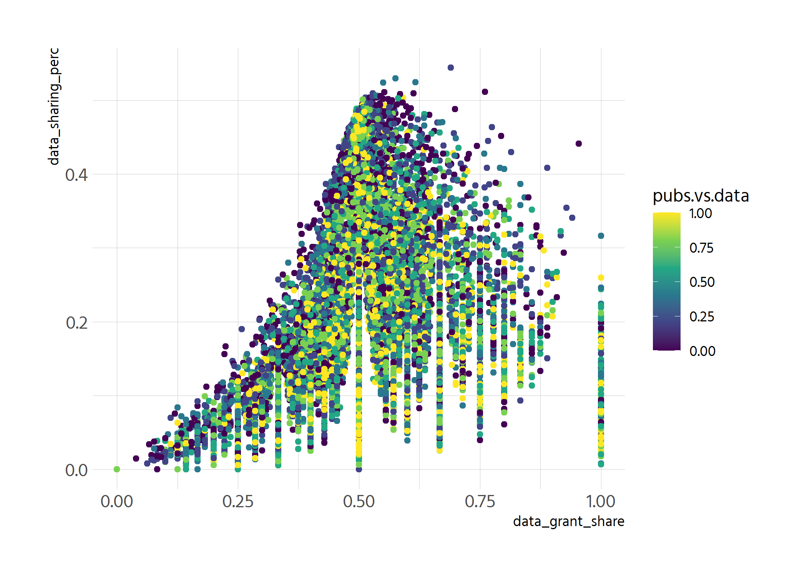
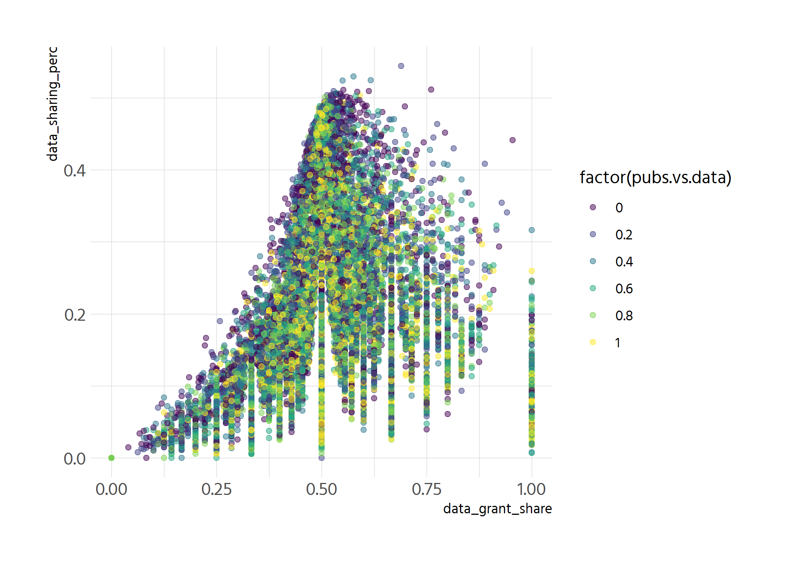
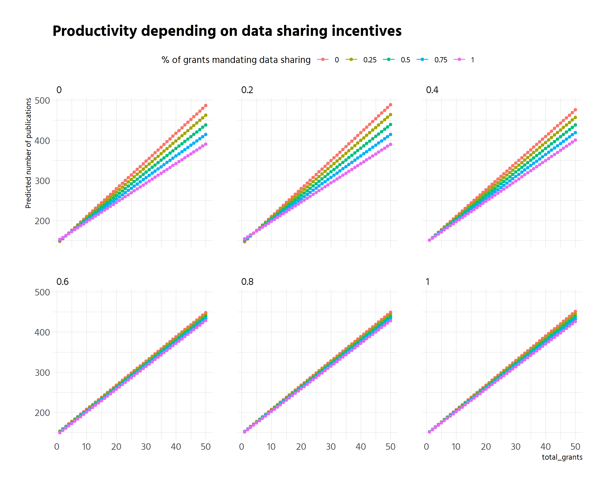

```r
df_clean %>% 
  ggplot(aes(data_grant_share, data_sharing_perc, colour = pubs.vs.data)) +
  geom_point(size = 1.5) +
  scale_colour_viridis_c()
```

<!-- -->

```r
# why does the right side not go up higher? is this the base funding that 
# stays stronger for those with not many grants?

p <- df_clean %>% 
  mutate(stats = paste("pubs:", n_publications, "grants:", total_grants)) %>%
  ggplot(aes(data_grant_share, data_sharing_perc, colour = factor(pubs.vs.data),
             label = stats)) +
  geom_point(alpha = .5) +
  scale_colour_viridis_d() 
p
```

<!-- -->


```r
plotly::ggplotly(p)
```

```{=html}
<div id="htmlwidget-eca193526a21779bc164" style="width:840px;height:600px;" class="plotly html-widget"></div>
<script type="application/json" data-for="htmlwidget-eca193526a21779bc164">{"x":{"data":[{"x":[0.395833333333333,0.518518518518518,0.555555555555556,0.501587301587302,0.5,0.666666666666667,0.486880466472303,0.2,0.529411764705882,0.517587939698492,0.111111111111111,0.496932515337423,0.428571428571429,0.473684210526316,0.502024291497976,0.8,0.488439306358382,0.504098360655738,0.571428571428571,0.764705882352941,0.494623655913978,0.466666666666667,0.513725490196078,0.512,0.411764705882353,0.462222222222222,0.5,0.5,0.375,0.5,0.454545454545455,0.666666666666667,0.590163934426229,0.508771929824561,0.545454545454545,0.555555555555556,0.375,0.568047337278107,0.7,0.666666666666667,0.631578947368421,0.461538461538462,0.5,0.666666666666667,0.444444444444444,0.533333333333333,0.5,0.5,0.56875,0.428571428571429,0.572368421052632,0.575949367088608,0.508474576271186,0.285714285714286,0.450980392156863,0.133333333333333,0.375,0.533333333333333,0.486211901306241,0.491017964071856,0.363636363636364,0.8,0.555555555555556,0.857142857142857,0.625,0.733333333333333,0.526315789473684,0.789473684210526,0.7,0.533333333333333,0.8,0.463768115942029,0.533333333333333,0.6,0.222222222222222,0.568181818181818,0.5625,0.458333333333333,0.484126984126984,0.417808219178082,0.36,0.366666666666667,0.511221945137157,0.333333333333333,0.555555555555556,0.540540540540541,0.454545454545455,0.241379310344828,0.347826086956522,0.460674157303371,0.488524590163934,0.727272727272727,0.525,0.478260869565217,0.0833333333333333,0.5,0.590909090909091,0.722222222222222,0.5,0.6,0.583333333333333,0.315789473684211,0.592592592592593,0.411764705882353,0.875,0.507042253521127,0.498630136986301,0.75,0.583333333333333,0.36,0.733333333333333,0.4,0.486486486486487,0.428571428571429,0.454545454545455,0.75,0.5,0.475524475524476,0.574468085106383,0.566666666666667,0.526315789473684,0.484848484848485,0.333333333333333,0.461187214611872,0.498452012383901,0.477777777777778,0.493870402802102,0.555555555555556,0.583333333333333,0.514492753623188,0.7,0.666666666666667,0.481481481481481,0.441176470588235,0.3,0.583333333333333,0.6875,0.5234375,0.507936507936508,0.44,0.117647058823529,0.540540540540541,0.3,0.416666666666667,0.5,0.421052631578947,0.320754716981132,0.482758620689655,0.769230769230769,0.666666666666667,0.515527950310559,0.25,0.619047619047619,0.442307692307692,0.5,0.288135593220339,0.547826086956522,0.8,0.486486486486487,0.50207468879668,0.730769230769231,0.430232558139535,0.451612903225806,0.523809523809524,0.583333333333333,0.636363636363636,0.541666666666667,0.554347826086957,0.444444444444444,1,0.52,0.493377483443709,0.75,0.472222222222222,0.528301886792453,0.7,0.428571428571429,0.422222222222222,0.714285714285714,0.384615384615385,0.285714285714286,0.509469696969697,0.633333333333333,0.75,0.714285714285714,0.480349344978166,0.504424778761062,0.525423728813559,0.486111111111111,0.571428571428571,0.653846153846154,0.5,0.578947368421053,0.304347826086957,0.555555555555556,0.416666666666667,0.475675675675676,0.6,0.565217391304348,0.666666666666667,0.444444444444444,0.4,0.411764705882353,0.454545454545455,0.363636363636364,0.561538461538462,0.5,0.488372093023256,0.722222222222222,0.611940298507463,0.480851063829787,0.503937007874016,0.625,0.508823529411765,0.324324324324324,0.5,0.444444444444444,0.25,0.420212765957447,0.476190476190476,0.555555555555556,0.421052631578947,0.705882352941177,0.526315789473684,0.8,0.510869565217391,0.524137931034483,0.576923076923077,0.5,0.565217391304348,0.501683501683502,0.511326860841424,0.6,0.428571428571429,0.777777777777778,0.65,0.425,0.416666666666667,0.615384615384615,0.416666666666667,0.380952380952381,0.496932515337423,0.459701492537313,0.493939393939394,0.489837398373984,0.419354838709677,0.493788819875776,0.361111111111111,0.2,0.509615384615385,0.4,0.524793388429752,0.555555555555556,0.8,0.5,0.777777777777778,0.5,0.571428571428571,0.571428571428571,0.508474576271186,0.571428571428571,0.5,0.494845360824742,0.392857142857143,0.434782608695652,0.470588235294118,0.509090909090909,0.476683937823834,0.446153846153846,0.497222222222222,0.421052631578947,0.5,0.530612244897959,0.605263157894737,0.540983606557377,0.583333333333333,0.533333333333333,0.642857142857143,0.466666666666667,0.466417910447761,0.5,0.456410256410256,0.8,0.564285714285714,0.166666666666667,0.666666666666667,0.4,0.458333333333333,0.466666666666667,0.714285714285714,0.622641509433962,0.347826086956522,0.5,0.636363636363636,0.611111111111111,0.2,0.558139534883721,0.659090909090909,0.4375,0.625,0.333333333333333,0.501818181818182,0.578947368421053,0.363636363636364,0.461538461538462,0.507430997876858,0.444444444444444,0.530612244897959,0.411764705882353,0.782608695652174,0.307692307692308,0.413793103448276,0.545454545454545,0.333333333333333,0.495327102803738,0.476923076923077,0.380952380952381,0.428571428571429,0.666666666666667,0.5,0.428571428571429,0.475435816164818,0.473684210526316,0.482758620689655,0.434782608695652,0.351351351351351,0.55,0.58974358974359,0.492537313432836,0.500967117988395,0.564356435643564,0.482142857142857,0.511811023622047,0.463768115942029,0.495967741935484,0.722222222222222,0.653846153846154,0.444444444444444,0.537878787878788,0.75,0.444444444444444,0.6,0.545454545454545,0.588235294117647,0.504694835680751,0.444444444444444,0.481818181818182,0.487113402061856,0.625,0.396551724137931,0.571428571428571,0.493055555555556,0.689655172413793,0.474393530997305,0.714285714285714,0.532163742690059,0.491071428571429,0.454545454545455,0.666666666666667,0.503597122302158,0.622641509433962,0.478927203065134,0.5,0.421052631578947,0.263157894736842,0.434782608695652,0.542168674698795,0.508771929824561,0.181818181818182,0.833333333333333,0.307692307692308,0.543307086614173,0.5,0.583333333333333,0.5,0.714285714285714,0.619047619047619,0.875,0.619047619047619,0.473239436619718,0.5,0.333333333333333,0.357142857142857,0.5,0.714285714285714,0.5,0.705882352941177,0.625,0,0.461538461538462,0.423076923076923,0.833333333333333,0.545454545454545,0.559139784946237,0.454545454545455,0.428571428571429,0.525925925925926,0.5,0.409090909090909,0.454545454545455,0.381818181818182,0.727272727272727,0.570175438596491,0.272727272727273,0.525373134328358,0,0.470588235294118,0.454545454545455,0.25,0.645161290322581,0.54954954954955,0.524390243902439,0.260869565217391,0.484076433121019,0.5,0.507418397626113,0.5,0.48780487804878,0.545454545454545,0.25,0.641509433962264,0.583333333333333,0.532258064516129,0.5,0.5,0.3,0.552631578947368,0.477611940298507,0.235294117647059,0.48314606741573,0.423076923076923,0.524390243902439,0.230769230769231,0.727272727272727,0.333333333333333,0.323529411764706,0.633333333333333,0.5,0.513751375137514,0,0.602040816326531,0.4,0.363636363636364,0.5,0.526315789473684,0.518248175182482,0.571428571428571,0.478260869565217,0.285714285714286,0.727272727272727,0.36,0.307692307692308,0.378378378378378,0.567567567567568,0.555555555555556,0.534653465346535,0.21875,0.482758620689655,0.476190476190476,0.533333333333333,0.612612612612613,0.592592592592593,0.538461538461538,0.321428571428571,0.25,0.619047619047619,0.51063829787234,0.6,0.522388059701492,0.785714285714286,0.56,0.473684210526316,0.505263157894737,0.571428571428571,0,0.222222222222222,0.192307692307692,0.526315789473684,0.511848341232227,0.454545454545455,0.666666666666667,0.65625,0.428571428571429,0.363636363636364,0.5,0.25,0.5625,0.636363636363636,0.503937007874016,0.488,0.393939393939394,0.357142857142857,0.5,0.206896551724138,0.45,0.460905349794239,0.625,0.443298969072165,0.384615384615385,0.500931098696462,0.674418604651163,0.416666666666667,0.577777777777778,0.4375,0.455696202531646,0.214285714285714,0,0.501618122977346,1,0.142857142857143,0.526315789473684,0.509090909090909,0.5,0.303030303030303,0.25,0.560165975103734,0.344262295081967,0.558441558441558,0.503194888178914,0.481012658227848,0.333333333333333,0.321428571428571,0.5,0.62,0.560606060606061,0.727272727272727,0.384615384615385,0.478260869565217,0.490118577075099,0.557377049180328,0.466666666666667,0.760869565217391,0.521008403361345,0.454545454545455,0.452229299363057,0.517241379310345,0.502673796791444,0.454545454545455,0.652173913043478,0.461538461538462,0.739130434782609,0.478527607361963,0.615384615384615,0.488372093023256,0.363636363636364,0.5,0.5,1,0.488721804511278,0.529411764705882,0.361111111111111,0.566666666666667,0.5,0.222222222222222,0.3,0.5,1,0.526315789473684,0.483050847457627,0.8,0.461538461538462,0.428571428571429,0.25,0.238095238095238,0.5,0.714285714285714,0.625,0.472727272727273,0.428571428571429,0.411764705882353,0.625,0.489539748953975,0.533333333333333,0.388888888888889,0.375,0.2,0.532467532467532,0.608695652173913,0.75,0.517241379310345,0.5,0.494708994708995,0.75,0.5,0.4,0.524193548387097,0.411764705882353,0.491916859122402,0.405940594059406,0.846153846153846,0.681818181818182,0.411764705882353,0.375,0.489010989010989,0.4,1,0.666666666666667,0.494669509594883,0.50709219858156,0.454545454545455,0.447761194029851,0.451612903225806,0.403669724770642,0.4,0.503067484662577,0.582278481012658,0.416666666666667,0.551724137931034,0.532846715328467,0.222222222222222,0.444444444444444,0.692307692307692,0.461538461538462,0.166666666666667,0.866666666666667,0.666666666666667,0.413793103448276,0.6,0.347826086956522,0.574074074074074,0.310344827586207,0.5,0.472727272727273,0.463855421686747,0.666666666666667,0.5,0.504380475594493,0.5,0.410714285714286,0.449704142011834,0.55241935483871,0.285714285714286,0.515418502202643,0.476923076923077,0.545454545454545,0.702127659574468,0.625,0.619047619047619,0.584269662921348,0.761904761904762,0.538461538461538,0.493333333333333,0.714285714285714,0.333333333333333,0.625,0.527777777777778,0.5,0.484536082474227,0.357142857142857,0.555555555555556,0.5,0.509569377990431,0.514285714285714,0.5,0.519148936170213,0.333333333333333,0.43010752688172,0.617647058823529,0.384615384615385,0.4,0.454545454545455,0.403846153846154,0.5,0.55,0.5625,0.6,0.511061946902655,0.5,0.347826086956522,0.294117647058824,0.75,0.636363636363636,0.488,0.469565217391304,0.368421052631579,0.515151515151515,0.368421052631579,0.615384615384615,0.5,0.5625,0.505208333333333,0.525641025641026,0.571428571428571,0.491467576791809,0.333333333333333,0.555555555555556,0.5,0.631578947368421,0.7,0.153846153846154,0.548022598870056,0.513157894736842,0.25,0.5,0.777777777777778,0.525925925925926,0.166666666666667,0.458333333333333,0.620689655172414,0.4,0.545454545454545,0.666666666666667,0.666666666666667,0.5,0.540540540540541,0.444444444444444,0.8,0.833333333333333,0.48,0.540540540540541,0.5,0.519230769230769,0.439716312056738,0.507462686567164,0.733333333333333,0.446808510638298,0.583333333333333,0.454545454545455,0.833333333333333,0.497872340425532,0.433333333333333,0.560975609756098,0.142857142857143,0.402298850574713,0.692307692307692,0.482625482625483,0.307692307692308,0.541095890410959,0.333333333333333,0.6,0.727272727272727,0.644444444444444,0.591549295774648,0.48,0.615384615384615,0.428571428571429,0.4,0.16,0.690909090909091,0.8,0.7,0.433962264150943,0.607142857142857,0.235294117647059,0.512534818941504,0.411764705882353,0.509708737864078,0.923076923076923,0.44,0.380952380952381,0.565217391304348,0.625,0.461538461538462,0.466666666666667,0.75,0.405797101449275,0.518518518518518,0.590909090909091,0.434782608695652,0.485822306238185,0.454545454545455,0.490131578947368,0.666666666666667,0.3,0.576271186440678,0.505050505050505,0.866666666666667,0.631578947368421,0.2,0.714285714285714,0.487695749440716,0.552884615384615,0.333333333333333,0.445945945945946,0.517985611510791,0.49234693877551,0.5,0.230769230769231,0.4,0.666666666666667,0.533333333333333,0.875,0.571428571428571,0.458333333333333,0.476190476190476,0.625,0.230769230769231,0.397959183673469,0.448,0.545454545454545,0.470588235294118,0.497663551401869,0.75,0.225,0.527777777777778,0.489559164733179,0.142857142857143,0.527777777777778,0.509661835748792,0.307692307692308,0.505773672055427,0.52317880794702,0.703703703703704,0.473333333333333,0.642857142857143,0.488584474885845,0.454545454545455,0.636363636363636,0.465909090909091,0.5,0.535714285714286,0.64,0.833333333333333,0.241379310344828,0.5,0.16,0.5,0.285714285714286,0.7,0.166666666666667,0.5,0.536585365853659,0.666666666666667,0.428571428571429,0.481481481481481,0,0.487341772151899,0.5,0.475675675675676,0.461538461538462,0.7,0.442922374429224,1,0.533333333333333,0.2,0.535353535353535,0.75,0.548387096774194,0.333333333333333,0.538461538461538,0.333333333333333,0.6,0.333333333333333,0.714285714285714,0.380952380952381,0.6,0.586206896551724,0.333333333333333,0.0714285714285714,0.516129032258065,0.519788918205805,0.384615384615385,0.866666666666667,0.521212121212121,0.439024390243902,0.518324607329843,0.511627906976744,0.5,0.521341463414634,0.461538461538462,0.371428571428571,0.347826086956522,0.634615384615385,0.411764705882353,0.470414201183432,0.486111111111111,0.6,0.636363636363636,0.909090909090909,0.636363636363636,0.511194029850746,0.487654320987654,0.5,0.85,0.5,0.390243902439024,0.617647058823529,0.8,0.447368421052632,0.492125984251969,0.407894736842105,0.6,0.466666666666667,0.526086956521739,0.490867579908676,0.4375,0.285714285714286,0.5,0.476190476190476,0.563106796116505,0.875,0.696969696969697,0.954545454545455,0.666666666666667,0.375,0.429577464788732,0.272727272727273,0.476635514018692,0.594936708860759,0.521164021164021,0.484375,0.235294117647059,0.514285714285714,0.764705882352941,0.5,0.482758620689655,0.536312849162011,0.628571428571429,0.489614243323442,0.491228070175439,0.666666666666667,0.484848484848485,0.435897435897436,0.372093023255814,0.5,0.5,0.333333333333333,0.44578313253012,0.5,0.485611510791367,0.475490196078431,0.666666666666667,0.597560975609756,0.51505016722408,0.428571428571429,0.56198347107438,0.458149779735683,0.65,0.6,0.480769230769231,0.546099290780142,0.285714285714286,0.452380952380952,0.5,0.62962962962963,0.434782608695652,0.333333333333333,0.359375,0.542857142857143,0.444444444444444,1,0.666666666666667,0.875,0.529411764705882,0.285714285714286,0.504065040650406,0.666666666666667,0.554621848739496,0.480519480519481,0.37037037037037,0.466666666666667,0.259259259259259,0.571428571428571,0.55,0.8,0.428571428571429,0.319148936170213,0.576271186440678,0.295454545454545,0.6,0.507692307692308,0.444444444444444,0.4,0.533333333333333,0.466666666666667,0.544910179640719,0.818181818181818,0.666666666666667,0.5625,0.565217391304348,0.532319391634981,0.413533834586466,0.45,0.523255813953488,0.380952380952381,0.522421524663677,1,0.485714285714286,0.25,0.461538461538462,0.555555555555556,0.341463414634146,0.5625,0.479166666666667,0.269230769230769,0.428571428571429,0.648648648648649,0.470149253731343,0.444444444444444,0.526627218934911,0.523809523809524,0.508968609865471,0.405405405405405,0.571428571428571,0.577586206896552,0.285714285714286,0.44,0.611111111111111,0.8,0.581196581196581,0.4,0.181818181818182,0.294117647058824,0.777777777777778,0.6,0.2,0.6,0.333333333333333,0.461538461538462,0.416666666666667,0.566666666666667,0.444444444444444,0.421052631578947,0.394736842105263,0.25,0.5,0.519230769230769,0.444444444444444,0.489130434782609,0.583333333333333,0.43298969072165,0.546762589928058,0.333333333333333,0.333333333333333,0.492537313432836,0.521739130434783,0.505154639175258,0.377777777777778,0.545454545454545,0.833333333333333,0.285714285714286,0.540540540540541,0.15,0.486725663716814,0.525,0.510948905109489,0.476190476190476,0.551020408163265,0.496551724137931,0.4,0.572649572649573,0.8,0.553191489361702,0.285714285714286,0.428571428571429,0.538461538461538,0.75,0.466666666666667,0.457627118644068,0.3,0.25,0.375,0.384615384615385,0.714285714285714,0.524822695035461,0.4,0.528662420382166,0.4,0.502890173410405,0.521367521367521,0.487012987012987,0.5,0.75,0.484848484848485,0.514285714285714,0.540540540540541,0.25,0.504424778761062,0.75,0.5,0.666666666666667,0.583333333333333,0.4,0.434782608695652,0.45,0.307692307692308,0.333333333333333,0.51063829787234,0.457142857142857,0.49868073878628,0.642857142857143,0.75,0.666666666666667,0.516025641025641,0.531165311653117,0.53125,0.4,0.340425531914894,0.142857142857143,0.514492753623188,0.527415143603133,0.488272921108742,0.515625,0.532646048109966,0.555555555555556,0.666666666666667,0.5,0.125,0.634146341463415,0.503623188405797,0.535714285714286,0.214285714285714,0.55,0.290322580645161,0.545454545454545,0.641025641025641,0.375,0.519480519480519,0.571428571428571,0.666666666666667,0.0769230769230769,0.411764705882353,0.421052631578947,0.363636363636364,0.550561797752809,0.523809523809524,0.434210526315789,0.53125,0.5,0.481818181818182,0.498839907192575,0.5,0.625,0.3,0.532710280373832,0.575757575757576,0.5,0.318181818181818,0.655737704918033,0.333333333333333,0.477987421383648,0.5,0.153846153846154,0.5,0.476190476190476,0.583333333333333,0.727272727272727,0.442307692307692,0.5,0.461538461538462,0.5,0.636363636363636,0.444444444444444,0.525547445255474,0.4,0.5,0.496551724137931,0.378378378378378,0.208333333333333,0.494736842105263,0.375,0.488235294117647,0.555555555555556,0.417910447761194,0.517730496453901,0.5,0.50974025974026,0.496913580246914,0.483805668016194,0.552941176470588,0.464285714285714,0.560975609756098,0.47887323943662,0.615384615384615,0.641025641025641,0.502732240437158,0.496551724137931,0.35,0.538461538461538,0.8,0.35,0.269230769230769,1,0.475177304964539,0.558620689655172,0.478260869565217,0.529411764705882,0.5,0.297297297297297,0.625,0.6,0.684210526315789,0.615384615384615,0.503496503496504,0.0666666666666667,0.489247311827957,0.625,0.666666666666667,0.423076923076923,0.50920245398773,0.494011976047904,0.4,0.615384615384615,0.666666666666667,0.363636363636364,0.545454545454545,0.4,0.705882352941177,0.666666666666667,0.442307692307692,0.55,0.5,0.5,0.288135593220339,0.505050505050505,0.553191489361702,0.222222222222222,0.410958904109589,0.413793103448276,0.448979591836735,0.818181818181818,0.518930957683742,0.555555555555556,0.307692307692308,0.447552447552448,0.259259259259259,0.5,0.310344827586207,0.333333333333333,0.6,0.357142857142857,0.5,0.58252427184466,0.571428571428571,0.428571428571429,0.285714285714286,0.489583333333333,1,0.561643835616438,0.75,0.466666666666667,0.571428571428571,0.5,0.403508771929825,0.420289855072464,0.416666666666667,0.25,0.481481481481481,0.529411764705882,0.5,0.698412698412698,0.590909090909091,0.585365853658537,0.498452012383901,0.482758620689655,0.333333333333333,0.520833333333333,0.510869565217391,0.505208333333333,0.416666666666667,0.464435146443515,0.333333333333333,0.6,0.4,0.615384615384615,0.530465949820789,0.538461538461538,0.494736842105263,0.764705882352941,0.428571428571429,0.490196078431373,0.666666666666667,0.378378378378378,0.63265306122449,0.415094339622642,0.411764705882353,0.333333333333333,0.461538461538462,0.8,0.7,0.791666666666667,0.565217391304348,0.5,0.512455516014235,0.25,0.423076923076923,0.49185667752443,0.538461538461538,0.528846153846154,0.604651162790698,0.545454545454545,0.5,0.75,0.5,0.490706319702602,0.545454545454545,0.7,0.4,0.4,0.327272727272727,0.12,0.694444444444444,0.818181818181818,0.476340694006309,0.551470588235294,0.724137931034483,0.5,0.454545454545455,0.333333333333333,0.558823529411765,0.416666666666667,0.666666666666667,0.5,0.625,0.495652173913044,0.448275862068966,0.550387596899225,0.428571428571429,0.222222222222222,0.461538461538462,0.529411764705882,0.75,0.519713261648746,0.541666666666667,0.469827586206897,0.352941176470588,0.5,0.75,0.384615384615385,0.538461538461538,0.514705882352941,0.483660130718954,0.532110091743119,0.4375,0.142857142857143,0.583333333333333,0.357142857142857,0.666666666666667,0.40625,0.428571428571429,0.444444444444444,0.55,0.5,0.53448275862069,0.525,0.888888888888889,0.40625,0.8,0.541666666666667,0.518518518518518,0.538461538461538,0.498637602179836,0.142857142857143,0.428571428571429,0.527386541471048,0.607142857142857,0.483870967741935,0,0.485049833887043,0.516129032258065,0.501642935377875,0.530434782608696,0.666666666666667,0.833333333333333,0.318181818181818,0.517441860465116,0.576923076923077,0.636363636363636,0.04,0.387096774193548,0.476190476190476,0.549295774647887,0.6,0.714285714285714,0.497652582159624,0.641975308641975,0.777777777777778,1,0.2,0.530120481927711,0.464285714285714,0.333333333333333,0.222222222222222,0.565217391304348,0.49438202247191,0.346153846153846,0.454545454545455,0.545454545454545,0.608695652173913,0.411764705882353,0.714285714285714,0.519480519480519,0.56,0.761904761904762,0.666666666666667,0.515151515151515,0.5625,0.212121212121212,0.538461538461538,0.176470588235294,0.441340782122905,0.666666666666667,0.833333333333333,0.333333333333333,0.454545454545455,0.625,0.714285714285714,0.4,0.377358490566038,0.411764705882353,0.545454545454545,0.571428571428571,0.609756097560976,0.615384615384615,0.541666666666667,0.666666666666667,0.833333333333333,0.857142857142857,0.857142857142857,0.794117647058823,0.502732240437158,0.515151515151515,0.551948051948052,0.285714285714286,0.666666666666667,0.4375,0.483935742971888,0.517241379310345,0.378378378378378,0.506493506493506,0.571428571428571,0.454545454545455,0.642857142857143,0.586206896551724,0.513513513513513,0.506692160611855,0.521739130434783,0.260869565217391,0.555555555555556,0.571428571428571,0.545454545454545,0.5,0.5,0.440789473684211,0.833333333333333,0.588235294117647,0.423076923076923,0.4,0.524822695035461,0.333333333333333,0.492505353319058,0.525773195876289,0.875,0.724137931034483,0.615384615384615,0.4,0.428571428571429,0.546666666666667,0.6,0.666666666666667,0.666666666666667,0.8,0.444444444444444,0.315789473684211,0.351351351351351,0.453846153846154,0.615384615384615,0.510204081632653,0.333333333333333,0.346153846153846,0.525547445255474,0.588235294117647,0.176470588235294,0.326086956521739,0.6,0.6,0.470588235294118,0.428571428571429,0.466216216216216,0.230769230769231,0.333333333333333,0.466666666666667,0.506787330316742,0.6,0.597938144329897,0.153846153846154,0.347826086956522,0.558823529411765,0.466019417475728,0.6,0.727272727272727,0.476190476190476,0.475409836065574,0.142857142857143,0.481375358166189,0.470588235294118,0.4,0.433333333333333,0.166666666666667,0.636363636363636,0.342857142857143,0.571428571428571,0.428571428571429,0.266666666666667,0.504363001745201,0.75,0.523809523809524,0.488126649076517,0.586206896551724,0.357142857142857,0.5,0.6,0.524324324324324,0.454545454545455,0.409090909090909,0.416666666666667,0.222222222222222,0.185185185185185,0.4,0.368421052631579,0.307692307692308,0.522082018927445,0.530973451327434,0.421052631578947,0.508583690987124,0.479166666666667,0.552631578947368,0.568181818181818,0.6,0.19047619047619,0.50314465408805,0,0.49375,0.5,0.490196078431373,0.551724137931034,0.493150684931507,0.59047619047619,0.512315270935961,0.532467532467532,0.392857142857143,0.354838709677419,0.8,0.4,0.486725663716814,0.5,0.461538461538462,0.557522123893805,0.562913907284768,0.513966480446927,0.411764705882353,0.555555555555556,0.476851851851852,0.583333333333333,0.652173913043478,0.488636363636364,0.4375,0.6,0.572192513368984,0.666666666666667,0.642857142857143,0.509677419354839,0.4,0.464102564102564,0.467741935483871,0.563829787234043,0.65,0.368421052631579,0.272727272727273,0.545454545454545,0.55,0.368421052631579,0.344827586206897,0.383333333333333,0.416666666666667,0.44,0.6,0.487394957983193,0.523809523809524,0.333333333333333,0.380952380952381,0.4,0.507692307692308,0.272727272727273,0.476987447698745,0.5,0.642857142857143,0.206896551724138,0.617647058823529,0.512690355329949,0.441176470588235,0.555555555555556,0.272727272727273,0.481481481481481,0.48728813559322,0.464285714285714,0.5,0.5,0.631578947368421,0.166666666666667,0.658536585365854,0.4375,0.533333333333333,0.388888888888889,0.619047619047619,0.428571428571429,0.75,0.508620689655172,0.481481481481481,0.543352601156069,0.65,0.548611111111111,0.571428571428571,0.566666666666667,0.522388059701492,0.590909090909091,0.363636363636364,0.466666666666667,0.5,0.357142857142857,0.875,0.445945945945946,0.625,0.333333333333333,0.625,0.498069498069498,0.222222222222222,0.3,0.502857142857143,0.472,0.5,0.508021390374332,0.380952380952381,0.485099337748344,0.516304347826087,0.538461538461538,0.492610837438424,0.5,0.166666666666667,0.588235294117647,0.416666666666667,0.516778523489933,0.639344262295082,0.333333333333333,0.307692307692308,0.636363636363636,0.4,0.518010291595197,0.285714285714286,0.588235294117647,0.461538461538462,0.111111111111111,0.5,0.568627450980392,0.142857142857143,0.4,0.5,0.4,0.527777777777778,0.494897959183673,0.5,0.714285714285714,0.5,0.222222222222222,0.441176470588235,0.375,0.466666666666667,0.504132231404959,0.516233766233766,0.521739130434783,0.764705882352941,0.52,0.5,0.552631578947368,0.463687150837989,0.6,0.56,0.462809917355372,0.75,0.375,0.2,0.484304932735426,0.75,0.28,0.8,0.527272727272727,0.521739130434783,0.5,0.5,0.463157894736842,0.484593837535014,0.5,0.727272727272727,0.25,0.446428571428571,0.636363636363636,0.454545454545455,0.857142857142857,0.294117647058824,0.75,0.486666666666667,0.564516129032258,0.142857142857143,0.416666666666667,0.666666666666667,0.6,0.625,0.6875,0.5,0.333333333333333,0.125,0.409090909090909,0.25,0.564102564102564,0.846153846153846,0.490196078431373,0.333333333333333,0.49468085106383,0.333333333333333,0.464788732394366,0.494736842105263,0.423076923076923,0.587301587301587,0.550561797752809,0.625,0.714285714285714,0.504950495049505,0.306122448979592,0.714285714285714,0.384615384615385,0.611111111111111,0.55,0.583333333333333,0.642857142857143,0.53125,0.535353535353535,0.385416666666667,0.272727272727273,0.473684210526316,0.531707317073171,0.522522522522523,0.5,0.357142857142857,0.588235294117647,0.333333333333333,0.291666666666667,0.495412844036697,0.544554455445545,0.625,0.428571428571429,0.777777777777778,0.5,0.666666666666667,0.490909090909091,0.625,0.504132231404959,0.571428571428571,0.428571428571429,0.505154639175258,0.6,0.666666666666667,0.537190082644628,0.55,0.25,0.473684210526316,0.484848484848485,0.666666666666667,0.497005988023952,0.552941176470588,0.428571428571429,0.509433962264151,0.263157894736842,0.5,0.125,0.555555555555556,0.2,0.498563218390805,0.5,0.5,0.333333333333333,0.0909090909090909,0.3,0.483333333333333,0.666666666666667,0.603053435114504,1,0.5,0.416666666666667,0.44,0.48951048951049,0.666666666666667,0.666666666666667,0.441860465116279,0.2,0.387096774193548,0.591715976331361,0.460227272727273,0.785714285714286,0.3,0.0909090909090909,0.6,0.532258064516129,0.285714285714286,0.4,0.482352941176471,0.520547945205479,0.485436893203884,0.333333333333333,0.321428571428571,0.5,0.555555555555556,0.285714285714286,1,0.555555555555556,0.357142857142857,0.4375,0.620689655172414,0.25,0.782608695652174,0.272727272727273,0.166666666666667,0.55,0.666666666666667,0.315789473684211,0.461538461538462,0.515723270440252,0.5,0.4375,0.490909090909091,0.521885521885522,0.357142857142857,0.487179487179487,0.714285714285714,0.5125,0.714285714285714,0.514285714285714,0.451612903225806,0.546666666666667,0.5,0.75,0.431034482758621,0.5,0.493723849372385,0.438775510204082,0.452380952380952,0.428571428571429,0.491666666666667,0.475,0.777777777777778,0.705882352941177,0.625,0.545454545454545,0.513513513513513,0.625,0.465116279069767,0.377777777777778,0.35,0.727272727272727,1,0.543147208121827,0.505415162454874,0.405405405405405,0.507865168539326,0.7,0.478260869565217,0.5625,0.272727272727273,0.277777777777778,0.5625,0.532258064516129,0.604166666666667,0.583333333333333,0.485215053763441,0.529411764705882,0.443478260869565,0.555555555555556,0.555555555555556,0.28,0.777777777777778,0.642857142857143,0.55,0.458333333333333,0.536159600997506,0.474820143884892,0.521739130434783,0.153846153846154,0.564516129032258,0.75,0.666666666666667,0.411764705882353,0.472727272727273,0.498727735368957,0.457142857142857,0.675675675675676,0.5,0.444444444444444,0.583333333333333,0.512670565302144,0.888888888888889,0.0833333333333333,0.647058823529412,0.743589743589744,0.527777777777778,0.25,0.444444444444444,0.476635514018692,0.352941176470588,0.6,0.4,0.649122807017544,0.491735537190083,0.54485049833887,0.368421052631579,0.333333333333333,0.535714285714286,0.57843137254902,0.133333333333333,0.333333333333333,0.857142857142857,0.5,0.458100558659218,0.5,0.428571428571429,0.235294117647059,0.543778801843318,0.473684210526316,0.545454545454545,0.477272727272727,0.583333333333333,0.454545454545455,0,0.503937007874016,0.489913544668588,0.5,0.555555555555556,0.5625,0.481060606060606,0.714285714285714,0,0.454545454545455,0.514285714285714,0.501694915254237,0.333333333333333,0.384615384615385,0.5,0.666666666666667,0.625,0.44047619047619,0.478260869565217,0.555555555555556,0.63265306122449,0.416666666666667,0.543478260869565,0.571428571428571,0.511041009463722,0.384615384615385,0.344827586206897,0.333333333333333,0.666666666666667,0.615384615384615,0.611111111111111,0.527272727272727,0.490196078431373,0.6875,0.666666666666667,0.7,0.5,0.442307692307692,0.416666666666667,0.3,0.625,0.519354838709677,0.538461538461538,0.37037037037037,0.1,0.285714285714286,0.571428571428571,0.0833333333333333,0.75,0.5,0.526315789473684,0,0.444444444444444,0.478260869565217,0.428571428571429,0.375,0.501597444089457,0.481481481481481,0.692307692307692,0.266666666666667,0.5,0.453125,0.497652582159624,0.572815533980582,0.666666666666667,0.495098039215686,0.489795918367347,0.484615384615385,0.625,0.545454545454545,0.6,0.521739130434783,0.496732026143791,0.477178423236515,0.5,0.666666666666667,0.428571428571429,0.25,0.333333333333333,0.506544502617801],"y":[0.207459207459207,0.218855218855219,0.128342245989305,0.45159655347187,0.210909090909091,0.307958477508651,0.427012278308322,0.0242424242424242,0.197183098591549,0.434426229508197,0.0346020761245675,0.429722470904208,0.219101123595506,0.41580547112462,0.447051363348129,0.35,0.433333333333333,0.449481865284974,0.2,0.275735294117647,0.46606334841629,0.15530303030303,0.446417636252296,0.432941176470588,0.175097276264591,0.406872852233677,0.308584686774942,0.249249249249249,0.0561224489795918,0.419030192131747,0.362911266201396,0.145631067961165,0.394366197183099,0.356979405034325,0.26865671641791,0.11,0.0847457627118644,0.5,0.152173913043478,0.216216216216216,0.229571984435798,0.223300970873786,0.219512195121951,0.112994350282486,0.176470588235294,0.188235294117647,0.049079754601227,0.294840294840295,0.481060606060606,0.128630705394191,0.487781036168133,0.482,0.428923582580115,0.0537634408602151,0.293023255813953,0.0588235294117647,0.0760869565217391,0.16988416988417,0.456156936894351,0.404995539696699,0.112244897959184,0.264069264069264,0.252873563218391,0.206703910614525,0.132275132275132,0.286307053941909,0.186234817813765,0.280487804878049,0.329073482428115,0.186363636363636,0.172774869109948,0.310169491525424,0.192307692307692,0.307167235494881,0.036697247706422,0.350383631713555,0.203703703703704,0.333333333333333,0.446781115879828,0.320415879017013,0.132911392405063,0.265748031496063,0.481347773766546,0.0969387755102041,0.144927536231884,0.358974358974359,0.116161616161616,0.12779552715655,0.186224489795918,0.381028938906752,0.4546875,0.205607476635514,0.281653746770026,0.208609271523179,0.0282258064516129,0.191011235955056,0.265957446808511,0.263157894736842,0.0817307692307692,0.174129353233831,0.286792452830189,0.137546468401487,0.312703583061889,0.145522388059701,0.301801801801802,0.378026070763501,0.442998204667864,0.0958083832335329,0.358353510895884,0.181494661921708,0.223175965665236,0.148409893992933,0.272727272727273,0.0833333333333333,0.0815450643776824,0.0705882352941176,0.239669421487603,0.40959040959041,0.373134328358209,0.291095890410959,0.354098360655738,0.265027322404372,0.106007067137809,0.408296943231441,0.475899005355777,0.35177304964539,0.458699971615101,0.0663265306122449,0.176211453744493,0.449579831932773,0.150485436893204,0.116279069767442,0.44182888184699,0.316939890710383,0.0691489361702128,0.277486910994764,0.18018018018018,0.428409090909091,0.450636942675159,0.175097276264591,0.0294117647058824,0.265789473684211,0.11913357400722,0.117647058823529,0.162280701754386,0.167300380228137,0.209205020920502,0.229916897506925,0.225352112676056,0.200819672131148,0.416195856873823,0.095,0.215909090909091,0.283018867924528,0.383152173913043,0.177865612648221,0.489130434782609,0.0819672131147541,0.404567699836868,0.441269841269841,0.325342465753425,0.283891547049442,0.261764705882353,0.209964412811388,0.1875,0.165254237288136,0.261016949152542,0.439097744360902,0.0871794871794872,0.0718562874251497,0.320707070707071,0.458786936236392,0.17989417989418,0.257142857142857,0.490974729241877,0.209183673469388,0.235087719298246,0.258373205741627,0.128440366972477,0.105022831050228,0.0641025641025641,0.472942683317323,0.325423728813559,0.0395480225988701,0.125,0.423832092078538,0.455532926001358,0.404454865181712,0.44812925170068,0.294117647058824,0.301694915254237,0.264705882352941,0.446130500758725,0.167272727272727,0.198473282442748,0.12396694214876,0.406021155410903,0.152073732718894,0.274647887323944,0.200980392156863,0.125,0.172839506172839,0.185714285714286,0.148936170212766,0.0995850622406639,0.451911935110081,0.156398104265403,0.324538258575198,0.274193548387097,0.42911877394636,0.416884816753927,0.457296849087894,0.256302521008403,0.476167549350024,0.188829787234043,0.305555555555556,0.107843137254902,0.0192307692307692,0.352478363493312,0.361221779548473,0.184738955823293,0.228323699421965,0.248031496062992,0.44893762851268,0.125,0.397101449275362,0.432562620423892,0.296928327645051,0.103260869565217,0.221428571428571,0.458764327648868,0.465909090909091,0.265432098765432,0.095,0.192513368983957,0.291187739463602,0.27012987012987,0.157657657657658,0.23469387755102,0.121951219512195,0.181506849315068,0.432904411764706,0.418233082706767,0.443465491923642,0.452318745917701,0.206060606060606,0.440522243713733,0.210526315789474,0.045662100456621,0.394878706199461,0.0969387755102041,0.442931258106355,0.101851851851852,0.125,0.133333333333333,0.190954773869347,0.0653266331658292,0.120879120879121,0.422297297297297,0.449312714776632,0.133333333333333,0.106382978723404,0.404341926729986,0.210169491525424,0.21505376344086,0.147859922178988,0.343096234309623,0.401544401544402,0.322878228782288,0.453048509123275,0.184313725490196,0.436666666666667,0.37192118226601,0.343406593406593,0.393075356415479,0.153846153846154,0.368613138686131,0.223809523809524,0.204166666666667,0.425149700598802,0.268041237113402,0.387380777696258,0.238738738738739,0.462244897959184,0.0110497237569061,0.0546448087431694,0.197278911564626,0.338199513381995,0.192488262910798,0.245614035087719,0.392156862745098,0.173431734317343,0.323450134770889,0.247058823529412,0.26,0.0531400966183575,0.343529411764706,0.424083769633508,0.152671755725191,0.167487684729064,0.0333333333333333,0.465921787709497,0.239043824701195,0.0833333333333333,0.164444444444444,0.494509387176762,0.110497237569061,0.33175355450237,0.258215962441315,0.306122448979592,0.103004291845494,0.2,0.193236714975845,0.037037037037037,0.382699868938401,0.357407407407407,0.148148148148148,0.154135338345865,0.28125,0.132275132275132,0.0876288659793814,0.454752275025278,0.164179104477612,0.373417721518987,0.187074829931973,0.1925,0.288321167883212,0.346041055718475,0.317399617590822,0.473817835607744,0.431729518855657,0.327835051546392,0.426993865030675,0.342342342342342,0.444444444444444,0.307692307692308,0.405228758169935,0.294460641399417,0.46643109540636,0.281138790035587,0.0820512820512821,0.2,0.229235880398671,0.251028806584362,0.476556495003843,0.362139917695473,0.425,0.45031185031185,0.199134199134199,0.245901639344262,0.113989637305699,0.459751485683414,0.414141414141414,0.4190395240119,0.326388888888889,0.470483005366726,0.344626168224299,0.135265700483092,0.133971291866029,0.447701149425287,0.358407079646018,0.419373549883991,0.0952380952380952,0.25,0.096551724137931,0.218543046357616,0.394453004622496,0.378076062639821,0.0772946859903382,0.145945945945946,0.0952380952380952,0.439906651108518,0.157205240174672,0.319884726224784,0.0777777777777778,0.178947368421053,0.250909090909091,0.133333333333333,0.251700680272109,0.438288288288288,0.129032258064516,0.109704641350211,0.12962962962963,0.181451612903226,0.240174672489083,0.116402116402116,0.279352226720648,0.46,0,0.166666666666667,0.189910979228487,0.177142857142857,0.261648745519713,0.432960893854749,0.377321603128055,0.087378640776699,0.425619834710744,0.126829268292683,0.228070175438596,0.0867579908675799,0.318627450980392,0.221649484536082,0.48125,0.0837004405286344,0.483469094393867,0,0.208163265306122,0.126984126984127,0.121661721068249,0.480176211453745,0.460645161290323,0.401587301587302,0.108771929824561,0.430562468889995,0.104265402843602,0.472090823084201,0.206751054852321,0.3,0.152284263959391,0.0333333333333333,0.446300715990453,0.225589225589226,0.372262773722628,0.183406113537118,0.175757575757576,0.143968871595331,0.460659898477157,0.346441947565543,0.0588235294117647,0.364188163884674,0.214899713467049,0.490491803278689,0.0649350649350649,0.202764976958525,0.04,0.197007481296758,0.312693498452012,0.434843205574913,0.496233859397417,0,0.482962962962963,0.173285198555957,0.0536585365853659,0.115044247787611,0.466123280692817,0.419491525423729,0.171806167400881,0.34156976744186,0.0203045685279188,0.129353233830846,0.187713310580205,0.079646017699115,0.197530864197531,0.33433734939759,0.128342245989305,0.414804469273743,0.11304347826087,0.230088495575221,0.194945848375451,0.200819672131148,0.509020618556701,0.377398720682303,0.233812949640288,0.161194029850746,0.124555160142349,0.268456375838926,0.314420803782506,0.0962566844919786,0.433856502242152,0.264705882352941,0.250883392226148,0.4,0.483402489626556,0.313664596273292,0,0.156084656084656,0.0594405594405594,0.215827338129496,0.465643274853801,0.202247191011236,0.112359550561798,0.342182890855457,0.151785714285714,0.135416666666667,0.201520912547529,0.0414507772020725,0.236514522821577,0.201970443349754,0.425581395348837,0.454312553373185,0.228882833787466,0.09375,0.0588235294117647,0.0977917981072555,0.197674418604651,0.411654135338346,0.144278606965174,0.35116598079561,0.172,0.463759575721862,0.427480916030534,0.0742574257425743,0.469788519637462,0.157258064516129,0.313504823151125,0.0543933054393305,0,0.444050632911392,0.143712574850299,0.0277777777777778,0.21259842519685,0.331223628691983,0.0738916256157636,0.142857142857143,0.0524193548387097,0.501317523056653,0.24952380952381,0.434704830053667,0.476633032395114,0.445885691122821,0.0242424242424242,0.156626506024096,0.160714285714286,0.413953488372093,0.408829174664108,0.21025641025641,0.133047210300429,0.243150684931507,0.445582586427657,0.427095292766935,0.117647058823529,0.511450381679389,0.397836538461538,0.118721461187215,0.381865736704446,0.411980440097799,0.463718334048948,0.113300492610837,0.305555555555556,0.229850746268657,0.34020618556701,0.373148148148148,0.151639344262295,0.292978208232446,0.0858585858585859,0.315934065934066,0.182692307692308,0.0993788819875776,0.446680080482897,0.214285714285714,0.160818713450292,0.406438631790744,0.133004926108374,0.0245098039215686,0.0608695652173913,0.0810810810810811,0.19774011299435,0.218045112781955,0.434070796460177,0.339449541284404,0.166666666666667,0.0818713450292398,0.021978021978022,0.11913357400722,0.235537190082645,0.118918918918919,0.128491620111732,0.343529411764706,0.169642857142857,0.154411764705882,0.375,0.466155385128376,0.217777777777778,0.214484679665738,0.110526315789474,0.0163934426229508,0.401360544217687,0.256756756756757,0.192708333333333,0.441584158415842,0.170940170940171,0.460771564802774,0.281914893617021,0.266233766233766,0.0628571428571429,0.424528301886792,0.0883534136546185,0.456776556776557,0.331932773109244,0.218905472636816,0.340425531914894,0.189655172413793,0.10377358490566,0.413564929693962,0.0769230769230769,0.198895027624309,0.142857142857143,0.451909476661952,0.462430939226519,0.126760563380282,0.331541218637993,0.213855421686747,0.301088270858525,0.130597014925373,0.421435059037239,0.413621262458472,0.325236167341431,0.392282958199357,0.4519535374868,0.0625,0.0913705583756345,0.183856502242152,0.153488372093023,0.0273224043715847,0.330232558139535,0.192622950819672,0.176470588235294,0.121951219512195,0.235494880546075,0.406741573033708,0.188888888888889,0.242622950819672,0.421296296296296,0.41241890639481,0.365546218487395,0.259124087591241,0.474499277307454,0.16,0.300584795321637,0.40034965034965,0.510498687664042,0.0601092896174863,0.443205574912892,0.381679389312977,0.254545454545455,0.424479166666667,0.0825242718446602,0.246710526315789,0.423780487804878,0.356589147286822,0.200934579439252,0.406712734452122,0.117021276595745,0.0175438596491228,0.250965250965251,0.297082228116711,0.253968253968254,0.397356143079316,0.154185022026432,0.169902912621359,0.234848484848485,0.476445806204519,0.274924471299094,0.410689170182841,0.457670273711012,0.0119760479041916,0.332850940665702,0.367567567567568,0.131707317073171,0.161417322834646,0.116161616161616,0.267665952890792,0.210727969348659,0.234848484848485,0.115537848605578,0.281481481481481,0.489542715349167,0.45491594498217,0.143911439114391,0.11304347826087,0.0742857142857143,0.174528301886792,0.439574201628053,0.412406271301977,0.121338912133891,0.436893203883495,0.180811808118081,0.184426229508197,0.201729106628242,0.209401709401709,0.412371134020619,0.435304990757856,0.225563909774436,0.438802779262427,0.104247104247104,0.206349206349206,0.076530612244898,0.437177280550775,0.126760563380282,0.0338983050847458,0.48448905109489,0.375409836065574,0.0945945945945946,0.156,0.161434977578475,0.405781584582441,0.0627450980392157,0.176848874598071,0.317365269461078,0.101769911504425,0.208029197080292,0.206896551724138,0.188405797101449,0.0892018779342723,0.308383233532934,0.174418604651163,0.216346153846154,0.121212121212121,0.26056338028169,0.377265238879736,0.160975609756098,0.392318244170096,0.345123258306538,0.43591654247392,0.233606557377049,0.318991097922849,0.176795580110497,0.286549707602339,0.132911392405063,0.449700199866756,0.222222222222222,0.310626702997275,0.0102040816326531,0.289592760180996,0.192488262910798,0.423913043478261,0.117886178861789,0.438743455497382,0.0484848484848485,0.159574468085106,0.28,0.419178082191781,0.412878787878788,0.373770491803279,0.214285714285714,0.122549019607843,0.109289617486339,0.0606060606060606,0.413716814159292,0.129411764705882,0.192893401015228,0.254201680672269,0.488778054862843,0.0614754098360656,0.465217391304348,0.255220417633411,0.450038729666925,0.293478260869565,0.20253164556962,0.159695817490494,0.266903914590747,0.339622641509434,0.183544303797468,0.170305676855895,0.093167701863354,0.283760683760684,0.255972696245734,0.425493716337522,0.190789473684211,0.447086801426873,0.111675126903553,0.450152594099695,0.165217391304348,0.175202156334232,0.458583433373349,0.465955701394586,0.327659574468085,0.240663900414938,0.0789473684210526,0.140845070422535,0.44992795389049,0.488970588235294,0.0869565217391304,0.329749103942652,0.455689277899344,0.453883495145631,0.358372456964006,0.065843621399177,0.0913461538461538,0.0641025641025641,0.190114068441065,0.308755760368664,0.122994652406417,0.202020202020202,0.201465201465201,0.221343873517787,0.0897435897435897,0.327272727272727,0.354211663066955,0.138728323699422,0.134453781512605,0.456968773800457,0.198952879581152,0.16624685138539,0.30327868852459,0.446554934823091,0.024390243902439,0.321321321321321,0.481176470588235,0.0966386554621849,0.476969927674153,0.431353456669912,0.390879478827362,0.414705882352941,0.2,0.416320885200553,0.109004739336493,0.157608695652174,0.417355371900826,0.155440414507772,0.427083333333333,0.339920948616601,0.136363636363636,0.14327485380117,0.191881918819188,0.0693069306930693,0.117647058823529,0.0918918918918919,0.175115207373272,0.0591133004926108,0.111111111111111,0.320802005012531,0.132352941176471,0.276346604215457,0.258620689655172,0,0.425574425574426,0.143518518518519,0.400322841000807,0.135593220338983,0.164893617021277,0.372172721041809,0.0460526315789474,0.176211453744493,0.0633484162895928,0.505187549880287,0.209756097560976,0.323450134770889,0.0714285714285714,0.138528138528139,0.0491803278688525,0.224264705882353,0.0987654320987654,0.139664804469274,0.14963503649635,0.258426966292135,0.283536585365854,0.099601593625498,0.0192307692307692,0.343866171003717,0.470089096308867,0.154589371980676,0.316582914572864,0.4375,0.296385542168675,0.471383147853736,0.453125,0.36744966442953,0.467019740009629,0.194267515923567,0.219072164948454,0.205980066445183,0.421296296296296,0.145228215767635,0.44034499281265,0.374631268436578,0.158139534883721,0.164179104477612,0.233009708737864,0.2,0.47582993593477,0.380733944954128,0.0817610062893082,0.368217054263566,0.15668202764977,0.285930408472012,0.339449541284404,0.268867924528302,0.295221843003413,0.439494280553883,0.336998706338939,0.144444444444444,0.316780821917808,0.449565798263193,0.469798657718121,0.161417322834646,0.06,0.0995024875621891,0.205128205128205,0.436507936507937,0.184615384615385,0.398843930635838,0.441176470588235,0.185929648241206,0.121212121212121,0.344594594594595,0.0701754385964912,0.42836676217765,0.467857142857143,0.453777965386239,0.317399617590822,0.0902255639097744,0.343396226415094,0.312741312741313,0.0728155339805825,0.436206247647723,0.463393626184324,0.387267904509284,0.442444339175746,0.29559748427673,0.207373271889401,0.456426332288401,0.264957264957265,0.206088992974239,0.154929577464789,0.0845070422535211,0.119469026548673,0.343137254901961,0.228,0.449406444318824,0.432759968725567,0.105882352941176,0.445217391304348,0.47507953340403,0.0927835051546392,0.449172576832151,0.396187882913547,0.260683760683761,0.252669039145907,0.34878587196468,0.449948400412797,0.0301204819277108,0.374647887323944,0.298947368421053,0.414316702819957,0.192170818505338,0.182080924855491,0.248520710059172,0.305555555555556,0.0935960591133005,0.0958083832335329,0.323308270676692,0.204301075268817,0.392405063291139,0.0608695652173913,0.449969678593087,0.262172284644195,0.455542021924482,0.343065693430657,0.169753086419753,0.232415902140673,0.0954063604240283,0.111111111111111,0.22463768115942,0.129411764705882,0.0361990950226244,0.222988505747126,0.404017857142857,0.204081632653061,0.343358395989975,0.422222222222222,0.0925925925925926,0.181818181818182,0.158333333333333,0.387786259541985,0.457378551787351,0.202830188679245,0.119791666666667,0.283828382838284,0.234432234432234,0.473620375985446,0.359956236323851,0.208333333333333,0.404615384615385,0.151079136690647,0.49198250728863,0.103448275862069,0.291316526610644,0.0669856459330144,0.142156862745098,0.331658291457286,0.215880893300248,0.202479338842975,0.358413132694938,0.096085409252669,0.0819672131147541,0.348441926345609,0.42604226156482,0.208,0.442003514938489,0.452296819787986,0.463842220598977,0.186813186813187,0.209821428571429,0.451338199513382,0.0760869565217391,0.213333333333333,0.227450980392157,0.0609756097560976,0.472041612483745,0.29086809470124,0.0571428571428571,0.0970149253731343,0.172897196261682,0.181818181818182,0.0276243093922652,0.217021276595745,0.0670103092783505,0.164609053497942,0.134615384615385,0.305647840531561,0.121212121212121,0.293831168831169,0.218508997429306,0.0271739130434783,0.151960784313725,0.313852813852814,0.240331491712707,0.378260869565217,0.189189189189189,0.375,0.455930359085963,0.0573248407643312,0.0975609756097561,0.326996197718631,0.238866396761134,0.401492537313433,0.225181598062954,0.185185185185185,0.125,0.0374331550802139,0.276649746192893,0.0551470588235294,0.440816326530612,0.292307692307692,0.482425646967941,0.370786516853933,0.392857142857143,0.447141316073355,0.102702702702703,0.474264705882353,0.238938053097345,0.344298245614035,0.0598290598290598,0.139013452914798,0.175213675213675,0.16,0.182170542635659,0.33201581027668,0.0257731958762887,0.0509259259259259,0.105820105820106,0.114285714285714,0.284210526315789,0.431793770139635,0.121359223300971,0.449112978524743,0.0742857142857143,0.443213296398892,0.436881188118812,0.42073778664008,0.411316648531012,0.261467889908257,0.341864716636197,0.421794871794872,0.464,0.050761421319797,0.468507751937984,0.211640211640212,0.204778156996587,0.0828402366863905,0.170212765957447,0.078125,0.172185430463576,0.198606271777003,0.100877192982456,0.13963963963964,0.301762114537445,0.240896358543417,0.445208422862054,0.156521739130435,0.228699551569507,0.137362637362637,0.479753972321886,0.483200707338638,0.349420849420849,0.119565217391304,0.216867469879518,0.0454545454545455,0.44284128745838,0.493203058623619,0.453176162409954,0.411173184357542,0.489442338927991,0.117924528301887,0.188073394495413,0.235915492957746,0.0150753768844221,0.400537634408602,0.476758045292014,0.258278145695364,0.0675105485232067,0.211764705882353,0.121813031161473,0.305295950155763,0.376558603491272,0.0846560846560847,0.392156862745098,0.474747474747475,0.126829268292683,0.037344398340249,0.255952380952381,0.129770992366412,0.103305785123967,0.501833740831296,0.354223433242507,0.289655172413793,0.436378466557912,0.0235294117647059,0.364130434782609,0.455281560544718,0.0789473684210526,0.120535714285714,0.0758293838862559,0.420765027322404,0.338461538461538,0.303448275862069,0.159609120521173,0.458333333333333,0.0819672131147541,0.44449975111996,0.294117647058824,0.0622950819672131,0.464254192409532,0.316221765913758,0.211981566820276,0.241706161137441,0.283549783549784,0.160194174757282,0.132231404958678,0.135135135135135,0.173913043478261,0.220338983050847,0.45771144278607,0.214705882352941,0.108490566037736,0.423423423423423,0.287337662337662,0.111498257839721,0.378723404255319,0.109375,0.411359724612737,0.077720207253886,0.297435897435897,0.442516268980477,0.135,0.451513596716265,0.464251207729469,0.446329526916803,0.410687022900763,0.25,0.319444444444444,0.332755632582322,0.231818181818182,0.35693215339233,0.428327645051195,0.439910564561207,0.146718146718147,0.155339805825243,0.125,0.131868131868132,0.120521172638436,0.191011235955056,0.395277207392197,0.467071935157042,0.309002433090024,0.219607843137255,0.466991341991342,0.179063360881543,0.436619718309859,0.21484375,0.413366336633663,0.142105263157895,0.420570264765784,0.0340425531914894,0.421937550040032,0.381465517241379,0.332155477031802,0.21523178807947,0.464201043148412,0.451282051282051,0.0717948717948718,0.195020746887967,0.170212765957447,0.089622641509434,0.166666666666667,0.0855614973262032,0.25,0.280898876404494,0.345646437994723,0.229681978798587,0.15530303030303,0.217741935483871,0.179431072210066,0.488521949254934,0.419858156028369,0.0564971751412429,0.288333333333333,0.226618705035971,0.281030444964871,0.196078431372549,0.484358144552319,0.441301272984441,0.0689655172413793,0.335616438356164,0.109792284866469,0.0683229813664596,0.194444444444444,0.0666666666666667,0.118811881188119,0.103734439834025,0.157407407407407,0.449602122015915,0.105,0.132075471698113,0.0478723404255319,0.459441036128153,0.0188679245283019,0.405156537753223,0.252252252252252,0.153508771929825,0.172549019607843,0.235537190082645,0.235294117647059,0.300567107750473,0.129533678756477,0.0520833333333333,0.195945945945946,0.349904397705545,0.456151035322777,0.487854251012146,0.247422680412371,0.508149568552253,0.451165096678235,0.242957746478873,0.128,0.431707317073171,0.469076655052265,0.439123376623377,0.198697068403909,0.409554140127389,0.0486486486486487,0.26643598615917,0.131914893617021,0.195348837209302,0.491399082568807,0.214765100671141,0.450453593859037,0.273764258555133,0.212218649517685,0.276315789473684,0.104651162790698,0.330855018587361,0.405286343612335,0.298538622129436,0.163346613545817,0.0380434782608696,0.119047619047619,0.136904761904762,0.166666666666667,0.355072463768116,0.324324324324324,0.217213114754098,0.474804031354983,0.0576923076923077,0.273913043478261,0.463408190224571,0.271477663230241,0.404924760601915,0.363171355498721,0.147959183673469,0.258258258258258,0.135135135135135,0.165254237288136,0.436277415530528,0.154589371980676,0.190243902439024,0.171206225680934,0.0913978494623656,0.195789473684211,0.0754716981132075,0.338150289017341,0.227906976744186,0.414778325123153,0.478405315614618,0.370242214532872,0.22884012539185,0.142857142857143,0.0518134715025907,0.341246290801187,0.148648648648649,0.224576271186441,0.127777777777778,0.105,0.465285949635208,0.206060606060606,0.480812641083521,0.313543599257885,0.0670391061452514,0.119148936170213,0.178423236514523,0.266666666666667,0.46241731809982,0.480147058823529,0.434737923946557,0.118143459915612,0.313679245283019,0.188172043010753,0.175862068965517,0.203703703703704,0.364130434782609,0.425509670674333,0.468289085545723,0.285057471264368,0.0390070921985816,0.319298245614035,0.181818181818182,0.222222222222222,0.230337078651685,0.176678445229682,0.364253393665158,0.226720647773279,0.445652173913043,0.333333333333333,0.229281767955801,0.180790960451977,0.268436578171091,0.166666666666667,0.206896551724138,0.282312925170068,0.237942122186495,0.447334754797441,0.015625,0.0426829268292683,0.501143002286005,0.476114649681529,0.258785942492013,0,0.439774474628396,0.414746543778802,0.48344490682106,0.414403778040142,0.185929648241206,0.294117647058824,0.137184115523466,0.433797909407665,0.294964028776978,0.285171102661597,0.0147492625368732,0.193939393939394,0.170542635658915,0.40133779264214,0.269230769230769,0.125628140703518,0.426925845932325,0.448780487804878,0.220994475138122,0.0837988826815642,0.0523809523809524,0.415873015873016,0.383657587548638,0.123711340206186,0.053475935828877,0.230188679245283,0.342301943198804,0.166666666666667,0.0795454545454545,0.319306930693069,0.278745644599303,0.121457489878543,0.113636363636364,0.36411149825784,0.266211604095563,0.329501915708812,0.152838427947598,0.350202429149798,0.285714285714286,0.109919571045576,0.166666666666667,0.0454545454545455,0.370430544272949,0.131067961165049,0.142045454545455,0.0537634408602151,0.137614678899083,0.322344322344322,0.110526315789474,0.117370892018779,0.222727272727273,0.16796875,0.16751269035533,0.199115044247788,0.442340791738382,0.213541666666667,0.411764705882353,0.236,0.114583333333333,0.181347150259067,0.224390243902439,0.451298701298701,0.437603993344426,0.404081632653061,0.484761904761905,0.0338983050847458,0.111764705882353,0.153508771929825,0.443806952413095,0.229032258064516,0.276206322795341,0.427902621722846,0.198606271777003,0.364779874213836,0.175438596491228,0.294498381877023,0.310810810810811,0.476520168573149,0.445320197044335,0.143911439114391,0.290657439446367,0.0637254901960784,0.133663366336634,0.471199244570349,0.0718562874251497,0.346257889990983,0.330769230769231,0.224409448818898,0.285950413223141,0.131221719457014,0.456697459584296,0.165467625899281,0.451656072264972,0.468468468468468,0.23936170212766,0.420886075949367,0.216450216450216,0.12396694214876,0.110599078341014,0.412926391382406,0.0810810810810811,0.204081632653061,0.323843416370107,0.179487179487179,0.0789473684210526,0.228239845261122,0.167539267015707,0.376310272536688,0.200892857142857,0.326923076923077,0.137037037037037,0.144230769230769,0.458844133099825,0.18007662835249,0.0396825396825397,0.217687074829932,0.451487710219922,0.371764705882353,0.158102766798419,0.122362869198312,0.434917355371901,0.0794392523364486,0.0615384615384615,0.166666666666667,0.447678447678448,0.333333333333333,0.491304347826087,0.0265486725663717,0.13013698630137,0.38401559454191,0.392235609103079,0.107594936708861,0.427244582043344,0.202846975088968,0.425242718446602,0.031496062992126,0.449704142011834,0.330203442879499,0.23546511627907,0.201238390092879,0.0273224043715847,0.369369369369369,0.263551401869159,0.123376623376623,0.0634920634920635,0.116465863453815,0.48888263439347,0.325991189427313,0.237547892720307,0.444257467395877,0.312903225806452,0.102325581395349,0.159663865546218,0.179487179487179,0.449785407725322,0.116751269035533,0.143939393939394,0.113207547169811,0.0541871921182266,0.112121212121212,0.031413612565445,0.132841328413284,0.08984375,0.503529411764706,0.435162094763092,0.172268907563025,0.482117812061711,0.401709401709402,0.368421052631579,0.489955357142857,0.292887029288703,0.062043795620438,0.462200956937799,0,0.43621197252208,0.320512820512821,0.326710816777042,0.282467532467532,0.422268907563025,0.49665327978581,0.433210332103321,0.385146804835924,0.152439024390244,0.18796992481203,0.101190476190476,0.202702702702703,0.355911330049261,0.283898305084746,0.158139534883721,0.42159383033419,0.471865745310958,0.421459227467811,0.193965517241379,0.147783251231527,0.425263157894737,0.314878892733564,0.277777777777778,0.43598615916955,0.221556886227545,0.39237668161435,0.491638795986622,0.328767123287671,0.205761316872428,0.456603773584906,0.11731843575419,0.418996710526316,0.318181818181818,0.433802816901408,0.223938223938224,0.188442211055276,0.103626943005181,0.223300970873786,0.190114068441065,0.113970588235294,0.183183183183183,0.250513347022587,0.0956937799043062,0.210714285714286,0.14218009478673,0.385696040868455,0.241007194244604,0.20059880239521,0.172185430463576,0.0888888888888889,0.420368364030336,0.0483091787439614,0.412025316455696,0.176190476190476,0.206572769953052,0.104918032786885,0.350609756097561,0.440458015267176,0.292364990689013,0.12568306010929,0.0585106382978723,0.432947976878613,0.443957420162805,0.295315682281059,0.112244897959184,0.0655737704918033,0.208333333333333,0.038135593220339,0.404761904761905,0.139830508474576,0.37984496124031,0.186046511627907,0.284615384615385,0.0717703349282297,0.171270718232044,0.39540507859734,0.260188087774295,0.443938012762078,0.433476394849785,0.466101694915254,0.145161290322581,0.311377245508982,0.33210332103321,0.238493723849372,0.157718120805369,0.170212765957447,0.310144927536232,0.100806451612903,0.186170212765957,0.302564102564103,0.150537634408602,0.0395480225988701,0.25609756097561,0.437282229965157,0.0484581497797357,0.0528846153846154,0.443153526970954,0.395755305867665,0.171052631578947,0.421560740144811,0.182758620689655,0.456800218043063,0.455048998721772,0.24,0.462439418416801,0.0355029585798817,0.0220588235294118,0.348448687350835,0.289954337899543,0.473260073260073,0.436559139784946,0.141868512110727,0.0823529411764706,0.371191135734072,0.215686274509804,0.486448728695166,0.0854700854700855,0.25974025974026,0.175115207373272,0.0239234449760766,0.117117117117117,0.471065989847716,0.0257510729613734,0.198051948051948,0.114942528735632,0.139013452914798,0.319444444444444,0.437791601866252,0.106280193236715,0.11864406779661,0.0989010989010989,0.053475935828877,0.286725663716814,0.0735294117647059,0.302158273381295,0.42093023255814,0.471819645732689,0.438025210084034,0.251968503937008,0.442278860569715,0.195833333333333,0.328042328042328,0.383483237939493,0.104575163398693,0.405555555555556,0.363095238095238,0.0809248554913295,0.0738636363636364,0.0517241379310345,0.443429374560787,0.111111111111111,0.124087591240876,0.0909090909090909,0.334862385321101,0.335012594458438,0.234756097560976,0.0983606557377049,0.424484644509886,0.430305755395683,0.0531914893617021,0.285171102661597,0.053475935828877,0.298245614035088,0.175925925925926,0.180672268907563,0.156976744186047,0.099236641221374,0.131736526946108,0.434252955929774,0.395256916996047,0.0362694300518135,0.134715025906736,0.0409356725146199,0.287539936102236,0.132596685082873,0.236842105263158,0.439454691259022,0.0517241379310345,0.0325581395348837,0.156133828996283,0.037914691943128,0.329341317365269,0.237113402061856,0.306521739130435,0.029585798816568,0.418641390205371,0.0457142857142857,0.426380368098159,0.465102974828375,0.19935691318328,0.400793650793651,0.4,0.288732394366197,0.38719512195122,0.487398216362931,0.157427937915743,0.407303370786517,0.127118644067797,0.224806201550388,0.236842105263158,0.160194174757282,0.314465408805031,0.385740402193784,0.492974708952228,0.297532656023222,0.0607476635514019,0.371653543307087,0.468939393939394,0.39556135770235,0.144736842105263,0.123931623931624,0.21031746031746,0.117845117845118,0.127946127946128,0.433236574746009,0.465935787000783,0.124293785310734,0.234756097560976,0.168539325842697,0.231372549019608,0.226244343891403,0.440204746393671,0.172839506172839,0.390818858560794,0.119565217391304,0.107317073170732,0.382137628111274,0.120879120879121,0.127659574468085,0.399276236429433,0.247104247104247,0.123123123123123,0.411650485436893,0.257425742574257,0.125786163522013,0.423251589464124,0.408940397350993,0.144736842105263,0.319565217391304,0.108949416342412,0.27803738317757,0.0212765957446809,0.138095238095238,0.0549450549450549,0.475999054149917,0.0609756097560976,0.212903225806452,0.179487179487179,0.028436018957346,0.0702702702702703,0.37129300118624,0.0887573964497041,0.487972508591065,0.0943396226415094,0.460051546391753,0.119402985074627,0.222614840989399,0.456652360515021,0.334319526627219,0.251082251082251,0.309278350515464,0.0443349753694581,0.20679012345679,0.479111111111111,0.392020815264527,0.330396475770925,0.137037037037037,0.0165289256198347,0.12565445026178,0.348249027237354,0.0568720379146919,0.110294117647059,0.362962962962963,0.469573115349682,0.390691114245416,0.117647058823529,0.144827586206897,0.241935483870968,0.146118721461187,0.0540540540540541,0.0642857142857143,0.148717948717949,0.173076923076923,0.1417004048583,0.316109422492401,0.0220994475138122,0.388111888111888,0.073394495412844,0.0858778625954199,0.228915662650602,0.174603174603175,0.0986394557823129,0.129464285714286,0.438956197576887,0.144278606965174,0.222707423580786,0.326039387308534,0.454357916451779,0.128755364806867,0.44115872057936,0.133333333333333,0.392739273927393,0.147368421052632,0.297222222222222,0.242937853107345,0.414551607445008,0.117021276595745,0.15819209039548,0.364473684210526,0.0949720670391061,0.466397849462366,0.339887640449438,0.372881355932203,0.144186046511628,0.398325358851675,0.33167495854063,0.197674418604651,0.291139240506329,0.116504854368932,0.245614035087719,0.465266558966074,0.231316725978648,0.283783783783784,0.294890510948905,0.127906976744186,0.199095022624434,0.0903954802259887,0.495121951219512,0.441780821917808,0.207650273224044,0.462178791169019,0.208333333333333,0.396797153024911,0.192468619246862,0.0807174887892377,0.114893617021277,0.245059288537549,0.445727482678984,0.425641025641026,0.169565217391304,0.456151832460733,0.216,0.376157407407407,0.0808080808080808,0.210526315789474,0.169064748201439,0.232432432432432,0.325581395348837,0.243445692883895,0.254355400696864,0.503215434083601,0.385462555066079,0.25531914893617,0.0371900826446281,0.496535796766744,0.214285714285714,0.101063829787234,0.187022900763359,0.413468013468013,0.473311092577148,0.24802110817942,0.396782841823056,0.204,0.113207547169811,0.186363636363636,0.487413467589679,0.191860465116279,0.0177777777777778,0.23109243697479,0.437994722955145,0.293193717277487,0.06282722513089,0.256130790190736,0.427803379416283,0.153543307086614,0.074468085106383,0.125506072874494,0.425287356321839,0.426086956521739,0.505530973451327,0.162962962962963,0.0631067961165049,0.275747508305648,0.49390243902439,0.0481927710843374,0.135036496350365,0.163265306122449,0.235294117647059,0.373572593800979,0.354026845637584,0.189964157706093,0.0974576271186441,0.493571428571429,0.21875,0.394250513347023,0.451697988789977,0.201834862385321,0.13716814159292,0,0.397826086956522,0.453154875717017,0.336693548387097,0.297202797202797,0.188524590163934,0.42065781881131,0.233333333333333,0,0.240837696335079,0.277628032345013,0.460063897763578,0.172,0.146825396825397,0.392992424242424,0.113207547169811,0.313609467455621,0.374155405405405,0.227272727272727,0.118421052631579,0.392434988179669,0.161157024793388,0.428128231644261,0.1,0.479662698412698,0.206779661016949,0.153846153846154,0.0538922155688623,0.236111111111111,0.162162162162162,0.21875,0.429801894918174,0.328125,0.25,0.173684210526316,0.354430379746835,0.0470588235294118,0.272527472527473,0.104265402843602,0.0943396226415094,0.117903930131004,0.470267591674926,0.275,0.196078431372549,0.0420560747663551,0.12624584717608,0.102150537634409,0,0.0769230769230769,0.123655913978495,0.194444444444444,0,0.151202749140893,0.286075949367089,0.140845070422535,0.08,0.445590994371482,0.265822784810127,0.185654008438819,0.110204081632653,0.206008583690987,0.296577946768061,0.421793921423276,0.432325886990802,0.213270142180095,0.445844820795589,0.329519450800915,0.37984496124031,0.149253731343284,0.169082125603865,0.238938053097345,0.385630498533724,0.445932028836251,0.417239225484072,0.154589371980676,0.34982332155477,0.0813397129186603,0.0229885057471264,0.121457489878543,0.470983109571243],"text":["data_grant_share: 0.39583333<br />data_sharing_perc: 0.207459207<br />factor(pubs.vs.data): 0<br />stats: pubs: 429 grants: 48","data_grant_share: 0.51851852<br />data_sharing_perc: 0.218855219<br />factor(pubs.vs.data): 0<br />stats: pubs: 297 grants: 27","data_grant_share: 0.55555556<br />data_sharing_perc: 0.128342246<br />factor(pubs.vs.data): 0<br />stats: pubs: 187 grants: 9","data_grant_share: 0.50158730<br />data_sharing_perc: 0.451596553<br />factor(pubs.vs.data): 0<br />stats: pubs: 1973 grants: 315","data_grant_share: 0.50000000<br />data_sharing_perc: 0.210909091<br />factor(pubs.vs.data): 0<br />stats: pubs: 275 grants: 20","data_grant_share: 0.66666667<br />data_sharing_perc: 0.307958478<br />factor(pubs.vs.data): 0<br />stats: pubs: 289 grants: 27","data_grant_share: 0.48688047<br />data_sharing_perc: 0.427012278<br />factor(pubs.vs.data): 0<br />stats: pubs: 2199 grants: 343","data_grant_share: 0.20000000<br />data_sharing_perc: 0.024242424<br />factor(pubs.vs.data): 0<br />stats: pubs: 165 grants: 5","data_grant_share: 0.52941176<br />data_sharing_perc: 0.197183099<br />factor(pubs.vs.data): 0<br />stats: pubs: 213 grants: 17","data_grant_share: 0.51758794<br />data_sharing_perc: 0.434426230<br />factor(pubs.vs.data): 0<br />stats: pubs: 1342 grants: 199","data_grant_share: 0.11111111<br />data_sharing_perc: 0.034602076<br />factor(pubs.vs.data): 0<br />stats: pubs: 289 grants: 18","data_grant_share: 0.49693252<br />data_sharing_perc: 0.429722471<br />factor(pubs.vs.data): 0<br />stats: pubs: 1117 grants: 163","data_grant_share: 0.42857143<br />data_sharing_perc: 0.219101124<br />factor(pubs.vs.data): 0<br />stats: pubs: 356 grants: 35","data_grant_share: 0.47368421<br />data_sharing_perc: 0.415805471<br />factor(pubs.vs.data): 0<br />stats: pubs: 1645 grants: 247","data_grant_share: 0.50202429<br />data_sharing_perc: 0.447051363<br />factor(pubs.vs.data): 0<br />stats: pubs: 1577 grants: 247","data_grant_share: 0.80000000<br />data_sharing_perc: 0.350000000<br />factor(pubs.vs.data): 0<br />stats: pubs: 280 grants: 20","data_grant_share: 0.48843931<br />data_sharing_perc: 0.433333333<br />factor(pubs.vs.data): 0<br />stats: pubs: 2220 grants: 346","data_grant_share: 0.50409836<br />data_sharing_perc: 0.449481865<br />factor(pubs.vs.data): 0<br />stats: pubs: 1544 grants: 244","data_grant_share: 0.57142857<br />data_sharing_perc: 0.200000000<br />factor(pubs.vs.data): 0<br />stats: pubs: 215 grants: 14","data_grant_share: 0.76470588<br />data_sharing_perc: 0.275735294<br />factor(pubs.vs.data): 0<br />stats: pubs: 272 grants: 17","data_grant_share: 0.49462366<br />data_sharing_perc: 0.466063348<br />factor(pubs.vs.data): 0<br />stats: pubs: 2431 grants: 372","data_grant_share: 0.46666667<br />data_sharing_perc: 0.155303030<br />factor(pubs.vs.data): 0<br />stats: pubs: 264 grants: 15","data_grant_share: 0.51372549<br />data_sharing_perc: 0.446417636<br />factor(pubs.vs.data): 0<br />stats: pubs: 1633 grants: 255","data_grant_share: 0.51200000<br />data_sharing_perc: 0.432941176<br />factor(pubs.vs.data): 0<br />stats: pubs: 850 grants: 125","data_grant_share: 0.41176471<br />data_sharing_perc: 0.175097276<br />factor(pubs.vs.data): 0<br />stats: pubs: 257 grants: 17","data_grant_share: 0.46222222<br />data_sharing_perc: 0.406872852<br />factor(pubs.vs.data): 0<br />stats: pubs: 1455 grants: 225","data_grant_share: 0.50000000<br />data_sharing_perc: 0.308584687<br />factor(pubs.vs.data): 0<br />stats: pubs: 431 grants: 48","data_grant_share: 0.50000000<br />data_sharing_perc: 0.249249249<br />factor(pubs.vs.data): 0<br />stats: pubs: 333 grants: 28","data_grant_share: 0.37500000<br />data_sharing_perc: 0.056122449<br />factor(pubs.vs.data): 0<br />stats: pubs: 196 grants: 8","data_grant_share: 0.50000000<br />data_sharing_perc: 0.419030192<br />factor(pubs.vs.data): 0<br />stats: pubs: 1093 grants: 164","data_grant_share: 0.45454545<br />data_sharing_perc: 0.362911266<br />factor(pubs.vs.data): 0<br />stats: pubs: 1003 grants: 143","data_grant_share: 0.66666667<br />data_sharing_perc: 0.145631068<br />factor(pubs.vs.data): 0<br />stats: pubs: 206 grants: 9","data_grant_share: 0.59016393<br />data_sharing_perc: 0.394366197<br />factor(pubs.vs.data): 0<br />stats: pubs: 497 grants: 61","data_grant_share: 0.50877193<br />data_sharing_perc: 0.356979405<br />factor(pubs.vs.data): 0<br />stats: pubs: 437 grants: 57","data_grant_share: 0.54545455<br />data_sharing_perc: 0.268656716<br />factor(pubs.vs.data): 0<br />stats: pubs: 268 grants: 22","data_grant_share: 0.55555556<br />data_sharing_perc: 0.110000000<br />factor(pubs.vs.data): 0<br />stats: pubs: 200 grants: 9","data_grant_share: 0.37500000<br />data_sharing_perc: 0.084745763<br />factor(pubs.vs.data): 0<br />stats: pubs: 177 grants: 8","data_grant_share: 0.56804734<br />data_sharing_perc: 0.500000000<br />factor(pubs.vs.data): 0<br />stats: pubs: 1108 grants: 169","data_grant_share: 0.70000000<br />data_sharing_perc: 0.152173913<br />factor(pubs.vs.data): 0<br />stats: pubs: 184 grants: 10","data_grant_share: 0.66666667<br />data_sharing_perc: 0.216216216<br />factor(pubs.vs.data): 0<br />stats: pubs: 185 grants: 12","data_grant_share: 0.63157895<br />data_sharing_perc: 0.229571984<br />factor(pubs.vs.data): 0<br />stats: pubs: 257 grants: 19","data_grant_share: 0.46153846<br />data_sharing_perc: 0.223300971<br />factor(pubs.vs.data): 0<br />stats: pubs: 309 grants: 26","data_grant_share: 0.50000000<br />data_sharing_perc: 0.219512195<br />factor(pubs.vs.data): 0<br />stats: pubs: 246 grants: 14","data_grant_share: 0.66666667<br />data_sharing_perc: 0.112994350<br />factor(pubs.vs.data): 0<br />stats: pubs: 177 grants: 6","data_grant_share: 0.44444444<br />data_sharing_perc: 0.176470588<br />factor(pubs.vs.data): 0<br />stats: pubs: 221 grants: 18","data_grant_share: 0.53333333<br />data_sharing_perc: 0.188235294<br />factor(pubs.vs.data): 0<br />stats: pubs: 255 grants: 15","data_grant_share: 0.50000000<br />data_sharing_perc: 0.049079755<br />factor(pubs.vs.data): 0<br />stats: pubs: 163 grants: 4","data_grant_share: 0.50000000<br />data_sharing_perc: 0.294840295<br />factor(pubs.vs.data): 0<br />stats: pubs: 407 grants: 44","data_grant_share: 0.56875000<br />data_sharing_perc: 0.481060606<br />factor(pubs.vs.data): 0<br />stats: pubs: 1056 grants: 160","data_grant_share: 0.42857143<br />data_sharing_perc: 0.128630705<br />factor(pubs.vs.data): 0<br />stats: pubs: 241 grants: 14","data_grant_share: 0.57236842<br />data_sharing_perc: 0.487781036<br />factor(pubs.vs.data): 0<br />stats: pubs: 1023 grants: 152","data_grant_share: 0.57594937<br />data_sharing_perc: 0.482000000<br />factor(pubs.vs.data): 0<br />stats: pubs: 1000 grants: 158","data_grant_share: 0.50847458<br />data_sharing_perc: 0.428923583<br />factor(pubs.vs.data): 0<br />stats: pubs: 1217 grants: 177","data_grant_share: 0.28571429<br />data_sharing_perc: 0.053763441<br />factor(pubs.vs.data): 0<br />stats: pubs: 186 grants: 7","data_grant_share: 0.45098039<br />data_sharing_perc: 0.293023256<br />factor(pubs.vs.data): 0<br />stats: pubs: 430 grants: 51","data_grant_share: 0.13333333<br />data_sharing_perc: 0.058823529<br />factor(pubs.vs.data): 0<br />stats: pubs: 221 grants: 15","data_grant_share: 0.37500000<br />data_sharing_perc: 0.076086957<br />factor(pubs.vs.data): 0<br />stats: pubs: 184 grants: 8","data_grant_share: 0.53333333<br />data_sharing_perc: 0.169884170<br />factor(pubs.vs.data): 0<br />stats: pubs: 259 grants: 15","data_grant_share: 0.48621190<br />data_sharing_perc: 0.456156937<br />factor(pubs.vs.data): 0<br />stats: pubs: 4231 grants: 689","data_grant_share: 0.49101796<br />data_sharing_perc: 0.404995540<br />factor(pubs.vs.data): 0<br />stats: pubs: 1121 grants: 167","data_grant_share: 0.36363636<br />data_sharing_perc: 0.112244898<br />factor(pubs.vs.data): 0<br />stats: pubs: 196 grants: 11","data_grant_share: 0.80000000<br />data_sharing_perc: 0.264069264<br />factor(pubs.vs.data): 0<br />stats: pubs: 231 grants: 15","data_grant_share: 0.55555556<br />data_sharing_perc: 0.252873563<br />factor(pubs.vs.data): 0<br />stats: pubs: 261 grants: 18","data_grant_share: 0.85714286<br />data_sharing_perc: 0.206703911<br />factor(pubs.vs.data): 0<br />stats: pubs: 179 grants: 7","data_grant_share: 0.62500000<br />data_sharing_perc: 0.132275132<br />factor(pubs.vs.data): 0<br />stats: pubs: 189 grants: 8","data_grant_share: 0.73333333<br />data_sharing_perc: 0.286307054<br />factor(pubs.vs.data): 0<br />stats: pubs: 241 grants: 15","data_grant_share: 0.52631579<br />data_sharing_perc: 0.186234818<br />factor(pubs.vs.data): 0<br />stats: pubs: 247 grants: 19","data_grant_share: 0.78947368<br />data_sharing_perc: 0.280487805<br />factor(pubs.vs.data): 0<br />stats: pubs: 246 grants: 19","data_grant_share: 0.70000000<br />data_sharing_perc: 0.329073482<br />factor(pubs.vs.data): 0<br />stats: pubs: 313 grants: 30","data_grant_share: 0.53333333<br />data_sharing_perc: 0.186363636<br />factor(pubs.vs.data): 0<br />stats: pubs: 220 grants: 15","data_grant_share: 0.80000000<br />data_sharing_perc: 0.172774869<br />factor(pubs.vs.data): 0<br />stats: pubs: 191 grants: 10","data_grant_share: 0.46376812<br />data_sharing_perc: 0.310169492<br />factor(pubs.vs.data): 0<br />stats: pubs: 590 grants: 69","data_grant_share: 0.53333333<br />data_sharing_perc: 0.192307692<br />factor(pubs.vs.data): 0<br />stats: pubs: 234 grants: 15","data_grant_share: 0.60000000<br />data_sharing_perc: 0.307167235<br />factor(pubs.vs.data): 0<br />stats: pubs: 293 grants: 30","data_grant_share: 0.22222222<br />data_sharing_perc: 0.036697248<br />factor(pubs.vs.data): 0<br />stats: pubs: 218 grants: 9","data_grant_share: 0.56818182<br />data_sharing_perc: 0.350383632<br />factor(pubs.vs.data): 0<br />stats: pubs: 391 grants: 44","data_grant_share: 0.56250000<br />data_sharing_perc: 0.203703704<br />factor(pubs.vs.data): 0<br />stats: pubs: 216 grants: 16","data_grant_share: 0.45833333<br />data_sharing_perc: 0.333333333<br />factor(pubs.vs.data): 0<br />stats: pubs: 591 grants: 72","data_grant_share: 0.48412698<br />data_sharing_perc: 0.446781116<br />factor(pubs.vs.data): 0<br />stats: pubs: 2330 grants: 378","data_grant_share: 0.41780822<br />data_sharing_perc: 0.320415879<br />factor(pubs.vs.data): 0<br />stats: pubs: 1058 grants: 146","data_grant_share: 0.36000000<br />data_sharing_perc: 0.132911392<br />factor(pubs.vs.data): 0<br />stats: pubs: 316 grants: 25","data_grant_share: 0.36666667<br />data_sharing_perc: 0.265748031<br />factor(pubs.vs.data): 0<br />stats: pubs: 508 grants: 60","data_grant_share: 0.51122195<br />data_sharing_perc: 0.481347774<br />factor(pubs.vs.data): 0<br />stats: pubs: 2493 grants: 401","data_grant_share: 0.33333333<br />data_sharing_perc: 0.096938776<br />factor(pubs.vs.data): 0<br />stats: pubs: 196 grants: 9","data_grant_share: 0.55555556<br />data_sharing_perc: 0.144927536<br />factor(pubs.vs.data): 0<br />stats: pubs: 207 grants: 9","data_grant_share: 0.54054054<br />data_sharing_perc: 0.358974359<br />factor(pubs.vs.data): 0<br />stats: pubs: 351 grants: 37","data_grant_share: 0.45454545<br />data_sharing_perc: 0.116161616<br />factor(pubs.vs.data): 0<br />stats: pubs: 198 grants: 11","data_grant_share: 0.24137931<br />data_sharing_perc: 0.127795527<br />factor(pubs.vs.data): 0<br />stats: pubs: 313 grants: 29","data_grant_share: 0.34782609<br />data_sharing_perc: 0.186224490<br />factor(pubs.vs.data): 0<br />stats: pubs: 392 grants: 46","data_grant_share: 0.46067416<br />data_sharing_perc: 0.381028939<br />factor(pubs.vs.data): 0<br />stats: pubs: 622 grants: 89","data_grant_share: 0.48852459<br />data_sharing_perc: 0.454687500<br />factor(pubs.vs.data): 0<br />stats: pubs: 1920 grants: 305","data_grant_share: 0.72727273<br />data_sharing_perc: 0.205607477<br />factor(pubs.vs.data): 0<br />stats: pubs: 214 grants: 11","data_grant_share: 0.52500000<br />data_sharing_perc: 0.281653747<br />factor(pubs.vs.data): 0<br />stats: pubs: 387 grants: 40","data_grant_share: 0.47826087<br />data_sharing_perc: 0.208609272<br />factor(pubs.vs.data): 0<br />stats: pubs: 302 grants: 23","data_grant_share: 0.08333333<br />data_sharing_perc: 0.028225806<br />factor(pubs.vs.data): 0<br />stats: pubs: 248 grants: 12","data_grant_share: 0.50000000<br />data_sharing_perc: 0.191011236<br />factor(pubs.vs.data): 0<br />stats: pubs: 178 grants: 12","data_grant_share: 0.59090909<br />data_sharing_perc: 0.265957447<br />factor(pubs.vs.data): 0<br />stats: pubs: 282 grants: 22","data_grant_share: 0.72222222<br />data_sharing_perc: 0.263157895<br />factor(pubs.vs.data): 0<br />stats: pubs: 247 grants: 18","data_grant_share: 0.50000000<br />data_sharing_perc: 0.081730769<br />factor(pubs.vs.data): 0<br />stats: pubs: 208 grants: 8","data_grant_share: 0.60000000<br />data_sharing_perc: 0.174129353<br />factor(pubs.vs.data): 0<br />stats: pubs: 201 grants: 10","data_grant_share: 0.58333333<br />data_sharing_perc: 0.286792453<br />factor(pubs.vs.data): 0<br />stats: pubs: 265 grants: 24","data_grant_share: 0.31578947<br />data_sharing_perc: 0.137546468<br />factor(pubs.vs.data): 0<br />stats: pubs: 269 grants: 19","data_grant_share: 0.59259259<br />data_sharing_perc: 0.312703583<br />factor(pubs.vs.data): 0<br />stats: pubs: 307 grants: 27","data_grant_share: 0.41176471<br />data_sharing_perc: 0.145522388<br />factor(pubs.vs.data): 0<br />stats: pubs: 268 grants: 17","data_grant_share: 0.87500000<br />data_sharing_perc: 0.301801802<br />factor(pubs.vs.data): 0<br />stats: pubs: 222 grants: 16","data_grant_share: 0.50704225<br />data_sharing_perc: 0.378026071<br />factor(pubs.vs.data): 0<br />stats: pubs: 537 grants: 71","data_grant_share: 0.49863014<br />data_sharing_perc: 0.442998205<br />factor(pubs.vs.data): 0<br />stats: pubs: 2228 grants: 365","data_grant_share: 0.75000000<br />data_sharing_perc: 0.095808383<br />factor(pubs.vs.data): 0<br />stats: pubs: 167 grants: 4","data_grant_share: 0.58333333<br />data_sharing_perc: 0.358353511<br />factor(pubs.vs.data): 0<br />stats: pubs: 413 grants: 48","data_grant_share: 0.36000000<br />data_sharing_perc: 0.181494662<br />factor(pubs.vs.data): 0<br />stats: pubs: 281 grants: 25","data_grant_share: 0.73333333<br />data_sharing_perc: 0.223175966<br />factor(pubs.vs.data): 0<br />stats: pubs: 233 grants: 15","data_grant_share: 0.40000000<br />data_sharing_perc: 0.148409894<br />factor(pubs.vs.data): 0<br />stats: pubs: 283 grants: 20","data_grant_share: 0.48648649<br />data_sharing_perc: 0.272727273<br />factor(pubs.vs.data): 0<br />stats: pubs: 407 grants: 37","data_grant_share: 0.42857143<br />data_sharing_perc: 0.083333333<br />factor(pubs.vs.data): 0<br />stats: pubs: 204 grants: 7","data_grant_share: 0.45454545<br />data_sharing_perc: 0.081545064<br />factor(pubs.vs.data): 0<br />stats: pubs: 233 grants: 11","data_grant_share: 0.75000000<br />data_sharing_perc: 0.070588235<br />factor(pubs.vs.data): 0<br />stats: pubs: 170 grants: 4","data_grant_share: 0.50000000<br />data_sharing_perc: 0.239669421<br />factor(pubs.vs.data): 0<br />stats: pubs: 242 grants: 20","data_grant_share: 0.47552448<br />data_sharing_perc: 0.409590410<br />factor(pubs.vs.data): 0<br />stats: pubs: 1001 grants: 143","data_grant_share: 0.57446809<br />data_sharing_perc: 0.373134328<br />factor(pubs.vs.data): 0<br />stats: pubs: 402 grants: 47","data_grant_share: 0.56666667<br />data_sharing_perc: 0.291095890<br />factor(pubs.vs.data): 0<br />stats: pubs: 292 grants: 30","data_grant_share: 0.52631579<br />data_sharing_perc: 0.354098361<br />factor(pubs.vs.data): 0<br />stats: pubs: 610 grants: 76","data_grant_share: 0.48484848<br />data_sharing_perc: 0.265027322<br />factor(pubs.vs.data): 0<br />stats: pubs: 366 grants: 33","data_grant_share: 0.33333333<br />data_sharing_perc: 0.106007067<br />factor(pubs.vs.data): 0<br />stats: pubs: 283 grants: 21","data_grant_share: 0.46118721<br />data_sharing_perc: 0.408296943<br />factor(pubs.vs.data): 0<br />stats: pubs: 1374 grants: 219","data_grant_share: 0.49845201<br />data_sharing_perc: 0.475899005<br />factor(pubs.vs.data): 0<br />stats: pubs: 3921 grants: 646","data_grant_share: 0.47777778<br />data_sharing_perc: 0.351773050<br />factor(pubs.vs.data): 0<br />stats: pubs: 705 grants: 90","data_grant_share: 0.49387040<br />data_sharing_perc: 0.458699972<br />factor(pubs.vs.data): 0<br />stats: pubs: 3523 grants: 571","data_grant_share: 0.55555556<br />data_sharing_perc: 0.066326531<br />factor(pubs.vs.data): 0<br />stats: pubs: 196 grants: 9","data_grant_share: 0.58333333<br />data_sharing_perc: 0.176211454<br />factor(pubs.vs.data): 0<br />stats: pubs: 227 grants: 12","data_grant_share: 0.51449275<br />data_sharing_perc: 0.449579832<br />factor(pubs.vs.data): 0<br />stats: pubs: 952 grants: 138","data_grant_share: 0.70000000<br />data_sharing_perc: 0.150485437<br />factor(pubs.vs.data): 0<br />stats: pubs: 206 grants: 10","data_grant_share: 0.66666667<br />data_sharing_perc: 0.116279070<br />factor(pubs.vs.data): 0<br />stats: pubs: 172 grants: 6","data_grant_share: 0.48148148<br />data_sharing_perc: 0.441828882<br />factor(pubs.vs.data): 0<br />stats: pubs: 2209 grants: 351","data_grant_share: 0.44117647<br />data_sharing_perc: 0.316939891<br />factor(pubs.vs.data): 0<br />stats: pubs: 732 grants: 102","data_grant_share: 0.30000000<br />data_sharing_perc: 0.069148936<br />factor(pubs.vs.data): 0<br />stats: pubs: 188 grants: 10","data_grant_share: 0.58333333<br />data_sharing_perc: 0.277486911<br />factor(pubs.vs.data): 0<br />stats: pubs: 382 grants: 36","data_grant_share: 0.68750000<br />data_sharing_perc: 0.180180180<br />factor(pubs.vs.data): 0<br />stats: pubs: 222 grants: 16","data_grant_share: 0.52343750<br />data_sharing_perc: 0.428409091<br />factor(pubs.vs.data): 0<br />stats: pubs: 880 grants: 128","data_grant_share: 0.50793651<br />data_sharing_perc: 0.450636943<br />factor(pubs.vs.data): 0<br />stats: pubs: 1256 grants: 189","data_grant_share: 0.44000000<br />data_sharing_perc: 0.175097276<br />factor(pubs.vs.data): 0<br />stats: pubs: 257 grants: 25","data_grant_share: 0.11764706<br />data_sharing_perc: 0.029411765<br />factor(pubs.vs.data): 0<br />stats: pubs: 238 grants: 17","data_grant_share: 0.54054054<br />data_sharing_perc: 0.265789474<br />factor(pubs.vs.data): 0<br />stats: pubs: 380 grants: 37","data_grant_share: 0.30000000<br />data_sharing_perc: 0.119133574<br />factor(pubs.vs.data): 0<br />stats: pubs: 277 grants: 20","data_grant_share: 0.41666667<br />data_sharing_perc: 0.117647059<br />factor(pubs.vs.data): 0<br />stats: pubs: 204 grants: 12","data_grant_share: 0.50000000<br />data_sharing_perc: 0.162280702<br />factor(pubs.vs.data): 0<br />stats: pubs: 228 grants: 16","data_grant_share: 0.42105263<br />data_sharing_perc: 0.167300380<br />factor(pubs.vs.data): 0<br />stats: pubs: 263 grants: 19","data_grant_share: 0.32075472<br />data_sharing_perc: 0.209205021<br />factor(pubs.vs.data): 0<br />stats: pubs: 478 grants: 53","data_grant_share: 0.48275862<br />data_sharing_perc: 0.229916898<br />factor(pubs.vs.data): 0<br />stats: pubs: 361 grants: 29","data_grant_share: 0.76923077<br />data_sharing_perc: 0.225352113<br />factor(pubs.vs.data): 0<br />stats: pubs: 213 grants: 13","data_grant_share: 0.66666667<br />data_sharing_perc: 0.200819672<br />factor(pubs.vs.data): 0<br />stats: pubs: 244 grants: 12","data_grant_share: 0.51552795<br />data_sharing_perc: 0.416195857<br />factor(pubs.vs.data): 0<br />stats: pubs: 1062 grants: 161","data_grant_share: 0.25000000<br />data_sharing_perc: 0.095000000<br />factor(pubs.vs.data): 0<br />stats: pubs: 200 grants: 12","data_grant_share: 0.61904762<br />data_sharing_perc: 0.215909091<br />factor(pubs.vs.data): 0<br />stats: pubs: 264 grants: 21","data_grant_share: 0.44230769<br />data_sharing_perc: 0.283018868<br />factor(pubs.vs.data): 0<br />stats: pubs: 477 grants: 52","data_grant_share: 0.50000000<br />data_sharing_perc: 0.383152174<br />factor(pubs.vs.data): 0<br />stats: pubs: 736 grants: 104","data_grant_share: 0.28813559<br />data_sharing_perc: 0.177865613<br />factor(pubs.vs.data): 0<br />stats: pubs: 506 grants: 59","data_grant_share: 0.54782609<br />data_sharing_perc: 0.489130435<br />factor(pubs.vs.data): 0<br />stats: pubs: 1472 grants: 230","data_grant_share: 0.80000000<br />data_sharing_perc: 0.081967213<br />factor(pubs.vs.data): 0<br />stats: pubs: 183 grants: 5","data_grant_share: 0.48648649<br />data_sharing_perc: 0.404567700<br />factor(pubs.vs.data): 0<br />stats: pubs: 1226 grants: 185","data_grant_share: 0.50207469<br />data_sharing_perc: 0.441269841<br />factor(pubs.vs.data): 0<br />stats: pubs: 1575 grants: 241","data_grant_share: 0.73076923<br />data_sharing_perc: 0.325342466<br />factor(pubs.vs.data): 0<br />stats: pubs: 292 grants: 26","data_grant_share: 0.43023256<br />data_sharing_perc: 0.283891547<br />factor(pubs.vs.data): 0<br />stats: pubs: 627 grants: 86","data_grant_share: 0.45161290<br />data_sharing_perc: 0.261764706<br />factor(pubs.vs.data): 0<br />stats: pubs: 340 grants: 31","data_grant_share: 0.52380952<br />data_sharing_perc: 0.209964413<br />factor(pubs.vs.data): 0<br />stats: pubs: 281 grants: 21","data_grant_share: 0.58333333<br />data_sharing_perc: 0.187500000<br />factor(pubs.vs.data): 0<br />stats: pubs: 208 grants: 12","data_grant_share: 0.63636364<br />data_sharing_perc: 0.165254237<br />factor(pubs.vs.data): 0<br />stats: pubs: 236 grants: 11","data_grant_share: 0.54166667<br />data_sharing_perc: 0.261016949<br />factor(pubs.vs.data): 0<br />stats: pubs: 295 grants: 24","data_grant_share: 0.55434783<br />data_sharing_perc: 0.439097744<br />factor(pubs.vs.data): 0<br />stats: pubs: 665 grants: 92","data_grant_share: 0.44444444<br />data_sharing_perc: 0.087179487<br />factor(pubs.vs.data): 0<br />stats: pubs: 195 grants: 9","data_grant_share: 1.00000000<br />data_sharing_perc: 0.071856287<br />factor(pubs.vs.data): 0<br />stats: pubs: 167 grants: 2","data_grant_share: 0.52000000<br />data_sharing_perc: 0.320707071<br />factor(pubs.vs.data): 0<br />stats: pubs: 396 grants: 50","data_grant_share: 0.49337748<br />data_sharing_perc: 0.458786936<br />factor(pubs.vs.data): 0<br />stats: pubs: 1929 grants: 302","data_grant_share: 0.75000000<br />data_sharing_perc: 0.179894180<br />factor(pubs.vs.data): 0<br />stats: pubs: 189 grants: 8","data_grant_share: 0.47222222<br />data_sharing_perc: 0.257142857<br />factor(pubs.vs.data): 0<br />stats: pubs: 315 grants: 36","data_grant_share: 0.52830189<br />data_sharing_perc: 0.490974729<br />factor(pubs.vs.data): 0<br />stats: pubs: 1662 grants: 265","data_grant_share: 0.70000000<br />data_sharing_perc: 0.209183673<br />factor(pubs.vs.data): 0<br />stats: pubs: 196 grants: 10","data_grant_share: 0.42857143<br />data_sharing_perc: 0.235087719<br />factor(pubs.vs.data): 0<br />stats: pubs: 285 grants: 28","data_grant_share: 0.42222222<br />data_sharing_perc: 0.258373206<br />factor(pubs.vs.data): 0<br />stats: pubs: 418 grants: 45","data_grant_share: 0.71428571<br />data_sharing_perc: 0.128440367<br />factor(pubs.vs.data): 0<br />stats: pubs: 218 grants: 7","data_grant_share: 0.38461538<br />data_sharing_perc: 0.105022831<br />factor(pubs.vs.data): 0<br />stats: pubs: 219 grants: 13","data_grant_share: 0.28571429<br />data_sharing_perc: 0.064102564<br />factor(pubs.vs.data): 0<br />stats: pubs: 234 grants: 14","data_grant_share: 0.50946970<br />data_sharing_perc: 0.472942683<br />factor(pubs.vs.data): 0<br />stats: pubs: 3123 grants: 528","data_grant_share: 0.63333333<br />data_sharing_perc: 0.325423729<br />factor(pubs.vs.data): 0<br />stats: pubs: 295 grants: 30","data_grant_share: 0.75000000<br />data_sharing_perc: 0.039548023<br />factor(pubs.vs.data): 0<br />stats: pubs: 177 grants: 4","data_grant_share: 0.71428571<br />data_sharing_perc: 0.125000000<br />factor(pubs.vs.data): 0<br />stats: pubs: 184 grants: 7","data_grant_share: 0.48034934<br />data_sharing_perc: 0.423832092<br />factor(pubs.vs.data): 0<br />stats: pubs: 1477 grants: 229","data_grant_share: 0.50442478<br />data_sharing_perc: 0.455532926<br />factor(pubs.vs.data): 0<br />stats: pubs: 1473 grants: 226","data_grant_share: 0.52542373<br />data_sharing_perc: 0.404454865<br />factor(pubs.vs.data): 0<br />stats: pubs: 853 grants: 118","data_grant_share: 0.48611111<br />data_sharing_perc: 0.448129252<br />factor(pubs.vs.data): 0<br />stats: pubs: 2352 grants: 360","data_grant_share: 0.57142857<br />data_sharing_perc: 0.294117647<br />factor(pubs.vs.data): 0<br />stats: pubs: 340 grants: 35","data_grant_share: 0.65384615<br />data_sharing_perc: 0.301694915<br />factor(pubs.vs.data): 0<br />stats: pubs: 295 grants: 26","data_grant_share: 0.50000000<br />data_sharing_perc: 0.264705882<br />factor(pubs.vs.data): 0<br />stats: pubs: 306 grants: 26","data_grant_share: 0.57894737<br />data_sharing_perc: 0.446130501<br />factor(pubs.vs.data): 0<br />stats: pubs: 659 grants: 95","data_grant_share: 0.30434783<br />data_sharing_perc: 0.167272727<br />factor(pubs.vs.data): 0<br />stats: pubs: 275 grants: 23","data_grant_share: 0.55555556<br />data_sharing_perc: 0.198473282<br />factor(pubs.vs.data): 0<br />stats: pubs: 262 grants: 18","data_grant_share: 0.41666667<br />data_sharing_perc: 0.123966942<br />factor(pubs.vs.data): 0<br />stats: pubs: 242 grants: 12","data_grant_share: 0.47567568<br />data_sharing_perc: 0.406021155<br />factor(pubs.vs.data): 0<br />stats: pubs: 1229 grants: 185","data_grant_share: 0.60000000<br />data_sharing_perc: 0.152073733<br />factor(pubs.vs.data): 0<br />stats: pubs: 217 grants: 15","data_grant_share: 0.56521739<br />data_sharing_perc: 0.274647887<br />factor(pubs.vs.data): 0<br />stats: pubs: 284 grants: 23","data_grant_share: 0.66666667<br />data_sharing_perc: 0.200980392<br />factor(pubs.vs.data): 0<br />stats: pubs: 204 grants: 12","data_grant_share: 0.44444444<br />data_sharing_perc: 0.125000000<br />factor(pubs.vs.data): 0<br />stats: pubs: 184 grants: 9","data_grant_share: 0.40000000<br />data_sharing_perc: 0.172839506<br />factor(pubs.vs.data): 0<br />stats: pubs: 243 grants: 20","data_grant_share: 0.41176471<br />data_sharing_perc: 0.185714286<br />factor(pubs.vs.data): 0<br />stats: pubs: 280 grants: 17","data_grant_share: 0.45454545<br />data_sharing_perc: 0.148936170<br />factor(pubs.vs.data): 0<br />stats: pubs: 188 grants: 11","data_grant_share: 0.36363636<br />data_sharing_perc: 0.099585062<br />factor(pubs.vs.data): 0<br />stats: pubs: 241 grants: 11","data_grant_share: 0.56153846<br />data_sharing_perc: 0.451911935<br />factor(pubs.vs.data): 0<br />stats: pubs: 863 grants: 130","data_grant_share: 0.50000000<br />data_sharing_perc: 0.156398104<br />factor(pubs.vs.data): 0<br />stats: pubs: 211 grants: 12","data_grant_share: 0.48837209<br />data_sharing_perc: 0.324538259<br />factor(pubs.vs.data): 0<br />stats: pubs: 379 grants: 43","data_grant_share: 0.72222222<br />data_sharing_perc: 0.274193548<br />factor(pubs.vs.data): 0<br />stats: pubs: 248 grants: 18","data_grant_share: 0.61194030<br />data_sharing_perc: 0.429118774<br />factor(pubs.vs.data): 0<br />stats: pubs: 522 grants: 67","data_grant_share: 0.48085106<br />data_sharing_perc: 0.416884817<br />factor(pubs.vs.data): 0<br />stats: pubs: 1528 grants: 235","data_grant_share: 0.50393701<br />data_sharing_perc: 0.457296849<br />factor(pubs.vs.data): 0<br />stats: pubs: 2412 grants: 381","data_grant_share: 0.62500000<br />data_sharing_perc: 0.256302521<br />factor(pubs.vs.data): 0<br />stats: pubs: 238 grants: 16","data_grant_share: 0.50882353<br />data_sharing_perc: 0.476167549<br />factor(pubs.vs.data): 0<br />stats: pubs: 2077 grants: 340","data_grant_share: 0.32432432<br />data_sharing_perc: 0.188829787<br />factor(pubs.vs.data): 0<br />stats: pubs: 376 grants: 37","data_grant_share: 0.50000000<br />data_sharing_perc: 0.305555556<br />factor(pubs.vs.data): 0<br />stats: pubs: 324 grants: 28","data_grant_share: 0.44444444<br />data_sharing_perc: 0.107843137<br />factor(pubs.vs.data): 0<br />stats: pubs: 204 grants: 9","data_grant_share: 0.25000000<br />data_sharing_perc: 0.019230769<br />factor(pubs.vs.data): 0<br />stats: pubs: 156 grants: 4","data_grant_share: 0.42021277<br />data_sharing_perc: 0.352478363<br />factor(pubs.vs.data): 0<br />stats: pubs: 1271 grants: 188","data_grant_share: 0.47619048<br />data_sharing_perc: 0.361221780<br />factor(pubs.vs.data): 0<br />stats: pubs: 753 grants: 105","data_grant_share: 0.55555556<br />data_sharing_perc: 0.184738956<br />factor(pubs.vs.data): 0<br />stats: pubs: 249 grants: 18","data_grant_share: 0.42105263<br />data_sharing_perc: 0.228323699<br />factor(pubs.vs.data): 0<br />stats: pubs: 346 grants: 38","data_grant_share: 0.70588235<br />data_sharing_perc: 0.248031496<br />factor(pubs.vs.data): 0<br />stats: pubs: 254 grants: 17","data_grant_share: 0.52631579<br />data_sharing_perc: 0.448937629<br />factor(pubs.vs.data): 0<br />stats: pubs: 1459 grants: 228","data_grant_share: 0.80000000<br />data_sharing_perc: 0.125000000<br />factor(pubs.vs.data): 0<br />stats: pubs: 176 grants: 5","data_grant_share: 0.51086957<br />data_sharing_perc: 0.397101449<br />factor(pubs.vs.data): 0<br />stats: pubs: 690 grants: 92","data_grant_share: 0.52413793<br />data_sharing_perc: 0.432562620<br />factor(pubs.vs.data): 0<br />stats: pubs: 1038 grants: 145","data_grant_share: 0.57692308<br />data_sharing_perc: 0.296928328<br />factor(pubs.vs.data): 0<br />stats: pubs: 293 grants: 26","data_grant_share: 0.50000000<br />data_sharing_perc: 0.103260870<br />factor(pubs.vs.data): 0<br />stats: pubs: 184 grants: 6","data_grant_share: 0.56521739<br />data_sharing_perc: 0.221428571<br />factor(pubs.vs.data): 0<br />stats: pubs: 280 grants: 23","data_grant_share: 0.50168350<br />data_sharing_perc: 0.458764328<br />factor(pubs.vs.data): 0<br />stats: pubs: 3577 grants: 594","data_grant_share: 0.51132686<br />data_sharing_perc: 0.465909091<br />factor(pubs.vs.data): 0<br />stats: pubs: 1936 grants: 309","data_grant_share: 0.60000000<br />data_sharing_perc: 0.265432099<br />factor(pubs.vs.data): 0<br />stats: pubs: 324 grants: 25","data_grant_share: 0.42857143<br />data_sharing_perc: 0.095000000<br />factor(pubs.vs.data): 0<br />stats: pubs: 200 grants: 7","data_grant_share: 0.77777778<br />data_sharing_perc: 0.192513369<br />factor(pubs.vs.data): 0<br />stats: pubs: 187 grants: 9","data_grant_share: 0.65000000<br />data_sharing_perc: 0.291187739<br />factor(pubs.vs.data): 0<br />stats: pubs: 261 grants: 20","data_grant_share: 0.42500000<br />data_sharing_perc: 0.270129870<br />factor(pubs.vs.data): 0<br />stats: pubs: 385 grants: 40","data_grant_share: 0.41666667<br />data_sharing_perc: 0.157657658<br />factor(pubs.vs.data): 0<br />stats: pubs: 222 grants: 12","data_grant_share: 0.61538462<br />data_sharing_perc: 0.234693878<br />factor(pubs.vs.data): 0<br />stats: pubs: 196 grants: 13","data_grant_share: 0.41666667<br />data_sharing_perc: 0.121951220<br />factor(pubs.vs.data): 0<br />stats: pubs: 205 grants: 12","data_grant_share: 0.38095238<br />data_sharing_perc: 0.181506849<br />factor(pubs.vs.data): 0<br />stats: pubs: 292 grants: 21","data_grant_share: 0.49693252<br />data_sharing_perc: 0.432904412<br />factor(pubs.vs.data): 0<br />stats: pubs: 1088 grants: 163","data_grant_share: 0.45970149<br />data_sharing_perc: 0.418233083<br />factor(pubs.vs.data): 0<br />stats: pubs: 2128 grants: 335","data_grant_share: 0.49393939<br />data_sharing_perc: 0.443465492<br />factor(pubs.vs.data): 0<br />stats: pubs: 2043 grants: 330","data_grant_share: 0.48983740<br />data_sharing_perc: 0.452318746<br />factor(pubs.vs.data): 0<br />stats: pubs: 3062 grants: 492","data_grant_share: 0.41935484<br />data_sharing_perc: 0.206060606<br />factor(pubs.vs.data): 0<br />stats: pubs: 330 grants: 31","data_grant_share: 0.49378882<br />data_sharing_perc: 0.440522244<br />factor(pubs.vs.data): 0<br />stats: pubs: 2068 grants: 322","data_grant_share: 0.36111111<br />data_sharing_perc: 0.210526316<br />factor(pubs.vs.data): 0<br />stats: pubs: 380 grants: 36","data_grant_share: 0.20000000<br />data_sharing_perc: 0.045662100<br />factor(pubs.vs.data): 0<br />stats: pubs: 219 grants: 10","data_grant_share: 0.50961538<br />data_sharing_perc: 0.394878706<br />factor(pubs.vs.data): 0<br />stats: pubs: 742 grants: 104","data_grant_share: 0.40000000<br />data_sharing_perc: 0.096938776<br />factor(pubs.vs.data): 0<br />stats: pubs: 196 grants: 10","data_grant_share: 0.52479339<br />data_sharing_perc: 0.442931258<br />factor(pubs.vs.data): 0<br />stats: pubs: 1542 grants: 242","data_grant_share: 0.55555556<br />data_sharing_perc: 0.101851852<br />factor(pubs.vs.data): 0<br />stats: pubs: 216 grants: 9","data_grant_share: 0.80000000<br />data_sharing_perc: 0.125000000<br />factor(pubs.vs.data): 0<br />stats: pubs: 168 grants: 5","data_grant_share: 0.50000000<br />data_sharing_perc: 0.133333333<br />factor(pubs.vs.data): 0<br />stats: pubs: 210 grants: 14","data_grant_share: 0.77777778<br />data_sharing_perc: 0.190954774<br />factor(pubs.vs.data): 0<br />stats: pubs: 199 grants: 9","data_grant_share: 0.50000000<br />data_sharing_perc: 0.065326633<br />factor(pubs.vs.data): 0<br />stats: pubs: 199 grants: 8","data_grant_share: 0.57142857<br />data_sharing_perc: 0.120879121<br />factor(pubs.vs.data): 0<br />stats: pubs: 182 grants: 7","data_grant_share: 0.57142857<br />data_sharing_perc: 0.422297297<br />factor(pubs.vs.data): 0<br />stats: pubs: 592 grants: 77","data_grant_share: 0.50847458<br />data_sharing_perc: 0.449312715<br />factor(pubs.vs.data): 0<br />stats: pubs: 1164 grants: 177","data_grant_share: 0.57142857<br />data_sharing_perc: 0.133333333<br />factor(pubs.vs.data): 0<br />stats: pubs: 195 grants: 7","data_grant_share: 0.50000000<br />data_sharing_perc: 0.106382979<br />factor(pubs.vs.data): 0<br />stats: pubs: 235 grants: 10","data_grant_share: 0.49484536<br />data_sharing_perc: 0.404341927<br />factor(pubs.vs.data): 0<br />stats: pubs: 737 grants: 97","data_grant_share: 0.39285714<br />data_sharing_perc: 0.210169492<br />factor(pubs.vs.data): 0<br />stats: pubs: 295 grants: 28","data_grant_share: 0.43478261<br />data_sharing_perc: 0.215053763<br />factor(pubs.vs.data): 0<br />stats: pubs: 279 grants: 23","data_grant_share: 0.47058824<br />data_sharing_perc: 0.147859922<br />factor(pubs.vs.data): 0<br />stats: pubs: 257 grants: 17","data_grant_share: 0.50909091<br />data_sharing_perc: 0.343096234<br />factor(pubs.vs.data): 0<br />stats: pubs: 478 grants: 55","data_grant_share: 0.47668394<br />data_sharing_perc: 0.401544402<br />factor(pubs.vs.data): 0<br />stats: pubs: 1295 grants: 193","data_grant_share: 0.44615385<br />data_sharing_perc: 0.322878229<br />factor(pubs.vs.data): 0<br />stats: pubs: 542 grants: 65","data_grant_share: 0.49722222<br />data_sharing_perc: 0.453048509<br />factor(pubs.vs.data): 0<br />stats: pubs: 2247 grants: 360","data_grant_share: 0.42105263<br />data_sharing_perc: 0.184313725<br />factor(pubs.vs.data): 0<br />stats: pubs: 255 grants: 19","data_grant_share: 0.50000000<br />data_sharing_perc: 0.436666667<br />factor(pubs.vs.data): 0<br />stats: pubs: 900 grants: 132","data_grant_share: 0.53061224<br />data_sharing_perc: 0.371921182<br />factor(pubs.vs.data): 0<br />stats: pubs: 406 grants: 49","data_grant_share: 0.60526316<br />data_sharing_perc: 0.343406593<br />factor(pubs.vs.data): 0<br />stats: pubs: 364 grants: 38","data_grant_share: 0.54098361<br />data_sharing_perc: 0.393075356<br />factor(pubs.vs.data): 0<br />stats: pubs: 491 grants: 61","data_grant_share: 0.58333333<br />data_sharing_perc: 0.153846154<br />factor(pubs.vs.data): 0<br />stats: pubs: 208 grants: 12","data_grant_share: 0.53333333<br />data_sharing_perc: 0.368613139<br />factor(pubs.vs.data): 0<br />stats: pubs: 548 grants: 60","data_grant_share: 0.64285714<br />data_sharing_perc: 0.223809524<br />factor(pubs.vs.data): 0<br />stats: pubs: 210 grants: 14","data_grant_share: 0.46666667<br />data_sharing_perc: 0.204166667<br />factor(pubs.vs.data): 0<br />stats: pubs: 240 grants: 15","data_grant_share: 0.46641791<br />data_sharing_perc: 0.425149701<br />factor(pubs.vs.data): 0<br />stats: pubs: 1670 grants: 268","data_grant_share: 0.50000000<br />data_sharing_perc: 0.268041237<br />factor(pubs.vs.data): 0<br />stats: pubs: 291 grants: 24","data_grant_share: 0.45641026<br />data_sharing_perc: 0.387380778<br />factor(pubs.vs.data): 0<br />stats: pubs: 1363 grants: 195","data_grant_share: 0.80000000<br />data_sharing_perc: 0.238738739<br />factor(pubs.vs.data): 0<br />stats: pubs: 222 grants: 10","data_grant_share: 0.56428571<br />data_sharing_perc: 0.462244898<br />factor(pubs.vs.data): 0<br />stats: pubs: 980 grants: 140","data_grant_share: 0.16666667<br />data_sharing_perc: 0.011049724<br />factor(pubs.vs.data): 0<br />stats: pubs: 181 grants: 6","data_grant_share: 0.66666667<br />data_sharing_perc: 0.054644809<br />factor(pubs.vs.data): 0<br />stats: pubs: 183 grants: 3","data_grant_share: 0.40000000<br />data_sharing_perc: 0.197278912<br />factor(pubs.vs.data): 0<br />stats: pubs: 294 grants: 25","data_grant_share: 0.45833333<br />data_sharing_perc: 0.338199513<br />factor(pubs.vs.data): 0<br />stats: pubs: 411 grants: 48","data_grant_share: 0.46666667<br />data_sharing_perc: 0.192488263<br />factor(pubs.vs.data): 0<br />stats: pubs: 213 grants: 15","data_grant_share: 0.71428571<br />data_sharing_perc: 0.245614035<br />factor(pubs.vs.data): 0<br />stats: pubs: 228 grants: 14","data_grant_share: 0.62264151<br />data_sharing_perc: 0.392156863<br />factor(pubs.vs.data): 0<br />stats: pubs: 408 grants: 53","data_grant_share: 0.34782609<br />data_sharing_perc: 0.173431734<br />factor(pubs.vs.data): 0<br />stats: pubs: 271 grants: 23","data_grant_share: 0.50000000<br />data_sharing_perc: 0.323450135<br />factor(pubs.vs.data): 0<br />stats: pubs: 371 grants: 38","data_grant_share: 0.63636364<br />data_sharing_perc: 0.247058824<br />factor(pubs.vs.data): 0<br />stats: pubs: 255 grants: 22","data_grant_share: 0.61111111<br />data_sharing_perc: 0.260000000<br />factor(pubs.vs.data): 0<br />stats: pubs: 250 grants: 18","data_grant_share: 0.20000000<br />data_sharing_perc: 0.053140097<br />factor(pubs.vs.data): 0<br />stats: pubs: 207 grants: 10","data_grant_share: 0.55813953<br />data_sharing_perc: 0.343529412<br />factor(pubs.vs.data): 0<br />stats: pubs: 425 grants: 43","data_grant_share: 0.65909091<br />data_sharing_perc: 0.424083770<br />factor(pubs.vs.data): 0<br />stats: pubs: 382 grants: 44","data_grant_share: 0.43750000<br />data_sharing_perc: 0.152671756<br />factor(pubs.vs.data): 0<br />stats: pubs: 262 grants: 16","data_grant_share: 0.62500000<br />data_sharing_perc: 0.167487685<br />factor(pubs.vs.data): 0<br />stats: pubs: 203 grants: 8","data_grant_share: 0.33333333<br />data_sharing_perc: 0.033333333<br />factor(pubs.vs.data): 0<br />stats: pubs: 210 grants: 6","data_grant_share: 0.50181818<br />data_sharing_perc: 0.465921788<br />factor(pubs.vs.data): 0<br />stats: pubs: 1790 grants: 275","data_grant_share: 0.57894737<br />data_sharing_perc: 0.239043825<br />factor(pubs.vs.data): 0<br />stats: pubs: 251 grants: 19","data_grant_share: 0.36363636<br />data_sharing_perc: 0.083333333<br />factor(pubs.vs.data): 0<br />stats: pubs: 228 grants: 11","data_grant_share: 0.46153846<br />data_sharing_perc: 0.164444444<br />factor(pubs.vs.data): 0<br />stats: pubs: 225 grants: 13","data_grant_share: 0.50743100<br />data_sharing_perc: 0.494509387<br />factor(pubs.vs.data): 0<br />stats: pubs: 2823 grants: 471","data_grant_share: 0.44444444<br />data_sharing_perc: 0.110497238<br />factor(pubs.vs.data): 0<br />stats: pubs: 181 grants: 9","data_grant_share: 0.53061224<br />data_sharing_perc: 0.331753555<br />factor(pubs.vs.data): 0<br />stats: pubs: 422 grants: 49","data_grant_share: 0.41176471<br />data_sharing_perc: 0.258215962<br />factor(pubs.vs.data): 0<br />stats: pubs: 426 grants: 51","data_grant_share: 0.78260870<br />data_sharing_perc: 0.306122449<br />factor(pubs.vs.data): 0<br />stats: pubs: 294 grants: 23","data_grant_share: 0.30769231<br />data_sharing_perc: 0.103004292<br />factor(pubs.vs.data): 0<br />stats: pubs: 233 grants: 13","data_grant_share: 0.41379310<br />data_sharing_perc: 0.200000000<br />factor(pubs.vs.data): 0<br />stats: pubs: 315 grants: 29","data_grant_share: 0.54545455<br />data_sharing_perc: 0.193236715<br />factor(pubs.vs.data): 0<br />stats: pubs: 207 grants: 11","data_grant_share: 0.33333333<br />data_sharing_perc: 0.037037037<br />factor(pubs.vs.data): 0<br />stats: pubs: 162 grants: 3","data_grant_share: 0.49532710<br />data_sharing_perc: 0.382699869<br />factor(pubs.vs.data): 0<br />stats: pubs: 763 grants: 107","data_grant_share: 0.47692308<br />data_sharing_perc: 0.357407407<br />factor(pubs.vs.data): 0<br />stats: pubs: 540 grants: 65","data_grant_share: 0.38095238<br />data_sharing_perc: 0.148148148<br />factor(pubs.vs.data): 0<br />stats: pubs: 270 grants: 21","data_grant_share: 0.42857143<br />data_sharing_perc: 0.154135338<br />factor(pubs.vs.data): 0<br />stats: pubs: 266 grants: 21","data_grant_share: 0.66666667<br />data_sharing_perc: 0.281250000<br />factor(pubs.vs.data): 0<br />stats: pubs: 224 grants: 15","data_grant_share: 0.50000000<br />data_sharing_perc: 0.132275132<br />factor(pubs.vs.data): 0<br />stats: pubs: 189 grants: 10","data_grant_share: 0.42857143<br />data_sharing_perc: 0.087628866<br />factor(pubs.vs.data): 0<br />stats: pubs: 194 grants: 7","data_grant_share: 0.47543582<br />data_sharing_perc: 0.454752275<br />factor(pubs.vs.data): 0<br />stats: pubs: 3956 grants: 631","data_grant_share: 0.47368421<br />data_sharing_perc: 0.164179104<br />factor(pubs.vs.data): 0<br />stats: pubs: 268 grants: 19","data_grant_share: 0.48275862<br />data_sharing_perc: 0.373417722<br />factor(pubs.vs.data): 0<br />stats: pubs: 632 grants: 87","data_grant_share: 0.43478261<br />data_sharing_perc: 0.187074830<br />factor(pubs.vs.data): 0<br />stats: pubs: 294 grants: 23","data_grant_share: 0.35135135<br />data_sharing_perc: 0.192500000<br />factor(pubs.vs.data): 0<br />stats: pubs: 400 grants: 37","data_grant_share: 0.55000000<br />data_sharing_perc: 0.288321168<br />factor(pubs.vs.data): 0<br />stats: pubs: 274 grants: 20","data_grant_share: 0.58974359<br />data_sharing_perc: 0.346041056<br />factor(pubs.vs.data): 0<br />stats: pubs: 341 grants: 39","data_grant_share: 0.49253731<br />data_sharing_perc: 0.317399618<br />factor(pubs.vs.data): 0<br />stats: pubs: 523 grants: 67","data_grant_share: 0.50096712<br />data_sharing_perc: 0.473817836<br />factor(pubs.vs.data): 0<br />stats: pubs: 3151 grants: 517","data_grant_share: 0.56435644<br />data_sharing_perc: 0.431729519<br />factor(pubs.vs.data): 0<br />stats: pubs: 769 grants: 101","data_grant_share: 0.48214286<br />data_sharing_perc: 0.327835052<br />factor(pubs.vs.data): 0<br />stats: pubs: 485 grants: 56","data_grant_share: 0.51181102<br />data_sharing_perc: 0.426993865<br />factor(pubs.vs.data): 0<br />stats: pubs: 815 grants: 127","data_grant_share: 0.46376812<br />data_sharing_perc: 0.342342342<br />factor(pubs.vs.data): 0<br />stats: pubs: 555 grants: 69","data_grant_share: 0.49596774<br />data_sharing_perc: 0.444444444<br />factor(pubs.vs.data): 0<br />stats: pubs: 1557 grants: 248","data_grant_share: 0.72222222<br />data_sharing_perc: 0.307692308<br />factor(pubs.vs.data): 0<br />stats: pubs: 247 grants: 18","data_grant_share: 0.65384615<br />data_sharing_perc: 0.405228758<br />factor(pubs.vs.data): 0<br />stats: pubs: 459 grants: 52","data_grant_share: 0.44444444<br />data_sharing_perc: 0.294460641<br />factor(pubs.vs.data): 0<br />stats: pubs: 343 grants: 36","data_grant_share: 0.53787879<br />data_sharing_perc: 0.466431095<br />factor(pubs.vs.data): 0<br />stats: pubs: 849 grants: 132","data_grant_share: 0.75000000<br />data_sharing_perc: 0.281138790<br />factor(pubs.vs.data): 0<br />stats: pubs: 281 grants: 20","data_grant_share: 0.44444444<br />data_sharing_perc: 0.082051282<br />factor(pubs.vs.data): 0<br />stats: pubs: 195 grants: 9","data_grant_share: 0.60000000<br />data_sharing_perc: 0.200000000<br />factor(pubs.vs.data): 0<br />stats: pubs: 250 grants: 15","data_grant_share: 0.54545455<br />data_sharing_perc: 0.229235880<br />factor(pubs.vs.data): 0<br />stats: pubs: 301 grants: 22","data_grant_share: 0.58823529<br />data_sharing_perc: 0.251028807<br />factor(pubs.vs.data): 0<br />stats: pubs: 243 grants: 17","data_grant_share: 0.50469484<br />data_sharing_perc: 0.476556495<br />factor(pubs.vs.data): 0<br />stats: pubs: 2602 grants: 426","data_grant_share: 0.44444444<br />data_sharing_perc: 0.362139918<br />factor(pubs.vs.data): 0<br />stats: pubs: 972 grants: 144","data_grant_share: 0.48181818<br />data_sharing_perc: 0.425000000<br />factor(pubs.vs.data): 0<br />stats: pubs: 1400 grants: 220","data_grant_share: 0.48711340<br />data_sharing_perc: 0.450311850<br />factor(pubs.vs.data): 0<br />stats: pubs: 2405 grants: 388","data_grant_share: 0.62500000<br />data_sharing_perc: 0.199134199<br />factor(pubs.vs.data): 0<br />stats: pubs: 231 grants: 16","data_grant_share: 0.39655172<br />data_sharing_perc: 0.245901639<br />factor(pubs.vs.data): 0<br />stats: pubs: 488 grants: 58","data_grant_share: 0.57142857<br />data_sharing_perc: 0.113989637<br />factor(pubs.vs.data): 0<br />stats: pubs: 193 grants: 7","data_grant_share: 0.49305556<br />data_sharing_perc: 0.459751486<br />factor(pubs.vs.data): 0<br />stats: pubs: 1851 grants: 288","data_grant_share: 0.68965517<br />data_sharing_perc: 0.414141414<br />factor(pubs.vs.data): 0<br />stats: pubs: 297 grants: 29","data_grant_share: 0.47439353<br />data_sharing_perc: 0.419039524<br />factor(pubs.vs.data): 0<br />stats: pubs: 2353 grants: 371","data_grant_share: 0.71428571<br />data_sharing_perc: 0.326388889<br />factor(pubs.vs.data): 0<br />stats: pubs: 288 grants: 28","data_grant_share: 0.53216374<br />data_sharing_perc: 0.470483005<br />factor(pubs.vs.data): 0<br />stats: pubs: 1118 grants: 171","data_grant_share: 0.49107143<br />data_sharing_perc: 0.344626168<br />factor(pubs.vs.data): 0<br />stats: pubs: 856 grants: 112","data_grant_share: 0.45454545<br />data_sharing_perc: 0.135265700<br />factor(pubs.vs.data): 0<br />stats: pubs: 207 grants: 11","data_grant_share: 0.66666667<br />data_sharing_perc: 0.133971292<br />factor(pubs.vs.data): 0<br />stats: pubs: 209 grants: 9","data_grant_share: 0.50359712<br />data_sharing_perc: 0.447701149<br />factor(pubs.vs.data): 0<br />stats: pubs: 1740 grants: 278","data_grant_share: 0.62264151<br />data_sharing_perc: 0.358407080<br />factor(pubs.vs.data): 0<br />stats: pubs: 452 grants: 53","data_grant_share: 0.47892720<br />data_sharing_perc: 0.419373550<br />factor(pubs.vs.data): 0<br />stats: pubs: 1724 grants: 261","data_grant_share: 0.50000000<br />data_sharing_perc: 0.095238095<br />factor(pubs.vs.data): 0<br />stats: pubs: 210 grants: 10","data_grant_share: 0.42105263<br />data_sharing_perc: 0.250000000<br />factor(pubs.vs.data): 0<br />stats: pubs: 392 grants: 38","data_grant_share: 0.26315789<br />data_sharing_perc: 0.096551724<br />factor(pubs.vs.data): 0<br />stats: pubs: 290 grants: 19","data_grant_share: 0.43478261<br />data_sharing_perc: 0.218543046<br />factor(pubs.vs.data): 0<br />stats: pubs: 302 grants: 23","data_grant_share: 0.54216867<br />data_sharing_perc: 0.394453005<br />factor(pubs.vs.data): 0<br />stats: pubs: 649 grants: 83","data_grant_share: 0.50877193<br />data_sharing_perc: 0.378076063<br />factor(pubs.vs.data): 0<br />stats: pubs: 447 grants: 57","data_grant_share: 0.18181818<br />data_sharing_perc: 0.077294686<br />factor(pubs.vs.data): 0<br />stats: pubs: 207 grants: 11","data_grant_share: 0.83333333<br />data_sharing_perc: 0.145945946<br />factor(pubs.vs.data): 0<br />stats: pubs: 185 grants: 6","data_grant_share: 0.30769231<br />data_sharing_perc: 0.095238095<br />factor(pubs.vs.data): 0<br />stats: pubs: 231 grants: 13","data_grant_share: 0.54330709<br />data_sharing_perc: 0.439906651<br />factor(pubs.vs.data): 0<br />stats: pubs: 857 grants: 127","data_grant_share: 0.50000000<br />data_sharing_perc: 0.157205240<br />factor(pubs.vs.data): 0<br />stats: pubs: 229 grants: 12","data_grant_share: 0.58333333<br />data_sharing_perc: 0.319884726<br />factor(pubs.vs.data): 0<br />stats: pubs: 347 grants: 36","data_grant_share: 0.50000000<br />data_sharing_perc: 0.077777778<br />factor(pubs.vs.data): 0<br />stats: pubs: 180 grants: 6","data_grant_share: 0.71428571<br />data_sharing_perc: 0.178947368<br />factor(pubs.vs.data): 0<br />stats: pubs: 190 grants: 7","data_grant_share: 0.61904762<br />data_sharing_perc: 0.250909091<br />factor(pubs.vs.data): 0<br />stats: pubs: 275 grants: 21","data_grant_share: 0.87500000<br />data_sharing_perc: 0.133333333<br />factor(pubs.vs.data): 0<br />stats: pubs: 195 grants: 8","data_grant_share: 0.61904762<br />data_sharing_perc: 0.251700680<br />factor(pubs.vs.data): 0<br />stats: pubs: 294 grants: 21","data_grant_share: 0.47323944<br />data_sharing_perc: 0.438288288<br />factor(pubs.vs.data): 0<br />stats: pubs: 2220 grants: 355","data_grant_share: 0.50000000<br />data_sharing_perc: 0.129032258<br />factor(pubs.vs.data): 0<br />stats: pubs: 186 grants: 8","data_grant_share: 0.33333333<br />data_sharing_perc: 0.109704641<br />factor(pubs.vs.data): 0<br />stats: pubs: 237 grants: 12","data_grant_share: 0.35714286<br />data_sharing_perc: 0.129629630<br />factor(pubs.vs.data): 0<br />stats: pubs: 216 grants: 14","data_grant_share: 0.50000000<br />data_sharing_perc: 0.181451613<br />factor(pubs.vs.data): 0<br />stats: pubs: 248 grants: 18","data_grant_share: 0.71428571<br />data_sharing_perc: 0.240174672<br />factor(pubs.vs.data): 0<br />stats: pubs: 229 grants: 14","data_grant_share: 0.50000000<br />data_sharing_perc: 0.116402116<br />factor(pubs.vs.data): 0<br />stats: pubs: 189 grants: 8","data_grant_share: 0.70588235<br />data_sharing_perc: 0.279352227<br />factor(pubs.vs.data): 0<br />stats: pubs: 247 grants: 17","data_grant_share: 0.62500000<br />data_sharing_perc: 0.460000000<br />factor(pubs.vs.data): 0<br />stats: pubs: 500 grants: 72","data_grant_share: 0.00000000<br />data_sharing_perc: 0.000000000<br />factor(pubs.vs.data): 0<br />stats: pubs: 162 grants: 2","data_grant_share: 0.46153846<br />data_sharing_perc: 0.166666667<br />factor(pubs.vs.data): 0<br />stats: pubs: 210 grants: 13","data_grant_share: 0.42307692<br />data_sharing_perc: 0.189910979<br />factor(pubs.vs.data): 0<br />stats: pubs: 337 grants: 26","data_grant_share: 0.83333333<br />data_sharing_perc: 0.177142857<br />factor(pubs.vs.data): 0<br />stats: pubs: 175 grants: 6","data_grant_share: 0.54545455<br />data_sharing_perc: 0.261648746<br />factor(pubs.vs.data): 0<br />stats: pubs: 279 grants: 22","data_grant_share: 0.55913978<br />data_sharing_perc: 0.432960894<br />factor(pubs.vs.data): 0<br />stats: pubs: 716 grants: 93","data_grant_share: 0.45454545<br />data_sharing_perc: 0.377321603<br />factor(pubs.vs.data): 0<br />stats: pubs: 1023 grants: 154","data_grant_share: 0.42857143<br />data_sharing_perc: 0.087378641<br />factor(pubs.vs.data): 0<br />stats: pubs: 206 grants: 7","data_grant_share: 0.52592593<br />data_sharing_perc: 0.425619835<br />factor(pubs.vs.data): 0<br />stats: pubs: 968 grants: 135","data_grant_share: 0.50000000<br />data_sharing_perc: 0.126829268<br />factor(pubs.vs.data): 0<br />stats: pubs: 205 grants: 10","data_grant_share: 0.40909091<br />data_sharing_perc: 0.228070175<br />factor(pubs.vs.data): 0<br />stats: pubs: 399 grants: 44","data_grant_share: 0.45454545<br />data_sharing_perc: 0.086757991<br />factor(pubs.vs.data): 0<br />stats: pubs: 219 grants: 11","data_grant_share: 0.38181818<br />data_sharing_perc: 0.318627451<br />factor(pubs.vs.data): 0<br />stats: pubs: 816 grants: 110","data_grant_share: 0.72727273<br />data_sharing_perc: 0.221649485<br />factor(pubs.vs.data): 0<br />stats: pubs: 194 grants: 11","data_grant_share: 0.57017544<br />data_sharing_perc: 0.481250000<br />factor(pubs.vs.data): 0<br />stats: pubs: 800 grants: 114","data_grant_share: 0.27272727<br />data_sharing_perc: 0.083700441<br />factor(pubs.vs.data): 0<br />stats: pubs: 227 grants: 11","data_grant_share: 0.52537313<br />data_sharing_perc: 0.483469094<br />factor(pubs.vs.data): 0<br />stats: pubs: 2087 grants: 335","data_grant_share: 0.00000000<br />data_sharing_perc: 0.000000000<br />factor(pubs.vs.data): 0<br />stats: pubs: 158 grants: 2","data_grant_share: 0.47058824<br />data_sharing_perc: 0.208163265<br />factor(pubs.vs.data): 0<br />stats: pubs: 245 grants: 17","data_grant_share: 0.45454545<br />data_sharing_perc: 0.126984127<br />factor(pubs.vs.data): 0<br />stats: pubs: 189 grants: 11","data_grant_share: 0.25000000<br />data_sharing_perc: 0.121661721<br />factor(pubs.vs.data): 0<br />stats: pubs: 337 grants: 32","data_grant_share: 0.64516129<br />data_sharing_perc: 0.480176211<br />factor(pubs.vs.data): 0<br />stats: pubs: 454 grants: 62","data_grant_share: 0.54954955<br />data_sharing_perc: 0.460645161<br />factor(pubs.vs.data): 0<br />stats: pubs: 775 grants: 111","data_grant_share: 0.52439024<br />data_sharing_perc: 0.401587302<br />factor(pubs.vs.data): 0<br />stats: pubs: 630 grants: 82","data_grant_share: 0.26086957<br />data_sharing_perc: 0.108771930<br />factor(pubs.vs.data): 0<br />stats: pubs: 285 grants: 23","data_grant_share: 0.48407643<br />data_sharing_perc: 0.430562469<br />factor(pubs.vs.data): 0<br />stats: pubs: 2009 grants: 314","data_grant_share: 0.50000000<br />data_sharing_perc: 0.104265403<br />factor(pubs.vs.data): 0<br />stats: pubs: 211 grants: 12","data_grant_share: 0.50741840<br />data_sharing_perc: 0.472090823<br />factor(pubs.vs.data): 0<br />stats: pubs: 2114 grants: 337","data_grant_share: 0.50000000<br />data_sharing_perc: 0.206751055<br />factor(pubs.vs.data): 0<br />stats: pubs: 237 grants: 20","data_grant_share: 0.48780488<br />data_sharing_perc: 0.300000000<br />factor(pubs.vs.data): 0<br />stats: pubs: 380 grants: 41","data_grant_share: 0.54545455<br />data_sharing_perc: 0.152284264<br />factor(pubs.vs.data): 0<br />stats: pubs: 197 grants: 11","data_grant_share: 0.25000000<br />data_sharing_perc: 0.033333333<br />factor(pubs.vs.data): 0<br />stats: pubs: 210 grants: 8","data_grant_share: 0.64150943<br />data_sharing_perc: 0.446300716<br />factor(pubs.vs.data): 0<br />stats: pubs: 419 grants: 53","data_grant_share: 0.58333333<br />data_sharing_perc: 0.225589226<br />factor(pubs.vs.data): 0<br />stats: pubs: 297 grants: 24","data_grant_share: 0.53225806<br />data_sharing_perc: 0.372262774<br />factor(pubs.vs.data): 0<br />stats: pubs: 548 grants: 62","data_grant_share: 0.50000000<br />data_sharing_perc: 0.183406114<br />factor(pubs.vs.data): 0<br />stats: pubs: 229 grants: 14","data_grant_share: 0.50000000<br />data_sharing_perc: 0.175757576<br />factor(pubs.vs.data): 0<br />stats: pubs: 165 grants: 8","data_grant_share: 0.30000000<br />data_sharing_perc: 0.143968872<br />factor(pubs.vs.data): 0<br />stats: pubs: 257 grants: 20","data_grant_share: 0.55263158<br />data_sharing_perc: 0.460659898<br />factor(pubs.vs.data): 0<br />stats: pubs: 788 grants: 114","data_grant_share: 0.47761194<br />data_sharing_perc: 0.346441948<br />factor(pubs.vs.data): 0<br />stats: pubs: 534 grants: 67","data_grant_share: 0.23529412<br />data_sharing_perc: 0.058823529<br />factor(pubs.vs.data): 0<br />stats: pubs: 255 grants: 17","data_grant_share: 0.48314607<br />data_sharing_perc: 0.364188164<br />factor(pubs.vs.data): 0<br />stats: pubs: 659 grants: 89","data_grant_share: 0.42307692<br />data_sharing_perc: 0.214899713<br />factor(pubs.vs.data): 0<br />stats: pubs: 349 grants: 26","data_grant_share: 0.52439024<br />data_sharing_perc: 0.490491803<br />factor(pubs.vs.data): 0<br />stats: pubs: 3050 grants: 492","data_grant_share: 0.23076923<br />data_sharing_perc: 0.064935065<br />factor(pubs.vs.data): 0<br />stats: pubs: 231 grants: 13","data_grant_share: 0.72727273<br />data_sharing_perc: 0.202764977<br />factor(pubs.vs.data): 0<br />stats: pubs: 217 grants: 11","data_grant_share: 0.33333333<br />data_sharing_perc: 0.040000000<br />factor(pubs.vs.data): 0<br />stats: pubs: 200 grants: 6","data_grant_share: 0.32352941<br />data_sharing_perc: 0.197007481<br />factor(pubs.vs.data): 0<br />stats: pubs: 401 grants: 34","data_grant_share: 0.63333333<br />data_sharing_perc: 0.312693498<br />factor(pubs.vs.data): 0<br />stats: pubs: 323 grants: 30","data_grant_share: 0.50000000<br />data_sharing_perc: 0.434843206<br />factor(pubs.vs.data): 0<br />stats: pubs: 1435 grants: 228","data_grant_share: 0.51375138<br />data_sharing_perc: 0.496233859<br />factor(pubs.vs.data): 0<br />stats: pubs: 5576 grants: 909","data_grant_share: 0.00000000<br />data_sharing_perc: 0.000000000<br />factor(pubs.vs.data): 0<br />stats: pubs: 170 grants: 2","data_grant_share: 0.60204082<br />data_sharing_perc: 0.482962963<br />factor(pubs.vs.data): 0<br />stats: pubs: 675 grants: 98","data_grant_share: 0.40000000<br />data_sharing_perc: 0.173285199<br />factor(pubs.vs.data): 0<br />stats: pubs: 277 grants: 20","data_grant_share: 0.36363636<br />data_sharing_perc: 0.053658537<br />factor(pubs.vs.data): 0<br />stats: pubs: 205 grants: 11","data_grant_share: 0.50000000<br />data_sharing_perc: 0.115044248<br />factor(pubs.vs.data): 0<br />stats: pubs: 226 grants: 10","data_grant_share: 0.52631579<br />data_sharing_perc: 0.466123281<br />factor(pubs.vs.data): 0<br />stats: pubs: 1963 grants: 304","data_grant_share: 0.51824818<br />data_sharing_perc: 0.419491525<br />factor(pubs.vs.data): 0<br />stats: pubs: 944 grants: 137","data_grant_share: 0.57142857<br />data_sharing_perc: 0.171806167<br />factor(pubs.vs.data): 0<br />stats: pubs: 227 grants: 14","data_grant_share: 0.47826087<br />data_sharing_perc: 0.341569767<br />factor(pubs.vs.data): 0<br />stats: pubs: 688 grants: 92","data_grant_share: 0.28571429<br />data_sharing_perc: 0.020304569<br />factor(pubs.vs.data): 0<br />stats: pubs: 197 grants: 7","data_grant_share: 0.72727273<br />data_sharing_perc: 0.129353234<br />factor(pubs.vs.data): 0<br />stats: pubs: 201 grants: 11","data_grant_share: 0.36000000<br />data_sharing_perc: 0.187713311<br />factor(pubs.vs.data): 0<br />stats: pubs: 293 grants: 25","data_grant_share: 0.30769231<br />data_sharing_perc: 0.079646018<br />factor(pubs.vs.data): 0<br />stats: pubs: 226 grants: 13","data_grant_share: 0.37837838<br />data_sharing_perc: 0.197530864<br />factor(pubs.vs.data): 0<br />stats: pubs: 405 grants: 37","data_grant_share: 0.56756757<br />data_sharing_perc: 0.334337349<br />factor(pubs.vs.data): 0<br />stats: pubs: 332 grants: 37","data_grant_share: 0.55555556<br />data_sharing_perc: 0.128342246<br />factor(pubs.vs.data): 0<br />stats: pubs: 187 grants: 9","data_grant_share: 0.53465347<br />data_sharing_perc: 0.414804469<br />factor(pubs.vs.data): 0<br />stats: pubs: 716 grants: 101","data_grant_share: 0.21875000<br />data_sharing_perc: 0.113043478<br />factor(pubs.vs.data): 0<br />stats: pubs: 345 grants: 32","data_grant_share: 0.48275862<br />data_sharing_perc: 0.230088496<br />factor(pubs.vs.data): 0<br />stats: pubs: 339 grants: 29","data_grant_share: 0.47619048<br />data_sharing_perc: 0.194945848<br />factor(pubs.vs.data): 0<br />stats: pubs: 277 grants: 21","data_grant_share: 0.53333333<br />data_sharing_perc: 0.200819672<br />factor(pubs.vs.data): 0<br />stats: pubs: 244 grants: 15","data_grant_share: 0.61261261<br />data_sharing_perc: 0.509020619<br />factor(pubs.vs.data): 0<br />stats: pubs: 776 grants: 111","data_grant_share: 0.59259259<br />data_sharing_perc: 0.377398721<br />factor(pubs.vs.data): 0<br />stats: pubs: 469 grants: 54","data_grant_share: 0.53846154<br />data_sharing_perc: 0.233812950<br />factor(pubs.vs.data): 0<br />stats: pubs: 278 grants: 26","data_grant_share: 0.32142857<br />data_sharing_perc: 0.161194030<br />factor(pubs.vs.data): 0<br />stats: pubs: 335 grants: 28","data_grant_share: 0.25000000<br />data_sharing_perc: 0.124555160<br />factor(pubs.vs.data): 0<br />stats: pubs: 281 grants: 20","data_grant_share: 0.61904762<br />data_sharing_perc: 0.268456376<br />factor(pubs.vs.data): 0<br />stats: pubs: 298 grants: 21","data_grant_share: 0.51063830<br />data_sharing_perc: 0.314420804<br />factor(pubs.vs.data): 0<br />stats: pubs: 423 grants: 47","data_grant_share: 0.60000000<br />data_sharing_perc: 0.096256684<br />factor(pubs.vs.data): 0<br />stats: pubs: 187 grants: 5","data_grant_share: 0.52238806<br />data_sharing_perc: 0.433856502<br />factor(pubs.vs.data): 0<br />stats: pubs: 892 grants: 134","data_grant_share: 0.78571429<br />data_sharing_perc: 0.264705882<br />factor(pubs.vs.data): 0<br />stats: pubs: 204 grants: 14","data_grant_share: 0.56000000<br />data_sharing_perc: 0.250883392<br />factor(pubs.vs.data): 0<br />stats: pubs: 283 grants: 25","data_grant_share: 0.47368421<br />data_sharing_perc: 0.400000000<br />factor(pubs.vs.data): 0<br />stats: pubs: 1170 grants: 171","data_grant_share: 0.50526316<br />data_sharing_perc: 0.483402490<br />factor(pubs.vs.data): 0<br />stats: pubs: 2892 grants: 475","data_grant_share: 0.57142857<br />data_sharing_perc: 0.313664596<br />factor(pubs.vs.data): 0<br />stats: pubs: 322 grants: 28","data_grant_share: 0.00000000<br />data_sharing_perc: 0.000000000<br />factor(pubs.vs.data): 0<br />stats: pubs: 172 grants: 3","data_grant_share: 0.22222222<br />data_sharing_perc: 0.156084656<br />factor(pubs.vs.data): 0<br />stats: pubs: 378 grants: 36","data_grant_share: 0.19230769<br />data_sharing_perc: 0.059440559<br />factor(pubs.vs.data): 0<br />stats: pubs: 286 grants: 26","data_grant_share: 0.52631579<br />data_sharing_perc: 0.215827338<br />factor(pubs.vs.data): 0<br />stats: pubs: 278 grants: 19","data_grant_share: 0.51184834<br />data_sharing_perc: 0.465643275<br />factor(pubs.vs.data): 0<br />stats: pubs: 1368 grants: 211","data_grant_share: 0.45454545<br />data_sharing_perc: 0.202247191<br />factor(pubs.vs.data): 0<br />stats: pubs: 267 grants: 22","data_grant_share: 0.66666667<br />data_sharing_perc: 0.112359551<br />factor(pubs.vs.data): 0<br />stats: pubs: 178 grants: 6","data_grant_share: 0.65625000<br />data_sharing_perc: 0.342182891<br />factor(pubs.vs.data): 0<br />stats: pubs: 339 grants: 32","data_grant_share: 0.42857143<br />data_sharing_perc: 0.151785714<br />factor(pubs.vs.data): 0<br />stats: pubs: 224 grants: 14","data_grant_share: 0.36363636<br />data_sharing_perc: 0.135416667<br />factor(pubs.vs.data): 0<br />stats: pubs: 192 grants: 11","data_grant_share: 0.50000000<br />data_sharing_perc: 0.201520913<br />factor(pubs.vs.data): 0<br />stats: pubs: 263 grants: 18","data_grant_share: 0.25000000<br />data_sharing_perc: 0.041450777<br />factor(pubs.vs.data): 0<br />stats: pubs: 193 grants: 8","data_grant_share: 0.56250000<br />data_sharing_perc: 0.236514523<br />factor(pubs.vs.data): 0<br />stats: pubs: 241 grants: 16","data_grant_share: 0.63636364<br />data_sharing_perc: 0.201970443<br />factor(pubs.vs.data): 0<br />stats: pubs: 203 grants: 11","data_grant_share: 0.50393701<br />data_sharing_perc: 0.425581395<br />factor(pubs.vs.data): 0<br />stats: pubs: 860 grants: 127","data_grant_share: 0.48800000<br />data_sharing_perc: 0.454312553<br />factor(pubs.vs.data): 0<br />stats: pubs: 2342 grants: 375","data_grant_share: 0.39393939<br />data_sharing_perc: 0.228882834<br />factor(pubs.vs.data): 0<br />stats: pubs: 367 grants: 33","data_grant_share: 0.35714286<br />data_sharing_perc: 0.093750000<br />factor(pubs.vs.data): 0<br />stats: pubs: 224 grants: 14","data_grant_share: 0.50000000<br />data_sharing_perc: 0.058823529<br />factor(pubs.vs.data): 0<br />stats: pubs: 187 grants: 6","data_grant_share: 0.20689655<br />data_sharing_perc: 0.097791798<br />factor(pubs.vs.data): 0<br />stats: pubs: 317 grants: 29","data_grant_share: 0.45000000<br />data_sharing_perc: 0.197674419<br />factor(pubs.vs.data): 0<br />stats: pubs: 258 grants: 20","data_grant_share: 0.46090535<br />data_sharing_perc: 0.411654135<br />factor(pubs.vs.data): 0<br />stats: pubs: 1596 grants: 243","data_grant_share: 0.62500000<br />data_sharing_perc: 0.144278607<br />factor(pubs.vs.data): 0<br />stats: pubs: 201 grants: 8","data_grant_share: 0.44329897<br />data_sharing_perc: 0.351165981<br />factor(pubs.vs.data): 0<br />stats: pubs: 729 grants: 97","data_grant_share: 0.38461538<br />data_sharing_perc: 0.172000000<br />factor(pubs.vs.data): 0<br />stats: pubs: 250 grants: 13","data_grant_share: 0.50093110<br />data_sharing_perc: 0.463759576<br />factor(pubs.vs.data): 0<br />stats: pubs: 3394 grants: 537","data_grant_share: 0.67441860<br />data_sharing_perc: 0.427480916<br />factor(pubs.vs.data): 0<br />stats: pubs: 393 grants: 43","data_grant_share: 0.41666667<br />data_sharing_perc: 0.074257426<br />factor(pubs.vs.data): 0<br />stats: pubs: 202 grants: 12","data_grant_share: 0.57777778<br />data_sharing_perc: 0.469788520<br />factor(pubs.vs.data): 0<br />stats: pubs: 662 grants: 90","data_grant_share: 0.43750000<br />data_sharing_perc: 0.157258065<br />factor(pubs.vs.data): 0<br />stats: pubs: 248 grants: 16","data_grant_share: 0.45569620<br />data_sharing_perc: 0.313504823<br />factor(pubs.vs.data): 0<br />stats: pubs: 622 grants: 79","data_grant_share: 0.21428571<br />data_sharing_perc: 0.054393305<br />factor(pubs.vs.data): 0<br />stats: pubs: 239 grants: 14","data_grant_share: 0.00000000<br />data_sharing_perc: 0.000000000<br />factor(pubs.vs.data): 0<br />stats: pubs: 224 grants: 13","data_grant_share: 0.50161812<br />data_sharing_perc: 0.444050633<br />factor(pubs.vs.data): 0<br />stats: pubs: 1975 grants: 309","data_grant_share: 1.00000000<br />data_sharing_perc: 0.143712575<br />factor(pubs.vs.data): 0<br />stats: pubs: 167 grants: 5","data_grant_share: 0.14285714<br />data_sharing_perc: 0.027777778<br />factor(pubs.vs.data): 0<br />stats: pubs: 180 grants: 7","data_grant_share: 0.52631579<br />data_sharing_perc: 0.212598425<br />factor(pubs.vs.data): 0<br />stats: pubs: 254 grants: 19","data_grant_share: 0.50909091<br />data_sharing_perc: 0.331223629<br />factor(pubs.vs.data): 0<br />stats: pubs: 474 grants: 55","data_grant_share: 0.50000000<br />data_sharing_perc: 0.073891626<br />factor(pubs.vs.data): 0<br />stats: pubs: 203 grants: 6","data_grant_share: 0.30303030<br />data_sharing_perc: 0.142857143<br />factor(pubs.vs.data): 0<br />stats: pubs: 343 grants: 33","data_grant_share: 0.25000000<br />data_sharing_perc: 0.052419355<br />factor(pubs.vs.data): 0<br />stats: pubs: 248 grants: 16","data_grant_share: 0.56016598<br />data_sharing_perc: 0.501317523<br />factor(pubs.vs.data): 0<br />stats: pubs: 1518 grants: 241","data_grant_share: 0.34426230<br />data_sharing_perc: 0.249523810<br />factor(pubs.vs.data): 0<br />stats: pubs: 525 grants: 61","data_grant_share: 0.55844156<br />data_sharing_perc: 0.434704830<br />factor(pubs.vs.data): 0<br />stats: pubs: 559 grants: 77","data_grant_share: 0.50319489<br />data_sharing_perc: 0.476633032<br />factor(pubs.vs.data): 0<br />stats: pubs: 3766 grants: 626","data_grant_share: 0.48101266<br />data_sharing_perc: 0.445885691<br />factor(pubs.vs.data): 0<br />stats: pubs: 2467 grants: 395","data_grant_share: 0.33333333<br />data_sharing_perc: 0.024242424<br />factor(pubs.vs.data): 0<br />stats: pubs: 165 grants: 3","data_grant_share: 0.32142857<br />data_sharing_perc: 0.156626506<br />factor(pubs.vs.data): 0<br />stats: pubs: 332 grants: 28","data_grant_share: 0.50000000<br />data_sharing_perc: 0.160714286<br />factor(pubs.vs.data): 0<br />stats: pubs: 224 grants: 14","data_grant_share: 0.62000000<br />data_sharing_perc: 0.413953488<br />factor(pubs.vs.data): 0<br />stats: pubs: 430 grants: 50","data_grant_share: 0.56060606<br />data_sharing_perc: 0.408829175<br />factor(pubs.vs.data): 0<br />stats: pubs: 521 grants: 66","data_grant_share: 0.72727273<br />data_sharing_perc: 0.210256410<br />factor(pubs.vs.data): 0<br />stats: pubs: 195 grants: 11","data_grant_share: 0.38461538<br />data_sharing_perc: 0.133047210<br />factor(pubs.vs.data): 0<br />stats: pubs: 233 grants: 13","data_grant_share: 0.47826087<br />data_sharing_perc: 0.243150685<br />factor(pubs.vs.data): 0<br />stats: pubs: 292 grants: 23","data_grant_share: 0.49011858<br />data_sharing_perc: 0.445582586<br />factor(pubs.vs.data): 0<br />stats: pubs: 1562 grants: 253","data_grant_share: 0.55737705<br />data_sharing_perc: 0.427095293<br />factor(pubs.vs.data): 0<br />stats: pubs: 871 grants: 122","data_grant_share: 0.46666667<br />data_sharing_perc: 0.117647059<br />factor(pubs.vs.data): 0<br />stats: pubs: 221 grants: 15","data_grant_share: 0.76086957<br />data_sharing_perc: 0.511450382<br />factor(pubs.vs.data): 0<br />stats: pubs: 393 grants: 46","data_grant_share: 0.52100840<br />data_sharing_perc: 0.397836538<br />factor(pubs.vs.data): 0<br />stats: pubs: 832 grants: 119","data_grant_share: 0.45454545<br />data_sharing_perc: 0.118721461<br />factor(pubs.vs.data): 0<br />stats: pubs: 219 grants: 11","data_grant_share: 0.45222930<br />data_sharing_perc: 0.381865737<br />factor(pubs.vs.data): 0<br />stats: pubs: 1147 grants: 157","data_grant_share: 0.51724138<br />data_sharing_perc: 0.411980440<br />factor(pubs.vs.data): 0<br />stats: pubs: 818 grants: 116","data_grant_share: 0.50267380<br />data_sharing_perc: 0.463718334<br />factor(pubs.vs.data): 0<br />stats: pubs: 2329 grants: 374","data_grant_share: 0.45454545<br />data_sharing_perc: 0.113300493<br />factor(pubs.vs.data): 0<br />stats: pubs: 203 grants: 11","data_grant_share: 0.65217391<br />data_sharing_perc: 0.305555556<br />factor(pubs.vs.data): 0<br />stats: pubs: 288 grants: 23","data_grant_share: 0.46153846<br />data_sharing_perc: 0.229850746<br />factor(pubs.vs.data): 0<br />stats: pubs: 335 grants: 26","data_grant_share: 0.73913043<br />data_sharing_perc: 0.340206186<br />factor(pubs.vs.data): 0<br />stats: pubs: 291 grants: 23","data_grant_share: 0.47852761<br />data_sharing_perc: 0.373148148<br />factor(pubs.vs.data): 0<br />stats: pubs: 1080 grants: 163","data_grant_share: 0.61538462<br />data_sharing_perc: 0.151639344<br />factor(pubs.vs.data): 0<br />stats: pubs: 244 grants: 13","data_grant_share: 0.48837209<br />data_sharing_perc: 0.292978208<br />factor(pubs.vs.data): 0<br />stats: pubs: 413 grants: 43","data_grant_share: 0.36363636<br />data_sharing_perc: 0.085858586<br />factor(pubs.vs.data): 0<br />stats: pubs: 198 grants: 11","data_grant_share: 0.50000000<br />data_sharing_perc: 0.315934066<br />factor(pubs.vs.data): 0<br />stats: pubs: 364 grants: 42","data_grant_share: 0.50000000<br />data_sharing_perc: 0.182692308<br />factor(pubs.vs.data): 0<br />stats: pubs: 208 grants: 12","data_grant_share: 1.00000000<br />data_sharing_perc: 0.099378882<br />factor(pubs.vs.data): 0<br />stats: pubs: 161 grants: 3","data_grant_share: 0.48872180<br />data_sharing_perc: 0.446680080<br />factor(pubs.vs.data): 0<br />stats: pubs: 2485 grants: 399","data_grant_share: 0.52941176<br />data_sharing_perc: 0.214285714<br />factor(pubs.vs.data): 0<br />stats: pubs: 224 grants: 17","data_grant_share: 0.36111111<br />data_sharing_perc: 0.160818713<br />factor(pubs.vs.data): 0<br />stats: pubs: 342 grants: 36","data_grant_share: 0.56666667<br />data_sharing_perc: 0.406438632<br />factor(pubs.vs.data): 0<br />stats: pubs: 497 grants: 60","data_grant_share: 0.50000000<br />data_sharing_perc: 0.133004926<br />factor(pubs.vs.data): 0<br />stats: pubs: 203 grants: 12","data_grant_share: 0.22222222<br />data_sharing_perc: 0.024509804<br />factor(pubs.vs.data): 0<br />stats: pubs: 204 grants: 9","data_grant_share: 0.30000000<br />data_sharing_perc: 0.060869565<br />factor(pubs.vs.data): 0<br />stats: pubs: 230 grants: 10","data_grant_share: 0.50000000<br />data_sharing_perc: 0.081081081<br />factor(pubs.vs.data): 0<br />stats: pubs: 185 grants: 6","data_grant_share: 1.00000000<br />data_sharing_perc: 0.197740113<br />factor(pubs.vs.data): 0<br />stats: pubs: 177 grants: 5","data_grant_share: 0.52631579<br />data_sharing_perc: 0.218045113<br />factor(pubs.vs.data): 0<br />stats: pubs: 266 grants: 19","data_grant_share: 0.48305085<br />data_sharing_perc: 0.434070796<br />factor(pubs.vs.data): 0<br />stats: pubs: 2260 grants: 354","data_grant_share: 0.80000000<br />data_sharing_perc: 0.339449541<br />factor(pubs.vs.data): 0<br />stats: pubs: 218 grants: 15","data_grant_share: 0.46153846<br />data_sharing_perc: 0.166666667<br />factor(pubs.vs.data): 0<br />stats: pubs: 240 grants: 13","data_grant_share: 0.42857143<br />data_sharing_perc: 0.081871345<br />factor(pubs.vs.data): 0<br />stats: pubs: 171 grants: 7","data_grant_share: 0.25000000<br />data_sharing_perc: 0.021978022<br />factor(pubs.vs.data): 0<br />stats: pubs: 182 grants: 4","data_grant_share: 0.23809524<br />data_sharing_perc: 0.119133574<br />factor(pubs.vs.data): 0<br />stats: pubs: 277 grants: 21","data_grant_share: 0.50000000<br />data_sharing_perc: 0.235537190<br />factor(pubs.vs.data): 0<br />stats: pubs: 242 grants: 18","data_grant_share: 0.71428571<br />data_sharing_perc: 0.118918919<br />factor(pubs.vs.data): 0<br />stats: pubs: 185 grants: 7","data_grant_share: 0.62500000<br />data_sharing_perc: 0.128491620<br />factor(pubs.vs.data): 0<br />stats: pubs: 179 grants: 8","data_grant_share: 0.47272727<br />data_sharing_perc: 0.343529412<br />factor(pubs.vs.data): 0<br />stats: pubs: 425 grants: 55","data_grant_share: 0.42857143<br />data_sharing_perc: 0.169642857<br />factor(pubs.vs.data): 0<br />stats: pubs: 224 grants: 14","data_grant_share: 0.41176471<br />data_sharing_perc: 0.154411765<br />factor(pubs.vs.data): 0<br />stats: pubs: 272 grants: 17","data_grant_share: 0.62500000<br />data_sharing_perc: 0.375000000<br />factor(pubs.vs.data): 0<br />stats: pubs: 424 grants: 48","data_grant_share: 0.48953975<br />data_sharing_perc: 0.466155385<br />factor(pubs.vs.data): 0<br />stats: pubs: 2999 grants: 478","data_grant_share: 0.53333333<br />data_sharing_perc: 0.217777778<br />factor(pubs.vs.data): 0<br />stats: pubs: 225 grants: 15","data_grant_share: 0.38888889<br />data_sharing_perc: 0.214484680<br />factor(pubs.vs.data): 0<br />stats: pubs: 359 grants: 36","data_grant_share: 0.37500000<br />data_sharing_perc: 0.110526316<br />factor(pubs.vs.data): 0<br />stats: pubs: 190 grants: 8","data_grant_share: 0.20000000<br />data_sharing_perc: 0.016393443<br />factor(pubs.vs.data): 0<br />stats: pubs: 183 grants: 5","data_grant_share: 0.53246753<br />data_sharing_perc: 0.401360544<br />factor(pubs.vs.data): 0<br />stats: pubs: 588 grants: 77","data_grant_share: 0.60869565<br />data_sharing_perc: 0.256756757<br />factor(pubs.vs.data): 0<br />stats: pubs: 296 grants: 23","data_grant_share: 0.75000000<br />data_sharing_perc: 0.192708333<br />factor(pubs.vs.data): 0<br />stats: pubs: 192 grants: 8","data_grant_share: 0.51724138<br />data_sharing_perc: 0.441584158<br />factor(pubs.vs.data): 0<br />stats: pubs: 1010 grants: 145","data_grant_share: 0.50000000<br />data_sharing_perc: 0.170940171<br />factor(pubs.vs.data): 0<br />stats: pubs: 234 grants: 18","data_grant_share: 0.49470899<br />data_sharing_perc: 0.460771565<br />factor(pubs.vs.data): 0<br />stats: pubs: 2307 grants: 378","data_grant_share: 0.75000000<br />data_sharing_perc: 0.281914894<br />factor(pubs.vs.data): 0<br />stats: pubs: 188 grants: 12","data_grant_share: 0.50000000<br />data_sharing_perc: 0.266233766<br />factor(pubs.vs.data): 0<br />stats: pubs: 308 grants: 28","data_grant_share: 0.40000000<br />data_sharing_perc: 0.062857143<br />factor(pubs.vs.data): 0<br />stats: pubs: 175 grants: 5","data_grant_share: 0.52419355<br />data_sharing_perc: 0.424528302<br />factor(pubs.vs.data): 0<br />stats: pubs: 848 grants: 124","data_grant_share: 0.41176471<br />data_sharing_perc: 0.088353414<br />factor(pubs.vs.data): 0<br />stats: pubs: 249 grants: 17","data_grant_share: 0.49191686<br />data_sharing_perc: 0.456776557<br />factor(pubs.vs.data): 0<br />stats: pubs: 2730 grants: 433","data_grant_share: 0.40594059<br />data_sharing_perc: 0.331932773<br />factor(pubs.vs.data): 0<br />stats: pubs: 714 grants: 101","data_grant_share: 0.84615385<br />data_sharing_perc: 0.218905473<br />factor(pubs.vs.data): 0<br />stats: pubs: 201 grants: 13","data_grant_share: 0.68181818<br />data_sharing_perc: 0.340425532<br />factor(pubs.vs.data): 0<br />stats: pubs: 282 grants: 22","data_grant_share: 0.41176471<br />data_sharing_perc: 0.189655172<br />factor(pubs.vs.data): 0<br />stats: pubs: 232 grants: 17","data_grant_share: 0.37500000<br />data_sharing_perc: 0.103773585<br />factor(pubs.vs.data): 0<br />stats: pubs: 212 grants: 8","data_grant_share: 0.48901099<br />data_sharing_perc: 0.413564930<br />factor(pubs.vs.data): 0<br />stats: pubs: 1209 grants: 182","data_grant_share: 0.40000000<br />data_sharing_perc: 0.076923077<br />factor(pubs.vs.data): 0<br />stats: pubs: 234 grants: 10","data_grant_share: 1.00000000<br />data_sharing_perc: 0.198895028<br />factor(pubs.vs.data): 0<br />stats: pubs: 181 grants: 7","data_grant_share: 0.66666667<br />data_sharing_perc: 0.142857143<br />factor(pubs.vs.data): 0<br />stats: pubs: 168 grants: 6","data_grant_share: 0.49466951<br />data_sharing_perc: 0.451909477<br />factor(pubs.vs.data): 0<br />stats: pubs: 2828 grants: 469","data_grant_share: 0.50709220<br />data_sharing_perc: 0.462430939<br />factor(pubs.vs.data): 0<br />stats: pubs: 1810 grants: 282","data_grant_share: 0.45454545<br />data_sharing_perc: 0.126760563<br />factor(pubs.vs.data): 0<br />stats: pubs: 213 grants: 11","data_grant_share: 0.44776119<br />data_sharing_perc: 0.331541219<br />factor(pubs.vs.data): 0<br />stats: pubs: 558 grants: 67","data_grant_share: 0.45161290<br />data_sharing_perc: 0.213855422<br />factor(pubs.vs.data): 0<br />stats: pubs: 332 grants: 31","data_grant_share: 0.40366972<br />data_sharing_perc: 0.301088271<br />factor(pubs.vs.data): 0<br />stats: pubs: 827 grants: 109","data_grant_share: 0.40000000<br />data_sharing_perc: 0.130597015<br />factor(pubs.vs.data): 0<br />stats: pubs: 268 grants: 20","data_grant_share: 0.50306748<br />data_sharing_perc: 0.421435059<br />factor(pubs.vs.data): 0<br />stats: pubs: 1101 grants: 163","data_grant_share: 0.58227848<br />data_sharing_perc: 0.413621262<br />factor(pubs.vs.data): 0<br />stats: pubs: 602 grants: 79","data_grant_share: 0.41666667<br />data_sharing_perc: 0.325236167<br />factor(pubs.vs.data): 0<br />stats: pubs: 741 grants: 96","data_grant_share: 0.55172414<br />data_sharing_perc: 0.392282958<br />factor(pubs.vs.data): 0<br />stats: pubs: 622 grants: 87","data_grant_share: 0.53284672<br />data_sharing_perc: 0.451953537<br />factor(pubs.vs.data): 0<br />stats: pubs: 947 grants: 137","data_grant_share: 0.22222222<br />data_sharing_perc: 0.062500000<br />factor(pubs.vs.data): 0<br />stats: pubs: 208 grants: 9","data_grant_share: 0.44444444<br />data_sharing_perc: 0.091370558<br />factor(pubs.vs.data): 0<br />stats: pubs: 197 grants: 9","data_grant_share: 0.69230769<br />data_sharing_perc: 0.183856502<br />factor(pubs.vs.data): 0<br />stats: pubs: 223 grants: 13","data_grant_share: 0.46153846<br />data_sharing_perc: 0.153488372<br />factor(pubs.vs.data): 0<br />stats: pubs: 215 grants: 13","data_grant_share: 0.16666667<br />data_sharing_perc: 0.027322404<br />factor(pubs.vs.data): 0<br />stats: pubs: 183 grants: 6","data_grant_share: 0.86666667<br />data_sharing_perc: 0.330232558<br />factor(pubs.vs.data): 0<br />stats: pubs: 215 grants: 15","data_grant_share: 0.66666667<br />data_sharing_perc: 0.192622951<br />factor(pubs.vs.data): 0<br />stats: pubs: 244 grants: 18","data_grant_share: 0.41379310<br />data_sharing_perc: 0.176470588<br />factor(pubs.vs.data): 0<br />stats: pubs: 323 grants: 29","data_grant_share: 0.60000000<br />data_sharing_perc: 0.121951220<br />factor(pubs.vs.data): 0<br />stats: pubs: 205 grants: 10","data_grant_share: 0.34782609<br />data_sharing_perc: 0.235494881<br />factor(pubs.vs.data): 0<br />stats: pubs: 586 grants: 69","data_grant_share: 0.57407407<br />data_sharing_perc: 0.406741573<br />factor(pubs.vs.data): 0<br />stats: pubs: 445 grants: 54","data_grant_share: 0.31034483<br />data_sharing_perc: 0.188888889<br />factor(pubs.vs.data): 0<br />stats: pubs: 360 grants: 29","data_grant_share: 0.50000000<br />data_sharing_perc: 0.242622951<br />factor(pubs.vs.data): 0<br />stats: pubs: 305 grants: 24","data_grant_share: 0.47272727<br />data_sharing_perc: 0.421296296<br />factor(pubs.vs.data): 0<br />stats: pubs: 1512 grants: 220","data_grant_share: 0.46385542<br />data_sharing_perc: 0.412418906<br />factor(pubs.vs.data): 0<br />stats: pubs: 2158 grants: 332","data_grant_share: 0.66666667<br />data_sharing_perc: 0.365546218<br />factor(pubs.vs.data): 0<br />stats: pubs: 238 grants: 21","data_grant_share: 0.50000000<br />data_sharing_perc: 0.259124088<br />factor(pubs.vs.data): 0<br />stats: pubs: 274 grants: 28","data_grant_share: 0.50438048<br />data_sharing_perc: 0.474499277<br />factor(pubs.vs.data): 0<br />stats: pubs: 4843 grants: 799","data_grant_share: 0.50000000<br />data_sharing_perc: 0.160000000<br />factor(pubs.vs.data): 0<br />stats: pubs: 200 grants: 10","data_grant_share: 0.41071429<br />data_sharing_perc: 0.300584795<br />factor(pubs.vs.data): 0<br />stats: pubs: 855 grants: 112","data_grant_share: 0.44970414<br />data_sharing_perc: 0.400349650<br />factor(pubs.vs.data): 0<br />stats: pubs: 1144 grants: 169","data_grant_share: 0.55241935<br />data_sharing_perc: 0.510498688<br />factor(pubs.vs.data): 0<br />stats: pubs: 1524 grants: 248","data_grant_share: 0.28571429<br />data_sharing_perc: 0.060109290<br />factor(pubs.vs.data): 0<br />stats: pubs: 183 grants: 7","data_grant_share: 0.51541850<br />data_sharing_perc: 0.443205575<br />factor(pubs.vs.data): 0<br />stats: pubs: 1435 grants: 227","data_grant_share: 0.47692308<br />data_sharing_perc: 0.381679389<br />factor(pubs.vs.data): 0<br />stats: pubs: 917 grants: 130","data_grant_share: 0.54545455<br />data_sharing_perc: 0.254545455<br />factor(pubs.vs.data): 0<br />stats: pubs: 275 grants: 22","data_grant_share: 0.70212766<br />data_sharing_perc: 0.424479167<br />factor(pubs.vs.data): 0<br />stats: pubs: 384 grants: 47","data_grant_share: 0.62500000<br />data_sharing_perc: 0.082524272<br />factor(pubs.vs.data): 0<br />stats: pubs: 206 grants: 8","data_grant_share: 0.61904762<br />data_sharing_perc: 0.246710526<br />factor(pubs.vs.data): 0<br />stats: pubs: 304 grants: 21","data_grant_share: 0.58426966<br />data_sharing_perc: 0.423780488<br />factor(pubs.vs.data): 0<br />stats: pubs: 656 grants: 89","data_grant_share: 0.76190476<br />data_sharing_perc: 0.356589147<br />factor(pubs.vs.data): 0<br />stats: pubs: 258 grants: 21","data_grant_share: 0.53846154<br />data_sharing_perc: 0.200934579<br />factor(pubs.vs.data): 0<br />stats: pubs: 214 grants: 13","data_grant_share: 0.49333333<br />data_sharing_perc: 0.406712734<br />factor(pubs.vs.data): 0<br />stats: pubs: 1013 grants: 150","data_grant_share: 0.71428571<br />data_sharing_perc: 0.117021277<br />factor(pubs.vs.data): 0<br />stats: pubs: 188 grants: 7","data_grant_share: 0.33333333<br />data_sharing_perc: 0.017543860<br />factor(pubs.vs.data): 0<br />stats: pubs: 171 grants: 3","data_grant_share: 0.62500000<br />data_sharing_perc: 0.250965251<br />factor(pubs.vs.data): 0<br />stats: pubs: 259 grants: 24","data_grant_share: 0.52777778<br />data_sharing_perc: 0.297082228<br />factor(pubs.vs.data): 0<br />stats: pubs: 377 grants: 36","data_grant_share: 0.50000000<br />data_sharing_perc: 0.253968254<br />factor(pubs.vs.data): 0<br />stats: pubs: 252 grants: 20","data_grant_share: 0.48453608<br />data_sharing_perc: 0.397356143<br />factor(pubs.vs.data): 0<br />stats: pubs: 1286 grants: 194","data_grant_share: 0.35714286<br />data_sharing_perc: 0.154185022<br />factor(pubs.vs.data): 0<br />stats: pubs: 227 grants: 14","data_grant_share: 0.55555556<br />data_sharing_perc: 0.169902913<br />factor(pubs.vs.data): 0<br />stats: pubs: 206 grants: 9","data_grant_share: 0.50000000<br />data_sharing_perc: 0.234848485<br />factor(pubs.vs.data): 0<br />stats: pubs: 264 grants: 20","data_grant_share: 0.50956938<br />data_sharing_perc: 0.476445806<br />factor(pubs.vs.data): 0<br />stats: pubs: 2611 grants: 418","data_grant_share: 0.51428571<br />data_sharing_perc: 0.274924471<br />factor(pubs.vs.data): 0<br />stats: pubs: 331 grants: 35","data_grant_share: 0.50000000<br />data_sharing_perc: 0.410689170<br />factor(pubs.vs.data): 0<br />stats: pubs: 711 grants: 94","data_grant_share: 0.51914894<br />data_sharing_perc: 0.457670274<br />factor(pubs.vs.data): 0<br />stats: pubs: 1571 grants: 235","data_grant_share: 0.33333333<br />data_sharing_perc: 0.011976048<br />factor(pubs.vs.data): 0<br />stats: pubs: 167 grants: 3","data_grant_share: 0.43010753<br />data_sharing_perc: 0.332850941<br />factor(pubs.vs.data): 0<br />stats: pubs: 691 grants: 93","data_grant_share: 0.61764706<br />data_sharing_perc: 0.367567568<br />factor(pubs.vs.data): 0<br />stats: pubs: 370 grants: 34","data_grant_share: 0.38461538<br />data_sharing_perc: 0.131707317<br />factor(pubs.vs.data): 0<br />stats: pubs: 205 grants: 13","data_grant_share: 0.40000000<br />data_sharing_perc: 0.161417323<br />factor(pubs.vs.data): 0<br />stats: pubs: 254 grants: 15","data_grant_share: 0.45454545<br />data_sharing_perc: 0.116161616<br />factor(pubs.vs.data): 0<br />stats: pubs: 198 grants: 11","data_grant_share: 0.40384615<br />data_sharing_perc: 0.267665953<br />factor(pubs.vs.data): 0<br />stats: pubs: 467 grants: 52","data_grant_share: 0.50000000<br />data_sharing_perc: 0.210727969<br />factor(pubs.vs.data): 0<br />stats: pubs: 261 grants: 16","data_grant_share: 0.55000000<br />data_sharing_perc: 0.234848485<br />factor(pubs.vs.data): 0<br />stats: pubs: 264 grants: 20","data_grant_share: 0.56250000<br />data_sharing_perc: 0.115537849<br />factor(pubs.vs.data): 0<br />stats: pubs: 251 grants: 16","data_grant_share: 0.60000000<br />data_sharing_perc: 0.281481481<br />factor(pubs.vs.data): 0<br />stats: pubs: 270 grants: 20","data_grant_share: 0.51106195<br />data_sharing_perc: 0.489542715<br />factor(pubs.vs.data): 0<br />stats: pubs: 2821 grants: 452","data_grant_share: 0.50000000<br />data_sharing_perc: 0.454915945<br />factor(pubs.vs.data): 0<br />stats: pubs: 1963 grants: 308","data_grant_share: 0.34782609<br />data_sharing_perc: 0.143911439<br />factor(pubs.vs.data): 0<br />stats: pubs: 271 grants: 23","data_grant_share: 0.29411765<br />data_sharing_perc: 0.113043478<br />factor(pubs.vs.data): 0<br />stats: pubs: 230 grants: 17","data_grant_share: 0.75000000<br />data_sharing_perc: 0.074285714<br />factor(pubs.vs.data): 0<br />stats: pubs: 175 grants: 4","data_grant_share: 0.63636364<br />data_sharing_perc: 0.174528302<br />factor(pubs.vs.data): 0<br />stats: pubs: 212 grants: 11","data_grant_share: 0.48800000<br />data_sharing_perc: 0.439574202<br />factor(pubs.vs.data): 0<br />stats: pubs: 1597 grants: 250","data_grant_share: 0.46956522<br />data_sharing_perc: 0.412406271<br />factor(pubs.vs.data): 0<br />stats: pubs: 1467 grants: 230","data_grant_share: 0.36842105<br />data_sharing_perc: 0.121338912<br />factor(pubs.vs.data): 0<br />stats: pubs: 239 grants: 19","data_grant_share: 0.51515152<br />data_sharing_perc: 0.436893204<br />factor(pubs.vs.data): 0<br />stats: pubs: 927 grants: 132","data_grant_share: 0.36842105<br />data_sharing_perc: 0.180811808<br />factor(pubs.vs.data): 0<br />stats: pubs: 271 grants: 19","data_grant_share: 0.61538462<br />data_sharing_perc: 0.184426230<br />factor(pubs.vs.data): 0<br />stats: pubs: 244 grants: 13","data_grant_share: 0.50000000<br />data_sharing_perc: 0.201729107<br />factor(pubs.vs.data): 0<br />stats: pubs: 347 grants: 30","data_grant_share: 0.56250000<br />data_sharing_perc: 0.209401709<br />factor(pubs.vs.data): 0<br />stats: pubs: 234 grants: 16","data_grant_share: 0.50520833<br />data_sharing_perc: 0.412371134<br />factor(pubs.vs.data): 0<br />stats: pubs: 1261 grants: 192","data_grant_share: 0.52564103<br />data_sharing_perc: 0.435304991<br />factor(pubs.vs.data): 0<br />stats: pubs: 1082 grants: 156","data_grant_share: 0.57142857<br />data_sharing_perc: 0.225563910<br />factor(pubs.vs.data): 0<br />stats: pubs: 266 grants: 21","data_grant_share: 0.49146758<br />data_sharing_perc: 0.438802779<br />factor(pubs.vs.data): 0<br />stats: pubs: 1871 grants: 293","data_grant_share: 0.33333333<br />data_sharing_perc: 0.104247104<br />factor(pubs.vs.data): 0<br />stats: pubs: 259 grants: 12","data_grant_share: 0.55555556<br />data_sharing_perc: 0.206349206<br />factor(pubs.vs.data): 0<br />stats: pubs: 252 grants: 18","data_grant_share: 0.50000000<br />data_sharing_perc: 0.076530612<br />factor(pubs.vs.data): 0<br />stats: pubs: 196 grants: 8","data_grant_share: 0.63157895<br />data_sharing_perc: 0.437177281<br />factor(pubs.vs.data): 0<br />stats: pubs: 581 grants: 76","data_grant_share: 0.70000000<br />data_sharing_perc: 0.126760563<br />factor(pubs.vs.data): 0<br />stats: pubs: 213 grants: 10","data_grant_share: 0.15384615<br />data_sharing_perc: 0.033898305<br />factor(pubs.vs.data): 0<br />stats: pubs: 236 grants: 13","data_grant_share: 0.54802260<br />data_sharing_perc: 0.484489051<br />factor(pubs.vs.data): 0<br />stats: pubs: 1096 grants: 177","data_grant_share: 0.51315789<br />data_sharing_perc: 0.375409836<br />factor(pubs.vs.data): 0<br />stats: pubs: 610 grants: 76","data_grant_share: 0.25000000<br />data_sharing_perc: 0.094594595<br />factor(pubs.vs.data): 0<br />stats: pubs: 296 grants: 20","data_grant_share: 0.50000000<br />data_sharing_perc: 0.156000000<br />factor(pubs.vs.data): 0<br />stats: pubs: 250 grants: 16","data_grant_share: 0.77777778<br />data_sharing_perc: 0.161434978<br />factor(pubs.vs.data): 0<br />stats: pubs: 223 grants: 9","data_grant_share: 0.52592593<br />data_sharing_perc: 0.405781585<br />factor(pubs.vs.data): 0<br />stats: pubs: 934 grants: 135","data_grant_share: 0.16666667<br />data_sharing_perc: 0.062745098<br />factor(pubs.vs.data): 0<br />stats: pubs: 255 grants: 18","data_grant_share: 0.45833333<br />data_sharing_perc: 0.176848875<br />factor(pubs.vs.data): 0<br />stats: pubs: 311 grants: 24","data_grant_share: 0.62068966<br />data_sharing_perc: 0.317365269<br />factor(pubs.vs.data): 0<br />stats: pubs: 334 grants: 29","data_grant_share: 0.40000000<br />data_sharing_perc: 0.101769912<br />factor(pubs.vs.data): 0<br />stats: pubs: 226 grants: 10","data_grant_share: 0.54545455<br />data_sharing_perc: 0.208029197<br />factor(pubs.vs.data): 0<br />stats: pubs: 274 grants: 22","data_grant_share: 0.66666667<br />data_sharing_perc: 0.206896552<br />factor(pubs.vs.data): 0<br />stats: pubs: 203 grants: 12","data_grant_share: 0.66666667<br />data_sharing_perc: 0.188405797<br />factor(pubs.vs.data): 0<br />stats: pubs: 207 grants: 12","data_grant_share: 0.50000000<br />data_sharing_perc: 0.089201878<br />factor(pubs.vs.data): 0<br />stats: pubs: 213 grants: 12","data_grant_share: 0.54054054<br />data_sharing_perc: 0.308383234<br />factor(pubs.vs.data): 0<br />stats: pubs: 334 grants: 37","data_grant_share: 0.44444444<br />data_sharing_perc: 0.174418605<br />factor(pubs.vs.data): 0<br />stats: pubs: 258 grants: 18","data_grant_share: 0.80000000<br />data_sharing_perc: 0.216346154<br />factor(pubs.vs.data): 0<br />stats: pubs: 208 grants: 10","data_grant_share: 0.83333333<br />data_sharing_perc: 0.121212121<br />factor(pubs.vs.data): 0<br />stats: pubs: 198 grants: 6","data_grant_share: 0.48000000<br />data_sharing_perc: 0.260563380<br />factor(pubs.vs.data): 0<br />stats: pubs: 284 grants: 25","data_grant_share: 0.54054054<br />data_sharing_perc: 0.377265239<br />factor(pubs.vs.data): 0<br />stats: pubs: 607 grants: 74","data_grant_share: 0.50000000<br />data_sharing_perc: 0.160975610<br />factor(pubs.vs.data): 0<br />stats: pubs: 205 grants: 12","data_grant_share: 0.51923077<br />data_sharing_perc: 0.392318244<br />factor(pubs.vs.data): 0<br />stats: pubs: 729 grants: 104","data_grant_share: 0.43971631<br />data_sharing_perc: 0.345123258<br />factor(pubs.vs.data): 0<br />stats: pubs: 933 grants: 141","data_grant_share: 0.50746269<br />data_sharing_perc: 0.435916542<br />factor(pubs.vs.data): 0<br />stats: pubs: 1342 grants: 201","data_grant_share: 0.73333333<br />data_sharing_perc: 0.233606557<br />factor(pubs.vs.data): 0<br />stats: pubs: 244 grants: 15","data_grant_share: 0.44680851<br />data_sharing_perc: 0.318991098<br />factor(pubs.vs.data): 0<br />stats: pubs: 674 grants: 94","data_grant_share: 0.58333333<br />data_sharing_perc: 0.176795580<br />factor(pubs.vs.data): 0<br />stats: pubs: 181 grants: 12","data_grant_share: 0.45454545<br />data_sharing_perc: 0.286549708<br />factor(pubs.vs.data): 0<br />stats: pubs: 342 grants: 33","data_grant_share: 0.83333333<br />data_sharing_perc: 0.132911392<br />factor(pubs.vs.data): 0<br />stats: pubs: 158 grants: 6","data_grant_share: 0.49787234<br />data_sharing_perc: 0.449700200<br />factor(pubs.vs.data): 0<br />stats: pubs: 1501 grants: 235","data_grant_share: 0.43333333<br />data_sharing_perc: 0.222222222<br />factor(pubs.vs.data): 0<br />stats: pubs: 315 grants: 30","data_grant_share: 0.56097561<br />data_sharing_perc: 0.310626703<br />factor(pubs.vs.data): 0<br />stats: pubs: 367 grants: 41","data_grant_share: 0.14285714<br />data_sharing_perc: 0.010204082<br />factor(pubs.vs.data): 0<br />stats: pubs: 196 grants: 7","data_grant_share: 0.40229885<br />data_sharing_perc: 0.289592760<br />factor(pubs.vs.data): 0<br />stats: pubs: 663 grants: 87","data_grant_share: 0.69230769<br />data_sharing_perc: 0.192488263<br />factor(pubs.vs.data): 0<br />stats: pubs: 213 grants: 13","data_grant_share: 0.48262548<br />data_sharing_perc: 0.423913043<br />factor(pubs.vs.data): 0<br />stats: pubs: 1748 grants: 259","data_grant_share: 0.30769231<br />data_sharing_perc: 0.117886179<br />factor(pubs.vs.data): 0<br />stats: pubs: 246 grants: 13","data_grant_share: 0.54109589<br />data_sharing_perc: 0.438743455<br />factor(pubs.vs.data): 0<br />stats: pubs: 955 grants: 146","data_grant_share: 0.33333333<br />data_sharing_perc: 0.048484848<br />factor(pubs.vs.data): 0<br />stats: pubs: 165 grants: 3","data_grant_share: 0.60000000<br />data_sharing_perc: 0.159574468<br />factor(pubs.vs.data): 0<br />stats: pubs: 188 grants: 10","data_grant_share: 0.72727273<br />data_sharing_perc: 0.280000000<br />factor(pubs.vs.data): 0<br />stats: pubs: 275 grants: 22","data_grant_share: 0.64444444<br />data_sharing_perc: 0.419178082<br />factor(pubs.vs.data): 0<br />stats: pubs: 365 grants: 45","data_grant_share: 0.59154930<br />data_sharing_perc: 0.412878788<br />factor(pubs.vs.data): 0<br />stats: pubs: 528 grants: 71","data_grant_share: 0.48000000<br />data_sharing_perc: 0.373770492<br />factor(pubs.vs.data): 0<br />stats: pubs: 915 grants: 125","data_grant_share: 0.61538462<br />data_sharing_perc: 0.214285714<br />factor(pubs.vs.data): 0<br />stats: pubs: 196 grants: 13","data_grant_share: 0.42857143<br />data_sharing_perc: 0.122549020<br />factor(pubs.vs.data): 0<br />stats: pubs: 204 grants: 7","data_grant_share: 0.40000000<br />data_sharing_perc: 0.109289617<br />factor(pubs.vs.data): 0<br />stats: pubs: 183 grants: 10","data_grant_share: 0.16000000<br />data_sharing_perc: 0.060606061<br />factor(pubs.vs.data): 0<br />stats: pubs: 297 grants: 25","data_grant_share: 0.69090909<br />data_sharing_perc: 0.413716814<br />factor(pubs.vs.data): 0<br />stats: pubs: 452 grants: 55","data_grant_share: 0.80000000<br />data_sharing_perc: 0.129411765<br />factor(pubs.vs.data): 0<br />stats: pubs: 170 grants: 5","data_grant_share: 0.70000000<br />data_sharing_perc: 0.192893401<br />factor(pubs.vs.data): 0<br />stats: pubs: 197 grants: 10","data_grant_share: 0.43396226<br />data_sharing_perc: 0.254201681<br />factor(pubs.vs.data): 0<br />stats: pubs: 476 grants: 53","data_grant_share: 0.60714286<br />data_sharing_perc: 0.488778055<br />factor(pubs.vs.data): 0<br />stats: pubs: 802 grants: 112","data_grant_share: 0.23529412<br />data_sharing_perc: 0.061475410<br />factor(pubs.vs.data): 0<br />stats: pubs: 244 grants: 17","data_grant_share: 0.51253482<br />data_sharing_perc: 0.465217391<br />factor(pubs.vs.data): 0<br />stats: pubs: 2300 grants: 359","data_grant_share: 0.41176471<br />data_sharing_perc: 0.255220418<br />factor(pubs.vs.data): 0<br />stats: pubs: 431 grants: 51","data_grant_share: 0.50970874<br />data_sharing_perc: 0.450038730<br />factor(pubs.vs.data): 0<br />stats: pubs: 1291 grants: 206","data_grant_share: 0.92307692<br />data_sharing_perc: 0.293478261<br />factor(pubs.vs.data): 0<br />stats: pubs: 184 grants: 13","data_grant_share: 0.44000000<br />data_sharing_perc: 0.202531646<br />factor(pubs.vs.data): 0<br />stats: pubs: 316 grants: 25","data_grant_share: 0.38095238<br />data_sharing_perc: 0.159695817<br />factor(pubs.vs.data): 0<br />stats: pubs: 263 grants: 21","data_grant_share: 0.56521739<br />data_sharing_perc: 0.266903915<br />factor(pubs.vs.data): 0<br />stats: pubs: 281 grants: 23","data_grant_share: 0.62500000<br />data_sharing_perc: 0.339622642<br />factor(pubs.vs.data): 0<br />stats: pubs: 371 grants: 40","data_grant_share: 0.46153846<br />data_sharing_perc: 0.183544304<br />factor(pubs.vs.data): 0<br />stats: pubs: 316 grants: 26","data_grant_share: 0.46666667<br />data_sharing_perc: 0.170305677<br />factor(pubs.vs.data): 0<br />stats: pubs: 229 grants: 15","data_grant_share: 0.75000000<br />data_sharing_perc: 0.093167702<br />factor(pubs.vs.data): 0<br />stats: pubs: 161 grants: 4","data_grant_share: 0.40579710<br />data_sharing_perc: 0.283760684<br />factor(pubs.vs.data): 0<br />stats: pubs: 585 grants: 69","data_grant_share: 0.51851852<br />data_sharing_perc: 0.255972696<br />factor(pubs.vs.data): 0<br />stats: pubs: 293 grants: 27","data_grant_share: 0.59090909<br />data_sharing_perc: 0.425493716<br />factor(pubs.vs.data): 0<br />stats: pubs: 557 grants: 66","data_grant_share: 0.43478261<br />data_sharing_perc: 0.190789474<br />factor(pubs.vs.data): 0<br />stats: pubs: 304 grants: 23","data_grant_share: 0.48582231<br />data_sharing_perc: 0.447086801<br />factor(pubs.vs.data): 0<br />stats: pubs: 3364 grants: 529","data_grant_share: 0.45454545<br />data_sharing_perc: 0.111675127<br />factor(pubs.vs.data): 0<br />stats: pubs: 197 grants: 11","data_grant_share: 0.49013158<br />data_sharing_perc: 0.450152594<br />factor(pubs.vs.data): 0<br />stats: pubs: 1966 grants: 304","data_grant_share: 0.66666667<br />data_sharing_perc: 0.165217391<br />factor(pubs.vs.data): 0<br />stats: pubs: 230 grants: 12","data_grant_share: 0.30000000<br />data_sharing_perc: 0.175202156<br />factor(pubs.vs.data): 0<br />stats: pubs: 371 grants: 40","data_grant_share: 0.57627119<br />data_sharing_perc: 0.458583433<br />factor(pubs.vs.data): 0<br />stats: pubs: 833 grants: 118","data_grant_share: 0.50505051<br />data_sharing_perc: 0.465955701<br />factor(pubs.vs.data): 0<br />stats: pubs: 2438 grants: 396","data_grant_share: 0.86666667<br />data_sharing_perc: 0.327659574<br />factor(pubs.vs.data): 0<br />stats: pubs: 235 grants: 15","data_grant_share: 0.63157895<br />data_sharing_perc: 0.240663900<br />factor(pubs.vs.data): 0<br />stats: pubs: 241 grants: 19","data_grant_share: 0.20000000<br />data_sharing_perc: 0.078947368<br />factor(pubs.vs.data): 0<br />stats: pubs: 304 grants: 25","data_grant_share: 0.71428571<br />data_sharing_perc: 0.140845070<br />factor(pubs.vs.data): 0<br />stats: pubs: 213 grants: 7","data_grant_share: 0.48769575<br />data_sharing_perc: 0.449927954<br />factor(pubs.vs.data): 0<br />stats: pubs: 2776 grants: 447","data_grant_share: 0.55288462<br />data_sharing_perc: 0.488970588<br />factor(pubs.vs.data): 0<br />stats: pubs: 1360 grants: 208","data_grant_share: 0.33333333<br />data_sharing_perc: 0.086956522<br />factor(pubs.vs.data): 0<br />stats: pubs: 207 grants: 9","data_grant_share: 0.44594595<br />data_sharing_perc: 0.329749104<br />factor(pubs.vs.data): 0<br />stats: pubs: 558 grants: 74","data_grant_share: 0.51798561<br />data_sharing_perc: 0.455689278<br />factor(pubs.vs.data): 0<br />stats: pubs: 1828 grants: 278","data_grant_share: 0.49234694<br />data_sharing_perc: 0.453883495<br />factor(pubs.vs.data): 0<br />stats: pubs: 2472 grants: 392","data_grant_share: 0.50000000<br />data_sharing_perc: 0.358372457<br />factor(pubs.vs.data): 0<br />stats: pubs: 639 grants: 86","data_grant_share: 0.23076923<br />data_sharing_perc: 0.065843621<br />factor(pubs.vs.data): 0<br />stats: pubs: 243 grants: 13","data_grant_share: 0.40000000<br />data_sharing_perc: 0.091346154<br />factor(pubs.vs.data): 0<br />stats: pubs: 208 grants: 10","data_grant_share: 0.66666667<br />data_sharing_perc: 0.064102564<br />factor(pubs.vs.data): 0<br />stats: pubs: 156 grants: 3","data_grant_share: 0.53333333<br />data_sharing_perc: 0.190114068<br />factor(pubs.vs.data): 0<br />stats: pubs: 263 grants: 15","data_grant_share: 0.87500000<br />data_sharing_perc: 0.308755760<br />factor(pubs.vs.data): 0<br />stats: pubs: 217 grants: 16","data_grant_share: 0.57142857<br />data_sharing_perc: 0.122994652<br />factor(pubs.vs.data): 0<br />stats: pubs: 187 grants: 7","data_grant_share: 0.45833333<br />data_sharing_perc: 0.202020202<br />factor(pubs.vs.data): 0<br />stats: pubs: 297 grants: 24","data_grant_share: 0.47619048<br />data_sharing_perc: 0.201465201<br />factor(pubs.vs.data): 0<br />stats: pubs: 273 grants: 21","data_grant_share: 0.62500000<br />data_sharing_perc: 0.221343874<br />factor(pubs.vs.data): 0<br />stats: pubs: 253 grants: 16","data_grant_share: 0.23076923<br />data_sharing_perc: 0.089743590<br />factor(pubs.vs.data): 0<br />stats: pubs: 234 grants: 13","data_grant_share: 0.39795918<br />data_sharing_perc: 0.327272727<br />factor(pubs.vs.data): 0<br />stats: pubs: 715 grants: 98","data_grant_share: 0.44800000<br />data_sharing_perc: 0.354211663<br />factor(pubs.vs.data): 0<br />stats: pubs: 926 grants: 125","data_grant_share: 0.54545455<br />data_sharing_perc: 0.138728324<br />factor(pubs.vs.data): 0<br />stats: pubs: 173 grants: 11","data_grant_share: 0.47058824<br />data_sharing_perc: 0.134453782<br />factor(pubs.vs.data): 0<br />stats: pubs: 238 grants: 17","data_grant_share: 0.49766355<br />data_sharing_perc: 0.456968774<br />factor(pubs.vs.data): 0<br />stats: pubs: 2626 grants: 428","data_grant_share: 0.75000000<br />data_sharing_perc: 0.198952880<br />factor(pubs.vs.data): 0<br />stats: pubs: 191 grants: 8","data_grant_share: 0.22500000<br />data_sharing_perc: 0.166246851<br />factor(pubs.vs.data): 0<br />stats: pubs: 397 grants: 40","data_grant_share: 0.52777778<br />data_sharing_perc: 0.303278689<br />factor(pubs.vs.data): 0<br />stats: pubs: 366 grants: 36","data_grant_share: 0.48955916<br />data_sharing_perc: 0.446554935<br />factor(pubs.vs.data): 0<br />stats: pubs: 2685 grants: 431","data_grant_share: 0.14285714<br />data_sharing_perc: 0.024390244<br />factor(pubs.vs.data): 0<br />stats: pubs: 205 grants: 7","data_grant_share: 0.52777778<br />data_sharing_perc: 0.321321321<br />factor(pubs.vs.data): 0<br />stats: pubs: 333 grants: 36","data_grant_share: 0.50966184<br />data_sharing_perc: 0.481176471<br />factor(pubs.vs.data): 0<br />stats: pubs: 2550 grants: 414","data_grant_share: 0.30769231<br />data_sharing_perc: 0.096638655<br />factor(pubs.vs.data): 0<br />stats: pubs: 238 grants: 13","data_grant_share: 0.50577367<br />data_sharing_perc: 0.476969928<br />factor(pubs.vs.data): 0<br />stats: pubs: 2627 grants: 433","data_grant_share: 0.52317881<br />data_sharing_perc: 0.431353457<br />factor(pubs.vs.data): 0<br />stats: pubs: 1027 grants: 151","data_grant_share: 0.70370370<br />data_sharing_perc: 0.390879479<br />factor(pubs.vs.data): 0<br />stats: pubs: 307 grants: 27","data_grant_share: 0.47333333<br />data_sharing_perc: 0.414705882<br />factor(pubs.vs.data): 0<br />stats: pubs: 1020 grants: 150","data_grant_share: 0.64285714<br />data_sharing_perc: 0.200000000<br />factor(pubs.vs.data): 0<br />stats: pubs: 230 grants: 14","data_grant_share: 0.48858447<br />data_sharing_perc: 0.416320885<br />factor(pubs.vs.data): 0<br />stats: pubs: 1446 grants: 219","data_grant_share: 0.45454545<br />data_sharing_perc: 0.109004739<br />factor(pubs.vs.data): 0<br />stats: pubs: 211 grants: 11","data_grant_share: 0.63636364<br />data_sharing_perc: 0.157608696<br />factor(pubs.vs.data): 0<br />stats: pubs: 184 grants: 11","data_grant_share: 0.46590909<br />data_sharing_perc: 0.417355372<br />factor(pubs.vs.data): 0<br />stats: pubs: 1210 grants: 176","data_grant_share: 0.50000000<br />data_sharing_perc: 0.155440415<br />factor(pubs.vs.data): 0<br />stats: pubs: 193 grants: 10","data_grant_share: 0.53571429<br />data_sharing_perc: 0.427083333<br />factor(pubs.vs.data): 0<br />stats: pubs: 768 grants: 112","data_grant_share: 0.64000000<br />data_sharing_perc: 0.339920949<br />factor(pubs.vs.data): 0<br />stats: pubs: 253 grants: 25","data_grant_share: 0.83333333<br />data_sharing_perc: 0.136363636<br />factor(pubs.vs.data): 0<br />stats: pubs: 198 grants: 6","data_grant_share: 0.24137931<br />data_sharing_perc: 0.143274854<br />factor(pubs.vs.data): 0<br />stats: pubs: 342 grants: 29","data_grant_share: 0.50000000<br />data_sharing_perc: 0.191881919<br />factor(pubs.vs.data): 0<br />stats: pubs: 271 grants: 20","data_grant_share: 0.16000000<br />data_sharing_perc: 0.069306931<br />factor(pubs.vs.data): 0<br />stats: pubs: 303 grants: 25","data_grant_share: 0.50000000<br />data_sharing_perc: 0.117647059<br />factor(pubs.vs.data): 0<br />stats: pubs: 221 grants: 12","data_grant_share: 0.28571429<br />data_sharing_perc: 0.091891892<br />factor(pubs.vs.data): 0<br />stats: pubs: 185 grants: 7","data_grant_share: 0.70000000<br />data_sharing_perc: 0.175115207<br />factor(pubs.vs.data): 0<br />stats: pubs: 217 grants: 10","data_grant_share: 0.16666667<br />data_sharing_perc: 0.059113300<br />factor(pubs.vs.data): 0<br />stats: pubs: 203 grants: 12","data_grant_share: 0.50000000<br />data_sharing_perc: 0.111111111<br />factor(pubs.vs.data): 0<br />stats: pubs: 189 grants: 8","data_grant_share: 0.53658537<br />data_sharing_perc: 0.320802005<br />factor(pubs.vs.data): 0<br />stats: pubs: 399 grants: 41","data_grant_share: 0.66666667<br />data_sharing_perc: 0.132352941<br />factor(pubs.vs.data): 0<br />stats: pubs: 204 grants: 9","data_grant_share: 0.42857143<br />data_sharing_perc: 0.276346604<br />factor(pubs.vs.data): 0<br />stats: pubs: 427 grants: 42","data_grant_share: 0.48148148<br />data_sharing_perc: 0.258620690<br />factor(pubs.vs.data): 0<br />stats: pubs: 290 grants: 27","data_grant_share: 0.00000000<br />data_sharing_perc: 0.000000000<br />factor(pubs.vs.data): 0<br />stats: pubs: 204 grants: 5","data_grant_share: 0.48734177<br />data_sharing_perc: 0.425574426<br />factor(pubs.vs.data): 0<br />stats: pubs: 1001 grants: 158","data_grant_share: 0.50000000<br />data_sharing_perc: 0.143518519<br />factor(pubs.vs.data): 0<br />stats: pubs: 216 grants: 12","data_grant_share: 0.47567568<br />data_sharing_perc: 0.400322841<br />factor(pubs.vs.data): 0<br />stats: pubs: 1239 grants: 185","data_grant_share: 0.46153846<br />data_sharing_perc: 0.135593220<br />factor(pubs.vs.data): 0<br />stats: pubs: 236 grants: 13","data_grant_share: 0.70000000<br />data_sharing_perc: 0.164893617<br />factor(pubs.vs.data): 0<br />stats: pubs: 188 grants: 10","data_grant_share: 0.44292237<br />data_sharing_perc: 0.372172721<br />factor(pubs.vs.data): 0<br />stats: pubs: 1459 grants: 219","data_grant_share: 1.00000000<br />data_sharing_perc: 0.046052632<br />factor(pubs.vs.data): 0<br />stats: pubs: 152 grants: 2","data_grant_share: 0.53333333<br />data_sharing_perc: 0.176211454<br />factor(pubs.vs.data): 0<br />stats: pubs: 227 grants: 15","data_grant_share: 0.20000000<br />data_sharing_perc: 0.063348416<br />factor(pubs.vs.data): 0<br />stats: pubs: 221 grants: 15","data_grant_share: 0.53535354<br />data_sharing_perc: 0.505187550<br />factor(pubs.vs.data): 0<br />stats: pubs: 2506 grants: 396","data_grant_share: 0.75000000<br />data_sharing_perc: 0.209756098<br />factor(pubs.vs.data): 0<br />stats: pubs: 205 grants: 12","data_grant_share: 0.54838710<br />data_sharing_perc: 0.323450135<br />factor(pubs.vs.data): 0<br />stats: pubs: 371 grants: 31","data_grant_share: 0.33333333<br />data_sharing_perc: 0.071428571<br />factor(pubs.vs.data): 0<br />stats: pubs: 196 grants: 9","data_grant_share: 0.53846154<br />data_sharing_perc: 0.138528139<br />factor(pubs.vs.data): 0<br />stats: pubs: 231 grants: 13","data_grant_share: 0.33333333<br />data_sharing_perc: 0.049180328<br />factor(pubs.vs.data): 0<br />stats: pubs: 183 grants: 6","data_grant_share: 0.60000000<br />data_sharing_perc: 0.224264706<br />factor(pubs.vs.data): 0<br />stats: pubs: 272 grants: 20","data_grant_share: 0.33333333<br />data_sharing_perc: 0.098765432<br />factor(pubs.vs.data): 0<br />stats: pubs: 243 grants: 15","data_grant_share: 0.71428571<br />data_sharing_perc: 0.139664804<br />factor(pubs.vs.data): 0<br />stats: pubs: 179 grants: 7","data_grant_share: 0.38095238<br />data_sharing_perc: 0.149635036<br />factor(pubs.vs.data): 0<br />stats: pubs: 274 grants: 21","data_grant_share: 0.60000000<br />data_sharing_perc: 0.258426966<br />factor(pubs.vs.data): 0<br />stats: pubs: 267 grants: 20","data_grant_share: 0.58620690<br />data_sharing_perc: 0.283536585<br />factor(pubs.vs.data): 0<br />stats: pubs: 328 grants: 29","data_grant_share: 0.33333333<br />data_sharing_perc: 0.099601594<br />factor(pubs.vs.data): 0<br />stats: pubs: 251 grants: 18","data_grant_share: 0.07142857<br />data_sharing_perc: 0.019230769<br />factor(pubs.vs.data): 0<br />stats: pubs: 208 grants: 14","data_grant_share: 0.51612903<br />data_sharing_perc: 0.343866171<br />factor(pubs.vs.data): 0<br />stats: pubs: 538 grants: 62","data_grant_share: 0.51978892<br />data_sharing_perc: 0.470089096<br />factor(pubs.vs.data): 0<br />stats: pubs: 2357 grants: 379","data_grant_share: 0.38461538<br />data_sharing_perc: 0.154589372<br />factor(pubs.vs.data): 0<br />stats: pubs: 207 grants: 13","data_grant_share: 0.86666667<br />data_sharing_perc: 0.316582915<br />factor(pubs.vs.data): 0<br />stats: pubs: 199 grants: 15","data_grant_share: 0.52121212<br />data_sharing_perc: 0.437500000<br />factor(pubs.vs.data): 0<br />stats: pubs: 1168 grants: 165","data_grant_share: 0.43902439<br />data_sharing_perc: 0.296385542<br />factor(pubs.vs.data): 0<br />stats: pubs: 415 grants: 41","data_grant_share: 0.51832461<br />data_sharing_perc: 0.471383148<br />factor(pubs.vs.data): 0<br />stats: pubs: 1258 grants: 191","data_grant_share: 0.51162791<br />data_sharing_perc: 0.453125000<br />factor(pubs.vs.data): 0<br />stats: pubs: 1600 grants: 258","data_grant_share: 0.50000000<br />data_sharing_perc: 0.367449664<br />factor(pubs.vs.data): 0<br />stats: pubs: 596 grants: 74","data_grant_share: 0.52134146<br />data_sharing_perc: 0.467019740<br />factor(pubs.vs.data): 0<br />stats: pubs: 2077 grants: 328","data_grant_share: 0.46153846<br />data_sharing_perc: 0.194267516<br />factor(pubs.vs.data): 0<br />stats: pubs: 314 grants: 26","data_grant_share: 0.37142857<br />data_sharing_perc: 0.219072165<br />factor(pubs.vs.data): 0<br />stats: pubs: 388 grants: 35","data_grant_share: 0.34782609<br />data_sharing_perc: 0.205980066<br />factor(pubs.vs.data): 0<br />stats: pubs: 301 grants: 23","data_grant_share: 0.63461538<br />data_sharing_perc: 0.421296296<br />factor(pubs.vs.data): 0<br />stats: pubs: 432 grants: 52","data_grant_share: 0.41176471<br />data_sharing_perc: 0.145228216<br />factor(pubs.vs.data): 0<br />stats: pubs: 241 grants: 17","data_grant_share: 0.47041420<br />data_sharing_perc: 0.440344993<br />factor(pubs.vs.data): 0<br />stats: pubs: 2087 grants: 338","data_grant_share: 0.48611111<br />data_sharing_perc: 0.374631268<br />factor(pubs.vs.data): 0<br />stats: pubs: 1017 grants: 144","data_grant_share: 0.60000000<br />data_sharing_perc: 0.158139535<br />factor(pubs.vs.data): 0<br />stats: pubs: 215 grants: 10","data_grant_share: 0.63636364<br />data_sharing_perc: 0.164179104<br />factor(pubs.vs.data): 0<br />stats: pubs: 201 grants: 11","data_grant_share: 0.90909091<br />data_sharing_perc: 0.233009709<br />factor(pubs.vs.data): 0<br />stats: pubs: 206 grants: 11","data_grant_share: 0.63636364<br />data_sharing_perc: 0.200000000<br />factor(pubs.vs.data): 0<br />stats: pubs: 195 grants: 11","data_grant_share: 0.51119403<br />data_sharing_perc: 0.475829936<br />factor(pubs.vs.data): 0<br />stats: pubs: 1717 grants: 268","data_grant_share: 0.48765432<br />data_sharing_perc: 0.380733945<br />factor(pubs.vs.data): 0<br />stats: pubs: 1090 grants: 162","data_grant_share: 0.50000000<br />data_sharing_perc: 0.081761006<br />factor(pubs.vs.data): 0<br />stats: pubs: 159 grants: 4","data_grant_share: 0.85000000<br />data_sharing_perc: 0.368217054<br />factor(pubs.vs.data): 0<br />stats: pubs: 258 grants: 20","data_grant_share: 0.50000000<br />data_sharing_perc: 0.156682028<br />factor(pubs.vs.data): 0<br />stats: pubs: 217 grants: 14","data_grant_share: 0.39024390<br />data_sharing_perc: 0.285930408<br />factor(pubs.vs.data): 0<br />stats: pubs: 661 grants: 82","data_grant_share: 0.61764706<br />data_sharing_perc: 0.339449541<br />factor(pubs.vs.data): 0<br />stats: pubs: 327 grants: 34","data_grant_share: 0.80000000<br />data_sharing_perc: 0.268867925<br />factor(pubs.vs.data): 0<br />stats: pubs: 212 grants: 10","data_grant_share: 0.44736842<br />data_sharing_perc: 0.295221843<br />factor(pubs.vs.data): 0<br />stats: pubs: 586 grants: 76","data_grant_share: 0.49212598<br />data_sharing_perc: 0.439494281<br />factor(pubs.vs.data): 0<br />stats: pubs: 1661 grants: 254","data_grant_share: 0.40789474<br />data_sharing_perc: 0.336998706<br />factor(pubs.vs.data): 0<br />stats: pubs: 1546 grants: 228","data_grant_share: 0.60000000<br />data_sharing_perc: 0.144444444<br />factor(pubs.vs.data): 0<br />stats: pubs: 180 grants: 10","data_grant_share: 0.46666667<br />data_sharing_perc: 0.316780822<br />factor(pubs.vs.data): 0<br />stats: pubs: 584 grants: 75","data_grant_share: 0.52608696<br />data_sharing_perc: 0.449565798<br />factor(pubs.vs.data): 0<br />stats: pubs: 1497 grants: 230","data_grant_share: 0.49086758<br />data_sharing_perc: 0.469798658<br />factor(pubs.vs.data): 0<br />stats: pubs: 2831 grants: 438","data_grant_share: 0.43750000<br />data_sharing_perc: 0.161417323<br />factor(pubs.vs.data): 0<br />stats: pubs: 254 grants: 16","data_grant_share: 0.28571429<br />data_sharing_perc: 0.060000000<br />factor(pubs.vs.data): 0<br />stats: pubs: 200 grants: 7","data_grant_share: 0.50000000<br />data_sharing_perc: 0.099502488<br />factor(pubs.vs.data): 0<br />stats: pubs: 201 grants: 8","data_grant_share: 0.47619048<br />data_sharing_perc: 0.205128205<br />factor(pubs.vs.data): 0<br />stats: pubs: 273 grants: 21","data_grant_share: 0.56310680<br />data_sharing_perc: 0.436507937<br />factor(pubs.vs.data): 0<br />stats: pubs: 756 grants: 103","data_grant_share: 0.87500000<br />data_sharing_perc: 0.184615385<br />factor(pubs.vs.data): 0<br />stats: pubs: 195 grants: 8","data_grant_share: 0.69696970<br />data_sharing_perc: 0.398843931<br />factor(pubs.vs.data): 0<br />stats: pubs: 346 grants: 33","data_grant_share: 0.95454545<br />data_sharing_perc: 0.441176471<br />factor(pubs.vs.data): 0<br />stats: pubs: 238 grants: 22","data_grant_share: 0.66666667<br />data_sharing_perc: 0.185929648<br />factor(pubs.vs.data): 0<br />stats: pubs: 199 grants: 9","data_grant_share: 0.37500000<br />data_sharing_perc: 0.121212121<br />factor(pubs.vs.data): 0<br />stats: pubs: 198 grants: 8","data_grant_share: 0.42957746<br />data_sharing_perc: 0.344594595<br />factor(pubs.vs.data): 0<br />stats: pubs: 1036 grants: 142","data_grant_share: 0.27272727<br />data_sharing_perc: 0.070175439<br />factor(pubs.vs.data): 0<br />stats: pubs: 228 grants: 11","data_grant_share: 0.47663551<br />data_sharing_perc: 0.428366762<br />factor(pubs.vs.data): 0<br />stats: pubs: 1396 grants: 214","data_grant_share: 0.59493671<br />data_sharing_perc: 0.467857143<br />factor(pubs.vs.data): 0<br />stats: pubs: 560 grants: 79","data_grant_share: 0.52116402<br />data_sharing_perc: 0.453777965<br />factor(pubs.vs.data): 0<br />stats: pubs: 2369 grants: 378","data_grant_share: 0.48437500<br />data_sharing_perc: 0.317399618<br />factor(pubs.vs.data): 0<br />stats: pubs: 523 grants: 64","data_grant_share: 0.23529412<br />data_sharing_perc: 0.090225564<br />factor(pubs.vs.data): 0<br />stats: pubs: 266 grants: 17","data_grant_share: 0.51428571<br />data_sharing_perc: 0.343396226<br />factor(pubs.vs.data): 0<br />stats: pubs: 530 grants: 70","data_grant_share: 0.76470588<br />data_sharing_perc: 0.312741313<br />factor(pubs.vs.data): 0<br />stats: pubs: 259 grants: 17","data_grant_share: 0.50000000<br />data_sharing_perc: 0.072815534<br />factor(pubs.vs.data): 0<br />stats: pubs: 206 grants: 8","data_grant_share: 0.48275862<br />data_sharing_perc: 0.436206248<br />factor(pubs.vs.data): 0<br />stats: pubs: 2657 grants: 435","data_grant_share: 0.53631285<br />data_sharing_perc: 0.463393626<br />factor(pubs.vs.data): 0<br />stats: pubs: 1161 grants: 179","data_grant_share: 0.62857143<br />data_sharing_perc: 0.387267905<br />factor(pubs.vs.data): 0<br />stats: pubs: 377 grants: 35","data_grant_share: 0.48961424<br />data_sharing_perc: 0.442444339<br />factor(pubs.vs.data): 0<br />stats: pubs: 2111 grants: 337","data_grant_share: 0.49122807<br />data_sharing_perc: 0.295597484<br />factor(pubs.vs.data): 0<br />stats: pubs: 477 grants: 57","data_grant_share: 0.66666667<br />data_sharing_perc: 0.207373272<br />factor(pubs.vs.data): 0<br />stats: pubs: 217 grants: 12","data_grant_share: 0.48484848<br />data_sharing_perc: 0.456426332<br />factor(pubs.vs.data): 0<br />stats: pubs: 1595 grants: 231","data_grant_share: 0.43589744<br />data_sharing_perc: 0.264957265<br />factor(pubs.vs.data): 0<br />stats: pubs: 351 grants: 39","data_grant_share: 0.37209302<br />data_sharing_perc: 0.206088993<br />factor(pubs.vs.data): 0<br />stats: pubs: 427 grants: 43","data_grant_share: 0.50000000<br />data_sharing_perc: 0.154929577<br />factor(pubs.vs.data): 0<br />stats: pubs: 213 grants: 10","data_grant_share: 0.50000000<br />data_sharing_perc: 0.084507042<br />factor(pubs.vs.data): 0<br />stats: pubs: 142 grants: 4","data_grant_share: 0.33333333<br />data_sharing_perc: 0.119469027<br />factor(pubs.vs.data): 0<br />stats: pubs: 226 grants: 15","data_grant_share: 0.44578313<br />data_sharing_perc: 0.343137255<br />factor(pubs.vs.data): 0<br />stats: pubs: 612 grants: 83","data_grant_share: 0.50000000<br />data_sharing_perc: 0.228000000<br />factor(pubs.vs.data): 0<br />stats: pubs: 250 grants: 20","data_grant_share: 0.48561151<br />data_sharing_perc: 0.449406444<br />factor(pubs.vs.data): 0<br />stats: pubs: 1769 grants: 278","data_grant_share: 0.47549020<br />data_sharing_perc: 0.432759969<br />factor(pubs.vs.data): 0<br />stats: pubs: 2558 grants: 408","data_grant_share: 0.66666667<br />data_sharing_perc: 0.105882353<br />factor(pubs.vs.data): 0<br />stats: pubs: 170 grants: 6","data_grant_share: 0.59756098<br />data_sharing_perc: 0.445217391<br />factor(pubs.vs.data): 0<br />stats: pubs: 575 grants: 82","data_grant_share: 0.51505017<br />data_sharing_perc: 0.475079533<br />factor(pubs.vs.data): 0<br />stats: pubs: 1886 grants: 299","data_grant_share: 0.42857143<br />data_sharing_perc: 0.092783505<br />factor(pubs.vs.data): 0<br />stats: pubs: 194 grants: 7","data_grant_share: 0.56198347<br />data_sharing_perc: 0.449172577<br />factor(pubs.vs.data): 0<br />stats: pubs: 846 grants: 121","data_grant_share: 0.45814978<br />data_sharing_perc: 0.396187883<br />factor(pubs.vs.data): 0<br />stats: pubs: 1469 grants: 227","data_grant_share: 0.65000000<br />data_sharing_perc: 0.260683761<br />factor(pubs.vs.data): 0<br />stats: pubs: 234 grants: 20","data_grant_share: 0.60000000<br />data_sharing_perc: 0.252669039<br />factor(pubs.vs.data): 0<br />stats: pubs: 281 grants: 20","data_grant_share: 0.48076923<br />data_sharing_perc: 0.348785872<br />factor(pubs.vs.data): 0<br />stats: pubs: 453 grants: 52","data_grant_share: 0.54609929<br />data_sharing_perc: 0.449948400<br />factor(pubs.vs.data): 0<br />stats: pubs: 969 grants: 141","data_grant_share: 0.28571429<br />data_sharing_perc: 0.030120482<br />factor(pubs.vs.data): 0<br />stats: pubs: 166 grants: 7","data_grant_share: 0.45238095<br />data_sharing_perc: 0.374647887<br />factor(pubs.vs.data): 0<br />stats: pubs: 1420 grants: 210","data_grant_share: 0.50000000<br />data_sharing_perc: 0.298947368<br />factor(pubs.vs.data): 0<br />stats: pubs: 475 grants: 56","data_grant_share: 0.62962963<br />data_sharing_perc: 0.414316703<br />factor(pubs.vs.data): 0<br />stats: pubs: 461 grants: 54","data_grant_share: 0.43478261<br />data_sharing_perc: 0.192170819<br />factor(pubs.vs.data): 0<br />stats: pubs: 281 grants: 23","data_grant_share: 0.33333333<br />data_sharing_perc: 0.182080925<br />factor(pubs.vs.data): 0<br />stats: pubs: 346 grants: 39","data_grant_share: 0.35937500<br />data_sharing_perc: 0.248520710<br />factor(pubs.vs.data): 0<br />stats: pubs: 507 grants: 64","data_grant_share: 0.54285714<br />data_sharing_perc: 0.305555556<br />factor(pubs.vs.data): 0<br />stats: pubs: 360 grants: 35","data_grant_share: 0.44444444<br />data_sharing_perc: 0.093596059<br />factor(pubs.vs.data): 0<br />stats: pubs: 203 grants: 9","data_grant_share: 1.00000000<br />data_sharing_perc: 0.095808383<br />factor(pubs.vs.data): 0<br />stats: pubs: 167 grants: 3","data_grant_share: 0.66666667<br />data_sharing_perc: 0.323308271<br />factor(pubs.vs.data): 0<br />stats: pubs: 266 grants: 24","data_grant_share: 0.87500000<br />data_sharing_perc: 0.204301075<br />factor(pubs.vs.data): 0<br />stats: pubs: 186 grants: 8","data_grant_share: 0.52941176<br />data_sharing_perc: 0.392405063<br />factor(pubs.vs.data): 0<br />stats: pubs: 869 grants: 119","data_grant_share: 0.28571429<br />data_sharing_perc: 0.060869565<br />factor(pubs.vs.data): 0<br />stats: pubs: 230 grants: 14","data_grant_share: 0.50406504<br />data_sharing_perc: 0.449969679<br />factor(pubs.vs.data): 0<br />stats: pubs: 1649 grants: 246","data_grant_share: 0.66666667<br />data_sharing_perc: 0.262172285<br />factor(pubs.vs.data): 0<br />stats: pubs: 267 grants: 21","data_grant_share: 0.55462185<br />data_sharing_perc: 0.455542022<br />factor(pubs.vs.data): 0<br />stats: pubs: 821 grants: 119","data_grant_share: 0.48051948<br />data_sharing_perc: 0.343065693<br />factor(pubs.vs.data): 0<br />stats: pubs: 548 grants: 77","data_grant_share: 0.37037037<br />data_sharing_perc: 0.169753086<br />factor(pubs.vs.data): 0<br />stats: pubs: 324 grants: 27","data_grant_share: 0.46666667<br />data_sharing_perc: 0.232415902<br />factor(pubs.vs.data): 0<br />stats: pubs: 327 grants: 30","data_grant_share: 0.25925926<br />data_sharing_perc: 0.095406360<br />factor(pubs.vs.data): 0<br />stats: pubs: 283 grants: 27","data_grant_share: 0.57142857<br />data_sharing_perc: 0.111111111<br />factor(pubs.vs.data): 0<br />stats: pubs: 171 grants: 7","data_grant_share: 0.55000000<br />data_sharing_perc: 0.224637681<br />factor(pubs.vs.data): 0<br />stats: pubs: 276 grants: 20","data_grant_share: 0.80000000<br />data_sharing_perc: 0.129411765<br />factor(pubs.vs.data): 0<br />stats: pubs: 170 grants: 5","data_grant_share: 0.42857143<br />data_sharing_perc: 0.036199095<br />factor(pubs.vs.data): 0<br />stats: pubs: 221 grants: 7","data_grant_share: 0.31914894<br />data_sharing_perc: 0.222988506<br />factor(pubs.vs.data): 0<br />stats: pubs: 435 grants: 47","data_grant_share: 0.57627119<br />data_sharing_perc: 0.404017857<br />factor(pubs.vs.data): 0<br />stats: pubs: 448 grants: 59","data_grant_share: 0.29545455<br />data_sharing_perc: 0.204081633<br />factor(pubs.vs.data): 0<br />stats: pubs: 392 grants: 44","data_grant_share: 0.60000000<br />data_sharing_perc: 0.343358396<br />factor(pubs.vs.data): 0<br />stats: pubs: 399 grants: 45","data_grant_share: 0.50769231<br />data_sharing_perc: 0.422222222<br />factor(pubs.vs.data): 0<br />stats: pubs: 900 grants: 130","data_grant_share: 0.44444444<br />data_sharing_perc: 0.092592593<br />factor(pubs.vs.data): 0<br />stats: pubs: 216 grants: 9","data_grant_share: 0.40000000<br />data_sharing_perc: 0.181818182<br />factor(pubs.vs.data): 0<br />stats: pubs: 297 grants: 25","data_grant_share: 0.53333333<br />data_sharing_perc: 0.158333333<br />factor(pubs.vs.data): 0<br />stats: pubs: 240 grants: 15","data_grant_share: 0.46666667<br />data_sharing_perc: 0.387786260<br />factor(pubs.vs.data): 0<br />stats: pubs: 655 grants: 90","data_grant_share: 0.54491018<br />data_sharing_perc: 0.457378552<br />factor(pubs.vs.data): 0<br />stats: pubs: 1091 grants: 167","data_grant_share: 0.81818182<br />data_sharing_perc: 0.202830189<br />factor(pubs.vs.data): 0<br />stats: pubs: 212 grants: 11","data_grant_share: 0.66666667<br />data_sharing_perc: 0.119791667<br />factor(pubs.vs.data): 0<br />stats: pubs: 192 grants: 6","data_grant_share: 0.56250000<br />data_sharing_perc: 0.283828383<br />factor(pubs.vs.data): 0<br />stats: pubs: 303 grants: 32","data_grant_share: 0.56521739<br />data_sharing_perc: 0.234432234<br />factor(pubs.vs.data): 0<br />stats: pubs: 273 grants: 23","data_grant_share: 0.53231939<br />data_sharing_perc: 0.473620376<br />factor(pubs.vs.data): 0<br />stats: pubs: 1649 grants: 263","data_grant_share: 0.41353383<br />data_sharing_perc: 0.359956236<br />factor(pubs.vs.data): 0<br />stats: pubs: 914 grants: 133","data_grant_share: 0.45000000<br />data_sharing_perc: 0.208333333<br />factor(pubs.vs.data): 0<br />stats: pubs: 240 grants: 20","data_grant_share: 0.52325581<br />data_sharing_perc: 0.404615385<br />factor(pubs.vs.data): 0<br />stats: pubs: 650 grants: 86","data_grant_share: 0.38095238<br />data_sharing_perc: 0.151079137<br />factor(pubs.vs.data): 0<br />stats: pubs: 278 grants: 21","data_grant_share: 0.52242152<br />data_sharing_perc: 0.491982507<br />factor(pubs.vs.data): 0<br />stats: pubs: 2744 grants: 446","data_grant_share: 1.00000000<br />data_sharing_perc: 0.103448276<br />factor(pubs.vs.data): 0<br />stats: pubs: 174 grants: 4","data_grant_share: 0.48571429<br />data_sharing_perc: 0.291316527<br />factor(pubs.vs.data): 0<br />stats: pubs: 357 grants: 35","data_grant_share: 0.25000000<br />data_sharing_perc: 0.066985646<br />factor(pubs.vs.data): 0<br />stats: pubs: 209 grants: 12","data_grant_share: 0.46153846<br />data_sharing_perc: 0.142156863<br />factor(pubs.vs.data): 0<br />stats: pubs: 204 grants: 13","data_grant_share: 0.55555556<br />data_sharing_perc: 0.331658291<br />factor(pubs.vs.data): 0<br />stats: pubs: 398 grants: 45","data_grant_share: 0.34146341<br />data_sharing_perc: 0.215880893<br />factor(pubs.vs.data): 0<br />stats: pubs: 403 grants: 41","data_grant_share: 0.56250000<br />data_sharing_perc: 0.202479339<br />factor(pubs.vs.data): 0<br />stats: pubs: 242 grants: 16","data_grant_share: 0.47916667<br />data_sharing_perc: 0.358413133<br />factor(pubs.vs.data): 0<br />stats: pubs: 731 grants: 96","data_grant_share: 0.26923077<br />data_sharing_perc: 0.096085409<br />factor(pubs.vs.data): 0<br />stats: pubs: 281 grants: 26","data_grant_share: 0.42857143<br />data_sharing_perc: 0.081967213<br />factor(pubs.vs.data): 0<br />stats: pubs: 183 grants: 7","data_grant_share: 0.64864865<br />data_sharing_perc: 0.348441926<br />factor(pubs.vs.data): 0<br />stats: pubs: 353 grants: 37","data_grant_share: 0.47014925<br />data_sharing_perc: 0.426042262<br />factor(pubs.vs.data): 0<br />stats: pubs: 1751 grants: 268","data_grant_share: 0.44444444<br />data_sharing_perc: 0.208000000<br />factor(pubs.vs.data): 0<br />stats: pubs: 250 grants: 18","data_grant_share: 0.52662722<br />data_sharing_perc: 0.442003515<br />factor(pubs.vs.data): 0<br />stats: pubs: 1138 grants: 169","data_grant_share: 0.52380952<br />data_sharing_perc: 0.452296820<br />factor(pubs.vs.data): 0<br />stats: pubs: 1132 grants: 168","data_grant_share: 0.50896861<br />data_sharing_perc: 0.463842221<br />factor(pubs.vs.data): 0<br />stats: pubs: 2738 grants: 446","data_grant_share: 0.40540541<br />data_sharing_perc: 0.186813187<br />factor(pubs.vs.data): 0<br />stats: pubs: 364 grants: 37","data_grant_share: 0.57142857<br />data_sharing_perc: 0.209821429<br />factor(pubs.vs.data): 0<br />stats: pubs: 224 grants: 14","data_grant_share: 0.57758621<br />data_sharing_perc: 0.451338200<br />factor(pubs.vs.data): 0<br />stats: pubs: 822 grants: 116","data_grant_share: 0.28571429<br />data_sharing_perc: 0.076086957<br />factor(pubs.vs.data): 0<br />stats: pubs: 184 grants: 7","data_grant_share: 0.44000000<br />data_sharing_perc: 0.213333333<br />factor(pubs.vs.data): 0<br />stats: pubs: 300 grants: 25","data_grant_share: 0.61111111<br />data_sharing_perc: 0.227450980<br />factor(pubs.vs.data): 0<br />stats: pubs: 255 grants: 18","data_grant_share: 0.80000000<br />data_sharing_perc: 0.060975610<br />factor(pubs.vs.data): 0<br />stats: pubs: 164 grants: 5","data_grant_share: 0.58119658<br />data_sharing_perc: 0.472041612<br />factor(pubs.vs.data): 0<br />stats: pubs: 769 grants: 117","data_grant_share: 0.40000000<br />data_sharing_perc: 0.290868095<br />factor(pubs.vs.data): 0<br />stats: pubs: 887 grants: 125","data_grant_share: 0.18181818<br />data_sharing_perc: 0.057142857<br />factor(pubs.vs.data): 0<br />stats: pubs: 210 grants: 11","data_grant_share: 0.29411765<br />data_sharing_perc: 0.097014925<br />factor(pubs.vs.data): 0<br />stats: pubs: 268 grants: 17","data_grant_share: 0.77777778<br />data_sharing_perc: 0.172897196<br />factor(pubs.vs.data): 0<br />stats: pubs: 214 grants: 9","data_grant_share: 0.60000000<br />data_sharing_perc: 0.181818182<br />factor(pubs.vs.data): 0<br />stats: pubs: 209 grants: 10","data_grant_share: 0.20000000<br />data_sharing_perc: 0.027624309<br />factor(pubs.vs.data): 0<br />stats: pubs: 181 grants: 5","data_grant_share: 0.60000000<br />data_sharing_perc: 0.217021277<br />factor(pubs.vs.data): 0<br />stats: pubs: 235 grants: 15","data_grant_share: 0.33333333<br />data_sharing_perc: 0.067010309<br />factor(pubs.vs.data): 0<br />stats: pubs: 194 grants: 6","data_grant_share: 0.46153846<br />data_sharing_perc: 0.164609053<br />factor(pubs.vs.data): 0<br />stats: pubs: 243 grants: 13","data_grant_share: 0.41666667<br />data_sharing_perc: 0.134615385<br />factor(pubs.vs.data): 0<br />stats: pubs: 208 grants: 12","data_grant_share: 0.56666667<br />data_sharing_perc: 0.305647841<br />factor(pubs.vs.data): 0<br />stats: pubs: 301 grants: 30","data_grant_share: 0.44444444<br />data_sharing_perc: 0.121212121<br />factor(pubs.vs.data): 0<br />stats: pubs: 198 grants: 9","data_grant_share: 0.42105263<br />data_sharing_perc: 0.293831169<br />factor(pubs.vs.data): 0<br />stats: pubs: 616 grants: 76","data_grant_share: 0.39473684<br />data_sharing_perc: 0.218508997<br />factor(pubs.vs.data): 0<br />stats: pubs: 389 grants: 38","data_grant_share: 0.25000000<br />data_sharing_perc: 0.027173913<br />factor(pubs.vs.data): 0<br />stats: pubs: 184 grants: 4","data_grant_share: 0.50000000<br />data_sharing_perc: 0.151960784<br />factor(pubs.vs.data): 0<br />stats: pubs: 204 grants: 14","data_grant_share: 0.51923077<br />data_sharing_perc: 0.313852814<br />factor(pubs.vs.data): 0<br />stats: pubs: 462 grants: 52","data_grant_share: 0.44444444<br />data_sharing_perc: 0.240331492<br />factor(pubs.vs.data): 0<br />stats: pubs: 362 grants: 36","data_grant_share: 0.48913043<br />data_sharing_perc: 0.378260870<br />factor(pubs.vs.data): 0<br />stats: pubs: 690 grants: 92","data_grant_share: 0.58333333<br />data_sharing_perc: 0.189189189<br />factor(pubs.vs.data): 0<br />stats: pubs: 222 grants: 12","data_grant_share: 0.43298969<br />data_sharing_perc: 0.375000000<br />factor(pubs.vs.data): 0<br />stats: pubs: 1920 grants: 291","data_grant_share: 0.54676259<br />data_sharing_perc: 0.455930359<br />factor(pubs.vs.data): 0<br />stats: pubs: 919 grants: 139","data_grant_share: 0.33333333<br />data_sharing_perc: 0.057324841<br />factor(pubs.vs.data): 0<br />stats: pubs: 157 grants: 6","data_grant_share: 0.33333333<br />data_sharing_perc: 0.097560976<br />factor(pubs.vs.data): 0<br />stats: pubs: 205 grants: 12","data_grant_share: 0.49253731<br />data_sharing_perc: 0.326996198<br />factor(pubs.vs.data): 0<br />stats: pubs: 526 grants: 67","data_grant_share: 0.52173913<br />data_sharing_perc: 0.238866397<br />factor(pubs.vs.data): 0<br />stats: pubs: 247 grants: 23","data_grant_share: 0.50515464<br />data_sharing_perc: 0.401492537<br />factor(pubs.vs.data): 0<br />stats: pubs: 670 grants: 97","data_grant_share: 0.37777778<br />data_sharing_perc: 0.225181598<br />factor(pubs.vs.data): 0<br />stats: pubs: 413 grants: 45","data_grant_share: 0.54545455<br />data_sharing_perc: 0.185185185<br />factor(pubs.vs.data): 0<br />stats: pubs: 216 grants: 11","data_grant_share: 0.83333333<br />data_sharing_perc: 0.125000000<br />factor(pubs.vs.data): 0<br />stats: pubs: 176 grants: 6","data_grant_share: 0.28571429<br />data_sharing_perc: 0.037433155<br />factor(pubs.vs.data): 0<br />stats: pubs: 187 grants: 7","data_grant_share: 0.54054054<br />data_sharing_perc: 0.276649746<br />factor(pubs.vs.data): 0<br />stats: pubs: 394 grants: 37","data_grant_share: 0.15000000<br />data_sharing_perc: 0.055147059<br />factor(pubs.vs.data): 0<br />stats: pubs: 272 grants: 20","data_grant_share: 0.48672566<br />data_sharing_perc: 0.440816327<br />factor(pubs.vs.data): 0<br />stats: pubs: 2205 grants: 339","data_grant_share: 0.52500000<br />data_sharing_perc: 0.292307692<br />factor(pubs.vs.data): 0<br />stats: pubs: 390 grants: 40","data_grant_share: 0.51094891<br />data_sharing_perc: 0.482425647<br />factor(pubs.vs.data): 0<br />stats: pubs: 2589 grants: 411","data_grant_share: 0.47619048<br />data_sharing_perc: 0.370786517<br />factor(pubs.vs.data): 0<br />stats: pubs: 623 grants: 84","data_grant_share: 0.55102041<br />data_sharing_perc: 0.392857143<br />factor(pubs.vs.data): 0<br />stats: pubs: 420 grants: 49","data_grant_share: 0.49655172<br />data_sharing_perc: 0.447141316<br />factor(pubs.vs.data): 0<br />stats: pubs: 1854 grants: 290","data_grant_share: 0.40000000<br />data_sharing_perc: 0.102702703<br />factor(pubs.vs.data): 0<br />stats: pubs: 185 grants: 10","data_grant_share: 0.57264957<br />data_sharing_perc: 0.474264706<br />factor(pubs.vs.data): 0<br />stats: pubs: 816 grants: 117","data_grant_share: 0.80000000<br />data_sharing_perc: 0.238938053<br />factor(pubs.vs.data): 0<br />stats: pubs: 226 grants: 10","data_grant_share: 0.55319149<br />data_sharing_perc: 0.344298246<br />factor(pubs.vs.data): 0<br />stats: pubs: 456 grants: 47","data_grant_share: 0.28571429<br />data_sharing_perc: 0.059829060<br />factor(pubs.vs.data): 0<br />stats: pubs: 234 grants: 14","data_grant_share: 0.42857143<br />data_sharing_perc: 0.139013453<br />factor(pubs.vs.data): 0<br />stats: pubs: 223 grants: 14","data_grant_share: 0.53846154<br />data_sharing_perc: 0.175213675<br />factor(pubs.vs.data): 0<br />stats: pubs: 234 grants: 13","data_grant_share: 0.75000000<br />data_sharing_perc: 0.160000000<br />factor(pubs.vs.data): 0<br />stats: pubs: 175 grants: 8","data_grant_share: 0.46666667<br />data_sharing_perc: 0.182170543<br />factor(pubs.vs.data): 0<br />stats: pubs: 258 grants: 15","data_grant_share: 0.45762712<br />data_sharing_perc: 0.332015810<br />factor(pubs.vs.data): 0<br />stats: pubs: 506 grants: 59","data_grant_share: 0.30000000<br />data_sharing_perc: 0.025773196<br />factor(pubs.vs.data): 0<br />stats: pubs: 194 grants: 10","data_grant_share: 0.25000000<br />data_sharing_perc: 0.050925926<br />factor(pubs.vs.data): 0<br />stats: pubs: 216 grants: 8","data_grant_share: 0.37500000<br />data_sharing_perc: 0.105820106<br />factor(pubs.vs.data): 0<br />stats: pubs: 189 grants: 8","data_grant_share: 0.38461538<br />data_sharing_perc: 0.114285714<br />factor(pubs.vs.data): 0<br />stats: pubs: 245 grants: 13","data_grant_share: 0.71428571<br />data_sharing_perc: 0.284210526<br />factor(pubs.vs.data): 0<br />stats: pubs: 285 grants: 21","data_grant_share: 0.52482270<br />data_sharing_perc: 0.431793770<br />factor(pubs.vs.data): 0<br />stats: pubs: 931 grants: 141","data_grant_share: 0.40000000<br />data_sharing_perc: 0.121359223<br />factor(pubs.vs.data): 0<br />stats: pubs: 206 grants: 10","data_grant_share: 0.52866242<br />data_sharing_perc: 0.449112979<br />factor(pubs.vs.data): 0<br />stats: pubs: 1071 grants: 157","data_grant_share: 0.40000000<br />data_sharing_perc: 0.074285714<br />factor(pubs.vs.data): 0<br />stats: pubs: 175 grants: 5","data_grant_share: 0.50289017<br />data_sharing_perc: 0.443213296<br />factor(pubs.vs.data): 0<br />stats: pubs: 1083 grants: 173","data_grant_share: 0.52136752<br />data_sharing_perc: 0.436881188<br />factor(pubs.vs.data): 0<br />stats: pubs: 808 grants: 117","data_grant_share: 0.48701299<br />data_sharing_perc: 0.420737787<br />factor(pubs.vs.data): 0<br />stats: pubs: 1003 grants: 154","data_grant_share: 0.50000000<br />data_sharing_perc: 0.411316649<br />factor(pubs.vs.data): 0<br />stats: pubs: 919 grants: 136","data_grant_share: 0.75000000<br />data_sharing_perc: 0.261467890<br />factor(pubs.vs.data): 0<br />stats: pubs: 218 grants: 12","data_grant_share: 0.48484848<br />data_sharing_perc: 0.341864717<br />factor(pubs.vs.data): 0<br />stats: pubs: 547 grants: 66","data_grant_share: 0.51428571<br />data_sharing_perc: 0.421794872<br />factor(pubs.vs.data): 0<br />stats: pubs: 780 grants: 105","data_grant_share: 0.54054054<br />data_sharing_perc: 0.464000000<br />factor(pubs.vs.data): 0<br />stats: pubs: 1000 grants: 148","data_grant_share: 0.25000000<br />data_sharing_perc: 0.050761421<br />factor(pubs.vs.data): 0<br />stats: pubs: 197 grants: 8","data_grant_share: 0.50442478<br />data_sharing_perc: 0.468507752<br />factor(pubs.vs.data): 0<br />stats: pubs: 2064 grants: 339","data_grant_share: 0.75000000<br />data_sharing_perc: 0.211640212<br />factor(pubs.vs.data): 0<br />stats: pubs: 189 grants: 12","data_grant_share: 0.50000000<br />data_sharing_perc: 0.204778157<br />factor(pubs.vs.data): 0<br />stats: pubs: 293 grants: 22","data_grant_share: 0.66666667<br />data_sharing_perc: 0.082840237<br />factor(pubs.vs.data): 0<br />stats: pubs: 169 grants: 6","data_grant_share: 0.58333333<br />data_sharing_perc: 0.170212766<br />factor(pubs.vs.data): 0<br />stats: pubs: 188 grants: 12","data_grant_share: 0.40000000<br />data_sharing_perc: 0.078125000<br />factor(pubs.vs.data): 0<br />stats: pubs: 192 grants: 10","data_grant_share: 0.43478261<br />data_sharing_perc: 0.172185430<br />factor(pubs.vs.data): 0<br />stats: pubs: 302 grants: 23","data_grant_share: 0.45000000<br />data_sharing_perc: 0.198606272<br />factor(pubs.vs.data): 0<br />stats: pubs: 287 grants: 20","data_grant_share: 0.30769231<br />data_sharing_perc: 0.100877193<br />factor(pubs.vs.data): 0<br />stats: pubs: 228 grants: 13","data_grant_share: 0.33333333<br />data_sharing_perc: 0.139639640<br />factor(pubs.vs.data): 0<br />stats: pubs: 222 grants: 15","data_grant_share: 0.51063830<br />data_sharing_perc: 0.301762115<br />factor(pubs.vs.data): 0<br />stats: pubs: 454 grants: 47","data_grant_share: 0.45714286<br />data_sharing_perc: 0.240896359<br />factor(pubs.vs.data): 0<br />stats: pubs: 357 grants: 35","data_grant_share: 0.49868074<br />data_sharing_perc: 0.445208423<br />factor(pubs.vs.data): 0<br />stats: pubs: 2327 grants: 379","data_grant_share: 0.64285714<br />data_sharing_perc: 0.156521739<br />factor(pubs.vs.data): 0<br />stats: pubs: 230 grants: 14","data_grant_share: 0.75000000<br />data_sharing_perc: 0.228699552<br />factor(pubs.vs.data): 0<br />stats: pubs: 223 grants: 12","data_grant_share: 0.66666667<br />data_sharing_perc: 0.137362637<br />factor(pubs.vs.data): 0<br />stats: pubs: 182 grants: 6","data_grant_share: 0.51602564<br />data_sharing_perc: 0.479753972<br />factor(pubs.vs.data): 0<br />stats: pubs: 1951 grants: 312","data_grant_share: 0.53116531<br />data_sharing_perc: 0.483200707<br />factor(pubs.vs.data): 0<br />stats: pubs: 2262 grants: 369","data_grant_share: 0.53125000<br />data_sharing_perc: 0.349420849<br />factor(pubs.vs.data): 0<br />stats: pubs: 518 grants: 64","data_grant_share: 0.40000000<br />data_sharing_perc: 0.119565217<br />factor(pubs.vs.data): 0<br />stats: pubs: 276 grants: 15","data_grant_share: 0.34042553<br />data_sharing_perc: 0.216867470<br />factor(pubs.vs.data): 0<br />stats: pubs: 415 grants: 47","data_grant_share: 0.14285714<br />data_sharing_perc: 0.045454545<br />factor(pubs.vs.data): 0<br />stats: pubs: 220 grants: 14","data_grant_share: 0.51449275<br />data_sharing_perc: 0.442841287<br />factor(pubs.vs.data): 0<br />stats: pubs: 901 grants: 138","data_grant_share: 0.52741514<br />data_sharing_perc: 0.493203059<br />factor(pubs.vs.data): 0<br />stats: pubs: 2354 grants: 383","data_grant_share: 0.48827292<br />data_sharing_perc: 0.453176162<br />factor(pubs.vs.data): 0<br />stats: pubs: 3054 grants: 469","data_grant_share: 0.51562500<br />data_sharing_perc: 0.411173184<br />factor(pubs.vs.data): 0<br />stats: pubs: 895 grants: 128","data_grant_share: 0.53264605<br />data_sharing_perc: 0.489442339<br />factor(pubs.vs.data): 0<br />stats: pubs: 1847 grants: 291","data_grant_share: 0.55555556<br />data_sharing_perc: 0.117924528<br />factor(pubs.vs.data): 0<br />stats: pubs: 212 grants: 9","data_grant_share: 0.66666667<br />data_sharing_perc: 0.188073394<br />factor(pubs.vs.data): 0<br />stats: pubs: 218 grants: 12","data_grant_share: 0.50000000<br />data_sharing_perc: 0.235915493<br />factor(pubs.vs.data): 0<br />stats: pubs: 284 grants: 24","data_grant_share: 0.12500000<br />data_sharing_perc: 0.015075377<br />factor(pubs.vs.data): 0<br />stats: pubs: 199 grants: 8","data_grant_share: 0.63414634<br />data_sharing_perc: 0.400537634<br />factor(pubs.vs.data): 0<br />stats: pubs: 372 grants: 41","data_grant_share: 0.50362319<br />data_sharing_perc: 0.476758045<br />factor(pubs.vs.data): 0<br />stats: pubs: 3356 grants: 552","data_grant_share: 0.53571429<br />data_sharing_perc: 0.258278146<br />factor(pubs.vs.data): 0<br />stats: pubs: 302 grants: 28","data_grant_share: 0.21428571<br />data_sharing_perc: 0.067510549<br />factor(pubs.vs.data): 0<br />stats: pubs: 237 grants: 14","data_grant_share: 0.55000000<br />data_sharing_perc: 0.211764706<br />factor(pubs.vs.data): 0<br />stats: pubs: 255 grants: 20","data_grant_share: 0.29032258<br />data_sharing_perc: 0.121813031<br />factor(pubs.vs.data): 0<br />stats: pubs: 353 grants: 31","data_grant_share: 0.54545455<br />data_sharing_perc: 0.305295950<br />factor(pubs.vs.data): 0<br />stats: pubs: 321 grants: 33","data_grant_share: 0.64102564<br />data_sharing_perc: 0.376558603<br />factor(pubs.vs.data): 0<br />stats: pubs: 401 grants: 39","data_grant_share: 0.37500000<br />data_sharing_perc: 0.084656085<br />factor(pubs.vs.data): 0<br />stats: pubs: 189 grants: 8","data_grant_share: 0.51948052<br />data_sharing_perc: 0.392156863<br />factor(pubs.vs.data): 0<br />stats: pubs: 612 grants: 77","data_grant_share: 0.57142857<br />data_sharing_perc: 0.474747475<br />factor(pubs.vs.data): 0<br />stats: pubs: 891 grants: 126","data_grant_share: 0.66666667<br />data_sharing_perc: 0.126829268<br />factor(pubs.vs.data): 0<br />stats: pubs: 205 grants: 9","data_grant_share: 0.07692308<br />data_sharing_perc: 0.037344398<br />factor(pubs.vs.data): 0<br />stats: pubs: 241 grants: 13","data_grant_share: 0.41176471<br />data_sharing_perc: 0.255952381<br />factor(pubs.vs.data): 0<br />stats: pubs: 336 grants: 34","data_grant_share: 0.42105263<br />data_sharing_perc: 0.129770992<br />factor(pubs.vs.data): 0<br />stats: pubs: 262 grants: 19","data_grant_share: 0.36363636<br />data_sharing_perc: 0.103305785<br />factor(pubs.vs.data): 0<br />stats: pubs: 242 grants: 11","data_grant_share: 0.55056180<br />data_sharing_perc: 0.501833741<br />factor(pubs.vs.data): 0<br />stats: pubs: 1636 grants: 267","data_grant_share: 0.52380952<br />data_sharing_perc: 0.354223433<br />factor(pubs.vs.data): 0<br />stats: pubs: 367 grants: 42","data_grant_share: 0.43421053<br />data_sharing_perc: 0.289655172<br />factor(pubs.vs.data): 0<br />stats: pubs: 580 grants: 76","data_grant_share: 0.53125000<br />data_sharing_perc: 0.436378467<br />factor(pubs.vs.data): 0<br />stats: pubs: 1226 grants: 192","data_grant_share: 0.50000000<br />data_sharing_perc: 0.023529412<br />factor(pubs.vs.data): 0<br />stats: pubs: 170 grants: 4","data_grant_share: 0.48181818<br />data_sharing_perc: 0.364130435<br />factor(pubs.vs.data): 0<br />stats: pubs: 736 grants: 110","data_grant_share: 0.49883991<br />data_sharing_perc: 0.455281561<br />factor(pubs.vs.data): 0<br />stats: pubs: 2717 grants: 431","data_grant_share: 0.50000000<br />data_sharing_perc: 0.078947368<br />factor(pubs.vs.data): 0<br />stats: pubs: 190 grants: 8","data_grant_share: 0.62500000<br />data_sharing_perc: 0.120535714<br />factor(pubs.vs.data): 0<br />stats: pubs: 224 grants: 8","data_grant_share: 0.30000000<br />data_sharing_perc: 0.075829384<br />factor(pubs.vs.data): 0<br />stats: pubs: 211 grants: 10","data_grant_share: 0.53271028<br />data_sharing_perc: 0.420765027<br />factor(pubs.vs.data): 0<br />stats: pubs: 732 grants: 107","data_grant_share: 0.57575758<br />data_sharing_perc: 0.338461538<br />factor(pubs.vs.data): 0<br />stats: pubs: 325 grants: 33","data_grant_share: 0.50000000<br />data_sharing_perc: 0.303448276<br />factor(pubs.vs.data): 0<br />stats: pubs: 435 grants: 56","data_grant_share: 0.31818182<br />data_sharing_perc: 0.159609121<br />factor(pubs.vs.data): 0<br />stats: pubs: 307 grants: 22","data_grant_share: 0.65573770<br />data_sharing_perc: 0.458333333<br />factor(pubs.vs.data): 0<br />stats: pubs: 504 grants: 61","data_grant_share: 0.33333333<br />data_sharing_perc: 0.081967213<br />factor(pubs.vs.data): 0<br />stats: pubs: 244 grants: 15","data_grant_share: 0.47798742<br />data_sharing_perc: 0.444499751<br />factor(pubs.vs.data): 0<br />stats: pubs: 2009 grants: 318","data_grant_share: 0.50000000<br />data_sharing_perc: 0.294117647<br />factor(pubs.vs.data): 0<br />stats: pubs: 459 grants: 50","data_grant_share: 0.15384615<br />data_sharing_perc: 0.062295082<br />factor(pubs.vs.data): 0<br />stats: pubs: 305 grants: 26","data_grant_share: 0.50000000<br />data_sharing_perc: 0.464254192<br />factor(pubs.vs.data): 0<br />stats: pubs: 2266 grants: 356","data_grant_share: 0.47619048<br />data_sharing_perc: 0.316221766<br />factor(pubs.vs.data): 0<br />stats: pubs: 487 grants: 63","data_grant_share: 0.58333333<br />data_sharing_perc: 0.211981567<br />factor(pubs.vs.data): 0<br />stats: pubs: 217 grants: 12","data_grant_share: 0.72727273<br />data_sharing_perc: 0.241706161<br />factor(pubs.vs.data): 0<br />stats: pubs: 211 grants: 11","data_grant_share: 0.44230769<br />data_sharing_perc: 0.283549784<br />factor(pubs.vs.data): 0<br />stats: pubs: 462 grants: 52","data_grant_share: 0.50000000<br />data_sharing_perc: 0.160194175<br />factor(pubs.vs.data): 0<br />stats: pubs: 206 grants: 10","data_grant_share: 0.46153846<br />data_sharing_perc: 0.132231405<br />factor(pubs.vs.data): 0<br />stats: pubs: 242 grants: 13","data_grant_share: 0.50000000<br />data_sharing_perc: 0.135135135<br />factor(pubs.vs.data): 0<br />stats: pubs: 185 grants: 8","data_grant_share: 0.63636364<br />data_sharing_perc: 0.173913043<br />factor(pubs.vs.data): 0<br />stats: pubs: 207 grants: 11","data_grant_share: 0.44444444<br />data_sharing_perc: 0.220338983<br />factor(pubs.vs.data): 0<br />stats: pubs: 295 grants: 27","data_grant_share: 0.52554745<br />data_sharing_perc: 0.457711443<br />factor(pubs.vs.data): 0<br />stats: pubs: 1809 grants: 274","data_grant_share: 0.40000000<br />data_sharing_perc: 0.214705882<br />factor(pubs.vs.data): 0<br />stats: pubs: 340 grants: 30","data_grant_share: 0.50000000<br />data_sharing_perc: 0.108490566<br />factor(pubs.vs.data): 0<br />stats: pubs: 212 grants: 10","data_grant_share: 0.49655172<br />data_sharing_perc: 0.423423423<br />factor(pubs.vs.data): 0<br />stats: pubs: 999 grants: 145","data_grant_share: 0.37837838<br />data_sharing_perc: 0.287337662<br />factor(pubs.vs.data): 0<br />stats: pubs: 616 grants: 74","data_grant_share: 0.20833333<br />data_sharing_perc: 0.111498258<br />factor(pubs.vs.data): 0<br />stats: pubs: 287 grants: 24","data_grant_share: 0.49473684<br />data_sharing_perc: 0.378723404<br />factor(pubs.vs.data): 0<br />stats: pubs: 705 grants: 95","data_grant_share: 0.37500000<br />data_sharing_perc: 0.109375000<br />factor(pubs.vs.data): 0<br />stats: pubs: 192 grants: 8","data_grant_share: 0.48823529<br />data_sharing_perc: 0.411359725<br />factor(pubs.vs.data): 0<br />stats: pubs: 1162 grants: 170","data_grant_share: 0.55555556<br />data_sharing_perc: 0.077720207<br />factor(pubs.vs.data): 0<br />stats: pubs: 193 grants: 9","data_grant_share: 0.41791045<br />data_sharing_perc: 0.297435897<br />factor(pubs.vs.data): 0<br />stats: pubs: 585 grants: 67","data_grant_share: 0.51773050<br />data_sharing_perc: 0.442516269<br />factor(pubs.vs.data): 0<br />stats: pubs: 922 grants: 141","data_grant_share: 0.50000000<br />data_sharing_perc: 0.135000000<br />factor(pubs.vs.data): 0<br />stats: pubs: 200 grants: 10","data_grant_share: 0.50974026<br />data_sharing_perc: 0.451513597<br />factor(pubs.vs.data): 0<br />stats: pubs: 1949 grants: 308","data_grant_share: 0.49691358<br />data_sharing_perc: 0.464251208<br />factor(pubs.vs.data): 0<br />stats: pubs: 2070 grants: 324","data_grant_share: 0.48380567<br />data_sharing_perc: 0.446329527<br />factor(pubs.vs.data): 0<br />stats: pubs: 3065 grants: 494","data_grant_share: 0.55294118<br />data_sharing_perc: 0.410687023<br />factor(pubs.vs.data): 0<br />stats: pubs: 655 grants: 85","data_grant_share: 0.46428571<br />data_sharing_perc: 0.250000000<br />factor(pubs.vs.data): 0<br />stats: pubs: 336 grants: 28","data_grant_share: 0.56097561<br />data_sharing_perc: 0.319444444<br />factor(pubs.vs.data): 0<br />stats: pubs: 360 grants: 41","data_grant_share: 0.47887324<br />data_sharing_perc: 0.332755633<br />factor(pubs.vs.data): 0<br />stats: pubs: 577 grants: 71","data_grant_share: 0.61538462<br />data_sharing_perc: 0.231818182<br />factor(pubs.vs.data): 0<br />stats: pubs: 220 grants: 13","data_grant_share: 0.64102564<br />data_sharing_perc: 0.356932153<br />factor(pubs.vs.data): 0<br />stats: pubs: 339 grants: 39","data_grant_share: 0.50273224<br />data_sharing_perc: 0.428327645<br />factor(pubs.vs.data): 0<br />stats: pubs: 1172 grants: 183","data_grant_share: 0.49655172<br />data_sharing_perc: 0.439910565<br />factor(pubs.vs.data): 0<br />stats: pubs: 1789 grants: 290","data_grant_share: 0.35000000<br />data_sharing_perc: 0.146718147<br />factor(pubs.vs.data): 0<br />stats: pubs: 259 grants: 20","data_grant_share: 0.53846154<br />data_sharing_perc: 0.155339806<br />factor(pubs.vs.data): 0<br />stats: pubs: 206 grants: 13","data_grant_share: 0.80000000<br />data_sharing_perc: 0.125000000<br />factor(pubs.vs.data): 0<br />stats: pubs: 168 grants: 5","data_grant_share: 0.35000000<br />data_sharing_perc: 0.131868132<br />factor(pubs.vs.data): 0<br />stats: pubs: 273 grants: 20","data_grant_share: 0.26923077<br />data_sharing_perc: 0.120521173<br />factor(pubs.vs.data): 0<br />stats: pubs: 307 grants: 26","data_grant_share: 1.00000000<br />data_sharing_perc: 0.191011236<br />factor(pubs.vs.data): 0<br />stats: pubs: 178 grants: 5","data_grant_share: 0.47517730<br />data_sharing_perc: 0.395277207<br />factor(pubs.vs.data): 0<br />stats: pubs: 974 grants: 141","data_grant_share: 0.55862069<br />data_sharing_perc: 0.467071935<br />factor(pubs.vs.data): 0<br />stats: pubs: 987 grants: 145","data_grant_share: 0.47826087<br />data_sharing_perc: 0.309002433<br />factor(pubs.vs.data): 0<br />stats: pubs: 411 grants: 46","data_grant_share: 0.52941176<br />data_sharing_perc: 0.219607843<br />factor(pubs.vs.data): 0<br />stats: pubs: 255 grants: 17","data_grant_share: 0.50000000<br />data_sharing_perc: 0.466991342<br />factor(pubs.vs.data): 0<br />stats: pubs: 1848 grants: 274","data_grant_share: 0.29729730<br />data_sharing_perc: 0.179063361<br />factor(pubs.vs.data): 0<br />stats: pubs: 363 grants: 37","data_grant_share: 0.62500000<br />data_sharing_perc: 0.436619718<br />factor(pubs.vs.data): 0<br />stats: pubs: 568 grants: 72","data_grant_share: 0.60000000<br />data_sharing_perc: 0.214843750<br />factor(pubs.vs.data): 0<br />stats: pubs: 256 grants: 15","data_grant_share: 0.68421053<br />data_sharing_perc: 0.413366337<br />factor(pubs.vs.data): 0<br />stats: pubs: 404 grants: 38","data_grant_share: 0.61538462<br />data_sharing_perc: 0.142105263<br />factor(pubs.vs.data): 0<br />stats: pubs: 190 grants: 13","data_grant_share: 0.50349650<br />data_sharing_perc: 0.420570265<br />factor(pubs.vs.data): 0<br />stats: pubs: 982 grants: 143","data_grant_share: 0.06666667<br />data_sharing_perc: 0.034042553<br />factor(pubs.vs.data): 0<br />stats: pubs: 235 grants: 15","data_grant_share: 0.48924731<br />data_sharing_perc: 0.421937550<br />factor(pubs.vs.data): 0<br />stats: pubs: 1249 grants: 186","data_grant_share: 0.62500000<br />data_sharing_perc: 0.381465517<br />factor(pubs.vs.data): 0<br />stats: pubs: 464 grants: 56","data_grant_share: 0.66666667<br />data_sharing_perc: 0.332155477<br />factor(pubs.vs.data): 0<br />stats: pubs: 283 grants: 30","data_grant_share: 0.42307692<br />data_sharing_perc: 0.215231788<br />factor(pubs.vs.data): 0<br />stats: pubs: 302 grants: 26","data_grant_share: 0.50920245<br />data_sharing_perc: 0.464201043<br />factor(pubs.vs.data): 0<br />stats: pubs: 2109 grants: 326","data_grant_share: 0.49401198<br />data_sharing_perc: 0.451282051<br />factor(pubs.vs.data): 0<br />stats: pubs: 2145 grants: 334","data_grant_share: 0.40000000<br />data_sharing_perc: 0.071794872<br />factor(pubs.vs.data): 0<br />stats: pubs: 195 grants: 10","data_grant_share: 0.61538462<br />data_sharing_perc: 0.195020747<br />factor(pubs.vs.data): 0<br />stats: pubs: 241 grants: 13","data_grant_share: 0.66666667<br />data_sharing_perc: 0.170212766<br />factor(pubs.vs.data): 0<br />stats: pubs: 188 grants: 9","data_grant_share: 0.36363636<br />data_sharing_perc: 0.089622642<br />factor(pubs.vs.data): 0<br />stats: pubs: 212 grants: 11","data_grant_share: 0.54545455<br />data_sharing_perc: 0.166666667<br />factor(pubs.vs.data): 0<br />stats: pubs: 204 grants: 11","data_grant_share: 0.40000000<br />data_sharing_perc: 0.085561497<br />factor(pubs.vs.data): 0<br />stats: pubs: 187 grants: 10","data_grant_share: 0.70588235<br />data_sharing_perc: 0.250000000<br />factor(pubs.vs.data): 0<br />stats: pubs: 232 grants: 17","data_grant_share: 0.66666667<br />data_sharing_perc: 0.280898876<br />factor(pubs.vs.data): 0<br />stats: pubs: 267 grants: 18","data_grant_share: 0.44230769<br />data_sharing_perc: 0.345646438<br />factor(pubs.vs.data): 0<br />stats: pubs: 758 grants: 104","data_grant_share: 0.55000000<br />data_sharing_perc: 0.229681979<br />factor(pubs.vs.data): 0<br />stats: pubs: 283 grants: 20","data_grant_share: 0.50000000<br />data_sharing_perc: 0.155303030<br />factor(pubs.vs.data): 0<br />stats: pubs: 264 grants: 18","data_grant_share: 0.50000000<br />data_sharing_perc: 0.217741935<br />factor(pubs.vs.data): 0<br />stats: pubs: 248 grants: 20","data_grant_share: 0.28813559<br />data_sharing_perc: 0.179431072<br />factor(pubs.vs.data): 0<br />stats: pubs: 457 grants: 59","data_grant_share: 0.50505051<br />data_sharing_perc: 0.488521949<br />factor(pubs.vs.data): 0<br />stats: pubs: 2483 grants: 396","data_grant_share: 0.55319149<br />data_sharing_perc: 0.419858156<br />factor(pubs.vs.data): 0<br />stats: pubs: 705 grants: 94","data_grant_share: 0.22222222<br />data_sharing_perc: 0.056497175<br />factor(pubs.vs.data): 0<br />stats: pubs: 177 grants: 9","data_grant_share: 0.41095890<br />data_sharing_perc: 0.288333333<br />factor(pubs.vs.data): 0<br />stats: pubs: 600 grants: 73","data_grant_share: 0.41379310<br />data_sharing_perc: 0.226618705<br />factor(pubs.vs.data): 0<br />stats: pubs: 278 grants: 29","data_grant_share: 0.44897959<br />data_sharing_perc: 0.281030445<br />factor(pubs.vs.data): 0<br />stats: pubs: 427 grants: 49","data_grant_share: 0.81818182<br />data_sharing_perc: 0.196078431<br />factor(pubs.vs.data): 0<br />stats: pubs: 204 grants: 11","data_grant_share: 0.51893096<br />data_sharing_perc: 0.484358145<br />factor(pubs.vs.data): 0<br />stats: pubs: 2781 grants: 449","data_grant_share: 0.55555556<br />data_sharing_perc: 0.441301273<br />factor(pubs.vs.data): 0<br />stats: pubs: 707 grants: 99","data_grant_share: 0.30769231<br />data_sharing_perc: 0.068965517<br />factor(pubs.vs.data): 0<br />stats: pubs: 203 grants: 13","data_grant_share: 0.44755245<br />data_sharing_perc: 0.335616438<br />factor(pubs.vs.data): 0<br />stats: pubs: 1022 grants: 143","data_grant_share: 0.25925926<br />data_sharing_perc: 0.109792285<br />factor(pubs.vs.data): 0<br />stats: pubs: 337 grants: 27","data_grant_share: 0.50000000<br />data_sharing_perc: 0.068322981<br />factor(pubs.vs.data): 0<br />stats: pubs: 161 grants: 6","data_grant_share: 0.31034483<br />data_sharing_perc: 0.194444444<br />factor(pubs.vs.data): 0<br />stats: pubs: 324 grants: 29","data_grant_share: 0.33333333<br />data_sharing_perc: 0.066666667<br />factor(pubs.vs.data): 0<br />stats: pubs: 195 grants: 6","data_grant_share: 0.60000000<br />data_sharing_perc: 0.118811881<br />factor(pubs.vs.data): 0<br />stats: pubs: 202 grants: 10","data_grant_share: 0.35714286<br />data_sharing_perc: 0.103734440<br />factor(pubs.vs.data): 0<br />stats: pubs: 241 grants: 14","data_grant_share: 0.50000000<br />data_sharing_perc: 0.157407407<br />factor(pubs.vs.data): 0<br />stats: pubs: 216 grants: 12","data_grant_share: 0.58252427<br />data_sharing_perc: 0.449602122<br />factor(pubs.vs.data): 0<br />stats: pubs: 754 grants: 103","data_grant_share: 0.57142857<br />data_sharing_perc: 0.105000000<br />factor(pubs.vs.data): 0<br />stats: pubs: 200 grants: 7","data_grant_share: 0.42857143<br />data_sharing_perc: 0.132075472<br />factor(pubs.vs.data): 0<br />stats: pubs: 212 grants: 14","data_grant_share: 0.28571429<br />data_sharing_perc: 0.047872340<br />factor(pubs.vs.data): 0<br />stats: pubs: 188 grants: 7","data_grant_share: 0.48958333<br />data_sharing_perc: 0.459441036<br />factor(pubs.vs.data): 0<br />stats: pubs: 2934 grants: 480","data_grant_share: 1.00000000<br />data_sharing_perc: 0.018867925<br />factor(pubs.vs.data): 0<br />stats: pubs: 159 grants: 2","data_grant_share: 0.56164384<br />data_sharing_perc: 0.405156538<br />factor(pubs.vs.data): 0<br />stats: pubs: 543 grants: 73","data_grant_share: 0.75000000<br />data_sharing_perc: 0.252252252<br />factor(pubs.vs.data): 0<br />stats: pubs: 222 grants: 12","data_grant_share: 0.46666667<br />data_sharing_perc: 0.153508772<br />factor(pubs.vs.data): 0<br />stats: pubs: 228 grants: 15","data_grant_share: 0.57142857<br />data_sharing_perc: 0.172549020<br />factor(pubs.vs.data): 0<br />stats: pubs: 255 grants: 14","data_grant_share: 0.50000000<br />data_sharing_perc: 0.235537190<br />factor(pubs.vs.data): 0<br />stats: pubs: 242 grants: 18","data_grant_share: 0.40350877<br />data_sharing_perc: 0.235294118<br />factor(pubs.vs.data): 0<br />stats: pubs: 527 grants: 57","data_grant_share: 0.42028986<br />data_sharing_perc: 0.300567108<br />factor(pubs.vs.data): 0<br />stats: pubs: 529 grants: 69","data_grant_share: 0.41666667<br />data_sharing_perc: 0.129533679<br />factor(pubs.vs.data): 0<br />stats: pubs: 193 grants: 12","data_grant_share: 0.25000000<br />data_sharing_perc: 0.052083333<br />factor(pubs.vs.data): 0<br />stats: pubs: 192 grants: 8","data_grant_share: 0.48148148<br />data_sharing_perc: 0.195945946<br />factor(pubs.vs.data): 0<br />stats: pubs: 296 grants: 27","data_grant_share: 0.52941176<br />data_sharing_perc: 0.349904398<br />factor(pubs.vs.data): 0<br />stats: pubs: 523 grants: 68","data_grant_share: 0.50000000<br />data_sharing_perc: 0.456151035<br />factor(pubs.vs.data): 0<br />stats: pubs: 1642 grants: 262","data_grant_share: 0.69841270<br />data_sharing_perc: 0.487854251<br />factor(pubs.vs.data): 0<br />stats: pubs: 494 grants: 63","data_grant_share: 0.59090909<br />data_sharing_perc: 0.247422680<br />factor(pubs.vs.data): 0<br />stats: pubs: 291 grants: 22","data_grant_share: 0.58536585<br />data_sharing_perc: 0.508149569<br />factor(pubs.vs.data): 0<br />stats: pubs: 1043 grants: 164","data_grant_share: 0.49845201<br />data_sharing_perc: 0.451165097<br />factor(pubs.vs.data): 0<br />stats: pubs: 2017 grants: 323","data_grant_share: 0.48275862<br />data_sharing_perc: 0.242957746<br />factor(pubs.vs.data): 0<br />stats: pubs: 284 grants: 29","data_grant_share: 0.33333333<br />data_sharing_perc: 0.128000000<br />factor(pubs.vs.data): 0<br />stats: pubs: 250 grants: 15","data_grant_share: 0.52083333<br />data_sharing_perc: 0.431707317<br />factor(pubs.vs.data): 0<br />stats: pubs: 1230 grants: 192","data_grant_share: 0.51086957<br />data_sharing_perc: 0.469076655<br />factor(pubs.vs.data): 0<br />stats: pubs: 2296 grants: 368","data_grant_share: 0.50520833<br />data_sharing_perc: 0.439123377<br />factor(pubs.vs.data): 0<br />stats: pubs: 1232 grants: 192","data_grant_share: 0.41666667<br />data_sharing_perc: 0.198697068<br />factor(pubs.vs.data): 0<br />stats: pubs: 307 grants: 24","data_grant_share: 0.46443515<br />data_sharing_perc: 0.409554140<br />factor(pubs.vs.data): 0<br />stats: pubs: 1570 grants: 239","data_grant_share: 0.33333333<br />data_sharing_perc: 0.048648649<br />factor(pubs.vs.data): 0<br />stats: pubs: 185 grants: 6","data_grant_share: 0.60000000<br />data_sharing_perc: 0.266435986<br />factor(pubs.vs.data): 0<br />stats: pubs: 289 grants: 20","data_grant_share: 0.40000000<br />data_sharing_perc: 0.131914894<br />factor(pubs.vs.data): 0<br />stats: pubs: 235 grants: 15","data_grant_share: 0.61538462<br />data_sharing_perc: 0.195348837<br />factor(pubs.vs.data): 0<br />stats: pubs: 215 grants: 13","data_grant_share: 0.53046595<br />data_sharing_perc: 0.491399083<br />factor(pubs.vs.data): 0<br />stats: pubs: 1744 grants: 279","data_grant_share: 0.53846154<br />data_sharing_perc: 0.214765101<br />factor(pubs.vs.data): 0<br />stats: pubs: 298 grants: 26","data_grant_share: 0.49473684<br />data_sharing_perc: 0.450453594<br />factor(pubs.vs.data): 0<br />stats: pubs: 2866 grants: 475","data_grant_share: 0.76470588<br />data_sharing_perc: 0.273764259<br />factor(pubs.vs.data): 0<br />stats: pubs: 263 grants: 17","data_grant_share: 0.42857143<br />data_sharing_perc: 0.212218650<br />factor(pubs.vs.data): 0<br />stats: pubs: 311 grants: 28","data_grant_share: 0.49019608<br />data_sharing_perc: 0.276315789<br />factor(pubs.vs.data): 0<br />stats: pubs: 456 grants: 51","data_grant_share: 0.66666667<br />data_sharing_perc: 0.104651163<br />factor(pubs.vs.data): 0<br />stats: pubs: 172 grants: 6","data_grant_share: 0.37837838<br />data_sharing_perc: 0.330855019<br />factor(pubs.vs.data): 0<br />stats: pubs: 1076 grants: 148","data_grant_share: 0.63265306<br />data_sharing_perc: 0.405286344<br />factor(pubs.vs.data): 0<br />stats: pubs: 454 grants: 49","data_grant_share: 0.41509434<br />data_sharing_perc: 0.298538622<br />factor(pubs.vs.data): 0<br />stats: pubs: 479 grants: 53","data_grant_share: 0.41176471<br />data_sharing_perc: 0.163346614<br />factor(pubs.vs.data): 0<br />stats: pubs: 251 grants: 17","data_grant_share: 0.33333333<br />data_sharing_perc: 0.038043478<br />factor(pubs.vs.data): 0<br />stats: pubs: 184 grants: 6","data_grant_share: 0.46153846<br />data_sharing_perc: 0.119047619<br />factor(pubs.vs.data): 0<br />stats: pubs: 210 grants: 13","data_grant_share: 0.80000000<br />data_sharing_perc: 0.136904762<br />factor(pubs.vs.data): 0<br />stats: pubs: 168 grants: 5","data_grant_share: 0.70000000<br />data_sharing_perc: 0.166666667<br />factor(pubs.vs.data): 0<br />stats: pubs: 198 grants: 10","data_grant_share: 0.79166667<br />data_sharing_perc: 0.355072464<br />factor(pubs.vs.data): 0<br />stats: pubs: 276 grants: 24","data_grant_share: 0.56521739<br />data_sharing_perc: 0.324324324<br />factor(pubs.vs.data): 0<br />stats: pubs: 444 grants: 46","data_grant_share: 0.50000000<br />data_sharing_perc: 0.217213115<br />factor(pubs.vs.data): 0<br />stats: pubs: 244 grants: 16","data_grant_share: 0.51245552<br />data_sharing_perc: 0.474804031<br />factor(pubs.vs.data): 0<br />stats: pubs: 1786 grants: 281","data_grant_share: 0.25000000<br />data_sharing_perc: 0.057692308<br />factor(pubs.vs.data): 0<br />stats: pubs: 208 grants: 8","data_grant_share: 0.42307692<br />data_sharing_perc: 0.273913043<br />factor(pubs.vs.data): 0<br />stats: pubs: 460 grants: 52","data_grant_share: 0.49185668<br />data_sharing_perc: 0.463408190<br />factor(pubs.vs.data): 0<br />stats: pubs: 3785 grants: 614","data_grant_share: 0.53846154<br />data_sharing_perc: 0.271477663<br />factor(pubs.vs.data): 0<br />stats: pubs: 291 grants: 26","data_grant_share: 0.52884615<br />data_sharing_perc: 0.404924761<br />factor(pubs.vs.data): 0<br />stats: pubs: 731 grants: 104","data_grant_share: 0.60465116<br />data_sharing_perc: 0.363171355<br />factor(pubs.vs.data): 0<br />stats: pubs: 391 grants: 43","data_grant_share: 0.54545455<br />data_sharing_perc: 0.147959184<br />factor(pubs.vs.data): 0<br />stats: pubs: 196 grants: 11","data_grant_share: 0.50000000<br />data_sharing_perc: 0.258258258<br />factor(pubs.vs.data): 0<br />stats: pubs: 333 grants: 36","data_grant_share: 0.75000000<br />data_sharing_perc: 0.135135135<br />factor(pubs.vs.data): 0<br />stats: pubs: 185 grants: 8","data_grant_share: 0.50000000<br />data_sharing_perc: 0.165254237<br />factor(pubs.vs.data): 0<br />stats: pubs: 236 grants: 18","data_grant_share: 0.49070632<br />data_sharing_perc: 0.436277416<br />factor(pubs.vs.data): 0<br />stats: pubs: 1687 grants: 269","data_grant_share: 0.54545455<br />data_sharing_perc: 0.154589372<br />factor(pubs.vs.data): 0<br />stats: pubs: 207 grants: 11","data_grant_share: 0.70000000<br />data_sharing_perc: 0.190243902<br />factor(pubs.vs.data): 0<br />stats: pubs: 205 grants: 10","data_grant_share: 0.40000000<br />data_sharing_perc: 0.171206226<br />factor(pubs.vs.data): 0<br />stats: pubs: 257 grants: 20","data_grant_share: 0.40000000<br />data_sharing_perc: 0.091397849<br />factor(pubs.vs.data): 0<br />stats: pubs: 186 grants: 10","data_grant_share: 0.32727273<br />data_sharing_perc: 0.195789474<br />factor(pubs.vs.data): 0<br />stats: pubs: 475 grants: 55","data_grant_share: 0.12000000<br />data_sharing_perc: 0.075471698<br />factor(pubs.vs.data): 0<br />stats: pubs: 318 grants: 25","data_grant_share: 0.69444444<br />data_sharing_perc: 0.338150289<br />factor(pubs.vs.data): 0<br />stats: pubs: 346 grants: 36","data_grant_share: 0.81818182<br />data_sharing_perc: 0.227906977<br />factor(pubs.vs.data): 0<br />stats: pubs: 215 grants: 11","data_grant_share: 0.47634069<br />data_sharing_perc: 0.414778325<br />factor(pubs.vs.data): 0<br />stats: pubs: 2030 grants: 317","data_grant_share: 0.55147059<br />data_sharing_perc: 0.478405316<br />factor(pubs.vs.data): 0<br />stats: pubs: 903 grants: 136","data_grant_share: 0.72413793<br />data_sharing_perc: 0.370242215<br />factor(pubs.vs.data): 0<br />stats: pubs: 289 grants: 29","data_grant_share: 0.50000000<br />data_sharing_perc: 0.228840125<br />factor(pubs.vs.data): 0<br />stats: pubs: 319 grants: 28","data_grant_share: 0.45454545<br />data_sharing_perc: 0.142857143<br />factor(pubs.vs.data): 0<br />stats: pubs: 196 grants: 11","data_grant_share: 0.33333333<br />data_sharing_perc: 0.051813472<br />factor(pubs.vs.data): 0<br />stats: pubs: 193 grants: 9","data_grant_share: 0.55882353<br />data_sharing_perc: 0.341246291<br />factor(pubs.vs.data): 0<br />stats: pubs: 337 grants: 34","data_grant_share: 0.41666667<br />data_sharing_perc: 0.148648649<br />factor(pubs.vs.data): 0<br />stats: pubs: 222 grants: 12","data_grant_share: 0.66666667<br />data_sharing_perc: 0.224576271<br />factor(pubs.vs.data): 0<br />stats: pubs: 236 grants: 18","data_grant_share: 0.50000000<br />data_sharing_perc: 0.127777778<br />factor(pubs.vs.data): 0<br />stats: pubs: 180 grants: 10","data_grant_share: 0.62500000<br />data_sharing_perc: 0.105000000<br />factor(pubs.vs.data): 0<br />stats: pubs: 200 grants: 8","data_grant_share: 0.49565217<br />data_sharing_perc: 0.465285950<br />factor(pubs.vs.data): 0<br />stats: pubs: 4249 grants: 690","data_grant_share: 0.44827586<br />data_sharing_perc: 0.206060606<br />factor(pubs.vs.data): 0<br />stats: pubs: 330 grants: 29","data_grant_share: 0.55038760<br />data_sharing_perc: 0.480812641<br />factor(pubs.vs.data): 0<br />stats: pubs: 886 grants: 129","data_grant_share: 0.42857143<br />data_sharing_perc: 0.313543599<br />factor(pubs.vs.data): 0<br />stats: pubs: 539 grants: 63","data_grant_share: 0.22222222<br />data_sharing_perc: 0.067039106<br />factor(pubs.vs.data): 0<br />stats: pubs: 179 grants: 9","data_grant_share: 0.46153846<br />data_sharing_perc: 0.119148936<br />factor(pubs.vs.data): 0<br />stats: pubs: 235 grants: 13","data_grant_share: 0.52941176<br />data_sharing_perc: 0.178423237<br />factor(pubs.vs.data): 0<br />stats: pubs: 241 grants: 17","data_grant_share: 0.75000000<br />data_sharing_perc: 0.266666667<br />factor(pubs.vs.data): 0<br />stats: pubs: 225 grants: 16","data_grant_share: 0.51971326<br />data_sharing_perc: 0.462417318<br />factor(pubs.vs.data): 0<br />stats: pubs: 1663 grants: 279","data_grant_share: 0.54166667<br />data_sharing_perc: 0.480147059<br />factor(pubs.vs.data): 0<br />stats: pubs: 1360 grants: 216","data_grant_share: 0.46982759<br />data_sharing_perc: 0.434737924<br />factor(pubs.vs.data): 0<br />stats: pubs: 2919 grants: 464","data_grant_share: 0.35294118<br />data_sharing_perc: 0.118143460<br />factor(pubs.vs.data): 0<br />stats: pubs: 237 grants: 17","data_grant_share: 0.50000000<br />data_sharing_perc: 0.313679245<br />factor(pubs.vs.data): 0<br />stats: pubs: 424 grants: 46","data_grant_share: 0.75000000<br />data_sharing_perc: 0.188172043<br />factor(pubs.vs.data): 0<br />stats: pubs: 186 grants: 8","data_grant_share: 0.38461538<br />data_sharing_perc: 0.175862069<br />factor(pubs.vs.data): 0<br />stats: pubs: 290 grants: 26","data_grant_share: 0.53846154<br />data_sharing_perc: 0.203703704<br />factor(pubs.vs.data): 0<br />stats: pubs: 216 grants: 13","data_grant_share: 0.51470588<br />data_sharing_perc: 0.364130435<br />factor(pubs.vs.data): 0<br />stats: pubs: 552 grants: 68","data_grant_share: 0.48366013<br />data_sharing_perc: 0.425509671<br />factor(pubs.vs.data): 0<br />stats: pubs: 1913 grants: 306","data_grant_share: 0.53211009<br />data_sharing_perc: 0.468289086<br />factor(pubs.vs.data): 0<br />stats: pubs: 1356 grants: 218","data_grant_share: 0.43750000<br />data_sharing_perc: 0.285057471<br />factor(pubs.vs.data): 0<br />stats: pubs: 435 grants: 48","data_grant_share: 0.14285714<br />data_sharing_perc: 0.039007092<br />factor(pubs.vs.data): 0<br />stats: pubs: 282 grants: 21","data_grant_share: 0.58333333<br />data_sharing_perc: 0.319298246<br />factor(pubs.vs.data): 0<br />stats: pubs: 285 grants: 24","data_grant_share: 0.35714286<br />data_sharing_perc: 0.181818182<br />factor(pubs.vs.data): 0<br />stats: pubs: 308 grants: 28","data_grant_share: 0.66666667<br />data_sharing_perc: 0.222222222<br />factor(pubs.vs.data): 0<br />stats: pubs: 207 grants: 15","data_grant_share: 0.40625000<br />data_sharing_perc: 0.230337079<br />factor(pubs.vs.data): 0<br />stats: pubs: 356 grants: 32","data_grant_share: 0.42857143<br />data_sharing_perc: 0.176678445<br />factor(pubs.vs.data): 0<br />stats: pubs: 283 grants: 21","data_grant_share: 0.44444444<br />data_sharing_perc: 0.364253394<br />factor(pubs.vs.data): 0<br />stats: pubs: 1326 grants: 198","data_grant_share: 0.55000000<br />data_sharing_perc: 0.226720648<br />factor(pubs.vs.data): 0<br />stats: pubs: 247 grants: 20","data_grant_share: 0.50000000<br />data_sharing_perc: 0.445652174<br />factor(pubs.vs.data): 0<br />stats: pubs: 1380 grants: 212","data_grant_share: 0.53448276<br />data_sharing_perc: 0.333333333<br />factor(pubs.vs.data): 0<br />stats: pubs: 492 grants: 58","data_grant_share: 0.52500000<br />data_sharing_perc: 0.229281768<br />factor(pubs.vs.data): 0<br />stats: pubs: 362 grants: 40","data_grant_share: 0.88888889<br />data_sharing_perc: 0.180790960<br />factor(pubs.vs.data): 0<br />stats: pubs: 177 grants: 9","data_grant_share: 0.40625000<br />data_sharing_perc: 0.268436578<br />factor(pubs.vs.data): 0<br />stats: pubs: 339 grants: 32","data_grant_share: 0.80000000<br />data_sharing_perc: 0.166666667<br />factor(pubs.vs.data): 0<br />stats: pubs: 204 grants: 10","data_grant_share: 0.54166667<br />data_sharing_perc: 0.206896552<br />factor(pubs.vs.data): 0<br />stats: pubs: 290 grants: 24","data_grant_share: 0.51851852<br />data_sharing_perc: 0.282312925<br />factor(pubs.vs.data): 0<br />stats: pubs: 294 grants: 27","data_grant_share: 0.53846154<br />data_sharing_perc: 0.237942122<br />factor(pubs.vs.data): 0<br />stats: pubs: 311 grants: 26","data_grant_share: 0.49863760<br />data_sharing_perc: 0.447334755<br />factor(pubs.vs.data): 0<br />stats: pubs: 2345 grants: 367","data_grant_share: 0.14285714<br />data_sharing_perc: 0.015625000<br />factor(pubs.vs.data): 0<br />stats: pubs: 192 grants: 7","data_grant_share: 0.42857143<br />data_sharing_perc: 0.042682927<br />factor(pubs.vs.data): 0<br />stats: pubs: 164 grants: 7","data_grant_share: 0.52738654<br />data_sharing_perc: 0.501143002<br />factor(pubs.vs.data): 0<br />stats: pubs: 3937 grants: 639","data_grant_share: 0.60714286<br />data_sharing_perc: 0.476114650<br />factor(pubs.vs.data): 0<br />stats: pubs: 628 grants: 84","data_grant_share: 0.48387097<br />data_sharing_perc: 0.258785942<br />factor(pubs.vs.data): 0<br />stats: pubs: 313 grants: 31","data_grant_share: 0.00000000<br />data_sharing_perc: 0.000000000<br />factor(pubs.vs.data): 0<br />stats: pubs: 147 grants: 2","data_grant_share: 0.48504983<br />data_sharing_perc: 0.439774475<br />factor(pubs.vs.data): 0<br />stats: pubs: 1951 grants: 301","data_grant_share: 0.51612903<br />data_sharing_perc: 0.414746544<br />factor(pubs.vs.data): 0<br />stats: pubs: 651 grants: 93","data_grant_share: 0.50164294<br />data_sharing_perc: 0.483444907<br />factor(pubs.vs.data): 0<br />stats: pubs: 5527 grants: 913","data_grant_share: 0.53043478<br />data_sharing_perc: 0.414403778<br />factor(pubs.vs.data): 0<br />stats: pubs: 847 grants: 115","data_grant_share: 0.66666667<br />data_sharing_perc: 0.185929648<br />factor(pubs.vs.data): 0<br />stats: pubs: 199 grants: 9","data_grant_share: 0.83333333<br />data_sharing_perc: 0.294117647<br />factor(pubs.vs.data): 0<br />stats: pubs: 204 grants: 12","data_grant_share: 0.31818182<br />data_sharing_perc: 0.137184116<br />factor(pubs.vs.data): 0<br />stats: pubs: 277 grants: 22","data_grant_share: 0.51744186<br />data_sharing_perc: 0.433797909<br />factor(pubs.vs.data): 0<br />stats: pubs: 1148 grants: 172","data_grant_share: 0.57692308<br />data_sharing_perc: 0.294964029<br />factor(pubs.vs.data): 0<br />stats: pubs: 278 grants: 26","data_grant_share: 0.63636364<br />data_sharing_perc: 0.285171103<br />factor(pubs.vs.data): 0<br />stats: pubs: 263 grants: 22","data_grant_share: 0.04000000<br />data_sharing_perc: 0.014749263<br />factor(pubs.vs.data): 0<br />stats: pubs: 339 grants: 25","data_grant_share: 0.38709677<br />data_sharing_perc: 0.193939394<br />factor(pubs.vs.data): 0<br />stats: pubs: 330 grants: 31","data_grant_share: 0.47619048<br />data_sharing_perc: 0.170542636<br />factor(pubs.vs.data): 0<br />stats: pubs: 258 grants: 21","data_grant_share: 0.54929577<br />data_sharing_perc: 0.401337793<br />factor(pubs.vs.data): 0<br />stats: pubs: 598 grants: 71","data_grant_share: 0.60000000<br />data_sharing_perc: 0.269230769<br />factor(pubs.vs.data): 0<br />stats: pubs: 234 grants: 20","data_grant_share: 0.71428571<br />data_sharing_perc: 0.125628141<br />factor(pubs.vs.data): 0<br />stats: pubs: 199 grants: 7","data_grant_share: 0.49765258<br />data_sharing_perc: 0.426925846<br />factor(pubs.vs.data): 0<br />stats: pubs: 1389 grants: 213","data_grant_share: 0.64197531<br />data_sharing_perc: 0.448780488<br />factor(pubs.vs.data): 0<br />stats: pubs: 615 grants: 81","data_grant_share: 0.77777778<br />data_sharing_perc: 0.220994475<br />factor(pubs.vs.data): 0<br />stats: pubs: 181 grants: 9","data_grant_share: 1.00000000<br />data_sharing_perc: 0.083798883<br />factor(pubs.vs.data): 0<br />stats: pubs: 179 grants: 3","data_grant_share: 0.20000000<br />data_sharing_perc: 0.052380952<br />factor(pubs.vs.data): 0<br />stats: pubs: 210 grants: 10","data_grant_share: 0.53012048<br />data_sharing_perc: 0.415873016<br />factor(pubs.vs.data): 0<br />stats: pubs: 630 grants: 83","data_grant_share: 0.46428571<br />data_sharing_perc: 0.383657588<br />factor(pubs.vs.data): 0<br />stats: pubs: 1285 grants: 196","data_grant_share: 0.33333333<br />data_sharing_perc: 0.123711340<br />factor(pubs.vs.data): 0<br />stats: pubs: 291 grants: 21","data_grant_share: 0.22222222<br />data_sharing_perc: 0.053475936<br />factor(pubs.vs.data): 0<br />stats: pubs: 187 grants: 9","data_grant_share: 0.56521739<br />data_sharing_perc: 0.230188679<br />factor(pubs.vs.data): 0<br />stats: pubs: 265 grants: 23","data_grant_share: 0.49438202<br />data_sharing_perc: 0.342301943<br />factor(pubs.vs.data): 0<br />stats: pubs: 669 grants: 89","data_grant_share: 0.34615385<br />data_sharing_perc: 0.166666667<br />factor(pubs.vs.data): 0<br />stats: pubs: 288 grants: 26","data_grant_share: 0.45454545<br />data_sharing_perc: 0.079545455<br />factor(pubs.vs.data): 0<br />stats: pubs: 176 grants: 11","data_grant_share: 0.54545455<br />data_sharing_perc: 0.319306931<br />factor(pubs.vs.data): 0<br />stats: pubs: 404 grants: 44","data_grant_share: 0.60869565<br />data_sharing_perc: 0.278745645<br />factor(pubs.vs.data): 0<br />stats: pubs: 287 grants: 23","data_grant_share: 0.41176471<br />data_sharing_perc: 0.121457490<br />factor(pubs.vs.data): 0<br />stats: pubs: 247 grants: 17","data_grant_share: 0.71428571<br />data_sharing_perc: 0.113636364<br />factor(pubs.vs.data): 0<br />stats: pubs: 176 grants: 7","data_grant_share: 0.51948052<br />data_sharing_perc: 0.364111498<br />factor(pubs.vs.data): 0<br />stats: pubs: 574 grants: 77","data_grant_share: 0.56000000<br />data_sharing_perc: 0.266211604<br />factor(pubs.vs.data): 0<br />stats: pubs: 293 grants: 25","data_grant_share: 0.76190476<br />data_sharing_perc: 0.329501916<br />factor(pubs.vs.data): 0<br />stats: pubs: 261 grants: 21","data_grant_share: 0.66666667<br />data_sharing_perc: 0.152838428<br />factor(pubs.vs.data): 0<br />stats: pubs: 229 grants: 12","data_grant_share: 0.51515152<br />data_sharing_perc: 0.350202429<br />factor(pubs.vs.data): 0<br />stats: pubs: 494 grants: 66","data_grant_share: 0.56250000<br />data_sharing_perc: 0.285714286<br />factor(pubs.vs.data): 0<br />stats: pubs: 350 grants: 32","data_grant_share: 0.21212121<br />data_sharing_perc: 0.109919571<br />factor(pubs.vs.data): 0<br />stats: pubs: 373 grants: 33","data_grant_share: 0.53846154<br />data_sharing_perc: 0.166666667<br />factor(pubs.vs.data): 0<br />stats: pubs: 222 grants: 13","data_grant_share: 0.17647059<br />data_sharing_perc: 0.045454545<br />factor(pubs.vs.data): 0<br />stats: pubs: 220 grants: 17","data_grant_share: 0.44134078<br />data_sharing_perc: 0.370430544<br />factor(pubs.vs.data): 0<br />stats: pubs: 1231 grants: 179","data_grant_share: 0.66666667<br />data_sharing_perc: 0.131067961<br />factor(pubs.vs.data): 0<br />stats: pubs: 206 grants: 9","data_grant_share: 0.83333333<br />data_sharing_perc: 0.142045455<br />factor(pubs.vs.data): 0<br />stats: pubs: 176 grants: 6","data_grant_share: 0.33333333<br />data_sharing_perc: 0.053763441<br />factor(pubs.vs.data): 0<br />stats: pubs: 186 grants: 6","data_grant_share: 0.45454545<br />data_sharing_perc: 0.137614679<br />factor(pubs.vs.data): 0<br />stats: pubs: 218 grants: 11","data_grant_share: 0.62500000<br />data_sharing_perc: 0.322344322<br />factor(pubs.vs.data): 0<br />stats: pubs: 273 grants: 24","data_grant_share: 0.71428571<br />data_sharing_perc: 0.110526316<br />factor(pubs.vs.data): 0<br />stats: pubs: 190 grants: 7","data_grant_share: 0.40000000<br />data_sharing_perc: 0.117370892<br />factor(pubs.vs.data): 0<br />stats: pubs: 213 grants: 10","data_grant_share: 0.37735849<br />data_sharing_perc: 0.222727273<br />factor(pubs.vs.data): 0<br />stats: pubs: 440 grants: 53","data_grant_share: 0.41176471<br />data_sharing_perc: 0.167968750<br />factor(pubs.vs.data): 0<br />stats: pubs: 256 grants: 17","data_grant_share: 0.54545455<br />data_sharing_perc: 0.167512690<br />factor(pubs.vs.data): 0<br />stats: pubs: 197 grants: 11","data_grant_share: 0.57142857<br />data_sharing_perc: 0.199115044<br />factor(pubs.vs.data): 0<br />stats: pubs: 226 grants: 14","data_grant_share: 0.60975610<br />data_sharing_perc: 0.442340792<br />factor(pubs.vs.data): 0<br />stats: pubs: 581 grants: 82","data_grant_share: 0.61538462<br />data_sharing_perc: 0.213541667<br />factor(pubs.vs.data): 0<br />stats: pubs: 192 grants: 13","data_grant_share: 0.54166667<br />data_sharing_perc: 0.411764706<br />factor(pubs.vs.data): 0<br />stats: pubs: 680 grants: 96","data_grant_share: 0.66666667<br />data_sharing_perc: 0.236000000<br />factor(pubs.vs.data): 0<br />stats: pubs: 250 grants: 18","data_grant_share: 0.83333333<br />data_sharing_perc: 0.114583333<br />factor(pubs.vs.data): 0<br />stats: pubs: 192 grants: 6","data_grant_share: 0.85714286<br />data_sharing_perc: 0.181347150<br />factor(pubs.vs.data): 0<br />stats: pubs: 193 grants: 7","data_grant_share: 0.85714286<br />data_sharing_perc: 0.224390244<br />factor(pubs.vs.data): 0<br />stats: pubs: 205 grants: 14","data_grant_share: 0.79411765<br />data_sharing_perc: 0.451298701<br />factor(pubs.vs.data): 0<br />stats: pubs: 308 grants: 34","data_grant_share: 0.50273224<br />data_sharing_perc: 0.437603993<br />factor(pubs.vs.data): 0<br />stats: pubs: 1202 grants: 183","data_grant_share: 0.51515152<br />data_sharing_perc: 0.404081633<br />factor(pubs.vs.data): 0<br />stats: pubs: 490 grants: 66","data_grant_share: 0.55194805<br />data_sharing_perc: 0.484761905<br />factor(pubs.vs.data): 0<br />stats: pubs: 1050 grants: 154","data_grant_share: 0.28571429<br />data_sharing_perc: 0.033898305<br />factor(pubs.vs.data): 0<br />stats: pubs: 236 grants: 7","data_grant_share: 0.66666667<br />data_sharing_perc: 0.111764706<br />factor(pubs.vs.data): 0<br />stats: pubs: 170 grants: 6","data_grant_share: 0.43750000<br />data_sharing_perc: 0.153508772<br />factor(pubs.vs.data): 0<br />stats: pubs: 228 grants: 16","data_grant_share: 0.48393574<br />data_sharing_perc: 0.443806952<br />factor(pubs.vs.data): 0<br />stats: pubs: 2963 grants: 498","data_grant_share: 0.51724138<br />data_sharing_perc: 0.229032258<br />factor(pubs.vs.data): 0<br />stats: pubs: 310 grants: 29","data_grant_share: 0.37837838<br />data_sharing_perc: 0.276206323<br />factor(pubs.vs.data): 0<br />stats: pubs: 601 grants: 74","data_grant_share: 0.50649351<br />data_sharing_perc: 0.427902622<br />factor(pubs.vs.data): 0<br />stats: pubs: 1068 grants: 154","data_grant_share: 0.57142857<br />data_sharing_perc: 0.198606272<br />factor(pubs.vs.data): 0<br />stats: pubs: 287 grants: 21","data_grant_share: 0.45454545<br />data_sharing_perc: 0.364779874<br />factor(pubs.vs.data): 0<br />stats: pubs: 795 grants: 110","data_grant_share: 0.64285714<br />data_sharing_perc: 0.175438596<br />factor(pubs.vs.data): 0<br />stats: pubs: 228 grants: 14","data_grant_share: 0.58620690<br />data_sharing_perc: 0.294498382<br />factor(pubs.vs.data): 0<br />stats: pubs: 309 grants: 29","data_grant_share: 0.51351351<br />data_sharing_perc: 0.310810811<br />factor(pubs.vs.data): 0<br />stats: pubs: 370 grants: 37","data_grant_share: 0.50669216<br />data_sharing_perc: 0.476520169<br />factor(pubs.vs.data): 0<br />stats: pubs: 3322 grants: 523","data_grant_share: 0.52173913<br />data_sharing_perc: 0.445320197<br />factor(pubs.vs.data): 0<br />stats: pubs: 1015 grants: 161","data_grant_share: 0.26086957<br />data_sharing_perc: 0.143911439<br />factor(pubs.vs.data): 0<br />stats: pubs: 271 grants: 23","data_grant_share: 0.55555556<br />data_sharing_perc: 0.290657439<br />factor(pubs.vs.data): 0<br />stats: pubs: 289 grants: 27","data_grant_share: 0.57142857<br />data_sharing_perc: 0.063725490<br />factor(pubs.vs.data): 0<br />stats: pubs: 204 grants: 7","data_grant_share: 0.54545455<br />data_sharing_perc: 0.133663366<br />factor(pubs.vs.data): 0<br />stats: pubs: 202 grants: 11","data_grant_share: 0.50000000<br />data_sharing_perc: 0.471199245<br />factor(pubs.vs.data): 0<br />stats: pubs: 2118 grants: 336","data_grant_share: 0.50000000<br />data_sharing_perc: 0.071856287<br />factor(pubs.vs.data): 0<br />stats: pubs: 167 grants: 8","data_grant_share: 0.44078947<br />data_sharing_perc: 0.346257890<br />factor(pubs.vs.data): 0<br />stats: pubs: 1109 grants: 152","data_grant_share: 0.83333333<br />data_sharing_perc: 0.330769231<br />factor(pubs.vs.data): 0<br />stats: pubs: 260 grants: 18","data_grant_share: 0.58823529<br />data_sharing_perc: 0.224409449<br />factor(pubs.vs.data): 0<br />stats: pubs: 254 grants: 17","data_grant_share: 0.42307692<br />data_sharing_perc: 0.285950413<br />factor(pubs.vs.data): 0<br />stats: pubs: 605 grants: 78","data_grant_share: 0.40000000<br />data_sharing_perc: 0.131221719<br />factor(pubs.vs.data): 0<br />stats: pubs: 221 grants: 15","data_grant_share: 0.52482270<br />data_sharing_perc: 0.456697460<br />factor(pubs.vs.data): 0<br />stats: pubs: 1732 grants: 282","data_grant_share: 0.33333333<br />data_sharing_perc: 0.165467626<br />factor(pubs.vs.data): 0<br />stats: pubs: 278 grants: 24","data_grant_share: 0.49250535<br />data_sharing_perc: 0.451656072<br />factor(pubs.vs.data): 0<br />stats: pubs: 2989 grants: 467","data_grant_share: 0.52577320<br />data_sharing_perc: 0.468468468<br />factor(pubs.vs.data): 0<br />stats: pubs: 1332 grants: 194","data_grant_share: 0.87500000<br />data_sharing_perc: 0.239361702<br />factor(pubs.vs.data): 0<br />stats: pubs: 188 grants: 8","data_grant_share: 0.72413793<br />data_sharing_perc: 0.420886076<br />factor(pubs.vs.data): 0<br />stats: pubs: 316 grants: 29","data_grant_share: 0.61538462<br />data_sharing_perc: 0.216450216<br />factor(pubs.vs.data): 0<br />stats: pubs: 231 grants: 13","data_grant_share: 0.40000000<br />data_sharing_perc: 0.123966942<br />factor(pubs.vs.data): 0<br />stats: pubs: 242 grants: 15","data_grant_share: 0.42857143<br />data_sharing_perc: 0.110599078<br />factor(pubs.vs.data): 0<br />stats: pubs: 217 grants: 14","data_grant_share: 0.54666667<br />data_sharing_perc: 0.412926391<br />factor(pubs.vs.data): 0<br />stats: pubs: 557 grants: 75","data_grant_share: 0.60000000<br />data_sharing_perc: 0.081081081<br />factor(pubs.vs.data): 0<br />stats: pubs: 185 grants: 5","data_grant_share: 0.66666667<br />data_sharing_perc: 0.204081633<br />factor(pubs.vs.data): 0<br />stats: pubs: 196 grants: 12","data_grant_share: 0.66666667<br />data_sharing_perc: 0.323843416<br />factor(pubs.vs.data): 0<br />stats: pubs: 281 grants: 21","data_grant_share: 0.80000000<br />data_sharing_perc: 0.179487179<br />factor(pubs.vs.data): 0<br />stats: pubs: 195 grants: 10","data_grant_share: 0.44444444<br />data_sharing_perc: 0.078947368<br />factor(pubs.vs.data): 0<br />stats: pubs: 228 grants: 9","data_grant_share: 0.31578947<br />data_sharing_perc: 0.228239845<br />factor(pubs.vs.data): 0<br />stats: pubs: 517 grants: 57","data_grant_share: 0.35135135<br />data_sharing_perc: 0.167539267<br />factor(pubs.vs.data): 0<br />stats: pubs: 382 grants: 37","data_grant_share: 0.45384615<br />data_sharing_perc: 0.376310273<br />factor(pubs.vs.data): 0<br />stats: pubs: 954 grants: 130","data_grant_share: 0.61538462<br />data_sharing_perc: 0.200892857<br />factor(pubs.vs.data): 0<br />stats: pubs: 224 grants: 13","data_grant_share: 0.51020408<br />data_sharing_perc: 0.326923077<br />factor(pubs.vs.data): 0<br />stats: pubs: 468 grants: 49","data_grant_share: 0.33333333<br />data_sharing_perc: 0.137037037<br />factor(pubs.vs.data): 0<br />stats: pubs: 270 grants: 21","data_grant_share: 0.34615385<br />data_sharing_perc: 0.144230769<br />factor(pubs.vs.data): 0<br />stats: pubs: 312 grants: 26","data_grant_share: 0.52554745<br />data_sharing_perc: 0.458844133<br />factor(pubs.vs.data): 0<br />stats: pubs: 1713 grants: 274","data_grant_share: 0.58823529<br />data_sharing_perc: 0.180076628<br />factor(pubs.vs.data): 0<br />stats: pubs: 261 grants: 17","data_grant_share: 0.17647059<br />data_sharing_perc: 0.039682540<br />factor(pubs.vs.data): 0<br />stats: pubs: 252 grants: 17","data_grant_share: 0.32608696<br />data_sharing_perc: 0.217687075<br />factor(pubs.vs.data): 0<br />stats: pubs: 441 grants: 46","data_grant_share: 0.60000000<br />data_sharing_perc: 0.451487710<br />factor(pubs.vs.data): 0<br />stats: pubs: 773 grants: 110","data_grant_share: 0.60000000<br />data_sharing_perc: 0.371764706<br />factor(pubs.vs.data): 0<br />stats: pubs: 425 grants: 45","data_grant_share: 0.47058824<br />data_sharing_perc: 0.158102767<br />factor(pubs.vs.data): 0<br />stats: pubs: 253 grants: 17","data_grant_share: 0.42857143<br />data_sharing_perc: 0.122362869<br />factor(pubs.vs.data): 0<br />stats: pubs: 237 grants: 14","data_grant_share: 0.46621622<br />data_sharing_perc: 0.434917355<br />factor(pubs.vs.data): 0<br />stats: pubs: 1936 grants: 296","data_grant_share: 0.23076923<br />data_sharing_perc: 0.079439252<br />factor(pubs.vs.data): 0<br />stats: pubs: 214 grants: 13","data_grant_share: 0.33333333<br />data_sharing_perc: 0.061538462<br />factor(pubs.vs.data): 0<br />stats: pubs: 195 grants: 6","data_grant_share: 0.46666667<br />data_sharing_perc: 0.166666667<br />factor(pubs.vs.data): 0<br />stats: pubs: 204 grants: 15","data_grant_share: 0.50678733<br />data_sharing_perc: 0.447678448<br />factor(pubs.vs.data): 0<br />stats: pubs: 1443 grants: 221","data_grant_share: 0.60000000<br />data_sharing_perc: 0.333333333<br />factor(pubs.vs.data): 0<br />stats: pubs: 330 grants: 35","data_grant_share: 0.59793814<br />data_sharing_perc: 0.491304348<br />factor(pubs.vs.data): 0<br />stats: pubs: 690 grants: 97","data_grant_share: 0.15384615<br />data_sharing_perc: 0.026548673<br />factor(pubs.vs.data): 0<br />stats: pubs: 226 grants: 13","data_grant_share: 0.34782609<br />data_sharing_perc: 0.130136986<br />factor(pubs.vs.data): 0<br />stats: pubs: 292 grants: 23","data_grant_share: 0.55882353<br />data_sharing_perc: 0.384015595<br />factor(pubs.vs.data): 0<br />stats: pubs: 513 grants: 68","data_grant_share: 0.46601942<br />data_sharing_perc: 0.392235609<br />factor(pubs.vs.data): 0<br />stats: pubs: 747 grants: 103","data_grant_share: 0.60000000<br />data_sharing_perc: 0.107594937<br />factor(pubs.vs.data): 0<br />stats: pubs: 158 grants: 5","data_grant_share: 0.72727273<br />data_sharing_perc: 0.427244582<br />factor(pubs.vs.data): 0<br />stats: pubs: 323 grants: 33","data_grant_share: 0.47619048<br />data_sharing_perc: 0.202846975<br />factor(pubs.vs.data): 0<br />stats: pubs: 281 grants: 21","data_grant_share: 0.47540984<br />data_sharing_perc: 0.425242718<br />factor(pubs.vs.data): 0<br />stats: pubs: 1545 grants: 244","data_grant_share: 0.14285714<br />data_sharing_perc: 0.031496063<br />factor(pubs.vs.data): 0<br />stats: pubs: 254 grants: 14","data_grant_share: 0.48137536<br />data_sharing_perc: 0.449704142<br />factor(pubs.vs.data): 0<br />stats: pubs: 2197 grants: 349","data_grant_share: 0.47058824<br />data_sharing_perc: 0.330203443<br />factor(pubs.vs.data): 0<br />stats: pubs: 639 grants: 85","data_grant_share: 0.40000000<br />data_sharing_perc: 0.235465116<br />factor(pubs.vs.data): 0<br />stats: pubs: 344 grants: 35","data_grant_share: 0.43333333<br />data_sharing_perc: 0.201238390<br />factor(pubs.vs.data): 0<br />stats: pubs: 323 grants: 30","data_grant_share: 0.16666667<br />data_sharing_perc: 0.027322404<br />factor(pubs.vs.data): 0<br />stats: pubs: 183 grants: 6","data_grant_share: 0.63636364<br />data_sharing_perc: 0.369369369<br />factor(pubs.vs.data): 0<br />stats: pubs: 333 grants: 33","data_grant_share: 0.34285714<br />data_sharing_perc: 0.263551402<br />factor(pubs.vs.data): 0<br />stats: pubs: 535 grants: 70","data_grant_share: 0.57142857<br />data_sharing_perc: 0.123376623<br />factor(pubs.vs.data): 0<br />stats: pubs: 154 grants: 7","data_grant_share: 0.42857143<br />data_sharing_perc: 0.063492063<br />factor(pubs.vs.data): 0<br />stats: pubs: 189 grants: 7","data_grant_share: 0.26666667<br />data_sharing_perc: 0.116465863<br />factor(pubs.vs.data): 0<br />stats: pubs: 249 grants: 15","data_grant_share: 0.50436300<br />data_sharing_perc: 0.488882634<br />factor(pubs.vs.data): 0<br />stats: pubs: 3553 grants: 573","data_grant_share: 0.75000000<br />data_sharing_perc: 0.325991189<br />factor(pubs.vs.data): 0<br />stats: pubs: 227 grants: 20","data_grant_share: 0.52380952<br />data_sharing_perc: 0.237547893<br />factor(pubs.vs.data): 0<br />stats: pubs: 261 grants: 21","data_grant_share: 0.48812665<br />data_sharing_perc: 0.444257467<br />factor(pubs.vs.data): 0<br />stats: pubs: 2377 grants: 379","data_grant_share: 0.58620690<br />data_sharing_perc: 0.312903226<br />factor(pubs.vs.data): 0<br />stats: pubs: 310 grants: 29","data_grant_share: 0.35714286<br />data_sharing_perc: 0.102325581<br />factor(pubs.vs.data): 0<br />stats: pubs: 215 grants: 14","data_grant_share: 0.50000000<br />data_sharing_perc: 0.159663866<br />factor(pubs.vs.data): 0<br />stats: pubs: 238 grants: 14","data_grant_share: 0.60000000<br />data_sharing_perc: 0.179487179<br />factor(pubs.vs.data): 0<br />stats: pubs: 234 grants: 15","data_grant_share: 0.52432432<br />data_sharing_perc: 0.449785408<br />factor(pubs.vs.data): 0<br />stats: pubs: 1165 grants: 185","data_grant_share: 0.45454545<br />data_sharing_perc: 0.116751269<br />factor(pubs.vs.data): 0<br />stats: pubs: 197 grants: 11","data_grant_share: 0.40909091<br />data_sharing_perc: 0.143939394<br />factor(pubs.vs.data): 0<br />stats: pubs: 264 grants: 22","data_grant_share: 0.41666667<br />data_sharing_perc: 0.113207547<br />factor(pubs.vs.data): 0<br />stats: pubs: 212 grants: 12","data_grant_share: 0.22222222<br />data_sharing_perc: 0.054187192<br />factor(pubs.vs.data): 0<br />stats: pubs: 203 grants: 9","data_grant_share: 0.18518519<br />data_sharing_perc: 0.112121212<br />factor(pubs.vs.data): 0<br />stats: pubs: 330 grants: 27","data_grant_share: 0.40000000<br />data_sharing_perc: 0.031413613<br />factor(pubs.vs.data): 0<br />stats: pubs: 191 grants: 5","data_grant_share: 0.36842105<br />data_sharing_perc: 0.132841328<br />factor(pubs.vs.data): 0<br />stats: pubs: 271 grants: 19","data_grant_share: 0.30769231<br />data_sharing_perc: 0.089843750<br />factor(pubs.vs.data): 0<br />stats: pubs: 256 grants: 13","data_grant_share: 0.52208202<br />data_sharing_perc: 0.503529412<br />factor(pubs.vs.data): 0<br />stats: pubs: 3825 grants: 634","data_grant_share: 0.53097345<br />data_sharing_perc: 0.435162095<br />factor(pubs.vs.data): 0<br />stats: pubs: 802 grants: 113","data_grant_share: 0.42105263<br />data_sharing_perc: 0.172268908<br />factor(pubs.vs.data): 0<br />stats: pubs: 238 grants: 19","data_grant_share: 0.50858369<br />data_sharing_perc: 0.482117812<br />factor(pubs.vs.data): 0<br />stats: pubs: 2852 grants: 466","data_grant_share: 0.47916667<br />data_sharing_perc: 0.401709402<br />factor(pubs.vs.data): 0<br />stats: pubs: 1287 grants: 192","data_grant_share: 0.55263158<br />data_sharing_perc: 0.368421053<br />factor(pubs.vs.data): 0<br />stats: pubs: 361 grants: 38","data_grant_share: 0.56818182<br />data_sharing_perc: 0.489955357<br />factor(pubs.vs.data): 0<br />stats: pubs: 896 grants: 132","data_grant_share: 0.60000000<br />data_sharing_perc: 0.292887029<br />factor(pubs.vs.data): 0<br />stats: pubs: 239 grants: 20","data_grant_share: 0.19047619<br />data_sharing_perc: 0.062043796<br />factor(pubs.vs.data): 0<br />stats: pubs: 274 grants: 21","data_grant_share: 0.50314465<br />data_sharing_perc: 0.462200957<br />factor(pubs.vs.data): 0<br />stats: pubs: 2090 grants: 318","data_grant_share: 0.00000000<br />data_sharing_perc: 0.000000000<br />factor(pubs.vs.data): 0<br />stats: pubs: 191 grants: 8","data_grant_share: 0.49375000<br />data_sharing_perc: 0.436211973<br />factor(pubs.vs.data): 0<br />stats: pubs: 2038 grants: 320","data_grant_share: 0.50000000<br />data_sharing_perc: 0.320512821<br />factor(pubs.vs.data): 0<br />stats: pubs: 312 grants: 32","data_grant_share: 0.49019608<br />data_sharing_perc: 0.326710817<br />factor(pubs.vs.data): 0<br />stats: pubs: 453 grants: 51","data_grant_share: 0.55172414<br />data_sharing_perc: 0.282467532<br />factor(pubs.vs.data): 0<br />stats: pubs: 308 grants: 29","data_grant_share: 0.49315068<br />data_sharing_perc: 0.422268908<br />factor(pubs.vs.data): 0<br />stats: pubs: 1904 grants: 292","data_grant_share: 0.59047619<br />data_sharing_perc: 0.496653280<br />factor(pubs.vs.data): 0<br />stats: pubs: 747 grants: 105","data_grant_share: 0.51231527<br />data_sharing_perc: 0.433210332<br />factor(pubs.vs.data): 0<br />stats: pubs: 1355 grants: 203","data_grant_share: 0.53246753<br />data_sharing_perc: 0.385146805<br />factor(pubs.vs.data): 0<br />stats: pubs: 579 grants: 77","data_grant_share: 0.39285714<br />data_sharing_perc: 0.152439024<br />factor(pubs.vs.data): 0<br />stats: pubs: 328 grants: 28","data_grant_share: 0.35483871<br />data_sharing_perc: 0.187969925<br />factor(pubs.vs.data): 0<br />stats: pubs: 399 grants: 31","data_grant_share: 0.80000000<br />data_sharing_perc: 0.101190476<br />factor(pubs.vs.data): 0<br />stats: pubs: 168 grants: 5","data_grant_share: 0.40000000<br />data_sharing_perc: 0.202702703<br />factor(pubs.vs.data): 0<br />stats: pubs: 296 grants: 25","data_grant_share: 0.48672566<br />data_sharing_perc: 0.355911330<br />factor(pubs.vs.data): 0<br />stats: pubs: 812 grants: 113","data_grant_share: 0.50000000<br />data_sharing_perc: 0.283898305<br />factor(pubs.vs.data): 0<br />stats: pubs: 472 grants: 54","data_grant_share: 0.46153846<br />data_sharing_perc: 0.158139535<br />factor(pubs.vs.data): 0<br />stats: pubs: 215 grants: 13","data_grant_share: 0.55752212<br />data_sharing_perc: 0.421593830<br />factor(pubs.vs.data): 0<br />stats: pubs: 778 grants: 113","data_grant_share: 0.56291391<br />data_sharing_perc: 0.471865745<br />factor(pubs.vs.data): 0<br />stats: pubs: 1013 grants: 151","data_grant_share: 0.51396648<br />data_sharing_perc: 0.421459227<br />factor(pubs.vs.data): 0<br />stats: pubs: 1165 grants: 179","data_grant_share: 0.41176471<br />data_sharing_perc: 0.193965517<br />factor(pubs.vs.data): 0<br />stats: pubs: 232 grants: 17","data_grant_share: 0.55555556<br />data_sharing_perc: 0.147783251<br />factor(pubs.vs.data): 0<br />stats: pubs: 203 grants: 9","data_grant_share: 0.47685185<br />data_sharing_perc: 0.425263158<br />factor(pubs.vs.data): 0<br />stats: pubs: 1425 grants: 216","data_grant_share: 0.58333333<br />data_sharing_perc: 0.314878893<br />factor(pubs.vs.data): 0<br />stats: pubs: 289 grants: 24","data_grant_share: 0.65217391<br />data_sharing_perc: 0.277777778<br />factor(pubs.vs.data): 0<br />stats: pubs: 252 grants: 23","data_grant_share: 0.48863636<br />data_sharing_perc: 0.435986159<br />factor(pubs.vs.data): 0<br />stats: pubs: 1734 grants: 264","data_grant_share: 0.43750000<br />data_sharing_perc: 0.221556886<br />factor(pubs.vs.data): 0<br />stats: pubs: 334 grants: 32","data_grant_share: 0.60000000<br />data_sharing_perc: 0.392376682<br />factor(pubs.vs.data): 0<br />stats: pubs: 446 grants: 55","data_grant_share: 0.57219251<br />data_sharing_perc: 0.491638796<br />factor(pubs.vs.data): 0<br />stats: pubs: 1196 grants: 187","data_grant_share: 0.66666667<br />data_sharing_perc: 0.328767123<br />factor(pubs.vs.data): 0<br />stats: pubs: 292 grants: 27","data_grant_share: 0.64285714<br />data_sharing_perc: 0.205761317<br />factor(pubs.vs.data): 0<br />stats: pubs: 243 grants: 14","data_grant_share: 0.50967742<br />data_sharing_perc: 0.456603774<br />factor(pubs.vs.data): 0<br />stats: pubs: 1060 grants: 155","data_grant_share: 0.40000000<br />data_sharing_perc: 0.117318436<br />factor(pubs.vs.data): 0<br />stats: pubs: 179 grants: 10","data_grant_share: 0.46410256<br />data_sharing_perc: 0.418996711<br />factor(pubs.vs.data): 0<br />stats: pubs: 2432 grants: 390","data_grant_share: 0.46774194<br />data_sharing_perc: 0.318181818<br />factor(pubs.vs.data): 0<br />stats: pubs: 484 grants: 62","data_grant_share: 0.56382979<br />data_sharing_perc: 0.433802817<br />factor(pubs.vs.data): 0<br />stats: pubs: 710 grants: 94","data_grant_share: 0.65000000<br />data_sharing_perc: 0.223938224<br />factor(pubs.vs.data): 0<br />stats: pubs: 259 grants: 20","data_grant_share: 0.36842105<br />data_sharing_perc: 0.188442211<br />factor(pubs.vs.data): 0<br />stats: pubs: 398 grants: 38","data_grant_share: 0.27272727<br />data_sharing_perc: 0.103626943<br />factor(pubs.vs.data): 0<br />stats: pubs: 193 grants: 11","data_grant_share: 0.54545455<br />data_sharing_perc: 0.223300971<br />factor(pubs.vs.data): 0<br />stats: pubs: 206 grants: 11","data_grant_share: 0.55000000<br />data_sharing_perc: 0.190114068<br />factor(pubs.vs.data): 0<br />stats: pubs: 263 grants: 20","data_grant_share: 0.36842105<br />data_sharing_perc: 0.113970588<br />factor(pubs.vs.data): 0<br />stats: pubs: 272 grants: 19","data_grant_share: 0.34482759<br />data_sharing_perc: 0.183183183<br />factor(pubs.vs.data): 0<br />stats: pubs: 333 grants: 29","data_grant_share: 0.38333333<br />data_sharing_perc: 0.250513347<br />factor(pubs.vs.data): 0<br />stats: pubs: 487 grants: 60","data_grant_share: 0.41666667<br />data_sharing_perc: 0.095693780<br />factor(pubs.vs.data): 0<br />stats: pubs: 209 grants: 12","data_grant_share: 0.44000000<br />data_sharing_perc: 0.210714286<br />factor(pubs.vs.data): 0<br />stats: pubs: 280 grants: 25","data_grant_share: 0.60000000<br />data_sharing_perc: 0.142180095<br />factor(pubs.vs.data): 0<br />stats: pubs: 211 grants: 10","data_grant_share: 0.48739496<br />data_sharing_perc: 0.385696041<br />factor(pubs.vs.data): 0<br />stats: pubs: 783 grants: 119","data_grant_share: 0.52380952<br />data_sharing_perc: 0.241007194<br />factor(pubs.vs.data): 0<br />stats: pubs: 278 grants: 21","data_grant_share: 0.33333333<br />data_sharing_perc: 0.200598802<br />factor(pubs.vs.data): 0<br />stats: pubs: 334 grants: 33","data_grant_share: 0.38095238<br />data_sharing_perc: 0.172185430<br />factor(pubs.vs.data): 0<br />stats: pubs: 302 grants: 21","data_grant_share: 0.40000000<br />data_sharing_perc: 0.088888889<br />factor(pubs.vs.data): 0<br />stats: pubs: 225 grants: 10","data_grant_share: 0.50769231<br />data_sharing_perc: 0.420368364<br />factor(pubs.vs.data): 0<br />stats: pubs: 923 grants: 130","data_grant_share: 0.27272727<br />data_sharing_perc: 0.048309179<br />factor(pubs.vs.data): 0<br />stats: pubs: 207 grants: 11","data_grant_share: 0.47698745<br />data_sharing_perc: 0.412025316<br />factor(pubs.vs.data): 0<br />stats: pubs: 1580 grants: 239","data_grant_share: 0.50000000<br />data_sharing_perc: 0.176190476<br />factor(pubs.vs.data): 0<br />stats: pubs: 210 grants: 14","data_grant_share: 0.64285714<br />data_sharing_perc: 0.206572770<br />factor(pubs.vs.data): 0<br />stats: pubs: 213 grants: 14","data_grant_share: 0.20689655<br />data_sharing_perc: 0.104918033<br />factor(pubs.vs.data): 0<br />stats: pubs: 305 grants: 29","data_grant_share: 0.61764706<br />data_sharing_perc: 0.350609756<br />factor(pubs.vs.data): 0<br />stats: pubs: 328 grants: 34","data_grant_share: 0.51269036<br />data_sharing_perc: 0.440458015<br />factor(pubs.vs.data): 0<br />stats: pubs: 1310 grants: 197","data_grant_share: 0.44117647<br />data_sharing_perc: 0.292364991<br />factor(pubs.vs.data): 0<br />stats: pubs: 537 grants: 68","data_grant_share: 0.55555556<br />data_sharing_perc: 0.125683060<br />factor(pubs.vs.data): 0<br />stats: pubs: 183 grants: 9","data_grant_share: 0.27272727<br />data_sharing_perc: 0.058510638<br />factor(pubs.vs.data): 0<br />stats: pubs: 188 grants: 11","data_grant_share: 0.48148148<br />data_sharing_perc: 0.432947977<br />factor(pubs.vs.data): 0<br />stats: pubs: 1730 grants: 270","data_grant_share: 0.48728814<br />data_sharing_perc: 0.443957420<br />factor(pubs.vs.data): 0<br />stats: pubs: 1597 grants: 236","data_grant_share: 0.46428571<br />data_sharing_perc: 0.295315682<br />factor(pubs.vs.data): 0<br />stats: pubs: 491 grants: 56","data_grant_share: 0.50000000<br />data_sharing_perc: 0.112244898<br />factor(pubs.vs.data): 0<br />stats: pubs: 196 grants: 8","data_grant_share: 0.50000000<br />data_sharing_perc: 0.065573770<br />factor(pubs.vs.data): 0<br />stats: pubs: 183 grants: 4","data_grant_share: 0.63157895<br />data_sharing_perc: 0.208333333<br />factor(pubs.vs.data): 0<br />stats: pubs: 264 grants: 19","data_grant_share: 0.16666667<br />data_sharing_perc: 0.038135593<br />factor(pubs.vs.data): 0<br />stats: pubs: 236 grants: 12","data_grant_share: 0.65853659<br />data_sharing_perc: 0.404761905<br />factor(pubs.vs.data): 0<br />stats: pubs: 378 grants: 41","data_grant_share: 0.43750000<br />data_sharing_perc: 0.139830508<br />factor(pubs.vs.data): 0<br />stats: pubs: 236 grants: 16","data_grant_share: 0.53333333<br />data_sharing_perc: 0.379844961<br />factor(pubs.vs.data): 0<br />stats: pubs: 516 grants: 60","data_grant_share: 0.38888889<br />data_sharing_perc: 0.186046512<br />factor(pubs.vs.data): 0<br />stats: pubs: 258 grants: 18","data_grant_share: 0.61904762<br />data_sharing_perc: 0.284615385<br />factor(pubs.vs.data): 0<br />stats: pubs: 260 grants: 21","data_grant_share: 0.42857143<br />data_sharing_perc: 0.071770335<br />factor(pubs.vs.data): 0<br />stats: pubs: 209 grants: 7","data_grant_share: 0.75000000<br />data_sharing_perc: 0.171270718<br />factor(pubs.vs.data): 0<br />stats: pubs: 181 grants: 8","data_grant_share: 0.50862069<br />data_sharing_perc: 0.395405079<br />factor(pubs.vs.data): 0<br />stats: pubs: 827 grants: 116","data_grant_share: 0.48148148<br />data_sharing_perc: 0.260188088<br />factor(pubs.vs.data): 0<br />stats: pubs: 319 grants: 27","data_grant_share: 0.54335260<br />data_sharing_perc: 0.443938013<br />factor(pubs.vs.data): 0<br />stats: pubs: 1097 grants: 173","data_grant_share: 0.65000000<br />data_sharing_perc: 0.433476395<br />factor(pubs.vs.data): 0<br />stats: pubs: 466 grants: 60","data_grant_share: 0.54861111<br />data_sharing_perc: 0.466101695<br />factor(pubs.vs.data): 0<br />stats: pubs: 944 grants: 144","data_grant_share: 0.57142857<br />data_sharing_perc: 0.145161290<br />factor(pubs.vs.data): 0<br />stats: pubs: 186 grants: 14","data_grant_share: 0.56666667<br />data_sharing_perc: 0.311377246<br />factor(pubs.vs.data): 0<br />stats: pubs: 334 grants: 30","data_grant_share: 0.52238806<br />data_sharing_perc: 0.332103321<br />factor(pubs.vs.data): 0<br />stats: pubs: 542 grants: 67","data_grant_share: 0.59090909<br />data_sharing_perc: 0.238493724<br />factor(pubs.vs.data): 0<br />stats: pubs: 239 grants: 22","data_grant_share: 0.36363636<br />data_sharing_perc: 0.157718121<br />factor(pubs.vs.data): 0<br />stats: pubs: 298 grants: 22","data_grant_share: 0.46666667<br />data_sharing_perc: 0.170212766<br />factor(pubs.vs.data): 0<br />stats: pubs: 235 grants: 15","data_grant_share: 0.50000000<br />data_sharing_perc: 0.310144928<br />factor(pubs.vs.data): 0<br />stats: pubs: 345 grants: 40","data_grant_share: 0.35714286<br />data_sharing_perc: 0.100806452<br />factor(pubs.vs.data): 0<br />stats: pubs: 248 grants: 14","data_grant_share: 0.87500000<br />data_sharing_perc: 0.186170213<br />factor(pubs.vs.data): 0<br />stats: pubs: 188 grants: 8","data_grant_share: 0.44594595<br />data_sharing_perc: 0.302564103<br />factor(pubs.vs.data): 0<br />stats: pubs: 585 grants: 74","data_grant_share: 0.62500000<br />data_sharing_perc: 0.150537634<br />factor(pubs.vs.data): 0<br />stats: pubs: 186 grants: 8","data_grant_share: 0.33333333<br />data_sharing_perc: 0.039548023<br />factor(pubs.vs.data): 0<br />stats: pubs: 177 grants: 6","data_grant_share: 0.62500000<br />data_sharing_perc: 0.256097561<br />factor(pubs.vs.data): 0<br />stats: pubs: 246 grants: 16","data_grant_share: 0.49806950<br />data_sharing_perc: 0.437282230<br />factor(pubs.vs.data): 0<br />stats: pubs: 1722 grants: 259","data_grant_share: 0.22222222<br />data_sharing_perc: 0.048458150<br />factor(pubs.vs.data): 0<br />stats: pubs: 227 grants: 9","data_grant_share: 0.30000000<br />data_sharing_perc: 0.052884615<br />factor(pubs.vs.data): 0<br />stats: pubs: 208 grants: 10","data_grant_share: 0.50285714<br />data_sharing_perc: 0.443153527<br />factor(pubs.vs.data): 0<br />stats: pubs: 1205 grants: 175","data_grant_share: 0.47200000<br />data_sharing_perc: 0.395755306<br />factor(pubs.vs.data): 0<br />stats: pubs: 801 grants: 125","data_grant_share: 0.50000000<br />data_sharing_perc: 0.171052632<br />factor(pubs.vs.data): 0<br />stats: pubs: 228 grants: 14","data_grant_share: 0.50802139<br />data_sharing_perc: 0.421560740<br />factor(pubs.vs.data): 0<br />stats: pubs: 1243 grants: 187","data_grant_share: 0.38095238<br />data_sharing_perc: 0.182758621<br />factor(pubs.vs.data): 0<br />stats: pubs: 290 grants: 21","data_grant_share: 0.48509934<br />data_sharing_perc: 0.456800218<br />factor(pubs.vs.data): 0<br />stats: pubs: 3669 grants: 604","data_grant_share: 0.51630435<br />data_sharing_perc: 0.455048999<br />factor(pubs.vs.data): 0<br />stats: pubs: 2347 grants: 368","data_grant_share: 0.53846154<br />data_sharing_perc: 0.240000000<br />factor(pubs.vs.data): 0<br />stats: pubs: 300 grants: 26","data_grant_share: 0.49261084<br />data_sharing_perc: 0.462439418<br />factor(pubs.vs.data): 0<br />stats: pubs: 2476 grants: 406","data_grant_share: 0.50000000<br />data_sharing_perc: 0.035502959<br />factor(pubs.vs.data): 0<br />stats: pubs: 169 grants: 4","data_grant_share: 0.16666667<br />data_sharing_perc: 0.022058824<br />factor(pubs.vs.data): 0<br />stats: pubs: 272 grants: 18","data_grant_share: 0.58823529<br />data_sharing_perc: 0.348448687<br />factor(pubs.vs.data): 0<br />stats: pubs: 419 grants: 51","data_grant_share: 0.41666667<br />data_sharing_perc: 0.289954338<br />factor(pubs.vs.data): 0<br />stats: pubs: 438 grants: 48","data_grant_share: 0.51677852<br />data_sharing_perc: 0.473260073<br />factor(pubs.vs.data): 0<br />stats: pubs: 2730 grants: 447","data_grant_share: 0.63934426<br />data_sharing_perc: 0.436559140<br />factor(pubs.vs.data): 0<br />stats: pubs: 465 grants: 61","data_grant_share: 0.33333333<br />data_sharing_perc: 0.141868512<br />factor(pubs.vs.data): 0<br />stats: pubs: 289 grants: 21","data_grant_share: 0.30769231<br />data_sharing_perc: 0.082352941<br />factor(pubs.vs.data): 0<br />stats: pubs: 255 grants: 13","data_grant_share: 0.63636364<br />data_sharing_perc: 0.371191136<br />factor(pubs.vs.data): 0<br />stats: pubs: 361 grants: 33","data_grant_share: 0.40000000<br />data_sharing_perc: 0.215686275<br />factor(pubs.vs.data): 0<br />stats: pubs: 306 grants: 25","data_grant_share: 0.51801029<br />data_sharing_perc: 0.486448729<br />factor(pubs.vs.data): 0<br />stats: pubs: 3579 grants: 583","data_grant_share: 0.28571429<br />data_sharing_perc: 0.085470085<br />factor(pubs.vs.data): 0<br />stats: pubs: 234 grants: 14","data_grant_share: 0.58823529<br />data_sharing_perc: 0.259740260<br />factor(pubs.vs.data): 0<br />stats: pubs: 231 grants: 17","data_grant_share: 0.46153846<br />data_sharing_perc: 0.175115207<br />factor(pubs.vs.data): 0<br />stats: pubs: 217 grants: 13","data_grant_share: 0.11111111<br />data_sharing_perc: 0.023923445<br />factor(pubs.vs.data): 0<br />stats: pubs: 209 grants: 9","data_grant_share: 0.50000000<br />data_sharing_perc: 0.117117117<br />factor(pubs.vs.data): 0<br />stats: pubs: 222 grants: 12","data_grant_share: 0.56862745<br />data_sharing_perc: 0.471065990<br />factor(pubs.vs.data): 0<br />stats: pubs: 985 grants: 153","data_grant_share: 0.14285714<br />data_sharing_perc: 0.025751073<br />factor(pubs.vs.data): 0<br />stats: pubs: 233 grants: 14","data_grant_share: 0.40000000<br />data_sharing_perc: 0.198051948<br />factor(pubs.vs.data): 0<br />stats: pubs: 308 grants: 25","data_grant_share: 0.50000000<br />data_sharing_perc: 0.114942529<br />factor(pubs.vs.data): 0<br />stats: pubs: 174 grants: 8","data_grant_share: 0.40000000<br />data_sharing_perc: 0.139013453<br />factor(pubs.vs.data): 0<br />stats: pubs: 223 grants: 15","data_grant_share: 0.52777778<br />data_sharing_perc: 0.319444444<br />factor(pubs.vs.data): 0<br />stats: pubs: 360 grants: 36","data_grant_share: 0.49489796<br />data_sharing_perc: 0.437791602<br />factor(pubs.vs.data): 0<br />stats: pubs: 1286 grants: 196","data_grant_share: 0.50000000<br />data_sharing_perc: 0.106280193<br />factor(pubs.vs.data): 0<br />stats: pubs: 207 grants: 8","data_grant_share: 0.71428571<br />data_sharing_perc: 0.118644068<br />factor(pubs.vs.data): 0<br />stats: pubs: 177 grants: 7","data_grant_share: 0.50000000<br />data_sharing_perc: 0.098901099<br />factor(pubs.vs.data): 0<br />stats: pubs: 182 grants: 6","data_grant_share: 0.22222222<br />data_sharing_perc: 0.053475936<br />factor(pubs.vs.data): 0<br />stats: pubs: 187 grants: 9","data_grant_share: 0.44117647<br />data_sharing_perc: 0.286725664<br />factor(pubs.vs.data): 0<br />stats: pubs: 565 grants: 68","data_grant_share: 0.37500000<br />data_sharing_perc: 0.073529412<br />factor(pubs.vs.data): 0<br />stats: pubs: 204 grants: 8","data_grant_share: 0.46666667<br />data_sharing_perc: 0.302158273<br />factor(pubs.vs.data): 0<br />stats: pubs: 417 grants: 45","data_grant_share: 0.50413223<br />data_sharing_perc: 0.420930233<br />factor(pubs.vs.data): 0<br />stats: pubs: 860 grants: 121","data_grant_share: 0.51623377<br />data_sharing_perc: 0.471819646<br />factor(pubs.vs.data): 0<br />stats: pubs: 1863 grants: 308","data_grant_share: 0.52173913<br />data_sharing_perc: 0.438025210<br />factor(pubs.vs.data): 0<br />stats: pubs: 952 grants: 138","data_grant_share: 0.76470588<br />data_sharing_perc: 0.251968504<br />factor(pubs.vs.data): 0<br />stats: pubs: 254 grants: 17","data_grant_share: 0.52000000<br />data_sharing_perc: 0.442278861<br />factor(pubs.vs.data): 0<br />stats: pubs: 1334 grants: 200","data_grant_share: 0.50000000<br />data_sharing_perc: 0.195833333<br />factor(pubs.vs.data): 0<br />stats: pubs: 240 grants: 16","data_grant_share: 0.55263158<br />data_sharing_perc: 0.328042328<br />factor(pubs.vs.data): 0<br />stats: pubs: 378 grants: 38","data_grant_share: 0.46368715<br />data_sharing_perc: 0.383483238<br />factor(pubs.vs.data): 0<br />stats: pubs: 1223 grants: 179","data_grant_share: 0.60000000<br />data_sharing_perc: 0.104575163<br />factor(pubs.vs.data): 0<br />stats: pubs: 153 grants: 5","data_grant_share: 0.56000000<br />data_sharing_perc: 0.405555556<br />factor(pubs.vs.data): 0<br />stats: pubs: 540 grants: 75","data_grant_share: 0.46280992<br />data_sharing_perc: 0.363095238<br />factor(pubs.vs.data): 0<br />stats: pubs: 840 grants: 121","data_grant_share: 0.75000000<br />data_sharing_perc: 0.080924855<br />factor(pubs.vs.data): 0<br />stats: pubs: 173 grants: 4","data_grant_share: 0.37500000<br />data_sharing_perc: 0.073863636<br />factor(pubs.vs.data): 0<br />stats: pubs: 176 grants: 8","data_grant_share: 0.20000000<br />data_sharing_perc: 0.051724138<br />factor(pubs.vs.data): 0<br />stats: pubs: 174 grants: 5","data_grant_share: 0.48430493<br />data_sharing_perc: 0.443429375<br />factor(pubs.vs.data): 0<br />stats: pubs: 1423 grants: 223","data_grant_share: 0.75000000<br />data_sharing_perc: 0.111111111<br />factor(pubs.vs.data): 0<br />stats: pubs: 189 grants: 4","data_grant_share: 0.28000000<br />data_sharing_perc: 0.124087591<br />factor(pubs.vs.data): 0<br />stats: pubs: 274 grants: 25","data_grant_share: 0.80000000<br />data_sharing_perc: 0.090909091<br />factor(pubs.vs.data): 0<br />stats: pubs: 154 grants: 5","data_grant_share: 0.52727273<br />data_sharing_perc: 0.334862385<br />factor(pubs.vs.data): 0<br />stats: pubs: 436 grants: 55","data_grant_share: 0.52173913<br />data_sharing_perc: 0.335012594<br />factor(pubs.vs.data): 0<br />stats: pubs: 397 grants: 46","data_grant_share: 0.50000000<br />data_sharing_perc: 0.234756098<br />factor(pubs.vs.data): 0<br />stats: pubs: 328 grants: 32","data_grant_share: 0.50000000<br />data_sharing_perc: 0.098360656<br />factor(pubs.vs.data): 0<br />stats: pubs: 183 grants: 8","data_grant_share: 0.46315789<br />data_sharing_perc: 0.424484645<br />factor(pubs.vs.data): 0<br />stats: pubs: 2377 grants: 380","data_grant_share: 0.48459384<br />data_sharing_perc: 0.430305755<br />factor(pubs.vs.data): 0<br />stats: pubs: 2224 grants: 357","data_grant_share: 0.50000000<br />data_sharing_perc: 0.053191489<br />factor(pubs.vs.data): 0<br />stats: pubs: 188 grants: 6","data_grant_share: 0.72727273<br />data_sharing_perc: 0.285171103<br />factor(pubs.vs.data): 0<br />stats: pubs: 263 grants: 22","data_grant_share: 0.25000000<br />data_sharing_perc: 0.053475936<br />factor(pubs.vs.data): 0<br />stats: pubs: 187 grants: 8","data_grant_share: 0.44642857<br />data_sharing_perc: 0.298245614<br />factor(pubs.vs.data): 0<br />stats: pubs: 456 grants: 56","data_grant_share: 0.63636364<br />data_sharing_perc: 0.175925926<br />factor(pubs.vs.data): 0<br />stats: pubs: 216 grants: 11","data_grant_share: 0.45454545<br />data_sharing_perc: 0.180672269<br />factor(pubs.vs.data): 0<br />stats: pubs: 238 grants: 11","data_grant_share: 0.85714286<br />data_sharing_perc: 0.156976744<br />factor(pubs.vs.data): 0<br />stats: pubs: 172 grants: 7","data_grant_share: 0.29411765<br />data_sharing_perc: 0.099236641<br />factor(pubs.vs.data): 0<br />stats: pubs: 262 grants: 17","data_grant_share: 0.75000000<br />data_sharing_perc: 0.131736527<br />factor(pubs.vs.data): 0<br />stats: pubs: 167 grants: 8","data_grant_share: 0.48666667<br />data_sharing_perc: 0.434252956<br />factor(pubs.vs.data): 0<br />stats: pubs: 2791 grants: 450","data_grant_share: 0.56451613<br />data_sharing_perc: 0.395256917<br />factor(pubs.vs.data): 0<br />stats: pubs: 506 grants: 62","data_grant_share: 0.14285714<br />data_sharing_perc: 0.036269430<br />factor(pubs.vs.data): 0<br />stats: pubs: 193 grants: 7","data_grant_share: 0.41666667<br />data_sharing_perc: 0.134715026<br />factor(pubs.vs.data): 0<br />stats: pubs: 193 grants: 12","data_grant_share: 0.66666667<br />data_sharing_perc: 0.040935673<br />factor(pubs.vs.data): 0<br />stats: pubs: 171 grants: 3","data_grant_share: 0.60000000<br />data_sharing_perc: 0.287539936<br />factor(pubs.vs.data): 0<br />stats: pubs: 313 grants: 25","data_grant_share: 0.62500000<br />data_sharing_perc: 0.132596685<br />factor(pubs.vs.data): 0<br />stats: pubs: 181 grants: 8","data_grant_share: 0.68750000<br />data_sharing_perc: 0.236842105<br />factor(pubs.vs.data): 0<br />stats: pubs: 266 grants: 16","data_grant_share: 0.50000000<br />data_sharing_perc: 0.439454691<br />factor(pubs.vs.data): 0<br />stats: pubs: 1247 grants: 184","data_grant_share: 0.33333333<br />data_sharing_perc: 0.051724138<br />factor(pubs.vs.data): 0<br />stats: pubs: 174 grants: 6","data_grant_share: 0.12500000<br />data_sharing_perc: 0.032558140<br />factor(pubs.vs.data): 0<br />stats: pubs: 215 grants: 16","data_grant_share: 0.40909091<br />data_sharing_perc: 0.156133829<br />factor(pubs.vs.data): 0<br />stats: pubs: 269 grants: 22","data_grant_share: 0.25000000<br />data_sharing_perc: 0.037914692<br />factor(pubs.vs.data): 0<br />stats: pubs: 211 grants: 8","data_grant_share: 0.56410256<br />data_sharing_perc: 0.329341317<br />factor(pubs.vs.data): 0<br />stats: pubs: 334 grants: 39","data_grant_share: 0.84615385<br />data_sharing_perc: 0.237113402<br />factor(pubs.vs.data): 0<br />stats: pubs: 194 grants: 13","data_grant_share: 0.49019608<br />data_sharing_perc: 0.306521739<br />factor(pubs.vs.data): 0<br />stats: pubs: 460 grants: 51","data_grant_share: 0.33333333<br />data_sharing_perc: 0.029585799<br />factor(pubs.vs.data): 0<br />stats: pubs: 169 grants: 6","data_grant_share: 0.49468085<br />data_sharing_perc: 0.418641390<br />factor(pubs.vs.data): 0<br />stats: pubs: 1266 grants: 188","data_grant_share: 0.33333333<br />data_sharing_perc: 0.045714286<br />factor(pubs.vs.data): 0<br />stats: pubs: 175 grants: 6","data_grant_share: 0.46478873<br />data_sharing_perc: 0.426380368<br />factor(pubs.vs.data): 0<br />stats: pubs: 2282 grants: 355","data_grant_share: 0.49473684<br />data_sharing_perc: 0.465102975<br />factor(pubs.vs.data): 0<br />stats: pubs: 1748 grants: 285","data_grant_share: 0.42307692<br />data_sharing_perc: 0.199356913<br />factor(pubs.vs.data): 0<br />stats: pubs: 311 grants: 26","data_grant_share: 0.58730159<br />data_sharing_perc: 0.400793651<br />factor(pubs.vs.data): 0<br />stats: pubs: 504 grants: 63","data_grant_share: 0.55056180<br />data_sharing_perc: 0.400000000<br />factor(pubs.vs.data): 0<br />stats: pubs: 635 grants: 89","data_grant_share: 0.62500000<br />data_sharing_perc: 0.288732394<br />factor(pubs.vs.data): 0<br />stats: pubs: 284 grants: 24","data_grant_share: 0.71428571<br />data_sharing_perc: 0.387195122<br />factor(pubs.vs.data): 0<br />stats: pubs: 328 grants: 35","data_grant_share: 0.50495050<br />data_sharing_perc: 0.487398216<br />factor(pubs.vs.data): 0<br />stats: pubs: 2579 grants: 404","data_grant_share: 0.30612245<br />data_sharing_perc: 0.157427938<br />factor(pubs.vs.data): 0<br />stats: pubs: 451 grants: 49","data_grant_share: 0.71428571<br />data_sharing_perc: 0.407303371<br />factor(pubs.vs.data): 0<br />stats: pubs: 356 grants: 35","data_grant_share: 0.38461538<br />data_sharing_perc: 0.127118644<br />factor(pubs.vs.data): 0<br />stats: pubs: 236 grants: 13","data_grant_share: 0.61111111<br />data_sharing_perc: 0.224806202<br />factor(pubs.vs.data): 0<br />stats: pubs: 258 grants: 18","data_grant_share: 0.55000000<br />data_sharing_perc: 0.236842105<br />factor(pubs.vs.data): 0<br />stats: pubs: 266 grants: 20","data_grant_share: 0.58333333<br />data_sharing_perc: 0.160194175<br />factor(pubs.vs.data): 0<br />stats: pubs: 206 grants: 12","data_grant_share: 0.64285714<br />data_sharing_perc: 0.314465409<br />factor(pubs.vs.data): 0<br />stats: pubs: 318 grants: 28","data_grant_share: 0.53125000<br />data_sharing_perc: 0.385740402<br />factor(pubs.vs.data): 0<br />stats: pubs: 547 grants: 64","data_grant_share: 0.53535354<br />data_sharing_perc: 0.492974709<br />factor(pubs.vs.data): 0<br />stats: pubs: 2491 grants: 396","data_grant_share: 0.38541667<br />data_sharing_perc: 0.297532656<br />factor(pubs.vs.data): 0<br />stats: pubs: 689 grants: 96","data_grant_share: 0.27272727<br />data_sharing_perc: 0.060747664<br />factor(pubs.vs.data): 0<br />stats: pubs: 214 grants: 11","data_grant_share: 0.47368421<br />data_sharing_perc: 0.371653543<br />factor(pubs.vs.data): 0<br />stats: pubs: 635 grants: 95","data_grant_share: 0.53170732<br />data_sharing_perc: 0.468939394<br />factor(pubs.vs.data): 0<br />stats: pubs: 1320 grants: 205","data_grant_share: 0.52252252<br />data_sharing_perc: 0.395561358<br />factor(pubs.vs.data): 0<br />stats: pubs: 766 grants: 111","data_grant_share: 0.50000000<br />data_sharing_perc: 0.144736842<br />factor(pubs.vs.data): 0<br />stats: pubs: 228 grants: 12","data_grant_share: 0.35714286<br />data_sharing_perc: 0.123931624<br />factor(pubs.vs.data): 0<br />stats: pubs: 234 grants: 14","data_grant_share: 0.58823529<br />data_sharing_perc: 0.210317460<br />factor(pubs.vs.data): 0<br />stats: pubs: 252 grants: 17","data_grant_share: 0.33333333<br />data_sharing_perc: 0.117845118<br />factor(pubs.vs.data): 0<br />stats: pubs: 297 grants: 18","data_grant_share: 0.29166667<br />data_sharing_perc: 0.127946128<br />factor(pubs.vs.data): 0<br />stats: pubs: 297 grants: 24","data_grant_share: 0.49541284<br />data_sharing_perc: 0.433236575<br />factor(pubs.vs.data): 0<br />stats: pubs: 1378 grants: 218","data_grant_share: 0.54455446<br />data_sharing_perc: 0.465935787<br />factor(pubs.vs.data): 0<br />stats: pubs: 1277 grants: 202","data_grant_share: 0.62500000<br />data_sharing_perc: 0.124293785<br />factor(pubs.vs.data): 0<br />stats: pubs: 177 grants: 8","data_grant_share: 0.42857143<br />data_sharing_perc: 0.234756098<br />factor(pubs.vs.data): 0<br />stats: pubs: 328 grants: 28","data_grant_share: 0.77777778<br />data_sharing_perc: 0.168539326<br />factor(pubs.vs.data): 0<br />stats: pubs: 178 grants: 9","data_grant_share: 0.50000000<br />data_sharing_perc: 0.231372549<br />factor(pubs.vs.data): 0<br />stats: pubs: 255 grants: 20","data_grant_share: 0.66666667<br />data_sharing_perc: 0.226244344<br />factor(pubs.vs.data): 0<br />stats: pubs: 221 grants: 15","data_grant_share: 0.49090909<br />data_sharing_perc: 0.440204746<br />factor(pubs.vs.data): 0<br />stats: pubs: 2149 grants: 330","data_grant_share: 0.62500000<br />data_sharing_perc: 0.172839506<br />factor(pubs.vs.data): 0<br />stats: pubs: 243 grants: 16","data_grant_share: 0.50413223<br />data_sharing_perc: 0.390818859<br />factor(pubs.vs.data): 0<br />stats: pubs: 806 grants: 121","data_grant_share: 0.57142857<br />data_sharing_perc: 0.119565217<br />factor(pubs.vs.data): 0<br />stats: pubs: 184 grants: 7","data_grant_share: 0.42857143<br />data_sharing_perc: 0.107317073<br />factor(pubs.vs.data): 0<br />stats: pubs: 205 grants: 7","data_grant_share: 0.50515464<br />data_sharing_perc: 0.382137628<br />factor(pubs.vs.data): 0<br />stats: pubs: 683 grants: 97","data_grant_share: 0.60000000<br />data_sharing_perc: 0.120879121<br />factor(pubs.vs.data): 0<br />stats: pubs: 182 grants: 10","data_grant_share: 0.66666667<br />data_sharing_perc: 0.127659574<br />factor(pubs.vs.data): 0<br />stats: pubs: 188 grants: 6","data_grant_share: 0.53719008<br />data_sharing_perc: 0.399276236<br />factor(pubs.vs.data): 0<br />stats: pubs: 829 grants: 121","data_grant_share: 0.55000000<br />data_sharing_perc: 0.247104247<br />factor(pubs.vs.data): 0<br />stats: pubs: 259 grants: 20","data_grant_share: 0.25000000<br />data_sharing_perc: 0.123123123<br />factor(pubs.vs.data): 0<br />stats: pubs: 333 grants: 32","data_grant_share: 0.47368421<br />data_sharing_perc: 0.411650485<br />factor(pubs.vs.data): 0<br />stats: pubs: 1030 grants: 152","data_grant_share: 0.48484848<br />data_sharing_perc: 0.257425743<br />factor(pubs.vs.data): 0<br />stats: pubs: 303 grants: 33","data_grant_share: 0.66666667<br />data_sharing_perc: 0.125786164<br />factor(pubs.vs.data): 0<br />stats: pubs: 159 grants: 6","data_grant_share: 0.49700599<br />data_sharing_perc: 0.423251589<br />factor(pubs.vs.data): 0<br />stats: pubs: 1101 grants: 167","data_grant_share: 0.55294118<br />data_sharing_perc: 0.408940397<br />factor(pubs.vs.data): 0<br />stats: pubs: 604 grants: 85","data_grant_share: 0.42857143<br />data_sharing_perc: 0.144736842<br />factor(pubs.vs.data): 0<br />stats: pubs: 228 grants: 14","data_grant_share: 0.50943396<br />data_sharing_perc: 0.319565217<br />factor(pubs.vs.data): 0<br />stats: pubs: 460 grants: 53","data_grant_share: 0.26315789<br />data_sharing_perc: 0.108949416<br />factor(pubs.vs.data): 0<br />stats: pubs: 257 grants: 19","data_grant_share: 0.50000000<br />data_sharing_perc: 0.278037383<br />factor(pubs.vs.data): 0<br />stats: pubs: 428 grants: 44","data_grant_share: 0.12500000<br />data_sharing_perc: 0.021276596<br />factor(pubs.vs.data): 0<br />stats: pubs: 188 grants: 8","data_grant_share: 0.55555556<br />data_sharing_perc: 0.138095238<br />factor(pubs.vs.data): 0<br />stats: pubs: 210 grants: 9","data_grant_share: 0.20000000<br />data_sharing_perc: 0.054945055<br />factor(pubs.vs.data): 0<br />stats: pubs: 182 grants: 10","data_grant_share: 0.49856322<br />data_sharing_perc: 0.475999054<br />factor(pubs.vs.data): 0<br />stats: pubs: 4229 grants: 696","data_grant_share: 0.50000000<br />data_sharing_perc: 0.060975610<br />factor(pubs.vs.data): 0<br />stats: pubs: 164 grants: 6","data_grant_share: 0.50000000<br />data_sharing_perc: 0.212903226<br />factor(pubs.vs.data): 0<br />stats: pubs: 310 grants: 26","data_grant_share: 0.33333333<br />data_sharing_perc: 0.179487179<br />factor(pubs.vs.data): 0<br />stats: pubs: 312 grants: 33","data_grant_share: 0.09090909<br />data_sharing_perc: 0.028436019<br />factor(pubs.vs.data): 0<br />stats: pubs: 211 grants: 11","data_grant_share: 0.30000000<br />data_sharing_perc: 0.070270270<br />factor(pubs.vs.data): 0<br />stats: pubs: 185 grants: 10","data_grant_share: 0.48333333<br />data_sharing_perc: 0.371293001<br />factor(pubs.vs.data): 0<br />stats: pubs: 843 grants: 120","data_grant_share: 0.66666667<br />data_sharing_perc: 0.088757396<br />factor(pubs.vs.data): 0<br />stats: pubs: 169 grants: 6","data_grant_share: 0.60305344<br />data_sharing_perc: 0.487972509<br />factor(pubs.vs.data): 0<br />stats: pubs: 873 grants: 131","data_grant_share: 1.00000000<br />data_sharing_perc: 0.094339623<br />factor(pubs.vs.data): 0<br />stats: pubs: 159 grants: 3","data_grant_share: 0.50000000<br />data_sharing_perc: 0.460051546<br />factor(pubs.vs.data): 0<br />stats: pubs: 2328 grants: 368","data_grant_share: 0.41666667<br />data_sharing_perc: 0.119402985<br />factor(pubs.vs.data): 0<br />stats: pubs: 201 grants: 12","data_grant_share: 0.44000000<br />data_sharing_perc: 0.222614841<br />factor(pubs.vs.data): 0<br />stats: pubs: 283 grants: 25","data_grant_share: 0.48951049<br />data_sharing_perc: 0.456652361<br />factor(pubs.vs.data): 0<br />stats: pubs: 3495 grants: 572","data_grant_share: 0.66666667<br />data_sharing_perc: 0.334319527<br />factor(pubs.vs.data): 0<br />stats: pubs: 338 grants: 36","data_grant_share: 0.66666667<br />data_sharing_perc: 0.251082251<br />factor(pubs.vs.data): 0<br />stats: pubs: 231 grants: 18","data_grant_share: 0.44186047<br />data_sharing_perc: 0.309278351<br />factor(pubs.vs.data): 0<br />stats: pubs: 388 grants: 43","data_grant_share: 0.20000000<br />data_sharing_perc: 0.044334975<br />factor(pubs.vs.data): 0<br />stats: pubs: 203 grants: 10","data_grant_share: 0.38709677<br />data_sharing_perc: 0.206790123<br />factor(pubs.vs.data): 0<br />stats: pubs: 324 grants: 31","data_grant_share: 0.59171598<br />data_sharing_perc: 0.479111111<br />factor(pubs.vs.data): 0<br />stats: pubs: 1125 grants: 169","data_grant_share: 0.46022727<br />data_sharing_perc: 0.392020815<br />factor(pubs.vs.data): 0<br />stats: pubs: 1153 grants: 176","data_grant_share: 0.78571429<br />data_sharing_perc: 0.330396476<br />factor(pubs.vs.data): 0<br />stats: pubs: 227 grants: 14","data_grant_share: 0.30000000<br />data_sharing_perc: 0.137037037<br />factor(pubs.vs.data): 0<br />stats: pubs: 270 grants: 20","data_grant_share: 0.09090909<br />data_sharing_perc: 0.016528926<br />factor(pubs.vs.data): 0<br />stats: pubs: 242 grants: 11","data_grant_share: 0.60000000<br />data_sharing_perc: 0.125654450<br />factor(pubs.vs.data): 0<br />stats: pubs: 191 grants: 10","data_grant_share: 0.53225806<br />data_sharing_perc: 0.348249027<br />factor(pubs.vs.data): 0<br />stats: pubs: 514 grants: 62","data_grant_share: 0.28571429<br />data_sharing_perc: 0.056872038<br />factor(pubs.vs.data): 0<br />stats: pubs: 211 grants: 7","data_grant_share: 0.40000000<br />data_sharing_perc: 0.110294118<br />factor(pubs.vs.data): 0<br />stats: pubs: 272 grants: 20","data_grant_share: 0.48235294<br />data_sharing_perc: 0.362962963<br />factor(pubs.vs.data): 0<br />stats: pubs: 675 grants: 85","data_grant_share: 0.52054795<br />data_sharing_perc: 0.469573115<br />factor(pubs.vs.data): 0<br />stats: pubs: 2202 grants: 365","data_grant_share: 0.48543689<br />data_sharing_perc: 0.390691114<br />factor(pubs.vs.data): 0<br />stats: pubs: 709 grants: 103","data_grant_share: 0.33333333<br />data_sharing_perc: 0.117647059<br />factor(pubs.vs.data): 0<br />stats: pubs: 204 grants: 12","data_grant_share: 0.32142857<br />data_sharing_perc: 0.144827586<br />factor(pubs.vs.data): 0<br />stats: pubs: 290 grants: 28","data_grant_share: 0.50000000<br />data_sharing_perc: 0.241935484<br />factor(pubs.vs.data): 0<br />stats: pubs: 310 grants: 26","data_grant_share: 0.55555556<br />data_sharing_perc: 0.146118721<br />factor(pubs.vs.data): 0<br />stats: pubs: 219 grants: 9","data_grant_share: 0.28571429<br />data_sharing_perc: 0.054054054<br />factor(pubs.vs.data): 0<br />stats: pubs: 185 grants: 7","data_grant_share: 1.00000000<br />data_sharing_perc: 0.064285714<br />factor(pubs.vs.data): 0<br />stats: pubs: 140 grants: 2","data_grant_share: 0.55555556<br />data_sharing_perc: 0.148717949<br />factor(pubs.vs.data): 0<br />stats: pubs: 195 grants: 9","data_grant_share: 0.35714286<br />data_sharing_perc: 0.173076923<br />factor(pubs.vs.data): 0<br />stats: pubs: 312 grants: 28","data_grant_share: 0.43750000<br />data_sharing_perc: 0.141700405<br />factor(pubs.vs.data): 0<br />stats: pubs: 247 grants: 16","data_grant_share: 0.62068966<br />data_sharing_perc: 0.316109422<br />factor(pubs.vs.data): 0<br />stats: pubs: 329 grants: 29","data_grant_share: 0.25000000<br />data_sharing_perc: 0.022099448<br />factor(pubs.vs.data): 0<br />stats: pubs: 181 grants: 4","data_grant_share: 0.78260870<br />data_sharing_perc: 0.388111888<br />factor(pubs.vs.data): 0<br />stats: pubs: 286 grants: 23","data_grant_share: 0.27272727<br />data_sharing_perc: 0.073394495<br />factor(pubs.vs.data): 0<br />stats: pubs: 218 grants: 11","data_grant_share: 0.16666667<br />data_sharing_perc: 0.085877863<br />factor(pubs.vs.data): 0<br />stats: pubs: 524 grants: 54","data_grant_share: 0.55000000<br />data_sharing_perc: 0.228915663<br />factor(pubs.vs.data): 0<br />stats: pubs: 249 grants: 20","data_grant_share: 0.66666667<br />data_sharing_perc: 0.174603175<br />factor(pubs.vs.data): 0<br />stats: pubs: 189 grants: 12","data_grant_share: 0.31578947<br />data_sharing_perc: 0.098639456<br />factor(pubs.vs.data): 0<br />stats: pubs: 294 grants: 19","data_grant_share: 0.46153846<br />data_sharing_perc: 0.129464286<br />factor(pubs.vs.data): 0<br />stats: pubs: 224 grants: 13","data_grant_share: 0.51572327<br />data_sharing_perc: 0.438956198<br />factor(pubs.vs.data): 0<br />stats: pubs: 1073 grants: 159","data_grant_share: 0.50000000<br />data_sharing_perc: 0.144278607<br />factor(pubs.vs.data): 0<br />stats: pubs: 201 grants: 10","data_grant_share: 0.43750000<br />data_sharing_perc: 0.222707424<br />factor(pubs.vs.data): 0<br />stats: pubs: 229 grants: 16","data_grant_share: 0.49090909<br />data_sharing_perc: 0.326039387<br />factor(pubs.vs.data): 0<br />stats: pubs: 457 grants: 55","data_grant_share: 0.52188552<br />data_sharing_perc: 0.454357916<br />factor(pubs.vs.data): 0<br />stats: pubs: 1939 grants: 297","data_grant_share: 0.35714286<br />data_sharing_perc: 0.128755365<br />factor(pubs.vs.data): 0<br />stats: pubs: 233 grants: 14","data_grant_share: 0.48717949<br />data_sharing_perc: 0.441158721<br />factor(pubs.vs.data): 0<br />stats: pubs: 1657 grants: 273","data_grant_share: 0.71428571<br />data_sharing_perc: 0.133333333<br />factor(pubs.vs.data): 0<br />stats: pubs: 195 grants: 7","data_grant_share: 0.51250000<br />data_sharing_perc: 0.392739274<br />factor(pubs.vs.data): 0<br />stats: pubs: 606 grants: 80","data_grant_share: 0.71428571<br />data_sharing_perc: 0.147368421<br />factor(pubs.vs.data): 0<br />stats: pubs: 190 grants: 7","data_grant_share: 0.51428571<br />data_sharing_perc: 0.297222222<br />factor(pubs.vs.data): 0<br />stats: pubs: 360 grants: 35","data_grant_share: 0.45161290<br />data_sharing_perc: 0.242937853<br />factor(pubs.vs.data): 0<br />stats: pubs: 354 grants: 31","data_grant_share: 0.54666667<br />data_sharing_perc: 0.414551607<br />factor(pubs.vs.data): 0<br />stats: pubs: 591 grants: 75","data_grant_share: 0.50000000<br />data_sharing_perc: 0.117021277<br />factor(pubs.vs.data): 0<br />stats: pubs: 188 grants: 8","data_grant_share: 0.75000000<br />data_sharing_perc: 0.158192090<br />factor(pubs.vs.data): 0<br />stats: pubs: 177 grants: 8","data_grant_share: 0.43103448<br />data_sharing_perc: 0.364473684<br />factor(pubs.vs.data): 0<br />stats: pubs: 1520 grants: 232","data_grant_share: 0.50000000<br />data_sharing_perc: 0.094972067<br />factor(pubs.vs.data): 0<br />stats: pubs: 179 grants: 6","data_grant_share: 0.49372385<br />data_sharing_perc: 0.466397849<br />factor(pubs.vs.data): 0<br />stats: pubs: 2976 grants: 478","data_grant_share: 0.43877551<br />data_sharing_perc: 0.339887640<br />factor(pubs.vs.data): 0<br />stats: pubs: 712 grants: 98","data_grant_share: 0.45238095<br />data_sharing_perc: 0.372881356<br />factor(pubs.vs.data): 0<br />stats: pubs: 1121 grants: 168","data_grant_share: 0.42857143<br />data_sharing_perc: 0.144186047<br />factor(pubs.vs.data): 0<br />stats: pubs: 215 grants: 14","data_grant_share: 0.49166667<br />data_sharing_perc: 0.398325359<br />factor(pubs.vs.data): 0<br />stats: pubs: 836 grants: 120","data_grant_share: 0.47500000<br />data_sharing_perc: 0.331674959<br />factor(pubs.vs.data): 0<br />stats: pubs: 603 grants: 80","data_grant_share: 0.77777778<br />data_sharing_perc: 0.197674419<br />factor(pubs.vs.data): 0<br />stats: pubs: 172 grants: 9","data_grant_share: 0.70588235<br />data_sharing_perc: 0.291139241<br />factor(pubs.vs.data): 0<br />stats: pubs: 237 grants: 17","data_grant_share: 0.62500000<br />data_sharing_perc: 0.116504854<br />factor(pubs.vs.data): 0<br />stats: pubs: 206 grants: 8","data_grant_share: 0.54545455<br />data_sharing_perc: 0.245614035<br />factor(pubs.vs.data): 0<br />stats: pubs: 228 grants: 22","data_grant_share: 0.51351351<br />data_sharing_perc: 0.465266559<br />factor(pubs.vs.data): 0<br />stats: pubs: 1857 grants: 296","data_grant_share: 0.62500000<br />data_sharing_perc: 0.231316726<br />factor(pubs.vs.data): 0<br />stats: pubs: 281 grants: 24","data_grant_share: 0.46511628<br />data_sharing_perc: 0.283783784<br />factor(pubs.vs.data): 0<br />stats: pubs: 370 grants: 43","data_grant_share: 0.37777778<br />data_sharing_perc: 0.294890511<br />factor(pubs.vs.data): 0<br />stats: pubs: 685 grants: 90","data_grant_share: 0.35000000<br />data_sharing_perc: 0.127906977<br />factor(pubs.vs.data): 0<br />stats: pubs: 258 grants: 20","data_grant_share: 0.72727273<br />data_sharing_perc: 0.199095023<br />factor(pubs.vs.data): 0<br />stats: pubs: 221 grants: 11","data_grant_share: 1.00000000<br />data_sharing_perc: 0.090395480<br />factor(pubs.vs.data): 0<br />stats: pubs: 177 grants: 3","data_grant_share: 0.54314721<br />data_sharing_perc: 0.495121951<br />factor(pubs.vs.data): 0<br />stats: pubs: 2460 grants: 394","data_grant_share: 0.50541516<br />data_sharing_perc: 0.441780822<br />factor(pubs.vs.data): 0<br />stats: pubs: 1752 grants: 277","data_grant_share: 0.40540541<br />data_sharing_perc: 0.207650273<br />factor(pubs.vs.data): 0<br />stats: pubs: 366 grants: 37","data_grant_share: 0.50786517<br />data_sharing_perc: 0.462178791<br />factor(pubs.vs.data): 0<br />stats: pubs: 2763 grants: 445","data_grant_share: 0.70000000<br />data_sharing_perc: 0.208333333<br />factor(pubs.vs.data): 0<br />stats: pubs: 192 grants: 10","data_grant_share: 0.47826087<br />data_sharing_perc: 0.396797153<br />factor(pubs.vs.data): 0<br />stats: pubs: 562 grants: 69","data_grant_share: 0.56250000<br />data_sharing_perc: 0.192468619<br />factor(pubs.vs.data): 0<br />stats: pubs: 239 grants: 16","data_grant_share: 0.27272727<br />data_sharing_perc: 0.080717489<br />factor(pubs.vs.data): 0<br />stats: pubs: 223 grants: 11","data_grant_share: 0.27777778<br />data_sharing_perc: 0.114893617<br />factor(pubs.vs.data): 0<br />stats: pubs: 235 grants: 18","data_grant_share: 0.56250000<br />data_sharing_perc: 0.245059289<br />factor(pubs.vs.data): 0<br />stats: pubs: 253 grants: 16","data_grant_share: 0.53225806<br />data_sharing_perc: 0.445727483<br />factor(pubs.vs.data): 0<br />stats: pubs: 866 grants: 124","data_grant_share: 0.60416667<br />data_sharing_perc: 0.425641026<br />factor(pubs.vs.data): 0<br />stats: pubs: 390 grants: 48","data_grant_share: 0.58333333<br />data_sharing_perc: 0.169565217<br />factor(pubs.vs.data): 0<br />stats: pubs: 230 grants: 12","data_grant_share: 0.48521505<br />data_sharing_perc: 0.456151832<br />factor(pubs.vs.data): 0<br />stats: pubs: 4584 grants: 744","data_grant_share: 0.52941176<br />data_sharing_perc: 0.216000000<br />factor(pubs.vs.data): 0<br />stats: pubs: 250 grants: 17","data_grant_share: 0.44347826<br />data_sharing_perc: 0.376157407<br />factor(pubs.vs.data): 0<br />stats: pubs: 864 grants: 115","data_grant_share: 0.55555556<br />data_sharing_perc: 0.080808081<br />factor(pubs.vs.data): 0<br />stats: pubs: 198 grants: 9","data_grant_share: 0.55555556<br />data_sharing_perc: 0.210526316<br />factor(pubs.vs.data): 0<br />stats: pubs: 247 grants: 18","data_grant_share: 0.28000000<br />data_sharing_perc: 0.169064748<br />factor(pubs.vs.data): 0<br />stats: pubs: 278 grants: 25","data_grant_share: 0.77777778<br />data_sharing_perc: 0.232432432<br />factor(pubs.vs.data): 0<br />stats: pubs: 185 grants: 9","data_grant_share: 0.64285714<br />data_sharing_perc: 0.325581395<br />factor(pubs.vs.data): 0<br />stats: pubs: 301 grants: 28","data_grant_share: 0.55000000<br />data_sharing_perc: 0.243445693<br />factor(pubs.vs.data): 0<br />stats: pubs: 267 grants: 20","data_grant_share: 0.45833333<br />data_sharing_perc: 0.254355401<br />factor(pubs.vs.data): 0<br />stats: pubs: 287 grants: 24","data_grant_share: 0.53615960<br />data_sharing_perc: 0.503215434<br />factor(pubs.vs.data): 0<br />stats: pubs: 2488 grants: 401","data_grant_share: 0.47482014<br />data_sharing_perc: 0.385462555<br />factor(pubs.vs.data): 0<br />stats: pubs: 908 grants: 139","data_grant_share: 0.52173913<br />data_sharing_perc: 0.255319149<br />factor(pubs.vs.data): 0<br />stats: pubs: 282 grants: 23","data_grant_share: 0.15384615<br />data_sharing_perc: 0.037190083<br />factor(pubs.vs.data): 0<br />stats: pubs: 242 grants: 13","data_grant_share: 0.56451613<br />data_sharing_perc: 0.496535797<br />factor(pubs.vs.data): 0<br />stats: pubs: 866 grants: 124","data_grant_share: 0.75000000<br />data_sharing_perc: 0.214285714<br />factor(pubs.vs.data): 0<br />stats: pubs: 210 grants: 12","data_grant_share: 0.66666667<br />data_sharing_perc: 0.101063830<br />factor(pubs.vs.data): 0<br />stats: pubs: 188 grants: 6","data_grant_share: 0.41176471<br />data_sharing_perc: 0.187022901<br />factor(pubs.vs.data): 0<br />stats: pubs: 262 grants: 17","data_grant_share: 0.47272727<br />data_sharing_perc: 0.413468013<br />factor(pubs.vs.data): 0<br />stats: pubs: 1485 grants: 220","data_grant_share: 0.49872774<br />data_sharing_perc: 0.473311093<br />factor(pubs.vs.data): 0<br />stats: pubs: 2398 grants: 393","data_grant_share: 0.45714286<br />data_sharing_perc: 0.248021108<br />factor(pubs.vs.data): 0<br />stats: pubs: 379 grants: 35","data_grant_share: 0.67567568<br />data_sharing_perc: 0.396782842<br />factor(pubs.vs.data): 0<br />stats: pubs: 373 grants: 37","data_grant_share: 0.50000000<br />data_sharing_perc: 0.204000000<br />factor(pubs.vs.data): 0<br />stats: pubs: 250 grants: 20","data_grant_share: 0.44444444<br />data_sharing_perc: 0.113207547<br />factor(pubs.vs.data): 0<br />stats: pubs: 212 grants: 9","data_grant_share: 0.58333333<br />data_sharing_perc: 0.186363636<br />factor(pubs.vs.data): 0<br />stats: pubs: 220 grants: 12","data_grant_share: 0.51267057<br />data_sharing_perc: 0.487413468<br />factor(pubs.vs.data): 0<br />stats: pubs: 3178 grants: 513","data_grant_share: 0.88888889<br />data_sharing_perc: 0.191860465<br />factor(pubs.vs.data): 0<br />stats: pubs: 172 grants: 9","data_grant_share: 0.08333333<br />data_sharing_perc: 0.017777778<br />factor(pubs.vs.data): 0<br />stats: pubs: 225 grants: 12","data_grant_share: 0.64705882<br />data_sharing_perc: 0.231092437<br />factor(pubs.vs.data): 0<br />stats: pubs: 238 grants: 17","data_grant_share: 0.74358974<br />data_sharing_perc: 0.437994723<br />factor(pubs.vs.data): 0<br />stats: pubs: 379 grants: 39","data_grant_share: 0.52777778<br />data_sharing_perc: 0.293193717<br />factor(pubs.vs.data): 0<br />stats: pubs: 382 grants: 36","data_grant_share: 0.25000000<br />data_sharing_perc: 0.062827225<br />factor(pubs.vs.data): 0<br />stats: pubs: 191 grants: 8","data_grant_share: 0.44444444<br />data_sharing_perc: 0.256130790<br />factor(pubs.vs.data): 0<br />stats: pubs: 367 grants: 36","data_grant_share: 0.47663551<br />data_sharing_perc: 0.427803379<br />factor(pubs.vs.data): 0<br />stats: pubs: 1302 grants: 214","data_grant_share: 0.35294118<br />data_sharing_perc: 0.153543307<br />factor(pubs.vs.data): 0<br />stats: pubs: 254 grants: 17","data_grant_share: 0.60000000<br />data_sharing_perc: 0.074468085<br />factor(pubs.vs.data): 0<br />stats: pubs: 188 grants: 5","data_grant_share: 0.40000000<br />data_sharing_perc: 0.125506073<br />factor(pubs.vs.data): 0<br />stats: pubs: 247 grants: 20","data_grant_share: 0.64912281<br />data_sharing_perc: 0.425287356<br />factor(pubs.vs.data): 0<br />stats: pubs: 435 grants: 57","data_grant_share: 0.49173554<br />data_sharing_perc: 0.426086957<br />factor(pubs.vs.data): 0<br />stats: pubs: 1610 grants: 242","data_grant_share: 0.54485050<br />data_sharing_perc: 0.505530973<br />factor(pubs.vs.data): 0<br />stats: pubs: 1808 grants: 301","data_grant_share: 0.36842105<br />data_sharing_perc: 0.162962963<br />factor(pubs.vs.data): 0<br />stats: pubs: 270 grants: 19","data_grant_share: 0.33333333<br />data_sharing_perc: 0.063106796<br />factor(pubs.vs.data): 0<br />stats: pubs: 206 grants: 12","data_grant_share: 0.53571429<br />data_sharing_perc: 0.275747508<br />factor(pubs.vs.data): 0<br />stats: pubs: 301 grants: 28","data_grant_share: 0.57843137<br />data_sharing_perc: 0.493902439<br />factor(pubs.vs.data): 0<br />stats: pubs: 1312 grants: 204","data_grant_share: 0.13333333<br />data_sharing_perc: 0.048192771<br />factor(pubs.vs.data): 0<br />stats: pubs: 249 grants: 15","data_grant_share: 0.33333333<br />data_sharing_perc: 0.135036496<br />factor(pubs.vs.data): 0<br />stats: pubs: 274 grants: 18","data_grant_share: 0.85714286<br />data_sharing_perc: 0.163265306<br />factor(pubs.vs.data): 0<br />stats: pubs: 196 grants: 7","data_grant_share: 0.50000000<br />data_sharing_perc: 0.235294118<br />factor(pubs.vs.data): 0<br />stats: pubs: 238 grants: 16","data_grant_share: 0.45810056<br />data_sharing_perc: 0.373572594<br />factor(pubs.vs.data): 0<br />stats: pubs: 1226 grants: 179","data_grant_share: 0.50000000<br />data_sharing_perc: 0.354026846<br />factor(pubs.vs.data): 0<br />stats: pubs: 596 grants: 80","data_grant_share: 0.42857143<br />data_sharing_perc: 0.189964158<br />factor(pubs.vs.data): 0<br />stats: pubs: 279 grants: 21","data_grant_share: 0.23529412<br />data_sharing_perc: 0.097457627<br />factor(pubs.vs.data): 0<br />stats: pubs: 236 grants: 17","data_grant_share: 0.54377880<br />data_sharing_perc: 0.493571429<br />factor(pubs.vs.data): 0<br />stats: pubs: 1400 grants: 217","data_grant_share: 0.47368421<br />data_sharing_perc: 0.218750000<br />factor(pubs.vs.data): 0<br />stats: pubs: 288 grants: 19","data_grant_share: 0.54545455<br />data_sharing_perc: 0.394250513<br />factor(pubs.vs.data): 0<br />stats: pubs: 487 grants: 66","data_grant_share: 0.47727273<br />data_sharing_perc: 0.451697989<br />factor(pubs.vs.data): 0<br />stats: pubs: 3033 grants: 484","data_grant_share: 0.58333333<br />data_sharing_perc: 0.201834862<br />factor(pubs.vs.data): 0<br />stats: pubs: 218 grants: 12","data_grant_share: 0.45454545<br />data_sharing_perc: 0.137168142<br />factor(pubs.vs.data): 0<br />stats: pubs: 226 grants: 11","data_grant_share: 0.00000000<br />data_sharing_perc: 0.000000000<br />factor(pubs.vs.data): 0<br />stats: pubs: 193 grants: 4","data_grant_share: 0.50393701<br />data_sharing_perc: 0.397826087<br />factor(pubs.vs.data): 0<br />stats: pubs: 920 grants: 127","data_grant_share: 0.48991354<br />data_sharing_perc: 0.453154876<br />factor(pubs.vs.data): 0<br />stats: pubs: 2092 grants: 347","data_grant_share: 0.50000000<br />data_sharing_perc: 0.336693548<br />factor(pubs.vs.data): 0<br />stats: pubs: 496 grants: 62","data_grant_share: 0.55555556<br />data_sharing_perc: 0.297202797<br />factor(pubs.vs.data): 0<br />stats: pubs: 286 grants: 27","data_grant_share: 0.56250000<br />data_sharing_perc: 0.188524590<br />factor(pubs.vs.data): 0<br />stats: pubs: 244 grants: 16","data_grant_share: 0.48106061<br />data_sharing_perc: 0.420657819<br />factor(pubs.vs.data): 0<br />stats: pubs: 1733 grants: 264","data_grant_share: 0.71428571<br />data_sharing_perc: 0.233333333<br />factor(pubs.vs.data): 0<br />stats: pubs: 240 grants: 14","data_grant_share: 0.00000000<br />data_sharing_perc: 0.000000000<br />factor(pubs.vs.data): 0<br />stats: pubs: 181 grants: 6","data_grant_share: 0.45454545<br />data_sharing_perc: 0.240837696<br />factor(pubs.vs.data): 0<br />stats: pubs: 382 grants: 33","data_grant_share: 0.51428571<br />data_sharing_perc: 0.277628032<br />factor(pubs.vs.data): 0<br />stats: pubs: 371 grants: 35","data_grant_share: 0.50169492<br />data_sharing_perc: 0.460063898<br />factor(pubs.vs.data): 0<br />stats: pubs: 1878 grants: 295","data_grant_share: 0.33333333<br />data_sharing_perc: 0.172000000<br />factor(pubs.vs.data): 0<br />stats: pubs: 250 grants: 21","data_grant_share: 0.38461538<br />data_sharing_perc: 0.146825397<br />factor(pubs.vs.data): 0<br />stats: pubs: 252 grants: 13","data_grant_share: 0.50000000<br />data_sharing_perc: 0.392992424<br />factor(pubs.vs.data): 0<br />stats: pubs: 1056 grants: 154","data_grant_share: 0.66666667<br />data_sharing_perc: 0.113207547<br />factor(pubs.vs.data): 0<br />stats: pubs: 159 grants: 3","data_grant_share: 0.62500000<br />data_sharing_perc: 0.313609467<br />factor(pubs.vs.data): 0<br />stats: pubs: 338 grants: 32","data_grant_share: 0.44047619<br />data_sharing_perc: 0.374155405<br />factor(pubs.vs.data): 0<br />stats: pubs: 1184 grants: 168","data_grant_share: 0.47826087<br />data_sharing_perc: 0.227272727<br />factor(pubs.vs.data): 0<br />stats: pubs: 286 grants: 23","data_grant_share: 0.55555556<br />data_sharing_perc: 0.118421053<br />factor(pubs.vs.data): 0<br />stats: pubs: 228 grants: 9","data_grant_share: 0.63265306<br />data_sharing_perc: 0.392434988<br />factor(pubs.vs.data): 0<br />stats: pubs: 423 grants: 49","data_grant_share: 0.41666667<br />data_sharing_perc: 0.161157025<br />factor(pubs.vs.data): 0<br />stats: pubs: 242 grants: 12","data_grant_share: 0.54347826<br />data_sharing_perc: 0.428128232<br />factor(pubs.vs.data): 0<br />stats: pubs: 967 grants: 138","data_grant_share: 0.57142857<br />data_sharing_perc: 0.100000000<br />factor(pubs.vs.data): 0<br />stats: pubs: 160 grants: 7","data_grant_share: 0.51104101<br />data_sharing_perc: 0.479662698<br />factor(pubs.vs.data): 0<br />stats: pubs: 2016 grants: 317","data_grant_share: 0.38461538<br />data_sharing_perc: 0.206779661<br />factor(pubs.vs.data): 0<br />stats: pubs: 295 grants: 26","data_grant_share: 0.34482759<br />data_sharing_perc: 0.153846154<br />factor(pubs.vs.data): 0<br />stats: pubs: 325 grants: 29","data_grant_share: 0.33333333<br />data_sharing_perc: 0.053892216<br />factor(pubs.vs.data): 0<br />stats: pubs: 167 grants: 6","data_grant_share: 0.66666667<br />data_sharing_perc: 0.236111111<br />factor(pubs.vs.data): 0<br />stats: pubs: 216 grants: 12","data_grant_share: 0.61538462<br />data_sharing_perc: 0.162162162<br />factor(pubs.vs.data): 0<br />stats: pubs: 222 grants: 13","data_grant_share: 0.61111111<br />data_sharing_perc: 0.218750000<br />factor(pubs.vs.data): 0<br />stats: pubs: 256 grants: 18","data_grant_share: 0.52727273<br />data_sharing_perc: 0.429801895<br />factor(pubs.vs.data): 0<br />stats: pubs: 1161 grants: 165","data_grant_share: 0.49019608<br />data_sharing_perc: 0.328125000<br />factor(pubs.vs.data): 0<br />stats: pubs: 448 grants: 51","data_grant_share: 0.68750000<br />data_sharing_perc: 0.250000000<br />factor(pubs.vs.data): 0<br />stats: pubs: 204 grants: 16","data_grant_share: 0.66666667<br />data_sharing_perc: 0.173684211<br />factor(pubs.vs.data): 0<br />stats: pubs: 190 grants: 9","data_grant_share: 0.70000000<br />data_sharing_perc: 0.354430380<br />factor(pubs.vs.data): 0<br />stats: pubs: 316 grants: 30","data_grant_share: 0.50000000<br />data_sharing_perc: 0.047058824<br />factor(pubs.vs.data): 0<br />stats: pubs: 170 grants: 4","data_grant_share: 0.44230769<br />data_sharing_perc: 0.272527473<br />factor(pubs.vs.data): 0<br />stats: pubs: 455 grants: 52","data_grant_share: 0.41666667<br />data_sharing_perc: 0.104265403<br />factor(pubs.vs.data): 0<br />stats: pubs: 211 grants: 12","data_grant_share: 0.30000000<br />data_sharing_perc: 0.094339623<br />factor(pubs.vs.data): 0<br />stats: pubs: 212 grants: 10","data_grant_share: 0.62500000<br />data_sharing_perc: 0.117903930<br />factor(pubs.vs.data): 0<br />stats: pubs: 229 grants: 8","data_grant_share: 0.51935484<br />data_sharing_perc: 0.470267592<br />factor(pubs.vs.data): 0<br />stats: pubs: 2018 grants: 310","data_grant_share: 0.53846154<br />data_sharing_perc: 0.275000000<br />factor(pubs.vs.data): 0<br />stats: pubs: 280 grants: 26","data_grant_share: 0.37037037<br />data_sharing_perc: 0.196078431<br />factor(pubs.vs.data): 0<br />stats: pubs: 306 grants: 27","data_grant_share: 0.10000000<br />data_sharing_perc: 0.042056075<br />factor(pubs.vs.data): 0<br />stats: pubs: 214 grants: 10","data_grant_share: 0.28571429<br />data_sharing_perc: 0.126245847<br />factor(pubs.vs.data): 0<br />stats: pubs: 301 grants: 21","data_grant_share: 0.57142857<br />data_sharing_perc: 0.102150538<br />factor(pubs.vs.data): 0<br />stats: pubs: 186 grants: 7","data_grant_share: 0.08333333<br />data_sharing_perc: 0.000000000<br />factor(pubs.vs.data): 0<br />stats: pubs: 217 grants: 12","data_grant_share: 0.75000000<br />data_sharing_perc: 0.076923077<br />factor(pubs.vs.data): 0<br />stats: pubs: 182 grants: 4","data_grant_share: 0.50000000<br />data_sharing_perc: 0.123655914<br />factor(pubs.vs.data): 0<br />stats: pubs: 186 grants: 8","data_grant_share: 0.52631579<br />data_sharing_perc: 0.194444444<br />factor(pubs.vs.data): 0<br />stats: pubs: 252 grants: 19","data_grant_share: 0.00000000<br />data_sharing_perc: 0.000000000<br />factor(pubs.vs.data): 0<br />stats: pubs: 155 grants: 2","data_grant_share: 0.44444444<br />data_sharing_perc: 0.151202749<br />factor(pubs.vs.data): 0<br />stats: pubs: 291 grants: 18","data_grant_share: 0.47826087<br />data_sharing_perc: 0.286075949<br />factor(pubs.vs.data): 0<br />stats: pubs: 395 grants: 46","data_grant_share: 0.42857143<br />data_sharing_perc: 0.140845070<br />factor(pubs.vs.data): 0<br />stats: pubs: 213 grants: 14","data_grant_share: 0.37500000<br />data_sharing_perc: 0.080000000<br />factor(pubs.vs.data): 0<br />stats: pubs: 200 grants: 8","data_grant_share: 0.50159744<br />data_sharing_perc: 0.445590994<br />factor(pubs.vs.data): 0<br />stats: pubs: 2132 grants: 313","data_grant_share: 0.48148148<br />data_sharing_perc: 0.265822785<br />factor(pubs.vs.data): 0<br />stats: pubs: 316 grants: 27","data_grant_share: 0.69230769<br />data_sharing_perc: 0.185654008<br />factor(pubs.vs.data): 0<br />stats: pubs: 237 grants: 13","data_grant_share: 0.26666667<br />data_sharing_perc: 0.110204082<br />factor(pubs.vs.data): 0<br />stats: pubs: 245 grants: 15","data_grant_share: 0.50000000<br />data_sharing_perc: 0.206008584<br />factor(pubs.vs.data): 0<br />stats: pubs: 233 grants: 16","data_grant_share: 0.45312500<br />data_sharing_perc: 0.296577947<br />factor(pubs.vs.data): 0<br />stats: pubs: 526 grants: 64","data_grant_share: 0.49765258<br />data_sharing_perc: 0.421793921<br />factor(pubs.vs.data): 0<br />stats: pubs: 1349 grants: 213","data_grant_share: 0.57281553<br />data_sharing_perc: 0.432325887<br />factor(pubs.vs.data): 0<br />stats: pubs: 761 grants: 103","data_grant_share: 0.66666667<br />data_sharing_perc: 0.213270142<br />factor(pubs.vs.data): 0<br />stats: pubs: 211 grants: 12","data_grant_share: 0.49509804<br />data_sharing_perc: 0.445844821<br />factor(pubs.vs.data): 0<br />stats: pubs: 2539 grants: 408","data_grant_share: 0.48979592<br />data_sharing_perc: 0.329519451<br />factor(pubs.vs.data): 0<br />stats: pubs: 437 grants: 49","data_grant_share: 0.48461538<br />data_sharing_perc: 0.379844961<br />factor(pubs.vs.data): 0<br />stats: pubs: 903 grants: 130","data_grant_share: 0.62500000<br />data_sharing_perc: 0.149253731<br />factor(pubs.vs.data): 0<br />stats: pubs: 201 grants: 8","data_grant_share: 0.54545455<br />data_sharing_perc: 0.169082126<br />factor(pubs.vs.data): 0<br />stats: pubs: 207 grants: 11","data_grant_share: 0.60000000<br />data_sharing_perc: 0.238938053<br />factor(pubs.vs.data): 0<br />stats: pubs: 226 grants: 15","data_grant_share: 0.52173913<br />data_sharing_perc: 0.385630499<br />factor(pubs.vs.data): 0<br />stats: pubs: 682 grants: 92","data_grant_share: 0.49673203<br />data_sharing_perc: 0.445932029<br />factor(pubs.vs.data): 0<br />stats: pubs: 1942 grants: 306","data_grant_share: 0.47717842<br />data_sharing_perc: 0.417239225<br />factor(pubs.vs.data): 0<br />stats: pubs: 1601 grants: 241","data_grant_share: 0.50000000<br />data_sharing_perc: 0.154589372<br />factor(pubs.vs.data): 0<br />stats: pubs: 207 grants: 10","data_grant_share: 0.66666667<br />data_sharing_perc: 0.349823322<br />factor(pubs.vs.data): 0<br />stats: pubs: 283 grants: 24","data_grant_share: 0.42857143<br />data_sharing_perc: 0.081339713<br />factor(pubs.vs.data): 0<br />stats: pubs: 209 grants: 7","data_grant_share: 0.25000000<br />data_sharing_perc: 0.022988506<br />factor(pubs.vs.data): 0<br />stats: pubs: 174 grants: 4","data_grant_share: 0.33333333<br />data_sharing_perc: 0.121457490<br />factor(pubs.vs.data): 0<br />stats: pubs: 247 grants: 18","data_grant_share: 0.50654450<br />data_sharing_perc: 0.470983110<br />factor(pubs.vs.data): 0<br />stats: pubs: 4618 grants: 764"],"type":"scatter","mode":"markers","marker":{"autocolorscale":false,"color":"rgba(68,1,84,1)","opacity":0.5,"size":5.66929133858268,"symbol":"circle","line":{"width":1.88976377952756,"color":"rgba(68,1,84,1)"}},"hoveron":"points","name":"0","legendgroup":"0","showlegend":true,"xaxis":"x","yaxis":"y","hoverinfo":"text","frame":null},{"x":[0.517241379310345,0.133333333333333,0.452380952380952,0.529411764705882,0.49718574108818,0.55,0.56,0.3,0.666666666666667,0.538461538461538,0.545454545454545,0.36,0.481012658227848,0.454545454545455,0.166666666666667,1,0.48780487804878,0.51219512195122,0.5,0.636363636363636,0.428571428571429,0.533333333333333,0.684210526315789,0.666666666666667,0.566666666666667,0.529411764705882,0.477124183006536,0.75,0.318181818181818,0.333333333333333,0.652173913043478,0.476923076923077,0.427083333333333,0.375,0.5,0.512110726643599,0,0.181818181818182,0.25,0.529411764705882,0.5,0.333333333333333,0.571428571428571,0.517412935323383,0.536885245901639,0.266666666666667,0.478378378378378,0.5625,0.75,0.344827586206897,0.230769230769231,0.333333333333333,0.433962264150943,0.508982035928144,0.553191489361702,0.545454545454545,0.575757575757576,0.56,0.536231884057971,0.24,0.460526315789474,0.363636363636364,0.571428571428571,0.5,0.625,0.590909090909091,0.444444444444444,0.363636363636364,0.588235294117647,0.533333333333333,0.523809523809524,0.508982035928144,0.524752475247525,0.488888888888889,0.491666666666667,0.491017964071856,0.49346016646849,0.529411764705882,0.375,0.5,0.25,0.62962962962963,0.506976744186047,0.5,0.473684210526316,0.444444444444444,0.537396121883656,0.48,0.523809523809524,0.615384615384615,0.551724137931034,0.818181818181818,0.3,0.416666666666667,0.571428571428571,0.464285714285714,0.509090909090909,0.19047619047619,0.571428571428571,0.75,0.636363636363636,0.238805970149254,0.571428571428571,0.5,0.516447368421053,0.258064516129032,0.625,0.529411764705882,0.469879518072289,0.75,0.0769230769230769,0.571428571428571,0.621212121212121,0.777777777777778,0.492063492063492,0.5,0.303030303030303,0.8,0.6,0.5,0.652173913043478,0.503937007874016,0.454545454545455,0.625,0.485148514851485,0.45,0.857142857142857,0.571428571428571,0.555555555555556,0.2,0.583333333333333,0.695652173913043,0.666666666666667,0.45985401459854,0.8,0.500604594921403,0.111111111111111,0.5,0.541666666666667,0.408163265306122,0.428571428571429,0.444444444444444,0.532663316582915,0.555555555555556,0.647058823529412,0.501742160278746,0,0.636363636363636,0.32,0.592592592592593,0.454545454545455,0.5,0.492268041237113,0.333333333333333,0.5,0.603174603174603,0.526315789473684,0.576923076923077,0.722222222222222,0.5,0.498371335504886,0.50462962962963,0.433333333333333,0.75,0.462287104622871,0.469101123595506,0.357142857142857,0.5,0.666666666666667,0.714285714285714,0.444444444444444,0.666666666666667,0.416666666666667,1,0.416666666666667,0.333333333333333,0.657142857142857,0.508474576271186,0.571428571428571,0.291666666666667,0.4,0.941176470588235,0.25,0.6,0.5,0.769230769230769,0.545454545454545,0.625,0.512019230769231,0.375,0.444444444444444,0.520833333333333,0.407407407407407,0.705882352941177,0.571428571428571,0.53125,0.111111111111111,0.666666666666667,0.607142857142857,0.666666666666667,0.422680412371134,0.357142857142857,0.501416430594901,0.181818181818182,0.25,0.692307692307692,0.214285714285714,0.478764478764479,0.6,0.368421052631579,0.470588235294118,0.4,0.482288828337875,0.6,1,0.548022598870056,0.4,0.5,0.5,0.5,0.411764705882353,0.75,0.555555555555556,0.68,0.65625,0.875,0.555555555555556,0.384615384615385,0.533333333333333,0.75,0.439759036144578,0.571428571428571,0.454545454545455,0.266666666666667,0.740740740740741,0.526315789473684,0.502202643171806,0.5,0.607594936708861,0.5625,0.307692307692308,0.475308641975309,0.459016393442623,0.531531531531532,0.504201680672269,0.451612903225806,0.25,0.538461538461538,0.520833333333333,0.833333333333333,0.479166666666667,0.513513513513513,0.571428571428571,0.666666666666667,0.396825396825397,0.380952380952381,0.470588235294118,0.4,0.456521739130435,0.496688741721854,0.534391534391534,0.9,0.627906976744186,0.63013698630137,0.6875,0.6875,0.75,0.588235294117647,0.5,0.55,0.75,0.464285714285714,0.509090909090909,0.517412935323383,0.503536067892503,0.609756097560976,0.666666666666667,0.519480519480519,0.125,0.488421052631579,0.5,0.666666666666667,0.5,0.333333333333333,0.666666666666667,0.588235294117647,0.157894736842105,0.476190476190476,0.511111111111111,0.666666666666667,0.5,0.448275862068966,0.45,0.315789473684211,0.43030303030303,0.592592592592593,0.454545454545455,0.428571428571429,0.411764705882353,0.571428571428571,0.5,0.571428571428571,0.453125,0.0952380952380952,0.333333333333333,0.498630136986301,0.238095238095238,0.571428571428571,0.4,0.528571428571429,0.49620253164557,0.214285714285714,0.503225806451613,0.625,1,0.432432432432432,0.544378698224852,0.375,0.529411764705882,0.272727272727273,0.495454545454545,0.5,0.577981651376147,0.5,0.692307692307692,0.333333333333333,0.666666666666667,0.666666666666667,0.777777777777778,0.545454545454545,0.5,0.416666666666667,0.333333333333333,0.222222222222222,0.666666666666667,0.594594594594595,0.394736842105263,0.573170731707317,0.260869565217391,0.483333333333333,0.512422360248447,0.5,0.625,0.518796992481203,0.5,0.474654377880184,0.2,0.666666666666667,0.491666666666667,0.538461538461538,0.496575342465753,0.520547945205479,0.476190476190476,0.56,0.49002849002849,0.545454545454545,0.505238649592549,0.375,0.166666666666667,0.513513513513513,0.366666666666667,0.363636363636364,0.346938775510204,0.48,0.5,0.56198347107438,0.285714285714286,0.608695652173913,0.571428571428571,0.333333333333333,0.347826086956522,0.534031413612565,0.5,0.8,0.504816955684008,0.733333333333333,0.142857142857143,0.625,0.285714285714286,1,0.5,0.461538461538462,0.5,0.434782608695652,0.1,0.375,0.466666666666667,0.454545454545455,0.71875,0.5,0.571428571428571,0,0.545454545454545,0.45,0.6,0.491990846681922,0.454545454545455,0.181818181818182,0.544303797468354,0.5,0.531914893617021,0.545454545454545,0.583333333333333,0.47008547008547,0.5,0.75,0.714285714285714,0.388888888888889,0.333333333333333,0.491764705882353,0.488372093023256,0.833333333333333,0.493377483443709,0.583333333333333,0.6,0.4,0.542857142857143,0.1875,0.65625,0.833333333333333,0.8,0.75,0.368421052631579,0.5,0.3,0.545454545454545,0.272727272727273,0.6,0.494077834179357,0.428571428571429,0.557823129251701,0.68,0.5,0.416666666666667,0.75,0.4375,0.504451038575668,0.436241610738255,0.395833333333333,0.6,0.647058823529412,0.545454545454545,0.347826086956522,0.551724137931034,0.513513513513513,0.375,0.5,0.565217391304348,0.539877300613497,0.727272727272727,0.571428571428571,0.608695652173913,0.380952380952381,0.488069414316703,0.631578947368421,0.586206896551724,0.538461538461538,0,0.516129032258065,0.481632653061224,0.411764705882353,0.514563106796116,0.333333333333333,0.666666666666667,0.5,0.642857142857143,0.6875,1,0.469640644361834,0.464285714285714,0.2,0.5,0.538461538461538,0.423076923076923,0.571428571428571,0.8,0.478260869565217,0.39375,0.458904109589041,0.586206896551724,0.555555555555556,0.5,0.444444444444444,0.696969696969697,0.515151515151515,0.333333333333333,0.555555555555556,0.527972027972028,0.571428571428571,0.4375,0.615384615384615,0.75,0.497191011235955,0.5,0.578947368421053,0.571428571428571,0.467005076142132,0.5,0.571428571428571,0.75,0.642857142857143,0.3125,0.5,0.48,0.469387755102041,0.571428571428571,0.613636363636364,0.5,0.777777777777778,0.3,0.466321243523316,0.263157894736842,0.8,0.444444444444444,0.631578947368421,0.648648648648649,0.351351351351351,0.75,0,0.517241379310345,0.6,0.523809523809524,0.75,0.692307692307692,0.647058823529412,0.50197628458498,0.51878612716763,0.488805970149254,0.3,0.2,0.475555555555556,0.615384615384615,0.5625,0.222222222222222,0.5,0.727272727272727,0.515432098765432,0.714285714285714,1,0.75,0.494929006085193,0.528571428571429,0.347826086956522,0.666666666666667,0.416666666666667,0.727272727272727,0.363636363636364,0.4375,0.615384615384615,0.666666666666667,0.5,0.5,0.4,0.507936507936508,0.318181818181818,0.333333333333333,0.486486486486487,0.556962025316456,0.75,0.692307692307692,0.666666666666667,0.2,0.222222222222222,0.500840336134454,0.291666666666667,0,0.428571428571429,0.357142857142857,0.357142857142857,0.534883720930233,0.525896414342629,0.42962962962963,0.133333333333333,0.75,0.40625,0.428571428571429,0.555555555555556,0.363636363636364,0.25,0.625,0.5,0.5625,0.5,0.636363636363636,0.492217898832685,0.615384615384615,0.524096385542169,0.4375,0,0.491803278688525,0.543478260869565,0.521739130434783,0.578947368421053,0,0.571428571428571,0.48,0.25,0.479087452471483,0.916666666666667,0.393939393939394,0.4,0.488188976377953,0.501184834123223,0.285714285714286,0.666666666666667,0.568181818181818,0.5625,0.46,0.7,0.428571428571429,0.555555555555556,0.411764705882353,0.727272727272727,0.4921875,0.404761904761905,0.625,0.557142857142857,0.404255319148936,0.363636363636364,0.782608695652174,0.625,0.425925925925926,0.857142857142857,0.425,0.382352941176471,0.266666666666667,0.397058823529412,0.285714285714286,0.7,0.5,0.625,0.4,0.571428571428571,0.333333333333333,0.55,0.5,0.538461538461538,0.463087248322148,0.4,0.166666666666667,0.4824016563147,0.567567567567568,0.517374517374517,0.235294117647059,0.2,0.470588235294118,0.607142857142857,0.333333333333333,0.610169491525424,0.684210526315789,0.611111111111111,0.344827586206897,0.490506329113924,0.428571428571429,0.538461538461538,0.689655172413793,0.344827586206897,0.553846153846154,0.727272727272727,0.588235294117647,0.5,0.75,0.489130434782609,0.490196078431373,0.497950819672131,0.6,0,0.615384615384615,0.263157894736842,0.610169491525424,0.503067484662577,0.375,0.727272727272727,0.666666666666667,0.75,0.277777777777778,0.433333333333333,0.384615384615385,0.608695652173913,0.52027027027027,0.51261620185923,0.488372093023256,0.6,0.571428571428571,0.467336683417085,0.416666666666667,0.492537313432836,0.692307692307692,0.615384615384615,0.529411764705882,0.5,0.615384615384615,0.3125,0.5,0.4375,0.4,0.444444444444444,0.496153846153846,0.5,0.529032258064516,0.571428571428571,0.51219512195122,0.166666666666667,0.515151515151515,0.4,0.454545454545455,0.666666666666667,0.555555555555556,0.541666666666667,0.4375,0.571428571428571,0.492207792207792,0.491071428571429,0.540983606557377,0.484662576687117,0.473684210526316,0.416666666666667,0.5,0.533333333333333,0.491139240506329,0.333333333333333,0.307692307692308,0.51984126984127,0.6,0.475308641975309,0.25,0.615384615384615,0.25,0.491228070175439,0.166666666666667,0.3,0.466666666666667,0.5,0.5,0.111111111111111,0.6,0.625,0.777777777777778,0.511111111111111,0.568807339449541,0.52112676056338,0,0.375,0.888888888888889,0.555555555555556,0.533333333333333,0.473684210526316,0.433333333333333,0.501742160278746,0.76,0.481927710843373,0.428571428571429,0.568181818181818,0.556149732620321,0.583333333333333,0.4,0.333333333333333,0.527777777777778,0.636363636363636,0.473684210526316,0.444444444444444,0.5,0.619047619047619,0.454545454545455,0.369565217391304,0.62962962962963,0.4,0.526315789473684,0.5,0.615384615384615,0.5,0.333333333333333,0.411764705882353,0.487654320987654,0.555555555555556,0.666666666666667,0.510752688172043,0.466666666666667,0.409090909090909,0.475,0.545081967213115,0.526315789473684,0.388888888888889,0.514285714285714,0.714285714285714,0.538461538461538,0.5,0.25,0.385964912280702,0,0.545454545454545,0.3,0.510416666666667,0.46875,0.625,0.652173913043478,0.625,0.510989010989011,0.67741935483871,0.478260869565217,0.4,0.495227995758218,0.833333333333333,1,0.418604651162791,0.5,0.479820627802691,0.533898305084746,0.558441558441558,0.352941176470588,0.166666666666667,0.636363636363636,0.8,0.482625482625483,0.571428571428571,0.333333333333333,1,0.479289940828402,0.51328903654485,0.8,0.5,0.333333333333333,0.498281786941581,0.857142857142857,0.4,0.372093023255814,0.5,0.514824797843666,0.6,0.222222222222222,0.625,0.25,0.777777777777778,0.379310344827586,0.304347826086957,0.0833333333333333,0.666666666666667,0.578947368421053,0.478260869565217,0.666666666666667,0.444444444444444,0.5,0.384615384615385,0.444444444444444,0.857142857142857,0.518518518518518,0.388888888888889,0.560975609756098,0.6,0.25,1,0.51063829787234,0.333333333333333,0.384615384615385,0.486352357320099,0.485714285714286,0.555555555555556,0.368421052631579,0.482269503546099,0.607142857142857,0.538461538461538,0.517857142857143,0.555555555555556,0.554347826086957,0.5,0.8,0.375,0.666666666666667,0.502092050209205,0.666666666666667,0.5,0.428571428571429,0.761904761904762,0.5,0.5375,0.315789473684211,0.533333333333333,0.376811594202899,0.342857142857143,0.125,0.583333333333333,0.666666666666667,0.6,0.523809523809524,0.5,0.692307692307692,0.8,0.50561797752809,0.7,0.477777777777778,0.8,0.538461538461538,0.4,0.833333333333333,0.7,0.428571428571429,0.489690721649485,0.596774193548387,0.535714285714286,0.608695652173913,0.39344262295082,0.25,0.588235294117647,0.25,0.504504504504504,0.533333333333333,0.411764705882353,0.5,0.6,0.230769230769231,0.485207100591716,0.6,0.4375,0.482758620689655,0.378947368421053,0.497727272727273,0.785714285714286,0.517543859649123,0.517361111111111,0.4,0.517241379310345,0.294117647058824,0.555555555555556,0.503875968992248,0.487437185929648,0.636363636363636,0.483412322274882,0.615384615384615,0.638888888888889,0.541237113402062,0.571428571428571,0.733333333333333,0.421052631578947,0.388888888888889,0.544554455445545,0.777777777777778,0.492957746478873,0.571428571428571,0,0.681818181818182,0.666666666666667,0.666666666666667,0.375,0.692307692307692,0.6,0.615384615384615,0.511111111111111,0.7,0.5,0.6,0.505747126436782,0.466666666666667,0.303030303030303,0.222222222222222,0.470588235294118,0.555555555555556,0.454545454545455,0.333333333333333,0.529411764705882,0.515151515151515,0.611111111111111,0.65625,0.5,0.291666666666667,0.478260869565217,0.506944444444444,0.553571428571429,0.444444444444444,0.294117647058824,0.588235294117647,0.333333333333333,0.352941176470588,0.472868217054264,0.513888888888889,0.2,0.473684210526316,0.454545454545455,0.363636363636364,0.444444444444444,0,0.625,0.363636363636364,0.454545454545455,0.466666666666667,0.5,0.44047619047619,0.41025641025641,0.8,0.3,0.513513513513513,0.7,0.502115655853315,0.444444444444444,0.75,0.546153846153846,0.571428571428571,0.518987341772152,0.48936170212766,0.2,0.388888888888889,0.243243243243243,0.545454545454545,0.538461538461538,0.444444444444444,0.5,0.592592592592593,0.166666666666667,0.666666666666667,0.5,0.470588235294118,0.5,0.823529411764706,0.568181818181818,0.553571428571429,0.625,0.833333333333333,0.185185185185185,0.488151658767773,0.4,0.504,0.479338842975207,0.5,0.555555555555556,0.454545454545455,0.764705882352941,0.777777777777778,0.571428571428571,0.477777777777778,0.50625,0.666666666666667,0.625,0.358974358974359,0.538461538461538,0.51044776119403,0.230769230769231,0.428571428571429,0.498275862068966,0.166666666666667,0.486187845303867,0.481081081081081,0.285714285714286,0.485714285714286,0.785714285714286,0.25,0.565217391304348,0.5,0.421052631578947,0.4875,0.714285714285714,0.606060606060606,0.522598870056497,0.519572953736655,0.473684210526316,0.384615384615385,0.466666666666667,0.341772151898734,0.476190476190476,0.764705882352941,0.3,0.4,0.857142857142857,0.533333333333333,0.4,0.6,0.509803921568627,0.526315789473684,0.333333333333333,0.333333333333333,0.546623794212219,0.464285714285714,0.714285714285714,0.590909090909091,0.545454545454545,0.434782608695652,0.25,0.444444444444444,0.5,0.481927710843373,0.532818532818533,0.75,0.344827586206897,0.443786982248521,0.285714285714286,0.499021526418787,0.777777777777778,0.483796296296296,0.52,0.666666666666667,0.517241379310345,0.479166666666667,0.5,0.454545454545455,0.3,0.476190476190476,0.516129032258065,0.493723849372385,0.5,0.857142857142857,0.230769230769231,0.235294117647059,0.444444444444444,0.444444444444444,0.6,0.666666666666667,0.5,1,0.470588235294118,0.461538461538462,0.545454545454545,0.475308641975309,0.513368983957219,0.285714285714286,0.473333333333333,0.75,0.5104,0.625,0.545454545454545,0.696428571428571,0.814814814814815,0.333333333333333,0.4,0.454545454545455,0.571428571428571,0.714285714285714,0.50788643533123,0.266666666666667,0.52,0.5,0.503171247357294,0.442622950819672,0.611111111111111,0.5,0.333333333333333,0.611111111111111,0.411764705882353,0.5,0.333333333333333,0.484615384615385,0.424242424242424,0.323076923076923,0.25,0.441860465116279,0.571428571428571,0.375,0.533333333333333,0.5,0.615384615384615,0.2,0.538461538461538,0.294117647058824,0.47926267281106,0.585365853658537,0.5,0.7,0.363636363636364,0.666666666666667,0.4,0.4,0.833333333333333,0.496428571428571,0.490804597701149,0.8,0.0714285714285714,0.5,1,0.666666666666667,0.501519756838906,0.666666666666667,0.666666666666667,0.464285714285714,0,0.181818181818182,0.476987447698745,0.5,0.54,0.483460559796438,0.5,0.542986425339366,0.5,0.457943925233645,0.6,0.7,0.708333333333333,0.552941176470588,0.25,0.65,0.571428571428571,0.5,0.548611111111111,0.519417475728155,0.8,0.570247933884298,0.5,0.428571428571429,0.40625,0.472727272727273,0.2,0.458333333333333,0.333333333333333,0.5,0.535714285714286,0.764705882352941,0.538461538461538,0.573333333333333,0.58974358974359,0.588235294117647,0.333333333333333,0.5,0.486631016042781,0.5,0.511627906976744,0.666666666666667,0.526315789473684,0.577777777777778,0.461538461538462,0.517241379310345,0.230769230769231,0.333333333333333,0.509090909090909,0.424242424242424,0.461538461538462,0.214285714285714,0.272727272727273,0.662162162162162,0.496478873239437,0.647058823529412,0.416666666666667,0.555555555555556,0.583333333333333,0.7,0.5,0.543478260869565,0.428571428571429,0.692307692307692,0.486885245901639,0.533333333333333,0.451063829787234,0.333333333333333,0.566666666666667,0.724137931034483,0.565217391304348,0,0.375,0.5,0.621621621621622,0.591836734693878,0.48,0.642857142857143,0.415929203539823,0.517241379310345,0.685714285714286,0.428571428571429,0.50561797752809,0.40625,0.739130434782609,0.518707482993197,0.647058823529412,0.181818181818182,0.571428571428571,0.5,0.538461538461538,0.503690036900369,0.333333333333333,0.538461538461538,0.521739130434783,0.5141065830721,0.495934959349593,0.466666666666667,0.640625,0.436363636363636,0.125,0.518518518518518,0.857142857142857,0.466666666666667,0.517156862745098,0.625,0.176470588235294,0.681818181818182,0.491017964071856,0.48936170212766,0.818181818181818,0.480446927374302,0.6,0.2,0.347826086956522,0.428571428571429,0.473684210526316,0.333333333333333,0.5,0.607142857142857,0.488524590163934,0.6,0.125,0.423076923076923,0.5,0.529411764705882,0.5,0.43801652892562,0.553571428571429,0.414285714285714,0.764705882352941,0.4,0.4,0.491304347826087,0.555555555555556,0.371428571428571,0.510489510489511,0.285714285714286,1,0.495626822157434,0.619047619047619,0.5,0.75,0.509925558312655,0.625,0.454545454545455,0.333333333333333,0.428571428571429,0.473684210526316,0.25,0.504975124378109,0.457142857142857,0.5,0.888888888888889,0.510869565217391,0.454545454545455,0.4,0.446428571428571,0.366666666666667,0.555555555555556,0.666666666666667,0.2,0.5625,0.6,0.6,0.8,1,0.414634146341463,0.4,0.474683544303797,0.4,0.575757575757576,0.166666666666667,0.75,0.442105263157895,0.25,0.666666666666667,0.266666666666667,0.3,0.315789473684211,0.2,0.5,0.545454545454545,0.692307692307692,0.6,0.4,0.666666666666667,0.535087719298246,0.588235294117647,0.5,0.529411764705882,0.450704225352113,0.538461538461538,0.222222222222222,0.521739130434783,0.510152284263959,0.666666666666667,0.392857142857143,0.6,0.524590163934426,0.466666666666667,0.4,0.531835205992509,0.315789473684211,0.501501501501502,0.45,0.428571428571429,0.694444444444444,0.5,0.442307692307692,0.5,0.503496503496504,0.666666666666667,0.8,0.75,0.501369863013699,0.428571428571429,0.625,0.625,0.125,0.166666666666667,0.666666666666667,0.8,0.5,0.606060606060606,0.592592592592593,0.666666666666667,0.666666666666667,0.441176470588235,0.555555555555556,0.3,0.285714285714286,0.5,0.5,0.875,0.285714285714286,0.2,0.619047619047619,0.588235294117647,0.536585365853659,0.5,0.666666666666667,0.625,0.517241379310345,0.625,0.625,0.285714285714286,0.6,0.547619047619048,0.689655172413793,0.666666666666667,0.625,0.4,0.727272727272727,0.714285714285714,0.51219512195122,0.625,0.297297297297297,0.509881422924901,0.526315789473684,0.509216589861751,0.285714285714286,0.357142857142857,0.471830985915493,0.692307692307692,0.36,0.517123287671233,0.421052631578947,0.5,0.505422993492408,0.25,0.486238532110092,0.511936339522546,0.501587301587302,0.492227979274611,0.454545454545455,0.5,0.461538461538462,0.666666666666667,0.5,0.928571428571429,0.491358024691358,0.611111111111111,0.411764705882353,0.608108108108108,0.4375,0.333333333333333,0.466666666666667,0.636363636363636,0.484042553191489,0.375,0.666666666666667,0.492711370262391,0.428571428571429,0.0833333333333333,0.666666666666667,0.419753086419753,0.666666666666667,0.7,0.3,0.321428571428571,0.571428571428571,0.6,0.454545454545455,0.4,0.272727272727273,0.25,0.684210526315789,0.25,0.571428571428571,0.565217391304348,0.541176470588235,0.636363636363636,0.463414634146341,0.571428571428571,0.469072164948454,0.483412322274882,0.461538461538462,0.363636363636364,0.666666666666667,0.497967479674797,0.625,0.263157894736842,0.5,0.421052631578947,0.523809523809524,0.501547987616099,0.538461538461538,0.833333333333333,1,0.533333333333333,0.444444444444444,0.5,0.636363636363636,0.492134831460674,0.666666666666667,0.6,0.51123595505618,0.6875,0.736842105263158,0.777777777777778,0.710526315789474,0.25,0.571428571428571,0.833333333333333,0.368421052631579,0.647058823529412,0.602739726027397,0.272727272727273,0.418604651162791,0.492537313432836,0.431578947368421,0.333333333333333,0.390243902439024,0.571428571428571,0.5,0.636363636363636,0.5,0.505464480874317,0.375,0.473684210526316,0.333333333333333,0.523809523809524,0.3125,0.642857142857143,0.775,0.333333333333333,0.625,0.222222222222222,0.520249221183801,0.125,0.227272727272727,0.222222222222222,0.37037037037037,0.588235294117647,0.494033412887828,0.493256262042389,0.476190476190476,0.466666666666667,0.583333333333333,0.363636363636364,0.714285714285714,0.8125,0.541666666666667,0.5,0.64,0.509578544061303,0.5,0.428571428571429,0.51063829787234,0.506302521008403,0.818181818181818,0.625,0.58,0.823529411764706,0.558139534883721,0.5,0.476614699331849,0.515463917525773,0.222222222222222,0.36,0.493464052287582,0.497422680412371,0.5625,0.416666666666667,0.222222222222222,0.5,0.583333333333333,1,0.555555555555556,0.421052631578947,0.684210526315789,0.428571428571429,0.421052631578947,0.333333333333333,0.472689075630252,0.511904761904762,0.5,0.454545454545455,0.888888888888889,0.285714285714286,0.222222222222222,0.333333333333333,0.65,0.578947368421053,0.428571428571429,0.4,0.583333333333333,0.444444444444444,0.625,0.307692307692308,0.538461538461538,0.363636363636364,0.4625,0.703703703703704,0.285714285714286,0.498293515358362,0.619047619047619,0.416666666666667,0.506289308176101,0.483443708609272,0.538461538461538,0.684210526315789,0.527397260273973,0.380952380952381,0.5,0.380952380952381,0.471428571428571,0.375,0.428571428571429,0.507853403141361,0.454545454545455,0.285714285714286,0.518716577540107,0.5,0.423076923076923,0.5,0.666666666666667,0.0909090909090909,0.5,0.375,0.1,0.447368421052632,0.604166666666667,0.444444444444444,0.418604651162791,0.695652173913043,0.41025641025641,0.564102564102564,0.5,0.666666666666667,0.615384615384615,0.666666666666667,0.375,0.466216216216216,0.478260869565217,0.507692307692308,0.478260869565217,0.5546875,0.1,0.551282051282051,0.413793103448276,0.474683544303797,0.515151515151515,0.491228070175439,0.444444444444444,0.433333333333333,0.521428571428571,0.484848484848485,0.0625,0.473684210526316,0.25,0.363636363636364,0.583333333333333,0.498727735368957,0.5,0.4,0.625,0.421052631578947,0.5,0.488031914893617,0.6,0.435294117647059,0.529411764705882,0.387096774193548,0.503267973856209,0.529411764705882,0.540540540540541,0.666666666666667,0.547826086956522,0.368421052631579,0.444444444444444,0.344827586206897,0.75,0.508474576271186,0.6875,0.608695652173913,0.502183406113537,0.571428571428571,0.538461538461538,0.730769230769231,0.285714285714286,0.615384615384615,0.666666666666667,0.502415458937198,0.58695652173913,0.611111111111111,0.542857142857143,0.506666666666667,0,0.498412698412698,0.675,0.692307692307692,0.495575221238938,0.444444444444444,0.433333333333333,0.5,0.65,0.493408662900188,0.507692307692308,0.476190476190476,0.448484848484848,0.571428571428571,0.8,0.517241379310345,0.352941176470588,0.50188679245283,0.428571428571429,0.444444444444444,0.409090909090909,0,0.461538461538462,0.545454545454545,0.545454545454545,0.538461538461538,0.714285714285714,0.508670520231214,0.477832512315271,0.434782608695652,0.5,0.515742128935532,0.5,0.777777777777778,0.588235294117647,0.454545454545455,0.25,0.625,0.631578947368421,0.333333333333333,0.6875,0.467661691542289,0.467479674796748,0.68,0.510033444816054,0.75,0.528409090909091,0.5625,0.444444444444444,0.508771929824561,0.333333333333333,0.5,0.333333333333333,0.526315789473684,0.714285714285714,0.533854166666667,0.384615384615385,0.514925373134328,0.542857142857143,0.4,0.482014388489209,0.543010752688172,0.428571428571429,0.521988527724665,0.666666666666667,0.4375,0.466666666666667,0.785714285714286,0.320754716981132,0.666666666666667,0.285714285714286,0.235294117647059,0.8,0.333333333333333,0.420289855072464,0.384615384615385,0.544,0.333333333333333,0.4,0.436708860759494,0.8,0.428571428571429,0.530973451327434,0.727272727272727,0.388888888888889,0.545454545454545,0.631578947368421,0.4,0.3,0.586206896551724,0.4,0.583333333333333,0.51440329218107,0.571428571428571,0.214285714285714,0.357142857142857,0.5,0.454545454545455,0.52,0.3,0.386363636363636,0.46969696969697,0.473684210526316,0.612244897959184,0.6,0.583333333333333,0.588235294117647,0.497222222222222,0.36,0.555555555555556,0.514124293785311,0.692307692307692,0.428571428571429,0.527777777777778,0.4,0.571428571428571,0.458333333333333,0.75,0.556962025316456,0.621621621621622,0.493482309124767,0.5,0.530259365994236,0.8,0.456140350877193,0.1,0.428571428571429,0.551724137931034,0.411764705882353,0.497076023391813,0.6875,0.166666666666667,0.405405405405405,0.476190476190476,0.666666666666667,0.351851851851852,0.375,0.354838709677419,0.3125,0.636363636363636,0.375,0.527851458885942,0.2,0.285714285714286,0.653846153846154,0.666666666666667,0.260869565217391,0.823529411764706,0.527777777777778,0.415094339622642,0.666666666666667,0.469879518072289,0.472318339100346,0.527659574468085,0.544,0.506493506493506,0.375,0.428571428571429,0.5,0.478688524590164,0.227272727272727,0.285714285714286,0.357142857142857,0.208333333333333,0.421052631578947,0.272727272727273,0.505434782608696,0.511415525114155,0.49740932642487,0.633333333333333,0.486111111111111,0.573333333333333,0.666666666666667,0.5,0.166666666666667,0.583333333333333,0.5,0.444444444444444,0.48780487804878,0.538461538461538,0.666666666666667,0.523809523809524,0.509225092250922,0.505672609400324,0.521541950113379,0.428571428571429,0.357142857142857,0.416666666666667,0.409090909090909,0.529411764705882,0.464646464646465,0.5,0.494949494949495,0.692307692307692,0.5,0.333333333333333,0.25,0.5,0.769230769230769,0.470588235294118,0.714285714285714,0.48,0.458333333333333,0.666666666666667,0.625,0.571428571428571,0.666666666666667,0.527093596059113,0.333333333333333,0.529824561403509,0.766666666666667,0.423076923076923,0.375,0.5,0.727272727272727,0.6,0.666666666666667,0.466666666666667,0.764705882352941,0.36,0.477272727272727,0.555555555555556,0.25,0.545454545454545,0.562874251497006,0.2,0.6,0.479349186483104,0.5,0,0.571428571428571,0.666666666666667,0.568627450980392,0.555555555555556,0.538461538461538,0.454545454545455,0.833333333333333,0.666666666666667,0.571428571428571,0.444444444444444,0.515151515151515,0.521739130434783,0.538461538461538,0.480712166172107,0.55,0.642857142857143,0.428571428571429,0.6,0.3,0.573529411764706,0.472868217054264,0.846153846153846,0.59375,0.538461538461538,0.555555555555556,0.486486486486487,0.510204081632653,0.431034482758621,0.428571428571429,0.47953216374269,0.272727272727273,0.507936507936508,0.533333333333333,0.483333333333333,0.6,1,0.625,0.6,0.555555555555556,0.454545454545455,0.486111111111111,0.4,0.411764705882353,0.631578947368421,0.181818181818182,0.272727272727273,0.469626168224299,0.526315789473684,0.454545454545455,0.506550218340611,0.5,0.430232558139535,0.333333333333333,0.524647887323944,0.545454545454545,0.486910994764398,0.528846153846154,0.166666666666667,0.25,0.466666666666667,1,0.75,0.666666666666667,0.5,0.333333333333333,0.5,0.53448275862069,0.49912739965096,0.530054644808743,0.3,0.185185185185185],"y":[0.493550834597876,0.0422535211267606,0.278645833333333,0.184,0.452835911434638,0.29718875502008,0.225563909774436,0.0746268656716418,0.162037037037037,0.165957446808511,0.3725,0.185810810810811,0.358558558558559,0.119266055045872,0.0486486486486487,0.0387096774193548,0.406356413166856,0.263157894736842,0.195876288659794,0.299180327868852,0.0748663101604278,0.206349206349206,0.28,0.197368421052632,0.319354838709677,0.221556886227545,0.388832487309645,0.133689839572193,0.179310344827586,0.0788177339901478,0.27681660899654,0.316190476190476,0.33422103861518,0.0789473684210526,0.119617224880383,0.479487925516439,0,0.0867579908675799,0.0352941176470588,0.20746887966805,0.131067961165049,0.0967741935483871,0.121052631578947,0.434848484848485,0.474046278924328,0.0946502057613169,0.461656778729949,0.232931726907631,0.116751269035533,0.218855218855219,0.0627450980392157,0.174033149171271,0.291089108910891,0.468734852157053,0.434965034965035,0.141509433962264,0.340845070422535,0.384422110552764,0.381720430107527,0.104430379746835,0.34083044982699,0.100478468899522,0.0909090909090909,0.232394366197183,0.303448275862069,0.255555555555556,0.122549019607843,0.112903225806452,0.186507936507937,0.352941176470588,0.21602787456446,0.472890599935836,0.4,0.299760191846523,0.439459127228027,0.394589552238806,0.4720703125,0.349514563106796,0.0674157303370786,0.12621359223301,0.0860215053763441,0.327645051194539,0.474157303370787,0.0636942675159236,0.165441176470588,0.068421052631579,0.475045372050817,0.257142857142857,0.244360902255639,0.185022026431718,0.256055363321799,0.208530805687204,0.0645161290322581,0.226708074534162,0.152073732718894,0.209580838323353,0.308910891089109,0.0676156583629893,0.313471502590674,0.0680272108843537,0.149253731343284,0.146864686468647,0.0989010989010989,0.092896174863388,0.48461953588775,0.19009900990099,0.149253731343284,0.313636363636364,0.348909657320872,0.256521739130435,0.0122448979591837,0.10828025477707,0.436131386861314,0.167741935483871,0.421420256111758,0.150234741784038,0.15850144092219,0.271111111111111,0.116564417177914,0.0847457627118644,0.29616724738676,0.459162082099027,0.128571428571429,0.200892857142857,0.452542921930677,0.173913043478261,0.21025641025641,0.388127853881279,0.137931034482759,0.0427807486631016,0.149253731343284,0.332046332046332,0.126829268292683,0.365301724137931,0.176829268292683,0.47701716314855,0.0259067357512953,0.471965317919075,0.23448275862069,0.222737819025522,0.195652173913043,0.107843137254902,0.456167571761055,0.212698412698413,0.388888888888889,0.469297401347449,0,0.32319391634981,0.163763066202091,0.286195286195286,0.154545454545455,0.111888111888112,0.443719412724307,0.0362694300518135,0.171428571428571,0.420948616600791,0.346808510638298,0.221014492753623,0.311284046692607,0.115789473684211,0.433182047402925,0.445196211096076,0.22680412371134,0.0740740740740741,0.410108024691358,0.423247559893523,0.175324675324675,0.0828025477707006,0.220657276995305,0.112426035502959,0.121212121212121,0.0867052023121387,0.0928270042194093,0.0857142857142857,0.132420091324201,0.0625,0.311797752808989,0.327004219409283,0.129943502824859,0.142384105960265,0.0871794871794872,0.340909090909091,0.0347222222222222,0.0853658536585366,0.216,0.245454545454545,0.290102389078498,0.133720930232558,0.476794922649742,0.0939226519337017,0.157692307692308,0.334090909090909,0.224913494809689,0.293859649122807,0.14367816091954,0.291925465838509,0.0206185567010309,0.275471698113208,0.300940438871473,0.0753424657534247,0.326118326118326,0.125628140703518,0.45125348189415,0.0700636942675159,0.0876288659793814,0.216450216450216,0.115044247787611,0.436934218467109,0.128491620111732,0.120833333333333,0.182203389830508,0.116591928251121,0.443250214961307,0.224806201550388,0.05,0.469918699186992,0.205128205128205,0.463903743315508,0.125,0.132420091324201,0.12890625,0.221198156682028,0.28525641025641,0.319298245614035,0.347181008902077,0.201005025125628,0.322857142857143,0.11965811965812,0.185840707964602,0.313253012048193,0.362157534246575,0.226086956521739,0.244712990936556,0.110169491525424,0.384615384615385,0.46656649135988,0.447316103379722,0.256756756756757,0.464912280701754,0.278026905829596,0.0810810810810811,0.376163873370577,0.436152099886493,0.483415666901905,0.394673123486683,0.285714285714286,0.0505050505050505,0.148717948717949,0.476595744680851,0.132183908045977,0.376158940397351,0.358070500927644,0.219409282700422,0.254545454545455,0.279329608938547,0.219451371571072,0.242165242165242,0.253554502369668,0.260765550239234,0.428040854224698,0.462356792144026,0.258883248730964,0.3875,0.453900709219858,0.278260869565217,0.246861924686192,0.223880597014925,0.210300429184549,0.0718954248366013,0.339950372208437,0.150837988826816,0.27906976744186,0.345291479820628,0.471309853581322,0.488246356370475,0.375,0.147651006711409,0.431018078020932,0.0353535353535354,0.451440053583389,0.096045197740113,0.158974358974359,0.158163265306122,0.0368098159509202,0.176165803108808,0.197802197802198,0.0730769230769231,0.175182481751825,0.466534457114527,0.177664974619289,0.303854875283447,0.316532258064516,0.214285714285714,0.104602510460251,0.3665791776028,0.305263157894737,0.0991379310344828,0.0645161290322581,0.135964912280702,0.209125475285171,0.0795454545454545,0.178260869565217,0.316363636363636,0.0207612456747405,0.0287769784172662,0.44253859348199,0.120879120879121,0.142201834862385,0.0948275862068965,0.50891955570515,0.454036770583533,0.0646551724137931,0.448379052369077,0.117948717948718,0.0402684563758389,0.338811630847029,0.460035523978686,0.100502512562814,0.222222222222222,0.0506912442396313,0.451183431952663,0.133333333333333,0.450653983353151,0.147982062780269,0.2,0.0129032258064516,0.216748768472906,0.158163265306122,0.201086956521739,0.14218009478673,0.176470588235294,0.0786026200873362,0.0694444444444444,0.0588235294117647,0.0569620253164557,0.293956043956044,0.204787234042553,0.486586493987049,0.0905923344947735,0.33264887063655,0.473477406679764,0.0740740740740741,0.182795698924731,0.396495071193866,0.126984126984127,0.414529914529915,0.0255102040816327,0.151162790697674,0.399267399267399,0.183035714285714,0.455054606552786,0.378571428571429,0.211111111111111,0.259649122807018,0.447111111111111,0.154867256637168,0.480936713760403,0.205263157894737,0.0251256281407035,0.370065789473684,0.190883190883191,0.136986301369863,0.232183908045977,0.217241379310345,0.24375,0.453333333333333,0.107476635514019,0.227891156462585,0.192488262910798,0.115577889447236,0.130281690140845,0.46983105390185,0.173076923076923,0.103225806451613,0.469458438287154,0.370967741935484,0.010752688172043,0.120218579234973,0.104089219330855,0.176136363636364,0.135371179039301,0.15962441314554,0.143589743589744,0.157190635451505,0.0199004975124378,0.193083573487032,0.178571428571429,0.139303482587065,0.408360128617363,0.0372670807453416,0.089622641509434,0,0.163793103448276,0.350274725274725,0.147826086956522,0.466452533904354,0.132780082987552,0.0343137254901961,0.484095427435388,0.197080291970803,0.311778290993072,0.127358490566038,0.172897196261682,0.347205707491082,0.216450216450216,0.176470588235294,0.107692307692308,0.146938775510204,0.0523255813953488,0.464460323429861,0.439472444653792,0.253588516746411,0.438972162740899,0.2,0.182242990654206,0.113207547169811,0.28,0.0730769230769231,0.360128617363344,0.248847926267281,0.26,0.346303501945525,0.126923076923077,0.28735632183908,0.0808080808080808,0.203791469194313,0.0483091787439614,0.205128205128205,0.465256797583082,0.303191489361702,0.459152016546019,0.27906976744186,0.0698924731182796,0.175862068965517,0.154285714285714,0.194656488549618,0.465660009741841,0.353465346534653,0.238938053097345,0.101123595505618,0.284552845528455,0.220820189274448,0.153024911032028,0.289902280130293,0.27979274611399,0.179775280898876,0.103139013452915,0.270547945205479,0.445672191528545,0.24390243902439,0.175438596491228,0.284644194756554,0.179775280898876,0.467095851216023,0.42548596112311,0.49691738594328,0.170940170940171,0,0.316151202749141,0.417786308381318,0.154166666666667,0.472306143001007,0.0779816513761468,0.0946745562130177,0.204545454545455,0.34984520123839,0.287610619469027,0.143790849673203,0.440066020218692,0.312757201646091,0.0273224043715847,0.229323308270677,0.456521739130435,0.211038961038961,0.44177449168207,0.149425287356322,0.426957831325301,0.328683522231909,0.364603481624758,0.264150943396226,0.12,0.0659340659340659,0.077319587628866,0.392857142857143,0.260233918128655,0.111553784860558,0.18974358974359,0.496807893209518,0.0899470899470899,0.304054054054054,0.176744186046512,0.0778443113772455,0.453884597910041,0.196506550218341,0.359773371104816,0.191489361702128,0.403276131045242,0.0852272727272727,0.272727272727273,0.289156626506024,0.236734693877551,0.129411764705882,0.0934065934065934,0.220689655172414,0.29185520361991,0.255555555555556,0.368686868686869,0.0838323353293413,0.202898550724638,0.132686084142395,0.419404125286478,0.118881118881119,0.13855421686747,0.176470588235294,0.249097472924188,0.386904761904762,0.184065934065934,0.210526315789474,0,0.247619047619048,0.0769230769230769,0.194029850746269,0.0967741935483871,0.248868778280543,0.364942528735632,0.486217948717949,0.487240639160506,0.423529411764706,0.0466321243523316,0.0643564356435644,0.439264609323703,0.215384615384615,0.181434599156118,0.0307692307692308,0.466,0.233502538071066,0.46301775147929,0.307116104868914,0.14367816091954,0.299212598425197,0.444663382594417,0.450939457202505,0.143333333333333,0.235294117647059,0.141552511415525,0.317567567567568,0.0787037037037037,0.125506072874494,0.186915887850467,0.135714285714286,0.405572755417957,0.243801652892562,0.0511363636363636,0.348336594911937,0.138790035587189,0.170731707317073,0.39136302294197,0.453333333333333,0.187845303867403,0.205128205128205,0.186528497409326,0.021505376344086,0.0731707317073171,0.47808105872622,0.135593220338983,0,0.272349272349272,0.107296137339056,0.112068965517241,0.421303656597774,0.451393188854489,0.329353233830846,0.0202429149797571,0.196787148594378,0.190322580645161,0.077319587628866,0.295681063122924,0.0886699507389163,0.102040816326531,0.229437229437229,0.0822784810126582,0.164750957854406,0.0862068965517241,0.302721088435374,0.447669033652362,0.175925925925926,0.445223488168273,0.302884615384615,0,0.349328214971209,0.435483870967742,0.451543431442929,0.221789883268482,0,0.0632183908045977,0.439915458937198,0.0314465408805031,0.407560543414058,0.316939890710383,0.269633507853403,0.158730158730159,0.387706855791962,0.470321435614277,0.0543478260869565,0.205761316872428,0.370843989769821,0.345454545454545,0.385307346326837,0.172093023255814,0.113513513513514,0.135922330097087,0.111969111969112,0.211340206185567,0.376681614349776,0.207317073170732,0.122994652406417,0.397286821705426,0.273381294964029,0.106060606060606,0.360424028268551,0.131578947368421,0.237179487179487,0.15028901734104,0.228501228501229,0.2088772845953,0.0863636363636364,0.206692913385827,0.113553113553114,0.179487179487179,0.147619047619048,0.149484536082474,0.108433734939759,0.112820512820513,0.0507246376811594,0.204081632653061,0.186770428015564,0.190909090909091,0.386473429951691,0.0797546012269939,0.048582995951417,0.450586264656616,0.358910891089109,0.464351005484461,0.0648854961832061,0.0222222222222222,0.205761316872428,0.362126245847176,0.0841121495327103,0.40956340956341,0.244813278008299,0.25,0.217391304347826,0.426383399209486,0.137339055793991,0.192307692307692,0.543831168831169,0.132183908045977,0.422924901185771,0.217171717171717,0.232558139534884,0.033112582781457,0.106666666666667,0.417177914110429,0.398680490103676,0.461714659685864,0.256916996047431,0,0.2018779342723,0.0754098360655738,0.441237113402062,0.473772696704775,0.0778443113772455,0.179723502304147,0.291497975708502,0.0994764397905759,0.108552631578947,0.20265780730897,0.122065727699531,0.298561151079137,0.439143135345667,0.489605889995669,0.308252427184466,0.29368029739777,0.110526315789474,0.404633204633205,0.109090909090909,0.463113171108536,0.247706422018349,0.437641723356009,0.445255474452555,0.222222222222222,0.225352112676056,0.122015915119363,0.21259842519685,0.156779661016949,0.0782122905027933,0.0696517412935323,0.454739408716855,0.346846846846847,0.419201520912548,0.165938864628821,0.376582278481013,0.0165745856353591,0.28391167192429,0.0574162679425837,0.343137254901961,0.217391304347826,0.33,0.434343434343434,0.252941176470588,0.131313131313131,0.46820686731666,0.37516339869281,0.345849802371542,0.447606727037516,0.175675675675676,0.242339832869081,0.0652173913043478,0.147058823529412,0.459697732997481,0.0970873786407767,0.11304347826087,0.467752035065748,0.265151515151515,0.407685881370092,0.0487804878048781,0.287974683544304,0.0707964601769911,0.435953820780649,0.0437158469945355,0.12,0.25,0.113861386138614,0.216117216117216,0.0698412698412698,0.150753768844221,0.12565445026178,0.169082125603865,0.306976744186047,0.451653944020356,0.487550928021729,0,0.0978260869565217,0.261306532663317,0.147959183673469,0.172727272727273,0.399311531841652,0.192546583850932,0.463270777479893,0.381578947368421,0.450369418567298,0.258064516129032,0.33256880733945,0.491286307053942,0.280254777070064,0.128440366972477,0.0505050505050505,0.289398280802292,0.196261682242991,0.275401069518717,0.129032258064516,0.111111111111111,0.247058823529412,0.272727272727273,0.247058823529412,0.361290322580645,0.0481927710843374,0.323943661971831,0.238970588235294,0.185022026431718,0.162037037037037,0.0272108843537415,0.170542635658915,0.465070255293885,0.156756756756757,0.0979381443298969,0.409417398244214,0.185022026431718,0.191570881226054,0.289124668435013,0.470173187940988,0.312154696132597,0.153153153153153,0.472954699121028,0.127777777777778,0.171428571428571,0.262987012987013,0.0258064516129032,0.251893939393939,0,0.257627118644068,0.145522388059701,0.436390532544379,0.227011494252874,0.0940594059405941,0.309090909090909,0.343949044585987,0.414082145850796,0.382789317507418,0.22007722007722,0.0764705882352941,0.475702880944117,0.120879120879121,0.175324675324675,0.238425925925926,0.271739130434783,0.415760869565217,0.461850101282917,0.403846153846154,0.1,0.0432432432432432,0.199052132701422,0.118556701030928,0.433886662850601,0.0994152046783626,0.164,0.141975308641975,0.386363636363636,0.503500269251481,0.170454545454545,0.195402298850575,0.137614678899083,0.456216216216216,0.161616161616162,0.0892857142857143,0.20979020979021,0.411311053984576,0.473595976529757,0.0594594594594595,0.0585106382978723,0.12568306010929,0.0342857142857143,0.166666666666667,0.211864406779661,0.129032258064516,0.0204918032786885,0.0526315789473684,0.4234404536862,0.234527687296417,0.0584795321637427,0.119047619047619,0.100961538461538,0.193220338983051,0.185328185328185,0.271028037383178,0.254545454545455,0.134387351778656,0.336158192090395,0.153409090909091,0.0122699386503067,0.099290780141844,0.418020679468242,0.161048689138577,0.116822429906542,0.445009784735812,0.389759665621735,0.127272727272727,0.213157894736842,0.463855421686747,0.305466237942122,0.262996941896024,0.322033898305085,0.132478632478632,0.436251920122888,0.476076555023923,0.121052631578947,0.0862745098039216,0.214953271028037,0.477068345323741,0.418421052631579,0.444961240310077,0.0765027322404372,0.292592592592593,0.0780487804878049,0.410084033613445,0.0843373493975904,0.269230769230769,0.26027397260274,0.249560632688928,0.032258064516129,0.180094786729858,0.216450216450216,0.0666666666666667,0.250936329588015,0.206896551724138,0.222672064777328,0.125748502994012,0.42320819112628,0.153508771929825,0.36676217765043,0.112820512820513,0.236749116607774,0.0555555555555556,0.188172043010753,0.229591836734694,0.107954545454545,0.417310664605873,0.413173652694611,0.281645569620253,0.290322580645161,0.258403361344538,0.0236686390532544,0.240174672489083,0.101851851851852,0.468666529689747,0.238095238095238,0.159663865546218,0.166666666666667,0.0738636363636364,0.0798319327731092,0.4371812702828,0.0887573964497041,0.113725490196078,0.328947368421053,0.266666666666667,0.439813151275602,0.253012048192771,0.478507992895204,0.496523754345307,0.0606060606060606,0.320634920634921,0.0912863070539419,0.127551020408163,0.428918590522479,0.443331998398078,0.335347432024169,0.436661698956781,0.204255319148936,0.385542168674699,0.45390625,0.247311827956989,0.222727272727273,0.197674418604651,0.117391304347826,0.430434782608696,0.208333333333333,0.441922563417891,0.28135593220339,0,0.358173076923077,0.260869565217391,0.135371179039301,0.15546218487395,0.261261261261261,0.138248847926267,0.147186147186147,0.312997347480106,0.168316831683168,0.0932642487046632,0.0523560209424084,0.461095100864553,0.161172161172161,0.142011834319527,0.0240384615384615,0.262430939226519,0.102325581395349,0.131707317073171,0.122270742358079,0.190283400809717,0.470198675496689,0.215767634854772,0.356687898089172,0.140540540540541,0.113475177304965,0.387464387464387,0.456641053787047,0.396694214876033,0.123134328358209,0.101694915254237,0.225296442687747,0.025,0.106122448979592,0.409343715239155,0.36,0.043010752688172,0.32399299474606,0.190283400809717,0.120603015075377,0.175298804780877,0,0.142857142857143,0.169064748201439,0.274336283185841,0.155038759689922,0.0670731707317073,0.287925696594427,0.275526742301459,0.164948453608247,0.0963302752293578,0.374149659863946,0.174358974358974,0.468676951846657,0.128205128205128,0.204651162790698,0.422070534698521,0.126829268292683,0.469026548672566,0.27979274611399,0.062200956937799,0.110655737704918,0.139784946236559,0.160194174757282,0.176470588235294,0.0779816513761468,0.0416666666666667,0.296296296296296,0.0126582278481013,0.231111111111111,0.115,0.176470588235294,0.186046511627907,0.301724137931034,0.475169300225734,0.45125,0.281456953642384,0.142105263157895,0.0846905537459283,0.400144196106705,0.0485436893203883,0.467698878804058,0.410778443113772,0.107344632768362,0.138297872340426,0.225352112676056,0.408408408408408,0.151041666666667,0.20627802690583,0.407166123778502,0.470668023058664,0.119565217391304,0.138121546961326,0.201970443349754,0.181818181818182,0.46124763705104,0.0875420875420875,0.123287671232877,0.467900196243342,0.0319148936170213,0.436010591350397,0.417120622568093,0.0720338983050847,0.264264264264264,0.244444444444444,0.105660377358491,0.397905759162304,0.212454212454212,0.171875,0.4282982791587,0.363945578231293,0.401904761904762,0.478182636077373,0.440744920993228,0.224489795918367,0.0888888888888889,0.325520833333333,0.212218649517685,0.222222222222222,0.286792452830189,0.0727272727272727,0.148148148148148,0.166666666666667,0.186363636363636,0.124352331606218,0.244019138755981,0.439770554493308,0.330049261083744,0.102325581395349,0.0679611650485437,0.502824858757062,0.208860759493671,0.220264317180617,0.394339622641509,0.160714285714286,0.177865612648221,0.0366492146596859,0.16078431372549,0.263803680981595,0.368243243243243,0.485664131070802,0.162921348314607,0.171974522292994,0.352517985611511,0.0928270042194093,0.456043956043956,0.166666666666667,0.447733918128655,0.234200743494424,0.032258064516129,0.286195286195286,0.371546961325967,0.32244008714597,0.121827411167513,0.0625,0.212765957446809,0.282122905027933,0.421151439299124,0.214814814814815,0.181318681318681,0.0865384615384615,0.0954198473282443,0.0842105263157895,0.170833333333333,0.3451536643026,0.138392857142857,0.178723404255319,0.075187969924812,0.195744680851064,0.268229166666667,0.26171875,0.407978241160471,0.481465329262974,0.0815217391304348,0.427977119084763,0.260416666666667,0.478040990151717,0.407407407407407,0.114583333333333,0.454909819639279,0.429553264604811,0.076555023923445,0.0432692307692308,0.0941704035874439,0.198347107438017,0.295880149812734,0.456599897277863,0.0909090909090909,0.21978021978022,0.24390243902439,0.466507990479429,0.372756933115824,0.207317073170732,0.0909090909090909,0.024390243902439,0.24124513618677,0.23314606741573,0.0927835051546392,0.133587786259542,0.416009019165727,0.305865921787709,0.222030981067126,0.0604395604395604,0.248730964467005,0.196261682242991,0.0555555555555556,0.470720720720721,0.100502512562814,0.173728813559322,0.0694444444444444,0.165898617511521,0.20253164556962,0.4140625,0.356200527704486,0.153153153153153,0.157360406091371,0.0810810810810811,0.185,0.0628019323671498,0.0588235294117647,0.139303482587065,0.461360347322721,0.467474980754427,0.113333333333333,0.0131578947368421,0,0.032258064516129,0.0882352941176471,0.441489361702128,0.147368421052632,0.0552147239263804,0.371017471736896,0,0.0348258706467662,0.407213114754098,0.129464285714286,0.411174785100287,0.464547677261614,0.136842105263158,0.458806818181818,0.205128205128205,0.350967741935484,0.129353233830846,0.160621761658031,0.345195729537367,0.409017713365539,0.04,0.272030651340996,0.177489177489178,0.25,0.483816964285714,0.452815829528158,0.125,0.453316953316953,0.121387283236994,0.0986547085201794,0.231428571428571,0.326478149100257,0.0220994475138122,0.18960244648318,0.095959595959596,0.189189189189189,0.275641025641026,0.299559471365639,0.223628691983122,0.404021937842779,0.28735632183908,0.324929971988796,0.0798319327731092,0.0652173913043478,0.426424050632911,0.0432098765432099,0.461457233368532,0.263565891472868,0.245762711864407,0.366754617414248,0.138755980861244,0.239747634069401,0.0582959641255605,0.0710382513661202,0.45727956254272,0.226775956284153,0.150442477876106,0.106583072100313,0.0981132075471698,0.469785575048733,0.471241957496588,0.289473684210526,0.18213058419244,0.15979381443299,0.143497757847534,0.176190476190476,0.16728624535316,0.44794952681388,0.0989010989010989,0.193832599118943,0.467569679604064,0.206140350877193,0.407073954983923,0.0528846153846154,0.3,0.320512820512821,0.339622641509434,0,0.0833333333333333,0.128205128205128,0.384823848238482,0.398533007334963,0.231543624161074,0.182222222222222,0.321212121212121,0.286144578313253,0.402402402402402,0.053475935828877,0.399135446685879,0.198142414860681,0.349152542372881,0.490271307207454,0.193415637860082,0.0509259259259259,0.0862944162436548,0.343698854337152,0.142857142857143,0.477771191464138,0.0732984293193717,0.266025641025641,0.236734693877551,0.473991249392319,0.418349429323968,0.307070707070707,0.44672131147541,0.305613305613306,0.0145631067961165,0.224137931034483,0.169398907103825,0.249240121580547,0.489591673338671,0.135678391959799,0.0528301886792453,0.305019305019305,0.422743055555556,0.437660668380463,0.28780487804878,0.421848739495798,0.126262626262626,0.0646067415730337,0.204301075268817,0.273453093812375,0.199203187250996,0.256880733944954,0.0564102564102564,0.31023102310231,0.435564435564436,0.207627118644068,0.0256410256410256,0.175257731958763,0.165876777251185,0.224489795918367,0.106951871657754,0.363528009535161,0.366255144032922,0.275213675213675,0.325490196078431,0.178571428571429,0.167857142857143,0.444591029023747,0.156398104265403,0.203342618384401,0.485812553740327,0.0826446280991736,0.134146341463415,0.466508313539192,0.268965517241379,0.186991869918699,0.259433962264151,0.475710542229389,0.156424581005587,0.131868131868132,0.0304878048780488,0.0769230769230769,0.354661791590494,0.0779220779220779,0.450344548034049,0.288571428571429,0.409869083585096,0.408256880733945,0.444894651539708,0.150837988826816,0.105263157894737,0.280082987551867,0.226190476190476,0.194029850746269,0.131868131868132,0.0225988700564972,0.20704845814978,0.265682656826568,0.124183006535948,0.12568306010929,0.115151515151515,0.253886010362694,0.0335195530726257,0.399446494464945,0.229357798165138,0.317507418397626,0.0224719101123595,0.0726256983240224,0.327195467422096,0.0118343195266272,0.09375,0.100436681222707,0.0655021834061135,0.186486486486486,0.0423280423280423,0.226053639846743,0.182692307692308,0.190243902439024,0.174863387978142,0.208480565371025,0.0561224489795918,0.400954653937947,0.242424242424242,0.0582010582010582,0.191881918819188,0.397270114942529,0.15668202764977,0.0607476635514019,0.289198606271777,0.466747769667478,0.113207547169811,0.206896551724138,0.0846560846560847,0.452098178939034,0.144230769230769,0.0632183908045977,0.472663139329806,0.127737226277372,0.473835813730197,0.25,0.226480836236934,0.39193083573487,0.456578947368421,0.311578947368421,0.0769230769230769,0.407329842931937,0.120218579234973,0.139303482587065,0.087431693989071,0.479439674649797,0.142857142857143,0.128712871287129,0.442542787286064,0.0277777777777778,0.0451977401129944,0.124183006535948,0.206896551724138,0.448988970588235,0.316804407713499,0.302931596091205,0.119318181818182,0.317857142857143,0.352990732940185,0.123853211009174,0.0723404255319149,0.0956937799043062,0.197628458498024,0.102325581395349,0.198795180722892,0.0545454545454545,0.0208333333333333,0.273809523809524,0.222641509433962,0.341597796143251,0.110599078341014,0.2,0.266666666666667,0.243506493506494,0.222222222222222,0.153846153846154,0.0546448087431694,0.178217821782178,0.417310664605873,0.366037735849057,0.146464646464646,0.290983606557377,0.217821782178218,0.222222222222222,0.145161290322581,0.438059701492537,0.109289617486339,0.144542772861357,0.435928877988964,0.215613382899628,0.471455576559546,0.120331950207469,0.104803493449782,0.395705521472393,0.216981132075472,0.178832116788321,0.462371413102328,0.16030534351145,0.134782608695652,0.471453590192644,0.0985915492957746,0.373641304347826,0.484434968017058,0.431818181818182,0.455288048151333,0.133333333333333,0.221276595744681,0.151960784313725,0.134969325153374,0.0872093023255814,0.354430379746835,0.440031458906803,0.208163265306122,0.296762589928058,0.443014705882353,0.14468085106383,0.114035087719298,0.208571428571429,0.16289592760181,0.460429538099441,0.0782122905027933,0.202020202020202,0.437383177570093,0.0746268656716418,0.014218009478673,0.126436781609195,0.336405529953917,0.259109311740891,0.191387559808612,0.107023411371237,0.159509202453988,0.383697813121272,0.326530612244898,0.194852941176471,0.0416666666666667,0.0552995391705069,0.0493273542600897,0.326530612244898,0.0974842767295598,0.0792682926829268,0.477272727272727,0.485714285714286,0.146788990825688,0.403269754768392,0.121052631578947,0.41123595505618,0.410620792819746,0.139423076923077,0.0717948717948718,0.214285714285714,0.470303421562298,0.23828125,0.0925266903914591,0.180672268907563,0.15546218487395,0.273684210526316,0.467113427649541,0.201754385964912,0.285046728971963,0.139072847682119,0.258522727272727,0.236245954692557,0.452625226312613,0.184549356223176,0.455207574654042,0.174863387978142,0.0983606557377049,0.460164835164835,0.228448275862069,0.292418772563177,0.15625,0.4141689373297,0.0121212121212121,0.172566371681416,0.0932642487046632,0.125,0.28099173553719,0.422222222222222,0.076271186440678,0.313178294573643,0.39471007121058,0.386416861826698,0.101694915254237,0.259067357512953,0.305630026809651,0.167400881057269,0.192307692307692,0.0632911392405063,0.455349248452697,0.0575916230366492,0.198529411764706,0.0784313725490196,0.230769230769231,0.132478632478632,0.303754266211604,0.463611859838275,0.0479041916167665,0.118918918918919,0.062780269058296,0.455772113943028,0.0285714285714286,0.0952380952380952,0.0376344086021505,0.213855421686747,0.263374485596708,0.443973815941471,0.468740082513488,0.404789719626168,0.146245059288538,0.173728813559322,0.141791044776119,0.271028037383178,0.245614035087719,0.402941176470588,0.0575539568345324,0.279863481228669,0.468263473053892,0.162280701754386,0.0976744186046512,0.479604980678403,0.46953781512605,0.246305418719212,0.133663366336634,0.377171215880893,0.318181818181818,0.458094144661309,0.115942028985507,0.442150231399074,0.383040935672515,0.0253164556962025,0.135483870967742,0.438834951456311,0.464036169338266,0.190871369294606,0.149779735682819,0.0769230769230769,0.23489932885906,0.208144796380091,0.0419161676646707,0.303030303030303,0.189473684210526,0.276119402985075,0.103960396039604,0.138790035587189,0.0845771144278607,0.438555030384875,0.453620586475165,0.0714285714285714,0.290760869565217,0.150259067357513,0.118081180811808,0.105740181268882,0.158469945355191,0.263565891472868,0.205992509363296,0.137254901960784,0.103139013452915,0.164102564102564,0.0875576036866359,0.193308550185874,0.127118644067797,0.155172413793103,0.0785340314136126,0.328859060402685,0.305084745762712,0.0350877192982456,0.42518837459634,0.364611260053619,0.107476635514019,0.444674250258532,0.390804597701149,0.186363636363636,0.332,0.414006179196704,0.162878787878788,0.471454545454545,0.181506849315068,0.297196261682243,0.183976261127596,0.0833333333333333,0.454326923076923,0.127853881278539,0.0441176470588235,0.438611346316681,0.254777070063694,0.214705882352941,0.0264900662251656,0.152284263959391,0.0286885245901639,0.208053691275168,0.083743842364532,0.0192307692307692,0.248633879781421,0.37280701754386,0.276688453159041,0.275280898876405,0.328301886792453,0.21,0.265415549597855,0.320359281437126,0.354497354497354,0.189655172413793,0.126315789473684,0.136612021857924,0.409356725146199,0.207547169811321,0.448894202032277,0.158273381294964,0.459054209919262,0.0105820105820106,0.392857142857143,0.227810650887574,0.380697050938338,0.270029673590504,0.324,0.243055555555556,0.257309941520468,0.488461538461538,0.238888888888889,0.00796812749003984,0.189516129032258,0.0655737704918033,0.0776255707762557,0.282312925170068,0.454176804541768,0.0945273631840796,0.119469026548673,0.255905511811024,0.161290322580645,0.102857142857143,0.467861827721906,0.134328358208955,0.308777429467085,0.383448275862069,0.215189873417722,0.464522715671261,0.182608695652174,0.294460641399417,0.0913978494623656,0.416769420468557,0.149797570850202,0.129213483146067,0.183976261127596,0.0748299319727891,0.43614248479583,0.252,0.297101449275362,0.43960396039604,0.0852272727272727,0.188679245283019,0.319702602230483,0.171428571428571,0.182692307692308,0.347457627118644,0.479099678456592,0.333333333333333,0.255411255411255,0.335120643431635,0.469398907103825,0,0.433655312658871,0.438356164383562,0.202830188679245,0.450095969289827,0.118811881188119,0.213836477987421,0.0543478260869565,0.263537906137184,0.470532618972581,0.402335456475584,0.272727272727273,0.390441839495041,0.225,0.153846153846154,0.280487804878049,0.131782945736434,0.464132434089516,0.169811320754717,0.116666666666667,0.283858998144712,0,0.2734375,0.129186602870813,0.266903914590747,0.257142857142857,0.113989637305699,0.445326278659612,0.398653702318624,0.253488372093023,0.244117647058824,0.485498415793322,0.192,0.202020202020202,0.25,0.281862745098039,0.025974025974026,0.105590062111801,0.242063492063492,0.13768115942029,0.209090909090909,0.38944365192582,0.43547319655857,0.291666666666667,0.487442614096678,0.0578034682080925,0.431596091205212,0.205240174672489,0.0894736842105263,0.466051059206953,0.027972027972028,0.127551020408163,0.0935960591133005,0.240343347639485,0.164893617021277,0.479148566463944,0.111111111111111,0.435164835164835,0.298429319371728,0.16796875,0.383110195674562,0.476793248945148,0.154185022026432,0.489096573208723,0.10126582278481,0.168724279835391,0.249275362318841,0.269035532994924,0.191268191268191,0.257462686567164,0.101382488479263,0.100806451612903,0.114130434782609,0.186915887850467,0.290843806104129,0.15,0.441387559808612,0.105990783410138,0.106598984771574,0.356332703213611,0.230392156862745,0.0819672131147541,0.380952380952381,0.19672131147541,0.154121863799283,0.14975845410628,0.248868778280543,0.117647058823529,0.0857142857142857,0.310104529616725,0.0780487804878049,0.412955465587045,0.44281914893617,0.092896174863388,0.0557620817843866,0.138888888888889,0.0810810810810811,0.123809523809524,0.268115942028986,0.0855855855855856,0.21259842519685,0.323643410852713,0.183333333333333,0.371359223300971,0.224806201550388,0.148148148148148,0.230769230769231,0.44047619047619,0.117437722419929,0.0945273631840796,0.442470389170897,0.227722772277228,0.0471204188481675,0.421981004070556,0.153508771929825,0.183333333333333,0.213793103448276,0.142131979695431,0.402397260273973,0.473887814313346,0.458844133099825,0.129310344827586,0.481687528975429,0.221621621621622,0.31434184675835,0.0234741784037559,0.0725388601036269,0.283489096573209,0.195744680851064,0.42054433713784,0.411585365853659,0.0922619047619048,0.193905817174515,0.202952029520295,0.353333333333333,0.232662192393736,0.0643564356435644,0.165137614678899,0.139442231075697,0.179723502304147,0.083743842364532,0.505159071367154,0.04,0.0538922155688623,0.301587301587302,0.276223776223776,0.117857142857143,0.286274509803922,0.289719626168224,0.279207920792079,0.318791946308725,0.419856006062903,0.44494256094144,0.465471447543161,0.463636363636364,0.41432720232333,0.0861244019138756,0.207920792079208,0.14218009478673,0.438485804416404,0.0942028985507246,0.0764331210191083,0.0813008130081301,0.0986394557823129,0.194756554307116,0.147826086956522,0.453488372093023,0.437100213219616,0.419685039370079,0.298245614035088,0.32037037037037,0.468105065666041,0.0484848484848485,0.107476635514019,0.0263157894736842,0.15929203539823,0.103260869565217,0.108,0.275862068965517,0.123893805309735,0.201754385964912,0.225255972696246,0.451851851851852,0.471128608923885,0.492947558770344,0.161971830985915,0.211886304909561,0.0941704035874439,0.153846153846154,0.148148148148148,0.349659863945578,0.113636363636364,0.431528662420382,0.2,0.135371179039301,0.0588235294117647,0.0317460317460317,0.135021097046413,0.385665529010239,0.174904942965779,0.235042735042735,0.248251748251748,0.266423357664234,0.11864406779661,0.116959064327485,0.295031055900621,0.164319248826291,0.456440804169769,0.0337078651685393,0.463442069741282,0.444444444444444,0.217948717948718,0.0829015544041451,0.157360406091371,0.236111111111111,0.0875,0.280334728033473,0.161825726141079,0.273469387755102,0.150501672240803,0.272935779816514,0.215613382899628,0.0678733031674208,0.157894736842105,0.490458015267176,0.0151515151515152,0.193965517241379,0.450848150418966,0.461389961389961,0,0.294117647058824,0.189655172413793,0.453083109919571,0.205533596837945,0.180487804878049,0.356015779092702,0.304878048780488,0.136585365853659,0.0783132530120482,0.126168224299065,0.228915662650602,0.258992805755396,0.146551724137931,0.454672245467225,0.277992277992278,0.176724137931034,0.0804020100502513,0.196969696969697,0.134948096885813,0.398481973434535,0.413772090188909,0.259433962264151,0.288288288288288,0.46588868940754,0.121076233183857,0.297222222222222,0.299363057324841,0.306691449814126,0.154716981132075,0.419525065963061,0.0619047619047619,0.36127744510978,0.167364016736402,0.418025751072961,0.106918238993711,0.157303370786517,0.14,0.167539267015707,0.123711340206186,0.112554112554113,0.444444444444444,0.130044843049327,0.14344262295082,0.260700389105058,0.0394736842105263,0.0973154362416107,0.439690151235706,0.229571984435798,0.123287671232877,0.458244869072895,0.308093994778068,0.371718882303133,0.0418848167539267,0.495995423340961,0.344578313253012,0.467081096354903,0.414835164835165,0.0203045685279188,0.0155440414507772,0.217021276595745,0.177142857142857,0.154228855721393,0.273092369477912,0.119170984455959,0.0591715976331361,0.133663366336634,0.361746361746362,0.486166007905138,0.483628318584071,0.0923076923076923,0.0642201834862385],"text":["data_grant_share: 0.51724138<br />data_sharing_perc: 0.493550835<br />factor(pubs.vs.data): 0.2<br />stats: pubs: 2636 grants: 435","data_grant_share: 0.13333333<br />data_sharing_perc: 0.042253521<br />factor(pubs.vs.data): 0.2<br />stats: pubs: 213 grants: 15","data_grant_share: 0.45238095<br />data_sharing_perc: 0.278645833<br />factor(pubs.vs.data): 0.2<br />stats: pubs: 384 grants: 42","data_grant_share: 0.52941176<br />data_sharing_perc: 0.184000000<br />factor(pubs.vs.data): 0.2<br />stats: pubs: 250 grants: 17","data_grant_share: 0.49718574<br />data_sharing_perc: 0.452835911<br />factor(pubs.vs.data): 0.2<br />stats: pubs: 3297 grants: 533","data_grant_share: 0.55000000<br />data_sharing_perc: 0.297188755<br />factor(pubs.vs.data): 0.2<br />stats: pubs: 249 grants: 20","data_grant_share: 0.56000000<br />data_sharing_perc: 0.225563910<br />factor(pubs.vs.data): 0.2<br />stats: pubs: 266 grants: 25","data_grant_share: 0.30000000<br />data_sharing_perc: 0.074626866<br />factor(pubs.vs.data): 0.2<br />stats: pubs: 201 grants: 10","data_grant_share: 0.66666667<br />data_sharing_perc: 0.162037037<br />factor(pubs.vs.data): 0.2<br />stats: pubs: 216 grants: 12","data_grant_share: 0.53846154<br />data_sharing_perc: 0.165957447<br />factor(pubs.vs.data): 0.2<br />stats: pubs: 235 grants: 13","data_grant_share: 0.54545455<br />data_sharing_perc: 0.372500000<br />factor(pubs.vs.data): 0.2<br />stats: pubs: 400 grants: 44","data_grant_share: 0.36000000<br />data_sharing_perc: 0.185810811<br />factor(pubs.vs.data): 0.2<br />stats: pubs: 296 grants: 25","data_grant_share: 0.48101266<br />data_sharing_perc: 0.358558559<br />factor(pubs.vs.data): 0.2<br />stats: pubs: 555 grants: 79","data_grant_share: 0.45454545<br />data_sharing_perc: 0.119266055<br />factor(pubs.vs.data): 0.2<br />stats: pubs: 218 grants: 11","data_grant_share: 0.16666667<br />data_sharing_perc: 0.048648649<br />factor(pubs.vs.data): 0.2<br />stats: pubs: 185 grants: 6","data_grant_share: 1.00000000<br />data_sharing_perc: 0.038709677<br />factor(pubs.vs.data): 0.2<br />stats: pubs: 155 grants: 1","data_grant_share: 0.48780488<br />data_sharing_perc: 0.406356413<br />factor(pubs.vs.data): 0.2<br />stats: pubs: 881 grants: 123","data_grant_share: 0.51219512<br />data_sharing_perc: 0.263157895<br />factor(pubs.vs.data): 0.2<br />stats: pubs: 380 grants: 41","data_grant_share: 0.50000000<br />data_sharing_perc: 0.195876289<br />factor(pubs.vs.data): 0.2<br />stats: pubs: 291 grants: 24","data_grant_share: 0.63636364<br />data_sharing_perc: 0.299180328<br />factor(pubs.vs.data): 0.2<br />stats: pubs: 244 grants: 22","data_grant_share: 0.42857143<br />data_sharing_perc: 0.074866310<br />factor(pubs.vs.data): 0.2<br />stats: pubs: 187 grants: 7","data_grant_share: 0.53333333<br />data_sharing_perc: 0.206349206<br />factor(pubs.vs.data): 0.2<br />stats: pubs: 252 grants: 15","data_grant_share: 0.68421053<br />data_sharing_perc: 0.280000000<br />factor(pubs.vs.data): 0.2<br />stats: pubs: 250 grants: 19","data_grant_share: 0.66666667<br />data_sharing_perc: 0.197368421<br />factor(pubs.vs.data): 0.2<br />stats: pubs: 228 grants: 12","data_grant_share: 0.56666667<br />data_sharing_perc: 0.319354839<br />factor(pubs.vs.data): 0.2<br />stats: pubs: 310 grants: 30","data_grant_share: 0.52941176<br />data_sharing_perc: 0.221556886<br />factor(pubs.vs.data): 0.2<br />stats: pubs: 334 grants: 34","data_grant_share: 0.47712418<br />data_sharing_perc: 0.388832487<br />factor(pubs.vs.data): 0.2<br />stats: pubs: 985 grants: 153","data_grant_share: 0.75000000<br />data_sharing_perc: 0.133689840<br />factor(pubs.vs.data): 0.2<br />stats: pubs: 187 grants: 4","data_grant_share: 0.31818182<br />data_sharing_perc: 0.179310345<br />factor(pubs.vs.data): 0.2<br />stats: pubs: 290 grants: 22","data_grant_share: 0.33333333<br />data_sharing_perc: 0.078817734<br />factor(pubs.vs.data): 0.2<br />stats: pubs: 203 grants: 9","data_grant_share: 0.65217391<br />data_sharing_perc: 0.276816609<br />factor(pubs.vs.data): 0.2<br />stats: pubs: 289 grants: 23","data_grant_share: 0.47692308<br />data_sharing_perc: 0.316190476<br />factor(pubs.vs.data): 0.2<br />stats: pubs: 525 grants: 65","data_grant_share: 0.42708333<br />data_sharing_perc: 0.334221039<br />factor(pubs.vs.data): 0.2<br />stats: pubs: 751 grants: 96","data_grant_share: 0.37500000<br />data_sharing_perc: 0.078947368<br />factor(pubs.vs.data): 0.2<br />stats: pubs: 190 grants: 8","data_grant_share: 0.50000000<br />data_sharing_perc: 0.119617225<br />factor(pubs.vs.data): 0.2<br />stats: pubs: 209 grants: 10","data_grant_share: 0.51211073<br />data_sharing_perc: 0.479487926<br />factor(pubs.vs.data): 0.2<br />stats: pubs: 3437 grants: 578","data_grant_share: 0.00000000<br />data_sharing_perc: 0.000000000<br />factor(pubs.vs.data): 0.2<br />stats: pubs: 156 grants: 1","data_grant_share: 0.18181818<br />data_sharing_perc: 0.086757991<br />factor(pubs.vs.data): 0.2<br />stats: pubs: 219 grants: 11","data_grant_share: 0.25000000<br />data_sharing_perc: 0.035294118<br />factor(pubs.vs.data): 0.2<br />stats: pubs: 170 grants: 8","data_grant_share: 0.52941176<br />data_sharing_perc: 0.207468880<br />factor(pubs.vs.data): 0.2<br />stats: pubs: 241 grants: 17","data_grant_share: 0.50000000<br />data_sharing_perc: 0.131067961<br />factor(pubs.vs.data): 0.2<br />stats: pubs: 206 grants: 12","data_grant_share: 0.33333333<br />data_sharing_perc: 0.096774194<br />factor(pubs.vs.data): 0.2<br />stats: pubs: 186 grants: 12","data_grant_share: 0.57142857<br />data_sharing_perc: 0.121052632<br />factor(pubs.vs.data): 0.2<br />stats: pubs: 190 grants: 7","data_grant_share: 0.51741294<br />data_sharing_perc: 0.434848485<br />factor(pubs.vs.data): 0.2<br />stats: pubs: 1320 grants: 201","data_grant_share: 0.53688525<br />data_sharing_perc: 0.474046279<br />factor(pubs.vs.data): 0.2<br />stats: pubs: 1599 grants: 244","data_grant_share: 0.26666667<br />data_sharing_perc: 0.094650206<br />factor(pubs.vs.data): 0.2<br />stats: pubs: 243 grants: 15","data_grant_share: 0.47837838<br />data_sharing_perc: 0.461656779<br />factor(pubs.vs.data): 0.2<br />stats: pubs: 4551 grants: 740","data_grant_share: 0.56250000<br />data_sharing_perc: 0.232931727<br />factor(pubs.vs.data): 0.2<br />stats: pubs: 249 grants: 16","data_grant_share: 0.75000000<br />data_sharing_perc: 0.116751269<br />factor(pubs.vs.data): 0.2<br />stats: pubs: 197 grants: 8","data_grant_share: 0.34482759<br />data_sharing_perc: 0.218855219<br />factor(pubs.vs.data): 0.2<br />stats: pubs: 297 grants: 29","data_grant_share: 0.23076923<br />data_sharing_perc: 0.062745098<br />factor(pubs.vs.data): 0.2<br />stats: pubs: 255 grants: 13","data_grant_share: 0.33333333<br />data_sharing_perc: 0.174033149<br />factor(pubs.vs.data): 0.2<br />stats: pubs: 362 grants: 33","data_grant_share: 0.43396226<br />data_sharing_perc: 0.291089109<br />factor(pubs.vs.data): 0.2<br />stats: pubs: 505 grants: 53","data_grant_share: 0.50898204<br />data_sharing_perc: 0.468734852<br />factor(pubs.vs.data): 0.2<br />stats: pubs: 2063 grants: 334","data_grant_share: 0.55319149<br />data_sharing_perc: 0.434965035<br />factor(pubs.vs.data): 0.2<br />stats: pubs: 715 grants: 94","data_grant_share: 0.54545455<br />data_sharing_perc: 0.141509434<br />factor(pubs.vs.data): 0.2<br />stats: pubs: 212 grants: 11","data_grant_share: 0.57575758<br />data_sharing_perc: 0.340845070<br />factor(pubs.vs.data): 0.2<br />stats: pubs: 355 grants: 33","data_grant_share: 0.56000000<br />data_sharing_perc: 0.384422111<br />factor(pubs.vs.data): 0.2<br />stats: pubs: 398 grants: 50","data_grant_share: 0.53623188<br />data_sharing_perc: 0.381720430<br />factor(pubs.vs.data): 0.2<br />stats: pubs: 558 grants: 69","data_grant_share: 0.24000000<br />data_sharing_perc: 0.104430380<br />factor(pubs.vs.data): 0.2<br />stats: pubs: 316 grants: 25","data_grant_share: 0.46052632<br />data_sharing_perc: 0.340830450<br />factor(pubs.vs.data): 0.2<br />stats: pubs: 578 grants: 76","data_grant_share: 0.36363636<br />data_sharing_perc: 0.100478469<br />factor(pubs.vs.data): 0.2<br />stats: pubs: 209 grants: 11","data_grant_share: 0.57142857<br />data_sharing_perc: 0.090909091<br />factor(pubs.vs.data): 0.2<br />stats: pubs: 176 grants: 7","data_grant_share: 0.50000000<br />data_sharing_perc: 0.232394366<br />factor(pubs.vs.data): 0.2<br />stats: pubs: 284 grants: 26","data_grant_share: 0.62500000<br />data_sharing_perc: 0.303448276<br />factor(pubs.vs.data): 0.2<br />stats: pubs: 290 grants: 24","data_grant_share: 0.59090909<br />data_sharing_perc: 0.255555556<br />factor(pubs.vs.data): 0.2<br />stats: pubs: 270 grants: 22","data_grant_share: 0.44444444<br />data_sharing_perc: 0.122549020<br />factor(pubs.vs.data): 0.2<br />stats: pubs: 204 grants: 9","data_grant_share: 0.36363636<br />data_sharing_perc: 0.112903226<br />factor(pubs.vs.data): 0.2<br />stats: pubs: 186 grants: 11","data_grant_share: 0.58823529<br />data_sharing_perc: 0.186507937<br />factor(pubs.vs.data): 0.2<br />stats: pubs: 252 grants: 17","data_grant_share: 0.53333333<br />data_sharing_perc: 0.352941176<br />factor(pubs.vs.data): 0.2<br />stats: pubs: 442 grants: 45","data_grant_share: 0.52380952<br />data_sharing_perc: 0.216027875<br />factor(pubs.vs.data): 0.2<br />stats: pubs: 287 grants: 21","data_grant_share: 0.50898204<br />data_sharing_perc: 0.472890600<br />factor(pubs.vs.data): 0.2<br />stats: pubs: 3117 grants: 501","data_grant_share: 0.52475248<br />data_sharing_perc: 0.400000000<br />factor(pubs.vs.data): 0.2<br />stats: pubs: 715 grants: 101","data_grant_share: 0.48888889<br />data_sharing_perc: 0.299760192<br />factor(pubs.vs.data): 0.2<br />stats: pubs: 417 grants: 45","data_grant_share: 0.49166667<br />data_sharing_perc: 0.439459127<br />factor(pubs.vs.data): 0.2<br />stats: pubs: 1627 grants: 240","data_grant_share: 0.49101796<br />data_sharing_perc: 0.394589552<br />factor(pubs.vs.data): 0.2<br />stats: pubs: 1072 grants: 167","data_grant_share: 0.49346017<br />data_sharing_perc: 0.472070312<br />factor(pubs.vs.data): 0.2<br />stats: pubs: 5120 grants: 841","data_grant_share: 0.52941176<br />data_sharing_perc: 0.349514563<br />factor(pubs.vs.data): 0.2<br />stats: pubs: 412 grants: 51","data_grant_share: 0.37500000<br />data_sharing_perc: 0.067415730<br />factor(pubs.vs.data): 0.2<br />stats: pubs: 178 grants: 8","data_grant_share: 0.50000000<br />data_sharing_perc: 0.126213592<br />factor(pubs.vs.data): 0.2<br />stats: pubs: 206 grants: 10","data_grant_share: 0.25000000<br />data_sharing_perc: 0.086021505<br />factor(pubs.vs.data): 0.2<br />stats: pubs: 186 grants: 8","data_grant_share: 0.62962963<br />data_sharing_perc: 0.327645051<br />factor(pubs.vs.data): 0.2<br />stats: pubs: 293 grants: 27","data_grant_share: 0.50697674<br />data_sharing_perc: 0.474157303<br />factor(pubs.vs.data): 0.2<br />stats: pubs: 2670 grants: 430","data_grant_share: 0.50000000<br />data_sharing_perc: 0.063694268<br />factor(pubs.vs.data): 0.2<br />stats: pubs: 157 grants: 4","data_grant_share: 0.47368421<br />data_sharing_perc: 0.165441176<br />factor(pubs.vs.data): 0.2<br />stats: pubs: 272 grants: 19","data_grant_share: 0.44444444<br />data_sharing_perc: 0.068421053<br />factor(pubs.vs.data): 0.2<br />stats: pubs: 190 grants: 9","data_grant_share: 0.53739612<br />data_sharing_perc: 0.475045372<br />factor(pubs.vs.data): 0.2<br />stats: pubs: 2204 grants: 361","data_grant_share: 0.48000000<br />data_sharing_perc: 0.257142857<br />factor(pubs.vs.data): 0.2<br />stats: pubs: 315 grants: 25","data_grant_share: 0.52380952<br />data_sharing_perc: 0.244360902<br />factor(pubs.vs.data): 0.2<br />stats: pubs: 266 grants: 21","data_grant_share: 0.61538462<br />data_sharing_perc: 0.185022026<br />factor(pubs.vs.data): 0.2<br />stats: pubs: 227 grants: 13","data_grant_share: 0.55172414<br />data_sharing_perc: 0.256055363<br />factor(pubs.vs.data): 0.2<br />stats: pubs: 289 grants: 29","data_grant_share: 0.81818182<br />data_sharing_perc: 0.208530806<br />factor(pubs.vs.data): 0.2<br />stats: pubs: 211 grants: 11","data_grant_share: 0.30000000<br />data_sharing_perc: 0.064516129<br />factor(pubs.vs.data): 0.2<br />stats: pubs: 217 grants: 10","data_grant_share: 0.41666667<br />data_sharing_perc: 0.226708075<br />factor(pubs.vs.data): 0.2<br />stats: pubs: 322 grants: 24","data_grant_share: 0.57142857<br />data_sharing_perc: 0.152073733<br />factor(pubs.vs.data): 0.2<br />stats: pubs: 217 grants: 14","data_grant_share: 0.46428571<br />data_sharing_perc: 0.209580838<br />factor(pubs.vs.data): 0.2<br />stats: pubs: 334 grants: 28","data_grant_share: 0.50909091<br />data_sharing_perc: 0.308910891<br />factor(pubs.vs.data): 0.2<br />stats: pubs: 505 grants: 55","data_grant_share: 0.19047619<br />data_sharing_perc: 0.067615658<br />factor(pubs.vs.data): 0.2<br />stats: pubs: 281 grants: 21","data_grant_share: 0.57142857<br />data_sharing_perc: 0.313471503<br />factor(pubs.vs.data): 0.2<br />stats: pubs: 386 grants: 35","data_grant_share: 0.75000000<br />data_sharing_perc: 0.068027211<br />factor(pubs.vs.data): 0.2<br />stats: pubs: 147 grants: 4","data_grant_share: 0.63636364<br />data_sharing_perc: 0.149253731<br />factor(pubs.vs.data): 0.2<br />stats: pubs: 201 grants: 11","data_grant_share: 0.23880597<br />data_sharing_perc: 0.146864686<br />factor(pubs.vs.data): 0.2<br />stats: pubs: 606 grants: 67","data_grant_share: 0.57142857<br />data_sharing_perc: 0.098901099<br />factor(pubs.vs.data): 0.2<br />stats: pubs: 182 grants: 7","data_grant_share: 0.50000000<br />data_sharing_perc: 0.092896175<br />factor(pubs.vs.data): 0.2<br />stats: pubs: 183 grants: 6","data_grant_share: 0.51644737<br />data_sharing_perc: 0.484619536<br />factor(pubs.vs.data): 0.2<br />stats: pubs: 3706 grants: 608","data_grant_share: 0.25806452<br />data_sharing_perc: 0.190099010<br />factor(pubs.vs.data): 0.2<br />stats: pubs: 505 grants: 62","data_grant_share: 0.62500000<br />data_sharing_perc: 0.149253731<br />factor(pubs.vs.data): 0.2<br />stats: pubs: 201 grants: 8","data_grant_share: 0.52941176<br />data_sharing_perc: 0.313636364<br />factor(pubs.vs.data): 0.2<br />stats: pubs: 440 grants: 51","data_grant_share: 0.46987952<br />data_sharing_perc: 0.348909657<br />factor(pubs.vs.data): 0.2<br />stats: pubs: 642 grants: 83","data_grant_share: 0.75000000<br />data_sharing_perc: 0.256521739<br />factor(pubs.vs.data): 0.2<br />stats: pubs: 230 grants: 12","data_grant_share: 0.07692308<br />data_sharing_perc: 0.012244898<br />factor(pubs.vs.data): 0.2<br />stats: pubs: 245 grants: 13","data_grant_share: 0.57142857<br />data_sharing_perc: 0.108280255<br />factor(pubs.vs.data): 0.2<br />stats: pubs: 157 grants: 7","data_grant_share: 0.62121212<br />data_sharing_perc: 0.436131387<br />factor(pubs.vs.data): 0.2<br />stats: pubs: 548 grants: 66","data_grant_share: 0.77777778<br />data_sharing_perc: 0.167741935<br />factor(pubs.vs.data): 0.2<br />stats: pubs: 155 grants: 9","data_grant_share: 0.49206349<br />data_sharing_perc: 0.421420256<br />factor(pubs.vs.data): 0.2<br />stats: pubs: 859 grants: 126","data_grant_share: 0.50000000<br />data_sharing_perc: 0.150234742<br />factor(pubs.vs.data): 0.2<br />stats: pubs: 213 grants: 12","data_grant_share: 0.30303030<br />data_sharing_perc: 0.158501441<br />factor(pubs.vs.data): 0.2<br />stats: pubs: 347 grants: 33","data_grant_share: 0.80000000<br />data_sharing_perc: 0.271111111<br />factor(pubs.vs.data): 0.2<br />stats: pubs: 225 grants: 15","data_grant_share: 0.60000000<br />data_sharing_perc: 0.116564417<br />factor(pubs.vs.data): 0.2<br />stats: pubs: 163 grants: 5","data_grant_share: 0.50000000<br />data_sharing_perc: 0.084745763<br />factor(pubs.vs.data): 0.2<br />stats: pubs: 177 grants: 4","data_grant_share: 0.65217391<br />data_sharing_perc: 0.296167247<br />factor(pubs.vs.data): 0.2<br />stats: pubs: 287 grants: 23","data_grant_share: 0.50393701<br />data_sharing_perc: 0.459162082<br />factor(pubs.vs.data): 0.2<br />stats: pubs: 2363 grants: 381","data_grant_share: 0.45454545<br />data_sharing_perc: 0.128571429<br />factor(pubs.vs.data): 0.2<br />stats: pubs: 210 grants: 11","data_grant_share: 0.62500000<br />data_sharing_perc: 0.200892857<br />factor(pubs.vs.data): 0.2<br />stats: pubs: 224 grants: 16","data_grant_share: 0.48514851<br />data_sharing_perc: 0.452542922<br />factor(pubs.vs.data): 0.2<br />stats: pubs: 3087 grants: 505","data_grant_share: 0.45000000<br />data_sharing_perc: 0.173913043<br />factor(pubs.vs.data): 0.2<br />stats: pubs: 230 grants: 20","data_grant_share: 0.85714286<br />data_sharing_perc: 0.210256410<br />factor(pubs.vs.data): 0.2<br />stats: pubs: 195 grants: 7","data_grant_share: 0.57142857<br />data_sharing_perc: 0.388127854<br />factor(pubs.vs.data): 0.2<br />stats: pubs: 438 grants: 49","data_grant_share: 0.55555556<br />data_sharing_perc: 0.137931034<br />factor(pubs.vs.data): 0.2<br />stats: pubs: 203 grants: 9","data_grant_share: 0.20000000<br />data_sharing_perc: 0.042780749<br />factor(pubs.vs.data): 0.2<br />stats: pubs: 187 grants: 5","data_grant_share: 0.58333333<br />data_sharing_perc: 0.149253731<br />factor(pubs.vs.data): 0.2<br />stats: pubs: 201 grants: 12","data_grant_share: 0.69565217<br />data_sharing_perc: 0.332046332<br />factor(pubs.vs.data): 0.2<br />stats: pubs: 259 grants: 23","data_grant_share: 0.66666667<br />data_sharing_perc: 0.126829268<br />factor(pubs.vs.data): 0.2<br />stats: pubs: 205 grants: 6","data_grant_share: 0.45985401<br />data_sharing_perc: 0.365301724<br />factor(pubs.vs.data): 0.2<br />stats: pubs: 928 grants: 137","data_grant_share: 0.80000000<br />data_sharing_perc: 0.176829268<br />factor(pubs.vs.data): 0.2<br />stats: pubs: 164 grants: 5","data_grant_share: 0.50060459<br />data_sharing_perc: 0.477017163<br />factor(pubs.vs.data): 0.2<br />stats: pubs: 5069 grants: 827","data_grant_share: 0.11111111<br />data_sharing_perc: 0.025906736<br />factor(pubs.vs.data): 0.2<br />stats: pubs: 193 grants: 9","data_grant_share: 0.50000000<br />data_sharing_perc: 0.471965318<br />factor(pubs.vs.data): 0.2<br />stats: pubs: 3460 grants: 562","data_grant_share: 0.54166667<br />data_sharing_perc: 0.234482759<br />factor(pubs.vs.data): 0.2<br />stats: pubs: 290 grants: 24","data_grant_share: 0.40816327<br />data_sharing_perc: 0.222737819<br />factor(pubs.vs.data): 0.2<br />stats: pubs: 431 grants: 49","data_grant_share: 0.42857143<br />data_sharing_perc: 0.195652174<br />factor(pubs.vs.data): 0.2<br />stats: pubs: 322 grants: 28","data_grant_share: 0.44444444<br />data_sharing_perc: 0.107843137<br />factor(pubs.vs.data): 0.2<br />stats: pubs: 204 grants: 9","data_grant_share: 0.53266332<br />data_sharing_perc: 0.456167572<br />factor(pubs.vs.data): 0.2<br />stats: pubs: 1289 grants: 199","data_grant_share: 0.55555556<br />data_sharing_perc: 0.212698413<br />factor(pubs.vs.data): 0.2<br />stats: pubs: 315 grants: 27","data_grant_share: 0.64705882<br />data_sharing_perc: 0.388888889<br />factor(pubs.vs.data): 0.2<br />stats: pubs: 306 grants: 34","data_grant_share: 0.50174216<br />data_sharing_perc: 0.469297401<br />factor(pubs.vs.data): 0.2<br />stats: pubs: 5195 grants: 861","data_grant_share: 0.00000000<br />data_sharing_perc: 0.000000000<br />factor(pubs.vs.data): 0.2<br />stats: pubs: 148 grants: 3","data_grant_share: 0.63636364<br />data_sharing_perc: 0.323193916<br />factor(pubs.vs.data): 0.2<br />stats: pubs: 263 grants: 22","data_grant_share: 0.32000000<br />data_sharing_perc: 0.163763066<br />factor(pubs.vs.data): 0.2<br />stats: pubs: 287 grants: 25","data_grant_share: 0.59259259<br />data_sharing_perc: 0.286195286<br />factor(pubs.vs.data): 0.2<br />stats: pubs: 297 grants: 27","data_grant_share: 0.45454545<br />data_sharing_perc: 0.154545455<br />factor(pubs.vs.data): 0.2<br />stats: pubs: 220 grants: 11","data_grant_share: 0.50000000<br />data_sharing_perc: 0.111888112<br />factor(pubs.vs.data): 0.2<br />stats: pubs: 143 grants: 8","data_grant_share: 0.49226804<br />data_sharing_perc: 0.443719413<br />factor(pubs.vs.data): 0.2<br />stats: pubs: 2452 grants: 388","data_grant_share: 0.33333333<br />data_sharing_perc: 0.036269430<br />factor(pubs.vs.data): 0.2<br />stats: pubs: 193 grants: 3","data_grant_share: 0.50000000<br />data_sharing_perc: 0.171428571<br />factor(pubs.vs.data): 0.2<br />stats: pubs: 245 grants: 18","data_grant_share: 0.60317460<br />data_sharing_perc: 0.420948617<br />factor(pubs.vs.data): 0.2<br />stats: pubs: 506 grants: 63","data_grant_share: 0.52631579<br />data_sharing_perc: 0.346808511<br />factor(pubs.vs.data): 0.2<br />stats: pubs: 470 grants: 57","data_grant_share: 0.57692308<br />data_sharing_perc: 0.221014493<br />factor(pubs.vs.data): 0.2<br />stats: pubs: 276 grants: 26","data_grant_share: 0.72222222<br />data_sharing_perc: 0.311284047<br />factor(pubs.vs.data): 0.2<br />stats: pubs: 257 grants: 18","data_grant_share: 0.50000000<br />data_sharing_perc: 0.115789474<br />factor(pubs.vs.data): 0.2<br />stats: pubs: 190 grants: 8","data_grant_share: 0.49837134<br />data_sharing_perc: 0.433182047<br />factor(pubs.vs.data): 0.2<br />stats: pubs: 1983 grants: 307","data_grant_share: 0.50462963<br />data_sharing_perc: 0.445196211<br />factor(pubs.vs.data): 0.2<br />stats: pubs: 1478 grants: 216","data_grant_share: 0.43333333<br />data_sharing_perc: 0.226804124<br />factor(pubs.vs.data): 0.2<br />stats: pubs: 291 grants: 30","data_grant_share: 0.75000000<br />data_sharing_perc: 0.074074074<br />factor(pubs.vs.data): 0.2<br />stats: pubs: 162 grants: 4","data_grant_share: 0.46228710<br />data_sharing_perc: 0.410108025<br />factor(pubs.vs.data): 0.2<br />stats: pubs: 2592 grants: 411","data_grant_share: 0.46910112<br />data_sharing_perc: 0.423247560<br />factor(pubs.vs.data): 0.2<br />stats: pubs: 2254 grants: 356","data_grant_share: 0.35714286<br />data_sharing_perc: 0.175324675<br />factor(pubs.vs.data): 0.2<br />stats: pubs: 308 grants: 28","data_grant_share: 0.50000000<br />data_sharing_perc: 0.082802548<br />factor(pubs.vs.data): 0.2<br />stats: pubs: 157 grants: 4","data_grant_share: 0.66666667<br />data_sharing_perc: 0.220657277<br />factor(pubs.vs.data): 0.2<br />stats: pubs: 213 grants: 12","data_grant_share: 0.71428571<br />data_sharing_perc: 0.112426036<br />factor(pubs.vs.data): 0.2<br />stats: pubs: 169 grants: 7","data_grant_share: 0.44444444<br />data_sharing_perc: 0.121212121<br />factor(pubs.vs.data): 0.2<br />stats: pubs: 198 grants: 9","data_grant_share: 0.66666667<br />data_sharing_perc: 0.086705202<br />factor(pubs.vs.data): 0.2<br />stats: pubs: 173 grants: 6","data_grant_share: 0.41666667<br />data_sharing_perc: 0.092827004<br />factor(pubs.vs.data): 0.2<br />stats: pubs: 237 grants: 12","data_grant_share: 1.00000000<br />data_sharing_perc: 0.085714286<br />factor(pubs.vs.data): 0.2<br />stats: pubs: 140 grants: 3","data_grant_share: 0.41666667<br />data_sharing_perc: 0.132420091<br />factor(pubs.vs.data): 0.2<br />stats: pubs: 219 grants: 12","data_grant_share: 0.33333333<br />data_sharing_perc: 0.062500000<br />factor(pubs.vs.data): 0.2<br />stats: pubs: 192 grants: 9","data_grant_share: 0.65714286<br />data_sharing_perc: 0.311797753<br />factor(pubs.vs.data): 0.2<br />stats: pubs: 356 grants: 35","data_grant_share: 0.50847458<br />data_sharing_perc: 0.327004219<br />factor(pubs.vs.data): 0.2<br />stats: pubs: 474 grants: 59","data_grant_share: 0.57142857<br />data_sharing_perc: 0.129943503<br />factor(pubs.vs.data): 0.2<br />stats: pubs: 177 grants: 7","data_grant_share: 0.29166667<br />data_sharing_perc: 0.142384106<br />factor(pubs.vs.data): 0.2<br />stats: pubs: 302 grants: 24","data_grant_share: 0.40000000<br />data_sharing_perc: 0.087179487<br />factor(pubs.vs.data): 0.2<br />stats: pubs: 195 grants: 10","data_grant_share: 0.94117647<br />data_sharing_perc: 0.340909091<br />factor(pubs.vs.data): 0.2<br />stats: pubs: 264 grants: 17","data_grant_share: 0.25000000<br />data_sharing_perc: 0.034722222<br />factor(pubs.vs.data): 0.2<br />stats: pubs: 144 grants: 4","data_grant_share: 0.60000000<br />data_sharing_perc: 0.085365854<br />factor(pubs.vs.data): 0.2<br />stats: pubs: 164 grants: 5","data_grant_share: 0.50000000<br />data_sharing_perc: 0.216000000<br />factor(pubs.vs.data): 0.2<br />stats: pubs: 250 grants: 16","data_grant_share: 0.76923077<br />data_sharing_perc: 0.245454545<br />factor(pubs.vs.data): 0.2<br />stats: pubs: 220 grants: 13","data_grant_share: 0.54545455<br />data_sharing_perc: 0.290102389<br />factor(pubs.vs.data): 0.2<br />stats: pubs: 293 grants: 22","data_grant_share: 0.62500000<br />data_sharing_perc: 0.133720930<br />factor(pubs.vs.data): 0.2<br />stats: pubs: 172 grants: 8","data_grant_share: 0.51201923<br />data_sharing_perc: 0.476794923<br />factor(pubs.vs.data): 0.2<br />stats: pubs: 2521 grants: 416","data_grant_share: 0.37500000<br />data_sharing_perc: 0.093922652<br />factor(pubs.vs.data): 0.2<br />stats: pubs: 181 grants: 8","data_grant_share: 0.44444444<br />data_sharing_perc: 0.157692308<br />factor(pubs.vs.data): 0.2<br />stats: pubs: 260 grants: 18","data_grant_share: 0.52083333<br />data_sharing_perc: 0.334090909<br />factor(pubs.vs.data): 0.2<br />stats: pubs: 440 grants: 48","data_grant_share: 0.40740741<br />data_sharing_perc: 0.224913495<br />factor(pubs.vs.data): 0.2<br />stats: pubs: 289 grants: 27","data_grant_share: 0.70588235<br />data_sharing_perc: 0.293859649<br />factor(pubs.vs.data): 0.2<br />stats: pubs: 228 grants: 17","data_grant_share: 0.57142857<br />data_sharing_perc: 0.143678161<br />factor(pubs.vs.data): 0.2<br />stats: pubs: 174 grants: 7","data_grant_share: 0.53125000<br />data_sharing_perc: 0.291925466<br />factor(pubs.vs.data): 0.2<br />stats: pubs: 322 grants: 32","data_grant_share: 0.11111111<br />data_sharing_perc: 0.020618557<br />factor(pubs.vs.data): 0.2<br />stats: pubs: 194 grants: 9","data_grant_share: 0.66666667<br />data_sharing_perc: 0.275471698<br />factor(pubs.vs.data): 0.2<br />stats: pubs: 265 grants: 21","data_grant_share: 0.60714286<br />data_sharing_perc: 0.300940439<br />factor(pubs.vs.data): 0.2<br />stats: pubs: 319 grants: 28","data_grant_share: 0.66666667<br />data_sharing_perc: 0.075342466<br />factor(pubs.vs.data): 0.2<br />stats: pubs: 146 grants: 3","data_grant_share: 0.42268041<br />data_sharing_perc: 0.326118326<br />factor(pubs.vs.data): 0.2<br />stats: pubs: 693 grants: 97","data_grant_share: 0.35714286<br />data_sharing_perc: 0.125628141<br />factor(pubs.vs.data): 0.2<br />stats: pubs: 199 grants: 14","data_grant_share: 0.50141643<br />data_sharing_perc: 0.451253482<br />factor(pubs.vs.data): 0.2<br />stats: pubs: 2154 grants: 353","data_grant_share: 0.18181818<br />data_sharing_perc: 0.070063694<br />factor(pubs.vs.data): 0.2<br />stats: pubs: 314 grants: 22","data_grant_share: 0.25000000<br />data_sharing_perc: 0.087628866<br />factor(pubs.vs.data): 0.2<br />stats: pubs: 194 grants: 8","data_grant_share: 0.69230769<br />data_sharing_perc: 0.216450216<br />factor(pubs.vs.data): 0.2<br />stats: pubs: 231 grants: 13","data_grant_share: 0.21428571<br />data_sharing_perc: 0.115044248<br />factor(pubs.vs.data): 0.2<br />stats: pubs: 339 grants: 28","data_grant_share: 0.47876448<br />data_sharing_perc: 0.436934218<br />factor(pubs.vs.data): 0.2<br />stats: pubs: 1657 grants: 259","data_grant_share: 0.60000000<br />data_sharing_perc: 0.128491620<br />factor(pubs.vs.data): 0.2<br />stats: pubs: 179 grants: 10","data_grant_share: 0.36842105<br />data_sharing_perc: 0.120833333<br />factor(pubs.vs.data): 0.2<br />stats: pubs: 240 grants: 19","data_grant_share: 0.47058824<br />data_sharing_perc: 0.182203390<br />factor(pubs.vs.data): 0.2<br />stats: pubs: 236 grants: 17","data_grant_share: 0.40000000<br />data_sharing_perc: 0.116591928<br />factor(pubs.vs.data): 0.2<br />stats: pubs: 223 grants: 15","data_grant_share: 0.48228883<br />data_sharing_perc: 0.443250215<br />factor(pubs.vs.data): 0.2<br />stats: pubs: 2326 grants: 367","data_grant_share: 0.60000000<br />data_sharing_perc: 0.224806202<br />factor(pubs.vs.data): 0.2<br />stats: pubs: 258 grants: 15","data_grant_share: 1.00000000<br />data_sharing_perc: 0.050000000<br />factor(pubs.vs.data): 0.2<br />stats: pubs: 140 grants: 2","data_grant_share: 0.54802260<br />data_sharing_perc: 0.469918699<br />factor(pubs.vs.data): 0.2<br />stats: pubs: 1230 grants: 177","data_grant_share: 0.40000000<br />data_sharing_perc: 0.205128205<br />factor(pubs.vs.data): 0.2<br />stats: pubs: 273 grants: 20","data_grant_share: 0.50000000<br />data_sharing_perc: 0.463903743<br />factor(pubs.vs.data): 0.2<br />stats: pubs: 2244 grants: 360","data_grant_share: 0.50000000<br />data_sharing_perc: 0.125000000<br />factor(pubs.vs.data): 0.2<br />stats: pubs: 192 grants: 10","data_grant_share: 0.50000000<br />data_sharing_perc: 0.132420091<br />factor(pubs.vs.data): 0.2<br />stats: pubs: 219 grants: 12","data_grant_share: 0.41176471<br />data_sharing_perc: 0.128906250<br />factor(pubs.vs.data): 0.2<br />stats: pubs: 256 grants: 17","data_grant_share: 0.75000000<br />data_sharing_perc: 0.221198157<br />factor(pubs.vs.data): 0.2<br />stats: pubs: 217 grants: 12","data_grant_share: 0.55555556<br />data_sharing_perc: 0.285256410<br />factor(pubs.vs.data): 0.2<br />stats: pubs: 312 grants: 27","data_grant_share: 0.68000000<br />data_sharing_perc: 0.319298246<br />factor(pubs.vs.data): 0.2<br />stats: pubs: 285 grants: 25","data_grant_share: 0.65625000<br />data_sharing_perc: 0.347181009<br />factor(pubs.vs.data): 0.2<br />stats: pubs: 337 grants: 32","data_grant_share: 0.87500000<br />data_sharing_perc: 0.201005025<br />factor(pubs.vs.data): 0.2<br />stats: pubs: 199 grants: 8","data_grant_share: 0.55555556<br />data_sharing_perc: 0.322857143<br />factor(pubs.vs.data): 0.2<br />stats: pubs: 350 grants: 36","data_grant_share: 0.38461538<br />data_sharing_perc: 0.119658120<br />factor(pubs.vs.data): 0.2<br />stats: pubs: 234 grants: 13","data_grant_share: 0.53333333<br />data_sharing_perc: 0.185840708<br />factor(pubs.vs.data): 0.2<br />stats: pubs: 226 grants: 15","data_grant_share: 0.75000000<br />data_sharing_perc: 0.313253012<br />factor(pubs.vs.data): 0.2<br />stats: pubs: 249 grants: 20","data_grant_share: 0.43975904<br />data_sharing_perc: 0.362157534<br />factor(pubs.vs.data): 0.2<br />stats: pubs: 1168 grants: 166","data_grant_share: 0.57142857<br />data_sharing_perc: 0.226086957<br />factor(pubs.vs.data): 0.2<br />stats: pubs: 230 grants: 14","data_grant_share: 0.45454545<br />data_sharing_perc: 0.244712991<br />factor(pubs.vs.data): 0.2<br />stats: pubs: 331 grants: 33","data_grant_share: 0.26666667<br />data_sharing_perc: 0.110169492<br />factor(pubs.vs.data): 0.2<br />stats: pubs: 236 grants: 15","data_grant_share: 0.74074074<br />data_sharing_perc: 0.384615385<br />factor(pubs.vs.data): 0.2<br />stats: pubs: 273 grants: 27","data_grant_share: 0.52631579<br />data_sharing_perc: 0.466566491<br />factor(pubs.vs.data): 0.2<br />stats: pubs: 1331 grants: 209","data_grant_share: 0.50220264<br />data_sharing_perc: 0.447316103<br />factor(pubs.vs.data): 0.2<br />stats: pubs: 1509 grants: 227","data_grant_share: 0.50000000<br />data_sharing_perc: 0.256756757<br />factor(pubs.vs.data): 0.2<br />stats: pubs: 296 grants: 28","data_grant_share: 0.60759494<br />data_sharing_perc: 0.464912281<br />factor(pubs.vs.data): 0.2<br />stats: pubs: 570 grants: 79","data_grant_share: 0.56250000<br />data_sharing_perc: 0.278026906<br />factor(pubs.vs.data): 0.2<br />stats: pubs: 223 grants: 16","data_grant_share: 0.30769231<br />data_sharing_perc: 0.081081081<br />factor(pubs.vs.data): 0.2<br />stats: pubs: 222 grants: 13","data_grant_share: 0.47530864<br />data_sharing_perc: 0.376163873<br />factor(pubs.vs.data): 0.2<br />stats: pubs: 1074 grants: 162","data_grant_share: 0.45901639<br />data_sharing_perc: 0.436152100<br />factor(pubs.vs.data): 0.2<br />stats: pubs: 3524 grants: 549","data_grant_share: 0.53153153<br />data_sharing_perc: 0.483415667<br />factor(pubs.vs.data): 0.2<br />stats: pubs: 1417 grants: 222","data_grant_share: 0.50420168<br />data_sharing_perc: 0.394673123<br />factor(pubs.vs.data): 0.2<br />stats: pubs: 826 grants: 119","data_grant_share: 0.45161290<br />data_sharing_perc: 0.285714286<br />factor(pubs.vs.data): 0.2<br />stats: pubs: 336 grants: 31","data_grant_share: 0.25000000<br />data_sharing_perc: 0.050505051<br />factor(pubs.vs.data): 0.2<br />stats: pubs: 198 grants: 8","data_grant_share: 0.53846154<br />data_sharing_perc: 0.148717949<br />factor(pubs.vs.data): 0.2<br />stats: pubs: 195 grants: 13","data_grant_share: 0.52083333<br />data_sharing_perc: 0.476595745<br />factor(pubs.vs.data): 0.2<br />stats: pubs: 2115 grants: 336","data_grant_share: 0.83333333<br />data_sharing_perc: 0.132183908<br />factor(pubs.vs.data): 0.2<br />stats: pubs: 174 grants: 6","data_grant_share: 0.47916667<br />data_sharing_perc: 0.376158940<br />factor(pubs.vs.data): 0.2<br />stats: pubs: 755 grants: 96","data_grant_share: 0.51351351<br />data_sharing_perc: 0.358070501<br />factor(pubs.vs.data): 0.2<br />stats: pubs: 539 grants: 74","data_grant_share: 0.57142857<br />data_sharing_perc: 0.219409283<br />factor(pubs.vs.data): 0.2<br />stats: pubs: 237 grants: 14","data_grant_share: 0.66666667<br />data_sharing_perc: 0.254545455<br />factor(pubs.vs.data): 0.2<br />stats: pubs: 220 grants: 15","data_grant_share: 0.39682540<br />data_sharing_perc: 0.279329609<br />factor(pubs.vs.data): 0.2<br />stats: pubs: 537 grants: 63","data_grant_share: 0.38095238<br />data_sharing_perc: 0.219451372<br />factor(pubs.vs.data): 0.2<br />stats: pubs: 401 grants: 42","data_grant_share: 0.47058824<br />data_sharing_perc: 0.242165242<br />factor(pubs.vs.data): 0.2<br />stats: pubs: 351 grants: 34","data_grant_share: 0.40000000<br />data_sharing_perc: 0.253554502<br />factor(pubs.vs.data): 0.2<br />stats: pubs: 422 grants: 45","data_grant_share: 0.45652174<br />data_sharing_perc: 0.260765550<br />factor(pubs.vs.data): 0.2<br />stats: pubs: 418 grants: 46","data_grant_share: 0.49668874<br />data_sharing_perc: 0.428040854<br />factor(pubs.vs.data): 0.2<br />stats: pubs: 1077 grants: 151","data_grant_share: 0.53439153<br />data_sharing_perc: 0.462356792<br />factor(pubs.vs.data): 0.2<br />stats: pubs: 1222 grants: 189","data_grant_share: 0.90000000<br />data_sharing_perc: 0.258883249<br />factor(pubs.vs.data): 0.2<br />stats: pubs: 197 grants: 10","data_grant_share: 0.62790698<br />data_sharing_perc: 0.387500000<br />factor(pubs.vs.data): 0.2<br />stats: pubs: 400 grants: 43","data_grant_share: 0.63013699<br />data_sharing_perc: 0.453900709<br />factor(pubs.vs.data): 0.2<br />stats: pubs: 564 grants: 73","data_grant_share: 0.68750000<br />data_sharing_perc: 0.278260870<br />factor(pubs.vs.data): 0.2<br />stats: pubs: 230 grants: 16","data_grant_share: 0.68750000<br />data_sharing_perc: 0.246861925<br />factor(pubs.vs.data): 0.2<br />stats: pubs: 239 grants: 16","data_grant_share: 0.75000000<br />data_sharing_perc: 0.223880597<br />factor(pubs.vs.data): 0.2<br />stats: pubs: 201 grants: 12","data_grant_share: 0.58823529<br />data_sharing_perc: 0.210300429<br />factor(pubs.vs.data): 0.2<br />stats: pubs: 233 grants: 17","data_grant_share: 0.50000000<br />data_sharing_perc: 0.071895425<br />factor(pubs.vs.data): 0.2<br />stats: pubs: 153 grants: 4","data_grant_share: 0.55000000<br />data_sharing_perc: 0.339950372<br />factor(pubs.vs.data): 0.2<br />stats: pubs: 403 grants: 40","data_grant_share: 0.75000000<br />data_sharing_perc: 0.150837989<br />factor(pubs.vs.data): 0.2<br />stats: pubs: 179 grants: 8","data_grant_share: 0.46428571<br />data_sharing_perc: 0.279069767<br />factor(pubs.vs.data): 0.2<br />stats: pubs: 301 grants: 28","data_grant_share: 0.50909091<br />data_sharing_perc: 0.345291480<br />factor(pubs.vs.data): 0.2<br />stats: pubs: 446 grants: 55","data_grant_share: 0.51741294<br />data_sharing_perc: 0.471309854<br />factor(pubs.vs.data): 0.2<br />stats: pubs: 2527 grants: 402","data_grant_share: 0.50353607<br />data_sharing_perc: 0.488246356<br />factor(pubs.vs.data): 0.2<br />stats: pubs: 4254 grants: 707","data_grant_share: 0.60975610<br />data_sharing_perc: 0.375000000<br />factor(pubs.vs.data): 0.2<br />stats: pubs: 384 grants: 41","data_grant_share: 0.66666667<br />data_sharing_perc: 0.147651007<br />factor(pubs.vs.data): 0.2<br />stats: pubs: 149 grants: 6","data_grant_share: 0.51948052<br />data_sharing_perc: 0.431018078<br />factor(pubs.vs.data): 0.2<br />stats: pubs: 1051 grants: 154","data_grant_share: 0.12500000<br />data_sharing_perc: 0.035353535<br />factor(pubs.vs.data): 0.2<br />stats: pubs: 198 grants: 8","data_grant_share: 0.48842105<br />data_sharing_perc: 0.451440054<br />factor(pubs.vs.data): 0.2<br />stats: pubs: 2986 grants: 475","data_grant_share: 0.50000000<br />data_sharing_perc: 0.096045198<br />factor(pubs.vs.data): 0.2<br />stats: pubs: 177 grants: 10","data_grant_share: 0.66666667<br />data_sharing_perc: 0.158974359<br />factor(pubs.vs.data): 0.2<br />stats: pubs: 195 grants: 9","data_grant_share: 0.50000000<br />data_sharing_perc: 0.158163265<br />factor(pubs.vs.data): 0.2<br />stats: pubs: 196 grants: 16","data_grant_share: 0.33333333<br />data_sharing_perc: 0.036809816<br />factor(pubs.vs.data): 0.2<br />stats: pubs: 163 grants: 6","data_grant_share: 0.66666667<br />data_sharing_perc: 0.176165803<br />factor(pubs.vs.data): 0.2<br />stats: pubs: 193 grants: 9","data_grant_share: 0.58823529<br />data_sharing_perc: 0.197802198<br />factor(pubs.vs.data): 0.2<br />stats: pubs: 273 grants: 17","data_grant_share: 0.15789474<br />data_sharing_perc: 0.073076923<br />factor(pubs.vs.data): 0.2<br />stats: pubs: 260 grants: 19","data_grant_share: 0.47619048<br />data_sharing_perc: 0.175182482<br />factor(pubs.vs.data): 0.2<br />stats: pubs: 274 grants: 21","data_grant_share: 0.51111111<br />data_sharing_perc: 0.466534457<br />factor(pubs.vs.data): 0.2<br />stats: pubs: 2017 grants: 315","data_grant_share: 0.66666667<br />data_sharing_perc: 0.177664975<br />factor(pubs.vs.data): 0.2<br />stats: pubs: 197 grants: 12","data_grant_share: 0.50000000<br />data_sharing_perc: 0.303854875<br />factor(pubs.vs.data): 0.2<br />stats: pubs: 441 grants: 48","data_grant_share: 0.44827586<br />data_sharing_perc: 0.316532258<br />factor(pubs.vs.data): 0.2<br />stats: pubs: 496 grants: 58","data_grant_share: 0.45000000<br />data_sharing_perc: 0.214285714<br />factor(pubs.vs.data): 0.2<br />stats: pubs: 266 grants: 20","data_grant_share: 0.31578947<br />data_sharing_perc: 0.104602510<br />factor(pubs.vs.data): 0.2<br />stats: pubs: 239 grants: 19","data_grant_share: 0.43030303<br />data_sharing_perc: 0.366579178<br />factor(pubs.vs.data): 0.2<br />stats: pubs: 1143 grants: 165","data_grant_share: 0.59259259<br />data_sharing_perc: 0.305263158<br />factor(pubs.vs.data): 0.2<br />stats: pubs: 285 grants: 27","data_grant_share: 0.45454545<br />data_sharing_perc: 0.099137931<br />factor(pubs.vs.data): 0.2<br />stats: pubs: 232 grants: 11","data_grant_share: 0.42857143<br />data_sharing_perc: 0.064516129<br />factor(pubs.vs.data): 0.2<br />stats: pubs: 186 grants: 7","data_grant_share: 0.41176471<br />data_sharing_perc: 0.135964912<br />factor(pubs.vs.data): 0.2<br />stats: pubs: 228 grants: 17","data_grant_share: 0.57142857<br />data_sharing_perc: 0.209125475<br />factor(pubs.vs.data): 0.2<br />stats: pubs: 263 grants: 14","data_grant_share: 0.50000000<br />data_sharing_perc: 0.079545455<br />factor(pubs.vs.data): 0.2<br />stats: pubs: 176 grants: 4","data_grant_share: 0.57142857<br />data_sharing_perc: 0.178260870<br />factor(pubs.vs.data): 0.2<br />stats: pubs: 230 grants: 14","data_grant_share: 0.45312500<br />data_sharing_perc: 0.316363636<br />factor(pubs.vs.data): 0.2<br />stats: pubs: 550 grants: 64","data_grant_share: 0.09523810<br />data_sharing_perc: 0.020761246<br />factor(pubs.vs.data): 0.2<br />stats: pubs: 289 grants: 21","data_grant_share: 0.33333333<br />data_sharing_perc: 0.028776978<br />factor(pubs.vs.data): 0.2<br />stats: pubs: 139 grants: 3","data_grant_share: 0.49863014<br />data_sharing_perc: 0.442538593<br />factor(pubs.vs.data): 0.2<br />stats: pubs: 2332 grants: 365","data_grant_share: 0.23809524<br />data_sharing_perc: 0.120879121<br />factor(pubs.vs.data): 0.2<br />stats: pubs: 273 grants: 21","data_grant_share: 0.57142857<br />data_sharing_perc: 0.142201835<br />factor(pubs.vs.data): 0.2<br />stats: pubs: 218 grants: 14","data_grant_share: 0.40000000<br />data_sharing_perc: 0.094827586<br />factor(pubs.vs.data): 0.2<br />stats: pubs: 232 grants: 10","data_grant_share: 0.52857143<br />data_sharing_perc: 0.508919556<br />factor(pubs.vs.data): 0.2<br />stats: pubs: 2971 grants: 490","data_grant_share: 0.49620253<br />data_sharing_perc: 0.454036771<br />factor(pubs.vs.data): 0.2<br />stats: pubs: 2502 grants: 395","data_grant_share: 0.21428571<br />data_sharing_perc: 0.064655172<br />factor(pubs.vs.data): 0.2<br />stats: pubs: 232 grants: 14","data_grant_share: 0.50322581<br />data_sharing_perc: 0.448379052<br />factor(pubs.vs.data): 0.2<br />stats: pubs: 2005 grants: 310","data_grant_share: 0.62500000<br />data_sharing_perc: 0.117948718<br />factor(pubs.vs.data): 0.2<br />stats: pubs: 195 grants: 8","data_grant_share: 1.00000000<br />data_sharing_perc: 0.040268456<br />factor(pubs.vs.data): 0.2<br />stats: pubs: 149 grants: 2","data_grant_share: 0.43243243<br />data_sharing_perc: 0.338811631<br />factor(pubs.vs.data): 0.2<br />stats: pubs: 791 grants: 111","data_grant_share: 0.54437870<br />data_sharing_perc: 0.460035524<br />factor(pubs.vs.data): 0.2<br />stats: pubs: 1126 grants: 169","data_grant_share: 0.37500000<br />data_sharing_perc: 0.100502513<br />factor(pubs.vs.data): 0.2<br />stats: pubs: 199 grants: 8","data_grant_share: 0.52941176<br />data_sharing_perc: 0.222222222<br />factor(pubs.vs.data): 0.2<br />stats: pubs: 225 grants: 17","data_grant_share: 0.27272727<br />data_sharing_perc: 0.050691244<br />factor(pubs.vs.data): 0.2<br />stats: pubs: 217 grants: 11","data_grant_share: 0.49545455<br />data_sharing_perc: 0.451183432<br />factor(pubs.vs.data): 0.2<br />stats: pubs: 2704 grants: 440","data_grant_share: 0.50000000<br />data_sharing_perc: 0.133333333<br />factor(pubs.vs.data): 0.2<br />stats: pubs: 225 grants: 14","data_grant_share: 0.57798165<br />data_sharing_perc: 0.450653983<br />factor(pubs.vs.data): 0.2<br />stats: pubs: 841 grants: 109","data_grant_share: 0.50000000<br />data_sharing_perc: 0.147982063<br />factor(pubs.vs.data): 0.2<br />stats: pubs: 223 grants: 14","data_grant_share: 0.69230769<br />data_sharing_perc: 0.200000000<br />factor(pubs.vs.data): 0.2<br />stats: pubs: 210 grants: 13","data_grant_share: 0.33333333<br />data_sharing_perc: 0.012903226<br />factor(pubs.vs.data): 0.2<br />stats: pubs: 155 grants: 3","data_grant_share: 0.66666667<br />data_sharing_perc: 0.216748768<br />factor(pubs.vs.data): 0.2<br />stats: pubs: 203 grants: 9","data_grant_share: 0.66666667<br />data_sharing_perc: 0.158163265<br />factor(pubs.vs.data): 0.2<br />stats: pubs: 196 grants: 9","data_grant_share: 0.77777778<br />data_sharing_perc: 0.201086957<br />factor(pubs.vs.data): 0.2<br />stats: pubs: 184 grants: 9","data_grant_share: 0.54545455<br />data_sharing_perc: 0.142180095<br />factor(pubs.vs.data): 0.2<br />stats: pubs: 211 grants: 11","data_grant_share: 0.50000000<br />data_sharing_perc: 0.176470588<br />factor(pubs.vs.data): 0.2<br />stats: pubs: 238 grants: 14","data_grant_share: 0.41666667<br />data_sharing_perc: 0.078602620<br />factor(pubs.vs.data): 0.2<br />stats: pubs: 229 grants: 12","data_grant_share: 0.33333333<br />data_sharing_perc: 0.069444444<br />factor(pubs.vs.data): 0.2<br />stats: pubs: 216 grants: 9","data_grant_share: 0.22222222<br />data_sharing_perc: 0.058823529<br />factor(pubs.vs.data): 0.2<br />stats: pubs: 204 grants: 9","data_grant_share: 0.66666667<br />data_sharing_perc: 0.056962025<br />factor(pubs.vs.data): 0.2<br />stats: pubs: 158 grants: 3","data_grant_share: 0.59459459<br />data_sharing_perc: 0.293956044<br />factor(pubs.vs.data): 0.2<br />stats: pubs: 364 grants: 37","data_grant_share: 0.39473684<br />data_sharing_perc: 0.204787234<br />factor(pubs.vs.data): 0.2<br />stats: pubs: 376 grants: 38","data_grant_share: 0.57317073<br />data_sharing_perc: 0.486586494<br />factor(pubs.vs.data): 0.2<br />stats: pubs: 1081 grants: 164","data_grant_share: 0.26086957<br />data_sharing_perc: 0.090592334<br />factor(pubs.vs.data): 0.2<br />stats: pubs: 287 grants: 23","data_grant_share: 0.48333333<br />data_sharing_perc: 0.332648871<br />factor(pubs.vs.data): 0.2<br />stats: pubs: 487 grants: 60","data_grant_share: 0.51242236<br />data_sharing_perc: 0.473477407<br />factor(pubs.vs.data): 0.2<br />stats: pubs: 2036 grants: 322","data_grant_share: 0.50000000<br />data_sharing_perc: 0.074074074<br />factor(pubs.vs.data): 0.2<br />stats: pubs: 162 grants: 4","data_grant_share: 0.62500000<br />data_sharing_perc: 0.182795699<br />factor(pubs.vs.data): 0.2<br />stats: pubs: 186 grants: 8","data_grant_share: 0.51879699<br />data_sharing_perc: 0.396495071<br />factor(pubs.vs.data): 0.2<br />stats: pubs: 913 grants: 133","data_grant_share: 0.50000000<br />data_sharing_perc: 0.126984127<br />factor(pubs.vs.data): 0.2<br />stats: pubs: 189 grants: 8","data_grant_share: 0.47465438<br />data_sharing_perc: 0.414529915<br />factor(pubs.vs.data): 0.2<br />stats: pubs: 1404 grants: 217","data_grant_share: 0.20000000<br />data_sharing_perc: 0.025510204<br />factor(pubs.vs.data): 0.2<br />stats: pubs: 196 grants: 5","data_grant_share: 0.66666667<br />data_sharing_perc: 0.151162791<br />factor(pubs.vs.data): 0.2<br />stats: pubs: 172 grants: 9","data_grant_share: 0.49166667<br />data_sharing_perc: 0.399267399<br />factor(pubs.vs.data): 0.2<br />stats: pubs: 819 grants: 120","data_grant_share: 0.53846154<br />data_sharing_perc: 0.183035714<br />factor(pubs.vs.data): 0.2<br />stats: pubs: 224 grants: 13","data_grant_share: 0.49657534<br />data_sharing_perc: 0.455054607<br />factor(pubs.vs.data): 0.2<br />stats: pubs: 3571 grants: 584","data_grant_share: 0.52054795<br />data_sharing_perc: 0.378571429<br />factor(pubs.vs.data): 0.2<br />stats: pubs: 560 grants: 73","data_grant_share: 0.47619048<br />data_sharing_perc: 0.211111111<br />factor(pubs.vs.data): 0.2<br />stats: pubs: 270 grants: 21","data_grant_share: 0.56000000<br />data_sharing_perc: 0.259649123<br />factor(pubs.vs.data): 0.2<br />stats: pubs: 285 grants: 25","data_grant_share: 0.49002849<br />data_sharing_perc: 0.447111111<br />factor(pubs.vs.data): 0.2<br />stats: pubs: 2250 grants: 351","data_grant_share: 0.54545455<br />data_sharing_perc: 0.154867257<br />factor(pubs.vs.data): 0.2<br />stats: pubs: 226 grants: 11","data_grant_share: 0.50523865<br />data_sharing_perc: 0.480936714<br />factor(pubs.vs.data): 0.2<br />stats: pubs: 5167 grants: 859","data_grant_share: 0.37500000<br />data_sharing_perc: 0.205263158<br />factor(pubs.vs.data): 0.2<br />stats: pubs: 380 grants: 32","data_grant_share: 0.16666667<br />data_sharing_perc: 0.025125628<br />factor(pubs.vs.data): 0.2<br />stats: pubs: 199 grants: 6","data_grant_share: 0.51351351<br />data_sharing_perc: 0.370065789<br />factor(pubs.vs.data): 0.2<br />stats: pubs: 608 grants: 74","data_grant_share: 0.36666667<br />data_sharing_perc: 0.190883191<br />factor(pubs.vs.data): 0.2<br />stats: pubs: 351 grants: 30","data_grant_share: 0.36363636<br />data_sharing_perc: 0.136986301<br />factor(pubs.vs.data): 0.2<br />stats: pubs: 219 grants: 11","data_grant_share: 0.34693878<br />data_sharing_perc: 0.232183908<br />factor(pubs.vs.data): 0.2<br />stats: pubs: 435 grants: 49","data_grant_share: 0.48000000<br />data_sharing_perc: 0.217241379<br />factor(pubs.vs.data): 0.2<br />stats: pubs: 290 grants: 25","data_grant_share: 0.50000000<br />data_sharing_perc: 0.243750000<br />factor(pubs.vs.data): 0.2<br />stats: pubs: 320 grants: 28","data_grant_share: 0.56198347<br />data_sharing_perc: 0.453333333<br />factor(pubs.vs.data): 0.2<br />stats: pubs: 825 grants: 121","data_grant_share: 0.28571429<br />data_sharing_perc: 0.107476636<br />factor(pubs.vs.data): 0.2<br />stats: pubs: 214 grants: 14","data_grant_share: 0.60869565<br />data_sharing_perc: 0.227891156<br />factor(pubs.vs.data): 0.2<br />stats: pubs: 294 grants: 23","data_grant_share: 0.57142857<br />data_sharing_perc: 0.192488263<br />factor(pubs.vs.data): 0.2<br />stats: pubs: 213 grants: 14","data_grant_share: 0.33333333<br />data_sharing_perc: 0.115577889<br />factor(pubs.vs.data): 0.2<br />stats: pubs: 199 grants: 9","data_grant_share: 0.34782609<br />data_sharing_perc: 0.130281690<br />factor(pubs.vs.data): 0.2<br />stats: pubs: 284 grants: 23","data_grant_share: 0.53403141<br />data_sharing_perc: 0.469831054<br />factor(pubs.vs.data): 0.2<br />stats: pubs: 1243 grants: 191","data_grant_share: 0.50000000<br />data_sharing_perc: 0.173076923<br />factor(pubs.vs.data): 0.2<br />stats: pubs: 208 grants: 10","data_grant_share: 0.80000000<br />data_sharing_perc: 0.103225806<br />factor(pubs.vs.data): 0.2<br />stats: pubs: 155 grants: 5","data_grant_share: 0.50481696<br />data_sharing_perc: 0.469458438<br />factor(pubs.vs.data): 0.2<br />stats: pubs: 3176 grants: 519","data_grant_share: 0.73333333<br />data_sharing_perc: 0.370967742<br />factor(pubs.vs.data): 0.2<br />stats: pubs: 310 grants: 30","data_grant_share: 0.14285714<br />data_sharing_perc: 0.010752688<br />factor(pubs.vs.data): 0.2<br />stats: pubs: 186 grants: 7","data_grant_share: 0.62500000<br />data_sharing_perc: 0.120218579<br />factor(pubs.vs.data): 0.2<br />stats: pubs: 183 grants: 8","data_grant_share: 0.28571429<br />data_sharing_perc: 0.104089219<br />factor(pubs.vs.data): 0.2<br />stats: pubs: 269 grants: 21","data_grant_share: 1.00000000<br />data_sharing_perc: 0.176136364<br />factor(pubs.vs.data): 0.2<br />stats: pubs: 176 grants: 7","data_grant_share: 0.50000000<br />data_sharing_perc: 0.135371179<br />factor(pubs.vs.data): 0.2<br />stats: pubs: 229 grants: 10","data_grant_share: 0.46153846<br />data_sharing_perc: 0.159624413<br />factor(pubs.vs.data): 0.2<br />stats: pubs: 213 grants: 13","data_grant_share: 0.50000000<br />data_sharing_perc: 0.143589744<br />factor(pubs.vs.data): 0.2<br />stats: pubs: 195 grants: 8","data_grant_share: 0.43478261<br />data_sharing_perc: 0.157190635<br />factor(pubs.vs.data): 0.2<br />stats: pubs: 299 grants: 23","data_grant_share: 0.10000000<br />data_sharing_perc: 0.019900498<br />factor(pubs.vs.data): 0.2<br />stats: pubs: 201 grants: 10","data_grant_share: 0.37500000<br />data_sharing_perc: 0.193083573<br />factor(pubs.vs.data): 0.2<br />stats: pubs: 347 grants: 32","data_grant_share: 0.46666667<br />data_sharing_perc: 0.178571429<br />factor(pubs.vs.data): 0.2<br />stats: pubs: 224 grants: 15","data_grant_share: 0.45454545<br />data_sharing_perc: 0.139303483<br />factor(pubs.vs.data): 0.2<br />stats: pubs: 201 grants: 11","data_grant_share: 0.71875000<br />data_sharing_perc: 0.408360129<br />factor(pubs.vs.data): 0.2<br />stats: pubs: 311 grants: 32","data_grant_share: 0.50000000<br />data_sharing_perc: 0.037267081<br />factor(pubs.vs.data): 0.2<br />stats: pubs: 161 grants: 4","data_grant_share: 0.57142857<br />data_sharing_perc: 0.089622642<br />factor(pubs.vs.data): 0.2<br />stats: pubs: 212 grants: 7","data_grant_share: 0.00000000<br />data_sharing_perc: 0.000000000<br />factor(pubs.vs.data): 0.2<br />stats: pubs: 166 grants: 4","data_grant_share: 0.54545455<br />data_sharing_perc: 0.163793103<br />factor(pubs.vs.data): 0.2<br />stats: pubs: 232 grants: 11","data_grant_share: 0.45000000<br />data_sharing_perc: 0.350274725<br />factor(pubs.vs.data): 0.2<br />stats: pubs: 728 grants: 100","data_grant_share: 0.60000000<br />data_sharing_perc: 0.147826087<br />factor(pubs.vs.data): 0.2<br />stats: pubs: 230 grants: 10","data_grant_share: 0.49199085<br />data_sharing_perc: 0.466452534<br />factor(pubs.vs.data): 0.2<br />stats: pubs: 2802 grants: 437","data_grant_share: 0.45454545<br />data_sharing_perc: 0.132780083<br />factor(pubs.vs.data): 0.2<br />stats: pubs: 241 grants: 11","data_grant_share: 0.18181818<br />data_sharing_perc: 0.034313725<br />factor(pubs.vs.data): 0.2<br />stats: pubs: 204 grants: 11","data_grant_share: 0.54430380<br />data_sharing_perc: 0.484095427<br />factor(pubs.vs.data): 0.2<br />stats: pubs: 1006 grants: 158","data_grant_share: 0.50000000<br />data_sharing_perc: 0.197080292<br />factor(pubs.vs.data): 0.2<br />stats: pubs: 274 grants: 22","data_grant_share: 0.53191489<br />data_sharing_perc: 0.311778291<br />factor(pubs.vs.data): 0.2<br />stats: pubs: 433 grants: 47","data_grant_share: 0.54545455<br />data_sharing_perc: 0.127358491<br />factor(pubs.vs.data): 0.2<br />stats: pubs: 212 grants: 11","data_grant_share: 0.58333333<br />data_sharing_perc: 0.172897196<br />factor(pubs.vs.data): 0.2<br />stats: pubs: 214 grants: 12","data_grant_share: 0.47008547<br />data_sharing_perc: 0.347205707<br />factor(pubs.vs.data): 0.2<br />stats: pubs: 841 grants: 117","data_grant_share: 0.50000000<br />data_sharing_perc: 0.216450216<br />factor(pubs.vs.data): 0.2<br />stats: pubs: 231 grants: 18","data_grant_share: 0.75000000<br />data_sharing_perc: 0.176470588<br />factor(pubs.vs.data): 0.2<br />stats: pubs: 204 grants: 8","data_grant_share: 0.71428571<br />data_sharing_perc: 0.107692308<br />factor(pubs.vs.data): 0.2<br />stats: pubs: 195 grants: 7","data_grant_share: 0.38888889<br />data_sharing_perc: 0.146938776<br />factor(pubs.vs.data): 0.2<br />stats: pubs: 245 grants: 18","data_grant_share: 0.33333333<br />data_sharing_perc: 0.052325581<br />factor(pubs.vs.data): 0.2<br />stats: pubs: 172 grants: 6","data_grant_share: 0.49176471<br />data_sharing_perc: 0.464460323<br />factor(pubs.vs.data): 0.2<br />stats: pubs: 2659 grants: 425","data_grant_share: 0.48837209<br />data_sharing_perc: 0.439472445<br />factor(pubs.vs.data): 0.2<br />stats: pubs: 2123 grants: 344","data_grant_share: 0.83333333<br />data_sharing_perc: 0.253588517<br />factor(pubs.vs.data): 0.2<br />stats: pubs: 209 grants: 12","data_grant_share: 0.49337748<br />data_sharing_perc: 0.438972163<br />factor(pubs.vs.data): 0.2<br />stats: pubs: 1868 grants: 302","data_grant_share: 0.58333333<br />data_sharing_perc: 0.200000000<br />factor(pubs.vs.data): 0.2<br />stats: pubs: 230 grants: 12","data_grant_share: 0.60000000<br />data_sharing_perc: 0.182242991<br />factor(pubs.vs.data): 0.2<br />stats: pubs: 214 grants: 10","data_grant_share: 0.40000000<br />data_sharing_perc: 0.113207547<br />factor(pubs.vs.data): 0.2<br />stats: pubs: 212 grants: 10","data_grant_share: 0.54285714<br />data_sharing_perc: 0.280000000<br />factor(pubs.vs.data): 0.2<br />stats: pubs: 350 grants: 35","data_grant_share: 0.18750000<br />data_sharing_perc: 0.073076923<br />factor(pubs.vs.data): 0.2<br />stats: pubs: 260 grants: 16","data_grant_share: 0.65625000<br />data_sharing_perc: 0.360128617<br />factor(pubs.vs.data): 0.2<br />stats: pubs: 311 grants: 32","data_grant_share: 0.83333333<br />data_sharing_perc: 0.248847926<br />factor(pubs.vs.data): 0.2<br />stats: pubs: 217 grants: 12","data_grant_share: 0.80000000<br />data_sharing_perc: 0.260000000<br />factor(pubs.vs.data): 0.2<br />stats: pubs: 200 grants: 10","data_grant_share: 0.75000000<br />data_sharing_perc: 0.346303502<br />factor(pubs.vs.data): 0.2<br />stats: pubs: 257 grants: 24","data_grant_share: 0.36842105<br />data_sharing_perc: 0.126923077<br />factor(pubs.vs.data): 0.2<br />stats: pubs: 260 grants: 19","data_grant_share: 0.50000000<br />data_sharing_perc: 0.287356322<br />factor(pubs.vs.data): 0.2<br />stats: pubs: 348 grants: 38","data_grant_share: 0.30000000<br />data_sharing_perc: 0.080808081<br />factor(pubs.vs.data): 0.2<br />stats: pubs: 198 grants: 10","data_grant_share: 0.54545455<br />data_sharing_perc: 0.203791469<br />factor(pubs.vs.data): 0.2<br />stats: pubs: 211 grants: 11","data_grant_share: 0.27272727<br />data_sharing_perc: 0.048309179<br />factor(pubs.vs.data): 0.2<br />stats: pubs: 207 grants: 11","data_grant_share: 0.60000000<br />data_sharing_perc: 0.205128205<br />factor(pubs.vs.data): 0.2<br />stats: pubs: 195 grants: 10","data_grant_share: 0.49407783<br />data_sharing_perc: 0.465256798<br />factor(pubs.vs.data): 0.2<br />stats: pubs: 3641 grants: 591","data_grant_share: 0.42857143<br />data_sharing_perc: 0.303191489<br />factor(pubs.vs.data): 0.2<br />stats: pubs: 564 grants: 70","data_grant_share: 0.55782313<br />data_sharing_perc: 0.459152017<br />factor(pubs.vs.data): 0.2<br />stats: pubs: 967 grants: 147","data_grant_share: 0.68000000<br />data_sharing_perc: 0.279069767<br />factor(pubs.vs.data): 0.2<br />stats: pubs: 301 grants: 25","data_grant_share: 0.50000000<br />data_sharing_perc: 0.069892473<br />factor(pubs.vs.data): 0.2<br />stats: pubs: 186 grants: 4","data_grant_share: 0.41666667<br />data_sharing_perc: 0.175862069<br />factor(pubs.vs.data): 0.2<br />stats: pubs: 290 grants: 24","data_grant_share: 0.75000000<br />data_sharing_perc: 0.154285714<br />factor(pubs.vs.data): 0.2<br />stats: pubs: 175 grants: 8","data_grant_share: 0.43750000<br />data_sharing_perc: 0.194656489<br />factor(pubs.vs.data): 0.2<br />stats: pubs: 262 grants: 16","data_grant_share: 0.50445104<br />data_sharing_perc: 0.465660010<br />factor(pubs.vs.data): 0.2<br />stats: pubs: 4106 grants: 674","data_grant_share: 0.43624161<br />data_sharing_perc: 0.353465347<br />factor(pubs.vs.data): 0.2<br />stats: pubs: 1010 grants: 149","data_grant_share: 0.39583333<br />data_sharing_perc: 0.238938053<br />factor(pubs.vs.data): 0.2<br />stats: pubs: 452 grants: 48","data_grant_share: 0.60000000<br />data_sharing_perc: 0.101123596<br />factor(pubs.vs.data): 0.2<br />stats: pubs: 178 grants: 5","data_grant_share: 0.64705882<br />data_sharing_perc: 0.284552846<br />factor(pubs.vs.data): 0.2<br />stats: pubs: 246 grants: 17","data_grant_share: 0.54545455<br />data_sharing_perc: 0.220820189<br />factor(pubs.vs.data): 0.2<br />stats: pubs: 317 grants: 22","data_grant_share: 0.34782609<br />data_sharing_perc: 0.153024911<br />factor(pubs.vs.data): 0.2<br />stats: pubs: 281 grants: 23","data_grant_share: 0.55172414<br />data_sharing_perc: 0.289902280<br />factor(pubs.vs.data): 0.2<br />stats: pubs: 307 grants: 29","data_grant_share: 0.51351351<br />data_sharing_perc: 0.279792746<br />factor(pubs.vs.data): 0.2<br />stats: pubs: 386 grants: 37","data_grant_share: 0.37500000<br />data_sharing_perc: 0.179775281<br />factor(pubs.vs.data): 0.2<br />stats: pubs: 356 grants: 32","data_grant_share: 0.50000000<br />data_sharing_perc: 0.103139013<br />factor(pubs.vs.data): 0.2<br />stats: pubs: 223 grants: 10","data_grant_share: 0.56521739<br />data_sharing_perc: 0.270547945<br />factor(pubs.vs.data): 0.2<br />stats: pubs: 292 grants: 23","data_grant_share: 0.53987730<br />data_sharing_perc: 0.445672192<br />factor(pubs.vs.data): 0.2<br />stats: pubs: 1086 grants: 163","data_grant_share: 0.72727273<br />data_sharing_perc: 0.243902439<br />factor(pubs.vs.data): 0.2<br />stats: pubs: 205 grants: 11","data_grant_share: 0.57142857<br />data_sharing_perc: 0.175438596<br />factor(pubs.vs.data): 0.2<br />stats: pubs: 228 grants: 14","data_grant_share: 0.60869565<br />data_sharing_perc: 0.284644195<br />factor(pubs.vs.data): 0.2<br />stats: pubs: 267 grants: 23","data_grant_share: 0.38095238<br />data_sharing_perc: 0.179775281<br />factor(pubs.vs.data): 0.2<br />stats: pubs: 267 grants: 21","data_grant_share: 0.48806941<br />data_sharing_perc: 0.467095851<br />factor(pubs.vs.data): 0.2<br />stats: pubs: 2796 grants: 461","data_grant_share: 0.63157895<br />data_sharing_perc: 0.425485961<br />factor(pubs.vs.data): 0.2<br />stats: pubs: 463 grants: 57","data_grant_share: 0.58620690<br />data_sharing_perc: 0.496917386<br />factor(pubs.vs.data): 0.2<br />stats: pubs: 811 grants: 116","data_grant_share: 0.53846154<br />data_sharing_perc: 0.170940171<br />factor(pubs.vs.data): 0.2<br />stats: pubs: 234 grants: 13","data_grant_share: 0.00000000<br />data_sharing_perc: 0.000000000<br />factor(pubs.vs.data): 0.2<br />stats: pubs: 161 grants: 3","data_grant_share: 0.51612903<br />data_sharing_perc: 0.316151203<br />factor(pubs.vs.data): 0.2<br />stats: pubs: 291 grants: 31","data_grant_share: 0.48163265<br />data_sharing_perc: 0.417786308<br />factor(pubs.vs.data): 0.2<br />stats: pubs: 1563 grants: 245","data_grant_share: 0.41176471<br />data_sharing_perc: 0.154166667<br />factor(pubs.vs.data): 0.2<br />stats: pubs: 240 grants: 17","data_grant_share: 0.51456311<br />data_sharing_perc: 0.472306143<br />factor(pubs.vs.data): 0.2<br />stats: pubs: 1986 grants: 309","data_grant_share: 0.33333333<br />data_sharing_perc: 0.077981651<br />factor(pubs.vs.data): 0.2<br />stats: pubs: 218 grants: 9","data_grant_share: 0.66666667<br />data_sharing_perc: 0.094674556<br />factor(pubs.vs.data): 0.2<br />stats: pubs: 169 grants: 6","data_grant_share: 0.50000000<br />data_sharing_perc: 0.204545455<br />factor(pubs.vs.data): 0.2<br />stats: pubs: 308 grants: 28","data_grant_share: 0.64285714<br />data_sharing_perc: 0.349845201<br />factor(pubs.vs.data): 0.2<br />stats: pubs: 323 grants: 28","data_grant_share: 0.68750000<br />data_sharing_perc: 0.287610619<br />factor(pubs.vs.data): 0.2<br />stats: pubs: 226 grants: 16","data_grant_share: 1.00000000<br />data_sharing_perc: 0.143790850<br />factor(pubs.vs.data): 0.2<br />stats: pubs: 153 grants: 4","data_grant_share: 0.46964064<br />data_sharing_perc: 0.440066020<br />factor(pubs.vs.data): 0.2<br />stats: pubs: 4847 grants: 807","data_grant_share: 0.46428571<br />data_sharing_perc: 0.312757202<br />factor(pubs.vs.data): 0.2<br />stats: pubs: 486 grants: 56","data_grant_share: 0.20000000<br />data_sharing_perc: 0.027322404<br />factor(pubs.vs.data): 0.2<br />stats: pubs: 183 grants: 5","data_grant_share: 0.50000000<br />data_sharing_perc: 0.229323308<br />factor(pubs.vs.data): 0.2<br />stats: pubs: 266 grants: 26","data_grant_share: 0.53846154<br />data_sharing_perc: 0.456521739<br />factor(pubs.vs.data): 0.2<br />stats: pubs: 1334 grants: 208","data_grant_share: 0.42307692<br />data_sharing_perc: 0.211038961<br />factor(pubs.vs.data): 0.2<br />stats: pubs: 308 grants: 26","data_grant_share: 0.57142857<br />data_sharing_perc: 0.441774492<br />factor(pubs.vs.data): 0.2<br />stats: pubs: 541 grants: 70","data_grant_share: 0.80000000<br />data_sharing_perc: 0.149425287<br />factor(pubs.vs.data): 0.2<br />stats: pubs: 174 grants: 5","data_grant_share: 0.47826087<br />data_sharing_perc: 0.426957831<br />factor(pubs.vs.data): 0.2<br />stats: pubs: 1328 grants: 207","data_grant_share: 0.39375000<br />data_sharing_perc: 0.328683522<br />factor(pubs.vs.data): 0.2<br />stats: pubs: 1147 grants: 160","data_grant_share: 0.45890411<br />data_sharing_perc: 0.364603482<br />factor(pubs.vs.data): 0.2<br />stats: pubs: 1034 grants: 146","data_grant_share: 0.58620690<br />data_sharing_perc: 0.264150943<br />factor(pubs.vs.data): 0.2<br />stats: pubs: 318 grants: 29","data_grant_share: 0.55555556<br />data_sharing_perc: 0.120000000<br />factor(pubs.vs.data): 0.2<br />stats: pubs: 225 grants: 9","data_grant_share: 0.50000000<br />data_sharing_perc: 0.065934066<br />factor(pubs.vs.data): 0.2<br />stats: pubs: 182 grants: 4","data_grant_share: 0.44444444<br />data_sharing_perc: 0.077319588<br />factor(pubs.vs.data): 0.2<br />stats: pubs: 194 grants: 9","data_grant_share: 0.69696970<br />data_sharing_perc: 0.392857143<br />factor(pubs.vs.data): 0.2<br />stats: pubs: 336 grants: 33","data_grant_share: 0.51515152<br />data_sharing_perc: 0.260233918<br />factor(pubs.vs.data): 0.2<br />stats: pubs: 342 grants: 33","data_grant_share: 0.33333333<br />data_sharing_perc: 0.111553785<br />factor(pubs.vs.data): 0.2<br />stats: pubs: 251 grants: 15","data_grant_share: 0.55555556<br />data_sharing_perc: 0.189743590<br />factor(pubs.vs.data): 0.2<br />stats: pubs: 195 grants: 9","data_grant_share: 0.52797203<br />data_sharing_perc: 0.496807893<br />factor(pubs.vs.data): 0.2<br />stats: pubs: 1723 grants: 286","data_grant_share: 0.57142857<br />data_sharing_perc: 0.089947090<br />factor(pubs.vs.data): 0.2<br />stats: pubs: 189 grants: 7","data_grant_share: 0.43750000<br />data_sharing_perc: 0.304054054<br />factor(pubs.vs.data): 0.2<br />stats: pubs: 444 grants: 48","data_grant_share: 0.61538462<br />data_sharing_perc: 0.176744186<br />factor(pubs.vs.data): 0.2<br />stats: pubs: 215 grants: 13","data_grant_share: 0.75000000<br />data_sharing_perc: 0.077844311<br />factor(pubs.vs.data): 0.2<br />stats: pubs: 167 grants: 4","data_grant_share: 0.49719101<br />data_sharing_perc: 0.453884598<br />factor(pubs.vs.data): 0.2<br />stats: pubs: 2201 grants: 356","data_grant_share: 0.50000000<br />data_sharing_perc: 0.196506550<br />factor(pubs.vs.data): 0.2<br />stats: pubs: 229 grants: 12","data_grant_share: 0.57894737<br />data_sharing_perc: 0.359773371<br />factor(pubs.vs.data): 0.2<br />stats: pubs: 353 grants: 38","data_grant_share: 0.57142857<br />data_sharing_perc: 0.191489362<br />factor(pubs.vs.data): 0.2<br />stats: pubs: 235 grants: 14","data_grant_share: 0.46700508<br />data_sharing_perc: 0.403276131<br />factor(pubs.vs.data): 0.2<br />stats: pubs: 1282 grants: 197","data_grant_share: 0.50000000<br />data_sharing_perc: 0.085227273<br />factor(pubs.vs.data): 0.2<br />stats: pubs: 176 grants: 8","data_grant_share: 0.57142857<br />data_sharing_perc: 0.272727273<br />factor(pubs.vs.data): 0.2<br />stats: pubs: 319 grants: 28","data_grant_share: 0.75000000<br />data_sharing_perc: 0.289156627<br />factor(pubs.vs.data): 0.2<br />stats: pubs: 249 grants: 16","data_grant_share: 0.64285714<br />data_sharing_perc: 0.236734694<br />factor(pubs.vs.data): 0.2<br />stats: pubs: 245 grants: 14","data_grant_share: 0.31250000<br />data_sharing_perc: 0.129411765<br />factor(pubs.vs.data): 0.2<br />stats: pubs: 255 grants: 16","data_grant_share: 0.50000000<br />data_sharing_perc: 0.093406593<br />factor(pubs.vs.data): 0.2<br />stats: pubs: 182 grants: 6","data_grant_share: 0.48000000<br />data_sharing_perc: 0.220689655<br />factor(pubs.vs.data): 0.2<br />stats: pubs: 290 grants: 25","data_grant_share: 0.46938776<br />data_sharing_perc: 0.291855204<br />factor(pubs.vs.data): 0.2<br />stats: pubs: 442 grants: 49","data_grant_share: 0.57142857<br />data_sharing_perc: 0.255555556<br />factor(pubs.vs.data): 0.2<br />stats: pubs: 270 grants: 21","data_grant_share: 0.61363636<br />data_sharing_perc: 0.368686869<br />factor(pubs.vs.data): 0.2<br />stats: pubs: 396 grants: 44","data_grant_share: 0.50000000<br />data_sharing_perc: 0.083832335<br />factor(pubs.vs.data): 0.2<br />stats: pubs: 167 grants: 4","data_grant_share: 0.77777778<br />data_sharing_perc: 0.202898551<br />factor(pubs.vs.data): 0.2<br />stats: pubs: 207 grants: 9","data_grant_share: 0.30000000<br />data_sharing_perc: 0.132686084<br />factor(pubs.vs.data): 0.2<br />stats: pubs: 309 grants: 20","data_grant_share: 0.46632124<br />data_sharing_perc: 0.419404125<br />factor(pubs.vs.data): 0.2<br />stats: pubs: 1309 grants: 193","data_grant_share: 0.26315789<br />data_sharing_perc: 0.118881119<br />factor(pubs.vs.data): 0.2<br />stats: pubs: 286 grants: 19","data_grant_share: 0.80000000<br />data_sharing_perc: 0.138554217<br />factor(pubs.vs.data): 0.2<br />stats: pubs: 166 grants: 5","data_grant_share: 0.44444444<br />data_sharing_perc: 0.176470588<br />factor(pubs.vs.data): 0.2<br />stats: pubs: 255 grants: 18","data_grant_share: 0.63157895<br />data_sharing_perc: 0.249097473<br />factor(pubs.vs.data): 0.2<br />stats: pubs: 277 grants: 19","data_grant_share: 0.64864865<br />data_sharing_perc: 0.386904762<br />factor(pubs.vs.data): 0.2<br />stats: pubs: 336 grants: 37","data_grant_share: 0.35135135<br />data_sharing_perc: 0.184065934<br />factor(pubs.vs.data): 0.2<br />stats: pubs: 364 grants: 37","data_grant_share: 0.75000000<br />data_sharing_perc: 0.210526316<br />factor(pubs.vs.data): 0.2<br />stats: pubs: 190 grants: 8","data_grant_share: 0.00000000<br />data_sharing_perc: 0.000000000<br />factor(pubs.vs.data): 0.2<br />stats: pubs: 178 grants: 7","data_grant_share: 0.51724138<br />data_sharing_perc: 0.247619048<br />factor(pubs.vs.data): 0.2<br />stats: pubs: 315 grants: 29","data_grant_share: 0.60000000<br />data_sharing_perc: 0.076923077<br />factor(pubs.vs.data): 0.2<br />stats: pubs: 156 grants: 5","data_grant_share: 0.52380952<br />data_sharing_perc: 0.194029851<br />factor(pubs.vs.data): 0.2<br />stats: pubs: 268 grants: 21","data_grant_share: 0.75000000<br />data_sharing_perc: 0.096774194<br />factor(pubs.vs.data): 0.2<br />stats: pubs: 155 grants: 4","data_grant_share: 0.69230769<br />data_sharing_perc: 0.248868778<br />factor(pubs.vs.data): 0.2<br />stats: pubs: 221 grants: 13","data_grant_share: 0.64705882<br />data_sharing_perc: 0.364942529<br />factor(pubs.vs.data): 0.2<br />stats: pubs: 348 grants: 34","data_grant_share: 0.50197628<br />data_sharing_perc: 0.486217949<br />factor(pubs.vs.data): 0.2<br />stats: pubs: 3120 grants: 506","data_grant_share: 0.51878613<br />data_sharing_perc: 0.487240639<br />factor(pubs.vs.data): 0.2<br />stats: pubs: 4193 grants: 692","data_grant_share: 0.48880597<br />data_sharing_perc: 0.423529412<br />factor(pubs.vs.data): 0.2<br />stats: pubs: 1700 grants: 268","data_grant_share: 0.30000000<br />data_sharing_perc: 0.046632124<br />factor(pubs.vs.data): 0.2<br />stats: pubs: 193 grants: 10","data_grant_share: 0.20000000<br />data_sharing_perc: 0.064356436<br />factor(pubs.vs.data): 0.2<br />stats: pubs: 202 grants: 10","data_grant_share: 0.47555556<br />data_sharing_perc: 0.439264609<br />factor(pubs.vs.data): 0.2<br />stats: pubs: 1523 grants: 225","data_grant_share: 0.61538462<br />data_sharing_perc: 0.215384615<br />factor(pubs.vs.data): 0.2<br />stats: pubs: 195 grants: 13","data_grant_share: 0.56250000<br />data_sharing_perc: 0.181434599<br />factor(pubs.vs.data): 0.2<br />stats: pubs: 237 grants: 16","data_grant_share: 0.22222222<br />data_sharing_perc: 0.030769231<br />factor(pubs.vs.data): 0.2<br />stats: pubs: 195 grants: 9","data_grant_share: 0.50000000<br />data_sharing_perc: 0.466000000<br />factor(pubs.vs.data): 0.2<br />stats: pubs: 3000 grants: 500","data_grant_share: 0.72727273<br />data_sharing_perc: 0.233502538<br />factor(pubs.vs.data): 0.2<br />stats: pubs: 197 grants: 11","data_grant_share: 0.51543210<br />data_sharing_perc: 0.463017751<br />factor(pubs.vs.data): 0.2<br />stats: pubs: 2028 grants: 324","data_grant_share: 0.71428571<br />data_sharing_perc: 0.307116105<br />factor(pubs.vs.data): 0.2<br />stats: pubs: 267 grants: 21","data_grant_share: 1.00000000<br />data_sharing_perc: 0.143678161<br />factor(pubs.vs.data): 0.2<br />stats: pubs: 174 grants: 4","data_grant_share: 0.75000000<br />data_sharing_perc: 0.299212598<br />factor(pubs.vs.data): 0.2<br />stats: pubs: 254 grants: 20","data_grant_share: 0.49492901<br />data_sharing_perc: 0.444663383<br />factor(pubs.vs.data): 0.2<br />stats: pubs: 3045 grants: 493","data_grant_share: 0.52857143<br />data_sharing_perc: 0.450939457<br />factor(pubs.vs.data): 0.2<br />stats: pubs: 958 grants: 140","data_grant_share: 0.34782609<br />data_sharing_perc: 0.143333333<br />factor(pubs.vs.data): 0.2<br />stats: pubs: 300 grants: 23","data_grant_share: 0.66666667<br />data_sharing_perc: 0.235294118<br />factor(pubs.vs.data): 0.2<br />stats: pubs: 221 grants: 12","data_grant_share: 0.41666667<br />data_sharing_perc: 0.141552511<br />factor(pubs.vs.data): 0.2<br />stats: pubs: 219 grants: 12","data_grant_share: 0.72727273<br />data_sharing_perc: 0.317567568<br />factor(pubs.vs.data): 0.2<br />stats: pubs: 296 grants: 22","data_grant_share: 0.36363636<br />data_sharing_perc: 0.078703704<br />factor(pubs.vs.data): 0.2<br />stats: pubs: 216 grants: 11","data_grant_share: 0.43750000<br />data_sharing_perc: 0.125506073<br />factor(pubs.vs.data): 0.2<br />stats: pubs: 247 grants: 16","data_grant_share: 0.61538462<br />data_sharing_perc: 0.186915888<br />factor(pubs.vs.data): 0.2<br />stats: pubs: 214 grants: 13","data_grant_share: 0.66666667<br />data_sharing_perc: 0.135714286<br />factor(pubs.vs.data): 0.2<br />stats: pubs: 140 grants: 6","data_grant_share: 0.50000000<br />data_sharing_perc: 0.405572755<br />factor(pubs.vs.data): 0.2<br />stats: pubs: 969 grants: 138","data_grant_share: 0.50000000<br />data_sharing_perc: 0.243801653<br />factor(pubs.vs.data): 0.2<br />stats: pubs: 242 grants: 18","data_grant_share: 0.40000000<br />data_sharing_perc: 0.051136364<br />factor(pubs.vs.data): 0.2<br />stats: pubs: 176 grants: 5","data_grant_share: 0.50793651<br />data_sharing_perc: 0.348336595<br />factor(pubs.vs.data): 0.2<br />stats: pubs: 511 grants: 63","data_grant_share: 0.31818182<br />data_sharing_perc: 0.138790036<br />factor(pubs.vs.data): 0.2<br />stats: pubs: 281 grants: 22","data_grant_share: 0.33333333<br />data_sharing_perc: 0.170731707<br />factor(pubs.vs.data): 0.2<br />stats: pubs: 328 grants: 27","data_grant_share: 0.48648649<br />data_sharing_perc: 0.391363023<br />factor(pubs.vs.data): 0.2<br />stats: pubs: 741 grants: 111","data_grant_share: 0.55696203<br />data_sharing_perc: 0.453333333<br />factor(pubs.vs.data): 0.2<br />stats: pubs: 1050 grants: 158","data_grant_share: 0.75000000<br />data_sharing_perc: 0.187845304<br />factor(pubs.vs.data): 0.2<br />stats: pubs: 181 grants: 8","data_grant_share: 0.69230769<br />data_sharing_perc: 0.205128205<br />factor(pubs.vs.data): 0.2<br />stats: pubs: 234 grants: 13","data_grant_share: 0.66666667<br />data_sharing_perc: 0.186528497<br />factor(pubs.vs.data): 0.2<br />stats: pubs: 193 grants: 9","data_grant_share: 0.20000000<br />data_sharing_perc: 0.021505376<br />factor(pubs.vs.data): 0.2<br />stats: pubs: 186 grants: 5","data_grant_share: 0.22222222<br />data_sharing_perc: 0.073170732<br />factor(pubs.vs.data): 0.2<br />stats: pubs: 205 grants: 9","data_grant_share: 0.50084034<br />data_sharing_perc: 0.478081059<br />factor(pubs.vs.data): 0.2<br />stats: pubs: 3627 grants: 595","data_grant_share: 0.29166667<br />data_sharing_perc: 0.135593220<br />factor(pubs.vs.data): 0.2<br />stats: pubs: 295 grants: 24","data_grant_share: 0.00000000<br />data_sharing_perc: 0.000000000<br />factor(pubs.vs.data): 0.2<br />stats: pubs: 160 grants: 3","data_grant_share: 0.42857143<br />data_sharing_perc: 0.272349272<br />factor(pubs.vs.data): 0.2<br />stats: pubs: 481 grants: 56","data_grant_share: 0.35714286<br />data_sharing_perc: 0.107296137<br />factor(pubs.vs.data): 0.2<br />stats: pubs: 233 grants: 14","data_grant_share: 0.35714286<br />data_sharing_perc: 0.112068966<br />factor(pubs.vs.data): 0.2<br />stats: pubs: 232 grants: 14","data_grant_share: 0.53488372<br />data_sharing_perc: 0.421303657<br />factor(pubs.vs.data): 0.2<br />stats: pubs: 629 grants: 86","data_grant_share: 0.52589641<br />data_sharing_perc: 0.451393189<br />factor(pubs.vs.data): 0.2<br />stats: pubs: 1615 grants: 251","data_grant_share: 0.42962963<br />data_sharing_perc: 0.329353234<br />factor(pubs.vs.data): 0.2<br />stats: pubs: 1005 grants: 135","data_grant_share: 0.13333333<br />data_sharing_perc: 0.020242915<br />factor(pubs.vs.data): 0.2<br />stats: pubs: 247 grants: 15","data_grant_share: 0.75000000<br />data_sharing_perc: 0.196787149<br />factor(pubs.vs.data): 0.2<br />stats: pubs: 249 grants: 12","data_grant_share: 0.40625000<br />data_sharing_perc: 0.190322581<br />factor(pubs.vs.data): 0.2<br />stats: pubs: 310 grants: 32","data_grant_share: 0.42857143<br />data_sharing_perc: 0.077319588<br />factor(pubs.vs.data): 0.2<br />stats: pubs: 194 grants: 7","data_grant_share: 0.55555556<br />data_sharing_perc: 0.295681063<br />factor(pubs.vs.data): 0.2<br />stats: pubs: 301 grants: 27","data_grant_share: 0.36363636<br />data_sharing_perc: 0.088669951<br />factor(pubs.vs.data): 0.2<br />stats: pubs: 203 grants: 11","data_grant_share: 0.25000000<br />data_sharing_perc: 0.102040816<br />factor(pubs.vs.data): 0.2<br />stats: pubs: 245 grants: 16","data_grant_share: 0.62500000<br />data_sharing_perc: 0.229437229<br />factor(pubs.vs.data): 0.2<br />stats: pubs: 231 grants: 16","data_grant_share: 0.50000000<br />data_sharing_perc: 0.082278481<br />factor(pubs.vs.data): 0.2<br />stats: pubs: 158 grants: 4","data_grant_share: 0.56250000<br />data_sharing_perc: 0.164750958<br />factor(pubs.vs.data): 0.2<br />stats: pubs: 261 grants: 16","data_grant_share: 0.50000000<br />data_sharing_perc: 0.086206897<br />factor(pubs.vs.data): 0.2<br />stats: pubs: 174 grants: 6","data_grant_share: 0.63636364<br />data_sharing_perc: 0.302721088<br />factor(pubs.vs.data): 0.2<br />stats: pubs: 294 grants: 22","data_grant_share: 0.49221790<br />data_sharing_perc: 0.447669034<br />factor(pubs.vs.data): 0.2<br />stats: pubs: 3239 grants: 514","data_grant_share: 0.61538462<br />data_sharing_perc: 0.175925926<br />factor(pubs.vs.data): 0.2<br />stats: pubs: 216 grants: 13","data_grant_share: 0.52409639<br />data_sharing_perc: 0.445223488<br />factor(pubs.vs.data): 0.2<br />stats: pubs: 1141 grants: 166","data_grant_share: 0.43750000<br />data_sharing_perc: 0.302884615<br />factor(pubs.vs.data): 0.2<br />stats: pubs: 416 grants: 48","data_grant_share: 0.00000000<br />data_sharing_perc: 0.000000000<br />factor(pubs.vs.data): 0.2<br />stats: pubs: 165 grants: 2","data_grant_share: 0.49180328<br />data_sharing_perc: 0.349328215<br />factor(pubs.vs.data): 0.2<br />stats: pubs: 521 grants: 61","data_grant_share: 0.54347826<br />data_sharing_perc: 0.435483871<br />factor(pubs.vs.data): 0.2<br />stats: pubs: 992 grants: 138","data_grant_share: 0.52173913<br />data_sharing_perc: 0.451543431<br />factor(pubs.vs.data): 0.2<br />stats: pubs: 1393 grants: 207","data_grant_share: 0.57894737<br />data_sharing_perc: 0.221789883<br />factor(pubs.vs.data): 0.2<br />stats: pubs: 257 grants: 19","data_grant_share: 0.00000000<br />data_sharing_perc: 0.000000000<br />factor(pubs.vs.data): 0.2<br />stats: pubs: 169 grants: 6","data_grant_share: 0.57142857<br />data_sharing_perc: 0.063218391<br />factor(pubs.vs.data): 0.2<br />stats: pubs: 174 grants: 7","data_grant_share: 0.48000000<br />data_sharing_perc: 0.439915459<br />factor(pubs.vs.data): 0.2<br />stats: pubs: 3312 grants: 525","data_grant_share: 0.25000000<br />data_sharing_perc: 0.031446541<br />factor(pubs.vs.data): 0.2<br />stats: pubs: 159 grants: 4","data_grant_share: 0.47908745<br />data_sharing_perc: 0.407560543<br />factor(pubs.vs.data): 0.2<br />stats: pubs: 1693 grants: 263","data_grant_share: 0.91666667<br />data_sharing_perc: 0.316939891<br />factor(pubs.vs.data): 0.2<br />stats: pubs: 183 grants: 12","data_grant_share: 0.39393939<br />data_sharing_perc: 0.269633508<br />factor(pubs.vs.data): 0.2<br />stats: pubs: 382 grants: 33","data_grant_share: 0.40000000<br />data_sharing_perc: 0.158730159<br />factor(pubs.vs.data): 0.2<br />stats: pubs: 252 grants: 20","data_grant_share: 0.48818898<br />data_sharing_perc: 0.387706856<br />factor(pubs.vs.data): 0.2<br />stats: pubs: 846 grants: 127","data_grant_share: 0.50118483<br />data_sharing_perc: 0.470321436<br />factor(pubs.vs.data): 0.2<br />stats: pubs: 5071 grants: 844","data_grant_share: 0.28571429<br />data_sharing_perc: 0.054347826<br />factor(pubs.vs.data): 0.2<br />stats: pubs: 184 grants: 7","data_grant_share: 0.66666667<br />data_sharing_perc: 0.205761317<br />factor(pubs.vs.data): 0.2<br />stats: pubs: 243 grants: 15","data_grant_share: 0.56818182<br />data_sharing_perc: 0.370843990<br />factor(pubs.vs.data): 0.2<br />stats: pubs: 391 grants: 44","data_grant_share: 0.56250000<br />data_sharing_perc: 0.345454545<br />factor(pubs.vs.data): 0.2<br />stats: pubs: 440 grants: 48","data_grant_share: 0.46000000<br />data_sharing_perc: 0.385307346<br />factor(pubs.vs.data): 0.2<br />stats: pubs: 1334 grants: 200","data_grant_share: 0.70000000<br />data_sharing_perc: 0.172093023<br />factor(pubs.vs.data): 0.2<br />stats: pubs: 215 grants: 10","data_grant_share: 0.42857143<br />data_sharing_perc: 0.113513514<br />factor(pubs.vs.data): 0.2<br />stats: pubs: 185 grants: 7","data_grant_share: 0.55555556<br />data_sharing_perc: 0.135922330<br />factor(pubs.vs.data): 0.2<br />stats: pubs: 206 grants: 9","data_grant_share: 0.41176471<br />data_sharing_perc: 0.111969112<br />factor(pubs.vs.data): 0.2<br />stats: pubs: 259 grants: 17","data_grant_share: 0.72727273<br />data_sharing_perc: 0.211340206<br />factor(pubs.vs.data): 0.2<br />stats: pubs: 194 grants: 11","data_grant_share: 0.49218750<br />data_sharing_perc: 0.376681614<br />factor(pubs.vs.data): 0.2<br />stats: pubs: 892 grants: 128","data_grant_share: 0.40476190<br />data_sharing_perc: 0.207317073<br />factor(pubs.vs.data): 0.2<br />stats: pubs: 410 grants: 42","data_grant_share: 0.62500000<br />data_sharing_perc: 0.122994652<br />factor(pubs.vs.data): 0.2<br />stats: pubs: 187 grants: 8","data_grant_share: 0.55714286<br />data_sharing_perc: 0.397286822<br />factor(pubs.vs.data): 0.2<br />stats: pubs: 516 grants: 70","data_grant_share: 0.40425532<br />data_sharing_perc: 0.273381295<br />factor(pubs.vs.data): 0.2<br />stats: pubs: 417 grants: 47","data_grant_share: 0.36363636<br />data_sharing_perc: 0.106060606<br />factor(pubs.vs.data): 0.2<br />stats: pubs: 198 grants: 11","data_grant_share: 0.78260870<br />data_sharing_perc: 0.360424028<br />factor(pubs.vs.data): 0.2<br />stats: pubs: 283 grants: 23","data_grant_share: 0.62500000<br />data_sharing_perc: 0.131578947<br />factor(pubs.vs.data): 0.2<br />stats: pubs: 190 grants: 8","data_grant_share: 0.42592593<br />data_sharing_perc: 0.237179487<br />factor(pubs.vs.data): 0.2<br />stats: pubs: 468 grants: 54","data_grant_share: 0.85714286<br />data_sharing_perc: 0.150289017<br />factor(pubs.vs.data): 0.2<br />stats: pubs: 173 grants: 7","data_grant_share: 0.42500000<br />data_sharing_perc: 0.228501229<br />factor(pubs.vs.data): 0.2<br />stats: pubs: 407 grants: 40","data_grant_share: 0.38235294<br />data_sharing_perc: 0.208877285<br />factor(pubs.vs.data): 0.2<br />stats: pubs: 383 grants: 34","data_grant_share: 0.26666667<br />data_sharing_perc: 0.086363636<br />factor(pubs.vs.data): 0.2<br />stats: pubs: 220 grants: 15","data_grant_share: 0.39705882<br />data_sharing_perc: 0.206692913<br />factor(pubs.vs.data): 0.2<br />stats: pubs: 508 grants: 68","data_grant_share: 0.28571429<br />data_sharing_perc: 0.113553114<br />factor(pubs.vs.data): 0.2<br />stats: pubs: 273 grants: 21","data_grant_share: 0.70000000<br />data_sharing_perc: 0.179487179<br />factor(pubs.vs.data): 0.2<br />stats: pubs: 195 grants: 10","data_grant_share: 0.50000000<br />data_sharing_perc: 0.147619048<br />factor(pubs.vs.data): 0.2<br />stats: pubs: 210 grants: 10","data_grant_share: 0.62500000<br />data_sharing_perc: 0.149484536<br />factor(pubs.vs.data): 0.2<br />stats: pubs: 194 grants: 8","data_grant_share: 0.40000000<br />data_sharing_perc: 0.108433735<br />factor(pubs.vs.data): 0.2<br />stats: pubs: 249 grants: 15","data_grant_share: 0.57142857<br />data_sharing_perc: 0.112820513<br />factor(pubs.vs.data): 0.2<br />stats: pubs: 195 grants: 7","data_grant_share: 0.33333333<br />data_sharing_perc: 0.050724638<br />factor(pubs.vs.data): 0.2<br />stats: pubs: 138 grants: 3","data_grant_share: 0.55000000<br />data_sharing_perc: 0.204081633<br />factor(pubs.vs.data): 0.2<br />stats: pubs: 245 grants: 20","data_grant_share: 0.50000000<br />data_sharing_perc: 0.186770428<br />factor(pubs.vs.data): 0.2<br />stats: pubs: 257 grants: 18","data_grant_share: 0.53846154<br />data_sharing_perc: 0.190909091<br />factor(pubs.vs.data): 0.2<br />stats: pubs: 220 grants: 13","data_grant_share: 0.46308725<br />data_sharing_perc: 0.386473430<br />factor(pubs.vs.data): 0.2<br />stats: pubs: 1035 grants: 149","data_grant_share: 0.40000000<br />data_sharing_perc: 0.079754601<br />factor(pubs.vs.data): 0.2<br />stats: pubs: 163 grants: 5","data_grant_share: 0.16666667<br />data_sharing_perc: 0.048582996<br />factor(pubs.vs.data): 0.2<br />stats: pubs: 247 grants: 18","data_grant_share: 0.48240166<br />data_sharing_perc: 0.450586265<br />factor(pubs.vs.data): 0.2<br />stats: pubs: 2985 grants: 483","data_grant_share: 0.56756757<br />data_sharing_perc: 0.358910891<br />factor(pubs.vs.data): 0.2<br />stats: pubs: 404 grants: 37","data_grant_share: 0.51737452<br />data_sharing_perc: 0.464351005<br />factor(pubs.vs.data): 0.2<br />stats: pubs: 1641 grants: 259","data_grant_share: 0.23529412<br />data_sharing_perc: 0.064885496<br />factor(pubs.vs.data): 0.2<br />stats: pubs: 262 grants: 17","data_grant_share: 0.20000000<br />data_sharing_perc: 0.022222222<br />factor(pubs.vs.data): 0.2<br />stats: pubs: 180 grants: 5","data_grant_share: 0.47058824<br />data_sharing_perc: 0.205761317<br />factor(pubs.vs.data): 0.2<br />stats: pubs: 243 grants: 17","data_grant_share: 0.60714286<br />data_sharing_perc: 0.362126246<br />factor(pubs.vs.data): 0.2<br />stats: pubs: 301 grants: 28","data_grant_share: 0.33333333<br />data_sharing_perc: 0.084112150<br />factor(pubs.vs.data): 0.2<br />stats: pubs: 214 grants: 12","data_grant_share: 0.61016949<br />data_sharing_perc: 0.409563410<br />factor(pubs.vs.data): 0.2<br />stats: pubs: 481 grants: 59","data_grant_share: 0.68421053<br />data_sharing_perc: 0.244813278<br />factor(pubs.vs.data): 0.2<br />stats: pubs: 241 grants: 19","data_grant_share: 0.61111111<br />data_sharing_perc: 0.250000000<br />factor(pubs.vs.data): 0.2<br />stats: pubs: 264 grants: 18","data_grant_share: 0.34482759<br />data_sharing_perc: 0.217391304<br />factor(pubs.vs.data): 0.2<br />stats: pubs: 322 grants: 29","data_grant_share: 0.49050633<br />data_sharing_perc: 0.426383399<br />factor(pubs.vs.data): 0.2<br />stats: pubs: 2024 grants: 316","data_grant_share: 0.42857143<br />data_sharing_perc: 0.137339056<br />factor(pubs.vs.data): 0.2<br />stats: pubs: 233 grants: 14","data_grant_share: 0.53846154<br />data_sharing_perc: 0.192307692<br />factor(pubs.vs.data): 0.2<br />stats: pubs: 208 grants: 13","data_grant_share: 0.68965517<br />data_sharing_perc: 0.543831169<br />factor(pubs.vs.data): 0.2<br />stats: pubs: 616 grants: 87","data_grant_share: 0.34482759<br />data_sharing_perc: 0.132183908<br />factor(pubs.vs.data): 0.2<br />stats: pubs: 348 grants: 29","data_grant_share: 0.55384615<br />data_sharing_perc: 0.422924901<br />factor(pubs.vs.data): 0.2<br />stats: pubs: 506 grants: 65","data_grant_share: 0.72727273<br />data_sharing_perc: 0.217171717<br />factor(pubs.vs.data): 0.2<br />stats: pubs: 198 grants: 11","data_grant_share: 0.58823529<br />data_sharing_perc: 0.232558140<br />factor(pubs.vs.data): 0.2<br />stats: pubs: 258 grants: 17","data_grant_share: 0.50000000<br />data_sharing_perc: 0.033112583<br />factor(pubs.vs.data): 0.2<br />stats: pubs: 151 grants: 2","data_grant_share: 0.75000000<br />data_sharing_perc: 0.106666667<br />factor(pubs.vs.data): 0.2<br />stats: pubs: 150 grants: 4","data_grant_share: 0.48913043<br />data_sharing_perc: 0.417177914<br />factor(pubs.vs.data): 0.2<br />stats: pubs: 1793 grants: 276","data_grant_share: 0.49019608<br />data_sharing_perc: 0.398680490<br />factor(pubs.vs.data): 0.2<br />stats: pubs: 1061 grants: 153","data_grant_share: 0.49795082<br />data_sharing_perc: 0.461714660<br />factor(pubs.vs.data): 0.2<br />stats: pubs: 3056 grants: 488","data_grant_share: 0.60000000<br />data_sharing_perc: 0.256916996<br />factor(pubs.vs.data): 0.2<br />stats: pubs: 253 grants: 20","data_grant_share: 0.00000000<br />data_sharing_perc: 0.000000000<br />factor(pubs.vs.data): 0.2<br />stats: pubs: 145 grants: 0","data_grant_share: 0.61538462<br />data_sharing_perc: 0.201877934<br />factor(pubs.vs.data): 0.2<br />stats: pubs: 213 grants: 13","data_grant_share: 0.26315789<br />data_sharing_perc: 0.075409836<br />factor(pubs.vs.data): 0.2<br />stats: pubs: 305 grants: 19","data_grant_share: 0.61016949<br />data_sharing_perc: 0.441237113<br />factor(pubs.vs.data): 0.2<br />stats: pubs: 485 grants: 59","data_grant_share: 0.50306748<br />data_sharing_perc: 0.473772697<br />factor(pubs.vs.data): 0.2<br />stats: pubs: 2974 grants: 489","data_grant_share: 0.37500000<br />data_sharing_perc: 0.077844311<br />factor(pubs.vs.data): 0.2<br />stats: pubs: 167 grants: 8","data_grant_share: 0.72727273<br />data_sharing_perc: 0.179723502<br />factor(pubs.vs.data): 0.2<br />stats: pubs: 217 grants: 11","data_grant_share: 0.66666667<br />data_sharing_perc: 0.291497976<br />factor(pubs.vs.data): 0.2<br />stats: pubs: 247 grants: 18","data_grant_share: 0.75000000<br />data_sharing_perc: 0.099476440<br />factor(pubs.vs.data): 0.2<br />stats: pubs: 191 grants: 4","data_grant_share: 0.27777778<br />data_sharing_perc: 0.108552632<br />factor(pubs.vs.data): 0.2<br />stats: pubs: 304 grants: 18","data_grant_share: 0.43333333<br />data_sharing_perc: 0.202657807<br />factor(pubs.vs.data): 0.2<br />stats: pubs: 301 grants: 30","data_grant_share: 0.38461538<br />data_sharing_perc: 0.122065728<br />factor(pubs.vs.data): 0.2<br />stats: pubs: 213 grants: 13","data_grant_share: 0.60869565<br />data_sharing_perc: 0.298561151<br />factor(pubs.vs.data): 0.2<br />stats: pubs: 278 grants: 23","data_grant_share: 0.52027027<br />data_sharing_perc: 0.439143135<br />factor(pubs.vs.data): 0.2<br />stats: pubs: 1027 grants: 148","data_grant_share: 0.51261620<br />data_sharing_perc: 0.489605890<br />factor(pubs.vs.data): 0.2<br />stats: pubs: 4618 grants: 753","data_grant_share: 0.48837209<br />data_sharing_perc: 0.308252427<br />factor(pubs.vs.data): 0.2<br />stats: pubs: 412 grants: 43","data_grant_share: 0.60000000<br />data_sharing_perc: 0.293680297<br />factor(pubs.vs.data): 0.2<br />stats: pubs: 269 grants: 20","data_grant_share: 0.57142857<br />data_sharing_perc: 0.110526316<br />factor(pubs.vs.data): 0.2<br />stats: pubs: 190 grants: 7","data_grant_share: 0.46733668<br />data_sharing_perc: 0.404633205<br />factor(pubs.vs.data): 0.2<br />stats: pubs: 1295 grants: 199","data_grant_share: 0.41666667<br />data_sharing_perc: 0.109090909<br />factor(pubs.vs.data): 0.2<br />stats: pubs: 220 grants: 12","data_grant_share: 0.49253731<br />data_sharing_perc: 0.463113171<br />factor(pubs.vs.data): 0.2<br />stats: pubs: 2589 grants: 402","data_grant_share: 0.69230769<br />data_sharing_perc: 0.247706422<br />factor(pubs.vs.data): 0.2<br />stats: pubs: 218 grants: 13","data_grant_share: 0.61538462<br />data_sharing_perc: 0.437641723<br />factor(pubs.vs.data): 0.2<br />stats: pubs: 441 grants: 52","data_grant_share: 0.52941176<br />data_sharing_perc: 0.445255474<br />factor(pubs.vs.data): 0.2<br />stats: pubs: 822 grants: 119","data_grant_share: 0.50000000<br />data_sharing_perc: 0.222222222<br />factor(pubs.vs.data): 0.2<br />stats: pubs: 216 grants: 16","data_grant_share: 0.61538462<br />data_sharing_perc: 0.225352113<br />factor(pubs.vs.data): 0.2<br />stats: pubs: 213 grants: 13","data_grant_share: 0.31250000<br />data_sharing_perc: 0.122015915<br />factor(pubs.vs.data): 0.2<br />stats: pubs: 377 grants: 32","data_grant_share: 0.50000000<br />data_sharing_perc: 0.212598425<br />factor(pubs.vs.data): 0.2<br />stats: pubs: 254 grants: 20","data_grant_share: 0.43750000<br />data_sharing_perc: 0.156779661<br />factor(pubs.vs.data): 0.2<br />stats: pubs: 236 grants: 16","data_grant_share: 0.40000000<br />data_sharing_perc: 0.078212291<br />factor(pubs.vs.data): 0.2<br />stats: pubs: 179 grants: 5","data_grant_share: 0.44444444<br />data_sharing_perc: 0.069651741<br />factor(pubs.vs.data): 0.2<br />stats: pubs: 201 grants: 9","data_grant_share: 0.49615385<br />data_sharing_perc: 0.454739409<br />factor(pubs.vs.data): 0.2<br />stats: pubs: 3281 grants: 520","data_grant_share: 0.50000000<br />data_sharing_perc: 0.346846847<br />factor(pubs.vs.data): 0.2<br />stats: pubs: 444 grants: 52","data_grant_share: 0.52903226<br />data_sharing_perc: 0.419201521<br />factor(pubs.vs.data): 0.2<br />stats: pubs: 1052 grants: 155","data_grant_share: 0.57142857<br />data_sharing_perc: 0.165938865<br />factor(pubs.vs.data): 0.2<br />stats: pubs: 229 grants: 14","data_grant_share: 0.51219512<br />data_sharing_perc: 0.376582278<br />factor(pubs.vs.data): 0.2<br />stats: pubs: 632 grants: 82","data_grant_share: 0.16666667<br />data_sharing_perc: 0.016574586<br />factor(pubs.vs.data): 0.2<br />stats: pubs: 181 grants: 6","data_grant_share: 0.51515152<br />data_sharing_perc: 0.283911672<br />factor(pubs.vs.data): 0.2<br />stats: pubs: 317 grants: 33","data_grant_share: 0.40000000<br />data_sharing_perc: 0.057416268<br />factor(pubs.vs.data): 0.2<br />stats: pubs: 209 grants: 10","data_grant_share: 0.45454545<br />data_sharing_perc: 0.343137255<br />factor(pubs.vs.data): 0.2<br />stats: pubs: 816 grants: 110","data_grant_share: 0.66666667<br />data_sharing_perc: 0.217391304<br />factor(pubs.vs.data): 0.2<br />stats: pubs: 207 grants: 12","data_grant_share: 0.55555556<br />data_sharing_perc: 0.330000000<br />factor(pubs.vs.data): 0.2<br />stats: pubs: 400 grants: 45","data_grant_share: 0.54166667<br />data_sharing_perc: 0.434343434<br />factor(pubs.vs.data): 0.2<br />stats: pubs: 990 grants: 144","data_grant_share: 0.43750000<br />data_sharing_perc: 0.252941176<br />factor(pubs.vs.data): 0.2<br />stats: pubs: 340 grants: 32","data_grant_share: 0.57142857<br />data_sharing_perc: 0.131313131<br />factor(pubs.vs.data): 0.2<br />stats: pubs: 198 grants: 7","data_grant_share: 0.49220779<br />data_sharing_perc: 0.468206867<br />factor(pubs.vs.data): 0.2<br />stats: pubs: 4718 grants: 770","data_grant_share: 0.49107143<br />data_sharing_perc: 0.375163399<br />factor(pubs.vs.data): 0.2<br />stats: pubs: 765 grants: 112","data_grant_share: 0.54098361<br />data_sharing_perc: 0.345849802<br />factor(pubs.vs.data): 0.2<br />stats: pubs: 506 grants: 61","data_grant_share: 0.48466258<br />data_sharing_perc: 0.447606727<br />factor(pubs.vs.data): 0.2<br />stats: pubs: 3092 grants: 489","data_grant_share: 0.47368421<br />data_sharing_perc: 0.175675676<br />factor(pubs.vs.data): 0.2<br />stats: pubs: 222 grants: 19","data_grant_share: 0.41666667<br />data_sharing_perc: 0.242339833<br />factor(pubs.vs.data): 0.2<br />stats: pubs: 359 grants: 36","data_grant_share: 0.50000000<br />data_sharing_perc: 0.065217391<br />factor(pubs.vs.data): 0.2<br />stats: pubs: 184 grants: 6","data_grant_share: 0.53333333<br />data_sharing_perc: 0.147058824<br />factor(pubs.vs.data): 0.2<br />stats: pubs: 238 grants: 15","data_grant_share: 0.49113924<br />data_sharing_perc: 0.459697733<br />factor(pubs.vs.data): 0.2<br />stats: pubs: 2382 grants: 395","data_grant_share: 0.33333333<br />data_sharing_perc: 0.097087379<br />factor(pubs.vs.data): 0.2<br />stats: pubs: 206 grants: 12","data_grant_share: 0.30769231<br />data_sharing_perc: 0.113043478<br />factor(pubs.vs.data): 0.2<br />stats: pubs: 230 grants: 13","data_grant_share: 0.51984127<br />data_sharing_perc: 0.467752035<br />factor(pubs.vs.data): 0.2<br />stats: pubs: 1597 grants: 252","data_grant_share: 0.60000000<br />data_sharing_perc: 0.265151515<br />factor(pubs.vs.data): 0.2<br />stats: pubs: 264 grants: 25","data_grant_share: 0.47530864<br />data_sharing_perc: 0.407685881<br />factor(pubs.vs.data): 0.2<br />stats: pubs: 1197 grants: 162","data_grant_share: 0.25000000<br />data_sharing_perc: 0.048780488<br />factor(pubs.vs.data): 0.2<br />stats: pubs: 205 grants: 8","data_grant_share: 0.61538462<br />data_sharing_perc: 0.287974684<br />factor(pubs.vs.data): 0.2<br />stats: pubs: 316 grants: 26","data_grant_share: 0.25000000<br />data_sharing_perc: 0.070796460<br />factor(pubs.vs.data): 0.2<br />stats: pubs: 226 grants: 12","data_grant_share: 0.49122807<br />data_sharing_perc: 0.435953821<br />factor(pubs.vs.data): 0.2<br />stats: pubs: 1819 grants: 285","data_grant_share: 0.16666667<br />data_sharing_perc: 0.043715847<br />factor(pubs.vs.data): 0.2<br />stats: pubs: 183 grants: 6","data_grant_share: 0.30000000<br />data_sharing_perc: 0.120000000<br />factor(pubs.vs.data): 0.2<br />stats: pubs: 225 grants: 10","data_grant_share: 0.46666667<br />data_sharing_perc: 0.250000000<br />factor(pubs.vs.data): 0.2<br />stats: pubs: 352 grants: 30","data_grant_share: 0.50000000<br />data_sharing_perc: 0.113861386<br />factor(pubs.vs.data): 0.2<br />stats: pubs: 202 grants: 8","data_grant_share: 0.50000000<br />data_sharing_perc: 0.216117216<br />factor(pubs.vs.data): 0.2<br />stats: pubs: 273 grants: 22","data_grant_share: 0.11111111<br />data_sharing_perc: 0.069841270<br />factor(pubs.vs.data): 0.2<br />stats: pubs: 315 grants: 27","data_grant_share: 0.60000000<br />data_sharing_perc: 0.150753769<br />factor(pubs.vs.data): 0.2<br />stats: pubs: 199 grants: 10","data_grant_share: 0.62500000<br />data_sharing_perc: 0.125654450<br />factor(pubs.vs.data): 0.2<br />stats: pubs: 191 grants: 8","data_grant_share: 0.77777778<br />data_sharing_perc: 0.169082126<br />factor(pubs.vs.data): 0.2<br />stats: pubs: 207 grants: 9","data_grant_share: 0.51111111<br />data_sharing_perc: 0.306976744<br />factor(pubs.vs.data): 0.2<br />stats: pubs: 430 grants: 45","data_grant_share: 0.56880734<br />data_sharing_perc: 0.451653944<br />factor(pubs.vs.data): 0.2<br />stats: pubs: 786 grants: 109","data_grant_share: 0.52112676<br />data_sharing_perc: 0.487550928<br />factor(pubs.vs.data): 0.2<br />stats: pubs: 2209 grants: 355","data_grant_share: 0.00000000<br />data_sharing_perc: 0.000000000<br />factor(pubs.vs.data): 0.2<br />stats: pubs: 143 grants: 1","data_grant_share: 0.37500000<br />data_sharing_perc: 0.097826087<br />factor(pubs.vs.data): 0.2<br />stats: pubs: 184 grants: 8","data_grant_share: 0.88888889<br />data_sharing_perc: 0.261306533<br />factor(pubs.vs.data): 0.2<br />stats: pubs: 199 grants: 9","data_grant_share: 0.55555556<br />data_sharing_perc: 0.147959184<br />factor(pubs.vs.data): 0.2<br />stats: pubs: 196 grants: 9","data_grant_share: 0.53333333<br />data_sharing_perc: 0.172727273<br />factor(pubs.vs.data): 0.2<br />stats: pubs: 220 grants: 15","data_grant_share: 0.47368421<br />data_sharing_perc: 0.399311532<br />factor(pubs.vs.data): 0.2<br />stats: pubs: 1162 grants: 171","data_grant_share: 0.43333333<br />data_sharing_perc: 0.192546584<br />factor(pubs.vs.data): 0.2<br />stats: pubs: 322 grants: 30","data_grant_share: 0.50174216<br />data_sharing_perc: 0.463270777<br />factor(pubs.vs.data): 0.2<br />stats: pubs: 1865 grants: 287","data_grant_share: 0.76000000<br />data_sharing_perc: 0.381578947<br />factor(pubs.vs.data): 0.2<br />stats: pubs: 304 grants: 25","data_grant_share: 0.48192771<br />data_sharing_perc: 0.450369419<br />factor(pubs.vs.data): 0.2<br />stats: pubs: 3113 grants: 498","data_grant_share: 0.42857143<br />data_sharing_perc: 0.258064516<br />factor(pubs.vs.data): 0.2<br />stats: pubs: 403 grants: 42","data_grant_share: 0.56818182<br />data_sharing_perc: 0.332568807<br />factor(pubs.vs.data): 0.2<br />stats: pubs: 436 grants: 44","data_grant_share: 0.55614973<br />data_sharing_perc: 0.491286307<br />factor(pubs.vs.data): 0.2<br />stats: pubs: 1205 grants: 187","data_grant_share: 0.58333333<br />data_sharing_perc: 0.280254777<br />factor(pubs.vs.data): 0.2<br />stats: pubs: 314 grants: 24","data_grant_share: 0.40000000<br />data_sharing_perc: 0.128440367<br />factor(pubs.vs.data): 0.2<br />stats: pubs: 218 grants: 15","data_grant_share: 0.33333333<br />data_sharing_perc: 0.050505051<br />factor(pubs.vs.data): 0.2<br />stats: pubs: 198 grants: 6","data_grant_share: 0.52777778<br />data_sharing_perc: 0.289398281<br />factor(pubs.vs.data): 0.2<br />stats: pubs: 349 grants: 36","data_grant_share: 0.63636364<br />data_sharing_perc: 0.196261682<br />factor(pubs.vs.data): 0.2<br />stats: pubs: 214 grants: 11","data_grant_share: 0.47368421<br />data_sharing_perc: 0.275401070<br />factor(pubs.vs.data): 0.2<br />stats: pubs: 374 grants: 38","data_grant_share: 0.44444444<br />data_sharing_perc: 0.129032258<br />factor(pubs.vs.data): 0.2<br />stats: pubs: 217 grants: 9","data_grant_share: 0.50000000<br />data_sharing_perc: 0.111111111<br />factor(pubs.vs.data): 0.2<br />stats: pubs: 162 grants: 6","data_grant_share: 0.61904762<br />data_sharing_perc: 0.247058824<br />factor(pubs.vs.data): 0.2<br />stats: pubs: 255 grants: 21","data_grant_share: 0.45454545<br />data_sharing_perc: 0.272727273<br />factor(pubs.vs.data): 0.2<br />stats: pubs: 330 grants: 33","data_grant_share: 0.36956522<br />data_sharing_perc: 0.247058824<br />factor(pubs.vs.data): 0.2<br />stats: pubs: 425 grants: 46","data_grant_share: 0.62962963<br />data_sharing_perc: 0.361290323<br />factor(pubs.vs.data): 0.2<br />stats: pubs: 310 grants: 27","data_grant_share: 0.40000000<br />data_sharing_perc: 0.048192771<br />factor(pubs.vs.data): 0.2<br />stats: pubs: 166 grants: 5","data_grant_share: 0.52631579<br />data_sharing_perc: 0.323943662<br />factor(pubs.vs.data): 0.2<br />stats: pubs: 355 grants: 38","data_grant_share: 0.50000000<br />data_sharing_perc: 0.238970588<br />factor(pubs.vs.data): 0.2<br />stats: pubs: 272 grants: 22","data_grant_share: 0.61538462<br />data_sharing_perc: 0.185022026<br />factor(pubs.vs.data): 0.2<br />stats: pubs: 227 grants: 13","data_grant_share: 0.50000000<br />data_sharing_perc: 0.162037037<br />factor(pubs.vs.data): 0.2<br />stats: pubs: 216 grants: 12","data_grant_share: 0.33333333<br />data_sharing_perc: 0.027210884<br />factor(pubs.vs.data): 0.2<br />stats: pubs: 147 grants: 3","data_grant_share: 0.41176471<br />data_sharing_perc: 0.170542636<br />factor(pubs.vs.data): 0.2<br />stats: pubs: 258 grants: 17","data_grant_share: 0.48765432<br />data_sharing_perc: 0.465070255<br />factor(pubs.vs.data): 0.2<br />stats: pubs: 5053 grants: 810","data_grant_share: 0.55555556<br />data_sharing_perc: 0.156756757<br />factor(pubs.vs.data): 0.2<br />stats: pubs: 185 grants: 9","data_grant_share: 0.66666667<br />data_sharing_perc: 0.097938144<br />factor(pubs.vs.data): 0.2<br />stats: pubs: 194 grants: 6","data_grant_share: 0.51075269<br />data_sharing_perc: 0.409417398<br />factor(pubs.vs.data): 0.2<br />stats: pubs: 1253 grants: 186","data_grant_share: 0.46666667<br />data_sharing_perc: 0.185022026<br />factor(pubs.vs.data): 0.2<br />stats: pubs: 227 grants: 15","data_grant_share: 0.40909091<br />data_sharing_perc: 0.191570881<br />factor(pubs.vs.data): 0.2<br />stats: pubs: 261 grants: 22","data_grant_share: 0.47500000<br />data_sharing_perc: 0.289124668<br />factor(pubs.vs.data): 0.2<br />stats: pubs: 377 grants: 40","data_grant_share: 0.54508197<br />data_sharing_perc: 0.470173188<br />factor(pubs.vs.data): 0.2<br />stats: pubs: 1559 grants: 244","data_grant_share: 0.52631579<br />data_sharing_perc: 0.312154696<br />factor(pubs.vs.data): 0.2<br />stats: pubs: 362 grants: 38","data_grant_share: 0.38888889<br />data_sharing_perc: 0.153153153<br />factor(pubs.vs.data): 0.2<br />stats: pubs: 222 grants: 18","data_grant_share: 0.51428571<br />data_sharing_perc: 0.472954699<br />factor(pubs.vs.data): 0.2<br />stats: pubs: 2958 grants: 490","data_grant_share: 0.71428571<br />data_sharing_perc: 0.127777778<br />factor(pubs.vs.data): 0.2<br />stats: pubs: 180 grants: 7","data_grant_share: 0.53846154<br />data_sharing_perc: 0.171428571<br />factor(pubs.vs.data): 0.2<br />stats: pubs: 210 grants: 13","data_grant_share: 0.50000000<br />data_sharing_perc: 0.262987013<br />factor(pubs.vs.data): 0.2<br />stats: pubs: 308 grants: 28","data_grant_share: 0.25000000<br />data_sharing_perc: 0.025806452<br />factor(pubs.vs.data): 0.2<br />stats: pubs: 155 grants: 4","data_grant_share: 0.38596491<br />data_sharing_perc: 0.251893939<br />factor(pubs.vs.data): 0.2<br />stats: pubs: 528 grants: 57","data_grant_share: 0.00000000<br />data_sharing_perc: 0.000000000<br />factor(pubs.vs.data): 0.2<br />stats: pubs: 184 grants: 4","data_grant_share: 0.54545455<br />data_sharing_perc: 0.257627119<br />factor(pubs.vs.data): 0.2<br />stats: pubs: 295 grants: 22","data_grant_share: 0.30000000<br />data_sharing_perc: 0.145522388<br />factor(pubs.vs.data): 0.2<br />stats: pubs: 268 grants: 20","data_grant_share: 0.51041667<br />data_sharing_perc: 0.436390533<br />factor(pubs.vs.data): 0.2<br />stats: pubs: 676 grants: 96","data_grant_share: 0.46875000<br />data_sharing_perc: 0.227011494<br />factor(pubs.vs.data): 0.2<br />stats: pubs: 348 grants: 32","data_grant_share: 0.62500000<br />data_sharing_perc: 0.094059406<br />factor(pubs.vs.data): 0.2<br />stats: pubs: 202 grants: 8","data_grant_share: 0.65217391<br />data_sharing_perc: 0.309090909<br />factor(pubs.vs.data): 0.2<br />stats: pubs: 275 grants: 23","data_grant_share: 0.62500000<br />data_sharing_perc: 0.343949045<br />factor(pubs.vs.data): 0.2<br />stats: pubs: 314 grants: 32","data_grant_share: 0.51098901<br />data_sharing_perc: 0.414082146<br />factor(pubs.vs.data): 0.2<br />stats: pubs: 1193 grants: 182","data_grant_share: 0.67741935<br />data_sharing_perc: 0.382789318<br />factor(pubs.vs.data): 0.2<br />stats: pubs: 337 grants: 31","data_grant_share: 0.47826087<br />data_sharing_perc: 0.220077220<br />factor(pubs.vs.data): 0.2<br />stats: pubs: 259 grants: 23","data_grant_share: 0.40000000<br />data_sharing_perc: 0.076470588<br />factor(pubs.vs.data): 0.2<br />stats: pubs: 170 grants: 5","data_grant_share: 0.49522800<br />data_sharing_perc: 0.475702881<br />factor(pubs.vs.data): 0.2<br />stats: pubs: 5762 grants: 943","data_grant_share: 0.83333333<br />data_sharing_perc: 0.120879121<br />factor(pubs.vs.data): 0.2<br />stats: pubs: 182 grants: 6","data_grant_share: 1.00000000<br />data_sharing_perc: 0.175324675<br />factor(pubs.vs.data): 0.2<br />stats: pubs: 154 grants: 6","data_grant_share: 0.41860465<br />data_sharing_perc: 0.238425926<br />factor(pubs.vs.data): 0.2<br />stats: pubs: 432 grants: 43","data_grant_share: 0.50000000<br />data_sharing_perc: 0.271739130<br />factor(pubs.vs.data): 0.2<br />stats: pubs: 368 grants: 36","data_grant_share: 0.47982063<br />data_sharing_perc: 0.415760870<br />factor(pubs.vs.data): 0.2<br />stats: pubs: 1472 grants: 223","data_grant_share: 0.53389831<br />data_sharing_perc: 0.461850101<br />factor(pubs.vs.data): 0.2<br />stats: pubs: 1481 grants: 236","data_grant_share: 0.55844156<br />data_sharing_perc: 0.403846154<br />factor(pubs.vs.data): 0.2<br />stats: pubs: 624 grants: 77","data_grant_share: 0.35294118<br />data_sharing_perc: 0.100000000<br />factor(pubs.vs.data): 0.2<br />stats: pubs: 250 grants: 17","data_grant_share: 0.16666667<br />data_sharing_perc: 0.043243243<br />factor(pubs.vs.data): 0.2<br />stats: pubs: 185 grants: 6","data_grant_share: 0.63636364<br />data_sharing_perc: 0.199052133<br />factor(pubs.vs.data): 0.2<br />stats: pubs: 211 grants: 11","data_grant_share: 0.80000000<br />data_sharing_perc: 0.118556701<br />factor(pubs.vs.data): 0.2<br />stats: pubs: 194 grants: 5","data_grant_share: 0.48262548<br />data_sharing_perc: 0.433886663<br />factor(pubs.vs.data): 0.2<br />stats: pubs: 1747 grants: 259","data_grant_share: 0.57142857<br />data_sharing_perc: 0.099415205<br />factor(pubs.vs.data): 0.2<br />stats: pubs: 171 grants: 7","data_grant_share: 0.33333333<br />data_sharing_perc: 0.164000000<br />factor(pubs.vs.data): 0.2<br />stats: pubs: 250 grants: 21","data_grant_share: 1.00000000<br />data_sharing_perc: 0.141975309<br />factor(pubs.vs.data): 0.2<br />stats: pubs: 162 grants: 4","data_grant_share: 0.47928994<br />data_sharing_perc: 0.386363636<br />factor(pubs.vs.data): 0.2<br />stats: pubs: 1144 grants: 169","data_grant_share: 0.51328904<br />data_sharing_perc: 0.503500269<br />factor(pubs.vs.data): 0.2<br />stats: pubs: 3714 grants: 602","data_grant_share: 0.80000000<br />data_sharing_perc: 0.170454545<br />factor(pubs.vs.data): 0.2<br />stats: pubs: 176 grants: 5","data_grant_share: 0.50000000<br />data_sharing_perc: 0.195402299<br />factor(pubs.vs.data): 0.2<br />stats: pubs: 261 grants: 16","data_grant_share: 0.33333333<br />data_sharing_perc: 0.137614679<br />factor(pubs.vs.data): 0.2<br />stats: pubs: 218 grants: 12","data_grant_share: 0.49828179<br />data_sharing_perc: 0.456216216<br />factor(pubs.vs.data): 0.2<br />stats: pubs: 1850 grants: 291","data_grant_share: 0.85714286<br />data_sharing_perc: 0.161616162<br />factor(pubs.vs.data): 0.2<br />stats: pubs: 198 grants: 7","data_grant_share: 0.40000000<br />data_sharing_perc: 0.089285714<br />factor(pubs.vs.data): 0.2<br />stats: pubs: 168 grants: 5","data_grant_share: 0.37209302<br />data_sharing_perc: 0.209790210<br />factor(pubs.vs.data): 0.2<br />stats: pubs: 429 grants: 43","data_grant_share: 0.50000000<br />data_sharing_perc: 0.411311054<br />factor(pubs.vs.data): 0.2<br />stats: pubs: 1167 grants: 180","data_grant_share: 0.51482480<br />data_sharing_perc: 0.473595977<br />factor(pubs.vs.data): 0.2<br />stats: pubs: 2386 grants: 371","data_grant_share: 0.60000000<br />data_sharing_perc: 0.059459459<br />factor(pubs.vs.data): 0.2<br />stats: pubs: 185 grants: 5","data_grant_share: 0.22222222<br />data_sharing_perc: 0.058510638<br />factor(pubs.vs.data): 0.2<br />stats: pubs: 188 grants: 9","data_grant_share: 0.62500000<br />data_sharing_perc: 0.125683060<br />factor(pubs.vs.data): 0.2<br />stats: pubs: 183 grants: 8","data_grant_share: 0.25000000<br />data_sharing_perc: 0.034285714<br />factor(pubs.vs.data): 0.2<br />stats: pubs: 175 grants: 4","data_grant_share: 0.77777778<br />data_sharing_perc: 0.166666667<br />factor(pubs.vs.data): 0.2<br />stats: pubs: 204 grants: 9","data_grant_share: 0.37931034<br />data_sharing_perc: 0.211864407<br />factor(pubs.vs.data): 0.2<br />stats: pubs: 354 grants: 29","data_grant_share: 0.30434783<br />data_sharing_perc: 0.129032258<br />factor(pubs.vs.data): 0.2<br />stats: pubs: 279 grants: 23","data_grant_share: 0.08333333<br />data_sharing_perc: 0.020491803<br />factor(pubs.vs.data): 0.2<br />stats: pubs: 244 grants: 12","data_grant_share: 0.66666667<br />data_sharing_perc: 0.052631579<br />factor(pubs.vs.data): 0.2<br />stats: pubs: 171 grants: 3","data_grant_share: 0.57894737<br />data_sharing_perc: 0.423440454<br />factor(pubs.vs.data): 0.2<br />stats: pubs: 529 grants: 76","data_grant_share: 0.47826087<br />data_sharing_perc: 0.234527687<br />factor(pubs.vs.data): 0.2<br />stats: pubs: 307 grants: 23","data_grant_share: 0.66666667<br />data_sharing_perc: 0.058479532<br />factor(pubs.vs.data): 0.2<br />stats: pubs: 171 grants: 3","data_grant_share: 0.44444444<br />data_sharing_perc: 0.119047619<br />factor(pubs.vs.data): 0.2<br />stats: pubs: 210 grants: 9","data_grant_share: 0.50000000<br />data_sharing_perc: 0.100961538<br />factor(pubs.vs.data): 0.2<br />stats: pubs: 208 grants: 8","data_grant_share: 0.38461538<br />data_sharing_perc: 0.193220339<br />factor(pubs.vs.data): 0.2<br />stats: pubs: 295 grants: 26","data_grant_share: 0.44444444<br />data_sharing_perc: 0.185328185<br />factor(pubs.vs.data): 0.2<br />stats: pubs: 259 grants: 18","data_grant_share: 0.85714286<br />data_sharing_perc: 0.271028037<br />factor(pubs.vs.data): 0.2<br />stats: pubs: 214 grants: 14","data_grant_share: 0.51851852<br />data_sharing_perc: 0.254545455<br />factor(pubs.vs.data): 0.2<br />stats: pubs: 330 grants: 27","data_grant_share: 0.38888889<br />data_sharing_perc: 0.134387352<br />factor(pubs.vs.data): 0.2<br />stats: pubs: 253 grants: 18","data_grant_share: 0.56097561<br />data_sharing_perc: 0.336158192<br />factor(pubs.vs.data): 0.2<br />stats: pubs: 354 grants: 41","data_grant_share: 0.60000000<br />data_sharing_perc: 0.153409091<br />factor(pubs.vs.data): 0.2<br />stats: pubs: 176 grants: 10","data_grant_share: 0.25000000<br />data_sharing_perc: 0.012269939<br />factor(pubs.vs.data): 0.2<br />stats: pubs: 163 grants: 4","data_grant_share: 1.00000000<br />data_sharing_perc: 0.099290780<br />factor(pubs.vs.data): 0.2<br />stats: pubs: 141 grants: 3","data_grant_share: 0.51063830<br />data_sharing_perc: 0.418020679<br />factor(pubs.vs.data): 0.2<br />stats: pubs: 677 grants: 94","data_grant_share: 0.33333333<br />data_sharing_perc: 0.161048689<br />factor(pubs.vs.data): 0.2<br />stats: pubs: 267 grants: 21","data_grant_share: 0.38461538<br />data_sharing_perc: 0.116822430<br />factor(pubs.vs.data): 0.2<br />stats: pubs: 214 grants: 13","data_grant_share: 0.48635236<br />data_sharing_perc: 0.445009785<br />factor(pubs.vs.data): 0.2<br />stats: pubs: 2555 grants: 403","data_grant_share: 0.48571429<br />data_sharing_perc: 0.389759666<br />factor(pubs.vs.data): 0.2<br />stats: pubs: 957 grants: 140","data_grant_share: 0.55555556<br />data_sharing_perc: 0.127272727<br />factor(pubs.vs.data): 0.2<br />stats: pubs: 220 grants: 9","data_grant_share: 0.36842105<br />data_sharing_perc: 0.213157895<br />factor(pubs.vs.data): 0.2<br />stats: pubs: 380 grants: 38","data_grant_share: 0.48226950<br />data_sharing_perc: 0.463855422<br />factor(pubs.vs.data): 0.2<br />stats: pubs: 3486 grants: 564","data_grant_share: 0.60714286<br />data_sharing_perc: 0.305466238<br />factor(pubs.vs.data): 0.2<br />stats: pubs: 311 grants: 28","data_grant_share: 0.53846154<br />data_sharing_perc: 0.262996942<br />factor(pubs.vs.data): 0.2<br />stats: pubs: 327 grants: 26","data_grant_share: 0.51785714<br />data_sharing_perc: 0.322033898<br />factor(pubs.vs.data): 0.2<br />stats: pubs: 472 grants: 56","data_grant_share: 0.55555556<br />data_sharing_perc: 0.132478632<br />factor(pubs.vs.data): 0.2<br />stats: pubs: 234 grants: 9","data_grant_share: 0.55434783<br />data_sharing_perc: 0.436251920<br />factor(pubs.vs.data): 0.2<br />stats: pubs: 651 grants: 92","data_grant_share: 0.50000000<br />data_sharing_perc: 0.476076555<br />factor(pubs.vs.data): 0.2<br />stats: pubs: 2926 grants: 480","data_grant_share: 0.80000000<br />data_sharing_perc: 0.121052632<br />factor(pubs.vs.data): 0.2<br />stats: pubs: 190 grants: 5","data_grant_share: 0.37500000<br />data_sharing_perc: 0.086274510<br />factor(pubs.vs.data): 0.2<br />stats: pubs: 255 grants: 16","data_grant_share: 0.66666667<br />data_sharing_perc: 0.214953271<br />factor(pubs.vs.data): 0.2<br />stats: pubs: 214 grants: 9","data_grant_share: 0.50209205<br />data_sharing_perc: 0.477068345<br />factor(pubs.vs.data): 0.2<br />stats: pubs: 4448 grants: 717","data_grant_share: 0.66666667<br />data_sharing_perc: 0.418421053<br />factor(pubs.vs.data): 0.2<br />stats: pubs: 380 grants: 48","data_grant_share: 0.50000000<br />data_sharing_perc: 0.444961240<br />factor(pubs.vs.data): 0.2<br />stats: pubs: 1290 grants: 202","data_grant_share: 0.42857143<br />data_sharing_perc: 0.076502732<br />factor(pubs.vs.data): 0.2<br />stats: pubs: 183 grants: 7","data_grant_share: 0.76190476<br />data_sharing_perc: 0.292592593<br />factor(pubs.vs.data): 0.2<br />stats: pubs: 270 grants: 21","data_grant_share: 0.50000000<br />data_sharing_perc: 0.078048780<br />factor(pubs.vs.data): 0.2<br />stats: pubs: 205 grants: 8","data_grant_share: 0.53750000<br />data_sharing_perc: 0.410084034<br />factor(pubs.vs.data): 0.2<br />stats: pubs: 595 grants: 80","data_grant_share: 0.31578947<br />data_sharing_perc: 0.084337349<br />factor(pubs.vs.data): 0.2<br />stats: pubs: 249 grants: 19","data_grant_share: 0.53333333<br />data_sharing_perc: 0.269230769<br />factor(pubs.vs.data): 0.2<br />stats: pubs: 312 grants: 30","data_grant_share: 0.37681159<br />data_sharing_perc: 0.260273973<br />factor(pubs.vs.data): 0.2<br />stats: pubs: 584 grants: 69","data_grant_share: 0.34285714<br />data_sharing_perc: 0.249560633<br />factor(pubs.vs.data): 0.2<br />stats: pubs: 569 grants: 70","data_grant_share: 0.12500000<br />data_sharing_perc: 0.032258065<br />factor(pubs.vs.data): 0.2<br />stats: pubs: 186 grants: 8","data_grant_share: 0.58333333<br />data_sharing_perc: 0.180094787<br />factor(pubs.vs.data): 0.2<br />stats: pubs: 211 grants: 12","data_grant_share: 0.66666667<br />data_sharing_perc: 0.216450216<br />factor(pubs.vs.data): 0.2<br />stats: pubs: 231 grants: 12","data_grant_share: 0.60000000<br />data_sharing_perc: 0.066666667<br />factor(pubs.vs.data): 0.2<br />stats: pubs: 165 grants: 5","data_grant_share: 0.52380952<br />data_sharing_perc: 0.250936330<br />factor(pubs.vs.data): 0.2<br />stats: pubs: 267 grants: 21","data_grant_share: 0.50000000<br />data_sharing_perc: 0.206896552<br />factor(pubs.vs.data): 0.2<br />stats: pubs: 261 grants: 18","data_grant_share: 0.69230769<br />data_sharing_perc: 0.222672065<br />factor(pubs.vs.data): 0.2<br />stats: pubs: 247 grants: 13","data_grant_share: 0.80000000<br />data_sharing_perc: 0.125748503<br />factor(pubs.vs.data): 0.2<br />stats: pubs: 167 grants: 5","data_grant_share: 0.50561798<br />data_sharing_perc: 0.423208191<br />factor(pubs.vs.data): 0.2<br />stats: pubs: 1172 grants: 178","data_grant_share: 0.70000000<br />data_sharing_perc: 0.153508772<br />factor(pubs.vs.data): 0.2<br />stats: pubs: 228 grants: 10","data_grant_share: 0.47777778<br />data_sharing_perc: 0.366762178<br />factor(pubs.vs.data): 0.2<br />stats: pubs: 698 grants: 90","data_grant_share: 0.80000000<br />data_sharing_perc: 0.112820513<br />factor(pubs.vs.data): 0.2<br />stats: pubs: 195 grants: 5","data_grant_share: 0.53846154<br />data_sharing_perc: 0.236749117<br />factor(pubs.vs.data): 0.2<br />stats: pubs: 283 grants: 26","data_grant_share: 0.40000000<br />data_sharing_perc: 0.055555556<br />factor(pubs.vs.data): 0.2<br />stats: pubs: 180 grants: 5","data_grant_share: 0.83333333<br />data_sharing_perc: 0.188172043<br />factor(pubs.vs.data): 0.2<br />stats: pubs: 186 grants: 6","data_grant_share: 0.70000000<br />data_sharing_perc: 0.229591837<br />factor(pubs.vs.data): 0.2<br />stats: pubs: 196 grants: 10","data_grant_share: 0.42857143<br />data_sharing_perc: 0.107954545<br />factor(pubs.vs.data): 0.2<br />stats: pubs: 176 grants: 7","data_grant_share: 0.48969072<br />data_sharing_perc: 0.417310665<br />factor(pubs.vs.data): 0.2<br />stats: pubs: 1294 grants: 194","data_grant_share: 0.59677419<br />data_sharing_perc: 0.413173653<br />factor(pubs.vs.data): 0.2<br />stats: pubs: 501 grants: 62","data_grant_share: 0.53571429<br />data_sharing_perc: 0.281645570<br />factor(pubs.vs.data): 0.2<br />stats: pubs: 316 grants: 28","data_grant_share: 0.60869565<br />data_sharing_perc: 0.290322581<br />factor(pubs.vs.data): 0.2<br />stats: pubs: 279 grants: 23","data_grant_share: 0.39344262<br />data_sharing_perc: 0.258403361<br />factor(pubs.vs.data): 0.2<br />stats: pubs: 476 grants: 61","data_grant_share: 0.25000000<br />data_sharing_perc: 0.023668639<br />factor(pubs.vs.data): 0.2<br />stats: pubs: 169 grants: 4","data_grant_share: 0.58823529<br />data_sharing_perc: 0.240174672<br />factor(pubs.vs.data): 0.2<br />stats: pubs: 229 grants: 17","data_grant_share: 0.25000000<br />data_sharing_perc: 0.101851852<br />factor(pubs.vs.data): 0.2<br />stats: pubs: 216 grants: 12","data_grant_share: 0.50450450<br />data_sharing_perc: 0.468666530<br />factor(pubs.vs.data): 0.2<br />stats: pubs: 4867 grants: 777","data_grant_share: 0.53333333<br />data_sharing_perc: 0.238095238<br />factor(pubs.vs.data): 0.2<br />stats: pubs: 210 grants: 15","data_grant_share: 0.41176471<br />data_sharing_perc: 0.159663866<br />factor(pubs.vs.data): 0.2<br />stats: pubs: 238 grants: 17","data_grant_share: 0.50000000<br />data_sharing_perc: 0.166666667<br />factor(pubs.vs.data): 0.2<br />stats: pubs: 234 grants: 10","data_grant_share: 0.60000000<br />data_sharing_perc: 0.073863636<br />factor(pubs.vs.data): 0.2<br />stats: pubs: 176 grants: 5","data_grant_share: 0.23076923<br />data_sharing_perc: 0.079831933<br />factor(pubs.vs.data): 0.2<br />stats: pubs: 238 grants: 13","data_grant_share: 0.48520710<br />data_sharing_perc: 0.437181270<br />factor(pubs.vs.data): 0.2<br />stats: pubs: 2157 grants: 338","data_grant_share: 0.60000000<br />data_sharing_perc: 0.088757396<br />factor(pubs.vs.data): 0.2<br />stats: pubs: 169 grants: 5","data_grant_share: 0.43750000<br />data_sharing_perc: 0.113725490<br />factor(pubs.vs.data): 0.2<br />stats: pubs: 255 grants: 16","data_grant_share: 0.48275862<br />data_sharing_perc: 0.328947368<br />factor(pubs.vs.data): 0.2<br />stats: pubs: 456 grants: 58","data_grant_share: 0.37894737<br />data_sharing_perc: 0.266666667<br />factor(pubs.vs.data): 0.2<br />stats: pubs: 705 grants: 95","data_grant_share: 0.49772727<br />data_sharing_perc: 0.439813151<br />factor(pubs.vs.data): 0.2<br />stats: pubs: 2783 grants: 440","data_grant_share: 0.78571429<br />data_sharing_perc: 0.253012048<br />factor(pubs.vs.data): 0.2<br />stats: pubs: 249 grants: 14","data_grant_share: 0.51754386<br />data_sharing_perc: 0.478507993<br />factor(pubs.vs.data): 0.2<br />stats: pubs: 2815 grants: 456","data_grant_share: 0.51736111<br />data_sharing_perc: 0.496523754<br />factor(pubs.vs.data): 0.2<br />stats: pubs: 3452 grants: 576","data_grant_share: 0.40000000<br />data_sharing_perc: 0.060606061<br />factor(pubs.vs.data): 0.2<br />stats: pubs: 165 grants: 5","data_grant_share: 0.51724138<br />data_sharing_perc: 0.320634921<br />factor(pubs.vs.data): 0.2<br />stats: pubs: 315 grants: 29","data_grant_share: 0.29411765<br />data_sharing_perc: 0.091286307<br />factor(pubs.vs.data): 0.2<br />stats: pubs: 241 grants: 17","data_grant_share: 0.55555556<br />data_sharing_perc: 0.127551020<br />factor(pubs.vs.data): 0.2<br />stats: pubs: 196 grants: 9","data_grant_share: 0.50387597<br />data_sharing_perc: 0.428918591<br />factor(pubs.vs.data): 0.2<br />stats: pubs: 823 grants: 129","data_grant_share: 0.48743719<br />data_sharing_perc: 0.443331998<br />factor(pubs.vs.data): 0.2<br />stats: pubs: 2497 grants: 398","data_grant_share: 0.63636364<br />data_sharing_perc: 0.335347432<br />factor(pubs.vs.data): 0.2<br />stats: pubs: 331 grants: 33","data_grant_share: 0.48341232<br />data_sharing_perc: 0.436661699<br />factor(pubs.vs.data): 0.2<br />stats: pubs: 1342 grants: 211","data_grant_share: 0.61538462<br />data_sharing_perc: 0.204255319<br />factor(pubs.vs.data): 0.2<br />stats: pubs: 235 grants: 13","data_grant_share: 0.63888889<br />data_sharing_perc: 0.385542169<br />factor(pubs.vs.data): 0.2<br />stats: pubs: 332 grants: 36","data_grant_share: 0.54123711<br />data_sharing_perc: 0.453906250<br />factor(pubs.vs.data): 0.2<br />stats: pubs: 1280 grants: 194","data_grant_share: 0.57142857<br />data_sharing_perc: 0.247311828<br />factor(pubs.vs.data): 0.2<br />stats: pubs: 279 grants: 21","data_grant_share: 0.73333333<br />data_sharing_perc: 0.222727273<br />factor(pubs.vs.data): 0.2<br />stats: pubs: 220 grants: 15","data_grant_share: 0.42105263<br />data_sharing_perc: 0.197674419<br />factor(pubs.vs.data): 0.2<br />stats: pubs: 258 grants: 19","data_grant_share: 0.38888889<br />data_sharing_perc: 0.117391304<br />factor(pubs.vs.data): 0.2<br />stats: pubs: 230 grants: 18","data_grant_share: 0.54455446<br />data_sharing_perc: 0.430434783<br />factor(pubs.vs.data): 0.2<br />stats: pubs: 690 grants: 101","data_grant_share: 0.77777778<br />data_sharing_perc: 0.208333333<br />factor(pubs.vs.data): 0.2<br />stats: pubs: 192 grants: 9","data_grant_share: 0.49295775<br />data_sharing_perc: 0.441922563<br />factor(pubs.vs.data): 0.2<br />stats: pubs: 2247 grants: 355","data_grant_share: 0.57142857<br />data_sharing_perc: 0.281355932<br />factor(pubs.vs.data): 0.2<br />stats: pubs: 295 grants: 28","data_grant_share: 0.00000000<br />data_sharing_perc: 0.000000000<br />factor(pubs.vs.data): 0.2<br />stats: pubs: 160 grants: 1","data_grant_share: 0.68181818<br />data_sharing_perc: 0.358173077<br />factor(pubs.vs.data): 0.2<br />stats: pubs: 416 grants: 44","data_grant_share: 0.66666667<br />data_sharing_perc: 0.260869565<br />factor(pubs.vs.data): 0.2<br />stats: pubs: 207 grants: 15","data_grant_share: 0.66666667<br />data_sharing_perc: 0.135371179<br />factor(pubs.vs.data): 0.2<br />stats: pubs: 229 grants: 9","data_grant_share: 0.37500000<br />data_sharing_perc: 0.155462185<br />factor(pubs.vs.data): 0.2<br />stats: pubs: 238 grants: 16","data_grant_share: 0.69230769<br />data_sharing_perc: 0.261261261<br />factor(pubs.vs.data): 0.2<br />stats: pubs: 222 grants: 13","data_grant_share: 0.60000000<br />data_sharing_perc: 0.138248848<br />factor(pubs.vs.data): 0.2<br />stats: pubs: 217 grants: 10","data_grant_share: 0.61538462<br />data_sharing_perc: 0.147186147<br />factor(pubs.vs.data): 0.2<br />stats: pubs: 231 grants: 13","data_grant_share: 0.51111111<br />data_sharing_perc: 0.312997347<br />factor(pubs.vs.data): 0.2<br />stats: pubs: 377 grants: 45","data_grant_share: 0.70000000<br />data_sharing_perc: 0.168316832<br />factor(pubs.vs.data): 0.2<br />stats: pubs: 202 grants: 10","data_grant_share: 0.50000000<br />data_sharing_perc: 0.093264249<br />factor(pubs.vs.data): 0.2<br />stats: pubs: 193 grants: 10","data_grant_share: 0.60000000<br />data_sharing_perc: 0.052356021<br />factor(pubs.vs.data): 0.2<br />stats: pubs: 191 grants: 5","data_grant_share: 0.50574713<br />data_sharing_perc: 0.461095101<br />factor(pubs.vs.data): 0.2<br />stats: pubs: 1735 grants: 261","data_grant_share: 0.46666667<br />data_sharing_perc: 0.161172161<br />factor(pubs.vs.data): 0.2<br />stats: pubs: 273 grants: 15","data_grant_share: 0.30303030<br />data_sharing_perc: 0.142011834<br />factor(pubs.vs.data): 0.2<br />stats: pubs: 338 grants: 33","data_grant_share: 0.22222222<br />data_sharing_perc: 0.024038462<br />factor(pubs.vs.data): 0.2<br />stats: pubs: 208 grants: 9","data_grant_share: 0.47058824<br />data_sharing_perc: 0.262430939<br />factor(pubs.vs.data): 0.2<br />stats: pubs: 362 grants: 34","data_grant_share: 0.55555556<br />data_sharing_perc: 0.102325581<br />factor(pubs.vs.data): 0.2<br />stats: pubs: 215 grants: 9","data_grant_share: 0.45454545<br />data_sharing_perc: 0.131707317<br />factor(pubs.vs.data): 0.2<br />stats: pubs: 205 grants: 11","data_grant_share: 0.33333333<br />data_sharing_perc: 0.122270742<br />factor(pubs.vs.data): 0.2<br />stats: pubs: 229 grants: 15","data_grant_share: 0.52941176<br />data_sharing_perc: 0.190283401<br />factor(pubs.vs.data): 0.2<br />stats: pubs: 247 grants: 17","data_grant_share: 0.51515152<br />data_sharing_perc: 0.470198675<br />factor(pubs.vs.data): 0.2<br />stats: pubs: 2265 grants: 363","data_grant_share: 0.61111111<br />data_sharing_perc: 0.215767635<br />factor(pubs.vs.data): 0.2<br />stats: pubs: 241 grants: 18","data_grant_share: 0.65625000<br />data_sharing_perc: 0.356687898<br />factor(pubs.vs.data): 0.2<br />stats: pubs: 314 grants: 32","data_grant_share: 0.50000000<br />data_sharing_perc: 0.140540541<br />factor(pubs.vs.data): 0.2<br />stats: pubs: 185 grants: 10","data_grant_share: 0.29166667<br />data_sharing_perc: 0.113475177<br />factor(pubs.vs.data): 0.2<br />stats: pubs: 282 grants: 24","data_grant_share: 0.47826087<br />data_sharing_perc: 0.387464387<br />factor(pubs.vs.data): 0.2<br />stats: pubs: 1053 grants: 161","data_grant_share: 0.50694444<br />data_sharing_perc: 0.456641054<br />factor(pubs.vs.data): 0.2<br />stats: pubs: 911 grants: 144","data_grant_share: 0.55357143<br />data_sharing_perc: 0.396694215<br />factor(pubs.vs.data): 0.2<br />stats: pubs: 484 grants: 56","data_grant_share: 0.44444444<br />data_sharing_perc: 0.123134328<br />factor(pubs.vs.data): 0.2<br />stats: pubs: 268 grants: 18","data_grant_share: 0.29411765<br />data_sharing_perc: 0.101694915<br />factor(pubs.vs.data): 0.2<br />stats: pubs: 236 grants: 17","data_grant_share: 0.58823529<br />data_sharing_perc: 0.225296443<br />factor(pubs.vs.data): 0.2<br />stats: pubs: 253 grants: 17","data_grant_share: 0.33333333<br />data_sharing_perc: 0.025000000<br />factor(pubs.vs.data): 0.2<br />stats: pubs: 160 grants: 3","data_grant_share: 0.35294118<br />data_sharing_perc: 0.106122449<br />factor(pubs.vs.data): 0.2<br />stats: pubs: 245 grants: 17","data_grant_share: 0.47286822<br />data_sharing_perc: 0.409343715<br />factor(pubs.vs.data): 0.2<br />stats: pubs: 899 grants: 129","data_grant_share: 0.51388889<br />data_sharing_perc: 0.360000000<br />factor(pubs.vs.data): 0.2<br />stats: pubs: 575 grants: 72","data_grant_share: 0.20000000<br />data_sharing_perc: 0.043010753<br />factor(pubs.vs.data): 0.2<br />stats: pubs: 186 grants: 10","data_grant_share: 0.47368421<br />data_sharing_perc: 0.323992995<br />factor(pubs.vs.data): 0.2<br />stats: pubs: 571 grants: 76","data_grant_share: 0.45454545<br />data_sharing_perc: 0.190283401<br />factor(pubs.vs.data): 0.2<br />stats: pubs: 247 grants: 22","data_grant_share: 0.36363636<br />data_sharing_perc: 0.120603015<br />factor(pubs.vs.data): 0.2<br />stats: pubs: 199 grants: 11","data_grant_share: 0.44444444<br />data_sharing_perc: 0.175298805<br />factor(pubs.vs.data): 0.2<br />stats: pubs: 251 grants: 18","data_grant_share: 0.00000000<br />data_sharing_perc: 0.000000000<br />factor(pubs.vs.data): 0.2<br />stats: pubs: 226 grants: 12","data_grant_share: 0.62500000<br />data_sharing_perc: 0.142857143<br />factor(pubs.vs.data): 0.2<br />stats: pubs: 189 grants: 8","data_grant_share: 0.36363636<br />data_sharing_perc: 0.169064748<br />factor(pubs.vs.data): 0.2<br />stats: pubs: 278 grants: 22","data_grant_share: 0.45454545<br />data_sharing_perc: 0.274336283<br />factor(pubs.vs.data): 0.2<br />stats: pubs: 339 grants: 33","data_grant_share: 0.46666667<br />data_sharing_perc: 0.155038760<br />factor(pubs.vs.data): 0.2<br />stats: pubs: 258 grants: 15","data_grant_share: 0.50000000<br />data_sharing_perc: 0.067073171<br />factor(pubs.vs.data): 0.2<br />stats: pubs: 164 grants: 4","data_grant_share: 0.44047619<br />data_sharing_perc: 0.287925697<br />factor(pubs.vs.data): 0.2<br />stats: pubs: 646 grants: 84","data_grant_share: 0.41025641<br />data_sharing_perc: 0.275526742<br />factor(pubs.vs.data): 0.2<br />stats: pubs: 617 grants: 78","data_grant_share: 0.80000000<br />data_sharing_perc: 0.164948454<br />factor(pubs.vs.data): 0.2<br />stats: pubs: 194 grants: 10","data_grant_share: 0.30000000<br />data_sharing_perc: 0.096330275<br />factor(pubs.vs.data): 0.2<br />stats: pubs: 218 grants: 10","data_grant_share: 0.51351351<br />data_sharing_perc: 0.374149660<br />factor(pubs.vs.data): 0.2<br />stats: pubs: 588 grants: 74","data_grant_share: 0.70000000<br />data_sharing_perc: 0.174358974<br />factor(pubs.vs.data): 0.2<br />stats: pubs: 195 grants: 10","data_grant_share: 0.50211566<br />data_sharing_perc: 0.468676952<br />factor(pubs.vs.data): 0.2<br />stats: pubs: 4278 grants: 709","data_grant_share: 0.44444444<br />data_sharing_perc: 0.128205128<br />factor(pubs.vs.data): 0.2<br />stats: pubs: 195 grants: 9","data_grant_share: 0.75000000<br />data_sharing_perc: 0.204651163<br />factor(pubs.vs.data): 0.2<br />stats: pubs: 215 grants: 12","data_grant_share: 0.54615385<br />data_sharing_perc: 0.422070535<br />factor(pubs.vs.data): 0.2<br />stats: pubs: 879 grants: 130","data_grant_share: 0.57142857<br />data_sharing_perc: 0.126829268<br />factor(pubs.vs.data): 0.2<br />stats: pubs: 205 grants: 7","data_grant_share: 0.51898734<br />data_sharing_perc: 0.469026549<br />factor(pubs.vs.data): 0.2<br />stats: pubs: 1921 grants: 316","data_grant_share: 0.48936170<br />data_sharing_perc: 0.279792746<br />factor(pubs.vs.data): 0.2<br />stats: pubs: 386 grants: 47","data_grant_share: 0.20000000<br />data_sharing_perc: 0.062200957<br />factor(pubs.vs.data): 0.2<br />stats: pubs: 209 grants: 10","data_grant_share: 0.38888889<br />data_sharing_perc: 0.110655738<br />factor(pubs.vs.data): 0.2<br />stats: pubs: 244 grants: 18","data_grant_share: 0.24324324<br />data_sharing_perc: 0.139784946<br />factor(pubs.vs.data): 0.2<br />stats: pubs: 372 grants: 37","data_grant_share: 0.54545455<br />data_sharing_perc: 0.160194175<br />factor(pubs.vs.data): 0.2<br />stats: pubs: 206 grants: 11","data_grant_share: 0.53846154<br />data_sharing_perc: 0.176470588<br />factor(pubs.vs.data): 0.2<br />stats: pubs: 238 grants: 13","data_grant_share: 0.44444444<br />data_sharing_perc: 0.077981651<br />factor(pubs.vs.data): 0.2<br />stats: pubs: 218 grants: 9","data_grant_share: 0.50000000<br />data_sharing_perc: 0.041666667<br />factor(pubs.vs.data): 0.2<br />stats: pubs: 168 grants: 2","data_grant_share: 0.59259259<br />data_sharing_perc: 0.296296296<br />factor(pubs.vs.data): 0.2<br />stats: pubs: 297 grants: 27","data_grant_share: 0.16666667<br />data_sharing_perc: 0.012658228<br />factor(pubs.vs.data): 0.2<br />stats: pubs: 158 grants: 6","data_grant_share: 0.66666667<br />data_sharing_perc: 0.231111111<br />factor(pubs.vs.data): 0.2<br />stats: pubs: 225 grants: 15","data_grant_share: 0.50000000<br />data_sharing_perc: 0.115000000<br />factor(pubs.vs.data): 0.2<br />stats: pubs: 200 grants: 10","data_grant_share: 0.47058824<br />data_sharing_perc: 0.176470588<br />factor(pubs.vs.data): 0.2<br />stats: pubs: 238 grants: 17","data_grant_share: 0.50000000<br />data_sharing_perc: 0.186046512<br />factor(pubs.vs.data): 0.2<br />stats: pubs: 215 grants: 14","data_grant_share: 0.82352941<br />data_sharing_perc: 0.301724138<br />factor(pubs.vs.data): 0.2<br />stats: pubs: 232 grants: 17","data_grant_share: 0.56818182<br />data_sharing_perc: 0.475169300<br />factor(pubs.vs.data): 0.2<br />stats: pubs: 886 grants: 132","data_grant_share: 0.55357143<br />data_sharing_perc: 0.451250000<br />factor(pubs.vs.data): 0.2<br />stats: pubs: 800 grants: 112","data_grant_share: 0.62500000<br />data_sharing_perc: 0.281456954<br />factor(pubs.vs.data): 0.2<br />stats: pubs: 302 grants: 24","data_grant_share: 0.83333333<br />data_sharing_perc: 0.142105263<br />factor(pubs.vs.data): 0.2<br />stats: pubs: 190 grants: 6","data_grant_share: 0.18518519<br />data_sharing_perc: 0.084690554<br />factor(pubs.vs.data): 0.2<br />stats: pubs: 307 grants: 27","data_grant_share: 0.48815166<br />data_sharing_perc: 0.400144196<br />factor(pubs.vs.data): 0.2<br />stats: pubs: 1387 grants: 211","data_grant_share: 0.40000000<br />data_sharing_perc: 0.048543689<br />factor(pubs.vs.data): 0.2<br />stats: pubs: 206 grants: 5","data_grant_share: 0.50400000<br />data_sharing_perc: 0.467698879<br />factor(pubs.vs.data): 0.2<br />stats: pubs: 3746 grants: 625","data_grant_share: 0.47933884<br />data_sharing_perc: 0.410778443<br />factor(pubs.vs.data): 0.2<br />stats: pubs: 835 grants: 121","data_grant_share: 0.50000000<br />data_sharing_perc: 0.107344633<br />factor(pubs.vs.data): 0.2<br />stats: pubs: 177 grants: 6","data_grant_share: 0.55555556<br />data_sharing_perc: 0.138297872<br />factor(pubs.vs.data): 0.2<br />stats: pubs: 188 grants: 9","data_grant_share: 0.45454545<br />data_sharing_perc: 0.225352113<br />factor(pubs.vs.data): 0.2<br />stats: pubs: 284 grants: 22","data_grant_share: 0.76470588<br />data_sharing_perc: 0.408408408<br />factor(pubs.vs.data): 0.2<br />stats: pubs: 333 grants: 34","data_grant_share: 0.77777778<br />data_sharing_perc: 0.151041667<br />factor(pubs.vs.data): 0.2<br />stats: pubs: 192 grants: 9","data_grant_share: 0.57142857<br />data_sharing_perc: 0.206278027<br />factor(pubs.vs.data): 0.2<br />stats: pubs: 223 grants: 14","data_grant_share: 0.47777778<br />data_sharing_perc: 0.407166124<br />factor(pubs.vs.data): 0.2<br />stats: pubs: 1228 grants: 180","data_grant_share: 0.50625000<br />data_sharing_perc: 0.470668023<br />factor(pubs.vs.data): 0.2<br />stats: pubs: 2949 grants: 480","data_grant_share: 0.66666667<br />data_sharing_perc: 0.119565217<br />factor(pubs.vs.data): 0.2<br />stats: pubs: 184 grants: 6","data_grant_share: 0.62500000<br />data_sharing_perc: 0.138121547<br />factor(pubs.vs.data): 0.2<br />stats: pubs: 181 grants: 8","data_grant_share: 0.35897436<br />data_sharing_perc: 0.201970443<br />factor(pubs.vs.data): 0.2<br />stats: pubs: 406 grants: 39","data_grant_share: 0.53846154<br />data_sharing_perc: 0.181818182<br />factor(pubs.vs.data): 0.2<br />stats: pubs: 220 grants: 13","data_grant_share: 0.51044776<br />data_sharing_perc: 0.461247637<br />factor(pubs.vs.data): 0.2<br />stats: pubs: 2116 grants: 335","data_grant_share: 0.23076923<br />data_sharing_perc: 0.087542088<br />factor(pubs.vs.data): 0.2<br />stats: pubs: 297 grants: 26","data_grant_share: 0.42857143<br />data_sharing_perc: 0.123287671<br />factor(pubs.vs.data): 0.2<br />stats: pubs: 219 grants: 14","data_grant_share: 0.49827586<br />data_sharing_perc: 0.467900196<br />factor(pubs.vs.data): 0.2<br />stats: pubs: 3567 grants: 580","data_grant_share: 0.16666667<br />data_sharing_perc: 0.031914894<br />factor(pubs.vs.data): 0.2<br />stats: pubs: 188 grants: 6","data_grant_share: 0.48618785<br />data_sharing_perc: 0.436010591<br />factor(pubs.vs.data): 0.2<br />stats: pubs: 2266 grants: 362","data_grant_share: 0.48108108<br />data_sharing_perc: 0.417120623<br />factor(pubs.vs.data): 0.2<br />stats: pubs: 1285 grants: 185","data_grant_share: 0.28571429<br />data_sharing_perc: 0.072033898<br />factor(pubs.vs.data): 0.2<br />stats: pubs: 236 grants: 14","data_grant_share: 0.48571429<br />data_sharing_perc: 0.264264264<br />factor(pubs.vs.data): 0.2<br />stats: pubs: 333 grants: 35","data_grant_share: 0.78571429<br />data_sharing_perc: 0.244444444<br />factor(pubs.vs.data): 0.2<br />stats: pubs: 225 grants: 14","data_grant_share: 0.25000000<br />data_sharing_perc: 0.105660377<br />factor(pubs.vs.data): 0.2<br />stats: pubs: 265 grants: 16","data_grant_share: 0.56521739<br />data_sharing_perc: 0.397905759<br />factor(pubs.vs.data): 0.2<br />stats: pubs: 382 grants: 46","data_grant_share: 0.50000000<br />data_sharing_perc: 0.212454212<br />factor(pubs.vs.data): 0.2<br />stats: pubs: 273 grants: 22","data_grant_share: 0.42105263<br />data_sharing_perc: 0.171875000<br />factor(pubs.vs.data): 0.2<br />stats: pubs: 256 grants: 19","data_grant_share: 0.48750000<br />data_sharing_perc: 0.428298279<br />factor(pubs.vs.data): 0.2<br />stats: pubs: 1569 grants: 240","data_grant_share: 0.71428571<br />data_sharing_perc: 0.363945578<br />factor(pubs.vs.data): 0.2<br />stats: pubs: 294 grants: 28","data_grant_share: 0.60606061<br />data_sharing_perc: 0.401904762<br />factor(pubs.vs.data): 0.2<br />stats: pubs: 525 grants: 66","data_grant_share: 0.52259887<br />data_sharing_perc: 0.478182636<br />factor(pubs.vs.data): 0.2<br />stats: pubs: 2223 grants: 354","data_grant_share: 0.51957295<br />data_sharing_perc: 0.440744921<br />factor(pubs.vs.data): 0.2<br />stats: pubs: 1772 grants: 281","data_grant_share: 0.47368421<br />data_sharing_perc: 0.224489796<br />factor(pubs.vs.data): 0.2<br />stats: pubs: 245 grants: 19","data_grant_share: 0.38461538<br />data_sharing_perc: 0.088888889<br />factor(pubs.vs.data): 0.2<br />stats: pubs: 225 grants: 13","data_grant_share: 0.46666667<br />data_sharing_perc: 0.325520833<br />factor(pubs.vs.data): 0.2<br />stats: pubs: 384 grants: 45","data_grant_share: 0.34177215<br />data_sharing_perc: 0.212218650<br />factor(pubs.vs.data): 0.2<br />stats: pubs: 622 grants: 79","data_grant_share: 0.47619048<br />data_sharing_perc: 0.222222222<br />factor(pubs.vs.data): 0.2<br />stats: pubs: 270 grants: 21","data_grant_share: 0.76470588<br />data_sharing_perc: 0.286792453<br />factor(pubs.vs.data): 0.2<br />stats: pubs: 265 grants: 17","data_grant_share: 0.30000000<br />data_sharing_perc: 0.072727273<br />factor(pubs.vs.data): 0.2<br />stats: pubs: 220 grants: 10","data_grant_share: 0.40000000<br />data_sharing_perc: 0.148148148<br />factor(pubs.vs.data): 0.2<br />stats: pubs: 243 grants: 15","data_grant_share: 0.85714286<br />data_sharing_perc: 0.166666667<br />factor(pubs.vs.data): 0.2<br />stats: pubs: 186 grants: 7","data_grant_share: 0.53333333<br />data_sharing_perc: 0.186363636<br />factor(pubs.vs.data): 0.2<br />stats: pubs: 220 grants: 15","data_grant_share: 0.40000000<br />data_sharing_perc: 0.124352332<br />factor(pubs.vs.data): 0.2<br />stats: pubs: 193 grants: 10","data_grant_share: 0.60000000<br />data_sharing_perc: 0.244019139<br />factor(pubs.vs.data): 0.2<br />stats: pubs: 209 grants: 15","data_grant_share: 0.50980392<br />data_sharing_perc: 0.439770554<br />factor(pubs.vs.data): 0.2<br />stats: pubs: 1046 grants: 153","data_grant_share: 0.52631579<br />data_sharing_perc: 0.330049261<br />factor(pubs.vs.data): 0.2<br />stats: pubs: 406 grants: 38","data_grant_share: 0.33333333<br />data_sharing_perc: 0.102325581<br />factor(pubs.vs.data): 0.2<br />stats: pubs: 215 grants: 12","data_grant_share: 0.33333333<br />data_sharing_perc: 0.067961165<br />factor(pubs.vs.data): 0.2<br />stats: pubs: 206 grants: 9","data_grant_share: 0.54662379<br />data_sharing_perc: 0.502824859<br />factor(pubs.vs.data): 0.2<br />stats: pubs: 1947 grants: 311","data_grant_share: 0.46428571<br />data_sharing_perc: 0.208860759<br />factor(pubs.vs.data): 0.2<br />stats: pubs: 316 grants: 28","data_grant_share: 0.71428571<br />data_sharing_perc: 0.220264317<br />factor(pubs.vs.data): 0.2<br />stats: pubs: 227 grants: 14","data_grant_share: 0.59090909<br />data_sharing_perc: 0.394339623<br />factor(pubs.vs.data): 0.2<br />stats: pubs: 530 grants: 66","data_grant_share: 0.54545455<br />data_sharing_perc: 0.160714286<br />factor(pubs.vs.data): 0.2<br />stats: pubs: 224 grants: 11","data_grant_share: 0.43478261<br />data_sharing_perc: 0.177865613<br />factor(pubs.vs.data): 0.2<br />stats: pubs: 253 grants: 23","data_grant_share: 0.25000000<br />data_sharing_perc: 0.036649215<br />factor(pubs.vs.data): 0.2<br />stats: pubs: 191 grants: 8","data_grant_share: 0.44444444<br />data_sharing_perc: 0.160784314<br />factor(pubs.vs.data): 0.2<br />stats: pubs: 255 grants: 18","data_grant_share: 0.50000000<br />data_sharing_perc: 0.263803681<br />factor(pubs.vs.data): 0.2<br />stats: pubs: 326 grants: 30","data_grant_share: 0.48192771<br />data_sharing_perc: 0.368243243<br />factor(pubs.vs.data): 0.2<br />stats: pubs: 592 grants: 83","data_grant_share: 0.53281853<br />data_sharing_perc: 0.485664131<br />factor(pubs.vs.data): 0.2<br />stats: pubs: 1709 grants: 259","data_grant_share: 0.75000000<br />data_sharing_perc: 0.162921348<br />factor(pubs.vs.data): 0.2<br />stats: pubs: 178 grants: 8","data_grant_share: 0.34482759<br />data_sharing_perc: 0.171974522<br />factor(pubs.vs.data): 0.2<br />stats: pubs: 314 grants: 29","data_grant_share: 0.44378698<br />data_sharing_perc: 0.352517986<br />factor(pubs.vs.data): 0.2<br />stats: pubs: 1112 grants: 169","data_grant_share: 0.28571429<br />data_sharing_perc: 0.092827004<br />factor(pubs.vs.data): 0.2<br />stats: pubs: 237 grants: 14","data_grant_share: 0.49902153<br />data_sharing_perc: 0.456043956<br />factor(pubs.vs.data): 0.2<br />stats: pubs: 3094 grants: 511","data_grant_share: 0.77777778<br />data_sharing_perc: 0.166666667<br />factor(pubs.vs.data): 0.2<br />stats: pubs: 192 grants: 9","data_grant_share: 0.48379630<br />data_sharing_perc: 0.447733918<br />factor(pubs.vs.data): 0.2<br />stats: pubs: 2736 grants: 432","data_grant_share: 0.52000000<br />data_sharing_perc: 0.234200743<br />factor(pubs.vs.data): 0.2<br />stats: pubs: 269 grants: 25","data_grant_share: 0.66666667<br />data_sharing_perc: 0.032258065<br />factor(pubs.vs.data): 0.2<br />stats: pubs: 186 grants: 3","data_grant_share: 0.51724138<br />data_sharing_perc: 0.286195286<br />factor(pubs.vs.data): 0.2<br />stats: pubs: 297 grants: 29","data_grant_share: 0.47916667<br />data_sharing_perc: 0.371546961<br />factor(pubs.vs.data): 0.2<br />stats: pubs: 724 grants: 96","data_grant_share: 0.50000000<br />data_sharing_perc: 0.322440087<br />factor(pubs.vs.data): 0.2<br />stats: pubs: 459 grants: 60","data_grant_share: 0.45454545<br />data_sharing_perc: 0.121827411<br />factor(pubs.vs.data): 0.2<br />stats: pubs: 197 grants: 11","data_grant_share: 0.30000000<br />data_sharing_perc: 0.062500000<br />factor(pubs.vs.data): 0.2<br />stats: pubs: 208 grants: 10","data_grant_share: 0.47619048<br />data_sharing_perc: 0.212765957<br />factor(pubs.vs.data): 0.2<br />stats: pubs: 282 grants: 21","data_grant_share: 0.51612903<br />data_sharing_perc: 0.282122905<br />factor(pubs.vs.data): 0.2<br />stats: pubs: 358 grants: 31","data_grant_share: 0.49372385<br />data_sharing_perc: 0.421151439<br />factor(pubs.vs.data): 0.2<br />stats: pubs: 1598 grants: 239","data_grant_share: 0.50000000<br />data_sharing_perc: 0.214814815<br />factor(pubs.vs.data): 0.2<br />stats: pubs: 270 grants: 20","data_grant_share: 0.85714286<br />data_sharing_perc: 0.181318681<br />factor(pubs.vs.data): 0.2<br />stats: pubs: 182 grants: 7","data_grant_share: 0.23076923<br />data_sharing_perc: 0.086538462<br />factor(pubs.vs.data): 0.2<br />stats: pubs: 312 grants: 26","data_grant_share: 0.23529412<br />data_sharing_perc: 0.095419847<br />factor(pubs.vs.data): 0.2<br />stats: pubs: 262 grants: 17","data_grant_share: 0.44444444<br />data_sharing_perc: 0.084210526<br />factor(pubs.vs.data): 0.2<br />stats: pubs: 190 grants: 9","data_grant_share: 0.44444444<br />data_sharing_perc: 0.170833333<br />factor(pubs.vs.data): 0.2<br />stats: pubs: 240 grants: 18","data_grant_share: 0.60000000<br />data_sharing_perc: 0.345153664<br />factor(pubs.vs.data): 0.2<br />stats: pubs: 423 grants: 45","data_grant_share: 0.66666667<br />data_sharing_perc: 0.138392857<br />factor(pubs.vs.data): 0.2<br />stats: pubs: 224 grants: 9","data_grant_share: 0.50000000<br />data_sharing_perc: 0.178723404<br />factor(pubs.vs.data): 0.2<br />stats: pubs: 235 grants: 12","data_grant_share: 1.00000000<br />data_sharing_perc: 0.075187970<br />factor(pubs.vs.data): 0.2<br />stats: pubs: 133 grants: 3","data_grant_share: 0.47058824<br />data_sharing_perc: 0.195744681<br />factor(pubs.vs.data): 0.2<br />stats: pubs: 235 grants: 17","data_grant_share: 0.46153846<br />data_sharing_perc: 0.268229167<br />factor(pubs.vs.data): 0.2<br />stats: pubs: 384 grants: 39","data_grant_share: 0.54545455<br />data_sharing_perc: 0.261718750<br />factor(pubs.vs.data): 0.2<br />stats: pubs: 256 grants: 22","data_grant_share: 0.47530864<br />data_sharing_perc: 0.407978241<br />factor(pubs.vs.data): 0.2<br />stats: pubs: 1103 grants: 162","data_grant_share: 0.51336898<br />data_sharing_perc: 0.481465329<br />factor(pubs.vs.data): 0.2<br />stats: pubs: 2293 grants: 374","data_grant_share: 0.28571429<br />data_sharing_perc: 0.081521739<br />factor(pubs.vs.data): 0.2<br />stats: pubs: 184 grants: 7","data_grant_share: 0.47333333<br />data_sharing_perc: 0.427977119<br />factor(pubs.vs.data): 0.2<br />stats: pubs: 1923 grants: 300","data_grant_share: 0.75000000<br />data_sharing_perc: 0.260416667<br />factor(pubs.vs.data): 0.2<br />stats: pubs: 192 grants: 12","data_grant_share: 0.51040000<br />data_sharing_perc: 0.478040990<br />factor(pubs.vs.data): 0.2<br />stats: pubs: 3757 grants: 625","data_grant_share: 0.62500000<br />data_sharing_perc: 0.407407407<br />factor(pubs.vs.data): 0.2<br />stats: pubs: 351 grants: 40","data_grant_share: 0.54545455<br />data_sharing_perc: 0.114583333<br />factor(pubs.vs.data): 0.2<br />stats: pubs: 192 grants: 11","data_grant_share: 0.69642857<br />data_sharing_perc: 0.454909820<br />factor(pubs.vs.data): 0.2<br />stats: pubs: 499 grants: 56","data_grant_share: 0.81481481<br />data_sharing_perc: 0.429553265<br />factor(pubs.vs.data): 0.2<br />stats: pubs: 291 grants: 27","data_grant_share: 0.33333333<br />data_sharing_perc: 0.076555024<br />factor(pubs.vs.data): 0.2<br />stats: pubs: 209 grants: 9","data_grant_share: 0.40000000<br />data_sharing_perc: 0.043269231<br />factor(pubs.vs.data): 0.2<br />stats: pubs: 208 grants: 5","data_grant_share: 0.45454545<br />data_sharing_perc: 0.094170404<br />factor(pubs.vs.data): 0.2<br />stats: pubs: 223 grants: 11","data_grant_share: 0.57142857<br />data_sharing_perc: 0.198347107<br />factor(pubs.vs.data): 0.2<br />stats: pubs: 242 grants: 14","data_grant_share: 0.71428571<br />data_sharing_perc: 0.295880150<br />factor(pubs.vs.data): 0.2<br />stats: pubs: 267 grants: 21","data_grant_share: 0.50788644<br />data_sharing_perc: 0.456599897<br />factor(pubs.vs.data): 0.2<br />stats: pubs: 1947 grants: 317","data_grant_share: 0.26666667<br />data_sharing_perc: 0.090909091<br />factor(pubs.vs.data): 0.2<br />stats: pubs: 242 grants: 15","data_grant_share: 0.52000000<br />data_sharing_perc: 0.219780220<br />factor(pubs.vs.data): 0.2<br />stats: pubs: 273 grants: 25","data_grant_share: 0.50000000<br />data_sharing_perc: 0.243902439<br />factor(pubs.vs.data): 0.2<br />stats: pubs: 287 grants: 20","data_grant_share: 0.50317125<br />data_sharing_perc: 0.466507990<br />factor(pubs.vs.data): 0.2<br />stats: pubs: 2941 grants: 473","data_grant_share: 0.44262295<br />data_sharing_perc: 0.372756933<br />factor(pubs.vs.data): 0.2<br />stats: pubs: 1226 grants: 183","data_grant_share: 0.61111111<br />data_sharing_perc: 0.207317073<br />factor(pubs.vs.data): 0.2<br />stats: pubs: 246 grants: 18","data_grant_share: 0.50000000<br />data_sharing_perc: 0.090909091<br />factor(pubs.vs.data): 0.2<br />stats: pubs: 198 grants: 8","data_grant_share: 0.33333333<br />data_sharing_perc: 0.024390244<br />factor(pubs.vs.data): 0.2<br />stats: pubs: 164 grants: 3","data_grant_share: 0.61111111<br />data_sharing_perc: 0.241245136<br />factor(pubs.vs.data): 0.2<br />stats: pubs: 257 grants: 18","data_grant_share: 0.41176471<br />data_sharing_perc: 0.233146067<br />factor(pubs.vs.data): 0.2<br />stats: pubs: 356 grants: 34","data_grant_share: 0.50000000<br />data_sharing_perc: 0.092783505<br />factor(pubs.vs.data): 0.2<br />stats: pubs: 194 grants: 6","data_grant_share: 0.33333333<br />data_sharing_perc: 0.133587786<br />factor(pubs.vs.data): 0.2<br />stats: pubs: 262 grants: 18","data_grant_share: 0.48461538<br />data_sharing_perc: 0.416009019<br />factor(pubs.vs.data): 0.2<br />stats: pubs: 887 grants: 130","data_grant_share: 0.42424242<br />data_sharing_perc: 0.305865922<br />factor(pubs.vs.data): 0.2<br />stats: pubs: 716 grants: 99","data_grant_share: 0.32307692<br />data_sharing_perc: 0.222030981<br />factor(pubs.vs.data): 0.2<br />stats: pubs: 581 grants: 65","data_grant_share: 0.25000000<br />data_sharing_perc: 0.060439560<br />factor(pubs.vs.data): 0.2<br />stats: pubs: 182 grants: 8","data_grant_share: 0.44186047<br />data_sharing_perc: 0.248730964<br />factor(pubs.vs.data): 0.2<br />stats: pubs: 394 grants: 43","data_grant_share: 0.57142857<br />data_sharing_perc: 0.196261682<br />factor(pubs.vs.data): 0.2<br />stats: pubs: 214 grants: 14","data_grant_share: 0.37500000<br />data_sharing_perc: 0.055555556<br />factor(pubs.vs.data): 0.2<br />stats: pubs: 198 grants: 8","data_grant_share: 0.53333333<br />data_sharing_perc: 0.470720721<br />factor(pubs.vs.data): 0.2<br />stats: pubs: 888 grants: 135","data_grant_share: 0.50000000<br />data_sharing_perc: 0.100502513<br />factor(pubs.vs.data): 0.2<br />stats: pubs: 199 grants: 6","data_grant_share: 0.61538462<br />data_sharing_perc: 0.173728814<br />factor(pubs.vs.data): 0.2<br />stats: pubs: 236 grants: 13","data_grant_share: 0.20000000<br />data_sharing_perc: 0.069444444<br />factor(pubs.vs.data): 0.2<br />stats: pubs: 216 grants: 10","data_grant_share: 0.53846154<br />data_sharing_perc: 0.165898618<br />factor(pubs.vs.data): 0.2<br />stats: pubs: 217 grants: 13","data_grant_share: 0.29411765<br />data_sharing_perc: 0.202531646<br />factor(pubs.vs.data): 0.2<br />stats: pubs: 474 grants: 51","data_grant_share: 0.47926267<br />data_sharing_perc: 0.414062500<br />factor(pubs.vs.data): 0.2<br />stats: pubs: 1408 grants: 217","data_grant_share: 0.58536585<br />data_sharing_perc: 0.356200528<br />factor(pubs.vs.data): 0.2<br />stats: pubs: 379 grants: 41","data_grant_share: 0.50000000<br />data_sharing_perc: 0.153153153<br />factor(pubs.vs.data): 0.2<br />stats: pubs: 222 grants: 14","data_grant_share: 0.70000000<br />data_sharing_perc: 0.157360406<br />factor(pubs.vs.data): 0.2<br />stats: pubs: 197 grants: 10","data_grant_share: 0.36363636<br />data_sharing_perc: 0.081081081<br />factor(pubs.vs.data): 0.2<br />stats: pubs: 222 grants: 11","data_grant_share: 0.66666667<br />data_sharing_perc: 0.185000000<br />factor(pubs.vs.data): 0.2<br />stats: pubs: 200 grants: 9","data_grant_share: 0.40000000<br />data_sharing_perc: 0.062801932<br />factor(pubs.vs.data): 0.2<br />stats: pubs: 207 grants: 5","data_grant_share: 0.40000000<br />data_sharing_perc: 0.058823529<br />factor(pubs.vs.data): 0.2<br />stats: pubs: 170 grants: 5","data_grant_share: 0.83333333<br />data_sharing_perc: 0.139303483<br />factor(pubs.vs.data): 0.2<br />stats: pubs: 201 grants: 6","data_grant_share: 0.49642857<br />data_sharing_perc: 0.461360347<br />factor(pubs.vs.data): 0.2<br />stats: pubs: 3455 grants: 560","data_grant_share: 0.49080460<br />data_sharing_perc: 0.467474981<br />factor(pubs.vs.data): 0.2<br />stats: pubs: 5196 grants: 870","data_grant_share: 0.80000000<br />data_sharing_perc: 0.113333333<br />factor(pubs.vs.data): 0.2<br />stats: pubs: 150 grants: 5","data_grant_share: 0.07142857<br />data_sharing_perc: 0.013157895<br />factor(pubs.vs.data): 0.2<br />stats: pubs: 228 grants: 14","data_grant_share: 0.50000000<br />data_sharing_perc: 0.000000000<br />factor(pubs.vs.data): 0.2<br />stats: pubs: 154 grants: 2","data_grant_share: 1.00000000<br />data_sharing_perc: 0.032258065<br />factor(pubs.vs.data): 0.2<br />stats: pubs: 155 grants: 2","data_grant_share: 0.66666667<br />data_sharing_perc: 0.088235294<br />factor(pubs.vs.data): 0.2<br />stats: pubs: 170 grants: 6","data_grant_share: 0.50151976<br />data_sharing_perc: 0.441489362<br />factor(pubs.vs.data): 0.2<br />stats: pubs: 2068 grants: 329","data_grant_share: 0.66666667<br />data_sharing_perc: 0.147368421<br />factor(pubs.vs.data): 0.2<br />stats: pubs: 190 grants: 9","data_grant_share: 0.66666667<br />data_sharing_perc: 0.055214724<br />factor(pubs.vs.data): 0.2<br />stats: pubs: 163 grants: 3","data_grant_share: 0.46428571<br />data_sharing_perc: 0.371017472<br />factor(pubs.vs.data): 0.2<br />stats: pubs: 973 grants: 140","data_grant_share: 0.00000000<br />data_sharing_perc: 0.000000000<br />factor(pubs.vs.data): 0.2<br />stats: pubs: 155 grants: 3","data_grant_share: 0.18181818<br />data_sharing_perc: 0.034825871<br />factor(pubs.vs.data): 0.2<br />stats: pubs: 201 grants: 11","data_grant_share: 0.47698745<br />data_sharing_perc: 0.407213115<br />factor(pubs.vs.data): 0.2<br />stats: pubs: 1525 grants: 239","data_grant_share: 0.50000000<br />data_sharing_perc: 0.129464286<br />factor(pubs.vs.data): 0.2<br />stats: pubs: 224 grants: 10","data_grant_share: 0.54000000<br />data_sharing_perc: 0.411174785<br />factor(pubs.vs.data): 0.2<br />stats: pubs: 698 grants: 100","data_grant_share: 0.48346056<br />data_sharing_perc: 0.464547677<br />factor(pubs.vs.data): 0.2<br />stats: pubs: 2454 grants: 393","data_grant_share: 0.50000000<br />data_sharing_perc: 0.136842105<br />factor(pubs.vs.data): 0.2<br />stats: pubs: 190 grants: 10","data_grant_share: 0.54298643<br />data_sharing_perc: 0.458806818<br />factor(pubs.vs.data): 0.2<br />stats: pubs: 1408 grants: 221","data_grant_share: 0.50000000<br />data_sharing_perc: 0.205128205<br />factor(pubs.vs.data): 0.2<br />stats: pubs: 273 grants: 22","data_grant_share: 0.45794393<br />data_sharing_perc: 0.350967742<br />factor(pubs.vs.data): 0.2<br />stats: pubs: 775 grants: 107","data_grant_share: 0.60000000<br />data_sharing_perc: 0.129353234<br />factor(pubs.vs.data): 0.2<br />stats: pubs: 201 grants: 10","data_grant_share: 0.70000000<br />data_sharing_perc: 0.160621762<br />factor(pubs.vs.data): 0.2<br />stats: pubs: 193 grants: 10","data_grant_share: 0.70833333<br />data_sharing_perc: 0.345195730<br />factor(pubs.vs.data): 0.2<br />stats: pubs: 281 grants: 24","data_grant_share: 0.55294118<br />data_sharing_perc: 0.409017713<br />factor(pubs.vs.data): 0.2<br />stats: pubs: 621 grants: 85","data_grant_share: 0.25000000<br />data_sharing_perc: 0.040000000<br />factor(pubs.vs.data): 0.2<br />stats: pubs: 200 grants: 8","data_grant_share: 0.65000000<br />data_sharing_perc: 0.272030651<br />factor(pubs.vs.data): 0.2<br />stats: pubs: 261 grants: 20","data_grant_share: 0.57142857<br />data_sharing_perc: 0.177489177<br />factor(pubs.vs.data): 0.2<br />stats: pubs: 231 grants: 14","data_grant_share: 0.50000000<br />data_sharing_perc: 0.250000000<br />factor(pubs.vs.data): 0.2<br />stats: pubs: 372 grants: 34","data_grant_share: 0.54861111<br />data_sharing_perc: 0.483816964<br />factor(pubs.vs.data): 0.2<br />stats: pubs: 1792 grants: 288","data_grant_share: 0.51941748<br />data_sharing_perc: 0.452815830<br />factor(pubs.vs.data): 0.2<br />stats: pubs: 1314 grants: 206","data_grant_share: 0.80000000<br />data_sharing_perc: 0.125000000<br />factor(pubs.vs.data): 0.2<br />stats: pubs: 160 grants: 5","data_grant_share: 0.57024793<br />data_sharing_perc: 0.453316953<br />factor(pubs.vs.data): 0.2<br />stats: pubs: 814 grants: 121","data_grant_share: 0.50000000<br />data_sharing_perc: 0.121387283<br />factor(pubs.vs.data): 0.2<br />stats: pubs: 173 grants: 10","data_grant_share: 0.42857143<br />data_sharing_perc: 0.098654709<br />factor(pubs.vs.data): 0.2<br />stats: pubs: 223 grants: 14","data_grant_share: 0.40625000<br />data_sharing_perc: 0.231428571<br />factor(pubs.vs.data): 0.2<br />stats: pubs: 350 grants: 32","data_grant_share: 0.47272727<br />data_sharing_perc: 0.326478149<br />factor(pubs.vs.data): 0.2<br />stats: pubs: 778 grants: 110","data_grant_share: 0.20000000<br />data_sharing_perc: 0.022099448<br />factor(pubs.vs.data): 0.2<br />stats: pubs: 181 grants: 5","data_grant_share: 0.45833333<br />data_sharing_perc: 0.189602446<br />factor(pubs.vs.data): 0.2<br />stats: pubs: 327 grants: 24","data_grant_share: 0.33333333<br />data_sharing_perc: 0.095959596<br />factor(pubs.vs.data): 0.2<br />stats: pubs: 198 grants: 9","data_grant_share: 0.50000000<br />data_sharing_perc: 0.189189189<br />factor(pubs.vs.data): 0.2<br />stats: pubs: 222 grants: 16","data_grant_share: 0.53571429<br />data_sharing_perc: 0.275641026<br />factor(pubs.vs.data): 0.2<br />stats: pubs: 312 grants: 28","data_grant_share: 0.76470588<br />data_sharing_perc: 0.299559471<br />factor(pubs.vs.data): 0.2<br />stats: pubs: 227 grants: 17","data_grant_share: 0.53846154<br />data_sharing_perc: 0.223628692<br />factor(pubs.vs.data): 0.2<br />stats: pubs: 237 grants: 13","data_grant_share: 0.57333333<br />data_sharing_perc: 0.404021938<br />factor(pubs.vs.data): 0.2<br />stats: pubs: 547 grants: 75","data_grant_share: 0.58974359<br />data_sharing_perc: 0.287356322<br />factor(pubs.vs.data): 0.2<br />stats: pubs: 348 grants: 39","data_grant_share: 0.58823529<br />data_sharing_perc: 0.324929972<br />factor(pubs.vs.data): 0.2<br />stats: pubs: 357 grants: 34","data_grant_share: 0.33333333<br />data_sharing_perc: 0.079831933<br />factor(pubs.vs.data): 0.2<br />stats: pubs: 238 grants: 12","data_grant_share: 0.50000000<br />data_sharing_perc: 0.065217391<br />factor(pubs.vs.data): 0.2<br />stats: pubs: 184 grants: 6","data_grant_share: 0.48663102<br />data_sharing_perc: 0.426424051<br />factor(pubs.vs.data): 0.2<br />stats: pubs: 1264 grants: 187","data_grant_share: 0.50000000<br />data_sharing_perc: 0.043209877<br />factor(pubs.vs.data): 0.2<br />stats: pubs: 162 grants: 6","data_grant_share: 0.51162791<br />data_sharing_perc: 0.461457233<br />factor(pubs.vs.data): 0.2<br />stats: pubs: 1894 grants: 301","data_grant_share: 0.66666667<br />data_sharing_perc: 0.263565891<br />factor(pubs.vs.data): 0.2<br />stats: pubs: 258 grants: 18","data_grant_share: 0.52631579<br />data_sharing_perc: 0.245762712<br />factor(pubs.vs.data): 0.2<br />stats: pubs: 236 grants: 19","data_grant_share: 0.57777778<br />data_sharing_perc: 0.366754617<br />factor(pubs.vs.data): 0.2<br />stats: pubs: 379 grants: 45","data_grant_share: 0.46153846<br />data_sharing_perc: 0.138755981<br />factor(pubs.vs.data): 0.2<br />stats: pubs: 209 grants: 13","data_grant_share: 0.51724138<br />data_sharing_perc: 0.239747634<br />factor(pubs.vs.data): 0.2<br />stats: pubs: 317 grants: 29","data_grant_share: 0.23076923<br />data_sharing_perc: 0.058295964<br />factor(pubs.vs.data): 0.2<br />stats: pubs: 223 grants: 13","data_grant_share: 0.33333333<br />data_sharing_perc: 0.071038251<br />factor(pubs.vs.data): 0.2<br />stats: pubs: 183 grants: 6","data_grant_share: 0.50909091<br />data_sharing_perc: 0.457279563<br />factor(pubs.vs.data): 0.2<br />stats: pubs: 1463 grants: 220","data_grant_share: 0.42424242<br />data_sharing_perc: 0.226775956<br />factor(pubs.vs.data): 0.2<br />stats: pubs: 366 grants: 33","data_grant_share: 0.46153846<br />data_sharing_perc: 0.150442478<br />factor(pubs.vs.data): 0.2<br />stats: pubs: 226 grants: 13","data_grant_share: 0.21428571<br />data_sharing_perc: 0.106583072<br />factor(pubs.vs.data): 0.2<br />stats: pubs: 319 grants: 28","data_grant_share: 0.27272727<br />data_sharing_perc: 0.098113208<br />factor(pubs.vs.data): 0.2<br />stats: pubs: 265 grants: 22","data_grant_share: 0.66216216<br />data_sharing_perc: 0.469785575<br />factor(pubs.vs.data): 0.2<br />stats: pubs: 513 grants: 74","data_grant_share: 0.49647887<br />data_sharing_perc: 0.471241957<br />factor(pubs.vs.data): 0.2<br />stats: pubs: 5129 grants: 852","data_grant_share: 0.64705882<br />data_sharing_perc: 0.289473684<br />factor(pubs.vs.data): 0.2<br />stats: pubs: 228 grants: 17","data_grant_share: 0.41666667<br />data_sharing_perc: 0.182130584<br />factor(pubs.vs.data): 0.2<br />stats: pubs: 291 grants: 24","data_grant_share: 0.55555556<br />data_sharing_perc: 0.159793814<br />factor(pubs.vs.data): 0.2<br />stats: pubs: 194 grants: 9","data_grant_share: 0.58333333<br />data_sharing_perc: 0.143497758<br />factor(pubs.vs.data): 0.2<br />stats: pubs: 223 grants: 12","data_grant_share: 0.70000000<br />data_sharing_perc: 0.176190476<br />factor(pubs.vs.data): 0.2<br />stats: pubs: 210 grants: 10","data_grant_share: 0.50000000<br />data_sharing_perc: 0.167286245<br />factor(pubs.vs.data): 0.2<br />stats: pubs: 269 grants: 24","data_grant_share: 0.54347826<br />data_sharing_perc: 0.447949527<br />factor(pubs.vs.data): 0.2<br />stats: pubs: 951 grants: 138","data_grant_share: 0.42857143<br />data_sharing_perc: 0.098901099<br />factor(pubs.vs.data): 0.2<br />stats: pubs: 182 grants: 7","data_grant_share: 0.69230769<br />data_sharing_perc: 0.193832599<br />factor(pubs.vs.data): 0.2<br />stats: pubs: 227 grants: 13","data_grant_share: 0.48688525<br />data_sharing_perc: 0.467569680<br />factor(pubs.vs.data): 0.2<br />stats: pubs: 3839 grants: 610","data_grant_share: 0.53333333<br />data_sharing_perc: 0.206140351<br />factor(pubs.vs.data): 0.2<br />stats: pubs: 228 grants: 15","data_grant_share: 0.45106383<br />data_sharing_perc: 0.407073955<br />factor(pubs.vs.data): 0.2<br />stats: pubs: 1555 grants: 235","data_grant_share: 0.33333333<br />data_sharing_perc: 0.052884615<br />factor(pubs.vs.data): 0.2<br />stats: pubs: 208 grants: 9","data_grant_share: 0.56666667<br />data_sharing_perc: 0.300000000<br />factor(pubs.vs.data): 0.2<br />stats: pubs: 360 grants: 30","data_grant_share: 0.72413793<br />data_sharing_perc: 0.320512821<br />factor(pubs.vs.data): 0.2<br />stats: pubs: 312 grants: 29","data_grant_share: 0.56521739<br />data_sharing_perc: 0.339622642<br />factor(pubs.vs.data): 0.2<br />stats: pubs: 424 grants: 46","data_grant_share: 0.00000000<br />data_sharing_perc: 0.000000000<br />factor(pubs.vs.data): 0.2<br />stats: pubs: 179 grants: 4","data_grant_share: 0.37500000<br />data_sharing_perc: 0.083333333<br />factor(pubs.vs.data): 0.2<br />stats: pubs: 216 grants: 8","data_grant_share: 0.50000000<br />data_sharing_perc: 0.128205128<br />factor(pubs.vs.data): 0.2<br />stats: pubs: 195 grants: 8","data_grant_share: 0.62162162<br />data_sharing_perc: 0.384823848<br />factor(pubs.vs.data): 0.2<br />stats: pubs: 369 grants: 37","data_grant_share: 0.59183673<br />data_sharing_perc: 0.398533007<br />factor(pubs.vs.data): 0.2<br />stats: pubs: 409 grants: 49","data_grant_share: 0.48000000<br />data_sharing_perc: 0.231543624<br />factor(pubs.vs.data): 0.2<br />stats: pubs: 298 grants: 25","data_grant_share: 0.64285714<br />data_sharing_perc: 0.182222222<br />factor(pubs.vs.data): 0.2<br />stats: pubs: 225 grants: 14","data_grant_share: 0.41592920<br />data_sharing_perc: 0.321212121<br />factor(pubs.vs.data): 0.2<br />stats: pubs: 825 grants: 113","data_grant_share: 0.51724138<br />data_sharing_perc: 0.286144578<br />factor(pubs.vs.data): 0.2<br />stats: pubs: 332 grants: 29","data_grant_share: 0.68571429<br />data_sharing_perc: 0.402402402<br />factor(pubs.vs.data): 0.2<br />stats: pubs: 333 grants: 35","data_grant_share: 0.42857143<br />data_sharing_perc: 0.053475936<br />factor(pubs.vs.data): 0.2<br />stats: pubs: 187 grants: 7","data_grant_share: 0.50561798<br />data_sharing_perc: 0.399135447<br />factor(pubs.vs.data): 0.2<br />stats: pubs: 694 grants: 89","data_grant_share: 0.40625000<br />data_sharing_perc: 0.198142415<br />factor(pubs.vs.data): 0.2<br />stats: pubs: 323 grants: 32","data_grant_share: 0.73913043<br />data_sharing_perc: 0.349152542<br />factor(pubs.vs.data): 0.2<br />stats: pubs: 295 grants: 23","data_grant_share: 0.51870748<br />data_sharing_perc: 0.490271307<br />factor(pubs.vs.data): 0.2<br />stats: pubs: 3649 grants: 588","data_grant_share: 0.64705882<br />data_sharing_perc: 0.193415638<br />factor(pubs.vs.data): 0.2<br />stats: pubs: 243 grants: 17","data_grant_share: 0.18181818<br />data_sharing_perc: 0.050925926<br />factor(pubs.vs.data): 0.2<br />stats: pubs: 216 grants: 11","data_grant_share: 0.57142857<br />data_sharing_perc: 0.086294416<br />factor(pubs.vs.data): 0.2<br />stats: pubs: 197 grants: 7","data_grant_share: 0.50000000<br />data_sharing_perc: 0.343698854<br />factor(pubs.vs.data): 0.2<br />stats: pubs: 611 grants: 74","data_grant_share: 0.53846154<br />data_sharing_perc: 0.142857143<br />factor(pubs.vs.data): 0.2<br />stats: pubs: 224 grants: 13","data_grant_share: 0.50369004<br />data_sharing_perc: 0.477771191<br />factor(pubs.vs.data): 0.2<br />stats: pubs: 3374 grants: 542","data_grant_share: 0.33333333<br />data_sharing_perc: 0.073298429<br />factor(pubs.vs.data): 0.2<br />stats: pubs: 191 grants: 9","data_grant_share: 0.53846154<br />data_sharing_perc: 0.266025641<br />factor(pubs.vs.data): 0.2<br />stats: pubs: 312 grants: 26","data_grant_share: 0.52173913<br />data_sharing_perc: 0.236734694<br />factor(pubs.vs.data): 0.2<br />stats: pubs: 245 grants: 23","data_grant_share: 0.51410658<br />data_sharing_perc: 0.473991249<br />factor(pubs.vs.data): 0.2<br />stats: pubs: 2057 grants: 319","data_grant_share: 0.49593496<br />data_sharing_perc: 0.418349429<br />factor(pubs.vs.data): 0.2<br />stats: pubs: 2278 grants: 369","data_grant_share: 0.46666667<br />data_sharing_perc: 0.307070707<br />factor(pubs.vs.data): 0.2<br />stats: pubs: 495 grants: 60","data_grant_share: 0.64062500<br />data_sharing_perc: 0.446721311<br />factor(pubs.vs.data): 0.2<br />stats: pubs: 488 grants: 64","data_grant_share: 0.43636364<br />data_sharing_perc: 0.305613306<br />factor(pubs.vs.data): 0.2<br />stats: pubs: 481 grants: 55","data_grant_share: 0.12500000<br />data_sharing_perc: 0.014563107<br />factor(pubs.vs.data): 0.2<br />stats: pubs: 206 grants: 8","data_grant_share: 0.51851852<br />data_sharing_perc: 0.224137931<br />factor(pubs.vs.data): 0.2<br />stats: pubs: 290 grants: 27","data_grant_share: 0.85714286<br />data_sharing_perc: 0.169398907<br />factor(pubs.vs.data): 0.2<br />stats: pubs: 183 grants: 7","data_grant_share: 0.46666667<br />data_sharing_perc: 0.249240122<br />factor(pubs.vs.data): 0.2<br />stats: pubs: 329 grants: 30","data_grant_share: 0.51715686<br />data_sharing_perc: 0.489591673<br />factor(pubs.vs.data): 0.2<br />stats: pubs: 2498 grants: 408","data_grant_share: 0.62500000<br />data_sharing_perc: 0.135678392<br />factor(pubs.vs.data): 0.2<br />stats: pubs: 199 grants: 8","data_grant_share: 0.17647059<br />data_sharing_perc: 0.052830189<br />factor(pubs.vs.data): 0.2<br />stats: pubs: 265 grants: 17","data_grant_share: 0.68181818<br />data_sharing_perc: 0.305019305<br />factor(pubs.vs.data): 0.2<br />stats: pubs: 259 grants: 22","data_grant_share: 0.49101796<br />data_sharing_perc: 0.422743056<br />factor(pubs.vs.data): 0.2<br />stats: pubs: 1152 grants: 167","data_grant_share: 0.48936170<br />data_sharing_perc: 0.437660668<br />factor(pubs.vs.data): 0.2<br />stats: pubs: 1556 grants: 235","data_grant_share: 0.81818182<br />data_sharing_perc: 0.287804878<br />factor(pubs.vs.data): 0.2<br />stats: pubs: 205 grants: 11","data_grant_share: 0.48044693<br />data_sharing_perc: 0.421848739<br />factor(pubs.vs.data): 0.2<br />stats: pubs: 1190 grants: 179","data_grant_share: 0.60000000<br />data_sharing_perc: 0.126262626<br />factor(pubs.vs.data): 0.2<br />stats: pubs: 198 grants: 5","data_grant_share: 0.20000000<br />data_sharing_perc: 0.064606742<br />factor(pubs.vs.data): 0.2<br />stats: pubs: 356 grants: 30","data_grant_share: 0.34782609<br />data_sharing_perc: 0.204301075<br />factor(pubs.vs.data): 0.2<br />stats: pubs: 465 grants: 46","data_grant_share: 0.42857143<br />data_sharing_perc: 0.273453094<br />factor(pubs.vs.data): 0.2<br />stats: pubs: 501 grants: 56","data_grant_share: 0.47368421<br />data_sharing_perc: 0.199203187<br />factor(pubs.vs.data): 0.2<br />stats: pubs: 251 grants: 19","data_grant_share: 0.33333333<br />data_sharing_perc: 0.256880734<br />factor(pubs.vs.data): 0.2<br />stats: pubs: 545 grants: 72","data_grant_share: 0.50000000<br />data_sharing_perc: 0.056410256<br />factor(pubs.vs.data): 0.2<br />stats: pubs: 195 grants: 6","data_grant_share: 0.60714286<br />data_sharing_perc: 0.310231023<br />factor(pubs.vs.data): 0.2<br />stats: pubs: 303 grants: 28","data_grant_share: 0.48852459<br />data_sharing_perc: 0.435564436<br />factor(pubs.vs.data): 0.2<br />stats: pubs: 2002 grants: 305","data_grant_share: 0.60000000<br />data_sharing_perc: 0.207627119<br />factor(pubs.vs.data): 0.2<br />stats: pubs: 236 grants: 15","data_grant_share: 0.12500000<br />data_sharing_perc: 0.025641026<br />factor(pubs.vs.data): 0.2<br />stats: pubs: 195 grants: 8","data_grant_share: 0.42307692<br />data_sharing_perc: 0.175257732<br />factor(pubs.vs.data): 0.2<br />stats: pubs: 291 grants: 26","data_grant_share: 0.50000000<br />data_sharing_perc: 0.165876777<br />factor(pubs.vs.data): 0.2<br />stats: pubs: 211 grants: 14","data_grant_share: 0.52941176<br />data_sharing_perc: 0.224489796<br />factor(pubs.vs.data): 0.2<br />stats: pubs: 245 grants: 17","data_grant_share: 0.50000000<br />data_sharing_perc: 0.106951872<br />factor(pubs.vs.data): 0.2<br />stats: pubs: 187 grants: 6","data_grant_share: 0.43801653<br />data_sharing_perc: 0.363528010<br />factor(pubs.vs.data): 0.2<br />stats: pubs: 839 grants: 121","data_grant_share: 0.55357143<br />data_sharing_perc: 0.366255144<br />factor(pubs.vs.data): 0.2<br />stats: pubs: 486 grants: 56","data_grant_share: 0.41428571<br />data_sharing_perc: 0.275213675<br />factor(pubs.vs.data): 0.2<br />stats: pubs: 585 grants: 70","data_grant_share: 0.76470588<br />data_sharing_perc: 0.325490196<br />factor(pubs.vs.data): 0.2<br />stats: pubs: 255 grants: 17","data_grant_share: 0.40000000<br />data_sharing_perc: 0.178571429<br />factor(pubs.vs.data): 0.2<br />stats: pubs: 252 grants: 20","data_grant_share: 0.40000000<br />data_sharing_perc: 0.167857143<br />factor(pubs.vs.data): 0.2<br />stats: pubs: 280 grants: 25","data_grant_share: 0.49130435<br />data_sharing_perc: 0.444591029<br />factor(pubs.vs.data): 0.2<br />stats: pubs: 1516 grants: 230","data_grant_share: 0.55555556<br />data_sharing_perc: 0.156398104<br />factor(pubs.vs.data): 0.2<br />stats: pubs: 211 grants: 9","data_grant_share: 0.37142857<br />data_sharing_perc: 0.203342618<br />factor(pubs.vs.data): 0.2<br />stats: pubs: 359 grants: 35","data_grant_share: 0.51048951<br />data_sharing_perc: 0.485812554<br />factor(pubs.vs.data): 0.2<br />stats: pubs: 3489 grants: 572","data_grant_share: 0.28571429<br />data_sharing_perc: 0.082644628<br />factor(pubs.vs.data): 0.2<br />stats: pubs: 242 grants: 14","data_grant_share: 1.00000000<br />data_sharing_perc: 0.134146341<br />factor(pubs.vs.data): 0.2<br />stats: pubs: 164 grants: 4","data_grant_share: 0.49562682<br />data_sharing_perc: 0.466508314<br />factor(pubs.vs.data): 0.2<br />stats: pubs: 4210 grants: 686","data_grant_share: 0.61904762<br />data_sharing_perc: 0.268965517<br />factor(pubs.vs.data): 0.2<br />stats: pubs: 290 grants: 21","data_grant_share: 0.50000000<br />data_sharing_perc: 0.186991870<br />factor(pubs.vs.data): 0.2<br />stats: pubs: 246 grants: 16","data_grant_share: 0.75000000<br />data_sharing_perc: 0.259433962<br />factor(pubs.vs.data): 0.2<br />stats: pubs: 212 grants: 12","data_grant_share: 0.50992556<br />data_sharing_perc: 0.475710542<br />factor(pubs.vs.data): 0.2<br />stats: pubs: 4961 grants: 806","data_grant_share: 0.62500000<br />data_sharing_perc: 0.156424581<br />factor(pubs.vs.data): 0.2<br />stats: pubs: 179 grants: 8","data_grant_share: 0.45454545<br />data_sharing_perc: 0.131868132<br />factor(pubs.vs.data): 0.2<br />stats: pubs: 273 grants: 22","data_grant_share: 0.33333333<br />data_sharing_perc: 0.030487805<br />factor(pubs.vs.data): 0.2<br />stats: pubs: 164 grants: 3","data_grant_share: 0.42857143<br />data_sharing_perc: 0.076923077<br />factor(pubs.vs.data): 0.2<br />stats: pubs: 182 grants: 7","data_grant_share: 0.47368421<br />data_sharing_perc: 0.354661792<br />factor(pubs.vs.data): 0.2<br />stats: pubs: 547 grants: 76","data_grant_share: 0.25000000<br />data_sharing_perc: 0.077922078<br />factor(pubs.vs.data): 0.2<br />stats: pubs: 231 grants: 12","data_grant_share: 0.50497512<br />data_sharing_perc: 0.450344548<br />factor(pubs.vs.data): 0.2<br />stats: pubs: 2467 grants: 402","data_grant_share: 0.45714286<br />data_sharing_perc: 0.288571429<br />factor(pubs.vs.data): 0.2<br />stats: pubs: 350 grants: 35","data_grant_share: 0.50000000<br />data_sharing_perc: 0.409869084<br />factor(pubs.vs.data): 0.2<br />stats: pubs: 993 grants: 144","data_grant_share: 0.88888889<br />data_sharing_perc: 0.408256881<br />factor(pubs.vs.data): 0.2<br />stats: pubs: 218 grants: 18","data_grant_share: 0.51086957<br />data_sharing_perc: 0.444894652<br />factor(pubs.vs.data): 0.2<br />stats: pubs: 1234 grants: 184","data_grant_share: 0.45454545<br />data_sharing_perc: 0.150837989<br />factor(pubs.vs.data): 0.2<br />stats: pubs: 179 grants: 11","data_grant_share: 0.40000000<br />data_sharing_perc: 0.105263158<br />factor(pubs.vs.data): 0.2<br />stats: pubs: 171 grants: 5","data_grant_share: 0.44642857<br />data_sharing_perc: 0.280082988<br />factor(pubs.vs.data): 0.2<br />stats: pubs: 482 grants: 56","data_grant_share: 0.36666667<br />data_sharing_perc: 0.226190476<br />factor(pubs.vs.data): 0.2<br />stats: pubs: 504 grants: 60","data_grant_share: 0.55555556<br />data_sharing_perc: 0.194029851<br />factor(pubs.vs.data): 0.2<br />stats: pubs: 268 grants: 18","data_grant_share: 0.66666667<br />data_sharing_perc: 0.131868132<br />factor(pubs.vs.data): 0.2<br />stats: pubs: 182 grants: 6","data_grant_share: 0.20000000<br />data_sharing_perc: 0.022598870<br />factor(pubs.vs.data): 0.2<br />stats: pubs: 177 grants: 5","data_grant_share: 0.56250000<br />data_sharing_perc: 0.207048458<br />factor(pubs.vs.data): 0.2<br />stats: pubs: 227 grants: 16","data_grant_share: 0.60000000<br />data_sharing_perc: 0.265682657<br />factor(pubs.vs.data): 0.2<br />stats: pubs: 271 grants: 25","data_grant_share: 0.60000000<br />data_sharing_perc: 0.124183007<br />factor(pubs.vs.data): 0.2<br />stats: pubs: 153 grants: 5","data_grant_share: 0.80000000<br />data_sharing_perc: 0.125683060<br />factor(pubs.vs.data): 0.2<br />stats: pubs: 183 grants: 5","data_grant_share: 1.00000000<br />data_sharing_perc: 0.115151515<br />factor(pubs.vs.data): 0.2<br />stats: pubs: 165 grants: 3","data_grant_share: 0.41463415<br />data_sharing_perc: 0.253886010<br />factor(pubs.vs.data): 0.2<br />stats: pubs: 386 grants: 41","data_grant_share: 0.40000000<br />data_sharing_perc: 0.033519553<br />factor(pubs.vs.data): 0.2<br />stats: pubs: 179 grants: 5","data_grant_share: 0.47468354<br />data_sharing_perc: 0.399446494<br />factor(pubs.vs.data): 0.2<br />stats: pubs: 1084 grants: 158","data_grant_share: 0.40000000<br />data_sharing_perc: 0.229357798<br />factor(pubs.vs.data): 0.2<br />stats: pubs: 327 grants: 30","data_grant_share: 0.57575758<br />data_sharing_perc: 0.317507418<br />factor(pubs.vs.data): 0.2<br />stats: pubs: 337 grants: 33","data_grant_share: 0.16666667<br />data_sharing_perc: 0.022471910<br />factor(pubs.vs.data): 0.2<br />stats: pubs: 178 grants: 6","data_grant_share: 0.75000000<br />data_sharing_perc: 0.072625698<br />factor(pubs.vs.data): 0.2<br />stats: pubs: 179 grants: 4","data_grant_share: 0.44210526<br />data_sharing_perc: 0.327195467<br />factor(pubs.vs.data): 0.2<br />stats: pubs: 706 grants: 95","data_grant_share: 0.25000000<br />data_sharing_perc: 0.011834320<br />factor(pubs.vs.data): 0.2<br />stats: pubs: 169 grants: 4","data_grant_share: 0.66666667<br />data_sharing_perc: 0.093750000<br />factor(pubs.vs.data): 0.2<br />stats: pubs: 192 grants: 6","data_grant_share: 0.26666667<br />data_sharing_perc: 0.100436681<br />factor(pubs.vs.data): 0.2<br />stats: pubs: 229 grants: 15","data_grant_share: 0.30000000<br />data_sharing_perc: 0.065502183<br />factor(pubs.vs.data): 0.2<br />stats: pubs: 229 grants: 10","data_grant_share: 0.31578947<br />data_sharing_perc: 0.186486486<br />factor(pubs.vs.data): 0.2<br />stats: pubs: 370 grants: 38","data_grant_share: 0.20000000<br />data_sharing_perc: 0.042328042<br />factor(pubs.vs.data): 0.2<br />stats: pubs: 189 grants: 5","data_grant_share: 0.50000000<br />data_sharing_perc: 0.226053640<br />factor(pubs.vs.data): 0.2<br />stats: pubs: 261 grants: 20","data_grant_share: 0.54545455<br />data_sharing_perc: 0.182692308<br />factor(pubs.vs.data): 0.2<br />stats: pubs: 208 grants: 11","data_grant_share: 0.69230769<br />data_sharing_perc: 0.190243902<br />factor(pubs.vs.data): 0.2<br />stats: pubs: 205 grants: 13","data_grant_share: 0.60000000<br />data_sharing_perc: 0.174863388<br />factor(pubs.vs.data): 0.2<br />stats: pubs: 183 grants: 10","data_grant_share: 0.40000000<br />data_sharing_perc: 0.208480565<br />factor(pubs.vs.data): 0.2<br />stats: pubs: 283 grants: 25","data_grant_share: 0.66666667<br />data_sharing_perc: 0.056122449<br />factor(pubs.vs.data): 0.2<br />stats: pubs: 196 grants: 3","data_grant_share: 0.53508772<br />data_sharing_perc: 0.400954654<br />factor(pubs.vs.data): 0.2<br />stats: pubs: 838 grants: 114","data_grant_share: 0.58823529<br />data_sharing_perc: 0.242424242<br />factor(pubs.vs.data): 0.2<br />stats: pubs: 264 grants: 17","data_grant_share: 0.50000000<br />data_sharing_perc: 0.058201058<br />factor(pubs.vs.data): 0.2<br />stats: pubs: 189 grants: 4","data_grant_share: 0.52941176<br />data_sharing_perc: 0.191881919<br />factor(pubs.vs.data): 0.2<br />stats: pubs: 271 grants: 17","data_grant_share: 0.45070423<br />data_sharing_perc: 0.397270115<br />factor(pubs.vs.data): 0.2<br />stats: pubs: 1392 grants: 213","data_grant_share: 0.53846154<br />data_sharing_perc: 0.156682028<br />factor(pubs.vs.data): 0.2<br />stats: pubs: 217 grants: 13","data_grant_share: 0.22222222<br />data_sharing_perc: 0.060747664<br />factor(pubs.vs.data): 0.2<br />stats: pubs: 214 grants: 9","data_grant_share: 0.52173913<br />data_sharing_perc: 0.289198606<br />factor(pubs.vs.data): 0.2<br />stats: pubs: 287 grants: 23","data_grant_share: 0.51015228<br />data_sharing_perc: 0.466747770<br />factor(pubs.vs.data): 0.2<br />stats: pubs: 2466 grants: 394","data_grant_share: 0.66666667<br />data_sharing_perc: 0.113207547<br />factor(pubs.vs.data): 0.2<br />stats: pubs: 159 grants: 6","data_grant_share: 0.39285714<br />data_sharing_perc: 0.206896552<br />factor(pubs.vs.data): 0.2<br />stats: pubs: 319 grants: 28","data_grant_share: 0.60000000<br />data_sharing_perc: 0.084656085<br />factor(pubs.vs.data): 0.2<br />stats: pubs: 189 grants: 5","data_grant_share: 0.52459016<br />data_sharing_perc: 0.452098179<br />factor(pubs.vs.data): 0.2<br />stats: pubs: 1263 grants: 183","data_grant_share: 0.46666667<br />data_sharing_perc: 0.144230769<br />factor(pubs.vs.data): 0.2<br />stats: pubs: 208 grants: 15","data_grant_share: 0.40000000<br />data_sharing_perc: 0.063218391<br />factor(pubs.vs.data): 0.2<br />stats: pubs: 174 grants: 5","data_grant_share: 0.53183521<br />data_sharing_perc: 0.472663139<br />factor(pubs.vs.data): 0.2<br />stats: pubs: 1701 grants: 267","data_grant_share: 0.31578947<br />data_sharing_perc: 0.127737226<br />factor(pubs.vs.data): 0.2<br />stats: pubs: 274 grants: 19","data_grant_share: 0.50150150<br />data_sharing_perc: 0.473835814<br />factor(pubs.vs.data): 0.2<br />stats: pubs: 2083 grants: 333","data_grant_share: 0.45000000<br />data_sharing_perc: 0.250000000<br />factor(pubs.vs.data): 0.2<br />stats: pubs: 244 grants: 20","data_grant_share: 0.42857143<br />data_sharing_perc: 0.226480836<br />factor(pubs.vs.data): 0.2<br />stats: pubs: 287 grants: 21","data_grant_share: 0.69444444<br />data_sharing_perc: 0.391930836<br />factor(pubs.vs.data): 0.2<br />stats: pubs: 347 grants: 36","data_grant_share: 0.50000000<br />data_sharing_perc: 0.456578947<br />factor(pubs.vs.data): 0.2<br />stats: pubs: 3040 grants: 476","data_grant_share: 0.44230769<br />data_sharing_perc: 0.311578947<br />factor(pubs.vs.data): 0.2<br />stats: pubs: 475 grants: 52","data_grant_share: 0.50000000<br />data_sharing_perc: 0.076923077<br />factor(pubs.vs.data): 0.2<br />stats: pubs: 182 grants: 8","data_grant_share: 0.50349650<br />data_sharing_perc: 0.407329843<br />factor(pubs.vs.data): 0.2<br />stats: pubs: 955 grants: 143","data_grant_share: 0.66666667<br />data_sharing_perc: 0.120218579<br />factor(pubs.vs.data): 0.2<br />stats: pubs: 183 grants: 6","data_grant_share: 0.80000000<br />data_sharing_perc: 0.139303483<br />factor(pubs.vs.data): 0.2<br />stats: pubs: 201 grants: 5","data_grant_share: 0.75000000<br />data_sharing_perc: 0.087431694<br />factor(pubs.vs.data): 0.2<br />stats: pubs: 183 grants: 4","data_grant_share: 0.50136986<br />data_sharing_perc: 0.479439675<br />factor(pubs.vs.data): 0.2<br />stats: pubs: 4426 grants: 730","data_grant_share: 0.42857143<br />data_sharing_perc: 0.142857143<br />factor(pubs.vs.data): 0.2<br />stats: pubs: 224 grants: 14","data_grant_share: 0.62500000<br />data_sharing_perc: 0.128712871<br />factor(pubs.vs.data): 0.2<br />stats: pubs: 202 grants: 8","data_grant_share: 0.62500000<br />data_sharing_perc: 0.442542787<br />factor(pubs.vs.data): 0.2<br />stats: pubs: 409 grants: 48","data_grant_share: 0.12500000<br />data_sharing_perc: 0.027777778<br />factor(pubs.vs.data): 0.2<br />stats: pubs: 180 grants: 8","data_grant_share: 0.16666667<br />data_sharing_perc: 0.045197740<br />factor(pubs.vs.data): 0.2<br />stats: pubs: 177 grants: 6","data_grant_share: 0.66666667<br />data_sharing_perc: 0.124183007<br />factor(pubs.vs.data): 0.2<br />stats: pubs: 153 grants: 6","data_grant_share: 0.80000000<br />data_sharing_perc: 0.206896552<br />factor(pubs.vs.data): 0.2<br />stats: pubs: 232 grants: 10","data_grant_share: 0.50000000<br />data_sharing_perc: 0.448988971<br />factor(pubs.vs.data): 0.2<br />stats: pubs: 2176 grants: 340","data_grant_share: 0.60606061<br />data_sharing_perc: 0.316804408<br />factor(pubs.vs.data): 0.2<br />stats: pubs: 363 grants: 33","data_grant_share: 0.59259259<br />data_sharing_perc: 0.302931596<br />factor(pubs.vs.data): 0.2<br />stats: pubs: 307 grants: 27","data_grant_share: 0.66666667<br />data_sharing_perc: 0.119318182<br />factor(pubs.vs.data): 0.2<br />stats: pubs: 176 grants: 6","data_grant_share: 0.66666667<br />data_sharing_perc: 0.317857143<br />factor(pubs.vs.data): 0.2<br />stats: pubs: 280 grants: 24","data_grant_share: 0.44117647<br />data_sharing_perc: 0.352990733<br />factor(pubs.vs.data): 0.2<br />stats: pubs: 1187 grants: 170","data_grant_share: 0.55555556<br />data_sharing_perc: 0.123853211<br />factor(pubs.vs.data): 0.2<br />stats: pubs: 218 grants: 9","data_grant_share: 0.30000000<br />data_sharing_perc: 0.072340426<br />factor(pubs.vs.data): 0.2<br />stats: pubs: 235 grants: 10","data_grant_share: 0.28571429<br />data_sharing_perc: 0.095693780<br />factor(pubs.vs.data): 0.2<br />stats: pubs: 209 grants: 14","data_grant_share: 0.50000000<br />data_sharing_perc: 0.197628458<br />factor(pubs.vs.data): 0.2<br />stats: pubs: 253 grants: 18","data_grant_share: 0.50000000<br />data_sharing_perc: 0.102325581<br />factor(pubs.vs.data): 0.2<br />stats: pubs: 215 grants: 10","data_grant_share: 0.87500000<br />data_sharing_perc: 0.198795181<br />factor(pubs.vs.data): 0.2<br />stats: pubs: 166 grants: 8","data_grant_share: 0.28571429<br />data_sharing_perc: 0.054545455<br />factor(pubs.vs.data): 0.2<br />stats: pubs: 220 grants: 7","data_grant_share: 0.20000000<br />data_sharing_perc: 0.020833333<br />factor(pubs.vs.data): 0.2<br />stats: pubs: 192 grants: 5","data_grant_share: 0.61904762<br />data_sharing_perc: 0.273809524<br />factor(pubs.vs.data): 0.2<br />stats: pubs: 252 grants: 21","data_grant_share: 0.58823529<br />data_sharing_perc: 0.222641509<br />factor(pubs.vs.data): 0.2<br />stats: pubs: 265 grants: 17","data_grant_share: 0.53658537<br />data_sharing_perc: 0.341597796<br />factor(pubs.vs.data): 0.2<br />stats: pubs: 363 grants: 41","data_grant_share: 0.50000000<br />data_sharing_perc: 0.110599078<br />factor(pubs.vs.data): 0.2<br />stats: pubs: 217 grants: 10","data_grant_share: 0.66666667<br />data_sharing_perc: 0.200000000<br />factor(pubs.vs.data): 0.2<br />stats: pubs: 220 grants: 15","data_grant_share: 0.62500000<br />data_sharing_perc: 0.266666667<br />factor(pubs.vs.data): 0.2<br />stats: pubs: 225 grants: 16","data_grant_share: 0.51724138<br />data_sharing_perc: 0.243506494<br />factor(pubs.vs.data): 0.2<br />stats: pubs: 308 grants: 29","data_grant_share: 0.62500000<br />data_sharing_perc: 0.222222222<br />factor(pubs.vs.data): 0.2<br />stats: pubs: 234 grants: 16","data_grant_share: 0.62500000<br />data_sharing_perc: 0.153846154<br />factor(pubs.vs.data): 0.2<br />stats: pubs: 195 grants: 8","data_grant_share: 0.28571429<br />data_sharing_perc: 0.054644809<br />factor(pubs.vs.data): 0.2<br />stats: pubs: 183 grants: 7","data_grant_share: 0.60000000<br />data_sharing_perc: 0.178217822<br />factor(pubs.vs.data): 0.2<br />stats: pubs: 202 grants: 10","data_grant_share: 0.54761905<br />data_sharing_perc: 0.417310665<br />factor(pubs.vs.data): 0.2<br />stats: pubs: 647 grants: 84","data_grant_share: 0.68965517<br />data_sharing_perc: 0.366037736<br />factor(pubs.vs.data): 0.2<br />stats: pubs: 265 grants: 29","data_grant_share: 0.66666667<br />data_sharing_perc: 0.146464646<br />factor(pubs.vs.data): 0.2<br />stats: pubs: 198 grants: 9","data_grant_share: 0.62500000<br />data_sharing_perc: 0.290983607<br />factor(pubs.vs.data): 0.2<br />stats: pubs: 244 grants: 24","data_grant_share: 0.40000000<br />data_sharing_perc: 0.217821782<br />factor(pubs.vs.data): 0.2<br />stats: pubs: 303 grants: 30","data_grant_share: 0.72727273<br />data_sharing_perc: 0.222222222<br />factor(pubs.vs.data): 0.2<br />stats: pubs: 198 grants: 11","data_grant_share: 0.71428571<br />data_sharing_perc: 0.145161290<br />factor(pubs.vs.data): 0.2<br />stats: pubs: 186 grants: 7","data_grant_share: 0.51219512<br />data_sharing_perc: 0.438059701<br />factor(pubs.vs.data): 0.2<br />stats: pubs: 1340 grants: 205","data_grant_share: 0.62500000<br />data_sharing_perc: 0.109289617<br />factor(pubs.vs.data): 0.2<br />stats: pubs: 183 grants: 8","data_grant_share: 0.29729730<br />data_sharing_perc: 0.144542773<br />factor(pubs.vs.data): 0.2<br />stats: pubs: 339 grants: 37","data_grant_share: 0.50988142<br />data_sharing_perc: 0.435928878<br />factor(pubs.vs.data): 0.2<br />stats: pubs: 1631 grants: 253","data_grant_share: 0.52631579<br />data_sharing_perc: 0.215613383<br />factor(pubs.vs.data): 0.2<br />stats: pubs: 269 grants: 19","data_grant_share: 0.50921659<br />data_sharing_perc: 0.471455577<br />factor(pubs.vs.data): 0.2<br />stats: pubs: 2645 grants: 434","data_grant_share: 0.28571429<br />data_sharing_perc: 0.120331950<br />factor(pubs.vs.data): 0.2<br />stats: pubs: 241 grants: 14","data_grant_share: 0.35714286<br />data_sharing_perc: 0.104803493<br />factor(pubs.vs.data): 0.2<br />stats: pubs: 229 grants: 14","data_grant_share: 0.47183099<br />data_sharing_perc: 0.395705521<br />factor(pubs.vs.data): 0.2<br />stats: pubs: 978 grants: 142","data_grant_share: 0.69230769<br />data_sharing_perc: 0.216981132<br />factor(pubs.vs.data): 0.2<br />stats: pubs: 212 grants: 13","data_grant_share: 0.36000000<br />data_sharing_perc: 0.178832117<br />factor(pubs.vs.data): 0.2<br />stats: pubs: 274 grants: 25","data_grant_share: 0.51712329<br />data_sharing_perc: 0.462371413<br />factor(pubs.vs.data): 0.2<br />stats: pubs: 1847 grants: 292","data_grant_share: 0.42105263<br />data_sharing_perc: 0.160305344<br />factor(pubs.vs.data): 0.2<br />stats: pubs: 262 grants: 19","data_grant_share: 0.50000000<br />data_sharing_perc: 0.134782609<br />factor(pubs.vs.data): 0.2<br />stats: pubs: 230 grants: 10","data_grant_share: 0.50542299<br />data_sharing_perc: 0.471453590<br />factor(pubs.vs.data): 0.2<br />stats: pubs: 2855 grants: 461","data_grant_share: 0.25000000<br />data_sharing_perc: 0.098591549<br />factor(pubs.vs.data): 0.2<br />stats: pubs: 213 grants: 12","data_grant_share: 0.48623853<br />data_sharing_perc: 0.373641304<br />factor(pubs.vs.data): 0.2<br />stats: pubs: 736 grants: 109","data_grant_share: 0.51193634<br />data_sharing_perc: 0.484434968<br />factor(pubs.vs.data): 0.2<br />stats: pubs: 2345 grants: 377","data_grant_share: 0.50158730<br />data_sharing_perc: 0.431818182<br />factor(pubs.vs.data): 0.2<br />stats: pubs: 1980 grants: 315","data_grant_share: 0.49222798<br />data_sharing_perc: 0.455288048<br />factor(pubs.vs.data): 0.2<br />stats: pubs: 2326 grants: 386","data_grant_share: 0.45454545<br />data_sharing_perc: 0.133333333<br />factor(pubs.vs.data): 0.2<br />stats: pubs: 195 grants: 11","data_grant_share: 0.50000000<br />data_sharing_perc: 0.221276596<br />factor(pubs.vs.data): 0.2<br />stats: pubs: 235 grants: 16","data_grant_share: 0.46153846<br />data_sharing_perc: 0.151960784<br />factor(pubs.vs.data): 0.2<br />stats: pubs: 204 grants: 13","data_grant_share: 0.66666667<br />data_sharing_perc: 0.134969325<br />factor(pubs.vs.data): 0.2<br />stats: pubs: 163 grants: 6","data_grant_share: 0.50000000<br />data_sharing_perc: 0.087209302<br />factor(pubs.vs.data): 0.2<br />stats: pubs: 172 grants: 4","data_grant_share: 0.92857143<br />data_sharing_perc: 0.354430380<br />factor(pubs.vs.data): 0.2<br />stats: pubs: 237 grants: 14","data_grant_share: 0.49135802<br />data_sharing_perc: 0.440031459<br />factor(pubs.vs.data): 0.2<br />stats: pubs: 2543 grants: 405","data_grant_share: 0.61111111<br />data_sharing_perc: 0.208163265<br />factor(pubs.vs.data): 0.2<br />stats: pubs: 245 grants: 18","data_grant_share: 0.41176471<br />data_sharing_perc: 0.296762590<br />factor(pubs.vs.data): 0.2<br />stats: pubs: 556 grants: 68","data_grant_share: 0.60810811<br />data_sharing_perc: 0.443014706<br />factor(pubs.vs.data): 0.2<br />stats: pubs: 544 grants: 74","data_grant_share: 0.43750000<br />data_sharing_perc: 0.144680851<br />factor(pubs.vs.data): 0.2<br />stats: pubs: 235 grants: 16","data_grant_share: 0.33333333<br />data_sharing_perc: 0.114035088<br />factor(pubs.vs.data): 0.2<br />stats: pubs: 228 grants: 15","data_grant_share: 0.46666667<br />data_sharing_perc: 0.208571429<br />factor(pubs.vs.data): 0.2<br />stats: pubs: 350 grants: 30","data_grant_share: 0.63636364<br />data_sharing_perc: 0.162895928<br />factor(pubs.vs.data): 0.2<br />stats: pubs: 221 grants: 11","data_grant_share: 0.48404255<br />data_sharing_perc: 0.460429538<br />factor(pubs.vs.data): 0.2<br />stats: pubs: 3399 grants: 564","data_grant_share: 0.37500000<br />data_sharing_perc: 0.078212291<br />factor(pubs.vs.data): 0.2<br />stats: pubs: 179 grants: 8","data_grant_share: 0.66666667<br />data_sharing_perc: 0.202020202<br />factor(pubs.vs.data): 0.2<br />stats: pubs: 198 grants: 12","data_grant_share: 0.49271137<br />data_sharing_perc: 0.437383178<br />factor(pubs.vs.data): 0.2<br />stats: pubs: 2140 grants: 343","data_grant_share: 0.42857143<br />data_sharing_perc: 0.074626866<br />factor(pubs.vs.data): 0.2<br />stats: pubs: 201 grants: 7","data_grant_share: 0.08333333<br />data_sharing_perc: 0.014218009<br />factor(pubs.vs.data): 0.2<br />stats: pubs: 211 grants: 12","data_grant_share: 0.66666667<br />data_sharing_perc: 0.126436782<br />factor(pubs.vs.data): 0.2<br />stats: pubs: 174 grants: 6","data_grant_share: 0.41975309<br />data_sharing_perc: 0.336405530<br />factor(pubs.vs.data): 0.2<br />stats: pubs: 651 grants: 81","data_grant_share: 0.66666667<br />data_sharing_perc: 0.259109312<br />factor(pubs.vs.data): 0.2<br />stats: pubs: 247 grants: 15","data_grant_share: 0.70000000<br />data_sharing_perc: 0.191387560<br />factor(pubs.vs.data): 0.2<br />stats: pubs: 209 grants: 10","data_grant_share: 0.30000000<br />data_sharing_perc: 0.107023411<br />factor(pubs.vs.data): 0.2<br />stats: pubs: 299 grants: 20","data_grant_share: 0.32142857<br />data_sharing_perc: 0.159509202<br />factor(pubs.vs.data): 0.2<br />stats: pubs: 326 grants: 28","data_grant_share: 0.57142857<br />data_sharing_perc: 0.383697813<br />factor(pubs.vs.data): 0.2<br />stats: pubs: 503 grants: 63","data_grant_share: 0.60000000<br />data_sharing_perc: 0.326530612<br />factor(pubs.vs.data): 0.2<br />stats: pubs: 343 grants: 30","data_grant_share: 0.45454545<br />data_sharing_perc: 0.194852941<br />factor(pubs.vs.data): 0.2<br />stats: pubs: 272 grants: 22","data_grant_share: 0.40000000<br />data_sharing_perc: 0.041666667<br />factor(pubs.vs.data): 0.2<br />stats: pubs: 192 grants: 5","data_grant_share: 0.27272727<br />data_sharing_perc: 0.055299539<br />factor(pubs.vs.data): 0.2<br />stats: pubs: 217 grants: 11","data_grant_share: 0.25000000<br />data_sharing_perc: 0.049327354<br />factor(pubs.vs.data): 0.2<br />stats: pubs: 223 grants: 12","data_grant_share: 0.68421053<br />data_sharing_perc: 0.326530612<br />factor(pubs.vs.data): 0.2<br />stats: pubs: 245 grants: 19","data_grant_share: 0.25000000<br />data_sharing_perc: 0.097484277<br />factor(pubs.vs.data): 0.2<br />stats: pubs: 318 grants: 24","data_grant_share: 0.57142857<br />data_sharing_perc: 0.079268293<br />factor(pubs.vs.data): 0.2<br />stats: pubs: 164 grants: 7","data_grant_share: 0.56521739<br />data_sharing_perc: 0.477272727<br />factor(pubs.vs.data): 0.2<br />stats: pubs: 968 grants: 138","data_grant_share: 0.54117647<br />data_sharing_perc: 0.485714286<br />factor(pubs.vs.data): 0.2<br />stats: pubs: 1645 grants: 255","data_grant_share: 0.63636364<br />data_sharing_perc: 0.146788991<br />factor(pubs.vs.data): 0.2<br />stats: pubs: 218 grants: 11","data_grant_share: 0.46341463<br />data_sharing_perc: 0.403269755<br />factor(pubs.vs.data): 0.2<br />stats: pubs: 1835 grants: 287","data_grant_share: 0.57142857<br />data_sharing_perc: 0.121052632<br />factor(pubs.vs.data): 0.2<br />stats: pubs: 190 grants: 7","data_grant_share: 0.46907216<br />data_sharing_perc: 0.411235955<br />factor(pubs.vs.data): 0.2<br />stats: pubs: 1335 grants: 194","data_grant_share: 0.48341232<br />data_sharing_perc: 0.410620793<br />factor(pubs.vs.data): 0.2<br />stats: pubs: 1337 grants: 211","data_grant_share: 0.46153846<br />data_sharing_perc: 0.139423077<br />factor(pubs.vs.data): 0.2<br />stats: pubs: 208 grants: 13","data_grant_share: 0.36363636<br />data_sharing_perc: 0.071794872<br />factor(pubs.vs.data): 0.2<br />stats: pubs: 195 grants: 11","data_grant_share: 0.66666667<br />data_sharing_perc: 0.214285714<br />factor(pubs.vs.data): 0.2<br />stats: pubs: 210 grants: 15","data_grant_share: 0.49796748<br />data_sharing_perc: 0.470303422<br />factor(pubs.vs.data): 0.2<br />stats: pubs: 3098 grants: 492","data_grant_share: 0.62500000<br />data_sharing_perc: 0.238281250<br />factor(pubs.vs.data): 0.2<br />stats: pubs: 256 grants: 16","data_grant_share: 0.26315789<br />data_sharing_perc: 0.092526690<br />factor(pubs.vs.data): 0.2<br />stats: pubs: 281 grants: 19","data_grant_share: 0.50000000<br />data_sharing_perc: 0.180672269<br />factor(pubs.vs.data): 0.2<br />stats: pubs: 238 grants: 16","data_grant_share: 0.42105263<br />data_sharing_perc: 0.155462185<br />factor(pubs.vs.data): 0.2<br />stats: pubs: 238 grants: 19","data_grant_share: 0.52380952<br />data_sharing_perc: 0.273684211<br />factor(pubs.vs.data): 0.2<br />stats: pubs: 285 grants: 21","data_grant_share: 0.50154799<br />data_sharing_perc: 0.467113428<br />factor(pubs.vs.data): 0.2<br />stats: pubs: 4029 grants: 646","data_grant_share: 0.53846154<br />data_sharing_perc: 0.201754386<br />factor(pubs.vs.data): 0.2<br />stats: pubs: 228 grants: 13","data_grant_share: 0.83333333<br />data_sharing_perc: 0.285046729<br />factor(pubs.vs.data): 0.2<br />stats: pubs: 214 grants: 12","data_grant_share: 1.00000000<br />data_sharing_perc: 0.139072848<br />factor(pubs.vs.data): 0.2<br />stats: pubs: 151 grants: 3","data_grant_share: 0.53333333<br />data_sharing_perc: 0.258522727<br />factor(pubs.vs.data): 0.2<br />stats: pubs: 352 grants: 30","data_grant_share: 0.44444444<br />data_sharing_perc: 0.236245955<br />factor(pubs.vs.data): 0.2<br />stats: pubs: 309 grants: 27","data_grant_share: 0.50000000<br />data_sharing_perc: 0.452625226<br />factor(pubs.vs.data): 0.2<br />stats: pubs: 1657 grants: 260","data_grant_share: 0.63636364<br />data_sharing_perc: 0.184549356<br />factor(pubs.vs.data): 0.2<br />stats: pubs: 233 grants: 11","data_grant_share: 0.49213483<br />data_sharing_perc: 0.455207575<br />factor(pubs.vs.data): 0.2<br />stats: pubs: 2746 grants: 445","data_grant_share: 0.66666667<br />data_sharing_perc: 0.174863388<br />factor(pubs.vs.data): 0.2<br />stats: pubs: 183 grants: 9","data_grant_share: 0.60000000<br />data_sharing_perc: 0.098360656<br />factor(pubs.vs.data): 0.2<br />stats: pubs: 183 grants: 5","data_grant_share: 0.51123596<br />data_sharing_perc: 0.460164835<br />factor(pubs.vs.data): 0.2<br />stats: pubs: 2184 grants: 356","data_grant_share: 0.68750000<br />data_sharing_perc: 0.228448276<br />factor(pubs.vs.data): 0.2<br />stats: pubs: 232 grants: 16","data_grant_share: 0.73684211<br />data_sharing_perc: 0.292418773<br />factor(pubs.vs.data): 0.2<br />stats: pubs: 277 grants: 19","data_grant_share: 0.77777778<br />data_sharing_perc: 0.156250000<br />factor(pubs.vs.data): 0.2<br />stats: pubs: 192 grants: 9","data_grant_share: 0.71052632<br />data_sharing_perc: 0.414168937<br />factor(pubs.vs.data): 0.2<br />stats: pubs: 367 grants: 38","data_grant_share: 0.25000000<br />data_sharing_perc: 0.012121212<br />factor(pubs.vs.data): 0.2<br />stats: pubs: 165 grants: 4","data_grant_share: 0.57142857<br />data_sharing_perc: 0.172566372<br />factor(pubs.vs.data): 0.2<br />stats: pubs: 226 grants: 14","data_grant_share: 0.83333333<br />data_sharing_perc: 0.093264249<br />factor(pubs.vs.data): 0.2<br />stats: pubs: 193 grants: 6","data_grant_share: 0.36842105<br />data_sharing_perc: 0.125000000<br />factor(pubs.vs.data): 0.2<br />stats: pubs: 272 grants: 19","data_grant_share: 0.64705882<br />data_sharing_perc: 0.280991736<br />factor(pubs.vs.data): 0.2<br />stats: pubs: 242 grants: 17","data_grant_share: 0.60273973<br />data_sharing_perc: 0.422222222<br />factor(pubs.vs.data): 0.2<br />stats: pubs: 540 grants: 73","data_grant_share: 0.27272727<br />data_sharing_perc: 0.076271186<br />factor(pubs.vs.data): 0.2<br />stats: pubs: 236 grants: 11","data_grant_share: 0.41860465<br />data_sharing_perc: 0.313178295<br />factor(pubs.vs.data): 0.2<br />stats: pubs: 645 grants: 86","data_grant_share: 0.49253731<br />data_sharing_perc: 0.394710071<br />factor(pubs.vs.data): 0.2<br />stats: pubs: 983 grants: 134","data_grant_share: 0.43157895<br />data_sharing_perc: 0.386416862<br />factor(pubs.vs.data): 0.2<br />stats: pubs: 1281 grants: 190","data_grant_share: 0.33333333<br />data_sharing_perc: 0.101694915<br />factor(pubs.vs.data): 0.2<br />stats: pubs: 236 grants: 12","data_grant_share: 0.39024390<br />data_sharing_perc: 0.259067358<br />factor(pubs.vs.data): 0.2<br />stats: pubs: 386 grants: 41","data_grant_share: 0.57142857<br />data_sharing_perc: 0.305630027<br />factor(pubs.vs.data): 0.2<br />stats: pubs: 373 grants: 35","data_grant_share: 0.50000000<br />data_sharing_perc: 0.167400881<br />factor(pubs.vs.data): 0.2<br />stats: pubs: 227 grants: 14","data_grant_share: 0.63636364<br />data_sharing_perc: 0.192307692<br />factor(pubs.vs.data): 0.2<br />stats: pubs: 208 grants: 11","data_grant_share: 0.50000000<br />data_sharing_perc: 0.063291139<br />factor(pubs.vs.data): 0.2<br />stats: pubs: 158 grants: 4","data_grant_share: 0.50546448<br />data_sharing_perc: 0.455349248<br />factor(pubs.vs.data): 0.2<br />stats: pubs: 2262 grants: 366","data_grant_share: 0.37500000<br />data_sharing_perc: 0.057591623<br />factor(pubs.vs.data): 0.2<br />stats: pubs: 191 grants: 8","data_grant_share: 0.47368421<br />data_sharing_perc: 0.198529412<br />factor(pubs.vs.data): 0.2<br />stats: pubs: 272 grants: 19","data_grant_share: 0.33333333<br />data_sharing_perc: 0.078431373<br />factor(pubs.vs.data): 0.2<br />stats: pubs: 204 grants: 6","data_grant_share: 0.52380952<br />data_sharing_perc: 0.230769231<br />factor(pubs.vs.data): 0.2<br />stats: pubs: 286 grants: 21","data_grant_share: 0.31250000<br />data_sharing_perc: 0.132478632<br />factor(pubs.vs.data): 0.2<br />stats: pubs: 234 grants: 16","data_grant_share: 0.64285714<br />data_sharing_perc: 0.303754266<br />factor(pubs.vs.data): 0.2<br />stats: pubs: 293 grants: 28","data_grant_share: 0.77500000<br />data_sharing_perc: 0.463611860<br />factor(pubs.vs.data): 0.2<br />stats: pubs: 371 grants: 40","data_grant_share: 0.33333333<br />data_sharing_perc: 0.047904192<br />factor(pubs.vs.data): 0.2<br />stats: pubs: 167 grants: 3","data_grant_share: 0.62500000<br />data_sharing_perc: 0.118918919<br />factor(pubs.vs.data): 0.2<br />stats: pubs: 185 grants: 8","data_grant_share: 0.22222222<br />data_sharing_perc: 0.062780269<br />factor(pubs.vs.data): 0.2<br />stats: pubs: 223 grants: 9","data_grant_share: 0.52024922<br />data_sharing_perc: 0.455772114<br />factor(pubs.vs.data): 0.2<br />stats: pubs: 2001 grants: 321","data_grant_share: 0.12500000<br />data_sharing_perc: 0.028571429<br />factor(pubs.vs.data): 0.2<br />stats: pubs: 210 grants: 8","data_grant_share: 0.22727273<br />data_sharing_perc: 0.095238095<br />factor(pubs.vs.data): 0.2<br />stats: pubs: 273 grants: 22","data_grant_share: 0.22222222<br />data_sharing_perc: 0.037634409<br />factor(pubs.vs.data): 0.2<br />stats: pubs: 186 grants: 9","data_grant_share: 0.37037037<br />data_sharing_perc: 0.213855422<br />factor(pubs.vs.data): 0.2<br />stats: pubs: 332 grants: 27","data_grant_share: 0.58823529<br />data_sharing_perc: 0.263374486<br />factor(pubs.vs.data): 0.2<br />stats: pubs: 243 grants: 17","data_grant_share: 0.49403341<br />data_sharing_perc: 0.443973816<br />factor(pubs.vs.data): 0.2<br />stats: pubs: 2597 grants: 419","data_grant_share: 0.49325626<br />data_sharing_perc: 0.468740083<br />factor(pubs.vs.data): 0.2<br />stats: pubs: 3151 grants: 519","data_grant_share: 0.47619048<br />data_sharing_perc: 0.404789720<br />factor(pubs.vs.data): 0.2<br />stats: pubs: 1712 grants: 252","data_grant_share: 0.46666667<br />data_sharing_perc: 0.146245059<br />factor(pubs.vs.data): 0.2<br />stats: pubs: 253 grants: 15","data_grant_share: 0.58333333<br />data_sharing_perc: 0.173728814<br />factor(pubs.vs.data): 0.2<br />stats: pubs: 236 grants: 12","data_grant_share: 0.36363636<br />data_sharing_perc: 0.141791045<br />factor(pubs.vs.data): 0.2<br />stats: pubs: 268 grants: 22","data_grant_share: 0.71428571<br />data_sharing_perc: 0.271028037<br />factor(pubs.vs.data): 0.2<br />stats: pubs: 214 grants: 14","data_grant_share: 0.81250000<br />data_sharing_perc: 0.245614035<br />factor(pubs.vs.data): 0.2<br />stats: pubs: 228 grants: 16","data_grant_share: 0.54166667<br />data_sharing_perc: 0.402941176<br />factor(pubs.vs.data): 0.2<br />stats: pubs: 680 grants: 96","data_grant_share: 0.50000000<br />data_sharing_perc: 0.057553957<br />factor(pubs.vs.data): 0.2<br />stats: pubs: 139 grants: 4","data_grant_share: 0.64000000<br />data_sharing_perc: 0.279863481<br />factor(pubs.vs.data): 0.2<br />stats: pubs: 293 grants: 25","data_grant_share: 0.50957854<br />data_sharing_perc: 0.468263473<br />factor(pubs.vs.data): 0.2<br />stats: pubs: 1670 grants: 261","data_grant_share: 0.50000000<br />data_sharing_perc: 0.162280702<br />factor(pubs.vs.data): 0.2<br />stats: pubs: 228 grants: 12","data_grant_share: 0.42857143<br />data_sharing_perc: 0.097674419<br />factor(pubs.vs.data): 0.2<br />stats: pubs: 215 grants: 7","data_grant_share: 0.51063830<br />data_sharing_perc: 0.479604981<br />factor(pubs.vs.data): 0.2<br />stats: pubs: 2329 grants: 376","data_grant_share: 0.50630252<br />data_sharing_perc: 0.469537815<br />factor(pubs.vs.data): 0.2<br />stats: pubs: 2856 grants: 476","data_grant_share: 0.81818182<br />data_sharing_perc: 0.246305419<br />factor(pubs.vs.data): 0.2<br />stats: pubs: 203 grants: 11","data_grant_share: 0.62500000<br />data_sharing_perc: 0.133663366<br />factor(pubs.vs.data): 0.2<br />stats: pubs: 202 grants: 8","data_grant_share: 0.58000000<br />data_sharing_perc: 0.377171216<br />factor(pubs.vs.data): 0.2<br />stats: pubs: 403 grants: 50","data_grant_share: 0.82352941<br />data_sharing_perc: 0.318181818<br />factor(pubs.vs.data): 0.2<br />stats: pubs: 242 grants: 17","data_grant_share: 0.55813953<br />data_sharing_perc: 0.458094145<br />factor(pubs.vs.data): 0.2<br />stats: pubs: 871 grants: 129","data_grant_share: 0.50000000<br />data_sharing_perc: 0.115942029<br />factor(pubs.vs.data): 0.2<br />stats: pubs: 207 grants: 8","data_grant_share: 0.47661470<br />data_sharing_perc: 0.442150231<br />factor(pubs.vs.data): 0.2<br />stats: pubs: 2809 grants: 449","data_grant_share: 0.51546392<br />data_sharing_perc: 0.383040936<br />factor(pubs.vs.data): 0.2<br />stats: pubs: 684 grants: 97","data_grant_share: 0.22222222<br />data_sharing_perc: 0.025316456<br />factor(pubs.vs.data): 0.2<br />stats: pubs: 158 grants: 9","data_grant_share: 0.36000000<br />data_sharing_perc: 0.135483871<br />factor(pubs.vs.data): 0.2<br />stats: pubs: 310 grants: 25","data_grant_share: 0.49346405<br />data_sharing_perc: 0.438834951<br />factor(pubs.vs.data): 0.2<br />stats: pubs: 2060 grants: 306","data_grant_share: 0.49742268<br />data_sharing_perc: 0.464036169<br />factor(pubs.vs.data): 0.2<br />stats: pubs: 2433 grants: 388","data_grant_share: 0.56250000<br />data_sharing_perc: 0.190871369<br />factor(pubs.vs.data): 0.2<br />stats: pubs: 241 grants: 16","data_grant_share: 0.41666667<br />data_sharing_perc: 0.149779736<br />factor(pubs.vs.data): 0.2<br />stats: pubs: 227 grants: 12","data_grant_share: 0.22222222<br />data_sharing_perc: 0.076923077<br />factor(pubs.vs.data): 0.2<br />stats: pubs: 208 grants: 9","data_grant_share: 0.50000000<br />data_sharing_perc: 0.234899329<br />factor(pubs.vs.data): 0.2<br />stats: pubs: 298 grants: 28","data_grant_share: 0.58333333<br />data_sharing_perc: 0.208144796<br />factor(pubs.vs.data): 0.2<br />stats: pubs: 221 grants: 12","data_grant_share: 1.00000000<br />data_sharing_perc: 0.041916168<br />factor(pubs.vs.data): 0.2<br />stats: pubs: 167 grants: 1","data_grant_share: 0.55555556<br />data_sharing_perc: 0.303030303<br />factor(pubs.vs.data): 0.2<br />stats: pubs: 363 grants: 36","data_grant_share: 0.42105263<br />data_sharing_perc: 0.189473684<br />factor(pubs.vs.data): 0.2<br />stats: pubs: 285 grants: 19","data_grant_share: 0.68421053<br />data_sharing_perc: 0.276119403<br />factor(pubs.vs.data): 0.2<br />stats: pubs: 268 grants: 19","data_grant_share: 0.42857143<br />data_sharing_perc: 0.103960396<br />factor(pubs.vs.data): 0.2<br />stats: pubs: 202 grants: 7","data_grant_share: 0.42105263<br />data_sharing_perc: 0.138790036<br />factor(pubs.vs.data): 0.2<br />stats: pubs: 281 grants: 19","data_grant_share: 0.33333333<br />data_sharing_perc: 0.084577114<br />factor(pubs.vs.data): 0.2<br />stats: pubs: 201 grants: 9","data_grant_share: 0.47268908<br />data_sharing_perc: 0.438555030<br />factor(pubs.vs.data): 0.2<br />stats: pubs: 2962 grants: 476","data_grant_share: 0.51190476<br />data_sharing_perc: 0.453620586<br />factor(pubs.vs.data): 0.2<br />stats: pubs: 1671 grants: 252","data_grant_share: 0.50000000<br />data_sharing_perc: 0.071428571<br />factor(pubs.vs.data): 0.2<br />stats: pubs: 182 grants: 4","data_grant_share: 0.45454545<br />data_sharing_perc: 0.290760870<br />factor(pubs.vs.data): 0.2<br />stats: pubs: 368 grants: 44","data_grant_share: 0.88888889<br />data_sharing_perc: 0.150259067<br />factor(pubs.vs.data): 0.2<br />stats: pubs: 193 grants: 9","data_grant_share: 0.28571429<br />data_sharing_perc: 0.118081181<br />factor(pubs.vs.data): 0.2<br />stats: pubs: 271 grants: 21","data_grant_share: 0.22222222<br />data_sharing_perc: 0.105740181<br />factor(pubs.vs.data): 0.2<br />stats: pubs: 331 grants: 27","data_grant_share: 0.33333333<br />data_sharing_perc: 0.158469945<br />factor(pubs.vs.data): 0.2<br />stats: pubs: 366 grants: 33","data_grant_share: 0.65000000<br />data_sharing_perc: 0.263565891<br />factor(pubs.vs.data): 0.2<br />stats: pubs: 258 grants: 20","data_grant_share: 0.57894737<br />data_sharing_perc: 0.205992509<br />factor(pubs.vs.data): 0.2<br />stats: pubs: 267 grants: 19","data_grant_share: 0.42857143<br />data_sharing_perc: 0.137254902<br />factor(pubs.vs.data): 0.2<br />stats: pubs: 255 grants: 14","data_grant_share: 0.40000000<br />data_sharing_perc: 0.103139013<br />factor(pubs.vs.data): 0.2<br />stats: pubs: 223 grants: 10","data_grant_share: 0.58333333<br />data_sharing_perc: 0.164102564<br />factor(pubs.vs.data): 0.2<br />stats: pubs: 195 grants: 12","data_grant_share: 0.44444444<br />data_sharing_perc: 0.087557604<br />factor(pubs.vs.data): 0.2<br />stats: pubs: 217 grants: 9","data_grant_share: 0.62500000<br />data_sharing_perc: 0.193308550<br />factor(pubs.vs.data): 0.2<br />stats: pubs: 269 grants: 16","data_grant_share: 0.30769231<br />data_sharing_perc: 0.127118644<br />factor(pubs.vs.data): 0.2<br />stats: pubs: 236 grants: 13","data_grant_share: 0.53846154<br />data_sharing_perc: 0.155172414<br />factor(pubs.vs.data): 0.2<br />stats: pubs: 232 grants: 13","data_grant_share: 0.36363636<br />data_sharing_perc: 0.078534031<br />factor(pubs.vs.data): 0.2<br />stats: pubs: 191 grants: 11","data_grant_share: 0.46250000<br />data_sharing_perc: 0.328859060<br />factor(pubs.vs.data): 0.2<br />stats: pubs: 596 grants: 80","data_grant_share: 0.70370370<br />data_sharing_perc: 0.305084746<br />factor(pubs.vs.data): 0.2<br />stats: pubs: 295 grants: 27","data_grant_share: 0.28571429<br />data_sharing_perc: 0.035087719<br />factor(pubs.vs.data): 0.2<br />stats: pubs: 171 grants: 7","data_grant_share: 0.49829352<br />data_sharing_perc: 0.425188375<br />factor(pubs.vs.data): 0.2<br />stats: pubs: 1858 grants: 293","data_grant_share: 0.61904762<br />data_sharing_perc: 0.364611260<br />factor(pubs.vs.data): 0.2<br />stats: pubs: 373 grants: 42","data_grant_share: 0.41666667<br />data_sharing_perc: 0.107476636<br />factor(pubs.vs.data): 0.2<br />stats: pubs: 214 grants: 12","data_grant_share: 0.50628931<br />data_sharing_perc: 0.444674250<br />factor(pubs.vs.data): 0.2<br />stats: pubs: 1934 grants: 318","data_grant_share: 0.48344371<br />data_sharing_perc: 0.390804598<br />factor(pubs.vs.data): 0.2<br />stats: pubs: 1044 grants: 151","data_grant_share: 0.53846154<br />data_sharing_perc: 0.186363636<br />factor(pubs.vs.data): 0.2<br />stats: pubs: 220 grants: 13","data_grant_share: 0.68421053<br />data_sharing_perc: 0.332000000<br />factor(pubs.vs.data): 0.2<br />stats: pubs: 250 grants: 19","data_grant_share: 0.52739726<br />data_sharing_perc: 0.414006179<br />factor(pubs.vs.data): 0.2<br />stats: pubs: 971 grants: 146","data_grant_share: 0.38095238<br />data_sharing_perc: 0.162878788<br />factor(pubs.vs.data): 0.2<br />stats: pubs: 264 grants: 21","data_grant_share: 0.50000000<br />data_sharing_perc: 0.471454545<br />factor(pubs.vs.data): 0.2<br />stats: pubs: 5500 grants: 908","data_grant_share: 0.38095238<br />data_sharing_perc: 0.181506849<br />factor(pubs.vs.data): 0.2<br />stats: pubs: 292 grants: 21","data_grant_share: 0.47142857<br />data_sharing_perc: 0.297196262<br />factor(pubs.vs.data): 0.2<br />stats: pubs: 535 grants: 70","data_grant_share: 0.37500000<br />data_sharing_perc: 0.183976261<br />factor(pubs.vs.data): 0.2<br />stats: pubs: 337 grants: 32","data_grant_share: 0.42857143<br />data_sharing_perc: 0.083333333<br />factor(pubs.vs.data): 0.2<br />stats: pubs: 204 grants: 7","data_grant_share: 0.50785340<br />data_sharing_perc: 0.454326923<br />factor(pubs.vs.data): 0.2<br />stats: pubs: 1248 grants: 191","data_grant_share: 0.45454545<br />data_sharing_perc: 0.127853881<br />factor(pubs.vs.data): 0.2<br />stats: pubs: 219 grants: 11","data_grant_share: 0.28571429<br />data_sharing_perc: 0.044117647<br />factor(pubs.vs.data): 0.2<br />stats: pubs: 204 grants: 7","data_grant_share: 0.51871658<br />data_sharing_perc: 0.438611346<br />factor(pubs.vs.data): 0.2<br />stats: pubs: 1181 grants: 187","data_grant_share: 0.50000000<br />data_sharing_perc: 0.254777070<br />factor(pubs.vs.data): 0.2<br />stats: pubs: 314 grants: 34","data_grant_share: 0.42307692<br />data_sharing_perc: 0.214705882<br />factor(pubs.vs.data): 0.2<br />stats: pubs: 340 grants: 26","data_grant_share: 0.50000000<br />data_sharing_perc: 0.026490066<br />factor(pubs.vs.data): 0.2<br />stats: pubs: 151 grants: 2","data_grant_share: 0.66666667<br />data_sharing_perc: 0.152284264<br />factor(pubs.vs.data): 0.2<br />stats: pubs: 197 grants: 9","data_grant_share: 0.09090909<br />data_sharing_perc: 0.028688525<br />factor(pubs.vs.data): 0.2<br />stats: pubs: 244 grants: 11","data_grant_share: 0.50000000<br />data_sharing_perc: 0.208053691<br />factor(pubs.vs.data): 0.2<br />stats: pubs: 298 grants: 26","data_grant_share: 0.37500000<br />data_sharing_perc: 0.083743842<br />factor(pubs.vs.data): 0.2<br />stats: pubs: 203 grants: 8","data_grant_share: 0.10000000<br />data_sharing_perc: 0.019230769<br />factor(pubs.vs.data): 0.2<br />stats: pubs: 208 grants: 10","data_grant_share: 0.44736842<br />data_sharing_perc: 0.248633880<br />factor(pubs.vs.data): 0.2<br />stats: pubs: 366 grants: 38","data_grant_share: 0.60416667<br />data_sharing_perc: 0.372807018<br />factor(pubs.vs.data): 0.2<br />stats: pubs: 456 grants: 48","data_grant_share: 0.44444444<br />data_sharing_perc: 0.276688453<br />factor(pubs.vs.data): 0.2<br />stats: pubs: 459 grants: 45","data_grant_share: 0.41860465<br />data_sharing_perc: 0.275280899<br />factor(pubs.vs.data): 0.2<br />stats: pubs: 356 grants: 43","data_grant_share: 0.69565217<br />data_sharing_perc: 0.328301887<br />factor(pubs.vs.data): 0.2<br />stats: pubs: 265 grants: 23","data_grant_share: 0.41025641<br />data_sharing_perc: 0.210000000<br />factor(pubs.vs.data): 0.2<br />stats: pubs: 400 grants: 39","data_grant_share: 0.56410256<br />data_sharing_perc: 0.265415550<br />factor(pubs.vs.data): 0.2<br />stats: pubs: 373 grants: 39","data_grant_share: 0.50000000<br />data_sharing_perc: 0.320359281<br />factor(pubs.vs.data): 0.2<br />stats: pubs: 334 grants: 32","data_grant_share: 0.66666667<br />data_sharing_perc: 0.354497354<br />factor(pubs.vs.data): 0.2<br />stats: pubs: 378 grants: 36","data_grant_share: 0.61538462<br />data_sharing_perc: 0.189655172<br />factor(pubs.vs.data): 0.2<br />stats: pubs: 232 grants: 13","data_grant_share: 0.66666667<br />data_sharing_perc: 0.126315789<br />factor(pubs.vs.data): 0.2<br />stats: pubs: 190 grants: 6","data_grant_share: 0.37500000<br />data_sharing_perc: 0.136612022<br />factor(pubs.vs.data): 0.2<br />stats: pubs: 183 grants: 8","data_grant_share: 0.46621622<br />data_sharing_perc: 0.409356725<br />factor(pubs.vs.data): 0.2<br />stats: pubs: 1026 grants: 148","data_grant_share: 0.47826087<br />data_sharing_perc: 0.207547170<br />factor(pubs.vs.data): 0.2<br />stats: pubs: 265 grants: 23","data_grant_share: 0.50769231<br />data_sharing_perc: 0.448894202<br />factor(pubs.vs.data): 0.2<br />stats: pubs: 1673 grants: 260","data_grant_share: 0.47826087<br />data_sharing_perc: 0.158273381<br />factor(pubs.vs.data): 0.2<br />stats: pubs: 278 grants: 23","data_grant_share: 0.55468750<br />data_sharing_perc: 0.459054210<br />factor(pubs.vs.data): 0.2<br />stats: pubs: 867 grants: 128","data_grant_share: 0.10000000<br />data_sharing_perc: 0.010582011<br />factor(pubs.vs.data): 0.2<br />stats: pubs: 189 grants: 10","data_grant_share: 0.55128205<br />data_sharing_perc: 0.392857143<br />factor(pubs.vs.data): 0.2<br />stats: pubs: 588 grants: 78","data_grant_share: 0.41379310<br />data_sharing_perc: 0.227810651<br />factor(pubs.vs.data): 0.2<br />stats: pubs: 338 grants: 29","data_grant_share: 0.47468354<br />data_sharing_perc: 0.380697051<br />factor(pubs.vs.data): 0.2<br />stats: pubs: 1119 grants: 158","data_grant_share: 0.51515152<br />data_sharing_perc: 0.270029674<br />factor(pubs.vs.data): 0.2<br />stats: pubs: 337 grants: 33","data_grant_share: 0.49122807<br />data_sharing_perc: 0.324000000<br />factor(pubs.vs.data): 0.2<br />stats: pubs: 500 grants: 57","data_grant_share: 0.44444444<br />data_sharing_perc: 0.243055556<br />factor(pubs.vs.data): 0.2<br />stats: pubs: 288 grants: 27","data_grant_share: 0.43333333<br />data_sharing_perc: 0.257309942<br />factor(pubs.vs.data): 0.2<br />stats: pubs: 342 grants: 30","data_grant_share: 0.52142857<br />data_sharing_perc: 0.488461538<br />factor(pubs.vs.data): 0.2<br />stats: pubs: 2600 grants: 420","data_grant_share: 0.48484848<br />data_sharing_perc: 0.238888889<br />factor(pubs.vs.data): 0.2<br />stats: pubs: 360 grants: 33","data_grant_share: 0.06250000<br />data_sharing_perc: 0.007968127<br />factor(pubs.vs.data): 0.2<br />stats: pubs: 251 grants: 16","data_grant_share: 0.47368421<br />data_sharing_perc: 0.189516129<br />factor(pubs.vs.data): 0.2<br />stats: pubs: 248 grants: 19","data_grant_share: 0.25000000<br />data_sharing_perc: 0.065573770<br />factor(pubs.vs.data): 0.2<br />stats: pubs: 183 grants: 8","data_grant_share: 0.36363636<br />data_sharing_perc: 0.077625571<br />factor(pubs.vs.data): 0.2<br />stats: pubs: 219 grants: 11","data_grant_share: 0.58333333<br />data_sharing_perc: 0.282312925<br />factor(pubs.vs.data): 0.2<br />stats: pubs: 294 grants: 24","data_grant_share: 0.49872774<br />data_sharing_perc: 0.454176805<br />factor(pubs.vs.data): 0.2<br />stats: pubs: 2466 grants: 393","data_grant_share: 0.50000000<br />data_sharing_perc: 0.094527363<br />factor(pubs.vs.data): 0.2<br />stats: pubs: 201 grants: 8","data_grant_share: 0.40000000<br />data_sharing_perc: 0.119469027<br />factor(pubs.vs.data): 0.2<br />stats: pubs: 226 grants: 15","data_grant_share: 0.62500000<br />data_sharing_perc: 0.255905512<br />factor(pubs.vs.data): 0.2<br />stats: pubs: 254 grants: 16","data_grant_share: 0.42105263<br />data_sharing_perc: 0.161290323<br />factor(pubs.vs.data): 0.2<br />stats: pubs: 279 grants: 19","data_grant_share: 0.50000000<br />data_sharing_perc: 0.102857143<br />factor(pubs.vs.data): 0.2<br />stats: pubs: 175 grants: 6","data_grant_share: 0.48803191<br />data_sharing_perc: 0.467861828<br />factor(pubs.vs.data): 0.2<br />stats: pubs: 4574 grants: 752","data_grant_share: 0.60000000<br />data_sharing_perc: 0.134328358<br />factor(pubs.vs.data): 0.2<br />stats: pubs: 201 grants: 10","data_grant_share: 0.43529412<br />data_sharing_perc: 0.308777429<br />factor(pubs.vs.data): 0.2<br />stats: pubs: 638 grants: 85","data_grant_share: 0.52941176<br />data_sharing_perc: 0.383448276<br />factor(pubs.vs.data): 0.2<br />stats: pubs: 725 grants: 102","data_grant_share: 0.38709677<br />data_sharing_perc: 0.215189873<br />factor(pubs.vs.data): 0.2<br />stats: pubs: 316 grants: 31","data_grant_share: 0.50326797<br />data_sharing_perc: 0.464522716<br />factor(pubs.vs.data): 0.2<br />stats: pubs: 1959 grants: 306","data_grant_share: 0.52941176<br />data_sharing_perc: 0.182608696<br />factor(pubs.vs.data): 0.2<br />stats: pubs: 230 grants: 17","data_grant_share: 0.54054054<br />data_sharing_perc: 0.294460641<br />factor(pubs.vs.data): 0.2<br />stats: pubs: 343 grants: 37","data_grant_share: 0.66666667<br />data_sharing_perc: 0.091397849<br />factor(pubs.vs.data): 0.2<br />stats: pubs: 186 grants: 6","data_grant_share: 0.54782609<br />data_sharing_perc: 0.416769420<br />factor(pubs.vs.data): 0.2<br />stats: pubs: 811 grants: 115","data_grant_share: 0.36842105<br />data_sharing_perc: 0.149797571<br />factor(pubs.vs.data): 0.2<br />stats: pubs: 247 grants: 19","data_grant_share: 0.44444444<br />data_sharing_perc: 0.129213483<br />factor(pubs.vs.data): 0.2<br />stats: pubs: 178 grants: 9","data_grant_share: 0.34482759<br />data_sharing_perc: 0.183976261<br />factor(pubs.vs.data): 0.2<br />stats: pubs: 337 grants: 29","data_grant_share: 0.75000000<br />data_sharing_perc: 0.074829932<br />factor(pubs.vs.data): 0.2<br />stats: pubs: 147 grants: 4","data_grant_share: 0.50847458<br />data_sharing_perc: 0.436142485<br />factor(pubs.vs.data): 0.2<br />stats: pubs: 1151 grants: 177","data_grant_share: 0.68750000<br />data_sharing_perc: 0.252000000<br />factor(pubs.vs.data): 0.2<br />stats: pubs: 250 grants: 16","data_grant_share: 0.60869565<br />data_sharing_perc: 0.297101449<br />factor(pubs.vs.data): 0.2<br />stats: pubs: 276 grants: 23","data_grant_share: 0.50218341<br />data_sharing_perc: 0.439603960<br />factor(pubs.vs.data): 0.2<br />stats: pubs: 1515 grants: 229","data_grant_share: 0.57142857<br />data_sharing_perc: 0.085227273<br />factor(pubs.vs.data): 0.2<br />stats: pubs: 176 grants: 7","data_grant_share: 0.53846154<br />data_sharing_perc: 0.188679245<br />factor(pubs.vs.data): 0.2<br />stats: pubs: 212 grants: 13","data_grant_share: 0.73076923<br />data_sharing_perc: 0.319702602<br />factor(pubs.vs.data): 0.2<br />stats: pubs: 269 grants: 26","data_grant_share: 0.28571429<br />data_sharing_perc: 0.171428571<br />factor(pubs.vs.data): 0.2<br />stats: pubs: 385 grants: 42","data_grant_share: 0.61538462<br />data_sharing_perc: 0.182692308<br />factor(pubs.vs.data): 0.2<br />stats: pubs: 208 grants: 13","data_grant_share: 0.66666667<br />data_sharing_perc: 0.347457627<br />factor(pubs.vs.data): 0.2<br />stats: pubs: 354 grants: 30","data_grant_share: 0.50241546<br />data_sharing_perc: 0.479099678<br />factor(pubs.vs.data): 0.2<br />stats: pubs: 2488 grants: 414","data_grant_share: 0.58695652<br />data_sharing_perc: 0.333333333<br />factor(pubs.vs.data): 0.2<br />stats: pubs: 405 grants: 46","data_grant_share: 0.61111111<br />data_sharing_perc: 0.255411255<br />factor(pubs.vs.data): 0.2<br />stats: pubs: 231 grants: 18","data_grant_share: 0.54285714<br />data_sharing_perc: 0.335120643<br />factor(pubs.vs.data): 0.2<br />stats: pubs: 373 grants: 35","data_grant_share: 0.50666667<br />data_sharing_perc: 0.469398907<br />factor(pubs.vs.data): 0.2<br />stats: pubs: 1830 grants: 300","data_grant_share: 0.00000000<br />data_sharing_perc: 0.000000000<br />factor(pubs.vs.data): 0.2<br />stats: pubs: 162 grants: 1","data_grant_share: 0.49841270<br />data_sharing_perc: 0.433655313<br />factor(pubs.vs.data): 0.2<br />stats: pubs: 1967 grants: 315","data_grant_share: 0.67500000<br />data_sharing_perc: 0.438356164<br />factor(pubs.vs.data): 0.2<br />stats: pubs: 365 grants: 40","data_grant_share: 0.69230769<br />data_sharing_perc: 0.202830189<br />factor(pubs.vs.data): 0.2<br />stats: pubs: 212 grants: 13","data_grant_share: 0.49557522<br />data_sharing_perc: 0.450095969<br />factor(pubs.vs.data): 0.2<br />stats: pubs: 2084 grants: 339","data_grant_share: 0.44444444<br />data_sharing_perc: 0.118811881<br />factor(pubs.vs.data): 0.2<br />stats: pubs: 202 grants: 9","data_grant_share: 0.43333333<br />data_sharing_perc: 0.213836478<br />factor(pubs.vs.data): 0.2<br />stats: pubs: 318 grants: 30","data_grant_share: 0.50000000<br />data_sharing_perc: 0.054347826<br />factor(pubs.vs.data): 0.2<br />stats: pubs: 184 grants: 6","data_grant_share: 0.65000000<br />data_sharing_perc: 0.263537906<br />factor(pubs.vs.data): 0.2<br />stats: pubs: 277 grants: 20","data_grant_share: 0.49340866<br />data_sharing_perc: 0.470532619<br />factor(pubs.vs.data): 0.2<br />stats: pubs: 3173 grants: 531","data_grant_share: 0.50769231<br />data_sharing_perc: 0.402335456<br />factor(pubs.vs.data): 0.2<br />stats: pubs: 942 grants: 130","data_grant_share: 0.47619048<br />data_sharing_perc: 0.272727273<br />factor(pubs.vs.data): 0.2<br />stats: pubs: 275 grants: 21","data_grant_share: 0.44848485<br />data_sharing_perc: 0.390441839<br />factor(pubs.vs.data): 0.2<br />stats: pubs: 1109 grants: 165","data_grant_share: 0.57142857<br />data_sharing_perc: 0.225000000<br />factor(pubs.vs.data): 0.2<br />stats: pubs: 200 grants: 14","data_grant_share: 0.80000000<br />data_sharing_perc: 0.153846154<br />factor(pubs.vs.data): 0.2<br />stats: pubs: 182 grants: 5","data_grant_share: 0.51724138<br />data_sharing_perc: 0.280487805<br />factor(pubs.vs.data): 0.2<br />stats: pubs: 328 grants: 29","data_grant_share: 0.35294118<br />data_sharing_perc: 0.131782946<br />factor(pubs.vs.data): 0.2<br />stats: pubs: 258 grants: 17","data_grant_share: 0.50188679<br />data_sharing_perc: 0.464132434<br />factor(pubs.vs.data): 0.2<br />stats: pubs: 1631 grants: 265","data_grant_share: 0.42857143<br />data_sharing_perc: 0.169811321<br />factor(pubs.vs.data): 0.2<br />stats: pubs: 265 grants: 21","data_grant_share: 0.44444444<br />data_sharing_perc: 0.116666667<br />factor(pubs.vs.data): 0.2<br />stats: pubs: 180 grants: 9","data_grant_share: 0.40909091<br />data_sharing_perc: 0.283858998<br />factor(pubs.vs.data): 0.2<br />stats: pubs: 539 grants: 66","data_grant_share: 0.00000000<br />data_sharing_perc: 0.000000000<br />factor(pubs.vs.data): 0.2<br />stats: pubs: 145 grants: 3","data_grant_share: 0.46153846<br />data_sharing_perc: 0.273437500<br />factor(pubs.vs.data): 0.2<br />stats: pubs: 384 grants: 39","data_grant_share: 0.54545455<br />data_sharing_perc: 0.129186603<br />factor(pubs.vs.data): 0.2<br />stats: pubs: 209 grants: 11","data_grant_share: 0.54545455<br />data_sharing_perc: 0.266903915<br />factor(pubs.vs.data): 0.2<br />stats: pubs: 281 grants: 22","data_grant_share: 0.53846154<br />data_sharing_perc: 0.257142857<br />factor(pubs.vs.data): 0.2<br />stats: pubs: 315 grants: 26","data_grant_share: 0.71428571<br />data_sharing_perc: 0.113989637<br />factor(pubs.vs.data): 0.2<br />stats: pubs: 193 grants: 7","data_grant_share: 0.50867052<br />data_sharing_perc: 0.445326279<br />factor(pubs.vs.data): 0.2<br />stats: pubs: 1134 grants: 173","data_grant_share: 0.47783251<br />data_sharing_perc: 0.398653702<br />factor(pubs.vs.data): 0.2<br />stats: pubs: 1337 grants: 203","data_grant_share: 0.43478261<br />data_sharing_perc: 0.253488372<br />factor(pubs.vs.data): 0.2<br />stats: pubs: 430 grants: 46","data_grant_share: 0.50000000<br />data_sharing_perc: 0.244117647<br />factor(pubs.vs.data): 0.2<br />stats: pubs: 340 grants: 32","data_grant_share: 0.51574213<br />data_sharing_perc: 0.485498416<br />factor(pubs.vs.data): 0.2<br />stats: pubs: 4103 grants: 667","data_grant_share: 0.50000000<br />data_sharing_perc: 0.192000000<br />factor(pubs.vs.data): 0.2<br />stats: pubs: 250 grants: 16","data_grant_share: 0.77777778<br />data_sharing_perc: 0.202020202<br />factor(pubs.vs.data): 0.2<br />stats: pubs: 198 grants: 9","data_grant_share: 0.58823529<br />data_sharing_perc: 0.250000000<br />factor(pubs.vs.data): 0.2<br />stats: pubs: 264 grants: 17","data_grant_share: 0.45454545<br />data_sharing_perc: 0.281862745<br />factor(pubs.vs.data): 0.2<br />stats: pubs: 408 grants: 44","data_grant_share: 0.25000000<br />data_sharing_perc: 0.025974026<br />factor(pubs.vs.data): 0.2<br />stats: pubs: 154 grants: 4","data_grant_share: 0.62500000<br />data_sharing_perc: 0.105590062<br />factor(pubs.vs.data): 0.2<br />stats: pubs: 161 grants: 8","data_grant_share: 0.63157895<br />data_sharing_perc: 0.242063492<br />factor(pubs.vs.data): 0.2<br />stats: pubs: 252 grants: 19","data_grant_share: 0.33333333<br />data_sharing_perc: 0.137681159<br />factor(pubs.vs.data): 0.2<br />stats: pubs: 276 grants: 21","data_grant_share: 0.68750000<br />data_sharing_perc: 0.209090909<br />factor(pubs.vs.data): 0.2<br />stats: pubs: 220 grants: 16","data_grant_share: 0.46766169<br />data_sharing_perc: 0.389443652<br />factor(pubs.vs.data): 0.2<br />stats: pubs: 1402 grants: 201","data_grant_share: 0.46747967<br />data_sharing_perc: 0.435473197<br />factor(pubs.vs.data): 0.2<br />stats: pubs: 3022 grants: 492","data_grant_share: 0.68000000<br />data_sharing_perc: 0.291666667<br />factor(pubs.vs.data): 0.2<br />stats: pubs: 312 grants: 25","data_grant_share: 0.51003344<br />data_sharing_perc: 0.487442614<br />factor(pubs.vs.data): 0.2<br />stats: pubs: 3703 grants: 598","data_grant_share: 0.75000000<br />data_sharing_perc: 0.057803468<br />factor(pubs.vs.data): 0.2<br />stats: pubs: 173 grants: 4","data_grant_share: 0.52840909<br />data_sharing_perc: 0.431596091<br />factor(pubs.vs.data): 0.2<br />stats: pubs: 1228 grants: 176","data_grant_share: 0.56250000<br />data_sharing_perc: 0.205240175<br />factor(pubs.vs.data): 0.2<br />stats: pubs: 229 grants: 16","data_grant_share: 0.44444444<br />data_sharing_perc: 0.089473684<br />factor(pubs.vs.data): 0.2<br />stats: pubs: 190 grants: 9","data_grant_share: 0.50877193<br />data_sharing_perc: 0.466051059<br />factor(pubs.vs.data): 0.2<br />stats: pubs: 1841 grants: 285","data_grant_share: 0.33333333<br />data_sharing_perc: 0.027972028<br />factor(pubs.vs.data): 0.2<br />stats: pubs: 143 grants: 3","data_grant_share: 0.50000000<br />data_sharing_perc: 0.127551020<br />factor(pubs.vs.data): 0.2<br />stats: pubs: 196 grants: 6","data_grant_share: 0.33333333<br />data_sharing_perc: 0.093596059<br />factor(pubs.vs.data): 0.2<br />stats: pubs: 203 grants: 9","data_grant_share: 0.52631579<br />data_sharing_perc: 0.240343348<br />factor(pubs.vs.data): 0.2<br />stats: pubs: 233 grants: 19","data_grant_share: 0.71428571<br />data_sharing_perc: 0.164893617<br />factor(pubs.vs.data): 0.2<br />stats: pubs: 188 grants: 7","data_grant_share: 0.53385417<br />data_sharing_perc: 0.479148566<br />factor(pubs.vs.data): 0.2<br />stats: pubs: 2302 grants: 384","data_grant_share: 0.38461538<br />data_sharing_perc: 0.111111111<br />factor(pubs.vs.data): 0.2<br />stats: pubs: 234 grants: 13","data_grant_share: 0.51492537<br />data_sharing_perc: 0.435164835<br />factor(pubs.vs.data): 0.2<br />stats: pubs: 910 grants: 134","data_grant_share: 0.54285714<br />data_sharing_perc: 0.298429319<br />factor(pubs.vs.data): 0.2<br />stats: pubs: 382 grants: 35","data_grant_share: 0.40000000<br />data_sharing_perc: 0.167968750<br />factor(pubs.vs.data): 0.2<br />stats: pubs: 256 grants: 20","data_grant_share: 0.48201439<br />data_sharing_perc: 0.383110196<br />factor(pubs.vs.data): 0.2<br />stats: pubs: 971 grants: 139","data_grant_share: 0.54301075<br />data_sharing_perc: 0.476793249<br />factor(pubs.vs.data): 0.2<br />stats: pubs: 1185 grants: 186","data_grant_share: 0.42857143<br />data_sharing_perc: 0.154185022<br />factor(pubs.vs.data): 0.2<br />stats: pubs: 227 grants: 14","data_grant_share: 0.52198853<br />data_sharing_perc: 0.489096573<br />factor(pubs.vs.data): 0.2<br />stats: pubs: 3210 grants: 523","data_grant_share: 0.66666667<br />data_sharing_perc: 0.101265823<br />factor(pubs.vs.data): 0.2<br />stats: pubs: 158 grants: 6","data_grant_share: 0.43750000<br />data_sharing_perc: 0.168724280<br />factor(pubs.vs.data): 0.2<br />stats: pubs: 243 grants: 16","data_grant_share: 0.46666667<br />data_sharing_perc: 0.249275362<br />factor(pubs.vs.data): 0.2<br />stats: pubs: 345 grants: 30","data_grant_share: 0.78571429<br />data_sharing_perc: 0.269035533<br />factor(pubs.vs.data): 0.2<br />stats: pubs: 197 grants: 14","data_grant_share: 0.32075472<br />data_sharing_perc: 0.191268191<br />factor(pubs.vs.data): 0.2<br />stats: pubs: 481 grants: 53","data_grant_share: 0.66666667<br />data_sharing_perc: 0.257462687<br />factor(pubs.vs.data): 0.2<br />stats: pubs: 268 grants: 18","data_grant_share: 0.28571429<br />data_sharing_perc: 0.101382488<br />factor(pubs.vs.data): 0.2<br />stats: pubs: 217 grants: 14","data_grant_share: 0.23529412<br />data_sharing_perc: 0.100806452<br />factor(pubs.vs.data): 0.2<br />stats: pubs: 248 grants: 17","data_grant_share: 0.80000000<br />data_sharing_perc: 0.114130435<br />factor(pubs.vs.data): 0.2<br />stats: pubs: 184 grants: 5","data_grant_share: 0.33333333<br />data_sharing_perc: 0.186915888<br />factor(pubs.vs.data): 0.2<br />stats: pubs: 321 grants: 30","data_grant_share: 0.42028986<br />data_sharing_perc: 0.290843806<br />factor(pubs.vs.data): 0.2<br />stats: pubs: 557 grants: 69","data_grant_share: 0.38461538<br />data_sharing_perc: 0.150000000<br />factor(pubs.vs.data): 0.2<br />stats: pubs: 220 grants: 13","data_grant_share: 0.54400000<br />data_sharing_perc: 0.441387560<br />factor(pubs.vs.data): 0.2<br />stats: pubs: 836 grants: 125","data_grant_share: 0.33333333<br />data_sharing_perc: 0.105990783<br />factor(pubs.vs.data): 0.2<br />stats: pubs: 217 grants: 12","data_grant_share: 0.40000000<br />data_sharing_perc: 0.106598985<br />factor(pubs.vs.data): 0.2<br />stats: pubs: 197 grants: 10","data_grant_share: 0.43670886<br />data_sharing_perc: 0.356332703<br />factor(pubs.vs.data): 0.2<br />stats: pubs: 1058 grants: 158","data_grant_share: 0.80000000<br />data_sharing_perc: 0.230392157<br />factor(pubs.vs.data): 0.2<br />stats: pubs: 204 grants: 10","data_grant_share: 0.42857143<br />data_sharing_perc: 0.081967213<br />factor(pubs.vs.data): 0.2<br />stats: pubs: 183 grants: 7","data_grant_share: 0.53097345<br />data_sharing_perc: 0.380952381<br />factor(pubs.vs.data): 0.2<br />stats: pubs: 798 grants: 113","data_grant_share: 0.72727273<br />data_sharing_perc: 0.196721311<br />factor(pubs.vs.data): 0.2<br />stats: pubs: 244 grants: 11","data_grant_share: 0.38888889<br />data_sharing_perc: 0.154121864<br />factor(pubs.vs.data): 0.2<br />stats: pubs: 279 grants: 18","data_grant_share: 0.54545455<br />data_sharing_perc: 0.149758454<br />factor(pubs.vs.data): 0.2<br />stats: pubs: 207 grants: 11","data_grant_share: 0.63157895<br />data_sharing_perc: 0.248868778<br />factor(pubs.vs.data): 0.2<br />stats: pubs: 221 grants: 19","data_grant_share: 0.40000000<br />data_sharing_perc: 0.117647059<br />factor(pubs.vs.data): 0.2<br />stats: pubs: 204 grants: 10","data_grant_share: 0.30000000<br />data_sharing_perc: 0.085714286<br />factor(pubs.vs.data): 0.2<br />stats: pubs: 210 grants: 10","data_grant_share: 0.58620690<br />data_sharing_perc: 0.310104530<br />factor(pubs.vs.data): 0.2<br />stats: pubs: 287 grants: 29","data_grant_share: 0.40000000<br />data_sharing_perc: 0.078048780<br />factor(pubs.vs.data): 0.2<br />stats: pubs: 205 grants: 10","data_grant_share: 0.58333333<br />data_sharing_perc: 0.412955466<br />factor(pubs.vs.data): 0.2<br />stats: pubs: 494 grants: 60","data_grant_share: 0.51440329<br />data_sharing_perc: 0.442819149<br />factor(pubs.vs.data): 0.2<br />stats: pubs: 1504 grants: 243","data_grant_share: 0.57142857<br />data_sharing_perc: 0.092896175<br />factor(pubs.vs.data): 0.2<br />stats: pubs: 183 grants: 7","data_grant_share: 0.21428571<br />data_sharing_perc: 0.055762082<br />factor(pubs.vs.data): 0.2<br />stats: pubs: 269 grants: 14","data_grant_share: 0.35714286<br />data_sharing_perc: 0.138888889<br />factor(pubs.vs.data): 0.2<br />stats: pubs: 216 grants: 14","data_grant_share: 0.50000000<br />data_sharing_perc: 0.081081081<br />factor(pubs.vs.data): 0.2<br />stats: pubs: 185 grants: 8","data_grant_share: 0.45454545<br />data_sharing_perc: 0.123809524<br />factor(pubs.vs.data): 0.2<br />stats: pubs: 210 grants: 11","data_grant_share: 0.52000000<br />data_sharing_perc: 0.268115942<br />factor(pubs.vs.data): 0.2<br />stats: pubs: 276 grants: 25","data_grant_share: 0.30000000<br />data_sharing_perc: 0.085585586<br />factor(pubs.vs.data): 0.2<br />stats: pubs: 222 grants: 10","data_grant_share: 0.38636364<br />data_sharing_perc: 0.212598425<br />factor(pubs.vs.data): 0.2<br />stats: pubs: 381 grants: 44","data_grant_share: 0.46969697<br />data_sharing_perc: 0.323643411<br />factor(pubs.vs.data): 0.2<br />stats: pubs: 516 grants: 66","data_grant_share: 0.47368421<br />data_sharing_perc: 0.183333333<br />factor(pubs.vs.data): 0.2<br />stats: pubs: 240 grants: 19","data_grant_share: 0.61224490<br />data_sharing_perc: 0.371359223<br />factor(pubs.vs.data): 0.2<br />stats: pubs: 412 grants: 49","data_grant_share: 0.60000000<br />data_sharing_perc: 0.224806202<br />factor(pubs.vs.data): 0.2<br />stats: pubs: 258 grants: 20","data_grant_share: 0.58333333<br />data_sharing_perc: 0.148148148<br />factor(pubs.vs.data): 0.2<br />stats: pubs: 216 grants: 12","data_grant_share: 0.58823529<br />data_sharing_perc: 0.230769231<br />factor(pubs.vs.data): 0.2<br />stats: pubs: 247 grants: 17","data_grant_share: 0.49722222<br />data_sharing_perc: 0.440476190<br />factor(pubs.vs.data): 0.2<br />stats: pubs: 2352 grants: 360","data_grant_share: 0.36000000<br />data_sharing_perc: 0.117437722<br />factor(pubs.vs.data): 0.2<br />stats: pubs: 281 grants: 25","data_grant_share: 0.55555556<br />data_sharing_perc: 0.094527363<br />factor(pubs.vs.data): 0.2<br />stats: pubs: 201 grants: 9","data_grant_share: 0.51412429<br />data_sharing_perc: 0.442470389<br />factor(pubs.vs.data): 0.2<br />stats: pubs: 1182 grants: 177","data_grant_share: 0.69230769<br />data_sharing_perc: 0.227722772<br />factor(pubs.vs.data): 0.2<br />stats: pubs: 202 grants: 13","data_grant_share: 0.42857143<br />data_sharing_perc: 0.047120419<br />factor(pubs.vs.data): 0.2<br />stats: pubs: 191 grants: 7","data_grant_share: 0.52777778<br />data_sharing_perc: 0.421981004<br />factor(pubs.vs.data): 0.2<br />stats: pubs: 737 grants: 108","data_grant_share: 0.40000000<br />data_sharing_perc: 0.153508772<br />factor(pubs.vs.data): 0.2<br />stats: pubs: 228 grants: 15","data_grant_share: 0.57142857<br />data_sharing_perc: 0.183333333<br />factor(pubs.vs.data): 0.2<br />stats: pubs: 240 grants: 14","data_grant_share: 0.45833333<br />data_sharing_perc: 0.213793103<br />factor(pubs.vs.data): 0.2<br />stats: pubs: 290 grants: 24","data_grant_share: 0.75000000<br />data_sharing_perc: 0.142131980<br />factor(pubs.vs.data): 0.2<br />stats: pubs: 197 grants: 8","data_grant_share: 0.55696203<br />data_sharing_perc: 0.402397260<br />factor(pubs.vs.data): 0.2<br />stats: pubs: 584 grants: 79","data_grant_share: 0.62162162<br />data_sharing_perc: 0.473887814<br />factor(pubs.vs.data): 0.2<br />stats: pubs: 517 grants: 74","data_grant_share: 0.49348231<br />data_sharing_perc: 0.458844133<br />factor(pubs.vs.data): 0.2<br />stats: pubs: 3426 grants: 537","data_grant_share: 0.50000000<br />data_sharing_perc: 0.129310345<br />factor(pubs.vs.data): 0.2<br />stats: pubs: 232 grants: 10","data_grant_share: 0.53025937<br />data_sharing_perc: 0.481687529<br />factor(pubs.vs.data): 0.2<br />stats: pubs: 2157 grants: 347","data_grant_share: 0.80000000<br />data_sharing_perc: 0.221621622<br />factor(pubs.vs.data): 0.2<br />stats: pubs: 185 grants: 10","data_grant_share: 0.45614035<br />data_sharing_perc: 0.314341847<br />factor(pubs.vs.data): 0.2<br />stats: pubs: 509 grants: 57","data_grant_share: 0.10000000<br />data_sharing_perc: 0.023474178<br />factor(pubs.vs.data): 0.2<br />stats: pubs: 213 grants: 10","data_grant_share: 0.42857143<br />data_sharing_perc: 0.072538860<br />factor(pubs.vs.data): 0.2<br />stats: pubs: 193 grants: 7","data_grant_share: 0.55172414<br />data_sharing_perc: 0.283489097<br />factor(pubs.vs.data): 0.2<br />stats: pubs: 321 grants: 29","data_grant_share: 0.41176471<br />data_sharing_perc: 0.195744681<br />factor(pubs.vs.data): 0.2<br />stats: pubs: 235 grants: 17","data_grant_share: 0.49707602<br />data_sharing_perc: 0.420544337<br />factor(pubs.vs.data): 0.2<br />stats: pubs: 1139 grants: 171","data_grant_share: 0.68750000<br />data_sharing_perc: 0.411585366<br />factor(pubs.vs.data): 0.2<br />stats: pubs: 328 grants: 32","data_grant_share: 0.16666667<br />data_sharing_perc: 0.092261905<br />factor(pubs.vs.data): 0.2<br />stats: pubs: 336 grants: 30","data_grant_share: 0.40540541<br />data_sharing_perc: 0.193905817<br />factor(pubs.vs.data): 0.2<br />stats: pubs: 361 grants: 37","data_grant_share: 0.47619048<br />data_sharing_perc: 0.202952030<br />factor(pubs.vs.data): 0.2<br />stats: pubs: 271 grants: 21","data_grant_share: 0.66666667<br />data_sharing_perc: 0.353333333<br />factor(pubs.vs.data): 0.2<br />stats: pubs: 300 grants: 27","data_grant_share: 0.35185185<br />data_sharing_perc: 0.232662192<br />factor(pubs.vs.data): 0.2<br />stats: pubs: 447 grants: 54","data_grant_share: 0.37500000<br />data_sharing_perc: 0.064356436<br />factor(pubs.vs.data): 0.2<br />stats: pubs: 202 grants: 8","data_grant_share: 0.35483871<br />data_sharing_perc: 0.165137615<br />factor(pubs.vs.data): 0.2<br />stats: pubs: 327 grants: 31","data_grant_share: 0.31250000<br />data_sharing_perc: 0.139442231<br />factor(pubs.vs.data): 0.2<br />stats: pubs: 251 grants: 16","data_grant_share: 0.63636364<br />data_sharing_perc: 0.179723502<br />factor(pubs.vs.data): 0.2<br />stats: pubs: 217 grants: 11","data_grant_share: 0.37500000<br />data_sharing_perc: 0.083743842<br />factor(pubs.vs.data): 0.2<br />stats: pubs: 203 grants: 8","data_grant_share: 0.52785146<br />data_sharing_perc: 0.505159071<br />factor(pubs.vs.data): 0.2<br />stats: pubs: 2326 grants: 377","data_grant_share: 0.20000000<br />data_sharing_perc: 0.040000000<br />factor(pubs.vs.data): 0.2<br />stats: pubs: 175 grants: 10","data_grant_share: 0.28571429<br />data_sharing_perc: 0.053892216<br />factor(pubs.vs.data): 0.2<br />stats: pubs: 167 grants: 7","data_grant_share: 0.65384615<br />data_sharing_perc: 0.301587302<br />factor(pubs.vs.data): 0.2<br />stats: pubs: 315 grants: 26","data_grant_share: 0.66666667<br />data_sharing_perc: 0.276223776<br />factor(pubs.vs.data): 0.2<br />stats: pubs: 286 grants: 24","data_grant_share: 0.26086957<br />data_sharing_perc: 0.117857143<br />factor(pubs.vs.data): 0.2<br />stats: pubs: 280 grants: 23","data_grant_share: 0.82352941<br />data_sharing_perc: 0.286274510<br />factor(pubs.vs.data): 0.2<br />stats: pubs: 255 grants: 17","data_grant_share: 0.52777778<br />data_sharing_perc: 0.289719626<br />factor(pubs.vs.data): 0.2<br />stats: pubs: 321 grants: 36","data_grant_share: 0.41509434<br />data_sharing_perc: 0.279207921<br />factor(pubs.vs.data): 0.2<br />stats: pubs: 505 grants: 53","data_grant_share: 0.66666667<br />data_sharing_perc: 0.318791946<br />factor(pubs.vs.data): 0.2<br />stats: pubs: 298 grants: 24","data_grant_share: 0.46987952<br />data_sharing_perc: 0.419856006<br />factor(pubs.vs.data): 0.2<br />stats: pubs: 2639 grants: 415","data_grant_share: 0.47231834<br />data_sharing_perc: 0.444942561<br />factor(pubs.vs.data): 0.2<br />stats: pubs: 3569 grants: 578","data_grant_share: 0.52765957<br />data_sharing_perc: 0.465471448<br />factor(pubs.vs.data): 0.2<br />stats: pubs: 1506 grants: 235","data_grant_share: 0.54400000<br />data_sharing_perc: 0.463636364<br />factor(pubs.vs.data): 0.2<br />stats: pubs: 880 grants: 125","data_grant_share: 0.50649351<br />data_sharing_perc: 0.414327202<br />factor(pubs.vs.data): 0.2<br />stats: pubs: 1033 grants: 154","data_grant_share: 0.37500000<br />data_sharing_perc: 0.086124402<br />factor(pubs.vs.data): 0.2<br />stats: pubs: 209 grants: 8","data_grant_share: 0.42857143<br />data_sharing_perc: 0.207920792<br />factor(pubs.vs.data): 0.2<br />stats: pubs: 303 grants: 28","data_grant_share: 0.50000000<br />data_sharing_perc: 0.142180095<br />factor(pubs.vs.data): 0.2<br />stats: pubs: 211 grants: 10","data_grant_share: 0.47868852<br />data_sharing_perc: 0.438485804<br />factor(pubs.vs.data): 0.2<br />stats: pubs: 1902 grants: 305","data_grant_share: 0.22727273<br />data_sharing_perc: 0.094202899<br />factor(pubs.vs.data): 0.2<br />stats: pubs: 276 grants: 22","data_grant_share: 0.28571429<br />data_sharing_perc: 0.076433121<br />factor(pubs.vs.data): 0.2<br />stats: pubs: 157 grants: 7","data_grant_share: 0.35714286<br />data_sharing_perc: 0.081300813<br />factor(pubs.vs.data): 0.2<br />stats: pubs: 246 grants: 14","data_grant_share: 0.20833333<br />data_sharing_perc: 0.098639456<br />factor(pubs.vs.data): 0.2<br />stats: pubs: 294 grants: 24","data_grant_share: 0.42105263<br />data_sharing_perc: 0.194756554<br />factor(pubs.vs.data): 0.2<br />stats: pubs: 267 grants: 19","data_grant_share: 0.27272727<br />data_sharing_perc: 0.147826087<br />factor(pubs.vs.data): 0.2<br />stats: pubs: 345 grants: 33","data_grant_share: 0.50543478<br />data_sharing_perc: 0.453488372<br />factor(pubs.vs.data): 0.2<br />stats: pubs: 1204 grants: 184","data_grant_share: 0.51141553<br />data_sharing_perc: 0.437100213<br />factor(pubs.vs.data): 0.2<br />stats: pubs: 1407 grants: 219","data_grant_share: 0.49740933<br />data_sharing_perc: 0.419685039<br />factor(pubs.vs.data): 0.2<br />stats: pubs: 1270 grants: 193","data_grant_share: 0.63333333<br />data_sharing_perc: 0.298245614<br />factor(pubs.vs.data): 0.2<br />stats: pubs: 342 grants: 30","data_grant_share: 0.48611111<br />data_sharing_perc: 0.320370370<br />factor(pubs.vs.data): 0.2<br />stats: pubs: 540 grants: 72","data_grant_share: 0.57333333<br />data_sharing_perc: 0.468105066<br />factor(pubs.vs.data): 0.2<br />stats: pubs: 1066 grants: 150","data_grant_share: 0.66666667<br />data_sharing_perc: 0.048484848<br />factor(pubs.vs.data): 0.2<br />stats: pubs: 165 grants: 3","data_grant_share: 0.50000000<br />data_sharing_perc: 0.107476636<br />factor(pubs.vs.data): 0.2<br />stats: pubs: 214 grants: 10","data_grant_share: 0.16666667<br />data_sharing_perc: 0.026315789<br />factor(pubs.vs.data): 0.2<br />stats: pubs: 190 grants: 6","data_grant_share: 0.58333333<br />data_sharing_perc: 0.159292035<br />factor(pubs.vs.data): 0.2<br />stats: pubs: 226 grants: 12","data_grant_share: 0.50000000<br />data_sharing_perc: 0.103260870<br />factor(pubs.vs.data): 0.2<br />stats: pubs: 184 grants: 8","data_grant_share: 0.44444444<br />data_sharing_perc: 0.108000000<br />factor(pubs.vs.data): 0.2<br />stats: pubs: 250 grants: 18","data_grant_share: 0.48780488<br />data_sharing_perc: 0.275862069<br />factor(pubs.vs.data): 0.2<br />stats: pubs: 377 grants: 41","data_grant_share: 0.53846154<br />data_sharing_perc: 0.123893805<br />factor(pubs.vs.data): 0.2<br />stats: pubs: 226 grants: 13","data_grant_share: 0.66666667<br />data_sharing_perc: 0.201754386<br />factor(pubs.vs.data): 0.2<br />stats: pubs: 228 grants: 15","data_grant_share: 0.52380952<br />data_sharing_perc: 0.225255973<br />factor(pubs.vs.data): 0.2<br />stats: pubs: 293 grants: 21","data_grant_share: 0.50922509<br />data_sharing_perc: 0.451851852<br />factor(pubs.vs.data): 0.2<br />stats: pubs: 1755 grants: 271","data_grant_share: 0.50567261<br />data_sharing_perc: 0.471128609<br />factor(pubs.vs.data): 0.2<br />stats: pubs: 3810 grants: 617","data_grant_share: 0.52154195<br />data_sharing_perc: 0.492947559<br />factor(pubs.vs.data): 0.2<br />stats: pubs: 2765 grants: 441","data_grant_share: 0.42857143<br />data_sharing_perc: 0.161971831<br />factor(pubs.vs.data): 0.2<br />stats: pubs: 284 grants: 21","data_grant_share: 0.35714286<br />data_sharing_perc: 0.211886305<br />factor(pubs.vs.data): 0.2<br />stats: pubs: 387 grants: 42","data_grant_share: 0.41666667<br />data_sharing_perc: 0.094170404<br />factor(pubs.vs.data): 0.2<br />stats: pubs: 223 grants: 12","data_grant_share: 0.40909091<br />data_sharing_perc: 0.153846154<br />factor(pubs.vs.data): 0.2<br />stats: pubs: 286 grants: 22","data_grant_share: 0.52941176<br />data_sharing_perc: 0.148148148<br />factor(pubs.vs.data): 0.2<br />stats: pubs: 243 grants: 17","data_grant_share: 0.46464646<br />data_sharing_perc: 0.349659864<br />factor(pubs.vs.data): 0.2<br />stats: pubs: 735 grants: 99","data_grant_share: 0.50000000<br />data_sharing_perc: 0.113636364<br />factor(pubs.vs.data): 0.2<br />stats: pubs: 176 grants: 6","data_grant_share: 0.49494949<br />data_sharing_perc: 0.431528662<br />factor(pubs.vs.data): 0.2<br />stats: pubs: 1256 grants: 198","data_grant_share: 0.69230769<br />data_sharing_perc: 0.200000000<br />factor(pubs.vs.data): 0.2<br />stats: pubs: 245 grants: 13","data_grant_share: 0.50000000<br />data_sharing_perc: 0.135371179<br />factor(pubs.vs.data): 0.2<br />stats: pubs: 229 grants: 16","data_grant_share: 0.33333333<br />data_sharing_perc: 0.058823529<br />factor(pubs.vs.data): 0.2<br />stats: pubs: 221 grants: 9","data_grant_share: 0.25000000<br />data_sharing_perc: 0.031746032<br />factor(pubs.vs.data): 0.2<br />stats: pubs: 189 grants: 8","data_grant_share: 0.50000000<br />data_sharing_perc: 0.135021097<br />factor(pubs.vs.data): 0.2<br />stats: pubs: 237 grants: 16","data_grant_share: 0.76923077<br />data_sharing_perc: 0.385665529<br />factor(pubs.vs.data): 0.2<br />stats: pubs: 293 grants: 26","data_grant_share: 0.47058824<br />data_sharing_perc: 0.174904943<br />factor(pubs.vs.data): 0.2<br />stats: pubs: 263 grants: 17","data_grant_share: 0.71428571<br />data_sharing_perc: 0.235042735<br />factor(pubs.vs.data): 0.2<br />stats: pubs: 234 grants: 14","data_grant_share: 0.48000000<br />data_sharing_perc: 0.248251748<br />factor(pubs.vs.data): 0.2<br />stats: pubs: 286 grants: 25","data_grant_share: 0.45833333<br />data_sharing_perc: 0.266423358<br />factor(pubs.vs.data): 0.2<br />stats: pubs: 274 grants: 24","data_grant_share: 0.66666667<br />data_sharing_perc: 0.118644068<br />factor(pubs.vs.data): 0.2<br />stats: pubs: 177 grants: 6","data_grant_share: 0.62500000<br />data_sharing_perc: 0.116959064<br />factor(pubs.vs.data): 0.2<br />stats: pubs: 171 grants: 8","data_grant_share: 0.57142857<br />data_sharing_perc: 0.295031056<br />factor(pubs.vs.data): 0.2<br />stats: pubs: 322 grants: 28","data_grant_share: 0.66666667<br />data_sharing_perc: 0.164319249<br />factor(pubs.vs.data): 0.2<br />stats: pubs: 213 grants: 9","data_grant_share: 0.52709360<br />data_sharing_perc: 0.456440804<br />factor(pubs.vs.data): 0.2<br />stats: pubs: 1343 grants: 203","data_grant_share: 0.33333333<br />data_sharing_perc: 0.033707865<br />factor(pubs.vs.data): 0.2<br />stats: pubs: 178 grants: 6","data_grant_share: 0.52982456<br />data_sharing_perc: 0.463442070<br />factor(pubs.vs.data): 0.2<br />stats: pubs: 1778 grants: 285","data_grant_share: 0.76666667<br />data_sharing_perc: 0.444444444<br />factor(pubs.vs.data): 0.2<br />stats: pubs: 324 grants: 30","data_grant_share: 0.42307692<br />data_sharing_perc: 0.217948718<br />factor(pubs.vs.data): 0.2<br />stats: pubs: 312 grants: 26","data_grant_share: 0.37500000<br />data_sharing_perc: 0.082901554<br />factor(pubs.vs.data): 0.2<br />stats: pubs: 193 grants: 8","data_grant_share: 0.50000000<br />data_sharing_perc: 0.157360406<br />factor(pubs.vs.data): 0.2<br />stats: pubs: 197 grants: 10","data_grant_share: 0.72727273<br />data_sharing_perc: 0.236111111<br />factor(pubs.vs.data): 0.2<br />stats: pubs: 216 grants: 11","data_grant_share: 0.60000000<br />data_sharing_perc: 0.087500000<br />factor(pubs.vs.data): 0.2<br />stats: pubs: 160 grants: 5","data_grant_share: 0.66666667<br />data_sharing_perc: 0.280334728<br />factor(pubs.vs.data): 0.2<br />stats: pubs: 239 grants: 18","data_grant_share: 0.46666667<br />data_sharing_perc: 0.161825726<br />factor(pubs.vs.data): 0.2<br />stats: pubs: 241 grants: 15","data_grant_share: 0.76470588<br />data_sharing_perc: 0.273469388<br />factor(pubs.vs.data): 0.2<br />stats: pubs: 245 grants: 17","data_grant_share: 0.36000000<br />data_sharing_perc: 0.150501672<br />factor(pubs.vs.data): 0.2<br />stats: pubs: 299 grants: 25","data_grant_share: 0.47727273<br />data_sharing_perc: 0.272935780<br />factor(pubs.vs.data): 0.2<br />stats: pubs: 436 grants: 44","data_grant_share: 0.55555556<br />data_sharing_perc: 0.215613383<br />factor(pubs.vs.data): 0.2<br />stats: pubs: 269 grants: 18","data_grant_share: 0.25000000<br />data_sharing_perc: 0.067873303<br />factor(pubs.vs.data): 0.2<br />stats: pubs: 221 grants: 12","data_grant_share: 0.54545455<br />data_sharing_perc: 0.157894737<br />factor(pubs.vs.data): 0.2<br />stats: pubs: 228 grants: 11","data_grant_share: 0.56287425<br />data_sharing_perc: 0.490458015<br />factor(pubs.vs.data): 0.2<br />stats: pubs: 1048 grants: 167","data_grant_share: 0.20000000<br />data_sharing_perc: 0.015151515<br />factor(pubs.vs.data): 0.2<br />stats: pubs: 198 grants: 5","data_grant_share: 0.60000000<br />data_sharing_perc: 0.193965517<br />factor(pubs.vs.data): 0.2<br />stats: pubs: 232 grants: 15","data_grant_share: 0.47934919<br />data_sharing_perc: 0.450848150<br />factor(pubs.vs.data): 0.2<br />stats: pubs: 4893 grants: 799","data_grant_share: 0.50000000<br />data_sharing_perc: 0.461389961<br />factor(pubs.vs.data): 0.2<br />stats: pubs: 2590 grants: 408","data_grant_share: 0.00000000<br />data_sharing_perc: 0.000000000<br />factor(pubs.vs.data): 0.2<br />stats: pubs: 231 grants: 9","data_grant_share: 0.57142857<br />data_sharing_perc: 0.294117647<br />factor(pubs.vs.data): 0.2<br />stats: pubs: 306 grants: 28","data_grant_share: 0.66666667<br />data_sharing_perc: 0.189655172<br />factor(pubs.vs.data): 0.2<br />stats: pubs: 232 grants: 15","data_grant_share: 0.56862745<br />data_sharing_perc: 0.453083110<br />factor(pubs.vs.data): 0.2<br />stats: pubs: 746 grants: 102","data_grant_share: 0.55555556<br />data_sharing_perc: 0.205533597<br />factor(pubs.vs.data): 0.2<br />stats: pubs: 253 grants: 18","data_grant_share: 0.53846154<br />data_sharing_perc: 0.180487805<br />factor(pubs.vs.data): 0.2<br />stats: pubs: 205 grants: 13","data_grant_share: 0.45454545<br />data_sharing_perc: 0.356015779<br />factor(pubs.vs.data): 0.2<br />stats: pubs: 1014 grants: 154","data_grant_share: 0.83333333<br />data_sharing_perc: 0.304878049<br />factor(pubs.vs.data): 0.2<br />stats: pubs: 246 grants: 18","data_grant_share: 0.66666667<br />data_sharing_perc: 0.136585366<br />factor(pubs.vs.data): 0.2<br />stats: pubs: 205 grants: 9","data_grant_share: 0.57142857<br />data_sharing_perc: 0.078313253<br />factor(pubs.vs.data): 0.2<br />stats: pubs: 166 grants: 7","data_grant_share: 0.44444444<br />data_sharing_perc: 0.126168224<br />factor(pubs.vs.data): 0.2<br />stats: pubs: 214 grants: 9","data_grant_share: 0.51515152<br />data_sharing_perc: 0.228915663<br />factor(pubs.vs.data): 0.2<br />stats: pubs: 332 grants: 33","data_grant_share: 0.52173913<br />data_sharing_perc: 0.258992806<br />factor(pubs.vs.data): 0.2<br />stats: pubs: 278 grants: 23","data_grant_share: 0.53846154<br />data_sharing_perc: 0.146551724<br />factor(pubs.vs.data): 0.2<br />stats: pubs: 232 grants: 13","data_grant_share: 0.48071217<br />data_sharing_perc: 0.454672245<br />factor(pubs.vs.data): 0.2<br />stats: pubs: 2151 grants: 337","data_grant_share: 0.55000000<br />data_sharing_perc: 0.277992278<br />factor(pubs.vs.data): 0.2<br />stats: pubs: 259 grants: 20","data_grant_share: 0.64285714<br />data_sharing_perc: 0.176724138<br />factor(pubs.vs.data): 0.2<br />stats: pubs: 232 grants: 14","data_grant_share: 0.42857143<br />data_sharing_perc: 0.080402010<br />factor(pubs.vs.data): 0.2<br />stats: pubs: 199 grants: 7","data_grant_share: 0.60000000<br />data_sharing_perc: 0.196969697<br />factor(pubs.vs.data): 0.2<br />stats: pubs: 198 grants: 10","data_grant_share: 0.30000000<br />data_sharing_perc: 0.134948097<br />factor(pubs.vs.data): 0.2<br />stats: pubs: 289 grants: 20","data_grant_share: 0.57352941<br />data_sharing_perc: 0.398481973<br />factor(pubs.vs.data): 0.2<br />stats: pubs: 527 grants: 68","data_grant_share: 0.47286822<br />data_sharing_perc: 0.413772090<br />factor(pubs.vs.data): 0.2<br />stats: pubs: 1641 grants: 258","data_grant_share: 0.84615385<br />data_sharing_perc: 0.259433962<br />factor(pubs.vs.data): 0.2<br />stats: pubs: 212 grants: 13","data_grant_share: 0.59375000<br />data_sharing_perc: 0.288288288<br />factor(pubs.vs.data): 0.2<br />stats: pubs: 333 grants: 32","data_grant_share: 0.53846154<br />data_sharing_perc: 0.465888689<br />factor(pubs.vs.data): 0.2<br />stats: pubs: 1114 grants: 169","data_grant_share: 0.55555556<br />data_sharing_perc: 0.121076233<br />factor(pubs.vs.data): 0.2<br />stats: pubs: 223 grants: 9","data_grant_share: 0.48648649<br />data_sharing_perc: 0.297222222<br />factor(pubs.vs.data): 0.2<br />stats: pubs: 360 grants: 37","data_grant_share: 0.51020408<br />data_sharing_perc: 0.299363057<br />factor(pubs.vs.data): 0.2<br />stats: pubs: 471 grants: 49","data_grant_share: 0.43103448<br />data_sharing_perc: 0.306691450<br />factor(pubs.vs.data): 0.2<br />stats: pubs: 538 grants: 58","data_grant_share: 0.42857143<br />data_sharing_perc: 0.154716981<br />factor(pubs.vs.data): 0.2<br />stats: pubs: 265 grants: 14","data_grant_share: 0.47953216<br />data_sharing_perc: 0.419525066<br />factor(pubs.vs.data): 0.2<br />stats: pubs: 1137 grants: 171","data_grant_share: 0.27272727<br />data_sharing_perc: 0.061904762<br />factor(pubs.vs.data): 0.2<br />stats: pubs: 210 grants: 11","data_grant_share: 0.50793651<br />data_sharing_perc: 0.361277445<br />factor(pubs.vs.data): 0.2<br />stats: pubs: 501 grants: 63","data_grant_share: 0.53333333<br />data_sharing_perc: 0.167364017<br />factor(pubs.vs.data): 0.2<br />stats: pubs: 239 grants: 15","data_grant_share: 0.48333333<br />data_sharing_perc: 0.418025751<br />factor(pubs.vs.data): 0.2<br />stats: pubs: 1165 grants: 180","data_grant_share: 0.60000000<br />data_sharing_perc: 0.106918239<br />factor(pubs.vs.data): 0.2<br />stats: pubs: 159 grants: 5","data_grant_share: 1.00000000<br />data_sharing_perc: 0.157303371<br />factor(pubs.vs.data): 0.2<br />stats: pubs: 178 grants: 5","data_grant_share: 0.62500000<br />data_sharing_perc: 0.140000000<br />factor(pubs.vs.data): 0.2<br />stats: pubs: 200 grants: 8","data_grant_share: 0.60000000<br />data_sharing_perc: 0.167539267<br />factor(pubs.vs.data): 0.2<br />stats: pubs: 191 grants: 10","data_grant_share: 0.55555556<br />data_sharing_perc: 0.123711340<br />factor(pubs.vs.data): 0.2<br />stats: pubs: 194 grants: 9","data_grant_share: 0.45454545<br />data_sharing_perc: 0.112554113<br />factor(pubs.vs.data): 0.2<br />stats: pubs: 231 grants: 11","data_grant_share: 0.48611111<br />data_sharing_perc: 0.444444444<br />factor(pubs.vs.data): 0.2<br />stats: pubs: 2295 grants: 360","data_grant_share: 0.40000000<br />data_sharing_perc: 0.130044843<br />factor(pubs.vs.data): 0.2<br />stats: pubs: 223 grants: 15","data_grant_share: 0.41176471<br />data_sharing_perc: 0.143442623<br />factor(pubs.vs.data): 0.2<br />stats: pubs: 244 grants: 17","data_grant_share: 0.63157895<br />data_sharing_perc: 0.260700389<br />factor(pubs.vs.data): 0.2<br />stats: pubs: 257 grants: 19","data_grant_share: 0.18181818<br />data_sharing_perc: 0.039473684<br />factor(pubs.vs.data): 0.2<br />stats: pubs: 228 grants: 11","data_grant_share: 0.27272727<br />data_sharing_perc: 0.097315436<br />factor(pubs.vs.data): 0.2<br />stats: pubs: 298 grants: 22","data_grant_share: 0.46962617<br />data_sharing_perc: 0.439690151<br />factor(pubs.vs.data): 0.2<br />stats: pubs: 2711 grants: 428","data_grant_share: 0.52631579<br />data_sharing_perc: 0.229571984<br />factor(pubs.vs.data): 0.2<br />stats: pubs: 257 grants: 19","data_grant_share: 0.45454545<br />data_sharing_perc: 0.123287671<br />factor(pubs.vs.data): 0.2<br />stats: pubs: 219 grants: 11","data_grant_share: 0.50655022<br />data_sharing_perc: 0.458244869<br />factor(pubs.vs.data): 0.2<br />stats: pubs: 2826 grants: 458","data_grant_share: 0.50000000<br />data_sharing_perc: 0.308093995<br />factor(pubs.vs.data): 0.2<br />stats: pubs: 383 grants: 42","data_grant_share: 0.43023256<br />data_sharing_perc: 0.371718882<br />factor(pubs.vs.data): 0.2<br />stats: pubs: 1181 grants: 172","data_grant_share: 0.33333333<br />data_sharing_perc: 0.041884817<br />factor(pubs.vs.data): 0.2<br />stats: pubs: 191 grants: 6","data_grant_share: 0.52464789<br />data_sharing_perc: 0.495995423<br />factor(pubs.vs.data): 0.2<br />stats: pubs: 1748 grants: 284","data_grant_share: 0.54545455<br />data_sharing_perc: 0.344578313<br />factor(pubs.vs.data): 0.2<br />stats: pubs: 415 grants: 44","data_grant_share: 0.48691099<br />data_sharing_perc: 0.467081096<br />factor(pubs.vs.data): 0.2<br />stats: pubs: 3539 grants: 573","data_grant_share: 0.52884615<br />data_sharing_perc: 0.414835165<br />factor(pubs.vs.data): 0.2<br />stats: pubs: 728 grants: 104","data_grant_share: 0.16666667<br />data_sharing_perc: 0.020304569<br />factor(pubs.vs.data): 0.2<br />stats: pubs: 197 grants: 6","data_grant_share: 0.25000000<br />data_sharing_perc: 0.015544041<br />factor(pubs.vs.data): 0.2<br />stats: pubs: 193 grants: 4","data_grant_share: 0.46666667<br />data_sharing_perc: 0.217021277<br />factor(pubs.vs.data): 0.2<br />stats: pubs: 235 grants: 15","data_grant_share: 1.00000000<br />data_sharing_perc: 0.177142857<br />factor(pubs.vs.data): 0.2<br />stats: pubs: 175 grants: 7","data_grant_share: 0.75000000<br />data_sharing_perc: 0.154228856<br />factor(pubs.vs.data): 0.2<br />stats: pubs: 201 grants: 8","data_grant_share: 0.66666667<br />data_sharing_perc: 0.273092369<br />factor(pubs.vs.data): 0.2<br />stats: pubs: 249 grants: 18","data_grant_share: 0.50000000<br />data_sharing_perc: 0.119170984<br />factor(pubs.vs.data): 0.2<br />stats: pubs: 193 grants: 8","data_grant_share: 0.33333333<br />data_sharing_perc: 0.059171598<br />factor(pubs.vs.data): 0.2<br />stats: pubs: 169 grants: 3","data_grant_share: 0.50000000<br />data_sharing_perc: 0.133663366<br />factor(pubs.vs.data): 0.2<br />stats: pubs: 202 grants: 10","data_grant_share: 0.53448276<br />data_sharing_perc: 0.361746362<br />factor(pubs.vs.data): 0.2<br />stats: pubs: 481 grants: 58","data_grant_share: 0.49912740<br />data_sharing_perc: 0.486166008<br />factor(pubs.vs.data): 0.2<br />stats: pubs: 3542 grants: 573","data_grant_share: 0.53005464<br />data_sharing_perc: 0.483628319<br />factor(pubs.vs.data): 0.2<br />stats: pubs: 2260 grants: 366","data_grant_share: 0.30000000<br />data_sharing_perc: 0.092307692<br />factor(pubs.vs.data): 0.2<br />stats: pubs: 260 grants: 20","data_grant_share: 0.18518519<br />data_sharing_perc: 0.064220183<br />factor(pubs.vs.data): 0.2<br />stats: pubs: 327 grants: 27"],"type":"scatter","mode":"markers","marker":{"autocolorscale":false,"color":"rgba(65,68,135,1)","opacity":0.5,"size":5.66929133858268,"symbol":"circle","line":{"width":1.88976377952756,"color":"rgba(65,68,135,1)"}},"hoveron":"points","name":"0.2","legendgroup":"0.2","showlegend":true,"xaxis":"x","yaxis":"y","hoverinfo":"text","frame":null},{"x":[0.481481481481481,0.590909090909091,0.497159090909091,0.53125,0.475,0.5,0.483516483516484,0.451612903225806,0.488372093023256,0.5,0.533333333333333,0.714285714285714,0.594594594594595,0.589285714285714,0.6,0.444444444444444,0.444444444444444,0.515151515151515,0.4,0.454545454545455,0.8,0.4,0.5,0.592592592592593,0.57843137254902,0.5,0.540816326530612,0.501950585175553,0.5,0.666666666666667,0.501742160278746,0.363636363636364,0.366666666666667,0.4,0.714285714285714,0.536842105263158,0.416666666666667,1,0.230769230769231,0.473684210526316,0.538461538461538,0.5,0.555555555555556,0.333333333333333,0.214285714285714,0.785714285714286,0.533333333333333,0.617647058823529,0.777777777777778,0.502024291497976,0.439024390243902,0.769230769230769,0.448275862068966,0.558139534883721,0.653846153846154,0.375,0.25,0.555555555555556,0.428571428571429,0.481481481481481,0.491666666666667,0.517241379310345,0.475,0.391304347826087,0.666666666666667,0.32258064516129,0.565217391304348,0.428571428571429,0.509977827050998,0.294117647058824,0.5,0.875,0.509803921568627,0.478260869565217,0.363636363636364,0.571428571428571,0.4,0.517647058823529,0.35,0.230769230769231,0.222222222222222,0.333333333333333,0.5,0.513297872340426,0.818181818181818,0.471337579617834,0.545454545454545,0.658536585365854,0.25,0.714285714285714,0.467741935483871,0.272727272727273,0.479674796747967,0.285714285714286,0.390243902439024,0.6,0.545454545454545,0.538461538461538,0.25,0.50197628458498,0.5,0.5,0.509316770186335,0.692307692307692,0.625,0.508,0.52,0.291666666666667,0.464285714285714,0.5,0.511627906976744,0.625,0.444444444444444,0.285714285714286,0.357142857142857,0.736842105263158,0.4,0.6,0.49554565701559,0.785714285714286,0.538461538461538,0.722222222222222,0.333333333333333,0.394736842105263,0.636363636363636,0.5,0.459459459459459,0.588235294117647,0.473684210526316,0.625,0.5,0.5,0.514522821576763,0.458333333333333,0.489065606361829,0.5,0.615384615384615,0.481481481481481,0.466666666666667,0.390243902439024,0.333333333333333,0.586206896551724,0.575757575757576,0.444444444444444,0.166666666666667,0.56,0.454545454545455,0.666666666666667,0.444444444444444,0.5625,0.5,0.444444444444444,0.333333333333333,0.571428571428571,0.523809523809524,0.333333333333333,0.333333333333333,0.666666666666667,0.857142857142857,0.294117647058824,0.555555555555556,0.75,0.504615384615385,0.428571428571429,1,0.5,0.666666666666667,0.315789473684211,0.499165275459099,0.285714285714286,0.615384615384615,0.476190476190476,0.6,0.2,0.45,0.455284552845528,0.481617647058824,0.2,0.5,0.523809523809524,0.333333333333333,0.571428571428571,0.636363636363636,0.222222222222222,0.5,0.503787878787879,0.428571428571429,0.416666666666667,0.578947368421053,0.611940298507463,0.458333333333333,0.555555555555556,0.518201284796574,0.75,0.465116279069767,0.546875,0.153846153846154,0.452054794520548,0.5,0.496277915632754,0.5,0.666666666666667,0.551282051282051,0.625,0.470588235294118,0.392857142857143,0.777777777777778,0.428571428571429,0.503355704697987,0.263157894736842,0.428571428571429,0.5,0.611111111111111,0.536585365853659,0.4,0.333333333333333,0.5,0.413793103448276,0.433333333333333,0.583333333333333,0.521084337349398,0.5,0.875,0.1,0.473684210526316,0.4,0.488050314465409,0.5,0.344827586206897,0.5,0.416666666666667,1,0.153846153846154,0.157894736842105,0.375,0.5,0.666666666666667,0.5,0.5,0.497777777777778,0.625,0.511904761904762,0.833333333333333,0.428571428571429,0.405405405405405,0.51219512195122,0.538461538461538,0.666666666666667,0.444444444444444,0.5,0.6,0.444444444444444,0.416666666666667,0.515789473684211,0.511627906976744,0.333333333333333,0.518072289156627,0.45,0.571428571428571,0.6,0.5,0.75,0.544,0.428571428571429,0.545454545454545,0.55,0.473684210526316,0.352941176470588,0.542857142857143,0.520661157024793,0.375,0.565217391304348,0.461538461538462,0.285714285714286,0.578947368421053,0.5,0.425,0.48469387755102,0.485436893203884,0.52,0.6,0.496629213483146,0.470588235294118,0.5,0.51063829787234,0.75,0.538461538461538,0.454545454545455,0.62962962962963,0.585365853658537,0.545454545454545,0.467532467532468,0.5,0.542168674698795,0.620689655172414,0.36734693877551,0.615384615384615,0.527131782945736,0.291666666666667,0.555555555555556,0.55,0.666666666666667,0.25,0.533333333333333,0.833333333333333,0.318181818181818,0.363636363636364,0.8,0.666666666666667,0.428571428571429,0.8,0.5,0.5,0.512345679012346,0.493877551020408,0.4,0.379310344827586,0.53125,0.142857142857143,0.666666666666667,0.516624040920716,0.7,0.490740740740741,0.521594684385382,0.5,0.6,0.4,0.375,0.457142857142857,0.4,0.441860465116279,0.550295857988166,0.333333333333333,0.392156862745098,0.5,0.515151515151515,0.590909090909091,0.533333333333333,0.666666666666667,0.45,0.625,0.75,0.5,1,0.5,0.5,0.666666666666667,0.666666666666667,0.5,0.636363636363636,0.416666666666667,0.46969696969697,0.333333333333333,0.4,0.8,0.666666666666667,0.611111111111111,0.492024539877301,0.5,0.578947368421053,0.571428571428571,1,0.666666666666667,0.490990990990991,0.511627906976744,0.371428571428571,0.2,0.6,0.428571428571429,0.508928571428571,0,0.510574018126888,0.384615384615385,0.487238979118329,0.730769230769231,0.692307692307692,0.4,0.431818181818182,0.495446265938069,0.571428571428571,0.494047619047619,0.423728813559322,1,0.333333333333333,0.5,0.428571428571429,0.263157894736842,0.555555555555556,1,0.2,0.516778523489933,0.483985765124555,0.428571428571429,0.333333333333333,0.48551724137931,0.52112676056338,0.444444444444444,0.333333333333333,0.444444444444444,0.591836734693878,0.529411764705882,0.684210526315789,0.482758620689655,0.5,0.5,0.56,0.307692307692308,0.571428571428571,0.555555555555556,0.49468085106383,0.416666666666667,0.416666666666667,0.6,0.75,0.5,0.555555555555556,0.477801268498943,0,0.5,0.7,0.333333333333333,0.59375,0.497872340425532,0.571428571428571,0.75,0.166666666666667,0.5,0.21875,0.6,0.375,0.5,0.449275362318841,0.833333333333333,0.421052631578947,0.181818181818182,0.25,0.5078125,0.478260869565217,0.222222222222222,0.571428571428571,0.875,0.486486486486487,0.512820512820513,0.571428571428571,0.384615384615385,0.545454545454545,0.428571428571429,0.666666666666667,0.484848484848485,0.588235294117647,0.492146596858639,0.496551724137931,0.444444444444444,0.44,0.2,0.333333333333333,0.503174603174603,0.25,0.454545454545455,0.857142857142857,0.53030303030303,0.75,0.363636363636364,0.5,0.6,0.8,0.619047619047619,0.5,0.615384615384615,0.285714285714286,1,0.53,0.4,0.666666666666667,0.505933117583603,0.6,0.459459459459459,0.380952380952381,0.5,0.456896551724138,0.675675675675676,0.555555555555556,0.489010989010989,0.5,0.498687664041995,0.6,0.5,0.497553017944535,0.785714285714286,0.357142857142857,0.761904761904762,0.272727272727273,0.586206896551724,0.59375,0.416666666666667,0.722222222222222,0.75,0.555555555555556,0.285714285714286,0.594594594594595,0.666666666666667,0.625,0.473684210526316,0.627450980392157,0.5,0.444444444444444,0.485776805251641,0.505535055350554,0.481481481481481,0.5,0.535714285714286,0.5,0.493788819875776,0.421052631578947,0.5,0.4,0.333333333333333,0.497243660418964,0.714285714285714,0.500802568218299,0.333333333333333,0.571428571428571,0.472222222222222,0.368421052631579,0.368421052631579,0.456521739130435,0.509803921568627,0.25,0.384615384615385,0.6,0.504347826086956,0.578947368421053,0.5,0.5,0.3,0.444444444444444,0.558333333333333,0.512820512820513,0.285714285714286,0.454545454545455,0.636363636363636,0.428571428571429,0.411764705882353,0.489795918367347,0.538461538461538,0.571428571428571,0.166666666666667,0.5,0.25,0.125,0.666666666666667,0.666666666666667,0.568181818181818,0.527272727272727,0,0.3,0.533333333333333,0.636363636363636,0.444444444444444,0.5,0.5,0.636363636363636,0.25,0.5,0.536363636363636,0.55050505050505,0.5,0.333333333333333,0.5,0.6,0.714285714285714,0.384615384615385,0.428571428571429,0.583333333333333,0,0.571428571428571,0.51219512195122,0.461538461538462,0.5,0.416666666666667,0.666666666666667,0.555555555555556,0.5,0.4,0.495180722891566,0.642857142857143,0.666666666666667,0.842105263157895,0.496659242761693,0.285714285714286,0.5,1,0.666666666666667,0.481481481481481,0.277777777777778,0.4,0.444444444444444,0.25,0.666666666666667,0.441860465116279,0,0.355555555555556,0.517857142857143,0.47841726618705,0.666666666666667,0.818181818181818,0.666666666666667,1,0.5,0.555555555555556,0.55,0.25,0.555555555555556,0.307692307692308,0.4,0.5,0.434782608695652,0.636363636363636,0,1,0.508771929824561,0.428571428571429,0.333333333333333,0.6,0.472222222222222,0.46875,0.333333333333333,0.5,0.545454545454545,0,0.666666666666667,0.477611940298507,0.575875486381323,0.583333333333333,0.2,0.166666666666667,0.4,0.4,0.49812734082397,0.477801268498943,0.181818181818182,0.438848920863309,0.555555555555556,0.642857142857143,0.491358024691358,0.382113821138211,0.75,0.666666666666667,0.333333333333333,0.733333333333333,1,0.56,0.714285714285714,0.125,0.505747126436782,0.5,0.333333333333333,0.692307692307692,0.5,0.571428571428571,0.5,0.6,0.333333333333333,0.375,0.517730496453901,0.5,0.533333333333333,0.25,0.516634050880626,0.833333333333333,0.333333333333333,0.491017964071856,0.497237569060773,0.285714285714286,0.583333333333333,0.44,0.307692307692308,0.583333333333333,0.571428571428571,0.490566037735849,0.777777777777778,0.769230769230769,0.523076923076923,0.504950495049505,0.25,0.266666666666667,0.504901960784314,0.505050505050505,0.625,0.454545454545455,0.464285714285714,0.62962962962963,0.482758620689655,0.502145922746781,0.6875,0.491891891891892,0.347826086956522,0.333333333333333,0.505592841163311,0.533333333333333,0.307692307692308,0.547619047619048,0.5,0.513157894736842,0.48590021691974,0.5,1,0.454545454545455,0.2,0,0.555555555555556,0.818181818181818,0.5,0.4375,0.25,0.625,0.578947368421053,0.666666666666667,0.6,0.375,0.488372093023256,0.421052631578947,0.666666666666667,0.5,0.714285714285714,0.714285714285714,0.520710059171598,0.545454545454545,0.375,0.833333333333333,0.833333333333333,0.8,0.222222222222222,0.347826086956522,0.6,0.558823529411765,0.516717325227964,0.428571428571429,0.6,0.5,0.555555555555556,0.428571428571429,0.7,0.125,0.503875968992248,1,0.4,0.477777777777778,0.512820512820513,0.5,0.5,0.181818181818182,0.8,0.666666666666667,0.462686567164179,0.466666666666667,0.8125,0.333333333333333,0.574074074074074,0.49749373433584,0.440677966101695,0.4,0.4,0.505882352941176,0.353658536585366,0.25,0.333333333333333,0.6,0.501369863013699,0.574468085106383,0.4375,0.619047619047619,0.5,0.272727272727273,0.3125,0.357142857142857,0.636363636363636,0.5,0.6,0.375,0.470588235294118,0.285714285714286,0.50828025477707,0.545454545454545,0.583333333333333,0.466666666666667,0.515151515151515,0.6,0.4,0.714285714285714,0.666666666666667,0.578947368421053,0.5,0.6,0.352941176470588,0,0.5,0.266666666666667,0.4,0.482843137254902,0.5,0.705882352941177,0.458333333333333,0.666666666666667,0.495495495495495,0.466666666666667,0.7,0.428571428571429,0.5,0.647058823529412,0.314285714285714,0.333333333333333,0.507936507936508,0.54320987654321,0.428571428571429,0.481481481481481,0.625,0.388888888888889,0.5,0.533333333333333,0.5,0.4,0.527472527472527,0.478632478632479,0.515151515151515,0.576470588235294,0.4,0.5,0.65,0.571428571428571,0.476190476190476,0.4,0.638888888888889,0.5,0.347826086956522,0.482758620689655,0.428571428571429,0.426829268292683,0.555555555555556,0.5,0.608695652173913,0.358974358974359,0.285714285714286,0.539130434782609,0.2,0.25,0.513953488372093,0.495934959349593,0.34375,0.540816326530612,0.791666666666667,1,0.571428571428571,0.51622418879056,0.357142857142857,0.489130434782609,0.333333333333333,0.3,0.586206896551724,0.4,0.5,0.466666666666667,0.431818181818182,0.298245614035088,0.620689655172414,0.617977528089888,0.52,0.558823529411765,0.8,0.333333333333333,0.481481481481481,0.505720823798627,0.392857142857143,0.8,0.166666666666667,0.727272727272727,0.666666666666667,0.166666666666667,0.375,0.380952380952381,0.490647482014389,0.409090909090909,0.272727272727273,0.428571428571429,0.428571428571429,0.516587677725118,0.666666666666667,0.454545454545455,0.777777777777778,0.444444444444444,0.514056224899598,0.333333333333333,0.51219512195122,0.506228765571914,0.465116279069767,0.666666666666667,0.416666666666667,0.508379888268156,0.384615384615385,0.666666666666667,0.285714285714286,0.527272727272727,0.333333333333333,0.5,0.230769230769231,0.489159891598916,0.333333333333333,0.507109004739337,0.416666666666667,0.510028653295129,0.595238095238095,0.625,0.8,0.522727272727273,1,0.75,0.500884955752212,0.555555555555556,0.277777777777778,0.461538461538462,0.181818181818182,0.428571428571429,0.341463414634146,0.557522123893805,0.42,0.307692307692308,0.75,0.508474576271186,0.4,0.460431654676259,0.5,0.333333333333333,0.509090909090909,0.596153846153846,0.5,0.8,0.625,0.285714285714286,0.5,0.769230769230769,0.545454545454545,0.534979423868313,0.666666666666667,0.4,0.7,0.777777777777778,0.269230769230769,0.4,0.479245283018868,0.565217391304348,0.5,0.411764705882353,0.80952380952381,0.266666666666667,0.49728555917481,0.461538461538462,0.333333333333333,0.473684210526316,0.56,0.456852791878173,0.464285714285714,0.428571428571429,0.473684210526316,0.333333333333333,0.5,0.285714285714286,0.486631016042781,0.617021276595745,0.542635658914729,0.615384615384615,0.384615384615385,0.363636363636364,0.444444444444444,0.444444444444444,0.533333333333333,0.636363636363636,0.454545454545455,0.590909090909091,0.8,0.357142857142857,0.378378378378378,0.5,0.536082474226804,0.5,0.608695652173913,0.511586452762923,0.495495495495495,0.4,0.615384615384615,0.5,0.423728813559322,0.5,0.636363636363636,0.428571428571429,0.5,0.5625,0.4,0.496629213483146,0.333333333333333,0.5,0.642857142857143,0,0.454545454545455,0.65,0.505405405405405,0.6,0.534883720930233,0.8,0.620689655172414,0.50996015936255,0.615384615384615,0.470588235294118,0.714285714285714,0.7,0.666666666666667,0.493917274939173,0.653846153846154,0.346153846153846,0.586206896551724,0.387755102040816,0,0.307692307692308,0.625,0.6,0.416666666666667,0.619047619047619,0.428571428571429,0.5,0.471014492753623,0.567567567567568,0.5,0.75,0.571428571428571,0.4,0.421052631578947,0.5,0.571428571428571,0.533333333333333,0.333333333333333,0.532258064516129,0.495400788436268,0.25,0.494749124854142,0.666666666666667,0.25,0.5,0.501043841336117,0.487179487179487,0.496587030716724,0.384615384615385,0.697674418604651,0.285714285714286,0.235294117647059,0.467889908256881,0.469387755102041,0.5,0.388888888888889,0.615384615384615,0.571428571428571,0.507075471698113,0.509677419354839,0.35,0.533333333333333,0.5,0.5,0.547169811320755,1,0.48,0.235294117647059,0.483271375464684,0.333333333333333,0.4375,0.5,0.583333333333333,0.454545454545455,0.64,0.652173913043478,0.567567567567568,0.6,0.8,0.666666666666667,0.357142857142857,0.409090909090909,0.5,0.441176470588235,0.505263157894737,0.4,0.535211267605634,0.444444444444444,0.469387755102041,0.666666666666667,0.75,0.222222222222222,0.555555555555556,0.375,0.6875,0.526315789473684,0.516393442622951,0.666666666666667,0,0.387096774193548,0.5,0.363636363636364,0.551724137931034,0.166666666666667,0.523255813953488,0.777777777777778,0.471910112359551,0.583333333333333,0.5,0.714285714285714,0.375,0.51183970856102,0.483870967741935,0.142857142857143,0.3,0.75,0.5,0.388888888888889,0.523809523809524,0.428571428571429,0.571428571428571,0.645161290322581,0.473684210526316,0.49171270718232,0.501519756838906,0.4,0.666666666666667,0.571428571428571,0.518518518518518,0.3125,0.733333333333333,0.2,0.4375,0.285714285714286,0.571428571428571,0.512152777777778,0.3125,0.628571428571429,0.5,0.4,0.48494983277592,0.542372881355932,0.493827160493827,0.75,0.4,0.490909090909091,0.25,0.636363636363636,0.75,0.428571428571429,0.555555555555556,0.5,0.421052631578947,0.5,0.444444444444444,0.555555555555556,0.456521739130435,0.3,0.25,0.666666666666667,0.511396011396011,0.65,0.4,0.6,0.714285714285714,0.494145199063232,0.470588235294118,0.519323671497585,0.571428571428571,0.384615384615385,0.125,0.3,0.166666666666667,0.442922374429224,0.482456140350877,0.588235294117647,0.75,0.555555555555556,0.173913043478261,0.625,0.439393939393939,0.375,0.652173913043478,0.528225806451613,0.333333333333333,0.538461538461538,0.888888888888889,0.545454545454545,0.461538461538462,0.490783410138249,0.571428571428571,0.604651162790698,0.541666666666667,0.65625,0.523809523809524,0,0.53448275862069,0.6,0.615384615384615,0.473684210526316,0.485714285714286,0.419354838709677,0.50314465408805,0.416666666666667,0.416666666666667,0.666666666666667,0.714285714285714,0.444444444444444,0.545454545454545,0.476351351351351,0.333333333333333,0.615384615384615,0.714285714285714,0.555555555555556,0.52,0.5,0.56,0.481481481481481,0.6,0.333333333333333,0.611111111111111,1,0,0.5,0.5,0.666666666666667,0.375,0.615384615384615,0.4,0.666666666666667,0.5,0.634920634920635,0.52014652014652,0.403225806451613,0.5,0.574074074074074,0.583333333333333,0.48792270531401,0.636363636363636,0.142857142857143,0.5,0.5,0.481481481481481,0.266666666666667,0,0.296296296296296,0.333333333333333,0.555555555555556,0.355555555555556,0.714285714285714,0.4,0.505291005291005,0.642857142857143,0.573770491803279,0.833333333333333,0.50219298245614,0.5,0.357142857142857,0.714285714285714,0.666666666666667,0.512223515715949,0.333333333333333,0.530612244897959,0.461538461538462,0.482558139534884,0.5,0.642857142857143,0.511764705882353,0.307692307692308,0.333333333333333,0.529411764705882,0.3125,0.428571428571429,0.818181818181818,0.636363636363636,0.5,0.542553191489362,0.461538461538462,0.391304347826087,0.7,0.5,0.666666666666667,0.571428571428571,0.496332518337408,0.493234932349323,0.3,0.464705882352941,0.523809523809524,0.692307692307692,0.531468531468531,0.5,0.504464285714286,0.45,0.230769230769231,0.494505494505495,0.25,0.503759398496241,0.294117647058824,0.5,0.6,0.535714285714286,0.56989247311828,0.433333333333333,0.75,0.25,0.625,0.521739130434783,0.6,0.461538461538462,0.4,0.384615384615385,0.6,1,0.285714285714286,0.565789473684211,1,0.483720930232558,0.666666666666667,0.453947368421053,0.758620689655172,0.474654377880184,0.444444444444444,0.307692307692308,0.4,0.347826086956522,0.4,0.491525423728814,0.461538461538462,0.666666666666667,0.333333333333333,0.666666666666667,0.5,0.272727272727273,0.3,0.285714285714286,0.516025641025641,0.363636363636364,0.505847953216374,0.444444444444444,0.346153846153846,0.566666666666667,0.522875816993464,0.507836990595611,0.507042253521127,0.615384615384615,0.571428571428571,0.571428571428571,0.333333333333333,0.37037037037037,0.692307692307692,0,0.500693481276006,0.303030303030303,0.504966887417219,0.518518518518518,0.2,0.2,0.6,0.666666666666667,0.461538461538462,0.6,0.285714285714286,0.5,0.491666666666667,0.4375,0.666666666666667,0.428571428571429,0.703703703703704,0.542168674698795,0.666666666666667,0.3,0,0.483333333333333,0.5,0.555555555555556,0.75,0.636363636363636,0.666666666666667,0.55,0.25,0.504643962848297,0.25,0.555555555555556,0.3,0.625,0.363636363636364,0.476190476190476,0.505960264900662,0.5,0.428571428571429,0.6,0.5,0.512465373961219,0.555555555555556,0.496153846153846,0.166666666666667,0.407407407407407,0.489164086687306,0.333333333333333,0.44047619047619,0.464285714285714,0.555555555555556,0.384615384615385,0.511494252873563,0.541666666666667,0.444444444444444,0.636363636363636,0.315789473684211,0.7,0.541666666666667,0.501901140684411,0.6,0.5,0.5,0.25,0.357142857142857,0.476190476190476,0.392857142857143,0.526315789473684,0.4,0.5,0.500860585197935,0.333333333333333,0.480446927374302,0.416666666666667,0.394736842105263,0.8,0.875,0.333333333333333,0.588235294117647,0.505896226415094,0.272727272727273,0.375,0.4,0.535714285714286,0.603448275862069,0.5,0.466666666666667,0.666666666666667,0.434782608695652,0.222222222222222,0.545454545454545,0.634408602150538,0.678571428571429,0.5,0.461538461538462,0.444444444444444,0.0769230769230769,0.5,0.495098039215686,0.5,0.75,0.222222222222222,0.727272727272727,0.5,0.502717391304348,0.19047619047619,0.533333333333333,0.676470588235294,0.555555555555556,0.513089005235602,0.333333333333333,0.541666666666667,0.476190476190476,0.333333333333333,0.571428571428571,0.504819277108434,0.568181818181818,0.4,0.511627906976744,0.333333333333333,0.562162162162162,0.4375,0.475490196078431,0.495708154506438,0.48780487804878,0.3,0.51530612244898,0.461538461538462,0.5,0.478787878787879,0.421052631578947,0.580645161290323,0.454545454545455,0.625,0.3,0.461538461538462,0.464028776978417,0.3,0.631578947368421,0.555555555555556,0.375,0.285714285714286,0.777777777777778,0.482758620689655,0.333333333333333,0.46551724137931,0.567567567567568,0.555555555555556,0.672131147540984,0.4875,0.487179487179487,0.520547945205479,0.5,0.496575342465753,0.428571428571429,0.266666666666667,0.357142857142857,0.608695652173913,0.522151898734177,0.56547619047619,0.588235294117647,0,0.25,0.46551724137931,0.496774193548387,0.5,0.545454545454545,0.666666666666667,0.514739229024943,0.509933774834437,0.545454545454545,0.5,0.625,0.575757575757576,0.464285714285714,0.533333333333333,0.461538461538462,0.391304347826087,0.142857142857143,0.538461538461538,0.476280834914611,0.444444444444444,0.5,0.625,0.75,0.497607655502392,0.46969696969697,0.3,0.611111111111111,0.476190476190476,0.5,0.482142857142857,0.761904761904762,0.387755102040816,0.444444444444444,0.5,0.352941176470588,0.606060606060606,0.4375,0.730769230769231,0.393939393939394,0.2,0.521739130434783,0.495169082125604,0.571428571428571,0.8,0.285714285714286,0.461538461538462,0,0.537777777777778,0.5,0.487421383647799,0.545454545454545,0.65,0.642857142857143,0.492462311557789,0,0.571428571428571,0.478260869565217,0.482758620689655,0.625,0.545454545454545,0.416666666666667,0.333333333333333,0.166666666666667,0.222222222222222,0.466666666666667,0.571428571428571,0.413533834586466,0.6,0.5,0.4375,0.692307692307692,0.555555555555556,0.545454545454545,0.4,0.505154639175258,0.875,0.478260869565217,0.491706161137441,0.655172413793103,0.363636363636364,0.504491017964072,0.3,0.636363636363636,0.333333333333333,0.555555555555556,0.666666666666667,0.25,0.714285714285714,0.409090909090909,0.444444444444444,0.8,0.518518518518518,1,0.666666666666667,0.470588235294118,0.531914893617021,0.432432432432432,0.4375,0.5,0.52,0.4,0.52183908045977,0.25,1,0.476190476190476,0.485714285714286,0.434782608695652,0.384615384615385,0.230769230769231,0.46969696969697,0.304347826086957,0.627659574468085,0.8,0.558823529411765,0.505988023952096,0.515151515151515,0.590909090909091,0.51010101010101,0.75,0.473451327433628,0.457142857142857,0.666666666666667,0.6875,0.5,0.526829268292683,0.65,0.333333333333333,0.333333333333333,0.675,0.461538461538462,0.5,0.625,0.5,0.75,0.5,0.333333333333333,0.527272727272727,0.496760259179266,0.503325942350333,0.40625,0.41025641025641,0.315789473684211,0.509189189189189,0.421875,0.44,0.505231689088191,0.507853403141361,0.523809523809524,0.444444444444444,0.588235294117647,0.526315789473684,0.4,0.35,0.416666666666667,0.733333333333333,0.363636363636364,0.342857142857143,0.438202247191011,0.3125,0,0.480769230769231,0.463768115942029,0.59375,0.454545454545455,0.6,0.666666666666667,0.500837520938023,0.428571428571429,0.583333333333333,0.556701030927835,0.555555555555556,0.3,0.416666666666667,0.296296296296296,0.75,0.473684210526316,0.5,0.416666666666667,0.4375,0.5,0.391304347826087,0.111111111111111,0.25,0.166666666666667,0.764705882352941,0.5,0.487671232876712,0.501128668171558,0.555555555555556,0.5,0.4,0.333333333333333,0.444444444444444,0.46031746031746,0.222222222222222,0.785714285714286,0.307692307692308,0.428571428571429,0.484848484848485,0.583333333333333,0.5,0.105263157894737,0.51219512195122,0.357142857142857,0.722222222222222,0.454545454545455,0.25,0.5,0.520900321543408,0.769230769230769,0.433823529411765,0.526315789473684,0.533333333333333,0.333333333333333,0.571428571428571,0.521158129175947,0.510204081632653,0.577777777777778,0.235294117647059,0.615384615384615,0.497354497354497,0.5,0.25,0.494773519163763,0.5,0.448275862068966,0.50383631713555,0.421052631578947,0.375,0.423076923076923,0.45,0.478260869565217,0.25,0.46,0.4375,0.7,0.647058823529412,0.518518518518518,0.642857142857143,0.55,0.454545454545455,0.454545454545455,0.727272727272727,0.510416666666667,0.517857142857143,0.495652173913044,0.363636363636364,0.571428571428571,0.25,0.4,0.666666666666667,0.514285714285714,0.230769230769231,0.333333333333333,0.666666666666667,0.375,0.833333333333333,0.5,0.567901234567901,0.142857142857143,0.444444444444444,0.3,0.552631578947368,0.857142857142857,0.142857142857143,0.52280701754386,0.477459016393443,0.333333333333333,0.666666666666667,0.423728813559322,0.520348837209302,0.304347826086957,0.684210526315789,0.666666666666667,0.5,0.470588235294118,0.55,0.516483516483517,0.5,1,0.409090909090909,0.53125,0.421052631578947,0.444444444444444,0.492146596858639,0.444444444444444,0.166666666666667,0.5,0.440677966101695,0.333333333333333,0.666666666666667,0.4375,0.413793103448276,0.642857142857143,0.25,0.4,0.3,0.384615384615385,0.833333333333333,0.506828528072838,0.307692307692308,0.5,0.444444444444444,0.495180722891566,0.5,0.5,0.580645161290323,0.4375,0.500860585197935,1,0.384615384615385,0.692307692307692,0.142857142857143,0.48936170212766,0.666666666666667,0.507438016528926,0.528925619834711,0.535714285714286,0.484848484848485,0.5,0.625,0.4,0.416666666666667,0.65,1,0.416666666666667,0.333333333333333,0.375,0.272727272727273,0.333333333333333,0.482758620689655,0.857142857142857,0.503355704697987,0.449275362318841,0.6,0.6,0.403508771929825,0.516605166051661,0.470588235294118,0.666666666666667,0.777777777777778,0.461538461538462,0.510810810810811,0.4,0.5,0.230769230769231,0.666666666666667,0.111111111111111,0.692307692307692,0.5,0.5,0.48,0.515873015873016,0.536458333333333,0.473684210526316,0.692307692307692,0,0.62962962962963,0.521739130434783,0.526315789473684,0.5,0.666666666666667,0.285714285714286,0.666666666666667,0.444444444444444,0.6,0.461538461538462,0.5,0.543478260869565,0.454545454545455,0.666666666666667,0.571428571428571,0.846153846153846,0.25,0.333333333333333,0.625,0.666666666666667,0.484581497797357,0.333333333333333,0.315789473684211,0.505263157894737,0.470588235294118,0.491428571428571,0.513888888888889,0.666666666666667,0.485714285714286,0.6,0.727272727272727,0.692307692307692,0.428571428571429,0.333333333333333,0.25,0.571428571428571,0.428571428571429,0.652173913043478,0.498756218905473,0.375,0.285714285714286,0.4,0.5,0.481927710843373,0.478260869565217,0.584905660377358,0.534351145038168,0.583333333333333,0.495562130177515,0.769230769230769,0.40625,0.45,0.32,0.625,0.555555555555556,0.636363636363636,0.5,0.476190476190476,0.5,0.5,0.384615384615385,0.411764705882353,0.647058823529412,0.375,0.515492957746479,0.508547008547009,0.493710691823899,0.5,0.529411764705882,0.666666666666667,0.7,0.549295774647887,0.511111111111111,0.375,0.7,0.428571428571429,0.375,0.447368421052632,0.478260869565217,0.6,0.4,0.5,0.538461538461538,0.571428571428571,0.5234375,0.508417508417508,0.133333333333333,0.454545454545455,0.523809523809524,0.545454545454545,0.633333333333333,0.625,0.7,0.736842105263158,0.418181818181818,0.333333333333333,0.505338078291815,0.375,0.75,0.238095238095238,0.5625,0.375,0.5,0,0.3125,0.583333333333333,0.333333333333333,0.5,0.428571428571429,0.666666666666667,0.6,0.490952955367913,0.5,0.733333333333333,0.412698412698413,0.545454545454545,0.666666666666667,0.5,0.307692307692308,0.506912442396313,0.307692307692308,0.166666666666667,0.470588235294118,0.75,0.269230769230769,0.619047619047619,0.454545454545455,0.428571428571429,0.363636363636364],"y":[0.297423887587822,0.365239294710327,0.475490196078431,0.338645418326693,0.348684210526316,0.450113378684807,0.35655737704918,0.229102167182663,0.431218816821098,0.230769230769231,0.191964285714286,0.129807692307692,0.330383480825959,0.435344827586207,0.165938864628821,0.0821256038647343,0.0886699507389163,0.275862068965517,0.0989583333333333,0.137755102040816,0.242105263157895,0.0796019900497512,0.0742857142857143,0.326530612244898,0.433093525179856,0.185022026431718,0.427927927927928,0.47172619047619,0.191235059760956,0.155251141552511,0.482430596000777,0.16,0.173252279635258,0.0865384615384615,0.146067415730337,0.435435435435435,0.126903553299492,0.105555555555556,0.0929203539823009,0.282907662082515,0.165898617511521,0.344329896907216,0.151515151515152,0.0561224489795918,0.0451127819548872,0.265116279069767,0.177777777777778,0.365269461077844,0.131313131313131,0.448604060913706,0.250645994832041,0.311557788944724,0.207792207792208,0.312182741116751,0.303249097472924,0.0942622950819672,0.0192307692307692,0.118556701030928,0.318739054290718,0.421494542401343,0.451742627345845,0.254335260115607,0.437086092715232,0.259340659340659,0.281481481481481,0.148148148148148,0.221818181818182,0.138392857142857,0.471918307804522,0.0950413223140496,0.201863354037267,0.201005025125628,0.336614173228346,0.287981859410431,0.0975609756097561,0.121693121693122,0.087962962962963,0.48901623686724,0.137254901960784,0.0769230769230769,0.0267857142857143,0.0779220779220779,0.087248322147651,0.48471986417657,0.169724770642202,0.421209117938553,0.233333333333333,0.428969359331476,0.029940119760479,0.161458333333333,0.308377896613191,0.0779816513761468,0.400244798041616,0.0732984293193717,0.228947368421053,0.1953125,0.288256227758007,0.22992700729927,0.024390243902439,0.450467289719626,0.100456621004566,0.0597826086956522,0.460668633235005,0.222222222222222,0.126436781609195,0.462450592885375,0.412023460410557,0.127946127946128,0.301652892561983,0.165137614678899,0.359098228663446,0.122994652406417,0.08,0.0611111111111111,0.167202572347267,0.286764705882353,0.151111111111111,0.247706422018349,0.474319137269238,0.24901185770751,0.185840707964602,0.293650793650794,0.0271739130434783,0.2,0.226666666666667,0.196261682242991,0.283236994219653,0.189922480620155,0.205387205387205,0.127659574468085,0.445208619899129,0.0653266331658292,0.435963777490298,0.231023102310231,0.449662270826632,0.121827411167513,0.25764192139738,0.262839879154079,0.220858895705521,0.246073298429319,0.0747126436781609,0.318032786885246,0.325513196480938,0.148760330578512,0.0443037974683544,0.256,0.20979020979021,0.124324324324324,0.096045197740113,0.200873362445415,0.179389312977099,0.181818181818182,0.105882352941176,0.120218579234973,0.268115942028986,0.0277777777777778,0.104712041884817,0.087431693989071,0.144444444444444,0.0763052208835341,0.154589371980676,0.235294117647059,0.482335623159961,0.161538461538462,0.0642857142857143,0.157142857142857,0.121546961325967,0.136186770428016,0.487649181237857,0.0631578947368421,0.266447368421053,0.396481732070365,0.319587628865979,0.0418848167539267,0.300403225806452,0.397755610972569,0.404721753794266,0.0327868852459016,0.069364161849711,0.296875,0.0846560846560847,0.192307692307692,0.158653846153846,0.0486486486486487,0.172268907563025,0.462102689486553,0.148471615720524,0.104477611940299,0.288617886178862,0.417883211678832,0.241258741258741,0.139423076923077,0.47688060731539,0.307392996108949,0.317307692307692,0.5,0.0565217391304348,0.316479400749064,0.174468085106383,0.463084495488105,0.0956937799043062,0.134408602150538,0.395695364238411,0.131313131313131,0.135746606334842,0.156739811912226,0.157142857142857,0.103092783505155,0.444621091679915,0.0867924528301887,0.144230769230769,0.454617834394904,0.304812834224599,0.33248730964467,0.141078838174274,0.1875,0.456159034433795,0.229452054794521,0.19672131147541,0.261484098939929,0.485391140433553,0.0179640718562874,0.183673469387755,0.0135135135135135,0.175097276264591,0.23943661971831,0.459363957597173,0.187772925764192,0.165109034267913,0.0794701986754967,0.137931034482759,0.0939597315436242,0.0566037735849057,0.0760456273764259,0.168724279835391,0.215017064846416,0.154639175257732,0.221453287197232,0.0837696335078534,0.432174505794138,0.129807692307692,0.382636655948553,0.301775147928994,0.0965909090909091,0.210227272727273,0.28099173553719,0.145833333333333,0.127777777777778,0.0974358974358974,0.196153846153846,0.38961038961039,0.101010101010101,0.104166666666667,0.47568710359408,0.438811188811189,0.122302158273381,0.434900542495479,0.146825396825397,0.152892561983471,0.41978021978022,0.11340206185567,0.157608695652174,0.488133418858242,0.128630705394191,0.228070175438596,0.202090592334495,0.230769230769231,0.232608695652174,0.291428571428571,0.459886291850916,0.0632183908045977,0.209964412811388,0.16597510373444,0.0304568527918782,0.224334600760456,0.0980392156862745,0.242894056847545,0.451988098458209,0.438366156090445,0.234265734265734,0.219626168224299,0.471687638786084,0.1875,0.0481927710843374,0.472156398104265,0.286343612334802,0.182648401826484,0.0654205607476635,0.317343173431734,0.406919275123558,0.155339805825243,0.429156010230179,0.136363636363636,0.37567084078712,0.361774744027304,0.211981566820276,0.204545454545455,0.420937840785169,0.119741100323625,0.14792899408284,0.242105263157895,0.0392156862745098,0.0591397849462366,0.230452674897119,0.259911894273128,0.125925925925926,0.182242990654206,0.108695652173913,0.180995475113122,0.0934579439252336,0.118918918918919,0.339250493096647,0.0923913043478261,0.470967741935484,0.437807881773399,0.0540540540540541,0.190031152647975,0.274566473988439,0.0670103092783505,0.100529100529101,0.467458043389275,0.212264150943396,0.35742444152431,0.483804627249357,0.106666666666667,0.182648401826484,0.142857142857143,0.0752688172043011,0.240356083086053,0.12,0.265625,0.523854511100614,0.050561797752809,0.217484008528785,0.0538922155688623,0.42639040348964,0.360406091370558,0.219730941704036,0.0337837837837838,0.201413427561837,0.135265700483092,0.0943396226415094,0.215613382899628,0.0078125,0.0967741935483871,0.0204081632653061,0.276923076923077,0.164893617021277,0.0674846625766871,0.149484536082474,0.132231404958678,0.316636851520572,0.025974025974026,0.157407407407407,0.120218579234973,0.202185792349727,0.24390243902439,0.464061550921239,0.175,0.25,0.19758064516129,0.316037735849057,0.0965909090909091,0.428065201984408,0.430457746478873,0.185676392572944,0.0223463687150838,0.155339805825243,0.286290322580645,0.395378690629012,0,0.49297510475721,0.124401913875598,0.451601164483261,0.354838709677419,0.180904522613065,0.135964912280702,0.274358974358974,0.462594973699591,0.112820512820513,0.4482594182165,0.316205533596838,0.10062893081761,0.086734693877551,0.0754716981132075,0.0677083333333333,0.0807692307692308,0.269230769230769,0.0671140939597315,0.0753768844221105,0.426341463414634,0.431015452538631,0.1,0.0529411764705882,0.467069892473118,0.369527145359019,0.144,0.0492610837438424,0.114537444933921,0.381313131313131,0.208333333333333,0.380681818181818,0.341101694915254,0.214285714285714,0.109004739336493,0.256055363321799,0.142857142857143,0.341246290801187,0.17258883248731,0.458513396715644,0.130044843049327,0.113989637305699,0.0535714285714286,0.0614525139664804,0.0637254901960784,0.179282868525896,0.431857191898387,0,0.0934065934065934,0.191709844559585,0.102325581395349,0.302395209580838,0.462906622981512,0.121052631578947,0.11864406779661,0.0176470588235294,0.199074074074074,0.117647058823529,0.277056277056277,0.173501577287066,0.206766917293233,0.283882783882784,0.169590643274854,0.196850393700787,0.0304347826086957,0.0228571428571429,0.426419466975666,0.197231833910035,0.0962566844919786,0.132275132275132,0.164835164835165,0.275675675675676,0.293010752688172,0.209677419354839,0.0990566037735849,0.383966244725738,0.244075829383886,0.0838709677419355,0.334586466165414,0.204918032786885,0.463243873978997,0.454915003695491,0.152284263959391,0.270880361173815,0.0108695652173913,0.136690647482014,0.468152866242038,0.012987012987013,0.161458333333333,0.186813186813187,0.375722543352601,0.125786163522013,0.105263157894737,0.0967741935483871,0.28448275862069,0.180851063829787,0.242957746478873,0.0591715976331361,0.177489177489178,0.0261780104712042,0.0526315789473684,0.494711147274207,0.155038759689922,0.0584795321637427,0.476055338772614,0.15609756097561,0.335051546391753,0.159533073929961,0.14622641509434,0.379310344827586,0.373529411764706,0.166666666666667,0.429256594724221,0.104166666666667,0.478222996515679,0.137440758293839,0.293010752688172,0.473851871515795,0.23394495412844,0.153846153846154,0.366412213740458,0.0759493670886076,0.335593220338983,0.306122448979592,0.122727272727273,0.301960784313725,0.265486725663717,0.139303482587065,0.0786026200873362,0.358333333333333,0.110497237569061,0.0980392156862745,0.21969696969697,0.402948402948403,0.161434977578475,0.0833333333333333,0.448068060971287,0.479647630619684,0.238636363636364,0.1256038647343,0.26099706744868,0.0573248407643312,0.450366748166259,0.144486692015209,0.141592920353982,0.122905027932961,0.159883720930233,0.468830216354969,0.32129963898917,0.472338204592902,0.124463519313305,0.198275862068966,0.284057971014493,0.132231404958678,0.141221374045802,0.3075,0.454545454545455,0.0368421052631579,0.230941704035874,0.227053140096618,0.487985865724382,0.275303643724696,0.0469798657718121,0.413913043478261,0.0885416666666667,0.0804020100502513,0.479141835518474,0.428571428571429,0.0135135135135135,0.152838427947598,0.16243654822335,0.0756756756756757,0.16734693877551,0.316037735849057,0.190871369294606,0.270096463022508,0.0259067357512953,0.135265700483092,0.0748663101604278,0.0485436893203883,0.0952380952380952,0.162650602409639,0.370646766169154,0.323340471092077,0,0.110576923076923,0.18859649122807,0.182266009852217,0.149606299212598,0.347107438016529,0.175213675213675,0.2,0.101941747572816,0.204,0.447682119205298,0.486885245901639,0.442140190792202,0.0264900662251656,0.0285714285714286,0.176165803108808,0.156862745098039,0.119815668202765,0.229299363057325,0.145228215767635,0,0.12962962962963,0.419209039548023,0.231292517006803,0.146666666666667,0.243137254901961,0.2,0.139175257731959,0.240121580547112,0.128888888888889,0.463371054198928,0.389189189189189,0.0564971751412429,0.368421052631579,0.442789683981112,0.0558659217877095,0.231746031746032,0.131578947368421,0.179347826086957,0.226666666666667,0.122529644268775,0.053475935828877,0.128865979381443,0.0687830687830688,0.186868686868687,0.307926829268293,0,0.20959595959596,0.446136491821771,0.412563667232598,0.203791469194313,0.274111675126904,0.220408163265306,0.0886075949367089,0.192307692307692,0.175257731958763,0.188235294117647,0.0491803278688525,0.3008356545961,0.0973451327433628,0.110599078341014,0.289085545722714,0.199324324324324,0.111702127659574,0,0.139393939393939,0.439175257731959,0.105263157894737,0.0251572327044025,0.100591715976331,0.25,0.254437869822485,0.0240963855421687,0.0837988826815642,0.256,0,0.115183246073298,0.349802371541502,0.52952380952381,0.194029850746269,0.0175438596491228,0.0717703349282297,0.0676328502415459,0.0481927710843374,0.468660385088079,0.438407019912251,0.0422535211267606,0.353862212943633,0.491156462585034,0.361979166666667,0.462738977760437,0.305274971941639,0.22265625,0.149484536082474,0.0382513661202186,0.288888888888889,0.089041095890411,0.218241042345277,0.146341463414634,0.0276497695852535,0.414551607445008,0.0888888888888889,0.00578034682080925,0.191111111111111,0.135678391959799,0.145299145299145,0.236245954692557,0.333333333333333,0.10880829015544,0.117647058823529,0.430656934306569,0.14622641509434,0.221739130434783,0.0561224489795918,0.476696903346888,0.114130434782609,0.0821256038647343,0.410859728506787,0.413168724279835,0.0905660377358491,0.193236714975845,0.201342281879195,0.101321585903084,0.145454545454545,0.334117647058824,0.278026905829596,0.15,0.269767441860465,0.347504621072089,0.370273794002608,0.137704918032787,0.0818965517241379,0.446005917159763,0.421455938697318,0.256637168141593,0.332142857142857,0.216049382716049,0.361204013377926,0.231974921630094,0.467330580519796,0.254098360655738,0.453064850458987,0.175438596491228,0.0710059171597633,0.470162748643761,0.155963302752294,0.0585585585585586,0.371859296482412,0.0897435897435897,0.424413145539906,0.457913669064748,0.063953488372093,0.0709219858156028,0.162544169611307,0.01875,0,0.210084033613445,0.226130653266332,0.134782608695652,0.138996138996139,0.0568181818181818,0.18562874251497,0.21455938697318,0.115789473684211,0.195454545454545,0.151020408163265,0.359375,0.253012048192771,0.205357142857143,0.429608127721335,0.128865979381443,0.0862068965517241,0.446771378708551,0.178571428571429,0.175675675675676,0.38655462184874,0.160714285714286,0.406666666666667,0.0505050505050505,0.138801261829653,0.212264150943396,0.330434782608696,0.454069490718705,0.0851063829787234,0.0899470899470899,0.286384976525822,0.109289617486339,0.116402116402116,0.160804020100503,0.0292397660818713,0.476974292583688,0.192090395480226,0.0470588235294118,0.369465648854962,0.483066421632975,0.0979381443298969,0.2,0.0570175438596491,0.187192118226601,0.211009174311927,0.351606805293006,0.389931740614334,0.291497975708502,0.0136986301369863,0.372591006423983,0.466173144149702,0.27037037037037,0.0714285714285714,0.145833333333333,0.466245883644347,0.279699248120301,0.00606060606060606,0.0888888888888889,0.187192118226601,0.466412042237699,0.363636363636364,0.322368421052632,0.276515151515151,0.13716814159292,0.095959595959596,0.105726872246696,0.226293103448276,0.2018779342723,0.143617021276596,0.331168831168831,0.16875,0.15530303030303,0.085427135678392,0.478958333333333,0.157360406091371,0.1875,0.233898305084746,0.386111111111111,0.319209039548023,0.0683229813664596,0.109756097560976,0.114942528735632,0.224913494809689,0.178294573643411,0.144329896907216,0.147286821705426,0,0.161572052401747,0.0717488789237668,0.107843137254902,0.451334702258727,0.3,0.304347826086957,0.246666666666667,0.158119658119658,0.475301056770705,0.179916317991632,0.15625,0.0696517412935323,0.101522842639594,0.225225225225225,0.161879895561358,0.160326086956522,0.343157894736842,0.409309791332263,0.0869565217391304,0.214501510574018,0.114754098360656,0.152542372881356,0.172995780590717,0.152466367713004,0.191780821917808,0.0787878787878788,0.415644171779141,0.435149384885764,0.26865671641791,0.459167950693374,0.110655737704918,0.0935960591133005,0.29811320754717,0.152838427947598,0.22093023255814,0.139705882352941,0.378306878306878,0.169172932330827,0.151234567901235,0.285714285714286,0.0738916256157636,0.29264475743349,0.117948717948718,0.201680672268908,0.345794392523364,0.203296703296703,0.0725806451612903,0.435705368289638,0.0382513661202186,0.0691244239631336,0.479274611398964,0.449103821440649,0.150602409638554,0.392458100558659,0.408163265306122,0.224137931034483,0.113989637305699,0.457364341085271,0.121359223300971,0.374455732946299,0.0394088669950739,0.095,0.295081967213115,0.0748663101604278,0.087431693989071,0.123456790123457,0.263922518159806,0.190573770491803,0.339100346020761,0.4625,0.231046931407942,0.289693593314763,0.120481927710843,0.0656565656565657,0.263940520446097,0.469230769230769,0.2,0.198979591836735,0.058252427184466,0.163090128755365,0.13953488372093,0,0.0769230769230769,0.166051660516605,0.461395780199397,0.169014084507042,0.145454545454545,0.2,0.0954773869346734,0.450187265917603,0.137254901960784,0.200704225352113,0.207920792079208,0.138095238095238,0.452351485148515,0.129943502824859,0.365351629502573,0.486137485757691,0.385925085130533,0.2996632996633,0.144144144144144,0.465804935370153,0.125,0.0666666666666667,0.131386861313869,0.42191435768262,0.0480769230769231,0.118918918918919,0.0873362445414847,0.464110566205974,0.150735294117647,0.437062937062937,0.135964912280702,0.467057761732852,0.392105263157895,0.157360406091371,0.296137339055794,0.33096926713948,0.0555555555555556,0.29136690647482,0.475073313782991,0.0922330097087379,0.0909090909090909,0.249336870026525,0.0391304347826087,0.0714285714285714,0.173913043478261,0.431818181818182,0.26457399103139,0.123931623931624,0.243654822335025,0.389210019267823,0.105263157894737,0.356850715746421,0.352402745995423,0.12,0.437670609645132,0.399103139013453,0.215686274509804,0.106508875739645,0.270386266094421,0.0996168582375479,0.0522875816993464,0.212669683257919,0.137362637362637,0.481629926519706,0.122093023255814,0.151750972762646,0.199004975124378,0.253968253968254,0.135714285714286,0.130769230769231,0.411904761904762,0.23758865248227,0.23134328358209,0.181102362204724,0.318681318681319,0.115384615384615,0.483711921112872,0.222222222222222,0.11864406779661,0.281407035175879,0.402417962003454,0.36998514115899,0.25,0.163716814159292,0.244360902255639,0.0445859872611465,0.0785340314136126,0.0888888888888889,0.444476576055523,0.52411575562701,0.437078651685393,0.190909090909091,0.118181818181818,0.171428571428571,0.139097744360902,0.141509433962264,0.273584905660377,0.244019138755981,0.135135135135135,0.22108843537415,0.153374233128834,0.179487179487179,0.210126582278481,0.27681660899654,0.472353870458136,0.180952380952381,0.289285714285714,0.475353127702508,0.389715832205683,0.0701754385964912,0.198067632850242,0.426527958387516,0.27859778597786,0.10989010989011,0.201970443349754,0.187265917602996,0.19634703196347,0.383908045977012,0.0677083333333333,0.443759071117562,0.0857142857142857,0.198347107438017,0.204255319148936,0,0.12807881773399,0.272727272727273,0.467692307692308,0.157360406091371,0.294258373205742,0.183574879227053,0.329512893982808,0.467153284671533,0.168831168831169,0.30045871559633,0.112359550561798,0.138095238095238,0.295373665480427,0.479268292682927,0.320388349514563,0.172413793103448,0.287539936102236,0.259009009009009,0,0.0888888888888889,0.225806451612903,0.141414141414141,0.223463687150838,0.257462686567164,0.201438848920863,0.0517241379310345,0.371017471736896,0.345403899721448,0.278947368421053,0.128205128205128,0.128571428571429,0.0409356725146199,0.136200716845878,0.280172413793103,0.0717703349282297,0.178137651821862,0.0268817204301075,0.371819960861057,0.473625639884264,0.0114942528735632,0.484644343174163,0.1931330472103,0.0430622009569378,0.141509433962264,0.467061693970024,0.429472025216706,0.469410456062291,0.087962962962963,0.424731182795699,0.0416666666666667,0.0975609756097561,0.374055415617128,0.305803571428571,0.128205128205128,0.123015873015873,0.214634146341463,0.31980906921241,0.47890625,0.466277217206585,0.147368421052632,0.168067226890756,0.144186046511628,0.101010101010101,0.35531914893617,0.111842105263158,0.195046439628483,0.113445378151261,0.426966292134831,0.145833333333333,0.196506550218341,0.142857142857143,0.274436090225564,0.392469225199131,0.297029702970297,0.352941176470588,0.345205479452055,0.169421487603306,0.159203980099502,0.136645962732919,0.152838427947598,0.175627240143369,0.23134328358209,0.251479289940828,0.372159090909091,0.068421052631579,0.411449016100179,0.0837696335078534,0.304038004750594,0.122222222222222,0.104938271604938,0.0469483568075117,0.0985221674876847,0.178913738019169,0.261044176706827,0.221343873517787,0.465038474406156,0.0666666666666667,0,0.209770114942529,0.16260162601626,0.0922330097087379,0.346613545816733,0.0432098765432099,0.493629070316187,0.186813186813187,0.4036866359447,0.136363636363636,0.330042313117066,0.125,0.186046511627907,0.472781065088757,0.270348837209302,0.0608695652173913,0.09375,0.110497237569061,0.233449477351916,0.183206106870229,0.205020920502092,0.225806451612903,0.103092783505155,0.356287425149701,0.193415637860082,0.404040404040404,0.433933933933934,0.0985221674876847,0.24390243902439,0.104972375690608,0.459246767847105,0.0974576271186441,0.211538461538462,0.0324324324324324,0.265446224256293,0.074468085106383,0.275862068965517,0.470385278895917,0.140350877192982,0.363636363636364,0.0740740740740741,0.137055837563452,0.446765155374427,0.360557768924303,0.418247515808491,0.09375,0.084,0.379128137384412,0.0769230769230769,0.136363636363636,0.143617021276596,0.14468085106383,0.124378109452736,0.0677966101694915,0.162264150943396,0.126373626373626,0.0885416666666667,0.142131979695431,0.329041487839771,0.0672645739910314,0.0491803278688525,0.118012422360248,0.484746576987749,0.292181069958848,0.0628571428571429,0.17910447761194,0.159574468085106,0.466073844964237,0.193675889328063,0.469057942451715,0.119565217391304,0.116071428571429,0.0836820083682008,0.0976744186046512,0.03125,0.389392882065597,0.42957416939635,0.233050847457627,0.188172043010753,0.303754266211604,0.0503597122302158,0.216931216931217,0.304812834224599,0.0613496932515337,0.274021352313167,0.460567823343849,0.0218579234972678,0.168141592920354,0.267326732673267,0.118721461187215,0.153465346534653,0.451981707317073,0.217948717948718,0.37940379403794,0.281481481481481,0.353312302839117,0.194244604316547,0,0.413751507840772,0.31294964028777,0.221719457013575,0.214285714285714,0.221917808219178,0.234234234234234,0.394353369763206,0.11734693877551,0.140096618357488,0.118343195266272,0.252293577981651,0.226537216828479,0.262962962962963,0.420859538784067,0.0537634408602151,0.2,0.125,0.251012145748988,0.227106227106227,0.427581427581428,0.351724137931034,0.408893709327549,0.358288770053476,0.08,0.23574144486692,0.144508670520231,0,0.0732984293193717,0.0673575129533679,0.15625,0.0842696629213483,0.182926829268293,0.0755555555555556,0.158878504672897,0.0894736842105263,0.465725806451613,0.463442717328728,0.287907869481766,0.182572614107884,0.34070796460177,0.164383561643836,0.406827880512091,0.194444444444444,0.0102564102564103,0.466192170818505,0.0972972972972973,0.257309941520468,0.0567685589519651,0,0.137931034482759,0.154135338345865,0.112244897959184,0.251748251748252,0.240566037735849,0.0756756756756757,0.458228905597327,0.213592233009709,0.394396551724138,0.357692307692308,0.458852005532503,0.30028328611898,0.172413793103448,0.162337662337662,0.190243902439024,0.484941492422789,0.0760869565217391,0.327906976744186,0.401948842874543,0.433729216152019,0.171875,0.174311926605505,0.459045904590459,0.0952380952380952,0.077319587628866,0.174603174603175,0.118959107806691,0.0653266331658292,0.196629213483146,0.172839506172839,0.139784946236559,0.441048034934498,0.163366336633663,0.157534246575342,0.193069306930693,0.146464646464646,0.132075471698113,0.177685950413223,0.446617129448573,0.46572864321608,0.0384615384615385,0.386607142857143,0.262357414448669,0.174887892376682,0.473022524882137,0.403343782654127,0.434426229508197,0.184931506849315,0.0732758620689655,0.38048090523338,0.0705882352941176,0.398671096345515,0.125475285171103,0.1,0.110552763819095,0.284745762711864,0.445427728613569,0.25,0.211864406779661,0.0703517587939698,0.129032258064516,0.207006369426752,0.211864406779661,0.170506912442396,0.151079136690647,0.0681818181818182,0.204724409448819,0.125874125874126,0.0327868852459016,0.382142857142857,0.0722222222222222,0.462532299741602,0.171806167400881,0.374291115311909,0.427728613569322,0.408450704225352,0.115384615384615,0.0731707317073171,0.151515151515152,0.150537634408602,0.102040816326531,0.330628803245436,0.130952380952381,0.212765957446809,0.0132450331125828,0.469473684210526,0.100558659217877,0.0684931506849315,0.0666666666666667,0.0731707317073171,0.468193384223919,0.115740740740741,0.456562795089707,0.112244897959184,0.211038961038961,0.311728395061728,0.460098522167488,0.467208947635994,0.42560553633218,0.196078431372549,0.117370892018779,0.154811715481172,0.0566037735849057,0.211356466876972,0.195020746887967,0,0.466955332725615,0.185714285714286,0.483274408485178,0.242524916943522,0.0491071428571429,0.0290697674418605,0.0609756097560976,0.0823529411764706,0.157894736842105,0.0723684210526316,0.0648648648648649,0.0709677419354839,0.382133995037221,0.182926829268293,0.0481927710843374,0.314285714285714,0.392226148409894,0.444746376811594,0.219917012448133,0.0853080568720379,0,0.32016632016632,0.471942446043165,0.104265402843602,0.0764331210191083,0.340659340659341,0.151515151515152,0.232558139534884,0.064327485380117,0.474924774322969,0.0972222222222222,0.156565656565657,0.0596330275229358,0.256809338521401,0.0829694323144105,0.279012345679012,0.484315906562848,0.141361256544503,0.0662983425414365,0.0491803278688525,0.0691823899371069,0.488466757123474,0.17258883248731,0.4412100456621,0.0545454545454545,0.191637630662021,0.450895016932753,0.129166666666667,0.302931596091205,0.23448275862069,0.0969387755102041,0.0849056603773585,0.437395659432387,0.332547169811321,0.179282868525896,0.195555555555556,0.0992647058823529,0.307692307692308,0.300724637681159,0.467484662576687,0.0751173708920188,0.442857142857143,0.0857142857142857,0.0335570469798658,0.15,0.176895306859206,0.186046511627907,0.196,0.0609137055837563,0.226600985221675,0.47002606429192,0.118556701030928,0.423251589464124,0.107476635514019,0.228947368421053,0.161616161616162,0.192307692307692,0.038961038961039,0.209302325581395,0.475629244906113,0.0297872340425532,0.0697674418604651,0.168458781362007,0.262798634812287,0.397515527950311,0.0346820809248555,0.172,0.072463768115942,0.185714285714286,0.0625,0.187845303867403,0.475683890577508,0.321766561514196,0.0962566844919786,0.19811320754717,0.101941747572816,0.028,0.467244701348748,0.452644041041831,0.133858267716535,0.271929824561404,0.0728155339805825,0.173076923076923,0.139423076923077,0.458371454711802,0.0680272108843537,0.195918367346939,0.378125,0.163157894736842,0.420361247947455,0.0483870967741935,0.225255972696246,0.174657534246575,0.0677966101694915,0.20253164556962,0.486223662884927,0.333333333333333,0.0581395348837209,0.331730769230769,0.0702702702702703,0.483606557377049,0.129554655870445,0.410453497309762,0.444559944559945,0.291891891891892,0.12015503875969,0.434952978056426,0.162995594713656,0.0931372549019608,0.44149459193707,0.196078431372549,0.31044776119403,0.210144927536232,0.294545454545455,0.0812182741116751,0.142857142857143,0.398127753303965,0.068421052631579,0.307692307692308,0.138613861386139,0.0650887573964497,0.0742857142857143,0.165775401069519,0.277777777777778,0.043010752688172,0.367399741267788,0.343490304709141,0.121212121212121,0.470238095238095,0.411227154046997,0.275590551181102,0.446581196581197,0.0880829015544041,0.456992084432718,0.140909090909091,0.112970711297071,0.117408906882591,0.294964028776978,0.486266531027467,0.492565055762082,0.224576271186441,0,0.0106382978723404,0.285087719298246,0.407305936073059,0.15609756097561,0.243445692883895,0.12,0.46871609403255,0.45211122554068,0.264822134387352,0.136363636363636,0.140243902439024,0.32967032967033,0.368357487922705,0.175097276264591,0.131687242798354,0.1484375,0.027027027027027,0.177489177489178,0.448233486943164,0.222689075630252,0.0326797385620915,0.225409836065574,0.202020202020202,0.435040831477357,0.318949343339587,0.124378109452736,0.213114754098361,0.303482587064677,0.22508038585209,0.387173396674584,0.312267657992565,0.255269320843091,0.0929203539823009,0.406360424028269,0.142322097378277,0.336601307189543,0.169421487603306,0.374570446735395,0.246153846153846,0.0376344086021505,0.225165562913907,0.449584816132859,0.272727272727273,0.124260355029586,0.0792079207920792,0.149321266968326,0,0.486091794158554,0.0406976744186047,0.448404785643071,0.165898617511521,0.268939393939394,0.211981566820276,0.405722670579604,0,0.298816568047337,0.211469534050179,0.236245954692557,0.238493723849372,0.387387387387387,0.179310344827586,0.0364583333333333,0.0341463414634146,0.0919540229885057,0.168674698795181,0.111702127659574,0.326241134751773,0.0919540229885057,0.13302752293578,0.172566371681416,0.245192307692308,0.129353233830846,0.154589371980676,0.095959595959596,0.451317912856374,0.163366336633663,0.211895910780669,0.464061272584446,0.314935064935065,0.0927835051546392,0.478781827259111,0.107954545454545,0.231958762886598,0.0904761904761905,0.125748502994012,0.153846153846154,0.0224719101123595,0.293893129770992,0.236111111111111,0.299065420560748,0.214285714285714,0.258741258741259,0.164179104477612,0.279527559055118,0.273556231003039,0.331658291457286,0.29776247848537,0.166051660516605,0.0947368421052632,0.358803986710963,0.149847094801223,0.464325737766156,0.0115606936416185,0.245810055865922,0.177777777777778,0.434803921568627,0.23,0.132478632478632,0.0548523206751055,0.308712121212121,0.121863799283154,0.447826086956522,0.114130434782609,0.33433734939759,0.465408805031447,0.324324324324324,0.258687258687259,0.432776451869531,0.0670731707317073,0.409959072305593,0.224043715846995,0.164772727272727,0.218487394957983,0.0580645161290323,0.466147859922179,0.326771653543307,0.065,0.0853080568720379,0.37037037037037,0.151658767772512,0.142276422764228,0.103260869565217,0.0701754385964912,0.241379310344828,0.0705882352941176,0.0535714285714286,0.32776617954071,0.474071478626489,0.471623563218391,0.204081632653061,0.224543080939948,0.126811594202899,0.490459363957597,0.286225402504472,0.380035026269702,0.471425067451558,0.447049312853678,0.217391304347826,0.10752688172043,0.444444444444444,0.202166064981949,0.111111111111111,0.140151515151515,0.251141552511416,0.232931726907631,0.106194690265487,0.202247191011236,0.356104651162791,0.125,0,0.333796940194715,0.379772961816305,0.321321321321321,0.135869565217391,0.149038461538462,0.120879120879121,0.472619368761802,0.0887573964497041,0.173913043478261,0.439198855507868,0.157068062827225,0.0978723404255319,0.09375,0.109215017064846,0.221276595744681,0.184668989547038,0.0355029585798817,0.200704225352113,0.212765957446809,0.148936170212766,0.168831168831169,0.025,0.0303030303030303,0.010989010989011,0.309322033898305,0.466455513964872,0.456178790534619,0.469410876132931,0.149732620320856,0.0764705882352941,0.1,0.157509157509158,0.106796116504854,0.315581854043393,0.0840840840840841,0.300429184549356,0.101382488479263,0.197080291970803,0.239644970414201,0.225,0.225190839694656,0.0474137931034483,0.322404371584699,0.131221719457014,0.270042194092827,0.0985915492957746,0.100401606425703,0.183246073298429,0.456992084432718,0.261261261261261,0.359749739311783,0.441048034934498,0.2,0.0567010309278351,0.0913705583756345,0.491506228765572,0.317241379310345,0.406060606060606,0.0905349794238683,0.12093023255814,0.415109034267913,0.238636363636364,0.0535714285714286,0.468307866440294,0.0778443113772455,0.311154598825832,0.47396694214876,0.155378486055777,0.0795454545454545,0.300955414012739,0.211895910780669,0.326492537313433,0.0787037037037037,0.369146005509642,0.153191489361702,0.19047619047619,0.274261603375527,0.482349451201424,0.163793103448276,0.413988657844991,0.293255131964809,0.135678391959799,0.207070707070707,0.44912559618442,0.337474120082816,0.42456608811749,0.105504587155963,0.274336283185841,0.0939597315436242,0.0938967136150235,0.354098360655738,0.25077399380805,0.0541666666666667,0.04,0.156756756756757,0.106280193236715,0.129411764705882,0.0883977900552486,0.467350746268657,0.0164835164835165,0.0714285714285714,0.118421052631579,0.335135135135135,0.226315789473684,0.0268456375838926,0.482333146382501,0.442320590207914,0.0448717948717949,0.125714285714286,0.294979079497908,0.477891916033944,0.16504854368932,0.302521008403361,0.246808510638298,0.0573248407643312,0.176724137931034,0.201680672268908,0.493739903069467,0.163366336633663,0.125714285714286,0.211920529801325,0.263929618768328,0.16030534351145,0.0792079207920792,0.411587659894658,0.256410256410256,0.0744336569579288,0.18,0.298850574712644,0.125,0.144278606965174,0.166666666666667,0.221518987341772,0.19672131147541,0.0259067357512953,0.192727272727273,0.085972850678733,0.171806167400881,0.191860465116279,0.480470706059089,0.1,0.107344632768362,0.241379310344828,0.461134665859075,0.18007662835249,0.22093023255814,0.254480286738351,0.337078651685393,0.480112044817927,0.13,0.105263157894737,0.19047619047619,0.0222222222222222,0.45048104131296,0.160975609756098,0.47603305785124,0.421744324970131,0.296296296296296,0.207100591715976,0.0978260869565217,0.451016635859519,0.0526315789473684,0.300859598853868,0.270386266094421,0.0882352941176471,0.239669421487603,0.0845070422535211,0.0913705583756345,0.0560747663551402,0.0386740331491713,0.312621359223301,0.148148148148148,0.478977741137675,0.341897233201581,0.114942528735632,0.219827586206897,0.28755364806867,0.457687723480334,0.142241379310345,0.146788990825688,0.206896551724138,0.141592920353982,0.477155172413793,0.114173228346457,0.142857142857143,0.0731707317073171,0.135135135135135,0.019047619047619,0.367283950617284,0.179824561403509,0.116751269035533,0.216666666666667,0.441083805923125,0.506291946308725,0.205882352941176,0.192660550458716,0,0.295681063122924,0.265151515151515,0.381031613976705,0.062015503875969,0.0662650602409639,0.0532544378698225,0.162162162162162,0.231818181818182,0.0851063829787234,0.138461538461538,0.154545454545455,0.352,0.279596977329975,0.106741573033708,0.184331797235023,0.244131455399061,0.0316455696202532,0.0409356725146199,0.130841121495327,0.151351351351351,0.4318597004019,0.108108108108108,0.116104868913858,0.43505039193729,0.169014084507042,0.442515251055842,0.443463872035301,0.0855263157894737,0.283950617283951,0.146919431279621,0.177884615384615,0.207964601769911,0.245562130177515,0.0461538461538462,0.0732984293193717,0.119170984455959,0.105263157894737,0.254681647940075,0.474753694581281,0.154078549848943,0.0611111111111111,0.0546448087431694,0.102150537634409,0.413178984861977,0.388480392156863,0.376811594202899,0.435868331441544,0.170212765957447,0.464388835418672,0.25,0.264880952380952,0.18978102189781,0.157377049180328,0.12621359223301,0.116022099447514,0.168103448275862,0.112820512820513,0.187739463601533,0.207627118644068,0.183333333333333,0.140425531914894,0.166023166023166,0.401069518716578,0.0648648648648649,0.482179811450908,0.447243022464261,0.458788480635551,0.196923076923077,0.194444444444444,0.04375,0.301158301158301,0.363799283154122,0.472222222222222,0.185975609756098,0.202970297029703,0.106598984771574,0.140495867768595,0.308970099667774,0.421135646687697,0.0391061452513966,0.0523560209424084,0.142857142857143,0.174672489082969,0.0885416666666667,0.426636568848758,0.481950130256792,0.072,0.132352941176471,0.195402298850575,0.105990783410138,0.420940170940171,0.1,0.448356807511737,0.33976833976834,0.270491803278689,0.118518518518519,0.472933643771828,0.108208955223881,0.155,0.0924092409240924,0.19672131147541,0.0732984293193717,0.106508875739645,0,0.104166666666667,0.265957446808511,0.112956810631229,0.120192307692308,0.210526315789474,0.16,0.137055837563452,0.462996209854379,0.310782241014799,0.285106382978723,0.291505791505791,0.102040816326531,0.196172248803828,0.131707317073171,0.0995670995670996,0.449233016800584,0.101851851851852,0.0396039603960396,0.373477672530447,0.158139534883721,0.155932203389831,0.312,0.138461538461538,0.169565217391304,0.0969387755102041],"text":["data_grant_share: 0.48148148<br />data_sharing_perc: 0.297423888<br />factor(pubs.vs.data): 0.4<br />stats: pubs: 427 grants: 54","data_grant_share: 0.59090909<br />data_sharing_perc: 0.365239295<br />factor(pubs.vs.data): 0.4<br />stats: pubs: 397 grants: 44","data_grant_share: 0.49715909<br />data_sharing_perc: 0.475490196<br />factor(pubs.vs.data): 0.4<br />stats: pubs: 4284 grants: 704","data_grant_share: 0.53125000<br />data_sharing_perc: 0.338645418<br />factor(pubs.vs.data): 0.4<br />stats: pubs: 502 grants: 64","data_grant_share: 0.47500000<br />data_sharing_perc: 0.348684211<br />factor(pubs.vs.data): 0.4<br />stats: pubs: 608 grants: 80","data_grant_share: 0.50000000<br />data_sharing_perc: 0.450113379<br />factor(pubs.vs.data): 0.4<br />stats: pubs: 1764 grants: 278","data_grant_share: 0.48351648<br />data_sharing_perc: 0.356557377<br />factor(pubs.vs.data): 0.4<br />stats: pubs: 732 grants: 91","data_grant_share: 0.45161290<br />data_sharing_perc: 0.229102167<br />factor(pubs.vs.data): 0.4<br />stats: pubs: 323 grants: 31","data_grant_share: 0.48837209<br />data_sharing_perc: 0.431218817<br />factor(pubs.vs.data): 0.4<br />stats: pubs: 1403 grants: 215","data_grant_share: 0.50000000<br />data_sharing_perc: 0.230769231<br />factor(pubs.vs.data): 0.4<br />stats: pubs: 312 grants: 30","data_grant_share: 0.53333333<br />data_sharing_perc: 0.191964286<br />factor(pubs.vs.data): 0.4<br />stats: pubs: 224 grants: 15","data_grant_share: 0.71428571<br />data_sharing_perc: 0.129807692<br />factor(pubs.vs.data): 0.4<br />stats: pubs: 208 grants: 7","data_grant_share: 0.59459459<br />data_sharing_perc: 0.330383481<br />factor(pubs.vs.data): 0.4<br />stats: pubs: 339 grants: 37","data_grant_share: 0.58928571<br />data_sharing_perc: 0.435344828<br />factor(pubs.vs.data): 0.4<br />stats: pubs: 464 grants: 56","data_grant_share: 0.60000000<br />data_sharing_perc: 0.165938865<br />factor(pubs.vs.data): 0.4<br />stats: pubs: 229 grants: 10","data_grant_share: 0.44444444<br />data_sharing_perc: 0.082125604<br />factor(pubs.vs.data): 0.4<br />stats: pubs: 207 grants: 9","data_grant_share: 0.44444444<br />data_sharing_perc: 0.088669951<br />factor(pubs.vs.data): 0.4<br />stats: pubs: 203 grants: 9","data_grant_share: 0.51515152<br />data_sharing_perc: 0.275862069<br />factor(pubs.vs.data): 0.4<br />stats: pubs: 319 grants: 33","data_grant_share: 0.40000000<br />data_sharing_perc: 0.098958333<br />factor(pubs.vs.data): 0.4<br />stats: pubs: 192 grants: 10","data_grant_share: 0.45454545<br />data_sharing_perc: 0.137755102<br />factor(pubs.vs.data): 0.4<br />stats: pubs: 196 grants: 11","data_grant_share: 0.80000000<br />data_sharing_perc: 0.242105263<br />factor(pubs.vs.data): 0.4<br />stats: pubs: 190 grants: 10","data_grant_share: 0.40000000<br />data_sharing_perc: 0.079601990<br />factor(pubs.vs.data): 0.4<br />stats: pubs: 201 grants: 10","data_grant_share: 0.50000000<br />data_sharing_perc: 0.074285714<br />factor(pubs.vs.data): 0.4<br />stats: pubs: 175 grants: 4","data_grant_share: 0.59259259<br />data_sharing_perc: 0.326530612<br />factor(pubs.vs.data): 0.4<br />stats: pubs: 294 grants: 27","data_grant_share: 0.57843137<br />data_sharing_perc: 0.433093525<br />factor(pubs.vs.data): 0.4<br />stats: pubs: 695 grants: 102","data_grant_share: 0.50000000<br />data_sharing_perc: 0.185022026<br />factor(pubs.vs.data): 0.4<br />stats: pubs: 227 grants: 16","data_grant_share: 0.54081633<br />data_sharing_perc: 0.427927928<br />factor(pubs.vs.data): 0.4<br />stats: pubs: 666 grants: 98","data_grant_share: 0.50195059<br />data_sharing_perc: 0.471726190<br />factor(pubs.vs.data): 0.4<br />stats: pubs: 4704 grants: 769","data_grant_share: 0.50000000<br />data_sharing_perc: 0.191235060<br />factor(pubs.vs.data): 0.4<br />stats: pubs: 251 grants: 16","data_grant_share: 0.66666667<br />data_sharing_perc: 0.155251142<br />factor(pubs.vs.data): 0.4<br />stats: pubs: 219 grants: 9","data_grant_share: 0.50174216<br />data_sharing_perc: 0.482430596<br />factor(pubs.vs.data): 0.4<br />stats: pubs: 5151 grants: 861","data_grant_share: 0.36363636<br />data_sharing_perc: 0.160000000<br />factor(pubs.vs.data): 0.4<br />stats: pubs: 275 grants: 22","data_grant_share: 0.36666667<br />data_sharing_perc: 0.173252280<br />factor(pubs.vs.data): 0.4<br />stats: pubs: 329 grants: 30","data_grant_share: 0.40000000<br />data_sharing_perc: 0.086538462<br />factor(pubs.vs.data): 0.4<br />stats: pubs: 208 grants: 10","data_grant_share: 0.71428571<br />data_sharing_perc: 0.146067416<br />factor(pubs.vs.data): 0.4<br />stats: pubs: 178 grants: 7","data_grant_share: 0.53684211<br />data_sharing_perc: 0.435435435<br />factor(pubs.vs.data): 0.4<br />stats: pubs: 666 grants: 95","data_grant_share: 0.41666667<br />data_sharing_perc: 0.126903553<br />factor(pubs.vs.data): 0.4<br />stats: pubs: 197 grants: 12","data_grant_share: 1.00000000<br />data_sharing_perc: 0.105555556<br />factor(pubs.vs.data): 0.4<br />stats: pubs: 180 grants: 6","data_grant_share: 0.23076923<br />data_sharing_perc: 0.092920354<br />factor(pubs.vs.data): 0.4<br />stats: pubs: 226 grants: 13","data_grant_share: 0.47368421<br />data_sharing_perc: 0.282907662<br />factor(pubs.vs.data): 0.4<br />stats: pubs: 509 grants: 57","data_grant_share: 0.53846154<br />data_sharing_perc: 0.165898618<br />factor(pubs.vs.data): 0.4<br />stats: pubs: 217 grants: 13","data_grant_share: 0.50000000<br />data_sharing_perc: 0.344329897<br />factor(pubs.vs.data): 0.4<br />stats: pubs: 485 grants: 60","data_grant_share: 0.55555556<br />data_sharing_perc: 0.151515152<br />factor(pubs.vs.data): 0.4<br />stats: pubs: 198 grants: 9","data_grant_share: 0.33333333<br />data_sharing_perc: 0.056122449<br />factor(pubs.vs.data): 0.4<br />stats: pubs: 196 grants: 6","data_grant_share: 0.21428571<br />data_sharing_perc: 0.045112782<br />factor(pubs.vs.data): 0.4<br />stats: pubs: 266 grants: 14","data_grant_share: 0.78571429<br />data_sharing_perc: 0.265116279<br />factor(pubs.vs.data): 0.4<br />stats: pubs: 215 grants: 14","data_grant_share: 0.53333333<br />data_sharing_perc: 0.177777778<br />factor(pubs.vs.data): 0.4<br />stats: pubs: 225 grants: 15","data_grant_share: 0.61764706<br />data_sharing_perc: 0.365269461<br />factor(pubs.vs.data): 0.4<br />stats: pubs: 334 grants: 34","data_grant_share: 0.77777778<br />data_sharing_perc: 0.131313131<br />factor(pubs.vs.data): 0.4<br />stats: pubs: 198 grants: 9","data_grant_share: 0.50202429<br />data_sharing_perc: 0.448604061<br />factor(pubs.vs.data): 0.4<br />stats: pubs: 1576 grants: 247","data_grant_share: 0.43902439<br />data_sharing_perc: 0.250645995<br />factor(pubs.vs.data): 0.4<br />stats: pubs: 387 grants: 41","data_grant_share: 0.76923077<br />data_sharing_perc: 0.311557789<br />factor(pubs.vs.data): 0.4<br />stats: pubs: 199 grants: 13","data_grant_share: 0.44827586<br />data_sharing_perc: 0.207792208<br />factor(pubs.vs.data): 0.4<br />stats: pubs: 308 grants: 29","data_grant_share: 0.55813953<br />data_sharing_perc: 0.312182741<br />factor(pubs.vs.data): 0.4<br />stats: pubs: 394 grants: 43","data_grant_share: 0.65384615<br />data_sharing_perc: 0.303249097<br />factor(pubs.vs.data): 0.4<br />stats: pubs: 277 grants: 26","data_grant_share: 0.37500000<br />data_sharing_perc: 0.094262295<br />factor(pubs.vs.data): 0.4<br />stats: pubs: 244 grants: 16","data_grant_share: 0.25000000<br />data_sharing_perc: 0.019230769<br />factor(pubs.vs.data): 0.4<br />stats: pubs: 156 grants: 4","data_grant_share: 0.55555556<br />data_sharing_perc: 0.118556701<br />factor(pubs.vs.data): 0.4<br />stats: pubs: 194 grants: 9","data_grant_share: 0.42857143<br />data_sharing_perc: 0.318739054<br />factor(pubs.vs.data): 0.4<br />stats: pubs: 571 grants: 77","data_grant_share: 0.48148148<br />data_sharing_perc: 0.421494542<br />factor(pubs.vs.data): 0.4<br />stats: pubs: 1191 grants: 189","data_grant_share: 0.49166667<br />data_sharing_perc: 0.451742627<br />factor(pubs.vs.data): 0.4<br />stats: pubs: 2238 grants: 360","data_grant_share: 0.51724138<br />data_sharing_perc: 0.254335260<br />factor(pubs.vs.data): 0.4<br />stats: pubs: 346 grants: 29","data_grant_share: 0.47500000<br />data_sharing_perc: 0.437086093<br />factor(pubs.vs.data): 0.4<br />stats: pubs: 1812 grants: 280","data_grant_share: 0.39130435<br />data_sharing_perc: 0.259340659<br />factor(pubs.vs.data): 0.4<br />stats: pubs: 455 grants: 46","data_grant_share: 0.66666667<br />data_sharing_perc: 0.281481481<br />factor(pubs.vs.data): 0.4<br />stats: pubs: 270 grants: 21","data_grant_share: 0.32258065<br />data_sharing_perc: 0.148148148<br />factor(pubs.vs.data): 0.4<br />stats: pubs: 324 grants: 31","data_grant_share: 0.56521739<br />data_sharing_perc: 0.221818182<br />factor(pubs.vs.data): 0.4<br />stats: pubs: 275 grants: 23","data_grant_share: 0.42857143<br />data_sharing_perc: 0.138392857<br />factor(pubs.vs.data): 0.4<br />stats: pubs: 224 grants: 14","data_grant_share: 0.50997783<br />data_sharing_perc: 0.471918308<br />factor(pubs.vs.data): 0.4<br />stats: pubs: 2742 grants: 451","data_grant_share: 0.29411765<br />data_sharing_perc: 0.095041322<br />factor(pubs.vs.data): 0.4<br />stats: pubs: 242 grants: 17","data_grant_share: 0.50000000<br />data_sharing_perc: 0.201863354<br />factor(pubs.vs.data): 0.4<br />stats: pubs: 322 grants: 28","data_grant_share: 0.87500000<br />data_sharing_perc: 0.201005025<br />factor(pubs.vs.data): 0.4<br />stats: pubs: 199 grants: 8","data_grant_share: 0.50980392<br />data_sharing_perc: 0.336614173<br />factor(pubs.vs.data): 0.4<br />stats: pubs: 508 grants: 51","data_grant_share: 0.47826087<br />data_sharing_perc: 0.287981859<br />factor(pubs.vs.data): 0.4<br />stats: pubs: 441 grants: 46","data_grant_share: 0.36363636<br />data_sharing_perc: 0.097560976<br />factor(pubs.vs.data): 0.4<br />stats: pubs: 205 grants: 11","data_grant_share: 0.57142857<br />data_sharing_perc: 0.121693122<br />factor(pubs.vs.data): 0.4<br />stats: pubs: 189 grants: 7","data_grant_share: 0.40000000<br />data_sharing_perc: 0.087962963<br />factor(pubs.vs.data): 0.4<br />stats: pubs: 216 grants: 10","data_grant_share: 0.51764706<br />data_sharing_perc: 0.489016237<br />factor(pubs.vs.data): 0.4<br />stats: pubs: 2094 grants: 340","data_grant_share: 0.35000000<br />data_sharing_perc: 0.137254902<br />factor(pubs.vs.data): 0.4<br />stats: pubs: 255 grants: 20","data_grant_share: 0.23076923<br />data_sharing_perc: 0.076923077<br />factor(pubs.vs.data): 0.4<br />stats: pubs: 221 grants: 13","data_grant_share: 0.22222222<br />data_sharing_perc: 0.026785714<br />factor(pubs.vs.data): 0.4<br />stats: pubs: 224 grants: 9","data_grant_share: 0.33333333<br />data_sharing_perc: 0.077922078<br />factor(pubs.vs.data): 0.4<br />stats: pubs: 231 grants: 12","data_grant_share: 0.50000000<br />data_sharing_perc: 0.087248322<br />factor(pubs.vs.data): 0.4<br />stats: pubs: 149 grants: 4","data_grant_share: 0.51329787<br />data_sharing_perc: 0.484719864<br />factor(pubs.vs.data): 0.4<br />stats: pubs: 2356 grants: 376","data_grant_share: 0.81818182<br />data_sharing_perc: 0.169724771<br />factor(pubs.vs.data): 0.4<br />stats: pubs: 218 grants: 11","data_grant_share: 0.47133758<br />data_sharing_perc: 0.421209118<br />factor(pubs.vs.data): 0.4<br />stats: pubs: 2018 grants: 314","data_grant_share: 0.54545455<br />data_sharing_perc: 0.233333333<br />factor(pubs.vs.data): 0.4<br />stats: pubs: 270 grants: 22","data_grant_share: 0.65853659<br />data_sharing_perc: 0.428969359<br />factor(pubs.vs.data): 0.4<br />stats: pubs: 359 grants: 41","data_grant_share: 0.25000000<br />data_sharing_perc: 0.029940120<br />factor(pubs.vs.data): 0.4<br />stats: pubs: 167 grants: 4","data_grant_share: 0.71428571<br />data_sharing_perc: 0.161458333<br />factor(pubs.vs.data): 0.4<br />stats: pubs: 192 grants: 7","data_grant_share: 0.46774194<br />data_sharing_perc: 0.308377897<br />factor(pubs.vs.data): 0.4<br />stats: pubs: 561 grants: 62","data_grant_share: 0.27272727<br />data_sharing_perc: 0.077981651<br />factor(pubs.vs.data): 0.4<br />stats: pubs: 218 grants: 11","data_grant_share: 0.47967480<br />data_sharing_perc: 0.400244798<br />factor(pubs.vs.data): 0.4<br />stats: pubs: 817 grants: 123","data_grant_share: 0.28571429<br />data_sharing_perc: 0.073298429<br />factor(pubs.vs.data): 0.4<br />stats: pubs: 191 grants: 7","data_grant_share: 0.39024390<br />data_sharing_perc: 0.228947368<br />factor(pubs.vs.data): 0.4<br />stats: pubs: 380 grants: 41","data_grant_share: 0.60000000<br />data_sharing_perc: 0.195312500<br />factor(pubs.vs.data): 0.4<br />stats: pubs: 256 grants: 15","data_grant_share: 0.54545455<br />data_sharing_perc: 0.288256228<br />factor(pubs.vs.data): 0.4<br />stats: pubs: 281 grants: 22","data_grant_share: 0.53846154<br />data_sharing_perc: 0.229927007<br />factor(pubs.vs.data): 0.4<br />stats: pubs: 274 grants: 26","data_grant_share: 0.25000000<br />data_sharing_perc: 0.024390244<br />factor(pubs.vs.data): 0.4<br />stats: pubs: 164 grants: 4","data_grant_share: 0.50197628<br />data_sharing_perc: 0.450467290<br />factor(pubs.vs.data): 0.4<br />stats: pubs: 1605 grants: 253","data_grant_share: 0.50000000<br />data_sharing_perc: 0.100456621<br />factor(pubs.vs.data): 0.4<br />stats: pubs: 219 grants: 8","data_grant_share: 0.50000000<br />data_sharing_perc: 0.059782609<br />factor(pubs.vs.data): 0.4<br />stats: pubs: 184 grants: 4","data_grant_share: 0.50931677<br />data_sharing_perc: 0.460668633<br />factor(pubs.vs.data): 0.4<br />stats: pubs: 2034 grants: 322","data_grant_share: 0.69230769<br />data_sharing_perc: 0.222222222<br />factor(pubs.vs.data): 0.4<br />stats: pubs: 189 grants: 13","data_grant_share: 0.62500000<br />data_sharing_perc: 0.126436782<br />factor(pubs.vs.data): 0.4<br />stats: pubs: 174 grants: 8","data_grant_share: 0.50800000<br />data_sharing_perc: 0.462450593<br />factor(pubs.vs.data): 0.4<br />stats: pubs: 3036 grants: 500","data_grant_share: 0.52000000<br />data_sharing_perc: 0.412023460<br />factor(pubs.vs.data): 0.4<br />stats: pubs: 682 grants: 100","data_grant_share: 0.29166667<br />data_sharing_perc: 0.127946128<br />factor(pubs.vs.data): 0.4<br />stats: pubs: 297 grants: 24","data_grant_share: 0.46428571<br />data_sharing_perc: 0.301652893<br />factor(pubs.vs.data): 0.4<br />stats: pubs: 484 grants: 56","data_grant_share: 0.50000000<br />data_sharing_perc: 0.165137615<br />factor(pubs.vs.data): 0.4<br />stats: pubs: 218 grants: 12","data_grant_share: 0.51162791<br />data_sharing_perc: 0.359098229<br />factor(pubs.vs.data): 0.4<br />stats: pubs: 621 grants: 86","data_grant_share: 0.62500000<br />data_sharing_perc: 0.122994652<br />factor(pubs.vs.data): 0.4<br />stats: pubs: 187 grants: 8","data_grant_share: 0.44444444<br />data_sharing_perc: 0.080000000<br />factor(pubs.vs.data): 0.4<br />stats: pubs: 200 grants: 9","data_grant_share: 0.28571429<br />data_sharing_perc: 0.061111111<br />factor(pubs.vs.data): 0.4<br />stats: pubs: 180 grants: 7","data_grant_share: 0.35714286<br />data_sharing_perc: 0.167202572<br />factor(pubs.vs.data): 0.4<br />stats: pubs: 311 grants: 28","data_grant_share: 0.73684211<br />data_sharing_perc: 0.286764706<br />factor(pubs.vs.data): 0.4<br />stats: pubs: 272 grants: 19","data_grant_share: 0.40000000<br />data_sharing_perc: 0.151111111<br />factor(pubs.vs.data): 0.4<br />stats: pubs: 225 grants: 15","data_grant_share: 0.60000000<br />data_sharing_perc: 0.247706422<br />factor(pubs.vs.data): 0.4<br />stats: pubs: 218 grants: 15","data_grant_share: 0.49554566<br />data_sharing_perc: 0.474319137<br />factor(pubs.vs.data): 0.4<br />stats: pubs: 5471 grants: 898","data_grant_share: 0.78571429<br />data_sharing_perc: 0.249011858<br />factor(pubs.vs.data): 0.4<br />stats: pubs: 253 grants: 14","data_grant_share: 0.53846154<br />data_sharing_perc: 0.185840708<br />factor(pubs.vs.data): 0.4<br />stats: pubs: 226 grants: 13","data_grant_share: 0.72222222<br />data_sharing_perc: 0.293650794<br />factor(pubs.vs.data): 0.4<br />stats: pubs: 252 grants: 18","data_grant_share: 0.33333333<br />data_sharing_perc: 0.027173913<br />factor(pubs.vs.data): 0.4<br />stats: pubs: 184 grants: 6","data_grant_share: 0.39473684<br />data_sharing_perc: 0.200000000<br />factor(pubs.vs.data): 0.4<br />stats: pubs: 340 grants: 38","data_grant_share: 0.63636364<br />data_sharing_perc: 0.226666667<br />factor(pubs.vs.data): 0.4<br />stats: pubs: 225 grants: 11","data_grant_share: 0.50000000<br />data_sharing_perc: 0.196261682<br />factor(pubs.vs.data): 0.4<br />stats: pubs: 214 grants: 16","data_grant_share: 0.45945946<br />data_sharing_perc: 0.283236994<br />factor(pubs.vs.data): 0.4<br />stats: pubs: 346 grants: 37","data_grant_share: 0.58823529<br />data_sharing_perc: 0.189922481<br />factor(pubs.vs.data): 0.4<br />stats: pubs: 258 grants: 17","data_grant_share: 0.47368421<br />data_sharing_perc: 0.205387205<br />factor(pubs.vs.data): 0.4<br />stats: pubs: 297 grants: 19","data_grant_share: 0.62500000<br />data_sharing_perc: 0.127659574<br />factor(pubs.vs.data): 0.4<br />stats: pubs: 188 grants: 8","data_grant_share: 0.50000000<br />data_sharing_perc: 0.445208620<br />factor(pubs.vs.data): 0.4<br />stats: pubs: 2181 grants: 340","data_grant_share: 0.50000000<br />data_sharing_perc: 0.065326633<br />factor(pubs.vs.data): 0.4<br />stats: pubs: 199 grants: 4","data_grant_share: 0.51452282<br />data_sharing_perc: 0.435963777<br />factor(pubs.vs.data): 0.4<br />stats: pubs: 1546 grants: 241","data_grant_share: 0.45833333<br />data_sharing_perc: 0.231023102<br />factor(pubs.vs.data): 0.4<br />stats: pubs: 303 grants: 24","data_grant_share: 0.48906561<br />data_sharing_perc: 0.449662271<br />factor(pubs.vs.data): 0.4<br />stats: pubs: 3109 grants: 503","data_grant_share: 0.50000000<br />data_sharing_perc: 0.121827411<br />factor(pubs.vs.data): 0.4<br />stats: pubs: 197 grants: 12","data_grant_share: 0.61538462<br />data_sharing_perc: 0.257641921<br />factor(pubs.vs.data): 0.4<br />stats: pubs: 229 grants: 13","data_grant_share: 0.48148148<br />data_sharing_perc: 0.262839879<br />factor(pubs.vs.data): 0.4<br />stats: pubs: 331 grants: 27","data_grant_share: 0.46666667<br />data_sharing_perc: 0.220858896<br />factor(pubs.vs.data): 0.4<br />stats: pubs: 326 grants: 30","data_grant_share: 0.39024390<br />data_sharing_perc: 0.246073298<br />factor(pubs.vs.data): 0.4<br />stats: pubs: 382 grants: 41","data_grant_share: 0.33333333<br />data_sharing_perc: 0.074712644<br />factor(pubs.vs.data): 0.4<br />stats: pubs: 174 grants: 6","data_grant_share: 0.58620690<br />data_sharing_perc: 0.318032787<br />factor(pubs.vs.data): 0.4<br />stats: pubs: 305 grants: 29","data_grant_share: 0.57575758<br />data_sharing_perc: 0.325513196<br />factor(pubs.vs.data): 0.4<br />stats: pubs: 341 grants: 33","data_grant_share: 0.44444444<br />data_sharing_perc: 0.148760331<br />factor(pubs.vs.data): 0.4<br />stats: pubs: 242 grants: 18","data_grant_share: 0.16666667<br />data_sharing_perc: 0.044303797<br />factor(pubs.vs.data): 0.4<br />stats: pubs: 158 grants: 6","data_grant_share: 0.56000000<br />data_sharing_perc: 0.256000000<br />factor(pubs.vs.data): 0.4<br />stats: pubs: 250 grants: 25","data_grant_share: 0.45454545<br />data_sharing_perc: 0.209790210<br />factor(pubs.vs.data): 0.4<br />stats: pubs: 286 grants: 22","data_grant_share: 0.66666667<br />data_sharing_perc: 0.124324324<br />factor(pubs.vs.data): 0.4<br />stats: pubs: 185 grants: 6","data_grant_share: 0.44444444<br />data_sharing_perc: 0.096045198<br />factor(pubs.vs.data): 0.4<br />stats: pubs: 177 grants: 9","data_grant_share: 0.56250000<br />data_sharing_perc: 0.200873362<br />factor(pubs.vs.data): 0.4<br />stats: pubs: 229 grants: 16","data_grant_share: 0.50000000<br />data_sharing_perc: 0.179389313<br />factor(pubs.vs.data): 0.4<br />stats: pubs: 262 grants: 18","data_grant_share: 0.44444444<br />data_sharing_perc: 0.181818182<br />factor(pubs.vs.data): 0.4<br />stats: pubs: 242 grants: 18","data_grant_share: 0.33333333<br />data_sharing_perc: 0.105882353<br />factor(pubs.vs.data): 0.4<br />stats: pubs: 255 grants: 15","data_grant_share: 0.57142857<br />data_sharing_perc: 0.120218579<br />factor(pubs.vs.data): 0.4<br />stats: pubs: 183 grants: 7","data_grant_share: 0.52380952<br />data_sharing_perc: 0.268115942<br />factor(pubs.vs.data): 0.4<br />stats: pubs: 276 grants: 21","data_grant_share: 0.33333333<br />data_sharing_perc: 0.027777778<br />factor(pubs.vs.data): 0.4<br />stats: pubs: 180 grants: 6","data_grant_share: 0.33333333<br />data_sharing_perc: 0.104712042<br />factor(pubs.vs.data): 0.4<br />stats: pubs: 191 grants: 9","data_grant_share: 0.66666667<br />data_sharing_perc: 0.087431694<br />factor(pubs.vs.data): 0.4<br />stats: pubs: 183 grants: 6","data_grant_share: 0.85714286<br />data_sharing_perc: 0.144444444<br />factor(pubs.vs.data): 0.4<br />stats: pubs: 180 grants: 7","data_grant_share: 0.29411765<br />data_sharing_perc: 0.076305221<br />factor(pubs.vs.data): 0.4<br />stats: pubs: 249 grants: 17","data_grant_share: 0.55555556<br />data_sharing_perc: 0.154589372<br />factor(pubs.vs.data): 0.4<br />stats: pubs: 207 grants: 9","data_grant_share: 0.75000000<br />data_sharing_perc: 0.235294118<br />factor(pubs.vs.data): 0.4<br />stats: pubs: 204 grants: 12","data_grant_share: 0.50461538<br />data_sharing_perc: 0.482335623<br />factor(pubs.vs.data): 0.4<br />stats: pubs: 4076 grants: 650","data_grant_share: 0.42857143<br />data_sharing_perc: 0.161538462<br />factor(pubs.vs.data): 0.4<br />stats: pubs: 260 grants: 21","data_grant_share: 1.00000000<br />data_sharing_perc: 0.064285714<br />factor(pubs.vs.data): 0.4<br />stats: pubs: 140 grants: 1","data_grant_share: 0.50000000<br />data_sharing_perc: 0.157142857<br />factor(pubs.vs.data): 0.4<br />stats: pubs: 210 grants: 12","data_grant_share: 0.66666667<br />data_sharing_perc: 0.121546961<br />factor(pubs.vs.data): 0.4<br />stats: pubs: 181 grants: 6","data_grant_share: 0.31578947<br />data_sharing_perc: 0.136186770<br />factor(pubs.vs.data): 0.4<br />stats: pubs: 257 grants: 19","data_grant_share: 0.49916528<br />data_sharing_perc: 0.487649181<br />factor(pubs.vs.data): 0.4<br />stats: pubs: 3603 grants: 599","data_grant_share: 0.28571429<br />data_sharing_perc: 0.063157895<br />factor(pubs.vs.data): 0.4<br />stats: pubs: 190 grants: 7","data_grant_share: 0.61538462<br />data_sharing_perc: 0.266447368<br />factor(pubs.vs.data): 0.4<br />stats: pubs: 304 grants: 26","data_grant_share: 0.47619048<br />data_sharing_perc: 0.396481732<br />factor(pubs.vs.data): 0.4<br />stats: pubs: 739 grants: 105","data_grant_share: 0.60000000<br />data_sharing_perc: 0.319587629<br />factor(pubs.vs.data): 0.4<br />stats: pubs: 291 grants: 25","data_grant_share: 0.20000000<br />data_sharing_perc: 0.041884817<br />factor(pubs.vs.data): 0.4<br />stats: pubs: 191 grants: 10","data_grant_share: 0.45000000<br />data_sharing_perc: 0.300403226<br />factor(pubs.vs.data): 0.4<br />stats: pubs: 496 grants: 60","data_grant_share: 0.45528455<br />data_sharing_perc: 0.397755611<br />factor(pubs.vs.data): 0.4<br />stats: pubs: 1604 grants: 246","data_grant_share: 0.48161765<br />data_sharing_perc: 0.404721754<br />factor(pubs.vs.data): 0.4<br />stats: pubs: 1779 grants: 272","data_grant_share: 0.20000000<br />data_sharing_perc: 0.032786885<br />factor(pubs.vs.data): 0.4<br />stats: pubs: 183 grants: 5","data_grant_share: 0.50000000<br />data_sharing_perc: 0.069364162<br />factor(pubs.vs.data): 0.4<br />stats: pubs: 173 grants: 4","data_grant_share: 0.52380952<br />data_sharing_perc: 0.296875000<br />factor(pubs.vs.data): 0.4<br />stats: pubs: 384 grants: 42","data_grant_share: 0.33333333<br />data_sharing_perc: 0.084656085<br />factor(pubs.vs.data): 0.4<br />stats: pubs: 189 grants: 9","data_grant_share: 0.57142857<br />data_sharing_perc: 0.192307692<br />factor(pubs.vs.data): 0.4<br />stats: pubs: 208 grants: 14","data_grant_share: 0.63636364<br />data_sharing_perc: 0.158653846<br />factor(pubs.vs.data): 0.4<br />stats: pubs: 208 grants: 11","data_grant_share: 0.22222222<br />data_sharing_perc: 0.048648649<br />factor(pubs.vs.data): 0.4<br />stats: pubs: 185 grants: 9","data_grant_share: 0.50000000<br />data_sharing_perc: 0.172268908<br />factor(pubs.vs.data): 0.4<br />stats: pubs: 238 grants: 12","data_grant_share: 0.50378788<br />data_sharing_perc: 0.462102689<br />factor(pubs.vs.data): 0.4<br />stats: pubs: 3272 grants: 528","data_grant_share: 0.42857143<br />data_sharing_perc: 0.148471616<br />factor(pubs.vs.data): 0.4<br />stats: pubs: 229 grants: 14","data_grant_share: 0.41666667<br />data_sharing_perc: 0.104477612<br />factor(pubs.vs.data): 0.4<br />stats: pubs: 201 grants: 12","data_grant_share: 0.57894737<br />data_sharing_perc: 0.288617886<br />factor(pubs.vs.data): 0.4<br />stats: pubs: 246 grants: 19","data_grant_share: 0.61194030<br />data_sharing_perc: 0.417883212<br />factor(pubs.vs.data): 0.4<br />stats: pubs: 548 grants: 67","data_grant_share: 0.45833333<br />data_sharing_perc: 0.241258741<br />factor(pubs.vs.data): 0.4<br />stats: pubs: 286 grants: 24","data_grant_share: 0.55555556<br />data_sharing_perc: 0.139423077<br />factor(pubs.vs.data): 0.4<br />stats: pubs: 208 grants: 9","data_grant_share: 0.51820128<br />data_sharing_perc: 0.476880607<br />factor(pubs.vs.data): 0.4<br />stats: pubs: 2898 grants: 467","data_grant_share: 0.75000000<br />data_sharing_perc: 0.307392996<br />factor(pubs.vs.data): 0.4<br />stats: pubs: 257 grants: 16","data_grant_share: 0.46511628<br />data_sharing_perc: 0.317307692<br />factor(pubs.vs.data): 0.4<br />stats: pubs: 416 grants: 43","data_grant_share: 0.54687500<br />data_sharing_perc: 0.500000000<br />factor(pubs.vs.data): 0.4<br />stats: pubs: 1608 grants: 256","data_grant_share: 0.15384615<br />data_sharing_perc: 0.056521739<br />factor(pubs.vs.data): 0.4<br />stats: pubs: 230 grants: 13","data_grant_share: 0.45205479<br />data_sharing_perc: 0.316479401<br />factor(pubs.vs.data): 0.4<br />stats: pubs: 534 grants: 73","data_grant_share: 0.50000000<br />data_sharing_perc: 0.174468085<br />factor(pubs.vs.data): 0.4<br />stats: pubs: 235 grants: 12","data_grant_share: 0.49627792<br />data_sharing_perc: 0.463084495<br />factor(pubs.vs.data): 0.4<br />stats: pubs: 2438 grants: 403","data_grant_share: 0.50000000<br />data_sharing_perc: 0.095693780<br />factor(pubs.vs.data): 0.4<br />stats: pubs: 209 grants: 8","data_grant_share: 0.66666667<br />data_sharing_perc: 0.134408602<br />factor(pubs.vs.data): 0.4<br />stats: pubs: 186 grants: 9","data_grant_share: 0.55128205<br />data_sharing_perc: 0.395695364<br />factor(pubs.vs.data): 0.4<br />stats: pubs: 604 grants: 78","data_grant_share: 0.62500000<br />data_sharing_perc: 0.131313131<br />factor(pubs.vs.data): 0.4<br />stats: pubs: 198 grants: 8","data_grant_share: 0.47058824<br />data_sharing_perc: 0.135746606<br />factor(pubs.vs.data): 0.4<br />stats: pubs: 221 grants: 17","data_grant_share: 0.39285714<br />data_sharing_perc: 0.156739812<br />factor(pubs.vs.data): 0.4<br />stats: pubs: 319 grants: 28","data_grant_share: 0.77777778<br />data_sharing_perc: 0.157142857<br />factor(pubs.vs.data): 0.4<br />stats: pubs: 210 grants: 9","data_grant_share: 0.42857143<br />data_sharing_perc: 0.103092784<br />factor(pubs.vs.data): 0.4<br />stats: pubs: 194 grants: 7","data_grant_share: 0.50335570<br />data_sharing_perc: 0.444621092<br />factor(pubs.vs.data): 0.4<br />stats: pubs: 1887 grants: 298","data_grant_share: 0.26315789<br />data_sharing_perc: 0.086792453<br />factor(pubs.vs.data): 0.4<br />stats: pubs: 265 grants: 19","data_grant_share: 0.42857143<br />data_sharing_perc: 0.144230769<br />factor(pubs.vs.data): 0.4<br />stats: pubs: 208 grants: 14","data_grant_share: 0.50000000<br />data_sharing_perc: 0.454617834<br />factor(pubs.vs.data): 0.4<br />stats: pubs: 1256 grants: 188","data_grant_share: 0.61111111<br />data_sharing_perc: 0.304812834<br />factor(pubs.vs.data): 0.4<br />stats: pubs: 374 grants: 36","data_grant_share: 0.53658537<br />data_sharing_perc: 0.332487310<br />factor(pubs.vs.data): 0.4<br />stats: pubs: 394 grants: 41","data_grant_share: 0.40000000<br />data_sharing_perc: 0.141078838<br />factor(pubs.vs.data): 0.4<br />stats: pubs: 241 grants: 15","data_grant_share: 0.33333333<br />data_sharing_perc: 0.187500000<br />factor(pubs.vs.data): 0.4<br />stats: pubs: 432 grants: 39","data_grant_share: 0.50000000<br />data_sharing_perc: 0.456159034<br />factor(pubs.vs.data): 0.4<br />stats: pubs: 2817 grants: 468","data_grant_share: 0.41379310<br />data_sharing_perc: 0.229452055<br />factor(pubs.vs.data): 0.4<br />stats: pubs: 292 grants: 29","data_grant_share: 0.43333333<br />data_sharing_perc: 0.196721311<br />factor(pubs.vs.data): 0.4<br />stats: pubs: 366 grants: 30","data_grant_share: 0.58333333<br />data_sharing_perc: 0.261484099<br />factor(pubs.vs.data): 0.4<br />stats: pubs: 283 grants: 24","data_grant_share: 0.52108434<br />data_sharing_perc: 0.485391140<br />factor(pubs.vs.data): 0.4<br />stats: pubs: 2122 grants: 332","data_grant_share: 0.50000000<br />data_sharing_perc: 0.017964072<br />factor(pubs.vs.data): 0.4<br />stats: pubs: 167 grants: 4","data_grant_share: 0.87500000<br />data_sharing_perc: 0.183673469<br />factor(pubs.vs.data): 0.4<br />stats: pubs: 196 grants: 8","data_grant_share: 0.10000000<br />data_sharing_perc: 0.013513514<br />factor(pubs.vs.data): 0.4<br />stats: pubs: 222 grants: 10","data_grant_share: 0.47368421<br />data_sharing_perc: 0.175097276<br />factor(pubs.vs.data): 0.4<br />stats: pubs: 257 grants: 19","data_grant_share: 0.40000000<br />data_sharing_perc: 0.239436620<br />factor(pubs.vs.data): 0.4<br />stats: pubs: 284 grants: 25","data_grant_share: 0.48805031<br />data_sharing_perc: 0.459363958<br />factor(pubs.vs.data): 0.4<br />stats: pubs: 4811 grants: 795","data_grant_share: 0.50000000<br />data_sharing_perc: 0.187772926<br />factor(pubs.vs.data): 0.4<br />stats: pubs: 229 grants: 14","data_grant_share: 0.34482759<br />data_sharing_perc: 0.165109034<br />factor(pubs.vs.data): 0.4<br />stats: pubs: 321 grants: 29","data_grant_share: 0.50000000<br />data_sharing_perc: 0.079470199<br />factor(pubs.vs.data): 0.4<br />stats: pubs: 151 grants: 4","data_grant_share: 0.41666667<br />data_sharing_perc: 0.137931034<br />factor(pubs.vs.data): 0.4<br />stats: pubs: 203 grants: 12","data_grant_share: 1.00000000<br />data_sharing_perc: 0.093959732<br />factor(pubs.vs.data): 0.4<br />stats: pubs: 149 grants: 2","data_grant_share: 0.15384615<br />data_sharing_perc: 0.056603774<br />factor(pubs.vs.data): 0.4<br />stats: pubs: 265 grants: 13","data_grant_share: 0.15789474<br />data_sharing_perc: 0.076045627<br />factor(pubs.vs.data): 0.4<br />stats: pubs: 263 grants: 19","data_grant_share: 0.37500000<br />data_sharing_perc: 0.168724280<br />factor(pubs.vs.data): 0.4<br />stats: pubs: 243 grants: 16","data_grant_share: 0.50000000<br />data_sharing_perc: 0.215017065<br />factor(pubs.vs.data): 0.4<br />stats: pubs: 293 grants: 26","data_grant_share: 0.66666667<br />data_sharing_perc: 0.154639175<br />factor(pubs.vs.data): 0.4<br />stats: pubs: 194 grants: 9","data_grant_share: 0.50000000<br />data_sharing_perc: 0.221453287<br />factor(pubs.vs.data): 0.4<br />stats: pubs: 289 grants: 26","data_grant_share: 0.50000000<br />data_sharing_perc: 0.083769634<br />factor(pubs.vs.data): 0.4<br />stats: pubs: 191 grants: 8","data_grant_share: 0.49777778<br />data_sharing_perc: 0.432174506<br />factor(pubs.vs.data): 0.4<br />stats: pubs: 1467 grants: 225","data_grant_share: 0.62500000<br />data_sharing_perc: 0.129807692<br />factor(pubs.vs.data): 0.4<br />stats: pubs: 208 grants: 8","data_grant_share: 0.51190476<br />data_sharing_perc: 0.382636656<br />factor(pubs.vs.data): 0.4<br />stats: pubs: 622 grants: 84","data_grant_share: 0.83333333<br />data_sharing_perc: 0.301775148<br />factor(pubs.vs.data): 0.4<br />stats: pubs: 169 grants: 12","data_grant_share: 0.42857143<br />data_sharing_perc: 0.096590909<br />factor(pubs.vs.data): 0.4<br />stats: pubs: 176 grants: 7","data_grant_share: 0.40540541<br />data_sharing_perc: 0.210227273<br />factor(pubs.vs.data): 0.4<br />stats: pubs: 352 grants: 37","data_grant_share: 0.51219512<br />data_sharing_perc: 0.280991736<br />factor(pubs.vs.data): 0.4<br />stats: pubs: 363 grants: 41","data_grant_share: 0.53846154<br />data_sharing_perc: 0.145833333<br />factor(pubs.vs.data): 0.4<br />stats: pubs: 240 grants: 13","data_grant_share: 0.66666667<br />data_sharing_perc: 0.127777778<br />factor(pubs.vs.data): 0.4<br />stats: pubs: 180 grants: 6","data_grant_share: 0.44444444<br />data_sharing_perc: 0.097435897<br />factor(pubs.vs.data): 0.4<br />stats: pubs: 195 grants: 9","data_grant_share: 0.50000000<br />data_sharing_perc: 0.196153846<br />factor(pubs.vs.data): 0.4<br />stats: pubs: 260 grants: 20","data_grant_share: 0.60000000<br />data_sharing_perc: 0.389610390<br />factor(pubs.vs.data): 0.4<br />stats: pubs: 385 grants: 40","data_grant_share: 0.44444444<br />data_sharing_perc: 0.101010101<br />factor(pubs.vs.data): 0.4<br />stats: pubs: 198 grants: 9","data_grant_share: 0.41666667<br />data_sharing_perc: 0.104166667<br />factor(pubs.vs.data): 0.4<br />stats: pubs: 240 grants: 12","data_grant_share: 0.51578947<br />data_sharing_perc: 0.475687104<br />factor(pubs.vs.data): 0.4<br />stats: pubs: 2365 grants: 380","data_grant_share: 0.51162791<br />data_sharing_perc: 0.438811189<br />factor(pubs.vs.data): 0.4<br />stats: pubs: 1144 grants: 172","data_grant_share: 0.33333333<br />data_sharing_perc: 0.122302158<br />factor(pubs.vs.data): 0.4<br />stats: pubs: 278 grants: 18","data_grant_share: 0.51807229<br />data_sharing_perc: 0.434900542<br />factor(pubs.vs.data): 0.4<br />stats: pubs: 1106 grants: 166","data_grant_share: 0.45000000<br />data_sharing_perc: 0.146825397<br />factor(pubs.vs.data): 0.4<br />stats: pubs: 252 grants: 20","data_grant_share: 0.57142857<br />data_sharing_perc: 0.152892562<br />factor(pubs.vs.data): 0.4<br />stats: pubs: 242 grants: 14","data_grant_share: 0.60000000<br />data_sharing_perc: 0.419780220<br />factor(pubs.vs.data): 0.4<br />stats: pubs: 455 grants: 55","data_grant_share: 0.50000000<br />data_sharing_perc: 0.113402062<br />factor(pubs.vs.data): 0.4<br />stats: pubs: 194 grants: 10","data_grant_share: 0.75000000<br />data_sharing_perc: 0.157608696<br />factor(pubs.vs.data): 0.4<br />stats: pubs: 184 grants: 8","data_grant_share: 0.54400000<br />data_sharing_perc: 0.488133419<br />factor(pubs.vs.data): 0.4<br />stats: pubs: 1559 grants: 250","data_grant_share: 0.42857143<br />data_sharing_perc: 0.128630705<br />factor(pubs.vs.data): 0.4<br />stats: pubs: 241 grants: 14","data_grant_share: 0.54545455<br />data_sharing_perc: 0.228070175<br />factor(pubs.vs.data): 0.4<br />stats: pubs: 285 grants: 22","data_grant_share: 0.55000000<br />data_sharing_perc: 0.202090592<br />factor(pubs.vs.data): 0.4<br />stats: pubs: 287 grants: 20","data_grant_share: 0.47368421<br />data_sharing_perc: 0.230769231<br />factor(pubs.vs.data): 0.4<br />stats: pubs: 221 grants: 19","data_grant_share: 0.35294118<br />data_sharing_perc: 0.232608696<br />factor(pubs.vs.data): 0.4<br />stats: pubs: 460 grants: 51","data_grant_share: 0.54285714<br />data_sharing_perc: 0.291428571<br />factor(pubs.vs.data): 0.4<br />stats: pubs: 350 grants: 35","data_grant_share: 0.52066116<br />data_sharing_perc: 0.459886292<br />factor(pubs.vs.data): 0.4<br />stats: pubs: 1583 grants: 242","data_grant_share: 0.37500000<br />data_sharing_perc: 0.063218391<br />factor(pubs.vs.data): 0.4<br />stats: pubs: 174 grants: 8","data_grant_share: 0.56521739<br />data_sharing_perc: 0.209964413<br />factor(pubs.vs.data): 0.4<br />stats: pubs: 281 grants: 23","data_grant_share: 0.46153846<br />data_sharing_perc: 0.165975104<br />factor(pubs.vs.data): 0.4<br />stats: pubs: 241 grants: 13","data_grant_share: 0.28571429<br />data_sharing_perc: 0.030456853<br />factor(pubs.vs.data): 0.4<br />stats: pubs: 197 grants: 7","data_grant_share: 0.57894737<br />data_sharing_perc: 0.224334601<br />factor(pubs.vs.data): 0.4<br />stats: pubs: 263 grants: 19","data_grant_share: 0.50000000<br />data_sharing_perc: 0.098039216<br />factor(pubs.vs.data): 0.4<br />stats: pubs: 204 grants: 8","data_grant_share: 0.42500000<br />data_sharing_perc: 0.242894057<br />factor(pubs.vs.data): 0.4<br />stats: pubs: 387 grants: 40","data_grant_share: 0.48469388<br />data_sharing_perc: 0.451988098<br />factor(pubs.vs.data): 0.4<br />stats: pubs: 3697 grants: 588","data_grant_share: 0.48543689<br />data_sharing_perc: 0.438366156<br />factor(pubs.vs.data): 0.4<br />stats: pubs: 1371 grants: 206","data_grant_share: 0.52000000<br />data_sharing_perc: 0.234265734<br />factor(pubs.vs.data): 0.4<br />stats: pubs: 286 grants: 25","data_grant_share: 0.60000000<br />data_sharing_perc: 0.219626168<br />factor(pubs.vs.data): 0.4<br />stats: pubs: 214 grants: 15","data_grant_share: 0.49662921<br />data_sharing_perc: 0.471687639<br />factor(pubs.vs.data): 0.4<br />stats: pubs: 5404 grants: 890","data_grant_share: 0.47058824<br />data_sharing_perc: 0.187500000<br />factor(pubs.vs.data): 0.4<br />stats: pubs: 224 grants: 17","data_grant_share: 0.50000000<br />data_sharing_perc: 0.048192771<br />factor(pubs.vs.data): 0.4<br />stats: pubs: 166 grants: 4","data_grant_share: 0.51063830<br />data_sharing_perc: 0.472156398<br />factor(pubs.vs.data): 0.4<br />stats: pubs: 3376 grants: 564","data_grant_share: 0.75000000<br />data_sharing_perc: 0.286343612<br />factor(pubs.vs.data): 0.4<br />stats: pubs: 227 grants: 16","data_grant_share: 0.53846154<br />data_sharing_perc: 0.182648402<br />factor(pubs.vs.data): 0.4<br />stats: pubs: 219 grants: 13","data_grant_share: 0.45454545<br />data_sharing_perc: 0.065420561<br />factor(pubs.vs.data): 0.4<br />stats: pubs: 214 grants: 11","data_grant_share: 0.62962963<br />data_sharing_perc: 0.317343173<br />factor(pubs.vs.data): 0.4<br />stats: pubs: 271 grants: 27","data_grant_share: 0.58536585<br />data_sharing_perc: 0.406919275<br />factor(pubs.vs.data): 0.4<br />stats: pubs: 607 grants: 82","data_grant_share: 0.54545455<br />data_sharing_perc: 0.155339806<br />factor(pubs.vs.data): 0.4<br />stats: pubs: 206 grants: 11","data_grant_share: 0.46753247<br />data_sharing_perc: 0.429156010<br />factor(pubs.vs.data): 0.4<br />stats: pubs: 1955 grants: 308","data_grant_share: 0.50000000<br />data_sharing_perc: 0.136363636<br />factor(pubs.vs.data): 0.4<br />stats: pubs: 242 grants: 14","data_grant_share: 0.54216867<br />data_sharing_perc: 0.375670841<br />factor(pubs.vs.data): 0.4<br />stats: pubs: 559 grants: 83","data_grant_share: 0.62068966<br />data_sharing_perc: 0.361774744<br />factor(pubs.vs.data): 0.4<br />stats: pubs: 293 grants: 29","data_grant_share: 0.36734694<br />data_sharing_perc: 0.211981567<br />factor(pubs.vs.data): 0.4<br />stats: pubs: 434 grants: 49","data_grant_share: 0.61538462<br />data_sharing_perc: 0.204545455<br />factor(pubs.vs.data): 0.4<br />stats: pubs: 220 grants: 13","data_grant_share: 0.52713178<br />data_sharing_perc: 0.420937841<br />factor(pubs.vs.data): 0.4<br />stats: pubs: 917 grants: 129","data_grant_share: 0.29166667<br />data_sharing_perc: 0.119741100<br />factor(pubs.vs.data): 0.4<br />stats: pubs: 309 grants: 24","data_grant_share: 0.55555556<br />data_sharing_perc: 0.147928994<br />factor(pubs.vs.data): 0.4<br />stats: pubs: 169 grants: 9","data_grant_share: 0.55000000<br />data_sharing_perc: 0.242105263<br />factor(pubs.vs.data): 0.4<br />stats: pubs: 285 grants: 20","data_grant_share: 0.66666667<br />data_sharing_perc: 0.039215686<br />factor(pubs.vs.data): 0.4<br />stats: pubs: 153 grants: 3","data_grant_share: 0.25000000<br />data_sharing_perc: 0.059139785<br />factor(pubs.vs.data): 0.4<br />stats: pubs: 186 grants: 8","data_grant_share: 0.53333333<br />data_sharing_perc: 0.230452675<br />factor(pubs.vs.data): 0.4<br />stats: pubs: 243 grants: 15","data_grant_share: 0.83333333<br />data_sharing_perc: 0.259911894<br />factor(pubs.vs.data): 0.4<br />stats: pubs: 227 grants: 12","data_grant_share: 0.31818182<br />data_sharing_perc: 0.125925926<br />factor(pubs.vs.data): 0.4<br />stats: pubs: 270 grants: 22","data_grant_share: 0.36363636<br />data_sharing_perc: 0.182242991<br />factor(pubs.vs.data): 0.4<br />stats: pubs: 214 grants: 11","data_grant_share: 0.80000000<br />data_sharing_perc: 0.108695652<br />factor(pubs.vs.data): 0.4<br />stats: pubs: 184 grants: 5","data_grant_share: 0.66666667<br />data_sharing_perc: 0.180995475<br />factor(pubs.vs.data): 0.4<br />stats: pubs: 221 grants: 12","data_grant_share: 0.42857143<br />data_sharing_perc: 0.093457944<br />factor(pubs.vs.data): 0.4<br />stats: pubs: 214 grants: 7","data_grant_share: 0.80000000<br />data_sharing_perc: 0.118918919<br />factor(pubs.vs.data): 0.4<br />stats: pubs: 185 grants: 5","data_grant_share: 0.50000000<br />data_sharing_perc: 0.339250493<br />factor(pubs.vs.data): 0.4<br />stats: pubs: 507 grants: 62","data_grant_share: 0.50000000<br />data_sharing_perc: 0.092391304<br />factor(pubs.vs.data): 0.4<br />stats: pubs: 184 grants: 6","data_grant_share: 0.51234568<br />data_sharing_perc: 0.470967742<br />factor(pubs.vs.data): 0.4<br />stats: pubs: 3875 grants: 648","data_grant_share: 0.49387755<br />data_sharing_perc: 0.437807882<br />factor(pubs.vs.data): 0.4<br />stats: pubs: 1624 grants: 245","data_grant_share: 0.40000000<br />data_sharing_perc: 0.054054054<br />factor(pubs.vs.data): 0.4<br />stats: pubs: 185 grants: 5","data_grant_share: 0.37931034<br />data_sharing_perc: 0.190031153<br />factor(pubs.vs.data): 0.4<br />stats: pubs: 321 grants: 29","data_grant_share: 0.53125000<br />data_sharing_perc: 0.274566474<br />factor(pubs.vs.data): 0.4<br />stats: pubs: 346 grants: 32","data_grant_share: 0.14285714<br />data_sharing_perc: 0.067010309<br />factor(pubs.vs.data): 0.4<br />stats: pubs: 388 grants: 35","data_grant_share: 0.66666667<br />data_sharing_perc: 0.100529101<br />factor(pubs.vs.data): 0.4<br />stats: pubs: 189 grants: 6","data_grant_share: 0.51662404<br />data_sharing_perc: 0.467458043<br />factor(pubs.vs.data): 0.4<br />stats: pubs: 2443 grants: 391","data_grant_share: 0.70000000<br />data_sharing_perc: 0.212264151<br />factor(pubs.vs.data): 0.4<br />stats: pubs: 212 grants: 10","data_grant_share: 0.49074074<br />data_sharing_perc: 0.357424442<br />factor(pubs.vs.data): 0.4<br />stats: pubs: 761 grants: 108","data_grant_share: 0.52159468<br />data_sharing_perc: 0.483804627<br />factor(pubs.vs.data): 0.4<br />stats: pubs: 1945 grants: 301","data_grant_share: 0.50000000<br />data_sharing_perc: 0.106666667<br />factor(pubs.vs.data): 0.4<br />stats: pubs: 150 grants: 6","data_grant_share: 0.60000000<br />data_sharing_perc: 0.182648402<br />factor(pubs.vs.data): 0.4<br />stats: pubs: 219 grants: 10","data_grant_share: 0.40000000<br />data_sharing_perc: 0.142857143<br />factor(pubs.vs.data): 0.4<br />stats: pubs: 259 grants: 15","data_grant_share: 0.37500000<br />data_sharing_perc: 0.075268817<br />factor(pubs.vs.data): 0.4<br />stats: pubs: 186 grants: 8","data_grant_share: 0.45714286<br />data_sharing_perc: 0.240356083<br />factor(pubs.vs.data): 0.4<br />stats: pubs: 337 grants: 35","data_grant_share: 0.40000000<br />data_sharing_perc: 0.120000000<br />factor(pubs.vs.data): 0.4<br />stats: pubs: 225 grants: 15","data_grant_share: 0.44186047<br />data_sharing_perc: 0.265625000<br />factor(pubs.vs.data): 0.4<br />stats: pubs: 384 grants: 43","data_grant_share: 0.55029586<br />data_sharing_perc: 0.523854511<br />factor(pubs.vs.data): 0.4<br />stats: pubs: 2117 grants: 338","data_grant_share: 0.33333333<br />data_sharing_perc: 0.050561798<br />factor(pubs.vs.data): 0.4<br />stats: pubs: 178 grants: 3","data_grant_share: 0.39215686<br />data_sharing_perc: 0.217484009<br />factor(pubs.vs.data): 0.4<br />stats: pubs: 469 grants: 51","data_grant_share: 0.50000000<br />data_sharing_perc: 0.053892216<br />factor(pubs.vs.data): 0.4<br />stats: pubs: 167 grants: 4","data_grant_share: 0.51515152<br />data_sharing_perc: 0.426390403<br />factor(pubs.vs.data): 0.4<br />stats: pubs: 917 grants: 132","data_grant_share: 0.59090909<br />data_sharing_perc: 0.360406091<br />factor(pubs.vs.data): 0.4<br />stats: pubs: 394 grants: 44","data_grant_share: 0.53333333<br />data_sharing_perc: 0.219730942<br />factor(pubs.vs.data): 0.4<br />stats: pubs: 223 grants: 15","data_grant_share: 0.66666667<br />data_sharing_perc: 0.033783784<br />factor(pubs.vs.data): 0.4<br />stats: pubs: 148 grants: 3","data_grant_share: 0.45000000<br />data_sharing_perc: 0.201413428<br />factor(pubs.vs.data): 0.4<br />stats: pubs: 283 grants: 20","data_grant_share: 0.62500000<br />data_sharing_perc: 0.135265700<br />factor(pubs.vs.data): 0.4<br />stats: pubs: 207 grants: 8","data_grant_share: 0.75000000<br />data_sharing_perc: 0.094339623<br />factor(pubs.vs.data): 0.4<br />stats: pubs: 159 grants: 4","data_grant_share: 0.50000000<br />data_sharing_perc: 0.215613383<br />factor(pubs.vs.data): 0.4<br />stats: pubs: 269 grants: 18","data_grant_share: 1.00000000<br />data_sharing_perc: 0.007812500<br />factor(pubs.vs.data): 0.4<br />stats: pubs: 128 grants: 2","data_grant_share: 0.50000000<br />data_sharing_perc: 0.096774194<br />factor(pubs.vs.data): 0.4<br />stats: pubs: 155 grants: 6","data_grant_share: 0.50000000<br />data_sharing_perc: 0.020408163<br />factor(pubs.vs.data): 0.4<br />stats: pubs: 147 grants: 2","data_grant_share: 0.66666667<br />data_sharing_perc: 0.276923077<br />factor(pubs.vs.data): 0.4<br />stats: pubs: 195 grants: 15","data_grant_share: 0.66666667<br />data_sharing_perc: 0.164893617<br />factor(pubs.vs.data): 0.4<br />stats: pubs: 188 grants: 9","data_grant_share: 0.50000000<br />data_sharing_perc: 0.067484663<br />factor(pubs.vs.data): 0.4<br />stats: pubs: 163 grants: 4","data_grant_share: 0.63636364<br />data_sharing_perc: 0.149484536<br />factor(pubs.vs.data): 0.4<br />stats: pubs: 194 grants: 11","data_grant_share: 0.41666667<br />data_sharing_perc: 0.132231405<br />factor(pubs.vs.data): 0.4<br />stats: pubs: 242 grants: 12","data_grant_share: 0.46969697<br />data_sharing_perc: 0.316636852<br />factor(pubs.vs.data): 0.4<br />stats: pubs: 559 grants: 66","data_grant_share: 0.33333333<br />data_sharing_perc: 0.025974026<br />factor(pubs.vs.data): 0.4<br />stats: pubs: 154 grants: 3","data_grant_share: 0.40000000<br />data_sharing_perc: 0.157407407<br />factor(pubs.vs.data): 0.4<br />stats: pubs: 216 grants: 15","data_grant_share: 0.80000000<br />data_sharing_perc: 0.120218579<br />factor(pubs.vs.data): 0.4<br />stats: pubs: 183 grants: 5","data_grant_share: 0.66666667<br />data_sharing_perc: 0.202185792<br />factor(pubs.vs.data): 0.4<br />stats: pubs: 183 grants: 9","data_grant_share: 0.61111111<br />data_sharing_perc: 0.243902439<br />factor(pubs.vs.data): 0.4<br />stats: pubs: 246 grants: 18","data_grant_share: 0.49202454<br />data_sharing_perc: 0.464061551<br />factor(pubs.vs.data): 0.4<br />stats: pubs: 4939 grants: 815","data_grant_share: 0.50000000<br />data_sharing_perc: 0.175000000<br />factor(pubs.vs.data): 0.4<br />stats: pubs: 240 grants: 16","data_grant_share: 0.57894737<br />data_sharing_perc: 0.250000000<br />factor(pubs.vs.data): 0.4<br />stats: pubs: 256 grants: 19","data_grant_share: 0.57142857<br />data_sharing_perc: 0.197580645<br />factor(pubs.vs.data): 0.4<br />stats: pubs: 248 grants: 14","data_grant_share: 1.00000000<br />data_sharing_perc: 0.316037736<br />factor(pubs.vs.data): 0.4<br />stats: pubs: 212 grants: 10","data_grant_share: 0.66666667<br />data_sharing_perc: 0.096590909<br />factor(pubs.vs.data): 0.4<br />stats: pubs: 176 grants: 6","data_grant_share: 0.49099099<br />data_sharing_perc: 0.428065202<br />factor(pubs.vs.data): 0.4<br />stats: pubs: 1411 grants: 222","data_grant_share: 0.51162791<br />data_sharing_perc: 0.430457746<br />factor(pubs.vs.data): 0.4<br />stats: pubs: 1136 grants: 172","data_grant_share: 0.37142857<br />data_sharing_perc: 0.185676393<br />factor(pubs.vs.data): 0.4<br />stats: pubs: 377 grants: 35","data_grant_share: 0.20000000<br />data_sharing_perc: 0.022346369<br />factor(pubs.vs.data): 0.4<br />stats: pubs: 179 grants: 5","data_grant_share: 0.60000000<br />data_sharing_perc: 0.155339806<br />factor(pubs.vs.data): 0.4<br />stats: pubs: 206 grants: 10","data_grant_share: 0.42857143<br />data_sharing_perc: 0.286290323<br />factor(pubs.vs.data): 0.4<br />stats: pubs: 496 grants: 56","data_grant_share: 0.50892857<br />data_sharing_perc: 0.395378691<br />factor(pubs.vs.data): 0.4<br />stats: pubs: 779 grants: 112","data_grant_share: 0.00000000<br />data_sharing_perc: 0.000000000<br />factor(pubs.vs.data): 0.4<br />stats: pubs: 157 grants: 3","data_grant_share: 0.51057402<br />data_sharing_perc: 0.492975105<br />factor(pubs.vs.data): 0.4<br />stats: pubs: 4057 grants: 662","data_grant_share: 0.38461538<br />data_sharing_perc: 0.124401914<br />factor(pubs.vs.data): 0.4<br />stats: pubs: 209 grants: 13","data_grant_share: 0.48723898<br />data_sharing_perc: 0.451601164<br />factor(pubs.vs.data): 0.4<br />stats: pubs: 2748 grants: 431","data_grant_share: 0.73076923<br />data_sharing_perc: 0.354838710<br />factor(pubs.vs.data): 0.4<br />stats: pubs: 279 grants: 26","data_grant_share: 0.69230769<br />data_sharing_perc: 0.180904523<br />factor(pubs.vs.data): 0.4<br />stats: pubs: 199 grants: 13","data_grant_share: 0.40000000<br />data_sharing_perc: 0.135964912<br />factor(pubs.vs.data): 0.4<br />stats: pubs: 228 grants: 15","data_grant_share: 0.43181818<br />data_sharing_perc: 0.274358974<br />factor(pubs.vs.data): 0.4<br />stats: pubs: 390 grants: 44","data_grant_share: 0.49544627<br />data_sharing_perc: 0.462594974<br />factor(pubs.vs.data): 0.4<br />stats: pubs: 3422 grants: 549","data_grant_share: 0.57142857<br />data_sharing_perc: 0.112820513<br />factor(pubs.vs.data): 0.4<br />stats: pubs: 195 grants: 7","data_grant_share: 0.49404762<br />data_sharing_perc: 0.448259418<br />factor(pubs.vs.data): 0.4<br />stats: pubs: 2097 grants: 336","data_grant_share: 0.42372881<br />data_sharing_perc: 0.316205534<br />factor(pubs.vs.data): 0.4<br />stats: pubs: 506 grants: 59","data_grant_share: 1.00000000<br />data_sharing_perc: 0.100628931<br />factor(pubs.vs.data): 0.4<br />stats: pubs: 159 grants: 4","data_grant_share: 0.33333333<br />data_sharing_perc: 0.086734694<br />factor(pubs.vs.data): 0.4<br />stats: pubs: 196 grants: 9","data_grant_share: 0.50000000<br />data_sharing_perc: 0.075471698<br />factor(pubs.vs.data): 0.4<br />stats: pubs: 159 grants: 4","data_grant_share: 0.42857143<br />data_sharing_perc: 0.067708333<br />factor(pubs.vs.data): 0.4<br />stats: pubs: 192 grants: 7","data_grant_share: 0.26315789<br />data_sharing_perc: 0.080769231<br />factor(pubs.vs.data): 0.4<br />stats: pubs: 260 grants: 19","data_grant_share: 0.55555556<br />data_sharing_perc: 0.269230769<br />factor(pubs.vs.data): 0.4<br />stats: pubs: 312 grants: 27","data_grant_share: 1.00000000<br />data_sharing_perc: 0.067114094<br />factor(pubs.vs.data): 0.4<br />stats: pubs: 149 grants: 2","data_grant_share: 0.20000000<br />data_sharing_perc: 0.075376884<br />factor(pubs.vs.data): 0.4<br />stats: pubs: 199 grants: 10","data_grant_share: 0.51677852<br />data_sharing_perc: 0.426341463<br />factor(pubs.vs.data): 0.4<br />stats: pubs: 1025 grants: 149","data_grant_share: 0.48398577<br />data_sharing_perc: 0.431015453<br />factor(pubs.vs.data): 0.4<br />stats: pubs: 1812 grants: 281","data_grant_share: 0.42857143<br />data_sharing_perc: 0.100000000<br />factor(pubs.vs.data): 0.4<br />stats: pubs: 190 grants: 7","data_grant_share: 0.33333333<br />data_sharing_perc: 0.052941176<br />factor(pubs.vs.data): 0.4<br />stats: pubs: 170 grants: 3","data_grant_share: 0.48551724<br />data_sharing_perc: 0.467069892<br />factor(pubs.vs.data): 0.4<br />stats: pubs: 4464 grants: 725","data_grant_share: 0.52112676<br />data_sharing_perc: 0.369527145<br />factor(pubs.vs.data): 0.4<br />stats: pubs: 571 grants: 71","data_grant_share: 0.44444444<br />data_sharing_perc: 0.144000000<br />factor(pubs.vs.data): 0.4<br />stats: pubs: 250 grants: 18","data_grant_share: 0.33333333<br />data_sharing_perc: 0.049261084<br />factor(pubs.vs.data): 0.4<br />stats: pubs: 203 grants: 9","data_grant_share: 0.44444444<br />data_sharing_perc: 0.114537445<br />factor(pubs.vs.data): 0.4<br />stats: pubs: 227 grants: 9","data_grant_share: 0.59183673<br />data_sharing_perc: 0.381313131<br />factor(pubs.vs.data): 0.4<br />stats: pubs: 396 grants: 49","data_grant_share: 0.52941176<br />data_sharing_perc: 0.208333333<br />factor(pubs.vs.data): 0.4<br />stats: pubs: 216 grants: 17","data_grant_share: 0.68421053<br />data_sharing_perc: 0.380681818<br />factor(pubs.vs.data): 0.4<br />stats: pubs: 352 grants: 38","data_grant_share: 0.48275862<br />data_sharing_perc: 0.341101695<br />factor(pubs.vs.data): 0.4<br />stats: pubs: 472 grants: 58","data_grant_share: 0.50000000<br />data_sharing_perc: 0.214285714<br />factor(pubs.vs.data): 0.4<br />stats: pubs: 252 grants: 20","data_grant_share: 0.50000000<br />data_sharing_perc: 0.109004739<br />factor(pubs.vs.data): 0.4<br />stats: pubs: 211 grants: 8","data_grant_share: 0.56000000<br />data_sharing_perc: 0.256055363<br />factor(pubs.vs.data): 0.4<br />stats: pubs: 289 grants: 25","data_grant_share: 0.30769231<br />data_sharing_perc: 0.142857143<br />factor(pubs.vs.data): 0.4<br />stats: pubs: 301 grants: 26","data_grant_share: 0.57142857<br />data_sharing_perc: 0.341246291<br />factor(pubs.vs.data): 0.4<br />stats: pubs: 337 grants: 35","data_grant_share: 0.55555556<br />data_sharing_perc: 0.172588832<br />factor(pubs.vs.data): 0.4<br />stats: pubs: 197 grants: 9","data_grant_share: 0.49468085<br />data_sharing_perc: 0.458513397<br />factor(pubs.vs.data): 0.4<br />stats: pubs: 2314 grants: 376","data_grant_share: 0.41666667<br />data_sharing_perc: 0.130044843<br />factor(pubs.vs.data): 0.4<br />stats: pubs: 223 grants: 12","data_grant_share: 0.41666667<br />data_sharing_perc: 0.113989637<br />factor(pubs.vs.data): 0.4<br />stats: pubs: 193 grants: 12","data_grant_share: 0.60000000<br />data_sharing_perc: 0.053571429<br />factor(pubs.vs.data): 0.4<br />stats: pubs: 168 grants: 5","data_grant_share: 0.75000000<br />data_sharing_perc: 0.061452514<br />factor(pubs.vs.data): 0.4<br />stats: pubs: 179 grants: 4","data_grant_share: 0.50000000<br />data_sharing_perc: 0.063725490<br />factor(pubs.vs.data): 0.4<br />stats: pubs: 204 grants: 8","data_grant_share: 0.55555556<br />data_sharing_perc: 0.179282869<br />factor(pubs.vs.data): 0.4<br />stats: pubs: 251 grants: 18","data_grant_share: 0.47780127<br />data_sharing_perc: 0.431857192<br />factor(pubs.vs.data): 0.4<br />stats: pubs: 2913 grants: 473","data_grant_share: 0.00000000<br />data_sharing_perc: 0.000000000<br />factor(pubs.vs.data): 0.4<br />stats: pubs: 136 grants: 1","data_grant_share: 0.50000000<br />data_sharing_perc: 0.093406593<br />factor(pubs.vs.data): 0.4<br />stats: pubs: 182 grants: 6","data_grant_share: 0.70000000<br />data_sharing_perc: 0.191709845<br />factor(pubs.vs.data): 0.4<br />stats: pubs: 193 grants: 10","data_grant_share: 0.33333333<br />data_sharing_perc: 0.102325581<br />factor(pubs.vs.data): 0.4<br />stats: pubs: 215 grants: 12","data_grant_share: 0.59375000<br />data_sharing_perc: 0.302395210<br />factor(pubs.vs.data): 0.4<br />stats: pubs: 334 grants: 32","data_grant_share: 0.49787234<br />data_sharing_perc: 0.462906623<br />factor(pubs.vs.data): 0.4<br />stats: pubs: 4273 grants: 705","data_grant_share: 0.57142857<br />data_sharing_perc: 0.121052632<br />factor(pubs.vs.data): 0.4<br />stats: pubs: 190 grants: 7","data_grant_share: 0.75000000<br />data_sharing_perc: 0.118644068<br />factor(pubs.vs.data): 0.4<br />stats: pubs: 177 grants: 4","data_grant_share: 0.16666667<br />data_sharing_perc: 0.017647059<br />factor(pubs.vs.data): 0.4<br />stats: pubs: 170 grants: 6","data_grant_share: 0.50000000<br />data_sharing_perc: 0.199074074<br />factor(pubs.vs.data): 0.4<br />stats: pubs: 216 grants: 14","data_grant_share: 0.21875000<br />data_sharing_perc: 0.117647059<br />factor(pubs.vs.data): 0.4<br />stats: pubs: 357 grants: 32","data_grant_share: 0.60000000<br />data_sharing_perc: 0.277056277<br />factor(pubs.vs.data): 0.4<br />stats: pubs: 231 grants: 15","data_grant_share: 0.37500000<br />data_sharing_perc: 0.173501577<br />factor(pubs.vs.data): 0.4<br />stats: pubs: 317 grants: 32","data_grant_share: 0.50000000<br />data_sharing_perc: 0.206766917<br />factor(pubs.vs.data): 0.4<br />stats: pubs: 266 grants: 22","data_grant_share: 0.44927536<br />data_sharing_perc: 0.283882784<br />factor(pubs.vs.data): 0.4<br />stats: pubs: 546 grants: 69","data_grant_share: 0.83333333<br />data_sharing_perc: 0.169590643<br />factor(pubs.vs.data): 0.4<br />stats: pubs: 171 grants: 6","data_grant_share: 0.42105263<br />data_sharing_perc: 0.196850394<br />factor(pubs.vs.data): 0.4<br />stats: pubs: 254 grants: 19","data_grant_share: 0.18181818<br />data_sharing_perc: 0.030434783<br />factor(pubs.vs.data): 0.4<br />stats: pubs: 230 grants: 11","data_grant_share: 0.25000000<br />data_sharing_perc: 0.022857143<br />factor(pubs.vs.data): 0.4<br />stats: pubs: 175 grants: 4","data_grant_share: 0.50781250<br />data_sharing_perc: 0.426419467<br />factor(pubs.vs.data): 0.4<br />stats: pubs: 863 grants: 128","data_grant_share: 0.47826087<br />data_sharing_perc: 0.197231834<br />factor(pubs.vs.data): 0.4<br />stats: pubs: 289 grants: 23","data_grant_share: 0.22222222<br />data_sharing_perc: 0.096256684<br />factor(pubs.vs.data): 0.4<br />stats: pubs: 187 grants: 9","data_grant_share: 0.57142857<br />data_sharing_perc: 0.132275132<br />factor(pubs.vs.data): 0.4<br />stats: pubs: 189 grants: 7","data_grant_share: 0.87500000<br />data_sharing_perc: 0.164835165<br />factor(pubs.vs.data): 0.4<br />stats: pubs: 182 grants: 8","data_grant_share: 0.48648649<br />data_sharing_perc: 0.275675676<br />factor(pubs.vs.data): 0.4<br />stats: pubs: 370 grants: 37","data_grant_share: 0.51282051<br />data_sharing_perc: 0.293010753<br />factor(pubs.vs.data): 0.4<br />stats: pubs: 372 grants: 39","data_grant_share: 0.57142857<br />data_sharing_perc: 0.209677419<br />factor(pubs.vs.data): 0.4<br />stats: pubs: 186 grants: 14","data_grant_share: 0.38461538<br />data_sharing_perc: 0.099056604<br />factor(pubs.vs.data): 0.4<br />stats: pubs: 212 grants: 13","data_grant_share: 0.54545455<br />data_sharing_perc: 0.383966245<br />factor(pubs.vs.data): 0.4<br />stats: pubs: 474 grants: 55","data_grant_share: 0.42857143<br />data_sharing_perc: 0.244075829<br />factor(pubs.vs.data): 0.4<br />stats: pubs: 422 grants: 49","data_grant_share: 0.66666667<br />data_sharing_perc: 0.083870968<br />factor(pubs.vs.data): 0.4<br />stats: pubs: 155 grants: 3","data_grant_share: 0.48484848<br />data_sharing_perc: 0.334586466<br />factor(pubs.vs.data): 0.4<br />stats: pubs: 532 grants: 66","data_grant_share: 0.58823529<br />data_sharing_perc: 0.204918033<br />factor(pubs.vs.data): 0.4<br />stats: pubs: 244 grants: 17","data_grant_share: 0.49214660<br />data_sharing_perc: 0.463243874<br />factor(pubs.vs.data): 0.4<br />stats: pubs: 3428 grants: 573","data_grant_share: 0.49655172<br />data_sharing_perc: 0.454915004<br />factor(pubs.vs.data): 0.4<br />stats: pubs: 2706 grants: 435","data_grant_share: 0.44444444<br />data_sharing_perc: 0.152284264<br />factor(pubs.vs.data): 0.4<br />stats: pubs: 197 grants: 9","data_grant_share: 0.44000000<br />data_sharing_perc: 0.270880361<br />factor(pubs.vs.data): 0.4<br />stats: pubs: 443 grants: 50","data_grant_share: 0.20000000<br />data_sharing_perc: 0.010869565<br />factor(pubs.vs.data): 0.4<br />stats: pubs: 184 grants: 5","data_grant_share: 0.33333333<br />data_sharing_perc: 0.136690647<br />factor(pubs.vs.data): 0.4<br />stats: pubs: 278 grants: 21","data_grant_share: 0.50317460<br />data_sharing_perc: 0.468152866<br />factor(pubs.vs.data): 0.4<br />stats: pubs: 3768 grants: 630","data_grant_share: 0.25000000<br />data_sharing_perc: 0.012987013<br />factor(pubs.vs.data): 0.4<br />stats: pubs: 154 grants: 4","data_grant_share: 0.45454545<br />data_sharing_perc: 0.161458333<br />factor(pubs.vs.data): 0.4<br />stats: pubs: 192 grants: 11","data_grant_share: 0.85714286<br />data_sharing_perc: 0.186813187<br />factor(pubs.vs.data): 0.4<br />stats: pubs: 182 grants: 7","data_grant_share: 0.53030303<br />data_sharing_perc: 0.375722543<br />factor(pubs.vs.data): 0.4<br />stats: pubs: 519 grants: 66","data_grant_share: 0.75000000<br />data_sharing_perc: 0.125786164<br />factor(pubs.vs.data): 0.4<br />stats: pubs: 159 grants: 4","data_grant_share: 0.36363636<br />data_sharing_perc: 0.105263158<br />factor(pubs.vs.data): 0.4<br />stats: pubs: 228 grants: 11","data_grant_share: 0.50000000<br />data_sharing_perc: 0.096774194<br />factor(pubs.vs.data): 0.4<br />stats: pubs: 155 grants: 6","data_grant_share: 0.60000000<br />data_sharing_perc: 0.284482759<br />factor(pubs.vs.data): 0.4<br />stats: pubs: 232 grants: 20","data_grant_share: 0.80000000<br />data_sharing_perc: 0.180851064<br />factor(pubs.vs.data): 0.4<br />stats: pubs: 188 grants: 5","data_grant_share: 0.61904762<br />data_sharing_perc: 0.242957746<br />factor(pubs.vs.data): 0.4<br />stats: pubs: 284 grants: 21","data_grant_share: 0.50000000<br />data_sharing_perc: 0.059171598<br />factor(pubs.vs.data): 0.4<br />stats: pubs: 169 grants: 6","data_grant_share: 0.61538462<br />data_sharing_perc: 0.177489177<br />factor(pubs.vs.data): 0.4<br />stats: pubs: 231 grants: 13","data_grant_share: 0.28571429<br />data_sharing_perc: 0.026178010<br />factor(pubs.vs.data): 0.4<br />stats: pubs: 191 grants: 7","data_grant_share: 1.00000000<br />data_sharing_perc: 0.052631579<br />factor(pubs.vs.data): 0.4<br />stats: pubs: 152 grants: 3","data_grant_share: 0.53000000<br />data_sharing_perc: 0.494711147<br />factor(pubs.vs.data): 0.4<br />stats: pubs: 2458 grants: 400","data_grant_share: 0.40000000<br />data_sharing_perc: 0.155038760<br />factor(pubs.vs.data): 0.4<br />stats: pubs: 258 grants: 15","data_grant_share: 0.66666667<br />data_sharing_perc: 0.058479532<br />factor(pubs.vs.data): 0.4<br />stats: pubs: 171 grants: 3","data_grant_share: 0.50593312<br />data_sharing_perc: 0.476055339<br />factor(pubs.vs.data): 0.4<br />stats: pubs: 5638 grants: 927","data_grant_share: 0.60000000<br />data_sharing_perc: 0.156097561<br />factor(pubs.vs.data): 0.4<br />stats: pubs: 205 grants: 10","data_grant_share: 0.45945946<br />data_sharing_perc: 0.335051546<br />factor(pubs.vs.data): 0.4<br />stats: pubs: 582 grants: 74","data_grant_share: 0.38095238<br />data_sharing_perc: 0.159533074<br />factor(pubs.vs.data): 0.4<br />stats: pubs: 257 grants: 21","data_grant_share: 0.50000000<br />data_sharing_perc: 0.146226415<br />factor(pubs.vs.data): 0.4<br />stats: pubs: 212 grants: 12","data_grant_share: 0.45689655<br />data_sharing_perc: 0.379310345<br />factor(pubs.vs.data): 0.4<br />stats: pubs: 812 grants: 116","data_grant_share: 0.67567568<br />data_sharing_perc: 0.373529412<br />factor(pubs.vs.data): 0.4<br />stats: pubs: 340 grants: 37","data_grant_share: 0.55555556<br />data_sharing_perc: 0.166666667<br />factor(pubs.vs.data): 0.4<br />stats: pubs: 186 grants: 9","data_grant_share: 0.48901099<br />data_sharing_perc: 0.429256595<br />factor(pubs.vs.data): 0.4<br />stats: pubs: 1251 grants: 182","data_grant_share: 0.50000000<br />data_sharing_perc: 0.104166667<br />factor(pubs.vs.data): 0.4<br />stats: pubs: 192 grants: 8","data_grant_share: 0.49868766<br />data_sharing_perc: 0.478222997<br />factor(pubs.vs.data): 0.4<br />stats: pubs: 4592 grants: 762","data_grant_share: 0.60000000<br />data_sharing_perc: 0.137440758<br />factor(pubs.vs.data): 0.4<br />stats: pubs: 211 grants: 10","data_grant_share: 0.50000000<br />data_sharing_perc: 0.293010753<br />factor(pubs.vs.data): 0.4<br />stats: pubs: 372 grants: 38","data_grant_share: 0.49755302<br />data_sharing_perc: 0.473851872<br />factor(pubs.vs.data): 0.4<br />stats: pubs: 3767 grants: 613","data_grant_share: 0.78571429<br />data_sharing_perc: 0.233944954<br />factor(pubs.vs.data): 0.4<br />stats: pubs: 218 grants: 14","data_grant_share: 0.35714286<br />data_sharing_perc: 0.153846154<br />factor(pubs.vs.data): 0.4<br />stats: pubs: 325 grants: 28","data_grant_share: 0.76190476<br />data_sharing_perc: 0.366412214<br />factor(pubs.vs.data): 0.4<br />stats: pubs: 262 grants: 21","data_grant_share: 0.27272727<br />data_sharing_perc: 0.075949367<br />factor(pubs.vs.data): 0.4<br />stats: pubs: 237 grants: 11","data_grant_share: 0.58620690<br />data_sharing_perc: 0.335593220<br />factor(pubs.vs.data): 0.4<br />stats: pubs: 295 grants: 29","data_grant_share: 0.59375000<br />data_sharing_perc: 0.306122449<br />factor(pubs.vs.data): 0.4<br />stats: pubs: 343 grants: 32","data_grant_share: 0.41666667<br />data_sharing_perc: 0.122727273<br />factor(pubs.vs.data): 0.4<br />stats: pubs: 220 grants: 12","data_grant_share: 0.72222222<br />data_sharing_perc: 0.301960784<br />factor(pubs.vs.data): 0.4<br />stats: pubs: 255 grants: 18","data_grant_share: 0.75000000<br />data_sharing_perc: 0.265486726<br />factor(pubs.vs.data): 0.4<br />stats: pubs: 226 grants: 12","data_grant_share: 0.55555556<br />data_sharing_perc: 0.139303483<br />factor(pubs.vs.data): 0.4<br />stats: pubs: 201 grants: 9","data_grant_share: 0.28571429<br />data_sharing_perc: 0.078602620<br />factor(pubs.vs.data): 0.4<br />stats: pubs: 229 grants: 14","data_grant_share: 0.59459459<br />data_sharing_perc: 0.358333333<br />factor(pubs.vs.data): 0.4<br />stats: pubs: 360 grants: 37","data_grant_share: 0.66666667<br />data_sharing_perc: 0.110497238<br />factor(pubs.vs.data): 0.4<br />stats: pubs: 181 grants: 6","data_grant_share: 0.62500000<br />data_sharing_perc: 0.098039216<br />factor(pubs.vs.data): 0.4<br />stats: pubs: 204 grants: 8","data_grant_share: 0.47368421<br />data_sharing_perc: 0.219696970<br />factor(pubs.vs.data): 0.4<br />stats: pubs: 264 grants: 19","data_grant_share: 0.62745098<br />data_sharing_perc: 0.402948403<br />factor(pubs.vs.data): 0.4<br />stats: pubs: 407 grants: 51","data_grant_share: 0.50000000<br />data_sharing_perc: 0.161434978<br />factor(pubs.vs.data): 0.4<br />stats: pubs: 223 grants: 14","data_grant_share: 0.44444444<br />data_sharing_perc: 0.083333333<br />factor(pubs.vs.data): 0.4<br />stats: pubs: 180 grants: 9","data_grant_share: 0.48577681<br />data_sharing_perc: 0.448068061<br />factor(pubs.vs.data): 0.4<br />stats: pubs: 2821 grants: 457","data_grant_share: 0.50553506<br />data_sharing_perc: 0.479647631<br />factor(pubs.vs.data): 0.4<br />stats: pubs: 3292 grants: 542","data_grant_share: 0.48148148<br />data_sharing_perc: 0.238636364<br />factor(pubs.vs.data): 0.4<br />stats: pubs: 352 grants: 27","data_grant_share: 0.50000000<br />data_sharing_perc: 0.125603865<br />factor(pubs.vs.data): 0.4<br />stats: pubs: 207 grants: 10","data_grant_share: 0.53571429<br />data_sharing_perc: 0.260997067<br />factor(pubs.vs.data): 0.4<br />stats: pubs: 341 grants: 28","data_grant_share: 0.50000000<br />data_sharing_perc: 0.057324841<br />factor(pubs.vs.data): 0.4<br />stats: pubs: 157 grants: 4","data_grant_share: 0.49378882<br />data_sharing_perc: 0.450366748<br />factor(pubs.vs.data): 0.4<br />stats: pubs: 2045 grants: 322","data_grant_share: 0.42105263<br />data_sharing_perc: 0.144486692<br />factor(pubs.vs.data): 0.4<br />stats: pubs: 263 grants: 19","data_grant_share: 0.50000000<br />data_sharing_perc: 0.141592920<br />factor(pubs.vs.data): 0.4<br />stats: pubs: 226 grants: 14","data_grant_share: 0.40000000<br />data_sharing_perc: 0.122905028<br />factor(pubs.vs.data): 0.4<br />stats: pubs: 179 grants: 10","data_grant_share: 0.33333333<br />data_sharing_perc: 0.159883721<br />factor(pubs.vs.data): 0.4<br />stats: pubs: 344 grants: 30","data_grant_share: 0.49724366<br />data_sharing_perc: 0.468830216<br />factor(pubs.vs.data): 0.4<br />stats: pubs: 5454 grants: 907","data_grant_share: 0.71428571<br />data_sharing_perc: 0.321299639<br />factor(pubs.vs.data): 0.4<br />stats: pubs: 277 grants: 21","data_grant_share: 0.50080257<br />data_sharing_perc: 0.472338205<br />factor(pubs.vs.data): 0.4<br />stats: pubs: 3832 grants: 623","data_grant_share: 0.33333333<br />data_sharing_perc: 0.124463519<br />factor(pubs.vs.data): 0.4<br />stats: pubs: 233 grants: 15","data_grant_share: 0.57142857<br />data_sharing_perc: 0.198275862<br />factor(pubs.vs.data): 0.4<br />stats: pubs: 232 grants: 14","data_grant_share: 0.47222222<br />data_sharing_perc: 0.284057971<br />factor(pubs.vs.data): 0.4<br />stats: pubs: 345 grants: 36","data_grant_share: 0.36842105<br />data_sharing_perc: 0.132231405<br />factor(pubs.vs.data): 0.4<br />stats: pubs: 242 grants: 19","data_grant_share: 0.36842105<br />data_sharing_perc: 0.141221374<br />factor(pubs.vs.data): 0.4<br />stats: pubs: 262 grants: 19","data_grant_share: 0.45652174<br />data_sharing_perc: 0.307500000<br />factor(pubs.vs.data): 0.4<br />stats: pubs: 400 grants: 46","data_grant_share: 0.50980392<br />data_sharing_perc: 0.454545455<br />factor(pubs.vs.data): 0.4<br />stats: pubs: 1903 grants: 306","data_grant_share: 0.25000000<br />data_sharing_perc: 0.036842105<br />factor(pubs.vs.data): 0.4<br />stats: pubs: 190 grants: 8","data_grant_share: 0.38461538<br />data_sharing_perc: 0.230941704<br />factor(pubs.vs.data): 0.4<br />stats: pubs: 446 grants: 52","data_grant_share: 0.60000000<br />data_sharing_perc: 0.227053140<br />factor(pubs.vs.data): 0.4<br />stats: pubs: 207 grants: 15","data_grant_share: 0.50434783<br />data_sharing_perc: 0.487985866<br />factor(pubs.vs.data): 0.4<br />stats: pubs: 5660 grants: 920","data_grant_share: 0.57894737<br />data_sharing_perc: 0.275303644<br />factor(pubs.vs.data): 0.4<br />stats: pubs: 247 grants: 19","data_grant_share: 0.50000000<br />data_sharing_perc: 0.046979866<br />factor(pubs.vs.data): 0.4<br />stats: pubs: 149 grants: 4","data_grant_share: 0.50000000<br />data_sharing_perc: 0.413913043<br />factor(pubs.vs.data): 0.4<br />stats: pubs: 575 grants: 74","data_grant_share: 0.30000000<br />data_sharing_perc: 0.088541667<br />factor(pubs.vs.data): 0.4<br />stats: pubs: 192 grants: 10","data_grant_share: 0.44444444<br />data_sharing_perc: 0.080402010<br />factor(pubs.vs.data): 0.4<br />stats: pubs: 199 grants: 9","data_grant_share: 0.55833333<br />data_sharing_perc: 0.479141836<br />factor(pubs.vs.data): 0.4<br />stats: pubs: 839 grants: 120","data_grant_share: 0.51282051<br />data_sharing_perc: 0.428571429<br />factor(pubs.vs.data): 0.4<br />stats: pubs: 819 grants: 117","data_grant_share: 0.28571429<br />data_sharing_perc: 0.013513514<br />factor(pubs.vs.data): 0.4<br />stats: pubs: 222 grants: 7","data_grant_share: 0.45454545<br />data_sharing_perc: 0.152838428<br />factor(pubs.vs.data): 0.4<br />stats: pubs: 229 grants: 11","data_grant_share: 0.63636364<br />data_sharing_perc: 0.162436548<br />factor(pubs.vs.data): 0.4<br />stats: pubs: 197 grants: 11","data_grant_share: 0.42857143<br />data_sharing_perc: 0.075675676<br />factor(pubs.vs.data): 0.4<br />stats: pubs: 185 grants: 7","data_grant_share: 0.41176471<br />data_sharing_perc: 0.167346939<br />factor(pubs.vs.data): 0.4<br />stats: pubs: 245 grants: 17","data_grant_share: 0.48979592<br />data_sharing_perc: 0.316037736<br />factor(pubs.vs.data): 0.4<br />stats: pubs: 424 grants: 49","data_grant_share: 0.53846154<br />data_sharing_perc: 0.190871369<br />factor(pubs.vs.data): 0.4<br />stats: pubs: 241 grants: 13","data_grant_share: 0.57142857<br />data_sharing_perc: 0.270096463<br />factor(pubs.vs.data): 0.4<br />stats: pubs: 311 grants: 28","data_grant_share: 0.16666667<br />data_sharing_perc: 0.025906736<br />factor(pubs.vs.data): 0.4<br />stats: pubs: 193 grants: 6","data_grant_share: 0.50000000<br />data_sharing_perc: 0.135265700<br />factor(pubs.vs.data): 0.4<br />stats: pubs: 207 grants: 14","data_grant_share: 0.25000000<br />data_sharing_perc: 0.074866310<br />factor(pubs.vs.data): 0.4<br />stats: pubs: 187 grants: 8","data_grant_share: 0.12500000<br />data_sharing_perc: 0.048543689<br />factor(pubs.vs.data): 0.4<br />stats: pubs: 206 grants: 8","data_grant_share: 0.66666667<br />data_sharing_perc: 0.095238095<br />factor(pubs.vs.data): 0.4<br />stats: pubs: 168 grants: 6","data_grant_share: 0.66666667<br />data_sharing_perc: 0.162650602<br />factor(pubs.vs.data): 0.4<br />stats: pubs: 166 grants: 9","data_grant_share: 0.56818182<br />data_sharing_perc: 0.370646766<br />factor(pubs.vs.data): 0.4<br />stats: pubs: 402 grants: 44","data_grant_share: 0.52727273<br />data_sharing_perc: 0.323340471<br />factor(pubs.vs.data): 0.4<br />stats: pubs: 467 grants: 55","data_grant_share: 0.00000000<br />data_sharing_perc: 0.000000000<br />factor(pubs.vs.data): 0.4<br />stats: pubs: 183 grants: 3","data_grant_share: 0.30000000<br />data_sharing_perc: 0.110576923<br />factor(pubs.vs.data): 0.4<br />stats: pubs: 208 grants: 10","data_grant_share: 0.53333333<br />data_sharing_perc: 0.188596491<br />factor(pubs.vs.data): 0.4<br />stats: pubs: 228 grants: 15","data_grant_share: 0.63636364<br />data_sharing_perc: 0.182266010<br />factor(pubs.vs.data): 0.4<br />stats: pubs: 203 grants: 11","data_grant_share: 0.44444444<br />data_sharing_perc: 0.149606299<br />factor(pubs.vs.data): 0.4<br />stats: pubs: 254 grants: 18","data_grant_share: 0.50000000<br />data_sharing_perc: 0.347107438<br />factor(pubs.vs.data): 0.4<br />stats: pubs: 605 grants: 80","data_grant_share: 0.50000000<br />data_sharing_perc: 0.175213675<br />factor(pubs.vs.data): 0.4<br />stats: pubs: 234 grants: 16","data_grant_share: 0.63636364<br />data_sharing_perc: 0.200000000<br />factor(pubs.vs.data): 0.4<br />stats: pubs: 180 grants: 11","data_grant_share: 0.25000000<br />data_sharing_perc: 0.101941748<br />factor(pubs.vs.data): 0.4<br />stats: pubs: 206 grants: 12","data_grant_share: 0.50000000<br />data_sharing_perc: 0.204000000<br />factor(pubs.vs.data): 0.4<br />stats: pubs: 250 grants: 18","data_grant_share: 0.53636364<br />data_sharing_perc: 0.447682119<br />factor(pubs.vs.data): 0.4<br />stats: pubs: 755 grants: 110","data_grant_share: 0.55050505<br />data_sharing_perc: 0.486885246<br />factor(pubs.vs.data): 0.4<br />stats: pubs: 1220 grants: 198","data_grant_share: 0.50000000<br />data_sharing_perc: 0.442140191<br />factor(pubs.vs.data): 0.4<br />stats: pubs: 2411 grants: 396","data_grant_share: 0.33333333<br />data_sharing_perc: 0.026490066<br />factor(pubs.vs.data): 0.4<br />stats: pubs: 151 grants: 3","data_grant_share: 0.50000000<br />data_sharing_perc: 0.028571429<br />factor(pubs.vs.data): 0.4<br />stats: pubs: 140 grants: 2","data_grant_share: 0.60000000<br />data_sharing_perc: 0.176165803<br />factor(pubs.vs.data): 0.4<br />stats: pubs: 193 grants: 10","data_grant_share: 0.71428571<br />data_sharing_perc: 0.156862745<br />factor(pubs.vs.data): 0.4<br />stats: pubs: 204 grants: 7","data_grant_share: 0.38461538<br />data_sharing_perc: 0.119815668<br />factor(pubs.vs.data): 0.4<br />stats: pubs: 217 grants: 13","data_grant_share: 0.42857143<br />data_sharing_perc: 0.229299363<br />factor(pubs.vs.data): 0.4<br />stats: pubs: 314 grants: 28","data_grant_share: 0.58333333<br />data_sharing_perc: 0.145228216<br />factor(pubs.vs.data): 0.4<br />stats: pubs: 241 grants: 12","data_grant_share: 0.00000000<br />data_sharing_perc: 0.000000000<br />factor(pubs.vs.data): 0.4<br />stats: pubs: 180 grants: 7","data_grant_share: 0.57142857<br />data_sharing_perc: 0.129629630<br />factor(pubs.vs.data): 0.4<br />stats: pubs: 162 grants: 7","data_grant_share: 0.51219512<br />data_sharing_perc: 0.419209040<br />factor(pubs.vs.data): 0.4<br />stats: pubs: 885 grants: 123","data_grant_share: 0.46153846<br />data_sharing_perc: 0.231292517<br />factor(pubs.vs.data): 0.4<br />stats: pubs: 294 grants: 26","data_grant_share: 0.50000000<br />data_sharing_perc: 0.146666667<br />factor(pubs.vs.data): 0.4<br />stats: pubs: 225 grants: 12","data_grant_share: 0.41666667<br />data_sharing_perc: 0.243137255<br />factor(pubs.vs.data): 0.4<br />stats: pubs: 255 grants: 24","data_grant_share: 0.66666667<br />data_sharing_perc: 0.200000000<br />factor(pubs.vs.data): 0.4<br />stats: pubs: 195 grants: 12","data_grant_share: 0.55555556<br />data_sharing_perc: 0.139175258<br />factor(pubs.vs.data): 0.4<br />stats: pubs: 194 grants: 9","data_grant_share: 0.50000000<br />data_sharing_perc: 0.240121581<br />factor(pubs.vs.data): 0.4<br />stats: pubs: 329 grants: 28","data_grant_share: 0.40000000<br />data_sharing_perc: 0.128888889<br />factor(pubs.vs.data): 0.4<br />stats: pubs: 225 grants: 10","data_grant_share: 0.49518072<br />data_sharing_perc: 0.463371054<br />factor(pubs.vs.data): 0.4<br />stats: pubs: 5037 grants: 830","data_grant_share: 0.64285714<br />data_sharing_perc: 0.389189189<br />factor(pubs.vs.data): 0.4<br />stats: pubs: 370 grants: 42","data_grant_share: 0.66666667<br />data_sharing_perc: 0.056497175<br />factor(pubs.vs.data): 0.4<br />stats: pubs: 177 grants: 3","data_grant_share: 0.84210526<br />data_sharing_perc: 0.368421053<br />factor(pubs.vs.data): 0.4<br />stats: pubs: 228 grants: 19","data_grant_share: 0.49665924<br />data_sharing_perc: 0.442789684<br />factor(pubs.vs.data): 0.4<br />stats: pubs: 2753 grants: 449","data_grant_share: 0.28571429<br />data_sharing_perc: 0.055865922<br />factor(pubs.vs.data): 0.4<br />stats: pubs: 179 grants: 7","data_grant_share: 0.50000000<br />data_sharing_perc: 0.231746032<br />factor(pubs.vs.data): 0.4<br />stats: pubs: 315 grants: 28","data_grant_share: 1.00000000<br />data_sharing_perc: 0.131578947<br />factor(pubs.vs.data): 0.4<br />stats: pubs: 152 grants: 3","data_grant_share: 0.66666667<br />data_sharing_perc: 0.179347826<br />factor(pubs.vs.data): 0.4<br />stats: pubs: 184 grants: 9","data_grant_share: 0.48148148<br />data_sharing_perc: 0.226666667<br />factor(pubs.vs.data): 0.4<br />stats: pubs: 300 grants: 27","data_grant_share: 0.27777778<br />data_sharing_perc: 0.122529644<br />factor(pubs.vs.data): 0.4<br />stats: pubs: 253 grants: 18","data_grant_share: 0.40000000<br />data_sharing_perc: 0.053475936<br />factor(pubs.vs.data): 0.4<br />stats: pubs: 187 grants: 5","data_grant_share: 0.44444444<br />data_sharing_perc: 0.128865979<br />factor(pubs.vs.data): 0.4<br />stats: pubs: 194 grants: 9","data_grant_share: 0.25000000<br />data_sharing_perc: 0.068783069<br />factor(pubs.vs.data): 0.4<br />stats: pubs: 189 grants: 8","data_grant_share: 0.66666667<br />data_sharing_perc: 0.186868687<br />factor(pubs.vs.data): 0.4<br />stats: pubs: 198 grants: 9","data_grant_share: 0.44186047<br />data_sharing_perc: 0.307926829<br />factor(pubs.vs.data): 0.4<br />stats: pubs: 656 grants: 86","data_grant_share: 0.00000000<br />data_sharing_perc: 0.000000000<br />factor(pubs.vs.data): 0.4<br />stats: pubs: 163 grants: 4","data_grant_share: 0.35555556<br />data_sharing_perc: 0.209595960<br />factor(pubs.vs.data): 0.4<br />stats: pubs: 396 grants: 45","data_grant_share: 0.51785714<br />data_sharing_perc: 0.446136492<br />factor(pubs.vs.data): 0.4<br />stats: pubs: 1773 grants: 280","data_grant_share: 0.47841727<br />data_sharing_perc: 0.412563667<br />factor(pubs.vs.data): 0.4<br />stats: pubs: 1767 grants: 278","data_grant_share: 0.66666667<br />data_sharing_perc: 0.203791469<br />factor(pubs.vs.data): 0.4<br />stats: pubs: 211 grants: 12","data_grant_share: 0.81818182<br />data_sharing_perc: 0.274111675<br />factor(pubs.vs.data): 0.4<br />stats: pubs: 197 grants: 11","data_grant_share: 0.66666667<br />data_sharing_perc: 0.220408163<br />factor(pubs.vs.data): 0.4<br />stats: pubs: 245 grants: 15","data_grant_share: 1.00000000<br />data_sharing_perc: 0.088607595<br />factor(pubs.vs.data): 0.4<br />stats: pubs: 158 grants: 2","data_grant_share: 0.50000000<br />data_sharing_perc: 0.192307692<br />factor(pubs.vs.data): 0.4<br />stats: pubs: 208 grants: 12","data_grant_share: 0.55555556<br />data_sharing_perc: 0.175257732<br />factor(pubs.vs.data): 0.4<br />stats: pubs: 194 grants: 9","data_grant_share: 0.55000000<br />data_sharing_perc: 0.188235294<br />factor(pubs.vs.data): 0.4<br />stats: pubs: 255 grants: 20","data_grant_share: 0.25000000<br />data_sharing_perc: 0.049180328<br />factor(pubs.vs.data): 0.4<br />stats: pubs: 183 grants: 8","data_grant_share: 0.55555556<br />data_sharing_perc: 0.300835655<br />factor(pubs.vs.data): 0.4<br />stats: pubs: 359 grants: 36","data_grant_share: 0.30769231<br />data_sharing_perc: 0.097345133<br />factor(pubs.vs.data): 0.4<br />stats: pubs: 226 grants: 13","data_grant_share: 0.40000000<br />data_sharing_perc: 0.110599078<br />factor(pubs.vs.data): 0.4<br />stats: pubs: 217 grants: 10","data_grant_share: 0.50000000<br />data_sharing_perc: 0.289085546<br />factor(pubs.vs.data): 0.4<br />stats: pubs: 339 grants: 30","data_grant_share: 0.43478261<br />data_sharing_perc: 0.199324324<br />factor(pubs.vs.data): 0.4<br />stats: pubs: 296 grants: 23","data_grant_share: 0.63636364<br />data_sharing_perc: 0.111702128<br />factor(pubs.vs.data): 0.4<br />stats: pubs: 188 grants: 11","data_grant_share: 0.00000000<br />data_sharing_perc: 0.000000000<br />factor(pubs.vs.data): 0.4<br />stats: pubs: 144 grants: 2","data_grant_share: 1.00000000<br />data_sharing_perc: 0.139393939<br />factor(pubs.vs.data): 0.4<br />stats: pubs: 165 grants: 3","data_grant_share: 0.50877193<br />data_sharing_perc: 0.439175258<br />factor(pubs.vs.data): 0.4<br />stats: pubs: 1455 grants: 228","data_grant_share: 0.42857143<br />data_sharing_perc: 0.105263158<br />factor(pubs.vs.data): 0.4<br />stats: pubs: 171 grants: 7","data_grant_share: 0.33333333<br />data_sharing_perc: 0.025157233<br />factor(pubs.vs.data): 0.4<br />stats: pubs: 159 grants: 3","data_grant_share: 0.60000000<br />data_sharing_perc: 0.100591716<br />factor(pubs.vs.data): 0.4<br />stats: pubs: 169 grants: 5","data_grant_share: 0.47222222<br />data_sharing_perc: 0.250000000<br />factor(pubs.vs.data): 0.4<br />stats: pubs: 356 grants: 36","data_grant_share: 0.46875000<br />data_sharing_perc: 0.254437870<br />factor(pubs.vs.data): 0.4<br />stats: pubs: 338 grants: 32","data_grant_share: 0.33333333<br />data_sharing_perc: 0.024096386<br />factor(pubs.vs.data): 0.4<br />stats: pubs: 166 grants: 3","data_grant_share: 0.50000000<br />data_sharing_perc: 0.083798883<br />factor(pubs.vs.data): 0.4<br />stats: pubs: 179 grants: 6","data_grant_share: 0.54545455<br />data_sharing_perc: 0.256000000<br />factor(pubs.vs.data): 0.4<br />stats: pubs: 250 grants: 22","data_grant_share: 0.00000000<br />data_sharing_perc: 0.000000000<br />factor(pubs.vs.data): 0.4<br />stats: pubs: 178 grants: 4","data_grant_share: 0.66666667<br />data_sharing_perc: 0.115183246<br />factor(pubs.vs.data): 0.4<br />stats: pubs: 191 grants: 6","data_grant_share: 0.47761194<br />data_sharing_perc: 0.349802372<br />factor(pubs.vs.data): 0.4<br />stats: pubs: 506 grants: 67","data_grant_share: 0.57587549<br />data_sharing_perc: 0.529523810<br />factor(pubs.vs.data): 0.4<br />stats: pubs: 1575 grants: 257","data_grant_share: 0.58333333<br />data_sharing_perc: 0.194029851<br />factor(pubs.vs.data): 0.4<br />stats: pubs: 201 grants: 12","data_grant_share: 0.20000000<br />data_sharing_perc: 0.017543860<br />factor(pubs.vs.data): 0.4<br />stats: pubs: 171 grants: 5","data_grant_share: 0.16666667<br />data_sharing_perc: 0.071770335<br />factor(pubs.vs.data): 0.4<br />stats: pubs: 209 grants: 12","data_grant_share: 0.40000000<br />data_sharing_perc: 0.067632850<br />factor(pubs.vs.data): 0.4<br />stats: pubs: 207 grants: 10","data_grant_share: 0.40000000<br />data_sharing_perc: 0.048192771<br />factor(pubs.vs.data): 0.4<br />stats: pubs: 166 grants: 5","data_grant_share: 0.49812734<br />data_sharing_perc: 0.468660385<br />factor(pubs.vs.data): 0.4<br />stats: pubs: 4882 grants: 801","data_grant_share: 0.47780127<br />data_sharing_perc: 0.438407020<br />factor(pubs.vs.data): 0.4<br />stats: pubs: 2963 grants: 473","data_grant_share: 0.18181818<br />data_sharing_perc: 0.042253521<br />factor(pubs.vs.data): 0.4<br />stats: pubs: 213 grants: 11","data_grant_share: 0.43884892<br />data_sharing_perc: 0.353862213<br />factor(pubs.vs.data): 0.4<br />stats: pubs: 958 grants: 139","data_grant_share: 0.55555556<br />data_sharing_perc: 0.491156463<br />factor(pubs.vs.data): 0.4<br />stats: pubs: 1470 grants: 234","data_grant_share: 0.64285714<br />data_sharing_perc: 0.361979167<br />factor(pubs.vs.data): 0.4<br />stats: pubs: 384 grants: 42","data_grant_share: 0.49135802<br />data_sharing_perc: 0.462738978<br />factor(pubs.vs.data): 0.4<br />stats: pubs: 2563 grants: 405","data_grant_share: 0.38211382<br />data_sharing_perc: 0.305274972<br />factor(pubs.vs.data): 0.4<br />stats: pubs: 891 grants: 123","data_grant_share: 0.75000000<br />data_sharing_perc: 0.222656250<br />factor(pubs.vs.data): 0.4<br />stats: pubs: 256 grants: 16","data_grant_share: 0.66666667<br />data_sharing_perc: 0.149484536<br />factor(pubs.vs.data): 0.4<br />stats: pubs: 194 grants: 9","data_grant_share: 0.33333333<br />data_sharing_perc: 0.038251366<br />factor(pubs.vs.data): 0.4<br />stats: pubs: 183 grants: 3","data_grant_share: 0.73333333<br />data_sharing_perc: 0.288888889<br />factor(pubs.vs.data): 0.4<br />stats: pubs: 225 grants: 15","data_grant_share: 1.00000000<br />data_sharing_perc: 0.089041096<br />factor(pubs.vs.data): 0.4<br />stats: pubs: 146 grants: 3","data_grant_share: 0.56000000<br />data_sharing_perc: 0.218241042<br />factor(pubs.vs.data): 0.4<br />stats: pubs: 307 grants: 25","data_grant_share: 0.71428571<br />data_sharing_perc: 0.146341463<br />factor(pubs.vs.data): 0.4<br />stats: pubs: 164 grants: 7","data_grant_share: 0.12500000<br />data_sharing_perc: 0.027649770<br />factor(pubs.vs.data): 0.4<br />stats: pubs: 217 grants: 8","data_grant_share: 0.50574713<br />data_sharing_perc: 0.414551607<br />factor(pubs.vs.data): 0.4<br />stats: pubs: 1182 grants: 174","data_grant_share: 0.50000000<br />data_sharing_perc: 0.088888889<br />factor(pubs.vs.data): 0.4<br />stats: pubs: 180 grants: 6","data_grant_share: 0.33333333<br />data_sharing_perc: 0.005780347<br />factor(pubs.vs.data): 0.4<br />stats: pubs: 173 grants: 3","data_grant_share: 0.69230769<br />data_sharing_perc: 0.191111111<br />factor(pubs.vs.data): 0.4<br />stats: pubs: 225 grants: 13","data_grant_share: 0.50000000<br />data_sharing_perc: 0.135678392<br />factor(pubs.vs.data): 0.4<br />stats: pubs: 199 grants: 10","data_grant_share: 0.57142857<br />data_sharing_perc: 0.145299145<br />factor(pubs.vs.data): 0.4<br />stats: pubs: 234 grants: 14","data_grant_share: 0.50000000<br />data_sharing_perc: 0.236245955<br />factor(pubs.vs.data): 0.4<br />stats: pubs: 309 grants: 24","data_grant_share: 0.60000000<br />data_sharing_perc: 0.333333333<br />factor(pubs.vs.data): 0.4<br />stats: pubs: 282 grants: 25","data_grant_share: 0.33333333<br />data_sharing_perc: 0.108808290<br />factor(pubs.vs.data): 0.4<br />stats: pubs: 193 grants: 9","data_grant_share: 0.37500000<br />data_sharing_perc: 0.117647059<br />factor(pubs.vs.data): 0.4<br />stats: pubs: 221 grants: 16","data_grant_share: 0.51773050<br />data_sharing_perc: 0.430656934<br />factor(pubs.vs.data): 0.4<br />stats: pubs: 959 grants: 141","data_grant_share: 0.50000000<br />data_sharing_perc: 0.146226415<br />factor(pubs.vs.data): 0.4<br />stats: pubs: 212 grants: 10","data_grant_share: 0.53333333<br />data_sharing_perc: 0.221739130<br />factor(pubs.vs.data): 0.4<br />stats: pubs: 230 grants: 15","data_grant_share: 0.25000000<br />data_sharing_perc: 0.056122449<br />factor(pubs.vs.data): 0.4<br />stats: pubs: 196 grants: 8","data_grant_share: 0.51663405<br />data_sharing_perc: 0.476696903<br />factor(pubs.vs.data): 0.4<br />stats: pubs: 3197 grants: 511","data_grant_share: 0.83333333<br />data_sharing_perc: 0.114130435<br />factor(pubs.vs.data): 0.4<br />stats: pubs: 184 grants: 6","data_grant_share: 0.33333333<br />data_sharing_perc: 0.082125604<br />factor(pubs.vs.data): 0.4<br />stats: pubs: 207 grants: 9","data_grant_share: 0.49101796<br />data_sharing_perc: 0.410859729<br />factor(pubs.vs.data): 0.4<br />stats: pubs: 1105 grants: 167","data_grant_share: 0.49723757<br />data_sharing_perc: 0.413168724<br />factor(pubs.vs.data): 0.4<br />stats: pubs: 1215 grants: 181","data_grant_share: 0.28571429<br />data_sharing_perc: 0.090566038<br />factor(pubs.vs.data): 0.4<br />stats: pubs: 265 grants: 21","data_grant_share: 0.58333333<br />data_sharing_perc: 0.193236715<br />factor(pubs.vs.data): 0.4<br />stats: pubs: 207 grants: 12","data_grant_share: 0.44000000<br />data_sharing_perc: 0.201342282<br />factor(pubs.vs.data): 0.4<br />stats: pubs: 298 grants: 25","data_grant_share: 0.30769231<br />data_sharing_perc: 0.101321586<br />factor(pubs.vs.data): 0.4<br />stats: pubs: 227 grants: 13","data_grant_share: 0.58333333<br />data_sharing_perc: 0.145454545<br />factor(pubs.vs.data): 0.4<br />stats: pubs: 275 grants: 12","data_grant_share: 0.57142857<br />data_sharing_perc: 0.334117647<br />factor(pubs.vs.data): 0.4<br />stats: pubs: 425 grants: 49","data_grant_share: 0.49056604<br />data_sharing_perc: 0.278026906<br />factor(pubs.vs.data): 0.4<br />stats: pubs: 446 grants: 53","data_grant_share: 0.77777778<br />data_sharing_perc: 0.150000000<br />factor(pubs.vs.data): 0.4<br />stats: pubs: 200 grants: 9","data_grant_share: 0.76923077<br />data_sharing_perc: 0.269767442<br />factor(pubs.vs.data): 0.4<br />stats: pubs: 215 grants: 13","data_grant_share: 0.52307692<br />data_sharing_perc: 0.347504621<br />factor(pubs.vs.data): 0.4<br />stats: pubs: 541 grants: 65","data_grant_share: 0.50495050<br />data_sharing_perc: 0.370273794<br />factor(pubs.vs.data): 0.4<br />stats: pubs: 767 grants: 101","data_grant_share: 0.25000000<br />data_sharing_perc: 0.137704918<br />factor(pubs.vs.data): 0.4<br />stats: pubs: 305 grants: 28","data_grant_share: 0.26666667<br />data_sharing_perc: 0.081896552<br />factor(pubs.vs.data): 0.4<br />stats: pubs: 232 grants: 15","data_grant_share: 0.50490196<br />data_sharing_perc: 0.446005917<br />factor(pubs.vs.data): 0.4<br />stats: pubs: 1352 grants: 204","data_grant_share: 0.50505051<br />data_sharing_perc: 0.421455939<br />factor(pubs.vs.data): 0.4<br />stats: pubs: 1305 grants: 198","data_grant_share: 0.62500000<br />data_sharing_perc: 0.256637168<br />factor(pubs.vs.data): 0.4<br />stats: pubs: 226 grants: 16","data_grant_share: 0.45454545<br />data_sharing_perc: 0.332142857<br />factor(pubs.vs.data): 0.4<br />stats: pubs: 840 grants: 121","data_grant_share: 0.46428571<br />data_sharing_perc: 0.216049383<br />factor(pubs.vs.data): 0.4<br />stats: pubs: 324 grants: 28","data_grant_share: 0.62962963<br />data_sharing_perc: 0.361204013<br />factor(pubs.vs.data): 0.4<br />stats: pubs: 299 grants: 27","data_grant_share: 0.48275862<br />data_sharing_perc: 0.231974922<br />factor(pubs.vs.data): 0.4<br />stats: pubs: 319 grants: 29","data_grant_share: 0.50214592<br />data_sharing_perc: 0.467330581<br />factor(pubs.vs.data): 0.4<br />stats: pubs: 4117 grants: 699","data_grant_share: 0.68750000<br />data_sharing_perc: 0.254098361<br />factor(pubs.vs.data): 0.4<br />stats: pubs: 244 grants: 16","data_grant_share: 0.49189189<br />data_sharing_perc: 0.453064850<br />factor(pubs.vs.data): 0.4<br />stats: pubs: 3377 grants: 555","data_grant_share: 0.34782609<br />data_sharing_perc: 0.175438596<br />factor(pubs.vs.data): 0.4<br />stats: pubs: 285 grants: 23","data_grant_share: 0.33333333<br />data_sharing_perc: 0.071005917<br />factor(pubs.vs.data): 0.4<br />stats: pubs: 169 grants: 6","data_grant_share: 0.50559284<br />data_sharing_perc: 0.470162749<br />factor(pubs.vs.data): 0.4<br />stats: pubs: 2765 grants: 447","data_grant_share: 0.53333333<br />data_sharing_perc: 0.155963303<br />factor(pubs.vs.data): 0.4<br />stats: pubs: 218 grants: 15","data_grant_share: 0.30769231<br />data_sharing_perc: 0.058558559<br />factor(pubs.vs.data): 0.4<br />stats: pubs: 222 grants: 13","data_grant_share: 0.54761905<br />data_sharing_perc: 0.371859296<br />factor(pubs.vs.data): 0.4<br />stats: pubs: 398 grants: 42","data_grant_share: 0.50000000<br />data_sharing_perc: 0.089743590<br />factor(pubs.vs.data): 0.4<br />stats: pubs: 156 grants: 4","data_grant_share: 0.51315789<br />data_sharing_perc: 0.424413146<br />factor(pubs.vs.data): 0.4<br />stats: pubs: 1065 grants: 152","data_grant_share: 0.48590022<br />data_sharing_perc: 0.457913669<br />factor(pubs.vs.data): 0.4<br />stats: pubs: 2780 grants: 461","data_grant_share: 0.50000000<br />data_sharing_perc: 0.063953488<br />factor(pubs.vs.data): 0.4<br />stats: pubs: 172 grants: 4","data_grant_share: 1.00000000<br />data_sharing_perc: 0.070921986<br />factor(pubs.vs.data): 0.4<br />stats: pubs: 141 grants: 2","data_grant_share: 0.45454545<br />data_sharing_perc: 0.162544170<br />factor(pubs.vs.data): 0.4<br />stats: pubs: 283 grants: 22","data_grant_share: 0.20000000<br />data_sharing_perc: 0.018750000<br />factor(pubs.vs.data): 0.4<br />stats: pubs: 160 grants: 5","data_grant_share: 0.00000000<br />data_sharing_perc: 0.000000000<br />factor(pubs.vs.data): 0.4<br />stats: pubs: 177 grants: 4","data_grant_share: 0.55555556<br />data_sharing_perc: 0.210084034<br />factor(pubs.vs.data): 0.4<br />stats: pubs: 238 grants: 18","data_grant_share: 0.81818182<br />data_sharing_perc: 0.226130653<br />factor(pubs.vs.data): 0.4<br />stats: pubs: 199 grants: 11","data_grant_share: 0.50000000<br />data_sharing_perc: 0.134782609<br />factor(pubs.vs.data): 0.4<br />stats: pubs: 230 grants: 8","data_grant_share: 0.43750000<br />data_sharing_perc: 0.138996139<br />factor(pubs.vs.data): 0.4<br />stats: pubs: 259 grants: 16","data_grant_share: 0.25000000<br />data_sharing_perc: 0.056818182<br />factor(pubs.vs.data): 0.4<br />stats: pubs: 176 grants: 8","data_grant_share: 0.62500000<br />data_sharing_perc: 0.185628743<br />factor(pubs.vs.data): 0.4<br />stats: pubs: 167 grants: 8","data_grant_share: 0.57894737<br />data_sharing_perc: 0.214559387<br />factor(pubs.vs.data): 0.4<br />stats: pubs: 261 grants: 19","data_grant_share: 0.66666667<br />data_sharing_perc: 0.115789474<br />factor(pubs.vs.data): 0.4<br />stats: pubs: 190 grants: 6","data_grant_share: 0.60000000<br />data_sharing_perc: 0.195454545<br />factor(pubs.vs.data): 0.4<br />stats: pubs: 220 grants: 10","data_grant_share: 0.37500000<br />data_sharing_perc: 0.151020408<br />factor(pubs.vs.data): 0.4<br />stats: pubs: 245 grants: 16","data_grant_share: 0.48837209<br />data_sharing_perc: 0.359375000<br />factor(pubs.vs.data): 0.4<br />stats: pubs: 640 grants: 86","data_grant_share: 0.42105263<br />data_sharing_perc: 0.253012048<br />factor(pubs.vs.data): 0.4<br />stats: pubs: 332 grants: 38","data_grant_share: 0.66666667<br />data_sharing_perc: 0.205357143<br />factor(pubs.vs.data): 0.4<br />stats: pubs: 224 grants: 12","data_grant_share: 0.50000000<br />data_sharing_perc: 0.429608128<br />factor(pubs.vs.data): 0.4<br />stats: pubs: 689 grants: 100","data_grant_share: 0.71428571<br />data_sharing_perc: 0.128865979<br />factor(pubs.vs.data): 0.4<br />stats: pubs: 194 grants: 7","data_grant_share: 0.71428571<br />data_sharing_perc: 0.086206897<br />factor(pubs.vs.data): 0.4<br />stats: pubs: 174 grants: 7","data_grant_share: 0.52071006<br />data_sharing_perc: 0.446771379<br />factor(pubs.vs.data): 0.4<br />stats: pubs: 1146 grants: 169","data_grant_share: 0.54545455<br />data_sharing_perc: 0.178571429<br />factor(pubs.vs.data): 0.4<br />stats: pubs: 196 grants: 11","data_grant_share: 0.37500000<br />data_sharing_perc: 0.175675676<br />factor(pubs.vs.data): 0.4<br />stats: pubs: 296 grants: 24","data_grant_share: 0.83333333<br />data_sharing_perc: 0.386554622<br />factor(pubs.vs.data): 0.4<br />stats: pubs: 238 grants: 18","data_grant_share: 0.83333333<br />data_sharing_perc: 0.160714286<br />factor(pubs.vs.data): 0.4<br />stats: pubs: 168 grants: 6","data_grant_share: 0.80000000<br />data_sharing_perc: 0.406666667<br />factor(pubs.vs.data): 0.4<br />stats: pubs: 300 grants: 30","data_grant_share: 0.22222222<br />data_sharing_perc: 0.050505051<br />factor(pubs.vs.data): 0.4<br />stats: pubs: 198 grants: 9","data_grant_share: 0.34782609<br />data_sharing_perc: 0.138801262<br />factor(pubs.vs.data): 0.4<br />stats: pubs: 317 grants: 23","data_grant_share: 0.60000000<br />data_sharing_perc: 0.212264151<br />factor(pubs.vs.data): 0.4<br />stats: pubs: 212 grants: 15","data_grant_share: 0.55882353<br />data_sharing_perc: 0.330434783<br />factor(pubs.vs.data): 0.4<br />stats: pubs: 345 grants: 34","data_grant_share: 0.51671733<br />data_sharing_perc: 0.454069491<br />factor(pubs.vs.data): 0.4<br />stats: pubs: 2101 grants: 329","data_grant_share: 0.42857143<br />data_sharing_perc: 0.085106383<br />factor(pubs.vs.data): 0.4<br />stats: pubs: 188 grants: 7","data_grant_share: 0.60000000<br />data_sharing_perc: 0.089947090<br />factor(pubs.vs.data): 0.4<br />stats: pubs: 189 grants: 5","data_grant_share: 0.50000000<br />data_sharing_perc: 0.286384977<br />factor(pubs.vs.data): 0.4<br />stats: pubs: 426 grants: 46","data_grant_share: 0.55555556<br />data_sharing_perc: 0.109289617<br />factor(pubs.vs.data): 0.4<br />stats: pubs: 183 grants: 9","data_grant_share: 0.42857143<br />data_sharing_perc: 0.116402116<br />factor(pubs.vs.data): 0.4<br />stats: pubs: 189 grants: 7","data_grant_share: 0.70000000<br />data_sharing_perc: 0.160804020<br />factor(pubs.vs.data): 0.4<br />stats: pubs: 199 grants: 10","data_grant_share: 0.12500000<br />data_sharing_perc: 0.029239766<br />factor(pubs.vs.data): 0.4<br />stats: pubs: 171 grants: 8","data_grant_share: 0.50387597<br />data_sharing_perc: 0.476974293<br />factor(pubs.vs.data): 0.4<br />stats: pubs: 5407 grants: 903","data_grant_share: 1.00000000<br />data_sharing_perc: 0.192090395<br />factor(pubs.vs.data): 0.4<br />stats: pubs: 177 grants: 6","data_grant_share: 0.40000000<br />data_sharing_perc: 0.047058824<br />factor(pubs.vs.data): 0.4<br />stats: pubs: 170 grants: 5","data_grant_share: 0.47777778<br />data_sharing_perc: 0.369465649<br />factor(pubs.vs.data): 0.4<br />stats: pubs: 655 grants: 90","data_grant_share: 0.51282051<br />data_sharing_perc: 0.483066422<br />factor(pubs.vs.data): 0.4<br />stats: pubs: 3809 grants: 624","data_grant_share: 0.50000000<br />data_sharing_perc: 0.097938144<br />factor(pubs.vs.data): 0.4<br />stats: pubs: 194 grants: 8","data_grant_share: 0.50000000<br />data_sharing_perc: 0.200000000<br />factor(pubs.vs.data): 0.4<br />stats: pubs: 245 grants: 18","data_grant_share: 0.18181818<br />data_sharing_perc: 0.057017544<br />factor(pubs.vs.data): 0.4<br />stats: pubs: 228 grants: 11","data_grant_share: 0.80000000<br />data_sharing_perc: 0.187192118<br />factor(pubs.vs.data): 0.4<br />stats: pubs: 203 grants: 10","data_grant_share: 0.66666667<br />data_sharing_perc: 0.211009174<br />factor(pubs.vs.data): 0.4<br />stats: pubs: 218 grants: 12","data_grant_share: 0.46268657<br />data_sharing_perc: 0.351606805<br />factor(pubs.vs.data): 0.4<br />stats: pubs: 529 grants: 67","data_grant_share: 0.46666667<br />data_sharing_perc: 0.389931741<br />factor(pubs.vs.data): 0.4<br />stats: pubs: 1172 grants: 180","data_grant_share: 0.81250000<br />data_sharing_perc: 0.291497976<br />factor(pubs.vs.data): 0.4<br />stats: pubs: 247 grants: 16","data_grant_share: 0.33333333<br />data_sharing_perc: 0.013698630<br />factor(pubs.vs.data): 0.4<br />stats: pubs: 146 grants: 3","data_grant_share: 0.57407407<br />data_sharing_perc: 0.372591006<br />factor(pubs.vs.data): 0.4<br />stats: pubs: 467 grants: 54","data_grant_share: 0.49749373<br />data_sharing_perc: 0.466173144<br />factor(pubs.vs.data): 0.4<br />stats: pubs: 4863 grants: 798","data_grant_share: 0.44067797<br />data_sharing_perc: 0.270370370<br />factor(pubs.vs.data): 0.4<br />stats: pubs: 540 grants: 59","data_grant_share: 0.40000000<br />data_sharing_perc: 0.071428571<br />factor(pubs.vs.data): 0.4<br />stats: pubs: 182 grants: 5","data_grant_share: 0.40000000<br />data_sharing_perc: 0.145833333<br />factor(pubs.vs.data): 0.4<br />stats: pubs: 240 grants: 15","data_grant_share: 0.50588235<br />data_sharing_perc: 0.466245884<br />factor(pubs.vs.data): 0.4<br />stats: pubs: 3644 grants: 595","data_grant_share: 0.35365854<br />data_sharing_perc: 0.279699248<br />factor(pubs.vs.data): 0.4<br />stats: pubs: 665 grants: 82","data_grant_share: 0.25000000<br />data_sharing_perc: 0.006060606<br />factor(pubs.vs.data): 0.4<br />stats: pubs: 165 grants: 4","data_grant_share: 0.33333333<br />data_sharing_perc: 0.088888889<br />factor(pubs.vs.data): 0.4<br />stats: pubs: 225 grants: 12","data_grant_share: 0.60000000<br />data_sharing_perc: 0.187192118<br />factor(pubs.vs.data): 0.4<br />stats: pubs: 203 grants: 10","data_grant_share: 0.50136986<br />data_sharing_perc: 0.466412042<br />factor(pubs.vs.data): 0.4<br />stats: pubs: 4451 grants: 730","data_grant_share: 0.57446809<br />data_sharing_perc: 0.363636364<br />factor(pubs.vs.data): 0.4<br />stats: pubs: 407 grants: 47","data_grant_share: 0.43750000<br />data_sharing_perc: 0.322368421<br />factor(pubs.vs.data): 0.4<br />stats: pubs: 608 grants: 80","data_grant_share: 0.61904762<br />data_sharing_perc: 0.276515152<br />factor(pubs.vs.data): 0.4<br />stats: pubs: 264 grants: 21","data_grant_share: 0.50000000<br />data_sharing_perc: 0.137168142<br />factor(pubs.vs.data): 0.4<br />stats: pubs: 226 grants: 12","data_grant_share: 0.27272727<br />data_sharing_perc: 0.095959596<br />factor(pubs.vs.data): 0.4<br />stats: pubs: 198 grants: 11","data_grant_share: 0.31250000<br />data_sharing_perc: 0.105726872<br />factor(pubs.vs.data): 0.4<br />stats: pubs: 227 grants: 16","data_grant_share: 0.35714286<br />data_sharing_perc: 0.226293103<br />factor(pubs.vs.data): 0.4<br />stats: pubs: 464 grants: 56","data_grant_share: 0.63636364<br />data_sharing_perc: 0.201877934<br />factor(pubs.vs.data): 0.4<br />stats: pubs: 213 grants: 11","data_grant_share: 0.50000000<br />data_sharing_perc: 0.143617021<br />factor(pubs.vs.data): 0.4<br />stats: pubs: 188 grants: 10","data_grant_share: 0.60000000<br />data_sharing_perc: 0.331168831<br />factor(pubs.vs.data): 0.4<br />stats: pubs: 308 grants: 30","data_grant_share: 0.37500000<br />data_sharing_perc: 0.168750000<br />factor(pubs.vs.data): 0.4<br />stats: pubs: 320 grants: 24","data_grant_share: 0.47058824<br />data_sharing_perc: 0.155303030<br />factor(pubs.vs.data): 0.4<br />stats: pubs: 264 grants: 17","data_grant_share: 0.28571429<br />data_sharing_perc: 0.085427136<br />factor(pubs.vs.data): 0.4<br />stats: pubs: 199 grants: 7","data_grant_share: 0.50828025<br />data_sharing_perc: 0.478958333<br />factor(pubs.vs.data): 0.4<br />stats: pubs: 4800 grants: 785","data_grant_share: 0.54545455<br />data_sharing_perc: 0.157360406<br />factor(pubs.vs.data): 0.4<br />stats: pubs: 197 grants: 11","data_grant_share: 0.58333333<br />data_sharing_perc: 0.187500000<br />factor(pubs.vs.data): 0.4<br />stats: pubs: 208 grants: 12","data_grant_share: 0.46666667<br />data_sharing_perc: 0.233898305<br />factor(pubs.vs.data): 0.4<br />stats: pubs: 295 grants: 30","data_grant_share: 0.51515152<br />data_sharing_perc: 0.386111111<br />factor(pubs.vs.data): 0.4<br />stats: pubs: 720 grants: 99","data_grant_share: 0.60000000<br />data_sharing_perc: 0.319209040<br />factor(pubs.vs.data): 0.4<br />stats: pubs: 354 grants: 30","data_grant_share: 0.40000000<br />data_sharing_perc: 0.068322981<br />factor(pubs.vs.data): 0.4<br />stats: pubs: 161 grants: 5","data_grant_share: 0.71428571<br />data_sharing_perc: 0.109756098<br />factor(pubs.vs.data): 0.4<br />stats: pubs: 164 grants: 7","data_grant_share: 0.66666667<br />data_sharing_perc: 0.114942529<br />factor(pubs.vs.data): 0.4<br />stats: pubs: 174 grants: 6","data_grant_share: 0.57894737<br />data_sharing_perc: 0.224913495<br />factor(pubs.vs.data): 0.4<br />stats: pubs: 289 grants: 19","data_grant_share: 0.50000000<br />data_sharing_perc: 0.178294574<br />factor(pubs.vs.data): 0.4<br />stats: pubs: 258 grants: 20","data_grant_share: 0.60000000<br />data_sharing_perc: 0.144329897<br />factor(pubs.vs.data): 0.4<br />stats: pubs: 194 grants: 10","data_grant_share: 0.35294118<br />data_sharing_perc: 0.147286822<br />factor(pubs.vs.data): 0.4<br />stats: pubs: 258 grants: 17","data_grant_share: 0.00000000<br />data_sharing_perc: 0.000000000<br />factor(pubs.vs.data): 0.4<br />stats: pubs: 198 grants: 4","data_grant_share: 0.50000000<br />data_sharing_perc: 0.161572052<br />factor(pubs.vs.data): 0.4<br />stats: pubs: 229 grants: 14","data_grant_share: 0.26666667<br />data_sharing_perc: 0.071748879<br />factor(pubs.vs.data): 0.4<br />stats: pubs: 223 grants: 15","data_grant_share: 0.40000000<br />data_sharing_perc: 0.107843137<br />factor(pubs.vs.data): 0.4<br />stats: pubs: 204 grants: 10","data_grant_share: 0.48284314<br />data_sharing_perc: 0.451334702<br />factor(pubs.vs.data): 0.4<br />stats: pubs: 2435 grants: 408","data_grant_share: 0.50000000<br />data_sharing_perc: 0.300000000<br />factor(pubs.vs.data): 0.4<br />stats: pubs: 390 grants: 38","data_grant_share: 0.70588235<br />data_sharing_perc: 0.304347826<br />factor(pubs.vs.data): 0.4<br />stats: pubs: 253 grants: 17","data_grant_share: 0.45833333<br />data_sharing_perc: 0.246666667<br />factor(pubs.vs.data): 0.4<br />stats: pubs: 300 grants: 24","data_grant_share: 0.66666667<br />data_sharing_perc: 0.158119658<br />factor(pubs.vs.data): 0.4<br />stats: pubs: 234 grants: 15","data_grant_share: 0.49549550<br />data_sharing_perc: 0.475301057<br />factor(pubs.vs.data): 0.4<br />stats: pubs: 4069 grants: 666","data_grant_share: 0.46666667<br />data_sharing_perc: 0.179916318<br />factor(pubs.vs.data): 0.4<br />stats: pubs: 239 grants: 15","data_grant_share: 0.70000000<br />data_sharing_perc: 0.156250000<br />factor(pubs.vs.data): 0.4<br />stats: pubs: 224 grants: 10","data_grant_share: 0.42857143<br />data_sharing_perc: 0.069651741<br />factor(pubs.vs.data): 0.4<br />stats: pubs: 201 grants: 7","data_grant_share: 0.50000000<br />data_sharing_perc: 0.101522843<br />factor(pubs.vs.data): 0.4<br />stats: pubs: 197 grants: 8","data_grant_share: 0.64705882<br />data_sharing_perc: 0.225225225<br />factor(pubs.vs.data): 0.4<br />stats: pubs: 222 grants: 17","data_grant_share: 0.31428571<br />data_sharing_perc: 0.161879896<br />factor(pubs.vs.data): 0.4<br />stats: pubs: 383 grants: 35","data_grant_share: 0.33333333<br />data_sharing_perc: 0.160326087<br />factor(pubs.vs.data): 0.4<br />stats: pubs: 368 grants: 36","data_grant_share: 0.50793651<br />data_sharing_perc: 0.343157895<br />factor(pubs.vs.data): 0.4<br />stats: pubs: 475 grants: 63","data_grant_share: 0.54320988<br />data_sharing_perc: 0.409309791<br />factor(pubs.vs.data): 0.4<br />stats: pubs: 623 grants: 81","data_grant_share: 0.42857143<br />data_sharing_perc: 0.086956522<br />factor(pubs.vs.data): 0.4<br />stats: pubs: 161 grants: 7","data_grant_share: 0.48148148<br />data_sharing_perc: 0.214501511<br />factor(pubs.vs.data): 0.4<br />stats: pubs: 331 grants: 27","data_grant_share: 0.62500000<br />data_sharing_perc: 0.114754098<br />factor(pubs.vs.data): 0.4<br />stats: pubs: 183 grants: 8","data_grant_share: 0.38888889<br />data_sharing_perc: 0.152542373<br />factor(pubs.vs.data): 0.4<br />stats: pubs: 236 grants: 18","data_grant_share: 0.50000000<br />data_sharing_perc: 0.172995781<br />factor(pubs.vs.data): 0.4<br />stats: pubs: 237 grants: 16","data_grant_share: 0.53333333<br />data_sharing_perc: 0.152466368<br />factor(pubs.vs.data): 0.4<br />stats: pubs: 223 grants: 15","data_grant_share: 0.50000000<br />data_sharing_perc: 0.191780822<br />factor(pubs.vs.data): 0.4<br />stats: pubs: 292 grants: 22","data_grant_share: 0.40000000<br />data_sharing_perc: 0.078787879<br />factor(pubs.vs.data): 0.4<br />stats: pubs: 165 grants: 5","data_grant_share: 0.52747253<br />data_sharing_perc: 0.415644172<br />factor(pubs.vs.data): 0.4<br />stats: pubs: 652 grants: 91","data_grant_share: 0.47863248<br />data_sharing_perc: 0.435149385<br />factor(pubs.vs.data): 0.4<br />stats: pubs: 2845 grants: 468","data_grant_share: 0.51515152<br />data_sharing_perc: 0.268656716<br />factor(pubs.vs.data): 0.4<br />stats: pubs: 335 grants: 33","data_grant_share: 0.57647059<br />data_sharing_perc: 0.459167951<br />factor(pubs.vs.data): 0.4<br />stats: pubs: 649 grants: 85","data_grant_share: 0.40000000<br />data_sharing_perc: 0.110655738<br />factor(pubs.vs.data): 0.4<br />stats: pubs: 244 grants: 15","data_grant_share: 0.50000000<br />data_sharing_perc: 0.093596059<br />factor(pubs.vs.data): 0.4<br />stats: pubs: 203 grants: 8","data_grant_share: 0.65000000<br />data_sharing_perc: 0.298113208<br />factor(pubs.vs.data): 0.4<br />stats: pubs: 265 grants: 20","data_grant_share: 0.57142857<br />data_sharing_perc: 0.152838428<br />factor(pubs.vs.data): 0.4<br />stats: pubs: 229 grants: 14","data_grant_share: 0.47619048<br />data_sharing_perc: 0.220930233<br />factor(pubs.vs.data): 0.4<br />stats: pubs: 258 grants: 21","data_grant_share: 0.40000000<br />data_sharing_perc: 0.139705882<br />factor(pubs.vs.data): 0.4<br />stats: pubs: 272 grants: 20","data_grant_share: 0.63888889<br />data_sharing_perc: 0.378306878<br />factor(pubs.vs.data): 0.4<br />stats: pubs: 378 grants: 36","data_grant_share: 0.50000000<br />data_sharing_perc: 0.169172932<br />factor(pubs.vs.data): 0.4<br />stats: pubs: 266 grants: 18","data_grant_share: 0.34782609<br />data_sharing_perc: 0.151234568<br />factor(pubs.vs.data): 0.4<br />stats: pubs: 324 grants: 23","data_grant_share: 0.48275862<br />data_sharing_perc: 0.285714286<br />factor(pubs.vs.data): 0.4<br />stats: pubs: 336 grants: 29","data_grant_share: 0.42857143<br />data_sharing_perc: 0.073891626<br />factor(pubs.vs.data): 0.4<br />stats: pubs: 203 grants: 7","data_grant_share: 0.42682927<br />data_sharing_perc: 0.292644757<br />factor(pubs.vs.data): 0.4<br />stats: pubs: 639 grants: 82","data_grant_share: 0.55555556<br />data_sharing_perc: 0.117948718<br />factor(pubs.vs.data): 0.4<br />stats: pubs: 195 grants: 9","data_grant_share: 0.50000000<br />data_sharing_perc: 0.201680672<br />factor(pubs.vs.data): 0.4<br />stats: pubs: 238 grants: 14","data_grant_share: 0.60869565<br />data_sharing_perc: 0.345794393<br />factor(pubs.vs.data): 0.4<br />stats: pubs: 428 grants: 46","data_grant_share: 0.35897436<br />data_sharing_perc: 0.203296703<br />factor(pubs.vs.data): 0.4<br />stats: pubs: 364 grants: 39","data_grant_share: 0.28571429<br />data_sharing_perc: 0.072580645<br />factor(pubs.vs.data): 0.4<br />stats: pubs: 248 grants: 14","data_grant_share: 0.53913043<br />data_sharing_perc: 0.435705368<br />factor(pubs.vs.data): 0.4<br />stats: pubs: 801 grants: 115","data_grant_share: 0.20000000<br />data_sharing_perc: 0.038251366<br />factor(pubs.vs.data): 0.4<br />stats: pubs: 183 grants: 5","data_grant_share: 0.25000000<br />data_sharing_perc: 0.069124424<br />factor(pubs.vs.data): 0.4<br />stats: pubs: 217 grants: 12","data_grant_share: 0.51395349<br />data_sharing_perc: 0.479274611<br />factor(pubs.vs.data): 0.4<br />stats: pubs: 2702 grants: 430","data_grant_share: 0.49593496<br />data_sharing_perc: 0.449103821<br />factor(pubs.vs.data): 0.4<br />stats: pubs: 2957 grants: 492","data_grant_share: 0.34375000<br />data_sharing_perc: 0.150602410<br />factor(pubs.vs.data): 0.4<br />stats: pubs: 332 grants: 32","data_grant_share: 0.54081633<br />data_sharing_perc: 0.392458101<br />factor(pubs.vs.data): 0.4<br />stats: pubs: 716 grants: 98","data_grant_share: 0.79166667<br />data_sharing_perc: 0.408163265<br />factor(pubs.vs.data): 0.4<br />stats: pubs: 294 grants: 24","data_grant_share: 1.00000000<br />data_sharing_perc: 0.224137931<br />factor(pubs.vs.data): 0.4<br />stats: pubs: 174 grants: 8","data_grant_share: 0.57142857<br />data_sharing_perc: 0.113989637<br />factor(pubs.vs.data): 0.4<br />stats: pubs: 193 grants: 7","data_grant_share: 0.51622419<br />data_sharing_perc: 0.457364341<br />factor(pubs.vs.data): 0.4<br />stats: pubs: 2064 grants: 339","data_grant_share: 0.35714286<br />data_sharing_perc: 0.121359223<br />factor(pubs.vs.data): 0.4<br />stats: pubs: 206 grants: 14","data_grant_share: 0.48913043<br />data_sharing_perc: 0.374455733<br />factor(pubs.vs.data): 0.4<br />stats: pubs: 689 grants: 92","data_grant_share: 0.33333333<br />data_sharing_perc: 0.039408867<br />factor(pubs.vs.data): 0.4<br />stats: pubs: 203 grants: 6","data_grant_share: 0.30000000<br />data_sharing_perc: 0.095000000<br />factor(pubs.vs.data): 0.4<br />stats: pubs: 200 grants: 10","data_grant_share: 0.58620690<br />data_sharing_perc: 0.295081967<br />factor(pubs.vs.data): 0.4<br />stats: pubs: 305 grants: 29","data_grant_share: 0.40000000<br />data_sharing_perc: 0.074866310<br />factor(pubs.vs.data): 0.4<br />stats: pubs: 187 grants: 5","data_grant_share: 0.50000000<br />data_sharing_perc: 0.087431694<br />factor(pubs.vs.data): 0.4<br />stats: pubs: 183 grants: 6","data_grant_share: 0.46666667<br />data_sharing_perc: 0.123456790<br />factor(pubs.vs.data): 0.4<br />stats: pubs: 243 grants: 15","data_grant_share: 0.43181818<br />data_sharing_perc: 0.263922518<br />factor(pubs.vs.data): 0.4<br />stats: pubs: 413 grants: 44","data_grant_share: 0.29824561<br />data_sharing_perc: 0.190573770<br />factor(pubs.vs.data): 0.4<br />stats: pubs: 488 grants: 57","data_grant_share: 0.62068966<br />data_sharing_perc: 0.339100346<br />factor(pubs.vs.data): 0.4<br />stats: pubs: 289 grants: 29","data_grant_share: 0.61797753<br />data_sharing_perc: 0.462500000<br />factor(pubs.vs.data): 0.4<br />stats: pubs: 640 grants: 89","data_grant_share: 0.52000000<br />data_sharing_perc: 0.231046931<br />factor(pubs.vs.data): 0.4<br />stats: pubs: 277 grants: 25","data_grant_share: 0.55882353<br />data_sharing_perc: 0.289693593<br />factor(pubs.vs.data): 0.4<br />stats: pubs: 359 grants: 34","data_grant_share: 0.80000000<br />data_sharing_perc: 0.120481928<br />factor(pubs.vs.data): 0.4<br />stats: pubs: 166 grants: 5","data_grant_share: 0.33333333<br />data_sharing_perc: 0.065656566<br />factor(pubs.vs.data): 0.4<br />stats: pubs: 198 grants: 9","data_grant_share: 0.48148148<br />data_sharing_perc: 0.263940520<br />factor(pubs.vs.data): 0.4<br />stats: pubs: 269 grants: 27","data_grant_share: 0.50572082<br />data_sharing_perc: 0.469230769<br />factor(pubs.vs.data): 0.4<br />stats: pubs: 2600 grants: 437","data_grant_share: 0.39285714<br />data_sharing_perc: 0.200000000<br />factor(pubs.vs.data): 0.4<br />stats: pubs: 310 grants: 28","data_grant_share: 0.80000000<br />data_sharing_perc: 0.198979592<br />factor(pubs.vs.data): 0.4<br />stats: pubs: 196 grants: 10","data_grant_share: 0.16666667<br />data_sharing_perc: 0.058252427<br />factor(pubs.vs.data): 0.4<br />stats: pubs: 206 grants: 12","data_grant_share: 0.72727273<br />data_sharing_perc: 0.163090129<br />factor(pubs.vs.data): 0.4<br />stats: pubs: 233 grants: 11","data_grant_share: 0.66666667<br />data_sharing_perc: 0.139534884<br />factor(pubs.vs.data): 0.4<br />stats: pubs: 172 grants: 6","data_grant_share: 0.16666667<br />data_sharing_perc: 0.000000000<br />factor(pubs.vs.data): 0.4<br />stats: pubs: 172 grants: 6","data_grant_share: 0.37500000<br />data_sharing_perc: 0.076923077<br />factor(pubs.vs.data): 0.4<br />stats: pubs: 195 grants: 8","data_grant_share: 0.38095238<br />data_sharing_perc: 0.166051661<br />factor(pubs.vs.data): 0.4<br />stats: pubs: 271 grants: 21","data_grant_share: 0.49064748<br />data_sharing_perc: 0.461395780<br />factor(pubs.vs.data): 0.4<br />stats: pubs: 4313 grants: 695","data_grant_share: 0.40909091<br />data_sharing_perc: 0.169014085<br />factor(pubs.vs.data): 0.4<br />stats: pubs: 284 grants: 22","data_grant_share: 0.27272727<br />data_sharing_perc: 0.145454545<br />factor(pubs.vs.data): 0.4<br />stats: pubs: 330 grants: 33","data_grant_share: 0.42857143<br />data_sharing_perc: 0.200000000<br />factor(pubs.vs.data): 0.4<br />stats: pubs: 270 grants: 21","data_grant_share: 0.42857143<br />data_sharing_perc: 0.095477387<br />factor(pubs.vs.data): 0.4<br />stats: pubs: 199 grants: 7","data_grant_share: 0.51658768<br />data_sharing_perc: 0.450187266<br />factor(pubs.vs.data): 0.4<br />stats: pubs: 1335 grants: 211","data_grant_share: 0.66666667<br />data_sharing_perc: 0.137254902<br />factor(pubs.vs.data): 0.4<br />stats: pubs: 204 grants: 9","data_grant_share: 0.45454545<br />data_sharing_perc: 0.200704225<br />factor(pubs.vs.data): 0.4<br />stats: pubs: 284 grants: 22","data_grant_share: 0.77777778<br />data_sharing_perc: 0.207920792<br />factor(pubs.vs.data): 0.4<br />stats: pubs: 202 grants: 9","data_grant_share: 0.44444444<br />data_sharing_perc: 0.138095238<br />factor(pubs.vs.data): 0.4<br />stats: pubs: 210 grants: 9","data_grant_share: 0.51405622<br />data_sharing_perc: 0.452351485<br />factor(pubs.vs.data): 0.4<br />stats: pubs: 1616 grants: 249","data_grant_share: 0.33333333<br />data_sharing_perc: 0.129943503<br />factor(pubs.vs.data): 0.4<br />stats: pubs: 177 grants: 9","data_grant_share: 0.51219512<br />data_sharing_perc: 0.365351630<br />factor(pubs.vs.data): 0.4<br />stats: pubs: 583 grants: 82","data_grant_share: 0.50622877<br />data_sharing_perc: 0.486137486<br />factor(pubs.vs.data): 0.4<br />stats: pubs: 5266 grants: 883","data_grant_share: 0.46511628<br />data_sharing_perc: 0.385925085<br />factor(pubs.vs.data): 0.4<br />stats: pubs: 881 grants: 129","data_grant_share: 0.66666667<br />data_sharing_perc: 0.299663300<br />factor(pubs.vs.data): 0.4<br />stats: pubs: 297 grants: 24","data_grant_share: 0.41666667<br />data_sharing_perc: 0.144144144<br />factor(pubs.vs.data): 0.4<br />stats: pubs: 222 grants: 12","data_grant_share: 0.50837989<br />data_sharing_perc: 0.465804935<br />factor(pubs.vs.data): 0.4<br />stats: pubs: 4255 grants: 716","data_grant_share: 0.38461538<br />data_sharing_perc: 0.125000000<br />factor(pubs.vs.data): 0.4<br />stats: pubs: 232 grants: 13","data_grant_share: 0.66666667<br />data_sharing_perc: 0.066666667<br />factor(pubs.vs.data): 0.4<br />stats: pubs: 180 grants: 6","data_grant_share: 0.28571429<br />data_sharing_perc: 0.131386861<br />factor(pubs.vs.data): 0.4<br />stats: pubs: 274 grants: 21","data_grant_share: 0.52727273<br />data_sharing_perc: 0.421914358<br />factor(pubs.vs.data): 0.4<br />stats: pubs: 794 grants: 110","data_grant_share: 0.33333333<br />data_sharing_perc: 0.048076923<br />factor(pubs.vs.data): 0.4<br />stats: pubs: 208 grants: 9","data_grant_share: 0.50000000<br />data_sharing_perc: 0.118918919<br />factor(pubs.vs.data): 0.4<br />stats: pubs: 185 grants: 6","data_grant_share: 0.23076923<br />data_sharing_perc: 0.087336245<br />factor(pubs.vs.data): 0.4<br />stats: pubs: 229 grants: 13","data_grant_share: 0.48915989<br />data_sharing_perc: 0.464110566<br />factor(pubs.vs.data): 0.4<br />stats: pubs: 4486 grants: 738","data_grant_share: 0.33333333<br />data_sharing_perc: 0.150735294<br />factor(pubs.vs.data): 0.4<br />stats: pubs: 272 grants: 18","data_grant_share: 0.50710900<br />data_sharing_perc: 0.437062937<br />factor(pubs.vs.data): 0.4<br />stats: pubs: 1430 grants: 211","data_grant_share: 0.41666667<br />data_sharing_perc: 0.135964912<br />factor(pubs.vs.data): 0.4<br />stats: pubs: 228 grants: 12","data_grant_share: 0.51002865<br />data_sharing_perc: 0.467057762<br />factor(pubs.vs.data): 0.4<br />stats: pubs: 2216 grants: 349","data_grant_share: 0.59523810<br />data_sharing_perc: 0.392105263<br />factor(pubs.vs.data): 0.4<br />stats: pubs: 380 grants: 42","data_grant_share: 0.62500000<br />data_sharing_perc: 0.157360406<br />factor(pubs.vs.data): 0.4<br />stats: pubs: 197 grants: 8","data_grant_share: 0.80000000<br />data_sharing_perc: 0.296137339<br />factor(pubs.vs.data): 0.4<br />stats: pubs: 233 grants: 15","data_grant_share: 0.52272727<br />data_sharing_perc: 0.330969267<br />factor(pubs.vs.data): 0.4<br />stats: pubs: 423 grants: 44","data_grant_share: 1.00000000<br />data_sharing_perc: 0.055555556<br />factor(pubs.vs.data): 0.4<br />stats: pubs: 162 grants: 2","data_grant_share: 0.75000000<br />data_sharing_perc: 0.291366906<br />factor(pubs.vs.data): 0.4<br />stats: pubs: 278 grants: 20","data_grant_share: 0.50088496<br />data_sharing_perc: 0.475073314<br />factor(pubs.vs.data): 0.4<br />stats: pubs: 3410 grants: 565","data_grant_share: 0.55555556<br />data_sharing_perc: 0.092233010<br />factor(pubs.vs.data): 0.4<br />stats: pubs: 206 grants: 9","data_grant_share: 0.27777778<br />data_sharing_perc: 0.090909091<br />factor(pubs.vs.data): 0.4<br />stats: pubs: 264 grants: 18","data_grant_share: 0.46153846<br />data_sharing_perc: 0.249336870<br />factor(pubs.vs.data): 0.4<br />stats: pubs: 377 grants: 39","data_grant_share: 0.18181818<br />data_sharing_perc: 0.039130435<br />factor(pubs.vs.data): 0.4<br />stats: pubs: 230 grants: 11","data_grant_share: 0.42857143<br />data_sharing_perc: 0.071428571<br />factor(pubs.vs.data): 0.4<br />stats: pubs: 168 grants: 7","data_grant_share: 0.34146341<br />data_sharing_perc: 0.173913043<br />factor(pubs.vs.data): 0.4<br />stats: pubs: 391 grants: 41","data_grant_share: 0.55752212<br />data_sharing_perc: 0.431818182<br />factor(pubs.vs.data): 0.4<br />stats: pubs: 792 grants: 113","data_grant_share: 0.42000000<br />data_sharing_perc: 0.264573991<br />factor(pubs.vs.data): 0.4<br />stats: pubs: 446 grants: 50","data_grant_share: 0.30769231<br />data_sharing_perc: 0.123931624<br />factor(pubs.vs.data): 0.4<br />stats: pubs: 234 grants: 13","data_grant_share: 0.75000000<br />data_sharing_perc: 0.243654822<br />factor(pubs.vs.data): 0.4<br />stats: pubs: 197 grants: 12","data_grant_share: 0.50847458<br />data_sharing_perc: 0.389210019<br />factor(pubs.vs.data): 0.4<br />stats: pubs: 519 grants: 59","data_grant_share: 0.40000000<br />data_sharing_perc: 0.105263158<br />factor(pubs.vs.data): 0.4<br />stats: pubs: 228 grants: 15","data_grant_share: 0.46043165<br />data_sharing_perc: 0.356850716<br />factor(pubs.vs.data): 0.4<br />stats: pubs: 978 grants: 139","data_grant_share: 0.50000000<br />data_sharing_perc: 0.352402746<br />factor(pubs.vs.data): 0.4<br />stats: pubs: 437 grants: 56","data_grant_share: 0.33333333<br />data_sharing_perc: 0.120000000<br />factor(pubs.vs.data): 0.4<br />stats: pubs: 250 grants: 21","data_grant_share: 0.50909091<br />data_sharing_perc: 0.437670610<br />factor(pubs.vs.data): 0.4<br />stats: pubs: 1099 grants: 165","data_grant_share: 0.59615385<br />data_sharing_perc: 0.399103139<br />factor(pubs.vs.data): 0.4<br />stats: pubs: 446 grants: 52","data_grant_share: 0.50000000<br />data_sharing_perc: 0.215686275<br />factor(pubs.vs.data): 0.4<br />stats: pubs: 255 grants: 18","data_grant_share: 0.80000000<br />data_sharing_perc: 0.106508876<br />factor(pubs.vs.data): 0.4<br />stats: pubs: 169 grants: 5","data_grant_share: 0.62500000<br />data_sharing_perc: 0.270386266<br />factor(pubs.vs.data): 0.4<br />stats: pubs: 233 grants: 16","data_grant_share: 0.28571429<br />data_sharing_perc: 0.099616858<br />factor(pubs.vs.data): 0.4<br />stats: pubs: 261 grants: 14","data_grant_share: 0.50000000<br />data_sharing_perc: 0.052287582<br />factor(pubs.vs.data): 0.4<br />stats: pubs: 153 grants: 2","data_grant_share: 0.76923077<br />data_sharing_perc: 0.212669683<br />factor(pubs.vs.data): 0.4<br />stats: pubs: 221 grants: 13","data_grant_share: 0.54545455<br />data_sharing_perc: 0.137362637<br />factor(pubs.vs.data): 0.4<br />stats: pubs: 182 grants: 11","data_grant_share: 0.53497942<br />data_sharing_perc: 0.481629927<br />factor(pubs.vs.data): 0.4<br />stats: pubs: 1497 grants: 243","data_grant_share: 0.66666667<br />data_sharing_perc: 0.122093023<br />factor(pubs.vs.data): 0.4<br />stats: pubs: 172 grants: 6","data_grant_share: 0.40000000<br />data_sharing_perc: 0.151750973<br />factor(pubs.vs.data): 0.4<br />stats: pubs: 257 grants: 15","data_grant_share: 0.70000000<br />data_sharing_perc: 0.199004975<br />factor(pubs.vs.data): 0.4<br />stats: pubs: 201 grants: 10","data_grant_share: 0.77777778<br />data_sharing_perc: 0.253968254<br />factor(pubs.vs.data): 0.4<br />stats: pubs: 252 grants: 18","data_grant_share: 0.26923077<br />data_sharing_perc: 0.135714286<br />factor(pubs.vs.data): 0.4<br />stats: pubs: 280 grants: 26","data_grant_share: 0.40000000<br />data_sharing_perc: 0.130769231<br />factor(pubs.vs.data): 0.4<br />stats: pubs: 260 grants: 15","data_grant_share: 0.47924528<br />data_sharing_perc: 0.411904762<br />factor(pubs.vs.data): 0.4<br />stats: pubs: 1680 grants: 265","data_grant_share: 0.56521739<br />data_sharing_perc: 0.237588652<br />factor(pubs.vs.data): 0.4<br />stats: pubs: 282 grants: 23","data_grant_share: 0.50000000<br />data_sharing_perc: 0.231343284<br />factor(pubs.vs.data): 0.4<br />stats: pubs: 268 grants: 22","data_grant_share: 0.41176471<br />data_sharing_perc: 0.181102362<br />factor(pubs.vs.data): 0.4<br />stats: pubs: 254 grants: 17","data_grant_share: 0.80952381<br />data_sharing_perc: 0.318681319<br />factor(pubs.vs.data): 0.4<br />stats: pubs: 273 grants: 21","data_grant_share: 0.26666667<br />data_sharing_perc: 0.115384615<br />factor(pubs.vs.data): 0.4<br />stats: pubs: 234 grants: 15","data_grant_share: 0.49728556<br />data_sharing_perc: 0.483711921<br />factor(pubs.vs.data): 0.4<br />stats: pubs: 5679 grants: 921","data_grant_share: 0.46153846<br />data_sharing_perc: 0.222222222<br />factor(pubs.vs.data): 0.4<br />stats: pubs: 270 grants: 26","data_grant_share: 0.33333333<br />data_sharing_perc: 0.118644068<br />factor(pubs.vs.data): 0.4<br />stats: pubs: 236 grants: 15","data_grant_share: 0.47368421<br />data_sharing_perc: 0.281407035<br />factor(pubs.vs.data): 0.4<br />stats: pubs: 398 grants: 38","data_grant_share: 0.56000000<br />data_sharing_perc: 0.402417962<br />factor(pubs.vs.data): 0.4<br />stats: pubs: 579 grants: 75","data_grant_share: 0.45685279<br />data_sharing_perc: 0.369985141<br />factor(pubs.vs.data): 0.4<br />stats: pubs: 1346 grants: 197","data_grant_share: 0.46428571<br />data_sharing_perc: 0.250000000<br />factor(pubs.vs.data): 0.4<br />stats: pubs: 344 grants: 28","data_grant_share: 0.42857143<br />data_sharing_perc: 0.163716814<br />factor(pubs.vs.data): 0.4<br />stats: pubs: 226 grants: 14","data_grant_share: 0.47368421<br />data_sharing_perc: 0.244360902<br />factor(pubs.vs.data): 0.4<br />stats: pubs: 266 grants: 19","data_grant_share: 0.33333333<br />data_sharing_perc: 0.044585987<br />factor(pubs.vs.data): 0.4<br />stats: pubs: 157 grants: 3","data_grant_share: 0.50000000<br />data_sharing_perc: 0.078534031<br />factor(pubs.vs.data): 0.4<br />stats: pubs: 191 grants: 6","data_grant_share: 0.28571429<br />data_sharing_perc: 0.088888889<br />factor(pubs.vs.data): 0.4<br />stats: pubs: 180 grants: 7","data_grant_share: 0.48663102<br />data_sharing_perc: 0.444476576<br />factor(pubs.vs.data): 0.4<br />stats: pubs: 3458 grants: 561","data_grant_share: 0.61702128<br />data_sharing_perc: 0.524115756<br />factor(pubs.vs.data): 0.4<br />stats: pubs: 933 grants: 141","data_grant_share: 0.54263566<br />data_sharing_perc: 0.437078652<br />factor(pubs.vs.data): 0.4<br />stats: pubs: 890 grants: 129","data_grant_share: 0.61538462<br />data_sharing_perc: 0.190909091<br />factor(pubs.vs.data): 0.4<br />stats: pubs: 220 grants: 13","data_grant_share: 0.38461538<br />data_sharing_perc: 0.118181818<br />factor(pubs.vs.data): 0.4<br />stats: pubs: 220 grants: 13","data_grant_share: 0.36363636<br />data_sharing_perc: 0.171428571<br />factor(pubs.vs.data): 0.4<br />stats: pubs: 280 grants: 22","data_grant_share: 0.44444444<br />data_sharing_perc: 0.139097744<br />factor(pubs.vs.data): 0.4<br />stats: pubs: 266 grants: 18","data_grant_share: 0.44444444<br />data_sharing_perc: 0.141509434<br />factor(pubs.vs.data): 0.4<br />stats: pubs: 212 grants: 9","data_grant_share: 0.53333333<br />data_sharing_perc: 0.273584906<br />factor(pubs.vs.data): 0.4<br />stats: pubs: 318 grants: 30","data_grant_share: 0.63636364<br />data_sharing_perc: 0.244019139<br />factor(pubs.vs.data): 0.4<br />stats: pubs: 209 grants: 11","data_grant_share: 0.45454545<br />data_sharing_perc: 0.135135135<br />factor(pubs.vs.data): 0.4<br />stats: pubs: 222 grants: 11","data_grant_share: 0.59090909<br />data_sharing_perc: 0.221088435<br />factor(pubs.vs.data): 0.4<br />stats: pubs: 294 grants: 22","data_grant_share: 0.80000000<br />data_sharing_perc: 0.153374233<br />factor(pubs.vs.data): 0.4<br />stats: pubs: 163 grants: 5","data_grant_share: 0.35714286<br />data_sharing_perc: 0.179487179<br />factor(pubs.vs.data): 0.4<br />stats: pubs: 312 grants: 28","data_grant_share: 0.37837838<br />data_sharing_perc: 0.210126582<br />factor(pubs.vs.data): 0.4<br />stats: pubs: 395 grants: 37","data_grant_share: 0.50000000<br />data_sharing_perc: 0.276816609<br />factor(pubs.vs.data): 0.4<br />stats: pubs: 289 grants: 26","data_grant_share: 0.53608247<br />data_sharing_perc: 0.472353870<br />factor(pubs.vs.data): 0.4<br />stats: pubs: 1266 grants: 194","data_grant_share: 0.50000000<br />data_sharing_perc: 0.180952381<br />factor(pubs.vs.data): 0.4<br />stats: pubs: 210 grants: 14","data_grant_share: 0.60869565<br />data_sharing_perc: 0.289285714<br />factor(pubs.vs.data): 0.4<br />stats: pubs: 280 grants: 23","data_grant_share: 0.51158645<br />data_sharing_perc: 0.475353128<br />factor(pubs.vs.data): 0.4<br />stats: pubs: 3469 grants: 561","data_grant_share: 0.49549550<br />data_sharing_perc: 0.389715832<br />factor(pubs.vs.data): 0.4<br />stats: pubs: 739 grants: 111","data_grant_share: 0.40000000<br />data_sharing_perc: 0.070175439<br />factor(pubs.vs.data): 0.4<br />stats: pubs: 171 grants: 5","data_grant_share: 0.61538462<br />data_sharing_perc: 0.198067633<br />factor(pubs.vs.data): 0.4<br />stats: pubs: 207 grants: 13","data_grant_share: 0.50000000<br />data_sharing_perc: 0.426527958<br />factor(pubs.vs.data): 0.4<br />stats: pubs: 1538 grants: 242","data_grant_share: 0.42372881<br />data_sharing_perc: 0.278597786<br />factor(pubs.vs.data): 0.4<br />stats: pubs: 542 grants: 59","data_grant_share: 0.50000000<br />data_sharing_perc: 0.109890110<br />factor(pubs.vs.data): 0.4<br />stats: pubs: 182 grants: 8","data_grant_share: 0.63636364<br />data_sharing_perc: 0.201970443<br />factor(pubs.vs.data): 0.4<br />stats: pubs: 203 grants: 11","data_grant_share: 0.42857143<br />data_sharing_perc: 0.187265918<br />factor(pubs.vs.data): 0.4<br />stats: pubs: 267 grants: 21","data_grant_share: 0.50000000<br />data_sharing_perc: 0.196347032<br />factor(pubs.vs.data): 0.4<br />stats: pubs: 219 grants: 14","data_grant_share: 0.56250000<br />data_sharing_perc: 0.383908046<br />factor(pubs.vs.data): 0.4<br />stats: pubs: 435 grants: 48","data_grant_share: 0.40000000<br />data_sharing_perc: 0.067708333<br />factor(pubs.vs.data): 0.4<br />stats: pubs: 192 grants: 5","data_grant_share: 0.49662921<br />data_sharing_perc: 0.443759071<br />factor(pubs.vs.data): 0.4<br />stats: pubs: 2756 grants: 445","data_grant_share: 0.33333333<br />data_sharing_perc: 0.085714286<br />factor(pubs.vs.data): 0.4<br />stats: pubs: 210 grants: 9","data_grant_share: 0.50000000<br />data_sharing_perc: 0.198347107<br />factor(pubs.vs.data): 0.4<br />stats: pubs: 242 grants: 14","data_grant_share: 0.64285714<br />data_sharing_perc: 0.204255319<br />factor(pubs.vs.data): 0.4<br />stats: pubs: 235 grants: 14","data_grant_share: 0.00000000<br />data_sharing_perc: 0.000000000<br />factor(pubs.vs.data): 0.4<br />stats: pubs: 184 grants: 7","data_grant_share: 0.45454545<br />data_sharing_perc: 0.128078818<br />factor(pubs.vs.data): 0.4<br />stats: pubs: 203 grants: 11","data_grant_share: 0.65000000<br />data_sharing_perc: 0.272727273<br />factor(pubs.vs.data): 0.4<br />stats: pubs: 264 grants: 20","data_grant_share: 0.50540541<br />data_sharing_perc: 0.467692308<br />factor(pubs.vs.data): 0.4<br />stats: pubs: 2275 grants: 370","data_grant_share: 0.60000000<br />data_sharing_perc: 0.157360406<br />factor(pubs.vs.data): 0.4<br />stats: pubs: 197 grants: 10","data_grant_share: 0.53488372<br />data_sharing_perc: 0.294258373<br />factor(pubs.vs.data): 0.4<br />stats: pubs: 418 grants: 43","data_grant_share: 0.80000000<br />data_sharing_perc: 0.183574879<br />factor(pubs.vs.data): 0.4<br />stats: pubs: 207 grants: 10","data_grant_share: 0.62068966<br />data_sharing_perc: 0.329512894<br />factor(pubs.vs.data): 0.4<br />stats: pubs: 349 grants: 29","data_grant_share: 0.50996016<br />data_sharing_perc: 0.467153285<br />factor(pubs.vs.data): 0.4<br />stats: pubs: 1644 grants: 251","data_grant_share: 0.61538462<br />data_sharing_perc: 0.168831169<br />factor(pubs.vs.data): 0.4<br />stats: pubs: 231 grants: 13","data_grant_share: 0.47058824<br />data_sharing_perc: 0.300458716<br />factor(pubs.vs.data): 0.4<br />stats: pubs: 436 grants: 51","data_grant_share: 0.71428571<br />data_sharing_perc: 0.112359551<br />factor(pubs.vs.data): 0.4<br />stats: pubs: 178 grants: 7","data_grant_share: 0.70000000<br />data_sharing_perc: 0.138095238<br />factor(pubs.vs.data): 0.4<br />stats: pubs: 210 grants: 10","data_grant_share: 0.66666667<br />data_sharing_perc: 0.295373665<br />factor(pubs.vs.data): 0.4<br />stats: pubs: 281 grants: 21","data_grant_share: 0.49391727<br />data_sharing_perc: 0.479268293<br />factor(pubs.vs.data): 0.4<br />stats: pubs: 4920 grants: 822","data_grant_share: 0.65384615<br />data_sharing_perc: 0.320388350<br />factor(pubs.vs.data): 0.4<br />stats: pubs: 309 grants: 26","data_grant_share: 0.34615385<br />data_sharing_perc: 0.172413793<br />factor(pubs.vs.data): 0.4<br />stats: pubs: 319 grants: 26","data_grant_share: 0.58620690<br />data_sharing_perc: 0.287539936<br />factor(pubs.vs.data): 0.4<br />stats: pubs: 313 grants: 29","data_grant_share: 0.38775510<br />data_sharing_perc: 0.259009009<br />factor(pubs.vs.data): 0.4<br />stats: pubs: 444 grants: 49","data_grant_share: 0.00000000<br />data_sharing_perc: 0.000000000<br />factor(pubs.vs.data): 0.4<br />stats: pubs: 180 grants: 4","data_grant_share: 0.30769231<br />data_sharing_perc: 0.088888889<br />factor(pubs.vs.data): 0.4<br />stats: pubs: 225 grants: 13","data_grant_share: 0.62500000<br />data_sharing_perc: 0.225806452<br />factor(pubs.vs.data): 0.4<br />stats: pubs: 248 grants: 16","data_grant_share: 0.60000000<br />data_sharing_perc: 0.141414141<br />factor(pubs.vs.data): 0.4<br />stats: pubs: 198 grants: 10","data_grant_share: 0.41666667<br />data_sharing_perc: 0.223463687<br />factor(pubs.vs.data): 0.4<br />stats: pubs: 358 grants: 36","data_grant_share: 0.61904762<br />data_sharing_perc: 0.257462687<br />factor(pubs.vs.data): 0.4<br />stats: pubs: 268 grants: 21","data_grant_share: 0.42857143<br />data_sharing_perc: 0.201438849<br />factor(pubs.vs.data): 0.4<br />stats: pubs: 278 grants: 21","data_grant_share: 0.50000000<br />data_sharing_perc: 0.051724138<br />factor(pubs.vs.data): 0.4<br />stats: pubs: 174 grants: 4","data_grant_share: 0.47101449<br />data_sharing_perc: 0.371017472<br />factor(pubs.vs.data): 0.4<br />stats: pubs: 973 grants: 138","data_grant_share: 0.56756757<br />data_sharing_perc: 0.345403900<br />factor(pubs.vs.data): 0.4<br />stats: pubs: 359 grants: 37","data_grant_share: 0.50000000<br />data_sharing_perc: 0.278947368<br />factor(pubs.vs.data): 0.4<br />stats: pubs: 380 grants: 34","data_grant_share: 0.75000000<br />data_sharing_perc: 0.128205128<br />factor(pubs.vs.data): 0.4<br />stats: pubs: 156 grants: 4","data_grant_share: 0.57142857<br />data_sharing_perc: 0.128571429<br />factor(pubs.vs.data): 0.4<br />stats: pubs: 210 grants: 7","data_grant_share: 0.40000000<br />data_sharing_perc: 0.040935673<br />factor(pubs.vs.data): 0.4<br />stats: pubs: 171 grants: 5","data_grant_share: 0.42105263<br />data_sharing_perc: 0.136200717<br />factor(pubs.vs.data): 0.4<br />stats: pubs: 279 grants: 19","data_grant_share: 0.50000000<br />data_sharing_perc: 0.280172414<br />factor(pubs.vs.data): 0.4<br />stats: pubs: 232 grants: 18","data_grant_share: 0.57142857<br />data_sharing_perc: 0.071770335<br />factor(pubs.vs.data): 0.4<br />stats: pubs: 209 grants: 7","data_grant_share: 0.53333333<br />data_sharing_perc: 0.178137652<br />factor(pubs.vs.data): 0.4<br />stats: pubs: 247 grants: 15","data_grant_share: 0.33333333<br />data_sharing_perc: 0.026881720<br />factor(pubs.vs.data): 0.4<br />stats: pubs: 186 grants: 3","data_grant_share: 0.53225806<br />data_sharing_perc: 0.371819961<br />factor(pubs.vs.data): 0.4<br />stats: pubs: 511 grants: 62","data_grant_share: 0.49540079<br />data_sharing_perc: 0.473625640<br />factor(pubs.vs.data): 0.4<br />stats: pubs: 4493 grants: 761","data_grant_share: 0.25000000<br />data_sharing_perc: 0.011494253<br />factor(pubs.vs.data): 0.4<br />stats: pubs: 174 grants: 4","data_grant_share: 0.49474912<br />data_sharing_perc: 0.484644343<br />factor(pubs.vs.data): 0.4<br />stats: pubs: 5047 grants: 857","data_grant_share: 0.66666667<br />data_sharing_perc: 0.193133047<br />factor(pubs.vs.data): 0.4<br />stats: pubs: 233 grants: 12","data_grant_share: 0.25000000<br />data_sharing_perc: 0.043062201<br />factor(pubs.vs.data): 0.4<br />stats: pubs: 209 grants: 8","data_grant_share: 0.50000000<br />data_sharing_perc: 0.141509434<br />factor(pubs.vs.data): 0.4<br />stats: pubs: 212 grants: 10","data_grant_share: 0.50104384<br />data_sharing_perc: 0.467061694<br />factor(pubs.vs.data): 0.4<br />stats: pubs: 2869 grants: 479","data_grant_share: 0.48717949<br />data_sharing_perc: 0.429472025<br />factor(pubs.vs.data): 0.4<br />stats: pubs: 1269 grants: 195","data_grant_share: 0.49658703<br />data_sharing_perc: 0.469410456<br />factor(pubs.vs.data): 0.4<br />stats: pubs: 3596 grants: 586","data_grant_share: 0.38461538<br />data_sharing_perc: 0.087962963<br />factor(pubs.vs.data): 0.4<br />stats: pubs: 216 grants: 13","data_grant_share: 0.69767442<br />data_sharing_perc: 0.424731183<br />factor(pubs.vs.data): 0.4<br />stats: pubs: 372 grants: 43","data_grant_share: 0.28571429<br />data_sharing_perc: 0.041666667<br />factor(pubs.vs.data): 0.4<br />stats: pubs: 192 grants: 7","data_grant_share: 0.23529412<br />data_sharing_perc: 0.097560976<br />factor(pubs.vs.data): 0.4<br />stats: pubs: 246 grants: 17","data_grant_share: 0.46788991<br />data_sharing_perc: 0.374055416<br />factor(pubs.vs.data): 0.4<br />stats: pubs: 794 grants: 109","data_grant_share: 0.46938776<br />data_sharing_perc: 0.305803571<br />factor(pubs.vs.data): 0.4<br />stats: pubs: 448 grants: 49","data_grant_share: 0.50000000<br />data_sharing_perc: 0.128205128<br />factor(pubs.vs.data): 0.4<br />stats: pubs: 195 grants: 10","data_grant_share: 0.38888889<br />data_sharing_perc: 0.123015873<br />factor(pubs.vs.data): 0.4<br />stats: pubs: 252 grants: 18","data_grant_share: 0.61538462<br />data_sharing_perc: 0.214634146<br />factor(pubs.vs.data): 0.4<br />stats: pubs: 205 grants: 13","data_grant_share: 0.57142857<br />data_sharing_perc: 0.319809069<br />factor(pubs.vs.data): 0.4<br />stats: pubs: 419 grants: 49","data_grant_share: 0.50707547<br />data_sharing_perc: 0.478906250<br />factor(pubs.vs.data): 0.4<br />stats: pubs: 2560 grants: 424","data_grant_share: 0.50967742<br />data_sharing_perc: 0.466277217<br />factor(pubs.vs.data): 0.4<br />stats: pubs: 1883 grants: 310","data_grant_share: 0.35000000<br />data_sharing_perc: 0.147368421<br />factor(pubs.vs.data): 0.4<br />stats: pubs: 285 grants: 20","data_grant_share: 0.53333333<br />data_sharing_perc: 0.168067227<br />factor(pubs.vs.data): 0.4<br />stats: pubs: 238 grants: 15","data_grant_share: 0.50000000<br />data_sharing_perc: 0.144186047<br />factor(pubs.vs.data): 0.4<br />stats: pubs: 215 grants: 14","data_grant_share: 0.50000000<br />data_sharing_perc: 0.101010101<br />factor(pubs.vs.data): 0.4<br />stats: pubs: 198 grants: 10","data_grant_share: 0.54716981<br />data_sharing_perc: 0.355319149<br />factor(pubs.vs.data): 0.4<br />stats: pubs: 470 grants: 53","data_grant_share: 1.00000000<br />data_sharing_perc: 0.111842105<br />factor(pubs.vs.data): 0.4<br />stats: pubs: 152 grants: 3","data_grant_share: 0.48000000<br />data_sharing_perc: 0.195046440<br />factor(pubs.vs.data): 0.4<br />stats: pubs: 323 grants: 25","data_grant_share: 0.23529412<br />data_sharing_perc: 0.113445378<br />factor(pubs.vs.data): 0.4<br />stats: pubs: 238 grants: 17","data_grant_share: 0.48327138<br />data_sharing_perc: 0.426966292<br />factor(pubs.vs.data): 0.4<br />stats: pubs: 1691 grants: 269","data_grant_share: 0.33333333<br />data_sharing_perc: 0.145833333<br />factor(pubs.vs.data): 0.4<br />stats: pubs: 240 grants: 18","data_grant_share: 0.43750000<br />data_sharing_perc: 0.196506550<br />factor(pubs.vs.data): 0.4<br />stats: pubs: 229 grants: 16","data_grant_share: 0.50000000<br />data_sharing_perc: 0.142857143<br />factor(pubs.vs.data): 0.4<br />stats: pubs: 210 grants: 10","data_grant_share: 0.58333333<br />data_sharing_perc: 0.274436090<br />factor(pubs.vs.data): 0.4<br />stats: pubs: 266 grants: 24","data_grant_share: 0.45454545<br />data_sharing_perc: 0.392469225<br />factor(pubs.vs.data): 0.4<br />stats: pubs: 1381 grants: 209","data_grant_share: 0.64000000<br />data_sharing_perc: 0.297029703<br />factor(pubs.vs.data): 0.4<br />stats: pubs: 303 grants: 25","data_grant_share: 0.65217391<br />data_sharing_perc: 0.352941176<br />factor(pubs.vs.data): 0.4<br />stats: pubs: 289 grants: 23","data_grant_share: 0.56756757<br />data_sharing_perc: 0.345205479<br />factor(pubs.vs.data): 0.4<br />stats: pubs: 365 grants: 37","data_grant_share: 0.60000000<br />data_sharing_perc: 0.169421488<br />factor(pubs.vs.data): 0.4<br />stats: pubs: 242 grants: 15","data_grant_share: 0.80000000<br />data_sharing_perc: 0.159203980<br />factor(pubs.vs.data): 0.4<br />stats: pubs: 201 grants: 10","data_grant_share: 0.66666667<br />data_sharing_perc: 0.136645963<br />factor(pubs.vs.data): 0.4<br />stats: pubs: 161 grants: 6","data_grant_share: 0.35714286<br />data_sharing_perc: 0.152838428<br />factor(pubs.vs.data): 0.4<br />stats: pubs: 229 grants: 14","data_grant_share: 0.40909091<br />data_sharing_perc: 0.175627240<br />factor(pubs.vs.data): 0.4<br />stats: pubs: 279 grants: 22","data_grant_share: 0.50000000<br />data_sharing_perc: 0.231343284<br />factor(pubs.vs.data): 0.4<br />stats: pubs: 268 grants: 26","data_grant_share: 0.44117647<br />data_sharing_perc: 0.251479290<br />factor(pubs.vs.data): 0.4<br />stats: pubs: 338 grants: 34","data_grant_share: 0.50526316<br />data_sharing_perc: 0.372159091<br />factor(pubs.vs.data): 0.4<br />stats: pubs: 704 grants: 95","data_grant_share: 0.40000000<br />data_sharing_perc: 0.068421053<br />factor(pubs.vs.data): 0.4<br />stats: pubs: 190 grants: 10","data_grant_share: 0.53521127<br />data_sharing_perc: 0.411449016<br />factor(pubs.vs.data): 0.4<br />stats: pubs: 559 grants: 71","data_grant_share: 0.44444444<br />data_sharing_perc: 0.083769634<br />factor(pubs.vs.data): 0.4<br />stats: pubs: 191 grants: 9","data_grant_share: 0.46938776<br />data_sharing_perc: 0.304038005<br />factor(pubs.vs.data): 0.4<br />stats: pubs: 421 grants: 49","data_grant_share: 0.66666667<br />data_sharing_perc: 0.122222222<br />factor(pubs.vs.data): 0.4<br />stats: pubs: 180 grants: 9","data_grant_share: 0.75000000<br />data_sharing_perc: 0.104938272<br />factor(pubs.vs.data): 0.4<br />stats: pubs: 162 grants: 4","data_grant_share: 0.22222222<br />data_sharing_perc: 0.046948357<br />factor(pubs.vs.data): 0.4<br />stats: pubs: 213 grants: 9","data_grant_share: 0.55555556<br />data_sharing_perc: 0.098522167<br />factor(pubs.vs.data): 0.4<br />stats: pubs: 203 grants: 9","data_grant_share: 0.37500000<br />data_sharing_perc: 0.178913738<br />factor(pubs.vs.data): 0.4<br />stats: pubs: 313 grants: 24","data_grant_share: 0.68750000<br />data_sharing_perc: 0.261044177<br />factor(pubs.vs.data): 0.4<br />stats: pubs: 249 grants: 16","data_grant_share: 0.52631579<br />data_sharing_perc: 0.221343874<br />factor(pubs.vs.data): 0.4<br />stats: pubs: 253 grants: 19","data_grant_share: 0.51639344<br />data_sharing_perc: 0.465038474<br />factor(pubs.vs.data): 0.4<br />stats: pubs: 2989 grants: 488","data_grant_share: 0.66666667<br />data_sharing_perc: 0.066666667<br />factor(pubs.vs.data): 0.4<br />stats: pubs: 165 grants: 3","data_grant_share: 0.00000000<br />data_sharing_perc: 0.000000000<br />factor(pubs.vs.data): 0.4<br />stats: pubs: 167 grants: 3","data_grant_share: 0.38709677<br />data_sharing_perc: 0.209770115<br />factor(pubs.vs.data): 0.4<br />stats: pubs: 348 grants: 31","data_grant_share: 0.50000000<br />data_sharing_perc: 0.162601626<br />factor(pubs.vs.data): 0.4<br />stats: pubs: 246 grants: 14","data_grant_share: 0.36363636<br />data_sharing_perc: 0.092233010<br />factor(pubs.vs.data): 0.4<br />stats: pubs: 206 grants: 11","data_grant_share: 0.55172414<br />data_sharing_perc: 0.346613546<br />factor(pubs.vs.data): 0.4<br />stats: pubs: 502 grants: 58","data_grant_share: 0.16666667<br />data_sharing_perc: 0.043209877<br />factor(pubs.vs.data): 0.4<br />stats: pubs: 162 grants: 6","data_grant_share: 0.52325581<br />data_sharing_perc: 0.493629070<br />factor(pubs.vs.data): 0.4<br />stats: pubs: 2119 grants: 344","data_grant_share: 0.77777778<br />data_sharing_perc: 0.186813187<br />factor(pubs.vs.data): 0.4<br />stats: pubs: 182 grants: 9","data_grant_share: 0.47191011<br />data_sharing_perc: 0.403686636<br />factor(pubs.vs.data): 0.4<br />stats: pubs: 2170 grants: 356","data_grant_share: 0.58333333<br />data_sharing_perc: 0.136363636<br />factor(pubs.vs.data): 0.4<br />stats: pubs: 220 grants: 12","data_grant_share: 0.50000000<br />data_sharing_perc: 0.330042313<br />factor(pubs.vs.data): 0.4<br />stats: pubs: 709 grants: 90","data_grant_share: 0.71428571<br />data_sharing_perc: 0.125000000<br />factor(pubs.vs.data): 0.4<br />stats: pubs: 184 grants: 7","data_grant_share: 0.37500000<br />data_sharing_perc: 0.186046512<br />factor(pubs.vs.data): 0.4<br />stats: pubs: 258 grants: 24","data_grant_share: 0.51183971<br />data_sharing_perc: 0.472781065<br />factor(pubs.vs.data): 0.4<br />stats: pubs: 3380 grants: 549","data_grant_share: 0.48387097<br />data_sharing_perc: 0.270348837<br />factor(pubs.vs.data): 0.4<br />stats: pubs: 344 grants: 31","data_grant_share: 0.14285714<br />data_sharing_perc: 0.060869565<br />factor(pubs.vs.data): 0.4<br />stats: pubs: 230 grants: 14","data_grant_share: 0.30000000<br />data_sharing_perc: 0.093750000<br />factor(pubs.vs.data): 0.4<br />stats: pubs: 224 grants: 10","data_grant_share: 0.75000000<br />data_sharing_perc: 0.110497238<br />factor(pubs.vs.data): 0.4<br />stats: pubs: 181 grants: 4","data_grant_share: 0.50000000<br />data_sharing_perc: 0.233449477<br />factor(pubs.vs.data): 0.4<br />stats: pubs: 287 grants: 20","data_grant_share: 0.38888889<br />data_sharing_perc: 0.183206107<br />factor(pubs.vs.data): 0.4<br />stats: pubs: 262 grants: 18","data_grant_share: 0.52380952<br />data_sharing_perc: 0.205020921<br />factor(pubs.vs.data): 0.4<br />stats: pubs: 239 grants: 21","data_grant_share: 0.42857143<br />data_sharing_perc: 0.225806452<br />factor(pubs.vs.data): 0.4<br />stats: pubs: 310 grants: 28","data_grant_share: 0.57142857<br />data_sharing_perc: 0.103092784<br />factor(pubs.vs.data): 0.4<br />stats: pubs: 194 grants: 7","data_grant_share: 0.64516129<br />data_sharing_perc: 0.356287425<br />factor(pubs.vs.data): 0.4<br />stats: pubs: 334 grants: 31","data_grant_share: 0.47368421<br />data_sharing_perc: 0.193415638<br />factor(pubs.vs.data): 0.4<br />stats: pubs: 243 grants: 19","data_grant_share: 0.49171271<br />data_sharing_perc: 0.404040404<br />factor(pubs.vs.data): 0.4<br />stats: pubs: 1188 grants: 181","data_grant_share: 0.50151976<br />data_sharing_perc: 0.433933934<br />factor(pubs.vs.data): 0.4<br />stats: pubs: 1998 grants: 329","data_grant_share: 0.40000000<br />data_sharing_perc: 0.098522167<br />factor(pubs.vs.data): 0.4<br />stats: pubs: 203 grants: 10","data_grant_share: 0.66666667<br />data_sharing_perc: 0.243902439<br />factor(pubs.vs.data): 0.4<br />stats: pubs: 205 grants: 15","data_grant_share: 0.57142857<br />data_sharing_perc: 0.104972376<br />factor(pubs.vs.data): 0.4<br />stats: pubs: 181 grants: 7","data_grant_share: 0.51851852<br />data_sharing_perc: 0.459246768<br />factor(pubs.vs.data): 0.4<br />stats: pubs: 1779 grants: 270","data_grant_share: 0.31250000<br />data_sharing_perc: 0.097457627<br />factor(pubs.vs.data): 0.4<br />stats: pubs: 236 grants: 16","data_grant_share: 0.73333333<br />data_sharing_perc: 0.211538462<br />factor(pubs.vs.data): 0.4<br />stats: pubs: 208 grants: 15","data_grant_share: 0.20000000<br />data_sharing_perc: 0.032432432<br />factor(pubs.vs.data): 0.4<br />stats: pubs: 185 grants: 5","data_grant_share: 0.43750000<br />data_sharing_perc: 0.265446224<br />factor(pubs.vs.data): 0.4<br />stats: pubs: 437 grants: 48","data_grant_share: 0.28571429<br />data_sharing_perc: 0.074468085<br />factor(pubs.vs.data): 0.4<br />stats: pubs: 188 grants: 7","data_grant_share: 0.57142857<br />data_sharing_perc: 0.275862069<br />factor(pubs.vs.data): 0.4<br />stats: pubs: 261 grants: 21","data_grant_share: 0.51215278<br />data_sharing_perc: 0.470385279<br />factor(pubs.vs.data): 0.4<br />stats: pubs: 3478 grants: 576","data_grant_share: 0.31250000<br />data_sharing_perc: 0.140350877<br />factor(pubs.vs.data): 0.4<br />stats: pubs: 228 grants: 16","data_grant_share: 0.62857143<br />data_sharing_perc: 0.363636364<br />factor(pubs.vs.data): 0.4<br />stats: pubs: 352 grants: 35","data_grant_share: 0.50000000<br />data_sharing_perc: 0.074074074<br />factor(pubs.vs.data): 0.4<br />stats: pubs: 189 grants: 6","data_grant_share: 0.40000000<br />data_sharing_perc: 0.137055838<br />factor(pubs.vs.data): 0.4<br />stats: pubs: 197 grants: 10","data_grant_share: 0.48494983<br />data_sharing_perc: 0.446765155<br />factor(pubs.vs.data): 0.4<br />stats: pubs: 1963 grants: 299","data_grant_share: 0.54237288<br />data_sharing_perc: 0.360557769<br />factor(pubs.vs.data): 0.4<br />stats: pubs: 502 grants: 59","data_grant_share: 0.49382716<br />data_sharing_perc: 0.418247516<br />factor(pubs.vs.data): 0.4<br />stats: pubs: 1107 grants: 162","data_grant_share: 0.75000000<br />data_sharing_perc: 0.093750000<br />factor(pubs.vs.data): 0.4<br />stats: pubs: 160 grants: 4","data_grant_share: 0.40000000<br />data_sharing_perc: 0.084000000<br />factor(pubs.vs.data): 0.4<br />stats: pubs: 250 grants: 15","data_grant_share: 0.49090909<br />data_sharing_perc: 0.379128137<br />factor(pubs.vs.data): 0.4<br />stats: pubs: 757 grants: 110","data_grant_share: 0.25000000<br />data_sharing_perc: 0.076923077<br />factor(pubs.vs.data): 0.4<br />stats: pubs: 221 grants: 12","data_grant_share: 0.63636364<br />data_sharing_perc: 0.136363636<br />factor(pubs.vs.data): 0.4<br />stats: pubs: 220 grants: 11","data_grant_share: 0.75000000<br />data_sharing_perc: 0.143617021<br />factor(pubs.vs.data): 0.4<br />stats: pubs: 188 grants: 8","data_grant_share: 0.42857143<br />data_sharing_perc: 0.144680851<br />factor(pubs.vs.data): 0.4<br />stats: pubs: 235 grants: 14","data_grant_share: 0.55555556<br />data_sharing_perc: 0.124378109<br />factor(pubs.vs.data): 0.4<br />stats: pubs: 201 grants: 9","data_grant_share: 0.50000000<br />data_sharing_perc: 0.067796610<br />factor(pubs.vs.data): 0.4<br />stats: pubs: 177 grants: 6","data_grant_share: 0.42105263<br />data_sharing_perc: 0.162264151<br />factor(pubs.vs.data): 0.4<br />stats: pubs: 265 grants: 19","data_grant_share: 0.50000000<br />data_sharing_perc: 0.126373626<br />factor(pubs.vs.data): 0.4<br />stats: pubs: 182 grants: 8","data_grant_share: 0.44444444<br />data_sharing_perc: 0.088541667<br />factor(pubs.vs.data): 0.4<br />stats: pubs: 192 grants: 9","data_grant_share: 0.55555556<br />data_sharing_perc: 0.142131980<br />factor(pubs.vs.data): 0.4<br />stats: pubs: 197 grants: 9","data_grant_share: 0.45652174<br />data_sharing_perc: 0.329041488<br />factor(pubs.vs.data): 0.4<br />stats: pubs: 699 grants: 92","data_grant_share: 0.30000000<br />data_sharing_perc: 0.067264574<br />factor(pubs.vs.data): 0.4<br />stats: pubs: 223 grants: 10","data_grant_share: 0.25000000<br />data_sharing_perc: 0.049180328<br />factor(pubs.vs.data): 0.4<br />stats: pubs: 183 grants: 8","data_grant_share: 0.66666667<br />data_sharing_perc: 0.118012422<br />factor(pubs.vs.data): 0.4<br />stats: pubs: 161 grants: 6","data_grant_share: 0.51139601<br />data_sharing_perc: 0.484746577<br />factor(pubs.vs.data): 0.4<br />stats: pubs: 4163 grants: 702","data_grant_share: 0.65000000<br />data_sharing_perc: 0.292181070<br />factor(pubs.vs.data): 0.4<br />stats: pubs: 243 grants: 20","data_grant_share: 0.40000000<br />data_sharing_perc: 0.062857143<br />factor(pubs.vs.data): 0.4<br />stats: pubs: 175 grants: 5","data_grant_share: 0.60000000<br />data_sharing_perc: 0.179104478<br />factor(pubs.vs.data): 0.4<br />stats: pubs: 201 grants: 10","data_grant_share: 0.71428571<br />data_sharing_perc: 0.159574468<br />factor(pubs.vs.data): 0.4<br />stats: pubs: 188 grants: 7","data_grant_share: 0.49414520<br />data_sharing_perc: 0.466073845<br />factor(pubs.vs.data): 0.4<br />stats: pubs: 5173 grants: 854","data_grant_share: 0.47058824<br />data_sharing_perc: 0.193675889<br />factor(pubs.vs.data): 0.4<br />stats: pubs: 253 grants: 17","data_grant_share: 0.51932367<br />data_sharing_perc: 0.469057942<br />factor(pubs.vs.data): 0.4<br />stats: pubs: 2537 grants: 414","data_grant_share: 0.57142857<br />data_sharing_perc: 0.119565217<br />factor(pubs.vs.data): 0.4<br />stats: pubs: 184 grants: 7","data_grant_share: 0.38461538<br />data_sharing_perc: 0.116071429<br />factor(pubs.vs.data): 0.4<br />stats: pubs: 224 grants: 13","data_grant_share: 0.12500000<br />data_sharing_perc: 0.083682008<br />factor(pubs.vs.data): 0.4<br />stats: pubs: 239 grants: 16","data_grant_share: 0.30000000<br />data_sharing_perc: 0.097674419<br />factor(pubs.vs.data): 0.4<br />stats: pubs: 215 grants: 10","data_grant_share: 0.16666667<br />data_sharing_perc: 0.031250000<br />factor(pubs.vs.data): 0.4<br />stats: pubs: 224 grants: 12","data_grant_share: 0.44292237<br />data_sharing_perc: 0.389392882<br />factor(pubs.vs.data): 0.4<br />stats: pubs: 1433 grants: 219","data_grant_share: 0.48245614<br />data_sharing_perc: 0.429574169<br />factor(pubs.vs.data): 0.4<br />stats: pubs: 2137 grants: 342","data_grant_share: 0.58823529<br />data_sharing_perc: 0.233050847<br />factor(pubs.vs.data): 0.4<br />stats: pubs: 236 grants: 17","data_grant_share: 0.75000000<br />data_sharing_perc: 0.188172043<br />factor(pubs.vs.data): 0.4<br />stats: pubs: 186 grants: 8","data_grant_share: 0.55555556<br />data_sharing_perc: 0.303754266<br />factor(pubs.vs.data): 0.4<br />stats: pubs: 293 grants: 27","data_grant_share: 0.17391304<br />data_sharing_perc: 0.050359712<br />factor(pubs.vs.data): 0.4<br />stats: pubs: 278 grants: 23","data_grant_share: 0.62500000<br />data_sharing_perc: 0.216931217<br />factor(pubs.vs.data): 0.4<br />stats: pubs: 189 grants: 8","data_grant_share: 0.43939394<br />data_sharing_perc: 0.304812834<br />factor(pubs.vs.data): 0.4<br />stats: pubs: 561 grants: 66","data_grant_share: 0.37500000<br />data_sharing_perc: 0.061349693<br />factor(pubs.vs.data): 0.4<br />stats: pubs: 163 grants: 8","data_grant_share: 0.65217391<br />data_sharing_perc: 0.274021352<br />factor(pubs.vs.data): 0.4<br />stats: pubs: 281 grants: 23","data_grant_share: 0.52822581<br />data_sharing_perc: 0.460567823<br />factor(pubs.vs.data): 0.4<br />stats: pubs: 1585 grants: 248","data_grant_share: 0.33333333<br />data_sharing_perc: 0.021857923<br />factor(pubs.vs.data): 0.4<br />stats: pubs: 183 grants: 3","data_grant_share: 0.53846154<br />data_sharing_perc: 0.168141593<br />factor(pubs.vs.data): 0.4<br />stats: pubs: 226 grants: 13","data_grant_share: 0.88888889<br />data_sharing_perc: 0.267326733<br />factor(pubs.vs.data): 0.4<br />stats: pubs: 202 grants: 9","data_grant_share: 0.54545455<br />data_sharing_perc: 0.118721461<br />factor(pubs.vs.data): 0.4<br />stats: pubs: 219 grants: 11","data_grant_share: 0.46153846<br />data_sharing_perc: 0.153465347<br />factor(pubs.vs.data): 0.4<br />stats: pubs: 202 grants: 13","data_grant_share: 0.49078341<br />data_sharing_perc: 0.451981707<br />factor(pubs.vs.data): 0.4<br />stats: pubs: 2624 grants: 434","data_grant_share: 0.57142857<br />data_sharing_perc: 0.217948718<br />factor(pubs.vs.data): 0.4<br />stats: pubs: 234 grants: 14","data_grant_share: 0.60465116<br />data_sharing_perc: 0.379403794<br />factor(pubs.vs.data): 0.4<br />stats: pubs: 369 grants: 43","data_grant_share: 0.54166667<br />data_sharing_perc: 0.281481481<br />factor(pubs.vs.data): 0.4<br />stats: pubs: 270 grants: 24","data_grant_share: 0.65625000<br />data_sharing_perc: 0.353312303<br />factor(pubs.vs.data): 0.4<br />stats: pubs: 317 grants: 32","data_grant_share: 0.52380952<br />data_sharing_perc: 0.194244604<br />factor(pubs.vs.data): 0.4<br />stats: pubs: 278 grants: 21","data_grant_share: 0.00000000<br />data_sharing_perc: 0.000000000<br />factor(pubs.vs.data): 0.4<br />stats: pubs: 142 grants: 2","data_grant_share: 0.53448276<br />data_sharing_perc: 0.413751508<br />factor(pubs.vs.data): 0.4<br />stats: pubs: 829 grants: 116","data_grant_share: 0.60000000<br />data_sharing_perc: 0.312949640<br />factor(pubs.vs.data): 0.4<br />stats: pubs: 278 grants: 25","data_grant_share: 0.61538462<br />data_sharing_perc: 0.221719457<br />factor(pubs.vs.data): 0.4<br />stats: pubs: 221 grants: 13","data_grant_share: 0.47368421<br />data_sharing_perc: 0.214285714<br />factor(pubs.vs.data): 0.4<br />stats: pubs: 266 grants: 19","data_grant_share: 0.48571429<br />data_sharing_perc: 0.221917808<br />factor(pubs.vs.data): 0.4<br />stats: pubs: 365 grants: 35","data_grant_share: 0.41935484<br />data_sharing_perc: 0.234234234<br />factor(pubs.vs.data): 0.4<br />stats: pubs: 333 grants: 31","data_grant_share: 0.50314465<br />data_sharing_perc: 0.394353370<br />factor(pubs.vs.data): 0.4<br />stats: pubs: 1098 grants: 159","data_grant_share: 0.41666667<br />data_sharing_perc: 0.117346939<br />factor(pubs.vs.data): 0.4<br />stats: pubs: 196 grants: 12","data_grant_share: 0.41666667<br />data_sharing_perc: 0.140096618<br />factor(pubs.vs.data): 0.4<br />stats: pubs: 207 grants: 12","data_grant_share: 0.66666667<br />data_sharing_perc: 0.118343195<br />factor(pubs.vs.data): 0.4<br />stats: pubs: 169 grants: 6","data_grant_share: 0.71428571<br />data_sharing_perc: 0.252293578<br />factor(pubs.vs.data): 0.4<br />stats: pubs: 218 grants: 14","data_grant_share: 0.44444444<br />data_sharing_perc: 0.226537217<br />factor(pubs.vs.data): 0.4<br />stats: pubs: 309 grants: 27","data_grant_share: 0.54545455<br />data_sharing_perc: 0.262962963<br />factor(pubs.vs.data): 0.4<br />stats: pubs: 270 grants: 22","data_grant_share: 0.47635135<br />data_sharing_perc: 0.420859539<br />factor(pubs.vs.data): 0.4<br />stats: pubs: 1908 grants: 296","data_grant_share: 0.33333333<br />data_sharing_perc: 0.053763441<br />factor(pubs.vs.data): 0.4<br />stats: pubs: 186 grants: 6","data_grant_share: 0.61538462<br />data_sharing_perc: 0.200000000<br />factor(pubs.vs.data): 0.4<br />stats: pubs: 205 grants: 13","data_grant_share: 0.71428571<br />data_sharing_perc: 0.125000000<br />factor(pubs.vs.data): 0.4<br />stats: pubs: 208 grants: 7","data_grant_share: 0.55555556<br />data_sharing_perc: 0.251012146<br />factor(pubs.vs.data): 0.4<br />stats: pubs: 247 grants: 18","data_grant_share: 0.52000000<br />data_sharing_perc: 0.227106227<br />factor(pubs.vs.data): 0.4<br />stats: pubs: 273 grants: 25","data_grant_share: 0.50000000<br />data_sharing_perc: 0.427581428<br />factor(pubs.vs.data): 0.4<br />stats: pubs: 1443 grants: 220","data_grant_share: 0.56000000<br />data_sharing_perc: 0.351724138<br />factor(pubs.vs.data): 0.4<br />stats: pubs: 435 grants: 50","data_grant_share: 0.48148148<br />data_sharing_perc: 0.408893709<br />factor(pubs.vs.data): 0.4<br />stats: pubs: 922 grants: 135","data_grant_share: 0.60000000<br />data_sharing_perc: 0.358288770<br />factor(pubs.vs.data): 0.4<br />stats: pubs: 374 grants: 45","data_grant_share: 0.33333333<br />data_sharing_perc: 0.080000000<br />factor(pubs.vs.data): 0.4<br />stats: pubs: 225 grants: 12","data_grant_share: 0.61111111<br />data_sharing_perc: 0.235741445<br />factor(pubs.vs.data): 0.4<br />stats: pubs: 263 grants: 18","data_grant_share: 1.00000000<br />data_sharing_perc: 0.144508671<br />factor(pubs.vs.data): 0.4<br />stats: pubs: 173 grants: 4","data_grant_share: 0.00000000<br />data_sharing_perc: 0.000000000<br />factor(pubs.vs.data): 0.4<br />stats: pubs: 148 grants: 0","data_grant_share: 0.50000000<br />data_sharing_perc: 0.073298429<br />factor(pubs.vs.data): 0.4<br />stats: pubs: 191 grants: 6","data_grant_share: 0.50000000<br />data_sharing_perc: 0.067357513<br />factor(pubs.vs.data): 0.4<br />stats: pubs: 193 grants: 6","data_grant_share: 0.66666667<br />data_sharing_perc: 0.156250000<br />factor(pubs.vs.data): 0.4<br />stats: pubs: 192 grants: 9","data_grant_share: 0.37500000<br />data_sharing_perc: 0.084269663<br />factor(pubs.vs.data): 0.4<br />stats: pubs: 178 grants: 8","data_grant_share: 0.61538462<br />data_sharing_perc: 0.182926829<br />factor(pubs.vs.data): 0.4<br />stats: pubs: 246 grants: 13","data_grant_share: 0.40000000<br />data_sharing_perc: 0.075555556<br />factor(pubs.vs.data): 0.4<br />stats: pubs: 225 grants: 10","data_grant_share: 0.66666667<br />data_sharing_perc: 0.158878505<br />factor(pubs.vs.data): 0.4<br />stats: pubs: 214 grants: 9","data_grant_share: 0.50000000<br />data_sharing_perc: 0.089473684<br />factor(pubs.vs.data): 0.4<br />stats: pubs: 190 grants: 8","data_grant_share: 0.63492063<br />data_sharing_perc: 0.465725806<br />factor(pubs.vs.data): 0.4<br />stats: pubs: 496 grants: 63","data_grant_share: 0.52014652<br />data_sharing_perc: 0.463442717<br />factor(pubs.vs.data): 0.4<br />stats: pubs: 1737 grants: 273","data_grant_share: 0.40322581<br />data_sharing_perc: 0.287907869<br />factor(pubs.vs.data): 0.4<br />stats: pubs: 521 grants: 62","data_grant_share: 0.50000000<br />data_sharing_perc: 0.182572614<br />factor(pubs.vs.data): 0.4<br />stats: pubs: 241 grants: 20","data_grant_share: 0.57407407<br />data_sharing_perc: 0.340707965<br />factor(pubs.vs.data): 0.4<br />stats: pubs: 452 grants: 54","data_grant_share: 0.58333333<br />data_sharing_perc: 0.164383562<br />factor(pubs.vs.data): 0.4<br />stats: pubs: 219 grants: 12","data_grant_share: 0.48792271<br />data_sharing_perc: 0.406827881<br />factor(pubs.vs.data): 0.4<br />stats: pubs: 1406 grants: 207","data_grant_share: 0.63636364<br />data_sharing_perc: 0.194444444<br />factor(pubs.vs.data): 0.4<br />stats: pubs: 180 grants: 11","data_grant_share: 0.14285714<br />data_sharing_perc: 0.010256410<br />factor(pubs.vs.data): 0.4<br />stats: pubs: 195 grants: 7","data_grant_share: 0.50000000<br />data_sharing_perc: 0.466192171<br />factor(pubs.vs.data): 0.4<br />stats: pubs: 3091 grants: 494","data_grant_share: 0.50000000<br />data_sharing_perc: 0.097297297<br />factor(pubs.vs.data): 0.4<br />stats: pubs: 185 grants: 8","data_grant_share: 0.48148148<br />data_sharing_perc: 0.257309942<br />factor(pubs.vs.data): 0.4<br />stats: pubs: 342 grants: 27","data_grant_share: 0.26666667<br />data_sharing_perc: 0.056768559<br />factor(pubs.vs.data): 0.4<br />stats: pubs: 229 grants: 15","data_grant_share: 0.00000000<br />data_sharing_perc: 0.000000000<br />factor(pubs.vs.data): 0.4<br />stats: pubs: 157 grants: 5","data_grant_share: 0.29629630<br />data_sharing_perc: 0.137931034<br />factor(pubs.vs.data): 0.4<br />stats: pubs: 319 grants: 27","data_grant_share: 0.33333333<br />data_sharing_perc: 0.154135338<br />factor(pubs.vs.data): 0.4<br />stats: pubs: 266 grants: 24","data_grant_share: 0.55555556<br />data_sharing_perc: 0.112244898<br />factor(pubs.vs.data): 0.4<br />stats: pubs: 196 grants: 9","data_grant_share: 0.35555556<br />data_sharing_perc: 0.251748252<br />factor(pubs.vs.data): 0.4<br />stats: pubs: 429 grants: 45","data_grant_share: 0.71428571<br />data_sharing_perc: 0.240566038<br />factor(pubs.vs.data): 0.4<br />stats: pubs: 212 grants: 14","data_grant_share: 0.40000000<br />data_sharing_perc: 0.075675676<br />factor(pubs.vs.data): 0.4<br />stats: pubs: 185 grants: 5","data_grant_share: 0.50529101<br />data_sharing_perc: 0.458228906<br />factor(pubs.vs.data): 0.4<br />stats: pubs: 2394 grants: 378","data_grant_share: 0.64285714<br />data_sharing_perc: 0.213592233<br />factor(pubs.vs.data): 0.4<br />stats: pubs: 206 grants: 14","data_grant_share: 0.57377049<br />data_sharing_perc: 0.394396552<br />factor(pubs.vs.data): 0.4<br />stats: pubs: 464 grants: 61","data_grant_share: 0.83333333<br />data_sharing_perc: 0.357692308<br />factor(pubs.vs.data): 0.4<br />stats: pubs: 260 grants: 18","data_grant_share: 0.50219298<br />data_sharing_perc: 0.458852006<br />factor(pubs.vs.data): 0.4<br />stats: pubs: 2892 grants: 456","data_grant_share: 0.50000000<br />data_sharing_perc: 0.300283286<br />factor(pubs.vs.data): 0.4<br />stats: pubs: 353 grants: 34","data_grant_share: 0.35714286<br />data_sharing_perc: 0.172413793<br />factor(pubs.vs.data): 0.4<br />stats: pubs: 290 grants: 28","data_grant_share: 0.71428571<br />data_sharing_perc: 0.162337662<br />factor(pubs.vs.data): 0.4<br />stats: pubs: 154 grants: 7","data_grant_share: 0.66666667<br />data_sharing_perc: 0.190243902<br />factor(pubs.vs.data): 0.4<br />stats: pubs: 205 grants: 12","data_grant_share: 0.51222352<br />data_sharing_perc: 0.484941492<br />factor(pubs.vs.data): 0.4<br />stats: pubs: 5213 grants: 859","data_grant_share: 0.33333333<br />data_sharing_perc: 0.076086957<br />factor(pubs.vs.data): 0.4<br />stats: pubs: 184 grants: 6","data_grant_share: 0.53061224<br />data_sharing_perc: 0.327906977<br />factor(pubs.vs.data): 0.4<br />stats: pubs: 430 grants: 49","data_grant_share: 0.46153846<br />data_sharing_perc: 0.401948843<br />factor(pubs.vs.data): 0.4<br />stats: pubs: 1642 grants: 260","data_grant_share: 0.48255814<br />data_sharing_perc: 0.433729216<br />factor(pubs.vs.data): 0.4<br />stats: pubs: 2105 grants: 344","data_grant_share: 0.50000000<br />data_sharing_perc: 0.171875000<br />factor(pubs.vs.data): 0.4<br />stats: pubs: 256 grants: 16","data_grant_share: 0.64285714<br />data_sharing_perc: 0.174311927<br />factor(pubs.vs.data): 0.4<br />stats: pubs: 218 grants: 14","data_grant_share: 0.51176471<br />data_sharing_perc: 0.459045905<br />factor(pubs.vs.data): 0.4<br />stats: pubs: 1111 grants: 170","data_grant_share: 0.30769231<br />data_sharing_perc: 0.095238095<br />factor(pubs.vs.data): 0.4<br />stats: pubs: 210 grants: 13","data_grant_share: 0.33333333<br />data_sharing_perc: 0.077319588<br />factor(pubs.vs.data): 0.4<br />stats: pubs: 194 grants: 9","data_grant_share: 0.52941176<br />data_sharing_perc: 0.174603175<br />factor(pubs.vs.data): 0.4<br />stats: pubs: 252 grants: 17","data_grant_share: 0.31250000<br />data_sharing_perc: 0.118959108<br />factor(pubs.vs.data): 0.4<br />stats: pubs: 269 grants: 16","data_grant_share: 0.42857143<br />data_sharing_perc: 0.065326633<br />factor(pubs.vs.data): 0.4<br />stats: pubs: 199 grants: 7","data_grant_share: 0.81818182<br />data_sharing_perc: 0.196629213<br />factor(pubs.vs.data): 0.4<br />stats: pubs: 178 grants: 11","data_grant_share: 0.63636364<br />data_sharing_perc: 0.172839506<br />factor(pubs.vs.data): 0.4<br />stats: pubs: 243 grants: 11","data_grant_share: 0.50000000<br />data_sharing_perc: 0.139784946<br />factor(pubs.vs.data): 0.4<br />stats: pubs: 186 grants: 8","data_grant_share: 0.54255319<br />data_sharing_perc: 0.441048035<br />factor(pubs.vs.data): 0.4<br />stats: pubs: 687 grants: 94","data_grant_share: 0.46153846<br />data_sharing_perc: 0.163366337<br />factor(pubs.vs.data): 0.4<br />stats: pubs: 202 grants: 13","data_grant_share: 0.39130435<br />data_sharing_perc: 0.157534247<br />factor(pubs.vs.data): 0.4<br />stats: pubs: 292 grants: 23","data_grant_share: 0.70000000<br />data_sharing_perc: 0.193069307<br />factor(pubs.vs.data): 0.4<br />stats: pubs: 202 grants: 10","data_grant_share: 0.50000000<br />data_sharing_perc: 0.146464646<br />factor(pubs.vs.data): 0.4<br />stats: pubs: 198 grants: 8","data_grant_share: 0.66666667<br />data_sharing_perc: 0.132075472<br />factor(pubs.vs.data): 0.4<br />stats: pubs: 212 grants: 9","data_grant_share: 0.57142857<br />data_sharing_perc: 0.177685950<br />factor(pubs.vs.data): 0.4<br />stats: pubs: 242 grants: 14","data_grant_share: 0.49633252<br />data_sharing_perc: 0.446617129<br />factor(pubs.vs.data): 0.4<br />stats: pubs: 2557 grants: 409","data_grant_share: 0.49323493<br />data_sharing_perc: 0.465728643<br />factor(pubs.vs.data): 0.4<br />stats: pubs: 4975 grants: 813","data_grant_share: 0.30000000<br />data_sharing_perc: 0.038461538<br />factor(pubs.vs.data): 0.4<br />stats: pubs: 208 grants: 10","data_grant_share: 0.46470588<br />data_sharing_perc: 0.386607143<br />factor(pubs.vs.data): 0.4<br />stats: pubs: 1120 grants: 170","data_grant_share: 0.52380952<br />data_sharing_perc: 0.262357414<br />factor(pubs.vs.data): 0.4<br />stats: pubs: 263 grants: 21","data_grant_share: 0.69230769<br />data_sharing_perc: 0.174887892<br />factor(pubs.vs.data): 0.4<br />stats: pubs: 223 grants: 13","data_grant_share: 0.53146853<br />data_sharing_perc: 0.473022525<br />factor(pubs.vs.data): 0.4<br />stats: pubs: 1909 grants: 286","data_grant_share: 0.50000000<br />data_sharing_perc: 0.403343783<br />factor(pubs.vs.data): 0.4<br />stats: pubs: 957 grants: 140","data_grant_share: 0.50446429<br />data_sharing_perc: 0.434426230<br />factor(pubs.vs.data): 0.4<br />stats: pubs: 1464 grants: 224","data_grant_share: 0.45000000<br />data_sharing_perc: 0.184931507<br />factor(pubs.vs.data): 0.4<br />stats: pubs: 292 grants: 20","data_grant_share: 0.23076923<br />data_sharing_perc: 0.073275862<br />factor(pubs.vs.data): 0.4<br />stats: pubs: 232 grants: 13","data_grant_share: 0.49450549<br />data_sharing_perc: 0.380480905<br />factor(pubs.vs.data): 0.4<br />stats: pubs: 707 grants: 91","data_grant_share: 0.25000000<br />data_sharing_perc: 0.070588235<br />factor(pubs.vs.data): 0.4<br />stats: pubs: 170 grants: 8","data_grant_share: 0.50375940<br />data_sharing_perc: 0.398671096<br />factor(pubs.vs.data): 0.4<br />stats: pubs: 903 grants: 133","data_grant_share: 0.29411765<br />data_sharing_perc: 0.125475285<br />factor(pubs.vs.data): 0.4<br />stats: pubs: 263 grants: 17","data_grant_share: 0.50000000<br />data_sharing_perc: 0.100000000<br />factor(pubs.vs.data): 0.4<br />stats: pubs: 170 grants: 6","data_grant_share: 0.60000000<br />data_sharing_perc: 0.110552764<br />factor(pubs.vs.data): 0.4<br />stats: pubs: 199 grants: 5","data_grant_share: 0.53571429<br />data_sharing_perc: 0.284745763<br />factor(pubs.vs.data): 0.4<br />stats: pubs: 295 grants: 28","data_grant_share: 0.56989247<br />data_sharing_perc: 0.445427729<br />factor(pubs.vs.data): 0.4<br />stats: pubs: 678 grants: 93","data_grant_share: 0.43333333<br />data_sharing_perc: 0.250000000<br />factor(pubs.vs.data): 0.4<br />stats: pubs: 340 grants: 30","data_grant_share: 0.75000000<br />data_sharing_perc: 0.211864407<br />factor(pubs.vs.data): 0.4<br />stats: pubs: 236 grants: 16","data_grant_share: 0.25000000<br />data_sharing_perc: 0.070351759<br />factor(pubs.vs.data): 0.4<br />stats: pubs: 199 grants: 8","data_grant_share: 0.62500000<br />data_sharing_perc: 0.129032258<br />factor(pubs.vs.data): 0.4<br />stats: pubs: 186 grants: 8","data_grant_share: 0.52173913<br />data_sharing_perc: 0.207006369<br />factor(pubs.vs.data): 0.4<br />stats: pubs: 314 grants: 23","data_grant_share: 0.60000000<br />data_sharing_perc: 0.211864407<br />factor(pubs.vs.data): 0.4<br />stats: pubs: 236 grants: 15","data_grant_share: 0.46153846<br />data_sharing_perc: 0.170506912<br />factor(pubs.vs.data): 0.4<br />stats: pubs: 217 grants: 13","data_grant_share: 0.40000000<br />data_sharing_perc: 0.151079137<br />factor(pubs.vs.data): 0.4<br />stats: pubs: 278 grants: 20","data_grant_share: 0.38461538<br />data_sharing_perc: 0.068181818<br />factor(pubs.vs.data): 0.4<br />stats: pubs: 220 grants: 13","data_grant_share: 0.60000000<br />data_sharing_perc: 0.204724409<br />factor(pubs.vs.data): 0.4<br />stats: pubs: 254 grants: 15","data_grant_share: 1.00000000<br />data_sharing_perc: 0.125874126<br />factor(pubs.vs.data): 0.4<br />stats: pubs: 143 grants: 3","data_grant_share: 0.28571429<br />data_sharing_perc: 0.032786885<br />factor(pubs.vs.data): 0.4<br />stats: pubs: 183 grants: 7","data_grant_share: 0.56578947<br />data_sharing_perc: 0.382142857<br />factor(pubs.vs.data): 0.4<br />stats: pubs: 560 grants: 76","data_grant_share: 1.00000000<br />data_sharing_perc: 0.072222222<br />factor(pubs.vs.data): 0.4<br />stats: pubs: 180 grants: 2","data_grant_share: 0.48372093<br />data_sharing_perc: 0.462532300<br />factor(pubs.vs.data): 0.4<br />stats: pubs: 2709 grants: 430","data_grant_share: 0.66666667<br />data_sharing_perc: 0.171806167<br />factor(pubs.vs.data): 0.4<br />stats: pubs: 227 grants: 12","data_grant_share: 0.45394737<br />data_sharing_perc: 0.374291115<br />factor(pubs.vs.data): 0.4<br />stats: pubs: 1058 grants: 152","data_grant_share: 0.75862069<br />data_sharing_perc: 0.427728614<br />factor(pubs.vs.data): 0.4<br />stats: pubs: 339 grants: 29","data_grant_share: 0.47465438<br />data_sharing_perc: 0.408450704<br />factor(pubs.vs.data): 0.4<br />stats: pubs: 1420 grants: 217","data_grant_share: 0.44444444<br />data_sharing_perc: 0.115384615<br />factor(pubs.vs.data): 0.4<br />stats: pubs: 208 grants: 9","data_grant_share: 0.30769231<br />data_sharing_perc: 0.073170732<br />factor(pubs.vs.data): 0.4<br />stats: pubs: 246 grants: 13","data_grant_share: 0.40000000<br />data_sharing_perc: 0.151515152<br />factor(pubs.vs.data): 0.4<br />stats: pubs: 264 grants: 20","data_grant_share: 0.34782609<br />data_sharing_perc: 0.150537634<br />factor(pubs.vs.data): 0.4<br />stats: pubs: 279 grants: 23","data_grant_share: 0.40000000<br />data_sharing_perc: 0.102040816<br />factor(pubs.vs.data): 0.4<br />stats: pubs: 196 grants: 5","data_grant_share: 0.49152542<br />data_sharing_perc: 0.330628803<br />factor(pubs.vs.data): 0.4<br />stats: pubs: 493 grants: 59","data_grant_share: 0.46153846<br />data_sharing_perc: 0.130952381<br />factor(pubs.vs.data): 0.4<br />stats: pubs: 252 grants: 13","data_grant_share: 0.66666667<br />data_sharing_perc: 0.212765957<br />factor(pubs.vs.data): 0.4<br />stats: pubs: 188 grants: 12","data_grant_share: 0.33333333<br />data_sharing_perc: 0.013245033<br />factor(pubs.vs.data): 0.4<br />stats: pubs: 151 grants: 3","data_grant_share: 0.66666667<br />data_sharing_perc: 0.469473684<br />factor(pubs.vs.data): 0.4<br />stats: pubs: 475 grants: 57","data_grant_share: 0.50000000<br />data_sharing_perc: 0.100558659<br />factor(pubs.vs.data): 0.4<br />stats: pubs: 179 grants: 4","data_grant_share: 0.27272727<br />data_sharing_perc: 0.068493151<br />factor(pubs.vs.data): 0.4<br />stats: pubs: 219 grants: 11","data_grant_share: 0.30000000<br />data_sharing_perc: 0.066666667<br />factor(pubs.vs.data): 0.4<br />stats: pubs: 225 grants: 10","data_grant_share: 0.28571429<br />data_sharing_perc: 0.073170732<br />factor(pubs.vs.data): 0.4<br />stats: pubs: 205 grants: 7","data_grant_share: 0.51602564<br />data_sharing_perc: 0.468193384<br />factor(pubs.vs.data): 0.4<br />stats: pubs: 1965 grants: 312","data_grant_share: 0.36363636<br />data_sharing_perc: 0.115740741<br />factor(pubs.vs.data): 0.4<br />stats: pubs: 216 grants: 11","data_grant_share: 0.50584795<br />data_sharing_perc: 0.456562795<br />factor(pubs.vs.data): 0.4<br />stats: pubs: 2118 grants: 342","data_grant_share: 0.44444444<br />data_sharing_perc: 0.112244898<br />factor(pubs.vs.data): 0.4<br />stats: pubs: 196 grants: 9","data_grant_share: 0.34615385<br />data_sharing_perc: 0.211038961<br />factor(pubs.vs.data): 0.4<br />stats: pubs: 308 grants: 26","data_grant_share: 0.56666667<br />data_sharing_perc: 0.311728395<br />factor(pubs.vs.data): 0.4<br />stats: pubs: 324 grants: 30","data_grant_share: 0.52287582<br />data_sharing_perc: 0.460098522<br />factor(pubs.vs.data): 0.4<br />stats: pubs: 1015 grants: 153","data_grant_share: 0.50783699<br />data_sharing_perc: 0.467208948<br />factor(pubs.vs.data): 0.4<br />stats: pubs: 1967 grants: 319","data_grant_share: 0.50704225<br />data_sharing_perc: 0.425605536<br />factor(pubs.vs.data): 0.4<br />stats: pubs: 1445 grants: 213","data_grant_share: 0.61538462<br />data_sharing_perc: 0.196078431<br />factor(pubs.vs.data): 0.4<br />stats: pubs: 255 grants: 13","data_grant_share: 0.57142857<br />data_sharing_perc: 0.117370892<br />factor(pubs.vs.data): 0.4<br />stats: pubs: 213 grants: 7","data_grant_share: 0.57142857<br />data_sharing_perc: 0.154811715<br />factor(pubs.vs.data): 0.4<br />stats: pubs: 239 grants: 14","data_grant_share: 0.33333333<br />data_sharing_perc: 0.056603774<br />factor(pubs.vs.data): 0.4<br />stats: pubs: 212 grants: 6","data_grant_share: 0.37037037<br />data_sharing_perc: 0.211356467<br />factor(pubs.vs.data): 0.4<br />stats: pubs: 317 grants: 27","data_grant_share: 0.69230769<br />data_sharing_perc: 0.195020747<br />factor(pubs.vs.data): 0.4<br />stats: pubs: 241 grants: 13","data_grant_share: 0.00000000<br />data_sharing_perc: 0.000000000<br />factor(pubs.vs.data): 0.4<br />stats: pubs: 161 grants: 3","data_grant_share: 0.50069348<br />data_sharing_perc: 0.466955333<br />factor(pubs.vs.data): 0.4<br />stats: pubs: 4388 grants: 721","data_grant_share: 0.30303030<br />data_sharing_perc: 0.185714286<br />factor(pubs.vs.data): 0.4<br />stats: pubs: 350 grants: 33","data_grant_share: 0.50496689<br />data_sharing_perc: 0.483274408<br />factor(pubs.vs.data): 0.4<br />stats: pubs: 3677 grants: 604","data_grant_share: 0.51851852<br />data_sharing_perc: 0.242524917<br />factor(pubs.vs.data): 0.4<br />stats: pubs: 301 grants: 27","data_grant_share: 0.20000000<br />data_sharing_perc: 0.049107143<br />factor(pubs.vs.data): 0.4<br />stats: pubs: 224 grants: 10","data_grant_share: 0.20000000<br />data_sharing_perc: 0.029069767<br />factor(pubs.vs.data): 0.4<br />stats: pubs: 172 grants: 5","data_grant_share: 0.60000000<br />data_sharing_perc: 0.060975610<br />factor(pubs.vs.data): 0.4<br />stats: pubs: 164 grants: 5","data_grant_share: 0.66666667<br />data_sharing_perc: 0.082352941<br />factor(pubs.vs.data): 0.4<br />stats: pubs: 170 grants: 3","data_grant_share: 0.46153846<br />data_sharing_perc: 0.157894737<br />factor(pubs.vs.data): 0.4<br />stats: pubs: 228 grants: 13","data_grant_share: 0.60000000<br />data_sharing_perc: 0.072368421<br />factor(pubs.vs.data): 0.4<br />stats: pubs: 152 grants: 5","data_grant_share: 0.28571429<br />data_sharing_perc: 0.064864865<br />factor(pubs.vs.data): 0.4<br />stats: pubs: 185 grants: 7","data_grant_share: 0.50000000<br />data_sharing_perc: 0.070967742<br />factor(pubs.vs.data): 0.4<br />stats: pubs: 155 grants: 4","data_grant_share: 0.49166667<br />data_sharing_perc: 0.382133995<br />factor(pubs.vs.data): 0.4<br />stats: pubs: 806 grants: 120","data_grant_share: 0.43750000<br />data_sharing_perc: 0.182926829<br />factor(pubs.vs.data): 0.4<br />stats: pubs: 246 grants: 16","data_grant_share: 0.66666667<br />data_sharing_perc: 0.048192771<br />factor(pubs.vs.data): 0.4<br />stats: pubs: 166 grants: 3","data_grant_share: 0.42857143<br />data_sharing_perc: 0.314285714<br />factor(pubs.vs.data): 0.4<br />stats: pubs: 665 grants: 91","data_grant_share: 0.70370370<br />data_sharing_perc: 0.392226148<br />factor(pubs.vs.data): 0.4<br />stats: pubs: 283 grants: 27","data_grant_share: 0.54216867<br />data_sharing_perc: 0.444746377<br />factor(pubs.vs.data): 0.4<br />stats: pubs: 1104 grants: 166","data_grant_share: 0.66666667<br />data_sharing_perc: 0.219917012<br />factor(pubs.vs.data): 0.4<br />stats: pubs: 241 grants: 12","data_grant_share: 0.30000000<br />data_sharing_perc: 0.085308057<br />factor(pubs.vs.data): 0.4<br />stats: pubs: 211 grants: 10","data_grant_share: 0.00000000<br />data_sharing_perc: 0.000000000<br />factor(pubs.vs.data): 0.4<br />stats: pubs: 192 grants: 5","data_grant_share: 0.48333333<br />data_sharing_perc: 0.320166320<br />factor(pubs.vs.data): 0.4<br />stats: pubs: 481 grants: 60","data_grant_share: 0.50000000<br />data_sharing_perc: 0.471942446<br />factor(pubs.vs.data): 0.4<br />stats: pubs: 4865 grants: 808","data_grant_share: 0.55555556<br />data_sharing_perc: 0.104265403<br />factor(pubs.vs.data): 0.4<br />stats: pubs: 211 grants: 9","data_grant_share: 0.75000000<br />data_sharing_perc: 0.076433121<br />factor(pubs.vs.data): 0.4<br />stats: pubs: 157 grants: 4","data_grant_share: 0.63636364<br />data_sharing_perc: 0.340659341<br />factor(pubs.vs.data): 0.4<br />stats: pubs: 273 grants: 22","data_grant_share: 0.66666667<br />data_sharing_perc: 0.151515152<br />factor(pubs.vs.data): 0.4<br />stats: pubs: 198 grants: 9","data_grant_share: 0.55000000<br />data_sharing_perc: 0.232558140<br />factor(pubs.vs.data): 0.4<br />stats: pubs: 258 grants: 20","data_grant_share: 0.25000000<br />data_sharing_perc: 0.064327485<br />factor(pubs.vs.data): 0.4<br />stats: pubs: 171 grants: 8","data_grant_share: 0.50464396<br />data_sharing_perc: 0.474924774<br />factor(pubs.vs.data): 0.4<br />stats: pubs: 1994 grants: 323","data_grant_share: 0.25000000<br />data_sharing_perc: 0.097222222<br />factor(pubs.vs.data): 0.4<br />stats: pubs: 216 grants: 12","data_grant_share: 0.55555556<br />data_sharing_perc: 0.156565657<br />factor(pubs.vs.data): 0.4<br />stats: pubs: 198 grants: 9","data_grant_share: 0.30000000<br />data_sharing_perc: 0.059633028<br />factor(pubs.vs.data): 0.4<br />stats: pubs: 218 grants: 10","data_grant_share: 0.62500000<br />data_sharing_perc: 0.256809339<br />factor(pubs.vs.data): 0.4<br />stats: pubs: 257 grants: 16","data_grant_share: 0.36363636<br />data_sharing_perc: 0.082969432<br />factor(pubs.vs.data): 0.4<br />stats: pubs: 229 grants: 11","data_grant_share: 0.47619048<br />data_sharing_perc: 0.279012346<br />factor(pubs.vs.data): 0.4<br />stats: pubs: 405 grants: 42","data_grant_share: 0.50596026<br />data_sharing_perc: 0.484315907<br />factor(pubs.vs.data): 0.4<br />stats: pubs: 4495 grants: 755","data_grant_share: 0.50000000<br />data_sharing_perc: 0.141361257<br />factor(pubs.vs.data): 0.4<br />stats: pubs: 191 grants: 10","data_grant_share: 0.42857143<br />data_sharing_perc: 0.066298343<br />factor(pubs.vs.data): 0.4<br />stats: pubs: 181 grants: 7","data_grant_share: 0.60000000<br />data_sharing_perc: 0.049180328<br />factor(pubs.vs.data): 0.4<br />stats: pubs: 183 grants: 5","data_grant_share: 0.50000000<br />data_sharing_perc: 0.069182390<br />factor(pubs.vs.data): 0.4<br />stats: pubs: 159 grants: 4","data_grant_share: 0.51246537<br />data_sharing_perc: 0.488466757<br />factor(pubs.vs.data): 0.4<br />stats: pubs: 2211 grants: 361","data_grant_share: 0.55555556<br />data_sharing_perc: 0.172588832<br />factor(pubs.vs.data): 0.4<br />stats: pubs: 197 grants: 9","data_grant_share: 0.49615385<br />data_sharing_perc: 0.441210046<br />factor(pubs.vs.data): 0.4<br />stats: pubs: 1752 grants: 260","data_grant_share: 0.16666667<br />data_sharing_perc: 0.054545455<br />factor(pubs.vs.data): 0.4<br />stats: pubs: 220 grants: 12","data_grant_share: 0.40740741<br />data_sharing_perc: 0.191637631<br />factor(pubs.vs.data): 0.4<br />stats: pubs: 287 grants: 27","data_grant_share: 0.48916409<br />data_sharing_perc: 0.450895017<br />factor(pubs.vs.data): 0.4<br />stats: pubs: 2067 grants: 323","data_grant_share: 0.33333333<br />data_sharing_perc: 0.129166667<br />factor(pubs.vs.data): 0.4<br />stats: pubs: 240 grants: 18","data_grant_share: 0.44047619<br />data_sharing_perc: 0.302931596<br />factor(pubs.vs.data): 0.4<br />stats: pubs: 614 grants: 84","data_grant_share: 0.46428571<br />data_sharing_perc: 0.234482759<br />factor(pubs.vs.data): 0.4<br />stats: pubs: 290 grants: 28","data_grant_share: 0.55555556<br />data_sharing_perc: 0.096938776<br />factor(pubs.vs.data): 0.4<br />stats: pubs: 196 grants: 9","data_grant_share: 0.38461538<br />data_sharing_perc: 0.084905660<br />factor(pubs.vs.data): 0.4<br />stats: pubs: 212 grants: 13","data_grant_share: 0.51149425<br />data_sharing_perc: 0.437395659<br />factor(pubs.vs.data): 0.4<br />stats: pubs: 1198 grants: 174","data_grant_share: 0.54166667<br />data_sharing_perc: 0.332547170<br />factor(pubs.vs.data): 0.4<br />stats: pubs: 424 grants: 48","data_grant_share: 0.44444444<br />data_sharing_perc: 0.179282869<br />factor(pubs.vs.data): 0.4<br />stats: pubs: 251 grants: 18","data_grant_share: 0.63636364<br />data_sharing_perc: 0.195555556<br />factor(pubs.vs.data): 0.4<br />stats: pubs: 225 grants: 11","data_grant_share: 0.31578947<br />data_sharing_perc: 0.099264706<br />factor(pubs.vs.data): 0.4<br />stats: pubs: 272 grants: 19","data_grant_share: 0.70000000<br />data_sharing_perc: 0.307692308<br />factor(pubs.vs.data): 0.4<br />stats: pubs: 247 grants: 20","data_grant_share: 0.54166667<br />data_sharing_perc: 0.300724638<br />factor(pubs.vs.data): 0.4<br />stats: pubs: 276 grants: 24","data_grant_share: 0.50190114<br />data_sharing_perc: 0.467484663<br />factor(pubs.vs.data): 0.4<br />stats: pubs: 3260 grants: 526","data_grant_share: 0.60000000<br />data_sharing_perc: 0.075117371<br />factor(pubs.vs.data): 0.4<br />stats: pubs: 213 grants: 5","data_grant_share: 0.50000000<br />data_sharing_perc: 0.442857143<br />factor(pubs.vs.data): 0.4<br />stats: pubs: 1750 grants: 276","data_grant_share: 0.50000000<br />data_sharing_perc: 0.085714286<br />factor(pubs.vs.data): 0.4<br />stats: pubs: 175 grants: 6","data_grant_share: 0.25000000<br />data_sharing_perc: 0.033557047<br />factor(pubs.vs.data): 0.4<br />stats: pubs: 149 grants: 4","data_grant_share: 0.35714286<br />data_sharing_perc: 0.150000000<br />factor(pubs.vs.data): 0.4<br />stats: pubs: 220 grants: 14","data_grant_share: 0.47619048<br />data_sharing_perc: 0.176895307<br />factor(pubs.vs.data): 0.4<br />stats: pubs: 277 grants: 21","data_grant_share: 0.39285714<br />data_sharing_perc: 0.186046512<br />factor(pubs.vs.data): 0.4<br />stats: pubs: 344 grants: 28","data_grant_share: 0.52631579<br />data_sharing_perc: 0.196000000<br />factor(pubs.vs.data): 0.4<br />stats: pubs: 250 grants: 19","data_grant_share: 0.40000000<br />data_sharing_perc: 0.060913706<br />factor(pubs.vs.data): 0.4<br />stats: pubs: 197 grants: 5","data_grant_share: 0.50000000<br />data_sharing_perc: 0.226600985<br />factor(pubs.vs.data): 0.4<br />stats: pubs: 203 grants: 14","data_grant_share: 0.50086059<br />data_sharing_perc: 0.470026064<br />factor(pubs.vs.data): 0.4<br />stats: pubs: 3453 grants: 581","data_grant_share: 0.33333333<br />data_sharing_perc: 0.118556701<br />factor(pubs.vs.data): 0.4<br />stats: pubs: 194 grants: 12","data_grant_share: 0.48044693<br />data_sharing_perc: 0.423251589<br />factor(pubs.vs.data): 0.4<br />stats: pubs: 1101 grants: 179","data_grant_share: 0.41666667<br />data_sharing_perc: 0.107476636<br />factor(pubs.vs.data): 0.4<br />stats: pubs: 214 grants: 12","data_grant_share: 0.39473684<br />data_sharing_perc: 0.228947368<br />factor(pubs.vs.data): 0.4<br />stats: pubs: 380 grants: 38","data_grant_share: 0.80000000<br />data_sharing_perc: 0.161616162<br />factor(pubs.vs.data): 0.4<br />stats: pubs: 198 grants: 10","data_grant_share: 0.87500000<br />data_sharing_perc: 0.192307692<br />factor(pubs.vs.data): 0.4<br />stats: pubs: 182 grants: 8","data_grant_share: 0.33333333<br />data_sharing_perc: 0.038961039<br />factor(pubs.vs.data): 0.4<br />stats: pubs: 154 grants: 3","data_grant_share: 0.58823529<br />data_sharing_perc: 0.209302326<br />factor(pubs.vs.data): 0.4<br />stats: pubs: 258 grants: 17","data_grant_share: 0.50589623<br />data_sharing_perc: 0.475629245<br />factor(pubs.vs.data): 0.4<br />stats: pubs: 5006 grants: 848","data_grant_share: 0.27272727<br />data_sharing_perc: 0.029787234<br />factor(pubs.vs.data): 0.4<br />stats: pubs: 235 grants: 11","data_grant_share: 0.37500000<br />data_sharing_perc: 0.069767442<br />factor(pubs.vs.data): 0.4<br />stats: pubs: 215 grants: 8","data_grant_share: 0.40000000<br />data_sharing_perc: 0.168458781<br />factor(pubs.vs.data): 0.4<br />stats: pubs: 279 grants: 20","data_grant_share: 0.53571429<br />data_sharing_perc: 0.262798635<br />factor(pubs.vs.data): 0.4<br />stats: pubs: 293 grants: 28","data_grant_share: 0.60344828<br />data_sharing_perc: 0.397515528<br />factor(pubs.vs.data): 0.4<br />stats: pubs: 483 grants: 58","data_grant_share: 0.50000000<br />data_sharing_perc: 0.034682081<br />factor(pubs.vs.data): 0.4<br />stats: pubs: 173 grants: 4","data_grant_share: 0.46666667<br />data_sharing_perc: 0.172000000<br />factor(pubs.vs.data): 0.4<br />stats: pubs: 250 grants: 15","data_grant_share: 0.66666667<br />data_sharing_perc: 0.072463768<br />factor(pubs.vs.data): 0.4<br />stats: pubs: 138 grants: 3","data_grant_share: 0.43478261<br />data_sharing_perc: 0.185714286<br />factor(pubs.vs.data): 0.4<br />stats: pubs: 280 grants: 23","data_grant_share: 0.22222222<br />data_sharing_perc: 0.062500000<br />factor(pubs.vs.data): 0.4<br />stats: pubs: 208 grants: 9","data_grant_share: 0.54545455<br />data_sharing_perc: 0.187845304<br />factor(pubs.vs.data): 0.4<br />stats: pubs: 181 grants: 11","data_grant_share: 0.63440860<br />data_sharing_perc: 0.475683891<br />factor(pubs.vs.data): 0.4<br />stats: pubs: 658 grants: 93","data_grant_share: 0.67857143<br />data_sharing_perc: 0.321766562<br />factor(pubs.vs.data): 0.4<br />stats: pubs: 317 grants: 28","data_grant_share: 0.50000000<br />data_sharing_perc: 0.096256684<br />factor(pubs.vs.data): 0.4<br />stats: pubs: 187 grants: 6","data_grant_share: 0.46153846<br />data_sharing_perc: 0.198113208<br />factor(pubs.vs.data): 0.4<br />stats: pubs: 212 grants: 13","data_grant_share: 0.44444444<br />data_sharing_perc: 0.101941748<br />factor(pubs.vs.data): 0.4<br />stats: pubs: 206 grants: 9","data_grant_share: 0.07692308<br />data_sharing_perc: 0.028000000<br />factor(pubs.vs.data): 0.4<br />stats: pubs: 250 grants: 13","data_grant_share: 0.50000000<br />data_sharing_perc: 0.467244701<br />factor(pubs.vs.data): 0.4<br />stats: pubs: 2076 grants: 336","data_grant_share: 0.49509804<br />data_sharing_perc: 0.452644041<br />factor(pubs.vs.data): 0.4<br />stats: pubs: 2534 grants: 408","data_grant_share: 0.50000000<br />data_sharing_perc: 0.133858268<br />factor(pubs.vs.data): 0.4<br />stats: pubs: 254 grants: 12","data_grant_share: 0.75000000<br />data_sharing_perc: 0.271929825<br />factor(pubs.vs.data): 0.4<br />stats: pubs: 228 grants: 16","data_grant_share: 0.22222222<br />data_sharing_perc: 0.072815534<br />factor(pubs.vs.data): 0.4<br />stats: pubs: 206 grants: 9","data_grant_share: 0.72727273<br />data_sharing_perc: 0.173076923<br />factor(pubs.vs.data): 0.4<br />stats: pubs: 208 grants: 11","data_grant_share: 0.50000000<br />data_sharing_perc: 0.139423077<br />factor(pubs.vs.data): 0.4<br />stats: pubs: 208 grants: 10","data_grant_share: 0.50271739<br />data_sharing_perc: 0.458371455<br />factor(pubs.vs.data): 0.4<br />stats: pubs: 2186 grants: 368","data_grant_share: 0.19047619<br />data_sharing_perc: 0.068027211<br />factor(pubs.vs.data): 0.4<br />stats: pubs: 294 grants: 21","data_grant_share: 0.53333333<br />data_sharing_perc: 0.195918367<br />factor(pubs.vs.data): 0.4<br />stats: pubs: 245 grants: 15","data_grant_share: 0.67647059<br />data_sharing_perc: 0.378125000<br />factor(pubs.vs.data): 0.4<br />stats: pubs: 320 grants: 34","data_grant_share: 0.55555556<br />data_sharing_perc: 0.163157895<br />factor(pubs.vs.data): 0.4<br />stats: pubs: 190 grants: 9","data_grant_share: 0.51308901<br />data_sharing_perc: 0.420361248<br />factor(pubs.vs.data): 0.4<br />stats: pubs: 1218 grants: 191","data_grant_share: 0.33333333<br />data_sharing_perc: 0.048387097<br />factor(pubs.vs.data): 0.4<br />stats: pubs: 186 grants: 9","data_grant_share: 0.54166667<br />data_sharing_perc: 0.225255973<br />factor(pubs.vs.data): 0.4<br />stats: pubs: 293 grants: 24","data_grant_share: 0.47619048<br />data_sharing_perc: 0.174657534<br />factor(pubs.vs.data): 0.4<br />stats: pubs: 292 grants: 21","data_grant_share: 0.33333333<br />data_sharing_perc: 0.067796610<br />factor(pubs.vs.data): 0.4<br />stats: pubs: 177 grants: 6","data_grant_share: 0.57142857<br />data_sharing_perc: 0.202531646<br />factor(pubs.vs.data): 0.4<br />stats: pubs: 237 grants: 14","data_grant_share: 0.50481928<br />data_sharing_perc: 0.486223663<br />factor(pubs.vs.data): 0.4<br />stats: pubs: 4936 grants: 830","data_grant_share: 0.56818182<br />data_sharing_perc: 0.333333333<br />factor(pubs.vs.data): 0.4<br />stats: pubs: 384 grants: 44","data_grant_share: 0.40000000<br />data_sharing_perc: 0.058139535<br />factor(pubs.vs.data): 0.4<br />stats: pubs: 172 grants: 5","data_grant_share: 0.51162791<br />data_sharing_perc: 0.331730769<br />factor(pubs.vs.data): 0.4<br />stats: pubs: 416 grants: 43","data_grant_share: 0.33333333<br />data_sharing_perc: 0.070270270<br />factor(pubs.vs.data): 0.4<br />stats: pubs: 185 grants: 6","data_grant_share: 0.56216216<br />data_sharing_perc: 0.483606557<br />factor(pubs.vs.data): 0.4<br />stats: pubs: 1220 grants: 185","data_grant_share: 0.43750000<br />data_sharing_perc: 0.129554656<br />factor(pubs.vs.data): 0.4<br />stats: pubs: 247 grants: 16","data_grant_share: 0.47549020<br />data_sharing_perc: 0.410453497<br />factor(pubs.vs.data): 0.4<br />stats: pubs: 1301 grants: 204","data_grant_share: 0.49570815<br />data_sharing_perc: 0.444559945<br />factor(pubs.vs.data): 0.4<br />stats: pubs: 2886 grants: 466","data_grant_share: 0.48780488<br />data_sharing_perc: 0.291891892<br />factor(pubs.vs.data): 0.4<br />stats: pubs: 370 grants: 41","data_grant_share: 0.30000000<br />data_sharing_perc: 0.120155039<br />factor(pubs.vs.data): 0.4<br />stats: pubs: 258 grants: 20","data_grant_share: 0.51530612<br />data_sharing_perc: 0.434952978<br />factor(pubs.vs.data): 0.4<br />stats: pubs: 1276 grants: 196","data_grant_share: 0.46153846<br />data_sharing_perc: 0.162995595<br />factor(pubs.vs.data): 0.4<br />stats: pubs: 227 grants: 13","data_grant_share: 0.50000000<br />data_sharing_perc: 0.093137255<br />factor(pubs.vs.data): 0.4<br />stats: pubs: 204 grants: 8","data_grant_share: 0.47878788<br />data_sharing_perc: 0.441494592<br />factor(pubs.vs.data): 0.4<br />stats: pubs: 2034 grants: 330","data_grant_share: 0.42105263<br />data_sharing_perc: 0.196078431<br />factor(pubs.vs.data): 0.4<br />stats: pubs: 255 grants: 19","data_grant_share: 0.58064516<br />data_sharing_perc: 0.310447761<br />factor(pubs.vs.data): 0.4<br />stats: pubs: 335 grants: 31","data_grant_share: 0.45454545<br />data_sharing_perc: 0.210144928<br />factor(pubs.vs.data): 0.4<br />stats: pubs: 276 grants: 22","data_grant_share: 0.62500000<br />data_sharing_perc: 0.294545455<br />factor(pubs.vs.data): 0.4<br />stats: pubs: 275 grants: 24","data_grant_share: 0.30000000<br />data_sharing_perc: 0.081218274<br />factor(pubs.vs.data): 0.4<br />stats: pubs: 197 grants: 10","data_grant_share: 0.46153846<br />data_sharing_perc: 0.142857143<br />factor(pubs.vs.data): 0.4<br />stats: pubs: 238 grants: 13","data_grant_share: 0.46402878<br />data_sharing_perc: 0.398127753<br />factor(pubs.vs.data): 0.4<br />stats: pubs: 1816 grants: 278","data_grant_share: 0.30000000<br />data_sharing_perc: 0.068421053<br />factor(pubs.vs.data): 0.4<br />stats: pubs: 190 grants: 10","data_grant_share: 0.63157895<br />data_sharing_perc: 0.307692308<br />factor(pubs.vs.data): 0.4<br />stats: pubs: 234 grants: 19","data_grant_share: 0.55555556<br />data_sharing_perc: 0.138613861<br />factor(pubs.vs.data): 0.4<br />stats: pubs: 202 grants: 9","data_grant_share: 0.37500000<br />data_sharing_perc: 0.065088757<br />factor(pubs.vs.data): 0.4<br />stats: pubs: 169 grants: 8","data_grant_share: 0.28571429<br />data_sharing_perc: 0.074285714<br />factor(pubs.vs.data): 0.4<br />stats: pubs: 175 grants: 7","data_grant_share: 0.77777778<br />data_sharing_perc: 0.165775401<br />factor(pubs.vs.data): 0.4<br />stats: pubs: 187 grants: 9","data_grant_share: 0.48275862<br />data_sharing_perc: 0.277777778<br />factor(pubs.vs.data): 0.4<br />stats: pubs: 306 grants: 29","data_grant_share: 0.33333333<br />data_sharing_perc: 0.043010753<br />factor(pubs.vs.data): 0.4<br />stats: pubs: 186 grants: 3","data_grant_share: 0.46551724<br />data_sharing_perc: 0.367399741<br />factor(pubs.vs.data): 0.4<br />stats: pubs: 773 grants: 116","data_grant_share: 0.56756757<br />data_sharing_perc: 0.343490305<br />factor(pubs.vs.data): 0.4<br />stats: pubs: 361 grants: 37","data_grant_share: 0.55555556<br />data_sharing_perc: 0.121212121<br />factor(pubs.vs.data): 0.4<br />stats: pubs: 198 grants: 9","data_grant_share: 0.67213115<br />data_sharing_perc: 0.470238095<br />factor(pubs.vs.data): 0.4<br />stats: pubs: 504 grants: 61","data_grant_share: 0.48750000<br />data_sharing_perc: 0.411227154<br />factor(pubs.vs.data): 0.4<br />stats: pubs: 1532 grants: 240","data_grant_share: 0.48717949<br />data_sharing_perc: 0.275590551<br />factor(pubs.vs.data): 0.4<br />stats: pubs: 381 grants: 39","data_grant_share: 0.52054795<br />data_sharing_perc: 0.446581197<br />factor(pubs.vs.data): 0.4<br />stats: pubs: 936 grants: 146","data_grant_share: 0.50000000<br />data_sharing_perc: 0.088082902<br />factor(pubs.vs.data): 0.4<br />stats: pubs: 193 grants: 8","data_grant_share: 0.49657534<br />data_sharing_perc: 0.456992084<br />factor(pubs.vs.data): 0.4<br />stats: pubs: 1895 grants: 292","data_grant_share: 0.42857143<br />data_sharing_perc: 0.140909091<br />factor(pubs.vs.data): 0.4<br />stats: pubs: 220 grants: 14","data_grant_share: 0.26666667<br />data_sharing_perc: 0.112970711<br />factor(pubs.vs.data): 0.4<br />stats: pubs: 239 grants: 15","data_grant_share: 0.35714286<br />data_sharing_perc: 0.117408907<br />factor(pubs.vs.data): 0.4<br />stats: pubs: 247 grants: 14","data_grant_share: 0.60869565<br />data_sharing_perc: 0.294964029<br />factor(pubs.vs.data): 0.4<br />stats: pubs: 278 grants: 23","data_grant_share: 0.52215190<br />data_sharing_perc: 0.486266531<br />factor(pubs.vs.data): 0.4<br />stats: pubs: 1966 grants: 316","data_grant_share: 0.56547619<br />data_sharing_perc: 0.492565056<br />factor(pubs.vs.data): 0.4<br />stats: pubs: 1076 grants: 168","data_grant_share: 0.58823529<br />data_sharing_perc: 0.224576271<br />factor(pubs.vs.data): 0.4<br />stats: pubs: 236 grants: 17","data_grant_share: 0.00000000<br />data_sharing_perc: 0.000000000<br />factor(pubs.vs.data): 0.4<br />stats: pubs: 161 grants: 3","data_grant_share: 0.25000000<br />data_sharing_perc: 0.010638298<br />factor(pubs.vs.data): 0.4<br />stats: pubs: 188 grants: 4","data_grant_share: 0.46551724<br />data_sharing_perc: 0.285087719<br />factor(pubs.vs.data): 0.4<br />stats: pubs: 456 grants: 58","data_grant_share: 0.49677419<br />data_sharing_perc: 0.407305936<br />factor(pubs.vs.data): 0.4<br />stats: pubs: 1095 grants: 155","data_grant_share: 0.50000000<br />data_sharing_perc: 0.156097561<br />factor(pubs.vs.data): 0.4<br />stats: pubs: 205 grants: 10","data_grant_share: 0.54545455<br />data_sharing_perc: 0.243445693<br />factor(pubs.vs.data): 0.4<br />stats: pubs: 267 grants: 22","data_grant_share: 0.66666667<br />data_sharing_perc: 0.120000000<br />factor(pubs.vs.data): 0.4<br />stats: pubs: 175 grants: 6","data_grant_share: 0.51473923<br />data_sharing_perc: 0.468716094<br />factor(pubs.vs.data): 0.4<br />stats: pubs: 2765 grants: 441","data_grant_share: 0.50993377<br />data_sharing_perc: 0.452111226<br />factor(pubs.vs.data): 0.4<br />stats: pubs: 1942 grants: 302","data_grant_share: 0.54545455<br />data_sharing_perc: 0.264822134<br />factor(pubs.vs.data): 0.4<br />stats: pubs: 253 grants: 22","data_grant_share: 0.50000000<br />data_sharing_perc: 0.136363636<br />factor(pubs.vs.data): 0.4<br />stats: pubs: 198 grants: 10","data_grant_share: 0.62500000<br />data_sharing_perc: 0.140243902<br />factor(pubs.vs.data): 0.4<br />stats: pubs: 164 grants: 8","data_grant_share: 0.57575758<br />data_sharing_perc: 0.329670330<br />factor(pubs.vs.data): 0.4<br />stats: pubs: 364 grants: 33","data_grant_share: 0.46428571<br />data_sharing_perc: 0.368357488<br />factor(pubs.vs.data): 0.4<br />stats: pubs: 828 grants: 112","data_grant_share: 0.53333333<br />data_sharing_perc: 0.175097276<br />factor(pubs.vs.data): 0.4<br />stats: pubs: 257 grants: 15","data_grant_share: 0.46153846<br />data_sharing_perc: 0.131687243<br />factor(pubs.vs.data): 0.4<br />stats: pubs: 243 grants: 13","data_grant_share: 0.39130435<br />data_sharing_perc: 0.148437500<br />factor(pubs.vs.data): 0.4<br />stats: pubs: 256 grants: 23","data_grant_share: 0.14285714<br />data_sharing_perc: 0.027027027<br />factor(pubs.vs.data): 0.4<br />stats: pubs: 185 grants: 7","data_grant_share: 0.53846154<br />data_sharing_perc: 0.177489177<br />factor(pubs.vs.data): 0.4<br />stats: pubs: 231 grants: 13","data_grant_share: 0.47628083<br />data_sharing_perc: 0.448233487<br />factor(pubs.vs.data): 0.4<br />stats: pubs: 3255 grants: 527","data_grant_share: 0.44444444<br />data_sharing_perc: 0.222689076<br />factor(pubs.vs.data): 0.4<br />stats: pubs: 238 grants: 18","data_grant_share: 0.50000000<br />data_sharing_perc: 0.032679739<br />factor(pubs.vs.data): 0.4<br />stats: pubs: 153 grants: 4","data_grant_share: 0.62500000<br />data_sharing_perc: 0.225409836<br />factor(pubs.vs.data): 0.4<br />stats: pubs: 244 grants: 16","data_grant_share: 0.75000000<br />data_sharing_perc: 0.202020202<br />factor(pubs.vs.data): 0.4<br />stats: pubs: 198 grants: 8","data_grant_share: 0.49760766<br />data_sharing_perc: 0.435040831<br />factor(pubs.vs.data): 0.4<br />stats: pubs: 1347 grants: 209","data_grant_share: 0.46969697<br />data_sharing_perc: 0.318949343<br />factor(pubs.vs.data): 0.4<br />stats: pubs: 533 grants: 66","data_grant_share: 0.30000000<br />data_sharing_perc: 0.124378109<br />factor(pubs.vs.data): 0.4<br />stats: pubs: 201 grants: 10","data_grant_share: 0.61111111<br />data_sharing_perc: 0.213114754<br />factor(pubs.vs.data): 0.4<br />stats: pubs: 244 grants: 18","data_grant_share: 0.47619048<br />data_sharing_perc: 0.303482587<br />factor(pubs.vs.data): 0.4<br />stats: pubs: 402 grants: 42","data_grant_share: 0.50000000<br />data_sharing_perc: 0.225080386<br />factor(pubs.vs.data): 0.4<br />stats: pubs: 311 grants: 26","data_grant_share: 0.48214286<br />data_sharing_perc: 0.387173397<br />factor(pubs.vs.data): 0.4<br />stats: pubs: 842 grants: 112","data_grant_share: 0.76190476<br />data_sharing_perc: 0.312267658<br />factor(pubs.vs.data): 0.4<br />stats: pubs: 269 grants: 21","data_grant_share: 0.38775510<br />data_sharing_perc: 0.255269321<br />factor(pubs.vs.data): 0.4<br />stats: pubs: 427 grants: 49","data_grant_share: 0.44444444<br />data_sharing_perc: 0.092920354<br />factor(pubs.vs.data): 0.4<br />stats: pubs: 226 grants: 9","data_grant_share: 0.50000000<br />data_sharing_perc: 0.406360424<br />factor(pubs.vs.data): 0.4<br />stats: pubs: 849 grants: 124","data_grant_share: 0.35294118<br />data_sharing_perc: 0.142322097<br />factor(pubs.vs.data): 0.4<br />stats: pubs: 267 grants: 17","data_grant_share: 0.60606061<br />data_sharing_perc: 0.336601307<br />factor(pubs.vs.data): 0.4<br />stats: pubs: 306 grants: 33","data_grant_share: 0.43750000<br />data_sharing_perc: 0.169421488<br />factor(pubs.vs.data): 0.4<br />stats: pubs: 242 grants: 16","data_grant_share: 0.73076923<br />data_sharing_perc: 0.374570447<br />factor(pubs.vs.data): 0.4<br />stats: pubs: 291 grants: 26","data_grant_share: 0.39393939<br />data_sharing_perc: 0.246153846<br />factor(pubs.vs.data): 0.4<br />stats: pubs: 520 grants: 66","data_grant_share: 0.20000000<br />data_sharing_perc: 0.037634409<br />factor(pubs.vs.data): 0.4<br />stats: pubs: 186 grants: 5","data_grant_share: 0.52173913<br />data_sharing_perc: 0.225165563<br />factor(pubs.vs.data): 0.4<br />stats: pubs: 302 grants: 23","data_grant_share: 0.49516908<br />data_sharing_perc: 0.449584816<br />factor(pubs.vs.data): 0.4<br />stats: pubs: 2529 grants: 414","data_grant_share: 0.57142857<br />data_sharing_perc: 0.272727273<br />factor(pubs.vs.data): 0.4<br />stats: pubs: 308 grants: 28","data_grant_share: 0.80000000<br />data_sharing_perc: 0.124260355<br />factor(pubs.vs.data): 0.4<br />stats: pubs: 169 grants: 5","data_grant_share: 0.28571429<br />data_sharing_perc: 0.079207921<br />factor(pubs.vs.data): 0.4<br />stats: pubs: 202 grants: 7","data_grant_share: 0.46153846<br />data_sharing_perc: 0.149321267<br />factor(pubs.vs.data): 0.4<br />stats: pubs: 221 grants: 13","data_grant_share: 0.00000000<br />data_sharing_perc: 0.000000000<br />factor(pubs.vs.data): 0.4<br />stats: pubs: 147 grants: 1","data_grant_share: 0.53777778<br />data_sharing_perc: 0.486091794<br />factor(pubs.vs.data): 0.4<br />stats: pubs: 1438 grants: 225","data_grant_share: 0.50000000<br />data_sharing_perc: 0.040697674<br />factor(pubs.vs.data): 0.4<br />stats: pubs: 172 grants: 2","data_grant_share: 0.48742138<br />data_sharing_perc: 0.448404786<br />factor(pubs.vs.data): 0.4<br />stats: pubs: 4012 grants: 636","data_grant_share: 0.54545455<br />data_sharing_perc: 0.165898618<br />factor(pubs.vs.data): 0.4<br />stats: pubs: 217 grants: 11","data_grant_share: 0.65000000<br />data_sharing_perc: 0.268939394<br />factor(pubs.vs.data): 0.4<br />stats: pubs: 264 grants: 20","data_grant_share: 0.64285714<br />data_sharing_perc: 0.211981567<br />factor(pubs.vs.data): 0.4<br />stats: pubs: 217 grants: 14","data_grant_share: 0.49246231<br />data_sharing_perc: 0.405722671<br />factor(pubs.vs.data): 0.4<br />stats: pubs: 1363 grants: 199","data_grant_share: 0.00000000<br />data_sharing_perc: 0.000000000<br />factor(pubs.vs.data): 0.4<br />stats: pubs: 180 grants: 4","data_grant_share: 0.57142857<br />data_sharing_perc: 0.298816568<br />factor(pubs.vs.data): 0.4<br />stats: pubs: 338 grants: 35","data_grant_share: 0.47826087<br />data_sharing_perc: 0.211469534<br />factor(pubs.vs.data): 0.4<br />stats: pubs: 279 grants: 23","data_grant_share: 0.48275862<br />data_sharing_perc: 0.236245955<br />factor(pubs.vs.data): 0.4<br />stats: pubs: 309 grants: 29","data_grant_share: 0.62500000<br />data_sharing_perc: 0.238493724<br />factor(pubs.vs.data): 0.4<br />stats: pubs: 239 grants: 16","data_grant_share: 0.54545455<br />data_sharing_perc: 0.387387387<br />factor(pubs.vs.data): 0.4<br />stats: pubs: 444 grants: 55","data_grant_share: 0.41666667<br />data_sharing_perc: 0.179310345<br />factor(pubs.vs.data): 0.4<br />stats: pubs: 290 grants: 24","data_grant_share: 0.33333333<br />data_sharing_perc: 0.036458333<br />factor(pubs.vs.data): 0.4<br />stats: pubs: 192 grants: 6","data_grant_share: 0.16666667<br />data_sharing_perc: 0.034146341<br />factor(pubs.vs.data): 0.4<br />stats: pubs: 205 grants: 6","data_grant_share: 0.22222222<br />data_sharing_perc: 0.091954023<br />factor(pubs.vs.data): 0.4<br />stats: pubs: 261 grants: 18","data_grant_share: 0.46666667<br />data_sharing_perc: 0.168674699<br />factor(pubs.vs.data): 0.4<br />stats: pubs: 249 grants: 15","data_grant_share: 0.57142857<br />data_sharing_perc: 0.111702128<br />factor(pubs.vs.data): 0.4<br />stats: pubs: 188 grants: 7","data_grant_share: 0.41353383<br />data_sharing_perc: 0.326241135<br />factor(pubs.vs.data): 0.4<br />stats: pubs: 987 grants: 133","data_grant_share: 0.60000000<br />data_sharing_perc: 0.091954023<br />factor(pubs.vs.data): 0.4<br />stats: pubs: 174 grants: 5","data_grant_share: 0.50000000<br />data_sharing_perc: 0.133027523<br />factor(pubs.vs.data): 0.4<br />stats: pubs: 218 grants: 10","data_grant_share: 0.43750000<br />data_sharing_perc: 0.172566372<br />factor(pubs.vs.data): 0.4<br />stats: pubs: 226 grants: 16","data_grant_share: 0.69230769<br />data_sharing_perc: 0.245192308<br />factor(pubs.vs.data): 0.4<br />stats: pubs: 208 grants: 13","data_grant_share: 0.55555556<br />data_sharing_perc: 0.129353234<br />factor(pubs.vs.data): 0.4<br />stats: pubs: 201 grants: 9","data_grant_share: 0.54545455<br />data_sharing_perc: 0.154589372<br />factor(pubs.vs.data): 0.4<br />stats: pubs: 207 grants: 11","data_grant_share: 0.40000000<br />data_sharing_perc: 0.095959596<br />factor(pubs.vs.data): 0.4<br />stats: pubs: 198 grants: 10","data_grant_share: 0.50515464<br />data_sharing_perc: 0.451317913<br />factor(pubs.vs.data): 0.4<br />stats: pubs: 1859 grants: 291","data_grant_share: 0.87500000<br />data_sharing_perc: 0.163366337<br />factor(pubs.vs.data): 0.4<br />stats: pubs: 202 grants: 8","data_grant_share: 0.47826087<br />data_sharing_perc: 0.211895911<br />factor(pubs.vs.data): 0.4<br />stats: pubs: 269 grants: 23","data_grant_share: 0.49170616<br />data_sharing_perc: 0.464061273<br />factor(pubs.vs.data): 0.4<br />stats: pubs: 5092 grants: 844","data_grant_share: 0.65517241<br />data_sharing_perc: 0.314935065<br />factor(pubs.vs.data): 0.4<br />stats: pubs: 308 grants: 29","data_grant_share: 0.36363636<br />data_sharing_perc: 0.092783505<br />factor(pubs.vs.data): 0.4<br />stats: pubs: 194 grants: 11","data_grant_share: 0.50449102<br />data_sharing_perc: 0.478781827<br />factor(pubs.vs.data): 0.4<br />stats: pubs: 4006 grants: 668","data_grant_share: 0.30000000<br />data_sharing_perc: 0.107954545<br />factor(pubs.vs.data): 0.4<br />stats: pubs: 176 grants: 10","data_grant_share: 0.63636364<br />data_sharing_perc: 0.231958763<br />factor(pubs.vs.data): 0.4<br />stats: pubs: 194 grants: 11","data_grant_share: 0.33333333<br />data_sharing_perc: 0.090476190<br />factor(pubs.vs.data): 0.4<br />stats: pubs: 210 grants: 12","data_grant_share: 0.55555556<br />data_sharing_perc: 0.125748503<br />factor(pubs.vs.data): 0.4<br />stats: pubs: 167 grants: 9","data_grant_share: 0.66666667<br />data_sharing_perc: 0.153846154<br />factor(pubs.vs.data): 0.4<br />stats: pubs: 195 grants: 9","data_grant_share: 0.25000000<br />data_sharing_perc: 0.022471910<br />factor(pubs.vs.data): 0.4<br />stats: pubs: 178 grants: 4","data_grant_share: 0.71428571<br />data_sharing_perc: 0.293893130<br />factor(pubs.vs.data): 0.4<br />stats: pubs: 262 grants: 21","data_grant_share: 0.40909091<br />data_sharing_perc: 0.236111111<br />factor(pubs.vs.data): 0.4<br />stats: pubs: 288 grants: 22","data_grant_share: 0.44444444<br />data_sharing_perc: 0.299065421<br />factor(pubs.vs.data): 0.4<br />stats: pubs: 535 grants: 63","data_grant_share: 0.80000000<br />data_sharing_perc: 0.214285714<br />factor(pubs.vs.data): 0.4<br />stats: pubs: 210 grants: 10","data_grant_share: 0.51851852<br />data_sharing_perc: 0.258741259<br />factor(pubs.vs.data): 0.4<br />stats: pubs: 286 grants: 27","data_grant_share: 1.00000000<br />data_sharing_perc: 0.164179104<br />factor(pubs.vs.data): 0.4<br />stats: pubs: 134 grants: 5","data_grant_share: 0.66666667<br />data_sharing_perc: 0.279527559<br />factor(pubs.vs.data): 0.4<br />stats: pubs: 254 grants: 21","data_grant_share: 0.47058824<br />data_sharing_perc: 0.273556231<br />factor(pubs.vs.data): 0.4<br />stats: pubs: 329 grants: 34","data_grant_share: 0.53191489<br />data_sharing_perc: 0.331658291<br />factor(pubs.vs.data): 0.4<br />stats: pubs: 398 grants: 47","data_grant_share: 0.43243243<br />data_sharing_perc: 0.297762478<br />factor(pubs.vs.data): 0.4<br />stats: pubs: 581 grants: 74","data_grant_share: 0.43750000<br />data_sharing_perc: 0.166051661<br />factor(pubs.vs.data): 0.4<br />stats: pubs: 271 grants: 16","data_grant_share: 0.50000000<br />data_sharing_perc: 0.094736842<br />factor(pubs.vs.data): 0.4<br />stats: pubs: 190 grants: 10","data_grant_share: 0.52000000<br />data_sharing_perc: 0.358803987<br />factor(pubs.vs.data): 0.4<br />stats: pubs: 602 grants: 75","data_grant_share: 0.40000000<br />data_sharing_perc: 0.149847095<br />factor(pubs.vs.data): 0.4<br />stats: pubs: 327 grants: 25","data_grant_share: 0.52183908<br />data_sharing_perc: 0.464325738<br />factor(pubs.vs.data): 0.4<br />stats: pubs: 2677 grants: 435","data_grant_share: 0.25000000<br />data_sharing_perc: 0.011560694<br />factor(pubs.vs.data): 0.4<br />stats: pubs: 173 grants: 4","data_grant_share: 1.00000000<br />data_sharing_perc: 0.245810056<br />factor(pubs.vs.data): 0.4<br />stats: pubs: 179 grants: 9","data_grant_share: 0.47619048<br />data_sharing_perc: 0.177777778<br />factor(pubs.vs.data): 0.4<br />stats: pubs: 270 grants: 21","data_grant_share: 0.48571429<br />data_sharing_perc: 0.434803922<br />factor(pubs.vs.data): 0.4<br />stats: pubs: 2040 grants: 315","data_grant_share: 0.43478261<br />data_sharing_perc: 0.230000000<br />factor(pubs.vs.data): 0.4<br />stats: pubs: 300 grants: 23","data_grant_share: 0.38461538<br />data_sharing_perc: 0.132478632<br />factor(pubs.vs.data): 0.4<br />stats: pubs: 234 grants: 13","data_grant_share: 0.23076923<br />data_sharing_perc: 0.054852321<br />factor(pubs.vs.data): 0.4<br />stats: pubs: 237 grants: 13","data_grant_share: 0.46969697<br />data_sharing_perc: 0.308712121<br />factor(pubs.vs.data): 0.4<br />stats: pubs: 528 grants: 66","data_grant_share: 0.30434783<br />data_sharing_perc: 0.121863799<br />factor(pubs.vs.data): 0.4<br />stats: pubs: 279 grants: 23","data_grant_share: 0.62765957<br />data_sharing_perc: 0.447826087<br />factor(pubs.vs.data): 0.4<br />stats: pubs: 690 grants: 94","data_grant_share: 0.80000000<br />data_sharing_perc: 0.114130435<br />factor(pubs.vs.data): 0.4<br />stats: pubs: 184 grants: 5","data_grant_share: 0.55882353<br />data_sharing_perc: 0.334337349<br />factor(pubs.vs.data): 0.4<br />stats: pubs: 332 grants: 34","data_grant_share: 0.50598802<br />data_sharing_perc: 0.465408805<br />factor(pubs.vs.data): 0.4<br />stats: pubs: 2067 grants: 334","data_grant_share: 0.51515152<br />data_sharing_perc: 0.324324324<br />factor(pubs.vs.data): 0.4<br />stats: pubs: 333 grants: 33","data_grant_share: 0.59090909<br />data_sharing_perc: 0.258687259<br />factor(pubs.vs.data): 0.4<br />stats: pubs: 259 grants: 22","data_grant_share: 0.51010101<br />data_sharing_perc: 0.432776452<br />factor(pubs.vs.data): 0.4<br />stats: pubs: 1257 grants: 198","data_grant_share: 0.75000000<br />data_sharing_perc: 0.067073171<br />factor(pubs.vs.data): 0.4<br />stats: pubs: 164 grants: 4","data_grant_share: 0.47345133<br />data_sharing_perc: 0.409959072<br />factor(pubs.vs.data): 0.4<br />stats: pubs: 1466 grants: 226","data_grant_share: 0.45714286<br />data_sharing_perc: 0.224043716<br />factor(pubs.vs.data): 0.4<br />stats: pubs: 366 grants: 35","data_grant_share: 0.66666667<br />data_sharing_perc: 0.164772727<br />factor(pubs.vs.data): 0.4<br />stats: pubs: 176 grants: 9","data_grant_share: 0.68750000<br />data_sharing_perc: 0.218487395<br />factor(pubs.vs.data): 0.4<br />stats: pubs: 238 grants: 16","data_grant_share: 0.50000000<br />data_sharing_perc: 0.058064516<br />factor(pubs.vs.data): 0.4<br />stats: pubs: 155 grants: 2","data_grant_share: 0.52682927<br />data_sharing_perc: 0.466147860<br />factor(pubs.vs.data): 0.4<br />stats: pubs: 1285 grants: 205","data_grant_share: 0.65000000<br />data_sharing_perc: 0.326771654<br />factor(pubs.vs.data): 0.4<br />stats: pubs: 254 grants: 20","data_grant_share: 0.33333333<br />data_sharing_perc: 0.065000000<br />factor(pubs.vs.data): 0.4<br />stats: pubs: 200 grants: 6","data_grant_share: 0.33333333<br />data_sharing_perc: 0.085308057<br />factor(pubs.vs.data): 0.4<br />stats: pubs: 211 grants: 15","data_grant_share: 0.67500000<br />data_sharing_perc: 0.370370370<br />factor(pubs.vs.data): 0.4<br />stats: pubs: 405 grants: 40","data_grant_share: 0.46153846<br />data_sharing_perc: 0.151658768<br />factor(pubs.vs.data): 0.4<br />stats: pubs: 211 grants: 13","data_grant_share: 0.50000000<br />data_sharing_perc: 0.142276423<br />factor(pubs.vs.data): 0.4<br />stats: pubs: 246 grants: 14","data_grant_share: 0.62500000<br />data_sharing_perc: 0.103260870<br />factor(pubs.vs.data): 0.4<br />stats: pubs: 184 grants: 8","data_grant_share: 0.50000000<br />data_sharing_perc: 0.070175439<br />factor(pubs.vs.data): 0.4<br />stats: pubs: 171 grants: 4","data_grant_share: 0.75000000<br />data_sharing_perc: 0.241379310<br />factor(pubs.vs.data): 0.4<br />stats: pubs: 203 grants: 12","data_grant_share: 0.50000000<br />data_sharing_perc: 0.070588235<br />factor(pubs.vs.data): 0.4<br />stats: pubs: 170 grants: 4","data_grant_share: 0.33333333<br />data_sharing_perc: 0.053571429<br />factor(pubs.vs.data): 0.4<br />stats: pubs: 168 grants: 3","data_grant_share: 0.52727273<br />data_sharing_perc: 0.327766180<br />factor(pubs.vs.data): 0.4<br />stats: pubs: 479 grants: 55","data_grant_share: 0.49676026<br />data_sharing_perc: 0.474071479<br />factor(pubs.vs.data): 0.4<br />stats: pubs: 2854 grants: 463","data_grant_share: 0.50332594<br />data_sharing_perc: 0.471623563<br />factor(pubs.vs.data): 0.4<br />stats: pubs: 2784 grants: 451","data_grant_share: 0.40625000<br />data_sharing_perc: 0.204081633<br />factor(pubs.vs.data): 0.4<br />stats: pubs: 343 grants: 32","data_grant_share: 0.41025641<br />data_sharing_perc: 0.224543081<br />factor(pubs.vs.data): 0.4<br />stats: pubs: 383 grants: 39","data_grant_share: 0.31578947<br />data_sharing_perc: 0.126811594<br />factor(pubs.vs.data): 0.4<br />stats: pubs: 276 grants: 19","data_grant_share: 0.50918919<br />data_sharing_perc: 0.490459364<br />factor(pubs.vs.data): 0.4<br />stats: pubs: 5660 grants: 925","data_grant_share: 0.42187500<br />data_sharing_perc: 0.286225403<br />factor(pubs.vs.data): 0.4<br />stats: pubs: 559 grants: 64","data_grant_share: 0.44000000<br />data_sharing_perc: 0.380035026<br />factor(pubs.vs.data): 0.4<br />stats: pubs: 1142 grants: 175","data_grant_share: 0.50523169<br />data_sharing_perc: 0.471425067<br />factor(pubs.vs.data): 0.4<br />stats: pubs: 4077 grants: 669","data_grant_share: 0.50785340<br />data_sharing_perc: 0.447049313<br />factor(pubs.vs.data): 0.4<br />stats: pubs: 1237 grants: 191","data_grant_share: 0.52380952<br />data_sharing_perc: 0.217391304<br />factor(pubs.vs.data): 0.4<br />stats: pubs: 299 grants: 21","data_grant_share: 0.44444444<br />data_sharing_perc: 0.107526882<br />factor(pubs.vs.data): 0.4<br />stats: pubs: 186 grants: 9","data_grant_share: 0.58823529<br />data_sharing_perc: 0.444444444<br />factor(pubs.vs.data): 0.4<br />stats: pubs: 738 grants: 102","data_grant_share: 0.52631579<br />data_sharing_perc: 0.202166065<br />factor(pubs.vs.data): 0.4<br />stats: pubs: 277 grants: 19","data_grant_share: 0.40000000<br />data_sharing_perc: 0.111111111<br />factor(pubs.vs.data): 0.4<br />stats: pubs: 171 grants: 5","data_grant_share: 0.35000000<br />data_sharing_perc: 0.140151515<br />factor(pubs.vs.data): 0.4<br />stats: pubs: 264 grants: 20","data_grant_share: 0.41666667<br />data_sharing_perc: 0.251141553<br />factor(pubs.vs.data): 0.4<br />stats: pubs: 438 grants: 48","data_grant_share: 0.73333333<br />data_sharing_perc: 0.232931727<br />factor(pubs.vs.data): 0.4<br />stats: pubs: 249 grants: 15","data_grant_share: 0.36363636<br />data_sharing_perc: 0.106194690<br />factor(pubs.vs.data): 0.4<br />stats: pubs: 226 grants: 11","data_grant_share: 0.34285714<br />data_sharing_perc: 0.202247191<br />factor(pubs.vs.data): 0.4<br />stats: pubs: 356 grants: 35","data_grant_share: 0.43820225<br />data_sharing_perc: 0.356104651<br />factor(pubs.vs.data): 0.4<br />stats: pubs: 688 grants: 89","data_grant_share: 0.31250000<br />data_sharing_perc: 0.125000000<br />factor(pubs.vs.data): 0.4<br />stats: pubs: 248 grants: 16","data_grant_share: 0.00000000<br />data_sharing_perc: 0.000000000<br />factor(pubs.vs.data): 0.4<br />stats: pubs: 148 grants: 1","data_grant_share: 0.48076923<br />data_sharing_perc: 0.333796940<br />factor(pubs.vs.data): 0.4<br />stats: pubs: 719 grants: 104","data_grant_share: 0.46376812<br />data_sharing_perc: 0.379772962<br />factor(pubs.vs.data): 0.4<br />stats: pubs: 969 grants: 138","data_grant_share: 0.59375000<br />data_sharing_perc: 0.321321321<br />factor(pubs.vs.data): 0.4<br />stats: pubs: 333 grants: 32","data_grant_share: 0.45454545<br />data_sharing_perc: 0.135869565<br />factor(pubs.vs.data): 0.4<br />stats: pubs: 184 grants: 11","data_grant_share: 0.60000000<br />data_sharing_perc: 0.149038462<br />factor(pubs.vs.data): 0.4<br />stats: pubs: 208 grants: 10","data_grant_share: 0.66666667<br />data_sharing_perc: 0.120879121<br />factor(pubs.vs.data): 0.4<br />stats: pubs: 182 grants: 6","data_grant_share: 0.50083752<br />data_sharing_perc: 0.472619369<br />factor(pubs.vs.data): 0.4<br />stats: pubs: 3707 grants: 597","data_grant_share: 0.42857143<br />data_sharing_perc: 0.088757396<br />factor(pubs.vs.data): 0.4<br />stats: pubs: 169 grants: 7","data_grant_share: 0.58333333<br />data_sharing_perc: 0.173913043<br />factor(pubs.vs.data): 0.4<br />stats: pubs: 207 grants: 12","data_grant_share: 0.55670103<br />data_sharing_perc: 0.439198856<br />factor(pubs.vs.data): 0.4<br />stats: pubs: 699 grants: 97","data_grant_share: 0.55555556<br />data_sharing_perc: 0.157068063<br />factor(pubs.vs.data): 0.4<br />stats: pubs: 191 grants: 9","data_grant_share: 0.30000000<br />data_sharing_perc: 0.097872340<br />factor(pubs.vs.data): 0.4<br />stats: pubs: 235 grants: 10","data_grant_share: 0.41666667<br />data_sharing_perc: 0.093750000<br />factor(pubs.vs.data): 0.4<br />stats: pubs: 224 grants: 12","data_grant_share: 0.29629630<br />data_sharing_perc: 0.109215017<br />factor(pubs.vs.data): 0.4<br />stats: pubs: 293 grants: 27","data_grant_share: 0.75000000<br />data_sharing_perc: 0.221276596<br />factor(pubs.vs.data): 0.4<br />stats: pubs: 235 grants: 12","data_grant_share: 0.47368421<br />data_sharing_perc: 0.184668990<br />factor(pubs.vs.data): 0.4<br />stats: pubs: 287 grants: 19","data_grant_share: 0.50000000<br />data_sharing_perc: 0.035502959<br />factor(pubs.vs.data): 0.4<br />stats: pubs: 169 grants: 4","data_grant_share: 0.41666667<br />data_sharing_perc: 0.200704225<br />factor(pubs.vs.data): 0.4<br />stats: pubs: 284 grants: 24","data_grant_share: 0.43750000<br />data_sharing_perc: 0.212765957<br />factor(pubs.vs.data): 0.4<br />stats: pubs: 376 grants: 32","data_grant_share: 0.50000000<br />data_sharing_perc: 0.148936170<br />factor(pubs.vs.data): 0.4<br />stats: pubs: 235 grants: 14","data_grant_share: 0.39130435<br />data_sharing_perc: 0.168831169<br />factor(pubs.vs.data): 0.4<br />stats: pubs: 308 grants: 23","data_grant_share: 0.11111111<br />data_sharing_perc: 0.025000000<br />factor(pubs.vs.data): 0.4<br />stats: pubs: 200 grants: 9","data_grant_share: 0.25000000<br />data_sharing_perc: 0.030303030<br />factor(pubs.vs.data): 0.4<br />stats: pubs: 165 grants: 4","data_grant_share: 0.16666667<br />data_sharing_perc: 0.010989011<br />factor(pubs.vs.data): 0.4<br />stats: pubs: 182 grants: 6","data_grant_share: 0.76470588<br />data_sharing_perc: 0.309322034<br />factor(pubs.vs.data): 0.4<br />stats: pubs: 236 grants: 17","data_grant_share: 0.50000000<br />data_sharing_perc: 0.466455514<br />factor(pubs.vs.data): 0.4<br />stats: pubs: 3473 grants: 558","data_grant_share: 0.48767123<br />data_sharing_perc: 0.456178791<br />factor(pubs.vs.data): 0.4<br />stats: pubs: 2282 grants: 365","data_grant_share: 0.50112867<br />data_sharing_perc: 0.469410876<br />factor(pubs.vs.data): 0.4<br />stats: pubs: 2648 grants: 443","data_grant_share: 0.55555556<br />data_sharing_perc: 0.149732620<br />factor(pubs.vs.data): 0.4<br />stats: pubs: 187 grants: 9","data_grant_share: 0.50000000<br />data_sharing_perc: 0.076470588<br />factor(pubs.vs.data): 0.4<br />stats: pubs: 170 grants: 6","data_grant_share: 0.40000000<br />data_sharing_perc: 0.100000000<br />factor(pubs.vs.data): 0.4<br />stats: pubs: 200 grants: 10","data_grant_share: 0.33333333<br />data_sharing_perc: 0.157509158<br />factor(pubs.vs.data): 0.4<br />stats: pubs: 273 grants: 21","data_grant_share: 0.44444444<br />data_sharing_perc: 0.106796117<br />factor(pubs.vs.data): 0.4<br />stats: pubs: 206 grants: 9","data_grant_share: 0.46031746<br />data_sharing_perc: 0.315581854<br />factor(pubs.vs.data): 0.4<br />stats: pubs: 507 grants: 63","data_grant_share: 0.22222222<br />data_sharing_perc: 0.084084084<br />factor(pubs.vs.data): 0.4<br />stats: pubs: 333 grants: 27","data_grant_share: 0.78571429<br />data_sharing_perc: 0.300429185<br />factor(pubs.vs.data): 0.4<br />stats: pubs: 233 grants: 14","data_grant_share: 0.30769231<br />data_sharing_perc: 0.101382488<br />factor(pubs.vs.data): 0.4<br />stats: pubs: 217 grants: 13","data_grant_share: 0.42857143<br />data_sharing_perc: 0.197080292<br />factor(pubs.vs.data): 0.4<br />stats: pubs: 274 grants: 21","data_grant_share: 0.48484848<br />data_sharing_perc: 0.239644970<br />factor(pubs.vs.data): 0.4<br />stats: pubs: 338 grants: 33","data_grant_share: 0.58333333<br />data_sharing_perc: 0.225000000<br />factor(pubs.vs.data): 0.4<br />stats: pubs: 200 grants: 12","data_grant_share: 0.50000000<br />data_sharing_perc: 0.225190840<br />factor(pubs.vs.data): 0.4<br />stats: pubs: 262 grants: 20","data_grant_share: 0.10526316<br />data_sharing_perc: 0.047413793<br />factor(pubs.vs.data): 0.4<br />stats: pubs: 232 grants: 19","data_grant_share: 0.51219512<br />data_sharing_perc: 0.322404372<br />factor(pubs.vs.data): 0.4<br />stats: pubs: 366 grants: 41","data_grant_share: 0.35714286<br />data_sharing_perc: 0.131221719<br />factor(pubs.vs.data): 0.4<br />stats: pubs: 221 grants: 14","data_grant_share: 0.72222222<br />data_sharing_perc: 0.270042194<br />factor(pubs.vs.data): 0.4<br />stats: pubs: 237 grants: 18","data_grant_share: 0.45454545<br />data_sharing_perc: 0.098591549<br />factor(pubs.vs.data): 0.4<br />stats: pubs: 213 grants: 11","data_grant_share: 0.25000000<br />data_sharing_perc: 0.100401606<br />factor(pubs.vs.data): 0.4<br />stats: pubs: 249 grants: 16","data_grant_share: 0.50000000<br />data_sharing_perc: 0.183246073<br />factor(pubs.vs.data): 0.4<br />stats: pubs: 191 grants: 12","data_grant_share: 0.52090032<br />data_sharing_perc: 0.456992084<br />factor(pubs.vs.data): 0.4<br />stats: pubs: 1895 grants: 311","data_grant_share: 0.76923077<br />data_sharing_perc: 0.261261261<br />factor(pubs.vs.data): 0.4<br />stats: pubs: 222 grants: 13","data_grant_share: 0.43382353<br />data_sharing_perc: 0.359749739<br />factor(pubs.vs.data): 0.4<br />stats: pubs: 959 grants: 136","data_grant_share: 0.52631579<br />data_sharing_perc: 0.441048035<br />factor(pubs.vs.data): 0.4<br />stats: pubs: 687 grants: 95","data_grant_share: 0.53333333<br />data_sharing_perc: 0.200000000<br />factor(pubs.vs.data): 0.4<br />stats: pubs: 235 grants: 15","data_grant_share: 0.33333333<br />data_sharing_perc: 0.056701031<br />factor(pubs.vs.data): 0.4<br />stats: pubs: 194 grants: 9","data_grant_share: 0.57142857<br />data_sharing_perc: 0.091370558<br />factor(pubs.vs.data): 0.4<br />stats: pubs: 197 grants: 7","data_grant_share: 0.52115813<br />data_sharing_perc: 0.491506229<br />factor(pubs.vs.data): 0.4<br />stats: pubs: 2649 grants: 449","data_grant_share: 0.51020408<br />data_sharing_perc: 0.317241379<br />factor(pubs.vs.data): 0.4<br />stats: pubs: 435 grants: 49","data_grant_share: 0.57777778<br />data_sharing_perc: 0.406060606<br />factor(pubs.vs.data): 0.4<br />stats: pubs: 660 grants: 90","data_grant_share: 0.23529412<br />data_sharing_perc: 0.090534979<br />factor(pubs.vs.data): 0.4<br />stats: pubs: 243 grants: 17","data_grant_share: 0.61538462<br />data_sharing_perc: 0.120930233<br />factor(pubs.vs.data): 0.4<br />stats: pubs: 215 grants: 13","data_grant_share: 0.49735450<br />data_sharing_perc: 0.415109034<br />factor(pubs.vs.data): 0.4<br />stats: pubs: 1284 grants: 189","data_grant_share: 0.50000000<br />data_sharing_perc: 0.238636364<br />factor(pubs.vs.data): 0.4<br />stats: pubs: 264 grants: 22","data_grant_share: 0.25000000<br />data_sharing_perc: 0.053571429<br />factor(pubs.vs.data): 0.4<br />stats: pubs: 224 grants: 12","data_grant_share: 0.49477352<br />data_sharing_perc: 0.468307866<br />factor(pubs.vs.data): 0.4<br />stats: pubs: 3534 grants: 574","data_grant_share: 0.50000000<br />data_sharing_perc: 0.077844311<br />factor(pubs.vs.data): 0.4<br />stats: pubs: 167 grants: 6","data_grant_share: 0.44827586<br />data_sharing_perc: 0.311154599<br />factor(pubs.vs.data): 0.4<br />stats: pubs: 511 grants: 58","data_grant_share: 0.50383632<br />data_sharing_perc: 0.473966942<br />factor(pubs.vs.data): 0.4<br />stats: pubs: 2420 grants: 391","data_grant_share: 0.42105263<br />data_sharing_perc: 0.155378486<br />factor(pubs.vs.data): 0.4<br />stats: pubs: 251 grants: 19","data_grant_share: 0.37500000<br />data_sharing_perc: 0.079545455<br />factor(pubs.vs.data): 0.4<br />stats: pubs: 176 grants: 8","data_grant_share: 0.42307692<br />data_sharing_perc: 0.300955414<br />factor(pubs.vs.data): 0.4<br />stats: pubs: 628 grants: 78","data_grant_share: 0.45000000<br />data_sharing_perc: 0.211895911<br />factor(pubs.vs.data): 0.4<br />stats: pubs: 269 grants: 20","data_grant_share: 0.47826087<br />data_sharing_perc: 0.326492537<br />factor(pubs.vs.data): 0.4<br />stats: pubs: 536 grants: 69","data_grant_share: 0.25000000<br />data_sharing_perc: 0.078703704<br />factor(pubs.vs.data): 0.4<br />stats: pubs: 216 grants: 8","data_grant_share: 0.46000000<br />data_sharing_perc: 0.369146006<br />factor(pubs.vs.data): 0.4<br />stats: pubs: 726 grants: 100","data_grant_share: 0.43750000<br />data_sharing_perc: 0.153191489<br />factor(pubs.vs.data): 0.4<br />stats: pubs: 235 grants: 16","data_grant_share: 0.70000000<br />data_sharing_perc: 0.190476190<br />factor(pubs.vs.data): 0.4<br />stats: pubs: 189 grants: 10","data_grant_share: 0.64705882<br />data_sharing_perc: 0.274261603<br />factor(pubs.vs.data): 0.4<br />stats: pubs: 237 grants: 17","data_grant_share: 0.51851852<br />data_sharing_perc: 0.482349451<br />factor(pubs.vs.data): 0.4<br />stats: pubs: 3371 grants: 540","data_grant_share: 0.64285714<br />data_sharing_perc: 0.163793103<br />factor(pubs.vs.data): 0.4<br />stats: pubs: 232 grants: 14","data_grant_share: 0.55000000<br />data_sharing_perc: 0.413988658<br />factor(pubs.vs.data): 0.4<br />stats: pubs: 529 grants: 60","data_grant_share: 0.45454545<br />data_sharing_perc: 0.293255132<br />factor(pubs.vs.data): 0.4<br />stats: pubs: 341 grants: 33","data_grant_share: 0.45454545<br />data_sharing_perc: 0.135678392<br />factor(pubs.vs.data): 0.4<br />stats: pubs: 199 grants: 11","data_grant_share: 0.72727273<br />data_sharing_perc: 0.207070707<br />factor(pubs.vs.data): 0.4<br />stats: pubs: 198 grants: 11","data_grant_share: 0.51041667<br />data_sharing_perc: 0.449125596<br />factor(pubs.vs.data): 0.4<br />stats: pubs: 1258 grants: 192","data_grant_share: 0.51785714<br />data_sharing_perc: 0.337474120<br />factor(pubs.vs.data): 0.4<br />stats: pubs: 483 grants: 56","data_grant_share: 0.49565217<br />data_sharing_perc: 0.424566088<br />factor(pubs.vs.data): 0.4<br />stats: pubs: 1498 grants: 230","data_grant_share: 0.36363636<br />data_sharing_perc: 0.105504587<br />factor(pubs.vs.data): 0.4<br />stats: pubs: 218 grants: 11","data_grant_share: 0.57142857<br />data_sharing_perc: 0.274336283<br />factor(pubs.vs.data): 0.4<br />stats: pubs: 339 grants: 35","data_grant_share: 0.25000000<br />data_sharing_perc: 0.093959732<br />factor(pubs.vs.data): 0.4<br />stats: pubs: 298 grants: 20","data_grant_share: 0.40000000<br />data_sharing_perc: 0.093896714<br />factor(pubs.vs.data): 0.4<br />stats: pubs: 213 grants: 10","data_grant_share: 0.66666667<br />data_sharing_perc: 0.354098361<br />factor(pubs.vs.data): 0.4<br />stats: pubs: 305 grants: 30","data_grant_share: 0.51428571<br />data_sharing_perc: 0.250773994<br />factor(pubs.vs.data): 0.4<br />stats: pubs: 323 grants: 35","data_grant_share: 0.23076923<br />data_sharing_perc: 0.054166667<br />factor(pubs.vs.data): 0.4<br />stats: pubs: 240 grants: 13","data_grant_share: 0.33333333<br />data_sharing_perc: 0.040000000<br />factor(pubs.vs.data): 0.4<br />stats: pubs: 150 grants: 3","data_grant_share: 0.66666667<br />data_sharing_perc: 0.156756757<br />factor(pubs.vs.data): 0.4<br />stats: pubs: 185 grants: 9","data_grant_share: 0.37500000<br />data_sharing_perc: 0.106280193<br />factor(pubs.vs.data): 0.4<br />stats: pubs: 207 grants: 8","data_grant_share: 0.83333333<br />data_sharing_perc: 0.129411765<br />factor(pubs.vs.data): 0.4<br />stats: pubs: 170 grants: 6","data_grant_share: 0.50000000<br />data_sharing_perc: 0.088397790<br />factor(pubs.vs.data): 0.4<br />stats: pubs: 181 grants: 6","data_grant_share: 0.56790123<br />data_sharing_perc: 0.467350746<br />factor(pubs.vs.data): 0.4<br />stats: pubs: 1072 grants: 162","data_grant_share: 0.14285714<br />data_sharing_perc: 0.016483516<br />factor(pubs.vs.data): 0.4<br />stats: pubs: 182 grants: 7","data_grant_share: 0.44444444<br />data_sharing_perc: 0.071428571<br />factor(pubs.vs.data): 0.4<br />stats: pubs: 196 grants: 9","data_grant_share: 0.30000000<br />data_sharing_perc: 0.118421053<br />factor(pubs.vs.data): 0.4<br />stats: pubs: 304 grants: 20","data_grant_share: 0.55263158<br />data_sharing_perc: 0.335135135<br />factor(pubs.vs.data): 0.4<br />stats: pubs: 370 grants: 38","data_grant_share: 0.85714286<br />data_sharing_perc: 0.226315789<br />factor(pubs.vs.data): 0.4<br />stats: pubs: 190 grants: 7","data_grant_share: 0.14285714<br />data_sharing_perc: 0.026845638<br />factor(pubs.vs.data): 0.4<br />stats: pubs: 149 grants: 7","data_grant_share: 0.52280702<br />data_sharing_perc: 0.482333146<br />factor(pubs.vs.data): 0.4<br />stats: pubs: 1783 grants: 285","data_grant_share: 0.47745902<br />data_sharing_perc: 0.442320590<br />factor(pubs.vs.data): 0.4<br />stats: pubs: 2982 grants: 488","data_grant_share: 0.33333333<br />data_sharing_perc: 0.044871795<br />factor(pubs.vs.data): 0.4<br />stats: pubs: 156 grants: 6","data_grant_share: 0.66666667<br />data_sharing_perc: 0.125714286<br />factor(pubs.vs.data): 0.4<br />stats: pubs: 175 grants: 6","data_grant_share: 0.42372881<br />data_sharing_perc: 0.294979079<br />factor(pubs.vs.data): 0.4<br />stats: pubs: 478 grants: 59","data_grant_share: 0.52034884<br />data_sharing_perc: 0.477891916<br />factor(pubs.vs.data): 0.4<br />stats: pubs: 2239 grants: 344","data_grant_share: 0.30434783<br />data_sharing_perc: 0.165048544<br />factor(pubs.vs.data): 0.4<br />stats: pubs: 309 grants: 23","data_grant_share: 0.68421053<br />data_sharing_perc: 0.302521008<br />factor(pubs.vs.data): 0.4<br />stats: pubs: 238 grants: 19","data_grant_share: 0.66666667<br />data_sharing_perc: 0.246808511<br />factor(pubs.vs.data): 0.4<br />stats: pubs: 235 grants: 12","data_grant_share: 0.50000000<br />data_sharing_perc: 0.057324841<br />factor(pubs.vs.data): 0.4<br />stats: pubs: 157 grants: 4","data_grant_share: 0.47058824<br />data_sharing_perc: 0.176724138<br />factor(pubs.vs.data): 0.4<br />stats: pubs: 232 grants: 17","data_grant_share: 0.55000000<br />data_sharing_perc: 0.201680672<br />factor(pubs.vs.data): 0.4<br />stats: pubs: 238 grants: 20","data_grant_share: 0.51648352<br />data_sharing_perc: 0.493739903<br />factor(pubs.vs.data): 0.4<br />stats: pubs: 4952 grants: 819","data_grant_share: 0.50000000<br />data_sharing_perc: 0.163366337<br />factor(pubs.vs.data): 0.4<br />stats: pubs: 202 grants: 12","data_grant_share: 1.00000000<br />data_sharing_perc: 0.125714286<br />factor(pubs.vs.data): 0.4<br />stats: pubs: 175 grants: 5","data_grant_share: 0.40909091<br />data_sharing_perc: 0.211920530<br />factor(pubs.vs.data): 0.4<br />stats: pubs: 302 grants: 22","data_grant_share: 0.53125000<br />data_sharing_perc: 0.263929619<br />factor(pubs.vs.data): 0.4<br />stats: pubs: 341 grants: 32","data_grant_share: 0.42105263<br />data_sharing_perc: 0.160305344<br />factor(pubs.vs.data): 0.4<br />stats: pubs: 262 grants: 19","data_grant_share: 0.44444444<br />data_sharing_perc: 0.079207921<br />factor(pubs.vs.data): 0.4<br />stats: pubs: 202 grants: 9","data_grant_share: 0.49214660<br />data_sharing_perc: 0.411587660<br />factor(pubs.vs.data): 0.4<br />stats: pubs: 1329 grants: 191","data_grant_share: 0.44444444<br />data_sharing_perc: 0.256410256<br />factor(pubs.vs.data): 0.4<br />stats: pubs: 312 grants: 27","data_grant_share: 0.16666667<br />data_sharing_perc: 0.074433657<br />factor(pubs.vs.data): 0.4<br />stats: pubs: 309 grants: 24","data_grant_share: 0.50000000<br />data_sharing_perc: 0.180000000<br />factor(pubs.vs.data): 0.4<br />stats: pubs: 200 grants: 10","data_grant_share: 0.44067797<br />data_sharing_perc: 0.298850575<br />factor(pubs.vs.data): 0.4<br />stats: pubs: 522 grants: 59","data_grant_share: 0.33333333<br />data_sharing_perc: 0.125000000<br />factor(pubs.vs.data): 0.4<br />stats: pubs: 328 grants: 24","data_grant_share: 0.66666667<br />data_sharing_perc: 0.144278607<br />factor(pubs.vs.data): 0.4<br />stats: pubs: 201 grants: 6","data_grant_share: 0.43750000<br />data_sharing_perc: 0.166666667<br />factor(pubs.vs.data): 0.4<br />stats: pubs: 252 grants: 16","data_grant_share: 0.41379310<br />data_sharing_perc: 0.221518987<br />factor(pubs.vs.data): 0.4<br />stats: pubs: 316 grants: 29","data_grant_share: 0.64285714<br />data_sharing_perc: 0.196721311<br />factor(pubs.vs.data): 0.4<br />stats: pubs: 244 grants: 14","data_grant_share: 0.25000000<br />data_sharing_perc: 0.025906736<br />factor(pubs.vs.data): 0.4<br />stats: pubs: 193 grants: 8","data_grant_share: 0.40000000<br />data_sharing_perc: 0.192727273<br />factor(pubs.vs.data): 0.4<br />stats: pubs: 275 grants: 20","data_grant_share: 0.30000000<br />data_sharing_perc: 0.085972851<br />factor(pubs.vs.data): 0.4<br />stats: pubs: 221 grants: 10","data_grant_share: 0.38461538<br />data_sharing_perc: 0.171806167<br />factor(pubs.vs.data): 0.4<br />stats: pubs: 227 grants: 13","data_grant_share: 0.83333333<br />data_sharing_perc: 0.191860465<br />factor(pubs.vs.data): 0.4<br />stats: pubs: 172 grants: 6","data_grant_share: 0.50682853<br />data_sharing_perc: 0.480470706<br />factor(pubs.vs.data): 0.4<br />stats: pubs: 3994 grants: 659","data_grant_share: 0.30769231<br />data_sharing_perc: 0.100000000<br />factor(pubs.vs.data): 0.4<br />stats: pubs: 220 grants: 13","data_grant_share: 0.50000000<br />data_sharing_perc: 0.107344633<br />factor(pubs.vs.data): 0.4<br />stats: pubs: 177 grants: 6","data_grant_share: 0.44444444<br />data_sharing_perc: 0.241379310<br />factor(pubs.vs.data): 0.4<br />stats: pubs: 290 grants: 27","data_grant_share: 0.49518072<br />data_sharing_perc: 0.461134666<br />factor(pubs.vs.data): 0.4<br />stats: pubs: 4953 grants: 830","data_grant_share: 0.50000000<br />data_sharing_perc: 0.180076628<br />factor(pubs.vs.data): 0.4<br />stats: pubs: 261 grants: 14","data_grant_share: 0.50000000<br />data_sharing_perc: 0.220930233<br />factor(pubs.vs.data): 0.4<br />stats: pubs: 258 grants: 18","data_grant_share: 0.58064516<br />data_sharing_perc: 0.254480287<br />factor(pubs.vs.data): 0.4<br />stats: pubs: 279 grants: 31","data_grant_share: 0.43750000<br />data_sharing_perc: 0.337078652<br />factor(pubs.vs.data): 0.4<br />stats: pubs: 712 grants: 96","data_grant_share: 0.50086059<br />data_sharing_perc: 0.480112045<br />factor(pubs.vs.data): 0.4<br />stats: pubs: 3570 grants: 581","data_grant_share: 1.00000000<br />data_sharing_perc: 0.130000000<br />factor(pubs.vs.data): 0.4<br />stats: pubs: 200 grants: 6","data_grant_share: 0.38461538<br />data_sharing_perc: 0.105263158<br />factor(pubs.vs.data): 0.4<br />stats: pubs: 209 grants: 13","data_grant_share: 0.69230769<br />data_sharing_perc: 0.190476190<br />factor(pubs.vs.data): 0.4<br />stats: pubs: 252 grants: 13","data_grant_share: 0.14285714<br />data_sharing_perc: 0.022222222<br />factor(pubs.vs.data): 0.4<br />stats: pubs: 180 grants: 7","data_grant_share: 0.48936170<br />data_sharing_perc: 0.450481041<br />factor(pubs.vs.data): 0.4<br />stats: pubs: 1767 grants: 282","data_grant_share: 0.66666667<br />data_sharing_perc: 0.160975610<br />factor(pubs.vs.data): 0.4<br />stats: pubs: 205 grants: 9","data_grant_share: 0.50743802<br />data_sharing_perc: 0.476033058<br />factor(pubs.vs.data): 0.4<br />stats: pubs: 3630 grants: 605","data_grant_share: 0.52892562<br />data_sharing_perc: 0.421744325<br />factor(pubs.vs.data): 0.4<br />stats: pubs: 837 grants: 121","data_grant_share: 0.53571429<br />data_sharing_perc: 0.296296296<br />factor(pubs.vs.data): 0.4<br />stats: pubs: 324 grants: 28","data_grant_share: 0.48484848<br />data_sharing_perc: 0.207100592<br />factor(pubs.vs.data): 0.4<br />stats: pubs: 338 grants: 33","data_grant_share: 0.50000000<br />data_sharing_perc: 0.097826087<br />factor(pubs.vs.data): 0.4<br />stats: pubs: 184 grants: 8","data_grant_share: 0.62500000<br />data_sharing_perc: 0.451016636<br />factor(pubs.vs.data): 0.4<br />stats: pubs: 541 grants: 64","data_grant_share: 0.40000000<br />data_sharing_perc: 0.052631579<br />factor(pubs.vs.data): 0.4<br />stats: pubs: 171 grants: 5","data_grant_share: 0.41666667<br />data_sharing_perc: 0.300859599<br />factor(pubs.vs.data): 0.4<br />stats: pubs: 698 grants: 84","data_grant_share: 0.65000000<br />data_sharing_perc: 0.270386266<br />factor(pubs.vs.data): 0.4<br />stats: pubs: 233 grants: 20","data_grant_share: 1.00000000<br />data_sharing_perc: 0.088235294<br />factor(pubs.vs.data): 0.4<br />stats: pubs: 170 grants: 4","data_grant_share: 0.41666667<br />data_sharing_perc: 0.239669421<br />factor(pubs.vs.data): 0.4<br />stats: pubs: 363 grants: 36","data_grant_share: 0.33333333<br />data_sharing_perc: 0.084507042<br />factor(pubs.vs.data): 0.4<br />stats: pubs: 213 grants: 12","data_grant_share: 0.37500000<br />data_sharing_perc: 0.091370558<br />factor(pubs.vs.data): 0.4<br />stats: pubs: 197 grants: 8","data_grant_share: 0.27272727<br />data_sharing_perc: 0.056074766<br />factor(pubs.vs.data): 0.4<br />stats: pubs: 214 grants: 11","data_grant_share: 0.33333333<br />data_sharing_perc: 0.038674033<br />factor(pubs.vs.data): 0.4<br />stats: pubs: 181 grants: 6","data_grant_share: 0.48275862<br />data_sharing_perc: 0.312621359<br />factor(pubs.vs.data): 0.4<br />stats: pubs: 515 grants: 58","data_grant_share: 0.85714286<br />data_sharing_perc: 0.148148148<br />factor(pubs.vs.data): 0.4<br />stats: pubs: 189 grants: 7","data_grant_share: 0.50335570<br />data_sharing_perc: 0.478977741<br />factor(pubs.vs.data): 0.4<br />stats: pubs: 3639 grants: 596","data_grant_share: 0.44927536<br />data_sharing_perc: 0.341897233<br />factor(pubs.vs.data): 0.4<br />stats: pubs: 506 grants: 69","data_grant_share: 0.60000000<br />data_sharing_perc: 0.114942529<br />factor(pubs.vs.data): 0.4<br />stats: pubs: 174 grants: 5","data_grant_share: 0.60000000<br />data_sharing_perc: 0.219827586<br />factor(pubs.vs.data): 0.4<br />stats: pubs: 232 grants: 15","data_grant_share: 0.40350877<br />data_sharing_perc: 0.287553648<br />factor(pubs.vs.data): 0.4<br />stats: pubs: 466 grants: 57","data_grant_share: 0.51660517<br />data_sharing_perc: 0.457687723<br />factor(pubs.vs.data): 0.4<br />stats: pubs: 1678 grants: 271","data_grant_share: 0.47058824<br />data_sharing_perc: 0.142241379<br />factor(pubs.vs.data): 0.4<br />stats: pubs: 232 grants: 17","data_grant_share: 0.66666667<br />data_sharing_perc: 0.146788991<br />factor(pubs.vs.data): 0.4<br />stats: pubs: 218 grants: 9","data_grant_share: 0.77777778<br />data_sharing_perc: 0.206896552<br />factor(pubs.vs.data): 0.4<br />stats: pubs: 203 grants: 9","data_grant_share: 0.46153846<br />data_sharing_perc: 0.141592920<br />factor(pubs.vs.data): 0.4<br />stats: pubs: 226 grants: 13","data_grant_share: 0.51081081<br />data_sharing_perc: 0.477155172<br />factor(pubs.vs.data): 0.4<br />stats: pubs: 2320 grants: 370","data_grant_share: 0.40000000<br />data_sharing_perc: 0.114173228<br />factor(pubs.vs.data): 0.4<br />stats: pubs: 254 grants: 15","data_grant_share: 0.50000000<br />data_sharing_perc: 0.142857143<br />factor(pubs.vs.data): 0.4<br />stats: pubs: 224 grants: 14","data_grant_share: 0.23076923<br />data_sharing_perc: 0.073170732<br />factor(pubs.vs.data): 0.4<br />stats: pubs: 246 grants: 13","data_grant_share: 0.66666667<br />data_sharing_perc: 0.135135135<br />factor(pubs.vs.data): 0.4<br />stats: pubs: 222 grants: 9","data_grant_share: 0.11111111<br />data_sharing_perc: 0.019047619<br />factor(pubs.vs.data): 0.4<br />stats: pubs: 210 grants: 9","data_grant_share: 0.69230769<br />data_sharing_perc: 0.367283951<br />factor(pubs.vs.data): 0.4<br />stats: pubs: 324 grants: 26","data_grant_share: 0.50000000<br />data_sharing_perc: 0.179824561<br />factor(pubs.vs.data): 0.4<br />stats: pubs: 228 grants: 16","data_grant_share: 0.50000000<br />data_sharing_perc: 0.116751269<br />factor(pubs.vs.data): 0.4<br />stats: pubs: 197 grants: 10","data_grant_share: 0.48000000<br />data_sharing_perc: 0.216666667<br />factor(pubs.vs.data): 0.4<br />stats: pubs: 300 grants: 25","data_grant_share: 0.51587302<br />data_sharing_perc: 0.441083806<br />factor(pubs.vs.data): 0.4<br />stats: pubs: 1587 grants: 252","data_grant_share: 0.53645833<br />data_sharing_perc: 0.506291946<br />factor(pubs.vs.data): 0.4<br />stats: pubs: 2384 grants: 384","data_grant_share: 0.47368421<br />data_sharing_perc: 0.205882353<br />factor(pubs.vs.data): 0.4<br />stats: pubs: 272 grants: 19","data_grant_share: 0.69230769<br />data_sharing_perc: 0.192660550<br />factor(pubs.vs.data): 0.4<br />stats: pubs: 218 grants: 13","data_grant_share: 0.00000000<br />data_sharing_perc: 0.000000000<br />factor(pubs.vs.data): 0.4<br />stats: pubs: 167 grants: 7","data_grant_share: 0.62962963<br />data_sharing_perc: 0.295681063<br />factor(pubs.vs.data): 0.4<br />stats: pubs: 301 grants: 27","data_grant_share: 0.52173913<br />data_sharing_perc: 0.265151515<br />factor(pubs.vs.data): 0.4<br />stats: pubs: 264 grants: 23","data_grant_share: 0.52631579<br />data_sharing_perc: 0.381031614<br />factor(pubs.vs.data): 0.4<br />stats: pubs: 601 grants: 76","data_grant_share: 0.50000000<br />data_sharing_perc: 0.062015504<br />factor(pubs.vs.data): 0.4<br />stats: pubs: 129 grants: 2","data_grant_share: 0.66666667<br />data_sharing_perc: 0.066265060<br />factor(pubs.vs.data): 0.4<br />stats: pubs: 166 grants: 3","data_grant_share: 0.28571429<br />data_sharing_perc: 0.053254438<br />factor(pubs.vs.data): 0.4<br />stats: pubs: 169 grants: 7","data_grant_share: 0.66666667<br />data_sharing_perc: 0.162162162<br />factor(pubs.vs.data): 0.4<br />stats: pubs: 185 grants: 6","data_grant_share: 0.44444444<br />data_sharing_perc: 0.231818182<br />factor(pubs.vs.data): 0.4<br />stats: pubs: 220 grants: 18","data_grant_share: 0.60000000<br />data_sharing_perc: 0.085106383<br />factor(pubs.vs.data): 0.4<br />stats: pubs: 188 grants: 5","data_grant_share: 0.46153846<br />data_sharing_perc: 0.138461538<br />factor(pubs.vs.data): 0.4<br />stats: pubs: 260 grants: 13","data_grant_share: 0.50000000<br />data_sharing_perc: 0.154545455<br />factor(pubs.vs.data): 0.4<br />stats: pubs: 220 grants: 10","data_grant_share: 0.54347826<br />data_sharing_perc: 0.352000000<br />factor(pubs.vs.data): 0.4<br />stats: pubs: 375 grants: 46","data_grant_share: 0.45454545<br />data_sharing_perc: 0.279596977<br />factor(pubs.vs.data): 0.4<br />stats: pubs: 397 grants: 44","data_grant_share: 0.66666667<br />data_sharing_perc: 0.106741573<br />factor(pubs.vs.data): 0.4<br />stats: pubs: 178 grants: 6","data_grant_share: 0.57142857<br />data_sharing_perc: 0.184331797<br />factor(pubs.vs.data): 0.4<br />stats: pubs: 217 grants: 14","data_grant_share: 0.84615385<br />data_sharing_perc: 0.244131455<br />factor(pubs.vs.data): 0.4<br />stats: pubs: 213 grants: 13","data_grant_share: 0.25000000<br />data_sharing_perc: 0.031645570<br />factor(pubs.vs.data): 0.4<br />stats: pubs: 158 grants: 4","data_grant_share: 0.33333333<br />data_sharing_perc: 0.040935673<br />factor(pubs.vs.data): 0.4<br />stats: pubs: 171 grants: 6","data_grant_share: 0.62500000<br />data_sharing_perc: 0.130841121<br />factor(pubs.vs.data): 0.4<br />stats: pubs: 214 grants: 8","data_grant_share: 0.66666667<br />data_sharing_perc: 0.151351351<br />factor(pubs.vs.data): 0.4<br />stats: pubs: 185 grants: 9","data_grant_share: 0.48458150<br />data_sharing_perc: 0.431859700<br />factor(pubs.vs.data): 0.4<br />stats: pubs: 2737 grants: 454","data_grant_share: 0.33333333<br />data_sharing_perc: 0.108108108<br />factor(pubs.vs.data): 0.4<br />stats: pubs: 222 grants: 12","data_grant_share: 0.31578947<br />data_sharing_perc: 0.116104869<br />factor(pubs.vs.data): 0.4<br />stats: pubs: 267 grants: 19","data_grant_share: 0.50526316<br />data_sharing_perc: 0.435050392<br />factor(pubs.vs.data): 0.4<br />stats: pubs: 1786 grants: 285","data_grant_share: 0.47058824<br />data_sharing_perc: 0.169014085<br />factor(pubs.vs.data): 0.4<br />stats: pubs: 213 grants: 17","data_grant_share: 0.49142857<br />data_sharing_perc: 0.442515251<br />factor(pubs.vs.data): 0.4<br />stats: pubs: 2131 grants: 350","data_grant_share: 0.51388889<br />data_sharing_perc: 0.443463872<br />factor(pubs.vs.data): 0.4<br />stats: pubs: 1813 grants: 288","data_grant_share: 0.66666667<br />data_sharing_perc: 0.085526316<br />factor(pubs.vs.data): 0.4<br />stats: pubs: 152 grants: 3","data_grant_share: 0.48571429<br />data_sharing_perc: 0.283950617<br />factor(pubs.vs.data): 0.4<br />stats: pubs: 324 grants: 35","data_grant_share: 0.60000000<br />data_sharing_perc: 0.146919431<br />factor(pubs.vs.data): 0.4<br />stats: pubs: 211 grants: 10","data_grant_share: 0.72727273<br />data_sharing_perc: 0.177884615<br />factor(pubs.vs.data): 0.4<br />stats: pubs: 208 grants: 11","data_grant_share: 0.69230769<br />data_sharing_perc: 0.207964602<br />factor(pubs.vs.data): 0.4<br />stats: pubs: 226 grants: 13","data_grant_share: 0.42857143<br />data_sharing_perc: 0.245562130<br />factor(pubs.vs.data): 0.4<br />stats: pubs: 338 grants: 35","data_grant_share: 0.33333333<br />data_sharing_perc: 0.046153846<br />factor(pubs.vs.data): 0.4<br />stats: pubs: 195 grants: 6","data_grant_share: 0.25000000<br />data_sharing_perc: 0.073298429<br />factor(pubs.vs.data): 0.4<br />stats: pubs: 191 grants: 12","data_grant_share: 0.57142857<br />data_sharing_perc: 0.119170984<br />factor(pubs.vs.data): 0.4<br />stats: pubs: 193 grants: 7","data_grant_share: 0.42857143<br />data_sharing_perc: 0.105263158<br />factor(pubs.vs.data): 0.4<br />stats: pubs: 209 grants: 14","data_grant_share: 0.65217391<br />data_sharing_perc: 0.254681648<br />factor(pubs.vs.data): 0.4<br />stats: pubs: 267 grants: 23","data_grant_share: 0.49875622<br />data_sharing_perc: 0.474753695<br />factor(pubs.vs.data): 0.4<br />stats: pubs: 4872 grants: 804","data_grant_share: 0.37500000<br />data_sharing_perc: 0.154078550<br />factor(pubs.vs.data): 0.4<br />stats: pubs: 331 grants: 24","data_grant_share: 0.28571429<br />data_sharing_perc: 0.061111111<br />factor(pubs.vs.data): 0.4<br />stats: pubs: 180 grants: 7","data_grant_share: 0.40000000<br />data_sharing_perc: 0.054644809<br />factor(pubs.vs.data): 0.4<br />stats: pubs: 183 grants: 5","data_grant_share: 0.50000000<br />data_sharing_perc: 0.102150538<br />factor(pubs.vs.data): 0.4<br />stats: pubs: 186 grants: 6","data_grant_share: 0.48192771<br />data_sharing_perc: 0.413178985<br />factor(pubs.vs.data): 0.4<br />stats: pubs: 1123 grants: 166","data_grant_share: 0.47826087<br />data_sharing_perc: 0.388480392<br />factor(pubs.vs.data): 0.4<br />stats: pubs: 816 grants: 115","data_grant_share: 0.58490566<br />data_sharing_perc: 0.376811594<br />factor(pubs.vs.data): 0.4<br />stats: pubs: 483 grants: 53","data_grant_share: 0.53435115<br />data_sharing_perc: 0.435868331<br />factor(pubs.vs.data): 0.4<br />stats: pubs: 881 grants: 131","data_grant_share: 0.58333333<br />data_sharing_perc: 0.170212766<br />factor(pubs.vs.data): 0.4<br />stats: pubs: 235 grants: 12","data_grant_share: 0.49556213<br />data_sharing_perc: 0.464388835<br />factor(pubs.vs.data): 0.4<br />stats: pubs: 4156 grants: 676","data_grant_share: 0.76923077<br />data_sharing_perc: 0.250000000<br />factor(pubs.vs.data): 0.4<br />stats: pubs: 220 grants: 13","data_grant_share: 0.40625000<br />data_sharing_perc: 0.264880952<br />factor(pubs.vs.data): 0.4<br />stats: pubs: 336 grants: 32","data_grant_share: 0.45000000<br />data_sharing_perc: 0.189781022<br />factor(pubs.vs.data): 0.4<br />stats: pubs: 274 grants: 20","data_grant_share: 0.32000000<br />data_sharing_perc: 0.157377049<br />factor(pubs.vs.data): 0.4<br />stats: pubs: 305 grants: 25","data_grant_share: 0.62500000<br />data_sharing_perc: 0.126213592<br />factor(pubs.vs.data): 0.4<br />stats: pubs: 206 grants: 8","data_grant_share: 0.55555556<br />data_sharing_perc: 0.116022099<br />factor(pubs.vs.data): 0.4<br />stats: pubs: 181 grants: 9","data_grant_share: 0.63636364<br />data_sharing_perc: 0.168103448<br />factor(pubs.vs.data): 0.4<br />stats: pubs: 232 grants: 11","data_grant_share: 0.50000000<br />data_sharing_perc: 0.112820513<br />factor(pubs.vs.data): 0.4<br />stats: pubs: 195 grants: 10","data_grant_share: 0.47619048<br />data_sharing_perc: 0.187739464<br />factor(pubs.vs.data): 0.4<br />stats: pubs: 261 grants: 21","data_grant_share: 0.50000000<br />data_sharing_perc: 0.207627119<br />factor(pubs.vs.data): 0.4<br />stats: pubs: 236 grants: 16","data_grant_share: 0.50000000<br />data_sharing_perc: 0.183333333<br />factor(pubs.vs.data): 0.4<br />stats: pubs: 240 grants: 14","data_grant_share: 0.38461538<br />data_sharing_perc: 0.140425532<br />factor(pubs.vs.data): 0.4<br />stats: pubs: 235 grants: 13","data_grant_share: 0.41176471<br />data_sharing_perc: 0.166023166<br />factor(pubs.vs.data): 0.4<br />stats: pubs: 259 grants: 17","data_grant_share: 0.64705882<br />data_sharing_perc: 0.401069519<br />factor(pubs.vs.data): 0.4<br />stats: pubs: 374 grants: 34","data_grant_share: 0.37500000<br />data_sharing_perc: 0.064864865<br />factor(pubs.vs.data): 0.4<br />stats: pubs: 185 grants: 8","data_grant_share: 0.51549296<br />data_sharing_perc: 0.482179811<br />factor(pubs.vs.data): 0.4<br />stats: pubs: 4349 grants: 710","data_grant_share: 0.50854701<br />data_sharing_perc: 0.447243022<br />factor(pubs.vs.data): 0.4<br />stats: pubs: 1469 grants: 234","data_grant_share: 0.49371069<br />data_sharing_perc: 0.458788481<br />factor(pubs.vs.data): 0.4<br />stats: pubs: 2014 grants: 318","data_grant_share: 0.50000000<br />data_sharing_perc: 0.196923077<br />factor(pubs.vs.data): 0.4<br />stats: pubs: 325 grants: 24","data_grant_share: 0.52941176<br />data_sharing_perc: 0.194444444<br />factor(pubs.vs.data): 0.4<br />stats: pubs: 252 grants: 17","data_grant_share: 0.66666667<br />data_sharing_perc: 0.043750000<br />factor(pubs.vs.data): 0.4<br />stats: pubs: 160 grants: 3","data_grant_share: 0.70000000<br />data_sharing_perc: 0.301158301<br />factor(pubs.vs.data): 0.4<br />stats: pubs: 259 grants: 20","data_grant_share: 0.54929577<br />data_sharing_perc: 0.363799283<br />factor(pubs.vs.data): 0.4<br />stats: pubs: 558 grants: 71","data_grant_share: 0.51111111<br />data_sharing_perc: 0.472222222<br />factor(pubs.vs.data): 0.4<br />stats: pubs: 1728 grants: 270","data_grant_share: 0.37500000<br />data_sharing_perc: 0.185975610<br />factor(pubs.vs.data): 0.4<br />stats: pubs: 328 grants: 32","data_grant_share: 0.70000000<br />data_sharing_perc: 0.202970297<br />factor(pubs.vs.data): 0.4<br />stats: pubs: 202 grants: 10","data_grant_share: 0.42857143<br />data_sharing_perc: 0.106598985<br />factor(pubs.vs.data): 0.4<br />stats: pubs: 197 grants: 7","data_grant_share: 0.37500000<br />data_sharing_perc: 0.140495868<br />factor(pubs.vs.data): 0.4<br />stats: pubs: 242 grants: 16","data_grant_share: 0.44736842<br />data_sharing_perc: 0.308970100<br />factor(pubs.vs.data): 0.4<br />stats: pubs: 602 grants: 76","data_grant_share: 0.47826087<br />data_sharing_perc: 0.421135647<br />factor(pubs.vs.data): 0.4<br />stats: pubs: 1902 grants: 299","data_grant_share: 0.60000000<br />data_sharing_perc: 0.039106145<br />factor(pubs.vs.data): 0.4<br />stats: pubs: 179 grants: 5","data_grant_share: 0.40000000<br />data_sharing_perc: 0.052356021<br />factor(pubs.vs.data): 0.4<br />stats: pubs: 191 grants: 5","data_grant_share: 0.50000000<br />data_sharing_perc: 0.142857143<br />factor(pubs.vs.data): 0.4<br />stats: pubs: 224 grants: 10","data_grant_share: 0.53846154<br />data_sharing_perc: 0.174672489<br />factor(pubs.vs.data): 0.4<br />stats: pubs: 229 grants: 13","data_grant_share: 0.57142857<br />data_sharing_perc: 0.088541667<br />factor(pubs.vs.data): 0.4<br />stats: pubs: 192 grants: 7","data_grant_share: 0.52343750<br />data_sharing_perc: 0.426636569<br />factor(pubs.vs.data): 0.4<br />stats: pubs: 886 grants: 128","data_grant_share: 0.50841751<br />data_sharing_perc: 0.481950130<br />factor(pubs.vs.data): 0.4<br />stats: pubs: 5374 grants: 891","data_grant_share: 0.13333333<br />data_sharing_perc: 0.072000000<br />factor(pubs.vs.data): 0.4<br />stats: pubs: 250 grants: 15","data_grant_share: 0.45454545<br />data_sharing_perc: 0.132352941<br />factor(pubs.vs.data): 0.4<br />stats: pubs: 204 grants: 11","data_grant_share: 0.52380952<br />data_sharing_perc: 0.195402299<br />factor(pubs.vs.data): 0.4<br />stats: pubs: 261 grants: 21","data_grant_share: 0.54545455<br />data_sharing_perc: 0.105990783<br />factor(pubs.vs.data): 0.4<br />stats: pubs: 217 grants: 11","data_grant_share: 0.63333333<br />data_sharing_perc: 0.420940171<br />factor(pubs.vs.data): 0.4<br />stats: pubs: 468 grants: 60","data_grant_share: 0.62500000<br />data_sharing_perc: 0.100000000<br />factor(pubs.vs.data): 0.4<br />stats: pubs: 160 grants: 8","data_grant_share: 0.70000000<br />data_sharing_perc: 0.448356808<br />factor(pubs.vs.data): 0.4<br />stats: pubs: 426 grants: 50","data_grant_share: 0.73684211<br />data_sharing_perc: 0.339768340<br />factor(pubs.vs.data): 0.4<br />stats: pubs: 259 grants: 19","data_grant_share: 0.41818182<br />data_sharing_perc: 0.270491803<br />factor(pubs.vs.data): 0.4<br />stats: pubs: 488 grants: 55","data_grant_share: 0.33333333<br />data_sharing_perc: 0.118518519<br />factor(pubs.vs.data): 0.4<br />stats: pubs: 270 grants: 18","data_grant_share: 0.50533808<br />data_sharing_perc: 0.472933644<br />factor(pubs.vs.data): 0.4<br />stats: pubs: 3436 grants: 562","data_grant_share: 0.37500000<br />data_sharing_perc: 0.108208955<br />factor(pubs.vs.data): 0.4<br />stats: pubs: 268 grants: 16","data_grant_share: 0.75000000<br />data_sharing_perc: 0.155000000<br />factor(pubs.vs.data): 0.4<br />stats: pubs: 200 grants: 8","data_grant_share: 0.23809524<br />data_sharing_perc: 0.092409241<br />factor(pubs.vs.data): 0.4<br />stats: pubs: 303 grants: 21","data_grant_share: 0.56250000<br />data_sharing_perc: 0.196721311<br />factor(pubs.vs.data): 0.4<br />stats: pubs: 244 grants: 16","data_grant_share: 0.37500000<br />data_sharing_perc: 0.073298429<br />factor(pubs.vs.data): 0.4<br />stats: pubs: 191 grants: 8","data_grant_share: 0.50000000<br />data_sharing_perc: 0.106508876<br />factor(pubs.vs.data): 0.4<br />stats: pubs: 169 grants: 6","data_grant_share: 0.00000000<br />data_sharing_perc: 0.000000000<br />factor(pubs.vs.data): 0.4<br />stats: pubs: 133 grants: 0","data_grant_share: 0.31250000<br />data_sharing_perc: 0.104166667<br />factor(pubs.vs.data): 0.4<br />stats: pubs: 240 grants: 16","data_grant_share: 0.58333333<br />data_sharing_perc: 0.265957447<br />factor(pubs.vs.data): 0.4<br />stats: pubs: 282 grants: 24","data_grant_share: 0.33333333<br />data_sharing_perc: 0.112956811<br />factor(pubs.vs.data): 0.4<br />stats: pubs: 301 grants: 21","data_grant_share: 0.50000000<br />data_sharing_perc: 0.120192308<br />factor(pubs.vs.data): 0.4<br />stats: pubs: 208 grants: 10","data_grant_share: 0.42857143<br />data_sharing_perc: 0.210526316<br />factor(pubs.vs.data): 0.4<br />stats: pubs: 323 grants: 28","data_grant_share: 0.66666667<br />data_sharing_perc: 0.160000000<br />factor(pubs.vs.data): 0.4<br />stats: pubs: 200 grants: 9","data_grant_share: 0.60000000<br />data_sharing_perc: 0.137055838<br />factor(pubs.vs.data): 0.4<br />stats: pubs: 197 grants: 10","data_grant_share: 0.49095296<br />data_sharing_perc: 0.462996210<br />factor(pubs.vs.data): 0.4<br />stats: pubs: 5013 grants: 829","data_grant_share: 0.50000000<br />data_sharing_perc: 0.310782241<br />factor(pubs.vs.data): 0.4<br />stats: pubs: 473 grants: 48","data_grant_share: 0.73333333<br />data_sharing_perc: 0.285106383<br />factor(pubs.vs.data): 0.4<br />stats: pubs: 235 grants: 15","data_grant_share: 0.41269841<br />data_sharing_perc: 0.291505792<br />factor(pubs.vs.data): 0.4<br />stats: pubs: 518 grants: 63","data_grant_share: 0.54545455<br />data_sharing_perc: 0.102040816<br />factor(pubs.vs.data): 0.4<br />stats: pubs: 196 grants: 11","data_grant_share: 0.66666667<br />data_sharing_perc: 0.196172249<br />factor(pubs.vs.data): 0.4<br />stats: pubs: 209 grants: 12","data_grant_share: 0.50000000<br />data_sharing_perc: 0.131707317<br />factor(pubs.vs.data): 0.4<br />stats: pubs: 205 grants: 10","data_grant_share: 0.30769231<br />data_sharing_perc: 0.099567100<br />factor(pubs.vs.data): 0.4<br />stats: pubs: 231 grants: 13","data_grant_share: 0.50691244<br />data_sharing_perc: 0.449233017<br />factor(pubs.vs.data): 0.4<br />stats: pubs: 1369 grants: 217","data_grant_share: 0.30769231<br />data_sharing_perc: 0.101851852<br />factor(pubs.vs.data): 0.4<br />stats: pubs: 216 grants: 13","data_grant_share: 0.16666667<br />data_sharing_perc: 0.039603960<br />factor(pubs.vs.data): 0.4<br />stats: pubs: 202 grants: 6","data_grant_share: 0.47058824<br />data_sharing_perc: 0.373477673<br />factor(pubs.vs.data): 0.4<br />stats: pubs: 739 grants: 102","data_grant_share: 0.75000000<br />data_sharing_perc: 0.158139535<br />factor(pubs.vs.data): 0.4<br />stats: pubs: 215 grants: 8","data_grant_share: 0.26923077<br />data_sharing_perc: 0.155932203<br />factor(pubs.vs.data): 0.4<br />stats: pubs: 295 grants: 26","data_grant_share: 0.61904762<br />data_sharing_perc: 0.312000000<br />factor(pubs.vs.data): 0.4<br />stats: pubs: 250 grants: 21","data_grant_share: 0.45454545<br />data_sharing_perc: 0.138461538<br />factor(pubs.vs.data): 0.4<br />stats: pubs: 195 grants: 11","data_grant_share: 0.42857143<br />data_sharing_perc: 0.169565217<br />factor(pubs.vs.data): 0.4<br />stats: pubs: 230 grants: 14","data_grant_share: 0.36363636<br />data_sharing_perc: 0.096938776<br />factor(pubs.vs.data): 0.4<br />stats: pubs: 196 grants: 11"],"type":"scatter","mode":"markers","marker":{"autocolorscale":false,"color":"rgba(42,120,142,1)","opacity":0.5,"size":5.66929133858268,"symbol":"circle","line":{"width":1.88976377952756,"color":"rgba(42,120,142,1)"}},"hoveron":"points","name":"0.4","legendgroup":"0.4","showlegend":true,"xaxis":"x","yaxis":"y","hoverinfo":"text","frame":null},{"x":[0.625,0.333333333333333,0.5,0.55,0.452380952380952,0.2,0.363636363636364,0.363636363636364,0.394736842105263,0.45,0.6,0.501557632398754,0,0.8,0.444444444444444,0.502189781021898,0.571428571428571,0.666666666666667,0.142857142857143,0.625,0.5,0.5,0.491666666666667,0.571428571428571,0.588235294117647,0.25,0.5,0.52,0.428571428571429,0.631578947368421,0.490625,0,0.25,0.621621621621622,0.497260273972603,0.5,0.631578947368421,0.507067137809187,0.384615384615385,0.555555555555556,0,0.625,0.409090909090909,0.666666666666667,0.483253588516746,0.142857142857143,0.428571428571429,0.727272727272727,0.6,0.491428571428571,0.631578947368421,0.166666666666667,0.494688922610015,0.38,0.521739130434783,0,0.75,0.428571428571429,0.487730061349693,0.504702194357367,0.517625231910946,0.545454545454545,0.444444444444444,0.621621621621622,0.692307692307692,0.578313253012048,0.65,0.473684210526316,0.596491228070175,0.5,0.508009153318078,0.558823529411765,0.444444444444444,0.75,0.454545454545455,0.5,0.533333333333333,0.461538461538462,0.6,0.454545454545455,0.714285714285714,0.5,0.384615384615385,0.636363636363636,0.333333333333333,0.4,0.457142857142857,0.423076923076923,0.476190476190476,0.4,0.476190476190476,0.5,0.496753246753247,0.736842105263158,0.444444444444444,0.384615384615385,0.72,0.545454545454545,0.384615384615385,0.25,0.555555555555556,0.5,0.7,0.333333333333333,0.714285714285714,0.7,0.714285714285714,0.2,0.491071428571429,0.3,0.5,0.75,0.533333333333333,0.606060606060606,0.666666666666667,0.524822695035461,0.48,0.416666666666667,0.503311258278146,0.666666666666667,0.625,0.375,0.2,0.578947368421053,0.3125,0.833333333333333,0.5,0.727272727272727,0.528301886792453,0,0.25,0.50609756097561,0.503554502369668,0.352941176470588,0.727272727272727,0.583333333333333,0.8,0.493449781659389,0.529411764705882,0.510309278350515,0.425,0.6875,0.833333333333333,0.555555555555556,0.571428571428571,0.6,0.596153846153846,0.8,0.491803278688525,0.166666666666667,0.416666666666667,0.612903225806452,0,0.380952380952381,0.666666666666667,0.433333333333333,0.444444444444444,0.52,0.489417989417989,0.457142857142857,0.32258064516129,0.51219512195122,0.444444444444444,0.408163265306122,0.567567567567568,0.529411764705882,0.833333333333333,0.444444444444444,0.375,0.574468085106383,0,0.517241379310345,0.384615384615385,0.416666666666667,0.471428571428571,0.509009009009009,0.5,0.631578947368421,0.636363636363636,0.46875,0.384615384615385,0.666666666666667,0.615384615384615,0.470588235294118,0.454545454545455,0.50343878954608,0.565217391304348,0.777777777777778,0.5,0.6,0.333333333333333,0.75,0.363636363636364,0.666666666666667,0.451612903225806,0.333333333333333,0.50415512465374,0.666666666666667,0.6,0.285714285714286,0.517923362175525,0.333333333333333,0.666666666666667,0.222222222222222,0.583333333333333,0.484848484848485,0.363636363636364,0.512903225806452,0.333333333333333,0.708333333333333,0.642857142857143,0.714285714285714,0.777777777777778,0.56,0.680851063829787,0.142857142857143,0.727272727272727,0.25,0.565217391304348,0.324324324324324,0.545454545454545,0.416666666666667,0.5,0.375,1,0.5,0.36,0.521739130434783,0.386363636363636,0.428571428571429,0.461538461538462,0.4,0.346938775510204,0.416666666666667,0.504464285714286,0.75,0.333333333333333,0.25,0.392857142857143,0.578313253012048,0.6875,0.5,0.553191489361702,0.479591836734694,0.485714285714286,0.483333333333333,0.5,0.421052631578947,0.461538461538462,0.509838998211091,0.166666666666667,0.496062992125984,0.571428571428571,0.555555555555556,0.75,0.514285714285714,0.32,0.6,0.5,0.5,0.50381679389313,0.4,0.636363636363636,0.555555555555556,1,0.512605042016807,0.509803921568627,0.409090909090909,0.428571428571429,0.4,0.5,0.521739130434783,0.440594059405941,0.363636363636364,0.51063829787234,0.464788732394366,0.433333333333333,0.583333333333333,0.571428571428571,0.315789473684211,0.511979823455233,0.479452054794521,0.6,0.6,0.363636363636364,0.466666666666667,0.493399339933993,0.570175438596491,0.133333333333333,0.509433962264151,0.25,0.5,0.235294117647059,0.25,0.518518518518518,0.51219512195122,0.666666666666667,0.5,0.444444444444444,0.493638676844784,0.75,0.222222222222222,0.494736842105263,0.25,0.63265306122449,0.529411764705882,0.9,0.542857142857143,0.642857142857143,0.5,0.5,0.416666666666667,0.272727272727273,0.46551724137931,0.555555555555556,0.777777777777778,0.5,0.498783454987835,0.5,0.488372093023256,0.503576537911302,0.1,0.486842105263158,0.857142857142857,0.525280898876405,0.391304347826087,0.714285714285714,0.541666666666667,0.487394957983193,0.3,0.470588235294118,0.6,0.470588235294118,0.547619047619048,0.434782608695652,0.49171270718232,0.181818181818182,0.555555555555556,0.465277777777778,0.323529411764706,0.50561797752809,0.75,0.414634146341463,0.493630573248408,0.75,0.142857142857143,0.545454545454545,0.555555555555556,0.25,0.628571428571429,0.411764705882353,0.43859649122807,0.546875,0.528301886792453,0,0.352941176470588,0.407407407407407,0.45,0.214285714285714,0.583333333333333,0.777777777777778,0.454545454545455,0.545454545454545,0.25,0.534090909090909,0.555555555555556,0.625,0.45,0.444444444444444,0.451219512195122,0.55,0.5,0.483870967741935,0.125,0.473404255319149,0.549019607843137,0.416666666666667,0.454545454545455,0.5,0.142857142857143,0.51063829787234,0.527131782945736,0.466666666666667,0.4,0.491961414790997,0.468085106382979,0.62,0.56,0.458333333333333,0.727272727272727,0.510526315789474,0.375,1,0.545454545454545,0.470588235294118,0.230769230769231,0.506775067750677,0.524390243902439,0.428571428571429,0.571428571428571,0.555555555555556,0.7,0.425,0.6,0.666666666666667,0.8,0.363636363636364,0.714285714285714,0.595238095238095,0.142857142857143,0.5,0.111111111111111,0.583333333333333,0.4,0.857142857142857,0.476190476190476,0.8,0.555555555555556,0.571428571428571,0.5,0.5,0.460869565217391,0.230769230769231,0.418604651162791,0.666666666666667,0.625,0.125,0.625,0.510489510489511,0.7,0.490322580645161,0.5,0.501228501228501,0.4,1,0.363636363636364,0.391304347826087,0.509719222462203,0.592592592592593,0.545454545454545,0.571428571428571,0.518518518518518,0.75,0.333333333333333,0.4,0.6875,0.333333333333333,0.666666666666667,0.666666666666667,0.6,1,0.411764705882353,0.491525423728814,0.5,0.495169082125604,0.49031007751938,0.5,0.285714285714286,0.5,0.666666666666667,0.428571428571429,0.5,0.285714285714286,0.307692307692308,0.428571428571429,0.272727272727273,0.25,0.508928571428571,0.493506493506494,0.5,0.524590163934426,0.307692307692308,0.5,0.5,0.512658227848101,0.3,0.543307086614173,0.481481481481481,0.5,0.428571428571429,0.6,0.493540051679587,0.625,0.666666666666667,0.469230769230769,0.535714285714286,0,0.5,0.50063211125158,1,0.5,0.25,0.529411764705882,0.384615384615385,0.5,0.62962962962963,0.405405405405405,0.45,0.40625,0.5,0.785714285714286,0.5,0.5,0.56,0.333333333333333,0.222222222222222,0.5,0.375,0.514223194748359,0.333333333333333,0.55,0.9,0.666666666666667,0.538461538461538,0.5,0,0.692307692307692,0.307692307692308,0.285714285714286,0.488505747126437,0.55,0.490470139771283,0.818181818181818,0.75,0.460732984293194,0.454545454545455,0.333333333333333,0.5,0.571428571428571,0.666666666666667,0.487528344671202,0.534534534534535,0.642857142857143,0.6,0.666666666666667,0.50253807106599,0.428571428571429,0.461538461538462,0.294117647058824,0.8,0.475471698113208,0.571428571428571,0.451612903225806,0.636363636363636,0.375,0.393939393939394,0.875,0.533333333333333,0.666666666666667,0.48780487804878,0.521100917431193,0.478609625668449,0.5,0.507575757575758,0.708333333333333,0.55,0,0.25,0.4,0.428571428571429,0.476190476190476,0.705882352941177,0.5,0.5625,0.619047619047619,0.491803278688525,0.461538461538462,0.5,0.285714285714286,0.5,0.655172413793103,0.266666666666667,0.487577639751553,0.6,0.391304347826087,0.666666666666667,0.428571428571429,0.347826086956522,0.5,0.333333333333333,0.428571428571429,0.588235294117647,0.357142857142857,0.509234828496042,0.375,0.495495495495495,0.610526315789474,0.625,0.8,0.490291262135922,0.333333333333333,0.6,1,0.2,0.722222222222222,0.5,0.352941176470588,0.5,0.642857142857143,0.495283018867925,0.666666666666667,0.483516483516484,0.461538461538462,1,0.333333333333333,0.538461538461538,0.5,0.666666666666667,0.493150684931507,0.6,0.269230769230769,0.578947368421053,0.333333333333333,0.606060606060606,0.490719257540603,0.285714285714286,0.6,0.55,0.615384615384615,0.418181818181818,0.7,0.5,0.285714285714286,0.333333333333333,0.5,0.541284403669725,0.475,0.49171270718232,0.524137931034483,0.533333333333333,1,0.538461538461538,0.454545454545455,0.486161251504212,0.526315789473684,0.666666666666667,0.666666666666667,0.571428571428571,0.666666666666667,0.511261261261261,0.455882352941176,0.461538461538462,0.4,0.428571428571429,0.45,0.4,0.538461538461538,0.375,0.384615384615385,0.583333333333333,0.454545454545455,0.556962025316456,0.5,0.540540540540541,0.545454545454545,0.555555555555556,0.563636363636364,0.6,0.540540540540541,0.25,0.493562231759657,0.333333333333333,0.488188976377953,0.3,0.615384615384615,0.6,0.333333333333333,1,0.695652173913043,0.538011695906433,0.75,0.384615384615385,0.423076923076923,0.487603305785124,0.5,0.428571428571429,0.557692307692308,0.532710280373832,0.479338842975207,0.475177304964539,0.6,0.444444444444444,0.375,0.498694516971279,0.5,0.454545454545455,0.357142857142857,0.491329479768786,0.285714285714286,0.75,0.411764705882353,0.333333333333333,0.488372093023256,0.516129032258065,0.583333333333333,0.523809523809524,0.5625,0.454545454545455,0.543046357615894,0.569230769230769,0.4,0.545454545454545,0.5,0.333333333333333,0.714285714285714,0.378378378378378,0.380952380952381,0.2,0.594594594594595,0.333333333333333,0.615384615384615,0.333333333333333,0.5,0.423076923076923,0.2,0.446428571428571,0.533333333333333,0.4,0.470588235294118,0.692307692307692,0.467741935483871,0.833333333333333,0.5,0.5625,0.555555555555556,0.454545454545455,0.5,0.4375,0.666666666666667,0.166666666666667,0.272727272727273,0.491525423728814,0.666666666666667,0.628205128205128,0.666666666666667,0.4,0.636363636363636,0.666666666666667,0.50354609929078,0.585714285714286,0.363636363636364,0.333333333333333,0.5,0.483069977426637,0.533898305084746,0.416666666666667,0.461538461538462,0.8,0.44,0.5,0.521739130434783,0.461538461538462,0.545454545454545,0.486238532110092,0.523809523809524,0.511627906976744,0.466666666666667,0.529411764705882,0.8,0.4,0.494638069705094,0.428571428571429,0.509283819628647,0.357142857142857,0.407407407407407,0.678571428571429,0.555555555555556,0.5,0.181818181818182,0.428571428571429,0.526315789473684,0.666666666666667,0.466666666666667,0.5,0.53448275862069,0.555555555555556,0.4,0.454545454545455,0.68,0.542168674698795,0.586206896551724,0.642857142857143,0.666666666666667,0,0.761904761904762,0.454545454545455,0.488805970149254,0.5,0.495,0.428571428571429,0.857142857142857,0.555555555555556,0.490425531914894,0.565217391304348,0.636363636363636,0.49112426035503,0.418604651162791,0.519083969465649,0.6,0.285714285714286,0.5,0.454545454545455,0.80952380952381,0.142857142857143,0.5,0.494987468671679,0.593220338983051,0.621621621621622,0.41025641025641,0.666666666666667,0.423076923076923,0.166666666666667,0.510958904109589,0.461538461538462,0.504716981132076,0.306122448979592,0.553191489361702,0.714285714285714,0.588235294117647,0.631578947368421,0.490421455938697,0.588235294117647,0.8,0,0.583333333333333,0.75,0.333333333333333,0.333333333333333,0.625,0.666666666666667,0.5,0.492805755395683,0.491228070175439,0.714285714285714,0.533333333333333,0.444444444444444,0.5,0.416666666666667,0.363636363636364,0.578947368421053,0.6,0.478260869565217,0.5,1,0.423076923076923,0.333333333333333,0.529411764705882,0.485981308411215,0.5625,0.636363636363636,0.492063492063492,0.529411764705882,0.491638795986622,0.5,0.595238095238095,0.588235294117647,0.5,0.502870264064294,0.333333333333333,0.416666666666667,0.503607503607504,0.519230769230769,0.2,0.411764705882353,0.2,0.428571428571429,0.777777777777778,0.5,0.333333333333333,0.4,0.5,0.461165048543689,0.48936170212766,0.571428571428571,0.277777777777778,0.7,0.705882352941177,0.5,0.375,0.142857142857143,0.423076923076923,0.375,0.272727272727273,0.666666666666667,0.588235294117647,0.733333333333333,0.4,0.653846153846154,0.571428571428571,0.333333333333333,0.478260869565217,0,0.529411764705882,0.45,0.454545454545455,1,0.571428571428571,0.6,0.571428571428571,0.583333333333333,0.733333333333333,0.5,0.5,0.75,0.333333333333333,0.5,0.603448275862069,0.496277915632754,1,0.476190476190476,0.714285714285714,0.565217391304348,0.333333333333333,0.518518518518518,0.318181818181818,0.296296296296296,0.4,0.456521739130435,1,0.4,0.305555555555556,0.6,0.481481481481481,0.7,0.5,0.444444444444444,0.5,0.702702702702703,0.3125,0.25,0.592592592592593,0.75,0.56,0.5625,0.428571428571429,0.555555555555556,0.506726457399103,0.6,0.47953216374269,0.6,0.492146596858639,0.466666666666667,0.166666666666667,0.5,0.4,0.538461538461538,0.555555555555556,0.387096774193548,0.509523809523809,0.516129032258065,0.454545454545455,0.48,0,0.5,0.5,0.571428571428571,0.7,0.125,0,0.0833333333333333,0.509846827133479,0.428571428571429,0.49063670411985,0.416666666666667,0.777777777777778,0.583333333333333,0.509505703422053,0.5,0.545454545454545,0.388888888888889,0.666666666666667,0.666666666666667,0.522388059701492,0.636363636363636,0.666666666666667,0.666666666666667,0.454545454545455,0.5,0.46875,0.615384615384615,0.333333333333333,0.6,0.684210526315789,0.266666666666667,0.666666666666667,0.5,0.490147783251232,0.692307692307692,0.555555555555556,0.222222222222222,0.493670886075949,0.625,0.75,0.491053677932406,0.777777777777778,0,0.272727272727273,0.510989010989011,0.666666666666667,0.485106382978723,0.526143790849673,0.454545454545455,0.583333333333333,0.553191489361702,0.55,0.543478260869565,0.636363636363636,0.454545454545455,0.6875,0.504326328800989,0.571428571428571,0.49721706864564,0.576923076923077,0.615384615384615,0.545454545454545,0.461538461538462,0.496760259179266,0.608695652173913,0.458333333333333,0.509367681498829,0.588235294117647,0.230769230769231,0.75,0.571428571428571,0.461538461538462,0.5,0.454545454545455,0.485714285714286,0.4,0.75,0.3125,0.333333333333333,0,0.3,0.571428571428571,0.5,0.727272727272727,0.490196078431373,0.469387755102041,0.833333333333333,0.214285714285714,0.62962962962963,0.590909090909091,0.666666666666667,0.5,0.521739130434783,0.392857142857143,0.541666666666667,0.666666666666667,0.666666666666667,1,0.538461538461538,0.461538461538462,0.391304347826087,0.428571428571429,1,0.461538461538462,0.714285714285714,0.473282442748092,0.519607843137255,0.497098646034816,0.519031141868512,0.619047619047619,0.5,0.491525423728814,0.388888888888889,0,0.5,0.468085106382979,0.25,0.576923076923077,0.411764705882353,0.529411764705882,0.777777777777778,0.5,0.388888888888889,0.71875,0.488151658767773,0.43859649122807,0.590909090909091,0.470588235294118,0.490867579908676,0.8,0.290322580645161,0.388888888888889,0.452173913043478,0.7,0.416666666666667,0.444444444444444,0.6875,0.6,0.423076923076923,0.277777777777778,0.421052631578947,0.333333333333333,0.421052631578947,0.555555555555556,0.5,0.441441441441441,0.4,0.333333333333333,0.48936170212766,0.475,0.315789473684211,0.513513513513513,0.502173913043478,0.520900321543408,0.484210526315789,0.500740740740741,0.636363636363636,0.505494505494505,0.1,0.506382978723404,0.4,0.25,0.495934959349593,0.473684210526316,0.507276507276507,0,0.5,0.571428571428571,0.352941176470588,0.333333333333333,0.285714285714286,0.6,0.333333333333333,1,0.615384615384615,0.625,0.5,0.535211267605634,0.428571428571429,0.615384615384615,0.523636363636364,0.538461538461538,0.53125,0.421052631578947,0.6,0.533333333333333,0.416666666666667,0.642857142857143,0.5,0.461538461538462,0.25,0.466666666666667,0.545454545454545,0.666666666666667,0.333333333333333,0.517241379310345,0.506849315068493,0.5,1,0.142857142857143,0.545454545454545,0.51063829787234,0.571428571428571,0.538461538461538,0.6,0.285714285714286,0.857142857142857,0.48780487804878,0.503496503496504,0.363636363636364,0.62,0.612903225806452,0.318181818181818,0.833333333333333,0,0.666666666666667,0.571428571428571,0.5,0.277777777777778,0.5,0.1875,0,0.454545454545455,0.666666666666667,0.384615384615385,0.75,0.503205128205128,0.4375,0.375,0.5,0,0.444444444444444,0.833333333333333,0.583333333333333,0.523809523809524,0.423076923076923,0.555555555555556,0.4,0.652173913043478,0.432432432432432,0.75,0.75,0.615384615384615,0.454545454545455,0.222222222222222,0.5,0.285714285714286,0.483870967741935,0.8,0.5,0.391304347826087,0.333333333333333,0.333333333333333,0.428571428571429,0.5,0.444444444444444,0.529411764705882,0.6,0.65,0.56140350877193,0.5,0.490131578947368,0.333333333333333,0.4,0.416666666666667,0.75,0.473429951690821,0.666666666666667,0.166666666666667,0.285714285714286,0.523809523809524,0.454545454545455,0.380952380952381,0.647058823529412,0.519031141868512,0.555555555555556,0.409090909090909,0.352941176470588,0.5625,0.457142857142857,0.515570934256055,0.524850894632207,0.571428571428571,0.5,1,0.5,0.25,0.491228070175439,0.489655172413793,0.8,0.238095238095238,0.504939626783754,0.4,0.543478260869565,0.428571428571429,0.583333333333333,0.357142857142857,0.502958579881657,0.4,0.75,0.5,0.558823529411765,0.5,0.3,0.75,0.49112426035503,0.525423728813559,0.75,0.714285714285714,0,0.575757575757576,0.428571428571429,0.5,0.511111111111111,0.5,0.526315789473684,0.333333333333333,0.4,0.666666666666667,0.388888888888889,0.65,0.470588235294118,0.65,0,1,0.307692307692308,0,0.3,0.636363636363636,0.484848484848485,0.5,0.555555555555556,0.428571428571429,0.49591280653951,0.466165413533835,0.25,0.3,0.4,0.533333333333333,0.615384615384615,0.2,0,0.5,0.5,0.333333333333333,0.52442996742671,0.5,0.857142857142857,0.4375,0.428571428571429,0.285714285714286,0.421052631578947,0.5,0.492805755395683,0,0.4,0.571428571428571,0.49238578680203,0.8,0.475,0.428571428571429,0.6,0.375,0.333333333333333,0.538461538461538,0.428571428571429,0.6,0.533333333333333,0.384615384615385,0.4375,0.5,0.6,0.4,0.533333333333333,0.493300852618758,0.6,0.457142857142857,0.4,0.494604316546763,0.4375,0.705882352941177,0,0.5,0.6,0.479318734793187,0.5,0.655172413793103,0.6,0.142857142857143,0.352941176470588,1,0.6,0.484375,0.333333333333333,0.333333333333333,0.501722158438576,0.545454545454545,0.857142857142857,0.529411764705882,0.230769230769231,0.581395348837209,0.8,0.625,0.666666666666667,0.384615384615385,0.5,0.490654205607477,0.454545454545455,0.647058823529412,0.714285714285714,0.494845360824742,0.8,0.6,0.75,1,0.494646680942184,0.3,0.587155963302752,0.833333333333333,0.666666666666667,0.500554938956715,0.5,0.416666666666667,0.5,0.5,0.25,0.2,0.6,0.5,0.5625,0.526315789473684,0.529411764705882,0.777777777777778,0.454545454545455,0.619047619047619,0.5,0.388888888888889,0.875,1,0.25,0.5,0.635294117647059,0,0.277777777777778,0.4,0.454545454545455,0.916666666666667,0.222222222222222,0.4,0.4,0.459459459459459,0.528301886792453,0.4,0.461538461538462,0.532934131736527,0.5,0.392857142857143,0.565217391304348,0.513812154696133,0.583333333333333,0.6,0.611111111111111,0.502702702702703,0.714285714285714,0.333333333333333,0.403846153846154,0.363636363636364,0.513227513227513,0.125,0.526315789473684,0.181818181818182,0.481751824817518,0.580645161290323,0.2,0.489795918367347,0.25,0.7,0.508506616257089,0.451612903225806,0.75,0.857142857142857,0.4,0.333333333333333,0.5,0.75,0.444444444444444,0.454545454545455,0.586206896551724,0.486111111111111,0.25,0.47926267281106,0.619047619047619,0.517241379310345,0.4,0.363636363636364,0.777777777777778,0.534704370179949,0.5,0.5,0.428571428571429,0.467391304347826,0.5,0.285714285714286,0.49009900990099,0.555555555555556,0.5,0.461538461538462,0.333333333333333,0.25,0.25,0.727272727272727,0.494708994708995,0.352941176470588,0.4,0.441176470588235,0.666666666666667,0.25,0.5,0.5,0.2,0.5,0.333333333333333,0.5,0.532608695652174,0.491452991452991,0.587301587301587,0.5,0.428571428571429,0.5625,0.5,0.333333333333333,0.615384615384615,0.45,0.8,0,0.483870967741935,0.504347826086956,0.511669658886894,0.428571428571429,0.444444444444444,0.5,0,0.333333333333333,0.625,0.7,0.501796407185629,0.333333333333333,0.363636363636364,0.2,0.333333333333333,0.25,0.857142857142857,0.588235294117647,0.505535055350554,0.75,0.503289473684211,0,0.485411140583554,0.666666666666667,0.375,0.425531914893617,0.498207885304659,0.181818181818182,0.714285714285714,0.5,1,0.6,0.583333333333333,0.347826086956522,0.666666666666667,0.37037037037037,0.461538461538462,0.19047619047619,0.5,0.6,0.5,0.388888888888889,0.4,0.333333333333333,0.473988439306358,0.125,0.666666666666667,0.625,0.5,0.52,0.524590163934426,0.5,0.833333333333333,0.714285714285714,0.285714285714286,0.516209476309227,0.58974358974359,0.333333333333333,0.474801061007958,0.4,0.75,0.489795918367347,0.558823529411765,0.628571428571429,0.485,0.642857142857143,0.25,0,0.454545454545455,0.625,0.466666666666667,0.496583143507973,0.597014925373134,0.2,0.5,0.529411764705882,0.458333333333333,1,0.615384615384615,0.502178649237473,0.75,0.384615384615385,0.666666666666667,0.536,0.470588235294118,0.444444444444444,0.5,0.447761194029851,0.555555555555556,0.666666666666667,0.166666666666667,1,1,0.607142857142857,0.553191489361702,0.454545454545455,0.5,0.666666666666667,0,0.857142857142857,0.555555555555556,1,0.499013806706114,0.481481481481481,0.333333333333333,0.540983606557377,0.5,0.333333333333333,0.463414634146341,0.5,0.333333333333333,0.714285714285714,0.456521739130435,0.362068965517241,0.492455418381344,0.592592592592593,0.428571428571429,0.266666666666667,0.5,0.4,0.498287671232877,0.466666666666667,0.625,0.357142857142857,0.142857142857143,0.606060606060606,0.4,0.55,0.490514905149051,0.352941176470588,0.333333333333333,0.538461538461538,0.421052631578947,0.48876404494382,0.454545454545455,0.513793103448276,0.333333333333333,1,0.49890350877193,0.428571428571429,0.578947368421053,0.411764705882353,0.5,0.8,0.5,0.555555555555556,0.3,0.489825581395349,0.428571428571429,0.578947368421053,0.7,0.833333333333333,0.652173913043478,0.536885245901639,0.5,0.491935483870968,0.8,0.166666666666667,0.36,0.777777777777778,0.580645161290323,0.508417508417508,0.475409836065574,0.375,0,0.526315789473684,0.576923076923077,0.45,0.486486486486487,0.363636363636364,0.44,0.634146341463415,0.2,0.833333333333333,0.428571428571429,0.487373737373737,0.625,0.56,0.208333333333333,0.4,0.75,0.666666666666667,0.25,0.658536585365854,0.496350364963504,0.368421052631579,0.538461538461538,0.611111111111111,0.375,1,0.495755517826825,0.538461538461538,0.511363636363636,0.692307692307692,0.375,0.357142857142857,0.444444444444444,0.142857142857143,0.5625,0.6,0.563636363636364,0.333333333333333,0.538461538461538,0.3,0.2,0.5,0.416666666666667,0.545454545454545,0.504032258064516,0.2,0.557692307692308,0.545454545454545,0.32258064516129,0.545454545454545,0.6,0.533333333333333,0.153846153846154,0.486157253599114,0.714285714285714,0.333333333333333,0.510663507109005,0.495341614906832,0.352941176470588,0.5,0.333333333333333,0.444444444444444,0.344827586206897,0.285714285714286,0.7,0.636363636363636,0.538461538461538,0.25,0.454545454545455,0.502946954813359,0.545454545454545,0.526315789473684,0.495475113122172,0.454545454545455,0.777777777777778,0.8,0.607142857142857,0.75,0.495024875621891,0.503759398496241,0.666666666666667,0.727272727272727,0.555555555555556,0.6,0.857142857142857,0.375,0.739130434782609,0.533333333333333,0.444444444444444,0.555555555555556,0.553459119496855,0.666666666666667,0.142857142857143,0.4,0.461538461538462,0.6,0.533333333333333,0.666666666666667,0.5,0.344827586206897,0.314285714285714,0.501225490196078,0.473684210526316,0.354838709677419,0.357142857142857,0.833333333333333,0.538461538461538,0.566666666666667,0.586206896551724,0.625,0.4375,1,0,0.454545454545455,0.523076923076923,1,0.5,0.4,0.481481481481481,0.5,0.333333333333333,0.567567567567568,0.571428571428571,0.523364485981308,0.358974358974359,0.484848484848485,0.5,0.666666666666667,0.503521126760563,0.857142857142857,0.575,0.409090909090909,0.545454545454545,0.504608294930876,0.647058823529412,0.285714285714286,0.75,0.222222222222222,0.523809523809524,0.409090909090909,0.222222222222222,0.428571428571429,0.5,0.477272727272727,0.7,0.516129032258065,0.625,0.666666666666667,0.75,0.631578947368421,0.45360824742268,0.56,0.388888888888889,0.5,0.5,0.375,0.5625,0.5,0.785714285714286,0.5,0.509345794392523,0.3,0.666666666666667,0.361111111111111,0.407407407407407,0.5,0.6,0.5625,0.5,0.333333333333333,0.526315789473684,0.492063492063492,0.515873015873016,0.4375,0.571428571428571,0.285714285714286,0.5,0.444444444444444,0.486486486486487,0.48605577689243,0.444444444444444,0.45,0.384615384615385,0.515151515151515,0.583333333333333,0.509124087591241,0.497237569060773,0.75,0.5,0.25,0.454545454545455,0.484593837535014,0.446808510638298,0.6,0.642857142857143,0.2,0.4,0,0.4,0.433333333333333,0.666666666666667,0.875,0.613636363636364,0.617647058823529,0.666666666666667,0.538461538461538,0.477611940298507,0.35,0.642857142857143,0.51063829787234,0.4,0.5,0.555555555555556,0.384615384615385,0.333333333333333,0.513636363636364,0.571428571428571,0.526315789473684,0.444444444444444,0.503782148260212,0.524509803921569,0.478260869565217,1,0.461538461538462,0.573770491803279,0.583333333333333,0.476190476190476,0.75,0.505836575875486,0.666666666666667,0.625,0.522388059701492,0.75,0.482142857142857,0.25,0.363636363636364,0.4,0.478260869565217,0.4,0.46927374301676,0.541666666666667,0.365384615384615,0.666666666666667,0.833333333333333,0.571428571428571,0.499082568807339,0.7,0.571428571428571,0.427350427350427,0.420454545454545,0.714285714285714,0.5,0.521739130434783,0.538461538461538,0.583333333333333,0.558823529411765,0.2,0.833333333333333,0.4,0.363636363636364,0.463414634146341,0.494960806270997,0.491051454138702,0.384615384615385,0.482758620689655,0.352941176470588,0.5,0.4,0.538461538461538,0.454545454545455,0.615384615384615,0.384615384615385,0.333333333333333,0.504928806133625,0.25,0.555555555555556,0.777777777777778,0.461538461538462,0.454545454545455,0.24,0.8,0.692307692307692,0.489247311827957,0.45,0.666666666666667,0.2,0.764705882352941,0.488095238095238,0.411764705882353,0.507177033492823,0.4375,0.8,0.333333333333333,0.411764705882353,0.555555555555556,0.454545454545455,0.5,0.579710144927536,0.714285714285714,0.466666666666667,0.333333333333333,0.515197568389058,0.583333333333333,0.45,0.8,0.428571428571429,0.421052631578947,0.578947368421053,1,1,0.571428571428571,0.625,0.502762430939227,0.571428571428571,0.6,0.473684210526316,0.909090909090909,0.333333333333333,0.5625,0.333333333333333,0.666666666666667,0.388888888888889,0.428571428571429,0.833333333333333,0.6,0.363636363636364,0.727272727272727,0.375,0.51,0.46875,0.576923076923077,0.506930693069307,0.285714285714286,0.666666666666667,0.25,0.75,0.526315789473684,0.5,1,0.6,0.857142857142857,0.619047619047619,0,0.4921875,1,0.525,0.666666666666667,0.486552567237164],"y":[0.134715025906736,0.0380434782608696,0.0732984293193717,0.204861111111111,0.253926701570681,0.0210526315789474,0.0973451327433628,0.121076233183857,0.21195652173913,0.158102766798419,0.0944444444444444,0.442671984047856,0,0.155688622754491,0.111731843575419,0.475197699496765,0.214285714285714,0.0783132530120482,0.03125,0.248847926267281,0.0662650602409639,0.135,0.471619199362677,0.171875,0.361516034985423,0.0555555555555556,0.0296296296296296,0.325327510917031,0.143911439114391,0.291814946619217,0.44636678200692,0,0.0588235294117647,0.379220779220779,0.460735360871539,0.300911854103343,0.258426966292135,0.48074745186863,0.121495327102804,0.358108108108108,0,0.155440414507772,0.209756097560976,0.0506329113924051,0.425389755011136,0,0.0567010309278351,0.229665071770335,0.0514285714285714,0.40625,0.241935483870968,0.021505376344086,0.460039467192896,0.222680412371134,0.266393442622951,0,0.0952380952380952,0.0867052023121387,0.425,0.458974358974359,0.486770895971136,0.304232804232804,0.184782608695652,0.390804597701149,0.194174757281553,0.45125786163522,0.277966101694915,0.182170542635659,0.423245614035088,0.0986547085201794,0.459339027107315,0.324242424242424,0.0931372549019608,0.102409638554217,0.197761194029851,0.242214532871972,0.176211453744493,0.131221719457014,0.116564417177914,0.184100418410042,0.163157894736842,0.0736842105263158,0.0647773279352227,0.176470588235294,0.10546875,0.103286384976526,0.249230769230769,0.168458781362007,0.193675889328063,0.230392156862745,0.296675191815857,0.196551724137931,0.455526992287918,0.315175097276265,0.11965811965812,0.117391304347826,0.329710144927536,0.128440366972477,0.18,0.0874524714828897,0.204819277108434,0.137931034482759,0.209424083769634,0.095,0.213541666666667,0.223958333333333,0.255060728744939,0.0652173913043478,0.461165048543689,0.0710900473933649,0.120481927710843,0.182795698924731,0.308176100628931,0.326409495548961,0.0482758620689655,0.454387990762125,0.251748251748252,0.148148148148148,0.455696202531646,0.0316455696202532,0.119402985074627,0.0841121495327103,0.0555555555555556,0.248031496062992,0.0886075949367089,0.147058823529412,0.184027777777778,0.212871287128713,0.381374722838137,0,0.115830115830116,0.441739130434783,0.486781609195402,0.227397260273973,0.256880733944954,0.165178571428571,0.209677419354839,0.458310919849381,0.211206896551724,0.432561851556265,0.288961038961039,0.273469387755102,0.139784946236559,0.108108108108108,0.196969696969697,0.228971962616822,0.365296803652968,0.142011834319527,0.425414364640884,0.0465116279069767,0.131687242798354,0.298192771084337,0,0.183098591549296,0.0784313725490196,0.243478260869565,0.163179916317992,0.26643598615917,0.473965287049399,0.264305177111717,0.154285714285714,0.487814622453056,0.111111111111111,0.300995024875622,0.361038961038961,0.122222222222222,0.138728323699422,0.142857142857143,0.0682926829268293,0.353629976580796,0,0.253205128205128,0.151658767772512,0.10958904109589,0.388724035608309,0.428965517241379,0.317948717948718,0.273109243697479,0.196629213483146,0.299603174603175,0.226579520697168,0.0493827160493827,0.220183486238532,0.198501872659176,0.130630630630631,0.483371298405467,0.262962962962963,0.174157303370787,0.0632183908045977,0.092896174863388,0.055,0.279475982532751,0.0925925925925926,0.106918238993711,0.28133704735376,0.0944206008583691,0.465456155890168,0.211764705882353,0.162679425837321,0.0535714285714286,0.5,0.0168539325842697,0.0581395348837209,0.052863436123348,0.339130434782609,0.291316526610644,0.0829493087557604,0.452182952182952,0.0372670807453416,0.347682119205298,0.186721991701245,0.129213483146067,0.196969696969697,0.237931034482759,0.427461139896373,0.0294117647058824,0.2,0.0564102564102564,0.267361111111111,0.205405405405405,0.130841121495327,0.148471615720524,0.0806451612903226,0.154545454545455,0.0852272727272727,0.152380952380952,0.157894736842105,0.222222222222222,0.187032418952618,0.157205240174672,0.136752136752137,0.0829015544041451,0.234782608695652,0.0921658986175115,0.475773387998509,0.139896373056995,0.0338983050847458,0.0728155339805825,0.192439862542955,0.408940397350993,0.234567901234568,0.176706827309237,0.410818713450292,0.348571428571429,0.337735849056604,0.429626411815812,0.123655913978495,0.186311787072243,0.123287671232877,0.472069464544139,0.0339805825242718,0.411149825783972,0.0828402366863905,0.159340659340659,0.218181818181818,0.279202279202279,0.121311475409836,0.0710900473933649,0.0409356725146199,0.223404255319149,0.474116161616162,0.0338983050847458,0.193548387096774,0.126760563380282,0.149068322981366,0.400471142520612,0.323725055432373,0.198473282442748,0.0412371134020619,0.10126582278481,0.18695652173913,0.413432835820896,0.383177570093458,0.202952029520295,0.320099255583127,0.382626680455016,0.213793103448276,0.160714285714286,0.104972375690608,0.154411764705882,0.485169491525424,0.364864864864865,0.209821428571429,0.261818181818182,0.087378640776699,0.201646090534979,0.453952730236349,0.485111662531017,0.0522088353413655,0.438341968911917,0.0883534136546185,0.158653846153846,0.0436681222707424,0.0625,0.330508474576271,0.381729200652529,0.111111111111111,0.113924050632911,0.141414141414141,0.436363636363636,0.251207729468599,0.0529100529100529,0.35448275862069,0,0.391203703703704,0.220833333333333,0.264550264550265,0.289617486338798,0.233183856502242,0.226190476190476,0.064327485380117,0.140845070422535,0.0742574257425743,0.332613390928726,0.0947368421052632,0.201923076923077,0.191056910569106,0.450760608486789,0.133004926108374,0.450107296137339,0.474313863476425,0.0221238938053097,0.340388007054674,0.166666666666667,0.471900089206066,0.186311787072243,0.123595505617978,0.36318407960199,0.411363636363636,0.0740740740740741,0.144067796610169,0.180412371134021,0.197260273972603,0.487544483985765,0.291095890410959,0.454212454212454,0.0541871921182266,0.126760563380282,0.372362869198312,0.186486486486486,0.480131612250063,0.258536585365854,0.22673031026253,0.441624365482233,0.189655172413793,0.0346820809248555,0.153005464480874,0.128342245989305,0.0779816513761468,0.308539944903581,0.26457399103139,0.259259259259259,0.385185185185185,0.333333333333333,0,0.157894736842105,0.175953079178886,0.249307479224377,0.108626198083067,0.166666666666667,0.317164179104478,0.120772946859903,0.178082191780822,0.0339805825242718,0.477954144620811,0.32824427480916,0.14,0.205020920502092,0.118279569892473,0.32258064516129,0.264462809917355,0.131455399061033,0.385174418604651,0.0384615384615385,0.387609213661636,0.389294403892944,0.103139013452915,0.124463519313305,0.175115207373272,0.0362694300518135,0.444807849550286,0.45119305856833,0.24,0.119402985074627,0.438543247344461,0.290322580645161,0.423809523809524,0.28135593220339,0.174917491749175,0.215384615384615,0.460229689493832,0.0945273631840796,0.0563380281690141,0.151960784313725,0.187022900763359,0.0343347639484979,0.478747203579418,0.43509400179051,0.111627906976744,0.201716738197425,0.139896373056995,0.151658767772512,0.265508684863524,0.163551401869159,0.123529411764706,0.102150537634409,0.164233576642336,0.133720930232558,0.380352644836272,0.0157894736842105,0.254716981132075,0.0341463414634146,0.183168316831683,0.102678571428571,0.183246073298429,0.215094339622642,0.115606936416185,0.157068062827225,0.288961038961039,0.137254901960784,0.254838709677419,0.334149326805386,0.0721153846153846,0.250574712643678,0.223744292237443,0.132701421800948,0.036697247706422,0.170103092783505,0.475879170423805,0.227272727272727,0.413184772516249,0.114130434782609,0.462460063897764,0.134920634920635,0.24375,0.0833333333333333,0.148854961832061,0.476306620209059,0.326315789473684,0.134328358208955,0.130434782608696,0.334719334719335,0.155778894472362,0.0467836257309941,0.0564971751412429,0.278026905829596,0.0588235294117647,0.175675675675676,0.140776699029126,0.316568047337278,0.125714285714286,0.164794007490637,0.448924731182796,0.456212574850299,0.468110709987966,0.462751159196291,0.0122699386503067,0.0815450643776824,0.466773847802787,0.133333333333333,0.0737327188940092,0.0542168674698795,0.0736196319018405,0.113725490196078,0.108695652173913,0.0643776824034335,0.102678571428571,0.470725313137198,0.440780619111709,0.140969162995595,0.338028169014085,0.12719298245614,0.0969387755102041,0.168103448275862,0.476503284487115,0.0895522388059701,0.442216981132075,0.255520504731861,0.1256038647343,0.131313131313131,0.146596858638743,0.444018731375053,0.223140495867769,0.237885462555066,0.40158371040724,0.243506493506494,0,0.285714285714286,0.470967741935484,0.141104294478528,0.04,0.07,0.216535433070866,0.0978723404255319,0.0308641975308642,0.262996941896024,0.224274406332454,0.180555555555556,0.209230769230769,0.117021276595745,0.309417040358744,0.111675126903553,0.0666666666666667,0.280575539568345,0.0740740740740741,0.0738916256157636,0.144628099173554,0.1284046692607,0.467494521548576,0.15546218487395,0.225,0.22680412371134,0.155440414507772,0.352826510721248,0.216911764705882,0,0.227272727272727,0.0981308411214953,0.0397727272727273,0.451036454610436,0.245353159851301,0.465513604724742,0.238317757009346,0.0815217391304348,0.395480225988701,0.139423076923077,0.0124223602484472,0.0722222222222222,0.298969072164948,0.225941422594142,0.459059396664793,0.50625,0.185344827586207,0.13903743315508,0.069364161849711,0.441842000793966,0.100529100529101,0.0840336134453782,0.0833333333333333,0.0986842105263158,0.405048076923077,0.0717948717948718,0.222222222222222,0.177966101694915,0.0277777777777778,0.223300970873786,0.179775280898876,0.187793427230047,0.141463414634146,0.304469273743017,0.479323875641413,0.440789473684211,0.220833333333333,0.382675438596491,0.328859060402685,0.250883392226148,0,0.0359281437125748,0.100558659217877,0.112244897959184,0.152985074626866,0.236434108527132,0.233576642335766,0.189189189189189,0.278625954198473,0.44166117336849,0.219081272084806,0.0802139037433155,0.123348017621145,0.0815217391304348,0.35048231511254,0.112068965517241,0.448364008179959,0.124324324324324,0.176271186440678,0.0613496932515337,0.177489177489178,0.147368421052632,0.186363636363636,0.0965909090909091,0.0747126436781609,0.203791469194313,0.108333333333333,0.476109936575053,0.0855855855855856,0.433971291866029,0.479389312977099,0.128491620111732,0.228070175438596,0.418848167539267,0.114391143911439,0.2109375,0.0298507462686567,0.0536585365853659,0.260330578512397,0.0977011494252874,0.132352941176471,0.10126582278481,0.246753246753247,0.429764616552771,0.382165605095541,0.418604651162791,0.158995815899582,0.206896551724138,0.0995024875621891,0.165137614678899,0.217557251908397,0.134078212290503,0.343362831858407,0.0710059171597633,0.140939597315436,0.21455938697318,0.0729166666666667,0.318042813455657,0.456133540372671,0.0670731707317073,0.0670103092783505,0.213991769547325,0.321212121212121,0.237327188940092,0.196891191709845,0.151658767772512,0.111969111969112,0.129310344827586,0.228373702422145,0.433862433862434,0.308433734939759,0.397188049209139,0.48411497730711,0.296610169491525,0.186440677966102,0.184426229508197,0.174887892376682,0.456363636363636,0.284900284900285,0.173267326732673,0.231132075471698,0.244186046511628,0.156862745098039,0.470806991446634,0.359828141783029,0.121212121212121,0.0279329608938547,0.0652173913043478,0.181132075471698,0.0625,0.153225806451613,0.0375586854460094,0.0958904109589041,0.15609756097561,0.116071428571429,0.399038461538462,0.441520467836257,0.27887323943662,0.153846153846154,0.195530726256983,0.356347438752784,0.148936170212766,0.295774647887324,0.0303030303030303,0.440210249671485,0.0931372549019608,0.432698217578365,0.0633484162895928,0.367021276595745,0.139303482587065,0.0473372781065089,0.0454545454545455,0.359073359073359,0.45264116575592,0.174757281553398,0.0837004405286344,0.176470588235294,0.408187134502924,0.148648648648649,0.233226837060703,0.406113537117904,0.380645161290323,0.38442521631644,0.431151241534989,0.114130434782609,0.124352331606218,0.0837988826815642,0.464521452145215,0.227436823104693,0.215686274509804,0.101694915254237,0.474486913952175,0.0666666666666667,0.0748299319727891,0.14176245210728,0.134680134680135,0.295399515738499,0.294478527607362,0.2,0.39119170984456,0.228813559322034,0.225190839694656,0.453305351521511,0.383795309168444,0.0930232558139535,0.153846153846154,0.0862944162436548,0.0253164556962025,0.171717171717172,0.194300518134715,0.177935943060498,0.0213903743315508,0.366492146596859,0.0878048780487805,0.174672489082969,0.117903930131004,0.10752688172043,0.187096774193548,0.0180722891566265,0.287211740041929,0.191056910569106,0.0659340659340659,0.431137724550898,0.310043668122271,0.425377015080603,0.120805369127517,0.287703016241299,0.188811188811189,0.111675126903553,0.121359223300971,0.0921658986175115,0.330812854442344,0.198198198198198,0.028735632183908,0.0514018691588785,0.308617234468938,0.150234741784038,0.444816053511706,0.0670731707317073,0.131147540983607,0.446120689655172,0.27319587628866,0.470642201834862,0.416225749559083,0.112676056338028,0.100877192982456,0.0628571428571429,0.461024498886414,0.450495049504951,0.112676056338028,0.187096774193548,0.344961240310078,0.219135802469136,0.184331797235023,0.328502415458937,0.146118721461187,0.193308550185874,0.40590405904059,0.236734693877551,0.462228517469311,0.134146341463415,0.181034482758621,0.135135135135135,0.0576923076923077,0.469871510855117,0.101063829787234,0.46660846791794,0.0790697674418605,0.212837837837838,0.339285714285714,0.111607142857143,0.149484536082474,0.0462962962962963,0.19935691318328,0.215447154471545,0.407051282051282,0.23961661341853,0.179487179487179,0.427872860635697,0.125628140703518,0.0751445086705202,0.136363636363636,0.325423728813559,0.382695507487521,0.287878787878788,0.191588785046729,0.0601092896174863,0,0.329787234042553,0.144444444444444,0.434859154929577,0.139737991266376,0.430379746835443,0.16289592760181,0.314655172413793,0.117977528089888,0.46777957278765,0.373665480427046,0.328267477203647,0.460479041916168,0.250614250614251,0.433940774487472,0.101694915254237,0.0729166666666667,0.134883720930233,0.142131979695431,0.339285714285714,0.0539419087136929,0.0872093023255814,0.467920585161964,0.394977168949772,0.357575757575758,0.201044386422977,0.203619909502262,0.280898876404494,0.0175438596491228,0.49350945115008,0.301587301587302,0.478109259976753,0.178899082568807,0.465014577259475,0.109826589595376,0.219409282700422,0.262172284644195,0.458166491043203,0.253112033195021,0.296442687747036,0,0.325714285714286,0.0645161290322581,0.130584192439863,0.121848739495798,0.145569620253165,0.107981220657277,0.0981308411214953,0.434099831744251,0.354378818737271,0.132947976878613,0.192982456140351,0.117948717948718,0.205741626794258,0.185314685314685,0.102941176470588,0.24896265560166,0.24,0.248344370860927,0.132075471698113,0.103030303030303,0.187919463087248,0.107317073170732,0.39247311827957,0.435459377372817,0.183333333333333,0.358208955223881,0.312252964426877,0.26878612716763,0.42309739222991,0.219409282700422,0.356756756756757,0.176954732510288,0.0512820512820513,0.479051080925961,0.0544554455445545,0.153846153846154,0.489150090415913,0.45645460160593,0.0452488687782805,0.130081300813008,0.0535714285714286,0.0710059171597633,0.2,0.0894736842105263,0.160818713450292,0.0952380952380952,0.154185022026432,0.410404624277457,0.315926892950392,0.100529100529101,0.131578947368421,0.193877551020408,0.251063829787234,0.185344827586207,0.0682926829268293,0.0344827586206897,0.176666666666667,0.0899470899470899,0.0765027322404372,0.194444444444444,0.266094420600858,0.245762711864407,0.211221122112211,0.303571428571429,0.207964601769911,0.0169491525423729,0.283720930232558,0,0.335205992509363,0.189189189189189,0.126126126126126,0.0748299319727891,0.1875,0.0952380952380952,0.0944444444444444,0.172248803827751,0.238317757009346,0.0223463687150838,0.150862068965517,0.22972972972973,0.0541871921182266,0.034965034965035,0.373307543520309,0.462176165803109,0.120879120879121,0.178832116788321,0.212264150943396,0.192727272727273,0.00561797752808989,0.34841628959276,0.138996138996139,0.109154929577465,0.1875,0.28537170263789,0.00689655172413793,0.178181818181818,0.161290322580645,0.0903614457831325,0.257763975155279,0.310924369747899,0.102040816326531,0.182978723404255,0.0898876404494382,0.365333333333333,0.115830115830116,0.0563380281690141,0.278523489932886,0.13855421686747,0.275747508305648,0.226720647773279,0.24024024024024,0.252525252525253,0.431266846361186,0.290969899665552,0.43287037037037,0.171717171717172,0.459684123025769,0.246794871794872,0.0203045685279188,0.189189189189189,0.0666666666666667,0.142857142857143,0.224669603524229,0.200636942675159,0.462629359908011,0.462434712736039,0.226765799256506,0.296943231441048,0,0.0969387755102041,0.105820105820106,0.201646090534979,0.260869565217391,0.0205128205128205,0,0.0386473429951691,0.462311557788945,0.0470588235294118,0.470491466173144,0.110552763819095,0.24390243902439,0.218009478672986,0.468620579802485,0.0521327014218009,0.194539249146758,0.113636363636364,0.170305676855895,0.106145251396648,0.461242176215696,0.169230769230769,0.132596685082873,0.0529100529100529,0.147619047619048,0.204301075268817,0.26890756302521,0.154255319148936,0.0805369127516778,0.317343173431734,0.29957805907173,0.0826446280991736,0.106508875739645,0.0945273631840796,0.462566844919786,0.236220472440945,0.124401913875598,0.0396039603960396,0.427660930528999,0.118226600985222,0.0955414012738854,0.449383517196626,0.226744186046512,0,0.0913705583756345,0.462612982744454,0.0611111111111111,0.435670524166099,0.460030943785456,0.087378640776699,0.188775510204082,0.329048843187661,0.229323308270677,0.323529411764706,0.157407407407407,0.172972972972973,0.38047138047138,0.485039690616731,0.0851063829787234,0.46139649338665,0.307971014492754,0.394021739130435,0.252707581227437,0.397810218978102,0.467173462335867,0.276923076923077,0.232558139534884,0.466085271317829,0.239495798319328,0.0707547169811321,0.290322580645161,0.174089068825911,0.183098591549296,0.164179104477612,0.34585289514867,0.29700272479564,0.0604395604395604,0.0822784810126582,0.101214574898785,0.0198675496688742,0,0.0725388601036269,0.298892988929889,0.0683229813664596,0.171296296296296,0.341860465116279,0.325814536340852,0.115789473684211,0.0769230769230769,0.296296296296296,0.201492537313433,0.0326797385620915,0.460288141854451,0.333333333333333,0.191489361702128,0.218181818181818,0.0670731707317073,0.288537549407115,0.176190476190476,0.311036789297659,0.233009708737864,0.143333333333333,0.172413793103448,0.164634146341463,0.152542372881356,0.125,0.363333333333333,0.377659574468085,0.463276836158192,0.466486486486486,0.233449477351916,0.141552511415525,0.446638815039878,0.138996138996139,0,0.0706521739130435,0.26304347826087,0.0537634408602151,0.247678018575851,0.179487179487179,0.2,0.15311004784689,0.25609756097561,0.129496402877698,0.398203592814371,0.419642857142857,0.295938104448743,0.276595744680851,0.2,0.466908258630555,0.172248803827751,0.148036253776435,0.1328125,0.38490099009901,0.290909090909091,0.141463414634146,0.0782122905027933,0.255813953488372,0.0883977900552486,0.205387205387205,0.117647058823529,0.145454545454545,0.1,0.223140495867769,0.0952380952380952,0.0543478260869565,0.336399474375821,0.152892561983471,0.00613496932515337,0.412244897959184,0.442679051576632,0.128099173553719,0.312335958005249,0.484051875219068,0.474839400428266,0.413736713000818,0.473481195756991,0.181395348837209,0.357032457496136,0.0384615384615385,0.463973063973064,0.0535714285714286,0.0368098159509202,0.463202627004056,0.173584905660377,0.474940334128878,0,0.11731843575419,0.0955056179775281,0.154285714285714,0.0752212389380531,0.0326086956521739,0.152173913043478,0.0960698689956332,0.0344827586206897,0.219626168224299,0.358490566037736,0.0819672131147541,0.373406193078324,0.077720207253886,0.229074889867841,0.493341225214561,0.203389830508475,0.272727272727273,0.147482014388489,0.085427135678392,0.172268907563025,0.104761904761905,0.226890756302521,0.106382978723404,0.242320819112628,0.0483870967741935,0.249411764705882,0.140845070422535,0.291828793774319,0.0414507772020725,0.31,0.46473482777474,0.06,0.0559006211180124,0.0167597765363128,0.174887892376682,0.446666666666667,0.173913043478261,0.212264150943396,0.132075471698113,0.0412371134020619,0.165829145728643,0.314285714285714,0.475592747559275,0.109170305676856,0.395604395604396,0.341176470588235,0.110687022900763,0.126984126984127,0,0.134831460674157,0.256916996047431,0.170403587443946,0.125954198473282,0.242424242424242,0.0688259109311741,0,0.193548387096774,0.146496815286624,0.173913043478261,0.0897435897435897,0.460714285714286,0.138461538461538,0.121495327102804,0.205426356589147,0,0.109452736318408,0.283842794759825,0.189655172413793,0.190283400809717,0.159420289855072,0.153409090909091,0.0511363636363636,0.297658862876254,0.239010989010989,0.0625,0.0476190476190476,0.226890756302521,0.151041666666667,0.0441176470588235,0.266666666666667,0.050561797752809,0.254838709677419,0.173652694610778,0.0354609929078014,0.174657534246575,0.12987012987013,0.162162162162162,0.0717948717948718,0.0404624277456647,0.181818181818182,0.16015625,0.151162790697674,0.284090909090909,0.32943469785575,0.259136212624585,0.410229645093946,0.106837606837607,0.18450184501845,0.178807947019868,0.103030303030303,0.402439024390244,0.180555555555556,0.0204081632653061,0.0952380952380952,0.22093023255814,0.170212765957447,0.17687074829932,0.264591439688716,0.454797559622851,0.365671641791045,0.156050955414013,0.126530612244898,0.183760683760684,0.4041248606466,0.466703662597114,0.480199667221298,0.0862944162436548,0.442977190876351,0.218934911242604,0.0297029702970297,0.0729166666666667,0.398104265402844,0.398305084745763,0.163841807909605,0.0942028985507246,0.48497032356883,0.147410358565737,0.341463414634146,0.14468085106383,0.202020202020202,0.117647058823529,0.443938012762078,0.0479041916167665,0.0972972972972973,0.148325358851675,0.305810397553517,0.190615835777126,0.109452736318408,0.155660377358491,0.457206099360551,0.482251082251082,0.107594936708861,0.154696132596685,0,0.408450704225352,0.0845771144278607,0.452365380422934,0.464659685863874,0.175213675213675,0.195020746887967,0.0603015075376884,0.0613496932515337,0.183246073298429,0.144796380090498,0.454365079365079,0.188755020080321,0.273615635179153,0,0.0588235294117647,0.106280193236715,0,0.080188679245283,0.188940092165899,0.36766334440753,0.407453416149068,0.155251141552511,0.179856115107914,0.450625269512721,0.378888888888889,0.0459770114942529,0.0704225352112676,0.0487804878048781,0.168831168831169,0.209090909090909,0.0402010050251256,0,0.0932203389830508,0.109826589595376,0.0666666666666667,0.476978789446456,0.403052064631957,0.351464435146443,0.164444444444444,0.0585365853658537,0.0485436893203883,0.254491017964072,0.313653136531365,0.440936309199782,0,0.136752136752137,0.0793650793650794,0.464998594321057,0.125786163522013,0.23015873015873,0.0588235294117647,0.0860927152317881,0.0845070422535211,0.0711111111111111,0.165137614678899,0.0653266331658292,0.17741935483871,0.211453744493392,0.17515923566879,0.232876712328767,0.0352112676056338,0.0903614457831325,0.164874551971326,0.207171314741036,0.460193003618818,0.15625,0.324829931972789,0.161290322580645,0.475050475915777,0.321804511278195,0.435185185185185,0,0.209302325581395,0.0867052023121387,0.455666923670008,0.135746606334842,0.360759493670886,0.0975609756097561,0.0206185567010309,0.163424124513619,0.0372670807453416,0.309090909090909,0.313111545988258,0.0588235294117647,0.0841121495327103,0.473157590917837,0.164102564102564,0.171428571428571,0.293800539083558,0.0963302752293578,0.50259067357513,0.131868131868132,0.131578947368421,0.257731958762887,0.145539906103286,0.278846153846154,0.461465631509184,0.239864864864865,0.242424242424242,0.218340611353712,0.441441441441441,0.137566137566138,0.176991150442478,0.0812182741116751,0.120218579234973,0.463057541709227,0.0804020100502513,0.461640211640212,0.134020618556701,0.175925925925926,0.471202236719478,0.103092783505155,0.116379310344828,0.0714285714285714,0.0285714285714286,0.028735632183908,0.0277777777777778,0.130434782608696,0.0235294117647059,0.166023166023166,0.364406779661017,0.192452830188679,0.213903743315508,0.206521739130435,0.245421245421245,0.0705128205128205,0.172161172161172,0.156862745098039,0.0588235294117647,0.0892857142857143,0.161572052401747,0.481089258698941,0,0.0984848484848485,0.166666666666667,0.143564356435644,0.322314049586777,0.0443349753694581,0.187702265372168,0.0604395604395604,0.250720461095101,0.349785407725322,0.0752688172043011,0.161016949152542,0.437614678899083,0.161616161616162,0.177018633540373,0.247311827956989,0.441077441077441,0.275974025974026,0.103658536585366,0.193916349809886,0.465441819772528,0.246575342465753,0.0273972602739726,0.284501061571125,0.1256038647343,0.467250730079266,0.0355329949238579,0.197718631178707,0.0769230769230769,0.417894736842105,0.413306451612903,0.0739299610894942,0.455045432807269,0.0416666666666667,0.208121827411168,0.464595159844637,0.233226837060703,0.161616161616162,0.182795698924731,0.0520833333333333,0.0476190476190476,0.197674418604651,0.0872093023255814,0.080188679245283,0.201298701298701,0.314024390243902,0.431969026548673,0.0266666666666667,0.429969879518072,0.40719696969697,0.228187919463087,0.180555555555556,0.106280193236715,0.225806451612903,0.489130434782609,0.211206896551724,0.160337552742616,0.179054054054054,0.345821325648415,0.37173579109063,0.0473372781065089,0.439586645468998,0.270547945205479,0.0494505494505494,0.156862745098039,0.0772727272727273,0.107936507936508,0.0669856459330144,0.262443438914027,0.462195642887655,0.123404255319149,0.0511363636363636,0.249299719887955,0.188775510204082,0.0680628272251309,0.0913978494623656,0.126482213438735,0.0430622009569378,0.136792452830189,0.0188679245283019,0.0978260869565217,0.478373702422145,0.435961469853728,0.388679245283019,0.337209302325581,0.202380952380952,0.217391304347826,0.132352941176471,0.0825242718446602,0.264331210191083,0.167883211678832,0.1,0,0.25531914893617,0.408695652173913,0.489111241907004,0.0571428571428571,0.0962566844919786,0.0756756756756757,0,0.0289017341040462,0.256916996047431,0.189814814814815,0.470190779014308,0.0463917525773196,0.117647058823529,0.0598802395209581,0.0423280423280423,0.0529100529100529,0.183574879227053,0.332278481012658,0.473495058400719,0.184331797235023,0.451784762919552,0,0.453536452665941,0.131147540983607,0.068421052631579,0.25754060324826,0.474150664697194,0.054726368159204,0.271844660194175,0.367441860465116,0.0625,0.160550458715596,0.352297592997812,0.155797101449275,0.174358974358974,0.223728813559322,0.151111111111111,0.0925925925925926,0.102150537634409,0.124401913875598,0.0674157303370786,0.171428571428571,0.0591133004926108,0.0338983050847458,0.422752808988764,0.02,0.082089552238806,0.284518828451883,0.17258883248731,0.248251748251748,0.391832229580574,0.0164835164835165,0.137566137566138,0.110497237569061,0.0317460317460317,0.476910502656314,0.31331592689295,0.0777777777777778,0.440212577502214,0.0979381443298969,0.290748898678414,0.298245614035088,0.301075268817204,0.373134328358209,0.463421267337503,0.221276595744681,0.0717948717948718,0,0.0752212389380531,0.124378109452736,0.266331658291457,0.469881744271988,0.400375939849624,0.021978021978022,0.120967741935484,0.197478991596639,0.299303944315545,0.132530120481928,0.184738955823293,0.471543264942016,0.242914979757085,0.125523012552301,0.456057007125891,0.427725118483412,0.239554317548747,0.255813953488372,0.0151515151515152,0.331578947368421,0.092896174863388,0.169724770642202,0.0502793296089385,0.12707182320442,0.108108108108108,0.27719298245614,0.3375,0.147465437788018,0.139175257731959,0.0367647058823529,0,0.125,0.15311004784689,0.221649484536082,0.464720974983964,0.220447284345048,0.122641509433962,0.393822393822394,0.119402985074627,0.0326797385620915,0.333333333333333,0.123287671232877,0.0416666666666667,0.155913978494624,0.329866270430906,0.251004016064257,0.469547230521719,0.303030303030303,0.131736526946108,0.113725490196078,0.101694915254237,0.0909090909090909,0.465798045602606,0.188755020080321,0.172972972972973,0.114893617021277,0.00540540540540541,0.31728045325779,0.0802139037433155,0.181818181818182,0.437905668541757,0.116,0.072463768115942,0.137777777777778,0.164794007490637,0.432574430823117,0.133004926108374,0.47935520361991,0.0776699029126214,0.120689655172414,0.468950749464668,0.186851211072664,0.346633416458853,0.174311926605505,0.120535714285714,0.185185185185185,0.200680272108844,0.14218009478673,0.0899470899470899,0.456140350877193,0.0560747663551402,0.25609756097561,0.233830845771144,0.324528301886792,0.26551724137931,0.474619289340102,0.130653266331658,0.410588235294118,0.101796407185629,0.0153846153846154,0.125925925925926,0.186868686868687,0.305555555555556,0.442640692640693,0.318518518518519,0.0965909090909091,0,0.233201581027668,0.281954887218045,0.210332103321033,0.301408450704225,0.0976744186046512,0.198051948051948,0.359493670886076,0.0306748466257669,0.271844660194175,0.15546218487395,0.451533742331288,0.211618257261411,0.222222222222222,0.0606060606060606,0.174545454545455,0.0944444444444444,0.182291666666667,0.0337837837837838,0.417827298050139,0.39390756302521,0.172268907563025,0.34115523465704,0.261044176706827,0.107344632768362,0.156716417910448,0.460677301987126,0.187772925764192,0.426893716970053,0.174311926605505,0.0952380952380952,0.108870967741935,0.177489177489178,0.0273224043715847,0.347087378640777,0.25,0.388211382113821,0.112068965517241,0.408637873754153,0.0828729281767956,0.0186335403726708,0.189814814814815,0.123809523809524,0.211409395973154,0.45628078817734,0.0363636363636364,0.376873661670236,0.270676691729323,0.181818181818182,0.264214046822742,0.181034482758621,0.170616113744076,0.0230414746543779,0.44943410003651,0.186813186813187,0.036697247706422,0.478034682080925,0.488585607940447,0.150943396226415,0.124378109452736,0.0693069306930693,0.072463768115942,0.195965417867435,0.0531914893617021,0.167464114832536,0.134328358208955,0.164383561643836,0.029585798816568,0.125581395348837,0.46078431372549,0.118181818181818,0.230769230769231,0.473890339425587,0.109649122807018,0.230769230769231,0.108433734939759,0.285245901639344,0.191489361702128,0.474356290558928,0.393605292171996,0.246073298429319,0.171270718232044,0.141242937853107,0.109826589595376,0.172619047619048,0.0540540540540541,0.358870967741935,0.187250996015936,0.151851851851852,0.153465346534653,0.442978322337418,0.165714285714286,0.0478260869565217,0.0833333333333333,0.208955223880597,0.169902912621359,0.198198198198198,0.191588785046729,0.0797872340425532,0.176470588235294,0.200557103064067,0.466343238326258,0.240506329113924,0.187878787878788,0.105932203389831,0.17032967032967,0.170616113744076,0.319148936170213,0.40251572327044,0.138755980861244,0.118852459016393,0.162162162162162,0,0.0943396226415094,0.372277227722772,0.140939597315436,0.164658634538153,0.144781144781145,0.258064516129032,0.127962085308057,0.145669291338583,0.346625766871166,0.0989583333333333,0.412955465587045,0.188679245283019,0.259259259259259,0.136363636363636,0.0674846625766871,0.469209809264305,0.113636363636364,0.333333333333333,0.154385964912281,0.257731958762887,0.452150329329717,0.346260387811634,0.045,0.222707423580786,0.0318181818181818,0.228260869565217,0.217543859649123,0.0681818181818182,0.184615384615385,0.317708333333333,0.261213720316623,0.223628691983122,0.318435754189944,0.145251396648045,0.0710059171597633,0.104294478527607,0.381720430107527,0.326975476839237,0.223404255319149,0.131687242798354,0.0918918918918919,0.149253731343284,0.0817307692307692,0.178403755868545,0.43684710351377,0.310810810810811,0.120192307692308,0.474388674388674,0.083743842364532,0.0454545454545455,0.210227272727273,0.273504273504274,0.196,0.147465437788018,0.19047619047619,0.0990990990990991,0.0443037974683544,0.239495798319328,0.453109575518263,0.401169590643275,0.182608695652174,0.198067632850242,0.038135593220339,0.191304347826087,0.103960396039604,0.315140845070423,0.456197985107315,0.231543624161074,0.158102766798419,0.132075471698113,0.315340909090909,0.162393162393162,0.488207547169811,0.464561713402517,0.164948453608247,0.0824175824175824,0.0172413793103448,0.092896174863388,0.445761166818596,0.286046511627907,0.095,0.239024390243902,0.0274725274725275,0.124423963133641,0,0.0666666666666667,0.223270440251572,0.155913978494624,0.171122994652406,0.342105263157895,0.441176470588235,0.117924528301887,0.306372549019608,0.412235294117647,0.230769230769231,0.206140350877193,0.319634703196347,0.0833333333333333,0.225806451612903,0.273529411764706,0.147826086956522,0.0964912280701754,0.485001807011203,0.17910447761194,0.234615384615385,0.106796116504854,0.481945837512538,0.452985074626866,0.224199288256228,0.0205479452054795,0.14453125,0.400383141762452,0.195121951219512,0.234375,0.112903225806452,0.466420209488601,0.115384615384615,0.235042735042735,0.355902777777778,0.158163265306122,0.305803571428571,0.0966386554621849,0.0833333333333333,0.0363636363636364,0.231046931407942,0.209230769230769,0.381391450125733,0.236162361623616,0.213983050847458,0.36283185840708,0.149484536082474,0.199152542372881,0.461447212336892,0.160427807486631,0.230414746543779,0.318772136953955,0.284057971014493,0.158469945355191,0.206896551724138,0.380407124681934,0.165178571428571,0.15450643776824,0.292817679558011,0.0359281437125748,0.161111111111111,0.120689655172414,0.0885416666666667,0.267379679144385,0.46159500183756,0.472134203168686,0.11864406779661,0.334033613445378,0.163265306122449,0.187265917602996,0.123287671232877,0.353711790393013,0.147619047619048,0.214611872146119,0.159183673469388,0.102941176470588,0.475415896487985,0.0625,0.123655913978495,0.2,0.155963302752294,0.123348017621145,0.107692307692308,0.131428571428571,0.278761061946903,0.441519205869659,0.16260162601626,0.224066390041494,0.0303030303030303,0.348547717842324,0.448833888624465,0.184210526315789,0.466768525592055,0.11353711790393,0.191709844559585,0.0337078651685393,0.185654008438819,0.346666666666667,0.121076233183857,0.213636363636364,0.43050193050193,0.157232704402516,0.269461077844311,0.0994764397905759,0.488214643931795,0.185567010309278,0.343234323432343,0.29042904290429,0.064327485380117,0.150197628458498,0.238434163701068,0.204081632653061,0.0581395348837209,0.196506550218341,0.147368421052632,0.43755383290267,0.0876288659793814,0.223255813953488,0.199248120300752,0.267605633802817,0.0736842105263158,0.213991769547325,0.0607734806629834,0.11731843575419,0.145833333333333,0.302919708029197,0.157608695652174,0.203488372093023,0.171919770773639,0.225108225108225,0.144144144144144,0.443683409436834,0.261838440111421,0.285234899328859,0.481056988220312,0.045,0.0994152046783626,0.029940119760479,0.137055837563452,0.4616,0.185654008438819,0.0869565217391304,0.171428571428571,0.178947368421053,0.301960784313725,0,0.4351909830933,0.102150537634409,0.313513513513514,0.0344827586206897,0.449606299212598],"text":["data_grant_share: 0.62500000<br />data_sharing_perc: 0.134715026<br />factor(pubs.vs.data): 0.6<br />stats: pubs: 193 grants: 8","data_grant_share: 0.33333333<br />data_sharing_perc: 0.038043478<br />factor(pubs.vs.data): 0.6<br />stats: pubs: 184 grants: 6","data_grant_share: 0.50000000<br />data_sharing_perc: 0.073298429<br />factor(pubs.vs.data): 0.6<br />stats: pubs: 191 grants: 8","data_grant_share: 0.55000000<br />data_sharing_perc: 0.204861111<br />factor(pubs.vs.data): 0.6<br />stats: pubs: 288 grants: 20","data_grant_share: 0.45238095<br />data_sharing_perc: 0.253926702<br />factor(pubs.vs.data): 0.6<br />stats: pubs: 382 grants: 42","data_grant_share: 0.20000000<br />data_sharing_perc: 0.021052632<br />factor(pubs.vs.data): 0.6<br />stats: pubs: 190 grants: 5","data_grant_share: 0.36363636<br />data_sharing_perc: 0.097345133<br />factor(pubs.vs.data): 0.6<br />stats: pubs: 226 grants: 11","data_grant_share: 0.36363636<br />data_sharing_perc: 0.121076233<br />factor(pubs.vs.data): 0.6<br />stats: pubs: 223 grants: 11","data_grant_share: 0.39473684<br />data_sharing_perc: 0.211956522<br />factor(pubs.vs.data): 0.6<br />stats: pubs: 368 grants: 38","data_grant_share: 0.45000000<br />data_sharing_perc: 0.158102767<br />factor(pubs.vs.data): 0.6<br />stats: pubs: 253 grants: 20","data_grant_share: 0.60000000<br />data_sharing_perc: 0.094444444<br />factor(pubs.vs.data): 0.6<br />stats: pubs: 180 grants: 5","data_grant_share: 0.50155763<br />data_sharing_perc: 0.442671984<br />factor(pubs.vs.data): 0.6<br />stats: pubs: 2006 grants: 321","data_grant_share: 0.00000000<br />data_sharing_perc: 0.000000000<br />factor(pubs.vs.data): 0.6<br />stats: pubs: 152 grants: 1","data_grant_share: 0.80000000<br />data_sharing_perc: 0.155688623<br />factor(pubs.vs.data): 0.6<br />stats: pubs: 167 grants: 5","data_grant_share: 0.44444444<br />data_sharing_perc: 0.111731844<br />factor(pubs.vs.data): 0.6<br />stats: pubs: 179 grants: 9","data_grant_share: 0.50218978<br />data_sharing_perc: 0.475197699<br />factor(pubs.vs.data): 0.6<br />stats: pubs: 4173 grants: 685","data_grant_share: 0.57142857<br />data_sharing_perc: 0.214285714<br />factor(pubs.vs.data): 0.6<br />stats: pubs: 210 grants: 14","data_grant_share: 0.66666667<br />data_sharing_perc: 0.078313253<br />factor(pubs.vs.data): 0.6<br />stats: pubs: 166 grants: 3","data_grant_share: 0.14285714<br />data_sharing_perc: 0.031250000<br />factor(pubs.vs.data): 0.6<br />stats: pubs: 192 grants: 7","data_grant_share: 0.62500000<br />data_sharing_perc: 0.248847926<br />factor(pubs.vs.data): 0.6<br />stats: pubs: 217 grants: 16","data_grant_share: 0.50000000<br />data_sharing_perc: 0.066265060<br />factor(pubs.vs.data): 0.6<br />stats: pubs: 166 grants: 4","data_grant_share: 0.50000000<br />data_sharing_perc: 0.135000000<br />factor(pubs.vs.data): 0.6<br />stats: pubs: 200 grants: 10","data_grant_share: 0.49166667<br />data_sharing_perc: 0.471619199<br />factor(pubs.vs.data): 0.6<br />stats: pubs: 5021 grants: 840","data_grant_share: 0.57142857<br />data_sharing_perc: 0.171875000<br />factor(pubs.vs.data): 0.6<br />stats: pubs: 256 grants: 14","data_grant_share: 0.58823529<br />data_sharing_perc: 0.361516035<br />factor(pubs.vs.data): 0.6<br />stats: pubs: 343 grants: 34","data_grant_share: 0.25000000<br />data_sharing_perc: 0.055555556<br />factor(pubs.vs.data): 0.6<br />stats: pubs: 198 grants: 8","data_grant_share: 0.50000000<br />data_sharing_perc: 0.029629630<br />factor(pubs.vs.data): 0.6<br />stats: pubs: 135 grants: 2","data_grant_share: 0.52000000<br />data_sharing_perc: 0.325327511<br />factor(pubs.vs.data): 0.6<br />stats: pubs: 458 grants: 50","data_grant_share: 0.42857143<br />data_sharing_perc: 0.143911439<br />factor(pubs.vs.data): 0.6<br />stats: pubs: 271 grants: 14","data_grant_share: 0.63157895<br />data_sharing_perc: 0.291814947<br />factor(pubs.vs.data): 0.6<br />stats: pubs: 281 grants: 19","data_grant_share: 0.49062500<br />data_sharing_perc: 0.446366782<br />factor(pubs.vs.data): 0.6<br />stats: pubs: 2023 grants: 320","data_grant_share: 0.00000000<br />data_sharing_perc: 0.000000000<br />factor(pubs.vs.data): 0.6<br />stats: pubs: 160 grants: 2","data_grant_share: 0.25000000<br />data_sharing_perc: 0.058823529<br />factor(pubs.vs.data): 0.6<br />stats: pubs: 170 grants: 4","data_grant_share: 0.62162162<br />data_sharing_perc: 0.379220779<br />factor(pubs.vs.data): 0.6<br />stats: pubs: 385 grants: 37","data_grant_share: 0.49726027<br />data_sharing_perc: 0.460735361<br />factor(pubs.vs.data): 0.6<br />stats: pubs: 4406 grants: 730","data_grant_share: 0.50000000<br />data_sharing_perc: 0.300911854<br />factor(pubs.vs.data): 0.6<br />stats: pubs: 329 grants: 34","data_grant_share: 0.63157895<br />data_sharing_perc: 0.258426966<br />factor(pubs.vs.data): 0.6<br />stats: pubs: 267 grants: 19","data_grant_share: 0.50706714<br />data_sharing_perc: 0.480747452<br />factor(pubs.vs.data): 0.6<br />stats: pubs: 3532 grants: 566","data_grant_share: 0.38461538<br />data_sharing_perc: 0.121495327<br />factor(pubs.vs.data): 0.6<br />stats: pubs: 214 grants: 13","data_grant_share: 0.55555556<br />data_sharing_perc: 0.358108108<br />factor(pubs.vs.data): 0.6<br />stats: pubs: 444 grants: 45","data_grant_share: 0.00000000<br />data_sharing_perc: 0.000000000<br />factor(pubs.vs.data): 0.6<br />stats: pubs: 163 grants: 2","data_grant_share: 0.62500000<br />data_sharing_perc: 0.155440415<br />factor(pubs.vs.data): 0.6<br />stats: pubs: 193 grants: 8","data_grant_share: 0.40909091<br />data_sharing_perc: 0.209756098<br />factor(pubs.vs.data): 0.6<br />stats: pubs: 410 grants: 44","data_grant_share: 0.66666667<br />data_sharing_perc: 0.050632911<br />factor(pubs.vs.data): 0.6<br />stats: pubs: 158 grants: 3","data_grant_share: 0.48325359<br />data_sharing_perc: 0.425389755<br />factor(pubs.vs.data): 0.6<br />stats: pubs: 1347 grants: 209","data_grant_share: 0.14285714<br />data_sharing_perc: 0.000000000<br />factor(pubs.vs.data): 0.6<br />stats: pubs: 166 grants: 7","data_grant_share: 0.42857143<br />data_sharing_perc: 0.056701031<br />factor(pubs.vs.data): 0.6<br />stats: pubs: 194 grants: 7","data_grant_share: 0.72727273<br />data_sharing_perc: 0.229665072<br />factor(pubs.vs.data): 0.6<br />stats: pubs: 209 grants: 11","data_grant_share: 0.60000000<br />data_sharing_perc: 0.051428571<br />factor(pubs.vs.data): 0.6<br />stats: pubs: 175 grants: 5","data_grant_share: 0.49142857<br />data_sharing_perc: 0.406250000<br />factor(pubs.vs.data): 0.6<br />stats: pubs: 1184 grants: 175","data_grant_share: 0.63157895<br />data_sharing_perc: 0.241935484<br />factor(pubs.vs.data): 0.6<br />stats: pubs: 248 grants: 19","data_grant_share: 0.16666667<br />data_sharing_perc: 0.021505376<br />factor(pubs.vs.data): 0.6<br />stats: pubs: 186 grants: 6","data_grant_share: 0.49468892<br />data_sharing_perc: 0.460039467<br />factor(pubs.vs.data): 0.6<br />stats: pubs: 4054 grants: 659","data_grant_share: 0.38000000<br />data_sharing_perc: 0.222680412<br />factor(pubs.vs.data): 0.6<br />stats: pubs: 485 grants: 50","data_grant_share: 0.52173913<br />data_sharing_perc: 0.266393443<br />factor(pubs.vs.data): 0.6<br />stats: pubs: 244 grants: 23","data_grant_share: 0.00000000<br />data_sharing_perc: 0.000000000<br />factor(pubs.vs.data): 0.6<br />stats: pubs: 153 grants: 4","data_grant_share: 0.75000000<br />data_sharing_perc: 0.095238095<br />factor(pubs.vs.data): 0.6<br />stats: pubs: 168 grants: 4","data_grant_share: 0.42857143<br />data_sharing_perc: 0.086705202<br />factor(pubs.vs.data): 0.6<br />stats: pubs: 173 grants: 7","data_grant_share: 0.48773006<br />data_sharing_perc: 0.425000000<br />factor(pubs.vs.data): 0.6<br />stats: pubs: 2160 grants: 326","data_grant_share: 0.50470219<br />data_sharing_perc: 0.458974359<br />factor(pubs.vs.data): 0.6<br />stats: pubs: 1950 grants: 319","data_grant_share: 0.51762523<br />data_sharing_perc: 0.486770896<br />factor(pubs.vs.data): 0.6<br />stats: pubs: 3326 grants: 539","data_grant_share: 0.54545455<br />data_sharing_perc: 0.304232804<br />factor(pubs.vs.data): 0.6<br />stats: pubs: 378 grants: 44","data_grant_share: 0.44444444<br />data_sharing_perc: 0.184782609<br />factor(pubs.vs.data): 0.6<br />stats: pubs: 276 grants: 18","data_grant_share: 0.62162162<br />data_sharing_perc: 0.390804598<br />factor(pubs.vs.data): 0.6<br />stats: pubs: 348 grants: 37","data_grant_share: 0.69230769<br />data_sharing_perc: 0.194174757<br />factor(pubs.vs.data): 0.6<br />stats: pubs: 206 grants: 13","data_grant_share: 0.57831325<br />data_sharing_perc: 0.451257862<br />factor(pubs.vs.data): 0.6<br />stats: pubs: 636 grants: 83","data_grant_share: 0.65000000<br />data_sharing_perc: 0.277966102<br />factor(pubs.vs.data): 0.6<br />stats: pubs: 295 grants: 20","data_grant_share: 0.47368421<br />data_sharing_perc: 0.182170543<br />factor(pubs.vs.data): 0.6<br />stats: pubs: 258 grants: 19","data_grant_share: 0.59649123<br />data_sharing_perc: 0.423245614<br />factor(pubs.vs.data): 0.6<br />stats: pubs: 456 grants: 57","data_grant_share: 0.50000000<br />data_sharing_perc: 0.098654709<br />factor(pubs.vs.data): 0.6<br />stats: pubs: 223 grants: 10","data_grant_share: 0.50800915<br />data_sharing_perc: 0.459339027<br />factor(pubs.vs.data): 0.6<br />stats: pubs: 2693 grants: 437","data_grant_share: 0.55882353<br />data_sharing_perc: 0.324242424<br />factor(pubs.vs.data): 0.6<br />stats: pubs: 330 grants: 34","data_grant_share: 0.44444444<br />data_sharing_perc: 0.093137255<br />factor(pubs.vs.data): 0.6<br />stats: pubs: 204 grants: 9","data_grant_share: 0.75000000<br />data_sharing_perc: 0.102409639<br />factor(pubs.vs.data): 0.6<br />stats: pubs: 166 grants: 4","data_grant_share: 0.45454545<br />data_sharing_perc: 0.197761194<br />factor(pubs.vs.data): 0.6<br />stats: pubs: 268 grants: 22","data_grant_share: 0.50000000<br />data_sharing_perc: 0.242214533<br />factor(pubs.vs.data): 0.6<br />stats: pubs: 289 grants: 24","data_grant_share: 0.53333333<br />data_sharing_perc: 0.176211454<br />factor(pubs.vs.data): 0.6<br />stats: pubs: 227 grants: 15","data_grant_share: 0.46153846<br />data_sharing_perc: 0.131221719<br />factor(pubs.vs.data): 0.6<br />stats: pubs: 221 grants: 13","data_grant_share: 0.60000000<br />data_sharing_perc: 0.116564417<br />factor(pubs.vs.data): 0.6<br />stats: pubs: 163 grants: 5","data_grant_share: 0.45454545<br />data_sharing_perc: 0.184100418<br />factor(pubs.vs.data): 0.6<br />stats: pubs: 239 grants: 22","data_grant_share: 0.71428571<br />data_sharing_perc: 0.163157895<br />factor(pubs.vs.data): 0.6<br />stats: pubs: 190 grants: 7","data_grant_share: 0.50000000<br />data_sharing_perc: 0.073684211<br />factor(pubs.vs.data): 0.6<br />stats: pubs: 190 grants: 6","data_grant_share: 0.38461538<br />data_sharing_perc: 0.064777328<br />factor(pubs.vs.data): 0.6<br />stats: pubs: 247 grants: 13","data_grant_share: 0.63636364<br />data_sharing_perc: 0.176470588<br />factor(pubs.vs.data): 0.6<br />stats: pubs: 221 grants: 11","data_grant_share: 0.33333333<br />data_sharing_perc: 0.105468750<br />factor(pubs.vs.data): 0.6<br />stats: pubs: 256 grants: 18","data_grant_share: 0.40000000<br />data_sharing_perc: 0.103286385<br />factor(pubs.vs.data): 0.6<br />stats: pubs: 213 grants: 10","data_grant_share: 0.45714286<br />data_sharing_perc: 0.249230769<br />factor(pubs.vs.data): 0.6<br />stats: pubs: 325 grants: 35","data_grant_share: 0.42307692<br />data_sharing_perc: 0.168458781<br />factor(pubs.vs.data): 0.6<br />stats: pubs: 279 grants: 26","data_grant_share: 0.47619048<br />data_sharing_perc: 0.193675889<br />factor(pubs.vs.data): 0.6<br />stats: pubs: 253 grants: 21","data_grant_share: 0.40000000<br />data_sharing_perc: 0.230392157<br />factor(pubs.vs.data): 0.6<br />stats: pubs: 408 grants: 45","data_grant_share: 0.47619048<br />data_sharing_perc: 0.296675192<br />factor(pubs.vs.data): 0.6<br />stats: pubs: 391 grants: 42","data_grant_share: 0.50000000<br />data_sharing_perc: 0.196551724<br />factor(pubs.vs.data): 0.6<br />stats: pubs: 290 grants: 26","data_grant_share: 0.49675325<br />data_sharing_perc: 0.455526992<br />factor(pubs.vs.data): 0.6<br />stats: pubs: 1945 grants: 308","data_grant_share: 0.73684211<br />data_sharing_perc: 0.315175097<br />factor(pubs.vs.data): 0.6<br />stats: pubs: 257 grants: 19","data_grant_share: 0.44444444<br />data_sharing_perc: 0.119658120<br />factor(pubs.vs.data): 0.6<br />stats: pubs: 234 grants: 9","data_grant_share: 0.38461538<br />data_sharing_perc: 0.117391304<br />factor(pubs.vs.data): 0.6<br />stats: pubs: 230 grants: 13","data_grant_share: 0.72000000<br />data_sharing_perc: 0.329710145<br />factor(pubs.vs.data): 0.6<br />stats: pubs: 276 grants: 25","data_grant_share: 0.54545455<br />data_sharing_perc: 0.128440367<br />factor(pubs.vs.data): 0.6<br />stats: pubs: 218 grants: 11","data_grant_share: 0.38461538<br />data_sharing_perc: 0.180000000<br />factor(pubs.vs.data): 0.6<br />stats: pubs: 300 grants: 26","data_grant_share: 0.25000000<br />data_sharing_perc: 0.087452471<br />factor(pubs.vs.data): 0.6<br />stats: pubs: 263 grants: 16","data_grant_share: 0.55555556<br />data_sharing_perc: 0.204819277<br />factor(pubs.vs.data): 0.6<br />stats: pubs: 249 grants: 18","data_grant_share: 0.50000000<br />data_sharing_perc: 0.137931034<br />factor(pubs.vs.data): 0.6<br />stats: pubs: 203 grants: 14","data_grant_share: 0.70000000<br />data_sharing_perc: 0.209424084<br />factor(pubs.vs.data): 0.6<br />stats: pubs: 191 grants: 10","data_grant_share: 0.33333333<br />data_sharing_perc: 0.095000000<br />factor(pubs.vs.data): 0.6<br />stats: pubs: 200 grants: 12","data_grant_share: 0.71428571<br />data_sharing_perc: 0.213541667<br />factor(pubs.vs.data): 0.6<br />stats: pubs: 192 grants: 7","data_grant_share: 0.70000000<br />data_sharing_perc: 0.223958333<br />factor(pubs.vs.data): 0.6<br />stats: pubs: 192 grants: 10","data_grant_share: 0.71428571<br />data_sharing_perc: 0.255060729<br />factor(pubs.vs.data): 0.6<br />stats: pubs: 247 grants: 14","data_grant_share: 0.20000000<br />data_sharing_perc: 0.065217391<br />factor(pubs.vs.data): 0.6<br />stats: pubs: 230 grants: 10","data_grant_share: 0.49107143<br />data_sharing_perc: 0.461165049<br />factor(pubs.vs.data): 0.6<br />stats: pubs: 5356 grants: 896","data_grant_share: 0.30000000<br />data_sharing_perc: 0.071090047<br />factor(pubs.vs.data): 0.6<br />stats: pubs: 211 grants: 10","data_grant_share: 0.50000000<br />data_sharing_perc: 0.120481928<br />factor(pubs.vs.data): 0.6<br />stats: pubs: 166 grants: 6","data_grant_share: 0.75000000<br />data_sharing_perc: 0.182795699<br />factor(pubs.vs.data): 0.6<br />stats: pubs: 186 grants: 8","data_grant_share: 0.53333333<br />data_sharing_perc: 0.308176101<br />factor(pubs.vs.data): 0.6<br />stats: pubs: 318 grants: 30","data_grant_share: 0.60606061<br />data_sharing_perc: 0.326409496<br />factor(pubs.vs.data): 0.6<br />stats: pubs: 337 grants: 33","data_grant_share: 0.66666667<br />data_sharing_perc: 0.048275862<br />factor(pubs.vs.data): 0.6<br />stats: pubs: 145 grants: 3","data_grant_share: 0.52482270<br />data_sharing_perc: 0.454387991<br />factor(pubs.vs.data): 0.6<br />stats: pubs: 1732 grants: 282","data_grant_share: 0.48000000<br />data_sharing_perc: 0.251748252<br />factor(pubs.vs.data): 0.6<br />stats: pubs: 286 grants: 25","data_grant_share: 0.41666667<br />data_sharing_perc: 0.148148148<br />factor(pubs.vs.data): 0.6<br />stats: pubs: 216 grants: 12","data_grant_share: 0.50331126<br />data_sharing_perc: 0.455696203<br />factor(pubs.vs.data): 0.6<br />stats: pubs: 1896 grants: 302","data_grant_share: 0.66666667<br />data_sharing_perc: 0.031645570<br />factor(pubs.vs.data): 0.6<br />stats: pubs: 158 grants: 3","data_grant_share: 0.62500000<br />data_sharing_perc: 0.119402985<br />factor(pubs.vs.data): 0.6<br />stats: pubs: 201 grants: 8","data_grant_share: 0.37500000<br />data_sharing_perc: 0.084112150<br />factor(pubs.vs.data): 0.6<br />stats: pubs: 214 grants: 8","data_grant_share: 0.20000000<br />data_sharing_perc: 0.055555556<br />factor(pubs.vs.data): 0.6<br />stats: pubs: 162 grants: 5","data_grant_share: 0.57894737<br />data_sharing_perc: 0.248031496<br />factor(pubs.vs.data): 0.6<br />stats: pubs: 254 grants: 19","data_grant_share: 0.31250000<br />data_sharing_perc: 0.088607595<br />factor(pubs.vs.data): 0.6<br />stats: pubs: 237 grants: 16","data_grant_share: 0.83333333<br />data_sharing_perc: 0.147058824<br />factor(pubs.vs.data): 0.6<br />stats: pubs: 170 grants: 6","data_grant_share: 0.50000000<br />data_sharing_perc: 0.184027778<br />factor(pubs.vs.data): 0.6<br />stats: pubs: 288 grants: 20","data_grant_share: 0.72727273<br />data_sharing_perc: 0.212871287<br />factor(pubs.vs.data): 0.6<br />stats: pubs: 202 grants: 11","data_grant_share: 0.52830189<br />data_sharing_perc: 0.381374723<br />factor(pubs.vs.data): 0.6<br />stats: pubs: 451 grants: 53","data_grant_share: 0.00000000<br />data_sharing_perc: 0.000000000<br />factor(pubs.vs.data): 0.6<br />stats: pubs: 165 grants: 7","data_grant_share: 0.25000000<br />data_sharing_perc: 0.115830116<br />factor(pubs.vs.data): 0.6<br />stats: pubs: 259 grants: 20","data_grant_share: 0.50609756<br />data_sharing_perc: 0.441739130<br />factor(pubs.vs.data): 0.6<br />stats: pubs: 1150 grants: 164","data_grant_share: 0.50355450<br />data_sharing_perc: 0.486781609<br />factor(pubs.vs.data): 0.6<br />stats: pubs: 5220 grants: 844","data_grant_share: 0.35294118<br />data_sharing_perc: 0.227397260<br />factor(pubs.vs.data): 0.6<br />stats: pubs: 365 grants: 34","data_grant_share: 0.72727273<br />data_sharing_perc: 0.256880734<br />factor(pubs.vs.data): 0.6<br />stats: pubs: 218 grants: 11","data_grant_share: 0.58333333<br />data_sharing_perc: 0.165178571<br />factor(pubs.vs.data): 0.6<br />stats: pubs: 224 grants: 12","data_grant_share: 0.80000000<br />data_sharing_perc: 0.209677419<br />factor(pubs.vs.data): 0.6<br />stats: pubs: 186 grants: 10","data_grant_share: 0.49344978<br />data_sharing_perc: 0.458310920<br />factor(pubs.vs.data): 0.6<br />stats: pubs: 5577 grants: 916","data_grant_share: 0.52941176<br />data_sharing_perc: 0.211206897<br />factor(pubs.vs.data): 0.6<br />stats: pubs: 232 grants: 17","data_grant_share: 0.51030928<br />data_sharing_perc: 0.432561852<br />factor(pubs.vs.data): 0.6<br />stats: pubs: 1253 grants: 194","data_grant_share: 0.42500000<br />data_sharing_perc: 0.288961039<br />factor(pubs.vs.data): 0.6<br />stats: pubs: 616 grants: 80","data_grant_share: 0.68750000<br />data_sharing_perc: 0.273469388<br />factor(pubs.vs.data): 0.6<br />stats: pubs: 245 grants: 16","data_grant_share: 0.83333333<br />data_sharing_perc: 0.139784946<br />factor(pubs.vs.data): 0.6<br />stats: pubs: 186 grants: 6","data_grant_share: 0.55555556<br />data_sharing_perc: 0.108108108<br />factor(pubs.vs.data): 0.6<br />stats: pubs: 185 grants: 9","data_grant_share: 0.57142857<br />data_sharing_perc: 0.196969697<br />factor(pubs.vs.data): 0.6<br />stats: pubs: 264 grants: 21","data_grant_share: 0.60000000<br />data_sharing_perc: 0.228971963<br />factor(pubs.vs.data): 0.6<br />stats: pubs: 214 grants: 15","data_grant_share: 0.59615385<br />data_sharing_perc: 0.365296804<br />factor(pubs.vs.data): 0.6<br />stats: pubs: 438 grants: 52","data_grant_share: 0.80000000<br />data_sharing_perc: 0.142011834<br />factor(pubs.vs.data): 0.6<br />stats: pubs: 169 grants: 5","data_grant_share: 0.49180328<br />data_sharing_perc: 0.425414365<br />factor(pubs.vs.data): 0.6<br />stats: pubs: 1629 grants: 244","data_grant_share: 0.16666667<br />data_sharing_perc: 0.046511628<br />factor(pubs.vs.data): 0.6<br />stats: pubs: 172 grants: 6","data_grant_share: 0.41666667<br />data_sharing_perc: 0.131687243<br />factor(pubs.vs.data): 0.6<br />stats: pubs: 243 grants: 12","data_grant_share: 0.61290323<br />data_sharing_perc: 0.298192771<br />factor(pubs.vs.data): 0.6<br />stats: pubs: 332 grants: 31","data_grant_share: 0.00000000<br />data_sharing_perc: 0.000000000<br />factor(pubs.vs.data): 0.6<br />stats: pubs: 130 grants: 2","data_grant_share: 0.38095238<br />data_sharing_perc: 0.183098592<br />factor(pubs.vs.data): 0.6<br />stats: pubs: 284 grants: 21","data_grant_share: 0.66666667<br />data_sharing_perc: 0.078431373<br />factor(pubs.vs.data): 0.6<br />stats: pubs: 153 grants: 3","data_grant_share: 0.43333333<br />data_sharing_perc: 0.243478261<br />factor(pubs.vs.data): 0.6<br />stats: pubs: 345 grants: 30","data_grant_share: 0.44444444<br />data_sharing_perc: 0.163179916<br />factor(pubs.vs.data): 0.6<br />stats: pubs: 239 grants: 18","data_grant_share: 0.52000000<br />data_sharing_perc: 0.266435986<br />factor(pubs.vs.data): 0.6<br />stats: pubs: 289 grants: 25","data_grant_share: 0.48941799<br />data_sharing_perc: 0.473965287<br />factor(pubs.vs.data): 0.6<br />stats: pubs: 4494 grants: 756","data_grant_share: 0.45714286<br />data_sharing_perc: 0.264305177<br />factor(pubs.vs.data): 0.6<br />stats: pubs: 367 grants: 35","data_grant_share: 0.32258065<br />data_sharing_perc: 0.154285714<br />factor(pubs.vs.data): 0.6<br />stats: pubs: 350 grants: 31","data_grant_share: 0.51219512<br />data_sharing_perc: 0.487814622<br />factor(pubs.vs.data): 0.6<br />stats: pubs: 2503 grants: 410","data_grant_share: 0.44444444<br />data_sharing_perc: 0.111111111<br />factor(pubs.vs.data): 0.6<br />stats: pubs: 189 grants: 9","data_grant_share: 0.40816327<br />data_sharing_perc: 0.300995025<br />factor(pubs.vs.data): 0.6<br />stats: pubs: 402 grants: 49","data_grant_share: 0.56756757<br />data_sharing_perc: 0.361038961<br />factor(pubs.vs.data): 0.6<br />stats: pubs: 385 grants: 37","data_grant_share: 0.52941176<br />data_sharing_perc: 0.122222222<br />factor(pubs.vs.data): 0.6<br />stats: pubs: 270 grants: 17","data_grant_share: 0.83333333<br />data_sharing_perc: 0.138728324<br />factor(pubs.vs.data): 0.6<br />stats: pubs: 173 grants: 6","data_grant_share: 0.44444444<br />data_sharing_perc: 0.142857143<br />factor(pubs.vs.data): 0.6<br />stats: pubs: 273 grants: 18","data_grant_share: 0.37500000<br />data_sharing_perc: 0.068292683<br />factor(pubs.vs.data): 0.6<br />stats: pubs: 205 grants: 8","data_grant_share: 0.57446809<br />data_sharing_perc: 0.353629977<br />factor(pubs.vs.data): 0.6<br />stats: pubs: 427 grants: 47","data_grant_share: 0.00000000<br />data_sharing_perc: 0.000000000<br />factor(pubs.vs.data): 0.6<br />stats: pubs: 168 grants: 1","data_grant_share: 0.51724138<br />data_sharing_perc: 0.253205128<br />factor(pubs.vs.data): 0.6<br />stats: pubs: 312 grants: 29","data_grant_share: 0.38461538<br />data_sharing_perc: 0.151658768<br />factor(pubs.vs.data): 0.6<br />stats: pubs: 211 grants: 13","data_grant_share: 0.41666667<br />data_sharing_perc: 0.109589041<br />factor(pubs.vs.data): 0.6<br />stats: pubs: 219 grants: 12","data_grant_share: 0.47142857<br />data_sharing_perc: 0.388724036<br />factor(pubs.vs.data): 0.6<br />stats: pubs: 1011 grants: 140","data_grant_share: 0.50900901<br />data_sharing_perc: 0.428965517<br />factor(pubs.vs.data): 0.6<br />stats: pubs: 1450 grants: 222","data_grant_share: 0.50000000<br />data_sharing_perc: 0.317948718<br />factor(pubs.vs.data): 0.6<br />stats: pubs: 390 grants: 42","data_grant_share: 0.63157895<br />data_sharing_perc: 0.273109244<br />factor(pubs.vs.data): 0.6<br />stats: pubs: 238 grants: 19","data_grant_share: 0.63636364<br />data_sharing_perc: 0.196629213<br />factor(pubs.vs.data): 0.6<br />stats: pubs: 178 grants: 11","data_grant_share: 0.46875000<br />data_sharing_perc: 0.299603175<br />factor(pubs.vs.data): 0.6<br />stats: pubs: 504 grants: 64","data_grant_share: 0.38461538<br />data_sharing_perc: 0.226579521<br />factor(pubs.vs.data): 0.6<br />stats: pubs: 459 grants: 52","data_grant_share: 0.66666667<br />data_sharing_perc: 0.049382716<br />factor(pubs.vs.data): 0.6<br />stats: pubs: 162 grants: 6","data_grant_share: 0.61538462<br />data_sharing_perc: 0.220183486<br />factor(pubs.vs.data): 0.6<br />stats: pubs: 218 grants: 13","data_grant_share: 0.47058824<br />data_sharing_perc: 0.198501873<br />factor(pubs.vs.data): 0.6<br />stats: pubs: 267 grants: 17","data_grant_share: 0.45454545<br />data_sharing_perc: 0.130630631<br />factor(pubs.vs.data): 0.6<br />stats: pubs: 222 grants: 11","data_grant_share: 0.50343879<br />data_sharing_perc: 0.483371298<br />factor(pubs.vs.data): 0.6<br />stats: pubs: 4390 grants: 727","data_grant_share: 0.56521739<br />data_sharing_perc: 0.262962963<br />factor(pubs.vs.data): 0.6<br />stats: pubs: 270 grants: 23","data_grant_share: 0.77777778<br />data_sharing_perc: 0.174157303<br />factor(pubs.vs.data): 0.6<br />stats: pubs: 178 grants: 9","data_grant_share: 0.50000000<br />data_sharing_perc: 0.063218391<br />factor(pubs.vs.data): 0.6<br />stats: pubs: 174 grants: 4","data_grant_share: 0.60000000<br />data_sharing_perc: 0.092896175<br />factor(pubs.vs.data): 0.6<br />stats: pubs: 183 grants: 5","data_grant_share: 0.33333333<br />data_sharing_perc: 0.055000000<br />factor(pubs.vs.data): 0.6<br />stats: pubs: 200 grants: 6","data_grant_share: 0.75000000<br />data_sharing_perc: 0.279475983<br />factor(pubs.vs.data): 0.6<br />stats: pubs: 229 grants: 16","data_grant_share: 0.36363636<br />data_sharing_perc: 0.092592593<br />factor(pubs.vs.data): 0.6<br />stats: pubs: 216 grants: 11","data_grant_share: 0.66666667<br />data_sharing_perc: 0.106918239<br />factor(pubs.vs.data): 0.6<br />stats: pubs: 159 grants: 6","data_grant_share: 0.45161290<br />data_sharing_perc: 0.281337047<br />factor(pubs.vs.data): 0.6<br />stats: pubs: 359 grants: 31","data_grant_share: 0.33333333<br />data_sharing_perc: 0.094420601<br />factor(pubs.vs.data): 0.6<br />stats: pubs: 233 grants: 18","data_grant_share: 0.50415512<br />data_sharing_perc: 0.465456156<br />factor(pubs.vs.data): 0.6<br />stats: pubs: 2258 grants: 361","data_grant_share: 0.66666667<br />data_sharing_perc: 0.211764706<br />factor(pubs.vs.data): 0.6<br />stats: pubs: 255 grants: 15","data_grant_share: 0.60000000<br />data_sharing_perc: 0.162679426<br />factor(pubs.vs.data): 0.6<br />stats: pubs: 209 grants: 10","data_grant_share: 0.28571429<br />data_sharing_perc: 0.053571429<br />factor(pubs.vs.data): 0.6<br />stats: pubs: 168 grants: 7","data_grant_share: 0.51792336<br />data_sharing_perc: 0.500000000<br />factor(pubs.vs.data): 0.6<br />stats: pubs: 4928 grants: 809","data_grant_share: 0.33333333<br />data_sharing_perc: 0.016853933<br />factor(pubs.vs.data): 0.6<br />stats: pubs: 178 grants: 3","data_grant_share: 0.66666667<br />data_sharing_perc: 0.058139535<br />factor(pubs.vs.data): 0.6<br />stats: pubs: 172 grants: 3","data_grant_share: 0.22222222<br />data_sharing_perc: 0.052863436<br />factor(pubs.vs.data): 0.6<br />stats: pubs: 227 grants: 9","data_grant_share: 0.58333333<br />data_sharing_perc: 0.339130435<br />factor(pubs.vs.data): 0.6<br />stats: pubs: 345 grants: 36","data_grant_share: 0.48484848<br />data_sharing_perc: 0.291316527<br />factor(pubs.vs.data): 0.6<br />stats: pubs: 357 grants: 33","data_grant_share: 0.36363636<br />data_sharing_perc: 0.082949309<br />factor(pubs.vs.data): 0.6<br />stats: pubs: 217 grants: 11","data_grant_share: 0.51290323<br />data_sharing_perc: 0.452182952<br />factor(pubs.vs.data): 0.6<br />stats: pubs: 1924 grants: 310","data_grant_share: 0.33333333<br />data_sharing_perc: 0.037267081<br />factor(pubs.vs.data): 0.6<br />stats: pubs: 161 grants: 3","data_grant_share: 0.70833333<br />data_sharing_perc: 0.347682119<br />factor(pubs.vs.data): 0.6<br />stats: pubs: 302 grants: 24","data_grant_share: 0.64285714<br />data_sharing_perc: 0.186721992<br />factor(pubs.vs.data): 0.6<br />stats: pubs: 241 grants: 14","data_grant_share: 0.71428571<br />data_sharing_perc: 0.129213483<br />factor(pubs.vs.data): 0.6<br />stats: pubs: 178 grants: 7","data_grant_share: 0.77777778<br />data_sharing_perc: 0.196969697<br />factor(pubs.vs.data): 0.6<br />stats: pubs: 198 grants: 9","data_grant_share: 0.56000000<br />data_sharing_perc: 0.237931034<br />factor(pubs.vs.data): 0.6<br />stats: pubs: 290 grants: 25","data_grant_share: 0.68085106<br />data_sharing_perc: 0.427461140<br />factor(pubs.vs.data): 0.6<br />stats: pubs: 386 grants: 47","data_grant_share: 0.14285714<br />data_sharing_perc: 0.029411765<br />factor(pubs.vs.data): 0.6<br />stats: pubs: 170 grants: 7","data_grant_share: 0.72727273<br />data_sharing_perc: 0.200000000<br />factor(pubs.vs.data): 0.6<br />stats: pubs: 220 grants: 11","data_grant_share: 0.25000000<br />data_sharing_perc: 0.056410256<br />factor(pubs.vs.data): 0.6<br />stats: pubs: 195 grants: 8","data_grant_share: 0.56521739<br />data_sharing_perc: 0.267361111<br />factor(pubs.vs.data): 0.6<br />stats: pubs: 288 grants: 23","data_grant_share: 0.32432432<br />data_sharing_perc: 0.205405405<br />factor(pubs.vs.data): 0.6<br />stats: pubs: 370 grants: 37","data_grant_share: 0.54545455<br />data_sharing_perc: 0.130841121<br />factor(pubs.vs.data): 0.6<br />stats: pubs: 214 grants: 11","data_grant_share: 0.41666667<br />data_sharing_perc: 0.148471616<br />factor(pubs.vs.data): 0.6<br />stats: pubs: 229 grants: 12","data_grant_share: 0.50000000<br />data_sharing_perc: 0.080645161<br />factor(pubs.vs.data): 0.6<br />stats: pubs: 186 grants: 4","data_grant_share: 0.37500000<br />data_sharing_perc: 0.154545455<br />factor(pubs.vs.data): 0.6<br />stats: pubs: 220 grants: 16","data_grant_share: 1.00000000<br />data_sharing_perc: 0.085227273<br />factor(pubs.vs.data): 0.6<br />stats: pubs: 176 grants: 3","data_grant_share: 0.50000000<br />data_sharing_perc: 0.152380952<br />factor(pubs.vs.data): 0.6<br />stats: pubs: 210 grants: 10","data_grant_share: 0.36000000<br />data_sharing_perc: 0.157894737<br />factor(pubs.vs.data): 0.6<br />stats: pubs: 304 grants: 25","data_grant_share: 0.52173913<br />data_sharing_perc: 0.222222222<br />factor(pubs.vs.data): 0.6<br />stats: pubs: 297 grants: 23","data_grant_share: 0.38636364<br />data_sharing_perc: 0.187032419<br />factor(pubs.vs.data): 0.6<br />stats: pubs: 401 grants: 44","data_grant_share: 0.42857143<br />data_sharing_perc: 0.157205240<br />factor(pubs.vs.data): 0.6<br />stats: pubs: 229 grants: 14","data_grant_share: 0.46153846<br />data_sharing_perc: 0.136752137<br />factor(pubs.vs.data): 0.6<br />stats: pubs: 234 grants: 13","data_grant_share: 0.40000000<br />data_sharing_perc: 0.082901554<br />factor(pubs.vs.data): 0.6<br />stats: pubs: 193 grants: 10","data_grant_share: 0.34693878<br />data_sharing_perc: 0.234782609<br />factor(pubs.vs.data): 0.6<br />stats: pubs: 460 grants: 49","data_grant_share: 0.41666667<br />data_sharing_perc: 0.092165899<br />factor(pubs.vs.data): 0.6<br />stats: pubs: 217 grants: 12","data_grant_share: 0.50446429<br />data_sharing_perc: 0.475773388<br />factor(pubs.vs.data): 0.6<br />stats: pubs: 5366 grants: 896","data_grant_share: 0.75000000<br />data_sharing_perc: 0.139896373<br />factor(pubs.vs.data): 0.6<br />stats: pubs: 193 grants: 8","data_grant_share: 0.33333333<br />data_sharing_perc: 0.033898305<br />factor(pubs.vs.data): 0.6<br />stats: pubs: 177 grants: 3","data_grant_share: 0.25000000<br />data_sharing_perc: 0.072815534<br />factor(pubs.vs.data): 0.6<br />stats: pubs: 206 grants: 12","data_grant_share: 0.39285714<br />data_sharing_perc: 0.192439863<br />factor(pubs.vs.data): 0.6<br />stats: pubs: 291 grants: 28","data_grant_share: 0.57831325<br />data_sharing_perc: 0.408940397<br />factor(pubs.vs.data): 0.6<br />stats: pubs: 604 grants: 83","data_grant_share: 0.68750000<br />data_sharing_perc: 0.234567901<br />factor(pubs.vs.data): 0.6<br />stats: pubs: 243 grants: 16","data_grant_share: 0.50000000<br />data_sharing_perc: 0.176706827<br />factor(pubs.vs.data): 0.6<br />stats: pubs: 249 grants: 14","data_grant_share: 0.55319149<br />data_sharing_perc: 0.410818713<br />factor(pubs.vs.data): 0.6<br />stats: pubs: 684 grants: 94","data_grant_share: 0.47959184<br />data_sharing_perc: 0.348571429<br />factor(pubs.vs.data): 0.6<br />stats: pubs: 700 grants: 98","data_grant_share: 0.48571429<br />data_sharing_perc: 0.337735849<br />factor(pubs.vs.data): 0.6<br />stats: pubs: 530 grants: 70","data_grant_share: 0.48333333<br />data_sharing_perc: 0.429626412<br />factor(pubs.vs.data): 0.6<br />stats: pubs: 2302 grants: 360","data_grant_share: 0.50000000<br />data_sharing_perc: 0.123655914<br />factor(pubs.vs.data): 0.6<br />stats: pubs: 186 grants: 10","data_grant_share: 0.42105263<br />data_sharing_perc: 0.186311787<br />factor(pubs.vs.data): 0.6<br />stats: pubs: 263 grants: 19","data_grant_share: 0.46153846<br />data_sharing_perc: 0.123287671<br />factor(pubs.vs.data): 0.6<br />stats: pubs: 219 grants: 13","data_grant_share: 0.50983900<br />data_sharing_perc: 0.472069465<br />factor(pubs.vs.data): 0.6<br />stats: pubs: 3455 grants: 559","data_grant_share: 0.16666667<br />data_sharing_perc: 0.033980583<br />factor(pubs.vs.data): 0.6<br />stats: pubs: 206 grants: 6","data_grant_share: 0.49606299<br />data_sharing_perc: 0.411149826<br />factor(pubs.vs.data): 0.6<br />stats: pubs: 861 grants: 127","data_grant_share: 0.57142857<br />data_sharing_perc: 0.082840237<br />factor(pubs.vs.data): 0.6<br />stats: pubs: 169 grants: 7","data_grant_share: 0.55555556<br />data_sharing_perc: 0.159340659<br />factor(pubs.vs.data): 0.6<br />stats: pubs: 182 grants: 9","data_grant_share: 0.75000000<br />data_sharing_perc: 0.218181818<br />factor(pubs.vs.data): 0.6<br />stats: pubs: 220 grants: 12","data_grant_share: 0.51428571<br />data_sharing_perc: 0.279202279<br />factor(pubs.vs.data): 0.6<br />stats: pubs: 351 grants: 35","data_grant_share: 0.32000000<br />data_sharing_perc: 0.121311475<br />factor(pubs.vs.data): 0.6<br />stats: pubs: 305 grants: 25","data_grant_share: 0.60000000<br />data_sharing_perc: 0.071090047<br />factor(pubs.vs.data): 0.6<br />stats: pubs: 211 grants: 5","data_grant_share: 0.50000000<br />data_sharing_perc: 0.040935673<br />factor(pubs.vs.data): 0.6<br />stats: pubs: 171 grants: 4","data_grant_share: 0.50000000<br />data_sharing_perc: 0.223404255<br />factor(pubs.vs.data): 0.6<br />stats: pubs: 282 grants: 30","data_grant_share: 0.50381679<br />data_sharing_perc: 0.474116162<br />factor(pubs.vs.data): 0.6<br />stats: pubs: 3168 grants: 524","data_grant_share: 0.40000000<br />data_sharing_perc: 0.033898305<br />factor(pubs.vs.data): 0.6<br />stats: pubs: 177 grants: 5","data_grant_share: 0.63636364<br />data_sharing_perc: 0.193548387<br />factor(pubs.vs.data): 0.6<br />stats: pubs: 217 grants: 11","data_grant_share: 0.55555556<br />data_sharing_perc: 0.126760563<br />factor(pubs.vs.data): 0.6<br />stats: pubs: 213 grants: 9","data_grant_share: 1.00000000<br />data_sharing_perc: 0.149068323<br />factor(pubs.vs.data): 0.6<br />stats: pubs: 161 grants: 5","data_grant_share: 0.51260504<br />data_sharing_perc: 0.400471143<br />factor(pubs.vs.data): 0.6<br />stats: pubs: 849 grants: 119","data_grant_share: 0.50980392<br />data_sharing_perc: 0.323725055<br />factor(pubs.vs.data): 0.6<br />stats: pubs: 451 grants: 51","data_grant_share: 0.40909091<br />data_sharing_perc: 0.198473282<br />factor(pubs.vs.data): 0.6<br />stats: pubs: 262 grants: 22","data_grant_share: 0.42857143<br />data_sharing_perc: 0.041237113<br />factor(pubs.vs.data): 0.6<br />stats: pubs: 194 grants: 7","data_grant_share: 0.40000000<br />data_sharing_perc: 0.101265823<br />factor(pubs.vs.data): 0.6<br />stats: pubs: 237 grants: 15","data_grant_share: 0.50000000<br />data_sharing_perc: 0.186956522<br />factor(pubs.vs.data): 0.6<br />stats: pubs: 230 grants: 12","data_grant_share: 0.52173913<br />data_sharing_perc: 0.413432836<br />factor(pubs.vs.data): 0.6<br />stats: pubs: 670 grants: 92","data_grant_share: 0.44059406<br />data_sharing_perc: 0.383177570<br />factor(pubs.vs.data): 0.6<br />stats: pubs: 1284 grants: 202","data_grant_share: 0.36363636<br />data_sharing_perc: 0.202952030<br />factor(pubs.vs.data): 0.6<br />stats: pubs: 271 grants: 22","data_grant_share: 0.51063830<br />data_sharing_perc: 0.320099256<br />factor(pubs.vs.data): 0.6<br />stats: pubs: 403 grants: 47","data_grant_share: 0.46478873<br />data_sharing_perc: 0.382626680<br />factor(pubs.vs.data): 0.6<br />stats: pubs: 967 grants: 142","data_grant_share: 0.43333333<br />data_sharing_perc: 0.213793103<br />factor(pubs.vs.data): 0.6<br />stats: pubs: 290 grants: 30","data_grant_share: 0.58333333<br />data_sharing_perc: 0.160714286<br />factor(pubs.vs.data): 0.6<br />stats: pubs: 224 grants: 12","data_grant_share: 0.57142857<br />data_sharing_perc: 0.104972376<br />factor(pubs.vs.data): 0.6<br />stats: pubs: 181 grants: 7","data_grant_share: 0.31578947<br />data_sharing_perc: 0.154411765<br />factor(pubs.vs.data): 0.6<br />stats: pubs: 272 grants: 19","data_grant_share: 0.51197982<br />data_sharing_perc: 0.485169492<br />factor(pubs.vs.data): 0.6<br />stats: pubs: 4720 grants: 793","data_grant_share: 0.47945205<br />data_sharing_perc: 0.364864865<br />factor(pubs.vs.data): 0.6<br />stats: pubs: 592 grants: 73","data_grant_share: 0.60000000<br />data_sharing_perc: 0.209821429<br />factor(pubs.vs.data): 0.6<br />stats: pubs: 224 grants: 15","data_grant_share: 0.60000000<br />data_sharing_perc: 0.261818182<br />factor(pubs.vs.data): 0.6<br />stats: pubs: 275 grants: 20","data_grant_share: 0.36363636<br />data_sharing_perc: 0.087378641<br />factor(pubs.vs.data): 0.6<br />stats: pubs: 206 grants: 11","data_grant_share: 0.46666667<br />data_sharing_perc: 0.201646091<br />factor(pubs.vs.data): 0.6<br />stats: pubs: 243 grants: 15","data_grant_share: 0.49339934<br />data_sharing_perc: 0.453952730<br />factor(pubs.vs.data): 0.6<br />stats: pubs: 3681 grants: 606","data_grant_share: 0.57017544<br />data_sharing_perc: 0.485111663<br />factor(pubs.vs.data): 0.6<br />stats: pubs: 806 grants: 114","data_grant_share: 0.13333333<br />data_sharing_perc: 0.052208835<br />factor(pubs.vs.data): 0.6<br />stats: pubs: 249 grants: 15","data_grant_share: 0.50943396<br />data_sharing_perc: 0.438341969<br />factor(pubs.vs.data): 0.6<br />stats: pubs: 965 grants: 159","data_grant_share: 0.25000000<br />data_sharing_perc: 0.088353414<br />factor(pubs.vs.data): 0.6<br />stats: pubs: 249 grants: 16","data_grant_share: 0.50000000<br />data_sharing_perc: 0.158653846<br />factor(pubs.vs.data): 0.6<br />stats: pubs: 208 grants: 12","data_grant_share: 0.23529412<br />data_sharing_perc: 0.043668122<br />factor(pubs.vs.data): 0.6<br />stats: pubs: 229 grants: 17","data_grant_share: 0.25000000<br />data_sharing_perc: 0.062500000<br />factor(pubs.vs.data): 0.6<br />stats: pubs: 176 grants: 4","data_grant_share: 0.51851852<br />data_sharing_perc: 0.330508475<br />factor(pubs.vs.data): 0.6<br />stats: pubs: 472 grants: 54","data_grant_share: 0.51219512<br />data_sharing_perc: 0.381729201<br />factor(pubs.vs.data): 0.6<br />stats: pubs: 613 grants: 82","data_grant_share: 0.66666667<br />data_sharing_perc: 0.111111111<br />factor(pubs.vs.data): 0.6<br />stats: pubs: 198 grants: 9","data_grant_share: 0.50000000<br />data_sharing_perc: 0.113924051<br />factor(pubs.vs.data): 0.6<br />stats: pubs: 237 grants: 12","data_grant_share: 0.44444444<br />data_sharing_perc: 0.141414141<br />factor(pubs.vs.data): 0.6<br />stats: pubs: 198 grants: 9","data_grant_share: 0.49363868<br />data_sharing_perc: 0.436363636<br />factor(pubs.vs.data): 0.6<br />stats: pubs: 2530 grants: 393","data_grant_share: 0.75000000<br />data_sharing_perc: 0.251207729<br />factor(pubs.vs.data): 0.6<br />stats: pubs: 207 grants: 16","data_grant_share: 0.22222222<br />data_sharing_perc: 0.052910053<br />factor(pubs.vs.data): 0.6<br />stats: pubs: 189 grants: 9","data_grant_share: 0.49473684<br />data_sharing_perc: 0.354482759<br />factor(pubs.vs.data): 0.6<br />stats: pubs: 725 grants: 95","data_grant_share: 0.25000000<br />data_sharing_perc: 0.000000000<br />factor(pubs.vs.data): 0.6<br />stats: pubs: 151 grants: 4","data_grant_share: 0.63265306<br />data_sharing_perc: 0.391203704<br />factor(pubs.vs.data): 0.6<br />stats: pubs: 432 grants: 49","data_grant_share: 0.52941176<br />data_sharing_perc: 0.220833333<br />factor(pubs.vs.data): 0.6<br />stats: pubs: 240 grants: 17","data_grant_share: 0.90000000<br />data_sharing_perc: 0.264550265<br />factor(pubs.vs.data): 0.6<br />stats: pubs: 189 grants: 10","data_grant_share: 0.54285714<br />data_sharing_perc: 0.289617486<br />factor(pubs.vs.data): 0.6<br />stats: pubs: 366 grants: 35","data_grant_share: 0.64285714<br />data_sharing_perc: 0.233183857<br />factor(pubs.vs.data): 0.6<br />stats: pubs: 223 grants: 14","data_grant_share: 0.50000000<br />data_sharing_perc: 0.226190476<br />factor(pubs.vs.data): 0.6<br />stats: pubs: 252 grants: 20","data_grant_share: 0.50000000<br />data_sharing_perc: 0.064327485<br />factor(pubs.vs.data): 0.6<br />stats: pubs: 171 grants: 4","data_grant_share: 0.41666667<br />data_sharing_perc: 0.140845070<br />factor(pubs.vs.data): 0.6<br />stats: pubs: 213 grants: 12","data_grant_share: 0.27272727<br />data_sharing_perc: 0.074257426<br />factor(pubs.vs.data): 0.6<br />stats: pubs: 202 grants: 11","data_grant_share: 0.46551724<br />data_sharing_perc: 0.332613391<br />factor(pubs.vs.data): 0.6<br />stats: pubs: 463 grants: 58","data_grant_share: 0.55555556<br />data_sharing_perc: 0.094736842<br />factor(pubs.vs.data): 0.6<br />stats: pubs: 190 grants: 9","data_grant_share: 0.77777778<br />data_sharing_perc: 0.201923077<br />factor(pubs.vs.data): 0.6<br />stats: pubs: 208 grants: 9","data_grant_share: 0.50000000<br />data_sharing_perc: 0.191056911<br />factor(pubs.vs.data): 0.6<br />stats: pubs: 246 grants: 14","data_grant_share: 0.49878345<br />data_sharing_perc: 0.450760608<br />factor(pubs.vs.data): 0.6<br />stats: pubs: 2498 grants: 411","data_grant_share: 0.50000000<br />data_sharing_perc: 0.133004926<br />factor(pubs.vs.data): 0.6<br />stats: pubs: 203 grants: 8","data_grant_share: 0.48837209<br />data_sharing_perc: 0.450107296<br />factor(pubs.vs.data): 0.6<br />stats: pubs: 1864 grants: 301","data_grant_share: 0.50357654<br />data_sharing_perc: 0.474313863<br />factor(pubs.vs.data): 0.6<br />stats: pubs: 4263 grants: 699","data_grant_share: 0.10000000<br />data_sharing_perc: 0.022123894<br />factor(pubs.vs.data): 0.6<br />stats: pubs: 226 grants: 10","data_grant_share: 0.48684211<br />data_sharing_perc: 0.340388007<br />factor(pubs.vs.data): 0.6<br />stats: pubs: 567 grants: 76","data_grant_share: 0.85714286<br />data_sharing_perc: 0.166666667<br />factor(pubs.vs.data): 0.6<br />stats: pubs: 198 grants: 7","data_grant_share: 0.52528090<br />data_sharing_perc: 0.471900089<br />factor(pubs.vs.data): 0.6<br />stats: pubs: 2242 grants: 356","data_grant_share: 0.39130435<br />data_sharing_perc: 0.186311787<br />factor(pubs.vs.data): 0.6<br />stats: pubs: 263 grants: 23","data_grant_share: 0.71428571<br />data_sharing_perc: 0.123595506<br />factor(pubs.vs.data): 0.6<br />stats: pubs: 178 grants: 7","data_grant_share: 0.54166667<br />data_sharing_perc: 0.363184080<br />factor(pubs.vs.data): 0.6<br />stats: pubs: 402 grants: 48","data_grant_share: 0.48739496<br />data_sharing_perc: 0.411363636<br />factor(pubs.vs.data): 0.6<br />stats: pubs: 880 grants: 119","data_grant_share: 0.30000000<br />data_sharing_perc: 0.074074074<br />factor(pubs.vs.data): 0.6<br />stats: pubs: 216 grants: 10","data_grant_share: 0.47058824<br />data_sharing_perc: 0.144067797<br />factor(pubs.vs.data): 0.6<br />stats: pubs: 236 grants: 17","data_grant_share: 0.60000000<br />data_sharing_perc: 0.180412371<br />factor(pubs.vs.data): 0.6<br />stats: pubs: 194 grants: 10","data_grant_share: 0.47058824<br />data_sharing_perc: 0.197260274<br />factor(pubs.vs.data): 0.6<br />stats: pubs: 365 grants: 34","data_grant_share: 0.54761905<br />data_sharing_perc: 0.487544484<br />factor(pubs.vs.data): 0.6<br />stats: pubs: 1124 grants: 168","data_grant_share: 0.43478261<br />data_sharing_perc: 0.291095890<br />factor(pubs.vs.data): 0.6<br />stats: pubs: 584 grants: 69","data_grant_share: 0.49171271<br />data_sharing_perc: 0.454212454<br />factor(pubs.vs.data): 0.6<br />stats: pubs: 3276 grants: 543","data_grant_share: 0.18181818<br />data_sharing_perc: 0.054187192<br />factor(pubs.vs.data): 0.6<br />stats: pubs: 203 grants: 11","data_grant_share: 0.55555556<br />data_sharing_perc: 0.126760563<br />factor(pubs.vs.data): 0.6<br />stats: pubs: 213 grants: 9","data_grant_share: 0.46527778<br />data_sharing_perc: 0.372362869<br />factor(pubs.vs.data): 0.6<br />stats: pubs: 948 grants: 144","data_grant_share: 0.32352941<br />data_sharing_perc: 0.186486486<br />factor(pubs.vs.data): 0.6<br />stats: pubs: 370 grants: 34","data_grant_share: 0.50561798<br />data_sharing_perc: 0.480131612<br />factor(pubs.vs.data): 0.6<br />stats: pubs: 3951 grants: 623","data_grant_share: 0.75000000<br />data_sharing_perc: 0.258536585<br />factor(pubs.vs.data): 0.6<br />stats: pubs: 205 grants: 12","data_grant_share: 0.41463415<br />data_sharing_perc: 0.226730310<br />factor(pubs.vs.data): 0.6<br />stats: pubs: 419 grants: 41","data_grant_share: 0.49363057<br />data_sharing_perc: 0.441624365<br />factor(pubs.vs.data): 0.6<br />stats: pubs: 1970 grants: 314","data_grant_share: 0.75000000<br />data_sharing_perc: 0.189655172<br />factor(pubs.vs.data): 0.6<br />stats: pubs: 174 grants: 8","data_grant_share: 0.14285714<br />data_sharing_perc: 0.034682081<br />factor(pubs.vs.data): 0.6<br />stats: pubs: 173 grants: 7","data_grant_share: 0.54545455<br />data_sharing_perc: 0.153005464<br />factor(pubs.vs.data): 0.6<br />stats: pubs: 183 grants: 11","data_grant_share: 0.55555556<br />data_sharing_perc: 0.128342246<br />factor(pubs.vs.data): 0.6<br />stats: pubs: 187 grants: 9","data_grant_share: 0.25000000<br />data_sharing_perc: 0.077981651<br />factor(pubs.vs.data): 0.6<br />stats: pubs: 218 grants: 12","data_grant_share: 0.62857143<br />data_sharing_perc: 0.308539945<br />factor(pubs.vs.data): 0.6<br />stats: pubs: 363 grants: 35","data_grant_share: 0.41176471<br />data_sharing_perc: 0.264573991<br />factor(pubs.vs.data): 0.6<br />stats: pubs: 446 grants: 51","data_grant_share: 0.43859649<br />data_sharing_perc: 0.259259259<br />factor(pubs.vs.data): 0.6<br />stats: pubs: 486 grants: 57","data_grant_share: 0.54687500<br />data_sharing_perc: 0.385185185<br />factor(pubs.vs.data): 0.6<br />stats: pubs: 540 grants: 64","data_grant_share: 0.52830189<br />data_sharing_perc: 0.333333333<br />factor(pubs.vs.data): 0.6<br />stats: pubs: 429 grants: 53","data_grant_share: 0.00000000<br />data_sharing_perc: 0.000000000<br />factor(pubs.vs.data): 0.6<br />stats: pubs: 171 grants: 1","data_grant_share: 0.35294118<br />data_sharing_perc: 0.157894737<br />factor(pubs.vs.data): 0.6<br />stats: pubs: 247 grants: 17","data_grant_share: 0.40740741<br />data_sharing_perc: 0.175953079<br />factor(pubs.vs.data): 0.6<br />stats: pubs: 341 grants: 27","data_grant_share: 0.45000000<br />data_sharing_perc: 0.249307479<br />factor(pubs.vs.data): 0.6<br />stats: pubs: 361 grants: 40","data_grant_share: 0.21428571<br />data_sharing_perc: 0.108626198<br />factor(pubs.vs.data): 0.6<br />stats: pubs: 313 grants: 28","data_grant_share: 0.58333333<br />data_sharing_perc: 0.166666667<br />factor(pubs.vs.data): 0.6<br />stats: pubs: 210 grants: 12","data_grant_share: 0.77777778<br />data_sharing_perc: 0.317164179<br />factor(pubs.vs.data): 0.6<br />stats: pubs: 268 grants: 18","data_grant_share: 0.45454545<br />data_sharing_perc: 0.120772947<br />factor(pubs.vs.data): 0.6<br />stats: pubs: 207 grants: 11","data_grant_share: 0.54545455<br />data_sharing_perc: 0.178082192<br />factor(pubs.vs.data): 0.6<br />stats: pubs: 219 grants: 11","data_grant_share: 0.25000000<br />data_sharing_perc: 0.033980583<br />factor(pubs.vs.data): 0.6<br />stats: pubs: 206 grants: 8","data_grant_share: 0.53409091<br />data_sharing_perc: 0.477954145<br />factor(pubs.vs.data): 0.6<br />stats: pubs: 1701 grants: 264","data_grant_share: 0.55555556<br />data_sharing_perc: 0.328244275<br />factor(pubs.vs.data): 0.6<br />stats: pubs: 393 grants: 36","data_grant_share: 0.62500000<br />data_sharing_perc: 0.140000000<br />factor(pubs.vs.data): 0.6<br />stats: pubs: 200 grants: 8","data_grant_share: 0.45000000<br />data_sharing_perc: 0.205020921<br />factor(pubs.vs.data): 0.6<br />stats: pubs: 239 grants: 20","data_grant_share: 0.44444444<br />data_sharing_perc: 0.118279570<br />factor(pubs.vs.data): 0.6<br />stats: pubs: 186 grants: 9","data_grant_share: 0.45121951<br />data_sharing_perc: 0.322580645<br />factor(pubs.vs.data): 0.6<br />stats: pubs: 620 grants: 82","data_grant_share: 0.55000000<br />data_sharing_perc: 0.264462810<br />factor(pubs.vs.data): 0.6<br />stats: pubs: 242 grants: 20","data_grant_share: 0.50000000<br />data_sharing_perc: 0.131455399<br />factor(pubs.vs.data): 0.6<br />stats: pubs: 213 grants: 14","data_grant_share: 0.48387097<br />data_sharing_perc: 0.385174419<br />factor(pubs.vs.data): 0.6<br />stats: pubs: 688 grants: 93","data_grant_share: 0.12500000<br />data_sharing_perc: 0.038461538<br />factor(pubs.vs.data): 0.6<br />stats: pubs: 182 grants: 8","data_grant_share: 0.47340426<br />data_sharing_perc: 0.387609214<br />factor(pubs.vs.data): 0.6<br />stats: pubs: 1259 grants: 188","data_grant_share: 0.54901961<br />data_sharing_perc: 0.389294404<br />factor(pubs.vs.data): 0.6<br />stats: pubs: 411 grants: 51","data_grant_share: 0.41666667<br />data_sharing_perc: 0.103139013<br />factor(pubs.vs.data): 0.6<br />stats: pubs: 223 grants: 12","data_grant_share: 0.45454545<br />data_sharing_perc: 0.124463519<br />factor(pubs.vs.data): 0.6<br />stats: pubs: 233 grants: 11","data_grant_share: 0.50000000<br />data_sharing_perc: 0.175115207<br />factor(pubs.vs.data): 0.6<br />stats: pubs: 217 grants: 12","data_grant_share: 0.14285714<br />data_sharing_perc: 0.036269430<br />factor(pubs.vs.data): 0.6<br />stats: pubs: 193 grants: 7","data_grant_share: 0.51063830<br />data_sharing_perc: 0.444807850<br />factor(pubs.vs.data): 0.6<br />stats: pubs: 1223 grants: 188","data_grant_share: 0.52713178<br />data_sharing_perc: 0.451193059<br />factor(pubs.vs.data): 0.6<br />stats: pubs: 922 grants: 129","data_grant_share: 0.46666667<br />data_sharing_perc: 0.240000000<br />factor(pubs.vs.data): 0.6<br />stats: pubs: 325 grants: 30","data_grant_share: 0.40000000<br />data_sharing_perc: 0.119402985<br />factor(pubs.vs.data): 0.6<br />stats: pubs: 268 grants: 20","data_grant_share: 0.49196141<br />data_sharing_perc: 0.438543247<br />factor(pubs.vs.data): 0.6<br />stats: pubs: 1977 grants: 311","data_grant_share: 0.46808511<br />data_sharing_perc: 0.290322581<br />factor(pubs.vs.data): 0.6<br />stats: pubs: 434 grants: 47","data_grant_share: 0.62000000<br />data_sharing_perc: 0.423809524<br />factor(pubs.vs.data): 0.6<br />stats: pubs: 420 grants: 50","data_grant_share: 0.56000000<br />data_sharing_perc: 0.281355932<br />factor(pubs.vs.data): 0.6<br />stats: pubs: 295 grants: 25","data_grant_share: 0.45833333<br />data_sharing_perc: 0.174917492<br />factor(pubs.vs.data): 0.6<br />stats: pubs: 303 grants: 24","data_grant_share: 0.72727273<br />data_sharing_perc: 0.215384615<br />factor(pubs.vs.data): 0.6<br />stats: pubs: 195 grants: 11","data_grant_share: 0.51052632<br />data_sharing_perc: 0.460229689<br />factor(pubs.vs.data): 0.6<br />stats: pubs: 2351 grants: 380","data_grant_share: 0.37500000<br />data_sharing_perc: 0.094527363<br />factor(pubs.vs.data): 0.6<br />stats: pubs: 201 grants: 8","data_grant_share: 1.00000000<br />data_sharing_perc: 0.056338028<br />factor(pubs.vs.data): 0.6<br />stats: pubs: 142 grants: 1","data_grant_share: 0.54545455<br />data_sharing_perc: 0.151960784<br />factor(pubs.vs.data): 0.6<br />stats: pubs: 204 grants: 11","data_grant_share: 0.47058824<br />data_sharing_perc: 0.187022901<br />factor(pubs.vs.data): 0.6<br />stats: pubs: 262 grants: 17","data_grant_share: 0.23076923<br />data_sharing_perc: 0.034334764<br />factor(pubs.vs.data): 0.6<br />stats: pubs: 233 grants: 13","data_grant_share: 0.50677507<br />data_sharing_perc: 0.478747204<br />factor(pubs.vs.data): 0.6<br />stats: pubs: 4470 grants: 738","data_grant_share: 0.52439024<br />data_sharing_perc: 0.435094002<br />factor(pubs.vs.data): 0.6<br />stats: pubs: 1117 grants: 164","data_grant_share: 0.42857143<br />data_sharing_perc: 0.111627907<br />factor(pubs.vs.data): 0.6<br />stats: pubs: 215 grants: 14","data_grant_share: 0.57142857<br />data_sharing_perc: 0.201716738<br />factor(pubs.vs.data): 0.6<br />stats: pubs: 233 grants: 14","data_grant_share: 0.55555556<br />data_sharing_perc: 0.139896373<br />factor(pubs.vs.data): 0.6<br />stats: pubs: 193 grants: 9","data_grant_share: 0.70000000<br />data_sharing_perc: 0.151658768<br />factor(pubs.vs.data): 0.6<br />stats: pubs: 211 grants: 10","data_grant_share: 0.42500000<br />data_sharing_perc: 0.265508685<br />factor(pubs.vs.data): 0.6<br />stats: pubs: 403 grants: 40","data_grant_share: 0.60000000<br />data_sharing_perc: 0.163551402<br />factor(pubs.vs.data): 0.6<br />stats: pubs: 214 grants: 10","data_grant_share: 0.66666667<br />data_sharing_perc: 0.123529412<br />factor(pubs.vs.data): 0.6<br />stats: pubs: 170 grants: 6","data_grant_share: 0.80000000<br />data_sharing_perc: 0.102150538<br />factor(pubs.vs.data): 0.6<br />stats: pubs: 186 grants: 5","data_grant_share: 0.36363636<br />data_sharing_perc: 0.164233577<br />factor(pubs.vs.data): 0.6<br />stats: pubs: 274 grants: 22","data_grant_share: 0.71428571<br />data_sharing_perc: 0.133720930<br />factor(pubs.vs.data): 0.6<br />stats: pubs: 172 grants: 7","data_grant_share: 0.59523810<br />data_sharing_perc: 0.380352645<br />factor(pubs.vs.data): 0.6<br />stats: pubs: 397 grants: 42","data_grant_share: 0.14285714<br />data_sharing_perc: 0.015789474<br />factor(pubs.vs.data): 0.6<br />stats: pubs: 190 grants: 7","data_grant_share: 0.50000000<br />data_sharing_perc: 0.254716981<br />factor(pubs.vs.data): 0.6<br />stats: pubs: 318 grants: 28","data_grant_share: 0.11111111<br />data_sharing_perc: 0.034146341<br />factor(pubs.vs.data): 0.6<br />stats: pubs: 205 grants: 9","data_grant_share: 0.58333333<br />data_sharing_perc: 0.183168317<br />factor(pubs.vs.data): 0.6<br />stats: pubs: 202 grants: 12","data_grant_share: 0.40000000<br />data_sharing_perc: 0.102678571<br />factor(pubs.vs.data): 0.6<br />stats: pubs: 224 grants: 10","data_grant_share: 0.85714286<br />data_sharing_perc: 0.183246073<br />factor(pubs.vs.data): 0.6<br />stats: pubs: 191 grants: 7","data_grant_share: 0.47619048<br />data_sharing_perc: 0.215094340<br />factor(pubs.vs.data): 0.6<br />stats: pubs: 265 grants: 21","data_grant_share: 0.80000000<br />data_sharing_perc: 0.115606936<br />factor(pubs.vs.data): 0.6<br />stats: pubs: 173 grants: 5","data_grant_share: 0.55555556<br />data_sharing_perc: 0.157068063<br />factor(pubs.vs.data): 0.6<br />stats: pubs: 191 grants: 9","data_grant_share: 0.57142857<br />data_sharing_perc: 0.288961039<br />factor(pubs.vs.data): 0.6<br />stats: pubs: 308 grants: 28","data_grant_share: 0.50000000<br />data_sharing_perc: 0.137254902<br />factor(pubs.vs.data): 0.6<br />stats: pubs: 204 grants: 10","data_grant_share: 0.50000000<br />data_sharing_perc: 0.254838710<br />factor(pubs.vs.data): 0.6<br />stats: pubs: 310 grants: 30","data_grant_share: 0.46086957<br />data_sharing_perc: 0.334149327<br />factor(pubs.vs.data): 0.6<br />stats: pubs: 817 grants: 115","data_grant_share: 0.23076923<br />data_sharing_perc: 0.072115385<br />factor(pubs.vs.data): 0.6<br />stats: pubs: 208 grants: 13","data_grant_share: 0.41860465<br />data_sharing_perc: 0.250574713<br />factor(pubs.vs.data): 0.6<br />stats: pubs: 435 grants: 43","data_grant_share: 0.66666667<br />data_sharing_perc: 0.223744292<br />factor(pubs.vs.data): 0.6<br />stats: pubs: 219 grants: 12","data_grant_share: 0.62500000<br />data_sharing_perc: 0.132701422<br />factor(pubs.vs.data): 0.6<br />stats: pubs: 211 grants: 8","data_grant_share: 0.12500000<br />data_sharing_perc: 0.036697248<br />factor(pubs.vs.data): 0.6<br />stats: pubs: 218 grants: 8","data_grant_share: 0.62500000<br />data_sharing_perc: 0.170103093<br />factor(pubs.vs.data): 0.6<br />stats: pubs: 194 grants: 8","data_grant_share: 0.51048951<br />data_sharing_perc: 0.475879170<br />factor(pubs.vs.data): 0.6<br />stats: pubs: 4436 grants: 715","data_grant_share: 0.70000000<br />data_sharing_perc: 0.227272727<br />factor(pubs.vs.data): 0.6<br />stats: pubs: 198 grants: 10","data_grant_share: 0.49032258<br />data_sharing_perc: 0.413184773<br />factor(pubs.vs.data): 0.6<br />stats: pubs: 1077 grants: 155","data_grant_share: 0.50000000<br />data_sharing_perc: 0.114130435<br />factor(pubs.vs.data): 0.6<br />stats: pubs: 184 grants: 6","data_grant_share: 0.50122850<br />data_sharing_perc: 0.462460064<br />factor(pubs.vs.data): 0.6<br />stats: pubs: 2504 grants: 407","data_grant_share: 0.40000000<br />data_sharing_perc: 0.134920635<br />factor(pubs.vs.data): 0.6<br />stats: pubs: 252 grants: 15","data_grant_share: 1.00000000<br />data_sharing_perc: 0.243750000<br />factor(pubs.vs.data): 0.6<br />stats: pubs: 160 grants: 7","data_grant_share: 0.36363636<br />data_sharing_perc: 0.083333333<br />factor(pubs.vs.data): 0.6<br />stats: pubs: 180 grants: 11","data_grant_share: 0.39130435<br />data_sharing_perc: 0.148854962<br />factor(pubs.vs.data): 0.6<br />stats: pubs: 262 grants: 23","data_grant_share: 0.50971922<br />data_sharing_perc: 0.476306620<br />factor(pubs.vs.data): 0.6<br />stats: pubs: 2870 grants: 463","data_grant_share: 0.59259259<br />data_sharing_perc: 0.326315789<br />factor(pubs.vs.data): 0.6<br />stats: pubs: 285 grants: 27","data_grant_share: 0.54545455<br />data_sharing_perc: 0.134328358<br />factor(pubs.vs.data): 0.6<br />stats: pubs: 201 grants: 11","data_grant_share: 0.57142857<br />data_sharing_perc: 0.130434783<br />factor(pubs.vs.data): 0.6<br />stats: pubs: 161 grants: 7","data_grant_share: 0.51851852<br />data_sharing_perc: 0.334719335<br />factor(pubs.vs.data): 0.6<br />stats: pubs: 481 grants: 54","data_grant_share: 0.75000000<br />data_sharing_perc: 0.155778894<br />factor(pubs.vs.data): 0.6<br />stats: pubs: 199 grants: 8","data_grant_share: 0.33333333<br />data_sharing_perc: 0.046783626<br />factor(pubs.vs.data): 0.6<br />stats: pubs: 171 grants: 3","data_grant_share: 0.40000000<br />data_sharing_perc: 0.056497175<br />factor(pubs.vs.data): 0.6<br />stats: pubs: 177 grants: 5","data_grant_share: 0.68750000<br />data_sharing_perc: 0.278026906<br />factor(pubs.vs.data): 0.6<br />stats: pubs: 223 grants: 16","data_grant_share: 0.33333333<br />data_sharing_perc: 0.058823529<br />factor(pubs.vs.data): 0.6<br />stats: pubs: 153 grants: 3","data_grant_share: 0.66666667<br />data_sharing_perc: 0.175675676<br />factor(pubs.vs.data): 0.6<br />stats: pubs: 222 grants: 12","data_grant_share: 0.66666667<br />data_sharing_perc: 0.140776699<br />factor(pubs.vs.data): 0.6<br />stats: pubs: 206 grants: 9","data_grant_share: 0.60000000<br />data_sharing_perc: 0.316568047<br />factor(pubs.vs.data): 0.6<br />stats: pubs: 338 grants: 30","data_grant_share: 1.00000000<br />data_sharing_perc: 0.125714286<br />factor(pubs.vs.data): 0.6<br />stats: pubs: 175 grants: 4","data_grant_share: 0.41176471<br />data_sharing_perc: 0.164794007<br />factor(pubs.vs.data): 0.6<br />stats: pubs: 267 grants: 17","data_grant_share: 0.49152542<br />data_sharing_perc: 0.448924731<br />factor(pubs.vs.data): 0.6<br />stats: pubs: 1860 grants: 295","data_grant_share: 0.50000000<br />data_sharing_perc: 0.456212575<br />factor(pubs.vs.data): 0.6<br />stats: pubs: 2672 grants: 436","data_grant_share: 0.49516908<br />data_sharing_perc: 0.468110710<br />factor(pubs.vs.data): 0.6<br />stats: pubs: 4986 grants: 828","data_grant_share: 0.49031008<br />data_sharing_perc: 0.462751159<br />factor(pubs.vs.data): 0.6<br />stats: pubs: 3235 grants: 516","data_grant_share: 0.50000000<br />data_sharing_perc: 0.012269939<br />factor(pubs.vs.data): 0.6<br />stats: pubs: 163 grants: 2","data_grant_share: 0.28571429<br />data_sharing_perc: 0.081545064<br />factor(pubs.vs.data): 0.6<br />stats: pubs: 233 grants: 14","data_grant_share: 0.50000000<br />data_sharing_perc: 0.466773848<br />factor(pubs.vs.data): 0.6<br />stats: pubs: 1866 grants: 294","data_grant_share: 0.66666667<br />data_sharing_perc: 0.133333333<br />factor(pubs.vs.data): 0.6<br />stats: pubs: 195 grants: 6","data_grant_share: 0.42857143<br />data_sharing_perc: 0.073732719<br />factor(pubs.vs.data): 0.6<br />stats: pubs: 217 grants: 7","data_grant_share: 0.50000000<br />data_sharing_perc: 0.054216867<br />factor(pubs.vs.data): 0.6<br />stats: pubs: 166 grants: 4","data_grant_share: 0.28571429<br />data_sharing_perc: 0.073619632<br />factor(pubs.vs.data): 0.6<br />stats: pubs: 163 grants: 7","data_grant_share: 0.30769231<br />data_sharing_perc: 0.113725490<br />factor(pubs.vs.data): 0.6<br />stats: pubs: 255 grants: 13","data_grant_share: 0.42857143<br />data_sharing_perc: 0.108695652<br />factor(pubs.vs.data): 0.6<br />stats: pubs: 184 grants: 7","data_grant_share: 0.27272727<br />data_sharing_perc: 0.064377682<br />factor(pubs.vs.data): 0.6<br />stats: pubs: 233 grants: 11","data_grant_share: 0.25000000<br />data_sharing_perc: 0.102678571<br />factor(pubs.vs.data): 0.6<br />stats: pubs: 224 grants: 12","data_grant_share: 0.50892857<br />data_sharing_perc: 0.470725313<br />factor(pubs.vs.data): 0.6<br />stats: pubs: 3433 grants: 560","data_grant_share: 0.49350649<br />data_sharing_perc: 0.440780619<br />factor(pubs.vs.data): 0.6<br />stats: pubs: 1486 grants: 231","data_grant_share: 0.50000000<br />data_sharing_perc: 0.140969163<br />factor(pubs.vs.data): 0.6<br />stats: pubs: 227 grants: 16","data_grant_share: 0.52459016<br />data_sharing_perc: 0.338028169<br />factor(pubs.vs.data): 0.6<br />stats: pubs: 497 grants: 61","data_grant_share: 0.30769231<br />data_sharing_perc: 0.127192982<br />factor(pubs.vs.data): 0.6<br />stats: pubs: 228 grants: 13","data_grant_share: 0.50000000<br />data_sharing_perc: 0.096938776<br />factor(pubs.vs.data): 0.6<br />stats: pubs: 196 grants: 8","data_grant_share: 0.50000000<br />data_sharing_perc: 0.168103448<br />factor(pubs.vs.data): 0.6<br />stats: pubs: 232 grants: 12","data_grant_share: 0.51265823<br />data_sharing_perc: 0.476503284<br />factor(pubs.vs.data): 0.6<br />stats: pubs: 1979 grants: 316","data_grant_share: 0.30000000<br />data_sharing_perc: 0.089552239<br />factor(pubs.vs.data): 0.6<br />stats: pubs: 201 grants: 10","data_grant_share: 0.54330709<br />data_sharing_perc: 0.442216981<br />factor(pubs.vs.data): 0.6<br />stats: pubs: 848 grants: 127","data_grant_share: 0.48148148<br />data_sharing_perc: 0.255520505<br />factor(pubs.vs.data): 0.6<br />stats: pubs: 317 grants: 27","data_grant_share: 0.50000000<br />data_sharing_perc: 0.125603865<br />factor(pubs.vs.data): 0.6<br />stats: pubs: 207 grants: 10","data_grant_share: 0.42857143<br />data_sharing_perc: 0.131313131<br />factor(pubs.vs.data): 0.6<br />stats: pubs: 198 grants: 14","data_grant_share: 0.60000000<br />data_sharing_perc: 0.146596859<br />factor(pubs.vs.data): 0.6<br />stats: pubs: 191 grants: 10","data_grant_share: 0.49354005<br />data_sharing_perc: 0.444018731<br />factor(pubs.vs.data): 0.6<br />stats: pubs: 2349 grants: 387","data_grant_share: 0.62500000<br />data_sharing_perc: 0.223140496<br />factor(pubs.vs.data): 0.6<br />stats: pubs: 242 grants: 16","data_grant_share: 0.66666667<br />data_sharing_perc: 0.237885463<br />factor(pubs.vs.data): 0.6<br />stats: pubs: 227 grants: 15","data_grant_share: 0.46923077<br />data_sharing_perc: 0.401583710<br />factor(pubs.vs.data): 0.6<br />stats: pubs: 884 grants: 130","data_grant_share: 0.53571429<br />data_sharing_perc: 0.243506494<br />factor(pubs.vs.data): 0.6<br />stats: pubs: 308 grants: 28","data_grant_share: 0.00000000<br />data_sharing_perc: 0.000000000<br />factor(pubs.vs.data): 0.6<br />stats: pubs: 186 grants: 2","data_grant_share: 0.50000000<br />data_sharing_perc: 0.285714286<br />factor(pubs.vs.data): 0.6<br />stats: pubs: 392 grants: 40","data_grant_share: 0.50063211<br />data_sharing_perc: 0.470967742<br />factor(pubs.vs.data): 0.6<br />stats: pubs: 4805 grants: 791","data_grant_share: 1.00000000<br />data_sharing_perc: 0.141104294<br />factor(pubs.vs.data): 0.6<br />stats: pubs: 163 grants: 4","data_grant_share: 0.50000000<br />data_sharing_perc: 0.040000000<br />factor(pubs.vs.data): 0.6<br />stats: pubs: 150 grants: 2","data_grant_share: 0.25000000<br />data_sharing_perc: 0.070000000<br />factor(pubs.vs.data): 0.6<br />stats: pubs: 200 grants: 8","data_grant_share: 0.52941176<br />data_sharing_perc: 0.216535433<br />factor(pubs.vs.data): 0.6<br />stats: pubs: 254 grants: 17","data_grant_share: 0.38461538<br />data_sharing_perc: 0.097872340<br />factor(pubs.vs.data): 0.6<br />stats: pubs: 235 grants: 13","data_grant_share: 0.50000000<br />data_sharing_perc: 0.030864198<br />factor(pubs.vs.data): 0.6<br />stats: pubs: 162 grants: 2","data_grant_share: 0.62962963<br />data_sharing_perc: 0.262996942<br />factor(pubs.vs.data): 0.6<br />stats: pubs: 327 grants: 27","data_grant_share: 0.40540541<br />data_sharing_perc: 0.224274406<br />factor(pubs.vs.data): 0.6<br />stats: pubs: 379 grants: 37","data_grant_share: 0.45000000<br />data_sharing_perc: 0.180555556<br />factor(pubs.vs.data): 0.6<br />stats: pubs: 288 grants: 20","data_grant_share: 0.40625000<br />data_sharing_perc: 0.209230769<br />factor(pubs.vs.data): 0.6<br />stats: pubs: 325 grants: 32","data_grant_share: 0.50000000<br />data_sharing_perc: 0.117021277<br />factor(pubs.vs.data): 0.6<br />stats: pubs: 188 grants: 10","data_grant_share: 0.78571429<br />data_sharing_perc: 0.309417040<br />factor(pubs.vs.data): 0.6<br />stats: pubs: 223 grants: 14","data_grant_share: 0.50000000<br />data_sharing_perc: 0.111675127<br />factor(pubs.vs.data): 0.6<br />stats: pubs: 197 grants: 10","data_grant_share: 0.50000000<br />data_sharing_perc: 0.066666667<br />factor(pubs.vs.data): 0.6<br />stats: pubs: 165 grants: 4","data_grant_share: 0.56000000<br />data_sharing_perc: 0.280575540<br />factor(pubs.vs.data): 0.6<br />stats: pubs: 278 grants: 25","data_grant_share: 0.33333333<br />data_sharing_perc: 0.074074074<br />factor(pubs.vs.data): 0.6<br />stats: pubs: 189 grants: 9","data_grant_share: 0.22222222<br />data_sharing_perc: 0.073891626<br />factor(pubs.vs.data): 0.6<br />stats: pubs: 203 grants: 9","data_grant_share: 0.50000000<br />data_sharing_perc: 0.144628099<br />factor(pubs.vs.data): 0.6<br />stats: pubs: 242 grants: 14","data_grant_share: 0.37500000<br />data_sharing_perc: 0.128404669<br />factor(pubs.vs.data): 0.6<br />stats: pubs: 257 grants: 16","data_grant_share: 0.51422319<br />data_sharing_perc: 0.467494522<br />factor(pubs.vs.data): 0.6<br />stats: pubs: 2738 grants: 457","data_grant_share: 0.33333333<br />data_sharing_perc: 0.155462185<br />factor(pubs.vs.data): 0.6<br />stats: pubs: 238 grants: 15","data_grant_share: 0.55000000<br />data_sharing_perc: 0.225000000<br />factor(pubs.vs.data): 0.6<br />stats: pubs: 280 grants: 20","data_grant_share: 0.90000000<br />data_sharing_perc: 0.226804124<br />factor(pubs.vs.data): 0.6<br />stats: pubs: 194 grants: 10","data_grant_share: 0.66666667<br />data_sharing_perc: 0.155440415<br />factor(pubs.vs.data): 0.6<br />stats: pubs: 193 grants: 9","data_grant_share: 0.53846154<br />data_sharing_perc: 0.352826511<br />factor(pubs.vs.data): 0.6<br />stats: pubs: 513 grants: 65","data_grant_share: 0.50000000<br />data_sharing_perc: 0.216911765<br />factor(pubs.vs.data): 0.6<br />stats: pubs: 272 grants: 20","data_grant_share: 0.00000000<br />data_sharing_perc: 0.000000000<br />factor(pubs.vs.data): 0.6<br />stats: pubs: 164 grants: 1","data_grant_share: 0.69230769<br />data_sharing_perc: 0.227272727<br />factor(pubs.vs.data): 0.6<br />stats: pubs: 198 grants: 13","data_grant_share: 0.30769231<br />data_sharing_perc: 0.098130841<br />factor(pubs.vs.data): 0.6<br />stats: pubs: 214 grants: 13","data_grant_share: 0.28571429<br />data_sharing_perc: 0.039772727<br />factor(pubs.vs.data): 0.6<br />stats: pubs: 176 grants: 7","data_grant_share: 0.48850575<br />data_sharing_perc: 0.451036455<br />factor(pubs.vs.data): 0.6<br />stats: pubs: 4197 grants: 696","data_grant_share: 0.55000000<br />data_sharing_perc: 0.245353160<br />factor(pubs.vs.data): 0.6<br />stats: pubs: 269 grants: 20","data_grant_share: 0.49047014<br />data_sharing_perc: 0.465513605<br />factor(pubs.vs.data): 0.6<br />stats: pubs: 4741 grants: 787","data_grant_share: 0.81818182<br />data_sharing_perc: 0.238317757<br />factor(pubs.vs.data): 0.6<br />stats: pubs: 214 grants: 11","data_grant_share: 0.75000000<br />data_sharing_perc: 0.081521739<br />factor(pubs.vs.data): 0.6<br />stats: pubs: 184 grants: 4","data_grant_share: 0.46073298<br />data_sharing_perc: 0.395480226<br />factor(pubs.vs.data): 0.6<br />stats: pubs: 1239 grants: 191","data_grant_share: 0.45454545<br />data_sharing_perc: 0.139423077<br />factor(pubs.vs.data): 0.6<br />stats: pubs: 208 grants: 11","data_grant_share: 0.33333333<br />data_sharing_perc: 0.012422360<br />factor(pubs.vs.data): 0.6<br />stats: pubs: 161 grants: 3","data_grant_share: 0.50000000<br />data_sharing_perc: 0.072222222<br />factor(pubs.vs.data): 0.6<br />stats: pubs: 180 grants: 4","data_grant_share: 0.57142857<br />data_sharing_perc: 0.298969072<br />factor(pubs.vs.data): 0.6<br />stats: pubs: 388 grants: 42","data_grant_share: 0.66666667<br />data_sharing_perc: 0.225941423<br />factor(pubs.vs.data): 0.6<br />stats: pubs: 239 grants: 15","data_grant_share: 0.48752834<br />data_sharing_perc: 0.459059397<br />factor(pubs.vs.data): 0.6<br />stats: pubs: 5337 grants: 882","data_grant_share: 0.53453453<br />data_sharing_perc: 0.506250000<br />factor(pubs.vs.data): 0.6<br />stats: pubs: 2080 grants: 333","data_grant_share: 0.64285714<br />data_sharing_perc: 0.185344828<br />factor(pubs.vs.data): 0.6<br />stats: pubs: 232 grants: 14","data_grant_share: 0.60000000<br />data_sharing_perc: 0.139037433<br />factor(pubs.vs.data): 0.6<br />stats: pubs: 187 grants: 10","data_grant_share: 0.66666667<br />data_sharing_perc: 0.069364162<br />factor(pubs.vs.data): 0.6<br />stats: pubs: 173 grants: 3","data_grant_share: 0.50253807<br />data_sharing_perc: 0.441842001<br />factor(pubs.vs.data): 0.6<br />stats: pubs: 2519 grants: 394","data_grant_share: 0.42857143<br />data_sharing_perc: 0.100529101<br />factor(pubs.vs.data): 0.6<br />stats: pubs: 189 grants: 7","data_grant_share: 0.46153846<br />data_sharing_perc: 0.084033613<br />factor(pubs.vs.data): 0.6<br />stats: pubs: 238 grants: 13","data_grant_share: 0.29411765<br />data_sharing_perc: 0.083333333<br />factor(pubs.vs.data): 0.6<br />stats: pubs: 252 grants: 17","data_grant_share: 0.80000000<br />data_sharing_perc: 0.098684211<br />factor(pubs.vs.data): 0.6<br />stats: pubs: 152 grants: 5","data_grant_share: 0.47547170<br />data_sharing_perc: 0.405048077<br />factor(pubs.vs.data): 0.6<br />stats: pubs: 1664 grants: 265","data_grant_share: 0.57142857<br />data_sharing_perc: 0.071794872<br />factor(pubs.vs.data): 0.6<br />stats: pubs: 195 grants: 7","data_grant_share: 0.45161290<br />data_sharing_perc: 0.222222222<br />factor(pubs.vs.data): 0.6<br />stats: pubs: 342 grants: 31","data_grant_share: 0.63636364<br />data_sharing_perc: 0.177966102<br />factor(pubs.vs.data): 0.6<br />stats: pubs: 236 grants: 11","data_grant_share: 0.37500000<br />data_sharing_perc: 0.027777778<br />factor(pubs.vs.data): 0.6<br />stats: pubs: 180 grants: 8","data_grant_share: 0.39393939<br />data_sharing_perc: 0.223300971<br />factor(pubs.vs.data): 0.6<br />stats: pubs: 309 grants: 33","data_grant_share: 0.87500000<br />data_sharing_perc: 0.179775281<br />factor(pubs.vs.data): 0.6<br />stats: pubs: 178 grants: 8","data_grant_share: 0.53333333<br />data_sharing_perc: 0.187793427<br />factor(pubs.vs.data): 0.6<br />stats: pubs: 213 grants: 15","data_grant_share: 0.66666667<br />data_sharing_perc: 0.141463415<br />factor(pubs.vs.data): 0.6<br />stats: pubs: 205 grants: 9","data_grant_share: 0.48780488<br />data_sharing_perc: 0.304469274<br />factor(pubs.vs.data): 0.6<br />stats: pubs: 358 grants: 41","data_grant_share: 0.52110092<br />data_sharing_perc: 0.479323876<br />factor(pubs.vs.data): 0.6<br />stats: pubs: 3313 grants: 545","data_grant_share: 0.47860963<br />data_sharing_perc: 0.440789474<br />factor(pubs.vs.data): 0.6<br />stats: pubs: 2280 grants: 374","data_grant_share: 0.50000000<br />data_sharing_perc: 0.220833333<br />factor(pubs.vs.data): 0.6<br />stats: pubs: 240 grants: 16","data_grant_share: 0.50757576<br />data_sharing_perc: 0.382675439<br />factor(pubs.vs.data): 0.6<br />stats: pubs: 912 grants: 132","data_grant_share: 0.70833333<br />data_sharing_perc: 0.328859060<br />factor(pubs.vs.data): 0.6<br />stats: pubs: 298 grants: 24","data_grant_share: 0.55000000<br />data_sharing_perc: 0.250883392<br />factor(pubs.vs.data): 0.6<br />stats: pubs: 283 grants: 20","data_grant_share: 0.00000000<br />data_sharing_perc: 0.000000000<br />factor(pubs.vs.data): 0.6<br />stats: pubs: 180 grants: 5","data_grant_share: 0.25000000<br />data_sharing_perc: 0.035928144<br />factor(pubs.vs.data): 0.6<br />stats: pubs: 167 grants: 4","data_grant_share: 0.40000000<br />data_sharing_perc: 0.100558659<br />factor(pubs.vs.data): 0.6<br />stats: pubs: 179 grants: 10","data_grant_share: 0.42857143<br />data_sharing_perc: 0.112244898<br />factor(pubs.vs.data): 0.6<br />stats: pubs: 196 grants: 7","data_grant_share: 0.47619048<br />data_sharing_perc: 0.152985075<br />factor(pubs.vs.data): 0.6<br />stats: pubs: 268 grants: 21","data_grant_share: 0.70588235<br />data_sharing_perc: 0.236434109<br />factor(pubs.vs.data): 0.6<br />stats: pubs: 258 grants: 17","data_grant_share: 0.50000000<br />data_sharing_perc: 0.233576642<br />factor(pubs.vs.data): 0.6<br />stats: pubs: 274 grants: 20","data_grant_share: 0.56250000<br />data_sharing_perc: 0.189189189<br />factor(pubs.vs.data): 0.6<br />stats: pubs: 259 grants: 16","data_grant_share: 0.61904762<br />data_sharing_perc: 0.278625954<br />factor(pubs.vs.data): 0.6<br />stats: pubs: 262 grants: 21","data_grant_share: 0.49180328<br />data_sharing_perc: 0.441661173<br />factor(pubs.vs.data): 0.6<br />stats: pubs: 1517 grants: 244","data_grant_share: 0.46153846<br />data_sharing_perc: 0.219081272<br />factor(pubs.vs.data): 0.6<br />stats: pubs: 283 grants: 26","data_grant_share: 0.50000000<br />data_sharing_perc: 0.080213904<br />factor(pubs.vs.data): 0.6<br />stats: pubs: 187 grants: 8","data_grant_share: 0.28571429<br />data_sharing_perc: 0.123348018<br />factor(pubs.vs.data): 0.6<br />stats: pubs: 227 grants: 14","data_grant_share: 0.50000000<br />data_sharing_perc: 0.081521739<br />factor(pubs.vs.data): 0.6<br />stats: pubs: 184 grants: 6","data_grant_share: 0.65517241<br />data_sharing_perc: 0.350482315<br />factor(pubs.vs.data): 0.6<br />stats: pubs: 311 grants: 29","data_grant_share: 0.26666667<br />data_sharing_perc: 0.112068966<br />factor(pubs.vs.data): 0.6<br />stats: pubs: 232 grants: 15","data_grant_share: 0.48757764<br />data_sharing_perc: 0.448364008<br />factor(pubs.vs.data): 0.6<br />stats: pubs: 1956 grants: 322","data_grant_share: 0.60000000<br />data_sharing_perc: 0.124324324<br />factor(pubs.vs.data): 0.6<br />stats: pubs: 185 grants: 5","data_grant_share: 0.39130435<br />data_sharing_perc: 0.176271186<br />factor(pubs.vs.data): 0.6<br />stats: pubs: 295 grants: 23","data_grant_share: 0.66666667<br />data_sharing_perc: 0.061349693<br />factor(pubs.vs.data): 0.6<br />stats: pubs: 163 grants: 3","data_grant_share: 0.42857143<br />data_sharing_perc: 0.177489177<br />factor(pubs.vs.data): 0.6<br />stats: pubs: 231 grants: 21","data_grant_share: 0.34782609<br />data_sharing_perc: 0.147368421<br />factor(pubs.vs.data): 0.6<br />stats: pubs: 285 grants: 23","data_grant_share: 0.50000000<br />data_sharing_perc: 0.186363636<br />factor(pubs.vs.data): 0.6<br />stats: pubs: 220 grants: 12","data_grant_share: 0.33333333<br />data_sharing_perc: 0.096590909<br />factor(pubs.vs.data): 0.6<br />stats: pubs: 176 grants: 6","data_grant_share: 0.42857143<br />data_sharing_perc: 0.074712644<br />factor(pubs.vs.data): 0.6<br />stats: pubs: 174 grants: 7","data_grant_share: 0.58823529<br />data_sharing_perc: 0.203791469<br />factor(pubs.vs.data): 0.6<br />stats: pubs: 211 grants: 17","data_grant_share: 0.35714286<br />data_sharing_perc: 0.108333333<br />factor(pubs.vs.data): 0.6<br />stats: pubs: 240 grants: 14","data_grant_share: 0.50923483<br />data_sharing_perc: 0.476109937<br />factor(pubs.vs.data): 0.6<br />stats: pubs: 2365 grants: 379","data_grant_share: 0.37500000<br />data_sharing_perc: 0.085585586<br />factor(pubs.vs.data): 0.6<br />stats: pubs: 222 grants: 8","data_grant_share: 0.49549550<br />data_sharing_perc: 0.433971292<br />factor(pubs.vs.data): 0.6<br />stats: pubs: 2090 grants: 333","data_grant_share: 0.61052632<br />data_sharing_perc: 0.479389313<br />factor(pubs.vs.data): 0.6<br />stats: pubs: 655 grants: 95","data_grant_share: 0.62500000<br />data_sharing_perc: 0.128491620<br />factor(pubs.vs.data): 0.6<br />stats: pubs: 179 grants: 8","data_grant_share: 0.80000000<br />data_sharing_perc: 0.228070175<br />factor(pubs.vs.data): 0.6<br />stats: pubs: 228 grants: 10","data_grant_share: 0.49029126<br />data_sharing_perc: 0.418848168<br />factor(pubs.vs.data): 0.6<br />stats: pubs: 1337 grants: 206","data_grant_share: 0.33333333<br />data_sharing_perc: 0.114391144<br />factor(pubs.vs.data): 0.6<br />stats: pubs: 271 grants: 18","data_grant_share: 0.60000000<br />data_sharing_perc: 0.210937500<br />factor(pubs.vs.data): 0.6<br />stats: pubs: 256 grants: 15","data_grant_share: 1.00000000<br />data_sharing_perc: 0.029850746<br />factor(pubs.vs.data): 0.6<br />stats: pubs: 134 grants: 1","data_grant_share: 0.20000000<br />data_sharing_perc: 0.053658537<br />factor(pubs.vs.data): 0.6<br />stats: pubs: 205 grants: 10","data_grant_share: 0.72222222<br />data_sharing_perc: 0.260330579<br />factor(pubs.vs.data): 0.6<br />stats: pubs: 242 grants: 18","data_grant_share: 0.50000000<br />data_sharing_perc: 0.097701149<br />factor(pubs.vs.data): 0.6<br />stats: pubs: 174 grants: 4","data_grant_share: 0.35294118<br />data_sharing_perc: 0.132352941<br />factor(pubs.vs.data): 0.6<br />stats: pubs: 204 grants: 17","data_grant_share: 0.50000000<br />data_sharing_perc: 0.101265823<br />factor(pubs.vs.data): 0.6<br />stats: pubs: 158 grants: 4","data_grant_share: 0.64285714<br />data_sharing_perc: 0.246753247<br />factor(pubs.vs.data): 0.6<br />stats: pubs: 231 grants: 14","data_grant_share: 0.49528302<br />data_sharing_perc: 0.429764617<br />factor(pubs.vs.data): 0.6<br />stats: pubs: 1317 grants: 212","data_grant_share: 0.66666667<br />data_sharing_perc: 0.382165605<br />factor(pubs.vs.data): 0.6<br />stats: pubs: 314 grants: 27","data_grant_share: 0.48351648<br />data_sharing_perc: 0.418604651<br />factor(pubs.vs.data): 0.6<br />stats: pubs: 1204 grants: 182","data_grant_share: 0.46153846<br />data_sharing_perc: 0.158995816<br />factor(pubs.vs.data): 0.6<br />stats: pubs: 239 grants: 13","data_grant_share: 1.00000000<br />data_sharing_perc: 0.206896552<br />factor(pubs.vs.data): 0.6<br />stats: pubs: 203 grants: 6","data_grant_share: 0.33333333<br />data_sharing_perc: 0.099502488<br />factor(pubs.vs.data): 0.6<br />stats: pubs: 201 grants: 9","data_grant_share: 0.53846154<br />data_sharing_perc: 0.165137615<br />factor(pubs.vs.data): 0.6<br />stats: pubs: 218 grants: 13","data_grant_share: 0.50000000<br />data_sharing_perc: 0.217557252<br />factor(pubs.vs.data): 0.6<br />stats: pubs: 262 grants: 20","data_grant_share: 0.66666667<br />data_sharing_perc: 0.134078212<br />factor(pubs.vs.data): 0.6<br />stats: pubs: 179 grants: 9","data_grant_share: 0.49315068<br />data_sharing_perc: 0.343362832<br />factor(pubs.vs.data): 0.6<br />stats: pubs: 565 grants: 73","data_grant_share: 0.60000000<br />data_sharing_perc: 0.071005917<br />factor(pubs.vs.data): 0.6<br />stats: pubs: 169 grants: 5","data_grant_share: 0.26923077<br />data_sharing_perc: 0.140939597<br />factor(pubs.vs.data): 0.6<br />stats: pubs: 298 grants: 26","data_grant_share: 0.57894737<br />data_sharing_perc: 0.214559387<br />factor(pubs.vs.data): 0.6<br />stats: pubs: 261 grants: 19","data_grant_share: 0.33333333<br />data_sharing_perc: 0.072916667<br />factor(pubs.vs.data): 0.6<br />stats: pubs: 192 grants: 9","data_grant_share: 0.60606061<br />data_sharing_perc: 0.318042813<br />factor(pubs.vs.data): 0.6<br />stats: pubs: 327 grants: 33","data_grant_share: 0.49071926<br />data_sharing_perc: 0.456133540<br />factor(pubs.vs.data): 0.6<br />stats: pubs: 5152 grants: 862","data_grant_share: 0.28571429<br />data_sharing_perc: 0.067073171<br />factor(pubs.vs.data): 0.6<br />stats: pubs: 164 grants: 7","data_grant_share: 0.60000000<br />data_sharing_perc: 0.067010309<br />factor(pubs.vs.data): 0.6<br />stats: pubs: 194 grants: 5","data_grant_share: 0.55000000<br />data_sharing_perc: 0.213991770<br />factor(pubs.vs.data): 0.6<br />stats: pubs: 243 grants: 20","data_grant_share: 0.61538462<br />data_sharing_perc: 0.321212121<br />factor(pubs.vs.data): 0.6<br />stats: pubs: 330 grants: 26","data_grant_share: 0.41818182<br />data_sharing_perc: 0.237327189<br />factor(pubs.vs.data): 0.6<br />stats: pubs: 434 grants: 55","data_grant_share: 0.70000000<br />data_sharing_perc: 0.196891192<br />factor(pubs.vs.data): 0.6<br />stats: pubs: 193 grants: 10","data_grant_share: 0.50000000<br />data_sharing_perc: 0.151658768<br />factor(pubs.vs.data): 0.6<br />stats: pubs: 211 grants: 10","data_grant_share: 0.28571429<br />data_sharing_perc: 0.111969112<br />factor(pubs.vs.data): 0.6<br />stats: pubs: 259 grants: 21","data_grant_share: 0.33333333<br />data_sharing_perc: 0.129310345<br />factor(pubs.vs.data): 0.6<br />stats: pubs: 232 grants: 15","data_grant_share: 0.50000000<br />data_sharing_perc: 0.228373702<br />factor(pubs.vs.data): 0.6<br />stats: pubs: 289 grants: 20","data_grant_share: 0.54128440<br />data_sharing_perc: 0.433862434<br />factor(pubs.vs.data): 0.6<br />stats: pubs: 756 grants: 109","data_grant_share: 0.47500000<br />data_sharing_perc: 0.308433735<br />factor(pubs.vs.data): 0.6<br />stats: pubs: 415 grants: 40","data_grant_share: 0.49171271<br />data_sharing_perc: 0.397188049<br />factor(pubs.vs.data): 0.6<br />stats: pubs: 1138 grants: 181","data_grant_share: 0.52413793<br />data_sharing_perc: 0.484114977<br />factor(pubs.vs.data): 0.6<br />stats: pubs: 2644 grants: 435","data_grant_share: 0.53333333<br />data_sharing_perc: 0.296610169<br />factor(pubs.vs.data): 0.6<br />stats: pubs: 354 grants: 30","data_grant_share: 1.00000000<br />data_sharing_perc: 0.186440678<br />factor(pubs.vs.data): 0.6<br />stats: pubs: 177 grants: 6","data_grant_share: 0.53846154<br />data_sharing_perc: 0.184426230<br />factor(pubs.vs.data): 0.6<br />stats: pubs: 244 grants: 13","data_grant_share: 0.45454545<br />data_sharing_perc: 0.174887892<br />factor(pubs.vs.data): 0.6<br />stats: pubs: 223 grants: 11","data_grant_share: 0.48616125<br />data_sharing_perc: 0.456363636<br />factor(pubs.vs.data): 0.6<br />stats: pubs: 4950 grants: 831","data_grant_share: 0.52631579<br />data_sharing_perc: 0.284900285<br />factor(pubs.vs.data): 0.6<br />stats: pubs: 351 grants: 38","data_grant_share: 0.66666667<br />data_sharing_perc: 0.173267327<br />factor(pubs.vs.data): 0.6<br />stats: pubs: 202 grants: 12","data_grant_share: 0.66666667<br />data_sharing_perc: 0.231132075<br />factor(pubs.vs.data): 0.6<br />stats: pubs: 212 grants: 15","data_grant_share: 0.57142857<br />data_sharing_perc: 0.244186047<br />factor(pubs.vs.data): 0.6<br />stats: pubs: 258 grants: 21","data_grant_share: 0.66666667<br />data_sharing_perc: 0.156862745<br />factor(pubs.vs.data): 0.6<br />stats: pubs: 204 grants: 9","data_grant_share: 0.51126126<br />data_sharing_perc: 0.470806991<br />factor(pubs.vs.data): 0.6<br />stats: pubs: 2689 grants: 444","data_grant_share: 0.45588235<br />data_sharing_perc: 0.359828142<br />factor(pubs.vs.data): 0.6<br />stats: pubs: 931 grants: 136","data_grant_share: 0.46153846<br />data_sharing_perc: 0.121212121<br />factor(pubs.vs.data): 0.6<br />stats: pubs: 231 grants: 13","data_grant_share: 0.40000000<br />data_sharing_perc: 0.027932961<br />factor(pubs.vs.data): 0.6<br />stats: pubs: 179 grants: 5","data_grant_share: 0.42857143<br />data_sharing_perc: 0.065217391<br />factor(pubs.vs.data): 0.6<br />stats: pubs: 184 grants: 7","data_grant_share: 0.45000000<br />data_sharing_perc: 0.181132075<br />factor(pubs.vs.data): 0.6<br />stats: pubs: 265 grants: 20","data_grant_share: 0.40000000<br />data_sharing_perc: 0.062500000<br />factor(pubs.vs.data): 0.6<br />stats: pubs: 160 grants: 5","data_grant_share: 0.53846154<br />data_sharing_perc: 0.153225806<br />factor(pubs.vs.data): 0.6<br />stats: pubs: 248 grants: 13","data_grant_share: 0.37500000<br />data_sharing_perc: 0.037558685<br />factor(pubs.vs.data): 0.6<br />stats: pubs: 213 grants: 8","data_grant_share: 0.38461538<br />data_sharing_perc: 0.095890411<br />factor(pubs.vs.data): 0.6<br />stats: pubs: 219 grants: 13","data_grant_share: 0.58333333<br />data_sharing_perc: 0.156097561<br />factor(pubs.vs.data): 0.6<br />stats: pubs: 205 grants: 12","data_grant_share: 0.45454545<br />data_sharing_perc: 0.116071429<br />factor(pubs.vs.data): 0.6<br />stats: pubs: 224 grants: 11","data_grant_share: 0.55696203<br />data_sharing_perc: 0.399038462<br />factor(pubs.vs.data): 0.6<br />stats: pubs: 624 grants: 79","data_grant_share: 0.50000000<br />data_sharing_perc: 0.441520468<br />factor(pubs.vs.data): 0.6<br />stats: pubs: 2052 grants: 330","data_grant_share: 0.54054054<br />data_sharing_perc: 0.278873239<br />factor(pubs.vs.data): 0.6<br />stats: pubs: 355 grants: 37","data_grant_share: 0.54545455<br />data_sharing_perc: 0.153846154<br />factor(pubs.vs.data): 0.6<br />stats: pubs: 234 grants: 11","data_grant_share: 0.55555556<br />data_sharing_perc: 0.195530726<br />factor(pubs.vs.data): 0.6<br />stats: pubs: 179 grants: 9","data_grant_share: 0.56363636<br />data_sharing_perc: 0.356347439<br />factor(pubs.vs.data): 0.6<br />stats: pubs: 449 grants: 55","data_grant_share: 0.60000000<br />data_sharing_perc: 0.148936170<br />factor(pubs.vs.data): 0.6<br />stats: pubs: 188 grants: 10","data_grant_share: 0.54054054<br />data_sharing_perc: 0.295774648<br />factor(pubs.vs.data): 0.6<br />stats: pubs: 355 grants: 37","data_grant_share: 0.25000000<br />data_sharing_perc: 0.030303030<br />factor(pubs.vs.data): 0.6<br />stats: pubs: 165 grants: 4","data_grant_share: 0.49356223<br />data_sharing_perc: 0.440210250<br />factor(pubs.vs.data): 0.6<br />stats: pubs: 1522 grants: 233","data_grant_share: 0.33333333<br />data_sharing_perc: 0.093137255<br />factor(pubs.vs.data): 0.6<br />stats: pubs: 204 grants: 12","data_grant_share: 0.48818898<br />data_sharing_perc: 0.432698218<br />factor(pubs.vs.data): 0.6<br />stats: pubs: 1627 grants: 254","data_grant_share: 0.30000000<br />data_sharing_perc: 0.063348416<br />factor(pubs.vs.data): 0.6<br />stats: pubs: 221 grants: 10","data_grant_share: 0.61538462<br />data_sharing_perc: 0.367021277<br />factor(pubs.vs.data): 0.6<br />stats: pubs: 376 grants: 39","data_grant_share: 0.60000000<br />data_sharing_perc: 0.139303483<br />factor(pubs.vs.data): 0.6<br />stats: pubs: 201 grants: 10","data_grant_share: 0.33333333<br />data_sharing_perc: 0.047337278<br />factor(pubs.vs.data): 0.6<br />stats: pubs: 169 grants: 6","data_grant_share: 1.00000000<br />data_sharing_perc: 0.045454545<br />factor(pubs.vs.data): 0.6<br />stats: pubs: 132 grants: 1","data_grant_share: 0.69565217<br />data_sharing_perc: 0.359073359<br />factor(pubs.vs.data): 0.6<br />stats: pubs: 259 grants: 23","data_grant_share: 0.53801170<br />data_sharing_perc: 0.452641166<br />factor(pubs.vs.data): 0.6<br />stats: pubs: 1098 grants: 171","data_grant_share: 0.75000000<br />data_sharing_perc: 0.174757282<br />factor(pubs.vs.data): 0.6<br />stats: pubs: 206 grants: 8","data_grant_share: 0.38461538<br />data_sharing_perc: 0.083700441<br />factor(pubs.vs.data): 0.6<br />stats: pubs: 227 grants: 13","data_grant_share: 0.42307692<br />data_sharing_perc: 0.176470588<br />factor(pubs.vs.data): 0.6<br />stats: pubs: 306 grants: 26","data_grant_share: 0.48760331<br />data_sharing_perc: 0.408187135<br />factor(pubs.vs.data): 0.6<br />stats: pubs: 855 grants: 121","data_grant_share: 0.50000000<br />data_sharing_perc: 0.148648649<br />factor(pubs.vs.data): 0.6<br />stats: pubs: 222 grants: 12","data_grant_share: 0.42857143<br />data_sharing_perc: 0.233226837<br />factor(pubs.vs.data): 0.6<br />stats: pubs: 313 grants: 28","data_grant_share: 0.55769231<br />data_sharing_perc: 0.406113537<br />factor(pubs.vs.data): 0.6<br />stats: pubs: 458 grants: 52","data_grant_share: 0.53271028<br />data_sharing_perc: 0.380645161<br />factor(pubs.vs.data): 0.6<br />stats: pubs: 775 grants: 107","data_grant_share: 0.47933884<br />data_sharing_perc: 0.384425216<br />factor(pubs.vs.data): 0.6<br />stats: pubs: 809 grants: 121","data_grant_share: 0.47517730<br />data_sharing_perc: 0.431151242<br />factor(pubs.vs.data): 0.6<br />stats: pubs: 2658 grants: 423","data_grant_share: 0.60000000<br />data_sharing_perc: 0.114130435<br />factor(pubs.vs.data): 0.6<br />stats: pubs: 184 grants: 5","data_grant_share: 0.44444444<br />data_sharing_perc: 0.124352332<br />factor(pubs.vs.data): 0.6<br />stats: pubs: 193 grants: 9","data_grant_share: 0.37500000<br />data_sharing_perc: 0.083798883<br />factor(pubs.vs.data): 0.6<br />stats: pubs: 179 grants: 8","data_grant_share: 0.49869452<br />data_sharing_perc: 0.464521452<br />factor(pubs.vs.data): 0.6<br />stats: pubs: 2424 grants: 383","data_grant_share: 0.50000000<br />data_sharing_perc: 0.227436823<br />factor(pubs.vs.data): 0.6<br />stats: pubs: 277 grants: 22","data_grant_share: 0.45454545<br />data_sharing_perc: 0.215686275<br />factor(pubs.vs.data): 0.6<br />stats: pubs: 255 grants: 22","data_grant_share: 0.35714286<br />data_sharing_perc: 0.101694915<br />factor(pubs.vs.data): 0.6<br />stats: pubs: 236 grants: 14","data_grant_share: 0.49132948<br />data_sharing_perc: 0.474486914<br />factor(pubs.vs.data): 0.6<br />stats: pubs: 5311 grants: 865","data_grant_share: 0.28571429<br />data_sharing_perc: 0.066666667<br />factor(pubs.vs.data): 0.6<br />stats: pubs: 165 grants: 7","data_grant_share: 0.75000000<br />data_sharing_perc: 0.074829932<br />factor(pubs.vs.data): 0.6<br />stats: pubs: 147 grants: 4","data_grant_share: 0.41176471<br />data_sharing_perc: 0.141762452<br />factor(pubs.vs.data): 0.6<br />stats: pubs: 261 grants: 17","data_grant_share: 0.33333333<br />data_sharing_perc: 0.134680135<br />factor(pubs.vs.data): 0.6<br />stats: pubs: 297 grants: 24","data_grant_share: 0.48837209<br />data_sharing_perc: 0.295399516<br />factor(pubs.vs.data): 0.6<br />stats: pubs: 413 grants: 43","data_grant_share: 0.51612903<br />data_sharing_perc: 0.294478528<br />factor(pubs.vs.data): 0.6<br />stats: pubs: 326 grants: 31","data_grant_share: 0.58333333<br />data_sharing_perc: 0.200000000<br />factor(pubs.vs.data): 0.6<br />stats: pubs: 205 grants: 12","data_grant_share: 0.52380952<br />data_sharing_perc: 0.391191710<br />factor(pubs.vs.data): 0.6<br />stats: pubs: 772 grants: 105","data_grant_share: 0.56250000<br />data_sharing_perc: 0.228813559<br />factor(pubs.vs.data): 0.6<br />stats: pubs: 236 grants: 16","data_grant_share: 0.45454545<br />data_sharing_perc: 0.225190840<br />factor(pubs.vs.data): 0.6<br />stats: pubs: 262 grants: 22","data_grant_share: 0.54304636<br />data_sharing_perc: 0.453305352<br />factor(pubs.vs.data): 0.6<br />stats: pubs: 953 grants: 151","data_grant_share: 0.56923077<br />data_sharing_perc: 0.383795309<br />factor(pubs.vs.data): 0.6<br />stats: pubs: 469 grants: 65","data_grant_share: 0.40000000<br />data_sharing_perc: 0.093023256<br />factor(pubs.vs.data): 0.6<br />stats: pubs: 215 grants: 10","data_grant_share: 0.54545455<br />data_sharing_perc: 0.153846154<br />factor(pubs.vs.data): 0.6<br />stats: pubs: 195 grants: 11","data_grant_share: 0.50000000<br />data_sharing_perc: 0.086294416<br />factor(pubs.vs.data): 0.6<br />stats: pubs: 197 grants: 4","data_grant_share: 0.33333333<br />data_sharing_perc: 0.025316456<br />factor(pubs.vs.data): 0.6<br />stats: pubs: 158 grants: 3","data_grant_share: 0.71428571<br />data_sharing_perc: 0.171717172<br />factor(pubs.vs.data): 0.6<br />stats: pubs: 198 grants: 7","data_grant_share: 0.37837838<br />data_sharing_perc: 0.194300518<br />factor(pubs.vs.data): 0.6<br />stats: pubs: 386 grants: 37","data_grant_share: 0.38095238<br />data_sharing_perc: 0.177935943<br />factor(pubs.vs.data): 0.6<br />stats: pubs: 281 grants: 21","data_grant_share: 0.20000000<br />data_sharing_perc: 0.021390374<br />factor(pubs.vs.data): 0.6<br />stats: pubs: 187 grants: 5","data_grant_share: 0.59459459<br />data_sharing_perc: 0.366492147<br />factor(pubs.vs.data): 0.6<br />stats: pubs: 382 grants: 37","data_grant_share: 0.33333333<br />data_sharing_perc: 0.087804878<br />factor(pubs.vs.data): 0.6<br />stats: pubs: 205 grants: 9","data_grant_share: 0.61538462<br />data_sharing_perc: 0.174672489<br />factor(pubs.vs.data): 0.6<br />stats: pubs: 229 grants: 13","data_grant_share: 0.33333333<br />data_sharing_perc: 0.117903930<br />factor(pubs.vs.data): 0.6<br />stats: pubs: 229 grants: 15","data_grant_share: 0.50000000<br />data_sharing_perc: 0.107526882<br />factor(pubs.vs.data): 0.6<br />stats: pubs: 186 grants: 6","data_grant_share: 0.42307692<br />data_sharing_perc: 0.187096774<br />factor(pubs.vs.data): 0.6<br />stats: pubs: 310 grants: 26","data_grant_share: 0.20000000<br />data_sharing_perc: 0.018072289<br />factor(pubs.vs.data): 0.6<br />stats: pubs: 166 grants: 5","data_grant_share: 0.44642857<br />data_sharing_perc: 0.287211740<br />factor(pubs.vs.data): 0.6<br />stats: pubs: 477 grants: 56","data_grant_share: 0.53333333<br />data_sharing_perc: 0.191056911<br />factor(pubs.vs.data): 0.6<br />stats: pubs: 246 grants: 15","data_grant_share: 0.40000000<br />data_sharing_perc: 0.065934066<br />factor(pubs.vs.data): 0.6<br />stats: pubs: 182 grants: 5","data_grant_share: 0.47058824<br />data_sharing_perc: 0.431137725<br />factor(pubs.vs.data): 0.6<br />stats: pubs: 1336 grants: 204","data_grant_share: 0.69230769<br />data_sharing_perc: 0.310043668<br />factor(pubs.vs.data): 0.6<br />stats: pubs: 229 grants: 13","data_grant_share: 0.46774194<br />data_sharing_perc: 0.425377015<br />factor(pubs.vs.data): 0.6<br />stats: pubs: 1923 grants: 310","data_grant_share: 0.83333333<br />data_sharing_perc: 0.120805369<br />factor(pubs.vs.data): 0.6<br />stats: pubs: 149 grants: 6","data_grant_share: 0.50000000<br />data_sharing_perc: 0.287703016<br />factor(pubs.vs.data): 0.6<br />stats: pubs: 431 grants: 42","data_grant_share: 0.56250000<br />data_sharing_perc: 0.188811189<br />factor(pubs.vs.data): 0.6<br />stats: pubs: 286 grants: 16","data_grant_share: 0.55555556<br />data_sharing_perc: 0.111675127<br />factor(pubs.vs.data): 0.6<br />stats: pubs: 197 grants: 9","data_grant_share: 0.45454545<br />data_sharing_perc: 0.121359223<br />factor(pubs.vs.data): 0.6<br />stats: pubs: 206 grants: 11","data_grant_share: 0.50000000<br />data_sharing_perc: 0.092165899<br />factor(pubs.vs.data): 0.6<br />stats: pubs: 217 grants: 8","data_grant_share: 0.43750000<br />data_sharing_perc: 0.330812854<br />factor(pubs.vs.data): 0.6<br />stats: pubs: 529 grants: 64","data_grant_share: 0.66666667<br />data_sharing_perc: 0.198198198<br />factor(pubs.vs.data): 0.6<br />stats: pubs: 222 grants: 12","data_grant_share: 0.16666667<br />data_sharing_perc: 0.028735632<br />factor(pubs.vs.data): 0.6<br />stats: pubs: 174 grants: 6","data_grant_share: 0.27272727<br />data_sharing_perc: 0.051401869<br />factor(pubs.vs.data): 0.6<br />stats: pubs: 214 grants: 11","data_grant_share: 0.49152542<br />data_sharing_perc: 0.308617234<br />factor(pubs.vs.data): 0.6<br />stats: pubs: 499 grants: 59","data_grant_share: 0.66666667<br />data_sharing_perc: 0.150234742<br />factor(pubs.vs.data): 0.6<br />stats: pubs: 213 grants: 9","data_grant_share: 0.62820513<br />data_sharing_perc: 0.444816054<br />factor(pubs.vs.data): 0.6<br />stats: pubs: 598 grants: 78","data_grant_share: 0.66666667<br />data_sharing_perc: 0.067073171<br />factor(pubs.vs.data): 0.6<br />stats: pubs: 164 grants: 6","data_grant_share: 0.40000000<br />data_sharing_perc: 0.131147541<br />factor(pubs.vs.data): 0.6<br />stats: pubs: 244 grants: 15","data_grant_share: 0.63636364<br />data_sharing_perc: 0.446120690<br />factor(pubs.vs.data): 0.6<br />stats: pubs: 464 grants: 55","data_grant_share: 0.66666667<br />data_sharing_perc: 0.273195876<br />factor(pubs.vs.data): 0.6<br />stats: pubs: 194 grants: 12","data_grant_share: 0.50354610<br />data_sharing_perc: 0.470642202<br />factor(pubs.vs.data): 0.6<br />stats: pubs: 4360 grants: 705","data_grant_share: 0.58571429<br />data_sharing_perc: 0.416225750<br />factor(pubs.vs.data): 0.6<br />stats: pubs: 567 grants: 70","data_grant_share: 0.36363636<br />data_sharing_perc: 0.112676056<br />factor(pubs.vs.data): 0.6<br />stats: pubs: 213 grants: 11","data_grant_share: 0.33333333<br />data_sharing_perc: 0.100877193<br />factor(pubs.vs.data): 0.6<br />stats: pubs: 228 grants: 12","data_grant_share: 0.50000000<br />data_sharing_perc: 0.062857143<br />factor(pubs.vs.data): 0.6<br />stats: pubs: 175 grants: 4","data_grant_share: 0.48306998<br />data_sharing_perc: 0.461024499<br />factor(pubs.vs.data): 0.6<br />stats: pubs: 5388 grants: 886","data_grant_share: 0.53389831<br />data_sharing_perc: 0.450495050<br />factor(pubs.vs.data): 0.6<br />stats: pubs: 808 grants: 118","data_grant_share: 0.41666667<br />data_sharing_perc: 0.112676056<br />factor(pubs.vs.data): 0.6<br />stats: pubs: 213 grants: 12","data_grant_share: 0.46153846<br />data_sharing_perc: 0.187096774<br />factor(pubs.vs.data): 0.6<br />stats: pubs: 310 grants: 26","data_grant_share: 0.80000000<br />data_sharing_perc: 0.344961240<br />factor(pubs.vs.data): 0.6<br />stats: pubs: 258 grants: 20","data_grant_share: 0.44000000<br />data_sharing_perc: 0.219135802<br />factor(pubs.vs.data): 0.6<br />stats: pubs: 324 grants: 25","data_grant_share: 0.50000000<br />data_sharing_perc: 0.184331797<br />factor(pubs.vs.data): 0.6<br />stats: pubs: 217 grants: 12","data_grant_share: 0.52173913<br />data_sharing_perc: 0.328502415<br />factor(pubs.vs.data): 0.6<br />stats: pubs: 414 grants: 46","data_grant_share: 0.46153846<br />data_sharing_perc: 0.146118721<br />factor(pubs.vs.data): 0.6<br />stats: pubs: 219 grants: 13","data_grant_share: 0.54545455<br />data_sharing_perc: 0.193308550<br />factor(pubs.vs.data): 0.6<br />stats: pubs: 269 grants: 22","data_grant_share: 0.48623853<br />data_sharing_perc: 0.405904059<br />factor(pubs.vs.data): 0.6<br />stats: pubs: 813 grants: 109","data_grant_share: 0.52380952<br />data_sharing_perc: 0.236734694<br />factor(pubs.vs.data): 0.6<br />stats: pubs: 245 grants: 21","data_grant_share: 0.51162791<br />data_sharing_perc: 0.462228517<br />factor(pubs.vs.data): 0.6<br />stats: pubs: 2118 grants: 344","data_grant_share: 0.46666667<br />data_sharing_perc: 0.134146341<br />factor(pubs.vs.data): 0.6<br />stats: pubs: 246 grants: 15","data_grant_share: 0.52941176<br />data_sharing_perc: 0.181034483<br />factor(pubs.vs.data): 0.6<br />stats: pubs: 232 grants: 17","data_grant_share: 0.80000000<br />data_sharing_perc: 0.135135135<br />factor(pubs.vs.data): 0.6<br />stats: pubs: 185 grants: 5","data_grant_share: 0.40000000<br />data_sharing_perc: 0.057692308<br />factor(pubs.vs.data): 0.6<br />stats: pubs: 156 grants: 5","data_grant_share: 0.49463807<br />data_sharing_perc: 0.469871511<br />factor(pubs.vs.data): 0.6<br />stats: pubs: 4514 grants: 746","data_grant_share: 0.42857143<br />data_sharing_perc: 0.101063830<br />factor(pubs.vs.data): 0.6<br />stats: pubs: 188 grants: 7","data_grant_share: 0.50928382<br />data_sharing_perc: 0.466608468<br />factor(pubs.vs.data): 0.6<br />stats: pubs: 2291 grants: 377","data_grant_share: 0.35714286<br />data_sharing_perc: 0.079069767<br />factor(pubs.vs.data): 0.6<br />stats: pubs: 215 grants: 14","data_grant_share: 0.40740741<br />data_sharing_perc: 0.212837838<br />factor(pubs.vs.data): 0.6<br />stats: pubs: 296 grants: 27","data_grant_share: 0.67857143<br />data_sharing_perc: 0.339285714<br />factor(pubs.vs.data): 0.6<br />stats: pubs: 336 grants: 28","data_grant_share: 0.55555556<br />data_sharing_perc: 0.111607143<br />factor(pubs.vs.data): 0.6<br />stats: pubs: 224 grants: 9","data_grant_share: 0.50000000<br />data_sharing_perc: 0.149484536<br />factor(pubs.vs.data): 0.6<br />stats: pubs: 194 grants: 8","data_grant_share: 0.18181818<br />data_sharing_perc: 0.046296296<br />factor(pubs.vs.data): 0.6<br />stats: pubs: 216 grants: 11","data_grant_share: 0.42857143<br />data_sharing_perc: 0.199356913<br />factor(pubs.vs.data): 0.6<br />stats: pubs: 311 grants: 28","data_grant_share: 0.52631579<br />data_sharing_perc: 0.215447154<br />factor(pubs.vs.data): 0.6<br />stats: pubs: 246 grants: 19","data_grant_share: 0.66666667<br />data_sharing_perc: 0.407051282<br />factor(pubs.vs.data): 0.6<br />stats: pubs: 312 grants: 27","data_grant_share: 0.46666667<br />data_sharing_perc: 0.239616613<br />factor(pubs.vs.data): 0.6<br />stats: pubs: 313 grants: 30","data_grant_share: 0.50000000<br />data_sharing_perc: 0.179487179<br />factor(pubs.vs.data): 0.6<br />stats: pubs: 234 grants: 16","data_grant_share: 0.53448276<br />data_sharing_perc: 0.427872861<br />factor(pubs.vs.data): 0.6<br />stats: pubs: 818 grants: 116","data_grant_share: 0.55555556<br />data_sharing_perc: 0.125628141<br />factor(pubs.vs.data): 0.6<br />stats: pubs: 199 grants: 9","data_grant_share: 0.40000000<br />data_sharing_perc: 0.075144509<br />factor(pubs.vs.data): 0.6<br />stats: pubs: 173 grants: 5","data_grant_share: 0.45454545<br />data_sharing_perc: 0.136363636<br />factor(pubs.vs.data): 0.6<br />stats: pubs: 198 grants: 11","data_grant_share: 0.68000000<br />data_sharing_perc: 0.325423729<br />factor(pubs.vs.data): 0.6<br />stats: pubs: 295 grants: 25","data_grant_share: 0.54216867<br />data_sharing_perc: 0.382695507<br />factor(pubs.vs.data): 0.6<br />stats: pubs: 601 grants: 83","data_grant_share: 0.58620690<br />data_sharing_perc: 0.287878788<br />factor(pubs.vs.data): 0.6<br />stats: pubs: 330 grants: 29","data_grant_share: 0.64285714<br />data_sharing_perc: 0.191588785<br />factor(pubs.vs.data): 0.6<br />stats: pubs: 214 grants: 14","data_grant_share: 0.66666667<br />data_sharing_perc: 0.060109290<br />factor(pubs.vs.data): 0.6<br />stats: pubs: 183 grants: 3","data_grant_share: 0.00000000<br />data_sharing_perc: 0.000000000<br />factor(pubs.vs.data): 0.6<br />stats: pubs: 193 grants: 5","data_grant_share: 0.76190476<br />data_sharing_perc: 0.329787234<br />factor(pubs.vs.data): 0.6<br />stats: pubs: 282 grants: 21","data_grant_share: 0.45454545<br />data_sharing_perc: 0.144444444<br />factor(pubs.vs.data): 0.6<br />stats: pubs: 180 grants: 11","data_grant_share: 0.48880597<br />data_sharing_perc: 0.434859155<br />factor(pubs.vs.data): 0.6<br />stats: pubs: 1704 grants: 268","data_grant_share: 0.50000000<br />data_sharing_perc: 0.139737991<br />factor(pubs.vs.data): 0.6<br />stats: pubs: 229 grants: 14","data_grant_share: 0.49500000<br />data_sharing_perc: 0.430379747<br />factor(pubs.vs.data): 0.6<br />stats: pubs: 1343 grants: 200","data_grant_share: 0.42857143<br />data_sharing_perc: 0.162895928<br />factor(pubs.vs.data): 0.6<br />stats: pubs: 221 grants: 14","data_grant_share: 0.85714286<br />data_sharing_perc: 0.314655172<br />factor(pubs.vs.data): 0.6<br />stats: pubs: 232 grants: 14","data_grant_share: 0.55555556<br />data_sharing_perc: 0.117977528<br />factor(pubs.vs.data): 0.6<br />stats: pubs: 178 grants: 9","data_grant_share: 0.49042553<br />data_sharing_perc: 0.467779573<br />factor(pubs.vs.data): 0.6<br />stats: pubs: 5571 grants: 940","data_grant_share: 0.56521739<br />data_sharing_perc: 0.373665480<br />factor(pubs.vs.data): 0.6<br />stats: pubs: 562 grants: 69","data_grant_share: 0.63636364<br />data_sharing_perc: 0.328267477<br />factor(pubs.vs.data): 0.6<br />stats: pubs: 329 grants: 33","data_grant_share: 0.49112426<br />data_sharing_perc: 0.460479042<br />factor(pubs.vs.data): 0.6<br />stats: pubs: 5010 grants: 845","data_grant_share: 0.41860465<br />data_sharing_perc: 0.250614251<br />factor(pubs.vs.data): 0.6<br />stats: pubs: 407 grants: 43","data_grant_share: 0.51908397<br />data_sharing_perc: 0.433940774<br />factor(pubs.vs.data): 0.6<br />stats: pubs: 878 grants: 131","data_grant_share: 0.60000000<br />data_sharing_perc: 0.101694915<br />factor(pubs.vs.data): 0.6<br />stats: pubs: 177 grants: 5","data_grant_share: 0.28571429<br />data_sharing_perc: 0.072916667<br />factor(pubs.vs.data): 0.6<br />stats: pubs: 192 grants: 7","data_grant_share: 0.50000000<br />data_sharing_perc: 0.134883721<br />factor(pubs.vs.data): 0.6<br />stats: pubs: 215 grants: 12","data_grant_share: 0.45454545<br />data_sharing_perc: 0.142131980<br />factor(pubs.vs.data): 0.6<br />stats: pubs: 197 grants: 11","data_grant_share: 0.80952381<br />data_sharing_perc: 0.339285714<br />factor(pubs.vs.data): 0.6<br />stats: pubs: 280 grants: 21","data_grant_share: 0.14285714<br />data_sharing_perc: 0.053941909<br />factor(pubs.vs.data): 0.6<br />stats: pubs: 241 grants: 14","data_grant_share: 0.50000000<br />data_sharing_perc: 0.087209302<br />factor(pubs.vs.data): 0.6<br />stats: pubs: 172 grants: 4","data_grant_share: 0.49498747<br />data_sharing_perc: 0.467920585<br />factor(pubs.vs.data): 0.6<br />stats: pubs: 4785 grants: 798","data_grant_share: 0.59322034<br />data_sharing_perc: 0.394977169<br />factor(pubs.vs.data): 0.6<br />stats: pubs: 438 grants: 59","data_grant_share: 0.62162162<br />data_sharing_perc: 0.357575758<br />factor(pubs.vs.data): 0.6<br />stats: pubs: 330 grants: 37","data_grant_share: 0.41025641<br />data_sharing_perc: 0.201044386<br />factor(pubs.vs.data): 0.6<br />stats: pubs: 383 grants: 39","data_grant_share: 0.66666667<br />data_sharing_perc: 0.203619910<br />factor(pubs.vs.data): 0.6<br />stats: pubs: 221 grants: 12","data_grant_share: 0.42307692<br />data_sharing_perc: 0.280898876<br />factor(pubs.vs.data): 0.6<br />stats: pubs: 445 grants: 52","data_grant_share: 0.16666667<br />data_sharing_perc: 0.017543860<br />factor(pubs.vs.data): 0.6<br />stats: pubs: 171 grants: 6","data_grant_share: 0.51095890<br />data_sharing_perc: 0.493509451<br />factor(pubs.vs.data): 0.6<br />stats: pubs: 4391 grants: 730","data_grant_share: 0.46153846<br />data_sharing_perc: 0.301587302<br />factor(pubs.vs.data): 0.6<br />stats: pubs: 504 grants: 65","data_grant_share: 0.50471698<br />data_sharing_perc: 0.478109260<br />factor(pubs.vs.data): 0.6<br />stats: pubs: 5162 grants: 848","data_grant_share: 0.30612245<br />data_sharing_perc: 0.178899083<br />factor(pubs.vs.data): 0.6<br />stats: pubs: 436 grants: 49","data_grant_share: 0.55319149<br />data_sharing_perc: 0.465014577<br />factor(pubs.vs.data): 0.6<br />stats: pubs: 686 grants: 94","data_grant_share: 0.71428571<br />data_sharing_perc: 0.109826590<br />factor(pubs.vs.data): 0.6<br />stats: pubs: 173 grants: 7","data_grant_share: 0.58823529<br />data_sharing_perc: 0.219409283<br />factor(pubs.vs.data): 0.6<br />stats: pubs: 237 grants: 17","data_grant_share: 0.63157895<br />data_sharing_perc: 0.262172285<br />factor(pubs.vs.data): 0.6<br />stats: pubs: 267 grants: 19","data_grant_share: 0.49042146<br />data_sharing_perc: 0.458166491<br />factor(pubs.vs.data): 0.6<br />stats: pubs: 4745 grants: 783","data_grant_share: 0.58823529<br />data_sharing_perc: 0.253112033<br />factor(pubs.vs.data): 0.6<br />stats: pubs: 241 grants: 17","data_grant_share: 0.80000000<br />data_sharing_perc: 0.296442688<br />factor(pubs.vs.data): 0.6<br />stats: pubs: 253 grants: 15","data_grant_share: 0.00000000<br />data_sharing_perc: 0.000000000<br />factor(pubs.vs.data): 0.6<br />stats: pubs: 166 grants: 2","data_grant_share: 0.58333333<br />data_sharing_perc: 0.325714286<br />factor(pubs.vs.data): 0.6<br />stats: pubs: 350 grants: 36","data_grant_share: 0.75000000<br />data_sharing_perc: 0.064516129<br />factor(pubs.vs.data): 0.6<br />stats: pubs: 186 grants: 4","data_grant_share: 0.33333333<br />data_sharing_perc: 0.130584192<br />factor(pubs.vs.data): 0.6<br />stats: pubs: 291 grants: 27","data_grant_share: 0.33333333<br />data_sharing_perc: 0.121848739<br />factor(pubs.vs.data): 0.6<br />stats: pubs: 238 grants: 18","data_grant_share: 0.62500000<br />data_sharing_perc: 0.145569620<br />factor(pubs.vs.data): 0.6<br />stats: pubs: 158 grants: 8","data_grant_share: 0.66666667<br />data_sharing_perc: 0.107981221<br />factor(pubs.vs.data): 0.6<br />stats: pubs: 213 grants: 6","data_grant_share: 0.50000000<br />data_sharing_perc: 0.098130841<br />factor(pubs.vs.data): 0.6<br />stats: pubs: 214 grants: 10","data_grant_share: 0.49280576<br />data_sharing_perc: 0.434099832<br />factor(pubs.vs.data): 0.6<br />stats: pubs: 1783 grants: 278","data_grant_share: 0.49122807<br />data_sharing_perc: 0.354378819<br />factor(pubs.vs.data): 0.6<br />stats: pubs: 491 grants: 57","data_grant_share: 0.71428571<br />data_sharing_perc: 0.132947977<br />factor(pubs.vs.data): 0.6<br />stats: pubs: 173 grants: 7","data_grant_share: 0.53333333<br />data_sharing_perc: 0.192982456<br />factor(pubs.vs.data): 0.6<br />stats: pubs: 228 grants: 15","data_grant_share: 0.44444444<br />data_sharing_perc: 0.117948718<br />factor(pubs.vs.data): 0.6<br />stats: pubs: 195 grants: 9","data_grant_share: 0.50000000<br />data_sharing_perc: 0.205741627<br />factor(pubs.vs.data): 0.6<br />stats: pubs: 209 grants: 14","data_grant_share: 0.41666667<br />data_sharing_perc: 0.185314685<br />factor(pubs.vs.data): 0.6<br />stats: pubs: 286 grants: 24","data_grant_share: 0.36363636<br />data_sharing_perc: 0.102941176<br />factor(pubs.vs.data): 0.6<br />stats: pubs: 204 grants: 11","data_grant_share: 0.57894737<br />data_sharing_perc: 0.248962656<br />factor(pubs.vs.data): 0.6<br />stats: pubs: 241 grants: 19","data_grant_share: 0.60000000<br />data_sharing_perc: 0.240000000<br />factor(pubs.vs.data): 0.6<br />stats: pubs: 250 grants: 20","data_grant_share: 0.47826087<br />data_sharing_perc: 0.248344371<br />factor(pubs.vs.data): 0.6<br />stats: pubs: 302 grants: 23","data_grant_share: 0.50000000<br />data_sharing_perc: 0.132075472<br />factor(pubs.vs.data): 0.6<br />stats: pubs: 212 grants: 12","data_grant_share: 1.00000000<br />data_sharing_perc: 0.103030303<br />factor(pubs.vs.data): 0.6<br />stats: pubs: 165 grants: 3","data_grant_share: 0.42307692<br />data_sharing_perc: 0.187919463<br />factor(pubs.vs.data): 0.6<br />stats: pubs: 298 grants: 26","data_grant_share: 0.33333333<br />data_sharing_perc: 0.107317073<br />factor(pubs.vs.data): 0.6<br />stats: pubs: 205 grants: 9","data_grant_share: 0.52941176<br />data_sharing_perc: 0.392473118<br />factor(pubs.vs.data): 0.6<br />stats: pubs: 558 grants: 68","data_grant_share: 0.48598131<br />data_sharing_perc: 0.435459377<br />factor(pubs.vs.data): 0.6<br />stats: pubs: 2634 grants: 428","data_grant_share: 0.56250000<br />data_sharing_perc: 0.183333333<br />factor(pubs.vs.data): 0.6<br />stats: pubs: 240 grants: 16","data_grant_share: 0.63636364<br />data_sharing_perc: 0.358208955<br />factor(pubs.vs.data): 0.6<br />stats: pubs: 335 grants: 33","data_grant_share: 0.49206349<br />data_sharing_perc: 0.312252964<br />factor(pubs.vs.data): 0.6<br />stats: pubs: 506 grants: 63","data_grant_share: 0.52941176<br />data_sharing_perc: 0.268786127<br />factor(pubs.vs.data): 0.6<br />stats: pubs: 346 grants: 34","data_grant_share: 0.49163880<br />data_sharing_perc: 0.423097392<br />factor(pubs.vs.data): 0.6<br />stats: pubs: 1879 grants: 299","data_grant_share: 0.50000000<br />data_sharing_perc: 0.219409283<br />factor(pubs.vs.data): 0.6<br />stats: pubs: 237 grants: 20","data_grant_share: 0.59523810<br />data_sharing_perc: 0.356756757<br />factor(pubs.vs.data): 0.6<br />stats: pubs: 370 grants: 42","data_grant_share: 0.58823529<br />data_sharing_perc: 0.176954733<br />factor(pubs.vs.data): 0.6<br />stats: pubs: 243 grants: 17","data_grant_share: 0.50000000<br />data_sharing_perc: 0.051282051<br />factor(pubs.vs.data): 0.6<br />stats: pubs: 156 grants: 4","data_grant_share: 0.50287026<br />data_sharing_perc: 0.479051081<br />factor(pubs.vs.data): 0.6<br />stats: pubs: 5227 grants: 871","data_grant_share: 0.33333333<br />data_sharing_perc: 0.054455446<br />factor(pubs.vs.data): 0.6<br />stats: pubs: 202 grants: 9","data_grant_share: 0.41666667<br />data_sharing_perc: 0.153846154<br />factor(pubs.vs.data): 0.6<br />stats: pubs: 221 grants: 12","data_grant_share: 0.50360750<br />data_sharing_perc: 0.489150090<br />factor(pubs.vs.data): 0.6<br />stats: pubs: 4424 grants: 693","data_grant_share: 0.51923077<br />data_sharing_perc: 0.456454602<br />factor(pubs.vs.data): 0.6<br />stats: pubs: 1619 grants: 260","data_grant_share: 0.20000000<br />data_sharing_perc: 0.045248869<br />factor(pubs.vs.data): 0.6<br />stats: pubs: 221 grants: 10","data_grant_share: 0.41176471<br />data_sharing_perc: 0.130081301<br />factor(pubs.vs.data): 0.6<br />stats: pubs: 246 grants: 17","data_grant_share: 0.20000000<br />data_sharing_perc: 0.053571429<br />factor(pubs.vs.data): 0.6<br />stats: pubs: 168 grants: 5","data_grant_share: 0.42857143<br />data_sharing_perc: 0.071005917<br />factor(pubs.vs.data): 0.6<br />stats: pubs: 169 grants: 7","data_grant_share: 0.77777778<br />data_sharing_perc: 0.200000000<br />factor(pubs.vs.data): 0.6<br />stats: pubs: 205 grants: 9","data_grant_share: 0.50000000<br />data_sharing_perc: 0.089473684<br />factor(pubs.vs.data): 0.6<br />stats: pubs: 190 grants: 10","data_grant_share: 0.33333333<br />data_sharing_perc: 0.160818713<br />factor(pubs.vs.data): 0.6<br />stats: pubs: 342 grants: 30","data_grant_share: 0.40000000<br />data_sharing_perc: 0.095238095<br />factor(pubs.vs.data): 0.6<br />stats: pubs: 147 grants: 5","data_grant_share: 0.50000000<br />data_sharing_perc: 0.154185022<br />factor(pubs.vs.data): 0.6<br />stats: pubs: 227 grants: 12","data_grant_share: 0.46116505<br />data_sharing_perc: 0.410404624<br />factor(pubs.vs.data): 0.6<br />stats: pubs: 1384 grants: 206","data_grant_share: 0.48936170<br />data_sharing_perc: 0.315926893<br />factor(pubs.vs.data): 0.6<br />stats: pubs: 383 grants: 47","data_grant_share: 0.57142857<br />data_sharing_perc: 0.100529101<br />factor(pubs.vs.data): 0.6<br />stats: pubs: 189 grants: 7","data_grant_share: 0.27777778<br />data_sharing_perc: 0.131578947<br />factor(pubs.vs.data): 0.6<br />stats: pubs: 266 grants: 18","data_grant_share: 0.70000000<br />data_sharing_perc: 0.193877551<br />factor(pubs.vs.data): 0.6<br />stats: pubs: 196 grants: 10","data_grant_share: 0.70588235<br />data_sharing_perc: 0.251063830<br />factor(pubs.vs.data): 0.6<br />stats: pubs: 235 grants: 17","data_grant_share: 0.50000000<br />data_sharing_perc: 0.185344828<br />factor(pubs.vs.data): 0.6<br />stats: pubs: 232 grants: 14","data_grant_share: 0.37500000<br />data_sharing_perc: 0.068292683<br />factor(pubs.vs.data): 0.6<br />stats: pubs: 205 grants: 8","data_grant_share: 0.14285714<br />data_sharing_perc: 0.034482759<br />factor(pubs.vs.data): 0.6<br />stats: pubs: 174 grants: 7","data_grant_share: 0.42307692<br />data_sharing_perc: 0.176666667<br />factor(pubs.vs.data): 0.6<br />stats: pubs: 300 grants: 26","data_grant_share: 0.37500000<br />data_sharing_perc: 0.089947090<br />factor(pubs.vs.data): 0.6<br />stats: pubs: 189 grants: 8","data_grant_share: 0.27272727<br />data_sharing_perc: 0.076502732<br />factor(pubs.vs.data): 0.6<br />stats: pubs: 183 grants: 11","data_grant_share: 0.66666667<br />data_sharing_perc: 0.194444444<br />factor(pubs.vs.data): 0.6<br />stats: pubs: 180 grants: 9","data_grant_share: 0.58823529<br />data_sharing_perc: 0.266094421<br />factor(pubs.vs.data): 0.6<br />stats: pubs: 233 grants: 17","data_grant_share: 0.73333333<br />data_sharing_perc: 0.245762712<br />factor(pubs.vs.data): 0.6<br />stats: pubs: 236 grants: 15","data_grant_share: 0.40000000<br />data_sharing_perc: 0.211221122<br />factor(pubs.vs.data): 0.6<br />stats: pubs: 303 grants: 25","data_grant_share: 0.65384615<br />data_sharing_perc: 0.303571429<br />factor(pubs.vs.data): 0.6<br />stats: pubs: 280 grants: 26","data_grant_share: 0.57142857<br />data_sharing_perc: 0.207964602<br />factor(pubs.vs.data): 0.6<br />stats: pubs: 226 grants: 14","data_grant_share: 0.33333333<br />data_sharing_perc: 0.016949153<br />factor(pubs.vs.data): 0.6<br />stats: pubs: 177 grants: 3","data_grant_share: 0.47826087<br />data_sharing_perc: 0.283720930<br />factor(pubs.vs.data): 0.6<br />stats: pubs: 430 grants: 46","data_grant_share: 0.00000000<br />data_sharing_perc: 0.000000000<br />factor(pubs.vs.data): 0.6<br />stats: pubs: 160 grants: 5","data_grant_share: 0.52941176<br />data_sharing_perc: 0.335205993<br />factor(pubs.vs.data): 0.6<br />stats: pubs: 534 grants: 68","data_grant_share: 0.45000000<br />data_sharing_perc: 0.189189189<br />factor(pubs.vs.data): 0.6<br />stats: pubs: 259 grants: 20","data_grant_share: 0.45454545<br />data_sharing_perc: 0.126126126<br />factor(pubs.vs.data): 0.6<br />stats: pubs: 222 grants: 11","data_grant_share: 1.00000000<br />data_sharing_perc: 0.074829932<br />factor(pubs.vs.data): 0.6<br />stats: pubs: 147 grants: 3","data_grant_share: 0.57142857<br />data_sharing_perc: 0.187500000<br />factor(pubs.vs.data): 0.6<br />stats: pubs: 224 grants: 14","data_grant_share: 0.60000000<br />data_sharing_perc: 0.095238095<br />factor(pubs.vs.data): 0.6<br />stats: pubs: 189 grants: 5","data_grant_share: 0.57142857<br />data_sharing_perc: 0.094444444<br />factor(pubs.vs.data): 0.6<br />stats: pubs: 180 grants: 7","data_grant_share: 0.58333333<br />data_sharing_perc: 0.172248804<br />factor(pubs.vs.data): 0.6<br />stats: pubs: 209 grants: 12","data_grant_share: 0.73333333<br />data_sharing_perc: 0.238317757<br />factor(pubs.vs.data): 0.6<br />stats: pubs: 214 grants: 15","data_grant_share: 0.50000000<br />data_sharing_perc: 0.022346369<br />factor(pubs.vs.data): 0.6<br />stats: pubs: 179 grants: 2","data_grant_share: 0.50000000<br />data_sharing_perc: 0.150862069<br />factor(pubs.vs.data): 0.6<br />stats: pubs: 232 grants: 14","data_grant_share: 0.75000000<br />data_sharing_perc: 0.229729730<br />factor(pubs.vs.data): 0.6<br />stats: pubs: 222 grants: 12","data_grant_share: 0.33333333<br />data_sharing_perc: 0.054187192<br />factor(pubs.vs.data): 0.6<br />stats: pubs: 203 grants: 6","data_grant_share: 0.50000000<br />data_sharing_perc: 0.034965035<br />factor(pubs.vs.data): 0.6<br />stats: pubs: 143 grants: 2","data_grant_share: 0.60344828<br />data_sharing_perc: 0.373307544<br />factor(pubs.vs.data): 0.6<br />stats: pubs: 517 grants: 58","data_grant_share: 0.49627792<br />data_sharing_perc: 0.462176166<br />factor(pubs.vs.data): 0.6<br />stats: pubs: 4825 grants: 806","data_grant_share: 1.00000000<br />data_sharing_perc: 0.120879121<br />factor(pubs.vs.data): 0.6<br />stats: pubs: 182 grants: 3","data_grant_share: 0.47619048<br />data_sharing_perc: 0.178832117<br />factor(pubs.vs.data): 0.6<br />stats: pubs: 274 grants: 21","data_grant_share: 0.71428571<br />data_sharing_perc: 0.212264151<br />factor(pubs.vs.data): 0.6<br />stats: pubs: 212 grants: 14","data_grant_share: 0.56521739<br />data_sharing_perc: 0.192727273<br />factor(pubs.vs.data): 0.6<br />stats: pubs: 275 grants: 23","data_grant_share: 0.33333333<br />data_sharing_perc: 0.005617978<br />factor(pubs.vs.data): 0.6<br />stats: pubs: 178 grants: 3","data_grant_share: 0.51851852<br />data_sharing_perc: 0.348416290<br />factor(pubs.vs.data): 0.6<br />stats: pubs: 442 grants: 54","data_grant_share: 0.31818182<br />data_sharing_perc: 0.138996139<br />factor(pubs.vs.data): 0.6<br />stats: pubs: 259 grants: 22","data_grant_share: 0.29629630<br />data_sharing_perc: 0.109154930<br />factor(pubs.vs.data): 0.6<br />stats: pubs: 284 grants: 27","data_grant_share: 0.40000000<br />data_sharing_perc: 0.187500000<br />factor(pubs.vs.data): 0.6<br />stats: pubs: 272 grants: 20","data_grant_share: 0.45652174<br />data_sharing_perc: 0.285371703<br />factor(pubs.vs.data): 0.6<br />stats: pubs: 417 grants: 46","data_grant_share: 1.00000000<br />data_sharing_perc: 0.006896552<br />factor(pubs.vs.data): 0.6<br />stats: pubs: 145 grants: 1","data_grant_share: 0.40000000<br />data_sharing_perc: 0.178181818<br />factor(pubs.vs.data): 0.6<br />stats: pubs: 275 grants: 20","data_grant_share: 0.30555556<br />data_sharing_perc: 0.161290323<br />factor(pubs.vs.data): 0.6<br />stats: pubs: 341 grants: 36","data_grant_share: 0.60000000<br />data_sharing_perc: 0.090361446<br />factor(pubs.vs.data): 0.6<br />stats: pubs: 166 grants: 5","data_grant_share: 0.48148148<br />data_sharing_perc: 0.257763975<br />factor(pubs.vs.data): 0.6<br />stats: pubs: 322 grants: 27","data_grant_share: 0.70000000<br />data_sharing_perc: 0.310924370<br />factor(pubs.vs.data): 0.6<br />stats: pubs: 238 grants: 20","data_grant_share: 0.50000000<br />data_sharing_perc: 0.102040816<br />factor(pubs.vs.data): 0.6<br />stats: pubs: 196 grants: 8","data_grant_share: 0.44444444<br />data_sharing_perc: 0.182978723<br />factor(pubs.vs.data): 0.6<br />stats: pubs: 235 grants: 18","data_grant_share: 0.50000000<br />data_sharing_perc: 0.089887640<br />factor(pubs.vs.data): 0.6<br />stats: pubs: 178 grants: 8","data_grant_share: 0.70270270<br />data_sharing_perc: 0.365333333<br />factor(pubs.vs.data): 0.6<br />stats: pubs: 375 grants: 37","data_grant_share: 0.31250000<br />data_sharing_perc: 0.115830116<br />factor(pubs.vs.data): 0.6<br />stats: pubs: 259 grants: 16","data_grant_share: 0.25000000<br />data_sharing_perc: 0.056338028<br />factor(pubs.vs.data): 0.6<br />stats: pubs: 213 grants: 12","data_grant_share: 0.59259259<br />data_sharing_perc: 0.278523490<br />factor(pubs.vs.data): 0.6<br />stats: pubs: 298 grants: 27","data_grant_share: 0.75000000<br />data_sharing_perc: 0.138554217<br />factor(pubs.vs.data): 0.6<br />stats: pubs: 166 grants: 8","data_grant_share: 0.56000000<br />data_sharing_perc: 0.275747508<br />factor(pubs.vs.data): 0.6<br />stats: pubs: 301 grants: 25","data_grant_share: 0.56250000<br />data_sharing_perc: 0.226720648<br />factor(pubs.vs.data): 0.6<br />stats: pubs: 247 grants: 16","data_grant_share: 0.42857143<br />data_sharing_perc: 0.240240240<br />factor(pubs.vs.data): 0.6<br />stats: pubs: 333 grants: 35","data_grant_share: 0.55555556<br />data_sharing_perc: 0.252525253<br />factor(pubs.vs.data): 0.6<br />stats: pubs: 297 grants: 27","data_grant_share: 0.50672646<br />data_sharing_perc: 0.431266846<br />factor(pubs.vs.data): 0.6<br />stats: pubs: 1484 grants: 223","data_grant_share: 0.60000000<br />data_sharing_perc: 0.290969900<br />factor(pubs.vs.data): 0.6<br />stats: pubs: 299 grants: 25","data_grant_share: 0.47953216<br />data_sharing_perc: 0.432870370<br />factor(pubs.vs.data): 0.6<br />stats: pubs: 2160 grants: 342","data_grant_share: 0.60000000<br />data_sharing_perc: 0.171717172<br />factor(pubs.vs.data): 0.6<br />stats: pubs: 198 grants: 10","data_grant_share: 0.49214660<br />data_sharing_perc: 0.459684123<br />factor(pubs.vs.data): 0.6<br />stats: pubs: 2406 grants: 382","data_grant_share: 0.46666667<br />data_sharing_perc: 0.246794872<br />factor(pubs.vs.data): 0.6<br />stats: pubs: 312 grants: 30","data_grant_share: 0.16666667<br />data_sharing_perc: 0.020304569<br />factor(pubs.vs.data): 0.6<br />stats: pubs: 197 grants: 6","data_grant_share: 0.50000000<br />data_sharing_perc: 0.189189189<br />factor(pubs.vs.data): 0.6<br />stats: pubs: 222 grants: 16","data_grant_share: 0.40000000<br />data_sharing_perc: 0.066666667<br />factor(pubs.vs.data): 0.6<br />stats: pubs: 165 grants: 5","data_grant_share: 0.53846154<br />data_sharing_perc: 0.142857143<br />factor(pubs.vs.data): 0.6<br />stats: pubs: 210 grants: 13","data_grant_share: 0.55555556<br />data_sharing_perc: 0.224669604<br />factor(pubs.vs.data): 0.6<br />stats: pubs: 227 grants: 18","data_grant_share: 0.38709677<br />data_sharing_perc: 0.200636943<br />factor(pubs.vs.data): 0.6<br />stats: pubs: 314 grants: 31","data_grant_share: 0.50952381<br />data_sharing_perc: 0.462629360<br />factor(pubs.vs.data): 0.6<br />stats: pubs: 2609 grants: 420","data_grant_share: 0.51612903<br />data_sharing_perc: 0.462434713<br />factor(pubs.vs.data): 0.6<br />stats: pubs: 2489 grants: 403","data_grant_share: 0.45454545<br />data_sharing_perc: 0.226765799<br />factor(pubs.vs.data): 0.6<br />stats: pubs: 269 grants: 22","data_grant_share: 0.48000000<br />data_sharing_perc: 0.296943231<br />factor(pubs.vs.data): 0.6<br />stats: pubs: 458 grants: 50","data_grant_share: 0.00000000<br />data_sharing_perc: 0.000000000<br />factor(pubs.vs.data): 0.6<br />stats: pubs: 161 grants: 3","data_grant_share: 0.50000000<br />data_sharing_perc: 0.096938776<br />factor(pubs.vs.data): 0.6<br />stats: pubs: 196 grants: 6","data_grant_share: 0.50000000<br />data_sharing_perc: 0.105820106<br />factor(pubs.vs.data): 0.6<br />stats: pubs: 189 grants: 6","data_grant_share: 0.57142857<br />data_sharing_perc: 0.201646091<br />factor(pubs.vs.data): 0.6<br />stats: pubs: 243 grants: 14","data_grant_share: 0.70000000<br />data_sharing_perc: 0.260869565<br />factor(pubs.vs.data): 0.6<br />stats: pubs: 276 grants: 20","data_grant_share: 0.12500000<br />data_sharing_perc: 0.020512821<br />factor(pubs.vs.data): 0.6<br />stats: pubs: 195 grants: 8","data_grant_share: 0.00000000<br />data_sharing_perc: 0.000000000<br />factor(pubs.vs.data): 0.6<br />stats: pubs: 172 grants: 4","data_grant_share: 0.08333333<br />data_sharing_perc: 0.038647343<br />factor(pubs.vs.data): 0.6<br />stats: pubs: 207 grants: 12","data_grant_share: 0.50984683<br />data_sharing_perc: 0.462311558<br />factor(pubs.vs.data): 0.6<br />stats: pubs: 2786 grants: 457","data_grant_share: 0.42857143<br />data_sharing_perc: 0.047058824<br />factor(pubs.vs.data): 0.6<br />stats: pubs: 170 grants: 7","data_grant_share: 0.49063670<br />data_sharing_perc: 0.470491466<br />factor(pubs.vs.data): 0.6<br />stats: pubs: 4863 grants: 801","data_grant_share: 0.41666667<br />data_sharing_perc: 0.110552764<br />factor(pubs.vs.data): 0.6<br />stats: pubs: 199 grants: 12","data_grant_share: 0.77777778<br />data_sharing_perc: 0.243902439<br />factor(pubs.vs.data): 0.6<br />stats: pubs: 205 grants: 9","data_grant_share: 0.58333333<br />data_sharing_perc: 0.218009479<br />factor(pubs.vs.data): 0.6<br />stats: pubs: 211 grants: 12","data_grant_share: 0.50950570<br />data_sharing_perc: 0.468620580<br />factor(pubs.vs.data): 0.6<br />stats: pubs: 3139 grants: 526","data_grant_share: 0.50000000<br />data_sharing_perc: 0.052132701<br />factor(pubs.vs.data): 0.6<br />stats: pubs: 211 grants: 4","data_grant_share: 0.54545455<br />data_sharing_perc: 0.194539249<br />factor(pubs.vs.data): 0.6<br />stats: pubs: 293 grants: 22","data_grant_share: 0.38888889<br />data_sharing_perc: 0.113636364<br />factor(pubs.vs.data): 0.6<br />stats: pubs: 264 grants: 18","data_grant_share: 0.66666667<br />data_sharing_perc: 0.170305677<br />factor(pubs.vs.data): 0.6<br />stats: pubs: 229 grants: 12","data_grant_share: 0.66666667<br />data_sharing_perc: 0.106145251<br />factor(pubs.vs.data): 0.6<br />stats: pubs: 179 grants: 6","data_grant_share: 0.52238806<br />data_sharing_perc: 0.461242176<br />factor(pubs.vs.data): 0.6<br />stats: pubs: 2077 grants: 335","data_grant_share: 0.63636364<br />data_sharing_perc: 0.169230769<br />factor(pubs.vs.data): 0.6<br />stats: pubs: 195 grants: 11","data_grant_share: 0.66666667<br />data_sharing_perc: 0.132596685<br />factor(pubs.vs.data): 0.6<br />stats: pubs: 181 grants: 6","data_grant_share: 0.66666667<br />data_sharing_perc: 0.052910053<br />factor(pubs.vs.data): 0.6<br />stats: pubs: 189 grants: 3","data_grant_share: 0.45454545<br />data_sharing_perc: 0.147619048<br />factor(pubs.vs.data): 0.6<br />stats: pubs: 210 grants: 11","data_grant_share: 0.50000000<br />data_sharing_perc: 0.204301075<br />factor(pubs.vs.data): 0.6<br />stats: pubs: 279 grants: 24","data_grant_share: 0.46875000<br />data_sharing_perc: 0.268907563<br />factor(pubs.vs.data): 0.6<br />stats: pubs: 357 grants: 32","data_grant_share: 0.61538462<br />data_sharing_perc: 0.154255319<br />factor(pubs.vs.data): 0.6<br />stats: pubs: 188 grants: 13","data_grant_share: 0.33333333<br />data_sharing_perc: 0.080536913<br />factor(pubs.vs.data): 0.6<br />stats: pubs: 149 grants: 6","data_grant_share: 0.60000000<br />data_sharing_perc: 0.317343173<br />factor(pubs.vs.data): 0.6<br />stats: pubs: 271 grants: 25","data_grant_share: 0.68421053<br />data_sharing_perc: 0.299578059<br />factor(pubs.vs.data): 0.6<br />stats: pubs: 237 grants: 19","data_grant_share: 0.26666667<br />data_sharing_perc: 0.082644628<br />factor(pubs.vs.data): 0.6<br />stats: pubs: 242 grants: 15","data_grant_share: 0.66666667<br />data_sharing_perc: 0.106508876<br />factor(pubs.vs.data): 0.6<br />stats: pubs: 169 grants: 6","data_grant_share: 0.50000000<br />data_sharing_perc: 0.094527363<br />factor(pubs.vs.data): 0.6<br />stats: pubs: 201 grants: 8","data_grant_share: 0.49014778<br />data_sharing_perc: 0.462566845<br />factor(pubs.vs.data): 0.6<br />stats: pubs: 4862 grants: 812","data_grant_share: 0.69230769<br />data_sharing_perc: 0.236220472<br />factor(pubs.vs.data): 0.6<br />stats: pubs: 254 grants: 13","data_grant_share: 0.55555556<br />data_sharing_perc: 0.124401914<br />factor(pubs.vs.data): 0.6<br />stats: pubs: 209 grants: 9","data_grant_share: 0.22222222<br />data_sharing_perc: 0.039603960<br />factor(pubs.vs.data): 0.6<br />stats: pubs: 202 grants: 9","data_grant_share: 0.49367089<br />data_sharing_perc: 0.427660931<br />factor(pubs.vs.data): 0.6<br />stats: pubs: 1569 grants: 237","data_grant_share: 0.62500000<br />data_sharing_perc: 0.118226601<br />factor(pubs.vs.data): 0.6<br />stats: pubs: 203 grants: 8","data_grant_share: 0.75000000<br />data_sharing_perc: 0.095541401<br />factor(pubs.vs.data): 0.6<br />stats: pubs: 157 grants: 4","data_grant_share: 0.49105368<br />data_sharing_perc: 0.449383517<br />factor(pubs.vs.data): 0.6<br />stats: pubs: 3082 grants: 503","data_grant_share: 0.77777778<br />data_sharing_perc: 0.226744186<br />factor(pubs.vs.data): 0.6<br />stats: pubs: 172 grants: 9","data_grant_share: 0.00000000<br />data_sharing_perc: 0.000000000<br />factor(pubs.vs.data): 0.6<br />stats: pubs: 159 grants: 2","data_grant_share: 0.27272727<br />data_sharing_perc: 0.091370558<br />factor(pubs.vs.data): 0.6<br />stats: pubs: 197 grants: 11","data_grant_share: 0.51098901<br />data_sharing_perc: 0.462612983<br />factor(pubs.vs.data): 0.6<br />stats: pubs: 1217 grants: 182","data_grant_share: 0.66666667<br />data_sharing_perc: 0.061111111<br />factor(pubs.vs.data): 0.6<br />stats: pubs: 180 grants: 3","data_grant_share: 0.48510638<br />data_sharing_perc: 0.435670524<br />factor(pubs.vs.data): 0.6<br />stats: pubs: 1469 grants: 235","data_grant_share: 0.52614379<br />data_sharing_perc: 0.460030944<br />factor(pubs.vs.data): 0.6<br />stats: pubs: 1939 grants: 306","data_grant_share: 0.45454545<br />data_sharing_perc: 0.087378641<br />factor(pubs.vs.data): 0.6<br />stats: pubs: 206 grants: 11","data_grant_share: 0.58333333<br />data_sharing_perc: 0.188775510<br />factor(pubs.vs.data): 0.6<br />stats: pubs: 196 grants: 12","data_grant_share: 0.55319149<br />data_sharing_perc: 0.329048843<br />factor(pubs.vs.data): 0.6<br />stats: pubs: 389 grants: 47","data_grant_share: 0.55000000<br />data_sharing_perc: 0.229323308<br />factor(pubs.vs.data): 0.6<br />stats: pubs: 266 grants: 20","data_grant_share: 0.54347826<br />data_sharing_perc: 0.323529412<br />factor(pubs.vs.data): 0.6<br />stats: pubs: 442 grants: 46","data_grant_share: 0.63636364<br />data_sharing_perc: 0.157407407<br />factor(pubs.vs.data): 0.6<br />stats: pubs: 216 grants: 11","data_grant_share: 0.45454545<br />data_sharing_perc: 0.172972973<br />factor(pubs.vs.data): 0.6<br />stats: pubs: 185 grants: 11","data_grant_share: 0.68750000<br />data_sharing_perc: 0.380471380<br />factor(pubs.vs.data): 0.6<br />stats: pubs: 297 grants: 32","data_grant_share: 0.50432633<br />data_sharing_perc: 0.485039691<br />factor(pubs.vs.data): 0.6<br />stats: pubs: 4913 grants: 809","data_grant_share: 0.57142857<br />data_sharing_perc: 0.085106383<br />factor(pubs.vs.data): 0.6<br />stats: pubs: 188 grants: 7","data_grant_share: 0.49721707<br />data_sharing_perc: 0.461396493<br />factor(pubs.vs.data): 0.6<br />stats: pubs: 3251 grants: 539","data_grant_share: 0.57692308<br />data_sharing_perc: 0.307971014<br />factor(pubs.vs.data): 0.6<br />stats: pubs: 276 grants: 26","data_grant_share: 0.61538462<br />data_sharing_perc: 0.394021739<br />factor(pubs.vs.data): 0.6<br />stats: pubs: 368 grants: 39","data_grant_share: 0.54545455<br />data_sharing_perc: 0.252707581<br />factor(pubs.vs.data): 0.6<br />stats: pubs: 277 grants: 22","data_grant_share: 0.46153846<br />data_sharing_perc: 0.397810219<br />factor(pubs.vs.data): 0.6<br />stats: pubs: 1370 grants: 208","data_grant_share: 0.49676026<br />data_sharing_perc: 0.467173462<br />factor(pubs.vs.data): 0.6<br />stats: pubs: 2894 grants: 463","data_grant_share: 0.60869565<br />data_sharing_perc: 0.276923077<br />factor(pubs.vs.data): 0.6<br />stats: pubs: 260 grants: 23","data_grant_share: 0.45833333<br />data_sharing_perc: 0.232558140<br />factor(pubs.vs.data): 0.6<br />stats: pubs: 301 grants: 24","data_grant_share: 0.50936768<br />data_sharing_perc: 0.466085271<br />factor(pubs.vs.data): 0.6<br />stats: pubs: 5160 grants: 854","data_grant_share: 0.58823529<br />data_sharing_perc: 0.239495798<br />factor(pubs.vs.data): 0.6<br />stats: pubs: 238 grants: 17","data_grant_share: 0.23076923<br />data_sharing_perc: 0.070754717<br />factor(pubs.vs.data): 0.6<br />stats: pubs: 212 grants: 13","data_grant_share: 0.75000000<br />data_sharing_perc: 0.290322581<br />factor(pubs.vs.data): 0.6<br />stats: pubs: 217 grants: 16","data_grant_share: 0.57142857<br />data_sharing_perc: 0.174089069<br />factor(pubs.vs.data): 0.6<br />stats: pubs: 247 grants: 14","data_grant_share: 0.46153846<br />data_sharing_perc: 0.183098592<br />factor(pubs.vs.data): 0.6<br />stats: pubs: 213 grants: 13","data_grant_share: 0.50000000<br />data_sharing_perc: 0.164179104<br />factor(pubs.vs.data): 0.6<br />stats: pubs: 201 grants: 10","data_grant_share: 0.45454545<br />data_sharing_perc: 0.345852895<br />factor(pubs.vs.data): 0.6<br />stats: pubs: 639 grants: 88","data_grant_share: 0.48571429<br />data_sharing_perc: 0.297002725<br />factor(pubs.vs.data): 0.6<br />stats: pubs: 367 grants: 35","data_grant_share: 0.40000000<br />data_sharing_perc: 0.060439560<br />factor(pubs.vs.data): 0.6<br />stats: pubs: 182 grants: 5","data_grant_share: 0.75000000<br />data_sharing_perc: 0.082278481<br />factor(pubs.vs.data): 0.6<br />stats: pubs: 158 grants: 4","data_grant_share: 0.31250000<br />data_sharing_perc: 0.101214575<br />factor(pubs.vs.data): 0.6<br />stats: pubs: 247 grants: 16","data_grant_share: 0.33333333<br />data_sharing_perc: 0.019867550<br />factor(pubs.vs.data): 0.6<br />stats: pubs: 151 grants: 3","data_grant_share: 0.00000000<br />data_sharing_perc: 0.000000000<br />factor(pubs.vs.data): 0.6<br />stats: pubs: 161 grants: 1","data_grant_share: 0.30000000<br />data_sharing_perc: 0.072538860<br />factor(pubs.vs.data): 0.6<br />stats: pubs: 193 grants: 10","data_grant_share: 0.57142857<br />data_sharing_perc: 0.298892989<br />factor(pubs.vs.data): 0.6<br />stats: pubs: 271 grants: 21","data_grant_share: 0.50000000<br />data_sharing_perc: 0.068322981<br />factor(pubs.vs.data): 0.6<br />stats: pubs: 161 grants: 4","data_grant_share: 0.72727273<br />data_sharing_perc: 0.171296296<br />factor(pubs.vs.data): 0.6<br />stats: pubs: 216 grants: 11","data_grant_share: 0.49019608<br />data_sharing_perc: 0.341860465<br />factor(pubs.vs.data): 0.6<br />stats: pubs: 430 grants: 51","data_grant_share: 0.46938776<br />data_sharing_perc: 0.325814536<br />factor(pubs.vs.data): 0.6<br />stats: pubs: 399 grants: 49","data_grant_share: 0.83333333<br />data_sharing_perc: 0.115789474<br />factor(pubs.vs.data): 0.6<br />stats: pubs: 190 grants: 6","data_grant_share: 0.21428571<br />data_sharing_perc: 0.076923077<br />factor(pubs.vs.data): 0.6<br />stats: pubs: 247 grants: 14","data_grant_share: 0.62962963<br />data_sharing_perc: 0.296296296<br />factor(pubs.vs.data): 0.6<br />stats: pubs: 297 grants: 27","data_grant_share: 0.59090909<br />data_sharing_perc: 0.201492537<br />factor(pubs.vs.data): 0.6<br />stats: pubs: 268 grants: 22","data_grant_share: 0.66666667<br />data_sharing_perc: 0.032679739<br />factor(pubs.vs.data): 0.6<br />stats: pubs: 153 grants: 3","data_grant_share: 0.50000000<br />data_sharing_perc: 0.460288142<br />factor(pubs.vs.data): 0.6<br />stats: pubs: 2707 grants: 422","data_grant_share: 0.52173913<br />data_sharing_perc: 0.333333333<br />factor(pubs.vs.data): 0.6<br />stats: pubs: 432 grants: 46","data_grant_share: 0.39285714<br />data_sharing_perc: 0.191489362<br />factor(pubs.vs.data): 0.6<br />stats: pubs: 329 grants: 28","data_grant_share: 0.54166667<br />data_sharing_perc: 0.218181818<br />factor(pubs.vs.data): 0.6<br />stats: pubs: 275 grants: 24","data_grant_share: 0.66666667<br />data_sharing_perc: 0.067073171<br />factor(pubs.vs.data): 0.6<br />stats: pubs: 164 grants: 3","data_grant_share: 0.66666667<br />data_sharing_perc: 0.288537549<br />factor(pubs.vs.data): 0.6<br />stats: pubs: 253 grants: 18","data_grant_share: 1.00000000<br />data_sharing_perc: 0.176190476<br />factor(pubs.vs.data): 0.6<br />stats: pubs: 210 grants: 5","data_grant_share: 0.53846154<br />data_sharing_perc: 0.311036789<br />factor(pubs.vs.data): 0.6<br />stats: pubs: 299 grants: 26","data_grant_share: 0.46153846<br />data_sharing_perc: 0.233009709<br />factor(pubs.vs.data): 0.6<br />stats: pubs: 309 grants: 26","data_grant_share: 0.39130435<br />data_sharing_perc: 0.143333333<br />factor(pubs.vs.data): 0.6<br />stats: pubs: 300 grants: 23","data_grant_share: 0.42857143<br />data_sharing_perc: 0.172413793<br />factor(pubs.vs.data): 0.6<br />stats: pubs: 261 grants: 14","data_grant_share: 1.00000000<br />data_sharing_perc: 0.164634146<br />factor(pubs.vs.data): 0.6<br />stats: pubs: 164 grants: 5","data_grant_share: 0.46153846<br />data_sharing_perc: 0.152542373<br />factor(pubs.vs.data): 0.6<br />stats: pubs: 236 grants: 13","data_grant_share: 0.71428571<br />data_sharing_perc: 0.125000000<br />factor(pubs.vs.data): 0.6<br />stats: pubs: 184 grants: 7","data_grant_share: 0.47328244<br />data_sharing_perc: 0.363333333<br />factor(pubs.vs.data): 0.6<br />stats: pubs: 900 grants: 131","data_grant_share: 0.51960784<br />data_sharing_perc: 0.377659574<br />factor(pubs.vs.data): 0.6<br />stats: pubs: 752 grants: 102","data_grant_share: 0.49709865<br />data_sharing_perc: 0.463276836<br />factor(pubs.vs.data): 0.6<br />stats: pubs: 3186 grants: 517","data_grant_share: 0.51903114<br />data_sharing_perc: 0.466486486<br />factor(pubs.vs.data): 0.6<br />stats: pubs: 1850 grants: 289","data_grant_share: 0.61904762<br />data_sharing_perc: 0.233449477<br />factor(pubs.vs.data): 0.6<br />stats: pubs: 287 grants: 21","data_grant_share: 0.50000000<br />data_sharing_perc: 0.141552511<br />factor(pubs.vs.data): 0.6<br />stats: pubs: 219 grants: 10","data_grant_share: 0.49152542<br />data_sharing_perc: 0.446638815<br />factor(pubs.vs.data): 0.6<br />stats: pubs: 2633 grants: 413","data_grant_share: 0.38888889<br />data_sharing_perc: 0.138996139<br />factor(pubs.vs.data): 0.6<br />stats: pubs: 259 grants: 18","data_grant_share: 0.00000000<br />data_sharing_perc: 0.000000000<br />factor(pubs.vs.data): 0.6<br />stats: pubs: 163 grants: 3","data_grant_share: 0.50000000<br />data_sharing_perc: 0.070652174<br />factor(pubs.vs.data): 0.6<br />stats: pubs: 184 grants: 6","data_grant_share: 0.46808511<br />data_sharing_perc: 0.263043478<br />factor(pubs.vs.data): 0.6<br />stats: pubs: 460 grants: 47","data_grant_share: 0.25000000<br />data_sharing_perc: 0.053763441<br />factor(pubs.vs.data): 0.6<br />stats: pubs: 186 grants: 8","data_grant_share: 0.57692308<br />data_sharing_perc: 0.247678019<br />factor(pubs.vs.data): 0.6<br />stats: pubs: 323 grants: 26","data_grant_share: 0.41176471<br />data_sharing_perc: 0.179487179<br />factor(pubs.vs.data): 0.6<br />stats: pubs: 234 grants: 17","data_grant_share: 0.52941176<br />data_sharing_perc: 0.200000000<br />factor(pubs.vs.data): 0.6<br />stats: pubs: 260 grants: 17","data_grant_share: 0.77777778<br />data_sharing_perc: 0.153110048<br />factor(pubs.vs.data): 0.6<br />stats: pubs: 209 grants: 9","data_grant_share: 0.50000000<br />data_sharing_perc: 0.256097561<br />factor(pubs.vs.data): 0.6<br />stats: pubs: 246 grants: 20","data_grant_share: 0.38888889<br />data_sharing_perc: 0.129496403<br />factor(pubs.vs.data): 0.6<br />stats: pubs: 278 grants: 18","data_grant_share: 0.71875000<br />data_sharing_perc: 0.398203593<br />factor(pubs.vs.data): 0.6<br />stats: pubs: 334 grants: 32","data_grant_share: 0.48815166<br />data_sharing_perc: 0.419642857<br />factor(pubs.vs.data): 0.6<br />stats: pubs: 1344 grants: 211","data_grant_share: 0.43859649<br />data_sharing_perc: 0.295938104<br />factor(pubs.vs.data): 0.6<br />stats: pubs: 517 grants: 57","data_grant_share: 0.59090909<br />data_sharing_perc: 0.276595745<br />factor(pubs.vs.data): 0.6<br />stats: pubs: 282 grants: 22","data_grant_share: 0.47058824<br />data_sharing_perc: 0.200000000<br />factor(pubs.vs.data): 0.6<br />stats: pubs: 230 grants: 17","data_grant_share: 0.49086758<br />data_sharing_perc: 0.466908259<br />factor(pubs.vs.data): 0.6<br />stats: pubs: 5243 grants: 876","data_grant_share: 0.80000000<br />data_sharing_perc: 0.172248804<br />factor(pubs.vs.data): 0.6<br />stats: pubs: 209 grants: 10","data_grant_share: 0.29032258<br />data_sharing_perc: 0.148036254<br />factor(pubs.vs.data): 0.6<br />stats: pubs: 331 grants: 31","data_grant_share: 0.38888889<br />data_sharing_perc: 0.132812500<br />factor(pubs.vs.data): 0.6<br />stats: pubs: 256 grants: 18","data_grant_share: 0.45217391<br />data_sharing_perc: 0.384900990<br />factor(pubs.vs.data): 0.6<br />stats: pubs: 808 grants: 115","data_grant_share: 0.70000000<br />data_sharing_perc: 0.290909091<br />factor(pubs.vs.data): 0.6<br />stats: pubs: 275 grants: 20","data_grant_share: 0.41666667<br />data_sharing_perc: 0.141463415<br />factor(pubs.vs.data): 0.6<br />stats: pubs: 205 grants: 12","data_grant_share: 0.44444444<br />data_sharing_perc: 0.078212291<br />factor(pubs.vs.data): 0.6<br />stats: pubs: 179 grants: 9","data_grant_share: 0.68750000<br />data_sharing_perc: 0.255813953<br />factor(pubs.vs.data): 0.6<br />stats: pubs: 258 grants: 16","data_grant_share: 0.60000000<br />data_sharing_perc: 0.088397790<br />factor(pubs.vs.data): 0.6<br />stats: pubs: 181 grants: 5","data_grant_share: 0.42307692<br />data_sharing_perc: 0.205387205<br />factor(pubs.vs.data): 0.6<br />stats: pubs: 297 grants: 26","data_grant_share: 0.27777778<br />data_sharing_perc: 0.117647059<br />factor(pubs.vs.data): 0.6<br />stats: pubs: 255 grants: 18","data_grant_share: 0.42105263<br />data_sharing_perc: 0.145454545<br />factor(pubs.vs.data): 0.6<br />stats: pubs: 220 grants: 19","data_grant_share: 0.33333333<br />data_sharing_perc: 0.100000000<br />factor(pubs.vs.data): 0.6<br />stats: pubs: 210 grants: 9","data_grant_share: 0.42105263<br />data_sharing_perc: 0.223140496<br />factor(pubs.vs.data): 0.6<br />stats: pubs: 363 grants: 38","data_grant_share: 0.55555556<br />data_sharing_perc: 0.095238095<br />factor(pubs.vs.data): 0.6<br />stats: pubs: 210 grants: 9","data_grant_share: 0.50000000<br />data_sharing_perc: 0.054347826<br />factor(pubs.vs.data): 0.6<br />stats: pubs: 184 grants: 4","data_grant_share: 0.44144144<br />data_sharing_perc: 0.336399474<br />factor(pubs.vs.data): 0.6<br />stats: pubs: 761 grants: 111","data_grant_share: 0.40000000<br />data_sharing_perc: 0.152892562<br />factor(pubs.vs.data): 0.6<br />stats: pubs: 242 grants: 20","data_grant_share: 0.33333333<br />data_sharing_perc: 0.006134969<br />factor(pubs.vs.data): 0.6<br />stats: pubs: 163 grants: 3","data_grant_share: 0.48936170<br />data_sharing_perc: 0.412244898<br />factor(pubs.vs.data): 0.6<br />stats: pubs: 1470 grants: 235","data_grant_share: 0.47500000<br />data_sharing_perc: 0.442679052<br />factor(pubs.vs.data): 0.6<br />stats: pubs: 4091 grants: 680","data_grant_share: 0.31578947<br />data_sharing_perc: 0.128099174<br />factor(pubs.vs.data): 0.6<br />stats: pubs: 242 grants: 19","data_grant_share: 0.51351351<br />data_sharing_perc: 0.312335958<br />factor(pubs.vs.data): 0.6<br />stats: pubs: 381 grants: 37","data_grant_share: 0.50217391<br />data_sharing_perc: 0.484051875<br />factor(pubs.vs.data): 0.6<br />stats: pubs: 5706 grants: 920","data_grant_share: 0.52090032<br />data_sharing_perc: 0.474839400<br />factor(pubs.vs.data): 0.6<br />stats: pubs: 1868 grants: 311","data_grant_share: 0.48421053<br />data_sharing_perc: 0.413736713<br />factor(pubs.vs.data): 0.6<br />stats: pubs: 1223 grants: 190","data_grant_share: 0.50074074<br />data_sharing_perc: 0.473481196<br />factor(pubs.vs.data): 0.6<br />stats: pubs: 4148 grants: 675","data_grant_share: 0.63636364<br />data_sharing_perc: 0.181395349<br />factor(pubs.vs.data): 0.6<br />stats: pubs: 215 grants: 11","data_grant_share: 0.50549451<br />data_sharing_perc: 0.357032457<br />factor(pubs.vs.data): 0.6<br />stats: pubs: 647 grants: 91","data_grant_share: 0.10000000<br />data_sharing_perc: 0.038461538<br />factor(pubs.vs.data): 0.6<br />stats: pubs: 208 grants: 10","data_grant_share: 0.50638298<br />data_sharing_perc: 0.463973064<br />factor(pubs.vs.data): 0.6<br />stats: pubs: 1485 grants: 235","data_grant_share: 0.40000000<br />data_sharing_perc: 0.053571429<br />factor(pubs.vs.data): 0.6<br />stats: pubs: 168 grants: 5","data_grant_share: 0.25000000<br />data_sharing_perc: 0.036809816<br />factor(pubs.vs.data): 0.6<br />stats: pubs: 163 grants: 4","data_grant_share: 0.49593496<br />data_sharing_perc: 0.463202627<br />factor(pubs.vs.data): 0.6<br />stats: pubs: 5177 grants: 861","data_grant_share: 0.47368421<br />data_sharing_perc: 0.173584906<br />factor(pubs.vs.data): 0.6<br />stats: pubs: 265 grants: 19","data_grant_share: 0.50727651<br />data_sharing_perc: 0.474940334<br />factor(pubs.vs.data): 0.6<br />stats: pubs: 2933 grants: 481","data_grant_share: 0.00000000<br />data_sharing_perc: 0.000000000<br />factor(pubs.vs.data): 0.6<br />stats: pubs: 140 grants: 2","data_grant_share: 0.50000000<br />data_sharing_perc: 0.117318436<br />factor(pubs.vs.data): 0.6<br />stats: pubs: 179 grants: 6","data_grant_share: 0.57142857<br />data_sharing_perc: 0.095505618<br />factor(pubs.vs.data): 0.6<br />stats: pubs: 178 grants: 7","data_grant_share: 0.35294118<br />data_sharing_perc: 0.154285714<br />factor(pubs.vs.data): 0.6<br />stats: pubs: 350 grants: 34","data_grant_share: 0.33333333<br />data_sharing_perc: 0.075221239<br />factor(pubs.vs.data): 0.6<br />stats: pubs: 226 grants: 12","data_grant_share: 0.28571429<br />data_sharing_perc: 0.032608696<br />factor(pubs.vs.data): 0.6<br />stats: pubs: 184 grants: 7","data_grant_share: 0.60000000<br />data_sharing_perc: 0.152173913<br />factor(pubs.vs.data): 0.6<br />stats: pubs: 184 grants: 10","data_grant_share: 0.33333333<br />data_sharing_perc: 0.096069869<br />factor(pubs.vs.data): 0.6<br />stats: pubs: 229 grants: 15","data_grant_share: 1.00000000<br />data_sharing_perc: 0.034482759<br />factor(pubs.vs.data): 0.6<br />stats: pubs: 145 grants: 1","data_grant_share: 0.61538462<br />data_sharing_perc: 0.219626168<br />factor(pubs.vs.data): 0.6<br />stats: pubs: 214 grants: 13","data_grant_share: 0.62500000<br />data_sharing_perc: 0.358490566<br />factor(pubs.vs.data): 0.6<br />stats: pubs: 318 grants: 32","data_grant_share: 0.50000000<br />data_sharing_perc: 0.081967213<br />factor(pubs.vs.data): 0.6<br />stats: pubs: 183 grants: 6","data_grant_share: 0.53521127<br />data_sharing_perc: 0.373406193<br />factor(pubs.vs.data): 0.6<br />stats: pubs: 549 grants: 71","data_grant_share: 0.42857143<br />data_sharing_perc: 0.077720207<br />factor(pubs.vs.data): 0.6<br />stats: pubs: 193 grants: 7","data_grant_share: 0.61538462<br />data_sharing_perc: 0.229074890<br />factor(pubs.vs.data): 0.6<br />stats: pubs: 227 grants: 13","data_grant_share: 0.52363636<br />data_sharing_perc: 0.493341225<br />factor(pubs.vs.data): 0.6<br />stats: pubs: 3379 grants: 550","data_grant_share: 0.53846154<br />data_sharing_perc: 0.203389831<br />factor(pubs.vs.data): 0.6<br />stats: pubs: 236 grants: 13","data_grant_share: 0.53125000<br />data_sharing_perc: 0.272727273<br />factor(pubs.vs.data): 0.6<br />stats: pubs: 363 grants: 32","data_grant_share: 0.42105263<br />data_sharing_perc: 0.147482014<br />factor(pubs.vs.data): 0.6<br />stats: pubs: 278 grants: 19","data_grant_share: 0.60000000<br />data_sharing_perc: 0.085427136<br />factor(pubs.vs.data): 0.6<br />stats: pubs: 199 grants: 5","data_grant_share: 0.53333333<br />data_sharing_perc: 0.172268908<br />factor(pubs.vs.data): 0.6<br />stats: pubs: 238 grants: 15","data_grant_share: 0.41666667<br />data_sharing_perc: 0.104761905<br />factor(pubs.vs.data): 0.6<br />stats: pubs: 210 grants: 12","data_grant_share: 0.64285714<br />data_sharing_perc: 0.226890756<br />factor(pubs.vs.data): 0.6<br />stats: pubs: 238 grants: 14","data_grant_share: 0.50000000<br />data_sharing_perc: 0.106382979<br />factor(pubs.vs.data): 0.6<br />stats: pubs: 188 grants: 8","data_grant_share: 0.46153846<br />data_sharing_perc: 0.242320819<br />factor(pubs.vs.data): 0.6<br />stats: pubs: 293 grants: 26","data_grant_share: 0.25000000<br />data_sharing_perc: 0.048387097<br />factor(pubs.vs.data): 0.6<br />stats: pubs: 186 grants: 8","data_grant_share: 0.46666667<br />data_sharing_perc: 0.249411765<br />factor(pubs.vs.data): 0.6<br />stats: pubs: 425 grants: 45","data_grant_share: 0.54545455<br />data_sharing_perc: 0.140845070<br />factor(pubs.vs.data): 0.6<br />stats: pubs: 213 grants: 11","data_grant_share: 0.66666667<br />data_sharing_perc: 0.291828794<br />factor(pubs.vs.data): 0.6<br />stats: pubs: 257 grants: 18","data_grant_share: 0.33333333<br />data_sharing_perc: 0.041450777<br />factor(pubs.vs.data): 0.6<br />stats: pubs: 193 grants: 6","data_grant_share: 0.51724138<br />data_sharing_perc: 0.310000000<br />factor(pubs.vs.data): 0.6<br />stats: pubs: 300 grants: 29","data_grant_share: 0.50684932<br />data_sharing_perc: 0.464734828<br />factor(pubs.vs.data): 0.6<br />stats: pubs: 1829 grants: 292","data_grant_share: 0.50000000<br />data_sharing_perc: 0.060000000<br />factor(pubs.vs.data): 0.6<br />stats: pubs: 150 grants: 4","data_grant_share: 1.00000000<br />data_sharing_perc: 0.055900621<br />factor(pubs.vs.data): 0.6<br />stats: pubs: 161 grants: 2","data_grant_share: 0.14285714<br />data_sharing_perc: 0.016759777<br />factor(pubs.vs.data): 0.6<br />stats: pubs: 179 grants: 7","data_grant_share: 0.54545455<br />data_sharing_perc: 0.174887892<br />factor(pubs.vs.data): 0.6<br />stats: pubs: 223 grants: 11","data_grant_share: 0.51063830<br />data_sharing_perc: 0.446666667<br />factor(pubs.vs.data): 0.6<br />stats: pubs: 1200 grants: 188","data_grant_share: 0.57142857<br />data_sharing_perc: 0.173913043<br />factor(pubs.vs.data): 0.6<br />stats: pubs: 253 grants: 14","data_grant_share: 0.53846154<br />data_sharing_perc: 0.212264151<br />factor(pubs.vs.data): 0.6<br />stats: pubs: 212 grants: 13","data_grant_share: 0.60000000<br />data_sharing_perc: 0.132075472<br />factor(pubs.vs.data): 0.6<br />stats: pubs: 212 grants: 10","data_grant_share: 0.28571429<br />data_sharing_perc: 0.041237113<br />factor(pubs.vs.data): 0.6<br />stats: pubs: 194 grants: 7","data_grant_share: 0.85714286<br />data_sharing_perc: 0.165829146<br />factor(pubs.vs.data): 0.6<br />stats: pubs: 199 grants: 7","data_grant_share: 0.48780488<br />data_sharing_perc: 0.314285714<br />factor(pubs.vs.data): 0.6<br />stats: pubs: 385 grants: 41","data_grant_share: 0.50349650<br />data_sharing_perc: 0.475592748<br />factor(pubs.vs.data): 0.6<br />stats: pubs: 4302 grants: 715","data_grant_share: 0.36363636<br />data_sharing_perc: 0.109170306<br />factor(pubs.vs.data): 0.6<br />stats: pubs: 229 grants: 11","data_grant_share: 0.62000000<br />data_sharing_perc: 0.395604396<br />factor(pubs.vs.data): 0.6<br />stats: pubs: 455 grants: 50","data_grant_share: 0.61290323<br />data_sharing_perc: 0.341176471<br />factor(pubs.vs.data): 0.6<br />stats: pubs: 340 grants: 31","data_grant_share: 0.31818182<br />data_sharing_perc: 0.110687023<br />factor(pubs.vs.data): 0.6<br />stats: pubs: 262 grants: 22","data_grant_share: 0.83333333<br />data_sharing_perc: 0.126984127<br />factor(pubs.vs.data): 0.6<br />stats: pubs: 189 grants: 6","data_grant_share: 0.00000000<br />data_sharing_perc: 0.000000000<br />factor(pubs.vs.data): 0.6<br />stats: pubs: 169 grants: 2","data_grant_share: 0.66666667<br />data_sharing_perc: 0.134831461<br />factor(pubs.vs.data): 0.6<br />stats: pubs: 178 grants: 6","data_grant_share: 0.57142857<br />data_sharing_perc: 0.256916996<br />factor(pubs.vs.data): 0.6<br />stats: pubs: 253 grants: 21","data_grant_share: 0.50000000<br />data_sharing_perc: 0.170403587<br />factor(pubs.vs.data): 0.6<br />stats: pubs: 223 grants: 10","data_grant_share: 0.27777778<br />data_sharing_perc: 0.125954198<br />factor(pubs.vs.data): 0.6<br />stats: pubs: 262 grants: 18","data_grant_share: 0.50000000<br />data_sharing_perc: 0.242424242<br />factor(pubs.vs.data): 0.6<br />stats: pubs: 297 grants: 24","data_grant_share: 0.18750000<br />data_sharing_perc: 0.068825911<br />factor(pubs.vs.data): 0.6<br />stats: pubs: 247 grants: 16","data_grant_share: 0.00000000<br />data_sharing_perc: 0.000000000<br />factor(pubs.vs.data): 0.6<br />stats: pubs: 194 grants: 2","data_grant_share: 0.45454545<br />data_sharing_perc: 0.193548387<br />factor(pubs.vs.data): 0.6<br />stats: pubs: 310 grants: 22","data_grant_share: 0.66666667<br />data_sharing_perc: 0.146496815<br />factor(pubs.vs.data): 0.6<br />stats: pubs: 157 grants: 6","data_grant_share: 0.38461538<br />data_sharing_perc: 0.173913043<br />factor(pubs.vs.data): 0.6<br />stats: pubs: 207 grants: 13","data_grant_share: 0.75000000<br />data_sharing_perc: 0.089743590<br />factor(pubs.vs.data): 0.6<br />stats: pubs: 156 grants: 4","data_grant_share: 0.50320513<br />data_sharing_perc: 0.460714286<br />factor(pubs.vs.data): 0.6<br />stats: pubs: 1960 grants: 312","data_grant_share: 0.43750000<br />data_sharing_perc: 0.138461538<br />factor(pubs.vs.data): 0.6<br />stats: pubs: 260 grants: 16","data_grant_share: 0.37500000<br />data_sharing_perc: 0.121495327<br />factor(pubs.vs.data): 0.6<br />stats: pubs: 214 grants: 8","data_grant_share: 0.50000000<br />data_sharing_perc: 0.205426357<br />factor(pubs.vs.data): 0.6<br />stats: pubs: 258 grants: 18","data_grant_share: 0.00000000<br />data_sharing_perc: 0.000000000<br />factor(pubs.vs.data): 0.6<br />stats: pubs: 165 grants: 1","data_grant_share: 0.44444444<br />data_sharing_perc: 0.109452736<br />factor(pubs.vs.data): 0.6<br />stats: pubs: 201 grants: 9","data_grant_share: 0.83333333<br />data_sharing_perc: 0.283842795<br />factor(pubs.vs.data): 0.6<br />stats: pubs: 229 grants: 12","data_grant_share: 0.58333333<br />data_sharing_perc: 0.189655172<br />factor(pubs.vs.data): 0.6<br />stats: pubs: 232 grants: 12","data_grant_share: 0.52380952<br />data_sharing_perc: 0.190283401<br />factor(pubs.vs.data): 0.6<br />stats: pubs: 247 grants: 21","data_grant_share: 0.42307692<br />data_sharing_perc: 0.159420290<br />factor(pubs.vs.data): 0.6<br />stats: pubs: 276 grants: 26","data_grant_share: 0.55555556<br />data_sharing_perc: 0.153409091<br />factor(pubs.vs.data): 0.6<br />stats: pubs: 176 grants: 9","data_grant_share: 0.40000000<br />data_sharing_perc: 0.051136364<br />factor(pubs.vs.data): 0.6<br />stats: pubs: 176 grants: 5","data_grant_share: 0.65217391<br />data_sharing_perc: 0.297658863<br />factor(pubs.vs.data): 0.6<br />stats: pubs: 299 grants: 23","data_grant_share: 0.43243243<br />data_sharing_perc: 0.239010989<br />factor(pubs.vs.data): 0.6<br />stats: pubs: 364 grants: 37","data_grant_share: 0.75000000<br />data_sharing_perc: 0.062500000<br />factor(pubs.vs.data): 0.6<br />stats: pubs: 144 grants: 4","data_grant_share: 0.75000000<br />data_sharing_perc: 0.047619048<br />factor(pubs.vs.data): 0.6<br />stats: pubs: 168 grants: 4","data_grant_share: 0.61538462<br />data_sharing_perc: 0.226890756<br />factor(pubs.vs.data): 0.6<br />stats: pubs: 238 grants: 13","data_grant_share: 0.45454545<br />data_sharing_perc: 0.151041667<br />factor(pubs.vs.data): 0.6<br />stats: pubs: 192 grants: 11","data_grant_share: 0.22222222<br />data_sharing_perc: 0.044117647<br />factor(pubs.vs.data): 0.6<br />stats: pubs: 204 grants: 9","data_grant_share: 0.50000000<br />data_sharing_perc: 0.266666667<br />factor(pubs.vs.data): 0.6<br />stats: pubs: 345 grants: 34","data_grant_share: 0.28571429<br />data_sharing_perc: 0.050561798<br />factor(pubs.vs.data): 0.6<br />stats: pubs: 178 grants: 7","data_grant_share: 0.48387097<br />data_sharing_perc: 0.254838710<br />factor(pubs.vs.data): 0.6<br />stats: pubs: 310 grants: 31","data_grant_share: 0.80000000<br />data_sharing_perc: 0.173652695<br />factor(pubs.vs.data): 0.6<br />stats: pubs: 167 grants: 10","data_grant_share: 0.50000000<br />data_sharing_perc: 0.035460993<br />factor(pubs.vs.data): 0.6<br />stats: pubs: 141 grants: 2","data_grant_share: 0.39130435<br />data_sharing_perc: 0.174657534<br />factor(pubs.vs.data): 0.6<br />stats: pubs: 292 grants: 23","data_grant_share: 0.33333333<br />data_sharing_perc: 0.129870130<br />factor(pubs.vs.data): 0.6<br />stats: pubs: 231 grants: 15","data_grant_share: 0.33333333<br />data_sharing_perc: 0.162162162<br />factor(pubs.vs.data): 0.6<br />stats: pubs: 296 grants: 24","data_grant_share: 0.42857143<br />data_sharing_perc: 0.071794872<br />factor(pubs.vs.data): 0.6<br />stats: pubs: 195 grants: 7","data_grant_share: 0.50000000<br />data_sharing_perc: 0.040462428<br />factor(pubs.vs.data): 0.6<br />stats: pubs: 173 grants: 4","data_grant_share: 0.44444444<br />data_sharing_perc: 0.181818182<br />factor(pubs.vs.data): 0.6<br />stats: pubs: 264 grants: 18","data_grant_share: 0.52941176<br />data_sharing_perc: 0.160156250<br />factor(pubs.vs.data): 0.6<br />stats: pubs: 256 grants: 17","data_grant_share: 0.60000000<br />data_sharing_perc: 0.151162791<br />factor(pubs.vs.data): 0.6<br />stats: pubs: 172 grants: 5","data_grant_share: 0.65000000<br />data_sharing_perc: 0.284090909<br />factor(pubs.vs.data): 0.6<br />stats: pubs: 264 grants: 20","data_grant_share: 0.56140351<br />data_sharing_perc: 0.329434698<br />factor(pubs.vs.data): 0.6<br />stats: pubs: 513 grants: 57","data_grant_share: 0.50000000<br />data_sharing_perc: 0.259136213<br />factor(pubs.vs.data): 0.6<br />stats: pubs: 301 grants: 30","data_grant_share: 0.49013158<br />data_sharing_perc: 0.410229645<br />factor(pubs.vs.data): 0.6<br />stats: pubs: 1916 grants: 304","data_grant_share: 0.33333333<br />data_sharing_perc: 0.106837607<br />factor(pubs.vs.data): 0.6<br />stats: pubs: 234 grants: 15","data_grant_share: 0.40000000<br />data_sharing_perc: 0.184501845<br />factor(pubs.vs.data): 0.6<br />stats: pubs: 271 grants: 20","data_grant_share: 0.41666667<br />data_sharing_perc: 0.178807947<br />factor(pubs.vs.data): 0.6<br />stats: pubs: 302 grants: 24","data_grant_share: 0.75000000<br />data_sharing_perc: 0.103030303<br />factor(pubs.vs.data): 0.6<br />stats: pubs: 165 grants: 4","data_grant_share: 0.47342995<br />data_sharing_perc: 0.402439024<br />factor(pubs.vs.data): 0.6<br />stats: pubs: 1312 grants: 207","data_grant_share: 0.66666667<br />data_sharing_perc: 0.180555556<br />factor(pubs.vs.data): 0.6<br />stats: pubs: 216 grants: 9","data_grant_share: 0.16666667<br />data_sharing_perc: 0.020408163<br />factor(pubs.vs.data): 0.6<br />stats: pubs: 196 grants: 6","data_grant_share: 0.28571429<br />data_sharing_perc: 0.095238095<br />factor(pubs.vs.data): 0.6<br />stats: pubs: 189 grants: 7","data_grant_share: 0.52380952<br />data_sharing_perc: 0.220930233<br />factor(pubs.vs.data): 0.6<br />stats: pubs: 258 grants: 21","data_grant_share: 0.45454545<br />data_sharing_perc: 0.170212766<br />factor(pubs.vs.data): 0.6<br />stats: pubs: 188 grants: 11","data_grant_share: 0.38095238<br />data_sharing_perc: 0.176870748<br />factor(pubs.vs.data): 0.6<br />stats: pubs: 294 grants: 21","data_grant_share: 0.64705882<br />data_sharing_perc: 0.264591440<br />factor(pubs.vs.data): 0.6<br />stats: pubs: 257 grants: 17","data_grant_share: 0.51903114<br />data_sharing_perc: 0.454797560<br />factor(pubs.vs.data): 0.6<br />stats: pubs: 1803 grants: 289","data_grant_share: 0.55555556<br />data_sharing_perc: 0.365671642<br />factor(pubs.vs.data): 0.6<br />stats: pubs: 536 grants: 63","data_grant_share: 0.40909091<br />data_sharing_perc: 0.156050955<br />factor(pubs.vs.data): 0.6<br />stats: pubs: 314 grants: 22","data_grant_share: 0.35294118<br />data_sharing_perc: 0.126530612<br />factor(pubs.vs.data): 0.6<br />stats: pubs: 245 grants: 17","data_grant_share: 0.56250000<br />data_sharing_perc: 0.183760684<br />factor(pubs.vs.data): 0.6<br />stats: pubs: 234 grants: 16","data_grant_share: 0.45714286<br />data_sharing_perc: 0.404124861<br />factor(pubs.vs.data): 0.6<br />stats: pubs: 1794 grants: 280","data_grant_share: 0.51557093<br />data_sharing_perc: 0.466703663<br />factor(pubs.vs.data): 0.6<br />stats: pubs: 1802 grants: 289","data_grant_share: 0.52485089<br />data_sharing_perc: 0.480199667<br />factor(pubs.vs.data): 0.6<br />stats: pubs: 3005 grants: 503","data_grant_share: 0.57142857<br />data_sharing_perc: 0.086294416<br />factor(pubs.vs.data): 0.6<br />stats: pubs: 197 grants: 7","data_grant_share: 0.50000000<br />data_sharing_perc: 0.442977191<br />factor(pubs.vs.data): 0.6<br />stats: pubs: 1666 grants: 256","data_grant_share: 1.00000000<br />data_sharing_perc: 0.218934911<br />factor(pubs.vs.data): 0.6<br />stats: pubs: 169 grants: 6","data_grant_share: 0.50000000<br />data_sharing_perc: 0.029702970<br />factor(pubs.vs.data): 0.6<br />stats: pubs: 202 grants: 4","data_grant_share: 0.25000000<br />data_sharing_perc: 0.072916667<br />factor(pubs.vs.data): 0.6<br />stats: pubs: 192 grants: 8","data_grant_share: 0.49122807<br />data_sharing_perc: 0.398104265<br />factor(pubs.vs.data): 0.6<br />stats: pubs: 844 grants: 114","data_grant_share: 0.48965517<br />data_sharing_perc: 0.398305085<br />factor(pubs.vs.data): 0.6<br />stats: pubs: 944 grants: 145","data_grant_share: 0.80000000<br />data_sharing_perc: 0.163841808<br />factor(pubs.vs.data): 0.6<br />stats: pubs: 177 grants: 5","data_grant_share: 0.23809524<br />data_sharing_perc: 0.094202899<br />factor(pubs.vs.data): 0.6<br />stats: pubs: 276 grants: 21","data_grant_share: 0.50493963<br />data_sharing_perc: 0.484970324<br />factor(pubs.vs.data): 0.6<br />stats: pubs: 5223 grants: 911","data_grant_share: 0.40000000<br />data_sharing_perc: 0.147410359<br />factor(pubs.vs.data): 0.6<br />stats: pubs: 251 grants: 15","data_grant_share: 0.54347826<br />data_sharing_perc: 0.341463415<br />factor(pubs.vs.data): 0.6<br />stats: pubs: 369 grants: 46","data_grant_share: 0.42857143<br />data_sharing_perc: 0.144680851<br />factor(pubs.vs.data): 0.6<br />stats: pubs: 235 grants: 14","data_grant_share: 0.58333333<br />data_sharing_perc: 0.202020202<br />factor(pubs.vs.data): 0.6<br />stats: pubs: 198 grants: 12","data_grant_share: 0.35714286<br />data_sharing_perc: 0.117647059<br />factor(pubs.vs.data): 0.6<br />stats: pubs: 221 grants: 14","data_grant_share: 0.50295858<br />data_sharing_perc: 0.443938013<br />factor(pubs.vs.data): 0.6<br />stats: pubs: 2194 grants: 338","data_grant_share: 0.40000000<br />data_sharing_perc: 0.047904192<br />factor(pubs.vs.data): 0.6<br />stats: pubs: 167 grants: 5","data_grant_share: 0.75000000<br />data_sharing_perc: 0.097297297<br />factor(pubs.vs.data): 0.6<br />stats: pubs: 185 grants: 4","data_grant_share: 0.50000000<br />data_sharing_perc: 0.148325359<br />factor(pubs.vs.data): 0.6<br />stats: pubs: 209 grants: 10","data_grant_share: 0.55882353<br />data_sharing_perc: 0.305810398<br />factor(pubs.vs.data): 0.6<br />stats: pubs: 327 grants: 34","data_grant_share: 0.50000000<br />data_sharing_perc: 0.190615836<br />factor(pubs.vs.data): 0.6<br />stats: pubs: 341 grants: 30","data_grant_share: 0.30000000<br />data_sharing_perc: 0.109452736<br />factor(pubs.vs.data): 0.6<br />stats: pubs: 201 grants: 10","data_grant_share: 0.75000000<br />data_sharing_perc: 0.155660377<br />factor(pubs.vs.data): 0.6<br />stats: pubs: 212 grants: 8","data_grant_share: 0.49112426<br />data_sharing_perc: 0.457206099<br />factor(pubs.vs.data): 0.6<br />stats: pubs: 4066 grants: 676","data_grant_share: 0.52542373<br />data_sharing_perc: 0.482251082<br />factor(pubs.vs.data): 0.6<br />stats: pubs: 1155 grants: 177","data_grant_share: 0.75000000<br />data_sharing_perc: 0.107594937<br />factor(pubs.vs.data): 0.6<br />stats: pubs: 158 grants: 4","data_grant_share: 0.71428571<br />data_sharing_perc: 0.154696133<br />factor(pubs.vs.data): 0.6<br />stats: pubs: 181 grants: 7","data_grant_share: 0.00000000<br />data_sharing_perc: 0.000000000<br />factor(pubs.vs.data): 0.6<br />stats: pubs: 163 grants: 4","data_grant_share: 0.57575758<br />data_sharing_perc: 0.408450704<br />factor(pubs.vs.data): 0.6<br />stats: pubs: 568 grants: 66","data_grant_share: 0.42857143<br />data_sharing_perc: 0.084577114<br />factor(pubs.vs.data): 0.6<br />stats: pubs: 201 grants: 7","data_grant_share: 0.50000000<br />data_sharing_perc: 0.452365380<br />factor(pubs.vs.data): 0.6<br />stats: pubs: 4587 grants: 742","data_grant_share: 0.51111111<br />data_sharing_perc: 0.464659686<br />factor(pubs.vs.data): 0.6<br />stats: pubs: 2292 grants: 360","data_grant_share: 0.50000000<br />data_sharing_perc: 0.175213675<br />factor(pubs.vs.data): 0.6<br />stats: pubs: 234 grants: 12","data_grant_share: 0.52631579<br />data_sharing_perc: 0.195020747<br />factor(pubs.vs.data): 0.6<br />stats: pubs: 241 grants: 19","data_grant_share: 0.33333333<br />data_sharing_perc: 0.060301508<br />factor(pubs.vs.data): 0.6<br />stats: pubs: 199 grants: 9","data_grant_share: 0.40000000<br />data_sharing_perc: 0.061349693<br />factor(pubs.vs.data): 0.6<br />stats: pubs: 163 grants: 5","data_grant_share: 0.66666667<br />data_sharing_perc: 0.183246073<br />factor(pubs.vs.data): 0.6<br />stats: pubs: 191 grants: 9","data_grant_share: 0.38888889<br />data_sharing_perc: 0.144796380<br />factor(pubs.vs.data): 0.6<br />stats: pubs: 221 grants: 18","data_grant_share: 0.65000000<br />data_sharing_perc: 0.454365079<br />factor(pubs.vs.data): 0.6<br />stats: pubs: 504 grants: 60","data_grant_share: 0.47058824<br />data_sharing_perc: 0.188755020<br />factor(pubs.vs.data): 0.6<br />stats: pubs: 249 grants: 17","data_grant_share: 0.65000000<br />data_sharing_perc: 0.273615635<br />factor(pubs.vs.data): 0.6<br />stats: pubs: 307 grants: 20","data_grant_share: 0.00000000<br />data_sharing_perc: 0.000000000<br />factor(pubs.vs.data): 0.6<br />stats: pubs: 142 grants: 0","data_grant_share: 1.00000000<br />data_sharing_perc: 0.058823529<br />factor(pubs.vs.data): 0.6<br />stats: pubs: 136 grants: 1","data_grant_share: 0.30769231<br />data_sharing_perc: 0.106280193<br />factor(pubs.vs.data): 0.6<br />stats: pubs: 207 grants: 13","data_grant_share: 0.00000000<br />data_sharing_perc: 0.000000000<br />factor(pubs.vs.data): 0.6<br />stats: pubs: 173 grants: 3","data_grant_share: 0.30000000<br />data_sharing_perc: 0.080188679<br />factor(pubs.vs.data): 0.6<br />stats: pubs: 212 grants: 10","data_grant_share: 0.63636364<br />data_sharing_perc: 0.188940092<br />factor(pubs.vs.data): 0.6<br />stats: pubs: 217 grants: 11","data_grant_share: 0.48484848<br />data_sharing_perc: 0.367663344<br />factor(pubs.vs.data): 0.6<br />stats: pubs: 903 grants: 132","data_grant_share: 0.50000000<br />data_sharing_perc: 0.407453416<br />factor(pubs.vs.data): 0.6<br />stats: pubs: 805 grants: 110","data_grant_share: 0.55555556<br />data_sharing_perc: 0.155251142<br />factor(pubs.vs.data): 0.6<br />stats: pubs: 219 grants: 9","data_grant_share: 0.42857143<br />data_sharing_perc: 0.179856115<br />factor(pubs.vs.data): 0.6<br />stats: pubs: 278 grants: 21","data_grant_share: 0.49591281<br />data_sharing_perc: 0.450625270<br />factor(pubs.vs.data): 0.6<br />stats: pubs: 2319 grants: 367","data_grant_share: 0.46616541<br />data_sharing_perc: 0.378888889<br />factor(pubs.vs.data): 0.6<br />stats: pubs: 900 grants: 133","data_grant_share: 0.25000000<br />data_sharing_perc: 0.045977011<br />factor(pubs.vs.data): 0.6<br />stats: pubs: 174 grants: 4","data_grant_share: 0.30000000<br />data_sharing_perc: 0.070422535<br />factor(pubs.vs.data): 0.6<br />stats: pubs: 213 grants: 10","data_grant_share: 0.40000000<br />data_sharing_perc: 0.048780488<br />factor(pubs.vs.data): 0.6<br />stats: pubs: 164 grants: 5","data_grant_share: 0.53333333<br />data_sharing_perc: 0.168831169<br />factor(pubs.vs.data): 0.6<br />stats: pubs: 231 grants: 15","data_grant_share: 0.61538462<br />data_sharing_perc: 0.209090909<br />factor(pubs.vs.data): 0.6<br />stats: pubs: 220 grants: 13","data_grant_share: 0.20000000<br />data_sharing_perc: 0.040201005<br />factor(pubs.vs.data): 0.6<br />stats: pubs: 199 grants: 5","data_grant_share: 0.00000000<br />data_sharing_perc: 0.000000000<br />factor(pubs.vs.data): 0.6<br />stats: pubs: 157 grants: 5","data_grant_share: 0.50000000<br />data_sharing_perc: 0.093220339<br />factor(pubs.vs.data): 0.6<br />stats: pubs: 236 grants: 12","data_grant_share: 0.50000000<br />data_sharing_perc: 0.109826590<br />factor(pubs.vs.data): 0.6<br />stats: pubs: 173 grants: 6","data_grant_share: 0.33333333<br />data_sharing_perc: 0.066666667<br />factor(pubs.vs.data): 0.6<br />stats: pubs: 165 grants: 9","data_grant_share: 0.52442997<br />data_sharing_perc: 0.476978789<br />factor(pubs.vs.data): 0.6<br />stats: pubs: 1933 grants: 307","data_grant_share: 0.50000000<br />data_sharing_perc: 0.403052065<br />factor(pubs.vs.data): 0.6<br />stats: pubs: 1114 grants: 162","data_grant_share: 0.85714286<br />data_sharing_perc: 0.351464435<br />factor(pubs.vs.data): 0.6<br />stats: pubs: 239 grants: 14","data_grant_share: 0.43750000<br />data_sharing_perc: 0.164444444<br />factor(pubs.vs.data): 0.6<br />stats: pubs: 225 grants: 16","data_grant_share: 0.42857143<br />data_sharing_perc: 0.058536585<br />factor(pubs.vs.data): 0.6<br />stats: pubs: 205 grants: 7","data_grant_share: 0.28571429<br />data_sharing_perc: 0.048543689<br />factor(pubs.vs.data): 0.6<br />stats: pubs: 206 grants: 7","data_grant_share: 0.42105263<br />data_sharing_perc: 0.254491018<br />factor(pubs.vs.data): 0.6<br />stats: pubs: 334 grants: 38","data_grant_share: 0.50000000<br />data_sharing_perc: 0.313653137<br />factor(pubs.vs.data): 0.6<br />stats: pubs: 542 grants: 60","data_grant_share: 0.49280576<br />data_sharing_perc: 0.440936309<br />factor(pubs.vs.data): 0.6<br />stats: pubs: 1837 grants: 278","data_grant_share: 0.00000000<br />data_sharing_perc: 0.000000000<br />factor(pubs.vs.data): 0.6<br />stats: pubs: 172 grants: 1","data_grant_share: 0.40000000<br />data_sharing_perc: 0.136752137<br />factor(pubs.vs.data): 0.6<br />stats: pubs: 234 grants: 15","data_grant_share: 0.57142857<br />data_sharing_perc: 0.079365079<br />factor(pubs.vs.data): 0.6<br />stats: pubs: 189 grants: 7","data_grant_share: 0.49238579<br />data_sharing_perc: 0.464998594<br />factor(pubs.vs.data): 0.6<br />stats: pubs: 3557 grants: 591","data_grant_share: 0.80000000<br />data_sharing_perc: 0.125786164<br />factor(pubs.vs.data): 0.6<br />stats: pubs: 159 grants: 5","data_grant_share: 0.47500000<br />data_sharing_perc: 0.230158730<br />factor(pubs.vs.data): 0.6<br />stats: pubs: 378 grants: 40","data_grant_share: 0.42857143<br />data_sharing_perc: 0.058823529<br />factor(pubs.vs.data): 0.6<br />stats: pubs: 170 grants: 7","data_grant_share: 0.60000000<br />data_sharing_perc: 0.086092715<br />factor(pubs.vs.data): 0.6<br />stats: pubs: 151 grants: 5","data_grant_share: 0.37500000<br />data_sharing_perc: 0.084507042<br />factor(pubs.vs.data): 0.6<br />stats: pubs: 213 grants: 8","data_grant_share: 0.33333333<br />data_sharing_perc: 0.071111111<br />factor(pubs.vs.data): 0.6<br />stats: pubs: 225 grants: 12","data_grant_share: 0.53846154<br />data_sharing_perc: 0.165137615<br />factor(pubs.vs.data): 0.6<br />stats: pubs: 218 grants: 13","data_grant_share: 0.42857143<br />data_sharing_perc: 0.065326633<br />factor(pubs.vs.data): 0.6<br />stats: pubs: 199 grants: 7","data_grant_share: 0.60000000<br />data_sharing_perc: 0.177419355<br />factor(pubs.vs.data): 0.6<br />stats: pubs: 186 grants: 10","data_grant_share: 0.53333333<br />data_sharing_perc: 0.211453744<br />factor(pubs.vs.data): 0.6<br />stats: pubs: 227 grants: 15","data_grant_share: 0.38461538<br />data_sharing_perc: 0.175159236<br />factor(pubs.vs.data): 0.6<br />stats: pubs: 314 grants: 26","data_grant_share: 0.43750000<br />data_sharing_perc: 0.232876712<br />factor(pubs.vs.data): 0.6<br />stats: pubs: 365 grants: 32","data_grant_share: 0.50000000<br />data_sharing_perc: 0.035211268<br />factor(pubs.vs.data): 0.6<br />stats: pubs: 142 grants: 2","data_grant_share: 0.60000000<br />data_sharing_perc: 0.090361446<br />factor(pubs.vs.data): 0.6<br />stats: pubs: 166 grants: 5","data_grant_share: 0.40000000<br />data_sharing_perc: 0.164874552<br />factor(pubs.vs.data): 0.6<br />stats: pubs: 279 grants: 20","data_grant_share: 0.53333333<br />data_sharing_perc: 0.207171315<br />factor(pubs.vs.data): 0.6<br />stats: pubs: 251 grants: 15","data_grant_share: 0.49330085<br />data_sharing_perc: 0.460193004<br />factor(pubs.vs.data): 0.6<br />stats: pubs: 4974 grants: 821","data_grant_share: 0.60000000<br />data_sharing_perc: 0.156250000<br />factor(pubs.vs.data): 0.6<br />stats: pubs: 192 grants: 10","data_grant_share: 0.45714286<br />data_sharing_perc: 0.324829932<br />factor(pubs.vs.data): 0.6<br />stats: pubs: 588 grants: 70","data_grant_share: 0.40000000<br />data_sharing_perc: 0.161290323<br />factor(pubs.vs.data): 0.6<br />stats: pubs: 248 grants: 15","data_grant_share: 0.49460432<br />data_sharing_perc: 0.475050476<br />factor(pubs.vs.data): 0.6<br />stats: pubs: 3467 grants: 556","data_grant_share: 0.43750000<br />data_sharing_perc: 0.321804511<br />factor(pubs.vs.data): 0.6<br />stats: pubs: 665 grants: 96","data_grant_share: 0.70588235<br />data_sharing_perc: 0.435185185<br />factor(pubs.vs.data): 0.6<br />stats: pubs: 324 grants: 34","data_grant_share: 0.00000000<br />data_sharing_perc: 0.000000000<br />factor(pubs.vs.data): 0.6<br />stats: pubs: 179 grants: 3","data_grant_share: 0.50000000<br />data_sharing_perc: 0.209302326<br />factor(pubs.vs.data): 0.6<br />stats: pubs: 258 grants: 22","data_grant_share: 0.60000000<br />data_sharing_perc: 0.086705202<br />factor(pubs.vs.data): 0.6<br />stats: pubs: 173 grants: 5","data_grant_share: 0.47931873<br />data_sharing_perc: 0.455666924<br />factor(pubs.vs.data): 0.6<br />stats: pubs: 2594 grants: 411","data_grant_share: 0.50000000<br />data_sharing_perc: 0.135746606<br />factor(pubs.vs.data): 0.6<br />stats: pubs: 221 grants: 12","data_grant_share: 0.65517241<br />data_sharing_perc: 0.360759494<br />factor(pubs.vs.data): 0.6<br />stats: pubs: 316 grants: 29","data_grant_share: 0.60000000<br />data_sharing_perc: 0.097560976<br />factor(pubs.vs.data): 0.6<br />stats: pubs: 164 grants: 5","data_grant_share: 0.14285714<br />data_sharing_perc: 0.020618557<br />factor(pubs.vs.data): 0.6<br />stats: pubs: 194 grants: 7","data_grant_share: 0.35294118<br />data_sharing_perc: 0.163424125<br />factor(pubs.vs.data): 0.6<br />stats: pubs: 257 grants: 17","data_grant_share: 1.00000000<br />data_sharing_perc: 0.037267081<br />factor(pubs.vs.data): 0.6<br />stats: pubs: 161 grants: 1","data_grant_share: 0.60000000<br />data_sharing_perc: 0.309090909<br />factor(pubs.vs.data): 0.6<br />stats: pubs: 275 grants: 25","data_grant_share: 0.48437500<br />data_sharing_perc: 0.313111546<br />factor(pubs.vs.data): 0.6<br />stats: pubs: 511 grants: 64","data_grant_share: 0.33333333<br />data_sharing_perc: 0.058823529<br />factor(pubs.vs.data): 0.6<br />stats: pubs: 187 grants: 6","data_grant_share: 0.33333333<br />data_sharing_perc: 0.084112150<br />factor(pubs.vs.data): 0.6<br />stats: pubs: 214 grants: 9","data_grant_share: 0.50172216<br />data_sharing_perc: 0.473157591<br />factor(pubs.vs.data): 0.6<br />stats: pubs: 5197 grants: 871","data_grant_share: 0.54545455<br />data_sharing_perc: 0.164102564<br />factor(pubs.vs.data): 0.6<br />stats: pubs: 195 grants: 11","data_grant_share: 0.85714286<br />data_sharing_perc: 0.171428571<br />factor(pubs.vs.data): 0.6<br />stats: pubs: 175 grants: 7","data_grant_share: 0.52941176<br />data_sharing_perc: 0.293800539<br />factor(pubs.vs.data): 0.6<br />stats: pubs: 371 grants: 34","data_grant_share: 0.23076923<br />data_sharing_perc: 0.096330275<br />factor(pubs.vs.data): 0.6<br />stats: pubs: 218 grants: 13","data_grant_share: 0.58139535<br />data_sharing_perc: 0.502590674<br />factor(pubs.vs.data): 0.6<br />stats: pubs: 1158 grants: 172","data_grant_share: 0.80000000<br />data_sharing_perc: 0.131868132<br />factor(pubs.vs.data): 0.6<br />stats: pubs: 182 grants: 5","data_grant_share: 0.62500000<br />data_sharing_perc: 0.131578947<br />factor(pubs.vs.data): 0.6<br />stats: pubs: 190 grants: 8","data_grant_share: 0.66666667<br />data_sharing_perc: 0.257731959<br />factor(pubs.vs.data): 0.6<br />stats: pubs: 194 grants: 12","data_grant_share: 0.38461538<br />data_sharing_perc: 0.145539906<br />factor(pubs.vs.data): 0.6<br />stats: pubs: 213 grants: 13","data_grant_share: 0.50000000<br />data_sharing_perc: 0.278846154<br />factor(pubs.vs.data): 0.6<br />stats: pubs: 416 grants: 42","data_grant_share: 0.49065421<br />data_sharing_perc: 0.461465632<br />factor(pubs.vs.data): 0.6<br />stats: pubs: 5281 grants: 856","data_grant_share: 0.45454545<br />data_sharing_perc: 0.239864865<br />factor(pubs.vs.data): 0.6<br />stats: pubs: 296 grants: 33","data_grant_share: 0.64705882<br />data_sharing_perc: 0.242424242<br />factor(pubs.vs.data): 0.6<br />stats: pubs: 231 grants: 17","data_grant_share: 0.71428571<br />data_sharing_perc: 0.218340611<br />factor(pubs.vs.data): 0.6<br />stats: pubs: 229 grants: 14","data_grant_share: 0.49484536<br />data_sharing_perc: 0.441441441<br />factor(pubs.vs.data): 0.6<br />stats: pubs: 2997 grants: 485","data_grant_share: 0.80000000<br />data_sharing_perc: 0.137566138<br />factor(pubs.vs.data): 0.6<br />stats: pubs: 189 grants: 5","data_grant_share: 0.60000000<br />data_sharing_perc: 0.176991150<br />factor(pubs.vs.data): 0.6<br />stats: pubs: 226 grants: 15","data_grant_share: 0.75000000<br />data_sharing_perc: 0.081218274<br />factor(pubs.vs.data): 0.6<br />stats: pubs: 197 grants: 4","data_grant_share: 1.00000000<br />data_sharing_perc: 0.120218579<br />factor(pubs.vs.data): 0.6<br />stats: pubs: 183 grants: 5","data_grant_share: 0.49464668<br />data_sharing_perc: 0.463057542<br />factor(pubs.vs.data): 0.6<br />stats: pubs: 2937 grants: 467","data_grant_share: 0.30000000<br />data_sharing_perc: 0.080402010<br />factor(pubs.vs.data): 0.6<br />stats: pubs: 199 grants: 10","data_grant_share: 0.58715596<br />data_sharing_perc: 0.461640212<br />factor(pubs.vs.data): 0.6<br />stats: pubs: 756 grants: 109","data_grant_share: 0.83333333<br />data_sharing_perc: 0.134020619<br />factor(pubs.vs.data): 0.6<br />stats: pubs: 194 grants: 6","data_grant_share: 0.66666667<br />data_sharing_perc: 0.175925926<br />factor(pubs.vs.data): 0.6<br />stats: pubs: 216 grants: 9","data_grant_share: 0.50055494<br />data_sharing_perc: 0.471202237<br />factor(pubs.vs.data): 0.6<br />stats: pubs: 5365 grants: 901","data_grant_share: 0.50000000<br />data_sharing_perc: 0.103092784<br />factor(pubs.vs.data): 0.6<br />stats: pubs: 194 grants: 10","data_grant_share: 0.41666667<br />data_sharing_perc: 0.116379310<br />factor(pubs.vs.data): 0.6<br />stats: pubs: 232 grants: 12","data_grant_share: 0.50000000<br />data_sharing_perc: 0.071428571<br />factor(pubs.vs.data): 0.6<br />stats: pubs: 154 grants: 4","data_grant_share: 0.50000000<br />data_sharing_perc: 0.028571429<br />factor(pubs.vs.data): 0.6<br />stats: pubs: 140 grants: 2","data_grant_share: 0.25000000<br />data_sharing_perc: 0.028735632<br />factor(pubs.vs.data): 0.6<br />stats: pubs: 174 grants: 4","data_grant_share: 0.20000000<br />data_sharing_perc: 0.027777778<br />factor(pubs.vs.data): 0.6<br />stats: pubs: 216 grants: 10","data_grant_share: 0.60000000<br />data_sharing_perc: 0.130434783<br />factor(pubs.vs.data): 0.6<br />stats: pubs: 161 grants: 5","data_grant_share: 0.50000000<br />data_sharing_perc: 0.023529412<br />factor(pubs.vs.data): 0.6<br />stats: pubs: 170 grants: 2","data_grant_share: 0.56250000<br />data_sharing_perc: 0.166023166<br />factor(pubs.vs.data): 0.6<br />stats: pubs: 259 grants: 16","data_grant_share: 0.52631579<br />data_sharing_perc: 0.364406780<br />factor(pubs.vs.data): 0.6<br />stats: pubs: 472 grants: 57","data_grant_share: 0.52941176<br />data_sharing_perc: 0.192452830<br />factor(pubs.vs.data): 0.6<br />stats: pubs: 265 grants: 17","data_grant_share: 0.77777778<br />data_sharing_perc: 0.213903743<br />factor(pubs.vs.data): 0.6<br />stats: pubs: 187 grants: 9","data_grant_share: 0.45454545<br />data_sharing_perc: 0.206521739<br />factor(pubs.vs.data): 0.6<br />stats: pubs: 276 grants: 22","data_grant_share: 0.61904762<br />data_sharing_perc: 0.245421245<br />factor(pubs.vs.data): 0.6<br />stats: pubs: 273 grants: 21","data_grant_share: 0.50000000<br />data_sharing_perc: 0.070512821<br />factor(pubs.vs.data): 0.6<br />stats: pubs: 156 grants: 4","data_grant_share: 0.38888889<br />data_sharing_perc: 0.172161172<br />factor(pubs.vs.data): 0.6<br />stats: pubs: 273 grants: 18","data_grant_share: 0.87500000<br />data_sharing_perc: 0.156862745<br />factor(pubs.vs.data): 0.6<br />stats: pubs: 204 grants: 8","data_grant_share: 1.00000000<br />data_sharing_perc: 0.058823529<br />factor(pubs.vs.data): 0.6<br />stats: pubs: 119 grants: 2","data_grant_share: 0.25000000<br />data_sharing_perc: 0.089285714<br />factor(pubs.vs.data): 0.6<br />stats: pubs: 224 grants: 16","data_grant_share: 0.50000000<br />data_sharing_perc: 0.161572052<br />factor(pubs.vs.data): 0.6<br />stats: pubs: 229 grants: 14","data_grant_share: 0.63529412<br />data_sharing_perc: 0.481089259<br />factor(pubs.vs.data): 0.6<br />stats: pubs: 661 grants: 85","data_grant_share: 0.00000000<br />data_sharing_perc: 0.000000000<br />factor(pubs.vs.data): 0.6<br />stats: pubs: 148 grants: 3","data_grant_share: 0.27777778<br />data_sharing_perc: 0.098484848<br />factor(pubs.vs.data): 0.6<br />stats: pubs: 264 grants: 18","data_grant_share: 0.40000000<br />data_sharing_perc: 0.166666667<br />factor(pubs.vs.data): 0.6<br />stats: pubs: 264 grants: 20","data_grant_share: 0.45454545<br />data_sharing_perc: 0.143564356<br />factor(pubs.vs.data): 0.6<br />stats: pubs: 202 grants: 11","data_grant_share: 0.91666667<br />data_sharing_perc: 0.322314050<br />factor(pubs.vs.data): 0.6<br />stats: pubs: 242 grants: 12","data_grant_share: 0.22222222<br />data_sharing_perc: 0.044334975<br />factor(pubs.vs.data): 0.6<br />stats: pubs: 203 grants: 9","data_grant_share: 0.40000000<br />data_sharing_perc: 0.187702265<br />factor(pubs.vs.data): 0.6<br />stats: pubs: 309 grants: 25","data_grant_share: 0.40000000<br />data_sharing_perc: 0.060439560<br />factor(pubs.vs.data): 0.6<br />stats: pubs: 182 grants: 10","data_grant_share: 0.45945946<br />data_sharing_perc: 0.250720461<br />factor(pubs.vs.data): 0.6<br />stats: pubs: 347 grants: 37","data_grant_share: 0.52830189<br />data_sharing_perc: 0.349785408<br />factor(pubs.vs.data): 0.6<br />stats: pubs: 466 grants: 53","data_grant_share: 0.40000000<br />data_sharing_perc: 0.075268817<br />factor(pubs.vs.data): 0.6<br />stats: pubs: 186 grants: 5","data_grant_share: 0.46153846<br />data_sharing_perc: 0.161016949<br />factor(pubs.vs.data): 0.6<br />stats: pubs: 236 grants: 13","data_grant_share: 0.53293413<br />data_sharing_perc: 0.437614679<br />factor(pubs.vs.data): 0.6<br />stats: pubs: 1090 grants: 167","data_grant_share: 0.50000000<br />data_sharing_perc: 0.161616162<br />factor(pubs.vs.data): 0.6<br />stats: pubs: 198 grants: 10","data_grant_share: 0.39285714<br />data_sharing_perc: 0.177018634<br />factor(pubs.vs.data): 0.6<br />stats: pubs: 322 grants: 28","data_grant_share: 0.56521739<br />data_sharing_perc: 0.247311828<br />factor(pubs.vs.data): 0.6<br />stats: pubs: 279 grants: 23","data_grant_share: 0.51381215<br />data_sharing_perc: 0.441077441<br />factor(pubs.vs.data): 0.6<br />stats: pubs: 1188 grants: 181","data_grant_share: 0.58333333<br />data_sharing_perc: 0.275974026<br />factor(pubs.vs.data): 0.6<br />stats: pubs: 308 grants: 24","data_grant_share: 0.60000000<br />data_sharing_perc: 0.103658537<br />factor(pubs.vs.data): 0.6<br />stats: pubs: 164 grants: 5","data_grant_share: 0.61111111<br />data_sharing_perc: 0.193916350<br />factor(pubs.vs.data): 0.6<br />stats: pubs: 263 grants: 18","data_grant_share: 0.50270270<br />data_sharing_perc: 0.465441820<br />factor(pubs.vs.data): 0.6<br />stats: pubs: 3429 grants: 555","data_grant_share: 0.71428571<br />data_sharing_perc: 0.246575342<br />factor(pubs.vs.data): 0.6<br />stats: pubs: 219 grants: 14","data_grant_share: 0.33333333<br />data_sharing_perc: 0.027397260<br />factor(pubs.vs.data): 0.6<br />stats: pubs: 146 grants: 3","data_grant_share: 0.40384615<br />data_sharing_perc: 0.284501062<br />factor(pubs.vs.data): 0.6<br />stats: pubs: 471 grants: 52","data_grant_share: 0.36363636<br />data_sharing_perc: 0.125603865<br />factor(pubs.vs.data): 0.6<br />stats: pubs: 207 grants: 11","data_grant_share: 0.51322751<br />data_sharing_perc: 0.467250730<br />factor(pubs.vs.data): 0.6<br />stats: pubs: 2397 grants: 378","data_grant_share: 0.12500000<br />data_sharing_perc: 0.035532995<br />factor(pubs.vs.data): 0.6<br />stats: pubs: 197 grants: 8","data_grant_share: 0.52631579<br />data_sharing_perc: 0.197718631<br />factor(pubs.vs.data): 0.6<br />stats: pubs: 263 grants: 19","data_grant_share: 0.18181818<br />data_sharing_perc: 0.076923077<br />factor(pubs.vs.data): 0.6<br />stats: pubs: 208 grants: 11","data_grant_share: 0.48175182<br />data_sharing_perc: 0.417894737<br />factor(pubs.vs.data): 0.6<br />stats: pubs: 950 grants: 137","data_grant_share: 0.58064516<br />data_sharing_perc: 0.413306452<br />factor(pubs.vs.data): 0.6<br />stats: pubs: 496 grants: 62","data_grant_share: 0.20000000<br />data_sharing_perc: 0.073929961<br />factor(pubs.vs.data): 0.6<br />stats: pubs: 257 grants: 15","data_grant_share: 0.48979592<br />data_sharing_perc: 0.455045433<br />factor(pubs.vs.data): 0.6<br />stats: pubs: 4182 grants: 686","data_grant_share: 0.25000000<br />data_sharing_perc: 0.041666667<br />factor(pubs.vs.data): 0.6<br />stats: pubs: 144 grants: 4","data_grant_share: 0.70000000<br />data_sharing_perc: 0.208121827<br />factor(pubs.vs.data): 0.6<br />stats: pubs: 197 grants: 10","data_grant_share: 0.50850662<br />data_sharing_perc: 0.464595160<br />factor(pubs.vs.data): 0.6<br />stats: pubs: 3347 grants: 529","data_grant_share: 0.45161290<br />data_sharing_perc: 0.233226837<br />factor(pubs.vs.data): 0.6<br />stats: pubs: 313 grants: 31","data_grant_share: 0.75000000<br />data_sharing_perc: 0.161616162<br />factor(pubs.vs.data): 0.6<br />stats: pubs: 198 grants: 8","data_grant_share: 0.85714286<br />data_sharing_perc: 0.182795699<br />factor(pubs.vs.data): 0.6<br />stats: pubs: 186 grants: 7","data_grant_share: 0.40000000<br />data_sharing_perc: 0.052083333<br />factor(pubs.vs.data): 0.6<br />stats: pubs: 192 grants: 5","data_grant_share: 0.33333333<br />data_sharing_perc: 0.047619048<br />factor(pubs.vs.data): 0.6<br />stats: pubs: 168 grants: 6","data_grant_share: 0.50000000<br />data_sharing_perc: 0.197674419<br />factor(pubs.vs.data): 0.6<br />stats: pubs: 258 grants: 22","data_grant_share: 0.75000000<br />data_sharing_perc: 0.087209302<br />factor(pubs.vs.data): 0.6<br />stats: pubs: 172 grants: 4","data_grant_share: 0.44444444<br />data_sharing_perc: 0.080188679<br />factor(pubs.vs.data): 0.6<br />stats: pubs: 212 grants: 9","data_grant_share: 0.45454545<br />data_sharing_perc: 0.201298701<br />factor(pubs.vs.data): 0.6<br />stats: pubs: 308 grants: 22","data_grant_share: 0.58620690<br />data_sharing_perc: 0.314024390<br />factor(pubs.vs.data): 0.6<br />stats: pubs: 328 grants: 29","data_grant_share: 0.48611111<br />data_sharing_perc: 0.431969027<br />factor(pubs.vs.data): 0.6<br />stats: pubs: 1808 grants: 288","data_grant_share: 0.25000000<br />data_sharing_perc: 0.026666667<br />factor(pubs.vs.data): 0.6<br />stats: pubs: 150 grants: 4","data_grant_share: 0.47926267<br />data_sharing_perc: 0.429969880<br />factor(pubs.vs.data): 0.6<br />stats: pubs: 1328 grants: 217","data_grant_share: 0.61904762<br />data_sharing_perc: 0.407196970<br />factor(pubs.vs.data): 0.6<br />stats: pubs: 528 grants: 63","data_grant_share: 0.51724138<br />data_sharing_perc: 0.228187919<br />factor(pubs.vs.data): 0.6<br />stats: pubs: 298 grants: 29","data_grant_share: 0.40000000<br />data_sharing_perc: 0.180555556<br />factor(pubs.vs.data): 0.6<br />stats: pubs: 216 grants: 15","data_grant_share: 0.36363636<br />data_sharing_perc: 0.106280193<br />factor(pubs.vs.data): 0.6<br />stats: pubs: 207 grants: 11","data_grant_share: 0.77777778<br />data_sharing_perc: 0.225806452<br />factor(pubs.vs.data): 0.6<br />stats: pubs: 186 grants: 9","data_grant_share: 0.53470437<br />data_sharing_perc: 0.489130435<br />factor(pubs.vs.data): 0.6<br />stats: pubs: 2392 grants: 389","data_grant_share: 0.50000000<br />data_sharing_perc: 0.211206897<br />factor(pubs.vs.data): 0.6<br />stats: pubs: 232 grants: 14","data_grant_share: 0.50000000<br />data_sharing_perc: 0.160337553<br />factor(pubs.vs.data): 0.6<br />stats: pubs: 237 grants: 18","data_grant_share: 0.42857143<br />data_sharing_perc: 0.179054054<br />factor(pubs.vs.data): 0.6<br />stats: pubs: 296 grants: 21","data_grant_share: 0.46739130<br />data_sharing_perc: 0.345821326<br />factor(pubs.vs.data): 0.6<br />stats: pubs: 694 grants: 92","data_grant_share: 0.50000000<br />data_sharing_perc: 0.371735791<br />factor(pubs.vs.data): 0.6<br />stats: pubs: 651 grants: 92","data_grant_share: 0.28571429<br />data_sharing_perc: 0.047337278<br />factor(pubs.vs.data): 0.6<br />stats: pubs: 169 grants: 7","data_grant_share: 0.49009901<br />data_sharing_perc: 0.439586645<br />factor(pubs.vs.data): 0.6<br />stats: pubs: 2516 grants: 404","data_grant_share: 0.55555556<br />data_sharing_perc: 0.270547945<br />factor(pubs.vs.data): 0.6<br />stats: pubs: 292 grants: 27","data_grant_share: 0.50000000<br />data_sharing_perc: 0.049450549<br />factor(pubs.vs.data): 0.6<br />stats: pubs: 182 grants: 4","data_grant_share: 0.46153846<br />data_sharing_perc: 0.156862745<br />factor(pubs.vs.data): 0.6<br />stats: pubs: 204 grants: 13","data_grant_share: 0.33333333<br />data_sharing_perc: 0.077272727<br />factor(pubs.vs.data): 0.6<br />stats: pubs: 220 grants: 12","data_grant_share: 0.25000000<br />data_sharing_perc: 0.107936508<br />factor(pubs.vs.data): 0.6<br />stats: pubs: 315 grants: 28","data_grant_share: 0.25000000<br />data_sharing_perc: 0.066985646<br />factor(pubs.vs.data): 0.6<br />stats: pubs: 209 grants: 12","data_grant_share: 0.72727273<br />data_sharing_perc: 0.262443439<br />factor(pubs.vs.data): 0.6<br />stats: pubs: 221 grants: 11","data_grant_share: 0.49470899<br />data_sharing_perc: 0.462195643<br />factor(pubs.vs.data): 0.6<br />stats: pubs: 2341 grants: 378","data_grant_share: 0.35294118<br />data_sharing_perc: 0.123404255<br />factor(pubs.vs.data): 0.6<br />stats: pubs: 235 grants: 17","data_grant_share: 0.40000000<br />data_sharing_perc: 0.051136364<br />factor(pubs.vs.data): 0.6<br />stats: pubs: 176 grants: 5","data_grant_share: 0.44117647<br />data_sharing_perc: 0.249299720<br />factor(pubs.vs.data): 0.6<br />stats: pubs: 357 grants: 34","data_grant_share: 0.66666667<br />data_sharing_perc: 0.188775510<br />factor(pubs.vs.data): 0.6<br />stats: pubs: 196 grants: 9","data_grant_share: 0.25000000<br />data_sharing_perc: 0.068062827<br />factor(pubs.vs.data): 0.6<br />stats: pubs: 191 grants: 8","data_grant_share: 0.50000000<br />data_sharing_perc: 0.091397849<br />factor(pubs.vs.data): 0.6<br />stats: pubs: 186 grants: 6","data_grant_share: 0.50000000<br />data_sharing_perc: 0.126482213<br />factor(pubs.vs.data): 0.6<br />stats: pubs: 253 grants: 12","data_grant_share: 0.20000000<br />data_sharing_perc: 0.043062201<br />factor(pubs.vs.data): 0.6<br />stats: pubs: 209 grants: 10","data_grant_share: 0.50000000<br />data_sharing_perc: 0.136792453<br />factor(pubs.vs.data): 0.6<br />stats: pubs: 212 grants: 14","data_grant_share: 0.33333333<br />data_sharing_perc: 0.018867925<br />factor(pubs.vs.data): 0.6<br />stats: pubs: 159 grants: 3","data_grant_share: 0.50000000<br />data_sharing_perc: 0.097826087<br />factor(pubs.vs.data): 0.6<br />stats: pubs: 184 grants: 8","data_grant_share: 0.53260870<br />data_sharing_perc: 0.478373702<br />factor(pubs.vs.data): 0.6<br />stats: pubs: 1156 grants: 184","data_grant_share: 0.49145299<br />data_sharing_perc: 0.435961470<br />factor(pubs.vs.data): 0.6<br />stats: pubs: 2803 grants: 468","data_grant_share: 0.58730159<br />data_sharing_perc: 0.388679245<br />factor(pubs.vs.data): 0.6<br />stats: pubs: 530 grants: 63","data_grant_share: 0.50000000<br />data_sharing_perc: 0.337209302<br />factor(pubs.vs.data): 0.6<br />stats: pubs: 430 grants: 52","data_grant_share: 0.42857143<br />data_sharing_perc: 0.202380952<br />factor(pubs.vs.data): 0.6<br />stats: pubs: 252 grants: 21","data_grant_share: 0.56250000<br />data_sharing_perc: 0.217391304<br />factor(pubs.vs.data): 0.6<br />stats: pubs: 253 grants: 16","data_grant_share: 0.50000000<br />data_sharing_perc: 0.132352941<br />factor(pubs.vs.data): 0.6<br />stats: pubs: 204 grants: 10","data_grant_share: 0.33333333<br />data_sharing_perc: 0.082524272<br />factor(pubs.vs.data): 0.6<br />stats: pubs: 206 grants: 9","data_grant_share: 0.61538462<br />data_sharing_perc: 0.264331210<br />factor(pubs.vs.data): 0.6<br />stats: pubs: 314 grants: 26","data_grant_share: 0.45000000<br />data_sharing_perc: 0.167883212<br />factor(pubs.vs.data): 0.6<br />stats: pubs: 274 grants: 20","data_grant_share: 0.80000000<br />data_sharing_perc: 0.100000000<br />factor(pubs.vs.data): 0.6<br />stats: pubs: 160 grants: 5","data_grant_share: 0.00000000<br />data_sharing_perc: 0.000000000<br />factor(pubs.vs.data): 0.6<br />stats: pubs: 165 grants: 1","data_grant_share: 0.48387097<br />data_sharing_perc: 0.255319149<br />factor(pubs.vs.data): 0.6<br />stats: pubs: 329 grants: 31","data_grant_share: 0.50434783<br />data_sharing_perc: 0.408695652<br />factor(pubs.vs.data): 0.6<br />stats: pubs: 805 grants: 115","data_grant_share: 0.51166966<br />data_sharing_perc: 0.489111242<br />factor(pubs.vs.data): 0.6<br />stats: pubs: 3398 grants: 557","data_grant_share: 0.42857143<br />data_sharing_perc: 0.057142857<br />factor(pubs.vs.data): 0.6<br />stats: pubs: 175 grants: 7","data_grant_share: 0.44444444<br />data_sharing_perc: 0.096256684<br />factor(pubs.vs.data): 0.6<br />stats: pubs: 187 grants: 9","data_grant_share: 0.50000000<br />data_sharing_perc: 0.075675676<br />factor(pubs.vs.data): 0.6<br />stats: pubs: 185 grants: 6","data_grant_share: 0.00000000<br />data_sharing_perc: 0.000000000<br />factor(pubs.vs.data): 0.6<br />stats: pubs: 156 grants: 1","data_grant_share: 0.33333333<br />data_sharing_perc: 0.028901734<br />factor(pubs.vs.data): 0.6<br />stats: pubs: 173 grants: 3","data_grant_share: 0.62500000<br />data_sharing_perc: 0.256916996<br />factor(pubs.vs.data): 0.6<br />stats: pubs: 253 grants: 16","data_grant_share: 0.70000000<br />data_sharing_perc: 0.189814815<br />factor(pubs.vs.data): 0.6<br />stats: pubs: 216 grants: 10","data_grant_share: 0.50179641<br />data_sharing_perc: 0.470190779<br />factor(pubs.vs.data): 0.6<br />stats: pubs: 5032 grants: 835","data_grant_share: 0.33333333<br />data_sharing_perc: 0.046391753<br />factor(pubs.vs.data): 0.6<br />stats: pubs: 194 grants: 6","data_grant_share: 0.36363636<br />data_sharing_perc: 0.117647059<br />factor(pubs.vs.data): 0.6<br />stats: pubs: 238 grants: 11","data_grant_share: 0.20000000<br />data_sharing_perc: 0.059880240<br />factor(pubs.vs.data): 0.6<br />stats: pubs: 167 grants: 5","data_grant_share: 0.33333333<br />data_sharing_perc: 0.042328042<br />factor(pubs.vs.data): 0.6<br />stats: pubs: 189 grants: 6","data_grant_share: 0.25000000<br />data_sharing_perc: 0.052910053<br />factor(pubs.vs.data): 0.6<br />stats: pubs: 189 grants: 8","data_grant_share: 0.85714286<br />data_sharing_perc: 0.183574879<br />factor(pubs.vs.data): 0.6<br />stats: pubs: 207 grants: 7","data_grant_share: 0.58823529<br />data_sharing_perc: 0.332278481<br />factor(pubs.vs.data): 0.6<br />stats: pubs: 316 grants: 34","data_grant_share: 0.50553506<br />data_sharing_perc: 0.473495058<br />factor(pubs.vs.data): 0.6<br />stats: pubs: 3339 grants: 542","data_grant_share: 0.75000000<br />data_sharing_perc: 0.184331797<br />factor(pubs.vs.data): 0.6<br />stats: pubs: 217 grants: 12","data_grant_share: 0.50328947<br />data_sharing_perc: 0.451784763<br />factor(pubs.vs.data): 0.6<br />stats: pubs: 1877 grants: 304","data_grant_share: 0.00000000<br />data_sharing_perc: 0.000000000<br />factor(pubs.vs.data): 0.6<br />stats: pubs: 148 grants: 2","data_grant_share: 0.48541114<br />data_sharing_perc: 0.453536453<br />factor(pubs.vs.data): 0.6<br />stats: pubs: 4595 grants: 754","data_grant_share: 0.66666667<br />data_sharing_perc: 0.131147541<br />factor(pubs.vs.data): 0.6<br />stats: pubs: 183 grants: 6","data_grant_share: 0.37500000<br />data_sharing_perc: 0.068421053<br />factor(pubs.vs.data): 0.6<br />stats: pubs: 190 grants: 8","data_grant_share: 0.42553191<br />data_sharing_perc: 0.257540603<br />factor(pubs.vs.data): 0.6<br />stats: pubs: 431 grants: 47","data_grant_share: 0.49820789<br />data_sharing_perc: 0.474150665<br />factor(pubs.vs.data): 0.6<br />stats: pubs: 3385 grants: 558","data_grant_share: 0.18181818<br />data_sharing_perc: 0.054726368<br />factor(pubs.vs.data): 0.6<br />stats: pubs: 201 grants: 11","data_grant_share: 0.71428571<br />data_sharing_perc: 0.271844660<br />factor(pubs.vs.data): 0.6<br />stats: pubs: 206 grants: 14","data_grant_share: 0.50000000<br />data_sharing_perc: 0.367441860<br />factor(pubs.vs.data): 0.6<br />stats: pubs: 645 grants: 80","data_grant_share: 1.00000000<br />data_sharing_perc: 0.062500000<br />factor(pubs.vs.data): 0.6<br />stats: pubs: 144 grants: 2","data_grant_share: 0.60000000<br />data_sharing_perc: 0.160550459<br />factor(pubs.vs.data): 0.6<br />stats: pubs: 218 grants: 10","data_grant_share: 0.58333333<br />data_sharing_perc: 0.352297593<br />factor(pubs.vs.data): 0.6<br />stats: pubs: 457 grants: 48","data_grant_share: 0.34782609<br />data_sharing_perc: 0.155797101<br />factor(pubs.vs.data): 0.6<br />stats: pubs: 276 grants: 23","data_grant_share: 0.66666667<br />data_sharing_perc: 0.174358974<br />factor(pubs.vs.data): 0.6<br />stats: pubs: 195 grants: 9","data_grant_share: 0.37037037<br />data_sharing_perc: 0.223728814<br />factor(pubs.vs.data): 0.6<br />stats: pubs: 295 grants: 27","data_grant_share: 0.46153846<br />data_sharing_perc: 0.151111111<br />factor(pubs.vs.data): 0.6<br />stats: pubs: 225 grants: 13","data_grant_share: 0.19047619<br />data_sharing_perc: 0.092592593<br />factor(pubs.vs.data): 0.6<br />stats: pubs: 270 grants: 21","data_grant_share: 0.50000000<br />data_sharing_perc: 0.102150538<br />factor(pubs.vs.data): 0.6<br />stats: pubs: 186 grants: 8","data_grant_share: 0.60000000<br />data_sharing_perc: 0.124401914<br />factor(pubs.vs.data): 0.6<br />stats: pubs: 209 grants: 10","data_grant_share: 0.50000000<br />data_sharing_perc: 0.067415730<br />factor(pubs.vs.data): 0.6<br />stats: pubs: 178 grants: 6","data_grant_share: 0.38888889<br />data_sharing_perc: 0.171428571<br />factor(pubs.vs.data): 0.6<br />stats: pubs: 245 grants: 18","data_grant_share: 0.40000000<br />data_sharing_perc: 0.059113300<br />factor(pubs.vs.data): 0.6<br />stats: pubs: 203 grants: 5","data_grant_share: 0.33333333<br />data_sharing_perc: 0.033898305<br />factor(pubs.vs.data): 0.6<br />stats: pubs: 177 grants: 3","data_grant_share: 0.47398844<br />data_sharing_perc: 0.422752809<br />factor(pubs.vs.data): 0.6<br />stats: pubs: 2136 grants: 346","data_grant_share: 0.12500000<br />data_sharing_perc: 0.020000000<br />factor(pubs.vs.data): 0.6<br />stats: pubs: 200 grants: 8","data_grant_share: 0.66666667<br />data_sharing_perc: 0.082089552<br />factor(pubs.vs.data): 0.6<br />stats: pubs: 134 grants: 3","data_grant_share: 0.62500000<br />data_sharing_perc: 0.284518828<br />factor(pubs.vs.data): 0.6<br />stats: pubs: 239 grants: 16","data_grant_share: 0.50000000<br />data_sharing_perc: 0.172588832<br />factor(pubs.vs.data): 0.6<br />stats: pubs: 197 grants: 8","data_grant_share: 0.52000000<br />data_sharing_perc: 0.248251748<br />factor(pubs.vs.data): 0.6<br />stats: pubs: 286 grants: 25","data_grant_share: 0.52459016<br />data_sharing_perc: 0.391832230<br />factor(pubs.vs.data): 0.6<br />stats: pubs: 906 grants: 122","data_grant_share: 0.50000000<br />data_sharing_perc: 0.016483516<br />factor(pubs.vs.data): 0.6<br />stats: pubs: 182 grants: 2","data_grant_share: 0.83333333<br />data_sharing_perc: 0.137566138<br />factor(pubs.vs.data): 0.6<br />stats: pubs: 189 grants: 6","data_grant_share: 0.71428571<br />data_sharing_perc: 0.110497238<br />factor(pubs.vs.data): 0.6<br />stats: pubs: 181 grants: 7","data_grant_share: 0.28571429<br />data_sharing_perc: 0.031746032<br />factor(pubs.vs.data): 0.6<br />stats: pubs: 189 grants: 7","data_grant_share: 0.51620948<br />data_sharing_perc: 0.476910503<br />factor(pubs.vs.data): 0.6<br />stats: pubs: 2447 grants: 401","data_grant_share: 0.58974359<br />data_sharing_perc: 0.313315927<br />factor(pubs.vs.data): 0.6<br />stats: pubs: 383 grants: 39","data_grant_share: 0.33333333<br />data_sharing_perc: 0.077777778<br />factor(pubs.vs.data): 0.6<br />stats: pubs: 180 grants: 6","data_grant_share: 0.47480106<br />data_sharing_perc: 0.440212578<br />factor(pubs.vs.data): 0.6<br />stats: pubs: 2258 grants: 377","data_grant_share: 0.40000000<br />data_sharing_perc: 0.097938144<br />factor(pubs.vs.data): 0.6<br />stats: pubs: 194 grants: 10","data_grant_share: 0.75000000<br />data_sharing_perc: 0.290748899<br />factor(pubs.vs.data): 0.6<br />stats: pubs: 227 grants: 16","data_grant_share: 0.48979592<br />data_sharing_perc: 0.298245614<br />factor(pubs.vs.data): 0.6<br />stats: pubs: 456 grants: 49","data_grant_share: 0.55882353<br />data_sharing_perc: 0.301075269<br />factor(pubs.vs.data): 0.6<br />stats: pubs: 372 grants: 34","data_grant_share: 0.62857143<br />data_sharing_perc: 0.373134328<br />factor(pubs.vs.data): 0.6<br />stats: pubs: 335 grants: 35","data_grant_share: 0.48500000<br />data_sharing_perc: 0.463421267<br />factor(pubs.vs.data): 0.6<br />stats: pubs: 3677 grants: 600","data_grant_share: 0.64285714<br />data_sharing_perc: 0.221276596<br />factor(pubs.vs.data): 0.6<br />stats: pubs: 235 grants: 14","data_grant_share: 0.25000000<br />data_sharing_perc: 0.071794872<br />factor(pubs.vs.data): 0.6<br />stats: pubs: 195 grants: 8","data_grant_share: 0.00000000<br />data_sharing_perc: 0.000000000<br />factor(pubs.vs.data): 0.6<br />stats: pubs: 180 grants: 4","data_grant_share: 0.45454545<br />data_sharing_perc: 0.075221239<br />factor(pubs.vs.data): 0.6<br />stats: pubs: 226 grants: 11","data_grant_share: 0.62500000<br />data_sharing_perc: 0.124378109<br />factor(pubs.vs.data): 0.6<br />stats: pubs: 201 grants: 8","data_grant_share: 0.46666667<br />data_sharing_perc: 0.266331658<br />factor(pubs.vs.data): 0.6<br />stats: pubs: 398 grants: 45","data_grant_share: 0.49658314<br />data_sharing_perc: 0.469881744<br />factor(pubs.vs.data): 0.6<br />stats: pubs: 5412 grants: 878","data_grant_share: 0.59701493<br />data_sharing_perc: 0.400375940<br />factor(pubs.vs.data): 0.6<br />stats: pubs: 532 grants: 67","data_grant_share: 0.20000000<br />data_sharing_perc: 0.021978022<br />factor(pubs.vs.data): 0.6<br />stats: pubs: 182 grants: 5","data_grant_share: 0.50000000<br />data_sharing_perc: 0.120967742<br />factor(pubs.vs.data): 0.6<br />stats: pubs: 248 grants: 12","data_grant_share: 0.52941176<br />data_sharing_perc: 0.197478992<br />factor(pubs.vs.data): 0.6<br />stats: pubs: 238 grants: 17","data_grant_share: 0.45833333<br />data_sharing_perc: 0.299303944<br />factor(pubs.vs.data): 0.6<br />stats: pubs: 431 grants: 48","data_grant_share: 1.00000000<br />data_sharing_perc: 0.132530120<br />factor(pubs.vs.data): 0.6<br />stats: pubs: 166 grants: 4","data_grant_share: 0.61538462<br />data_sharing_perc: 0.184738956<br />factor(pubs.vs.data): 0.6<br />stats: pubs: 249 grants: 13","data_grant_share: 0.50217865<br />data_sharing_perc: 0.471543265<br />factor(pubs.vs.data): 0.6<br />stats: pubs: 5605 grants: 918","data_grant_share: 0.75000000<br />data_sharing_perc: 0.242914980<br />factor(pubs.vs.data): 0.6<br />stats: pubs: 247 grants: 12","data_grant_share: 0.38461538<br />data_sharing_perc: 0.125523013<br />factor(pubs.vs.data): 0.6<br />stats: pubs: 239 grants: 13","data_grant_share: 0.66666667<br />data_sharing_perc: 0.456057007<br />factor(pubs.vs.data): 0.6<br />stats: pubs: 421 grants: 48","data_grant_share: 0.53600000<br />data_sharing_perc: 0.427725118<br />factor(pubs.vs.data): 0.6<br />stats: pubs: 844 grants: 125","data_grant_share: 0.47058824<br />data_sharing_perc: 0.239554318<br />factor(pubs.vs.data): 0.6<br />stats: pubs: 359 grants: 34","data_grant_share: 0.44444444<br />data_sharing_perc: 0.255813953<br />factor(pubs.vs.data): 0.6<br />stats: pubs: 430 grants: 45","data_grant_share: 0.50000000<br />data_sharing_perc: 0.015151515<br />factor(pubs.vs.data): 0.6<br />stats: pubs: 132 grants: 2","data_grant_share: 0.44776119<br />data_sharing_perc: 0.331578947<br />factor(pubs.vs.data): 0.6<br />stats: pubs: 570 grants: 67","data_grant_share: 0.55555556<br />data_sharing_perc: 0.092896175<br />factor(pubs.vs.data): 0.6<br />stats: pubs: 183 grants: 9","data_grant_share: 0.66666667<br />data_sharing_perc: 0.169724771<br />factor(pubs.vs.data): 0.6<br />stats: pubs: 218 grants: 9","data_grant_share: 0.16666667<br />data_sharing_perc: 0.050279330<br />factor(pubs.vs.data): 0.6<br />stats: pubs: 179 grants: 6","data_grant_share: 1.00000000<br />data_sharing_perc: 0.127071823<br />factor(pubs.vs.data): 0.6<br />stats: pubs: 181 grants: 4","data_grant_share: 1.00000000<br />data_sharing_perc: 0.108108108<br />factor(pubs.vs.data): 0.6<br />stats: pubs: 148 grants: 3","data_grant_share: 0.60714286<br />data_sharing_perc: 0.277192982<br />factor(pubs.vs.data): 0.6<br />stats: pubs: 285 grants: 28","data_grant_share: 0.55319149<br />data_sharing_perc: 0.337500000<br />factor(pubs.vs.data): 0.6<br />stats: pubs: 400 grants: 47","data_grant_share: 0.45454545<br />data_sharing_perc: 0.147465438<br />factor(pubs.vs.data): 0.6<br />stats: pubs: 217 grants: 11","data_grant_share: 0.50000000<br />data_sharing_perc: 0.139175258<br />factor(pubs.vs.data): 0.6<br />stats: pubs: 194 grants: 10","data_grant_share: 0.66666667<br />data_sharing_perc: 0.036764706<br />factor(pubs.vs.data): 0.6<br />stats: pubs: 136 grants: 3","data_grant_share: 0.00000000<br />data_sharing_perc: 0.000000000<br />factor(pubs.vs.data): 0.6<br />stats: pubs: 123 grants: 1","data_grant_share: 0.85714286<br />data_sharing_perc: 0.125000000<br />factor(pubs.vs.data): 0.6<br />stats: pubs: 168 grants: 7","data_grant_share: 0.55555556<br />data_sharing_perc: 0.153110048<br />factor(pubs.vs.data): 0.6<br />stats: pubs: 209 grants: 9","data_grant_share: 1.00000000<br />data_sharing_perc: 0.221649485<br />factor(pubs.vs.data): 0.6<br />stats: pubs: 194 grants: 9","data_grant_share: 0.49901381<br />data_sharing_perc: 0.464720975<br />factor(pubs.vs.data): 0.6<br />stats: pubs: 3118 grants: 507","data_grant_share: 0.48148148<br />data_sharing_perc: 0.220447284<br />factor(pubs.vs.data): 0.6<br />stats: pubs: 313 grants: 27","data_grant_share: 0.33333333<br />data_sharing_perc: 0.122641509<br />factor(pubs.vs.data): 0.6<br />stats: pubs: 212 grants: 9","data_grant_share: 0.54098361<br />data_sharing_perc: 0.393822394<br />factor(pubs.vs.data): 0.6<br />stats: pubs: 518 grants: 61","data_grant_share: 0.50000000<br />data_sharing_perc: 0.119402985<br />factor(pubs.vs.data): 0.6<br />stats: pubs: 201 grants: 8","data_grant_share: 0.33333333<br />data_sharing_perc: 0.032679739<br />factor(pubs.vs.data): 0.6<br />stats: pubs: 153 grants: 3","data_grant_share: 0.46341463<br />data_sharing_perc: 0.333333333<br />factor(pubs.vs.data): 0.6<br />stats: pubs: 651 grants: 82","data_grant_share: 0.50000000<br />data_sharing_perc: 0.123287671<br />factor(pubs.vs.data): 0.6<br />stats: pubs: 219 grants: 10","data_grant_share: 0.33333333<br />data_sharing_perc: 0.041666667<br />factor(pubs.vs.data): 0.6<br />stats: pubs: 168 grants: 3","data_grant_share: 0.71428571<br />data_sharing_perc: 0.155913978<br />factor(pubs.vs.data): 0.6<br />stats: pubs: 186 grants: 7","data_grant_share: 0.45652174<br />data_sharing_perc: 0.329866270<br />factor(pubs.vs.data): 0.6<br />stats: pubs: 673 grants: 92","data_grant_share: 0.36206897<br />data_sharing_perc: 0.251004016<br />factor(pubs.vs.data): 0.6<br />stats: pubs: 498 grants: 58","data_grant_share: 0.49245542<br />data_sharing_perc: 0.469547231<br />factor(pubs.vs.data): 0.6<br />stats: pubs: 4351 grants: 729","data_grant_share: 0.59259259<br />data_sharing_perc: 0.303030303<br />factor(pubs.vs.data): 0.6<br />stats: pubs: 297 grants: 27","data_grant_share: 0.42857143<br />data_sharing_perc: 0.131736527<br />factor(pubs.vs.data): 0.6<br />stats: pubs: 167 grants: 7","data_grant_share: 0.26666667<br />data_sharing_perc: 0.113725490<br />factor(pubs.vs.data): 0.6<br />stats: pubs: 255 grants: 15","data_grant_share: 0.50000000<br />data_sharing_perc: 0.101694915<br />factor(pubs.vs.data): 0.6<br />stats: pubs: 177 grants: 6","data_grant_share: 0.40000000<br />data_sharing_perc: 0.090909091<br />factor(pubs.vs.data): 0.6<br />stats: pubs: 176 grants: 5","data_grant_share: 0.49828767<br />data_sharing_perc: 0.465798046<br />factor(pubs.vs.data): 0.6<br />stats: pubs: 3684 grants: 584","data_grant_share: 0.46666667<br />data_sharing_perc: 0.188755020<br />factor(pubs.vs.data): 0.6<br />stats: pubs: 249 grants: 15","data_grant_share: 0.62500000<br />data_sharing_perc: 0.172972973<br />factor(pubs.vs.data): 0.6<br />stats: pubs: 185 grants: 8","data_grant_share: 0.35714286<br />data_sharing_perc: 0.114893617<br />factor(pubs.vs.data): 0.6<br />stats: pubs: 235 grants: 14","data_grant_share: 0.14285714<br />data_sharing_perc: 0.005405405<br />factor(pubs.vs.data): 0.6<br />stats: pubs: 185 grants: 7","data_grant_share: 0.60606061<br />data_sharing_perc: 0.317280453<br />factor(pubs.vs.data): 0.6<br />stats: pubs: 353 grants: 33","data_grant_share: 0.40000000<br />data_sharing_perc: 0.080213904<br />factor(pubs.vs.data): 0.6<br />stats: pubs: 187 grants: 10","data_grant_share: 0.55000000<br />data_sharing_perc: 0.181818182<br />factor(pubs.vs.data): 0.6<br />stats: pubs: 253 grants: 20","data_grant_share: 0.49051491<br />data_sharing_perc: 0.437905669<br />factor(pubs.vs.data): 0.6<br />stats: pubs: 2311 grants: 369","data_grant_share: 0.35294118<br />data_sharing_perc: 0.116000000<br />factor(pubs.vs.data): 0.6<br />stats: pubs: 250 grants: 17","data_grant_share: 0.33333333<br />data_sharing_perc: 0.072463768<br />factor(pubs.vs.data): 0.6<br />stats: pubs: 207 grants: 9","data_grant_share: 0.53846154<br />data_sharing_perc: 0.137777778<br />factor(pubs.vs.data): 0.6<br />stats: pubs: 225 grants: 13","data_grant_share: 0.42105263<br />data_sharing_perc: 0.164794007<br />factor(pubs.vs.data): 0.6<br />stats: pubs: 267 grants: 19","data_grant_share: 0.48876404<br />data_sharing_perc: 0.432574431<br />factor(pubs.vs.data): 0.6<br />stats: pubs: 1142 grants: 178","data_grant_share: 0.45454545<br />data_sharing_perc: 0.133004926<br />factor(pubs.vs.data): 0.6<br />stats: pubs: 203 grants: 11","data_grant_share: 0.51379310<br />data_sharing_perc: 0.479355204<br />factor(pubs.vs.data): 0.6<br />stats: pubs: 3536 grants: 580","data_grant_share: 0.33333333<br />data_sharing_perc: 0.077669903<br />factor(pubs.vs.data): 0.6<br />stats: pubs: 206 grants: 9","data_grant_share: 1.00000000<br />data_sharing_perc: 0.120689655<br />factor(pubs.vs.data): 0.6<br />stats: pubs: 174 grants: 4","data_grant_share: 0.49890351<br />data_sharing_perc: 0.468950749<br />factor(pubs.vs.data): 0.6<br />stats: pubs: 5604 grants: 912","data_grant_share: 0.42857143<br />data_sharing_perc: 0.186851211<br />factor(pubs.vs.data): 0.6<br />stats: pubs: 289 grants: 21","data_grant_share: 0.57894737<br />data_sharing_perc: 0.346633416<br />factor(pubs.vs.data): 0.6<br />stats: pubs: 401 grants: 38","data_grant_share: 0.41176471<br />data_sharing_perc: 0.174311927<br />factor(pubs.vs.data): 0.6<br />stats: pubs: 218 grants: 17","data_grant_share: 0.50000000<br />data_sharing_perc: 0.120535714<br />factor(pubs.vs.data): 0.6<br />stats: pubs: 224 grants: 10","data_grant_share: 0.80000000<br />data_sharing_perc: 0.185185185<br />factor(pubs.vs.data): 0.6<br />stats: pubs: 189 grants: 10","data_grant_share: 0.50000000<br />data_sharing_perc: 0.200680272<br />factor(pubs.vs.data): 0.6<br />stats: pubs: 294 grants: 24","data_grant_share: 0.55555556<br />data_sharing_perc: 0.142180095<br />factor(pubs.vs.data): 0.6<br />stats: pubs: 211 grants: 9","data_grant_share: 0.30000000<br />data_sharing_perc: 0.089947090<br />factor(pubs.vs.data): 0.6<br />stats: pubs: 189 grants: 10","data_grant_share: 0.48982558<br />data_sharing_perc: 0.456140351<br />factor(pubs.vs.data): 0.6<br />stats: pubs: 4218 grants: 688","data_grant_share: 0.42857143<br />data_sharing_perc: 0.056074766<br />factor(pubs.vs.data): 0.6<br />stats: pubs: 214 grants: 7","data_grant_share: 0.57894737<br />data_sharing_perc: 0.256097561<br />factor(pubs.vs.data): 0.6<br />stats: pubs: 246 grants: 19","data_grant_share: 0.70000000<br />data_sharing_perc: 0.233830846<br />factor(pubs.vs.data): 0.6<br />stats: pubs: 201 grants: 10","data_grant_share: 0.83333333<br />data_sharing_perc: 0.324528302<br />factor(pubs.vs.data): 0.6<br />stats: pubs: 265 grants: 18","data_grant_share: 0.65217391<br />data_sharing_perc: 0.265517241<br />factor(pubs.vs.data): 0.6<br />stats: pubs: 290 grants: 23","data_grant_share: 0.53688525<br />data_sharing_perc: 0.474619289<br />factor(pubs.vs.data): 0.6<br />stats: pubs: 1576 grants: 244","data_grant_share: 0.50000000<br />data_sharing_perc: 0.130653266<br />factor(pubs.vs.data): 0.6<br />stats: pubs: 199 grants: 8","data_grant_share: 0.49193548<br />data_sharing_perc: 0.410588235<br />factor(pubs.vs.data): 0.6<br />stats: pubs: 850 grants: 124","data_grant_share: 0.80000000<br />data_sharing_perc: 0.101796407<br />factor(pubs.vs.data): 0.6<br />stats: pubs: 167 grants: 5","data_grant_share: 0.16666667<br />data_sharing_perc: 0.015384615<br />factor(pubs.vs.data): 0.6<br />stats: pubs: 195 grants: 6","data_grant_share: 0.36000000<br />data_sharing_perc: 0.125925926<br />factor(pubs.vs.data): 0.6<br />stats: pubs: 270 grants: 25","data_grant_share: 0.77777778<br />data_sharing_perc: 0.186868687<br />factor(pubs.vs.data): 0.6<br />stats: pubs: 198 grants: 9","data_grant_share: 0.58064516<br />data_sharing_perc: 0.305555556<br />factor(pubs.vs.data): 0.6<br />stats: pubs: 324 grants: 31","data_grant_share: 0.50841751<br />data_sharing_perc: 0.442640693<br />factor(pubs.vs.data): 0.6<br />stats: pubs: 1848 grants: 297","data_grant_share: 0.47540984<br />data_sharing_perc: 0.318518519<br />factor(pubs.vs.data): 0.6<br />stats: pubs: 540 grants: 61","data_grant_share: 0.37500000<br />data_sharing_perc: 0.096590909<br />factor(pubs.vs.data): 0.6<br />stats: pubs: 176 grants: 8","data_grant_share: 0.00000000<br />data_sharing_perc: 0.000000000<br />factor(pubs.vs.data): 0.6<br />stats: pubs: 149 grants: 3","data_grant_share: 0.52631579<br />data_sharing_perc: 0.233201581<br />factor(pubs.vs.data): 0.6<br />stats: pubs: 253 grants: 19","data_grant_share: 0.57692308<br />data_sharing_perc: 0.281954887<br />factor(pubs.vs.data): 0.6<br />stats: pubs: 266 grants: 26","data_grant_share: 0.45000000<br />data_sharing_perc: 0.210332103<br />factor(pubs.vs.data): 0.6<br />stats: pubs: 271 grants: 20","data_grant_share: 0.48648649<br />data_sharing_perc: 0.301408451<br />factor(pubs.vs.data): 0.6<br />stats: pubs: 355 grants: 37","data_grant_share: 0.36363636<br />data_sharing_perc: 0.097674419<br />factor(pubs.vs.data): 0.6<br />stats: pubs: 215 grants: 11","data_grant_share: 0.44000000<br />data_sharing_perc: 0.198051948<br />factor(pubs.vs.data): 0.6<br />stats: pubs: 308 grants: 25","data_grant_share: 0.63414634<br />data_sharing_perc: 0.359493671<br />factor(pubs.vs.data): 0.6<br />stats: pubs: 395 grants: 41","data_grant_share: 0.20000000<br />data_sharing_perc: 0.030674847<br />factor(pubs.vs.data): 0.6<br />stats: pubs: 163 grants: 5","data_grant_share: 0.83333333<br />data_sharing_perc: 0.271844660<br />factor(pubs.vs.data): 0.6<br />stats: pubs: 206 grants: 12","data_grant_share: 0.42857143<br />data_sharing_perc: 0.155462185<br />factor(pubs.vs.data): 0.6<br />stats: pubs: 238 grants: 14","data_grant_share: 0.48737374<br />data_sharing_perc: 0.451533742<br />factor(pubs.vs.data): 0.6<br />stats: pubs: 2445 grants: 396","data_grant_share: 0.62500000<br />data_sharing_perc: 0.211618257<br />factor(pubs.vs.data): 0.6<br />stats: pubs: 241 grants: 16","data_grant_share: 0.56000000<br />data_sharing_perc: 0.222222222<br />factor(pubs.vs.data): 0.6<br />stats: pubs: 243 grants: 25","data_grant_share: 0.20833333<br />data_sharing_perc: 0.060606061<br />factor(pubs.vs.data): 0.6<br />stats: pubs: 297 grants: 24","data_grant_share: 0.40000000<br />data_sharing_perc: 0.174545455<br />factor(pubs.vs.data): 0.6<br />stats: pubs: 275 grants: 20","data_grant_share: 0.75000000<br />data_sharing_perc: 0.094444444<br />factor(pubs.vs.data): 0.6<br />stats: pubs: 180 grants: 4","data_grant_share: 0.66666667<br />data_sharing_perc: 0.182291667<br />factor(pubs.vs.data): 0.6<br />stats: pubs: 192 grants: 9","data_grant_share: 0.25000000<br />data_sharing_perc: 0.033783784<br />factor(pubs.vs.data): 0.6<br />stats: pubs: 148 grants: 4","data_grant_share: 0.65853659<br />data_sharing_perc: 0.417827298<br />factor(pubs.vs.data): 0.6<br />stats: pubs: 359 grants: 41","data_grant_share: 0.49635036<br />data_sharing_perc: 0.393907563<br />factor(pubs.vs.data): 0.6<br />stats: pubs: 952 grants: 137","data_grant_share: 0.36842105<br />data_sharing_perc: 0.172268908<br />factor(pubs.vs.data): 0.6<br />stats: pubs: 238 grants: 19","data_grant_share: 0.53846154<br />data_sharing_perc: 0.341155235<br />factor(pubs.vs.data): 0.6<br />stats: pubs: 554 grants: 65","data_grant_share: 0.61111111<br />data_sharing_perc: 0.261044177<br />factor(pubs.vs.data): 0.6<br />stats: pubs: 249 grants: 18","data_grant_share: 0.37500000<br />data_sharing_perc: 0.107344633<br />factor(pubs.vs.data): 0.6<br />stats: pubs: 177 grants: 8","data_grant_share: 1.00000000<br />data_sharing_perc: 0.156716418<br />factor(pubs.vs.data): 0.6<br />stats: pubs: 134 grants: 3","data_grant_share: 0.49575552<br />data_sharing_perc: 0.460677302<br />factor(pubs.vs.data): 0.6<br />stats: pubs: 3573 grants: 589","data_grant_share: 0.53846154<br />data_sharing_perc: 0.187772926<br />factor(pubs.vs.data): 0.6<br />stats: pubs: 229 grants: 13","data_grant_share: 0.51136364<br />data_sharing_perc: 0.426893717<br />factor(pubs.vs.data): 0.6<br />stats: pubs: 1703 grants: 264","data_grant_share: 0.69230769<br />data_sharing_perc: 0.174311927<br />factor(pubs.vs.data): 0.6<br />stats: pubs: 218 grants: 13","data_grant_share: 0.37500000<br />data_sharing_perc: 0.095238095<br />factor(pubs.vs.data): 0.6<br />stats: pubs: 189 grants: 8","data_grant_share: 0.35714286<br />data_sharing_perc: 0.108870968<br />factor(pubs.vs.data): 0.6<br />stats: pubs: 248 grants: 14","data_grant_share: 0.44444444<br />data_sharing_perc: 0.177489177<br />factor(pubs.vs.data): 0.6<br />stats: pubs: 231 grants: 18","data_grant_share: 0.14285714<br />data_sharing_perc: 0.027322404<br />factor(pubs.vs.data): 0.6<br />stats: pubs: 183 grants: 7","data_grant_share: 0.56250000<br />data_sharing_perc: 0.347087379<br />factor(pubs.vs.data): 0.6<br />stats: pubs: 412 grants: 48","data_grant_share: 0.60000000<br />data_sharing_perc: 0.250000000<br />factor(pubs.vs.data): 0.6<br />stats: pubs: 224 grants: 15","data_grant_share: 0.56363636<br />data_sharing_perc: 0.388211382<br />factor(pubs.vs.data): 0.6<br />stats: pubs: 492 grants: 55","data_grant_share: 0.33333333<br />data_sharing_perc: 0.112068966<br />factor(pubs.vs.data): 0.6<br />stats: pubs: 232 grants: 15","data_grant_share: 0.53846154<br />data_sharing_perc: 0.408637874<br />factor(pubs.vs.data): 0.6<br />stats: pubs: 602 grants: 78","data_grant_share: 0.30000000<br />data_sharing_perc: 0.082872928<br />factor(pubs.vs.data): 0.6<br />stats: pubs: 181 grants: 10","data_grant_share: 0.20000000<br />data_sharing_perc: 0.018633540<br />factor(pubs.vs.data): 0.6<br />stats: pubs: 161 grants: 5","data_grant_share: 0.50000000<br />data_sharing_perc: 0.189814815<br />factor(pubs.vs.data): 0.6<br />stats: pubs: 216 grants: 12","data_grant_share: 0.41666667<br />data_sharing_perc: 0.123809524<br />factor(pubs.vs.data): 0.6<br />stats: pubs: 210 grants: 12","data_grant_share: 0.54545455<br />data_sharing_perc: 0.211409396<br />factor(pubs.vs.data): 0.6<br />stats: pubs: 298 grants: 22","data_grant_share: 0.50403226<br />data_sharing_perc: 0.456280788<br />factor(pubs.vs.data): 0.6<br />stats: pubs: 1624 grants: 248","data_grant_share: 0.20000000<br />data_sharing_perc: 0.036363636<br />factor(pubs.vs.data): 0.6<br />stats: pubs: 165 grants: 5","data_grant_share: 0.55769231<br />data_sharing_perc: 0.376873662<br />factor(pubs.vs.data): 0.6<br />stats: pubs: 467 grants: 52","data_grant_share: 0.54545455<br />data_sharing_perc: 0.270676692<br />factor(pubs.vs.data): 0.6<br />stats: pubs: 266 grants: 22","data_grant_share: 0.32258065<br />data_sharing_perc: 0.181818182<br />factor(pubs.vs.data): 0.6<br />stats: pubs: 319 grants: 31","data_grant_share: 0.54545455<br />data_sharing_perc: 0.264214047<br />factor(pubs.vs.data): 0.6<br />stats: pubs: 299 grants: 22","data_grant_share: 0.60000000<br />data_sharing_perc: 0.181034483<br />factor(pubs.vs.data): 0.6<br />stats: pubs: 232 grants: 10","data_grant_share: 0.53333333<br />data_sharing_perc: 0.170616114<br />factor(pubs.vs.data): 0.6<br />stats: pubs: 211 grants: 15","data_grant_share: 0.15384615<br />data_sharing_perc: 0.023041475<br />factor(pubs.vs.data): 0.6<br />stats: pubs: 217 grants: 13","data_grant_share: 0.48615725<br />data_sharing_perc: 0.449434100<br />factor(pubs.vs.data): 0.6<br />stats: pubs: 5478 grants: 903","data_grant_share: 0.71428571<br />data_sharing_perc: 0.186813187<br />factor(pubs.vs.data): 0.6<br />stats: pubs: 182 grants: 7","data_grant_share: 0.33333333<br />data_sharing_perc: 0.036697248<br />factor(pubs.vs.data): 0.6<br />stats: pubs: 218 grants: 9","data_grant_share: 0.51066351<br />data_sharing_perc: 0.478034682<br />factor(pubs.vs.data): 0.6<br />stats: pubs: 5190 grants: 844","data_grant_share: 0.49534161<br />data_sharing_perc: 0.488585608<br />factor(pubs.vs.data): 0.6<br />stats: pubs: 4030 grants: 644","data_grant_share: 0.35294118<br />data_sharing_perc: 0.150943396<br />factor(pubs.vs.data): 0.6<br />stats: pubs: 265 grants: 17","data_grant_share: 0.50000000<br />data_sharing_perc: 0.124378109<br />factor(pubs.vs.data): 0.6<br />stats: pubs: 201 grants: 8","data_grant_share: 0.33333333<br />data_sharing_perc: 0.069306931<br />factor(pubs.vs.data): 0.6<br />stats: pubs: 202 grants: 9","data_grant_share: 0.44444444<br />data_sharing_perc: 0.072463768<br />factor(pubs.vs.data): 0.6<br />stats: pubs: 207 grants: 9","data_grant_share: 0.34482759<br />data_sharing_perc: 0.195965418<br />factor(pubs.vs.data): 0.6<br />stats: pubs: 347 grants: 29","data_grant_share: 0.28571429<br />data_sharing_perc: 0.053191489<br />factor(pubs.vs.data): 0.6<br />stats: pubs: 188 grants: 7","data_grant_share: 0.70000000<br />data_sharing_perc: 0.167464115<br />factor(pubs.vs.data): 0.6<br />stats: pubs: 209 grants: 10","data_grant_share: 0.63636364<br />data_sharing_perc: 0.134328358<br />factor(pubs.vs.data): 0.6<br />stats: pubs: 201 grants: 11","data_grant_share: 0.53846154<br />data_sharing_perc: 0.164383562<br />factor(pubs.vs.data): 0.6<br />stats: pubs: 219 grants: 13","data_grant_share: 0.25000000<br />data_sharing_perc: 0.029585799<br />factor(pubs.vs.data): 0.6<br />stats: pubs: 169 grants: 4","data_grant_share: 0.45454545<br />data_sharing_perc: 0.125581395<br />factor(pubs.vs.data): 0.6<br />stats: pubs: 215 grants: 11","data_grant_share: 0.50294695<br />data_sharing_perc: 0.460784314<br />factor(pubs.vs.data): 0.6<br />stats: pubs: 3060 grants: 509","data_grant_share: 0.54545455<br />data_sharing_perc: 0.118181818<br />factor(pubs.vs.data): 0.6<br />stats: pubs: 220 grants: 11","data_grant_share: 0.52631579<br />data_sharing_perc: 0.230769231<br />factor(pubs.vs.data): 0.6<br />stats: pubs: 273 grants: 19","data_grant_share: 0.49547511<br />data_sharing_perc: 0.473890339<br />factor(pubs.vs.data): 0.6<br />stats: pubs: 5362 grants: 884","data_grant_share: 0.45454545<br />data_sharing_perc: 0.109649123<br />factor(pubs.vs.data): 0.6<br />stats: pubs: 228 grants: 11","data_grant_share: 0.77777778<br />data_sharing_perc: 0.230769231<br />factor(pubs.vs.data): 0.6<br />stats: pubs: 182 grants: 9","data_grant_share: 0.80000000<br />data_sharing_perc: 0.108433735<br />factor(pubs.vs.data): 0.6<br />stats: pubs: 166 grants: 5","data_grant_share: 0.60714286<br />data_sharing_perc: 0.285245902<br />factor(pubs.vs.data): 0.6<br />stats: pubs: 305 grants: 28","data_grant_share: 0.75000000<br />data_sharing_perc: 0.191489362<br />factor(pubs.vs.data): 0.6<br />stats: pubs: 188 grants: 8","data_grant_share: 0.49502488<br />data_sharing_perc: 0.474356291<br />factor(pubs.vs.data): 0.6<br />stats: pubs: 4777 grants: 804","data_grant_share: 0.50375940<br />data_sharing_perc: 0.393605292<br />factor(pubs.vs.data): 0.6<br />stats: pubs: 907 grants: 133","data_grant_share: 0.66666667<br />data_sharing_perc: 0.246073298<br />factor(pubs.vs.data): 0.6<br />stats: pubs: 191 grants: 12","data_grant_share: 0.72727273<br />data_sharing_perc: 0.171270718<br />factor(pubs.vs.data): 0.6<br />stats: pubs: 181 grants: 11","data_grant_share: 0.55555556<br />data_sharing_perc: 0.141242938<br />factor(pubs.vs.data): 0.6<br />stats: pubs: 177 grants: 9","data_grant_share: 0.60000000<br />data_sharing_perc: 0.109826590<br />factor(pubs.vs.data): 0.6<br />stats: pubs: 173 grants: 5","data_grant_share: 0.85714286<br />data_sharing_perc: 0.172619048<br />factor(pubs.vs.data): 0.6<br />stats: pubs: 168 grants: 7","data_grant_share: 0.37500000<br />data_sharing_perc: 0.054054054<br />factor(pubs.vs.data): 0.6<br />stats: pubs: 185 grants: 8","data_grant_share: 0.73913043<br />data_sharing_perc: 0.358870968<br />factor(pubs.vs.data): 0.6<br />stats: pubs: 248 grants: 23","data_grant_share: 0.53333333<br />data_sharing_perc: 0.187250996<br />factor(pubs.vs.data): 0.6<br />stats: pubs: 251 grants: 15","data_grant_share: 0.44444444<br />data_sharing_perc: 0.151851852<br />factor(pubs.vs.data): 0.6<br />stats: pubs: 270 grants: 18","data_grant_share: 0.55555556<br />data_sharing_perc: 0.153465347<br />factor(pubs.vs.data): 0.6<br />stats: pubs: 202 grants: 9","data_grant_share: 0.55345912<br />data_sharing_perc: 0.442978322<br />factor(pubs.vs.data): 0.6<br />stats: pubs: 1061 grants: 159","data_grant_share: 0.66666667<br />data_sharing_perc: 0.165714286<br />factor(pubs.vs.data): 0.6<br />stats: pubs: 175 grants: 9","data_grant_share: 0.14285714<br />data_sharing_perc: 0.047826087<br />factor(pubs.vs.data): 0.6<br />stats: pubs: 230 grants: 14","data_grant_share: 0.40000000<br />data_sharing_perc: 0.083333333<br />factor(pubs.vs.data): 0.6<br />stats: pubs: 204 grants: 10","data_grant_share: 0.46153846<br />data_sharing_perc: 0.208955224<br />factor(pubs.vs.data): 0.6<br />stats: pubs: 335 grants: 26","data_grant_share: 0.60000000<br />data_sharing_perc: 0.169902913<br />factor(pubs.vs.data): 0.6<br />stats: pubs: 206 grants: 10","data_grant_share: 0.53333333<br />data_sharing_perc: 0.198198198<br />factor(pubs.vs.data): 0.6<br />stats: pubs: 222 grants: 15","data_grant_share: 0.66666667<br />data_sharing_perc: 0.191588785<br />factor(pubs.vs.data): 0.6<br />stats: pubs: 214 grants: 12","data_grant_share: 0.50000000<br />data_sharing_perc: 0.079787234<br />factor(pubs.vs.data): 0.6<br />stats: pubs: 188 grants: 6","data_grant_share: 0.34482759<br />data_sharing_perc: 0.176470588<br />factor(pubs.vs.data): 0.6<br />stats: pubs: 306 grants: 29","data_grant_share: 0.31428571<br />data_sharing_perc: 0.200557103<br />factor(pubs.vs.data): 0.6<br />stats: pubs: 359 grants: 35","data_grant_share: 0.50122549<br />data_sharing_perc: 0.466343238<br />factor(pubs.vs.data): 0.6<br />stats: pubs: 4947 grants: 816","data_grant_share: 0.47368421<br />data_sharing_perc: 0.240506329<br />factor(pubs.vs.data): 0.6<br />stats: pubs: 237 grants: 19","data_grant_share: 0.35483871<br />data_sharing_perc: 0.187878788<br />factor(pubs.vs.data): 0.6<br />stats: pubs: 330 grants: 31","data_grant_share: 0.35714286<br />data_sharing_perc: 0.105932203<br />factor(pubs.vs.data): 0.6<br />stats: pubs: 236 grants: 14","data_grant_share: 0.83333333<br />data_sharing_perc: 0.170329670<br />factor(pubs.vs.data): 0.6<br />stats: pubs: 182 grants: 6","data_grant_share: 0.53846154<br />data_sharing_perc: 0.170616114<br />factor(pubs.vs.data): 0.6<br />stats: pubs: 211 grants: 13","data_grant_share: 0.56666667<br />data_sharing_perc: 0.319148936<br />factor(pubs.vs.data): 0.6<br />stats: pubs: 329 grants: 30","data_grant_share: 0.58620690<br />data_sharing_perc: 0.402515723<br />factor(pubs.vs.data): 0.6<br />stats: pubs: 477 grants: 58","data_grant_share: 0.62500000<br />data_sharing_perc: 0.138755981<br />factor(pubs.vs.data): 0.6<br />stats: pubs: 209 grants: 8","data_grant_share: 0.43750000<br />data_sharing_perc: 0.118852459<br />factor(pubs.vs.data): 0.6<br />stats: pubs: 244 grants: 16","data_grant_share: 1.00000000<br />data_sharing_perc: 0.162162162<br />factor(pubs.vs.data): 0.6<br />stats: pubs: 148 grants: 6","data_grant_share: 0.00000000<br />data_sharing_perc: 0.000000000<br />factor(pubs.vs.data): 0.6<br />stats: pubs: 158 grants: 3","data_grant_share: 0.45454545<br />data_sharing_perc: 0.094339623<br />factor(pubs.vs.data): 0.6<br />stats: pubs: 212 grants: 11","data_grant_share: 0.52307692<br />data_sharing_perc: 0.372277228<br />factor(pubs.vs.data): 0.6<br />stats: pubs: 505 grants: 65","data_grant_share: 1.00000000<br />data_sharing_perc: 0.140939597<br />factor(pubs.vs.data): 0.6<br />stats: pubs: 149 grants: 3","data_grant_share: 0.50000000<br />data_sharing_perc: 0.164658635<br />factor(pubs.vs.data): 0.6<br />stats: pubs: 249 grants: 14","data_grant_share: 0.40000000<br />data_sharing_perc: 0.144781145<br />factor(pubs.vs.data): 0.6<br />stats: pubs: 297 grants: 25","data_grant_share: 0.48148148<br />data_sharing_perc: 0.258064516<br />factor(pubs.vs.data): 0.6<br />stats: pubs: 310 grants: 27","data_grant_share: 0.50000000<br />data_sharing_perc: 0.127962085<br />factor(pubs.vs.data): 0.6<br />stats: pubs: 211 grants: 8","data_grant_share: 0.33333333<br />data_sharing_perc: 0.145669291<br />factor(pubs.vs.data): 0.6<br />stats: pubs: 254 grants: 18","data_grant_share: 0.56756757<br />data_sharing_perc: 0.346625767<br />factor(pubs.vs.data): 0.6<br />stats: pubs: 326 grants: 37","data_grant_share: 0.57142857<br />data_sharing_perc: 0.098958333<br />factor(pubs.vs.data): 0.6<br />stats: pubs: 192 grants: 7","data_grant_share: 0.52336449<br />data_sharing_perc: 0.412955466<br />factor(pubs.vs.data): 0.6<br />stats: pubs: 741 grants: 107","data_grant_share: 0.35897436<br />data_sharing_perc: 0.188679245<br />factor(pubs.vs.data): 0.6<br />stats: pubs: 371 grants: 39","data_grant_share: 0.48484848<br />data_sharing_perc: 0.259259259<br />factor(pubs.vs.data): 0.6<br />stats: pubs: 351 grants: 33","data_grant_share: 0.50000000<br />data_sharing_perc: 0.136363636<br />factor(pubs.vs.data): 0.6<br />stats: pubs: 220 grants: 12","data_grant_share: 0.66666667<br />data_sharing_perc: 0.067484663<br />factor(pubs.vs.data): 0.6<br />stats: pubs: 163 grants: 3","data_grant_share: 0.50352113<br />data_sharing_perc: 0.469209809<br />factor(pubs.vs.data): 0.6<br />stats: pubs: 1835 grants: 284","data_grant_share: 0.85714286<br />data_sharing_perc: 0.113636364<br />factor(pubs.vs.data): 0.6<br />stats: pubs: 220 grants: 7","data_grant_share: 0.57500000<br />data_sharing_perc: 0.333333333<br />factor(pubs.vs.data): 0.6<br />stats: pubs: 390 grants: 40","data_grant_share: 0.40909091<br />data_sharing_perc: 0.154385965<br />factor(pubs.vs.data): 0.6<br />stats: pubs: 285 grants: 22","data_grant_share: 0.54545455<br />data_sharing_perc: 0.257731959<br />factor(pubs.vs.data): 0.6<br />stats: pubs: 291 grants: 22","data_grant_share: 0.50460829<br />data_sharing_perc: 0.452150329<br />factor(pubs.vs.data): 0.6<br />stats: pubs: 2581 grants: 434","data_grant_share: 0.64705882<br />data_sharing_perc: 0.346260388<br />factor(pubs.vs.data): 0.6<br />stats: pubs: 361 grants: 34","data_grant_share: 0.28571429<br />data_sharing_perc: 0.045000000<br />factor(pubs.vs.data): 0.6<br />stats: pubs: 200 grants: 7","data_grant_share: 0.75000000<br />data_sharing_perc: 0.222707424<br />factor(pubs.vs.data): 0.6<br />stats: pubs: 229 grants: 12","data_grant_share: 0.22222222<br />data_sharing_perc: 0.031818182<br />factor(pubs.vs.data): 0.6<br />stats: pubs: 220 grants: 9","data_grant_share: 0.52380952<br />data_sharing_perc: 0.228260870<br />factor(pubs.vs.data): 0.6<br />stats: pubs: 276 grants: 21","data_grant_share: 0.40909091<br />data_sharing_perc: 0.217543860<br />factor(pubs.vs.data): 0.6<br />stats: pubs: 285 grants: 22","data_grant_share: 0.22222222<br />data_sharing_perc: 0.068181818<br />factor(pubs.vs.data): 0.6<br />stats: pubs: 176 grants: 9","data_grant_share: 0.42857143<br />data_sharing_perc: 0.184615385<br />factor(pubs.vs.data): 0.6<br />stats: pubs: 260 grants: 21","data_grant_share: 0.50000000<br />data_sharing_perc: 0.317708333<br />factor(pubs.vs.data): 0.6<br />stats: pubs: 384 grants: 42","data_grant_share: 0.47727273<br />data_sharing_perc: 0.261213720<br />factor(pubs.vs.data): 0.6<br />stats: pubs: 379 grants: 44","data_grant_share: 0.70000000<br />data_sharing_perc: 0.223628692<br />factor(pubs.vs.data): 0.6<br />stats: pubs: 237 grants: 10","data_grant_share: 0.51612903<br />data_sharing_perc: 0.318435754<br />factor(pubs.vs.data): 0.6<br />stats: pubs: 358 grants: 31","data_grant_share: 0.62500000<br />data_sharing_perc: 0.145251397<br />factor(pubs.vs.data): 0.6<br />stats: pubs: 179 grants: 8","data_grant_share: 0.66666667<br />data_sharing_perc: 0.071005917<br />factor(pubs.vs.data): 0.6<br />stats: pubs: 169 grants: 3","data_grant_share: 0.75000000<br />data_sharing_perc: 0.104294479<br />factor(pubs.vs.data): 0.6<br />stats: pubs: 163 grants: 4","data_grant_share: 0.63157895<br />data_sharing_perc: 0.381720430<br />factor(pubs.vs.data): 0.6<br />stats: pubs: 372 grants: 38","data_grant_share: 0.45360825<br />data_sharing_perc: 0.326975477<br />factor(pubs.vs.data): 0.6<br />stats: pubs: 734 grants: 97","data_grant_share: 0.56000000<br />data_sharing_perc: 0.223404255<br />factor(pubs.vs.data): 0.6<br />stats: pubs: 282 grants: 25","data_grant_share: 0.38888889<br />data_sharing_perc: 0.131687243<br />factor(pubs.vs.data): 0.6<br />stats: pubs: 243 grants: 18","data_grant_share: 0.50000000<br />data_sharing_perc: 0.091891892<br />factor(pubs.vs.data): 0.6<br />stats: pubs: 185 grants: 6","data_grant_share: 0.50000000<br />data_sharing_perc: 0.149253731<br />factor(pubs.vs.data): 0.6<br />stats: pubs: 201 grants: 10","data_grant_share: 0.37500000<br />data_sharing_perc: 0.081730769<br />factor(pubs.vs.data): 0.6<br />stats: pubs: 208 grants: 8","data_grant_share: 0.56250000<br />data_sharing_perc: 0.178403756<br />factor(pubs.vs.data): 0.6<br />stats: pubs: 213 grants: 16","data_grant_share: 0.50000000<br />data_sharing_perc: 0.436847104<br />factor(pubs.vs.data): 0.6<br />stats: pubs: 1053 grants: 164","data_grant_share: 0.78571429<br />data_sharing_perc: 0.310810811<br />factor(pubs.vs.data): 0.6<br />stats: pubs: 222 grants: 14","data_grant_share: 0.50000000<br />data_sharing_perc: 0.120192308<br />factor(pubs.vs.data): 0.6<br />stats: pubs: 208 grants: 10","data_grant_share: 0.50934579<br />data_sharing_perc: 0.474388674<br />factor(pubs.vs.data): 0.6<br />stats: pubs: 3885 grants: 642","data_grant_share: 0.30000000<br />data_sharing_perc: 0.083743842<br />factor(pubs.vs.data): 0.6<br />stats: pubs: 203 grants: 10","data_grant_share: 0.66666667<br />data_sharing_perc: 0.045454545<br />factor(pubs.vs.data): 0.6<br />stats: pubs: 154 grants: 3","data_grant_share: 0.36111111<br />data_sharing_perc: 0.210227273<br />factor(pubs.vs.data): 0.6<br />stats: pubs: 352 grants: 36","data_grant_share: 0.40740741<br />data_sharing_perc: 0.273504274<br />factor(pubs.vs.data): 0.6<br />stats: pubs: 468 grants: 54","data_grant_share: 0.50000000<br />data_sharing_perc: 0.196000000<br />factor(pubs.vs.data): 0.6<br />stats: pubs: 250 grants: 20","data_grant_share: 0.60000000<br />data_sharing_perc: 0.147465438<br />factor(pubs.vs.data): 0.6<br />stats: pubs: 217 grants: 10","data_grant_share: 0.56250000<br />data_sharing_perc: 0.190476190<br />factor(pubs.vs.data): 0.6<br />stats: pubs: 231 grants: 16","data_grant_share: 0.50000000<br />data_sharing_perc: 0.099099099<br />factor(pubs.vs.data): 0.6<br />stats: pubs: 222 grants: 10","data_grant_share: 0.33333333<br />data_sharing_perc: 0.044303797<br />factor(pubs.vs.data): 0.6<br />stats: pubs: 158 grants: 3","data_grant_share: 0.52631579<br />data_sharing_perc: 0.239495798<br />factor(pubs.vs.data): 0.6<br />stats: pubs: 238 grants: 19","data_grant_share: 0.49206349<br />data_sharing_perc: 0.453109576<br />factor(pubs.vs.data): 0.6<br />stats: pubs: 2026 grants: 315","data_grant_share: 0.51587302<br />data_sharing_perc: 0.401169591<br />factor(pubs.vs.data): 0.6<br />stats: pubs: 855 grants: 126","data_grant_share: 0.43750000<br />data_sharing_perc: 0.182608696<br />factor(pubs.vs.data): 0.6<br />stats: pubs: 230 grants: 16","data_grant_share: 0.57142857<br />data_sharing_perc: 0.198067633<br />factor(pubs.vs.data): 0.6<br />stats: pubs: 207 grants: 14","data_grant_share: 0.28571429<br />data_sharing_perc: 0.038135593<br />factor(pubs.vs.data): 0.6<br />stats: pubs: 236 grants: 14","data_grant_share: 0.50000000<br />data_sharing_perc: 0.191304348<br />factor(pubs.vs.data): 0.6<br />stats: pubs: 230 grants: 14","data_grant_share: 0.44444444<br />data_sharing_perc: 0.103960396<br />factor(pubs.vs.data): 0.6<br />stats: pubs: 202 grants: 9","data_grant_share: 0.48648649<br />data_sharing_perc: 0.315140845<br />factor(pubs.vs.data): 0.6<br />stats: pubs: 568 grants: 74","data_grant_share: 0.48605578<br />data_sharing_perc: 0.456197985<br />factor(pubs.vs.data): 0.6<br />stats: pubs: 4566 grants: 753","data_grant_share: 0.44444444<br />data_sharing_perc: 0.231543624<br />factor(pubs.vs.data): 0.6<br />stats: pubs: 298 grants: 27","data_grant_share: 0.45000000<br />data_sharing_perc: 0.158102767<br />factor(pubs.vs.data): 0.6<br />stats: pubs: 253 grants: 20","data_grant_share: 0.38461538<br />data_sharing_perc: 0.132075472<br />factor(pubs.vs.data): 0.6<br />stats: pubs: 212 grants: 13","data_grant_share: 0.51515152<br />data_sharing_perc: 0.315340909<br />factor(pubs.vs.data): 0.6<br />stats: pubs: 352 grants: 33","data_grant_share: 0.58333333<br />data_sharing_perc: 0.162393162<br />factor(pubs.vs.data): 0.6<br />stats: pubs: 234 grants: 12","data_grant_share: 0.50912409<br />data_sharing_perc: 0.488207547<br />factor(pubs.vs.data): 0.6<br />stats: pubs: 3392 grants: 548","data_grant_share: 0.49723757<br />data_sharing_perc: 0.464561713<br />factor(pubs.vs.data): 0.6<br />stats: pubs: 4529 grants: 724","data_grant_share: 0.75000000<br />data_sharing_perc: 0.164948454<br />factor(pubs.vs.data): 0.6<br />stats: pubs: 194 grants: 8","data_grant_share: 0.50000000<br />data_sharing_perc: 0.082417582<br />factor(pubs.vs.data): 0.6<br />stats: pubs: 182 grants: 8","data_grant_share: 0.25000000<br />data_sharing_perc: 0.017241379<br />factor(pubs.vs.data): 0.6<br />stats: pubs: 174 grants: 4","data_grant_share: 0.45454545<br />data_sharing_perc: 0.092896175<br />factor(pubs.vs.data): 0.6<br />stats: pubs: 183 grants: 11","data_grant_share: 0.48459384<br />data_sharing_perc: 0.445761167<br />factor(pubs.vs.data): 0.6<br />stats: pubs: 2194 grants: 357","data_grant_share: 0.44680851<br />data_sharing_perc: 0.286046512<br />factor(pubs.vs.data): 0.6<br />stats: pubs: 430 grants: 47","data_grant_share: 0.60000000<br />data_sharing_perc: 0.095000000<br />factor(pubs.vs.data): 0.6<br />stats: pubs: 200 grants: 5","data_grant_share: 0.64285714<br />data_sharing_perc: 0.239024390<br />factor(pubs.vs.data): 0.6<br />stats: pubs: 205 grants: 14","data_grant_share: 0.20000000<br />data_sharing_perc: 0.027472527<br />factor(pubs.vs.data): 0.6<br />stats: pubs: 182 grants: 5","data_grant_share: 0.40000000<br />data_sharing_perc: 0.124423963<br />factor(pubs.vs.data): 0.6<br />stats: pubs: 217 grants: 15","data_grant_share: 0.00000000<br />data_sharing_perc: 0.000000000<br />factor(pubs.vs.data): 0.6<br />stats: pubs: 186 grants: 3","data_grant_share: 0.40000000<br />data_sharing_perc: 0.066666667<br />factor(pubs.vs.data): 0.6<br />stats: pubs: 180 grants: 5","data_grant_share: 0.43333333<br />data_sharing_perc: 0.223270440<br />factor(pubs.vs.data): 0.6<br />stats: pubs: 318 grants: 30","data_grant_share: 0.66666667<br />data_sharing_perc: 0.155913978<br />factor(pubs.vs.data): 0.6<br />stats: pubs: 186 grants: 6","data_grant_share: 0.87500000<br />data_sharing_perc: 0.171122995<br />factor(pubs.vs.data): 0.6<br />stats: pubs: 187 grants: 8","data_grant_share: 0.61363636<br />data_sharing_perc: 0.342105263<br />factor(pubs.vs.data): 0.6<br />stats: pubs: 418 grants: 44","data_grant_share: 0.61764706<br />data_sharing_perc: 0.441176471<br />factor(pubs.vs.data): 0.6<br />stats: pubs: 578 grants: 68","data_grant_share: 0.66666667<br />data_sharing_perc: 0.117924528<br />factor(pubs.vs.data): 0.6<br />stats: pubs: 212 grants: 9","data_grant_share: 0.53846154<br />data_sharing_perc: 0.306372549<br />factor(pubs.vs.data): 0.6<br />stats: pubs: 408 grants: 39","data_grant_share: 0.47761194<br />data_sharing_perc: 0.412235294<br />factor(pubs.vs.data): 0.6<br />stats: pubs: 2125 grants: 335","data_grant_share: 0.35000000<br />data_sharing_perc: 0.230769231<br />factor(pubs.vs.data): 0.6<br />stats: pubs: 390 grants: 40","data_grant_share: 0.64285714<br />data_sharing_perc: 0.206140351<br />factor(pubs.vs.data): 0.6<br />stats: pubs: 228 grants: 14","data_grant_share: 0.51063830<br />data_sharing_perc: 0.319634703<br />factor(pubs.vs.data): 0.6<br />stats: pubs: 438 grants: 47","data_grant_share: 0.40000000<br />data_sharing_perc: 0.083333333<br />factor(pubs.vs.data): 0.6<br />stats: pubs: 168 grants: 5","data_grant_share: 0.50000000<br />data_sharing_perc: 0.225806452<br />factor(pubs.vs.data): 0.6<br />stats: pubs: 279 grants: 22","data_grant_share: 0.55555556<br />data_sharing_perc: 0.273529412<br />factor(pubs.vs.data): 0.6<br />stats: pubs: 340 grants: 27","data_grant_share: 0.38461538<br />data_sharing_perc: 0.147826087<br />factor(pubs.vs.data): 0.6<br />stats: pubs: 230 grants: 13","data_grant_share: 0.33333333<br />data_sharing_perc: 0.096491228<br />factor(pubs.vs.data): 0.6<br />stats: pubs: 228 grants: 12","data_grant_share: 0.51363636<br />data_sharing_perc: 0.485001807<br />factor(pubs.vs.data): 0.6<br />stats: pubs: 2767 grants: 440","data_grant_share: 0.57142857<br />data_sharing_perc: 0.179104478<br />factor(pubs.vs.data): 0.6<br />stats: pubs: 201 grants: 14","data_grant_share: 0.52631579<br />data_sharing_perc: 0.234615385<br />factor(pubs.vs.data): 0.6<br />stats: pubs: 260 grants: 19","data_grant_share: 0.44444444<br />data_sharing_perc: 0.106796117<br />factor(pubs.vs.data): 0.6<br />stats: pubs: 206 grants: 9","data_grant_share: 0.50378215<br />data_sharing_perc: 0.481945838<br />factor(pubs.vs.data): 0.6<br />stats: pubs: 3988 grants: 661","data_grant_share: 0.52450980<br />data_sharing_perc: 0.452985075<br />factor(pubs.vs.data): 0.6<br />stats: pubs: 1340 grants: 204","data_grant_share: 0.47826087<br />data_sharing_perc: 0.224199288<br />factor(pubs.vs.data): 0.6<br />stats: pubs: 281 grants: 23","data_grant_share: 1.00000000<br />data_sharing_perc: 0.020547945<br />factor(pubs.vs.data): 0.6<br />stats: pubs: 146 grants: 1","data_grant_share: 0.46153846<br />data_sharing_perc: 0.144531250<br />factor(pubs.vs.data): 0.6<br />stats: pubs: 256 grants: 13","data_grant_share: 0.57377049<br />data_sharing_perc: 0.400383142<br />factor(pubs.vs.data): 0.6<br />stats: pubs: 522 grants: 61","data_grant_share: 0.58333333<br />data_sharing_perc: 0.195121951<br />factor(pubs.vs.data): 0.6<br />stats: pubs: 205 grants: 12","data_grant_share: 0.47619048<br />data_sharing_perc: 0.234375000<br />factor(pubs.vs.data): 0.6<br />stats: pubs: 256 grants: 21","data_grant_share: 0.75000000<br />data_sharing_perc: 0.112903226<br />factor(pubs.vs.data): 0.6<br />stats: pubs: 186 grants: 8","data_grant_share: 0.50583658<br />data_sharing_perc: 0.466420209<br />factor(pubs.vs.data): 0.6<br />stats: pubs: 1623 grants: 257","data_grant_share: 0.66666667<br />data_sharing_perc: 0.115384615<br />factor(pubs.vs.data): 0.6<br />stats: pubs: 208 grants: 9","data_grant_share: 0.62500000<br />data_sharing_perc: 0.235042735<br />factor(pubs.vs.data): 0.6<br />stats: pubs: 234 grants: 16","data_grant_share: 0.52238806<br />data_sharing_perc: 0.355902778<br />factor(pubs.vs.data): 0.6<br />stats: pubs: 576 grants: 67","data_grant_share: 0.75000000<br />data_sharing_perc: 0.158163265<br />factor(pubs.vs.data): 0.6<br />stats: pubs: 196 grants: 8","data_grant_share: 0.48214286<br />data_sharing_perc: 0.305803571<br />factor(pubs.vs.data): 0.6<br />stats: pubs: 448 grants: 56","data_grant_share: 0.25000000<br />data_sharing_perc: 0.096638655<br />factor(pubs.vs.data): 0.6<br />stats: pubs: 238 grants: 12","data_grant_share: 0.36363636<br />data_sharing_perc: 0.083333333<br />factor(pubs.vs.data): 0.6<br />stats: pubs: 192 grants: 11","data_grant_share: 0.40000000<br />data_sharing_perc: 0.036363636<br />factor(pubs.vs.data): 0.6<br />stats: pubs: 165 grants: 5","data_grant_share: 0.47826087<br />data_sharing_perc: 0.231046931<br />factor(pubs.vs.data): 0.6<br />stats: pubs: 277 grants: 23","data_grant_share: 0.40000000<br />data_sharing_perc: 0.209230769<br />factor(pubs.vs.data): 0.6<br />stats: pubs: 325 grants: 30","data_grant_share: 0.46927374<br />data_sharing_perc: 0.381391450<br />factor(pubs.vs.data): 0.6<br />stats: pubs: 1193 grants: 179","data_grant_share: 0.54166667<br />data_sharing_perc: 0.236162362<br />factor(pubs.vs.data): 0.6<br />stats: pubs: 271 grants: 24","data_grant_share: 0.36538462<br />data_sharing_perc: 0.213983051<br />factor(pubs.vs.data): 0.6<br />stats: pubs: 472 grants: 52","data_grant_share: 0.66666667<br />data_sharing_perc: 0.362831858<br />factor(pubs.vs.data): 0.6<br />stats: pubs: 339 grants: 30","data_grant_share: 0.83333333<br />data_sharing_perc: 0.149484536<br />factor(pubs.vs.data): 0.6<br />stats: pubs: 194 grants: 6","data_grant_share: 0.57142857<br />data_sharing_perc: 0.199152542<br />factor(pubs.vs.data): 0.6<br />stats: pubs: 236 grants: 14","data_grant_share: 0.49908257<br />data_sharing_perc: 0.461447212<br />factor(pubs.vs.data): 0.6<br />stats: pubs: 3372 grants: 545","data_grant_share: 0.70000000<br />data_sharing_perc: 0.160427807<br />factor(pubs.vs.data): 0.6<br />stats: pubs: 187 grants: 10","data_grant_share: 0.57142857<br />data_sharing_perc: 0.230414747<br />factor(pubs.vs.data): 0.6<br />stats: pubs: 217 grants: 14","data_grant_share: 0.42735043<br />data_sharing_perc: 0.318772137<br />factor(pubs.vs.data): 0.6<br />stats: pubs: 847 grants: 117","data_grant_share: 0.42045455<br />data_sharing_perc: 0.284057971<br />factor(pubs.vs.data): 0.6<br />stats: pubs: 690 grants: 88","data_grant_share: 0.71428571<br />data_sharing_perc: 0.158469945<br />factor(pubs.vs.data): 0.6<br />stats: pubs: 183 grants: 7","data_grant_share: 0.50000000<br />data_sharing_perc: 0.206896552<br />factor(pubs.vs.data): 0.6<br />stats: pubs: 261 grants: 18","data_grant_share: 0.52173913<br />data_sharing_perc: 0.380407125<br />factor(pubs.vs.data): 0.6<br />stats: pubs: 786 grants: 115","data_grant_share: 0.53846154<br />data_sharing_perc: 0.165178571<br />factor(pubs.vs.data): 0.6<br />stats: pubs: 224 grants: 13","data_grant_share: 0.58333333<br />data_sharing_perc: 0.154506438<br />factor(pubs.vs.data): 0.6<br />stats: pubs: 233 grants: 12","data_grant_share: 0.55882353<br />data_sharing_perc: 0.292817680<br />factor(pubs.vs.data): 0.6<br />stats: pubs: 362 grants: 34","data_grant_share: 0.20000000<br />data_sharing_perc: 0.035928144<br />factor(pubs.vs.data): 0.6<br />stats: pubs: 167 grants: 5","data_grant_share: 0.83333333<br />data_sharing_perc: 0.161111111<br />factor(pubs.vs.data): 0.6<br />stats: pubs: 180 grants: 6","data_grant_share: 0.40000000<br />data_sharing_perc: 0.120689655<br />factor(pubs.vs.data): 0.6<br />stats: pubs: 232 grants: 15","data_grant_share: 0.36363636<br />data_sharing_perc: 0.088541667<br />factor(pubs.vs.data): 0.6<br />stats: pubs: 192 grants: 11","data_grant_share: 0.46341463<br />data_sharing_perc: 0.267379679<br />factor(pubs.vs.data): 0.6<br />stats: pubs: 374 grants: 41","data_grant_share: 0.49496081<br />data_sharing_perc: 0.461595002<br />factor(pubs.vs.data): 0.6<br />stats: pubs: 5442 grants: 893","data_grant_share: 0.49105145<br />data_sharing_perc: 0.472134203<br />factor(pubs.vs.data): 0.6<br />stats: pubs: 5365 grants: 894","data_grant_share: 0.38461538<br />data_sharing_perc: 0.118644068<br />factor(pubs.vs.data): 0.6<br />stats: pubs: 236 grants: 13","data_grant_share: 0.48275862<br />data_sharing_perc: 0.334033613<br />factor(pubs.vs.data): 0.6<br />stats: pubs: 476 grants: 58","data_grant_share: 0.35294118<br />data_sharing_perc: 0.163265306<br />factor(pubs.vs.data): 0.6<br />stats: pubs: 343 grants: 34","data_grant_share: 0.50000000<br />data_sharing_perc: 0.187265918<br />factor(pubs.vs.data): 0.6<br />stats: pubs: 267 grants: 18","data_grant_share: 0.40000000<br />data_sharing_perc: 0.123287671<br />factor(pubs.vs.data): 0.6<br />stats: pubs: 219 grants: 15","data_grant_share: 0.53846154<br />data_sharing_perc: 0.353711790<br />factor(pubs.vs.data): 0.6<br />stats: pubs: 458 grants: 52","data_grant_share: 0.45454545<br />data_sharing_perc: 0.147619048<br />factor(pubs.vs.data): 0.6<br />stats: pubs: 210 grants: 11","data_grant_share: 0.61538462<br />data_sharing_perc: 0.214611872<br />factor(pubs.vs.data): 0.6<br />stats: pubs: 219 grants: 13","data_grant_share: 0.38461538<br />data_sharing_perc: 0.159183673<br />factor(pubs.vs.data): 0.6<br />stats: pubs: 245 grants: 13","data_grant_share: 0.33333333<br />data_sharing_perc: 0.102941176<br />factor(pubs.vs.data): 0.6<br />stats: pubs: 204 grants: 15","data_grant_share: 0.50492881<br />data_sharing_perc: 0.475415896<br />factor(pubs.vs.data): 0.6<br />stats: pubs: 5410 grants: 913","data_grant_share: 0.25000000<br />data_sharing_perc: 0.062500000<br />factor(pubs.vs.data): 0.6<br />stats: pubs: 208 grants: 8","data_grant_share: 0.55555556<br />data_sharing_perc: 0.123655914<br />factor(pubs.vs.data): 0.6<br />stats: pubs: 186 grants: 9","data_grant_share: 0.77777778<br />data_sharing_perc: 0.200000000<br />factor(pubs.vs.data): 0.6<br />stats: pubs: 205 grants: 9","data_grant_share: 0.46153846<br />data_sharing_perc: 0.155963303<br />factor(pubs.vs.data): 0.6<br />stats: pubs: 218 grants: 13","data_grant_share: 0.45454545<br />data_sharing_perc: 0.123348018<br />factor(pubs.vs.data): 0.6<br />stats: pubs: 227 grants: 11","data_grant_share: 0.24000000<br />data_sharing_perc: 0.107692308<br />factor(pubs.vs.data): 0.6<br />stats: pubs: 325 grants: 25","data_grant_share: 0.80000000<br />data_sharing_perc: 0.131428571<br />factor(pubs.vs.data): 0.6<br />stats: pubs: 175 grants: 5","data_grant_share: 0.69230769<br />data_sharing_perc: 0.278761062<br />factor(pubs.vs.data): 0.6<br />stats: pubs: 226 grants: 13","data_grant_share: 0.48924731<br />data_sharing_perc: 0.441519206<br />factor(pubs.vs.data): 0.6<br />stats: pubs: 2317 grants: 372","data_grant_share: 0.45000000<br />data_sharing_perc: 0.162601626<br />factor(pubs.vs.data): 0.6<br />stats: pubs: 246 grants: 20","data_grant_share: 0.66666667<br />data_sharing_perc: 0.224066390<br />factor(pubs.vs.data): 0.6<br />stats: pubs: 241 grants: 15","data_grant_share: 0.20000000<br />data_sharing_perc: 0.030303030<br />factor(pubs.vs.data): 0.6<br />stats: pubs: 165 grants: 5","data_grant_share: 0.76470588<br />data_sharing_perc: 0.348547718<br />factor(pubs.vs.data): 0.6<br />stats: pubs: 241 grants: 17","data_grant_share: 0.48809524<br />data_sharing_perc: 0.448833889<br />factor(pubs.vs.data): 0.6<br />stats: pubs: 2101 grants: 336","data_grant_share: 0.41176471<br />data_sharing_perc: 0.184210526<br />factor(pubs.vs.data): 0.6<br />stats: pubs: 266 grants: 17","data_grant_share: 0.50717703<br />data_sharing_perc: 0.466768526<br />factor(pubs.vs.data): 0.6<br />stats: pubs: 2618 grants: 418","data_grant_share: 0.43750000<br />data_sharing_perc: 0.113537118<br />factor(pubs.vs.data): 0.6<br />stats: pubs: 229 grants: 16","data_grant_share: 0.80000000<br />data_sharing_perc: 0.191709845<br />factor(pubs.vs.data): 0.6<br />stats: pubs: 193 grants: 10","data_grant_share: 0.33333333<br />data_sharing_perc: 0.033707865<br />factor(pubs.vs.data): 0.6<br />stats: pubs: 178 grants: 6","data_grant_share: 0.41176471<br />data_sharing_perc: 0.185654008<br />factor(pubs.vs.data): 0.6<br />stats: pubs: 237 grants: 17","data_grant_share: 0.55555556<br />data_sharing_perc: 0.346666667<br />factor(pubs.vs.data): 0.6<br />stats: pubs: 525 grants: 63","data_grant_share: 0.45454545<br />data_sharing_perc: 0.121076233<br />factor(pubs.vs.data): 0.6<br />stats: pubs: 223 grants: 11","data_grant_share: 0.50000000<br />data_sharing_perc: 0.213636364<br />factor(pubs.vs.data): 0.6<br />stats: pubs: 220 grants: 14","data_grant_share: 0.57971014<br />data_sharing_perc: 0.430501931<br />factor(pubs.vs.data): 0.6<br />stats: pubs: 518 grants: 69","data_grant_share: 0.71428571<br />data_sharing_perc: 0.157232704<br />factor(pubs.vs.data): 0.6<br />stats: pubs: 159 grants: 7","data_grant_share: 0.46666667<br />data_sharing_perc: 0.269461078<br />factor(pubs.vs.data): 0.6<br />stats: pubs: 334 grants: 30","data_grant_share: 0.33333333<br />data_sharing_perc: 0.099476440<br />factor(pubs.vs.data): 0.6<br />stats: pubs: 191 grants: 12","data_grant_share: 0.51519757<br />data_sharing_perc: 0.488214644<br />factor(pubs.vs.data): 0.6<br />stats: pubs: 3988 grants: 658","data_grant_share: 0.58333333<br />data_sharing_perc: 0.185567010<br />factor(pubs.vs.data): 0.6<br />stats: pubs: 194 grants: 12","data_grant_share: 0.45000000<br />data_sharing_perc: 0.343234323<br />factor(pubs.vs.data): 0.6<br />stats: pubs: 606 grants: 80","data_grant_share: 0.80000000<br />data_sharing_perc: 0.290429043<br />factor(pubs.vs.data): 0.6<br />stats: pubs: 303 grants: 20","data_grant_share: 0.42857143<br />data_sharing_perc: 0.064327485<br />factor(pubs.vs.data): 0.6<br />stats: pubs: 171 grants: 7","data_grant_share: 0.42105263<br />data_sharing_perc: 0.150197628<br />factor(pubs.vs.data): 0.6<br />stats: pubs: 253 grants: 19","data_grant_share: 0.57894737<br />data_sharing_perc: 0.238434164<br />factor(pubs.vs.data): 0.6<br />stats: pubs: 281 grants: 19","data_grant_share: 1.00000000<br />data_sharing_perc: 0.204081633<br />factor(pubs.vs.data): 0.6<br />stats: pubs: 196 grants: 8","data_grant_share: 1.00000000<br />data_sharing_perc: 0.058139535<br />factor(pubs.vs.data): 0.6<br />stats: pubs: 172 grants: 2","data_grant_share: 0.57142857<br />data_sharing_perc: 0.196506550<br />factor(pubs.vs.data): 0.6<br />stats: pubs: 229 grants: 14","data_grant_share: 0.62500000<br />data_sharing_perc: 0.147368421<br />factor(pubs.vs.data): 0.6<br />stats: pubs: 190 grants: 8","data_grant_share: 0.50276243<br />data_sharing_perc: 0.437553833<br />factor(pubs.vs.data): 0.6<br />stats: pubs: 1161 grants: 181","data_grant_share: 0.57142857<br />data_sharing_perc: 0.087628866<br />factor(pubs.vs.data): 0.6<br />stats: pubs: 194 grants: 7","data_grant_share: 0.60000000<br />data_sharing_perc: 0.223255814<br />factor(pubs.vs.data): 0.6<br />stats: pubs: 215 grants: 15","data_grant_share: 0.47368421<br />data_sharing_perc: 0.199248120<br />factor(pubs.vs.data): 0.6<br />stats: pubs: 266 grants: 19","data_grant_share: 0.90909091<br />data_sharing_perc: 0.267605634<br />factor(pubs.vs.data): 0.6<br />stats: pubs: 213 grants: 11","data_grant_share: 0.33333333<br />data_sharing_perc: 0.073684211<br />factor(pubs.vs.data): 0.6<br />stats: pubs: 190 grants: 6","data_grant_share: 0.56250000<br />data_sharing_perc: 0.213991770<br />factor(pubs.vs.data): 0.6<br />stats: pubs: 243 grants: 16","data_grant_share: 0.33333333<br />data_sharing_perc: 0.060773481<br />factor(pubs.vs.data): 0.6<br />stats: pubs: 181 grants: 6","data_grant_share: 0.66666667<br />data_sharing_perc: 0.117318436<br />factor(pubs.vs.data): 0.6<br />stats: pubs: 179 grants: 6","data_grant_share: 0.38888889<br />data_sharing_perc: 0.145833333<br />factor(pubs.vs.data): 0.6<br />stats: pubs: 240 grants: 18","data_grant_share: 0.42857143<br />data_sharing_perc: 0.302919708<br />factor(pubs.vs.data): 0.6<br />stats: pubs: 548 grants: 70","data_grant_share: 0.83333333<br />data_sharing_perc: 0.157608696<br />factor(pubs.vs.data): 0.6<br />stats: pubs: 184 grants: 6","data_grant_share: 0.60000000<br />data_sharing_perc: 0.203488372<br />factor(pubs.vs.data): 0.6<br />stats: pubs: 172 grants: 10","data_grant_share: 0.36363636<br />data_sharing_perc: 0.171919771<br />factor(pubs.vs.data): 0.6<br />stats: pubs: 349 grants: 33","data_grant_share: 0.72727273<br />data_sharing_perc: 0.225108225<br />factor(pubs.vs.data): 0.6<br />stats: pubs: 231 grants: 11","data_grant_share: 0.37500000<br />data_sharing_perc: 0.144144144<br />factor(pubs.vs.data): 0.6<br />stats: pubs: 222 grants: 16","data_grant_share: 0.51000000<br />data_sharing_perc: 0.443683409<br />factor(pubs.vs.data): 0.6<br />stats: pubs: 1314 grants: 200","data_grant_share: 0.46875000<br />data_sharing_perc: 0.261838440<br />factor(pubs.vs.data): 0.6<br />stats: pubs: 359 grants: 32","data_grant_share: 0.57692308<br />data_sharing_perc: 0.285234899<br />factor(pubs.vs.data): 0.6<br />stats: pubs: 298 grants: 26","data_grant_share: 0.50693069<br />data_sharing_perc: 0.481056988<br />factor(pubs.vs.data): 0.6<br />stats: pubs: 3141 grants: 505","data_grant_share: 0.28571429<br />data_sharing_perc: 0.045000000<br />factor(pubs.vs.data): 0.6<br />stats: pubs: 200 grants: 7","data_grant_share: 0.66666667<br />data_sharing_perc: 0.099415205<br />factor(pubs.vs.data): 0.6<br />stats: pubs: 171 grants: 6","data_grant_share: 0.25000000<br />data_sharing_perc: 0.029940120<br />factor(pubs.vs.data): 0.6<br />stats: pubs: 167 grants: 4","data_grant_share: 0.75000000<br />data_sharing_perc: 0.137055838<br />factor(pubs.vs.data): 0.6<br />stats: pubs: 197 grants: 8","data_grant_share: 0.52631579<br />data_sharing_perc: 0.461600000<br />factor(pubs.vs.data): 0.6<br />stats: pubs: 1250 grants: 190","data_grant_share: 0.50000000<br />data_sharing_perc: 0.185654008<br />factor(pubs.vs.data): 0.6<br />stats: pubs: 237 grants: 12","data_grant_share: 1.00000000<br />data_sharing_perc: 0.086956522<br />factor(pubs.vs.data): 0.6<br />stats: pubs: 161 grants: 2","data_grant_share: 0.60000000<br />data_sharing_perc: 0.171428571<br />factor(pubs.vs.data): 0.6<br />stats: pubs: 210 grants: 10","data_grant_share: 0.85714286<br />data_sharing_perc: 0.178947368<br />factor(pubs.vs.data): 0.6<br />stats: pubs: 190 grants: 7","data_grant_share: 0.61904762<br />data_sharing_perc: 0.301960784<br />factor(pubs.vs.data): 0.6<br />stats: pubs: 255 grants: 21","data_grant_share: 0.00000000<br />data_sharing_perc: 0.000000000<br />factor(pubs.vs.data): 0.6<br />stats: pubs: 189 grants: 9","data_grant_share: 0.49218750<br />data_sharing_perc: 0.435190983<br />factor(pubs.vs.data): 0.6<br />stats: pubs: 1597 grants: 256","data_grant_share: 1.00000000<br />data_sharing_perc: 0.102150538<br />factor(pubs.vs.data): 0.6<br />stats: pubs: 186 grants: 3","data_grant_share: 0.52500000<br />data_sharing_perc: 0.313513514<br />factor(pubs.vs.data): 0.6<br />stats: pubs: 370 grants: 40","data_grant_share: 0.66666667<br />data_sharing_perc: 0.034482759<br />factor(pubs.vs.data): 0.6<br />stats: pubs: 145 grants: 3","data_grant_share: 0.48655257<br />data_sharing_perc: 0.449606299<br />factor(pubs.vs.data): 0.6<br />stats: pubs: 2540 grants: 409"],"type":"scatter","mode":"markers","marker":{"autocolorscale":false,"color":"rgba(34,168,132,1)","opacity":0.5,"size":5.66929133858268,"symbol":"circle","line":{"width":1.88976377952756,"color":"rgba(34,168,132,1)"}},"hoveron":"points","name":"0.6","legendgroup":"0.6","showlegend":true,"xaxis":"x","yaxis":"y","hoverinfo":"text","frame":null},{"x":[0.509615384615385,0.5,0.615384615384615,0.75,0.428571428571429,0.454545454545455,0.8,0.465116279069767,0.388888888888889,0.498134328358209,0.5,0.52,0.384615384615385,0.452380952380952,0.498305084745763,0.512820512820513,0.507142857142857,0.594594594594595,1,0.6,0.476190476190476,0.392857142857143,0.484276729559748,0.466666666666667,0.503225806451613,0.4,0.607142857142857,0.6,0.526315789473684,0.625,0.499021526418787,0.592592592592593,0.375,0.333333333333333,0.605263157894737,0.555555555555556,0.375,1,0.444444444444444,0.5,0.497041420118343,0.615384615384615,0.571428571428571,0.489878542510121,0.490945674044266,0.552631578947368,0.6,0.45,0.571428571428571,0.4,0.390243902439024,0.352941176470588,0.6,0.440677966101695,0.518518518518518,0.1875,0.8,0.5,0.5,0.538461538461538,0.380952380952381,0.5,0.511677282377919,0.48993288590604,0.5,0.424242424242424,0.2,0.764705882352941,0.285714285714286,0.4,0.473684210526316,0.75,0.480427046263345,0.546666666666667,0.458333333333333,0.7,0.652173913043478,0.333333333333333,0.504961411245865,0.714285714285714,0.5,0.833333333333333,0.7,0.333333333333333,0.5,0.615384615384615,0.571428571428571,0.684210526315789,0.647058823529412,0.411764705882353,0.6,0.666666666666667,0.5,0.384615384615385,0.590909090909091,0.25,0.333333333333333,0.411764705882353,0.507936507936508,0.25,0.583333333333333,0.482758620689655,0.666666666666667,0.545454545454545,0.35,0.491626794258373,0.5,0.555555555555556,0.333333333333333,0.666666666666667,0.45,0.585714285714286,0.375,0.477272727272727,0.416666666666667,0.507042253521127,1,0.5,0.5,0.497159090909091,1,0.619047619047619,0.428571428571429,0.6,0.625,0.5,0.501945525291829,0.333333333333333,0.425287356321839,0.514285714285714,0.384615384615385,0.25,0.7,0.5,0.666666666666667,0.50187265917603,0.524752475247525,0.454545454545455,0.764705882352941,0.4,0.446153846153846,0.357142857142857,1,0.615384615384615,0.476190476190476,0.435897435897436,0.333333333333333,0.428571428571429,0.470588235294118,0.379310344827586,0.538461538461538,0.571428571428571,0.571428571428571,0.578947368421053,0.631578947368421,0.428571428571429,0.461538461538462,0.8,0.5,0.5,0.625,0.5625,0.473684210526316,0.502774694783574,0.636363636363636,0.266666666666667,0.75,0.571428571428571,0.518518518518518,0.484777517564403,0.571428571428571,0.484472049689441,0.428571428571429,0.5,0.333333333333333,0.6,0.733333333333333,0.500866551126516,0.615384615384615,0.530172413793103,0.411764705882353,0.541666666666667,0.5,0.5,0.444444444444444,0.8,0.666666666666667,0.333333333333333,0.491186839012926,0.380952380952381,0.583333333333333,0.5,0.363636363636364,0.538461538461538,0.583333333333333,0.571428571428571,0.75,0.304347826086957,0.500891265597148,0.6,0.384615384615385,0.590909090909091,0.500843170320405,0.463768115942029,0.411764705882353,0.493112947658402,0.534653465346535,0.555555555555556,0.497902097902098,0.583333333333333,0.62962962962963,0,0.45,0.391304347826087,0.428571428571429,0.577777777777778,0.588235294117647,0.428571428571429,0.1,0.375,0.25,0.4,0.428571428571429,0.714285714285714,0.75,0.533333333333333,0.272727272727273,0.357142857142857,0.2,0.266666666666667,0.470588235294118,0.485714285714286,0.6,0.6,0.498815165876777,0.506811989100817,0.230769230769231,0.4,0.519269776876268,0.451612903225806,0.625,0.466666666666667,0.636363636363636,0.48,0.558823529411765,0.444444444444444,0.514563106796116,0.777777777777778,0.666666666666667,0.266666666666667,0.518518518518518,0.5,0.502673796791444,0.611111111111111,0.714285714285714,0.612244897959184,0.444444444444444,0.471698113207547,0.833333333333333,0.428571428571429,0.448717948717949,0.46875,0.25,0.454545454545455,0.6,0.5,0.53125,0.51063829787234,0.591836734693878,0.6,0.594594594594595,0.5,0.4,0.5,0.407407407407407,0.375,0.494674556213018,0,0.307692307692308,0.543103448275862,0.513157894736842,0.25,0.5,0.491103202846975,0.551724137931034,0.5,0.3125,0.5,0.75,0.352941176470588,0.5,0.285714285714286,0.428571428571429,0.6,0.545454545454545,0.545454545454545,0.36,0.648648648648649,0.5,0.2,0.466101694915254,0.473684210526316,0.625,0.625,0.617647058823529,0.25,0.48,0.486111111111111,0.333333333333333,0,0.375,1,0.466666666666667,0.441176470588235,0.454545454545455,0.502008032128514,0.4,0.583333333333333,0.495708154506438,0.5,0.6,0.529411764705882,0.666666666666667,0.411764705882353,0.454545454545455,0.4,0.65,0.5,0.428571428571429,0.636363636363636,0.5,0.666666666666667,0.142857142857143,0.512539184952978,0.2,0.458333333333333,0.50187265917603,0.5,0.384615384615385,0.555555555555556,0.535714285714286,0.571428571428571,0.666666666666667,0.5,0.461538461538462,0.333333333333333,0.470588235294118,0.428571428571429,0.25,0.5,0.564102564102564,0.470588235294118,0.409090909090909,0.5,0.75,0.523809523809524,0.6,0.666666666666667,0.6,0.497273718647764,0.714285714285714,0.631578947368421,0.588235294117647,0.489197530864198,0.5,0.444444444444444,0.357142857142857,0.484375,0.666666666666667,0.166666666666667,0.666666666666667,0.523809523809524,0.48,0.481481481481481,0.307692307692308,0.5,0.714285714285714,0.545454545454545,0.666666666666667,0.503333333333333,0.333333333333333,0.6,0.493013972055888,0.416666666666667,0.529411764705882,0.529411764705882,0,0.558139534883721,0.555555555555556,0.498357064622125,0.428571428571429,0.50354609929078,0.6,0.555555555555556,0.448275862068966,0.454545454545455,0.666666666666667,0.419354838709677,0.545454545454545,0.428571428571429,0.483974358974359,0.350877192982456,0.473684210526316,0.529411764705882,0.518072289156627,0.457142857142857,0.3125,0.675,0.524752475247525,0.333333333333333,0.666666666666667,1,0.333333333333333,0.388888888888889,0.307692307692308,0.333333333333333,0.540983606557377,0.476923076923077,0.695652173913043,0.636363636363636,0.509237875288684,0.457142857142857,0.6,0.647058823529412,0.75,0.509603072983355,0.705882352941177,0.230769230769231,0.333333333333333,0.538461538461538,0.285714285714286,0.666666666666667,0.379310344827586,0.684210526315789,0.714285714285714,0.8,0.380952380952381,0.504830917874396,0.611111111111111,0.357142857142857,0.25,0.25,0.513513513513513,0.333333333333333,0.571428571428571,0.404761904761905,0.375,0.56969696969697,0.419354838709677,0.5,0.777777777777778,0.5,0.555555555555556,0.611111111111111,0.555555555555556,0.368421052631579,0.375,0.541666666666667,0.375,0.611111111111111,0.142857142857143,0.375,0.6,0.375,0.666666666666667,0.608695652173913,0.482200647249191,0.4375,0.52,0.333333333333333,0.8,0.666666666666667,0.505535055350554,0.5,0.363636363636364,0.490867579908676,0.419354838709677,0.444444444444444,0.555555555555556,0.501835985312117,0.511864406779661,0.666666666666667,0.7,0.5,0.487767584097859,0.6,0.452380952380952,0.333333333333333,0.384615384615385,0.4,0.333333333333333,0.5,0.428571428571429,0.466666666666667,0.4,0.357142857142857,0.555555555555556,0.525423728813559,0.56,0.514285714285714,0.555555555555556,0.507042253521127,0.5,0.529411764705882,0.416666666666667,0.55,0.625,0.6,0.484848484848485,0.594594594594595,0.125,0.333333333333333,0.692307692307692,0.375,0.505639097744361,0.48780487804878,0.53551912568306,0.484076433121019,0.5,0.363636363636364,0.555555555555556,0.428571428571429,0.625,0.75,0.49468085106383,0.409090909090909,0.363636363636364,0.692307692307692,0.497821350762527,0.363636363636364,0.454545454545455,0.333333333333333,0.5,0.393939393939394,0.777777777777778,0.522388059701492,0.466666666666667,0.538461538461538,0.32,0.527675276752767,0.5,0.555555555555556,0.59375,0.625,0.583333333333333,0.515151515151515,0.525252525252525,0.379310344827586,0.4,0.777777777777778,0.45,0.496323529411765,0.571428571428571,0.6,0.727272727272727,0.210526315789474,0.465909090909091,0.3,0.333333333333333,0.4375,0.666666666666667,0.504798464491363,0.777777777777778,0.5,0.488549618320611,0.642857142857143,0.454545454545455,0.5,0.454545454545455,0.461538461538462,0.5,0.565217391304348,0.571428571428571,0.666666666666667,1,0,0.545454545454545,0.333333333333333,0.585365853658537,0.571428571428571,0.494805194805195,0.5,0.5,0.615384615384615,0.506960556844548,0.466666666666667,1,0.522388059701492,0.454545454545455,0.483028720626632,0.333333333333333,0,0.487758945386064,1,0.333333333333333,0.394736842105263,0.625,0.333333333333333,0.488721804511278,0.25,0.458333333333333,0.666666666666667,0.472103004291845,0.523517382413088,0.491525423728814,0.441176470588235,0.555555555555556,0.8,0.491965389369592,0.5,0.510204081632653,0.504524886877828,0.375,0.428571428571429,0.75,0.4,0.818181818181818,0.506696428571429,0.503767491926803,0.75,0.625,0.714285714285714,0.5,0.608695652173913,0.5,0.666666666666667,0,0.166666666666667,0.6,0.485564304461942,0.5,0.294117647058824,0.666666666666667,1,0.5,0.4,0.499047619047619,0.428571428571429,0.222222222222222,0.181818181818182,0.705882352941177,0.166666666666667,0.5,0.5,0.5,0.416666666666667,0.504950495049505,0.4,0.5,0.384615384615385,0.25,0.486590038314176,0.418604651162791,0.541666666666667,0.6,0.350649350649351,0,0.473684210526316,0.384615384615385,0.560975609756098,0.428571428571429,0.666666666666667,0.8,0.454545454545455,0.571428571428571,0.166666666666667,0.333333333333333,0.4,0.333333333333333,0.506517690875233,0.4,0.53125,1,0.510416666666667,0.444444444444444,0.384615384615385,0.25,0.505119453924915,0.5,0.428571428571429,0.80952380952381,0.625,0.666666666666667,0.714285714285714,0.4,0.5,0.238095238095238,0.548387096774194,0.529411764705882,0.363636363636364,0.333333333333333,0.586206896551724,1,0.514423076923077,0.222222222222222,0.583333333333333,0.571428571428571,0.666666666666667,0.545454545454545,0.5,0.596774193548387,0.545454545454545,0.833333333333333,0,0.492211838006231,0.59375,0.5,0.535714285714286,0.333333333333333,0.375,0.500826446280992,0.4,0.666666666666667,0.6,0.454545454545455,0.5,0.8,0.333333333333333,0.6,0.428571428571429,0.25,0.448275862068966,0.666666666666667,0.538461538461538,0.833333333333333,0.475806451612903,0.4,0.498376623376623,0.508333333333333,0.50263435194942,0.5,0.666666666666667,0.25,0.333333333333333,0.4375,0.502362204724409,0.8,0.48,0.666666666666667,0.5,0.5,0.125,0.493273542600897,0.467532467532468,0.333333333333333,0.166666666666667,0.5,0.5,0.583333333333333,0.142857142857143,0.5,0.507267441860465,0.571428571428571,0.666666666666667,0.666666666666667,0.4,0.6,0.678571428571429,0.3,0.440677966101695,1,0.48134328358209,0.615384615384615,0.67741935483871,0.818181818181818,0.636363636363636,0.473118279569892,0.428571428571429,0.666666666666667,0.450704225352113,0.5,0.485714285714286,0.5,0.142857142857143,0.666666666666667,0,0.428571428571429,0.507772020725389,0.375,0.4375,0.714285714285714,0.6,0.474576271186441,0.5,0.363636363636364,0.666666666666667,0.230769230769231,0.3,0.666666666666667,0.307692307692308,0.62962962962963,0.375,0.428571428571429,0.506561679790026,0.5,0.695652173913043,0.557377049180328,0.5,0.411764705882353,0.509383378016086,0.609756097560976,0.625,0.470588235294118,0.411764705882353,0.5,0.5,0.75,0.511363636363636,0.2,0.498956158663883,0.631578947368421,0.684210526315789,0.502242152466368,0.714285714285714,0.592592592592593,0.416666666666667,0.546296296296296,0.486607142857143,0.1875,0.2,0.3125,0.509846827133479,0.5,0.25,0.285714285714286,0.230769230769231,0.444444444444444,0.571428571428571,0.541666666666667,0.571428571428571,0,0.363636363636364,0.357142857142857,0.3,0.586206896551724,0.458333333333333,1,0.375,0.375,0.266666666666667,0.555555555555556,0.428571428571429,0.65625,0.8,0.5,0.607142857142857,0.68,0.471074380165289,0.51207729468599,0,0,0.53125,0.333333333333333,0.5,0.555555555555556,0.503267973856209,0.444444444444444,0.565217391304348,0.2,0.380952380952381,0.435897435897436,0.49255751014885,0.5,0.5,0.583333333333333,0.488817891373802,0.504201680672269,0.541666666666667,0.6875,0.571428571428571,0,0.571428571428571,0.590909090909091,0.509114583333333,0.375,0.466666666666667,0.453488372093023,0.4,0,0.6,0.5,0.384615384615385,0.5625,0.512396694214876,0.25,0.493887530562347,0.375,0.6,0.5,1,0.571428571428571,0.526315789473684,0.466666666666667,0.486970684039088,0.5,0.7,0.857142857142857,0.40625,0.4,0.625,0.333333333333333,0.272727272727273,0.461538461538462,0.555555555555556,0.588235294117647,0.5,0.333333333333333,0.285714285714286,0.455445544554455,0.507594936708861,0.133333333333333,0.8,0.502521008403361,0.666666666666667,0.520408163265306,0.833333333333333,0.333333333333333,0.5,0.454545454545455,0.529100529100529,0.611111111111111,0.5,0.75,0.6,0.5,0.666666666666667,0.4,0.333333333333333,0.5,0.636363636363636,0.48,0.5,0.571428571428571,0.501084598698482,0.5,0.482758620689655,0.348837209302326,0.441176470588235,0.333333333333333,0.363636363636364,0.3,0.545454545454545,0.2,0.34375,0.516746411483254,0.476190476190476,0.504854368932039,0.615384615384615,0.333333333333333,0.357142857142857,0.2,0.3,0.464285714285714,0.555555555555556,0.65,0.5,0.5,0.5,0.666666666666667,0.5,0.5,0.512437810945274,0.333333333333333,0.315789473684211,0.5,0.489130434782609,0.5,0.4375,0.375,0.5,0.507692307692308,0.470588235294118,0.5,0.484848484848485,0.513513513513513,0.6,0.496659242761693,0.535398230088496,0.645161290322581,0.527131782945736,0.222222222222222,0.506024096385542,0.486486486486487,0.5,0,0.6,0.75,0.540229885057471,0.498753117206983,0.615384615384615,0.555555555555556,0.666666666666667,0,0.571428571428571,0.490421455938697,0,0.5,0.285714285714286,0.494417862838915,0.555555555555556,0.357142857142857,0.45,0.285714285714286,0.505952380952381,1,0.555555555555556,0.166666666666667,0.46749226006192,0.789473684210526,0.461538461538462,0.166666666666667,0.497630331753554,0.333333333333333,0.25,0.56,0.4,0.5,0.479166666666667,0.388888888888889,0.5,0.75,0.548387096774194,0.818181818181818,0.363636363636364,0.4,0.482758620689655,0.484251968503937,0.4375,0.230769230769231,0.411764705882353,0.666666666666667,0.46,0.25,0.5,0.393939393939394,0.545454545454545,0.510357815442561,0.544235924932976,0.533333333333333,0.571428571428571,0.333333333333333,0.326086956521739,0.333333333333333,0.511111111111111,0.490740740740741,0.553191489361702,0.516908212560386,0.526315789473684,0.5,0.497560975609756,0.551724137931034,0.461538461538462,0.524475524475524,0.428571428571429,0.53125,0.526946107784431,0.666666666666667,0.272727272727273,0.592105263157895,0.25,0.352941176470588,0.463157894736842,0.72,0.8,0.4,0.25,0.411764705882353,0.555555555555556,0.75,0.769230769230769,0.380952380952381,0.506631299734748,0.571428571428571,0.625,0.227272727272727,0.631578947368421,0.428571428571429,0.666666666666667,0.461538461538462,0.545454545454545,0.8,0.500736377025037,0.5,0.666666666666667,0.424242424242424,0.495016611295681,0.722222222222222,0.5,0.340909090909091,0.666666666666667,0.416666666666667,0.545454545454545,0.447916666666667,0.509615384615385,0.8,0.621621621621622,0.555555555555556,0.491228070175439,0,0.421052631578947,0.583333333333333,0.555555555555556,0.5,0.666666666666667,0.5,0.505102040816326,0.51527224435591,0.495049504950495,0.4,0.506006006006006,0.48936170212766,0.428571428571429,0.625,0.5,0.51219512195122,0.636363636363636,0.357142857142857,0.476510067114094,0.48,0.470588235294118,0.441176470588235,0.494186046511628,0.567567567567568,0.484375,1,0.545454545454545,0.457142857142857,0.666666666666667,0.571428571428571,0.495426829268293,0.513888888888889,0.833333333333333,0.5,0.48780487804878,0.5,0.384615384615385,0.222222222222222,0.472602739726027,0.502837684449489,0.5,0.428571428571429,0.375,0.473684210526316,0.5,0.471428571428571,0.714285714285714,0.4,0.504347826086956,0,0.142857142857143,0.6,0.555555555555556,0.5,0.416666666666667,0.6,0.6,0.333333333333333,0.423728813559322,0.461538461538462,0.666666666666667,0.569230769230769,0.4,0.769230769230769,0.506265664160401,0.59375,0.5,0.473684210526316,0.571428571428571,0.421052631578947,0.5,0.666666666666667,0.708333333333333,0.533333333333333,0.625,1,0.513513513513513,0.44,0.461538461538462,0.2,0.560975609756098,0.526315789473684,0.421052631578947,0.2,0.5,0.506198347107438,0.559139784946237,0.52,0.5,0.492805755395683,0,0.465116279069767,0.3,0.285714285714286,0.428571428571429,0.666666666666667,0.488439306358382,0.555555555555556,0.541666666666667,0.125,0.333333333333333,0.458333333333333,0.506151142355009,0.547619047619048,0.529644268774704,0.739130434782609,0.433333333333333,0.315789473684211,0.507462686567164,0.498591549295775,0.363636363636364,0.478260869565217,0.4,0.510538641686183,0.571428571428571,0.333333333333333,0.4,0.571428571428571,0.6,0.3,0.513095238095238,0.5,0.541666666666667,0.25,0.714285714285714,0.411764705882353,0.5,0.571428571428571,0.714285714285714,0.421052631578947,0.497942386831276,0.714285714285714,0.642857142857143,0.5,0.562913907284768,0.545454545454545,0.463917525773196,0.7,0.481675392670157,0.5,0.714285714285714,1,0.375,0.222222222222222,0.413793103448276,0.5,0.25,0.277777777777778,0.578947368421053,0.28,0.347826086956522,0.444444444444444,0.4,0.5,0.533333333333333,0.6,0.506443298969072,0,0.531645569620253,0.466666666666667,0.473684210526316,0.888888888888889,0.5,0.459459459459459,0.5,0.8,0.5,0.214285714285714,0.448275862068966,0.666666666666667,0.493150684931507,0.571428571428571,0.488524590163934,0.500768049155146,0.5,0.5,0.166666666666667,1,0.444444444444444,0.833333333333333,0.5,1,0.484848484848485,0.4,0.416666666666667,0.294117647058824,0.571428571428571,0.714285714285714,0.3,0.502487562189055,0.571428571428571,0.352941176470588,0.477611940298507,0.411764705882353,0.476190476190476,0.642857142857143,0.214285714285714,0.375,0.5,0.583333333333333,0.636363636363636,0.45,0.333333333333333,0.375,0.506172839506173,0.5,0.2,0.533333333333333,0.517857142857143,0.4375,0.4,0.318181818181818,1,0.498949579831933,0.375,0.48,0.450980392156863,0.666666666666667,0.5,0.513513513513513,0.533333333333333,0.523809523809524,0.705882352941177,0.4,0.529411764705882,0.518050541516246,0.487046632124352,0.625,0.2,0.571428571428571,0.473684210526316,0.727272727272727,0.4,0.5625,0.528301886792453,0.46875,0.55,0.575757575757576,0.571428571428571,0.416666666666667,0.25,0.478260869565217,0.495145631067961,0.444444444444444,0.6875,0.333333333333333,0.5,0.25,0.277777777777778,1,0.55,0.4375,0.510263929618768,0.520833333333333,0.333333333333333,0.484848484848485,0.65,0.475770925110132,0.491448118586089,0.571428571428571,0.491803278688525,0.666666666666667,0.3125,0.615384615384615,0.636363636363636,0.5,1,0.434782608695652,0.7,0.514388489208633,0.5,0.431372549019608,0.491228070175439,0.521739130434783,0.5,0.472222222222222,0.382352941176471,0.458333333333333,0.454545454545455,0.56140350877193,0.384615384615385,0.625,0.8,0,0.638888888888889,0.6875,0.615384615384615,0.428571428571429,0.363636363636364,0.5,1,0.411764705882353,0.625,0.536585365853659,0.6,0.333333333333333,0.543478260869565,0.475095785440613,0.428571428571429,0.455357142857143,0.468354430379747,1,0,0.4,0.4,0.494178525226391,0.571428571428571,0.4,1,0.263157894736842,0.666666666666667,0.384615384615385,0.642857142857143,0.62962962962963,0.491909385113269,0.571428571428571,0.666666666666667,0.545454545454545,0.75,0.571428571428571,0.380952380952381,0.307692307692308,0.475,0.5,0.4375,0.5625,0.4375,0.526315789473684,0.510471204188482,0.4,0.666666666666667,0.45,0.5,0.4,0.466666666666667,0.542857142857143,0.551724137931034,0.4,0.454545454545455,0.617647058823529,0.472340425531915,0.636363636363636,0.506082725060827,0.461538461538462,0,0.46875,0.8,0.434343434343434,0.666666666666667,0,0.476190476190476,0.444444444444444,0.714285714285714,0.541666666666667,0.523809523809524,0.642857142857143,0.547169811320755,0.522388059701492,0.458333333333333,0.2,0.50761421319797,0.571428571428571,0.493702770780856,0.405797101449275,0.486486486486487,0.48,0.5,0.555555555555556,0.517676767676768,0.333333333333333,0.444444444444444,0.588235294117647,0.75,0.538461538461538,0.475409836065574,0.516539440203562,0.511111111111111,0.555555555555556,0.428571428571429,0,0.333333333333333,0.461538461538462,0.5,1,1,0.487179487179487,0.571428571428571,0.333333333333333,0.454545454545455,0.568181818181818,0.5,0.25,0.416666666666667,0.489583333333333,0.714285714285714,0.333333333333333,0.517241379310345,0.736842105263158,0.75,0.454545454545455,0.428571428571429,0.823529411764706,1,0.64,0.493421052631579,0.5,0.497536945812808,0.333333333333333,0.575342465753425,0.5,0.473684210526316,0.428571428571429,0.5,0.583333333333333,0.4,0.421052631578947,0.590909090909091,0.666666666666667,0.555555555555556,0,0.489859594383775,0.542857142857143,0.476439790575916,0.5,1,0.4,0.3125,0.476190476190476,0.5,0.714285714285714,0.333333333333333,0.714285714285714,0.5,0.523809523809524,0.488888888888889,0.526315789473684,0.6,0.5,0.166666666666667,0.487215909090909,0.3125,0.543478260869565,0,0.509090909090909,0.502364066193853,0.714285714285714,0.434782608695652,0.571428571428571,0.5,0.666666666666667,0.366666666666667,0.53921568627451,0.142857142857143,0.505962521294719,0.5,0.44,0.5,0.571428571428571,0.444444444444444,0,0.502040816326531,0.515151515151515,0.5,0.461538461538462,0.496794871794872,0.480916030534351,0.540540540540541,0.494061757719715,0.498516320474777,0.761904761904762,0.294117647058824,0,0.782608695652174,0.625,0,0.692307692307692,0.75,0.508221225710015,0.461538461538462,0.533333333333333,0.1,0.6,0.875,0.451612903225806,0.449367088607595,0.495798319327731,0.606060606060606,0.588235294117647,0.25,0.547619047619048,0.463768115942029,0.727272727272727,0.333333333333333,0.5,0.571428571428571,0.166666666666667,0.142857142857143,0.5,0.5,0.5,0.222222222222222,0.8,0.5,0.578947368421053,0.468978102189781,0.384615384615385,0.8,0.518518518518518,0.5,0.692307692307692,0.333333333333333,0.521276595744681,0.503012048192771,0.433333333333333,0.684210526315789,0.666666666666667,0.578947368421053,0.5,0.466666666666667,0.416666666666667,0.571428571428571,0,0.55,0.454545454545455,0.493670886075949,0.50253164556962,0.4,0.75,0.285714285714286,0.504787961696306,0.588235294117647,0.53125,0.625,0.428571428571429,0.494318181818182,0.75,0.25,0.4,0.5,0.52,0.333333333333333,0.494047619047619,0.565217391304348,0.516129032258065,0.714285714285714,0.495145631067961,0.625,0.642857142857143,0.636363636363636,0.3,0.5,0.473684210526316,0.4,0.5,0,0.666666666666667,0.625,0,0.454545454545455,0.666666666666667,0.50920245398773,0.494366197183099,0.521072796934866,0.5,0.476190476190476,0.166666666666667,0.5,0.517647058823529,0.75,0.45,0.454545454545455,0,0.5,0.590909090909091,0.714285714285714,0.411764705882353,0.65,0.6,0.492682926829268,0.375,0.4,0.583333333333333,0.492481203007519,0.5,0.454545454545455,0.5,0.75,0.578947368421053,0.45,0.210526315789474,0.727272727272727,0.666666666666667,0.125,0.2,0.25,0.25,0.4,0.5,1,0.454545454545455,0.4,0.833333333333333,0.5,0.333333333333333,0.46,0.518207282913165,0.517374517374517,0.2,0.476190476190476,0.444444444444444,0.620689655172414,0.510344827586207,0.461538461538462,0.52,0.520833333333333,0.5,0.444444444444444,0.480769230769231,0.5,0.422535211267606,0.857142857142857,0.576923076923077,0.375,0.388888888888889,0.4,0.369565217391304,0.318181818181818,0.5625,0.395348837209302,0.5079950799508,0.333333333333333,0.52112676056338,0.428571428571429,0.357142857142857,0.833333333333333,0.478260869565217,0.571428571428571,0.491017964071856,0.5,0.75,0.45,0.2,0.49079754601227,0.469387755102041,0.533333333333333,0.318181818181818,0.5,0.272727272727273,0.833333333333333,0.636363636363636,0.495522388059702,0.533333333333333,0.333333333333333,0.555555555555556,0.7,0.5,0.5,0.75,0.5625,0.416666666666667,0.502712477396022,0.714285714285714,0.524509803921569,0.483483483483483,0.666666666666667,0.497109826589595,0.384615384615385,0.395348837209302,0.6,0.538461538461538,0.5,0.8,0.7,0.583333333333333,0.666666666666667,0.3,0.466403162055336,0.538461538461538,0.522292993630573,0.375,0.492063492063492,0.418604651162791,0.619047619047619,0.9,0.514492753623188,0.5,0.80952380952381,0.536585365853659,0.53125,0.428571428571429,0,0.285714285714286,0.494845360824742,0.5,0.506459948320413,0.505535055350554,0.571428571428571,0.549295774647887,0.529411764705882,0.5,0.428571428571429,0.510416666666667,0.414634146341463,0.4,0.483754512635379,0.528089887640449,0.5,0.444444444444444,0.333333333333333,0.583333333333333,0.571428571428571,0.504559270516717,0.5,0.423076923076923,0.491803278688525,0.666666666666667,0.555555555555556,0.466666666666667,0.506666666666667,0.470588235294118,0.5,0.482758620689655,0.454545454545455,0.4,0.346153846153846,0.525423728813559,0.2,0.384615384615385,0.4,0.428571428571429,0.4,0.615384615384615,0.388888888888889,0.536585365853659,0.7,0.461538461538462,0.507731958762887,0.5,0.428571428571429,0.510989010989011,0.6,0.538720538720539,0.5,0.2,0.384615384615385,0.619047619047619,0.481481481481481,0.8,0.5,0.285714285714286,0.555555555555556,0.5,0.473684210526316,0.8,0.485411140583554,0.490196078431373,0.578947368421053,0.55,0.625,0.571428571428571,0.478260869565217,0.498708010335917,0.510891089108911,0.476190476190476,0.285714285714286,0.409090909090909,0.6,0.555555555555556,0.494033412887828,0.545454545454545,0.511627906976744,0.4,0.25,0.666666666666667,0.388059701492537,0.642857142857143,0.466666666666667,0.5,0.535714285714286,0.4,0.492462311557789,0.503424657534247,0.4,0.558139534883721,0.488095238095238,0.486111111111111,0.636363636363636,0.499314128943759,0.51063829787234,0.515400410677618,0.416666666666667,0.5,0.620689655172414,0.490196078431373,0.416666666666667,0.515418502202643,0.416666666666667,0.564102564102564,0.588235294117647,0.666666666666667,0.4,0.666666666666667,0.553571428571429,0.5,0.585365853658537,0.5,0.321428571428571,0.48951048951049,0.416666666666667,0.5,0.461538461538462,0.490683229813665,0.527777777777778,0.833333333333333,0.466666666666667,0.666666666666667,0,0.615384615384615,0.6,0.8,0.506369426751592,0.5,0.483870967741935,0.333333333333333,0.6,0.466666666666667,0.428571428571429,0.5,0.263157894736842,0.490140845070423,0.5,0.588235294117647,0.666666666666667,0.488636363636364,0.612903225806452,0.666666666666667,0.5,0.441176470588235,0.37037037037037,0.714285714285714,0.538461538461538,0.5,0.5,0.509615384615385,0.48780487804878,0.444444444444444,0.428571428571429,0.518518518518518,0.3,0.523809523809524,0.333333333333333,0.5,0.538461538461538,0.503012048192771,0.375,0,0.521008403361345,0.491735537190083,0.625,0.5,0.615384615384615,0.53125,0.8,0.529411764705882,0.565217391304348,0.333333333333333,0.333333333333333,0.4,0.5,1,0.5625,0.391304347826087,0.533333333333333,0.461538461538462,0.333333333333333,0.491166077738516,0.769230769230769,0.666666666666667,0.4,0.461538461538462,0.555555555555556,0.25,0.509719222462203,0,0.513071895424837,0.516447368421053,0.142857142857143,0.5,0.46,0.363636363636364,0.714285714285714,0.5,0.8,0.522342064714946,0.571428571428571,0,0.4375,0.75,0.6,0.647058823529412,0.384615384615385],"y":[0.395634379263302,0.0662650602409639,0.20253164556962,0.104651162790698,0.173633440514469,0.301818181818182,0.140127388535032,0.261904761904762,0.16044776119403,0.471310217858239,0.204081632653061,0.236666666666667,0.129032258064516,0.293963254593176,0.46652915807238,0.32,0.452631578947368,0.341176470588235,0.0636942675159236,0.207885304659498,0.182481751824818,0.246,0.434184675834971,0.154929577464789,0.451878538342769,0.11046511627907,0.342948717948718,0.186868686868687,0.204225352112676,0.211538461538462,0.482526450785508,0.306620209059233,0.220973782771536,0.0673575129533679,0.459234608985025,0.115942028985507,0.0700934579439252,0.0629370629370629,0.117647058823529,0.0649350649350649,0.452666987025469,0.142241379310345,0.0921658986175115,0.458456486042693,0.447983734327347,0.30939226519337,0.0875,0.184873949579832,0.362116991643454,0.0604395604395604,0.20844327176781,0.136170212765957,0.215596330275229,0.321961620469083,0.236245954692557,0.0778688524590164,0.116666666666667,0.01875,0.027972027972028,0.25,0.201365187713311,0.069620253164557,0.458625525946704,0.394685039370079,0.116591928251121,0.228323699421965,0.0617977528089888,0.334615384615385,0.0394088669950739,0.214925373134328,0.270053475935829,0.063953488372093,0.445521962350257,0.376288659793814,0.225255972696246,0.285223367697594,0.303135888501742,0.220447284345048,0.466900887573964,0.11046511627907,0.113636363636364,0.137142857142857,0.173410404624277,0.0703517587939698,0.386593204775023,0.34982332155477,0.159183673469388,0.274368231046931,0.21256038647343,0.136792452830189,0.237885462555066,0.165829145728643,0.201754385964912,0.111587982832618,0.386712095400341,0.0816326530612245,0.0989010989010989,0.16988416988417,0.345018450184502,0.0392156862745098,0.299651567944251,0.209059233449477,0.16504854368932,0.238095238095238,0.140794223826715,0.459341531138437,0.122065727699531,0.108374384236453,0.122448979591837,0.0723684210526316,0.134529147982063,0.407207207207207,0.0845771144278607,0.305851063829787,0.0972222222222222,0.447586206896552,0.0909090909090909,0.139175257731959,0.104166666666667,0.454925650557621,0.0328947368421053,0.28996282527881,0.246882793017456,0.143518518518519,0.13903743315508,0.170940170940171,0.474833232261977,0.101522842639594,0.301186943620178,0.3,0.161764705882353,0.0495495495495495,0.337278106508876,0.0710900473933649,0.230769230769231,0.460391050191494,0.450116009280742,0.123152709359606,0.274131274131274,0.0837988826815642,0.310734463276836,0.104347826086957,0.0416666666666667,0.397260273972603,0.367688022284123,0.29618320610687,0.0319148936170213,0.199300699300699,0.168181818181818,0.2,0.370466321243523,0.109195402298851,0.144385026737968,0.161417322834646,0.276422764227642,0.10655737704918,0.174107142857143,0.144578313253012,0.183673469387755,0.096969696969697,0.12707182320442,0.176229508196721,0.275964391691395,0.473902835470471,0.169811320754717,0.153354632587859,0.177272727272727,0.311897106109325,0.26027397260274,0.431209950998869,0.296666666666667,0.398510242085661,0.121621621621622,0.0702702702702703,0.0304878048780488,0.141414141414141,0.253164556962025,0.469306930693069,0.199074074074074,0.454847277556441,0.150214592274678,0.218867924528302,0.0742857142857143,0.0807453416149068,0.07,0.254807692307692,0.140449438202247,0.0802139037433155,0.445082280903176,0.174672489082969,0.188,0.129353233830846,0.102941176470588,0.167420814479638,0.135964912280702,0.115577889447236,0.25,0.116465863453815,0.461079545454545,0.16304347826087,0.159183673469388,0.350617283950617,0.461879678403105,0.353932584269663,0.213333333333333,0.457040035987404,0.435135135135135,0.11734693877551,0.476805908146781,0.182242990654206,0.321533923303835,0,0.191881918819188,0.178438661710037,0.190661478599222,0.37712895377129,0.212765957446809,0.125,0.0267857142857143,0.0934579439252336,0.0246913580246914,0.0975609756097561,0.112820512820513,0.145161290322581,0.194594594594595,0.202643171806167,0.0909090909090909,0.0803571428571429,0.0268817204301075,0.092511013215859,0.185328185328185,0.392953929539295,0.311188811188811,0.157894736842105,0.47378640776699,0.448060633080695,0.104,0.112820512820513,0.493918918918919,0.204819277108434,0.112359550561798,0.161016949152542,0.256578947368421,0.223880597014925,0.335260115606936,0.0940594059405941,0.459459459459459,0.160975609756098,0.103030303030303,0.152073732718894,0.242214532871972,0.251028806584362,0.438271604938272,0.337175792507205,0.196078431372549,0.383720930232558,0.0983606557377049,0.37593984962406,0.130434782608696,0.102439024390244,0.319256756756757,0.274193548387097,0.0167597765363128,0.150214592274678,0.348148148148148,0.337053571428571,0.266666666666667,0.448275862068966,0.368674698795181,0.242798353909465,0.345029239766082,0.0977011494252874,0.0555555555555556,0.218518518518519,0.187702265372168,0.115183246073298,0.462243474795776,0,0.0963855421686747,0.443908323281062,0.475098296199214,0.0309278350515464,0.105527638190955,0.465225933202358,0.229299363057325,0.153846153846154,0.154761904761905,0.108571428571429,0.0662650602409639,0.153846153846154,0.101123595505618,0.064327485380117,0.0792079207920792,0.0718954248366013,0.134883720930233,0.111650485436893,0.201342281879195,0.347826086956522,0.051948051948052,0.0512820512820513,0.388206388206388,0.180811808118081,0.180555555555556,0.335897435897436,0.318840579710145,0.0545454545454545,0.298440979955457,0.332764505119454,0.128919860627178,0,0.0515463917525773,0.0306748466257669,0.156862745098039,0.254385964912281,0.227611940298507,0.446537059538275,0.0727272727272727,0.176211453744493,0.463559915907498,0.215328467153285,0.235772357723577,0.26605504587156,0.106598984771574,0.116731517509728,0.137254901960784,0.166666666666667,0.298755186721992,0.106382978723404,0.230769230769231,0.195238095238095,0.173913043478261,0.244131455399061,0.00555555555555556,0.479477124183007,0.0358974358974359,0.192307692307692,0.432607416127134,0.064327485380117,0.144486692015209,0.139664804469274,0.250871080139373,0.209016393442623,0.0451977401129944,0.0621761658031088,0.150214592274678,0.0115606936416185,0.293827160493827,0.156488549618321,0.0418848167539267,0.102564102564103,0.316216216216216,0.189655172413793,0.238970588235294,0.096045197740113,0.165775401069519,0.23921568627451,0.269230769230769,0.176470588235294,0.0751445086705202,0.468189233278956,0.131868131868132,0.255725190839695,0.374722838137472,0.453898907797816,0.0314465408805031,0.143617021276596,0.0710900473933649,0.32,0.244725738396624,0.0662650602409639,0.18695652173913,0.341523341523342,0.210691823899371,0.236111111111111,0.109311740890688,0.0595238095238095,0.158730158730159,0.133640552995392,0.0529801324503311,0.479332715477294,0.0854700854700855,0.25,0.440039973351099,0.111607142857143,0.228070175438596,0.196506550218341,0,0.361185983827493,0.126984126984127,0.470737913486005,0.0603015075376884,0.475571315996848,0.102272727272727,0.142201834862385,0.226837060702875,0.126903553299492,0.19921875,0.241071428571429,0.169014084507042,0.198630136986301,0.432130147432639,0.259117082533589,0.293255131964809,0.207171314741036,0.472275334608031,0.230337078651685,0.0871369294605809,0.402173913043478,0.451219512195122,0.0697674418604651,0.241666666666667,0.0774193548387097,0.0858585858585859,0.142857142857143,0.136363636363636,0.00523560209424084,0.35049504950495,0.294715447154472,0.348122866894198,0.210280373831776,0.479705493675665,0.237704918032787,0.179487179487179,0.237154150197628,0.283950617283951,0.481887807907266,0.272727272727273,0.0655021834061135,0.0397350993377483,0.228476821192053,0.0568181818181818,0.0858895705521472,0.193877551020408,0.269961977186312,0.282407407407407,0.133720930232558,0.170542635658915,0.454300038565368,0.29607250755287,0.177914110429448,0.0662650602409639,0.0306122448979592,0.363929146537842,0.032258064516129,0.172690763052209,0.287153652392947,0.0702702702702703,0.481548154815482,0.213855421686747,0.110429447852761,0.166666666666667,0.113513513513514,0.148936170212766,0.239837398373984,0.126829268292683,0.164383561643836,0.134615384615385,0.290322580645161,0.133333333333333,0.232472324723247,0.0121212121212121,0.0789473684210526,0.103896103896104,0.150442477876106,0.115606936416185,0.265454545454545,0.447975397232189,0.136929460580913,0.261744966442953,0.121951219512195,0.114942528735632,0.276018099547511,0.457351290684624,0.138095238095238,0.118942731277533,0.458341241222243,0.201892744479495,0.106741573033708,0.158139534883721,0.469523234761617,0.457724425887265,0.108571428571429,0.151960784313725,0.078125,0.453408220576972,0.111801242236025,0.348949919224556,0.185074626865672,0.105726872246696,0.238532110091743,0.0301204819277108,0.159340659340659,0.14828897338403,0.144628099173554,0.0764705882352941,0.15625,0.269736842105263,0.393088552915767,0.242138364779874,0.283950617283951,0.246478873239437,0.437956204379562,0.0952380952380952,0.267441860465116,0.1,0.32994923857868,0.123762376237624,0.200892857142857,0.345070422535211,0.31306990881459,0.0184331797235023,0.0451977401129944,0.209090909090909,0.136170212765957,0.460741206030151,0.25065274151436,0.46,0.40650406504065,0.0377358490566038,0.105527638190955,0.371369294605809,0.131147540983607,0.152542372881356,0.195238095238095,0.413133832086451,0.192170818505338,0.134275618374558,0.170212765957447,0.472349807091677,0.105769230769231,0.199288256227758,0.0372670807453416,0.107142857142857,0.205211726384365,0.342307692307692,0.37406015037594,0.352577319587629,0.162995594713656,0.136054421768707,0.455093429776974,0.114130434782609,0.125,0.311320754716981,0.288590604026846,0.17910447761194,0.312676056338028,0.402219140083218,0.189801699716714,0.0591715976331361,0.171428571428571,0.212230215827338,0.429879793932456,0.115183246073298,0.108433734939759,0.204651162790698,0.0804195804195804,0.367507886435331,0.0841584158415842,0.0486111111111111,0.17479674796748,0.127777777777778,0.466645982004344,0.168539325842697,0.302395209580838,0.400214592274678,0.347972972972973,0.370223978919631,0.124352331606218,0.217261904761905,0.167420814479638,0.288421052631579,0.291946308724832,0.111731843575419,0.0617283950617284,0.072992700729927,0,0.164609053497942,0.0536585365853659,0.43360433604336,0.190871369294606,0.469069965870307,0.0384615384615385,0.0662650602409639,0.209183673469388,0.484328799526907,0.156626506024096,0.172619047619048,0.349904397705545,0.122549019607843,0.42402376910017,0.12396694214876,0,0.465443425076453,0.0671140939597315,0.0196078431372549,0.22972972972973,0.111650485436893,0.0909090909090909,0.447072072072072,0.0869565217391304,0.214285714285714,0.0649350649350649,0.416832339297548,0.478494623655914,0.431399010346379,0.278996865203762,0.366729678638941,0.139393939393939,0.457385188249897,0.204166666666667,0.336492890995261,0.486394557823129,0.0899470899470899,0.177165354330709,0.138297872340426,0.0862944162436548,0.245098039215686,0.469241773962804,0.476750400855158,0.176744186046512,0.140625,0.117948717948718,0.103004291845494,0.328519855595668,0.12962962962963,0.254612546125461,0,0.0309278350515464,0.23828125,0.447798742138365,0.062111801242236,0.117408906882591,0.375675675675676,0.0683229813664596,0.0714285714285714,0.09375,0.447948560930802,0.0607476635514019,0.0796019900497512,0.0991379310344828,0.294820717131474,0.0414201183431953,0.0675675675675676,0.105990783410138,0.409371146732429,0.116751269035533,0.433380084151473,0.0764705882352941,0.205479452054795,0.139013452914798,0.0842105263157895,0.431845597104946,0.267379679144385,0.28158844765343,0.0769230769230769,0.246998284734134,0,0.218884120171674,0.100478468899522,0.301047120418848,0.167247386759582,0.228310502283105,0.0949367088607595,0.159420289855072,0.202764976958525,0.0317460317460317,0.110671936758893,0.102127659574468,0.0173410404624277,0.482031482031482,0.0772946859903382,0.303430079155673,0.0882352941176471,0.433901054339011,0.277333333333333,0.116731517509728,0.053475935828877,0.46598821638993,0.0971428571428571,0.143459915611814,0.355932203389831,0.13903743315508,0.147783251231527,0.111675126903553,0.0548780487804878,0.0258064516129032,0.117647058823529,0.320754716981132,0.21900826446281,0.0847457627118644,0.055,0.257839721254355,0.0509554140127389,0.453846153846154,0.0497237569060773,0.142276422764228,0.281138790035587,0.0625,0.139013452914798,0.0923076923076923,0.387096774193548,0.299287410926366,0.161490683229814,0,0.469709100613824,0.291066282420749,0.0788177339901478,0.313846153846154,0.041025641025641,0.079295154185022,0.470508658008658,0.0961538461538462,0.2578125,0.272425249169435,0.161137440758294,0.0939226519337017,0.146067415730337,0.0238095238095238,0.0887573964497041,0.145228215767635,0.0591397849462366,0.259818731117825,0.0365853658536585,0.197183098591549,0.125,0.372067039106145,0.025,0.476038338658147,0.454200884396715,0.46219094026349,0.190954773869347,0.0566037735849057,0.0465116279069767,0.0923076923076923,0.132530120481928,0.467708867247565,0.145569620253165,0.406635802469136,0.137055837563452,0.118279569892473,0.104477611940299,0,0.446415640839971,0.342372881355932,0.0119047619047619,0.0467289719626168,0.0674846625766871,0.031055900621118,0.138095238095238,0.0320855614973262,0.298329355608592,0.48582412301778,0.275,0.163366336633663,0.148148148148148,0.203319502074689,0.118012422360248,0.376344086021505,0.0597014925373134,0.311300639658849,0.139393939393939,0.425328554360812,0.241379310344828,0.325077399380805,0.25,0.330909090909091,0.423529411764706,0.126829268292683,0.0258064516129032,0.295081967213115,0.18503937007874,0.250737463126844,0.147208121827411,0.0425531914893617,0.144278606965174,0,0.0949720670391061,0.429387755102041,0.0947368421052632,0.198412698412698,0.172619047619048,0.0574712643678161,0.307535641547862,0.206896551724138,0.152173913043478,0.157142857142857,0.0759493670886076,0.117948717948718,0.148837209302326,0.0900473933649289,0.354632587859425,0.0702702702702703,0.151851851851852,0.483261802575107,0.0511363636363636,0.308510638297872,0.385496183206107,0.143497757847534,0.159090909090909,0.455223880597015,0.340966921119593,0.126984126984127,0.145669291338583,0.119266055045872,0.0363636363636364,0.0581395348837209,0.1,0.395962732919255,0.0108695652173913,0.443498978897209,0.29811320754717,0.287449392712551,0.452623906705539,0.165775401069519,0.286195286195286,0.241095890410959,0.435526315789474,0.43887262079063,0.0655737704918033,0.0217391304347826,0.0970464135021097,0.475278551532033,0.371080139372822,0.0290697674418605,0.110236220472441,0.0956175298804781,0.127450980392157,0.206008583690987,0.310267857142857,0.433628318584071,0,0.117117117117117,0.0958333333333333,0.0746268656716418,0.338709677419355,0.198653198653199,0.0903954802259887,0.127167630057803,0.085,0.108,0.111111111111111,0.112299465240642,0.394578313253012,0.107344632768362,0.443890274314214,0.324404761904762,0.294498381877023,0.385428907168038,0.450404114621602,0,0,0.308743169398907,0.0617977528089888,0.153846153846154,0.106741573033708,0.420289855072464,0.169291338582677,0.222614840989399,0.0694444444444444,0.17037037037037,0.25,0.461370580532519,0.0974358974358974,0.0254777070063694,0.185022026431718,0.435118434603502,0.481309355425338,0.39119804400978,0.279166666666667,0.161290322580645,0,0.214285714285714,0.305454545454545,0.476681710724264,0.0718232044198895,0.152263374485597,0.331723027375201,0.221973094170404,0,0.0913978494623656,0.0828729281767956,0.0853658536585366,0.33033033033033,0.441830065359477,0.0357142857142857,0.439923224568138,0.0909090909090909,0.405895691609977,0.228682170542636,0.0220588235294118,0.25752508361204,0.251968503937008,0.194915254237288,0.451925666576892,0.203647416413374,0.193548387096774,0.127272727272727,0.219941348973607,0.0506329113924051,0.12972972972973,0.0479041916167665,0.0837004405286344,0.154205607476636,0.10762331838565,0.220883534136546,0.0297619047619048,0.0686274509803922,0.0537634408602151,0.377387318563789,0.48114406779661,0.0338983050847458,0.212121212121212,0.474952613051719,0.209401709401709,0.403819918144611,0.180232558139535,0.135593220338983,0.1699604743083,0.104477611940299,0.439873417721519,0.207142857142857,0.0426829268292683,0.218085106382979,0.309375,0.204861111111111,0.0849673202614379,0.135,0.106227106227106,0.106796116504854,0.184549356223176,0.243727598566308,0.132420091324201,0.123152709359606,0.475650788029042,0.0208333333333333,0.245398773006135,0.213740458015267,0.200557103064067,0.0363636363636364,0.16358024691358,0.0683760683760684,0.126582278481013,0.0185185185185185,0.188732394366197,0.430249632892805,0.232209737827715,0.465558194774347,0.223255813953488,0.0337837837837838,0.0622406639004149,0.0216216216216216,0.110266159695817,0.228668941979522,0.144278606965174,0.268292682926829,0.0555555555555556,0.0760869565217391,0.12890625,0.267782426778243,0.0900473933649289,0.02,0.44243301955105,0.0980392156862745,0.124528301886792,0.0523255813953488,0.368584758942457,0.137055837563452,0.163865546218487,0.103260869565217,0.134408602150538,0.350649350649351,0.172,0.0838323353293413,0.378989361702128,0.474184782608696,0.0628930817610063,0.452493629413906,0.467368421052632,0.32890365448505,0.458583433373349,0.0580357142857143,0.472253052164262,0.31728045325779,0.210344827586207,0,0.11731843575419,0.132183908045977,0.398744113029827,0.453840186190846,0.185483870967742,0.127551020408163,0.173267326732673,0,0.116504854368932,0.431490384615385,0,0.0967741935483871,0.0363636363636364,0.450064850843061,0.148936170212766,0.100358422939068,0.178082191780822,0.043956043956044,0.473600508905852,0.115151515151515,0.216101694915254,0.0514285714285714,0.425161611138737,0.386617100371747,0.161016949152542,0.0426829268292683,0.424791086350975,0.0634146341463415,0.0852017937219731,0.425531914893617,0.138461538461538,0.0943396226415094,0.413326110509209,0.163793103448276,0.112299465240642,0.0878378378378378,0.333333333333333,0.210810810810811,0.141592920353982,0.102439024390244,0.236994219653179,0.447903430749682,0.152892561983471,0.052863436123348,0.174545454545455,0.153846153846154,0.277272727272727,0.107438016528926,0.106508875739645,0.223463687150838,0.123222748815166,0.493159014898145,0.495116772823779,0.194805194805195,0.0796019900497512,0.0565217391304348,0.198598130841121,0.0306748466257669,0.467741935483871,0.402813299232737,0.403762662807525,0.434210526315789,0.398252184769039,0.20817843866171,0.446332046332046,0.262658227848101,0.15962441314554,0.434375,0.0949720670391061,0.277456647398844,0.449640287769784,0.210045662100457,0.0663507109004739,0.434563758389262,0.0680628272251309,0.14,0.364705882352941,0.347079037800687,0.168604651162791,0.144628099173554,0.0833333333333333,0.204022988505747,0.141361256544503,0.1375,0.291079812206573,0.16796875,0.46606529209622,0.0869565217391304,0.176136363636364,0.09375,0.268722466960352,0.0876288659793814,0.18595041322314,0.155737704918033,0.197628458498024,0.111764705882353,0.473862536302033,0.100806451612903,0.050314465408805,0.233333333333333,0.466275659824047,0.304878048780488,0.209401709401709,0.2152466367713,0.122093023255814,0.1,0.106598984771574,0.316146540027137,0.463133640552995,0.140540540540541,0.326704545454545,0.237113402061856,0.34075723830735,0,0.149812734082397,0.179611650485437,0.228070175438596,0.123762376237624,0.15,0.190697674418605,0.428237129485179,0.477866312527667,0.397496087636933,0.124401913875598,0.47106824925816,0.362994350282486,0.0815217391304348,0.236220472440945,0.166666666666667,0.412811387900356,0.145631067961165,0.134259259259259,0.357926221335992,0.227272727272727,0.348127600554785,0.246537396121884,0.442424242424242,0.335106382978723,0.313207547169811,0.0941176470588235,0.155555555555556,0.239669421487603,0.0670391061452514,0.135678391959799,0.471832718327183,0.356603773584906,0.178571428571429,0.212669683257919,0.291044776119403,0.200743494423792,0.182481751824818,0.0382775119617225,0.387612387612388,0.475127671647437,0.45278276481149,0.173202614379085,0.0515463917525773,0.29375,0.0568181818181818,0.32695652173913,0.136125654450262,0.12807881773399,0.4,0,0.0280898876404494,0.167464114832536,0.151376146788991,0.11875,0.148275862068966,0.149038461538462,0.127551020408163,0.0341463414634146,0.27962962962963,0.224755700325733,0.217821782178218,0.41340782122905,0.0735294117647059,0.289473684210526,0.456995640110979,0.317415730337079,0.0714285714285714,0.171206225680934,0.0983606557377049,0.167785234899329,0.135802469135802,0.130681818181818,0.338815789473684,0.214574898785425,0.116666666666667,0.0394736842105263,0.267326732673267,0.200787401574803,0.15929203539823,0.015,0.355163727959698,0.203252032520325,0.183266932270916,0.021505376344086,0.327077747989276,0.458305084745763,0.431718061674009,0.248201438848921,0.119047619047619,0.425054704595186,0,0.305912596401028,0.140684410646388,0.0754716981132075,0.0901287553648069,0.197368421052632,0.436461607543781,0.121212121212121,0.227129337539432,0.0432692307692308,0.0467836257309941,0.340322580645161,0.474229772530953,0.307901907356948,0.471211118464593,0.374045801526718,0.243478260869565,0.0972762645914397,0.428678678678679,0.469553450608931,0.118556701030928,0.224422442244224,0.218844984802432,0.47550866616428,0.10752688172043,0.106280193236715,0.0893854748603352,0.0537634408602151,0.212765957446809,0.0899470899470899,0.484530064214828,0.113513513513514,0.229681978798587,0.0128205128205128,0.167630057803468,0.132780082987552,0.146551724137931,0.130681818181818,0.17989417989418,0.209558823529412,0.467317294598275,0.107142857142857,0.246575342465753,0.165898617511521,0.454636091724825,0.241509433962264,0.385049365303244,0.18716577540107,0.425,0.0548780487804878,0.155555555555556,0.100558659217877,0.0631067961165049,0.0255102040816327,0.200626959247649,0.147321428571429,0.0489130434782609,0.117886178861789,0.258687258687259,0.128712871287129,0.162866449511401,0.0833333333333333,0.0666666666666667,0.036144578313253,0.234042553191489,0.0828402366863905,0.472993009955518,0,0.410130718954248,0.178082191780822,0.270341207349081,0.20855614973262,0.180952380952381,0.362680683311432,0.141463414634146,0.111111111111111,0.0654761904761905,0.075,0.20625,0.151041666666667,0.425166297117517,0.0934065934065934,0.454401686874012,0.472533062054934,0.294670846394984,0.117924528301887,0.0320855614973262,0.106508875739645,0.190298507462687,0.146198830409357,0.113989637305699,0.03125,0.250737463126844,0.0542168674698795,0.126696832579186,0.104,0.085,0.206751054852321,0.0698924731182796,0.460065645514223,0.272988505747126,0.116104868913858,0.341592920353982,0.128787878787879,0.395833333333333,0.18018018018018,0.0858369098712446,0.13135593220339,0.182481751824818,0.183406113537118,0.171806167400881,0.187755102040816,0.128,0.102702702702703,0.478989898989899,0.113207547169811,0.0282485875706215,0.173387096774194,0.432874354561102,0.133587786259542,0.0882352941176471,0.101449275362319,0.11864406779661,0.472695346795435,0.0757575757575758,0.210526315789474,0.335570469798658,0.243362831858407,0.454117647058824,0.277008310249307,0.204347826086957,0.233201581027668,0.28448275862069,0.103448275862069,0.181818181818182,0.488615937687238,0.449052458115902,0.342541436464088,0.055045871559633,0.206751054852321,0.18978102189781,0.216666666666667,0.0529100529100529,0.231441048034935,0.300448430493274,0.261261261261261,0.234615384615385,0.456166419019316,0.121693121693122,0.16,0.053475935828877,0.19047619047619,0.415108451757666,0.131067961165049,0.305084745762712,0.103603603603604,0.165853658536585,0.0207253886010363,0.127753303964758,0.111111111111111,0.353061224489796,0.12992125984252,0.474438604873387,0.302884615384615,0.0166666666666667,0.348360655737705,0.290196078431373,0.415438596491228,0.460680638338781,0.275862068965517,0.373737373737374,0.283636363636364,0.115702479338843,0.292763157894737,0.228699551569507,0.0792079207920792,0.119047619047619,0.164335664335664,0.207373271889401,0.470128419877164,0.269102990033223,0.297008547008547,0.423050379572119,0.22,0.169354838709677,0.293956043956044,0.159217877094972,0.204152249134948,0.0926829268292683,0.381139489194499,0.091324200913242,0.157068062827225,0.195348837209302,0,0.394578313253012,0.219298245614035,0.228215767634855,0.152777777777778,0.0867579908675799,0.117154811715481,0.0177514792899408,0.151162790697674,0.142131979695431,0.348066298342541,0.103260869565217,0.0755555555555556,0.339285714285714,0.449382716049383,0.074468085106383,0.348484848484849,0.346278317152104,0.116959064327485,0,0.114814814814815,0.0819672131147541,0.460792761740629,0.0962566844919786,0.0811965811965812,0.0381679389312977,0.114068441064639,0.218604651162791,0.103139013452915,0.238317757009346,0.267295597484277,0.455497382198953,0.0909090909090909,0.199095022624434,0.126760563380282,0.110497237569061,0.125714285714286,0.175213675213675,0.0945945945945946,0.229268292682927,0.0628930817610063,0.12890625,0.179039301310044,0.250704225352113,0.348375451263538,0.477927063339731,0.0774193548387097,0.0681818181818182,0.174216027874564,0.0853658536585366,0.120192307692308,0.355688622754491,0.375722543352601,0.313915857605178,0.032258064516129,0.130434782608696,0.294642857142857,0.391131700860357,0.197115384615385,0.464114832535885,0.224489795918367,0,0.297345132743363,0.143790849673203,0.348201438848921,0.16580310880829,0,0.220216606498195,0.103174603174603,0.147959183673469,0.337408312958435,0.263157894736842,0.327160493827161,0.340909090909091,0.39463601532567,0.174377224199288,0.0571428571428571,0.450221684804514,0.08,0.466212027278363,0.286701208981002,0.416967509025271,0.288461538461538,0.0939226519337017,0.121693121693122,0.473178542834267,0.125,0.089622641509434,0.236,0.141361256544503,0.194594594594595,0.35077519379845,0.477525773195876,0.412714429868819,0.0735294117647059,0.0706521739130435,0,0.0108108108108108,0.161943319838057,0.44765625,0.0563380281690141,0.0962566844919786,0.332773109243697,0.0983606557377049,0.132404181184669,0.248447204968944,0.437795275590551,0.467915106117353,0.0876288659793814,0.156521739130435,0.406602254428341,0.251028806584362,0.0333333333333333,0.352362204724409,0.304182509505703,0.155778894472362,0.120689655172414,0.0698924731182796,0.292035398230089,0.12280701754386,0.273972602739726,0.406054279749478,0.243346007604563,0.44822256568779,0.0689655172413793,0.36952380952381,0.131067961165049,0.182835820895522,0.0650887573964497,0.0641711229946524,0.283737024221453,0.100502512562814,0.144,0.251908396946565,0.214592274678112,0.131313131313131,0,0.458225889633832,0.29483282674772,0.373770491803279,0.192452830188679,0.0753424657534247,0.076530612244898,0.06640625,0.291814946619217,0.06,0.232,0.0327868852459016,0.15028901734104,0.0883977900552486,0.213235294117647,0.283687943262411,0.193181818181818,0.313664596273292,0.068421052631579,0.0402010050251256,0.453847942338991,0.127753303964758,0.337236533957845,0,0.454545454545455,0.47378640776699,0.244813278008299,0.230769230769231,0.106508875739645,0.131313131313131,0.0386740331491713,0.187096774193548,0.372126436781609,0.0416666666666667,0.465992898115269,0.14622641509434,0.175,0.141361256544503,0.118811881188119,0.128712871287129,0,0.438006230529595,0.452446906740536,0.0681818181818182,0.155172413793103,0.445229681978799,0.386388583973655,0.303370786516854,0.46215844309023,0.44014904517932,0.293172690763052,0.120300751879699,0,0.347985347985348,0.2421875,0,0.222222222222222,0.200980392156863,0.500875656742557,0.167441860465116,0.197183098591549,0.00980392156862745,0.191489361702128,0.165775401069519,0.296066252587992,0.355348837209302,0.40158371040724,0.332298136645963,0.229437229437229,0.0537634408602151,0.327014218009479,0.335115864527629,0.212121212121212,0.0348837209302326,0.296551724137931,0.22680412371134,0.0218579234972678,0.033175355450237,0.178403755868545,0.348408710217755,0.0256410256410256,0.0198019801980198,0.124260355029586,0.106951871657754,0.288359788359788,0.445253260539885,0.113924050632911,0.0769230769230769,0.240131578947368,0.049645390070922,0.240343347639485,0.050314465408805,0.376373626373626,0.472841051314143,0.289634146341463,0.417948717948718,0.0851063829787234,0.244,0.280120481927711,0.225589225589226,0.191693290734824,0.0786516853932584,0,0.220216606498195,0.0865384615384615,0.332225913621262,0.479419918959266,0.173010380622837,0.168478260869565,0.0558659217877095,0.483551149166291,0.269230769230769,0.306060606060606,0.17351598173516,0.0687830687830688,0.445437441204139,0.107142857142857,0.0235294117647059,0.0938967136150235,0.138888888888889,0.257839721254355,0.0404624277456647,0.455938697318008,0.229299363057325,0.249275362318841,0.237903225806452,0.455572675911659,0.116402116402116,0.239024390243902,0.157657657657658,0.0947867298578199,0.202846975088968,0.178438661710037,0.163265306122449,0.0880829015544041,0,0.136363636363636,0.155913978494624,0,0.164893617021277,0.152709359605911,0.416666666666667,0.465759849906191,0.486026731470231,0.267361111111111,0.184905660377358,0.025974025974026,0.0192307692307692,0.451029320024953,0.0810810810810811,0.203921568627451,0.129353233830846,0,0.0909090909090909,0.296153846153846,0.269736842105263,0.160337552742616,0.281481481481481,0.146788990825688,0.466957729708275,0.0788177339901478,0.0674157303370786,0.313984168865435,0.459667487684729,0.303523035230352,0.139737991266376,0.435269419174248,0.142857142857143,0.240963855421687,0.214545454545455,0.0631970260223048,0.17156862745098,0.140449438202247,0.0236686390532544,0.0303030303030303,0.0532544378698225,0.0467836257309941,0.0574712643678161,0.0653266331658292,0.162303664921466,0.127906976744186,0.0662983425414365,0.185393258426966,0.15819209039548,0.0469798657718121,0.302272727272727,0.459328028293546,0.474443776307877,0.00606060606060606,0.163636363636364,0.105820105820106,0.308681672025723,0.446,0.171806167400881,0.237623762376238,0.373033707865169,0.0857142857142857,0.0984455958549223,0.288636363636364,0.115,0.266304347826087,0.145945945945946,0.293906810035842,0.0693069306930693,0.149779735682819,0.0855614973262032,0.193548387096774,0.155172413793103,0.374717832957111,0.219211822660099,0.473059911540008,0.0970464135021097,0.361774744027304,0.0847457627118644,0.123552123552124,0.29064039408867,0.40754369825207,0.0797872340425532,0.459929192146765,0.144736842105263,0.109289617486339,0.172413793103448,0.0670103092783505,0.452569169960474,0.318604651162791,0.153488372093023,0.110344827586207,0.421340629274966,0.0711297071129707,0.12962962962963,0.148471615720524,0.433348815606131,0.315340909090909,0.0987124463519313,0.352173913043478,0.161616161616162,0.126903553299492,0.163934426229508,0.0773809523809524,0.223577235772358,0.175895765472313,0.470659043033404,0.145833333333333,0.456589147286822,0.451160541586073,0.205607476635514,0.406435224386113,0.184300341296928,0.232445520581114,0.145,0.183574879227053,0.06875,0.143835616438356,0.189473684210526,0.266457680250784,0.0952380952380952,0.116751269035533,0.418412698412698,0.237458193979933,0.424103035878565,0.053921568627451,0.451545530492899,0.286089238845144,0.252100840336134,0.2152466367713,0.404255319148936,0.360747663551402,0.363984674329502,0.300791556728232,0.241379310344828,0.170542635658915,0,0.0625,0.372602739726027,0.146666666666667,0.460109750949768,0.473235294117647,0.0706521739130435,0.356472795497186,0.257617728531856,0.0535714285714286,0.0864864864864865,0.412403100775194,0.24330900243309,0.125506072874494,0.428015564202335,0.392036753445636,0.149253731343284,0.111627906976744,0.114893617021277,0.114285714285714,0.106741573033708,0.462480857580398,0.135746606334842,0.182410423452769,0.435940099833611,0.0677966101694915,0.144859813084112,0.172,0.339688041594454,0.278735632183908,0.00609756097560976,0.267295597484277,0.120171673819742,0.0880829015544041,0.187702265372168,0.359832635983264,0.0905797101449275,0.171232876712329,0.0635838150289017,0.177777777777778,0.236220472440945,0.200956937799043,0.169291338582677,0.353424657534247,0.152542372881356,0.133333333333333,0.475436459602111,0.151515151515152,0.103825136612022,0.444444444444444,0.178743961352657,0.474248927038627,0.453815261044177,0.0457142857142857,0.249134948096886,0.235772357723577,0.224561403508772,0.122093023255814,0.135922330097087,0.0571428571428571,0.145,0.0890052356020942,0.285340314136126,0.337448559670782,0.427721088435374,0.338862559241706,0.226923076923077,0.229885057471264,0.312267657992565,0.0971428571428571,0.313084112149533,0.471340206185567,0.460052390307793,0.195402298850575,0.0485436893203883,0.199248120300752,0.254681647940075,0.13903743315508,0.455407969639469,0.154228855721393,0.382488479262673,0.0971428571428571,0.1,0.121951219512195,0.23921568627451,0.25,0.176724137931034,0.0625,0.364948453608247,0.11063829787234,0.438344940598116,0.447065277015908,0.172839506172839,0.349614395886889,0.361666666666667,0.375215146299484,0.155378486055777,0.469451931716083,0.343601895734597,0.480756245779878,0.116822429906542,0.142857142857143,0.284246575342466,0.305010893246187,0.198675496688742,0.448993288590604,0.0991379310344828,0.315789473684211,0.239669421487603,0.0632183908045977,0.099009900990099,0.188073394495413,0.323974082073434,0.121387283236994,0.366233766233766,0.14367816091954,0.149532710280374,0.402402402402402,0.219653179190751,0.394285714285714,0.285310734463277,0.441190824792582,0.290055248618785,0.113636363636364,0.182692307692308,0.063953488372093,0,0.178899082568807,0.175097276264591,0.235023041474654,0.450201207243461,0.447352024922118,0.225806451612903,0.117948717948718,0.117647058823529,0.150442477876106,0.182608695652174,0.125581395348837,0.139830508474576,0.457808857808858,0.0828025477707006,0.231372549019608,0.188940092165899,0.420689655172414,0.332317073170732,0.16,0.303108808290155,0.241379310344828,0.151815181518152,0.151685393258427,0.123456790123457,0.176923076923077,0.0616438356164384,0.396408839779006,0.447378951580632,0.315175097276265,0.1625,0.266903914590747,0.078125,0.228571428571429,0.0729166666666667,0.185022026431718,0.164893617021277,0.451124144672532,0.0967741935483871,0,0.459635416666667,0.451388888888889,0.229166666666667,0.353909465020576,0.168949771689498,0.253644314868805,0.163841807909605,0.168949771689498,0.27208480565371,0.125412541254125,0.106122448979592,0.0764331210191083,0.15,0.211640211640212,0.173160173160173,0.197952218430034,0.199134199134199,0.172,0.0904522613065327,0.457203718048025,0.243478260869565,0.155339805825243,0.125523012552301,0.244755244755245,0.132275132275132,0.110047846889952,0.472354948805461,0,0.455406078724464,0.488384371700106,0.0131004366812227,0.459579180509413,0.327146171693735,0.172205438066465,0.123376623376623,0.0625,0.172248803827751,0.48679532757745,0.188755020080321,0,0.156133828996283,0.175141242937853,0.089171974522293,0.275,0.0926829268292683],"text":["data_grant_share: 0.50961538<br />data_sharing_perc: 0.395634379<br />factor(pubs.vs.data): 0.8<br />stats: pubs: 733 grants: 104","data_grant_share: 0.50000000<br />data_sharing_perc: 0.066265060<br />factor(pubs.vs.data): 0.8<br />stats: pubs: 166 grants: 4","data_grant_share: 0.61538462<br />data_sharing_perc: 0.202531646<br />factor(pubs.vs.data): 0.8<br />stats: pubs: 237 grants: 13","data_grant_share: 0.75000000<br />data_sharing_perc: 0.104651163<br />factor(pubs.vs.data): 0.8<br />stats: pubs: 172 grants: 4","data_grant_share: 0.42857143<br />data_sharing_perc: 0.173633441<br />factor(pubs.vs.data): 0.8<br />stats: pubs: 311 grants: 28","data_grant_share: 0.45454545<br />data_sharing_perc: 0.301818182<br />factor(pubs.vs.data): 0.8<br />stats: pubs: 550 grants: 66","data_grant_share: 0.80000000<br />data_sharing_perc: 0.140127389<br />factor(pubs.vs.data): 0.8<br />stats: pubs: 157 grants: 5","data_grant_share: 0.46511628<br />data_sharing_perc: 0.261904762<br />factor(pubs.vs.data): 0.8<br />stats: pubs: 420 grants: 43","data_grant_share: 0.38888889<br />data_sharing_perc: 0.160447761<br />factor(pubs.vs.data): 0.8<br />stats: pubs: 268 grants: 18","data_grant_share: 0.49813433<br />data_sharing_perc: 0.471310218<br />factor(pubs.vs.data): 0.8<br />stats: pubs: 3259 grants: 536","data_grant_share: 0.50000000<br />data_sharing_perc: 0.204081633<br />factor(pubs.vs.data): 0.8<br />stats: pubs: 245 grants: 18","data_grant_share: 0.52000000<br />data_sharing_perc: 0.236666667<br />factor(pubs.vs.data): 0.8<br />stats: pubs: 300 grants: 25","data_grant_share: 0.38461538<br />data_sharing_perc: 0.129032258<br />factor(pubs.vs.data): 0.8<br />stats: pubs: 217 grants: 13","data_grant_share: 0.45238095<br />data_sharing_perc: 0.293963255<br />factor(pubs.vs.data): 0.8<br />stats: pubs: 381 grants: 42","data_grant_share: 0.49830508<br />data_sharing_perc: 0.466529158<br />factor(pubs.vs.data): 0.8<br />stats: pubs: 5333 grants: 885","data_grant_share: 0.51282051<br />data_sharing_perc: 0.320000000<br />factor(pubs.vs.data): 0.8<br />stats: pubs: 350 grants: 39","data_grant_share: 0.50714286<br />data_sharing_perc: 0.452631579<br />factor(pubs.vs.data): 0.8<br />stats: pubs: 1805 grants: 280","data_grant_share: 0.59459459<br />data_sharing_perc: 0.341176471<br />factor(pubs.vs.data): 0.8<br />stats: pubs: 340 grants: 37","data_grant_share: 1.00000000<br />data_sharing_perc: 0.063694268<br />factor(pubs.vs.data): 0.8<br />stats: pubs: 157 grants: 3","data_grant_share: 0.60000000<br />data_sharing_perc: 0.207885305<br />factor(pubs.vs.data): 0.8<br />stats: pubs: 279 grants: 15","data_grant_share: 0.47619048<br />data_sharing_perc: 0.182481752<br />factor(pubs.vs.data): 0.8<br />stats: pubs: 274 grants: 21","data_grant_share: 0.39285714<br />data_sharing_perc: 0.246000000<br />factor(pubs.vs.data): 0.8<br />stats: pubs: 500 grants: 56","data_grant_share: 0.48427673<br />data_sharing_perc: 0.434184676<br />factor(pubs.vs.data): 0.8<br />stats: pubs: 2036 grants: 318","data_grant_share: 0.46666667<br />data_sharing_perc: 0.154929577<br />factor(pubs.vs.data): 0.8<br />stats: pubs: 213 grants: 15","data_grant_share: 0.50322581<br />data_sharing_perc: 0.451878538<br />factor(pubs.vs.data): 0.8<br />stats: pubs: 1943 grants: 310","data_grant_share: 0.40000000<br />data_sharing_perc: 0.110465116<br />factor(pubs.vs.data): 0.8<br />stats: pubs: 172 grants: 5","data_grant_share: 0.60714286<br />data_sharing_perc: 0.342948718<br />factor(pubs.vs.data): 0.8<br />stats: pubs: 312 grants: 28","data_grant_share: 0.60000000<br />data_sharing_perc: 0.186868687<br />factor(pubs.vs.data): 0.8<br />stats: pubs: 198 grants: 10","data_grant_share: 0.52631579<br />data_sharing_perc: 0.204225352<br />factor(pubs.vs.data): 0.8<br />stats: pubs: 284 grants: 19","data_grant_share: 0.62500000<br />data_sharing_perc: 0.211538462<br />factor(pubs.vs.data): 0.8<br />stats: pubs: 260 grants: 16","data_grant_share: 0.49902153<br />data_sharing_perc: 0.482526451<br />factor(pubs.vs.data): 0.8<br />stats: pubs: 3119 grants: 511","data_grant_share: 0.59259259<br />data_sharing_perc: 0.306620209<br />factor(pubs.vs.data): 0.8<br />stats: pubs: 287 grants: 27","data_grant_share: 0.37500000<br />data_sharing_perc: 0.220973783<br />factor(pubs.vs.data): 0.8<br />stats: pubs: 267 grants: 24","data_grant_share: 0.33333333<br />data_sharing_perc: 0.067357513<br />factor(pubs.vs.data): 0.8<br />stats: pubs: 193 grants: 9","data_grant_share: 0.60526316<br />data_sharing_perc: 0.459234609<br />factor(pubs.vs.data): 0.8<br />stats: pubs: 601 grants: 76","data_grant_share: 0.55555556<br />data_sharing_perc: 0.115942029<br />factor(pubs.vs.data): 0.8<br />stats: pubs: 207 grants: 9","data_grant_share: 0.37500000<br />data_sharing_perc: 0.070093458<br />factor(pubs.vs.data): 0.8<br />stats: pubs: 214 grants: 8","data_grant_share: 1.00000000<br />data_sharing_perc: 0.062937063<br />factor(pubs.vs.data): 0.8<br />stats: pubs: 143 grants: 2","data_grant_share: 0.44444444<br />data_sharing_perc: 0.117647059<br />factor(pubs.vs.data): 0.8<br />stats: pubs: 187 grants: 9","data_grant_share: 0.50000000<br />data_sharing_perc: 0.064935065<br />factor(pubs.vs.data): 0.8<br />stats: pubs: 154 grants: 4","data_grant_share: 0.49704142<br />data_sharing_perc: 0.452666987<br />factor(pubs.vs.data): 0.8<br />stats: pubs: 2081 grants: 338","data_grant_share: 0.61538462<br />data_sharing_perc: 0.142241379<br />factor(pubs.vs.data): 0.8<br />stats: pubs: 232 grants: 13","data_grant_share: 0.57142857<br />data_sharing_perc: 0.092165899<br />factor(pubs.vs.data): 0.8<br />stats: pubs: 217 grants: 7","data_grant_share: 0.48987854<br />data_sharing_perc: 0.458456486<br />factor(pubs.vs.data): 0.8<br />stats: pubs: 3045 grants: 494","data_grant_share: 0.49094567<br />data_sharing_perc: 0.447983734<br />factor(pubs.vs.data): 0.8<br />stats: pubs: 2951 grants: 497","data_grant_share: 0.55263158<br />data_sharing_perc: 0.309392265<br />factor(pubs.vs.data): 0.8<br />stats: pubs: 362 grants: 38","data_grant_share: 0.60000000<br />data_sharing_perc: 0.087500000<br />factor(pubs.vs.data): 0.8<br />stats: pubs: 160 grants: 5","data_grant_share: 0.45000000<br />data_sharing_perc: 0.184873950<br />factor(pubs.vs.data): 0.8<br />stats: pubs: 238 grants: 20","data_grant_share: 0.57142857<br />data_sharing_perc: 0.362116992<br />factor(pubs.vs.data): 0.8<br />stats: pubs: 359 grants: 42","data_grant_share: 0.40000000<br />data_sharing_perc: 0.060439560<br />factor(pubs.vs.data): 0.8<br />stats: pubs: 182 grants: 5","data_grant_share: 0.39024390<br />data_sharing_perc: 0.208443272<br />factor(pubs.vs.data): 0.8<br />stats: pubs: 379 grants: 41","data_grant_share: 0.35294118<br />data_sharing_perc: 0.136170213<br />factor(pubs.vs.data): 0.8<br />stats: pubs: 235 grants: 17","data_grant_share: 0.60000000<br />data_sharing_perc: 0.215596330<br />factor(pubs.vs.data): 0.8<br />stats: pubs: 218 grants: 15","data_grant_share: 0.44067797<br />data_sharing_perc: 0.321961620<br />factor(pubs.vs.data): 0.8<br />stats: pubs: 469 grants: 59","data_grant_share: 0.51851852<br />data_sharing_perc: 0.236245955<br />factor(pubs.vs.data): 0.8<br />stats: pubs: 309 grants: 27","data_grant_share: 0.18750000<br />data_sharing_perc: 0.077868852<br />factor(pubs.vs.data): 0.8<br />stats: pubs: 244 grants: 16","data_grant_share: 0.80000000<br />data_sharing_perc: 0.116666667<br />factor(pubs.vs.data): 0.8<br />stats: pubs: 180 grants: 5","data_grant_share: 0.50000000<br />data_sharing_perc: 0.018750000<br />factor(pubs.vs.data): 0.8<br />stats: pubs: 160 grants: 2","data_grant_share: 0.50000000<br />data_sharing_perc: 0.027972028<br />factor(pubs.vs.data): 0.8<br />stats: pubs: 143 grants: 2","data_grant_share: 0.53846154<br />data_sharing_perc: 0.250000000<br />factor(pubs.vs.data): 0.8<br />stats: pubs: 300 grants: 26","data_grant_share: 0.38095238<br />data_sharing_perc: 0.201365188<br />factor(pubs.vs.data): 0.8<br />stats: pubs: 293 grants: 21","data_grant_share: 0.50000000<br />data_sharing_perc: 0.069620253<br />factor(pubs.vs.data): 0.8<br />stats: pubs: 158 grants: 4","data_grant_share: 0.51167728<br />data_sharing_perc: 0.458625526<br />factor(pubs.vs.data): 0.8<br />stats: pubs: 2852 grants: 471","data_grant_share: 0.48993289<br />data_sharing_perc: 0.394685039<br />factor(pubs.vs.data): 0.8<br />stats: pubs: 1016 grants: 149","data_grant_share: 0.50000000<br />data_sharing_perc: 0.116591928<br />factor(pubs.vs.data): 0.8<br />stats: pubs: 223 grants: 16","data_grant_share: 0.42424242<br />data_sharing_perc: 0.228323699<br />factor(pubs.vs.data): 0.8<br />stats: pubs: 346 grants: 33","data_grant_share: 0.20000000<br />data_sharing_perc: 0.061797753<br />factor(pubs.vs.data): 0.8<br />stats: pubs: 178 grants: 5","data_grant_share: 0.76470588<br />data_sharing_perc: 0.334615385<br />factor(pubs.vs.data): 0.8<br />stats: pubs: 260 grants: 17","data_grant_share: 0.28571429<br />data_sharing_perc: 0.039408867<br />factor(pubs.vs.data): 0.8<br />stats: pubs: 203 grants: 7","data_grant_share: 0.40000000<br />data_sharing_perc: 0.214925373<br />factor(pubs.vs.data): 0.8<br />stats: pubs: 335 grants: 35","data_grant_share: 0.47368421<br />data_sharing_perc: 0.270053476<br />factor(pubs.vs.data): 0.8<br />stats: pubs: 374 grants: 38","data_grant_share: 0.75000000<br />data_sharing_perc: 0.063953488<br />factor(pubs.vs.data): 0.8<br />stats: pubs: 172 grants: 4","data_grant_share: 0.48042705<br />data_sharing_perc: 0.445521962<br />factor(pubs.vs.data): 0.8<br />stats: pubs: 1753 grants: 281","data_grant_share: 0.54666667<br />data_sharing_perc: 0.376288660<br />factor(pubs.vs.data): 0.8<br />stats: pubs: 582 grants: 75","data_grant_share: 0.45833333<br />data_sharing_perc: 0.225255973<br />factor(pubs.vs.data): 0.8<br />stats: pubs: 293 grants: 24","data_grant_share: 0.70000000<br />data_sharing_perc: 0.285223368<br />factor(pubs.vs.data): 0.8<br />stats: pubs: 291 grants: 20","data_grant_share: 0.65217391<br />data_sharing_perc: 0.303135889<br />factor(pubs.vs.data): 0.8<br />stats: pubs: 287 grants: 23","data_grant_share: 0.33333333<br />data_sharing_perc: 0.220447284<br />factor(pubs.vs.data): 0.8<br />stats: pubs: 313 grants: 33","data_grant_share: 0.50496141<br />data_sharing_perc: 0.466900888<br />factor(pubs.vs.data): 0.8<br />stats: pubs: 5408 grants: 907","data_grant_share: 0.71428571<br />data_sharing_perc: 0.110465116<br />factor(pubs.vs.data): 0.8<br />stats: pubs: 172 grants: 7","data_grant_share: 0.50000000<br />data_sharing_perc: 0.113636364<br />factor(pubs.vs.data): 0.8<br />stats: pubs: 176 grants: 8","data_grant_share: 0.83333333<br />data_sharing_perc: 0.137142857<br />factor(pubs.vs.data): 0.8<br />stats: pubs: 175 grants: 6","data_grant_share: 0.70000000<br />data_sharing_perc: 0.173410405<br />factor(pubs.vs.data): 0.8<br />stats: pubs: 173 grants: 10","data_grant_share: 0.33333333<br />data_sharing_perc: 0.070351759<br />factor(pubs.vs.data): 0.8<br />stats: pubs: 199 grants: 9","data_grant_share: 0.50000000<br />data_sharing_perc: 0.386593205<br />factor(pubs.vs.data): 0.8<br />stats: pubs: 1089 grants: 162","data_grant_share: 0.61538462<br />data_sharing_perc: 0.349823322<br />factor(pubs.vs.data): 0.8<br />stats: pubs: 283 grants: 26","data_grant_share: 0.57142857<br />data_sharing_perc: 0.159183673<br />factor(pubs.vs.data): 0.8<br />stats: pubs: 245 grants: 14","data_grant_share: 0.68421053<br />data_sharing_perc: 0.274368231<br />factor(pubs.vs.data): 0.8<br />stats: pubs: 277 grants: 19","data_grant_share: 0.64705882<br />data_sharing_perc: 0.212560386<br />factor(pubs.vs.data): 0.8<br />stats: pubs: 207 grants: 17","data_grant_share: 0.41176471<br />data_sharing_perc: 0.136792453<br />factor(pubs.vs.data): 0.8<br />stats: pubs: 212 grants: 17","data_grant_share: 0.60000000<br />data_sharing_perc: 0.237885463<br />factor(pubs.vs.data): 0.8<br />stats: pubs: 227 grants: 15","data_grant_share: 0.66666667<br />data_sharing_perc: 0.165829146<br />factor(pubs.vs.data): 0.8<br />stats: pubs: 199 grants: 9","data_grant_share: 0.50000000<br />data_sharing_perc: 0.201754386<br />factor(pubs.vs.data): 0.8<br />stats: pubs: 228 grants: 14","data_grant_share: 0.38461538<br />data_sharing_perc: 0.111587983<br />factor(pubs.vs.data): 0.8<br />stats: pubs: 233 grants: 13","data_grant_share: 0.59090909<br />data_sharing_perc: 0.386712095<br />factor(pubs.vs.data): 0.8<br />stats: pubs: 587 grants: 66","data_grant_share: 0.25000000<br />data_sharing_perc: 0.081632653<br />factor(pubs.vs.data): 0.8<br />stats: pubs: 196 grants: 8","data_grant_share: 0.33333333<br />data_sharing_perc: 0.098901099<br />factor(pubs.vs.data): 0.8<br />stats: pubs: 182 grants: 9","data_grant_share: 0.41176471<br />data_sharing_perc: 0.169884170<br />factor(pubs.vs.data): 0.8<br />stats: pubs: 259 grants: 17","data_grant_share: 0.50793651<br />data_sharing_perc: 0.345018450<br />factor(pubs.vs.data): 0.8<br />stats: pubs: 542 grants: 63","data_grant_share: 0.25000000<br />data_sharing_perc: 0.039215686<br />factor(pubs.vs.data): 0.8<br />stats: pubs: 153 grants: 4","data_grant_share: 0.58333333<br />data_sharing_perc: 0.299651568<br />factor(pubs.vs.data): 0.8<br />stats: pubs: 287 grants: 24","data_grant_share: 0.48275862<br />data_sharing_perc: 0.209059233<br />factor(pubs.vs.data): 0.8<br />stats: pubs: 287 grants: 29","data_grant_share: 0.66666667<br />data_sharing_perc: 0.165048544<br />factor(pubs.vs.data): 0.8<br />stats: pubs: 206 grants: 9","data_grant_share: 0.54545455<br />data_sharing_perc: 0.238095238<br />factor(pubs.vs.data): 0.8<br />stats: pubs: 294 grants: 22","data_grant_share: 0.35000000<br />data_sharing_perc: 0.140794224<br />factor(pubs.vs.data): 0.8<br />stats: pubs: 277 grants: 20","data_grant_share: 0.49162679<br />data_sharing_perc: 0.459341531<br />factor(pubs.vs.data): 0.8<br />stats: pubs: 5042 grants: 836","data_grant_share: 0.50000000<br />data_sharing_perc: 0.122065728<br />factor(pubs.vs.data): 0.8<br />stats: pubs: 213 grants: 12","data_grant_share: 0.55555556<br />data_sharing_perc: 0.108374384<br />factor(pubs.vs.data): 0.8<br />stats: pubs: 203 grants: 9","data_grant_share: 0.33333333<br />data_sharing_perc: 0.122448980<br />factor(pubs.vs.data): 0.8<br />stats: pubs: 196 grants: 12","data_grant_share: 0.66666667<br />data_sharing_perc: 0.072368421<br />factor(pubs.vs.data): 0.8<br />stats: pubs: 152 grants: 3","data_grant_share: 0.45000000<br />data_sharing_perc: 0.134529148<br />factor(pubs.vs.data): 0.8<br />stats: pubs: 223 grants: 20","data_grant_share: 0.58571429<br />data_sharing_perc: 0.407207207<br />factor(pubs.vs.data): 0.8<br />stats: pubs: 555 grants: 70","data_grant_share: 0.37500000<br />data_sharing_perc: 0.084577114<br />factor(pubs.vs.data): 0.8<br />stats: pubs: 201 grants: 8","data_grant_share: 0.47727273<br />data_sharing_perc: 0.305851064<br />factor(pubs.vs.data): 0.8<br />stats: pubs: 376 grants: 44","data_grant_share: 0.41666667<br />data_sharing_perc: 0.097222222<br />factor(pubs.vs.data): 0.8<br />stats: pubs: 216 grants: 12","data_grant_share: 0.50704225<br />data_sharing_perc: 0.447586207<br />factor(pubs.vs.data): 0.8<br />stats: pubs: 1450 grants: 213","data_grant_share: 1.00000000<br />data_sharing_perc: 0.090909091<br />factor(pubs.vs.data): 0.8<br />stats: pubs: 165 grants: 2","data_grant_share: 0.50000000<br />data_sharing_perc: 0.139175258<br />factor(pubs.vs.data): 0.8<br />stats: pubs: 194 grants: 10","data_grant_share: 0.50000000<br />data_sharing_perc: 0.104166667<br />factor(pubs.vs.data): 0.8<br />stats: pubs: 192 grants: 4","data_grant_share: 0.49715909<br />data_sharing_perc: 0.454925651<br />factor(pubs.vs.data): 0.8<br />stats: pubs: 2152 grants: 352","data_grant_share: 1.00000000<br />data_sharing_perc: 0.032894737<br />factor(pubs.vs.data): 0.8<br />stats: pubs: 152 grants: 1","data_grant_share: 0.61904762<br />data_sharing_perc: 0.289962825<br />factor(pubs.vs.data): 0.8<br />stats: pubs: 269 grants: 21","data_grant_share: 0.42857143<br />data_sharing_perc: 0.246882793<br />factor(pubs.vs.data): 0.8<br />stats: pubs: 401 grants: 42","data_grant_share: 0.60000000<br />data_sharing_perc: 0.143518519<br />factor(pubs.vs.data): 0.8<br />stats: pubs: 216 grants: 10","data_grant_share: 0.62500000<br />data_sharing_perc: 0.139037433<br />factor(pubs.vs.data): 0.8<br />stats: pubs: 187 grants: 8","data_grant_share: 0.50000000<br />data_sharing_perc: 0.170940171<br />factor(pubs.vs.data): 0.8<br />stats: pubs: 234 grants: 16","data_grant_share: 0.50194553<br />data_sharing_perc: 0.474833232<br />factor(pubs.vs.data): 0.8<br />stats: pubs: 1649 grants: 257","data_grant_share: 0.33333333<br />data_sharing_perc: 0.101522843<br />factor(pubs.vs.data): 0.8<br />stats: pubs: 197 grants: 12","data_grant_share: 0.42528736<br />data_sharing_perc: 0.301186944<br />factor(pubs.vs.data): 0.8<br />stats: pubs: 674 grants: 87","data_grant_share: 0.51428571<br />data_sharing_perc: 0.300000000<br />factor(pubs.vs.data): 0.8<br />stats: pubs: 310 grants: 35","data_grant_share: 0.38461538<br />data_sharing_perc: 0.161764706<br />factor(pubs.vs.data): 0.8<br />stats: pubs: 204 grants: 13","data_grant_share: 0.25000000<br />data_sharing_perc: 0.049549550<br />factor(pubs.vs.data): 0.8<br />stats: pubs: 222 grants: 12","data_grant_share: 0.70000000<br />data_sharing_perc: 0.337278107<br />factor(pubs.vs.data): 0.8<br />stats: pubs: 338 grants: 30","data_grant_share: 0.50000000<br />data_sharing_perc: 0.071090047<br />factor(pubs.vs.data): 0.8<br />stats: pubs: 211 grants: 6","data_grant_share: 0.66666667<br />data_sharing_perc: 0.230769231<br />factor(pubs.vs.data): 0.8<br />stats: pubs: 234 grants: 15","data_grant_share: 0.50187266<br />data_sharing_perc: 0.460391050<br />factor(pubs.vs.data): 0.8<br />stats: pubs: 4961 grants: 801","data_grant_share: 0.52475248<br />data_sharing_perc: 0.450116009<br />factor(pubs.vs.data): 0.8<br />stats: pubs: 1293 grants: 202","data_grant_share: 0.45454545<br />data_sharing_perc: 0.123152709<br />factor(pubs.vs.data): 0.8<br />stats: pubs: 203 grants: 11","data_grant_share: 0.76470588<br />data_sharing_perc: 0.274131274<br />factor(pubs.vs.data): 0.8<br />stats: pubs: 259 grants: 17","data_grant_share: 0.40000000<br />data_sharing_perc: 0.083798883<br />factor(pubs.vs.data): 0.8<br />stats: pubs: 179 grants: 5","data_grant_share: 0.44615385<br />data_sharing_perc: 0.310734463<br />factor(pubs.vs.data): 0.8<br />stats: pubs: 531 grants: 65","data_grant_share: 0.35714286<br />data_sharing_perc: 0.104347826<br />factor(pubs.vs.data): 0.8<br />stats: pubs: 230 grants: 14","data_grant_share: 1.00000000<br />data_sharing_perc: 0.041666667<br />factor(pubs.vs.data): 0.8<br />stats: pubs: 144 grants: 1","data_grant_share: 0.61538462<br />data_sharing_perc: 0.397260274<br />factor(pubs.vs.data): 0.8<br />stats: pubs: 365 grants: 39","data_grant_share: 0.47619048<br />data_sharing_perc: 0.367688022<br />factor(pubs.vs.data): 0.8<br />stats: pubs: 718 grants: 84","data_grant_share: 0.43589744<br />data_sharing_perc: 0.296183206<br />factor(pubs.vs.data): 0.8<br />stats: pubs: 655 grants: 78","data_grant_share: 0.33333333<br />data_sharing_perc: 0.031914894<br />factor(pubs.vs.data): 0.8<br />stats: pubs: 188 grants: 6","data_grant_share: 0.42857143<br />data_sharing_perc: 0.199300699<br />factor(pubs.vs.data): 0.8<br />stats: pubs: 286 grants: 21","data_grant_share: 0.47058824<br />data_sharing_perc: 0.168181818<br />factor(pubs.vs.data): 0.8<br />stats: pubs: 220 grants: 17","data_grant_share: 0.37931034<br />data_sharing_perc: 0.200000000<br />factor(pubs.vs.data): 0.8<br />stats: pubs: 310 grants: 29","data_grant_share: 0.53846154<br />data_sharing_perc: 0.370466321<br />factor(pubs.vs.data): 0.8<br />stats: pubs: 386 grants: 39","data_grant_share: 0.57142857<br />data_sharing_perc: 0.109195402<br />factor(pubs.vs.data): 0.8<br />stats: pubs: 174 grants: 7","data_grant_share: 0.57142857<br />data_sharing_perc: 0.144385027<br />factor(pubs.vs.data): 0.8<br />stats: pubs: 187 grants: 7","data_grant_share: 0.57894737<br />data_sharing_perc: 0.161417323<br />factor(pubs.vs.data): 0.8<br />stats: pubs: 254 grants: 19","data_grant_share: 0.63157895<br />data_sharing_perc: 0.276422764<br />factor(pubs.vs.data): 0.8<br />stats: pubs: 246 grants: 19","data_grant_share: 0.42857143<br />data_sharing_perc: 0.106557377<br />factor(pubs.vs.data): 0.8<br />stats: pubs: 244 grants: 14","data_grant_share: 0.46153846<br />data_sharing_perc: 0.174107143<br />factor(pubs.vs.data): 0.8<br />stats: pubs: 224 grants: 13","data_grant_share: 0.80000000<br />data_sharing_perc: 0.144578313<br />factor(pubs.vs.data): 0.8<br />stats: pubs: 166 grants: 5","data_grant_share: 0.50000000<br />data_sharing_perc: 0.183673469<br />factor(pubs.vs.data): 0.8<br />stats: pubs: 245 grants: 16","data_grant_share: 0.50000000<br />data_sharing_perc: 0.096969697<br />factor(pubs.vs.data): 0.8<br />stats: pubs: 165 grants: 6","data_grant_share: 0.62500000<br />data_sharing_perc: 0.127071823<br />factor(pubs.vs.data): 0.8<br />stats: pubs: 181 grants: 8","data_grant_share: 0.56250000<br />data_sharing_perc: 0.176229508<br />factor(pubs.vs.data): 0.8<br />stats: pubs: 244 grants: 16","data_grant_share: 0.47368421<br />data_sharing_perc: 0.275964392<br />factor(pubs.vs.data): 0.8<br />stats: pubs: 337 grants: 38","data_grant_share: 0.50277469<br />data_sharing_perc: 0.473902835<br />factor(pubs.vs.data): 0.8<br />stats: pubs: 5537 grants: 901","data_grant_share: 0.63636364<br />data_sharing_perc: 0.169811321<br />factor(pubs.vs.data): 0.8<br />stats: pubs: 212 grants: 11","data_grant_share: 0.26666667<br />data_sharing_perc: 0.153354633<br />factor(pubs.vs.data): 0.8<br />stats: pubs: 313 grants: 30","data_grant_share: 0.75000000<br />data_sharing_perc: 0.177272727<br />factor(pubs.vs.data): 0.8<br />stats: pubs: 220 grants: 12","data_grant_share: 0.57142857<br />data_sharing_perc: 0.311897106<br />factor(pubs.vs.data): 0.8<br />stats: pubs: 311 grants: 28","data_grant_share: 0.51851852<br />data_sharing_perc: 0.260273973<br />factor(pubs.vs.data): 0.8<br />stats: pubs: 292 grants: 27","data_grant_share: 0.48477752<br />data_sharing_perc: 0.431209951<br />factor(pubs.vs.data): 0.8<br />stats: pubs: 2653 grants: 427","data_grant_share: 0.57142857<br />data_sharing_perc: 0.296666667<br />factor(pubs.vs.data): 0.8<br />stats: pubs: 300 grants: 28","data_grant_share: 0.48447205<br />data_sharing_perc: 0.398510242<br />factor(pubs.vs.data): 0.8<br />stats: pubs: 1074 grants: 161","data_grant_share: 0.42857143<br />data_sharing_perc: 0.121621622<br />factor(pubs.vs.data): 0.8<br />stats: pubs: 222 grants: 14","data_grant_share: 0.50000000<br />data_sharing_perc: 0.070270270<br />factor(pubs.vs.data): 0.8<br />stats: pubs: 185 grants: 6","data_grant_share: 0.33333333<br />data_sharing_perc: 0.030487805<br />factor(pubs.vs.data): 0.8<br />stats: pubs: 164 grants: 3","data_grant_share: 0.60000000<br />data_sharing_perc: 0.141414141<br />factor(pubs.vs.data): 0.8<br />stats: pubs: 198 grants: 10","data_grant_share: 0.73333333<br />data_sharing_perc: 0.253164557<br />factor(pubs.vs.data): 0.8<br />stats: pubs: 237 grants: 15","data_grant_share: 0.50086655<br />data_sharing_perc: 0.469306931<br />factor(pubs.vs.data): 0.8<br />stats: pubs: 3535 grants: 577","data_grant_share: 0.61538462<br />data_sharing_perc: 0.199074074<br />factor(pubs.vs.data): 0.8<br />stats: pubs: 216 grants: 13","data_grant_share: 0.53017241<br />data_sharing_perc: 0.454847278<br />factor(pubs.vs.data): 0.8<br />stats: pubs: 1506 grants: 232","data_grant_share: 0.41176471<br />data_sharing_perc: 0.150214592<br />factor(pubs.vs.data): 0.8<br />stats: pubs: 233 grants: 17","data_grant_share: 0.54166667<br />data_sharing_perc: 0.218867925<br />factor(pubs.vs.data): 0.8<br />stats: pubs: 265 grants: 24","data_grant_share: 0.50000000<br />data_sharing_perc: 0.074285714<br />factor(pubs.vs.data): 0.8<br />stats: pubs: 175 grants: 6","data_grant_share: 0.50000000<br />data_sharing_perc: 0.080745342<br />factor(pubs.vs.data): 0.8<br />stats: pubs: 161 grants: 6","data_grant_share: 0.44444444<br />data_sharing_perc: 0.070000000<br />factor(pubs.vs.data): 0.8<br />stats: pubs: 200 grants: 9","data_grant_share: 0.80000000<br />data_sharing_perc: 0.254807692<br />factor(pubs.vs.data): 0.8<br />stats: pubs: 208 grants: 10","data_grant_share: 0.66666667<br />data_sharing_perc: 0.140449438<br />factor(pubs.vs.data): 0.8<br />stats: pubs: 178 grants: 6","data_grant_share: 0.33333333<br />data_sharing_perc: 0.080213904<br />factor(pubs.vs.data): 0.8<br />stats: pubs: 187 grants: 9","data_grant_share: 0.49118684<br />data_sharing_perc: 0.445082281<br />factor(pubs.vs.data): 0.8<br />stats: pubs: 5226 grants: 851","data_grant_share: 0.38095238<br />data_sharing_perc: 0.174672489<br />factor(pubs.vs.data): 0.8<br />stats: pubs: 229 grants: 21","data_grant_share: 0.58333333<br />data_sharing_perc: 0.188000000<br />factor(pubs.vs.data): 0.8<br />stats: pubs: 250 grants: 12","data_grant_share: 0.50000000<br />data_sharing_perc: 0.129353234<br />factor(pubs.vs.data): 0.8<br />stats: pubs: 201 grants: 8","data_grant_share: 0.36363636<br />data_sharing_perc: 0.102941176<br />factor(pubs.vs.data): 0.8<br />stats: pubs: 204 grants: 11","data_grant_share: 0.53846154<br />data_sharing_perc: 0.167420814<br />factor(pubs.vs.data): 0.8<br />stats: pubs: 221 grants: 13","data_grant_share: 0.58333333<br />data_sharing_perc: 0.135964912<br />factor(pubs.vs.data): 0.8<br />stats: pubs: 228 grants: 12","data_grant_share: 0.57142857<br />data_sharing_perc: 0.115577889<br />factor(pubs.vs.data): 0.8<br />stats: pubs: 199 grants: 7","data_grant_share: 0.75000000<br />data_sharing_perc: 0.250000000<br />factor(pubs.vs.data): 0.8<br />stats: pubs: 232 grants: 16","data_grant_share: 0.30434783<br />data_sharing_perc: 0.116465863<br />factor(pubs.vs.data): 0.8<br />stats: pubs: 249 grants: 23","data_grant_share: 0.50089127<br />data_sharing_perc: 0.461079545<br />factor(pubs.vs.data): 0.8<br />stats: pubs: 3520 grants: 561","data_grant_share: 0.60000000<br />data_sharing_perc: 0.163043478<br />factor(pubs.vs.data): 0.8<br />stats: pubs: 184 grants: 10","data_grant_share: 0.38461538<br />data_sharing_perc: 0.159183673<br />factor(pubs.vs.data): 0.8<br />stats: pubs: 245 grants: 13","data_grant_share: 0.59090909<br />data_sharing_perc: 0.350617284<br />factor(pubs.vs.data): 0.8<br />stats: pubs: 405 grants: 44","data_grant_share: 0.50084317<br />data_sharing_perc: 0.461879678<br />factor(pubs.vs.data): 0.8<br />stats: pubs: 3607 grants: 593","data_grant_share: 0.46376812<br />data_sharing_perc: 0.353932584<br />factor(pubs.vs.data): 0.8<br />stats: pubs: 534 grants: 69","data_grant_share: 0.41176471<br />data_sharing_perc: 0.213333333<br />factor(pubs.vs.data): 0.8<br />stats: pubs: 375 grants: 34","data_grant_share: 0.49311295<br />data_sharing_perc: 0.457040036<br />factor(pubs.vs.data): 0.8<br />stats: pubs: 2223 grants: 363","data_grant_share: 0.53465347<br />data_sharing_perc: 0.435135135<br />factor(pubs.vs.data): 0.8<br />stats: pubs: 740 grants: 101","data_grant_share: 0.55555556<br />data_sharing_perc: 0.117346939<br />factor(pubs.vs.data): 0.8<br />stats: pubs: 196 grants: 9","data_grant_share: 0.49790210<br />data_sharing_perc: 0.476805908<br />factor(pubs.vs.data): 0.8<br />stats: pubs: 4333 grants: 715","data_grant_share: 0.58333333<br />data_sharing_perc: 0.182242991<br />factor(pubs.vs.data): 0.8<br />stats: pubs: 214 grants: 12","data_grant_share: 0.62962963<br />data_sharing_perc: 0.321533923<br />factor(pubs.vs.data): 0.8<br />stats: pubs: 339 grants: 27","data_grant_share: 0.00000000<br />data_sharing_perc: 0.000000000<br />factor(pubs.vs.data): 0.8<br />stats: pubs: 154 grants: 2","data_grant_share: 0.45000000<br />data_sharing_perc: 0.191881919<br />factor(pubs.vs.data): 0.8<br />stats: pubs: 271 grants: 20","data_grant_share: 0.39130435<br />data_sharing_perc: 0.178438662<br />factor(pubs.vs.data): 0.8<br />stats: pubs: 269 grants: 23","data_grant_share: 0.42857143<br />data_sharing_perc: 0.190661479<br />factor(pubs.vs.data): 0.8<br />stats: pubs: 257 grants: 21","data_grant_share: 0.57777778<br />data_sharing_perc: 0.377128954<br />factor(pubs.vs.data): 0.8<br />stats: pubs: 411 grants: 45","data_grant_share: 0.58823529<br />data_sharing_perc: 0.212765957<br />factor(pubs.vs.data): 0.8<br />stats: pubs: 235 grants: 17","data_grant_share: 0.42857143<br />data_sharing_perc: 0.125000000<br />factor(pubs.vs.data): 0.8<br />stats: pubs: 184 grants: 7","data_grant_share: 0.10000000<br />data_sharing_perc: 0.026785714<br />factor(pubs.vs.data): 0.8<br />stats: pubs: 224 grants: 10","data_grant_share: 0.37500000<br />data_sharing_perc: 0.093457944<br />factor(pubs.vs.data): 0.8<br />stats: pubs: 214 grants: 8","data_grant_share: 0.25000000<br />data_sharing_perc: 0.024691358<br />factor(pubs.vs.data): 0.8<br />stats: pubs: 162 grants: 4","data_grant_share: 0.40000000<br />data_sharing_perc: 0.097560976<br />factor(pubs.vs.data): 0.8<br />stats: pubs: 205 grants: 10","data_grant_share: 0.42857143<br />data_sharing_perc: 0.112820513<br />factor(pubs.vs.data): 0.8<br />stats: pubs: 195 grants: 7","data_grant_share: 0.71428571<br />data_sharing_perc: 0.145161290<br />factor(pubs.vs.data): 0.8<br />stats: pubs: 186 grants: 7","data_grant_share: 0.75000000<br />data_sharing_perc: 0.194594595<br />factor(pubs.vs.data): 0.8<br />stats: pubs: 185 grants: 8","data_grant_share: 0.53333333<br />data_sharing_perc: 0.202643172<br />factor(pubs.vs.data): 0.8<br />stats: pubs: 227 grants: 15","data_grant_share: 0.27272727<br />data_sharing_perc: 0.090909091<br />factor(pubs.vs.data): 0.8<br />stats: pubs: 198 grants: 11","data_grant_share: 0.35714286<br />data_sharing_perc: 0.080357143<br />factor(pubs.vs.data): 0.8<br />stats: pubs: 224 grants: 14","data_grant_share: 0.20000000<br />data_sharing_perc: 0.026881720<br />factor(pubs.vs.data): 0.8<br />stats: pubs: 186 grants: 5","data_grant_share: 0.26666667<br />data_sharing_perc: 0.092511013<br />factor(pubs.vs.data): 0.8<br />stats: pubs: 227 grants: 15","data_grant_share: 0.47058824<br />data_sharing_perc: 0.185328185<br />factor(pubs.vs.data): 0.8<br />stats: pubs: 259 grants: 17","data_grant_share: 0.48571429<br />data_sharing_perc: 0.392953930<br />factor(pubs.vs.data): 0.8<br />stats: pubs: 738 grants: 105","data_grant_share: 0.60000000<br />data_sharing_perc: 0.311188811<br />factor(pubs.vs.data): 0.8<br />stats: pubs: 286 grants: 25","data_grant_share: 0.60000000<br />data_sharing_perc: 0.157894737<br />factor(pubs.vs.data): 0.8<br />stats: pubs: 209 grants: 10","data_grant_share: 0.49881517<br />data_sharing_perc: 0.473786408<br />factor(pubs.vs.data): 0.8<br />stats: pubs: 5150 grants: 844","data_grant_share: 0.50681199<br />data_sharing_perc: 0.448060633<br />factor(pubs.vs.data): 0.8<br />stats: pubs: 2243 grants: 367","data_grant_share: 0.23076923<br />data_sharing_perc: 0.104000000<br />factor(pubs.vs.data): 0.8<br />stats: pubs: 250 grants: 13","data_grant_share: 0.40000000<br />data_sharing_perc: 0.112820513<br />factor(pubs.vs.data): 0.8<br />stats: pubs: 195 grants: 10","data_grant_share: 0.51926978<br />data_sharing_perc: 0.493918919<br />factor(pubs.vs.data): 0.8<br />stats: pubs: 2960 grants: 493","data_grant_share: 0.45161290<br />data_sharing_perc: 0.204819277<br />factor(pubs.vs.data): 0.8<br />stats: pubs: 332 grants: 31","data_grant_share: 0.62500000<br />data_sharing_perc: 0.112359551<br />factor(pubs.vs.data): 0.8<br />stats: pubs: 178 grants: 8","data_grant_share: 0.46666667<br />data_sharing_perc: 0.161016949<br />factor(pubs.vs.data): 0.8<br />stats: pubs: 236 grants: 15","data_grant_share: 0.63636364<br />data_sharing_perc: 0.256578947<br />factor(pubs.vs.data): 0.8<br />stats: pubs: 304 grants: 22","data_grant_share: 0.48000000<br />data_sharing_perc: 0.223880597<br />factor(pubs.vs.data): 0.8<br />stats: pubs: 268 grants: 25","data_grant_share: 0.55882353<br />data_sharing_perc: 0.335260116<br />factor(pubs.vs.data): 0.8<br />stats: pubs: 346 grants: 34","data_grant_share: 0.44444444<br />data_sharing_perc: 0.094059406<br />factor(pubs.vs.data): 0.8<br />stats: pubs: 202 grants: 9","data_grant_share: 0.51456311<br />data_sharing_perc: 0.459459459<br />factor(pubs.vs.data): 0.8<br />stats: pubs: 1369 grants: 206","data_grant_share: 0.77777778<br />data_sharing_perc: 0.160975610<br />factor(pubs.vs.data): 0.8<br />stats: pubs: 205 grants: 9","data_grant_share: 0.66666667<br />data_sharing_perc: 0.103030303<br />factor(pubs.vs.data): 0.8<br />stats: pubs: 165 grants: 3","data_grant_share: 0.26666667<br />data_sharing_perc: 0.152073733<br />factor(pubs.vs.data): 0.8<br />stats: pubs: 217 grants: 15","data_grant_share: 0.51851852<br />data_sharing_perc: 0.242214533<br />factor(pubs.vs.data): 0.8<br />stats: pubs: 289 grants: 27","data_grant_share: 0.50000000<br />data_sharing_perc: 0.251028807<br />factor(pubs.vs.data): 0.8<br />stats: pubs: 243 grants: 16","data_grant_share: 0.50267380<br />data_sharing_perc: 0.438271605<br />factor(pubs.vs.data): 0.8<br />stats: pubs: 2268 grants: 374","data_grant_share: 0.61111111<br />data_sharing_perc: 0.337175793<br />factor(pubs.vs.data): 0.8<br />stats: pubs: 347 grants: 36","data_grant_share: 0.71428571<br />data_sharing_perc: 0.196078431<br />factor(pubs.vs.data): 0.8<br />stats: pubs: 204 grants: 7","data_grant_share: 0.61224490<br />data_sharing_perc: 0.383720930<br />factor(pubs.vs.data): 0.8<br />stats: pubs: 430 grants: 49","data_grant_share: 0.44444444<br />data_sharing_perc: 0.098360656<br />factor(pubs.vs.data): 0.8<br />stats: pubs: 183 grants: 9","data_grant_share: 0.47169811<br />data_sharing_perc: 0.375939850<br />factor(pubs.vs.data): 0.8<br />stats: pubs: 798 grants: 106","data_grant_share: 0.83333333<br />data_sharing_perc: 0.130434783<br />factor(pubs.vs.data): 0.8<br />stats: pubs: 184 grants: 6","data_grant_share: 0.42857143<br />data_sharing_perc: 0.102439024<br />factor(pubs.vs.data): 0.8<br />stats: pubs: 205 grants: 7","data_grant_share: 0.44871795<br />data_sharing_perc: 0.319256757<br />factor(pubs.vs.data): 0.8<br />stats: pubs: 592 grants: 78","data_grant_share: 0.46875000<br />data_sharing_perc: 0.274193548<br />factor(pubs.vs.data): 0.8<br />stats: pubs: 310 grants: 32","data_grant_share: 0.25000000<br />data_sharing_perc: 0.016759777<br />factor(pubs.vs.data): 0.8<br />stats: pubs: 179 grants: 4","data_grant_share: 0.45454545<br />data_sharing_perc: 0.150214592<br />factor(pubs.vs.data): 0.8<br />stats: pubs: 233 grants: 11","data_grant_share: 0.60000000<br />data_sharing_perc: 0.348148148<br />factor(pubs.vs.data): 0.8<br />stats: pubs: 270 grants: 25","data_grant_share: 0.50000000<br />data_sharing_perc: 0.337053571<br />factor(pubs.vs.data): 0.8<br />stats: pubs: 448 grants: 46","data_grant_share: 0.53125000<br />data_sharing_perc: 0.266666667<br />factor(pubs.vs.data): 0.8<br />stats: pubs: 330 grants: 32","data_grant_share: 0.51063830<br />data_sharing_perc: 0.448275862<br />factor(pubs.vs.data): 0.8<br />stats: pubs: 1189 grants: 188","data_grant_share: 0.59183673<br />data_sharing_perc: 0.368674699<br />factor(pubs.vs.data): 0.8<br />stats: pubs: 415 grants: 49","data_grant_share: 0.60000000<br />data_sharing_perc: 0.242798354<br />factor(pubs.vs.data): 0.8<br />stats: pubs: 243 grants: 15","data_grant_share: 0.59459459<br />data_sharing_perc: 0.345029240<br />factor(pubs.vs.data): 0.8<br />stats: pubs: 342 grants: 37","data_grant_share: 0.50000000<br />data_sharing_perc: 0.097701149<br />factor(pubs.vs.data): 0.8<br />stats: pubs: 174 grants: 8","data_grant_share: 0.40000000<br />data_sharing_perc: 0.055555556<br />factor(pubs.vs.data): 0.8<br />stats: pubs: 162 grants: 5","data_grant_share: 0.50000000<br />data_sharing_perc: 0.218518519<br />factor(pubs.vs.data): 0.8<br />stats: pubs: 270 grants: 24","data_grant_share: 0.40740741<br />data_sharing_perc: 0.187702265<br />factor(pubs.vs.data): 0.8<br />stats: pubs: 309 grants: 27","data_grant_share: 0.37500000<br />data_sharing_perc: 0.115183246<br />factor(pubs.vs.data): 0.8<br />stats: pubs: 191 grants: 8","data_grant_share: 0.49467456<br />data_sharing_perc: 0.462243475<br />factor(pubs.vs.data): 0.8<br />stats: pubs: 5019 grants: 845","data_grant_share: 0.00000000<br />data_sharing_perc: 0.000000000<br />factor(pubs.vs.data): 0.8<br />stats: pubs: 141 grants: 0","data_grant_share: 0.30769231<br />data_sharing_perc: 0.096385542<br />factor(pubs.vs.data): 0.8<br />stats: pubs: 249 grants: 13","data_grant_share: 0.54310345<br />data_sharing_perc: 0.443908323<br />factor(pubs.vs.data): 0.8<br />stats: pubs: 829 grants: 116","data_grant_share: 0.51315789<br />data_sharing_perc: 0.475098296<br />factor(pubs.vs.data): 0.8<br />stats: pubs: 1526 grants: 228","data_grant_share: 0.25000000<br />data_sharing_perc: 0.030927835<br />factor(pubs.vs.data): 0.8<br />stats: pubs: 194 grants: 8","data_grant_share: 0.50000000<br />data_sharing_perc: 0.105527638<br />factor(pubs.vs.data): 0.8<br />stats: pubs: 199 grants: 8","data_grant_share: 0.49110320<br />data_sharing_perc: 0.465225933<br />factor(pubs.vs.data): 0.8<br />stats: pubs: 5090 grants: 843","data_grant_share: 0.55172414<br />data_sharing_perc: 0.229299363<br />factor(pubs.vs.data): 0.8<br />stats: pubs: 314 grants: 29","data_grant_share: 0.50000000<br />data_sharing_perc: 0.153846154<br />factor(pubs.vs.data): 0.8<br />stats: pubs: 195 grants: 12","data_grant_share: 0.31250000<br />data_sharing_perc: 0.154761905<br />factor(pubs.vs.data): 0.8<br />stats: pubs: 336 grants: 32","data_grant_share: 0.50000000<br />data_sharing_perc: 0.108571429<br />factor(pubs.vs.data): 0.8<br />stats: pubs: 175 grants: 8","data_grant_share: 0.75000000<br />data_sharing_perc: 0.066265060<br />factor(pubs.vs.data): 0.8<br />stats: pubs: 166 grants: 4","data_grant_share: 0.35294118<br />data_sharing_perc: 0.153846154<br />factor(pubs.vs.data): 0.8<br />stats: pubs: 234 grants: 17","data_grant_share: 0.50000000<br />data_sharing_perc: 0.101123596<br />factor(pubs.vs.data): 0.8<br />stats: pubs: 178 grants: 6","data_grant_share: 0.28571429<br />data_sharing_perc: 0.064327485<br />factor(pubs.vs.data): 0.8<br />stats: pubs: 171 grants: 7","data_grant_share: 0.42857143<br />data_sharing_perc: 0.079207921<br />factor(pubs.vs.data): 0.8<br />stats: pubs: 202 grants: 7","data_grant_share: 0.60000000<br />data_sharing_perc: 0.071895425<br />factor(pubs.vs.data): 0.8<br />stats: pubs: 153 grants: 5","data_grant_share: 0.54545455<br />data_sharing_perc: 0.134883721<br />factor(pubs.vs.data): 0.8<br />stats: pubs: 215 grants: 11","data_grant_share: 0.54545455<br />data_sharing_perc: 0.111650485<br />factor(pubs.vs.data): 0.8<br />stats: pubs: 206 grants: 11","data_grant_share: 0.36000000<br />data_sharing_perc: 0.201342282<br />factor(pubs.vs.data): 0.8<br />stats: pubs: 298 grants: 25","data_grant_share: 0.64864865<br />data_sharing_perc: 0.347826087<br />factor(pubs.vs.data): 0.8<br />stats: pubs: 368 grants: 37","data_grant_share: 0.50000000<br />data_sharing_perc: 0.051948052<br />factor(pubs.vs.data): 0.8<br />stats: pubs: 154 grants: 2","data_grant_share: 0.20000000<br />data_sharing_perc: 0.051282051<br />factor(pubs.vs.data): 0.8<br />stats: pubs: 234 grants: 10","data_grant_share: 0.46610169<br />data_sharing_perc: 0.388206388<br />factor(pubs.vs.data): 0.8<br />stats: pubs: 814 grants: 118","data_grant_share: 0.47368421<br />data_sharing_perc: 0.180811808<br />factor(pubs.vs.data): 0.8<br />stats: pubs: 271 grants: 19","data_grant_share: 0.62500000<br />data_sharing_perc: 0.180555556<br />factor(pubs.vs.data): 0.8<br />stats: pubs: 216 grants: 8","data_grant_share: 0.62500000<br />data_sharing_perc: 0.335897436<br />factor(pubs.vs.data): 0.8<br />stats: pubs: 390 grants: 40","data_grant_share: 0.61764706<br />data_sharing_perc: 0.318840580<br />factor(pubs.vs.data): 0.8<br />stats: pubs: 345 grants: 34","data_grant_share: 0.25000000<br />data_sharing_perc: 0.054545455<br />factor(pubs.vs.data): 0.8<br />stats: pubs: 165 grants: 4","data_grant_share: 0.48000000<br />data_sharing_perc: 0.298440980<br />factor(pubs.vs.data): 0.8<br />stats: pubs: 449 grants: 50","data_grant_share: 0.48611111<br />data_sharing_perc: 0.332764505<br />factor(pubs.vs.data): 0.8<br />stats: pubs: 586 grants: 72","data_grant_share: 0.33333333<br />data_sharing_perc: 0.128919861<br />factor(pubs.vs.data): 0.8<br />stats: pubs: 287 grants: 21","data_grant_share: 0.00000000<br />data_sharing_perc: 0.000000000<br />factor(pubs.vs.data): 0.8<br />stats: pubs: 152 grants: 2","data_grant_share: 0.37500000<br />data_sharing_perc: 0.051546392<br />factor(pubs.vs.data): 0.8<br />stats: pubs: 194 grants: 8","data_grant_share: 1.00000000<br />data_sharing_perc: 0.030674847<br />factor(pubs.vs.data): 0.8<br />stats: pubs: 163 grants: 1","data_grant_share: 0.46666667<br />data_sharing_perc: 0.156862745<br />factor(pubs.vs.data): 0.8<br />stats: pubs: 204 grants: 15","data_grant_share: 0.44117647<br />data_sharing_perc: 0.254385965<br />factor(pubs.vs.data): 0.8<br />stats: pubs: 342 grants: 34","data_grant_share: 0.45454545<br />data_sharing_perc: 0.227611940<br />factor(pubs.vs.data): 0.8<br />stats: pubs: 268 grants: 22","data_grant_share: 0.50200803<br />data_sharing_perc: 0.446537060<br />factor(pubs.vs.data): 0.8<br />stats: pubs: 1646 grants: 249","data_grant_share: 0.40000000<br />data_sharing_perc: 0.072727273<br />factor(pubs.vs.data): 0.8<br />stats: pubs: 165 grants: 5","data_grant_share: 0.58333333<br />data_sharing_perc: 0.176211454<br />factor(pubs.vs.data): 0.8<br />stats: pubs: 227 grants: 12","data_grant_share: 0.49570815<br />data_sharing_perc: 0.463559916<br />factor(pubs.vs.data): 0.8<br />stats: pubs: 2854 grants: 466","data_grant_share: 0.50000000<br />data_sharing_perc: 0.215328467<br />factor(pubs.vs.data): 0.8<br />stats: pubs: 274 grants: 26","data_grant_share: 0.60000000<br />data_sharing_perc: 0.235772358<br />factor(pubs.vs.data): 0.8<br />stats: pubs: 246 grants: 20","data_grant_share: 0.52941176<br />data_sharing_perc: 0.266055046<br />factor(pubs.vs.data): 0.8<br />stats: pubs: 218 grants: 17","data_grant_share: 0.66666667<br />data_sharing_perc: 0.106598985<br />factor(pubs.vs.data): 0.8<br />stats: pubs: 197 grants: 6","data_grant_share: 0.41176471<br />data_sharing_perc: 0.116731518<br />factor(pubs.vs.data): 0.8<br />stats: pubs: 257 grants: 17","data_grant_share: 0.45454545<br />data_sharing_perc: 0.137254902<br />factor(pubs.vs.data): 0.8<br />stats: pubs: 204 grants: 11","data_grant_share: 0.40000000<br />data_sharing_perc: 0.166666667<br />factor(pubs.vs.data): 0.8<br />stats: pubs: 246 grants: 15","data_grant_share: 0.65000000<br />data_sharing_perc: 0.298755187<br />factor(pubs.vs.data): 0.8<br />stats: pubs: 241 grants: 20","data_grant_share: 0.50000000<br />data_sharing_perc: 0.106382979<br />factor(pubs.vs.data): 0.8<br />stats: pubs: 188 grants: 6","data_grant_share: 0.42857143<br />data_sharing_perc: 0.230769231<br />factor(pubs.vs.data): 0.8<br />stats: pubs: 325 grants: 28","data_grant_share: 0.63636364<br />data_sharing_perc: 0.195238095<br />factor(pubs.vs.data): 0.8<br />stats: pubs: 210 grants: 11","data_grant_share: 0.50000000<br />data_sharing_perc: 0.173913043<br />factor(pubs.vs.data): 0.8<br />stats: pubs: 230 grants: 14","data_grant_share: 0.66666667<br />data_sharing_perc: 0.244131455<br />factor(pubs.vs.data): 0.8<br />stats: pubs: 213 grants: 15","data_grant_share: 0.14285714<br />data_sharing_perc: 0.005555556<br />factor(pubs.vs.data): 0.8<br />stats: pubs: 180 grants: 7","data_grant_share: 0.51253918<br />data_sharing_perc: 0.479477124<br />factor(pubs.vs.data): 0.8<br />stats: pubs: 3825 grants: 638","data_grant_share: 0.20000000<br />data_sharing_perc: 0.035897436<br />factor(pubs.vs.data): 0.8<br />stats: pubs: 195 grants: 5","data_grant_share: 0.45833333<br />data_sharing_perc: 0.192307692<br />factor(pubs.vs.data): 0.8<br />stats: pubs: 286 grants: 24","data_grant_share: 0.50187266<br />data_sharing_perc: 0.432607416<br />factor(pubs.vs.data): 0.8<br />stats: pubs: 1699 grants: 267","data_grant_share: 0.50000000<br />data_sharing_perc: 0.064327485<br />factor(pubs.vs.data): 0.8<br />stats: pubs: 171 grants: 4","data_grant_share: 0.38461538<br />data_sharing_perc: 0.144486692<br />factor(pubs.vs.data): 0.8<br />stats: pubs: 263 grants: 13","data_grant_share: 0.55555556<br />data_sharing_perc: 0.139664804<br />factor(pubs.vs.data): 0.8<br />stats: pubs: 179 grants: 9","data_grant_share: 0.53571429<br />data_sharing_perc: 0.250871080<br />factor(pubs.vs.data): 0.8<br />stats: pubs: 287 grants: 28","data_grant_share: 0.57142857<br />data_sharing_perc: 0.209016393<br />factor(pubs.vs.data): 0.8<br />stats: pubs: 244 grants: 14","data_grant_share: 0.66666667<br />data_sharing_perc: 0.045197740<br />factor(pubs.vs.data): 0.8<br />stats: pubs: 177 grants: 3","data_grant_share: 0.50000000<br />data_sharing_perc: 0.062176166<br />factor(pubs.vs.data): 0.8<br />stats: pubs: 193 grants: 6","data_grant_share: 0.46153846<br />data_sharing_perc: 0.150214592<br />factor(pubs.vs.data): 0.8<br />stats: pubs: 233 grants: 13","data_grant_share: 0.33333333<br />data_sharing_perc: 0.011560694<br />factor(pubs.vs.data): 0.8<br />stats: pubs: 173 grants: 6","data_grant_share: 0.47058824<br />data_sharing_perc: 0.293827160<br />factor(pubs.vs.data): 0.8<br />stats: pubs: 405 grants: 51","data_grant_share: 0.42857143<br />data_sharing_perc: 0.156488550<br />factor(pubs.vs.data): 0.8<br />stats: pubs: 262 grants: 14","data_grant_share: 0.25000000<br />data_sharing_perc: 0.041884817<br />factor(pubs.vs.data): 0.8<br />stats: pubs: 191 grants: 8","data_grant_share: 0.50000000<br />data_sharing_perc: 0.102564103<br />factor(pubs.vs.data): 0.8<br />stats: pubs: 195 grants: 10","data_grant_share: 0.56410256<br />data_sharing_perc: 0.316216216<br />factor(pubs.vs.data): 0.8<br />stats: pubs: 370 grants: 39","data_grant_share: 0.47058824<br />data_sharing_perc: 0.189655172<br />factor(pubs.vs.data): 0.8<br />stats: pubs: 232 grants: 17","data_grant_share: 0.40909091<br />data_sharing_perc: 0.238970588<br />factor(pubs.vs.data): 0.8<br />stats: pubs: 272 grants: 22","data_grant_share: 0.50000000<br />data_sharing_perc: 0.096045198<br />factor(pubs.vs.data): 0.8<br />stats: pubs: 177 grants: 8","data_grant_share: 0.75000000<br />data_sharing_perc: 0.165775401<br />factor(pubs.vs.data): 0.8<br />stats: pubs: 187 grants: 8","data_grant_share: 0.52380952<br />data_sharing_perc: 0.239215686<br />factor(pubs.vs.data): 0.8<br />stats: pubs: 255 grants: 21","data_grant_share: 0.60000000<br />data_sharing_perc: 0.269230769<br />factor(pubs.vs.data): 0.8<br />stats: pubs: 260 grants: 20","data_grant_share: 0.66666667<br />data_sharing_perc: 0.176470588<br />factor(pubs.vs.data): 0.8<br />stats: pubs: 153 grants: 6","data_grant_share: 0.60000000<br />data_sharing_perc: 0.075144509<br />factor(pubs.vs.data): 0.8<br />stats: pubs: 173 grants: 5","data_grant_share: 0.49727372<br />data_sharing_perc: 0.468189233<br />factor(pubs.vs.data): 0.8<br />stats: pubs: 5517 grants: 917","data_grant_share: 0.71428571<br />data_sharing_perc: 0.131868132<br />factor(pubs.vs.data): 0.8<br />stats: pubs: 182 grants: 7","data_grant_share: 0.63157895<br />data_sharing_perc: 0.255725191<br />factor(pubs.vs.data): 0.8<br />stats: pubs: 262 grants: 19","data_grant_share: 0.58823529<br />data_sharing_perc: 0.374722838<br />factor(pubs.vs.data): 0.8<br />stats: pubs: 451 grants: 51","data_grant_share: 0.48919753<br />data_sharing_perc: 0.453898908<br />factor(pubs.vs.data): 0.8<br />stats: pubs: 3937 grants: 648","data_grant_share: 0.50000000<br />data_sharing_perc: 0.031446541<br />factor(pubs.vs.data): 0.8<br />stats: pubs: 159 grants: 2","data_grant_share: 0.44444444<br />data_sharing_perc: 0.143617021<br />factor(pubs.vs.data): 0.8<br />stats: pubs: 188 grants: 9","data_grant_share: 0.35714286<br />data_sharing_perc: 0.071090047<br />factor(pubs.vs.data): 0.8<br />stats: pubs: 211 grants: 14","data_grant_share: 0.48437500<br />data_sharing_perc: 0.320000000<br />factor(pubs.vs.data): 0.8<br />stats: pubs: 550 grants: 64","data_grant_share: 0.66666667<br />data_sharing_perc: 0.244725738<br />factor(pubs.vs.data): 0.8<br />stats: pubs: 237 grants: 18","data_grant_share: 0.16666667<br />data_sharing_perc: 0.066265060<br />factor(pubs.vs.data): 0.8<br />stats: pubs: 166 grants: 6","data_grant_share: 0.66666667<br />data_sharing_perc: 0.186956522<br />factor(pubs.vs.data): 0.8<br />stats: pubs: 230 grants: 15","data_grant_share: 0.52380952<br />data_sharing_perc: 0.341523342<br />factor(pubs.vs.data): 0.8<br />stats: pubs: 407 grants: 42","data_grant_share: 0.48000000<br />data_sharing_perc: 0.210691824<br />factor(pubs.vs.data): 0.8<br />stats: pubs: 318 grants: 25","data_grant_share: 0.48148148<br />data_sharing_perc: 0.236111111<br />factor(pubs.vs.data): 0.8<br />stats: pubs: 288 grants: 27","data_grant_share: 0.30769231<br />data_sharing_perc: 0.109311741<br />factor(pubs.vs.data): 0.8<br />stats: pubs: 247 grants: 13","data_grant_share: 0.50000000<br />data_sharing_perc: 0.059523810<br />factor(pubs.vs.data): 0.8<br />stats: pubs: 168 grants: 4","data_grant_share: 0.71428571<br />data_sharing_perc: 0.158730159<br />factor(pubs.vs.data): 0.8<br />stats: pubs: 189 grants: 7","data_grant_share: 0.54545455<br />data_sharing_perc: 0.133640553<br />factor(pubs.vs.data): 0.8<br />stats: pubs: 217 grants: 11","data_grant_share: 0.66666667<br />data_sharing_perc: 0.052980132<br />factor(pubs.vs.data): 0.8<br />stats: pubs: 151 grants: 3","data_grant_share: 0.50333333<br />data_sharing_perc: 0.479332715<br />factor(pubs.vs.data): 0.8<br />stats: pubs: 5395 grants: 900","data_grant_share: 0.33333333<br />data_sharing_perc: 0.085470085<br />factor(pubs.vs.data): 0.8<br />stats: pubs: 234 grants: 12","data_grant_share: 0.60000000<br />data_sharing_perc: 0.250000000<br />factor(pubs.vs.data): 0.8<br />stats: pubs: 260 grants: 20","data_grant_share: 0.49301397<br />data_sharing_perc: 0.440039973<br />factor(pubs.vs.data): 0.8<br />stats: pubs: 3002 grants: 501","data_grant_share: 0.41666667<br />data_sharing_perc: 0.111607143<br />factor(pubs.vs.data): 0.8<br />stats: pubs: 224 grants: 12","data_grant_share: 0.52941176<br />data_sharing_perc: 0.228070175<br />factor(pubs.vs.data): 0.8<br />stats: pubs: 228 grants: 17","data_grant_share: 0.52941176<br />data_sharing_perc: 0.196506550<br />factor(pubs.vs.data): 0.8<br />stats: pubs: 229 grants: 17","data_grant_share: 0.00000000<br />data_sharing_perc: 0.000000000<br />factor(pubs.vs.data): 0.8<br />stats: pubs: 200 grants: 7","data_grant_share: 0.55813953<br />data_sharing_perc: 0.361185984<br />factor(pubs.vs.data): 0.8<br />stats: pubs: 371 grants: 43","data_grant_share: 0.55555556<br />data_sharing_perc: 0.126984127<br />factor(pubs.vs.data): 0.8<br />stats: pubs: 189 grants: 9","data_grant_share: 0.49835706<br />data_sharing_perc: 0.470737913<br />factor(pubs.vs.data): 0.8<br />stats: pubs: 5502 grants: 913","data_grant_share: 0.42857143<br />data_sharing_perc: 0.060301508<br />factor(pubs.vs.data): 0.8<br />stats: pubs: 199 grants: 7","data_grant_share: 0.50354610<br />data_sharing_perc: 0.475571316<br />factor(pubs.vs.data): 0.8<br />stats: pubs: 5076 grants: 846","data_grant_share: 0.60000000<br />data_sharing_perc: 0.102272727<br />factor(pubs.vs.data): 0.8<br />stats: pubs: 176 grants: 5","data_grant_share: 0.55555556<br />data_sharing_perc: 0.142201835<br />factor(pubs.vs.data): 0.8<br />stats: pubs: 218 grants: 9","data_grant_share: 0.44827586<br />data_sharing_perc: 0.226837061<br />factor(pubs.vs.data): 0.8<br />stats: pubs: 313 grants: 29","data_grant_share: 0.45454545<br />data_sharing_perc: 0.126903553<br />factor(pubs.vs.data): 0.8<br />stats: pubs: 197 grants: 11","data_grant_share: 0.66666667<br />data_sharing_perc: 0.199218750<br />factor(pubs.vs.data): 0.8<br />stats: pubs: 256 grants: 18","data_grant_share: 0.41935484<br />data_sharing_perc: 0.241071429<br />factor(pubs.vs.data): 0.8<br />stats: pubs: 336 grants: 31","data_grant_share: 0.54545455<br />data_sharing_perc: 0.169014085<br />factor(pubs.vs.data): 0.8<br />stats: pubs: 213 grants: 11","data_grant_share: 0.42857143<br />data_sharing_perc: 0.198630137<br />factor(pubs.vs.data): 0.8<br />stats: pubs: 292 grants: 28","data_grant_share: 0.48397436<br />data_sharing_perc: 0.432130147<br />factor(pubs.vs.data): 0.8<br />stats: pubs: 1967 grants: 312","data_grant_share: 0.35087719<br />data_sharing_perc: 0.259117083<br />factor(pubs.vs.data): 0.8<br />stats: pubs: 521 grants: 57","data_grant_share: 0.47368421<br />data_sharing_perc: 0.293255132<br />factor(pubs.vs.data): 0.8<br />stats: pubs: 341 grants: 38","data_grant_share: 0.52941176<br />data_sharing_perc: 0.207171315<br />factor(pubs.vs.data): 0.8<br />stats: pubs: 251 grants: 17","data_grant_share: 0.51807229<br />data_sharing_perc: 0.472275335<br />factor(pubs.vs.data): 0.8<br />stats: pubs: 2092 grants: 332","data_grant_share: 0.45714286<br />data_sharing_perc: 0.230337079<br />factor(pubs.vs.data): 0.8<br />stats: pubs: 356 grants: 35","data_grant_share: 0.31250000<br />data_sharing_perc: 0.087136929<br />factor(pubs.vs.data): 0.8<br />stats: pubs: 241 grants: 16","data_grant_share: 0.67500000<br />data_sharing_perc: 0.402173913<br />factor(pubs.vs.data): 0.8<br />stats: pubs: 368 grants: 40","data_grant_share: 0.52475248<br />data_sharing_perc: 0.451219512<br />factor(pubs.vs.data): 0.8<br />stats: pubs: 1312 grants: 202","data_grant_share: 0.33333333<br />data_sharing_perc: 0.069767442<br />factor(pubs.vs.data): 0.8<br />stats: pubs: 215 grants: 9","data_grant_share: 0.66666667<br />data_sharing_perc: 0.241666667<br />factor(pubs.vs.data): 0.8<br />stats: pubs: 240 grants: 18","data_grant_share: 1.00000000<br />data_sharing_perc: 0.077419355<br />factor(pubs.vs.data): 0.8<br />stats: pubs: 155 grants: 3","data_grant_share: 0.33333333<br />data_sharing_perc: 0.085858586<br />factor(pubs.vs.data): 0.8<br />stats: pubs: 198 grants: 9","data_grant_share: 0.38888889<br />data_sharing_perc: 0.142857143<br />factor(pubs.vs.data): 0.8<br />stats: pubs: 266 grants: 18","data_grant_share: 0.30769231<br />data_sharing_perc: 0.136363636<br />factor(pubs.vs.data): 0.8<br />stats: pubs: 220 grants: 13","data_grant_share: 0.33333333<br />data_sharing_perc: 0.005235602<br />factor(pubs.vs.data): 0.8<br />stats: pubs: 191 grants: 3","data_grant_share: 0.54098361<br />data_sharing_perc: 0.350495050<br />factor(pubs.vs.data): 0.8<br />stats: pubs: 505 grants: 61","data_grant_share: 0.47692308<br />data_sharing_perc: 0.294715447<br />factor(pubs.vs.data): 0.8<br />stats: pubs: 492 grants: 65","data_grant_share: 0.69565217<br />data_sharing_perc: 0.348122867<br />factor(pubs.vs.data): 0.8<br />stats: pubs: 293 grants: 23","data_grant_share: 0.63636364<br />data_sharing_perc: 0.210280374<br />factor(pubs.vs.data): 0.8<br />stats: pubs: 214 grants: 11","data_grant_share: 0.50923788<br />data_sharing_perc: 0.479705494<br />factor(pubs.vs.data): 0.8<br />stats: pubs: 5297 grants: 866","data_grant_share: 0.45714286<br />data_sharing_perc: 0.237704918<br />factor(pubs.vs.data): 0.8<br />stats: pubs: 366 grants: 35","data_grant_share: 0.60000000<br />data_sharing_perc: 0.179487179<br />factor(pubs.vs.data): 0.8<br />stats: pubs: 234 grants: 15","data_grant_share: 0.64705882<br />data_sharing_perc: 0.237154150<br />factor(pubs.vs.data): 0.8<br />stats: pubs: 253 grants: 17","data_grant_share: 0.75000000<br />data_sharing_perc: 0.283950617<br />factor(pubs.vs.data): 0.8<br />stats: pubs: 243 grants: 16","data_grant_share: 0.50960307<br />data_sharing_perc: 0.481887808<br />factor(pubs.vs.data): 0.8<br />stats: pubs: 4831 grants: 781","data_grant_share: 0.70588235<br />data_sharing_perc: 0.272727273<br />factor(pubs.vs.data): 0.8<br />stats: pubs: 253 grants: 17","data_grant_share: 0.23076923<br />data_sharing_perc: 0.065502183<br />factor(pubs.vs.data): 0.8<br />stats: pubs: 229 grants: 13","data_grant_share: 0.33333333<br />data_sharing_perc: 0.039735099<br />factor(pubs.vs.data): 0.8<br />stats: pubs: 151 grants: 3","data_grant_share: 0.53846154<br />data_sharing_perc: 0.228476821<br />factor(pubs.vs.data): 0.8<br />stats: pubs: 302 grants: 26","data_grant_share: 0.28571429<br />data_sharing_perc: 0.056818182<br />factor(pubs.vs.data): 0.8<br />stats: pubs: 176 grants: 7","data_grant_share: 0.66666667<br />data_sharing_perc: 0.085889571<br />factor(pubs.vs.data): 0.8<br />stats: pubs: 163 grants: 3","data_grant_share: 0.37931034<br />data_sharing_perc: 0.193877551<br />factor(pubs.vs.data): 0.8<br />stats: pubs: 294 grants: 29","data_grant_share: 0.68421053<br />data_sharing_perc: 0.269961977<br />factor(pubs.vs.data): 0.8<br />stats: pubs: 263 grants: 19","data_grant_share: 0.71428571<br />data_sharing_perc: 0.282407407<br />factor(pubs.vs.data): 0.8<br />stats: pubs: 216 grants: 14","data_grant_share: 0.80000000<br />data_sharing_perc: 0.133720930<br />factor(pubs.vs.data): 0.8<br />stats: pubs: 172 grants: 5","data_grant_share: 0.38095238<br />data_sharing_perc: 0.170542636<br />factor(pubs.vs.data): 0.8<br />stats: pubs: 258 grants: 21","data_grant_share: 0.50483092<br />data_sharing_perc: 0.454300039<br />factor(pubs.vs.data): 0.8<br />stats: pubs: 2593 grants: 414","data_grant_share: 0.61111111<br />data_sharing_perc: 0.296072508<br />factor(pubs.vs.data): 0.8<br />stats: pubs: 331 grants: 36","data_grant_share: 0.35714286<br />data_sharing_perc: 0.177914110<br />factor(pubs.vs.data): 0.8<br />stats: pubs: 326 grants: 28","data_grant_share: 0.25000000<br />data_sharing_perc: 0.066265060<br />factor(pubs.vs.data): 0.8<br />stats: pubs: 166 grants: 4","data_grant_share: 0.25000000<br />data_sharing_perc: 0.030612245<br />factor(pubs.vs.data): 0.8<br />stats: pubs: 196 grants: 8","data_grant_share: 0.51351351<br />data_sharing_perc: 0.363929147<br />factor(pubs.vs.data): 0.8<br />stats: pubs: 621 grants: 74","data_grant_share: 0.33333333<br />data_sharing_perc: 0.032258065<br />factor(pubs.vs.data): 0.8<br />stats: pubs: 186 grants: 3","data_grant_share: 0.57142857<br />data_sharing_perc: 0.172690763<br />factor(pubs.vs.data): 0.8<br />stats: pubs: 249 grants: 14","data_grant_share: 0.40476190<br />data_sharing_perc: 0.287153652<br />factor(pubs.vs.data): 0.8<br />stats: pubs: 397 grants: 42","data_grant_share: 0.37500000<br />data_sharing_perc: 0.070270270<br />factor(pubs.vs.data): 0.8<br />stats: pubs: 185 grants: 8","data_grant_share: 0.56969697<br />data_sharing_perc: 0.481548155<br />factor(pubs.vs.data): 0.8<br />stats: pubs: 1111 grants: 165","data_grant_share: 0.41935484<br />data_sharing_perc: 0.213855422<br />factor(pubs.vs.data): 0.8<br />stats: pubs: 332 grants: 31","data_grant_share: 0.50000000<br />data_sharing_perc: 0.110429448<br />factor(pubs.vs.data): 0.8<br />stats: pubs: 163 grants: 4","data_grant_share: 0.77777778<br />data_sharing_perc: 0.166666667<br />factor(pubs.vs.data): 0.8<br />stats: pubs: 174 grants: 9","data_grant_share: 0.50000000<br />data_sharing_perc: 0.113513514<br />factor(pubs.vs.data): 0.8<br />stats: pubs: 185 grants: 8","data_grant_share: 0.55555556<br />data_sharing_perc: 0.148936170<br />factor(pubs.vs.data): 0.8<br />stats: pubs: 188 grants: 9","data_grant_share: 0.61111111<br />data_sharing_perc: 0.239837398<br />factor(pubs.vs.data): 0.8<br />stats: pubs: 246 grants: 18","data_grant_share: 0.55555556<br />data_sharing_perc: 0.126829268<br />factor(pubs.vs.data): 0.8<br />stats: pubs: 205 grants: 9","data_grant_share: 0.36842105<br />data_sharing_perc: 0.164383562<br />factor(pubs.vs.data): 0.8<br />stats: pubs: 292 grants: 19","data_grant_share: 0.37500000<br />data_sharing_perc: 0.134615385<br />factor(pubs.vs.data): 0.8<br />stats: pubs: 260 grants: 16","data_grant_share: 0.54166667<br />data_sharing_perc: 0.290322581<br />factor(pubs.vs.data): 0.8<br />stats: pubs: 248 grants: 24","data_grant_share: 0.37500000<br />data_sharing_perc: 0.133333333<br />factor(pubs.vs.data): 0.8<br />stats: pubs: 225 grants: 16","data_grant_share: 0.61111111<br />data_sharing_perc: 0.232472325<br />factor(pubs.vs.data): 0.8<br />stats: pubs: 271 grants: 18","data_grant_share: 0.14285714<br />data_sharing_perc: 0.012121212<br />factor(pubs.vs.data): 0.8<br />stats: pubs: 165 grants: 7","data_grant_share: 0.37500000<br />data_sharing_perc: 0.078947368<br />factor(pubs.vs.data): 0.8<br />stats: pubs: 190 grants: 8","data_grant_share: 0.60000000<br />data_sharing_perc: 0.103896104<br />factor(pubs.vs.data): 0.8<br />stats: pubs: 154 grants: 5","data_grant_share: 0.37500000<br />data_sharing_perc: 0.150442478<br />factor(pubs.vs.data): 0.8<br />stats: pubs: 226 grants: 16","data_grant_share: 0.66666667<br />data_sharing_perc: 0.115606936<br />factor(pubs.vs.data): 0.8<br />stats: pubs: 173 grants: 6","data_grant_share: 0.60869565<br />data_sharing_perc: 0.265454545<br />factor(pubs.vs.data): 0.8<br />stats: pubs: 275 grants: 23","data_grant_share: 0.48220065<br />data_sharing_perc: 0.447975397<br />factor(pubs.vs.data): 0.8<br />stats: pubs: 1951 grants: 309","data_grant_share: 0.43750000<br />data_sharing_perc: 0.136929461<br />factor(pubs.vs.data): 0.8<br />stats: pubs: 241 grants: 16","data_grant_share: 0.52000000<br />data_sharing_perc: 0.261744966<br />factor(pubs.vs.data): 0.8<br />stats: pubs: 298 grants: 25","data_grant_share: 0.33333333<br />data_sharing_perc: 0.121951220<br />factor(pubs.vs.data): 0.8<br />stats: pubs: 246 grants: 18","data_grant_share: 0.80000000<br />data_sharing_perc: 0.114942529<br />factor(pubs.vs.data): 0.8<br />stats: pubs: 174 grants: 5","data_grant_share: 0.66666667<br />data_sharing_perc: 0.276018100<br />factor(pubs.vs.data): 0.8<br />stats: pubs: 221 grants: 15","data_grant_share: 0.50553506<br />data_sharing_perc: 0.457351291<br />factor(pubs.vs.data): 0.8<br />stats: pubs: 1782 grants: 271","data_grant_share: 0.50000000<br />data_sharing_perc: 0.138095238<br />factor(pubs.vs.data): 0.8<br />stats: pubs: 210 grants: 10","data_grant_share: 0.36363636<br />data_sharing_perc: 0.118942731<br />factor(pubs.vs.data): 0.8<br />stats: pubs: 227 grants: 11","data_grant_share: 0.49086758<br />data_sharing_perc: 0.458341241<br />factor(pubs.vs.data): 0.8<br />stats: pubs: 5269 grants: 876","data_grant_share: 0.41935484<br />data_sharing_perc: 0.201892744<br />factor(pubs.vs.data): 0.8<br />stats: pubs: 317 grants: 31","data_grant_share: 0.44444444<br />data_sharing_perc: 0.106741573<br />factor(pubs.vs.data): 0.8<br />stats: pubs: 178 grants: 9","data_grant_share: 0.55555556<br />data_sharing_perc: 0.158139535<br />factor(pubs.vs.data): 0.8<br />stats: pubs: 215 grants: 9","data_grant_share: 0.50183599<br />data_sharing_perc: 0.469523235<br />factor(pubs.vs.data): 0.8<br />stats: pubs: 4971 grants: 817","data_grant_share: 0.51186441<br />data_sharing_perc: 0.457724426<br />factor(pubs.vs.data): 0.8<br />stats: pubs: 1916 grants: 295","data_grant_share: 0.66666667<br />data_sharing_perc: 0.108571429<br />factor(pubs.vs.data): 0.8<br />stats: pubs: 175 grants: 3","data_grant_share: 0.70000000<br />data_sharing_perc: 0.151960784<br />factor(pubs.vs.data): 0.8<br />stats: pubs: 204 grants: 10","data_grant_share: 0.50000000<br />data_sharing_perc: 0.078125000<br />factor(pubs.vs.data): 0.8<br />stats: pubs: 192 grants: 6","data_grant_share: 0.48776758<br />data_sharing_perc: 0.453408221<br />factor(pubs.vs.data): 0.8<br />stats: pubs: 3917 grants: 654","data_grant_share: 0.60000000<br />data_sharing_perc: 0.111801242<br />factor(pubs.vs.data): 0.8<br />stats: pubs: 161 grants: 5","data_grant_share: 0.45238095<br />data_sharing_perc: 0.348949919<br />factor(pubs.vs.data): 0.8<br />stats: pubs: 619 grants: 84","data_grant_share: 0.33333333<br />data_sharing_perc: 0.185074627<br />factor(pubs.vs.data): 0.8<br />stats: pubs: 335 grants: 30","data_grant_share: 0.38461538<br />data_sharing_perc: 0.105726872<br />factor(pubs.vs.data): 0.8<br />stats: pubs: 227 grants: 13","data_grant_share: 0.40000000<br />data_sharing_perc: 0.238532110<br />factor(pubs.vs.data): 0.8<br />stats: pubs: 545 grants: 60","data_grant_share: 0.33333333<br />data_sharing_perc: 0.030120482<br />factor(pubs.vs.data): 0.8<br />stats: pubs: 166 grants: 3","data_grant_share: 0.50000000<br />data_sharing_perc: 0.159340659<br />factor(pubs.vs.data): 0.8<br />stats: pubs: 182 grants: 10","data_grant_share: 0.42857143<br />data_sharing_perc: 0.148288973<br />factor(pubs.vs.data): 0.8<br />stats: pubs: 263 grants: 14","data_grant_share: 0.46666667<br />data_sharing_perc: 0.144628099<br />factor(pubs.vs.data): 0.8<br />stats: pubs: 242 grants: 15","data_grant_share: 0.40000000<br />data_sharing_perc: 0.076470588<br />factor(pubs.vs.data): 0.8<br />stats: pubs: 170 grants: 5","data_grant_share: 0.35714286<br />data_sharing_perc: 0.156250000<br />factor(pubs.vs.data): 0.8<br />stats: pubs: 224 grants: 14","data_grant_share: 0.55555556<br />data_sharing_perc: 0.269736842<br />factor(pubs.vs.data): 0.8<br />stats: pubs: 304 grants: 27","data_grant_share: 0.52542373<br />data_sharing_perc: 0.393088553<br />factor(pubs.vs.data): 0.8<br />stats: pubs: 463 grants: 59","data_grant_share: 0.56000000<br />data_sharing_perc: 0.242138365<br />factor(pubs.vs.data): 0.8<br />stats: pubs: 318 grants: 25","data_grant_share: 0.51428571<br />data_sharing_perc: 0.283950617<br />factor(pubs.vs.data): 0.8<br />stats: pubs: 324 grants: 35","data_grant_share: 0.55555556<br />data_sharing_perc: 0.246478873<br />factor(pubs.vs.data): 0.8<br />stats: pubs: 284 grants: 27","data_grant_share: 0.50704225<br />data_sharing_perc: 0.437956204<br />factor(pubs.vs.data): 0.8<br />stats: pubs: 1370 grants: 213","data_grant_share: 0.50000000<br />data_sharing_perc: 0.095238095<br />factor(pubs.vs.data): 0.8<br />stats: pubs: 147 grants: 4","data_grant_share: 0.52941176<br />data_sharing_perc: 0.267441860<br />factor(pubs.vs.data): 0.8<br />stats: pubs: 258 grants: 17","data_grant_share: 0.41666667<br />data_sharing_perc: 0.100000000<br />factor(pubs.vs.data): 0.8<br />stats: pubs: 220 grants: 12","data_grant_share: 0.55000000<br />data_sharing_perc: 0.329949239<br />factor(pubs.vs.data): 0.8<br />stats: pubs: 394 grants: 40","data_grant_share: 0.62500000<br />data_sharing_perc: 0.123762376<br />factor(pubs.vs.data): 0.8<br />stats: pubs: 202 grants: 8","data_grant_share: 0.60000000<br />data_sharing_perc: 0.200892857<br />factor(pubs.vs.data): 0.8<br />stats: pubs: 224 grants: 15","data_grant_share: 0.48484848<br />data_sharing_perc: 0.345070423<br />factor(pubs.vs.data): 0.8<br />stats: pubs: 710 grants: 99","data_grant_share: 0.59459459<br />data_sharing_perc: 0.313069909<br />factor(pubs.vs.data): 0.8<br />stats: pubs: 329 grants: 37","data_grant_share: 0.12500000<br />data_sharing_perc: 0.018433180<br />factor(pubs.vs.data): 0.8<br />stats: pubs: 217 grants: 8","data_grant_share: 0.33333333<br />data_sharing_perc: 0.045197740<br />factor(pubs.vs.data): 0.8<br />stats: pubs: 177 grants: 6","data_grant_share: 0.69230769<br />data_sharing_perc: 0.209090909<br />factor(pubs.vs.data): 0.8<br />stats: pubs: 220 grants: 13","data_grant_share: 0.37500000<br />data_sharing_perc: 0.136170213<br />factor(pubs.vs.data): 0.8<br />stats: pubs: 235 grants: 16","data_grant_share: 0.50563910<br />data_sharing_perc: 0.460741206<br />factor(pubs.vs.data): 0.8<br />stats: pubs: 3184 grants: 532","data_grant_share: 0.48780488<br />data_sharing_perc: 0.250652742<br />factor(pubs.vs.data): 0.8<br />stats: pubs: 383 grants: 41","data_grant_share: 0.53551913<br />data_sharing_perc: 0.460000000<br />factor(pubs.vs.data): 0.8<br />stats: pubs: 1200 grants: 183","data_grant_share: 0.48407643<br />data_sharing_perc: 0.406504065<br />factor(pubs.vs.data): 0.8<br />stats: pubs: 1107 grants: 157","data_grant_share: 0.50000000<br />data_sharing_perc: 0.037735849<br />factor(pubs.vs.data): 0.8<br />stats: pubs: 159 grants: 2","data_grant_share: 0.36363636<br />data_sharing_perc: 0.105527638<br />factor(pubs.vs.data): 0.8<br />stats: pubs: 199 grants: 11","data_grant_share: 0.55555556<br />data_sharing_perc: 0.371369295<br />factor(pubs.vs.data): 0.8<br />stats: pubs: 482 grants: 54","data_grant_share: 0.42857143<br />data_sharing_perc: 0.131147541<br />factor(pubs.vs.data): 0.8<br />stats: pubs: 183 grants: 7","data_grant_share: 0.62500000<br />data_sharing_perc: 0.152542373<br />factor(pubs.vs.data): 0.8<br />stats: pubs: 177 grants: 8","data_grant_share: 0.75000000<br />data_sharing_perc: 0.195238095<br />factor(pubs.vs.data): 0.8<br />stats: pubs: 210 grants: 12","data_grant_share: 0.49468085<br />data_sharing_perc: 0.413133832<br />factor(pubs.vs.data): 0.8<br />stats: pubs: 1203 grants: 188","data_grant_share: 0.40909091<br />data_sharing_perc: 0.192170819<br />factor(pubs.vs.data): 0.8<br />stats: pubs: 281 grants: 22","data_grant_share: 0.36363636<br />data_sharing_perc: 0.134275618<br />factor(pubs.vs.data): 0.8<br />stats: pubs: 283 grants: 22","data_grant_share: 0.69230769<br />data_sharing_perc: 0.170212766<br />factor(pubs.vs.data): 0.8<br />stats: pubs: 235 grants: 13","data_grant_share: 0.49782135<br />data_sharing_perc: 0.472349807<br />factor(pubs.vs.data): 0.8<br />stats: pubs: 5443 grants: 918","data_grant_share: 0.36363636<br />data_sharing_perc: 0.105769231<br />factor(pubs.vs.data): 0.8<br />stats: pubs: 208 grants: 11","data_grant_share: 0.45454545<br />data_sharing_perc: 0.199288256<br />factor(pubs.vs.data): 0.8<br />stats: pubs: 281 grants: 22","data_grant_share: 0.33333333<br />data_sharing_perc: 0.037267081<br />factor(pubs.vs.data): 0.8<br />stats: pubs: 161 grants: 6","data_grant_share: 0.50000000<br />data_sharing_perc: 0.107142857<br />factor(pubs.vs.data): 0.8<br />stats: pubs: 168 grants: 6","data_grant_share: 0.39393939<br />data_sharing_perc: 0.205211726<br />factor(pubs.vs.data): 0.8<br />stats: pubs: 307 grants: 33","data_grant_share: 0.77777778<br />data_sharing_perc: 0.342307692<br />factor(pubs.vs.data): 0.8<br />stats: pubs: 260 grants: 18","data_grant_share: 0.52238806<br />data_sharing_perc: 0.374060150<br />factor(pubs.vs.data): 0.8<br />stats: pubs: 532 grants: 67","data_grant_share: 0.46666667<br />data_sharing_perc: 0.352577320<br />factor(pubs.vs.data): 0.8<br />stats: pubs: 485 grants: 60","data_grant_share: 0.53846154<br />data_sharing_perc: 0.162995595<br />factor(pubs.vs.data): 0.8<br />stats: pubs: 227 grants: 13","data_grant_share: 0.32000000<br />data_sharing_perc: 0.136054422<br />factor(pubs.vs.data): 0.8<br />stats: pubs: 294 grants: 25","data_grant_share: 0.52767528<br />data_sharing_perc: 0.455093430<br />factor(pubs.vs.data): 0.8<br />stats: pubs: 1659 grants: 271","data_grant_share: 0.50000000<br />data_sharing_perc: 0.114130435<br />factor(pubs.vs.data): 0.8<br />stats: pubs: 184 grants: 6","data_grant_share: 0.55555556<br />data_sharing_perc: 0.125000000<br />factor(pubs.vs.data): 0.8<br />stats: pubs: 192 grants: 9","data_grant_share: 0.59375000<br />data_sharing_perc: 0.311320755<br />factor(pubs.vs.data): 0.8<br />stats: pubs: 318 grants: 32","data_grant_share: 0.62500000<br />data_sharing_perc: 0.288590604<br />factor(pubs.vs.data): 0.8<br />stats: pubs: 298 grants: 24","data_grant_share: 0.58333333<br />data_sharing_perc: 0.179104478<br />factor(pubs.vs.data): 0.8<br />stats: pubs: 201 grants: 12","data_grant_share: 0.51515152<br />data_sharing_perc: 0.312676056<br />factor(pubs.vs.data): 0.8<br />stats: pubs: 355 grants: 33","data_grant_share: 0.52525253<br />data_sharing_perc: 0.402219140<br />factor(pubs.vs.data): 0.8<br />stats: pubs: 721 grants: 99","data_grant_share: 0.37931034<br />data_sharing_perc: 0.189801700<br />factor(pubs.vs.data): 0.8<br />stats: pubs: 353 grants: 29","data_grant_share: 0.40000000<br />data_sharing_perc: 0.059171598<br />factor(pubs.vs.data): 0.8<br />stats: pubs: 169 grants: 5","data_grant_share: 0.77777778<br />data_sharing_perc: 0.171428571<br />factor(pubs.vs.data): 0.8<br />stats: pubs: 210 grants: 9","data_grant_share: 0.45000000<br />data_sharing_perc: 0.212230216<br />factor(pubs.vs.data): 0.8<br />stats: pubs: 278 grants: 20","data_grant_share: 0.49632353<br />data_sharing_perc: 0.429879794<br />factor(pubs.vs.data): 0.8<br />stats: pubs: 1747 grants: 272","data_grant_share: 0.57142857<br />data_sharing_perc: 0.115183246<br />factor(pubs.vs.data): 0.8<br />stats: pubs: 191 grants: 7","data_grant_share: 0.60000000<br />data_sharing_perc: 0.108433735<br />factor(pubs.vs.data): 0.8<br />stats: pubs: 166 grants: 5","data_grant_share: 0.72727273<br />data_sharing_perc: 0.204651163<br />factor(pubs.vs.data): 0.8<br />stats: pubs: 215 grants: 11","data_grant_share: 0.21052632<br />data_sharing_perc: 0.080419580<br />factor(pubs.vs.data): 0.8<br />stats: pubs: 286 grants: 19","data_grant_share: 0.46590909<br />data_sharing_perc: 0.367507886<br />factor(pubs.vs.data): 0.8<br />stats: pubs: 634 grants: 88","data_grant_share: 0.30000000<br />data_sharing_perc: 0.084158416<br />factor(pubs.vs.data): 0.8<br />stats: pubs: 202 grants: 10","data_grant_share: 0.33333333<br />data_sharing_perc: 0.048611111<br />factor(pubs.vs.data): 0.8<br />stats: pubs: 144 grants: 3","data_grant_share: 0.43750000<br />data_sharing_perc: 0.174796748<br />factor(pubs.vs.data): 0.8<br />stats: pubs: 246 grants: 16","data_grant_share: 0.66666667<br />data_sharing_perc: 0.127777778<br />factor(pubs.vs.data): 0.8<br />stats: pubs: 180 grants: 6","data_grant_share: 0.50479846<br />data_sharing_perc: 0.466645982<br />factor(pubs.vs.data): 0.8<br />stats: pubs: 3223 grants: 521","data_grant_share: 0.77777778<br />data_sharing_perc: 0.168539326<br />factor(pubs.vs.data): 0.8<br />stats: pubs: 178 grants: 9","data_grant_share: 0.50000000<br />data_sharing_perc: 0.302395210<br />factor(pubs.vs.data): 0.8<br />stats: pubs: 334 grants: 36","data_grant_share: 0.48854962<br />data_sharing_perc: 0.400214592<br />factor(pubs.vs.data): 0.8<br />stats: pubs: 932 grants: 131","data_grant_share: 0.64285714<br />data_sharing_perc: 0.347972973<br />factor(pubs.vs.data): 0.8<br />stats: pubs: 296 grants: 28","data_grant_share: 0.45454545<br />data_sharing_perc: 0.370223979<br />factor(pubs.vs.data): 0.8<br />stats: pubs: 759 grants: 110","data_grant_share: 0.50000000<br />data_sharing_perc: 0.124352332<br />factor(pubs.vs.data): 0.8<br />stats: pubs: 193 grants: 8","data_grant_share: 0.45454545<br />data_sharing_perc: 0.217261905<br />factor(pubs.vs.data): 0.8<br />stats: pubs: 336 grants: 33","data_grant_share: 0.46153846<br />data_sharing_perc: 0.167420814<br />factor(pubs.vs.data): 0.8<br />stats: pubs: 221 grants: 13","data_grant_share: 0.50000000<br />data_sharing_perc: 0.288421053<br />factor(pubs.vs.data): 0.8<br />stats: pubs: 475 grants: 54","data_grant_share: 0.56521739<br />data_sharing_perc: 0.291946309<br />factor(pubs.vs.data): 0.8<br />stats: pubs: 298 grants: 23","data_grant_share: 0.57142857<br />data_sharing_perc: 0.111731844<br />factor(pubs.vs.data): 0.8<br />stats: pubs: 179 grants: 7","data_grant_share: 0.66666667<br />data_sharing_perc: 0.061728395<br />factor(pubs.vs.data): 0.8<br />stats: pubs: 162 grants: 3","data_grant_share: 1.00000000<br />data_sharing_perc: 0.072992701<br />factor(pubs.vs.data): 0.8<br />stats: pubs: 137 grants: 2","data_grant_share: 0.00000000<br />data_sharing_perc: 0.000000000<br />factor(pubs.vs.data): 0.8<br />stats: pubs: 131 grants: 2","data_grant_share: 0.54545455<br />data_sharing_perc: 0.164609053<br />factor(pubs.vs.data): 0.8<br />stats: pubs: 243 grants: 11","data_grant_share: 0.33333333<br />data_sharing_perc: 0.053658537<br />factor(pubs.vs.data): 0.8<br />stats: pubs: 205 grants: 6","data_grant_share: 0.58536585<br />data_sharing_perc: 0.433604336<br />factor(pubs.vs.data): 0.8<br />stats: pubs: 369 grants: 41","data_grant_share: 0.57142857<br />data_sharing_perc: 0.190871369<br />factor(pubs.vs.data): 0.8<br />stats: pubs: 241 grants: 14","data_grant_share: 0.49480519<br />data_sharing_perc: 0.469069966<br />factor(pubs.vs.data): 0.8<br />stats: pubs: 4688 grants: 770","data_grant_share: 0.50000000<br />data_sharing_perc: 0.038461538<br />factor(pubs.vs.data): 0.8<br />stats: pubs: 156 grants: 4","data_grant_share: 0.50000000<br />data_sharing_perc: 0.066265060<br />factor(pubs.vs.data): 0.8<br />stats: pubs: 166 grants: 4","data_grant_share: 0.61538462<br />data_sharing_perc: 0.209183673<br />factor(pubs.vs.data): 0.8<br />stats: pubs: 196 grants: 13","data_grant_share: 0.50696056<br />data_sharing_perc: 0.484328800<br />factor(pubs.vs.data): 0.8<br />stats: pubs: 5073 grants: 862","data_grant_share: 0.46666667<br />data_sharing_perc: 0.156626506<br />factor(pubs.vs.data): 0.8<br />stats: pubs: 249 grants: 15","data_grant_share: 1.00000000<br />data_sharing_perc: 0.172619048<br />factor(pubs.vs.data): 0.8<br />stats: pubs: 168 grants: 5","data_grant_share: 0.52238806<br />data_sharing_perc: 0.349904398<br />factor(pubs.vs.data): 0.8<br />stats: pubs: 523 grants: 67","data_grant_share: 0.45454545<br />data_sharing_perc: 0.122549020<br />factor(pubs.vs.data): 0.8<br />stats: pubs: 204 grants: 11","data_grant_share: 0.48302872<br />data_sharing_perc: 0.424023769<br />factor(pubs.vs.data): 0.8<br />stats: pubs: 2356 grants: 383","data_grant_share: 0.33333333<br />data_sharing_perc: 0.123966942<br />factor(pubs.vs.data): 0.8<br />stats: pubs: 242 grants: 18","data_grant_share: 0.00000000<br />data_sharing_perc: 0.000000000<br />factor(pubs.vs.data): 0.8<br />stats: pubs: 136 grants: 2","data_grant_share: 0.48775895<br />data_sharing_perc: 0.465443425<br />factor(pubs.vs.data): 0.8<br />stats: pubs: 3270 grants: 531","data_grant_share: 1.00000000<br />data_sharing_perc: 0.067114094<br />factor(pubs.vs.data): 0.8<br />stats: pubs: 149 grants: 2","data_grant_share: 0.33333333<br />data_sharing_perc: 0.019607843<br />factor(pubs.vs.data): 0.8<br />stats: pubs: 153 grants: 3","data_grant_share: 0.39473684<br />data_sharing_perc: 0.229729730<br />factor(pubs.vs.data): 0.8<br />stats: pubs: 370 grants: 38","data_grant_share: 0.62500000<br />data_sharing_perc: 0.111650485<br />factor(pubs.vs.data): 0.8<br />stats: pubs: 206 grants: 8","data_grant_share: 0.33333333<br />data_sharing_perc: 0.090909091<br />factor(pubs.vs.data): 0.8<br />stats: pubs: 176 grants: 6","data_grant_share: 0.48872180<br />data_sharing_perc: 0.447072072<br />factor(pubs.vs.data): 0.8<br />stats: pubs: 1776 grants: 266","data_grant_share: 0.25000000<br />data_sharing_perc: 0.086956522<br />factor(pubs.vs.data): 0.8<br />stats: pubs: 207 grants: 8","data_grant_share: 0.45833333<br />data_sharing_perc: 0.214285714<br />factor(pubs.vs.data): 0.8<br />stats: pubs: 308 grants: 24","data_grant_share: 0.66666667<br />data_sharing_perc: 0.064935065<br />factor(pubs.vs.data): 0.8<br />stats: pubs: 154 grants: 3","data_grant_share: 0.47210300<br />data_sharing_perc: 0.416832339<br />factor(pubs.vs.data): 0.8<br />stats: pubs: 1509 grants: 233","data_grant_share: 0.52351738<br />data_sharing_perc: 0.478494624<br />factor(pubs.vs.data): 0.8<br />stats: pubs: 2976 grants: 489","data_grant_share: 0.49152542<br />data_sharing_perc: 0.431399010<br />factor(pubs.vs.data): 0.8<br />stats: pubs: 2223 grants: 354","data_grant_share: 0.44117647<br />data_sharing_perc: 0.278996865<br />factor(pubs.vs.data): 0.8<br />stats: pubs: 319 grants: 34","data_grant_share: 0.55555556<br />data_sharing_perc: 0.366729679<br />factor(pubs.vs.data): 0.8<br />stats: pubs: 529 grants: 63","data_grant_share: 0.80000000<br />data_sharing_perc: 0.139393939<br />factor(pubs.vs.data): 0.8<br />stats: pubs: 165 grants: 5","data_grant_share: 0.49196539<br />data_sharing_perc: 0.457385188<br />factor(pubs.vs.data): 0.8<br />stats: pubs: 4834 grants: 809","data_grant_share: 0.50000000<br />data_sharing_perc: 0.204166667<br />factor(pubs.vs.data): 0.8<br />stats: pubs: 240 grants: 12","data_grant_share: 0.51020408<br />data_sharing_perc: 0.336492891<br />factor(pubs.vs.data): 0.8<br />stats: pubs: 422 grants: 49","data_grant_share: 0.50452489<br />data_sharing_perc: 0.486394558<br />factor(pubs.vs.data): 0.8<br />stats: pubs: 5292 grants: 884","data_grant_share: 0.37500000<br />data_sharing_perc: 0.089947090<br />factor(pubs.vs.data): 0.8<br />stats: pubs: 189 grants: 8","data_grant_share: 0.42857143<br />data_sharing_perc: 0.177165354<br />factor(pubs.vs.data): 0.8<br />stats: pubs: 254 grants: 21","data_grant_share: 0.75000000<br />data_sharing_perc: 0.138297872<br />factor(pubs.vs.data): 0.8<br />stats: pubs: 188 grants: 8","data_grant_share: 0.40000000<br />data_sharing_perc: 0.086294416<br />factor(pubs.vs.data): 0.8<br />stats: pubs: 197 grants: 10","data_grant_share: 0.81818182<br />data_sharing_perc: 0.245098039<br />factor(pubs.vs.data): 0.8<br />stats: pubs: 204 grants: 11","data_grant_share: 0.50669643<br />data_sharing_perc: 0.469241774<br />factor(pubs.vs.data): 0.8<br />stats: pubs: 2796 grants: 448","data_grant_share: 0.50376749<br />data_sharing_perc: 0.476750401<br />factor(pubs.vs.data): 0.8<br />stats: pubs: 5613 grants: 929","data_grant_share: 0.75000000<br />data_sharing_perc: 0.176744186<br />factor(pubs.vs.data): 0.8<br />stats: pubs: 215 grants: 8","data_grant_share: 0.62500000<br />data_sharing_perc: 0.140625000<br />factor(pubs.vs.data): 0.8<br />stats: pubs: 192 grants: 8","data_grant_share: 0.71428571<br />data_sharing_perc: 0.117948718<br />factor(pubs.vs.data): 0.8<br />stats: pubs: 195 grants: 7","data_grant_share: 0.50000000<br />data_sharing_perc: 0.103004292<br />factor(pubs.vs.data): 0.8<br />stats: pubs: 233 grants: 10","data_grant_share: 0.60869565<br />data_sharing_perc: 0.328519856<br />factor(pubs.vs.data): 0.8<br />stats: pubs: 277 grants: 23","data_grant_share: 0.50000000<br />data_sharing_perc: 0.129629630<br />factor(pubs.vs.data): 0.8<br />stats: pubs: 216 grants: 8","data_grant_share: 0.66666667<br />data_sharing_perc: 0.254612546<br />factor(pubs.vs.data): 0.8<br />stats: pubs: 271 grants: 18","data_grant_share: 0.00000000<br />data_sharing_perc: 0.000000000<br />factor(pubs.vs.data): 0.8<br />stats: pubs: 136 grants: 2","data_grant_share: 0.16666667<br />data_sharing_perc: 0.030927835<br />factor(pubs.vs.data): 0.8<br />stats: pubs: 194 grants: 6","data_grant_share: 0.60000000<br />data_sharing_perc: 0.238281250<br />factor(pubs.vs.data): 0.8<br />stats: pubs: 256 grants: 20","data_grant_share: 0.48556430<br />data_sharing_perc: 0.447798742<br />factor(pubs.vs.data): 0.8<br />stats: pubs: 2385 grants: 381","data_grant_share: 0.50000000<br />data_sharing_perc: 0.062111801<br />factor(pubs.vs.data): 0.8<br />stats: pubs: 161 grants: 4","data_grant_share: 0.29411765<br />data_sharing_perc: 0.117408907<br />factor(pubs.vs.data): 0.8<br />stats: pubs: 247 grants: 17","data_grant_share: 0.66666667<br />data_sharing_perc: 0.375675676<br />factor(pubs.vs.data): 0.8<br />stats: pubs: 370 grants: 33","data_grant_share: 1.00000000<br />data_sharing_perc: 0.068322981<br />factor(pubs.vs.data): 0.8<br />stats: pubs: 161 grants: 3","data_grant_share: 0.50000000<br />data_sharing_perc: 0.071428571<br />factor(pubs.vs.data): 0.8<br />stats: pubs: 168 grants: 4","data_grant_share: 0.40000000<br />data_sharing_perc: 0.093750000<br />factor(pubs.vs.data): 0.8<br />stats: pubs: 192 grants: 5","data_grant_share: 0.49904762<br />data_sharing_perc: 0.447948561<br />factor(pubs.vs.data): 0.8<br />stats: pubs: 3266 grants: 525","data_grant_share: 0.42857143<br />data_sharing_perc: 0.060747664<br />factor(pubs.vs.data): 0.8<br />stats: pubs: 214 grants: 7","data_grant_share: 0.22222222<br />data_sharing_perc: 0.079601990<br />factor(pubs.vs.data): 0.8<br />stats: pubs: 201 grants: 9","data_grant_share: 0.18181818<br />data_sharing_perc: 0.099137931<br />factor(pubs.vs.data): 0.8<br />stats: pubs: 232 grants: 11","data_grant_share: 0.70588235<br />data_sharing_perc: 0.294820717<br />factor(pubs.vs.data): 0.8<br />stats: pubs: 251 grants: 17","data_grant_share: 0.16666667<br />data_sharing_perc: 0.041420118<br />factor(pubs.vs.data): 0.8<br />stats: pubs: 169 grants: 6","data_grant_share: 0.50000000<br />data_sharing_perc: 0.067567568<br />factor(pubs.vs.data): 0.8<br />stats: pubs: 148 grants: 4","data_grant_share: 0.50000000<br />data_sharing_perc: 0.105990783<br />factor(pubs.vs.data): 0.8<br />stats: pubs: 217 grants: 8","data_grant_share: 0.50000000<br />data_sharing_perc: 0.409371147<br />factor(pubs.vs.data): 0.8<br />stats: pubs: 811 grants: 114","data_grant_share: 0.41666667<br />data_sharing_perc: 0.116751269<br />factor(pubs.vs.data): 0.8<br />stats: pubs: 197 grants: 12","data_grant_share: 0.50495050<br />data_sharing_perc: 0.433380084<br />factor(pubs.vs.data): 0.8<br />stats: pubs: 713 grants: 101","data_grant_share: 0.40000000<br />data_sharing_perc: 0.076470588<br />factor(pubs.vs.data): 0.8<br />stats: pubs: 170 grants: 5","data_grant_share: 0.50000000<br />data_sharing_perc: 0.205479452<br />factor(pubs.vs.data): 0.8<br />stats: pubs: 292 grants: 24","data_grant_share: 0.38461538<br />data_sharing_perc: 0.139013453<br />factor(pubs.vs.data): 0.8<br />stats: pubs: 223 grants: 13","data_grant_share: 0.25000000<br />data_sharing_perc: 0.084210526<br />factor(pubs.vs.data): 0.8<br />stats: pubs: 190 grants: 8","data_grant_share: 0.48659004<br />data_sharing_perc: 0.431845597<br />factor(pubs.vs.data): 0.8<br />stats: pubs: 1658 grants: 261","data_grant_share: 0.41860465<br />data_sharing_perc: 0.267379679<br />factor(pubs.vs.data): 0.8<br />stats: pubs: 374 grants: 43","data_grant_share: 0.54166667<br />data_sharing_perc: 0.281588448<br />factor(pubs.vs.data): 0.8<br />stats: pubs: 277 grants: 24","data_grant_share: 0.60000000<br />data_sharing_perc: 0.076923077<br />factor(pubs.vs.data): 0.8<br />stats: pubs: 182 grants: 5","data_grant_share: 0.35064935<br />data_sharing_perc: 0.246998285<br />factor(pubs.vs.data): 0.8<br />stats: pubs: 583 grants: 77","data_grant_share: 0.00000000<br />data_sharing_perc: 0.000000000<br />factor(pubs.vs.data): 0.8<br />stats: pubs: 137 grants: 1","data_grant_share: 0.47368421<br />data_sharing_perc: 0.218884120<br />factor(pubs.vs.data): 0.8<br />stats: pubs: 233 grants: 19","data_grant_share: 0.38461538<br />data_sharing_perc: 0.100478469<br />factor(pubs.vs.data): 0.8<br />stats: pubs: 209 grants: 13","data_grant_share: 0.56097561<br />data_sharing_perc: 0.301047120<br />factor(pubs.vs.data): 0.8<br />stats: pubs: 382 grants: 41","data_grant_share: 0.42857143<br />data_sharing_perc: 0.167247387<br />factor(pubs.vs.data): 0.8<br />stats: pubs: 287 grants: 21","data_grant_share: 0.66666667<br />data_sharing_perc: 0.228310502<br />factor(pubs.vs.data): 0.8<br />stats: pubs: 219 grants: 15","data_grant_share: 0.80000000<br />data_sharing_perc: 0.094936709<br />factor(pubs.vs.data): 0.8<br />stats: pubs: 158 grants: 5","data_grant_share: 0.45454545<br />data_sharing_perc: 0.159420290<br />factor(pubs.vs.data): 0.8<br />stats: pubs: 276 grants: 22","data_grant_share: 0.57142857<br />data_sharing_perc: 0.202764977<br />factor(pubs.vs.data): 0.8<br />stats: pubs: 217 grants: 14","data_grant_share: 0.16666667<br />data_sharing_perc: 0.031746032<br />factor(pubs.vs.data): 0.8<br />stats: pubs: 189 grants: 6","data_grant_share: 0.33333333<br />data_sharing_perc: 0.110671937<br />factor(pubs.vs.data): 0.8<br />stats: pubs: 253 grants: 15","data_grant_share: 0.40000000<br />data_sharing_perc: 0.102127660<br />factor(pubs.vs.data): 0.8<br />stats: pubs: 235 grants: 15","data_grant_share: 0.33333333<br />data_sharing_perc: 0.017341040<br />factor(pubs.vs.data): 0.8<br />stats: pubs: 173 grants: 3","data_grant_share: 0.50651769<br />data_sharing_perc: 0.482031482<br />factor(pubs.vs.data): 0.8<br />stats: pubs: 3367 grants: 537","data_grant_share: 0.40000000<br />data_sharing_perc: 0.077294686<br />factor(pubs.vs.data): 0.8<br />stats: pubs: 207 grants: 10","data_grant_share: 0.53125000<br />data_sharing_perc: 0.303430079<br />factor(pubs.vs.data): 0.8<br />stats: pubs: 379 grants: 32","data_grant_share: 1.00000000<br />data_sharing_perc: 0.088235294<br />factor(pubs.vs.data): 0.8<br />stats: pubs: 170 grants: 4","data_grant_share: 0.51041667<br />data_sharing_perc: 0.433901054<br />factor(pubs.vs.data): 0.8<br />stats: pubs: 1233 grants: 192","data_grant_share: 0.44444444<br />data_sharing_perc: 0.277333333<br />factor(pubs.vs.data): 0.8<br />stats: pubs: 375 grants: 36","data_grant_share: 0.38461538<br />data_sharing_perc: 0.116731518<br />factor(pubs.vs.data): 0.8<br />stats: pubs: 257 grants: 13","data_grant_share: 0.25000000<br />data_sharing_perc: 0.053475936<br />factor(pubs.vs.data): 0.8<br />stats: pubs: 187 grants: 8","data_grant_share: 0.50511945<br />data_sharing_perc: 0.465988216<br />factor(pubs.vs.data): 0.8<br />stats: pubs: 1867 grants: 293","data_grant_share: 0.50000000<br />data_sharing_perc: 0.097142857<br />factor(pubs.vs.data): 0.8<br />stats: pubs: 175 grants: 8","data_grant_share: 0.42857143<br />data_sharing_perc: 0.143459916<br />factor(pubs.vs.data): 0.8<br />stats: pubs: 237 grants: 14","data_grant_share: 0.80952381<br />data_sharing_perc: 0.355932203<br />factor(pubs.vs.data): 0.8<br />stats: pubs: 295 grants: 21","data_grant_share: 0.62500000<br />data_sharing_perc: 0.139037433<br />factor(pubs.vs.data): 0.8<br />stats: pubs: 187 grants: 8","data_grant_share: 0.66666667<br />data_sharing_perc: 0.147783251<br />factor(pubs.vs.data): 0.8<br />stats: pubs: 203 grants: 9","data_grant_share: 0.71428571<br />data_sharing_perc: 0.111675127<br />factor(pubs.vs.data): 0.8<br />stats: pubs: 197 grants: 7","data_grant_share: 0.40000000<br />data_sharing_perc: 0.054878049<br />factor(pubs.vs.data): 0.8<br />stats: pubs: 164 grants: 5","data_grant_share: 0.50000000<br />data_sharing_perc: 0.025806452<br />factor(pubs.vs.data): 0.8<br />stats: pubs: 155 grants: 2","data_grant_share: 0.23809524<br />data_sharing_perc: 0.117647059<br />factor(pubs.vs.data): 0.8<br />stats: pubs: 306 grants: 21","data_grant_share: 0.54838710<br />data_sharing_perc: 0.320754717<br />factor(pubs.vs.data): 0.8<br />stats: pubs: 318 grants: 31","data_grant_share: 0.52941176<br />data_sharing_perc: 0.219008264<br />factor(pubs.vs.data): 0.8<br />stats: pubs: 242 grants: 17","data_grant_share: 0.36363636<br />data_sharing_perc: 0.084745763<br />factor(pubs.vs.data): 0.8<br />stats: pubs: 236 grants: 11","data_grant_share: 0.33333333<br />data_sharing_perc: 0.055000000<br />factor(pubs.vs.data): 0.8<br />stats: pubs: 200 grants: 6","data_grant_share: 0.58620690<br />data_sharing_perc: 0.257839721<br />factor(pubs.vs.data): 0.8<br />stats: pubs: 287 grants: 29","data_grant_share: 1.00000000<br />data_sharing_perc: 0.050955414<br />factor(pubs.vs.data): 0.8<br />stats: pubs: 157 grants: 1","data_grant_share: 0.51442308<br />data_sharing_perc: 0.453846154<br />factor(pubs.vs.data): 0.8<br />stats: pubs: 1300 grants: 208","data_grant_share: 0.22222222<br />data_sharing_perc: 0.049723757<br />factor(pubs.vs.data): 0.8<br />stats: pubs: 181 grants: 9","data_grant_share: 0.58333333<br />data_sharing_perc: 0.142276423<br />factor(pubs.vs.data): 0.8<br />stats: pubs: 246 grants: 12","data_grant_share: 0.57142857<br />data_sharing_perc: 0.281138790<br />factor(pubs.vs.data): 0.8<br />stats: pubs: 281 grants: 21","data_grant_share: 0.66666667<br />data_sharing_perc: 0.062500000<br />factor(pubs.vs.data): 0.8<br />stats: pubs: 176 grants: 3","data_grant_share: 0.54545455<br />data_sharing_perc: 0.139013453<br />factor(pubs.vs.data): 0.8<br />stats: pubs: 223 grants: 11","data_grant_share: 0.50000000<br />data_sharing_perc: 0.092307692<br />factor(pubs.vs.data): 0.8<br />stats: pubs: 195 grants: 6","data_grant_share: 0.59677419<br />data_sharing_perc: 0.387096774<br />factor(pubs.vs.data): 0.8<br />stats: pubs: 496 grants: 62","data_grant_share: 0.54545455<br />data_sharing_perc: 0.299287411<br />factor(pubs.vs.data): 0.8<br />stats: pubs: 421 grants: 44","data_grant_share: 0.83333333<br />data_sharing_perc: 0.161490683<br />factor(pubs.vs.data): 0.8<br />stats: pubs: 161 grants: 6","data_grant_share: 0.00000000<br />data_sharing_perc: 0.000000000<br />factor(pubs.vs.data): 0.8<br />stats: pubs: 203 grants: 4","data_grant_share: 0.49221184<br />data_sharing_perc: 0.469709101<br />factor(pubs.vs.data): 0.8<br />stats: pubs: 3747 grants: 642","data_grant_share: 0.59375000<br />data_sharing_perc: 0.291066282<br />factor(pubs.vs.data): 0.8<br />stats: pubs: 347 grants: 32","data_grant_share: 0.50000000<br />data_sharing_perc: 0.078817734<br />factor(pubs.vs.data): 0.8<br />stats: pubs: 203 grants: 8","data_grant_share: 0.53571429<br />data_sharing_perc: 0.313846154<br />factor(pubs.vs.data): 0.8<br />stats: pubs: 325 grants: 28","data_grant_share: 0.33333333<br />data_sharing_perc: 0.041025641<br />factor(pubs.vs.data): 0.8<br />stats: pubs: 195 grants: 9","data_grant_share: 0.37500000<br />data_sharing_perc: 0.079295154<br />factor(pubs.vs.data): 0.8<br />stats: pubs: 227 grants: 8","data_grant_share: 0.50082645<br />data_sharing_perc: 0.470508658<br />factor(pubs.vs.data): 0.8<br />stats: pubs: 3696 grants: 605","data_grant_share: 0.40000000<br />data_sharing_perc: 0.096153846<br />factor(pubs.vs.data): 0.8<br />stats: pubs: 208 grants: 10","data_grant_share: 0.66666667<br />data_sharing_perc: 0.257812500<br />factor(pubs.vs.data): 0.8<br />stats: pubs: 256 grants: 18","data_grant_share: 0.60000000<br />data_sharing_perc: 0.272425249<br />factor(pubs.vs.data): 0.8<br />stats: pubs: 301 grants: 20","data_grant_share: 0.45454545<br />data_sharing_perc: 0.161137441<br />factor(pubs.vs.data): 0.8<br />stats: pubs: 211 grants: 11","data_grant_share: 0.50000000<br />data_sharing_perc: 0.093922652<br />factor(pubs.vs.data): 0.8<br />stats: pubs: 181 grants: 4","data_grant_share: 0.80000000<br />data_sharing_perc: 0.146067416<br />factor(pubs.vs.data): 0.8<br />stats: pubs: 178 grants: 5","data_grant_share: 0.33333333<br />data_sharing_perc: 0.023809524<br />factor(pubs.vs.data): 0.8<br />stats: pubs: 168 grants: 3","data_grant_share: 0.60000000<br />data_sharing_perc: 0.088757396<br />factor(pubs.vs.data): 0.8<br />stats: pubs: 169 grants: 5","data_grant_share: 0.42857143<br />data_sharing_perc: 0.145228216<br />factor(pubs.vs.data): 0.8<br />stats: pubs: 241 grants: 14","data_grant_share: 0.25000000<br />data_sharing_perc: 0.059139785<br />factor(pubs.vs.data): 0.8<br />stats: pubs: 186 grants: 8","data_grant_share: 0.44827586<br />data_sharing_perc: 0.259818731<br />factor(pubs.vs.data): 0.8<br />stats: pubs: 331 grants: 29","data_grant_share: 0.66666667<br />data_sharing_perc: 0.036585366<br />factor(pubs.vs.data): 0.8<br />stats: pubs: 164 grants: 3","data_grant_share: 0.53846154<br />data_sharing_perc: 0.197183099<br />factor(pubs.vs.data): 0.8<br />stats: pubs: 213 grants: 13","data_grant_share: 0.83333333<br />data_sharing_perc: 0.125000000<br />factor(pubs.vs.data): 0.8<br />stats: pubs: 192 grants: 6","data_grant_share: 0.47580645<br />data_sharing_perc: 0.372067039<br />factor(pubs.vs.data): 0.8<br />stats: pubs: 895 grants: 124","data_grant_share: 0.40000000<br />data_sharing_perc: 0.025000000<br />factor(pubs.vs.data): 0.8<br />stats: pubs: 160 grants: 5","data_grant_share: 0.49837662<br />data_sharing_perc: 0.476038339<br />factor(pubs.vs.data): 0.8<br />stats: pubs: 3756 grants: 616","data_grant_share: 0.50833333<br />data_sharing_perc: 0.454200884<br />factor(pubs.vs.data): 0.8<br />stats: pubs: 1583 grants: 240","data_grant_share: 0.50263435<br />data_sharing_perc: 0.462190940<br />factor(pubs.vs.data): 0.8<br />stats: pubs: 5541 grants: 949","data_grant_share: 0.50000000<br />data_sharing_perc: 0.190954774<br />factor(pubs.vs.data): 0.8<br />stats: pubs: 199 grants: 10","data_grant_share: 0.66666667<br />data_sharing_perc: 0.056603774<br />factor(pubs.vs.data): 0.8<br />stats: pubs: 159 grants: 3","data_grant_share: 0.25000000<br />data_sharing_perc: 0.046511628<br />factor(pubs.vs.data): 0.8<br />stats: pubs: 172 grants: 4","data_grant_share: 0.33333333<br />data_sharing_perc: 0.092307692<br />factor(pubs.vs.data): 0.8<br />stats: pubs: 195 grants: 9","data_grant_share: 0.43750000<br />data_sharing_perc: 0.132530120<br />factor(pubs.vs.data): 0.8<br />stats: pubs: 249 grants: 16","data_grant_share: 0.50236220<br />data_sharing_perc: 0.467708867<br />factor(pubs.vs.data): 0.8<br />stats: pubs: 3902 grants: 635","data_grant_share: 0.80000000<br />data_sharing_perc: 0.145569620<br />factor(pubs.vs.data): 0.8<br />stats: pubs: 158 grants: 5","data_grant_share: 0.48000000<br />data_sharing_perc: 0.406635802<br />factor(pubs.vs.data): 0.8<br />stats: pubs: 1296 grants: 200","data_grant_share: 0.66666667<br />data_sharing_perc: 0.137055838<br />factor(pubs.vs.data): 0.8<br />stats: pubs: 197 grants: 6","data_grant_share: 0.50000000<br />data_sharing_perc: 0.118279570<br />factor(pubs.vs.data): 0.8<br />stats: pubs: 186 grants: 6","data_grant_share: 0.50000000<br />data_sharing_perc: 0.104477612<br />factor(pubs.vs.data): 0.8<br />stats: pubs: 201 grants: 6","data_grant_share: 0.12500000<br />data_sharing_perc: 0.000000000<br />factor(pubs.vs.data): 0.8<br />stats: pubs: 187 grants: 8","data_grant_share: 0.49327354<br />data_sharing_perc: 0.446415641<br />factor(pubs.vs.data): 0.8<br />stats: pubs: 2762 grants: 446","data_grant_share: 0.46753247<br />data_sharing_perc: 0.342372881<br />factor(pubs.vs.data): 0.8<br />stats: pubs: 590 grants: 77","data_grant_share: 0.33333333<br />data_sharing_perc: 0.011904762<br />factor(pubs.vs.data): 0.8<br />stats: pubs: 168 grants: 3","data_grant_share: 0.16666667<br />data_sharing_perc: 0.046728972<br />factor(pubs.vs.data): 0.8<br />stats: pubs: 214 grants: 12","data_grant_share: 0.50000000<br />data_sharing_perc: 0.067484663<br />factor(pubs.vs.data): 0.8<br />stats: pubs: 163 grants: 4","data_grant_share: 0.50000000<br />data_sharing_perc: 0.031055901<br />factor(pubs.vs.data): 0.8<br />stats: pubs: 161 grants: 2","data_grant_share: 0.58333333<br />data_sharing_perc: 0.138095238<br />factor(pubs.vs.data): 0.8<br />stats: pubs: 210 grants: 12","data_grant_share: 0.14285714<br />data_sharing_perc: 0.032085561<br />factor(pubs.vs.data): 0.8<br />stats: pubs: 187 grants: 7","data_grant_share: 0.50000000<br />data_sharing_perc: 0.298329356<br />factor(pubs.vs.data): 0.8<br />stats: pubs: 419 grants: 46","data_grant_share: 0.50726744<br />data_sharing_perc: 0.485824123<br />factor(pubs.vs.data): 0.8<br />stats: pubs: 4162 grants: 688","data_grant_share: 0.57142857<br />data_sharing_perc: 0.275000000<br />factor(pubs.vs.data): 0.8<br />stats: pubs: 280 grants: 21","data_grant_share: 0.66666667<br />data_sharing_perc: 0.163366337<br />factor(pubs.vs.data): 0.8<br />stats: pubs: 202 grants: 9","data_grant_share: 0.66666667<br />data_sharing_perc: 0.148148148<br />factor(pubs.vs.data): 0.8<br />stats: pubs: 189 grants: 9","data_grant_share: 0.40000000<br />data_sharing_perc: 0.203319502<br />factor(pubs.vs.data): 0.8<br />stats: pubs: 241 grants: 20","data_grant_share: 0.60000000<br />data_sharing_perc: 0.118012422<br />factor(pubs.vs.data): 0.8<br />stats: pubs: 161 grants: 5","data_grant_share: 0.67857143<br />data_sharing_perc: 0.376344086<br />factor(pubs.vs.data): 0.8<br />stats: pubs: 279 grants: 28","data_grant_share: 0.30000000<br />data_sharing_perc: 0.059701493<br />factor(pubs.vs.data): 0.8<br />stats: pubs: 201 grants: 10","data_grant_share: 0.44067797<br />data_sharing_perc: 0.311300640<br />factor(pubs.vs.data): 0.8<br />stats: pubs: 469 grants: 59","data_grant_share: 1.00000000<br />data_sharing_perc: 0.139393939<br />factor(pubs.vs.data): 0.8<br />stats: pubs: 165 grants: 3","data_grant_share: 0.48134328<br />data_sharing_perc: 0.425328554<br />factor(pubs.vs.data): 0.8<br />stats: pubs: 1674 grants: 268","data_grant_share: 0.61538462<br />data_sharing_perc: 0.241379310<br />factor(pubs.vs.data): 0.8<br />stats: pubs: 232 grants: 13","data_grant_share: 0.67741935<br />data_sharing_perc: 0.325077399<br />factor(pubs.vs.data): 0.8<br />stats: pubs: 323 grants: 31","data_grant_share: 0.81818182<br />data_sharing_perc: 0.250000000<br />factor(pubs.vs.data): 0.8<br />stats: pubs: 200 grants: 11","data_grant_share: 0.63636364<br />data_sharing_perc: 0.330909091<br />factor(pubs.vs.data): 0.8<br />stats: pubs: 275 grants: 22","data_grant_share: 0.47311828<br />data_sharing_perc: 0.423529412<br />factor(pubs.vs.data): 0.8<br />stats: pubs: 1785 grants: 279","data_grant_share: 0.42857143<br />data_sharing_perc: 0.126829268<br />factor(pubs.vs.data): 0.8<br />stats: pubs: 205 grants: 14","data_grant_share: 0.66666667<br />data_sharing_perc: 0.025806452<br />factor(pubs.vs.data): 0.8<br />stats: pubs: 155 grants: 3","data_grant_share: 0.45070423<br />data_sharing_perc: 0.295081967<br />factor(pubs.vs.data): 0.8<br />stats: pubs: 549 grants: 71","data_grant_share: 0.50000000<br />data_sharing_perc: 0.185039370<br />factor(pubs.vs.data): 0.8<br />stats: pubs: 254 grants: 20","data_grant_share: 0.48571429<br />data_sharing_perc: 0.250737463<br />factor(pubs.vs.data): 0.8<br />stats: pubs: 339 grants: 35","data_grant_share: 0.50000000<br />data_sharing_perc: 0.147208122<br />factor(pubs.vs.data): 0.8<br />stats: pubs: 197 grants: 10","data_grant_share: 0.14285714<br />data_sharing_perc: 0.042553191<br />factor(pubs.vs.data): 0.8<br />stats: pubs: 188 grants: 7","data_grant_share: 0.66666667<br />data_sharing_perc: 0.144278607<br />factor(pubs.vs.data): 0.8<br />stats: pubs: 201 grants: 9","data_grant_share: 0.00000000<br />data_sharing_perc: 0.000000000<br />factor(pubs.vs.data): 0.8<br />stats: pubs: 157 grants: 4","data_grant_share: 0.42857143<br />data_sharing_perc: 0.094972067<br />factor(pubs.vs.data): 0.8<br />stats: pubs: 179 grants: 7","data_grant_share: 0.50777202<br />data_sharing_perc: 0.429387755<br />factor(pubs.vs.data): 0.8<br />stats: pubs: 1225 grants: 193","data_grant_share: 0.37500000<br />data_sharing_perc: 0.094736842<br />factor(pubs.vs.data): 0.8<br />stats: pubs: 190 grants: 8","data_grant_share: 0.43750000<br />data_sharing_perc: 0.198412698<br />factor(pubs.vs.data): 0.8<br />stats: pubs: 252 grants: 16","data_grant_share: 0.71428571<br />data_sharing_perc: 0.172619048<br />factor(pubs.vs.data): 0.8<br />stats: pubs: 168 grants: 7","data_grant_share: 0.60000000<br />data_sharing_perc: 0.057471264<br />factor(pubs.vs.data): 0.8<br />stats: pubs: 174 grants: 5","data_grant_share: 0.47457627<br />data_sharing_perc: 0.307535642<br />factor(pubs.vs.data): 0.8<br />stats: pubs: 491 grants: 59","data_grant_share: 0.50000000<br />data_sharing_perc: 0.206896552<br />factor(pubs.vs.data): 0.8<br />stats: pubs: 232 grants: 16","data_grant_share: 0.36363636<br />data_sharing_perc: 0.152173913<br />factor(pubs.vs.data): 0.8<br />stats: pubs: 184 grants: 11","data_grant_share: 0.66666667<br />data_sharing_perc: 0.157142857<br />factor(pubs.vs.data): 0.8<br />stats: pubs: 210 grants: 9","data_grant_share: 0.23076923<br />data_sharing_perc: 0.075949367<br />factor(pubs.vs.data): 0.8<br />stats: pubs: 237 grants: 13","data_grant_share: 0.30000000<br />data_sharing_perc: 0.117948718<br />factor(pubs.vs.data): 0.8<br />stats: pubs: 195 grants: 10","data_grant_share: 0.66666667<br />data_sharing_perc: 0.148837209<br />factor(pubs.vs.data): 0.8<br />stats: pubs: 215 grants: 9","data_grant_share: 0.30769231<br />data_sharing_perc: 0.090047393<br />factor(pubs.vs.data): 0.8<br />stats: pubs: 211 grants: 13","data_grant_share: 0.62962963<br />data_sharing_perc: 0.354632588<br />factor(pubs.vs.data): 0.8<br />stats: pubs: 313 grants: 27","data_grant_share: 0.37500000<br />data_sharing_perc: 0.070270270<br />factor(pubs.vs.data): 0.8<br />stats: pubs: 185 grants: 8","data_grant_share: 0.42857143<br />data_sharing_perc: 0.151851852<br />factor(pubs.vs.data): 0.8<br />stats: pubs: 270 grants: 21","data_grant_share: 0.50656168<br />data_sharing_perc: 0.483261803<br />factor(pubs.vs.data): 0.8<br />stats: pubs: 2330 grants: 381","data_grant_share: 0.50000000<br />data_sharing_perc: 0.051136364<br />factor(pubs.vs.data): 0.8<br />stats: pubs: 176 grants: 4","data_grant_share: 0.69565217<br />data_sharing_perc: 0.308510638<br />factor(pubs.vs.data): 0.8<br />stats: pubs: 282 grants: 23","data_grant_share: 0.55737705<br />data_sharing_perc: 0.385496183<br />factor(pubs.vs.data): 0.8<br />stats: pubs: 524 grants: 61","data_grant_share: 0.50000000<br />data_sharing_perc: 0.143497758<br />factor(pubs.vs.data): 0.8<br />stats: pubs: 223 grants: 12","data_grant_share: 0.41176471<br />data_sharing_perc: 0.159090909<br />factor(pubs.vs.data): 0.8<br />stats: pubs: 264 grants: 17","data_grant_share: 0.50938338<br />data_sharing_perc: 0.455223881<br />factor(pubs.vs.data): 0.8<br />stats: pubs: 2278 grants: 373","data_grant_share: 0.60975610<br />data_sharing_perc: 0.340966921<br />factor(pubs.vs.data): 0.8<br />stats: pubs: 393 grants: 41","data_grant_share: 0.62500000<br />data_sharing_perc: 0.126984127<br />factor(pubs.vs.data): 0.8<br />stats: pubs: 189 grants: 8","data_grant_share: 0.47058824<br />data_sharing_perc: 0.145669291<br />factor(pubs.vs.data): 0.8<br />stats: pubs: 254 grants: 17","data_grant_share: 0.41176471<br />data_sharing_perc: 0.119266055<br />factor(pubs.vs.data): 0.8<br />stats: pubs: 218 grants: 17","data_grant_share: 0.50000000<br />data_sharing_perc: 0.036363636<br />factor(pubs.vs.data): 0.8<br />stats: pubs: 165 grants: 4","data_grant_share: 0.50000000<br />data_sharing_perc: 0.058139535<br />factor(pubs.vs.data): 0.8<br />stats: pubs: 172 grants: 4","data_grant_share: 0.75000000<br />data_sharing_perc: 0.100000000<br />factor(pubs.vs.data): 0.8<br />stats: pubs: 190 grants: 4","data_grant_share: 0.51136364<br />data_sharing_perc: 0.395962733<br />factor(pubs.vs.data): 0.8<br />stats: pubs: 644 grants: 88","data_grant_share: 0.20000000<br />data_sharing_perc: 0.010869565<br />factor(pubs.vs.data): 0.8<br />stats: pubs: 184 grants: 5","data_grant_share: 0.49895616<br />data_sharing_perc: 0.443498979<br />factor(pubs.vs.data): 0.8<br />stats: pubs: 2938 grants: 479","data_grant_share: 0.63157895<br />data_sharing_perc: 0.298113208<br />factor(pubs.vs.data): 0.8<br />stats: pubs: 265 grants: 19","data_grant_share: 0.68421053<br />data_sharing_perc: 0.287449393<br />factor(pubs.vs.data): 0.8<br />stats: pubs: 247 grants: 19","data_grant_share: 0.50224215<br />data_sharing_perc: 0.452623907<br />factor(pubs.vs.data): 0.8<br />stats: pubs: 1372 grants: 223","data_grant_share: 0.71428571<br />data_sharing_perc: 0.165775401<br />factor(pubs.vs.data): 0.8<br />stats: pubs: 187 grants: 7","data_grant_share: 0.59259259<br />data_sharing_perc: 0.286195286<br />factor(pubs.vs.data): 0.8<br />stats: pubs: 297 grants: 27","data_grant_share: 0.41666667<br />data_sharing_perc: 0.241095890<br />factor(pubs.vs.data): 0.8<br />stats: pubs: 365 grants: 36","data_grant_share: 0.54629630<br />data_sharing_perc: 0.435526316<br />factor(pubs.vs.data): 0.8<br />stats: pubs: 760 grants: 108","data_grant_share: 0.48660714<br />data_sharing_perc: 0.438872621<br />factor(pubs.vs.data): 0.8<br />stats: pubs: 2732 grants: 448","data_grant_share: 0.18750000<br />data_sharing_perc: 0.065573770<br />factor(pubs.vs.data): 0.8<br />stats: pubs: 244 grants: 16","data_grant_share: 0.20000000<br />data_sharing_perc: 0.021739130<br />factor(pubs.vs.data): 0.8<br />stats: pubs: 184 grants: 5","data_grant_share: 0.31250000<br />data_sharing_perc: 0.097046414<br />factor(pubs.vs.data): 0.8<br />stats: pubs: 237 grants: 16","data_grant_share: 0.50984683<br />data_sharing_perc: 0.475278552<br />factor(pubs.vs.data): 0.8<br />stats: pubs: 2872 grants: 457","data_grant_share: 0.50000000<br />data_sharing_perc: 0.371080139<br />factor(pubs.vs.data): 0.8<br />stats: pubs: 574 grants: 74","data_grant_share: 0.25000000<br />data_sharing_perc: 0.029069767<br />factor(pubs.vs.data): 0.8<br />stats: pubs: 172 grants: 4","data_grant_share: 0.28571429<br />data_sharing_perc: 0.110236220<br />factor(pubs.vs.data): 0.8<br />stats: pubs: 254 grants: 14","data_grant_share: 0.23076923<br />data_sharing_perc: 0.095617530<br />factor(pubs.vs.data): 0.8<br />stats: pubs: 251 grants: 13","data_grant_share: 0.44444444<br />data_sharing_perc: 0.127450980<br />factor(pubs.vs.data): 0.8<br />stats: pubs: 204 grants: 9","data_grant_share: 0.57142857<br />data_sharing_perc: 0.206008584<br />factor(pubs.vs.data): 0.8<br />stats: pubs: 233 grants: 14","data_grant_share: 0.54166667<br />data_sharing_perc: 0.310267857<br />factor(pubs.vs.data): 0.8<br />stats: pubs: 448 grants: 48","data_grant_share: 0.57142857<br />data_sharing_perc: 0.433628319<br />factor(pubs.vs.data): 0.8<br />stats: pubs: 565 grants: 70","data_grant_share: 0.00000000<br />data_sharing_perc: 0.000000000<br />factor(pubs.vs.data): 0.8<br />stats: pubs: 146 grants: 2","data_grant_share: 0.36363636<br />data_sharing_perc: 0.117117117<br />factor(pubs.vs.data): 0.8<br />stats: pubs: 222 grants: 11","data_grant_share: 0.35714286<br />data_sharing_perc: 0.095833333<br />factor(pubs.vs.data): 0.8<br />stats: pubs: 240 grants: 14","data_grant_share: 0.30000000<br />data_sharing_perc: 0.074626866<br />factor(pubs.vs.data): 0.8<br />stats: pubs: 201 grants: 10","data_grant_share: 0.58620690<br />data_sharing_perc: 0.338709677<br />factor(pubs.vs.data): 0.8<br />stats: pubs: 310 grants: 29","data_grant_share: 0.45833333<br />data_sharing_perc: 0.198653199<br />factor(pubs.vs.data): 0.8<br />stats: pubs: 297 grants: 24","data_grant_share: 1.00000000<br />data_sharing_perc: 0.090395480<br />factor(pubs.vs.data): 0.8<br />stats: pubs: 177 grants: 2","data_grant_share: 0.37500000<br />data_sharing_perc: 0.127167630<br />factor(pubs.vs.data): 0.8<br />stats: pubs: 173 grants: 8","data_grant_share: 0.37500000<br />data_sharing_perc: 0.085000000<br />factor(pubs.vs.data): 0.8<br />stats: pubs: 200 grants: 8","data_grant_share: 0.26666667<br />data_sharing_perc: 0.108000000<br />factor(pubs.vs.data): 0.8<br />stats: pubs: 250 grants: 15","data_grant_share: 0.55555556<br />data_sharing_perc: 0.111111111<br />factor(pubs.vs.data): 0.8<br />stats: pubs: 216 grants: 9","data_grant_share: 0.42857143<br />data_sharing_perc: 0.112299465<br />factor(pubs.vs.data): 0.8<br />stats: pubs: 187 grants: 7","data_grant_share: 0.65625000<br />data_sharing_perc: 0.394578313<br />factor(pubs.vs.data): 0.8<br />stats: pubs: 332 grants: 32","data_grant_share: 0.80000000<br />data_sharing_perc: 0.107344633<br />factor(pubs.vs.data): 0.8<br />stats: pubs: 177 grants: 5","data_grant_share: 0.50000000<br />data_sharing_perc: 0.443890274<br />factor(pubs.vs.data): 0.8<br />stats: pubs: 2005 grants: 326","data_grant_share: 0.60714286<br />data_sharing_perc: 0.324404762<br />factor(pubs.vs.data): 0.8<br />stats: pubs: 336 grants: 28","data_grant_share: 0.68000000<br />data_sharing_perc: 0.294498382<br />factor(pubs.vs.data): 0.8<br />stats: pubs: 309 grants: 25","data_grant_share: 0.47107438<br />data_sharing_perc: 0.385428907<br />factor(pubs.vs.data): 0.8<br />stats: pubs: 851 grants: 121","data_grant_share: 0.51207729<br />data_sharing_perc: 0.450404115<br />factor(pubs.vs.data): 0.8<br />stats: pubs: 1361 grants: 207","data_grant_share: 0.00000000<br />data_sharing_perc: 0.000000000<br />factor(pubs.vs.data): 0.8<br />stats: pubs: 163 grants: 2","data_grant_share: 0.00000000<br />data_sharing_perc: 0.000000000<br />factor(pubs.vs.data): 0.8<br />stats: pubs: 146 grants: 1","data_grant_share: 0.53125000<br />data_sharing_perc: 0.308743169<br />factor(pubs.vs.data): 0.8<br />stats: pubs: 366 grants: 32","data_grant_share: 0.33333333<br />data_sharing_perc: 0.061797753<br />factor(pubs.vs.data): 0.8<br />stats: pubs: 178 grants: 6","data_grant_share: 0.50000000<br />data_sharing_perc: 0.153846154<br />factor(pubs.vs.data): 0.8<br />stats: pubs: 208 grants: 12","data_grant_share: 0.55555556<br />data_sharing_perc: 0.106741573<br />factor(pubs.vs.data): 0.8<br />stats: pubs: 178 grants: 9","data_grant_share: 0.50326797<br />data_sharing_perc: 0.420289855<br />factor(pubs.vs.data): 0.8<br />stats: pubs: 1035 grants: 153","data_grant_share: 0.44444444<br />data_sharing_perc: 0.169291339<br />factor(pubs.vs.data): 0.8<br />stats: pubs: 254 grants: 18","data_grant_share: 0.56521739<br />data_sharing_perc: 0.222614841<br />factor(pubs.vs.data): 0.8<br />stats: pubs: 283 grants: 23","data_grant_share: 0.20000000<br />data_sharing_perc: 0.069444444<br />factor(pubs.vs.data): 0.8<br />stats: pubs: 216 grants: 10","data_grant_share: 0.38095238<br />data_sharing_perc: 0.170370370<br />factor(pubs.vs.data): 0.8<br />stats: pubs: 270 grants: 21","data_grant_share: 0.43589744<br />data_sharing_perc: 0.250000000<br />factor(pubs.vs.data): 0.8<br />stats: pubs: 384 grants: 39","data_grant_share: 0.49255751<br />data_sharing_perc: 0.461370581<br />factor(pubs.vs.data): 0.8<br />stats: pubs: 4582 grants: 739","data_grant_share: 0.50000000<br />data_sharing_perc: 0.097435897<br />factor(pubs.vs.data): 0.8<br />stats: pubs: 195 grants: 6","data_grant_share: 0.50000000<br />data_sharing_perc: 0.025477707<br />factor(pubs.vs.data): 0.8<br />stats: pubs: 157 grants: 2","data_grant_share: 0.58333333<br />data_sharing_perc: 0.185022026<br />factor(pubs.vs.data): 0.8<br />stats: pubs: 227 grants: 12","data_grant_share: 0.48881789<br />data_sharing_perc: 0.435118435<br />factor(pubs.vs.data): 0.8<br />stats: pubs: 1942 grants: 313","data_grant_share: 0.50420168<br />data_sharing_perc: 0.481309355<br />factor(pubs.vs.data): 0.8<br />stats: pubs: 4949 grants: 833","data_grant_share: 0.54166667<br />data_sharing_perc: 0.391198044<br />factor(pubs.vs.data): 0.8<br />stats: pubs: 409 grants: 48","data_grant_share: 0.68750000<br />data_sharing_perc: 0.279166667<br />factor(pubs.vs.data): 0.8<br />stats: pubs: 240 grants: 16","data_grant_share: 0.57142857<br />data_sharing_perc: 0.161290323<br />factor(pubs.vs.data): 0.8<br />stats: pubs: 217 grants: 14","data_grant_share: 0.00000000<br />data_sharing_perc: 0.000000000<br />factor(pubs.vs.data): 0.8<br />stats: pubs: 169 grants: 3","data_grant_share: 0.57142857<br />data_sharing_perc: 0.214285714<br />factor(pubs.vs.data): 0.8<br />stats: pubs: 224 grants: 14","data_grant_share: 0.59090909<br />data_sharing_perc: 0.305454545<br />factor(pubs.vs.data): 0.8<br />stats: pubs: 275 grants: 22","data_grant_share: 0.50911458<br />data_sharing_perc: 0.476681711<br />factor(pubs.vs.data): 0.8<br />stats: pubs: 4653 grants: 768","data_grant_share: 0.37500000<br />data_sharing_perc: 0.071823204<br />factor(pubs.vs.data): 0.8<br />stats: pubs: 181 grants: 8","data_grant_share: 0.46666667<br />data_sharing_perc: 0.152263374<br />factor(pubs.vs.data): 0.8<br />stats: pubs: 243 grants: 15","data_grant_share: 0.45348837<br />data_sharing_perc: 0.331723027<br />factor(pubs.vs.data): 0.8<br />stats: pubs: 621 grants: 86","data_grant_share: 0.40000000<br />data_sharing_perc: 0.221973094<br />factor(pubs.vs.data): 0.8<br />stats: pubs: 446 grants: 50","data_grant_share: 0.00000000<br />data_sharing_perc: 0.000000000<br />factor(pubs.vs.data): 0.8<br />stats: pubs: 163 grants: 1","data_grant_share: 0.60000000<br />data_sharing_perc: 0.091397849<br />factor(pubs.vs.data): 0.8<br />stats: pubs: 186 grants: 5","data_grant_share: 0.50000000<br />data_sharing_perc: 0.082872928<br />factor(pubs.vs.data): 0.8<br />stats: pubs: 181 grants: 6","data_grant_share: 0.38461538<br />data_sharing_perc: 0.085365854<br />factor(pubs.vs.data): 0.8<br />stats: pubs: 246 grants: 13","data_grant_share: 0.56250000<br />data_sharing_perc: 0.330330330<br />factor(pubs.vs.data): 0.8<br />stats: pubs: 333 grants: 32","data_grant_share: 0.51239669<br />data_sharing_perc: 0.441830065<br />factor(pubs.vs.data): 0.8<br />stats: pubs: 1530 grants: 242","data_grant_share: 0.25000000<br />data_sharing_perc: 0.035714286<br />factor(pubs.vs.data): 0.8<br />stats: pubs: 196 grants: 4","data_grant_share: 0.49388753<br />data_sharing_perc: 0.439923225<br />factor(pubs.vs.data): 0.8<br />stats: pubs: 2605 grants: 409","data_grant_share: 0.37500000<br />data_sharing_perc: 0.090909091<br />factor(pubs.vs.data): 0.8<br />stats: pubs: 176 grants: 8","data_grant_share: 0.60000000<br />data_sharing_perc: 0.405895692<br />factor(pubs.vs.data): 0.8<br />stats: pubs: 441 grants: 50","data_grant_share: 0.50000000<br />data_sharing_perc: 0.228682171<br />factor(pubs.vs.data): 0.8<br />stats: pubs: 258 grants: 18","data_grant_share: 1.00000000<br />data_sharing_perc: 0.022058824<br />factor(pubs.vs.data): 0.8<br />stats: pubs: 136 grants: 1","data_grant_share: 0.57142857<br />data_sharing_perc: 0.257525084<br />factor(pubs.vs.data): 0.8<br />stats: pubs: 299 grants: 21","data_grant_share: 0.52631579<br />data_sharing_perc: 0.251968504<br />factor(pubs.vs.data): 0.8<br />stats: pubs: 254 grants: 19","data_grant_share: 0.46666667<br />data_sharing_perc: 0.194915254<br />factor(pubs.vs.data): 0.8<br />stats: pubs: 236 grants: 15","data_grant_share: 0.48697068<br />data_sharing_perc: 0.451925667<br />factor(pubs.vs.data): 0.8<br />stats: pubs: 3713 grants: 614","data_grant_share: 0.50000000<br />data_sharing_perc: 0.203647416<br />factor(pubs.vs.data): 0.8<br />stats: pubs: 329 grants: 28","data_grant_share: 0.70000000<br />data_sharing_perc: 0.193548387<br />factor(pubs.vs.data): 0.8<br />stats: pubs: 186 grants: 10","data_grant_share: 0.85714286<br />data_sharing_perc: 0.127272727<br />factor(pubs.vs.data): 0.8<br />stats: pubs: 165 grants: 7","data_grant_share: 0.40625000<br />data_sharing_perc: 0.219941349<br />factor(pubs.vs.data): 0.8<br />stats: pubs: 341 grants: 32","data_grant_share: 0.40000000<br />data_sharing_perc: 0.050632911<br />factor(pubs.vs.data): 0.8<br />stats: pubs: 158 grants: 5","data_grant_share: 0.62500000<br />data_sharing_perc: 0.129729730<br />factor(pubs.vs.data): 0.8<br />stats: pubs: 185 grants: 8","data_grant_share: 0.33333333<br />data_sharing_perc: 0.047904192<br />factor(pubs.vs.data): 0.8<br />stats: pubs: 167 grants: 6","data_grant_share: 0.27272727<br />data_sharing_perc: 0.083700441<br />factor(pubs.vs.data): 0.8<br />stats: pubs: 227 grants: 11","data_grant_share: 0.46153846<br />data_sharing_perc: 0.154205607<br />factor(pubs.vs.data): 0.8<br />stats: pubs: 214 grants: 13","data_grant_share: 0.55555556<br />data_sharing_perc: 0.107623318<br />factor(pubs.vs.data): 0.8<br />stats: pubs: 223 grants: 9","data_grant_share: 0.58823529<br />data_sharing_perc: 0.220883534<br />factor(pubs.vs.data): 0.8<br />stats: pubs: 249 grants: 17","data_grant_share: 0.50000000<br />data_sharing_perc: 0.029761905<br />factor(pubs.vs.data): 0.8<br />stats: pubs: 168 grants: 2","data_grant_share: 0.33333333<br />data_sharing_perc: 0.068627451<br />factor(pubs.vs.data): 0.8<br />stats: pubs: 204 grants: 9","data_grant_share: 0.28571429<br />data_sharing_perc: 0.053763441<br />factor(pubs.vs.data): 0.8<br />stats: pubs: 186 grants: 7","data_grant_share: 0.45544554<br />data_sharing_perc: 0.377387319<br />factor(pubs.vs.data): 0.8<br />stats: pubs: 1309 grants: 202","data_grant_share: 0.50759494<br />data_sharing_perc: 0.481144068<br />factor(pubs.vs.data): 0.8<br />stats: pubs: 4720 grants: 790","data_grant_share: 0.13333333<br />data_sharing_perc: 0.033898305<br />factor(pubs.vs.data): 0.8<br />stats: pubs: 236 grants: 15","data_grant_share: 0.80000000<br />data_sharing_perc: 0.212121212<br />factor(pubs.vs.data): 0.8<br />stats: pubs: 198 grants: 10","data_grant_share: 0.50252101<br />data_sharing_perc: 0.474952613<br />factor(pubs.vs.data): 0.8<br />stats: pubs: 3693 grants: 595","data_grant_share: 0.66666667<br />data_sharing_perc: 0.209401709<br />factor(pubs.vs.data): 0.8<br />stats: pubs: 234 grants: 15","data_grant_share: 0.52040816<br />data_sharing_perc: 0.403819918<br />factor(pubs.vs.data): 0.8<br />stats: pubs: 733 grants: 98","data_grant_share: 0.83333333<br />data_sharing_perc: 0.180232558<br />factor(pubs.vs.data): 0.8<br />stats: pubs: 172 grants: 6","data_grant_share: 0.33333333<br />data_sharing_perc: 0.135593220<br />factor(pubs.vs.data): 0.8<br />stats: pubs: 295 grants: 24","data_grant_share: 0.50000000<br />data_sharing_perc: 0.169960474<br />factor(pubs.vs.data): 0.8<br />stats: pubs: 253 grants: 18","data_grant_share: 0.45454545<br />data_sharing_perc: 0.104477612<br />factor(pubs.vs.data): 0.8<br />stats: pubs: 201 grants: 11","data_grant_share: 0.52910053<br />data_sharing_perc: 0.439873418<br />factor(pubs.vs.data): 0.8<br />stats: pubs: 1264 grants: 189","data_grant_share: 0.61111111<br />data_sharing_perc: 0.207142857<br />factor(pubs.vs.data): 0.8<br />stats: pubs: 280 grants: 18","data_grant_share: 0.50000000<br />data_sharing_perc: 0.042682927<br />factor(pubs.vs.data): 0.8<br />stats: pubs: 164 grants: 4","data_grant_share: 0.75000000<br />data_sharing_perc: 0.218085106<br />factor(pubs.vs.data): 0.8<br />stats: pubs: 188 grants: 12","data_grant_share: 0.60000000<br />data_sharing_perc: 0.309375000<br />factor(pubs.vs.data): 0.8<br />stats: pubs: 320 grants: 30","data_grant_share: 0.50000000<br />data_sharing_perc: 0.204861111<br />factor(pubs.vs.data): 0.8<br />stats: pubs: 288 grants: 22","data_grant_share: 0.66666667<br />data_sharing_perc: 0.084967320<br />factor(pubs.vs.data): 0.8<br />stats: pubs: 153 grants: 6","data_grant_share: 0.40000000<br />data_sharing_perc: 0.135000000<br />factor(pubs.vs.data): 0.8<br />stats: pubs: 200 grants: 10","data_grant_share: 0.33333333<br />data_sharing_perc: 0.106227106<br />factor(pubs.vs.data): 0.8<br />stats: pubs: 273 grants: 15","data_grant_share: 0.50000000<br />data_sharing_perc: 0.106796117<br />factor(pubs.vs.data): 0.8<br />stats: pubs: 206 grants: 10","data_grant_share: 0.63636364<br />data_sharing_perc: 0.184549356<br />factor(pubs.vs.data): 0.8<br />stats: pubs: 233 grants: 11","data_grant_share: 0.48000000<br />data_sharing_perc: 0.243727599<br />factor(pubs.vs.data): 0.8<br />stats: pubs: 279 grants: 25","data_grant_share: 0.50000000<br />data_sharing_perc: 0.132420091<br />factor(pubs.vs.data): 0.8<br />stats: pubs: 219 grants: 10","data_grant_share: 0.57142857<br />data_sharing_perc: 0.123152709<br />factor(pubs.vs.data): 0.8<br />stats: pubs: 203 grants: 7","data_grant_share: 0.50108460<br />data_sharing_perc: 0.475650788<br />factor(pubs.vs.data): 0.8<br />stats: pubs: 5647 grants: 922","data_grant_share: 0.50000000<br />data_sharing_perc: 0.020833333<br />factor(pubs.vs.data): 0.8<br />stats: pubs: 144 grants: 2","data_grant_share: 0.48275862<br />data_sharing_perc: 0.245398773<br />factor(pubs.vs.data): 0.8<br />stats: pubs: 326 grants: 29","data_grant_share: 0.34883721<br />data_sharing_perc: 0.213740458<br />factor(pubs.vs.data): 0.8<br />stats: pubs: 393 grants: 43","data_grant_share: 0.44117647<br />data_sharing_perc: 0.200557103<br />factor(pubs.vs.data): 0.8<br />stats: pubs: 359 grants: 34","data_grant_share: 0.33333333<br />data_sharing_perc: 0.036363636<br />factor(pubs.vs.data): 0.8<br />stats: pubs: 165 grants: 3","data_grant_share: 0.36363636<br />data_sharing_perc: 0.163580247<br />factor(pubs.vs.data): 0.8<br />stats: pubs: 324 grants: 33","data_grant_share: 0.30000000<br />data_sharing_perc: 0.068376068<br />factor(pubs.vs.data): 0.8<br />stats: pubs: 234 grants: 10","data_grant_share: 0.54545455<br />data_sharing_perc: 0.126582278<br />factor(pubs.vs.data): 0.8<br />stats: pubs: 237 grants: 11","data_grant_share: 0.20000000<br />data_sharing_perc: 0.018518519<br />factor(pubs.vs.data): 0.8<br />stats: pubs: 216 grants: 10","data_grant_share: 0.34375000<br />data_sharing_perc: 0.188732394<br />factor(pubs.vs.data): 0.8<br />stats: pubs: 355 grants: 32","data_grant_share: 0.51674641<br />data_sharing_perc: 0.430249633<br />factor(pubs.vs.data): 0.8<br />stats: pubs: 1362 grants: 209","data_grant_share: 0.47619048<br />data_sharing_perc: 0.232209738<br />factor(pubs.vs.data): 0.8<br />stats: pubs: 267 grants: 21","data_grant_share: 0.50485437<br />data_sharing_perc: 0.465558195<br />factor(pubs.vs.data): 0.8<br />stats: pubs: 2526 grants: 412","data_grant_share: 0.61538462<br />data_sharing_perc: 0.223255814<br />factor(pubs.vs.data): 0.8<br />stats: pubs: 215 grants: 13","data_grant_share: 0.33333333<br />data_sharing_perc: 0.033783784<br />factor(pubs.vs.data): 0.8<br />stats: pubs: 148 grants: 3","data_grant_share: 0.35714286<br />data_sharing_perc: 0.062240664<br />factor(pubs.vs.data): 0.8<br />stats: pubs: 241 grants: 14","data_grant_share: 0.20000000<br />data_sharing_perc: 0.021621622<br />factor(pubs.vs.data): 0.8<br />stats: pubs: 185 grants: 5","data_grant_share: 0.30000000<br />data_sharing_perc: 0.110266160<br />factor(pubs.vs.data): 0.8<br />stats: pubs: 263 grants: 20","data_grant_share: 0.46428571<br />data_sharing_perc: 0.228668942<br />factor(pubs.vs.data): 0.8<br />stats: pubs: 293 grants: 28","data_grant_share: 0.55555556<br />data_sharing_perc: 0.144278607<br />factor(pubs.vs.data): 0.8<br />stats: pubs: 201 grants: 9","data_grant_share: 0.65000000<br />data_sharing_perc: 0.268292683<br />factor(pubs.vs.data): 0.8<br />stats: pubs: 287 grants: 20","data_grant_share: 0.50000000<br />data_sharing_perc: 0.055555556<br />factor(pubs.vs.data): 0.8<br />stats: pubs: 198 grants: 4","data_grant_share: 0.50000000<br />data_sharing_perc: 0.076086957<br />factor(pubs.vs.data): 0.8<br />stats: pubs: 184 grants: 4","data_grant_share: 0.50000000<br />data_sharing_perc: 0.128906250<br />factor(pubs.vs.data): 0.8<br />stats: pubs: 256 grants: 20","data_grant_share: 0.66666667<br />data_sharing_perc: 0.267782427<br />factor(pubs.vs.data): 0.8<br />stats: pubs: 239 grants: 15","data_grant_share: 0.50000000<br />data_sharing_perc: 0.090047393<br />factor(pubs.vs.data): 0.8<br />stats: pubs: 211 grants: 6","data_grant_share: 0.50000000<br />data_sharing_perc: 0.020000000<br />factor(pubs.vs.data): 0.8<br />stats: pubs: 150 grants: 2","data_grant_share: 0.51243781<br />data_sharing_perc: 0.442433020<br />factor(pubs.vs.data): 0.8<br />stats: pubs: 1381 grants: 201","data_grant_share: 0.33333333<br />data_sharing_perc: 0.098039216<br />factor(pubs.vs.data): 0.8<br />stats: pubs: 204 grants: 9","data_grant_share: 0.31578947<br />data_sharing_perc: 0.124528302<br />factor(pubs.vs.data): 0.8<br />stats: pubs: 265 grants: 19","data_grant_share: 0.50000000<br />data_sharing_perc: 0.052325581<br />factor(pubs.vs.data): 0.8<br />stats: pubs: 172 grants: 4","data_grant_share: 0.48913043<br />data_sharing_perc: 0.368584759<br />factor(pubs.vs.data): 0.8<br />stats: pubs: 643 grants: 92","data_grant_share: 0.50000000<br />data_sharing_perc: 0.137055838<br />factor(pubs.vs.data): 0.8<br />stats: pubs: 197 grants: 8","data_grant_share: 0.43750000<br />data_sharing_perc: 0.163865546<br />factor(pubs.vs.data): 0.8<br />stats: pubs: 238 grants: 16","data_grant_share: 0.37500000<br />data_sharing_perc: 0.103260870<br />factor(pubs.vs.data): 0.8<br />stats: pubs: 184 grants: 8","data_grant_share: 0.50000000<br />data_sharing_perc: 0.134408602<br />factor(pubs.vs.data): 0.8<br />stats: pubs: 186 grants: 8","data_grant_share: 0.50769231<br />data_sharing_perc: 0.350649351<br />factor(pubs.vs.data): 0.8<br />stats: pubs: 539 grants: 65","data_grant_share: 0.47058824<br />data_sharing_perc: 0.172000000<br />factor(pubs.vs.data): 0.8<br />stats: pubs: 250 grants: 17","data_grant_share: 0.50000000<br />data_sharing_perc: 0.083832335<br />factor(pubs.vs.data): 0.8<br />stats: pubs: 167 grants: 4","data_grant_share: 0.48484848<br />data_sharing_perc: 0.378989362<br />factor(pubs.vs.data): 0.8<br />stats: pubs: 752 grants: 99","data_grant_share: 0.51351351<br />data_sharing_perc: 0.474184783<br />factor(pubs.vs.data): 0.8<br />stats: pubs: 1472 grants: 222","data_grant_share: 0.60000000<br />data_sharing_perc: 0.062893082<br />factor(pubs.vs.data): 0.8<br />stats: pubs: 159 grants: 5","data_grant_share: 0.49665924<br />data_sharing_perc: 0.452493629<br />factor(pubs.vs.data): 0.8<br />stats: pubs: 2747 grants: 449","data_grant_share: 0.53539823<br />data_sharing_perc: 0.467368421<br />factor(pubs.vs.data): 0.8<br />stats: pubs: 1425 grants: 226","data_grant_share: 0.64516129<br />data_sharing_perc: 0.328903654<br />factor(pubs.vs.data): 0.8<br />stats: pubs: 301 grants: 31","data_grant_share: 0.52713178<br />data_sharing_perc: 0.458583433<br />factor(pubs.vs.data): 0.8<br />stats: pubs: 1666 grants: 258","data_grant_share: 0.22222222<br />data_sharing_perc: 0.058035714<br />factor(pubs.vs.data): 0.8<br />stats: pubs: 224 grants: 9","data_grant_share: 0.50602410<br />data_sharing_perc: 0.472253052<br />factor(pubs.vs.data): 0.8<br />stats: pubs: 3604 grants: 581","data_grant_share: 0.48648649<br />data_sharing_perc: 0.317280453<br />factor(pubs.vs.data): 0.8<br />stats: pubs: 353 grants: 37","data_grant_share: 0.50000000<br />data_sharing_perc: 0.210344828<br />factor(pubs.vs.data): 0.8<br />stats: pubs: 290 grants: 20","data_grant_share: 0.00000000<br />data_sharing_perc: 0.000000000<br />factor(pubs.vs.data): 0.8<br />stats: pubs: 130 grants: 1","data_grant_share: 0.60000000<br />data_sharing_perc: 0.117318436<br />factor(pubs.vs.data): 0.8<br />stats: pubs: 179 grants: 5","data_grant_share: 0.75000000<br />data_sharing_perc: 0.132183908<br />factor(pubs.vs.data): 0.8<br />stats: pubs: 174 grants: 4","data_grant_share: 0.54022989<br />data_sharing_perc: 0.398744113<br />factor(pubs.vs.data): 0.8<br />stats: pubs: 637 grants: 87","data_grant_share: 0.49875312<br />data_sharing_perc: 0.453840186<br />factor(pubs.vs.data): 0.8<br />stats: pubs: 2578 grants: 401","data_grant_share: 0.61538462<br />data_sharing_perc: 0.185483871<br />factor(pubs.vs.data): 0.8<br />stats: pubs: 248 grants: 13","data_grant_share: 0.55555556<br />data_sharing_perc: 0.127551020<br />factor(pubs.vs.data): 0.8<br />stats: pubs: 196 grants: 9","data_grant_share: 0.66666667<br />data_sharing_perc: 0.173267327<br />factor(pubs.vs.data): 0.8<br />stats: pubs: 202 grants: 9","data_grant_share: 0.00000000<br />data_sharing_perc: 0.000000000<br />factor(pubs.vs.data): 0.8<br />stats: pubs: 127 grants: 1","data_grant_share: 0.57142857<br />data_sharing_perc: 0.116504854<br />factor(pubs.vs.data): 0.8<br />stats: pubs: 206 grants: 7","data_grant_share: 0.49042146<br />data_sharing_perc: 0.431490385<br />factor(pubs.vs.data): 0.8<br />stats: pubs: 1664 grants: 261","data_grant_share: 0.00000000<br />data_sharing_perc: 0.000000000<br />factor(pubs.vs.data): 0.8<br />stats: pubs: 183 grants: 4","data_grant_share: 0.50000000<br />data_sharing_perc: 0.096774194<br />factor(pubs.vs.data): 0.8<br />stats: pubs: 186 grants: 6","data_grant_share: 0.28571429<br />data_sharing_perc: 0.036363636<br />factor(pubs.vs.data): 0.8<br />stats: pubs: 220 grants: 7","data_grant_share: 0.49441786<br />data_sharing_perc: 0.450064851<br />factor(pubs.vs.data): 0.8<br />stats: pubs: 3855 grants: 627","data_grant_share: 0.55555556<br />data_sharing_perc: 0.148936170<br />factor(pubs.vs.data): 0.8<br />stats: pubs: 188 grants: 9","data_grant_share: 0.35714286<br />data_sharing_perc: 0.100358423<br />factor(pubs.vs.data): 0.8<br />stats: pubs: 279 grants: 14","data_grant_share: 0.45000000<br />data_sharing_perc: 0.178082192<br />factor(pubs.vs.data): 0.8<br />stats: pubs: 292 grants: 20","data_grant_share: 0.28571429<br />data_sharing_perc: 0.043956044<br />factor(pubs.vs.data): 0.8<br />stats: pubs: 182 grants: 7","data_grant_share: 0.50595238<br />data_sharing_perc: 0.473600509<br />factor(pubs.vs.data): 0.8<br />stats: pubs: 3144 grants: 504","data_grant_share: 1.00000000<br />data_sharing_perc: 0.115151515<br />factor(pubs.vs.data): 0.8<br />stats: pubs: 165 grants: 4","data_grant_share: 0.55555556<br />data_sharing_perc: 0.216101695<br />factor(pubs.vs.data): 0.8<br />stats: pubs: 236 grants: 18","data_grant_share: 0.16666667<br />data_sharing_perc: 0.051428571<br />factor(pubs.vs.data): 0.8<br />stats: pubs: 175 grants: 6","data_grant_share: 0.46749226<br />data_sharing_perc: 0.425161611<br />factor(pubs.vs.data): 0.8<br />stats: pubs: 2011 grants: 323","data_grant_share: 0.78947368<br />data_sharing_perc: 0.386617100<br />factor(pubs.vs.data): 0.8<br />stats: pubs: 269 grants: 19","data_grant_share: 0.46153846<br />data_sharing_perc: 0.161016949<br />factor(pubs.vs.data): 0.8<br />stats: pubs: 236 grants: 13","data_grant_share: 0.16666667<br />data_sharing_perc: 0.042682927<br />factor(pubs.vs.data): 0.8<br />stats: pubs: 164 grants: 6","data_grant_share: 0.49763033<br />data_sharing_perc: 0.424791086<br />factor(pubs.vs.data): 0.8<br />stats: pubs: 1436 grants: 211","data_grant_share: 0.33333333<br />data_sharing_perc: 0.063414634<br />factor(pubs.vs.data): 0.8<br />stats: pubs: 205 grants: 9","data_grant_share: 0.25000000<br />data_sharing_perc: 0.085201794<br />factor(pubs.vs.data): 0.8<br />stats: pubs: 223 grants: 16","data_grant_share: 0.56000000<br />data_sharing_perc: 0.425531915<br />factor(pubs.vs.data): 0.8<br />stats: pubs: 752 grants: 100","data_grant_share: 0.40000000<br />data_sharing_perc: 0.138461538<br />factor(pubs.vs.data): 0.8<br />stats: pubs: 260 grants: 15","data_grant_share: 0.50000000<br />data_sharing_perc: 0.094339623<br />factor(pubs.vs.data): 0.8<br />stats: pubs: 159 grants: 6","data_grant_share: 0.47916667<br />data_sharing_perc: 0.413326111<br />factor(pubs.vs.data): 0.8<br />stats: pubs: 1846 grants: 288","data_grant_share: 0.38888889<br />data_sharing_perc: 0.163793103<br />factor(pubs.vs.data): 0.8<br />stats: pubs: 232 grants: 18","data_grant_share: 0.50000000<br />data_sharing_perc: 0.112299465<br />factor(pubs.vs.data): 0.8<br />stats: pubs: 187 grants: 8","data_grant_share: 0.75000000<br />data_sharing_perc: 0.087837838<br />factor(pubs.vs.data): 0.8<br />stats: pubs: 148 grants: 4","data_grant_share: 0.54838710<br />data_sharing_perc: 0.333333333<br />factor(pubs.vs.data): 0.8<br />stats: pubs: 336 grants: 31","data_grant_share: 0.81818182<br />data_sharing_perc: 0.210810811<br />factor(pubs.vs.data): 0.8<br />stats: pubs: 185 grants: 11","data_grant_share: 0.36363636<br />data_sharing_perc: 0.141592920<br />factor(pubs.vs.data): 0.8<br />stats: pubs: 226 grants: 11","data_grant_share: 0.40000000<br />data_sharing_perc: 0.102439024<br />factor(pubs.vs.data): 0.8<br />stats: pubs: 205 grants: 10","data_grant_share: 0.48275862<br />data_sharing_perc: 0.236994220<br />factor(pubs.vs.data): 0.8<br />stats: pubs: 346 grants: 29","data_grant_share: 0.48425197<br />data_sharing_perc: 0.447903431<br />factor(pubs.vs.data): 0.8<br />stats: pubs: 3148 grants: 508","data_grant_share: 0.43750000<br />data_sharing_perc: 0.152892562<br />factor(pubs.vs.data): 0.8<br />stats: pubs: 242 grants: 16","data_grant_share: 0.23076923<br />data_sharing_perc: 0.052863436<br />factor(pubs.vs.data): 0.8<br />stats: pubs: 227 grants: 13","data_grant_share: 0.41176471<br />data_sharing_perc: 0.174545455<br />factor(pubs.vs.data): 0.8<br />stats: pubs: 275 grants: 17","data_grant_share: 0.66666667<br />data_sharing_perc: 0.153846154<br />factor(pubs.vs.data): 0.8<br />stats: pubs: 195 grants: 9","data_grant_share: 0.46000000<br />data_sharing_perc: 0.277272727<br />factor(pubs.vs.data): 0.8<br />stats: pubs: 440 grants: 50","data_grant_share: 0.25000000<br />data_sharing_perc: 0.107438017<br />factor(pubs.vs.data): 0.8<br />stats: pubs: 242 grants: 16","data_grant_share: 0.50000000<br />data_sharing_perc: 0.106508876<br />factor(pubs.vs.data): 0.8<br />stats: pubs: 169 grants: 6","data_grant_share: 0.39393939<br />data_sharing_perc: 0.223463687<br />factor(pubs.vs.data): 0.8<br />stats: pubs: 358 grants: 33","data_grant_share: 0.54545455<br />data_sharing_perc: 0.123222749<br />factor(pubs.vs.data): 0.8<br />stats: pubs: 211 grants: 11","data_grant_share: 0.51035782<br />data_sharing_perc: 0.493159015<br />factor(pubs.vs.data): 0.8<br />stats: pubs: 3289 grants: 531","data_grant_share: 0.54423592<br />data_sharing_perc: 0.495116773<br />factor(pubs.vs.data): 0.8<br />stats: pubs: 2355 grants: 373","data_grant_share: 0.53333333<br />data_sharing_perc: 0.194805195<br />factor(pubs.vs.data): 0.8<br />stats: pubs: 231 grants: 15","data_grant_share: 0.57142857<br />data_sharing_perc: 0.079601990<br />factor(pubs.vs.data): 0.8<br />stats: pubs: 201 grants: 7","data_grant_share: 0.33333333<br />data_sharing_perc: 0.056521739<br />factor(pubs.vs.data): 0.8<br />stats: pubs: 230 grants: 15","data_grant_share: 0.32608696<br />data_sharing_perc: 0.198598131<br />factor(pubs.vs.data): 0.8<br />stats: pubs: 428 grants: 46","data_grant_share: 0.33333333<br />data_sharing_perc: 0.030674847<br />factor(pubs.vs.data): 0.8<br />stats: pubs: 163 grants: 6","data_grant_share: 0.51111111<br />data_sharing_perc: 0.467741935<br />factor(pubs.vs.data): 0.8<br />stats: pubs: 1426 grants: 225","data_grant_share: 0.49074074<br />data_sharing_perc: 0.402813299<br />factor(pubs.vs.data): 0.8<br />stats: pubs: 782 grants: 108","data_grant_share: 0.55319149<br />data_sharing_perc: 0.403762663<br />factor(pubs.vs.data): 0.8<br />stats: pubs: 691 grants: 94","data_grant_share: 0.51690821<br />data_sharing_perc: 0.434210526<br />factor(pubs.vs.data): 0.8<br />stats: pubs: 1368 grants: 207","data_grant_share: 0.52631579<br />data_sharing_perc: 0.398252185<br />factor(pubs.vs.data): 0.8<br />stats: pubs: 801 grants: 114","data_grant_share: 0.50000000<br />data_sharing_perc: 0.208178439<br />factor(pubs.vs.data): 0.8<br />stats: pubs: 269 grants: 18","data_grant_share: 0.49756098<br />data_sharing_perc: 0.446332046<br />factor(pubs.vs.data): 0.8<br />stats: pubs: 1295 grants: 205","data_grant_share: 0.55172414<br />data_sharing_perc: 0.262658228<br />factor(pubs.vs.data): 0.8<br />stats: pubs: 316 grants: 29","data_grant_share: 0.46153846<br />data_sharing_perc: 0.159624413<br />factor(pubs.vs.data): 0.8<br />stats: pubs: 213 grants: 13","data_grant_share: 0.52447552<br />data_sharing_perc: 0.434375000<br />factor(pubs.vs.data): 0.8<br />stats: pubs: 960 grants: 143","data_grant_share: 0.42857143<br />data_sharing_perc: 0.094972067<br />factor(pubs.vs.data): 0.8<br />stats: pubs: 179 grants: 7","data_grant_share: 0.53125000<br />data_sharing_perc: 0.277456647<br />factor(pubs.vs.data): 0.8<br />stats: pubs: 346 grants: 32","data_grant_share: 0.52694611<br />data_sharing_perc: 0.449640288<br />factor(pubs.vs.data): 0.8<br />stats: pubs: 1112 grants: 167","data_grant_share: 0.66666667<br />data_sharing_perc: 0.210045662<br />factor(pubs.vs.data): 0.8<br />stats: pubs: 219 grants: 12","data_grant_share: 0.27272727<br />data_sharing_perc: 0.066350711<br />factor(pubs.vs.data): 0.8<br />stats: pubs: 211 grants: 11","data_grant_share: 0.59210526<br />data_sharing_perc: 0.434563758<br />factor(pubs.vs.data): 0.8<br />stats: pubs: 596 grants: 76","data_grant_share: 0.25000000<br />data_sharing_perc: 0.068062827<br />factor(pubs.vs.data): 0.8<br />stats: pubs: 191 grants: 8","data_grant_share: 0.35294118<br />data_sharing_perc: 0.140000000<br />factor(pubs.vs.data): 0.8<br />stats: pubs: 250 grants: 17","data_grant_share: 0.46315789<br />data_sharing_perc: 0.364705882<br />factor(pubs.vs.data): 0.8<br />stats: pubs: 680 grants: 95","data_grant_share: 0.72000000<br />data_sharing_perc: 0.347079038<br />factor(pubs.vs.data): 0.8<br />stats: pubs: 291 grants: 25","data_grant_share: 0.80000000<br />data_sharing_perc: 0.168604651<br />factor(pubs.vs.data): 0.8<br />stats: pubs: 172 grants: 5","data_grant_share: 0.40000000<br />data_sharing_perc: 0.144628099<br />factor(pubs.vs.data): 0.8<br />stats: pubs: 242 grants: 15","data_grant_share: 0.25000000<br />data_sharing_perc: 0.083333333<br />factor(pubs.vs.data): 0.8<br />stats: pubs: 240 grants: 16","data_grant_share: 0.41176471<br />data_sharing_perc: 0.204022989<br />factor(pubs.vs.data): 0.8<br />stats: pubs: 348 grants: 34","data_grant_share: 0.55555556<br />data_sharing_perc: 0.141361257<br />factor(pubs.vs.data): 0.8<br />stats: pubs: 191 grants: 9","data_grant_share: 0.75000000<br />data_sharing_perc: 0.137500000<br />factor(pubs.vs.data): 0.8<br />stats: pubs: 160 grants: 4","data_grant_share: 0.76923077<br />data_sharing_perc: 0.291079812<br />factor(pubs.vs.data): 0.8<br />stats: pubs: 213 grants: 13","data_grant_share: 0.38095238<br />data_sharing_perc: 0.167968750<br />factor(pubs.vs.data): 0.8<br />stats: pubs: 256 grants: 21","data_grant_share: 0.50663130<br />data_sharing_perc: 0.466065292<br />factor(pubs.vs.data): 0.8<br />stats: pubs: 2328 grants: 377","data_grant_share: 0.57142857<br />data_sharing_perc: 0.086956522<br />factor(pubs.vs.data): 0.8<br />stats: pubs: 207 grants: 7","data_grant_share: 0.62500000<br />data_sharing_perc: 0.176136364<br />factor(pubs.vs.data): 0.8<br />stats: pubs: 176 grants: 8","data_grant_share: 0.22727273<br />data_sharing_perc: 0.093750000<br />factor(pubs.vs.data): 0.8<br />stats: pubs: 288 grants: 22","data_grant_share: 0.63157895<br />data_sharing_perc: 0.268722467<br />factor(pubs.vs.data): 0.8<br />stats: pubs: 227 grants: 19","data_grant_share: 0.42857143<br />data_sharing_perc: 0.087628866<br />factor(pubs.vs.data): 0.8<br />stats: pubs: 194 grants: 7","data_grant_share: 0.66666667<br />data_sharing_perc: 0.185950413<br />factor(pubs.vs.data): 0.8<br />stats: pubs: 242 grants: 12","data_grant_share: 0.46153846<br />data_sharing_perc: 0.155737705<br />factor(pubs.vs.data): 0.8<br />stats: pubs: 244 grants: 13","data_grant_share: 0.54545455<br />data_sharing_perc: 0.197628458<br />factor(pubs.vs.data): 0.8<br />stats: pubs: 253 grants: 22","data_grant_share: 0.80000000<br />data_sharing_perc: 0.111764706<br />factor(pubs.vs.data): 0.8<br />stats: pubs: 170 grants: 5","data_grant_share: 0.50073638<br />data_sharing_perc: 0.473862536<br />factor(pubs.vs.data): 0.8<br />stats: pubs: 4132 grants: 679","data_grant_share: 0.50000000<br />data_sharing_perc: 0.100806452<br />factor(pubs.vs.data): 0.8<br />stats: pubs: 248 grants: 14","data_grant_share: 0.66666667<br />data_sharing_perc: 0.050314465<br />factor(pubs.vs.data): 0.8<br />stats: pubs: 159 grants: 3","data_grant_share: 0.42424242<br />data_sharing_perc: 0.233333333<br />factor(pubs.vs.data): 0.8<br />stats: pubs: 360 grants: 33","data_grant_share: 0.49501661<br />data_sharing_perc: 0.466275660<br />factor(pubs.vs.data): 0.8<br />stats: pubs: 3751 grants: 602","data_grant_share: 0.72222222<br />data_sharing_perc: 0.304878049<br />factor(pubs.vs.data): 0.8<br />stats: pubs: 246 grants: 18","data_grant_share: 0.50000000<br />data_sharing_perc: 0.209401709<br />factor(pubs.vs.data): 0.8<br />stats: pubs: 234 grants: 18","data_grant_share: 0.34090909<br />data_sharing_perc: 0.215246637<br />factor(pubs.vs.data): 0.8<br />stats: pubs: 446 grants: 44","data_grant_share: 0.66666667<br />data_sharing_perc: 0.122093023<br />factor(pubs.vs.data): 0.8<br />stats: pubs: 172 grants: 6","data_grant_share: 0.41666667<br />data_sharing_perc: 0.100000000<br />factor(pubs.vs.data): 0.8<br />stats: pubs: 220 grants: 12","data_grant_share: 0.54545455<br />data_sharing_perc: 0.106598985<br />factor(pubs.vs.data): 0.8<br />stats: pubs: 197 grants: 11","data_grant_share: 0.44791667<br />data_sharing_perc: 0.316146540<br />factor(pubs.vs.data): 0.8<br />stats: pubs: 737 grants: 96","data_grant_share: 0.50961538<br />data_sharing_perc: 0.463133641<br />factor(pubs.vs.data): 0.8<br />stats: pubs: 4340 grants: 728","data_grant_share: 0.80000000<br />data_sharing_perc: 0.140540541<br />factor(pubs.vs.data): 0.8<br />stats: pubs: 185 grants: 5","data_grant_share: 0.62162162<br />data_sharing_perc: 0.326704545<br />factor(pubs.vs.data): 0.8<br />stats: pubs: 352 grants: 37","data_grant_share: 0.55555556<br />data_sharing_perc: 0.237113402<br />factor(pubs.vs.data): 0.8<br />stats: pubs: 291 grants: 27","data_grant_share: 0.49122807<br />data_sharing_perc: 0.340757238<br />factor(pubs.vs.data): 0.8<br />stats: pubs: 449 grants: 57","data_grant_share: 0.00000000<br />data_sharing_perc: 0.000000000<br />factor(pubs.vs.data): 0.8<br />stats: pubs: 156 grants: 3","data_grant_share: 0.42105263<br />data_sharing_perc: 0.149812734<br />factor(pubs.vs.data): 0.8<br />stats: pubs: 267 grants: 19","data_grant_share: 0.58333333<br />data_sharing_perc: 0.179611650<br />factor(pubs.vs.data): 0.8<br />stats: pubs: 206 grants: 12","data_grant_share: 0.55555556<br />data_sharing_perc: 0.228070175<br />factor(pubs.vs.data): 0.8<br />stats: pubs: 228 grants: 18","data_grant_share: 0.50000000<br />data_sharing_perc: 0.123762376<br />factor(pubs.vs.data): 0.8<br />stats: pubs: 202 grants: 8","data_grant_share: 0.66666667<br />data_sharing_perc: 0.150000000<br />factor(pubs.vs.data): 0.8<br />stats: pubs: 160 grants: 6","data_grant_share: 0.50000000<br />data_sharing_perc: 0.190697674<br />factor(pubs.vs.data): 0.8<br />stats: pubs: 215 grants: 14","data_grant_share: 0.50510204<br />data_sharing_perc: 0.428237129<br />factor(pubs.vs.data): 0.8<br />stats: pubs: 1282 grants: 196","data_grant_share: 0.51527224<br />data_sharing_perc: 0.477866313<br />factor(pubs.vs.data): 0.8<br />stats: pubs: 4518 grants: 753","data_grant_share: 0.49504950<br />data_sharing_perc: 0.397496088<br />factor(pubs.vs.data): 0.8<br />stats: pubs: 1278 grants: 202","data_grant_share: 0.40000000<br />data_sharing_perc: 0.124401914<br />factor(pubs.vs.data): 0.8<br />stats: pubs: 209 grants: 10","data_grant_share: 0.50600601<br />data_sharing_perc: 0.471068249<br />factor(pubs.vs.data): 0.8<br />stats: pubs: 4044 grants: 666","data_grant_share: 0.48936170<br />data_sharing_perc: 0.362994350<br />factor(pubs.vs.data): 0.8<br />stats: pubs: 708 grants: 94","data_grant_share: 0.42857143<br />data_sharing_perc: 0.081521739<br />factor(pubs.vs.data): 0.8<br />stats: pubs: 184 grants: 7","data_grant_share: 0.62500000<br />data_sharing_perc: 0.236220472<br />factor(pubs.vs.data): 0.8<br />stats: pubs: 254 grants: 16","data_grant_share: 0.50000000<br />data_sharing_perc: 0.166666667<br />factor(pubs.vs.data): 0.8<br />stats: pubs: 240 grants: 12","data_grant_share: 0.51219512<br />data_sharing_perc: 0.412811388<br />factor(pubs.vs.data): 0.8<br />stats: pubs: 843 grants: 123","data_grant_share: 0.63636364<br />data_sharing_perc: 0.145631068<br />factor(pubs.vs.data): 0.8<br />stats: pubs: 206 grants: 11","data_grant_share: 0.35714286<br />data_sharing_perc: 0.134259259<br />factor(pubs.vs.data): 0.8<br />stats: pubs: 216 grants: 14","data_grant_share: 0.47651007<br />data_sharing_perc: 0.357926221<br />factor(pubs.vs.data): 0.8<br />stats: pubs: 1003 grants: 149","data_grant_share: 0.48000000<br />data_sharing_perc: 0.227272727<br />factor(pubs.vs.data): 0.8<br />stats: pubs: 264 grants: 25","data_grant_share: 0.47058824<br />data_sharing_perc: 0.348127601<br />factor(pubs.vs.data): 0.8<br />stats: pubs: 721 grants: 102","data_grant_share: 0.44117647<br />data_sharing_perc: 0.246537396<br />factor(pubs.vs.data): 0.8<br />stats: pubs: 361 grants: 34","data_grant_share: 0.49418605<br />data_sharing_perc: 0.442424242<br />factor(pubs.vs.data): 0.8<br />stats: pubs: 2145 grants: 344","data_grant_share: 0.56756757<br />data_sharing_perc: 0.335106383<br />factor(pubs.vs.data): 0.8<br />stats: pubs: 376 grants: 37","data_grant_share: 0.48437500<br />data_sharing_perc: 0.313207547<br />factor(pubs.vs.data): 0.8<br />stats: pubs: 530 grants: 64","data_grant_share: 1.00000000<br />data_sharing_perc: 0.094117647<br />factor(pubs.vs.data): 0.8<br />stats: pubs: 170 grants: 3","data_grant_share: 0.54545455<br />data_sharing_perc: 0.155555556<br />factor(pubs.vs.data): 0.8<br />stats: pubs: 225 grants: 11","data_grant_share: 0.45714286<br />data_sharing_perc: 0.239669421<br />factor(pubs.vs.data): 0.8<br />stats: pubs: 363 grants: 35","data_grant_share: 0.66666667<br />data_sharing_perc: 0.067039106<br />factor(pubs.vs.data): 0.8<br />stats: pubs: 179 grants: 3","data_grant_share: 0.57142857<br />data_sharing_perc: 0.135678392<br />factor(pubs.vs.data): 0.8<br />stats: pubs: 199 grants: 14","data_grant_share: 0.49542683<br />data_sharing_perc: 0.471832718<br />factor(pubs.vs.data): 0.8<br />stats: pubs: 4065 grants: 656","data_grant_share: 0.51388889<br />data_sharing_perc: 0.356603774<br />factor(pubs.vs.data): 0.8<br />stats: pubs: 530 grants: 72","data_grant_share: 0.83333333<br />data_sharing_perc: 0.178571429<br />factor(pubs.vs.data): 0.8<br />stats: pubs: 168 grants: 6","data_grant_share: 0.50000000<br />data_sharing_perc: 0.212669683<br />factor(pubs.vs.data): 0.8<br />stats: pubs: 221 grants: 14","data_grant_share: 0.48780488<br />data_sharing_perc: 0.291044776<br />factor(pubs.vs.data): 0.8<br />stats: pubs: 402 grants: 41","data_grant_share: 0.50000000<br />data_sharing_perc: 0.200743494<br />factor(pubs.vs.data): 0.8<br />stats: pubs: 269 grants: 16","data_grant_share: 0.38461538<br />data_sharing_perc: 0.182481752<br />factor(pubs.vs.data): 0.8<br />stats: pubs: 274 grants: 26","data_grant_share: 0.22222222<br />data_sharing_perc: 0.038277512<br />factor(pubs.vs.data): 0.8<br />stats: pubs: 209 grants: 9","data_grant_share: 0.47260274<br />data_sharing_perc: 0.387612388<br />factor(pubs.vs.data): 0.8<br />stats: pubs: 1001 grants: 146","data_grant_share: 0.50283768<br />data_sharing_perc: 0.475127672<br />factor(pubs.vs.data): 0.8<br />stats: pubs: 5287 grants: 881","data_grant_share: 0.50000000<br />data_sharing_perc: 0.452782765<br />factor(pubs.vs.data): 0.8<br />stats: pubs: 2785 grants: 460","data_grant_share: 0.42857143<br />data_sharing_perc: 0.173202614<br />factor(pubs.vs.data): 0.8<br />stats: pubs: 306 grants: 28","data_grant_share: 0.37500000<br />data_sharing_perc: 0.051546392<br />factor(pubs.vs.data): 0.8<br />stats: pubs: 194 grants: 8","data_grant_share: 0.47368421<br />data_sharing_perc: 0.293750000<br />factor(pubs.vs.data): 0.8<br />stats: pubs: 480 grants: 57","data_grant_share: 0.50000000<br />data_sharing_perc: 0.056818182<br />factor(pubs.vs.data): 0.8<br />stats: pubs: 176 grants: 4","data_grant_share: 0.47142857<br />data_sharing_perc: 0.326956522<br />factor(pubs.vs.data): 0.8<br />stats: pubs: 575 grants: 70","data_grant_share: 0.71428571<br />data_sharing_perc: 0.136125654<br />factor(pubs.vs.data): 0.8<br />stats: pubs: 191 grants: 7","data_grant_share: 0.40000000<br />data_sharing_perc: 0.128078818<br />factor(pubs.vs.data): 0.8<br />stats: pubs: 203 grants: 10","data_grant_share: 0.50434783<br />data_sharing_perc: 0.400000000<br />factor(pubs.vs.data): 0.8<br />stats: pubs: 800 grants: 115","data_grant_share: 0.00000000<br />data_sharing_perc: 0.000000000<br />factor(pubs.vs.data): 0.8<br />stats: pubs: 152 grants: 2","data_grant_share: 0.14285714<br />data_sharing_perc: 0.028089888<br />factor(pubs.vs.data): 0.8<br />stats: pubs: 178 grants: 7","data_grant_share: 0.60000000<br />data_sharing_perc: 0.167464115<br />factor(pubs.vs.data): 0.8<br />stats: pubs: 209 grants: 10","data_grant_share: 0.55555556<br />data_sharing_perc: 0.151376147<br />factor(pubs.vs.data): 0.8<br />stats: pubs: 218 grants: 9","data_grant_share: 0.50000000<br />data_sharing_perc: 0.118750000<br />factor(pubs.vs.data): 0.8<br />stats: pubs: 160 grants: 6","data_grant_share: 0.41666667<br />data_sharing_perc: 0.148275862<br />factor(pubs.vs.data): 0.8<br />stats: pubs: 290 grants: 24","data_grant_share: 0.60000000<br />data_sharing_perc: 0.149038462<br />factor(pubs.vs.data): 0.8<br />stats: pubs: 208 grants: 10","data_grant_share: 0.60000000<br />data_sharing_perc: 0.127551020<br />factor(pubs.vs.data): 0.8<br />stats: pubs: 196 grants: 5","data_grant_share: 0.33333333<br />data_sharing_perc: 0.034146341<br />factor(pubs.vs.data): 0.8<br />stats: pubs: 205 grants: 9","data_grant_share: 0.42372881<br />data_sharing_perc: 0.279629630<br />factor(pubs.vs.data): 0.8<br />stats: pubs: 540 grants: 59","data_grant_share: 0.46153846<br />data_sharing_perc: 0.224755700<br />factor(pubs.vs.data): 0.8<br />stats: pubs: 307 grants: 26","data_grant_share: 0.66666667<br />data_sharing_perc: 0.217821782<br />factor(pubs.vs.data): 0.8<br />stats: pubs: 202 grants: 9","data_grant_share: 0.56923077<br />data_sharing_perc: 0.413407821<br />factor(pubs.vs.data): 0.8<br />stats: pubs: 537 grants: 65","data_grant_share: 0.40000000<br />data_sharing_perc: 0.073529412<br />factor(pubs.vs.data): 0.8<br />stats: pubs: 204 grants: 10","data_grant_share: 0.76923077<br />data_sharing_perc: 0.289473684<br />factor(pubs.vs.data): 0.8<br />stats: pubs: 228 grants: 13","data_grant_share: 0.50626566<br />data_sharing_perc: 0.456995640<br />factor(pubs.vs.data): 0.8<br />stats: pubs: 2523 grants: 399","data_grant_share: 0.59375000<br />data_sharing_perc: 0.317415730<br />factor(pubs.vs.data): 0.8<br />stats: pubs: 356 grants: 32","data_grant_share: 0.50000000<br />data_sharing_perc: 0.071428571<br />factor(pubs.vs.data): 0.8<br />stats: pubs: 154 grants: 4","data_grant_share: 0.47368421<br />data_sharing_perc: 0.171206226<br />factor(pubs.vs.data): 0.8<br />stats: pubs: 257 grants: 19","data_grant_share: 0.57142857<br />data_sharing_perc: 0.098360656<br />factor(pubs.vs.data): 0.8<br />stats: pubs: 183 grants: 7","data_grant_share: 0.42105263<br />data_sharing_perc: 0.167785235<br />factor(pubs.vs.data): 0.8<br />stats: pubs: 298 grants: 19","data_grant_share: 0.50000000<br />data_sharing_perc: 0.135802469<br />factor(pubs.vs.data): 0.8<br />stats: pubs: 162 grants: 8","data_grant_share: 0.66666667<br />data_sharing_perc: 0.130681818<br />factor(pubs.vs.data): 0.8<br />stats: pubs: 176 grants: 6","data_grant_share: 0.70833333<br />data_sharing_perc: 0.338815789<br />factor(pubs.vs.data): 0.8<br />stats: pubs: 304 grants: 24","data_grant_share: 0.53333333<br />data_sharing_perc: 0.214574899<br />factor(pubs.vs.data): 0.8<br />stats: pubs: 247 grants: 15","data_grant_share: 0.62500000<br />data_sharing_perc: 0.116666667<br />factor(pubs.vs.data): 0.8<br />stats: pubs: 180 grants: 8","data_grant_share: 1.00000000<br />data_sharing_perc: 0.039473684<br />factor(pubs.vs.data): 0.8<br />stats: pubs: 152 grants: 1","data_grant_share: 0.51351351<br />data_sharing_perc: 0.267326733<br />factor(pubs.vs.data): 0.8<br />stats: pubs: 404 grants: 37","data_grant_share: 0.44000000<br />data_sharing_perc: 0.200787402<br />factor(pubs.vs.data): 0.8<br />stats: pubs: 254 grants: 25","data_grant_share: 0.46153846<br />data_sharing_perc: 0.159292035<br />factor(pubs.vs.data): 0.8<br />stats: pubs: 226 grants: 13","data_grant_share: 0.20000000<br />data_sharing_perc: 0.015000000<br />factor(pubs.vs.data): 0.8<br />stats: pubs: 200 grants: 10","data_grant_share: 0.56097561<br />data_sharing_perc: 0.355163728<br />factor(pubs.vs.data): 0.8<br />stats: pubs: 397 grants: 41","data_grant_share: 0.52631579<br />data_sharing_perc: 0.203252033<br />factor(pubs.vs.data): 0.8<br />stats: pubs: 246 grants: 19","data_grant_share: 0.42105263<br />data_sharing_perc: 0.183266932<br />factor(pubs.vs.data): 0.8<br />stats: pubs: 251 grants: 19","data_grant_share: 0.20000000<br />data_sharing_perc: 0.021505376<br />factor(pubs.vs.data): 0.8<br />stats: pubs: 186 grants: 5","data_grant_share: 0.50000000<br />data_sharing_perc: 0.327077748<br />factor(pubs.vs.data): 0.8<br />stats: pubs: 373 grants: 42","data_grant_share: 0.50619835<br />data_sharing_perc: 0.458305085<br />factor(pubs.vs.data): 0.8<br />stats: pubs: 2950 grants: 484","data_grant_share: 0.55913978<br />data_sharing_perc: 0.431718062<br />factor(pubs.vs.data): 0.8<br />stats: pubs: 681 grants: 93","data_grant_share: 0.52000000<br />data_sharing_perc: 0.248201439<br />factor(pubs.vs.data): 0.8<br />stats: pubs: 278 grants: 25","data_grant_share: 0.50000000<br />data_sharing_perc: 0.119047619<br />factor(pubs.vs.data): 0.8<br />stats: pubs: 168 grants: 4","data_grant_share: 0.49280576<br />data_sharing_perc: 0.425054705<br />factor(pubs.vs.data): 0.8<br />stats: pubs: 1828 grants: 278","data_grant_share: 0.00000000<br />data_sharing_perc: 0.000000000<br />factor(pubs.vs.data): 0.8<br />stats: pubs: 124 grants: 1","data_grant_share: 0.46511628<br />data_sharing_perc: 0.305912596<br />factor(pubs.vs.data): 0.8<br />stats: pubs: 389 grants: 43","data_grant_share: 0.30000000<br />data_sharing_perc: 0.140684411<br />factor(pubs.vs.data): 0.8<br />stats: pubs: 263 grants: 20","data_grant_share: 0.28571429<br />data_sharing_perc: 0.075471698<br />factor(pubs.vs.data): 0.8<br />stats: pubs: 212 grants: 7","data_grant_share: 0.42857143<br />data_sharing_perc: 0.090128755<br />factor(pubs.vs.data): 0.8<br />stats: pubs: 233 grants: 14","data_grant_share: 0.66666667<br />data_sharing_perc: 0.197368421<br />factor(pubs.vs.data): 0.8<br />stats: pubs: 228 grants: 15","data_grant_share: 0.48843931<br />data_sharing_perc: 0.436461608<br />factor(pubs.vs.data): 0.8<br />stats: pubs: 2227 grants: 346","data_grant_share: 0.55555556<br />data_sharing_perc: 0.121212121<br />factor(pubs.vs.data): 0.8<br />stats: pubs: 198 grants: 9","data_grant_share: 0.54166667<br />data_sharing_perc: 0.227129338<br />factor(pubs.vs.data): 0.8<br />stats: pubs: 317 grants: 24","data_grant_share: 0.12500000<br />data_sharing_perc: 0.043269231<br />factor(pubs.vs.data): 0.8<br />stats: pubs: 208 grants: 8","data_grant_share: 0.33333333<br />data_sharing_perc: 0.046783626<br />factor(pubs.vs.data): 0.8<br />stats: pubs: 171 grants: 3","data_grant_share: 0.45833333<br />data_sharing_perc: 0.340322581<br />factor(pubs.vs.data): 0.8<br />stats: pubs: 620 grants: 72","data_grant_share: 0.50615114<br />data_sharing_perc: 0.474229773<br />factor(pubs.vs.data): 0.8<br />stats: pubs: 3473 grants: 569","data_grant_share: 0.54761905<br />data_sharing_perc: 0.307901907<br />factor(pubs.vs.data): 0.8<br />stats: pubs: 367 grants: 42","data_grant_share: 0.52964427<br />data_sharing_perc: 0.471211118<br />factor(pubs.vs.data): 0.8<br />stats: pubs: 1511 grants: 253","data_grant_share: 0.73913043<br />data_sharing_perc: 0.374045802<br />factor(pubs.vs.data): 0.8<br />stats: pubs: 262 grants: 23","data_grant_share: 0.43333333<br />data_sharing_perc: 0.243478261<br />factor(pubs.vs.data): 0.8<br />stats: pubs: 345 grants: 30","data_grant_share: 0.31578947<br />data_sharing_perc: 0.097276265<br />factor(pubs.vs.data): 0.8<br />stats: pubs: 257 grants: 19","data_grant_share: 0.50746269<br />data_sharing_perc: 0.428678679<br />factor(pubs.vs.data): 0.8<br />stats: pubs: 1332 grants: 201","data_grant_share: 0.49859155<br />data_sharing_perc: 0.469553451<br />factor(pubs.vs.data): 0.8<br />stats: pubs: 2217 grants: 355","data_grant_share: 0.36363636<br />data_sharing_perc: 0.118556701<br />factor(pubs.vs.data): 0.8<br />stats: pubs: 194 grants: 11","data_grant_share: 0.47826087<br />data_sharing_perc: 0.224422442<br />factor(pubs.vs.data): 0.8<br />stats: pubs: 303 grants: 23","data_grant_share: 0.40000000<br />data_sharing_perc: 0.218844985<br />factor(pubs.vs.data): 0.8<br />stats: pubs: 329 grants: 30","data_grant_share: 0.51053864<br />data_sharing_perc: 0.475508666<br />factor(pubs.vs.data): 0.8<br />stats: pubs: 2654 grants: 427","data_grant_share: 0.57142857<br />data_sharing_perc: 0.107526882<br />factor(pubs.vs.data): 0.8<br />stats: pubs: 186 grants: 7","data_grant_share: 0.33333333<br />data_sharing_perc: 0.106280193<br />factor(pubs.vs.data): 0.8<br />stats: pubs: 207 grants: 9","data_grant_share: 0.40000000<br />data_sharing_perc: 0.089385475<br />factor(pubs.vs.data): 0.8<br />stats: pubs: 179 grants: 5","data_grant_share: 0.57142857<br />data_sharing_perc: 0.053763441<br />factor(pubs.vs.data): 0.8<br />stats: pubs: 186 grants: 7","data_grant_share: 0.60000000<br />data_sharing_perc: 0.212765957<br />factor(pubs.vs.data): 0.8<br />stats: pubs: 188 grants: 10","data_grant_share: 0.30000000<br />data_sharing_perc: 0.089947090<br />factor(pubs.vs.data): 0.8<br />stats: pubs: 189 grants: 10","data_grant_share: 0.51309524<br />data_sharing_perc: 0.484530064<br />factor(pubs.vs.data): 0.8<br />stats: pubs: 5139 grants: 840","data_grant_share: 0.50000000<br />data_sharing_perc: 0.113513514<br />factor(pubs.vs.data): 0.8<br />stats: pubs: 185 grants: 10","data_grant_share: 0.54166667<br />data_sharing_perc: 0.229681979<br />factor(pubs.vs.data): 0.8<br />stats: pubs: 283 grants: 24","data_grant_share: 0.25000000<br />data_sharing_perc: 0.012820513<br />factor(pubs.vs.data): 0.8<br />stats: pubs: 156 grants: 4","data_grant_share: 0.71428571<br />data_sharing_perc: 0.167630058<br />factor(pubs.vs.data): 0.8<br />stats: pubs: 173 grants: 7","data_grant_share: 0.41176471<br />data_sharing_perc: 0.132780083<br />factor(pubs.vs.data): 0.8<br />stats: pubs: 241 grants: 17","data_grant_share: 0.50000000<br />data_sharing_perc: 0.146551724<br />factor(pubs.vs.data): 0.8<br />stats: pubs: 232 grants: 12","data_grant_share: 0.57142857<br />data_sharing_perc: 0.130681818<br />factor(pubs.vs.data): 0.8<br />stats: pubs: 176 grants: 7","data_grant_share: 0.71428571<br />data_sharing_perc: 0.179894180<br />factor(pubs.vs.data): 0.8<br />stats: pubs: 189 grants: 7","data_grant_share: 0.42105263<br />data_sharing_perc: 0.209558824<br />factor(pubs.vs.data): 0.8<br />stats: pubs: 272 grants: 19","data_grant_share: 0.49794239<br />data_sharing_perc: 0.467317295<br />factor(pubs.vs.data): 0.8<br />stats: pubs: 4406 grants: 729","data_grant_share: 0.71428571<br />data_sharing_perc: 0.107142857<br />factor(pubs.vs.data): 0.8<br />stats: pubs: 196 grants: 7","data_grant_share: 0.64285714<br />data_sharing_perc: 0.246575342<br />factor(pubs.vs.data): 0.8<br />stats: pubs: 219 grants: 14","data_grant_share: 0.50000000<br />data_sharing_perc: 0.165898618<br />factor(pubs.vs.data): 0.8<br />stats: pubs: 217 grants: 14","data_grant_share: 0.56291391<br />data_sharing_perc: 0.454636092<br />factor(pubs.vs.data): 0.8<br />stats: pubs: 1003 grants: 151","data_grant_share: 0.54545455<br />data_sharing_perc: 0.241509434<br />factor(pubs.vs.data): 0.8<br />stats: pubs: 265 grants: 22","data_grant_share: 0.46391753<br />data_sharing_perc: 0.385049365<br />factor(pubs.vs.data): 0.8<br />stats: pubs: 709 grants: 97","data_grant_share: 0.70000000<br />data_sharing_perc: 0.187165775<br />factor(pubs.vs.data): 0.8<br />stats: pubs: 187 grants: 10","data_grant_share: 0.48167539<br />data_sharing_perc: 0.425000000<br />factor(pubs.vs.data): 0.8<br />stats: pubs: 1240 grants: 191","data_grant_share: 0.50000000<br />data_sharing_perc: 0.054878049<br />factor(pubs.vs.data): 0.8<br />stats: pubs: 164 grants: 4","data_grant_share: 0.71428571<br />data_sharing_perc: 0.155555556<br />factor(pubs.vs.data): 0.8<br />stats: pubs: 180 grants: 7","data_grant_share: 1.00000000<br />data_sharing_perc: 0.100558659<br />factor(pubs.vs.data): 0.8<br />stats: pubs: 179 grants: 4","data_grant_share: 0.37500000<br />data_sharing_perc: 0.063106796<br />factor(pubs.vs.data): 0.8<br />stats: pubs: 206 grants: 8","data_grant_share: 0.22222222<br />data_sharing_perc: 0.025510204<br />factor(pubs.vs.data): 0.8<br />stats: pubs: 196 grants: 9","data_grant_share: 0.41379310<br />data_sharing_perc: 0.200626959<br />factor(pubs.vs.data): 0.8<br />stats: pubs: 319 grants: 29","data_grant_share: 0.50000000<br />data_sharing_perc: 0.147321429<br />factor(pubs.vs.data): 0.8<br />stats: pubs: 224 grants: 10","data_grant_share: 0.25000000<br />data_sharing_perc: 0.048913043<br />factor(pubs.vs.data): 0.8<br />stats: pubs: 184 grants: 4","data_grant_share: 0.27777778<br />data_sharing_perc: 0.117886179<br />factor(pubs.vs.data): 0.8<br />stats: pubs: 246 grants: 18","data_grant_share: 0.57894737<br />data_sharing_perc: 0.258687259<br />factor(pubs.vs.data): 0.8<br />stats: pubs: 259 grants: 19","data_grant_share: 0.28000000<br />data_sharing_perc: 0.128712871<br />factor(pubs.vs.data): 0.8<br />stats: pubs: 303 grants: 25","data_grant_share: 0.34782609<br />data_sharing_perc: 0.162866450<br />factor(pubs.vs.data): 0.8<br />stats: pubs: 307 grants: 23","data_grant_share: 0.44444444<br />data_sharing_perc: 0.083333333<br />factor(pubs.vs.data): 0.8<br />stats: pubs: 180 grants: 9","data_grant_share: 0.40000000<br />data_sharing_perc: 0.066666667<br />factor(pubs.vs.data): 0.8<br />stats: pubs: 165 grants: 5","data_grant_share: 0.50000000<br />data_sharing_perc: 0.036144578<br />factor(pubs.vs.data): 0.8<br />stats: pubs: 166 grants: 2","data_grant_share: 0.53333333<br />data_sharing_perc: 0.234042553<br />factor(pubs.vs.data): 0.8<br />stats: pubs: 235 grants: 15","data_grant_share: 0.60000000<br />data_sharing_perc: 0.082840237<br />factor(pubs.vs.data): 0.8<br />stats: pubs: 169 grants: 5","data_grant_share: 0.50644330<br />data_sharing_perc: 0.472993010<br />factor(pubs.vs.data): 0.8<br />stats: pubs: 4721 grants: 776","data_grant_share: 0.00000000<br />data_sharing_perc: 0.000000000<br />factor(pubs.vs.data): 0.8<br />stats: pubs: 165 grants: 2","data_grant_share: 0.53164557<br />data_sharing_perc: 0.410130719<br />factor(pubs.vs.data): 0.8<br />stats: pubs: 612 grants: 79","data_grant_share: 0.46666667<br />data_sharing_perc: 0.178082192<br />factor(pubs.vs.data): 0.8<br />stats: pubs: 219 grants: 15","data_grant_share: 0.47368421<br />data_sharing_perc: 0.270341207<br />factor(pubs.vs.data): 0.8<br />stats: pubs: 381 grants: 38","data_grant_share: 0.88888889<br />data_sharing_perc: 0.208556150<br />factor(pubs.vs.data): 0.8<br />stats: pubs: 187 grants: 9","data_grant_share: 0.50000000<br />data_sharing_perc: 0.180952381<br />factor(pubs.vs.data): 0.8<br />stats: pubs: 210 grants: 10","data_grant_share: 0.45945946<br />data_sharing_perc: 0.362680683<br />factor(pubs.vs.data): 0.8<br />stats: pubs: 761 grants: 111","data_grant_share: 0.50000000<br />data_sharing_perc: 0.141463415<br />factor(pubs.vs.data): 0.8<br />stats: pubs: 205 grants: 10","data_grant_share: 0.80000000<br />data_sharing_perc: 0.111111111<br />factor(pubs.vs.data): 0.8<br />stats: pubs: 171 grants: 5","data_grant_share: 0.50000000<br />data_sharing_perc: 0.065476190<br />factor(pubs.vs.data): 0.8<br />stats: pubs: 168 grants: 4","data_grant_share: 0.21428571<br />data_sharing_perc: 0.075000000<br />factor(pubs.vs.data): 0.8<br />stats: pubs: 240 grants: 14","data_grant_share: 0.44827586<br />data_sharing_perc: 0.206250000<br />factor(pubs.vs.data): 0.8<br />stats: pubs: 320 grants: 29","data_grant_share: 0.66666667<br />data_sharing_perc: 0.151041667<br />factor(pubs.vs.data): 0.8<br />stats: pubs: 192 grants: 9","data_grant_share: 0.49315068<br />data_sharing_perc: 0.425166297<br />factor(pubs.vs.data): 0.8<br />stats: pubs: 1804 grants: 292","data_grant_share: 0.57142857<br />data_sharing_perc: 0.093406593<br />factor(pubs.vs.data): 0.8<br />stats: pubs: 182 grants: 7","data_grant_share: 0.48852459<br />data_sharing_perc: 0.454401687<br />factor(pubs.vs.data): 0.8<br />stats: pubs: 1897 grants: 305","data_grant_share: 0.50076805<br />data_sharing_perc: 0.472533062<br />factor(pubs.vs.data): 0.8<br />stats: pubs: 3932 grants: 651","data_grant_share: 0.50000000<br />data_sharing_perc: 0.294670846<br />factor(pubs.vs.data): 0.8<br />stats: pubs: 319 grants: 34","data_grant_share: 0.50000000<br />data_sharing_perc: 0.117924528<br />factor(pubs.vs.data): 0.8<br />stats: pubs: 212 grants: 10","data_grant_share: 0.16666667<br />data_sharing_perc: 0.032085561<br />factor(pubs.vs.data): 0.8<br />stats: pubs: 187 grants: 6","data_grant_share: 1.00000000<br />data_sharing_perc: 0.106508876<br />factor(pubs.vs.data): 0.8<br />stats: pubs: 169 grants: 4","data_grant_share: 0.44444444<br />data_sharing_perc: 0.190298507<br />factor(pubs.vs.data): 0.8<br />stats: pubs: 268 grants: 18","data_grant_share: 0.83333333<br />data_sharing_perc: 0.146198830<br />factor(pubs.vs.data): 0.8<br />stats: pubs: 171 grants: 6","data_grant_share: 0.50000000<br />data_sharing_perc: 0.113989637<br />factor(pubs.vs.data): 0.8<br />stats: pubs: 193 grants: 12","data_grant_share: 1.00000000<br />data_sharing_perc: 0.031250000<br />factor(pubs.vs.data): 0.8<br />stats: pubs: 160 grants: 1","data_grant_share: 0.48484848<br />data_sharing_perc: 0.250737463<br />factor(pubs.vs.data): 0.8<br />stats: pubs: 339 grants: 33","data_grant_share: 0.40000000<br />data_sharing_perc: 0.054216867<br />factor(pubs.vs.data): 0.8<br />stats: pubs: 166 grants: 5","data_grant_share: 0.41666667<br />data_sharing_perc: 0.126696833<br />factor(pubs.vs.data): 0.8<br />stats: pubs: 221 grants: 12","data_grant_share: 0.29411765<br />data_sharing_perc: 0.104000000<br />factor(pubs.vs.data): 0.8<br />stats: pubs: 250 grants: 17","data_grant_share: 0.57142857<br />data_sharing_perc: 0.085000000<br />factor(pubs.vs.data): 0.8<br />stats: pubs: 200 grants: 7","data_grant_share: 0.71428571<br />data_sharing_perc: 0.206751055<br />factor(pubs.vs.data): 0.8<br />stats: pubs: 237 grants: 14","data_grant_share: 0.30000000<br />data_sharing_perc: 0.069892473<br />factor(pubs.vs.data): 0.8<br />stats: pubs: 186 grants: 10","data_grant_share: 0.50248756<br />data_sharing_perc: 0.460065646<br />factor(pubs.vs.data): 0.8<br />stats: pubs: 3656 grants: 603","data_grant_share: 0.57142857<br />data_sharing_perc: 0.272988506<br />factor(pubs.vs.data): 0.8<br />stats: pubs: 348 grants: 28","data_grant_share: 0.35294118<br />data_sharing_perc: 0.116104869<br />factor(pubs.vs.data): 0.8<br />stats: pubs: 267 grants: 17","data_grant_share: 0.47761194<br />data_sharing_perc: 0.341592920<br />factor(pubs.vs.data): 0.8<br />stats: pubs: 565 grants: 67","data_grant_share: 0.41176471<br />data_sharing_perc: 0.128787879<br />factor(pubs.vs.data): 0.8<br />stats: pubs: 264 grants: 17","data_grant_share: 0.47619048<br />data_sharing_perc: 0.395833333<br />factor(pubs.vs.data): 0.8<br />stats: pubs: 1008 grants: 147","data_grant_share: 0.64285714<br />data_sharing_perc: 0.180180180<br />factor(pubs.vs.data): 0.8<br />stats: pubs: 222 grants: 14","data_grant_share: 0.21428571<br />data_sharing_perc: 0.085836910<br />factor(pubs.vs.data): 0.8<br />stats: pubs: 233 grants: 14","data_grant_share: 0.37500000<br />data_sharing_perc: 0.131355932<br />factor(pubs.vs.data): 0.8<br />stats: pubs: 236 grants: 16","data_grant_share: 0.50000000<br />data_sharing_perc: 0.182481752<br />factor(pubs.vs.data): 0.8<br />stats: pubs: 274 grants: 18","data_grant_share: 0.58333333<br />data_sharing_perc: 0.183406114<br />factor(pubs.vs.data): 0.8<br />stats: pubs: 229 grants: 12","data_grant_share: 0.63636364<br />data_sharing_perc: 0.171806167<br />factor(pubs.vs.data): 0.8<br />stats: pubs: 227 grants: 11","data_grant_share: 0.45000000<br />data_sharing_perc: 0.187755102<br />factor(pubs.vs.data): 0.8<br />stats: pubs: 245 grants: 20","data_grant_share: 0.33333333<br />data_sharing_perc: 0.128000000<br />factor(pubs.vs.data): 0.8<br />stats: pubs: 250 grants: 15","data_grant_share: 0.37500000<br />data_sharing_perc: 0.102702703<br />factor(pubs.vs.data): 0.8<br />stats: pubs: 185 grants: 8","data_grant_share: 0.50617284<br />data_sharing_perc: 0.478989899<br />factor(pubs.vs.data): 0.8<br />stats: pubs: 4950 grants: 810","data_grant_share: 0.50000000<br />data_sharing_perc: 0.113207547<br />factor(pubs.vs.data): 0.8<br />stats: pubs: 212 grants: 10","data_grant_share: 0.20000000<br />data_sharing_perc: 0.028248588<br />factor(pubs.vs.data): 0.8<br />stats: pubs: 177 grants: 5","data_grant_share: 0.53333333<br />data_sharing_perc: 0.173387097<br />factor(pubs.vs.data): 0.8<br />stats: pubs: 248 grants: 15","data_grant_share: 0.51785714<br />data_sharing_perc: 0.432874355<br />factor(pubs.vs.data): 0.8<br />stats: pubs: 1162 grants: 168","data_grant_share: 0.43750000<br />data_sharing_perc: 0.133587786<br />factor(pubs.vs.data): 0.8<br />stats: pubs: 262 grants: 16","data_grant_share: 0.40000000<br />data_sharing_perc: 0.088235294<br />factor(pubs.vs.data): 0.8<br />stats: pubs: 170 grants: 5","data_grant_share: 0.31818182<br />data_sharing_perc: 0.101449275<br />factor(pubs.vs.data): 0.8<br />stats: pubs: 276 grants: 22","data_grant_share: 1.00000000<br />data_sharing_perc: 0.118644068<br />factor(pubs.vs.data): 0.8<br />stats: pubs: 177 grants: 4","data_grant_share: 0.49894958<br />data_sharing_perc: 0.472695347<br />factor(pubs.vs.data): 0.8<br />stats: pubs: 5695 grants: 952","data_grant_share: 0.37500000<br />data_sharing_perc: 0.075757576<br />factor(pubs.vs.data): 0.8<br />stats: pubs: 198 grants: 8","data_grant_share: 0.48000000<br />data_sharing_perc: 0.210526316<br />factor(pubs.vs.data): 0.8<br />stats: pubs: 285 grants: 25","data_grant_share: 0.45098039<br />data_sharing_perc: 0.335570470<br />factor(pubs.vs.data): 0.8<br />stats: pubs: 447 grants: 51","data_grant_share: 0.66666667<br />data_sharing_perc: 0.243362832<br />factor(pubs.vs.data): 0.8<br />stats: pubs: 226 grants: 12","data_grant_share: 0.50000000<br />data_sharing_perc: 0.454117647<br />factor(pubs.vs.data): 0.8<br />stats: pubs: 2125 grants: 334","data_grant_share: 0.51351351<br />data_sharing_perc: 0.277008310<br />factor(pubs.vs.data): 0.8<br />stats: pubs: 361 grants: 37","data_grant_share: 0.53333333<br />data_sharing_perc: 0.204347826<br />factor(pubs.vs.data): 0.8<br />stats: pubs: 230 grants: 15","data_grant_share: 0.52380952<br />data_sharing_perc: 0.233201581<br />factor(pubs.vs.data): 0.8<br />stats: pubs: 253 grants: 21","data_grant_share: 0.70588235<br />data_sharing_perc: 0.284482759<br />factor(pubs.vs.data): 0.8<br />stats: pubs: 232 grants: 17","data_grant_share: 0.40000000<br />data_sharing_perc: 0.103448276<br />factor(pubs.vs.data): 0.8<br />stats: pubs: 203 grants: 10","data_grant_share: 0.52941176<br />data_sharing_perc: 0.181818182<br />factor(pubs.vs.data): 0.8<br />stats: pubs: 231 grants: 17","data_grant_share: 0.51805054<br />data_sharing_perc: 0.488615938<br />factor(pubs.vs.data): 0.8<br />stats: pubs: 3338 grants: 554","data_grant_share: 0.48704663<br />data_sharing_perc: 0.449052458<br />factor(pubs.vs.data): 0.8<br />stats: pubs: 3641 grants: 579","data_grant_share: 0.62500000<br />data_sharing_perc: 0.342541436<br />factor(pubs.vs.data): 0.8<br />stats: pubs: 362 grants: 32","data_grant_share: 0.20000000<br />data_sharing_perc: 0.055045872<br />factor(pubs.vs.data): 0.8<br />stats: pubs: 218 grants: 10","data_grant_share: 0.57142857<br />data_sharing_perc: 0.206751055<br />factor(pubs.vs.data): 0.8<br />stats: pubs: 237 grants: 14","data_grant_share: 0.47368421<br />data_sharing_perc: 0.189781022<br />factor(pubs.vs.data): 0.8<br />stats: pubs: 274 grants: 19","data_grant_share: 0.72727273<br />data_sharing_perc: 0.216666667<br />factor(pubs.vs.data): 0.8<br />stats: pubs: 180 grants: 11","data_grant_share: 0.40000000<br />data_sharing_perc: 0.052910053<br />factor(pubs.vs.data): 0.8<br />stats: pubs: 189 grants: 5","data_grant_share: 0.56250000<br />data_sharing_perc: 0.231441048<br />factor(pubs.vs.data): 0.8<br />stats: pubs: 229 grants: 16","data_grant_share: 0.52830189<br />data_sharing_perc: 0.300448430<br />factor(pubs.vs.data): 0.8<br />stats: pubs: 446 grants: 53","data_grant_share: 0.46875000<br />data_sharing_perc: 0.261261261<br />factor(pubs.vs.data): 0.8<br />stats: pubs: 333 grants: 32","data_grant_share: 0.55000000<br />data_sharing_perc: 0.234615385<br />factor(pubs.vs.data): 0.8<br />stats: pubs: 260 grants: 20","data_grant_share: 0.57575758<br />data_sharing_perc: 0.456166419<br />factor(pubs.vs.data): 0.8<br />stats: pubs: 673 grants: 99","data_grant_share: 0.57142857<br />data_sharing_perc: 0.121693122<br />factor(pubs.vs.data): 0.8<br />stats: pubs: 189 grants: 7","data_grant_share: 0.41666667<br />data_sharing_perc: 0.160000000<br />factor(pubs.vs.data): 0.8<br />stats: pubs: 200 grants: 12","data_grant_share: 0.25000000<br />data_sharing_perc: 0.053475936<br />factor(pubs.vs.data): 0.8<br />stats: pubs: 187 grants: 8","data_grant_share: 0.47826087<br />data_sharing_perc: 0.190476190<br />factor(pubs.vs.data): 0.8<br />stats: pubs: 273 grants: 23","data_grant_share: 0.49514563<br />data_sharing_perc: 0.415108452<br />factor(pubs.vs.data): 0.8<br />stats: pubs: 1337 grants: 206","data_grant_share: 0.44444444<br />data_sharing_perc: 0.131067961<br />factor(pubs.vs.data): 0.8<br />stats: pubs: 206 grants: 9","data_grant_share: 0.68750000<br />data_sharing_perc: 0.305084746<br />factor(pubs.vs.data): 0.8<br />stats: pubs: 236 grants: 16","data_grant_share: 0.33333333<br />data_sharing_perc: 0.103603604<br />factor(pubs.vs.data): 0.8<br />stats: pubs: 222 grants: 12","data_grant_share: 0.50000000<br />data_sharing_perc: 0.165853659<br />factor(pubs.vs.data): 0.8<br />stats: pubs: 205 grants: 10","data_grant_share: 0.25000000<br />data_sharing_perc: 0.020725389<br />factor(pubs.vs.data): 0.8<br />stats: pubs: 193 grants: 4","data_grant_share: 0.27777778<br />data_sharing_perc: 0.127753304<br />factor(pubs.vs.data): 0.8<br />stats: pubs: 227 grants: 18","data_grant_share: 1.00000000<br />data_sharing_perc: 0.111111111<br />factor(pubs.vs.data): 0.8<br />stats: pubs: 207 grants: 5","data_grant_share: 0.55000000<br />data_sharing_perc: 0.353061224<br />factor(pubs.vs.data): 0.8<br />stats: pubs: 490 grants: 60","data_grant_share: 0.43750000<br />data_sharing_perc: 0.129921260<br />factor(pubs.vs.data): 0.8<br />stats: pubs: 254 grants: 16","data_grant_share: 0.51026393<br />data_sharing_perc: 0.474438605<br />factor(pubs.vs.data): 0.8<br />stats: pubs: 2093 grants: 341","data_grant_share: 0.52083333<br />data_sharing_perc: 0.302884615<br />factor(pubs.vs.data): 0.8<br />stats: pubs: 416 grants: 48","data_grant_share: 0.33333333<br />data_sharing_perc: 0.016666667<br />factor(pubs.vs.data): 0.8<br />stats: pubs: 180 grants: 6","data_grant_share: 0.48484848<br />data_sharing_perc: 0.348360656<br />factor(pubs.vs.data): 0.8<br />stats: pubs: 488 grants: 66","data_grant_share: 0.65000000<br />data_sharing_perc: 0.290196078<br />factor(pubs.vs.data): 0.8<br />stats: pubs: 255 grants: 20","data_grant_share: 0.47577093<br />data_sharing_perc: 0.415438596<br />factor(pubs.vs.data): 0.8<br />stats: pubs: 1425 grants: 227","data_grant_share: 0.49144812<br />data_sharing_perc: 0.460680638<br />factor(pubs.vs.data): 0.8<br />stats: pubs: 5201 grants: 877","data_grant_share: 0.57142857<br />data_sharing_perc: 0.275862069<br />factor(pubs.vs.data): 0.8<br />stats: pubs: 319 grants: 28","data_grant_share: 0.49180328<br />data_sharing_perc: 0.373737374<br />factor(pubs.vs.data): 0.8<br />stats: pubs: 495 grants: 61","data_grant_share: 0.66666667<br />data_sharing_perc: 0.283636364<br />factor(pubs.vs.data): 0.8<br />stats: pubs: 275 grants: 21","data_grant_share: 0.31250000<br />data_sharing_perc: 0.115702479<br />factor(pubs.vs.data): 0.8<br />stats: pubs: 242 grants: 16","data_grant_share: 0.61538462<br />data_sharing_perc: 0.292763158<br />factor(pubs.vs.data): 0.8<br />stats: pubs: 304 grants: 26","data_grant_share: 0.63636364<br />data_sharing_perc: 0.228699552<br />factor(pubs.vs.data): 0.8<br />stats: pubs: 223 grants: 11","data_grant_share: 0.50000000<br />data_sharing_perc: 0.079207921<br />factor(pubs.vs.data): 0.8<br />stats: pubs: 202 grants: 6","data_grant_share: 1.00000000<br />data_sharing_perc: 0.119047619<br />factor(pubs.vs.data): 0.8<br />stats: pubs: 168 grants: 4","data_grant_share: 0.43478261<br />data_sharing_perc: 0.164335664<br />factor(pubs.vs.data): 0.8<br />stats: pubs: 286 grants: 23","data_grant_share: 0.70000000<br />data_sharing_perc: 0.207373272<br />factor(pubs.vs.data): 0.8<br />stats: pubs: 217 grants: 10","data_grant_share: 0.51438849<br />data_sharing_perc: 0.470128420<br />factor(pubs.vs.data): 0.8<br />stats: pubs: 1791 grants: 278","data_grant_share: 0.50000000<br />data_sharing_perc: 0.269102990<br />factor(pubs.vs.data): 0.8<br />stats: pubs: 301 grants: 24","data_grant_share: 0.43137255<br />data_sharing_perc: 0.297008547<br />factor(pubs.vs.data): 0.8<br />stats: pubs: 468 grants: 51","data_grant_share: 0.49122807<br />data_sharing_perc: 0.423050380<br />factor(pubs.vs.data): 0.8<br />stats: pubs: 1449 grants: 228","data_grant_share: 0.52173913<br />data_sharing_perc: 0.220000000<br />factor(pubs.vs.data): 0.8<br />stats: pubs: 300 grants: 23","data_grant_share: 0.50000000<br />data_sharing_perc: 0.169354839<br />factor(pubs.vs.data): 0.8<br />stats: pubs: 248 grants: 14","data_grant_share: 0.47222222<br />data_sharing_perc: 0.293956044<br />factor(pubs.vs.data): 0.8<br />stats: pubs: 364 grants: 36","data_grant_share: 0.38235294<br />data_sharing_perc: 0.159217877<br />factor(pubs.vs.data): 0.8<br />stats: pubs: 358 grants: 34","data_grant_share: 0.45833333<br />data_sharing_perc: 0.204152249<br />factor(pubs.vs.data): 0.8<br />stats: pubs: 289 grants: 24","data_grant_share: 0.45454545<br />data_sharing_perc: 0.092682927<br />factor(pubs.vs.data): 0.8<br />stats: pubs: 205 grants: 11","data_grant_share: 0.56140351<br />data_sharing_perc: 0.381139489<br />factor(pubs.vs.data): 0.8<br />stats: pubs: 509 grants: 57","data_grant_share: 0.38461538<br />data_sharing_perc: 0.091324201<br />factor(pubs.vs.data): 0.8<br />stats: pubs: 219 grants: 13","data_grant_share: 0.62500000<br />data_sharing_perc: 0.157068063<br />factor(pubs.vs.data): 0.8<br />stats: pubs: 191 grants: 8","data_grant_share: 0.80000000<br />data_sharing_perc: 0.195348837<br />factor(pubs.vs.data): 0.8<br />stats: pubs: 215 grants: 10","data_grant_share: 0.00000000<br />data_sharing_perc: 0.000000000<br />factor(pubs.vs.data): 0.8<br />stats: pubs: 155 grants: 2","data_grant_share: 0.63888889<br />data_sharing_perc: 0.394578313<br />factor(pubs.vs.data): 0.8<br />stats: pubs: 332 grants: 36","data_grant_share: 0.68750000<br />data_sharing_perc: 0.219298246<br />factor(pubs.vs.data): 0.8<br />stats: pubs: 228 grants: 16","data_grant_share: 0.61538462<br />data_sharing_perc: 0.228215768<br />factor(pubs.vs.data): 0.8<br />stats: pubs: 241 grants: 13","data_grant_share: 0.42857143<br />data_sharing_perc: 0.152777778<br />factor(pubs.vs.data): 0.8<br />stats: pubs: 216 grants: 14","data_grant_share: 0.36363636<br />data_sharing_perc: 0.086757991<br />factor(pubs.vs.data): 0.8<br />stats: pubs: 219 grants: 11","data_grant_share: 0.50000000<br />data_sharing_perc: 0.117154812<br />factor(pubs.vs.data): 0.8<br />stats: pubs: 239 grants: 12","data_grant_share: 1.00000000<br />data_sharing_perc: 0.017751479<br />factor(pubs.vs.data): 0.8<br />stats: pubs: 169 grants: 1","data_grant_share: 0.41176471<br />data_sharing_perc: 0.151162791<br />factor(pubs.vs.data): 0.8<br />stats: pubs: 258 grants: 17","data_grant_share: 0.62500000<br />data_sharing_perc: 0.142131980<br />factor(pubs.vs.data): 0.8<br />stats: pubs: 197 grants: 8","data_grant_share: 0.53658537<br />data_sharing_perc: 0.348066298<br />factor(pubs.vs.data): 0.8<br />stats: pubs: 362 grants: 41","data_grant_share: 0.60000000<br />data_sharing_perc: 0.103260870<br />factor(pubs.vs.data): 0.8<br />stats: pubs: 184 grants: 5","data_grant_share: 0.33333333<br />data_sharing_perc: 0.075555556<br />factor(pubs.vs.data): 0.8<br />stats: pubs: 225 grants: 9","data_grant_share: 0.54347826<br />data_sharing_perc: 0.339285714<br />factor(pubs.vs.data): 0.8<br />stats: pubs: 448 grants: 46","data_grant_share: 0.47509579<br />data_sharing_perc: 0.449382716<br />factor(pubs.vs.data): 0.8<br />stats: pubs: 3240 grants: 522","data_grant_share: 0.42857143<br />data_sharing_perc: 0.074468085<br />factor(pubs.vs.data): 0.8<br />stats: pubs: 188 grants: 7","data_grant_share: 0.45535714<br />data_sharing_perc: 0.348484848<br />factor(pubs.vs.data): 0.8<br />stats: pubs: 792 grants: 112","data_grant_share: 0.46835443<br />data_sharing_perc: 0.346278317<br />factor(pubs.vs.data): 0.8<br />stats: pubs: 618 grants: 79","data_grant_share: 1.00000000<br />data_sharing_perc: 0.116959064<br />factor(pubs.vs.data): 0.8<br />stats: pubs: 171 grants: 3","data_grant_share: 0.00000000<br />data_sharing_perc: 0.000000000<br />factor(pubs.vs.data): 0.8<br />stats: pubs: 179 grants: 6","data_grant_share: 0.40000000<br />data_sharing_perc: 0.114814815<br />factor(pubs.vs.data): 0.8<br />stats: pubs: 270 grants: 20","data_grant_share: 0.40000000<br />data_sharing_perc: 0.081967213<br />factor(pubs.vs.data): 0.8<br />stats: pubs: 183 grants: 5","data_grant_share: 0.49417853<br />data_sharing_perc: 0.460792762<br />factor(pubs.vs.data): 0.8<br />stats: pubs: 4642 grants: 773","data_grant_share: 0.57142857<br />data_sharing_perc: 0.096256684<br />factor(pubs.vs.data): 0.8<br />stats: pubs: 187 grants: 7","data_grant_share: 0.40000000<br />data_sharing_perc: 0.081196581<br />factor(pubs.vs.data): 0.8<br />stats: pubs: 234 grants: 10","data_grant_share: 1.00000000<br />data_sharing_perc: 0.038167939<br />factor(pubs.vs.data): 0.8<br />stats: pubs: 131 grants: 2","data_grant_share: 0.26315789<br />data_sharing_perc: 0.114068441<br />factor(pubs.vs.data): 0.8<br />stats: pubs: 263 grants: 19","data_grant_share: 0.66666667<br />data_sharing_perc: 0.218604651<br />factor(pubs.vs.data): 0.8<br />stats: pubs: 215 grants: 12","data_grant_share: 0.38461538<br />data_sharing_perc: 0.103139013<br />factor(pubs.vs.data): 0.8<br />stats: pubs: 223 grants: 13","data_grant_share: 0.64285714<br />data_sharing_perc: 0.238317757<br />factor(pubs.vs.data): 0.8<br />stats: pubs: 214 grants: 14","data_grant_share: 0.62962963<br />data_sharing_perc: 0.267295597<br />factor(pubs.vs.data): 0.8<br />stats: pubs: 318 grants: 27","data_grant_share: 0.49190939<br />data_sharing_perc: 0.455497382<br />factor(pubs.vs.data): 0.8<br />stats: pubs: 1910 grants: 309","data_grant_share: 0.57142857<br />data_sharing_perc: 0.090909091<br />factor(pubs.vs.data): 0.8<br />stats: pubs: 187 grants: 7","data_grant_share: 0.66666667<br />data_sharing_perc: 0.199095023<br />factor(pubs.vs.data): 0.8<br />stats: pubs: 221 grants: 15","data_grant_share: 0.54545455<br />data_sharing_perc: 0.126760563<br />factor(pubs.vs.data): 0.8<br />stats: pubs: 213 grants: 11","data_grant_share: 0.75000000<br />data_sharing_perc: 0.110497238<br />factor(pubs.vs.data): 0.8<br />stats: pubs: 181 grants: 4","data_grant_share: 0.57142857<br />data_sharing_perc: 0.125714286<br />factor(pubs.vs.data): 0.8<br />stats: pubs: 175 grants: 7","data_grant_share: 0.38095238<br />data_sharing_perc: 0.175213675<br />factor(pubs.vs.data): 0.8<br />stats: pubs: 234 grants: 21","data_grant_share: 0.30769231<br />data_sharing_perc: 0.094594595<br />factor(pubs.vs.data): 0.8<br />stats: pubs: 222 grants: 13","data_grant_share: 0.47500000<br />data_sharing_perc: 0.229268293<br />factor(pubs.vs.data): 0.8<br />stats: pubs: 410 grants: 40","data_grant_share: 0.50000000<br />data_sharing_perc: 0.062893082<br />factor(pubs.vs.data): 0.8<br />stats: pubs: 159 grants: 4","data_grant_share: 0.43750000<br />data_sharing_perc: 0.128906250<br />factor(pubs.vs.data): 0.8<br />stats: pubs: 256 grants: 16","data_grant_share: 0.56250000<br />data_sharing_perc: 0.179039301<br />factor(pubs.vs.data): 0.8<br />stats: pubs: 229 grants: 16","data_grant_share: 0.43750000<br />data_sharing_perc: 0.250704225<br />factor(pubs.vs.data): 0.8<br />stats: pubs: 355 grants: 32","data_grant_share: 0.52631579<br />data_sharing_perc: 0.348375451<br />factor(pubs.vs.data): 0.8<br />stats: pubs: 554 grants: 76","data_grant_share: 0.51047120<br />data_sharing_perc: 0.477927063<br />factor(pubs.vs.data): 0.8<br />stats: pubs: 4689 grants: 764","data_grant_share: 0.40000000<br />data_sharing_perc: 0.077419355<br />factor(pubs.vs.data): 0.8<br />stats: pubs: 155 grants: 5","data_grant_share: 0.66666667<br />data_sharing_perc: 0.068181818<br />factor(pubs.vs.data): 0.8<br />stats: pubs: 176 grants: 3","data_grant_share: 0.45000000<br />data_sharing_perc: 0.174216028<br />factor(pubs.vs.data): 0.8<br />stats: pubs: 287 grants: 20","data_grant_share: 0.50000000<br />data_sharing_perc: 0.085365854<br />factor(pubs.vs.data): 0.8<br />stats: pubs: 164 grants: 6","data_grant_share: 0.40000000<br />data_sharing_perc: 0.120192308<br />factor(pubs.vs.data): 0.8<br />stats: pubs: 208 grants: 10","data_grant_share: 0.46666667<br />data_sharing_perc: 0.355688623<br />factor(pubs.vs.data): 0.8<br />stats: pubs: 835 grants: 120","data_grant_share: 0.54285714<br />data_sharing_perc: 0.375722543<br />factor(pubs.vs.data): 0.8<br />stats: pubs: 346 grants: 35","data_grant_share: 0.55172414<br />data_sharing_perc: 0.313915858<br />factor(pubs.vs.data): 0.8<br />stats: pubs: 309 grants: 29","data_grant_share: 0.40000000<br />data_sharing_perc: 0.032258065<br />factor(pubs.vs.data): 0.8<br />stats: pubs: 186 grants: 5","data_grant_share: 0.45454545<br />data_sharing_perc: 0.130434783<br />factor(pubs.vs.data): 0.8<br />stats: pubs: 207 grants: 11","data_grant_share: 0.61764706<br />data_sharing_perc: 0.294642857<br />factor(pubs.vs.data): 0.8<br />stats: pubs: 336 grants: 34","data_grant_share: 0.47234043<br />data_sharing_perc: 0.391131701<br />factor(pubs.vs.data): 0.8<br />stats: pubs: 1511 grants: 235","data_grant_share: 0.63636364<br />data_sharing_perc: 0.197115385<br />factor(pubs.vs.data): 0.8<br />stats: pubs: 208 grants: 11","data_grant_share: 0.50608273<br />data_sharing_perc: 0.464114833<br />factor(pubs.vs.data): 0.8<br />stats: pubs: 2508 grants: 411","data_grant_share: 0.46153846<br />data_sharing_perc: 0.224489796<br />factor(pubs.vs.data): 0.8<br />stats: pubs: 294 grants: 26","data_grant_share: 0.00000000<br />data_sharing_perc: 0.000000000<br />factor(pubs.vs.data): 0.8<br />stats: pubs: 176 grants: 5","data_grant_share: 0.46875000<br />data_sharing_perc: 0.297345133<br />factor(pubs.vs.data): 0.8<br />stats: pubs: 565 grants: 64","data_grant_share: 0.80000000<br />data_sharing_perc: 0.143790850<br />factor(pubs.vs.data): 0.8<br />stats: pubs: 153 grants: 5","data_grant_share: 0.43434343<br />data_sharing_perc: 0.348201439<br />factor(pubs.vs.data): 0.8<br />stats: pubs: 695 grants: 99","data_grant_share: 0.66666667<br />data_sharing_perc: 0.165803109<br />factor(pubs.vs.data): 0.8<br />stats: pubs: 193 grants: 9","data_grant_share: 0.00000000<br />data_sharing_perc: 0.000000000<br />factor(pubs.vs.data): 0.8<br />stats: pubs: 141 grants: 2","data_grant_share: 0.47619048<br />data_sharing_perc: 0.220216606<br />factor(pubs.vs.data): 0.8<br />stats: pubs: 277 grants: 21","data_grant_share: 0.44444444<br />data_sharing_perc: 0.103174603<br />factor(pubs.vs.data): 0.8<br />stats: pubs: 252 grants: 18","data_grant_share: 0.71428571<br />data_sharing_perc: 0.147959184<br />factor(pubs.vs.data): 0.8<br />stats: pubs: 196 grants: 7","data_grant_share: 0.54166667<br />data_sharing_perc: 0.337408313<br />factor(pubs.vs.data): 0.8<br />stats: pubs: 409 grants: 48","data_grant_share: 0.52380952<br />data_sharing_perc: 0.263157895<br />factor(pubs.vs.data): 0.8<br />stats: pubs: 285 grants: 21","data_grant_share: 0.64285714<br />data_sharing_perc: 0.327160494<br />factor(pubs.vs.data): 0.8<br />stats: pubs: 324 grants: 28","data_grant_share: 0.54716981<br />data_sharing_perc: 0.340909091<br />factor(pubs.vs.data): 0.8<br />stats: pubs: 440 grants: 53","data_grant_share: 0.52238806<br />data_sharing_perc: 0.394636015<br />factor(pubs.vs.data): 0.8<br />stats: pubs: 522 grants: 67","data_grant_share: 0.45833333<br />data_sharing_perc: 0.174377224<br />factor(pubs.vs.data): 0.8<br />stats: pubs: 281 grants: 24","data_grant_share: 0.20000000<br />data_sharing_perc: 0.057142857<br />factor(pubs.vs.data): 0.8<br />stats: pubs: 210 grants: 10","data_grant_share: 0.50761421<br />data_sharing_perc: 0.450221685<br />factor(pubs.vs.data): 0.8<br />stats: pubs: 2481 grants: 394","data_grant_share: 0.57142857<br />data_sharing_perc: 0.080000000<br />factor(pubs.vs.data): 0.8<br />stats: pubs: 175 grants: 7","data_grant_share: 0.49370277<br />data_sharing_perc: 0.466212027<br />factor(pubs.vs.data): 0.8<br />stats: pubs: 4839 grants: 794","data_grant_share: 0.40579710<br />data_sharing_perc: 0.286701209<br />factor(pubs.vs.data): 0.8<br />stats: pubs: 579 grants: 69","data_grant_share: 0.48648649<br />data_sharing_perc: 0.416967509<br />factor(pubs.vs.data): 0.8<br />stats: pubs: 1662 grants: 259","data_grant_share: 0.48000000<br />data_sharing_perc: 0.288461538<br />factor(pubs.vs.data): 0.8<br />stats: pubs: 416 grants: 50","data_grant_share: 0.50000000<br />data_sharing_perc: 0.093922652<br />factor(pubs.vs.data): 0.8<br />stats: pubs: 181 grants: 6","data_grant_share: 0.55555556<br />data_sharing_perc: 0.121693122<br />factor(pubs.vs.data): 0.8<br />stats: pubs: 189 grants: 9","data_grant_share: 0.51767677<br />data_sharing_perc: 0.473178543<br />factor(pubs.vs.data): 0.8<br />stats: pubs: 2498 grants: 396","data_grant_share: 0.33333333<br />data_sharing_perc: 0.125000000<br />factor(pubs.vs.data): 0.8<br />stats: pubs: 248 grants: 15","data_grant_share: 0.44444444<br />data_sharing_perc: 0.089622642<br />factor(pubs.vs.data): 0.8<br />stats: pubs: 212 grants: 9","data_grant_share: 0.58823529<br />data_sharing_perc: 0.236000000<br />factor(pubs.vs.data): 0.8<br />stats: pubs: 250 grants: 17","data_grant_share: 0.75000000<br />data_sharing_perc: 0.141361257<br />factor(pubs.vs.data): 0.8<br />stats: pubs: 191 grants: 8","data_grant_share: 0.53846154<br />data_sharing_perc: 0.194594595<br />factor(pubs.vs.data): 0.8<br />stats: pubs: 185 grants: 13","data_grant_share: 0.47540984<br />data_sharing_perc: 0.350775194<br />factor(pubs.vs.data): 0.8<br />stats: pubs: 516 grants: 61","data_grant_share: 0.51653944<br />data_sharing_perc: 0.477525773<br />factor(pubs.vs.data): 0.8<br />stats: pubs: 2425 grants: 393","data_grant_share: 0.51111111<br />data_sharing_perc: 0.412714430<br />factor(pubs.vs.data): 0.8<br />stats: pubs: 991 grants: 135","data_grant_share: 0.55555556<br />data_sharing_perc: 0.073529412<br />factor(pubs.vs.data): 0.8<br />stats: pubs: 204 grants: 9","data_grant_share: 0.42857143<br />data_sharing_perc: 0.070652174<br />factor(pubs.vs.data): 0.8<br />stats: pubs: 184 grants: 7","data_grant_share: 0.00000000<br />data_sharing_perc: 0.000000000<br />factor(pubs.vs.data): 0.8<br />stats: pubs: 164 grants: 2","data_grant_share: 0.33333333<br />data_sharing_perc: 0.010810811<br />factor(pubs.vs.data): 0.8<br />stats: pubs: 185 grants: 3","data_grant_share: 0.46153846<br />data_sharing_perc: 0.161943320<br />factor(pubs.vs.data): 0.8<br />stats: pubs: 247 grants: 13","data_grant_share: 0.50000000<br />data_sharing_perc: 0.447656250<br />factor(pubs.vs.data): 0.8<br />stats: pubs: 2560 grants: 416","data_grant_share: 1.00000000<br />data_sharing_perc: 0.056338028<br />factor(pubs.vs.data): 0.8<br />stats: pubs: 142 grants: 2","data_grant_share: 1.00000000<br />data_sharing_perc: 0.096256684<br />factor(pubs.vs.data): 0.8<br />stats: pubs: 187 grants: 3","data_grant_share: 0.48717949<br />data_sharing_perc: 0.332773109<br />factor(pubs.vs.data): 0.8<br />stats: pubs: 595 grants: 78","data_grant_share: 0.57142857<br />data_sharing_perc: 0.098360656<br />factor(pubs.vs.data): 0.8<br />stats: pubs: 183 grants: 7","data_grant_share: 0.33333333<br />data_sharing_perc: 0.132404181<br />factor(pubs.vs.data): 0.8<br />stats: pubs: 287 grants: 18","data_grant_share: 0.45454545<br />data_sharing_perc: 0.248447205<br />factor(pubs.vs.data): 0.8<br />stats: pubs: 322 grants: 33","data_grant_share: 0.56818182<br />data_sharing_perc: 0.437795276<br />factor(pubs.vs.data): 0.8<br />stats: pubs: 635 grants: 88","data_grant_share: 0.50000000<br />data_sharing_perc: 0.467915106<br />factor(pubs.vs.data): 0.8<br />stats: pubs: 4005 grants: 666","data_grant_share: 0.25000000<br />data_sharing_perc: 0.087628866<br />factor(pubs.vs.data): 0.8<br />stats: pubs: 194 grants: 8","data_grant_share: 0.41666667<br />data_sharing_perc: 0.156521739<br />factor(pubs.vs.data): 0.8<br />stats: pubs: 230 grants: 12","data_grant_share: 0.48958333<br />data_sharing_perc: 0.406602254<br />factor(pubs.vs.data): 0.8<br />stats: pubs: 1242 grants: 192","data_grant_share: 0.71428571<br />data_sharing_perc: 0.251028807<br />factor(pubs.vs.data): 0.8<br />stats: pubs: 243 grants: 14","data_grant_share: 0.33333333<br />data_sharing_perc: 0.033333333<br />factor(pubs.vs.data): 0.8<br />stats: pubs: 150 grants: 3","data_grant_share: 0.51724138<br />data_sharing_perc: 0.352362205<br />factor(pubs.vs.data): 0.8<br />stats: pubs: 508 grants: 58","data_grant_share: 0.73684211<br />data_sharing_perc: 0.304182510<br />factor(pubs.vs.data): 0.8<br />stats: pubs: 263 grants: 19","data_grant_share: 0.75000000<br />data_sharing_perc: 0.155778894<br />factor(pubs.vs.data): 0.8<br />stats: pubs: 199 grants: 8","data_grant_share: 0.45454545<br />data_sharing_perc: 0.120689655<br />factor(pubs.vs.data): 0.8<br />stats: pubs: 232 grants: 11","data_grant_share: 0.42857143<br />data_sharing_perc: 0.069892473<br />factor(pubs.vs.data): 0.8<br />stats: pubs: 186 grants: 7","data_grant_share: 0.82352941<br />data_sharing_perc: 0.292035398<br />factor(pubs.vs.data): 0.8<br />stats: pubs: 226 grants: 17","data_grant_share: 1.00000000<br />data_sharing_perc: 0.122807018<br />factor(pubs.vs.data): 0.8<br />stats: pubs: 171 grants: 3","data_grant_share: 0.64000000<br />data_sharing_perc: 0.273972603<br />factor(pubs.vs.data): 0.8<br />stats: pubs: 292 grants: 25","data_grant_share: 0.49342105<br />data_sharing_perc: 0.406054280<br />factor(pubs.vs.data): 0.8<br />stats: pubs: 958 grants: 152","data_grant_share: 0.50000000<br />data_sharing_perc: 0.243346008<br />factor(pubs.vs.data): 0.8<br />stats: pubs: 263 grants: 18","data_grant_share: 0.49753695<br />data_sharing_perc: 0.448222566<br />factor(pubs.vs.data): 0.8<br />stats: pubs: 1294 grants: 203","data_grant_share: 0.33333333<br />data_sharing_perc: 0.068965517<br />factor(pubs.vs.data): 0.8<br />stats: pubs: 232 grants: 12","data_grant_share: 0.57534247<br />data_sharing_perc: 0.369523810<br />factor(pubs.vs.data): 0.8<br />stats: pubs: 525 grants: 73","data_grant_share: 0.50000000<br />data_sharing_perc: 0.131067961<br />factor(pubs.vs.data): 0.8<br />stats: pubs: 206 grants: 10","data_grant_share: 0.47368421<br />data_sharing_perc: 0.182835821<br />factor(pubs.vs.data): 0.8<br />stats: pubs: 268 grants: 19","data_grant_share: 0.42857143<br />data_sharing_perc: 0.065088757<br />factor(pubs.vs.data): 0.8<br />stats: pubs: 169 grants: 7","data_grant_share: 0.50000000<br />data_sharing_perc: 0.064171123<br />factor(pubs.vs.data): 0.8<br />stats: pubs: 187 grants: 4","data_grant_share: 0.58333333<br />data_sharing_perc: 0.283737024<br />factor(pubs.vs.data): 0.8<br />stats: pubs: 289 grants: 24","data_grant_share: 0.40000000<br />data_sharing_perc: 0.100502513<br />factor(pubs.vs.data): 0.8<br />stats: pubs: 199 grants: 10","data_grant_share: 0.42105263<br />data_sharing_perc: 0.144000000<br />factor(pubs.vs.data): 0.8<br />stats: pubs: 250 grants: 19","data_grant_share: 0.59090909<br />data_sharing_perc: 0.251908397<br />factor(pubs.vs.data): 0.8<br />stats: pubs: 262 grants: 22","data_grant_share: 0.66666667<br />data_sharing_perc: 0.214592275<br />factor(pubs.vs.data): 0.8<br />stats: pubs: 233 grants: 15","data_grant_share: 0.55555556<br />data_sharing_perc: 0.131313131<br />factor(pubs.vs.data): 0.8<br />stats: pubs: 198 grants: 9","data_grant_share: 0.00000000<br />data_sharing_perc: 0.000000000<br />factor(pubs.vs.data): 0.8<br />stats: pubs: 156 grants: 6","data_grant_share: 0.48985959<br />data_sharing_perc: 0.458225890<br />factor(pubs.vs.data): 0.8<br />stats: pubs: 3878 grants: 641","data_grant_share: 0.54285714<br />data_sharing_perc: 0.294832827<br />factor(pubs.vs.data): 0.8<br />stats: pubs: 329 grants: 35","data_grant_share: 0.47643979<br />data_sharing_perc: 0.373770492<br />factor(pubs.vs.data): 0.8<br />stats: pubs: 1220 grants: 191","data_grant_share: 0.50000000<br />data_sharing_perc: 0.192452830<br />factor(pubs.vs.data): 0.8<br />stats: pubs: 265 grants: 20","data_grant_share: 1.00000000<br />data_sharing_perc: 0.075342466<br />factor(pubs.vs.data): 0.8<br />stats: pubs: 146 grants: 2","data_grant_share: 0.40000000<br />data_sharing_perc: 0.076530612<br />factor(pubs.vs.data): 0.8<br />stats: pubs: 196 grants: 5","data_grant_share: 0.31250000<br />data_sharing_perc: 0.066406250<br />factor(pubs.vs.data): 0.8<br />stats: pubs: 256 grants: 16","data_grant_share: 0.47619048<br />data_sharing_perc: 0.291814947<br />factor(pubs.vs.data): 0.8<br />stats: pubs: 562 grants: 63","data_grant_share: 0.50000000<br />data_sharing_perc: 0.060000000<br />factor(pubs.vs.data): 0.8<br />stats: pubs: 150 grants: 4","data_grant_share: 0.71428571<br />data_sharing_perc: 0.232000000<br />factor(pubs.vs.data): 0.8<br />stats: pubs: 250 grants: 14","data_grant_share: 0.33333333<br />data_sharing_perc: 0.032786885<br />factor(pubs.vs.data): 0.8<br />stats: pubs: 183 grants: 6","data_grant_share: 0.71428571<br />data_sharing_perc: 0.150289017<br />factor(pubs.vs.data): 0.8<br />stats: pubs: 173 grants: 7","data_grant_share: 0.50000000<br />data_sharing_perc: 0.088397790<br />factor(pubs.vs.data): 0.8<br />stats: pubs: 181 grants: 8","data_grant_share: 0.52380952<br />data_sharing_perc: 0.213235294<br />factor(pubs.vs.data): 0.8<br />stats: pubs: 272 grants: 21","data_grant_share: 0.48888889<br />data_sharing_perc: 0.283687943<br />factor(pubs.vs.data): 0.8<br />stats: pubs: 423 grants: 45","data_grant_share: 0.52631579<br />data_sharing_perc: 0.193181818<br />factor(pubs.vs.data): 0.8<br />stats: pubs: 264 grants: 19","data_grant_share: 0.60000000<br />data_sharing_perc: 0.313664596<br />factor(pubs.vs.data): 0.8<br />stats: pubs: 322 grants: 35","data_grant_share: 0.50000000<br />data_sharing_perc: 0.068421053<br />factor(pubs.vs.data): 0.8<br />stats: pubs: 190 grants: 6","data_grant_share: 0.16666667<br />data_sharing_perc: 0.040201005<br />factor(pubs.vs.data): 0.8<br />stats: pubs: 199 grants: 6","data_grant_share: 0.48721591<br />data_sharing_perc: 0.453847942<br />factor(pubs.vs.data): 0.8<br />stats: pubs: 4301 grants: 704","data_grant_share: 0.31250000<br />data_sharing_perc: 0.127753304<br />factor(pubs.vs.data): 0.8<br />stats: pubs: 227 grants: 16","data_grant_share: 0.54347826<br />data_sharing_perc: 0.337236534<br />factor(pubs.vs.data): 0.8<br />stats: pubs: 427 grants: 46","data_grant_share: 0.00000000<br />data_sharing_perc: 0.000000000<br />factor(pubs.vs.data): 0.8<br />stats: pubs: 164 grants: 4","data_grant_share: 0.50909091<br />data_sharing_perc: 0.454545455<br />factor(pubs.vs.data): 0.8<br />stats: pubs: 1122 grants: 165","data_grant_share: 0.50236407<br />data_sharing_perc: 0.473786408<br />factor(pubs.vs.data): 0.8<br />stats: pubs: 5150 grants: 846","data_grant_share: 0.71428571<br />data_sharing_perc: 0.244813278<br />factor(pubs.vs.data): 0.8<br />stats: pubs: 241 grants: 14","data_grant_share: 0.43478261<br />data_sharing_perc: 0.230769231<br />factor(pubs.vs.data): 0.8<br />stats: pubs: 286 grants: 23","data_grant_share: 0.57142857<br />data_sharing_perc: 0.106508876<br />factor(pubs.vs.data): 0.8<br />stats: pubs: 169 grants: 7","data_grant_share: 0.50000000<br />data_sharing_perc: 0.131313131<br />factor(pubs.vs.data): 0.8<br />stats: pubs: 198 grants: 6","data_grant_share: 0.66666667<br />data_sharing_perc: 0.038674033<br />factor(pubs.vs.data): 0.8<br />stats: pubs: 181 grants: 3","data_grant_share: 0.36666667<br />data_sharing_perc: 0.187096774<br />factor(pubs.vs.data): 0.8<br />stats: pubs: 310 grants: 30","data_grant_share: 0.53921569<br />data_sharing_perc: 0.372126437<br />factor(pubs.vs.data): 0.8<br />stats: pubs: 696 grants: 102","data_grant_share: 0.14285714<br />data_sharing_perc: 0.041666667<br />factor(pubs.vs.data): 0.8<br />stats: pubs: 192 grants: 7","data_grant_share: 0.50596252<br />data_sharing_perc: 0.465992898<br />factor(pubs.vs.data): 0.8<br />stats: pubs: 3661 grants: 587","data_grant_share: 0.50000000<br />data_sharing_perc: 0.146226415<br />factor(pubs.vs.data): 0.8<br />stats: pubs: 212 grants: 12","data_grant_share: 0.44000000<br />data_sharing_perc: 0.175000000<br />factor(pubs.vs.data): 0.8<br />stats: pubs: 320 grants: 25","data_grant_share: 0.50000000<br />data_sharing_perc: 0.141361257<br />factor(pubs.vs.data): 0.8<br />stats: pubs: 191 grants: 8","data_grant_share: 0.57142857<br />data_sharing_perc: 0.118811881<br />factor(pubs.vs.data): 0.8<br />stats: pubs: 202 grants: 7","data_grant_share: 0.44444444<br />data_sharing_perc: 0.128712871<br />factor(pubs.vs.data): 0.8<br />stats: pubs: 202 grants: 9","data_grant_share: 0.00000000<br />data_sharing_perc: 0.000000000<br />factor(pubs.vs.data): 0.8<br />stats: pubs: 155 grants: 3","data_grant_share: 0.50204082<br />data_sharing_perc: 0.438006231<br />factor(pubs.vs.data): 0.8<br />stats: pubs: 1605 grants: 245","data_grant_share: 0.51515152<br />data_sharing_perc: 0.452446907<br />factor(pubs.vs.data): 0.8<br />stats: pubs: 1083 grants: 165","data_grant_share: 0.50000000<br />data_sharing_perc: 0.068181818<br />factor(pubs.vs.data): 0.8<br />stats: pubs: 176 grants: 4","data_grant_share: 0.46153846<br />data_sharing_perc: 0.155172414<br />factor(pubs.vs.data): 0.8<br />stats: pubs: 232 grants: 13","data_grant_share: 0.49679487<br />data_sharing_perc: 0.445229682<br />factor(pubs.vs.data): 0.8<br />stats: pubs: 1981 grants: 312","data_grant_share: 0.48091603<br />data_sharing_perc: 0.386388584<br />factor(pubs.vs.data): 0.8<br />stats: pubs: 911 grants: 131","data_grant_share: 0.54054054<br />data_sharing_perc: 0.303370787<br />factor(pubs.vs.data): 0.8<br />stats: pubs: 356 grants: 37","data_grant_share: 0.49406176<br />data_sharing_perc: 0.462158443<br />factor(pubs.vs.data): 0.8<br />stats: pubs: 5087 grants: 842","data_grant_share: 0.49851632<br />data_sharing_perc: 0.440149045<br />factor(pubs.vs.data): 0.8<br />stats: pubs: 2147 grants: 337","data_grant_share: 0.76190476<br />data_sharing_perc: 0.293172691<br />factor(pubs.vs.data): 0.8<br />stats: pubs: 249 grants: 21","data_grant_share: 0.29411765<br />data_sharing_perc: 0.120300752<br />factor(pubs.vs.data): 0.8<br />stats: pubs: 266 grants: 17","data_grant_share: 0.00000000<br />data_sharing_perc: 0.000000000<br />factor(pubs.vs.data): 0.8<br />stats: pubs: 151 grants: 1","data_grant_share: 0.78260870<br />data_sharing_perc: 0.347985348<br />factor(pubs.vs.data): 0.8<br />stats: pubs: 273 grants: 23","data_grant_share: 0.62500000<br />data_sharing_perc: 0.242187500<br />factor(pubs.vs.data): 0.8<br />stats: pubs: 256 grants: 16","data_grant_share: 0.00000000<br />data_sharing_perc: 0.000000000<br />factor(pubs.vs.data): 0.8<br />stats: pubs: 133 grants: 1","data_grant_share: 0.69230769<br />data_sharing_perc: 0.222222222<br />factor(pubs.vs.data): 0.8<br />stats: pubs: 216 grants: 13","data_grant_share: 0.75000000<br />data_sharing_perc: 0.200980392<br />factor(pubs.vs.data): 0.8<br />stats: pubs: 204 grants: 8","data_grant_share: 0.50822123<br />data_sharing_perc: 0.500875657<br />factor(pubs.vs.data): 0.8<br />stats: pubs: 3997 grants: 669","data_grant_share: 0.46153846<br />data_sharing_perc: 0.167441860<br />factor(pubs.vs.data): 0.8<br />stats: pubs: 215 grants: 13","data_grant_share: 0.53333333<br />data_sharing_perc: 0.197183099<br />factor(pubs.vs.data): 0.8<br />stats: pubs: 213 grants: 15","data_grant_share: 0.10000000<br />data_sharing_perc: 0.009803922<br />factor(pubs.vs.data): 0.8<br />stats: pubs: 204 grants: 10","data_grant_share: 0.60000000<br />data_sharing_perc: 0.191489362<br />factor(pubs.vs.data): 0.8<br />stats: pubs: 188 grants: 10","data_grant_share: 0.87500000<br />data_sharing_perc: 0.165775401<br />factor(pubs.vs.data): 0.8<br />stats: pubs: 187 grants: 8","data_grant_share: 0.45161290<br />data_sharing_perc: 0.296066253<br />factor(pubs.vs.data): 0.8<br />stats: pubs: 483 grants: 62","data_grant_share: 0.44936709<br />data_sharing_perc: 0.355348837<br />factor(pubs.vs.data): 0.8<br />stats: pubs: 1075 grants: 158","data_grant_share: 0.49579832<br />data_sharing_perc: 0.401583710<br />factor(pubs.vs.data): 0.8<br />stats: pubs: 884 grants: 119","data_grant_share: 0.60606061<br />data_sharing_perc: 0.332298137<br />factor(pubs.vs.data): 0.8<br />stats: pubs: 322 grants: 33","data_grant_share: 0.58823529<br />data_sharing_perc: 0.229437229<br />factor(pubs.vs.data): 0.8<br />stats: pubs: 231 grants: 17","data_grant_share: 0.25000000<br />data_sharing_perc: 0.053763441<br />factor(pubs.vs.data): 0.8<br />stats: pubs: 186 grants: 4","data_grant_share: 0.54761905<br />data_sharing_perc: 0.327014218<br />factor(pubs.vs.data): 0.8<br />stats: pubs: 422 grants: 42","data_grant_share: 0.46376812<br />data_sharing_perc: 0.335115865<br />factor(pubs.vs.data): 0.8<br />stats: pubs: 561 grants: 69","data_grant_share: 0.72727273<br />data_sharing_perc: 0.212121212<br />factor(pubs.vs.data): 0.8<br />stats: pubs: 198 grants: 11","data_grant_share: 0.33333333<br />data_sharing_perc: 0.034883721<br />factor(pubs.vs.data): 0.8<br />stats: pubs: 172 grants: 3","data_grant_share: 0.50000000<br />data_sharing_perc: 0.296551724<br />factor(pubs.vs.data): 0.8<br />stats: pubs: 290 grants: 24","data_grant_share: 0.57142857<br />data_sharing_perc: 0.226804124<br />factor(pubs.vs.data): 0.8<br />stats: pubs: 291 grants: 21","data_grant_share: 0.16666667<br />data_sharing_perc: 0.021857923<br />factor(pubs.vs.data): 0.8<br />stats: pubs: 183 grants: 6","data_grant_share: 0.14285714<br />data_sharing_perc: 0.033175355<br />factor(pubs.vs.data): 0.8<br />stats: pubs: 211 grants: 7","data_grant_share: 0.50000000<br />data_sharing_perc: 0.178403756<br />factor(pubs.vs.data): 0.8<br />stats: pubs: 213 grants: 10","data_grant_share: 0.50000000<br />data_sharing_perc: 0.348408710<br />factor(pubs.vs.data): 0.8<br />stats: pubs: 597 grants: 74","data_grant_share: 0.50000000<br />data_sharing_perc: 0.025641026<br />factor(pubs.vs.data): 0.8<br />stats: pubs: 156 grants: 4","data_grant_share: 0.22222222<br />data_sharing_perc: 0.019801980<br />factor(pubs.vs.data): 0.8<br />stats: pubs: 202 grants: 9","data_grant_share: 0.80000000<br />data_sharing_perc: 0.124260355<br />factor(pubs.vs.data): 0.8<br />stats: pubs: 169 grants: 5","data_grant_share: 0.50000000<br />data_sharing_perc: 0.106951872<br />factor(pubs.vs.data): 0.8<br />stats: pubs: 187 grants: 8","data_grant_share: 0.57894737<br />data_sharing_perc: 0.288359788<br />factor(pubs.vs.data): 0.8<br />stats: pubs: 378 grants: 38","data_grant_share: 0.46897810<br />data_sharing_perc: 0.445253261<br />factor(pubs.vs.data): 0.8<br />stats: pubs: 3297 grants: 548","data_grant_share: 0.38461538<br />data_sharing_perc: 0.113924051<br />factor(pubs.vs.data): 0.8<br />stats: pubs: 237 grants: 13","data_grant_share: 0.80000000<br />data_sharing_perc: 0.076923077<br />factor(pubs.vs.data): 0.8<br />stats: pubs: 182 grants: 5","data_grant_share: 0.51851852<br />data_sharing_perc: 0.240131579<br />factor(pubs.vs.data): 0.8<br />stats: pubs: 304 grants: 27","data_grant_share: 0.50000000<br />data_sharing_perc: 0.049645390<br />factor(pubs.vs.data): 0.8<br />stats: pubs: 141 grants: 2","data_grant_share: 0.69230769<br />data_sharing_perc: 0.240343348<br />factor(pubs.vs.data): 0.8<br />stats: pubs: 233 grants: 13","data_grant_share: 0.33333333<br />data_sharing_perc: 0.050314465<br />factor(pubs.vs.data): 0.8<br />stats: pubs: 159 grants: 3","data_grant_share: 0.52127660<br />data_sharing_perc: 0.376373626<br />factor(pubs.vs.data): 0.8<br />stats: pubs: 728 grants: 94","data_grant_share: 0.50301205<br />data_sharing_perc: 0.472841051<br />factor(pubs.vs.data): 0.8<br />stats: pubs: 3995 grants: 664","data_grant_share: 0.43333333<br />data_sharing_perc: 0.289634146<br />factor(pubs.vs.data): 0.8<br />stats: pubs: 328 grants: 30","data_grant_share: 0.68421053<br />data_sharing_perc: 0.417948718<br />factor(pubs.vs.data): 0.8<br />stats: pubs: 390 grants: 38","data_grant_share: 0.66666667<br />data_sharing_perc: 0.085106383<br />factor(pubs.vs.data): 0.8<br />stats: pubs: 188 grants: 6","data_grant_share: 0.57894737<br />data_sharing_perc: 0.244000000<br />factor(pubs.vs.data): 0.8<br />stats: pubs: 250 grants: 19","data_grant_share: 0.50000000<br />data_sharing_perc: 0.280120482<br />factor(pubs.vs.data): 0.8<br />stats: pubs: 332 grants: 32","data_grant_share: 0.46666667<br />data_sharing_perc: 0.225589226<br />factor(pubs.vs.data): 0.8<br />stats: pubs: 297 grants: 30","data_grant_share: 0.41666667<br />data_sharing_perc: 0.191693291<br />factor(pubs.vs.data): 0.8<br />stats: pubs: 313 grants: 24","data_grant_share: 0.57142857<br />data_sharing_perc: 0.078651685<br />factor(pubs.vs.data): 0.8<br />stats: pubs: 178 grants: 7","data_grant_share: 0.00000000<br />data_sharing_perc: 0.000000000<br />factor(pubs.vs.data): 0.8<br />stats: pubs: 147 grants: 4","data_grant_share: 0.55000000<br />data_sharing_perc: 0.220216606<br />factor(pubs.vs.data): 0.8<br />stats: pubs: 277 grants: 20","data_grant_share: 0.45454545<br />data_sharing_perc: 0.086538462<br />factor(pubs.vs.data): 0.8<br />stats: pubs: 208 grants: 11","data_grant_share: 0.49367089<br />data_sharing_perc: 0.332225914<br />factor(pubs.vs.data): 0.8<br />stats: pubs: 602 grants: 79","data_grant_share: 0.50253165<br />data_sharing_perc: 0.479419919<br />factor(pubs.vs.data): 0.8<br />stats: pubs: 4689 grants: 790","data_grant_share: 0.40000000<br />data_sharing_perc: 0.173010381<br />factor(pubs.vs.data): 0.8<br />stats: pubs: 289 grants: 20","data_grant_share: 0.75000000<br />data_sharing_perc: 0.168478261<br />factor(pubs.vs.data): 0.8<br />stats: pubs: 184 grants: 8","data_grant_share: 0.28571429<br />data_sharing_perc: 0.055865922<br />factor(pubs.vs.data): 0.8<br />stats: pubs: 179 grants: 7","data_grant_share: 0.50478796<br />data_sharing_perc: 0.483551149<br />factor(pubs.vs.data): 0.8<br />stats: pubs: 4438 grants: 731","data_grant_share: 0.58823529<br />data_sharing_perc: 0.269230769<br />factor(pubs.vs.data): 0.8<br />stats: pubs: 260 grants: 17","data_grant_share: 0.53125000<br />data_sharing_perc: 0.306060606<br />factor(pubs.vs.data): 0.8<br />stats: pubs: 330 grants: 32","data_grant_share: 0.62500000<br />data_sharing_perc: 0.173515982<br />factor(pubs.vs.data): 0.8<br />stats: pubs: 219 grants: 8","data_grant_share: 0.42857143<br />data_sharing_perc: 0.068783069<br />factor(pubs.vs.data): 0.8<br />stats: pubs: 189 grants: 7","data_grant_share: 0.49431818<br />data_sharing_perc: 0.445437441<br />factor(pubs.vs.data): 0.8<br />stats: pubs: 2126 grants: 352","data_grant_share: 0.75000000<br />data_sharing_perc: 0.107142857<br />factor(pubs.vs.data): 0.8<br />stats: pubs: 168 grants: 4","data_grant_share: 0.25000000<br />data_sharing_perc: 0.023529412<br />factor(pubs.vs.data): 0.8<br />stats: pubs: 170 grants: 4","data_grant_share: 0.40000000<br />data_sharing_perc: 0.093896714<br />factor(pubs.vs.data): 0.8<br />stats: pubs: 213 grants: 10","data_grant_share: 0.50000000<br />data_sharing_perc: 0.138888889<br />factor(pubs.vs.data): 0.8<br />stats: pubs: 216 grants: 12","data_grant_share: 0.52000000<br />data_sharing_perc: 0.257839721<br />factor(pubs.vs.data): 0.8<br />stats: pubs: 287 grants: 25","data_grant_share: 0.33333333<br />data_sharing_perc: 0.040462428<br />factor(pubs.vs.data): 0.8<br />stats: pubs: 173 grants: 3","data_grant_share: 0.49404762<br />data_sharing_perc: 0.455938697<br />factor(pubs.vs.data): 0.8<br />stats: pubs: 2088 grants: 336","data_grant_share: 0.56521739<br />data_sharing_perc: 0.229299363<br />factor(pubs.vs.data): 0.8<br />stats: pubs: 314 grants: 23","data_grant_share: 0.51612903<br />data_sharing_perc: 0.249275362<br />factor(pubs.vs.data): 0.8<br />stats: pubs: 345 grants: 31","data_grant_share: 0.71428571<br />data_sharing_perc: 0.237903226<br />factor(pubs.vs.data): 0.8<br />stats: pubs: 248 grants: 14","data_grant_share: 0.49514563<br />data_sharing_perc: 0.455572676<br />factor(pubs.vs.data): 0.8<br />stats: pubs: 1947 grants: 309","data_grant_share: 0.62500000<br />data_sharing_perc: 0.116402116<br />factor(pubs.vs.data): 0.8<br />stats: pubs: 189 grants: 8","data_grant_share: 0.64285714<br />data_sharing_perc: 0.239024390<br />factor(pubs.vs.data): 0.8<br />stats: pubs: 205 grants: 14","data_grant_share: 0.63636364<br />data_sharing_perc: 0.157657658<br />factor(pubs.vs.data): 0.8<br />stats: pubs: 222 grants: 11","data_grant_share: 0.30000000<br />data_sharing_perc: 0.094786730<br />factor(pubs.vs.data): 0.8<br />stats: pubs: 211 grants: 10","data_grant_share: 0.50000000<br />data_sharing_perc: 0.202846975<br />factor(pubs.vs.data): 0.8<br />stats: pubs: 281 grants: 18","data_grant_share: 0.47368421<br />data_sharing_perc: 0.178438662<br />factor(pubs.vs.data): 0.8<br />stats: pubs: 269 grants: 19","data_grant_share: 0.40000000<br />data_sharing_perc: 0.163265306<br />factor(pubs.vs.data): 0.8<br />stats: pubs: 294 grants: 25","data_grant_share: 0.50000000<br />data_sharing_perc: 0.088082902<br />factor(pubs.vs.data): 0.8<br />stats: pubs: 193 grants: 8","data_grant_share: 0.00000000<br />data_sharing_perc: 0.000000000<br />factor(pubs.vs.data): 0.8<br />stats: pubs: 175 grants: 3","data_grant_share: 0.66666667<br />data_sharing_perc: 0.136363636<br />factor(pubs.vs.data): 0.8<br />stats: pubs: 176 grants: 6","data_grant_share: 0.62500000<br />data_sharing_perc: 0.155913978<br />factor(pubs.vs.data): 0.8<br />stats: pubs: 186 grants: 8","data_grant_share: 0.00000000<br />data_sharing_perc: 0.000000000<br />factor(pubs.vs.data): 0.8<br />stats: pubs: 161 grants: 2","data_grant_share: 0.45454545<br />data_sharing_perc: 0.164893617<br />factor(pubs.vs.data): 0.8<br />stats: pubs: 188 grants: 11","data_grant_share: 0.66666667<br />data_sharing_perc: 0.152709360<br />factor(pubs.vs.data): 0.8<br />stats: pubs: 203 grants: 9","data_grant_share: 0.50920245<br />data_sharing_perc: 0.416666667<br />factor(pubs.vs.data): 0.8<br />stats: pubs: 1080 grants: 163","data_grant_share: 0.49436620<br />data_sharing_perc: 0.465759850<br />factor(pubs.vs.data): 0.8<br />stats: pubs: 4264 grants: 710","data_grant_share: 0.52107280<br />data_sharing_perc: 0.486026731<br />factor(pubs.vs.data): 0.8<br />stats: pubs: 1646 grants: 261","data_grant_share: 0.50000000<br />data_sharing_perc: 0.267361111<br />factor(pubs.vs.data): 0.8<br />stats: pubs: 288 grants: 24","data_grant_share: 0.47619048<br />data_sharing_perc: 0.184905660<br />factor(pubs.vs.data): 0.8<br />stats: pubs: 265 grants: 21","data_grant_share: 0.16666667<br />data_sharing_perc: 0.025974026<br />factor(pubs.vs.data): 0.8<br />stats: pubs: 154 grants: 6","data_grant_share: 0.50000000<br />data_sharing_perc: 0.019230769<br />factor(pubs.vs.data): 0.8<br />stats: pubs: 156 grants: 2","data_grant_share: 0.51764706<br />data_sharing_perc: 0.451029320<br />factor(pubs.vs.data): 0.8<br />stats: pubs: 1603 grants: 255","data_grant_share: 0.75000000<br />data_sharing_perc: 0.081081081<br />factor(pubs.vs.data): 0.8<br />stats: pubs: 148 grants: 4","data_grant_share: 0.45000000<br />data_sharing_perc: 0.203921569<br />factor(pubs.vs.data): 0.8<br />stats: pubs: 255 grants: 20","data_grant_share: 0.45454545<br />data_sharing_perc: 0.129353234<br />factor(pubs.vs.data): 0.8<br />stats: pubs: 201 grants: 11","data_grant_share: 0.00000000<br />data_sharing_perc: 0.000000000<br />factor(pubs.vs.data): 0.8<br />stats: pubs: 162 grants: 4","data_grant_share: 0.50000000<br />data_sharing_perc: 0.090909091<br />factor(pubs.vs.data): 0.8<br />stats: pubs: 198 grants: 8","data_grant_share: 0.59090909<br />data_sharing_perc: 0.296153846<br />factor(pubs.vs.data): 0.8<br />stats: pubs: 260 grants: 22","data_grant_share: 0.71428571<br />data_sharing_perc: 0.269736842<br />factor(pubs.vs.data): 0.8<br />stats: pubs: 304 grants: 21","data_grant_share: 0.41176471<br />data_sharing_perc: 0.160337553<br />factor(pubs.vs.data): 0.8<br />stats: pubs: 237 grants: 17","data_grant_share: 0.65000000<br />data_sharing_perc: 0.281481481<br />factor(pubs.vs.data): 0.8<br />stats: pubs: 270 grants: 20","data_grant_share: 0.60000000<br />data_sharing_perc: 0.146788991<br />factor(pubs.vs.data): 0.8<br />stats: pubs: 218 grants: 10","data_grant_share: 0.49268293<br />data_sharing_perc: 0.466957730<br />factor(pubs.vs.data): 0.8<br />stats: pubs: 5039 grants: 820","data_grant_share: 0.37500000<br />data_sharing_perc: 0.078817734<br />factor(pubs.vs.data): 0.8<br />stats: pubs: 203 grants: 8","data_grant_share: 0.40000000<br />data_sharing_perc: 0.067415730<br />factor(pubs.vs.data): 0.8<br />stats: pubs: 178 grants: 5","data_grant_share: 0.58333333<br />data_sharing_perc: 0.313984169<br />factor(pubs.vs.data): 0.8<br />stats: pubs: 379 grants: 36","data_grant_share: 0.49248120<br />data_sharing_perc: 0.459667488<br />factor(pubs.vs.data): 0.8<br />stats: pubs: 3248 grants: 532","data_grant_share: 0.50000000<br />data_sharing_perc: 0.303523035<br />factor(pubs.vs.data): 0.8<br />stats: pubs: 369 grants: 36","data_grant_share: 0.45454545<br />data_sharing_perc: 0.139737991<br />factor(pubs.vs.data): 0.8<br />stats: pubs: 229 grants: 11","data_grant_share: 0.50000000<br />data_sharing_perc: 0.435269419<br />factor(pubs.vs.data): 0.8<br />stats: pubs: 1429 grants: 222","data_grant_share: 0.75000000<br />data_sharing_perc: 0.142857143<br />factor(pubs.vs.data): 0.8<br />stats: pubs: 182 grants: 4","data_grant_share: 0.57894737<br />data_sharing_perc: 0.240963855<br />factor(pubs.vs.data): 0.8<br />stats: pubs: 249 grants: 19","data_grant_share: 0.45000000<br />data_sharing_perc: 0.214545455<br />factor(pubs.vs.data): 0.8<br />stats: pubs: 275 grants: 20","data_grant_share: 0.21052632<br />data_sharing_perc: 0.063197026<br />factor(pubs.vs.data): 0.8<br />stats: pubs: 269 grants: 19","data_grant_share: 0.72727273<br />data_sharing_perc: 0.171568627<br />factor(pubs.vs.data): 0.8<br />stats: pubs: 204 grants: 11","data_grant_share: 0.66666667<br />data_sharing_perc: 0.140449438<br />factor(pubs.vs.data): 0.8<br />stats: pubs: 178 grants: 6","data_grant_share: 0.12500000<br />data_sharing_perc: 0.023668639<br />factor(pubs.vs.data): 0.8<br />stats: pubs: 169 grants: 8","data_grant_share: 0.20000000<br />data_sharing_perc: 0.030303030<br />factor(pubs.vs.data): 0.8<br />stats: pubs: 165 grants: 5","data_grant_share: 0.25000000<br />data_sharing_perc: 0.053254438<br />factor(pubs.vs.data): 0.8<br />stats: pubs: 169 grants: 4","data_grant_share: 0.25000000<br />data_sharing_perc: 0.046783626<br />factor(pubs.vs.data): 0.8<br />stats: pubs: 171 grants: 4","data_grant_share: 0.40000000<br />data_sharing_perc: 0.057471264<br />factor(pubs.vs.data): 0.8<br />stats: pubs: 174 grants: 5","data_grant_share: 0.50000000<br />data_sharing_perc: 0.065326633<br />factor(pubs.vs.data): 0.8<br />stats: pubs: 199 grants: 8","data_grant_share: 1.00000000<br />data_sharing_perc: 0.162303665<br />factor(pubs.vs.data): 0.8<br />stats: pubs: 191 grants: 7","data_grant_share: 0.45454545<br />data_sharing_perc: 0.127906977<br />factor(pubs.vs.data): 0.8<br />stats: pubs: 172 grants: 11","data_grant_share: 0.40000000<br />data_sharing_perc: 0.066298343<br />factor(pubs.vs.data): 0.8<br />stats: pubs: 181 grants: 5","data_grant_share: 0.83333333<br />data_sharing_perc: 0.185393258<br />factor(pubs.vs.data): 0.8<br />stats: pubs: 178 grants: 6","data_grant_share: 0.50000000<br />data_sharing_perc: 0.158192090<br />factor(pubs.vs.data): 0.8<br />stats: pubs: 177 grants: 8","data_grant_share: 0.33333333<br />data_sharing_perc: 0.046979866<br />factor(pubs.vs.data): 0.8<br />stats: pubs: 149 grants: 3","data_grant_share: 0.46000000<br />data_sharing_perc: 0.302272727<br />factor(pubs.vs.data): 0.8<br />stats: pubs: 440 grants: 50","data_grant_share: 0.51820728<br />data_sharing_perc: 0.459328028<br />factor(pubs.vs.data): 0.8<br />stats: pubs: 2262 grants: 357","data_grant_share: 0.51737452<br />data_sharing_perc: 0.474443776<br />factor(pubs.vs.data): 0.8<br />stats: pubs: 1663 grants: 259","data_grant_share: 0.20000000<br />data_sharing_perc: 0.006060606<br />factor(pubs.vs.data): 0.8<br />stats: pubs: 165 grants: 5","data_grant_share: 0.47619048<br />data_sharing_perc: 0.163636364<br />factor(pubs.vs.data): 0.8<br />stats: pubs: 275 grants: 21","data_grant_share: 0.44444444<br />data_sharing_perc: 0.105820106<br />factor(pubs.vs.data): 0.8<br />stats: pubs: 189 grants: 9","data_grant_share: 0.62068966<br />data_sharing_perc: 0.308681672<br />factor(pubs.vs.data): 0.8<br />stats: pubs: 311 grants: 29","data_grant_share: 0.51034483<br />data_sharing_perc: 0.446000000<br />factor(pubs.vs.data): 0.8<br />stats: pubs: 1000 grants: 145","data_grant_share: 0.46153846<br />data_sharing_perc: 0.171806167<br />factor(pubs.vs.data): 0.8<br />stats: pubs: 227 grants: 13","data_grant_share: 0.52000000<br />data_sharing_perc: 0.237623762<br />factor(pubs.vs.data): 0.8<br />stats: pubs: 303 grants: 25","data_grant_share: 0.52083333<br />data_sharing_perc: 0.373033708<br />factor(pubs.vs.data): 0.8<br />stats: pubs: 445 grants: 48","data_grant_share: 0.50000000<br />data_sharing_perc: 0.085714286<br />factor(pubs.vs.data): 0.8<br />stats: pubs: 175 grants: 8","data_grant_share: 0.44444444<br />data_sharing_perc: 0.098445596<br />factor(pubs.vs.data): 0.8<br />stats: pubs: 193 grants: 9","data_grant_share: 0.48076923<br />data_sharing_perc: 0.288636364<br />factor(pubs.vs.data): 0.8<br />stats: pubs: 440 grants: 52","data_grant_share: 0.50000000<br />data_sharing_perc: 0.115000000<br />factor(pubs.vs.data): 0.8<br />stats: pubs: 200 grants: 8","data_grant_share: 0.42253521<br />data_sharing_perc: 0.266304348<br />factor(pubs.vs.data): 0.8<br />stats: pubs: 552 grants: 71","data_grant_share: 0.85714286<br />data_sharing_perc: 0.145945946<br />factor(pubs.vs.data): 0.8<br />stats: pubs: 185 grants: 7","data_grant_share: 0.57692308<br />data_sharing_perc: 0.293906810<br />factor(pubs.vs.data): 0.8<br />stats: pubs: 279 grants: 26","data_grant_share: 0.37500000<br />data_sharing_perc: 0.069306931<br />factor(pubs.vs.data): 0.8<br />stats: pubs: 202 grants: 8","data_grant_share: 0.38888889<br />data_sharing_perc: 0.149779736<br />factor(pubs.vs.data): 0.8<br />stats: pubs: 227 grants: 18","data_grant_share: 0.40000000<br />data_sharing_perc: 0.085561497<br />factor(pubs.vs.data): 0.8<br />stats: pubs: 187 grants: 5","data_grant_share: 0.36956522<br />data_sharing_perc: 0.193548387<br />factor(pubs.vs.data): 0.8<br />stats: pubs: 465 grants: 46","data_grant_share: 0.31818182<br />data_sharing_perc: 0.155172414<br />factor(pubs.vs.data): 0.8<br />stats: pubs: 290 grants: 22","data_grant_share: 0.56250000<br />data_sharing_perc: 0.374717833<br />factor(pubs.vs.data): 0.8<br />stats: pubs: 443 grants: 48","data_grant_share: 0.39534884<br />data_sharing_perc: 0.219211823<br />factor(pubs.vs.data): 0.8<br />stats: pubs: 406 grants: 43","data_grant_share: 0.50799508<br />data_sharing_perc: 0.473059912<br />factor(pubs.vs.data): 0.8<br />stats: pubs: 4974 grants: 813","data_grant_share: 0.33333333<br />data_sharing_perc: 0.097046414<br />factor(pubs.vs.data): 0.8<br />stats: pubs: 237 grants: 15","data_grant_share: 0.52112676<br />data_sharing_perc: 0.361774744<br />factor(pubs.vs.data): 0.8<br />stats: pubs: 586 grants: 71","data_grant_share: 0.42857143<br />data_sharing_perc: 0.084745763<br />factor(pubs.vs.data): 0.8<br />stats: pubs: 177 grants: 7","data_grant_share: 0.35714286<br />data_sharing_perc: 0.123552124<br />factor(pubs.vs.data): 0.8<br />stats: pubs: 259 grants: 14","data_grant_share: 0.83333333<br />data_sharing_perc: 0.290640394<br />factor(pubs.vs.data): 0.8<br />stats: pubs: 203 grants: 12","data_grant_share: 0.47826087<br />data_sharing_perc: 0.407543698<br />factor(pubs.vs.data): 0.8<br />stats: pubs: 1087 grants: 161","data_grant_share: 0.57142857<br />data_sharing_perc: 0.079787234<br />factor(pubs.vs.data): 0.8<br />stats: pubs: 188 grants: 7","data_grant_share: 0.49101796<br />data_sharing_perc: 0.459929192<br />factor(pubs.vs.data): 0.8<br />stats: pubs: 3107 grants: 501","data_grant_share: 0.50000000<br />data_sharing_perc: 0.144736842<br />factor(pubs.vs.data): 0.8<br />stats: pubs: 228 grants: 12","data_grant_share: 0.75000000<br />data_sharing_perc: 0.109289617<br />factor(pubs.vs.data): 0.8<br />stats: pubs: 183 grants: 4","data_grant_share: 0.45000000<br />data_sharing_perc: 0.172413793<br />factor(pubs.vs.data): 0.8<br />stats: pubs: 261 grants: 20","data_grant_share: 0.20000000<br />data_sharing_perc: 0.067010309<br />factor(pubs.vs.data): 0.8<br />stats: pubs: 194 grants: 10","data_grant_share: 0.49079755<br />data_sharing_perc: 0.452569170<br />factor(pubs.vs.data): 0.8<br />stats: pubs: 2024 grants: 326","data_grant_share: 0.46938776<br />data_sharing_perc: 0.318604651<br />factor(pubs.vs.data): 0.8<br />stats: pubs: 430 grants: 49","data_grant_share: 0.53333333<br />data_sharing_perc: 0.153488372<br />factor(pubs.vs.data): 0.8<br />stats: pubs: 215 grants: 15","data_grant_share: 0.31818182<br />data_sharing_perc: 0.110344828<br />factor(pubs.vs.data): 0.8<br />stats: pubs: 290 grants: 22","data_grant_share: 0.50000000<br />data_sharing_perc: 0.421340629<br />factor(pubs.vs.data): 0.8<br />stats: pubs: 1462 grants: 232","data_grant_share: 0.27272727<br />data_sharing_perc: 0.071129707<br />factor(pubs.vs.data): 0.8<br />stats: pubs: 239 grants: 11","data_grant_share: 0.83333333<br />data_sharing_perc: 0.129629630<br />factor(pubs.vs.data): 0.8<br />stats: pubs: 162 grants: 6","data_grant_share: 0.63636364<br />data_sharing_perc: 0.148471616<br />factor(pubs.vs.data): 0.8<br />stats: pubs: 229 grants: 11","data_grant_share: 0.49552239<br />data_sharing_perc: 0.433348816<br />factor(pubs.vs.data): 0.8<br />stats: pubs: 2153 grants: 335","data_grant_share: 0.53333333<br />data_sharing_perc: 0.315340909<br />factor(pubs.vs.data): 0.8<br />stats: pubs: 352 grants: 30","data_grant_share: 0.33333333<br />data_sharing_perc: 0.098712446<br />factor(pubs.vs.data): 0.8<br />stats: pubs: 233 grants: 12","data_grant_share: 0.55555556<br />data_sharing_perc: 0.352173913<br />factor(pubs.vs.data): 0.8<br />stats: pubs: 460 grants: 54","data_grant_share: 0.70000000<br />data_sharing_perc: 0.161616162<br />factor(pubs.vs.data): 0.8<br />stats: pubs: 198 grants: 10","data_grant_share: 0.50000000<br />data_sharing_perc: 0.126903553<br />factor(pubs.vs.data): 0.8<br />stats: pubs: 197 grants: 6","data_grant_share: 0.50000000<br />data_sharing_perc: 0.163934426<br />factor(pubs.vs.data): 0.8<br />stats: pubs: 244 grants: 14","data_grant_share: 0.75000000<br />data_sharing_perc: 0.077380952<br />factor(pubs.vs.data): 0.8<br />stats: pubs: 168 grants: 4","data_grant_share: 0.56250000<br />data_sharing_perc: 0.223577236<br />factor(pubs.vs.data): 0.8<br />stats: pubs: 246 grants: 16","data_grant_share: 0.41666667<br />data_sharing_perc: 0.175895765<br />factor(pubs.vs.data): 0.8<br />stats: pubs: 307 grants: 24","data_grant_share: 0.50271248<br />data_sharing_perc: 0.470659043<br />factor(pubs.vs.data): 0.8<br />stats: pubs: 3323 grants: 553","data_grant_share: 0.71428571<br />data_sharing_perc: 0.145833333<br />factor(pubs.vs.data): 0.8<br />stats: pubs: 192 grants: 7","data_grant_share: 0.52450980<br />data_sharing_perc: 0.456589147<br />factor(pubs.vs.data): 0.8<br />stats: pubs: 1290 grants: 204","data_grant_share: 0.48348348<br />data_sharing_perc: 0.451160542<br />factor(pubs.vs.data): 0.8<br />stats: pubs: 2068 grants: 333","data_grant_share: 0.66666667<br />data_sharing_perc: 0.205607477<br />factor(pubs.vs.data): 0.8<br />stats: pubs: 214 grants: 12","data_grant_share: 0.49710983<br />data_sharing_perc: 0.406435224<br />factor(pubs.vs.data): 0.8<br />stats: pubs: 1181 grants: 173","data_grant_share: 0.38461538<br />data_sharing_perc: 0.184300341<br />factor(pubs.vs.data): 0.8<br />stats: pubs: 293 grants: 26","data_grant_share: 0.39534884<br />data_sharing_perc: 0.232445521<br />factor(pubs.vs.data): 0.8<br />stats: pubs: 413 grants: 43","data_grant_share: 0.60000000<br />data_sharing_perc: 0.145000000<br />factor(pubs.vs.data): 0.8<br />stats: pubs: 200 grants: 10","data_grant_share: 0.53846154<br />data_sharing_perc: 0.183574879<br />factor(pubs.vs.data): 0.8<br />stats: pubs: 207 grants: 13","data_grant_share: 0.50000000<br />data_sharing_perc: 0.068750000<br />factor(pubs.vs.data): 0.8<br />stats: pubs: 160 grants: 4","data_grant_share: 0.80000000<br />data_sharing_perc: 0.143835616<br />factor(pubs.vs.data): 0.8<br />stats: pubs: 146 grants: 5","data_grant_share: 0.70000000<br />data_sharing_perc: 0.189473684<br />factor(pubs.vs.data): 0.8<br />stats: pubs: 190 grants: 10","data_grant_share: 0.58333333<br />data_sharing_perc: 0.266457680<br />factor(pubs.vs.data): 0.8<br />stats: pubs: 319 grants: 24","data_grant_share: 0.66666667<br />data_sharing_perc: 0.095238095<br />factor(pubs.vs.data): 0.8<br />stats: pubs: 168 grants: 3","data_grant_share: 0.30000000<br />data_sharing_perc: 0.116751269<br />factor(pubs.vs.data): 0.8<br />stats: pubs: 197 grants: 10","data_grant_share: 0.46640316<br />data_sharing_perc: 0.418412698<br />factor(pubs.vs.data): 0.8<br />stats: pubs: 1575 grants: 253","data_grant_share: 0.53846154<br />data_sharing_perc: 0.237458194<br />factor(pubs.vs.data): 0.8<br />stats: pubs: 299 grants: 26","data_grant_share: 0.52229299<br />data_sharing_perc: 0.424103036<br />factor(pubs.vs.data): 0.8<br />stats: pubs: 1087 grants: 157","data_grant_share: 0.37500000<br />data_sharing_perc: 0.053921569<br />factor(pubs.vs.data): 0.8<br />stats: pubs: 204 grants: 8","data_grant_share: 0.49206349<br />data_sharing_perc: 0.451545530<br />factor(pubs.vs.data): 0.8<br />stats: pubs: 2394 grants: 378","data_grant_share: 0.41860465<br />data_sharing_perc: 0.286089239<br />factor(pubs.vs.data): 0.8<br />stats: pubs: 381 grants: 43","data_grant_share: 0.61904762<br />data_sharing_perc: 0.252100840<br />factor(pubs.vs.data): 0.8<br />stats: pubs: 238 grants: 21","data_grant_share: 0.90000000<br />data_sharing_perc: 0.215246637<br />factor(pubs.vs.data): 0.8<br />stats: pubs: 223 grants: 10","data_grant_share: 0.51449275<br />data_sharing_perc: 0.404255319<br />factor(pubs.vs.data): 0.8<br />stats: pubs: 940 grants: 138","data_grant_share: 0.50000000<br />data_sharing_perc: 0.360747664<br />factor(pubs.vs.data): 0.8<br />stats: pubs: 535 grants: 74","data_grant_share: 0.80952381<br />data_sharing_perc: 0.363984674<br />factor(pubs.vs.data): 0.8<br />stats: pubs: 261 grants: 21","data_grant_share: 0.53658537<br />data_sharing_perc: 0.300791557<br />factor(pubs.vs.data): 0.8<br />stats: pubs: 379 grants: 41","data_grant_share: 0.53125000<br />data_sharing_perc: 0.241379310<br />factor(pubs.vs.data): 0.8<br />stats: pubs: 348 grants: 32","data_grant_share: 0.42857143<br />data_sharing_perc: 0.170542636<br />factor(pubs.vs.data): 0.8<br />stats: pubs: 258 grants: 21","data_grant_share: 0.00000000<br />data_sharing_perc: 0.000000000<br />factor(pubs.vs.data): 0.8<br />stats: pubs: 153 grants: 3","data_grant_share: 0.28571429<br />data_sharing_perc: 0.062500000<br />factor(pubs.vs.data): 0.8<br />stats: pubs: 208 grants: 14","data_grant_share: 0.49484536<br />data_sharing_perc: 0.372602740<br />factor(pubs.vs.data): 0.8<br />stats: pubs: 730 grants: 97","data_grant_share: 0.50000000<br />data_sharing_perc: 0.146666667<br />factor(pubs.vs.data): 0.8<br />stats: pubs: 225 grants: 10","data_grant_share: 0.50645995<br />data_sharing_perc: 0.460109751<br />factor(pubs.vs.data): 0.8<br />stats: pubs: 2369 grants: 387","data_grant_share: 0.50553506<br />data_sharing_perc: 0.473235294<br />factor(pubs.vs.data): 0.8<br />stats: pubs: 3400 grants: 542","data_grant_share: 0.57142857<br />data_sharing_perc: 0.070652174<br />factor(pubs.vs.data): 0.8<br />stats: pubs: 184 grants: 7","data_grant_share: 0.54929577<br />data_sharing_perc: 0.356472795<br />factor(pubs.vs.data): 0.8<br />stats: pubs: 533 grants: 71","data_grant_share: 0.52941176<br />data_sharing_perc: 0.257617729<br />factor(pubs.vs.data): 0.8<br />stats: pubs: 361 grants: 34","data_grant_share: 0.50000000<br />data_sharing_perc: 0.053571429<br />factor(pubs.vs.data): 0.8<br />stats: pubs: 168 grants: 2","data_grant_share: 0.42857143<br />data_sharing_perc: 0.086486486<br />factor(pubs.vs.data): 0.8<br />stats: pubs: 185 grants: 7","data_grant_share: 0.51041667<br />data_sharing_perc: 0.412403101<br />factor(pubs.vs.data): 0.8<br />stats: pubs: 1290 grants: 192","data_grant_share: 0.41463415<br />data_sharing_perc: 0.243309002<br />factor(pubs.vs.data): 0.8<br />stats: pubs: 411 grants: 41","data_grant_share: 0.40000000<br />data_sharing_perc: 0.125506073<br />factor(pubs.vs.data): 0.8<br />stats: pubs: 247 grants: 15","data_grant_share: 0.48375451<br />data_sharing_perc: 0.428015564<br />factor(pubs.vs.data): 0.8<br />stats: pubs: 1799 grants: 277","data_grant_share: 0.52808989<br />data_sharing_perc: 0.392036753<br />factor(pubs.vs.data): 0.8<br />stats: pubs: 653 grants: 89","data_grant_share: 0.50000000<br />data_sharing_perc: 0.149253731<br />factor(pubs.vs.data): 0.8<br />stats: pubs: 201 grants: 10","data_grant_share: 0.44444444<br />data_sharing_perc: 0.111627907<br />factor(pubs.vs.data): 0.8<br />stats: pubs: 215 grants: 9","data_grant_share: 0.33333333<br />data_sharing_perc: 0.114893617<br />factor(pubs.vs.data): 0.8<br />stats: pubs: 235 grants: 9","data_grant_share: 0.58333333<br />data_sharing_perc: 0.114285714<br />factor(pubs.vs.data): 0.8<br />stats: pubs: 245 grants: 12","data_grant_share: 0.57142857<br />data_sharing_perc: 0.106741573<br />factor(pubs.vs.data): 0.8<br />stats: pubs: 178 grants: 7","data_grant_share: 0.50455927<br />data_sharing_perc: 0.462480858<br />factor(pubs.vs.data): 0.8<br />stats: pubs: 1959 grants: 329","data_grant_share: 0.50000000<br />data_sharing_perc: 0.135746606<br />factor(pubs.vs.data): 0.8<br />stats: pubs: 221 grants: 12","data_grant_share: 0.42307692<br />data_sharing_perc: 0.182410423<br />factor(pubs.vs.data): 0.8<br />stats: pubs: 307 grants: 26","data_grant_share: 0.49180328<br />data_sharing_perc: 0.435940100<br />factor(pubs.vs.data): 0.8<br />stats: pubs: 1202 grants: 183","data_grant_share: 0.66666667<br />data_sharing_perc: 0.067796610<br />factor(pubs.vs.data): 0.8<br />stats: pubs: 177 grants: 6","data_grant_share: 0.55555556<br />data_sharing_perc: 0.144859813<br />factor(pubs.vs.data): 0.8<br />stats: pubs: 214 grants: 9","data_grant_share: 0.46666667<br />data_sharing_perc: 0.172000000<br />factor(pubs.vs.data): 0.8<br />stats: pubs: 250 grants: 15","data_grant_share: 0.50666667<br />data_sharing_perc: 0.339688042<br />factor(pubs.vs.data): 0.8<br />stats: pubs: 577 grants: 75","data_grant_share: 0.47058824<br />data_sharing_perc: 0.278735632<br />factor(pubs.vs.data): 0.8<br />stats: pubs: 348 grants: 34","data_grant_share: 0.50000000<br />data_sharing_perc: 0.006097561<br />factor(pubs.vs.data): 0.8<br />stats: pubs: 164 grants: 2","data_grant_share: 0.48275862<br />data_sharing_perc: 0.267295597<br />factor(pubs.vs.data): 0.8<br />stats: pubs: 318 grants: 29","data_grant_share: 0.45454545<br />data_sharing_perc: 0.120171674<br />factor(pubs.vs.data): 0.8<br />stats: pubs: 233 grants: 11","data_grant_share: 0.40000000<br />data_sharing_perc: 0.088082902<br />factor(pubs.vs.data): 0.8<br />stats: pubs: 193 grants: 10","data_grant_share: 0.34615385<br />data_sharing_perc: 0.187702265<br />factor(pubs.vs.data): 0.8<br />stats: pubs: 309 grants: 26","data_grant_share: 0.52542373<br />data_sharing_perc: 0.359832636<br />factor(pubs.vs.data): 0.8<br />stats: pubs: 478 grants: 59","data_grant_share: 0.20000000<br />data_sharing_perc: 0.090579710<br />factor(pubs.vs.data): 0.8<br />stats: pubs: 276 grants: 20","data_grant_share: 0.38461538<br />data_sharing_perc: 0.171232877<br />factor(pubs.vs.data): 0.8<br />stats: pubs: 292 grants: 26","data_grant_share: 0.40000000<br />data_sharing_perc: 0.063583815<br />factor(pubs.vs.data): 0.8<br />stats: pubs: 173 grants: 5","data_grant_share: 0.42857143<br />data_sharing_perc: 0.177777778<br />factor(pubs.vs.data): 0.8<br />stats: pubs: 270 grants: 21","data_grant_share: 0.40000000<br />data_sharing_perc: 0.236220472<br />factor(pubs.vs.data): 0.8<br />stats: pubs: 381 grants: 40","data_grant_share: 0.61538462<br />data_sharing_perc: 0.200956938<br />factor(pubs.vs.data): 0.8<br />stats: pubs: 209 grants: 13","data_grant_share: 0.38888889<br />data_sharing_perc: 0.169291339<br />factor(pubs.vs.data): 0.8<br />stats: pubs: 254 grants: 18","data_grant_share: 0.53658537<br />data_sharing_perc: 0.353424658<br />factor(pubs.vs.data): 0.8<br />stats: pubs: 365 grants: 41","data_grant_share: 0.70000000<br />data_sharing_perc: 0.152542373<br />factor(pubs.vs.data): 0.8<br />stats: pubs: 236 grants: 10","data_grant_share: 0.46153846<br />data_sharing_perc: 0.133333333<br />factor(pubs.vs.data): 0.8<br />stats: pubs: 225 grants: 13","data_grant_share: 0.50773196<br />data_sharing_perc: 0.475436460<br />factor(pubs.vs.data): 0.8<br />stats: pubs: 2463 grants: 388","data_grant_share: 0.50000000<br />data_sharing_perc: 0.151515152<br />factor(pubs.vs.data): 0.8<br />stats: pubs: 198 grants: 12","data_grant_share: 0.42857143<br />data_sharing_perc: 0.103825137<br />factor(pubs.vs.data): 0.8<br />stats: pubs: 183 grants: 7","data_grant_share: 0.51098901<br />data_sharing_perc: 0.444444444<br />factor(pubs.vs.data): 0.8<br />stats: pubs: 1161 grants: 182","data_grant_share: 0.60000000<br />data_sharing_perc: 0.178743961<br />factor(pubs.vs.data): 0.8<br />stats: pubs: 207 grants: 10","data_grant_share: 0.53872054<br />data_sharing_perc: 0.474248927<br />factor(pubs.vs.data): 0.8<br />stats: pubs: 1864 grants: 297","data_grant_share: 0.50000000<br />data_sharing_perc: 0.453815261<br />factor(pubs.vs.data): 0.8<br />stats: pubs: 2490 grants: 394","data_grant_share: 0.20000000<br />data_sharing_perc: 0.045714286<br />factor(pubs.vs.data): 0.8<br />stats: pubs: 175 grants: 5","data_grant_share: 0.38461538<br />data_sharing_perc: 0.249134948<br />factor(pubs.vs.data): 0.8<br />stats: pubs: 289 grants: 26","data_grant_share: 0.61904762<br />data_sharing_perc: 0.235772358<br />factor(pubs.vs.data): 0.8<br />stats: pubs: 246 grants: 21","data_grant_share: 0.48148148<br />data_sharing_perc: 0.224561404<br />factor(pubs.vs.data): 0.8<br />stats: pubs: 285 grants: 27","data_grant_share: 0.80000000<br />data_sharing_perc: 0.122093023<br />factor(pubs.vs.data): 0.8<br />stats: pubs: 172 grants: 5","data_grant_share: 0.50000000<br />data_sharing_perc: 0.135922330<br />factor(pubs.vs.data): 0.8<br />stats: pubs: 206 grants: 10","data_grant_share: 0.28571429<br />data_sharing_perc: 0.057142857<br />factor(pubs.vs.data): 0.8<br />stats: pubs: 210 grants: 7","data_grant_share: 0.55555556<br />data_sharing_perc: 0.145000000<br />factor(pubs.vs.data): 0.8<br />stats: pubs: 200 grants: 9","data_grant_share: 0.50000000<br />data_sharing_perc: 0.089005236<br />factor(pubs.vs.data): 0.8<br />stats: pubs: 191 grants: 6","data_grant_share: 0.47368421<br />data_sharing_perc: 0.285340314<br />factor(pubs.vs.data): 0.8<br />stats: pubs: 382 grants: 38","data_grant_share: 0.80000000<br />data_sharing_perc: 0.337448560<br />factor(pubs.vs.data): 0.8<br />stats: pubs: 243 grants: 15","data_grant_share: 0.48541114<br />data_sharing_perc: 0.427721088<br />factor(pubs.vs.data): 0.8<br />stats: pubs: 2352 grants: 377","data_grant_share: 0.49019608<br />data_sharing_perc: 0.338862559<br />factor(pubs.vs.data): 0.8<br />stats: pubs: 422 grants: 51","data_grant_share: 0.57894737<br />data_sharing_perc: 0.226923077<br />factor(pubs.vs.data): 0.8<br />stats: pubs: 260 grants: 19","data_grant_share: 0.55000000<br />data_sharing_perc: 0.229885057<br />factor(pubs.vs.data): 0.8<br />stats: pubs: 261 grants: 20","data_grant_share: 0.62500000<br />data_sharing_perc: 0.312267658<br />factor(pubs.vs.data): 0.8<br />stats: pubs: 269 grants: 24","data_grant_share: 0.57142857<br />data_sharing_perc: 0.097142857<br />factor(pubs.vs.data): 0.8<br />stats: pubs: 175 grants: 7","data_grant_share: 0.47826087<br />data_sharing_perc: 0.313084112<br />factor(pubs.vs.data): 0.8<br />stats: pubs: 428 grants: 46","data_grant_share: 0.49870801<br />data_sharing_perc: 0.471340206<br />factor(pubs.vs.data): 0.8<br />stats: pubs: 2425 grants: 387","data_grant_share: 0.51089109<br />data_sharing_perc: 0.460052390<br />factor(pubs.vs.data): 0.8<br />stats: pubs: 3054 grants: 505","data_grant_share: 0.47619048<br />data_sharing_perc: 0.195402299<br />factor(pubs.vs.data): 0.8<br />stats: pubs: 261 grants: 21","data_grant_share: 0.28571429<br />data_sharing_perc: 0.048543689<br />factor(pubs.vs.data): 0.8<br />stats: pubs: 206 grants: 7","data_grant_share: 0.40909091<br />data_sharing_perc: 0.199248120<br />factor(pubs.vs.data): 0.8<br />stats: pubs: 266 grants: 22","data_grant_share: 0.60000000<br />data_sharing_perc: 0.254681648<br />factor(pubs.vs.data): 0.8<br />stats: pubs: 267 grants: 20","data_grant_share: 0.55555556<br />data_sharing_perc: 0.139037433<br />factor(pubs.vs.data): 0.8<br />stats: pubs: 187 grants: 9","data_grant_share: 0.49403341<br />data_sharing_perc: 0.455407970<br />factor(pubs.vs.data): 0.8<br />stats: pubs: 2635 grants: 419","data_grant_share: 0.54545455<br />data_sharing_perc: 0.154228856<br />factor(pubs.vs.data): 0.8<br />stats: pubs: 201 grants: 11","data_grant_share: 0.51162791<br />data_sharing_perc: 0.382488479<br />factor(pubs.vs.data): 0.8<br />stats: pubs: 651 grants: 86","data_grant_share: 0.40000000<br />data_sharing_perc: 0.097142857<br />factor(pubs.vs.data): 0.8<br />stats: pubs: 175 grants: 5","data_grant_share: 0.25000000<br />data_sharing_perc: 0.100000000<br />factor(pubs.vs.data): 0.8<br />stats: pubs: 210 grants: 12","data_grant_share: 0.66666667<br />data_sharing_perc: 0.121951220<br />factor(pubs.vs.data): 0.8<br />stats: pubs: 205 grants: 9","data_grant_share: 0.38805970<br />data_sharing_perc: 0.239215686<br />factor(pubs.vs.data): 0.8<br />stats: pubs: 510 grants: 67","data_grant_share: 0.64285714<br />data_sharing_perc: 0.250000000<br />factor(pubs.vs.data): 0.8<br />stats: pubs: 200 grants: 14","data_grant_share: 0.46666667<br />data_sharing_perc: 0.176724138<br />factor(pubs.vs.data): 0.8<br />stats: pubs: 232 grants: 15","data_grant_share: 0.50000000<br />data_sharing_perc: 0.062500000<br />factor(pubs.vs.data): 0.8<br />stats: pubs: 176 grants: 6","data_grant_share: 0.53571429<br />data_sharing_perc: 0.364948454<br />factor(pubs.vs.data): 0.8<br />stats: pubs: 485 grants: 56","data_grant_share: 0.40000000<br />data_sharing_perc: 0.110638298<br />factor(pubs.vs.data): 0.8<br />stats: pubs: 235 grants: 10","data_grant_share: 0.49246231<br />data_sharing_perc: 0.438344941<br />factor(pubs.vs.data): 0.8<br />stats: pubs: 2441 grants: 398","data_grant_share: 0.50342466<br />data_sharing_perc: 0.447065277<br />factor(pubs.vs.data): 0.8<br />stats: pubs: 1823 grants: 292","data_grant_share: 0.40000000<br />data_sharing_perc: 0.172839506<br />factor(pubs.vs.data): 0.8<br />stats: pubs: 324 grants: 25","data_grant_share: 0.55813953<br />data_sharing_perc: 0.349614396<br />factor(pubs.vs.data): 0.8<br />stats: pubs: 389 grants: 43","data_grant_share: 0.48809524<br />data_sharing_perc: 0.361666667<br />factor(pubs.vs.data): 0.8<br />stats: pubs: 600 grants: 84","data_grant_share: 0.48611111<br />data_sharing_perc: 0.375215146<br />factor(pubs.vs.data): 0.8<br />stats: pubs: 581 grants: 72","data_grant_share: 0.63636364<br />data_sharing_perc: 0.155378486<br />factor(pubs.vs.data): 0.8<br />stats: pubs: 251 grants: 11","data_grant_share: 0.49931413<br />data_sharing_perc: 0.469451932<br />factor(pubs.vs.data): 0.8<br />stats: pubs: 4452 grants: 729","data_grant_share: 0.51063830<br />data_sharing_perc: 0.343601896<br />factor(pubs.vs.data): 0.8<br />stats: pubs: 422 grants: 47","data_grant_share: 0.51540041<br />data_sharing_perc: 0.480756246<br />factor(pubs.vs.data): 0.8<br />stats: pubs: 2962 grants: 487","data_grant_share: 0.41666667<br />data_sharing_perc: 0.116822430<br />factor(pubs.vs.data): 0.8<br />stats: pubs: 214 grants: 12","data_grant_share: 0.50000000<br />data_sharing_perc: 0.142857143<br />factor(pubs.vs.data): 0.8<br />stats: pubs: 210 grants: 10","data_grant_share: 0.62068966<br />data_sharing_perc: 0.284246575<br />factor(pubs.vs.data): 0.8<br />stats: pubs: 292 grants: 29","data_grant_share: 0.49019608<br />data_sharing_perc: 0.305010893<br />factor(pubs.vs.data): 0.8<br />stats: pubs: 459 grants: 51","data_grant_share: 0.41666667<br />data_sharing_perc: 0.198675497<br />factor(pubs.vs.data): 0.8<br />stats: pubs: 302 grants: 24","data_grant_share: 0.51541850<br />data_sharing_perc: 0.448993289<br />factor(pubs.vs.data): 0.8<br />stats: pubs: 1490 grants: 227","data_grant_share: 0.41666667<br />data_sharing_perc: 0.099137931<br />factor(pubs.vs.data): 0.8<br />stats: pubs: 232 grants: 12","data_grant_share: 0.56410256<br />data_sharing_perc: 0.315789474<br />factor(pubs.vs.data): 0.8<br />stats: pubs: 380 grants: 39","data_grant_share: 0.58823529<br />data_sharing_perc: 0.239669421<br />factor(pubs.vs.data): 0.8<br />stats: pubs: 242 grants: 17","data_grant_share: 0.66666667<br />data_sharing_perc: 0.063218391<br />factor(pubs.vs.data): 0.8<br />stats: pubs: 174 grants: 3","data_grant_share: 0.40000000<br />data_sharing_perc: 0.099009901<br />factor(pubs.vs.data): 0.8<br />stats: pubs: 202 grants: 10","data_grant_share: 0.66666667<br />data_sharing_perc: 0.188073394<br />factor(pubs.vs.data): 0.8<br />stats: pubs: 218 grants: 12","data_grant_share: 0.55357143<br />data_sharing_perc: 0.323974082<br />factor(pubs.vs.data): 0.8<br />stats: pubs: 463 grants: 56","data_grant_share: 0.50000000<br />data_sharing_perc: 0.121387283<br />factor(pubs.vs.data): 0.8<br />stats: pubs: 173 grants: 8","data_grant_share: 0.58536585<br />data_sharing_perc: 0.366233766<br />factor(pubs.vs.data): 0.8<br />stats: pubs: 385 grants: 41","data_grant_share: 0.50000000<br />data_sharing_perc: 0.143678161<br />factor(pubs.vs.data): 0.8<br />stats: pubs: 174 grants: 6","data_grant_share: 0.32142857<br />data_sharing_perc: 0.149532710<br />factor(pubs.vs.data): 0.8<br />stats: pubs: 321 grants: 28","data_grant_share: 0.48951049<br />data_sharing_perc: 0.402402402<br />factor(pubs.vs.data): 0.8<br />stats: pubs: 999 grants: 143","data_grant_share: 0.41666667<br />data_sharing_perc: 0.219653179<br />factor(pubs.vs.data): 0.8<br />stats: pubs: 346 grants: 36","data_grant_share: 0.50000000<br />data_sharing_perc: 0.394285714<br />factor(pubs.vs.data): 0.8<br />stats: pubs: 700 grants: 100","data_grant_share: 0.46153846<br />data_sharing_perc: 0.285310734<br />factor(pubs.vs.data): 0.8<br />stats: pubs: 354 grants: 39","data_grant_share: 0.49068323<br />data_sharing_perc: 0.441190825<br />factor(pubs.vs.data): 0.8<br />stats: pubs: 2049 grants: 322","data_grant_share: 0.52777778<br />data_sharing_perc: 0.290055249<br />factor(pubs.vs.data): 0.8<br />stats: pubs: 362 grants: 36","data_grant_share: 0.83333333<br />data_sharing_perc: 0.113636364<br />factor(pubs.vs.data): 0.8<br />stats: pubs: 176 grants: 6","data_grant_share: 0.46666667<br />data_sharing_perc: 0.182692308<br />factor(pubs.vs.data): 0.8<br />stats: pubs: 208 grants: 15","data_grant_share: 0.66666667<br />data_sharing_perc: 0.063953488<br />factor(pubs.vs.data): 0.8<br />stats: pubs: 172 grants: 3","data_grant_share: 0.00000000<br />data_sharing_perc: 0.000000000<br />factor(pubs.vs.data): 0.8<br />stats: pubs: 154 grants: 3","data_grant_share: 0.61538462<br />data_sharing_perc: 0.178899083<br />factor(pubs.vs.data): 0.8<br />stats: pubs: 218 grants: 13","data_grant_share: 0.60000000<br />data_sharing_perc: 0.175097276<br />factor(pubs.vs.data): 0.8<br />stats: pubs: 257 grants: 15","data_grant_share: 0.80000000<br />data_sharing_perc: 0.235023041<br />factor(pubs.vs.data): 0.8<br />stats: pubs: 217 grants: 10","data_grant_share: 0.50636943<br />data_sharing_perc: 0.450201207<br />factor(pubs.vs.data): 0.8<br />stats: pubs: 1988 grants: 314","data_grant_share: 0.50000000<br />data_sharing_perc: 0.447352025<br />factor(pubs.vs.data): 0.8<br />stats: pubs: 1605 grants: 252","data_grant_share: 0.48387097<br />data_sharing_perc: 0.225806452<br />factor(pubs.vs.data): 0.8<br />stats: pubs: 310 grants: 31","data_grant_share: 0.33333333<br />data_sharing_perc: 0.117948718<br />factor(pubs.vs.data): 0.8<br />stats: pubs: 195 grants: 12","data_grant_share: 0.60000000<br />data_sharing_perc: 0.117647059<br />factor(pubs.vs.data): 0.8<br />stats: pubs: 170 grants: 5","data_grant_share: 0.46666667<br />data_sharing_perc: 0.150442478<br />factor(pubs.vs.data): 0.8<br />stats: pubs: 226 grants: 15","data_grant_share: 0.42857143<br />data_sharing_perc: 0.182608696<br />factor(pubs.vs.data): 0.8<br />stats: pubs: 230 grants: 14","data_grant_share: 0.50000000<br />data_sharing_perc: 0.125581395<br />factor(pubs.vs.data): 0.8<br />stats: pubs: 215 grants: 10","data_grant_share: 0.26315789<br />data_sharing_perc: 0.139830508<br />factor(pubs.vs.data): 0.8<br />stats: pubs: 236 grants: 19","data_grant_share: 0.49014085<br />data_sharing_perc: 0.457808858<br />factor(pubs.vs.data): 0.8<br />stats: pubs: 4290 grants: 710","data_grant_share: 0.50000000<br />data_sharing_perc: 0.082802548<br />factor(pubs.vs.data): 0.8<br />stats: pubs: 157 grants: 6","data_grant_share: 0.58823529<br />data_sharing_perc: 0.231372549<br />factor(pubs.vs.data): 0.8<br />stats: pubs: 255 grants: 17","data_grant_share: 0.66666667<br />data_sharing_perc: 0.188940092<br />factor(pubs.vs.data): 0.8<br />stats: pubs: 217 grants: 9","data_grant_share: 0.48863636<br />data_sharing_perc: 0.420689655<br />factor(pubs.vs.data): 0.8<br />stats: pubs: 1160 grants: 176","data_grant_share: 0.61290323<br />data_sharing_perc: 0.332317073<br />factor(pubs.vs.data): 0.8<br />stats: pubs: 328 grants: 31","data_grant_share: 0.66666667<br />data_sharing_perc: 0.160000000<br />factor(pubs.vs.data): 0.8<br />stats: pubs: 200 grants: 9","data_grant_share: 0.50000000<br />data_sharing_perc: 0.303108808<br />factor(pubs.vs.data): 0.8<br />stats: pubs: 386 grants: 38","data_grant_share: 0.44117647<br />data_sharing_perc: 0.241379310<br />factor(pubs.vs.data): 0.8<br />stats: pubs: 348 grants: 34","data_grant_share: 0.37037037<br />data_sharing_perc: 0.151815182<br />factor(pubs.vs.data): 0.8<br />stats: pubs: 303 grants: 27","data_grant_share: 0.71428571<br />data_sharing_perc: 0.151685393<br />factor(pubs.vs.data): 0.8<br />stats: pubs: 178 grants: 7","data_grant_share: 0.53846154<br />data_sharing_perc: 0.123456790<br />factor(pubs.vs.data): 0.8<br />stats: pubs: 243 grants: 13","data_grant_share: 0.50000000<br />data_sharing_perc: 0.176923077<br />factor(pubs.vs.data): 0.8<br />stats: pubs: 260 grants: 20","data_grant_share: 0.50000000<br />data_sharing_perc: 0.061643836<br />factor(pubs.vs.data): 0.8<br />stats: pubs: 146 grants: 2","data_grant_share: 0.50961538<br />data_sharing_perc: 0.396408840<br />factor(pubs.vs.data): 0.8<br />stats: pubs: 724 grants: 104","data_grant_share: 0.48780488<br />data_sharing_perc: 0.447378952<br />factor(pubs.vs.data): 0.8<br />stats: pubs: 2499 grants: 410","data_grant_share: 0.44444444<br />data_sharing_perc: 0.315175097<br />factor(pubs.vs.data): 0.8<br />stats: pubs: 514 grants: 63","data_grant_share: 0.42857143<br />data_sharing_perc: 0.162500000<br />factor(pubs.vs.data): 0.8<br />stats: pubs: 240 grants: 14","data_grant_share: 0.51851852<br />data_sharing_perc: 0.266903915<br />factor(pubs.vs.data): 0.8<br />stats: pubs: 281 grants: 27","data_grant_share: 0.30000000<br />data_sharing_perc: 0.078125000<br />factor(pubs.vs.data): 0.8<br />stats: pubs: 192 grants: 10","data_grant_share: 0.52380952<br />data_sharing_perc: 0.228571429<br />factor(pubs.vs.data): 0.8<br />stats: pubs: 280 grants: 21","data_grant_share: 0.33333333<br />data_sharing_perc: 0.072916667<br />factor(pubs.vs.data): 0.8<br />stats: pubs: 192 grants: 6","data_grant_share: 0.50000000<br />data_sharing_perc: 0.185022026<br />factor(pubs.vs.data): 0.8<br />stats: pubs: 227 grants: 14","data_grant_share: 0.53846154<br />data_sharing_perc: 0.164893617<br />factor(pubs.vs.data): 0.8<br />stats: pubs: 188 grants: 13","data_grant_share: 0.50301205<br />data_sharing_perc: 0.451124145<br />factor(pubs.vs.data): 0.8<br />stats: pubs: 2046 grants: 332","data_grant_share: 0.37500000<br />data_sharing_perc: 0.096774194<br />factor(pubs.vs.data): 0.8<br />stats: pubs: 217 grants: 8","data_grant_share: 0.00000000<br />data_sharing_perc: 0.000000000<br />factor(pubs.vs.data): 0.8<br />stats: pubs: 129 grants: 0","data_grant_share: 0.52100840<br />data_sharing_perc: 0.459635417<br />factor(pubs.vs.data): 0.8<br />stats: pubs: 1536 grants: 238","data_grant_share: 0.49173554<br />data_sharing_perc: 0.451388889<br />factor(pubs.vs.data): 0.8<br />stats: pubs: 3024 grants: 484","data_grant_share: 0.62500000<br />data_sharing_perc: 0.229166667<br />factor(pubs.vs.data): 0.8<br />stats: pubs: 240 grants: 16","data_grant_share: 0.50000000<br />data_sharing_perc: 0.353909465<br />factor(pubs.vs.data): 0.8<br />stats: pubs: 486 grants: 58","data_grant_share: 0.61538462<br />data_sharing_perc: 0.168949772<br />factor(pubs.vs.data): 0.8<br />stats: pubs: 219 grants: 13","data_grant_share: 0.53125000<br />data_sharing_perc: 0.253644315<br />factor(pubs.vs.data): 0.8<br />stats: pubs: 343 grants: 32","data_grant_share: 0.80000000<br />data_sharing_perc: 0.163841808<br />factor(pubs.vs.data): 0.8<br />stats: pubs: 177 grants: 5","data_grant_share: 0.52941176<br />data_sharing_perc: 0.168949772<br />factor(pubs.vs.data): 0.8<br />stats: pubs: 219 grants: 17","data_grant_share: 0.56521739<br />data_sharing_perc: 0.272084806<br />factor(pubs.vs.data): 0.8<br />stats: pubs: 283 grants: 23","data_grant_share: 0.33333333<br />data_sharing_perc: 0.125412541<br />factor(pubs.vs.data): 0.8<br />stats: pubs: 303 grants: 24","data_grant_share: 0.33333333<br />data_sharing_perc: 0.106122449<br />factor(pubs.vs.data): 0.8<br />stats: pubs: 245 grants: 15","data_grant_share: 0.40000000<br />data_sharing_perc: 0.076433121<br />factor(pubs.vs.data): 0.8<br />stats: pubs: 157 grants: 5","data_grant_share: 0.50000000<br />data_sharing_perc: 0.150000000<br />factor(pubs.vs.data): 0.8<br />stats: pubs: 200 grants: 12","data_grant_share: 1.00000000<br />data_sharing_perc: 0.211640212<br />factor(pubs.vs.data): 0.8<br />stats: pubs: 189 grants: 6","data_grant_share: 0.56250000<br />data_sharing_perc: 0.173160173<br />factor(pubs.vs.data): 0.8<br />stats: pubs: 231 grants: 16","data_grant_share: 0.39130435<br />data_sharing_perc: 0.197952218<br />factor(pubs.vs.data): 0.8<br />stats: pubs: 293 grants: 23","data_grant_share: 0.53333333<br />data_sharing_perc: 0.199134199<br />factor(pubs.vs.data): 0.8<br />stats: pubs: 231 grants: 15","data_grant_share: 0.46153846<br />data_sharing_perc: 0.172000000<br />factor(pubs.vs.data): 0.8<br />stats: pubs: 250 grants: 13","data_grant_share: 0.33333333<br />data_sharing_perc: 0.090452261<br />factor(pubs.vs.data): 0.8<br />stats: pubs: 199 grants: 6","data_grant_share: 0.49116608<br />data_sharing_perc: 0.457203718<br />factor(pubs.vs.data): 0.8<br />stats: pubs: 5164 grants: 849","data_grant_share: 0.76923077<br />data_sharing_perc: 0.243478261<br />factor(pubs.vs.data): 0.8<br />stats: pubs: 230 grants: 13","data_grant_share: 0.66666667<br />data_sharing_perc: 0.155339806<br />factor(pubs.vs.data): 0.8<br />stats: pubs: 206 grants: 12","data_grant_share: 0.40000000<br />data_sharing_perc: 0.125523013<br />factor(pubs.vs.data): 0.8<br />stats: pubs: 239 grants: 20","data_grant_share: 0.46153846<br />data_sharing_perc: 0.244755245<br />factor(pubs.vs.data): 0.8<br />stats: pubs: 286 grants: 26","data_grant_share: 0.55555556<br />data_sharing_perc: 0.132275132<br />factor(pubs.vs.data): 0.8<br />stats: pubs: 189 grants: 9","data_grant_share: 0.25000000<br />data_sharing_perc: 0.110047847<br />factor(pubs.vs.data): 0.8<br />stats: pubs: 209 grants: 12","data_grant_share: 0.50971922<br />data_sharing_perc: 0.472354949<br />factor(pubs.vs.data): 0.8<br />stats: pubs: 2930 grants: 463","data_grant_share: 0.00000000<br />data_sharing_perc: 0.000000000<br />factor(pubs.vs.data): 0.8<br />stats: pubs: 153 grants: 2","data_grant_share: 0.51307190<br />data_sharing_perc: 0.455406079<br />factor(pubs.vs.data): 0.8<br />stats: pubs: 2007 grants: 306","data_grant_share: 0.51644737<br />data_sharing_perc: 0.488384372<br />factor(pubs.vs.data): 0.8<br />stats: pubs: 1894 grants: 304","data_grant_share: 0.14285714<br />data_sharing_perc: 0.013100437<br />factor(pubs.vs.data): 0.8<br />stats: pubs: 229 grants: 14","data_grant_share: 0.50000000<br />data_sharing_perc: 0.459579181<br />factor(pubs.vs.data): 0.8<br />stats: pubs: 2709 grants: 432","data_grant_share: 0.46000000<br />data_sharing_perc: 0.327146172<br />factor(pubs.vs.data): 0.8<br />stats: pubs: 431 grants: 50","data_grant_share: 0.36363636<br />data_sharing_perc: 0.172205438<br />factor(pubs.vs.data): 0.8<br />stats: pubs: 331 grants: 33","data_grant_share: 0.71428571<br />data_sharing_perc: 0.123376623<br />factor(pubs.vs.data): 0.8<br />stats: pubs: 154 grants: 7","data_grant_share: 0.50000000<br />data_sharing_perc: 0.062500000<br />factor(pubs.vs.data): 0.8<br />stats: pubs: 160 grants: 2","data_grant_share: 0.80000000<br />data_sharing_perc: 0.172248804<br />factor(pubs.vs.data): 0.8<br />stats: pubs: 209 grants: 10","data_grant_share: 0.52234206<br />data_sharing_perc: 0.486795328<br />factor(pubs.vs.data): 0.8<br />stats: pubs: 3938 grants: 649","data_grant_share: 0.57142857<br />data_sharing_perc: 0.188755020<br />factor(pubs.vs.data): 0.8<br />stats: pubs: 249 grants: 21","data_grant_share: 0.00000000<br />data_sharing_perc: 0.000000000<br />factor(pubs.vs.data): 0.8<br />stats: pubs: 171 grants: 1","data_grant_share: 0.43750000<br />data_sharing_perc: 0.156133829<br />factor(pubs.vs.data): 0.8<br />stats: pubs: 269 grants: 16","data_grant_share: 0.75000000<br />data_sharing_perc: 0.175141243<br />factor(pubs.vs.data): 0.8<br />stats: pubs: 177 grants: 8","data_grant_share: 0.60000000<br />data_sharing_perc: 0.089171975<br />factor(pubs.vs.data): 0.8<br />stats: pubs: 157 grants: 5","data_grant_share: 0.64705882<br />data_sharing_perc: 0.275000000<br />factor(pubs.vs.data): 0.8<br />stats: pubs: 240 grants: 17","data_grant_share: 0.38461538<br />data_sharing_perc: 0.092682927<br />factor(pubs.vs.data): 0.8<br />stats: pubs: 205 grants: 13"],"type":"scatter","mode":"markers","marker":{"autocolorscale":false,"color":"rgba(122,209,81,1)","opacity":0.5,"size":5.66929133858268,"symbol":"circle","line":{"width":1.88976377952756,"color":"rgba(122,209,81,1)"}},"hoveron":"points","name":"0.8","legendgroup":"0.8","showlegend":true,"xaxis":"x","yaxis":"y","hoverinfo":"text","frame":null},{"x":[0.6,0.857142857142857,0.571428571428571,1,0.495268138801262,0.50711743772242,0.454545454545455,0.496909765142151,0.56,0.478260869565217,0.555555555555556,0.5,0.569230769230769,0.464285714285714,0.4,0.666666666666667,0.619047619047619,0.363636363636364,0.25,0.504464285714286,0.633333333333333,0.666666666666667,0.75,0.5,0.636363636363636,0.545454545454545,0.4,0.523255813953488,0.428571428571429,0.588235294117647,0.5,0.478260869565217,0.511764705882353,0.413793103448276,0.514285714285714,0.5,0.4,0.466666666666667,0.641509433962264,0.272727272727273,0.666666666666667,0.428571428571429,0.8125,0.424242424242424,0.644444444444444,0.5,0.494252873563218,0.6,0.444444444444444,0.463768115942029,0.35,0.480106100795756,0.428571428571429,0.6,0.545454545454545,0.363636363636364,0.5,0.6,0.642857142857143,0.375,0.8,0.5,0.461538461538462,0.461538461538462,0.714285714285714,0.4,0.499451152579583,0.9,0.75,0.4,0.49,0.454545454545455,0.5,0.285714285714286,0.52112676056338,0.181818181818182,0.363636363636364,0.2,0.6,0.571428571428571,0.430379746835443,0.485714285714286,0.666666666666667,0.833333333333333,0.461538461538462,0.538461538461538,0.5,0.416666666666667,0.486301369863014,0.5,0.428571428571429,0.714285714285714,0.470588235294118,0.4,0.475770925110132,0.4,0.551724137931034,0.363636363636364,0.6,0.75,0.4375,0,0.45,0.454545454545455,0.5,0.625,0.666666666666667,0.25,0.375,0.5,0.454545454545455,0.5,0.495049504950495,0.5,0.49537037037037,0.166666666666667,0.5,0.357142857142857,0.333333333333333,0.520383693045564,0.496124031007752,0.681818181818182,0.428571428571429,0.545454545454545,0.666666666666667,0.625,0.333333333333333,0.333333333333333,0.318181818181818,0.68,0.454545454545455,0.571428571428571,0.489711934156379,0.555555555555556,0.666666666666667,0.500522466039707,0.75,0.7,0.48780487804878,0.5,0.3,0.461538461538462,0.519685039370079,0.523809523809524,0.611111111111111,0.777777777777778,0.25,0.5,0.6,0.505966587112172,0.611111111111111,1,0.5,0.454545454545455,0.500591715976331,0.5,0.666666666666667,0.5625,0.454545454545455,0.555555555555556,0.458333333333333,0.428571428571429,0.714285714285714,0.666666666666667,0.55,0.727272727272727,0.307692307692308,0.502183406113537,0.583333333333333,0.5,0.25,0.4,0.7,0.375,0.619047619047619,0.514150943396226,0.508021390374332,0.503355704697987,0.5,0.230769230769231,0.531914893617021,0.588235294117647,0.55,0.75,0.2,0.496212121212121,0.523809523809524,0.461538461538462,0.6,0.506445672191529,0.285714285714286,0.461538461538462,0.25,0.4,0.647058823529412,0.357142857142857,0.482758620689655,0.461538461538462,0.5,0.4375,0.333333333333333,0.489473684210526,0.5,0.25,0.615384615384615,0.552631578947368,0.555555555555556,0.498920086393089,0.444444444444444,0.714285714285714,0.5,0.666666666666667,0.478260869565217,0.5,0.6,0.625,0.481481481481481,0.5,0.55,0.451219512195122,0.5,0.777777777777778,0.470588235294118,0.545454545454545,0.473684210526316,0.444444444444444,0.501519756838906,0.497368421052632,0.2,0.52,0.714285714285714,0.615384615384615,0.357142857142857,0.6,0.833333333333333,0.25,0.5,0.666666666666667,0.55,0.514285714285714,0.555555555555556,0.357142857142857,0.333333333333333,0.375,0.25,0.526315789473684,0.5,0.5,0.503875968992248,0.542857142857143,0.502262443438914,0.5,0.458333333333333,0.484649122807018,0.578947368421053,0.363636363636364,0.528368794326241,0.5625,0.545454545454545,0.5,0.666666666666667,0.487068965517241,0.49937106918239,1,0.421052631578947,0.494219653179191,0.555555555555556,0.4,0.666666666666667,0.722222222222222,0.55,0.425,0.363636363636364,0.714285714285714,0.526315789473684,0.5625,0.666666666666667,0.4,0.428571428571429,0.444444444444444,1,0.75,0.541666666666667,0.5,0.5039637599094,0.503690036900369,0,0.333333333333333,0.45,0.461538461538462,0.545454545454545,0.5,0.518518518518518,0.434782608695652,0.421686746987952,0.416666666666667,0.230769230769231,0.5,0.518987341772152,0.517241379310345,0.5,0.666666666666667,0.333333333333333,0.5,0.435897435897436,0.5,0.517241379310345,0.495145631067961,0.496580027359781,0.666666666666667,0.647058823529412,0.43859649122807,0.571428571428571,0.333333333333333,0.482758620689655,0.553191489361702,0.555555555555556,0.4,0.495708154506438,0.490566037735849,0.444444444444444,0,0.5,0.2,0.333333333333333,0.454545454545455,0.56,0.411764705882353,0.777777777777778,0.5,0.414634146341463,0.666666666666667,0.423076923076923,0.529411764705882,0.444444444444444,0.466666666666667,0.695652173913043,0.333333333333333,0.833333333333333,0.357142857142857,0.454545454545455,0.461538461538462,0.5,0.25,0.52,0.444444444444444,0.363636363636364,0.51123595505618,0.545454545454545,0.3,0.666666666666667,0.615384615384615,0.769230769230769,0.495750708215297,0.666666666666667,0.563380281690141,0.5,0.482758620689655,0.333333333333333,0.492119089316988,0.517241379310345,0.555555555555556,0.428571428571429,0.571428571428571,0.539473684210526,0.727272727272727,0.714285714285714,0.504201680672269,0.583333333333333,0.555555555555556,0.5,0.315789473684211,0.4,0.517857142857143,0.575757575757576,0.5,0.454545454545455,0.2,0.497069167643611,0.588235294117647,0.565217391304348,0.375,0.571428571428571,0.4,0.48780487804878,0.46551724137931,0.625,1,0.666666666666667,0.875,0.49802371541502,0.5,0.4,0.6,0.549295774647887,0.444444444444444,0.2,0.495297805642633,0.529411764705882,0.428571428571429,0.497027348394768,0.75,0.6875,0,0.4,0.222222222222222,0.5,0.512727272727273,1,0.588235294117647,0.615384615384615,0.333333333333333,0.475806451612903,0.5,0.444444444444444,0.5,0.571428571428571,0.487323943661972,0,0.5,0.235294117647059,0.502314814814815,0,0.5,0.555555555555556,0.447368421052632,0.4,0.75,0.333333333333333,0.461538461538462,0.6,0.333333333333333,0.490196078431373,0.538461538461538,0.75,0,0.590909090909091,0.5,0.5,0.49400479616307,0,0.5,0.501614639397201,0.466666666666667,0.571428571428571,0.666666666666667,0.909090909090909,0,0.5,0.666666666666667,0.535714285714286,0.571428571428571,0.75,0.492822966507177,0.75,0.428571428571429,1,0.315789473684211,0.5,1,0.551724137931034,0.333333333333333,1,0.75,0.5625,0.5,0.75,0.5,0.375,0.8,0.545454545454545,1,0.25,0.454545454545455,0.51063829787234,0.500967117988395,0.714285714285714,0.4,0.4,0.5,0.5,0.333333333333333,0.388888888888889,0.694444444444444,0.625,0.493699885452463,0.428571428571429,0.5,0.473684210526316,0.565217391304348,0.506527415143603,0.4,0.5,1,1,0.384615384615385,0,0,0.545454545454545,0.578947368421053,0.6,0.8,0.764705882352941,0.487654320987654,0.533333333333333,0.666666666666667,0.363636363636364,0.444444444444444,0.478260869565217,0.291666666666667,0.2,0.625,0.657894736842105,0,0.4,0.666666666666667,0.545454545454545,0.473684210526316,0.333333333333333,0.4,0.5,0.692307692307692,0.5,0.488038277511962,0.428571428571429,0.493827160493827,0.5,0.833333333333333,0.523809523809524,0.5,0.5,0.8,0.533333333333333,0.4,0.505119453924915,0.4,0.555555555555556,0.555555555555556,0.504347826086956,0.4,0.75,0.466666666666667,0.857142857142857,0.625,0.487654320987654,0.444444444444444,0.502016129032258,0.5,0.333333333333333,0.289473684210526,0.416666666666667,0.633333333333333,0.571428571428571,0.466666666666667,0.363636363636364,0.494193548387097,0.555555555555556,0.4,0.542857142857143,0.333333333333333,0.507418397626113,0.35,0.513219284603421,0.4375,0.4,0.5,0.571428571428571,0.4,0.5,0.55,0.5,0,0.470149253731343,0.4,0.504812834224599,0.444444444444444,0.464285714285714,0.583333333333333,0.375,0.507413509060956,0.666666666666667,0.727272727272727,0.631578947368421,0.496132596685083,0.470588235294118,0.684210526315789,0.421052631578947,0.5,0.416666666666667,0.285714285714286,0.333333333333333,0.605263157894737,0.68,0.4,0.518796992481203,0.375,0.833333333333333,0.333333333333333,0.611111111111111,1,0.833333333333333,0.470588235294118,0.444444444444444,0.6,0.492836676217765,0.5,0.482758620689655,0.25,0.666666666666667,0.5,0.666666666666667,0.491228070175439,1,0.3,0.75,0.5,0.75,0.75,0.516605166051661,0.494974874371859,0.8,0.666666666666667,1,0.3,0.459016393442623,0.571428571428571,0.588235294117647,0.333333333333333,0.666666666666667,0.2,0.705882352941177,0.6,0.352941176470588,0,0.666666666666667,0.375,1,0.510548523206751,0.363636363636364,0.555555555555556,0.511363636363636,0.25,0.5,1,0.481481481481481,0.555555555555556,0.454545454545455,0.666666666666667,0.388888888888889,0.5,0.882352941176471,0.125,0.75,0.488888888888889,0.428571428571429,0.493710691823899,0.555555555555556,0.5,0.333333333333333,0.490566037735849,0.504385964912281,0,0.571428571428571,0,0.333333333333333,0.583333333333333,0.542372881355932,0.428571428571429,0.4,0.75,0.142857142857143,1,0.5,1,0.460869565217391,0.52,0.2,0.50109409190372,0.480392156862745,0.75,0.5,0.642857142857143,0.25,0.545454545454545,0.333333333333333,0.45,0.493435448577681,0.484848484848485,0.666666666666667,0.363636363636364,0.125,0.384615384615385,0.516393442622951,0.493922651933702,0.583333333333333,0.518828451882845,0.50733137829912,0.75,0.666666666666667,0.666666666666667,0.504178272980501,0.416666666666667,0.511904761904762,0.526315789473684,0.55,0.511247443762781,0.666666666666667,0.714285714285714,0.6,0.434782608695652,0.529411764705882,0.62962962962963,0.413793103448276,0.496503496503497,0.55,0.571428571428571,0.498881431767338,0.461538461538462,0.52,0.222222222222222,0.4,0.486725663716814,0.6,0.515625,0.545454545454545,0.5,0.520661157024793,0.444444444444444,0.5,0.527777777777778,0.511450381679389,0.357142857142857,0.5,0.494,0.375,0.466666666666667,0.49928469241774,0.567567567567568,0.428571428571429,0.428571428571429,0.333333333333333,0.354838709677419,0.36,0.5,0.555555555555556,0.428571428571429,0.714285714285714,0.5,0.508333333333333,0.4375,0.533333333333333,0.428571428571429,0.666666666666667,0.666666666666667,0.540540540540541,0.416666666666667,0.35,0.5,0.454545454545455,0.454545454545455,0.642857142857143,0.625,0.392857142857143,0.75,0.6,0.5,0.45,0.507936507936508,1,0.444444444444444,0.6,0.166666666666667,0.333333333333333,0.50402144772118,0.352941176470588,0.5,0.333333333333333,0.444444444444444,0.6875,0.5,0.423076923076923,0.384615384615385,0.503022974607013,0.48936170212766,0.4,1,0.5,0.375,0.666666666666667,0.428571428571429,0.458333333333333,0.384615384615385,0.285714285714286,0.8,0.571428571428571,0.458333333333333,0.25,0.510822510822511,0.727272727272727,0.666666666666667,0.521739130434783,0.490196078431373,0.391304347826087,0.333333333333333,0.666666666666667,0.333333333333333,0.5,0.6,0.444444444444444,0.444444444444444,0.5,0.571428571428571,0.666666666666667,0.5,0.5,0.347826086956522,0.448275862068966,0.388888888888889,0.533333333333333,0,0.733333333333333,0.666666666666667,0.478260869565217,0.230769230769231,0.5,0.454545454545455,0.5,0.529411764705882,0.50109409190372,0.25,0.514285714285714,0.514195583596215,0.75,0.486338797814208,0.444444444444444,0.625,0.666666666666667,0.497772828507795,0.444444444444444,0.666666666666667,0.833333333333333,0.727272727272727,0.481481481481481,0.555555555555556,0.5,0.714285714285714,0.3,0.434782608695652,0.294117647058824,0.506306306306306,0.428571428571429,0.5,0.625,0.3,0,0.481481481481481,0.666666666666667,0.571428571428571,0.266666666666667,0.421052631578947,0.636363636363636,0.666666666666667,0.4375,1,0,0.500875656742557,0.529411764705882,0.505882352941176,0.333333333333333,0.565217391304348,0.5,0.75,0.517241379310345,0.636363636363636,0.50251256281407,0.625,0.497041420118343,1,0.555555555555556,0.615384615384615,0.333333333333333,0.5,0.5,0.503205128205128,0.666666666666667,0.495348837209302,0.375,0.666666666666667,0.571428571428571,0.498229043683589,0.363636363636364,0.636363636363636,0.333333333333333,0.428571428571429,0.636363636363636,0.142857142857143,0.538461538461538,0.25,0.498644986449864,0.625,0.333333333333333,0.4,0.533333333333333,0.375,0.558441558441558,0.478260869565217,0.7,0.466666666666667,0.444444444444444,0.501154734411085,0.521739130434783,0.533333333333333,0.444444444444444,0.571428571428571,0.285714285714286,0.5,0.5,0.498301245753114,0.607142857142857,0.507042253521127,0.333333333333333,0.666666666666667,0.444444444444444,0.272727272727273,0.505643340857788,0.326530612244898,0.321428571428571,0.555555555555556,0.53125,0.479452054794521,0,0.53968253968254,0.5,0.666666666666667,0.504166666666667,0.484615384615385,0.555555555555556,0,0.6,0.4925,0.375,0.5,0.490740740740741,0.583333333333333,0.578947368421053,0.625,0.375,0.5,0.304347826086957,0.666666666666667,0.5,0.666666666666667,0.588235294117647,0.772727272727273,0.494488188976378,0.578947368421053,0.425,0.534090909090909,0.5,0.384615384615385,0.390243902439024,0.4,0.583333333333333,0.484848484848485,0.684210526315789,0.5,0.583333333333333,0.5,0.5,0.222222222222222,0.354838709677419,0.6,0.580645161290323,0.55,0.497975708502024,0.5,0.5,0.473118279569892,0.555555555555556,0.833333333333333,0.222222222222222,0.631578947368421,0.666666666666667,0.714285714285714,0.625,0.538461538461538,0.727272727272727,0.25,0.497297297297297,0.617647058823529,0.591549295774648,0.583333333333333,0.5,0.428571428571429,0.5,0.444444444444444,0.571428571428571,0.444444444444444,0.5625,0.25,0.416666666666667,0.666666666666667,1,0.8,0.5,0.555555555555556,0.636363636363636,0.375,0.555555555555556,0.423076923076923,0.545454545454545,0.486988847583643,0.605263157894737,0.714285714285714,0.714285714285714,0.625,0.6,1,0.333333333333333,0.55,0.666666666666667,0.545454545454545,0.4,0.502599653379549,0.543478260869565,0.463636363636364,0.503807106598985,0.25,0.818181818181818,0.393939393939394,0.507874015748031,0.3125,0.333333333333333,0.285714285714286,0.5,0.3,0.4,0.508196721311475,1,0.510204081632653,0.49,0.461538461538462,0.5,0.48780487804878,0.25,0.526315789473684,0.8,0.714285714285714,1,0.590909090909091,0.497354497354497,0.583333333333333,0.478260869565217,1,0.2,0.497123130034522,0.25,0.4,0.5,0.545454545454545,0.2,0.111111111111111,0.533333333333333,0.483870967741935,1,0.3125,0.6,0.75,0.333333333333333,0.456521739130435,0.428571428571429,0.5,0,0.505181347150259,0.506077348066298,0.484210526315789,0.666666666666667,0.333333333333333,0.6,0.464285714285714,0.571428571428571,0.333333333333333,0.533333333333333,0.5,1,0.533333333333333,0.6,0.625,0.625,0.45,0.493457943925234,0.5625,0.714285714285714,0.666666666666667,0.466666666666667,0.5,0.4,0.363636363636364,0.501529051987768,0.6,0.424242424242424,0.583333333333333,0.5,0.411764705882353,0.642857142857143,0.365853658536585,0.571428571428571,0,0.501333333333333,0.502369668246445,0.333333333333333,0.496,0.333333333333333,0.619047619047619,0.485074626865672,0.818181818181818,0.513513513513513,0.444444444444444,0.333333333333333,0.428571428571429,0.581395348837209,0.666666666666667,0.448275862068966,0.45,0.625,0.501136363636364,0.25,0.333333333333333,0.5,0.5,0.5,0.490125673249551,0.6,0.474576271186441,0.636363636363636,0.5,0.466666666666667,0.8,0.473684210526316,0.5,0.5,0.458333333333333,0.571428571428571,0.4375,0.52,0.714285714285714,0.482758620689655,0.833333333333333,0.777777777777778,0.555555555555556,0.507692307692308,0.538461538461538,0.532467532467532,0.466666666666667,0.5,0.769230769230769,0.285714285714286,0.777777777777778,0.6,0.571428571428571,0.545454545454545,0.5,0.489473684210526,0.498392282958199,0.476190476190476,0.277777777777778,0.666666666666667,0.714285714285714,0.833333333333333,0.493506493506494,0.5,0.371428571428571,0.493438320209974,0.508951406649616,0.5,0.4,0.25,0.472222222222222,0.573529411764706,0.555555555555556,0.5,0.495081967213115,0.6,0.705882352941177,0.5,0.5,0.625,0.444444444444444,0.428571428571429,0.523809523809524,0.497076023391813,0.5,0.294117647058824,0.75,0.526315789473684,0.333333333333333,0.46551724137931,0.485981308411215,0.714285714285714,0,0.478260869565217,0.5,0.510928961748634,0.25,0.416666666666667,0.625,0.491228070175439,1,0.5,1,0.5,0.496551724137931,0.4,0.285714285714286,0.634146341463415,0.497872340425532,0.409090909090909,0.8,0.486631016042781,0.5,0.666666666666667,0.666666666666667,0.666666666666667,0.545454545454545,0.5,0.714285714285714,0.506410256410256,0.466666666666667,0.52112676056338,1,0.411764705882353,0,0.41025641025641,0.425,0.5,0.508108108108108,0.483101391650099,0.4,0.625,0.428571428571429,0.495652173913044,0.48,0.5,0.357142857142857,0.444444444444444,0.833333333333333,0,0.285714285714286,0.571428571428571,0.552763819095477,0.8,0.506622516556291,0.5,0.444444444444444,0.538461538461538,0.555555555555556,0.466666666666667,0.555555555555556,0.496153846153846,0.55,0,0.468468468468468,0.714285714285714,0.272727272727273,0.478260869565217,0.571428571428571,0.625,0.666666666666667,0.8,0.444444444444444,0.8,0.529411764705882,0.545454545454545,0,0.454545454545455,0.499424626006905,0.444444444444444,0.493449781659389,0.487012987012987,0.285714285714286,0.498154981549816,0.523809523809524,0.615384615384615,0.521739130434783,0.5,0.384615384615385,0.5,0.428571428571429,0.8,0.222222222222222,0.538461538461538,0.5,1,0.494974874371859,0.6,0.8,0.5,0.6,0.666666666666667,0.166666666666667,0.666666666666667,0.5625,0.508771929824561,0.498575498575499,0.571428571428571,0.521739130434783,0.538461538461538,0.391304347826087,0.428571428571429,0.48,0.4,0.5,0.466666666666667,0.508771929824561,0.5,0.393939393939394,0.555555555555556,0.5,0.461538461538462,0.55,0.615384615384615,0.181818181818182,0.51,0.777777777777778,0.578947368421053,0.4,0.166666666666667,0.714285714285714,0.285714285714286,0.6,0.571428571428571,0.454545454545455,0.462686567164179,0.684210526315789,0.457142857142857,1,0.474103585657371,0.526315789473684,0.513368983957219,0.472527472527473,0.493805309734513,0.5,0.499372647427854,0.724137931034483,0.533333333333333,0.464285714285714,0.833333333333333,0.48,0.285714285714286,0.333333333333333,0.4,0.507462686567164,0.5,0.490566037735849,0.363636363636364,0.444444444444444,0.459459459459459,0.4,0.545454545454545,0.380952380952381,0.310344827586207,0.833333333333333,0.478787878787879,0.540816326530612,0.565217391304348,0.5,0.506976744186047,0.6,0.5,0.6,0.490909090909091,0.484375,0.555555555555556,0.4375,0.666666666666667,0.666666666666667,0.5,0.5,0.583333333333333,0.375,0.533333333333333,0.5,0.583333333333333,0.65,0.496389891696751,0.555555555555556,0.8,0.571428571428571,0.833333333333333,0.428571428571429,0.4,0.583333333333333,1,0.5,0.75,0.477707006369427,0.285714285714286,0.5,0.5,0.520833333333333,0.6,0.391304347826087,0.5,0.5,0.514285714285714,0.625,0.558823529411765,0.4,0.5,0.551724137931034,0.777777777777778,0.448275862068966,0.333333333333333,0.5,0.529411764705882,0.416666666666667,0.4,0.625,0.444444444444444,0.509146341463415,0.5,0.5,0.476190476190476,0,0.482233502538071,0.388888888888889,0,0.555555555555556,0.444444444444444,0.666666666666667,0.545454545454545,0.478723404255319,0.5,0.46875,0.684210526315789,0.5,0.733333333333333,0.315789473684211,0.833333333333333,0.5,0.578947368421053,0.333333333333333,0.2,0.5,0.529411764705882,0.625,0.476923076923077,0.41304347826087,0.5,0.363636363636364,0.392857142857143,0.5,0.5,0.583333333333333,0.428571428571429,0.25,0.571428571428571,0.5,0.586206896551724,0.388888888888889,0.5,0.333333333333333,0.505747126436782,0.476190476190476,0.375,0.6,0.49685534591195,0.428571428571429,0.507788161993769,0,0.49802371541502,0.487179487179487,0.49390243902439,0.428571428571429,0.4375,0.571428571428571,0.473684210526316,0.578947368421053,0.428571428571429,0.444444444444444,0.504504504504504,0.7,0.505494505494505,0.508379888268156,0.45,0.5,0.642857142857143,0.5,0.487096774193548,0.454545454545455,0.476510067114094,0.508235294117647,0.555555555555556,0.25,0.493617021276596,0.681818181818182,0.5,0.508333333333333,0.6,0.333333333333333,0.636363636363636,0.466666666666667,0.4,0.489051094890511,0.5,0.5,0.513513513513513,0.490740740740741,0.666666666666667,0.6,0.502906976744186,0.666666666666667,0.517857142857143,0.571428571428571,0.461538461538462,0.617647058823529,0.519685039370079,0.25,0.5,0.833333333333333,0.493074792243767,0.375,0.6,0.5,0.428571428571429,0.432432432432432,0.714285714285714,0.555555555555556,0.5,0.520833333333333,0.487551867219917,0.504032258064516,0.508196721311475,0.35,0.692307692307692,0.375,0.571428571428571,0.545454545454545,0.714285714285714,0.333333333333333,0.75,0.488636363636364,0.45,0.5,0.375,0.538461538461538,0.3,0.5,0.764705882352941,1,0.6,0.555555555555556,0.363636363636364,0.476190476190476,0.333333333333333,0.555555555555556,0.5,0.435897435897436,0.49390243902439,0.533333333333333,0.555555555555556,0.545454545454545,0.551724137931034,0.571428571428571,0.494920174165457,0.46875,0.578947368421053,0.48494983277592,0.515090543259557,0.476890756302521,0.5,0.666666666666667,0.5,0.444444444444444,0.333333333333333,0.6875,0.575757575757576,0.2,0.4375,0.495061728395062,0.625,0.409090909090909,0.75,0.548387096774194,0.571428571428571,0.4,0.705882352941177,0.714285714285714,0.538461538461538,0.548780487804878,0.511111111111111,0.625,0.333333333333333,0,0.222222222222222,0.4,0.538461538461538,0.388888888888889,0.285714285714286,0.5,0.8,0.555555555555556,0.2,0.510280373831776,0.45,0.642857142857143,0.481171548117155,0.4,0.458333333333333,0.5,0.592592592592593,0.6,0.444444444444444,0.666666666666667,0.493506493506494,0.625,0.4,0.642857142857143,0.488584474885845,0.6,0.6,0.502032520325203,0.516129032258065,0.333333333333333,0.5,0.462809917355372,0.285714285714286,0.513513513513513,0.833333333333333,0.575,0.111111111111111,0.459459459459459,0.363636363636364,0.5,0.333333333333333,0.454545454545455,0.666666666666667,0.5,0.392857142857143,0.494915254237288,0.6,0.461538461538462,0.4375,0.142857142857143,0.492248062015504,0,0.625,0.727272727272727,0.4,0.64,0.5,0.8,0.407407407407407,0.441860465116279,1,0.6,0.518518518518518,0.5625,0.666666666666667,0.525,0.545454545454545,0.375,0.6,0.444444444444444,0.5,0.491735537190083,0.506944444444444,0.49708963911525,0.491413474240423,0.535031847133758,0.666666666666667,0.470588235294118,0.434782608695652,0.5,0.545454545454545,0.5,0.875,0.6,0.444444444444444,0.571428571428571,0.49616368286445,0.531914893617021,0.272727272727273,0.611111111111111,0.475409836065574,0.5,0.411764705882353,0.583333333333333,0.6875,0.4,0.125,0.4,0.636363636363636,0.542168674698795,0,0.44,0.9,0.545454545454545,0.516666666666667,0.41025641025641,0.481481481481481,0.333333333333333,0.454545454545455,0.428571428571429,0.521739130434783,0.553571428571429,0.555555555555556,0.515151515151515,0.5,0.571428571428571,0.333333333333333,0.503293807641634,0.5,0.37037037037037,0.4,0.504424778761062,0.4,0.5,0.444444444444444,0.68,0.482758620689655,0.541984732824427,0,0,0.466666666666667,0.495454545454545,0.666666666666667,0.489711934156379,0.653846153846154,0.5,0.470588235294118,0.588235294117647,0.5,0.5,1,0.5,0.497237569060773,0.266666666666667,0.6,0.428571428571429,0.571428571428571,0.526315789473684,0.666666666666667,0.5,0.2,1,0.642857142857143,0.478260869565217,0.450980392156863,0.571428571428571,0.5,0.519230769230769,0.464285714285714,0.428571428571429,0.483180428134557,0.538461538461538,0.571428571428571,0.571428571428571,0.52,0.7,0.496998799519808,0.590909090909091,0.538461538461538,0.471698113207547,0.517745302713987,0.6,0.692307692307692,0.636363636363636,0.428571428571429,0.5,0.5,0.5,0.5,0.515151515151515,0.498546511627907,0.478260869565217,0.647058823529412,0.434782608695652,0.520833333333333,0.357142857142857,0.481675392670157,0.5,0.491935483870968,0.444444444444444,0.714285714285714,0.455882352941176,0.75,0.727272727272727,0.5,0.32258064516129,0.428571428571429,0.486742424242424,0.428571428571429,0.508982035928144,0.470588235294118,0.888888888888889,0.615384615384615,0.473684210526316,0.444444444444444,0.505263157894737,0.393939393939394,1,0.5,0.666666666666667,0.444444444444444,0.48,0.519685039370079,0.5,0.466666666666667,0.52851711026616,0.4,0.484848484848485,0.448979591836735,0.483870967741935,0.493562231759657,0.571428571428571,0.465116279069767,0.526315789473684,0.56,0.5,0.51219512195122,0.571428571428571,0.5,0.333333333333333,0.511627906976744,0.357142857142857,0.625,0.5,0.5,0.363636363636364,0.294117647058824,0.529411764705882,0.647058823529412,0.5,0.529411764705882,0.761904761904762,0.428571428571429,0.888888888888889,0.5,0.563636363636364,0.25,0.517857142857143,0.458333333333333,0.578947368421053,0.421052631578947,0.439252336448598,0.523809523809524,0.517241379310345,0.363636363636364,0.517241379310345,0.6,0.538461538461538,0.5,0.511111111111111,0.818181818181818,0.435483870967742,0.498888888888889,0.666666666666667,0.489583333333333,0.5,0.333333333333333,0.496470588235294,0.5,0.5,0.571428571428571,0.529411764705882,0.6,0.714285714285714,0.444444444444444,0.25,0.494584837545126,1,0.5,0.444444444444444,0.5,0.7,0.5,0.523809523809524,0.5,0.357142857142857,0.444444444444444,0.454545454545455,0.25,0.5,0.38961038961039,0.526315789473684,0.428571428571429,0.5,0.714285714285714,0.464285714285714,0.285714285714286,0.477272727272727,0.435897435897436,0.493562231759657,0.733333333333333,0.499377334993773,0.500621118012422,0.333333333333333,0.4,0.497716894977169,0.5,0.494208494208494,0.498089171974522,0.486486486486487,0.666666666666667,0.470588235294118,0.75,0.5,0.384615384615385,0.533333333333333,0.75,0.529411764705882,0.509803921568627,0.407407407407407,0.5,0.714285714285714,0.484848484848485,0.380952380952381,0.428571428571429,0.75,0.285714285714286,0.416666666666667,0.375,1,0.5625,0.489711934156379,0.545454545454545,0.615384615384615,0.7,0.501084598698482,0.466666666666667,0.375,0.521739130434783,0.5,0.722222222222222,0.75,0.8,0.727272727272727,0.285714285714286,0.5,0.501915708812261,0.75,0.571428571428571,0.4375,0.428571428571429,0.501775147928994,0.585714285714286,0.526315789473684,0.25,0.8,0.3,0.5,0.555555555555556,0.518181818181818,0.684210526315789,0.65,0.666666666666667,0.472868217054264,0.333333333333333,0.666666666666667,0.4,0.272727272727273,0.454545454545455,0.480662983425414,0.478260869565217,0.714285714285714,0.5,0.428571428571429,0.259259259259259,0.230769230769231,0.5,0.498039215686275,0.583333333333333,0.428571428571429,0.631578947368421,0.5,0.777777777777778,0.571428571428571,0.5,0.6,0.571428571428571,0.473170731707317,0.4,0.4,0.7,0.5,0.544117647058823,0.470588235294118,0.511066398390342,1,0.495,0.494252873563218,0.333333333333333,0.488029465930018,0.5,0.6,0.571428571428571,0.5,0.4,0.666666666666667],"y":[0.089171974522293,0.192771084337349,0.191304347826087,0.186046511627907,0.42835209825998,0.467615451641011,0.104803493449782,0.475338189386056,0.37621359223301,0.204152249134948,0.216450216450216,0.163865546218487,0.419354838709677,0.25,0.153153153153153,0.248908296943231,0.296875,0.186046511627907,0.0258064516129032,0.455506929248724,0.286666666666667,0.0935672514619883,0.117647058823529,0.211864406779661,0.313167259786477,0.113300492610837,0.158914728682171,0.394944707740916,0.0909090909090909,0.293877551020408,0.0659340659340659,0.219512195121951,0.4681146025878,0.233128834355828,0.255681818181818,0.123711340206186,0.140776699029126,0.17175572519084,0.448851774530271,0.0631067961165049,0.177777777777778,0.129310344827586,0.251046025104602,0.221518987341772,0.382133995037221,0.470002316423442,0.450602409638554,0.064327485380117,0.158415841584158,0.346551724137931,0.250501002004008,0.448590021691974,0.259507829977629,0.142201834862385,0.213592233009709,0.166037735849057,0.190972222222222,0.26530612244898,0.188073394495413,0.0947368421052632,0.231527093596059,0.473231357552581,0.144859813084112,0.208469055374593,0.32089552238806,0.0265957446808511,0.466344365935292,0.264550264550265,0.142857142857143,0.118721461187215,0.4440329218107,0.137614678899083,0.106382978723404,0.04,0.371584699453552,0.0760869565217391,0.112903225806452,0.0220994475138122,0.234432234432234,0.104477611940299,0.305958132045089,0.352165725047081,0.130434782608696,0.126262626262626,0.235690235690236,0.176724137931034,0.159420289855072,0.281449893390192,0.399588053553038,0.0857142857142857,0.0812182741116751,0.185792349726776,0.169117647058824,0.103448275862069,0.410327983251919,0.161172161172161,0.313479623824451,0.0990566037735849,0.122448979591837,0.22,0.15,0,0.330783938814532,0.349363507779349,0.274336283185841,0.147208121827411,0.167539267015707,0.0372670807453416,0.116666666666667,0.223048327137546,0.243373493975904,0.104803493449782,0.447730749617542,0.153846153846154,0.442181818181818,0.0523560209424084,0.470187393526405,0.129186602870813,0.158064516129032,0.484464902186421,0.474019764105834,0.37246963562753,0.0543478260869565,0.145348837209302,0.144736842105263,0.136363636363636,0.136518771331058,0.0972972972972973,0.130434782608696,0.33457249070632,0.0935960591133005,0.119047619047619,0.417150225660864,0.182352941176471,0.127659574468085,0.464870395634379,0.171122994652406,0.164021164021164,0.450803212851406,0.218181818181818,0.0878661087866109,0.13215859030837,0.418414918414918,0.321782178217822,0.217741935483871,0.234042553191489,0.0441988950276243,0.0578034682080925,0.087719298245614,0.462323390894819,0.279352226720648,0.0393258426966292,0.180952380952381,0.128,0.466969936708861,0.0930232558139535,0.0564971751412429,0.217021276595745,0.123152709359606,0.151376146788991,0.194539249146758,0.253086419753086,0.131979695431472,0.075,0.216666666666667,0.165178571428571,0.0875576036866359,0.402481047553411,0.141592920353982,0.296529968454259,0.0363636363636364,0.0887573964497041,0.205,0.125,0.237410071942446,0.463712757830405,0.45333904109589,0.418274111675127,0.123711340206186,0.0619469026548673,0.401847575057737,0.242307692307692,0.351219512195122,0.116564417177914,0.0337078651685393,0.444379732090856,0.210144927536232,0.269121813031161,0.0657894736842105,0.465737169979235,0.0445544554455446,0.308533916849015,0.0558375634517767,0.0409356725146199,0.333333333333333,0.144186046511628,0.256493506493506,0.16551724137931,0.130268199233716,0.145038167938931,0.0632911392405063,0.428117553613979,0.0982658959537572,0.0189873417721519,0.184100418410042,0.310173697270471,0.295918367346939,0.457358762144656,0.0944444444444444,0.155913978494624,0.459677419354839,0.0797872340425532,0.248175182481752,0.349498327759197,0.302083333333333,0.156756756756757,0.441025641025641,0.108695652173913,0.252830188679245,0.331699346405229,0.0129032258064516,0.194736842105263,0.253644314868805,0.319444444444444,0.233716475095785,0.109947643979058,0.45274831243973,0.454277286135693,0.0279329608938547,0.256578947368421,0.222222222222222,0.199134199134199,0.0952380952380952,0.180555555555556,0.165745856353591,0.0253164556962025,0.305389221556886,0.122093023255814,0.406143344709898,0.348958333333333,0.0957446808510638,0.142241379310345,0.0591397849462366,0.0956937799043062,0.0320855614973262,0.218978102189781,0.116379310344828,0.0760233918128655,0.421221864951768,0.378731343283582,0.472646623952686,0.0790960451977401,0.209219858156028,0.442974615659635,0.21484375,0.18,0.483183856502242,0.186991869918699,0.225925925925926,0.0882352941176471,0.0576923076923077,0.421379310344828,0.471524288107203,0.0867052023121387,0.179487179487179,0.431955411054343,0.207547169811321,0.1375,0.171597633136095,0.302788844621514,0.26984126984127,0.217847769028871,0.110047846889952,0.170212765957447,0.215613382899628,0.169811320754717,0.0860215053763441,0.129707112970711,0.0496894409937888,0.166666666666667,0.106918238993711,0.136842105263158,0.370892018779343,0.0662650602409639,0.483716475095785,0.454680534918276,0,0.0606060606060606,0.184615384615385,0.122448979591837,0.197309417040359,0.136612021857924,0.372699386503067,0.193548387096774,0.307324840764331,0.0758293838862559,0.0973451327433628,0.266009852216749,0.391437308868502,0.20655737704918,0.235955056179775,0.134408602150538,0.142222222222222,0.450995118287645,0.301765650080257,0.15625,0.447141738449491,0.385117493472585,0.46031746031746,0.0769230769230769,0.220883534136546,0.309576837416481,0.107843137254902,0.0578947368421053,0.315573770491803,0.336585365853659,0.142857142857143,0.125,0.454513523006674,0.281995661605206,0.0717488789237668,0,0.121387283236994,0.0297619047619048,0.0714285714285714,0.107843137254902,0.239285714285714,0.127659574468085,0.140845070422535,0.131147540983607,0.251989389920424,0.0909090909090909,0.261160714285714,0.222614840989399,0.117647058823529,0.380888290713324,0.326086956521739,0.0574712643678161,0.150837988826816,0.126637554585153,0.132075471698113,0.160550458715596,0.297297297297297,0.0171428571428571,0.244299674267101,0.143617021276596,0.106976744186047,0.459016393442623,0.318181818181818,0.104265402843602,0.161572052401747,0.313131313131313,0.252427184466019,0.465647058823529,0.243697478991597,0.420035149384886,0.42726719415703,0.283582089552239,0.0909090909090909,0.458274796291093,0.293577981651376,0.138461538461538,0.0607734806629834,0.0552147239263804,0.402753872633391,0.230769230769231,0.276785714285714,0.460425146992311,0.157635467980296,0.0780487804878049,0.461301264261486,0.116981132075472,0.228813559322034,0.327004219409283,0.351906158357771,0.0510204081632653,0.311965811965812,0.0314465408805031,0.468898611375309,0.213438735177866,0.297709923664122,0.164383561643836,0.116279069767442,0.132352941176471,0.287958115183246,0.319565217391304,0.349112426035503,0.259615384615385,0.08,0.209090909090909,0.455032757593806,0.25,0.0963855421686747,0.0755813953488372,0.383561643835616,0.1256038647343,0.0204081632653061,0.440302029259084,0.153256704980843,0.116591928251121,0.475480580619851,0.177215189873418,0.25609756097561,0,0.0456852791878173,0.0558375634517767,0.0989583333333333,0.436094674556213,0.0314465408805031,0.302631578947368,0.208510638297872,0.0652173913043478,0.377314814814815,0.178988326848249,0.0932642487046632,0.157534246575342,0.10880829015544,0.456874857012125,0,0.0445859872611465,0.0608695652173913,0.47265400115141,0,0.109090909090909,0.158536585365854,0.264864864864865,0.181818181818182,0.219512195121951,0.0326797385620915,0.188073394495413,0.089171974522293,0.0451977401129944,0.435396308360478,0.141414141414141,0.0714285714285714,0,0.277566539923954,0.024390243902439,0.0888888888888889,0.465503875968992,0,0.0965909090909091,0.481784254487293,0.173333333333333,0.112820512820513,0.135416666666667,0.260204081632653,0,0.112676056338028,0.0764331210191083,0.292358803986711,0.065989847715736,0.0898876404494382,0.410610465116279,0.197115384615385,0.0658682634730539,0.0310077519379845,0.117216117216117,0.146825396825397,0.0573248407643312,0.277070063694268,0.0280898876404494,0.0258064516129032,0.163265306122449,0.21259842519685,0.304461942257218,0.181818181818182,0.0516129032258065,0.101449275362319,0.137254901960784,0.160337552742616,0.0833333333333333,0.0201342281879195,0.198443579766537,0.439161966156326,0.463717377466582,0.142131979695431,0.152727272727273,0.0606060606060606,0.08,0.104712041884817,0.0444444444444444,0.143939393939394,0.428184281842818,0.15609756097561,0.458333333333333,0.0761421319796954,0.095959595959596,0.226277372262774,0.266129032258065,0.469957081545064,0.0529100529100529,0.0785340314136126,0.133333333333333,0.051948051948052,0.231382978723404,0,0,0.374125874125874,0.272373540856031,0.11864406779661,0.102150537634409,0.246861924686192,0.397556390977444,0.211618257261411,0.119791666666667,0.118811881188119,0.247457627118644,0.357032457496136,0.131386861313869,0.0594059405940594,0.143540669856459,0.360613810741688,0,0.108695652173913,0.0441176470588235,0.155913978494624,0.214007782101167,0.0892018779342723,0.156779661016949,0.06,0.246305418719212,0.111731843575419,0.44577861163227,0.09,0.422251138581653,0.0509554140127389,0.114457831325301,0.278571428571429,0.0409356725146199,0.141463414634146,0.203703703703704,0.176954732510288,0.0411764705882353,0.478321678321678,0.0718232044198895,0.29144385026738,0.223484848484848,0.405269761606023,0.0421052631578947,0.188235294117647,0.14018691588785,0.181347150259067,0.121693121693122,0.393226716839135,0.122549019607843,0.47732318426895,0.0919540229885057,0.0829694323144105,0.176315789473684,0.231503579952267,0.350299401197605,0.0893854748603352,0.159836065573771,0.158730158730159,0.471330765939238,0.108374384236453,0.0722222222222222,0.313351498637602,0.0478723404255319,0.449928808732795,0.166666666666667,0.489105935386927,0.140969162995595,0.186206896551724,0.190871369294606,0.174757281553398,0.209549071618037,0.092485549132948,0.310606060606061,0.125,0,0.386892177589852,0.045,0.472959007922838,0.11,0.227272727272727,0.321799307958477,0.1125,0.480397570403092,0.194029850746269,0.211538461538462,0.247104247104247,0.475270758122744,0.249299719887955,0.291338582677165,0.16078431372549,0.136363636363636,0.150862068965517,0.144736842105263,0.0126582278481013,0.330708661417323,0.313588850174216,0.0888888888888889,0.445901639344262,0.116161616161616,0.158163265306122,0.0279329608938547,0.261904761904762,0.027972027972028,0.134502923976608,0.26158038147139,0.26879271070615,0.11340206185567,0.443555973659454,0.258522727272727,0.249230769230769,0.0529411764705882,0.137566137566138,0.133640552995392,0.0306748466257669,0.341666666666667,0.144278606965174,0.0808080808080808,0.0875,0.0198675496688742,0.24,0.0777777777777778,0.456228956228956,0.45279307631786,0.148936170212766,0.0666666666666667,0.115646258503401,0.0707070707070707,0.297244094488189,0.137566137566138,0.217194570135747,0.0935960591133005,0.124324324324324,0.062111801242236,0.291666666666667,0.104938271604938,0.117391304347826,0,0.0509554140127389,0.106280193236715,0.0655737704918033,0.444373401534527,0.107981220657277,0.128491620111732,0.357686453576865,0.0248756218905473,0.158119658119658,0.0496894409937888,0.341201716738197,0.138297872340426,0.173611111111111,0.119170984455959,0.14859437751004,0.148936170212766,0.296610169491525,0.06282722513089,0.115789473684211,0.27930174563591,0.217948717948718,0.434825870646766,0.161137440758294,0.111111111111111,0.0256410256410256,0.349450549450549,0.475254730713246,0,0.135416666666667,0,0.0585365853658537,0.206030150753769,0.392307692307692,0.102439024390244,0.062111801242236,0.0662983425414365,0.0264550264550265,0.180851063829787,0.461940542306436,0.089171974522293,0.348724179829891,0.2,0.0355029585798817,0.488222698072805,0.41248097412481,0.260416666666667,0.439503619441572,0.195979899497487,0.0483091787439614,0.265682656826568,0.0564971751412429,0.19921875,0.485887096774194,0.295384615384615,0.202020202020202,0.0789473684210526,0.0267379679144385,0.111111111111111,0.409200968523002,0.47051351841771,0.25938566552901,0.479488903833221,0.47700457500602,0.0975609756097561,0.110576923076923,0.107954545454545,0.451965065502183,0.194552529182879,0.444516971279373,0.211538461538462,0.328767123287671,0.460100166944908,0.194312796208531,0.17156862745098,0.0963855421686747,0.1875,0.220264317180617,0.32890365448505,0.20625,0.470523415977961,0.236933797909408,0.237226277372263,0.450387310955367,0.145833333333333,0.189189189189189,0.036697247706422,0.121621621621622,0.443115942028986,0.12962962962963,0.423634336677815,0.113207547169811,0.09,0.446172248803828,0.111111111111111,0.122641509433962,0.309895833333333,0.452282157676349,0.135265700483092,0.0727272727272727,0.442786069651741,0.0984455958549223,0.126016260162602,0.47414420975965,0.320359281437126,0.0609756097560976,0.0857142857142857,0.134883720930233,0.206434316353887,0.149700598802395,0.0994475138121547,0.182741116751269,0.0958083832335329,0.234817813765182,0.454764776839566,0.386255924170616,0.262672811059908,0.232727272727273,0.214084507042254,0.235042735042735,0.211822660098522,0.307291666666667,0.19634703196347,0.115107913669065,0.0472972972972973,0.106280193236715,0.303827751196172,0.214285714285714,0.213991769547325,0.225490196078431,0.14,0.257352941176471,0.153439153439153,0.220779220779221,0.400684931506849,0.034965034965035,0.112299465240642,0.176691729323308,0.0593220338983051,0.0232558139534884,0.478649675832774,0.138059701492537,0.163551401869159,0.0471204188481675,0.11,0.252918287937743,0.451308139534884,0.207317073170732,0.0983606557377049,0.478598447143142,0.413312693498452,0.105504587155963,0.098159509202454,0.181102362204724,0.0757575757575758,0.0730337078651685,0.096045197740113,0.187713310580205,0.117117117117117,0.0691489361702128,0.122093023255814,0.22463768115942,0.219424460431655,0.029940119760479,0.43036303630363,0.2,0.0822784810126582,0.24812030075188,0.379263301500682,0.155709342560554,0.0125,0.282229965156794,0.0540540540540541,0.0853658536585366,0.122905027932961,0.0757575757575758,0.0776699029126214,0.135922330097087,0.165775401069519,0.175438596491228,0.476846057571965,0.0654761904761905,0.139194139194139,0.225490196078431,0.163498098859316,0.273556231003039,0,0.228310502283105,0.138121546961326,0.253012048192771,0.0704845814977974,0.3792,0.141509433962264,0.0738636363636364,0.222707423580786,0.463639588506563,0.0471204188481675,0.258426966292135,0.454773869346734,0.18452380952381,0.447368421052632,0.0954773869346734,0.1,0.131428571428571,0.471694667640614,0.095959595959596,0.0718562874251497,0.120481927710843,0.244343891402715,0.231316725978648,0.105022831050228,0.0646766169154229,0.125714285714286,0.107344632768362,0.19434628975265,0.112627986348123,0.467289719626168,0.0860215053763441,0.13135593220339,0.137931034482759,0.134426229508197,0,0.232081911262799,0.218390804597701,0.136094674556213,0.0647773279352227,0.179775280898876,0.223350253807107,0.0578034682080925,0.148305084745763,0.0204081632653061,0,0.47035118019574,0.313351498637602,0.364329268292683,0.0348258706467662,0.384761904761905,0.14,0.303149606299213,0.246875,0.184615384615385,0.425867507886435,0.180327868852459,0.466269218700973,0.0657894736842105,0.261006289308176,0.215962441314554,0.0251572327044025,0.217665615141956,0.0869565217391304,0.435409161091096,0.194552529182879,0.467227211924326,0.0751445086705202,0.174757281553398,0.115183246073298,0.469860896445131,0.117647058823529,0.159420289855072,0.104803493449782,0.166666666666667,0.272727272727273,0.0602409638554217,0.192660550458716,0.0256410256410256,0.444345105051408,0.214007782101167,0.0930232558139535,0.20059880239521,0.118367346938776,0.152,0.407345575959933,0.226666666666667,0.184466019417476,0.157088122605364,0.191570881226054,0.475353458158196,0.259842519685039,0.151394422310757,0.102439024390244,0.249027237354086,0.0416666666666667,0.089622641509434,0.112299465240642,0.469752186588921,0.354948805460751,0.355513307984791,0.0416666666666667,0.233201581027668,0.109452736318408,0.0740740740740741,0.466980244590781,0.176339285714286,0.138036809815951,0.19672131147541,0.312320916905444,0.344322344322344,0,0.379377431906615,0.270655270655271,0.15,0.456380208333333,0.407530454042082,0.154696132596685,0,0.138888888888889,0.45948221427068,0.0833333333333333,0.0316455696202532,0.440601503759398,0.253289473684211,0.262773722627737,0.111111111111111,0.107784431137725,0.275757575757576,0.149305555555556,0.0261437908496732,0.266423357664234,0.184615384615385,0.334293948126801,0.343949044585987,0.466666666666667,0.224264705882353,0.252777777777778,0.376175548589342,0.101123595505618,0.168918918918919,0.248743718592965,0.0894308943089431,0.2,0.236311239193084,0.250980392156863,0.191304347826087,0.268707482993197,0.0930232558139535,0.0595238095238095,0.0384615384615385,0.188953488372093,0.107344632768362,0.301449275362319,0.245136186770428,0.47735674676525,0.27906976744186,0.178294573643411,0.360060514372163,0.220640569395018,0.134078212290503,0.0714285714285714,0.265625,0.0843373493975904,0.119402985074627,0.138461538461538,0.16289592760181,0.190243902439024,0.0851063829787234,0.467265047518479,0.361702127659574,0.503125,0.151832460732984,0.13265306122449,0.0932642487046632,0.137931034482759,0.0714285714285714,0.281976744186047,0.289017341040462,0.271966527196653,0.0558659217877095,0.120772946859903,0.123076923076923,0.0352112676056338,0.0977011494252874,0.155963302752294,0.127659574468085,0.16289592760181,0.0824742268041237,0.103960396039604,0.167235494880546,0.137614678899083,0.430225825130284,0.380053908355795,0.170984455958549,0.0964467005076142,0.131313131313131,0.180904522613065,0.0532544378698225,0.104761904761905,0.211111111111111,0.172413793103448,0.172248803827751,0.110132158590308,0.458357102110667,0.293577981651376,0.371841155234657,0.478870248460395,0.024390243902439,0.192139737991266,0.203856749311295,0.487459807073955,0.143478260869565,0.038961038961039,0.0913461538461538,0.175675675675676,0.112676056338028,0.0529100529100529,0.375,0.041958041958042,0.447637292464879,0.445036915504512,0.136170212765957,0.100502512562814,0.341968911917098,0.0177514792899408,0.393939393939394,0.317829457364341,0.176136363636364,0.137142857142857,0.235507246376812,0.47269524368761,0.172248803827751,0.429168601950766,0.0215827338129496,0.0108108108108108,0.473348783314021,0.0375,0.144859813084112,0.16,0.23859649122807,0.0304878048780488,0.0346534653465347,0.228571428571429,0.422456140350877,0.162921348314607,0.108614232209738,0.249056603773585,0.183962264150943,0.0584415584415584,0.262295081967213,0.0786516853932584,0.211320754716981,0,0.453020134228188,0.482802547770701,0.360335195530726,0.107692307692308,0.0514285714285714,0.11038961038961,0.198142414860681,0.078125,0.043956043956044,0.140495867768595,0.0222222222222222,0.104575163398693,0.170833333333333,0.0913978494623656,0.111111111111111,0.175925925925926,0.189873417721519,0.461608222490931,0.230088495575221,0.119402985074627,0.0709677419354839,0.199115044247788,0.145251396648045,0.127753303964758,0.115,0.459247648902821,0.154589371980676,0.227272727272727,0.155172413793103,0.0517241379310345,0.180555555555556,0.176706827309237,0.242587601078167,0.158590308370044,0,0.467447916666667,0.476923076923077,0.0523560209424084,0.404645476772616,0.106060606060606,0.301818181818182,0.417751479289941,0.278048780487805,0.286501377410468,0.0956937799043062,0.0995024875621891,0.068421052631579,0.361038961038961,0.205607476635514,0.218543046357616,0.200757575757576,0.239669421487603,0.488270074384894,0.00617283950617284,0.0634920634920635,0.211155378486056,0.430935251798561,0.129032258064516,0.459630911188005,0.144508670520231,0.381880733944954,0.210526315789474,0.083743842364532,0.326086956521739,0.144827586206897,0.30398322851153,0.117977528089888,0.0900900900900901,0.158385093167702,0.177083333333333,0.14176245210728,0.253333333333333,0.391437308868502,0.247126436781609,0.262672811059908,0.21105527638191,0.313131313131313,0.442941176470588,0.186868686868687,0.407342657342657,0.156118143459916,0.0576923076923077,0.253061224489796,0.0828729281767956,0.224390243902439,0.0949367088607595,0.108571428571429,0.243137254901961,0.159836065573771,0.448366013071895,0.444615384615385,0.25,0.101503759398496,0.112745098039216,0.146596858638743,0.171428571428571,0.325823223570191,0.197879858657244,0.18413597733711,0.44868154158215,0.471891670086171,0.432269717037929,0.0773480662983425,0.0363636363636364,0.288184438040346,0.433962264150943,0.235537190082645,0.284671532846715,0.461915125136017,0.271565495207668,0.293436293436293,0.0945273631840796,0.130681818181818,0.3,0.150735294117647,0.33572710951526,0.252631578947368,0.416666666666667,0.0804020100502513,0.0916666666666667,0.0793650793650794,0.203065134099617,0.03125,0.331313131313131,0.363013698630137,0.117948717948718,0,0.444640753828033,0.137651821862348,0.472542072630647,0.0635838150289017,0.13215859030837,0.0952380952380952,0.44842868654311,0.0447761194029851,0.207547169811321,0.128048780487805,0.16580310880829,0.413205537806177,0.201320132013201,0.102409638554217,0.432584269662921,0.448015122873346,0.146579804560261,0.0988372093023256,0.431763766959298,0.210332103321033,0.141176470588235,0.303405572755418,0.289099526066351,0.145454545454545,0.0674157303370786,0.157608695652174,0.422548120989918,0.173160173160173,0.384898710865562,0.246153846153846,0.161572052401747,0,0.2296918767507,0.271052631578947,0.0706521739130435,0.49319048483748,0.427339508144363,0.111607142857143,0.149732620320856,0.0666666666666667,0.449893390191898,0.318181818181818,0.220640569395018,0.11522633744856,0.0886699507389163,0.171122994652406,0,0.0806451612903226,0.22972972972973,0.493140243902439,0.219178082191781,0.434338272866633,0.0722222222222222,0.2,0.263888888888889,0.347394540942928,0.212464589235127,0.206106870229008,0.438356164383562,0.265625,0,0.395262768319763,0.135135135135135,0.0813397129186603,0.187713310580205,0.116022099447514,0.162790697674419,0.338129496402878,0.101694915254237,0.106666666666667,0.127272727272727,0.247838616714697,0.17032967032967,0,0.164319248826291,0.473038738563364,0.135135135135135,0.454899186416696,0.43331655762456,0.0526315789473684,0.45199326221224,0.221818181818182,0.217616580310881,0.345864661654135,0.151219512195122,0.169278996865204,0.180995475113122,0.113636363636364,0.219512195121951,0.0641711229946524,0.170305676855895,0.178438661710037,0.105960264900662,0.460252751732572,0.246511627906977,0.147239263803681,0.387345679012346,0.166666666666667,0.134831460674157,0.0366492146596859,0.124223602484472,0.241106719367589,0.341222879684418,0.435082872928177,0.395626242544732,0.235955056179775,0.202702702702703,0.154639175257732,0.0679611650485437,0.197674418604651,0.118226600985222,0.478774722624216,0.200803212851406,0.444384739387426,0.340241796200345,0.223529411764706,0.21551724137931,0.399481193255512,0.210702341137124,0.291666666666667,0.298461538461538,0.0526315789473684,0.475963069086278,0.216748768472906,0.247104247104247,0.0609756097560976,0.0317460317460317,0.387301587301587,0.0606060606060606,0.456140350877193,0.205479452054795,0.253101736972705,0.31729055258467,0.251012145748988,0.258666666666667,0.111111111111111,0.433756805807622,0.216,0.436046511627907,0.364457831325301,0.465633802816901,0.15929203539823,0.462479608482871,0.403846153846154,0.138528138528139,0.20625,0.156756756756757,0.216981132075472,0.0353535353535354,0.0619047619047619,0.0402298850574713,0.428461538461538,0.270718232044199,0.280898876404494,0.0984455958549223,0.0995024875621891,0.277044854881267,0.151291512915129,0.152542372881356,0.284332688588008,0.147692307692308,0.154838709677419,0.396520146520146,0.428571428571429,0.262975778546713,0.0756756756756757,0.444365698086463,0.176470588235294,0.0614525139664804,0.145251396648045,0.449934123847167,0.423624288425047,0.163157894736842,0.14176245210728,0.240875912408759,0.24896265560166,0.119791666666667,0.0344827586206897,0.217081850533808,0.204747774480712,0.252173913043478,0.163461538461538,0.192893401015228,0.309701492537313,0.461584996975197,0.243506493506494,0.231441048034935,0.107784431137725,0.145833333333333,0.22279792746114,0.0857142857142857,0.186915887850467,0.0802469135802469,0.386940749697703,0.0697674418604651,0.43946419371458,0.015,0.288888888888889,0.224409448818898,0.330316742081448,0.161458333333333,0.195205479452055,0.338551859099804,0.109452736318408,0.26890756302521,0.159203980099502,0.370860927152318,0.0804597701149425,0.264623955431755,0.458908612754767,0.198924731182796,0.22360248447205,0.0773480662983425,0.0978260869565217,0.196787148594378,0.18936877076412,0.0517241379310345,0.129943502824859,0.0986547085201794,0.439684884293451,0.22027972027972,0.117977528089888,0.207272727272727,0,0.431357839459865,0.12987012987013,0,0.087719298245614,0.145631067961165,0.109289617486339,0.242105263157895,0.362237762237762,0.116022099447514,0.23768115942029,0.293617021276596,0.147619047619048,0.215311004784689,0.0996309963099631,0.123595505617978,0.104712041884817,0.242424242424242,0.0457142857142857,0.0112359550561798,0.0344827586206897,0.225563909774436,0.134715025906736,0.375275938189845,0.253694581280788,0.33969465648855,0.109704641350211,0.169871794871795,0.264044943820225,0.247557003257329,0.133640552995392,0.106741573033708,0.0303030303030303,0.100478468899522,0.11340206185567,0.326409495548961,0.137546468401487,0.181395348837209,0.108571428571429,0.466319315221437,0.207407407407407,0.201388888888889,0.21875,0.437743190661479,0.0926829268292683,0.466544694197595,0,0.448503937007874,0.393364928909953,0.459568056253139,0.211356466876972,0.17004048582996,0.0858585858585859,0.143396226415094,0.279245283018868,0.146341463414634,0.119815668202765,0.452757793764988,0.206751054852321,0.417533432392273,0.454351535836177,0.185328185328185,0.141552511415525,0.219917012448133,0.0812182741116751,0.434760956175299,0.2,0.439978563772776,0.47031065670468,0.160220994475138,0.0517241379310345,0.447303489601692,0.28673835125448,0.125,0.464841108857336,0.147058823529412,0.0970873786407767,0.284132841328413,0.261072261072261,0.121212121212121,0.420258620689655,0.0428571428571429,0.212765957446809,0.316489361702128,0.389105058365759,0.191709844559585,0.223529411764706,0.471743295019157,0.204255319148936,0.318181818181818,0.190265486725664,0.227436823104693,0.34180790960452,0.394765539803708,0.085972850678733,0.183406113537118,0.168367346938776,0.479157525230364,0.119402985074627,0.0707070707070707,0.0512820512820513,0.173431734317343,0.234666666666667,0.149732620320856,0.203980099502488,0.05,0.342105263157895,0.441156691324815,0.469938251543711,0.321961620469083,0.133064516129032,0.141509433962264,0.0628571428571429,0.0807453416149068,0.117073170731707,0.322097378277154,0.0441988950276243,0.100558659217877,0.37202380952381,0.130909090909091,0.120833333333333,0.087962962962963,0.120535714285714,0.065,0.253125,0.303370786516854,0.0422535211267606,0.153488372093023,0.152631578947368,0.0737327188940092,0.221052631578947,0.0748898678414097,0.18595041322314,0.460853178002399,0.262086513994911,0.41636690647482,0.259414225941423,0.23828125,0.170984455958549,0.378318584070796,0.313218390804598,0.472675656493967,0.228228228228228,0.228782287822878,0.432432432432432,0.455795677799607,0.429639700883753,0.248344370860927,0.149038461538462,0.0993788819875776,0.107317073170732,0.0471698113207547,0.23015873015873,0.341246290801187,0.0217391304347826,0.12781954887218,0.469500924214418,0.155913978494624,0.148014440433213,0.0837696335078534,0.287128712871287,0.166666666666667,0.137055837563452,0.294339622641509,0.16,0.331807780320366,0.388976377952756,0.28030303030303,0.126262626262626,0.112244897959184,0,0.0619047619047619,0.189516129032258,0.130653266331658,0.1003861003861,0.109433962264151,0.313218390804598,0.279693486590038,0.122448979591837,0.0289017341040462,0.489542285541073,0.184426229508197,0.375,0.417631917631918,0.155778894472362,0.189830508474576,0.0575916230366492,0.259649122807018,0.217054263565891,0.178451178451178,0.116666666666667,0.451098511693834,0.32013201320132,0.129032258064516,0.248847926267281,0.44297635605007,0.0748299319727891,0.171428571428571,0.451884253028264,0.400849858356941,0.0561224489795918,0.0883977900552486,0.352873563218391,0.0518134715025907,0.32409972299169,0.137931034482759,0.329015544041451,0.0193236714975845,0.298630136986301,0.103139013452915,0.2,0.168253968253968,0.0957446808510638,0.113924050632911,0.0689655172413793,0.224832214765101,0.471811200599363,0.183673469387755,0.142259414225941,0.163716814159292,0.0353535353535354,0.470311027332705,0,0.146892655367232,0.192488262910798,0.0769230769230769,0.295880149812734,0.0206896551724138,0.0994152046783626,0.222222222222222,0.285714285714286,0.117283950617284,0.0903614457831325,0.273927392739274,0.201612903225806,0.0782122905027933,0.303896103896104,0.114754098360656,0.074468085106383,0.359459459459459,0.0909090909090909,0.0355029585798817,0.43956763838847,0.458216489063376,0.464153876044298,0.472691807542263,0.438834951456311,0.210526315789474,0.206611570247934,0.181506849315068,0.122448979591837,0.164319248826291,0.275071633237822,0.315352697095436,0.087719298245614,0.0909090909090909,0.104712041884817,0.472473294987675,0.329383886255924,0.106280193236715,0.333333333333333,0.301052631578947,0.0686274509803922,0.150197628458498,0.178378378378378,0.252066115702479,0.223756906077348,0.0282485875706215,0.0602409638554217,0.175609756097561,0.396440129449838,0,0.22108843537415,0.207100591715976,0.155251141552511,0.335329341317365,0.221635883905013,0.21523178807947,0.0316455696202532,0.19434628975265,0.0851063829787234,0.367158671586716,0.374429223744292,0.159420289855072,0.262686567164179,0.100558659217877,0.0909090909090909,0.0683229813664596,0.467479674796748,0.11864406779661,0.138364779874214,0.05,0.381612090680101,0.0564971751412429,0.148325358851675,0.109947643979058,0.340983606557377,0.216300940438871,0.440825190010858,0,0,0.243150684931507,0.453335904357887,0.0662251655629139,0.450424005218526,0.291139240506329,0.191666666666667,0.166023166023166,0.16734693877551,0.19140625,0.183098591549296,0.0344827586206897,0.176923076923077,0.385140905209223,0.0726495726495727,0.103896103896104,0.0820512820512821,0.236434108527132,0.211864406779661,0.106741573033708,0.134782608695652,0.0285714285714286,0.0584415584415584,0.23394495412844,0.250965250965251,0.279816513761468,0.105555555555556,0.072289156626506,0.331695331695332,0.242957746478873,0.176190476190476,0.436175223739991,0.206422018348624,0.306397306397306,0.253787878787879,0.295302013422819,0.181372549019608,0.468934329532049,0.267857142857143,0.151020408163265,0.323974082073434,0.485664335664336,0.219827586206897,0.184210526315789,0.183962264150943,0.101010101010101,0.186507936507937,0.131578947368421,0.147058823529412,0.188,0.407194244604317,0.46776141028737,0.237410071942446,0.264957264957265,0.176470588235294,0.396600566572238,0.108225108225108,0.420463629096723,0.0886075949367089,0.465250110668437,0.170731707317073,0.207373271889401,0.287313432835821,0.0975609756097561,0.173469387755102,0.0328947368421053,0.216292134831461,0.0932642487046632,0.456726389310659,0.236526946107784,0.429333333333333,0.303473491773309,0.222222222222222,0.222222222222222,0.18,0.105769230769231,0.417133706965572,0.216292134831461,0.0784313725490196,0.107317073170732,0.25390625,0.146919431279621,0.212698412698413,0.455032757593806,0.204225352112676,0.18595041322314,0.464460784313726,0.0764705882352941,0.297752808988764,0.280092592592593,0.276162790697674,0.444007858546169,0.116161616161616,0.276699029126214,0.233676975945017,0.254237288135593,0.171428571428571,0.460674157303371,0.0860215053763441,0.025974025974026,0.10952380952381,0.426731078904992,0.12719298245614,0.136363636363636,0.136546184738956,0.307328605200946,0.0995260663507109,0.109803921568627,0.206106870229008,0.369822485207101,0.0869565217391304,0.183673469387755,0.333333333333333,0.123404255319149,0.25,0.123595505617978,0.401606425702811,0.0337078651685393,0.330472103004292,0.213333333333333,0.240663900414938,0.153558052434457,0.317397078353254,0.231060606060606,0.394396551724138,0.0976744186046512,0.284313725490196,0.0914285714285714,0.227758007117438,0.0496894409937888,0.320481927710843,0.23444976076555,0.330841121495327,0.46907027818448,0.203252032520325,0.414634146341463,0.118226600985222,0.0621761658031088,0.467276977015972,0.0502793296089385,0.135416666666667,0.121546961325967,0.262536873156342,0.150537634408602,0.161849710982659,0.130208333333333,0.00606060606060606,0.448508722566123,0.165714285714286,0.0804597701149425,0.134715025906736,0.125628140703518,0.11734693877551,0.239520958083832,0.265734265734266,0.373831775700935,0.102222222222222,0.176954732510288,0.1417004048583,0.119266055045872,0.132352941176471,0.272727272727273,0.380165289256198,0.130434782608696,0.479624493279283,0.331168831168831,0.239482200647249,0.0791666666666667,0.266503667481663,0.310055865921788,0.451465798045603,0.23943661971831,0.465358675659105,0.463756345177665,0.0698924731182796,0.182119205298013,0.455106237148732,0.0304878048780488,0.434146341463415,0.478424801005446,0.256906077348066,0.145631067961165,0.132530120481928,0.0914285714285714,0.1,0.131687242798354,0.21551724137931,0.139303482587065,0.275641025641026,0.459074733096085,0.198653198653199,0.104347826086957,0.111111111111111,0.24207492795389,0.155629139072848,0.135964912280702,0.0909090909090909,0.0366492146596859,0.103004291845494,0.204334365325077,0.0774193548387097,0.280645161290323,0.44830720290843,0.15668202764977,0.205479452054795,0.114583333333333,0.458039492242595,0.155038759689922,0.117021276595745,0.245421245421245,0.126436781609195,0.290178571428571,0.131868131868132,0.115606936416185,0.180851063829787,0.0520833333333333,0.0591397849462366,0.474596533173939,0.248979591836735,0.10752688172043,0.190114068441065,0.102409638554217,0.476591576885406,0.378006872852234,0.240816326530612,0.0169491525423729,0.141104294478528,0.0616113744075829,0.101351351351351,0.223107569721116,0.42257217847769,0.252,0.315589353612167,0.0487804878048781,0.392664509169364,0.0387096774193548,0.106598984771574,0.114285714285714,0.102127659574468,0.370242214532872,0.418427726120034,0.317777777777778,0.151515151515152,0.107758620689655,0.158914728682171,0.13,0.0711111111111111,0.100591715976331,0.457692307692308,0.2,0.0808080808080808,0.285714285714286,0.0473684210526316,0.178947368421053,0.111675126903553,0.334754797441365,0.0522875816993464,0.0967741935483871,0.414985590778098,0.0682926829268293,0.0944444444444444,0.209580838323353,0.30989010989011,0.394833948339483,0.181102362204724,0.484447385837194,0.175,0.463855421686747,0.43048128342246,0.0393258426966292,0.451622418879056,0.196787148594378,0.0769230769230769,0.318042813455657,0.23972602739726,0.194117647058824,0.17],"text":["data_grant_share: 0.60000000<br />data_sharing_perc: 0.089171975<br />factor(pubs.vs.data): 1<br />stats: pubs: 157 grants: 5","data_grant_share: 0.85714286<br />data_sharing_perc: 0.192771084<br />factor(pubs.vs.data): 1<br />stats: pubs: 166 grants: 7","data_grant_share: 0.57142857<br />data_sharing_perc: 0.191304348<br />factor(pubs.vs.data): 1<br />stats: pubs: 230 grants: 14","data_grant_share: 1.00000000<br />data_sharing_perc: 0.186046512<br />factor(pubs.vs.data): 1<br />stats: pubs: 172 grants: 5","data_grant_share: 0.49526814<br />data_sharing_perc: 0.428352098<br />factor(pubs.vs.data): 1<br />stats: pubs: 1954 grants: 317","data_grant_share: 0.50711744<br />data_sharing_perc: 0.467615452<br />factor(pubs.vs.data): 1<br />stats: pubs: 3443 grants: 562","data_grant_share: 0.45454545<br />data_sharing_perc: 0.104803493<br />factor(pubs.vs.data): 1<br />stats: pubs: 229 grants: 11","data_grant_share: 0.49690977<br />data_sharing_perc: 0.475338189<br />factor(pubs.vs.data): 1<br />stats: pubs: 4805 grants: 809","data_grant_share: 0.56000000<br />data_sharing_perc: 0.376213592<br />factor(pubs.vs.data): 1<br />stats: pubs: 412 grants: 50","data_grant_share: 0.47826087<br />data_sharing_perc: 0.204152249<br />factor(pubs.vs.data): 1<br />stats: pubs: 289 grants: 23","data_grant_share: 0.55555556<br />data_sharing_perc: 0.216450216<br />factor(pubs.vs.data): 1<br />stats: pubs: 231 grants: 18","data_grant_share: 0.50000000<br />data_sharing_perc: 0.163865546<br />factor(pubs.vs.data): 1<br />stats: pubs: 238 grants: 16","data_grant_share: 0.56923077<br />data_sharing_perc: 0.419354839<br />factor(pubs.vs.data): 1<br />stats: pubs: 558 grants: 65","data_grant_share: 0.46428571<br />data_sharing_perc: 0.250000000<br />factor(pubs.vs.data): 1<br />stats: pubs: 348 grants: 28","data_grant_share: 0.40000000<br />data_sharing_perc: 0.153153153<br />factor(pubs.vs.data): 1<br />stats: pubs: 222 grants: 15","data_grant_share: 0.66666667<br />data_sharing_perc: 0.248908297<br />factor(pubs.vs.data): 1<br />stats: pubs: 229 grants: 12","data_grant_share: 0.61904762<br />data_sharing_perc: 0.296875000<br />factor(pubs.vs.data): 1<br />stats: pubs: 256 grants: 21","data_grant_share: 0.36363636<br />data_sharing_perc: 0.186046512<br />factor(pubs.vs.data): 1<br />stats: pubs: 344 grants: 33","data_grant_share: 0.25000000<br />data_sharing_perc: 0.025806452<br />factor(pubs.vs.data): 1<br />stats: pubs: 155 grants: 4","data_grant_share: 0.50446429<br />data_sharing_perc: 0.455506929<br />factor(pubs.vs.data): 1<br />stats: pubs: 2742 grants: 448","data_grant_share: 0.63333333<br />data_sharing_perc: 0.286666667<br />factor(pubs.vs.data): 1<br />stats: pubs: 300 grants: 30","data_grant_share: 0.66666667<br />data_sharing_perc: 0.093567251<br />factor(pubs.vs.data): 1<br />stats: pubs: 171 grants: 6","data_grant_share: 0.75000000<br />data_sharing_perc: 0.117647059<br />factor(pubs.vs.data): 1<br />stats: pubs: 153 grants: 4","data_grant_share: 0.50000000<br />data_sharing_perc: 0.211864407<br />factor(pubs.vs.data): 1<br />stats: pubs: 236 grants: 16","data_grant_share: 0.63636364<br />data_sharing_perc: 0.313167260<br />factor(pubs.vs.data): 1<br />stats: pubs: 281 grants: 22","data_grant_share: 0.54545455<br />data_sharing_perc: 0.113300493<br />factor(pubs.vs.data): 1<br />stats: pubs: 203 grants: 11","data_grant_share: 0.40000000<br />data_sharing_perc: 0.158914729<br />factor(pubs.vs.data): 1<br />stats: pubs: 258 grants: 20","data_grant_share: 0.52325581<br />data_sharing_perc: 0.394944708<br />factor(pubs.vs.data): 1<br />stats: pubs: 633 grants: 86","data_grant_share: 0.42857143<br />data_sharing_perc: 0.090909091<br />factor(pubs.vs.data): 1<br />stats: pubs: 198 grants: 7","data_grant_share: 0.58823529<br />data_sharing_perc: 0.293877551<br />factor(pubs.vs.data): 1<br />stats: pubs: 245 grants: 17","data_grant_share: 0.50000000<br />data_sharing_perc: 0.065934066<br />factor(pubs.vs.data): 1<br />stats: pubs: 182 grants: 6","data_grant_share: 0.47826087<br />data_sharing_perc: 0.219512195<br />factor(pubs.vs.data): 1<br />stats: pubs: 287 grants: 23","data_grant_share: 0.51176471<br />data_sharing_perc: 0.468114603<br />factor(pubs.vs.data): 1<br />stats: pubs: 2164 grants: 340","data_grant_share: 0.41379310<br />data_sharing_perc: 0.233128834<br />factor(pubs.vs.data): 1<br />stats: pubs: 326 grants: 29","data_grant_share: 0.51428571<br />data_sharing_perc: 0.255681818<br />factor(pubs.vs.data): 1<br />stats: pubs: 352 grants: 35","data_grant_share: 0.50000000<br />data_sharing_perc: 0.123711340<br />factor(pubs.vs.data): 1<br />stats: pubs: 194 grants: 8","data_grant_share: 0.40000000<br />data_sharing_perc: 0.140776699<br />factor(pubs.vs.data): 1<br />stats: pubs: 206 grants: 10","data_grant_share: 0.46666667<br />data_sharing_perc: 0.171755725<br />factor(pubs.vs.data): 1<br />stats: pubs: 262 grants: 15","data_grant_share: 0.64150943<br />data_sharing_perc: 0.448851775<br />factor(pubs.vs.data): 1<br />stats: pubs: 479 grants: 53","data_grant_share: 0.27272727<br />data_sharing_perc: 0.063106796<br />factor(pubs.vs.data): 1<br />stats: pubs: 206 grants: 11","data_grant_share: 0.66666667<br />data_sharing_perc: 0.177777778<br />factor(pubs.vs.data): 1<br />stats: pubs: 180 grants: 9","data_grant_share: 0.42857143<br />data_sharing_perc: 0.129310345<br />factor(pubs.vs.data): 1<br />stats: pubs: 232 grants: 14","data_grant_share: 0.81250000<br />data_sharing_perc: 0.251046025<br />factor(pubs.vs.data): 1<br />stats: pubs: 239 grants: 16","data_grant_share: 0.42424242<br />data_sharing_perc: 0.221518987<br />factor(pubs.vs.data): 1<br />stats: pubs: 316 grants: 33","data_grant_share: 0.64444444<br />data_sharing_perc: 0.382133995<br />factor(pubs.vs.data): 1<br />stats: pubs: 403 grants: 45","data_grant_share: 0.50000000<br />data_sharing_perc: 0.470002316<br />factor(pubs.vs.data): 1<br />stats: pubs: 4317 grants: 730","data_grant_share: 0.49425287<br />data_sharing_perc: 0.450602410<br />factor(pubs.vs.data): 1<br />stats: pubs: 1660 grants: 261","data_grant_share: 0.60000000<br />data_sharing_perc: 0.064327485<br />factor(pubs.vs.data): 1<br />stats: pubs: 171 grants: 5","data_grant_share: 0.44444444<br />data_sharing_perc: 0.158415842<br />factor(pubs.vs.data): 1<br />stats: pubs: 202 grants: 9","data_grant_share: 0.46376812<br />data_sharing_perc: 0.346551724<br />factor(pubs.vs.data): 1<br />stats: pubs: 580 grants: 69","data_grant_share: 0.35000000<br />data_sharing_perc: 0.250501002<br />factor(pubs.vs.data): 1<br />stats: pubs: 499 grants: 60","data_grant_share: 0.48010610<br />data_sharing_perc: 0.448590022<br />factor(pubs.vs.data): 1<br />stats: pubs: 2305 grants: 377","data_grant_share: 0.42857143<br />data_sharing_perc: 0.259507830<br />factor(pubs.vs.data): 1<br />stats: pubs: 447 grants: 42","data_grant_share: 0.60000000<br />data_sharing_perc: 0.142201835<br />factor(pubs.vs.data): 1<br />stats: pubs: 218 grants: 10","data_grant_share: 0.54545455<br />data_sharing_perc: 0.213592233<br />factor(pubs.vs.data): 1<br />stats: pubs: 206 grants: 11","data_grant_share: 0.36363636<br />data_sharing_perc: 0.166037736<br />factor(pubs.vs.data): 1<br />stats: pubs: 265 grants: 22","data_grant_share: 0.50000000<br />data_sharing_perc: 0.190972222<br />factor(pubs.vs.data): 1<br />stats: pubs: 288 grants: 20","data_grant_share: 0.60000000<br />data_sharing_perc: 0.265306122<br />factor(pubs.vs.data): 1<br />stats: pubs: 294 grants: 25","data_grant_share: 0.64285714<br />data_sharing_perc: 0.188073394<br />factor(pubs.vs.data): 1<br />stats: pubs: 218 grants: 14","data_grant_share: 0.37500000<br />data_sharing_perc: 0.094736842<br />factor(pubs.vs.data): 1<br />stats: pubs: 190 grants: 8","data_grant_share: 0.80000000<br />data_sharing_perc: 0.231527094<br />factor(pubs.vs.data): 1<br />stats: pubs: 203 grants: 10","data_grant_share: 0.50000000<br />data_sharing_perc: 0.473231358<br />factor(pubs.vs.data): 1<br />stats: pubs: 4184 grants: 682","data_grant_share: 0.46153846<br />data_sharing_perc: 0.144859813<br />factor(pubs.vs.data): 1<br />stats: pubs: 214 grants: 13","data_grant_share: 0.46153846<br />data_sharing_perc: 0.208469055<br />factor(pubs.vs.data): 1<br />stats: pubs: 307 grants: 26","data_grant_share: 0.71428571<br />data_sharing_perc: 0.320895522<br />factor(pubs.vs.data): 1<br />stats: pubs: 268 grants: 21","data_grant_share: 0.40000000<br />data_sharing_perc: 0.026595745<br />factor(pubs.vs.data): 1<br />stats: pubs: 188 grants: 5","data_grant_share: 0.49945115<br />data_sharing_perc: 0.466344366<br />factor(pubs.vs.data): 1<br />stats: pubs: 5378 grants: 911","data_grant_share: 0.90000000<br />data_sharing_perc: 0.264550265<br />factor(pubs.vs.data): 1<br />stats: pubs: 189 grants: 10","data_grant_share: 0.75000000<br />data_sharing_perc: 0.142857143<br />factor(pubs.vs.data): 1<br />stats: pubs: 182 grants: 4","data_grant_share: 0.40000000<br />data_sharing_perc: 0.118721461<br />factor(pubs.vs.data): 1<br />stats: pubs: 219 grants: 10","data_grant_share: 0.49000000<br />data_sharing_perc: 0.444032922<br />factor(pubs.vs.data): 1<br />stats: pubs: 2430 grants: 400","data_grant_share: 0.45454545<br />data_sharing_perc: 0.137614679<br />factor(pubs.vs.data): 1<br />stats: pubs: 218 grants: 11","data_grant_share: 0.50000000<br />data_sharing_perc: 0.106382979<br />factor(pubs.vs.data): 1<br />stats: pubs: 188 grants: 8","data_grant_share: 0.28571429<br />data_sharing_perc: 0.040000000<br />factor(pubs.vs.data): 1<br />stats: pubs: 200 grants: 7","data_grant_share: 0.52112676<br />data_sharing_perc: 0.371584699<br />factor(pubs.vs.data): 1<br />stats: pubs: 549 grants: 71","data_grant_share: 0.18181818<br />data_sharing_perc: 0.076086957<br />factor(pubs.vs.data): 1<br />stats: pubs: 184 grants: 11","data_grant_share: 0.36363636<br />data_sharing_perc: 0.112903226<br />factor(pubs.vs.data): 1<br />stats: pubs: 186 grants: 11","data_grant_share: 0.20000000<br />data_sharing_perc: 0.022099448<br />factor(pubs.vs.data): 1<br />stats: pubs: 181 grants: 5","data_grant_share: 0.60000000<br />data_sharing_perc: 0.234432234<br />factor(pubs.vs.data): 1<br />stats: pubs: 273 grants: 20","data_grant_share: 0.57142857<br />data_sharing_perc: 0.104477612<br />factor(pubs.vs.data): 1<br />stats: pubs: 201 grants: 7","data_grant_share: 0.43037975<br />data_sharing_perc: 0.305958132<br />factor(pubs.vs.data): 1<br />stats: pubs: 621 grants: 79","data_grant_share: 0.48571429<br />data_sharing_perc: 0.352165725<br />factor(pubs.vs.data): 1<br />stats: pubs: 531 grants: 70","data_grant_share: 0.66666667<br />data_sharing_perc: 0.130434783<br />factor(pubs.vs.data): 1<br />stats: pubs: 184 grants: 6","data_grant_share: 0.83333333<br />data_sharing_perc: 0.126262626<br />factor(pubs.vs.data): 1<br />stats: pubs: 198 grants: 6","data_grant_share: 0.46153846<br />data_sharing_perc: 0.235690236<br />factor(pubs.vs.data): 1<br />stats: pubs: 297 grants: 26","data_grant_share: 0.53846154<br />data_sharing_perc: 0.176724138<br />factor(pubs.vs.data): 1<br />stats: pubs: 232 grants: 13","data_grant_share: 0.50000000<br />data_sharing_perc: 0.159420290<br />factor(pubs.vs.data): 1<br />stats: pubs: 207 grants: 10","data_grant_share: 0.41666667<br />data_sharing_perc: 0.281449893<br />factor(pubs.vs.data): 1<br />stats: pubs: 469 grants: 60","data_grant_share: 0.48630137<br />data_sharing_perc: 0.399588054<br />factor(pubs.vs.data): 1<br />stats: pubs: 971 grants: 146","data_grant_share: 0.50000000<br />data_sharing_perc: 0.085714286<br />factor(pubs.vs.data): 1<br />stats: pubs: 175 grants: 8","data_grant_share: 0.42857143<br />data_sharing_perc: 0.081218274<br />factor(pubs.vs.data): 1<br />stats: pubs: 197 grants: 7","data_grant_share: 0.71428571<br />data_sharing_perc: 0.185792350<br />factor(pubs.vs.data): 1<br />stats: pubs: 183 grants: 7","data_grant_share: 0.47058824<br />data_sharing_perc: 0.169117647<br />factor(pubs.vs.data): 1<br />stats: pubs: 272 grants: 17","data_grant_share: 0.40000000<br />data_sharing_perc: 0.103448276<br />factor(pubs.vs.data): 1<br />stats: pubs: 203 grants: 10","data_grant_share: 0.47577093<br />data_sharing_perc: 0.410327983<br />factor(pubs.vs.data): 1<br />stats: pubs: 1433 grants: 227","data_grant_share: 0.40000000<br />data_sharing_perc: 0.161172161<br />factor(pubs.vs.data): 1<br />stats: pubs: 273 grants: 20","data_grant_share: 0.55172414<br />data_sharing_perc: 0.313479624<br />factor(pubs.vs.data): 1<br />stats: pubs: 319 grants: 29","data_grant_share: 0.36363636<br />data_sharing_perc: 0.099056604<br />factor(pubs.vs.data): 1<br />stats: pubs: 212 grants: 11","data_grant_share: 0.60000000<br />data_sharing_perc: 0.122448980<br />factor(pubs.vs.data): 1<br />stats: pubs: 196 grants: 5","data_grant_share: 0.75000000<br />data_sharing_perc: 0.220000000<br />factor(pubs.vs.data): 1<br />stats: pubs: 200 grants: 8","data_grant_share: 0.43750000<br />data_sharing_perc: 0.150000000<br />factor(pubs.vs.data): 1<br />stats: pubs: 240 grants: 16","data_grant_share: 0.00000000<br />data_sharing_perc: 0.000000000<br />factor(pubs.vs.data): 1<br />stats: pubs: 161 grants: 3","data_grant_share: 0.45000000<br />data_sharing_perc: 0.330783939<br />factor(pubs.vs.data): 1<br />stats: pubs: 523 grants: 60","data_grant_share: 0.45454545<br />data_sharing_perc: 0.349363508<br />factor(pubs.vs.data): 1<br />stats: pubs: 707 grants: 99","data_grant_share: 0.50000000<br />data_sharing_perc: 0.274336283<br />factor(pubs.vs.data): 1<br />stats: pubs: 339 grants: 38","data_grant_share: 0.62500000<br />data_sharing_perc: 0.147208122<br />factor(pubs.vs.data): 1<br />stats: pubs: 197 grants: 8","data_grant_share: 0.66666667<br />data_sharing_perc: 0.167539267<br />factor(pubs.vs.data): 1<br />stats: pubs: 191 grants: 9","data_grant_share: 0.25000000<br />data_sharing_perc: 0.037267081<br />factor(pubs.vs.data): 1<br />stats: pubs: 161 grants: 4","data_grant_share: 0.37500000<br />data_sharing_perc: 0.116666667<br />factor(pubs.vs.data): 1<br />stats: pubs: 240 grants: 16","data_grant_share: 0.50000000<br />data_sharing_perc: 0.223048327<br />factor(pubs.vs.data): 1<br />stats: pubs: 269 grants: 20","data_grant_share: 0.45454545<br />data_sharing_perc: 0.243373494<br />factor(pubs.vs.data): 1<br />stats: pubs: 415 grants: 44","data_grant_share: 0.50000000<br />data_sharing_perc: 0.104803493<br />factor(pubs.vs.data): 1<br />stats: pubs: 229 grants: 12","data_grant_share: 0.49504950<br />data_sharing_perc: 0.447730750<br />factor(pubs.vs.data): 1<br />stats: pubs: 1961 grants: 303","data_grant_share: 0.50000000<br />data_sharing_perc: 0.153846154<br />factor(pubs.vs.data): 1<br />stats: pubs: 234 grants: 18","data_grant_share: 0.49537037<br />data_sharing_perc: 0.442181818<br />factor(pubs.vs.data): 1<br />stats: pubs: 1375 grants: 216","data_grant_share: 0.16666667<br />data_sharing_perc: 0.052356021<br />factor(pubs.vs.data): 1<br />stats: pubs: 191 grants: 6","data_grant_share: 0.50000000<br />data_sharing_perc: 0.470187394<br />factor(pubs.vs.data): 1<br />stats: pubs: 1761 grants: 280","data_grant_share: 0.35714286<br />data_sharing_perc: 0.129186603<br />factor(pubs.vs.data): 1<br />stats: pubs: 209 grants: 14","data_grant_share: 0.33333333<br />data_sharing_perc: 0.158064516<br />factor(pubs.vs.data): 1<br />stats: pubs: 310 grants: 24","data_grant_share: 0.52038369<br />data_sharing_perc: 0.484464902<br />factor(pubs.vs.data): 1<br />stats: pubs: 2607 grants: 417","data_grant_share: 0.49612403<br />data_sharing_perc: 0.474019764<br />factor(pubs.vs.data): 1<br />stats: pubs: 3137 grants: 516","data_grant_share: 0.68181818<br />data_sharing_perc: 0.372469636<br />factor(pubs.vs.data): 1<br />stats: pubs: 247 grants: 22","data_grant_share: 0.42857143<br />data_sharing_perc: 0.054347826<br />factor(pubs.vs.data): 1<br />stats: pubs: 184 grants: 7","data_grant_share: 0.54545455<br />data_sharing_perc: 0.145348837<br />factor(pubs.vs.data): 1<br />stats: pubs: 172 grants: 11","data_grant_share: 0.66666667<br />data_sharing_perc: 0.144736842<br />factor(pubs.vs.data): 1<br />stats: pubs: 152 grants: 6","data_grant_share: 0.62500000<br />data_sharing_perc: 0.136363636<br />factor(pubs.vs.data): 1<br />stats: pubs: 220 grants: 8","data_grant_share: 0.33333333<br />data_sharing_perc: 0.136518771<br />factor(pubs.vs.data): 1<br />stats: pubs: 293 grants: 21","data_grant_share: 0.33333333<br />data_sharing_perc: 0.097297297<br />factor(pubs.vs.data): 1<br />stats: pubs: 185 grants: 9","data_grant_share: 0.31818182<br />data_sharing_perc: 0.130434783<br />factor(pubs.vs.data): 1<br />stats: pubs: 276 grants: 22","data_grant_share: 0.68000000<br />data_sharing_perc: 0.334572491<br />factor(pubs.vs.data): 1<br />stats: pubs: 269 grants: 25","data_grant_share: 0.45454545<br />data_sharing_perc: 0.093596059<br />factor(pubs.vs.data): 1<br />stats: pubs: 203 grants: 11","data_grant_share: 0.57142857<br />data_sharing_perc: 0.119047619<br />factor(pubs.vs.data): 1<br />stats: pubs: 168 grants: 7","data_grant_share: 0.48971193<br />data_sharing_perc: 0.417150226<br />factor(pubs.vs.data): 1<br />stats: pubs: 1551 grants: 243","data_grant_share: 0.55555556<br />data_sharing_perc: 0.182352941<br />factor(pubs.vs.data): 1<br />stats: pubs: 170 grants: 9","data_grant_share: 0.66666667<br />data_sharing_perc: 0.127659574<br />factor(pubs.vs.data): 1<br />stats: pubs: 188 grants: 6","data_grant_share: 0.50052247<br />data_sharing_perc: 0.464870396<br />factor(pubs.vs.data): 1<br />stats: pubs: 5864 grants: 957","data_grant_share: 0.75000000<br />data_sharing_perc: 0.171122995<br />factor(pubs.vs.data): 1<br />stats: pubs: 187 grants: 8","data_grant_share: 0.70000000<br />data_sharing_perc: 0.164021164<br />factor(pubs.vs.data): 1<br />stats: pubs: 189 grants: 10","data_grant_share: 0.48780488<br />data_sharing_perc: 0.450803213<br />factor(pubs.vs.data): 1<br />stats: pubs: 2988 grants: 492","data_grant_share: 0.50000000<br />data_sharing_perc: 0.218181818<br />factor(pubs.vs.data): 1<br />stats: pubs: 275 grants: 22","data_grant_share: 0.30000000<br />data_sharing_perc: 0.087866109<br />factor(pubs.vs.data): 1<br />stats: pubs: 239 grants: 10","data_grant_share: 0.46153846<br />data_sharing_perc: 0.132158590<br />factor(pubs.vs.data): 1<br />stats: pubs: 227 grants: 13","data_grant_share: 0.51968504<br />data_sharing_perc: 0.418414918<br />factor(pubs.vs.data): 1<br />stats: pubs: 858 grants: 127","data_grant_share: 0.52380952<br />data_sharing_perc: 0.321782178<br />factor(pubs.vs.data): 1<br />stats: pubs: 404 grants: 42","data_grant_share: 0.61111111<br />data_sharing_perc: 0.217741935<br />factor(pubs.vs.data): 1<br />stats: pubs: 248 grants: 18","data_grant_share: 0.77777778<br />data_sharing_perc: 0.234042553<br />factor(pubs.vs.data): 1<br />stats: pubs: 188 grants: 9","data_grant_share: 0.25000000<br />data_sharing_perc: 0.044198895<br />factor(pubs.vs.data): 1<br />stats: pubs: 181 grants: 8","data_grant_share: 0.50000000<br />data_sharing_perc: 0.057803468<br />factor(pubs.vs.data): 1<br />stats: pubs: 173 grants: 8","data_grant_share: 0.60000000<br />data_sharing_perc: 0.087719298<br />factor(pubs.vs.data): 1<br />stats: pubs: 171 grants: 5","data_grant_share: 0.50596659<br />data_sharing_perc: 0.462323391<br />factor(pubs.vs.data): 1<br />stats: pubs: 2548 grants: 419","data_grant_share: 0.61111111<br />data_sharing_perc: 0.279352227<br />factor(pubs.vs.data): 1<br />stats: pubs: 247 grants: 18","data_grant_share: 1.00000000<br />data_sharing_perc: 0.039325843<br />factor(pubs.vs.data): 1<br />stats: pubs: 178 grants: 2","data_grant_share: 0.50000000<br />data_sharing_perc: 0.180952381<br />factor(pubs.vs.data): 1<br />stats: pubs: 210 grants: 16","data_grant_share: 0.45454545<br />data_sharing_perc: 0.128000000<br />factor(pubs.vs.data): 1<br />stats: pubs: 250 grants: 11","data_grant_share: 0.50059172<br />data_sharing_perc: 0.466969937<br />factor(pubs.vs.data): 1<br />stats: pubs: 5056 grants: 845","data_grant_share: 0.50000000<br />data_sharing_perc: 0.093023256<br />factor(pubs.vs.data): 1<br />stats: pubs: 172 grants: 6","data_grant_share: 0.66666667<br />data_sharing_perc: 0.056497175<br />factor(pubs.vs.data): 1<br />stats: pubs: 177 grants: 3","data_grant_share: 0.56250000<br />data_sharing_perc: 0.217021277<br />factor(pubs.vs.data): 1<br />stats: pubs: 235 grants: 16","data_grant_share: 0.45454545<br />data_sharing_perc: 0.123152709<br />factor(pubs.vs.data): 1<br />stats: pubs: 203 grants: 11","data_grant_share: 0.55555556<br />data_sharing_perc: 0.151376147<br />factor(pubs.vs.data): 1<br />stats: pubs: 218 grants: 9","data_grant_share: 0.45833333<br />data_sharing_perc: 0.194539249<br />factor(pubs.vs.data): 1<br />stats: pubs: 293 grants: 24","data_grant_share: 0.42857143<br />data_sharing_perc: 0.253086420<br />factor(pubs.vs.data): 1<br />stats: pubs: 324 grants: 28","data_grant_share: 0.71428571<br />data_sharing_perc: 0.131979695<br />factor(pubs.vs.data): 1<br />stats: pubs: 197 grants: 7","data_grant_share: 0.66666667<br />data_sharing_perc: 0.075000000<br />factor(pubs.vs.data): 1<br />stats: pubs: 160 grants: 3","data_grant_share: 0.55000000<br />data_sharing_perc: 0.216666667<br />factor(pubs.vs.data): 1<br />stats: pubs: 240 grants: 20","data_grant_share: 0.72727273<br />data_sharing_perc: 0.165178571<br />factor(pubs.vs.data): 1<br />stats: pubs: 224 grants: 11","data_grant_share: 0.30769231<br />data_sharing_perc: 0.087557604<br />factor(pubs.vs.data): 1<br />stats: pubs: 217 grants: 13","data_grant_share: 0.50218341<br />data_sharing_perc: 0.402481048<br />factor(pubs.vs.data): 1<br />stats: pubs: 1451 grants: 229","data_grant_share: 0.58333333<br />data_sharing_perc: 0.141592920<br />factor(pubs.vs.data): 1<br />stats: pubs: 226 grants: 12","data_grant_share: 0.50000000<br />data_sharing_perc: 0.296529968<br />factor(pubs.vs.data): 1<br />stats: pubs: 317 grants: 34","data_grant_share: 0.25000000<br />data_sharing_perc: 0.036363636<br />factor(pubs.vs.data): 1<br />stats: pubs: 165 grants: 4","data_grant_share: 0.40000000<br />data_sharing_perc: 0.088757396<br />factor(pubs.vs.data): 1<br />stats: pubs: 169 grants: 5","data_grant_share: 0.70000000<br />data_sharing_perc: 0.205000000<br />factor(pubs.vs.data): 1<br />stats: pubs: 200 grants: 10","data_grant_share: 0.37500000<br />data_sharing_perc: 0.125000000<br />factor(pubs.vs.data): 1<br />stats: pubs: 224 grants: 16","data_grant_share: 0.61904762<br />data_sharing_perc: 0.237410072<br />factor(pubs.vs.data): 1<br />stats: pubs: 278 grants: 21","data_grant_share: 0.51415094<br />data_sharing_perc: 0.463712758<br />factor(pubs.vs.data): 1<br />stats: pubs: 1309 grants: 212","data_grant_share: 0.50802139<br />data_sharing_perc: 0.453339041<br />factor(pubs.vs.data): 1<br />stats: pubs: 2336 grants: 374","data_grant_share: 0.50335570<br />data_sharing_perc: 0.418274112<br />factor(pubs.vs.data): 1<br />stats: pubs: 985 grants: 149","data_grant_share: 0.50000000<br />data_sharing_perc: 0.123711340<br />factor(pubs.vs.data): 1<br />stats: pubs: 194 grants: 10","data_grant_share: 0.23076923<br />data_sharing_perc: 0.061946903<br />factor(pubs.vs.data): 1<br />stats: pubs: 226 grants: 13","data_grant_share: 0.53191489<br />data_sharing_perc: 0.401847575<br />factor(pubs.vs.data): 1<br />stats: pubs: 433 grants: 47","data_grant_share: 0.58823529<br />data_sharing_perc: 0.242307692<br />factor(pubs.vs.data): 1<br />stats: pubs: 260 grants: 17","data_grant_share: 0.55000000<br />data_sharing_perc: 0.351219512<br />factor(pubs.vs.data): 1<br />stats: pubs: 410 grants: 40","data_grant_share: 0.75000000<br />data_sharing_perc: 0.116564417<br />factor(pubs.vs.data): 1<br />stats: pubs: 163 grants: 4","data_grant_share: 0.20000000<br />data_sharing_perc: 0.033707865<br />factor(pubs.vs.data): 1<br />stats: pubs: 178 grants: 5","data_grant_share: 0.49621212<br />data_sharing_perc: 0.444379732<br />factor(pubs.vs.data): 1<br />stats: pubs: 1717 grants: 264","data_grant_share: 0.52380952<br />data_sharing_perc: 0.210144928<br />factor(pubs.vs.data): 1<br />stats: pubs: 276 grants: 21","data_grant_share: 0.46153846<br />data_sharing_perc: 0.269121813<br />factor(pubs.vs.data): 1<br />stats: pubs: 353 grants: 39","data_grant_share: 0.60000000<br />data_sharing_perc: 0.065789474<br />factor(pubs.vs.data): 1<br />stats: pubs: 152 grants: 5","data_grant_share: 0.50644567<br />data_sharing_perc: 0.465737170<br />factor(pubs.vs.data): 1<br />stats: pubs: 3371 grants: 543","data_grant_share: 0.28571429<br />data_sharing_perc: 0.044554455<br />factor(pubs.vs.data): 1<br />stats: pubs: 202 grants: 7","data_grant_share: 0.46153846<br />data_sharing_perc: 0.308533917<br />factor(pubs.vs.data): 1<br />stats: pubs: 457 grants: 52","data_grant_share: 0.25000000<br />data_sharing_perc: 0.055837563<br />factor(pubs.vs.data): 1<br />stats: pubs: 197 grants: 8","data_grant_share: 0.40000000<br />data_sharing_perc: 0.040935673<br />factor(pubs.vs.data): 1<br />stats: pubs: 171 grants: 5","data_grant_share: 0.64705882<br />data_sharing_perc: 0.333333333<br />factor(pubs.vs.data): 1<br />stats: pubs: 363 grants: 34","data_grant_share: 0.35714286<br />data_sharing_perc: 0.144186047<br />factor(pubs.vs.data): 1<br />stats: pubs: 215 grants: 14","data_grant_share: 0.48275862<br />data_sharing_perc: 0.256493506<br />factor(pubs.vs.data): 1<br />stats: pubs: 308 grants: 29","data_grant_share: 0.46153846<br />data_sharing_perc: 0.165517241<br />factor(pubs.vs.data): 1<br />stats: pubs: 290 grants: 26","data_grant_share: 0.50000000<br />data_sharing_perc: 0.130268199<br />factor(pubs.vs.data): 1<br />stats: pubs: 261 grants: 14","data_grant_share: 0.43750000<br />data_sharing_perc: 0.145038168<br />factor(pubs.vs.data): 1<br />stats: pubs: 262 grants: 16","data_grant_share: 0.33333333<br />data_sharing_perc: 0.063291139<br />factor(pubs.vs.data): 1<br />stats: pubs: 158 grants: 3","data_grant_share: 0.48947368<br />data_sharing_perc: 0.428117554<br />factor(pubs.vs.data): 1<br />stats: pubs: 1259 grants: 190","data_grant_share: 0.50000000<br />data_sharing_perc: 0.098265896<br />factor(pubs.vs.data): 1<br />stats: pubs: 173 grants: 8","data_grant_share: 0.25000000<br />data_sharing_perc: 0.018987342<br />factor(pubs.vs.data): 1<br />stats: pubs: 158 grants: 4","data_grant_share: 0.61538462<br />data_sharing_perc: 0.184100418<br />factor(pubs.vs.data): 1<br />stats: pubs: 239 grants: 13","data_grant_share: 0.55263158<br />data_sharing_perc: 0.310173697<br />factor(pubs.vs.data): 1<br />stats: pubs: 403 grants: 38","data_grant_share: 0.55555556<br />data_sharing_perc: 0.295918367<br />factor(pubs.vs.data): 1<br />stats: pubs: 294 grants: 27","data_grant_share: 0.49892009<br />data_sharing_perc: 0.457358762<br />factor(pubs.vs.data): 1<br />stats: pubs: 2779 grants: 463","data_grant_share: 0.44444444<br />data_sharing_perc: 0.094444444<br />factor(pubs.vs.data): 1<br />stats: pubs: 180 grants: 9","data_grant_share: 0.71428571<br />data_sharing_perc: 0.155913978<br />factor(pubs.vs.data): 1<br />stats: pubs: 186 grants: 7","data_grant_share: 0.50000000<br />data_sharing_perc: 0.459677419<br />factor(pubs.vs.data): 1<br />stats: pubs: 1984 grants: 316","data_grant_share: 0.66666667<br />data_sharing_perc: 0.079787234<br />factor(pubs.vs.data): 1<br />stats: pubs: 188 grants: 3","data_grant_share: 0.47826087<br />data_sharing_perc: 0.248175182<br />factor(pubs.vs.data): 1<br />stats: pubs: 274 grants: 23","data_grant_share: 0.50000000<br />data_sharing_perc: 0.349498328<br />factor(pubs.vs.data): 1<br />stats: pubs: 598 grants: 78","data_grant_share: 0.60000000<br />data_sharing_perc: 0.302083333<br />factor(pubs.vs.data): 1<br />stats: pubs: 288 grants: 25","data_grant_share: 0.62500000<br />data_sharing_perc: 0.156756757<br />factor(pubs.vs.data): 1<br />stats: pubs: 185 grants: 8","data_grant_share: 0.48148148<br />data_sharing_perc: 0.441025641<br />factor(pubs.vs.data): 1<br />stats: pubs: 1560 grants: 243","data_grant_share: 0.50000000<br />data_sharing_perc: 0.108695652<br />factor(pubs.vs.data): 1<br />stats: pubs: 184 grants: 6","data_grant_share: 0.55000000<br />data_sharing_perc: 0.252830189<br />factor(pubs.vs.data): 1<br />stats: pubs: 265 grants: 20","data_grant_share: 0.45121951<br />data_sharing_perc: 0.331699346<br />factor(pubs.vs.data): 1<br />stats: pubs: 612 grants: 82","data_grant_share: 0.50000000<br />data_sharing_perc: 0.012903226<br />factor(pubs.vs.data): 1<br />stats: pubs: 155 grants: 4","data_grant_share: 0.77777778<br />data_sharing_perc: 0.194736842<br />factor(pubs.vs.data): 1<br />stats: pubs: 190 grants: 9","data_grant_share: 0.47058824<br />data_sharing_perc: 0.253644315<br />factor(pubs.vs.data): 1<br />stats: pubs: 343 grants: 34","data_grant_share: 0.54545455<br />data_sharing_perc: 0.319444444<br />factor(pubs.vs.data): 1<br />stats: pubs: 360 grants: 33","data_grant_share: 0.47368421<br />data_sharing_perc: 0.233716475<br />factor(pubs.vs.data): 1<br />stats: pubs: 261 grants: 19","data_grant_share: 0.44444444<br />data_sharing_perc: 0.109947644<br />factor(pubs.vs.data): 1<br />stats: pubs: 191 grants: 9","data_grant_share: 0.50151976<br />data_sharing_perc: 0.452748312<br />factor(pubs.vs.data): 1<br />stats: pubs: 2074 grants: 329","data_grant_share: 0.49736842<br />data_sharing_perc: 0.454277286<br />factor(pubs.vs.data): 1<br />stats: pubs: 2373 grants: 380","data_grant_share: 0.20000000<br />data_sharing_perc: 0.027932961<br />factor(pubs.vs.data): 1<br />stats: pubs: 179 grants: 5","data_grant_share: 0.52000000<br />data_sharing_perc: 0.256578947<br />factor(pubs.vs.data): 1<br />stats: pubs: 304 grants: 25","data_grant_share: 0.71428571<br />data_sharing_perc: 0.222222222<br />factor(pubs.vs.data): 1<br />stats: pubs: 225 grants: 14","data_grant_share: 0.61538462<br />data_sharing_perc: 0.199134199<br />factor(pubs.vs.data): 1<br />stats: pubs: 231 grants: 13","data_grant_share: 0.35714286<br />data_sharing_perc: 0.095238095<br />factor(pubs.vs.data): 1<br />stats: pubs: 210 grants: 14","data_grant_share: 0.60000000<br />data_sharing_perc: 0.180555556<br />factor(pubs.vs.data): 1<br />stats: pubs: 216 grants: 10","data_grant_share: 0.83333333<br />data_sharing_perc: 0.165745856<br />factor(pubs.vs.data): 1<br />stats: pubs: 181 grants: 6","data_grant_share: 0.25000000<br />data_sharing_perc: 0.025316456<br />factor(pubs.vs.data): 1<br />stats: pubs: 158 grants: 4","data_grant_share: 0.50000000<br />data_sharing_perc: 0.305389222<br />factor(pubs.vs.data): 1<br />stats: pubs: 334 grants: 36","data_grant_share: 0.66666667<br />data_sharing_perc: 0.122093023<br />factor(pubs.vs.data): 1<br />stats: pubs: 172 grants: 6","data_grant_share: 0.55000000<br />data_sharing_perc: 0.406143345<br />factor(pubs.vs.data): 1<br />stats: pubs: 586 grants: 80","data_grant_share: 0.51428571<br />data_sharing_perc: 0.348958333<br />factor(pubs.vs.data): 1<br />stats: pubs: 576 grants: 70","data_grant_share: 0.55555556<br />data_sharing_perc: 0.095744681<br />factor(pubs.vs.data): 1<br />stats: pubs: 188 grants: 9","data_grant_share: 0.35714286<br />data_sharing_perc: 0.142241379<br />factor(pubs.vs.data): 1<br />stats: pubs: 232 grants: 14","data_grant_share: 0.33333333<br />data_sharing_perc: 0.059139785<br />factor(pubs.vs.data): 1<br />stats: pubs: 186 grants: 9","data_grant_share: 0.37500000<br />data_sharing_perc: 0.095693780<br />factor(pubs.vs.data): 1<br />stats: pubs: 209 grants: 8","data_grant_share: 0.25000000<br />data_sharing_perc: 0.032085561<br />factor(pubs.vs.data): 1<br />stats: pubs: 187 grants: 4","data_grant_share: 0.52631579<br />data_sharing_perc: 0.218978102<br />factor(pubs.vs.data): 1<br />stats: pubs: 274 grants: 19","data_grant_share: 0.50000000<br />data_sharing_perc: 0.116379310<br />factor(pubs.vs.data): 1<br />stats: pubs: 232 grants: 10","data_grant_share: 0.50000000<br />data_sharing_perc: 0.076023392<br />factor(pubs.vs.data): 1<br />stats: pubs: 171 grants: 8","data_grant_share: 0.50387597<br />data_sharing_perc: 0.421221865<br />factor(pubs.vs.data): 1<br />stats: pubs: 933 grants: 129","data_grant_share: 0.54285714<br />data_sharing_perc: 0.378731343<br />factor(pubs.vs.data): 1<br />stats: pubs: 536 grants: 70","data_grant_share: 0.50226244<br />data_sharing_perc: 0.472646624<br />factor(pubs.vs.data): 1<br />stats: pubs: 4058 grants: 663","data_grant_share: 0.50000000<br />data_sharing_perc: 0.079096045<br />factor(pubs.vs.data): 1<br />stats: pubs: 177 grants: 6","data_grant_share: 0.45833333<br />data_sharing_perc: 0.209219858<br />factor(pubs.vs.data): 1<br />stats: pubs: 282 grants: 24","data_grant_share: 0.48464912<br />data_sharing_perc: 0.442974616<br />factor(pubs.vs.data): 1<br />stats: pubs: 2797 grants: 456","data_grant_share: 0.57894737<br />data_sharing_perc: 0.214843750<br />factor(pubs.vs.data): 1<br />stats: pubs: 256 grants: 19","data_grant_share: 0.36363636<br />data_sharing_perc: 0.180000000<br />factor(pubs.vs.data): 1<br />stats: pubs: 300 grants: 22","data_grant_share: 0.52836879<br />data_sharing_perc: 0.483183857<br />factor(pubs.vs.data): 1<br />stats: pubs: 1784 grants: 282","data_grant_share: 0.56250000<br />data_sharing_perc: 0.186991870<br />factor(pubs.vs.data): 1<br />stats: pubs: 246 grants: 16","data_grant_share: 0.54545455<br />data_sharing_perc: 0.225925926<br />factor(pubs.vs.data): 1<br />stats: pubs: 270 grants: 22","data_grant_share: 0.50000000<br />data_sharing_perc: 0.088235294<br />factor(pubs.vs.data): 1<br />stats: pubs: 170 grants: 4","data_grant_share: 0.66666667<br />data_sharing_perc: 0.057692308<br />factor(pubs.vs.data): 1<br />stats: pubs: 156 grants: 3","data_grant_share: 0.48706897<br />data_sharing_perc: 0.421379310<br />factor(pubs.vs.data): 1<br />stats: pubs: 1450 grants: 232","data_grant_share: 0.49937107<br />data_sharing_perc: 0.471524288<br />factor(pubs.vs.data): 1<br />stats: pubs: 4776 grants: 795","data_grant_share: 1.00000000<br />data_sharing_perc: 0.086705202<br />factor(pubs.vs.data): 1<br />stats: pubs: 173 grants: 3","data_grant_share: 0.42105263<br />data_sharing_perc: 0.179487179<br />factor(pubs.vs.data): 1<br />stats: pubs: 273 grants: 19","data_grant_share: 0.49421965<br />data_sharing_perc: 0.431955411<br />factor(pubs.vs.data): 1<br />stats: pubs: 2153 grants: 346","data_grant_share: 0.55555556<br />data_sharing_perc: 0.207547170<br />factor(pubs.vs.data): 1<br />stats: pubs: 265 grants: 18","data_grant_share: 0.40000000<br />data_sharing_perc: 0.137500000<br />factor(pubs.vs.data): 1<br />stats: pubs: 240 grants: 15","data_grant_share: 0.66666667<br />data_sharing_perc: 0.171597633<br />factor(pubs.vs.data): 1<br />stats: pubs: 169 grants: 9","data_grant_share: 0.72222222<br />data_sharing_perc: 0.302788845<br />factor(pubs.vs.data): 1<br />stats: pubs: 251 grants: 18","data_grant_share: 0.55000000<br />data_sharing_perc: 0.269841270<br />factor(pubs.vs.data): 1<br />stats: pubs: 252 grants: 20","data_grant_share: 0.42500000<br />data_sharing_perc: 0.217847769<br />factor(pubs.vs.data): 1<br />stats: pubs: 381 grants: 40","data_grant_share: 0.36363636<br />data_sharing_perc: 0.110047847<br />factor(pubs.vs.data): 1<br />stats: pubs: 209 grants: 11","data_grant_share: 0.71428571<br />data_sharing_perc: 0.170212766<br />factor(pubs.vs.data): 1<br />stats: pubs: 188 grants: 7","data_grant_share: 0.52631579<br />data_sharing_perc: 0.215613383<br />factor(pubs.vs.data): 1<br />stats: pubs: 269 grants: 19","data_grant_share: 0.56250000<br />data_sharing_perc: 0.169811321<br />factor(pubs.vs.data): 1<br />stats: pubs: 212 grants: 16","data_grant_share: 0.66666667<br />data_sharing_perc: 0.086021505<br />factor(pubs.vs.data): 1<br />stats: pubs: 186 grants: 3","data_grant_share: 0.40000000<br />data_sharing_perc: 0.129707113<br />factor(pubs.vs.data): 1<br />stats: pubs: 239 grants: 15","data_grant_share: 0.42857143<br />data_sharing_perc: 0.049689441<br />factor(pubs.vs.data): 1<br />stats: pubs: 161 grants: 7","data_grant_share: 0.44444444<br />data_sharing_perc: 0.166666667<br />factor(pubs.vs.data): 1<br />stats: pubs: 264 grants: 18","data_grant_share: 1.00000000<br />data_sharing_perc: 0.106918239<br />factor(pubs.vs.data): 1<br />stats: pubs: 159 grants: 2","data_grant_share: 0.75000000<br />data_sharing_perc: 0.136842105<br />factor(pubs.vs.data): 1<br />stats: pubs: 190 grants: 8","data_grant_share: 0.54166667<br />data_sharing_perc: 0.370892019<br />factor(pubs.vs.data): 1<br />stats: pubs: 426 grants: 48","data_grant_share: 0.50000000<br />data_sharing_perc: 0.066265060<br />factor(pubs.vs.data): 1<br />stats: pubs: 166 grants: 4","data_grant_share: 0.50396376<br />data_sharing_perc: 0.483716475<br />factor(pubs.vs.data): 1<br />stats: pubs: 5220 grants: 883","data_grant_share: 0.50369004<br />data_sharing_perc: 0.454680535<br />factor(pubs.vs.data): 1<br />stats: pubs: 3365 grants: 542","data_grant_share: 0.00000000<br />data_sharing_perc: 0.000000000<br />factor(pubs.vs.data): 1<br />stats: pubs: 171 grants: 5","data_grant_share: 0.33333333<br />data_sharing_perc: 0.060606061<br />factor(pubs.vs.data): 1<br />stats: pubs: 198 grants: 9","data_grant_share: 0.45000000<br />data_sharing_perc: 0.184615385<br />factor(pubs.vs.data): 1<br />stats: pubs: 260 grants: 20","data_grant_share: 0.46153846<br />data_sharing_perc: 0.122448980<br />factor(pubs.vs.data): 1<br />stats: pubs: 245 grants: 13","data_grant_share: 0.54545455<br />data_sharing_perc: 0.197309417<br />factor(pubs.vs.data): 1<br />stats: pubs: 223 grants: 11","data_grant_share: 0.50000000<br />data_sharing_perc: 0.136612022<br />factor(pubs.vs.data): 1<br />stats: pubs: 183 grants: 8","data_grant_share: 0.51851852<br />data_sharing_perc: 0.372699387<br />factor(pubs.vs.data): 1<br />stats: pubs: 652 grants: 81","data_grant_share: 0.43478261<br />data_sharing_perc: 0.193548387<br />factor(pubs.vs.data): 1<br />stats: pubs: 279 grants: 23","data_grant_share: 0.42168675<br />data_sharing_perc: 0.307324841<br />factor(pubs.vs.data): 1<br />stats: pubs: 628 grants: 83","data_grant_share: 0.41666667<br />data_sharing_perc: 0.075829384<br />factor(pubs.vs.data): 1<br />stats: pubs: 211 grants: 12","data_grant_share: 0.23076923<br />data_sharing_perc: 0.097345133<br />factor(pubs.vs.data): 1<br />stats: pubs: 339 grants: 26","data_grant_share: 0.50000000<br />data_sharing_perc: 0.266009852<br />factor(pubs.vs.data): 1<br />stats: pubs: 406 grants: 40","data_grant_share: 0.51898734<br />data_sharing_perc: 0.391437309<br />factor(pubs.vs.data): 1<br />stats: pubs: 654 grants: 79","data_grant_share: 0.51724138<br />data_sharing_perc: 0.206557377<br />factor(pubs.vs.data): 1<br />stats: pubs: 305 grants: 29","data_grant_share: 0.50000000<br />data_sharing_perc: 0.235955056<br />factor(pubs.vs.data): 1<br />stats: pubs: 267 grants: 20","data_grant_share: 0.66666667<br />data_sharing_perc: 0.134408602<br />factor(pubs.vs.data): 1<br />stats: pubs: 186 grants: 9","data_grant_share: 0.33333333<br />data_sharing_perc: 0.142222222<br />factor(pubs.vs.data): 1<br />stats: pubs: 225 grants: 15","data_grant_share: 0.50000000<br />data_sharing_perc: 0.450995118<br />factor(pubs.vs.data): 1<br />stats: pubs: 2663 grants: 420","data_grant_share: 0.43589744<br />data_sharing_perc: 0.301765650<br />factor(pubs.vs.data): 1<br />stats: pubs: 623 grants: 78","data_grant_share: 0.50000000<br />data_sharing_perc: 0.156250000<br />factor(pubs.vs.data): 1<br />stats: pubs: 192 grants: 12","data_grant_share: 0.51724138<br />data_sharing_perc: 0.447141738<br />factor(pubs.vs.data): 1<br />stats: pubs: 1277 grants: 203","data_grant_share: 0.49514563<br />data_sharing_perc: 0.385117493<br />factor(pubs.vs.data): 1<br />stats: pubs: 766 grants: 103","data_grant_share: 0.49658003<br />data_sharing_perc: 0.460317460<br />factor(pubs.vs.data): 1<br />stats: pubs: 4473 grants: 731","data_grant_share: 0.66666667<br />data_sharing_perc: 0.076923077<br />factor(pubs.vs.data): 1<br />stats: pubs: 143 grants: 3","data_grant_share: 0.64705882<br />data_sharing_perc: 0.220883534<br />factor(pubs.vs.data): 1<br />stats: pubs: 249 grants: 17","data_grant_share: 0.43859649<br />data_sharing_perc: 0.309576837<br />factor(pubs.vs.data): 1<br />stats: pubs: 449 grants: 57","data_grant_share: 0.57142857<br />data_sharing_perc: 0.107843137<br />factor(pubs.vs.data): 1<br />stats: pubs: 204 grants: 7","data_grant_share: 0.33333333<br />data_sharing_perc: 0.057894737<br />factor(pubs.vs.data): 1<br />stats: pubs: 190 grants: 6","data_grant_share: 0.48275862<br />data_sharing_perc: 0.315573770<br />factor(pubs.vs.data): 1<br />stats: pubs: 488 grants: 58","data_grant_share: 0.55319149<br />data_sharing_perc: 0.336585366<br />factor(pubs.vs.data): 1<br />stats: pubs: 410 grants: 47","data_grant_share: 0.55555556<br />data_sharing_perc: 0.142857143<br />factor(pubs.vs.data): 1<br />stats: pubs: 203 grants: 9","data_grant_share: 0.40000000<br />data_sharing_perc: 0.125000000<br />factor(pubs.vs.data): 1<br />stats: pubs: 232 grants: 15","data_grant_share: 0.49570815<br />data_sharing_perc: 0.454513523<br />factor(pubs.vs.data): 1<br />stats: pubs: 2847 grants: 466","data_grant_share: 0.49056604<br />data_sharing_perc: 0.281995662<br />factor(pubs.vs.data): 1<br />stats: pubs: 461 grants: 53","data_grant_share: 0.44444444<br />data_sharing_perc: 0.071748879<br />factor(pubs.vs.data): 1<br />stats: pubs: 223 grants: 9","data_grant_share: 0.00000000<br />data_sharing_perc: 0.000000000<br />factor(pubs.vs.data): 1<br />stats: pubs: 160 grants: 2","data_grant_share: 0.50000000<br />data_sharing_perc: 0.121387283<br />factor(pubs.vs.data): 1<br />stats: pubs: 173 grants: 6","data_grant_share: 0.20000000<br />data_sharing_perc: 0.029761905<br />factor(pubs.vs.data): 1<br />stats: pubs: 168 grants: 5","data_grant_share: 0.33333333<br />data_sharing_perc: 0.071428571<br />factor(pubs.vs.data): 1<br />stats: pubs: 224 grants: 12","data_grant_share: 0.45454545<br />data_sharing_perc: 0.107843137<br />factor(pubs.vs.data): 1<br />stats: pubs: 204 grants: 11","data_grant_share: 0.56000000<br />data_sharing_perc: 0.239285714<br />factor(pubs.vs.data): 1<br />stats: pubs: 280 grants: 25","data_grant_share: 0.41176471<br />data_sharing_perc: 0.127659574<br />factor(pubs.vs.data): 1<br />stats: pubs: 235 grants: 17","data_grant_share: 0.77777778<br />data_sharing_perc: 0.140845070<br />factor(pubs.vs.data): 1<br />stats: pubs: 213 grants: 9","data_grant_share: 0.50000000<br />data_sharing_perc: 0.131147541<br />factor(pubs.vs.data): 1<br />stats: pubs: 183 grants: 10","data_grant_share: 0.41463415<br />data_sharing_perc: 0.251989390<br />factor(pubs.vs.data): 1<br />stats: pubs: 377 grants: 41","data_grant_share: 0.66666667<br />data_sharing_perc: 0.090909091<br />factor(pubs.vs.data): 1<br />stats: pubs: 187 grants: 6","data_grant_share: 0.42307692<br />data_sharing_perc: 0.261160714<br />factor(pubs.vs.data): 1<br />stats: pubs: 448 grants: 52","data_grant_share: 0.52941176<br />data_sharing_perc: 0.222614841<br />factor(pubs.vs.data): 1<br />stats: pubs: 283 grants: 17","data_grant_share: 0.44444444<br />data_sharing_perc: 0.117647059<br />factor(pubs.vs.data): 1<br />stats: pubs: 187 grants: 9","data_grant_share: 0.46666667<br />data_sharing_perc: 0.380888291<br />factor(pubs.vs.data): 1<br />stats: pubs: 743 grants: 105","data_grant_share: 0.69565217<br />data_sharing_perc: 0.326086957<br />factor(pubs.vs.data): 1<br />stats: pubs: 276 grants: 23","data_grant_share: 0.33333333<br />data_sharing_perc: 0.057471264<br />factor(pubs.vs.data): 1<br />stats: pubs: 174 grants: 6","data_grant_share: 0.83333333<br />data_sharing_perc: 0.150837989<br />factor(pubs.vs.data): 1<br />stats: pubs: 179 grants: 6","data_grant_share: 0.35714286<br />data_sharing_perc: 0.126637555<br />factor(pubs.vs.data): 1<br />stats: pubs: 229 grants: 14","data_grant_share: 0.45454545<br />data_sharing_perc: 0.132075472<br />factor(pubs.vs.data): 1<br />stats: pubs: 212 grants: 11","data_grant_share: 0.46153846<br />data_sharing_perc: 0.160550459<br />factor(pubs.vs.data): 1<br />stats: pubs: 218 grants: 13","data_grant_share: 0.50000000<br />data_sharing_perc: 0.297297297<br />factor(pubs.vs.data): 1<br />stats: pubs: 407 grants: 46","data_grant_share: 0.25000000<br />data_sharing_perc: 0.017142857<br />factor(pubs.vs.data): 1<br />stats: pubs: 175 grants: 4","data_grant_share: 0.52000000<br />data_sharing_perc: 0.244299674<br />factor(pubs.vs.data): 1<br />stats: pubs: 307 grants: 25","data_grant_share: 0.44444444<br />data_sharing_perc: 0.143617021<br />factor(pubs.vs.data): 1<br />stats: pubs: 188 grants: 9","data_grant_share: 0.36363636<br />data_sharing_perc: 0.106976744<br />factor(pubs.vs.data): 1<br />stats: pubs: 215 grants: 11","data_grant_share: 0.51123596<br />data_sharing_perc: 0.459016393<br />factor(pubs.vs.data): 1<br />stats: pubs: 2257 grants: 356","data_grant_share: 0.54545455<br />data_sharing_perc: 0.318181818<br />factor(pubs.vs.data): 1<br />stats: pubs: 330 grants: 33","data_grant_share: 0.30000000<br />data_sharing_perc: 0.104265403<br />factor(pubs.vs.data): 1<br />stats: pubs: 211 grants: 10","data_grant_share: 0.66666667<br />data_sharing_perc: 0.161572052<br />factor(pubs.vs.data): 1<br />stats: pubs: 229 grants: 9","data_grant_share: 0.61538462<br />data_sharing_perc: 0.313131313<br />factor(pubs.vs.data): 1<br />stats: pubs: 297 grants: 26","data_grant_share: 0.76923077<br />data_sharing_perc: 0.252427184<br />factor(pubs.vs.data): 1<br />stats: pubs: 206 grants: 13","data_grant_share: 0.49575071<br />data_sharing_perc: 0.465647059<br />factor(pubs.vs.data): 1<br />stats: pubs: 4250 grants: 706","data_grant_share: 0.66666667<br />data_sharing_perc: 0.243697479<br />factor(pubs.vs.data): 1<br />stats: pubs: 238 grants: 15","data_grant_share: 0.56338028<br />data_sharing_perc: 0.420035149<br />factor(pubs.vs.data): 1<br />stats: pubs: 569 grants: 71","data_grant_share: 0.50000000<br />data_sharing_perc: 0.427267194<br />factor(pubs.vs.data): 1<br />stats: pubs: 1643 grants: 236","data_grant_share: 0.48275862<br />data_sharing_perc: 0.283582090<br />factor(pubs.vs.data): 1<br />stats: pubs: 335 grants: 29","data_grant_share: 0.33333333<br />data_sharing_perc: 0.090909091<br />factor(pubs.vs.data): 1<br />stats: pubs: 198 grants: 9","data_grant_share: 0.49211909<br />data_sharing_perc: 0.458274796<br />factor(pubs.vs.data): 1<br />stats: pubs: 3559 grants: 571","data_grant_share: 0.51724138<br />data_sharing_perc: 0.293577982<br />factor(pubs.vs.data): 1<br />stats: pubs: 327 grants: 29","data_grant_share: 0.55555556<br />data_sharing_perc: 0.138461538<br />factor(pubs.vs.data): 1<br />stats: pubs: 195 grants: 9","data_grant_share: 0.42857143<br />data_sharing_perc: 0.060773481<br />factor(pubs.vs.data): 1<br />stats: pubs: 181 grants: 7","data_grant_share: 0.57142857<br />data_sharing_perc: 0.055214724<br />factor(pubs.vs.data): 1<br />stats: pubs: 163 grants: 7","data_grant_share: 0.53947368<br />data_sharing_perc: 0.402753873<br />factor(pubs.vs.data): 1<br />stats: pubs: 581 grants: 76","data_grant_share: 0.72727273<br />data_sharing_perc: 0.230769231<br />factor(pubs.vs.data): 1<br />stats: pubs: 195 grants: 11","data_grant_share: 0.71428571<br />data_sharing_perc: 0.276785714<br />factor(pubs.vs.data): 1<br />stats: pubs: 224 grants: 14","data_grant_share: 0.50420168<br />data_sharing_perc: 0.460425147<br />factor(pubs.vs.data): 1<br />stats: pubs: 2211 grants: 357","data_grant_share: 0.58333333<br />data_sharing_perc: 0.157635468<br />factor(pubs.vs.data): 1<br />stats: pubs: 203 grants: 12","data_grant_share: 0.55555556<br />data_sharing_perc: 0.078048780<br />factor(pubs.vs.data): 1<br />stats: pubs: 205 grants: 9","data_grant_share: 0.50000000<br />data_sharing_perc: 0.461301264<br />factor(pubs.vs.data): 1<br />stats: pubs: 3243 grants: 526","data_grant_share: 0.31578947<br />data_sharing_perc: 0.116981132<br />factor(pubs.vs.data): 1<br />stats: pubs: 265 grants: 19","data_grant_share: 0.40000000<br />data_sharing_perc: 0.228813559<br />factor(pubs.vs.data): 1<br />stats: pubs: 354 grants: 35","data_grant_share: 0.51785714<br />data_sharing_perc: 0.327004219<br />factor(pubs.vs.data): 1<br />stats: pubs: 474 grants: 56","data_grant_share: 0.57575758<br />data_sharing_perc: 0.351906158<br />factor(pubs.vs.data): 1<br />stats: pubs: 341 grants: 33","data_grant_share: 0.50000000<br />data_sharing_perc: 0.051020408<br />factor(pubs.vs.data): 1<br />stats: pubs: 196 grants: 6","data_grant_share: 0.45454545<br />data_sharing_perc: 0.311965812<br />factor(pubs.vs.data): 1<br />stats: pubs: 468 grants: 55","data_grant_share: 0.20000000<br />data_sharing_perc: 0.031446541<br />factor(pubs.vs.data): 1<br />stats: pubs: 159 grants: 5","data_grant_share: 0.49706917<br />data_sharing_perc: 0.468898611<br />factor(pubs.vs.data): 1<br />stats: pubs: 5257 grants: 853","data_grant_share: 0.58823529<br />data_sharing_perc: 0.213438735<br />factor(pubs.vs.data): 1<br />stats: pubs: 253 grants: 17","data_grant_share: 0.56521739<br />data_sharing_perc: 0.297709924<br />factor(pubs.vs.data): 1<br />stats: pubs: 262 grants: 23","data_grant_share: 0.37500000<br />data_sharing_perc: 0.164383562<br />factor(pubs.vs.data): 1<br />stats: pubs: 219 grants: 16","data_grant_share: 0.57142857<br />data_sharing_perc: 0.116279070<br />factor(pubs.vs.data): 1<br />stats: pubs: 172 grants: 7","data_grant_share: 0.40000000<br />data_sharing_perc: 0.132352941<br />factor(pubs.vs.data): 1<br />stats: pubs: 204 grants: 10","data_grant_share: 0.48780488<br />data_sharing_perc: 0.287958115<br />factor(pubs.vs.data): 1<br />stats: pubs: 382 grants: 41","data_grant_share: 0.46551724<br />data_sharing_perc: 0.319565217<br />factor(pubs.vs.data): 1<br />stats: pubs: 460 grants: 58","data_grant_share: 0.62500000<br />data_sharing_perc: 0.349112426<br />factor(pubs.vs.data): 1<br />stats: pubs: 338 grants: 32","data_grant_share: 1.00000000<br />data_sharing_perc: 0.259615385<br />factor(pubs.vs.data): 1<br />stats: pubs: 208 grants: 10","data_grant_share: 0.66666667<br />data_sharing_perc: 0.080000000<br />factor(pubs.vs.data): 1<br />stats: pubs: 175 grants: 6","data_grant_share: 0.87500000<br />data_sharing_perc: 0.209090909<br />factor(pubs.vs.data): 1<br />stats: pubs: 220 grants: 8","data_grant_share: 0.49802372<br />data_sharing_perc: 0.455032758<br />factor(pubs.vs.data): 1<br />stats: pubs: 1679 grants: 253","data_grant_share: 0.50000000<br />data_sharing_perc: 0.250000000<br />factor(pubs.vs.data): 1<br />stats: pubs: 360 grants: 38","data_grant_share: 0.40000000<br />data_sharing_perc: 0.096385542<br />factor(pubs.vs.data): 1<br />stats: pubs: 166 grants: 5","data_grant_share: 0.60000000<br />data_sharing_perc: 0.075581395<br />factor(pubs.vs.data): 1<br />stats: pubs: 172 grants: 5","data_grant_share: 0.54929577<br />data_sharing_perc: 0.383561644<br />factor(pubs.vs.data): 1<br />stats: pubs: 584 grants: 71","data_grant_share: 0.44444444<br />data_sharing_perc: 0.125603865<br />factor(pubs.vs.data): 1<br />stats: pubs: 207 grants: 9","data_grant_share: 0.20000000<br />data_sharing_perc: 0.020408163<br />factor(pubs.vs.data): 1<br />stats: pubs: 196 grants: 5","data_grant_share: 0.49529781<br />data_sharing_perc: 0.440302029<br />factor(pubs.vs.data): 1<br />stats: pubs: 2119 grants: 319","data_grant_share: 0.52941176<br />data_sharing_perc: 0.153256705<br />factor(pubs.vs.data): 1<br />stats: pubs: 261 grants: 17","data_grant_share: 0.42857143<br />data_sharing_perc: 0.116591928<br />factor(pubs.vs.data): 1<br />stats: pubs: 223 grants: 14","data_grant_share: 0.49702735<br />data_sharing_perc: 0.475480581<br />factor(pubs.vs.data): 1<br />stats: pubs: 5098 grants: 841","data_grant_share: 0.75000000<br />data_sharing_perc: 0.177215190<br />factor(pubs.vs.data): 1<br />stats: pubs: 237 grants: 12","data_grant_share: 0.68750000<br />data_sharing_perc: 0.256097561<br />factor(pubs.vs.data): 1<br />stats: pubs: 246 grants: 16","data_grant_share: 0.00000000<br />data_sharing_perc: 0.000000000<br />factor(pubs.vs.data): 1<br />stats: pubs: 177 grants: 5","data_grant_share: 0.40000000<br />data_sharing_perc: 0.045685279<br />factor(pubs.vs.data): 1<br />stats: pubs: 197 grants: 5","data_grant_share: 0.22222222<br />data_sharing_perc: 0.055837563<br />factor(pubs.vs.data): 1<br />stats: pubs: 197 grants: 9","data_grant_share: 0.50000000<br />data_sharing_perc: 0.098958333<br />factor(pubs.vs.data): 1<br />stats: pubs: 192 grants: 8","data_grant_share: 0.51272727<br />data_sharing_perc: 0.436094675<br />factor(pubs.vs.data): 1<br />stats: pubs: 1690 grants: 275","data_grant_share: 1.00000000<br />data_sharing_perc: 0.031446541<br />factor(pubs.vs.data): 1<br />stats: pubs: 159 grants: 1","data_grant_share: 0.58823529<br />data_sharing_perc: 0.302631579<br />factor(pubs.vs.data): 1<br />stats: pubs: 228 grants: 17","data_grant_share: 0.61538462<br />data_sharing_perc: 0.208510638<br />factor(pubs.vs.data): 1<br />stats: pubs: 235 grants: 13","data_grant_share: 0.33333333<br />data_sharing_perc: 0.065217391<br />factor(pubs.vs.data): 1<br />stats: pubs: 184 grants: 6","data_grant_share: 0.47580645<br />data_sharing_perc: 0.377314815<br />factor(pubs.vs.data): 1<br />stats: pubs: 864 grants: 124","data_grant_share: 0.50000000<br />data_sharing_perc: 0.178988327<br />factor(pubs.vs.data): 1<br />stats: pubs: 257 grants: 14","data_grant_share: 0.44444444<br />data_sharing_perc: 0.093264249<br />factor(pubs.vs.data): 1<br />stats: pubs: 193 grants: 9","data_grant_share: 0.50000000<br />data_sharing_perc: 0.157534247<br />factor(pubs.vs.data): 1<br />stats: pubs: 292 grants: 18","data_grant_share: 0.57142857<br />data_sharing_perc: 0.108808290<br />factor(pubs.vs.data): 1<br />stats: pubs: 193 grants: 7","data_grant_share: 0.48732394<br />data_sharing_perc: 0.456874857<br />factor(pubs.vs.data): 1<br />stats: pubs: 4371 grants: 710","data_grant_share: 0.00000000<br />data_sharing_perc: 0.000000000<br />factor(pubs.vs.data): 1<br />stats: pubs: 164 grants: 3","data_grant_share: 0.50000000<br />data_sharing_perc: 0.044585987<br />factor(pubs.vs.data): 1<br />stats: pubs: 157 grants: 4","data_grant_share: 0.23529412<br />data_sharing_perc: 0.060869565<br />factor(pubs.vs.data): 1<br />stats: pubs: 230 grants: 17","data_grant_share: 0.50231481<br />data_sharing_perc: 0.472654001<br />factor(pubs.vs.data): 1<br />stats: pubs: 5211 grants: 864","data_grant_share: 0.00000000<br />data_sharing_perc: 0.000000000<br />factor(pubs.vs.data): 1<br />stats: pubs: 150 grants: 1","data_grant_share: 0.50000000<br />data_sharing_perc: 0.109090909<br />factor(pubs.vs.data): 1<br />stats: pubs: 165 grants: 6","data_grant_share: 0.55555556<br />data_sharing_perc: 0.158536585<br />factor(pubs.vs.data): 1<br />stats: pubs: 246 grants: 18","data_grant_share: 0.44736842<br />data_sharing_perc: 0.264864865<br />factor(pubs.vs.data): 1<br />stats: pubs: 370 grants: 38","data_grant_share: 0.40000000<br />data_sharing_perc: 0.181818182<br />factor(pubs.vs.data): 1<br />stats: pubs: 297 grants: 25","data_grant_share: 0.75000000<br />data_sharing_perc: 0.219512195<br />factor(pubs.vs.data): 1<br />stats: pubs: 164 grants: 8","data_grant_share: 0.33333333<br />data_sharing_perc: 0.032679739<br />factor(pubs.vs.data): 1<br />stats: pubs: 153 grants: 3","data_grant_share: 0.46153846<br />data_sharing_perc: 0.188073394<br />factor(pubs.vs.data): 1<br />stats: pubs: 218 grants: 13","data_grant_share: 0.60000000<br />data_sharing_perc: 0.089171975<br />factor(pubs.vs.data): 1<br />stats: pubs: 157 grants: 5","data_grant_share: 0.33333333<br />data_sharing_perc: 0.045197740<br />factor(pubs.vs.data): 1<br />stats: pubs: 177 grants: 6","data_grant_share: 0.49019608<br />data_sharing_perc: 0.435396308<br />factor(pubs.vs.data): 1<br />stats: pubs: 1842 grants: 306","data_grant_share: 0.53846154<br />data_sharing_perc: 0.141414141<br />factor(pubs.vs.data): 1<br />stats: pubs: 198 grants: 13","data_grant_share: 0.75000000<br />data_sharing_perc: 0.071428571<br />factor(pubs.vs.data): 1<br />stats: pubs: 154 grants: 4","data_grant_share: 0.00000000<br />data_sharing_perc: 0.000000000<br />factor(pubs.vs.data): 1<br />stats: pubs: 164 grants: 3","data_grant_share: 0.59090909<br />data_sharing_perc: 0.277566540<br />factor(pubs.vs.data): 1<br />stats: pubs: 263 grants: 22","data_grant_share: 0.50000000<br />data_sharing_perc: 0.024390244<br />factor(pubs.vs.data): 1<br />stats: pubs: 164 grants: 2","data_grant_share: 0.50000000<br />data_sharing_perc: 0.088888889<br />factor(pubs.vs.data): 1<br />stats: pubs: 180 grants: 6","data_grant_share: 0.49400480<br />data_sharing_perc: 0.465503876<br />factor(pubs.vs.data): 1<br />stats: pubs: 2580 grants: 417","data_grant_share: 0.00000000<br />data_sharing_perc: 0.000000000<br />factor(pubs.vs.data): 1<br />stats: pubs: 155 grants: 1","data_grant_share: 0.50000000<br />data_sharing_perc: 0.096590909<br />factor(pubs.vs.data): 1<br />stats: pubs: 176 grants: 8","data_grant_share: 0.50161464<br />data_sharing_perc: 0.481784254<br />factor(pubs.vs.data): 1<br />stats: pubs: 5627 grants: 929","data_grant_share: 0.46666667<br />data_sharing_perc: 0.173333333<br />factor(pubs.vs.data): 1<br />stats: pubs: 225 grants: 15","data_grant_share: 0.57142857<br />data_sharing_perc: 0.112820513<br />factor(pubs.vs.data): 1<br />stats: pubs: 195 grants: 7","data_grant_share: 0.66666667<br />data_sharing_perc: 0.135416667<br />factor(pubs.vs.data): 1<br />stats: pubs: 192 grants: 9","data_grant_share: 0.90909091<br />data_sharing_perc: 0.260204082<br />factor(pubs.vs.data): 1<br />stats: pubs: 196 grants: 11","data_grant_share: 0.00000000<br />data_sharing_perc: 0.000000000<br />factor(pubs.vs.data): 1<br />stats: pubs: 186 grants: 2","data_grant_share: 0.50000000<br />data_sharing_perc: 0.112676056<br />factor(pubs.vs.data): 1<br />stats: pubs: 213 grants: 14","data_grant_share: 0.66666667<br />data_sharing_perc: 0.076433121<br />factor(pubs.vs.data): 1<br />stats: pubs: 157 grants: 3","data_grant_share: 0.53571429<br />data_sharing_perc: 0.292358804<br />factor(pubs.vs.data): 1<br />stats: pubs: 301 grants: 28","data_grant_share: 0.57142857<br />data_sharing_perc: 0.065989848<br />factor(pubs.vs.data): 1<br />stats: pubs: 197 grants: 7","data_grant_share: 0.75000000<br />data_sharing_perc: 0.089887640<br />factor(pubs.vs.data): 1<br />stats: pubs: 178 grants: 4","data_grant_share: 0.49282297<br />data_sharing_perc: 0.410610465<br />factor(pubs.vs.data): 1<br />stats: pubs: 1376 grants: 209","data_grant_share: 0.75000000<br />data_sharing_perc: 0.197115385<br />factor(pubs.vs.data): 1<br />stats: pubs: 208 grants: 8","data_grant_share: 0.42857143<br />data_sharing_perc: 0.065868263<br />factor(pubs.vs.data): 1<br />stats: pubs: 167 grants: 7","data_grant_share: 1.00000000<br />data_sharing_perc: 0.031007752<br />factor(pubs.vs.data): 1<br />stats: pubs: 129 grants: 1","data_grant_share: 0.31578947<br />data_sharing_perc: 0.117216117<br />factor(pubs.vs.data): 1<br />stats: pubs: 273 grants: 19","data_grant_share: 0.50000000<br />data_sharing_perc: 0.146825397<br />factor(pubs.vs.data): 1<br />stats: pubs: 252 grants: 16","data_grant_share: 1.00000000<br />data_sharing_perc: 0.057324841<br />factor(pubs.vs.data): 1<br />stats: pubs: 157 grants: 2","data_grant_share: 0.55172414<br />data_sharing_perc: 0.277070064<br />factor(pubs.vs.data): 1<br />stats: pubs: 314 grants: 29","data_grant_share: 0.33333333<br />data_sharing_perc: 0.028089888<br />factor(pubs.vs.data): 1<br />stats: pubs: 178 grants: 6","data_grant_share: 1.00000000<br />data_sharing_perc: 0.025806452<br />factor(pubs.vs.data): 1<br />stats: pubs: 155 grants: 1","data_grant_share: 0.75000000<br />data_sharing_perc: 0.163265306<br />factor(pubs.vs.data): 1<br />stats: pubs: 196 grants: 8","data_grant_share: 0.56250000<br />data_sharing_perc: 0.212598425<br />factor(pubs.vs.data): 1<br />stats: pubs: 254 grants: 16","data_grant_share: 0.50000000<br />data_sharing_perc: 0.304461942<br />factor(pubs.vs.data): 1<br />stats: pubs: 381 grants: 38","data_grant_share: 0.75000000<br />data_sharing_perc: 0.181818182<br />factor(pubs.vs.data): 1<br />stats: pubs: 143 grants: 8","data_grant_share: 0.50000000<br />data_sharing_perc: 0.051612903<br />factor(pubs.vs.data): 1<br />stats: pubs: 155 grants: 4","data_grant_share: 0.37500000<br />data_sharing_perc: 0.101449275<br />factor(pubs.vs.data): 1<br />stats: pubs: 207 grants: 8","data_grant_share: 0.80000000<br />data_sharing_perc: 0.137254902<br />factor(pubs.vs.data): 1<br />stats: pubs: 153 grants: 5","data_grant_share: 0.54545455<br />data_sharing_perc: 0.160337553<br />factor(pubs.vs.data): 1<br />stats: pubs: 237 grants: 11","data_grant_share: 1.00000000<br />data_sharing_perc: 0.083333333<br />factor(pubs.vs.data): 1<br />stats: pubs: 168 grants: 3","data_grant_share: 0.25000000<br />data_sharing_perc: 0.020134228<br />factor(pubs.vs.data): 1<br />stats: pubs: 149 grants: 4","data_grant_share: 0.45454545<br />data_sharing_perc: 0.198443580<br />factor(pubs.vs.data): 1<br />stats: pubs: 257 grants: 22","data_grant_share: 0.51063830<br />data_sharing_perc: 0.439161966<br />factor(pubs.vs.data): 1<br />stats: pubs: 1241 grants: 188","data_grant_share: 0.50096712<br />data_sharing_perc: 0.463717377<br />factor(pubs.vs.data): 1<br />stats: pubs: 3142 grants: 517","data_grant_share: 0.71428571<br />data_sharing_perc: 0.142131980<br />factor(pubs.vs.data): 1<br />stats: pubs: 197 grants: 7","data_grant_share: 0.40000000<br />data_sharing_perc: 0.152727273<br />factor(pubs.vs.data): 1<br />stats: pubs: 275 grants: 20","data_grant_share: 0.40000000<br />data_sharing_perc: 0.060606061<br />factor(pubs.vs.data): 1<br />stats: pubs: 198 grants: 10","data_grant_share: 0.50000000<br />data_sharing_perc: 0.080000000<br />factor(pubs.vs.data): 1<br />stats: pubs: 175 grants: 4","data_grant_share: 0.50000000<br />data_sharing_perc: 0.104712042<br />factor(pubs.vs.data): 1<br />stats: pubs: 191 grants: 8","data_grant_share: 0.33333333<br />data_sharing_perc: 0.044444444<br />factor(pubs.vs.data): 1<br />stats: pubs: 180 grants: 6","data_grant_share: 0.38888889<br />data_sharing_perc: 0.143939394<br />factor(pubs.vs.data): 1<br />stats: pubs: 264 grants: 18","data_grant_share: 0.69444444<br />data_sharing_perc: 0.428184282<br />factor(pubs.vs.data): 1<br />stats: pubs: 369 grants: 36","data_grant_share: 0.62500000<br />data_sharing_perc: 0.156097561<br />factor(pubs.vs.data): 1<br />stats: pubs: 205 grants: 8","data_grant_share: 0.49369989<br />data_sharing_perc: 0.458333333<br />factor(pubs.vs.data): 1<br />stats: pubs: 5184 grants: 873","data_grant_share: 0.42857143<br />data_sharing_perc: 0.076142132<br />factor(pubs.vs.data): 1<br />stats: pubs: 197 grants: 7","data_grant_share: 0.50000000<br />data_sharing_perc: 0.095959596<br />factor(pubs.vs.data): 1<br />stats: pubs: 198 grants: 10","data_grant_share: 0.47368421<br />data_sharing_perc: 0.226277372<br />factor(pubs.vs.data): 1<br />stats: pubs: 274 grants: 19","data_grant_share: 0.56521739<br />data_sharing_perc: 0.266129032<br />factor(pubs.vs.data): 1<br />stats: pubs: 248 grants: 23","data_grant_share: 0.50652742<br />data_sharing_perc: 0.469957082<br />factor(pubs.vs.data): 1<br />stats: pubs: 4660 grants: 766","data_grant_share: 0.40000000<br />data_sharing_perc: 0.052910053<br />factor(pubs.vs.data): 1<br />stats: pubs: 189 grants: 5","data_grant_share: 0.50000000<br />data_sharing_perc: 0.078534031<br />factor(pubs.vs.data): 1<br />stats: pubs: 191 grants: 6","data_grant_share: 1.00000000<br />data_sharing_perc: 0.133333333<br />factor(pubs.vs.data): 1<br />stats: pubs: 165 grants: 3","data_grant_share: 1.00000000<br />data_sharing_perc: 0.051948052<br />factor(pubs.vs.data): 1<br />stats: pubs: 154 grants: 1","data_grant_share: 0.38461538<br />data_sharing_perc: 0.231382979<br />factor(pubs.vs.data): 1<br />stats: pubs: 376 grants: 39","data_grant_share: 0.00000000<br />data_sharing_perc: 0.000000000<br />factor(pubs.vs.data): 1<br />stats: pubs: 151 grants: 1","data_grant_share: 0.00000000<br />data_sharing_perc: 0.000000000<br />factor(pubs.vs.data): 1<br />stats: pubs: 160 grants: 3","data_grant_share: 0.54545455<br />data_sharing_perc: 0.374125874<br />factor(pubs.vs.data): 1<br />stats: pubs: 572 grants: 66","data_grant_share: 0.57894737<br />data_sharing_perc: 0.272373541<br />factor(pubs.vs.data): 1<br />stats: pubs: 257 grants: 19","data_grant_share: 0.60000000<br />data_sharing_perc: 0.118644068<br />factor(pubs.vs.data): 1<br />stats: pubs: 177 grants: 5","data_grant_share: 0.80000000<br />data_sharing_perc: 0.102150538<br />factor(pubs.vs.data): 1<br />stats: pubs: 186 grants: 5","data_grant_share: 0.76470588<br />data_sharing_perc: 0.246861925<br />factor(pubs.vs.data): 1<br />stats: pubs: 239 grants: 17","data_grant_share: 0.48765432<br />data_sharing_perc: 0.397556391<br />factor(pubs.vs.data): 1<br />stats: pubs: 1064 grants: 162","data_grant_share: 0.53333333<br />data_sharing_perc: 0.211618257<br />factor(pubs.vs.data): 1<br />stats: pubs: 241 grants: 15","data_grant_share: 0.66666667<br />data_sharing_perc: 0.119791667<br />factor(pubs.vs.data): 1<br />stats: pubs: 192 grants: 6","data_grant_share: 0.36363636<br />data_sharing_perc: 0.118811881<br />factor(pubs.vs.data): 1<br />stats: pubs: 202 grants: 11","data_grant_share: 0.44444444<br />data_sharing_perc: 0.247457627<br />factor(pubs.vs.data): 1<br />stats: pubs: 295 grants: 27","data_grant_share: 0.47826087<br />data_sharing_perc: 0.357032457<br />factor(pubs.vs.data): 1<br />stats: pubs: 647 grants: 92","data_grant_share: 0.29166667<br />data_sharing_perc: 0.131386861<br />factor(pubs.vs.data): 1<br />stats: pubs: 274 grants: 24","data_grant_share: 0.20000000<br />data_sharing_perc: 0.059405941<br />factor(pubs.vs.data): 1<br />stats: pubs: 202 grants: 10","data_grant_share: 0.62500000<br />data_sharing_perc: 0.143540670<br />factor(pubs.vs.data): 1<br />stats: pubs: 209 grants: 8","data_grant_share: 0.65789474<br />data_sharing_perc: 0.360613811<br />factor(pubs.vs.data): 1<br />stats: pubs: 391 grants: 38","data_grant_share: 0.00000000<br />data_sharing_perc: 0.000000000<br />factor(pubs.vs.data): 1<br />stats: pubs: 173 grants: 5","data_grant_share: 0.40000000<br />data_sharing_perc: 0.108695652<br />factor(pubs.vs.data): 1<br />stats: pubs: 184 grants: 10","data_grant_share: 0.66666667<br />data_sharing_perc: 0.044117647<br />factor(pubs.vs.data): 1<br />stats: pubs: 136 grants: 3","data_grant_share: 0.54545455<br />data_sharing_perc: 0.155913978<br />factor(pubs.vs.data): 1<br />stats: pubs: 186 grants: 11","data_grant_share: 0.47368421<br />data_sharing_perc: 0.214007782<br />factor(pubs.vs.data): 1<br />stats: pubs: 257 grants: 19","data_grant_share: 0.33333333<br />data_sharing_perc: 0.089201878<br />factor(pubs.vs.data): 1<br />stats: pubs: 213 grants: 9","data_grant_share: 0.40000000<br />data_sharing_perc: 0.156779661<br />factor(pubs.vs.data): 1<br />stats: pubs: 236 grants: 15","data_grant_share: 0.50000000<br />data_sharing_perc: 0.060000000<br />factor(pubs.vs.data): 1<br />stats: pubs: 150 grants: 2","data_grant_share: 0.69230769<br />data_sharing_perc: 0.246305419<br />factor(pubs.vs.data): 1<br />stats: pubs: 203 grants: 13","data_grant_share: 0.50000000<br />data_sharing_perc: 0.111731844<br />factor(pubs.vs.data): 1<br />stats: pubs: 179 grants: 6","data_grant_share: 0.48803828<br />data_sharing_perc: 0.445778612<br />factor(pubs.vs.data): 1<br />stats: pubs: 2665 grants: 418","data_grant_share: 0.42857143<br />data_sharing_perc: 0.090000000<br />factor(pubs.vs.data): 1<br />stats: pubs: 200 grants: 7","data_grant_share: 0.49382716<br />data_sharing_perc: 0.422251139<br />factor(pubs.vs.data): 1<br />stats: pubs: 1537 grants: 243","data_grant_share: 0.50000000<br />data_sharing_perc: 0.050955414<br />factor(pubs.vs.data): 1<br />stats: pubs: 157 grants: 4","data_grant_share: 0.83333333<br />data_sharing_perc: 0.114457831<br />factor(pubs.vs.data): 1<br />stats: pubs: 166 grants: 6","data_grant_share: 0.52380952<br />data_sharing_perc: 0.278571429<br />factor(pubs.vs.data): 1<br />stats: pubs: 420 grants: 42","data_grant_share: 0.50000000<br />data_sharing_perc: 0.040935673<br />factor(pubs.vs.data): 1<br />stats: pubs: 171 grants: 4","data_grant_share: 0.50000000<br />data_sharing_perc: 0.141463415<br />factor(pubs.vs.data): 1<br />stats: pubs: 205 grants: 12","data_grant_share: 0.80000000<br />data_sharing_perc: 0.203703704<br />factor(pubs.vs.data): 1<br />stats: pubs: 216 grants: 10","data_grant_share: 0.53333333<br />data_sharing_perc: 0.176954733<br />factor(pubs.vs.data): 1<br />stats: pubs: 243 grants: 15","data_grant_share: 0.40000000<br />data_sharing_perc: 0.041176471<br />factor(pubs.vs.data): 1<br />stats: pubs: 170 grants: 5","data_grant_share: 0.50511945<br />data_sharing_perc: 0.478321678<br />factor(pubs.vs.data): 1<br />stats: pubs: 3575 grants: 586","data_grant_share: 0.40000000<br />data_sharing_perc: 0.071823204<br />factor(pubs.vs.data): 1<br />stats: pubs: 181 grants: 10","data_grant_share: 0.55555556<br />data_sharing_perc: 0.291443850<br />factor(pubs.vs.data): 1<br />stats: pubs: 374 grants: 36","data_grant_share: 0.55555556<br />data_sharing_perc: 0.223484848<br />factor(pubs.vs.data): 1<br />stats: pubs: 264 grants: 18","data_grant_share: 0.50434783<br />data_sharing_perc: 0.405269762<br />factor(pubs.vs.data): 1<br />stats: pubs: 797 grants: 115","data_grant_share: 0.40000000<br />data_sharing_perc: 0.042105263<br />factor(pubs.vs.data): 1<br />stats: pubs: 190 grants: 5","data_grant_share: 0.75000000<br />data_sharing_perc: 0.188235294<br />factor(pubs.vs.data): 1<br />stats: pubs: 170 grants: 8","data_grant_share: 0.46666667<br />data_sharing_perc: 0.140186916<br />factor(pubs.vs.data): 1<br />stats: pubs: 214 grants: 15","data_grant_share: 0.85714286<br />data_sharing_perc: 0.181347150<br />factor(pubs.vs.data): 1<br />stats: pubs: 193 grants: 7","data_grant_share: 0.62500000<br />data_sharing_perc: 0.121693122<br />factor(pubs.vs.data): 1<br />stats: pubs: 189 grants: 8","data_grant_share: 0.48765432<br />data_sharing_perc: 0.393226717<br />factor(pubs.vs.data): 1<br />stats: pubs: 1063 grants: 162","data_grant_share: 0.44444444<br />data_sharing_perc: 0.122549020<br />factor(pubs.vs.data): 1<br />stats: pubs: 204 grants: 9","data_grant_share: 0.50201613<br />data_sharing_perc: 0.477323184<br />factor(pubs.vs.data): 1<br />stats: pubs: 3153 grants: 496","data_grant_share: 0.50000000<br />data_sharing_perc: 0.091954023<br />factor(pubs.vs.data): 1<br />stats: pubs: 174 grants: 6","data_grant_share: 0.33333333<br />data_sharing_perc: 0.082969432<br />factor(pubs.vs.data): 1<br />stats: pubs: 229 grants: 15","data_grant_share: 0.28947368<br />data_sharing_perc: 0.176315789<br />factor(pubs.vs.data): 1<br />stats: pubs: 380 grants: 38","data_grant_share: 0.41666667<br />data_sharing_perc: 0.231503580<br />factor(pubs.vs.data): 1<br />stats: pubs: 419 grants: 48","data_grant_share: 0.63333333<br />data_sharing_perc: 0.350299401<br />factor(pubs.vs.data): 1<br />stats: pubs: 334 grants: 30","data_grant_share: 0.57142857<br />data_sharing_perc: 0.089385475<br />factor(pubs.vs.data): 1<br />stats: pubs: 179 grants: 7","data_grant_share: 0.46666667<br />data_sharing_perc: 0.159836066<br />factor(pubs.vs.data): 1<br />stats: pubs: 244 grants: 15","data_grant_share: 0.36363636<br />data_sharing_perc: 0.158730159<br />factor(pubs.vs.data): 1<br />stats: pubs: 315 grants: 33","data_grant_share: 0.49419355<br />data_sharing_perc: 0.471330766<br />factor(pubs.vs.data): 1<br />stats: pubs: 4674 grants: 775","data_grant_share: 0.55555556<br />data_sharing_perc: 0.108374384<br />factor(pubs.vs.data): 1<br />stats: pubs: 203 grants: 9","data_grant_share: 0.40000000<br />data_sharing_perc: 0.072222222<br />factor(pubs.vs.data): 1<br />stats: pubs: 180 grants: 5","data_grant_share: 0.54285714<br />data_sharing_perc: 0.313351499<br />factor(pubs.vs.data): 1<br />stats: pubs: 367 grants: 35","data_grant_share: 0.33333333<br />data_sharing_perc: 0.047872340<br />factor(pubs.vs.data): 1<br />stats: pubs: 188 grants: 6","data_grant_share: 0.50741840<br />data_sharing_perc: 0.449928809<br />factor(pubs.vs.data): 1<br />stats: pubs: 2107 grants: 337","data_grant_share: 0.35000000<br />data_sharing_perc: 0.166666667<br />factor(pubs.vs.data): 1<br />stats: pubs: 264 grants: 20","data_grant_share: 0.51321928<br />data_sharing_perc: 0.489105935<br />factor(pubs.vs.data): 1<br />stats: pubs: 3993 grants: 643","data_grant_share: 0.43750000<br />data_sharing_perc: 0.140969163<br />factor(pubs.vs.data): 1<br />stats: pubs: 227 grants: 16","data_grant_share: 0.40000000<br />data_sharing_perc: 0.186206897<br />factor(pubs.vs.data): 1<br />stats: pubs: 290 grants: 25","data_grant_share: 0.50000000<br />data_sharing_perc: 0.190871369<br />factor(pubs.vs.data): 1<br />stats: pubs: 241 grants: 12","data_grant_share: 0.57142857<br />data_sharing_perc: 0.174757282<br />factor(pubs.vs.data): 1<br />stats: pubs: 206 grants: 14","data_grant_share: 0.40000000<br />data_sharing_perc: 0.209549072<br />factor(pubs.vs.data): 1<br />stats: pubs: 377 grants: 40","data_grant_share: 0.50000000<br />data_sharing_perc: 0.092485549<br />factor(pubs.vs.data): 1<br />stats: pubs: 173 grants: 6","data_grant_share: 0.55000000<br />data_sharing_perc: 0.310606061<br />factor(pubs.vs.data): 1<br />stats: pubs: 396 grants: 40","data_grant_share: 0.50000000<br />data_sharing_perc: 0.125000000<br />factor(pubs.vs.data): 1<br />stats: pubs: 168 grants: 8","data_grant_share: 0.00000000<br />data_sharing_perc: 0.000000000<br />factor(pubs.vs.data): 1<br />stats: pubs: 173 grants: 3","data_grant_share: 0.47014925<br />data_sharing_perc: 0.386892178<br />factor(pubs.vs.data): 1<br />stats: pubs: 946 grants: 134","data_grant_share: 0.40000000<br />data_sharing_perc: 0.045000000<br />factor(pubs.vs.data): 1<br />stats: pubs: 200 grants: 5","data_grant_share: 0.50481283<br />data_sharing_perc: 0.472959008<br />factor(pubs.vs.data): 1<br />stats: pubs: 5806 grants: 935","data_grant_share: 0.44444444<br />data_sharing_perc: 0.110000000<br />factor(pubs.vs.data): 1<br />stats: pubs: 200 grants: 9","data_grant_share: 0.46428571<br />data_sharing_perc: 0.227272727<br />factor(pubs.vs.data): 1<br />stats: pubs: 308 grants: 28","data_grant_share: 0.58333333<br />data_sharing_perc: 0.321799308<br />factor(pubs.vs.data): 1<br />stats: pubs: 289 grants: 24","data_grant_share: 0.37500000<br />data_sharing_perc: 0.112500000<br />factor(pubs.vs.data): 1<br />stats: pubs: 160 grants: 8","data_grant_share: 0.50741351<br />data_sharing_perc: 0.480397570<br />factor(pubs.vs.data): 1<br />stats: pubs: 3622 grants: 607","data_grant_share: 0.66666667<br />data_sharing_perc: 0.194029851<br />factor(pubs.vs.data): 1<br />stats: pubs: 201 grants: 9","data_grant_share: 0.72727273<br />data_sharing_perc: 0.211538462<br />factor(pubs.vs.data): 1<br />stats: pubs: 208 grants: 11","data_grant_share: 0.63157895<br />data_sharing_perc: 0.247104247<br />factor(pubs.vs.data): 1<br />stats: pubs: 259 grants: 19","data_grant_share: 0.49613260<br />data_sharing_perc: 0.475270758<br />factor(pubs.vs.data): 1<br />stats: pubs: 5540 grants: 905","data_grant_share: 0.47058824<br />data_sharing_perc: 0.249299720<br />factor(pubs.vs.data): 1<br />stats: pubs: 357 grants: 34","data_grant_share: 0.68421053<br />data_sharing_perc: 0.291338583<br />factor(pubs.vs.data): 1<br />stats: pubs: 254 grants: 19","data_grant_share: 0.42105263<br />data_sharing_perc: 0.160784314<br />factor(pubs.vs.data): 1<br />stats: pubs: 255 grants: 19","data_grant_share: 0.50000000<br />data_sharing_perc: 0.136363636<br />factor(pubs.vs.data): 1<br />stats: pubs: 198 grants: 6","data_grant_share: 0.41666667<br />data_sharing_perc: 0.150862069<br />factor(pubs.vs.data): 1<br />stats: pubs: 232 grants: 12","data_grant_share: 0.28571429<br />data_sharing_perc: 0.144736842<br />factor(pubs.vs.data): 1<br />stats: pubs: 304 grants: 28","data_grant_share: 0.33333333<br />data_sharing_perc: 0.012658228<br />factor(pubs.vs.data): 1<br />stats: pubs: 158 grants: 3","data_grant_share: 0.60526316<br />data_sharing_perc: 0.330708661<br />factor(pubs.vs.data): 1<br />stats: pubs: 381 grants: 38","data_grant_share: 0.68000000<br />data_sharing_perc: 0.313588850<br />factor(pubs.vs.data): 1<br />stats: pubs: 287 grants: 25","data_grant_share: 0.40000000<br />data_sharing_perc: 0.088888889<br />factor(pubs.vs.data): 1<br />stats: pubs: 180 grants: 10","data_grant_share: 0.51879699<br />data_sharing_perc: 0.445901639<br />factor(pubs.vs.data): 1<br />stats: pubs: 915 grants: 133","data_grant_share: 0.37500000<br />data_sharing_perc: 0.116161616<br />factor(pubs.vs.data): 1<br />stats: pubs: 198 grants: 8","data_grant_share: 0.83333333<br />data_sharing_perc: 0.158163265<br />factor(pubs.vs.data): 1<br />stats: pubs: 196 grants: 6","data_grant_share: 0.33333333<br />data_sharing_perc: 0.027932961<br />factor(pubs.vs.data): 1<br />stats: pubs: 179 grants: 6","data_grant_share: 0.61111111<br />data_sharing_perc: 0.261904762<br />factor(pubs.vs.data): 1<br />stats: pubs: 252 grants: 18","data_grant_share: 1.00000000<br />data_sharing_perc: 0.027972028<br />factor(pubs.vs.data): 1<br />stats: pubs: 143 grants: 1","data_grant_share: 0.83333333<br />data_sharing_perc: 0.134502924<br />factor(pubs.vs.data): 1<br />stats: pubs: 171 grants: 6","data_grant_share: 0.47058824<br />data_sharing_perc: 0.261580381<br />factor(pubs.vs.data): 1<br />stats: pubs: 367 grants: 34","data_grant_share: 0.44444444<br />data_sharing_perc: 0.268792711<br />factor(pubs.vs.data): 1<br />stats: pubs: 439 grants: 54","data_grant_share: 0.60000000<br />data_sharing_perc: 0.113402062<br />factor(pubs.vs.data): 1<br />stats: pubs: 194 grants: 5","data_grant_share: 0.49283668<br />data_sharing_perc: 0.443555974<br />factor(pubs.vs.data): 1<br />stats: pubs: 2126 grants: 349","data_grant_share: 0.50000000<br />data_sharing_perc: 0.258522727<br />factor(pubs.vs.data): 1<br />stats: pubs: 352 grants: 36","data_grant_share: 0.48275862<br />data_sharing_perc: 0.249230769<br />factor(pubs.vs.data): 1<br />stats: pubs: 325 grants: 29","data_grant_share: 0.25000000<br />data_sharing_perc: 0.052941176<br />factor(pubs.vs.data): 1<br />stats: pubs: 170 grants: 4","data_grant_share: 0.66666667<br />data_sharing_perc: 0.137566138<br />factor(pubs.vs.data): 1<br />stats: pubs: 189 grants: 6","data_grant_share: 0.50000000<br />data_sharing_perc: 0.133640553<br />factor(pubs.vs.data): 1<br />stats: pubs: 217 grants: 8","data_grant_share: 0.66666667<br />data_sharing_perc: 0.030674847<br />factor(pubs.vs.data): 1<br />stats: pubs: 163 grants: 3","data_grant_share: 0.49122807<br />data_sharing_perc: 0.341666667<br />factor(pubs.vs.data): 1<br />stats: pubs: 480 grants: 57","data_grant_share: 1.00000000<br />data_sharing_perc: 0.144278607<br />factor(pubs.vs.data): 1<br />stats: pubs: 201 grants: 4","data_grant_share: 0.30000000<br />data_sharing_perc: 0.080808081<br />factor(pubs.vs.data): 1<br />stats: pubs: 198 grants: 10","data_grant_share: 0.75000000<br />data_sharing_perc: 0.087500000<br />factor(pubs.vs.data): 1<br />stats: pubs: 160 grants: 4","data_grant_share: 0.50000000<br />data_sharing_perc: 0.019867550<br />factor(pubs.vs.data): 1<br />stats: pubs: 151 grants: 2","data_grant_share: 0.75000000<br />data_sharing_perc: 0.240000000<br />factor(pubs.vs.data): 1<br />stats: pubs: 200 grants: 12","data_grant_share: 0.75000000<br />data_sharing_perc: 0.077777778<br />factor(pubs.vs.data): 1<br />stats: pubs: 180 grants: 4","data_grant_share: 0.51660517<br />data_sharing_perc: 0.456228956<br />factor(pubs.vs.data): 1<br />stats: pubs: 1782 grants: 271","data_grant_share: 0.49497487<br />data_sharing_perc: 0.452793076<br />factor(pubs.vs.data): 1<br />stats: pubs: 2542 grants: 398","data_grant_share: 0.80000000<br />data_sharing_perc: 0.148936170<br />factor(pubs.vs.data): 1<br />stats: pubs: 188 grants: 5","data_grant_share: 0.66666667<br />data_sharing_perc: 0.066666667<br />factor(pubs.vs.data): 1<br />stats: pubs: 165 grants: 3","data_grant_share: 1.00000000<br />data_sharing_perc: 0.115646259<br />factor(pubs.vs.data): 1<br />stats: pubs: 147 grants: 3","data_grant_share: 0.30000000<br />data_sharing_perc: 0.070707071<br />factor(pubs.vs.data): 1<br />stats: pubs: 198 grants: 10","data_grant_share: 0.45901639<br />data_sharing_perc: 0.297244094<br />factor(pubs.vs.data): 1<br />stats: pubs: 508 grants: 61","data_grant_share: 0.57142857<br />data_sharing_perc: 0.137566138<br />factor(pubs.vs.data): 1<br />stats: pubs: 189 grants: 7","data_grant_share: 0.58823529<br />data_sharing_perc: 0.217194570<br />factor(pubs.vs.data): 1<br />stats: pubs: 221 grants: 17","data_grant_share: 0.33333333<br />data_sharing_perc: 0.093596059<br />factor(pubs.vs.data): 1<br />stats: pubs: 203 grants: 9","data_grant_share: 0.66666667<br />data_sharing_perc: 0.124324324<br />factor(pubs.vs.data): 1<br />stats: pubs: 185 grants: 6","data_grant_share: 0.20000000<br />data_sharing_perc: 0.062111801<br />factor(pubs.vs.data): 1<br />stats: pubs: 161 grants: 5","data_grant_share: 0.70588235<br />data_sharing_perc: 0.291666667<br />factor(pubs.vs.data): 1<br />stats: pubs: 264 grants: 17","data_grant_share: 0.60000000<br />data_sharing_perc: 0.104938272<br />factor(pubs.vs.data): 1<br />stats: pubs: 162 grants: 5","data_grant_share: 0.35294118<br />data_sharing_perc: 0.117391304<br />factor(pubs.vs.data): 1<br />stats: pubs: 230 grants: 17","data_grant_share: 0.00000000<br />data_sharing_perc: 0.000000000<br />factor(pubs.vs.data): 1<br />stats: pubs: 155 grants: 2","data_grant_share: 0.66666667<br />data_sharing_perc: 0.050955414<br />factor(pubs.vs.data): 1<br />stats: pubs: 157 grants: 3","data_grant_share: 0.37500000<br />data_sharing_perc: 0.106280193<br />factor(pubs.vs.data): 1<br />stats: pubs: 207 grants: 8","data_grant_share: 1.00000000<br />data_sharing_perc: 0.065573770<br />factor(pubs.vs.data): 1<br />stats: pubs: 183 grants: 2","data_grant_share: 0.51054852<br />data_sharing_perc: 0.444373402<br />factor(pubs.vs.data): 1<br />stats: pubs: 1564 grants: 237","data_grant_share: 0.36363636<br />data_sharing_perc: 0.107981221<br />factor(pubs.vs.data): 1<br />stats: pubs: 213 grants: 11","data_grant_share: 0.55555556<br />data_sharing_perc: 0.128491620<br />factor(pubs.vs.data): 1<br />stats: pubs: 179 grants: 9","data_grant_share: 0.51136364<br />data_sharing_perc: 0.357686454<br />factor(pubs.vs.data): 1<br />stats: pubs: 657 grants: 88","data_grant_share: 0.25000000<br />data_sharing_perc: 0.024875622<br />factor(pubs.vs.data): 1<br />stats: pubs: 201 grants: 8","data_grant_share: 0.50000000<br />data_sharing_perc: 0.158119658<br />factor(pubs.vs.data): 1<br />stats: pubs: 234 grants: 12","data_grant_share: 1.00000000<br />data_sharing_perc: 0.049689441<br />factor(pubs.vs.data): 1<br />stats: pubs: 161 grants: 1","data_grant_share: 0.48148148<br />data_sharing_perc: 0.341201717<br />factor(pubs.vs.data): 1<br />stats: pubs: 466 grants: 54","data_grant_share: 0.55555556<br />data_sharing_perc: 0.138297872<br />factor(pubs.vs.data): 1<br />stats: pubs: 188 grants: 9","data_grant_share: 0.45454545<br />data_sharing_perc: 0.173611111<br />factor(pubs.vs.data): 1<br />stats: pubs: 288 grants: 22","data_grant_share: 0.66666667<br />data_sharing_perc: 0.119170984<br />factor(pubs.vs.data): 1<br />stats: pubs: 193 grants: 6","data_grant_share: 0.38888889<br />data_sharing_perc: 0.148594378<br />factor(pubs.vs.data): 1<br />stats: pubs: 249 grants: 18","data_grant_share: 0.50000000<br />data_sharing_perc: 0.148936170<br />factor(pubs.vs.data): 1<br />stats: pubs: 188 grants: 12","data_grant_share: 0.88235294<br />data_sharing_perc: 0.296610169<br />factor(pubs.vs.data): 1<br />stats: pubs: 236 grants: 17","data_grant_share: 0.12500000<br />data_sharing_perc: 0.062827225<br />factor(pubs.vs.data): 1<br />stats: pubs: 191 grants: 8","data_grant_share: 0.75000000<br />data_sharing_perc: 0.115789474<br />factor(pubs.vs.data): 1<br />stats: pubs: 190 grants: 8","data_grant_share: 0.48888889<br />data_sharing_perc: 0.279301746<br />factor(pubs.vs.data): 1<br />stats: pubs: 401 grants: 45","data_grant_share: 0.42857143<br />data_sharing_perc: 0.217948718<br />factor(pubs.vs.data): 1<br />stats: pubs: 312 grants: 28","data_grant_share: 0.49371069<br />data_sharing_perc: 0.434825871<br />factor(pubs.vs.data): 1<br />stats: pubs: 2010 grants: 318","data_grant_share: 0.55555556<br />data_sharing_perc: 0.161137441<br />factor(pubs.vs.data): 1<br />stats: pubs: 211 grants: 9","data_grant_share: 0.50000000<br />data_sharing_perc: 0.111111111<br />factor(pubs.vs.data): 1<br />stats: pubs: 171 grants: 6","data_grant_share: 0.33333333<br />data_sharing_perc: 0.025641026<br />factor(pubs.vs.data): 1<br />stats: pubs: 156 grants: 3","data_grant_share: 0.49056604<br />data_sharing_perc: 0.349450549<br />factor(pubs.vs.data): 1<br />stats: pubs: 455 grants: 53","data_grant_share: 0.50438596<br />data_sharing_perc: 0.475254731<br />factor(pubs.vs.data): 1<br />stats: pubs: 2748 grants: 456","data_grant_share: 0.00000000<br />data_sharing_perc: 0.000000000<br />factor(pubs.vs.data): 1<br />stats: pubs: 135 grants: 1","data_grant_share: 0.57142857<br />data_sharing_perc: 0.135416667<br />factor(pubs.vs.data): 1<br />stats: pubs: 192 grants: 7","data_grant_share: 0.00000000<br />data_sharing_perc: 0.000000000<br />factor(pubs.vs.data): 1<br />stats: pubs: 163 grants: 2","data_grant_share: 0.33333333<br />data_sharing_perc: 0.058536585<br />factor(pubs.vs.data): 1<br />stats: pubs: 205 grants: 9","data_grant_share: 0.58333333<br />data_sharing_perc: 0.206030151<br />factor(pubs.vs.data): 1<br />stats: pubs: 199 grants: 12","data_grant_share: 0.54237288<br />data_sharing_perc: 0.392307692<br />factor(pubs.vs.data): 1<br />stats: pubs: 520 grants: 59","data_grant_share: 0.42857143<br />data_sharing_perc: 0.102439024<br />factor(pubs.vs.data): 1<br />stats: pubs: 205 grants: 7","data_grant_share: 0.40000000<br />data_sharing_perc: 0.062111801<br />factor(pubs.vs.data): 1<br />stats: pubs: 161 grants: 5","data_grant_share: 0.75000000<br />data_sharing_perc: 0.066298343<br />factor(pubs.vs.data): 1<br />stats: pubs: 181 grants: 4","data_grant_share: 0.14285714<br />data_sharing_perc: 0.026455026<br />factor(pubs.vs.data): 1<br />stats: pubs: 189 grants: 7","data_grant_share: 1.00000000<br />data_sharing_perc: 0.180851064<br />factor(pubs.vs.data): 1<br />stats: pubs: 188 grants: 6","data_grant_share: 0.50000000<br />data_sharing_perc: 0.461940542<br />factor(pubs.vs.data): 1<br />stats: pubs: 3061 grants: 500","data_grant_share: 1.00000000<br />data_sharing_perc: 0.089171975<br />factor(pubs.vs.data): 1<br />stats: pubs: 157 grants: 3","data_grant_share: 0.46086957<br />data_sharing_perc: 0.348724180<br />factor(pubs.vs.data): 1<br />stats: pubs: 823 grants: 115","data_grant_share: 0.52000000<br />data_sharing_perc: 0.200000000<br />factor(pubs.vs.data): 1<br />stats: pubs: 305 grants: 25","data_grant_share: 0.20000000<br />data_sharing_perc: 0.035502959<br />factor(pubs.vs.data): 1<br />stats: pubs: 169 grants: 5","data_grant_share: 0.50109409<br />data_sharing_perc: 0.488222698<br />factor(pubs.vs.data): 1<br />stats: pubs: 5604 grants: 914","data_grant_share: 0.48039216<br />data_sharing_perc: 0.412480974<br />factor(pubs.vs.data): 1<br />stats: pubs: 1314 grants: 204","data_grant_share: 0.75000000<br />data_sharing_perc: 0.260416667<br />factor(pubs.vs.data): 1<br />stats: pubs: 192 grants: 8","data_grant_share: 0.50000000<br />data_sharing_perc: 0.439503619<br />factor(pubs.vs.data): 1<br />stats: pubs: 967 grants: 144","data_grant_share: 0.64285714<br />data_sharing_perc: 0.195979899<br />factor(pubs.vs.data): 1<br />stats: pubs: 199 grants: 14","data_grant_share: 0.25000000<br />data_sharing_perc: 0.048309179<br />factor(pubs.vs.data): 1<br />stats: pubs: 207 grants: 8","data_grant_share: 0.54545455<br />data_sharing_perc: 0.265682657<br />factor(pubs.vs.data): 1<br />stats: pubs: 271 grants: 22","data_grant_share: 0.33333333<br />data_sharing_perc: 0.056497175<br />factor(pubs.vs.data): 1<br />stats: pubs: 177 grants: 6","data_grant_share: 0.45000000<br />data_sharing_perc: 0.199218750<br />factor(pubs.vs.data): 1<br />stats: pubs: 256 grants: 20","data_grant_share: 0.49343545<br />data_sharing_perc: 0.485887097<br />factor(pubs.vs.data): 1<br />stats: pubs: 5456 grants: 914","data_grant_share: 0.48484848<br />data_sharing_perc: 0.295384615<br />factor(pubs.vs.data): 1<br />stats: pubs: 325 grants: 33","data_grant_share: 0.66666667<br />data_sharing_perc: 0.202020202<br />factor(pubs.vs.data): 1<br />stats: pubs: 198 grants: 12","data_grant_share: 0.36363636<br />data_sharing_perc: 0.078947368<br />factor(pubs.vs.data): 1<br />stats: pubs: 228 grants: 11","data_grant_share: 0.12500000<br />data_sharing_perc: 0.026737968<br />factor(pubs.vs.data): 1<br />stats: pubs: 187 grants: 8","data_grant_share: 0.38461538<br />data_sharing_perc: 0.111111111<br />factor(pubs.vs.data): 1<br />stats: pubs: 198 grants: 13","data_grant_share: 0.51639344<br />data_sharing_perc: 0.409200969<br />factor(pubs.vs.data): 1<br />stats: pubs: 826 grants: 122","data_grant_share: 0.49392265<br />data_sharing_perc: 0.470513518<br />factor(pubs.vs.data): 1<br />stats: pubs: 5511 grants: 905","data_grant_share: 0.58333333<br />data_sharing_perc: 0.259385666<br />factor(pubs.vs.data): 1<br />stats: pubs: 293 grants: 24","data_grant_share: 0.51882845<br />data_sharing_perc: 0.479488904<br />factor(pubs.vs.data): 1<br />stats: pubs: 1487 grants: 239","data_grant_share: 0.50733138<br />data_sharing_perc: 0.477004575<br />factor(pubs.vs.data): 1<br />stats: pubs: 4153 grants: 682","data_grant_share: 0.75000000<br />data_sharing_perc: 0.097560976<br />factor(pubs.vs.data): 1<br />stats: pubs: 164 grants: 4","data_grant_share: 0.66666667<br />data_sharing_perc: 0.110576923<br />factor(pubs.vs.data): 1<br />stats: pubs: 208 grants: 6","data_grant_share: 0.66666667<br />data_sharing_perc: 0.107954545<br />factor(pubs.vs.data): 1<br />stats: pubs: 176 grants: 6","data_grant_share: 0.50417827<br />data_sharing_perc: 0.451965066<br />factor(pubs.vs.data): 1<br />stats: pubs: 2290 grants: 359","data_grant_share: 0.41666667<br />data_sharing_perc: 0.194552529<br />factor(pubs.vs.data): 1<br />stats: pubs: 257 grants: 24","data_grant_share: 0.51190476<br />data_sharing_perc: 0.444516971<br />factor(pubs.vs.data): 1<br />stats: pubs: 1532 grants: 252","data_grant_share: 0.52631579<br />data_sharing_perc: 0.211538462<br />factor(pubs.vs.data): 1<br />stats: pubs: 260 grants: 19","data_grant_share: 0.55000000<br />data_sharing_perc: 0.328767123<br />factor(pubs.vs.data): 1<br />stats: pubs: 365 grants: 40","data_grant_share: 0.51124744<br />data_sharing_perc: 0.460100167<br />factor(pubs.vs.data): 1<br />stats: pubs: 2995 grants: 489","data_grant_share: 0.66666667<br />data_sharing_perc: 0.194312796<br />factor(pubs.vs.data): 1<br />stats: pubs: 211 grants: 9","data_grant_share: 0.71428571<br />data_sharing_perc: 0.171568627<br />factor(pubs.vs.data): 1<br />stats: pubs: 204 grants: 7","data_grant_share: 0.60000000<br />data_sharing_perc: 0.096385542<br />factor(pubs.vs.data): 1<br />stats: pubs: 166 grants: 5","data_grant_share: 0.43478261<br />data_sharing_perc: 0.187500000<br />factor(pubs.vs.data): 1<br />stats: pubs: 288 grants: 23","data_grant_share: 0.52941176<br />data_sharing_perc: 0.220264317<br />factor(pubs.vs.data): 1<br />stats: pubs: 227 grants: 17","data_grant_share: 0.62962963<br />data_sharing_perc: 0.328903654<br />factor(pubs.vs.data): 1<br />stats: pubs: 301 grants: 27","data_grant_share: 0.41379310<br />data_sharing_perc: 0.206250000<br />factor(pubs.vs.data): 1<br />stats: pubs: 320 grants: 29","data_grant_share: 0.49650350<br />data_sharing_perc: 0.470523416<br />factor(pubs.vs.data): 1<br />stats: pubs: 1815 grants: 286","data_grant_share: 0.55000000<br />data_sharing_perc: 0.236933798<br />factor(pubs.vs.data): 1<br />stats: pubs: 287 grants: 20","data_grant_share: 0.57142857<br />data_sharing_perc: 0.237226277<br />factor(pubs.vs.data): 1<br />stats: pubs: 274 grants: 21","data_grant_share: 0.49888143<br />data_sharing_perc: 0.450387311<br />factor(pubs.vs.data): 1<br />stats: pubs: 2711 grants: 447","data_grant_share: 0.46153846<br />data_sharing_perc: 0.145833333<br />factor(pubs.vs.data): 1<br />stats: pubs: 192 grants: 13","data_grant_share: 0.52000000<br />data_sharing_perc: 0.189189189<br />factor(pubs.vs.data): 1<br />stats: pubs: 296 grants: 25","data_grant_share: 0.22222222<br />data_sharing_perc: 0.036697248<br />factor(pubs.vs.data): 1<br />stats: pubs: 218 grants: 9","data_grant_share: 0.40000000<br />data_sharing_perc: 0.121621622<br />factor(pubs.vs.data): 1<br />stats: pubs: 222 grants: 15","data_grant_share: 0.48672566<br />data_sharing_perc: 0.443115942<br />factor(pubs.vs.data): 1<br />stats: pubs: 2760 grants: 452","data_grant_share: 0.60000000<br />data_sharing_perc: 0.129629630<br />factor(pubs.vs.data): 1<br />stats: pubs: 162 grants: 5","data_grant_share: 0.51562500<br />data_sharing_perc: 0.423634337<br />factor(pubs.vs.data): 1<br />stats: pubs: 897 grants: 128","data_grant_share: 0.54545455<br />data_sharing_perc: 0.113207547<br />factor(pubs.vs.data): 1<br />stats: pubs: 212 grants: 11","data_grant_share: 0.50000000<br />data_sharing_perc: 0.090000000<br />factor(pubs.vs.data): 1<br />stats: pubs: 200 grants: 8","data_grant_share: 0.52066116<br />data_sharing_perc: 0.446172249<br />factor(pubs.vs.data): 1<br />stats: pubs: 836 grants: 121","data_grant_share: 0.44444444<br />data_sharing_perc: 0.111111111<br />factor(pubs.vs.data): 1<br />stats: pubs: 207 grants: 9","data_grant_share: 0.50000000<br />data_sharing_perc: 0.122641509<br />factor(pubs.vs.data): 1<br />stats: pubs: 212 grants: 10","data_grant_share: 0.52777778<br />data_sharing_perc: 0.309895833<br />factor(pubs.vs.data): 1<br />stats: pubs: 384 grants: 36","data_grant_share: 0.51145038<br />data_sharing_perc: 0.452282158<br />factor(pubs.vs.data): 1<br />stats: pubs: 1687 grants: 262","data_grant_share: 0.35714286<br />data_sharing_perc: 0.135265700<br />factor(pubs.vs.data): 1<br />stats: pubs: 207 grants: 14","data_grant_share: 0.50000000<br />data_sharing_perc: 0.072727273<br />factor(pubs.vs.data): 1<br />stats: pubs: 165 grants: 4","data_grant_share: 0.49400000<br />data_sharing_perc: 0.442786070<br />factor(pubs.vs.data): 1<br />stats: pubs: 3015 grants: 500","data_grant_share: 0.37500000<br />data_sharing_perc: 0.098445596<br />factor(pubs.vs.data): 1<br />stats: pubs: 193 grants: 8","data_grant_share: 0.46666667<br />data_sharing_perc: 0.126016260<br />factor(pubs.vs.data): 1<br />stats: pubs: 246 grants: 15","data_grant_share: 0.49928469<br />data_sharing_perc: 0.474144210<br />factor(pubs.vs.data): 1<br />stats: pubs: 4119 grants: 699","data_grant_share: 0.56756757<br />data_sharing_perc: 0.320359281<br />factor(pubs.vs.data): 1<br />stats: pubs: 334 grants: 37","data_grant_share: 0.42857143<br />data_sharing_perc: 0.060975610<br />factor(pubs.vs.data): 1<br />stats: pubs: 164 grants: 7","data_grant_share: 0.42857143<br />data_sharing_perc: 0.085714286<br />factor(pubs.vs.data): 1<br />stats: pubs: 175 grants: 7","data_grant_share: 0.33333333<br />data_sharing_perc: 0.134883721<br />factor(pubs.vs.data): 1<br />stats: pubs: 215 grants: 12","data_grant_share: 0.35483871<br />data_sharing_perc: 0.206434316<br />factor(pubs.vs.data): 1<br />stats: pubs: 373 grants: 31","data_grant_share: 0.36000000<br />data_sharing_perc: 0.149700599<br />factor(pubs.vs.data): 1<br />stats: pubs: 334 grants: 25","data_grant_share: 0.50000000<br />data_sharing_perc: 0.099447514<br />factor(pubs.vs.data): 1<br />stats: pubs: 181 grants: 8","data_grant_share: 0.55555556<br />data_sharing_perc: 0.182741117<br />factor(pubs.vs.data): 1<br />stats: pubs: 197 grants: 9","data_grant_share: 0.42857143<br />data_sharing_perc: 0.095808383<br />factor(pubs.vs.data): 1<br />stats: pubs: 167 grants: 7","data_grant_share: 0.71428571<br />data_sharing_perc: 0.234817814<br />factor(pubs.vs.data): 1<br />stats: pubs: 247 grants: 14","data_grant_share: 0.50000000<br />data_sharing_perc: 0.454764777<br />factor(pubs.vs.data): 1<br />stats: pubs: 2487 grants: 410","data_grant_share: 0.50833333<br />data_sharing_perc: 0.386255924<br />factor(pubs.vs.data): 1<br />stats: pubs: 844 grants: 120","data_grant_share: 0.43750000<br />data_sharing_perc: 0.262672811<br />factor(pubs.vs.data): 1<br />stats: pubs: 434 grants: 48","data_grant_share: 0.53333333<br />data_sharing_perc: 0.232727273<br />factor(pubs.vs.data): 1<br />stats: pubs: 275 grants: 15","data_grant_share: 0.42857143<br />data_sharing_perc: 0.214084507<br />factor(pubs.vs.data): 1<br />stats: pubs: 355 grants: 35","data_grant_share: 0.66666667<br />data_sharing_perc: 0.235042735<br />factor(pubs.vs.data): 1<br />stats: pubs: 234 grants: 12","data_grant_share: 0.66666667<br />data_sharing_perc: 0.211822660<br />factor(pubs.vs.data): 1<br />stats: pubs: 203 grants: 12","data_grant_share: 0.54054054<br />data_sharing_perc: 0.307291667<br />factor(pubs.vs.data): 1<br />stats: pubs: 384 grants: 37","data_grant_share: 0.41666667<br />data_sharing_perc: 0.196347032<br />factor(pubs.vs.data): 1<br />stats: pubs: 219 grants: 12","data_grant_share: 0.35000000<br />data_sharing_perc: 0.115107914<br />factor(pubs.vs.data): 1<br />stats: pubs: 278 grants: 20","data_grant_share: 0.50000000<br />data_sharing_perc: 0.047297297<br />factor(pubs.vs.data): 1<br />stats: pubs: 148 grants: 2","data_grant_share: 0.45454545<br />data_sharing_perc: 0.106280193<br />factor(pubs.vs.data): 1<br />stats: pubs: 207 grants: 11","data_grant_share: 0.45454545<br />data_sharing_perc: 0.303827751<br />factor(pubs.vs.data): 1<br />stats: pubs: 418 grants: 44","data_grant_share: 0.64285714<br />data_sharing_perc: 0.214285714<br />factor(pubs.vs.data): 1<br />stats: pubs: 252 grants: 14","data_grant_share: 0.62500000<br />data_sharing_perc: 0.213991770<br />factor(pubs.vs.data): 1<br />stats: pubs: 243 grants: 16","data_grant_share: 0.39285714<br />data_sharing_perc: 0.225490196<br />factor(pubs.vs.data): 1<br />stats: pubs: 306 grants: 28","data_grant_share: 0.75000000<br />data_sharing_perc: 0.140000000<br />factor(pubs.vs.data): 1<br />stats: pubs: 200 grants: 8","data_grant_share: 0.60000000<br />data_sharing_perc: 0.257352941<br />factor(pubs.vs.data): 1<br />stats: pubs: 272 grants: 20","data_grant_share: 0.50000000<br />data_sharing_perc: 0.153439153<br />factor(pubs.vs.data): 1<br />stats: pubs: 189 grants: 10","data_grant_share: 0.45000000<br />data_sharing_perc: 0.220779221<br />factor(pubs.vs.data): 1<br />stats: pubs: 231 grants: 20","data_grant_share: 0.50793651<br />data_sharing_perc: 0.400684932<br />factor(pubs.vs.data): 1<br />stats: pubs: 876 grants: 126","data_grant_share: 1.00000000<br />data_sharing_perc: 0.034965035<br />factor(pubs.vs.data): 1<br />stats: pubs: 143 grants: 1","data_grant_share: 0.44444444<br />data_sharing_perc: 0.112299465<br />factor(pubs.vs.data): 1<br />stats: pubs: 187 grants: 9","data_grant_share: 0.60000000<br />data_sharing_perc: 0.176691729<br />factor(pubs.vs.data): 1<br />stats: pubs: 266 grants: 15","data_grant_share: 0.16666667<br />data_sharing_perc: 0.059322034<br />factor(pubs.vs.data): 1<br />stats: pubs: 236 grants: 12","data_grant_share: 0.33333333<br />data_sharing_perc: 0.023255814<br />factor(pubs.vs.data): 1<br />stats: pubs: 172 grants: 6","data_grant_share: 0.50402145<br />data_sharing_perc: 0.478649676<br />factor(pubs.vs.data): 1<br />stats: pubs: 4473 grants: 746","data_grant_share: 0.35294118<br />data_sharing_perc: 0.138059701<br />factor(pubs.vs.data): 1<br />stats: pubs: 268 grants: 17","data_grant_share: 0.50000000<br />data_sharing_perc: 0.163551402<br />factor(pubs.vs.data): 1<br />stats: pubs: 214 grants: 14","data_grant_share: 0.33333333<br />data_sharing_perc: 0.047120419<br />factor(pubs.vs.data): 1<br />stats: pubs: 191 grants: 6","data_grant_share: 0.44444444<br />data_sharing_perc: 0.110000000<br />factor(pubs.vs.data): 1<br />stats: pubs: 200 grants: 9","data_grant_share: 0.68750000<br />data_sharing_perc: 0.252918288<br />factor(pubs.vs.data): 1<br />stats: pubs: 257 grants: 16","data_grant_share: 0.50000000<br />data_sharing_perc: 0.451308140<br />factor(pubs.vs.data): 1<br />stats: pubs: 1376 grants: 204","data_grant_share: 0.42307692<br />data_sharing_perc: 0.207317073<br />factor(pubs.vs.data): 1<br />stats: pubs: 328 grants: 26","data_grant_share: 0.38461538<br />data_sharing_perc: 0.098360656<br />factor(pubs.vs.data): 1<br />stats: pubs: 244 grants: 13","data_grant_share: 0.50302297<br />data_sharing_perc: 0.478598447<br />factor(pubs.vs.data): 1<br />stats: pubs: 5023 grants: 827","data_grant_share: 0.48936170<br />data_sharing_perc: 0.413312693<br />factor(pubs.vs.data): 1<br />stats: pubs: 646 grants: 94","data_grant_share: 0.40000000<br />data_sharing_perc: 0.105504587<br />factor(pubs.vs.data): 1<br />stats: pubs: 218 grants: 10","data_grant_share: 1.00000000<br />data_sharing_perc: 0.098159509<br />factor(pubs.vs.data): 1<br />stats: pubs: 163 grants: 3","data_grant_share: 0.50000000<br />data_sharing_perc: 0.181102362<br />factor(pubs.vs.data): 1<br />stats: pubs: 254 grants: 16","data_grant_share: 0.37500000<br />data_sharing_perc: 0.075757576<br />factor(pubs.vs.data): 1<br />stats: pubs: 198 grants: 8","data_grant_share: 0.66666667<br />data_sharing_perc: 0.073033708<br />factor(pubs.vs.data): 1<br />stats: pubs: 178 grants: 3","data_grant_share: 0.42857143<br />data_sharing_perc: 0.096045198<br />factor(pubs.vs.data): 1<br />stats: pubs: 177 grants: 7","data_grant_share: 0.45833333<br />data_sharing_perc: 0.187713311<br />factor(pubs.vs.data): 1<br />stats: pubs: 293 grants: 24","data_grant_share: 0.38461538<br />data_sharing_perc: 0.117117117<br />factor(pubs.vs.data): 1<br />stats: pubs: 222 grants: 13","data_grant_share: 0.28571429<br />data_sharing_perc: 0.069148936<br />factor(pubs.vs.data): 1<br />stats: pubs: 188 grants: 7","data_grant_share: 0.80000000<br />data_sharing_perc: 0.122093023<br />factor(pubs.vs.data): 1<br />stats: pubs: 172 grants: 5","data_grant_share: 0.57142857<br />data_sharing_perc: 0.224637681<br />factor(pubs.vs.data): 1<br />stats: pubs: 276 grants: 21","data_grant_share: 0.45833333<br />data_sharing_perc: 0.219424460<br />factor(pubs.vs.data): 1<br />stats: pubs: 278 grants: 24","data_grant_share: 0.25000000<br />data_sharing_perc: 0.029940120<br />factor(pubs.vs.data): 1<br />stats: pubs: 167 grants: 4","data_grant_share: 0.51082251<br />data_sharing_perc: 0.430363036<br />factor(pubs.vs.data): 1<br />stats: pubs: 1515 grants: 231","data_grant_share: 0.72727273<br />data_sharing_perc: 0.200000000<br />factor(pubs.vs.data): 1<br />stats: pubs: 215 grants: 11","data_grant_share: 0.66666667<br />data_sharing_perc: 0.082278481<br />factor(pubs.vs.data): 1<br />stats: pubs: 158 grants: 3","data_grant_share: 0.52173913<br />data_sharing_perc: 0.248120301<br />factor(pubs.vs.data): 1<br />stats: pubs: 266 grants: 23","data_grant_share: 0.49019608<br />data_sharing_perc: 0.379263302<br />factor(pubs.vs.data): 1<br />stats: pubs: 733 grants: 102","data_grant_share: 0.39130435<br />data_sharing_perc: 0.155709343<br />factor(pubs.vs.data): 1<br />stats: pubs: 289 grants: 23","data_grant_share: 0.33333333<br />data_sharing_perc: 0.012500000<br />factor(pubs.vs.data): 1<br />stats: pubs: 160 grants: 3","data_grant_share: 0.66666667<br />data_sharing_perc: 0.282229965<br />factor(pubs.vs.data): 1<br />stats: pubs: 287 grants: 21","data_grant_share: 0.33333333<br />data_sharing_perc: 0.054054054<br />factor(pubs.vs.data): 1<br />stats: pubs: 185 grants: 6","data_grant_share: 0.50000000<br />data_sharing_perc: 0.085365854<br />factor(pubs.vs.data): 1<br />stats: pubs: 164 grants: 4","data_grant_share: 0.60000000<br />data_sharing_perc: 0.122905028<br />factor(pubs.vs.data): 1<br />stats: pubs: 179 grants: 5","data_grant_share: 0.44444444<br />data_sharing_perc: 0.075757576<br />factor(pubs.vs.data): 1<br />stats: pubs: 198 grants: 9","data_grant_share: 0.44444444<br />data_sharing_perc: 0.077669903<br />factor(pubs.vs.data): 1<br />stats: pubs: 206 grants: 9","data_grant_share: 0.50000000<br />data_sharing_perc: 0.135922330<br />factor(pubs.vs.data): 1<br />stats: pubs: 206 grants: 8","data_grant_share: 0.57142857<br />data_sharing_perc: 0.165775401<br />factor(pubs.vs.data): 1<br />stats: pubs: 187 grants: 7","data_grant_share: 0.66666667<br />data_sharing_perc: 0.175438596<br />factor(pubs.vs.data): 1<br />stats: pubs: 228 grants: 12","data_grant_share: 0.50000000<br />data_sharing_perc: 0.476846058<br />factor(pubs.vs.data): 1<br />stats: pubs: 3196 grants: 526","data_grant_share: 0.50000000<br />data_sharing_perc: 0.065476190<br />factor(pubs.vs.data): 1<br />stats: pubs: 168 grants: 4","data_grant_share: 0.34782609<br />data_sharing_perc: 0.139194139<br />factor(pubs.vs.data): 1<br />stats: pubs: 273 grants: 23","data_grant_share: 0.44827586<br />data_sharing_perc: 0.225490196<br />factor(pubs.vs.data): 1<br />stats: pubs: 306 grants: 29","data_grant_share: 0.38888889<br />data_sharing_perc: 0.163498099<br />factor(pubs.vs.data): 1<br />stats: pubs: 263 grants: 18","data_grant_share: 0.53333333<br />data_sharing_perc: 0.273556231<br />factor(pubs.vs.data): 1<br />stats: pubs: 329 grants: 30","data_grant_share: 0.00000000<br />data_sharing_perc: 0.000000000<br />factor(pubs.vs.data): 1<br />stats: pubs: 193 grants: 5","data_grant_share: 0.73333333<br />data_sharing_perc: 0.228310502<br />factor(pubs.vs.data): 1<br />stats: pubs: 219 grants: 15","data_grant_share: 0.66666667<br />data_sharing_perc: 0.138121547<br />factor(pubs.vs.data): 1<br />stats: pubs: 181 grants: 6","data_grant_share: 0.47826087<br />data_sharing_perc: 0.253012048<br />factor(pubs.vs.data): 1<br />stats: pubs: 249 grants: 23","data_grant_share: 0.23076923<br />data_sharing_perc: 0.070484581<br />factor(pubs.vs.data): 1<br />stats: pubs: 227 grants: 13","data_grant_share: 0.50000000<br />data_sharing_perc: 0.379200000<br />factor(pubs.vs.data): 1<br />stats: pubs: 625 grants: 90","data_grant_share: 0.45454545<br />data_sharing_perc: 0.141509434<br />factor(pubs.vs.data): 1<br />stats: pubs: 212 grants: 11","data_grant_share: 0.50000000<br />data_sharing_perc: 0.073863636<br />factor(pubs.vs.data): 1<br />stats: pubs: 176 grants: 4","data_grant_share: 0.52941176<br />data_sharing_perc: 0.222707424<br />factor(pubs.vs.data): 1<br />stats: pubs: 229 grants: 17","data_grant_share: 0.50109409<br />data_sharing_perc: 0.463639589<br />factor(pubs.vs.data): 1<br />stats: pubs: 2819 grants: 457","data_grant_share: 0.25000000<br />data_sharing_perc: 0.047120419<br />factor(pubs.vs.data): 1<br />stats: pubs: 191 grants: 8","data_grant_share: 0.51428571<br />data_sharing_perc: 0.258426966<br />factor(pubs.vs.data): 1<br />stats: pubs: 356 grants: 35","data_grant_share: 0.51419558<br />data_sharing_perc: 0.454773869<br />factor(pubs.vs.data): 1<br />stats: pubs: 1990 grants: 317","data_grant_share: 0.75000000<br />data_sharing_perc: 0.184523810<br />factor(pubs.vs.data): 1<br />stats: pubs: 168 grants: 8","data_grant_share: 0.48633880<br />data_sharing_perc: 0.447368421<br />factor(pubs.vs.data): 1<br />stats: pubs: 1216 grants: 183","data_grant_share: 0.44444444<br />data_sharing_perc: 0.095477387<br />factor(pubs.vs.data): 1<br />stats: pubs: 199 grants: 9","data_grant_share: 0.62500000<br />data_sharing_perc: 0.100000000<br />factor(pubs.vs.data): 1<br />stats: pubs: 200 grants: 8","data_grant_share: 0.66666667<br />data_sharing_perc: 0.131428571<br />factor(pubs.vs.data): 1<br />stats: pubs: 175 grants: 6","data_grant_share: 0.49777283<br />data_sharing_perc: 0.471694668<br />factor(pubs.vs.data): 1<br />stats: pubs: 5476 grants: 898","data_grant_share: 0.44444444<br />data_sharing_perc: 0.095959596<br />factor(pubs.vs.data): 1<br />stats: pubs: 198 grants: 9","data_grant_share: 0.66666667<br />data_sharing_perc: 0.071856287<br />factor(pubs.vs.data): 1<br />stats: pubs: 167 grants: 3","data_grant_share: 0.83333333<br />data_sharing_perc: 0.120481928<br />factor(pubs.vs.data): 1<br />stats: pubs: 166 grants: 6","data_grant_share: 0.72727273<br />data_sharing_perc: 0.244343891<br />factor(pubs.vs.data): 1<br />stats: pubs: 221 grants: 11","data_grant_share: 0.48148148<br />data_sharing_perc: 0.231316726<br />factor(pubs.vs.data): 1<br />stats: pubs: 281 grants: 27","data_grant_share: 0.55555556<br />data_sharing_perc: 0.105022831<br />factor(pubs.vs.data): 1<br />stats: pubs: 219 grants: 9","data_grant_share: 0.50000000<br />data_sharing_perc: 0.064676617<br />factor(pubs.vs.data): 1<br />stats: pubs: 201 grants: 6","data_grant_share: 0.71428571<br />data_sharing_perc: 0.125714286<br />factor(pubs.vs.data): 1<br />stats: pubs: 175 grants: 7","data_grant_share: 0.30000000<br />data_sharing_perc: 0.107344633<br />factor(pubs.vs.data): 1<br />stats: pubs: 177 grants: 10","data_grant_share: 0.43478261<br />data_sharing_perc: 0.194346290<br />factor(pubs.vs.data): 1<br />stats: pubs: 283 grants: 23","data_grant_share: 0.29411765<br />data_sharing_perc: 0.112627986<br />factor(pubs.vs.data): 1<br />stats: pubs: 293 grants: 17","data_grant_share: 0.50630631<br />data_sharing_perc: 0.467289720<br />factor(pubs.vs.data): 1<br />stats: pubs: 3531 grants: 555","data_grant_share: 0.42857143<br />data_sharing_perc: 0.086021505<br />factor(pubs.vs.data): 1<br />stats: pubs: 186 grants: 7","data_grant_share: 0.50000000<br />data_sharing_perc: 0.131355932<br />factor(pubs.vs.data): 1<br />stats: pubs: 236 grants: 12","data_grant_share: 0.62500000<br />data_sharing_perc: 0.137931034<br />factor(pubs.vs.data): 1<br />stats: pubs: 203 grants: 8","data_grant_share: 0.30000000<br />data_sharing_perc: 0.134426230<br />factor(pubs.vs.data): 1<br />stats: pubs: 305 grants: 20","data_grant_share: 0.00000000<br />data_sharing_perc: 0.000000000<br />factor(pubs.vs.data): 1<br />stats: pubs: 170 grants: 3","data_grant_share: 0.48148148<br />data_sharing_perc: 0.232081911<br />factor(pubs.vs.data): 1<br />stats: pubs: 293 grants: 27","data_grant_share: 0.66666667<br />data_sharing_perc: 0.218390805<br />factor(pubs.vs.data): 1<br />stats: pubs: 261 grants: 15","data_grant_share: 0.57142857<br />data_sharing_perc: 0.136094675<br />factor(pubs.vs.data): 1<br />stats: pubs: 169 grants: 7","data_grant_share: 0.26666667<br />data_sharing_perc: 0.064777328<br />factor(pubs.vs.data): 1<br />stats: pubs: 247 grants: 15","data_grant_share: 0.42105263<br />data_sharing_perc: 0.179775281<br />factor(pubs.vs.data): 1<br />stats: pubs: 267 grants: 19","data_grant_share: 0.63636364<br />data_sharing_perc: 0.223350254<br />factor(pubs.vs.data): 1<br />stats: pubs: 197 grants: 11","data_grant_share: 0.66666667<br />data_sharing_perc: 0.057803468<br />factor(pubs.vs.data): 1<br />stats: pubs: 173 grants: 3","data_grant_share: 0.43750000<br />data_sharing_perc: 0.148305085<br />factor(pubs.vs.data): 1<br />stats: pubs: 236 grants: 16","data_grant_share: 1.00000000<br />data_sharing_perc: 0.020408163<br />factor(pubs.vs.data): 1<br />stats: pubs: 147 grants: 1","data_grant_share: 0.00000000<br />data_sharing_perc: 0.000000000<br />factor(pubs.vs.data): 1<br />stats: pubs: 151 grants: 3","data_grant_share: 0.50087566<br />data_sharing_perc: 0.470351180<br />factor(pubs.vs.data): 1<br />stats: pubs: 3474 grants: 571","data_grant_share: 0.52941176<br />data_sharing_perc: 0.313351499<br />factor(pubs.vs.data): 1<br />stats: pubs: 367 grants: 34","data_grant_share: 0.50588235<br />data_sharing_perc: 0.364329268<br />factor(pubs.vs.data): 1<br />stats: pubs: 656 grants: 85","data_grant_share: 0.33333333<br />data_sharing_perc: 0.034825871<br />factor(pubs.vs.data): 1<br />stats: pubs: 201 grants: 9","data_grant_share: 0.56521739<br />data_sharing_perc: 0.384761905<br />factor(pubs.vs.data): 1<br />stats: pubs: 525 grants: 69","data_grant_share: 0.50000000<br />data_sharing_perc: 0.140000000<br />factor(pubs.vs.data): 1<br />stats: pubs: 250 grants: 14","data_grant_share: 0.75000000<br />data_sharing_perc: 0.303149606<br />factor(pubs.vs.data): 1<br />stats: pubs: 254 grants: 20","data_grant_share: 0.51724138<br />data_sharing_perc: 0.246875000<br />factor(pubs.vs.data): 1<br />stats: pubs: 320 grants: 29","data_grant_share: 0.63636364<br />data_sharing_perc: 0.184615385<br />factor(pubs.vs.data): 1<br />stats: pubs: 195 grants: 11","data_grant_share: 0.50251256<br />data_sharing_perc: 0.425867508<br />factor(pubs.vs.data): 1<br />stats: pubs: 1268 grants: 199","data_grant_share: 0.62500000<br />data_sharing_perc: 0.180327869<br />factor(pubs.vs.data): 1<br />stats: pubs: 183 grants: 8","data_grant_share: 0.49704142<br />data_sharing_perc: 0.466269219<br />factor(pubs.vs.data): 1<br />stats: pubs: 3187 grants: 507","data_grant_share: 1.00000000<br />data_sharing_perc: 0.065789474<br />factor(pubs.vs.data): 1<br />stats: pubs: 152 grants: 1","data_grant_share: 0.55555556<br />data_sharing_perc: 0.261006289<br />factor(pubs.vs.data): 1<br />stats: pubs: 318 grants: 27","data_grant_share: 0.61538462<br />data_sharing_perc: 0.215962441<br />factor(pubs.vs.data): 1<br />stats: pubs: 213 grants: 13","data_grant_share: 0.33333333<br />data_sharing_perc: 0.025157233<br />factor(pubs.vs.data): 1<br />stats: pubs: 159 grants: 3","data_grant_share: 0.50000000<br />data_sharing_perc: 0.217665615<br />factor(pubs.vs.data): 1<br />stats: pubs: 317 grants: 34","data_grant_share: 0.50000000<br />data_sharing_perc: 0.086956522<br />factor(pubs.vs.data): 1<br />stats: pubs: 184 grants: 8","data_grant_share: 0.50320513<br />data_sharing_perc: 0.435409161<br />factor(pubs.vs.data): 1<br />stats: pubs: 1943 grants: 312","data_grant_share: 0.66666667<br />data_sharing_perc: 0.194552529<br />factor(pubs.vs.data): 1<br />stats: pubs: 257 grants: 12","data_grant_share: 0.49534884<br />data_sharing_perc: 0.467227212<br />factor(pubs.vs.data): 1<br />stats: pubs: 5233 grants: 860","data_grant_share: 0.37500000<br />data_sharing_perc: 0.075144509<br />factor(pubs.vs.data): 1<br />stats: pubs: 173 grants: 8","data_grant_share: 0.66666667<br />data_sharing_perc: 0.174757282<br />factor(pubs.vs.data): 1<br />stats: pubs: 206 grants: 9","data_grant_share: 0.57142857<br />data_sharing_perc: 0.115183246<br />factor(pubs.vs.data): 1<br />stats: pubs: 191 grants: 7","data_grant_share: 0.49822904<br />data_sharing_perc: 0.469860896<br />factor(pubs.vs.data): 1<br />stats: pubs: 5176 grants: 847","data_grant_share: 0.36363636<br />data_sharing_perc: 0.117647059<br />factor(pubs.vs.data): 1<br />stats: pubs: 221 grants: 11","data_grant_share: 0.63636364<br />data_sharing_perc: 0.159420290<br />factor(pubs.vs.data): 1<br />stats: pubs: 207 grants: 11","data_grant_share: 0.33333333<br />data_sharing_perc: 0.104803493<br />factor(pubs.vs.data): 1<br />stats: pubs: 229 grants: 15","data_grant_share: 0.42857143<br />data_sharing_perc: 0.166666667<br />factor(pubs.vs.data): 1<br />stats: pubs: 294 grants: 21","data_grant_share: 0.63636364<br />data_sharing_perc: 0.272727273<br />factor(pubs.vs.data): 1<br />stats: pubs: 187 grants: 11","data_grant_share: 0.14285714<br />data_sharing_perc: 0.060240964<br />factor(pubs.vs.data): 1<br />stats: pubs: 166 grants: 7","data_grant_share: 0.53846154<br />data_sharing_perc: 0.192660550<br />factor(pubs.vs.data): 1<br />stats: pubs: 218 grants: 13","data_grant_share: 0.25000000<br />data_sharing_perc: 0.025641026<br />factor(pubs.vs.data): 1<br />stats: pubs: 156 grants: 4","data_grant_share: 0.49864499<br />data_sharing_perc: 0.444345105<br />factor(pubs.vs.data): 1<br />stats: pubs: 2237 grants: 369","data_grant_share: 0.62500000<br />data_sharing_perc: 0.214007782<br />factor(pubs.vs.data): 1<br />stats: pubs: 257 grants: 16","data_grant_share: 0.33333333<br />data_sharing_perc: 0.093023256<br />factor(pubs.vs.data): 1<br />stats: pubs: 215 grants: 15","data_grant_share: 0.40000000<br />data_sharing_perc: 0.200598802<br />factor(pubs.vs.data): 1<br />stats: pubs: 334 grants: 30","data_grant_share: 0.53333333<br />data_sharing_perc: 0.118367347<br />factor(pubs.vs.data): 1<br />stats: pubs: 245 grants: 15","data_grant_share: 0.37500000<br />data_sharing_perc: 0.152000000<br />factor(pubs.vs.data): 1<br />stats: pubs: 250 grants: 16","data_grant_share: 0.55844156<br />data_sharing_perc: 0.407345576<br />factor(pubs.vs.data): 1<br />stats: pubs: 599 grants: 77","data_grant_share: 0.47826087<br />data_sharing_perc: 0.226666667<br />factor(pubs.vs.data): 1<br />stats: pubs: 300 grants: 23","data_grant_share: 0.70000000<br />data_sharing_perc: 0.184466019<br />factor(pubs.vs.data): 1<br />stats: pubs: 206 grants: 10","data_grant_share: 0.46666667<br />data_sharing_perc: 0.157088123<br />factor(pubs.vs.data): 1<br />stats: pubs: 261 grants: 15","data_grant_share: 0.44444444<br />data_sharing_perc: 0.191570881<br />factor(pubs.vs.data): 1<br />stats: pubs: 261 grants: 18","data_grant_share: 0.50115473<br />data_sharing_perc: 0.475353458<br />factor(pubs.vs.data): 1<br />stats: pubs: 2617 grants: 433","data_grant_share: 0.52173913<br />data_sharing_perc: 0.259842520<br />factor(pubs.vs.data): 1<br />stats: pubs: 254 grants: 23","data_grant_share: 0.53333333<br />data_sharing_perc: 0.151394422<br />factor(pubs.vs.data): 1<br />stats: pubs: 251 grants: 15","data_grant_share: 0.44444444<br />data_sharing_perc: 0.102439024<br />factor(pubs.vs.data): 1<br />stats: pubs: 205 grants: 9","data_grant_share: 0.57142857<br />data_sharing_perc: 0.249027237<br />factor(pubs.vs.data): 1<br />stats: pubs: 257 grants: 21","data_grant_share: 0.28571429<br />data_sharing_perc: 0.041666667<br />factor(pubs.vs.data): 1<br />stats: pubs: 216 grants: 7","data_grant_share: 0.50000000<br />data_sharing_perc: 0.089622642<br />factor(pubs.vs.data): 1<br />stats: pubs: 212 grants: 8","data_grant_share: 0.50000000<br />data_sharing_perc: 0.112299465<br />factor(pubs.vs.data): 1<br />stats: pubs: 187 grants: 8","data_grant_share: 0.49830125<br />data_sharing_perc: 0.469752187<br />factor(pubs.vs.data): 1<br />stats: pubs: 5488 grants: 883","data_grant_share: 0.60714286<br />data_sharing_perc: 0.354948805<br />factor(pubs.vs.data): 1<br />stats: pubs: 293 grants: 28","data_grant_share: 0.50704225<br />data_sharing_perc: 0.355513308<br />factor(pubs.vs.data): 1<br />stats: pubs: 526 grants: 71","data_grant_share: 0.33333333<br />data_sharing_perc: 0.041666667<br />factor(pubs.vs.data): 1<br />stats: pubs: 192 grants: 6","data_grant_share: 0.66666667<br />data_sharing_perc: 0.233201581<br />factor(pubs.vs.data): 1<br />stats: pubs: 253 grants: 15","data_grant_share: 0.44444444<br />data_sharing_perc: 0.109452736<br />factor(pubs.vs.data): 1<br />stats: pubs: 201 grants: 9","data_grant_share: 0.27272727<br />data_sharing_perc: 0.074074074<br />factor(pubs.vs.data): 1<br />stats: pubs: 216 grants: 11","data_grant_share: 0.50564334<br />data_sharing_perc: 0.466980245<br />factor(pubs.vs.data): 1<br />stats: pubs: 5315 grants: 886","data_grant_share: 0.32653061<br />data_sharing_perc: 0.176339286<br />factor(pubs.vs.data): 1<br />stats: pubs: 448 grants: 49","data_grant_share: 0.32142857<br />data_sharing_perc: 0.138036810<br />factor(pubs.vs.data): 1<br />stats: pubs: 326 grants: 28","data_grant_share: 0.55555556<br />data_sharing_perc: 0.196721311<br />factor(pubs.vs.data): 1<br />stats: pubs: 183 grants: 9","data_grant_share: 0.53125000<br />data_sharing_perc: 0.312320917<br />factor(pubs.vs.data): 1<br />stats: pubs: 349 grants: 32","data_grant_share: 0.47945205<br />data_sharing_perc: 0.344322344<br />factor(pubs.vs.data): 1<br />stats: pubs: 546 grants: 73","data_grant_share: 0.00000000<br />data_sharing_perc: 0.000000000<br />factor(pubs.vs.data): 1<br />stats: pubs: 162 grants: 2","data_grant_share: 0.53968254<br />data_sharing_perc: 0.379377432<br />factor(pubs.vs.data): 1<br />stats: pubs: 514 grants: 63","data_grant_share: 0.50000000<br />data_sharing_perc: 0.270655271<br />factor(pubs.vs.data): 1<br />stats: pubs: 351 grants: 34","data_grant_share: 0.66666667<br />data_sharing_perc: 0.150000000<br />factor(pubs.vs.data): 1<br />stats: pubs: 180 grants: 6","data_grant_share: 0.50416667<br />data_sharing_perc: 0.456380208<br />factor(pubs.vs.data): 1<br />stats: pubs: 1536 grants: 240","data_grant_share: 0.48461538<br />data_sharing_perc: 0.407530454<br />factor(pubs.vs.data): 1<br />stats: pubs: 903 grants: 130","data_grant_share: 0.55555556<br />data_sharing_perc: 0.154696133<br />factor(pubs.vs.data): 1<br />stats: pubs: 181 grants: 9","data_grant_share: 0.00000000<br />data_sharing_perc: 0.000000000<br />factor(pubs.vs.data): 1<br />stats: pubs: 159 grants: 2","data_grant_share: 0.60000000<br />data_sharing_perc: 0.138888889<br />factor(pubs.vs.data): 1<br />stats: pubs: 180 grants: 10","data_grant_share: 0.49250000<br />data_sharing_perc: 0.459482214<br />factor(pubs.vs.data): 1<br />stats: pubs: 4751 grants: 800","data_grant_share: 0.37500000<br />data_sharing_perc: 0.083333333<br />factor(pubs.vs.data): 1<br />stats: pubs: 144 grants: 8","data_grant_share: 0.50000000<br />data_sharing_perc: 0.031645570<br />factor(pubs.vs.data): 1<br />stats: pubs: 158 grants: 2","data_grant_share: 0.49074074<br />data_sharing_perc: 0.440601504<br />factor(pubs.vs.data): 1<br />stats: pubs: 1995 grants: 324","data_grant_share: 0.58333333<br />data_sharing_perc: 0.253289474<br />factor(pubs.vs.data): 1<br />stats: pubs: 304 grants: 24","data_grant_share: 0.57894737<br />data_sharing_perc: 0.262773723<br />factor(pubs.vs.data): 1<br />stats: pubs: 274 grants: 19","data_grant_share: 0.62500000<br />data_sharing_perc: 0.111111111<br />factor(pubs.vs.data): 1<br />stats: pubs: 198 grants: 8","data_grant_share: 0.37500000<br />data_sharing_perc: 0.107784431<br />factor(pubs.vs.data): 1<br />stats: pubs: 167 grants: 8","data_grant_share: 0.50000000<br />data_sharing_perc: 0.275757576<br />factor(pubs.vs.data): 1<br />stats: pubs: 330 grants: 28","data_grant_share: 0.30434783<br />data_sharing_perc: 0.149305556<br />factor(pubs.vs.data): 1<br />stats: pubs: 288 grants: 23","data_grant_share: 0.66666667<br />data_sharing_perc: 0.026143791<br />factor(pubs.vs.data): 1<br />stats: pubs: 153 grants: 3","data_grant_share: 0.50000000<br />data_sharing_perc: 0.266423358<br />factor(pubs.vs.data): 1<br />stats: pubs: 274 grants: 30","data_grant_share: 0.66666667<br />data_sharing_perc: 0.184615385<br />factor(pubs.vs.data): 1<br />stats: pubs: 195 grants: 9","data_grant_share: 0.58823529<br />data_sharing_perc: 0.334293948<br />factor(pubs.vs.data): 1<br />stats: pubs: 347 grants: 34","data_grant_share: 0.77272727<br />data_sharing_perc: 0.343949045<br />factor(pubs.vs.data): 1<br />stats: pubs: 314 grants: 22","data_grant_share: 0.49448819<br />data_sharing_perc: 0.466666667<br />factor(pubs.vs.data): 1<br />stats: pubs: 3960 grants: 635","data_grant_share: 0.57894737<br />data_sharing_perc: 0.224264706<br />factor(pubs.vs.data): 1<br />stats: pubs: 272 grants: 19","data_grant_share: 0.42500000<br />data_sharing_perc: 0.252777778<br />factor(pubs.vs.data): 1<br />stats: pubs: 360 grants: 40","data_grant_share: 0.53409091<br />data_sharing_perc: 0.376175549<br />factor(pubs.vs.data): 1<br />stats: pubs: 638 grants: 88","data_grant_share: 0.50000000<br />data_sharing_perc: 0.101123596<br />factor(pubs.vs.data): 1<br />stats: pubs: 178 grants: 6","data_grant_share: 0.38461538<br />data_sharing_perc: 0.168918919<br />factor(pubs.vs.data): 1<br />stats: pubs: 296 grants: 26","data_grant_share: 0.39024390<br />data_sharing_perc: 0.248743719<br />factor(pubs.vs.data): 1<br />stats: pubs: 398 grants: 41","data_grant_share: 0.40000000<br />data_sharing_perc: 0.089430894<br />factor(pubs.vs.data): 1<br />stats: pubs: 246 grants: 15","data_grant_share: 0.58333333<br />data_sharing_perc: 0.200000000<br />factor(pubs.vs.data): 1<br />stats: pubs: 195 grants: 12","data_grant_share: 0.48484848<br />data_sharing_perc: 0.236311239<br />factor(pubs.vs.data): 1<br />stats: pubs: 347 grants: 33","data_grant_share: 0.68421053<br />data_sharing_perc: 0.250980392<br />factor(pubs.vs.data): 1<br />stats: pubs: 255 grants: 19","data_grant_share: 0.50000000<br />data_sharing_perc: 0.191304348<br />factor(pubs.vs.data): 1<br />stats: pubs: 230 grants: 14","data_grant_share: 0.58333333<br />data_sharing_perc: 0.268707483<br />factor(pubs.vs.data): 1<br />stats: pubs: 294 grants: 24","data_grant_share: 0.50000000<br />data_sharing_perc: 0.093023256<br />factor(pubs.vs.data): 1<br />stats: pubs: 172 grants: 6","data_grant_share: 0.50000000<br />data_sharing_perc: 0.059523810<br />factor(pubs.vs.data): 1<br />stats: pubs: 168 grants: 4","data_grant_share: 0.22222222<br />data_sharing_perc: 0.038461538<br />factor(pubs.vs.data): 1<br />stats: pubs: 208 grants: 9","data_grant_share: 0.35483871<br />data_sharing_perc: 0.188953488<br />factor(pubs.vs.data): 1<br />stats: pubs: 344 grants: 31","data_grant_share: 0.60000000<br />data_sharing_perc: 0.107344633<br />factor(pubs.vs.data): 1<br />stats: pubs: 177 grants: 5","data_grant_share: 0.58064516<br />data_sharing_perc: 0.301449275<br />factor(pubs.vs.data): 1<br />stats: pubs: 345 grants: 31","data_grant_share: 0.55000000<br />data_sharing_perc: 0.245136187<br />factor(pubs.vs.data): 1<br />stats: pubs: 257 grants: 20","data_grant_share: 0.49797571<br />data_sharing_perc: 0.477356747<br />factor(pubs.vs.data): 1<br />stats: pubs: 4328 grants: 741","data_grant_share: 0.50000000<br />data_sharing_perc: 0.279069767<br />factor(pubs.vs.data): 1<br />stats: pubs: 344 grants: 30","data_grant_share: 0.50000000<br />data_sharing_perc: 0.178294574<br />factor(pubs.vs.data): 1<br />stats: pubs: 258 grants: 18","data_grant_share: 0.47311828<br />data_sharing_perc: 0.360060514<br />factor(pubs.vs.data): 1<br />stats: pubs: 661 grants: 93","data_grant_share: 0.55555556<br />data_sharing_perc: 0.220640569<br />factor(pubs.vs.data): 1<br />stats: pubs: 281 grants: 18","data_grant_share: 0.83333333<br />data_sharing_perc: 0.134078212<br />factor(pubs.vs.data): 1<br />stats: pubs: 179 grants: 6","data_grant_share: 0.22222222<br />data_sharing_perc: 0.071428571<br />factor(pubs.vs.data): 1<br />stats: pubs: 210 grants: 9","data_grant_share: 0.63157895<br />data_sharing_perc: 0.265625000<br />factor(pubs.vs.data): 1<br />stats: pubs: 256 grants: 19","data_grant_share: 0.66666667<br />data_sharing_perc: 0.084337349<br />factor(pubs.vs.data): 1<br />stats: pubs: 166 grants: 6","data_grant_share: 0.71428571<br />data_sharing_perc: 0.119402985<br />factor(pubs.vs.data): 1<br />stats: pubs: 201 grants: 7","data_grant_share: 0.62500000<br />data_sharing_perc: 0.138461538<br />factor(pubs.vs.data): 1<br />stats: pubs: 195 grants: 8","data_grant_share: 0.53846154<br />data_sharing_perc: 0.162895928<br />factor(pubs.vs.data): 1<br />stats: pubs: 221 grants: 13","data_grant_share: 0.72727273<br />data_sharing_perc: 0.190243902<br />factor(pubs.vs.data): 1<br />stats: pubs: 205 grants: 11","data_grant_share: 0.25000000<br />data_sharing_perc: 0.085106383<br />factor(pubs.vs.data): 1<br />stats: pubs: 235 grants: 16","data_grant_share: 0.49729730<br />data_sharing_perc: 0.467265048<br />factor(pubs.vs.data): 1<br />stats: pubs: 5682 grants: 925","data_grant_share: 0.61764706<br />data_sharing_perc: 0.361702128<br />factor(pubs.vs.data): 1<br />stats: pubs: 329 grants: 34","data_grant_share: 0.59154930<br />data_sharing_perc: 0.503125000<br />factor(pubs.vs.data): 1<br />stats: pubs: 960 grants: 142","data_grant_share: 0.58333333<br />data_sharing_perc: 0.151832461<br />factor(pubs.vs.data): 1<br />stats: pubs: 191 grants: 12","data_grant_share: 0.50000000<br />data_sharing_perc: 0.132653061<br />factor(pubs.vs.data): 1<br />stats: pubs: 196 grants: 12","data_grant_share: 0.42857143<br />data_sharing_perc: 0.093264249<br />factor(pubs.vs.data): 1<br />stats: pubs: 193 grants: 7","data_grant_share: 0.50000000<br />data_sharing_perc: 0.137931034<br />factor(pubs.vs.data): 1<br />stats: pubs: 203 grants: 10","data_grant_share: 0.44444444<br />data_sharing_perc: 0.071428571<br />factor(pubs.vs.data): 1<br />stats: pubs: 210 grants: 9","data_grant_share: 0.57142857<br />data_sharing_perc: 0.281976744<br />factor(pubs.vs.data): 1<br />stats: pubs: 344 grants: 35","data_grant_share: 0.44444444<br />data_sharing_perc: 0.289017341<br />factor(pubs.vs.data): 1<br />stats: pubs: 346 grants: 36","data_grant_share: 0.56250000<br />data_sharing_perc: 0.271966527<br />factor(pubs.vs.data): 1<br />stats: pubs: 239 grants: 16","data_grant_share: 0.25000000<br />data_sharing_perc: 0.055865922<br />factor(pubs.vs.data): 1<br />stats: pubs: 179 grants: 8","data_grant_share: 0.41666667<br />data_sharing_perc: 0.120772947<br />factor(pubs.vs.data): 1<br />stats: pubs: 207 grants: 12","data_grant_share: 0.66666667<br />data_sharing_perc: 0.123076923<br />factor(pubs.vs.data): 1<br />stats: pubs: 195 grants: 6","data_grant_share: 1.00000000<br />data_sharing_perc: 0.035211268<br />factor(pubs.vs.data): 1<br />stats: pubs: 142 grants: 1","data_grant_share: 0.80000000<br />data_sharing_perc: 0.097701149<br />factor(pubs.vs.data): 1<br />stats: pubs: 174 grants: 5","data_grant_share: 0.50000000<br />data_sharing_perc: 0.155963303<br />factor(pubs.vs.data): 1<br />stats: pubs: 218 grants: 10","data_grant_share: 0.55555556<br />data_sharing_perc: 0.127659574<br />factor(pubs.vs.data): 1<br />stats: pubs: 188 grants: 9","data_grant_share: 0.63636364<br />data_sharing_perc: 0.162895928<br />factor(pubs.vs.data): 1<br />stats: pubs: 221 grants: 11","data_grant_share: 0.37500000<br />data_sharing_perc: 0.082474227<br />factor(pubs.vs.data): 1<br />stats: pubs: 194 grants: 8","data_grant_share: 0.55555556<br />data_sharing_perc: 0.103960396<br />factor(pubs.vs.data): 1<br />stats: pubs: 202 grants: 9","data_grant_share: 0.42307692<br />data_sharing_perc: 0.167235495<br />factor(pubs.vs.data): 1<br />stats: pubs: 293 grants: 26","data_grant_share: 0.54545455<br />data_sharing_perc: 0.137614679<br />factor(pubs.vs.data): 1<br />stats: pubs: 218 grants: 11","data_grant_share: 0.48698885<br />data_sharing_perc: 0.430225825<br />factor(pubs.vs.data): 1<br />stats: pubs: 1727 grants: 269","data_grant_share: 0.60526316<br />data_sharing_perc: 0.380053908<br />factor(pubs.vs.data): 1<br />stats: pubs: 371 grants: 38","data_grant_share: 0.71428571<br />data_sharing_perc: 0.170984456<br />factor(pubs.vs.data): 1<br />stats: pubs: 193 grants: 7","data_grant_share: 0.71428571<br />data_sharing_perc: 0.096446701<br />factor(pubs.vs.data): 1<br />stats: pubs: 197 grants: 7","data_grant_share: 0.62500000<br />data_sharing_perc: 0.131313131<br />factor(pubs.vs.data): 1<br />stats: pubs: 198 grants: 8","data_grant_share: 0.60000000<br />data_sharing_perc: 0.180904523<br />factor(pubs.vs.data): 1<br />stats: pubs: 199 grants: 10","data_grant_share: 1.00000000<br />data_sharing_perc: 0.053254438<br />factor(pubs.vs.data): 1<br />stats: pubs: 169 grants: 2","data_grant_share: 0.33333333<br />data_sharing_perc: 0.104761905<br />factor(pubs.vs.data): 1<br />stats: pubs: 210 grants: 12","data_grant_share: 0.55000000<br />data_sharing_perc: 0.211111111<br />factor(pubs.vs.data): 1<br />stats: pubs: 270 grants: 20","data_grant_share: 0.66666667<br />data_sharing_perc: 0.172413793<br />factor(pubs.vs.data): 1<br />stats: pubs: 203 grants: 9","data_grant_share: 0.54545455<br />data_sharing_perc: 0.172248804<br />factor(pubs.vs.data): 1<br />stats: pubs: 209 grants: 11","data_grant_share: 0.40000000<br />data_sharing_perc: 0.110132159<br />factor(pubs.vs.data): 1<br />stats: pubs: 227 grants: 10","data_grant_share: 0.50259965<br />data_sharing_perc: 0.458357102<br />factor(pubs.vs.data): 1<br />stats: pubs: 3506 grants: 577","data_grant_share: 0.54347826<br />data_sharing_perc: 0.293577982<br />factor(pubs.vs.data): 1<br />stats: pubs: 436 grants: 46","data_grant_share: 0.46363636<br />data_sharing_perc: 0.371841155<br />factor(pubs.vs.data): 1<br />stats: pubs: 831 grants: 110","data_grant_share: 0.50380711<br />data_sharing_perc: 0.478870248<br />factor(pubs.vs.data): 1<br />stats: pubs: 4709 grants: 788","data_grant_share: 0.25000000<br />data_sharing_perc: 0.024390244<br />factor(pubs.vs.data): 1<br />stats: pubs: 164 grants: 4","data_grant_share: 0.81818182<br />data_sharing_perc: 0.192139738<br />factor(pubs.vs.data): 1<br />stats: pubs: 229 grants: 11","data_grant_share: 0.39393939<br />data_sharing_perc: 0.203856749<br />factor(pubs.vs.data): 1<br />stats: pubs: 363 grants: 33","data_grant_share: 0.50787402<br />data_sharing_perc: 0.487459807<br />factor(pubs.vs.data): 1<br />stats: pubs: 1555 grants: 254","data_grant_share: 0.31250000<br />data_sharing_perc: 0.143478261<br />factor(pubs.vs.data): 1<br />stats: pubs: 230 grants: 16","data_grant_share: 0.33333333<br />data_sharing_perc: 0.038961039<br />factor(pubs.vs.data): 1<br />stats: pubs: 154 grants: 3","data_grant_share: 0.28571429<br />data_sharing_perc: 0.091346154<br />factor(pubs.vs.data): 1<br />stats: pubs: 208 grants: 14","data_grant_share: 0.50000000<br />data_sharing_perc: 0.175675676<br />factor(pubs.vs.data): 1<br />stats: pubs: 222 grants: 12","data_grant_share: 0.30000000<br />data_sharing_perc: 0.112676056<br />factor(pubs.vs.data): 1<br />stats: pubs: 213 grants: 10","data_grant_share: 0.40000000<br />data_sharing_perc: 0.052910053<br />factor(pubs.vs.data): 1<br />stats: pubs: 189 grants: 5","data_grant_share: 0.50819672<br />data_sharing_perc: 0.375000000<br />factor(pubs.vs.data): 1<br />stats: pubs: 536 grants: 61","data_grant_share: 1.00000000<br />data_sharing_perc: 0.041958042<br />factor(pubs.vs.data): 1<br />stats: pubs: 143 grants: 1","data_grant_share: 0.51020408<br />data_sharing_perc: 0.447637292<br />factor(pubs.vs.data): 1<br />stats: pubs: 1566 grants: 245","data_grant_share: 0.49000000<br />data_sharing_perc: 0.445036916<br />factor(pubs.vs.data): 1<br />stats: pubs: 2438 grants: 400","data_grant_share: 0.46153846<br />data_sharing_perc: 0.136170213<br />factor(pubs.vs.data): 1<br />stats: pubs: 235 grants: 13","data_grant_share: 0.50000000<br />data_sharing_perc: 0.100502513<br />factor(pubs.vs.data): 1<br />stats: pubs: 199 grants: 6","data_grant_share: 0.48780488<br />data_sharing_perc: 0.341968912<br />factor(pubs.vs.data): 1<br />stats: pubs: 386 grants: 41","data_grant_share: 0.25000000<br />data_sharing_perc: 0.017751479<br />factor(pubs.vs.data): 1<br />stats: pubs: 169 grants: 4","data_grant_share: 0.52631579<br />data_sharing_perc: 0.393939394<br />factor(pubs.vs.data): 1<br />stats: pubs: 726 grants: 95","data_grant_share: 0.80000000<br />data_sharing_perc: 0.317829457<br />factor(pubs.vs.data): 1<br />stats: pubs: 258 grants: 15","data_grant_share: 0.71428571<br />data_sharing_perc: 0.176136364<br />factor(pubs.vs.data): 1<br />stats: pubs: 176 grants: 7","data_grant_share: 1.00000000<br />data_sharing_perc: 0.137142857<br />factor(pubs.vs.data): 1<br />stats: pubs: 175 grants: 3","data_grant_share: 0.59090909<br />data_sharing_perc: 0.235507246<br />factor(pubs.vs.data): 1<br />stats: pubs: 276 grants: 22","data_grant_share: 0.49735450<br />data_sharing_perc: 0.472695244<br />factor(pubs.vs.data): 1<br />stats: pubs: 3406 grants: 567","data_grant_share: 0.58333333<br />data_sharing_perc: 0.172248804<br />factor(pubs.vs.data): 1<br />stats: pubs: 209 grants: 12","data_grant_share: 0.47826087<br />data_sharing_perc: 0.429168602<br />factor(pubs.vs.data): 1<br />stats: pubs: 2153 grants: 345","data_grant_share: 1.00000000<br />data_sharing_perc: 0.021582734<br />factor(pubs.vs.data): 1<br />stats: pubs: 139 grants: 1","data_grant_share: 0.20000000<br />data_sharing_perc: 0.010810811<br />factor(pubs.vs.data): 1<br />stats: pubs: 185 grants: 5","data_grant_share: 0.49712313<br />data_sharing_perc: 0.473348783<br />factor(pubs.vs.data): 1<br />stats: pubs: 5178 grants: 869","data_grant_share: 0.25000000<br />data_sharing_perc: 0.037500000<br />factor(pubs.vs.data): 1<br />stats: pubs: 160 grants: 4","data_grant_share: 0.40000000<br />data_sharing_perc: 0.144859813<br />factor(pubs.vs.data): 1<br />stats: pubs: 214 grants: 10","data_grant_share: 0.50000000<br />data_sharing_perc: 0.160000000<br />factor(pubs.vs.data): 1<br />stats: pubs: 225 grants: 10","data_grant_share: 0.54545455<br />data_sharing_perc: 0.238596491<br />factor(pubs.vs.data): 1<br />stats: pubs: 285 grants: 22","data_grant_share: 0.20000000<br />data_sharing_perc: 0.030487805<br />factor(pubs.vs.data): 1<br />stats: pubs: 164 grants: 5","data_grant_share: 0.11111111<br />data_sharing_perc: 0.034653465<br />factor(pubs.vs.data): 1<br />stats: pubs: 202 grants: 9","data_grant_share: 0.53333333<br />data_sharing_perc: 0.228571429<br />factor(pubs.vs.data): 1<br />stats: pubs: 350 grants: 30","data_grant_share: 0.48387097<br />data_sharing_perc: 0.422456140<br />factor(pubs.vs.data): 1<br />stats: pubs: 1425 grants: 217","data_grant_share: 1.00000000<br />data_sharing_perc: 0.162921348<br />factor(pubs.vs.data): 1<br />stats: pubs: 178 grants: 5","data_grant_share: 0.31250000<br />data_sharing_perc: 0.108614232<br />factor(pubs.vs.data): 1<br />stats: pubs: 267 grants: 16","data_grant_share: 0.60000000<br />data_sharing_perc: 0.249056604<br />factor(pubs.vs.data): 1<br />stats: pubs: 265 grants: 20","data_grant_share: 0.75000000<br />data_sharing_perc: 0.183962264<br />factor(pubs.vs.data): 1<br />stats: pubs: 212 grants: 8","data_grant_share: 0.33333333<br />data_sharing_perc: 0.058441558<br />factor(pubs.vs.data): 1<br />stats: pubs: 154 grants: 3","data_grant_share: 0.45652174<br />data_sharing_perc: 0.262295082<br />factor(pubs.vs.data): 1<br />stats: pubs: 427 grants: 46","data_grant_share: 0.42857143<br />data_sharing_perc: 0.078651685<br />factor(pubs.vs.data): 1<br />stats: pubs: 178 grants: 7","data_grant_share: 0.50000000<br />data_sharing_perc: 0.211320755<br />factor(pubs.vs.data): 1<br />stats: pubs: 265 grants: 20","data_grant_share: 0.00000000<br />data_sharing_perc: 0.000000000<br />factor(pubs.vs.data): 1<br />stats: pubs: 150 grants: 1","data_grant_share: 0.50518135<br />data_sharing_perc: 0.453020134<br />factor(pubs.vs.data): 1<br />stats: pubs: 2384 grants: 386","data_grant_share: 0.50607735<br />data_sharing_perc: 0.482802548<br />factor(pubs.vs.data): 1<br />stats: pubs: 5495 grants: 905","data_grant_share: 0.48421053<br />data_sharing_perc: 0.360335196<br />factor(pubs.vs.data): 1<br />stats: pubs: 716 grants: 95","data_grant_share: 0.66666667<br />data_sharing_perc: 0.107692308<br />factor(pubs.vs.data): 1<br />stats: pubs: 195 grants: 6","data_grant_share: 0.33333333<br />data_sharing_perc: 0.051428571<br />factor(pubs.vs.data): 1<br />stats: pubs: 175 grants: 6","data_grant_share: 0.60000000<br />data_sharing_perc: 0.110389610<br />factor(pubs.vs.data): 1<br />stats: pubs: 154 grants: 5","data_grant_share: 0.46428571<br />data_sharing_perc: 0.198142415<br />factor(pubs.vs.data): 1<br />stats: pubs: 323 grants: 28","data_grant_share: 0.57142857<br />data_sharing_perc: 0.078125000<br />factor(pubs.vs.data): 1<br />stats: pubs: 192 grants: 7","data_grant_share: 0.33333333<br />data_sharing_perc: 0.043956044<br />factor(pubs.vs.data): 1<br />stats: pubs: 182 grants: 3","data_grant_share: 0.53333333<br />data_sharing_perc: 0.140495868<br />factor(pubs.vs.data): 1<br />stats: pubs: 242 grants: 15","data_grant_share: 0.50000000<br />data_sharing_perc: 0.022222222<br />factor(pubs.vs.data): 1<br />stats: pubs: 135 grants: 2","data_grant_share: 1.00000000<br />data_sharing_perc: 0.104575163<br />factor(pubs.vs.data): 1<br />stats: pubs: 153 grants: 3","data_grant_share: 0.53333333<br />data_sharing_perc: 0.170833333<br />factor(pubs.vs.data): 1<br />stats: pubs: 240 grants: 15","data_grant_share: 0.60000000<br />data_sharing_perc: 0.091397849<br />factor(pubs.vs.data): 1<br />stats: pubs: 186 grants: 5","data_grant_share: 0.62500000<br />data_sharing_perc: 0.111111111<br />factor(pubs.vs.data): 1<br />stats: pubs: 189 grants: 8","data_grant_share: 0.62500000<br />data_sharing_perc: 0.175925926<br />factor(pubs.vs.data): 1<br />stats: pubs: 216 grants: 8","data_grant_share: 0.45000000<br />data_sharing_perc: 0.189873418<br />factor(pubs.vs.data): 1<br />stats: pubs: 237 grants: 20","data_grant_share: 0.49345794<br />data_sharing_perc: 0.461608222<br />factor(pubs.vs.data): 1<br />stats: pubs: 3308 grants: 535","data_grant_share: 0.56250000<br />data_sharing_perc: 0.230088496<br />factor(pubs.vs.data): 1<br />stats: pubs: 226 grants: 16","data_grant_share: 0.71428571<br />data_sharing_perc: 0.119402985<br />factor(pubs.vs.data): 1<br />stats: pubs: 201 grants: 7","data_grant_share: 0.66666667<br />data_sharing_perc: 0.070967742<br />factor(pubs.vs.data): 1<br />stats: pubs: 155 grants: 3","data_grant_share: 0.46666667<br />data_sharing_perc: 0.199115044<br />factor(pubs.vs.data): 1<br />stats: pubs: 226 grants: 15","data_grant_share: 0.50000000<br />data_sharing_perc: 0.145251397<br />factor(pubs.vs.data): 1<br />stats: pubs: 179 grants: 10","data_grant_share: 0.40000000<br />data_sharing_perc: 0.127753304<br />factor(pubs.vs.data): 1<br />stats: pubs: 227 grants: 10","data_grant_share: 0.36363636<br />data_sharing_perc: 0.115000000<br />factor(pubs.vs.data): 1<br />stats: pubs: 200 grants: 11","data_grant_share: 0.50152905<br />data_sharing_perc: 0.459247649<br />factor(pubs.vs.data): 1<br />stats: pubs: 1914 grants: 327","data_grant_share: 0.60000000<br />data_sharing_perc: 0.154589372<br />factor(pubs.vs.data): 1<br />stats: pubs: 207 grants: 10","data_grant_share: 0.42424242<br />data_sharing_perc: 0.227272727<br />factor(pubs.vs.data): 1<br />stats: pubs: 352 grants: 33","data_grant_share: 0.58333333<br />data_sharing_perc: 0.155172414<br />factor(pubs.vs.data): 1<br />stats: pubs: 232 grants: 12","data_grant_share: 0.50000000<br />data_sharing_perc: 0.051724138<br />factor(pubs.vs.data): 1<br />stats: pubs: 174 grants: 4","data_grant_share: 0.41176471<br />data_sharing_perc: 0.180555556<br />factor(pubs.vs.data): 1<br />stats: pubs: 216 grants: 17","data_grant_share: 0.64285714<br />data_sharing_perc: 0.176706827<br />factor(pubs.vs.data): 1<br />stats: pubs: 249 grants: 14","data_grant_share: 0.36585366<br />data_sharing_perc: 0.242587601<br />factor(pubs.vs.data): 1<br />stats: pubs: 371 grants: 41","data_grant_share: 0.57142857<br />data_sharing_perc: 0.158590308<br />factor(pubs.vs.data): 1<br />stats: pubs: 227 grants: 14","data_grant_share: 0.00000000<br />data_sharing_perc: 0.000000000<br />factor(pubs.vs.data): 1<br />stats: pubs: 149 grants: 4","data_grant_share: 0.50133333<br />data_sharing_perc: 0.467447917<br />factor(pubs.vs.data): 1<br />stats: pubs: 2304 grants: 375","data_grant_share: 0.50236967<br />data_sharing_perc: 0.476923077<br />factor(pubs.vs.data): 1<br />stats: pubs: 3835 grants: 633","data_grant_share: 0.33333333<br />data_sharing_perc: 0.052356021<br />factor(pubs.vs.data): 1<br />stats: pubs: 191 grants: 6","data_grant_share: 0.49600000<br />data_sharing_perc: 0.404645477<br />factor(pubs.vs.data): 1<br />stats: pubs: 818 grants: 125","data_grant_share: 0.33333333<br />data_sharing_perc: 0.106060606<br />factor(pubs.vs.data): 1<br />stats: pubs: 198 grants: 9","data_grant_share: 0.61904762<br />data_sharing_perc: 0.301818182<br />factor(pubs.vs.data): 1<br />stats: pubs: 275 grants: 21","data_grant_share: 0.48507463<br />data_sharing_perc: 0.417751479<br />factor(pubs.vs.data): 1<br />stats: pubs: 1690 grants: 268","data_grant_share: 0.81818182<br />data_sharing_perc: 0.278048780<br />factor(pubs.vs.data): 1<br />stats: pubs: 205 grants: 11","data_grant_share: 0.51351351<br />data_sharing_perc: 0.286501377<br />factor(pubs.vs.data): 1<br />stats: pubs: 363 grants: 37","data_grant_share: 0.44444444<br />data_sharing_perc: 0.095693780<br />factor(pubs.vs.data): 1<br />stats: pubs: 209 grants: 9","data_grant_share: 0.33333333<br />data_sharing_perc: 0.099502488<br />factor(pubs.vs.data): 1<br />stats: pubs: 201 grants: 9","data_grant_share: 0.42857143<br />data_sharing_perc: 0.068421053<br />factor(pubs.vs.data): 1<br />stats: pubs: 190 grants: 7","data_grant_share: 0.58139535<br />data_sharing_perc: 0.361038961<br />factor(pubs.vs.data): 1<br />stats: pubs: 385 grants: 43","data_grant_share: 0.66666667<br />data_sharing_perc: 0.205607477<br />factor(pubs.vs.data): 1<br />stats: pubs: 214 grants: 12","data_grant_share: 0.44827586<br />data_sharing_perc: 0.218543046<br />factor(pubs.vs.data): 1<br />stats: pubs: 302 grants: 29","data_grant_share: 0.45000000<br />data_sharing_perc: 0.200757576<br />factor(pubs.vs.data): 1<br />stats: pubs: 264 grants: 20","data_grant_share: 0.62500000<br />data_sharing_perc: 0.239669421<br />factor(pubs.vs.data): 1<br />stats: pubs: 242 grants: 16","data_grant_share: 0.50113636<br />data_sharing_perc: 0.488270074<br />factor(pubs.vs.data): 1<br />stats: pubs: 5243 grants: 880","data_grant_share: 0.25000000<br />data_sharing_perc: 0.006172840<br />factor(pubs.vs.data): 1<br />stats: pubs: 162 grants: 4","data_grant_share: 0.33333333<br />data_sharing_perc: 0.063492063<br />factor(pubs.vs.data): 1<br />stats: pubs: 189 grants: 9","data_grant_share: 0.50000000<br />data_sharing_perc: 0.211155378<br />factor(pubs.vs.data): 1<br />stats: pubs: 251 grants: 22","data_grant_share: 0.50000000<br />data_sharing_perc: 0.430935252<br />factor(pubs.vs.data): 1<br />stats: pubs: 1390 grants: 208","data_grant_share: 0.50000000<br />data_sharing_perc: 0.129032258<br />factor(pubs.vs.data): 1<br />stats: pubs: 217 grants: 10","data_grant_share: 0.49012567<br />data_sharing_perc: 0.459630911<br />factor(pubs.vs.data): 1<br />stats: pubs: 3468 grants: 557","data_grant_share: 0.60000000<br />data_sharing_perc: 0.144508671<br />factor(pubs.vs.data): 1<br />stats: pubs: 173 grants: 5","data_grant_share: 0.47457627<br />data_sharing_perc: 0.381880734<br />factor(pubs.vs.data): 1<br />stats: pubs: 872 grants: 118","data_grant_share: 0.63636364<br />data_sharing_perc: 0.210526316<br />factor(pubs.vs.data): 1<br />stats: pubs: 209 grants: 11","data_grant_share: 0.50000000<br />data_sharing_perc: 0.083743842<br />factor(pubs.vs.data): 1<br />stats: pubs: 203 grants: 6","data_grant_share: 0.46666667<br />data_sharing_perc: 0.326086957<br />factor(pubs.vs.data): 1<br />stats: pubs: 598 grants: 75","data_grant_share: 0.80000000<br />data_sharing_perc: 0.144827586<br />factor(pubs.vs.data): 1<br />stats: pubs: 145 grants: 5","data_grant_share: 0.47368421<br />data_sharing_perc: 0.303983229<br />factor(pubs.vs.data): 1<br />stats: pubs: 477 grants: 57","data_grant_share: 0.50000000<br />data_sharing_perc: 0.117977528<br />factor(pubs.vs.data): 1<br />stats: pubs: 178 grants: 8","data_grant_share: 0.50000000<br />data_sharing_perc: 0.090090090<br />factor(pubs.vs.data): 1<br />stats: pubs: 222 grants: 8","data_grant_share: 0.45833333<br />data_sharing_perc: 0.158385093<br />factor(pubs.vs.data): 1<br />stats: pubs: 322 grants: 24","data_grant_share: 0.57142857<br />data_sharing_perc: 0.177083333<br />factor(pubs.vs.data): 1<br />stats: pubs: 192 grants: 14","data_grant_share: 0.43750000<br />data_sharing_perc: 0.141762452<br />factor(pubs.vs.data): 1<br />stats: pubs: 261 grants: 16","data_grant_share: 0.52000000<br />data_sharing_perc: 0.253333333<br />factor(pubs.vs.data): 1<br />stats: pubs: 300 grants: 25","data_grant_share: 0.71428571<br />data_sharing_perc: 0.391437309<br />factor(pubs.vs.data): 1<br />stats: pubs: 327 grants: 28","data_grant_share: 0.48275862<br />data_sharing_perc: 0.247126437<br />factor(pubs.vs.data): 1<br />stats: pubs: 348 grants: 29","data_grant_share: 0.83333333<br />data_sharing_perc: 0.262672811<br />factor(pubs.vs.data): 1<br />stats: pubs: 217 grants: 12","data_grant_share: 0.77777778<br />data_sharing_perc: 0.211055276<br />factor(pubs.vs.data): 1<br />stats: pubs: 199 grants: 9","data_grant_share: 0.55555556<br />data_sharing_perc: 0.313131313<br />factor(pubs.vs.data): 1<br />stats: pubs: 396 grants: 45","data_grant_share: 0.50769231<br />data_sharing_perc: 0.442941176<br />factor(pubs.vs.data): 1<br />stats: pubs: 1700 grants: 260","data_grant_share: 0.53846154<br />data_sharing_perc: 0.186868687<br />factor(pubs.vs.data): 1<br />stats: pubs: 198 grants: 13","data_grant_share: 0.53246753<br />data_sharing_perc: 0.407342657<br />factor(pubs.vs.data): 1<br />stats: pubs: 572 grants: 77","data_grant_share: 0.46666667<br />data_sharing_perc: 0.156118143<br />factor(pubs.vs.data): 1<br />stats: pubs: 237 grants: 15","data_grant_share: 0.50000000<br />data_sharing_perc: 0.057692308<br />factor(pubs.vs.data): 1<br />stats: pubs: 156 grants: 4","data_grant_share: 0.76923077<br />data_sharing_perc: 0.253061224<br />factor(pubs.vs.data): 1<br />stats: pubs: 245 grants: 13","data_grant_share: 0.28571429<br />data_sharing_perc: 0.082872928<br />factor(pubs.vs.data): 1<br />stats: pubs: 181 grants: 7","data_grant_share: 0.77777778<br />data_sharing_perc: 0.224390244<br />factor(pubs.vs.data): 1<br />stats: pubs: 205 grants: 9","data_grant_share: 0.60000000<br />data_sharing_perc: 0.094936709<br />factor(pubs.vs.data): 1<br />stats: pubs: 158 grants: 5","data_grant_share: 0.57142857<br />data_sharing_perc: 0.108571429<br />factor(pubs.vs.data): 1<br />stats: pubs: 175 grants: 7","data_grant_share: 0.54545455<br />data_sharing_perc: 0.243137255<br />factor(pubs.vs.data): 1<br />stats: pubs: 255 grants: 22","data_grant_share: 0.50000000<br />data_sharing_perc: 0.159836066<br />factor(pubs.vs.data): 1<br />stats: pubs: 244 grants: 18","data_grant_share: 0.48947368<br />data_sharing_perc: 0.448366013<br />factor(pubs.vs.data): 1<br />stats: pubs: 2295 grants: 380","data_grant_share: 0.49839228<br />data_sharing_perc: 0.444615385<br />factor(pubs.vs.data): 1<br />stats: pubs: 1950 grants: 311","data_grant_share: 0.47619048<br />data_sharing_perc: 0.250000000<br />factor(pubs.vs.data): 1<br />stats: pubs: 272 grants: 21","data_grant_share: 0.27777778<br />data_sharing_perc: 0.101503759<br />factor(pubs.vs.data): 1<br />stats: pubs: 266 grants: 18","data_grant_share: 0.66666667<br />data_sharing_perc: 0.112745098<br />factor(pubs.vs.data): 1<br />stats: pubs: 204 grants: 6","data_grant_share: 0.71428571<br />data_sharing_perc: 0.146596859<br />factor(pubs.vs.data): 1<br />stats: pubs: 191 grants: 7","data_grant_share: 0.83333333<br />data_sharing_perc: 0.171428571<br />factor(pubs.vs.data): 1<br />stats: pubs: 175 grants: 6","data_grant_share: 0.49350649<br />data_sharing_perc: 0.325823224<br />factor(pubs.vs.data): 1<br />stats: pubs: 577 grants: 77","data_grant_share: 0.50000000<br />data_sharing_perc: 0.197879859<br />factor(pubs.vs.data): 1<br />stats: pubs: 283 grants: 20","data_grant_share: 0.37142857<br />data_sharing_perc: 0.184135977<br />factor(pubs.vs.data): 1<br />stats: pubs: 353 grants: 35","data_grant_share: 0.49343832<br />data_sharing_perc: 0.448681542<br />factor(pubs.vs.data): 1<br />stats: pubs: 2465 grants: 381","data_grant_share: 0.50895141<br />data_sharing_perc: 0.471891670<br />factor(pubs.vs.data): 1<br />stats: pubs: 2437 grants: 391","data_grant_share: 0.50000000<br />data_sharing_perc: 0.432269717<br />factor(pubs.vs.data): 1<br />stats: pubs: 1661 grants: 266","data_grant_share: 0.40000000<br />data_sharing_perc: 0.077348066<br />factor(pubs.vs.data): 1<br />stats: pubs: 181 grants: 5","data_grant_share: 0.25000000<br />data_sharing_perc: 0.036363636<br />factor(pubs.vs.data): 1<br />stats: pubs: 165 grants: 4","data_grant_share: 0.47222222<br />data_sharing_perc: 0.288184438<br />factor(pubs.vs.data): 1<br />stats: pubs: 347 grants: 36","data_grant_share: 0.57352941<br />data_sharing_perc: 0.433962264<br />factor(pubs.vs.data): 1<br />stats: pubs: 530 grants: 68","data_grant_share: 0.55555556<br />data_sharing_perc: 0.235537190<br />factor(pubs.vs.data): 1<br />stats: pubs: 242 grants: 18","data_grant_share: 0.50000000<br />data_sharing_perc: 0.284671533<br />factor(pubs.vs.data): 1<br />stats: pubs: 411 grants: 48","data_grant_share: 0.49508197<br />data_sharing_perc: 0.461915125<br />factor(pubs.vs.data): 1<br />stats: pubs: 5514 grants: 915","data_grant_share: 0.60000000<br />data_sharing_perc: 0.271565495<br />factor(pubs.vs.data): 1<br />stats: pubs: 313 grants: 25","data_grant_share: 0.70588235<br />data_sharing_perc: 0.293436293<br />factor(pubs.vs.data): 1<br />stats: pubs: 259 grants: 17","data_grant_share: 0.50000000<br />data_sharing_perc: 0.094527363<br />factor(pubs.vs.data): 1<br />stats: pubs: 201 grants: 10","data_grant_share: 0.50000000<br />data_sharing_perc: 0.130681818<br />factor(pubs.vs.data): 1<br />stats: pubs: 176 grants: 6","data_grant_share: 0.62500000<br />data_sharing_perc: 0.300000000<br />factor(pubs.vs.data): 1<br />stats: pubs: 290 grants: 24","data_grant_share: 0.44444444<br />data_sharing_perc: 0.150735294<br />factor(pubs.vs.data): 1<br />stats: pubs: 272 grants: 18","data_grant_share: 0.42857143<br />data_sharing_perc: 0.335727110<br />factor(pubs.vs.data): 1<br />stats: pubs: 557 grants: 70","data_grant_share: 0.52380952<br />data_sharing_perc: 0.252631579<br />factor(pubs.vs.data): 1<br />stats: pubs: 285 grants: 21","data_grant_share: 0.49707602<br />data_sharing_perc: 0.416666667<br />factor(pubs.vs.data): 1<br />stats: pubs: 1152 grants: 171","data_grant_share: 0.50000000<br />data_sharing_perc: 0.080402010<br />factor(pubs.vs.data): 1<br />stats: pubs: 199 grants: 6","data_grant_share: 0.29411765<br />data_sharing_perc: 0.091666667<br />factor(pubs.vs.data): 1<br />stats: pubs: 240 grants: 17","data_grant_share: 0.75000000<br />data_sharing_perc: 0.079365079<br />factor(pubs.vs.data): 1<br />stats: pubs: 189 grants: 4","data_grant_share: 0.52631579<br />data_sharing_perc: 0.203065134<br />factor(pubs.vs.data): 1<br />stats: pubs: 261 grants: 19","data_grant_share: 0.33333333<br />data_sharing_perc: 0.031250000<br />factor(pubs.vs.data): 1<br />stats: pubs: 160 grants: 3","data_grant_share: 0.46551724<br />data_sharing_perc: 0.331313131<br />factor(pubs.vs.data): 1<br />stats: pubs: 495 grants: 58","data_grant_share: 0.48598131<br />data_sharing_perc: 0.363013699<br />factor(pubs.vs.data): 1<br />stats: pubs: 730 grants: 107","data_grant_share: 0.71428571<br />data_sharing_perc: 0.117948718<br />factor(pubs.vs.data): 1<br />stats: pubs: 195 grants: 7","data_grant_share: 0.00000000<br />data_sharing_perc: 0.000000000<br />factor(pubs.vs.data): 1<br />stats: pubs: 144 grants: 0","data_grant_share: 0.47826087<br />data_sharing_perc: 0.444640754<br />factor(pubs.vs.data): 1<br />stats: pubs: 1698 grants: 276","data_grant_share: 0.50000000<br />data_sharing_perc: 0.137651822<br />factor(pubs.vs.data): 1<br />stats: pubs: 247 grants: 18","data_grant_share: 0.51092896<br />data_sharing_perc: 0.472542073<br />factor(pubs.vs.data): 1<br />stats: pubs: 2258 grants: 366","data_grant_share: 0.25000000<br />data_sharing_perc: 0.063583815<br />factor(pubs.vs.data): 1<br />stats: pubs: 173 grants: 8","data_grant_share: 0.41666667<br />data_sharing_perc: 0.132158590<br />factor(pubs.vs.data): 1<br />stats: pubs: 227 grants: 12","data_grant_share: 0.62500000<br />data_sharing_perc: 0.095238095<br />factor(pubs.vs.data): 1<br />stats: pubs: 189 grants: 8","data_grant_share: 0.49122807<br />data_sharing_perc: 0.448428687<br />factor(pubs.vs.data): 1<br />stats: pubs: 2482 grants: 399","data_grant_share: 1.00000000<br />data_sharing_perc: 0.044776119<br />factor(pubs.vs.data): 1<br />stats: pubs: 134 grants: 1","data_grant_share: 0.50000000<br />data_sharing_perc: 0.207547170<br />factor(pubs.vs.data): 1<br />stats: pubs: 265 grants: 18","data_grant_share: 1.00000000<br />data_sharing_perc: 0.128048780<br />factor(pubs.vs.data): 1<br />stats: pubs: 164 grants: 3","data_grant_share: 0.50000000<br />data_sharing_perc: 0.165803109<br />factor(pubs.vs.data): 1<br />stats: pubs: 193 grants: 8","data_grant_share: 0.49655172<br />data_sharing_perc: 0.413205538<br />factor(pubs.vs.data): 1<br />stats: pubs: 939 grants: 145","data_grant_share: 0.40000000<br />data_sharing_perc: 0.201320132<br />factor(pubs.vs.data): 1<br />stats: pubs: 303 grants: 30","data_grant_share: 0.28571429<br />data_sharing_perc: 0.102409639<br />factor(pubs.vs.data): 1<br />stats: pubs: 166 grants: 7","data_grant_share: 0.63414634<br />data_sharing_perc: 0.432584270<br />factor(pubs.vs.data): 1<br />stats: pubs: 356 grants: 41","data_grant_share: 0.49787234<br />data_sharing_perc: 0.448015123<br />factor(pubs.vs.data): 1<br />stats: pubs: 1587 grants: 235","data_grant_share: 0.40909091<br />data_sharing_perc: 0.146579805<br />factor(pubs.vs.data): 1<br />stats: pubs: 307 grants: 22","data_grant_share: 0.80000000<br />data_sharing_perc: 0.098837209<br />factor(pubs.vs.data): 1<br />stats: pubs: 172 grants: 5","data_grant_share: 0.48663102<br />data_sharing_perc: 0.431763767<br />factor(pubs.vs.data): 1<br />stats: pubs: 1253 grants: 187","data_grant_share: 0.50000000<br />data_sharing_perc: 0.210332103<br />factor(pubs.vs.data): 1<br />stats: pubs: 271 grants: 18","data_grant_share: 0.66666667<br />data_sharing_perc: 0.141176471<br />factor(pubs.vs.data): 1<br />stats: pubs: 170 grants: 6","data_grant_share: 0.66666667<br />data_sharing_perc: 0.303405573<br />factor(pubs.vs.data): 1<br />stats: pubs: 323 grants: 30","data_grant_share: 0.66666667<br />data_sharing_perc: 0.289099526<br />factor(pubs.vs.data): 1<br />stats: pubs: 211 grants: 15","data_grant_share: 0.54545455<br />data_sharing_perc: 0.145454545<br />factor(pubs.vs.data): 1<br />stats: pubs: 220 grants: 11","data_grant_share: 0.50000000<br />data_sharing_perc: 0.067415730<br />factor(pubs.vs.data): 1<br />stats: pubs: 178 grants: 4","data_grant_share: 0.71428571<br />data_sharing_perc: 0.157608696<br />factor(pubs.vs.data): 1<br />stats: pubs: 184 grants: 7","data_grant_share: 0.50641026<br />data_sharing_perc: 0.422548121<br />factor(pubs.vs.data): 1<br />stats: pubs: 1091 grants: 156","data_grant_share: 0.46666667<br />data_sharing_perc: 0.173160173<br />factor(pubs.vs.data): 1<br />stats: pubs: 231 grants: 15","data_grant_share: 0.52112676<br />data_sharing_perc: 0.384898711<br />factor(pubs.vs.data): 1<br />stats: pubs: 543 grants: 71","data_grant_share: 1.00000000<br />data_sharing_perc: 0.246153846<br />factor(pubs.vs.data): 1<br />stats: pubs: 195 grants: 7","data_grant_share: 0.41176471<br />data_sharing_perc: 0.161572052<br />factor(pubs.vs.data): 1<br />stats: pubs: 229 grants: 17","data_grant_share: 0.00000000<br />data_sharing_perc: 0.000000000<br />factor(pubs.vs.data): 1<br />stats: pubs: 148 grants: 5","data_grant_share: 0.41025641<br />data_sharing_perc: 0.229691877<br />factor(pubs.vs.data): 1<br />stats: pubs: 357 grants: 39","data_grant_share: 0.42500000<br />data_sharing_perc: 0.271052632<br />factor(pubs.vs.data): 1<br />stats: pubs: 380 grants: 40","data_grant_share: 0.50000000<br />data_sharing_perc: 0.070652174<br />factor(pubs.vs.data): 1<br />stats: pubs: 184 grants: 6","data_grant_share: 0.50810811<br />data_sharing_perc: 0.493190485<br />factor(pubs.vs.data): 1<br />stats: pubs: 5507 grants: 925","data_grant_share: 0.48310139<br />data_sharing_perc: 0.427339508<br />factor(pubs.vs.data): 1<br />stats: pubs: 3131 grants: 503","data_grant_share: 0.40000000<br />data_sharing_perc: 0.111607143<br />factor(pubs.vs.data): 1<br />stats: pubs: 224 grants: 10","data_grant_share: 0.62500000<br />data_sharing_perc: 0.149732620<br />factor(pubs.vs.data): 1<br />stats: pubs: 187 grants: 8","data_grant_share: 0.42857143<br />data_sharing_perc: 0.066666667<br />factor(pubs.vs.data): 1<br />stats: pubs: 195 grants: 7","data_grant_share: 0.49565217<br />data_sharing_perc: 0.449893390<br />factor(pubs.vs.data): 1<br />stats: pubs: 1407 grants: 230","data_grant_share: 0.48000000<br />data_sharing_perc: 0.318181818<br />factor(pubs.vs.data): 1<br />stats: pubs: 462 grants: 50","data_grant_share: 0.50000000<br />data_sharing_perc: 0.220640569<br />factor(pubs.vs.data): 1<br />stats: pubs: 281 grants: 20","data_grant_share: 0.35714286<br />data_sharing_perc: 0.115226337<br />factor(pubs.vs.data): 1<br />stats: pubs: 243 grants: 14","data_grant_share: 0.44444444<br />data_sharing_perc: 0.088669951<br />factor(pubs.vs.data): 1<br />stats: pubs: 203 grants: 9","data_grant_share: 0.83333333<br />data_sharing_perc: 0.171122995<br />factor(pubs.vs.data): 1<br />stats: pubs: 187 grants: 6","data_grant_share: 0.00000000<br />data_sharing_perc: 0.000000000<br />factor(pubs.vs.data): 1<br />stats: pubs: 145 grants: 3","data_grant_share: 0.28571429<br />data_sharing_perc: 0.080645161<br />factor(pubs.vs.data): 1<br />stats: pubs: 186 grants: 7","data_grant_share: 0.57142857<br />data_sharing_perc: 0.229729730<br />factor(pubs.vs.data): 1<br />stats: pubs: 222 grants: 14","data_grant_share: 0.55276382<br />data_sharing_perc: 0.493140244<br />factor(pubs.vs.data): 1<br />stats: pubs: 1312 grants: 199","data_grant_share: 0.80000000<br />data_sharing_perc: 0.219178082<br />factor(pubs.vs.data): 1<br />stats: pubs: 219 grants: 10","data_grant_share: 0.50662252<br />data_sharing_perc: 0.434338273<br />factor(pubs.vs.data): 1<br />stats: pubs: 1957 grants: 302","data_grant_share: 0.50000000<br />data_sharing_perc: 0.072222222<br />factor(pubs.vs.data): 1<br />stats: pubs: 180 grants: 6","data_grant_share: 0.44444444<br />data_sharing_perc: 0.200000000<br />factor(pubs.vs.data): 1<br />stats: pubs: 225 grants: 18","data_grant_share: 0.53846154<br />data_sharing_perc: 0.263888889<br />factor(pubs.vs.data): 1<br />stats: pubs: 288 grants: 26","data_grant_share: 0.55555556<br />data_sharing_perc: 0.347394541<br />factor(pubs.vs.data): 1<br />stats: pubs: 403 grants: 45","data_grant_share: 0.46666667<br />data_sharing_perc: 0.212464589<br />factor(pubs.vs.data): 1<br />stats: pubs: 353 grants: 30","data_grant_share: 0.55555556<br />data_sharing_perc: 0.206106870<br />factor(pubs.vs.data): 1<br />stats: pubs: 262 grants: 18","data_grant_share: 0.49615385<br />data_sharing_perc: 0.438356164<br />factor(pubs.vs.data): 1<br />stats: pubs: 1679 grants: 260","data_grant_share: 0.55000000<br />data_sharing_perc: 0.265625000<br />factor(pubs.vs.data): 1<br />stats: pubs: 256 grants: 20","data_grant_share: 0.00000000<br />data_sharing_perc: 0.000000000<br />factor(pubs.vs.data): 1<br />stats: pubs: 134 grants: 2","data_grant_share: 0.46846847<br />data_sharing_perc: 0.395262768<br />factor(pubs.vs.data): 1<br />stats: pubs: 1351 grants: 222","data_grant_share: 0.71428571<br />data_sharing_perc: 0.135135135<br />factor(pubs.vs.data): 1<br />stats: pubs: 185 grants: 7","data_grant_share: 0.27272727<br />data_sharing_perc: 0.081339713<br />factor(pubs.vs.data): 1<br />stats: pubs: 209 grants: 11","data_grant_share: 0.47826087<br />data_sharing_perc: 0.187713311<br />factor(pubs.vs.data): 1<br />stats: pubs: 293 grants: 23","data_grant_share: 0.57142857<br />data_sharing_perc: 0.116022099<br />factor(pubs.vs.data): 1<br />stats: pubs: 181 grants: 7","data_grant_share: 0.62500000<br />data_sharing_perc: 0.162790698<br />factor(pubs.vs.data): 1<br />stats: pubs: 215 grants: 8","data_grant_share: 0.66666667<br />data_sharing_perc: 0.338129496<br />factor(pubs.vs.data): 1<br />stats: pubs: 278 grants: 24","data_grant_share: 0.80000000<br />data_sharing_perc: 0.101694915<br />factor(pubs.vs.data): 1<br />stats: pubs: 177 grants: 5","data_grant_share: 0.44444444<br />data_sharing_perc: 0.106666667<br />factor(pubs.vs.data): 1<br />stats: pubs: 225 grants: 9","data_grant_share: 0.80000000<br />data_sharing_perc: 0.127272727<br />factor(pubs.vs.data): 1<br />stats: pubs: 165 grants: 5","data_grant_share: 0.52941176<br />data_sharing_perc: 0.247838617<br />factor(pubs.vs.data): 1<br />stats: pubs: 347 grants: 34","data_grant_share: 0.54545455<br />data_sharing_perc: 0.170329670<br />factor(pubs.vs.data): 1<br />stats: pubs: 182 grants: 11","data_grant_share: 0.00000000<br />data_sharing_perc: 0.000000000<br />factor(pubs.vs.data): 1<br />stats: pubs: 174 grants: 4","data_grant_share: 0.45454545<br />data_sharing_perc: 0.164319249<br />factor(pubs.vs.data): 1<br />stats: pubs: 213 grants: 11","data_grant_share: 0.49942463<br />data_sharing_perc: 0.473038739<br />factor(pubs.vs.data): 1<br />stats: pubs: 5137 grants: 869","data_grant_share: 0.44444444<br />data_sharing_perc: 0.135135135<br />factor(pubs.vs.data): 1<br />stats: pubs: 185 grants: 9","data_grant_share: 0.49344978<br />data_sharing_perc: 0.454899186<br />factor(pubs.vs.data): 1<br />stats: pubs: 2827 grants: 458","data_grant_share: 0.48701299<br />data_sharing_perc: 0.433316558<br />factor(pubs.vs.data): 1<br />stats: pubs: 1987 grants: 308","data_grant_share: 0.28571429<br />data_sharing_perc: 0.052631579<br />factor(pubs.vs.data): 1<br />stats: pubs: 171 grants: 7","data_grant_share: 0.49815498<br />data_sharing_perc: 0.451993262<br />factor(pubs.vs.data): 1<br />stats: pubs: 1781 grants: 271","data_grant_share: 0.52380952<br />data_sharing_perc: 0.221818182<br />factor(pubs.vs.data): 1<br />stats: pubs: 275 grants: 21","data_grant_share: 0.61538462<br />data_sharing_perc: 0.217616580<br />factor(pubs.vs.data): 1<br />stats: pubs: 193 grants: 13","data_grant_share: 0.52173913<br />data_sharing_perc: 0.345864662<br />factor(pubs.vs.data): 1<br />stats: pubs: 399 grants: 46","data_grant_share: 0.50000000<br />data_sharing_perc: 0.151219512<br />factor(pubs.vs.data): 1<br />stats: pubs: 205 grants: 10","data_grant_share: 0.38461538<br />data_sharing_perc: 0.169278997<br />factor(pubs.vs.data): 1<br />stats: pubs: 319 grants: 26","data_grant_share: 0.50000000<br />data_sharing_perc: 0.180995475<br />factor(pubs.vs.data): 1<br />stats: pubs: 221 grants: 12","data_grant_share: 0.42857143<br />data_sharing_perc: 0.113636364<br />factor(pubs.vs.data): 1<br />stats: pubs: 176 grants: 7","data_grant_share: 0.80000000<br />data_sharing_perc: 0.219512195<br />factor(pubs.vs.data): 1<br />stats: pubs: 164 grants: 10","data_grant_share: 0.22222222<br />data_sharing_perc: 0.064171123<br />factor(pubs.vs.data): 1<br />stats: pubs: 187 grants: 9","data_grant_share: 0.53846154<br />data_sharing_perc: 0.170305677<br />factor(pubs.vs.data): 1<br />stats: pubs: 229 grants: 13","data_grant_share: 0.50000000<br />data_sharing_perc: 0.178438662<br />factor(pubs.vs.data): 1<br />stats: pubs: 269 grants: 20","data_grant_share: 1.00000000<br />data_sharing_perc: 0.105960265<br />factor(pubs.vs.data): 1<br />stats: pubs: 151 grants: 3","data_grant_share: 0.49497487<br />data_sharing_perc: 0.460252752<br />factor(pubs.vs.data): 1<br />stats: pubs: 2453 grants: 398","data_grant_share: 0.60000000<br />data_sharing_perc: 0.246511628<br />factor(pubs.vs.data): 1<br />stats: pubs: 215 grants: 15","data_grant_share: 0.80000000<br />data_sharing_perc: 0.147239264<br />factor(pubs.vs.data): 1<br />stats: pubs: 163 grants: 5","data_grant_share: 0.50000000<br />data_sharing_perc: 0.387345679<br />factor(pubs.vs.data): 1<br />stats: pubs: 648 grants: 84","data_grant_share: 0.60000000<br />data_sharing_perc: 0.166666667<br />factor(pubs.vs.data): 1<br />stats: pubs: 246 grants: 15","data_grant_share: 0.66666667<br />data_sharing_perc: 0.134831461<br />factor(pubs.vs.data): 1<br />stats: pubs: 178 grants: 6","data_grant_share: 0.16666667<br />data_sharing_perc: 0.036649215<br />factor(pubs.vs.data): 1<br />stats: pubs: 191 grants: 6","data_grant_share: 0.66666667<br />data_sharing_perc: 0.124223602<br />factor(pubs.vs.data): 1<br />stats: pubs: 161 grants: 6","data_grant_share: 0.56250000<br />data_sharing_perc: 0.241106719<br />factor(pubs.vs.data): 1<br />stats: pubs: 253 grants: 16","data_grant_share: 0.50877193<br />data_sharing_perc: 0.341222880<br />factor(pubs.vs.data): 1<br />stats: pubs: 507 grants: 57","data_grant_share: 0.49857550<br />data_sharing_perc: 0.435082873<br />factor(pubs.vs.data): 1<br />stats: pubs: 2172 grants: 351","data_grant_share: 0.57142857<br />data_sharing_perc: 0.395626243<br />factor(pubs.vs.data): 1<br />stats: pubs: 503 grants: 63","data_grant_share: 0.52173913<br />data_sharing_perc: 0.235955056<br />factor(pubs.vs.data): 1<br />stats: pubs: 267 grants: 23","data_grant_share: 0.53846154<br />data_sharing_perc: 0.202702703<br />factor(pubs.vs.data): 1<br />stats: pubs: 222 grants: 13","data_grant_share: 0.39130435<br />data_sharing_perc: 0.154639175<br />factor(pubs.vs.data): 1<br />stats: pubs: 291 grants: 23","data_grant_share: 0.42857143<br />data_sharing_perc: 0.067961165<br />factor(pubs.vs.data): 1<br />stats: pubs: 206 grants: 7","data_grant_share: 0.48000000<br />data_sharing_perc: 0.197674419<br />factor(pubs.vs.data): 1<br />stats: pubs: 258 grants: 25","data_grant_share: 0.40000000<br />data_sharing_perc: 0.118226601<br />factor(pubs.vs.data): 1<br />stats: pubs: 203 grants: 10","data_grant_share: 0.50000000<br />data_sharing_perc: 0.478774723<br />factor(pubs.vs.data): 1<br />stats: pubs: 4146 grants: 680","data_grant_share: 0.46666667<br />data_sharing_perc: 0.200803213<br />factor(pubs.vs.data): 1<br />stats: pubs: 249 grants: 15","data_grant_share: 0.50877193<br />data_sharing_perc: 0.444384739<br />factor(pubs.vs.data): 1<br />stats: pubs: 1861 grants: 285","data_grant_share: 0.50000000<br />data_sharing_perc: 0.340241796<br />factor(pubs.vs.data): 1<br />stats: pubs: 579 grants: 70","data_grant_share: 0.39393939<br />data_sharing_perc: 0.223529412<br />factor(pubs.vs.data): 1<br />stats: pubs: 340 grants: 33","data_grant_share: 0.55555556<br />data_sharing_perc: 0.215517241<br />factor(pubs.vs.data): 1<br />stats: pubs: 232 grants: 18","data_grant_share: 0.50000000<br />data_sharing_perc: 0.399481193<br />factor(pubs.vs.data): 1<br />stats: pubs: 771 grants: 108","data_grant_share: 0.46153846<br />data_sharing_perc: 0.210702341<br />factor(pubs.vs.data): 1<br />stats: pubs: 299 grants: 26","data_grant_share: 0.55000000<br />data_sharing_perc: 0.291666667<br />factor(pubs.vs.data): 1<br />stats: pubs: 408 grants: 40","data_grant_share: 0.61538462<br />data_sharing_perc: 0.298461538<br />factor(pubs.vs.data): 1<br />stats: pubs: 325 grants: 26","data_grant_share: 0.18181818<br />data_sharing_perc: 0.052631579<br />factor(pubs.vs.data): 1<br />stats: pubs: 209 grants: 11","data_grant_share: 0.51000000<br />data_sharing_perc: 0.475963069<br />factor(pubs.vs.data): 1<br />stats: pubs: 3141 grants: 500","data_grant_share: 0.77777778<br />data_sharing_perc: 0.216748768<br />factor(pubs.vs.data): 1<br />stats: pubs: 203 grants: 9","data_grant_share: 0.57894737<br />data_sharing_perc: 0.247104247<br />factor(pubs.vs.data): 1<br />stats: pubs: 259 grants: 19","data_grant_share: 0.40000000<br />data_sharing_perc: 0.060975610<br />factor(pubs.vs.data): 1<br />stats: pubs: 164 grants: 5","data_grant_share: 0.16666667<br />data_sharing_perc: 0.031746032<br />factor(pubs.vs.data): 1<br />stats: pubs: 189 grants: 6","data_grant_share: 0.71428571<br />data_sharing_perc: 0.387301587<br />factor(pubs.vs.data): 1<br />stats: pubs: 315 grants: 28","data_grant_share: 0.28571429<br />data_sharing_perc: 0.060606061<br />factor(pubs.vs.data): 1<br />stats: pubs: 198 grants: 7","data_grant_share: 0.60000000<br />data_sharing_perc: 0.456140351<br />factor(pubs.vs.data): 1<br />stats: pubs: 570 grants: 75","data_grant_share: 0.57142857<br />data_sharing_perc: 0.205479452<br />factor(pubs.vs.data): 1<br />stats: pubs: 219 grants: 14","data_grant_share: 0.45454545<br />data_sharing_perc: 0.253101737<br />factor(pubs.vs.data): 1<br />stats: pubs: 403 grants: 44","data_grant_share: 0.46268657<br />data_sharing_perc: 0.317290553<br />factor(pubs.vs.data): 1<br />stats: pubs: 561 grants: 67","data_grant_share: 0.68421053<br />data_sharing_perc: 0.251012146<br />factor(pubs.vs.data): 1<br />stats: pubs: 247 grants: 19","data_grant_share: 0.45714286<br />data_sharing_perc: 0.258666667<br />factor(pubs.vs.data): 1<br />stats: pubs: 375 grants: 35","data_grant_share: 1.00000000<br />data_sharing_perc: 0.111111111<br />factor(pubs.vs.data): 1<br />stats: pubs: 162 grants: 3","data_grant_share: 0.47410359<br />data_sharing_perc: 0.433756806<br />factor(pubs.vs.data): 1<br />stats: pubs: 1653 grants: 251","data_grant_share: 0.52631579<br />data_sharing_perc: 0.216000000<br />factor(pubs.vs.data): 1<br />stats: pubs: 250 grants: 19","data_grant_share: 0.51336898<br />data_sharing_perc: 0.436046512<br />factor(pubs.vs.data): 1<br />stats: pubs: 1204 grants: 187","data_grant_share: 0.47252747<br />data_sharing_perc: 0.364457831<br />factor(pubs.vs.data): 1<br />stats: pubs: 664 grants: 91","data_grant_share: 0.49380531<br />data_sharing_perc: 0.465633803<br />factor(pubs.vs.data): 1<br />stats: pubs: 3550 grants: 565","data_grant_share: 0.50000000<br />data_sharing_perc: 0.159292035<br />factor(pubs.vs.data): 1<br />stats: pubs: 226 grants: 12","data_grant_share: 0.49937265<br />data_sharing_perc: 0.462479608<br />factor(pubs.vs.data): 1<br />stats: pubs: 4904 grants: 797","data_grant_share: 0.72413793<br />data_sharing_perc: 0.403846154<br />factor(pubs.vs.data): 1<br />stats: pubs: 312 grants: 29","data_grant_share: 0.53333333<br />data_sharing_perc: 0.138528139<br />factor(pubs.vs.data): 1<br />stats: pubs: 231 grants: 15","data_grant_share: 0.46428571<br />data_sharing_perc: 0.206250000<br />factor(pubs.vs.data): 1<br />stats: pubs: 320 grants: 28","data_grant_share: 0.83333333<br />data_sharing_perc: 0.156756757<br />factor(pubs.vs.data): 1<br />stats: pubs: 185 grants: 6","data_grant_share: 0.48000000<br />data_sharing_perc: 0.216981132<br />factor(pubs.vs.data): 1<br />stats: pubs: 318 grants: 25","data_grant_share: 0.28571429<br />data_sharing_perc: 0.035353535<br />factor(pubs.vs.data): 1<br />stats: pubs: 198 grants: 7","data_grant_share: 0.33333333<br />data_sharing_perc: 0.061904762<br />factor(pubs.vs.data): 1<br />stats: pubs: 210 grants: 12","data_grant_share: 0.40000000<br />data_sharing_perc: 0.040229885<br />factor(pubs.vs.data): 1<br />stats: pubs: 174 grants: 5","data_grant_share: 0.50746269<br />data_sharing_perc: 0.428461538<br />factor(pubs.vs.data): 1<br />stats: pubs: 1300 grants: 201","data_grant_share: 0.50000000<br />data_sharing_perc: 0.270718232<br />factor(pubs.vs.data): 1<br />stats: pubs: 362 grants: 36","data_grant_share: 0.49056604<br />data_sharing_perc: 0.280898876<br />factor(pubs.vs.data): 1<br />stats: pubs: 445 grants: 53","data_grant_share: 0.36363636<br />data_sharing_perc: 0.098445596<br />factor(pubs.vs.data): 1<br />stats: pubs: 193 grants: 11","data_grant_share: 0.44444444<br />data_sharing_perc: 0.099502488<br />factor(pubs.vs.data): 1<br />stats: pubs: 201 grants: 9","data_grant_share: 0.45945946<br />data_sharing_perc: 0.277044855<br />factor(pubs.vs.data): 1<br />stats: pubs: 379 grants: 37","data_grant_share: 0.40000000<br />data_sharing_perc: 0.151291513<br />factor(pubs.vs.data): 1<br />stats: pubs: 271 grants: 20","data_grant_share: 0.54545455<br />data_sharing_perc: 0.152542373<br />factor(pubs.vs.data): 1<br />stats: pubs: 236 grants: 11","data_grant_share: 0.38095238<br />data_sharing_perc: 0.284332689<br />factor(pubs.vs.data): 1<br />stats: pubs: 517 grants: 63","data_grant_share: 0.31034483<br />data_sharing_perc: 0.147692308<br />factor(pubs.vs.data): 1<br />stats: pubs: 325 grants: 29","data_grant_share: 0.83333333<br />data_sharing_perc: 0.154838710<br />factor(pubs.vs.data): 1<br />stats: pubs: 155 grants: 6","data_grant_share: 0.47878788<br />data_sharing_perc: 0.396520147<br />factor(pubs.vs.data): 1<br />stats: pubs: 1092 grants: 165","data_grant_share: 0.54081633<br />data_sharing_perc: 0.428571429<br />factor(pubs.vs.data): 1<br />stats: pubs: 735 grants: 98","data_grant_share: 0.56521739<br />data_sharing_perc: 0.262975779<br />factor(pubs.vs.data): 1<br />stats: pubs: 289 grants: 23","data_grant_share: 0.50000000<br />data_sharing_perc: 0.075675676<br />factor(pubs.vs.data): 1<br />stats: pubs: 185 grants: 6","data_grant_share: 0.50697674<br />data_sharing_perc: 0.444365698<br />factor(pubs.vs.data): 1<br />stats: pubs: 1411 grants: 215","data_grant_share: 0.60000000<br />data_sharing_perc: 0.176470588<br />factor(pubs.vs.data): 1<br />stats: pubs: 204 grants: 10","data_grant_share: 0.50000000<br />data_sharing_perc: 0.061452514<br />factor(pubs.vs.data): 1<br />stats: pubs: 179 grants: 6","data_grant_share: 0.60000000<br />data_sharing_perc: 0.145251397<br />factor(pubs.vs.data): 1<br />stats: pubs: 179 grants: 5","data_grant_share: 0.49090909<br />data_sharing_perc: 0.449934124<br />factor(pubs.vs.data): 1<br />stats: pubs: 3036 grants: 495","data_grant_share: 0.48437500<br />data_sharing_perc: 0.423624288<br />factor(pubs.vs.data): 1<br />stats: pubs: 2108 grants: 320","data_grant_share: 0.55555556<br />data_sharing_perc: 0.163157895<br />factor(pubs.vs.data): 1<br />stats: pubs: 190 grants: 9","data_grant_share: 0.43750000<br />data_sharing_perc: 0.141762452<br />factor(pubs.vs.data): 1<br />stats: pubs: 261 grants: 16","data_grant_share: 0.66666667<br />data_sharing_perc: 0.240875912<br />factor(pubs.vs.data): 1<br />stats: pubs: 274 grants: 15","data_grant_share: 0.66666667<br />data_sharing_perc: 0.248962656<br />factor(pubs.vs.data): 1<br />stats: pubs: 241 grants: 15","data_grant_share: 0.50000000<br />data_sharing_perc: 0.119791667<br />factor(pubs.vs.data): 1<br />stats: pubs: 192 grants: 8","data_grant_share: 0.50000000<br />data_sharing_perc: 0.034482759<br />factor(pubs.vs.data): 1<br />stats: pubs: 145 grants: 2","data_grant_share: 0.58333333<br />data_sharing_perc: 0.217081851<br />factor(pubs.vs.data): 1<br />stats: pubs: 281 grants: 24","data_grant_share: 0.37500000<br />data_sharing_perc: 0.204747774<br />factor(pubs.vs.data): 1<br />stats: pubs: 337 grants: 32","data_grant_share: 0.53333333<br />data_sharing_perc: 0.252173913<br />factor(pubs.vs.data): 1<br />stats: pubs: 345 grants: 30","data_grant_share: 0.50000000<br />data_sharing_perc: 0.163461538<br />factor(pubs.vs.data): 1<br />stats: pubs: 208 grants: 14","data_grant_share: 0.58333333<br />data_sharing_perc: 0.192893401<br />factor(pubs.vs.data): 1<br />stats: pubs: 197 grants: 12","data_grant_share: 0.65000000<br />data_sharing_perc: 0.309701493<br />factor(pubs.vs.data): 1<br />stats: pubs: 268 grants: 20","data_grant_share: 0.49638989<br />data_sharing_perc: 0.461584997<br />factor(pubs.vs.data): 1<br />stats: pubs: 3306 grants: 554","data_grant_share: 0.55555556<br />data_sharing_perc: 0.243506494<br />factor(pubs.vs.data): 1<br />stats: pubs: 308 grants: 27","data_grant_share: 0.80000000<br />data_sharing_perc: 0.231441048<br />factor(pubs.vs.data): 1<br />stats: pubs: 229 grants: 10","data_grant_share: 0.57142857<br />data_sharing_perc: 0.107784431<br />factor(pubs.vs.data): 1<br />stats: pubs: 167 grants: 7","data_grant_share: 0.83333333<br />data_sharing_perc: 0.145833333<br />factor(pubs.vs.data): 1<br />stats: pubs: 192 grants: 6","data_grant_share: 0.42857143<br />data_sharing_perc: 0.222797927<br />factor(pubs.vs.data): 1<br />stats: pubs: 386 grants: 35","data_grant_share: 0.40000000<br />data_sharing_perc: 0.085714286<br />factor(pubs.vs.data): 1<br />stats: pubs: 210 grants: 10","data_grant_share: 0.58333333<br />data_sharing_perc: 0.186915888<br />factor(pubs.vs.data): 1<br />stats: pubs: 214 grants: 12","data_grant_share: 1.00000000<br />data_sharing_perc: 0.080246914<br />factor(pubs.vs.data): 1<br />stats: pubs: 162 grants: 2","data_grant_share: 0.50000000<br />data_sharing_perc: 0.386940750<br />factor(pubs.vs.data): 1<br />stats: pubs: 827 grants: 118","data_grant_share: 0.75000000<br />data_sharing_perc: 0.069767442<br />factor(pubs.vs.data): 1<br />stats: pubs: 172 grants: 4","data_grant_share: 0.47770701<br />data_sharing_perc: 0.439464194<br />factor(pubs.vs.data): 1<br />stats: pubs: 1941 grants: 314","data_grant_share: 0.28571429<br />data_sharing_perc: 0.015000000<br />factor(pubs.vs.data): 1<br />stats: pubs: 200 grants: 7","data_grant_share: 0.50000000<br />data_sharing_perc: 0.288888889<br />factor(pubs.vs.data): 1<br />stats: pubs: 270 grants: 22","data_grant_share: 0.50000000<br />data_sharing_perc: 0.224409449<br />factor(pubs.vs.data): 1<br />stats: pubs: 254 grants: 22","data_grant_share: 0.52083333<br />data_sharing_perc: 0.330316742<br />factor(pubs.vs.data): 1<br />stats: pubs: 442 grants: 48","data_grant_share: 0.60000000<br />data_sharing_perc: 0.161458333<br />factor(pubs.vs.data): 1<br />stats: pubs: 192 grants: 10","data_grant_share: 0.39130435<br />data_sharing_perc: 0.195205479<br />factor(pubs.vs.data): 1<br />stats: pubs: 292 grants: 23","data_grant_share: 0.50000000<br />data_sharing_perc: 0.338551859<br />factor(pubs.vs.data): 1<br />stats: pubs: 511 grants: 62","data_grant_share: 0.50000000<br />data_sharing_perc: 0.109452736<br />factor(pubs.vs.data): 1<br />stats: pubs: 201 grants: 8","data_grant_share: 0.51428571<br />data_sharing_perc: 0.268907563<br />factor(pubs.vs.data): 1<br />stats: pubs: 357 grants: 35","data_grant_share: 0.62500000<br />data_sharing_perc: 0.159203980<br />factor(pubs.vs.data): 1<br />stats: pubs: 201 grants: 8","data_grant_share: 0.55882353<br />data_sharing_perc: 0.370860927<br />factor(pubs.vs.data): 1<br />stats: pubs: 604 grants: 68","data_grant_share: 0.40000000<br />data_sharing_perc: 0.080459770<br />factor(pubs.vs.data): 1<br />stats: pubs: 174 grants: 5","data_grant_share: 0.50000000<br />data_sharing_perc: 0.264623955<br />factor(pubs.vs.data): 1<br />stats: pubs: 359 grants: 32","data_grant_share: 0.55172414<br />data_sharing_perc: 0.458908613<br />factor(pubs.vs.data): 1<br />stats: pubs: 1521 grants: 232","data_grant_share: 0.77777778<br />data_sharing_perc: 0.198924731<br />factor(pubs.vs.data): 1<br />stats: pubs: 186 grants: 9","data_grant_share: 0.44827586<br />data_sharing_perc: 0.223602484<br />factor(pubs.vs.data): 1<br />stats: pubs: 322 grants: 29","data_grant_share: 0.33333333<br />data_sharing_perc: 0.077348066<br />factor(pubs.vs.data): 1<br />stats: pubs: 181 grants: 9","data_grant_share: 0.50000000<br />data_sharing_perc: 0.097826087<br />factor(pubs.vs.data): 1<br />stats: pubs: 184 grants: 8","data_grant_share: 0.52941176<br />data_sharing_perc: 0.196787149<br />factor(pubs.vs.data): 1<br />stats: pubs: 249 grants: 17","data_grant_share: 0.41666667<br />data_sharing_perc: 0.189368771<br />factor(pubs.vs.data): 1<br />stats: pubs: 301 grants: 24","data_grant_share: 0.40000000<br />data_sharing_perc: 0.051724138<br />factor(pubs.vs.data): 1<br />stats: pubs: 174 grants: 5","data_grant_share: 0.62500000<br />data_sharing_perc: 0.129943503<br />factor(pubs.vs.data): 1<br />stats: pubs: 177 grants: 8","data_grant_share: 0.44444444<br />data_sharing_perc: 0.098654709<br />factor(pubs.vs.data): 1<br />stats: pubs: 223 grants: 9","data_grant_share: 0.50914634<br />data_sharing_perc: 0.439684884<br />factor(pubs.vs.data): 1<br />stats: pubs: 2031 grants: 328","data_grant_share: 0.50000000<br />data_sharing_perc: 0.220279720<br />factor(pubs.vs.data): 1<br />stats: pubs: 286 grants: 24","data_grant_share: 0.50000000<br />data_sharing_perc: 0.117977528<br />factor(pubs.vs.data): 1<br />stats: pubs: 178 grants: 8","data_grant_share: 0.47619048<br />data_sharing_perc: 0.207272727<br />factor(pubs.vs.data): 1<br />stats: pubs: 275 grants: 21","data_grant_share: 0.00000000<br />data_sharing_perc: 0.000000000<br />factor(pubs.vs.data): 1<br />stats: pubs: 158 grants: 4","data_grant_share: 0.48223350<br />data_sharing_perc: 0.431357839<br />factor(pubs.vs.data): 1<br />stats: pubs: 1333 grants: 197","data_grant_share: 0.38888889<br />data_sharing_perc: 0.129870130<br />factor(pubs.vs.data): 1<br />stats: pubs: 231 grants: 18","data_grant_share: 0.00000000<br />data_sharing_perc: 0.000000000<br />factor(pubs.vs.data): 1<br />stats: pubs: 144 grants: 0","data_grant_share: 0.55555556<br />data_sharing_perc: 0.087719298<br />factor(pubs.vs.data): 1<br />stats: pubs: 171 grants: 9","data_grant_share: 0.44444444<br />data_sharing_perc: 0.145631068<br />factor(pubs.vs.data): 1<br />stats: pubs: 206 grants: 9","data_grant_share: 0.66666667<br />data_sharing_perc: 0.109289617<br />factor(pubs.vs.data): 1<br />stats: pubs: 183 grants: 6","data_grant_share: 0.54545455<br />data_sharing_perc: 0.242105263<br />factor(pubs.vs.data): 1<br />stats: pubs: 285 grants: 22","data_grant_share: 0.47872340<br />data_sharing_perc: 0.362237762<br />factor(pubs.vs.data): 1<br />stats: pubs: 715 grants: 94","data_grant_share: 0.50000000<br />data_sharing_perc: 0.116022099<br />factor(pubs.vs.data): 1<br />stats: pubs: 181 grants: 6","data_grant_share: 0.46875000<br />data_sharing_perc: 0.237681159<br />factor(pubs.vs.data): 1<br />stats: pubs: 345 grants: 32","data_grant_share: 0.68421053<br />data_sharing_perc: 0.293617021<br />factor(pubs.vs.data): 1<br />stats: pubs: 235 grants: 19","data_grant_share: 0.50000000<br />data_sharing_perc: 0.147619048<br />factor(pubs.vs.data): 1<br />stats: pubs: 210 grants: 10","data_grant_share: 0.73333333<br />data_sharing_perc: 0.215311005<br />factor(pubs.vs.data): 1<br />stats: pubs: 209 grants: 15","data_grant_share: 0.31578947<br />data_sharing_perc: 0.099630996<br />factor(pubs.vs.data): 1<br />stats: pubs: 271 grants: 19","data_grant_share: 0.83333333<br />data_sharing_perc: 0.123595506<br />factor(pubs.vs.data): 1<br />stats: pubs: 178 grants: 6","data_grant_share: 0.50000000<br />data_sharing_perc: 0.104712042<br />factor(pubs.vs.data): 1<br />stats: pubs: 191 grants: 8","data_grant_share: 0.57894737<br />data_sharing_perc: 0.242424242<br />factor(pubs.vs.data): 1<br />stats: pubs: 231 grants: 19","data_grant_share: 0.33333333<br />data_sharing_perc: 0.045714286<br />factor(pubs.vs.data): 1<br />stats: pubs: 175 grants: 6","data_grant_share: 0.20000000<br />data_sharing_perc: 0.011235955<br />factor(pubs.vs.data): 1<br />stats: pubs: 178 grants: 5","data_grant_share: 0.50000000<br />data_sharing_perc: 0.034482759<br />factor(pubs.vs.data): 1<br />stats: pubs: 145 grants: 2","data_grant_share: 0.52941176<br />data_sharing_perc: 0.225563910<br />factor(pubs.vs.data): 1<br />stats: pubs: 266 grants: 17","data_grant_share: 0.62500000<br />data_sharing_perc: 0.134715026<br />factor(pubs.vs.data): 1<br />stats: pubs: 193 grants: 8","data_grant_share: 0.47692308<br />data_sharing_perc: 0.375275938<br />factor(pubs.vs.data): 1<br />stats: pubs: 906 grants: 130","data_grant_share: 0.41304348<br />data_sharing_perc: 0.253694581<br />factor(pubs.vs.data): 1<br />stats: pubs: 406 grants: 46","data_grant_share: 0.50000000<br />data_sharing_perc: 0.339694656<br />factor(pubs.vs.data): 1<br />stats: pubs: 524 grants: 62","data_grant_share: 0.36363636<br />data_sharing_perc: 0.109704641<br />factor(pubs.vs.data): 1<br />stats: pubs: 237 grants: 11","data_grant_share: 0.39285714<br />data_sharing_perc: 0.169871795<br />factor(pubs.vs.data): 1<br />stats: pubs: 312 grants: 28","data_grant_share: 0.50000000<br />data_sharing_perc: 0.264044944<br />factor(pubs.vs.data): 1<br />stats: pubs: 356 grants: 38","data_grant_share: 0.50000000<br />data_sharing_perc: 0.247557003<br />factor(pubs.vs.data): 1<br />stats: pubs: 307 grants: 22","data_grant_share: 0.58333333<br />data_sharing_perc: 0.133640553<br />factor(pubs.vs.data): 1<br />stats: pubs: 217 grants: 12","data_grant_share: 0.42857143<br />data_sharing_perc: 0.106741573<br />factor(pubs.vs.data): 1<br />stats: pubs: 178 grants: 7","data_grant_share: 0.25000000<br />data_sharing_perc: 0.030303030<br />factor(pubs.vs.data): 1<br />stats: pubs: 165 grants: 4","data_grant_share: 0.57142857<br />data_sharing_perc: 0.100478469<br />factor(pubs.vs.data): 1<br />stats: pubs: 209 grants: 7","data_grant_share: 0.50000000<br />data_sharing_perc: 0.113402062<br />factor(pubs.vs.data): 1<br />stats: pubs: 194 grants: 10","data_grant_share: 0.58620690<br />data_sharing_perc: 0.326409496<br />factor(pubs.vs.data): 1<br />stats: pubs: 337 grants: 29","data_grant_share: 0.38888889<br />data_sharing_perc: 0.137546468<br />factor(pubs.vs.data): 1<br />stats: pubs: 269 grants: 18","data_grant_share: 0.50000000<br />data_sharing_perc: 0.181395349<br />factor(pubs.vs.data): 1<br />stats: pubs: 215 grants: 12","data_grant_share: 0.33333333<br />data_sharing_perc: 0.108571429<br />factor(pubs.vs.data): 1<br />stats: pubs: 175 grants: 6","data_grant_share: 0.50574713<br />data_sharing_perc: 0.466319315<br />factor(pubs.vs.data): 1<br />stats: pubs: 2687 grants: 435","data_grant_share: 0.47619048<br />data_sharing_perc: 0.207407407<br />factor(pubs.vs.data): 1<br />stats: pubs: 270 grants: 21","data_grant_share: 0.37500000<br />data_sharing_perc: 0.201388889<br />factor(pubs.vs.data): 1<br />stats: pubs: 288 grants: 24","data_grant_share: 0.60000000<br />data_sharing_perc: 0.218750000<br />factor(pubs.vs.data): 1<br />stats: pubs: 224 grants: 15","data_grant_share: 0.49685535<br />data_sharing_perc: 0.437743191<br />factor(pubs.vs.data): 1<br />stats: pubs: 1028 grants: 159","data_grant_share: 0.42857143<br />data_sharing_perc: 0.092682927<br />factor(pubs.vs.data): 1<br />stats: pubs: 205 grants: 7","data_grant_share: 0.50778816<br />data_sharing_perc: 0.466544694<br />factor(pubs.vs.data): 1<br />stats: pubs: 3826 grants: 642","data_grant_share: 0.00000000<br />data_sharing_perc: 0.000000000<br />factor(pubs.vs.data): 1<br />stats: pubs: 173 grants: 2","data_grant_share: 0.49802372<br />data_sharing_perc: 0.448503937<br />factor(pubs.vs.data): 1<br />stats: pubs: 3175 grants: 506","data_grant_share: 0.48717949<br />data_sharing_perc: 0.393364929<br />factor(pubs.vs.data): 1<br />stats: pubs: 844 grants: 117","data_grant_share: 0.49390244<br />data_sharing_perc: 0.459568056<br />factor(pubs.vs.data): 1<br />stats: pubs: 3982 grants: 656","data_grant_share: 0.42857143<br />data_sharing_perc: 0.211356467<br />factor(pubs.vs.data): 1<br />stats: pubs: 317 grants: 35","data_grant_share: 0.43750000<br />data_sharing_perc: 0.170040486<br />factor(pubs.vs.data): 1<br />stats: pubs: 247 grants: 16","data_grant_share: 0.57142857<br />data_sharing_perc: 0.085858586<br />factor(pubs.vs.data): 1<br />stats: pubs: 198 grants: 7","data_grant_share: 0.47368421<br />data_sharing_perc: 0.143396226<br />factor(pubs.vs.data): 1<br />stats: pubs: 265 grants: 19","data_grant_share: 0.57894737<br />data_sharing_perc: 0.279245283<br />factor(pubs.vs.data): 1<br />stats: pubs: 265 grants: 19","data_grant_share: 0.42857143<br />data_sharing_perc: 0.146341463<br />factor(pubs.vs.data): 1<br />stats: pubs: 246 grants: 21","data_grant_share: 0.44444444<br />data_sharing_perc: 0.119815668<br />factor(pubs.vs.data): 1<br />stats: pubs: 217 grants: 9","data_grant_share: 0.50450450<br />data_sharing_perc: 0.452757794<br />factor(pubs.vs.data): 1<br />stats: pubs: 2085 grants: 333","data_grant_share: 0.70000000<br />data_sharing_perc: 0.206751055<br />factor(pubs.vs.data): 1<br />stats: pubs: 237 grants: 10","data_grant_share: 0.50549451<br />data_sharing_perc: 0.417533432<br />factor(pubs.vs.data): 1<br />stats: pubs: 673 grants: 91","data_grant_share: 0.50837989<br />data_sharing_perc: 0.454351536<br />factor(pubs.vs.data): 1<br />stats: pubs: 2344 grants: 358","data_grant_share: 0.45000000<br />data_sharing_perc: 0.185328185<br />factor(pubs.vs.data): 1<br />stats: pubs: 259 grants: 20","data_grant_share: 0.50000000<br />data_sharing_perc: 0.141552511<br />factor(pubs.vs.data): 1<br />stats: pubs: 219 grants: 12","data_grant_share: 0.64285714<br />data_sharing_perc: 0.219917012<br />factor(pubs.vs.data): 1<br />stats: pubs: 241 grants: 14","data_grant_share: 0.50000000<br />data_sharing_perc: 0.081218274<br />factor(pubs.vs.data): 1<br />stats: pubs: 197 grants: 6","data_grant_share: 0.48709677<br />data_sharing_perc: 0.434760956<br />factor(pubs.vs.data): 1<br />stats: pubs: 2008 grants: 310","data_grant_share: 0.45454545<br />data_sharing_perc: 0.200000000<br />factor(pubs.vs.data): 1<br />stats: pubs: 260 grants: 22","data_grant_share: 0.47651007<br />data_sharing_perc: 0.439978564<br />factor(pubs.vs.data): 1<br />stats: pubs: 1866 grants: 298","data_grant_share: 0.50823529<br />data_sharing_perc: 0.470310657<br />factor(pubs.vs.data): 1<br />stats: pubs: 5086 grants: 850","data_grant_share: 0.55555556<br />data_sharing_perc: 0.160220994<br />factor(pubs.vs.data): 1<br />stats: pubs: 181 grants: 9","data_grant_share: 0.25000000<br />data_sharing_perc: 0.051724138<br />factor(pubs.vs.data): 1<br />stats: pubs: 174 grants: 8","data_grant_share: 0.49361702<br />data_sharing_perc: 0.447303490<br />factor(pubs.vs.data): 1<br />stats: pubs: 2837 grants: 470","data_grant_share: 0.68181818<br />data_sharing_perc: 0.286738351<br />factor(pubs.vs.data): 1<br />stats: pubs: 279 grants: 22","data_grant_share: 0.50000000<br />data_sharing_perc: 0.125000000<br />factor(pubs.vs.data): 1<br />stats: pubs: 176 grants: 8","data_grant_share: 0.50833333<br />data_sharing_perc: 0.464841109<br />factor(pubs.vs.data): 1<br />stats: pubs: 2958 grants: 480","data_grant_share: 0.60000000<br />data_sharing_perc: 0.147058824<br />factor(pubs.vs.data): 1<br />stats: pubs: 170 grants: 5","data_grant_share: 0.33333333<br />data_sharing_perc: 0.097087379<br />factor(pubs.vs.data): 1<br />stats: pubs: 206 grants: 9","data_grant_share: 0.63636364<br />data_sharing_perc: 0.284132841<br />factor(pubs.vs.data): 1<br />stats: pubs: 271 grants: 22","data_grant_share: 0.46666667<br />data_sharing_perc: 0.261072261<br />factor(pubs.vs.data): 1<br />stats: pubs: 429 grants: 45","data_grant_share: 0.40000000<br />data_sharing_perc: 0.121212121<br />factor(pubs.vs.data): 1<br />stats: pubs: 198 grants: 10","data_grant_share: 0.48905109<br />data_sharing_perc: 0.420258621<br />factor(pubs.vs.data): 1<br />stats: pubs: 928 grants: 137","data_grant_share: 0.50000000<br />data_sharing_perc: 0.042857143<br />factor(pubs.vs.data): 1<br />stats: pubs: 140 grants: 2","data_grant_share: 0.50000000<br />data_sharing_perc: 0.212765957<br />factor(pubs.vs.data): 1<br />stats: pubs: 282 grants: 24","data_grant_share: 0.51351351<br />data_sharing_perc: 0.316489362<br />factor(pubs.vs.data): 1<br />stats: pubs: 376 grants: 37","data_grant_share: 0.49074074<br />data_sharing_perc: 0.389105058<br />factor(pubs.vs.data): 1<br />stats: pubs: 771 grants: 108","data_grant_share: 0.66666667<br />data_sharing_perc: 0.191709845<br />factor(pubs.vs.data): 1<br />stats: pubs: 193 grants: 9","data_grant_share: 0.60000000<br />data_sharing_perc: 0.223529412<br />factor(pubs.vs.data): 1<br />stats: pubs: 255 grants: 20","data_grant_share: 0.50290698<br />data_sharing_perc: 0.471743295<br />factor(pubs.vs.data): 1<br />stats: pubs: 4176 grants: 688","data_grant_share: 0.66666667<br />data_sharing_perc: 0.204255319<br />factor(pubs.vs.data): 1<br />stats: pubs: 235 grants: 12","data_grant_share: 0.51785714<br />data_sharing_perc: 0.318181818<br />factor(pubs.vs.data): 1<br />stats: pubs: 484 grants: 56","data_grant_share: 0.57142857<br />data_sharing_perc: 0.190265487<br />factor(pubs.vs.data): 1<br />stats: pubs: 226 grants: 14","data_grant_share: 0.46153846<br />data_sharing_perc: 0.227436823<br />factor(pubs.vs.data): 1<br />stats: pubs: 277 grants: 26","data_grant_share: 0.61764706<br />data_sharing_perc: 0.341807910<br />factor(pubs.vs.data): 1<br />stats: pubs: 354 grants: 34","data_grant_share: 0.51968504<br />data_sharing_perc: 0.394765540<br />factor(pubs.vs.data): 1<br />stats: pubs: 917 grants: 127","data_grant_share: 0.25000000<br />data_sharing_perc: 0.085972851<br />factor(pubs.vs.data): 1<br />stats: pubs: 221 grants: 12","data_grant_share: 0.50000000<br />data_sharing_perc: 0.183406114<br />factor(pubs.vs.data): 1<br />stats: pubs: 229 grants: 20","data_grant_share: 0.83333333<br />data_sharing_perc: 0.168367347<br />factor(pubs.vs.data): 1<br />stats: pubs: 196 grants: 6","data_grant_share: 0.49307479<br />data_sharing_perc: 0.479157525<br />factor(pubs.vs.data): 1<br />stats: pubs: 2279 grants: 361","data_grant_share: 0.37500000<br />data_sharing_perc: 0.119402985<br />factor(pubs.vs.data): 1<br />stats: pubs: 201 grants: 8","data_grant_share: 0.60000000<br />data_sharing_perc: 0.070707071<br />factor(pubs.vs.data): 1<br />stats: pubs: 198 grants: 5","data_grant_share: 0.50000000<br />data_sharing_perc: 0.051282051<br />factor(pubs.vs.data): 1<br />stats: pubs: 195 grants: 6","data_grant_share: 0.42857143<br />data_sharing_perc: 0.173431734<br />factor(pubs.vs.data): 1<br />stats: pubs: 271 grants: 21","data_grant_share: 0.43243243<br />data_sharing_perc: 0.234666667<br />factor(pubs.vs.data): 1<br />stats: pubs: 375 grants: 37","data_grant_share: 0.71428571<br />data_sharing_perc: 0.149732620<br />factor(pubs.vs.data): 1<br />stats: pubs: 187 grants: 7","data_grant_share: 0.55555556<br />data_sharing_perc: 0.203980100<br />factor(pubs.vs.data): 1<br />stats: pubs: 201 grants: 9","data_grant_share: 0.50000000<br />data_sharing_perc: 0.050000000<br />factor(pubs.vs.data): 1<br />stats: pubs: 160 grants: 2","data_grant_share: 0.52083333<br />data_sharing_perc: 0.342105263<br />factor(pubs.vs.data): 1<br />stats: pubs: 418 grants: 48","data_grant_share: 0.48755187<br />data_sharing_perc: 0.441156691<br />factor(pubs.vs.data): 1<br />stats: pubs: 2974 grants: 482","data_grant_share: 0.50403226<br />data_sharing_perc: 0.469938252<br />factor(pubs.vs.data): 1<br />stats: pubs: 3077 grants: 496","data_grant_share: 0.50819672<br />data_sharing_perc: 0.321961620<br />factor(pubs.vs.data): 1<br />stats: pubs: 469 grants: 61","data_grant_share: 0.35000000<br />data_sharing_perc: 0.133064516<br />factor(pubs.vs.data): 1<br />stats: pubs: 248 grants: 20","data_grant_share: 0.69230769<br />data_sharing_perc: 0.141509434<br />factor(pubs.vs.data): 1<br />stats: pubs: 212 grants: 13","data_grant_share: 0.37500000<br />data_sharing_perc: 0.062857143<br />factor(pubs.vs.data): 1<br />stats: pubs: 175 grants: 8","data_grant_share: 0.57142857<br />data_sharing_perc: 0.080745342<br />factor(pubs.vs.data): 1<br />stats: pubs: 161 grants: 7","data_grant_share: 0.54545455<br />data_sharing_perc: 0.117073171<br />factor(pubs.vs.data): 1<br />stats: pubs: 205 grants: 11","data_grant_share: 0.71428571<br />data_sharing_perc: 0.322097378<br />factor(pubs.vs.data): 1<br />stats: pubs: 267 grants: 21","data_grant_share: 0.33333333<br />data_sharing_perc: 0.044198895<br />factor(pubs.vs.data): 1<br />stats: pubs: 181 grants: 6","data_grant_share: 0.75000000<br />data_sharing_perc: 0.100558659<br />factor(pubs.vs.data): 1<br />stats: pubs: 179 grants: 4","data_grant_share: 0.48863636<br />data_sharing_perc: 0.372023810<br />factor(pubs.vs.data): 1<br />stats: pubs: 672 grants: 88","data_grant_share: 0.45000000<br />data_sharing_perc: 0.130909091<br />factor(pubs.vs.data): 1<br />stats: pubs: 275 grants: 20","data_grant_share: 0.50000000<br />data_sharing_perc: 0.120833333<br />factor(pubs.vs.data): 1<br />stats: pubs: 240 grants: 16","data_grant_share: 0.37500000<br />data_sharing_perc: 0.087962963<br />factor(pubs.vs.data): 1<br />stats: pubs: 216 grants: 8","data_grant_share: 0.53846154<br />data_sharing_perc: 0.120535714<br />factor(pubs.vs.data): 1<br />stats: pubs: 224 grants: 13","data_grant_share: 0.30000000<br />data_sharing_perc: 0.065000000<br />factor(pubs.vs.data): 1<br />stats: pubs: 200 grants: 10","data_grant_share: 0.50000000<br />data_sharing_perc: 0.253125000<br />factor(pubs.vs.data): 1<br />stats: pubs: 320 grants: 28","data_grant_share: 0.76470588<br />data_sharing_perc: 0.303370787<br />factor(pubs.vs.data): 1<br />stats: pubs: 267 grants: 17","data_grant_share: 1.00000000<br />data_sharing_perc: 0.042253521<br />factor(pubs.vs.data): 1<br />stats: pubs: 142 grants: 1","data_grant_share: 0.60000000<br />data_sharing_perc: 0.153488372<br />factor(pubs.vs.data): 1<br />stats: pubs: 215 grants: 10","data_grant_share: 0.55555556<br />data_sharing_perc: 0.152631579<br />factor(pubs.vs.data): 1<br />stats: pubs: 190 grants: 9","data_grant_share: 0.36363636<br />data_sharing_perc: 0.073732719<br />factor(pubs.vs.data): 1<br />stats: pubs: 217 grants: 11","data_grant_share: 0.47619048<br />data_sharing_perc: 0.221052632<br />factor(pubs.vs.data): 1<br />stats: pubs: 285 grants: 21","data_grant_share: 0.33333333<br />data_sharing_perc: 0.074889868<br />factor(pubs.vs.data): 1<br />stats: pubs: 227 grants: 12","data_grant_share: 0.55555556<br />data_sharing_perc: 0.185950413<br />factor(pubs.vs.data): 1<br />stats: pubs: 242 grants: 18","data_grant_share: 0.50000000<br />data_sharing_perc: 0.460853178<br />factor(pubs.vs.data): 1<br />stats: pubs: 5837 grants: 960","data_grant_share: 0.43589744<br />data_sharing_perc: 0.262086514<br />factor(pubs.vs.data): 1<br />stats: pubs: 393 grants: 39","data_grant_share: 0.49390244<br />data_sharing_perc: 0.416366906<br />factor(pubs.vs.data): 1<br />stats: pubs: 1112 grants: 164","data_grant_share: 0.53333333<br />data_sharing_perc: 0.259414226<br />factor(pubs.vs.data): 1<br />stats: pubs: 239 grants: 15","data_grant_share: 0.55555556<br />data_sharing_perc: 0.238281250<br />factor(pubs.vs.data): 1<br />stats: pubs: 256 grants: 18","data_grant_share: 0.54545455<br />data_sharing_perc: 0.170984456<br />factor(pubs.vs.data): 1<br />stats: pubs: 193 grants: 11","data_grant_share: 0.55172414<br />data_sharing_perc: 0.378318584<br />factor(pubs.vs.data): 1<br />stats: pubs: 452 grants: 58","data_grant_share: 0.57142857<br />data_sharing_perc: 0.313218391<br />factor(pubs.vs.data): 1<br />stats: pubs: 348 grants: 35","data_grant_share: 0.49492017<br />data_sharing_perc: 0.472675656<br />factor(pubs.vs.data): 1<br />stats: pubs: 4227 grants: 689","data_grant_share: 0.46875000<br />data_sharing_perc: 0.228228228<br />factor(pubs.vs.data): 1<br />stats: pubs: 333 grants: 32","data_grant_share: 0.57894737<br />data_sharing_perc: 0.228782288<br />factor(pubs.vs.data): 1<br />stats: pubs: 271 grants: 19","data_grant_share: 0.48494983<br />data_sharing_perc: 0.432432432<br />factor(pubs.vs.data): 1<br />stats: pubs: 1850 grants: 299","data_grant_share: 0.51509054<br />data_sharing_perc: 0.455795678<br />factor(pubs.vs.data): 1<br />stats: pubs: 3054 grants: 497","data_grant_share: 0.47689076<br />data_sharing_perc: 0.429639701<br />factor(pubs.vs.data): 1<br />stats: pubs: 2942 grants: 476","data_grant_share: 0.50000000<br />data_sharing_perc: 0.248344371<br />factor(pubs.vs.data): 1<br />stats: pubs: 302 grants: 26","data_grant_share: 0.66666667<br />data_sharing_perc: 0.149038462<br />factor(pubs.vs.data): 1<br />stats: pubs: 208 grants: 9","data_grant_share: 0.50000000<br />data_sharing_perc: 0.099378882<br />factor(pubs.vs.data): 1<br />stats: pubs: 161 grants: 6","data_grant_share: 0.44444444<br />data_sharing_perc: 0.107317073<br />factor(pubs.vs.data): 1<br />stats: pubs: 205 grants: 9","data_grant_share: 0.33333333<br />data_sharing_perc: 0.047169811<br />factor(pubs.vs.data): 1<br />stats: pubs: 212 grants: 6","data_grant_share: 0.68750000<br />data_sharing_perc: 0.230158730<br />factor(pubs.vs.data): 1<br />stats: pubs: 252 grants: 16","data_grant_share: 0.57575758<br />data_sharing_perc: 0.341246291<br />factor(pubs.vs.data): 1<br />stats: pubs: 337 grants: 33","data_grant_share: 0.20000000<br />data_sharing_perc: 0.021739130<br />factor(pubs.vs.data): 1<br />stats: pubs: 184 grants: 5","data_grant_share: 0.43750000<br />data_sharing_perc: 0.127819549<br />factor(pubs.vs.data): 1<br />stats: pubs: 266 grants: 16","data_grant_share: 0.49506173<br />data_sharing_perc: 0.469500924<br />factor(pubs.vs.data): 1<br />stats: pubs: 4869 grants: 810","data_grant_share: 0.62500000<br />data_sharing_perc: 0.155913978<br />factor(pubs.vs.data): 1<br />stats: pubs: 186 grants: 8","data_grant_share: 0.40909091<br />data_sharing_perc: 0.148014440<br />factor(pubs.vs.data): 1<br />stats: pubs: 277 grants: 22","data_grant_share: 0.75000000<br />data_sharing_perc: 0.083769634<br />factor(pubs.vs.data): 1<br />stats: pubs: 191 grants: 4","data_grant_share: 0.54838710<br />data_sharing_perc: 0.287128713<br />factor(pubs.vs.data): 1<br />stats: pubs: 303 grants: 31","data_grant_share: 0.57142857<br />data_sharing_perc: 0.166666667<br />factor(pubs.vs.data): 1<br />stats: pubs: 228 grants: 14","data_grant_share: 0.40000000<br />data_sharing_perc: 0.137055838<br />factor(pubs.vs.data): 1<br />stats: pubs: 197 grants: 10","data_grant_share: 0.70588235<br />data_sharing_perc: 0.294339623<br />factor(pubs.vs.data): 1<br />stats: pubs: 265 grants: 17","data_grant_share: 0.71428571<br />data_sharing_perc: 0.160000000<br />factor(pubs.vs.data): 1<br />stats: pubs: 200 grants: 7","data_grant_share: 0.53846154<br />data_sharing_perc: 0.331807780<br />factor(pubs.vs.data): 1<br />stats: pubs: 437 grants: 52","data_grant_share: 0.54878049<br />data_sharing_perc: 0.388976378<br />factor(pubs.vs.data): 1<br />stats: pubs: 635 grants: 82","data_grant_share: 0.51111111<br />data_sharing_perc: 0.280303030<br />factor(pubs.vs.data): 1<br />stats: pubs: 396 grants: 45","data_grant_share: 0.62500000<br />data_sharing_perc: 0.126262626<br />factor(pubs.vs.data): 1<br />stats: pubs: 198 grants: 8","data_grant_share: 0.33333333<br />data_sharing_perc: 0.112244898<br />factor(pubs.vs.data): 1<br />stats: pubs: 196 grants: 9","data_grant_share: 0.00000000<br />data_sharing_perc: 0.000000000<br />factor(pubs.vs.data): 1<br />stats: pubs: 172 grants: 4","data_grant_share: 0.22222222<br />data_sharing_perc: 0.061904762<br />factor(pubs.vs.data): 1<br />stats: pubs: 210 grants: 9","data_grant_share: 0.40000000<br />data_sharing_perc: 0.189516129<br />factor(pubs.vs.data): 1<br />stats: pubs: 248 grants: 20","data_grant_share: 0.53846154<br />data_sharing_perc: 0.130653266<br />factor(pubs.vs.data): 1<br />stats: pubs: 199 grants: 13","data_grant_share: 0.38888889<br />data_sharing_perc: 0.100386100<br />factor(pubs.vs.data): 1<br />stats: pubs: 259 grants: 18","data_grant_share: 0.28571429<br />data_sharing_perc: 0.109433962<br />factor(pubs.vs.data): 1<br />stats: pubs: 265 grants: 21","data_grant_share: 0.50000000<br />data_sharing_perc: 0.313218391<br />factor(pubs.vs.data): 1<br />stats: pubs: 348 grants: 34","data_grant_share: 0.80000000<br />data_sharing_perc: 0.279693487<br />factor(pubs.vs.data): 1<br />stats: pubs: 261 grants: 15","data_grant_share: 0.55555556<br />data_sharing_perc: 0.122448980<br />factor(pubs.vs.data): 1<br />stats: pubs: 196 grants: 9","data_grant_share: 0.20000000<br />data_sharing_perc: 0.028901734<br />factor(pubs.vs.data): 1<br />stats: pubs: 173 grants: 5","data_grant_share: 0.51028037<br />data_sharing_perc: 0.489542286<br />factor(pubs.vs.data): 1<br />stats: pubs: 3299 grants: 535","data_grant_share: 0.45000000<br />data_sharing_perc: 0.184426230<br />factor(pubs.vs.data): 1<br />stats: pubs: 244 grants: 20","data_grant_share: 0.64285714<br />data_sharing_perc: 0.375000000<br />factor(pubs.vs.data): 1<br />stats: pubs: 320 grants: 28","data_grant_share: 0.48117155<br />data_sharing_perc: 0.417631918<br />factor(pubs.vs.data): 1<br />stats: pubs: 1554 grants: 239","data_grant_share: 0.40000000<br />data_sharing_perc: 0.155778894<br />factor(pubs.vs.data): 1<br />stats: pubs: 199 grants: 10","data_grant_share: 0.45833333<br />data_sharing_perc: 0.189830508<br />factor(pubs.vs.data): 1<br />stats: pubs: 295 grants: 24","data_grant_share: 0.50000000<br />data_sharing_perc: 0.057591623<br />factor(pubs.vs.data): 1<br />stats: pubs: 191 grants: 4","data_grant_share: 0.59259259<br />data_sharing_perc: 0.259649123<br />factor(pubs.vs.data): 1<br />stats: pubs: 285 grants: 27","data_grant_share: 0.60000000<br />data_sharing_perc: 0.217054264<br />factor(pubs.vs.data): 1<br />stats: pubs: 258 grants: 20","data_grant_share: 0.44444444<br />data_sharing_perc: 0.178451178<br />factor(pubs.vs.data): 1<br />stats: pubs: 297 grants: 18","data_grant_share: 0.66666667<br />data_sharing_perc: 0.116666667<br />factor(pubs.vs.data): 1<br />stats: pubs: 180 grants: 6","data_grant_share: 0.49350649<br />data_sharing_perc: 0.451098512<br />factor(pubs.vs.data): 1<br />stats: pubs: 2822 grants: 462","data_grant_share: 0.62500000<br />data_sharing_perc: 0.320132013<br />factor(pubs.vs.data): 1<br />stats: pubs: 303 grants: 32","data_grant_share: 0.40000000<br />data_sharing_perc: 0.129032258<br />factor(pubs.vs.data): 1<br />stats: pubs: 248 grants: 15","data_grant_share: 0.64285714<br />data_sharing_perc: 0.248847926<br />factor(pubs.vs.data): 1<br />stats: pubs: 217 grants: 14","data_grant_share: 0.48858447<br />data_sharing_perc: 0.442976356<br />factor(pubs.vs.data): 1<br />stats: pubs: 1438 grants: 219","data_grant_share: 0.60000000<br />data_sharing_perc: 0.074829932<br />factor(pubs.vs.data): 1<br />stats: pubs: 147 grants: 5","data_grant_share: 0.60000000<br />data_sharing_perc: 0.171428571<br />factor(pubs.vs.data): 1<br />stats: pubs: 210 grants: 10","data_grant_share: 0.50203252<br />data_sharing_perc: 0.451884253<br />factor(pubs.vs.data): 1<br />stats: pubs: 2972 grants: 492","data_grant_share: 0.51612903<br />data_sharing_perc: 0.400849858<br />factor(pubs.vs.data): 1<br />stats: pubs: 706 grants: 93","data_grant_share: 0.33333333<br />data_sharing_perc: 0.056122449<br />factor(pubs.vs.data): 1<br />stats: pubs: 196 grants: 6","data_grant_share: 0.50000000<br />data_sharing_perc: 0.088397790<br />factor(pubs.vs.data): 1<br />stats: pubs: 181 grants: 8","data_grant_share: 0.46280992<br />data_sharing_perc: 0.352873563<br />factor(pubs.vs.data): 1<br />stats: pubs: 870 grants: 121","data_grant_share: 0.28571429<br />data_sharing_perc: 0.051813472<br />factor(pubs.vs.data): 1<br />stats: pubs: 193 grants: 7","data_grant_share: 0.51351351<br />data_sharing_perc: 0.324099723<br />factor(pubs.vs.data): 1<br />stats: pubs: 361 grants: 37","data_grant_share: 0.83333333<br />data_sharing_perc: 0.137931034<br />factor(pubs.vs.data): 1<br />stats: pubs: 174 grants: 6","data_grant_share: 0.57500000<br />data_sharing_perc: 0.329015544<br />factor(pubs.vs.data): 1<br />stats: pubs: 386 grants: 40","data_grant_share: 0.11111111<br />data_sharing_perc: 0.019323671<br />factor(pubs.vs.data): 1<br />stats: pubs: 207 grants: 9","data_grant_share: 0.45945946<br />data_sharing_perc: 0.298630137<br />factor(pubs.vs.data): 1<br />stats: pubs: 365 grants: 37","data_grant_share: 0.36363636<br />data_sharing_perc: 0.103139013<br />factor(pubs.vs.data): 1<br />stats: pubs: 223 grants: 11","data_grant_share: 0.50000000<br />data_sharing_perc: 0.200000000<br />factor(pubs.vs.data): 1<br />stats: pubs: 280 grants: 22","data_grant_share: 0.33333333<br />data_sharing_perc: 0.168253968<br />factor(pubs.vs.data): 1<br />stats: pubs: 315 grants: 27","data_grant_share: 0.45454545<br />data_sharing_perc: 0.095744681<br />factor(pubs.vs.data): 1<br />stats: pubs: 188 grants: 11","data_grant_share: 0.66666667<br />data_sharing_perc: 0.113924051<br />factor(pubs.vs.data): 1<br />stats: pubs: 158 grants: 6","data_grant_share: 0.50000000<br />data_sharing_perc: 0.068965517<br />factor(pubs.vs.data): 1<br />stats: pubs: 174 grants: 6","data_grant_share: 0.39285714<br />data_sharing_perc: 0.224832215<br />factor(pubs.vs.data): 1<br />stats: pubs: 298 grants: 28","data_grant_share: 0.49491525<br />data_sharing_perc: 0.471811201<br />factor(pubs.vs.data): 1<br />stats: pubs: 5339 grants: 885","data_grant_share: 0.60000000<br />data_sharing_perc: 0.183673469<br />factor(pubs.vs.data): 1<br />stats: pubs: 196 grants: 10","data_grant_share: 0.46153846<br />data_sharing_perc: 0.142259414<br />factor(pubs.vs.data): 1<br />stats: pubs: 239 grants: 13","data_grant_share: 0.43750000<br />data_sharing_perc: 0.163716814<br />factor(pubs.vs.data): 1<br />stats: pubs: 226 grants: 16","data_grant_share: 0.14285714<br />data_sharing_perc: 0.035353535<br />factor(pubs.vs.data): 1<br />stats: pubs: 198 grants: 7","data_grant_share: 0.49224806<br />data_sharing_perc: 0.470311027<br />factor(pubs.vs.data): 1<br />stats: pubs: 3183 grants: 516","data_grant_share: 0.00000000<br />data_sharing_perc: 0.000000000<br />factor(pubs.vs.data): 1<br />stats: pubs: 162 grants: 1","data_grant_share: 0.62500000<br />data_sharing_perc: 0.146892655<br />factor(pubs.vs.data): 1<br />stats: pubs: 177 grants: 8","data_grant_share: 0.72727273<br />data_sharing_perc: 0.192488263<br />factor(pubs.vs.data): 1<br />stats: pubs: 213 grants: 11","data_grant_share: 0.40000000<br />data_sharing_perc: 0.076923077<br />factor(pubs.vs.data): 1<br />stats: pubs: 169 grants: 5","data_grant_share: 0.64000000<br />data_sharing_perc: 0.295880150<br />factor(pubs.vs.data): 1<br />stats: pubs: 267 grants: 25","data_grant_share: 0.50000000<br />data_sharing_perc: 0.020689655<br />factor(pubs.vs.data): 1<br />stats: pubs: 145 grants: 2","data_grant_share: 0.80000000<br />data_sharing_perc: 0.099415205<br />factor(pubs.vs.data): 1<br />stats: pubs: 171 grants: 5","data_grant_share: 0.40740741<br />data_sharing_perc: 0.222222222<br />factor(pubs.vs.data): 1<br />stats: pubs: 288 grants: 27","data_grant_share: 0.44186047<br />data_sharing_perc: 0.285714286<br />factor(pubs.vs.data): 1<br />stats: pubs: 420 grants: 43","data_grant_share: 1.00000000<br />data_sharing_perc: 0.117283951<br />factor(pubs.vs.data): 1<br />stats: pubs: 162 grants: 4","data_grant_share: 0.60000000<br />data_sharing_perc: 0.090361446<br />factor(pubs.vs.data): 1<br />stats: pubs: 166 grants: 5","data_grant_share: 0.51851852<br />data_sharing_perc: 0.273927393<br />factor(pubs.vs.data): 1<br />stats: pubs: 303 grants: 27","data_grant_share: 0.56250000<br />data_sharing_perc: 0.201612903<br />factor(pubs.vs.data): 1<br />stats: pubs: 248 grants: 16","data_grant_share: 0.66666667<br />data_sharing_perc: 0.078212291<br />factor(pubs.vs.data): 1<br />stats: pubs: 179 grants: 3","data_grant_share: 0.52500000<br />data_sharing_perc: 0.303896104<br />factor(pubs.vs.data): 1<br />stats: pubs: 385 grants: 40","data_grant_share: 0.54545455<br />data_sharing_perc: 0.114754098<br />factor(pubs.vs.data): 1<br />stats: pubs: 183 grants: 11","data_grant_share: 0.37500000<br />data_sharing_perc: 0.074468085<br />factor(pubs.vs.data): 1<br />stats: pubs: 188 grants: 8","data_grant_share: 0.60000000<br />data_sharing_perc: 0.359459459<br />factor(pubs.vs.data): 1<br />stats: pubs: 370 grants: 35","data_grant_share: 0.44444444<br />data_sharing_perc: 0.090909091<br />factor(pubs.vs.data): 1<br />stats: pubs: 198 grants: 9","data_grant_share: 0.50000000<br />data_sharing_perc: 0.035502959<br />factor(pubs.vs.data): 1<br />stats: pubs: 169 grants: 4","data_grant_share: 0.49173554<br />data_sharing_perc: 0.439567638<br />factor(pubs.vs.data): 1<br />stats: pubs: 3053 grants: 484","data_grant_share: 0.50694444<br />data_sharing_perc: 0.458216489<br />factor(pubs.vs.data): 1<br />stats: pubs: 1783 grants: 288","data_grant_share: 0.49708964<br />data_sharing_perc: 0.464153876<br />factor(pubs.vs.data): 1<br />stats: pubs: 5147 grants: 859","data_grant_share: 0.49141347<br />data_sharing_perc: 0.472691808<br />factor(pubs.vs.data): 1<br />stats: pubs: 4614 grants: 757","data_grant_share: 0.53503185<br />data_sharing_perc: 0.438834951<br />factor(pubs.vs.data): 1<br />stats: pubs: 1030 grants: 157","data_grant_share: 0.66666667<br />data_sharing_perc: 0.210526316<br />factor(pubs.vs.data): 1<br />stats: pubs: 247 grants: 15","data_grant_share: 0.47058824<br />data_sharing_perc: 0.206611570<br />factor(pubs.vs.data): 1<br />stats: pubs: 242 grants: 17","data_grant_share: 0.43478261<br />data_sharing_perc: 0.181506849<br />factor(pubs.vs.data): 1<br />stats: pubs: 292 grants: 23","data_grant_share: 0.50000000<br />data_sharing_perc: 0.122448980<br />factor(pubs.vs.data): 1<br />stats: pubs: 196 grants: 10","data_grant_share: 0.54545455<br />data_sharing_perc: 0.164319249<br />factor(pubs.vs.data): 1<br />stats: pubs: 213 grants: 11","data_grant_share: 0.50000000<br />data_sharing_perc: 0.275071633<br />factor(pubs.vs.data): 1<br />stats: pubs: 349 grants: 36","data_grant_share: 0.87500000<br />data_sharing_perc: 0.315352697<br />factor(pubs.vs.data): 1<br />stats: pubs: 241 grants: 16","data_grant_share: 0.60000000<br />data_sharing_perc: 0.087719298<br />factor(pubs.vs.data): 1<br />stats: pubs: 171 grants: 5","data_grant_share: 0.44444444<br />data_sharing_perc: 0.090909091<br />factor(pubs.vs.data): 1<br />stats: pubs: 220 grants: 9","data_grant_share: 0.57142857<br />data_sharing_perc: 0.104712042<br />factor(pubs.vs.data): 1<br />stats: pubs: 191 grants: 7","data_grant_share: 0.49616368<br />data_sharing_perc: 0.472473295<br />factor(pubs.vs.data): 1<br />stats: pubs: 2434 grants: 391","data_grant_share: 0.53191489<br />data_sharing_perc: 0.329383886<br />factor(pubs.vs.data): 1<br />stats: pubs: 422 grants: 47","data_grant_share: 0.27272727<br />data_sharing_perc: 0.106280193<br />factor(pubs.vs.data): 1<br />stats: pubs: 207 grants: 11","data_grant_share: 0.61111111<br />data_sharing_perc: 0.333333333<br />factor(pubs.vs.data): 1<br />stats: pubs: 309 grants: 36","data_grant_share: 0.47540984<br />data_sharing_perc: 0.301052632<br />factor(pubs.vs.data): 1<br />stats: pubs: 475 grants: 61","data_grant_share: 0.50000000<br />data_sharing_perc: 0.068627451<br />factor(pubs.vs.data): 1<br />stats: pubs: 204 grants: 8","data_grant_share: 0.41176471<br />data_sharing_perc: 0.150197628<br />factor(pubs.vs.data): 1<br />stats: pubs: 253 grants: 17","data_grant_share: 0.58333333<br />data_sharing_perc: 0.178378378<br />factor(pubs.vs.data): 1<br />stats: pubs: 185 grants: 12","data_grant_share: 0.68750000<br />data_sharing_perc: 0.252066116<br />factor(pubs.vs.data): 1<br />stats: pubs: 242 grants: 16","data_grant_share: 0.40000000<br />data_sharing_perc: 0.223756906<br />factor(pubs.vs.data): 1<br />stats: pubs: 362 grants: 35","data_grant_share: 0.12500000<br />data_sharing_perc: 0.028248588<br />factor(pubs.vs.data): 1<br />stats: pubs: 177 grants: 8","data_grant_share: 0.40000000<br />data_sharing_perc: 0.060240964<br />factor(pubs.vs.data): 1<br />stats: pubs: 166 grants: 5","data_grant_share: 0.63636364<br />data_sharing_perc: 0.175609756<br />factor(pubs.vs.data): 1<br />stats: pubs: 205 grants: 11","data_grant_share: 0.54216867<br />data_sharing_perc: 0.396440129<br />factor(pubs.vs.data): 1<br />stats: pubs: 618 grants: 83","data_grant_share: 0.00000000<br />data_sharing_perc: 0.000000000<br />factor(pubs.vs.data): 1<br />stats: pubs: 142 grants: 0","data_grant_share: 0.44000000<br />data_sharing_perc: 0.221088435<br />factor(pubs.vs.data): 1<br />stats: pubs: 294 grants: 25","data_grant_share: 0.90000000<br />data_sharing_perc: 0.207100592<br />factor(pubs.vs.data): 1<br />stats: pubs: 169 grants: 10","data_grant_share: 0.54545455<br />data_sharing_perc: 0.155251142<br />factor(pubs.vs.data): 1<br />stats: pubs: 219 grants: 11","data_grant_share: 0.51666667<br />data_sharing_perc: 0.335329341<br />factor(pubs.vs.data): 1<br />stats: pubs: 501 grants: 60","data_grant_share: 0.41025641<br />data_sharing_perc: 0.221635884<br />factor(pubs.vs.data): 1<br />stats: pubs: 379 grants: 39","data_grant_share: 0.48148148<br />data_sharing_perc: 0.215231788<br />factor(pubs.vs.data): 1<br />stats: pubs: 302 grants: 27","data_grant_share: 0.33333333<br />data_sharing_perc: 0.031645570<br />factor(pubs.vs.data): 1<br />stats: pubs: 158 grants: 3","data_grant_share: 0.45454545<br />data_sharing_perc: 0.194346290<br />factor(pubs.vs.data): 1<br />stats: pubs: 283 grants: 22","data_grant_share: 0.42857143<br />data_sharing_perc: 0.085106383<br />factor(pubs.vs.data): 1<br />stats: pubs: 188 grants: 7","data_grant_share: 0.52173913<br />data_sharing_perc: 0.367158672<br />factor(pubs.vs.data): 1<br />stats: pubs: 542 grants: 69","data_grant_share: 0.55357143<br />data_sharing_perc: 0.374429224<br />factor(pubs.vs.data): 1<br />stats: pubs: 438 grants: 56","data_grant_share: 0.55555556<br />data_sharing_perc: 0.159420290<br />factor(pubs.vs.data): 1<br />stats: pubs: 207 grants: 9","data_grant_share: 0.51515152<br />data_sharing_perc: 0.262686567<br />factor(pubs.vs.data): 1<br />stats: pubs: 335 grants: 33","data_grant_share: 0.50000000<br />data_sharing_perc: 0.100558659<br />factor(pubs.vs.data): 1<br />stats: pubs: 179 grants: 6","data_grant_share: 0.57142857<br />data_sharing_perc: 0.090909091<br />factor(pubs.vs.data): 1<br />stats: pubs: 187 grants: 7","data_grant_share: 0.33333333<br />data_sharing_perc: 0.068322981<br />factor(pubs.vs.data): 1<br />stats: pubs: 161 grants: 6","data_grant_share: 0.50329381<br />data_sharing_perc: 0.467479675<br />factor(pubs.vs.data): 1<br />stats: pubs: 4674 grants: 759","data_grant_share: 0.50000000<br />data_sharing_perc: 0.118644068<br />factor(pubs.vs.data): 1<br />stats: pubs: 177 grants: 6","data_grant_share: 0.37037037<br />data_sharing_perc: 0.138364780<br />factor(pubs.vs.data): 1<br />stats: pubs: 318 grants: 27","data_grant_share: 0.40000000<br />data_sharing_perc: 0.050000000<br />factor(pubs.vs.data): 1<br />stats: pubs: 180 grants: 5","data_grant_share: 0.50442478<br />data_sharing_perc: 0.381612091<br />factor(pubs.vs.data): 1<br />stats: pubs: 794 grants: 113","data_grant_share: 0.40000000<br />data_sharing_perc: 0.056497175<br />factor(pubs.vs.data): 1<br />stats: pubs: 177 grants: 5","data_grant_share: 0.50000000<br />data_sharing_perc: 0.148325359<br />factor(pubs.vs.data): 1<br />stats: pubs: 209 grants: 12","data_grant_share: 0.44444444<br />data_sharing_perc: 0.109947644<br />factor(pubs.vs.data): 1<br />stats: pubs: 191 grants: 9","data_grant_share: 0.68000000<br />data_sharing_perc: 0.340983607<br />factor(pubs.vs.data): 1<br />stats: pubs: 305 grants: 25","data_grant_share: 0.48275862<br />data_sharing_perc: 0.216300940<br />factor(pubs.vs.data): 1<br />stats: pubs: 319 grants: 29","data_grant_share: 0.54198473<br />data_sharing_perc: 0.440825190<br />factor(pubs.vs.data): 1<br />stats: pubs: 921 grants: 131","data_grant_share: 0.00000000<br />data_sharing_perc: 0.000000000<br />factor(pubs.vs.data): 1<br />stats: pubs: 169 grants: 4","data_grant_share: 0.00000000<br />data_sharing_perc: 0.000000000<br />factor(pubs.vs.data): 1<br />stats: pubs: 145 grants: 1","data_grant_share: 0.46666667<br />data_sharing_perc: 0.243150685<br />factor(pubs.vs.data): 1<br />stats: pubs: 292 grants: 30","data_grant_share: 0.49545455<br />data_sharing_perc: 0.453335904<br />factor(pubs.vs.data): 1<br />stats: pubs: 5186 grants: 880","data_grant_share: 0.66666667<br />data_sharing_perc: 0.066225166<br />factor(pubs.vs.data): 1<br />stats: pubs: 151 grants: 3","data_grant_share: 0.48971193<br />data_sharing_perc: 0.450424005<br />factor(pubs.vs.data): 1<br />stats: pubs: 3066 grants: 486","data_grant_share: 0.65384615<br />data_sharing_perc: 0.291139241<br />factor(pubs.vs.data): 1<br />stats: pubs: 316 grants: 26","data_grant_share: 0.50000000<br />data_sharing_perc: 0.191666667<br />factor(pubs.vs.data): 1<br />stats: pubs: 240 grants: 16","data_grant_share: 0.47058824<br />data_sharing_perc: 0.166023166<br />factor(pubs.vs.data): 1<br />stats: pubs: 259 grants: 17","data_grant_share: 0.58823529<br />data_sharing_perc: 0.167346939<br />factor(pubs.vs.data): 1<br />stats: pubs: 245 grants: 17","data_grant_share: 0.50000000<br />data_sharing_perc: 0.191406250<br />factor(pubs.vs.data): 1<br />stats: pubs: 256 grants: 18","data_grant_share: 0.50000000<br />data_sharing_perc: 0.183098592<br />factor(pubs.vs.data): 1<br />stats: pubs: 213 grants: 10","data_grant_share: 1.00000000<br />data_sharing_perc: 0.034482759<br />factor(pubs.vs.data): 1<br />stats: pubs: 145 grants: 1","data_grant_share: 0.50000000<br />data_sharing_perc: 0.176923077<br />factor(pubs.vs.data): 1<br />stats: pubs: 260 grants: 20","data_grant_share: 0.49723757<br />data_sharing_perc: 0.385140905<br />factor(pubs.vs.data): 1<br />stats: pubs: 1171 grants: 181","data_grant_share: 0.26666667<br />data_sharing_perc: 0.072649573<br />factor(pubs.vs.data): 1<br />stats: pubs: 234 grants: 15","data_grant_share: 0.60000000<br />data_sharing_perc: 0.103896104<br />factor(pubs.vs.data): 1<br />stats: pubs: 154 grants: 5","data_grant_share: 0.42857143<br />data_sharing_perc: 0.082051282<br />factor(pubs.vs.data): 1<br />stats: pubs: 195 grants: 7","data_grant_share: 0.57142857<br />data_sharing_perc: 0.236434109<br />factor(pubs.vs.data): 1<br />stats: pubs: 258 grants: 21","data_grant_share: 0.52631579<br />data_sharing_perc: 0.211864407<br />factor(pubs.vs.data): 1<br />stats: pubs: 236 grants: 19","data_grant_share: 0.66666667<br />data_sharing_perc: 0.106741573<br />factor(pubs.vs.data): 1<br />stats: pubs: 178 grants: 6","data_grant_share: 0.50000000<br />data_sharing_perc: 0.134782609<br />factor(pubs.vs.data): 1<br />stats: pubs: 230 grants: 12","data_grant_share: 0.20000000<br />data_sharing_perc: 0.028571429<br />factor(pubs.vs.data): 1<br />stats: pubs: 175 grants: 5","data_grant_share: 1.00000000<br />data_sharing_perc: 0.058441558<br />factor(pubs.vs.data): 1<br />stats: pubs: 154 grants: 2","data_grant_share: 0.64285714<br />data_sharing_perc: 0.233944954<br />factor(pubs.vs.data): 1<br />stats: pubs: 218 grants: 14","data_grant_share: 0.47826087<br />data_sharing_perc: 0.250965251<br />factor(pubs.vs.data): 1<br />stats: pubs: 259 grants: 23","data_grant_share: 0.45098039<br />data_sharing_perc: 0.279816514<br />factor(pubs.vs.data): 1<br />stats: pubs: 436 grants: 51","data_grant_share: 0.57142857<br />data_sharing_perc: 0.105555556<br />factor(pubs.vs.data): 1<br />stats: pubs: 180 grants: 7","data_grant_share: 0.50000000<br />data_sharing_perc: 0.072289157<br />factor(pubs.vs.data): 1<br />stats: pubs: 166 grants: 6","data_grant_share: 0.51923077<br />data_sharing_perc: 0.331695332<br />factor(pubs.vs.data): 1<br />stats: pubs: 407 grants: 52","data_grant_share: 0.46428571<br />data_sharing_perc: 0.242957746<br />factor(pubs.vs.data): 1<br />stats: pubs: 284 grants: 28","data_grant_share: 0.42857143<br />data_sharing_perc: 0.176190476<br />factor(pubs.vs.data): 1<br />stats: pubs: 210 grants: 14","data_grant_share: 0.48318043<br />data_sharing_perc: 0.436175224<br />factor(pubs.vs.data): 1<br />stats: pubs: 2123 grants: 327","data_grant_share: 0.53846154<br />data_sharing_perc: 0.206422018<br />factor(pubs.vs.data): 1<br />stats: pubs: 218 grants: 13","data_grant_share: 0.57142857<br />data_sharing_perc: 0.306397306<br />factor(pubs.vs.data): 1<br />stats: pubs: 297 grants: 28","data_grant_share: 0.57142857<br />data_sharing_perc: 0.253787879<br />factor(pubs.vs.data): 1<br />stats: pubs: 264 grants: 21","data_grant_share: 0.52000000<br />data_sharing_perc: 0.295302013<br />factor(pubs.vs.data): 1<br />stats: pubs: 298 grants: 25","data_grant_share: 0.70000000<br />data_sharing_perc: 0.181372549<br />factor(pubs.vs.data): 1<br />stats: pubs: 204 grants: 10","data_grant_share: 0.49699880<br />data_sharing_perc: 0.468934330<br />factor(pubs.vs.data): 1<br />stats: pubs: 5086 grants: 833","data_grant_share: 0.59090909<br />data_sharing_perc: 0.267857143<br />factor(pubs.vs.data): 1<br />stats: pubs: 280 grants: 22","data_grant_share: 0.53846154<br />data_sharing_perc: 0.151020408<br />factor(pubs.vs.data): 1<br />stats: pubs: 245 grants: 13","data_grant_share: 0.47169811<br />data_sharing_perc: 0.323974082<br />factor(pubs.vs.data): 1<br />stats: pubs: 463 grants: 53","data_grant_share: 0.51774530<br />data_sharing_perc: 0.485664336<br />factor(pubs.vs.data): 1<br />stats: pubs: 2860 grants: 479","data_grant_share: 0.60000000<br />data_sharing_perc: 0.219827586<br />factor(pubs.vs.data): 1<br />stats: pubs: 232 grants: 15","data_grant_share: 0.69230769<br />data_sharing_perc: 0.184210526<br />factor(pubs.vs.data): 1<br />stats: pubs: 228 grants: 13","data_grant_share: 0.63636364<br />data_sharing_perc: 0.183962264<br />factor(pubs.vs.data): 1<br />stats: pubs: 212 grants: 11","data_grant_share: 0.42857143<br />data_sharing_perc: 0.101010101<br />factor(pubs.vs.data): 1<br />stats: pubs: 198 grants: 7","data_grant_share: 0.50000000<br />data_sharing_perc: 0.186507937<br />factor(pubs.vs.data): 1<br />stats: pubs: 252 grants: 16","data_grant_share: 0.50000000<br />data_sharing_perc: 0.131578947<br />factor(pubs.vs.data): 1<br />stats: pubs: 190 grants: 10","data_grant_share: 0.50000000<br />data_sharing_perc: 0.147058824<br />factor(pubs.vs.data): 1<br />stats: pubs: 204 grants: 8","data_grant_share: 0.50000000<br />data_sharing_perc: 0.188000000<br />factor(pubs.vs.data): 1<br />stats: pubs: 250 grants: 18","data_grant_share: 0.51515152<br />data_sharing_perc: 0.407194245<br />factor(pubs.vs.data): 1<br />stats: pubs: 695 grants: 99","data_grant_share: 0.49854651<br />data_sharing_perc: 0.467761410<br />factor(pubs.vs.data): 1<br />stats: pubs: 4141 grants: 688","data_grant_share: 0.47826087<br />data_sharing_perc: 0.237410072<br />factor(pubs.vs.data): 1<br />stats: pubs: 278 grants: 23","data_grant_share: 0.64705882<br />data_sharing_perc: 0.264957265<br />factor(pubs.vs.data): 1<br />stats: pubs: 234 grants: 17","data_grant_share: 0.43478261<br />data_sharing_perc: 0.176470588<br />factor(pubs.vs.data): 1<br />stats: pubs: 306 grants: 23","data_grant_share: 0.52083333<br />data_sharing_perc: 0.396600567<br />factor(pubs.vs.data): 1<br />stats: pubs: 706 grants: 96","data_grant_share: 0.35714286<br />data_sharing_perc: 0.108225108<br />factor(pubs.vs.data): 1<br />stats: pubs: 231 grants: 14","data_grant_share: 0.48167539<br />data_sharing_perc: 0.420463629<br />factor(pubs.vs.data): 1<br />stats: pubs: 1251 grants: 191","data_grant_share: 0.50000000<br />data_sharing_perc: 0.088607595<br />factor(pubs.vs.data): 1<br />stats: pubs: 158 grants: 6","data_grant_share: 0.49193548<br />data_sharing_perc: 0.465250111<br />factor(pubs.vs.data): 1<br />stats: pubs: 2259 grants: 372","data_grant_share: 0.44444444<br />data_sharing_perc: 0.170731707<br />factor(pubs.vs.data): 1<br />stats: pubs: 246 grants: 18","data_grant_share: 0.71428571<br />data_sharing_perc: 0.207373272<br />factor(pubs.vs.data): 1<br />stats: pubs: 217 grants: 14","data_grant_share: 0.45588235<br />data_sharing_perc: 0.287313433<br />factor(pubs.vs.data): 1<br />stats: pubs: 536 grants: 68","data_grant_share: 0.75000000<br />data_sharing_perc: 0.097560976<br />factor(pubs.vs.data): 1<br />stats: pubs: 164 grants: 4","data_grant_share: 0.72727273<br />data_sharing_perc: 0.173469388<br />factor(pubs.vs.data): 1<br />stats: pubs: 196 grants: 11","data_grant_share: 0.50000000<br />data_sharing_perc: 0.032894737<br />factor(pubs.vs.data): 1<br />stats: pubs: 152 grants: 2","data_grant_share: 0.32258065<br />data_sharing_perc: 0.216292135<br />factor(pubs.vs.data): 1<br />stats: pubs: 356 grants: 31","data_grant_share: 0.42857143<br />data_sharing_perc: 0.093264249<br />factor(pubs.vs.data): 1<br />stats: pubs: 193 grants: 7","data_grant_share: 0.48674242<br />data_sharing_perc: 0.456726389<br />factor(pubs.vs.data): 1<br />stats: pubs: 3293 grants: 528","data_grant_share: 0.42857143<br />data_sharing_perc: 0.236526946<br />factor(pubs.vs.data): 1<br />stats: pubs: 334 grants: 28","data_grant_share: 0.50898204<br />data_sharing_perc: 0.429333333<br />factor(pubs.vs.data): 1<br />stats: pubs: 1125 grants: 167","data_grant_share: 0.47058824<br />data_sharing_perc: 0.303473492<br />factor(pubs.vs.data): 1<br />stats: pubs: 547 grants: 68","data_grant_share: 0.88888889<br />data_sharing_perc: 0.222222222<br />factor(pubs.vs.data): 1<br />stats: pubs: 189 grants: 9","data_grant_share: 0.61538462<br />data_sharing_perc: 0.222222222<br />factor(pubs.vs.data): 1<br />stats: pubs: 198 grants: 13","data_grant_share: 0.47368421<br />data_sharing_perc: 0.180000000<br />factor(pubs.vs.data): 1<br />stats: pubs: 250 grants: 19","data_grant_share: 0.44444444<br />data_sharing_perc: 0.105769231<br />factor(pubs.vs.data): 1<br />stats: pubs: 208 grants: 9","data_grant_share: 0.50526316<br />data_sharing_perc: 0.417133707<br />factor(pubs.vs.data): 1<br />stats: pubs: 1249 grants: 190","data_grant_share: 0.39393939<br />data_sharing_perc: 0.216292135<br />factor(pubs.vs.data): 1<br />stats: pubs: 356 grants: 33","data_grant_share: 1.00000000<br />data_sharing_perc: 0.078431373<br />factor(pubs.vs.data): 1<br />stats: pubs: 153 grants: 3","data_grant_share: 0.50000000<br />data_sharing_perc: 0.107317073<br />factor(pubs.vs.data): 1<br />stats: pubs: 205 grants: 10","data_grant_share: 0.66666667<br />data_sharing_perc: 0.253906250<br />factor(pubs.vs.data): 1<br />stats: pubs: 256 grants: 21","data_grant_share: 0.44444444<br />data_sharing_perc: 0.146919431<br />factor(pubs.vs.data): 1<br />stats: pubs: 211 grants: 9","data_grant_share: 0.48000000<br />data_sharing_perc: 0.212698413<br />factor(pubs.vs.data): 1<br />stats: pubs: 315 grants: 25","data_grant_share: 0.51968504<br />data_sharing_perc: 0.455032758<br />factor(pubs.vs.data): 1<br />stats: pubs: 1679 grants: 254","data_grant_share: 0.50000000<br />data_sharing_perc: 0.204225352<br />factor(pubs.vs.data): 1<br />stats: pubs: 284 grants: 24","data_grant_share: 0.46666667<br />data_sharing_perc: 0.185950413<br />factor(pubs.vs.data): 1<br />stats: pubs: 242 grants: 15","data_grant_share: 0.52851711<br />data_sharing_perc: 0.464460784<br />factor(pubs.vs.data): 1<br />stats: pubs: 1632 grants: 263","data_grant_share: 0.40000000<br />data_sharing_perc: 0.076470588<br />factor(pubs.vs.data): 1<br />stats: pubs: 170 grants: 5","data_grant_share: 0.48484848<br />data_sharing_perc: 0.297752809<br />factor(pubs.vs.data): 1<br />stats: pubs: 356 grants: 33","data_grant_share: 0.44897959<br />data_sharing_perc: 0.280092593<br />factor(pubs.vs.data): 1<br />stats: pubs: 432 grants: 49","data_grant_share: 0.48387097<br />data_sharing_perc: 0.276162791<br />factor(pubs.vs.data): 1<br />stats: pubs: 344 grants: 31","data_grant_share: 0.49356223<br />data_sharing_perc: 0.444007859<br />factor(pubs.vs.data): 1<br />stats: pubs: 1527 grants: 233","data_grant_share: 0.57142857<br />data_sharing_perc: 0.116161616<br />factor(pubs.vs.data): 1<br />stats: pubs: 198 grants: 7","data_grant_share: 0.46511628<br />data_sharing_perc: 0.276699029<br />factor(pubs.vs.data): 1<br />stats: pubs: 412 grants: 43","data_grant_share: 0.52631579<br />data_sharing_perc: 0.233676976<br />factor(pubs.vs.data): 1<br />stats: pubs: 291 grants: 19","data_grant_share: 0.56000000<br />data_sharing_perc: 0.254237288<br />factor(pubs.vs.data): 1<br />stats: pubs: 295 grants: 25","data_grant_share: 0.50000000<br />data_sharing_perc: 0.171428571<br />factor(pubs.vs.data): 1<br />stats: pubs: 245 grants: 14","data_grant_share: 0.51219512<br />data_sharing_perc: 0.460674157<br />factor(pubs.vs.data): 1<br />stats: pubs: 1513 grants: 246","data_grant_share: 0.57142857<br />data_sharing_perc: 0.086021505<br />factor(pubs.vs.data): 1<br />stats: pubs: 186 grants: 7","data_grant_share: 0.50000000<br />data_sharing_perc: 0.025974026<br />factor(pubs.vs.data): 1<br />stats: pubs: 154 grants: 2","data_grant_share: 0.33333333<br />data_sharing_perc: 0.109523810<br />factor(pubs.vs.data): 1<br />stats: pubs: 210 grants: 9","data_grant_share: 0.51162791<br />data_sharing_perc: 0.426731079<br />factor(pubs.vs.data): 1<br />stats: pubs: 621 grants: 86","data_grant_share: 0.35714286<br />data_sharing_perc: 0.127192982<br />factor(pubs.vs.data): 1<br />stats: pubs: 228 grants: 14","data_grant_share: 0.62500000<br />data_sharing_perc: 0.136363636<br />factor(pubs.vs.data): 1<br />stats: pubs: 198 grants: 8","data_grant_share: 0.50000000<br />data_sharing_perc: 0.136546185<br />factor(pubs.vs.data): 1<br />stats: pubs: 249 grants: 14","data_grant_share: 0.50000000<br />data_sharing_perc: 0.307328605<br />factor(pubs.vs.data): 1<br />stats: pubs: 423 grants: 46","data_grant_share: 0.36363636<br />data_sharing_perc: 0.099526066<br />factor(pubs.vs.data): 1<br />stats: pubs: 211 grants: 11","data_grant_share: 0.29411765<br />data_sharing_perc: 0.109803922<br />factor(pubs.vs.data): 1<br />stats: pubs: 255 grants: 17","data_grant_share: 0.52941176<br />data_sharing_perc: 0.206106870<br />factor(pubs.vs.data): 1<br />stats: pubs: 262 grants: 17","data_grant_share: 0.64705882<br />data_sharing_perc: 0.369822485<br />factor(pubs.vs.data): 1<br />stats: pubs: 338 grants: 34","data_grant_share: 0.50000000<br />data_sharing_perc: 0.086956522<br />factor(pubs.vs.data): 1<br />stats: pubs: 161 grants: 4","data_grant_share: 0.52941176<br />data_sharing_perc: 0.183673469<br />factor(pubs.vs.data): 1<br />stats: pubs: 245 grants: 17","data_grant_share: 0.76190476<br />data_sharing_perc: 0.333333333<br />factor(pubs.vs.data): 1<br />stats: pubs: 240 grants: 21","data_grant_share: 0.42857143<br />data_sharing_perc: 0.123404255<br />factor(pubs.vs.data): 1<br />stats: pubs: 235 grants: 14","data_grant_share: 0.88888889<br />data_sharing_perc: 0.250000000<br />factor(pubs.vs.data): 1<br />stats: pubs: 180 grants: 9","data_grant_share: 0.50000000<br />data_sharing_perc: 0.123595506<br />factor(pubs.vs.data): 1<br />stats: pubs: 178 grants: 6","data_grant_share: 0.56363636<br />data_sharing_perc: 0.401606426<br />factor(pubs.vs.data): 1<br />stats: pubs: 498 grants: 55","data_grant_share: 0.25000000<br />data_sharing_perc: 0.033707865<br />factor(pubs.vs.data): 1<br />stats: pubs: 178 grants: 4","data_grant_share: 0.51785714<br />data_sharing_perc: 0.330472103<br />factor(pubs.vs.data): 1<br />stats: pubs: 466 grants: 56","data_grant_share: 0.45833333<br />data_sharing_perc: 0.213333333<br />factor(pubs.vs.data): 1<br />stats: pubs: 300 grants: 24","data_grant_share: 0.57894737<br />data_sharing_perc: 0.240663900<br />factor(pubs.vs.data): 1<br />stats: pubs: 241 grants: 19","data_grant_share: 0.42105263<br />data_sharing_perc: 0.153558052<br />factor(pubs.vs.data): 1<br />stats: pubs: 267 grants: 19","data_grant_share: 0.43925234<br />data_sharing_perc: 0.317397078<br />factor(pubs.vs.data): 1<br />stats: pubs: 753 grants: 107","data_grant_share: 0.52380952<br />data_sharing_perc: 0.231060606<br />factor(pubs.vs.data): 1<br />stats: pubs: 264 grants: 21","data_grant_share: 0.51724138<br />data_sharing_perc: 0.394396552<br />factor(pubs.vs.data): 1<br />stats: pubs: 464 grants: 58","data_grant_share: 0.36363636<br />data_sharing_perc: 0.097674419<br />factor(pubs.vs.data): 1<br />stats: pubs: 215 grants: 11","data_grant_share: 0.51724138<br />data_sharing_perc: 0.284313725<br />factor(pubs.vs.data): 1<br />stats: pubs: 306 grants: 29","data_grant_share: 0.60000000<br />data_sharing_perc: 0.091428571<br />factor(pubs.vs.data): 1<br />stats: pubs: 175 grants: 5","data_grant_share: 0.53846154<br />data_sharing_perc: 0.227758007<br />factor(pubs.vs.data): 1<br />stats: pubs: 281 grants: 26","data_grant_share: 0.50000000<br />data_sharing_perc: 0.049689441<br />factor(pubs.vs.data): 1<br />stats: pubs: 161 grants: 2","data_grant_share: 0.51111111<br />data_sharing_perc: 0.320481928<br />factor(pubs.vs.data): 1<br />stats: pubs: 415 grants: 45","data_grant_share: 0.81818182<br />data_sharing_perc: 0.234449761<br />factor(pubs.vs.data): 1<br />stats: pubs: 209 grants: 11","data_grant_share: 0.43548387<br />data_sharing_perc: 0.330841121<br />factor(pubs.vs.data): 1<br />stats: pubs: 535 grants: 62","data_grant_share: 0.49888889<br />data_sharing_perc: 0.469070278<br />factor(pubs.vs.data): 1<br />stats: pubs: 5464 grants: 900","data_grant_share: 0.66666667<br />data_sharing_perc: 0.203252033<br />factor(pubs.vs.data): 1<br />stats: pubs: 246 grants: 15","data_grant_share: 0.48958333<br />data_sharing_perc: 0.414634146<br />factor(pubs.vs.data): 1<br />stats: pubs: 1271 grants: 192","data_grant_share: 0.50000000<br />data_sharing_perc: 0.118226601<br />factor(pubs.vs.data): 1<br />stats: pubs: 203 grants: 6","data_grant_share: 0.33333333<br />data_sharing_perc: 0.062176166<br />factor(pubs.vs.data): 1<br />stats: pubs: 193 grants: 6","data_grant_share: 0.49647059<br />data_sharing_perc: 0.467276977<br />factor(pubs.vs.data): 1<br />stats: pubs: 5134 grants: 850","data_grant_share: 0.50000000<br />data_sharing_perc: 0.050279330<br />factor(pubs.vs.data): 1<br />stats: pubs: 179 grants: 4","data_grant_share: 0.50000000<br />data_sharing_perc: 0.135416667<br />factor(pubs.vs.data): 1<br />stats: pubs: 192 grants: 10","data_grant_share: 0.57142857<br />data_sharing_perc: 0.121546961<br />factor(pubs.vs.data): 1<br />stats: pubs: 181 grants: 7","data_grant_share: 0.52941176<br />data_sharing_perc: 0.262536873<br />factor(pubs.vs.data): 1<br />stats: pubs: 339 grants: 34","data_grant_share: 0.60000000<br />data_sharing_perc: 0.150537634<br />factor(pubs.vs.data): 1<br />stats: pubs: 186 grants: 10","data_grant_share: 0.71428571<br />data_sharing_perc: 0.161849711<br />factor(pubs.vs.data): 1<br />stats: pubs: 173 grants: 7","data_grant_share: 0.44444444<br />data_sharing_perc: 0.130208333<br />factor(pubs.vs.data): 1<br />stats: pubs: 192 grants: 9","data_grant_share: 0.25000000<br />data_sharing_perc: 0.006060606<br />factor(pubs.vs.data): 1<br />stats: pubs: 165 grants: 4","data_grant_share: 0.49458484<br />data_sharing_perc: 0.448508723<br />factor(pubs.vs.data): 1<br />stats: pubs: 1777 grants: 277","data_grant_share: 1.00000000<br />data_sharing_perc: 0.165714286<br />factor(pubs.vs.data): 1<br />stats: pubs: 175 grants: 5","data_grant_share: 0.50000000<br />data_sharing_perc: 0.080459770<br />factor(pubs.vs.data): 1<br />stats: pubs: 174 grants: 6","data_grant_share: 0.44444444<br />data_sharing_perc: 0.134715026<br />factor(pubs.vs.data): 1<br />stats: pubs: 193 grants: 9","data_grant_share: 0.50000000<br />data_sharing_perc: 0.125628141<br />factor(pubs.vs.data): 1<br />stats: pubs: 199 grants: 12","data_grant_share: 0.70000000<br />data_sharing_perc: 0.117346939<br />factor(pubs.vs.data): 1<br />stats: pubs: 196 grants: 10","data_grant_share: 0.50000000<br />data_sharing_perc: 0.239520958<br />factor(pubs.vs.data): 1<br />stats: pubs: 334 grants: 28","data_grant_share: 0.52380952<br />data_sharing_perc: 0.265734266<br />factor(pubs.vs.data): 1<br />stats: pubs: 286 grants: 21","data_grant_share: 0.50000000<br />data_sharing_perc: 0.373831776<br />factor(pubs.vs.data): 1<br />stats: pubs: 535 grants: 70","data_grant_share: 0.35714286<br />data_sharing_perc: 0.102222222<br />factor(pubs.vs.data): 1<br />stats: pubs: 225 grants: 14","data_grant_share: 0.44444444<br />data_sharing_perc: 0.176954733<br />factor(pubs.vs.data): 1<br />stats: pubs: 243 grants: 18","data_grant_share: 0.45454545<br />data_sharing_perc: 0.141700405<br />factor(pubs.vs.data): 1<br />stats: pubs: 247 grants: 22","data_grant_share: 0.25000000<br />data_sharing_perc: 0.119266055<br />factor(pubs.vs.data): 1<br />stats: pubs: 218 grants: 12","data_grant_share: 0.50000000<br />data_sharing_perc: 0.132352941<br />factor(pubs.vs.data): 1<br />stats: pubs: 204 grants: 12","data_grant_share: 0.38961039<br />data_sharing_perc: 0.272727273<br />factor(pubs.vs.data): 1<br />stats: pubs: 616 grants: 77","data_grant_share: 0.52631579<br />data_sharing_perc: 0.380165289<br />factor(pubs.vs.data): 1<br />stats: pubs: 484 grants: 57","data_grant_share: 0.42857143<br />data_sharing_perc: 0.130434783<br />factor(pubs.vs.data): 1<br />stats: pubs: 253 grants: 14","data_grant_share: 0.50000000<br />data_sharing_perc: 0.479624493<br />factor(pubs.vs.data): 1<br />stats: pubs: 4687 grants: 776","data_grant_share: 0.71428571<br />data_sharing_perc: 0.331168831<br />factor(pubs.vs.data): 1<br />stats: pubs: 308 grants: 28","data_grant_share: 0.46428571<br />data_sharing_perc: 0.239482201<br />factor(pubs.vs.data): 1<br />stats: pubs: 309 grants: 28","data_grant_share: 0.28571429<br />data_sharing_perc: 0.079166667<br />factor(pubs.vs.data): 1<br />stats: pubs: 240 grants: 14","data_grant_share: 0.47727273<br />data_sharing_perc: 0.266503667<br />factor(pubs.vs.data): 1<br />stats: pubs: 409 grants: 44","data_grant_share: 0.43589744<br />data_sharing_perc: 0.310055866<br />factor(pubs.vs.data): 1<br />stats: pubs: 358 grants: 39","data_grant_share: 0.49356223<br />data_sharing_perc: 0.451465798<br />factor(pubs.vs.data): 1<br />stats: pubs: 1535 grants: 233","data_grant_share: 0.73333333<br />data_sharing_perc: 0.239436620<br />factor(pubs.vs.data): 1<br />stats: pubs: 213 grants: 15","data_grant_share: 0.49937733<br />data_sharing_perc: 0.465358676<br />factor(pubs.vs.data): 1<br />stats: pubs: 4893 grants: 803","data_grant_share: 0.50062112<br />data_sharing_perc: 0.463756345<br />factor(pubs.vs.data): 1<br />stats: pubs: 4925 grants: 805","data_grant_share: 0.33333333<br />data_sharing_perc: 0.069892473<br />factor(pubs.vs.data): 1<br />stats: pubs: 186 grants: 6","data_grant_share: 0.40000000<br />data_sharing_perc: 0.182119205<br />factor(pubs.vs.data): 1<br />stats: pubs: 302 grants: 20","data_grant_share: 0.49771689<br />data_sharing_perc: 0.455106237<br />factor(pubs.vs.data): 1<br />stats: pubs: 1459 grants: 219","data_grant_share: 0.50000000<br />data_sharing_perc: 0.030487805<br />factor(pubs.vs.data): 1<br />stats: pubs: 164 grants: 2","data_grant_share: 0.49420849<br />data_sharing_perc: 0.434146341<br />factor(pubs.vs.data): 1<br />stats: pubs: 1640 grants: 259","data_grant_share: 0.49808917<br />data_sharing_perc: 0.478424801<br />factor(pubs.vs.data): 1<br />stats: pubs: 4774 grants: 785","data_grant_share: 0.48648649<br />data_sharing_perc: 0.256906077<br />factor(pubs.vs.data): 1<br />stats: pubs: 362 grants: 37","data_grant_share: 0.66666667<br />data_sharing_perc: 0.145631068<br />factor(pubs.vs.data): 1<br />stats: pubs: 206 grants: 9","data_grant_share: 0.47058824<br />data_sharing_perc: 0.132530120<br />factor(pubs.vs.data): 1<br />stats: pubs: 249 grants: 17","data_grant_share: 0.75000000<br />data_sharing_perc: 0.091428571<br />factor(pubs.vs.data): 1<br />stats: pubs: 175 grants: 4","data_grant_share: 0.50000000<br />data_sharing_perc: 0.100000000<br />factor(pubs.vs.data): 1<br />stats: pubs: 160 grants: 4","data_grant_share: 0.38461538<br />data_sharing_perc: 0.131687243<br />factor(pubs.vs.data): 1<br />stats: pubs: 243 grants: 13","data_grant_share: 0.53333333<br />data_sharing_perc: 0.215517241<br />factor(pubs.vs.data): 1<br />stats: pubs: 232 grants: 15","data_grant_share: 0.75000000<br />data_sharing_perc: 0.139303483<br />factor(pubs.vs.data): 1<br />stats: pubs: 201 grants: 8","data_grant_share: 0.52941176<br />data_sharing_perc: 0.275641026<br />factor(pubs.vs.data): 1<br />stats: pubs: 312 grants: 34","data_grant_share: 0.50980392<br />data_sharing_perc: 0.459074733<br />factor(pubs.vs.data): 1<br />stats: pubs: 1967 grants: 306","data_grant_share: 0.40740741<br />data_sharing_perc: 0.198653199<br />factor(pubs.vs.data): 1<br />stats: pubs: 297 grants: 27","data_grant_share: 0.50000000<br />data_sharing_perc: 0.104347826<br />factor(pubs.vs.data): 1<br />stats: pubs: 230 grants: 10","data_grant_share: 0.71428571<br />data_sharing_perc: 0.111111111<br />factor(pubs.vs.data): 1<br />stats: pubs: 171 grants: 7","data_grant_share: 0.48484848<br />data_sharing_perc: 0.242074928<br />factor(pubs.vs.data): 1<br />stats: pubs: 347 grants: 33","data_grant_share: 0.38095238<br />data_sharing_perc: 0.155629139<br />factor(pubs.vs.data): 1<br />stats: pubs: 302 grants: 21","data_grant_share: 0.42857143<br />data_sharing_perc: 0.135964912<br />factor(pubs.vs.data): 1<br />stats: pubs: 228 grants: 14","data_grant_share: 0.75000000<br />data_sharing_perc: 0.090909091<br />factor(pubs.vs.data): 1<br />stats: pubs: 165 grants: 4","data_grant_share: 0.28571429<br />data_sharing_perc: 0.036649215<br />factor(pubs.vs.data): 1<br />stats: pubs: 191 grants: 7","data_grant_share: 0.41666667<br />data_sharing_perc: 0.103004292<br />factor(pubs.vs.data): 1<br />stats: pubs: 233 grants: 12","data_grant_share: 0.37500000<br />data_sharing_perc: 0.204334365<br />factor(pubs.vs.data): 1<br />stats: pubs: 323 grants: 24","data_grant_share: 1.00000000<br />data_sharing_perc: 0.077419355<br />factor(pubs.vs.data): 1<br />stats: pubs: 155 grants: 3","data_grant_share: 0.56250000<br />data_sharing_perc: 0.280645161<br />factor(pubs.vs.data): 1<br />stats: pubs: 310 grants: 32","data_grant_share: 0.48971193<br />data_sharing_perc: 0.448307203<br />factor(pubs.vs.data): 1<br />stats: pubs: 4401 grants: 729","data_grant_share: 0.54545455<br />data_sharing_perc: 0.156682028<br />factor(pubs.vs.data): 1<br />stats: pubs: 217 grants: 11","data_grant_share: 0.61538462<br />data_sharing_perc: 0.205479452<br />factor(pubs.vs.data): 1<br />stats: pubs: 219 grants: 13","data_grant_share: 0.70000000<br />data_sharing_perc: 0.114583333<br />factor(pubs.vs.data): 1<br />stats: pubs: 192 grants: 10","data_grant_share: 0.50108460<br />data_sharing_perc: 0.458039492<br />factor(pubs.vs.data): 1<br />stats: pubs: 2836 grants: 461","data_grant_share: 0.46666667<br />data_sharing_perc: 0.155038760<br />factor(pubs.vs.data): 1<br />stats: pubs: 258 grants: 15","data_grant_share: 0.37500000<br />data_sharing_perc: 0.117021277<br />factor(pubs.vs.data): 1<br />stats: pubs: 188 grants: 8","data_grant_share: 0.52173913<br />data_sharing_perc: 0.245421245<br />factor(pubs.vs.data): 1<br />stats: pubs: 273 grants: 23","data_grant_share: 0.50000000<br />data_sharing_perc: 0.126436782<br />factor(pubs.vs.data): 1<br />stats: pubs: 174 grants: 8","data_grant_share: 0.72222222<br />data_sharing_perc: 0.290178571<br />factor(pubs.vs.data): 1<br />stats: pubs: 224 grants: 18","data_grant_share: 0.75000000<br />data_sharing_perc: 0.131868132<br />factor(pubs.vs.data): 1<br />stats: pubs: 182 grants: 8","data_grant_share: 0.80000000<br />data_sharing_perc: 0.115606936<br />factor(pubs.vs.data): 1<br />stats: pubs: 173 grants: 5","data_grant_share: 0.72727273<br />data_sharing_perc: 0.180851064<br />factor(pubs.vs.data): 1<br />stats: pubs: 188 grants: 11","data_grant_share: 0.28571429<br />data_sharing_perc: 0.052083333<br />factor(pubs.vs.data): 1<br />stats: pubs: 192 grants: 7","data_grant_share: 0.50000000<br />data_sharing_perc: 0.059139785<br />factor(pubs.vs.data): 1<br />stats: pubs: 186 grants: 4","data_grant_share: 0.50191571<br />data_sharing_perc: 0.474596533<br />factor(pubs.vs.data): 1<br />stats: pubs: 1673 grants: 261","data_grant_share: 0.75000000<br />data_sharing_perc: 0.248979592<br />factor(pubs.vs.data): 1<br />stats: pubs: 245 grants: 16","data_grant_share: 0.57142857<br />data_sharing_perc: 0.107526882<br />factor(pubs.vs.data): 1<br />stats: pubs: 186 grants: 7","data_grant_share: 0.43750000<br />data_sharing_perc: 0.190114068<br />factor(pubs.vs.data): 1<br />stats: pubs: 263 grants: 16","data_grant_share: 0.42857143<br />data_sharing_perc: 0.102409639<br />factor(pubs.vs.data): 1<br />stats: pubs: 166 grants: 7","data_grant_share: 0.50177515<br />data_sharing_perc: 0.476591577<br />factor(pubs.vs.data): 1<br />stats: pubs: 5105 grants: 845","data_grant_share: 0.58571429<br />data_sharing_perc: 0.378006873<br />factor(pubs.vs.data): 1<br />stats: pubs: 582 grants: 70","data_grant_share: 0.52631579<br />data_sharing_perc: 0.240816327<br />factor(pubs.vs.data): 1<br />stats: pubs: 245 grants: 19","data_grant_share: 0.25000000<br />data_sharing_perc: 0.016949153<br />factor(pubs.vs.data): 1<br />stats: pubs: 177 grants: 4","data_grant_share: 0.80000000<br />data_sharing_perc: 0.141104294<br />factor(pubs.vs.data): 1<br />stats: pubs: 163 grants: 5","data_grant_share: 0.30000000<br />data_sharing_perc: 0.061611374<br />factor(pubs.vs.data): 1<br />stats: pubs: 211 grants: 10","data_grant_share: 0.50000000<br />data_sharing_perc: 0.101351351<br />factor(pubs.vs.data): 1<br />stats: pubs: 148 grants: 6","data_grant_share: 0.55555556<br />data_sharing_perc: 0.223107570<br />factor(pubs.vs.data): 1<br />stats: pubs: 251 grants: 18","data_grant_share: 0.51818182<br />data_sharing_perc: 0.422572178<br />factor(pubs.vs.data): 1<br />stats: pubs: 762 grants: 110","data_grant_share: 0.68421053<br />data_sharing_perc: 0.252000000<br />factor(pubs.vs.data): 1<br />stats: pubs: 250 grants: 19","data_grant_share: 0.65000000<br />data_sharing_perc: 0.315589354<br />factor(pubs.vs.data): 1<br />stats: pubs: 263 grants: 20","data_grant_share: 0.66666667<br />data_sharing_perc: 0.048780488<br />factor(pubs.vs.data): 1<br />stats: pubs: 164 grants: 3","data_grant_share: 0.47286822<br />data_sharing_perc: 0.392664509<br />factor(pubs.vs.data): 1<br />stats: pubs: 927 grants: 129","data_grant_share: 0.33333333<br />data_sharing_perc: 0.038709677<br />factor(pubs.vs.data): 1<br />stats: pubs: 155 grants: 3","data_grant_share: 0.66666667<br />data_sharing_perc: 0.106598985<br />factor(pubs.vs.data): 1<br />stats: pubs: 197 grants: 6","data_grant_share: 0.40000000<br />data_sharing_perc: 0.114285714<br />factor(pubs.vs.data): 1<br />stats: pubs: 210 grants: 10","data_grant_share: 0.27272727<br />data_sharing_perc: 0.102127660<br />factor(pubs.vs.data): 1<br />stats: pubs: 235 grants: 11","data_grant_share: 0.45454545<br />data_sharing_perc: 0.370242215<br />factor(pubs.vs.data): 1<br />stats: pubs: 578 grants: 77","data_grant_share: 0.48066298<br />data_sharing_perc: 0.418427726<br />factor(pubs.vs.data): 1<br />stats: pubs: 1183 grants: 181","data_grant_share: 0.47826087<br />data_sharing_perc: 0.317777778<br />factor(pubs.vs.data): 1<br />stats: pubs: 450 grants: 46","data_grant_share: 0.71428571<br />data_sharing_perc: 0.151515152<br />factor(pubs.vs.data): 1<br />stats: pubs: 198 grants: 7","data_grant_share: 0.50000000<br />data_sharing_perc: 0.107758621<br />factor(pubs.vs.data): 1<br />stats: pubs: 232 grants: 8","data_grant_share: 0.42857143<br />data_sharing_perc: 0.158914729<br />factor(pubs.vs.data): 1<br />stats: pubs: 258 grants: 14","data_grant_share: 0.25925926<br />data_sharing_perc: 0.130000000<br />factor(pubs.vs.data): 1<br />stats: pubs: 300 grants: 27","data_grant_share: 0.23076923<br />data_sharing_perc: 0.071111111<br />factor(pubs.vs.data): 1<br />stats: pubs: 225 grants: 13","data_grant_share: 0.50000000<br />data_sharing_perc: 0.100591716<br />factor(pubs.vs.data): 1<br />stats: pubs: 169 grants: 6","data_grant_share: 0.49803922<br />data_sharing_perc: 0.457692308<br />factor(pubs.vs.data): 1<br />stats: pubs: 4680 grants: 765","data_grant_share: 0.58333333<br />data_sharing_perc: 0.200000000<br />factor(pubs.vs.data): 1<br />stats: pubs: 215 grants: 12","data_grant_share: 0.42857143<br />data_sharing_perc: 0.080808081<br />factor(pubs.vs.data): 1<br />stats: pubs: 198 grants: 7","data_grant_share: 0.63157895<br />data_sharing_perc: 0.285714286<br />factor(pubs.vs.data): 1<br />stats: pubs: 252 grants: 19","data_grant_share: 0.50000000<br />data_sharing_perc: 0.047368421<br />factor(pubs.vs.data): 1<br />stats: pubs: 190 grants: 6","data_grant_share: 0.77777778<br />data_sharing_perc: 0.178947368<br />factor(pubs.vs.data): 1<br />stats: pubs: 190 grants: 9","data_grant_share: 0.57142857<br />data_sharing_perc: 0.111675127<br />factor(pubs.vs.data): 1<br />stats: pubs: 197 grants: 7","data_grant_share: 0.50000000<br />data_sharing_perc: 0.334754797<br />factor(pubs.vs.data): 1<br />stats: pubs: 469 grants: 58","data_grant_share: 0.60000000<br />data_sharing_perc: 0.052287582<br />factor(pubs.vs.data): 1<br />stats: pubs: 153 grants: 5","data_grant_share: 0.57142857<br />data_sharing_perc: 0.096774194<br />factor(pubs.vs.data): 1<br />stats: pubs: 186 grants: 7","data_grant_share: 0.47317073<br />data_sharing_perc: 0.414985591<br />factor(pubs.vs.data): 1<br />stats: pubs: 1388 grants: 205","data_grant_share: 0.40000000<br />data_sharing_perc: 0.068292683<br />factor(pubs.vs.data): 1<br />stats: pubs: 205 grants: 10","data_grant_share: 0.40000000<br />data_sharing_perc: 0.094444444<br />factor(pubs.vs.data): 1<br />stats: pubs: 180 grants: 10","data_grant_share: 0.70000000<br />data_sharing_perc: 0.209580838<br />factor(pubs.vs.data): 1<br />stats: pubs: 167 grants: 10","data_grant_share: 0.50000000<br />data_sharing_perc: 0.309890110<br />factor(pubs.vs.data): 1<br />stats: pubs: 455 grants: 54","data_grant_share: 0.54411765<br />data_sharing_perc: 0.394833948<br />factor(pubs.vs.data): 1<br />stats: pubs: 542 grants: 68","data_grant_share: 0.47058824<br />data_sharing_perc: 0.181102362<br />factor(pubs.vs.data): 1<br />stats: pubs: 254 grants: 17","data_grant_share: 0.51106640<br />data_sharing_perc: 0.484447386<br />factor(pubs.vs.data): 1<br />stats: pubs: 3022 grants: 497","data_grant_share: 1.00000000<br />data_sharing_perc: 0.175000000<br />factor(pubs.vs.data): 1<br />stats: pubs: 160 grants: 5","data_grant_share: 0.49500000<br />data_sharing_perc: 0.463855422<br />factor(pubs.vs.data): 1<br />stats: pubs: 2490 grants: 400","data_grant_share: 0.49425287<br />data_sharing_perc: 0.430481283<br />factor(pubs.vs.data): 1<br />stats: pubs: 1122 grants: 174","data_grant_share: 0.33333333<br />data_sharing_perc: 0.039325843<br />factor(pubs.vs.data): 1<br />stats: pubs: 178 grants: 3","data_grant_share: 0.48802947<br />data_sharing_perc: 0.451622419<br />factor(pubs.vs.data): 1<br />stats: pubs: 3390 grants: 543","data_grant_share: 0.50000000<br />data_sharing_perc: 0.196787149<br />factor(pubs.vs.data): 1<br />stats: pubs: 249 grants: 18","data_grant_share: 0.60000000<br />data_sharing_perc: 0.076923077<br />factor(pubs.vs.data): 1<br />stats: pubs: 182 grants: 5","data_grant_share: 0.57142857<br />data_sharing_perc: 0.318042813<br />factor(pubs.vs.data): 1<br />stats: pubs: 327 grants: 35","data_grant_share: 0.50000000<br />data_sharing_perc: 0.239726027<br />factor(pubs.vs.data): 1<br />stats: pubs: 292 grants: 20","data_grant_share: 0.40000000<br />data_sharing_perc: 0.194117647<br />factor(pubs.vs.data): 1<br />stats: pubs: 340 grants: 30","data_grant_share: 0.66666667<br />data_sharing_perc: 0.170000000<br />factor(pubs.vs.data): 1<br />stats: pubs: 200 grants: 9"],"type":"scatter","mode":"markers","marker":{"autocolorscale":false,"color":"rgba(253,231,37,1)","opacity":0.5,"size":5.66929133858268,"symbol":"circle","line":{"width":1.88976377952756,"color":"rgba(253,231,37,1)"}},"hoveron":"points","name":"1","legendgroup":"1","showlegend":true,"xaxis":"x","yaxis":"y","hoverinfo":"text","frame":null}],"layout":{"margin":{"t":71.7907845579079,"r":39.8505603985056,"b":86.8410128684102,"l":78.5388127853881},"font":{"color":"rgba(0,0,0,1)","family":"Hind","size":15.2760481527605},"xaxis":{"domain":[0,1],"automargin":true,"type":"linear","autorange":false,"range":[-0.05,1.05],"tickmode":"array","ticktext":["0.00","0.25","0.50","0.75","1.00"],"tickvals":[0,0.25,0.5,0.75,1],"categoryorder":"array","categoryarray":["0.00","0.25","0.50","0.75","1.00"],"nticks":null,"ticks":"","tickcolor":null,"ticklen":3.81901203819012,"tickwidth":0,"showticklabels":true,"tickfont":{"color":"rgba(77,77,77,1)","family":"Hind","size":15.2760481527605},"tickangle":-0,"showline":false,"linecolor":null,"linewidth":0,"showgrid":true,"gridcolor":"rgba(204,204,204,1)","gridwidth":0.265670402656704,"zeroline":false,"anchor":"y","title":{"text":"data_grant_share","font":{"color":"rgba(0,0,0,1)","family":"Hind","size":11.9551681195517}},"hoverformat":".2f"},"yaxis":{"domain":[0,1],"automargin":true,"type":"linear","autorange":false,"range":[-0.0271915584415584,0.571022727272727],"tickmode":"array","ticktext":["0.0","0.2","0.4"],"tickvals":[0,0.2,0.4],"categoryorder":"array","categoryarray":["0.0","0.2","0.4"],"nticks":null,"ticks":"","tickcolor":null,"ticklen":3.81901203819012,"tickwidth":0,"showticklabels":true,"tickfont":{"color":"rgba(77,77,77,1)","family":"Hind","size":15.2760481527605},"tickangle":-0,"showline":false,"linecolor":null,"linewidth":0,"showgrid":true,"gridcolor":"rgba(204,204,204,1)","gridwidth":0.265670402656704,"zeroline":false,"anchor":"x","title":{"text":"data_sharing_perc","font":{"color":"rgba(0,0,0,1)","family":"Hind","size":11.9551681195517}},"hoverformat":".2f"},"shapes":[{"type":"rect","fillcolor":null,"line":{"color":null,"width":0,"linetype":[]},"yref":"paper","xref":"paper","x0":0,"x1":1,"y0":0,"y1":1}],"showlegend":true,"legend":{"bgcolor":null,"bordercolor":null,"borderwidth":0,"font":{"color":"rgba(0,0,0,1)","family":"Hind","size":12.2208385222084},"title":{"text":"factor(pubs.vs.data)","font":{"color":"rgba(0,0,0,1)","family":"Hind","size":15.2760481527605}}},"hovermode":"closest","barmode":"relative"},"config":{"doubleClick":"reset","modeBarButtonsToAdd":["hoverclosest","hovercompare"],"showSendToCloud":false},"source":"A","attrs":{"71d8648a33":{"x":{},"y":{},"colour":{},"label":{},"type":"scatter"}},"cur_data":"71d8648a33","visdat":{"71d8648a33":["function (y) ","x"]},"highlight":{"on":"plotly_click","persistent":false,"dynamic":false,"selectize":false,"opacityDim":0.2,"selected":{"opacity":1},"debounce":0},"shinyEvents":["plotly_hover","plotly_click","plotly_selected","plotly_relayout","plotly_brushed","plotly_brushing","plotly_clickannotation","plotly_doubleclick","plotly_deselect","plotly_afterplot","plotly_sunburstclick"],"base_url":"https://plot.ly"},"evals":[],"jsHooks":[]}</script>
```


Rewarding based on datasets simply adds more randomness.

```r
df_clean %>% 
  ggplot(aes(data_grant_share, total_grants)) +
  geom_point()  +
  facet_wrap(vars(pubs.vs.data)) +
  labs(title = "Influence of incentive settings")
```

<!-- -->


# Modeling

```r
browser()
```

```
## Called from: eval(expr, envir, enclos)
```

```r
m1 <- lm(n_publications ~ total_grants + data_grant_share,
         data = df_clean)
summary(m1)
```

```
## 
## Call:
## lm(formula = n_publications ~ total_grants + data_grant_share, 
##     data = df_clean)
## 
## Residuals:
##      Min       1Q   Median       3Q      Max 
## -263.678  -11.631    0.196   11.898  215.479 
## 
## Coefficients:
##                    Estimate Std. Error  t value Pr(>|t|)    
## (Intercept)      151.876133   0.742424  204.568   <2e-16 ***
## total_grants       5.863183   0.001378 4255.650   <2e-16 ***
## data_grant_share -12.989140   1.398584   -9.287   <2e-16 ***
## ---
## Signif. codes:  0 '***' 0.001 '**' 0.01 '*' 0.05 '.' 0.1 ' ' 1
## 
## Residual standard error: 24.18 on 11997 degrees of freedom
## Multiple R-squared:  0.9993,	Adjusted R-squared:  0.9993 
## F-statistic: 9.055e+06 on 2 and 11997 DF,  p-value: < 2.2e-16
```

```r
m1 <- arm::standardize(m1)
summary(m1)
```

```
## 
## Call:
## lm(formula = n_publications ~ z.total_grants + z.data_grant_share, 
##     data = df_clean)
## 
## Residuals:
##      Min       1Q   Median       3Q      Max 
## -263.678  -11.631    0.196   11.898  215.479 
## 
## Coefficients:
##                     Estimate Std. Error  t value Pr(>|t|)    
## (Intercept)         614.4292     0.2207 2784.154   <2e-16 ***
## z.total_grants     1878.4223     0.4414 4255.650   <2e-16 ***
## z.data_grant_share   -4.0994     0.4414   -9.287   <2e-16 ***
## ---
## Signif. codes:  0 '***' 0.001 '**' 0.01 '*' 0.05 '.' 0.1 ' ' 1
## 
## Residual standard error: 24.18 on 11997 degrees of freedom
## Multiple R-squared:  0.9993,	Adjusted R-squared:  0.9993 
## F-statistic: 9.055e+06 on 2 and 11997 DF,  p-value: < 2.2e-16
```


```r
m2 <- lm(n_publications ~ total_grants + data_grant_share + 
           I(total_grants^2),
         data = df_clean)
summary(m2)
```

```
## 
## Call:
## lm(formula = n_publications ~ total_grants + data_grant_share + 
##     I(total_grants^2), data = df_clean)
## 
## Residuals:
##      Min       1Q   Median       3Q      Max 
## -280.413  -11.818   -0.226   11.676  212.471 
## 
## Coefficients:
##                     Estimate Std. Error  t value Pr(>|t|)    
## (Intercept)        1.532e+02  7.473e-01  205.062   <2e-16 ***
## total_grants       5.819e+00  3.962e-03 1468.861   <2e-16 ***
## data_grant_share  -1.299e+01  1.391e+00   -9.342   <2e-16 ***
## I(total_grants^2)  6.652e-05  5.655e-06   11.764   <2e-16 ***
## ---
## Signif. codes:  0 '***' 0.001 '**' 0.01 '*' 0.05 '.' 0.1 ' ' 1
## 
## Residual standard error: 24.04 on 11996 degrees of freedom
## Multiple R-squared:  0.9993,	Adjusted R-squared:  0.9993 
## F-statistic: 6.106e+06 on 3 and 11996 DF,  p-value: < 2.2e-16
```

```r
m2 <- arm::standardize(m2)
summary(m2)
```

```
## 
## Call:
## lm(formula = n_publications ~ z.total_grants + z.data_grant_share + 
##     I(z.total_grants^2), data = df_clean)
## 
## Residuals:
##      Min       1Q   Median       3Q      Max 
## -280.413  -11.818   -0.226   11.676  212.471 
## 
## Coefficients:
##                      Estimate Std. Error  t value Pr(>|t|)    
## (Intercept)          612.7223     0.2631 2329.144   <2e-16 ***
## z.total_grants      1867.8216     1.0023 1863.498   <2e-16 ***
## z.data_grant_share    -4.1002     0.4389   -9.342   <2e-16 ***
## I(z.total_grants^2)    6.8281     0.5804   11.764   <2e-16 ***
## ---
## Signif. codes:  0 '***' 0.001 '**' 0.01 '*' 0.05 '.' 0.1 ' ' 1
## 
## Residual standard error: 24.04 on 11996 degrees of freedom
## Multiple R-squared:  0.9993,	Adjusted R-squared:  0.9993 
## F-statistic: 6.106e+06 on 3 and 11996 DF,  p-value: < 2.2e-16
```


```r
# m2 fits better, but has too high VIF
car::vif(m2)
```

```
##      z.total_grants  z.data_grant_share I(z.total_grants^2) 
##            5.215605            1.000003            5.215601
```

```r
# so we stick with model 1

# however, there might be an interaction between the share of grants and the
# total number of grants
m3 <- lm(n_publications ~ total_grants*data_grant_share,
         data = df_clean)
m3 <- arm::standardize(m3)
summary(m3)
```

```
## 
## Call:
## lm(formula = n_publications ~ z.total_grants * z.data_grant_share, 
##     data = df_clean)
## 
## Residuals:
##      Min       1Q   Median       3Q      Max 
## -256.593  -11.406    0.112   11.768  219.490 
## 
## Coefficients:
##                                    Estimate Std. Error t value Pr(>|t|)    
## (Intercept)                        614.3644     0.2175 2825.01   <2e-16 ***
## z.total_grants                    1877.9822     0.4355 4311.96   <2e-16 ***
## z.data_grant_share                 -36.2906     1.7486  -20.75   <2e-16 ***
## z.total_grants:z.data_grant_share -150.3289     7.9089  -19.01   <2e-16 ***
## ---
## Signif. codes:  0 '***' 0.001 '**' 0.01 '*' 0.05 '.' 0.1 ' ' 1
## 
## Residual standard error: 23.82 on 11996 degrees of freedom
## Multiple R-squared:  0.9994,	Adjusted R-squared:  0.9994 
## F-statistic: 6.218e+06 on 3 and 11996 DF,  p-value: < 2.2e-16
```

```r
AIC(m3, m1)
```

```
##    df      AIC
## m3  5 110153.3
## m1  4 110507.3
```

```r
# m3 is clearly better
```


```r
df_nested <- df_clean %>% 
  group_by(pubs.vs.data) %>% 
  nest()

modeling_fun <- function(df) {
  m <- lm(n_publications ~ total_grants*data_grant_share,
     data = df)
  m
}

df_nested <- df_nested %>% 
  mutate(model = map(data, modeling_fun),
         glance = map(model, broom::glance),
         tidy = map(model, broom::tidy, conf.int = TRUE))
df_nested  
```

```
## # A tibble: 6 x 5
## # Groups:   pubs.vs.data [6]
##   pubs.vs.data data                 model  glance            tidy            
##          <dbl> <list>               <list> <list>            <list>          
## 1          0   <tibble [2,000 x 8]> <lm>   <tibble [1 x 12]> <tibble [4 x 7]>
## 2          0.4 <tibble [2,000 x 8]> <lm>   <tibble [1 x 12]> <tibble [4 x 7]>
## 3          0.2 <tibble [2,000 x 8]> <lm>   <tibble [1 x 12]> <tibble [4 x 7]>
## 4          1   <tibble [2,000 x 8]> <lm>   <tibble [1 x 12]> <tibble [4 x 7]>
## 5          0.8 <tibble [2,000 x 8]> <lm>   <tibble [1 x 12]> <tibble [4 x 7]>
## 6          0.6 <tibble [2,000 x 8]> <lm>   <tibble [1 x 12]> <tibble [4 x 7]>
```

```r
df_nested %>% 
  unnest(glance) 
```

```
## # A tibble: 6 x 16
## # Groups:   pubs.vs.data [6]
##   pubs.vs.data data             model r.squared adj.r.squared sigma statistic p.value    df logLik    AIC    BIC deviance
##          <dbl> <list>           <lis>     <dbl>         <dbl> <dbl>     <dbl>   <dbl> <dbl>  <dbl>  <dbl>  <dbl>    <dbl>
## 1          0   <tibble [2,000 ~ <lm>      0.999         0.999  23.9   598222.       0     3 -9187. 18384. 18412. 1143973.
## 2          0.4 <tibble [2,000 ~ <lm>      0.999         0.999  23.0  1146585.       0     3 -9109. 18228. 18256. 1058188.
## 3          0.2 <tibble [2,000 ~ <lm>      0.999         0.999  23.0   925979.       0     3 -9105. 18221. 18249. 1054267.
## 4          1   <tibble [2,000 ~ <lm>      0.999         0.999  24.4  1187276.       0     3 -9229. 18468. 18496. 1193081.
## 5          0.8 <tibble [2,000 ~ <lm>      0.999         0.999  23.0  1273910.       0     3 -9104. 18219. 18247. 1053287.
## 6          0.6 <tibble [2,000 ~ <lm>      0.999         0.999  24.6  1167053.       0     3 -9242. 18494. 18522. 1208455.
## # ... with 3 more variables: df.residual <int>, nobs <int>, tidy <list>
```

```r
# plot it
dummy_data <- tibble(
  total_grants = rep(1:50, 5),
  data_grant_share = rep(c(0, .25, .5, .75, 1), each = 50)
)

df_nested %>% 
  mutate(new_data = list(dummy_data)) %>% 
  mutate(prediction = map2(model, new_data, ~broom::augment(.x, newdata = .y))) %>% 
  unnest(prediction) %>% 
  ggplot(aes(total_grants, .fitted, colour = as.factor(data_grant_share))) +
  geom_line() +
  geom_point() +
  facet_wrap(vars(pubs.vs.data)) +
  labs(y = "Predicted number of publications",
       colour = "% of grants mandating data sharing",
       title = "Productivity depending on data sharing incentives") +
  theme(legend.position = "top")
```

<!-- -->

As you incentivise data sharing this way, those groups that actually solely 
get funded by funders mandating OD fare worse than others.

explanation for the lower inequality in the system: actors get disadvantaged
and therefore randomness takes a larger share of the system


important to note: early on there seems to be an advantage, but it quickly
goes away and turns into a disadvantage.

so the interesting thing could be to give agents strategies (always share data
if last n grants had data sharing, so to have a longer term effect, vs maybe 
also simply directly adhering), and then to see which share of funders mandating
data we need to see a change.

also, maybe having those that always share data, and seeing how they are 
affected 


